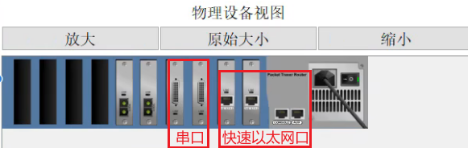
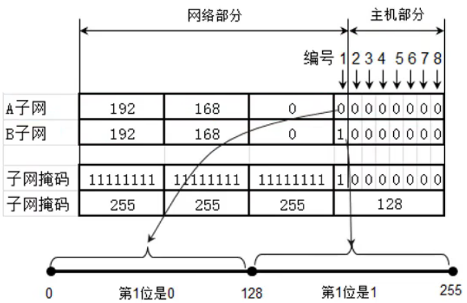
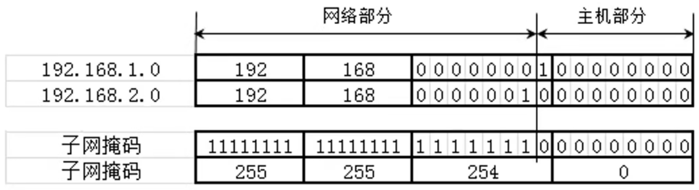
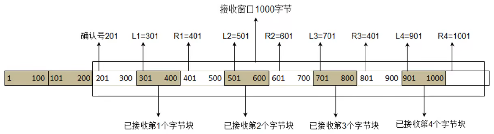

*date: 2022-11-08*

## 概述

### 网络协议

数据传输模型：


数据是如何从一个设备传递到另一个设备的：这一切都是由**`网络协议`**（Network Protocol）来规定的，没有网络协议，就没有今天的互联网。

### C/C++ 的跨平台原理


- 使用平台相关的编译器生成对应平台的可执行文件。

### 信道（Channel）

`信道`：信息传输的通道，一条传输介质上（比如网线），可以有多条信道。

#### 单工通信

信号只能往一个方向传输，任何时候都不能改变信号的传输方向。比如无线电广播，有线电视广播等。

#### 半双工通信

信号可以双向传输，但必须是交替进行，同一时间只能往一个方向传输。比如对讲机等。

#### 全双工通信

信号可以同时双向传输。比如手机（打电话时，听说同时进行）等。

### 计算机之间的通信基础

首先，需要得知对方的**`IP 地址`**；（发送的数据，实际上是对方网卡接收的）

最终，根据**`MAC 地址 (网卡地址)`**，输送数据到网卡，被网卡接收。

- 如果某网卡发现数据的目标 MAC 地址是自己，就会将数据传递给上一层进行处理；
- 如果某网卡发现数据的目标 MAC 地址不是自己，就会将数据丢弃，不会将数据传递给上一层进行处理。

### 计算机之间的连接方式

#### 网线直连


- 两台电脑之间，最简单的连接方式，就是网线直连；如果是多台电脑之间，需要实现互联，有多种方式，如同轴电缆、集线器、网桥等。
- 注意：网线直连需要使用`交叉线`，不是直通线。

#### 同轴电缆（Coaxial）


- 同轴电缆是最传统的方式。
- 半双工通信：在同一时间，通道只允许一个方向的通信。
- 同轴电缆上的设备，是同一个`冲突域/广播域`。

#### 集线器（Hub）


- 集线器没有存储功能。
- 设备越多，效率越低。因为某一台设备发送的数据，会被`广播 (ARP 协议传输)`给集线器上的所有设备，占用很多带宽。（发送 ARP 请求的目的，即是获取目标的 MAC 地址，当知道对方的 MAC 地址后，走`ICMP 协议传输`）
- 如果某一台设备安装抓包工具，会获取集线器上其他设备发送的数据包，存在安全隐患。
- 集线器的一边，是同一个`冲突域/广播域`。
- 集线器可以看作就是网线。

#### 网桥（Bridge）


#### 交换机（Switch）


- `局域网`的最终方案。
- 交换机连接的都是`相同网段`的设备。
- 如果交换机上的设备太多，可能会出现 IP 不够的情况，另外，某一台设备发送广播时，其他设备都可以收到，如果同一时刻，其他设备也在发送广播，会导致网络混乱。
- 交换机有`记忆功能`，会记录每一个端口对应设备的 MAC 地址。


- 192.168.3.10 准备发送数据给 192.168.3.11，第一次时，需要发送广播，查找 192.168.3.11 的 MAC 地址。
- OO90.2B11.8ECD 是 192.168.3.10 的 MAC 地址，第一次发送对象的 MAC 地址为`FFFF.FFFF.FFFF`，表明是广播。


- 192.168.3.11 接收到 192.168.3.10 的广播后，得知其寻找的目标 IP 为自己，便返回自己的 MAC 地址给 192.168.3.10，因为交换机具有记忆功能，此时，会直接将 192.168.3.11 的数据包发送给 192.168.3.10。

#### 路由器（Router）


- 路由器的使用，强调`不同网段`。

- 路由器的每一个端口，是一个`网关`，对应一个广播域，这个网关需要配置与该广播域对应的网段地址，例如，192.168.1.10 和 192.168.1.11 这一个广播域，路由器对应的网关地址设置为`192.168.1.1`，对应的，另一个广播域的网关的地址设置为`192.168.2.1`，`表示该网段的第一台机器`。（网关地址可以随意设置，一般设置为第一个，`一个网关相当于一个网卡，有自己的 MAC 地址和 IP`）

- 网关的作用：让不同网段的设备，能够进行通信，即`跨网段`。

- 网关地址配置好后，对应广播域下的每一台设备，均需要设置`默认网关`，如果不设置，该设备无法跨网段通信。

  

- 跨网段传输数据时，首先需要获取网关的 MAC 地址，也是通过 ARP 广播。

- 通过路由器跨网段传输数据时，大致流程如下：

  

  

  

  - 需求：192.168.3.10 发送数据给 192.168.4.11。
  - 第一步，192.168.3.10 发送 ARP 广播，以获取网关 192.168.3.1 的 MAC 地址；
  - 第二步，网关 192.168.3.1 接收到广播，回传 MAC 地址给 192.167.3.10；
  - 第三步，192.168.3.10 发送 ICMP 数据包，网关 192.168.3.1 获取，解析处理后，由网关 192.168.4.1 处理；
  - 第四步，网关 192.168.4.1 发送 ARP 广播，以获取 192.168.4.11 的 MAC 地址；
  - 第五步，192.168.4.11 接收到广播，回传 MAC 地址给 网关 192.168.4.1；
  - 第六步，网关 192.168.5.11 发送 ICMP 数据包，192.168.4.11 获取；
  - 第七步，192.168.4.11 回传接收到数据包的信息，通过网关 192.168.4.1 >>> 网关 192.168.3.1 >>> 192.168.3.10，至此，通讯完成。

- 路由器两端，不能是同一网段的设备。如果是同一网段，设备 1 发送 ARP 广播时，路由器网关不会返回 MAC 地址给设备 1，设备 1 也找不到目标设备的 MAC 地址。

### 网络、互联网、因特网


- 网络：多台设备之间，通过不同方式连接，即形成网络。
- 互联网：不同网段之间，通过路由器连接，即形成互联网。
- 因特网：<font color = red>I</font>nternet，全世界最大的互联网。
  - 因特网，将全世界所有的计算机，都连接在一起。
  - 一般使用大写 I 开头的 Internet，特指因特网。
  - 日常生活中说的：你的电脑上不了网。其实就是指：你的电脑没有连接到因特网。

### ISP

Internet Service Provider，即 Internet 服务提供商，比如移动、电信、网通、铁通等。我们平时拉的宽带等，都是通过 ISP 连接到 Internet 的。


### 服务器机房


> 双线机房，支持不同类型的宽带下载，也不需要不同 ISP 之间的数据传输转换，速度都很快。

个人电脑使用的宽带，如果与服务部署所在的机房的网络相同，就不需要进行不同 ISP 之间的数据传输转换，下载速度也会更快。


### 网络分类

按照网络的范围进行分类，可以分为：局域网、城域网、广域网等。

#### 局域网

Local Area Network，简称 **<font color = red>LAN</font>**。

- 一般是范围在几百米到十几公里内的计算机，所构成的计算机网络。
- 常用于公司、家庭、学校、医院、机关、一栋大楼等。
- 局域网中使用最广泛的网络技术叫：**<font color = blue>以太网</font>**（Ethernet）。
- 在电脑、手机上经常见到的一个英文 **<font color = red>WLAN</font>**（Wireless LAN），意思就是**无线局域网**。

#### 城域网

Metropolitan Area Network，简称 **<font color = red>MAN</font>**。

- 一般范围是数十公里到数百公里，可以覆盖一个城市。

#### 广域网

Wide Area Network，简称 **<font color = red>WAN</font>**。

- 一般范围是几百公里到几千公里，可以覆盖一个国家。**通常都需要租用 ISP 的线路。**

### 常见的几种网络接口


- FastEthernet

  - 快速以太网接口（带宽 100 M）。

  - 普通计算机、交换机等，都有一个至多个。

    

    

- GigabitEthernet

  - 千兆以太网接口。

  - 大型交换机，一般有千兆以太网接口。

    

- Serial

  - 串行接口。

  - 路由器上，有快速以太网接口和串行接口。

    

    

### 不同的路由器

第一种路由器：


- 此类型的路由器，两端必须是不同网段的设备，因为路由器的两个端口，需要设置不同网段的网关。

- 不同网段的设备，在第一次通信时，会出现丢包的情况。（`第一个数据包丢失`）

  

  - 192.168.1.10/24 与 192.168.2.10/24 第一次通信时，会经历以下几个过程。
  - 第一步：因为 192.168.1.10/24 与 192.168.2.10/24 是不同网段，192.168.1.10/24 首先发送 ARP 请求，获取路由器 0 默认网关 192.168.1.1/24 的 MAC 地址，192.168.1.1/24 获得请求，然后返回自身的 MAC 地址。
  - 第二步：192.168.1.10/24 获得 192.168.1.1/24 的 MAC 地址后，开始通过 ICMP 协议，发送真正的数据包。
  - 第三步：路由器 0 拿到数据包后，得知目标 IP 的网段与自己直连，但是路由器 0 并不知道 192.168.2.10/24 的 MAC 地址。此时，路由器 0 会丢掉当前的数据包，然后发送 ARP 请求，获取 192.168.2.10/24 的 MAC 地址，拿到回复后，路由器 0 会进行 ARP 缓存，缓存 192.168.2.10/24 的 MAC 地址。
  - 第四步：之后，192.168.1.10/24 发送的第二个数据包，就会正常送达 192.168.2.10/24。后续的数据包，也会正常送达。

第二种路由器：


- 此类型的路由器，两端可以是相同网段的设备，每一端的设备，可以通过快速以太网接口直接相连。
- 路由器两端的设备，在第一次通信时，也不会出现丢包的情况，两端的设备是同网段的。

### 数字信号和模拟信号

`数字信号 (Digital Signal)`：


- 离散的信号，不适合长距离传输。
- 抗干扰能力强，受到干扰时波形失真可以修复。

`模拟信号 (Analog Signal)`：


- 连续的信号，适合长距离传输。
- 抗干扰能力差，受到干扰时波形变形很难纠正。

### 上网方式

#### 电话线入户


- 这就是平时说的：ADSL 电话拨号上网（Asymmetric Digital Subscriber Line）。
  - 非对称数字用户线路，提供上行、下行不对称的传输带宽。
  - 上行：家庭设备发送数据到因特网。
  - 下行：因特网发送数据到家庭设备。
  - 家庭用户，一般要求下行速度大。
- 猫：Modem，**<font color = red>调制解调器</font>**，进行`数字信号和模拟信号的转换`。
  - 电脑设备发送的是数字信号，电话线发送的是模拟信号。

#### 光纤入户


- 光猫：Optical Modem，**<font color = red>光调制解调器</font>**，进行`数字信号和光信号的转换`。
  - 电脑设备发送的是数字信号，光纤发送的是光信号。

- 光纤入户，是目前家庭常用的一种上网方式。

#### 网线入户


- 网线入户的方式，一般有一个统一的信号转换设备，然后从该设备拉网线，直接到用户设备上。

### 家用无线路由器的内部结构


- 无线路由器内部，通过交换机与路由器连接，并由 LAN 口可以连网线到设备，无线网也连接此交换机，家庭内部设备，位于相同的网段。

### 数据通信模型

#### 局域网通信模型


- **单段网线不能超过 100 米**，如果超过 100 米，可以追加集线器、交换机等设备。

#### 广域网通信模型


- 调制解调器：数字信号和模拟信号转换。


- 光电转换器：数字信号和光信号转换。

### Ping

查看 ping 的用法：`ping /?`。

```shell
C:\Users\XiSun>ping /?

用法: ping [-t] [-a] [-n count] [-l size] [-f] [-i TTL] [-v TOS]
            [-r count] [-s count] [[-j host-list] | [-k host-list]]
            [-w timeout] [-R] [-S srcaddr] [-c compartment] [-p]
            [-4] [-6] target_name

选项:
    -t             Ping 指定的主机，直到停止。
                   若要查看统计信息并继续操作，请键入 Ctrl+Break；
                   若要停止，请键入 Ctrl+C。
    -a             将地址解析为主机名。
    -n count       要发送的回显请求数。
    -l size        发送缓冲区大小。
    -f             在数据包中设置“不分段”标记(仅适用于 IPv4)。
    -i TTL         生存时间。
    -v TOS         服务类型(仅适用于 IPv4。该设置已被弃用，
                   对 IP 标头中的服务类型字段没有任何
                   影响)。
    -r count       记录计数跃点的路由(仅适用于 IPv4)。
    -s count       计数跃点的时间戳(仅适用于 IPv4)。
    -j host-list   与主机列表一起使用的松散源路由(仅适用于 IPv4)。
    -k host-list    与主机列表一起使用的严格源路由(仅适用于 IPv4)。
    -w timeout     等待每次回复的超时时间(毫秒)。
    -R             同样使用路由标头测试反向路由(仅适用于 IPv6)。
                   根据 RFC 5095，已弃用此路由标头。
                   如果使用此标头，某些系统可能丢弃
                   回显请求。
    -S srcaddr     要使用的源地址。
    -c compartment 路由隔离舱标识符。
    -p             Ping Hyper-V 网络虚拟化提供程序地址。
    -4             强制使用 IPv4。
    -6             强制使用 IPv6。
```

发送指定大小的数据包：`ping IP 地址 -l 数据包大小`。

```shell
C:\Users\XiSun>ping www.baidu.com -l 800

正在 Ping www.a.shifen.com [14.215.177.38] 具有 800 字节的数据:
来自 14.215.177.38 的回复: 字节=800 时间=28ms TTL=55
来自 14.215.177.38 的回复: 字节=800 时间=29ms TTL=55
来自 14.215.177.38 的回复: 字节=800 时间=29ms TTL=55
来自 14.215.177.38 的回复: 字节=800 时间=183ms TTL=55

14.215.177.38 的 Ping 统计信息:
    数据包: 已发送 = 4，已接收 = 4，丢失 = 0 (0% 丢失)，
往返行程的估计时间(以毫秒为单位):
    最短 = 28ms，最长 = 183ms，平均 = 67ms
```

不允许网络层分片：`ping IP 地址 -f`。

```shell
C:\Users\XiSun>ping www.baidu.com -l 800 -f

正在 Ping www.a.shifen.com [39.156.66.14] 具有 800 字节的数据:
来自 39.156.66.14 的回复: 字节=800 时间=25ms TTL=50
来自 39.156.66.14 的回复: 字节=800 时间=23ms TTL=50
来自 39.156.66.14 的回复: 字节=800 时间=24ms TTL=50
来自 39.156.66.14 的回复: 字节=800 时间=31ms TTL=50

39.156.66.14 的 Ping 统计信息:
    数据包: 已发送 = 4，已接收 = 4，丢失 = 0 (0% 丢失)，
往返行程的估计时间(以毫秒为单位):
    最短 = 23ms，最长 = 31ms，平均 = 25ms
    
    
C:\Users\XiSun>ping www.baidu.com -l 4000 -f

正在 Ping www.a.shifen.com [39.156.66.18] 具有 4000 字节的数据:
需要拆分数据包但是设置 DF。
需要拆分数据包但是设置 DF。
需要拆分数据包但是设置 DF。
需要拆分数据包但是设置 DF。

39.156.66.18 的 Ping 统计信息:
    数据包: 已发送 = 4，已接收 = 0，丢失 = 4 (100% 丢失)，
```

设置 TTL 的值：`ping IP 地址 -i TTL`。

```shell
C:\Users\XiSun>ping baidu.com -i 3

正在 Ping baidu.com [110.242.68.66] 具有 32 字节的数据:
来自 61.132.211.213 的回复: TTL 传输中过期。
来自 61.132.211.213 的回复: TTL 传输中过期。
请求超时。
来自 61.132.211.213 的回复: TTL 传输中过期。

110.242.68.66 的 Ping 统计信息:
    数据包: 已发送 = 4，已接收 = 3，丢失 = 1 (25% 丢失)，
    
C:\Users\XiSun>ping baidu.com -i 2

正在 Ping baidu.com [110.242.68.66] 具有 32 字节的数据:
来自 100.75.128.1 的回复: TTL 传输中过期。
来自 100.75.128.1 的回复: TTL 传输中过期。
来自 100.75.128.1 的回复: TTL 传输中过期。
来自 100.75.128.1 的回复: TTL 传输中过期。

110.242.68.66 的 Ping 统计信息:
    数据包: 已发送 = 4，已接收 = 4，丢失 = 0 (0% 丢失)，
    
C:\Users\XiSun>ping baidu.com -i 1

正在 Ping baidu.com [110.242.68.66] 具有 32 字节的数据:
来自 192.168.2.1 的回复: TTL 传输中过期。
来自 192.168.2.1 的回复: TTL 传输中过期。
来自 192.168.2.1 的回复: TTL 传输中过期。
来自 192.168.2.1 的回复: TTL 传输中过期。

110.242.68.66 的 Ping 统计信息:
    数据包: 已发送 = 4，已接收 = 4，丢失 = 0 (0% 丢失)，
```

> 可以看出，TTL 设置不同的值，会收到不同网关返回的错误信息。按照此方法，一点点增大 TTL 的值，可以得到传输过程中所有路由器的网关信息。

通过`tracert`、`pathping`命令，可以跟踪数据包经过了哪些路由器。

```shell
C:\Users\XiSun>tracert baidu.com

通过最多 30 个跃点跟踪
到 baidu.com [39.156.66.10] 的路由:

  1     1 ms    <1 毫秒   <1 毫秒 192.168.2.1
  2     9 ms     4 ms     4 ms  100.75.128.1
  3     *        *        4 ms  61.190.2.1
  4     *        *        *     请求超时。
  5   287 ms     *       29 ms  202.97.98.153
  6    24 ms     *       22 ms  ^C
C:\Users\XiSun>pathping baidu.com

通过最多 30 个跃点跟踪
到 baidu.com [110.242.68.66] 的路由:
  0  DESKTOP-F1JDHC6 [192.168.2.137]
  1  192.168.2.1
  2  100.75.128.1
  3  ^C
```

## MAC 地址

每一个网卡都有一个**` 6 字节 (48 bit)`**的 MAC 地址（**<font color = red>M</font>**edia **<font color = red>A</font>**ccess **<font color = red>C</font>**ontrol Address），MAC 地址`全球唯一`，固化在网卡的 ROM 中，由`IEEE802 标准`规定。

### 组成

MAC 地址由两部分组成：


- 前 3 个字节：OUI（Organizationally Unique Identifier），组织唯一标识符，即网卡生产厂家的唯一标识符，由 IEEE 的注册管理机构分配给厂商。

- 后 3 个字节：网络接口标识符，由厂家自行分配。

- OUI 查询地址：

  - https://standards-oui.ieee.org/oui/oui.txt

    

  - https://mac.bmcx.com/

    

### 查询

MAC 地址查询方式：

- Windows 系统：开始菜单 >>> 运行 cmd >>> 在命令行窗口中输入`ipconfig /all`命令。
- 安卓手机：系统设置 >>> 关于手机。
- IOS 系统：设置 >>> 通用 >>> 关于本机 >>> 无线局域网地址/蓝牙。
- 路由器等其它网络设备：设备管理后台、设备标签或包装盒上。

### 修改

MAC 地址修改方式：

- 更改适配器选项 >>> 属性 >>> 配置 >>> 高级 >>> 网络地址。
- 修改的时候，需要把 MAC 地址中间的 - 去掉。
- 有时可以通过手动修改 MAC 地址，达到蹭网的目的，前提是需要知道被允许上网的 MAC 地址是多少。

### 表示

MAC 地址表示方式：

- Windows
  - 40-55-82-0A-8C-6D
- Linux、Android、Mac、IOS
  - 40:55:82:0A:8C:6D
- Packet Tracer
  - 4055.82OA.8C6D
- `当 48 位全为 1 时，代表广播地址。`
  - `FF-FF-FF-FF-FF-FF`

### 获取

MAC 地址获取方式：

- 当不知道对方主机的 MAC 地址时，可以通过发送 ARP 广播获取对方的 MAC 地址。
  - 获取成功后，会缓存 IP 地址、MAC 地址的映射关系，俗称：`ARP 缓存`。
  - 通过 ARP 广播获取的 MAC 地址，属于`动态 (dynamic) 缓存`。
    - 存储时间比较短（默认是 2 分钟），过期了就自动删除。

相关命令：

- `arp -a [主机地址]`：查询 ARP 缓存，添加主机地址，查询的是该主机的缓存，不添加，则为查询所有。
- `arp -d [主机地址]`：删除 ARP 缓存，添加主机地址，删除的是该主机的缓存，不添加，则为删除所有。
- `arp -s 主机地址 MAC 地址`：增加一条缓存信息，这是`静态缓存`，存储时间较久，不同系统的存储时间不同。

## IP 地址

IP 地址：Internet Protocol Address，互联网上的每一个主机，都有一个 IP 地址。

- 最初是 IPv4 版本，`32 bit (4 字节)`，2019 年 11 月 25 日时，全球的 IP 地址就已经用完。
- 之后推出了 IPv6 版本，`128 bit (16 字节)`。
- IPv4 地址用的最广泛，此处暂不讨论 IPv6。

### 组成

IP 地址的组成：

- 按照字节：IP 地址由 32 bit 组成，不方便记忆，因此拆分成 4 个部分，每个部分转换为十进制值，以此表示为 IP 地址。

  

- 按照功能：IP 地址由 2 部分组成，即`网络标识 (网络 ID)`和`主机标识 (主机 ID)`。

  - `同一网段的计算机，网络 ID 相同。`

  - 通过`子网掩码 (subnet mask)`，可以计算出网络 ID：`子网掩码 & IP 地址`。（按位与）

    - 例如，IP 地址为 192.168.1.10，子网掩码为 255.255.255.0，则其网络 ID 为：192.168.1，主机 ID 为 10。该网段 192.168.1.0 ~ 192.168.1.255 可以容纳 256 - 2 台主机设备。（`去掉 192.168.1.0 和 192.168.1.255 这两个，剩余的 0 ~ 255 之间的，都可以使用`）

      

    - 例如，IP 地址为 130.168.1.10，子网掩码为 255.255.0.0，则其网络 ID 为：130.168，主机 ID 为 1.10。该网段 130.168.0.0 ~ 130.168.255.255 可以容纳 256 * 256 - 2 台主机设备。（`去掉 130.168.0.0 和 130.168.255.255 这两个，剩余的两个位置上 0 ~ 255 之间的组合，都可以使用`）

  - `A 类地址子网掩码：255.0.0.0。`不同的 IP 地址，只要第一段一样，就是同一个网段，如 10.0.0.5 和 10.5.2.1。

  - `B 类地址子网掩码：255.255.0.0。`不同的 IP 地址，只要前两段一样，就是同一个网段，如 130.168.0.2 和 130.168.10.5.

  - `C 类地址子网掩码：255.255.255.0。`不同的 IP 地址，必须前三段一样，才是同一个网段，如 192.168.1.10 和 192.168.1.25。

  - 通俗的理解，网段就是一段 IP 地址，子网掩码通常就是用来约束这段 IP 地址的范围。如果约束 IP 为 IPv4，那么一个 IPv4 网段就一定是 0.0.0.0 ~ 255.255.255.255 这个范围中的一部分，一个子集。

- 计算机和其他计算机通信前，会先判断目标主机和自己是否在同一个网段：

  - 同一网段：不需要通过路由器进行转发。
  - 不同网段：需要通过路由器进行转发。
  - 判断不同计算机是否是同一网段：`子网掩码 & IP 地址`。

### 分类

IP 地址可以分为五类：

- `A 类地址`：默认子网掩码是`255.0.0.0`。

  | 8 bit                                                 | 24 bit  |
  | ----------------------------------------------------- | ------- |
  | 网络 ID，二进制必须以 <font color = red>0</font> 开头 | 主机 ID |

- `B 类地址`：默认子网掩码是`255.255.0.0`。

  | 16 bit                                                 | 16 bit  |
  | ------------------------------------------------------ | ------- |
  | 网络 ID，二进制必须以 <font color = red>10</font> 开头 | 主机 ID |

- `C 类地址`：默认子网掩码是`255.255.255.0`。

  | 24 bit                                                  | 8 bit   |
  | ------------------------------------------------------- | ------- |
  | 网络 ID，二进制必须以 <font color = red>110</font> 开头 | 主机 ID |

- D 类地址：以 1110 开头，多播地址。

- E 类地址：以 1111 开通，保留为今后使用。

- 通过 IP 第一部分的取值，就可以知道该 IP 是属于第几类的地址。

- `只有 A 类、B 类和 C 类地址，才能分配给主机使用。`

- `主机 ID 全为 0，表示主机所在的网段。`如上面的 192.168.1.0 和 130.168.0.0。

- `主机 ID 全为 1，表示主机所在网段的全部主机，即广播。`如上面的 192.168.1.255 和 130.168.255.255。

  

- 区分 IP 地址的类型，只需要看`第一部分的值`即可，与其他因素如子网掩码等无关。

#### A 类地址


- 网络 ID
  - 第 1 部分为网络 ID。
  - `0 不能用，127 为保留网段。`其中，`127.0.0.1 是本地环回地址 (Loopback)`，代表本地地址，即localhost。
  - 可以分配给主机的：
    - 第 1 部分的取值范围是：`1 ~ 126`。
    - A 类地址默认子网掩码是 255.0.0.0，因此，第 1 部分的每个取值，都是一个网段，如 120.0.0.0。`最小的网段是 1.0.0.0，最大的网段是 126.0.0.0。`
- 主机 ID
  - 第 2、3、4 部分为主机 ID。
  - 第 2、3、4 部分的取值范围是：`0 ~ 255`。
- 每个 A 类网段，能容纳的最大主机数是：`256 * 256 * 256 - 2 = 2 ^ 24 - 2 = 16777214 个`。其中，0 和 255 不能用，例如，120.0.0.0 代表 120 网段，120.255.255.255 代表 120 网段的广播。

#### B 类地址


- 网络 ID 
  - 第 1、2 部分为网络 ID。
  - 可以分配给主机的：
    - 第 1 部分的取值范围是：`128 ~ 191`。
    - 第 2 部分的取值范围是：`0 ~ 255`。
    - B 类地址默认子网掩码是 255.255.0.0，因此，第 1 部分的每个取值，分别组合第 2 部分的每个取值，都是一个网段，如 130.200.0.0。`最小的网段是 128.0.0.0，最大的网段是 191.255.0.0。`
- 主机 ID
  - 第 3、4 部分为主机 ID。
  - 第 3、4 部分的取值范围是：`0 ~ 255`。
- 每个 B 类网段，能容纳的最大主机数是：`256 * 256 - 2 = 2 ^ 16 - 2 = 65534 个`。其中，0 和 255 不能用，例如，130.200.0.0 代表 130.200 网段，130.200.255.255 代表 130.200 网段的广播。

#### C 类地址


- 网络 ID 
  - 第 1、2、3 部分为网络 ID。
  - 可以分配给主机的：
    - 第 1 部分的取值范围是：`192 ~ 223`。
    - 第 2 部分的取值范围是：`0 ~ 255`。
    - 第 3 部分的取值范围是：`0 ~ 255`。
    - B 类地址默认子网掩码是 255.255.255.0，因此，第 1 部分的每个取值，分别组合第 2 部分的每个取值，再分别组合第 3 部分的每个取值，都是一个网段，如 192.10.100.0。`最小的网段是 192.0.0.0，最大的网段是 223.255.255.0。`
- 主机 ID
  - 第 4 部分为主机 ID。
  - 第 4 部分的取值范围是：`0 ~ 255`。
- 每个 C 类网段，能容纳的最大主机数是：`256 - 2 = 254 个`。其中，0 和 255 不能用，例如，192.10.100.0 代表 192.10.100 网段，192.10.100.255 代表 192.10.100 网段的广播。

#### D 类地址


- 没有子网掩码，用于多播（组播）地址。
- 第 1 部分取值范围是：`224 ~ 239`。

#### E 类地址


- 保留为今后使用。
- 第 1 部分取值范围是：`240 ~ 255`。

#### 公网 IP 和私网 IP

IP 地址，也可以分为公网 IP 和私网 IP。

- 公网 IP（Public）
  - `Internet 上的路由器中只有到达公网的路由表，没有到达私网的路由表。`
  - **公网 IP 由因特网信息中心（Internet Network Information Center，Inter NIC）统一分配和管理。**
  - ISP 需要向 Inter NIC 申请公网 IP。
- 私网 IP（Private）
  - 主要用于局域网。下面是保留的私网网段：
    - A 类：**10.0.0.0/8**，1 个 A 类网络。
    - B 类：**172.16.0.0/16 ~ 172.31.0.0/16**，16 个 B 类网络。
    - C 类：**192.168.0.0/24 ~ 192.168.255.0/24**，256 个 C 类网络。
    - 以上几类 IP 地址，都是私网 IP。

#### NAT

Network Address Translation，私网 IP 访问 Internet 需要进行 NAT 转换为公网 IP，这一步可以由路由器来完成。

NAT 的特点：

- **可以节约公网 IP 资源，公网 IP 是唯一的，但不同地区局域网内部的私网 IP，可以是相同的。**
- 可以隐藏内部真实 IP。

NAT 的分类：

- 静态转换
  - 手动配置 NAT 映射表。
  - 一对一转换：一个私网 IP 对应一个公网 IP。
  - 达不到节约公网 IP 资源的目的。
- 动态转换
  - 定义外部公网 IP 地址池，动态随机转换。
  - 一对一转换：一个私网 IP 对应一个公网 IP。
  - 达不到节约公网 IP 资源的目的。
- PAT（Port Address Translation）
  - 采用`端口多路复用`方式，通过端口号标识不同的数据流。（不同的端口号，对应不同的私网 IP）
  - `多对一转换`，可以最大程度节约公网 IP 资源。（多个私网 IP，通过不同的端口，对应同一个公网 IP）
  - PAT 是目前应用最广泛的 NAT 实现方式。

百度可以查询本机设备的公网 IP 地址，但这个地址，可能是经过多次 NAT 转换之后的最终的结果：


## 子网掩码

`子网掩码：网络 ID 全为 1。`

子网掩码的 CIDR 表示方法：

- CIDR：Classless Inter-Domain Routing，无类别域间路由。

- 192.168.1.100/24：代表子网掩码有 24 个 1，也就是 255.255.255.0，该 IP 的网段为 192.168.1.0。

- 123.210.100.200/16：代表子网掩码有 16 个 1，也就是 255.255.0.0，该 IP 的网段为 123.210.0.0。

- 计算工具：https://www.sojson.com/convert/subnetmask.html

  

### 不同设备通信的条件

思考：192.168.0.10/24 和 192.168.10.10/16 这两台设备，能正常通信吗？


解答：

- 两台设备能正常通信的前提：`两台设备网段相同。`
- 网段计算公式 `子网掩码 & IP`，然后将计算结果，`主机 ID 全部变为 0`，即为对应的网段。
- 某台设备计算自己的网段时，是：`用自己的子网掩码与自己的 IP`。
- 一台设备向一台设备通信时，是：`用自己的子网掩码与对方的 IP，计算网段。`
- 192.168.0.10/24，子网掩码为 255.255.255.0，计算可得：192.168.0.10 的网段为 192.168.0.0，192.168.10.10 的网段为 192.168.10.0。因此，二者不在同一网段，192.168.0.10 无法通信 192.168.10.10。
- 192.168.10.10/16，子网掩码为 255.255.0.0，计算可得：192.168.10.10 的网段为 192.168.0.0，192.168.0.10 的网段为 192.168.0.0。因此，二者在同一网段，但因为 192.168.0.10 无法通信 192.168.10.10，192.168.10.10 也无法通信  192.168.0.10。
- 两台设备能正常通信的另一个条件：`两台设备能互相通信，即一台设备发送信息到另一台设备之后，同时也能够收到另一台设备返回的信息。`

## 子网划分

如果需要让 200 台主机在同一个网段内，假设分配一个 C 类网段，比如 192.168.1.0/24：

- 该网段共 254 个可用 IP 地址：192.168.1.1 ~ 192.168.1.254。
- 该网段多出 54 个空闲的 IP 地址，这种情况并不算是资源浪费。

如果需要让 500 台主机在同一个网段内，假设分配一个 B 类网段，比如 191.100.0.0/16：


- 该网段共 65534 个可用 IP 地址：191.100.0.1 ~ 191.100.255.254。
- 该网段多出 65034 个空闲的 IP 地址，这种情况属于极大的浪费资源。

那么，如果想尽量避免浪费 IP 地址资源，就需要合理的进行子网划分。

`子网划分：借用主机位作子网位，划分出多个子网。`

可用分为：

- `等长子网划分`：将一个网段`等分`成多个子网，每个子网的可用 IP 地址数量是一样的。
- `变长子网划分`：将一个网段`不等分`成多个子网，每个子网的可用 IP 地址数量可以是不一样的。

子网划分的步骤：

- 确定子网的子网掩码长度；
- 确定子网中第 1 个和最后 1 个主机可用的 IP 地址。

### 等长子网划分

#### 等分为两个子网



规律，如果一个子网是原来网络的 ：
$$
\frac{1}{2}
$$
则其`子网掩码往后移 1 位`。

- 32 位中的前 25 位，作为子网掩码，后 7 位表示主机。
  - 即 25 个 1，两个子网的子网掩码都是`255.255.255.128/25`。
- A 子网：
  - 子网掩码：255.255.255.128/25
  - 网段：`192.168.0.0/25`
  - 主机可用 IP 地址：`192.168.0.1 ~ 192.168.0.126`（192.168.0.0 表示网段，192.168.0.127 表示广播）
- B 子网：
  - 子网掩码：255.255.255.128/25
  - 网段：`192.168.0.128/25`
  - 主机可用 IP 地址：`192.168.0.129 ~ 192.168.0.254`（192.168.0.128 表示网段，192.168.0.255 表示广播）

#### 等分为四个子网


规律，如果一个子网是原来网络的：
$$
\frac{1}{2} * \frac{1}{2} = \frac{1}{4}
$$
则其`子网掩码往后移 2 位`。

- 32 位中的前 26 位，作为子网掩码，后 6 位表示主机。
  - 即 26 个 1，四个子网的子网掩码都是`255.255.255.192/26`。
- A 子网：
  - 子网掩码：255.255.255.192/26
  - 网段：`192.168.0.0/26`
  - 主机可用 IP 地址：`192.168.0.1 ~ 192.168.0.62`（192.168.0.0 表示网段，192.168.0.63 表示广播）
- B 子网：
  - 子网掩码：255.255.255.192/26
  - 网段：`192.168.0.64/26`
  - 主机可用 IP 地址：`192.168.0.65 ~ 192.168.0.126`（192.168.0.64 表示网段，192.168.0.127 表示广播）
- C 子网：
  - 子网掩码：255.255.255.192/26
  - 网段：`192.168.0.128/26`
  - 主机可用 IP 地址：`192.168.0.129 ~ 192.168.0.190`（192.168.0.128 表示网段，192.168.0.191 表示广播）
- D 子网：
  - 子网掩码：255.255.255.192/26
  - 网段：`192.168.0.192/26`
  - 主机可用 IP 地址：`192.168.0.193 ~ 192.168.0.254`（192.168.0.192 表示网段，192.168.0.255 表示广播）

#### 等分为八个子网


规律，如果一个子网是原来网络的：
$$
\frac{1}{2} * \frac{1}{2} * \frac{1}{2} = \frac{1}{8}
$$
则其`子网掩码往后移 3 位`。

- 32 位中的前 27 位，作为子网掩码，后 5 位表示主机。
  - 即 27 个 1，四个子网的子网掩码都是`255.255.255.224/27`。
- A 子网：
  - 子网掩码：255.255.255.224/27
  - 网段：`192.168.0.0/27`
  - 主机可用 IP 地址：`192.168.0.1 ~ 192.168.0.30`（192.168.0.0 表示网段，192.168.0.31 表示广播）
- B 子网：
  - 子网掩码：255.255.255.224/27
  - 网段：`192.168.0.32/27`
  - 主机可用 IP 地址：`192.168.0.33 ~ 192.168.0.62`（192.168.0.32 表示网段，192.168.0.63 表示广播）
- C 子网：
  - 子网掩码：255.255.255.224/27
  - 网段：`192.168.0.64/27`
  - 主机可用 IP 地址：`192.168.0.65 ~ 192.168.0.94`（192.168.0.64 表示网段，192.168.0.95 表示广播）
- D 子网：
  - 子网掩码：255.255.255.224/27
  - 网段：`192.168.0.96/27`
  - 主机可用 IP 地址：`192.168.0.97 ~ 192.168.0.126`（192.168.0.96 表示网段，192.168.0.127 表示广播）

- E 子网：
  - 子网掩码：255.255.255.128/27
  - 网段：`192.168.0.128/27`
  - 主机可用 IP 地址：`192.168.0.129 ~ 192.168.0.158`（192.168.0.128 表示网段，192.168.0.159 表示广播）
- F 子网：
  - 子网掩码：255.255.255.224/27
  - 网段：`192.168.0.160/27`
  - 主机可用 IP 地址：`192.168.0.161 ~ 192.168.0.190`（192.168.0.160 表示网段，192.168.0.191 表示广播）
- G 子网：
  - 子网掩码：255.255.255.224/27
  - 网段：`192.168.0.192/27`
  - 主机可用 IP 地址：`192.168.0.193 ~ 192.168.0.222`（192.168.0.192 表示网段，192.168.0.223 表示广播）
- H 子网：
  - 子网掩码：255.255.255.224/27
  - 网段：`192.168.0.224/27`
  - 主机可用 IP 地址：`192.168.0.225 ~ 192.168.0.254`（192.168.0.224 表示网段，192.168.0.255 表示广播）

#### B 类子网划分


与 C 类子网划分相同，B 类子网，如果等分为两个子网，则子网掩码往后移 1 位；如果等分为四个子网，则子网掩码往后移 2 位；如果等分为八个子网，则子网掩码也是往后移 3 位。

#### A 类子网划分


同理，A 类子网，如果等分为两个子网，则子网掩码往后移 1 位；如果等分为四个子网，则子网掩码往后移 2 位；如果等分为八个子网，则子网掩码也是往后移 3 位。

### 子网划分器

子网划分器：http://www.ab126.com/web/3552.html


> Tips：
>
> 1. `IP 的类型，取决于第一部分的值：A 类 - 0 ~ 127，B 类 - 128 ~ 191，C 类 - 192 ~ 223，D 类 - 224 ~ 239，E 类 - 240 ~ 255。`
>
> 2. `A 类 IP 默认子网掩码：255.0.0.0，B 类 IP 默认子网掩码：255.255.0.0，C 类 IP 默认子网掩码：255.255.255.0。`
> 3. `不同类型 IP 在划分子网时，只能在规定的子网掩码往后划分。`例如：10.172.168.1/25，可以看出是 A 类 IP，A 类 IP 默认子网掩码为 10.172.168.1/8，因此 10.172.168.1/25 是 A 类 IP 的子网段。
> 4. `等长子网划分时，必须等分为 2 的指数级数量，如：2 等分，4 等分， 8 等分，16 等分...`

### 变长子网划分


假设上图是对 192.168.0.0/24 进行变长子网划分：

- C 网段：子网掩码是 255.255.255.128/25。
- B 网段：子网掩码是 255.255.255.192/26。
- A 网段：子网掩码是 255.255.255.224/27。
- D 网段：子网掩码是 255.255.255.252/30。
- E 网段：子网掩码是 255.255.255.252/30。

如果一个子网地址块的长度是原网段的：
$$
(\frac{1}{2})^n
$$
则：

- `该子网的子网掩码，就是在原网段的子网掩码基础上，增加 n 个 1。`
- 不等长的子网，它们的子网掩码也不同。

## 超网

超网：跟子网反过来，它是将**`多个连续`**的网段，合并成一个更大的网段。

### 合并两个网段

`子网掩码往左移动 1 位，可以合并两个网段。`

需求：原本有 200 台计算机使用 192.168.0.0/24 网段，现在希望增加 200 台设备到同一网段。


- 200 台在 192.168.0.0/24 网段，200 台在 192.168.1.0/24 网段。
- 合并 192.168.0.0/24 和 192.168.1.0/24 为一个网段：192.168.0.0/23。
  - 网络 ID 为 23 位，主机 ID 为 9 位。

需求：192.168.0.255/23 这个 IP 地址，能否分配给计算机使用？


- 答案：可以。
- 192.168.0.255/23 的主机 ID 为后 9 位，其值为 011111111，不全为 1，可以使用。
- 192.168.1.255/23 的主机 ID 全为 1，其是广播地址，不能分配给计算机使用。
- 192.168.0.255/23 的网段为：192.168.0.0/23。
- `网络 ID 部分值不变，主机 ID 部分值全为 0，表示网段，即 192.168.0.0，主机 ID 部分值全为 1，表示广播，即 192.168.1.255。`
- 不论网络 ID 与主机 ID 怎么划分，表示时都按照 4 位二进制计算一个十进制值。

### 合并四个网段

`子网掩码往左移动 2 位，可以合并四个网段。`


- 合并 192.168.0.0/24、192.168.1.0/24、192.168.2.0/24 和 192.168.3.0/24 为一个网段：192.168.0.0/22。
  - 网络 ID 为 22 位，主机 ID 为 10 位。

### 合并网段的规律

思考：下面的两个网段，能通过子网掩码往左移动 1 位进行合并吗？



解答：不行。因为 192.168.1.0 和 192.168.2.0 不是连续的网段，子网掩码往左移动 1 位，不能涵盖所有的子网。

总结，合并网段的规律：


- 假设 n 是 2 的 k 次幂（k ≥ 1）
  - `子网掩码往左移动 k 位，能够合并 n 个网段。`
- `如果第一个网段的网络号能被 n 整除，那么由它开始连续的 n 个网段，能通过左移 k 位子网掩码进行合并。`
  - 第一个网段的网络号以二进制 0 结尾，那么由它开始连续的 2 个网段，能通过左移 1 位子网掩码进行合并。
  - 第一个网段的网络号以二进制 00 结尾，那么由它开始连续的 4 个网段，能通过左移 2 位子网掩码进行合并。
  - 第一个网段的网络号以二进制 000 结尾，那么由它开始连续的 8 个网段，能通过左移 3 位子网掩码进行合并。

## 子网和超网的辨别

第一步：判断该网段的类型，是 A 类网络、B 类网络，还是 C 类网络。

- 通过 IP 的第一部分的值，进行判断。

第二步：判断该网段的子网掩码，与各类网络默认的子网掩码位数大小。

- 默认情况下，A 类网络子网掩码的位数是 8，B 类网络子网掩码的位数是 16，C 类网络子网掩码的位数是 24。
- 如果该网段的子网掩码位数比默认子网掩码多，就是子网。
- 如果该网段的子网掩码位数比默认子网掩码少，就是超网。
- 例如：25.100.0.0/16 是一个 A 类子网，200.100.0.0/16 是一个 C 类超网。

## 路由


在不同网段之间转发数据，需要有路由器的支持。

默认情况下，路由器只知道跟它`直连`的网段，非直连的网段，需要通过静态路由、动态路由告诉它。

- 192.168.1.10/24 和 192.168.2.10/24 与路由器 0 直连，二者可以互相通信；193.169.1.10/24 和 193.169.2.10/24 与路由器 1 直连，二者可以互相通信。

### 静态路由

特点：

  - 管理员`手动添加路由信息`。
  - 适用于`小规模网络`。
  - 上图中，路由器 0 和路由器 1 之间，使用的就是静态路由。路由器 0 和路由器 1 直连，也需要设置 IP，并且要求是同网段，即 194.170.1.1/24 和 194.179.1.2/24。

配置步骤：

- 要求两个路由器直连，并设置同网段的 IP 地址。路由器 0 和路由器 1 直连的网段，与两个路由器上其他设备的网段，不相同。

  

- 配置路由器 0 的静态路由。

  

- 配置路由器 1 的静态路由。

  

- 通过以上配置后，192.168.1.10/24 与 193.169.2.10/24 可以互通。

  

- 注意，虽然 192.168.1.10/24 与 193.169.2.10/24 可以互通，但 192.168.1.10/24 与 193.169.1.10/24 无法互通，如果需要互通，还需要配置路由器 0 对 193.169.1.10/24 的静态路由。（因为已经配置了路由器 1 对 192.168.1.0/24 网段的静态路由配置，此处配置路由器 0 的静态路由即可）

  

- 说明：因为路由器 0 和路由器 1 的静态路由，配置的是相应的网段，此时，在某一个网段下新增一台设备，也是可以互通的。

  

- 如果需要 192.168.2.10/24 也能彼此互相通信，需要在路由器 1 配置对应的静态路由。

  

- 静态路由可以配置网段，也可以配置精确的 IP 地址，即针对具体设备的静态路由，需要将子网掩码修改为 255.255.255.255。如下图，路由器 0 只能对 193.169.1.0/24 网段的 193.169.1.11/24 设备通信，无法对该网段的 193.169.1.10/24 设备通信。

  

- 前述路由器 0 的静态路由，单独配置了 193.169.1.0/24 网段和 193.169.2.0/24 网段，可以使用一个配置，使得路由器 0 都可以访问这两个网段。例如，以下三种方式，均可以。

  

  

  

>`路由之间存在优先级，配置的越明确的路由，优先级越高。`
>
>配置默认路由后，路由器找不到的地址，就走默认路由，即：默认路由优先级最低。

#### 路由表

路由器很重要的一个概念：路由表。上述路由器 0 的路由表如下：


>C：Connected，直连。
>
>S：Static，静态。

不同静态路由配置的路由表，如下：

- 路由器 0

  - 特定主机路由：

    

  - 网络路由（网段）：

    

  - 汇总路由：

    

  - 默认路由：

    

- 路由器 1

  - 特定主机路由：

    

  - 网络路由（网段）：

    

  - 汇总路由：

    

  - 默认路由：

    

对于以下 4 台设备，让其可以互相通信：


对应的路由表可以配置如下：


- 路由器 0 和路由器 3 都是边缘路由器，可以直接配置默认路由。

  

- 路由器 1 左边有一个网段，可以配置网段 192.168.1.0/24，下一跳 200.0.0.1/24。右边有两个网段，可以配置默认路由 0.0.0.0/0，下一跳 200.0.1.2/24。

- 路由器 2 右边有一个网段，可以配置网段 195.171.1.0/24，下一跳 200.0.2.2/24。左边有两个网段，可以配置默认路由 0.0.0.0/0，下一跳 200.0.0.1/24。

### 动态路由

  - 路由器通过`路由选择协议 (比如 RIP、OSPF) 自动获取路由信息`。
  - 适用于`大规模网络`。

## 数据包的传输过程

> 此处先简述数据包的传输过程，后续网络分层章节，会再次详解。


## 网络分层

### 网络互联模型

为了更好的促进互联网络的研究和发展，国际标准化组织 ISO 在 1985 年制定了**`网络互联模型`**，即 `OSI 参考模型`（Open System Interconnect Reference Model）。

OSI 参考模型具有 7 层结构，实际应用时，多使用**`TCP/IP 协议`**，在高校研究中，则多采用 5 层结构。三者关系如下：


> 集线器工作在物理层，可以当作就是网线。（一层设备）
>
> 交换机记录的有 MAC 地址，工作一般是两层：物理层 + 数据链路层。（二层设备）
>
> 路由器记录的有目标 IP，工作是三层：物理层 + 数据链路层 + 网络层。（三层设备）

### 请求过程

客户端发送数据时，从应用层到物理层，层层包装，传递给服务器后，服务器从物理层到应用层，层层解包，最终拿到数据。服务器返回数据给客户端时，遵循相同过程。同时，客户端的包装和服务器的解包，遵循相同的网络协议。


> 不同层的数据，对应不同的专业术语名称，也对应不同的网络协议。

### 物理层（Physical）

**`物理层`**：定义了接口标准、线缆标准、传输速率、传输方式等。


### 数据链路层（Data Link）

**`链路`**：从一个节点到相邻节点的一段物理线路（无论有线，还是无线），中间没有其他交换节点。


- 路由器、交换机都是中间的交换节点，但集线器不是。
- 路由器、交换机之间构成相邻节点，中间的一段都是独立的链路。

**`数据链路`**：在一条链路上传输数据时，需要有对应的通信协议来控制数据的传输。

- **不同类型的数据链路，所用的通信协议可能是不同的，传输的帧数据也不同。**（也就是封装成的帧，规则不一样）
  - 广播信道：CSMA/CD 协议，比如同轴电缆、集线器等组成的网络。
  - 点对点信道：PPP 协议，比如两个路由器之间的信道。

- 数据链路层的三个基本问题：`封装成帧`、`透明传输`、`差错检验`。这三个基本问题是共性的，不论是神了类型的数据链路，都会面对这三个基本问题。

#### 封装成帧

**`帧`**：Frame，数据链路层数据的专业术语。


- 帧的数据部分：实际就是网络层传递下来的数据包，也叫 IP 数据包、Packet。
  - 数据包拿到之后，在首尾添加上帧开始符和帧结束符等，这个过程，即为**封装成帧**。
- `最大传输单元：MTU，Maximum Transfer Unit。`
  - 每一种数据链路层，其对应的通信协议，都规定了所能够传送的帧的数据长度上限，这个上限值就是 MTU。
  - 以太网的 MTU 为 1500 个字节。

- 不同类型的数据链路，帧中的数据都是相同的，但因为通讯协议不同，对帧中的数据包装的首尾也不同。交换节点在拿到数据时，会进行解包，再按照后续的通讯协议，重新装包。

#### 透明传输


- 假设 SOH（Start Of Header）是帧开始符，EOT（End Of Transmission）是帧结束符。

- 如果数据部分出现了 SOH 或者 EOT，就需要进行转义，否则就会出现数据丢失。这个转义的过程，即为**透明传输**。

  

  - 帧中的数据，如果有 SOH 或者 EOT，就进行字节填充，添加一个转义字符 ESC。
  - 帧中的数据，如果也有 ESC，也同样进行字节填充，添加一个转义字符 ESC。
  - 接收端接收到帧后，去掉转义字符，即拿到了原始数据。

#### 差错校验


- 每一个帧，一端为：帧开始符 + 数据链路层首部，另一端为：帧结束符 + FCS。
- `FCS`：根据**数据链路层首部 + 帧的数据部分**，按照一定规则，计算得来。
- 接收端接收到帧后，会按照相同规则，重新计算得到一个新 FCS 值，与帧中的 FCS 值进行比对，如果相等，网卡就接收，如果不相等，网卡会丢弃数据，这个过程即为**差错校验**。

#### CSMA/CD 协议

`CSMA/CD`：Carrier Sense Multiple Access with Collision Detectio，载波侦听多路访问/冲突检测。

- 使用了 CSMA/CD 协议的网络，可以称为是`以太网 (Ethernet)`，它传输的是`以太网帧`。
  - 以太网帧的格式有：Ethernet V2 标准、IEEE 的 802.3 标准。
  - **使用最多的是 Ethernet V2 标准。**
- 为了能够检测正在发送的帧是否产生了冲突，以太网的帧`至少要 64 字节`。
- 用集线器组建的网络，使用半双工通信，使用的就是 CSMA/CD 协议。
- 用交换机组件的网络，已经支持全双工通信，不需要再使用  CSMA/CD 协议，但它传输的帧依然是以太网帧，所以，用交换机组建的网络，依然可以叫做以太网。

##### Ethernet V2 帧的格式


- 以太网帧组成：首部 + 数据 + FCS。
  - 首部：目标 MAC 地址 + 源 MAC 地址 + 网络类型。
  - 数据的长度至少是：64 - 6 - 6 - 2 - 4 = 46 字节，至多是 1500 字节（MTU）。
    - MAC 地址长度为 6 字节。

##### Ethernet V2 标准


- 当数据部分的长度小于 46 字节时：
  - 数据链路层会在数据的后面，加入一些字节填充。
  - 接收端会将添加的字节去掉。
- 长度总结：
  - 以太网帧的数据长度：46 ~ 1500 字节。
  - 以太网帧的长度：64 ~ 1518 字节。（目标 MAC 地址 + 源 MAC 地址 + 网络类型 + FCS = 18 字节）

#### PPP 协议

`PPP`：Point to Point Protocol，点对点协议。


- **PPP 帧首部组成：帧开始符 + Address 字段 + Control 字段 + Protocol 字段。PPP 帧尾部组成：FCS + 帧结束符。**
  - PPP 帧有帧开始符和帧结束符：图中的值是 0x7E。
  - Address 字段：图中的值是 0xFF，形同虚设，因为点对点信道不需要目标 MAC 地址和源 MAC 地址。
    - CSMA/CD 协议是广播信道，所以以太网帧必须要有目标 MAC 地址和源 MAC 地址，以确定数据的发送方和接收方。
  - Control 字段：图中的值是 0x03，目前没什么作用。
  - Protocol 字段：PPP 协议内部用到的协议类型。

- 路由器与路由器之间，是点对点信道，传输的是 PPP 帧，但路由器与交换机之间，传输的是以太帧。

##### 字节填充


- 将 0x7E 替换成 0x7D5E。
- 将 0x7D 替换成 0x7D5D。

#### 网卡接收帧的过程


- 网卡接收到一个帧，首先会进行差错校验，如果校验通过则接收，然后去除 FCS，对帧解包并传输给上层；如果校验不通过则丢弃。
- Wireshark（抓包工具）抓到的帧没有 FCS，因为它抓到的是差错校验通过的帧（帧尾的 FCS 已经被硬件去掉了）。
  - Wireshark 抓不到差错校验失败的帧。

### 网络层（Network）

**`网络层数据包`**：也叫 IP 数据包、Packet，由**首部**和**数据**两部分组成。其中，数据很多时候是由传输层传递下来的数据段（Segment）。


- `版本 (Version)`
  
  - 占 4 位。
  - 0b0100：IPv4。
  - 0b0110：IPv6。
  
- `首部长度 (Header Length)`
  
  - 占 4 位。
  - 二进制乘以 4 才是最终的首部长度。
  - 0b0101：20（最小值，5 * 4）。
    - 很多时候，首部长度都是 20 个字节。
  - 0b1111：60（最大值，15 * 4）。
    - 首部长度最大值是 60 个字节，这也意味着，首部的可变部分，最大值是 40 个字节，因为固定部分明确为 20 个字节。
  
- `区分服务 (Differentiated Services Field)`

  - 占 8 位。
  - 可以用于提高网络的服务质量（QoS，Quality of Service）。
    - 如果区分服务为特定值，路由器等设备监测到后，可以优先发送数据。

- `总长度 (Total Length)`

  

  - 占 16 位。
  - 总长度 = 首部长度 + 数据长度，最大值是 65535 字节。（总长度占 16 位，即 2 字节，2 字节二进制位能表示的最大值为 65535，即 IP 数据包的总长度最大值是 65535 字节）
  - 由于帧的数据不能超过 1500 字节，所以**过大的 IP 数据包，需要分成片（fragments）传输给数据链路层。**
    - 每一片都有自己的网络层首部（IP 首部）。
    - 帧的数据部分，是 IP 数据包中的首部与数据加起来的。

- `标识 (Identification)`

  - 占 16 位。
  - 即 IP 数据包的 ID，当 IP 数据包过大，需要进行分片时，同一个 IP 数据包的所有片的标识，都是一样的。
  - 有一个计算器专门管理 IP 数据包的 ID，每发出一个 IP 数据包（都是不同的数据包），ID 就加 1。
    - 标识的最大值是 65535，当 ID 超过 65535 时，从 0 重新开始计算。

- `标志 (Flags)`

  - 占 3 位。
  - 第 1 位（Reserved Bit）：保留。
  - 第 2 位（Don't Fragment）：1 代表不允许分片，0 代表允许分片。
  - 第 3 位（More Fragment）：1 代表不是最后一片，0 代表是最后一片。

- `片偏移 (Fragment Offset)`

  

  - 占 13 位。

  - 片偏移的值乘以 8，才是实际上的字节偏移。
    - 字节偏移可能很大，但片偏移只占 13 位，除以 8，能够表示更大的偏移量。
    
  - 每一片的长度，一定是 8 的整数倍。

  - 如上图，IP 数据包的数据共 3800 字节，而帧的 MTU 最大为 1500 字节，这个值是 IP 数据包的首部与数据的长度之后。因为首部的最大值为 60 字节，因此每一片数据最大长度为 1440 字节。图中是将数据，按 1400 字节偏移，进行一次分片。

  - 假设`ping ke.qq.com -l 4000`，可以通过抓包工具，查看具体的分片过程，如下简示。

    
    
    
    
    

- `生存时间 (Time To Live，TTL)`

  - 占 8 位。

  - 每个路由器在转发之前会将 TTL 减 1，一旦发现 TTL 减为 0，路由器会返回错误报告。

  - 观察使用 ping 命令后的 TTL，能够推测出对方的操作系统、中间经过了多少个路由器。

    

  - TTL 的设置，可以防止`路由回环`的问题。

- `协议 (Protocol)`

  - 占 8 位。

  - 表明所封装的数据，是使用了什么协议。

    

    

- `首部校验和 (Header Checksum)`

  - 用于检查首部是否有错误。

- `源 IP 地址 (Source Address)`

  

- `目标 IP 地址 (Destination Address)`

  

### 传输层（Transport）

传输层有 2 个协议：

- **`TCP：Transmission Control Protocol，传输控制协议。`**
- **`UDP：User Datagram Protocol，用户数据报协议。`**

TCP 与 UDP 的对比：

|              | TCP                         | UDP                                  |
| ------------ | --------------------------- | ------------------------------------ |
| 连接性       | 面向连接                    | 无连接                               |
| 可靠性       | 可靠传输，不丢包            | 不可靠传输，尽最大努力交付，可能丢包 |
| 首部占用空间 | 大                          | 小                                   |
| 传输速率     | 慢                          | 快                                   |
| 资源消耗     | 大                          | 小                                   |
| 应用场景     | 浏览器、文件传输、邮件发送  | 音视频通话、直播                     |
| 应用层协议   | HTTP、HTTPS、FTP、SMTP、DNS | DNS                                  |

> 如果对数据的**实时性**要求很高，使用 UDP 协议传输。

#### UDP

UDP 是无连接的，减少了建立和释放连接的开销。UDP 尽最大能力交付，不保证可靠交付。因此，UDP 不需要维护一些复杂的参数，首部只有 8 个字节（TCP 的首部至少 20 个字节）。

##### 数据格式


- `UDP 长度 (Length)`

  - 占 16 位。
  - UDP 长度 = 首部的长度 + 数据的长度。

- `UDP 检验和 (Checksum)`

  

  - UDP 检验和的计算内容：伪首部 + 首部 + 数据。
    - 伪首部：仅在计算 UDP 检验和的时候起作用，并不会传递给网络层。
  - 首部：源端口 + 目的端口 + 长度 + 校验和。
  - 伪首部：源 IP 地址 + 目的 IP 地址 + 0 + 17（UDP 协议） + UDP 长度。

- `端口 (Port)`

  - UDP 首部中端口占用 2 字节。

    - 可以计算出端口号的取值范围是：0 ~ 65535。

  - 客户端的源端口，是**临时开启的随机端口**，使用完后就会回收，下次使用会再次随机开启一个端口。

  - 服务端的目的端口，是持续开启的确定端口，例如 Tomcat 的 8080 端口。不同协议默认端口号如下：

    

  - 防火墙可以设置开启或者关闭某些端口，以提高安全性。

  - 常用命令：

    - `netstat -an`：查看被占用的端口。

      ```shell
      C:\Users\XiSun>netstat -an
      
      活动连接
      
        协议  本地地址          外部地址        状态
        TCP    0.0.0.0:135            0.0.0.0:0              LISTENING
        TCP    0.0.0.0:445            0.0.0.0:0              LISTENING
        TCP    0.0.0.0:902            0.0.0.0:0              LISTENING
        TCP    0.0.0.0:912            0.0.0.0:0              LISTENING
        TCP    0.0.0.0:1046           0.0.0.0:0              LISTENING
        TCP    0.0.0.0:5040           0.0.0.0:0              LISTENING
        TCP    0.0.0.0:5357           0.0.0.0:0              LISTENING
        TCP    0.0.0.0:7680           0.0.0.0:0              LISTENING
        TCP    0.0.0.0:8022           0.0.0.0:0              LISTENING
        TCP    0.0.0.0:9000           0.0.0.0:0              LISTENING
        TCP    0.0.0.0:10463          0.0.0.0:0              LISTENING
        TCP    0.0.0.0:22331          0.0.0.0:0              LISTENING
        TCP    0.0.0.0:49664          0.0.0.0:0              LISTENING
        TCP    0.0.0.0:49665          0.0.0.0:0              LISTENING
        TCP    0.0.0.0:49666          0.0.0.0:0              LISTENING
        TCP    0.0.0.0:49667          0.0.0.0:0              LISTENING
        TCP    0.0.0.0:49668          0.0.0.0:0              LISTENING
        TCP    0.0.0.0:52829          0.0.0.0:0              LISTENING
        TCP    10.124.2.204:139       0.0.0.0:0              LISTENING
        TCP    127.0.0.1:1024         0.0.0.0:0              LISTENING
        TCP    127.0.0.1:1025         0.0.0.0:0              LISTENING
        TCP    127.0.0.1:1031         127.0.0.1:1032         ESTABLISHED
      ```

    - `netstat -anb`：查看被占用的端口、占用端口的应用程序。

      ```shell
      C:\Windows\system32>netstat -anb
      
      活动连接
      
        协议  本地地址          外部地址        状态
        TCP    0.0.0.0:135            0.0.0.0:0              LISTENING
        RpcSs
       [svchost.exe]
        TCP    0.0.0.0:445            0.0.0.0:0              LISTENING
       无法获取所有权信息
        TCP    0.0.0.0:902            0.0.0.0:0              LISTENING
       [vmware-authd.exe]
        TCP    0.0.0.0:912            0.0.0.0:0              LISTENING
       [vmware-authd.exe]
        TCP    0.0.0.0:1046           0.0.0.0:0              LISTENING
       无法获取所有权信息
        TCP    0.0.0.0:5040           0.0.0.0:0              LISTENING
        CDPSvc
       [svchost.exe]
        TCP    0.0.0.0:5357           0.0.0.0:0              LISTENING
       无法获取所有权信息
        TCP    0.0.0.0:7680           0.0.0.0:0              LISTENING
       无法获取所有权信息
        TCP    0.0.0.0:8022           0.0.0.0:0              LISTENING
       无法获取所有权信息
        TCP    0.0.0.0:9000           0.0.0.0:0              LISTENING
       [java.exe]
        TCP    0.0.0.0:10463          0.0.0.0:0              LISTENING
       [wpscloudsvr.exe]
        TCP    0.0.0.0:22331          0.0.0.0:0              LISTENING
       [哔哩哔哩.exe]
      ```

    - `telnet 主机 端口`：查看是否可以访问主机的某个端口。

      ```shell
      C:\Users\XiSun>telnet localhost 8080
      正在连接localhost...无法打开到主机的连接。 在端口 8080: 连接失败
      ```

#### TCP

TCP 的几个要点：可靠传输、流量控制、拥塞控制、连接控制。

##### 数据格式


- `数据偏移 (Data Offset)`

  - 占 4 位，取值范围是 0x0101 ~ 0x1111。
  - 乘以 4，才是实际的首部长度（Header Length）。
  - 首部长度 = 固定首部 + 可变部分，范围是 20 ~ 60 字节。
    - 首部长度最小长度为 20 字节，此时数据偏移值为 0x0101。
    - 首部长度最大长度为 60 字节，此时数据偏移值为 0x1111。
  - UDP 的首部中，有个 16 位的字段，记录了整个 UDP 报文段的长度（首部 + 数据），但是，TCP 的首部中，仅仅只有个 4 位的字段，记录了 TCP 报文段的首部长度，并没有字段记录整个 TCP 报文段的数据长度。
    - UDP 首部中占 16 位的长度字段是冗余的，纯粹是为了保证首部是 32 bit 对齐。
    - TCP/UDP 的数据长度，完全可以由网络层的 IP 数据包的首部计算出来。
      - **传输层的数据长度 = 网络层的总长度 - 网络层的首部长度 - 传输层的首部长度。**

- `保留 (Reserved)`

  - 占 6 位，目前全为 0，暂时没什么用。

  - 有些资料中，TCP 首部的保留字段占 3 位，标志（Flags）字段占 9 位，例如 Wireshark 中即是如此，但最终效果是相同的。

    

- `检验和 (Checksum)`

  - 跟 UDP 一样，TCP 的校验和的计算内容：伪首部 + 首部 + 数据。

  - 伪首部：占用 12 字节，仅在计算校验和时起作用，并不会传递给网络层。

    

- `标志位 (Flags)`

  

  - `URG (Urgent)`

    - 当 URG = 1 时，首部中的紧急指针字段才有效，表明当前报文段中有紧急数据，应优先尽快传送。

  - **`ACK (Acknowledgment)`**

    - 当 ACK = 1 时，首部中的确认号字段才有效。

  - `PSH (Push)`

  - `RST (Reset)`

    - 当 RST = 1 时，表明连接中出现严重差错，必须释放连接，然后再重新建立连接。

  - **`SYN (Synchronization)`**

    

    - 当 SYN = 1、ACK = 0 时，表明这是一个建立连接的请求。
    - 若对方同意建立连接，则回复 SYN = 1、ACK = 1。
    - 收到对方回复后，发送 SYN = 0、ACK = 1，表明成功建立连接。

  - `FIN (Finish)`

    - 当 FIN = 1 时，表明数据已经发送完毕，要求释放连接。

- `序号 (Sequence Number)`

  - 占 32 位。
  - 首先，在传输过程中的每一个字节，都会有一个编号。
  - 在建立连接后，序号代表：这一次传给对方的 TCP 数据部分的第一个字节的编号。

- `确认号 (Acknowledgment Number)`

  - 占 32 位。
  - 在建立连接后，确认号代表：期望对方下一次传过来的 TCP 数据部分的第一个字节的编号。

- `窗口 (Window)`

  - 占 16 位。
  - 这个字段有流量控制功能，用以告知对方下一次允许发送的数据大小（单位为字节）。

##### 可靠传输

###### 停止等待 ARQ 协议

**`ARQ：Automatic Repeat-reQuest，自动重传请求。`**

**无差错情况：**


- B 收到 A 发送的 M1 后，返回确认信息给 A。
- A 接收到 B 的确认信息，并发送 M2 给 B。
- B 收到 A 发送的 M2 后，返回确认信息给 A。
- A 接收到 B 的确认信息，并发送 M3 给 B。

**超时重传：**


- B 未收到 A 发送的 M1，或者收到的 M1 有差错，则不返回确认信息给 A。
- A 收不到 B 的确认信息，等待超时后（定时器），重新发送 M1 给 B。

**确认丢失：**


- B 收到 A 发送的 M1 后，返回确认信息给 A。
- 确认信息发送过程中丢失，A 未收到，等待超时后，A 重新发送 M1 给 B。
- B 再次收到 A 发送的 M1 后，返回重传确认 M1 的信息给 A。
- A 收到 B 的重传确认 M1 的信息，并发送 M2 给 B。 

**确认迟到：**


- B 收到 A 发送的 M1 后，返回确认信息给 A，但确认信息发送过程耗时很久。
- A 因未收到 B 的确认信息，等待超时后，A 重新发送 M1 给 B。
- B 再次收到 A 发送的 M1 后，返回重传确认 M1 的信息给 A。
- A 收到 B 的重传确认 M1 的信息，并发送 M2 给 B。 
- 之后，A 收到 B 第一次发送的确认信息，但什么也不做。

**重传次数：**


- 若有个包重传了 N 次还是失败，会一直持续重传到成功为止吗？这个取决于系统的设置，比如有些系统，重传 5 次还未成功，就会发送 reset 报文（RST=1）断开 TCP 连接。

###### 连续 ARQ 协议 + 滑动窗口协议

停止等待 ARQ 协议，虽然能保证可靠传输，但**效率很慢**。使用连续 ARQ 协议和滑动窗口协议，能够对此改进。


- A 一次性发送 M1、M2、M3 和 M4 给 B（这四个数据是连续的），B 收到后返回 M4 的确认信息，也是表明 M4 之前的数据都收到。
- A 收到 M4 的确认信息后，继续发送 M5、M6、M7 和 M8，以此类推。这个过程，就是**连续 ARQ 协议**。
- A 发送数据的窗口，其大小由 B 决定，当第一批数据传输完成，窗口向下滑动，形成新的一批待发送数据，即**滑动窗口协议**。
- 如果接收窗口最多只能接收 4 个包，但是发送方只发送了 2 个包，此时，接收方在等待一定时间后，如果还没有第 3 个包，就会返回确认收到 2 个包给发送方。

假设有一段数据，1200 个字节，分为 12 个数据包，每一个 100 字节，并有一个编号：


使用连续 ARQ 协议，加滑动窗口协议，数据传输过程如下：


> 窗口的大小，不是固定的，B 返回的确认信息中，包含下次 A 发送数据的窗口大小。

###### SACK

TCP 通信过程中，如果发送序列中间某个数据包丢失（例如 1、2、3、4、5 中的 3 丢失了），TCP 会通过重传最后确认的分组后续的分组（最后确认的是 2，会重传 3、4、5），这样，原先已经正确传输的分组，也可能重复发送（4、5），这降低了 TCP 的性能。

为了改善上述情况，发展出了**`SACK (Selective Acknowledgment，选择性确认) 技术`**，SACK 会告诉发送方哪些数据丢失，哪些数据已经提前收到，使 TCP 只重新发送丢失的包（3），而不用发送后续所有的分组（4、5）。

SACK 信息会放在 TCP 首部的**选项部分**，其数据格式如下：


- `Kind`：占 1 个字节。值为 5 时，代表这个是 SACK 选项。（TCP 首部的选项部分，并不全都是用来存储 SACK 信息的）

- `Length`：占 1 个字节。表明 SACK 选项一共占用多少字节。

- `Left Edge`：占 4 个字节，左边界。

- `Right Edge`：占 4 个字节，右边界。

- 一对边界信息需要占用 8 个字节，由于 TCP 首部的选项部分最多 40 字节，所以：

  

  - **SACK 选项最多携带 4 组边界信息。**
  - SACK 选项的最大占用字节数：4 * 8 + 2 = 34 字节。
  - 左边界和右边界，确定了已经接收到的数据块，如上图窗口中的 301 ~ 400、501 ~ 600、701 ~ 800 和 901 ~ 1000，都是已收到的数据。同一个窗口中，如果有超出 4 组边界信息，剩余的无法记录，再次传输时，会出现重复发送的情况。
  - SACK 就是通过左边界和右边界，来最大程度的，避免数据重复传输的情况出现。

###### 思考一个问题

为什么选择在传输层就将数据分成多个段，而不是等到网络层再分片传递给数据链路层？

- 因为可以提高重传的性能。
- 需要明确的是：**可靠传输是在传输层进行控制的。**
  - 如果在传输层不分段，一旦出现数据丢失，整个传输层的数据都得重传。
  - 如果在传输层分了段，一旦出现数据丢失，只需要重传丢失的那些段即可。

##### 流量控制

数据传输过程中，如果接收方的缓存区满了，而发送方还在持续发生数据，就会导致接收方只能把收到的数据包丢掉，而大量的丢包会极大的浪费网络资源，因此，需要进行流量控制。

定义：`流量控制就是让发送方的发送速率不要太快，让接收方来得及接收处理。`

原理：

- `通过确认报文中窗口字段来控制发送方的发送速率。`
- 发送方的发送窗口大小，不能超过接收方给出的窗口大小。
- 当发送方收到接收方窗口的大小为 0 时，发送方就会停止发送数据。

特殊情况：


- 上图是模拟正常情况下的数据传输过程，其中，rwmd：receive window，即接收窗口大小。
- 有一种特殊情况是：
  - 一开始，接收方给发送方发送了 0 窗口的报文段。
  - 后面，接收方又有了一些存储空间，给发送方发送非 0 窗口的报文段。
  - 但是，因为某些原因，非 0 窗口的报文段丢失了，此时，发送方的发送窗口一直为 0，没有发送数据。
- 解决方案：
  - 当发送方收到 0 窗口的报文通知时，发送方就停止发送报文。
  - 并且，同时开启一个定时器，隔一段时间就发送一个测试报文，询问接收方最新的窗口大小。
  - 如果接收方返回的报文窗口大小还是为 0，则发送方再次刷新启动定时器。

##### 拥塞控制


- 理想情况下，1000 M 带宽的链路吞吐量能达到 1000 M/s，但实际情况下，随着输入负载的增加，链路吞吐量在达到一个峰值后，便会逐渐减少，直至最后死锁。

拥塞控制的定义：

- 防止过多的数据注入到网络中。
- 避免网络中的路由器或者链路过载。
- `拥塞控制是一个全局性的过程`：
  - 涉及到所有的主机、路由器，以及与降低网络传输性能有关的所有因素。
  - 相比而言，流量控制是点对点通信的控制。

拥塞控制的方法：
  - `慢开始`（slow start，慢启动）。
  - `拥塞避免`（congestion avoidance）。
  - `快速重传`（fast retransmit）。
  - `快速恢复`（fast recovery）。

> 几个缩写：
>
> - **MSS**：Maximun Sgement Size，每个段最大的数据部分大小。
>   - 在建立连接时确定。
> - **cwnd**：congestion window，拥塞窗口。
> - **rwnd**：receive window，接收窗口。
> - **swnd**：send window，发送窗口。
>   - swnd = min (cwnd, rwnd)。

###### 慢开始


- MSS = 100，rwnd = 3000，理论上，发送方可以一次发送 30 个包，但实际上，第一轮，发送方只发送一个包，cwnd = 100，接收方成功接收后，第二轮，发送方发送两个包，cwnd = 200，然后第三轮，发送方发送四个包，以此类推，成指数增长，直到达到 rwnd 最大值 3000。

cwnd 随时间变化示意图：


- cwnd 的初始值比较小，然后随着数据包被接收方确认（收到一个 ACK），cwnd 就成倍增长（指数级）。

###### 拥塞避免


- ssthresh：slow start threshold，`慢开始阈值`，cwnd 达到阈值后，以线性方式增加。
- 拥塞避免（加法增大）：拥塞窗口缓慢增大，以防止网络过早出现拥塞。
- 乘法减小：只要网络出现拥塞（通过丢包判断），把 ssthresh 减半，于此同时，执行慢开始算法（cwnd 又恢复到初始值）。
- 当网络出现频繁拥塞时，ssthresh 值就下降的很快。

###### 快速重传


- 接收方：
  - 每收到一个失序的分组后，就立即发出重复确认，使发送方及时知道有分组没有到达，而不要等待自己发送数据时才进行确认。
- 发送方：
  - 只要连续收到三个重复确认（总共 4 个相同的确认），就应当立即重传对方尚未收到的报文段，而不必继续等待重传计时器到期后再重传。

> 对比超时重传。

###### 快速恢复


- 当发送方连续收到三个重复确认，就执行 "乘法减小" 算法，把 ssthresh 减半，这是为了预防网络发生拥塞。
- 由于发送方现在认为网络很可能没有发生拥塞，因此，与慢开始不同之处是，现在不执行慢开始算法，即 cwnd 现在不恢复到初始值，而是把 cwnd 值设置为 ssthresh 减半后的数值，然后开始执行拥塞避免算法（"加法增大"），使拥塞窗口缓慢的线性增大。

> **慢开始算法：ssthresh 成指数增长。**
>
> **拥塞避免算法：慢开始算法达到 ssthresh 后，"加法增大"，ssthresh 成线性增长。**
>
> **快速重传算法：发送方连续收到三个重复确认时，"乘法减小"，ssthresh 减半。**
>
> **快速恢复算法：从快速重传算法得到的新 ssthresh 值，直接执行拥塞避免算法，而不是执行慢开始算法。**

###### 发送窗口的最大值

发送窗口的最大值：**`swnd = min(cwnd, rwnd)`**。

- 当 rwnd < cwnd 时，是接收方的接受能力，限制了发送窗口的最大值。
- 当 cwnd < rwnd 时，时网络的拥塞，限制了发送窗口的最大值。

##### 序号和确认号

序号和确认号的相对值：


序号和确认号的原生值：


- 客户端与服务器建立连接时，客户端除了发送 SYN = 1、ACK = 0，还发送了序号 seq 的原生值，这个值是随机产生的。
- 随后，服务器回复确认信息，发送 SYN = 1、ACK = 1，并发送了自己的序号 seq 的原生值，这个值也是随机产生的。

序号与确认号值变化推演：


- ①、②、③ 三个步骤，是客户端与服务器建立连接。
- ④ 是客户端发送 HTTP 请求。
- ⑤、⑥、⑦、⑧ 四个步骤，是服务器发送数据包给客户端。
- ⑨ 是客户端发送确认信息给服务器。

在每个阶段，序号与确认号值的变化情况：


序号与确认号值变化：


##### 连接控制

###### 建立连接：3 次握手


- `CLOSED`：一开始，Client 处于关闭状态。

- `LISTEN`：一开始，Server 处于监听状态。

- `SYN-SENT`：Client 发送连接请求（SYN 报文，第 1 次握手）后，状态变为 SYN-SENT，表明 Client 已发送 SYN 报文，等待 Server 的第 2 次握手。

- `SYN-RCVD`：Server 接收到了 SYN 报文，状态变为 SYN-RCVD，并发送连接请求确认。

- `ESTABLISHED`：Client 接收到了 Server 发送的连接请求确认，状态变为 ESTABLISHED，表示连接已经建立。然后，Client 发送确认请求（ACK 报文），当 Server 接收到了 ACK 报文后，也会变为 ESTABLISHED 状态。

- 前 2 次握手的特点：

  - SYN 的值都为 1。
  - 数据部分的长度都为 0。
  - TCP 头部的长度，一般都是 32 字节。
    - 固定头部：20 字节。
    - 选项部分：12 字节。
  - 双方会交换确认一些信息：
    - 比如 MSS、是否支持 SACK、Window scale（窗口缩放系数）等。
    - 这些数据都放在了 TCP 头部的选项部分中。

- 问题一：为什么建立连接的时候，要进行 3 次握手？2 次不行吗？

  - 主要目的：防止 Server 一直等待，浪费资源。
  - 如果建立连接只需要 2 次握手，可能会出现的情况：
    - 假设 Client 先发出了第一个连接请求报文段，因为网络延迟，Server 迟迟未收到请求。
    - 因为第一个连接请求没有收到回复，Client 发出了第二个连接请求报文段，Server 收到，并与 Client 做正常的交互，之后，Server 释放资源，连接断开。
    - 在连接释放以后的某个时间，Server 收到 Client 发送的第一个连接请求报文。本来这是一个早已失效的连接请求，但 Server 收到此失效的请求后，误认为是 Client 再次发出的一个新的连接请求。于是，Server 就向 Client 发出确认报文段，同意建立连接。
    - 如果不采用 3 次握手，那么只要 Server 发出确认，新的连接就建立了。
    - 由于现在 Client 并没有真正想连接服务器的意愿，因此不会理睬 Server 的确认，也不会向 Server 发送数据。但 Server 却认为新的连接已经建立，并一直等待 Client 发来数据，这样，Server 的很多资源就白白浪费掉了。
  - 采用 3 次握手的方式，可以避免上述现象的发生：第 2 次握手之后，因为 Client 没有向 Server 的确认发出确认，Server 由于收不到确认，就知道 Client 并没有要求建立连接，也就会把资源进行释放。

- 问题二：第 3 次握手失败了，会怎么处理？

  

  - 此时 Server 的状态为 SYN-RCVD，若等不到 Client 的 ACK，Server 会重新发送 SYN + ACK 包。
  - 如果 Server 多次重发 SYN + ACK 都等不到 Client 的 ACK，就会发送 RST 包，强制关闭连接。

###### 释放连接：4 次挥手


- `FIN-WAIT-1`：表示想主动关闭连接。
  - 一方向对方发送了 FIN 报文，此时进入到 FIN-WAIT-1 状态。
- `CLOSE-WAIT`：表示在等待关闭。
  - 当对方发送 FIN 给自己，自己会回应一个 ACK 报文给对方，此时则进入到 CLOSE-WAIT 状态。
  - 在此状态下，需要考虑自己是否还有数据要发送给对方，如果没有，则发送 FIN 报文给对方。
- `FIN-WAIT-2`：只要对方发送 ACK 确认后，主动方就会处于 FIN-WAIT-2 状态，然后等待对方发送 FIN 报文。
- `CLOSING`：一种比较罕见的例外状态。
  - 表示一方发送 FIN 报文后，并没有收到对方的 ACK 报文，反而也受到了对方的 FIN 报文。
  - 如果双方几乎在同时准备关闭连接的话，那么就出现了双方同时发送 FIN 报文的情况，即会出现 CLOSING 状态。
- DS


