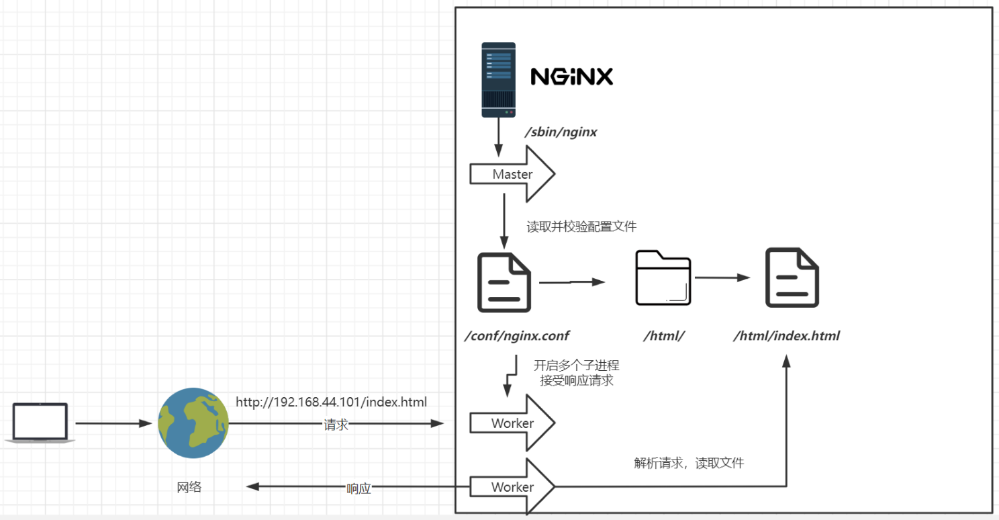
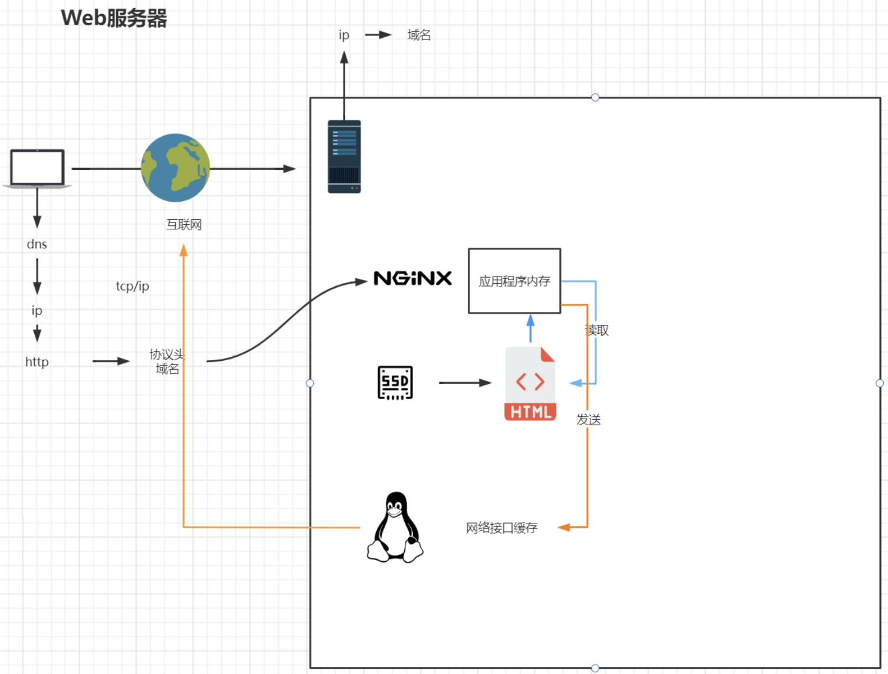
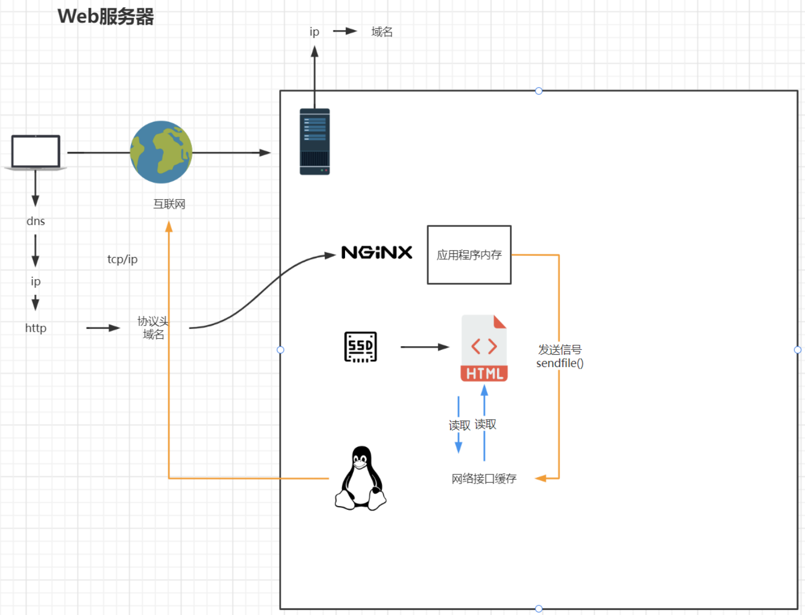

*date: 2022-12-07*

## 版本说明

Nginx 常用版本分为四种类型：

- Nginx 开源版：http://nginx.org/
- Nginx plus 商业版：https://www.nginx.com
- openresty：http://openresty.org/cn/
- Tengine：http://tengine.taobao.org/

## 安装

Docker：

```sh
# 下载
xisun@xisun-develop:~/apps$ docker pull nginx:1.23.3

# 查看
xisun@xisun-develop:~/apps$ docker images
REPOSITORY              TAG               IMAGE ID       CREATED         SIZE
nginx                   1.23.3            3964ce7b8458   4 days ago      142MB

# 生成容器
xisun@xisun-develop:~/apps$ docker run -d --name nginx-single -p 80:80 -p 8081:8081 -p 8082:8082 -v /home/xisun/apps/nginx-single/conf/nginx.conf:/etc/nginx/nginx.conf -v /home/xisun/apps/nginx-single/conf/conf.d:/etc/nginx/conf.d -v /home/xisun/apps/nginx-single/logs:/var/log/nginx -v /home/xisun/apps/nginx-single/html:/apps/html -v /home/xisun/apps/nginx-single/picture:/apps/picture -v /etc/localtime:/etc/localtime:ro nginx:1.23.3
```

Docker compose：

```sh
xisun@xisun-develop:~/apps$ cat docker-compose-nginx.yaml 
version: "3.4"

networks:
  apps:
    name: apps
    external: false

services:
  nginx-single-compose:
    image: nginx:1.23.4-perl
    container_name: nginx-single-compose
    ports:
      - 80:80
      - 8081:8081
      - 8082:8082
    volumes:
      - ./nginx-single/conf/nginx.conf:/etc/nginx/nginx.conf
      - ./nginx-single/conf/conf.d:/etc/nginx/conf.d
      - ./nginx-single/logs:/var/log/nginx
      - ./nginx-single/html:/apps/html
      - ./nginx-single/picture:/apps/picture
      - /etc/localtime:/etc/localtime:ro
    ulimits:
      nofile:
        soft: 65536
        hard: 65536
    networks:
      - apps
    restart: on-failure:3
    
xisun@xisun-develop:~/apps$ docker compose -f docker-compose-nginx.yaml up -d
[+] Running 0/0
 ⠋ Network apps  Creating                                                                                                                       0.1s 
[+] Running 2/2d orphan containers ([redis-6376 redis-6378 redis-6377]) for this project. If you removed or renamed this service in your compose file
 ✔ Network apps                    Created                                                                                                      0.1s 
 ✔ Container nginx-single-compose  Started
 
xisun@xisun-develop:~/apps$ docker ps
CONTAINER ID   IMAGE               COMMAND                  CREATED         STATUS         PORTS                                                                                              NAMES
fcf79ec3549a   nginx:1.23.4-perl   "/docker-entrypoint.…"   5 minutes ago   Up 5 minutes   0.0.0.0:80->80/tcp, :::80->80/tcp, 0.0.0.0:8081-8082->8081-8082/tcp, :::8081-8082->8081-8082/tcp   nginx-single-compose
```

访问：

```sh
xisun@xisun-develop:~/apps$ curl 192.168.2.100
<!DOCTYPE html>
<html>
<head>
<title>Welcome to nginx!</title>
<style>
html { color-scheme: light dark; }
body { width: 35em; margin: 0 auto;
font-family: Tahoma, Verdana, Arial, sans-serif; }
</style>
</head>
<body>
<h1>Welcome to nginx! Hello, nginx!</h1>
<p>If you see this page, the nginx web server is successfully installed and
working. Further configuration is required.</p>

<p>For online documentation and support please refer to
<a href="http://nginx.org/">nginx.org</a>.<br/>
Commercial support is available at
<a href="http://nginx.com/">nginx.com</a>.</p>

<p><em>Thank you for using nginx.</em></p>
</body>
</html>
```


常用命令：

```sh
# 检查配置是否正确
xisun@xisun-develop:~/apps$ docker exec nginx-single-compose nginx -t
nginx: the configuration file /etc/nginx/nginx.conf syntax is ok
nginx: configuration file /etc/nginx/nginx.conf test is successful

# 重新加载配置
xisun@xisun-develop:~/apps$ docker exec nginx-single-compose nginx -s reload
```

如果是二进制安装，进入 Nginx 安装目录的 sbin 目录下：

```sh
# 启动
./nginx
# 快速停止
./nginx -s stop
# 优雅关闭，在退出前完成已经接受的连接请求
./nginx -s quit
# 重新加载配置
./nginx -s reload
```

## 基础使用

### 目录结构

```sh
xisun@xisun-develop:~/apps$ docker exec -it nginx-single-compose /bin/bash
root@fcf79ec3549a:/# ls
apps  boot  docker-entrypoint.d   etc   lib    media  opt   root  sbin  sys  usr
bin   dev   docker-entrypoint.sh  home  lib64  mnt    proc  run   srv   tmp  var
root@fcf79ec3549a:/# exit
exit

xisun@xisun-develop:~/apps$ cd nginx-single/
xisun@xisun-develop:~/apps/nginx-single$ ls
conf  html  logs  picture
```

- `sbin`：Nginx 的主程序目录。
- `conf`：Nginx 存放配置文件的目录。
- `html`：Nginx 存放静态文件的默认目录，包括 html、css 等。
- `logs`：Nginx 存放访问日志的目录。

### 基本运行原理



- `Master`：主进程。
- `Worker`：子进程。
- 一个 Master，多个 Worker（**多进程**），Master 协调 Worker，Worker 处理用户的具体请求。

Nginx 服务启动后，会启动一个 Master 主进程，并检查 nginx.conf 配置文件，配置文件正确无误后，再启动多个 Worker 子进程，接受响应请求：

```sh
xisun@xisun-develop:~/apps$ ps -ef|grep nginx
root        1348    1328  0 20:40 ?        00:00:00 nginx: master process nginx -g daemon off;
pollina+    1385    1348  0 20:40 ?        00:00:00 nginx: worker process
pollina+    1386    1348  0 20:40 ?        00:00:00 nginx: worker process
pollina+    1387    1348  0 20:40 ?        00:00:00 nginx: worker process
pollina+    1388    1348  0 20:40 ?        00:00:00 nginx: worker process
pollina+    1389    1348  0 20:40 ?        00:00:00 nginx: worker process
pollina+    1390    1348  0 20:40 ?        00:00:00 nginx: worker process
pollina+    1391    1348  0 20:40 ?        00:00:00 nginx: worker process
pollina+    1392    1348  0 20:40 ?        00:00:00 nginx: worker process
xisun      30419    1204  0 21:02 pts/0    00:00:00 grep --color=auto nginx
```

### 基础配置

nginx.conf 配置：

```sh
xisun@xisun-develop:~/apps/nginx-single/conf$ cat nginx.conf 

user  nginx;
worker_processes  auto;

error_log  /var/log/nginx/error.log notice;
pid        /var/run/nginx.pid;


events {
    worker_connections  1024;
}


http {
    include       /etc/nginx/mime.types;
    default_type  application/octet-stream;

    log_format  main  '$remote_addr - $remote_user [$time_local] "$request" '
                      '$status $body_bytes_sent "$http_referer" '
                      '"$http_user_agent" "$http_x_forwarded_for"';

    access_log  /var/log/nginx/access.log  main;

    sendfile        on;
    #tcp_nopush     on;

    keepalive_timeout  65;

    #gzip  on;

    include /etc/nginx/conf.d/*.conf;
}
```

- `worker_processes`：开启的**业务进程数**。"worker_processes 1;" 表示开启一个业务进程。

- `worker_connections`：单个业务进程**可接受的连接数**。

- `include /etc/nginx/mime.types;`：**引入配置文件**，mime.types 即为 http 的 mime 类型。mime.types 配置文件即为一个映射文件，左边为 http 请求头的类型，右边为文件后缀名。也可以根据需求，自定义文件的映射类型。默认的 mime.types 类型如下：

  ```sh
  root@cc7ed074e764:/etc/nginx# cat mime.types 
  
  types {
      text/html                                        html htm shtml;
      text/css                                         css;
      text/xml                                         xml;
      image/gif                                        gif;
      image/jpeg                                       jpeg jpg;
      application/javascript                           js;
      application/atom+xml                             atom;
      application/rss+xml                              rss;
  
      text/mathml                                      mml;
      text/plain                                       txt;
      text/vnd.sun.j2me.app-descriptor                 jad;
      text/vnd.wap.wml                                 wml;
      text/x-component                                 htc;
  
      image/avif                                       avif;
      image/png                                        png;
      image/svg+xml                                    svg svgz;
      image/tiff                                       tif tiff;
      image/vnd.wap.wbmp                               wbmp;
      image/webp                                       webp;
      image/x-icon                                     ico;
      image/x-jng                                      jng;
      image/x-ms-bmp                                   bmp;
  
      font/woff                                        woff;
      font/woff2                                       woff2;
  
      application/java-archive                         jar war ear;
      application/json                                 json;
      application/mac-binhex40                         hqx;
      application/msword                               doc;
      application/pdf                                  pdf;
      application/postscript                           ps eps ai;
      application/rtf                                  rtf;
      application/vnd.apple.mpegurl                    m3u8;
      application/vnd.google-earth.kml+xml             kml;
      application/vnd.google-earth.kmz                 kmz;
      application/vnd.ms-excel                         xls;
      application/vnd.ms-fontobject                    eot;
      application/vnd.ms-powerpoint                    ppt;
      application/vnd.oasis.opendocument.graphics      odg;
      application/vnd.oasis.opendocument.presentation  odp;
      application/vnd.oasis.opendocument.spreadsheet   ods;
      application/vnd.oasis.opendocument.text          odt;
      application/vnd.openxmlformats-officedocument.presentationml.presentation
                                                       pptx;
      application/vnd.openxmlformats-officedocument.spreadsheetml.sheet
                                                       xlsx;
      application/vnd.openxmlformats-officedocument.wordprocessingml.document
                                                       docx;
      application/vnd.wap.wmlc                         wmlc;
      application/wasm                                 wasm;
      application/x-7z-compressed                      7z;
      application/x-cocoa                              cco;
      application/x-java-archive-diff                  jardiff;
      application/x-java-jnlp-file                     jnlp;
      application/x-makeself                           run;
      application/x-perl                               pl pm;
      application/x-pilot                              prc pdb;
      application/x-rar-compressed                     rar;
      application/x-redhat-package-manager             rpm;
      application/x-sea                                sea;
      application/x-shockwave-flash                    swf;
      application/x-stuffit                            sit;
      application/x-tcl                                tcl tk;
      application/x-x509-ca-cert                       der pem crt;
      application/x-xpinstall                          xpi;
      application/xhtml+xml                            xhtml;
      application/xspf+xml                             xspf;
      application/zip                                  zip;
  
      application/octet-stream                         bin exe dll;
      application/octet-stream                         deb;
      application/octet-stream                         dmg;
      application/octet-stream                         iso img;
      application/octet-stream                         msi msp msm;
  
      audio/midi                                       mid midi kar;
      audio/mpeg                                       mp3;
      audio/ogg                                        ogg;
      audio/x-m4a                                      m4a;
      audio/x-realaudio                                ra;
  
      video/3gpp                                       3gpp 3gp;
      video/mp2t                                       ts;
      video/mp4                                        mp4;
      video/mpeg                                       mpeg mpg;
      video/quicktime                                  mov;
      video/webm                                       webm;
      video/x-flv                                      flv;
      video/x-m4v                                      m4v;
      video/x-mng                                      mng;
      video/x-ms-asf                                   asx asf;
      video/x-ms-wmv                                   wmv;
      video/x-msvideo                                  avi;
  }
  ```

- `default_type application/octet-stream;`：如果在 mime.types 配置文件中的类型都没匹配上，则**默认使用二进制流的方式传输**。

- `sendfile on;`：使用 Linux 的 sendfile(socket, file, len) 高效网络传输，也就是`数据零拷贝`。

  - 未开启 sendfile，对文件有一个读取和发送的操作：

    

  - 开启 sendfile，对文件没有读取和发送的操作：

    

- `keepalive_timeout 65;`：超时时间。

- `include /etc/nginx/conf.d/*.conf;`：引入配置文件。新版本的 Nginx 镜像，nginx.conf 配置文件中没有 server 标签，nginx.conf 引入了 conf.d 目录下的 *.conf，在 *.conf 文件中有 server 标签。

conf.d 目录下的 Nginx 默认配置：

```sh
xisun@xisun-develop:~/apps/nginx-single/conf/conf.d$ cat default.conf 
server {
    listen       80;
    listen  [::]:80;
    server_name  localhost;

    #access_log  /var/log/nginx/host.access.log  main;

    location / {
        root   /apps/html; # 修改html页面的路径
        index  index.html index.htm;
    }

    #error_page  404              /404.html;

    # redirect server error pages to the static page /50x.html
    #
    error_page   500 502 503 504  /50x.html;
    location = /50x.html {
        root   /apps/html; # 修改html页面的路径
    }

    # proxy the PHP scripts to Apache listening on 127.0.0.1:80
    #
    #location ~ \.php$ {
    #    proxy_pass   http://127.0.0.1;
    #}

    # pass the PHP scripts to FastCGI server listening on 127.0.0.1:9000
    #
    #location ~ \.php$ {
    #    root           html;
    #    fastcgi_pass   127.0.0.1:9000;
    #    fastcgi_index  index.php;
    #    fastcgi_param  SCRIPT_FILENAME  /scripts$fastcgi_script_name;
    #    include        fastcgi_params;
    #}

    # deny access to .htaccess files, if Apache's document root
    # concurs with nginx's one
    #
    #location ~ /\.ht {
    #    deny  all;
    #}
}
```

- `server`：设置一个虚拟主机，即 vhost。

> 基于二进制安装的 Nginx 配置文件，最小配置如下：
>
> ```sh
> worker_processes  1;
> 
> events {
>     worker_connections  1024;
> }
> 
> http {
>     include       /etc/nginx/mime.types;
>     default_type  application/octet-stream;
> 
>     sendfile        on;
> 
>     keepalive_timeout  65;
> 
>     #gzip  on;
> 
>     server {
>     	listen	80;
>     	server_name localhost;
>     	
>     	location / {
>     		root	html;
>     		index	index.html index.htm;
>     	}
>     	
>     	error_page 500 502 503 504 /50x.html;
>     	location = /50x.html {
>         	root html;
>         }
>     }
> }
> ```

### 虚拟主机

配置示例：

```sh
server {
    listen	80; # 当前虚拟主机监听的端口号
    server_name localhost; # 当前虚拟主机的主机名或者域名

    location / { # 匹配路径URI，例如http://www.xisun.com/aabb/index.html，/aabb/index.html就是URI
        root	html; # 文件根目录
        index	index.html index.htm; # 默认页名称
    }

    error_page 500 502 503 504 /50x.html; # 服务端报错编码时所对应的页面
    location = /50x.html {
    	root html;
    }
}
```

原理：原本一台服务器只能对应一个站点，**通过虚拟主机技术可以虚拟化成多个站点**，同时对外提供服务。


#### 本机域名解析

修改本机 hosts 文件，添加对应的域名解析：

```tex
192.168.2.100 acatsmiling.xisun.cn
```

```sh
C:\Users\XiSun>ping acatsmiling.xisun.cn

正在 Ping acatsmiling.xisun.cn [192.168.2.100] 具有 32 字节的数据:
来自 192.168.2.100 的回复: 字节=32 时间<1ms TTL=64
来自 192.168.2.100 的回复: 字节=32 时间<1ms TTL=64
来自 192.168.2.100 的回复: 字节=32 时间<1ms TTL=64
来自 192.168.2.100 的回复: 字节=32 时间<1ms TTL=64

192.168.2.100 的 Ping 统计信息:
    数据包: 已发送 = 4，已接收 = 4，丢失 = 0 (0% 丢失)，
往返行程的估计时间(以毫秒为单位):
    最短 = 0ms，最长 = 0ms，平均 = 0ms
```

如果没有配置对应 acatsmiling.xisun.cn 域名的虚拟主机，会使用默认的 default.conf 配置解析。浏览器访问时，定位到 index.html 页面（或者 index.htm）：


#### 不同端口号匹配

在 conf.d 目录下新增 song-port.conf 和 video-port.conf 两个配置文件：

```sh
xisun@xisun-develop:~/apps/nginx-single/conf/conf.d$ cat song-port.conf 
server {
    listen       8081; # 监听端口8081
    listen  [::]:8081;
    server_name  localhost;

    #access_log  /var/log/nginx/host.access.log  main;

    location / {
        root   /apps/html/song-port;
        index  song-port.html;
    }

    #error_page  404              /404.html;

    # redirect server error pages to the static page /50x.html
    #
    error_page   500 502 503 504  /50x.html;
    location = /50x.html {
        root   /apps/html;
    }

    # proxy the PHP scripts to Apache listening on 127.0.0.1:80
    #
    #location ~ \.php$ {
    #    proxy_pass   http://127.0.0.1;
    #}

    # pass the PHP scripts to FastCGI server listening on 127.0.0.1:9000
    #
    #location ~ \.php$ {
    #    root           html;
    #    fastcgi_pass   127.0.0.1:9000;
    #    fastcgi_index  index.php;
    #    fastcgi_param  SCRIPT_FILENAME  /scripts$fastcgi_script_name;
    #    include        fastcgi_params;
    #}

    # deny access to .htaccess files, if Apache's document root
    # concurs with nginx's one
    #
    #location ~ /\.ht {
    #    deny  all;
    #}
}

xisun@xisun-develop:~/apps/nginx-single/conf/conf.d$ cat video-port.conf 
server {
    listen       8082; # 监听端口8082
    listen  [::]:8082;
    server_name  localhost;

    #access_log  /var/log/nginx/host.access.log  main;

    location / {
        root   /apps/html/video-port;
        index  video-port.html;
    }

    #error_page  404              /404.html;

    # redirect server error pages to the static page /50x.html
    #
    error_page   500 502 503 504  /50x.html;
    location = /50x.html {
        root   /apps/html;
    }

    # proxy the PHP scripts to Apache listening on 127.0.0.1:80
    #
    #location ~ \.php$ {
    #    proxy_pass   http://127.0.0.1;
    #}

    # pass the PHP scripts to FastCGI server listening on 127.0.0.1:9000
    #
    #location ~ \.php$ {
    #    root           html;
    #    fastcgi_pass   127.0.0.1:9000;
    #    fastcgi_index  index.php;
    #    fastcgi_param  SCRIPT_FILENAME  /scripts$fastcgi_script_name;
    #    include        fastcgi_params;
    #}

    # deny access to .htaccess files, if Apache's document root
    # concurs with nginx's one
    #
    #location ~ /\.ht {
    #    deny  all;
    #}
}
```

页面访问：


#### 不同域名匹配

修改本机 hosts 文件，添加对应的域名解析：

```tex
192.168.2.100 acatsmiling.video.cn
192.168.2.100 acatsmiling.song.cn
```

在 conf.d 目录下新增 song-domain.conf 和 video-domain.conf 两个配置文件：

```sh
xisun@xisun-develop:~/apps/nginx-single/conf/conf.d$ cat song-domain.conf 
server {
    listen       80; # 监听端口80
    listen  [::]:80;
    server_name  acatsmiling.song.cn; # 设置域名

    #access_log  /var/log/nginx/host.access.log  main;

    location / {
        root   /apps/html/song-domain;
        index  song-domain.html;
    }

    #error_page  404              /404.html;

    # redirect server error pages to the static page /50x.html
    #
    error_page   500 502 503 504  /50x.html;
    location = /50x.html {
        root   /apps/html;
    }

    # proxy the PHP scripts to Apache listening on 127.0.0.1:80
    #
    #location ~ \.php$ {
    #    proxy_pass   http://127.0.0.1;
    #}

    # pass the PHP scripts to FastCGI server listening on 127.0.0.1:9000
    #
    #location ~ \.php$ {
    #    root           html;
    #    fastcgi_pass   127.0.0.1:9000;
    #    fastcgi_index  index.php;
    #    fastcgi_param  SCRIPT_FILENAME  /scripts$fastcgi_script_name;
    #    include        fastcgi_params;
    #}

    # deny access to .htaccess files, if Apache's document root
    # concurs with nginx's one
    #
    #location ~ /\.ht {
    #    deny  all;
    #}
}

xisun@xisun-develop:~/apps/nginx-single/conf/conf.d$ cat video-domain.conf 
server {
    listen       80; # 监听端口80
    listen  [::]:80;
    server_name  acatsmiling.video.cn; # 设置域名

    #access_log  /var/log/nginx/host.access.log  main;

    location / {
        root   /apps/html/video-domain;
        index  video-domain.html;
    }

    #error_page  404              /404.html;

    # redirect server error pages to the static page /50x.html
    #
    error_page   500 502 503 504  /50x.html;
    location = /50x.html {
        root   /apps/html;
    }

    # proxy the PHP scripts to Apache listening on 127.0.0.1:80
    #
    #location ~ \.php$ {
    #    proxy_pass   http://127.0.0.1;
    #}

    # pass the PHP scripts to FastCGI server listening on 127.0.0.1:9000
    #
    #location ~ \.php$ {
    #    root           html;
    #    fastcgi_pass   127.0.0.1:9000;
    #    fastcgi_index  index.php;
    #    fastcgi_param  SCRIPT_FILENAME  /scripts$fastcgi_script_name;
    #    include        fastcgi_params;
    #}

    # deny access to .htaccess files, if Apache's document root
    # concurs with nginx's one
    #
    #location ~ /\.ht {
    #    deny  all;
    #}
}
```

页面访问：


#### servername 匹配规则

##### 完整匹配

修改本机 hosts 文件，添加对应的域名解析：

```tex
192.168.2.100 acatsmiling.a.cn
192.168.2.100 acatsmiling.b.cn
```

在 conf.d 目录下新增 servername.conf 配置文件：

```sh
xisun@xisun-develop:~/apps/nginx-single/conf/conf.d$ cat servername.conf 
server {
    listen       80;
    listen  [::]:80;
    server_name  acatsmiling.a.cn acatsmiling.b.cn; # 完整匹配，可以配置多个，空格隔开

    #access_log  /var/log/nginx/host.access.log  main;

    location / {
        root   /apps/html;
        index  index.html index.htm;
    }

    #error_page  404              /404.html;

    # redirect server error pages to the static page /50x.html
    #
    error_page   500 502 503 504  /50x.html;
    location = /50x.html {
        root   /apps/html;
    }

    # proxy the PHP scripts to Apache listening on 127.0.0.1:80
    #
    #location ~ \.php$ {
    #    proxy_pass   http://127.0.0.1;
    #}

    # pass the PHP scripts to FastCGI server listening on 127.0.0.1:9000
    #
    #location ~ \.php$ {
    #    root           html;
    #    fastcgi_pass   127.0.0.1:9000;
    #    fastcgi_index  index.php;
    #    fastcgi_param  SCRIPT_FILENAME  /scripts$fastcgi_script_name;
    #    include        fastcgi_params;
    #}

    # deny access to .htaccess files, if Apache's document root
    # concurs with nginx's one
    #
    #location ~ /\.ht {
    #    deny  all;
    #}
}

# 重新加载配置
xisun@xisun-develop:~/apps/nginx-single/conf/conf.d$ docker exec nginx-single-compose nginx -t
nginx: the configuration file /etc/nginx/nginx.conf syntax is ok
nginx: configuration file /etc/nginx/nginx.conf test is successful
xisun@xisun-develop:~/apps/nginx-single/conf/conf.d$ docker exec nginx-single-compose nginx -s reload
```

页面访问：


##### 通配符匹配

修改本机 hosts 文件，添加对应的域名解析：

```tex
192.168.2.100 aa.xisun.cn
192.168.2.100 bb.xisun.cn
```

在 conf.d 目录下新增 servername.conf 配置文件：

```sh
xisun@xisun-develop:~/apps/nginx-single/conf/conf.d$ cat servername.conf 
server {
    listen       80;
    listen  [::]:80;
    #server_name  acatsmiling.a.cn acatsmiling.b.cn;
    server_name  *.xisun.cn; # 通配符匹配

    #access_log  /var/log/nginx/host.access.log  main;

    location / {
        root   /apps/html;
        index  index.html index.htm;
    }

    #error_page  404              /404.html;

    # redirect server error pages to the static page /50x.html
    #
    error_page   500 502 503 504  /50x.html;
    location = /50x.html {
        root   /apps/html;
    }

    # proxy the PHP scripts to Apache listening on 127.0.0.1:80
    #
    #location ~ \.php$ {
    #    proxy_pass   http://127.0.0.1;
    #}

    # pass the PHP scripts to FastCGI server listening on 127.0.0.1:9000
    #
    #location ~ \.php$ {
    #    root           html;
    #    fastcgi_pass   127.0.0.1:9000;
    #    fastcgi_index  index.php;
    #    fastcgi_param  SCRIPT_FILENAME  /scripts$fastcgi_script_name;
    #    include        fastcgi_params;
    #}

    # deny access to .htaccess files, if Apache's document root
    # concurs with nginx's one
    #
    #location ~ /\.ht {
    #    deny  all;
    #}
}

# 重新加载配置
xisun@xisun-develop:~/apps/nginx-single/conf/conf.d$ docker exec nginx-single-compose nginx -t
nginx: the configuration file /etc/nginx/nginx.conf syntax is ok
nginx: configuration file /etc/nginx/nginx.conf test is successful
xisun@xisun-develop:~/apps/nginx-single/conf/conf.d$ docker exec nginx-single-compose nginx -s reload
```

页面访问：


##### 通配符结束匹配

修改本机 hosts 文件，添加对应的域名解析：

```tex
192.168.2.100 acatsmiling.xisun.com
192.168.2.100 acatsmiling.xisun.org
```

在 conf.d 目录下新增 servername.conf 配置文件：

```sh
xisun@xisun-develop:~/apps/nginx-single/conf/conf.d$ cat servername.conf 
server {
    listen       80;
    listen  [::]:80;
    #server_name  acatsmiling.a.cn acatsmiling.b.cn;
    #server_name  *.xisun.cn;
    server_name  acatsmiling.xisun.*; # 通配符结束匹配

    #access_log  /var/log/nginx/host.access.log  main;

    location / {
        root   /apps/html;
        index  index.html index.htm;
    }

    #error_page  404              /404.html;

    # redirect server error pages to the static page /50x.html
    #
    error_page   500 502 503 504  /50x.html;
    location = /50x.html {
        root   /apps/html;
    }

    # proxy the PHP scripts to Apache listening on 127.0.0.1:80
    #
    #location ~ \.php$ {
    #    proxy_pass   http://127.0.0.1;
    #}

    # pass the PHP scripts to FastCGI server listening on 127.0.0.1:9000
    #
    #location ~ \.php$ {
    #    root           html;
    #    fastcgi_pass   127.0.0.1:9000;
    #    fastcgi_index  index.php;
    #    fastcgi_param  SCRIPT_FILENAME  /scripts$fastcgi_script_name;
    #    include        fastcgi_params;
    #}

    # deny access to .htaccess files, if Apache's document root
    # concurs with nginx's one
    #
    #location ~ /\.ht {
    #    deny  all;
    #}
}

# 重新加载配置
xisun@xisun-develop:~/apps/nginx-single/conf/conf.d$ docker exec nginx-single-compose nginx -t
nginx: the configuration file /etc/nginx/nginx.conf syntax is ok
nginx: configuration file /etc/nginx/nginx.conf test is successful
xisun@xisun-develop:~/apps/nginx-single/conf/conf.d$ docker exec nginx-single-compose nginx -s reload
```

页面访问：


##### 正则匹配

修改本机 hosts 文件，添加对应的域名解析：

```tex
192.168.2.100 666.xisun.com
```

在 conf.d 目录下新增 servername.conf 配置文件：

```sh
xisun@xisun-develop:~/apps/nginx-single/conf/conf.d$ cat servername.conf 
server {
    listen       80;
    listen  [::]:80;
    #server_name  acatsmiling.a.cn acatsmiling.b.cn;
    #server_name  *.xisun.cn;
    #server_name  acatsmiling.xisun.*;
    server_name ~^[0-9]+\.xisun\.cn$; # 正则匹配

    #access_log  /var/log/nginx/host.access.log  main;

    location / {
        root   /apps/html;
        index  index.html index.htm;
    }

    #error_page  404              /404.html;

    # redirect server error pages to the static page /50x.html
    #
    error_page   500 502 503 504  /50x.html;
    location = /50x.html {
        root   /apps/html;
    }

    # proxy the PHP scripts to Apache listening on 127.0.0.1:80
    #
    #location ~ \.php$ {
    #    proxy_pass   http://127.0.0.1;
    #}

    # pass the PHP scripts to FastCGI server listening on 127.0.0.1:9000
    #
    #location ~ \.php$ {
    #    root           html;
    #    fastcgi_pass   127.0.0.1:9000;
    #    fastcgi_index  index.php;
    #    fastcgi_param  SCRIPT_FILENAME  /scripts$fastcgi_script_name;
    #    include        fastcgi_params;
    #}

    # deny access to .htaccess files, if Apache's document root
    # concurs with nginx's one
    #
    #location ~ /\.ht {
    #    deny  all;
    #}
}

# 重新加载配置
xisun@xisun-develop:~/apps/nginx-single/conf/conf.d$ docker exec nginx-single-compose nginx -t
nginx: the configuration file /etc/nginx/nginx.conf syntax is ok
nginx: configuration file /etc/nginx/nginx.conf test is successful
xisun@xisun-develop:~/apps/nginx-single/conf/conf.d$ docker exec nginx-single-compose nginx -s reload
```

页面访问：


### 反向代理

## 本文参考

https://www.bilibili.com/video/BV1yS4y1N76R

## 声明

写作本文初衷是个人学习记录，鉴于本人学识有限，如有侵权或不当之处，请联系 [wdshfut@163.com](mailto:wdshfut@163.com)。
