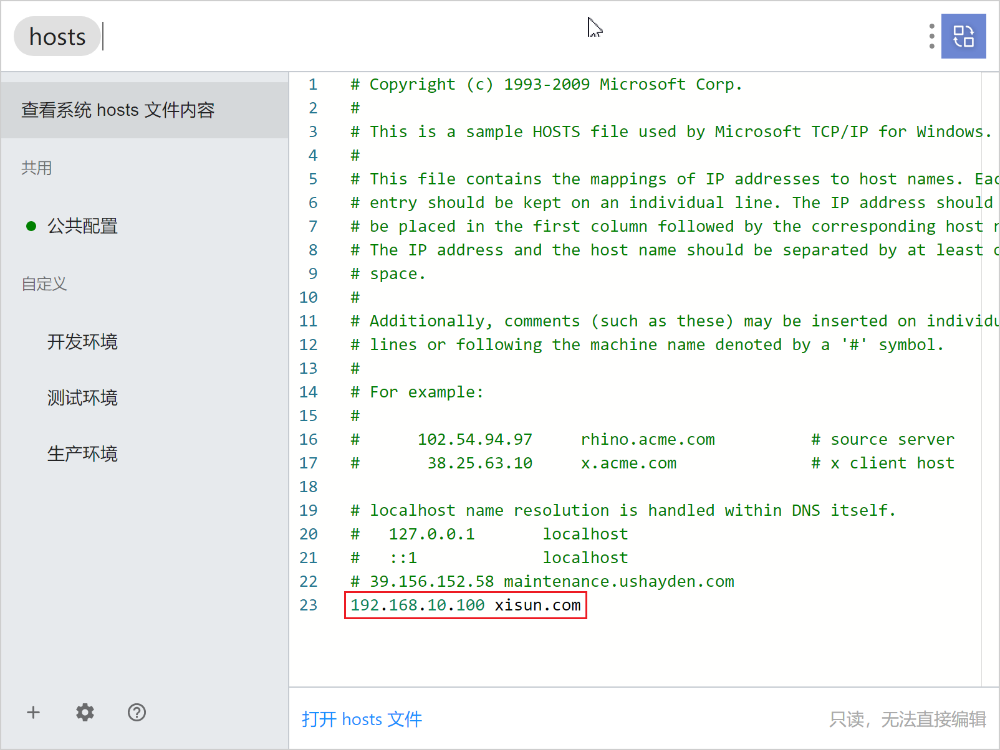

*date: 2022-12-07*

## 版本说明

Nginx 常用版本分为四种类型：

- Nginx 开源版：http://nginx.org/
- Nginx plus 商业版：https://www.nginx.com
- openresty：http://openresty.org/cn/
- Tengine：http://tengine.taobao.org/

## 安装

Docker 下载 Nginx 镜像：

```bash
# 下载
root@xisun-develop:/home/xisun# docker pull nginx:1.23.3

# 查看
root@xisun-develop:/home/xisun# docker images
REPOSITORY              TAG               IMAGE ID       CREATED         SIZE
nginx                   1.23.3            3964ce7b8458   4 days ago      142MB
```

创建 Nginx 配置文件：

```bash
# 创建容器卷
root@xisun-develop:/usr/local# mkdir -p /usr/local/nginx/conf
root@xisun-develop:/usr/local# mkdir -p /usr/local/nginx/log
root@xisun-develop:/usr/local# mkdir -p /usr/local/nginx/html

# 生产容器
root@xisun-develop:~# docker run -d --name nginx -p 80:80 nginx:1.23.3

# 复制容器中的nginx.conf文件到宿主机
root@xisun-develop:~# docker cp nginx:/etc/nginx/nginx.conf /usr/local/nginx/conf/
# 复制容器中的conf.d文件夹到宿主机
root@xisun-develop:~# docker cp nginx:/etc/nginx/conf.d /usr/local/nginx/conf/
# 复制容器中的html文件夹到宿主机
root@xisun-develop:~# docker cp nginx:/usr/share/nginx/html /usr/local/nginx/

# 查看
root@xisun-develop:~# ls /usr/local/nginx/conf/
conf.d  nginx.conf
root@xisun-develop:~# ls /usr/local/nginx/conf/conf.d/
default.conf
root@xisun-develop:~# ls /usr/local/nginx/html/
50x.html  index.html

# 删除刚启动的容器
root@xisun-develop:~# docker ps
CONTAINER ID   IMAGE          COMMAND                  CREATED          STATUS          PORTS                               NAMES
b3f2ed0d960b   nginx:1.23.3   "/docker-entrypoint.…"   18 minutes ago   Up 18 minutes   0.0.0.0:80->80/tcp, :::80->80/tcp   nginx
root@xisun-develop:~# docker stop b3f2ed0d960b
b3f2ed0d960b
root@xisun-develop:~# docker rm b3f2ed0d960b
b3f2ed0d960b
```

启动 Nginx 容器：

```bash
root@xisun-develop:~# docker run -d --name nginx -p 80:80 -v /usr/local/nginx/conf/nginx.conf
:/etc/nginx/nginx.conf -v /usr/local/nginx/conf/conf.d:/etc/nginx/conf.d -v /usr/local/nginx/html:/usr/share/nginx/html -v /usr/local/nginx/log:/var/log/nginx nginx:1.23.3
cc7ed074e76402a227c9879e08cf899deed6f979638603090f2fc9ba6d0fa3d3
```

访问：

```bash
root@xisun-develop:~# curl 192.168.10.100
<!DOCTYPE html>
<html>
<head>
<title>Welcome to nginx!</title>
<style>
html { color-scheme: light dark; }
body { width: 35em; margin: 0 auto;
font-family: Tahoma, Verdana, Arial, sans-serif; }
</style>
</head>
<body>
<h1>Welcome to nginx!</h1>
<p>If you see this page, the nginx web server is successfully installed and
working. Further configuration is required.</p>

<p>For online documentation and support please refer to
<a href="http://nginx.org/">nginx.org</a>.<br/>
Commercial support is available at
<a href="http://nginx.com/">nginx.com</a>.</p>

<p><em>Thank you for using nginx.</em></p>
</body>
</html>
```


常用命令：

```bash
# 检查配置是否正确
root@xisun-develop:~# docker exec nginx nginx -t
nginx: the configuration file /etc/nginx/nginx.conf syntax is ok
nginx: configuration file /etc/nginx/nginx.conf test is successful
# 重新加载配置
root@xisun-develop:~# docker exec nginx nginx -s reload
```

如果是二进制安装，进入 Nginx 安装目录的 sbin 目录下：

```bash
# 启动
./nginx
# 快速停止
./nginx -s stop
# 优雅关闭，在退出前完成已经接受的连接请求
./nginx -s quit
# 重新加载配置
./nginx -s reload
```

## 基础使用

### 目录结构

```bash
root@xisun-develop:/home/xisun# docker start nginx
nginx
root@xisun-develop:/home/xisun# docker exec -it nginx /bin/bash
root@cc7ed074e764:/# ls
bin   docker-entrypoint.d   home   media  proc  sbin  tmp
boot  docker-entrypoint.sh  lib    mnt    root  srv   usr
dev   etc                   lib64  opt    run   sys   var
```

#### sbin

Nginx 的主程序目录。

#### conf

Nginx 存放配置文件的目录。

#### html

Nginx 存放静态文件的默认目录，包括 html、css 等。

#### logs

Nginx 存放访问日志的目录。

### 基本运行原理


- Master：主进程。
- Worker：子进程。
- 一个 Master，多个 Worker（多进程），Master 协调 Worker，Worker 处理用户的具体请求。

### 基础配置

Docker 镜像起的 Nginx 的配置：

```bash
root@xisun-develop:/usr/local/nginx/conf# cat nginx.conf 

user  nginx;
worker_processes  auto;

error_log  /var/log/nginx/error.log notice;
pid        /var/run/nginx.pid;


events {
    worker_connections  1024;
}


http {
    include       /etc/nginx/mime.types;
    default_type  application/octet-stream;

    log_format  main  '$remote_addr - $remote_user [$time_local] "$request" '
                      '$status $body_bytes_sent "$http_referer" '
                      '"$http_user_agent" "$http_x_forwarded_for"';

    access_log  /var/log/nginx/access.log  main;

    sendfile        on;
    #tcp_nopush     on;

    keepalive_timeout  65;

    #gzip  on;

    include /etc/nginx/conf.d/*.conf;
}
```

#### 最小配置

基于二进制安装的 Nginx 配置文件，最小配置如下：

```bash
worker_processes  1;

events {
    worker_connections  1024;
}

http {
    include       /etc/nginx/mime.types;
    default_type  application/octet-stream;

    sendfile        on;

    keepalive_timeout  65;

    #gzip  on;

    server {
    	listen	80;
    	server_name localhost;
    	
    	location / {
    		root	html;
    		index	index.html index.htm;
    	}
    	
    	error_page 500 502 503 504 /50x.html;
    	location = /50x.html {
        	root html;
        }
    }
}
```

- `worker_processes`：开启的`业务进程数`。`worker_processes 1;`表示开启一个业务进程。

- `worker_connections`：单个业务进程可接受的`连接数`。

- `include mime.types;`：引入 mime.types 配置文件，即 http 的 mime 类型。

  ```bash
  root@cc7ed074e764:/etc/nginx# cat mime.types 
  
  types {
      text/html                                        html htm shtml;
      text/css                                         css;
      text/xml                                         xml;
      image/gif                                        gif;
      image/jpeg                                       jpeg jpg;
      application/javascript                           js;
      application/atom+xml                             atom;
      application/rss+xml                              rss;
  
      text/mathml                                      mml;
      text/plain                                       txt;
      text/vnd.sun.j2me.app-descriptor                 jad;
      text/vnd.wap.wml                                 wml;
      text/x-component                                 htc;
  
      image/avif                                       avif;
      image/png                                        png;
      image/svg+xml                                    svg svgz;
      image/tiff                                       tif tiff;
      image/vnd.wap.wbmp                               wbmp;
      image/webp                                       webp;
      image/x-icon                                     ico;
      image/x-jng                                      jng;
      image/x-ms-bmp                                   bmp;
  
      font/woff                                        woff;
      font/woff2                                       woff2;
  
      application/java-archive                         jar war ear;
      application/json                                 json;
      application/mac-binhex40                         hqx;
      application/msword                               doc;
      application/pdf                                  pdf;
      application/postscript                           ps eps ai;
      application/rtf                                  rtf;
      application/vnd.apple.mpegurl                    m3u8;
      application/vnd.google-earth.kml+xml             kml;
      application/vnd.google-earth.kmz                 kmz;
      application/vnd.ms-excel                         xls;
      application/vnd.ms-fontobject                    eot;
      application/vnd.ms-powerpoint                    ppt;
      application/vnd.oasis.opendocument.graphics      odg;
      application/vnd.oasis.opendocument.presentation  odp;
      application/vnd.oasis.opendocument.spreadsheet   ods;
      application/vnd.oasis.opendocument.text          odt;
      application/vnd.openxmlformats-officedocument.presentationml.presentation
                                                       pptx;
      application/vnd.openxmlformats-officedocument.spreadsheetml.sheet
                                                       xlsx;
      application/vnd.openxmlformats-officedocument.wordprocessingml.document
                                                       docx;
      application/vnd.wap.wmlc                         wmlc;
      application/wasm                                 wasm;
      application/x-7z-compressed                      7z;
      application/x-cocoa                              cco;
      application/x-java-archive-diff                  jardiff;
      application/x-java-jnlp-file                     jnlp;
      application/x-makeself                           run;
      application/x-perl                               pl pm;
      application/x-pilot                              prc pdb;
      application/x-rar-compressed                     rar;
      application/x-redhat-package-manager             rpm;
      application/x-sea                                sea;
      application/x-shockwave-flash                    swf;
      application/x-stuffit                            sit;
      application/x-tcl                                tcl tk;
      application/x-x509-ca-cert                       der pem crt;
      application/x-xpinstall                          xpi;
      application/xhtml+xml                            xhtml;
      application/xspf+xml                             xspf;
      application/zip                                  zip;
  
      application/octet-stream                         bin exe dll;
      application/octet-stream                         deb;
      application/octet-stream                         dmg;
      application/octet-stream                         iso img;
      application/octet-stream                         msi msp msm;
  
      audio/midi                                       mid midi kar;
      audio/mpeg                                       mp3;
      audio/ogg                                        ogg;
      audio/x-m4a                                      m4a;
      audio/x-realaudio                                ra;
  
      video/3gpp                                       3gpp 3gp;
      video/mp2t                                       ts;
      video/mp4                                        mp4;
      video/mpeg                                       mpeg mpg;
      video/quicktime                                  mov;
      video/webm                                       webm;
      video/x-flv                                      flv;
      video/x-m4v                                      m4v;
      video/x-mng                                      mng;
      video/x-ms-asf                                   asx asf;
      video/x-ms-wmv                                   wmv;
      video/x-msvideo                                  avi;
  }
  ```

  - mime.types 配置文件即为一个映射文件，左边为 http 请求头的类型，右边为文件后缀名；
  - 可以根据需求，自定义文件的映射类型。

- `default_type application/octet-stream;`：如果在 mime.types 配置文件中的类型都没匹配上，则默认使用`二进制流`的方式传输。

- `sendfile on;`：使用 Linux 的`sendfile(socket, file, len)`高效网络传输，也就是`数据零拷贝`。

  - 未开启 sendfile：

    

  - 开启 sendfile：

    

- `keepalive_timeout 65;`：超时时间。

- `server`：虚拟主机，vhost。

  ```bash
  server {
      listen	80; # 监听端口号
      server_name localhost; # 主机名
  
      location / { # 匹配路径
          root	html; # 文件根目录
          index	index.html index.htm; # 默认页名称
      }
  
      error_page 500 502 503 504 /50x.html; # 报错编码对应页面
      location = /50x.html {
      	root html;
      }
  }
  ```

#### 虚拟主机

原本一台服务器只能对应一个站点，通过`虚拟主机技术`可以虚拟化成多个站点，同时对外提供服务：


#### 本机域名解析

修改 hosts 文件，添加对应的域名解析：



```bash
Microsoft Windows [版本 10.0.19044.2364]
(c) Microsoft Corporation。保留所有权利。

C:\Users\XiSun>ping xisun.com

正在 Ping xisun.com [192.168.10.100] 具有 32 字节的数据:
来自 192.168.10.100 的回复: 字节=32 时间<1ms TTL=64
来自 192.168.10.100 的回复: 字节=32 时间<1ms TTL=64
来自 192.168.10.100 的回复: 字节=32 时间<1ms TTL=64
来自 192.168.10.100 的回复: 字节=32 时间<1ms TTL=64

192.168.10.100 的 Ping 统计信息:
    数据包: 已发送 = 4，已接收 = 4，丢失 = 0 (0% 丢失)，
往返行程的估计时间(以毫秒为单位):
    最短 = 0ms，最长 = 0ms，平均 = 0ms

C:\Users\XiSun>
```

