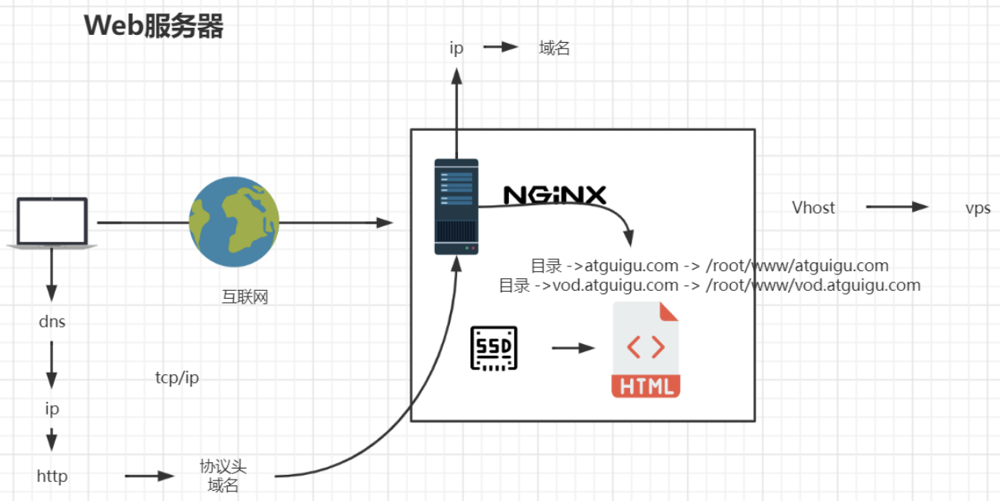

*`Author: ACatSmiling`*

*`Since: 2022-12-07`*

## 概述

Nginx 是俄罗斯人编写的十分轻量级的 HTTP 服务器，它的发音为 "engine X"，是一个高性能的 HTTP 和反向代理服务器，同时也是一个 IMAP/POP3/SMTP 代理服务器。

Nginx 以事件驱动的方式编写，所以有非常好的性能，同时也能非常高效的处理反向代理、负载平衡。

Nginx 做为 HTTP 服务器，有以下几项基本特性：

- 处理静态文件，索引文件以及自动索引；打开文件描述符缓冲。
- 无缓存的反向代理加速，简单的负载均衡和容错。
- FastCGI，简单的负载均衡和容错。
- 模块化的结构。包括 gzipping，byte ranges，chunked responses，以及 SSI-filter 等 filter。如果由 FastCGI 或其它代理服务器处理单页中存在的多个 SSI，则这项处理可以并行运行，而不需要相互等待。
- 支持 SSL 和 TLSSNI。

Nginx 的优点：

- Nginx 专为性能优化而开发，性能是其最重要的考量，实现上非常注重效率 。它支持内核 Poll 模型，能经受高负载的考验，有报告表明能支持高达 50000 个并发连接数。
- Nginx 具有很高的稳定性。Nginx 官方表示保持 10000 个没有活动的连接，它只占 2.5 MB 内存，所以类似 DOS 这样的攻击对 Nginx 来说基本上是毫无用处的。
- Nginx 支持热部署。它的启动特别容易，并且几乎可以做到 7 * 24 不间断运行，即使运行数个月也不需要重新启动。你还能够在不间断服务的情况下，对软件版本进行进行升级。
- Nginx 采用 master-slave 模型，能够充分利用 SMP 的优势，且能够减少工作进程在磁盘 I/O 的阻塞延迟。
- Nginx 代码质量非常高，代码很规范，手法成熟，模块扩展也很容易。

## 版本说明

Nginx 常用版本分为四种类型：

- Nginx 开源版：http://nginx.org/
- Nginx plus 商业版：https://www.nginx.com
- openresty：http://openresty.org/cn/
- Tengine：http://tengine.taobao.org/

## 安装

Docker：

```sh
# 下载
zeloud@zeloud:~/apps$ docker pull nginx:1.23.3

# 查看
zeloud@zeloud:~/apps$ docker images
REPOSITORY              TAG               IMAGE ID       CREATED         SIZE
nginx                   1.23.3            3964ce7b8458   4 days ago      142MB

# 生成容器
zeloud@zeloud:~/apps$ docker run -d --name nginx-single -p 80:80 -p 8081:8081 -p 8082:8082 -v /home/xisun/apps/nginx-single/conf/nginx.conf:/etc/nginx/nginx.conf -v /home/xisun/apps/nginx-single/conf/conf.d:/etc/nginx/conf.d -v /home/xisun/apps/nginx-single/logs:/var/log/nginx -v /home/xisun/apps/nginx-single/html:/apps/html -v /home/xisun/apps/nginx-single/picture:/apps/picture -v /etc/localtime:/etc/localtime:ro nginx:1.23.3
```

Docker-Compose：

```sh
zeloud@zeloud:~/apps$ cat docker-compose-nginx.yaml 
version: "3.4"

networks:
  apps:
    name: apps
    external: false

services:
  nginx-single-compose:
    image: nginx:1.23.4-perl
    container_name: nginx-single-compose
    ports:
      - 80:80
      - 8081:8081
      - 8082:8082
    volumes:
      - ./nginx-single/conf/nginx.conf:/etc/nginx/nginx.conf
      - ./nginx-single/conf/conf.d:/etc/nginx/conf.d
      - ./nginx-single/logs:/var/log/nginx
      - ./nginx-single/html:/apps/html
      - ./nginx-single/picture:/apps/picture
      - /etc/localtime:/etc/localtime:ro
    ulimits:
      nofile:
        soft: 65536
        hard: 65536
    networks:
      - apps
    restart: on-failure:3
    
zeloud@zeloud:~/apps$ docker-compose -f docker-compose-nginx.yaml up -d
[+] Running 0/0
 ⠋ Network apps  Creating                                                                                                                       0.1s 
[+] Running 2/2d orphan containers ([redis-6376 redis-6378 redis-6377]) for this project. If you removed or renamed this service in your compose file
 ✔ Network apps                    Created                                                                                                      0.1s 
 ✔ Container nginx-single-compose  Started
 
zeloud@zeloud:~/apps$ docker ps
CONTAINER ID   IMAGE               COMMAND                  CREATED         STATUS         PORTS                                                                                              NAMES
fcf79ec3549a   nginx:1.23.4-perl   "/docker-entrypoint.…"   5 minutes ago   Up 5 minutes   0.0.0.0:80->80/tcp, :::80->80/tcp, 0.0.0.0:8081-8082->8081-8082/tcp, :::8081-8082->8081-8082/tcp   nginx-single-compose
```

访问：

```sh
zeloud@zeloud:~/apps$ curl 192.168.2.20
<!DOCTYPE html>
<html>
<head>
<title>Welcome to nginx!</title>
<style>
html { color-scheme: light dark; }
body { width: 35em; margin: 0 auto;
font-family: Tahoma, Verdana, Arial, sans-serif; }
</style>
</head>
<body>
<h1>Welcome to nginx!</h1>
<p>If you see this page, the nginx web server is successfully installed and
working. Further configuration is required.</p>

<p>For online documentation and support please refer to
<a href="http://nginx.org/">nginx.org</a>.<br/>
Commercial support is available at
<a href="http://nginx.com/">nginx.com</a>.</p>

<p><em>Thank you for using nginx.</em></p>
</body>
</html>
```


常用命令：

```sh
# 检查配置是否正确
zeloud@zeloud:~/apps$ docker exec nginx-single-compose nginx -t
nginx: the configuration file /etc/nginx/nginx.conf syntax is ok
nginx: configuration file /etc/nginx/nginx.conf test is successful

# 重新加载配置
zeloud@zeloud:~/apps$ docker exec nginx-single-compose nginx -s reload
```

如果是二进制安装，进入 Nginx 安装目录的 sbin 目录下：

```sh
# 启动
./nginx
# 快速停止
./nginx -s stop
# 优雅关闭，在退出前完成已经接受的连接请求
./nginx -s quit
# 重新加载配置
./nginx -s reload
```

## 目录结构

```sh
zeloud@zeloud:~/apps$ docker exec -it nginx-single-compose /bin/bash
root@fcf79ec3549a:/# ls
apps  boot  docker-entrypoint.d   etc   lib    media  opt   root  sbin  sys  usr
bin   dev   docker-entrypoint.sh  home  lib64  mnt    proc  run   srv   tmp  var
root@fcf79ec3549a:/# exit
exit

zeloud@zeloud:~/apps$ cd nginx-single/
zeloud@zeloud:~/apps/nginx-single$ ls
conf  html  logs  picture
```

- `sbin`：Nginx 的主程序目录。
- `conf`：Nginx 存放配置文件的目录。
- `html`：Nginx 存放静态文件的默认目录，包括 html、css 等。
- `logs`：Nginx 存放访问日志的目录。

## 基本运行原理


- `Master`：主进程。
- `Worker`：子进程。
- 一个 Master，多个 Worker（**多进程**），Master 协调 Worker，Worker 处理用户的具体请求。

Nginx 服务启动后，会启动一个 Master 主进程，并检查 nginx.conf 配置文件，配置文件正确无误后，再启动多个 Worker 子进程（子进程的数目，一般与 CPU 核数一致），接受响应请求：

```sh
zeloud@zeloud:~/apps/nginx/logs$ ps -ef|grep nginx
root        1620    1593  0 16:13 ?        00:00:00 nginx: master process nginx -g daemon off;
pollina+    2306    1620  0 16:16 ?        00:00:00 nginx: worker process
pollina+    2307    1620  0 16:16 ?        00:00:00 nginx: worker process
pollina+    2308    1620  0 16:16 ?        00:00:00 nginx: worker process
pollina+    2309    1620  0 16:16 ?        00:00:00 nginx: worker process
pollina+    2310    1620  0 16:16 ?        00:00:00 nginx: worker process
pollina+    2311    1620  0 16:16 ?        00:00:00 nginx: worker process
pollina+    2312    1620  0 16:16 ?        00:00:00 nginx: worker process
pollina+    2313    1620  0 16:16 ?        00:00:00 nginx: worker process
zeloud      3746    3528  0 19:09 pts/1    00:00:00 grep --color=auto nginx
```

## 配置文件

Nginx 主配置文件的位置：/usr/local/nginx/conf/nginx.conf（Docker 容器中位置是 /etc/nginx/nginx.conf），可以将 Nginx 的配置文件分为三部分：全局块、events 块、http 块。

### 全局块

从配置文件开始到 events 块之间的内容，主要会设置一些影响 Nginx 服务器整体运行的配置指令，主要包括配置运行 Nginx 服务器的用户（组）、允许生成的 worker process 数，进程 PID 存放路径、日志存放路径和类型以及配置文件的引入等。

```sh
user  nginx; # Nginx的用户和组
worker_processes  auto; # 工作进程数，根据硬件进行调整，通常等于CPU数量或者CPU数量的两倍

error_log  /var/log/nginx/error.log notice; # 错误日志存放路径
pid        /var/run/nginx.pid; # 进程标识符
```

- `worker_processes`：开启的**业务进程数**。"worker_processes 1;" 表示开启一个业务进程。

### events 块

events 块涉及的指令，主要影响 Nginx 服务器与用户的网络连接，常用的设置包括是否开启对多 worker process 下的网络连接进行序列化，是否允许同时接收多个网络连接，选取哪种事件驱动模型来处理连接请求，每个 worker process 可以同时支持的最大连接数等。

这部分对 Nginx 的性能影响较大，实际中需要灵活配置。

```sh
events {
	# 每个工作进程最大连接数是1024个，根据硬件来调整
	# 理论上一台Nginx的最大连接数 = worker_processes × worker_connections (工作进程数 * 工作进程的最大连接数)
    worker_connections  1024;
}
```

- `worker_connections`：单个业务进程**可接受的连接数**。

### http 块

http 块是 Nginx 中使用最频繁的部分，http 块包括 http 全局块和 server 块。

#### http 全局块

http 全局块配置的指令包括文件引入、MIME-TYPE 定义、日志自定义、连接超时时间、单链接请求数上限等。

```sh
http {
    # 引入mime类型
    include       /etc/nginx/mime.types;
    default_type  application/octet-stream;

    # 日志格式
    # $remote_addr与$http_x_forwarded_for：用来记录客户端的ip地址
        # 通常Web服务器放在反向代理的后面，这样就不能获取到客户的IP地址了，通过$remote_addr拿到的IP地址是反向代理服务器的IP地址
        # 反向代理服务器在转发请求的http头信息中，可以增加x_forwarded_for信息，用以记录原有客户端的IP地址和原来客户端的请求的服务器地址
    # $remote_user：用来记录客户端用户名称
    # $time_local：用来记录访问时间与时区
    # $request：用来记录请求的url与http协议
    # $status：用来记录请求状态，成功是200
    # $body_bytes_sent：记录发送给客户端文件主体内容大小
    # $http_referer：用来记录从那个页面链接访问过来的
    # $http_user_agent：记录客户浏览器的相关信息
    log_format  main  '$remote_addr - $remote_user [$time_local] "$request" '
                      '$status $body_bytes_sent "$http_referer" '
                      '"$http_user_agent" "$http_x_forwarded_for"';

    access_log  /var/log/nginx/access.log  main; # 指定log文件的路径

    sendfile        on; # 指定Nginx是否调用sendfile函数 (zero copy方式) 来输出文件，对于普通应用，必须设为on
    #tcp_nopush     on; # 允许或禁止使用socke的TCP_CORK的选项，仅在使用sendfile的时候使用

    keepalive_timeout  65; # 超时时间

    #gzip  on;

    include /etc/nginx/conf.d/*.conf; # 引入子配置文件，server 虚拟主机配置
}
```

- `include /etc/nginx/mime.types;`：**引入配置文件**，mime.types 即为 http 的 mime 类型。mime.types 配置文件即为一个映射文件，左边为 http 请求头的类型，右边为文件后缀名。也可以根据需求，自定义文件的映射类型。默认的 mime.types 类型如下：

  ```sh
  root@cc7ed074e764:/etc/nginx# cat mime.types 
  
  types {
      text/html                                        html htm shtml;
      text/css                                         css;
      text/xml                                         xml;
      image/gif                                        gif;
      image/jpeg                                       jpeg jpg;
      application/javascript                           js;
      application/atom+xml                             atom;
      application/rss+xml                              rss;
  
      text/mathml                                      mml;
      text/plain                                       txt;
      text/vnd.sun.j2me.app-descriptor                 jad;
      text/vnd.wap.wml                                 wml;
      text/x-component                                 htc;
  
      image/avif                                       avif;
      image/png                                        png;
      image/svg+xml                                    svg svgz;
      image/tiff                                       tif tiff;
      image/vnd.wap.wbmp                               wbmp;
      image/webp                                       webp;
      image/x-icon                                     ico;
      image/x-jng                                      jng;
      image/x-ms-bmp                                   bmp;
  
      font/woff                                        woff;
      font/woff2                                       woff2;
  
      application/java-archive                         jar war ear;
      application/json                                 json;
      application/mac-binhex40                         hqx;
      application/msword                               doc;
      application/pdf                                  pdf;
      application/postscript                           ps eps ai;
      application/rtf                                  rtf;
      application/vnd.apple.mpegurl                    m3u8;
      application/vnd.google-earth.kml+xml             kml;
      application/vnd.google-earth.kmz                 kmz;
      application/vnd.ms-excel                         xls;
      application/vnd.ms-fontobject                    eot;
      application/vnd.ms-powerpoint                    ppt;
      application/vnd.oasis.opendocument.graphics      odg;
      application/vnd.oasis.opendocument.presentation  odp;
      application/vnd.oasis.opendocument.spreadsheet   ods;
      application/vnd.oasis.opendocument.text          odt;
      application/vnd.openxmlformats-officedocument.presentationml.presentation
                                                       pptx;
      application/vnd.openxmlformats-officedocument.spreadsheetml.sheet
                                                       xlsx;
      application/vnd.openxmlformats-officedocument.wordprocessingml.document
                                                       docx;
      application/vnd.wap.wmlc                         wmlc;
      application/wasm                                 wasm;
      application/x-7z-compressed                      7z;
      application/x-cocoa                              cco;
      application/x-java-archive-diff                  jardiff;
      application/x-java-jnlp-file                     jnlp;
      application/x-makeself                           run;
      application/x-perl                               pl pm;
      application/x-pilot                              prc pdb;
      application/x-rar-compressed                     rar;
      application/x-redhat-package-manager             rpm;
      application/x-sea                                sea;
      application/x-shockwave-flash                    swf;
      application/x-stuffit                            sit;
      application/x-tcl                                tcl tk;
      application/x-x509-ca-cert                       der pem crt;
      application/x-xpinstall                          xpi;
      application/xhtml+xml                            xhtml;
      application/xspf+xml                             xspf;
      application/zip                                  zip;
  
      application/octet-stream                         bin exe dll;
      application/octet-stream                         deb;
      application/octet-stream                         dmg;
      application/octet-stream                         iso img;
      application/octet-stream                         msi msp msm;
  
      audio/midi                                       mid midi kar;
      audio/mpeg                                       mp3;
      audio/ogg                                        ogg;
      audio/x-m4a                                      m4a;
      audio/x-realaudio                                ra;
  
      video/3gpp                                       3gpp 3gp;
      video/mp2t                                       ts;
      video/mp4                                        mp4;
      video/mpeg                                       mpeg mpg;
      video/quicktime                                  mov;
      video/webm                                       webm;
      video/x-flv                                      flv;
      video/x-m4v                                      m4v;
      video/x-mng                                      mng;
      video/x-ms-asf                                   asx asf;
      video/x-ms-wmv                                   wmv;
      video/x-msvideo                                  avi;
  }
  ```

- `default_type application/octet-stream;`：如果在 mime.types 配置文件中的类型都没匹配上，则**默认使用二进制流的方式传输**。

- `sendfile on;`：使用 Linux 的 sendfile(socket, file, len) 高效网络传输，也就是`数据零拷贝`。

  - 未开启 sendfile，对文件有一个读取和发送的操作：

    

  - 开启 sendfile，对文件没有读取和发送的操作：

    

- `keepalive_timeout 65;`：超时时间。

- `include /etc/nginx/conf.d/*.conf;`：引入配置文件。新版本的 Nginx 镜像，nginx.conf 配置文件中没有 server 标签，nginx.conf 引入了 conf.d 目录下的 *.conf，在 *.conf 文件中有 server 标签。

#### server 块

server 块和虚拟主机有密切关系，每个 http 块可以包含多个 server 块，**每个 server 块相当于一个虚拟主机（vhost）**。每个 server 块又包含 server 全局块、多个 location 块。

- server 全局块：用于虚拟机监听配置，虚拟主机名称和 IP 配置。
- location 块：基于 Nginx 服务器接收到的请求路径，对虚拟主机以外的路径进行匹配，对特定请求进行特定处理。

```sh
server {
	# 监听80端口
    listen       80;
    listen  [::]:80;
    # 主机名称是localhost
    server_name  localhost;

    #access_log  /var/log/nginx/host.access.log  main;

	# 用于匹配请求中的路径，这个location匹配的是请求中的/，这里的匹配支持正则表达式匹配，如果一个请求同时满足了多个location，会采用最长前缀匹配的规则
    location / {
        root   /apps/html; # 指定html页面的路径，与挂载的容器卷保持一致
        index  index.html index.htm;
    }

	# 错误页面
    #error_page  404              /404.html;

    # redirect server error pages to the static page /50x.html
    #
    error_page   500 502 503 504  /50x.html;
    location = /50x.html {
        root   /apps/html;
    }

    # proxy the PHP scripts to Apache listening on 127.0.0.1:80
    #
    #location ~ \.php$ {
    #    proxy_pass   http://127.0.0.1;
    #}

    # pass the PHP scripts to FastCGI server listening on 127.0.0.1:9000
    #
    #location ~ \.php$ {
    #    root           html;
    #    fastcgi_pass   127.0.0.1:9000;
    #    fastcgi_index  index.php;
    #    fastcgi_param  SCRIPT_FILENAME  /scripts$fastcgi_script_name;
    #    include        fastcgi_params;
    #}

    # deny access to .htaccess files, if Apache's document root
    # concurs with nginx's one
    #
    #location ~ /\.ht {
    #    deny  all;
    #}
}
```

- location 的语法：`location [=|~|~*|^~|@] pattern { … }`。
  - `=`：要求路径完全匹配，忽略请求路径后的参数。
  - `~`：用于区分大小写的正则匹配。
  - `~*`：用于不区分大小写的正则匹配。
  - `^~`：普通字符匹配，优先于正则表达式匹配，如果该选项匹配成功，不再进行正则表达式的匹配，多用来目录匹配。
  - `@`：定义一个命名的 location，使用在内部定向。
- location 优先级：
  - Directives with the = prefix that match the query exactly. If found, searching stops.（= 前缀的指令严格匹配这个查询。如果找到，停止搜索）

  - All remaining directives with conventional strings, longest match first. If this match used the ^~ prefix, searching stops.（所有剩下的常规字符串，最长的匹配。如果这个匹配使用 ^~ 前缀，搜索停止）
  - Regular expressions, in order of definition in the configuration file.（正则表达式，按照在配置文件中定义的顺序）
  - If #3 yielded a match, that result is used. Else the match from #2 is used.（如果第 3 条规则产生匹配的话，结果被使用。否则，使用第 2 条规则的结果）

>基于二进制安装的 Nginx 配置文件，最小配置如下：
>
>```sh
>worker_processes  1;
>
>events {
>    worker_connections  1024;
>}
>
>http {
>    include       /etc/nginx/mime.types;
>    default_type  application/octet-stream;
>
>    sendfile        on;
>
>    keepalive_timeout  65;
>
>    #gzip  on;
>
>    server {
>    	listen	80;
>    	server_name localhost;
>    	
>    	location / {
>    		root	html;
>    		index	index.html index.htm;
>    	}
>    	
>    	error_page 500 502 503 504 /50x.html;
>    	location = /50x.html {
>        	root html;
>        }
>    }
>}
>```

## 虚拟主机

默认配置示例：

```sh
zeloud@zeloud:~/apps/nginx/conf/conf.d$ cat default.conf 
server {
    listen       80; # 当前虚拟主机监听的端口号
    listen  [::]:80;
    server_name  localhost; # 当前虚拟主机的主机名或者域名

    #access_log  /var/log/nginx/host.access.log  main;

	# 匹配路径URI，例如http://www.zeloud.cn/aabb/index.html，/aabb/index.html就是URI
    location / {
        root   /apps/html; # 文件根目录
        index  index.html index.htm; # 默认页名称
    }

    #error_page  404              /404.html;

    # redirect server error pages to the static page /50x.html
    #
    error_page   500 502 503 504  /50x.html; # 服务端报错编码时所对应的页面
    location = /50x.html {
        root   /apps/html;
    }

    # proxy the PHP scripts to Apache listening on 127.0.0.1:80
    #
    #location ~ \.php$ {
    #    proxy_pass   http://127.0.0.1;
    #}

    # pass the PHP scripts to FastCGI server listening on 127.0.0.1:9000
    #
    #location ~ \.php$ {
    #    root           html;
    #    fastcgi_pass   127.0.0.1:9000;
    #    fastcgi_index  index.php;
    #    fastcgi_param  SCRIPT_FILENAME  /scripts$fastcgi_script_name;
    #    include        fastcgi_params;
    #}

    # deny access to .htaccess files, if Apache's document root
    # concurs with nginx's one
    #
    #location ~ /\.ht {
    #    deny  all;
    #}
}
```

原理：原本一台服务器只能对应一个站点，**通过虚拟主机技术可以虚拟化成多个站点**，同时对外提供服务。



### 本机域名解析

修改本机 hosts 文件，添加对应的域名解析（此处的 acatsmiling.xisun.cn 是随意定义的域名）：

```tex
192.168.2.20 acatsmiling.xisun.cn
```

```sh
C:\Users\XiSun>ping acatsmiling.xisun.cn

正在 Ping acatsmiling.xisun.cn [192.168.2.20] 具有 32 字节的数据:
来自 192.168.2.20 的回复: 字节=32 时间<1ms TTL=64
来自 192.168.2.20 的回复: 字节=32 时间<1ms TTL=64
来自 192.168.2.20 的回复: 字节=32 时间<1ms TTL=64
来自 192.168.2.20 的回复: 字节=32 时间<1ms TTL=64

192.168.2.20 的 Ping 统计信息:
    数据包: 已发送 = 4，已接收 = 4，丢失 = 0 (0% 丢失)，
往返行程的估计时间(以毫秒为单位):
    最短 = 0ms，最长 = 0ms，平均 = 0ms
```

浏览器访问域名时，定位到 index.html 页面（或者 index.htm）：


>如果没有配置对应 acatsmiling.xisun.cn 域名的虚拟主机，会使用默认的 default.conf 配置解析。
>
>```sh
>zeloud@zeloud:~/apps/nginx/conf/conf.d$ cat localhost.conf 
>server {
>        listen       80;
>        listen  [::]:80;
>        server_name  acatsmiling.xisun.cn;
>
>        location / {
>            root   /apps/html;
>            index  index.html index.htm;
>        }
>
>        error_page   500 502 503 504  /50x.html;
>        location = /50x.html {
>            root   /apps/html;
>        }
>}
>```

### 不同端口号匹配

在 conf.d 目录下新增 song.port.conf 和 video.port.conf 两个配置文件：

```sh
zeloud@zeloud:~/apps/nginx/conf/conf.d$ cat song.port.conf 
server {
    listen       8081; # 监听端口8081
    listen  [::]:8081;
    server_name  port.zeloud.cn;

    location / {
        root   /apps/html/song.port; # 文件根目录指向/apps/html/song.port
        index  index.html index.htm;
    }

    error_page   500 502 503 504  /50x.html;
    location = /50x.html {
        root   /apps/html;
    }
}

zeloud@zeloud:~/apps/nginx/conf/conf.d$ cat video.port.conf 
server {
    listen       8082; # 监听端口8082
    listen  [::]:8082;
    server_name  port.zeloud.cn;

    location / {
        root   /apps/html/video.port; # 文件根目录指向/apps/html/video.port
        index  index.html index.htm;
    }

    error_page   500 502 503 504  /50x.html;
    location = /50x.html {
        root   /apps/html;
    }
}
```

生效配置：

```sh
zeloud@zeloud:~/apps/nginx/conf/conf.d$ docker exec -it nginx nginx -t
nginx: the configuration file /etc/nginx/nginx.conf syntax is ok
nginx: configuration file /etc/nginx/nginx.conf test is successful
zeloud@zeloud:~/apps/nginx/conf/conf.d$ docker exec -it nginx nginx -s reload
```

页面访问：


>说明：
>
>1. 此处的 port.zeloud.cn，是做了阿里云域名的泛解析，如果没有可用的域名，需要在本地 hosts 文件，添加对应的域名解析。也可以直接通过 IP 访问。
>
>   
>
>   
>
>2. 利用 Docker 启动 Nginx 时，需要将 8081 和 8082 端口开放，否则无法访问。

### 不同域名匹配

在 conf.d 目录下新增 song.domain.conf 和 video.domain.conf 两个配置文件：

```sh
zeloud@zeloud:~/apps/nginx/conf/conf.d$ cat song.domain.conf 
server {
    listen       80;
    listen  [::]:80;
    server_name  song.domain.zeloud.cn;

    location / {
        root   /apps/html/song.domain;
        index  index.html index.htm;
    }

    error_page   500 502 503 504  /50x.html;
    location = /50x.html {
        root   /apps/html;
    }
}

zeloud@zeloud:~/apps/nginx/conf/conf.d$ cat video.domain.conf 
server {
    listen       80;
    listen  [::]:80;
    server_name  video.domain.zeloud.cn;

    location / {
        root   /apps/html/video.domain;
        index  index.html index.htm;
    }

    error_page   500 502 503 504  /50x.html;
    location = /50x.html {
        root   /apps/html;
    }
}
```

生效配置：

```sh
zeloud@zeloud:~/apps/nginx/conf/conf.d$ docker exec -it nginx nginx -t
nginx: the configuration file /etc/nginx/nginx.conf syntax is ok
nginx: configuration file /etc/nginx/nginx.conf test is successful
zeloud@zeloud:~/apps/nginx/conf/conf.d$ docker exec -it nginx nginx -s reload
```

页面访问：


### servername 匹配规则

#### 完整匹配

修改本机 hosts 文件，添加对应的域名解析：

```tex
192.168.2.100 acatsmiling.a.cn
192.168.2.100 acatsmiling.b.cn
```

在 conf.d 目录下新增 servername.conf 配置文件：

```sh
zeloud@zeloud:~/apps/nginx/conf/conf.d$ cat servername.conf 
server {
    listen       80;
    listen  [::]:80;
    server_name  a.zeloud.cn b.zeloud.cn; # 完整匹配，可以配置多个域名，空格隔开

    location / {
        root   /apps/html;
        index  index.html index.htm;
    }

    error_page   500 502 503 504  /50x.html;
    location = /50x.html {
        root   /apps/html;
    }
}
```

生效配置：

```sh
zeloud@zeloud:~/apps/nginx/conf/conf.d$ docker exec -it nginx nginx -t
nginx: the configuration file /etc/nginx/nginx.conf syntax is ok
nginx: configuration file /etc/nginx/nginx.conf test is successful
zeloud@zeloud:~/apps/nginx/conf/conf.d$ docker exec -it nginx nginx -s reload
```

页面访问：


#### 通配符匹配

修改servername.conf 配置文件：

```sh
zeloud@zeloud:~/apps/nginx/conf/conf.d$ cat servername.conf 
server {
    listen       80;
    listen  [::]:80;
    # server_name  a.zeloud.cn b.zeloud.cn;
    server_name *.zeloud.cn; # 通配符匹配

    location / {
        root   /apps/html;
        index  index.html index.htm;
    }

    error_page   500 502 503 504  /50x.html;
    location = /50x.html {
        root   /apps/html;
    }
}
```

生效配置：

```sh
zeloud@zeloud:~/apps/nginx/conf/conf.d$ docker exec -it nginx nginx -t
nginx: the configuration file /etc/nginx/nginx.conf syntax is ok
nginx: configuration file /etc/nginx/nginx.conf test is successful
zeloud@zeloud:~/apps/nginx/conf/conf.d$ docker exec -it nginx nginx -s reload
```

页面访问：


#### 通配符结束匹配

修改本机 hosts 文件，添加对应的域名解析：

```tex
192.168.2.20 acatsmiling.xisun.com
192.168.2.20 acatsmiling.xisun.org
```

修改 servername.conf 配置文件：

```sh
zeloud@zeloud:~/apps/nginx/conf/conf.d$ cat servername.conf 
server {
    listen       80;
    listen  [::]:80;
    # server_name  a.zeloud.cn b.zeloud.cn;
    # server_name *.zeloud.cn;
    server_name acatsmiling.xisun.*; # 通配符结束匹配

    location / {
        root   /apps/html;
        index  index.html index.htm;
    }

    error_page   500 502 503 504  /50x.html;
    location = /50x.html {
        root   /apps/html;
    }
}
```

生效配置：

```sh
zeloud@zeloud:~/apps/nginx/conf/conf.d$ docker exec -it nginx nginx -t
nginx: the configuration file /etc/nginx/nginx.conf syntax is ok
nginx: configuration file /etc/nginx/nginx.conf test is successful
zeloud@zeloud:~/apps/nginx/conf/conf.d$ docker exec -it nginx nginx -s reload
```

页面访问：


> 说明：因为没有多个阿里云域名，此处采用本机域名解析的方式测试效果，另外，如果电脑上开启了代理，记得先把代理关闭，否则页面可能无法访问。

#### 正则匹配

修改 servername.conf 配置文件：

```sh
zeloud@zeloud:~/apps/nginx/conf/conf.d$ cat servername.conf 
server {
    listen       80;
    listen  [::]:80;
    # server_name  a.zeloud.cn b.zeloud.cn;
    # server_name *.zeloud.cn;
    # server_name acatsmiling.xisun.*; # 正则匹配
    server_name ~^[0-9]+\.zeloud\.cn$;

    location / {
        root   /apps/html;
        index  index.html index.htm;
    }

    error_page   500 502 503 504  /50x.html;
    location = /50x.html {
        root   /apps/html;
    }
}
```

生效配置：

```sh
zeloud@zeloud:~/apps/nginx/conf/conf.d$ docker exec -it nginx nginx -t
nginx: the configuration file /etc/nginx/nginx.conf syntax is ok
nginx: configuration file /etc/nginx/nginx.conf test is successful
zeloud@zeloud:~/apps/nginx/conf/conf.d$ docker exec -it nginx nginx -s reload
```

页面访问：


## 反向代理

正向代理（Forward Proxy）和反向代理（Reverse Proxy）都是代理服务器的工作模式，但它们工作在不同的场景并服务于不同的目的。

`正向代理`：

- 定义：正向代理位于客户端与目标服务器之间，客户端通过正向代理发送请求到目标服务器。客户端必须要进行一些特别的设置才能使用正向代理。
- 功能：正向代理主要用于帮助客户端访问无法直接访问的服务器资源，例如跨越网络访问限制或墙。
- 对象：**正向代理的服务对象是客户端。**
- 匿名性：正向代理可以隐藏真实客户端的身份，使得服务器无法直接知道是谁在发起请求。
- 应用场景：常用于内网环境中的 Internet 访问，帮助用户绕过访问限制，如 VPN、学校或公司网络等。

`反向代理`：

- 定义：反向代理位于服务器端，它接受来自 Internet 的请求，然后将这些请求转发到内部网络上的服务器，并将服务器上的响应返回给原始请求者。
- 功能：反向代理主要用于负载均衡、缓存静态内容、加密和 SSL 加速、减轻 Web 服务器负载等。
- 对象：**反向代理的服务对象是服务器。**
- 安全性：反向代理可以保护内部网络的服务器不被直接访问，增强了安全性。
- 应用场景：常用于提供外部访问的 Web 服务，如网站加速服务 CDN、负载均衡器等。

简而言之，正向代理是代理客户端，帮助客户端访问服务器；反向代理是代理服务器，帮助服务器处理来自客户端的请求。正向代理隐藏了客户端的身份，而反向代理隐藏了服务器的身份。

首先，创建一个简单的 Spring Boot Web 项目：

- pom.xml：

  ```xml
  <?xml version="1.0" encoding="UTF-8"?>
  <project xmlns="http://maven.apache.org/POM/4.0.0"
           xmlns:xsi="http://www.w3.org/2001/XMLSchema-instance"
           xsi:schemaLocation="http://maven.apache.org/POM/4.0.0 http://maven.apache.org/xsd/maven-4.0.0.xsd">
      <modelVersion>4.0.0</modelVersion>
  
      <parent>
          <groupId>org.springframework.boot</groupId>
          <artifactId>spring-boot-starter-parent</artifactId>
          <version>3.2.3</version>
          <relativePath/>
      </parent>
  
      <groupId>cn.zero.cloud</groupId>
      <artifactId>nginx-demo</artifactId>
      <version>1.0-SNAPSHOT</version>
  
      <properties>
          <maven.compiler.source>17</maven.compiler.source>
          <maven.compiler.target>17</maven.compiler.target>
          <project.build.sourceEncoding>UTF-8</project.build.sourceEncoding>
      </properties>
  
      <dependencies>
          <dependency>
              <groupId>org.projectlombok</groupId>
              <artifactId>lombok</artifactId>
              <optional>true</optional>
          </dependency>
  
          <dependency>
              <groupId>org.springframework.boot</groupId>
              <artifactId>spring-boot-starter-web</artifactId>
          </dependency>
      </dependencies>
  
      <build>
          <plugins>
              <plugin>
                  <groupId>org.springframework.boot</groupId>
                  <artifactId>spring-boot-maven-plugin</artifactId>
              </plugin>
          </plugins>
      </build>
  
  </project>
  ```

- application.yaml：

  ```yaml
  server:
    port: 9527
  ```

- NginxDemoApplication.java：

  ```java
  package cn.zero.cloud;
  
  import lombok.extern.slf4j.Slf4j;
  import org.springframework.boot.SpringApplication;
  import org.springframework.boot.autoconfigure.SpringBootApplication;
  
  /**
   * @author XiSun
   * @version 1.0
   * @since 2024/3/17 23:18
   */
  @Slf4j
  @SpringBootApplication
  public class NginxDemoApplication {
      public static void main(String[] args) {
          SpringApplication.run(NginxDemoApplication.class, args);
          log.info("Starting Nginx");
      }
  }
  ```

- HelloController.java：

  ```java
  package cn.zero.cloud.controller;
  
  import org.springframework.web.bind.annotation.GetMapping;
  import org.springframework.web.bind.annotation.RequestMapping;
  import org.springframework.web.bind.annotation.RestController;
  
  /**
   * @author XiSun
   * @version 1.0
   * @since 2024/3/17 23:23
   */
  @RestController
  @RequestMapping
  public class HelloController {
  
      @GetMapping("/hello")
      public String hello() {
          return "Hello, world!";
      }
  }
  ```

然后，打包，将 jar 包上传服务器并运行：

```sh
zeloud@zeloud:~/apps$ nohup java -jar nginx-demo-1.0-SNAPSHOT.jar > nginx-demo.log &
```

通过日志，查看服务正常启动：

```sh
zeloud@zeloud:~/apps$ cat nginx-demo.log 

  .   ____          _            __ _ _
 /\\ / ___'_ __ _ _(_)_ __  __ _ \ \ \ \
( ( )\___ | '_ | '_| | '_ \/ _` | \ \ \ \
 \\/  ___)| |_)| | | | | || (_| |  ) ) ) )
  '  |____| .__|_| |_|_| |_\__, | / / / /
 =========|_|==============|___/=/_/_/_/
 :: Spring Boot ::                (v3.2.1)

2024-03-18T14:22:13.090Z  INFO 3211 --- [           main] cn.zero.cloud.NginxDemoApplication       : Starting NginxDemoApplication using Java 17.0.10 with PID 3211 (/home/zeloud/apps/nginx-demo-1.0-SNAPSHOT.jar started by zeloud in /home/zeloud/apps)
2024-03-18T14:22:13.101Z  INFO 3211 --- [           main] cn.zero.cloud.NginxDemoApplication       : No active profile set, falling back to 1 default profile: "default"
2024-03-18T14:22:13.963Z  INFO 3211 --- [           main] o.s.b.w.embedded.tomcat.TomcatWebServer  : Tomcat initialized with port 9527 (http)
2024-03-18T14:22:13.979Z  INFO 3211 --- [           main] o.apache.catalina.core.StandardService   : Starting service [Tomcat]
2024-03-18T14:22:13.979Z  INFO 3211 --- [           main] o.apache.catalina.core.StandardEngine    : Starting Servlet engine: [Apache Tomcat/10.1.17]
2024-03-18T14:22:14.018Z  INFO 3211 --- [           main] o.a.c.c.C.[Tomcat].[localhost].[/]       : Initializing Spring embedded WebApplicationContext
2024-03-18T14:22:14.019Z  INFO 3211 --- [           main] w.s.c.ServletWebServerApplicationContext : Root WebApplicationContext: initialization completed in 844 ms
2024-03-18T14:22:14.335Z  INFO 3211 --- [           main] o.s.b.w.embedded.tomcat.TomcatWebServer  : Tomcat started on port 9527 (http) with context path ''
2024-03-18T14:22:14.353Z  INFO 3211 --- [           main] cn.zero.cloud.NginxDemoApplication       : Started NginxDemoApplication in 1.716 seconds (process running for 2.212)
2024-03-18T14:22:14.355Z  INFO 3211 --- [           main] cn.zero.cloud.NginxDemoApplication       : Starting Nginx
```

在 conf.d 目录下新增 proxy.conf 配置文件：

```sh
zeloud@zeloud:~/apps/nginx/conf/conf.d$ cat proxy.conf 
server {
    listen       80;
    listen  [::]:80;
    server_name  proxy.zeloud.cn;

    location / {
        root   /apps/html;
        proxy_pass  http://192.168.2.20:9527; # 添加一个proxy_pass配置，指向服务器的9527端口
        index  index.html index.htm;
    }

    error_page   500 502 503 504  /50x.html;
    location = /50x.html {
        root   /apps/html;
    }
}
```

生效配置：

```sh
zeloud@zeloud:~/apps/nginx/conf/conf.d$ docker exec -it nginx nginx -t
nginx: the configuration file /etc/nginx/nginx.conf syntax is ok
nginx: configuration file /etc/nginx/nginx.conf test is successful
zeloud@zeloud:~/apps/nginx/conf/conf.d$ docker exec -it nginx nginx -s reload
```

模拟访问 /hello 请求：

```sh
zeloud@zeloud:~/apps/nginx/conf/conf.d$ curl proxy.zeloud.cn/hello
Hello, world
```

页面访问 /hello 请求：


由此可见，`proxy_pass 配置`进行了反向代理。

## 负载均衡

// TODO

## 动静分离

// TODO

## 高可用集群

// TODO

## 本文参考

https://www.bilibili.com/video/BV1zJ411w7SV

https://www.bilibili.com/video/BV1yS4y1N76R

## 声明

写作本文初衷是个人学习记录，鉴于本人学识有限，如有侵权或不当之处，请联系 [wdshfut@163.com](mailto:wdshfut@163.com)。
