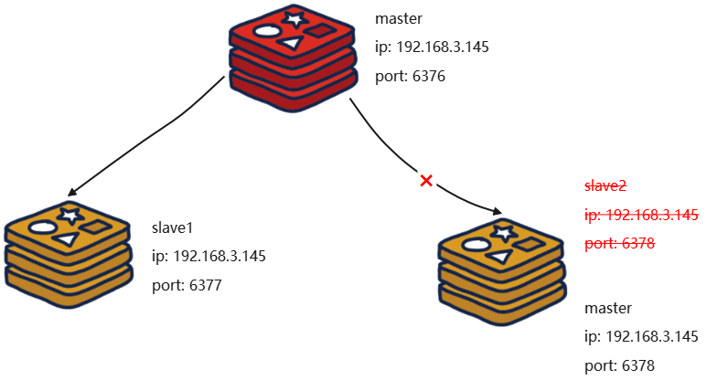

*Since: 2022-05-13*


[TOC]

## 概述

Redis 官网：https://redis.io/

GitHub：https://github.com/redis/redis

在线测试：https://try.redis.io/

Redis，Remote Dictionary Server，即远程字典服务。Redis 是完全开源的，使用 ANSIC 语言编写，遵守 BSD 协议，是一个高性能的 key-value 数据库，提供了丰富的数据结构，例如 String、Hash、List、Set、SortedSet 等等。Redis 数据是存在内存中的，同时 Redis 支持事务、持久化、LUA 脚本、发布/订阅、缓存淘汰、流技术等多种功能特性，提供了主从模式、Redis Sentinel 和 Redis Cluster 集群架构方案。

**主流功能与应用：**


- 分布式缓存，比如，与 MySQL 数据库结合使用。

  

  - Redis 是 key-value 数据库（NoSQL 一种），MySQL 是关系数据库。
  - Redis 数据操作主要在内存，而 MySQL 主要存储在磁盘。
  - Redis 在某些场景使用中要明显优于 MySQL，比如计数器、排行榜等方面。
  - Redis 通常用于一些特定场景，需要与 MySQL 一起配合使用。
  - Redis 与 MySQL 并不是相互替换和竞争关系，而是共用和配合使用。

- 内存存储和持久化（RDB + AOF）。

  - Redis 支持异步将内存中的数据写到硬盘上，同时不影响服务运行。

- 高可用架构搭配：单机、主从、哨兵、集群。

- 缓存穿透、击穿和雪崩。

- 分布式锁。

- 队列。

  - Redis 提供 List 和 Set 操作，这使得 Redis 能作为一个很好的消息队列平台来使用。我们常通过 Redis 的队列功能做购买限制。比如到节假日或者推广期间，进行一些活动。对用户购买行为进行限制，限制今天只能购买几次商品或者一段时间内只能购买一次，也比较适合适用。

- 排行榜、点赞等。

  - 在互联网应用中，有各种各样的排行榜，Redis 提供的 ZSet 数据类型能够快速实现这些复杂的排行榜。比如电商网站的月度销量排行榜、社交 APP 的礼物排行榜、小程序的投票排行榜等等。还有小说网站对小说进行排名，根据排名，将排名靠前的小说推荐给用户。

优点：

- 性能极高。Redis 读的速度是 110000 次/秒，写的速度是 81000 次/秒。
- 数据类型丰富。Redis 不仅支持简单的 key-value 类型的数据，同时还提供 List、Set、ZSet、Hash 等数据结果的存储。
- 支持数据的持久化。Redis 可以将内存中的数据写入磁盘中，重启的时候可以再次加载进行使用。
- 支持数据的备份。即 master-slave 模式的数据备份。

总结：


## Docker 安装

docker-compose.yaml：

```yaml
redis:
    image: redis:7.0.11
    container_name: redis
    ports:
      - 6379:6379
    volumes:
      - ./redis/conf/redis.conf:/usr/local/etc/redis/redis.conf
      - ./redis/data:/data
    # 挂载redis.conf的话，需要指定启动命令中的配置文件路径
    command: redis-server /usr/local/etc/redis/redis.conf
    networks:
      - apps
    restart: on-failure:3
```

redis.conf：

```conf
port 6379
requirepass 123456
protected-mode no
daemonize no
appendonly yes
aof-use-rdb-preamble yes
```

- redis.conf 需要在本地目录预先创建。

> 各版本源码下载地址：https://download.redis.io/releases/

## Redis 版本迭代演化

几个里程碑式的重要版本：


- 5.0 版本是直接升级到 6.0 版本的，对于这个激进的升级，Redis 之父 antirez 表现得很有信心和兴奋，所以第一时间发文来阐述 6.0 的一些重大功能 "Redis 6.0.0 GA is out!"。
- 2022 年 4 月 27 日，Redis 正式发布了 7.0 更新，其实早在 2022 年 1 月 31 日，Redis 已经预发布了 7.0rc-1，经过社区的考验后，确认没重大 Bug 才正式发布。

命名规则：

- 版本号第二位如果是奇数，则为非稳定版本，如 2.7、2.9、3.1。
- 版本号第二位如果是偶数，则为稳定版本，如 2.6、2.8、3.0、3.2。
- 当前奇数版本就是下一个稳定版本的开发版本，如 2.9 版本是 3.0 版本的开发版本。

## Redis 7.0 新特性

Redis 7.0rc-1 地址：https://github.com/redis/redis/releases?expanded=true&page=2&q=7.0.rc-1

Redis 7.0 大体和之前的 Redis 版本保持一致和稳定，主要是自身底层性能和资源利用率上的优化和提高，如果生产上系统稳定，不用着急升级到最新的 Redis 7.0 版本。

| 特性                               | 说明                                                         |
| ---------------------------------- | ------------------------------------------------------------ |
| 多 AOF 文件支持                    | Redis 7.0 版本中一个比较大的变化就是 AOF 文件由一个变成了多个，主要分为两种类型：基本文件（base files）、增量文件（incr files）。这些文件名称是复数形式，说明每一类文件不仅仅只有一个。在此之外还引入了一个清单文件（manifest）用于跟踪文件以及文件的创建和应用顺序（恢复）。 |
| config 命令增强                    | 对于 Config Set 和 Get 命令，支持在一次调用过程中传递多个配置参数。例如，现在可以在执行一次 Config Set 命令中更改多个参数：`config set maxmemory 10000001 maxmemory-clients 50% port 6399`。 |
| 限制客户端内存使用 Client-eviction | 一旦 Redis 连接较多，再加上每个连接的内存占用都比较大的时候， Redis 总连接内存占用可能会达到 maxmemory 的上限，可以增加允许限制所有客户端的总内存使用量配置项，redis.config 中对应的两种配置形式：指定内存大小（`maxmemory-clients 1g`）、基于 maxmemory 的百分比（`maxmemory-clients 10%`）。 |
| listpack 紧凑列表调整              | listpack 是用来替代 ziplist 的新数据结构，在 Redis 7.0 版本已经没有 ziplist 的配置了（Redis 6.0 版本仅部分数据类型作为过渡阶段在使用），listpack 已经替换了 ziplist 类似 hash-max-ziplist-entries 的配置。 |
| 访问安全性增强 ACLV2               | 在 redis.conf 配置文件中，protected-mode 默认为 yes，只有当你希望你的客户端在没有授权的情况下可以连接到 Redis Server 的时候，可以将 protected-mode 设置为 no。 |
| Redis Functions                    | Redis 函数，一种新的通过服务端脚本扩展 Redis 的方式，函数与数据本身一起存储。简言之，Redis 自己要去抢夺 Lua 脚本的饭碗。 |
| RDB 保存时间调整                   | 将持久化文件 RDB 的保存规则发生了改变，尤其是时间记录频度变化。 |
| 命令新增和变动                     | ZSet（有序集合）增加 ZMPOP、BZMPOP、ZINTERCARD 等命令，Set（集合）增加 SINTERCARD 命令，List（列表）增加 LMPOP、BLMPOP，从提供的键名列表中的第一个非空列表键中弹出一个或多个元素。 |
| 性能资源利用率、安全、等改进       | 自身底层部分优化改动，Redis 核心在许多方面进行了重构和改进。<br />主动碎片整理 V2：增强版主动碎片整理，配合 Jemalloc 版本更新，更快更智能，延时更低。<br />HyperLogLog 改进：在 Redis 5.0 中，HyperLogLog 算法得到改进，优化了计数统计时的内存使用效率，Redis 7.0 更加优秀更好的内存统计报告。 |

## Redis 数据类型（Data Types）

官网：https://redis.io/docs/data-types/


> Redis 的数据类型，指的是 Value 的类型，Key 的类型都是字符串。

### 字符串（String）

String 是 Redis **最基本的数据类型**，一个 key 对应一个 value，Redis 中一个字符串 value 最多可以是 512 MB。

String 类型是二进制安全的，意思是 Redis 的 String 可以包含任何数据，比如 jpg 图片或者序列化的对象。

### 列表（List）


Redis 列表是简单的字符串列表，**按照插入顺序排序**。也可以添加一个元素到列表的头部（左边）或者尾部（右边），它的底层实际是个**双端链表，对两端的操作性能很高，通过索引下标的操作中间的节点性能会较差**，最多可以包含 $$2^{32} - 1$$ 个元素（4294967295，即每个列表超过 40 亿个元素）。

### 哈希表（Hash）

Redis Hash 是一个 String 类型的 field（字段）和 value（值）的映射表，Hash 特别适合用于存储对象。Redis 中每个 Hash 可以存储 $$2^{32} - 1$$ 个键值对。

### 集合（Set）

Redis Set 是 String 类型的**无序集合**。集合成员是唯一的，这就意味着集合中不能出现重复的数据，集合对象的编码可以是 intset 或者 hashtable。

- Redis Set 是通过哈希表实现的，所以添加，删除，查找的复杂度都是 O(1)。

- Redis 中每个 Set 可以存储 $$2^{32} - 1$$ 个键值对。

### 有序集合（ZSet）

Redis ZSet，也叫 Sorted Set，即**有序集合**。Redis ZSet 和 Set 一样，也是 String 类型元素的集合，且不允许重复。不同的是每个元素都会关联一个 double 类型的分数（score），Redis 正是通过分数来为集合中的成员进行从小到大的排序。

- Redis ZSet 的成员是唯一的，但分数（score）却可以重复。

- Redis ZSet 集合是通过哈希表实现的，所以添加，删除，查找的复杂度都是 O(1)。 
- Redis 中每个 ZSet 可以存储 $$2^{32} - 1$$ 个键值对。

### 地理空间（GEO）

Redis GEO 主要用于存储地理位置信息，并对存储的信息进行操作，包括：

- 添加地理位置的坐标。

- 获取地理位置的坐标。

- 计算两个位置之间的距离。

- 根据用户给定的经纬度坐标，来获取指定范围内的地理位置集合。

### 基数统计（HyperLogLog）

HyperLogLog 是用来做基数统计的算法，HyperLogLog 的优点是：在输入元素的数量或者体积非常非常大时，计算基数所需的空间总是固定且是很小的。

在 Redis 里面，每个 HyperLogLog 键只需要花费 12 KB 内存，就可以计算接近 $$2^{64}$$ 个不同元素的基数，这和计算基数时，元素越多耗费内存就越多的集合形成鲜明对比。但是，因为 HyperLogLog 只会根据输入元素来计算基数，而不会储存输入元素本身，所以 HyperLogLog 不能像集合那样，返回输入的各个元素。

### 位图（Bitmap）


- 由 0 和 1 状态表现的二进制位的 bit 数组。

### 位域（Bitfield）

通过 Bitfield 命令可以一次性操作多个比特位域（指的是连续的多个比特位），它会执行一系列操作并返回一个响应数组，这个数组中的元素对应参数列表中的相应操作的执行结果。说白了就是通过 Bitfield 命令，我们可以一次性对多个比特位域进行操作。

### 流（Stream）

Redis Stream 是 Redis 5.0 版本新增加的数据结构。

Redis Stream 主要用于消息队列（MQ，Message Queue），Redis 本身是有一个 Redis 发布订阅来实现消息队列的功能，但它有个缺点就是消息无法持久化，如果出现网络断开、Redis 宕机等，消息就会被丢弃。简单来说发布订阅可以分发消息，但无法记录历史消息。而 Redis Stream 提供了消息的持久化和主备复制功能，可以让任何客户端访问任何时刻的数据，并且能记住每一个客户端的访问位置，还能保证消息不丢失。 

## Redis 命令（Commands）

官网：https://redis.io/commands/

中文：http://redis.cn/commands.html

参考：http://doc.redisfans.com/

### Client 命令

- **连接客户端**：`redis-cli [-h hostname] [-p port] [-a password]`。

  ```sh
  $ redis-cli -h 127.0.0.1 -p 6379 -a "mypass"
  127.0.0.1:6379>
  ```

>在 redis-cli 后面加上 --raw，可以避免中文乱码。

### Server 命令

- **验证密码**：`AUTH <password>`。密码匹配时返回 OK，否则返回一个错误。

  ```sh
  127.0.0.1:6379> AUTH password
  (error) ERR Client sent AUTH, but no password is set
  127.0.0.1:6379> CONFIG SET requirepass "mypass"
  OK
  127.0.0.1:6379> AUTH mypass
  Ok
  ```

- **服务器统计信息**：`INFO [section]`。返回关于 Redis 服务器的各种信息和统计数值。通过给定可选的参数 section，可以让命令只返回某一部分的信息。

  ```sh
  127.0.0.1:6379> INFO
  # Server
  redis_version:7.0.11								# Redis服务器版本
  redis_git_sha1:00000000
  redis_git_dirty:0
  redis_build_id:c87ff843cceeb98e
  redis_mode:standalone
  os:Linux 3.10.0-1160.90.1.el7.x86_64 x86_64			# Redis服务器的宿主操作系统
  arch_bits:64										# 架构(32或64位)
  monotonic_clock:POSIX clock_gettime
  multiplexing_api:epoll
  atomicvar_api:c11-builtin
  gcc_version:10.2.1
  process_id:1										# 服务器进程的PID
  process_supervised:no
  run_id:8de30f0d5af0e8f0f7761f0cd0636c03885baa7d		# Redis服务器的随机标识符(用于Sentinel和集群)
  tcp_port:6379										# TCP/IP监听端口
  server_time_usec:1693962718865941
  uptime_in_seconds:5689318							# 自Redis服务器启动以来，经过的秒数
  uptime_in_days:65									# 自Redis服务器启动以来，经过的天数
  hz:10
  configured_hz:10
  lru_clock:16241118
  executable:/data/redis-server
  config_file:/usr/local/etc/redis/redis.conf
  io_threads_active:0
  
  # Clients
  connected_clients:3									# 已连接客户端的数量(不包括通过从属服务器连接的客户端)
  cluster_connections:0
  maxclients:10000
  client_recent_max_input_buffer:8
  client_recent_max_output_buffer:0
  blocked_clients:0									# 正在等待阻塞命令(BLPOP、BRPOP、BRPOPLPUSH)的客户端的数量
  tracking_clients:0
  clients_in_timeout_table:0
  
  # Memory
  used_memory:1292232									# 由Redis分配器分配的内存总量，以字节(byte)为单位
  used_memory_human:1.23M								# 以人类可读的格式返回Redis分配的内存总量
  used_memory_rss:10547200							# 从操作系统的角度，返回Redis已分配的内存总量(俗称常驻集大小)，这个值和top、ps等命令的输出一致
  used_memory_rss_human:10.06M
  used_memory_peak:1402552							# Redis的内存消耗峰值，以字节(byte)为单位
  used_memory_peak_human:1.34M						# 以人类可读的格式返回Redis的内存消耗峰值
  used_memory_peak_perc:92.13%
  used_memory_overhead:868304
  used_memory_startup:862368
  used_memory_dataset:423928
  used_memory_dataset_perc:98.62%
  allocator_allocated:1509328
  allocator_active:1904640
  allocator_resident:4808704
  total_system_memory:8369803264
  total_system_memory_human:7.79G
  used_memory_lua:31744								# Lua引擎所使用的内存大小，以字节(byte)为单位
  used_memory_vm_eval:31744
  used_memory_lua_human:31.00K
  used_memory_scripts_eval:0
  number_of_cached_scripts:0
  number_of_functions:0
  number_of_libraries:0
  used_memory_vm_functions:32768
  used_memory_vm_total:64512
  used_memory_vm_total_human:63.00K
  used_memory_functions:184
  used_memory_scripts:184
  used_memory_scripts_human:184B
  maxmemory:0
  maxmemory_human:0B
  maxmemory_policy:noeviction
  allocator_frag_ratio:1.26
  allocator_frag_bytes:395312
  allocator_rss_ratio:2.52
  allocator_rss_bytes:2904064
  rss_overhead_ratio:2.19
  rss_overhead_bytes:5738496
  mem_fragmentation_ratio:8.31
  mem_fragmentation_bytes:9277264
  mem_not_counted_for_evict:8
  mem_replication_backlog:0
  mem_total_replication_buffers:0
  mem_clients_slaves:0
  mem_clients_normal:5400
  mem_cluster_links:0
  mem_aof_buffer:8
  mem_allocator:jemalloc-5.2.1
  active_defrag_running:0
  lazyfree_pending_objects:0
  lazyfreed_objects:0
  
  # Persistence
  loading:0
  async_loading:0
  current_cow_peak:0
  current_cow_size:0
  current_cow_size_age:0
  current_fork_perc:0.00
  current_save_keys_processed:0
  current_save_keys_total:0
  rdb_changes_since_last_save:0
  rdb_bgsave_in_progress:0
  rdb_last_save_time:1693910292
  rdb_last_bgsave_status:ok
  rdb_last_bgsave_time_sec:0
  rdb_current_bgsave_time_sec:-1
  rdb_saves:19
  rdb_last_cow_size:4923392
  rdb_last_load_keys_expired:0
  rdb_last_load_keys_loaded:0
  aof_enabled:1
  aof_rewrite_in_progress:0
  aof_rewrite_scheduled:0
  aof_last_rewrite_time_sec:-1
  aof_current_rewrite_time_sec:-1
  aof_last_bgrewrite_status:ok
  aof_rewrites:0
  aof_rewrites_consecutive_failures:0
  aof_last_write_status:ok
  aof_last_cow_size:0
  module_fork_in_progress:0
  module_fork_last_cow_size:0
  aof_current_size:56673
  aof_base_size:89
  aof_pending_rewrite:0
  aof_buffer_length:0
  aof_pending_bio_fsync:0
  aof_delayed_fsync:0
  
  # Stats
  total_connections_received:53
  total_commands_processed:4992
  instantaneous_ops_per_sec:0
  total_net_input_bytes:196447
  total_net_output_bytes:662900
  total_net_repl_input_bytes:0
  total_net_repl_output_bytes:0
  instantaneous_input_kbps:0.00
  instantaneous_output_kbps:0.00
  instantaneous_input_repl_kbps:0.00
  instantaneous_output_repl_kbps:0.00
  rejected_connections:0
  sync_full:0
  sync_partial_ok:0
  sync_partial_err:0
  expired_keys:0
  expired_stale_perc:0.00
  expired_time_cap_reached_count:0
  expire_cycle_cpu_milliseconds:241079
  evicted_keys:0
  evicted_clients:0
  total_eviction_exceeded_time:0
  current_eviction_exceeded_time:0
  keyspace_hits:4550
  keyspace_misses:304
  pubsub_channels:0
  pubsub_patterns:0
  pubsubshard_channels:0
  latest_fork_usec:2431
  total_forks:19
  migrate_cached_sockets:0
  slave_expires_tracked_keys:0
  active_defrag_hits:0
  active_defrag_misses:0
  active_defrag_key_hits:0
  active_defrag_key_misses:0
  total_active_defrag_time:0
  current_active_defrag_time:0
  tracking_total_keys:0
  tracking_total_items:0
  tracking_total_prefixes:0
  unexpected_error_replies:0
  total_error_replies:24
  dump_payload_sanitizations:0
  total_reads_processed:5068
  total_writes_processed:5017
  io_threaded_reads_processed:0
  io_threaded_writes_processed:0
  reply_buffer_shrinks:77
  reply_buffer_expands:24
  
  # Replication
  role:master
  connected_slaves:0
  master_failover_state:no-failover
  master_replid:942eb2629cc1a39b0c740df9929c526bcc1d57f7
  master_replid2:0000000000000000000000000000000000000000
  master_repl_offset:0
  second_repl_offset:-1
  repl_backlog_active:0
  repl_backlog_size:1048576
  repl_backlog_first_byte_offset:0
  repl_backlog_histlen:0
  
  # CPU
  used_cpu_sys:11484.273541
  used_cpu_user:11837.988764
  used_cpu_sys_children:0.238952
  used_cpu_user_children:0.046146
  used_cpu_sys_main_thread:11484.226705
  used_cpu_user_main_thread:11837.940036
  
  # Modules
  
  # Errorstats
  errorstat_ERR:count=6
  errorstat_NOAUTH:count=16
  errorstat_WRONGPASS:count=2
  
  # Cluster
  cluster_enabled:0
  
  # Keyspace
  db0:keys=3,expires=0,avg_ttl=0
  db4:keys=4,expires=0,avg_ttl=0
  ```

- **打印字符串**：`ECHO <message>`。返回字符串本身。

  ```sh
  127.0.0.1:6379> ECHO "Hello World"
  "Hello World"
  ```

- **查看服务是否运行**：`PING`。如果连接正常就返回一个 PONG，否则返回一个连接错误。

  ```sh
  # 客户端和服务器连接正常
  127.0.0.1:6379> PING
  PONG
  
  # 客户端和服务器连接不正常(网络不正常或服务器未能正常运行)
  127.0.0.1:6379> PING
  Could not connect to Redis at 127.0.0.1:6379: Connection refused
  ```

- **返回当前服务器时间**：`TIME`。返回一个包含两个字符串的列表，第一个字符串是当前时间（以 UNIX 时间戳格式表示），第二个字符串是当前这一秒钟已经逝去的微秒数。

  ```sh
  127.0.0.1:6379> TIME
  1) "1693965189"
  2) "195945"
  ```

- **切换到指定数据库**：`SELECT <index>`。总是返回 OK。

  ```sh
  # 默认使用0号数据库
  127.0.0.1:6379> SET db_number 0
  OK
  
  # 使用1号数据库
  127.0.0.1:6379> SELECT 1
  OK
  
  # 已经切换到1号数据库，注意Redis现在的命令提示符多了个[1]
  127.0.0.1:6379[1]> GET db_number
  (nil)
  
  127.0.0.1:6379[1]> SET db_number 1
  OK
  
  127.0.0.1:6379[1]> GET db_number
  "1"
  
  # 再切换到3号数据库
  127.0.0.1:6379[1]> SELECT 3
  OK
  
  # 提示符从[1]改变成了[3]
  127.0.0.1:6379[3]>
  ```

- **清空当前数据库**：`FLUSHDB`。总是返回 OK。

  ```sh
  # 清空前的key数量
  127.0.0.1:6379> DBSIZE
  (integer) 4
  
  127.0.0.1:6379> FLUSHDB
  OK
  
  # 清空后的key数量
  127.0.0.1:6379> DBSIZE
  (integer) 0
  ```

  - **Redis 默认是 16 个库，通过 0 ~ 15 标识库名，默认使用 0 号库，可以通过 redis.conf 修改配置。**

    

- **清空全部数据库**：`FLUSHALL`。总是返回 OK。

  ```sh
  # 0号数据库的key数量
  127.0.0.1:6379> DBSIZE
  (integer) 9
  
  # 切换到1号数据库
  127.0.0.1:6379[1]> SELECT 1
  OK
  
  # 1号数据库的key数量
  127.0.0.1:6379[1]> DBSIZE
  (integer) 6
  
  # 清空所有数据库的所有key
  127.0.0.1:6379[1]> FLUSHALL
  OK
  
  # 不但1号数据库被清空了
  127.0.0.1:6379[1]> DBSIZE
  (integer) 0
  
  # 0号数据库(以及其他所有数据库)也一样
  127.0.0.1:6379> SELECT 0
  OK
  
  127.0.0.1:6379> DBSIZE
  (integer) 0
  ```

- **实时打印出 Redis 服务器接收到的命令**：`MONITOR`。调试用。

  ```sh
  127.0.0.1:6379> MONITOR
  OK
  1693965563.441319 [0 127.0.0.1:46990] "auth" "(redacted)"
  1693965567.613074 [0 127.0.0.1:46990] "dbsize"
  1693965630.705873 [0 127.0.0.1:46992] "keys" "*"
  ```

- **关闭当前连接**：`QUIT`。总是返回 OK。

  ```sh
  127.0.0.1:6379> QUIT
  OK
  ```

### Key 命令

- **查看当前库 key 的数量**：`DBSIZE`。返回当前数据库的 key 的数量。

  ```sh
  127.0.0.1:6379> dbsize
  (integer) 1
  ```

- **查找所有符合给定模式（pattern）的 key**：`KEYS <pattern>`。返回符合给定模式的 key 列表。

  ```sh
  # 获取所有的key
  127.0.0.1:6379> KEYS *
  1) "inspection_task-1115"
  
  # inspection开头的key
  127.0.0.1:6379> KEYS inspection*
  1) "inspection_task-1115"
  
  # bbcc开头的key
  127.0.0.1:6379> KEYS bbcc*
  (empty array)
  ```

  - **生产环境不要轻易使用 KEYS 命令，因为 Redis 是单线程的，KEYS 命令的性能随着数据库数据的增多而越来越慢，使用 KEYS 命令时会占用唯一的一个线程的大量处理时间，引发 Redis 阻塞并且增加 Redis 的 CPU 占用，导致所有的请求都被拖慢，可能造成 Redis 所在的服务器宕机。**

- **判断某个 key 是否存在**：`EXISTS <key_name>`。若 key 存在返回 1，否则返回 0。

  ```sh
  127.0.0.1:6379> EXISTS runoob-new-key
  (integer) 0
  ```

- **返回 key 所储存的值的类型**：`TYPE <key_name>`。返回 key 的数据类型。

  ```sh
  # key不存在
  127.0.0.1:6379> TYPE aabb
  none
  
  # 字符串
  127.0.0.1:6379> SET weather "sunny"
  OK
  
  127.0.0.1:6379> TYPE weather
  string
  
  # 列表
  127.0.0.1:6379> LPUSH book_list "programming in scala"
  (integer) 1
  
  127.0.0.1:6379> TYPE book_list
  list
  
  # 集合
  127.0.0.1:6379> SADD pat "dog"
  (integer) 1
  
  127.0.0.1:6379> TYPE pat
  set
  ```

- **在 key 存在时删除 key**：`DEL <key_name>`。返回被删除 key 的数量。

  ```sh
  127.0.0.1:6379> DEL key
  (integer) 1
  ```

- **以秒为单位，为给定 key 设置过期时间**：`EXPIRE <key_name> <time_in_seconds>`。设置成功返回 1，当 key 不存在或者不能为 key 设置过期时间时返回 0。

  ```sh
  127.0.0.1:6379> EXPIRE runooobkey 60
  (integer) 1
  ```

- **以秒为单位，返回 key 的剩余过期时间**：`TTL <key_name>`。当 key 不存在时，返回 -2，当 key 存在但没有设置剩余生存时间时，返回 -1，否则，以秒为单位，返回 key 的剩余生存时间。

  ```sh
  # 不存在的key
  127.0.0.1:6379> FLUSHDB
  OK
  
  127.0.0.1:6379> TTL key
  (integer) -2
  
  # key存在，但没有设置剩余生存时间
  127.0.0.1:6379> SET key value
  OK
  
  127.0.0.1:6379> TTL key
  (integer) -1
  
  # 有剩余生存时间的key
  127.0.0.1:6379> EXPIRE key 10086
  (integer) 1
  
  127.0.0.1:6379> TTL key
  (integer) 10084
  ```

- **将当前数据库的 key 移动到给定的数据库 db 当中**：`MOVE <key_name> <db_name>`。移动成功返回 1，失败则返回 0。

  ```sh
  # key存在于当前数据库
  127.0.0.1:6379> SELECT 0								# redis默认使用数据库0，为了清晰起见，这里再显式指定一次
  OK
  
  127.0.0.1:6379> SET song "secret base - Zone"
  OK
  
  127.0.0.1:6379> MOVE song 1								# 将song移动到数据库1
  (integer) 1
  
  127.0.0.1:6379> EXISTS song								# song已经被移走
  (integer) 0
  
  127.0.0.1:6379> SELECT 1								# 使用数据库1
  OK
  
  127.0.0.1:6379[1]> EXISTS song							# 证实song被移到了数据库1
  (integer) 1
  
  
  # 当key不存在的时候
  127.0.0.1:6379[1]> EXISTS fake_key
  (integer) 0
  
  127.0.0.1:6379[1]> MOVE fake_key 0						# 试图从数据库1移动一个不存在的key到数据库0，失败
  (integer) 0
  
  127.0.0.1:6379[1]> select 0								# 使用数据库0
  OK
  
  127.0.0.1:6379> EXISTS fake_key							# 证实fake_key不存在
  (integer) 0
  
  
  # 当源数据库和目标数据库有相同的key时
  127.0.0.1:6379> SELECT 0								# 使用数据库0
  OK
  
  127.0.0.1:6379> SET favorite_fruit "banana"
  OK
  
  127.0.0.1:6379> SELECT 1								# 使用数据库1
  OK
  
  127.0.0.1:6379[1]> SET favorite_fruit "apple"
  OK
  
  127.0.0.1:6379[1]> SELECT 0								# 使用数据库0，并试图将favorite_fruit移动到数据库1
  OK
  
  127.0.0.1:6379> MOVE favorite_fruit 1					# 因为两个数据库有相同的key，MOVE失败
  (integer) 0
  
  127.0.0.1:6379> GET favorite_fruit						# 数据库0的favorite_fruit没变
  "banana"
  
  127.0.0.1:6379> SELECT 1
  OK
  
  127.0.0.1:6379[1]> GET favorite_fruit					# 数据库1的favorite_fruit也没变
  "apple"
  ```

### Value 命令

- **帮助命令**：`HELP @数据类型`。

  ```sh
  127.0.0.1:6379> HELP @string
  
  127.0.0.1:6379> HELP @list
  ```

#### String

- **设置指定 key 的值**：`SET <key_name> <value>`。在设置操作成功完成后，返回 OK。

  ```sh
  127.0.0.1:6379> SET key "value"
  OK
  
  127.0.0.1:6379> GET key
  "value"
  ```

- **获取指定 key 的值**：`GET <key_name>`。返回 key 的值，如果 key 不存在时，返回 nil。如果 key 不是字符串类型，那么返回一个错误。

  ```sh
  # 对不存在的key或字符串类型key进行GET
  127.0.0.1:6379> GET db
  (nil)
  
  127.0.0.1:6379> SET db redis
  OK
  
  127.0.0.1:6379> GET db
  "redis"
  
  # 对不是字符串类型的key进行GET
  127.0.0.1:6379> DEL db
  (integer) 1
  
  127.0.0.1:6379> LPUSH db redis mongodb mysql
  (integer) 3
  
  127.0.0.1:6379> GET db
  (error) ERR Operation against a key holding the wrong kind of value
  ```

- **将值 value 关联到 key ，并将 key 的过期时间设为 seconds（以秒为单位）**：`SETEX <key_name> <timeout> <value>`。在设置操作成功完成后，返回 OK。

  ```sh
  127.0.0.1:6379> SETEX mykey 60 redis
  OK
  
  127.0.0.1:6379> TTL mykey
  60
  
  127.0.0.1:6379> GET mykey
  "redis
  ```

- **同时设置一个或多个 key-value 对**：` MSET <key_name1> <value1> [<key_name2> <value2>] .. [<key_nameN> <valueN>]`。总是返回 OK。

  ```sh
  127.0.0.1:6379> MSET key1 "Hello" key2 "World"
  OK
  
  127.0.0.1:6379> GET key1
  "Hello"
  
  127.0.0.1:6379> GET key2
  1) "World"
  ```

- **获取所有（一个或多个）给定 key 的值**：`MGET <key_name1> [<key_name2>] .. [<key_nameN>]`。返回一个包含所有给定 key 的值的列表。

  ```sh
  127.0.0.1:6379> SET key1 "hello"
  OK
  
  127.0.0.1:6379> SET key2 "world"
  OK
  
  127.0.0.1:6379> MGET key1 key2 someOtherKey
  1) "Hello"
  2) "World"
  3) (nil)
  ```

- **将给定 key 的值设为 value，并返回 key 的旧值 old value**：`GETSET <key_name> <value>`。返回给定 key 的旧值。当 key 没有旧值时，即 key 不存在时，返回 nil。当 key 存在，但不是字符串类型时，返回一个错误。

  ```sh
  127.0.0.1:6379> GETSET db mongodb	# 没有旧值，返回nil
  (nil)
  
  127.0.0.1:6379> GET db
  "mongodb"
  
  127.0.0.1:6379> GETSET db redis		# 返回旧值mongodb
  "mongodb"
  
  127.0.0.1:6379> GET db
  "redis"
  ```

- **用 value 参数覆写给定 key 所储存的字符串值，从偏移量 offset 开始**：`SETRANGE <key_name> OFFSET <value>`。返回被修改后的字符串长度。

  ```sh
  127.0.0.1:6379> SET key1 "Hello World"
  OK
  
  127.0.0.1:6379> SETRANGE key1 6 "Redis"
  (integer) 11
  
  127.0.0.1:6379> GET key1
  "Hello Redis"
  ```

- **返回 key 中字符串值的子字符**：`GETRANGE <key_name> <start> <end>`。返回截取得到的子字符串。

  ```sh
  127.0.0.1:6379> SET mykey "This is my test key"
  OK
  
  127.0.0.1:6379> GETRANGE mykey 0 3
  "This"
  
  127.0.0.1:6379> GETRANGE mykey 0 -1
  "This is my test key"
  ```

- **返回 key 所储存的字符串值的长度**：`STRLEN <key_name>`。返回字符串值的长度，当 key 不存在时，返回 0。

  ```sh
  # 获取字符串的长度
  127.0.0.1:6379> SET mykey "Hello World"
  OK
  
  127.0.0.1:6379> STRLEN mykey
  (integer) 11
  
  # 不存在的key长度为0
  127.0.0.1:6379> STRLEN nonexisting
  (integer) 0
  ```

- **如果 key 已经存在并且是一个字符串， APPEND 命令将指定的 value 追加到该 key 原来值（value）的末尾**：`APPEND <key_name> <new_value>`。返回追加指定值之后， key 中字符串的长度。如果 key 已经存在并且是一个字符串，APPEND 命令将 value 追加到 key 原来的值的末尾。**如果 key 不存在，APPEND 就简单地将给定 key 设为 value，就像执行 SET key value 一样。**

  ```sh
  # 对不存在的key执行APPEND
  127.0.0.1:6379> EXISTS myphone				# myphone不存在
  (integer) 0
  
  127.0.0.1:6379> APPEND myphone "nokia"		# 对不存在的key进行APPEND，等同于SET myphone "nokia"
  (integer) 5
  
  # 对已存在的字符串进行APPEND
  127.0.0.1:6379> APPEND myphone " - 1110"	# 长度从5个字符增加到12个字符
  (integer) 12
  
  127.0.0.1:6379> GET myphone
  "nokia - 1110"
  ```

- **将 key 中储存的数字值增一**：`INCR <key_name>`。返回执行 INCR 命令之后 key 的值。如果 key 不存在，那么 key 的值会先被初始化为 0，然后再执行 INCR 操作。如果值包含错误的类型，或字符串类型的值不能表示为数字，那么返回一个错误。

  ```sh
  127.0.0.1:6379> SET page_view 20
  OK
  
  127.0.0.1:6379> INCR page_view
  (integer) 21
  
  127.0.0.1:6379> GET page_view    # 数字值在Redis中以字符串的形式保存
  "21"
  ```

- **将 key 所储存的值加上给定的增量值（increment）**：`INCRBY <key_name> <increment>`。返回加上指定的增量值之后， key 的值。如果 key 不存在，那么 key 的值会先被初始化为 0，然后再执行 INCRBY 操作。如果值包含错误的类型，或字符串类型的值不能表示为数字，那么返回一个错误。

  ```sh
  # key存在且是数字值
  127.0.0.1:6379> SET rank 50
  OK
  
  127.0.0.1:6379> INCRBY rank 20
  (integer) 70
  
  127.0.0.1:6379> GET rank
  "70"
  
  # key不存在时
  127.0.0.1:6379> EXISTS counter
  (integer) 0
  
  127.0.0.1:6379> INCRBY counter 30
  (integer) 30
  
  127.0.0.1:6379> GET counter
  "30"
  
  # key不是数字值时
  127.0.0.1:6379> SET book "long long ago..."
  OK
  
  127.0.0.1:6379> INCRBY book 200
  (error) ERR value is not an integer or out of range
  ```

- **将 key 中储存的数字值减一**：`DECR <key_name>`。返回执行 INCR 命令之后 key 的值。如果 key 不存在，那么 key 的值会先被初始化为 0，然后再执行 DECR 操作。如果值包含错误的类型，或字符串类型的值不能表示为数字，那么返回一个错误。

  ```sh
  # 对存在的数字值key进行DECR
  redis> SET failure_times 10
  OK
  
  redis> DECR failure_times
  (integer) 9
  
  # 对不存在的key值进行DECR
  redis> EXISTS count
  (integer) 0
  
  redis> DECR count
  (integer) -1
  
  # 对存在但不是数值的key进行DECR
  redis> SET company YOUR_CODE_SUCKS.LLC
  OK
  
  redis> DECR company
  (error) ERR value is not an integer or out of range
  ```

- **将 key 所储存的值减去给定的减量值（decrement）**：`DECRBY <key_name> <decrement>`。返回加上指定的增量值之后， key 的值。如果 key 不存在，那么 key 的值会先被初始化为 0，然后再执行 DECRBY 操作。如果值包含错误的类型，或字符串类型的值不能表示为数字，那么返回一个错误。

  ```sh
  # 对已存在的key进行DECRBY
  redis> SET count 100
  OK
  
  redis> DECRBY count 20
  (integer) 80
  
  # 对不存在的key进行DECRBY
  redis> EXISTS pages
  (integer) 0
  
  redis> DECRBY pages 10
  (integer) -10
  ```

#### List

- **将一个或多个值插入到列表头部**：`LPUSH <key_name1> <value1> [<value2>] .. [<valueN>]`。返回列表的长度。

  ```sh
  127.0.0.1:6379> LPUSH list1 "foo"
  (integer) 1
   
   127.0.0.1:6379> LPUSH list1 "bar"
  (integer) 2
  
  127.0.0.1:6379> LRANGE list1 0 -1
  1) "bar"
  2) "foo"
  ```

- **将一个或多个值添加到列表尾部**：`RPUSH <key_name1> <value1> [<value2>] .. [<valueN>]`。返回列表的长度。

  ```sh
  127.0.0.1:6379> RPUSH mylist "hello"
  (integer) 1
  
  127.0.0.1:6379> RPUSH mylist "foo"
  (integer) 2
  
  127.0.0.1:6379> RPUSH mylist "bar"
  (integer) 3
  
  127.0.0.1:6379> LRANGE mylist 0 -1
  1) "hello"
  2) "foo"
  3) "bar"
  ```

- **将一个值插入到已存在的列表头部**：`LPUSHX <key_name1> <value1> [<value2>] .. [<valueN>]`。返回列表的长度，列表不存在时操作无效。

  ```sh
  127.0.0.1:6379> LPUSH list1 "foo"
  (integer) 1
  
  127.0.0.1:6379> LPUSHX list1 "bar"
  (integer) 2
  
  127.0.0.1:6379> LPUSHX list2 "bar"		# 列表不存在时操作无效
  (integer) 0
  
  127.0.0.1:6379> LRANGE list1 0 -1
  1) "bar"
  2) "foo"
  ```

- **将一个值添加到已存在的列表头部**：`RPUSHX <key_name1> <value1> [<value2>] .. [<valueN>]`。返回列表的长度，列表不存在时操作无效。

  ```sh
  127.0.0.1:6379> RPUSH mylist "hello"
  (integer) 1
  
  127.0.0.1:6379> RPUSH mylist "foo"
  (integer) 2
  
  127.0.0.1:6379> RPUSHX mylist2 "bar"	# 列表不存在时操作无效
  (integer) 0
  
  127.0.0.1:6379> LRANGE mylist 0 -1
  1) "hello"
  2) "foo"
  ```

- **移出并获取列表的第一个元素**：`LPOP <key_name>`。返回列表的第一个元素。当列表 key 不存在时，返回 nil。

  ```sh
  127.0.0.1:6379> RPUSH list1 "foo"
  (integer) 1
  
  127.0.0.1:6379> RPUSH list1 "bar"
  (integer) 2
  
  127.0.0.1:6379> LPOP list1
  "foo"
  ```

- **移出并获取列表的最后一个元素**：`RPOP <key_name>`。返回列表的最后一个元素。当列表 key 不存在时，返回 nil。

  ```sh
  127.0.0.1:6379> RPUSH mylist "one"
  (integer) 1
  
  127.0.0.1:6379> RPUSH mylist "two"
  (integer) 2
  
  127.0.0.1:6379> RPUSH mylist "three"
  (integer) 3
  
  127.0.0.1:6379> RPOP mylist
  "three"
  
  127.0.0.1:6379> LRANGE mylist 0 -1
  1) "one"
  2) "two"
  ```

- **获取列表的长度**：`LLEN <key_name>`。返回列表的长度。如果列表 key 不存在，则 key 被解释为一个空列表，返回 0。 如果 key 不是列表类型，返回一个错误。

  ```sh
  127.0.0.1:6379> RPUSH list1 "foo"
  (integer) 1
  
  127.0.0.1:6379> RPUSH list1 "bar"
  (integer) 2
  
  127.0.0.1:6379> LLEN list1
  (integer) 2
  ```

- **获取列表指定范围内的元素**：`LRANGE <key_name> <start> <end>`。返回一个列表，包含指定区间内的元素。其中 0 表示列表的第一个元素， 1 表示列表的第二个元素，以此类推。 也可以使用负数下标，以 -1 表示列表的最后一个元素， -2 表示列表的倒数第二个元素，以此类推。

  ```sh
  127.0.0.1:6379> RPUSH mylist "one"
  (integer) 1
  
  127.0.0.1:6379> RPUSH mylist "two"
  (integer) 2
  
  127.0.0.1:6379> RPUSH mylist "three"
  (integer) 3
  
  127.0.0.1:6379> LRANGE mylist 0 0
  1) "one"
  
  127.0.0.1:6379> LRANGE mylist -3 2
  1) "one"
  2) "two"
  3) "three"
  
  127.0.0.1:6379> LRANGE mylist -100 100
  1) "one"
  2) "two"
  3) "three"
  
  127.0.0.1:6379> LRANGE mylist 5 10
  (empty list or set)
  ```

- **通过索引获取列表中的元素**：`LINDEX <key_name> <index>`。返回列表中下标为指定索引值的元素，如果指定索引值不在列表的区间范围内，返回 nil。

  ```sh
  127.0.0.1:6379> LPUSH mylist "World"
  (integer) 1
  
  127.0.0.1:6379> LPUSH mylist "Hello"
  (integer) 2
  
  127.0.0.1:6379> LINDEX mylist 0
  "Hello"
  
  127.0.0.1:6379> LINDEX mylist -1
  "World"
  
  127.0.0.1:6379> LINDEX mylist 3		# index不在mylist的区间范围内
  (nil)
  ```

- **通过索引设置列表元素的值**：`LSET <key_name> <index> <value>`。操作成功返回 ok，否则返回错误信息。当索引参数超出范围，或对一个空列表进行 LSET 时，返回一个错误。

  ```sh
  127.0.0.1:6379> RPUSH mylist "hello"
  (integer) 1
  
  127.0.0.1:6379> RPUSH mylist "hello"
  (integer) 2
  
  127.0.0.1:6379> RPUSH mylist "foo"
  (integer) 3
  
  127.0.0.1:6379> RPUSH mylist "hello"
  (integer) 4
  
  127.0.0.1:6379> LSET mylist 0 "bar"
  OK
  
  127.0.0.1:6379> LRANGE mylist 0 -1
  1: "bar"
  2) "hello"
  3) "foo"
  4) "hello"
  ```

- **在列表的元素前或者后插入元素**：`LINSERT <key_name> BEFORE|AFTER <pivot> <value>`。如果命令执行成功，返回插入操作完成之后，列表的长度。如果没有找到指定元素 ，返回 -1。如果 key 不存在或为空列表，返回 0。当指定元素不存在于列表中时，不执行任何操作。当列表不存在时，被视为空列表，不执行任何操作。

  ```sh
  127.0.0.1:6379> RPUSH mylist "Hello"
  (integer) 1
  
  127.0.0.1:6379> RPUSH mylist "World"
  (integer) 2
  
  127.0.0.1:6379> LINSERT mylist BEFORE "World" "There"
  (integer) 3
  
  127.0.0.1:6379> LRANGE mylist 0 -1
  1) "Hello"
  2) "There"
  3) "World"
  ```

- **移除列表元素**：`LREM <key_name> <count> <value>`。

  ```sh
  127.0.0.1:6379> RPUSH mylist "hello"
  (integer) 1
  
  127.0.0.1:6379> RPUSH mylist "hello"
  (integer) 2
  
  127.0.0.1:6379> RPUSH mylist "foo"
  (integer) 3
  
  127.0.0.1:6379> RPUSH mylist "hello"
  (integer) 4
  
  127.0.0.1:6379> LREM mylist -2 "hello"
  (integer) 2
  
  127.0.0.1:6379> LRANGE mylist 0 -1
  1) "hello"
  2) "foo"
  ```

  - count > 0：从表头开始向表尾搜索，移除与 value 相等的元素，数量为 count。
  - count < 0：从表尾开始向表头搜索，移除与 value 相等的元素，数量为 count 的绝对值。
  - count = 0：移除表中所有与 value 相等的值。

- **对一个列表进行修剪（trim），即让列表只保留指定区间内的元素，不在指定区间之内的元素都将被删除**：`LTRIM <key_name> <start> <stop>`。

  ```sh
  127.0.0.1:6379> RPUSH mylist "hello"
  (integer) 1
  
  127.0.0.1:6379> RPUSH mylist "hello"
  (integer) 2
  
  127.0.0.1:6379> RPUSH mylist "foo"
  (integer) 3
  
  127.0.0.1:6379> RPUSH mylist "bar"
  (integer) 4
  
  127.0.0.1:6379> LTRIM mylist 1 -1
  OK
  
  127.0.0.1:6379> LRANGE mylist 0 -1
  1) "hello"
  2) "foo"
  3) "bar"
  ```

#### Hash

- **将哈希表 key 中的字段 field 的值设为 value**：`HSET <key_name> <field> <value>`。如果字段是哈希表中的一个新建字段，并且值设置成功，返回 1。如果哈希表中域字段已经存在，且旧值已被新值覆盖，返回 0。

  ```sh
  127.0.0.1:6379> HSET myhash field1 "foo"
  OK
  
  127.0.0.1:6379> HGET myhash field1
  "foo"
  
  127.0.0.1:6379> HSET website google "www.g.cn"			# 设置一个新域
  (integer) 1
  
  127.0.0.1:6379> HSET website google "www.google.com"	# 覆盖一个旧域
  (integer) 0
  ```

- **获取存储在哈希表中指定字段的值**：`HGET <key_name> <field>`。返回给定字段的值。如果给定的字段或 key 不存在时，返回 nil。

  ```sh
  127.0.0.1:6379> HSET site redis redis.com
  1
  
  127.0.0.1:6379> HGET site redis
  "redis.com"
  
  127.0.0.1:6379> HGET site mysql
  (nil)
  ```

- **同时将多个 field-value（域-值）对设置到哈希表 key 中**：`HMSET <key_name> <field1> <value1> [<field2> <value2>] .. [<fieldN> <valueN>]`。如果命令执行成功，返回 OK。此命令会覆盖哈希表中已存在的字段。如果哈希表不存在，会创建一个空哈希表，并执行 HMSET 操作。

  ```sh
  127.0.0.1:6379> HMSET myhash field1 "Hello" field2 "World"
  OK
  
  127.0.0.1:6379> HGET myhash field1
  "Hello"
  
  127.0.0.1:6379> HGET myhash field2
  "World"
  ```

- **获取所有给定字段的值**：`HMGET <key_name> <field1> [<field2>] .. [<fieldN>]`。返回一个包含多个给定字段关联值的表，表值的排列顺序和指定字段的请求顺序一样。

  ```sh
  127.0.0.1:6379> HSET myhash field1 "foo"
  (integer) 1
  
  127.0.0.1:6379> HSET myhash field2 "bar"
  (integer) 1
  
  127.0.0.1:6379> HMGET myhash field1 field2 nofield
  1) "foo"
  2) "bar"
  3) (nil)
  ```

- **获取在哈希表中指定 key 的所有字段和值**：`HGETALL <key_name>`。以列表形式返回哈希表的字段及字段值。 若 key 不存在，返回空列表。在返回值里，紧跟每个字段名之后是字段的值，所以返回值的长度是哈希表大小的两倍。

  ```sh
  127.0.0.1:6379> HSET myhash field1 "Hello"
  (integer) 1
  
  127.0.0.1:6379> HSET myhash field2 "World"
  (integer) 1
  
  127.0.0.1:6379> HGETALL myhash
  1) "field1"
  2) "Hello"
  3) "field2"
  4) "World"
  ```

- **查看哈希表 key 中，指定的字段是否存在**：`HEXISTS <key_name> <field>`。如果哈希表含有给定字段，返回 1。如果哈希表不含有给定字段，或 key 不存在，返回 0。

  ```sh
  127.0.0.1:6379> HSET myhash field1 "foo"
  (integer) 1
  
  127.0.0.1:6379> HEXISTS myhash field1
  (integer) 1
  
  127.0.0.1:6379> HEXISTS myhash field2
  (integer) 0
  ```

- **删除一个或多个哈希表字段，不存在的字段将被忽略**：`HDEL <key_name> <field1> [<field2>] .. [<fieldN>]`。返回被成功删除字段的数量，不包括被忽略的字段。

  ```sh
  127.0.0.1:6379> HSET myhash field1 "foo"
  (integer) 1
  
  127.0.0.1:6379> HDEL myhash field1
  (integer) 1
  
  127.0.0.1:6379> HDEL myhash field2
  (integer) 0
  ```

- **获取哈希表中字段的数量**：`HLEN <key_name>`。返回哈希表中字段的数量，当 key 不存在时，返回 0。

  ```sh
  127.0.0.1:6379> HSET myhash field1 "foo"
  (integer) 1
  
  127.0.0.1:6379> HSET myhash field2 "bar"
  (integer) 1
  
  127.0.0.1:6379> HLEN myhash
  (integer) 2
  ```

- **获取哈希表中的所有字段**：`HKEYS <key_name>`。返回包含哈希表中所有域（field）列表。当 key 不存在时，返回一个空列表。

  ```sh
  127.0.0.1:6379> HSET myhash field1 "foo"
  (integer) 1
  
  127.0.0.1:6379> HSET myhash field2 "bar"
  (integer) 1
  
  127.0.0.1:6379> HKEYS myhash
  1) "field1"
  2) "field2"
  ```

- **获取哈希表中所有值**：`HVALS <key_name>`。返回一个包含哈希表中所有值的列表。当 key 不存在时，返回一个空表。

  ```sh
  127.0.0.1:6379> HSET myhash field1 "foo"
  (integer) 1
  
  127.0.0.1:6379> HSET myhash field2 "bar"
  (integer) 1
  
  127.0.0.1:6379> HVALS myhash
  1) "foo"
  2) "bar"
  
  # 空哈希表/不存在的key
  127.0.0.1:6379> EXISTS not_exists
  (integer) 0
  
  127.0.0.1:6379> HVALS not_exists
  (empty list or set)
  ```

- **为哈希表 key 中的指定字段的整数值加上增量 increment**：`HINCRBY <key_name> <field> <increment>`。返回执行 HINCRBY 命令之后，哈希表中字段的值。

  ```sh
  127.0.0.1:6379> HSET myhash field 5
  (integer) 1
  
  127.0.0.1:6379> HINCRBY myhash field 1
  (integer) 6
  
  127.0.0.1:6379> HINCRBY myhash field -1
  (integer) 5
  
  127.0.0.1:6379> HINCRBY myhash field -10
  (integer) -5
  ```

- **为哈希表 key 中的指定字段的浮点数值加上增量 increment**：`HINCRBYFLOAT <key_name> <field> <increment>`。返回执行 HINCRBYFLOAT 命令之后，哈希表中字段的值。

  ```sh
  127.0.0.1:6379> HSET mykey field 10.50
  (integer) 1
  
  127.0.0.1:6379> HINCRBYFLOAT mykey field 0.1
  "10.6"
  
  127.0.0.1:6379> HINCRBYFLOAT mykey field -5
  "5.6"
  
  127.0.0.1:6379> HSET mykey field 5.0e3
  (integer) 0
  
  127.0.0.1:6379> HINCRBYFLOAT mykey field 2.0e2
  "5200"
  ```

- **只有在字段 field 不存在时，设置哈希表字段的值**：`HSETNX <key_name> <field> <value>`。设置成功，返回 1。如果给定字段已经存在且没有操作被执行，返回 0。

  ```sh
  127.0.0.1:6379> HSETNX myhash field1 "foo"
  (integer) 1
  
  127.0.0.1:6379> HSETNX myhash field1 "bar"
  (integer) 0
  
  127.0.0.1:6379> HGET myhash field1
  "foo"
  
  127.0.0.1:6379> HSETNX nosql key-value-store redis
  (integer) 1
  
  127.0.0.1:6379> HSETNX nosql key-value-store redis		# 操作无效, key-value-store已存在
  (integer) 0
  ```

#### Set

- **向集合添加一个或多个成员，已经存在于集合的成员元素将被忽略**：`SADD <key_name> <member1> [<member2>] .. [<memberN>]`。返回被添加到集合中的新元素的数量，不包括被忽略的元素。

  ```sh
  127.0.0.1:6379> SADD myset "hello"
  (integer) 1
  
  127.0.0.1:6379> SADD myset "foo"
  (integer) 1
  
  127.0.0.1:6379> SADD myset "hello"
  (integer) 0
  
  127.0.0.1:6379> SMEMBERS myset
  1) "hello"
  2) "foo"
  ```

- **返回集合中的所有成员**：`SMEMBERS <key_name>`。返回集合中的所有成员，不存在的集合 key 被视为空集合。

  ```sh
  127.0.0.1:6379> SADD myset1 "hello"
  (integer) 1
  
  127.0.0.1:6379> SADD myset1 "world"
  (integer) 1
  
  127.0.0.1:6379> SMEMBERS myset1
  1) "World"
  2) "Hello"
  ```

- **判断 member 元素是否是集合 key 的成员**：`SISMEMBER <key_name> <member>`。如果成员元素是集合的成员，返回 1。如果成员元素不是集合的成员，或 key 不存在，返回 0。

  ```sh
  127.0.0.1:6379> SADD myset1 "hello"
  (integer) 1
  
  127.0.0.1:6379> SISMEMBER myset1 "hello"
  (integer) 1
  
  127.0.0.1:6379> SISMEMBER myset1 "world"
  (integer) 0
  ```

- **移除集合中一个或多个成员，不存在的成员元素会被忽略**：`SREM <key_name> <member1> [<member2>] .. [<memberN>]`。返回被成功移除的元素的数量，不包括被忽略的元素。

  ```sh
  127.0.0.1:6379> SADD myset1 "hello"
  (integer) 1
  
  127.0.0.1:6379> SADD myset1 "world"
  (integer) 1
  
  127.0.0.1:6379> SADD myset1 "bar"
  (integer) 1
  
  127.0.0.1:6379> SREM myset1 "hello"
  (integer) 1
  
  127.0.0.1:6379> SREM myset1 "foo"
  (integer) 0
  
  127.0.0.1:6379> SMEMBERS myset1
  1) "bar"
  2) "world"
  ```

- **获取集合的成员数**：`SCARD <key_name>`。返回集合的数量。当集合 key 不存在时，返回 0。

  ```sh
  127.0.0.1:6379> SADD myset "hello"
  (integer) 1
  
  127.0.0.1:6379> SADD myset "foo"
  (integer) 1
  
  127.0.0.1:6379> SADD myset "hello"
  (integer) 0
  
  127.0.0.1:6379> SCARD myset
  (integer) 2
  ```

- **返回集合中一个或多个随机数**：`SRANDMEMBER <key_name> [<count>]`。只提供集合 key 参数时，返回一个元素；如果集合为空，返回 nil。如果提供了 count 参数，那么返回一个数组；如果集合为空，返回空数组。

  ```sh
  127.0.0.1:6379> SADD myset1 "hello"
  (integer) 1
  
  127.0.0.1:6379> SADD myset1 "world"
  (integer) 1
  
  127.0.0.1:6379> SADD myset1 "bar"
  (integer) 1
  
  127.0.0.1:6379> SRANDMEMBER myset1
  "bar"
  
  127.0.0.1:6379> SRANDMEMBER myset1 2
  1) "Hello"
  2) "world"
  ```

  - 如果 count 为正数，且小于集合基数，那么命令返回一个包含 count 个元素的数组，数组中的元素各不相同。如果 count 大于等于集合基数，那么返回整个集合。
  - 如果 count 为负数，那么命令返回一个数组，数组中的元素可能会重复出现多次，而数组的长度为 count 的绝对值。

- **移除并返回集合中的一个随机元素**：`SPOP <key_name> [<count>]`。参考 SRANDMEMBER 命令，前者不移除元素，而 SPOP 会移除元素。

  ```sh
  127.0.0.1:6379> SADD myset "one"
  (integer) 1
  
  127.0.0.1:6379> SADD myset "two"
  (integer) 1
  
  127.0.0.1:6379> SADD myset "three"
  (integer) 1
  
  127.0.0.1:6379> SPOP myset
  "one"
  
  127.0.0.1:6379> SMEMBERS myset
  1) "three"
  2) "two"
  
  127.0.0.1:6379> SADD myset "four"
  (integer) 1
  
  127.0.0.1:6379> SADD myset "five"
  (integer) 1
  
  127.0.0.1:6379> SPOP myset 3
  1) "five"
  2) "four"
  3) "two"
  
  127.0.0.1:6379> SMEMBERS myset
  1) "three"
  ```

- **将 member 元素从 source 集合移动到 destination 集合**：`SMOVE <source> <destination> <member>`。如果成员元素被成功移除，返回 1。如果成员元素不是 source 集合的成员，并且没有任何操作对 destination 集合执行，那么返回 0。

  ```sh
  127.0.0.1:6379> SADD myset1 "hello"
  (integer) 1
  
  127.0.0.1:6379> SADD myset1 "world"
  (integer) 1
  
  127.0.0.1:6379> SADD myset1 "bar"
  (integer) 1
  
  127.0.0.1:6379> SADD myset2 "foo"
  (integer) 1
  
  127.0.0.1:6379> SMOVE myset1 myset2 "bar"
  (integer) 1
  
  127.0.0.1:6379> SMEMBERS myset1
  1) "World"
  2) "Hello"
  
  127.0.0.1:6379> SMEMBERS myset2
  1) "foo"
  2) "bar"
  ```

  - SMOVE 是原子性操作。
  - 如果 source 集合不存在或不包含指定的 member 元素，则 SMOVE 命令不执行任何操作，仅返回 0。否则，member 元素从 source 集合中被移除，并添加到 destination 集合中去。
  - 当 destination 集合已经包含 member 元素时，SMOVE 命令只是简单地将 source 集合中的 member 元素删除。
  - 当 source 或 destination 不是集合类型时，返回一个错误。

- **返回第一个集合与其他集合之间的差异**：`SDIFF <first_key_name> <other_key_name1> [<other_key_name2>] .. [<other_key_nameN>]`。返回包含差集成员的列表。

  ```sh
  127.0.0.1:6379> SADD key1 "a"
  (integer) 1
  
  127.0.0.1:6379> SADD key1 "b"
  (integer) 1
  
  127.0.0.1:6379> SADD key1 "c"
  (integer) 1
  
  127.0.0.1:6379> SADD key2 "c"
  (integer) 1
  
  127.0.0.1:6379> SADD key2 "d"
  (integer) 1
  
  127.0.0.1:6379> SADD key2 "e"
  (integer) 1
  
  127.0.0.1:6379> SDIFF key1 key2
  1) "a"
  2) "b"
  ```

- **返回给定所有集合的差集并存储在 destination 中，如果指定的集合 key 已存在，则会被覆盖**：`SDIFFSTORE <destination> <key_name1> [<key_name2>] .. [<key_nameN>]`。返回结果集中的元素数量。

  ```sh
  127.0.0.1:6379> SADD myset "hello"
  (integer) 1
  
  127.0.0.1:6379> SADD myset "foo"
  (integer) 1
  
  127.0.0.1:6379> SADD myset "bar"
  (integer) 1
  
  127.0.0.1:6379> SADD myset2 "hello"
  (integer) 1
  
  127.0.0.1:6379> SADD myset2 "world"
  (integer) 1
  
  127.0.0.1:6379> SDIFFSTORE destset myset myset2
  (integer) 2
  
  127.0.0.1:6379> SMEMBERS destset
  1) "foo"
  2) "bar"
  ```

- **返回给定所有集合的交集**：`SINTER <key_name> <key_name1> [<key_name2>] .. [<key_nameN>]`。返回交集成员的列表。不存在的集合 key 被视为空集。 当给定集合当中有一个空集时，结果也为空集（根据集合运算定律）。

  ```sh
  127.0.0.1:6379> SADD myset "hello"
  (integer) 1
  
  127.0.0.1:6379> SADD myset "foo"
  (integer) 1
  
  127.0.0.1:6379> SADD myset "bar"
  (integer) 1
  
  127.0.0.1:6379> SADD myset2 "hello"
  (integer) 1
  
  127.0.0.1:6379> SADD myset2 "world"
  (integer) 1
  
  127.0.0.1:6379> SINTER myset myset2
  1) "hello"
  ```

- **返回给定所有集合的交集并存储在 destination 中**：`SINTERSTORE <destination> <key_name> <key_name1> [<key_name2>] .. [<key_nameN>]`。返回存储交集的集合的元素数量。如果指定的集合已经存在，则将其覆盖。

  ```sh
  127.0.0.1:6379> SADD myset1 "hello"
  (integer) 1
  
  127.0.0.1:6379> SADD myset1 "foo"
  (integer) 1
  
  127.0.0.1:6379> SADD myset1 "bar"
  (integer) 1
  
  127.0.0.1:6379> SADD myset2 "hello"
  (integer) 1
  
  127.0.0.1:6379> SADD myset2 "world"
  (integer) 1
  
  127.0.0.1:6379> SINTERSTORE myset myset1 myset2
  (integer) 1
  
  127.0.0.1:6379> SMEMBERS myset
  1) "hello"
  ```

- **返回所有给定集合的并集**：`SUNION <key_name> <key_name1> [<key_name2>] .. [<key_nameN>] `。返回并集成员的列表。

  ```sh
  127.0.0.1:6379> SADD key1 "a"
  (integer) 1
  
  127.0.0.1:6379> SADD key1 "b"
  (integer) 1
  
  127.0.0.1:6379> SADD key1 "c"
  (integer) 1
  
  127.0.0.1:6379> SADD key2 "c"
  (integer) 1
  
  127.0.0.1:6379> SADD key2 "d"
  (integer) 1
  
  127.0.0.1:6379> SADD key2 "e"
  (integer) 1
  
  127.0.0.1:6379> SUNION key1 key2
  1) "a"
  2) "c"
  3) "b"
  4) "e"
  5) "d"
  ```

- **所有给定集合的并集存储在 destination 集合中**：`SUNIONSTORE <destination> <key_name> <key_name1> [<key_name2>] .. [<key_nameN>]`。返回结果集中的元素数量。如果 destination 已经存在，则将其覆盖。

  ```sh
  127.0.0.1:6379> SADD key1 "a"
  (integer) 1
  
  127.0.0.1:6379> SADD key1 "b"
  (integer) 1
  
  127.0.0.1:6379> SADD key1 "c"
  (integer) 1
  
  127.0.0.1:6379> SADD key2 "c"
  (integer) 1
  
  127.0.0.1:6379> SADD key2 "d"
  (integer) 1
  
  127.0.0.1:6379> SADD key2 "e"
  (integer) 1
  
  127.0.0.1:6379> SUNIONSTORE key key1 key2
  (integer) 5
  
  127.0.0.1:6379> SMEMBERS key
  1) "c"
  2) "b"
  3) "e"
  4) "d"
  5) "a"
  ```

#### ZSet

- **向有序集合添加一个或多个成员，或者更新已存在成员的分数**：`ZADD <key_name> <score1> <value1> [<score2> <value2>] .. [<scoreN> <valueN>]`。返回被成功添加的新成员的数量，不包括那些被更新的、已经存在的成员。

  ```sh
  127.0.0.1:6379> ZADD myzset 1 "one"
  (integer) 1
  
  127.0.0.1:6379> ZADD myzset 1 "uno"
  (integer) 1
  
  127.0.0.1:6379> ZADD myzset 2 "two" 3 "three"
  (integer) 2
  
  127.0.0.1:6379> ZRANGE myzset 0 -1 WITHSCORES
  1) "one"
  2) "1"
  3) "uno"
  4) "1"
  5) "two"
  6) "2"
  7) "three"
  8) "3"
  ```

  - 如果某个成员已经是有序集的成员，那么更新这个成员的分数值，并通过重新插入这个成员元素，来保证该成员在正确的位置上。
  - 分数值可以是整数值或双精度浮点数。
  - 如果有序集合 key 不存在，则创建一个空的有序集并执行 ZADD 操作。
  - 当 key 存在但不是有序集类型时，返回一个错误。

- **获取有序集合的成员数**：`ZCARD <key_name>`。当 key 存在且是有序集类型时，返回有序集的基数。当 key 不存在时，返回 0。

  ```sh
  127.0.0.1:6379> ZADD myzset 1 "one"
  (integer) 1
  127.0.0.1:6379> ZADD myzset 2 "two"
  (integer) 1
  127.0.0.1:6379> ZCARD myzset
  (integer) 2
  ```

- **返回有序集合中指定成员的索引，其中有序集成员按分数值递增（从小到大）顺序排列**：`ZRANK <key_name> <member>`。如果成员是有序集 key 的成员，返回 member 的排名。如果成员不是有序集 key 的成员，返回 nil。

  ```sh
  127.0.0.1:6379> ZRANGE salary 0 -1 WITHSCORES			# 显示所有成员及其score值
  1) "peter"
  2) "3500"
  3) "tom"
  4) "4000"
  5) "jack"
  6) "5000"
  
  127.0.0.1:6379> ZRANK salary tom						# 显示tom的薪水排名，第二
  (integer) 1
  ```

- **移除有序集合中的一个或多个成员，不存在的成员将被忽略**：`ZREM <key_name> <member> [<member2>] .. [<memberN>]`。返回被成功移除的成员的数量，不包括被忽略的成员。

  ```sh
  # 测试数据
  127.0.0.1:6379> ZRANGE page_rank 0 -1 WITHSCORES
  1) "bing.com"
  2) "8"
  3) "baidu.com"
  4) "9"
  5) "google.com"
  6) "10"
  
  # 移除单个元素
  127.0.0.1:6379> ZREM page_rank google.com
  (integer) 1
  
  127.0.0.1:6379> ZRANGE page_rank 0 -1 WITHSCORES
  1) "bing.com"
  2) "8"
  3) "baidu.com"
  4) "9"
  
  # 移除多个元素
  127.0.0.1:6379> ZREM page_rank baidu.com bing.com
  (integer) 2
  
  127.0.0.1:6379> ZRANGE page_rank 0 -1 WITHSCORES
  (empty list or set)
  
  # 移除不存在元素
  127.0.0.1:6379> ZREM page_rank non-exists-element
  (integer) 0
  ```

- **计算在有序集合中指定区间分数的成员数**：`ZCOUNT <key_name> <min> <max>`。返回分数值在 min 和 max 之间的成员的数量。

  ```sh
  127.0.0.1:6379> ZADD myzset 1 "hello"
  (integer) 1
  
  127.0.0.1:6379> ZADD myzset 1 "foo"
  (integer) 1
  
  127.0.0.1:6379> ZADD myzset 2 "world" 3 "bar"
  (integer) 2
  
  127.0.0.1:6379> ZCOUNT myzset 1 3
  (integer) 4
  ```

- **在有序集合中计算指定字典区间内成员数量**：`ZLEXCOUNT <key_name> <min> <max>`。返回指定区间内的成员数量。

  ```sh
  127.0.0.1:6379> ZADD myzset 0 a 0 b 0 c 0 d 0 e
  (integer) 5
  
  127.0.0.1:6379> ZADD myzset 0 f 0 g
  (integer) 2
  
  127.0.0.1:6379> ZLEXCOUNT myzset - +
  (integer) 7
  
  127.0.0.1:6379> ZLEXCOUNT myzset [b [f
  (integer) 5
  ```

- **通过索引区间返回有序集合指定区间内的成员**：`ZRANGE <key_name> <start> <stop> [WITHSCORES]`。返回指定区间内，带有分数值（可选）的有序集成员的列表。

  ```sh
  127.0.0.1:6379> ZRANGE salary 0 -1 WITHSCORES				# 显示整个有序集成员
  1) "jack"
  2) "3500"
  3) "tom"
  4) "5000"
  5) "boss"
  6) "10086"
  
  127.0.0.1:6379> ZRANGE salary 1 2 WITHSCORES				# 显示有序集下标区间1至2的成员
  1) "tom"
  2) "5000"
  3) "boss"
  4) "10086"
  
  127.0.0.1:6379> ZRANGE salary 0 200000 WITHSCORES			# 测试end下标超出最大下标时的情况
  1) "jack"
  2) "3500"
  3) "tom"
  4) "5000"
  5) "boss"
  6) "10086"
  
  127.0.0.1:6379> ZRANGE salary 200000 3000000 WITHSCORES		# 测试当给定区间不存在于有序集时的情况
  (empty list or set)
  ```

  - 下标参数 start 和 stop 都以 0 为底，也就是说，以 0 表示有序集第一个成员，以 1 表示有序集第二个成员，以此类推。也可以使用负数下标，以 -1 表示最后一个成员，-2 表示倒数第二个成员，以此类推。

- **返回有序集中指定区间内的成员，通过索引，分数从高到低**：`ZREVRANGE <key_name> <start> <stop> [WITHSCORES]`。返回指定区间内，带有分数值（可选）的有序集成员的列表。

  ```sh
  127.0.0.1:6379> ZRANGE salary 0 -1 WITHSCORES			# 递增排列
  1) "peter"
  2) "3500"
  3) "tom"
  4) "4000"
  5) "jack"
  6) "5000"
  
  127.0.0.1:6379> ZREVRANGE salary 0 -1 WITHSCORES		# 递减排列
  1) "jack"
  2) "5000"
  3) "tom"
  4) "4000"
  5) "peter"
  6) "3500"
  ```

- **通过分数返回有序集合指定区间内的成员**：`ZRANGEBYSCORE <key_name> <min> <max> [WITHSCORES] [LIMIT offset count]`。返回指定区间内，带有分数值（可选）的有序集成员的列表。

  ```sh
  127.0.0.1:6379> ZADD salary 2500 jack							# 测试数据
  (integer) 0
  
  127.0.0.1:6379> ZADD salary 5000 tom
  (integer) 0
  
  127.0.0.1:6379> ZADD salary 12000 peter
  (integer) 0
  
  127.0.0.1:6379> ZRANGEBYSCORE salary -inf +inf					# 显示整个有序集
  1) "jack"
  2) "tom"
  3) "peter"
  
  127.0.0.1:6379> ZRANGEBYSCORE salary -inf +inf WITHSCORES		# 显示整个有序集及成员的score值
  1) "jack"
  2) "2500"
  3) "tom"
  4) "5000"
  5) "peter"
  6) "12000"
  
  127.0.0.1:6379> ZRANGEBYSCORE salary -inf 5000 WITHSCORES		# 显示工资<=5000的所有成员
  1) "jack"
  2) "2500"
  3) "tom"
  4) "5000"
  
  127.0.0.1:6379> ZRANGEBYSCORE salary (5000 400000				# 显示工资大于5000小于等于400000的成员
  1) "peter"
  ```

  - 默认情况下，区间的取值使用闭区间（小于等于或大于等于），也可以通过给参数前增加`(`符号来使用可选的开区间（小于或大于）。

- **返回有序集中指定分数区间内的成员，分数从高到低排序**：`ZREVRANGEBYSCORE <key_name> <max> <min> [WITHSCORES] [LIMIT offset count]`。返回指定区间内，带有分数值（可选）的有序集成员的列表。

  ```sh
  127.0.0.1:6379> ZADD salary 10086 jack
  (integer) 1
  
  127.0.0.1:6379> ZADD salary 5000 tom
  (integer) 1
  
  127.0.0.1:6379> ZADD salary 7500 peter
  (integer) 1
  
  127.0.0.1:6379> ZADD salary 3500 joe
  (integer) 1
  
  127.0.0.1:6379> ZREVRANGEBYSCORE salary +inf -inf			# 逆序排列所有成员
  1) "jack"
  2) "peter"
  3) "tom"
  4) "joe"
  
  127.0.0.1:6379> ZREVRANGEBYSCORE salary 10000 2000			# 逆序排列薪水介于10000和2000之间的成员
  1) "peter"
  2) "tom"
  3) "joe"
  ```

- **返回有序集合中指定成员的排名，有序集成员按分数值递减（从大到小）排序**：`ZREVRANK <key_name> <member>`。如果成员是有序集 key 的成员，返回成员的排名。如果成员不是有序集 key 的成员，返回 nil。

  ```sh
  127.0.0.1:6379> ZRANGE salary 0 -1 WITHSCORES				# 测试数据
  1) "jack"
  2) "2000"
  3) "peter"
  4) "3500"
  5) "tom"
  6) "5000"
  
  127.0.0.1:6379> ZREVRANK salary peter						# peter的工资排第二
  (integer) 1
  
  127.0.0.1:6379> ZREVRANK salary tom							# tom的工资最高
  (integer) 0
  ```

- **返回有序集中，成员的分数值**：`ZSCORE <key_name> <member>`。返回成员的分数值，以字符串形式表示。

  ```sh
  127.0.0.1:6379> ZRANGE salary 0 -1 WITHSCORES				# 测试数据
  1) "tom"
  2) "2000"
  3) "peter"
  4) "3500"
  5) "jack"
  6) "5000"
  
  127.0.0.1:6379> ZSCORE salary peter							# 注意返回值是字符串
  "3500"
  ```

- **有序集合中对指定成员的分数加上增量 increment**：`ZINCRBY <key_name> <increment> <member>`。当 key 不存在，或分数不是 key 的成员时，ZINCRBY key increment member 等同于 ZADD key increment member。

  ```sh
  127.0.0.1:6379> ZADD myzset 1 "one"
  (integer) 1
  
  127.0.0.1:6379> ZADD myzset 2 "two"
  (integer) 1
  
  127.0.0.1:6379> ZINCRBY myzset 2 "one"
  "3"
  
  127.0.0.1:6379> ZRANGE myzset 0 -1 WITHSCORES
  1) "two"
  2) "2"
  3) "one"
  4) "3"
  ```

- **移除有序集合中给定的排名区间的所有成员**：`ZREMRANGEBYRANK <key_name> <start> <stop>`。

  ```sh
  127.0.0.1:6379> ZADD salary 2000 jack
  (integer) 1
  
  127.0.0.1:6379> ZADD salary 5000 tom
  (integer) 1
  
  127.0.0.1:6379> ZADD salary 3500 peter
  (integer) 1
  
  127.0.0.1:6379> ZREMRANGEBYRANK salary 0 1			# 移除下标0至1区间内的成员
  (integer) 2
  
  127.0.0.1:6379> ZRANGE salary 0 -1 WITHSCORES		# 有序集只剩下一个成员
  1) "tom"
  2) "5000"
  ```

- **移除有序集合中给定的分数区间的所有成员**：`ZREMRANGEBYSCORE <key_name> <min> <max>`。返回被移除成员的数量。

  ```sh
  127.0.0.1:6379> ZRANGE salary 0 -1 WITHSCORES          # 显示有序集内所有成员及其score值
  1) "tom"
  2) "2000"
  3) "peter"
  4) "3500"
  5) "jack"
  6) "5000"
  
  127.0.0.1:6379> ZREMRANGEBYSCORE salary 1500 3500      # 移除所有薪水在1500到3500内的员工
  (integer) 2
  
  127.0.0.1:6379> ZRANGE salary 0 -1 WITHSCORES          # 剩下的有序集成员
  1) "jack"
  2) "5000"
  ```

#### GEO

`// TODO`

#### HyperLogLog

`// TODO`

#### Bitmap

`// TODO`

#### Bitfield

`// TODO`

#### Stream

`// TODO`

## Redis 持久化（Persistence）

官网：https://redis.io/docs/management/persistence/


Persistence refers to the writing of data to durable storage, such as a solid-state disk (SSD). Redis provides a range of persistence options. These include:

- **RDB** (Redis Database): RDB persistence performs point-in-time snapshots of your dataset at specified intervals.
- **AOF** (Append Only File): AOF persistence logs every write operation received by the server. These operations can then be replayed again at server startup, reconstructing the original dataset. Commands are logged using the same format as the Redis protocol itself.
- **No persistence**: You can disable persistence completely. This is sometimes used when caching.
- **RDB + AOF**: You can also combine both AOF and RDB in the same instance.

### RDB


**`RDB，即 Redis Database，RDB 持久性以指定的时间间隔执行数据集的时间点快照。`**

- 在指定的时间间隔内，将内存中的数据集快照写入磁盘，也就是 Snapshot 内存快照，Redis 服务恢复时再将磁盘快照文件直接读回到内存里。
- Redis 的数据都在内存中，保存备份时它执行的是`全量快照`，也就是说，把内存中的所有数据都记录到磁盘中。
- **RDB 保存的是 dump.rdb 文件。**

#### 原理

Whenever Redis needs to dump the dataset to disk, this is what happens:

- Redis [forks](http://linux.die.net/man/2/fork). We now have a child and a parent process.
- The child starts to write the dataset to a temporary RDB file.
- When the child is done writing the new RDB file, it replaces the old one.

This method allows Redis to benefit from copy-on-write semantics.

>在 Linux 程序中，`fork()`会产生一个和父进程完全相同的子进程，但子进程在此后多会执行系统调用，出于效率考虑，尽量避免太多 fork 操作。

#### 备份

By default Redis saves snapshots of the dataset on disk, in a binary file called `dump.rdb`. You can configure Redis to have it save the dataset every N seconds if there are at least M changes in the dataset, or you can manually call the [`SAVE`](https://redis.io/commands/save) or [`BGSAVE`](https://redis.io/commands/bgsave) commands.

For example, this configuration will make Redis automatically dump the dataset to disk every 60 seconds if at least 1000 keys changed:

```sh
save 60 1000
```

This strategy is known as *snapshotting*.

##### 自动触发

默认情况下，RDB 触发条件为三种：


- **每隔 3600 秒（1 小时），至少有 1 个更改。**
- **每隔 300 秒（15 分钟），至少有 100 个更改。**
- **每隔 60 秒（1 分钟），至少有 10000 个更改。**
- 通过`save m n`，可以修改 RDB 的触发条件，表示 m 秒内数据集存在 n 次修改时，自动触发。

##### 手动触发

Redis 通过 SAVE 和 BGSAVE 两个命令，手动触发 RDB 文件备份：

- `SAVE`：在主程序中执行 SAVE 命令，会`阻塞`当前 Redis 服务，直到持久化工作完成。在执行 SAVE 命令期间，Redis 不能处理其他命令，线上禁止使用。

  

- `BGSAVE`：Redis 会在后台异步执行快照操作，`不阻塞` Redis 服务，快照的同时，还可以响应客户端请求。该触发方式会 fork 一个子进程，由子进程在后台完成持久化过程，也就允许主进程同时可以修改数据。

  

- `LASTSAVE`：可以通过 LASTSAVE 命令，获取最后一次成功执行快照的时间。

  ```sh
  # 在Redis客户端查看最后一次成功执行快照的时间
  127.0.0.1:6379> LASTSAVE
  (integer) 1694404800
  
  # 在Linux系统查看时间戳对应的时间
  $ date
  Mon Sep 11 17:42:01 CST 2023
  $ date -d @1694404800
  Mon Sep 11 12:00:00 CST 2023
  ```

##### dump 文件的路径和名称

dump 文件路径默认设置：


- 使用 CONFIG 命令，获取 dump 文件实际路径：

  ```sh
  127.0.0.1:6379> CONFIG GET dir
  1) "dir"
  2) "/data"
  ```

dump 文件名称默认设置：


- 使用 CONFIG 命令，获取 dump 文件实际名称：

  ```sh
  127.0.0.1:6379> CONFIG GET dbfilename
  1) "dbfilename"
  2) "dump.rdb"
  ```

##### dump 文件的检查和修复

/usr/local/bin 路径：

```sh
root@a5e838348b37:~# cd /usr/local/bin/
root@a5e838348b37:/usr/local/bin# ls -l
total 31732
-rwxrwxr-x 1 root root      661 May 23 11:09 docker-entrypoint.sh
-rwxr-xr-x 1 root root  2355690 Dec 20  2022 gosu
-rwxr-xr-x 1 root root  7581896 May 23 11:10 redis-benchmark
lrwxrwxrwx 1 root root       12 May 23 11:10 redis-check-aof -> redis-server
lrwxrwxrwx 1 root root       12 May 23 11:10 redis-check-rdb -> redis-server
-rwxr-xr-x 1 root root  7526536 May 23 11:10 redis-cli
lrwxrwxrwx 1 root root       12 May 23 11:10 redis-sentinel -> redis-server
-rwxr-xr-x 1 root root 15014184 May 23 11:10 redis-server
```

/data 路径：

```sh
root@a5e838348b37:~# cd /data/
root@a5e838348b37:/data# ls -l
total 8
drwx------ 2 redis redis  103 Jun  1 11:16 appendonlydir
-rw------- 1 redis redis 7227 Sep 11 04:00 dump.rdb
```

检查和修复：

```sh
root@a5e838348b37:~# /usr/local/bin/redis-check-rdb /data/dump.rdb 
[offset 0] Checking RDB file /data/dump.rdb
[offset 27] AUX FIELD redis-ver = '7.0.11'
[offset 41] AUX FIELD redis-bits = '64'
[offset 53] AUX FIELD ctime = '1694404800'
[offset 68] AUX FIELD used-mem = '1383624'
[offset 80] AUX FIELD aof-base = '0'
[offset 82] Selecting DB ID 0
[offset 220] Selecting DB ID 4
[offset 7227] Checksum OK
[offset 7227] \o/ RDB looks OK! \o/
[info] 8 keys read
[info] 0 expires
[info] 0 already expired
```

#### 恢复

将备份文件（dump.rdb）移动到 Redis 的 dir 目录，并重启服务，即可恢复数据集。

>不可以把备份文件 dump.rdb 和生产 Redis 服务器放在同一台机器，必须分开各自存储，以防生产机物理损坏后备份文件也挂了。

#### 优势

官网：

- RDB is a very compact single-file point-in-time representation of your Redis data. RDB files are perfect for backups. For instance you may want to archive your RDB files every hour for the latest 24 hours, and to save an RDB snapshot every day for 30 days. This allows you to easily restore different versions of the data set in case of disasters.
- RDB is very good for disaster recovery, being a single compact file that can be transferred to far data centers, or onto Amazon S3 (possibly encrypted).
- RDB maximizes Redis performances since the only work the Redis parent process needs to do in order to persist is forking a child that will do all the rest. The parent process will never perform disk I/O or alike.
- RDB allows faster restarts with big datasets compared to AOF.
- On replicas, RDB supports [partial resynchronizations after restarts and failovers](https://redis.io/topics/replication#partial-resynchronizations-after-restarts-and-failovers).

简译：

- RDB 是 Redis 数据非常紧凑的单文件时间点表示。RDB 文件非常适合备份。例如，你可能希望每小时归档最近 24 小时的 RDB 文件，每天保存一个 RDB 快照，持续 30 天。这样就可以在发生灾难时轻松恢复数据集的不同版本。
- RDB 非常适合灾难恢复，因为它是一个紧凑的文件，可以传输到远处的数据中心或亚马逊 S3（可能已加密）。
- RDB 能最大限度地提高 Redis 的性能，因为 Redis 父进程为持久化所需做的唯一工作就是分叉一个子进程，由子进程完成其余所有工作。父进程永远不会执行磁盘 I/O 或类似操作。
- 与 AOF 相比，RDB 允许更快地重启大数据集。
- 在副本上，RDB 支持重启和故障切换后的部分重新同步。

总结：

- **可以按照业务定时备份。**
- **适合大规模的数据恢复。**
- **对数据完整性和一致性要求不高。**
- **RDB 文件在内存中的加载速度要比 AOF 快很多。**

#### 劣势

官网：

- RDB is NOT good if you need to minimize the chance of data loss in case Redis stops working (for example after a power outage). You can configure different *save points* where an RDB is produced (for instance after at least five minutes and 100 writes against the data set, you can have multiple save points). However you'll usually create an RDB snapshot every five minutes or more, so in case of Redis stopping working without a correct shutdown for any reason you should be prepared to lose the latest minutes of data.
- RDB needs to fork() often in order to persist on disk using a child process. fork() can be time consuming if the dataset is big, and may result in Redis stopping serving clients for some milliseconds or even for one second if the dataset is very big and the CPU performance is not great. AOF also needs to fork() but less frequently and you can tune how often you want to rewrite your logs without any trade-off on durability.

简译：

- 如果需要在 Redis 停止工作（例如停电后）时尽量减少数据丢失的几率，那么 RDB 就不太合适。你可以配置生成 RDB 的不同保存点（例如，数据集至少经过 5 分钟和 100 次写入后，你可以有多个保存点）。不过，你通常会每五分钟或更长时间创建一次 RDB 快照，因此，如果 Redis 因故停止工作而没有正确关机，你应该做好丢失最近几分钟数据的准备。
- 如果数据集很大，fork() 可能会很耗时，如果数据集很大，CPU 性能又不高，可能会导致 Redis 在几毫秒甚至一秒内停止为客户端提供服务。AOF 也需要 fork()，但频率较低，你可以调整重写日志的频率，而无需牺牲耐用性。

总结：

- **RDB 在一定间隔时间做一次备份，如果在此期间 Redis 服务意外停止，就会丢失从当前至最近一次快照期间的数据。**
- **内存数据的全量同步，如果数据量太大，会导致 I/O 严重，影响服务器性能。**
- **RDB 依赖于主进程的 fork()，在更大的数据集中，这可能会导致服务请求的瞬间延迟。**
- **fork() 的时候，内存中的数据被克隆了一份，大致 2 倍的膨胀性，也需要考虑硬件上的需求。**

#### 禁用

禁用 RDB 快照有两种方式：

- 命令：

  ```sh
  # 动态停止所有RDB保存规则
  $ redis-cli config set save ""
  ```

- 配置文件：

  

#### 配置项

RDB 的相关配置项，在配置文件的 SNAPSHOTTING 模块：

- `save <seconds> <changes> [<seconds> <changes> ...]`：备份的触发规则，默认提供了三种方式。

- `stop-writes-on-bgsave-error yes`：默认 yes，如果配置成 no，表示不在乎数据不一致，或者有其他的手段发现和控制这种不一致，那么在快照写入失败时，Redis 也能继续接受新的写请求。

  

- `rdbcompression yes`：默认 yes，对于存储到磁盘中的快照，可以设置是否进行压缩存储。如果是的话，Redis 会采用 LZF 算法进行压缩。如果不想消耗 CPU 来进行压缩的话，可以设置为关闭此功能。

  

- `rdbchecksum yes`：默认 yes，在存储快照后，还可以让 Redis 使用 CRC64 算法来进行数据校验，但是这样做会增加大约 10% 的性能消耗，如果希望获取到最大的性能提升，可以关闭此功能。

  

- `dbfilename dump.rdb`：备份的文件名称，集群环境下，建议修改为不同的名称。

- `rdb-del-sync-files no`：在没有持久性的情况下删除复制中使用的 RDB 文件启用。默认情况下 no，此选项是禁用的。

  

- `dir ./`：备份文件的名称。

#### 总结

RDB 快照的触发情况总结：

- 配置文件中默认的触发方式。
- 执行 SAVE 或者 BGSAVE 命令。
- 执行 FLUSHALL 或者 FLUSHDB 命令，此命令产生的 dump.rdb 文件是空文件。
- 执行 SHUTDOWN 命令，且没有设置开启 AOF 持久化。
- 主从复制时，主节点自动触发。

### AOF

Snapshotting is not very durable. If your computer running Redis stops, your power line fails, or you accidentally `kill -9` your instance, the latest data written to Redis will be lost. While this may not be a big deal for some applications, there are use cases for full durability, and in these cases Redis snapshotting alone is not a viable option.

The *append-only file* is an alternative, fully-durable strategy for Redis. It became available in version 1.1.

You can turn on the AOF in your configuration file:

```sh
appendonly yes
```

From now on, every time Redis receives a command that changes the dataset (e.g. [`SET`](https://redis.io/commands/set)) it will append it to the AOF. When you restart Redis it will re-play the AOF to rebuild the state.

Since Redis 7.0.0, Redis uses a multi part AOF mechanism. That is, the original single AOF file is split into base file (at most one) and incremental files (there may be more than one). The base file represents an initial (RDB or AOF format) snapshot of the data present when the AOF is [rewritten](https://redis.io/docs/management/persistence/#log-rewriting). The incremental files contains incremental changes since the last base AOF file was created. All these files are put in a separate directory and are tracked by a manifest file.

**`AOF，即 Append Only File，以日志的形式来记录每一个写操作。`**

- AOF 将 Redis 执行过的所有写指令都记录下来（读指令不记录）。
- AOF 只允许追加文件，不可以改写文件。
- Redis 服务启动时，会读取 AOF 文件重新构建数据，也就是说，Redis 服务重启的时候，就会根据 AOF 日志文件的内容，将写指令从前到后逐一执行，以完成数据的恢复工作。
- 默认情况下，Redis 没有开启 AOF，开启 AOF，需要修改配置文件`appendonly yes`。
- **AOF 保存的是 appendonly.aof 文件。**

#### 工作流程


1. Client 作为命令的来源，会有多个源头以及源源不断的请求命令。
2. 在这些命令到达 Redis Server 以后，并不是直接写入 AOF 文件，会将其这些命令先放入`AOF 缓存区`中进行保存。这里的 AOF 缓存区，实际上是内存中的一片区域，存在的目的是当这些命令达到一定量以后再写入磁盘，避免频繁的磁盘 I/O 操作。
3. AOF 缓存会根据 AOF 缓存区`同步文件的三种写回策略`，将命令写入磁盘上的 AOF 文件。
4. 随着写入 AOF 文件内容的增加，为避免文件膨胀，会根据规则进行命令的合并，又称`AOF 重写`，从而起到 AOF 文件压缩的目的。
5. 当 Redis Server 服务器重启的时候，会从 AOF 文件载入数据。

#### 写回策略

You can configure how many times Redis will [`fsync`](http://linux.die.net/man/2/fsync) data on disk. There are three options:

- `appendfsync always`: `fsync` every time new commands are appended to the AOF. Very very slow, very safe. Note that the commands are appended to the AOF after a batch of commands from multiple clients or a pipeline are executed, so it means a single write and a single fsync (before sending the replies).
- `appendfsync everysec`: `fsync` every second. Fast enough (since version 2.4 likely to be as fast as snapshotting), and you may lose 1 second of data if there is a disaster.
- `appendfsync no`: Never `fsync`, just put your data in the hands of the Operating System. The faster and less safe method. Normally Linux will flush data every 30 seconds with this configuration, but it's up to the kernel's exact tuning.

The suggested (and default) policy is to `fsync` every second. It is both fast and relatively safe. The `always` policy is very slow in practice, but it supports group commit, so if there are multiple parallel writes Redis will try to perform a single `fsync` operation.


- `always`：同步写回，每个写命令执行完，立刻同步的将日志写回磁盘。
- `everysec`：每秒写回，每个写命令执行完，只是先把日志写到 AOF 文件的内存缓存区，每隔 1 秒把缓存区中的内容写入磁盘。
- `no`：操作系统控制的写回，每个写命令执行完，只是先把日志写到 AOF 文件的内存缓存区，由操作系统决定何时将缓存区内容写回磁盘。

总结：

| 配置项   | 写回时机           | 优点                     | 缺点                             |
| -------- | ------------------ | ------------------------ | -------------------------------- |
| always   | 同步写回           | 可靠性高，数据基本不丢失 | 每个写命令都要落盘，性能影响较大 |
| everysec | 每秒写回           | 性能适中                 | 宕机时丢失 1 秒内的数据          |
| no       | 操作系统控制的写回 | 性能好                   | 宕机时丢失数据较多               |

#### 重写机制

The AOF gets bigger and bigger as write operations are performed. For example, if you are incrementing a counter 100 times, you'll end up with a single key in your dataset containing the final value, but 100 entries in your AOF. 99 of those entries are not needed to rebuild the current state.

The rewrite is completely safe. While Redis continues appending to the old file, a completely new one is produced with the minimal set of operations needed to create the current data set, and once this second file is ready Redis switches the two and starts appending to the new one.

So Redis supports an interesting feature: it is able to rebuild the AOF in the background without interrupting service to clients. Whenever you issue a [`BGREWRITEAOF`](https://redis.io/commands/bgrewriteaof), Redis will write the shortest sequence of commands needed to rebuild the current dataset in memory. If you're using the AOF with Redis 2.2 you'll need to run [`BGREWRITEAOF`](https://redis.io/commands/bgrewriteaof) from time to time. Since Redis 2.4 is able to trigger log rewriting automatically (see the example configuration file for more information).

Since Redis 7.0.0, when an AOF rewrite is scheduled, the Redis parent process opens a new incremental AOF file to continue writing. The child process executes the rewrite logic and generates a new base AOF. Redis will use a temporary manifest file to track the newly generated base file and incremental file. When they are ready, Redis will perform an atomic replacement operation to make this temporary manifest file take effect. In order to avoid the problem of creating many incremental files in case of repeated failures and retries of an AOF rewrite, Redis introduces an AOF rewrite limiting mechanism to ensure that failed AOF rewrites are retried at a slower and slower rate.

由于 AOF 持久化是 Redis 不断将写命令记录到 AOF 文件中，随着 Redis 不断的进行，AOF 的文件会越来越大，文件越大，占用服务器内存越大以及 AOF 恢复要求的时间越长。

为了解决这个问题，Redis 新增了`重写机制`，当 AOF 文件的大小超过所设定的峰值时，Redis 就会自动启动 AOF 文件的内容压缩，只保留可以恢复数据的最小指令集，或者也可以手动使用命令 bgrewriteaof 来重写。

##### 触发条件


###### 自动触发

Redis 服务器在 AOF 功能开启的情况下， 会维持以下三个变量：

- 记录当前 AOF 文件大小的变量`aof_current_size` 。
- 记录最后一次 AOF 重写之后，AOF 文件大小的变量`aof_rewrite_base_size` 。
- 增长百分比变量`aof_rewrite_perc` 。

系统自动触发 AOF 重写机制，可以通过配置文件中的`auto-aof-rewrite-percentage`和`auto-aof-rewrite-min-size`参数来控制 。

- auto-aof-rewrite-percentage 参数表示当当前 AOF 文件大小超过上次重写后 AOF 文件大小的百分比时，触发 AOF 重写机制，`默认值为 100`，即一倍。
- auto-aof-rewrite-min-size 参数表示当当前 AOF 文件大小超过指定值时，才可能触发 AOF 重写机制，`默认值为 64 MB`。

系统自动触发 AOF 重写机制还需要满足以下条件 ：

- 当前没有正在执行 BGSAVE 或 BGREWRITEAOF 的子进程。
- 当前没有正在执行 SAVE 的主进程。
- 当前没有正在进行集群切换或故障转移。

###### 手动触发

手动触发 AOF 重写机制可以通过执行`BGREWRITEAOF`命令来实现。

##### 重写原理

Log rewriting uses the same copy-on-write trick already in use for snapshotting. This is how it works:

**Redis >= 7.0**

- Redis [forks](http://linux.die.net/man/2/fork), so now we have a child and a parent process.
- The child starts writing the new base AOF in a temporary file.
- The parent opens a new increments AOF file to continue writing updates. If the rewriting fails, the old base and increment files (if there are any) plus this newly opened increment file represent the complete updated dataset, so we are safe.
- When the child is done rewriting the base file, the parent gets a signal, and uses the newly opened increment file and child generated base file to build a temp manifest, and persist it.
- Profit! Now Redis does an atomic exchange of the manifest files so that the result of this AOF rewrite takes effect. Redis also cleans up the old base file and any unused increment files.

**Redis < 7.0**

- Redis [forks](http://linux.die.net/man/2/fork), so now we have a child and a parent process.
- The child starts writing the new AOF in a temporary file.
- The parent accumulates all the new changes in an in-memory buffer (but at the same time it writes the new changes in the old append-only file, so if the rewriting fails, we are safe).
- When the child is done rewriting the file, the parent gets a signal, and appends the in-memory buffer at the end of the file generated by the child.
- Now Redis atomically renames the new file into the old one, and starts appending new data into the new file.

**Redis 引入的 AOF 重写机制，可以压缩和优化 AOF 文件的内容，减少冗余和无效的命令，提高数据的存储效率和恢复速度 。**

AOF 重写机制的原理是：`根据 Redis 进程内的数据，生成一个新的 AOF 文件，只包含当前有效和存在的数据的写入命令，而不是历史上所有的写入命令。`

- AOF 重写机制是通过 fork 出一个**重写子进程**来完成的，子进程会扫描 Redis 的数据库，并将每个键值对转换为相应的写入命令，然后写入到一个临时文件中 。
- 在子进程进行 AOF 重写的过程中，主进程还会继续接收和处理客户端的请求，如果有新的写指令发生，主进程会将这些写指令一边追加到一个缓冲区中，一边继续写入到原有的 AOF 文件中，这样做是保证原有的 AOF 文件的可用性，避免在重写过程中出现意外。
- 当重写子进程完成重写工作后，它会给父进程发一个信号，父进程收到信号后就会将内存中缓存的写指令追加到新 AOF 文件中。
- 当追加结束后，Redis 就会用新 AOF 文件来代替旧 AOF 文件，之后再有新的写指令，就都会追加到新的 AOF 文件中。

重写 AOF 文件的操作，并没有读取旧的 AOF 文件，而是将整个内存中的数据库内容，用命令的方式重写了一个新的 AOF 文件，新的 AOF 文件中，**会用一条命令去代替之前记录的键值对的多条命令，此操作会只保留可以恢复数据的最小指令**。

#### 使用设置

开启 AOF：


- AOF 默认关闭，如果需要开启，将配置文件中`appendonly no`改为`appendonly yes`。

写回策略：

- 使用默认的`appendfsync everysec`。

AOF 文件的路径：


- Redis 7.0 之后，在 RDB 文件指定的路径下，会新建 appendonlydir 路径，AOF 文件存放于 appendonlydir 路径下，以此与 RDB 文件区分隔离。

  ```sh
  $ pwd
  /data
  $ ls
  appendonlydir dump.rdb
  $ ls appendonlydir/
  appendonly.aof.1.base.rdb appendonly.aof.1.incr.aof appendonly.aof.manifest
  ```

AOF 文件的名称：


- `base 基础文件`：appendonly.aof.1.base.rdb。
- `incr 增量文件`：appendonly.aof.1.incr.aof，appendonly.aof.2.incr.aof。
- `manifest 清单文件`：appendonly.aof.manifest。

#### 恢复

##### 正常恢复

将 AOF 的文件，放入 dir 目录的 appendonlydir 路径下，重启 Redis 服务后，即可恢复数据。（可以把 RDB 文件删除，以观察效果）

##### 异常恢复

It is possible the server crashed while writing the AOF file, or the volume where the AOF file is stored was full at the time of writing. When this happens the AOF still contains consistent data representing a given point-in-time version of the dataset (that may be old up to one second with the default AOF fsync policy), but the last command in the AOF could be truncated. The latest major versions of Redis will be able to load the AOF anyway, just discarding the last non well formed command in the file. In this case the server will emit a log like the following:

```sh
* Reading RDB preamble from AOF file...
* Reading the remaining AOF tail...
# !!! Warning: short read while loading the AOF file !!!
# !!! Truncating the AOF at offset 439 !!!
# AOF loaded anyway because aof-load-truncated is enabled
```

You can change the default configuration to force Redis to stop in such cases if you want, but the default configuration is to continue regardless of the fact the last command in the file is not well-formed, in order to guarantee availability after a restart.

Older versions of Redis may not recover, and may require the following steps:

- Make a backup copy of your AOF file.

- Fix the original file using the `redis-check-aof` tool that ships with Redis:

  ```sh
  $ redis-check-aof --fix <filename>
  ```

- Optionally use `diff -u` to check what is the difference between two files.

- Restart the server with the fixed file.

If the AOF file is not just truncated, but corrupted with invalid byte sequences in the middle, things are more complex. Redis will complain at startup and will abort:

```sh
* Reading the remaining AOF tail...
# Bad file format reading the append only file: make a backup of your AOF file, then use ./redis-check-aof --fix <filename>
```

The best thing to do is to run the `redis-check-aof` utility, initially without the `--fix` option, then understand the problem, jump to the given offset in the file, and see if it is possible to manually repair the file: The AOF uses the same format of the Redis protocol and is quite simple to fix manually. Otherwise it is possible to let the utility fix the file for us, but in that case all the AOF portion from the invalid part to the end of the file may be discarded, leading to a massive amount of data loss if the corruption happened to be in the initial part of the file.

在生产中，可能会出现一种情况：当正在向 AOF 文件写入时，出现网络中断或其他异常等，导致 Redis 服务崩溃。此时，AOF 文件内容出现异常，再次重启 Redis 服务时，因为加载异常的 AOF 文件，也会导致服务启动异常。

AOF 文件异常修复命令`redis-check-aof --fix <filename>`：

```sh
root@a5e838348b37:~# /usr/local/bin/redis-check-aof --fix /data/appendonlydir/appendonly.aof.1.incr.aof 
Start checking Old-Style AOF
AOF analyzed: filename=/data/appendonlydir/appendonly.aof.1.incr.aof, size=471170, ok_up_to=471170, ok_up_to_line=539, diff=0
AOF /data/appendonlydir/appendonly.aof.1.incr.aof is valid
```

- redis-check-aof 命令只修复 incr 增量文件，--fix 参数也必须添加。
- --fix 参数不加的时候，可以查看 AOF 文件异常的位置，在使用 redis-check-aof 命令修复之前，可以尝试手动修复。**以防 AOF 文件损坏的位置在文件开头，redis-check-aof 命令可能会将损坏的位置到文件末尾的内容全部删除，导致大量数据丢失。**

修复完成后，重启 Redis 服务。

#### 优势

官网：

- Using AOF Redis is much more durable: you can have different fsync policies: no fsync at all, fsync every second, fsync at every query. With the default policy of fsync every second, write performance is still great. fsync is performed using a background thread and the main thread will try hard to perform writes when no fsync is in progress, so you can only lose one second worth of writes.
- The AOF log is an append-only log, so there are no seeks, nor corruption problems if there is a power outage. Even if the log ends with a half-written command for some reason (disk full or other reasons) the redis-check-aof tool is able to fix it easily.
- Redis is able to automatically rewrite the AOF in background when it gets too big. The rewrite is completely safe as while Redis continues appending to the old file, a completely new one is produced with the minimal set of operations needed to create the current data set, and once this second file is ready Redis switches the two and starts appending to the new one.
- AOF contains a log of all the operations one after the other in an easy to understand and parse format. You can even easily export an AOF file. For instance even if you've accidentally flushed everything using the [`FLUSHALL`](https://redis.io/commands/flushall) command, as long as no rewrite of the log was performed in the meantime, you can still save your data set just by stopping the server, removing the latest command, and restarting Redis again.

简译：

- 使用 AOF Redis 更加耐用：您可以有不同的 fsync 策略：根本不进行 fsync、每秒进行 fsync、每次查询时进行 fsync。 采用每秒 fsync 的默认策略，写入性能仍然很棒。 fsync 是使用后台线程执行的，当没有 fsync 正在进行时，主线程将努力执行写入，因此您只能丢失一秒钟的写入。
- AOF 日志是仅追加日志，因此不会出现查找问题，并且在断电时也不会出现损坏问题。 即使由于某种原因（磁盘已满或其他原因）日志以半写命令结束，redis-check-aof 工具也能够轻松修复它。
- 当 AOF 太大时，Redis 能够在后台自动重写 AOF。重写是完全安全的，因为当 Redis 继续追加到旧文件时，会使用创建当前数据集所需的最少操作集生成一个全新的文件，一旦第二个文件准备就绪，Redis 就会切换这两个文件并开始追加到新的那一个。
- AOF 以一种易于理解和解析的格式依次包含所有操作的日志。 您甚至可以轻松导出 AOF 文件。 例如，即使您不小心使用[`FLUSHALL`](https://redis.io/commands/flushall)命令刷新了所有内容，只要同时没有执行日志重写，您仍然可以保存只需停止服务器、删除最新命令并再次重新启动 Redis 即可恢复数据集。

总结：

- **更好的保护数据不丢失、性能高、可做紧急恢复。**

#### 劣势

官网：

- AOF files are usually bigger than the equivalent RDB files for the same dataset.
- AOF can be slower than RDB depending on the exact fsync policy. In general with fsync set to *every second* performance is still very high, and with fsync disabled it should be exactly as fast as RDB even under high load. Still RDB is able to provide more guarantees about the maximum latency even in the case of a huge write load.
- AOF can use a lot of memory if there are writes to the database during a rewrite (these are buffered in memory and written to the new AOF at the end).
- All write commands that arrive during rewrite are written to disk twice.
- Redis could freeze writing and fsyncing these write commands to the new AOF file at the end of the rewrite.

> 后三条是 Redis 7.0 以下版本的缺点。

简译：

- 对于相同的数据集，AOF 文件通常比等效的 RDB 文件大。
- AOF 可能比 RDB 慢，具体取决于确切的 fsync 策略。 一般来说，将 fsync 设置为 "每秒" 性能仍然非常高，并且禁用 fsync 后，即使在高负载下，它也应该与 RDB 一样快。即使在巨大的写入负载的情况下，RDB 仍然能够对最大延迟提供更多的保证。
- 如果在重写期间对数据库进行写入（这些内容会缓冲在内存中并在最后写入新的 AOF），则 AOF 可能会使用大量内存。
- 重写期间到达的所有写入命令都会写入磁盘两次。
- Redis 可以在重写结束时冻结写入并将这些写入命令同步到新的 AOF 文件。

总结：

- **相同数据集的数据，AOF 文件要远大于 RDB 文件，恢复速度也慢于 RDB。**
- **AOF 运行效率要慢于 RDB，每秒同步策略效率较好，不同步效率和 RDB 相同。**

#### 配置项

AOF 的相关配置项，在配置文件的 APPEND ONLY MODE 模块：

- `appendonly no`：是否开启 AOF，默认不开启。

- `appendfilename "appendonly.aof"`：AOF 文件名称。

- `appenddirname "appendonlydir"`：AOF 文件存储路径。

- `appendfsync everysec`：AOF 写回策略。

- `no-appendfsync-on-rewrite no`：AOF 重写期间是否同步。

  

- `auto-aof-rewrite-percentage 100`：AOF 文件重写机制触发条件。

- `auto-aof-rewrite-min-size 64mb`：AOF 文件重写机制触发条件。

- `aof-load-truncated yes`：AOF 文件末尾异常截断时的处理方式。

  

- `aof-use-rdb-preamble yes`：开启 AOF 与 RDB 混合模式。

  

- `aof-timestamp-enabled no`：AOF 文件中添加时间戳。

  

#### 总结


- AOF 文件是一个只进行追加的日志文件。
- Redis 可以在 AOF 文件体积变得过大时，自动在后台对 AOF 文件进行重写。
- AOF 文件有序地保存了对数据库执行的所有写指令，这些写指令以 Redis 协议的格式保存，因此 AOF 文件的内容非常容易被人读懂，对文件进行分析也很轻松。
- 对于相同的数据集来说，AOF 文件的体积通常要大于 RDB 文件的体积。
- 根据所使用的 fsync 策略，AOF 的速度可能会慢于 RDB。

### RDB 和 AOF 混合持久化

The general indication you should use both persistence methods is if you want a degree of data safety comparable to what PostgreSQL can provide you.

If you care a lot about your data, but still can live with a few minutes of data loss in case of disasters, you can simply use RDB alone.

There are many users using AOF alone, but we discourage it since to have an RDB snapshot from time to time is a great idea for doing database backups, for faster restarts, and in the event of bugs in the AOF engine.

对于 RDB 和 AOF，官方的建议是二者混合使用，这样可以结合 RDB 和 AOF 的优点，既能快速加载又能避免丢失过多的数据。

- RDB 持久化方式，能够在指定的时间间隔内，对数据进行快照存储。
- AOF 持久化方式，能够记录每次对服务器的写指令，当服务器重启的时候会重新执行这些命令来恢复数据，这样可以避免丢失过多的数据。

同时使用 RDB 和 AOF 的设置：

- 开启 RDB：`# save ""`。

- 开启 AOF：`appendonly yes`。

- 混合设置：`aof-use-rdb-preamble yes`。此时，RDB 镜像做全量持久化，AOF 做增量持久化。

  - 先使用 RDB 进行快照存储，然后使用 AOF 持久化记录所有的写操作，当重写策略满足或手动触发重写的时候，将最新的数据存储为新的 RDB 记录。这样的话，重启服务的时候会从 RDB 和 AOF 两部分恢复数据，既保证了数据完整性，又提高了恢复数据的性能。简单来说：混合持久化方式产生的文件一部分是 RDB 格式，一部分是 AOF 格式。**即：AOF 包括了 RDB 头部 + AOF 混写。**

    

#### 数据恢复顺序和加载流程

在同时开启 RDB 和 AOF 持久化时，重启时只会加载 AOF 文件，不会加载 RDB 文件：


### 纯缓存模式

同时关闭 RDB 和 AOF：

- 关闭 RDB：`save ""`。
  - 禁用 RDB 持久化模式下，仍然可以使用 SAVE 和 BGSAVE 命令生成 RDB 文件。
- 关闭 AOF：`appendonly no`。
  - 禁用 AOF 持久化模式下，仍然可以使用 BGREWRITEAOF 命令生成 AOF 文件。

## Redis 事务（Transactions）

官网：https://redis.io/docs/interact/transactions/

Redis Transactions allow the execution of a group of commands in a single step, they are centered around the commands [`MULTI`](https://redis.io/commands/multi), [`EXEC`](https://redis.io/commands/exec), [`DISCARD`](https://redis.io/commands/discard) and [`WATCH`](https://redis.io/commands/watch). Redis Transactions make two important guarantees:

- All the commands in a transaction are serialized and executed sequentially. A request sent by another client will never be served **in the middle** of the execution of a Redis Transaction. This guarantees that the commands are executed as a single isolated operation.
- The [`EXEC`](https://redis.io/commands/exec) command triggers the execution of all the commands in the transaction, so if a client loses the connection to the server in the context of a transaction before calling the [`EXEC`](https://redis.io/commands/exec) command none of the operations are performed, instead if the [`EXEC`](https://redis.io/commands/exec) command is called, all the operations are performed. When using the [append-only file](https://redis.io/topics/persistence#append-only-file) Redis makes sure to use a single write(2) syscall to write the transaction on disk. However if the Redis server crashes or is killed by the system administrator in some hard way it is possible that only a partial number of operations are registered. Redis will detect this condition at restart, and will exit with an error. Using the `redis-check-aof` tool it is possible to fix the append only file that will remove the partial transaction so that the server can start again.

Starting with version 2.2, Redis allows for an extra guarantee to the above two, in the form of optimistic locking in a way very similar to a check-and-set (CAS) operation. 

`Redis 事务`，可以一次性执行多个命令，`其本质是一组命令的集合`。一个事务中的所有命令都会序列化，按顺序的串行化执行，且不会被其他命令插入，不允许加塞。

> Redis 事务：一个队列中，一次性、顺序性、排他性的执行一系列命令。

### 使用

A Redis Transaction is entered using the [`MULTI`](https://redis.io/commands/multi) command. The command always replies with `OK`. At this point the user can issue multiple commands. Instead of executing these commands, Redis will queue them. All the commands are executed once [`EXEC`](https://redis.io/commands/exec) is called.

Calling [`DISCARD`](https://redis.io/commands/discard) instead will flush the transaction queue and will exit the transaction.

The following example increments keys `foo` and `bar` atomically.

```sh
> MULTI
OK
> INCR foo
QUEUED
> INCR bar
QUEUED
> EXEC
1) (integer) 1
2) (integer) 1
```

As is clear from the session above, [`EXEC`](https://redis.io/commands/exec) returns an array of replies, where every element is the reply of a single command in the transaction, in the same order the commands were issued.

When a Redis connection is in the context of a [`MULTI`](https://redis.io/commands/multi) request, all commands will reply with the string `QUEUED` (sent as a Status Reply from the point of view of the Redis protocol). A queued command is simply scheduled for execution when [`EXEC`](https://redis.io/commands/exec) is called.

Redis 事务的执行过程：

- `开启`：以`MULTI`命令开始一个事务。

- `入队`：将多个命令入队到事务中，Redis 接到这些命令并不会立即执行，而是放到等待执行的事务队列里面。

- `执行`：由`EXEC`命令触发事务，此时，事务队列中的命令会按顺序逐一执行。
- `取消`：`DISCARD`命令可以取消事务，放弃事务队列中的所有命令。

#### 正常执行

```sh
127.0.0.1:6379[6]> select 2
OK
127.0.0.1:6379[2]> keys *
(empty array)
127.0.0.1:6379[2]> MULTI
OK
127.0.0.1:6379[2](TX)> SET k1 v1
QUEUED
127.0.0.1:6379[2](TX)> LPUSH list 1 2 3
QUEUED
127.0.0.1:6379[2](TX)> SET k2 v2
QUEUED
127.0.0.1:6379[2](TX)> INCR count
QUEUED
127.0.0.1:6379[2](TX)> EXEC
1) OK
2) (integer) 3
3) OK
4) (integer) 1
127.0.0.1:6379[2]> keys *
1) "k2"
2) "k1"
3) "count"
4) "list"
```

#### 放弃事务

[`DISCARD`](https://redis.io/commands/discard) can be used in order to abort a transaction. In this case, no commands are executed and the state of the connection is restored to normal.

```sh
> SET foo 1
OK
> MULTI
OK
> INCR foo
QUEUED
> DISCARD
OK
> GET foo
"1"
```

示例：

```sh
127.0.0.1:6379[2]> MULTI
OK
127.0.0.1:6379[2](TX)> set k1 v1
QUEUED
127.0.0.1:6379[2](TX)> set k2 v2
QUEUED
127.0.0.1:6379[2](TX)> set k3 v3
QUEUED
127.0.0.1:6379[2](TX)> DISCARD
OK
127.0.0.1:6379[2]> keys *
1) "k2"
2) "k1"
3) "count"
4) "list"
```

#### 异常情况

During a transaction it is possible to encounter two kind of command errors:

- A command may fail to be queued, so there may be an error before [`EXEC`](https://redis.io/commands/exec) is called. For instance the command may be syntactically wrong (wrong number of arguments, wrong command name, ...), or there may be some critical condition like an out of memory condition (if the server is configured to have a memory limit using the `maxmemory` directive).
- A command may fail *after* [`EXEC`](https://redis.io/commands/exec) is called, for instance since we performed an operation against a key with the wrong value (like calling a list operation against a string value).

Starting with Redis 2.6.5, the server will detect an error during the accumulation of commands. It will then refuse to execute the transaction returning an error during [`EXEC`](https://redis.io/commands/exec), discarding the transaction.

> **Note for Redis < 2.6.5:** Prior to Redis 2.6.5 clients needed to detect errors occurring prior to [`EXEC`](https://redis.io/commands/exec) by checking the return value of the queued command: if the command replies with QUEUED it was queued correctly, otherwise Redis returns an error. If there is an error while queueing a command, most clients will abort and discard the transaction. Otherwise, if the client elected to proceed with the transaction the [`EXEC`](https://redis.io/commands/exec) command would execute all commands queued successfully regardless of previous errors.

Errors happening *after* [`EXEC`](https://redis.io/commands/exec) instead are not handled in a special way: all the other commands will be executed even if some command fails during the transaction.

This is more clear on the protocol level. In the following example one command will fail when executed even if the syntax is right:

```sh
Trying 127.0.0.1...
Connected to localhost.
Escape character is '^]'.
MULTI
+OK
SET a abc
+QUEUED
LPOP a
+QUEUED
EXEC
*2
+OK
-WRONGTYPE Operation against a key holding the wrong kind of value
```

[`EXEC`](https://redis.io/commands/exec) returned two-element [bulk string reply](https://redis.io/topics/protocol#bulk-string-reply) where one is an `OK` code and the other an error reply. It's up to the client library to find a sensible way to provide the error to the user.

It's important to note that **even when a command fails, all the other commands in the queue are processed** – Redis will *not* stop the processing of commands.

Another example, again using the wire protocol with `telnet`, shows how syntax errors are reported ASAP instead:

```sh
MULTI
+OK
INCR a b c
-ERR wrong number of arguments for 'incr' command
```

This time due to the syntax error the bad [`INCR`](https://redis.io/commands/incr) command is not queued at all.

##### 全体连坐

**事务中的所有命令，如果存在一个命令语法错误，会导致编译失败，事务中的所有命令都不会执行**。示例：

```sh
127.0.0.1:6379[2]> MULTI
OK
127.0.0.1:6379[2](TX)> SET k1 1111
QUEUED
127.0.0.1:6379[2](TX)> SET k2 2222
QUEUED
127.0.0.1:6379[2](TX)> INCR count
QUEUED
# 故意写错命令，语法编译不通过
127.0.0.1:6379[2](TX)> SET k3
(error) ERR wrong number of arguments for 'set' command
# 如果任何一个命令语法出错，Redis会直接返回错误，事务中的所有命令都不会执行
127.0.0.1:6379[2](TX)> EXEC
(error) EXECABORT Transaction discarded because of previous errors.

# k1和k2的值也没有发生变化
127.0.0.1:6379[2]> MGET k1 k2
1) "v1"
2) "v2"
```

##### 冤头债主

**事务中的所有命令，如果语法规则上都正确，不会导致编译失败，运行期间，如果某个命令出错，只会影响该命令，事务中的其他命令会正常执行。**示例：

```sh
127.0.0.1:6379[2]> MULTI
OK
127.0.0.1:6379[2](TX)> GET k1
QUEUED
127.0.0.1:6379[2](TX)> SET k1 abc
QUEUED
127.0.0.1:6379[2](TX)> GET k1
QUEUED
127.0.0.1:6379[2](TX)> SET email abc@qq.com
QUEUED
127.0.0.1:6379[2](TX)> GET email
QUEUED
# 事务中的所有命令语法都没有错误，编译通过，但是INCR email命令执行会报错，因为类型不匹配
127.0.0.1:6379[2](TX)> INCR email
QUEUED
127.0.0.1:6379[2](TX)> GET count
QUEUED
127.0.0.1:6379[2](TX)> INCR count
QUEUED
127.0.0.1:6379[2](TX)> GET count
QUEUED
127.0.0.1:6379[2](TX)> EXEC
1) "v1"
2) OK
3) "abc"
4) OK
5) "abc@qq.com"
# 事务实际执行时，也可以看出，其他命令都执行成功，只有INCR email命令执行失败
6) (error) ERR value is not an integer or out of range
7) "1"
8) (integer) 2
9) "2"
```

### WATCH 监控

[`WATCH`](https://redis.io/commands/watch) is used to provide a check-and-set (CAS) behavior to Redis transactions.

[`WATCH`](https://redis.io/commands/watch)ed keys are monitored in order to detect changes against them. If at least one watched key is modified before the [`EXEC`](https://redis.io/commands/exec) command, the whole transaction aborts, and [`EXEC`](https://redis.io/commands/exec) returns a [Null reply](https://redis.io/topics/protocol#nil-reply) to notify that the transaction failed.

For example, imagine we have the need to atomically increment the value of a key by 1 (let's suppose Redis doesn't have [`INCR`](https://redis.io/commands/incr)).

The first try may be the following:

```sh
val = GET mykey
val = val + 1
SET mykey $val
```

This will work reliably only if we have a single client performing the operation in a given time. If multiple clients try to increment the key at about the same time there will be a race condition. For instance, client A and B will read the old value, for instance, 10. The value will be incremented to 11 by both the clients, and finally [`SET`](https://redis.io/commands/set) as the value of the key. So the final value will be 11 instead of 12.

Thanks to [`WATCH`](https://redis.io/commands/watch) we are able to model the problem very well:

```sh
WATCH mykey
val = GET mykey
val = val + 1
MULTI
SET mykey $val
EXEC
```

Using the above code, if there are race conditions and another client modifies the result of `val` in the time between our call to [`WATCH`](https://redis.io/commands/watch) and our call to [`EXEC`](https://redis.io/commands/exec), the transaction will fail.

We just have to repeat the operation hoping this time we'll not get a new race. This form of locking is called *optimistic locking*. In many use cases, multiple clients will be accessing different keys, so collisions are unlikely – usually there's no need to repeat the operation.

**WATCH explained**

So what is [`WATCH`](https://redis.io/commands/watch) really about? It is a command that will make the [`EXEC`](https://redis.io/commands/exec) conditional: we are asking Redis to perform the transaction only if none of the [`WATCH`](https://redis.io/commands/watch)ed keys were modified. This includes modifications made by the client, like write commands, and by Redis itself, like expiration or eviction. If keys were modified between when they were [`WATCH`](https://redis.io/commands/watch)ed and when the [`EXEC`](https://redis.io/commands/exec) was received, the entire transaction will be aborted instead.

**NOTE**

- In Redis versions before 6.0.9, an expired key would not cause a transaction to be aborted. [More on this](https://github.com/redis/redis/pull/7920)
- Commands within a transaction won't trigger the [`WATCH`](https://redis.io/commands/watch) condition since they are only queued until the [`EXEC`](https://redis.io/commands/exec) is sent.

[`WATCH`](https://redis.io/commands/watch) can be called multiple times. Simply all the [`WATCH`](https://redis.io/commands/watch) calls will have the effects to watch for changes starting from the call, up to the moment [`EXEC`](https://redis.io/commands/exec) is called. You can also send any number of keys to a single [`WATCH`](https://redis.io/commands/watch) call.

When [`EXEC`](https://redis.io/commands/exec) is called, all keys are [`UNWATCH`](https://redis.io/commands/unwatch)ed, regardless of whether the transaction was aborted or not. Also when a client connection is closed, everything gets [`UNWATCH`](https://redis.io/commands/unwatch)ed.

It is also possible to use the [`UNWATCH`](https://redis.io/commands/unwatch) command (without arguments) in order to flush all the watched keys. Sometimes this is useful as we optimistically lock a few keys, since possibly we need to perform a transaction to alter those keys, but after reading the current content of the keys we don't want to proceed. When this happens we just call [`UNWATCH`](https://redis.io/commands/unwatch) so that the connection can already be used freely for new transactions.

**Using WATCH to implement ZPOP**

A good example to illustrate how [`WATCH`](https://redis.io/commands/watch) can be used to create new atomic operations otherwise not supported by Redis is to implement ZPOP ([`ZPOPMIN`](https://redis.io/commands/zpopmin), [`ZPOPMAX`](https://redis.io/commands/zpopmax) and their blocking variants have only been added in version 5.0), that is a command that pops the element with the lower score from a sorted set in an atomic way. This is the simplest implementation:

```
WATCH zset
element = ZRANGE zset 0 0
MULTI
ZREM zset element
EXEC
```

If [`EXEC`](https://redis.io/commands/exec) fails (i.e. returns a [Null reply](https://redis.io/topics/protocol#nil-reply)) we just repeat the operation.

Redis 使用 WATCH 命令来提供`乐观锁定`，实现 CAS（Check-and-Set）。

- `WATCH`：

  ```sh
  # WATCH监控的key，在EXEC命令之前，没有其他地方修改，则事务正常提交
  127.0.0.1:6379[2]> WATCH balance
  OK
  127.0.0.1:6379[2]> MULTI
  OK
  127.0.0.1:6379[2](TX)> GET k1
  QUEUED
  127.0.0.1:6379[2](TX)> SET k1 abc2
  QUEUED
  127.0.0.1:6379[2](TX)> GET balance
  QUEUED
  127.0.0.1:6379[2](TX)> SET balance 100
  QUEUED
  127.0.0.1:6379[2](TX)> GET balance
  QUEUED
  127.0.0.1:6379[2](TX)> GET k1
  QUEUED
  127.0.0.1:6379[2](TX)> EXEC
  1) "abc"
  2) OK
  3) (nil)
  4) OK
  5) "100"
  6) "abc2"
  
  # WATCH监控的key，在EXEC命令之前，存在其他地方修改，则事务执行失败
  
  # 客户端1
  # 顺序1
  127.0.0.1:6379[2]> WATCH balance
  OK
  # 顺序2
  127.0.0.1:6379[2]> MULTI
  OK
  127.0.0.1:6379[2](TX)> GET k1
  QUEUED
  127.0.0.1:6379[2](TX)> GET balance
  QUEUED
  # 顺序4
  127.0.0.1:6379[2](TX)> SET balance 120
  QUEUED
  127.0.0.1:6379[2](TX)> GET balance
  QUEUED
  # 顺序5
  127.0.0.1:6379[2](TX)> EXEC
  (nil)
  127.0.0.1:6379[2]> GET balance
  "150"
  
  # 客户端2
  # 顺序3
  127.0.0.1:6379[2]> GET balance
  "100"
  127.0.0.1:6379[2]> SET balance 150		# 因为客户端2修改balance的值早于客户端1中事务的执行，客户端1中的事务提交时失败
  OK
  127.0.0.1:6379[2]> GET balance
  "150"
  ```

- `UNWATCH`：

  ```sh
  # 客户端1，WATCH balance之后，使用UNWATCH取消监控
  # 顺序1
  127.0.0.1:6379[2]> WATCH balance
  OK
  # 顺序2
  127.0.0.1:6379[2]> GET balance
  "150"
  # 顺序4
  127.0.0.1:6379[2]> UNWATCH
  OK
  # 顺序5
  127.0.0.1:6379[2]> MULTI
  OK
  127.0.0.1:6379[2](TX)> GET balance
  QUEUED
  127.0.0.1:6379[2](TX)> SET balance 250
  QUEUED
  127.0.0.1:6379[2](TX)> GET balance
  QUEUED
  127.0.0.1:6379[2](TX)> EXEC
  1) "200"
  2) OK
  3) "250"
  
  # 客户端2
  # 顺序3
  127.0.0.1:6379[2]> SET balance 200
  OK
  127.0.0.1:6379[2]> GET balance
  "200"
  ```

- 一旦执行了`EXEC`命令，之前加的监控锁都会被取消。

- 当客户端连接丢失的时候，比如退出连接，所有东西都会被取消监视。

>`悲观锁`：Pessimistic Lock，顾名思义，就是很悲观，每次去拿数据的时候都认为**别人会修改**，所以每次在拿数据的时候都会上锁，这样别人想拿这个数据就会 block 直到它拿到锁。
>
>`乐观锁`：Optimistic Lock，顾名思义，就是很乐观，每次去拿数据的时候都认为**别人不会修改**，所以不会上锁，但是在更新的时候会判断一下在此期间别人有没有去更新这个数据。
>
>`乐观锁策略`：记录的提交版本必须大于记录的当前版本，才能执行更新。

### 与数据库事务对比

Redis 事务与数据库事务有很大的不同：

- `单独的隔离操作`
  - Redis 事务仅仅是保证事务里的操作会被连续独占的执行，Redis 命令执行是`单线程架构`，在执行完事务内所有指令前，是不可能再去同时执行其他客户端的请求的。
- `没有隔离级别的概念`
  - 因为事务提交前任何指令都不会被实际执行，也就不存在 "事务内的查询要看到事务里的更新，在事务外查询不能看到" 这种问题了。
- `不保证原子性`
  - Redis does not support rollbacks of transactions since supporting rollbacks would have a significant impact on the simplicity and performance of Redis.
  - Redis 事务不保证原子性，也就是不保证所有指令同时成功或同时失败，只有决定是否开始执行全部指令的能力，没有执行到一半进行回滚的能力。
- `排它性`
  - Redis 会保证一个事务内的命令依次执行，而不会被其它命令插入。

## Redis 管道（Pipelining）

官网：https://redis.io/docs/manual/pipelining/

### 问题由来

Redis is a TCP server using the client-server model and what is called a *Request/Response* protocol.

This means that usually a request is accomplished with the following steps:

- The client sends a query to the server, and reads from the socket, usually in a blocking way, for the server response.
- The server processes the command and sends the response back to the client.

So for instance a four commands sequence is something like this:

- *Client:* INCR X
- *Server:* 1
- *Client:* INCR X
- *Server:* 2
- *Client:* INCR X
- *Server:* 3
- *Client:* INCR X
- *Server:* 4

Clients and Servers are connected via a network link. Such a link can be very fast (a loopback interface) or very slow (a connection established over the Internet with many hops between the two hosts). Whatever the network latency is, it takes time for the packets to travel from the client to the server, and back from the server to the client to carry the reply.

This time is called RTT (Round Trip Time). It's easy to see how this can affect performance when a client needs to perform many requests in a row (for instance adding many elements to the same list, or populating a database with many keys). For instance if the RTT time is 250 milliseconds (in the case of a very slow link over the Internet), even if the server is able to process 100k requests per second, we'll be able to process at max four requests per second.

If the interface used is a loopback interface, the RTT is much shorter, typically sub-millisecond, but even this will add up to a lot if you need to perform many writes in a row.


Redis 是一种基于客户端-服务端模型以及请求/响应协议的 TCP 服务。一个请求会遵循以下步骤：

1. 客户端向服务端发送命令分四步：发送命令 ---> 命令排队 ---> 命令执行 ---> 返回结果，并监听 Socket 返回，通常以阻塞模式等待服务端响应。
2. 服务端处理命令，并将结果返回给客户端。

在上述步骤中，数据包从客户端传送到服务器，再从服务器传送回客户端以进行回复都需要时间，这个时间叫做`Round Trip Time`，简称 RTT，意为数据包往返于两端的时间.

**如果同时需要执行大量的命令，那么就要等待上一条命令应答后再执行，这中间不仅仅多了 RTT，而且还频繁调用系统 I/O，发送网络请求，同时需要 Redis 调用多次 read() 和 write() 系统方法，系统方法会将数据从用户态转移到内核态，这样就会对进程上下文有比较大的影响了，性能不太好。**

### 问题解决

A Request/Response server can be implemented so that it is able to process new requests even if the client hasn't already read the old responses. This way it is possible to send *multiple commands* to the server without waiting for the replies at all, and finally read the replies in a single step.

This is called pipelining, and is a technique widely in use for many decades. For instance many POP3 protocol implementations already support this feature, dramatically speeding up the process of downloading new emails from the server.

Redis has supported pipelining since its early days, so whatever version you are running, you can use pipelining with Redis. This is an example using the raw netcat utility:

```sh
$ (printf "PING\r\nPING\r\nPING\r\n"; sleep 1) | nc localhost 6379
+PONG
+PONG
+PONG
```

This time we don't pay the cost of RTT for every call, but just once for the three commands.

To be explicit, with pipelining the order of operations of our very first example will be the following:

- *Client:* INCR X
- *Client:* INCR X
- *Client:* INCR X
- *Client:* INCR X
- *Server:* 1
- *Server:* 2
- *Server:* 3
- *Server:* 4

> **IMPORTANT NOTE**: While the client sends commands using pipelining, the server will be forced to queue the replies, using memory. So if you need to send a lot of commands with pipelining, it is better to send them as batches each containing a reasonable number, for instance 10k commands, read the replies, and then send another 10k commands again, and so forth. The speed will be nearly the same, but the additional memory used will be at most the amount needed to queue the replies for these 10k commands.

那么，如何优化频繁命令往返造成的性能瓶颈呢？在 Redis 中，可以使用管道（Pipelining）。

### 定义

Redis pipelining is a technique for improving performance by issuing multiple commands at once without waiting for the response to each individual command. Pipelining is supported by most Redis clients. 

Pipelining is not just a way to reduce the latency cost associated with the round trip time, it actually greatly improves the number of operations you can perform per second in a given Redis server. This is because without using pipelining, serving each command is very cheap from the point of view of accessing the data structures and producing the reply, but it is very costly from the point of view of doing the socket I/O. This involves calling the `read()` and `write()` syscall, that means going from user land to kernel land. The context switch is a huge speed penalty.

When pipelining is used, many commands are usually read with a single `read()` system call, and multiple replies are delivered with a single `write()` system call. Consequently, the number of total queries performed per second initially increases almost linearly with longer pipelines, and eventually reaches 10 times the baseline obtained without pipelining, as shown in this figure.


`管道`（Pipelining）可以一次性发送多条命令给服务端，服务端依次处理完毕后，通过一条响应一次性将结果返回，这样不仅可以减少客户端与 Redis 的通信次数，降低 RTT，同时还可以减少 Redis 调用 read() 和 write() 系统方法的次数，提升系统性能。

Pipeline 实现的原理是队列，先进先出特性就可以保证数据的顺序性。


### 使用

In the following benchmark we'll use the Redis Ruby client, supporting pipelining, to test the speed improvement due to pipelining:

```ruby
require 'rubygems'
require 'redis'

def bench(descr)
  start = Time.now
  yield
  puts "#{descr} #{Time.now - start} seconds"
end

def without_pipelining
  r = Redis.new
  10_000.times do
    r.ping
  end
end

def with_pipelining
  r = Redis.new
  r.pipelined do
    10_000.times do
      r.ping
    end
  end
end

bench('without pipelining') do
  without_pipelining
end
bench('with pipelining') do
  with_pipelining
end
```

Running the above simple script yields the following figures on my Mac OS X system, running over the loopback interface, where pipelining will provide the smallest improvement as the RTT is already pretty low:

```sh
without pipelining 1.185238 seconds
with pipelining 0.250783 seconds
```

As you can see, using pipelining, we improved the transfer by a factor of five.

示例：

```sh
root@aa28ffab505b:/tmp# ls
cmd.txt
root@aa28ffab505b:/tmp# cat cmd.txt 
AUTH 123456
SELECT 3
KEYS *
SET k9 v9
SET k99 v99
HSET k300 name haha
HSET k300 age 20
HSET k300 gender male
KEYS *
# 使用管道--pipe, 执行cmd.txt中的所有命令
root@aa28ffab505b:/tmp# cat cmd.txt | redis-cli --pipe
All data transferred. Waiting for the last reply...
Last reply received from server.
errors: 0, replies: 9
root@aa28ffab505b:/tmp# redis-cli
127.0.0.1:6379> AUTH 123456
OK
127.0.0.1:6379> SELECT 3
OK
127.0.0.1:6379[3]> KEYS *
1) "k9"
2) "k99"
3) "k300"
127.0.0.1:6379[3]> MGET k9 k99
1) "v9"
2) "v99"
127.0.0.1:6379[3]> HGET k300 name
"haha"
127.0.0.1:6379[3]> 
```

注意事项：

- Pipelining 缓冲的指令，只是会依次执行，不保证原子性，如果执行中指令发生异常，将会继续执行后续的指令。
- 使用 Pipelining 组装的命令个数不能太多，不然数据量过大客户端阻塞的时间可能过久，同时服务端此时也被迫回复一个队列答复，占用很多内存。

### 与原生批处理命令对比

- Redis 原生批处理命令是原子性，例如 MGET、MSET 等，Pipelining 是非原子性。
- Redis 原生批处理命令一次只能执行一种命令，Pipelining 支持批量执行不同命令。
- Redis 原生批处理命令是服务端实现，Pipelining 需要服务端与客户端共同完成。

### 与事务对比

- Redis 事务是原子性，Pipelining 是非原子性。
- Redis 事务是一条一条发送命令，Pipelining 一次性的将多条命令发送到服务器。
- Redis 事务在接收到 EXEC 命令后才会执行事务中的命令，Pipelining 不需要。
- Redis 事务执行时会阻塞其他命令的执行，直到事务中的命令执行完成，Pipelining 中的命令执行时，不阻塞其他命令的执行。

## Redis 发布/订阅（Pub/Sub）

官网：https://redis.io/docs/interact/pubsub/


## Redis 主从复制（Replication）

官网：https://redis.io/docs/management/replication/


At the base of Redis replication (excluding the high availability features provided as an additional layer by Redis Cluster or Redis Sentinel) there is a *leader follower* (master-replica) replication that is simple to use and configure. It allows replica Redis instances to be exact copies of master instances. The replica will automatically reconnect to the master every time the link breaks, and will attempt to be an exact copy of it *regardless* of what happens to the master.

This system works using three main mechanisms:

1. When a master and a replica instances are well-connected, the master keeps the replica updated by sending a stream of commands to the replica to replicate the effects on the dataset happening in the master side due to: client writes, keys expired or evicted, any other action changing the master dataset.
2. When the link between the master and the replica breaks, for network issues or because a timeout is sensed in the master or the replica, the replica reconnects and attempts to proceed with a partial resynchronization: it means that it will try to just obtain the part of the stream of commands it missed during the disconnection.
3. When a partial resynchronization is not possible, the replica will ask for a full resynchronization. This will involve a more complex process in which the master needs to create a snapshot of all its data, send it to the replica, and then continue sending the stream of commands as the dataset changes.

Redis uses by default asynchronous replication, which being low latency and high performance, is the natural replication mode for the vast majority of Redis use cases. However, Redis replicas asynchronously acknowledge the amount of data they received periodically with the master. So the master does not wait every time for a command to be processed by the replicas, however it knows, if needed, what replica already processed what command. This allows having optional synchronous replication.

Synchronous replication of certain data can be requested by the clients using the [`WAIT`](https://redis.io/commands/wait) command. However [`WAIT`](https://redis.io/commands/wait) is only able to ensure there are the specified number of acknowledged copies in the other Redis instances, it does not turn a set of Redis instances into a CP system with strong consistency: acknowledged writes can still be lost during a failover, depending on the exact configuration of the Redis persistence. However with [`WAIT`](https://redis.io/commands/wait) the probability of losing a write after a failure event is greatly reduced to certain hard to trigger failure modes.


简单地说，Redis Replication 就是`主从复制`，Master 以写为主，Slave 以读为主，当 Master 数据变化的时候，Redis 会自动将新的数据异步同步到每个 Slave 上。

Redis Replication 能够实现的功能：

- **读写分离。**
- **容灾恢复。**
- **数据备份。**
- **水平扩容，支持高并发。**

### 准备工作

利用 Docker 创建 3 个 Redis 容器。

docker-compose.yaml：

```yaml
version: "3.4"

networks:
  apps:
    name: apps
    external: false

services:  
  redis-6376:
    image: redis:7.0.11
    container_name: redis-6376
    ports:
      - 6376:6379
    volumes:
      - ./redis/redis-6376/conf/redis.conf:/usr/local/etc/redis/redis.conf
      - ./redis/redis-6376/data:/data
    # 挂载redis.conf的话，需要指定启动命令中的配置文件路径
    command: redis-server /usr/local/etc/redis/redis.conf
    networks:
      - apps
    restart: on-failure:3

  redis-6377:
    image: redis:7.0.11
    container_name: redis-6377
    ports:
      - 6377:6379
    volumes:
      - ./redis/redis-6377/conf/redis.conf:/usr/local/etc/redis/redis.conf
      - ./redis/redis-6377/data:/data
    # 挂载redis.conf的话，需要指定启动命令中的配置文件路径
    command: redis-server /usr/local/etc/redis/redis.conf
    networks:
      - apps
    restart: on-failure:3

  redis-6378:
    image: redis:7.0.11
    container_name: redis-6378
    ports:
      - 6378:6379
    volumes:
      - ./redis/redis-6378/conf/redis.conf:/usr/local/etc/redis/redis.conf
      - ./redis/redis-6378/data:/data
    # 挂载redis.conf的话，需要指定启动命令中的配置文件路径
    command: redis-server /usr/local/etc/redis/redis.conf
    networks:
      - apps
    restart: on-failure:3
```

redis.conf 配置一致：

```conf
port 6379
requirepass 123456
protected-mode no
daemonize no
appendonly yes
aof-use-rdb-preamble yes
```

启动镜像：

```sh
$ docker compose -f docker-compose.yaml up -d
```

查看镜像：

```sh
$ docker ps
CONTAINER ID   IMAGE          COMMAND                  CREATED          STATUS          PORTS                                       NAMES
568ef64d7acd   redis:7.0.11   "docker-entrypoint.s…"   17 minutes ago   Up 17 minutes   0.0.0.0:6378->6379/tcp, :::6378->6379/tcp   redis-6378
09b81a69f4e2   redis:7.0.11   "docker-entrypoint.s…"   17 minutes ago   Up 17 minutes   0.0.0.0:6376->6379/tcp, :::6376->6379/tcp   redis-6376
c605af17235b   redis:7.0.11   "docker-entrypoint.s…"   17 minutes ago   Up 17 minutes   0.0.0.0:6377->6379/tcp, :::6377->6379/tcp   redis-6377
```

- 一个 Master：redis-6376。
- 两个 Slave：redis-6377 和 redis-6378。
- 以下过程只做演示学习，3 个 Redis 服务均在同一虚拟机上，不符合实际生产应用。生产中在不同的服务器部署时，需要主机各服务器之间的防火墙是否开启，以及网络是否联通。

### 一主二仆


#### 配置文件

修改 redis-6376 的 redis.conf 配置：

```conf
bind 0.0.0.0									# 任何主机都可以连接到当前Redis服务，如果只允许特定主机访问，将bind设置为该主机的ip
port 6379
requirepass 123456								# 设置客户端连接后进行任何其他指定前需要使用的密码
protected-mode no								# 是否开启保护模式，默认开启，要是配置里没有指定bind和密码，开启该参数后，Redis只会本地进行访问，拒绝外部访问
daemonize no									# daemonize yes配置和docker run中-d参数冲突，会导致容器一直启动失败
appendonly yes
aof-use-rdb-preamble yes
```

修改 redis-6377 和 redis-6378 的 redis.conf 配置：

```conf
bind 0.0.0.0
port 6379
requirepass 123456
protected-mode no
daemonize no
appendonly yes
aof-use-rdb-preamble yes

# 从库配置
replicaof 192.168.3.145 6376					# slave连接master的地址和端口
masterauth 123456								# 当master设置了密码保护时(用requirepass指定的密码)，slave连接master时的密码
```

>**主从身份验证：**
>
>If your master has a password via `requirepass`, it's trivial to configure the replica to use that password in all sync operations.
>
>To do it on a running instance, use `redis-cli` and type:
>
>```sh
>config set masterauth <password>
>```
>
>To set it permanently, add this to your config file:
>
>```sh
>masterauth <password>
>```
>
>
>
>**主从配置方式：**
>
>To configure basic Redis replication is trivial: just add the following line to the replica configuration file:
>
>```sh
>replicaof 192.168.1.1 6379
>```
>
>Of course you need to replace 192.168.1.1 6379 with your master IP address (or hostname) and port. Alternatively, you can call the [`REPLICAOF`](https://redis.io/commands/replicaof) command and the master host will start a sync with the replica.
>
>There are also a few parameters for tuning the replication backlog taken in memory by the master to perform the partial resynchronization. See the example `redis.conf` shipped with the Redis distribution for more information.

关闭之前启动的 3 个 Redis 镜像：

```sh
$ docker compose -f docker-compose.yaml down
```

再重新启动：

```sh
$ docker compose -f docker-compose.yaml up -d
```

查看日志：

```sh
# Master: redis-6376
$ docker logs -f --tail=100 redis-6376
1:C 17 Sep 2023 02:46:31.027 # oO0OoO0OoO0Oo Redis is starting oO0OoO0OoO0Oo
1:C 17 Sep 2023 02:46:31.027 # Redis version=7.0.11, bits=64, commit=00000000, modified=0, pid=1, just started
1:C 17 Sep 2023 02:46:31.027 # Configuration loaded
1:M 17 Sep 2023 02:46:31.027 * monotonic clock: POSIX clock_gettime
1:M 17 Sep 2023 02:46:31.028 * Running mode=standalone, port=6379.
1:M 17 Sep 2023 02:46:31.028 # Server initialized
1:M 17 Sep 2023 02:46:31.028 # WARNING Memory overcommit must be enabled! Without it, a background save or replication may fail under low memory condition. Being disabled, it can can also cause failures without low memory condition, see https://github.com/jemalloc/jemalloc/issues/1328. To fix this issue add 'vm.overcommit_memory = 1' to /etc/sysctl.conf and then reboot or run the command 'sysctl vm.overcommit_memory=1' for this to take effect.
1:M 17 Sep 2023 02:46:31.028 * Reading RDB base file on AOF loading...
1:M 17 Sep 2023 02:46:31.028 * Loading RDB produced by version 7.0.11
1:M 17 Sep 2023 02:46:31.028 * RDB age 5857 seconds
1:M 17 Sep 2023 02:46:31.028 * RDB memory usage when created 0.82 Mb
1:M 17 Sep 2023 02:46:31.028 * RDB is base AOF
1:M 17 Sep 2023 02:46:31.028 * Done loading RDB, keys loaded: 0, keys expired: 0.
1:M 17 Sep 2023 02:46:31.028 * DB loaded from base file appendonly.aof.1.base.rdb: 0.000 seconds
1:M 17 Sep 2023 02:46:31.028 * DB loaded from append only file: 0.000 seconds
1:M 17 Sep 2023 02:46:31.028 * Opening AOF incr file appendonly.aof.1.incr.aof on server start
1:M 17 Sep 2023 02:46:31.028 * Ready to accept connections
1:M 17 Sep 2023 02:46:31.031 * Replica 192.168.32.1:6379 asks for synchronization
1:M 17 Sep 2023 02:46:31.031 * Full resync requested by replica 192.168.32.1:6379
1:M 17 Sep 2023 02:46:31.031 * Replication backlog created, my new replication IDs are '42ccdaf545c7271d6bd3c0666e6ec02a4124f11a' and '0000000000000000000000000000000000000000'
1:M 17 Sep 2023 02:46:31.031 * Delay next BGSAVE for diskless SYNC
1:M 17 Sep 2023 02:46:31.051 * Replica 192.168.32.1:6379 asks for synchronization
1:M 17 Sep 2023 02:46:31.051 * Full resync requested by replica 192.168.32.1:6379
1:M 17 Sep 2023 02:46:31.051 * Delay next BGSAVE for diskless SYNC
1:M 17 Sep 2023 02:46:36.046 * Starting BGSAVE for SYNC with target: replicas sockets
1:M 17 Sep 2023 02:46:36.047 * Background RDB transfer started by pid 21
21:C 17 Sep 2023 02:46:36.047 * Fork CoW for RDB: current 0 MB, peak 0 MB, average 0 MB
1:M 17 Sep 2023 02:46:36.047 # Diskless rdb transfer, done reading from pipe, 2 replicas still up.
1:M 17 Sep 2023 02:46:36.100 * Background RDB transfer terminated with success
1:M 17 Sep 2023 02:46:36.100 * Streamed RDB transfer with replica 192.168.32.1:6379 succeeded (socket). Waiting for REPLCONF ACK from slave to enable streaming
1:M 17 Sep 2023 02:46:36.100 * Synchronization with replica 192.168.32.1:6379 succeeded						# slave连接成功
1:M 17 Sep 2023 02:46:36.100 * Streamed RDB transfer with replica 192.168.32.1:6379 succeeded (socket). Waiting for REPLCONF ACK from slave to enable streaming
1:M 17 Sep 2023 02:46:36.100 * Synchronization with replica 192.168.32.1:6379 succeeded						# slave连接成功

# Slave: redis-6377
$ docker logs -f --tail=100 redis-6377
1:C 17 Sep 2023 02:46:31.027 # oO0OoO0OoO0Oo Redis is starting oO0OoO0OoO0Oo
1:C 17 Sep 2023 02:46:31.027 # Redis version=7.0.11, bits=64, commit=00000000, modified=0, pid=1, just started
1:C 17 Sep 2023 02:46:31.027 # Configuration loaded
1:S 17 Sep 2023 02:46:31.027 * monotonic clock: POSIX clock_gettime
1:S 17 Sep 2023 02:46:31.028 * Running mode=standalone, port=6379.
1:S 17 Sep 2023 02:46:31.028 # Server initialized
1:S 17 Sep 2023 02:46:31.028 # WARNING Memory overcommit must be enabled! Without it, a background save or replication may fail under low memory condition. Being disabled, it can can also cause failures without low memory condition, see https://github.com/jemalloc/jemalloc/issues/1328. To fix this issue add 'vm.overcommit_memory = 1' to /etc/sysctl.conf and then reboot or run the command 'sysctl vm.overcommit_memory=1' for this to take effect.
1:S 17 Sep 2023 02:46:31.028 * Reading RDB base file on AOF loading...
1:S 17 Sep 2023 02:46:31.028 * Loading RDB produced by version 7.0.11
1:S 17 Sep 2023 02:46:31.028 * RDB age 4042 seconds
1:S 17 Sep 2023 02:46:31.028 * RDB memory usage when created 0.84 Mb
1:S 17 Sep 2023 02:46:31.028 * RDB is base AOF
1:S 17 Sep 2023 02:46:31.028 * Done loading RDB, keys loaded: 0, keys expired: 0.
1:S 17 Sep 2023 02:46:31.028 * DB loaded from base file appendonly.aof.2.base.rdb: 0.000 seconds
1:S 17 Sep 2023 02:46:31.028 * DB loaded from append only file: 0.000 seconds
1:S 17 Sep 2023 02:46:31.028 * Opening AOF incr file appendonly.aof.2.incr.aof on server start
1:S 17 Sep 2023 02:46:31.028 * Ready to accept connections
1:S 17 Sep 2023 02:46:31.029 * Connecting to MASTER 192.168.3.145:6376										# 连接到master
1:S 17 Sep 2023 02:46:31.030 * MASTER <-> REPLICA sync started
1:S 17 Sep 2023 02:46:31.030 * Non blocking connect for SYNC fired the event.
1:S 17 Sep 2023 02:46:31.030 * Master replied to PING, replication can continue...
1:S 17 Sep 2023 02:46:31.030 * Partial resynchronization not possible (no cached master)
1:S 17 Sep 2023 02:46:36.046 * Full resync from master: 42ccdaf545c7271d6bd3c0666e6ec02a4124f11a:0
1:S 17 Sep 2023 02:46:36.047 * MASTER <-> REPLICA sync: receiving streamed RDB from master with EOF to disk
1:S 17 Sep 2023 02:46:36.068 * MASTER <-> REPLICA sync: Flushing old data
1:S 17 Sep 2023 02:46:36.068 * MASTER <-> REPLICA sync: Loading DB in memory
1:S 17 Sep 2023 02:46:36.099 * Loading RDB produced by version 7.0.11
1:S 17 Sep 2023 02:46:36.099 * RDB age 0 seconds
1:S 17 Sep 2023 02:46:36.099 * RDB memory usage when created 0.90 Mb
1:S 17 Sep 2023 02:46:36.099 * Done loading RDB, keys loaded: 0, keys expired: 0.
1:S 17 Sep 2023 02:46:36.099 * MASTER <-> REPLICA sync: Finished with success
1:S 17 Sep 2023 02:46:36.099 * Creating AOF incr file temp-appendonly.aof.incr on background rewrite
1:S 17 Sep 2023 02:46:36.099 * Background append only file rewriting started by pid 22
22:C 17 Sep 2023 02:46:36.121 * Successfully created the temporary AOF base file temp-rewriteaof-bg-22.aof
22:C 17 Sep 2023 02:46:36.122 * Fork CoW for AOF rewrite: current 0 MB, peak 0 MB, average 0 MB
1:S 17 Sep 2023 02:46:36.147 * Background AOF rewrite terminated with success
1:S 17 Sep 2023 02:46:36.147 * Successfully renamed the temporary AOF base file temp-rewriteaof-bg-22.aof into appendonly.aof.3.base.rdb
1:S 17 Sep 2023 02:46:36.147 * Successfully renamed the temporary AOF incr file temp-appendonly.aof.incr into appendonly.aof.3.incr.aof
1:S 17 Sep 2023 02:46:36.165 * Removing the history file appendonly.aof.2.incr.aof in the background
1:S 17 Sep 2023 02:46:36.165 * Removing the history file appendonly.aof.2.base.rdb in the background
1:S 17 Sep 2023 02:46:36.182 * Background AOF rewrite finished successfully

# Slave: redis-6378
$ docker logs -f --tail=100 redis-6378
1:C 17 Sep 2023 02:46:31.048 # oO0OoO0OoO0Oo Redis is starting oO0OoO0OoO0Oo
1:C 17 Sep 2023 02:46:31.048 # Redis version=7.0.11, bits=64, commit=00000000, modified=0, pid=1, just started
1:C 17 Sep 2023 02:46:31.048 # Configuration loaded
1:S 17 Sep 2023 02:46:31.048 * monotonic clock: POSIX clock_gettime
1:S 17 Sep 2023 02:46:31.049 * Running mode=standalone, port=6379.
1:S 17 Sep 2023 02:46:31.049 # Server initialized
1:S 17 Sep 2023 02:46:31.049 # WARNING Memory overcommit must be enabled! Without it, a background save or replication may fail under low memory condition. Being disabled, it can can also cause failures without low memory condition, see https://github.com/jemalloc/jemalloc/issues/1328. To fix this issue add 'vm.overcommit_memory = 1' to /etc/sysctl.conf and then reboot or run the command 'sysctl vm.overcommit_memory=1' for this to take effect.
1:S 17 Sep 2023 02:46:31.049 * Reading RDB base file on AOF loading...
1:S 17 Sep 2023 02:46:31.049 * Loading RDB produced by version 7.0.11
1:S 17 Sep 2023 02:46:31.049 * RDB age 4042 seconds
1:S 17 Sep 2023 02:46:31.049 * RDB memory usage when created 0.84 Mb
1:S 17 Sep 2023 02:46:31.049 * RDB is base AOF
1:S 17 Sep 2023 02:46:31.049 * Done loading RDB, keys loaded: 0, keys expired: 0.
1:S 17 Sep 2023 02:46:31.049 * DB loaded from base file appendonly.aof.2.base.rdb: 0.000 seconds
1:S 17 Sep 2023 02:46:31.049 * DB loaded from append only file: 0.000 seconds
1:S 17 Sep 2023 02:46:31.049 * Opening AOF incr file appendonly.aof.2.incr.aof on server start
1:S 17 Sep 2023 02:46:31.049 * Ready to accept connections
1:S 17 Sep 2023 02:46:31.050 * Connecting to MASTER 192.168.3.145:6376										# 连接到master
1:S 17 Sep 2023 02:46:31.050 * MASTER <-> REPLICA sync started
1:S 17 Sep 2023 02:46:31.050 * Non blocking connect for SYNC fired the event.
1:S 17 Sep 2023 02:46:31.051 * Master replied to PING, replication can continue...
1:S 17 Sep 2023 02:46:31.051 * Partial resynchronization not possible (no cached master)
1:S 17 Sep 2023 02:46:36.046 * Full resync from master: 42ccdaf545c7271d6bd3c0666e6ec02a4124f11a:0
1:S 17 Sep 2023 02:46:36.047 * MASTER <-> REPLICA sync: receiving streamed RDB from master with EOF to disk
1:S 17 Sep 2023 02:46:36.065 * MASTER <-> REPLICA sync: Flushing old data
1:S 17 Sep 2023 02:46:36.065 * MASTER <-> REPLICA sync: Loading DB in memory
1:S 17 Sep 2023 02:46:36.099 * Loading RDB produced by version 7.0.11
1:S 17 Sep 2023 02:46:36.099 * RDB age 0 seconds
1:S 17 Sep 2023 02:46:36.099 * RDB memory usage when created 0.90 Mb
1:S 17 Sep 2023 02:46:36.099 * Done loading RDB, keys loaded: 0, keys expired: 0.
1:S 17 Sep 2023 02:46:36.099 * MASTER <-> REPLICA sync: Finished with success
1:S 17 Sep 2023 02:46:36.099 * Creating AOF incr file temp-appendonly.aof.incr on background rewrite
1:S 17 Sep 2023 02:46:36.099 * Background append only file rewriting started by pid 21
21:C 17 Sep 2023 02:46:36.111 * Successfully created the temporary AOF base file temp-rewriteaof-bg-21.aof
21:C 17 Sep 2023 02:46:36.111 * Fork CoW for AOF rewrite: current 0 MB, peak 0 MB, average 0 MB
1:S 17 Sep 2023 02:46:36.200 * Background AOF rewrite terminated with success
1:S 17 Sep 2023 02:46:36.200 * Successfully renamed the temporary AOF base file temp-rewriteaof-bg-21.aof into appendonly.aof.3.base.rdb
1:S 17 Sep 2023 02:46:36.200 * Successfully renamed the temporary AOF incr file temp-appendonly.aof.incr into appendonly.aof.3.incr.aof
1:S 17 Sep 2023 02:46:36.219 * Removing the history file appendonly.aof.2.incr.aof in the background
1:S 17 Sep 2023 02:46:36.219 * Removing the history file appendonly.aof.2.base.rdb in the background
1:S 17 Sep 2023 02:46:36.238 * Background AOF rewrite finished successfully
```

在 Master 执行命令`INFO replication`：

```sh
127.0.0.1:6379> INFO replication
# Replication
role:master																		# 当前角色是master
connected_slaves:2
slave0:ip=192.168.32.1,port=6379,state=online,offset=8292,lag=1					# slave0
slave1:ip=192.168.32.1,port=6379,state=online,offset=8292,lag=1					# slave1
master_failover_state:no-failover
master_replid:42ccdaf545c7271d6bd3c0666e6ec02a4124f11a
master_replid2:0000000000000000000000000000000000000000
master_repl_offset:8292
second_repl_offset:-1
repl_backlog_active:1
repl_backlog_size:1048576
repl_backlog_first_byte_offset:1
repl_backlog_histlen:8292
```

在 Slave 执行命令`INFO replication`：

```sh
127.0.0.1:6379> INFO replication
# Replication
role:slave																		# 当前角色是slave
master_host:192.168.3.145														# 主机信息
master_port:6376
master_link_status:up															# slave与master的连接状态up
master_last_io_seconds_ago:3
master_sync_in_progress:0
slave_read_repl_offset:8236
slave_repl_offset:8236
slave_priority:100
slave_read_only:1
replica_announced:1
connected_slaves:0
master_failover_state:no-failover
master_replid:42ccdaf545c7271d6bd3c0666e6ec02a4124f11a
master_replid2:0000000000000000000000000000000000000000
master_repl_offset:8236
second_repl_offset:-1
repl_backlog_active:1
repl_backlog_size:1048576
repl_backlog_first_byte_offset:1
repl_backlog_histlen:8236
```

>There are two Redis commands that provide a lot of information on the current replication parameters of master and replica instances. One is [`INFO`](https://redis.io/commands/info). If the command is called with the `replication` argument as `INFO replication` only information relevant to the replication are displayed. Another more computer-friendly command is [`ROLE`](https://redis.io/commands/role), that provides the replication status of masters and replicas together with their replication offsets, list of connected replicas and so forth

#### 命令指定

新搭建一个 Docker 容器，redis.conf 配置：

```conf
bind 0.0.0.0
port 6379
requirepass 123456
protected-mode no
daemonize no
appendonly yes
aof-use-rdb-preamble yes

# 从库配置
masterauth 123456
```

- 待连接的主库如果设置了密码，从机配置文件需要添加 masterauth 配置，否则连接失败。

Docker 命令启动：

```sh
$ docker run --name redis-6380 -p 6380:6379 -v /home/xisun/apps/redis/redis-6380/conf/redis.conf:/usr/local/etc/redis/redis.conf -v /home/xisun/apps/redis/redis-6380/data:/data -d redis:7.0.11 redis-server /usr/local/etc/redis/redis.conf --appendonly yes
```

- 注意`-d redis:7.0.11 redis-server /usr/local/etc/redis/redis.conf --appendonly yes`的顺序。

查看镜像：

```sh
$ docker ps
CONTAINER ID   IMAGE          COMMAND                  CREATED         STATUS         PORTS                                       NAMES
408a02b63b71   redis:7.0.11   "docker-entrypoint.s…"   4 seconds ago   Up 3 seconds   0.0.0.0:6380->6379/tcp, :::6380->6379/tcp   redis-6380

$ docker logs -f redis-6380
1:C 17 Sep 2023 09:39:01.705 # oO0OoO0OoO0Oo Redis is starting oO0OoO0OoO0Oo
1:C 17 Sep 2023 09:39:01.705 # Redis version=7.0.11, bits=64, commit=00000000, modified=0, pid=1, just started
1:C 17 Sep 2023 09:39:01.705 # Configuration loaded
1:M 17 Sep 2023 09:39:01.705 * monotonic clock: POSIX clock_gettime
1:M 17 Sep 2023 09:39:01.705 * Running mode=standalone, port=6379.
1:M 17 Sep 2023 09:39:01.705 # Server initialized
1:M 17 Sep 2023 09:39:01.705 # WARNING Memory overcommit must be enabled! Without it, a background save or replication may fail under low memory condition. Being disabled, it can can also cause failures without low memory condition, see https://github.com/jemalloc/jemalloc/issues/1328. To fix this issue add 'vm.overcommit_memory = 1' to /etc/sysctl.conf and then reboot or run the command 'sysctl vm.overcommit_memory=1' for this to take effect.
1:M 17 Sep 2023 09:39:01.723 * Creating AOF base file appendonly.aof.1.base.rdb on server start
1:M 17 Sep 2023 09:39:01.753 * Creating AOF incr file appendonly.aof.1.incr.aof on server start
1:M 17 Sep 2023 09:39:01.753 * Ready to accept connections
```

连接 redis-6380，使用命令`REPLICAOF`设置从库：

```sh
127.0.0.1:6379> KEYS *
(empty array)
127.0.0.1:6379> REPLICAOF 192.168.3.145 6376
OK
127.0.0.1:6379> KEYS *															# 可以看到，连接到master后, 当前从库把master的数据也复制过来了
1) "master_key1"
127.0.0.1:6379> INFO REPLICATION
# Replication
role:slave																		# 当前角色是slave
master_host:192.168.3.145														# 主机信息
master_port:6376
master_link_status:up
master_last_io_seconds_ago:1
master_sync_in_progress:0
slave_read_repl_offset:57936
slave_repl_offset:57936
slave_priority:100
slave_read_only:1
replica_announced:1
connected_slaves:0
master_failover_state:no-failover
master_replid:42ccdaf545c7271d6bd3c0666e6ec02a4124f11a
master_replid2:0000000000000000000000000000000000000000
master_repl_offset:57936
second_repl_offset:-1
repl_backlog_active:1
repl_backlog_size:1048576
repl_backlog_first_byte_offset:35999
repl_backlog_histlen:21938
```

- 在 Redis 5.0 及之后的版本中，`SLAVEOF`命令被标记为废弃，但仍然可以使用。建议在新的项目中使用`REPLICAOF`命令来设置主从同步。

查看 redis-6380 的日志，也可以看到连接 Master 成功：

```sh
$ docker logs -f redis-6380
1:C 17 Sep 2023 09:53:57.597 # oO0OoO0OoO0Oo Redis is starting oO0OoO0OoO0Oo
1:C 17 Sep 2023 09:53:57.597 # Redis version=7.0.11, bits=64, commit=00000000, modified=0, pid=1, just started
1:C 17 Sep 2023 09:53:57.597 # Configuration loaded
1:M 17 Sep 2023 09:53:57.598 * monotonic clock: POSIX clock_gettime
1:M 17 Sep 2023 09:53:57.598 * Running mode=standalone, port=6379.
1:M 17 Sep 2023 09:53:57.598 # Server initialized
1:M 17 Sep 2023 09:53:57.598 # WARNING Memory overcommit must be enabled! Without it, a background save or replication may fail under low memory condition. Being disabled, it can can also cause failures without low memory condition, see https://github.com/jemalloc/jemalloc/issues/1328. To fix this issue add 'vm.overcommit_memory = 1' to /etc/sysctl.conf and then reboot or run the command 'sysctl vm.overcommit_memory=1' for this to take effect.
1:M 17 Sep 2023 09:53:57.598 * Reading RDB base file on AOF loading...
1:M 17 Sep 2023 09:53:57.598 * Loading RDB produced by version 7.0.11
1:M 17 Sep 2023 09:53:57.598 * RDB age 896 seconds
1:M 17 Sep 2023 09:53:57.598 * RDB memory usage when created 0.82 Mb
1:M 17 Sep 2023 09:53:57.598 * RDB is base AOF
1:M 17 Sep 2023 09:53:57.598 * Done loading RDB, keys loaded: 0, keys expired: 0.
1:M 17 Sep 2023 09:53:57.598 * DB loaded from base file appendonly.aof.1.base.rdb: 0.000 seconds
1:M 17 Sep 2023 09:53:57.598 * DB loaded from append only file: 0.000 seconds
1:M 17 Sep 2023 09:53:57.598 * Opening AOF incr file appendonly.aof.1.incr.aof on server start
1:M 17 Sep 2023 09:53:57.598 * Ready to accept connections
1:S 17 Sep 2023 09:55:45.416 * Before turning into a replica, using my own master parameters to synthesize a cached master: I may be able to synchronize with the new master with just a partial transfer.
1:S 17 Sep 2023 09:55:45.416 * Connecting to MASTER 192.168.3.145:6376										# 连接到master
1:S 17 Sep 2023 09:55:45.416 * MASTER <-> REPLICA sync started
1:S 17 Sep 2023 09:55:45.416 * REPLICAOF 192.168.3.145:6376 enabled (user request from 'id=4 addr=127.0.0.1:35370 laddr=127.0.0.1:6379 fd=8 name= age=34 idle=0 flags=N db=0 sub=0 psub=0 ssub=0 multi=-1 qbuf=47 qbuf-free=20427 argv-mem=24 multi-mem=0 rbs=1024 rbp=0 obl=0 oll=0 omem=0 tot-mem=22320 events=r cmd=slaveof user=default redir=-1 resp=2')
1:S 17 Sep 2023 09:55:45.416 * Non blocking connect for SYNC fired the event.
1:S 17 Sep 2023 09:55:45.417 * Master replied to PING, replication can continue...
1:S 17 Sep 2023 09:55:45.417 * Trying a partial resynchronization (request d510e1bdb1f97dd0c1f30d2e441644ab5280fd47:1).
1:S 17 Sep 2023 09:55:50.645 * Full resync from master: 42ccdaf545c7271d6bd3c0666e6ec02a4124f11a:35998
1:S 17 Sep 2023 09:55:50.647 * MASTER <-> REPLICA sync: receiving streamed RDB from master with EOF to disk
1:S 17 Sep 2023 09:55:50.666 * Discarding previously cached master state.
1:S 17 Sep 2023 09:55:50.667 * MASTER <-> REPLICA sync: Flushing old data
1:S 17 Sep 2023 09:55:50.667 * MASTER <-> REPLICA sync: Loading DB in memory
1:S 17 Sep 2023 09:55:50.698 * Loading RDB produced by version 7.0.11
1:S 17 Sep 2023 09:55:50.698 * RDB age 0 seconds
1:S 17 Sep 2023 09:55:50.698 * RDB memory usage when created 1.05 Mb
1:S 17 Sep 2023 09:55:50.698 * Done loading RDB, keys loaded: 1, keys expired: 0.
1:S 17 Sep 2023 09:55:50.698 * MASTER <-> REPLICA sync: Finished with success
1:S 17 Sep 2023 09:55:50.698 * Creating AOF incr file temp-appendonly.aof.incr on background rewrite
1:S 17 Sep 2023 09:55:50.699 * Background append only file rewriting started by pid 28
28:C 17 Sep 2023 09:55:50.709 * Successfully created the temporary AOF base file temp-rewriteaof-bg-28.aof
28:C 17 Sep 2023 09:55:50.709 * Fork CoW for AOF rewrite: current 0 MB, peak 0 MB, average 0 MB
1:S 17 Sep 2023 09:55:50.746 * Background AOF rewrite terminated with success
1:S 17 Sep 2023 09:55:50.746 * Successfully renamed the temporary AOF base file temp-rewriteaof-bg-28.aof into appendonly.aof.2.base.rdb
1:S 17 Sep 2023 09:55:50.746 * Successfully renamed the temporary AOF incr file temp-appendonly.aof.incr into appendonly.aof.2.incr.aof
1:S 17 Sep 2023 09:55:50.766 * Removing the history file appendonly.aof.1.incr.aof in the background
1:S 17 Sep 2023 09:55:50.766 * Removing the history file appendonly.aof.1.base.rdb in the background
1:S 17 Sep 2023 09:55:50.786 * Background AOF rewrite finished successfully
```

注意：`使用 SLAVEOF 命令设置的从机，在从机服务重启后，主从关系就会断开。`

```sh
# 重启redis-6380
$ docker restart redis-6380
redis-6380

# 查看redis-6380的主从关系
127.0.0.1:6379> INFO REPLICATION
# Replication
role:master																		# 当前角色是master
connected_slaves:0
master_failover_state:no-failover
master_replid:da66a6d37f7cc9160c4ed5c681f34472ddbd6c5b
master_replid2:0000000000000000000000000000000000000000
master_repl_offset:0
second_repl_offset:-1
repl_backlog_active:0
repl_backlog_size:1048576
repl_backlog_first_byte_offset:0
repl_backlog_histlen:0
127.0.0.1:6379> KEYS *
1) "master_key1"
127.0.0.1:6379> SET k1 v1														# 也可以执行写命令
OK
```

### 薪火相传


如图所示，上一个 Slave 可以是下一个 Slave 的 Master，Slave1 同样可以接收 Slave2 的连接和同步请求，这样，Slave1 就成为链条中下一个 Slave2 的 Master，这样，可以`有效减轻主 Master 的写压力`。

**注意：Slave 在变更 Master 之前，会清除之前的数据，并与新 Master 建立连接同步数据。**

### 反客为主



使用命令`REPLICAOF NO ONE`，会关闭当前 Slave 与 Master 的连接，转变为主服务器，原来同步的数据集不会被丢弃，当前服务器可以写入新数据。

```sh
127.0.0.1:6379> INFO replication
# Replication
role:slave
master_host:192.168.3.145
master_port:6376
master_link_status:up
master_last_io_seconds_ago:4
master_sync_in_progress:0
slave_read_repl_offset:280
slave_repl_offset:280
slave_priority:100
slave_read_only:1
replica_announced:1
connected_slaves:0
master_failover_state:no-failover
master_replid:3e7b1c0541408e6ba34905171695302a1e4c579a
master_replid2:0000000000000000000000000000000000000000
master_repl_offset:280
second_repl_offset:-1
repl_backlog_active:1
repl_backlog_size:1048576
repl_backlog_first_byte_offset:1
repl_backlog_histlen:280
127.0.0.1:6379> REPLICAOF NO ONE
OK
127.0.0.1:6379> INFO REPLICATION
# Replication
role:master
connected_slaves:0
master_failover_state:no-failover
master_replid:fc3c1b20f31247e6e14c10e91bc4d9fba8263925
master_replid2:3e7b1c0541408e6ba34905171695302a1e4c579a
master_repl_offset:322
second_repl_offset:323
repl_backlog_active:1
repl_backlog_size:1048576
repl_backlog_first_byte_offset:1
repl_backlog_histlen:322
```

### 工作原理

Every Redis master has a replication ID: it is a large pseudo random string that marks a given story of the dataset. Each master also takes an offset that increments for every byte of replication stream that it is produced to be sent to replicas, to update the state of the replicas with the new changes modifying the dataset. The replication offset is incremented even if no replica is actually connected, so basically every given pair of:

```sh
Replication ID, offset
```

Identifies an exact version of the dataset of a master.

When replicas connect to masters, they use the [`PSYNC`](https://redis.io/commands/psync) command to send their old master replication ID and the offsets they processed so far. This way the master can send just the incremental part needed. However if there is not enough *backlog* in the master buffers, or if the replica is referring to an history (replication ID) which is no longer known, then a full resynchronization happens: in this case the replica will get a full copy of the dataset, from scratch.

This is how a full synchronization works in more details:

The master starts a background saving process to produce an RDB file. At the same time it starts to buffer all new write commands received from the clients. When the background saving is complete, the master transfers the database file to the replica, which saves it on disk, and then loads it into memory. The master will then send all buffered commands to the replica. This is done as a stream of commands and is in the same format of the Redis protocol itself.

You can try it yourself via telnet. Connect to the Redis port while the server is doing some work and issue the [`SYNC`](https://redis.io/commands/sync) command. You'll see a bulk transfer and then every command received by the master will be re-issued in the telnet session. Actually [`SYNC`](https://redis.io/commands/sync) is an old protocol no longer used by newer Redis instances, but is still there for backward compatibility: it does not allow partial resynchronizations, so now [`PSYNC`](https://redis.io/commands/psync) is used instead.

As already said, replicas are able to automatically reconnect when the master-replica link goes down for some reason. If the master receives multiple concurrent replica synchronization requests, it performs a single background save in to serve all of them.

- **Master 会保存一个`Replication ID`和`offset`，这两个数据标识了 Master 数据集的精确版本。**

- 当 Slave 连接到 Master 时，会使用`PSYNC`命令，发送自身数据对应的 Replication ID 和 offset。

  - 如果 Master 与之对应，则会增量同步新增的数据。
  - 如果 Master 与之不对应，这包括两种情况，一是 Master 没有足够的内存保存 backlog，二是 Slave 发送的 Replication ID 无法被识别。此时，会全量同步所有的数据。
  - SYNC 命令可以继续使用，但建议使用 PSYNC 命令替换。

- 全量同步过程：

  - Master 开始在后台保存快照（即 RDB 持久化，主从复制时会触发 RDB），之后新的写指令都会放入缓存。
  - 当 RDB 持久化完成之后，Master 将 RDB 快照文件和缓存的写指令发送到所有的 Slave。
  - Slave 接收到 RDB 快照文件和缓存的写指令后，将其存盘并加载到内存中，完成全量同步。

- 通过心跳保持通信：

  - Master 发出 PING 包的周期，默认是 10 秒，可以通过`repl-ping-replica-period`参数配置。

    

- 进入平稳，增量同步。

  - Master 继续将新的写指令自动依次传给所有的 Slave，完成增量同步。

- 从库下线，重连续传。

  - Master 会检查 backlog 中的 offset，Master 和 Slave 均会保存一个 offset 和一个 masterId，offset 保存在 backlog 中。
  - 当从库恢复正常后，Master 将 offset 后面的数据继续同步给 Slave，类似断点续传。

#### Replication ID

In the previous section we said that if two instances have the same replication ID and replication offset, they have exactly the same data. However it is useful to understand what exactly is the replication ID, and why instances have actually two replication IDs: the main ID and the secondary ID.

A replication ID basically marks a given *history* of the data set. Every time an instance restarts from scratch as a master, or a replica is promoted to master, a new replication ID is generated for this instance. The replicas connected to a master will inherit its replication ID after the handshake. So two instances with the same ID are related by the fact that they hold the same data, but potentially at a different time. It is the offset that works as a logical time to understand, for a given history (replication ID), who holds the most updated data set.

For instance, if two instances A and B have the same replication ID, but one with offset 1000 and one with offset 1023, it means that the first lacks certain commands applied to the data set. It also means that A, by applying just a few commands, may reach exactly the same state of B.

The reason why Redis instances have two replication IDs is because of replicas that are promoted to masters. After a failover, the promoted replica requires to still remember what was its past replication ID, because such replication ID was the one of the former master. In this way, when other replicas will sync with the new master, they will try to perform a partial resynchronization using the old master replication ID. This will work as expected, because when the replica is promoted to master it sets its secondary ID to its main ID, remembering what was the offset when this ID switch happened. Later it will select a new random replication ID, because a new history begins. When handling the new replicas connecting, the master will match their IDs and offsets both with the current ID and the secondary ID (up to a given offset, for safety). In short this means that after a failover, replicas connecting to the newly promoted master don't have to perform a full sync.

In case you wonder why a replica promoted to master needs to change its replication ID after a failover: it is possible that the old master is still working as a master because of some network partition: retaining the same replication ID would violate the fact that the same ID and same offset of any two random instances mean they have the same data set.

### 无盘复制

Normally a full resynchronization requires creating an RDB file on disk, then reloading the same RDB from disk to feed the replicas with the data.

With slow disks this can be a very stressing operation for the master. Redis version 2.8.18 is the first version to have support for diskless replication. In this setup the child process directly sends the RDB over the wire to replicas, without using the disk as intermediate storage.

Diskless replication can be enabled using the `repl-diskless-sync` configuration parameter. The delay to start the transfer to wait for more replicas to arrive after the first one is controlled by the `repl-diskless-sync-delay` parameter. Please refer to the example `redis.conf` file in the Redis distribution for more details.

### 主从问题

#### Slave 只读

Since Redis 2.6, replicas support a read-only mode that is enabled by default. This behavior is controlled by the `replica-read-only` option in the redis.conf file, and can be enabled and disabled at runtime using [`CONFIG SET`](https://redis.io/commands/config-set).

Read-only replicas will reject all write commands, so that it is not possible to write to a replica because of a mistake. This does not mean that the feature is intended to expose a replica instance to the internet or more generally to a network where untrusted clients exist, because administrative commands like [`DEBUG`](https://redis.io/commands/debug) or [`CONFIG`](https://redis.io/commands/config) are still enabled. The [Security](https://redis.io/topics/security) page describes how to secure a Redis instance.

You may wonder why it is possible to revert the read-only setting and have replica instances that can be targeted by write operations. The answer is that writable replicas exist only for historical reasons. Using writable replicas can result in inconsistency between the master and the replica, so it is not recommended to use writable replicas. To understand in which situations this can be a problem, we need to understand how replication works. Changes on the master is replicated by propagating regular Redis commands to the replica. When a key expires on the master, this is propagated as a DEL command. If a key which exists on the master but is deleted, expired or has a different type on the replica compared to the master will react differently to commands like DEL, INCR or RPOP propagated from the master than intended. The propagated command may fail on the replica or result in a different outcome. To minimize the risks (if you insist on using writable replicas) we suggest you follow these recommendations:

- Don't write to keys in a writable replica that are also used on the master. (This can be hard to guarantee if you don't have control over all the clients that write to the master.)
- Don't configure an instance as a writable replica as an intermediary step when upgrading a set of instances in a running system. In general, don't configure an instance as a writable replica if it can ever be promoted to a master if you want to guarantee data consistency.

Historically, there were some use cases that were considered legitimate for writable replicas. As of version 7.0, these use cases are now all obsolete and the same can be achieved by other means. For example:

- Computing slow Set or Sorted set operations and storing the result in temporary local keys using commands like [`SUNIONSTORE`](https://redis.io/commands/sunionstore) and [`ZINTERSTORE`](https://redis.io/commands/zinterstore). Instead, use commands that return the result without storing it, such as [`SUNION`](https://redis.io/commands/sunion) and [`ZINTER`](https://redis.io/commands/zinter).
- Using the [`SORT`](https://redis.io/commands/sort) command (which is not considered a read-only command because of the optional STORE option and therefore cannot be used on a read-only replica). Instead, use [`SORT_RO`](https://redis.io/commands/sort_ro), which is a read-only command.
- Using [`EVAL`](https://redis.io/commands/eval) and [`EVALSHA`](https://redis.io/commands/evalsha) are also not considered read-only commands, because the Lua script may call write commands. Instead, use [`EVAL_RO`](https://redis.io/commands/eval_ro) and [`EVALSHA_RO`](https://redis.io/commands/evalsha_ro) where the Lua script can only call read-only commands.

While writes to a replica will be discarded if the replica and the master resync or if the replica is restarted, there is no guarantee that they will sync automatically.

Before version 4.0, writable replicas were incapable of expiring keys with a time to live set. This means that if you use [`EXPIRE`](https://redis.io/commands/expire) or other commands that set a maximum TTL for a key, the key will leak, and while you may no longer see it while accessing it with read commands, you will see it in the count of keys and it will still use memory. Redis 4.0 RC3 and greater versions are able to evict keys with TTL as masters do, with the exceptions of keys written in DB numbers greater than 63 (but by default Redis instances only have 16 databases). Note though that even in versions greater than 4.0, using [`EXPIRE`](https://redis.io/commands/expire) on a key that could ever exists on the master can cause inconsistency between the replica and the master.

Also note that since Redis 4.0 replica writes are only local, and are not propagated to sub-replicas attached to the instance. Sub-replicas instead will always receive the replication stream identical to the one sent by the top-level master to the intermediate replicas. So for example in the following setup:

```sh
A ---> B ---> C
```

Even if `B` is writable, C will not see `B` writes and will instead have identical dataset as the master instance `A`.

Slave 默认设置为`只读模式`，在 Slave 中尝试写命令时，会发生错误：

```sh
127.0.0.1:6379> SET slave_key1 slave_value1
(error) READONLY You can't write against a read only replica.
```

虽然可以通过`CONFIG SET`命令设置 Slave 可写，但官方并不建议这样做，因为 Slave 可写，**可能会导致 Slave 与 Master 数据不一致，容易出现混淆。**

实际上，在 Slave 服务上，也有一些只读命令可以使用，比如：

- `SUNION`和`ZINTER`。
- `SORT_RO`。
- `EVAL_RO`和`EVALSHA_RO`。

需要注意的是，使用`EXPIRE`命令，可能会导致 Master 与 Slave 的数据不一致。

另外，如果 Slave 之间是薪火相传的关系，即使中间某一个 Slave 是可写的，它后面的 Slave 收到的数据流，仍然是与 Master 传递给第一个 Slave 的数据流保持一致，中间 Slave 的写指令，不会传递给后续的 Slave。

#### Slave 处理过期 key

Redis expires allow keys to have a limited time to live (TTL). Such a feature depends on the ability of an instance to count the time, however Redis replicas correctly replicate keys with expires, even when such keys are altered using Lua scripts.

To implement such a feature Redis cannot rely on the ability of the master and replica to have synced clocks, since this is a problem that cannot be solved and would result in race conditions and diverging data sets, so Redis uses three main techniques to make the replication of expired keys able to work:

1. Replicas don't expire keys, instead they wait for masters to expire the keys. When a master expires a key (or evict it because of LRU), it synthesizes a [`DEL`](https://redis.io/commands/del) command which is transmitted to all the replicas.
2. However because of master-driven expire, sometimes replicas may still have in memory keys that are already logically expired, since the master was not able to provide the [`DEL`](https://redis.io/commands/del) command in time. To deal with that the replica uses its logical clock to report that a key does not exist **only for read operations** that don't violate the consistency of the data set (as new commands from the master will arrive). In this way replicas avoid reporting logically expired keys that are still existing. In practical terms, an HTML fragments cache that uses replicas to scale will avoid returning items that are already older than the desired time to live.
3. During Lua scripts executions no key expiries are performed. As a Lua script runs, conceptually the time in the master is frozen, so that a given key will either exist or not for all the time the script runs. This prevents keys expiring in the middle of a script, and is needed to send the same script to the replica in a way that is guaranteed to have the same effects in the data set.

Once a replica is promoted to a master it will start to expire keys independently, and will not require any help from its old master.

#### Master 未持久化的安全问题

In setups where Redis replication is used, it is strongly advised to have persistence turned on in the master and in the replicas. When this is not possible, for example because of latency concerns due to very slow disks, instances should be configured to **avoid restarting automatically** after a reboot.

To better understand why masters with persistence turned off configured to auto restart are dangerous, check the following failure mode where data is wiped from the master and all its replicas:

1. We have a setup with node A acting as master, with persistence turned down, and nodes B and C replicating from node A.
2. Node A crashes, however it has some auto-restart system, that restarts the process. However since persistence is turned off, the node restarts with an empty data set.
3. Nodes B and C will replicate from node A, which is empty, so they'll effectively destroy their copy of the data.

When Redis Sentinel is used for high availability, also turning off persistence on the master, together with auto restart of the process, is dangerous. For example the master can restart fast enough for Sentinel to not detect a failure, so that the failure mode described above happens.

Every time data safety is important, and replication is used with master configured without persistence, auto restart of instances should be disabled.

#### Master 服务宕机

Master 如果宕机，Slave 服务正常不变，数据可以正常读取，并等待 Master 服务恢复正常。Master 服务恢复正常后，Slave 会继续同步 Master 的数据。

```sh
# 关闭master服务
$ docker ps
CONTAINER ID   IMAGE          COMMAND                  CREATED        STATUS        PORTS                                       NAMES
8fba83ca7845   redis:7.0.11   "docker-entrypoint.s…"   43 hours ago   Up 43 hours   0.0.0.0:6376->6379/tcp, :::6376->6379/tcp   redis-6376
ec4c4608da4b   redis:7.0.11   "docker-entrypoint.s…"   43 hours ago   Up 43 hours   0.0.0.0:6378->6379/tcp, :::6378->6379/tcp   redis-6378
a86ade1fe24d   redis:7.0.11   "docker-entrypoint.s…"   43 hours ago   Up 43 hours   0.0.0.0:6377->6379/tcp, :::6377->6379/tcp   redis-6377
c3aa830df877   redis:7.0.11   "docker-entrypoint.s…"   2 days ago     Up 44 hours   0.0.0.0:6380->6379/tcp, :::6380->6379/tcp   redis-6380
$ docker stop redis-6376
redis-6376
$ docker ps
CONTAINER ID   IMAGE          COMMAND                  CREATED        STATUS        PORTS                                       NAMES
ec4c4608da4b   redis:7.0.11   "docker-entrypoint.s…"   43 hours ago   Up 43 hours   0.0.0.0:6378->6379/tcp, :::6378->6379/tcp   redis-6378
a86ade1fe24d   redis:7.0.11   "docker-entrypoint.s…"   43 hours ago   Up 43 hours   0.0.0.0:6377->6379/tcp, :::6377->6379/tcp   redis-6377
c3aa830df877   redis:7.0.11   "docker-entrypoint.s…"   2 days ago     Up 44 hours   0.0.0.0:6380->6379/tcp, :::6380->6379/tcp   redis-6380


# 查看slave的状态
127.0.0.1:6379> INFO REPLICATION
# Replication
role:slave													# 从机的角色仍然是slave
master_host:192.168.3.145
master_port:6376
master_link_status:down										# 当前slave与master的连接状态down
master_last_io_seconds_ago:-1
master_sync_in_progress:0
slave_read_repl_offset:217406
slave_repl_offset:217406
master_link_down_since_seconds:9
slave_priority:100
slave_read_only:1
replica_announced:1
connected_slaves:0
master_failover_state:no-failover
master_replid:3e7b1c0541408e6ba34905171695302a1e4c579a
master_replid2:0000000000000000000000000000000000000000
master_repl_offset:217406
second_repl_offset:-1
repl_backlog_active:1
repl_backlog_size:1048576
repl_backlog_first_byte_offset:1
repl_backlog_histlen:217406


# 重新启动master
$ docker start redis-6376
redis-6376
$ docker ps
CONTAINER ID   IMAGE          COMMAND                  CREATED        STATUS         PORTS                                       NAMES
8fba83ca7845   redis:7.0.11   "docker-entrypoint.s…"   43 hours ago   Up 2 seconds   0.0.0.0:6376->6379/tcp, :::6376->6379/tcp   redis-6376
ec4c4608da4b   redis:7.0.11   "docker-entrypoint.s…"   43 hours ago   Up 43 hours    0.0.0.0:6378->6379/tcp, :::6378->6379/tcp   redis-6378
a86ade1fe24d   redis:7.0.11   "docker-entrypoint.s…"   43 hours ago   Up 43 hours    0.0.0.0:6377->6379/tcp, :::6377->6379/tcp   redis-6377
c3aa830df877   redis:7.0.11   "docker-entrypoint.s…"   2 days ago     Up 44 hours    0.0.0.0:6380->6379/tcp, :::6380->6379/tcp   redis-6380


# 查看slave的状态
127.0.0.1:6379> INFO REPLICATION
# Replication
role:slave
master_host:192.168.3.145
master_port:6376
master_link_status:up										# 当前slave与master的连接状态up
master_last_io_seconds_ago:2
master_sync_in_progress:0
slave_read_repl_offset:0
slave_repl_offset:0
slave_priority:100
slave_read_only:1
replica_announced:1
connected_slaves:0
master_failover_state:no-failover
master_replid:8c480bf77d6b6ea9ac5b5093e88314ba5ed54dd6
master_replid2:0000000000000000000000000000000000000000
master_repl_offset:0
second_repl_offset:-1
repl_backlog_active:1
repl_backlog_size:1048576
repl_backlog_first_byte_offset:1
repl_backlog_histlen:0


# 重启后master写入新数据
127.0.0.1:6379> SET master_restart_key1 master_restart_value1
OK


# slave仍可正常同步
127.0.0.1:6379> GET master_restart_key1
"master_restart_value1"
```

### 缺点

**缺点 1：复制延时，信号延时。**


- 由于所有的写操作都是先在 Master 上操作，然后同步更新到 Slave 上，所以从 Master 同步到 Slave 机器有一定的延迟，当系统很繁忙的时候，延迟问题会更加严重，Slave 机器数量的增加也会使这个问题更加严重。

**缺点 2：Master 服务宕机，系统会无法使用。**

- 默认情况下，如果 Master 服务宕机，不会在 Slave 节点中自动重选一个 Master，这种情况下，会导致数据丢失。因此，无人值守成为必需的条件。

## Redis 哨兵（Sentinel）

官网：https://redis.io/docs/management/sentinel/

## Redis 集群（Cluster）

官网：https://redis.io/docs/management/scaling/

## Spring Boot 集成 Redis

### Jedis

官网：https://redis.io/docs/connect/clients/java/

Github：https://github.com/redis/jedis

Maven 引入依赖：

```xml
<dependency>
    <groupId>redis.clients</groupId>
    <artifactId>jedis</artifactId>
    <version>5.0.2</version>
</dependency>
```

JedisDemo.java：

```java
/**
 * @author XiSun
 * @since 2023/10/25 20:04
 */
@Slf4j
public class JedisDemo {
    public static void main(String[] args) {
        Jedis jedis = new Jedis("192.168.2.100", 6379);

        jedis.auth("123456");

        log.info("redis connection status: {}", "连接成功");
        log.info("redis ping value: {}", jedis.ping());

        jedis.set("k1", "jedis");
        log.info("k1 value: {}", jedis.get("k1"));
    }
}
```

### Lettuce

官网：https://lettuce.io/

Github：https://github.com/lettuce-io/lettuce-core

Maven 引入依赖：

```xml
<dependency>
    <groupId>io.lettuce</groupId>
    <artifactId>lettuce-core</artifactId>
    <version>6.3.2.RELEASE</version>
</dependency>
```

LettuceDemo.java：

```java
/**
 * @author XiSun
 * @since 2023/10/25 20:16
 */
@Slf4j
public class LettuceDemo {
    public static void main(String[] args) {
        // 使用构建器 RedisURI.Builder
        RedisURI uri = RedisURI.Builder
                .redis("192.168.2.100")
                .withPort(6379)
                .withAuthentication("default", "123456")
                .build();

        // 创建连接客户端
        RedisClient client = RedisClient.create(uri);

        StatefulRedisConnection conn = client.connect();

        // 操作命令api
        RedisCommands<String, String> commands = conn.sync();

        // keys
        List<String> list = commands.keys("*");
        for (String s : list) {
            log.info("key: {}", s);
        }

        // String
        commands.set("k1", "1111");
        String s1 = commands.get("k1");
        log.info("String, s1: {}", s1);

        // list
        commands.lpush("myList2", "v1", "v2", "v3");
        List<String> list2 = commands.lrange("myList2", 0, -1);
        for (String s : list2) {
            log.info("list s: {}", s);
        }

        // set
        commands.sadd("mySet2", "v1", "v2", "v3");
        Set<String> set = commands.smembers("mySet2");
        for (String s : set) {
            log.info("set s: {}", s);
        }

        // hash
        Map<String, String> map = new HashMap<>();
        map.put("k1", "138xxxxxxxx");
        map.put("k2", "atguigu");
        map.put("k3", "zzyybs@126.com");

        commands.hmset("myHash2", map);
        Map<String, String> retMap = commands.hgetall("myHash2");
        for (String k : retMap.keySet()) {
            log.info("hash, key: {}, value: {}", k, retMap.get(k));
        }

        // zset
        commands.zadd("myZset2", 100.0, "s1", 110.0, "s2", 90.0, "s3");
        List<String> list3 = commands.zrange("myZset2", 0, 10);
        for (String s : list3) {
            log.info("zset, s: {}", s);
        }

        // sort
        SortArgs sortArgs = new SortArgs();
        sortArgs.alpha();
        sortArgs.desc();

        List<String> list4 = commands.sort("myList2", sortArgs);
        for (String s : list4) {
            log.info("sort, s: {}", s);
        }

        // 关闭
        conn.close();
        client.shutdown();
    }
}
```

### Jedis VS Lettuce

Jedis 和 Lettuce 都是 Redis 的客户端，二者都可以连接 Redis 服务器。**Spring Boot 2.0 之后，默认使用 Lettuce 连接 Redis 服务器。**

- 使用 Jedis 连接 Redis 服务器的时候，每个线程都会拿自己创建的 Jedis 实例去连接 Redis 服务器，如果有很多线程，不仅开销大需要反复的创建并关闭一个 Jedis 连接，而且也是线程不安全的，一个线程通过 Jedis 实例更改 Redis 服务器中的数据之后，会影响另一个线程。
- 使用 Lettuce 连接 Redis 服务器，不会出现 Jedis 一样的情况。Lettuce 底层使用的是 Netty，当有很多线程都需要连接 Redis 服务器的时候，可以保证只创建一个 Lettuce 连接，使所有的线程共享这一个 Lettuce 连接，这样可以减少创建关闭一个 Lettuce 连接时候的开销。而且这种方式也是线程安全的，不会出现一个线程通过 Lettuce 更改 Redis 服务器中的数据之后影响另一个线程的情况。

### RedisTemplate

#### 连接单机

Maven 添加 Redis 启动器：

```xml
<dependency>
    <groupId>org.springframework.boot</groupId>
    <artifactId>spring-boot-starter-data-redis</artifactId>
    <version>3.2.4</version>
</dependency>
```

redis.properties：

```properties
# redis config
#spring.data.redis.username=redis
spring.data.redis.password=123456
spring.data.redis.database=0
spring.data.redis.timeout=1000
spring.data.redis.ssl.enabled=false

# redis lettuce pool config
spring.data.redis.lettuce.pool.max-active=8
spring.data.redis.lettuce.pool.max-wait=-1
spring.data.redis.lettuce.pool.min-idle=1
spring.data.redis.lettuce.pool.max-idle=10
spring.data.redis.lettuce.shutdown-timeout=100ms

# redis stand-alone config
spring.data.redis.host=192.168.1.20
spring.data.redis.port=6379
```

RedisConfig.java：

```java
package cn.zero.cloud.platform.redis.config;

import org.springframework.context.annotation.Bean;
import org.springframework.context.annotation.Configuration;
import org.springframework.data.redis.connection.lettuce.LettuceConnectionFactory;
import org.springframework.data.redis.core.RedisTemplate;
import org.springframework.data.redis.serializer.GenericJackson2JsonRedisSerializer;
import org.springframework.data.redis.serializer.StringRedisSerializer;

/**
 * @author XiSun
 * @version 1.0
 * @since 2024/6/14 23:20
 */
@Configuration
public class RedisConfig {
    /**
     * redis序列化的工具配置类，下面这个请一定开启配置
     * 127.0.0.1:6379> keys *
     * 1) "ord:102"  序列化过
     * 2) "\xac\xed\x00\x05t\x00\aord:102"   野生，没有序列化过
     * this.redisTemplate.opsForValue(); // 提供了操作string类型的所有方法
     * this.redisTemplate.opsForList(); // 提供了操作list类型的所有方法
     * this.redisTemplate.opsForSet(); // 提供了操作set的所有方法
     * this.redisTemplate.opsForHash(); // 提供了操作hash表的所有方法
     * this.redisTemplate.opsForZSet(); // 提供了操作zset的所有方法
     *
     * @param lettuceConnectionFactory lettuceConnectionFactory
     * @return RedisTemplate
     */
    @Bean
    public RedisTemplate<String, Object> redisTemplate(LettuceConnectionFactory lettuceConnectionFactory) {
        RedisTemplate<String, Object> redisTemplate = new RedisTemplate<>();

        redisTemplate.setConnectionFactory(lettuceConnectionFactory);

        // 设置key序列化方式String
        redisTemplate.setKeySerializer(new StringRedisSerializer());
        // 设置value的序列化方式JSON，使用GenericJackson2JsonRedisSerializer替换默认序列化
        redisTemplate.setValueSerializer(new GenericJackson2JsonRedisSerializer());

        redisTemplate.setHashKeySerializer(new StringRedisSerializer());
        redisTemplate.setHashValueSerializer(new GenericJackson2JsonRedisSerializer());

        redisTemplate.afterPropertiesSet();
        return redisTemplate;
    }
}
```

OrderController.java：

```java
package cn.zero.cloud.platform.redis.service;

import lombok.extern.slf4j.Slf4j;
import org.springframework.beans.factory.annotation.Autowired;
import org.springframework.web.bind.annotation.PathVariable;
import org.springframework.web.bind.annotation.RequestMapping;
import org.springframework.web.bind.annotation.RequestMethod;
import org.springframework.web.bind.annotation.RestController;

/**
 * @author XiSun
 * @version 1.0
 * @since 2024/6/14 23:21
 */
@Slf4j
@RestController
public class OrderController {
    private final OrderService orderService;

    @Autowired
    public OrderController(OrderService orderService) {
        this.orderService = orderService;
    }

    @RequestMapping(value = "/order/add", method = RequestMethod.POST)
    public void addOrder() {
        orderService.addOrder();
    }

    @RequestMapping(value = "/order/{id}", method = RequestMethod.GET)
    public String findUserById(@PathVariable Integer id) {
        return orderService.getOrderById(id);
    }
}
```

OrderService.java：

```java
package cn.zero.cloud.platform.redis.service;

import lombok.extern.slf4j.Slf4j;
import org.springframework.beans.factory.annotation.Autowired;
import org.springframework.data.redis.core.RedisTemplate;
import org.springframework.stereotype.Service;

import java.util.UUID;
import java.util.concurrent.ThreadLocalRandom;

/**
 * @author XiSun
 * @version 1.0
 * @since 2024/6/14 23:22
 */
@Slf4j
@Service
public class OrderService {
    public static final String ORDER_KEY = "order:";

    private final RedisTemplate<String, Object> redisTemplate;

    @Autowired
    public OrderService(RedisTemplate<String, Object> redisTemplate) {
        this.redisTemplate = redisTemplate;
    }

    public void addOrder() {
        int keyId = ThreadLocalRandom.current().nextInt(1000) + 1;
        String orderNo = UUID.randomUUID().toString();
        redisTemplate.opsForValue().set(ORDER_KEY + keyId, "京东订单" + orderNo);
        log.info("编号{}的订单流水生成：{}", keyId, orderNo);
    }

    public String getOrderById(Integer id) {
        return (String) redisTemplate.opsForValue().get(ORDER_KEY + id);
    }
}
```

#### 连接集群

redis.properties：

```properties
# redis cluster config
spring.data.redis.cluster.nodes=10.224.122.63:6379,10.224.122.19:6379,10.224.122.13:6379,10.224.122.65:6379,10.224.122.18:6379,10.224.122.60:6379
spring.data.redis.cluster.max-redirects=5
```

## Redis 的单线程和多线程

### Redis 的单线程指什么


Redis 的版本很多，不同版本的架构也是不同的，如果不限定版本问 Redis 是不是单线程，其实是不太严谨的。

- 3.0 版本，最早版本，也就是口口相传的 Redis 是单线程。
- 4.0 版本，严格意义来说也不是单线程，而是负责处理客户端请求的线程是单线程，但是开始加了点多线程的内容，比如异步删除等。
- 2020 年 5 月发布的 6.0 版本，以及 2022 年发布的 7.0 版本，告别了大家印象中的单线程，而是采用一种全新的多线程来解决问题。

**Redis 的`单线程`，主要是指 Redis 的`网络 I/O 和键值对读写`是由一个线程来完成的，Redis 在处理客户端的请求时，包括获取（Socket 读）、解析、执行、内容返回（socket 写）等，都由一个顺序串行的主线程处理，这就是所谓的 "单线程"。这也是 Redis 对外提供键值存储服务的主要流程。**


但 Redis 的其他功能，比如持久化 RDB、AOF、异步删除、集群数据同步等等，其实是由额外的线程执行的。

总的来说，Redis 命令的工作线程是单线程，但是，对于整个 Redis，其实是多线程的。

### Redis 为什么那么快

Redis 3.0 版本，虽然是单线程时代，但性能依旧很快的主要原因：

- `基于内存操作`：Redis 的所有数据都存在内存中，因此所有的运算都是内存级别的，所以性能比较高。
- `数据结构简单`：Redis 的数据结构是专门设计的，而这些简单的数据结构的查找和操作，其时间复杂度大多都是 O(1)，因此性能比较高。
- `多路复用和非阻塞 I/O`：Redis 使用 I/O 多路复用功能来监听多个 Socket 连接客户端，这样就可以使用一个线程连接来处理多个请求，减少线程切换带来的开销，同时也避免了 I/O 阻塞操作。
- `避免上下文切换`：Redis 是单线程模型，因此也就避免了不必要的上下文切换和多线程竞争，这就省去了多线程切换带来的时间和性能上的消耗，而且单线程不会导致死锁问题的发生。

### Redis 为什么加入多线程特性

> https://redis.io/docs/get-started/faq/：How can Redis use multiple CPUs or cores?

It's not very frequent that CPU becomes your bottleneck with Redis, as usually Redis is either memory or network bound. For instance, when using pipelining a Redis instance running on an average Linux system can deliver 1 million requests per second, so if your application mainly uses O(N) or O(log(N)) commands, it is hardly going to use too much CPU.

However, to maximize CPU usage you can start multiple instances of Redis in the same box and treat them as different servers. At some point a single box may not be enough anyway, so if you want to use multiple CPUs you can start thinking of some way to shard earlier.

You can find more information about using multiple Redis instances in the [Partitioning page](https://redis.io/topics/partitioning).

As of version 4.0, Redis has started implementing threaded actions. For now this is limited to deleting objects in the background and blocking commands implemented via Redis modules. For subsequent releases, the plan is to make Redis more and more threaded.

虽然 Redis 使用单线程性能就已经很快，而且对于 Redis 系统来说，**主要的性能瓶颈是内存或者网络带宽而并非 CPU**。但是，随着硬件系统的发展，如果 Redis 一直使用单线程，也是对多核操作系统性能上的浪费。同时，Redis 的单线程，也会存在一些操作上的弊端。

比如，正常情况下使用 del 指令可以很快的删除数据，但是如果有一个非常大的对象需要删除（例如包含了成千上万个元素的 hash 集合），那么 del 指令就会造成 Redis 主线程卡顿。这就是 Redis 3.0 单线程时代最经典的故障，`大 key 删除的问题`，这种问题，对于高并发操作，是不可接受的。

为了解决删除数据效率比较低的问题，Redis 4.0 版本新增了多线程的模块。使用`UNLINK <key name>`，`FLUSHDB ASYNC`和`FLUSHALL ASYNC`这种惰性删除的命令，可以有效的避免 Redis 卡顿的问题。惰性删除的本质，就是把某些耗时（主要时间复制度，占用主线程 CPU 时间片）较高的删除操作，从 Redis 主线程剥离让子线程来处理，因此极大地减少主线程阻塞时间，从而减少删除导致的性能和稳定性问题。

>Redis 4.0 版本引入了多个线程来实现数据的异步惰性删除等功能，但是其处理读写请求的仍然只有一个线程，所以仍然算是狭义上的单线程。

### Redis 6.0/7.0 的多线程特性和 I/O 多路复用入门篇


从上节已知，对于 Redis 系统，主要的性能瓶颈是内存或者网络带宽而并非 CPU，而内存是可以根据需求自主增加的，因此，对 Redis 来说，影响因素最大的地方是`网络 I/O`。

在 Redis 6.0/7.0 中，非常受关注的第一个新特性就是多线程。这是因为，Redis 一直被大家熟知的就是它的单线程架构，虽然有些命令操作可以用后台线程或子进程执行（比如数据删除、快照生成、AOF重写）。但是，从网络 I/O 处理到实际的读写命令处理，都是由单个线程完成的。

随着网络硬件的性能提升，Redis 的性能瓶颈有时会出现在网络 I/O 的处理上，也就是说，**单个主线程处理网络请求的速度跟不上底层网络硬件的速度**。为了应对这个问题：**Redis 6.0/7.0 中，采用多个 I/O 线程来处理网络请求，提高网络请求处理的并行度。**

需要注意的是，**`Redis 的多个 I/O 线程只是用来处理网络请求的，对于读写操作命令，Redis 仍然使用单线程来处理。`**这是因为，Redis 处理请求时，网络 I/O 处理经常是瓶颈，通过多个 I/O 线程并行处理网络操作，可以提升实例的整体处理性能。与此同时，继续使用单线程执行命令操作，就不用为了保证 Lua 脚本、事务的原子性等，去额外开发多线程互斥加锁机制了（不需要关心加锁操作处理），这样一来，Redis 线程模型实现就简单了。

#### Unix 网络编程中的五种 I/O 模型

参考：https://cloud.tencent.com/developer/article/1684951

##### Blocking IO

阻塞 I/O。

##### Non-Blocking IO

非阻塞 I/O。

##### IO Multiplexing

I/O 多路复用。

##### Signal Driven IO

信号驱动 I/O。

##### Asynchronous IO

异步 I/O。

#### 主线程和 I/O 线程协作完成请求处理的过程


- **阶段一：服务器与客户端建立 Socket 连接，并分配处理线程。**
  - 首先，主线程负责接收建立连接请求。当有客户端请求和实例建立 Socket 连接时，主线程会创建和客户端的连接，并把 Socket 放入到`全局等待队列`中。
  - 然后，主线程通过`轮询方法`把 Socket 连接分配给 I/O 线程。
- **阶段二：I/O 线程读取并解析请求。**
  - 主线程一旦把 Socket 连接分配给 I/O 线程，就会`进入阻塞状态`，等待 I/O 线程完成客户端请求的读取和解析。此过程是有多个 I/O 线程在`并行处理`，所以，这个过程很快就可以完成。
- **阶段三：主线程执行请求操作。**
  - 等到 I/O 线程解析完请求，主线程还是以`单线程`的方式去执行这些命令操作。
- **阶段四：I/O 线程回写 Socket 和主线程清空全局队列。**
  - 当主线程执行完请求操作后，会把需要返回的结果写入`缓冲区`。然后，主线程会阻塞等待 I/O 线程，把这些结果回写到 Socket 中，并返回给客户端。
  - 和 I/O 线程读取和解析请求一样，I/O 线程回写 Socket 时，也是有多个线程在并发执行，所以回写 Socket 的速度也很快。
  - 等到 I/O 线程回写 Socket 完成，主线程会清空全局队列，并等待客户端的后续请求。

#### 总结

在 Redis 6.0 之前，I/O 的读和写本身是堵塞的，比如当 Socket 中有数据时，Redis 会通过调用先将数据从内核态空间拷贝到用户态空间，再交给 Redis 调用，而这个拷贝的过程就是阻塞的，当数据量越大时拷贝所需要的时间就越多，而这些操作都是基于单线程完成的。


从 Redis 6.0 开始，新增了多线程的功能来提高 I/O 的读写性能，它的主要实现思路是**将主线程的 I/O 读写任务拆分给一组独立的线程去执行**，这样就可以使多个 Socket 的读写并行化了，采用多路 I/O 复用技术可以让单个线程高效的处理多个连接请求（尽量减少网络 I/O 的时间消耗），将最耗时的 Socket 的读取和请求解析、回写结果单独外包出去，剩下的命令执行仍然由主线程串行执行并和内存的数据交互。


### Redis 开启多线程机制

如果在实际应用中，发现 Redis 实例的 CPU 开销不大但吞吐量却没有提升，此时，就可以考虑使用 Redis 7.0 的多线程机制，加速网络处理，进而提升实例的吞吐量。

Redis 7.0 将所有数据放在内存中，内存的响应时长大约为 100 纳秒，对于小数据包，Redis 服务器可以处理 8W 到 10W 的 QPS，这也是 Redis 处理的极限了，对于 80% 的公司来说，单线程的 Redis已经足够使用了。

在 Redis 6.0/7.0 后，`多线程机制默认是关闭的`，如果需要使用多线程功能，需要在 redis.conf 中完成两个设置：

```conf
################################ THREADED I/O #################################

# Redis is mostly single threaded, however there are certain threaded
# operations such as UNLINK, slow I/O accesses and other things that are
# performed on side threads.
#
# Now it is also possible to handle Redis clients socket reads and writes
# in different I/O threads. Since especially writing is so slow, normally
# Redis users use pipelining in order to speed up the Redis performances per
# core, and spawn multiple instances in order to scale more. Using I/O
# threads it is possible to easily speedup two times Redis without resorting
# to pipelining nor sharding of the instance.
#
# By default threading is disabled, we suggest enabling it only in machines
# that have at least 4 or more cores, leaving at least one spare core.
# Using more than 8 threads is unlikely to help much. We also recommend using
# threaded I/O only if you actually have performance problems, with Redis
# instances being able to use a quite big percentage of CPU time, otherwise
# there is no point in using this feature.
#
# So for instance if you have a four cores boxes, try to use 2 or 3 I/O
# threads, if you have a 8 cores, try to use 6 threads. In order to
# enable I/O threads use the following configuration directive:
#
# io-threads 4
#
# Setting io-threads to 1 will just use the main thread as usual.
# When I/O threads are enabled, we only use threads for writes, that is
# to thread the write(2) syscall and transfer the client buffers to the
# socket. However it is also possible to enable threading of reads and
# protocol parsing using the following configuration directive, by setting
# it to yes:
#
# io-threads-do-reads no
#
# Usually threading reads doesn't help much.
#
# NOTE 1: This configuration directive cannot be changed at runtime via
# CONFIG SET. Also, this feature currently does not work when SSL is
# enabled.
#
# NOTE 2: If you want to test the Redis speedup using redis-benchmark, make
# sure you also run the benchmark itself in threaded mode, using the
# --threads option to match the number of Redis threads, otherwise you'll not
# be able to notice the improvements.
```

- 设置`io-threads-do-reads`配置项为 yes，表示启动多线程。
- 设置`io-threads`配置线程个数。关于线程数的设置，官方的建议是：如果为 4 核 CPU，建议线程数设置为 2 或 3，如果为 8 核 CPU，建议线程数设置为 6，线程数一定要小于机器核数，线程数并不是越大越好。

## Redis 的 BigKey

### MoreKey 案例

生成 100W 条 Redis 批量设置 key-value 的语句（key=kn，value=vn），写入到 /tmp 目录下的 redisTest.txt 文件中：

```sh
$ for((i=1;i<=100*10000;i++)); do echo "set k$i v$i" >> /tmp/redisTest.txt; done;

# more命令查看文件
$ more /tmp/redisTest.txt
```

通过管道 --pipe 命令，插入 100W 条数据到 Redis 中：

```sh
$ cat /tmp/redisTest.txt | redis-cli -h 127.0.0.1 -p 6379 -a 123456 --pipe
Warning: Using a password with '-a' or '-u' option on the command line interface may not be safe.
All data transferred. Waiting for the last reply...
Last reply received from server.
errors: 0, replies: 1000000
```

此时，Redis 中有了 100W 条数据，在大数据量的情况下，类似 KEYS * 这种命令，就不能使用，否则会导致 Redis 锁住以及 CPU 飙升，因此，**在生产环境下，KEYS * 命令就需要被禁用。**

> KEYS * 这个命令，没有 offset、limit 参数，会一次性吐出所有满足条件的 key。由于 Redis 是单线程的，其所有的操作是原子的，而 KEYS * 的算法是遍历算法，复杂度是 O(n)，如果 Redis 中有千万级以上的 key，这个指令就会导致 Redis 服务卡顿，所有读写 Redis 的其它指令，都会被延后甚至导致超时报错，可能会引起缓存雪崩，严重者直接导致 Redis 服务宕机。

#### 禁用危险命令

针对`KEYS *，FLUSHDB，FLISUALL`这种命令，如果需要禁用，需要在 redis.conf 中设置 SECURITY 配置项：

```conf
# rename-command CONFIG ""
  rename-command KEYS ""
  rename-command FLUSHDB ""
  rename-command FLUSHALL ""
```

> 注意：如果 RDB 或者 AOF 中包含了被禁用的命令，需要删除对应的文件，否则 Redis 服务无法重启。

配置完成后，重启服务，可以发现，这几个命令都不能再使用：

```sh
127.0.0.1:6379> KEYS *
(error) ERR unknown command 'KEYS', with args beginning with: '*' 
127.0.0.1:6379> FLUSHDB
(error) ERR unknown command 'FLUSHDB', with args beginning with: 
127.0.0.1:6379> FLUSHALL
(error) ERR unknown command 'FLUSHALL', with args beginning with:
```

#### SACN 命令

官网：https://redis.io/commands/scan/

语法：`SCAN cursor [MATCH pattern] [COUNT count] [TYPE type]`。

- cursor：游标。
- pattern：匹配的模式。
- count：指定从数据集里返回多少元素，默认值为 10 。
- SCAN 命令是一个基于游标的迭代器，每次被调用之后， 都会向用户返回一个新的游标， 用户在下次迭代时需要使用这个新游标作为 SCAN 命令的游标参数， 以此来延续之前的迭代过程。
- 以 0 作为游标开始一次新的迭代，直到命令返回游标 0 完成一次遍历。不保证每次执行都返回某个给定数量的元素，支持模糊查询。一次返回的数量不可控，只能是大概率符合 count 参数。
- SCAN 返回一个`包含两个元素的数组`， 第一个元素是用于进行下一次迭代的新游标， 第二个元素则是一个数组， 这个数组中包含了所有被迭代的元素。如果`新游标返回零表示迭代已结束`。
- SCAN 的遍历顺序：非常特别，它不是从第一维数组的第 0 位一直遍历到末尾，而是采用了`高位进位加法`来遍历。之所以使用这样特殊的方式进行遍历，是考虑到字典的扩容和缩容时避免槽位的遍历重复和遗漏。

示例：

```sh
127.0.0.1:6379> SCAN 0 MATCH k* COUNT 15
1) "458752"
2)  1) "k590789"
    2) "k306539"
    3) "k442853"
    4) "k26839"
    5) "k624610"
    6) "k334043"
    7) "k423460"
    8) "k438367"
    9) "k655242"
   10) "k160311"
   11) "k221023"
   12) "k186702"
   13) "k140258"
   14) "k504924"
   15) "k185203"
127.0.0.1:6379> SCAN 458753 MATCH k* COUNT 15
1) "884737"
2)  1) "k131923"
    2) "k874069"
    3) "k844327"
    4) "k886445"
    5) "k584050"
    6) "k941496"
    7) "k666900"
    8) "k969853"
    9) "k206819"
   10) "k549795"
   11) "k386997"
   12) "k603976"
   13) "k842523"
   14) "k592918"
   15) "k237893"
   16) "k544500"
```

>The `SCAN` command and the closely related commands [`SSCAN`](https://redis.io/commands/sscan), [`HSCAN`](https://redis.io/commands/hscan) and [`ZSCAN`](https://redis.io/commands/zscan) are used in order to incrementally iterate over a collection of elements.
>
>- `SCAN` iterates the set of keys in the currently selected Redis database.
>- [`SSCAN`](https://redis.io/commands/sscan) iterates elements of Sets types.
>- [`HSCAN`](https://redis.io/commands/hscan) iterates fields of Hash types and their associated values.
>- [`ZSCAN`](https://redis.io/commands/zscan) iterates elements of Sorted Set types and their associated scores.

### BigKey 案例

首先，BigKey 指的不是 key 很大，而且 value 很大。[《阿里云 Redis 开发规范》](https://developer.aliyun.com/article/531067)中，定义了 BigKey 的标准：


- **对于 String 类型，其存储上限是 512 MB，但`大于等于 10 KB`，就属于 BigKey。**
- **对于 List，Hash，Set 和 ZSet，`元素个数超过 5000`，就属于 BigKey。**

**BigKey 的危害：**

- 内存不均，集群迁移困难。
- 删除困难，容易超时。
- 网络传输时，可能造成流量阻塞。

**BigKey 如何发现：**

- `redis-cli --bigkeys`命令。

  - 常规使用：`redis-cli -h 127.0.0.1 -p 6379 -a 123456 --bigkeys`。

    ```sh
    $ redis-cli -h 127.0.0.1 -p 6379 -a 123456 --bigkeys
    Warning: Using a password with '-a' or '-u' option on the command line interface may not be safe.
    
    # Scanning the entire keyspace to find biggest keys as well as
    # average sizes per key type.  You can use -i 0.1 to sleep 0.1 sec
    # per 100 SCAN commands (not usually needed).
    
    [00.00%] Biggest string found so far '"k590789"' with 7 bytes
    [63.81%] Biggest string found so far '"k1000000"' with 8 bytes
    [100.00%] Sampled 1000000 keys so far
    
    -------- summary -------
    
    Sampled 1000000 keys in the keyspace!
    Total key length in bytes is 6888896 (avg len 6.89)
    
    Biggest string found '"k1000000"' has 8 bytes
    
    0 lists with 0 items (00.00% of keys, avg size 0.00)
    0 hashs with 0 fields (00.00% of keys, avg size 0.00)
    1000000 strings with 6888896 bytes (100.00% of keys, avg size 6.89)
    0 streams with 0 entries (00.00% of keys, avg size 0.00)
    0 sets with 0 members (00.00% of keys, avg size 0.00)
    0 zsets with 0 members (00.00% of keys, avg size 0.00)
    ```

  - 间隔扫描：`redis-cli -h 127.0.0.1 -p 6379 -a 123456 --bigkeys -i 0.1`，表示每隔 100 条 SCAN 指令就会休眠 0.1 s，ops 不会剧烈抬升，但是扫描的时间会变长，不常用。

  - 优点：给出每种数据结构 Top 1 的 BigKey，同时给出每种数据类型的键值个数和平均大小。

  - 缺点：无法做到查询大于 10 KB 的所有 key。

- `MEMORY USAGE`命令。

  - 格式：`MEMORY USAGE key [SAMPLES count]`。

    ```sh
    127.0.0.1:6379> MEMORY USAGE k1000000
    (integer) 72
    ```

  - 给出一个 key 和它的值在 RAM 中所占用的字节数。对于嵌套数据类型，可以使用选项 SAMPLES，其中 count 表示抽样的元素个数，默认值为 5。当需要抽样所有元素时，使用 SAMPLE 0。


**BigKey 如何删除：**

- String 类型：

  - 一般用`DEL`命令，如果过于庞大使用`UNLINK`命令。

- List 类型：

  - 使用`LTRIM`渐进式逐步删除，直到全部删除完成。

  - 格式：`LTRIM key start stop`。

  - [《阿里云 Redis 开发规范》](https://developer.aliyun.com/article/531067)示例代码：

    ```java
    /**
     * List删除操作：LTRIM
     *
     * @param host
     * @param port
     * @param password
     * @param bigListKey
     */
    public void delBigList(String host, int port, String password, String bigListKey) {
        Jedis jedis = new Jedis(host, port);
        if (password != null && !"".equals(password)) {
            jedis.auth(password);
        }
        long llen = jedis.llen(bigListKey);
        int counter = 0;
        int left = 100;
        while (counter < llen) {
            // 每次从左侧截掉100个
            jedis.ltrim(bigListKey, left, llen);
            counter += left;
        }
        // 最终删除key
        jedis.del(bigListKey);
    }
    ```

- Hash 类型：

  - 使用`HSCAN`命令每次获取少量 field-value，再使用`HDEL`命令删除每个 field。

  - [《阿里云 Redis 开发规范》](https://developer.aliyun.com/article/531067)示例代码：

    ```java
    /**
     * Hash删除操作：HSCAN + HDEL
     *
     * @param host
     * @param port
     * @param password
     * @param bigHashKey
     */
    public void delBigHash(String host, int port, String password, String bigHashKey) {
        Jedis jedis = new Jedis(host, port);
        if (password != null && !"".equals(password)) {
            jedis.auth(password);
        }
        ScanParams scanParams = new ScanParams().count(100);
        String cursor = "0";
        do {
            ScanResult<Map.Entry<String, String>> scanResult = jedis.hscan(bigHashKey, cursor, scanParams);
            List<Map.Entry<String, String>> entryList = scanResult.getResult();
            if (entryList != null && !entryList.isEmpty()) {
                for (Map.Entry<String, String> entry : entryList) {
                    jedis.hdel(bigHashKey, entry.getKey());
                }
            }
            cursor = scanResult.getCursor();
        } while (!"0".equals(cursor));
    
        // 删除bigkey
        jedis.del(bigHashKey);
    }
    ```

- Set 类型：

  - 使用`SSCAN`每次获取部分元素，再使用`SREM`命令删除每个元素。

  - [《阿里云 Redis 开发规范》](https://developer.aliyun.com/article/531067)示例代码：

    ```java
    /**
     * Set删除操作：SSCAN + SREM
     *
     * @param host
     * @param port
     * @param password
     * @param bigSetKey
     */
    public void delBigSet(String host, int port, String password, String bigSetKey) {
        Jedis jedis = new Jedis(host, port);
        if (password != null && !"".equals(password)) {
            jedis.auth(password);
        }
        ScanParams scanParams = new ScanParams().count(100);
        String cursor = "0";
        do {
            ScanResult<String> scanResult = jedis.sscan(bigSetKey, cursor, scanParams);
            List<String> memberList = scanResult.getResult();
            if (memberList != null && !memberList.isEmpty()) {
                for (String member : memberList) {
                    jedis.srem(bigSetKey, member);
                }
            }
            cursor = scanResult.getCursor();
        } while (!"0".equals(cursor));
    
        // 删除bigkey
        jedis.del(bigSetKey);
    }
    ```

- ZSet 类型：

  - 使用`ZSCAN`每次获取部分元素，再使用`ZREMRANGEBYRANK`命令删除每个元素。

  - [《阿里云 Redis 开发规范》](https://developer.aliyun.com/article/531067)示例代码：

    ```java
    /**
     * ZSet删除操作：ZSCAN + ZREMRANGEBYRANK
     *
     * @param host
     * @param port
     * @param password
     * @param bigZsetKey
     */
    public void delBigZset(String host, int port, String password, String bigZsetKey) {
        Jedis jedis = new Jedis(host, port);
        if (password != null && !"".equals(password)) {
            jedis.auth(password);
        }
        ScanParams scanParams = new ScanParams().count(100);
        String cursor = "0";
        do {
            ScanResult<Tuple> scanResult = jedis.zscan(bigZsetKey, cursor, scanParams);
            List<Tuple> tupleList = scanResult.getResult();
            if (tupleList != null && !tupleList.isEmpty()) {
                for (Tuple tuple : tupleList) {
                    jedis.zrem(bigZsetKey, tuple.getElement());
                }
            }
            cursor = scanResult.getCursor();
        } while (!"0".equals(cursor));
    
        // 删除bigkey
        jedis.del(bigZsetKey);
    }
    ```

### BigKey 生产调优

在 redis.conf 的 LAZY FREEING 篇，说明了 BigKey 生产调优该如何删除：

```conf
############################# LAZY FREEING ####################################

# Redis has two primitives to delete keys. One is called DEL and is a blocking
# deletion of the object. It means that the server stops processing new commands
# in order to reclaim all the memory associated with an object in a synchronous
# way. If the key deleted is associated with a small object, the time needed
# in order to execute the DEL command is very small and comparable to most other
# O(1) or O(log_N) commands in Redis. However if the key is associated with an
# aggregated value containing millions of elements, the server can block for
# a long time (even seconds) in order to complete the operation.
#
# For the above reasons Redis also offers non blocking deletion primitives
# such as UNLINK (non blocking DEL) and the ASYNC option of FLUSHALL and
# FLUSHDB commands, in order to reclaim memory in background. Those commands
# are executed in constant time. Another thread will incrementally free the
# object in the background as fast as possible.
#
# DEL, UNLINK and ASYNC option of FLUSHALL and FLUSHDB are user-controlled.
# It's up to the design of the application to understand when it is a good
# idea to use one or the other. However the Redis server sometimes has to
# delete keys or flush the whole database as a side effect of other operations.
# Specifically Redis deletes objects independently of a user call in the
# following scenarios:
#
# 1) On eviction, because of the maxmemory and maxmemory policy configurations,
#    in order to make room for new data, without going over the specified
#    memory limit.
# 2) Because of expire: when a key with an associated time to live (see the
#    EXPIRE command) must be deleted from memory.
# 3) Because of a side effect of a command that stores data on a key that may
#    already exist. For example the RENAME command may delete the old key
#    content when it is replaced with another one. Similarly SUNIONSTORE
#    or SORT with STORE option may delete existing keys. The SET command
#    itself removes any old content of the specified key in order to replace
#    it with the specified string.
# 4) During replication, when a replica performs a full resynchronization with
#    its master, the content of the whole database is removed in order to
#    load the RDB file just transferred.
#
# In all the above cases the default is to delete objects in a blocking way,
# like if DEL was called. However you can configure each case specifically
# in order to instead release memory in a non-blocking way like if UNLINK
# was called, using the following configuration directives.

lazyfree-lazy-eviction no
lazyfree-lazy-expire no
lazyfree-lazy-server-del no
replica-lazy-flush no

# It is also possible, for the case when to replace the user code DEL calls
# with UNLINK calls is not easy, to modify the default behavior of the DEL
# command to act exactly like UNLINK, using the following configuration
# directive:

lazyfree-lazy-user-del no

# FLUSHDB, FLUSHALL, SCRIPT FLUSH and FUNCTION FLUSH support both asynchronous and synchronous
# deletion, which can be controlled by passing the [SYNC|ASYNC] flags into the
# commands. When neither flag is passed, this directive will be used to determine
# if the data should be deleted asynchronously.

lazyfree-lazy-user-flush no
```

- Redis 命令存在阻塞删除（`DEL`）和非阻塞删除（`UNLINK`、`FLUSHDB`和`FLUSHALL`的 async 参数）。
- 对于 BigKey 的优化，修改`lazyfree-lazy-server-del no`、`replica-lazy-flush no`和`lazyfree-lazy-user-del no`三个参数为`yes`。

## Redis 缓存与 MySQL 数据库双写一致性


如上图所示，Java 程序、Redis 缓存和 MySQL 数据之间，存在三种查询情况：

- 情况 1：Redis 缓存有数据，则直接获取并返回到 Java 程序。
- 情况 2：Redis 缓存没有数据，MySQL 有数据，则从 MySQL 查询并返回 Java 程序。
- 情况 3：Redis 缓存没有数据，MySQL 有数据，将 MySQL 查询的数据，回写 Redis，再返回 Java 程序，以达到 Redis 缓存与 MySQL 数据的双写一致性。

在实际工作中，如果使用 Redis 缓存，就可能会涉及到与数据库的双存储双写，而只要是双写，就一定会有`数据一致性的问题`。

这个时候，问题就会出现：

- 双写一致性的问题，该如何解决？
- 双写一致性处理时，是先动 Redis 缓存还是 MySQL 数据库？
- 微服务查询 Redis 缓存没有数据而 MySQL 有数据，为保证数据双写一致性，回写 Redis 需要注意什么？**双检加锁策略是什么？**如何尽量避免缓存击穿？
- **延时双删怎么实现，存在什么问题？**
- **双写做不到强一致性，如何保证最终一致性？**

### 缓存类型和回写策略

Redis 缓存按照操作方式，可以分为两类：

- `只读缓存`：Redis 中的数据只作为缓存使用，由脚本或其他方式输入，不存在和 MySQL 数据库的回写交互。
- `读写缓存`：Redis 中的缓存，和 MySQL 数据库存在数据回写交互。其回写策略，有两种：
  - `同步直写策略`
    - 写 MySQL 数据库后，也同步写 Redis 缓存，**缓存和数据库中的数据严格保持一致，适用于及时性要求很高的场景。**
  - `异步缓写策略`
    - 正常业务运行中，MySQL 数据变动后，在业务上容许出现一定时间后才作用于 Redis 缓存的场景，比如仓库、物流系统。
    - 如果出现异常情况，需要将失败的动作重新修补，有可能需要借助 Kafka 或者 RabbitMQ 等消息中间件，实现重试重写。

### 双写一致性基本要求

- 如果 Redis 缓存中有数据，需要和 MySQL 数据库中的值相同。
- 如果 Redis 缓存中没有数据，需要 MySQL 数据库中的值是最新值，而且准备回写 Redis。

### 双检加锁策略（读请求）

> **读请求：读取数据。**

多线程的情况下，如果 Redis 缓存中没有数据，那么可能会出现多个线程同时查询 MySQL 数据库的这条数据的情况，这个时候，可以在第一个查询数据的请求上使用一个`互斥锁`来锁住它。其他的线程走到这一步拿不到锁就等着，等第一个线程查询到了数据，然后做 Redis 缓存。后面的线程进来发现已经有 Redis 缓存了，就直接走缓存，不再查询 MySQL 数据库。

```java
/**
 * @author XiSun
 * @since 2023/10/27 20:42
 */
@Slf4j
@Service
public class UserService {

    public static final String CACHE_KEY_USER = "user:";

    @Resource
    private UserMapper userMapper;

    @Resource
    private RedisTemplate redisTemplate;

    /**
     * 此方法中，业务逻辑没有写错，对于小厂中厂(QPS ≤ 1000)可以使用，但是大厂不行
     *
     * @param id
     * @return
     */
    public User findUserById(Integer id) {
        User user = null;
        String key = CACHE_KEY_USER + id;

        // 1 先从Redis里面查询，如果有直接返回结果，如果没有再去查询MySQL
        user = (User) redisTemplate.opsForValue().get(key);

        if (user == null) {
            // 2 Redis里面无数据，继续查询MySQL
            user = userMapper.selectByPrimaryKey(id);
            if (user == null) {
                // 3.1 Redis和MySQL都无数据
                // 可以具体细化，防止多次穿透，比如业务规定，记录下导致穿透的这个key回写Redis
                return user;
            } else {
                // 3.2 MySQL有，将数据写回Redis，保证下一次的缓存命中率
                redisTemplate.opsForValue().set(key, user);
            }
        }
        return user;
    }


    /**
     * 双检加锁策略：
     * 加强补充，避免突然key失效了，打爆MySQL，做一下预防，尽量不出现击穿的情况
     *
     * @param id
     * @return
     */
    public User findUserById2(Integer id) {
        User user = null;
        String key = CACHE_KEY_USER + id;

        // 1 先从Redis里面查询，如果有直接返回结果，如果没有再去查询MySQL
        // 第1次查询Redis，加锁前
        user = (User) redisTemplate.opsForValue().get(key);

        if (user == null) {
            // 2 大厂用，对于高QPS的优化，进来就先加锁，保证一个请求操作，让外面的Redis等待一下，避免击穿MySQL
            synchronized (UserService.class) {
                // 第2次查询Redis，加锁后
                user = (User) redisTemplate.opsForValue().get(key);
                // 3 二次查Redis还是null，可以去查MySQL了(MySQL默认有数据)
                if (user == null) {
                    // 4 查询MySQL拿数据
                    user = userMapper.selectByPrimaryKey(id);
                    if (user == null) {
                        return null;
                    } else {
                        // 5 MySQL里面有数据的，需要回写Redis，完成数据一致性的同步工作
                        redisTemplate.opsForValue().setIfAbsent(key, user, 7L, TimeUnit.DAYS);
                    }
                }
            }
        }
        return user;
    }
}
```

### 双写一致性的更新策略（更新请求）

> **更新请求：更新数据。**

目的：达到**最终一致性**。

方案：**给缓存设置过期时间，定期清理缓存并回写，是保证最终一致性的解决方案。**

- 我们可以对存入缓存的数据设置过期时间，所有的**写操作以数据库为准**，对缓存操作只是尽最大努力即可。也就是说如果数据库写成功，缓存更新失败，那么只要到达过期时间，则后面的**读请求自然会从数据库中读取新值然后回填缓存**，达到一致性，切记，要以 MySQL 的数据库写入库为准。

 注意：上述方案和后续落地案例是调研后的主流 + 成熟的做法，但是考虑到各个公司业务系统的差距，不是 100% 绝对正确，不保证绝对适配全部情况，请自行酌情选择，合适自己的最好。

#### 可以停机的情况

- 挂牌报错，凌晨升级，温馨提示，服务降级。
- 单线程操作，涉及重量级的数据操作最好不要多线程。

#### 不可以停机的情况

##### 先更新数据库，再更新缓存

**异常情况 1：**


- 首先，更新 MySQL 数据库，修改为 80 个成功。
- 然后，更新 Redis 缓存，如果此时发生异常，导致 Redis 缓存更新失败。
- 最终结果：MySQL 里面的库存是 80 个，Redis 缓存里面的库存还是 100 个。MySQL 数据库和 Redis 缓存里面数据不一致，后续查询操作会读到 Redis 里面的脏数据。

**异常情况 2：**

- 假设有 A、B 两个线程发起调用，进行查询操作。
- 【正常逻辑】：
  1. A update mysql 100；
  2. A update redis 100；
  3. B update mysql 80；
  4. B update redis 80。
- 【异常逻辑】：
  1. A update mysql 100；
  2. B update mysql 80；
  3. B update redis 80；
  4. A update redis 100。
- 最终结果：MySQL 里面的库存是 80 个，Redis 缓存里面的库存还是 100 个。MySQL 数据库和 Redis 缓存里面数据不一致，后续查询操作会读到 Redis 里面的脏数据。

##### 先更新缓存，再更新数据库

> 业务上，一般把数据库操作作为保底操作，因此，这种方式不推荐。

**异常情况：**

- 假设有 A、B 两个线程发起调用，进行查询操作。
- 【正常逻辑】：
  1. A update redis 100；
  2. A update mysql 100；
  3. B update redis 80；
  4. B update mysql 80。
- 【异常逻辑】：
  1. A update redis 100；
  2. B update redis 80；
  3. B update mysql 80；
  4. A update mysql 100。

- 最终结果：MySQL 里面的库存是 100 个，Redis 缓存里面的库存还是 80个。MySQL 数据库和 Redis 缓存里面数据不一致，后续查询操作会读到 Redis 里面的脏数据。

##### 先删除缓存，再更新数据库

**异常情况：**


- 首先，应用删除 Redis 缓存的数据，并成功。
- 然后，应用更新 MySQL 数据库，但因为一些原因，导致耗时较久。
- 由于删除 Redis 缓存和更新 MySQL 数据库这两个操作并不是原子的，如果此时有其他线程访问，发现 Redis 缓存没有数据，则去查询 MySQL 数据库，并将查询到的数据更新到 Redis 缓存中。
- 当线程更新完 Redis 缓存，应用可能还没更新完 MySQL 数据库，最后，应用完成 MySQL 数据库更新时，仍然存在数据不一致性的问题。

>从上面分析也可以看出，**如果先删除缓存，再更新数据库，有可能导致请求因缓存缺失而访问数据库，给数据库带来较大压力。**

###### 延迟双删策略

对于先删除缓存，再更新数据库的场景，为了防止在更新数据库的过程中，有其他的读请求因缓存失效而访问数据库，一般会采用`延迟双删策略`。

**解决方案：**

```java
/**
 * 延迟双删
 *
 * @param order
 */
public void deleteOrderData(Order order) {
    // 1. 更新MySQL数据库之前，删除Redis缓存
    redisTemplate.delete(ORDER_KEY + order.getId());

    // 2. 更新MySQL数据库
    orderDao.update(order);

    // 延迟一段时间，等待其他业务可能出现的访问请求完成
    try {
        TimeUnit.SECONDS.sleep(2);
    } catch (InterruptedException e) {
        throw new RuntimeException(e);
    }

    // 3. 更新MySQL数据库之后，再删除Redis缓存
    redisTemplate.delete(ORDER_KEY + order.getId());
}
```

- 线程 A 休眠的时间，需要大于线程 B 读取数据再写入缓存的时间。
- `休眠时间`可以按如下方法确定：在业务程序运行的时候，统计下线程读数据和写缓存的操作时间，并评估项目的读数据业务逻辑的耗时，以此为基础来进行估算。然后写数据的休眠时间则在读数据业务逻辑的耗时基础上加百毫秒即可。
- 也可以新启动一个后台监控程序，比如 WatchDog 监控程序。

延迟双删的策略，会导致吞吐量降低，可以做如下改进：

```java
/**
 * 延迟双删，优化加大吞吐量
 *
 * @param order
 */
public void deleteOrderData2(Order order) {
    // 1. 更新MySQL数据库之前，删除Redis缓存
    redisTemplate.delete(ORDER_KEY + order.getId());

    // 2. 更新MySQL数据库
    orderDao.update(order);

    // 延迟一段时间，等待其他业务可能出现的访问请求完成
    try {
        TimeUnit.SECONDS.sleep(2);
    } catch (InterruptedException e) {
        throw new RuntimeException(e);
    }

    CompletableFuture.supplyAsync(() -> {
        // 3. 更新MySQL数据库之后，再删除Redis缓存。使用异步删除，加大吞吐量
        return redisTemplate.delete(ORDER_KEY + order.getId());
    }).whenComplete((t, u) -> {
        System.out.println("t：" + t);
        System.out.println("u：" + u);
    }).exceptionally(e -> {
        System.out.println("e：" + e.getMessage());
        return 44L;
    }).get();
}
```

##### 先更新数据库，再删除缓存

**异常情况：**

- 首先，线程 A 更新 MySQL 数据库中的值。
- 此时，线程 B 访问查询数据，读取到 Redis 缓存的值并返回。
- 然后，线程 A 更新 Redis 缓存的值。
- 最终造成：线程 A 还没有来得及删除 Redis 缓存的值，线程 B 就命中 Redis 缓存中的旧值。

**业务指导思想：**

- [微软云](https://learn.microsoft.com/en-us/azure/architecture/patterns/cache-aside)

  

- 阿里巴巴 canal。

>从上面分析可以看出，**如果先更新数据库，再删除缓存，有可能导致缓存删除失败，读线程命中旧缓存的问题。**

###### 最终一致性

对于先更新数据库，再删除缓存的场景，为了防止缓存删除失败导致的数据不一致性，一般尽量保证`最终一致性`。

**解决方案：**


- 可以把要删除的缓存值或者是要更新的数据库值暂存到消息队列中（例如使用 Kafka/RabbitMQ 等）。
- 当程序没有能够成功地删除缓存值或者是更新数据库值时，可以从消息队列中重新读取这些值，然后再次进行删除或更新。
- 如果能够成功地删除或更新，我们就要把这些值从消息队列中去除，以免重复操作，此时，我们也可以保证数据库和缓存的数据一致了，否则还需要再次进行重试。
- 如果重试超过的一定次数后还是没有成功，我们就需要向业务层发送报错信息了，通知运维人员。

##### 总结

"先删除缓存，再更新数据库" 策略 VS "先更新数据库，再删除缓存" 策略：

<table>
    <tr>
        <td><strong>策略</strong></td>
        <td><strong>有无高并发场景</strong></td>
        <td><strong>存在的问题</strong></td>
        <td><strong>现象</strong></td>
        <td><strong>解决方案</strong></td>
    <tr>
    <tr>
        <td rowspan="2">先删除缓存，再更新数据库</td>
        <td>无</td>
        <td>缓存删除成功，但数据库更新失败</td>
        <td>Java 程序从数据库中读到旧值</td>
        <td>再次更新数据库，重试</td>
        <tr>
         	<td>有</td>
         	<td>缓存删除成功但数据库更新中，有并发读请求</td>
         	<td>并发请求从数据库读到旧值并回写到 Redis，导致后续都是从 Redis 读取到旧值</td>
            <td><strong>延迟双删</strong></td>
     	<tr>
    <tr>
    <tr>
        <td rowspan="2">先更新数据库，再删除缓存</td>
        <td>无</td>
        <td>数据库更新成功，但缓存删除失败</td>
        <td>Java 程序从 Redis 中读到旧值</td>
        <td>再次删除缓存，重试</td>
        <tr>
         	<td>有</td>
         	<td>数据库更新成功，但缓存删除时有并发读请求</td>
         	<td>并发请求从缓存读到旧值</td>
            <td><strong>最终一致性</strong></td>
     	<tr>
    <tr>
<table>


在大多数业务场景下， 优先**使用先更新数据库，再删除缓存的方案**。理由如下：

1. 先删除缓存值再更新数据库，有可能导致请求因缓存缺失而访问数据库，给数据库带来压力导致打满 MySQL。
2. 如果业务应用中读取数据库和写缓存的时间不好估算，那么，延迟双删中的等待时间就不好设置。
3. 如果业务层要求必须读取一致性的数据，那么我们就需要在更新数据库时，先在 Redis 缓存客户端暂停并发读请求，等数据库更新完、缓存值删除后，再读取数据，从而保证数据一致性，这是理论可以达到的效果，但实际，不推荐，因为**真实生产环境中，分布式下很难做到实时一致性，一般都是最终一致性，请大家参考。**

### 工程落地案例


## 布隆过滤器

`布隆过滤器`：Bloom Filter，是由 Burton Howard Bloom 于 1970 年提出的一种空间效率很高的概率型数据结构，用于**测试一个元素是否在一个集合中**。它可以非常快速地插入元素和查询元素，而且空间效率极高，但是有一定的误判率，即它**可能会错误地判断某个元素在集合中（false positive），但绝不会错误地判断某个元素不在集合中（false negative）。**

- **`有，可能有；无，肯定无。`**

布隆过滤器的基本原理是**使用多个不同的哈希函数对元素进行哈希**，然后根据得到的哈希值，修改一个大的二进制向量（位数组）。具体来说：

1. 初始化：开始时，布隆过滤器是一个包含 m 位的位数组，所有的位都初始化为 0。（不保存数据信息，只是在内存中做一个是否存在的标记 flag，可以减少内存占用）

   

2. 添加元素：当添加一个元素时，将这个元素通过 k 个不同的哈希函数进行哈希，得到 k 个哈希值，这些哈希值对应于位数组中的 k 个不同的位置，将这些位置的位都置为 1。

3. 查询元素：当查询一个元素是否存在时，同样通过这 k 个哈希函数计算哈希值，得到 k 个位置。如果这些位置的位都为 1，那么布隆过滤器会告诉我们这个元素可能存在；**如果这些位置中有任何一个位不为 1，那么这个元素一定不在集合中。**

4. 删除元素：**布隆过滤器不支持从集合中删除单个元素，因为置位为 1 的操作是不可逆的。**一旦删除某个元素，将某个位重新置为 0，可能会影响到其他元素的判定。如果需要删除操作，可以使用布隆过滤器的变种，如计数布隆过滤器。

布隆过滤器的优点是空间效率和查询时间都远远超过一般的算法，但缺点是有一定的误识别率和删除困难。布隆过滤器适用于那些不需要 100% 准确性的场景，如网络爬虫的 URL 列表去重、数据库查询缓存、分布式系统中的数据同步等。通过适当选择哈希函数的个数 k 和位数组的大小 m，可以控制误判率，使之满足实际应用需求。

### 哈希冲突

`哈希函数`：**将任意大小的输入数据转换成特定大小的输出数据的函数，转换后的数据称为哈希值或哈希编码，也叫散列值。**


## 缓存问题

### 缓存预热

`缓存预热`：**Cache Warming 或 Cache Preloading，是指在系统启动后，主动将数据加载到缓存中的过程。**这通常是为了避免在系统刚启动时因缓存中没有数据而导致的缓存未命中（Cache Miss），从而可能造成的性能问题。

在没有预热的情况下，系统启动后，初始的一些请求可能会直接访问后端数据库或者文件系统来获取数据，因为缓存中还没有相应的内容。这种情况下，请求的响应时间可能会较长，甚至在高负载的情况下，数据库或文件系统可能会成为瓶颈，影响整体性能。

缓存预热的目的是为了保证系统在启动后立即能够提供更快的响应时间。通过提前加载常用的数据到缓存中，确保最初的请求能够直接从缓存中获取数据，从而减少对后端资源的直接压力。

缓存预热的策略可以根据系统的实际情况设计，通常包括以下几种方式：

- **静态预热**：在系统启动时，根据预先定义的列表或规则，加载特定的数据到缓存中。
- **动态预热**：根据历史访问模式、热点数据分析或其他智能算法来决定哪些数据应该被预先加载。
- **按需预热**：在系统运行过程中，根据实时流量和访问模式，动态地加载数据到缓存中。
- **背景预热**：通过后台进程或服务定期更新缓存数据，确保数据的时效性和准确性。

在实施缓存预热时，需要考虑数据的更新频率、缓存容量、系统的负载能力等因素，以确保预热机制能够有效提升系统性能而不是成为新的瓶颈。此外，对于一些高可用性要求的系统，缓存预热也是一个重要的步骤，可以帮助系统在故障恢复后更快地恢复到正常服务水平。

### 缓存雪崩

`缓存雪崩`：**Cache Avalanche，是指在缓存层面发生的一种现象，当大量缓存数据几乎在同一时间失效或者缓存服务出现故障时，后续的请求都会直接打到数据库或者持久层，这会造成瞬间的数据库访问压力剧增，可能导致数据库过载甚至宕机。**

缓存雪崩可能由以下原因引起：

- **缓存数据设置了相同的过期时间**：如果大量缓存数据设置了相同的过期时间（TTL），当这个时间点到达时，这些数据会同时失效，导致大量请求直接访问数据库。
- **缓存服务宕机**：如果缓存服务（如 Redis、Memcached）由于某些原因宕机或不可用，所有原本应该由缓存处理的请求都会转到后端数据库。
- **缓存层设计问题**：如果缓存层设计不合理，比如单点问题，一旦出现问题，整个系统的缓存都会失效。

为了防止缓存雪崩，可以采取以下措施：

- **设置不同的过期时间**：为缓存数据设置不同的 TTL，或使用随机数来避免大量缓存同时过期。
- **缓存数据持久化**：对于缓存服务，使用其持久化功能（如 Redis 的 RDB 和 AOF），即使服务重启也可以快速恢复数据。
- **使用缓存降级策略**：在缓存不可用时，可以通过降级策略，比如限流、排队等措施减少对数据库的直接压力。
- **高可用的缓存架构**：使用主从复制、哨兵系统或者集群来提高缓存服务的可用性。
- **预加载热点数据**：定期预热热点数据，确保这些数据在缓存中总是可用的。
- **使用断路器模式**：通过断路器模式，当检测到缓存层出现问题时，可以暂时阻止对数据库的访问请求，防止数据库被过度请求。
- **多缓存组合**：使用本地缓存 + Redis 缓存组合的方式。

缓存雪崩问题的严重性在于它会对整个系统的稳定性和可用性造成很大的影响，所以在系统设计时需要考虑避免缓存雪崩的策略。

### 缓存穿透

`缓存穿透`：**是指当客户端请求的数据既不在缓存中，也不存在于数据库中时，这种请求会直接穿过缓存层，对数据库进行访问。如果这种不存在的数据请求量非常大，它可能会对数据库造成严重压力，甚至导致数据库服务不稳定。（Redis 缓存成为了摆设）**

- 缓存穿透的典型场景可能是因为恶意攻击（比如对某些不存在的数据不断进行请求），或者是系统设计上的缺陷（比如对查询参数进行了不恰当的处理）。


解决缓存穿透的常见策略包括：

- **空对象缓存**：当请求的数据在数据库中不存在时，可以在缓存中存储一个空对象或特殊标记，并设置一个较短的过期时间。这样，对同一数据的后续请求即使穿透缓存，也会因为缓存中的空对象而不会到达数据库。

- **布隆过滤器（Bloom Filter）**：使用布隆过滤器这种数据结构来检查一个元素是否在一个集合中。在接收到请求之前，先通过布隆过滤器检查请求的数据键是否可能存在。如果布隆过滤器判断数据绝对不存在，则直接返回，不再查询数据库。

  

- **参数校验**：在接口层增加严格的参数校验，对于明显不合法的数据请求直接拒绝，从而避免对后端系统的无效查询。

- **使用缓存和数据库之间的中间层**：比如使用 NoSQL 数据库作为中间层，来承担那些无法命中缓存且对数据库查询效率影响较大的请求。

- **限流和防刷策略**：使用限流策略，比如对每个用户的访问频率进行限制，来减少恶意请求对系统的影响。

缓存穿透问题如果不加以解决，会导致系统的数据库层面受到不必要的压力，影响系统的整体性能和稳定性。因此，在系统设计阶段，就应该考虑并实施相应的防护措施。

### 缓存击穿

`缓存击穿`：**是指当缓存中某个热点 key 突然失效的瞬间，此时大量的请求同时涌向数据库去查询这个 key 对应的数据，从而可能造成数据库层面的高负载，甚至导致数据库短时间内宕机的现象。**

- 缓存击穿与缓存穿透的区别是，缓存穿透是查询不存在的数据导致的数据库压力，而缓存击穿则是对已存在的、通常访问量非常大的热点数据的高并发请求导致的。
- 缓存击穿的典型场景是某个热点 key 在缓存中过期了，而此时恰好有大量并发请求查询这个 key，因为缓存中没有这个 key，所以这些请求都会落到数据库上，可能造成数据库瞬时压力激增。

为了防止缓存击穿，可以采取以下几种策略：

- **设置热点数据永不过期**：对于一些明确的热点数据可以设置其在缓存中永不过期，或者使用一个非常长的过期时间，然后由后台线程负责定期更新这些数据。
- **使用互斥锁（Mutex Lock）**：当缓存中的 key 失效后，不是所有请求都去数据库加载数据，而是使用分布式锁或者互斥锁来保证只有一个请求去数据库查询数据并重新加载到缓存中，其他的请求等待缓存重建后再访问缓存。（互斥更新，双检加锁策略）
- **提前更新策略**：监控热点数据的访问频率和模式，当接近过期时间时，提前异步地更新缓存数据。
- **缓存降级**：在高访问压力下，可以临时将热点数据的缓存时间延长，或者将数据的查询降级处理，比如返回系统预设的默认值。
- **设置不同的过期时间**：为了减少缓存同时失效的可能性，可以给缓存设置不同的过期时间，或者对过期时间加入随机值。
- **双缓存机制**：维护两个缓存层，一个是热数据层，一个是冷数据层，热数据层更新更频繁，而冷数据层作为热数据层的备份，即使热数据层的数据过期，冷数据层仍然可以提供服务。

通过上述策略，可以有效地减轻缓存击穿对数据库造成的压力，保障系统的稳定性和可靠性。

## Redis 分布式锁


## 本文参考

https://www.bilibili.com/video/BV13R4y1v7sP

## 声明

写作本文初衷是个人学习记录，鉴于本人学识有限，如有侵权或不当之处，请联系 [wdshfut@163.com](mailto:wdshfut@163.com)。
