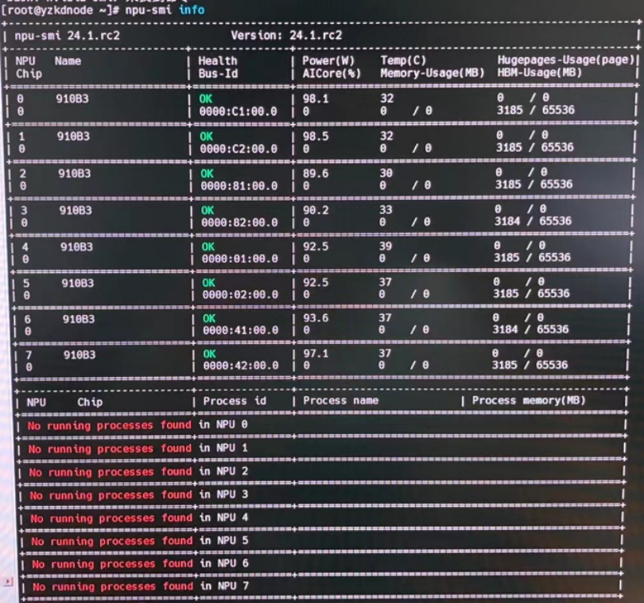

> **$\textcolor{RubineRed}{Author: ACatSmiling}$**
>
> **$\color{RubineRed}{Since: 2024-10-22}$**

**操作系统信息：**

1. 方式一：**`uname -a`**。

   - `uname`是 "Unix Name" 的缩写，这个命令主要用于打印与系统相关的信息，`-a`是 uname 命令的一个选项，这个选项的作用是让 uname 打印出所有的系统信息，如果不使用 -a 选项，uname 只会打印部分信息。

   - 输出结果通常包含以下几个部分：

     - **内核名称（Kernel Name）**：例如 Linux，这表明系统所使用的内核类型。在不同的操作系统中，内核名称会有所不同，如在 macOS 中可能是 Darwin。
     - **主机名（Host Name）**：这是计算机在网络中的名称。它用于在网络环境中标识这台计算机，例如 mycomputer.example.com。
     - **内核版本（Kernel Release）**：它展示了当前系统内核的版本号，例如 4.15.0 - 142 - generic。内核版本的更新通常会带来性能提升、安全修复和新功能。
     - **操作系统架构（Machine）**：这部分会显示系统的硬件架构，常见的有`x86_64`（64 位英特尔架构）、`i386`（32 位英特尔架构）、`armv7l`（32 位 ARM 架构）、`aarch64`（64 位 ARM 架构）等。这些信息对于安装软件和了解系统兼容性很重要。
     - **操作系统类型（Operating System）**：例如 GNU/Linux，它表明操作系统是基于 Linux 内核，并使用了 GNU 工具集。在 macOS 中，这部分可能会显示 Darwin 相关的信息，因为 macOS 是基于 Darwin 内核的。

   - 示例：

     ```shell
     [root@k8s-master ~]# uname -a
     Linux k8s-master 3.10.0-1160.el7.x86_64 #1 SMP Mon Oct 19 16:18:59 UTC 2020 x86_64 x86_64 x86_64 GNU/Linux
     ```

     - 内核名称：Linux。
     - 主机名：k8s-master。
     - 内核版本：3.10.0-1160.el7.x86_64。
     - 操作系统架构：x86_64，出现两次是因为系统是 64 位的，并且处理器架构也是 64 位。
     - 操作系统类型：GNU/Linux。

2. 方式二：**`cat /etc/os-release`**。

   - `/etc/os-release`是一个文本文件，它存储了操作系统（OS）相关的信息。这个文件主要用于提供系统的识别信息，包括操作系统的名称、版本、ID 等内容。在基于 Linux 的系统中广泛使用，帮助系统管理员、软件开发者以及各种自动化脚本识别操作系统的具体细节。

   - 输出结果通常包含以下几个部分：

     - **NAME**：表示操作系统的名称。例如，在 Ubuntu 系统中可能显示`NAME="Ubuntu"`，在 CentOS 系统中可能显示`NAME="CentOS Linux"`。
     - **VERSION**：操作系统的版本号。例如，对于 Ubuntu 20.04，可能显示`VERSION="20.04 LTS (Focal Fossa)"`，它明确了操作系统的具体版本以及是否为长期支持（LTS）版本等细节。
     - **ID**：操作系统的唯一标识符。例如，`ID=ubuntu`或`ID=centos`，这个标识符在软件包管理、脚本编写等场景中用于区分不同的操作系统类型。
     - **ID_LIKE**：用于表明该操作系统与其他操作系统的相似性。例如，某些 Linux 发行版可能会设置`ID_LIKE=debian`，表示它在某些方面（如软件包管理方式等）和 Debian 系统类似。
     - **PRETTY_NAME**：提供一个更具可读性的操作系统名称和版本组合。例如，`PRETTY_NAME="Ubuntu 20.04 LTS"`，它可以用于在用户界面或者文档中更友好地展示操作系统信息。

   - 示例：

     ```shell
     [root@k8s-master ~]# cat /etc/os-release
     NAME="CentOS Linux"
     VERSION="7 (Core)"
     ID="centos"
     ID_LIKE="rhel fedora"
     VERSION_ID="7"
     PRETTY_NAME="CentOS Linux 7 (Core)"
     ANSI_COLOR="0;31"
     CPE_NAME="cpe:/o:centos:centos:7"
     HOME_URL="https://www.centos.org/"
     BUG_REPORT_URL="https://bugs.centos.org/"
     
     CENTOS_MANTISBT_PROJECT="CentOS-7"
     CENTOS_MANTISBT_PROJECT_VERSION="7"
     REDHAT_SUPPORT_PRODUCT="centos"
     REDHAT_SUPPORT_PRODUCT_VERSION="7"
     ```


**内核版本信息：**

1. 方式一：**`uname -r`**。

   - `-r`是 uname 命令的一个选项，它的作用是专门获取并打印内核版本（Kernel Release）相关的内容。

   - 输出结果通常包含以下几个部分，以 "4.18.0 - 80.7.2.el8_0.x86_64" 为例：

     - **内核的主版本号**：4.18.0。内核版本号通常是由几个数字组成，主版本号代表着内核的主要版本系列，随着新功能的大量增加、重大架构变化等情况会更新这个数字。
     - **次版本号**：80.7.2。次版本号的更新可能是由于一些功能的改进、小的架构调整或者安全补丁等情况。
     - **标识符**：el8_0。表示这个内核版本是为该发行版定制或者适配的，不同的发行版可能会有不同的标识符来区分它们所使用的内核。
     - **操作系统架构**：x86_64。表示该内核是为 64 位的 x86 架构处理器设计的，用于支持在这种架构的计算机上运行系统。

   - 示例：

     ```shell
     [root@k8s-master ~]# uname -r
     3.10.0-1160.el7.x86_64
     ```

2. 方式二：**`cat /proc/version`**。

   - `/proc/version`是一个虚拟文件，它位于 Linux 操作系统的 /proc 目录下。/proc 目录是一个虚拟文件系统，它提供了一种内核和用户空间之间的接口，用于获取系统内部的各种信息。/proc/version 文件主要用于显示当前操作系统内核的版本信息，同时还包含了一些关于内核是如何构建的相关信息。

   - 输出结果通常包含以下几个部分，以 "Linux version 4.18.0 - 80.7.2.el8_0.x86_64 (mockbuild@kbuilder.bsys.centos.org) (gcc version 8.3.1 20190311 (Red Hat 8.3.1 - 3) (GCC)) #1 SMP Fri Mar 27 14:05:59 UTC 2020" 为例：

     - **内核版本部分**：
       - Linux version 4.18.0 - 80.7.2.el8_0.x86_64：与 uname -r 获取的内核版本信息类似。其中 4.18.0 是主版本号，80.7.2 是次版本号，el8_0 是与特定 Linux 发行版相关的标识符，x86_64 表示硬件架构。

     - **构建相关部分**：
       - (mockbuild@kbuilder.bsys.centos.org)：显示了构建内核的主机名或构建环境相关的信息。在这个例子中，mockbuild 可能是构建用户，kbuilder.bsys.centos.org 是构建主机的名称。
       - (gcc version 8.3.1 20190311 (Red Hat 8.3.1 - 3) (GCC))：提供了用于构建内核的 GCC（GNU Compiler Collection）编译器的版本信息。这里使用的 GCC 版本是 8.3.1，日期是 20190311，后面还带有与 Red Hat 相关的版本标识，这表明内核是使用特定版本的 GCC 编译器在 Red Hat 环境下构建的。
     - **SMP 和时间戳部分**：
       - \#1 SMP Fri Mar 27 14:05:59 UTC 2020：SMP 代表对称多处理（Symmetric Multi - Processing），说明这个内核支持多个处理器同时工作。#1 可能是构建编号或内核发布编号之类的标识。最后的时间戳 Fri Mar 27 14:05:59 UTC 2020 表示内核的构建时间是 2020 年 3 月 27 日，星期五，协调世界时（UTC）14:05:59。

   - 示例：

     ```shell
     [root@k8s-master ~]# cat /proc/version
     Linux version 3.10.0-1160.el7.x86_64 (mockbuild@kbuilder.bsys.centos.org) (gcc version 4.8.5 20150623 (Red Hat 4.8.5-44) (GCC) ) #1 SMP Mon Oct 19 16:18:59 UTC 2020
     ```


**操作系统架构信息：**

1. 方式一：**`uname -m`**。

   - `-m`是 uname 命令的一个选项，它的作用是专门打印机器（Machine）硬件架构相关的内容。

   - 常见的输出结果有多种类型：

     - **x86_64**：这表示计算机的硬件架构是 64 位的 x86 架构。这种架构在现代的个人计算机和服务器中广泛使用。64 位架构相比 32 位架构可以处理更大的内存地址空间，从而能够支持更大的内存容量（理论上，32 位系统最多支持 4GB 内存，而 64 位系统支持的内存容量要大得多），并且在数据处理能力等方面也有优势。例如，运行在 x86_64 架构上的软件可以利用这些特性来提高性能。
     - **i386 或 i686**：这代表 32 位的 x86 架构。虽然现在 32 位系统的使用相对较少，但在一些旧设备或者对资源需求较低的特定应用场景下仍然可能会遇到。这些架构主要用于较旧的计算机硬件或者一些简单的嵌入式设备。
     - **armv7l 或 armhf**：表示 32 位 ARM 架构。ARM 架构在移动设备（如智能手机和平板电脑）、嵌入式系统（如物联网设备）等领域广泛应用。armv7l 主要用于 Linux 系统下的 ARM 设备，它是一种低功耗、高性能的架构，适用于移动和嵌入式场景，能够在保证性能的同时有效地降低能耗。
     - **aarch64**：这是 64 位 ARM 架构。随着技术的发展，64 位 ARM 架构也越来越多地应用于高性能的移动设备、服务器以及一些新兴的计算领域，如边缘计算等。它能够提供比 32 位 ARM 架构更强大的计算能力和更大的内存寻址空间。

   - 示例：

     ```shell
     [root@k8s-master ~]# uname -m
     x86_64
     ```

2. 方式二：**`lscpu | grep -i 'Architecture'`**。

   - `lscpu`：是一个用于显示 CPU 架构相关信息的命令，它会输出包括 CPU 的型号、核心数、线程数、架构等多种信息。

   - `grep -i 'Architecture'`：是一个筛选操作。grep 命令用于在文本中查找指定的模式，-i 选项表示忽略大小写，这样不管是 Architecture、architecture 还是其他大小写组合的这个单词，都能被匹配到，'Architecture' 是要查找的模式。

   - 这个命令的目的是，从 lscpu 输出的信息中，筛选出包含 Architecture 这个单词的行。

   - 示例：

     ```shell
     [root@k8s-master ~]# lscpu | grep -i 'Architecture'
     Architecture:          x86_64
     ```


**CPU 信息：**

1. 方式一：**`lscpu`**。

   - lscpu 是一个在 Linux 系统中用于获取 CPU 架构和特性信息的实用工具命令。

   - 输出结果通常包含以下几个部分：

     - **架构相关信息（Architecture）**：
       - 例如，"Architecture: x86_64"，这表明系统的 CPU 是基于 64 位 x86 架构。这种架构能够支持更大的内存寻址空间，相比 32 位架构（如 i386 或 i686），可以利用更多的内存资源，并且在处理大量数据和复杂计算时具有优势。如果是 Architecture: armv7l，则表示系统的 CPU 是 32 位 ARM 架构，常见于移动设备和一些低功耗的嵌入式系统中；aarch64 则代表 64 位 ARM 架构，用于高性能的移动设备和新兴的 ARM - based 服务器等。
     - **CPU 操作模式（CPU op - mode (s)）**：
       - 例如，"CPU op-mode(s): 32-bit, 64-bit"，这意味着 CPU 支持以 32 位和 64 位两种模式运行。这在一些混合架构的应用场景或者需要兼容旧软件（32 位软件）的情况下很有用。
     - **字节顺序（Byte Order）**：
       - 例如，"Byte Order: Little Endian"。字节顺序描述了多字节数据（如整数）在内存中的存储方式。小端序（Little Endian）是指数据的低位字节存于低地址，高位字节存于高地址。在网络通信和数据存储等场景中，了解字节顺序对于正确处理数据很重要。
     - **CPU 核心数相关信息**：
       - **CPU (s)（逻辑 CPU 数量）**：例如，"CPU(s): 4"，表示系统中总的逻辑 CPU 数量是 4 个。这包括物理核心以及通过超线程（Hyper - Threading）等技术虚拟出来的逻辑核心。
       - **On - line CPU (s) list（在线 CPU 列表）**：会显示在线的 CPU 核心编号，例如，"On - line CPU(s) list: 0 - 3"，这意味着编号从 0 到 3 的 CPU 核心是可用的。在某些情况下，部分 CPU 核心可能会被设置为离线状态，用于节能或者其他特殊用途。
       - **Thread (s) per core（每个核心的线程数）**：例如，"Thread(s) per core: 2"，说明每个物理 CPU 核心可以同时处理两个线程。这是超线程技术的体现，超线程技术可以提高 CPU 的利用率和多任务处理能力。
       - **Core (s) per socket（每个插槽的核心数）**：例如，"Core(s) per socket: 2"，表示每个 CPU 插槽中有两个物理核心。这在有多个 CPU 插槽的服务器等设备中用于描述 CPU 的物理布局。
       - **Socket (s)（CPU 插槽数量）**：例如，"Socket(s): 1"，表明系统中只有一个 CPU 插槽。在服务器系统中，可能会有多个 CPU 插槽，用于安装多个 CPU 以提高系统的计算能力。
     - **CPU 缓存信息（Cache）**：
       - 会显示各级缓存（L1d、L1i、L2、L3 等）的大小。例如，"L3 cache: 8192K"，表示三级缓存的大小是 8192 KB。缓存是位于 CPU 和主存之间的高速存储区域，用于存储经常访问的数据和指令，以提高 CPU 的访问速度和系统性能。

   - 示例：

     ```shell
     [root@k8s-master ~]# lscpu
     Architecture:          x86_64
     CPU op-mode(s):        32-bit, 64-bit
     Byte Order:            Little Endian
     CPU(s):                2
     On-line CPU(s) list:   0,1
     Thread(s) per core:    2
     Core(s) per socket:    1
     Socket(s):             1
     NUMA node(s):          1
     Vendor ID:             AuthenticAMD
     CPU family:            25
     Model:                 80
     Model name:            AMD Ryzen 7 5800H with Radeon Graphics
     Stepping:              0
     CPU MHz:               3193.922
     BogoMIPS:              6387.84
     Hypervisor vendor:     Microsoft
     Virtualization type:   full
     L1d cache:             32K
     L1i cache:             32K
     L2 cache:              512K
     L3 cache:              16384K
     NUMA node0 CPU(s):     0,1
     Flags:                 fpu vme de pse tsc msr pae mce cx8 apic sep mtrr pge mca cmov pat pse36 clflush mmx fxsr sse sse2 ht syscall nx mmxext fxsr_opt pdpe1gb rdtscp lm art rep_good nopl extd_apicid aperfmperf eagerfpu pni pclmulqdq ssse3 fma cx16 sse4_1 sse4_2 movbe popcnt aes xsave avx f16c rdrand hypervisor lahf_lm cmp_legacy cr8_legacy abm sse4a misalignsse 3dnowprefetch osvw topoext retpoline_amd ssbd ibrs ibpb stibp vmmcall fsgsbase bmi1 avx2 smep bmi2 erms invpcid rdseed adx smap clflushopt clwb sha_ni xsaveopt xsavec xgetbv1 clzero xsaveerptr arat umip vaes vpclmulqdq
     ```

2. 方式二：**`cat /proc/cpuinfo | grep 'processor'`**。

   - `/proc/cpuinfo`是一个虚拟文件，它包含了 CPU 的详细信息。在 Linux 系统中，/proc 目录下的文件实际上是内核与用户空间交互的接口，通过读取这些文件可以获取系统内部的各种状态信息。

   - 输出结果通常是一系列行，每行的格式类似 "processor:N"，其中 N 是一个数字，这个数字代表 CPU 处理器的编号。这些编号可以用于确定系统中 CPU 处理器的数量，如果输出中有 processor:0 到 processor:3，那么系统中至少有 4 个 CPU 处理器（这里的处理器可以是物理核心，也可以是通过超线程等技术虚拟出来的逻辑核心）。

   - 示例：

     ```shell
     [root@k8s-master ~]$ cat /proc/cpuinfo | grep 'processor'
     processor       : 0
     processor       : 1
     ```


**GPU 信息：**

- **`lspci | grep -i 'vga\|3d\|display'`**：查看是否存在显卡。

  - `lspci`：这是一个在 Linux 系统中用于列出所有 PCI（Peripheral Component Interconnect）设备信息的命令。PCI 是一种计算机内部的总线标准，用于连接各种硬件设备，如显卡、网卡、声卡等。 lspci 命令会输出设备的厂商 ID、设备 ID、设备类别等信息。

  - `grep -i 'vga\|3d\|display'`：`grep`命令用于在文本中查找指定的模式。`-i`选项表示忽略大小写。`'vga\|3d\|display'`是一个正则表达式，其中`\|`表示 “或” 的关系，这意味着`grep`会查找包含`vga`、`3d`或者`display`这三个单词（不区分大小写）的行。

  - 这个命令的目的是，从 lspci 输出的所有 PCI 设备信息中，筛选出与显卡或显示相关的设备信息。

  - 输出内容可能因计算机的硬件配置而有所不同。例如，输出可能类似于："01:00.0 VGA compatible controller: NVIDIA Corporation GP107 [GeForce GTX 1050] (rev a1)"。

    - 01:00.0：是设备在 PCI 总线上的位置标识，它包括总线号（01）、设备号（00）和功能号（0）。这个标识用于在系统中唯一确定该设备的位置。
    - VGA compatible controller：表明这是一个与 VGA 兼容的控制器，实际上通常就是指显卡。
    - NVIDIA Corporation：是设备的制造商，这里是英伟达公司。
    - GP107 [GeForce GTX 1050]：是设备的型号信息，这里可以看出显卡的型号是 GeForce GTX 1050，其内部芯片代号为 GP107。
    - (rev a1)：是设备的版本信息，这里表示该显卡的版本是 a1。

  - 示例：

    ```shell
    [root@k8s-master ~]# lspci | grep -i 'vga\|3d\|display'
    22:00.0 VGA compatible controller: ASPEED Technology, Inc. ASPEED Graphics Family (rev 41)
    69:00.0 3D controller: NVIDIA Corporation Device 20f1 (rev a1)
    6d:00.0 3D controller: NVIDIA Corporation Device 20f1 (rev a1)
    ```

- **`nvidia-smi`**：NVIDIA 系统管理界面（NVIDIA System Management Interface）的命令行工具，基于 NVIDIA 管理库（NVML），用于管理和监控 NVIDIA GPU 设备。

  - 功能：

    - **监控 GPU 状态**：可以获取 GPU 的各种实时信息，如温度、风扇转速、功率、性能状态、显存使用率等，帮助用户了解 GPU 的运行状况。这对于在运行对 GPU 要求较高的程序（如深度学习训练、图形渲染等）时，监控 GPU 是否正常工作以及是否存在性能瓶颈非常有用。
    - **管理 GPU 配置（部分功能需相应权限）**：在某些情况下，允许管理员修改 GPU 的一些配置参数，但这通常需要较高的权限，普通用户可能无法进行此类操作。例如，可以开启或关闭 GPU 的持续模式（Persistence-M）。

  - 输出信息解读：

    - **版本信息**：执行 nvidia-smi 命令后，首先会显示该工具的版本号、NVIDIA 驱动版本号以及 CUDA 驱动能够支持的最高 CUDA 版本号（注意这不一定是你自己安装的 CUDA 版本，要查看自己安装的 CUDA 版本可使用`nvcc -v`）。
    - **GPU 基本信息**：包括 GPU 的型号及序号。序号从 0 开始，如果你有多块 GPU，会依次编号。
    - 运行状态参数：
      - **风扇（Fan）**：显示风扇转速，如果是被动散热的 GPU，该值可能显示为 0%（相当于 n/a）。
      - **温度（Temp）**：当前 GPU 的温度，在运行程序时需要关注该值，特别是对于被动散热的 GPU，如果温度过高可能会导致降频保护，影响性能。
      - **性能状态（Perf）**：从 P0 到 P12 表示性能状态从高到低，P0 为性能最大，P12 为性能最小，在 Linux 下可使用`nvidia-settings`工具对该参数进行配置。
      - **持续模式状态（Persistence-M）**：默认是关闭的，打开后能让 GPU 更快速地响应任务，但待机功耗会增加。
      - **功率（Pwr:Usage/Cap）**：显示 GPU 的功耗，包括当前使用的功率和最大功率。
      - **总线信息（Bus-Id）**：GPU 的总线地址。
      - **显示状态（Disp.A）**：如果当前 GPU 正驱动一个活动的显示器，该参数为 on，反之为 off。
      - **显存使用情况（Memory-Usage）**：显示显存的使用量和总显存容量，在程序运行时需关注该值，避免出现显存不足的错误。
      - **GPU 使用率（Volatile GPU-Util）**：表示 GPU 的使用情况，GPU 使用率高时显存使用率通常也会较高，但显存使用率高时 GPU 使用率不一定高，比如在大量数据传输时可能会出现这种情况。
      - **错误检查和纠错模式（ECC）**：显示是否开启错误检查和纠错技术，“0” 代表关闭，“1” 代表开启，开启后可保护 GPU 硬件免受故障影响。
      - **计算模式（Compute M）**：NVIDIA GPU 有 default、exclusive process、exclusive thread、prohibited 四种计算模式，一般使用默认的 default 模式，多个进程可以同时共享不同的 GPU。

  - 常用命令选项：

    - **-h 或 --help**：打印使用帮助信息并退出。
    - **-l 或 --list-gpus**：列出系统中的 NVIDIA GPU 及其 UUID（通用唯一识别码）。
    - **-q 或 --query**：显示 GPU 或单元信息，可查询的信息包括 GPU 的各种属性等，默认显示所有可用 GPU 的信息，使用 -i 选项可限制输出到单个 GPU 或单元。
    - **-i 或 --id=id**：指定要显示信息的 GPU 或单元的 ID，可以是 GPU 的索引、板载序列号、UUID 或 PCI 总线 ID。
    - **-f file 或 --filename=file**：将查询输出重定向到指定的文件。

  - 示例：

    ```shell
    [root@k8s-master ~]# nvidia-smi
    Tue Oct 22 11:36:43 2024       
    +-----------------------------------------------------------------------------+
    | NVIDIA-SMI 510.39.01    Driver Version: 510.39.01    CUDA Version: 11.6     |
    |-------------------------------+----------------------+----------------------+
    | GPU  Name        Persistence-M| Bus-Id        Disp.A | Volatile Uncorr. ECC |
    | Fan  Temp  Perf  Pwr:Usage/Cap|         Memory-Usage | GPU-Util  Compute M. |
    |                               |                      |               MIG M. |
    |===============================+======================+======================|
    |   0  NVIDIA A100-PCI...  Off  | 00000000:69:00.0 Off |                    0 |
    | N/A   36C    P0    40W / 250W |  29999MiB / 40960MiB |      0%      Default |
    |                               |                      |             Disabled |
    +-------------------------------+----------------------+----------------------+
    |   1  NVIDIA A100-PCI...  Off  | 00000000:6D:00.0 Off |                    0 |
    | N/A   35C    P0    39W / 250W |   4305MiB / 40960MiB |      0%      Default |
    |                               |                      |             Disabled |
    +-------------------------------+----------------------+----------------------+
                                                                                   
    +-----------------------------------------------------------------------------+
    | Processes:                                                                  |
    |  GPU   GI   CI        PID   Type   Process name                  GPU Memory |
    |        ID   ID                                                   Usage      |
    |=============================================================================|
    |    0   N/A  N/A     15491      C   java                             4101MiB |
    |    0   N/A  N/A     29074      C   java                             4405MiB |
    |    0   N/A  N/A     31086      C   java                             1571MiB |
    |    0   N/A  N/A     34440      C   java                             3641MiB |
    |    0   N/A  N/A     66550      C   java                             7231MiB |
    |    0   N/A  N/A     71424      C   java                             1711MiB |
    |    0   N/A  N/A     71545      C   java                             1469MiB |
    |    0   N/A  N/A     71962      C   java                             1535MiB |
    |    0   N/A  N/A     77319      C   java                             4329MiB |
    |    1   N/A  N/A     29074      C   java                             4303MiB |
    +-----------------------------------------------------------------------------+
    ```

- **`npu-smi info`**：通常是用于获取与神经网络处理器单元（NPU）相关信息的命令。NPU 是一种专门用于加速神经网络计算的芯片，在人工智能、深度学习等领域发挥着关键作用。这个命令可以帮助用户了解 NPU 设备的基本状态、配置和性能相关的信息。

  - 示例：

    

**内存信息：**

1. 方式一：**`free -h`**。

   - `free`命令用于显示系统内存的统计信息，包括物理内存、交换空间（swap）等，`-h`是一个选项，它的作用是让输出结果以人类可读（human - readable）的格式显示。

   - 输出结果通常包含以下几个部分：

     - **total（总内存）**：这是系统物理内存和交换空间（如果启用）的总和。它包括了所有可用的内存资源，以易于理解的格式显示。
     - **used（已使用内存）**：显示系统中已经被使用的内存总量，包括被操作系统、应用程序和缓存占用的部分。
     - **free（空闲内存）**：表示系统中当前尚未被使用的物理内存量。不过需要注意的是，这部分空闲内存可能会随着系统的运行和应用程序的需求而动态变化。
     - **shared（共享内存）**：这是被多个进程共享使用的内存部分。共享内存可以用于进程间通信等场景，其大小会因系统和应用程序的运行情况而异。
     - **buff/cache（缓冲区 / 缓存）**：这部分内存用于缓存磁盘数据和作为磁盘 I/O 的缓冲区。操作系统会利用这部分内存来提高系统的性能。当系统需要更多的内存用于其他用途时，这部分内存中的一部分可以被回收。
     - **available（可用内存）**：这是一个相对较新的指标，它考虑了内存的回收情况，是系统真正可以用于新任务的内存量。在评估系统是否能够运行新的大型应用程序或者处理额外的任务时，这个指标比单纯的空闲内存更有参考价值。

   - 示例：

     ```shell
     [root@k8s-master ~]# free -h
                   total        used        free      shared  buff/cache   available
     Mem:           3.9G        2.1G        842M         10M        915M        1.5G
     Swap:            0B          0B          0B
     ```

2. 方式二：**`cat /proc/meminfo`**。

   - `/proc/meminfo`是一个虚拟文件，位于 Linux 系统的 /proc 目录下。/proc 目录是一个虚拟文件系统，提供了内核与用户空间之间的接口，用于获取系统内部的各种信息。/proc/meminfo 文件主要用于显示系统内存的详细信息，包括物理内存、交换空间等方面的内容。

   - 输出结果通常包含以下几个部分：

     - **MemTotal**：表示系统的总物理内存大小，单位是千字节（KB）。要将其转换为更常见的单位，如 GB，可以进行简单的计算（1GB = 1024MB，1MB = 1024KB）。这是系统中所有物理内存模块容量的总和，包括可能被硬件保留的部分。
     - **MemFree**：显示系统中当前空闲的物理内存量，单位是 KB。这部分内存没有被任何进程或系统缓存使用，是真正可直接用于分配给新进程的内存。不过，系统会根据运行情况动态地调整空闲内存的大小。
     - **MemAvailable**：这是一个相对较新的指标，用于表示系统中可用于启动新应用程序的内存估计量。它考虑了可以从缓存中回收的内存等因素，比单纯的 MemFree 更能准确反映系统的可用内存情况。在判断系统是否有足够的内存来运行新的大型程序时，这个指标非常有用。
     - **Buffers**：指用于磁盘块设备读写缓存的内存大小，单位是 KB。这些缓存可以加快磁盘数据的读写速度，当系统需要读取或写入磁盘数据时，首先会在缓冲区中查找或暂存数据，减少直接对磁盘进行操作的次数，从而提高系统性能。
     - **Cached**：表示用于缓存从磁盘读取的数据的内存大小，单位是 KB。这部分内存存储了最近从磁盘读取的文件内容等信息，当应用程序再次需要这些数据时，可以直接从缓存中获取，而不需要重新从磁盘读取，节省了磁盘 I/O 时间。
     - **SwapTotal 和 SwapFree**：如果系统启用了交换空间（swap），`SwapTotal`会显示交换空间的总大小，`SwapFree`则显示交换空间中当前空闲的大小，单位都是 KB。交换空间是磁盘上的一块区域，当系统的物理内存不足时，会将内存中的部分数据交换到交换空间中暂时存储，以腾出物理内存供其他进程使用。

   - 示例：

     ```shell
     [root@k8s-master ~]# cat /proc/meminfo 
     MemTotal:        4044812 kB
     MemFree:          862568 kB
     MemAvailable:    1572540 kB
     Buffers:            3100 kB
     Cached:           903564 kB
     SwapCached:            0 kB
     Active:           748828 kB
     Inactive:         782872 kB
     Active(anon):     626840 kB
     Inactive(anon):     8560 kB
     Active(file):     121988 kB
     Inactive(file):   774312 kB
     Unevictable:           0 kB
     Mlocked:               0 kB
     SwapTotal:             0 kB
     SwapFree:              0 kB
     Dirty:                 0 kB
     Writeback:             0 kB
     AnonPages:        625036 kB
     Mapped:           248768 kB
     Shmem:             10364 kB
     Slab:              52808 kB
     SReclaimable:      30528 kB
     SUnreclaim:        22280 kB
     KernelStack:        6800 kB
     PageTables:         7880 kB
     NFS_Unstable:          0 kB
     Bounce:                0 kB
     WritebackTmp:          0 kB
     CommitLimit:     2022404 kB
     Committed_AS:    1826856 kB
     VmallocTotal:   34359738367 kB
     VmallocUsed:       46708 kB
     VmallocChunk:   34359676924 kB
     Percpu:              624 kB
     HardwareCorrupted:     0 kB
     AnonHugePages:    501760 kB
     CmaTotal:              0 kB
     CmaFree:               0 kB
     HugePages_Total:       0
     HugePages_Free:        0
     HugePages_Rsvd:        0
     HugePages_Surp:        0
     Hugepagesize:       2048 kB
     DirectMap4k:       95564 kB
     DirectMap2M:     3049472 kB
     DirectMap1G:     1048576 kB
     ```

**磁盘信息：**

1. 方式一：**`df -h`**。

   - `df`是 "disk free" 的缩写，用于显示文件系统的磁盘空间使用信息，`-h`是一个选项，它的作用是让输出结果以人类可读（human - readable）的格式显示。

   - 输出结果通常包含以下几个部分：

     - **Filesystem（文件系统）**：这一列显示了磁盘分区对应的文件系统名称或挂载点。例如，可能会看到 /dev/sda1，这是一个常见的表示磁盘分区的方式，其中 sda 表示磁盘设备，1 表示分区编号；或者看到 /mnt/data 这样的挂载点，表示该文件系统挂载在 /mnt/data 目录下。
     - **Size（大小）**：显示了该文件系统的总大小，这个大小是磁盘分区在格式化后理论上可以使用的空间总量。
     - **Used（已使用）**：展示了该文件系统已经被使用的磁盘空间大小，同样以人类可读的格式显示。
     - **Available（可用）**：表示文件系统中当前还可以使用的磁盘空间量。这部分空间是通过总大小减去已使用大小得到的，但需要注意的是，在某些文件系统中，由于磁盘配额、保留空间等因素，实际可用空间可能会略有不同。
     - **Use%（使用率）**：这是一个百分比数值，用于表示文件系统的已使用空间占总空间的比例。例如，60%，意味着该文件系统已经使用了 60% 的磁盘空间。当这个数值接近或达到 100% 时，可能会导致系统或应用程序出现磁盘空间不足的问题。
     - **Mounted on（挂载在）**：显示了文件系统挂载的目录路径。这和 "Filesystem" 列中的挂载点信息相对应，它告诉用户这个文件系统在系统中的挂载位置，例如 / （表示根目录）、/home （用户主目录所在的分区）等。

   - 示例：

     ```shell
     [root@k8s-master ~]# df -h /
     Filesystem      Size  Used Avail Use% Mounted on
     /dev/sda3        35G  3.5G   32G  10% /
     ```

2. 方式二：**`fdisk -l`**。

   - `fdisk`是一个磁盘分区工具，主要用于创建、删除、调整磁盘分区等操作，`-l`选项表示列出（list）系统中所有磁盘设备及其分区信息。

   - 输出结果通常包含以下几个部分：

     - 磁盘设备信息：
       - 输出会首先显示磁盘设备的名称，例如，Disk /dev/sda:，其中 /dev/sda 是磁盘设备的标识，在 Linux 系统中，/dev 是设备文件存储目录，sda 表示第一个 SCSI（Small Computer System Interface）磁盘设备。如果系统中有多个磁盘，可能还会出现 /dev/sdb、 /dev/sdc 等。
       - 接着会显示磁盘的大小，例如，238.49 GiB，这表明该磁盘的容量为 238.49 吉字节。
     - 分区信息，对于每个磁盘上的分区，会有以下详细信息：
       - **分区标识（Device）**：例如，/dev/sda1，这是分区的设备文件路径。其中，1 是分区编号，每个磁盘上的分区编号是唯一的，用于在系统中区分不同的分区。
       - **分区类型（Type）**：会显示分区的类型代码，如 Linux 表示这是一个 Linux 文件系统分区，EFI System 表示这是一个用于存储 EFI（Extensible Firmware Interface）系统文件的分区。不同的分区类型用于不同的目的，例如，有些分区用于存储操作系统，有些分区用于存储数据等。
       - **分区起始和结束位置（Start、End）**：以扇区（sector）为单位显示分区在磁盘上的起始和结束位置。扇区是磁盘存储的基本单位，一个扇区通常包含 512 字节的数据。这些信息用于确定分区在磁盘上的物理位置。
       - **分区大小（Size）**：显示分区的大小，以常见的单位如字节（B）、千字节（KB）、兆字节（MB）、吉字节（GB）等来表示。
       - **分区是否可启动（Boot）**：如果分区是可启动的，会显示 *，否则为空。可启动分区是指计算机在启动时可以从该分区加载操作系统内核的分区。在一个系统中，通常只有一个可启动分区。

   - 示例：

     ```shell
     [root@k8s-master ~]# fdisk -l
     WARNING: fdisk GPT support is currently new, and therefore in an experimental phase. Use at your own discretion.
     
     Disk /dev/sda: 42.9 GB, 42949672960 bytes, 83886080 sectors
     Units = sectors of 1 * 512 = 512 bytes
     Sector size (logical/physical): 512 bytes / 4096 bytes
     I/O size (minimum/optimal): 4096 bytes / 4096 bytes
     Disk label type: gpt
     Disk identifier: 47003096-C916-4E6A-AF80-642AA3E9FE2C
     
     
     #         Start          End    Size  Type            Name
      1         2048      2099199      1G  EFI System      EFI System Partition
      2      2099200     10487807      4G  Linux swap      
      3     10487808     83884031     35G  Microsoft basic 
     ```