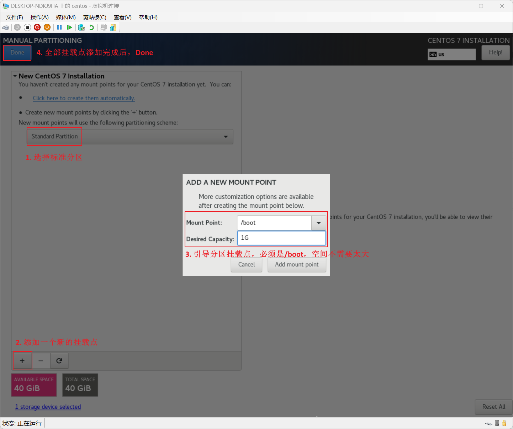

>**$\textcolor{RubineRed}{Author: ACatSmiling}$**
>
>**$\color{RubineRed}{Since: 2024-08-09}$**

## 入门篇

### 概述

Linux 是一个操作系统。


Linux 的诞生：

- Linux 之父：李纳斯·托瓦兹（Linus Torvalds）。
- 上大学期间，对 Unix 产生了浓厚的兴趣。
- 1991 年初，开始基于 Minix（Unix 的变种）进行开发。
- 1991 年 6 月，确定开发一个类 Unix 操作系统内核。
- 1991 年 9 月，开发完成内核的 0.01 版本，命名为 Linux。

Linux 与 Unix 的渊源：


GNU/Linux：


- 外围应用层，可以多种多样，也就形成了多种 Linux 发行版本。

Linux 的发行版本：


Linux vs Windows：


### CentOS 安装

#### ISO 镜像下载

> 官方网站：https://www.centos.org/

目前，最新版本为 CentOS Stream 9：


本文以 CentOS 7 为例，下载页拉到下面，选择旧版本安装。

>## Older Versions
>
>Legacy versions of CentOS are no longer supported. For historical purposes, CentOS keeps an archive of older versions. If you’re absolutely sure you need an older version [then click here](http://wiki.centos.org/Download).

进入[旧版本下载页面](http://wiki.centos.org/Download)：


进入[镜像下载地址](https://www.centos.org/download/mirrors)：


进入[镜像列表](https://mirrormanager.fedoraproject.org/mirrors/CentOS)，选择中国区的镜像：


此处，选择 [Tencent 的镜像](mirrors.tencent.com)，然后选择 [CentOS 7.9 版本](https://mirrors.cloud.tencent.com/centos/7.9.2009/)：


#### Hyper-V 虚拟机安装

打开控制面板，找到程序`启用或关闭 Windows 功能`，开启 Hyper-V：


win + R 快捷键，输入`virtmgmt.msc`，打开 Hyper-V 管理器，新建虚拟机：


在启动新建的虚拟机之前，进行额外设置：


> 虚拟交换机 LAN1：
>
> 
>
> 

现在，启动虚拟机，并连接虚拟机，然后进行 CentOS 7.9 的安装：


安装选项首页面：


日期和时间设置：


软件选择设置：


安装位置设置：





>如果按上述配置完成后，提示如下 Configuration Error，则将引导分区的挂载点修改为：/boot/efi。
>
>

KDUMP 设置：（Kdump 是一个内核崩溃转储机制。在系统崩溃的时候，kdump 将捕获系统信息，这对于诊断崩溃的原因非常有用。注意，kdump 需要预留一部分系统内存，且这部分内存对于其他用户是不可用的）


网络和主机名设置：（网络和主机名，在虚拟机安装完成后，也可以通过命令行设置）


配置完成后，点击开始安装：


等待安装完成，然后重启虚拟机。

## 基础篇

### 文件与目录结构

`Linux 系统中，一切皆文件。`

Linux 目录结构：


```shell
[zeloud@localhost ~]$ cd /
[zeloud@localhost /]$ ls
bin  boot  dev  etc  home  lib  lib64  media  mnt  opt  proc  root  run  sbin  srv  sys  tmp  usr  var
```

- `/bin`：存放一些常用的可直接执行的二进制文件，比如 ls 指令。实际链接指向`/usr/bin`目录。
- `/boot`：存放一些系统启动所需要的引导文件，引导分区挂载点。
- `/dev`：管理所有设备的目录。
- `/etc`：存放系统环境所需要的配置文件和对应的子目录。
- `/home`：主目录，每一个普通用户都有一个属于自己的主目录。
- `/lib`：存放系统需要的内置库文件。实际链接指向`/usr/lib`目录。
- `/lib64`：存放系统需要的内置 64 位库文件。实际链接指向`/usr/lib64`目录。
- `/media`：可识别 U 盘光驱的目录。可移动媒体分区的挂载点。
- `/mnt`：作用基本上同 media。
- `/opt`：给第三方软件包存放的目录。
- `/proc`：进程目录。
- `/root`：超级管理员的主目录。
- `/run`：运行目录，存放当前系统运行的信息。
- `/sbin`：存放一些系统管理员才可以操作的二进制文件命令。
- `/srv`：存放和系统服务相关的东西。
- `/sys`：存放系统硬件信息相关文件。
- `/tmp`：临时存放目录，可以修改删除。
- `/usr`：存放了很多应用程序和与用户相关的数据。
- `/var`：可变目录，存放一些变化的文件，比如 log 日志文件。

**可以修改删除的文件目录：home、opt、tem、var，其他文件目录谨慎操作。**

### vi/vim 编辑器

`vi/vim`是 Unix 操作系统和类 Unix 操作系统中最通用的文本编辑器。

vim 编辑器是从 vi 发展出来的一个新能更强大的文本编辑器，可以主动的以字体颜色辨别语法的正确性，方便程序设计。**vim 与 vi 编辑器完全兼容。**

> vim：编辑器之神。
>
> emacs：神之编辑器。

#### 模式间转换


> 如果环境是 Minimal Install 安装时，需要自行安装 vim：
>
> ```shell
> [root@centos zeloud]# vim a
> bash: vim: command not found
> [root@centos zeloud]# which vim
> /usr/bin/which: no vim in (/usr/local/bin:/usr/bin:/usr/local/sbin:/usr/sbin:/home/zeloud/.local/bin:/home/zeloud/bin)
> [root@centos zeloud]# yum search vim
> Loaded plugins: fastestmirror
> Loading mirror speeds from cached hostfile
>  * base: mirrors.aliyun.com
>  * extras: mirrors.aliyun.com
>  * updates: mirrors.aliyun.com
> =============================================================== N/S matched: vim ===============================================================
> protobuf-vim.x86_64 : Vim syntax highlighting for Google Protocol Buffers descriptions
> vim-X11.x86_64 : The VIM version of the vi editor for the X Window System
> vim-common.x86_64 : The common files needed by any version of the VIM editor
> vim-enhanced.x86_64 : A version of the VIM editor which includes recent enhancements
> vim-filesystem.x86_64 : VIM filesystem layout
> vim-minimal.x86_64 : A minimal version of the VIM editor
> 
>   Name and summary matches only, use "search all" for everything.
> [root@centos zeloud]# yum install vim-enhanced
> ...
> [root@centos zeloud]# which vim
> /usr/bin/vim
> ```

#### 命令大全


一般模式：

- `yy`：复制当前光标所在行。
- `nyy`：复制含当前光标所在行的 n 行。
- 
- 

编辑模式：

- `i`：当前光标前编辑。
- `a`：当前光标后编辑。
- `o`：跳转到光标的下一行编辑。
- `I`：跳转到光标行的行首编辑。
- `A`：跳转到光标行的行尾编辑。
- `O`：跳转到光标行的上一行编辑。

命令模式：

- `:w`：保存。
- `:q`：退出。
- `:wq`：保存，并退出。
- `:q!`：不保存，强制退出。
- `/word`：查找单词 word，**n 往下查找，N 往上查找。**
- `:noh`：取消高亮显示。
- `:set nu`：显示行号。
- `:set nonu`：关闭行号。
- `:s/old/new`：替换当前行匹配到的第一个 old 为 new。
- `:s/old/new/g`：替换当前行匹配到的所有 old 为 new。
- `:%s/old/new`：替换文档中每一行匹配到的第一个 old 为 new。
- `:%s/old/new/g`：替换文档中匹配到的所有 old 为 new。

### 网络配置

#### 查看 IP 地址

>VMware 提供的三种网络连接模式：
>
>1. `桥接模式`：虚拟机直接连接外部物理网络的模式，主机起到了网桥的作用。在这种模式下，虚拟机可以直接访问外部网络，并且对外部网络是可见的。
>2. `NAT 模式`：虚拟机和主机构建一个专用网络，并通过虚拟网络地址转换（NAT）设备对 IP 进行转换。虚拟机通过共享主机 IP 可以访问外部网络，但外部网络无法访问虚拟机。
>3. `仅主机模式`：虚拟机只与主机共享一个专用网络，与外部网络无法通信。

查看虚拟机 IP 地址：

```shell
[zeloud@localhost ~]$ ip a
1: lo: <LOOPBACK,UP,LOWER_UP> mtu 65536 qdisc noqueue state UNKNOWN group default qlen 1000
    link/loopback 00:00:00:00:00:00 brd 00:00:00:00:00:00
    inet 127.0.0.1/8 scope host lo
       valid_lft forever preferred_lft forever
    inet6 ::1/128 scope host 
       valid_lft forever preferred_lft forever
2: eth0: <BROADCAST,MULTICAST,UP,LOWER_UP> mtu 1500 qdisc mq state UP group default qlen 1000
    link/ether 00:15:5d:02:53:15 brd ff:ff:ff:ff:ff:ff
    inet 192.168.1.28/24 brd 192.168.1.255 scope global noprefixroute dynamic eth0 # 虚拟机 IP 地址为 192.168.1.28
       valid_lft 258543sec preferred_lft 258543sec
    inet6 fe80::e70:1943:6ca0:2163/64 scope link noprefixroute 
       valid_lft forever preferred_lft forever
```

- 网卡名：eth0。

> Windows 系统通过 cmd 查看 IP 地址：
>
> ```cmd
> C:\Users\XiSun>ipconfig
> 
> Windows IP 配置
> 
> 
> 以太网适配器 以太网:
> 
>    媒体状态  . . . . . . . . . . . . : 媒体已断开连接
>    连接特定的 DNS 后缀 . . . . . . . :
> 
> 以太网适配器 vEthernet (LAN1):
> 
>    连接特定的 DNS 后缀 . . . . . . . :
>    IPv6 地址 . . . . . . . . . . . . : 240e:361:810:4100:503e:d7ea:f280:0000
>    临时 IPv6 地址. . . . . . . . . . : 240e:361:810:4100:1c9e:4a39:1d12:0000
>    临时 IPv6 地址. . . . . . . . . . : 240e:361:810:4100:5503:21d6:53b9:0000
>    临时 IPv6 地址. . . . . . . . . . : 240e:361:810:4100:6d42:e08:3d62:0000
>    临时 IPv6 地址. . . . . . . . . . : 240e:361:810:4100:dc4b:5ab1:badb:0000
>    本地链接 IPv6 地址. . . . . . . . : fe80::c3d0:e4f3:114f:0000%36
>    IPv4 地址 . . . . . . . . . . . . : 192.168.1.25
>    子网掩码  . . . . . . . . . . . . : 255.255.255.0
>    默认网关. . . . . . . . . . . . . : fe80::1%36
>                                        192.168.1.1
> 
> 无线局域网适配器 本地连接* 1:
> 
>    媒体状态  . . . . . . . . . . . . : 媒体已断开连接
>    连接特定的 DNS 后缀 . . . . . . . :
> 
> 无线局域网适配器 本地连接* 10:
> 
>    媒体状态  . . . . . . . . . . . . : 媒体已断开连接
>    连接特定的 DNS 后缀 . . . . . . . :
> 
> 以太网适配器 蓝牙网络连接:
> 
>    媒体状态  . . . . . . . . . . . . : 媒体已断开连接
>    连接特定的 DNS 后缀 . . . . . . . :
> 
> 以太网适配器 vEthernet (Default Switch):
> 
>    连接特定的 DNS 后缀 . . . . . . . :
>    本地链接 IPv6 地址. . . . . . . . : fe80::20b9:c68:ca0d:0000%48
>    IPv4 地址 . . . . . . . . . . . . : 192.168.80.1
>    子网掩码  . . . . . . . . . . . . : 255.255.240.0
>    默认网关. . . . . . . . . . . . . :
> ```

#### 设置静态 IP

```shell
# 切换到 root 用户
[zeloud@localhost ~]$ su root
Password:

# 设置静态 IP，修改网卡 eth0 的配置
[root@localhost zeloud]# vi /etc/sysconfig/network-scripts/ifcfg-eth0
TYPE="Ethernet"
PROXY_METHOD="none"
BROWSER_ONLY="no"
# 将动态 IP 修改为静态 IP
#BOOTPROTO="dhcp"
BOOTPROTO="static"
DEFROUTE="yes"
IPV4_FAILURE_FATAL="no"
IPV6INIT="yes"
IPV6_AUTOCONF="yes"
IPV6_DEFROUTE="yes"
IPV6_FAILURE_FATAL="no"
IPV6_ADDR_GEN_MODE="stable-privacy"
NAME="eth0"
UUID="a784cd9a-e2fc-4593-839b-9bffa52d6898"
DEVICE="eth0"
ONBOOT="yes"
# 添加静态 IP 地址
IPADDR=192.168.1.30
# 添加网关
GATEWAY=192.168.1.1
# 添加域名解析器
DNS1=192.168.1.1

# 重启网络服务
[root@localhost zeloud]# service network restart

# 重新查看虚拟机地址
[root@localhost zeloud]# ip a
1: lo: <LOOPBACK,UP,LOWER_UP> mtu 65536 qdisc noqueue state UNKNOWN group default qlen 1000
    link/loopback 00:00:00:00:00:00 brd 00:00:00:00:00:00
    inet 127.0.0.1/8 scope host lo
       valid_lft forever preferred_lft forever
    inet6 ::1/128 scope host 
       valid_lft forever preferred_lft forever
2: eth0: <BROADCAST,MULTICAST,UP,LOWER_UP> mtu 1500 qdisc mq state UP group default qlen 1000
    link/ether 00:15:5d:02:53:15 brd ff:ff:ff:ff:ff:ff
    inet 192.168.1.30/24 brd 192.168.1.255 scope global noprefixroute eth0 # 虚拟机 IP 地址修改为 192.168.1.30
       valid_lft forever preferred_lft forever
    inet6 fe80::e70:1943:6ca0:2163/64 scope link noprefixroute 
       valid_lft forever preferred_lft forever
```

#### 设置主机名

```shell
# 查看主机名
[root@localhost zeloud]# hostname
localhost.localdomain

# 修改主机名，需要重启虚拟机
[root@localhost zeloud]# vi /etc/hostname
centos

# 修改主机名，立即生效
[root@localhost zeloud]# hostnamectl set-hostname test
[root@localhost zeloud]# hostname
test
```

#### 添加本地主机域名解析

```shell
[zeloud@centos ~]$ vi /etc/hosts
127.0.0.1   localhost localhost.localdomain localhost4 localhost4.localdomain4
::1         localhost localhost.localdomain localhost6 localhost6.localdomain6

# 新增本地主机域名解析
192.168.1.20 zeloud
```

#### 远程登陆

打开宿主机 cmd 窗口，使用 SSH 登录虚拟机：

```cmd
# ssh 用户名@虚拟机地址
C:\Users\XiSun>ssh zeloud@192.168.1.30
The authenticity of host '192.168.1.30 (192.168.1.30)' can't be established.
ED25519 key fingerprint is SHA256:MDkAOJ1Ag1LbrPL0nNeR//67QyTPYGVvag4Jf5AT+kY.
This key is not known by any other names
Are you sure you want to continue connecting (yes/no/[fingerprint])? yes
Warning: Permanently added '192.168.1.30' (ED25519) to the list of known hosts.
zeloud@192.168.1.30's password:
Last login: Tue Aug 13 00:05:22 2024 from 192.168.1.25
[zeloud@centos ~]$ ls /
bin  boot  dev  etc  home  lib  lib64  media  mnt  opt  proc  root  run  sbin  srv  sys  tmp  usr  var
```

> 如果想以`ssh 用户名@主机名`的方式远程登录虚拟机，需要在宿主机的 hosts 文件，添加对应的主机域名解析，否则无法识别主机名：
>
> ```shell
> C:\Users\XiSun>ssh zeloud@centos
> ssh: Could not resolve hostname centos: \262\273\326\252\265\300\325\342\321\371\265\304\326\367\273\372\241\243
> ```

除了使用 cmd 远程登录，常用的是使用远程连接工具，推荐使用`WindTerm`：


### 系统管理

#### 进程和服务

计算机中，一个正在执行的程序或命令，被叫做`进程 process`。

启动之后一直存在、常驻内存的进程，一般被称为`服务 service`。

#### service 服务管理（CentOS 6 版本）

基本语法：

```shell
$ service 服务名 start|stop|restart|status
```

CentOS 6 中，service 命令后的服务名，都在`/etc/init.d`文件目录下：

```shell
# 在 CentOS 7.9 版本中，/etc/init.d 文件目录下，只有两个服务 netconsole 和 network
[zeloud@centos ~]$ ls /etc/init.d/
functions  netconsole  network  README
```

#### systemctl 服务管理（CentOS 7 版本）

基本语法：

```shell
$ systemctl start|stop|restart|status 服务名
```

CentOS 7 中，systemctl 命令后的服务名，都在`/usr/lib/systemd/system`文件目录下：

```shell
[zeloud@centos ~]$ ls -al /usr/lib/systemd/system
total 800
drwxr-xr-x. 25 root root 12288 Aug 11 15:56 .
drwxr-xr-x. 12 root root  4096 Aug 11 15:55 ..
-rw-r--r--.  1 root root  1384 Aug  8  2019 auditd.service
lrwxrwxrwx.  1 root root    14 Aug 11 15:55 autovt@.service -> getty@.service
-rw-r--r--.  1 root root   517 Oct  2  2020 basic.target
drwxr-xr-x.  2 root root    67 Aug 11 15:55 basic.target.wants
......
```

##### 网络服务

在 CentOS 6 中，网络服务名是 network，而在 CentOS 7 中，网络服务名是 NetworkManager：

```shell
[zeloud@centos ~]$ systemctl status network
● network.service - LSB: Bring up/down networking
   Loaded: loaded (/etc/rc.d/init.d/network; bad; vendor preset: disabled)
   Active: active (exited) since Tue 2024-08-13 15:11:05 CST; 43min ago
     Docs: man:systemd-sysv-generator(8)
  Process: 681 ExecStart=/etc/rc.d/init.d/network start (code=exited, status=0/SUCCESS)

[zeloud@centos ~]$ systemctl status NetworkManager
● NetworkManager.service - Network Manager
   Loaded: loaded (/usr/lib/systemd/system/NetworkManager.service; enabled; vendor preset: enabled)
   Active: active (running) since Tue 2024-08-13 15:11:04 CST; 43min ago
     Docs: man:NetworkManager(8)
 Main PID: 550 (NetworkManager)
   CGroup: /system.slice/NetworkManager.service
           └─550 /usr/sbin/NetworkManager --no-daemon
```

查看状态可知，network 是 active (exited)，而 NetworkManager 是 active (running)。在 CentOS 7 中，应该只运行 NetworkManager，而关闭 network（root 权限处理）：


- systemctl stop network，只对当前连接有效，虚拟机重启后，network 还会开启。
- 以上处理过程，可以作为虚拟机网络异常的检查方式之一。

#### 系统运行级别

Linux 系统开机启动过程：


CentOS 6 中有 7 种系统运行级别（runlevel），常用的运行级别是 3 和 5：

- **运行级别 0**：系统停机状态，系统默认运行级别不能设为 0，否则不能正常启动。
- **运行级别 1**：单用户工作状态，root 权限，用于系统维护，禁止远程登录。
- **运行级别 2**：多户用状态（没有 NFS），不支持网络。
- **运行级别 3**：完全的多用户状态（有 NFS），登录后进入控制台命令行模式。
- **运行级别 4**：系统未使用，保留。
- **运行级别 5**：X11 控制台，登陆后进入图形 GUI 模式。
- **运行级别 6**：系统正常关闭并重启，默认运行级别不能设为 6，否则不能正常启动。

CentOS 7 中，系统运行级别简化为：

- `multi-user.target`：等价于原运行级别 3 （多用户有网，无图形界面）。
- `graphical.target`：等价于原运行级别 5 （多用户有网，图形化界面）

查看默认的系统运行级别：

```shell
[zeloud@centos ~]$ systemctl get-default
multi-user.target
```

> CentOS 6 中，通过配置文件`/etc/inittab`查看默认的系统运行级别：
>
> ```shell
> [zeloud@centos ~]$ cat /etc/inittab 
> ```

修改系统运行级别：
```shell
$ systemctl set-default multi-user.target|graphical.target
```

#### 设置服务开机自启动

查看开机自启动的服务：

```shell
[root@centos zeloud]# systemctl list-unit-files
UNIT FILE                                     STATE   
proc-sys-fs-binfmt_misc.automount             static  
dev-hugepages.mount                           static  
dev-mqueue.mount                              static  
proc-sys-fs-binfmt_misc.mount                 static  
sys-fs-fuse-connections.mount                 static  
sys-kernel-config.mount                       static  
sys-kernel-debug.mount                        static  
tmp.mount                                     disabled
brandbot.path                                 disabled
systemd-ask-password-console.path             static  
systemd-ask-password-plymouth.path            static  
systemd-ask-password-wall.path                static  
session-1.scope                               static  
session-6.scope                               static  
auditd.service                                enabled # 开机自启动
autovt@.service                               enabled 
blk-availability.service                      disabled # 开机不自启动
brandbot.service                              static  
console-getty.service                         disabled # 无法确定，当前服务可能是依赖于其他服务的状态
console-shell.service                         disabled
container-getty@.service                      static  
cpupower.service                              disabled
crond.service                                 enabled 
dbus-org.fedoraproject.FirewallD1.service     enabled 
dbus-org.freedesktop.hostname1.service        static  
......
```

查看服务是否开启了开机自启动：

```shell
[root@centos zeloud]# systemctl status NetworkManager
● NetworkManager.service - Network Manager
   Loaded: loaded (/usr/lib/systemd/system/NetworkManager.service; enabled; vendor preset: enabled) # enabled 表示开启了开机自启动，且当前 runlevel 下，是默认的 (vendor preset: enabled)
   Active: active (running) since Tue 2024-08-13 16:02:14 CST; 7h ago
     Docs: man:NetworkManager(8)
 Main PID: 1296 (NetworkManager)
   CGroup: /system.slice/NetworkManager.service
           └─1296 /usr/sbin/NetworkManager --no-daemon

Aug 13 16:54:54 centos NetworkManager[1296]: <info>  [1723539294.0910] device (eth0): carrier: link connected
Aug 13 17:04:27 centos NetworkManager[1296]: <info>  [1723539867.8590] device (eth0): carrier: link connected
Aug 13 17:07:28 centos NetworkManager[1296]: <info>  [1723540048.9550] device (eth0): carrier: link connected
Aug 13 18:09:21 centos NetworkManager[1296]: <info>  [1723543761.6029] device (eth0): carrier: link connected
Aug 13 18:33:31 centos NetworkManager[1296]: <info>  [1723545211.0675] device (eth0): carrier: link connected
Aug 13 19:59:46 centos NetworkManager[1296]: <info>  [1723550386.3549] device (eth0): carrier: link connected
Aug 13 20:46:16 centos NetworkManager[1296]: <info>  [1723553176.3709] device (eth0): carrier: link connected
Aug 13 20:59:01 centos NetworkManager[1296]: <warn>  [1723553941.0087] ifcfg-rh:     missing PREFIX, assuming 192.168.1.30/24
Aug 13 20:59:01 centos NetworkManager[1296]: <warn>  [1723553941.0957] ifcfg-rh:     missing PREFIX, assuming 192.168.1.30/24
Aug 13 21:17:46 centos NetworkManager[1296]: <info>  [1723555066.6590] device (eth0): carrier: link connected
```

设置服务开机自启动：

```shell
# 关闭开机自启动
[root@centos zeloud]# systemctl disable NetworkManager
Removed symlink /etc/systemd/system/multi-user.target.wants/NetworkManager.service.
Removed symlink /etc/systemd/system/dbus-org.freedesktop.nm-dispatcher.service.
Removed symlink /etc/systemd/system/network-online.target.wants/NetworkManager-wait-online.service.
[root@centos zeloud]# systemctl status NetworkManager
● NetworkManager.service - Network Manager
   Loaded: loaded (/usr/lib/systemd/system/NetworkManager.service; disabled; vendor preset: enabled)
   Active: active (running) since Tue 2024-08-13 16:02:14 CST; 7h ago # 不要和开启/关闭服务混淆，disable 禁止开机自启动，但是服务当前还是在 active (running)
     Docs: man:NetworkManager(8)
 Main PID: 1296 (NetworkManager)
   CGroup: /system.slice/NetworkManager.service
           └─1296 /usr/sbin/NetworkManager --no-daemon

Aug 13 16:54:54 centos NetworkManager[1296]: <info>  [1723539294.0910] device (eth0): carrier: link connected
Aug 13 17:04:27 centos NetworkManager[1296]: <info>  [1723539867.8590] device (eth0): carrier: link connected
Aug 13 17:07:28 centos NetworkManager[1296]: <info>  [1723540048.9550] device (eth0): carrier: link connected
Aug 13 18:09:21 centos NetworkManager[1296]: <info>  [1723543761.6029] device (eth0): carrier: link connected
Aug 13 18:33:31 centos NetworkManager[1296]: <info>  [1723545211.0675] device (eth0): carrier: link connected
Aug 13 19:59:46 centos NetworkManager[1296]: <info>  [1723550386.3549] device (eth0): carrier: link connected
Aug 13 20:46:16 centos NetworkManager[1296]: <info>  [1723553176.3709] device (eth0): carrier: link connected
Aug 13 20:59:01 centos NetworkManager[1296]: <warn>  [1723553941.0087] ifcfg-rh:     missing PREFIX, assuming 192.168.1.30/24
Aug 13 20:59:01 centos NetworkManager[1296]: <warn>  [1723553941.0957] ifcfg-rh:     missing PREFIX, assuming 192.168.1.30/24
Aug 13 21:17:46 centos NetworkManager[1296]: <info>  [1723555066.6590] device (eth0): carrier: link connected
# 开启开机自启动
[root@centos zeloud]# systemctl enable NetworkManager
Created symlink from /etc/systemd/system/multi-user.target.wants/NetworkManager.service to /usr/lib/systemd/system/NetworkManager.service.
Created symlink from /etc/systemd/system/dbus-org.freedesktop.nm-dispatcher.service to /usr/lib/systemd/system/NetworkManager-dispatcher.service.
Created symlink from /etc/systemd/system/network-online.target.wants/NetworkManager-wait-online.service to /usr/lib/systemd/system/NetworkManager-wait-online.service.
```

> CentOS 6 中，查看开机自启动的服务：
>
> ```shell
> [root@centos zeloud]# chkconfig --list
> 
> Note: This output shows SysV services only and does not include native
>       systemd services. SysV configuration data might be overridden by native
>       systemd configuration.
> 
>       If you want to list systemd services use 'systemctl list-unit-files'.
>       To see services enabled on particular target use
>       'systemctl list-dependencies [target]'.
> 
> netconsole      0:off   1:off   2:off   3:off   4:off   5:off   6:off
> network         0:off   1:off   2:on    3:on    4:on    5:on    6:off
> 
> # 关闭 network 开机自启动
> [root@centos zeloud]# chkconfig network off
> [root@centos zeloud]# chkconfig --list
> 
> Note: This output shows SysV services only and does not include native
>       systemd services. SysV configuration data might be overridden by native
>       systemd configuration.
> 
>       If you want to list systemd services use 'systemctl list-unit-files'.
>       To see services enabled on particular target use
>       'systemctl list-dependencies [target]'.
> 
> netconsole      0:off   1:off   2:off   3:off   4:off   5:off   6:off
> network         0:off   1:off   2:off   3:off   4:off   5:off   6:off
> 
> # 开启 network 开机自启动
> [root@centos zeloud]# chkconfig network on
> [root@centos zeloud]# chkconfig --list
> 
> Note: This output shows SysV services only and does not include native
>       systemd services. SysV configuration data might be overridden by native
>       systemd configuration.
> 
>       If you want to list systemd services use 'systemctl list-unit-files'.
>       To see services enabled on particular target use
>       'systemctl list-dependencies [target]'.
> 
> netconsole      0:off   1:off   2:off   3:off   4:off   5:off   6:off
> network         0:off   1:off   2:on    3:on    4:on    5:on    6:off
> ```
>
> - 0 ~ 6 表示的是系统运行级别。
>
> 如果只针对某一个系统运行级别设置，使用如下命令：
>
> ```shell
> $ chkconfig --level [系统运行级别] [服务名] off|on
> ```

##### 防火墙服务

```shell
# 防火墙服务状态
[root@centos zeloud]# systemctl status firewalld
● firewalld.service - firewalld - dynamic firewall daemon
   Loaded: loaded (/usr/lib/systemd/system/firewalld.service; enabled; vendor preset: enabled) # 当前设置开机自启动，默认开机自启动
   Active: active (running) since Tue 2024-08-13 16:01:17 CST; 7h ago # 当前服务是 active (running)
     Docs: man:firewalld(1)
 Main PID: 545 (firewalld)
   CGroup: /system.slice/firewalld.service
           └─545 /usr/bin/python2 -Es /usr/sbin/firewalld --nofork --nopid

Aug 13 16:01:17 centos systemd[1]: Starting firewalld - dynamic firewall daemon...
Aug 13 16:01:17 centos systemd[1]: Started firewalld - dynamic firewall daemon.
Aug 13 16:01:17 centos firewalld[545]: WARNING: AllowZoneDrifting is enabled. This is considered an insecure configuration option. It will... it now.
Hint: Some lines were ellipsized, use -l to show in full.
# 关闭防火墙
[root@centos zeloud]# systemctl stop firewalld
# 禁用防火墙开机自启动
[root@centos zeloud]# systemctl disable firewalld
Removed symlink /etc/systemd/system/multi-user.target.wants/firewalld.service.
Removed symlink /etc/systemd/system/dbus-org.fedoraproject.FirewallD1.service.
[root@centos zeloud]# systemctl status firewalld
● firewalld.service - firewalld - dynamic firewall daemon
   Loaded: loaded (/usr/lib/systemd/system/firewalld.service; disabled; vendor preset: enabled) # 当前设置禁用开机自启动，默认开机自启动
   Active: inactive (dead) # 当前服务是 inactive (dead)
     Docs: man:firewalld(1)

Aug 13 16:01:17 centos systemd[1]: Starting firewalld - dynamic firewall daemon...
Aug 13 16:01:17 centos systemd[1]: Started firewalld - dynamic firewall daemon.
Aug 13 16:01:17 centos firewalld[545]: WARNING: AllowZoneDrifting is enabled. This is considered an insecure configuration option. It will... it now.
Aug 13 23:28:51 centos systemd[1]: Stopping firewalld - dynamic firewall daemon...
Aug 13 23:28:52 centos systemd[1]: Stopped firewalld - dynamic firewall daemon.
Hint: Some lines were ellipsized, use -l to show in full.
# 开启防火墙
[root@centos zeloud]# systemctl start firewalld
# 开启防火墙开机自启动
[root@centos zeloud]# systemctl enable firewalld
Created symlink from /etc/systemd/system/dbus-org.fedoraproject.FirewallD1.service to /usr/lib/systemd/system/firewalld.service.
Created symlink from /etc/systemd/system/multi-user.target.wants/firewalld.service to /usr/lib/systemd/system/firewalld.service.
[root@centos zeloud]# systemctl status firewalld
● firewalld.service - firewalld - dynamic firewall daemon
   Loaded: loaded (/usr/lib/systemd/system/firewalld.service; enabled; vendor preset: enabled)
   Active: active (running) since Tue 2024-08-13 23:29:07 CST; 10s ago
     Docs: man:firewalld(1)
 Main PID: 1963 (firewalld)
   CGroup: /system.slice/firewalld.service
           └─1963 /usr/bin/python2 -Es /usr/sbin/firewalld --nofork --nopid

Aug 13 23:29:06 centos systemd[1]: Starting firewalld - dynamic firewall daemon...
Aug 13 23:29:07 centos systemd[1]: Started firewalld - dynamic firewall daemon.
Aug 13 23:29:07 centos firewalld[1963]: WARNING: AllowZoneDrifting is enabled. This is considered an insecure configuration option. It wil... it now.
Hint: Some lines were ellipsized, use -l to show in full.
```

#### 关机重启命令

在 Linux 领域内大多数用在服务器上，很少遇到关机的操作。毕竟服务器上跑一个服务是永无止境，除非特殊情况下，不得已才会关机。

相关命令：

- `sync`：将数据由内存同步到硬盘中。
- `halt`：停机，关闭系统，但不断电。
- `poweroff`：关机，断电。
- `reboot`：重启，等同于`shutdown -r now`。
- `shutdown <选项> 时间`：
  - 选项参数：
    1. `-H`：等同于 --halt，停机。
    2. `-r`：等同于 reboot，重启。
  - 时间参数：
    1. `now`：立即关机。
    2. `时间值`：等待多久后关机（单位 min）。

>Linux 系统中为了提高磁盘的读写效率，对磁盘采取了 "预读迟写" 的操作方式。当用户保存文件时，Linux 核心并不一定立即将保存数据写入物理磁盘中，而是将数据保存在缓冲区中，等缓冲区满时再写入磁盘。这种方式可以极大的提高磁盘写入数据的效率，但是也带来了安全隐患。如果数据还没写入磁盘时，系统掉电或者其他严重问题出现，则将导致数据丢失。使用`sync`指令可以立即将缓冲区的数据写入磁盘。
>
>`shutdown`命令的说明：
>
>```shell
>$ shutdown        # 关机，会默认等待 1min 才会关机
>$ shutdown now    # 立即关机
>$ shutdown 3      # 3min 之后关机
>$ shutdown -c     # 取消关机
>$ shutdown 16:20  # 计划 16:20 关机
>```

## 实操篇

### 常用基本命令

Shell 可以看作是一个命令解释器，为我们提供了交互式的文本控制台界面。我们可以通过终端控制台来输入命令，由 Shell 进行解释并最终交给内核执行。

Shell 的意思是 "壳程序"，指的是**能对操作系统和应用程序进行操作的接口程序**，狭义的壳程序指的是命令行方面的软件，例如 bash，广义上也包括图形界面下的程序。

Shell 不止有一种，在计算机历史的长河里，有许多种 shell。例如：

- Bourne shell：简称为 sh，第一个 shell。
- C shell：简称为 csh，由于语法和 C 语言类似而得名。
- **Bourne Again Shell：简称为 bash，这是对 Bourne shell 的增强版本。**
- **Tenex C shell：简称 tcsh，是 C shell 的增强版本。**

`CentOS 7 中，默认的 shell 是 bash。`在 /bin 目录下，可以找到使用的 shell：

```shell
[zeloud@centos ~]$ ls -l /bin/ | grep sh
-rwxr-xr-x. 1 root root    964536 Apr  1  2020 bash # bash
lrwxrwxrwx. 1 root root        10 Aug 11 15:55 bashbug -> bashbug-64
-rwxr-xr-x. 1 root root      6964 Apr  1  2020 bashbug-64
-rws--x--x. 1 root root     23880 Oct  1  2020 chsh # chsh
-rwxr-xr-x. 1 root root     11576 Aug  2  2017 fipshmac
-rwxr-xr-x. 1 root root      4629 Apr  1  2020 gettext.sh
-rwxr-xr-x. 1 root root     15864 Apr 13  2018 lchsh
-rwxr-xr-x. 1 root root      2291 Jul 31  2015 lesspipe.sh
-rwxr-xr-x. 1 root root     34620 Apr  1  2020 rescan-scsi-bus.sh
lrwxrwxrwx. 1 root root        18 Aug 11 15:56 scsi-rescan -> rescan-scsi-bus.sh
lrwxrwxrwx. 1 root root        19 Aug 11 15:55 setup-nsssysinit -> setup-nsssysinit.sh
-rwxr-xr-x. 1 root root      1539 Dec 11  2019 setup-nsssysinit.sh
lrwxrwxrwx. 1 root root         4 Aug 11 15:55 sh -> bash # sh 链接到 bash
-rwxr-xr-x. 1 root root     37448 Aug 20  2019 sha1sum
-rwxr-xr-x. 1 root root     41608 Aug 20  2019 sha224sum
-rwxr-xr-x. 1 root root     41608 Aug 20  2019 sha256sum
-rwxr-xr-x. 1 root root     41624 Aug 20  2019 sha384sum
-rwxr-xr-x. 1 root root     41624 Aug 20  2019 sha512sum
-rwxr-xr-x. 1 root root     15912 Oct 31  2018 showconsolefont
-rwxr-xr-x. 1 root root     15680 Oct 31  2018 showkey
-rwxr-xr-x. 1 root root     54208 Aug 20  2019 shred
-rwxr-xr-x. 1 root root     50312 Aug 20  2019 shuf
lrwxrwxrwx. 1 root root         5 Aug 11 15:55 slogin -> ./ssh
-rwxr-xr-x. 1 root root    774568 Aug  9  2019 ssh
-rwxr-xr-x. 1 root root    360920 Aug  9  2019 ssh-add
---x--s--x. 1 root nobody  382216 Aug  9  2019 ssh-agent
-rwxr-xr-x. 1 root root     10469 Aug  9  2019 ssh-copy-id
-rwxr-xr-x. 1 root root    419208 Aug  9  2019 ssh-keygen
-rwxr-xr-x. 1 root root    441024 Aug  9  2019 ssh-keyscan
-rwxr-xr-x. 1 root root     15824 Oct  1  2020 unshare
```

#### 常用快捷键

`ctrl + c`：停止进程。

`ctrl + l`：清屏，等同于`clear`，彻底清屏使用`reset`。

`tab 键`：自动填充、命令提示。

`↑ 和 ↓ 键`：查看最近执行过的命令。

#### 帮助命令

##### man

基本语法：

```shell
$ man [命令或配置文件]
```

功能描述：获得帮助信息。

##### help

基本语法：

```shell
$ help [命令]
```

功能描述：获得 shell 内置命令的帮助信息。

>在 Linux 中，一部分基础功能的系统命令是直接内嵌在 shell 中的，系统加载启动之后会随着 shell 一起加载，常驻在系统内存中。这部分命令，被称为`内置命令（built-in）`，相应的，其它命令被称为`外部命令`。
>
>常见的内置命令有 cd、exit、history 等，可以通过`type`命令来判断一个命令是内置命令还是外部命令。例如：
>
>```shell
>[zeloud@centos ~]$ type cd
>cd is a shell builtin # 内置命令
>[zeloud@centos ~]$ type ls
>ls is aliased to 'ls --color=auto' # 外部命令
>[zeloud@centos ~]$ type useradd
>useradd is /usr/sbin/useradd # 外部命令
>[zeloud@centos ~]$ type exit
>exit is a shell builtin # 内置命令
>[zeloud@centos ~]$ type history
>history is a shell builtin # 内置命令
>```

##### man vs help

man 命令可以详细的展示命令的帮助信息，而 help 命令则比较简洁明了，方便查看使用。但 help 命令只能针对内置命令使用，外部命令无法使用。对于外部命令，可以使用`[命令] --help`的方式查看：

```shell
# help 命令查看内置命令的帮助信息
[zeloud@centos ~]$ help cd
cd: cd [-L|[-P [-e]]] [dir]
    Change the shell working directory.
    
    Change the current directory to DIR.  The default DIR is the value of the
    HOME shell variable.
    
    The variable CDPATH defines the search path for the directory containing
    DIR.  Alternative directory names in CDPATH are separated by a colon (:).
    A null directory name is the same as the current directory.  If DIR begins
    with a slash (/), then CDPATH is not used.
    
    If the directory is not found, and the shell option `cdable_vars' is set,
    the word is assumed to be  a variable name.  If that variable has a value,
    its value is used for DIR.
    
    Options:
        -L      force symbolic links to be followed
        -P      use the physical directory structure without following symbolic
        links
        -e      if the -P option is supplied, and the current working directory
        cannot be determined successfully, exit with a non-zero status
    
    The default is to follow symbolic links, as if `-L' were specified.
    
    Exit Status:
    Returns 0 if the directory is changed, and if $PWD is set successfully when
    -P is used; non-zero otherwise.
# help 命令无法查看外部命令的帮助信息
[zeloud@centos ~]$ help ls
-bash: help: no help topics match `ls'.  Try `help help' or `man -k ls' or `info ls'.
# 使用 --help 的方式，查看外部命令的帮助信息
[zeloud@centos ~]$ ls --help
Usage: ls [OPTION]... [FILE]...
List information about the FILEs (the current directory by default).
Sort entries alphabetically if none of -cftuvSUX nor --sort is specified.

Mandatory arguments to long options are mandatory for short options too.
  -a, --all                  do not ignore entries starting with .
  -A, --almost-all           do not list implied . and ..
      --author               with -l, print the author of each file
  -b, --escape               print C-style escapes for nongraphic characters
      --block-size=SIZE      scale sizes by SIZE before printing them; e.g.,
                               '--block-size=M' prints sizes in units of
                               1,048,576 bytes; see SIZE format below
  -B, --ignore-backups       do not list implied entries ending with ~
  -c                         with -lt: sort by, and show, ctime (time of last
                               modification of file status information);
                               with -l: show ctime and sort by name;
                               otherwise: sort by ctime, newest first
  -C                         list entries by columns
      --color[=WHEN]         colorize the output; WHEN can be 'never', 'auto',
                               or 'always' (the default); more info below
  -d, --directory            list directories themselves, not their contents
  -D, --dired                generate output designed for Emacs' dired mode
  -f                         do not sort, enable -aU, disable -ls --color
  -F, --classify             append indicator (one of */=>@|) to entries
      --file-type            likewise, except do not append '*'
      --format=WORD          across -x, commas -m, horizontal -x, long -l,
                               single-column -1, verbose -l, vertical -C
      --full-time            like -l --time-style=full-iso
  -g                         like -l, but do not list owner
      --group-directories-first
                             group directories before files;
                               can be augmented with a --sort option, but any
                               use of --sort=none (-U) disables grouping
  -G, --no-group             in a long listing, don't print group names
  -h, --human-readable       with -l, print sizes in human readable format
                               (e.g., 1K 234M 2G)
      --si                   likewise, but use powers of 1000 not 1024
  -H, --dereference-command-line
                             follow symbolic links listed on the command line
      --dereference-command-line-symlink-to-dir
                             follow each command line symbolic link
                               that points to a directory
      --hide=PATTERN         do not list implied entries matching shell PATTERN
                               (overridden by -a or -A)
      --indicator-style=WORD  append indicator with style WORD to entry names:
                               none (default), slash (-p),
                               file-type (--file-type), classify (-F)
  -i, --inode                print the index number of each file
  -I, --ignore=PATTERN       do not list implied entries matching shell PATTERN
  -k, --kibibytes            default to 1024-byte blocks for disk usage
  -l                         use a long listing format
  -L, --dereference          when showing file information for a symbolic
                               link, show information for the file the link
                               references rather than for the link itself
  -m                         fill width with a comma separated list of entries
  -n, --numeric-uid-gid      like -l, but list numeric user and group IDs
  -N, --literal              print raw entry names (don't treat e.g. control
                               characters specially)
  -o                         like -l, but do not list group information
  -p, --indicator-style=slash
                             append / indicator to directories
  -q, --hide-control-chars   print ? instead of nongraphic characters
      --show-control-chars   show nongraphic characters as-is (the default,
                               unless program is 'ls' and output is a terminal)
  -Q, --quote-name           enclose entry names in double quotes
      --quoting-style=WORD   use quoting style WORD for entry names:
                               literal, locale, shell, shell-always, c, escape
  -r, --reverse              reverse order while sorting
  -R, --recursive            list subdirectories recursively
  -s, --size                 print the allocated size of each file, in blocks
  -S                         sort by file size
      --sort=WORD            sort by WORD instead of name: none (-U), size (-S),
                               time (-t), version (-v), extension (-X)
      --time=WORD            with -l, show time as WORD instead of default
                               modification time: atime or access or use (-u)
                               ctime or status (-c); also use specified time
                               as sort key if --sort=time
      --time-style=STYLE     with -l, show times using style STYLE:
                               full-iso, long-iso, iso, locale, or +FORMAT;
                               FORMAT is interpreted like in 'date'; if FORMAT
                               is FORMAT1<newline>FORMAT2, then FORMAT1 applies
                               to non-recent files and FORMAT2 to recent files;
                               if STYLE is prefixed with 'posix-', STYLE
                               takes effect only outside the POSIX locale
  -t                         sort by modification time, newest first
  -T, --tabsize=COLS         assume tab stops at each COLS instead of 8
  -u                         with -lt: sort by, and show, access time;
                               with -l: show access time and sort by name;
                               otherwise: sort by access time
  -U                         do not sort; list entries in directory order
  -v                         natural sort of (version) numbers within text
  -w, --width=COLS           assume screen width instead of current value
  -x                         list entries by lines instead of by columns
  -X                         sort alphabetically by entry extension
  -1                         list one file per line

SELinux options:

  --lcontext                 Display security context.   Enable -l. Lines
                             will probably be too wide for most displays.
  -Z, --context              Display security context so it fits on most
                             displays.  Displays only mode, user, group,
                             security context and file name.
  --scontext                 Display only security context and file name.
      --help     display this help and exit
      --version  output version information and exit

SIZE is an integer and optional unit (example: 10M is 10*1024*1024).  Units
are K, M, G, T, P, E, Z, Y (powers of 1024) or KB, MB, ... (powers of 1000).

Using color to distinguish file types is disabled both by default and
with --color=never.  With --color=auto, ls emits color codes only when
standard output is connected to a terminal.  The LS_COLORS environment
variable can change the settings.  Use the dircolors command to set it.

Exit status:
 0  if OK,
 1  if minor problems (e.g., cannot access subdirectory),
 2  if serious trouble (e.g., cannot access command-line argument).

GNU coreutils online help: <http://www.gnu.org/software/coreutils/>
For complete documentation, run: info coreutils 'ls invocation'
```

man 命令除了查看外部命令的帮助信息，也可以查看内置命令的帮助信息：

```shell
[zeloud@centos ~]$ man -f cd
cd (1)               - bash built-in commands, see bash(1)
[zeloud@centos ~]$ man 1 cd
```

#### 文件目录类

##### pwd

基本语法：

```shell
$ pwd
```

功能描述：显示当前工作目录的绝对路径。

> pwd 是 print working directory 的简写。

##### ls

基本语法：

```shell
$ ls [选项] [文件目录或文件]
```

- 选项说明：
  1. `-a`：列出全部的文件，包括隐藏项（开头为 . 的文件）。
  2. `-l`：长数据串列出，包含文件的属性与权限等等数据，等价于`ll`命令。
- `ls -l`命令显示说明：每行列出的信息依次是：**文件类型与权限  链接数  文件属主  文件属组  文件大小（byte）  创建或最新修改时间  文件名**。

功能描述：列出文件目录的内容。

##### cd

基本语法：

```shell
$ cd 要切换的文件目录
```

功能描述：切换文件目录。

> `cd -`命令，回到上一个工作目录。
>
> `cd ~`命令，回到当前用户的主目录。

##### mkdir

基本语法：

```shell
$ mkdir [选项] 要创建的目录
```

- 选项说明：
  1. `-p`：创建多层目录。

功能描述：创建一个新的目录。

##### rmdir

基本语法：

```shell
$ rmdir 要删除的空目录
```

功能描述：删除一个空的目录。

##### touch

基本语法：

```shell
$ touch 要创建的文件名称
```

功能描述：创建一个空文件。

##### cp

基本语法：

```shell
$ cp [选项] source dest
```

- 选项说明：
  1. `-r`：递归复制整个文件夹。
- 参数说明：
  1. source：源文件。
  2. dest：目标文件。

功能描述：复制文件或目录。

> `\cp`命令，可以强制覆盖不提示。

##### rm

基本语法：

```shell
$ rm [选项] deleteFile
```

- 选项说明：
  1. `-r`：递归删除目录中所有内容。
  2. `-f`：强制执行删除操作。
  3. `-v`：显示指令的详细执行过程。

功能描述：删除文件或目录。

> 禁用`rm -rf /*`命令。

##### mv

基本语法：

```shell
# 移动文件或目录
$ mv source dest
# 重命名
$ mv oldFileName newFileName
```

功能描述：移动文件或目录或重命名。

##### cat

基本语法：

```shell
$ cat [选项] 要查看的文件
```

- 选项说明：
  1. `-n`：显示所有行的行号，包括空行。

功能描述：查看文件内容。

> cat 命令一般用于查看比较小的文件。

##### more

基本语法：

```shell
$ more 要查看的文件
```

功能描述：文件内容分屏查看器。

more 命令是一个基于 vi 编辑器的文本过滤器，它以全屏幕的方式按页显示文本文件的内容。more 命令中内置了一些快捷键，操作说明：

- `space 键`：向下翻动一页。
- `Enter 键`：向下翻动一行。
- `Ctrl + F`：向下滚动一屏。
- `Ctrl + B`：返回上一屏。
- `=`：输出当前行的行号。
- `:f`：输出文件名和当前行的行号。
- `q`：立刻离开 more，不再显示该文件内容。

##### less

基本语法：

```shell
$ less 要查看的文件
```

功能描述：分屏显示文件内容。

less 命令用来分屏查看文件内容，它的功能和 more 命令类似，但是比 more 更加强大，支持各种显示终端。less 命令在显示文件内容时，并不是一次将整个文件加载之后才显示，而是根据显示需要加载内容，对于显示大型文件具有较高的效率。操作说明：

- `space 键`：向下翻动一页。
- `[pagedow] 键`：向下翻动一页。
- `[pageup] 键`：向上翻动一页。
- `/字串`：向下搜寻 "字串" 的功能。`n`：向下查找；`N`：向上查找。
- `?字串`：向上搜寻 "字串" 的功能。`n`：向上查找；`N`：向下查找。
- `q`：离开 less。

##### echo

基本语法：

```shell
$ echo [选项] [输出的内容]
```

- 选项说明：
  1. `-e`：支持反斜线控制的字符转换。

功能描述：输出内容到控制台。

控制字符：

- `\\`：输出 \ 本身。
- `\t`：制表符。
- `-n`：换行符。

对比以下几个命令的输出效果：

```shell
[zeloud@centos ~]$ echo 'hello\\world'
hello\\world
[zeloud@centos ~]$ echo -e 'hello\\world'
hello\world
[zeloud@centos ~]$ echo 'hello\tworld'
hello\tworld
[zeloud@centos ~]$ echo -e 'hello\tworld'
hello   world
[zeloud@centos ~]$ echo 'hello\nworld'
hello\nworld
[zeloud@centos ~]$ echo -e 'hello\nworld'
hello
world
```

##### head

基本语法：

```shell
$ head [选项] 文件
```

- 选项说明：
  1. `-n <行数>`：指定显示文件头部内容的行数。如果不添加，默认显示文件头 10 行。

功能描述：显示文件头部内容。

示例：

```shell
[zeloud@centos ~]$ echo -e '1\n2\n3\n4\n5\n6\n7\n8\n9\n10\n11\n12\n13\n14\n15' > test
[zeloud@centos ~]$ cat test 
1
2
3
4
5
6
7
8
9
10
11
12
13
14
15
[zeloud@centos ~]$ head test # 默认显示文件头 10 行
1
2
3
4
5
6
7
8
9
10
[zeloud@centos ~]$ head -n 3 test # 指定显示文件头 3 行
1
2
3
```

##### tail

基本语法：

```shell
$ tail [选项] 文件
```

- 选项说明：
  1. `-n <行数>`：指定显示文件尾部内容的行数。如果不添加，默认显示文件尾 10 行。
  2. `-f`：显示文件最新追加的内容，监视文件内容的变化。在查看日志文件时，及其有用。

功能描述：输出文件尾部内容。

> `tail -f`实时追踪文件内容更新时，`Ctrl + S`可以暂停实时输出，`Ctrl + Q`恢复实时输出内容，`Ctrl + C`退出。

##### >

基本语法：

```shell
# 列表的内容覆盖写到文件中
$ ls -l > 文件

# 文件1的内容覆盖写到文件2中
$ cat 文件1 > 文件2

# 输出内容覆盖写到文件中
$ echo '内容' > 文件
```

功能描述：输出重定向。

##### >>

基本语法：

```shell
# 列表的内容追加写到文件末尾
$ ls -l > 文件

# 文件1的内容追加写到文件2末尾
$ cat 文件1 > 文件2

# 输出内容追加写到文件末尾
$ echo '内容' > 文件
```

功能描述：输出追加。

##### ln

基本语法：

```shell
$ ln -s [原文件或目录] [软链接名]
```

功能描述：给原文件创建一个软链接。

软链接也称为符号链接，类似于 Windows 系统中的快捷方式，有自己的数据块，主要存放链接其他文件的路径。

删除软链接：`rm -rf 软链接名`，注意，不是`rm -rf 软链接名/`。

- 如果使用`rm -rf 软链接名/`，会把软链接对应的真实目录下的内容删掉，而不是删除软链接。

查询软链接：通过`ll`命令，列表属性第 1 位是 l，尾部会有位置指向。

示例：

```shell
[zeloud@centos ~]$ ls -l /
total 16
lrwxrwxrwx.   1 root root    7 Aug 11 15:55 bin -> usr/bin # 软链接
dr-xr-xr-x.   5 root root 4096 Aug 11 15:58 boot
drwxr-xr-x.  18 root root 3040 Aug 14 10:18 dev
drwxr-xr-x.  73 root root 8192 Aug 14 10:18 etc
drwxr-xr-x.   3 root root   20 Aug 11 15:57 home
lrwxrwxrwx.   1 root root    7 Aug 11 15:55 lib -> usr/lib # 软链接
lrwxrwxrwx.   1 root root    9 Aug 11 15:55 lib64 -> usr/lib64 # 软链接
drwxr-xr-x.   2 root root    6 Apr 11  2018 media
drwxr-xr-x.   2 root root    6 Apr 11  2018 mnt
drwxr-xr-x.   2 root root    6 Apr 11  2018 opt
dr-xr-xr-x. 103 root root    0 Aug 14 10:18 proc
dr-xr-x---.   2 root root  135 Aug 13 00:05 root
drwxr-xr-x.  22 root root  600 Aug 14 10:18 run
lrwxrwxrwx.   1 root root    8 Aug 11 15:55 sbin -> usr/sbin # 软链接
drwxr-xr-x.   2 root root    6 Apr 11  2018 srv
dr-xr-xr-x.  13 root root    0 Aug 14 10:18 sys
drwxrwxrwt.   7 root root  132 Aug 14 11:22 tmp
drwxr-xr-x.  13 root root  155 Aug 11 15:55 usr
drwxr-xr-x.  19 root root  267 Aug 11 16:00 var
```

##### history

基本语法：

```shell
$ history
```

功能描述：查看已经执行过的历史命令。

示例：

```shell
# 查看历史最后 5 条命令
[zeloud@centos ~]$ history 5
    4  cd ~
    5  ls
    6  rm test 
    7  ls
    8  history 5
# 重新执行行号为 5 的历史命令
[zeloud@centos ~]$ !5
ls
# 清空历史命令记录
[zeloud@centos ~]$ history -c
[zeloud@centos ~]$ history
    1  history
```

##### tree

基本语法：

```shell
$ tree 目录
```

功能描述：查看目录树。

示例：

```shell
[root@centos zeloud]# tree /home/
/home/
├── dave
├── tony
└── zeloud
    ├── 1.txt
    ├── 2.txt
    ├── 3.txt
    ├── number.tar.gz
    ├── test
    │   ├── a.txt
    │   ├── b.txt
    │   └── c.txt
    ├── test.tar.gz
    └── test.zip

4 directories, 9 files

[root@centos zeloud]# tree -n /home/
/home/
├── dave
├── tony
└── zeloud
    ├── 1.txt
    ├── 2.txt
    ├── 3.txt
    ├── number.tar.gz
    ├── test
    │   ├── a.txt
    │   ├── b.txt
    │   └── c.txt
    ├── test.tar.gz
    └── test.zip

4 directories, 9 files
```

> 如果需要使用 tree 命令，需要提前安装：
>
> ```shell
> $ yum -y intall tree
> ```

#### 时间日期类

##### date

基本语法：

```shell
$ date [选项] [+日期时间格式]
```

- 选项说明：
  1. `-d <时间字符串>`：显示指定的 "时间字符串" 表示的时间，而非当前时间。
  2. `-s <日期时间>`：设置系统日期时间。
- 参数说明：
  1. `<+日期时间格式>`：指定显示时使用的日期时间格式。

###### 显示当前时间

```shell
# 显示当前时间
[zeloud@centos ~]$ date
Wed Aug 14 17:09:51 CST 2024

# 显示当前年份
[zeloud@centos ~]$ date +%Y
2024

# 显示当前月份
[zeloud@centos ~]$ date +%m
08

# 显示当前是哪一天
[zeloud@centos ~]$ date +%d
14

# 显示年月日时分秒，按特定格式输出
[zeloud@centos ~]$ date '+%Y-%m-%d %H:%M:%S'
2024-08-14 17:10:33
```

###### 显示非当前时间

```shell
# 显示前一天时间
[zeloud@centos ~]$ date -d '1 days ago'
Tue Aug 13 17:19:54 CST 2024

# 显示后一天/明天时间
[zeloud@centos ~]$ date -d '-1 days ago'
Thu Aug 15 17:20:07 CST 2024
```

- 单位不局限于 days，也可以是 years、hours、minutes 等。

###### 设置系统时间

```shell
$ date -s '2025-08-14 19:35:01'
```

##### cal

基本语法：

```shell
$ cal [选项]
```

- 选项说明：
  1. `具体某一年`：显示这一年的日历。

功能描述：查看日历，如果不添加选项，则显示本月日历。

示例：

```shell
# 显示本月日历
[zeloud@centos ~]$ cal
     August 2024    
Su Mo Tu We Th Fr Sa
             1  2  3
 4  5  6  7  8  9 10
11 12 13 14 15 16 17
18 19 20 21 22 23 24
25 26 27 28 29 30 31

# 显示前一个月、本月和后一个月的日历
[zeloud@centos ~]$ cal -3
      July 2024            August 2024         September 2024   
Su Mo Tu We Th Fr Sa  Su Mo Tu We Th Fr Sa  Su Mo Tu We Th Fr Sa
    1  2  3  4  5  6               1  2  3   1  2  3  4  5  6  7
 7  8  9 10 11 12 13   4  5  6  7  8  9 10   8  9 10 11 12 13 14
14 15 16 17 18 19 20  11 12 13 14 15 16 17  15 16 17 18 19 20 21
21 22 23 24 25 26 27  18 19 20 21 22 23 24  22 23 24 25 26 27 28
28 29 30 31           25 26 27 28 29 30 31  29 30               

# 显示 2021 年的日历
[zeloud@centos ~]$ cal '2021'
                               2021                               

       January               February                 March       
Su Mo Tu We Th Fr Sa   Su Mo Tu We Th Fr Sa   Su Mo Tu We Th Fr Sa
                1  2       1  2  3  4  5  6       1  2  3  4  5  6
 3  4  5  6  7  8  9    7  8  9 10 11 12 13    7  8  9 10 11 12 13
10 11 12 13 14 15 16   14 15 16 17 18 19 20   14 15 16 17 18 19 20
17 18 19 20 21 22 23   21 22 23 24 25 26 27   21 22 23 24 25 26 27
24 25 26 27 28 29 30   28                     28 29 30 31
31
        April                   May                   June        
Su Mo Tu We Th Fr Sa   Su Mo Tu We Th Fr Sa   Su Mo Tu We Th Fr Sa
             1  2  3                      1          1  2  3  4  5
 4  5  6  7  8  9 10    2  3  4  5  6  7  8    6  7  8  9 10 11 12
11 12 13 14 15 16 17    9 10 11 12 13 14 15   13 14 15 16 17 18 19
18 19 20 21 22 23 24   16 17 18 19 20 21 22   20 21 22 23 24 25 26
25 26 27 28 29 30      23 24 25 26 27 28 29   27 28 29 30
                       30 31
        July                  August                September     
Su Mo Tu We Th Fr Sa   Su Mo Tu We Th Fr Sa   Su Mo Tu We Th Fr Sa
             1  2  3    1  2  3  4  5  6  7             1  2  3  4
 4  5  6  7  8  9 10    8  9 10 11 12 13 14    5  6  7  8  9 10 11
11 12 13 14 15 16 17   15 16 17 18 19 20 21   12 13 14 15 16 17 18
18 19 20 21 22 23 24   22 23 24 25 26 27 28   19 20 21 22 23 24 25
25 26 27 28 29 30 31   29 30 31               26 27 28 29 30

       October               November               December      
Su Mo Tu We Th Fr Sa   Su Mo Tu We Th Fr Sa   Su Mo Tu We Th Fr Sa
                1  2       1  2  3  4  5  6             1  2  3  4
 3  4  5  6  7  8  9    7  8  9 10 11 12 13    5  6  7  8  9 10 11
10 11 12 13 14 15 16   14 15 16 17 18 19 20   12 13 14 15 16 17 18
17 18 19 20 21 22 23   21 22 23 24 25 26 27   19 20 21 22 23 24 25
24 25 26 27 28 29 30   28 29 30               26 27 28 29 30 31
31
```

其他选项：

```shell
[zeloud@centos ~]$ cal --help

Usage:
 cal [options] [[[day] month] year]

Options:
 -1, --one        show only current month (default)
 -3, --three      show previous, current and next month
 -s, --sunday     Sunday as first day of week
 -m, --monday     Monday as first day of week
 -j, --julian     output Julian dates
 -y, --year       show whole current year
 -V, --version    display version information and exit
 -h, --help       display this help text and exit
```

#### 用户管理类

##### useradd

基本语法：

```shell
# 添加新用户
$ useradd 用户名

# 添加新用户到某个组
$ useradd -g 用户组名 用户名
```

功能描述：添加新用户。

示例：

```shell
[zeloud@centos ~]$ su root
Password: 
# 当前 home 目录下只有 zeloud
[root@centos zeloud]# ls /home/
zeloud
# 添加新用户 tony
[root@centos zeloud]# useradd tony
[root@centos zeloud]# ls /home/
tony  zeloud
# 添加新用户 david，并且指定其主目录名为 dave
[root@centos zeloud]# useradd -d /home/dave david
# 现在 home 目录下有 dave、tony 和 zeloud 三个目录，对应三个用户
[root@centos zeloud]# ls /home/
dave  tony  zeloud

# 设置 tony 的登录密码
[root@centos zeloud]# passwd tony
Changing password for user tony.
New password: 
BAD PASSWORD: The password is shorter than 8 characters
Retype new password: 
passwd: all authentication tokens updated successfully.
# 设置 david 的登录密码
[root@centos zeloud]# passwd david
Changing password for user david.
New password: 
BAD PASSWORD: The password is shorter than 8 characters
Retype new password: 
passwd: all authentication tokens updated successfully.
```

> 新添加的用户是没有密码的，需要使用 passwd 命令设置。

##### passwd

基本语法：

```shell
$ passwd 用户名
```

功能描述：设置用户密码。

##### id

基本语法：

```shell
$ id 用户名
```

功能描述：查看用户是否存在。

示例：

```shell
[root@centos zeloud]# id tony
uid=1001(tony) gid=1001(tony) groups=1001(tony) # uid：userid，gid：groupid
[root@centos zeloud]# id david
uid=1002(david) gid=1002(david) groups=1002(david)
[root@centos zeloud]# id dave
id: dave: no such user
```

##### cat /etc/passwd

基本语法：

```shell
$ cat /etc/passwd
```

功能描述：查看创建了哪些用户。

示例：

```shell
[root@centos zeloud]# cat /etc/passwd
root:x:0:0:root:/root:/bin/bash
bin:x:1:1:bin:/bin:/sbin/nologin
daemon:x:2:2:daemon:/sbin:/sbin/nologin
adm:x:3:4:adm:/var/adm:/sbin/nologin
lp:x:4:7:lp:/var/spool/lpd:/sbin/nologin
sync:x:5:0:sync:/sbin:/bin/sync
shutdown:x:6:0:shutdown:/sbin:/sbin/shutdown
halt:x:7:0:halt:/sbin:/sbin/halt
mail:x:8:12:mail:/var/spool/mail:/sbin/nologin
operator:x:11:0:operator:/root:/sbin/nologin
games:x:12:100:games:/usr/games:/sbin/nologin
ftp:x:14:50:FTP User:/var/ftp:/sbin/nologin
nobody:x:99:99:Nobody:/:/sbin/nologin
systemd-network:x:192:192:systemd Network Management:/:/sbin/nologin
dbus:x:81:81:System message bus:/:/sbin/nologin
polkitd:x:999:998:User for polkitd:/:/sbin/nologin
sshd:x:74:74:Privilege-separated SSH:/var/empty/sshd:/sbin/nologin
postfix:x:89:89::/var/spool/postfix:/sbin/nologin
zeloud:x:1000:1000:zeloud:/home/zeloud:/bin/bash
tony:x:1001:1001::/home/tony:/bin/bash
david:x:1002:1002::/home/dave:/bin/bash
```

- 大部分用户，都是系统默认创建的，也叫系统用户。一般情况下，不要修改系统用户信息。
- 最下面的三个用户，都是我们自己创建的用户，`/bin/bash`表示的是，当前用户与系统交互的方式，都是使用 bash。

##### su

基本语法：

```shell
$ su 用户名
```

功能描述：切换用户。

示例：

```shell
# 切换到 tony 用户
[zeloud@centos ~]$ su tony
Password: 
[tony@centos zeloud]$ ll
ls: cannot open directory .: Permission denied
[tony@centos zeloud]$ cd ~
[tony@centos ~]$ ll
total 0
[tony@centos ~]$ pwd
/home/tony
# 退出 tony 用户
[tony@centos ~]$ exit
exit
[zeloud@centos ~]$ ls
[zeloud@centos ~]$ pwd
/home/zeloud
```

##### who

基本语法：

```shell
$ who
```

功能描述：查看登录用户信息。

示例：

```shell
# 三个结果是因为开了三个窗口，分别是 zeloud、zeloud 和 tony
[zeloud@centos ~]$ who
zeloud   pts/0        2024-08-14 10:20 (192.168.1.25)
zeloud   pts/1        2024-08-14 15:28 (192.168.1.25)
tony     pts/2        2024-08-14 22:39 (192.168.1.25)
[zeloud@centos ~]$ who am i
zeloud   pts/0        2024-08-14 10:20 (192.168.1.25)
[zeloud@centos ~]$ whoami
zeloud
[zeloud@centos ~]$ su tony
Password: 
# whoami 是当前的用户，不是会话的最初创建者
[tony@centos zeloud]$ whoami
tony
# 切换到 tony 用户后，who am i 显示的是 zeloud，因为当前 tony 用户是基于 zeloud 切换的，也就是当前会话最开始创建的用户
[tony@centos zeloud]$ who am i
zeloud   pts/0        2024-08-14 10:20 (192.168.1.25)
```

- 注意`who am i`与`whoami`的区别。

##### sudo

基本语法：

```shell
# 在最后一行，root 下面，新增新用户的配置
$ vi /etc/sudoers
 99 ## Allow root to run any commands anywhere
100 root    ALL=(ALL)       ALL
101 zeloud  ALL=(ALL)       ALL # 在 root 行下面，新增 zeloud 的配置
```

- 也可以使用如下配置："`zeloud  ALL=(ALL)       NOPASSWD:ALL`"，表示 zeloud 用户使用 sudo 时，不需要输入密码，即可获得 root 权限进行操作。

>除了对用户设置 sudo，`属于 wheel 用户组的用户`，都拥有 root 权限：
>
>

功能描述：设置普通用户具有 root 权限。

示例：

```shell
[zeloud@centos ~]$ ls /root/
ls: cannot open directory /root/: Permission denied
# zeloud 使用 sudo 命令，即可查看 root 权限的目录
[zeloud@centos ~]$ sudo ls /root/
[sudo] password for zeloud: 
anaconda-ks.cfg
```

##### userdel

基本语法：

```shell
# 只删除用户，不删除该用户的主目录
$ userdel 用户名

# 删除用户，同时删除该用户的主目录
$ userdel -r 用户名
```

功能描述：删除用户。

```shell
[root@centos zeloud]# ls /home/
dave  tony  zeloud
[root@centos zeloud]# id david
uid=1002(david) gid=1002(david) groups=1002(david)
[root@centos zeloud]# userdel david
# david 用户的主目录 dave 还在，如果确定不需要，可以自行使用 rm -rf /home/dave 命令删除
[root@centos zeloud]# ls /home/
dave  tony  zeloud
[root@centos zeloud]# id david
id: david: no such user

[root@centos zeloud]# id tony
uid=1001(tony) gid=1001(tony) groups=1001(tony)
[root@centos zeloud]# userdel -r tony
# tony 用户的主目录 tony 也一起被删除
[root@centos zeloud]# ls /home/
dave  zeloud
[root@centos zeloud]# id tony
id: tony: no such user
```

##### usermod

基本语法：

```shell
 $ usermod -g 用户组名 用户名
```

功能描述：修改用户。（最常用的就是修改用户的用户组）

示例：

```shell
[root@centos zeloud]# id tony
uid=1001(tony) gid=1001(tony) groups=1001(tony)
[root@centos zeloud]# usermod -g meifa tony
[root@centos zeloud]# id tony
uid=1001(tony) gid=1003(meifa) groups=1003(meifa)
```

#### 用户组管理类

每个用户都有一个用户组，系统可以对一个用户组中的所有用户进行集中管理。不同 Linux 系统对用户组的规定有所不同，创建一个用户时，默认是属于与他同名的用户组，这个用户组在创建用户时同时创建。

用户组的管理，涉及用户组的添加、删除和修改，用户组的添加、删除和修改实际上就是对`/etc/group`文件的更新。

##### groupadd

基本语法：

```shell
$ groupadd 用户组名
```

功能描述：新增用户组。

示例：

```shell
[root@centos zeloud]# cat /etc/group
root:x:0:
bin:x:1:
daemon:x:2:
sys:x:3:
adm:x:4:
tty:x:5:
disk:x:6:
lp:x:7:
mem:x:8:
kmem:x:9:
wheel:x:10:
cdrom:x:11:
mail:x:12:postfix
man:x:15:
dialout:x:18:
floppy:x:19:
games:x:20:
tape:x:33:
video:x:39:
ftp:x:50:
lock:x:54:
audio:x:63:
nobody:x:99:
users:x:100:
utmp:x:22:
utempter:x:35:
input:x:999:
systemd-journal:x:190:
systemd-network:x:192:
dbus:x:81:
polkitd:x:998:
ssh_keys:x:997:
sshd:x:74:
postdrop:x:90:
postfix:x:89:
zeloud:x:1000:zeloud
tony:x:1001:
david:x:1002:
# 新增一个 meifa 用户组
[root@centos zeloud]# groupadd meifa
[root@centos zeloud]# cat /etc/group
root:x:0:
bin:x:1:
daemon:x:2:
sys:x:3:
adm:x:4:
tty:x:5:
disk:x:6:
lp:x:7:
mem:x:8:
kmem:x:9:
wheel:x:10:
cdrom:x:11:
mail:x:12:postfix
man:x:15:
dialout:x:18:
floppy:x:19:
games:x:20:
tape:x:33:
video:x:39:
ftp:x:50:
lock:x:54:
audio:x:63:
nobody:x:99:
users:x:100:
utmp:x:22:
utempter:x:35:
input:x:999:
systemd-journal:x:190:
systemd-network:x:192:
dbus:x:81:
polkitd:x:998:
ssh_keys:x:997:
sshd:x:74:
postdrop:x:90:
postfix:x:89:
zeloud:x:1000:zeloud
tony:x:1001:
david:x:1002:
meifa:x:1003:
```

##### cat /etc/group

基本语法：

```shell
$ cat /etc/group
```

功能描述：查看创建了哪些用户组。

##### groupdel

基本语法：

```shell
$ groupdel 用户组名
```

功能描述：删除用户组。

示例：

```shell
[root@centos zeloud]# cat /etc/group
root:x:0:
bin:x:1:
daemon:x:2:
sys:x:3:
adm:x:4:
tty:x:5:
disk:x:6:
lp:x:7:
mem:x:8:
kmem:x:9:
wheel:x:10:
cdrom:x:11:
mail:x:12:postfix
man:x:15:
dialout:x:18:
floppy:x:19:
games:x:20:
tape:x:33:
video:x:39:
ftp:x:50:
lock:x:54:
audio:x:63:
nobody:x:99:
users:x:100:
utmp:x:22:
utempter:x:35:
input:x:999:
systemd-journal:x:190:
systemd-network:x:192:
dbus:x:81:
polkitd:x:998:
ssh_keys:x:997:
sshd:x:74:
postdrop:x:90:
postfix:x:89:
zeloud:x:1000:zeloud
tony:x:1001:
david:x:1002:
haircut:x:1003:
# 删除 tony 用户组
[root@centos zeloud]# groupdel tony
# davie 用户组仍有用户 david，无法删除
[root@centos zeloud]# groupdel david
groupdel: cannot remove the primary group of user 'david'
[root@centos zeloud]# cat /etc/group
root:x:0:
bin:x:1:
daemon:x:2:
sys:x:3:
adm:x:4:
tty:x:5:
disk:x:6:
lp:x:7:
mem:x:8:
kmem:x:9:
wheel:x:10:
cdrom:x:11:
mail:x:12:postfix
man:x:15:
dialout:x:18:
floppy:x:19:
games:x:20:
tape:x:33:
video:x:39:
ftp:x:50:
lock:x:54:
audio:x:63:
nobody:x:99:
users:x:100:
utmp:x:22:
utempter:x:35:
input:x:999:
systemd-journal:x:190:
systemd-network:x:192:
dbus:x:81:
polkitd:x:998:
ssh_keys:x:997:
sshd:x:74:
postdrop:x:90:
postfix:x:89:
zeloud:x:1000:zeloud
david:x:1002:
haircut:x:1003:
```

##### groupmod

基本语法：

```shell
$ groupmod -n 新用户组名 旧用户组名
```

功能描述：修改用户组。

示例：

```shell
[root@centos zeloud]# id tony
uid=1001(tony) gid=1003(meifa) groups=1003(meifa)
[root@centos zeloud]# groupmod -n haircut meifa
[root@centos zeloud]# id tony
uid=1001(tony) gid=1003(haircut) groups=1003(haircut)
```

#### 文件权限类

##### 文件属性

Linux 系统是一种典型的多用户系统，不同的用户处于不同的地位，拥有不同的权限。为了保护系统的安全性，Linux 系统对不同的用户访问同一文件（包括目录文件）的权限做了不同的规定。在 Linux 系统中，我们可以使用`ls -l`或`ll`命令，来显示一个文件的属性以及文件所属的用户和用户组等信息。

`文件基本属性`：


- 如果查看到的时文件：链接数指的是当前文件硬链接的个数。当硬链接数量为 0 时，表示这个文件被真正删除。

- 如果查看的是目录：链接数指的是子目录的个数。

  ```shell
  [root@centos zeloud]# ls -al /home/
  total 0
  drwxr-xr-x.  5 root   root     44 Aug 14 23:34 .
  dr-xr-xr-x. 17 root   root    224 Aug 11 15:57 ..
  drwx------.  2 david  david    62 Aug 14 23:34 dave
  drwx------.  2 tony   haircut  62 Aug 14 23:33 tony
  drwx------.  2 zeloud zeloud   83 Aug 14 17:00 zeloud # 链接数为 2，查看 zeloud 目录下，有两个子目录 . 和 ..，其他的是文件
  [root@centos zeloud]# ls -al /home/zeloud/
  total 16
  drwx------. 2 zeloud zeloud   83 Aug 14 17:00 .
  drwxr-xr-x. 5 root   root     44 Aug 14 23:34 ..
  -rw-------. 1 zeloud zeloud 1220 Aug 16 20:46 .bash_history
  -rw-r--r--. 1 zeloud zeloud   18 Apr  1  2020 .bash_logout
  -rw-r--r--. 1 zeloud zeloud  193 Apr  1  2020 .bash_profile
  -rw-r--r--. 1 zeloud zeloud  231 Apr  1  2020 .bashrc
  ```

`文件类型和权限属性`：


使用从左到右的 10 个字符表示不同的权限，如果某一项没有权限，就会使用`-`。0 ~ 9 这些数字的含义是：

- 0：首位表示当前文件的类型，代表当前文件是目录、文件或链接文件。
  - `-`：表示文件。
  - `d`：表示目录。
  - `l`：表示链接文档（link file）。
  - `c`：字符设备。
  - `b`：块设备。
- 1 ~ 3 位：确定属主（当前文件的所有者）拥有该文件的权限。---> User。
- 4 ~ 6 位：确定属组（所有者的同组用户）拥有该文件的权限。---> Group。
- 7 ~ 9 位：确定其他用户拥有该文件的权限。---> Other。

`rwx`作用文件和目录的不同解释：

- 作用到文件：
  - `r`：代表可读（read），可以读取、查看。
  - `w`：代表可写（write），可以修改（只是可以修改该文件的内容），但是不代表可以删除该文件，删除一个文件的前提条件是对该文件所在的目录有写权限（可以理解为删除一个文件，是修改它所在的目录，因此需要拥有对目录的写权限，才能删除该文件）。
  - `x`：代表可执行（execute），可以被系统执行。
- 作用到目录：
  - `r`：代表可读（read），可以读取，ls 命令查看目录内容。
  - `w`：代表可写（write），可以修改，目录内创建 + 删除 + 重命名目录。
  - `x`：代表可执行（execute），可以进入该目录，cd 命令。

示例：

```shell
[root@centos zeloud]# ll /dev/
total 0
crw-------. 1 root root     10, 235 Aug 16 20:16 autofs # 字符设备
drwxr-xr-x. 2 root root         140 Aug 16 20:16 block # 目录
drwxr-xr-x. 2 root root          80 Aug 16 20:16 bsg
crw-------. 1 root root     10, 234 Aug 16 20:16 btrfs-control
lrwxrwxrwx. 1 root root           3 Aug 16 20:16 cdrom -> sr0 # 链接
drwxr-xr-x. 2 root root        2580 Aug 16 20:16 char
crw-------. 1 root root      5,   1 Aug 16 20:16 console
lrwxrwxrwx. 1 root root          11 Aug 16 20:16 core -> /proc/kcore
drwxr-xr-x. 4 root root          80 Aug 16 20:16 cpu # 块设备
```

##### chmod

基本语法：


第一种方式变更权限：

```shell
$ chmod [{ugoa}{+-=}{rwx}] 文件或目录
```

- `u`：属主。
- `g`：数组。
- `o`：其他人。
- `a`：所有人（u、g、o 的总和）。
- `+`：在原权限基础上，增加权限。
- `-`：在原权限基础上，减少权限。
- `=`：赋予新的权限。

第二种方式变更权限：

```shell
$ chmod [mode=421] 文件或目录
```

- `r=4 w=2 x=1`，如果同时赋予 rwx 权限，则 rwx=4+2+1=7。例如，`chmod 777 文件或目录`，就是将文件或目录对所有人赋予 rwx 的权限。
- 从 0 到 7，就是赋予的不同权限组合：
  - 0：取消所有的权限。
  - 1：--x 权限。
  - 2：-w- 权限。
  - 3：-wx 权限。
  - 4：r-- 权限。
  - 5：r-x 权限。
  - 6：rw- 权限。
  - 7：rwx 权限。
- 实际上，上面的 0 ~ 7 数字，就是对 rwx 三个位置的二进制取值转换，如果 rwx 均有权限，则是 111，转换为十进制，即为 7，其他数字类推。

功能描述：修改文件权限。

示例：

```shell
# 修改文件使其属主用户具有执行权限
$ chmod u+x a.txt

# 修改文件使其属组用户具有执行权限
$chmod g+x a.txt

# 修改文件使其属主用户取消执行权限，其他用户具有执行权限
$ chomd u-x,o+x a.txt

# 采用数字的方式，设置文件属主、属组、其他用户都具有可读可写可执行权限
$ chomd 777 a.txt

# 修改目录内所有的文件的属主、属组、其他用户都具有可读可写可执行权限
$ chomd -R 777 test/
```

##### chown

基本语法：

```shell
$ chown [选项] [最终用户] 文件或目录
```

- 选项说明：
  1. `-R`：递归操作。

功能描述：改变所有者。

示例：

```shell
# 修改文件属主
[root@centos ~]# ll
total 4
-rw-------. 1 root root 1563 Aug 11 15:58 anaconda-ks.cfg
-rw-r--r--. 1 root root    0 Aug 16 22:21 a.txt
[root@centos ~]# chown zeloud a.txt 
[root@centos ~]# ll
total 4
-rw-------. 1 root   root 1563 Aug 11 15:58 anaconda-ks.cfg
-rw-r--r--. 1 zeloud root    0 Aug 16 22:21 a.txt

# 递归修改目录属主和属组
[root@centos ~]# ll
total 4
drwxr-xr-x. 2 root root   19 Aug 16 22:23 a
-rw-------. 1 root root 1563 Aug 11 15:58 anaconda-ks.cfg
[root@centos ~]# ll a
total 0
-rw-r--r--. 1 root root 0 Aug 16 22:22 a.txt
[root@centos ~]# chown -R zeloud:zeloud a
[root@centos ~]# ll
total 4
drwxr-xr-x. 2 zeloud zeloud   19 Aug 16 22:23 a
-rw-------. 1 root   root   1563 Aug 11 15:58 anaconda-ks.cfg
[root@centos ~]# ll a
total 0
-rw-r--r--. 1 zeloud zeloud 0 Aug 16 22:22 a.txt
```

##### chgrp

基本语法：

```shell
$ chgrp [最终用户组] 文件或目录
```

功能描述：改变所属组。

示例：

```shell
[root@centos ~]# ll
total 4
-rw-------. 1 root root 1563 Aug 11 15:58 anaconda-ks.cfg
-rw-r--r--. 1 root root    0 Aug 16 22:25 a.txt
[root@centos ~]# chgrp zeloud a.txt 
[root@centos ~]# ll
total 4
-rw-------. 1 root root   1563 Aug 11 15:58 anaconda-ks.cfg
-rw-r--r--. 1 root zeloud    0 Aug 16 22:25 a.txt
```

#### 搜索查找类

##### find

基本语法：

```shell
$ find [搜索范围] [选项]
```

- 搜索范围：如果不指定目录，默认从当前目录查找。
- 选项说明：
  1. `-name <查询方式>`：按照指定的文件名查找模式查找文件。
  2. `-user <用户名>`：查找属于指定用户名所有文件。
  3. `-size <文件大小>`：按照指定的文件大小查找文件。单位为：
     - b：块（512 字节）。
     - c：字节。
     - w：字（2 字节）。
     - k：千字节。
     - M：兆字节。
     - G：吉字节。

功能描述：查找文件或目录。可以从指定目录向下递归的遍历其各个子目录，并将满足条件的结果显示在终端。

示例：

```shell
[root@centos zeloud]# ll
total 0
-rw-r--r--. 1 root root 0 Aug 17 09:18 a.txt
# 按文件名查找
[root@centos zeloud]# find / -name 'a.txt'
/home/zeloud/a.txt
# 按用户名查找
[root@centos zeloud]# find /home/zeloud/ -user zeloud
/home/zeloud/
/home/zeloud/.bash_logout
/home/zeloud/.bash_profile
/home/zeloud/.bashrc
/home/zeloud/.bash_history
# 按文件大小查找
[root@centos zeloud]# find / -size +10M
/boot/initramfs-0-rescue-61f517e128ef46f4935db0ad33335980.img
/boot/initramfs-3.10.0-1160.el7.x86_64.img
/proc/kcore
find: ‘/proc/6971/task/6971/fd/6’: No such file or directory
find: ‘/proc/6971/task/6971/fdinfo/6’: No such file or directory
find: ‘/proc/6971/fd/5’: No such file or directory
find: ‘/proc/6971/fdinfo/5’: No such file or directory
/var/lib/rpm/Packages
/usr/lib/locale/locale-archive
/usr/lib/firmware/liquidio/lio_23xx_vsw.bin
```

##### locate

基本语法：

```shell
$ locate 搜索文件
```

功能描述：快速定位文件路径。locate 指令利用事先建立的系统中所有文件名称及路径的 locate 数据库实现快速定位给定的文件，locate 指令无需遍历整个文件系统，查询速度较快。为了保证查询结果的准确度，管理员必须定期更新 locate 数据库。（默认应该是每天更新一次）

> 由于 locate 指令基于数据库进行查询，所以第一次运行前，必须使用 updatedb 指令创建 locate 数据库。（为了保证查询的准确性，应该在每次查询之前，执行 updatedb 命令更新 locate 数据库）

示例：

```shell
[root@centos zeloud]# updatedb
# 只要包含 tmp 的文件或目录，都会被列举出来
[root@centos zeloud]# locate tmp
/tmp
/etc/tmpfiles.d
/etc/selinux/tmp
/etc/selinux/targeted/active/modules/100/tmpreaper
...
```

> 执行 updatedb 命令，如果提示 "bash: updatedb: command not found"，需要先安装：
>
> ```shell
> [root@centos zeloud]# updatedb
> bash: updatedb: command not found
> [root@centos zeloud]# locate
> bash: locate: command not found
> [root@centos zeloud]# yum install mlocate
> ...
> ```

##### grep 和 |

基本语法：

```shell
$ grep [选项] 查找内容 源文件
```

- 选项说明：
  1. `-n`：显示匹配行及行号。

功能描述：过滤查找及管道符。管道符`|`，表示将前一个命令的处理结果输出传递给后面的命令处理。

示例：

```shell
# grep 过滤查找
[root@centos zeloud]# grep -n 7 a.txt 
7:7
9:7
11:7
# grep 结合 | 过滤查找
[root@centos zeloud]# ll /
total 16
lrwxrwxrwx.   1 root root    7 Aug 11 15:55 bin -> usr/bin
dr-xr-xr-x.   5 root root 4096 Aug 11 15:58 boot
drwxr-xr-x.  18 root root 3040 Aug 17 09:04 dev
drwxr-xr-x.  73 root root 8192 Aug 17 09:04 etc
drwxr-xr-x.   5 root root   44 Aug 14 23:34 home
lrwxrwxrwx.   1 root root    7 Aug 11 15:55 lib -> usr/lib
lrwxrwxrwx.   1 root root    9 Aug 11 15:55 lib64 -> usr/lib64
drwxr-xr-x.   2 root root    6 Apr 11  2018 media
drwxr-xr-x.   2 root root    6 Apr 11  2018 mnt
drwxr-xr-x.   2 root root    6 Apr 11  2018 opt
dr-xr-xr-x. 101 root root    0 Aug 17 09:04 proc
dr-xr-x---.   2 root root  135 Aug 16 22:26 root
drwxr-xr-x.  22 root root  600 Aug 17 11:25 run
lrwxrwxrwx.   1 root root    8 Aug 11 15:55 sbin -> usr/sbin
drwxr-xr-x.   2 root root    6 Apr 11  2018 srv
dr-xr-xr-x.  13 root root    0 Aug 17 09:04 sys
drwxrwxrwt.   7 root root  132 Aug 17 10:31 tmp
drwxr-xr-x.  13 root root  155 Aug 11 15:55 usr
drwxr-xr-x.  19 root root  267 Aug 11 16:00 var
[root@centos zeloud]# ls / | grep root
root
[root@centos zeloud]# ls / | grep -n root
12:root
```

##### whereis 和 which

基本语法：

```shell
$ whereis 命令名

$ which 命令名
```

功能描述：查找命令所在的位置。

示例：

```shell
[root@centos zeloud]# whereis ls
ls: /usr/bin/ls /usr/share/man/man1/ls.1.gz

[root@centos zeloud]# which ls
alias ls='ls --color=auto'
        /usr/bin/ls
```

##### wc

基本语法：

```shell
$ wc 文件名
```

功能描述：统计文件中单词的数量。

示例：

```shell
[root@centos zeloud]# cat a.txt 
1
2
3
4
5
6
7
8
7
5
7
# 11 行，11 个单词，22 个字节大小
[root@centos zeloud]# wc a.txt 
11 11 22 a.txt

[root@centos zeloud]# cat a.txt 
1, 4
2
3
4
5
6
7
8
7
5
7
# 11 行，12 个单词 (第一行的逗号是分词符，第一行两个单词)，25 个字节大小
[root@centos zeloud]# wc a.txt 
11 12 25 a.txt

# 文件中 7 的个数
[root@centos zeloud]# grep -n 7 a.txt 
7:7
9:7
11:7
[root@centos zeloud]# grep 7 a.txt | wc
      3       3       6
```

wc 还可以统计目录下文件或子目录的个数：

```shell
[root@centos zeloud]# ls -l /
total 16
lrwxrwxrwx.   1 root root    7 Aug 11 15:55 bin -> usr/bin
dr-xr-xr-x.   5 root root 4096 Aug 11 15:58 boot
drwxr-xr-x.  18 root root 3040 Aug 17 09:04 dev
drwxr-xr-x.  73 root root 8192 Aug 17 09:04 etc
drwxr-xr-x.   5 root root   44 Aug 14 23:34 home
lrwxrwxrwx.   1 root root    7 Aug 11 15:55 lib -> usr/lib
lrwxrwxrwx.   1 root root    9 Aug 11 15:55 lib64 -> usr/lib64
drwxr-xr-x.   2 root root    6 Apr 11  2018 media
drwxr-xr-x.   2 root root    6 Apr 11  2018 mnt
drwxr-xr-x.   2 root root    6 Apr 11  2018 opt
dr-xr-xr-x. 100 root root    0 Aug 17 09:04 proc
dr-xr-x---.   2 root root  135 Aug 16 22:26 root
drwxr-xr-x.  22 root root  600 Aug 17 11:25 run
lrwxrwxrwx.   1 root root    8 Aug 11 15:55 sbin -> usr/sbin
drwxr-xr-x.   2 root root    6 Apr 11  2018 srv
dr-xr-xr-x.  13 root root    0 Aug 17 09:04 sys
drwxrwxrwt.   7 root root  132 Aug 17 10:31 tmp
drwxr-xr-x.  13 root root  155 Aug 11 15:55 usr
drwxr-xr-x.  19 root root  267 Aug 11 16:00 var
# / 目录下文件的个数
[root@centos zeloud]# ls -l / | grep '^-' | wc -l
0
# / 目录下子目录的个数
[root@centos zeloud]# ls -l / | grep '^d' | wc -l
15

[root@centos zeloud]# ls -la /
total 16
dr-xr-xr-x.  17 root root  224 Aug 11 15:57 .
dr-xr-xr-x.  17 root root  224 Aug 11 15:57 ..
lrwxrwxrwx.   1 root root    7 Aug 11 15:55 bin -> usr/bin
dr-xr-xr-x.   5 root root 4096 Aug 11 15:58 boot
drwxr-xr-x.  18 root root 3040 Aug 17 09:04 dev
drwxr-xr-x.  73 root root 8192 Aug 17 09:04 etc
drwxr-xr-x.   5 root root   44 Aug 14 23:34 home
lrwxrwxrwx.   1 root root    7 Aug 11 15:55 lib -> usr/lib
lrwxrwxrwx.   1 root root    9 Aug 11 15:55 lib64 -> usr/lib64
drwxr-xr-x.   2 root root    6 Apr 11  2018 media
drwxr-xr-x.   2 root root    6 Apr 11  2018 mnt
drwxr-xr-x.   2 root root    6 Apr 11  2018 opt
dr-xr-xr-x. 101 root root    0 Aug 17 09:04 proc
dr-xr-x---.   2 root root  135 Aug 16 22:26 root
drwxr-xr-x.  22 root root  600 Aug 17 11:25 run
lrwxrwxrwx.   1 root root    8 Aug 11 15:55 sbin -> usr/sbin
drwxr-xr-x.   2 root root    6 Apr 11  2018 srv
dr-xr-xr-x.  13 root root    0 Aug 17 09:04 sys
drwxrwxrwt.   7 root root  132 Aug 17 10:31 tmp
drwxr-xr-x.  13 root root  155 Aug 11 15:55 usr
drwxr-xr-x.  19 root root  267 Aug 11 16:00 var
# / 目录下文件的个数，含隐藏文件
[root@centos zeloud]# ls -la / | grep '^-' | wc -l
0
# / 目录下子目录的个数，含隐藏文件
[root@centos zeloud]# ls -la / | grep '^d' | wc -l
17

# 递归查找
[root@centos zeloud]# ls -lR /home/ | grep '^-' | wc -l
1
```

- `ls -l`：长列表输出该目录下文件信息（注意这里的文件是指目录、链接、设备文件等），每一行对应一个文件或目录。`ls -la`和`ls -lR`是列出隐藏目录，以及子目录。

- `grep '^-'`：过滤 ls 的输出信息，只保留一般文件，只保留目录是`grep '^d'`。
- `wc -l`：统计输出信息的行数，统计结果就是输出信息的行数，一行信息对应一个文件，所以就是文件的个数。

#### 压缩和解压缩类

##### gzip/gunzip

基本语法：

```shell
# 压缩文件，只能将文件压缩为 *.gz 文件
$ gzip 文件

# 解压缩文件
$ gunzip 文件.gz
```

- 只能压缩文件，不能压缩目录。
- 不保留原来的文件。
- 同时操作多个文件，会产生多个压缩包。

功能描述：压缩和解压缩。

示例：

```shell
[root@centos zeloud]# ls
a.txt  b.txt  c.txt
[root@centos zeloud]# gzip a.txt 
[root@centos zeloud]# ls
a.txt.gz  b.txt  c.txt
[root@centos zeloud]# gzip b.txt c.txt 
[root@centos zeloud]# ls
a.txt.gz  b.txt.gz  c.txt.gz
[root@centos zeloud]# gunzip a.txt.gz 
[root@centos zeloud]# ls
a.txt  b.txt.gz  c.txt.gz
[root@centos zeloud]# gunzip b.txt.gz c.txt.gz 
[root@centos zeloud]# ls
a.txt  b.txt  c.txt
```

##### zip/unzip

基本语法：

```shell
# 压缩文件或目录
$ zip [选项] xxx.zip 将要压缩的内容

# 解压缩文件
$ unzip [选项] xxx.zip
```

- 选项说明：
  1. zip 选项：
     - `-r`：压缩目录。
  2. unzip 选项：
     - `-d <目录>`：指定解压后文件的存放目录。
     - `-l`：查看 ZIP 压缩文件中的文件列表及相关信息，但并不实际解压该文件。

功能描述：压缩和解压缩。zip 压缩命令在 Window/Linux 都通用，可以压缩目录，且保留源文件。

示例：

```shell
# 压缩文件
[root@centos zeloud]# ls
a.txt  b.txt  c.txt
[root@centos zeloud]# zip test.zip a.txt b.txt c.txt 
  adding: a.txt (deflated 4%)
  adding: b.txt (stored 0%)
  adding: c.txt (stored 0%)
[root@centos zeloud]# ls
a.txt  b.txt  c.txt  test.zip

# 解压到当前目录，因为源文件也在当前目录，会询问是否覆盖源文件
[root@centos zeloud]# unzip test.zip 
Archive:  test.zip
replace a.txt? [y]es, [n]o, [A]ll, [N]one, [r]ename: A
  inflating: a.txt                   
 extracting: b.txt                   
 extracting: c.txt                   
[root@centos zeloud]# ls
a.txt  b.txt  c.txt  test.zip

# 压缩目录
[root@centos zeloud]# ls
test
[root@centos zeloud]# 
[root@centos zeloud]# 
[root@centos zeloud]# zip -r test.zip test/
  adding: test/ (stored 0%)
  adding: test/a.txt (deflated 4%)
  adding: test/b.txt (stored 0%)
  adding: test/c.txt (stored 0%)
[root@centos zeloud]# ls
test  test.zip

# 解压到指定目录
[root@centos zeloud]# unzip -d /tmp/ test.zip 
Archive:  test.zip
   creating: /tmp/test/
  inflating: /tmp/test/a.txt         
 extracting: /tmp/test/b.txt         
 extracting: /tmp/test/c.txt         
[root@centos zeloud]# ls /tmp/
ks-script-_qoglS  test  yum.log
```

>如果环境是 Minimal Install 安装时，需要自行安装：
>
>```shell
>$ yum install -y zip unzip
>```

##### tar

基本语法：

```shell
$ tar [选项] xxx.tar.gz 需打包的内容
```

- 选项说明：
  1. `-c`：产生 .tar 打包文件。（.tar.gz 是打包并压缩后的文件格式）
  2. `-v`：显示详细信息。
  3. `-f`：指定压缩后的文件名。
  4. `-z`：打包同时压缩。
  5. `-x`：解包 .tar 文件。
  6. `-C`：解压到指定目录。

功能描述：打包。

示例：

```shell
[root@centos zeloud]# ls
1.txt  2.txt  3.txt  test
# 打包压缩多个文件
[root@centos zeloud]# tar -zcvf number.tar.gz 1.txt 2.txt 3.txt 
1.txt
2.txt
3.txt
[root@centos zeloud]# ls
1.txt  2.txt  3.txt  number.tar.gz  test

# 打包压缩目录
[root@centos zeloud]# tar -zcvf test.tar.gz test/
test/
test/a.txt
test/b.txt
test/c.txt
[root@centos zeloud]# ls
1.txt  2.txt  3.txt  number.tar.gz  test  test.tar.gz  test.zip

# 解压到指定目录
[root@centos zeloud]# tar -zxvf number.tar.gz -C /tmp/
1.txt
2.txt
3.txt
[root@centos zeloud]# ls /tmp/
1.txt  2.txt  3.txt  ks-script-_qoglS  test  yum.log
```

>对于 .tar.gz 文件，可以使用以下命令解压缩为打包文件：
>
>```shell
>$ gzip -d *.tar.gz
># 或者
>$ gunzip *.tar.gz
>```

#### 磁盘管理类

##### du

基本语法：

```shell
$ du [选项] 文件/目录
```

- 选项说明：
  1. `-h`：以较易阅读的 GBytes、MBytes、KBytes 等格式显示。
  2. `-a`：不仅查看子目录大小，还包括文件。
  3. `-c`：显示所有的文件个子目录大小后，显示总和。
  4. `-s`：只显示总和。
  5. `--max-depth=n`：指定统计子目录的深度为第 n 层。

功能描述：查看磁盘空间使用情况。

示例：

```shell
# 显示 / 目录的磁盘空间总用量
[root@centos zeloud]# du -sh /
du: cannot access ‘/proc/25365/task/25365/fd/4’: No such file or directory
du: cannot access ‘/proc/25365/task/25365/fdinfo/4’: No such file or directory
du: cannot access ‘/proc/25365/fd/3’: No such file or directory
du: cannot access ‘/proc/25365/fdinfo/3’: No such file or directory
2.1G    /

# 显示 / 目录的磁盘空间总用量，并显示第一层子目录的磁盘用来
[root@centos zeloud]# du --max-depth=1 -h /
102M    /boot
0       /dev
du: cannot access ‘/proc/25376/task/25376/fd/4’: No such file or directory
du: cannot access ‘/proc/25376/task/25376/fdinfo/4’: No such file or directory
du: cannot access ‘/proc/25376/fd/3’: No such file or directory
du: cannot access ‘/proc/25376/fdinfo/3’: No such file or directory
0       /proc
8.4M    /run
0       /sys
32M     /etc
32K     /root
770M    /var
8.0K    /tmp
1.2G    /usr
56K     /home
0       /media
0       /mnt
0       /opt
0       /srv
2.1G    /

# 展示每一层子目录和文件
[root@centos zeloud]# du -ach /home/
4.0K    /home/zeloud/.bash_logout
4.0K    /home/zeloud/.bash_profile
4.0K    /home/zeloud/.bashrc
4.0K    /home/zeloud/.bash_history
4.0K    /home/zeloud/test/a.txt
0       /home/zeloud/test/b.txt
0       /home/zeloud/test/c.txt
4.0K    /home/zeloud/test
4.0K    /home/zeloud/test.zip
0       /home/zeloud/1.txt
0       /home/zeloud/2.txt
0       /home/zeloud/3.txt
4.0K    /home/zeloud/number.tar.gz
4.0K    /home/zeloud/test.tar.gz
32K     /home/zeloud
4.0K    /home/tony/.bash_logout
4.0K    /home/tony/.bash_profile
4.0K    /home/tony/.bashrc
12K     /home/tony
4.0K    /home/dave/.bash_logout
4.0K    /home/dave/.bash_profile
4.0K    /home/dave/.bashrc
12K     /home/dave
56K     /home/
56K     total
```

> **du：全称 disk usage，磁盘占用情况。**
>
> `ls -lh`命令也会显示一个 total，这个 total 只是简单的目录下各项磁盘占用量的加和，对于文件是该文件的占用量，对于目录，其只是目录的占用量，不包含目录下的子目录和文件。因此，此命令下，只有文件能正确表明其磁盘占用量，目录的不行：
>
> ```shell
> [root@centos zeloud]# ls -lh /
> total 16K
> lrwxrwxrwx.   1 root root    7 Aug 11 15:55 bin -> usr/bin
> dr-xr-xr-x.   5 root root 4.0K Aug 11 15:58 boot
> drwxr-xr-x.  18 root root 3.0K Aug 17 09:04 dev
> drwxr-xr-x.  73 root root 8.0K Aug 17 17:26 etc
> drwxr-xr-x.   5 root root   44 Aug 14 23:34 home
> lrwxrwxrwx.   1 root root    7 Aug 11 15:55 lib -> usr/lib
> lrwxrwxrwx.   1 root root    9 Aug 11 15:55 lib64 -> usr/lib64
> drwxr-xr-x.   2 root root    6 Apr 11  2018 media
> drwxr-xr-x.   2 root root    6 Apr 11  2018 mnt
> drwxr-xr-x.   2 root root    6 Apr 11  2018 opt
> dr-xr-xr-x. 107 root root    0 Aug 17 09:04 proc
> dr-xr-x---.   2 root root  151 Aug 17 17:24 root
> drwxr-xr-x.  22 root root  600 Aug 17 20:41 run
> lrwxrwxrwx.   1 root root    8 Aug 11 15:55 sbin -> usr/sbin
> drwxr-xr-x.   2 root root    6 Apr 11  2018 srv
> dr-xr-xr-x.  13 root root    0 Aug 17 09:04 sys
> drwxrwxrwt.   8 root root  183 Aug 18 03:29 tmp
> drwxr-xr-x.  13 root root  155 Aug 11 15:55 usr
> drwxr-xr-x.  19 root root  267 Aug 11 16:00 var
> ```

##### df

基本语法：

```shell
$ df [选项]
```

- 选项说明：
  1. `-h`：以较易阅读的 GBytes、MBytes、KBytes 等格式显示。

功能描述：查看磁盘空间使用情况，列出文件系统的整体磁盘使用量，检查文件系统的磁盘空间占用情况。

示例：

```shell
[root@centos zeloud]$ df -h
Filesystem      Size  Used Avail Use% Mounted on
devtmpfs        2.0G     0  2.0G   0% /dev
tmpfs           2.0G     0  2.0G   0% /dev/shm # tmpfs，临时的文件系统，基于内存的文件系统，shm：shared memory
tmpfs           2.0G  8.3M  2.0G   1% /run # 运行时
tmpfs           2.0G     0  2.0G   0% /sys/fs/cgroup
/dev/sda3        35G  2.1G   33G   6% / # 根分区，挂载点 /，对应文件系统的 /dev/sda3，3 表示创建系统时划分的第三个分区
/dev/sda1      1022M   12M 1011M   2% /boot/efi # 引导分区，挂载点 /boot/efi，对应文件系统的 /dev/sda1，1 表示创建系统时划分的第一个分区
tmpfs           396M     0  396M   0% /run/user/1000
```

- tmpfs 是临时的文件系统，与实际的内存以及 swap 分区有关。创建虚拟机时，内存设置的 4G，swap 分区也是 4G，加起来是 8G。

>**df：全称 disk free，空余磁盘。**

##### free

基本语法：

```shell
$ free [选项]
```

- 选项说明：
  1. `-h`：以较易阅读的 GBytes、MBytes、KBytes 等格式显示。

功能描述：查看系统内存使用情况。

示例：

```shell
[root@centos zeloud]# free -h
              total        used        free      shared  buff/cache   available
Mem:           3.9G        3.2G        542M        8.3M         94M        470M # 物理内存
Swap:          4.0G          0B        4.0G										# swap 分区共享内存
```

##### lsblk

基本语法：

```shell
$ lsblk [选项]
```

- 选项说明：
  1. `-f`：查看详细的设备挂在情况，显示文件系统信息。

功能描述：查看设备挂载情况。

示例：

```shell
[root@centos zeloud]# lsblk
NAME   MAJ:MIN RM  SIZE RO TYPE MOUNTPOINT
sda      8:0    0   40G  0 disk 
├─sda1   8:1    0    1G  0 part /boot/efi
├─sda2   8:2    0    4G  0 part [SWAP]
└─sda3   8:3    0   35G  0 part /
sr0     11:0    1 1024M  0 rom # 光驱

[root@centos zeloud]# ls /dev/ | grep sr0
sr0
[root@centos zeloud]# ll /dev/ | grep sr0
lrwxrwxrwx. 1 root root           3 Aug 18 17:34 cdrom -> sr0
brw-rw----. 1 root cdrom    11,   0 Aug 18 17:34 sr0 # sr0 是一个块设备

# 显示文件系统信息
[root@centos zeloud]# lsblk -f
NAME   FSTYPE LABEL UUID                                 MOUNTPOINT
sda                                                      
├─sda1 vfat         E5E0-0184                            /boot/efi
├─sda2 swap         17096e79-5534-40d7-b80f-334fc48bce46 [SWAP]
└─sda3 xfs          37bea201-d3aa-4c4a-9c21-e2e7ad459bb2 /
sr0
```

>硬盘分为 IDE 硬盘、SATA 硬盘、SCSI 硬盘等，SATA 硬盘一般用作个人电脑使用，服务器的要求相对较低，常用 SCSI 硬盘。
>
>- 如果是 IDE 硬盘，对应的硬盘名称是 hd。
>
>  - 第一块硬盘叫 hda，第二块硬盘叫 hdb，以此类推。
>
>- 如果是 SATA 或 SCSI 硬盘，对应的硬盘名称是 sd。
>
>  - 第一块硬盘叫 sda（sda 的三个分区，叫 sda1、sda2 和 sda3），第二块硬盘叫 sdb，以此类推。
>
>- 如果是虚拟硬盘，对应的硬盘名称是 hd。例如，阿里云服务器：
>
>  ```shell
>  ecs-user@iZgc70tmn4wtnfbbjzjqyaZ:~$ lsblk
>  NAME   MAJ:MIN RM  SIZE RO TYPE MOUNTPOINTS
>  loop0    7:0    0 63.9M  1 loop /snap/core20/2264
>  loop1    7:1    0 63.9M  1 loop /snap/core20/2318
>  loop2    7:2    0 38.7M  1 loop /snap/snapd/21465
>  loop3    7:3    0 38.8M  1 loop /snap/snapd/21759
>  loop4    7:4    0   87M  1 loop /snap/lxd/29351
>  loop6    7:6    0   87M  1 loop /snap/lxd/28373
>  vda    252:0    0   40G  0 disk 
>  ├─vda1 252:1    0    1M  0 part 
>  ├─vda2 252:2    0  200M  0 part /boot/efi
>  └─vda3 252:3    0 39.8G  0 part /
>  
>  ecs-user@iZgc70tmn4wtnfbbjzjqyaZ:~$ lsblk -f
>  NAME   FSTYPE FSVER LABEL UUID                                 FSAVAIL FSUSE% MOUNTPOINTS
>  loop0                                                                0   100% /snap/core20/2264
>  loop1                                                                0   100% /snap/core20/2318
>  loop2                                                                0   100% /snap/snapd/21465
>  loop3                                                                0   100% /snap/snapd/21759
>  loop4                                                                0   100% /snap/lxd/29351
>  loop6                                                                0   100% /snap/lxd/28373
>  vda                                                                           
>  ├─vda1                                                                        
>  ├─vda2 vfat   FAT32       4AF1-C98F                             190.8M     3% /boot/efi
>  └─vda3 ext4   1.0         934de084-0e04-434a-a546-6f1b8450a996   33.7G     9% /
>  ```

##### mount/umount

对于 Linux 用户来讲，不论有几个分区，分别分给哪一个目录使用，它总归就是一个根目录、一个独立且唯一的文件结构。

Linux 中每个分区都是用来组成整个文件系统的一部分，它在用一种叫做`挂载`的处理方法，它的整个文件系统中包含了一整套的文件和目录，并将一个分区和一个目录联系起来，要载入的那个分区将使它的存储空间在这个目录下获得。

基本语法：

```shell
# 挂载设备
$ mount [-t vfstype] [-o options] device dir

# 卸载设备
$ umount 设备文件名或挂载点
```

- 参数说明：
  1. `-t vfstype`：指定文件系统的类型，通常不必指定，mount 会自动选择正确的类型。常用的类型有：
     - 光盘或光盘镜像：iso9660。
     - DOS fat16 文件系统：msdos。
     - Windows 9x fat32 文件系统：vfat。
     - Windows NT ntfs 文件系统：ntfs。
     - Mount Windows 文件网络共享：smbfs。
     - UNIX(LINUX) 文件网络共享：nfs。
  2. `-o options`：主要用来描述设备或档案的挂接方式。常用的参数有：
     - loop：用来把一个文件当成硬盘分区挂接上系统。
     - ro：采用只读方式挂接设备。
     - rw：采用读写方式挂接设备。
     - iocharset：指定访问文件系统所用的字符集。
  3. `device`：要挂接（mount）的设备。
  4. `dir`：设备在系统上的挂接点（mount point）。

功能描述：挂载/卸载。

示例：

```shell
# 建立挂载点
$ mkdir /mnt/cdrom

# 将设备 /dev/cdrom 挂载到挂载点 /mnt/cdrom 中
$ mount -t iso9660 /dev/cdrom /mnt/cdrom

# 查看挂载点
$ ll /mnt/cdrom

# 卸载光盘镜像文件
$ umount /mnt/cdrom
```

设置开机自动挂载：

```shell
[root@centos zeloud]# vi /etc/fstab
#
# /etc/fstab
# Created by anaconda on Sun Aug 11 15:55:11 2024
#
# Accessible filesystems, by reference, are maintained under '/dev/disk'
# See man pages fstab(5), findfs(8), mount(8) and/or blkid(8) for more info
#
UUID=37bea201-d3aa-4c4a-9c21-e2e7ad459bb2 /                       xfs     defaults        0 0
UUID=E5E0-0184          /boot/efi               vfat    umask=0077,shortname=winnt 0 0
UUID=17096e79-5534-40d7-b80f-334fc48bce46 swap                    swap    defaults        0 0

# 新增需要开机自动挂载的设备信息，最后面的两个 0，第一个 0 表示的是是否开启 kdump，第二个 0 表示的是文件系统检查的优先级，使用的是 fsck 命令，系统开机时默认使用此命令检查文件系统
/dev/cdrom              /mnt/cdrom              iso9660         defaults                0 0
```

- 需要设置开机自动挂载时，再进行设置。

##### fdisk

基本语法：

```shell
# 查看磁盘分区详情
$ fdisk -l

# 对新增硬盘进行分区操作
$ fdisk 硬盘设备名
```

- 选项说明：
  1. `-l`：显示所有硬盘的分区列表。

功能描述：分区。

> fdisk 命令必须是 root 用户下才能使用。

#### 进程管理类

##### ps

基本语法：

```shell
# 查看系统中所有进程
$ ps aux | grep xxx
$ ps aux | less

# 查看子父进程之间的关系
$ ps -ef | grep xxx
$ ps -ef | less
```

- 选项说明：
  1. `a`：列出带有终端的所有用户的进程。
  2. `x`：列出当前用户的所有进程，包括没有终端的进程。（没有终端的 ---> 后台进程）
  3. `u`：面向用户友好的显示风格。
  4. `-e`：列出所有进程。
  5. `-u`：列出某个用户关联的所有进程。
  6. `-f`：显示完整格式的进程列表。

> 不建议使用 "ps -aux"，如果系统中存在一个叫 x 的用户，这个命令的 -ux，就变成了查找 x 用户关联的所有进程，可能会造成错误。

功能描述：a查看当前系统进程状态。

`ps aux`显示信息说明：

```shell
[root@centos zeloud]# ps aux
USER       PID %CPU %MEM    VSZ   RSS TTY      STAT START   TIME COMMAND
root         1  0.0  0.1 128044  6600 ?        Ss   22:55   0:01 /usr/lib/systemd/systemd --switched-root --system --deserialize 22
root         2  0.0  0.0      0     0 ?        S    22:55   0:00 [kthreadd]
root         4  0.0  0.0      0     0 ?        S<   22:55   0:00 [kworker/0:0H]
root         5  0.0  0.0      0     0 ?        S    22:55   0:00 [kworker/u4:0]
root         6  0.0  0.0      0     0 ?        S    22:55   0:00 [ksoftirqd/0]
```

- USER：该进程是由哪个用户产生的。
- **PID：进程的 ID 号。**
- **%CPU：该进程占用 CPU 资源的百分比，占用越高，进程越耗费资源。**
- **%MEM：该进程占用物理内存的百分比，占用越高，进程越耗费资源。**
- VSZ：该进程占用虚拟内存的大小，单位 KB。
- RSS：该进程占用实际物理内存的大小，单位是 KB。
- TTY：该进程是在哪个终端中运行的。对于 CentOS 来说，tty1 是图像化终端，tty2 ~ tty6 是本地的字符界面终端，pts/0 ~ pts/255 代表虚拟终端。
- STAT：进程状态。常见的状态有：R 运行状态；S 睡眠状态；T 暂停状态；Z 僵尸状态；s 包含子进程；l 多线程；+ 前台显示；< 当前进程优先级很高；N 当前进程优先级较低。
- START：该进程的启动时间。
- TIME：该进程占用 CPU 的运算时间，注意不是系统时间。
- COMMAND：产生此进程的命令名。

`ps -ef`显示信息说明：

```shell
[root@centos zeloud]# ps -ef
UID        PID  PPID  C STIME TTY          TIME CMD
root         1     0  0 22:55 ?        00:00:01 /usr/lib/systemd/systemd --switched-root --system --deserialize 22
root         2     0  0 22:55 ?        00:00:00 [kthreadd]
root         4     2  0 22:55 ?        00:00:00 [kworker/0:0H]
root         5     2  0 22:55 ?        00:00:00 [kworker/u4:0]
root         6     2  0 22:55 ?        00:00:00 [ksoftirqd/0]
```

- UID：用户 ID。
- **PID：进程 ID。**
- **PPID：父进程 ID。**
- C：CPU 用于计算执行优先级的因子。数值越大，表明进程是 CPU 密集型运算，执行优先级会降低；数值越小，表明进程是 I/O 密集型运算，执行优先级会提高。
- STIME：进程启动的时间。
- TTY：完整的终端名称。
- TIME：CPU 时间。
- CMD：启动进程所用的命令和参数。

>`如果想要查看进程的 CPU 占用率和内存占用率，可以使用 ps aux。`
>
>`如果想看进程的父进程 ID，可以使用 ps -ef。`

##### kill

基本语法：

```shell
# 通过进程号杀死进程
$ kill [选项] 进程号

# 通过进程名称杀死进程，也支持通配符，这在系统因负载过大而变得很慢时很有用。killall 会把相关的进程全部 Kill，慎用
$ killall 进程名称
```

- 选项说明：
  1. `-9`：表示强迫进程立即停止。

功能描述：终止进程。

示例：

```shell
$ kill -9 5120

$ killall firefox
```

##### pstree

基本语法：

```shell
$ pstree [选项]
```

- 选项说明：
  1. `-p`：显示进程的 PID。
  2. `-u`：显示进程的所属用户。

功能描述：查看进程树。

> pstree 命令需要安装：
>
> ```shell
> $ yum install -y psmisc
> ```

示例：

```shell
[root@centos zeloud]# pstree -p
systemd(1)─┬─NetworkManager(550)─┬─{NetworkManager}(562)
           │                     └─{NetworkManager}(565)
           ├─agetty(540)
           ├─auditd(502)───{auditd}(503)
           ├─crond(534)
           ├─dbus-daemon(527)───{dbus-daemon}(529)
           ├─firewalld(548)───{firewalld}(673)
           ├─hypervkvpd(845)
           ├─hypervvssd(525)
           ├─irqbalance(530)
           ├─master(1088)─┬─pickup(1092)
           │              └─qmgr(1093)
           ├─polkitd(533)─┬─{polkitd}(541)
           │              ├─{polkitd}(542)
           │              ├─{polkitd}(543)
           │              ├─{polkitd}(544)
           │              ├─{polkitd}(545)
           │              └─{polkitd}(546)
           ├─rsyslogd(846)─┬─{rsyslogd}(855)
           │               └─{rsyslogd}(857)
           ├─sshd(849)───sshd(1102)───sshd(1106)─┬─bash(1107)───su(1165)───bash(1169)───pstree(1200)
           │                                     └─sftp-server(1128)
           ├─systemd-journal(374)
           ├─systemd-logind(532)
           ├─systemd-udevd(404)
           └─tuned(848)─┬─{tuned}(1085)
                        ├─{tuned}(1086)
                        ├─{tuned}(1090)
                        └─{tuned}(1091)

[root@centos zeloud]# pstree -u
systemd─┬─NetworkManager───2*[{NetworkManager}]
        ├─agetty
        ├─auditd───{auditd}
        ├─crond
        ├─dbus-daemon(dbus)───{dbus-daemon}
        ├─firewalld───{firewalld}
        ├─hypervkvpd
        ├─hypervvssd
        ├─irqbalance
        ├─master─┬─pickup(postfix)
        │        └─qmgr(postfix)
        ├─polkitd(polkitd)───6*[{polkitd}]
        ├─rsyslogd───2*[{rsyslogd}]
        ├─sshd───sshd───sshd(zeloud)─┬─bash───su(root)───bash───pstree
        │                            └─sftp-server
        ├─systemd-journal
        ├─systemd-logind
        ├─systemd-udevd
        └─tuned───4*[{tuned}]
```

##### top

基本语法：

```shell
$ top [选项]
```

- 选项说明：
  1. `-d 秒数`：指定 top 命令每隔几秒更新，默认是 3 秒。
  2. `-i`：使 top 不显示任何闲置或僵死进程。
  3. `-p`：通过指定进程 ID 来仅仅监控该进程的状态。
- 操作说明：
  1. `P`：以 CPU 使用率排序，默认值。
  2. `M`：以内存的使用率排序。
  3. `N`：以 PID 排序。
  4. `q`：退出 top。

功能描述：实时监控系统进程状态。

##### netstat

基本语法：

```shell
# 查看该进程网络信息
$ netstat -anp | grep 进程号

# 查看网络端口号占用情况
$ netstat -nlp | grep 端口号
```

- 选项说明：
  1. `-a`：显示所有正在监听（listen）和未监听的套接字（socket）。
  2. `-n`：拒绝显示别名，能显示数字的全部转化为数字。
  3. `-t`：显示 TCP 传输协议的连线状况。
  4. `-l`：仅列出在监听的服务状态。
  5. `-p`：表示显示哪个进程在调用。

功能描述：显示网络状态和端口占用信息。

示例：

```shell
[root@centos zeloud]# netstat -anp | grep sshd
tcp        0      0 0.0.0.0:22              0.0.0.0:*               LISTEN      845/sshd            
tcp        0     36 192.168.1.30:22         192.168.1.25:6652       ESTABLISHED 1136/sshd: zeloud [ 
tcp6       0      0 :::22                   :::*                    LISTEN      845/sshd            
unix  3      [ ]         STREAM     CONNECTED     17237    1136/sshd: zeloud [  
unix  3      [ ]         STREAM     CONNECTED     16352    845/sshd             
unix  3      [ ]         STREAM     CONNECTED     17236    1140/sshd: zeloud@p  
unix  2      [ ]         DGRAM                    17233    1136/sshd: zeloud [ 

[root@centos zeloud]# netstat -ntlp
Active Internet connections (only servers)
Proto Recv-Q Send-Q Local Address           Foreign Address         State       PID/Program name    
tcp        0      0 0.0.0.0:22              0.0.0.0:*               LISTEN      845/sshd            
tcp        0      0 127.0.0.1:25            0.0.0.0:*               LISTEN      1089/master         
tcp6       0      0 :::22                   :::*                    LISTEN      845/sshd            
tcp6       0      0 ::1:25                  :::*                    LISTEN      1089/master
```

>命令安装：
>
>```shell
>$ yum install -y netstat
>```

##### lsof

基本语法：

```shell
$ lsof [选项][文件]
```

- 选项说明：
  1. `-i<条件>`：列出符合条件的进程。（4、6、协议、:端口、 @ip）

功能描述：用于查看进程打开的文件，打开文件的进程，进程打开的端口（TCP、UDP），找回/恢复删除的文件。

示例：

```shell
[root@centos zeloud]# lsof -i 4
COMMAND  PID   USER   FD   TYPE DEVICE SIZE/OFF NODE NAME
sshd     845   root    3u  IPv4  15269      0t0  TCP *:ssh (LISTEN)
master  1089   root   13u  IPv4  16901      0t0  TCP localhost:smtp (LISTEN)
sshd    1136   root    3u  IPv4  18007      0t0  TCP centos:ssh->192.168.1.25:6652 (ESTABLISHED)
sshd    1140 zeloud    3u  IPv4  18007      0t0  TCP centos:ssh->192.168.1.25:6652 (ESTABLISHED)
[root@centos zeloud]# lsof -i :9999
[root@centos zeloud]# lsof -i :6652
COMMAND  PID   USER   FD   TYPE DEVICE SIZE/OFF NODE NAME
sshd    1136   root    3u  IPv4  18007      0t0  TCP centos:ssh->192.168.1.25:6652 (ESTABLISHED)
sshd    1140 zeloud    3u  IPv4  18007      0t0  TCP centos:ssh->192.168.1.25:6652 (ESTABLISHED)
```

> 命令安装：
>
> ```shell
> $ yum install -y lsof
> ```

#### 系统定时任务

##### crontab 后台服务管理

crontab 对应的后台服务是 crond，查看 crond 服务，默认是开启的：

```shell
root@centos zeloud]# systemctl status crond
● crond.service - Command Scheduler
   Loaded: loaded (/usr/lib/systemd/system/crond.service; enabled; vendor preset: enabled)
   Active: active (running) since Tue 2024-08-20 21:09:59 CST; 2h 6min ago
 Main PID: 539 (crond)
   CGroup: /system.slice/crond.service
           └─539 /usr/sbin/crond -n

Aug 20 21:09:59 centos systemd[1]: Started Command Scheduler.
Aug 20 21:09:59 centos crond[539]: (CRON) INFO (RANDOM_DELAY will be scaled with factor 2% if used.)
Aug 20 21:09:59 centos crond[539]: (CRON) INFO (running with inotify support)
```

##### crontab 定时任务设置

基本语法：

```shell
$ crontab [选项]
```

- 选项说明：
  1. `-e`：编辑 crontab 定时任务。
  2. `-l`：查询 crontab 定时任务。
  3. `-r`：删除当前用户所有的 crontab 定时任务。

`crontab -e`进入编辑页面，参数说明：

- 定时任务设置格式：`* * * * * 需执行的任务`。
  - `第一个 *`：一小时当中的第几分钟，范围 0 ~ 59。
  - `第二个 *`：一天当中的第几小时，范围 0 ~ 23。
  - `第三个 *`：一个月当中的第几天，范围 1 ~ 31。
  - `第四个 *`：一年当中的第几月，范围 1 ~ 12。
  - `第五个 *`：一周当中的星期几，范围 0 ~ 7，其中 0 和 7 都代表星期日。
- 特殊符号：
  - `*`：代表任何时间。比如第一个值为 "*"，就代表一小时中每分钟都执行一次。
  - `,`：代表不连续的时间。比如 "0 8,12,16 * * * 命令"，就代表在每天的 8 点 0 分，12 点 0 分，16 点 0 分，都执行一次命令。
  - `-`：代表连续的时间范围。比如 "0 5 * * 1-6 命令"，就代表在周一到周六的凌晨 5 点 0 分执行命令。
  - `*/n`：代表每隔多久执行一次。比如 "*/10 * * * * 命令"，就代表每隔 10 分钟执行一次命令。
- 特定时间执行命令：
  - `45 22 * * * 命令`：每天 22 点 45 分执行一次命令。
  - `0 17 * * 1 命令`：每周一的 17 点 0 分执行一次命令。
  - `0 5 1,15 * * 命令`：每月 1 号和 15 号的凌晨 5 点 0 分执行一次命令。
  - `40 4 * * 1-5 命令`：每周一到周五的凌晨 4 点 40 分执行一次命令。
  - `*/10 4 * * * 命令`：每天的凌晨 4 点，每隔 10 分钟执行一次命令。
  - `0 0 1,15 * 1 命令`：每月 1 号和 15 号，每周一的 0 点 0 分，都会执行一次命令。注意：星期几和几号最好不要同时出现，因为它们定义的都是天，非常容易让人混乱。

示例：

```shell
# 定义如下定时任务
[root@centos zeloud]# crontab -e
*/1 * * * * echo "hello, world" >> /tmp/hello

# 监控 /tmp/hello 文件
[root@centos zeloud]# tail -f /tmp/hello 
hello, world
hello, world
...
```

## 扩展篇

### 软件包管理

#### RPM

`RPM`：全称 "RedHat Package Manager"，RedHat 软件包管理工具，类似 Windows 里面的 setup.exe 文件，是 Linux 这系列操作系统里的打包安装工具，它虽然是 RedHat 的标志，但理念是通用的。

RPM 包的名称格式，以 "Apache-1.3.23-11.i386.rpm" 为例：

- Apache：软件名称。
- 1.3.23-11：软件的版本号，主版本和次版本。
- i386：软件所运行的硬件平台，Intel 32 位处理器的统称。
- rpm：文件扩展名，代表 RPM 包。

RPM 查询命令：

```shell
# 查询安装的所有 RPM 软件包
$ rpm -qa

# 查询指定 RPM 软件包的详细信息
$ rpm -qi 软件包名
```

- 由于软件包比较多，一般都会采取过滤：rpm -qa | grep 软件包名。

- 示例：

  ```shell
  [root@centos zeloud]# rpm -qa
  hyperv-daemons-0-0.34.20180415git.el7.x86_64
  grub2-common-2.02-0.86.el7.centos.noarch
  selinux-policy-targeted-3.13.1-268.el7.noarch
  setup-2.8.71-11.el7.noarch
  kexec-tools-2.0.15-51.el7.x86_64
  ...
  
  [root@centos zeloud]# rpm -qi hyperv-daemons
  Name        : hyperv-daemons
  Version     : 0
  Release     : 0.34.20180415git.el7
  Architecture: x86_64
  Install Date: Sun 11 Aug 2024 03:55:55 PM CST
  Group       : System Environment/Daemons
  Size        : 0
  License     : GPLv2
  Signature   : RSA/SHA256, Mon 12 Nov 2018 10:28:57 PM CST, Key ID 24c6a8a7f4a80eb5
  Source RPM  : hyperv-daemons-0-0.34.20180415git.el7.src.rpm
  Build Date  : Wed 31 Oct 2018 03:19:56 AM CST
  Build Host  : x86-01.bsys.centos.org
  Relocations : (not relocatable)
  Packager    : CentOS BuildSystem <http://bugs.centos.org>
  Vendor      : CentOS
  URL         : http://www.kernel.org
  Summary     : HyperV daemons suite
  Description :
  Suite of daemons that are needed when Linux guest
  is running on Windows Host with HyperV.
  ```

RPM 卸载命令：

```shell
$ rpm -e 软件包名

$ rmp -e --nodeps 软件包名
```

- 选项说明：
  1. `-e`：卸载软件包。
  2. `--nodeps`：卸载软件包时，不检查依赖，这样的话，那些使用该软件包的软件，在此之后可能就不能正常工作。

RPM 安装命令：

```shell
$ rpm -ivh 软件包名
```

- 选项说明：
  1. `-i`：install，安装。
  2. `-v`：--verbose，显示详细信息。
  3. `-h`：--hash，进度条。
  4. `--nodeps`：安装前不检查依赖。

#### YUM

`YUM`：全称 "Yellow dog Updater, Modified"，是一个在 Fedora 和 RedHat 以及 CentOS 中的 shell 前端软件包管理器。**基于 RPM 包管理**，能够从指定的服务器自动下载 RPM 包并且安装，**可以自动处理依赖性关系**，并且一次安装所有依赖的软件包，无需频繁的下载、安装。

YUM 类似于 Maven，可以从镜像网站上下载应用程序，并直接安装：


基本语法：

```shell
$ yum [选项] [参数] RPM软件包
```

- 选项说明：
  1. `-y`：静默安装，安装过程中的确认项都回答 "yes"。
- 参数说明：
  1. `install`：安装 RPM 软件包。
  2. `update`：更新 RPM 软件包。
  3. `check-update`：检查是否有可用的更新 RPM 软件包。
  4. `remove`：删除 RPM 软件包。
  5. `list`：显示 RPM 软件包信息。
  6. `clean`：清理 yum 过期的缓存。
  7. `deplist`：显示 RPM 软件包的所有依赖关系。

YUM 源修改：默认的系统 YUM 源，需要连接国外 Apache 网站，网速比较慢，可以修改关联的网络 YUM 源位国内镜像的网站，比如网易 163，aliyun 等。

```shell
# 1. 下载镜像地址的 repo 文件，例如 aliyun，并上传至服务器上，注意，使用普通用户上传，然后改变为 root 权限
[zeloud@centos ~]$ sudo chown root:root Centos-7.repo 
[sudo] password for zeloud: 
[zeloud@centos ~]$ ll
total 5
-rw-r--r--. 1 root root 2523 Aug 17 14:55 Centos-7.repo

# 2. 进入 /etc/yum.repos.d/ 目录
[root@centos zeloud]# cd /etc/yum.repos.d/
[root@centos yum.repos.d]# ls
CentOS-Base.repo  CentOS-Debuginfo.repo  CentOS-Media.repo    CentOS-Vault.repo
CentOS-CR.repo    CentOS-fasttrack.repo  CentOS-Sources.repo  CentOS-x86_64-kernel.repo

# 3. 备份默认的 CentOS-Base.repo
[root@centos yum.repos.d]# cp CentOS-Base.repo CentOS-Base.repo.bak

# 4. 使用镜像的 repo 文件替换默认的 repo 文件
[root@centos yum.repos.d]# mv /home/zeloud/Centos-7.repo .
[root@centos yum.repos.d]# mv Centos-7.repo CentOS-Base.repo
mv: overwrite ‘CentOS-Base.repo’? y

# 5. 清理旧的缓存数据，并缓存新数据
[root@centos yum.repos.d]# yum clean all
Loaded plugins: fastestmirror
Cleaning repos: base extras updates
Cleaning up list of fastest mirrors
[root@centos yum.repos.d]# yum makecache
Loaded plugins: fastestmirror
Determining fastest mirrors
 * base: mirrors.aliyun.com
 * extras: mirrors.aliyun.com
 * updates: mirrors.aliyun.com
base                                                                                                                     | 3.6 kB  00:00:00     
extras                                                                                                                   | 2.9 kB  00:00:00     
updates                                                                                                                  | 2.9 kB  00:00:00     
base/7/x86_64/primary_db       FAILED                                          
http://mirrors.cloud.aliyuncs.com/centos/7/os/x86_64/repodata/6d0c3a488c282fe537794b5946b01e28c7f44db79097bb06826e1c0c88bad5ef-primary.sqlite.bz2: [Errno 14] curl#6 - "Could not resolve host: mirrors.cloud.aliyuncs.com; Unknown error"
Trying other mirror.
(1/10): base/7/x86_64/group_gz                                                                                           | 153 kB  00:00:00     
(2/10): extras/7/x86_64/filelists_db                                                                                     | 305 kB  00:00:00     
(3/10): extras/7/x86_64/other_db                                                                                         | 154 kB  00:00:00     
(4/10): base/7/x86_64/other_db                                                                                           | 2.6 MB  00:00:03     
(5/10): updates/7/x86_64/filelists_db                                                                                    |  15 MB  00:00:19     
(6/10): base/7/x86_64/primary_db                                                                                         | 6.1 MB  00:00:08     
base/7/x86_64/filelists_db     FAILED                                          
http://mirrors.aliyuncs.com/centos/7/os/x86_64/repodata/d6d94c7d406fe7ad4902a97104b39a0d8299451832a97f31d71653ba982c955b-filelists.sqlite.bz2: [Errno 12] Timeout on http://mirrors.aliyuncs.com/centos/7/os/x86_64/repodata/d6d94c7d406fe7ad4902a97104b39a0d8299451832a97f31d71653ba982c955b-filelists.sqlite.bz2: (28, 'Connection timed out after 30001 milliseconds')
Trying other mirror.
extras/7/x86_64/primary_db     FAILED                                          
http://mirrors.aliyuncs.com/centos/7/extras/x86_64/repodata/e12dbf10e94bc2b33b1f45e026559bc8685728b139dddae0654d96bc624c5602-primary.sqlite.bz2: [Errno 12] Timeout on http://mirrors.aliyuncs.com/centos/7/extras/x86_64/repodata/e12dbf10e94bc2b33b1f45e026559bc8685728b139dddae0654d96bc624c5602-primary.sqlite.bz2: (28, 'Connection timed out after 30001 milliseconds')
Trying other mirror.
(7/10): extras/7/x86_64/primary_db                                                                                       | 253 kB  00:00:00     
updates/7/x86_64/primary_db    FAILED                                          
http://mirrors.aliyuncs.com/centos/7/updates/x86_64/repodata/f19044932626155f0cd849e88972b84875fc85e3308b4d622844a911c4ef54d0-primary.sqlite.bz2: [Errno 12] Timeout on http://mirrors.aliyuncs.com/centos/7/updates/x86_64/repodata/f19044932626155f0cd849e88972b84875fc85e3308b4d622844a911c4ef54d0-primary.sqlite.bz2: (28, 'Connection timed out after 30001 milliseconds')
Trying other mirror.
updates/7/x86_64/other_db      FAILED                                          ======                         ] 891 kB/s |  29 MB  00:00:36 ETA 
http://mirrors.aliyuncs.com/centos/7/updates/x86_64/repodata/14ff80eeb5b7c2c703cb151b97a17a9cec41fbe5c820b6e73a015d522e02bfe7-other.sqlite.bz2: [Errno 12] Timeout on http://mirrors.aliyuncs.com/centos/7/updates/x86_64/repodata/14ff80eeb5b7c2c703cb151b97a17a9cec41fbe5c820b6e73a015d522e02bfe7-other.sqlite.bz2: (28, 'Connection timed out after 30001 milliseconds')
Trying other mirror.
(8/10): updates/7/x86_64/other_db                                                                                        | 1.6 MB  00:00:01     
(9/10): base/7/x86_64/filelists_db                                                                                       | 7.2 MB  00:00:12     
(10/10): updates/7/x86_64/primary_db                                                                                     |  27 MB  00:00:41     
Metadata Cache Created

# 7. 测试
[zeloud@centos yum.repos.d]$ yum list wget
Loaded plugins: fastestmirror
Determining fastest mirrors
 * base: mirrors.aliyun.com
 * extras: mirrors.aliyun.com
 * updates: mirrors.aliyun.com
Available Packages
wget.x86_64                                                         1.14-18.el7_6.1                                                         base
```

>如果已经有 wget 工具，可以直接使用 wget 命令下载镜像 repo 文件：
>
>```shell
># 阿里云镜像
>$ wget http://mirrors.aliyun.com/repo/CentOS-7.repo
>
># 网易 163 镜像
>$ wget http://mirrors.163.com/.help/CentOS7-Base-163.repo
>```
>
>如果没有 wget 工具，则直接去镜像地址下载，再手动上传：
>
>
>
>wget 安装：
>
>```shell
>$ yum install -y wget
>```
>
>如果不使用镜像源，使用 YUM 时，可能会有以下 error：
>
>```shell
>[root@centos zeloud]# yum install zip unzip
>Loaded plugins: fastestmirror
>Loading mirror speeds from cached hostfile
>Could not retrieve mirrorlist http://mirrorlist.centos.org/?release=7&arch=x86_64&repo=os&infra=stock error was
>14: curl#6 - "Could not resolve host: mirrorlist.centos.org; Unknown error"
>
>
>One of the configured repositories failed (Unknown),
>and yum doesn't have enough cached data to continue. At this point the only
>safe thing yum can do is fail. There are a few ways to work "fix" this:
>
>    1. Contact the upstream for the repository and get them to fix the problem.
>
>    2. Reconfigure the baseurl/etc. for the repository, to point to a working
>       upstream. This is most often useful if you are using a newer
>       distribution release than is supported by the repository (and the
>       packages for the previous distribution release still work).
>
>    3. Run the command with the repository temporarily disabled
>           yum --disablerepo=<repoid> ...
>
>    4. Disable the repository permanently, so yum won't use it by default. Yum
>       will then just ignore the repository until you permanently enable it
>       again or use --enablerepo for temporary usage:
>
>           yum-config-manager --disable <repoid>
>       or
>           subscription-manager repos --disable=<repoid>
>
>    5. Configure the failing repository to be skipped, if it is unavailable.
>       Note that yum will try to contact the repo. when it runs most commands,
>       so will have to try and fail each time (and thus. yum will be be much
>       slower). If it is a very temporary problem though, this is often a nice
>       compromise:
>
>           yum-config-manager --save --setopt=<repoid>.skip_if_unavailable=true
>
>Cannot find a valid baseurl for repo: base/7/x86_64
>```

### Shell 编程

#### Shell 概述

**`Shell（壳）`**：是一种命令行解释器，它是用户与操作系统内核之间的接口。用户通过在 Shell 中输入命令，Shell 会将这些命令解释并传递给操作系统内核去执行相应的操作，然后将结果返回给用户。它就像是一个 "翻译官"，让用户能够以一种较为方便的方式来控制计算机系统。


**Shell 的功能：**

- **命令执行**：这是 Shell 最基本的功能。用户可以在 Shell 环境中输入各种命令，如文件操作命令（ls 用于列出文件和目录，cp 用于复制文件等）、进程管理命令（ps 用于查看进程，kill 用于终止进程）、系统管理命令（systemctl 用于管理系统服务等）。这些命令可以帮助用户完成诸如文件管理、系统监控、软件安装等多种任务。
- **脚本编程**：Shell 支持脚本编程，用户可以将一系列命令组合成一个 Shell 脚本文件（通常以`.sh`为扩展名）。通过编写 Shell 脚本，可以实现自动化的任务流程。例如，编写一个备份文件的脚本，它可以自动地将指定目录下的文件备份到另一个位置，并且可以设置备份的时间间隔、备份文件的命名规则等。
- **环境变量管理**：Shell 可以用于设置、查看和修改环境变量。环境变量是一些在系统中全局或局部可用的变量，它们可以影响系统的行为和应用程序的运行。例如，PATH 环境变量用于指定系统在哪些目录中查找可执行文件。用户可以通过 export 命令来设置新的环境变量，或者通过 echo $PATH 来查看当前 PATH 环境变量的值。
- **输入输出重定向和管道操作**：Shell 支持输入输出重定向和管道操作，这大大增强了命令的灵活性。输入输出重定向可以将命令的输入或输出导向不同的设备或文件。例如，> 可以将命令的输出重定向到一个文件中，2> 可以将错误输出重定向到一个文件。管道操作（|）可以将一个命令的输出作为另一个命令的输入，从而实现多个命令的组合和数据的流转。例如，ls -l | grep "test" 可以先列出文件详细信息，然后筛选出包含 test 的行。

**常见的 Shell 类型：**

- `Bash（Bourne-Again Shell）`：这是目前大多数 Linux 系统默认使用的 Shell。它是`Bourne Shell（sh）`的增强版，具有丰富的功能，如命令补全、历史记录、别名等。Bash 兼容大部分 sh 的语法，并且提供了许多扩展功能，例如条件判断、循环语句等用于编写复杂的脚本。

- `Zsh（Z Shell）`：是一个功能强大的 Shell，它在 Bash 的基础上提供了更多的特性，如更好的自动补全功能、主题支持等。Zsh 的配置文件通常比 Bash 更灵活，用户可以通过各种插件来扩展 Zsh 的功能。

- `Fish（Friendly Interactive Shell）`：注重用户体验，具有直观的自动补全和语法提示功能。它的语法相对简单，并且有很好的交互式体验，例如在输入命令时，它会实时显示命令的帮助信息和可能的选项。

- 通过以下命令，可以查看当前支持的，以及默认的 Shell：

  ```shell
  # 当前支持的 Shell 类型
  [zeloud@centos ~]$ cat /etc/shells 
  /bin/sh
  /bin/bash
  /usr/bin/sh
  /usr/bin/bash
  
  # 当前默认的 Shell，即 Bash Shell
  [zeloud@centos ~]$ echo $SHELL
  /bin/bash
  ```

#### Shell 脚本入门

格式：脚本首行以`#!/bin/bash`开头，指定解析器。

示例：

```shell
#!/bin/bash

echo "Hello, Shell!"
```

Shell 脚本的执行方式：

1. `sh/bash 脚本的相对路径或绝对路径/脚本名称`。示例：

   ```shell
   [zeloud@centos ~]$ sh hello.sh 
   Hello, Shell!
   [zeloud@centos ~]$ sh /home/zeloud/hello.sh 
   Hello, Shell!
   ```

2. `将脚本赋予可执行权限`。示例：

   ```shell
   [zeloud@centos ~]$ ll
   total 4
   -rw-rw-r--. 1 zeloud zeloud 34 Nov  6 23:19 hello.sh
   [zeloud@centos ~]$ chmod +x hello.sh 
   [zeloud@centos ~]$ ll
   total 4
   -rwxrwxr-x. 1 zeloud zeloud 34 Nov  6 23:19 hello.sh
   # 使用 "相对路径或绝对路径/脚本名称" 的方式，可以直接执行脚本
   [zeloud@centos ~]$ /home/zeloud/hello.sh 
   Hello, Shell!
   # 如果位于脚本所在的路径下，不能直接使用 "脚本名称" 的方式执行脚本，因为会把脚本名称当作是一个命令，可以使用 "./脚本名称" 的方式执行脚本
   [zeloud@centos ~]$ ./hello.sh 
   Hello, Shell!
   ```

3. `source/. 脚本的相对路径或绝对路径/脚本名称`。示例：

   ```shell
   [zeloud@centos ~]$ source hello.sh 
   Hello, Shell!
   [zeloud@centos ~]$ . hello.sh 
   Hello, Shell!
   ```

> 方式一和方式二的执行方式，都是在当前 Shell 中，启动了一个子 Shell，然后将脚本文件传入进去执行，当脚本内容结束，子 Shell 关闭，回到当前 Shell 中。
>
> 方式三没有启动子 Shell，而是直接将脚本文件在当前 Shell 中执行。这也是在修改环境变量时，每次修改完 /etc/profile 文件之后，需要使用 source 命令执行一下的原因。
>
> 开启子 Shell 与不开启子 Shell 的区别在于：**环境变量的继承关系**。例如，在子 Shell 中设置的当前变量，在父 Shell 中是不可见的。
>
> ```shell
> # 当前 Shell 只有一个 bash
> [zeloud@centos ~]$ ps -f
> UID        PID  PPID  C STIME TTY          TIME CMD
> zeloud    1367  1366  0 12:35 pts/0    00:00:00 -bash
> zeloud    1429  1367  0 12:53 pts/0    00:00:00 ps -f
> # 开启一个子 Shell
> [zeloud@centos ~]$ bash
> # 多了一个 bash
> [zeloud@centos ~]$ ps -f
> UID        PID  PPID  C STIME TTY          TIME CMD
> zeloud    1367  1366  0 12:35 pts/0    00:00:00 -bash
> zeloud    1430  1367  0 12:53 pts/0    00:00:00 bash
> zeloud    1445  1430  0 12:53 pts/0    00:00:00 ps -f
> # exit 退出的是子 Shell
> [zeloud@centos ~]$ exit
> exit
> [zeloud@centos ~]$ ps -f
> UID        PID  PPID  C STIME TTY          TIME CMD
> zeloud    1367  1366  0 12:35 pts/0    00:00:00 -bash
> zeloud    1446  1367  0 12:54 pts/0    00:00:00 ps -f
> # 此时，再执行 exit，就退出了当前的连接窗口
> [zeloud@centos ~]$ exit
> logout
> ```

#### 变量

##### 系统预定义变量

常用的系统变量：`$HOME`，`$PWD`，`$SHELL`，`$USER`、`$PATH`等。

```shell
# 当前主目录
[zeloud@centos ~]$ echo $HOME
/home/zeloud
# 当前用户
[zeloud@centos ~]$ echo $USER
zeloud
# 默认使用的 Shell
[zeloud@centos ~]$ echo $SHELL
/bin/bash
# 当前工作目录
[zeloud@centos ~]$ echo $PWD
/home/zeloud
# 当前环境变量路径
[zeloud@centos ~]$ echo $PATH
/usr/local/bin:/usr/bin:/usr/local/sbin:/usr/sbin:/home/zeloud/.local/bin:/home/zeloud/bin
```

查看所有的系统预定义变量：

```shell
[zeloud@centos home]$ set

[zeloud@centos home]$ env | less

[zeloud@centos home]$ printenv | less

# 查看特定系统预定义变量，等同于 echo $USER
[zeloud@centos home]$ printenv USER
zeloud
```

##### 自定义变量

基本语法：

- 定义变量：`变量名=变量值`。注意：= 号前后不能有空格。
- 撤销变量：`unset 变量名`。
- 声明静态变量：`readonly 变量名`。注意：静态变量不能 unset。

示例：

```shell
[zeloud@centos ~]$ echo $my_var

[zeloud@centos ~]$ my_var=hello
[zeloud@centos ~]$ echo $my_var
hello

[zeloud@centos ~]$ my_var='hello, shell!'
[zeloud@centos ~]$ echo $my_var
hello, shell!

# 不是 6，而是字符串 1+5
[zeloud@centos ~]$ my_var=1+5
[zeloud@centos ~]$ echo $my_var
1+5

# 撤销变量
[zeloud@centos ~]$ b=2
[zeloud@centos ~]$ echo $b
2
[zeloud@centos ~]$ unset b
[zeloud@centos ~]$ echo $b


# 如果需要计算，则使用运算符
[zeloud@centos ~]$ my_var=$((1+5))
[zeloud@centos ~]$ echo $my_var
6

# 只读变量设置
[zeloud@centos ~]$ readonly a=1
[zeloud@centos ~]$ a=2
-bash: a: readonly variable
```

##### 特殊变量

###### \$n

`$n`：n 为数字，\$0 代表该脚本名称，\$1 ~ \$9 代表第一个到第九个参数，第十个以上的参数，需要使用大括号包含，例如，\${10}。

示例：

```shell
#!/bin/bash

# 单引号里面的内容，会原样输出
echo '==========$n=========='
echo "script name: $0"
echo "1st parameter: $1"
echo "2nd parameter: $2"
```

```shell
[zeloud@centos ~]$ vim parameter.sh
[zeloud@centos ~]$ chmod +x parameter.sh 
[zeloud@centos ~]$ ll
total 4
-rwxrwxr-x. 1 zeloud zeloud 116 Nov  7 16:25 parameter.sh
[zeloud@centos ~]$ ./parameter.sh 1 2
==========$n==========
script name: ./parameter.sh
1st parameter: 1
2nd parameter: 2
```

###### \$#

`$#`：获取所有输入参数的个数，常用于循环，判断参数的个数是否正确，以及加强脚本的健壮性。

示例：

```shell
#!/bin/bash

echo '==========$#=========='
echo "number of parameter: $#"
```

```shell
[zeloud@centos ~]$ ./parameter.sh 
==========$#==========
number of parameter: 0
[zeloud@centos ~]$ ./parameter.sh 1
==========$#==========
number of parameter: 1
[zeloud@centos ~]$ ./parameter.sh 1 2
==========$#==========
number of parameter: 2
[zeloud@centos ~]$ ./parameter.sh 1 2 3
==========$#==========
number of parameter: 3
```

###### \$* 和 \$@

`$*`：表示命令行中所有的参数，\$* 会把所有的参数当作一个整体。

`$@`：表示命令行中所有的参数，\$@ 会把每个参数区分对待，然后可以循环遍历。

示例：

```shell
#!/bin/bash

echo '==========$*=========='
echo $*

echo '==========$@=========='
echo $@
```

```shell
[zeloud@centos ~]$ ./parameter.sh 1 2 3 4 5
==========$*==========
1 2 3 4 5
==========$@==========
1 2 3 4 5
```

###### \$?

`$?`：表示最后一次执行的命令的返回状态。如果这个变量的值为 0，表明上一个命令正确执行；如果这个变量的值为非 0（具体返回什么值，取决于执行的命令），表明上一个命令非正确执行。

示例：

```shell
[zeloud@centos ~]$ ./hello.sh 
Hello, Shell!
[zeloud@centos ~]$ echo $?
0

[zeloud@centos ~]$ hello.sh
-bash: hello.sh: command not found
[zeloud@centos ~]$ echo $?
127
```

#### 运算符

语法：`$((运算式))`或者`$[运算式]`。

示例：

```shell
# 使用 expr 命令，注意，对于乘法运算，需要转义
[zeloud@centos ~]$ expr 5 \* 2
10
# 运算符
[zeloud@centos ~]$ a=$((5*2))
[zeloud@centos ~]$ echo $a
10
# 命令替换
[zeloud@centos ~]$ b=$(expr 5 \* 2)
[zeloud@centos ~]$ echo $b
10
# 命令替换
[zeloud@centos ~]$ c=`expr 5 \* 2`
[zeloud@centos ~]$ echo $c
10

[zeloud@centos ~]$ s=$(((2+3)*4))
[zeloud@centos ~]$ echo $s
20
```

```shell
#!/bin/bash

sum=$(($1 + $2))
echo sum=$sum
```

```shell
[zeloud@centos ~]$ vim add.sh
[zeloud@centos ~]$ chmod +x add.sh 
[zeloud@centos ~]$ ./add.sh 11 22
sum=33
```

#### 条件判断

语法：`test condition`，或者`[ condition ]`（condition 前后要添加一个空格）。

示例：

```shell
[zeloud@centos ~]$ a=hello
# 定义一个判断语句，语法一
[zeloud@centos ~]$ test $a = hello
# 通过捕获上一条命令的返回值，得到判断语句的结果，0 表示 true
[zeloud@centos ~]$ echo $?
0
[zeloud@centos ~]$ test $a = Hello
# 1 表示 false
[zeloud@centos ~]$ echo $?
1

# 语法二
[zeloud@centos ~]$ b=shell
[zeloud@centos ~]$ [ $b = shell ]
[zeloud@centos ~]$ echo $?
0
[zeloud@centos ~]$ [ $b = Shell ]
[zeloud@centos ~]$ echo $?
1
```

注意，如果是使用语法二，书写 condition 时，需要添加空格，否则会得到错误的结果。示例：

```shell
[zeloud@centos ~]$ b=shell
# $b=Shell 被当作整体，返回了 true
[zeloud@centos ~]$ [ $b=Shell ]
[zeloud@centos ~]$ echo $?
0
# $b = Shell 是判断 $b 的值是否为 Shell，这是一个合格的条件判断表达式，返回 false
[zeloud@centos ~]$ [ $b = Shell ]
[zeloud@centos ~]$ echo $?
1
```

对于语法二，如果条件为空，会返回 false：

```shell
# 条件为空，返回 false
[zeloud@centos ~]$ [    ]
[zeloud@centos ~]$ echo $?
1
# 条件为空，返回 true
[zeloud@centos ~]$ [ dasdsaf ]
[zeloud@centos ~]$ echo $?
0
```

常用的判断条件：

1. **两个整数之间的比较：**
   - `-eq`：equal，等于。
   - `-ne`：not equal，不等于。 
   - `-lt`：less than，小于。
   - `-le`：less equal，小于等于。
   - `-gt`：greater than，大于。
   - `-ge`：greater equal，大于等于。
   - 如果是字符串之间的比较，用`=`判断相等，用`!=`判断不相等。
2. **按照文件权限进行判断：**
   - `-r`：read，有读的权限。
   - `-w`：write，有写的权限。
   - `-x`：execute，有执行的权限。
3. **按照文件类型进行判断：**
   - `-e`：existence，文件存在。
   - `-f`：file，文件存在且是一个常规的文件。
   - `-d`：directory，文件存在且是一个目录。
4. **多条件判断：**
   - `&&`：逻辑与，前一条命令执行成功时，才执行后一条命令。
   - `||`：逻辑或，前一条命令执行失败时，才执行后一条命令。

示例：

```shell
# 判断 23 是否大于等于 22
[zeloud@centos ~]$ [ 23 -ge 22 ]
[zeloud@centos ~]$ echo $?
0
# 判断 hello.sh 是否具有可执行的权限
[zeloud@centos ~]$ [ -x hello.sh ]
[zeloud@centos ~]$ echo $?
0
# 判断 /home/zeloud/hello.sh 文件是否存在
[zeloud@centos ~]$ [ -e /home/zeloud/hello.sh ]
[zeloud@centos ~]$ echo $?
0
# 多条件判断
[zeloud@centos ~]$ [ 1 -lt 2 ] && echo Ok || echo NotOk
Ok
[zeloud@centos ~]$ [ 1 -gt 2 ] && echo Ok || echo NotOk
NotOk
[zeloud@centos ~]$ a=15
[zeloud@centos ~]$ [ $a -lt 20 ] && echo "$a < 20" || echo "$a >= 20"
15 < 20
[zeloud@centos ~]$ a=27
[zeloud@centos ~]$ [ $a -lt 20 ] && echo "$a < 20" || echo "$a >= 20"
27 >= 20
```

#### 流程控制

##### if 判断

语法：

1. **单分支**：

   - 语法：

     ```shell
     if [ condition ];then
         程序
     fi
     ```

     ```shell
     if [ condition ]
     then
         程序
     fi
     ```

   - 示例：

     ```shell
     [zeloud@centos ~]$ a=20
     [zeloud@centos ~]$ if [ $a -gt 18 ] && [ $a -lt 35 ]; then echo OK; fi
     OK
     # 等价于 &&
     [zeloud@centos ~]$ if [ $a -gt 18 -a $a -lt 35 ]; then echo OK; fi
     OK
     ```

     ```shell
     #!/bin/bash
     
     # 添加一个 x，相当于给定默认值，防止没有传参时出现错误
     if [ "$1"x = "zeloud"x ]; then
         echo "welcome, $1"
     fi
     ```

     ```shell
     [zeloud@centos ~]$ chmod +x if_test.sh
     [zeloud@centos ~]$ ./if_test.sh 
     [zeloud@centos ~]$ ./if_test.sh a
     [zeloud@centos ~]$ ./if_test.sh zeloud
     welcome, zeloud
     ```

2. **多分支**：

   - 语法：

     ```shell
     if [ condition ]
     then
         程序
     elif [ condition ]
     then
         程序
     else
         程序
     fi
     ```

   - 示例：

     ```shell
     #!/bin/bash
     
     if [ $1 -lt 18 ]
     then
       echo "未成年人"
     else
       echo "成年人"
     fi
     ```

     ```shell
     #!/bin/bash
     
     if [ $1 -lt 18 ]
     then
       echo "未成年人"
     elif [ $1 -lt 35 ]
     then
       echo "青年人"
     elif [ $1 -lt 60 ]
     then
       echo "中年人"
     else
       echo "老年人"
     fi
     ```

##### case 语句

语法：

```shell
case $变量名 in
"值1")
    如果变量的值等于值1，则执行程序1
;;
"值2")
    如果变量的值等于值2，则执行程序2
;;
    ...省略其他分支...
*)
    如果变量的值都不是以上的值，则执行此程序
;;
esac
```

- case 行尾必须为单词 in，每一个模式匹配必须以 ) 结束。
- 双分号 ;; 表示命令序列结束，相当于 Java 中的 break。
- 最后的 *) 表示默认模式，相当于 Java 中的 default。


## 本文参考

https://www.bilibili.com/video/BV1WY4y1H7d3


## 声明

写作本文初衷是个人学习记录，鉴于本人学识有限，如有侵权或不当之处，请联系 [wdshfut@163.com](mailto:wdshfut@163.com)。
