>**$\textcolor{RubineRed}{Author: ACatSmiling}$**
>
>**$\color{RubineRed}{Since: 2024-07-17}$**

# 核心概念篇

## 认识 Kubernetes

### 什么是 Kubernetes

官方网站：https://kubernetes.io

**`Kubernetes`**，是 Google 严格保密十几年的秘密武器 **Borg 系统**的一个开源版本，于 2014 年 9 月发布第一个版本，2015 年 7 月发布第一个正式版本。**Kubernetes 是一个全新的基于容器技术的分布式架构领先方案，提供了应用部署、规划、更新和维护的一种机制，用于管理云平台中多个主机上的容器化的应用，其目标是让部署容器化的应用简单且高效。**

Kubernetes 这个名字源于希腊语，意为 "舵手" 或 "飞行员"，简称 K8s，是用 8 代替 8 个字符 "ubernete" 而成的缩写。

### 为什么需要 Kubernetes

应用部署的三大阶段：

1. 传统部署

   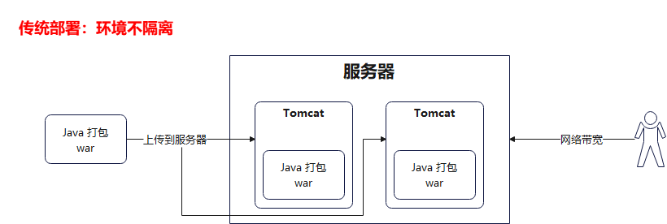

2. 虚拟化部署

   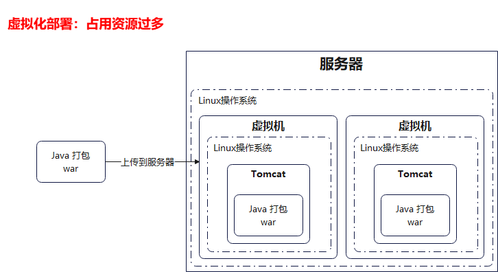

3. 容器化部署

   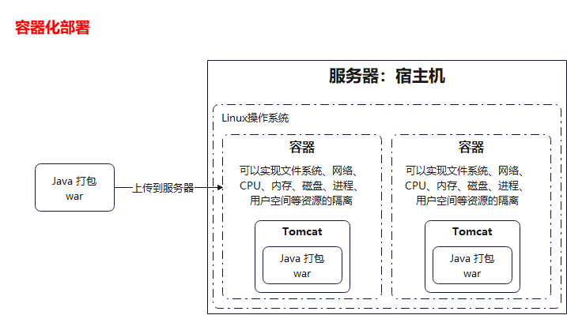

Kubernetes 的本质是一组服务器集群，它可以在集群的每个节点上运行特定的程序，来对节点中的容器进行管理。目的是实现资源管理的自动化，主要提供了如下的主要功能：

- `自我修复`：一旦某一个容器崩溃，能够在 1 秒左右迅速启动新的容器。
- `弹性伸缩`：可以根据需要，自动对集群中正在运行的容器数量进行调整。
- `服务发现`：服务可以通过自动发现的形式找到它所依赖的服务。
- `负载均衡`：如果一个服务起动了多个容器，能够自动实现请求的负载均衡。
- `版本回退`：如果发现新发布的程序版本有问题，可以立即回退到原来的版本。
- `存储编排`：可以根据容器自身的需求自动创建存储卷。

## 集群架构与组件

### Kubernetes  vs Borg 

Borg：


Kubernetes：


### 相关组件

#### 控制面板主件（Master）

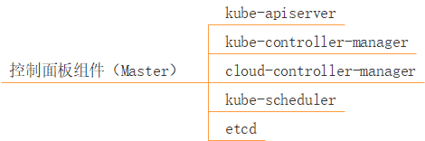

图解：

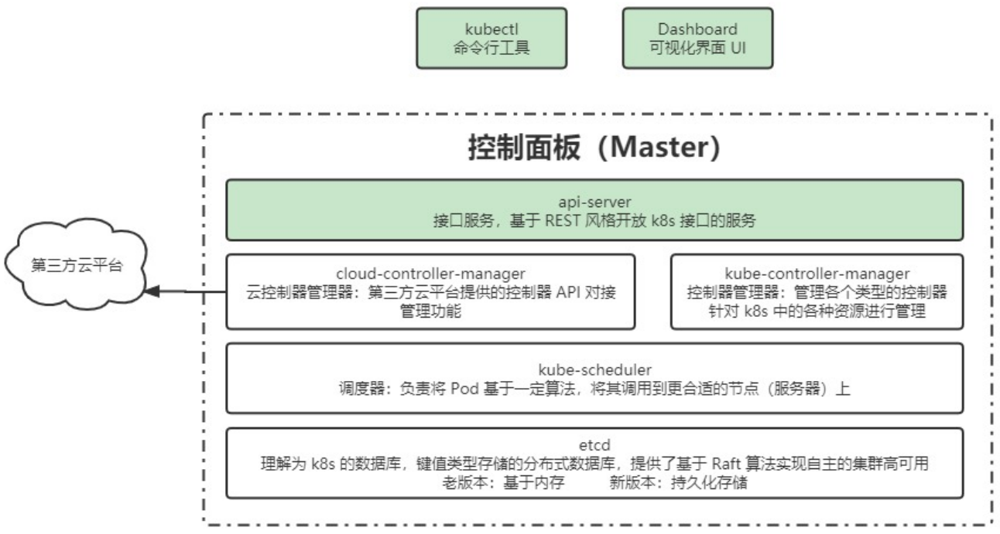

#### 节点组件（Node）

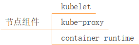

图解：

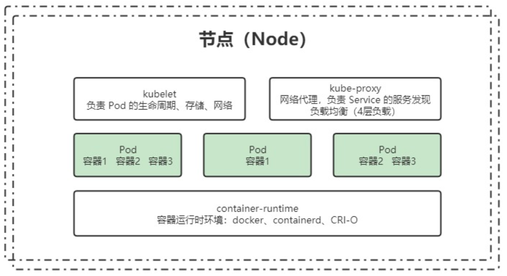

#### 附加组件

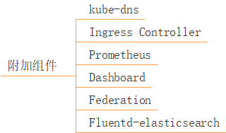

- kube-dns：负责为整个集群提供 DNS 服务。
- Ingress Controller：为服务提供外网入口。
- Prometheus：提供资源监控。
- Dashboard：提供 GUI。
- Federation：提供跨可用区的集群。
- Fluentd-elasticsearch：提供集群日志采集、存储和查询。

> 附加组件非强制要求安装，根据实际业务需求选择安装。

### 分层架构


- `管理层`：系统度量（如基础设施、容器和网络的度量）、自动化（如自动扩展、动态 Provision 等），以及策略管理（RBAS、Quota、PSP、NetworkPolicy 等）。
- `应用层`：部署（无状态应用、有状态应用、批处理任务、集群应用等）和路由（服务发现、DNS 解析等）。
- `核心层`：Kubernetes 最核心的功能，对外提供 API 构建高层的应用，对内提供插件式应用执行环境。

图解：

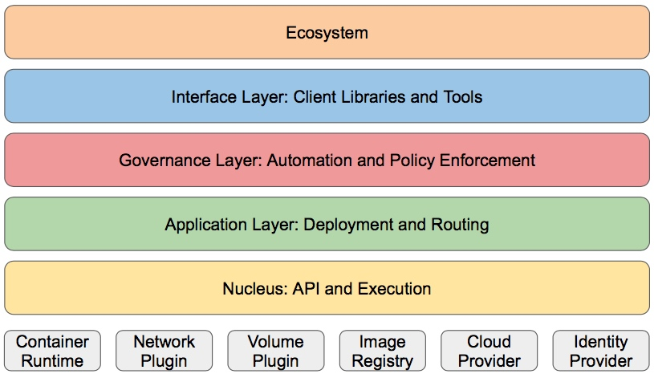

## 核心概念与专业术语

### 服务的分类

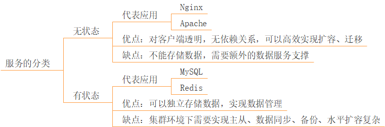

#### 无状态应用

`无状态应用`：不会对本地环境产生任何依赖，例如不会存储数据到本地磁盘。

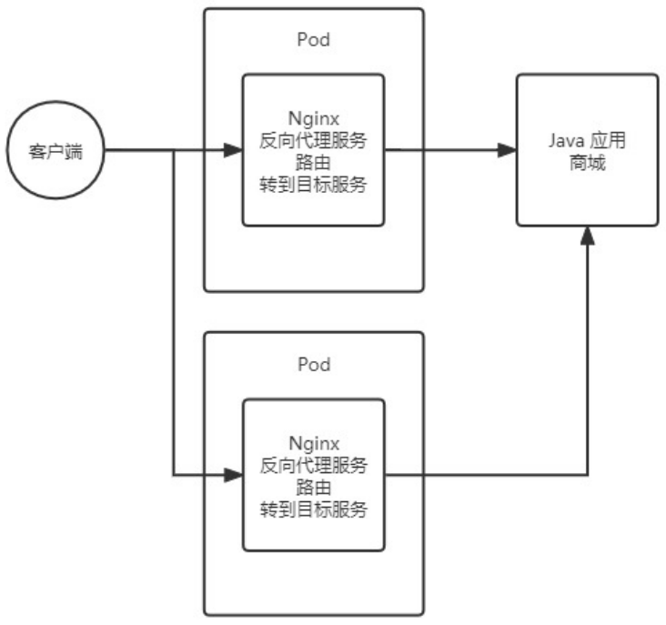

#### 有状态应用

`有状态应用`：会对本地环境产生依赖，例如需要存储数据到本地磁盘。

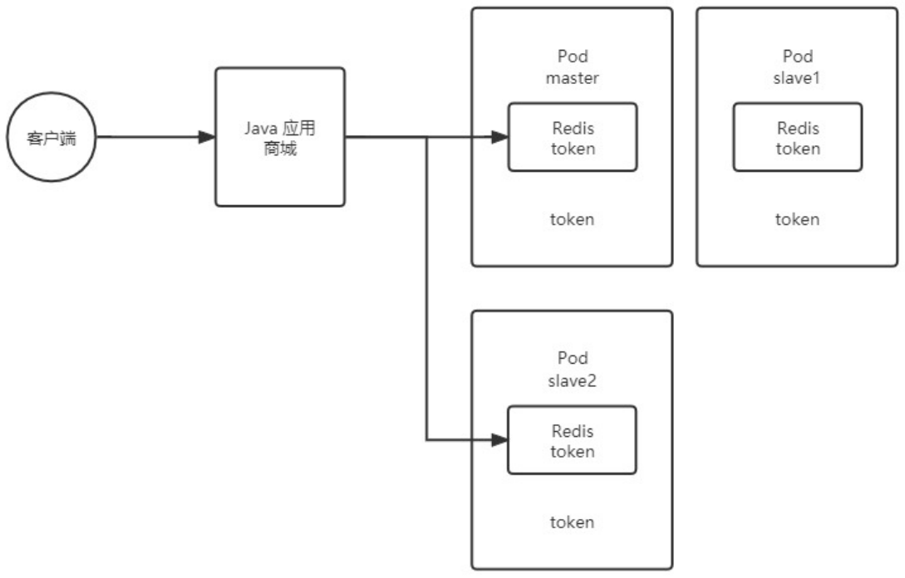

### 资源和对象

Kubernetes 中的所有内容都被抽象为`资源`，如 Pod、Service、Node 等都是资源。`对象是资源的实例`，是持久化的实体，如某个具体的 Pod、某个具体的 Node 等，Kubernetes 使用这些实体去表示整个集群的状态。

- **对象的创建、删除和修改，都是通过 Kubernetes API，也就是 Api Service 组件提供的 API 接口。**这些是 RESTFul 风格的 API，与 Kubernetes 的 "万物皆资源" 理念相符，命令行工具 kubectl，实际上也是调用 Kubernetes API。
- Kubernetes 中的资源类别有很多种，kubectl 可以通过配置文件来创建 "对象"，配置文件更像是描述对象属性的文件。**配置文件格式可以是 JSON 或者 YAML，常用 YAML。**

#### 资源的分类

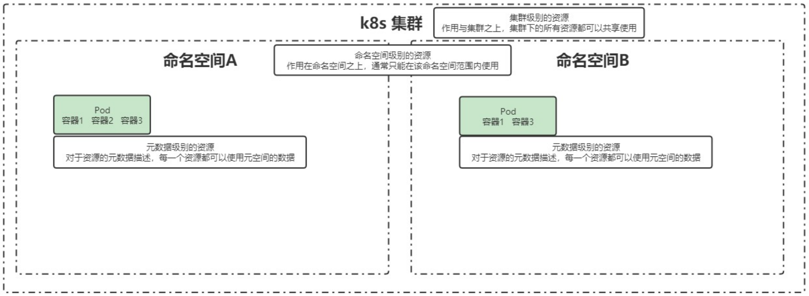

> Kubernetes 中的资源，不仅限于集群级、命名空间级、元数据级这三种类型，此处的类型划分，更多是为了理解不同资源的使用方式。

##### 集群级

集群级别的资源，作用于集群之上，集群下的所有资源都可以共享使用。

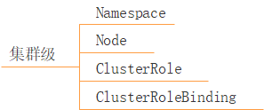

- `Namespace`：命名空间。
- `Node`：不像其他的资源（如 Pod 和 Namespace），Node 本质上不是 Kubernetes 来创建的，Kubernetes 只是管理 Node 上的资源，虽然可以通过 Manifest 创建一个 Node 对象，但 Kubernetes 也只是去检查是否真的有这么一个 Node，如果检查失败，也不会往上调度 Pod。
- `ClusterRole`：鉴权相关。
- `ClusterRoleBinding`：鉴权相关。

##### 命名空间级

命名空间级别的资源，作用于命名空间之上，通常只能在该命名空间范围内使用。

###### 工作负载型

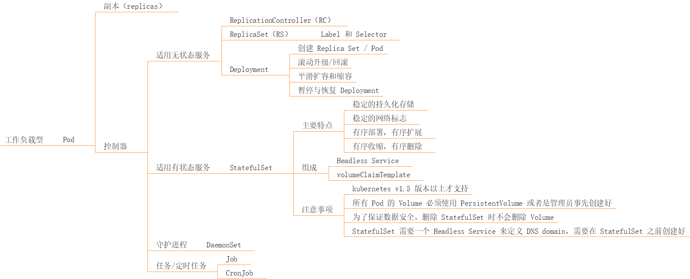

**`Pod`**：**是 Kubernetes 中最小的可部署单元，Pod 是容器组，一个 Pod 包含了一个应用程序容器（在某些情况下是多个容器）、存储资源、一个唯一的网络 IP 地址，以及一些确定容器该如何运行的选项。**Pod 容器组代表了 Kubernetes 中一个独立的应用程序运行实例，该实例可能由单个容器或者几个紧耦合在一起的容器组成。

- Pod 中的容器类型：Docker 是使用最广泛的容器引擎，但是 Kubernetes 在 1.24 版本后就不默认支持 Docker，而是使用 Containerd。
- Pod 的两种使用途径：
  - **一个 Pod 中只运行一个容器。**"one-container-per-pod" 是 Kubernetes 中最常见的使用方式，此时，可以认为 Pod 容器组是该容器的 wrapper，Kubernetes 通过 Pod 管理容器，而不是直接管理容器。
  - **一个 Pod 中运行多个需要互相协作的容器。**可以将多个紧密耦合、共享资源，且始终在一起运行的容器，编排在同一个 Pod 中。

>如图所示，在容器化部署中，我们希望当两个容器有强依赖关系时，它们可以共享网络，或者是希望当两个容器有强依赖关系时，可以实现容器之间文件系统的共享。在没有 Pod 之前，可以通过一些方式实现，比如 --links 参数，或者两个容器共享同一个容器卷，但这些操作都比较麻烦。**在 Pod 中，有一个 pause 容器，可以很好的实现网络、文件系统等的共享。**
>
>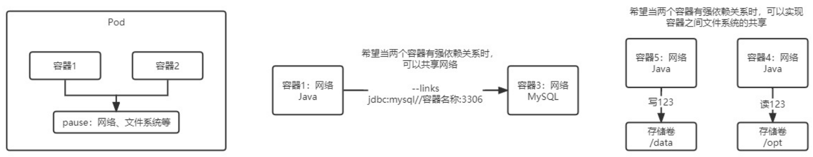

**`Replicas`**：**一个 Pod 可以被复制成多份，每一份可以称之为一个 "副本"。**这些副本除了一些描述性的信息（Pod 的名字，uid 等）不一样外，其他信息都是一样的，例如 Pod 内部的容器、容器数量、容器里面运行的应用等这些信息，这些副本提供同样的功能。

- Pod 的控制器通常包含一个名为 "replicas" 的属性，replicas 属性制定了特定 Pod 的副本的数量。如果当前集群中该 Pod 的数量与该属性指定的值不一样时，Kubernetes 会采取一些策略去使得当前状态满足配置的要求。

**`控制器`**：

- **适用无状态服务：**

  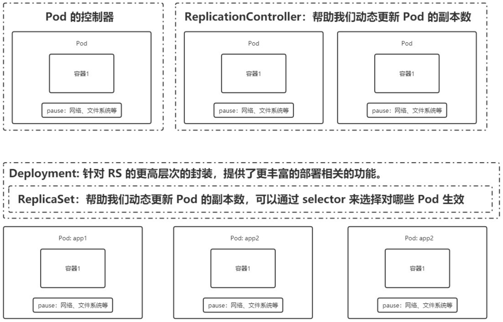

  - `ReplicationController（RC）`：RC 时 Kubernetes 系统中的核心概念之一，简单来说，RC 可以保证在任意时间运行 Pod 的副本数量，能够保证 Pod 总是可用的。如果实际 Pod 数量比指定的多，那就结束掉多的；如果实际 Pod 数量比指定的少，那就新启动一些 Pod。当 Pod 失败、被删除或者挂掉后， RC 都会去自动创建新的 Pod 来保证副本数量。所以，即使只有一个 Pod，也应该使用 RC 来管理。可以说，通过 RC，Kubernetes 实现了 Pod 的高可用性。总之，**RC 的主要作用就是用来确保容器应用的副本数，始终保持在用户定义的副本数。**

  - `ReplicaSet（RS）`：**RC 在 v1.11 版本被废弃，Kubernetes 官方建议使用 RS 替代 RC 进行部署，RS 与 RC 没有本质的不同，只是名字不一样，并且 RS 支持集合式的 Selector。**`RS 可以通过 Selector，选择指定的 Pod 进行动态的更新副本数。`

  - **`Deployment`**：在实际生产中，RC 和 RS 都不会使用，真正使用的是 Deployment，Deployment 是对 RS 更高层次的封装，提供了更丰富的部署相关的功能。

    - **创建 Replica Set / Pod。**

    - **滚动升级/回滚**：升级时，Deployment 基于 RS1，创建一个新的 RS2，在 RS2 中，运行新的 Pod（包含更新的内容），等新的 Pod 正常运行后（可用状态），将 RS1 中旧的 Pod 下线（不可用状态）。然后，在 RS2 中，继续运行一个新的 Pod（包含更新的内容），等待其达到可用状态后，将 RS1 中的第二个 Pod 下线（不可用状态）。至此，RS2 中的 Pod 都变为了可用状态，而 RS1 中的 Pod 都变为了不可用状态。**这个升级过程是滚动的，对于用户是无感知的，无论什么时候，用户都可以正常使用服务。**对于 RS1，会暂时保存不删除，如果需要回滚，则将 RS1 中的 Pod 依次启用，再依次下线 RS2 中的 Pod，最终达到全部回滚。

      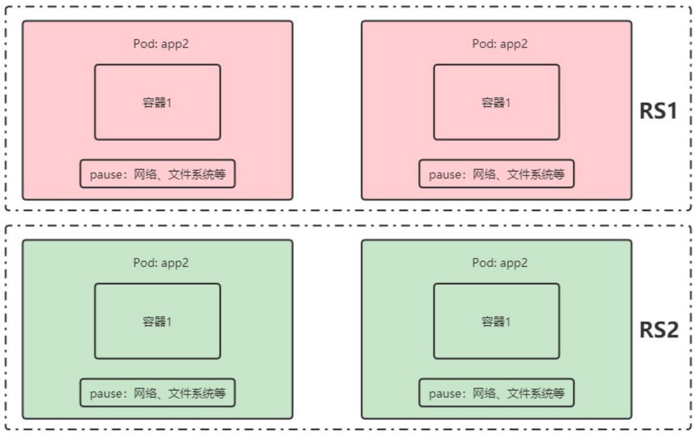

    - **平滑扩容和缩容**：基于 RS 实现的。

    - **暂停与恢复 Deployment。**

- **适用有状态服务：**

  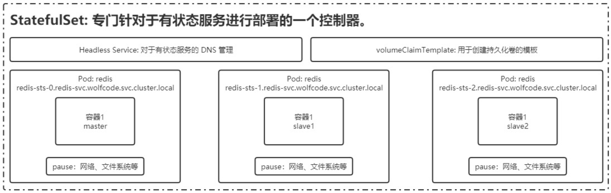

  - **`StatefulSet`**：对于有状态服务，需要考虑网络固定、数据不能丢失、服务部署的顺序得到保障。
    - 主要特点：
      - 稳定的持久化存储。
      - 稳定的网络标志。
      - 有序部署，有序扩展。
        - 即 Pod 是有顺序的，在部署或者扩展的时候，要依据定义的顺序依次进行（从 0 到 N-1，在下一个 Pod 运行之前，所有之前的 Pod 必须都是 Running 和 Ready 状态），基于 init containers 来实现。
      - 有序收缩，有序删除。
    - 组成：
      - **Headless Service**：用于有状态服务的 DNS 管理。DNS：Domain Name Server，域名服务，将域名与 IP 绑定映关系，即 "服务名 => 访问路径（域名）=> IP"。
        - StatefulSet 中每个 Pod 的 DNS 格式为 "statefulSetName-{0...N-1}.serviceName.namespace.svc.cluster.local"。
          - statefulSetName：是 StatefulSet 的名字。
          - 0...N-1：是 Pod 所在的序号，从 0 开始到 N-1。
          - serviceName：是 Headless Service 的名字。
          - namespace：是服务所在的 namespace，StatefulSet 和 Headless Service 必须在相同的 namespace。
          - cluster.local：是 Cluster Domain。
      - **volumeClaimTemplate**：用于创建持久化卷的模板。
    - 注意事项：
      - Kubernetes V1.5 版本以上才支持。
      - 所有 Pod 的 Volume 必须使用 PersistentVolume 或者是管理员事先创建好。
      - 为了保证数据安全，删除 StatefulSet 时不会删除 Volume。
      - StatefulSet 需要一个 Headless Service 来定义 DNS domain，需要在 StatefulSet 之前创建好。

- **守护进程：**

  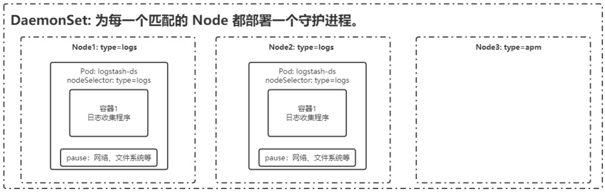

  - **`DaemonSet`**：DaemonSet 保证在每个 Node 上都运行一个容器副本，常用来部署一些集群的日志、监控或者其他系统管理应用。典型的应用包括：
    - 日志收集，比如 fluentld，logstash 等。
    - 系统监控，比如 Prometheus Node Exporter，collectd，New Relic agent，Ganglia gmond 等。
    - 系统程序，比如 kube-proxy，kube-dns，glusterd，ceph 等。

- **任务/定时任务：**

  - **`Job`**：一次性任务，运行完成后 Pod 销毁，不再重新启动新容器。
  - **`CronJob`**：在 Job 的基础上，增加了定时功能。


###### 服务发现


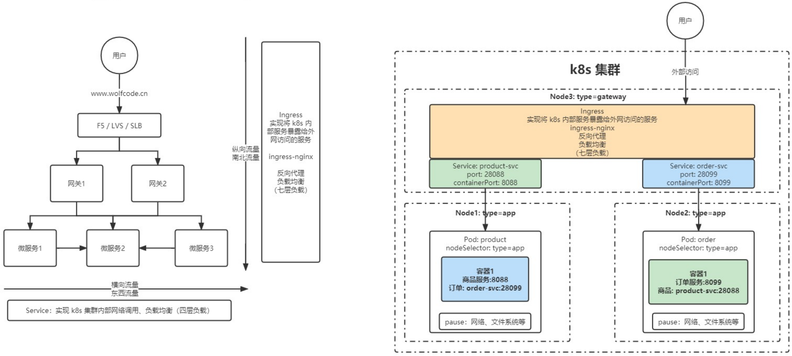

- **`Service`**：简写 svc，Pod 不能直接提供给外网访问，而是应该使用 Service。Service 就是把 Pod 暴露出来提供服务，Service 才是真正的 "服务"，它的中文名就叫 "服务"。可以说 Service 是一个应用服务的抽象，定义了 Pod 逻辑集合和访问这个 Pod 集合的策略。**Service 代理 Pod 集合，对外表现为一个访问入口，访问该入口的请求将经过负载均衡，转发到后端 Pod 中的容器。**
- **`Ingress`**

###### 存储


- **`Volume`**：数据卷，共享 Pod 中容器使用的数据，用来放持久化的数据，比如数据库数据。
- **`CSI`**：Container Storage Interface，是由来自 Kubernetes、Mesos、Docker 等社区成员联合制定的一个行业标准接口规范，旨在将任意存储系统暴露给容器化应用程序。CSI 规范定义了存储提供商实现 CSI 兼容的 Volume Plugin 的最小操作集和部署建议。CSI 规范的主要焦点是声明 Volume Plugin 必须实现的接口。

###### 特殊类型配置

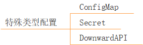

- **`ConfigMap`**
- **`Secret`**
- **`DownwardAPI`**

###### 其他


- **`Role`**
- **`RoleBinding`**

##### 元数据级

元数据级别的资源，对于资源的元数据描述，每一个资源都可以使用元空间的数据。

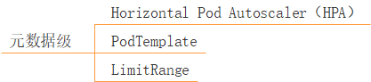

- `Horizontal Pod Autoscaler（HPA）`：Pod 自动扩容，可以根据 CPU 使用率或自定义指标（metrics），自动对 Pod 进行扩/缩容。
  - 控制管理器每隔 30s （可以通过 -horizontal-pod-autoscaler-sync-period 参数修改）查询 metrics 的资源使用情况。
  - 支持三种 metrics 类型：
    - 预定义 metrics：以利用率的方式计算，比如 Pod 的 CPU。
    - 自定义的 Pod metrics：以原始值（raw value）的方式计算。
    - 自定义的 object metrics。
  - 支持两种 metrics 查询方式：Heapster 和自定义的 REST API。
  - 支持多 metrics。
- `PodTemplate`：PodTemplate 时关于 Pod 的定义，但是被包含在其他的 Kubernetes 对象中（例如 Deployment、StatefulSet、DaemonSet 等控制器），控制器通过 PodTemplate 信息来创建 Pod。
- `LimitRange`：可以对集群内 Request 和 Limits 的配置做一个全局的统一的限制，相当于批量设置了某一个范围内（某个命名空间）的 Pod 的资源使用限制。

####  资源的清单

| 参数名                                      | 类型    | 字段说明                                                     |
| ------------------------------------------- | ------- | ------------------------------------------------------------ |
| apiVersion                                  | String  | Kubernetes API 的版本，可以用`kubectl api versions`命令查询  |
| kind                                        | String  | yaml 文件定义的资源类型和角色                                |
| metadata                                    | Object  | 元数据对象，下面是它的属性                                   |
| metadata.name                               | String  | 元数据对象的名字，比如 Pod 的名字                            |
| metadata.namespace                          | String  | 元数据对象的命名空间                                         |
| Spec                                        | Object  | 详细定义对象                                                 |
| spec.containers[]                           | list    | 定义 Spec 对象的容器列表                                     |
| spec.containers[].name                      | String  | 为列表中的某个容器定义名称                                   |
| spec.containers[].image                     | String  | 为列表中的某个容器定义需要的镜像名称                         |
| spec.containers[].imagePullPolicy           | string  | 定义镜像拉取策略，可选值为 Always、Never、IfNotPresent，默认值为 Always。<br />- Always：意思是每次都尝试重新拉取镜像。<br />- Never：表示仅适用本地镜像。<br />- IfNotPresent：如果本地有镜像就使用本地镜像，没有就拉取在线镜像。 |
| spec.containers[].command[]                 | list    | 指定容器启动命令，因为是数组可以指定多个，不指定则使用镜像打包时使用的启动命令 |
| spec.containers[].args[]                    | list    | 指定容器启动命令参数，因为是数组可以指定多个                 |
| spec.containers[].workingDir                | string  | 指定容器的工作目录                                           |
| spec.containers[].volumeMounts[]            | list    | 指定容器内部的存储卷配置                                     |
| spec.containers[].volumeMounts[].name       | string  | 指定可以被容器挂载的存储卷的名称                             |
| spec.containers[].volumeMounts[].mountPath  | string  | 指定可以被容器挂载的存储卷的路径                             |
| spec.containers[].volumeMounts[].readOnly   | string  | 设置存储卷路径的读写模式，ture 或者 false，默认是读写模式    |
| spec.containers[].ports[]                   | list    | 指定容器需要用到的端口列表                                   |
| spec.containers[].ports[].name              | string  | 指定端口的名称                                               |
| spec.containers[].ports[].containerPort     | string  | 指定容器需要监听的端口号                                     |
| spec.containers[].ports[].hostPort          | string  | 指定容器所在主机需要监听的端口号，默认跟上面 containerPort 相同，注意设置了 hostPort 同一台主机无法启动该容器的相同副本（因为主机的端口号不能相同，这样会冲突） |
| spec.containers[].ports[].protocol          | string  | 指定端口协议，支持 TCP 和 UDP，默认值为 TCP                  |
| spec.containers[].env[]                     | list    | 指定容器运行前需设置的环境变量列表                           |
| spec.containers[].env[].name                | string  | 指定环境变量名称                                             |
| spec.containers[].env[].value               | string  | 指定环境变量值                                               |
| spec.containers[].resources                 | Object  | 指定资源限制和资源请求的值（这里开始就是设置容器的资源上限） |
| spec.containers[].resources.limits          | Object  | 指定设置容器运行时资源的运行上限                             |
| spec.containers[].resources.limits.cpu      | string  | 指定 CPU 的限制，单位为 Core 数，将用于 docker run –cpu-shares 参数 |
| spec.containers[].resources.limits.memory   | string  | 指定 memory 内存的限制，单位为 MIB、GiB                      |
| spec.containers[].resources.requests        | Object  | 指定容器启动和调度时的限制设置                               |
| spec.containers[].resources.requests.cpu    | string  | CPU 请求，单位为 Core 数，容器启动时初始化可用数量           |
| spec.containers[].resources.requests.memory | string  | 内存请求，单位为 MIB、GiB，容器启动的初始化可用数量          |
| spec.restartPolicy                          | string  | 定义 Pod 的重启策略，可选值为 Always、OnFailure、Never，默认值为 Always。<br />- Always：Pod 一旦终止运行，则无论容器是如何终止的，kubelet 服务都将重启它。<br />- OnFailure：只有 Pod 以非零退出码终止时，kubelet 才会重启该容器。如果容器正常结束（退出码为 0），则 kubectl 将不会重启它。  - Never：Pod 终止后，kubelet 将退出码报告给 master，不会重启该 Pod。 |
| spec.nodeSelector                           | Object  | 定义 Node 的 label 过滤标签，以 "key: value" 格式指定        |
| spec.imagePullSecrets                       | Object  | 定义 pull 镜像时使用 secret 名称，以 "name: secretkey" 格式指定 |
| spec.hostNetwork                            | Boolean | 定义是否使用主机网络模式，默认值为 false。设置 true 表示使用宿主机网络，不使用 docker 网桥，同时设置了 true 将无法在同一台宿主机上启动第二个副本 |

> 上表为部分参数。

### 对象的规约和状态

#### 规约（Spec）

Spec 是规约、规格的意思，spec 是必需的，它描述了`对象的期望状态`（Desired State） —— 即希望对象所具有的特征。当创建 Kubernetes 对象时，必须提供对象的规约，用来描述该对象的期望状态，以及关于对象的一些基本信息，例如名称等。

#### 状态（Status）

Status 表示`对象的实际状态`，该属性由 Kubernetes 自己维护，Kubernetes 会通过一系列的控制器对对应对象进行管理，尽可能的让对象的实际状态与期望状态重合。

# 实战进阶篇

## 搭建 Kubernetes 集群

### 配置要求

服务器要求：

- k8s-master：192.168.1.120。
- k8s-node1：192.168.1.121。
- k8s-node1：192.168.1.122。

每台服务器最低配置：2 核、2G 内存、20G 硬盘。

> 使用 Hyper-V 时，注意配置动态内存的最小值：
>
> 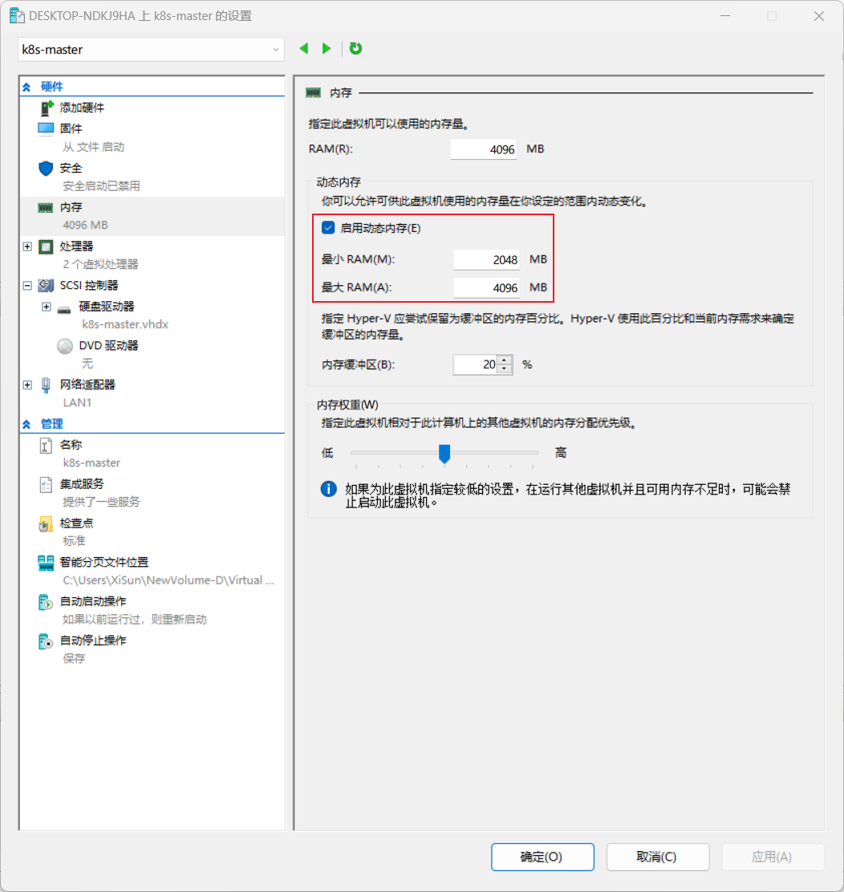

### 操作系统

```shell
[root@k8s-master k8s]# cat /etc/centos-release
CentOS Linux release 7.9.2009 (Core)
[root@k8s-master k8s]# uname -r
3.10.0-1160.el7.x86_64
[root@k8s-master k8s]# uname -a
Linux k8s-master 3.10.0-1160.el7.x86_64 #1 SMP Mon Oct 19 16:18:59 UTC 2020 x86_64 x86_64 x86_64 GNU/Linux
```

### 设置 hostname

```shell
[root@k8s-master ~]# hostnamectl set-hostname k8s-master
```

- 修改 hostname 后，需要重启虚拟机。

### 设置 hosts

```shell
[root@k8s-master ~]# vim /etc/hosts
127.0.0.1   localhost localhost.localdomain localhost4 localhost4.localdomain4
::1         localhost localhost.localdomain localhost6 localhost6.localdomain6

192.168.1.120 k8s-master
192.168.1.121 k8s-node1
192.168.1.122 k8s-node2
```

### 关闭防火墙

```shell
# 查看防火墙状态
[root@k8s-master ~]# systemctl status firewalld
● firewalld.service - firewalld - dynamic firewall daemon
   Loaded: loaded (/usr/lib/systemd/system/firewalld.service; enabled; vendor preset: enabled)
   Active: active (running) since Tue 2024-08-27 23:20:58 CST; 21min ago
     Docs: man:firewalld(1)
 Main PID: 549 (firewalld)
   CGroup: /system.slice/firewalld.service
           └─549 /usr/bin/python2 -Es /usr/sbin/firewalld --nofork --nopid

Aug 27 23:20:58 master systemd[1]: Starting firewalld - dynamic firewall daemon...
Aug 27 23:20:58 master systemd[1]: Started firewalld - dynamic firewall daemon.
Aug 27 23:20:58 master firewalld[549]: WARNING: AllowZoneDrifting is enabled. This is considered an insecure configuration option. It will... it now.
Hint: Some lines were ellipsized, use -l to show in full.
# 关闭防火墙
[root@k8s-master ~]# systemctl stop firewalld
# 禁止防火墙开机自启
[root@k8s-master ~]# systemctl disable firewalld
Removed symlink /etc/systemd/system/multi-user.target.wants/firewalld.service.
Removed symlink /etc/systemd/system/dbus-org.fedoraproject.FirewallD1.service.
[root@k8s-master ~]# systemctl status firewalld
● firewalld.service - firewalld - dynamic firewall daemon
   Loaded: loaded (/usr/lib/systemd/system/firewalld.service; disabled; vendor preset: enabled)
   Active: inactive (dead)
     Docs: man:firewalld(1)

Aug 27 23:20:58 master systemd[1]: Starting firewalld - dynamic firewall daemon...
Aug 27 23:20:58 master systemd[1]: Started firewalld - dynamic firewall daemon.
Aug 27 23:20:58 master firewalld[549]: WARNING: AllowZoneDrifting is enabled. This is considered an insecure configuration option. It will... it now.
Aug 27 23:42:27 master systemd[1]: Stopping firewalld - dynamic firewall daemon...
Aug 27 23:42:28 master systemd[1]: Stopped firewalld - dynamic firewall daemon.
Hint: Some lines were ellipsized, use -l to show in full.
```

> ```shell
> $ systemctl stop firewalld
> $ systemctl disable firewalld
> ```

### 关闭 swap

```shell
[root@k8s-master ~]# free -m
              total        used        free      shared  buff/cache   available
Mem:           3950        2286         918           8         745        1437
Swap:          4095           0        4095

[root@k8s-master ~]# cat /etc/fstab 

#
# /etc/fstab
# Created by anaconda on Thu Aug 22 23:53:48 2024
#
# Accessible filesystems, by reference, are maintained under '/dev/disk'
# See man pages fstab(5), findfs(8), mount(8) and/or blkid(8) for more info
#
UUID=f724baab-c349-497d-ba1f-da8f619fdf89 /                       xfs     defaults        0 0
UUID=F0B8-EAC5          /boot/efi               vfat    umask=0077,shortname=winnt 0 0
UUID=94ca6141-23b0-4eff-ab4f-ae74b1cfe406 swap                    swap    defaults        0 0
# 永久关闭 swap
[root@k8s-master ~]# sed -ri 's/.*swap.*/#&/' /etc/fstab
[root@k8s-master ~]# cat /etc/fstab 

#
# /etc/fstab
# Created by anaconda on Thu Aug 22 23:53:48 2024
#
# Accessible filesystems, by reference, are maintained under '/dev/disk'
# See man pages fstab(5), findfs(8), mount(8) and/or blkid(8) for more info
#
UUID=f724baab-c349-497d-ba1f-da8f619fdf89 /                       xfs     defaults        0 0
UUID=F0B8-EAC5          /boot/efi               vfat    umask=0077,shortname=winnt 0 0
#UUID=94ca6141-23b0-4eff-ab4f-ae74b1cfe406 swap                    swap    defaults        0 0

# 关闭 swap 后，一定要重启虚拟机
[root@k8s-master ~]# reboot
[root@k8s-master ~]# free -m
              total        used        free      shared  buff/cache   available
Mem:           3950         198        3671           8          79        3593
Swap:             0           0           0
```

- 临时关闭：`swapoff -a`。

>```shell
>$ sed -ri 's/.*swap.*/#&/' /etc/fstab
>$ reboot
>```

### 关闭 selinux

```shell
[root@k8s-master ~]# cat /etc/selinux/config 

# This file controls the state of SELinux on the system.
# SELINUX= can take one of these three values:
#     enforcing - SELinux security policy is enforced.
#     permissive - SELinux prints warnings instead of enforcing.
#     disabled - No SELinux policy is loaded.
SELINUX=enforcing
# SELINUXTYPE= can take one of three values:
#     targeted - Targeted processes are protected,
#     minimum - Modification of targeted policy. Only selected processes are protected. 
#     mls - Multi Level Security protection.
SELINUXTYPE=targeted 


# 永久关闭
[root@k8s-master ~]# sed -i "s/SELINUX=enforcing/SELINUX=disabled/g" /etc/selinux/config

[root@k8s-master ~]# cat /etc/selinux/config 

# This file controls the state of SELinux on the system.
# SELINUX= can take one of these three values:
#     enforcing - SELinux security policy is enforced.
#     permissive - SELinux prints warnings instead of enforcing.
#     disabled - No SELinux policy is loaded.
SELINUX=disabled
# SELINUXTYPE= can take one of three values:
#     targeted - Targeted processes are protected,
#     minimum - Modification of targeted policy. Only selected processes are protected. 
#     mls - Multi Level Security protection.
SELINUXTYPE=targeted 


```

- 临时关闭：`setenforce 0`。

>SELinux 是一个为 Linux 提供访问控制安全策略的安全模块，它通过定义和执行安全策略来限制进程对系统资源的访问，从而增强系统的安全性。然而，Kubernetes 集群的某些组件或配置可能与 SELinux 的默认策略不兼容，导致安装或运行过程中出现权限问题。
>
>- 临时关闭
>
>```shell
># 此命令将 SELinux 设置为宽容模式（permissive mode），在这种模式下，SELinux 会记录违反策略的行为但不会阻止它们
>$ setenforce 0
>```
>
>- 永久关闭
>
>```shell
>$ sed -i 's/SELINUX=permissive/SELINUX=disabled/' /etc/sysconfig/selinux
>
>$ sed -i "s/SELINUX=enforcing/SELINUX=disabled/g" /etc/selinux/config
>
>$ reboot
>```
>
>需要注意的是，关闭 SELinux 会降低系统的安全性。因此，在关闭 SELinux 之前，应该仔细评估潜在的安全风险，并确保已经采取了其他适当的安全措施来保护系统。
>
>**在 Kubernetes 集群中，关闭 Swap 和 SELinux 是出于性能和稳定性方面的考虑。**
>
>为什么要关闭 Swap？
>
>- 性能问题：
>  - Swap 内存通常比物理内存慢很多。当系统内存不足时，Linux 会将部分内存内容交换到磁盘上的 Swap 分区中，这会导致应用程序的性能显著下降。在 Kubernetes 集群中，容器应用对性能有较高要求，频繁的 Swap 操作会严重影响这些应用的运行效率。
>  - 关闭 Swap 可以避免这种性能损失，确保容器应用能够直接从物理内存中获取所需资源，从而提高整体性能。
>
>- 稳定性问题：
>  - Kubernetes 对容器运行环境的要求比较高，关闭 Swap 可以减少因为内存兑换（即内存与 Swap 之间的数据交换）引起的异常现象。这有助于确保集群的稳定性，避免因为内存问题导致的容器崩溃或系统不稳定。
>
>- 资源管理：
>  - Kubernetes 本身对内存的管理非常严格，它通过资源配额（Resource Quotas）和限制（Limits）来确保容器不会超出其分配的资源范围。如果启用 Swap，这些管理机制可能无法有效发挥作用，因为 Swap 允许容器在物理内存不足时继续运行，但性能会大幅下降。
>
>
>为什么要关闭 SELinux？
>
>- 兼容性问题：
>  - SELinux 是一种安全增强型的 Linux 内核安全模块，它可以提供强大的访问控制机制。然而，在某些情况下，SELinux 可能会与 Kubernetes 的某些组件或特性不兼容，导致集群运行不稳定或出现权限问题。
>
>- 简化部署和管理：
>  - 关闭 SELinux 可以简化 Kubernetes 的部署和管理过程。在没有 SELinux 的情况下，管理员可以更容易地配置和调试集群，而无需担心 SELinux 的安全策略可能会干扰集群的正常运行。
>
>- 安全风险：
>  - 虽然 SELinux 可以增强系统的安全性，但在某些情况下，它也可能成为安全漏洞的源头。例如，如果 SELinux 的策略配置不当，可能会允许未授权的访问或操作。因此，在某些情况下，关闭 SELinux 可能是一种更安全的选择，特别是当管理员能够确保通过其他方式（如网络隔离、身份验证等）来保护系统时。
>
>**综上所述，关闭 Swap 和 SELinux 是 Kubernetes 集群部署中的常见做法，旨在提高集群的性能和稳定性，并简化部署和管理过程。然而，这些决策也需要在安全性和性能之间做出权衡，并根据具体的业务需求和安全策略来确定是否适用。**

### 将桥接的 IPv4 流量传递到 iptables 的链

```shell
[root@k8s-master ~]# cat > /etc/sysctl.d/k8s.conf << EOF
> net.ipv4.ip_forward = 1
> net.bridge.bridge-nf-call-ip6tables = 1
> net.bridge.bridge-nf-call-iptables = 1
> vm.swappiness = 0
> EOF

# 生效配置
[root@k8s-master ~]# sysctl --system
* Applying /usr/lib/sysctl.d/00-system.conf ...
* Applying /usr/lib/sysctl.d/10-default-yama-scope.conf ...
kernel.yama.ptrace_scope = 0
* Applying /usr/lib/sysctl.d/50-default.conf ...
kernel.sysrq = 16
kernel.core_uses_pid = 1
kernel.kptr_restrict = 1
net.ipv4.conf.default.rp_filter = 1
net.ipv4.conf.all.rp_filter = 1
net.ipv4.conf.default.accept_source_route = 0
net.ipv4.conf.all.accept_source_route = 0
net.ipv4.conf.default.promote_secondaries = 1
net.ipv4.conf.all.promote_secondaries = 1
fs.protected_hardlinks = 1
fs.protected_symlinks = 1
* Applying /etc/sysctl.d/99-sysctl.conf ...
* Applying /etc/sysctl.d/k8s.conf ...
net.ipv4.ip_forward = 1
vm.swappiness = 0
* Applying /etc/sysctl.conf ...
```

>```shell
>$ cat > /etc/sysctl.d/k8s.conf << EOF
>net.ipv4.ip_forward = 1
>net.bridge.bridge-nf-call-ip6tables = 1
>net.bridge.bridge-nf-call-iptables = 1
>vm.swappiness = 0
>EOF
>
>$ sysctl --system
>```

### 时间同步

```shell
[root@k8s-master ~]# yum -y install ntpdate
Loaded plugins: fastestmirror
Loading mirror speeds from cached hostfile
 * base: mirrors.aliyun.com
 * extras: mirrors.aliyun.com
 * updates: mirrors.aliyun.com
Resolving Dependencies
--> Running transaction check
---> Package ntpdate.x86_64 0:4.2.6p5-29.el7.centos.2 will be installed
--> Finished Dependency Resolution

Dependencies Resolved

=====================================================================================================================================================
 Package                         Arch                           Version                                           Repository                    Size
=====================================================================================================================================================
Installing:
 ntpdate                         x86_64                         4.2.6p5-29.el7.centos.2                           base                          87 k

Transaction Summary
=====================================================================================================================================================
Install  1 Package

Total download size: 87 k
Installed size: 121 k
Downloading packages:
ntpdate-4.2.6p5-29.el7.centos.2.x86_64.rpm                                                                                    |  87 kB  00:00:00     
Running transaction check
Running transaction test
Transaction test succeeded
Running transaction
  Installing : ntpdate-4.2.6p5-29.el7.centos.2.x86_64                                                                                            1/1 
  Verifying  : ntpdate-4.2.6p5-29.el7.centos.2.x86_64                                                                                            1/1 

Installed:
  ntpdate.x86_64 0:4.2.6p5-29.el7.centos.2                                                                                                           

Complete!
[root@k8s-master ~]# ntpdate time.windows.com
28 Aug 00:08:27 ntpdate[1077]: adjust time server 52.231.114.183 offset 0.248979 sec
```

> ```shell
> $ yum -y install ntpdate
> 
> $ ntpdate time.windows.com
> ```
>

### Docker 安装

```shell
# 切换镜像源
[root@k8s-master ~]# wget https://mirrors.aliyun.com/docker-ce/linux/centos/docker-ce.repo -O /etc/yum.repos.d/docker-ce.repo
--2024-08-28 00:18:09--  https://mirrors.aliyun.com/docker-ce/linux/centos/docker-ce.repo
Resolving mirrors.aliyun.com (mirrors.aliyun.com)... 124.238.242.241, 117.68.48.82, 117.68.48.80, ...
Connecting to mirrors.aliyun.com (mirrors.aliyun.com)|124.238.242.241|:443... connected.
HTTP request sent, awaiting response... 200 OK
Length: 2081 (2.0K) [application/octet-stream]
Saving to: ‘/etc/yum.repos.d/docker-ce.repo’

100%[===========================================================================================================>] 2,081       --.-K/s   in 0s      

2024-08-28 00:18:09 (684 MB/s) - ‘/etc/yum.repos.d/docker-ce.repo’ saved [2081/2081]

# 查看当前镜像源中支持的 Docker 版本
[root@k8s-master ~]# yum list docker-ce --showduplicates
Loaded plugins: fastestmirror
Loading mirror speeds from cached hostfile
 * base: mirrors.aliyun.com
 * extras: mirrors.aliyun.com
 * updates: mirrors.aliyun.com
docker-ce-stable                                                                                                              | 3.5 kB  00:00:00     
(1/2): docker-ce-stable/7/x86_64/updateinfo                                                                                   |   55 B  00:00:00     
(2/2): docker-ce-stable/7/x86_64/primary_db                                                                                   | 152 kB  00:00:00     
Available Packages
docker-ce.x86_64                                               17.03.0.ce-1.el7.centos                                               docker-ce-stable
docker-ce.x86_64                                               17.03.1.ce-1.el7.centos                                               docker-ce-stable
docker-ce.x86_64                                               17.03.2.ce-1.el7.centos                                               docker-ce-stable
docker-ce.x86_64                                               17.03.3.ce-1.el7                                                      docker-ce-stable
docker-ce.x86_64                                               17.06.0.ce-1.el7.centos                                               docker-ce-stable
docker-ce.x86_64                                               17.06.1.ce-1.el7.centos                                               docker-ce-stable
docker-ce.x86_64                                               17.06.2.ce-1.el7.centos                                               docker-ce-stable
docker-ce.x86_64                                               17.09.0.ce-1.el7.centos                                               docker-ce-stable
docker-ce.x86_64                                               17.09.1.ce-1.el7.centos                                               docker-ce-stable
docker-ce.x86_64                                               17.12.0.ce-1.el7.centos                                               docker-ce-stable
docker-ce.x86_64                                               17.12.1.ce-1.el7.centos                                               docker-ce-stable
docker-ce.x86_64                                               18.03.0.ce-1.el7.centos                                               docker-ce-stable
docker-ce.x86_64                                               18.03.1.ce-1.el7.centos                                               docker-ce-stable
docker-ce.x86_64                                               18.06.0.ce-3.el7                                                      docker-ce-stable
docker-ce.x86_64                                               18.06.1.ce-3.el7                                                      docker-ce-stable
docker-ce.x86_64                                               18.06.2.ce-3.el7                                                      docker-ce-stable
docker-ce.x86_64                                               18.06.3.ce-3.el7                                                      docker-ce-stable
docker-ce.x86_64                                               3:18.09.0-3.el7                                                       docker-ce-stable
docker-ce.x86_64                                               3:18.09.1-3.el7                                                       docker-ce-stable
docker-ce.x86_64                                               3:18.09.2-3.el7                                                       docker-ce-stable
docker-ce.x86_64                                               3:18.09.3-3.el7                                                       docker-ce-stable
docker-ce.x86_64                                               3:18.09.4-3.el7                                                       docker-ce-stable
docker-ce.x86_64                                               3:18.09.5-3.el7                                                       docker-ce-stable
docker-ce.x86_64                                               3:18.09.6-3.el7                                                       docker-ce-stable
docker-ce.x86_64                                               3:18.09.7-3.el7                                                       docker-ce-stable
docker-ce.x86_64                                               3:18.09.8-3.el7                                                       docker-ce-stable
docker-ce.x86_64                                               3:18.09.9-3.el7                                                       docker-ce-stable
docker-ce.x86_64                                               3:19.03.0-3.el7                                                       docker-ce-stable
docker-ce.x86_64                                               3:19.03.1-3.el7                                                       docker-ce-stable
docker-ce.x86_64                                               3:19.03.2-3.el7                                                       docker-ce-stable
docker-ce.x86_64                                               3:19.03.3-3.el7                                                       docker-ce-stable
docker-ce.x86_64                                               3:19.03.4-3.el7                                                       docker-ce-stable
docker-ce.x86_64                                               3:19.03.5-3.el7                                                       docker-ce-stable
docker-ce.x86_64                                               3:19.03.6-3.el7                                                       docker-ce-stable
docker-ce.x86_64                                               3:19.03.7-3.el7                                                       docker-ce-stable
docker-ce.x86_64                                               3:19.03.8-3.el7                                                       docker-ce-stable
docker-ce.x86_64                                               3:19.03.9-3.el7                                                       docker-ce-stable
docker-ce.x86_64                                               3:19.03.10-3.el7                                                      docker-ce-stable
docker-ce.x86_64                                               3:19.03.11-3.el7                                                      docker-ce-stable
docker-ce.x86_64                                               3:19.03.12-3.el7                                                      docker-ce-stable
docker-ce.x86_64                                               3:19.03.13-3.el7                                                      docker-ce-stable
docker-ce.x86_64                                               3:19.03.14-3.el7                                                      docker-ce-stable
docker-ce.x86_64                                               3:19.03.15-3.el7                                                      docker-ce-stable
docker-ce.x86_64                                               3:20.10.0-3.el7                                                       docker-ce-stable
docker-ce.x86_64                                               3:20.10.1-3.el7                                                       docker-ce-stable
docker-ce.x86_64                                               3:20.10.2-3.el7                                                       docker-ce-stable
docker-ce.x86_64                                               3:20.10.3-3.el7                                                       docker-ce-stable
docker-ce.x86_64                                               3:20.10.4-3.el7                                                       docker-ce-stable
docker-ce.x86_64                                               3:20.10.5-3.el7                                                       docker-ce-stable
docker-ce.x86_64                                               3:20.10.6-3.el7                                                       docker-ce-stable
docker-ce.x86_64                                               3:20.10.7-3.el7                                                       docker-ce-stable
docker-ce.x86_64                                               3:20.10.8-3.el7                                                       docker-ce-stable
docker-ce.x86_64                                               3:20.10.9-3.el7                                                       docker-ce-stable
docker-ce.x86_64                                               3:20.10.10-3.el7                                                      docker-ce-stable
docker-ce.x86_64                                               3:20.10.11-3.el7                                                      docker-ce-stable
docker-ce.x86_64                                               3:20.10.12-3.el7                                                      docker-ce-stable
docker-ce.x86_64                                               3:20.10.13-3.el7                                                      docker-ce-stable
docker-ce.x86_64                                               3:20.10.14-3.el7                                                      docker-ce-stable
docker-ce.x86_64                                               3:20.10.15-3.el7                                                      docker-ce-stable
docker-ce.x86_64                                               3:20.10.16-3.el7                                                      docker-ce-stable
docker-ce.x86_64                                               3:20.10.17-3.el7                                                      docker-ce-stable
docker-ce.x86_64                                               3:20.10.18-3.el7                                                      docker-ce-stable
docker-ce.x86_64                                               3:20.10.19-3.el7                                                      docker-ce-stable
docker-ce.x86_64                                               3:20.10.20-3.el7                                                      docker-ce-stable
docker-ce.x86_64                                               3:20.10.21-3.el7                                                      docker-ce-stable
docker-ce.x86_64                                               3:20.10.22-3.el7                                                      docker-ce-stable
docker-ce.x86_64                                               3:20.10.23-3.el7                                                      docker-ce-stable
docker-ce.x86_64                                               3:20.10.24-3.el7                                                      docker-ce-stable
docker-ce.x86_64                                               3:23.0.0-1.el7                                                        docker-ce-stable
docker-ce.x86_64                                               3:23.0.1-1.el7                                                        docker-ce-stable
docker-ce.x86_64                                               3:23.0.2-1.el7                                                        docker-ce-stable
docker-ce.x86_64                                               3:23.0.3-1.el7                                                        docker-ce-stable
docker-ce.x86_64                                               3:23.0.4-1.el7                                                        docker-ce-stable
docker-ce.x86_64                                               3:23.0.5-1.el7                                                        docker-ce-stable
docker-ce.x86_64                                               3:23.0.6-1.el7                                                        docker-ce-stable
docker-ce.x86_64                                               3:24.0.0-1.el7                                                        docker-ce-stable
docker-ce.x86_64                                               3:24.0.1-1.el7                                                        docker-ce-stable
docker-ce.x86_64                                               3:24.0.2-1.el7                                                        docker-ce-stable
docker-ce.x86_64                                               3:24.0.3-1.el7                                                        docker-ce-stable
docker-ce.x86_64                                               3:24.0.4-1.el7                                                        docker-ce-stable
docker-ce.x86_64                                               3:24.0.5-1.el7                                                        docker-ce-stable
docker-ce.x86_64                                               3:24.0.6-1.el7                                                        docker-ce-stable
docker-ce.x86_64                                               3:24.0.7-1.el7                                                        docker-ce-stable
docker-ce.x86_64                                               3:24.0.8-1.el7                                                        docker-ce-stable
docker-ce.x86_64                                               3:24.0.9-1.el7                                                        docker-ce-stable
docker-ce.x86_64                                               3:25.0.0-1.el7                                                        docker-ce-stable
docker-ce.x86_64                                               3:25.0.1-1.el7                                                        docker-ce-stable
docker-ce.x86_64                                               3:25.0.2-1.el7                                                        docker-ce-stable
docker-ce.x86_64                                               3:25.0.3-1.el7                                                        docker-ce-stable
docker-ce.x86_64                                               3:25.0.4-1.el7                                                        docker-ce-stable
docker-ce.x86_64                                               3:25.0.5-1.el7                                                        docker-ce-stable
docker-ce.x86_64                                               3:26.0.0-1.el7                                                        docker-ce-stable
docker-ce.x86_64                                               3:26.0.1-1.el7                                                        docker-ce-stable
docker-ce.x86_64                                               3:26.0.2-1.el7                                                        docker-ce-stable
docker-ce.x86_64                                               3:26.1.0-1.el7                                                        docker-ce-stable
docker-ce.x86_64                                               3:26.1.1-1.el7                                                        docker-ce-stable
docker-ce.x86_64                                               3:26.1.2-1.el7                                                        docker-ce-stable
docker-ce.x86_64                                               3:26.1.3-1.el7                                                        docker-ce-stable
docker-ce.x86_64                                               3:26.1.4-1.el7                                                        docker-ce-stable

# 安装特定版本的 docker-ce
[root@k8s-master ~]# yum -y install --setopt=obsoletes=0 docker-ce-18.06.3.ce-3.el7
Loaded plugins: fastestmirror
Loading mirror speeds from cached hostfile
 * base: mirrors.aliyun.com
 * extras: mirrors.aliyun.com
 * updates: mirrors.aliyun.com
Resolving Dependencies
--> Running transaction check
---> Package docker-ce.x86_64 0:18.06.3.ce-3.el7 will be installed
--> Processing Dependency: container-selinux >= 2.9 for package: docker-ce-18.06.3.ce-3.el7.x86_64
--> Processing Dependency: libseccomp >= 2.3 for package: docker-ce-18.06.3.ce-3.el7.x86_64
--> Processing Dependency: libcgroup for package: docker-ce-18.06.3.ce-3.el7.x86_64
--> Processing Dependency: libltdl.so.7()(64bit) for package: docker-ce-18.06.3.ce-3.el7.x86_64
--> Processing Dependency: libseccomp.so.2()(64bit) for package: docker-ce-18.06.3.ce-3.el7.x86_64
--> Running transaction check
---> Package container-selinux.noarch 2:2.119.2-1.911c772.el7_8 will be installed
--> Processing Dependency: policycoreutils-python for package: 2:container-selinux-2.119.2-1.911c772.el7_8.noarch
---> Package libcgroup.x86_64 0:0.41-21.el7 will be installed
---> Package libseccomp.x86_64 0:2.3.1-4.el7 will be installed
---> Package libtool-ltdl.x86_64 0:2.4.2-22.el7_3 will be installed
--> Running transaction check
---> Package policycoreutils-python.x86_64 0:2.5-34.el7 will be installed
--> Processing Dependency: setools-libs >= 3.3.8-4 for package: policycoreutils-python-2.5-34.el7.x86_64
--> Processing Dependency: libsemanage-python >= 2.5-14 for package: policycoreutils-python-2.5-34.el7.x86_64
--> Processing Dependency: audit-libs-python >= 2.1.3-4 for package: policycoreutils-python-2.5-34.el7.x86_64
--> Processing Dependency: python-IPy for package: policycoreutils-python-2.5-34.el7.x86_64
--> Processing Dependency: libqpol.so.1(VERS_1.4)(64bit) for package: policycoreutils-python-2.5-34.el7.x86_64
--> Processing Dependency: libqpol.so.1(VERS_1.2)(64bit) for package: policycoreutils-python-2.5-34.el7.x86_64
--> Processing Dependency: libapol.so.4(VERS_4.0)(64bit) for package: policycoreutils-python-2.5-34.el7.x86_64
--> Processing Dependency: checkpolicy for package: policycoreutils-python-2.5-34.el7.x86_64
--> Processing Dependency: libqpol.so.1()(64bit) for package: policycoreutils-python-2.5-34.el7.x86_64
--> Processing Dependency: libapol.so.4()(64bit) for package: policycoreutils-python-2.5-34.el7.x86_64
--> Running transaction check
---> Package audit-libs-python.x86_64 0:2.8.5-4.el7 will be installed
---> Package checkpolicy.x86_64 0:2.5-8.el7 will be installed
---> Package libsemanage-python.x86_64 0:2.5-14.el7 will be installed
---> Package python-IPy.noarch 0:0.75-6.el7 will be installed
---> Package setools-libs.x86_64 0:3.3.8-4.el7 will be installed
--> Finished Dependency Resolution

Dependencies Resolved

=====================================================================================================================================================
 Package                                 Arch                    Version                                     Repository                         Size
=====================================================================================================================================================
Installing:
 docker-ce                               x86_64                  18.06.3.ce-3.el7                            docker-ce-stable                   41 M
Installing for dependencies:
 audit-libs-python                       x86_64                  2.8.5-4.el7                                 base                               76 k
 checkpolicy                             x86_64                  2.5-8.el7                                   base                              295 k
 container-selinux                       noarch                  2:2.119.2-1.911c772.el7_8                   extras                             40 k
 libcgroup                               x86_64                  0.41-21.el7                                 base                               66 k
 libseccomp                              x86_64                  2.3.1-4.el7                                 base                               56 k
 libsemanage-python                      x86_64                  2.5-14.el7                                  base                              113 k
 libtool-ltdl                            x86_64                  2.4.2-22.el7_3                              base                               49 k
 policycoreutils-python                  x86_64                  2.5-34.el7                                  base                              457 k
 python-IPy                              noarch                  0.75-6.el7                                  base                               32 k
 setools-libs                            x86_64                  3.3.8-4.el7                                 base                              620 k

Transaction Summary
=====================================================================================================================================================
Install  1 Package (+10 Dependent packages)

Total download size: 42 M
Installed size: 174 M
Downloading packages:
(1/11): container-selinux-2.119.2-1.911c772.el7_8.noarch.rpm                                                                  |  40 kB  00:00:00     
(2/11): audit-libs-python-2.8.5-4.el7.x86_64.rpm                                                                              |  76 kB  00:00:00     
(3/11): libcgroup-0.41-21.el7.x86_64.rpm                                                                                      |  66 kB  00:00:00     
(4/11): libseccomp-2.3.1-4.el7.x86_64.rpm                                                                                     |  56 kB  00:00:00     
(5/11): checkpolicy-2.5-8.el7.x86_64.rpm                                                                                      | 295 kB  00:00:00     
(6/11): libtool-ltdl-2.4.2-22.el7_3.x86_64.rpm                                                                                |  49 kB  00:00:00     
(7/11): libsemanage-python-2.5-14.el7.x86_64.rpm                                                                              | 113 kB  00:00:00     
(8/11): python-IPy-0.75-6.el7.noarch.rpm                                                                                      |  32 kB  00:00:00     
(9/11): policycoreutils-python-2.5-34.el7.x86_64.rpm                                                                          | 457 kB  00:00:00     
(10/11): setools-libs-3.3.8-4.el7.x86_64.rpm                                                                                  | 620 kB  00:00:00     
warning: /var/cache/yum/x86_64/7/docker-ce-stable/packages/docker-ce-18.06.3.ce-3.el7.x86_64.rpm: Header V4 RSA/SHA512 Signature, key ID 621e9f35: NOKEY
Public key for docker-ce-18.06.3.ce-3.el7.x86_64.rpm is not installed
(11/11): docker-ce-18.06.3.ce-3.el7.x86_64.rpm                                                                                |  41 MB  00:00:20     
-----------------------------------------------------------------------------------------------------------------------------------------------------
Total                                                                                                                2.0 MB/s |  42 MB  00:00:20     
Retrieving key from https://mirrors.aliyun.com/docker-ce/linux/centos/gpg
Importing GPG key 0x621E9F35:
 Userid     : "Docker Release (CE rpm) <docker@docker.com>"
 Fingerprint: 060a 61c5 1b55 8a7f 742b 77aa c52f eb6b 621e 9f35
 From       : https://mirrors.aliyun.com/docker-ce/linux/centos/gpg
Running transaction check
Running transaction test
Transaction test succeeded
Running transaction
  Installing : libcgroup-0.41-21.el7.x86_64                                                                                                     1/11 
  Installing : setools-libs-3.3.8-4.el7.x86_64                                                                                                  2/11 
  Installing : audit-libs-python-2.8.5-4.el7.x86_64                                                                                             3/11 
  Installing : libseccomp-2.3.1-4.el7.x86_64                                                                                                    4/11 
  Installing : python-IPy-0.75-6.el7.noarch                                                                                                     5/11 
  Installing : libtool-ltdl-2.4.2-22.el7_3.x86_64                                                                                               6/11 
  Installing : libsemanage-python-2.5-14.el7.x86_64                                                                                             7/11 
  Installing : checkpolicy-2.5-8.el7.x86_64                                                                                                     8/11 
  Installing : policycoreutils-python-2.5-34.el7.x86_64                                                                                         9/11 
  Installing : 2:container-selinux-2.119.2-1.911c772.el7_8.noarch                                                                              10/11 
setsebool:  SELinux is disabled.
  Installing : docker-ce-18.06.3.ce-3.el7.x86_64                                                                                               11/11 
  Verifying  : checkpolicy-2.5-8.el7.x86_64                                                                                                     1/11 
  Verifying  : libsemanage-python-2.5-14.el7.x86_64                                                                                             2/11 
  Verifying  : libtool-ltdl-2.4.2-22.el7_3.x86_64                                                                                               3/11 
  Verifying  : 2:container-selinux-2.119.2-1.911c772.el7_8.noarch                                                                               4/11 
  Verifying  : python-IPy-0.75-6.el7.noarch                                                                                                     5/11 
  Verifying  : libseccomp-2.3.1-4.el7.x86_64                                                                                                    6/11 
  Verifying  : policycoreutils-python-2.5-34.el7.x86_64                                                                                         7/11 
  Verifying  : audit-libs-python-2.8.5-4.el7.x86_64                                                                                             8/11 
  Verifying  : docker-ce-18.06.3.ce-3.el7.x86_64                                                                                                9/11 
  Verifying  : setools-libs-3.3.8-4.el7.x86_64                                                                                                 10/11 
  Verifying  : libcgroup-0.41-21.el7.x86_64                                                                                                    11/11 

Installed:
  docker-ce.x86_64 0:18.06.3.ce-3.el7                                                                                                                

Dependency Installed:
  audit-libs-python.x86_64 0:2.8.5-4.el7      checkpolicy.x86_64 0:2.5-8.el7                  container-selinux.noarch 2:2.119.2-1.911c772.el7_8     
  libcgroup.x86_64 0:0.41-21.el7              libseccomp.x86_64 0:2.3.1-4.el7                 libsemanage-python.x86_64 0:2.5-14.el7                 
  libtool-ltdl.x86_64 0:2.4.2-22.el7_3        policycoreutils-python.x86_64 0:2.5-34.el7      python-IPy.noarch 0:0.75-6.el7                         
  setools-libs.x86_64 0:3.3.8-4.el7          

Complete!

# 添加一个配置文件
[root@k8s-master ~]# mkdir /etc/docker/
[root@k8s-master ~]# cat <<EOF> /etc/docker/daemon.json
> {
>     "exec-opts": ["native.cgroupdriver=systemd"],
>     "registry-mirrors": ["https://kn0t2bca.mirror.aliyuncs.com"]
> }
> EOF

# 生效配置
[root@k8s-master ~]# systemctl daemon-reload
[root@k8s-master ~]# systemctl restart docker
[root@k8s-master ~]# systemctl enable docker
Created symlink from /etc/systemd/system/multi-user.target.wants/docker.service to /usr/lib/systemd/system/docker.service.
[root@k8s-master ~]# systemctl status docker
● docker.service - Docker Application Container Engine
   Loaded: loaded (/usr/lib/systemd/system/docker.service; enabled; vendor preset: disabled)
   Active: active (running) since Wed 2024-08-28 23:50:07 CST; 59s ago
     Docs: https://docs.docker.com
 Main PID: 1272 (dockerd)
   CGroup: /system.slice/docker.service
           ├─1272 /usr/bin/dockerd
           └─1279 docker-containerd --config /var/run/docker/containerd/containerd.toml

Aug 28 23:50:06 k8s-master dockerd[1272]: time="2024-08-28T23:50:06.860979100+08:00" level=info msg="pickfirstBalancer: HandleSubConnState...ule=grpc
Aug 28 23:50:06 k8s-master dockerd[1272]: time="2024-08-28T23:50:06.861083300+08:00" level=info msg="pickfirstBalancer: HandleSubConnState...ule=grpc
Aug 28 23:50:06 k8s-master dockerd[1272]: time="2024-08-28T23:50:06.861095500+08:00" level=info msg="Loading containers: start."
Aug 28 23:50:06 k8s-master dockerd[1272]: time="2024-08-28T23:50:06.971279100+08:00" level=info msg="Default bridge (docker0) is assigned ...address"
Aug 28 23:50:07 k8s-master dockerd[1272]: time="2024-08-28T23:50:07.007541200+08:00" level=info msg="Loading containers: done."
Aug 28 23:50:07 k8s-master dockerd[1272]: time="2024-08-28T23:50:07.027280100+08:00" level=info msg="Docker daemon" commit=d7080c1 graphdr....06.3-ce
Aug 28 23:50:07 k8s-master dockerd[1272]: time="2024-08-28T23:50:07.027418100+08:00" level=info msg="Daemon has completed initialization"
Aug 28 23:50:07 k8s-master dockerd[1272]: time="2024-08-28T23:50:07.044033700+08:00" level=warning msg="Could not register builder git sou...n $PATH"
Aug 28 23:50:07 k8s-master dockerd[1272]: time="2024-08-28T23:50:07.050779700+08:00" level=info msg="API listen on /var/run/docker.sock"
Aug 28 23:50:07 k8s-master systemd[1]: Started Docker Application Container Engine.
Hint: Some lines were ellipsized, use -l to show in full.
```

> Docker 在默认情况下使用 Vgroup Driver 为 cgroupfs，而 Kubernetes 推荐使用 systemd 来替代 cgroupfs。
>

>```shell
>$ wget https://mirrors.aliyun.com/docker-ce/linux/centos/docker-ce.repo -O /etc/yum.repos.d/docker-ce.repo
>
>$ yum list docker-ce --showduplicates
>
>$ yum -y install --setopt=obsoletes=0 docker-ce-18.06.3.ce-3.el7
>
>$ mkdir /etc/docker/
>$ cat <<EOF> /etc/docker/daemon.json
>{
>	"exec-opts": ["native.cgroupdriver=systemd"],
>	"registry-mirrors": ["https://kn0t2bca.mirror.aliyuncs.com"]
>}
>EOF
>
>$ systemctl daemon-reload
>$ systemctl restart docker
>$ systemctl enable docker
>$ systemctl status docker
>```

### 配置 Kubernetes 镜像源

```shell
[root@k8s-master yum.repos.d]# cat > /etc/yum.repos.d/kubernetes.repo << EOF
> [kubernetes]
> name=Kubernetes
> baseurl=https://mirrors.aliyun.com/kubernetes/yum/repos/kubernetes-el7-x86_64
> enabled=1
> gpgcheck=0
> repo_gpgcheck=0
> gpgkey=https://mirrors.aliyun.com/kubernetes/yum/doc/yum-key.gpg https://mirrors.aliyun.com/kubernetes/yum/doc/rpm-package-key.gpg
> EOF
```

> ```shell
> $ cat > /etc/yum.repos.d/kubernetes.repo << EOF
> [kubernetes]
> name=Kubernetes
> baseurl=https://mirrors.aliyun.com/kubernetes/yum/repos/kubernetes-el7-x86_64
> enabled=1
> gpgcheck=0
> repo_gpgcheck=0
> gpgkey=https://mirrors.aliyun.com/kubernetes/yum/doc/yum-key.gpg https://mirrors.aliyun.com/kubernetes/yum/doc/rpm-package-key.gpg
> EOF
> ```

### 安装 kubeadm、kubelet 和 kubectl

```shell
[root@k8s-master yum.repos.d]# yum install -y --setopt=obsoletes=0 kubeadm-1.23.6 kubelet-1.23.6 kubectl-1.23.6
Loaded plugins: fastestmirror
Loading mirror speeds from cached hostfile
 * base: mirrors.aliyun.com
 * extras: mirrors.aliyun.com
 * updates: mirrors.aliyun.com
base                                                                                                                          | 3.6 kB  00:00:00     
docker-ce-stable                                                                                                              | 3.5 kB  00:00:00     
extras                                                                                                                        | 2.9 kB  00:00:00     
kubernetes                                                                                                                    | 1.4 kB  00:00:00     
updates                                                                                                                       | 2.9 kB  00:00:00     
kubernetes/primary                                                                                                            | 137 kB  00:00:00     
kubernetes                                                                                                                                 1022/1022
Resolving Dependencies
--> Running transaction check
---> Package kubeadm.x86_64 0:1.23.6-0 will be installed
--> Processing Dependency: kubernetes-cni >= 0.8.6 for package: kubeadm-1.23.6-0.x86_64
--> Processing Dependency: cri-tools >= 1.19.0 for package: kubeadm-1.23.6-0.x86_64
---> Package kubectl.x86_64 0:1.23.6-0 will be installed
---> Package kubelet.x86_64 0:1.23.6-0 will be installed
--> Processing Dependency: socat for package: kubelet-1.23.6-0.x86_64
--> Processing Dependency: conntrack for package: kubelet-1.23.6-0.x86_64
--> Running transaction check
---> Package conntrack-tools.x86_64 0:1.4.4-7.el7 will be installed
--> Processing Dependency: libnetfilter_cttimeout.so.1(LIBNETFILTER_CTTIMEOUT_1.1)(64bit) for package: conntrack-tools-1.4.4-7.el7.x86_64
--> Processing Dependency: libnetfilter_cttimeout.so.1(LIBNETFILTER_CTTIMEOUT_1.0)(64bit) for package: conntrack-tools-1.4.4-7.el7.x86_64
--> Processing Dependency: libnetfilter_cthelper.so.0(LIBNETFILTER_CTHELPER_1.0)(64bit) for package: conntrack-tools-1.4.4-7.el7.x86_64
--> Processing Dependency: libnetfilter_queue.so.1()(64bit) for package: conntrack-tools-1.4.4-7.el7.x86_64
--> Processing Dependency: libnetfilter_cttimeout.so.1()(64bit) for package: conntrack-tools-1.4.4-7.el7.x86_64
--> Processing Dependency: libnetfilter_cthelper.so.0()(64bit) for package: conntrack-tools-1.4.4-7.el7.x86_64
---> Package cri-tools.x86_64 0:1.26.0-0 will be installed
---> Package kubernetes-cni.x86_64 0:1.2.0-0 will be installed
---> Package socat.x86_64 0:1.7.3.2-2.el7 will be installed
--> Running transaction check
---> Package libnetfilter_cthelper.x86_64 0:1.0.0-11.el7 will be installed
---> Package libnetfilter_cttimeout.x86_64 0:1.0.0-7.el7 will be installed
---> Package libnetfilter_queue.x86_64 0:1.0.2-2.el7_2 will be installed
--> Finished Dependency Resolution

Dependencies Resolved

=====================================================================================================================================================
 Package                                     Arch                        Version                               Repository                       Size
=====================================================================================================================================================
Installing:
 kubeadm                                     x86_64                      1.23.6-0                              kubernetes                      9.0 M
 kubectl                                     x86_64                      1.23.6-0                              kubernetes                      9.5 M
 kubelet                                     x86_64                      1.23.6-0                              kubernetes                       21 M
Installing for dependencies:
 conntrack-tools                             x86_64                      1.4.4-7.el7                           base                            187 k
 cri-tools                                   x86_64                      1.26.0-0                              kubernetes                      8.6 M
 kubernetes-cni                              x86_64                      1.2.0-0                               kubernetes                       17 M
 libnetfilter_cthelper                       x86_64                      1.0.0-11.el7                          base                             18 k
 libnetfilter_cttimeout                      x86_64                      1.0.0-7.el7                           base                             18 k
 libnetfilter_queue                          x86_64                      1.0.2-2.el7_2                         base                             23 k
 socat                                       x86_64                      1.7.3.2-2.el7                         base                            290 k

Transaction Summary
=====================================================================================================================================================
Install  3 Packages (+7 Dependent packages)

Total download size: 65 M
Installed size: 296 M
Downloading packages:
(1/10): conntrack-tools-1.4.4-7.el7.x86_64.rpm                                                                                | 187 kB  00:00:00     
(2/10): 89104c7beafab5f04d6789e5425963fc8f91ba9711c9603f1ad89003cdea4fe4-kubeadm-1.23.6-0.x86_64.rpm                          | 9.0 MB  00:00:02     
(3/10): 3f5ba2b53701ac9102ea7c7ab2ca6616a8cd5966591a77577585fde1c434ef74-cri-tools-1.26.0-0.x86_64.rpm                        | 8.6 MB  00:00:02     
(4/10): 868c4a6ee448d1e8488938812a19a991b5132c81de511cd737d93493b98451cc-kubectl-1.23.6-0.x86_64.rpm                          | 9.5 MB  00:00:02     
(5/10): libnetfilter_cthelper-1.0.0-11.el7.x86_64.rpm                                                                         |  18 kB  00:00:00     
(6/10): libnetfilter_cttimeout-1.0.0-7.el7.x86_64.rpm                                                                         |  18 kB  00:00:00     
(7/10): libnetfilter_queue-1.0.2-2.el7_2.x86_64.rpm                                                                           |  23 kB  00:00:00     
(8/10): socat-1.7.3.2-2.el7.x86_64.rpm                                                                                        | 290 kB  00:00:00     
(9/10): 68a98b2ae673eef4a5ddbf1f3c830db0df8fbb888e035aea6054677d88f8a8bc-kubelet-1.23.6-0.x86_64.rpm                          |  21 MB  00:00:05     
(10/10): 0f2a2afd740d476ad77c508847bad1f559afc2425816c1f2ce4432a62dfe0b9d-kubernetes-cni-1.2.0-0.x86_64.rpm                   |  17 MB  00:00:04     
-----------------------------------------------------------------------------------------------------------------------------------------------------
Total                                                                                                                7.3 MB/s |  65 MB  00:00:08     
Running transaction check
Running transaction test
Transaction test succeeded
Running transaction
  Installing : kubectl-1.23.6-0.x86_64                                                                                                          1/10 
  Installing : libnetfilter_cthelper-1.0.0-11.el7.x86_64                                                                                        2/10 
  Installing : socat-1.7.3.2-2.el7.x86_64                                                                                                       3/10 
  Installing : libnetfilter_cttimeout-1.0.0-7.el7.x86_64                                                                                        4/10 
  Installing : cri-tools-1.26.0-0.x86_64                                                                                                        5/10 
  Installing : libnetfilter_queue-1.0.2-2.el7_2.x86_64                                                                                          6/10 
  Installing : conntrack-tools-1.4.4-7.el7.x86_64                                                                                               7/10 
  Installing : kubernetes-cni-1.2.0-0.x86_64                                                                                                    8/10 
  Installing : kubelet-1.23.6-0.x86_64                                                                                                          9/10 
  Installing : kubeadm-1.23.6-0.x86_64                                                                                                         10/10 
  Verifying  : kubeadm-1.23.6-0.x86_64                                                                                                          1/10 
  Verifying  : conntrack-tools-1.4.4-7.el7.x86_64                                                                                               2/10 
  Verifying  : libnetfilter_queue-1.0.2-2.el7_2.x86_64                                                                                          3/10 
  Verifying  : cri-tools-1.26.0-0.x86_64                                                                                                        4/10 
  Verifying  : kubernetes-cni-1.2.0-0.x86_64                                                                                                    5/10 
  Verifying  : kubelet-1.23.6-0.x86_64                                                                                                          6/10 
  Verifying  : libnetfilter_cttimeout-1.0.0-7.el7.x86_64                                                                                        7/10 
  Verifying  : socat-1.7.3.2-2.el7.x86_64                                                                                                       8/10 
  Verifying  : libnetfilter_cthelper-1.0.0-11.el7.x86_64                                                                                        9/10 
  Verifying  : kubectl-1.23.6-0.x86_64                                                                                                         10/10 

Installed:
  kubeadm.x86_64 0:1.23.6-0                        kubectl.x86_64 0:1.23.6-0                        kubelet.x86_64 0:1.23.6-0                       

Dependency Installed:
  conntrack-tools.x86_64 0:1.4.4-7.el7              cri-tools.x86_64 0:1.26.0-0                       kubernetes-cni.x86_64 0:1.2.0-0                
  libnetfilter_cthelper.x86_64 0:1.0.0-11.el7       libnetfilter_cttimeout.x86_64 0:1.0.0-7.el7       libnetfilter_queue.x86_64 0:1.0.2-2.el7_2      
  socat.x86_64 0:1.7.3.2-2.el7                     

Complete!
```

> ```shell
> $ yum install -y --setopt=obsoletes=0 kubeadm-1.23.6 kubelet-1.23.6 kubectl-1.23.6
> ```

### 设置 kubelet 开机自启

```shell
[root@k8s-master yum.repos.d]# systemctl enable kubelet
Created symlink from /etc/systemd/system/multi-user.target.wants/kubelet.service to /usr/lib/systemd/system/kubelet.service.
[root@k8s-master yum.repos.d]# systemctl status kubelet
● kubelet.service - kubelet: The Kubernetes Node Agent
   Loaded: loaded (/usr/lib/systemd/system/kubelet.service; enabled; vendor preset: disabled)
  Drop-In: /usr/lib/systemd/system/kubelet.service.d
           └─10-kubeadm.conf
   Active: inactive (dead)
     Docs: https://kubernetes.io/docs/
```

> ```shell
> $ systemctl enable kubelet
> $ systemctl status kubelet
> ```

### 集群 Master 节点初始化

```shell
# 此操作只在 Master 节点执行
[root@k8s-master yum.repos.d]# kubeadm init \
> --apiserver-advertise-address=192.168.1.120 \
> --image-repository registry.aliyuncs.com/google_containers \
> --kubernetes-version=v1.23.6 \
> --service-cidr=10.96.0.0/12 \
> --pod-network-cidr=10.244.0.0/16
[init] Using Kubernetes version: v1.23.6
[preflight] Running pre-flight checks
[preflight] Pulling images required for setting up a Kubernetes cluster
[preflight] This might take a minute or two, depending on the speed of your internet connection
[preflight] You can also perform this action in beforehand using 'kubeadm config images pull'
[certs] Using certificateDir folder "/etc/kubernetes/pki"
[certs] Generating "ca" certificate and key
[certs] Generating "apiserver" certificate and key
[certs] apiserver serving cert is signed for DNS names [k8s-master kubernetes kubernetes.default kubernetes.default.svc kubernetes.default.svc.cluster.local] and IPs [10.96.0.1 192.168.1.120]
[certs] Generating "apiserver-kubelet-client" certificate and key
[certs] Generating "front-proxy-ca" certificate and key
[certs] Generating "front-proxy-client" certificate and key
[certs] Generating "etcd/ca" certificate and key
[certs] Generating "etcd/server" certificate and key
[certs] etcd/server serving cert is signed for DNS names [k8s-master localhost] and IPs [192.168.1.120 127.0.0.1 ::1]
[certs] Generating "etcd/peer" certificate and key
[certs] etcd/peer serving cert is signed for DNS names [k8s-master localhost] and IPs [192.168.1.120 127.0.0.1 ::1]
[certs] Generating "etcd/healthcheck-client" certificate and key
[certs] Generating "apiserver-etcd-client" certificate and key
[certs] Generating "sa" key and public key
[kubeconfig] Using kubeconfig folder "/etc/kubernetes"
[kubeconfig] Writing "admin.conf" kubeconfig file
[kubeconfig] Writing "kubelet.conf" kubeconfig file
[kubeconfig] Writing "controller-manager.conf" kubeconfig file
[kubeconfig] Writing "scheduler.conf" kubeconfig file
[kubelet-start] Writing kubelet environment file with flags to file "/var/lib/kubelet/kubeadm-flags.env"
[kubelet-start] Writing kubelet configuration to file "/var/lib/kubelet/config.yaml"
[kubelet-start] Starting the kubelet
[control-plane] Using manifest folder "/etc/kubernetes/manifests"
[control-plane] Creating static Pod manifest for "kube-apiserver"
[control-plane] Creating static Pod manifest for "kube-controller-manager"
[control-plane] Creating static Pod manifest for "kube-scheduler"
[etcd] Creating static Pod manifest for local etcd in "/etc/kubernetes/manifests"
[wait-control-plane] Waiting for the kubelet to boot up the control plane as static Pods from directory "/etc/kubernetes/manifests". This can take up to 4m0s
[apiclient] All control plane components are healthy after 6.504656 seconds
[upload-config] Storing the configuration used in ConfigMap "kubeadm-config" in the "kube-system" Namespace
[kubelet] Creating a ConfigMap "kubelet-config-1.23" in namespace kube-system with the configuration for the kubelets in the cluster
NOTE: The "kubelet-config-1.23" naming of the kubelet ConfigMap is deprecated. Once the UnversionedKubeletConfigMap feature gate graduates to Beta the default name will become just "kubelet-config". Kubeadm upgrade will handle this transition transparently.
[upload-certs] Skipping phase. Please see --upload-certs
[mark-control-plane] Marking the node k8s-master as control-plane by adding the labels: [node-role.kubernetes.io/master(deprecated) node-role.kubernetes.io/control-plane node.kubernetes.io/exclude-from-external-load-balancers]
[mark-control-plane] Marking the node k8s-master as control-plane by adding the taints [node-role.kubernetes.io/master:NoSchedule]
[bootstrap-token] Using token: rczo3l.hgi643ox3vzw4ttr
[bootstrap-token] Configuring bootstrap tokens, cluster-info ConfigMap, RBAC Roles
[bootstrap-token] configured RBAC rules to allow Node Bootstrap tokens to get nodes
[bootstrap-token] configured RBAC rules to allow Node Bootstrap tokens to post CSRs in order for nodes to get long term certificate credentials
[bootstrap-token] configured RBAC rules to allow the csrapprover controller automatically approve CSRs from a Node Bootstrap Token
[bootstrap-token] configured RBAC rules to allow certificate rotation for all node client certificates in the cluster
[bootstrap-token] Creating the "cluster-info" ConfigMap in the "kube-public" namespace
[kubelet-finalize] Updating "/etc/kubernetes/kubelet.conf" to point to a rotatable kubelet client certificate and key
[addons] Applied essential addon: CoreDNS
[addons] Applied essential addon: kube-proxy

Your Kubernetes control-plane has initialized successfully!

To start using your cluster, you need to run the following as a regular user:

  mkdir -p $HOME/.kube
  sudo cp -i /etc/kubernetes/admin.conf $HOME/.kube/config
  sudo chown $(id -u):$(id -g) $HOME/.kube/config

Alternatively, if you are the root user, you can run:

  export KUBECONFIG=/etc/kubernetes/admin.conf

You should now deploy a pod network to the cluster.
Run "kubectl apply -f [podnetwork].yaml" with one of the options listed at:
  https://kubernetes.io/docs/concepts/cluster-administration/addons/

Then you can join any number of worker nodes by running the following on each as root:

kubeadm join 192.168.1.120:6443 --token rczo3l.hgi643ox3vzw4ttr \
        --discovery-token-ca-cert-hash sha256:714d757f758bbf794c88d48078fcceaca6993a71c32a2e0f131f17ded0099f75
```

>注意结合自己的实际情况，修改对应的参数配置：
>
>```shell
>$ kubeadm init \
>--apiserver-advertise-address=192.168.1.120 \
>--image-repository registry.aliyuncs.com/google_containers \
>--kubernetes-version=v1.23.6 \
>--service-cidr=10.96.0.0/12 \
>--pod-network-cidr=10.244.0.0/16
>```
>
>- `apiserver-advertise-address`：指定 Api Server 地址。
>- `image-repository`：镜像仓库地址。
>- `kubernetes-version`：Kubernetes 版本。
>- `service-cidr`：Service 的网络 IP 地址段。
>- `pod-network-cidr`：Pod 的网络 IP 地址段。

当看到`Your Kubernetes control-plane has initialized successfully!`提示，说明集群 Master 节点初始化成功，按照提示，依次执行以下命令：

```shell
[root@k8s-master ~]# mkdir -p $HOME/.kube
[root@k8s-master ~]# sudo cp -i /etc/kubernetes/admin.conf $HOME/.kube/config
[root@k8s-master ~]# sudo chown $(id -u):$(id -g) $HOME/.kube/config
```

Master 节点初始化成功后，可以查看启动的 Docker 容器：

```shell
[root@k8s-master ~]# docker ps
CONTAINER ID        IMAGE                                               COMMAND                  CREATED             STATUS              PORTS               NAMES
516411b3e4f9        df7b72818ad2                                        "kube-controller-man…"   About an hour ago   Up About an hour                        k8s_kube-controller-manager_kube-controller-manager-k8s-master_kube-system_cf39bc9bfe4da000c1780f37274acf68_3
2ed3b58d0c11        595f327f224a                                        "kube-scheduler --au…"   About an hour ago   Up About an hour                        k8s_kube-scheduler_kube-scheduler-k8s-master_kube-system_ad30b41672979e80f74f72181c1c9762_3
85de5232c506        4c0375452406                                        "/usr/local/bin/kube…"   2 hours ago         Up 2 hours                              k8s_kube-proxy_kube-proxy-m2nbx_kube-system_199d9d71-dd85-4363-8c46-addd357aac3b_1
9394d7715a75        registry.aliyuncs.com/google_containers/pause:3.6   "/pause"                 2 hours ago         Up 2 hours                              k8s_POD_kube-proxy-m2nbx_kube-system_199d9d71-dd85-4363-8c46-addd357aac3b_1
a4c2a7a80eb7        8fa62c12256d                                        "kube-apiserver --ad…"   2 hours ago         Up 2 hours                              k8s_kube-apiserver_kube-apiserver-k8s-master_kube-system_f844c52da54beeb845dab75e338dce7a_1
82c2e3320e5f        25f8c7f3da61                                        "etcd --advertise-cl…"   2 hours ago         Up 2 hours                              k8s_etcd_etcd-k8s-master_kube-system_2f6b828b40e9edd50c7cb676b0b4bacf_1
84f3a53a6139        registry.aliyuncs.com/google_containers/pause:3.6   "/pause"                 2 hours ago         Up 2 hours                              k8s_POD_kube-scheduler-k8s-master_kube-system_ad30b41672979e80f74f72181c1c9762_1
ca132ea49edc        registry.aliyuncs.com/google_containers/pause:3.6   "/pause"                 2 hours ago         Up 2 hours                              k8s_POD_kube-apiserver-k8s-master_kube-system_f844c52da54beeb845dab75e338dce7a_1
848d64a5403d        registry.aliyuncs.com/google_containers/pause:3.6   "/pause"                 2 hours ago         Up 2 hours                              k8s_POD_kube-controller-manager-k8s-master_kube-system_cf39bc9bfe4da000c1780f37274acf68_1
435f1caea216        registry.aliyuncs.com/google_containers/pause:3.6   "/pause"                 2 hours ago         Up 2 hours                              k8s_POD_etcd-k8s-master_kube-system_2f6b828b40e9edd50c7cb676b0b4bacf_1
```

### 集群 Node 节点 join

在两个 Node 节点，执行以下命令：

```shell
[root@k8s-node1 ~]# kubeadm join 192.168.1.120:6443 --token y4a0gj.5iaxcci7uqkdjcf0 --discovery-token-ca-cert-hash sha256:714d757f758bbf794c88d48078fcceaca6993a71c32a2e0f131f17ded0099f75
[preflight] Running pre-flight checks
[preflight] Reading configuration from the cluster...
[preflight] FYI: You can look at this config file with 'kubectl -n kube-system get cm kubeadm-config -o yaml'
[kubelet-start] Writing kubelet configuration to file "/var/lib/kubelet/config.yaml"
[kubelet-start] Writing kubelet environment file with flags to file "/var/lib/kubelet/kubeadm-flags.env"
[kubelet-start] Starting the kubelet
[kubelet-start] Waiting for the kubelet to perform the TLS Bootstrap...

This node has joined the cluster:
* Certificate signing request was sent to apiserver and a response was received.
* The Kubelet was informed of the new secure connection details.

Run 'kubectl get nodes' on the control-plane to see this node join the cluster.
```

- `--toke`：Master 节点初次 init 时，在 init 成功后，会在最后输出 Node 节点 join 的命令。在后续操作时，如果没有 token，可以通过以下方式获取：

  ```shell
  # 查看没有过期的 token 列表
  [root@k8s-master ~]# kubeadm token list
  
  # 重新申请 token
  [root@k8s-master ~]# kubeadm token create
  y4a0gj.5iaxcci7uqkdjcf0
  [root@k8s-master ~]# kubeadm token list
  TOKEN                     TTL         EXPIRES                USAGES                   DESCRIPTION                                                EXTRA GROUPS
  y4a0gj.5iaxcci7uqkdjcf0   23h         2024-09-05T15:40:56Z   authentication,signing   <none>                                                     system:bootstrappers:kubeadm:default-node-token
  ```

- `--discovery-token-ca-cert-hash`：SSL 证书对应的 Hash 值。同样的，Master 节点初次 init 时，也会输出，如果后续没有了，通过以下命令获取，再将获得的值，拼接上 "sha256:"，即可获得 Hash 值为 "sha256:714d757f758bbf794c88d48078fcceaca6993a71c32a2e0f131f17ded0099f75"。

  ```shell
  $ [root@k8s-master ~]# openssl x509 -pubkey -in /etc/kubernetes/pki/ca.crt | openssl rsa -pubin -outform der 2>/dev/null | openssl sha256 -hex | sed 's/^.* //'
  714d757f758bbf794c88d48078fcceaca6993a71c32a2e0f131f17ded0099f75
  ```

  - `openssl x509 -pubkey -in /etc/kubernetes/pki/ca.crt`：从 Kubernetes 的 CA 证书（位于`/etc/kubernetes/pki/ca.crt`）中提取公钥。
  - `| openssl rsa -pubin -outform der 2>/dev/null`：将公钥转换为 DER 格式。2>/dev/null 用于重定向错误输出，以保持命令行整洁。
  - `| openssl sha256 -hex`：对 DER 格式的公钥进行 SHA-256 哈希计算，并以十六进制形式输出。
  - `| sed 's/^.* //'`：使用 sed 工具删除输出中的任何前导文本，只留下哈希值。

> 如果是 Ubuntu 系统，使用以下命令：
>
> ```shell
> $ openssl x509 -pubkey -in /etc/kubernetes/pki/ca.crt | openssl rsa -pubin -outform der 2>/dev/null | openssl dgst -sha256 -hex | sed 's/^.* //'
> ```

此时，可以查看 Node 节点上启动的容器：

```shell
[root@k8s-node1 yum.repos.d]# docker ps
CONTAINER ID        IMAGE                                                COMMAND                  CREATED             STATUS              PORTS               NAMES
6caa9ae8a696        registry.aliyuncs.com/google_containers/kube-proxy   "/usr/local/bin/kube…"   11 minutes ago      Up 11 minutes                           k8s_kube-proxy_kube-proxy-6xntx_kube-system_a0a43318-a317-46a8-9a01-a510218b93f7_0
58126cacdd00        registry.aliyuncs.com/google_containers/pause:3.6    "/pause"                 11 minutes ago      Up 11 minutes                           k8s_POD_kube-proxy-6xntx_kube-system_a0a43318-a317-46a8-9a01-a510218b93f7_0
```

同时，在 Master 节点上，查看集群的状态，仍处于 NotReady 的状态：

```shell
[root@k8s-master ~]# kubectl get nodes
NAME         STATUS     ROLES                  AGE     VERSION
k8s-master   NotReady   control-plane,master   6d23h   v1.23.6
k8s-node1    NotReady   <none>                 56s     v1.23.6
k8s-node2    NotReady   <none>                 53s     v1.23.6
```

### 集群 Master 节点安装网络插件

在 Node 节点 join 之后，执行以下命令查看 Component 和 Pod 的状态：

```shell
[root@k8s-master ~]# kubectl get componentstatus
Warning: v1 ComponentStatus is deprecated in v1.19+
NAME                 STATUS    MESSAGE                         ERROR
controller-manager   Healthy   ok                              
scheduler            Healthy   ok                              
etcd-0               Healthy   {"health":"true","reason":""}

[root@k8s-master ~]# kubectl get pods -n kube-system
NAME                                 READY   STATUS    RESTARTS       AGE
coredns-6d8c4cb4d-7m22g              0/1     Pending   0              7d23h
coredns-6d8c4cb4d-q22dm              0/1     Pending   0              7d23h
etcd-k8s-master                      1/1     Running   4 (23h ago)    7d23h
kube-apiserver-k8s-master            1/1     Running   4 (23h ago)    7d23h
kube-controller-manager-k8s-master   1/1     Running   7 (105m ago)   7d23h
kube-proxy-6xntx                     1/1     Running   1 (23h ago)    23h
kube-proxy-m2nbx                     1/1     Running   5 (105m ago)   7d23h
kube-proxy-vzsp7                     1/1     Running   1 (23h ago)    23h
kube-scheduler-k8s-master            1/1     Running   6 (23h ago)    7d23h
```

可以看到，Component 的状态都是 Healthy，说明集群是正常的，但是 "coredns-6d8c4cb4d-7m22g" 和 "coredns-6d8c4cb4d-q22dm" 都是 Pending 状态，造成这种现象的原因，就是因为网络。因此，下面在 Master 节点上安装网络插件。

```shell
$ wget https://raw.githubusercontent.com/coreos/flannel/master/Documentation/kube-flannel.yml
```

如果无法通过 wget 下载，可以直接访问 https://github.com/flannel-io/flannel/tree/master/Documentation/kube-flannel.yml，复制文件内容，然后在 /opt/k8s 路径下，创建 kube-flannel.yml 文件，再将复制的内容粘贴。

```shell
[root@k8s-master k8s]# pwd
/opt/k8s
[root@k8s-master k8s]# ls
kube-flannel.yml
# 需要下载的镜像
[root@k8s-master k8s]# grep image kube-flannel.yml 
        image: docker.io/flannel/flannel-cni-plugin:v1.5.1-flannel2
        image: docker.io/flannel/flannel:v0.25.6
        image: docker.io/flannel/flannel:v0.25.6
        
# 将 docker.io 替换为空，否则到官方下载镜像，可能很慢
[root@k8s-master k8s]# sed -i 's#docker.io/##g' kube-flannel.yml 
[root@k8s-master k8s]# grep image kube-flannel.yml 
        image: flannel/flannel-cni-plugin:v1.5.1-flannel2
        image: flannel/flannel:v0.25.6
        image: flannel/flannel:v0.25.6
        
# 应用网络插件
[root@k8s-master k8s]# kubectl apply -f kube-flannel.yml
namespace/kube-flannel created
clusterrole.rbac.authorization.k8s.io/flannel created
clusterrolebinding.rbac.authorization.k8s.io/flannel created
serviceaccount/flannel created
configmap/kube-flannel-cfg created
daemonset.apps/kube-flannel-ds created
```

等待一段时间，再次查看 Pod 的状态，可以看到，"coredns-6d8c4cb4d-7m22g" 和 "coredns-6d8c4cb4d-q22dm" 都是 Running 的状态：

```shell
[root@k8s-master ~]# kubectl get pod -n kube-system
NAME                                 READY   STATUS    RESTARTS       AGE
coredns-6d8c4cb4d-7m22g              1/1     Running   0              7d23h
coredns-6d8c4cb4d-q22dm              1/1     Running   0              7d23h
etcd-k8s-master                      1/1     Running   4 (23h ago)    7d23h
kube-apiserver-k8s-master            1/1     Running   4 (23h ago)    7d23h
kube-controller-manager-k8s-master   1/1     Running   7 (129m ago)   7d23h
kube-proxy-6xntx                     1/1     Running   1 (23h ago)    23h
kube-proxy-m2nbx                     1/1     Running   5 (129m ago)   7d23h
kube-proxy-vzsp7                     1/1     Running   1 (23h ago)    23h
kube-scheduler-k8s-master            1/1     Running   6 (23h ago)    7d23h
```

> 如果需要查看某个 Pod 的详细信息，可以使用以下命令：
>
> ```shell
> $ kubectl describe pod coredns-6d8c4cb4d-7m22g -n kube-system
> ```

> 此处使用的是 Flannel 网络插件，也可以使用 CNI 网路插件，访问 https://calico-v3-25.netlify.app/archive/v3.25/manifests/calico.yaml，复制文件内容，然后在 /opt/k8s 路径下，创建 calico.yaml，再将复制的内容粘贴。
>
> 1. 修改 CALICO_IPV4POOL_CIDR 配置，该配置默认是注释掉的，如果不是注释掉的，将其修改为与 Master 节点 init 时的 "--pod-network-cidr=10.244.0.0/16" 保持一致。
>
>    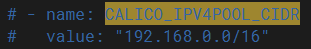
>
> 2. 将文件中需要下载的镜像前面的 docker.io 替换为空。
>
> 3. 应用 CNI 插件，使用命令`kubectl apply -f calico.yaml`。

### 查看集群状态

使用以下命令，查看集群状态，当 STATUS 全部为 Ready 时，才可继续后面的操作（此过程可能需耗费较长时间）：

```shell
[root@k8s-master ~]# kubectl get nodes
NAME         STATUS   ROLES                  AGE     VERSION
k8s-master   Ready    control-plane,master   7d23h   v1.23.6
k8s-node1    Ready    <none>                 24h     v1.23.6
k8s-node2    Ready    <none>                 24h     v1.23.6
```

>如果 Flannel 需检查网络情况，重新进行如下操作：
>
>`kubectl delete -f kube-flannel.yml` ---> 再次下载文件 ---> `kubectl apply -f kube-flannel.yml`。

### 测试 Kubenetes 集群

```shell
# 创建部署一个 Nginx 服务
[root@k8s-master ~]# kubectl create deployment nginx --image=nginx
deployment.apps/nginx created
# 暴露容器内的端口
[root@k8s-master ~]# kubectl expose deployment nginx --port=80 --type=NodePort
service/nginx exposed
# 查看 Pod 以及服务信息，容器内端口 80，对应宿主机的端口 31173
[root@k8s-master ~]# kubectl get pod,svc
NAME                         READY   STATUS    RESTARTS   AGE
pod/nginx-85b98978db-j4sjq   1/1     Running   0          10m

NAME                 TYPE        CLUSTER-IP      EXTERNAL-IP   PORT(S)        AGE
service/kubernetes   ClusterIP   10.96.0.1       <none>        443/TCP        8d
service/nginx        NodePort    10.98.189.130   <none>        80:31173/TCP   10m
```

查看 Nginx 服务：

```shell
[root@k8s-master ~]# curl 192.168.1.120:31173
<!DOCTYPE html>
<html>
<head>
<title>Welcome to nginx!</title>
<style>
html { color-scheme: light dark; }
body { width: 35em; margin: 0 auto;
font-family: Tahoma, Verdana, Arial, sans-serif; }
</style>
</head>
<body>
<h1>Welcome to nginx!</h1>
<p>If you see this page, the nginx web server is successfully installed and
working. Further configuration is required.</p>

<p>For online documentation and support please refer to
<a href="http://nginx.org/">nginx.org</a>.<br/>
Commercial support is available at
<a href="http://nginx.com/">nginx.com</a>.</p>

<p><em>Thank you for using nginx.</em></p>
</body>
</html>
```

- "curl 192.168.1.121:31173" 和 "curl 192.168.1.122:31173" 具有相同的效果。

页面访问 192.168.1.120:31173：

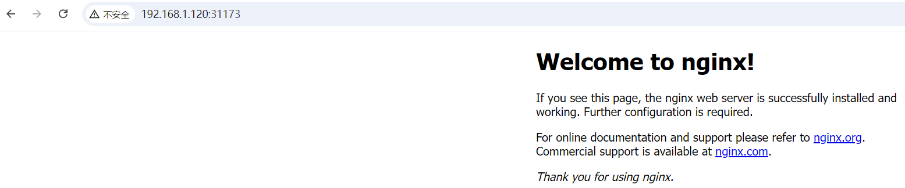

- 访问 192.168.1.121:31173 和 192.168.1.122:31173 具有相同的效果。

### 命令行工具 kubectl

kubectl 是使用 Kubernetes API 与 Kubernetes 集群进行通信的命令行工具。

kubectl 工具，默认只在 Master 节点上有效，在 Node 节点上执行无效：

```shell
[root@k8s-node1 ~]# kubectl get nodes
The connection to the server localhost:8080 was refused - did you specify the right host or port?
```

其原因是，在 Master 节点上，有用户认证相关的设置，并且 kubectl 工具调用时，知道调用的 Api 的服务器地址（https://192.168.1.120:6443）：

```shell
[root@k8s-master .kube]# pwd
/root/.kube
[root@k8s-master .kube]# cat config 
apiVersion: v1
clusters:
- cluster:
    certificate-authority-data: LS0tLS1CRUdJTiBDRVJUSUZJQ0FURS0tLS0tCk1JSUMvakNDQWVhZ0F3SUJBZ0lCQURBTkJna3Foa2lHOXcwQkFRc0ZBREFWTVJNd0VRWURWUVFERXdwcmRXSmwKY201bGRHVnpNQjRYRFRJME1EZ3lPREUyTVRReE5Gb1hEVE0wTURneU5qRTJNVFF4TkZvd0ZURVRNQkVHQTFVRQpBeE1LY99886776SnVaWFJsY3pDQ0FTSXdEUVlKS29aSWh2Y05BUUVCQlFBRGdnRVBBRENDQVFvQ2dnRUJBS01rCjlmMWRYY2k2TUc5ZkpBUVN2Y1JqM2QwaWk1b0NockcyNGxUSmJha3c3dzV4TVhmUU9qM21FdUFROVkvYkpacnYKaytSUGVvSVlsdUYzbytPbHdWSktRLzBvbnZVbXM2YTFCMi9MRmVLNTRmUGllcXVmSVZDMElGalhvQVBiRTZOZQphc1lRbjV0SDQ2MDV3TjA3OFNHVzk4L1JuVjlkYTlDenEvb1BTYmNpUTRnbU1UYm0rSzU2eTJ0MWdOM0krUW91ClVHaFlucWZJa0VZTzNsTm1VbWtpOFUzaWNHaXhHWkVRYjA0UVowQ0JEck14MGV6anRWS1hrbVFMWW9zVjlhOFcKM1Bkb3AySXlqdkVCVTZxR001aE9BVlA3QUcrQ1hDSTVCVDBxVm1aeXVzYXVuekVnaTVOcWhKZ1hQZGdMWXNpUQprY2Rzc1lyWkFsRnhoenFTdGhzQ0F3RUFBYU5aTUZjd0RnWURWUjBQQVFIL0JBUURBZ0trTUE4R0ExVWRFd0VCCi93UUZNQU1CQWY4d0hRWURWUjBPQkJZRUZQNlQ4aE5aTnMrcjUzWm1Cd3Q0UURvOVJIa0ZNQlVHQTFVZEVRUU8KTUF5Q0NtdDFZbVZ5Ym1WMFpYTXdEUVlKS29aSWh2Y05BUUVMQlFBRGdnRUJBQWg0QWZKTnU1YWxLbVJrSmJCOAppZ2wzZm53YVNkTXZCVUFFaE5JYWt0NytTWGZKdGNnLy9zanpPYlhIQVVDcHgrbnNualhVUW40Uzl1OW9IQlBOCnFUbGxSelBDZ0U4MXRRMnBVekU0T3BGSDQwblRucjYzRWtsbGNoZFU0QzlyMXcwbDJLS296UmJaV3ZCajBZa20KNmh3SlpzVzZyMW9iUjI2VzlFcXpLUXFweWRVcHZFR3lUcDk4YXBsTXFKazNlUS9hYkVOS1k3TW0vNll2K3FicwpCc1dSTVJuMEhzbTZ0dWNlZ21GOFNOZUxvSU5SdExSc1Y4VWZTU0F6WmJTSTVjY1VSTDFycGp2c0NBZUFkWGdECkh4a2l1Ny9IRW5wNmpoM05mRkZKZ0FIL2hvdW52RS9hODk3VmduTHBpcE8xZjBFKzR4YUFMNC9tVWozVm9DRTQKUVRBPQotLS0tLUVORCBDRVJUSUZJQ0FURS0tLS0tCg==
    server: https://192.168.1.120:6443
  name: kubernetes
contexts:
- context:
    cluster: kubernetes
    user: kubernetes-admin
  name: kubernetes-admin@kubernetes
current-context: kubernetes-admin@kubernetes
kind: Config
preferences: {}
users:
- name: kubernetes-admin
  user:
    client-certificate-data: LS0tLS1CRUdJTiBDRVJUSUZJQ0FURS0tLS0tCk1JSURJVENDQWdtZ0F3SUJBZ0lJZWpxb29NcVhGS3d3RFFZSktvWklodmNOQVFFTEJRQXdGVEVUTUJFR0ExVUUKQXhNS2EzVmlaWEp1WlhSbGN6QWVGdzB5TkRBNE1qZ3hOakUwTVRSYUZ3MHlOVEE0TWpneE5qRTBNVFZhTURReApGekFWQmdOVkJBb1REbk41YzNSbGJUcHRZWE4wWlhKek1Sa3dGd1lEVlFRREV4QnJkV0psY201bGRHVnpMV0ZrCmJXbHVNSUlCSWpBTkJna3Foa2lHOXcwQkFRRUZBQU9DQVE4QU1JSUJDZ0tDQVFFQXVVbys0dkhnZmNLeGxmdWMKeHkhj56hfh0ZHd1JCU2F6MVRaMmdKV1dUeEtrTE5XemtET3BjWk5oUkdlVGozaVlvdjAvdWxkZGJzdml2LwpSQ2tjUTZrWGdVaXdGSytNUkdKR3dKbmFCY0QwSFdzc0tqMUh6RjVYMm5kbUFvNXhsTThQcms0TWYyREtnbjBHClRiaG5uc1ZERk9tWG5JSTRucFJFMXA4SFIrQUQvTkdDOXhIbVRkV0szSVZOWERvYXhIZXY3VmoxVHk1TkNUWEwKWmQraEJEa0h1NHRwTzM0bGpuWlU4elBua0ljcHJMeU5wdjNCb2UvUjR1WXZIdkFrUG1qYXRUWHMvaGc5QXVSegpKcDcrODFiR3Voc3A2cVZBbzlwOUJsNHovck1XUk9qR3JxdDNEWnFKU2tVTVpqVWdaZHFyY0kzNHJiTWJySlMwCmtqdUpHd0lEQVFBQm8xWXdWREFPQmdOVkhROEJBZjhFQkFNQ0JhQXdFd1lEVlIwbEJBd3dDZ1lJS3dZQkJRVUgKQXdJd0RBWURWUjBUQVFIL0JBSXdBREFmQmdOVkhTTUVHREFXZ0JUK2svSVRXVGJQcStkMlpnY0xlRUE2UFVSNQpCVEFOQmdrcWhraUc5dzBCQVFzRkFBT0NBUUVBbnNMVzNpaU9XMTBFbEtVVXlaM3NIRkpzeW1oSUxpOVpJdmE2ClRDVmh5S3huZVEyY1daKzRFTWZJT3RJTi92WitMak96WmVYbzMzRDlybUdBOUtSMi9udTJ6b2pmbzZEdnJLL2YKMVVPOGFWNnlHMFBoeFlCT1dXeUhNczFzd1dzNU8yY01PRGR5TU9JcUIzZHJ3eVEzWkZrblgxa3UwZ1NqeVdheApWR2VQN1grSFowZ1RpSUtGWFdaVjdHWCtlSEdQZHBIZVBkR0doMXdGbUJCcTRVOUdoZERoTVBtenNZMkFpMjJrClpZOTFxYmtucGF4blEvNlRBN0lwdkcya0wwT2N6ZFpoQXh0NWZFRWVmTDZ2M1VVM1c4c3lYTnd0M3ROamJlQk4KZTdRSitaQjcwYjdQQi9lSFZQTmlxRThRdVYySzlIQjRUS3ZkdlNJZTZ1VHN6VXJDZ0E9PQotLS0tLUVORCBDRVJUSUZJQ0FURS0tLS0tCg==
    client-key-data: LS0tLS1CRUdJTiBSU0EgUFJJVkFURSBLRVktLS0tLQpNSUlFcFFJQkFBS0NBUUVBdVVvKzR2SGdmY0t4bGZ1Y3hySUhIOEM0SEtGR3dSQlNhejFUWjJnSldXVHhLa0xOCld6a0RPcGNaTmhSR2VUajNpWW92MC91bGRkYnN2aXYvUkNrY1E2a1hnVWl3RksrTVJHSkd3Sm5hQmNEMEhXc3MKS2oxSHpGNVgybmRtQW81eGxNOFByazRNZjJES2duMEdUYmhubnNWREZPbVhuSUk0bnBSRTFwOEhSK0FEL05HQwo5eEhtVGRXSzNJVk5YRG9heEhldjdWajFUeTVOQ1RYTFpkK2hCRGtIdTR0cE8zNGxqblpVOHpQbmtJY3ByTHlOCnB2M0JvZS9SNHVZdkh2QWtQbWphdFRYcy9oZzlBdVJ6SnA3KzgxYkd1aHNwNnFWQW85cDlCbDR6L3JNV1JPakcKcnF0M0RacUpTa1VNWmpVZ1pkcXJjSTM0cmJNYnJKUzBranVKR3dJREFRQUJBb0lCQVFDTkdONitqeFkyYmpZeApVa05XZzJjdFpPSk8ydms0TjZlcmhpMm5CdkJucEppSmFBbGRPQk1mWU1TUUMreUdqenpnL2R2aC96VkdnUDRTCjZ3b2Q2M2hjaGIwaWRDbXg5dVJIaHRiOS82cW95d0NhRG15NVZhVUJHYTZvN0ZkQUJ4eXpCdUtZQjFNNUJJbngKeUNjdXRBZ2tQVzhSMDdmaU5ML004bmRoUUFTWlU4NlpNTUJyUjB6cS9DNy9PS2lITDJZdjI5eng3ek5TSGUxUQozNkwrWmhzVXlsclYvdnMwWFY4cHBQaCsvVEFVREZkeXVXNlJsQ1lNQXF2U2RxVEp4M2dOK3Rva3R3VWF5NVk1ClVFV0srODMwQjYyNE5lRVJqSHBmOFhVYmJ1UFovcXBnbmxLSjBiRWM4RENvb2szQVBBUEtSMkU0eTBlRHBMWFQKV0xhR05wY2hBb0dCQU96RldFWG5OYWVMY2JtZzFuaXFkQms4anBBOWowUVVkR0lBZkpMMnA5cE1RVnFrVHlMdApCaE9MVEY4RUVHS1dsN0ticDhZZXVyM2gycnlmNldVa2svTTRIMWhFbE9FdGp3aFpWa1hGMENPUzFoSjJRSUlmCm10SFFSUENuZFg0TTdmekIvUmptSE9KWVdWM3BOVjZ3ZE5KOS9PSjghfsdfs3sFJ1VE1xMmpYWTRKQW9HQkFNaFcKa3FSOFZVM0J4Mm9oWHFBQTUxb1ZKbVg3L2p2akhhUXJTRHhQOFNJcVVnVjJaQ3EyWDBRTlRLV0lSVDhhcmsrYQpvaGd2ZytnVWlIcjZDQUdYWmRESTluWEFYbG40aGVyaUYzNVJSMkRVbzhndHpIaDFyNUVad2pEOG1DTlFhMkZaCndidWgreGxPVzRSeU1IY2Jkb1QzUDlFTGdrWHRSU1pRa0pyYlk2Y0RBb0dCQU5VUVZYbzZNTWMvcmF4TXR4TkkKMkVicGZxVUFNSThrRlFNbnl2SjVNZDA0cDhzSWR3cEgzeUx4UkYxd2k4b2NHQkNyRDlReVRQdVlaYjA5N2NxTgptdkhRdkN3ek13SmJmQTRZVHBGbERBTW5IS3JxYk94cndtY3lrd2M0dW5zZTZYNTlsdU8wRjZQN3V4Zk9SNitZCi9OZDZkbm1CdXdWeFIzUk1CdHZJV2VUNUFvR0FMMWhHVDVrU2o4MjcwdGtRQThBeTdKY1MvQWNSamhXZWE2M08KNUhJQUNwTDF6MVNyVjJ6Q0Z0TU55aERxVEgrQnNrNVpBRjQ2VGg2TUlvUDBZR3ZuSS9CYVRubW4wcHRwQ3Bsago4L1pCYUNEWWsvWSszRGp6eE5iUmpjSWtNalJQTERLS0ZrMnhpY2w2MTFJbElnRGJnWkR0QS9vMFQxSkRoVXFFCjRoUDIrUUVDZ1lFQWd2U1owOFRrS2VKM1Z1dkdIeU4wWUk3Umx1Q284ZVVVY3IrOEFvR0MrNjRHbmQ1WFc1eGcKZFViQ1lxN3h2OERjN2MzTkt1RVNKSmg4czYyRllXVjRmQkxGckwrYzRreVpxYnRxdDExN3ZnZklvZU1MNkxTdwpINmc2R3Ria01Fand1eldPQUFlSllsNEptMUUzSDB3eGVBZUlWeldoZ2I5NWF4aFZkWlZlT2VZPQotLS0tLUVORCBSU0EgUFJJVkFURSBLRVktLS0tLQo=
```

如果需要在 Node 节点使用 kubectl 工具，需要进行如下配置：

1. 拷贝 Master 节点中 "/etc/kubernetes/admin.conf" 文件到对应的 Node 节点服务器的 "/etc/kubernetes" 目录中：

   ```shell
   [root@k8s-master .kube]# scp /etc/kubernetes/admin.conf root@k8s-node1:/etc/kubernetes/
   The authenticity of host 'k8s-node1 (192.168.1.121)' can't be established.
   ECDSA key fingerprint is SHA256:1wcmZ7fQ/AJ9ak1Hu/qURBJMFWuqvu66TbMV8OUD9us.
   ECDSA key fingerprint is MD5:ce:5e:b8:01:2d:f6:ee:77:87:33:b4:7d:4b:64:a5:d9.
   Are you sure you want to continue connecting (yes/no)? yes
   Warning: Permanently added 'k8s-node1,192.168.1.121' (ECDSA) to the list of known hosts.
   root@k8s-node1's password: 
   admin.conf                                                                                                         100% 5641     4.7MB/s   00:00
   ```

2. 在对应的 Node 服务器上配置环境变量：

   ```shell
   [root@k8s-node1 ~]# echo "export KUBECONFIG=/etc/kubernetes/admin.conf" >> ~/.bash_profile 
   [root@k8s-node1 ~]# source ~/.bash_profile 
   [root@k8s-node1 ~]# kubectl get nodes
   NAME         STATUS   ROLES                  AGE     VERSION
   k8s-master   Ready    control-plane,master   11d     v1.23.6
   k8s-node1    Ready    <none>                 4d23h   v1.23.6
   k8s-node2    Ready    <none>                 4d23h   v1.23.6
   ```

kubectl 工具的常用的命令和功能如下：

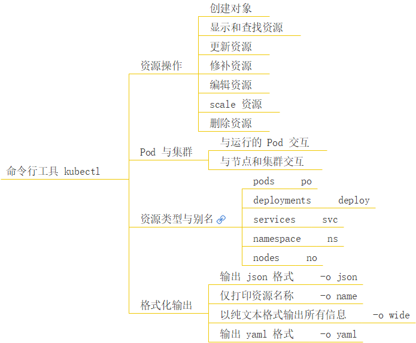

- 更多命令查看官网：https://kubernetes.io/docs/reference/generated/kubectl/kubectl-commands

- 资源类型与别名：

  | 资源类型                   | 缩写别名 |
  | :------------------------- | :------- |
  | `clusters`                 |          |
  | `componentstatuses`        | `cs`     |
  | `configmaps`               | `cm`     |
  | `daemonsets`               | `ds`     |
  | `deployments`              | `deploy` |
  | `endpoints`                | `ep`     |
  | `event`                    | `ev`     |
  | `horizontalpodautoscalers` | `hpa`    |
  | `ingresses`                | `ing`    |
  | `jobs`                     |          |
  | `limitranges`              | `limits` |
  | `namespaces`               | `ns`     |
  | `networkpolicies`          |          |
  | `nodes`                    | `no`     |
  | `statefulsets`             |          |
  | `persistentvolumeclaims`   | `pvc`    |
  | `persistentvolumes`        | `pv`     |
  | `pods`                     | `po`     |
  | `podsecuritypolicies`      | `psp`    |
  | `podtemplates`             |          |
  | `replicasets`              | `rs`     |
  | `replicationcontrollers`   | `rc`     |
  | `resourcequotas`           | `quota`  |
  | `cronjob`                  |          |
  | `secrets`                  |          |
  | `serviceaccount`           | `sa`     |
  | `services`                 | `svc`    |
  | `storageclasses`           |          |
  | `thirdpartyresources`      |          |

- 格式化输出，例如：

  ```shell
  $ kubectl get deploy nginx -o yaml
  ```

### API 概述

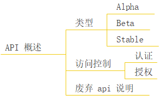

官网：https://kubernetes.io/zh-cn/docs/reference/using-api/（https://kubernetes.io/docs/reference/using-api/deprecation-guide/）

REST API 是 Kubernetes 系统的重要部分，组件之间的所有操作和通信均由 API Server 处理的 REST API 调用，大多数情况下，API 定义和实现都符合标准的 HTTP REST 格式，可以通过 kubectl 命令管理工具或其他命令行工具来执行。

不同的 API 版本代表着不同的稳定性和支持级别，下面是每个级别的摘要：

- Alpha：
  - 版本名称包含`alpha`，例如：v1alpha1。
  - 内置的 Alpha API 版本默认被禁用，且必须在 kube-apiserver 配置中显式启用才能使用。
  - 软件可能会有 Bug，启用某个特性可能会暴露出 Bug。
  - 对某个 Alpha API 特性的支持可能会随时被删除，恕不另行通知。
  - API 可能在以后的软件版本中以不兼容的方式更改，恕不另行通知。
  - 由于缺陷风险增加和缺乏长期支持，建议该软件仅用于短期测试集群。

- Beta：

  - 版本名称包含`beta`，例如：v2beta3。
  - 内置的 Beta API 版本默认被禁用，且必须在 kube-apiserver 配置中显式启用才能使用（例外情况是 Kubernetes 1.22 之前引入的 Beta 版本的 API，这些 API 默认被启用）。
  - 内置 Beta API 版本从引入到弃用的最长生命周期为 9 个月或 3 个次要版本（以较长者为准），从弃用到移除的最长生命周期为 9 个月或 3 个次要版本（以较长者为准）。
  - 软件被很好的测试过，启用某个特性被认为是安全的。
  - 尽管一些特性会发生细节上的变化，但它们将会被长期支持。

  - 在随后的 Beta 版或 Stable 版中，对象的模式和（或）语义可能以不兼容的方式改变。当这种情况发生时，将提供迁移说明。适配后续的 Beta 或 Stable API 版本可能需要编辑或重新创建 API 对象，这可能并不简单。对于依赖此功能的应用程序，可能需要停机迁移。
  - 该版本的软件不建议生产使用，后续发布版本可能会有不兼容的变动，一旦 Beta API 版本被弃用且不再提供服务，则使用 Beta API 版本的用户需要转为使用后续的 Beta 或 Stable API 版本。
  - 请尝试 Beta 版时特性时并提供反馈。特性完成 Beta 阶段测试后，就可能不会有太多的变更了。

- Stable：

  - 版本名称如`vX`，其中 X 为整数。
  - 特性的 Stable 版本会出现在后续很多版本的发布软件中。Stable API 版本仍然适用于 Kubernetes 主要版本范围内的所有后续发布，并且 Kubernetes 的主要版本当前没有移除 Stable API 的修订计划。

已弃用 API 的迁移指南：https://kubernetes.io/zh-cn/docs/reference/using-api/deprecation-guide/

## 深入 Pod

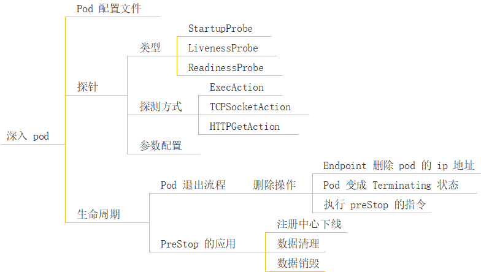

### kubectl 命令

#### 创建 Pod

**一、创建 Pod**

1. 使用配置文件创建
   - 首先，需要创建一个`Pod`的配置文件（通常是`.yaml`或`.yml`格式）。例如，创建一个简单的`nginx` `Pod`配置文件`nginx - pod.yaml`：

```yaml
   apiVersion: v1
   kind: Pod
   metadata:
     name: nginx - pod
   spec:
     containers:
     - name: nginx - container
       image: nginx:latest
```

- 然后使用`kubectl create`命令来创建`Pod`：

收起


bash


复制

```bash
   kubectl create -f nginx - pod.yaml
```

1. 使用命令行参数创建（不推荐用于复杂配置）
   - 可以通过`kubectl run`命令快速创建一个简单的`Pod`。例如，创建一个名为`busybox - pod`的`Pod`，运行`busybox`镜像：

收起


bash


复制

```bash
   kubectl run busybox - pod --image = busybox:latest
```

**二、查看 Pod 信息**

1. 查看所有 Pod 列表
   - 可以使用以下命令查看集群中所有命名空间下的`Pod`列表：

收起


bash


复制

```bash
   kubectl get pods
```

- 这个命令会显示`Pod`的名称、状态、重启次数等基本信息。例如：

收起


plaintext


复制

```plaintext
   NAME          READY   STATUS    RESTARTS   AGE
   nginx - pod   1/1     Running   0          10m
```

1. 查看单个 Pod 详细信息
   - 使用`kubectl describe pod`命令可以查看单个`Pod`的详细信息，包括容器状态、事件等。例如，查看`nginx - pod`的详细信息：

收起


bash


复制

```bash
   kubectl describe pod nginx - pod
```

- 输出内容会包含`Pod`的基本信息（如名称、命名空间、标签等）、容器信息（如容器名称、镜像、端口等）、事件信息（如容器启动、停止等事件）等。

1. 查看 Pod 的日志
   - 如果想查看`Pod`中容器的日志，可以使用`kubectl logs`命令。例如，查看`nginx - pod`中`nginx - container`容器的日志：

收起


bash


复制

```bash
   kubectl logs nginx - pod - c nginx - container
```

- 这对于调试容器中的应用程序非常有用，例如查看应用程序输出的错误信息或状态信息。

**三、更新 Pod**

1. 更新容器镜像
   - 如果需要更新`Pod`中的容器镜像，可以使用`kubectl set image`命令。例如，将`nginx - pod`中的`nginx - container`容器的镜像从`nginx:latest`更新为`nginx:1.23`：

收起


bash


复制

```bash
   kubectl set image pod/nginx - pod nginx - container = nginx:1.23
```

- 这个操作会触发容器的重新创建，以使用新的镜像。

1. 更新其他资源（如资源请求 / 限制）
   - 如果要更新`Pod`的资源请求或限制（例如 CPU 和内存），需要先修改`Pod`的配置文件，然后使用`kubectl apply`命令。例如，修改`nginx - pod.yaml`文件中的资源请求部分：

收起


yaml


复制

```yaml
   apiVersion: v1
   kind: Pod
   metadata:
     name: nginx - pod
   spec:
     containers:
     - name: nginx - container
       image: nginx:latest
       resources:
         requests:
           cpu: "0.5"
           memory: "512Mi"
```

- 然后应用更新：

收起


bash


复制

```bash
   kubectl apply -f nginx - pod.yaml
```

**四、删除 Pod**

1. 删除单个 Pod
   - 使用`kubectl delete pod`命令来删除单个`Pod`。例如，删除`nginx - pod`：

收起


bash


复制

```bash
   kubectl delete pod nginx - pod
```

- 可以通过`--force`和`--grace - period = 0`选项来强制删除`Pod`，但这种方式可能会导致数据丢失或未完成的操作被中断，应该谨慎使用。

1. 删除多个 Pod
   - 可以通过标签选择器来删除多个`Pod`。例如，如果有一组带有`app = my - app`标签的`Pod`，可以使用以下命令删除它们：

收起


bash


复制

```bash
   kubectl delete pods -l app = my - app
```

### Pod 配置文件

在搭建 Kubernetes 集群时，创建过一个 Nginx 服务用于测试，现在将其删除：

```shell
[root@k8s-master ~]# kubectl get pods
NAME                     READY   STATUS             RESTARTS   AGE
nginx-85b98978db-bhrd8   0/1     ImagePullBackOff   0          3d12h
[root@k8s-master ~]# kubectl get deployment
NAME    READY   UP-TO-DATE   AVAILABLE   AGE
nginx   0/1     1            0           49d
# 删除 Nginx 对应的 deployment
[root@k8s-master ~]# kubectl delete deployment nginx
deployment.apps "nginx" deleted
[root@k8s-master ~]# kubectl get deployment
No resources found in default namespace.
# pod 是通过 deployment 创建的，删除 deplpyment，对应的 pod 也就删除了
[root@k8s-master ~]# kubectl get pods
No resources found in default namespace.

[root@k8s-master ~]# kubectl get services
NAME         TYPE        CLUSTER-IP      EXTERNAL-IP   PORT(S)        AGE
kubernetes   ClusterIP   10.96.0.1       <none>        443/TCP        58d
nginx        NodePort    10.98.189.130   <none>        80:31173/TCP   49d
# 删除 Nginx 对应的 service
[root@k8s-master ~]# kubectl delete services nginx
service "nginx" deleted
[root@k8s-master ~]# kubectl get services
NAME         TYPE        CLUSTER-IP   EXTERNAL-IP   PORT(S)   AGE
kubernetes   ClusterIP   10.96.0.1    <none>        443/TCP   58d

```

定义一个 nginx-po.yaml 配置文件：

```yaml
apiVersion: v1 # api 文档版本
kind: Pod # 资源对象类型，也可以配置为像 Deployment、StatefulSet 这一类的对象
metadata: # Pod 相关的元数据，用于描述 Pod 的数据
  name: "nginx-demo" # Pod 的名称
  namespace: default # 定义 Pod 的命名空间
  labels: # 定义 Pod 的标签
    app: "nginx-demo-app" # 标签的 key:value，可以按实际来自定义
spec: # 规约，即期望当前 Pod 应按照下面的描述进行创建
  containers: # 对于 Pod 中的容器描述
  - name: nginx-demo # 容器的名称
    image: "nginx:latest" # 指定容器的镜像
    imagePullPolicy: IfNotPresent # 镜像拉取策略，指定如果本地有就用本地的，如果没有就拉取远程的
    command: # 指定容器启动时执行的命令
    - nginx
    - -g
    - 'daemon off;' # 当前 command 配置等同于命令：nginx -g 'daemon off;'
    workingDir: /usr/share/nginx/html # 定义容器启动后的工作目录
    resources:
      limits: # 最多可以使用的资源
        cpu: 200m # 限制 cpu 最多使用 0.2 个核心
        memory: 256Mi # 限制内存最多使用 256 MB
      requests: # 最少需要使用的资源
        cpu: 100m # 限制 cpu 最少使用 0.1 个核心
        memory: 128Mi # 限制内存最多使用 128 MB
    ports:
    - containerPort:  80 # 描述容器内要暴露什么端口
      name:  http # 端口名称
      protocol: TCP # 描述该端口是基于哪种协议通信的
    env: # 环境变量
    - name: JVM_OPTS # 环境变量名称
      value: '-Xms128m -Xmx128m' # 环境变量的值
  restartPolicy: OnFailure # 重启策略，只有失败的情况才会重启
```

> VS Code 中，可以安装`Kubernetes Templates`插件，用于快速创建配置文件。

通过 nginx-po.yaml 配置文件，创建 Pod：

```shell
[root@k8s-master pods]# cd /opt/k8s/pods/
[root@k8s-master pods]# kubectl create -f nginx-po.yaml
pod/nginx-demo created
```

查看新建的 nginx-demo 这个 Pod 的信息：

```shell
# 查看 Pod 的简略信息
[root@k8s-master pods]# kubectl get pods
NAME         READY   STATUS    RESTARTS   AGE
nginx-demo   1/1     Running   0          3m5s # 此时 STATUS 已经是 Running，刚创建时状态为 ContainerCreating

# 查看 Pod 的详细信息
[root@k8s-master pods]# kubectl get pods -o wide
NAME         READY   STATUS    RESTARTS   AGE   IP            NODE        NOMINATED NODE   READINESS GATES
nginx-demo   1/1     Running   0          46m   10.244.2.10   k8s-node2   <none>           <none>

[root@k8s-master pods]# kubectl describe pod nginx-demo
Name:         nginx-demo
Namespace:    default
Priority:     0
Node:         k8s-node2/192.168.1.122
Start Time:   Sun, 27 Oct 2024 09:17:02 +0800
Labels:       app=nginx-demo-app
Annotations:  <none>
Status:       Running
IP:           10.244.2.10
IPs:
  IP:  10.244.2.10
Containers:
  nginx-demo:
    Container ID:  docker://52e0bb9cd83f20ebb50988bcac9878592c049a0b1b746672a80a7786c685ea72
    Image:         nginx:latest
    Image ID:      docker-pullable://nginx@sha256:04ba374043ccd2fc5c593885c0eacddebabd5ca375f9323666f28dfd5a9710e3
    Port:          80/TCP
    Host Port:     0/TCP
    Command:
      nginx
      -g
      daemon off;
    State:          Running
      Started:      Sun, 27 Oct 2024 09:17:03 +0800
    Ready:          True
    Restart Count:  0
    Limits:
      cpu:     200m
      memory:  256Mi
    Requests:
      cpu:     100m
      memory:  128Mi
    Environment:
      JVM_OPTS:  -Xms128m -Xmx128m
    Mounts:
      /var/run/secrets/kubernetes.io/serviceaccount from kube-api-access-k7zmc (ro)
Conditions:
  Type              Status
  Initialized       True 
  Ready             True 
  ContainersReady   True 
  PodScheduled      True 
Volumes:
  kube-api-access-k7zmc:
    Type:                    Projected (a volume that contains injected data from multiple sources)
    TokenExpirationSeconds:  3607
    ConfigMapName:           kube-root-ca.crt
    ConfigMapOptional:       <nil>
    DownwardAPI:             true
QoS Class:                   Burstable
Node-Selectors:              <none>
Tolerations:                 node.kubernetes.io/not-ready:NoExecute op=Exists for 300s
                             node.kubernetes.io/unreachable:NoExecute op=Exists for 300s
Events: # Pods 的事件
  Type    Reason     Age   From               Message
  ----    ------     ----  ----               -------
  Normal  Scheduled  17s   default-scheduler  Successfully assigned default/nginx-demo to k8s-node2 # 分配到 k8s-node2 节点
  Normal  Pulled     17s   kubelet            Container image "nginx:latest" already present on machine
  Normal  Created    17s   kubelet            Created container nginx-demo
  Normal  Started    17s   kubelet            Started container nginx-demo
```

- 最下面的 Events，描述了 Pod 的创建过程。


### 探针

**`探针`**：容器内应用的监测机制，根据不同的探针，可以判断容器应用当前的状态。

#### 探针的类型

##### StartupProbe

**`StartupProbe`**：**启动探针，用于检测容器内应用程序是否已经完成启动过程。**在容器启动阶段，有些应用可能需要较长时间来完成初始化，如加载大量配置文件、建立数据库连接等。StartupProbe 允许这个启动过程完成，避免在启动阶段因为 LivenessProbe 或 ReadinessProbe 检查失败而导致容器被错误地重启。**只有当 StartupProbe 成功后，LivenessProbe 和 ReadinessProbe 才会开始正常工作。**

##### LivenessProbe

**`LivenessProbe`**：**存活探针，用于检测容器是否还在正常运行状态。**如果容器在运行过程中出现故障，例如进入死循环、内存泄漏等导致应用程序无法正常工作的情况，LivenessProbe 能够检测到这种异常，并根据配置决定是否重启容器。这有助于保持应用程序的健康运行，及时从故障状态中恢复。

##### ReadinessProbe

**`ReadinessProbe`**：**就绪探针，用于判断容器是否已经准备好接收请求。**与 LivenessProbe 不同，它关注的是容器是否能够正常处理业务流量，而不是仅仅是否存活。当容器刚启动或者在运行过程中，由于某些原因（如正在加载配置文件、预热缓存等）暂时无法接收请求时，ReadinessProbe 可以检测到这种状态，并且控制服务发现组件（如 Kubernetes 的 Service）暂时不将流量发送到还没准备好的容器。

#### 探测的方式

三种探针，均支持以下三种探测方式：

1. `exec`：以执行命令的方式进行监测。
2. `tcpSocket`：以建立 TCP 连接的方式进行监测。
3. `httpGet`：以发送 HTTP 请求的方式进行监测。

下面以 livenessProbe 为例，给出这三种探测方式的使用说明。

##### ExecAction

示例：

```yaml
livenessProbe:
  exec:
    command: ["ps", "-ef", "|", "grep", "myapp", "|", "grep", "-v", "grep"]
  initialDelaySeconds: 20
  periodSeconds: 8
  failureThreshold: 3
```

含义：表示在容器启动 20 秒后开始，每 8 秒执行一次 "ps -ef | grep myapp | grep -v grep" 命令，检查进程是否存在。如果连续 3 次执行这个命令的结果为进程不存在，就判定容器存活状态检查失败，可能会重启容器。

##### TCPSocketAction

示例：

```yaml
livenessProbe:
  tcpSocket:
    port: 3306
  initialDelaySeconds: 10
  periodSeconds: 5
  failureThreshold: 2
```

含义：表示在容器启动 10 秒后开始，每 5 秒检查一次容器内 3306 端口是否可以建立 TCP 连接。如果连续 2 次检查失败，就判定容器存活状态检查失败，可能会重启容器。

##### HTTPGetAction

示例：

```yaml
livenessProbe:
  httpGet:
    path: /healthz
    port: 8080
    scheme: HTTP
  initialDelaySeconds: 15
  periodSeconds: 10
  failureThreshold: 3
```

含义：表示在容器启动 15 秒后开始，每隔 10 秒向容器内 8080 端口的 /healthz 路径发送一个 HTTP 请求。如果连续 3 次请求都没有得到预期的响应（如返回码不是 200 ~ 299 之间），就认为容器存活状态检查失败，可能会触发容器重启。

#### 探针的参数配置

探针的通用参数配置及含义：

- `initialDelaySeconds`：初始化时间。
- `timeoutSeconds`：超时时间。
- `periodSeconds`：监测的间隔时间。
- `sucessThreshold`：监测成功多少次，才表示成功。
- `failureThreshold`：监测失败多少次，才表示失败。

## 资源调度

`Todo`

## 服务发布

`Todo`

## 配置与存储

`Todo`

## 高级调度

`Todo`

## 身份认证与权限

`Todo`

# 本文参考

https://www.bilibili.com/video/BV1MT411x7GH

https://znunwm.top/archives/k8s-xiang-xi-jiao-cheng

https://www.cnblogs.com/XY-Heruo/p/14669097.html

# 声明

写作本文初衷是个人学习记录，鉴于本人学识有限，如有侵权或不当之处，请联系 [wdshfut@163.com](mailto:wdshfut@163.com)。
