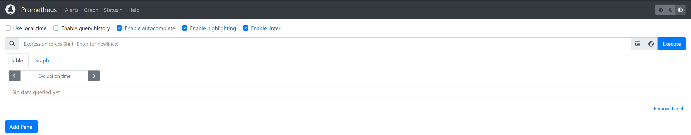

> **$\textcolor{RubineRed}{Author: ACatSmiling}$**
>
> **$\color{RubineRed}{Since: 2024-11-11}$**

## 概述

Prometheus 受启发于 Google 的 Brogmon 监控系统（相似的 Kubernetes 是从 Google 的 Brog 系统演变而来），从 2012 年开始，由前 Google 工程师在 Soundcloud 以开源软件的

形式进行研发，并且于 2015 年早期对外发布早期版本。

2016 年 5 月继 Kubernetes 之后成为第二个正式加入 CNCF 基金会的项目，同年 6 月正式发布 1.0 版本。2017 年底发布了基于全新存储层的 2.0 版本，能更好地与容器平台、

云平台配合。

Prometheus 作为新一代的云原生监控系统，目前已经有超过 650+ 位贡献者参与到 Prometheus 的研发工作上，并且超过 120+ 项的第三方集成。

### Prometheus 的特点

Prometheus 是一个开源的完整监控解决方案，其对传统监控系统的测试和告警模型进行了彻底的颠覆，形成了基于中央化的规则计算、统一分析和告警的新模型。 相比于传统监控系统，Prometheus 具有以下优点。

#### 易于管理

- Prometheus 核心部分只有一个**单独的二进制文件**，不存在任何的第三方依赖（数据库，缓存等等）。唯一需要的就是本地磁盘，因此不会有潜在级联故障的风险。
- Prometheus **基于 Pull 模型的架构方式**，可以在任何地方（本地电脑，开发环境，测试环境）搭建监控系统。
- 对于一些复杂的情况，还可以使用 Prometheus **服务发现（Service Discovery）**的能力动态管理监控目标。

#### 监控服务的内部运行状态

Pometheus 鼓励用户监控服务的内部状态，基于 Prometheus 丰富的 Client 库，用户可以轻松的在应用程序中添加对 Prometheus 的支持，从而让用户可以获取服务和应用内部真正的运行状态。


#### 强大的数据模型

所有采集的监控数据均以`指标（metric）`的形式保存在**内置的时间序列数据库（TSDB）**当中。所有的样本，除了基本的指标名称以外，还包含一组用于描述该样本特征的标签。如下所示：

```tex
http_request_status{code='200',content_path='/api/path1',environment='produment'} => [value1@timestamp1,value2@timestamp2...]
http_request_status{code='200',content_path='/api/path2',environment='produment'} => [value1@timestamp1,value2@timestamp2...]
```

每一条时间序列由`指标名称（Metrics Name）`以及一组`标签（Labels）`唯一标识，每条时间序列按照时间的先后顺序存储一系列的样本值。

- http_request_status：指标名称。
- {code='200',content_path='/api/path1',environment='produment'}：表示维度的标签，基于这些 Labels，我们可以方便地对监控数据进行聚合，过滤，裁剪。
- [value1@timestamp1,value2@timestamp2...]：按照时间的先后顺序存储的样本值。

#### 强大的查询语言 PromQL

**Prometheus 内置了一个强大的数据查询语言 PromQL，通过 PromQL 可以实现对监控数据的查询、聚合。**同时 PromQL 也被应用于数据可视化（如 Grafana）以及告警当中。

通过 PromQL 可以轻松回答类似于以下问题：

- 在过去一段时间中，95% 应用延迟时间的分布范围？
- 预测在 4 小时后，磁盘空间占用大致会是什么情况？
- CPU 占用率前 5 位的服务有哪些？

#### 高效

对于监控系统而言，大量的监控任务必然导致有大量的数据产生，而 Prometheus 可以高效地处理这些数据，对于单一 Prometheus Server 实例而言，它可以处理：

- 数以百万的监控指标。
- 每秒处理数十万的数据点。

#### 可扩展

可以在每个数据中心、每个团队运行独立的 Prometheus Sevrer。Prometheus 对于联邦集群的支持，可以让多个 Prometheus 实例产生一个逻辑集群，当单实例 Prometheus  Server 处理的任务量过大时，通过使用`功能分区（sharding） + 联邦集群（federation）`，可以对其进行扩展。

#### 易于集成

使用 Prometheus 可以快速搭建监控服务，并且可以非常方便地在应用程序中进行集成。目前支持：Java，JMX，Python，Go，Ruby，.Net，Node.js 等等语言的客户端 SDK，基于这些 SDK 可以快速让应用程序纳入到 Prometheus 的监控当中，或者开发自己的监控数据收集程序。

同时这些客户端收集的监控数据，不仅仅支持 Prometheus，还能支持 Graphite 这些其他的监控工具。

同时，Prometheus 还支持与其他的监控系统进行集成：Graphite，Statsd，Collected，Scollector，muini，Nagios 等。

Prometheus 社区还提供了大量第三方实现的监控数据采集支持：JMX，CloudWatch，EC2，MySQL，PostgresSQL，Haskell，Bash，SNMP，Consul，Haproxy，Mesos，Bind，CouchDB，Django，Memcached，RabbitMQ，Redis，RethinkDB，Rsyslog 等等。

#### 可视化

- Prometheus Server 中自带的 Prometheus UI，可以方便地直接对数据进行查询，并且支持直接以图形化的形式展示数据。同时 Prometheus 还提供了一个独立的基于 Ruby On Rails 的 Dashboard 解决方案 Promdash。
- 最新的 Grafana 可视化工具也已经提供了完整的 Prometheus 支持，基于 Grafana 可以创建更加精美的监控图标。
- 基于 Prometheus 提供的 API 还可以实现自己的监控可视化 UI。

#### 开放性

通常来说，当我们需要监控一个应用程序时，一般需要该应用程序提供对相应监控系统协议的支持，因此应用程序会与所选择的监控系统进行绑定。为了减少这种绑定所带来的限制，对于决策者而言，要么你就直接在应用中集成该监控系统的支持，要么就在外部创建单独的服务来适配不同的监控系统。

而对于 Prometheus 来说，使用 Prometheus 的 client library 的输出格式，不仅支持 Prometheus 的格式化数据，也可以输出支持其它监控系统的格式化数据，比如 Graphite。因此，你甚至可以在不使用 Prometheus 的情况下，采用 Prometheus 的 client library 来让你的应用程序支持监控数据采集。

### Prometheus 的架构


#### 生态圈组件

- `Prometheus Server`：主服务器，负责收集和存储时间序列数据。
- `Client Libraies`：应用程序代码插桩，将监控指标嵌入到被监控应用程序中。
- `Pushgateway`：推送网关，为支持 short-lived 作业提供一个推送网关。
- `Exporter`：专门为一些应用开发的数据摄取组件，例如：HAProxy、StatsD、Graphite 等等。
- `Alertmanager`：专门用于处理 alert 的组件。

#### 架构理解

Prometheus 既然设计为一个维度存储模型，可以把它理解为一个 OLAP 系统。

##### 存储计算层

- `Prometheus Server`：里面包含了存储引擎和计算引擎。
  - `Retrieval`：取数组件，它会主动从 Pushgateway 或者 Exporter 拉取指标数据。
  - `TSDB`：数据核心存储与查询。
  - `HTTP server`：对外提供 HTTP 服务。
- `Service discovery`：可以动态发现要监控的目标。

##### 采集层

采集层分为两类，一类是生命周期较短的作业，还有一类是生命周期较长的作业。

- `短作业`：直接通过 API，在退出时间指标推送给 Pushgateway。
- `长作业`：Retrieval 组件，直接从 Job 或者 Exporter 拉取数据。

##### 应用层

应用层主要分为两种，一种是 AlertManager，另一种是数据可视化。

- `AlertManager`：
  - 对接 Pagerduty，是一套付费的监控报警系统。
  - 可实现短信报警、5 分钟无人 ack 打电话通知、仍然无人 ack，通知值班人员 Manager...，Emial，发送邮件等。
- `数据可视化`
  - Prometheus build-in WebUI。
  - Grafana。
  - 其他基于 API 开发的客户端。

## Prometheus 安装

官网：https://prometheus.io/

下载地址：https://prometheus.io/download/


Prometheus 下载：


将下载的二进制包上传到服务器后，解压缩：

```shell
ecs-user@iZgc70tmn4wtnfbbjzjqyaZ:/zeloud$ cd software/
ecs-user@iZgc70tmn4wtnfbbjzjqyaZ:/zeloud/software$ ls
node_exporter-1.8.2.linux-amd64.tar.gz  prometheus-2.55.1.linux-amd64.tar.gz
# 解压 prometheus
ecs-user@iZgc70tmn4wtnfbbjzjqyaZ:/zeloud/software$ tar -zxvf prometheus-2.55.1.linux-amd64.tar.gz -C /zeloud/server/
prometheus-2.55.1.linux-amd64/
prometheus-2.55.1.linux-amd64/consoles/
prometheus-2.55.1.linux-amd64/consoles/node-disk.html
prometheus-2.55.1.linux-amd64/consoles/node-overview.html
prometheus-2.55.1.linux-amd64/consoles/prometheus.html
prometheus-2.55.1.linux-amd64/consoles/index.html.example
prometheus-2.55.1.linux-amd64/consoles/node-cpu.html
prometheus-2.55.1.linux-amd64/consoles/prometheus-overview.html
prometheus-2.55.1.linux-amd64/consoles/node.html
prometheus-2.55.1.linux-amd64/promtool
prometheus-2.55.1.linux-amd64/LICENSE
prometheus-2.55.1.linux-amd64/prometheus
prometheus-2.55.1.linux-amd64/prometheus.yml
prometheus-2.55.1.linux-amd64/console_libraries/
prometheus-2.55.1.linux-amd64/console_libraries/menu.lib
prometheus-2.55.1.linux-amd64/console_libraries/prom.lib
prometheus-2.55.1.linux-amd64/NOTICE
```

修改配置文件 prometheus.yml：

```shell
# my global config
global:
  scrape_interval: 15s # Set the scrape interval to every 15 seconds. Default is every 1 minute.
  evaluation_interval: 15s # Evaluate rules every 15 seconds. The default is every 1 minute.
  # scrape_timeout is set to the global default (10s).

# Alertmanager configuration
alerting:
  alertmanagers:
    - static_configs:
        - targets:
          # - alertmanager:9093

# Load rules once and periodically evaluate them according to the global 'evaluation_interval'.
rule_files:
  # - "first_rules.yml"
  # - "second_rules.yml"

# A scrape configuration containing exactly one endpoint to scrape:
# Here it's Prometheus itself.
scrape_configs:
  # The job name is added as a label `job=<job_name>` to any timeseries scraped from this config.
  - job_name: "prometheus"

    # metrics_path defaults to '/metrics'
    # scheme defaults to 'http'.

    static_configs:
      - targets: ["localhost:9090"]

  # 添加 Node Exporter 监控配置
  - job_name: 'node exporter'
    static_configs:
      - targets: ['192.168.1.30:9100']
```

- **global 配置块**：控制 Prometheus 服务器的全局配置。
  - `scrape_interval`：配置拉取数据的时间间隔，默认为 1 分钟。
  - `evaluation_interval`：规则验证（生成 alert）的时间间隔，默认为 1 分钟。
- **rule_files 配置块**：规则配置文件。
- **scrape_configs 配置块**：配置采集目标相关， prometheus 监视的目标。Prometheus 自身的运行信息可以通过 HTTP 访问，所以 Prometheus 可以监控自己的运行数据。
  - `job_name`：监控作业的名称。
  - `static_configs`：表示静态目标配置，就是固定从某个 target 拉取数据。
  - `targets`：指定监控的目标，其实就是从哪儿拉取数据。本例中，Prometheus 会从http://192.168.1.30:9100/metrics上拉取数据。

> Prometheus 可以在运行时自动加载配置，启动时需要添加：`--web.enable-lifecycle`。

后台启动 Prometheus 服务：

```shell
ecs-user@iZgc70tmn4wtnfbbjzjqyaZ:/zeloud$ nohup ./prometheus --config.file=prometheus.yml > ./prometheus.log 2>&1 &
[1] 1364
```

页面访问：http://192.168.1.30:9090/



设置开机自启：

```shell
# 定义 Service 文件
ecs-user@iZgc70tmn4wtnfbbjzjqyaZ:/zeloud$ vim /usr/lib/systemd/system/prometheus.service
[Unit]
Description=node_exporter
Documentation=https://github.com/prometheus/prometheus
After=network.target
[Service]
Type=simple
User=root
ExecStart= /zeloud/server/prometheus-2.55.1/prometheus --config.file=/zeloud/server/prometheus-2.55.1/prometheus.yml
Restart=on-failure
[Install]
WantedBy=multi-user.target

# 关闭之前启动的服务
ecs-user@iZgc70tmn4wtnfbbjzjqyaZ:/zeloud$ ps aux|grep prometheus
root      1364  0.0  1.4 1330632 58632 pts/0   Sl   22:58   0:00 ./prometheus --config.file=prometheus.yml
root      1749  0.0  0.0 112812   960 pts/0    R+   23:12   0:00 grep --color=auto prometheus
ecs-user@iZgc70tmn4wtnfbbjzjqyaZ:/zeloud$ kill -9 1364

# 启动服务，并设置开机启动
ecs-user@iZgc70tmn4wtnfbbjzjqyaZ:/zeloud$ systemctl daemon-reload
ecs-user@iZgc70tmn4wtnfbbjzjqyaZ:/zeloud$ systemctl status prometheus.service
● prometheus.service - node_exporter
   Loaded: loaded (/usr/lib/systemd/system/prometheus.service; disabled; vendor preset: disabled)
   Active: inactive (dead)
     Docs: https://github.com/prometheus/prometheus
[1]+  Killed                  nohup ./prometheus --config.file=prometheus.yml > ./prometheus.log 2>&1  (wd: /zeloud/server/prometheus-2.55.1)
(wd now: /zeloud/software)
ecs-user@iZgc70tmn4wtnfbbjzjqyaZ:/zeloud$ systemctl start prometheus.service
ecs-user@iZgc70tmn4wtnfbbjzjqyaZ:/zeloud$ systemctl status prometheus.service
● prometheus.service - node_exporter
   Loaded: loaded (/usr/lib/systemd/system/prometheus.service; disabled; vendor preset: disabled)
   Active: active (running) since Sat 2024-11-16 23:13:25 CST; 1s ago
     Docs: https://github.com/prometheus/prometheus
 Main PID: 1762 (prometheus)
    Tasks: 7
   Memory: 18.9M
   CGroup: /system.slice/prometheus.service
           └─1762 /zeloud/server/prometheus-2.55.1/prometheus --config.file=/zeloud/server/prometheus-2.55.1/prometheus.yml

Nov 16 23:13:25 centos prometheus[1762]: ts=2024-11-16T15:13:25.696Z caller=head.go:722 level=info component=tsdb msg="Replaying WAL, this...a while"
Nov 16 23:13:25 centos prometheus[1762]: ts=2024-11-16T15:13:25.696Z caller=head.go:794 level=info component=tsdb msg="WAL segment loaded"...egment=0
Nov 16 23:13:25 centos prometheus[1762]: ts=2024-11-16T15:13:25.696Z caller=head.go:831 level=info component=tsdb msg="WAL replay complete…on=167.7µs
Nov 16 23:13:25 centos prometheus[1762]: ts=2024-11-16T15:13:25.697Z caller=main.go:1218 level=info fs_type=XFS_SUPER_MAGIC
Nov 16 23:13:25 centos prometheus[1762]: ts=2024-11-16T15:13:25.697Z caller=main.go:1221 level=info msg="TSDB started"
Nov 16 23:13:25 centos prometheus[1762]: ts=2024-11-16T15:13:25.697Z caller=main.go:1404 level=info msg="Loading configuration file" filen...heus.yml
Nov 16 23:13:25 centos prometheus[1762]: ts=2024-11-16T15:13:25.757Z caller=main.go:1441 level=info msg="updated GOGC" old=100 new=75
Nov 16 23:13:25 centos prometheus[1762]: ts=2024-11-16T15:13:25.757Z caller=main.go:1452 level=info msg="Completed loading of configuration file" …µs
Nov 16 23:13:25 centos prometheus[1762]: ts=2024-11-16T15:13:25.757Z caller=main.go:1182 level=info msg="Server is ready to receive web requests."
Nov 16 23:13:25 centos prometheus[1762]: ts=2024-11-16T15:13:25.758Z caller=manager.go:164 level=info component="rule manager" msg="Starti...ager..."
Hint: Some lines were ellipsized, use -l to show in full.
ecs-user@iZgc70tmn4wtnfbbjzjqyaZ:/zeloud$ systemctl enable prometheus.service
Created symlink from /etc/systemd/system/multi-user.target.wants/prometheus.service to /usr/lib/systemd/system/prometheus.service.
ecs-user@iZgc70tmn4wtnfbbjzjqyaZ:/zeloud$ systemctl status prometheus.service
● prometheus.service - node_exporter
   Loaded: loaded (/usr/lib/systemd/system/prometheus.service; enabled; vendor preset: disabled)
   Active: active (running) since Sat 2024-11-16 23:13:25 CST; 49min ago
     Docs: https://github.com/prometheus/prometheus
 Main PID: 1762 (prometheus)
   CGroup: /system.slice/prometheus.service
           └─1762 /zeloud/server/prometheus-2.55.1/prometheus --config.file=/zeloud/server/prometheus-2.55.1/prometheus.yml

Nov 16 23:13:25 centos prometheus[1762]: ts=2024-11-16T15:13:25.696Z caller=head.go:722 level=info component=tsdb msg="Replaying WAL, this...a while"
Nov 16 23:13:25 centos prometheus[1762]: ts=2024-11-16T15:13:25.696Z caller=head.go:794 level=info component=tsdb msg="WAL segment loaded"...egment=0
Nov 16 23:13:25 centos prometheus[1762]: ts=2024-11-16T15:13:25.696Z caller=head.go:831 level=info component=tsdb msg="WAL replay complete…on=167.7µs
Nov 16 23:13:25 centos prometheus[1762]: ts=2024-11-16T15:13:25.697Z caller=main.go:1218 level=info fs_type=XFS_SUPER_MAGIC
Nov 16 23:13:25 centos prometheus[1762]: ts=2024-11-16T15:13:25.697Z caller=main.go:1221 level=info msg="TSDB started"
Nov 16 23:13:25 centos prometheus[1762]: ts=2024-11-16T15:13:25.697Z caller=main.go:1404 level=info msg="Loading configuration file" filen...heus.yml
Nov 16 23:13:25 centos prometheus[1762]: ts=2024-11-16T15:13:25.757Z caller=main.go:1441 level=info msg="updated GOGC" old=100 new=75
Nov 16 23:13:25 centos prometheus[1762]: ts=2024-11-16T15:13:25.757Z caller=main.go:1452 level=info msg="Completed loading of configuration file" …µs
Nov 16 23:13:25 centos prometheus[1762]: ts=2024-11-16T15:13:25.757Z caller=main.go:1182 level=info msg="Server is ready to receive web requests."
Nov 16 23:13:25 centos prometheus[1762]: ts=2024-11-16T15:13:25.758Z caller=manager.go:164 level=info component="rule manager" msg="Starti...ager..."
Hint: Some lines were ellipsized, use -l to show in full.
```

> 如果端口访问不通，查看一下是否是防火墙未关闭：
>
> ```shell
> ecs-user@iZgc70tmn4wtnfbbjzjqyaZ:/zeloud$ systemctl status firewalld
> ● firewalld.service - firewalld - dynamic firewall daemon
> Loaded: loaded (/usr/lib/systemd/system/firewalld.service; enabled; vendor preset: enabled)
> Active: active (running) since Sat 2024-11-16 22:31:33 CST; 28min ago
>   Docs: man:firewalld(1)
> Main PID: 544 (firewalld)
>  Tasks: 2
> Memory: 33.9M
> CGroup: /system.slice/firewalld.service
>         └─544 /usr/bin/python2 -Es /usr/sbin/firewalld --nofork --nopid
> 
> Nov 16 22:31:32 centos systemd[1]: Starting firewalld - dynamic firewall daemon...
> Nov 16 22:31:33 centos systemd[1]: Started firewalld - dynamic firewall daemon.
> Nov 16 22:31:33 centos firewalld[544]: WARNING: AllowZoneDrifting is enabled. This is considered an insecure configuration option. It will... it now.
> Hint: Some lines were ellipsized, use -l to show in full.
> ecs-user@iZgc70tmn4wtnfbbjzjqyaZ:/zeloud$ systemctl stop firewalld
> ecs-user@iZgc70tmn4wtnfbbjzjqyaZ:/zeloud$ systemctl disable firewalld
> Removed symlink /etc/systemd/system/multi-user.target.wants/firewalld.service.
> Removed symlink /etc/systemd/system/dbus-org.fedoraproject.FirewallD1.service.
> ecs-user@iZgc70tmn4wtnfbbjzjqyaZ:/zeloud$ systemctl status firewalld
> ● firewalld.service - firewalld - dynamic firewall daemon
> Loaded: loaded (/usr/lib/systemd/system/firewalld.service; disabled; vendor preset: enabled)
> Active: inactive (dead) since Sat 2024-11-16 23:00:13 CST; 11s ago
>   Docs: man:firewalld(1)
> Main PID: 544 (code=exited, status=0/SUCCESS)
> 
> Nov 16 22:31:32 centos systemd[1]: Starting firewalld - dynamic firewall daemon...
> Nov 16 22:31:33 centos systemd[1]: Started firewalld - dynamic firewall daemon.
> Nov 16 22:31:33 centos firewalld[544]: WARNING: AllowZoneDrifting is enabled. This is considered an insecure configuration option. It will... it now.
> Nov 16 23:00:13 centos systemd[1]: Stopping firewalld - dynamic firewall daemon...
> Nov 16 23:00:13 centos systemd[1]: Stopped firewalld - dynamic firewall daemon.
> Hint: Some lines were ellipsized, use -l to show in full.
> ```

## Node Exporter 安装

在 Prometheus 的架构设计中，Prometheus Server 主要负责数据的收集，存储并且对外提供数据查询支持，而实际的监控样本数据的收集则是由 Exporter 完成。因此，为了能够监控到某些东西，如主机的 CPU 使用率，我们需要使用到 Exporter，Prometheus 周期性的从 Exporter 暴露的 HTTP 服务地址（通常是/metrics）拉取监控样本数据。

Exporter 是一个相对开放的概念，其可以是一个独立运行的程序独立于监控目标以外，也可以是直接内置在监控目标中，只要能够向 Prometheus 提供标准格式的监控样本数据即可。

为了能够采集到主机的运行指标如 CPU, 内存，磁盘等信息，我们可以使用`Node Exporter`。Node Exporter 同样采用 Golang 编写，并且不存在任何的第三方依赖，只需要下载，解压即可运行。

Noder Exporter 下载：


将下载的二进制包上传到服务器后，解压缩：

```shell
# 解压 node_exporter
ecs-user@iZgc70tmn4wtnfbbjzjqyaZ:/zeloud/software$ tar -zxvf node_exporter-1.8.2.linux-amd64.tar.gz -C /zeloud/server/
node_exporter-1.8.2.linux-amd64/
node_exporter-1.8.2.linux-amd64/NOTICE
node_exporter-1.8.2.linux-amd64/node_exporter
node_exporter-1.8.2.linux-amd64/LICENSE
ecs-user@iZgc70tmn4wtnfbbjzjqyaZ:/zeloud/software$ cd /zeloud/server/
ecs-user@iZgc70tmn4wtnfbbjzjqyaZ:/zeloud/server$ mv prometheus-2.55.1.linux-amd64/ prometheus-2.55.1
ecs-user@iZgc70tmn4wtnfbbjzjqyaZ:/zeloud/server$ mv node_exporter-1.8.2.linux-amd64/ node_exporter-1.8.2
```

启动 Noder Exporter 服务：

```shell
ecs-user@iZgc70tmn4wtnfbbjzjqyaZ:/zeloud/server$ nohup ./node_exporter > ./noder_exporter.log 2>&1 &
```

页面访问：http://192.168.1.30:9100/


设置为开机自启：

```shell
ecs-user@iZgc70tmn4wtnfbbjzjqyaZ:/zeloud$ vim /usr/lib/systemd/system/node_exporter.service
ecs-user@iZgc70tmn4wtnfbbjzjqyaZ:/zeloud$ systemctl daemon-reload
ecs-user@iZgc70tmn4wtnfbbjzjqyaZ:/zeloud$ systemctl start node_exporter.service
ecs-user@iZgc70tmn4wtnfbbjzjqyaZ:/zeloud$ systemctl enable node_exporter.service
ecs-user@iZgc70tmn4wtnfbbjzjqyaZ:/zeloud$ systemctl status node_exporter.service
```

## Grafana 安装

官网：https://grafana.com/

下载地址：https://grafana.com/grafana/download


grafana 是一款采用 Go 语言编写的开源应用，主要用于大规模指标数据的可视化展现，是网络架构和应用分析中最流行的时序数据展示工具，目前已经支持绝大部分常用的时序数据库。

安装和启动：

```shell
# 下载 grafana
ecs-user@iZgc70tmn4wtnfbbjzjqyaZ:/zeloud$ yum install -y https://dl.grafana.com/enterprise/release/grafana-enterprise-11.3.0-1.x86_64.rpm
Loaded plugins: fastestmirror
grafana-enterprise-11.3.0-1.x86_64.rpm                                                                                        | 126 MB  00:00:07     
Examining /var/tmp/yum-root-azkSJM/grafana-enterprise-11.3.0-1.x86_64.rpm: grafana-enterprise-11.3.0-1.x86_64
Marking /var/tmp/yum-root-azkSJM/grafana-enterprise-11.3.0-1.x86_64.rpm to be installed
Resolving Dependencies
--> Running transaction check
---> Package grafana-enterprise.x86_64 0:11.3.0-1 will be installed
--> Finished Dependency Resolution

Dependencies Resolved

=====================================================================================================================================================
 Package                             Arch                    Version                      Repository                                            Size
=====================================================================================================================================================
Installing:
 grafana-enterprise                  x86_64                  11.3.0-1                     /grafana-enterprise-11.3.0-1.x86_64                  467 M

Transaction Summary
=====================================================================================================================================================
Install  1 Package

Total size: 467 M
Installed size: 467 M
Downloading packages:
Running transaction check
Running transaction test
Transaction test succeeded
Running transaction
  Installing : grafana-enterprise-11.3.0-1.x86_64                                                                                                1/1 
### NOT starting on installation, please execute the following statements to configure grafana to start automatically using systemd
 sudo /bin/systemctl daemon-reload
 sudo /bin/systemctl enable grafana-server.service
### You can start grafana-server by executing
 sudo /bin/systemctl start grafana-server.service
POSTTRANS: Running script
  Verifying  : grafana-enterprise-11.3.0-1.x86_64                                                                                                1/1 

Installed:
  grafana-enterprise.x86_64 0:11.3.0-1                                                                                                               

Complete!

# 启动 grafana 服务，并设置开机启动
ecs-user@iZgc70tmn4wtnfbbjzjqyaZ:/zeloud$ systemctl daemon-reload
ecs-user@iZgc70tmn4wtnfbbjzjqyaZ:/zeloud$ systemctl start grafana-server.service
ecs-user@iZgc70tmn4wtnfbbjzjqyaZ:/zeloud$ systemctl enable grafana-server.service
Created symlink from /etc/systemd/system/multi-user.target.wants/grafana-server.service to /usr/lib/systemd/system/grafana-server.service.
ecs-user@iZgc70tmn4wtnfbbjzjqyaZ:/zeloud$ systemctl status grafana-server.service
● grafana-server.service - Grafana instance
   Loaded: loaded (/usr/lib/systemd/system/grafana-server.service; enabled; vendor preset: disabled)
   Active: active (running) since Sun 2024-11-17 09:31:25 CST; 1h 52min ago
     Docs: http://docs.grafana.org
 Main PID: 1516 (grafana)
   CGroup: /system.slice/grafana-server.service
           └─1516 /usr/share/grafana/bin/grafana server --config=/etc/grafana/grafana.ini --pidfile=/var/run/grafana/grafana-server.pid --packagin...

Nov 17 11:23:47 centos systemd[1]: [/usr/lib/systemd/system/grafana-server.service:29] Unknown lvalue 'ProtectControlGroups' in section 'Service'
Nov 17 11:23:47 centos systemd[1]: [/usr/lib/systemd/system/grafana-server.service:31] Unknown lvalue 'ProtectHostname' in section 'Service'
Nov 17 11:23:47 centos systemd[1]: [/usr/lib/systemd/system/grafana-server.service:32] Unknown lvalue 'ProtectKernelLogs' in section 'Service'
Nov 17 11:23:47 centos systemd[1]: [/usr/lib/systemd/system/grafana-server.service:33] Unknown lvalue 'ProtectKernelModules' in section 'Service'
Nov 17 11:23:47 centos systemd[1]: [/usr/lib/systemd/system/grafana-server.service:34] Unknown lvalue 'ProtectKernelTunables' in section 'Service'
Nov 17 11:23:47 centos systemd[1]: [/usr/lib/systemd/system/grafana-server.service:35] Unknown lvalue 'ProtectProc' in section 'Service'
Nov 17 11:23:47 centos systemd[1]: [/usr/lib/systemd/system/grafana-server.service:37] Unknown lvalue 'RemoveIPC' in section 'Service'
Nov 17 11:23:47 centos systemd[1]: [/usr/lib/systemd/system/grafana-server.service:39] Unknown lvalue 'RestrictNamespaces' in section 'Service'
Nov 17 11:23:47 centos systemd[1]: [/usr/lib/systemd/system/grafana-server.service:40] Unknown lvalue 'RestrictRealtime' in section 'Service'
Nov 17 11:23:47 centos systemd[1]: [/usr/lib/systemd/system/grafana-server.service:41] Unknown lvalue 'RestrictSUIDSGID' in section 'Service'
```

页面访问：http://192.168.1.30:3000/，默认账户：admin/admin


设置 Data Source：


可以自行创建 Dshboards，也可以到 https://grafana.com/grafana/dashboards/ 下载需要的模板：


导入模板，然后查看效果：


## 本文参考

https://www.bilibili.com/video/BV1HT4y1Z7vR


## 声明

写作本文初衷是个人学习记录，鉴于本人学识有限，如有侵权或不当之处，请联系 [wdshfut@163.com](mailto:wdshfut@163.com)。