> `Author: ACatSmiling`
>
> `Since: 2021-09-06`

## 计算机基础知识

### Windows 的命令行

**用户界面分成两种：TUI（文本交互界面）和 GUI（图形化交互界面）。**命令行就是文本交互界面，通过命令行可以使用一个一个的指令来操作计算机。

任何计算机的操作系统中都包含有命令行（Windows、Linux、MacOS），命令行有多个不同的名字：命令行、命令行窗口、DOS 窗口、命令提示符、CMD 窗口、Shell、终端、Terminal。

Windows 系统命令行的进入方式：`win 键 + R`，出现运行窗口，输入cmd，然后回车。

命令行的结构：

```cmd
Microsoft Windows [版本 10.0.19042.1165]
(c) Microsoft Corporation。保留所有权利。

C:\Users\XiSun>
```

   - 上面两行为版本及版权声明（一般没有什么用）。
   - 最下面一行为命令提示符：
           - `C`：当前所在的磁盘根目录，通过`x:`来切换盘符（x 表示你的盘符）。
           - `\Users\XiSun`：当前所在磁盘的路径，通过`cd`来切换目录。
           - `>`：命令提示符，在符号后边可以直接输入指令。

常用的 DOS 命令：
- 语法：`命令 [参数] [选项]`。
- `dir`：查看当前目录下的所有文件（夹）。
- `cd`：进入到指定的目录。
  - `.`：表示当前目录。
  - `..`：表示上一级目录。
- `md`：创建一个目录。
- `rd`：删除一个目录。
- `del`：删除一个文件。
- `cls`：清除屏幕。
- 小技巧：方向键上下，可以查看命令的历史记录；tab 键能够自动补全命令。

### 环境变量

`环境变量`：指的就是操作系统当中的一些变量。可以通过修改环境变量，来对计算机进行配置（主要是来配置一些路径的）。

查看环境变量：
- 右键计算机（此电脑）---> 选择属性 ---> 系统界面左侧选择高级系统设置 ---> 选择环境变量。
- 环境变量界面分成了两个部分，上边是用户环境变量，下边是系统环境变量。
- 用户环境变量只对当前用户有效，系统环境变量对所有用户有效。

添加环境变量：
- 通过新建按钮添加环境变量。
- 一个环境变量可以有多个值，值与值之间使用`;`隔开。

修改环境变量：
- 通过编辑按钮来修改环境变量。

删除环境变量：
- 通过删除按钮来删除环境变量。

### path 环境变量

`path 环境变量`：其中保存的是一个一个的路径。当我们在命令行中输入一个命令（或访问一个文件时），系统首先会在当前目录下寻找，如果找到了则直接执行或打开；如果没有找到，则会依次去 path 环境变量的路径中寻找，直到找到为止；如果 path 环境变量中的路径都没有找到，则报错：`'xxx' 不是内部或外部命令，也不是可运行的程序或批处理文件`。

日常工作中，将一些经常需要访问到的文件或程序的路径，添加到 path 环境变量中，这样就可以在任意的位置访问到这些文件或程序。

注意事项：
- 如果环境变量中没有 path，可以手动添加。
- path 环境变量不区分大小写：PATH、Path 或 path。
- 修改完环境变量必须重新启动命令行窗口。
- 多个路径之间使用 ";" 隔开。

### 进制

`十进制`：

- 十进制是最常用的进制。
- 十进制算法：满十进一。
- 十进制当中一共有 10 个数字：0，1，2，3，4，5，6，7，8，9。
- 十进制如何计数：0，1，2，3，4，5，6，7，8，9；10，11，12，。。。，19；20，。。。，29；30，...
  - 个位表示有几个 1，十位表示有几个 10，百位表示有几个 100，千位表示有几个 1000，以此类推。如：5421。

`二进制`：

- 二进制是计算机底层使用的进制。
  - 所有的数据在计算机底层都是以二进制的形式保存的，计算机只认二进制。
  - 可以将内存想象为一个一个的小格子，小格子中可以存储一个 0 或一个 1。
  - 内存中的每一个小格子，我们称为 1 bit（1 位）。
    - bit 是计算机中的最小的单位。
    - byte 是我们可操作的最小的单位。
      - 8 bit = 1 byte（字节）
      - 1024 byte = 1 kb（千字节）
      - 1024 kb = 1 mb（兆字节）
      - 1024 mb = 1 gb（吉字节）
      - 1024 gb = 1 tb（太字节）
- 二进制算法：满二进一。
- 二进制中一共有 2 个数字：0，1。
- 二进制如何计数：0，1；10，11；100，101，110，111；1000，...
  - 第一位表示有几个 1，第二位表示有几个 2，第三位表示有几个 4，第四位表示有几个 8，依次类推。如：1011。

`八进制`：

- 一般不用。
- 八进制算法：满八进一。
- 八进制中一共有 8 个数字：0，1，2，3，4，5，6，7。
- 八进制如何计数：0，1，2，3，4，5，6，7；10，11，...，17；20，21，...，27；...

`十六进制`：

- 在查看二进制数据时，一般会以十六进制的形式显示。
- 十六进制算法：满十六进一。
- 十六进制中一共有 16 个数字：0，1，2，3，4，5，6，7，8，9，a，b，c，d，e，f 。
  - 由于十六进制是满 16 才进位，所以十六进制中引入了 a，b，c，d，e，f 来表示 10，11，12，13，14，15。
- 十六进制如何计数：0，1，2，3，4，5，6，7，8，9，a，b，c，d，e，f ；10，11，12 ，...，1a，1b，1c，1d，1e，1f，20，21，22，...，2a，2b，2c，2d，2e，2f；30，...   

### 文本文件和字符集

文本分成两种，一种叫做**纯文本**，还有一种叫做**富文本**。

- 纯文本中只能保存单一的文本内容，无法保存内容无关的东西（如字体、颜色、图片等）。常见的纯文本如记事本。

- 富文本中可以保存文本以外的内容。常见的富文本如 word 文档。

- 在开发时，编写程序使用的全都是纯文本！

- 纯文本在计算机底层也会转换为二进制保存：
  - **将字符转换为二进制码的过程，称为编码。**

  - **将二进制码转换为字符的过程，称为解码。**

  - 编码和解码时所采用的规则，称为字符集。

常见的字符集：
- **ASCII**
  - 美国的编码，使用 7 位来对美国常用的字符进行编码。
  - 包含 128 个字符。
- **ISO-8859-1**
  - 欧洲的编码，使用 8 位来对欧洲常用的字符进行编码。
  - 包含 256 个字符。
- **GB2312，GBK**
  - 国标码，中国的编码。
- **Unicode**
  - 万国码，包含世界上所有的语言和符号，编写程序时一般都会使用 Unicode 编码。
  - Unicode 编码有多种实现，如  UTF-8，UTF-16，UTF-32，最常用的就是 UTF-8。

**乱码**：编写程序时，如果发现程序代码出现乱码的情况，就要马上去检查字符集是否正确。

### 计算机语言

计算机语言就是用来控制计算机的编程语言。

计算机语言发展经历了三个阶段：
1. **机器语言**
  - 机器语言通过二进制编码来编写程序。
  - 执行效率好，但编写起来太麻烦。
2. **符号语言/汇编语言**
  - 使用符号来代替机器码。
  - 编写程序时，不需要使用二进制，而是直接编写符号。
  - 编写完成后，需要将符号转换为机器码，然后再由计算机执行。
  - 将符号转换为机器码的过程，称为汇编。
  - 将机器码转换为符号的过程，称为反汇编。
  - 汇编语言一般只适用于某些硬件，兼容性比较差。
3. **高级语言**
  - 高级语言的语法基本和现在英语语法类似，并且和硬件的关系没有那么紧密了。
  - 也就是说我们通过高级语言开发的程序，可以在不同的硬件系统中执行。
  - 并且高级语言学习起来也更加的容易，现在我们知道的语言基本都是高级语言。比如：C、C++、C#、Java、JavaScript、Python 等。

### 编译型语言和解释型语言

计算机只能识别二进制编码（机器码），所以任何的语言在交由计算机执行时必须要先转换为机器码，也就是像 "print('hello')" 必须要转换为类似 1010101 这样的机器码。

根据转换时机的不同，语言分成了两大类：

- `编译型语言`
  - 会在代码执行前将代码编译为机器码，然后将机器码交由计算机执行。最典型的就是 C 语言。
  - 过程：a（源码）---> 编译 ---> b（编译后的机器码）。
  - 特点：
    - 执行速度特别快。
    - 跨平台性比较差。
  
- `解释型语言 `
  - 不会在执行前对代码进行编译，而是在执行的同时一边执行一边编译。比如 Python，JS，Java 等。
  
  - 过程：a（源码）---> 解释器 ---> 解释执行。
  - 特点：
    - 执行速度比较慢。
    - 跨平台性比较好  。

## Python 简介

现在，全世界差不多有 600 多种编程语言，但流行的编程语言也就那么 20 来种。总的来说，每种编程语言各有千秋。C 语言是可以用来编写操作系统的贴近硬件的语言，所以，C 语言适合开发那些追求运行速度、充分发挥硬件性能的程序。而 Python 是用来编写应用程序的高级编程语言。

Python 提供了非常完善的基础代码库，覆盖了网络、文件、GUI、数据库、文本等大量内容，被形象地称作 "内置电池（batteries included）"。用 Python 开发，许多功能不必从零编写，直接使用现成的即可。除了内置的库外，Python 还有大量的第三方库，也就是别人开发的，供你直接使用的东西。当然，如果你开发的代码通过很好的封装，也可以作为第三方库给别人使用。

Python 的定位是 "优雅"、"明确"、"简单"。Python 的哲学就是简单优雅，尽量写容易看明白的代码，尽量写少的代码。

Python 适合开发的应用类型：
- 首选是网络应用，包括网站、后台服务等等。
- 其次是许多日常需要的小工具，包括系统管理员需要的脚本任务等等。
- 另外就是把其他语言开发的程序再包装起来，方便使用。

Python 的缺点：
- 第一个缺点就是运行速度慢，和 C 程序相比非常慢，因为 Python 是解释型语言，编写的代码在执行时会一行一行地翻译成 CPU 能理解的机器码，这个翻译过程非常耗时，所以很慢。而 C 程序是运行前直接编译成 CPU 能执行的机器码，所以非常快。
- 第二个缺点就是代码不能加密。如果要发布编写的 Python 程序，实际上就是发布源代码，这一点跟 C 语言不同，C 语言不用发布源代码，只需要把编译后的机器码（也就是在 Windows 上常见的 xxx.exe 文件）发布出去。要从机器码反推出 C 代码是不可能的，所以，凡是编译型的语言，都没有这个问题，而解释型的语言，则必须把源码发布出去。

## Python 安装

Python 是跨平台的，它可以运行在 Windows、Mac 和各种 Linux/Unix 系统上。在 Windows 上写 Python 程序，放到 Linux 上也是能够运行的。要开始学习 Python 编程，首先就得把 Python 安装到你的电脑里。安装后，你会得到 Python 解释器（就是负责运行 Python 程序的），一个命令行交互环境，还有一个简单的集成开发环境。

**目前，Python 有两个版本，一个是 2.x 版，一个是 3.x 版，这两个版本是不兼容的。**由于 3.x 版越来越普及，此处选择安装 Python 3.8 版本。

### 安装包安装 Python

Python 官网：https://www.python.org/

Python 下载：

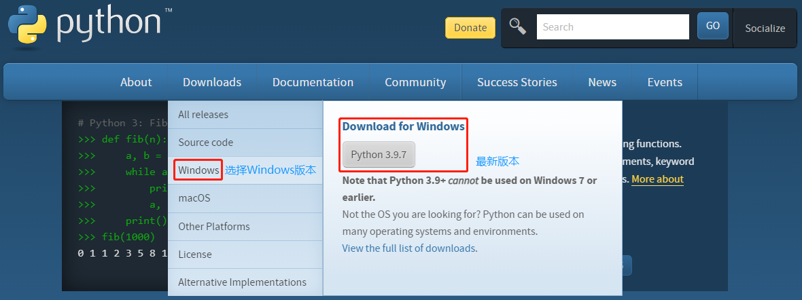

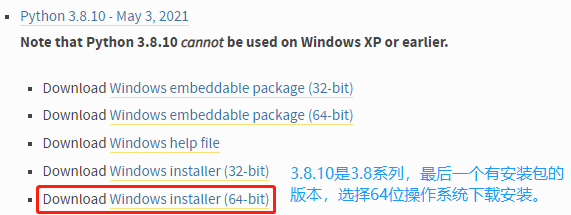

Python 安装：

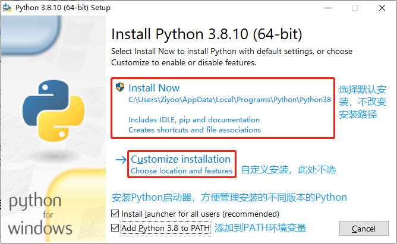

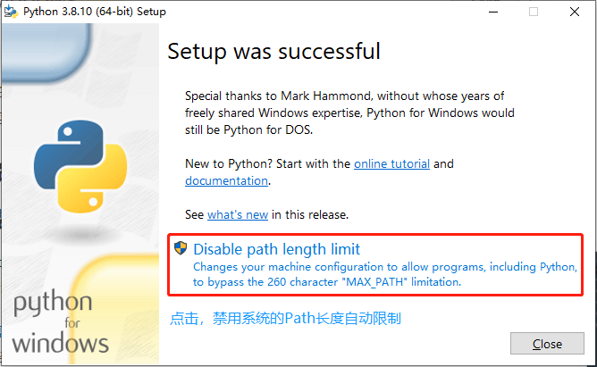

验证 Python 是否安装完成：

```powershell
Windows PowerShell
版权所有 (C) Microsoft Corporation。保留所有权利。

尝试新的跨平台 PowerShell https://aka.ms/pscore6

加载个人及系统配置文件用了 1011 毫秒。
PS C:\Users\XiSun> python
Python 3.8.3 (default, May 19 2020, 06:50:17) [MSC v.1916 64 bit (AMD64)] :: Anaconda, Inc. on win32
Type "help", "copyright", "credits" or "license" for more information.
>>> exit()
PS C:\Users\XiSun>
```

- 提示符`>>>`表示已经处于 Python 的交互模式中，可以输入任何 Python 代码，输入完的指令将会被 Python 的解释器立即执行。
- 输入`exit()`并回车，可以退出 Python 交互模式（直接关掉命令行窗口也可以）。

- 安装 Python 的同时，会自动安装一个 Python 的开发工具 IDLE，通过 IDLE 也可以进入到交互模式。IDLE 中可以通过 tab 键来查看语句的提示，并且可以将代码保存。

  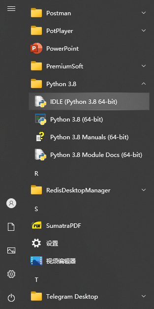

- 交互模式下只能输入一行代码，执行一行，所以不适用于我们日常的开发，仅可以用来做一些日常的简单的测试！

- 我们一般会将 Python 代码编写到一个`.py`文件中，然后通过 python 指令来执行文件中的代码。

### Miniconda 安装 Python

一般开发时，不推荐直接使用 Python 安装包安装 Python，建议使用第三方管理工具 Miniconda。

Miniconda 是一款小巧的 Python 环境管理工具，其安装程序中包含 conda 软件包管理器和 Python。一旦安装了 Miniconda，就可以使用 conda 命令安装任何其他软件工具包并创建环境等。

官网：https://conda.io/en/latest/miniconda.html

#### Windows 环境

官网下载 Miniconda Windows 安装包：

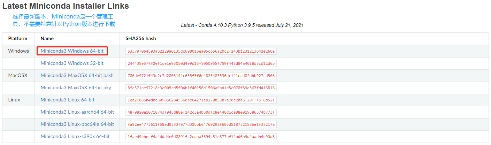

Windows 安装 Minicoda：

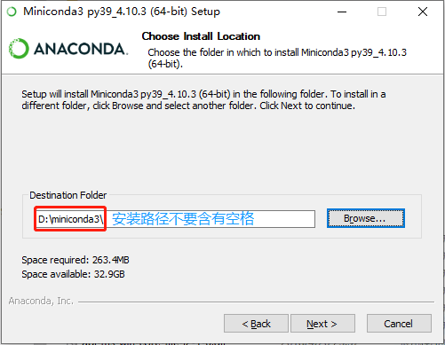


添加系统环境变量：

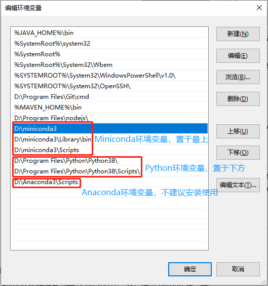

初次安装 Miniconda，应执行一次初始化命令：

```powershell
PS C:\Users\XiSun> conda init
PS C:\Users\XiSun>conda activate base
# 查看 miniconda 中 python 的版本
(base) PS  C:\Users\XiSun>python -v
```

创建 Python 3.8 环境：

- 打开 Windows PowerShell：

  ```powershell
  Windows PowerShell
  版权所有 (C) Microsoft Corporation。保留所有权利。
  
  尝试新的跨平台 PowerShell https://aka.ms/pscore6
  
  加载个人及系统配置文件用了 907 毫秒。
  (base) PS C:\Users\XiSun>
  ```

- 查看所有的环境：

  ```powershell
  (base) PS C:\Users\XiSun>conda env list
  # conda environments:
  #
  base                  *  D:\Program\Miniconda3
  ```

  - `(base)`和`*`表示当前所处的环境。
  - base 是 Miniconda 自身的 Python环境。

- 创建一个新环境：

  ```powershell
  (base) PS C:\Users\XiSun>conda create -n py38 python=3.8
  ```

  - 建议针对不同的 Python 版本，创建不同的环境，`-n`参数后是待创建环境的名字，可以自取。
  - Miniconda 自身的 Python 环境，不建议直接使用，避免污染。
  - 新创建的环境位于 Miniconda 安装目录的 envs 路径下，如`D:\miniconda3\envs\py38`。

- 查看新创建的环境：

  ```powershell
  (base) PS C:\Users\XiSun> conda env list
  # conda environments:
  #
  base                  *  D:\Program\Miniconda3
  py38                     D:\Program\Miniconda3\envs\py38
  ```

- 激活新创建的环境：

  ```powershell
  (base) PS C:\Users\XiSun> conda activate py38
  (py38) PS C:\Users\XiSun>
  ```
  
  > PowerShell 可能无法出现激活环境的问题，执行以下步骤：
  >
  > 1. 安装库：`conda install -n root -c pscondaenvs pscondaenvs`；
  > 2. 管理员打开 PowerShell，执行命令：`Set-ExecutionPolicy RemoteSigned`。

在新创建的 py38 环境中安装模块：

```powershell
(py38) PS C:\Users\XiSun> pip install pandas
(py38) PS C:\Users\XiSun> pip list
Package               Version
--------------------- -----------
pandas                1.3.3
```

- 如果下载较慢，可以设置 pip 的国内源：

  ```powershell
  # 设置前查看源
  (py38) PS C:\Users\XiSun> pip config list
  # 设置阿里云镜像源
  (py38) PS C:\Users\XiSun> pip config set global.index-url https://mirrors.aliyun.com/pypi/simple/
  Writing to C:\Users\XiSun\AppData\Roaming\pip\pip.ini
  # 设置后查看源
  (py38) PS C:\Users\XiSun> pip config list
  global.index-url='https://mirrors.aliyun.com/pypi/simple/'
  ```

  - 阿里云镜像源：http://mirrors.aliyun.com/pypi/simple/
  - 清华大学镜像源：https://pypi.tuna.tsinghua.edu.cn/simple/
  - 中国科技大学镜像源：https://pypi.mirrors.ustc.edu.cn/simple/
  - 中国科学技术大学镜像源：http://pypi.mirrors.ustc.edu.cn/simple/
  - 豆瓣镜像源：https://pypi.douban.com/simple/

- 在安装新的模块之前，可以使用 pip-search 命令查找模块是否存在：

  ```powershell
  # 安装 pip_search
  (py38) PS C:\Users\XiSun> pip install pip_search
  
  (py38) PS C:\Users\XiSun> pip list
  Package               Version
  --------------------- -----------
  pip-search            0.0.10
  
  # 使用 pip_search
  (py38) PS C:\Users\XiSun> pip_search dotenv
  ```

Pycharm 引用新创建的 py38 环境：


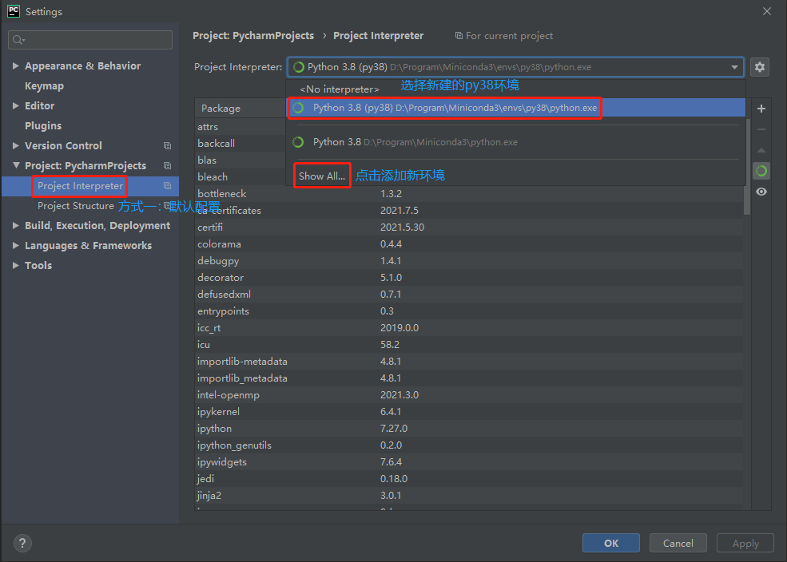

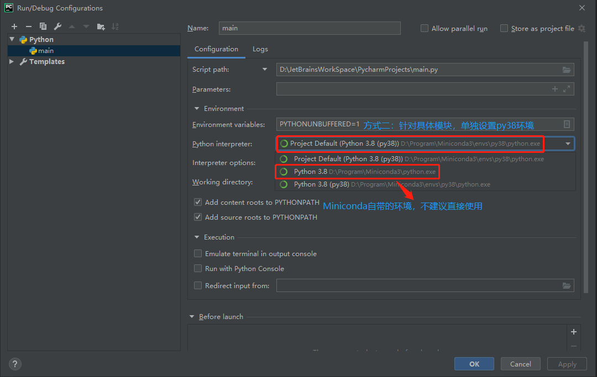

#### Linux 环境

> 此处以 WSL 为例进行说明。

官网下载 Miniconda Linux 安装程序：


WSL 中创建 Python 3.8 环境：

1. 打开 Windows PowerShell，并启动 WSL：

  ```powershell
  Windows PowerShell
  版权所有 (C) Microsoft Corporation。保留所有权利。
  
  尝试新的跨平台 PowerShell https://aka.ms/pscore6
  
  加载个人及系统配置文件用了 869 毫秒。
  (base) PS C:\Users\XiSun> wsl
  (base) xisun@DESKTOP-OM8IACS:/mnt/c/Users/XiSun$
  ```

2. 安装 Miniconda：

  ```powershell
  # 切换到 Miniconda 安装程序的路径
  (base) xisun@DESKTOP-OM8IACS:/mnt/c/Users/XiSun$ cd /mnt/d/Program\ Files/
  (base) xisun@DESKTOP-OM8IACS:/mnt/d/Program Files$ ll
  total 380636
  drwxrwxrwx 1 xisun xisun      4096 Jan 25 10:29  ./
  drwxrwxrwx 1 xisun xisun      4096 Jan 19 16:16  ../
  -rwxrwxrwx 1 xisun xisun  85055499 Jun 10  2020  Miniconda3-latest-Linux-x86_64.sh*
  # 执行 Miniconda 安装程序
  (base) xisun@DESKTOP-OM8IACS:/mnt/d/Program Files$ sh Miniconda3-latest-Linux-x86_64.sh
  ```

3. 创建一个新环境：

  ```powershell
  (base) xisun@DESKTOP-OM8IACS:/mnt/c/Users/Ziyoo$ cd ~
  (base) xisun@DESKTOP-OM8IACS:~$ ll
  total 108
  drwxr-xr-x  9 xisun xisun  4096 Jan 25 10:32 ./
  drwxr-xr-x  3 root  root   4096 Apr 26  2021 ../
  -rw-------  1 xisun xisun 19888 Jan 25 10:33 .bash_history
  -rw-r--r--  1 xisun xisun   220 Apr 26  2021 .bash_logout
  -rw-r--r--  1 xisun xisun  4250 Jan 25 10:32 .bashrc
  drwxr-xr-x  2 xisun xisun  4096 Jan 25 10:32 .conda/
  drwxr-xr-x  8 xisun xisun  4096 Jun  3  2021 .dotnet/
  drwxr-xr-x  2 xisun xisun  4096 Apr 26  2021 .landscape/
  -rw-------  1 xisun xisun    32 May 21  2021 .lesshst
  -rw-r--r--  1 xisun xisun     0 Jan 25 10:26 .motd_shown
  -rw-r--r--  1 xisun xisun   807 Apr 26  2021 .profile
  drwx------  2 xisun xisun  4096 Jul 13  2021 .ssh/
  -rw-r--r--  1 xisun xisun     0 Apr 26  2021 .sudo_as_admin_successful
  drwxr-xr-x  2 xisun xisun  4096 Jul  6  2021 .vim/
  -rw-------  1 xisun xisun  9488 Jul 22  2021 .viminfo
  drwxr-xr-x  5 xisun xisun  4096 Jun  3  2021 .vscode-server/
  -rw-r--r--  1 xisun xisun   183 Jan 14 10:08 .wget-hsts
  -rw-rw-r--  1 xisun xisun 14750 Jun  3  2021 get-docker.sh
  drwxr-xr-x 15 xisun xisun  4096 Jan 25 10:32 miniconda3/
  (base) xisun@DESKTOP-OM8IACS:~$ conda env list
  # conda environments:
  #
  base                  *  /home/xisun/miniconda3
  
  (base) xisun@DESKTOP-OM8IACS:~$ conda create -n py38 python=3.8
  Collecting package metadata (current_repodata.json): done
  Solving environment: done
  
  
  ==> WARNING: A newer version of conda exists. <==
    current version: 4.8.2
    latest version: 4.11.0
  
  Please update conda by running
  
      $ conda update -n base -c defaults conda
  
  
  
  ## Package Plan ##
  
    environment location: /home/xisun/miniconda3/envs/py38
  
    added / updated specs:
      - python=3.8
  
  
  The following packages will be downloaded:
  
      package                    |            build
      ---------------------------|-----------------
      _openmp_mutex-4.5          |            1_gnu          22 KB
      ca-certificates-2021.10.26 |       h06a4308_2         115 KB
      certifi-2021.10.8          |   py38h06a4308_2         152 KB
      ld_impl_linux-64-2.35.1    |       h7274673_9         586 KB
      libffi-3.3                 |       he6710b0_2          50 KB
      libgcc-ng-9.3.0            |      h5101ec6_17         4.8 MB
      libgomp-9.3.0              |      h5101ec6_17         311 KB
      libstdcxx-ng-9.3.0         |      hd4cf53a_17         3.1 MB
      ncurses-6.3                |       h7f8727e_2         782 KB
      openssl-1.1.1m             |       h7f8727e_0         2.5 MB
      pip-21.2.4                 |   py38h06a4308_0         1.8 MB
      python-3.8.12              |       h12debd9_0        18.3 MB
      readline-8.1.2             |       h7f8727e_1         354 KB
      setuptools-58.0.4          |   py38h06a4308_0         790 KB
      sqlite-3.37.0              |       hc218d9a_0         999 KB
      tk-8.6.11                  |       h1ccaba5_0         3.0 MB
      wheel-0.37.1               |     pyhd3eb1b0_0          33 KB
      xz-5.2.5                   |       h7b6447c_0         341 KB
      zlib-1.2.11                |       h7f8727e_4         108 KB
      ------------------------------------------------------------
                                             Total:        38.0 MB
  
  The following NEW packages will be INSTALLED:
  
    _libgcc_mutex      pkgs/main/linux-64::_libgcc_mutex-0.1-main
    _openmp_mutex      pkgs/main/linux-64::_openmp_mutex-4.5-1_gnu
    ca-certificates    pkgs/main/linux-64::ca-certificates-2021.10.26-h06a4308_2
    certifi            pkgs/main/linux-64::certifi-2021.10.8-py38h06a4308_2
    ld_impl_linux-64   pkgs/main/linux-64::ld_impl_linux-64-2.35.1-h7274673_9
    libffi             pkgs/main/linux-64::libffi-3.3-he6710b0_2
    libgcc-ng          pkgs/main/linux-64::libgcc-ng-9.3.0-h5101ec6_17
    libgomp            pkgs/main/linux-64::libgomp-9.3.0-h5101ec6_17
    libstdcxx-ng       pkgs/main/linux-64::libstdcxx-ng-9.3.0-hd4cf53a_17
    ncurses            pkgs/main/linux-64::ncurses-6.3-h7f8727e_2
    openssl            pkgs/main/linux-64::openssl-1.1.1m-h7f8727e_0
    pip                pkgs/main/linux-64::pip-21.2.4-py38h06a4308_0
    python             pkgs/main/linux-64::python-3.8.12-h12debd9_0
    readline           pkgs/main/linux-64::readline-8.1.2-h7f8727e_1
    setuptools         pkgs/main/linux-64::setuptools-58.0.4-py38h06a4308_0
    sqlite             pkgs/main/linux-64::sqlite-3.37.0-hc218d9a_0
    tk                 pkgs/main/linux-64::tk-8.6.11-h1ccaba5_0
    wheel              pkgs/main/noarch::wheel-0.37.1-pyhd3eb1b0_0
    xz                 pkgs/main/linux-64::xz-5.2.5-h7b6447c_0
    zlib               pkgs/main/linux-64::zlib-1.2.11-h7f8727e_4
  
  
  Proceed ([y]/n)? y
  
  
  Downloading and Extracting Packages
  _openmp_mutex-4.5    | 22 KB     | ############################################################################# | 100%
  libgomp-9.3.0        | 311 KB    | ############################################################################# | 100%
  ld_impl_linux-64-2.3 | 586 KB    | ############################################################################# | 100%
  python-3.8.12        | 18.3 MB   | ############################################################################# | 100%
  zlib-1.2.11          | 108 KB    | ############################################################################# | 100%
  openssl-1.1.1m       | 2.5 MB    | ############################################################################# | 100%
  libstdcxx-ng-9.3.0   | 3.1 MB    | ############################################################################# | 100%
  tk-8.6.11            | 3.0 MB    | ############################################################################# | 100%
  wheel-0.37.1         | 33 KB     | ############################################################################# | 100%
  sqlite-3.37.0        | 999 KB    | ############################################################################# | 100%
  setuptools-58.0.4    | 790 KB    | ############################################################################# | 100%
  pip-21.2.4           | 1.8 MB    | ############################################################################# | 100%
  libffi-3.3           | 50 KB     | ############################################################################# | 100%
  libgcc-ng-9.3.0      | 4.8 MB    | ############################################################################# | 100%
  ncurses-6.3          | 782 KB    | ############################################################################# | 100%
  certifi-2021.10.8    | 152 KB    | ############################################################################# | 100%
  readline-8.1.2       | 354 KB    | ############################################################################# | 100%
  xz-5.2.5             | 341 KB    | ############################################################################# | 100%
  ca-certificates-2021 | 115 KB    | ############################################################################# | 100%
  Preparing transaction: done
  Verifying transaction: done
  Executing transaction: done
  #
  # To activate this environment, use
  #
  #     $ conda activate py38
  #
  # To deactivate an active environment, use
  #
  #     $ conda deactivate
  
  (base) xisun@DESKTOP-OM8IACS:~$ conda env list
  # conda environments:
  #
  base                  *  /home/xisun/miniconda3
  py38                     /home/xisun/miniconda3/envs/py38
  ```

  - 新创建的环境的位置：`/home/xisun/miniconda3/envs/py38`。

4. 激活新创建的环境：

  ```powershell
  (base) xisun@DESKTOP-OM8IACS:~$ conda activate py38
  (py38) xisun@DESKTOP-OM8IACS:~$
  ```

安装模块:

```powershell
(py38) xisun@DESKTOP-OM8IACS:~$ pip install pandas
(py38) xisun@DESKTOP-OM8IACS:~$ pip list
Package                Version
---------------------- -------------------
pandas                1.4.1
```

- 如果下载较慢，可以设置 pip 的国内源：

  ```powershell
  # 设置前查看源
  (py38) xisun@DESKTOP-OM8IACS:~$ pip config list
  # 设置阿里云镜像源
  (py38) xisun@DESKTOP-OM8IACS:~$ pip config set global.index-url https://mirrors.aliyun.com/pypi/simple/
  Writing to /home/xisun/.config/pip/pip.conf
  # 设置后查看源
  (py38) xisun@DESKTOP-OM8IACS:~$ pip config list
  global.index-url='https://pypi.tuna.tsinghua.edu.cn/simple'
  ```
  
- pip 安装 pip-search：

  ```powershell
  (py38) xisun@DESKTOP-OM8IACS:~$ pip install pip_search
  
  (py38) xisun@DESKTOP-OM8IACS:~$ pip list
  Package                Version
  ---------------------- -------------------
  pip-search            0.0.10
  
  (py38) xisun@DESKTOP-OM8IACS:~$ pip_search dotenv
  ```
  
  - 备用方式，pipx 安装 pip-search：
  
    ```powershell
    (py38) xisun@DESKTOP-OM8IACS:/etc/apt$ pip install pipx
    Collecting pipx
      Downloading pipx-1.0.0-py3-none-any.whl (54 kB)
         |████████████████████████████████| 54 kB 47 kB/s
    Collecting packaging>=20.0
      Downloading packaging-21.3-py3-none-any.whl (40 kB)
         |████████████████████████████████| 40 kB 337 kB/s
    Collecting userpath>=1.6.0
      Downloading userpath-1.7.0-py2.py3-none-any.whl (14 kB)
    Collecting argcomplete>=1.9.4
      Downloading argcomplete-2.0.0-py2.py3-none-any.whl (37 kB)
    Collecting pyparsing!=3.0.5,>=2.0.2
      Downloading pyparsing-3.0.7-py3-none-any.whl (98 kB)
         |████████████████████████████████| 98 kB 416 kB/s
    Collecting click
      Downloading click-8.0.3-py3-none-any.whl (97 kB)
         |████████████████████████████████| 97 kB 537 kB/s
    Installing collected packages: pyparsing, click, userpath, packaging, argcomplete, pipx
    Successfully installed argcomplete-2.0.0 click-8.0.3 packaging-21.3 pipx-1.0.0 pyparsing-3.0.7 userpath-1.7.0
    (py38) xisun@DESKTOP-OM8IACS:/etc/apt$ pipx install pip-search
      installed package pip-search 0.0.10, installed using Python 3.8.12
      These apps are now globally available
        - pip_search
    ⚠️  Note: '/home/xisun/.local/bin' is not on your PATH environment variable. These apps will not be globally
        accessible until your PATH is updated. Run `pipx ensurepath` to automatically add it, or manually modify your PATH
        in your shell's config file (i.e. ~/.bashrc).
    done! ✨ 🌟 ✨
    (py38) xisun@DESKTOP-OM8IACS:/etc/apt$ pipx ensurepath
    Success! Added /home/xisun/.local/bin to the PATH environment variable.
    
    Consider adding shell completions for pipx. Run 'pipx completions' for instructions.
    
    You will need to open a new terminal or re-login for the PATH changes to take effect.
    
    Otherwise pipx is ready to go! ✨ 🌟 ✨
    ```
  
  - 重新打开 terminal，即可使用 pip-search 命令。

Visual Studio Code 引用新创建的 py38 环境。

- 在待打开的 Pyhon 文件所处的目录下，使用`shift + 鼠标右键`，然后点击`在此处打开 Linux shell(L)`，或者使用`cd`命令切换到 Python 文件所处的目录下，输入`code .`，命令：

  ```powershell
  (py38) xisun@DESKTOP-OM8IACS:/mnt/c/Users/Ziyoo$ cd /mnt/d/JetBrainsWorkSpace/PycharmProjects/
  (py38) xisun@DESKTOP-OM8IACS:/mnt/d/JetBrainsWorkSpace/PycharmProjects$ code .
  ```

- 在打开的 Visual Studio Code 中，可以查看和引用 Python 环境：

  

  

#### Jupyter 的使用

安装 jupyter：

```powershell
(py38) PS C:\Users\XiSun> pip install jupyter
(py38) PS C:\Users\XiSun> pip list
Package               Version
--------------------- -----------
jupyter               1.0.0
```

> 使用 jupyter 前，首先创建一个目录，用于存放文件，如`D:\notebook`。

启用 jupyter：

```powershell
(py38) PS C:\Users\XiSun>  jupyter notebook --notebook-dir D:\notebook\
```

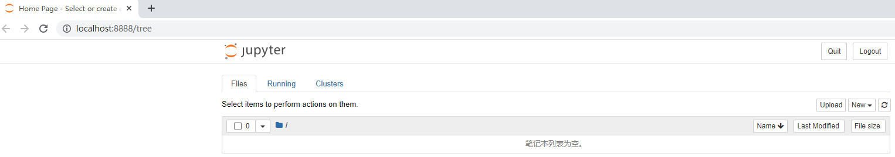

jupyter 的部分操作：

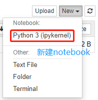

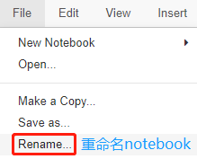

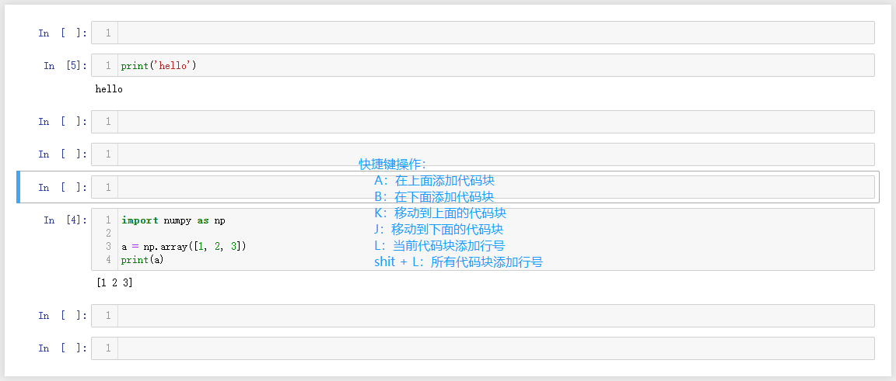

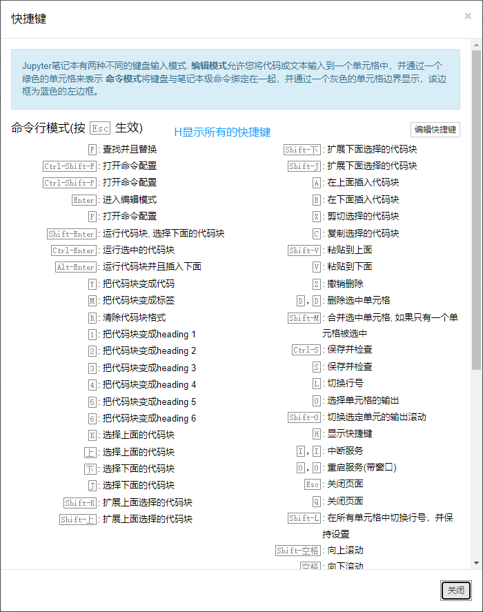

## Python 解释器

当编写 Python 代码时，得到的是一个包含 Python 代码的以`.py`为扩展名的文本文件。要运行代码，就需要 Python 解释器去执行`.py `文件。

由于整个 Python 语言从规范到解释器都是开源的，所以理论上，只要水平够高，任何人都可以编写 Python 解释器来执行 Python 代码（当然难度很大）。事实上，确实存在多种 Python 解释器。

Python 的解释器很多，但使用最广泛的还是 CPython。如果要和 Java 或 .Net 平台交互，最好的办法不是用 Jython 或 IronPython，而是通过网络调用来交互，确保各程序之间的独立性。

#### CPython

从 Python 官网下载并安装好 Python 3.x 后，我们就直接获得了一个官方版本的解释器：CPython。这个解释器是用 C 语言开发的，所以叫 CPython。在命令行下运行`python`命令就是启动 CPython 解释器。

> CPython 是使用最广的 Python 解释器。

#### IPython

IPython 是基于 CPython 之上的一个交互式解释器，也就是说，IPython 只是在交互方式上有所增强，但是执行 Python 代码的功能和 CPython 是完全一样的。好比很多国产浏览器虽然外观不同，但内核其实都是调用了 IE。

> CPython 用`>>>`作为提示符，而 IPython 用`In [序号]:`作为提示符。

#### PyPy

PyPy 是另一个 Python 解释器，它的目标是执行速度。PyPy 采用[JIT 技术](http://en.wikipedia.org/wiki/Just-in-time_compilation)，对 Python 代码进行动态编译（注意不是解释），所以可以显著提高 Python 代码的执行速度。

绝大部分 Python 代码都可以在 PyPy 下运行，但是 PyPy 和 CPython 有一些是不同的，这就导致相同的 Python 代码在两种解释器下执行可能会有不同的结果。如果你的代码要放到 PyPy 下执行，就需要了解[PyPy和CPython的不同点](http://pypy.readthedocs.org/en/latest/cpython_differences.html)。

#### Jython

Jython 是运行在 Java 平台上的 Python 解释器，可以直接把 Python 代码编译成 Java 字节码执行。

#### IronPython

IronPython 和 Jython 类似，只不过 IronPython 是运行在微软 .Net 平台上的 Python 解释器，可以直接把 Python 代码编译成 .Net 字节码。

## Python 基础

Python 的语法比较简单，采用缩进方式，写出来的代码就像下面的样子：

```python
# print absolute value of an integer:
a = 100
if a >= 0:
    print(a)
else:
    print(-a)
```

- Python 程序是**`大小写敏感`**的，如果写错了大小写，程序会报错。

- Python 中的每一行就是一条语句，每条语句以换行结束，每一行语句不要过长（规范中建议每行不要超过 80 个字符）。**当语句以冒号`:`结尾时，缩进的语句视为代码块。**

- Python 中一条语句可以分多行编写，多行编写时语句后边以`\`结尾。

- Python 是**`缩进严格`**的语言，所以在 Python 中不要随便写缩进。按照约定俗成的惯例，**应该始终坚持使用 4 个空格的缩进**。当重构代码时，粘贴过去的代码必须重新检查缩进是否正确。此外，IDE 很难像格式化 Java 代码那样格式化 Python 代码。

- Python 中`使用 # 表示注释`，# 后的内容都属于注释，注释的内容将会被解释器所忽略。注释要求简单明了，一般习惯上 # 后边会跟着一个空格。

### 字面量和变量

**`字面量`**：就是一个一个的值，比如：1，2，3，4，5，6，'HELLO'。字面量所表示的意思就是它的字面的值，在程序中可以直接使用字面量。

**`变量（variable）`**：可以用来保存字面量，并且变量中保存的字面量是不定的。变量本身没有任何意思，它会根据不同的字面量表示不同的意思。

- 在 Python 中，等号是赋值语句，**可以把任意数据类型赋值给变量，同一个变量可以反复赋值，而且可以是不同类型的变量。**

  ```python
  a = 123 # a 是整数
  print(a) # 123
  a = 'ABC' # a 变为字符串
  print(a) # ABC
  ```

  - **这种变量本身类型不固定的语言称之为动态语言，与之对应的是静态语言。**静态语言在定义变量时必须指定变量类型，如果赋值的时候类型不匹配，就会报错。例如 Java 是静态语言。

- 等号也可以把一个变量 a 赋值给另一个变量 b，这个操作实际上是把变量 b 指向变量 a 所指向的数据。

  ```python
  a = 'ABC'
  b = a
  a = 'XYZ'
  print(b) # ABC，不是 XYZ
  ```

- `常量`就是不能变的变量，比如常用的数学常数 π 就是一个常量。在 Python 中，通常用全部大写的变量名表示常量：

  ```python
  PI = 3.14159265359
  ```

  - 事实上，PI 仍然是一个变量，Python 根本没有任何机制保证 PI 不会被改变，所以，用全部大写的变量名表示常量只是一个习惯上的用法，如果你一定要改变变量 PI 的值，也没人能拦住你。

> 一般在开发时，很少直接使用字面量，都是将字面量保存到变量中，再通过变量来引用字面量。

### 变量和标识符

变量的特点：

- **Python 中使用变量，不需要声明，直接为变量赋值即可。**
- Python 中**不能使用没有进行过赋值的变量**，如果使用没有赋值过的变量，会报错 `NameError: name 'b' is not defined`。
- Python 是一个动态类型的语言，可以为变量赋任意类型的值，也可以任意修改变量的值。

Python 中所有可以自主命名的内容都属于`标识符`，比如变量名、函数名、类名。

标识符必须遵循标识符的规范：
- 标识符中可以含有字母、数字、_，但是不能使用数字开头。
- 标识符不能是 Python 中的关键字和保留字，也不建议使用 Python 中的函数名作为标识符，因为这样会导致函数被覆盖。
- 在 Python 中注意遵循两种命名规范：
  - `下划线命名法`：所有字母小写，单词之间使用 _ 分割。如：max_length、min_length、hello_world。
  - `帕斯卡命名法`：大驼峰命名法，首字母大写，每个单词开头字母大写，其余字母小写。如：MaxLength、MinLength、HelloWorld。
- 如果使用不符合标准的标识符，会报错 `SyntaxError: invalid syntax`。

### 数据类型

`数据类型`：指的就是变量的值的类型，也就是可以为变量赋哪些值。

#### 数值

Python 中，数值分成了三种：整数、浮点数（小数）、复数。

##### 整数

**`整数`**：**Python中，所有的整数都是 int 类型。**

- Python 可以处理任意大小的整数，包括负整数，在程序中的表示方法和数学上的写法一模一样，例如：1，100，-8080，0，等等。
  - **Python 的整数没有大小限制**，而某些语言的整数根据其存储长度是有大小限制的，例如 Java 对 32 位整数的范围限制在 -2147483648 ~ 2147483647。
- 对于很大的数，例如 10000000000，很难数清楚 0 的个数。**Python 允许在数字中间以 _ 分隔**，因此，写成 10_000_000_000 和 10000000000 是完全一样的。十六进制数也可以写成 0xa1b2_c3d4。
- 计算机由于使用二进制，所以，有时候用十六进制表示整数比较方便，十六进制用`0x`前缀和 0 - 9，a - f 表示，例如：0xff00，0xa5b4c3d2，等等。
  - 十进制的数，不能以 0 开头。二进制以`0b`开头，八进制以`0o`开头，十六进制以`0x`开头。
  - 其他进制的整数，只要是数字，打印时一定是以十进制的形式显示的。

##### 浮点数

**`浮点数`**：**Python 中，所有的浮点数都是 float 类型。**

- 浮点数也就是小数，之所以称为浮点数，是因为按照科学记数法表示时，一个浮点数的小数点位置是可变的，比如，1.23 x 10^9 和 12.3 x 10^8 是完全相等的。浮点数可以用数学写法，如 1.23，3.14，-9.01，等等。但是对于很大或很小的浮点数，就必须用科学计数法表示，把 10 用 e 替代，1.23 x 10^9 就是 1.23e9，或者 12.3e8，0.000012 可以写成 1.2e-5，等等。

  - **Python 的浮点数也没有大小限制**，但是超出一定范围就直接表示为`inf`（无限大）。

- 整数和浮点数在计算机内部存储的方式是不同的，整数运算永远是精确的（除法难道也是精确的？是的！），而浮点数运算则可能会有四舍五入的误差，得到一个不精确的结果。

  - 在Python中，有两种除法，一种除法是`/`，`/`除法的计算结果是浮点数，即使是两个整数恰好整除，结果也是浮点数。

    ```powershell
    >>> 10 / 3
    3.3333333333333335
    >>> 9 / 3
    3.0
    ```

  - 还有一种除法是`//`，称为地板除，`//`除法只取结果的整数部分。

    ```powershell
    >>> 10 // 3
    3
    >>> 9 // 3
    3
    ```

  - 相对于取整运算，Python 还提供一个余数运算，可以得到两个整数相除的余数。

    ```powershell
    >>> 10 % 3
    1
    >>> 9 % 3
    0
    ```

  - 无论整数做`//`除法还是取余数，结果永远是整数，所以，整数运算结果永远是精确的。

#### 字符串

**`字符串`**：用来表示一段文本信息，字符串是程序中使用的最多的数据类型。

- 字符串是以单引号`'`或双引号`"`括起来的任意文本（不要混用），比如 'abc'，"xyz" 等等。请注意，`''`或`""`本身只是一种表示方式，不是字符串的一部分，因此，字符串 'abc' 只有 a，b，c 这 3 个字符。如果`'`本身也是一个字符，那就可以用`""`括起来，比如 "I'm OK" 包含的字符是 I、'、m、空格、O、K 这 6 个字符。

- 相同的引号之间不能嵌套。如果字符串内部既包含 ' 又包含 "，可以用转义字符`\`来标识，比如 `'I\'m \"OK\"!'`。

- 转义字符`\`可以转义很多字符。比如：`\t`表示制表符，`\n`表示换行符，`\uxxxx`表示 Unicode 编码，可以打印出一些特殊的符号。

  ```powershell
  >>> print('I\'m ok.')
  I'm ok.
  >>> print('I\'m learning\nPython.')
  I'm learning
  Python.
  >>> print('\\\n\\')
  \
  \
  ```

- 如果字符串里面有很多字符都需要转义，就需要加很多`\`，为了简化，Python 还允许用`r''`表示 ' ' 内部的字符串默认不转义。

  ```powershell
  >>> print('\\\t\\')
  \       \
  >>> print(r'\\\t\\')
  \\\t\\
  ```

- 如果字符串内部有很多换行，用`\n`写在一行里不好阅读，为了简化，Python 允许用`'''...'''`或`"""..."""`的格式表示多行内容。**三重引号中可以换行，并且会保留字符串中的格式。**

  ```powershell
  >>> print('''line1
  ... line2
  ... line3''')
  line1
  line2
  line3
  >>> print(r'''hello,\n
  ... world''')
  hello,\n
  world
  ```

  - 上面是在交互式命令行内输入，在输入多行内容时，提示符由`>>>`变为`...`，提示可以接着上一行输入，注意`...`是提示符，不是代码的一部分。

- 格式化字符串：

  - **拼串**：字符串之间可以进行加法运算，如果将两个字符串进行相加，则会自动将两个字符串拼接为一个。

    ```python
    name = '孙悟空'
    
    print('欢迎 ' + name + ' 光临！')  # 欢迎 孙悟空 光临！
    ```

  - **多参数**：字符串只能和字符串拼接，不能和其他的类型进行加法运算。`print("a = " + a)`这种写法在 Python 中不常见，因为 a 可能不是字符串，容易出错，常写作`print('a = ', a)`。

    ```python
    name = '孙悟空'
    
    print('欢迎 ', name, ' 光临！')  # 欢迎 孙悟空 光临！
    ```

  - **占位符**：在创建字符串时，可以在字符串中指定占位符：`%s`在字符串中表示任意字符，`%f`表示浮点数占位符，`%d`表示整数占位符。

    ```python
    b = 'Hello %s' % '孙悟空'  # 一个占位符：Hello 孙悟空
    b = 'hello %s 你好 %s' % ('tom', '孙悟空')  # 两个占位符：hello tom 你好 孙悟空
    b = 'hello %3s' % 'ab'  # 占位符处的字符串长度至少为 3，不足 3 的，在前面填充空格：hello  ab
    b = 'hello %3.5s' % 'abcdefg'  # 占位符处的字符串的长度限制在 3 ~ 5 之间：hello abcde
    b = 'hello %.2f' % 123.456  # 保留 2 位小数，四舍五入：hello 123.46
    b = 'hello %d' % 123.95  # 直接舍弃小数位：hello 123
    
    print(b)
    ```

  - **格式化字符串**：可以通过在字符串前添加一个`f`来创建一个格式化字符串，在格式化字符串中可以直接嵌入变量。

    ```python
    a = 123
    b = '呵呵'
    c = f'hello {a} {b}'
    
    print(f'a = {a}')  # a = 123
    print(c)  # hello 123 呵呵
    ```

- **字符串的复制**：将字符串和数字相乘。`*`在语言中表示乘法，如果将字符串和数字相乘，则解释器会将字符串重复指定的次数并返回。

  ```python
  a = 'abc'
  a = a * 5
  
  print(a)  # abcabcabcabcabc
  ```

#### 布尔值

**`布尔值`**：布尔值和布尔代数的表示完全一致，一个布尔值只有`True`、`False`两种值，要么是 True，要么是 False。

- 在 Python 中，可以直接用 True、False 表示布尔值（请注意大小写），也可以通过布尔运算计算出来。

  ```powershell
  >>> True
  True
  >>> False
  False
  >>> 3 > 2
  True
  >>> 2 > 5
  False
  ```

- 布尔值可以用`and`、`or` 和`not`运算。

  - **and 运算是与运算**，只有所有都为 True，and 运算结果才是 True。

    ```powershell
    >>> True and True
    True
    >>> True and False
    False
    >>> False and True
    False
    >>> False and False
    False
    >>> 5 > 3 and 3 > 1
    True
    ```

  - **or 运算是或运算**，只要其中有一个为 True，or 运算结果就是 True。

    ```powershell
    >>> True or True
    True
    >>> True or False
    True
    >>> False or True
    True
    >>> False or False
    False
    >>> 5 > 3 or 1 > 3
    True
    ```

  - **not 运算是非运算**，它是一个单目运算符，把 True 变成 False，False 变成 True。

    ```powershell
    >>> not True
    False
    >>> not False
    True
    >>> not 5 > 3
    False
    ```

- 布尔值经常用在条件判断中，比如：

  ```python
  if age >= 18:
      print('adult')
  else:
      print('teenager')
  ```

- 布尔值实际上也属于整型，**True 就相当于 1，False 就相当于 0。**

  ```python
  print(1 + False)  # 1
  print(1 + True)  # 2
  ```

#### 空值

**`空值`**：是 Python 里一个特殊的值，用`None`表示。None 不能理解为 0，因为 0 是有意义的，而 None 是一个特殊的空值。

### 类型检查

**`类型检查`**：可以检查变量对应的值的类型。

- `type()`用来检查值的类型，该函数会将检查的结果作为返回值返回，可以通过变量来接收函数的返回值。

  ```python
  a = 123  # 数值
  b = '123'  # 字符串
  print(type(a))  # <class 'int'>
  print(type(b))  # <class 'str'>
  c = type(a)
  print(c)  # <class 'int'>
  c = type('123')
  print(c)  # <class 'str'>
  print(type(1))  # <class 'int'>
  print(type(1.5))  # <class 'float'>
  print(type(True))  # <class 'bool'>
  print(type('hello'))  # <class 'str'>
  print(type(None))  # <class 'NoneType'>
  ```

### 对象

Python 是一门面向对象的语言。

- 一切皆对象！
- 程序运行当中，所有的数据都是存储到内存当中然后再运行的！
- 对象就是内存中专门用来存储指定数据的一块区域。
- 对象实际上就是一个容器，专门用来存储数据。
- 像我们之前学习的数值、字符串、布尔值、None 都是对象。

#### 对象的结构

每个对象中都要保存三种数据：

- **`id（标识）`**

  - id 用来标识对象的唯一性，每一个对象都有唯一的 id。

  - 对象的 id 就相当于人的身份证号一样。

  - **可以通过`id()`函数来查看对象的 id。**

    ```python
    print(id(123))  # 140708231919200
    print(id('a'))  # 2270491024176
    ```

  - id 是由解析器生成的，在 CPython 中，id 就是对象的内存地址。

  - 对象一旦创建，则它的 id 永远不能再改变。

- **`type（类型）`**

  - 类型用来标识当前对象所属的类型，比如：int，str，float，bool。

  - 类型决定了对象有哪些功能。

  - **通过`type()`函数来查看对象的 type。**

    ```python
    print(type(123))  # <class 'int'>
    print(type('a'))  # <class 'str'>
    ```

  - Python 是一门强类型的语言，对象一旦创建类型便不能修改。

- **`value（值）`**

  - 值就是对象中存储的具体的数据。
  - 对于有些对象，值是可以改变的。

#### 对象的分类

对象分成两大类：可变对象和不可变对象。

- `可变对象`：值可以改变。
- `不可变对象`：值不能改变，数值、字符串等都是不可变对象。

#### 对象和变量的关系

对象并没有直接存储到变量中，在 Python 中变量更像是给对象起了一个别名。

- **变量中存储的不是对象的值，而是对象的 id（内存地址）。**当我们使用变量时，实际上就是在通过对象 id 在查找对象。

- 变量中保存的对象，只有在为变量重新赋值时才会改变。

- 变量和变量之间是相互独立的，修改一个变量不会影响另一个变量。

  ```python
  print(a)  # 10
  print(b)  # 10
  print(id(a))  # 140708432125984
  print(id(b))  # 140708432125984
  a = 456
  print(a)  # 456
  print(b)  # 10
  print(id(a))  # 2898418807216
  print(id(b))  # 140708432125984
  ```

#### 对象和比较符的关系

区别：

- `==`和`!=`：比较的是对象的值是否相等。
- `is`和`is not`：比较的是对象的 id 是否相等（比较两个对象是否是同一个对象）。

示例：

```python
a = [1, 2, 3]
b = [1, 2, 3]
print(a, b)  # [1, 2, 3] [1, 2, 3]
print(id(a), id(b))  # 2081830016896 2081830015936
print(a == b)  # a 和 b 的值相等，使用 == 会返回 True
print(a is b)  # a 和 b 不是同一个对象，内存地址不同，使用 is 会返回 False
```

### 类型转换

`类型转换`：将一个类型的对象转换为其他对象。

- **类型转换不是改变对象本身的类型，而是根据当前对象的值来创建一个新对象。**

- 类型转换四个函数：`int()`，`float()`，`str()`，`bool()`。

- `int()`可以用来将其他的对象转换为整型。

  ```python
  a = True
  a = int(a)
  print(a)  # 1
  
  a = False
  a = int(a)
  print(a)  # 0
  
  a = '123'
  a = int(a)
  print(a)  # 123
  
  a = 11.6
  a = int(a)
  print(a)  # 11
  
  a = '11.5'
  a = int(a)  # ValueError
  print(a)
  
  a = None
  a = int(a)  # TypeError
  print(a)
  ```

  - 布尔值：True ---> 1，False ---> 0。
  - 浮点数：直接取整，省略小数点后的内容。
  - 字符串：如果是一个合法的整数字符串，则直接转换为对应的数字。如果不是一个合法的整数字符串，则报错`ValueError: invalid literal for int() with base 10: '11.5'`。
  - 对于其他不可转换为整型的对象，直接抛出异常`TypeError`。
  - `int()`数不会对原来的变量产生影响，它是将对象转换为指定的类型并将其作为返回值返回，如果希望修改原来的变量，则需要对变量进行重新赋值。

- `float()`和`int()`基本一致，不同的是它会将对象转换为浮点数。

  ```python
  a = 1
  a = float(a)
  print(a)  # 1.0
  
  a = False
  a = float(a)
  print(a)  # 0.0
  
  a = True
  a = float(a)
  print(a)  # 1.0
  ```

- `str()`可以将对象转换为字符串。

  ```python
  a = 123
  a = str(a)
  print(a)  # 123
  
  b = 456
  print('hello' + str(b))  # hello456
  ```

  - True ---> 'True'。
  - False ---> 'False'。
  - 123 ---> '123' 。
  - 。。。

- `bool()`可以将对象转换为布尔值，任何对象都可以转换为布尔值。

  ```python
  a = None
  a = bool(a)
  print(a)  # False
  
  a = 0
  a = bool(a)
  print(a)  # False
  
  a = ''
  a = bool(a)
  print(a)  # False
  ```

  - 规则：**对于所有表示空性的对象都会转换为 False，其余的转换为 True。**表示空性的对象：0、None、''等。

### 运算符（操作符）

`运算符`：可以对一个值或多个值进行运算或各种操作。比如 +、-、= 都属于运算符。

常用运算符的分类：
- 算术运算符
- 赋值运算符
- 关系运算符（比较运算符）
- 逻辑运算符
- 条件运算符（三元运算符）  

#### 算术运算符

```python
# 加法运算符
a = 10 + 5  # 15
a = 'hello' + ' ' + 'world'  # hello world，拼串

# 减法运算符
a = 10 - 5  # 5
a = 5 - True  # 4
a = a - 2  # 2，用变量 a 的值减去 2，然后再赋值给 a
# a = 'hello' - 'h'  # TypeError

# 乘法运算符
a = 5 * 5  # 25

# 除法运算符
a = 10 / 5  # 2.0
a = 5 / 2  # 2.5
# a = 5 / 0  # ZeroDivisionError: division by zero
a = 10 / 3  # 3.33333...

# 幂运算
a = 2 ** 2  # 4
a = 10 ** 5  # 100000
a = 16 ** 0.5  # 4.0，求 16 的平方根

# 整除
a = 10 // 3  # 3
a = 5 // 2  # 2
a = 10 // -3  # -4
a = -5 // 2  # -3

# 取模
a = 10 % 5  # 0
a = 10 % 4  # 2
a = 10 % 3  # 1
a = 10 % 2  # 0

print("a =", a)
```

- 加法运算符：`+`。如果是两个字符串之间进行加法运算，则会进行拼串操作。

- 减法运算符：`-`。

- 乘法运算符：`*`。如果将字符串和数字相乘，则会对字符串进行复制操作，将字符串重复指定次数。

- 除法运算符：`/`。运算时结果总会返回一个浮点类型。

- 幂运算：`**`。求一个值的几次幂。

- 整除：`//`。向下取整，只会保留计算后的整数位，总会返回一个整型。

- 取模：`%`。即取余，求两个数相除的余数。

- 运算时，注意正负号的问题。

- 在对浮点数做算术运算时，结果也会返回一个浮点数。

  ```python
  b = 25.0 / 5
  print(b)  # 5.0
  ```

#### 赋值运算符

**`赋值运算符`**：

- `=`：可以将等号右侧的值赋值给等号左侧的变量。
- `+=`：a += 5 相当于 a = a + 5。
- `-=`：a -= 5 相当于 a = a - 5。
- `*=`：a *= 5 相当于 a = a * 5。
- `/=`：a /= 5 相当于 a = a / 5。
- `**=`：a \**= 5 相当于 a = a ** 5。
- `//=`：a //= 5 相当于 a = a // 5。
- `%=`：a %= 5 相当于 a = a % 5。

#### 关系运算符（比较运算符）

**`关系运算符`**：用来比较两个值之间的关系，总会返回一个布尔值。如果关系成立，返回 True，否则返回 False。

- `>`：比较左侧值是否大于右侧值。
- `>=`：比较左侧的值是否大于或等于右侧的值。
- `<`：比较左侧值是否小于右侧值。
- `<=`：比较左侧的值是否小于或等于右侧的值。
- `==`：比较两个对象的值是否相等，比较的是对象的值。
- `!=`：比较两个对象的值是否不相等，比较的是对象的值。
- `is`：比较两个对象是否是同一个对象，**比较的是对象的 id**。
- `is not`：比较两个对象是否不是同一个对象，**比较的是对象的 id**。

```python
result = 10 > 20  # False
result = 10 >= 10  # True
result = 2 > True  # True
# result = 2 > '1'  # TypeError: '>' not supported between instances of 'int' and 'str'
result = 30 < 20  # False

# 在 Python 中可以对两个字符串进行大于（等于）或小于（等于）的运算，
#   当对字符串进行比较时，实际上比较的是字符串的 Unicode 编码
#   比较两个字符串的 Unicode 编码时，是逐位比较的，比较出现结果时，直接返回，后续不再比较
#   利用该特性可以对字符串按照字母顺序进行排序，但是对于中文来说意义不是特别大
#   注意：如果不希望比较两个字符串的 Unicode 编码，则需要将其转换为数字然后再比较

result = '2' > '1'  # True，2 的 Unicode 编码为 0032，1 的 Unicode 编码为 0031
result = '2' > '11'  # True，逐位比较，先拿 2 和 1 比，结果为 True，直接返回，后续不再比较
result = 'a' > 'b'  # False，a 的 Unicode 编码为 0061，b 的 Unicode 编码为 0062
result = 'c' < 'd'  # True
result = 'ab' > 'b'  # False，逐位比较，先拿 a 和 b 比，结果为 False，直接返回，后续不再比较

print(int('2') > int('11'))  # False

result = 1 == 1  # True
result = 'hello' == 'hello'  # True
result = 'abc' == 'bcd'  # False
result = 'abc' != 'bcd'  # True
result = 1 == True  # True
result = 1 is True  # False
result = 1 is not True  # True
print(id(1), id(True))  # 140708473153312 140708472870736
```

#### 逻辑运算符

**`逻辑运算符`**：主要用来做一些逻辑判断。

- `and`：逻辑与。

  - and 可以对符号两侧的值进行与运算。

  - 只有在符号两侧的值都为 True 时，才会返回 True，只要有一个 False 就返回 False。

  - Python 中的与运算是**短路的与**，如果第一个值为 False，则不再看第二个值，直接返回 False。

    ```python
    True and print('男：你猜我出来吗？')  # 第一个值是 True，会看第二个值，所以 print() 会执行
    False and print('女：你猜我出来吗？')  # 第一个值是 False，不会看第二个值，所以 print() 不会执行
    ```

- `or`：逻辑或。

  - or 可以对符号两侧的值进行或运算。

  - 或运算两个值中只要有一个 True，就会返回 True。

  - Python 中的或运算是**短路的或**，如果第一个值为 True，则不再看第二个值，直接返回 True。

    ```python
    False or print('男：你猜我出来吗？')  # 第一个值为 False，继续看第二个，所以打印语句执行
    True or print('女：你猜我出来吗？')  # 第一个值为 True，不看第二个，所以打印语句不执行
    ```

- `not`：逻辑非。

  - not 可以对符号右侧的值进行非运算。
  - 对于布尔值，非运算会对其进行取反操作，True 变 False，False 变 True。
  - 对于非布尔值，非运算会先将其转换为布尔值，然后再取反。

- `非布尔值的与或运算`：当我们对非布尔值进行与或运算时，Python 会将其当做布尔值运算，最终会返回原值。

  - 与运算的规则：

    ```python
    # True and True
    result = 1 and 2  # 2
    
    # True and False
    result = 1 and 0  # 0
    
    # False and True
    result = 0 and 1  # 0
    
    # False and False
    result = None and 0  # None
    ```

    - 与运算是找 False 的，如果第一个值是 False，则不看第二个值。
    - **如果第一个值是 False，则直接返回第一个值，否则返回第二个值。**

  - 或运算的规则：

    ```python
    # True or True
    result = 1 or 2  # 1
    
    # True or False
    result = 1 or 0  # 1
    
    # False or True
    result = 0 or 1  # 1
    
    # False or False
    result = None or 0  # 0
    ```

    - 或运算是找 True 的，如果第一个值是 True，则不看第二个值。
    - **如果第一个值是 True，则直接返回第一个值，否则返回第二个值。**

#### 条件运算符（三元运算符）

语法：`语句1 if 条件表达式 else 语句2`。

- 条件运算符在执行时，会先对条件表达式进行求值判断。如果判断结果为 True，则执行语句 1，并返回执行结果；如果判断结果为 False，则执行语句 2，并返回执行结果。

```python
a = 30
b = 50
print('a的值比较大！') if a > b else print('b的值比较大！')

# 获取 a 和 b 之间的较大值
maxNum = a if a > b else b
print(maxNum)
```

## Python 流程控制语句

Python代码在执行时是按照自上向下顺序执行的。通过流程控制语句，可以改变程序的执行顺序，也可以让指定的程序反复执行多次。

流程控制语句分成两大类：条件判断语句，循环语句。

### 条件判断语句

#### if

语法：

```python
if 条件表达式: 
    代码块
```

- 执行的流程：if 语句在执行时，会先对条件表达式进行求值判断，如果为 True，则执行 if 后的语句；如果为 False，则不执行。

默认情况下，if 语句只会控制紧随其后的那条语句，如果希望 if 可以控制多条语句，则可以在 if 后跟着一个代码块。

- 代码块：

  - 代码块中保存着一组代码，同一个代码块中的代码，要么都执行要么都不执行。
  - 代码块就是一种为代码分组的机制。
  - 如果要编写代码块，语句就不能紧随在`:`后边，而是要写在下一行。
  - **代码块以缩进开始，直到代码恢复到之前的缩进级别时结束。**
  - 缩进有两种方式，一种是使用 tab 键，一种是使用空格（四个）。
    - Python 代码中使用的缩进方式必须统一。
    - Python 的官方文档中推荐我们使用空格来缩进。

- 可以使用逻辑运算符来连接多个条件，如果希望所有条件同时满足，则需要使用 and；如果希望只要有一个条件满足即可，则需要使用 or。

示例：

```python
num = 10
if num > 10:
    print('num比10大！')

if num > 10 and num < 20:
    print('num比10大, num比20小！')

if 10 < num < 20:
    print('num比10大, num比20小！')
```

#### if - else

语法：

```python
if 条件表达式:
    代码块1
else:
    代码块2
```

- 执行流程：if - else 语句在执行时，先对 if 后的条件表达式进行求值判断，如果为 True，则执行 if 后的代码块 1；如果为 False，则执行 else 后的代码块 2。

示例：

```python
age = 7
if age > 17:
    print('你已经成年了~~')
else:
    print('你还未成年~~')

# 如果一个年份可以被 4 整除不能被 100 整除，或者可以被 400 整除，这个年份就是闰年
year = int(input('请输入一个任意的年份:'))
if year % 4 == 0 and year % 100 != 0 or year % 400 == 0:
    print(year, '是闰年')
else:
    print(year, '是平年')
```

#### if - elif - else

语法：

```python
if 条件表达式:
    代码块
elif 条件表达式:
    代码块
elif 条件表达式:
    代码块
else:
    代码块
```

- 执行流程：if - elif - else 语句在执行时，会自上向下依次对条件表达式进行求值判断，如果表达式的结果为 True，则执行当前代码块，然后语句结束；如果表达式的结果为 False，则继续向下判断，直到找到 True 为止；如果所有的表达式都是 False，则执行 else 后的代码块。

- if - elif - else 中只会有一个代码块会执行。

示例：

```python
age = 210

if age > 200:
    print('活的可真久！')
elif age > 100:
    print('你也是老大不小了！')
elif age >= 60:
    print('你已经退休了！')
elif age >= 30:
    print('你已经是中年了！')
elif age >= 18:
    print('你已经成年了！')
else:
    print('你还是个小孩！')

age = 68

if 18 <= age < 30:
    print('你已经成年了！')
elif 30 <= age < 60:
    print('你已经中年了！')
else:
    print('你已经退休了！')
```

### 循环语句

循环语句可以使指定的代码块重复指定的次数。

循环语句分成两种，while 循环和 for 循环。

#### while 循环

语法：

```python
while 条件表达式:
    代码块
else:
    代码块
```

- 执行流程：while 语句在执行时，会先对 while 后的条件表达式进行求值判断，如果判断结果为 True，则执行循环体（代码块），循环体执行完毕，继续对条件表达式进行求值判断，以此类推，直到判断结果为 False，则循环终止，如果循环有对应的 else，则执行 else 后的代码块。
- 条件表达式恒为 True 的循环语句，称为死循环。

循环的三个要件：

- **初始化表达式**：通过初始化表达式初始化一个变量。
- **条件表达式**：条件表达式用来设置循环执行的条件。
- **更新表达式**：修改初始化变量的值。

示例：

```python
# 创建一个执行十次的循环
i = 0
while i < 10:
    i += 1
    print(i, 'hello')
else:
    print('else中的代码块')
    

# 水仙花数是指一个 n 位数（n≥3），它的每个位上的数字的 n 次幂之和等于它本身（例如：1**3 + 5**3 + 3**3 = 153）。
# 求 1000 以内所有的水仙花数

# 获取 1000 以内的三位数
i = 100
while i < 1000:

    # 假设，i 的百位数是 a，十位数 b，个位数 c
    # 求 i 的百位数
    a = i // 100
    # 求 i 的十位数
    # b = i // 10 % 10
    b = (i - a * 100) // 10
    # 求 i 的个位数字
    c = i % 10
    # print(i , a , b , c)
    
    # 判断 i 是否是水仙花数
    if a**3 + b**3 + c**3 == i :
        print(i)
    i += 1
```

#### 循环嵌套

打印图形：

```python
# 在控制台中打印如下图形
# *****
# *****
# *****
# *****
# *****
#

# 创建一个循环来控制图形的高度
# 循环嵌套时，外层循环没执行一次，内存循环就要执行一圈
i = 0
while i < 5:
    # 创建一个内层循环来控制图形的宽度
    j = 0
    while j < 5:
        # print() 默认在结尾打印 \n 换行符，添加 end 参数，打印时不要换行
        print("* ", end='')
        j += 1
    # 每一行打印完毕后，再打印一个换行符
    print()
    i += 1

#
# *     j<1   i=0
# **    j<2   i=1
# ***   j<3   i=2
# ****  j<4   i=3
# ***** j<5   i=4
#
# *****
# ****
# ***
# **
# *
i = 0
while i < 5:
    j = 0
    while j < i + 1:
        print("* ", end='')
        j += 1
    print()
    i += 1
```

99 乘法表：

```python
# 打印 99 乘法表
# 1*1=1
# 1*2=2 2*2=4
# 1*3=3 2*3=6 3*3=9
# ...                 9*9=81

# 创建一个外层循环来控制图形的高度
i = 0
while i < 9:
    i += 1
    
    # 创建一个内层循环来控制图形的宽度
    j = 0
    while j < i:
        j += 1
        print(f"{j}*{i}={i*j} ",end="")

    print()
```

#### break 和 continue

语法：

- `break`：可以用来立即退出循环语句（包括 else）。
- `continue`：可以用来跳过当次循环。
- break 和 continue 都是只对离它最近的循环起作用。
- `pass`：是用来在判断或循环语句中占位的，无实际意义。如果循环体内容没想好怎么写，可以先用 pass 占位，这样不会影响程序执行。

示例：

```python
i = 0
while i < 5:
    if i == 3:
        break
    print(i)  # 结束循环，结果：0 1 2
    i += 1
else:
    print('循环结束')

i = 0
while i < 5:
    i += 1
    if i == 2:
        continue  # 跳出当前循环，结果：1 3 4 5 循环结束
    print(i)
else:
    print('循环结束')

i = 0
if i < 5:
    pass
```

#### 模块引入

```python
# 模块，通过模块可以对 Python 进行扩展
# 引入一个 time 模块，来统计程序执行的时间
from time import *

# time() 函数可以用来获取当前的时间，返回的单位是秒
# 获取程序开始的时间
# 优化前：
#   10000 个数 12.298秒
#   100000 个数 没有结果
# 第一次优化：加 break
#   10000 个数 1.577 秒
#   100000 个数 170.645 秒
# 第二次优化：循环到根号为止
#   10000 个数 0.068 秒
#   100000 个数 1.646 秒
#
# 36 的因数
#   2 18
#   3 12
#   4 9
#   6 6
#   
begin = time()

i = 2
while i <= 100000:
    flag = True
    j = 2
    while j <= i ** 0.5:
        if i % j == 0:
            flag = False
            # 一旦进入判断，则证明 i 一定不是质数，此时内层循环没有继续执行的必要
            # 使用 break 来退出内层的循环
            break
        j += 1
    if flag:
        # print(i)  
        pass
    i += 1

# 获取程序结束的时间
end = time()

# 计算程序执行的时间
print("程序执行花费了：", end - begin, "秒")
```

#### for 循环

语法：

```python
for 变量 in 序列 :
    代码块
```

- for 循环除了创建方式以外，其余的都和 while 循环一样，包括 else、break、continue 都可以在 for 循环中使用。

### 补充：input() 函数

**`input() 函数`**：用来获取用户的输入。

- input() 调用后，程序会立即暂停，等待用户输入。用户输入完内容以后，点击回车程序才会继续向下执行；用户输入完成以后，其所输入的的内容会以返回值的形式返回。
- input() 的返回值是一个字符串。
- input() 函数中可以设置一个字符串作为参数，这个字符串将会作为提示文字显示。
- input() 也可以用于暂时阻止程序结束。

示例：

```python
a = input('请输入任意内容：')
print('用户输入的内容是: ', a)

# 获取用户输入的用户名
username = input('请输入你的用户名: ')
# 判断用户名是否是 admin
if username == 'admin':
    print('欢迎管理员光临！')
```

## Python 数据结构

### 序列（sequence）

#### 序列的概念

**`序列`**：计算机中数据存储的方式叫数据结构，**序列是 Python 中最基本的一种数据结构**。序列用于**保存一组有序的数据**，序列存储的数据，称为元素，所有的数据在序列当中都有一个唯一的位置（索引），并且序列中的数据会按照添加的顺序来分配索引。

序列的分类：
- **可变序列（序列中的元素可以改变）**
  - **列表（list）**
- **不可变序列（序列中的元素不能改变）**
  - **元组（tuple）**
  - **字符串（str）**

- `range()`函数：用来生成一个自然数的序列。

  ```python
  # range() 是一个函数，可以用来生成一个自然数的序列
  # 该函数需要三个参数
  #   1. 起始位置（包含，可以省略，默认是 0）
  #   2. 结束位置（不包含）
  #   3. 步长（可以省略，默认是 1）
  r = range(5)
  print(list(r))  # [0, 1, 2, 3, 4]
  r = range(0, 10, 2)
  print(list(r))  # [0, 2, 4, 6, 8]
  r = range(10, 0, -1)
  print(list(r))  # [10, 9, 8, 7, 6, 5, 4, 3, 2, 1]
  
  # 通过 range() 可以创建一个执行指定次数的 for 循环
  for i in range(30):
      print(i)
  ```

#### 序列的通用操作

序列的通用操作方法：

- `+`：可以将两个序列拼接为一个序列。
- `*`：可以将序列重复指定的次数。
- `in`：用来检查指定元素是否存在于序列中，如果存在，返回 True，否则返回 False。
- `not in`：用来检查指定元素是否不在序列中，如果不在，返回 True，否则返回 False。
- `len()`：函数获取序列的长度，即序列中的元素的个数。该长度值，是序列的最大索引加 1。
- `min()`：函数获取序列中的最小值。
- `max()`：函数获取序列中的最大值。
- 可以通过索引（index）来获取序列中的元素：
  - 语法：`序列[索引]`。
  - 索引是元素在序列中的位置，序列中的每一个元素都有一个索引。
  - **索引是从 0 开始的整数**，序列第一个位置索引为 0，第二个位置索引为 1，第三个位置索引为 2，以此类推。
  - 索引可以是负数，表示从后向前获取元素，-1 表示倒数第一个元素，-2 表示倒数第二个元素，以此类推。
  - 如果使用的索引超过了序列最大的范围，会抛出异常 `IndexError: list index out of range`。
- `s.index()`方法获取指定元素在序列中的第一次出现时索引。
  - 方法和函数基本上是一样，只不过方法必须通过`对象.方法()`的形式调用，方法实际上就是和对象关系紧密的函数。
  - `index()`的第二个参数，表示查找的起始位置，第三个参数，表示查找的结束位置。
  - 如果要获取序列中没有的元素，会抛出异常。
- `s.count()`方法统计指定元素在序列中出现的次数。

#### 序列的切片

**`切片`**：指从现有序列中，获取一个子序列。

- 语法一：`序列[起始:结束]`。
  - 通过切片获取元素时，**会包括起始位置的元素，不会包括结束位置的元素。**
  - 做切片操作时，总会返回一个新的序列，但不会影响原来的序列。
  - 起始和结束位置的索引都可以省略不写。
    - 如果省略起始位置，则会从第一个元素开始截取。
    - 如果省略结束位置，则会一直截取到最后。
    - 如果起始位置和结束位置全部省略，则相当于创建了一个序列的副本。
- 语法二：`序列[起始:结束:步长]`。
  - 步长表示，每次获取元素的间隔，默认值是 1。
  - 步长不能是 0，但可以是负数。
  - 步长如果是负数，则从序列的后边向前边取元素。

#### 序列的分类

##### 列表（list）

**`列表`**：是 Python 中的一个对象。

- 对象（object）就是内存中专门用来存储数据的一块区域，之前我们学习的对象，像数值，它只能保存一个单一的数据。
- 列表是用来存储对象的对象，列表中可以保存多个有序的数据。
- **列表中可以保存任意的对象**，但一般不会这样操作，尽可能保证列表中元素属性一致。

###### 列表的创建

语法：`列表名 = []`。

  - 一个列表中可以存储多个元素，也可以在创建列表时，来指定列表中的元素。


  - 当向列表中添加多个元素时，多个元素之间使用`,`隔开。


  - **列表中的对象都会按照插入的顺序存储到列表中**，第一个插入的对象保存到第一个位置，第二个保存到第二个位置，以此类推。

示例：

```python
my_list = []  # 创建了一个空列表
print(my_list, type(my_list))  # [] <class 'list'>

my_list = [10]  # 创建一个只包含一个元素的列表

my_list = [10, 20, 30, 40, 50]  # 创建了一个包含有 5 个元素的列表

# my_list = [10, 'hello', True, None, [1, 2, 3], print]  # 列表可以保存任意对象，但一般不会这样操作

print(my_list[4])  # 50

print((my_list[-2]))  # 40

print(len(my_list))  # 5
```

###### 列表的通用操作

示例：

```python
my_list = [1, 2, 3] + [4, 5, 6]
print(len(my_list))  # 6

my_list = [1, 2, 3] * 5
print(len(my_list))  # 15

stus = ['孙悟空', '猪八戒', '沙和尚', '唐僧', '蜘蛛精', '白骨精', '沙和尚', '沙和尚']
print('牛魔王' in stus)  # False
print('牛魔王' not in stus)  # True

arr = [10, 1, 2, 5, 100, 77]
print(min(arr), max(arr))  # 1 100

print(stus.index('沙和尚'))  # 2
print(stus.index('沙和尚', 3, 7))  # 6
# print(stus.index('牛魔王'))  # ValueError: '牛魔王' is not in list
print(stus.count('牛魔王'))  # 0
```

###### 列表的切片

示例：

```python
stus = ['孙悟空', '猪八戒', '沙和尚', '唐僧', '蜘蛛精', '白骨精']
print(stus[1:])  # ['猪八戒', '沙和尚', '唐僧', '蜘蛛精', '白骨精']
print(stus[:3])  # ['孙悟空', '猪八戒', '沙和尚']
print(stus[:])  # ['孙悟空', '猪八戒', '沙和尚', '唐僧', '蜘蛛精', '白骨精']
print(stus)  # ['孙悟空', '猪八戒', '沙和尚', '唐僧', '蜘蛛精', '白骨精']

print(stus[0:5:3])  # ['孙悟空', '唐僧']
# print(stus[::0])  # ValueError: slice step cannot be zero
print(stus[::-1])  # ['白骨精', '蜘蛛精', '唐僧', '沙和尚', '猪八戒', '孙悟空']，列表反转
```

###### 列表的元素修改

示例：

```python
stus = ['孙悟空', '猪八戒', '沙和尚', '唐僧', '蜘蛛精', '白骨精']

# 通过索引来修改元素
stus[0] = 'sunwukong'
stus[2] = '哈哈'
print(stus)  # ['sunwukong', '猪八戒', '哈哈', '唐僧', '蜘蛛精', '白骨精']

# 通过 del 来删除元素
del stus[2]  # 删除索引为 2 的元素
print(stus)  # ['sunwukong', '猪八戒', '唐僧', '蜘蛛精', '白骨精']

# 通过切片来修改列表
# 在给切片进行赋值时，只能使用序列
stus[0:2] = ['牛魔王', '红孩儿']  # 使用新的元素替换旧元素
print(stus)  # ['牛魔王', '红孩儿', '唐僧', '蜘蛛精', '白骨精']
stus[0:2] = ['牛魔王', '红孩儿', '二郎神', "sda"]  # 新元素的个数可以超过旧元素
print(stus)  # ['牛魔王', '红孩儿', '二郎神', 'sda', '唐僧', '蜘蛛精', '白骨精']
stus[0:0] = ['牛魔王']  # 向索引为 0 的位置插入元素
print(stus)  # ['牛魔王', '牛魔王', '红孩儿', '二郎神', 'sda', '唐僧', '蜘蛛精', '白骨精']

# 当设置了步长时，序列中元素的个数必须和切片中元素的个数一致
print(stus[::2])  # ['牛魔王', '红孩儿', 'sda', '蜘蛛精']，指定步长，切片中元素个数为 4
# stus[::2] = ['牛魔王', '红孩儿', '二郎神']  # 报错，序列中元素只有 3 个，ValueError: attempt to assign sequence of size 3 to extended slice of size 4

# 通过切片来删除元素
del stus[0:2]  # 删除头两个元素
print(stus)  # ['红孩儿', '二郎神', 'sda', '唐僧', '蜘蛛精', '白骨精']
del stus[::2]  # 隔一个删一个
print(stus)  # ['二郎神', '唐僧', '白骨精']
stus[1:3] = []  # 修改位置 1 和 2 的元素为空
print(stus)  # ['二郎神']

# 以上操作，只适用于可变序列
s = 'hello'
# s[1] = 'a'  # 不可变序列，无法通过索引来修改
# 可以通过 list() 函数将其他的序列转换为list
s = list(s)
print(s)  # ['h', 'e', 'l', 'l', 'o']
```

###### 列表的方法

示例：

```python
stus = ['孙悟空', '猪八戒', '沙和尚', '唐僧']

# append() 
# 向列表的最后添加一个元素
stus.append('唐僧1')
print(stus)  # ['孙悟空', '猪八戒', '沙和尚', '唐僧', '唐僧1']

# insert()
# 向列表的指定位置插入一个元素
# 参数：
#   1. 要插入的位置
#   2. 要插入的元素
stus.insert(2, '唐僧2')
print(stus)  # ['孙悟空', '猪八戒', '唐僧2', '沙和尚', '唐僧', '唐僧1']

# extend()
# 使用新的序列来扩展当前序列
# 需要一个序列作为参数，它会将该序列中的元素添加到当前列表中
stus.extend(['唐僧3', '白骨精'])  # 等同于：stus += ['唐僧3','白骨精']
print(stus)  # ['孙悟空', '猪八戒', '唐僧2', '沙和尚', '唐僧', '唐僧1', '唐僧3', '白骨精']

# pop()
# 根据索引删除并返回被删除的元素，如果不指定索引位置，则删除并返回最后一个元素
result = stus.pop(2)
print(result)  # 唐僧2
print(stus)  # ['孙悟空', '猪八戒', '沙和尚', '唐僧', '唐僧1', '唐僧3', '白骨精']
result = stus.pop()  # 删除并返回最后一个元素
print(result)  # 白骨精
print(stus)  # ['孙悟空', '猪八戒', '沙和尚', '唐僧', '唐僧1', '唐僧3']

# remove()
# 删除指定值的元素，如果相同值的元素有多个，只会删除第一个
stus.remove('猪八戒')
print(stus)  # ['孙悟空', '沙和尚', '唐僧', '唐僧1', '唐僧3']

# reverse()
# 用来反转列表
stus.reverse()
print(stus)  # ['唐僧3', '唐僧1', '唐僧', '沙和尚', '孙悟空']

# clear()
# 清空序列
stus.clear()
print(stus)  # []

# sort()
# 用来对列表中的元素进行排序，默认是升序排列
# 如果需要降序排列，则需要传递一个 reverse=True 作为参数
my_list = list('asnbdnbasdabd')
my_list.sort()
print(my_list)  # ['a', 'a', 'a', 'b', 'b', 'b', 'd', 'd', 'd', 'n', 'n', 's', 's']

my_list = [10, 1, 20, 3, 4, 5, 0, -2]
my_list.sort()
print(my_list)  # 升序：[-2, 0, 1, 3, 4, 5, 10, 20]
my_list.sort(reverse=True)
print(my_list)  # 降序：[20, 10, 5, 4, 3, 1, 0, -2]
```

###### 列表的遍历

示例：

```python
# 遍历列表，指的就是将列表中的所有元素取出来
# 创建列表
stus = ['孙悟空', '猪八戒', '沙和尚', '唐僧', '白骨精', '蜘蛛精']

# 遍历列表
# print(stus[0])
# print(stus[1])
# print(stus[2])
# print(stus[3])

# 通过 while 循环来遍历列表
i = 0
while i < len(stus):
    print(stus[i])
    i += 1

# 通过 for 循环来遍历列表
# 语法：
#   for 变量 in 序列 :
#       代码块
# for 循环的代码块会执行多次，序列中有几个元素就会执行几次
#   每执行一次就会将序列中的一个元素赋值给变量，所以我们可以通过变量，来获取列表中的元素
for s in stus:
    print(s)
```

###### 列表的可变对象说明

每个对象中都保存了三个数据：id（标识），type（类型）和 value（值）。

- **列表是一个可变对象**，比如 `a = [1, 2, 3]`。
- `a[0] = 10`：改对象。
  - 这个操作是在通过变量去修改对象的值。
  - 这种操作不会改变变量所指向的对象。
  - 当我们去修改对象时，如果有其他变量也指向了该对象，则修改也会在其他的变量中体现。

- `a = [4, 5, 6]`：改变量。
  - 这个操作是在给变量重新赋值。
  - 这种操作会改变变量所指向的对象。
  - 为一个变量重新赋值时，不会影响其他的变量。
- 一般只有在为变量赋值时才是修改变量，其余的都是修改对象。

示例：

```python
# 列表是可变对象
a = [1, 2, 3]
print('修改前：', a, id(a))  # 修改前： [1, 2, 3] 1322105181888

# 通过索引修改列表的值
a[0] = 10
print('修改后：', a, id(a))  # 修改后： [10, 2, 3] 1322105181888

# 为变量重新赋值
a = [4, 5, 6]
print('重新赋值：', a, id(a))  # 重新赋值： [4, 5, 6] 1322105180928

a = [1, 2, 3]
b = a  # a 和 b 指向同一个对象
print("a", a, id(a))  # a [1, 2, 3] 2222727763648
print("b", b, id(b))  # b [1, 2, 3] 2222727763648
b[0] = 10
print("a", a, id(a))  # a [10, 2, 3] 2222727763648
print("b", b, id(b))  # b [10, 2, 3] 2222727763648

b = [10, 2, 3]  # b 和 a 指向的不再是同一个对象
print("a", a, id(a))  # a [10, 2, 3] 2222727763648
print("b", b, id(b))  # b [10, 2, 3] 2222727762688
```

##### 元组（tuple）

###### 元组的创建

语法：`元组名 = ()`。

- 元组是一个不可变的序列，它的操作的方式基本上和列表是一致的。在操作元组时，可以把元组当成是一个不可变的列表。
- 元组是不可变对象，不能尝试为元组中的元素重新赋值。一般当我们希望数据不改变时，就使用元组，其余情况都使用列表。
- 当元组不是空元组时，括号可以省略。如果元组不是空元组，它里边至少要有一个`,`。

示例：

```python
my_tuple = ()  # 创建了一个空元组
print(my_tuple, type(my_tuple))  # () <class 'tuple'>

my_tuple = (1, 2, 3, 4, 5)  # 创建了一个 5 个元素的元组

# 元组是不可变对象，不能尝试为元组中的元素重新赋值
# my_tuple[3] = 10  # TypeError: 'tuple' object does not support item assignment
# print(my_tuple[3])

# 当元组不是空元组时，括号可以省略
# 如果元组不是空元组，它里边至少要有一个 ","
my_tuple = 10, 20, 30, 40
print(my_tuple, type(my_tuple))  # (10, 20, 30, 40) <class 'tuple'>
my_tuple = 40,
print(my_tuple, type(my_tuple))  # (40,) <class 'tuple'>
```

###### 元组的解包（解构）

**`解包`**：指的是将元组当中每一个元素都赋值给一个变量。

- 利用元组的解包特性，可以直接交换 a 和 b 的值。说明：不光是元组，列表和字符串都能解包。
- 在对一个元组进行解包时，变量的数量必须和元组中的元素的数量一致。也可以在变量前边添加一个`*`，这样该变量将会获取元组中所有剩余的元素，但不能同时出现两个或以上的 "*变量"。

示例：

```python
my_tuple = 10, 20, 30, 40

# 元组的解包（解构）
a, b, c, d = my_tuple
print("a =", a)  # a = 10
print("b =", b)  # b = 20
print("c =", c)  # c = 30
print("d =", d)  # d = 40

# 利用元组的解包特性，可以直接交换 a 和 b 的值
a = 100
b = 300
a, b = b, a  # b, a 就是一个元组，通过解包赋值给 a, b
print(a, b)  # 300 100

my_tuple = 10, 20, 30, 40

# 在对一个元组进行解包时，变量的数量必须和元组中的元素的数量一致
# 也可以在变量前边添加一个 *，这样该变量将会获取元组中所有剩余的元素
a, b, *c = my_tuple
a, *b, c = my_tuple
*a, b, c = my_tuple
a, b, *c = [1, 2, 3, 4, 5, 6, 7]  # 对列表也可以解包
a, b, *c = 'hello world'  # 对字符串也可以解包
# 不能同时出现两个或以上的 *变量
# *a, *b, c = my_tuple  # SyntaxError: two starred expressions in assignment
print('a =', a)  # a = h
print('b =', b)  # b = e
print('c =', c)  # c = ['l', 'l', 'o', ' ', 'w', 'o', 'r', 'l', 'd']
```

### 字典（dict）

#### 字典的概念

**`字典`**：属于一种新的数据结构，称为**映射（mapping）**。

- 字典的作用和列表类似，都是用来存储对象的容器。
- 列表存储数据的性能很好，但是查询数据的性能的很差。查询元素时，字典的效率是非常快的。
- 在字典中可以保存多个对象，每个对象都会有一个唯一的名字，通过这个唯一的名字可以快速的查找到指定的元素。
  - 这个唯一的名字，我们称其为`键（key）`，通过 key 可以快速的查询 value。
  - 这个对象，我们称其为`值（value）`。
  - 所以字典，我们也称为**键值对（key - value）结构**。
  - 每个字典中都可以有多个键值对，而每一个键值对我们称其为**一项（item）**。

#### 字典的创建

语法一：`字典名 = {}`。

- 创建一个包含有数据的字典：`{k1: v1, k2: v2, k3: v3}`。
- 字典的键可以是任意的不可变对象（int、str、bool、tuple ...），但是一般我们都会使用 str。
- **字典的键是不能重复的**，如果出现重复，后边的会替换前边的。
- 字典的值可以是任意对象。

示例：

```python
d = {}  # 创建一个空字典

# 创建一个包含有数据的字典
d = {
    'name': '孙悟空',
    'age': 18,
    'gender': '男'
}
print(d, type(d))  # {'name': '孙悟空', 'age': 18, 'gender': '男'} <class 'dict'>

# 根据键来获取值
print(d['name'], d['age'], d['gender'])  # 孙悟空 18 男

# 如果使用了字典中不存在的键，会报错
# print(d['hello'])  # KeyError: 'hello'
```

语法二：使用`dict()`函数。

示例：

```python
# 每一个参数都是一个键值对，参数名就是键，参数名就是值（这种方式创建的字典，key 都是字符串）
d = dict(name='孙悟空', age=18, gender='男')

# 也可以将一个包含有双值子序列的序列转换为字典
#   双值序列：序列中只有两个值，比如[1, 2]，('a', 3)，'ab'
#   子序列：如果序列中的元素也是序列，那么我们就称这个元素为子序列，比如[(1, 2), (3, 5)]
d = dict([('name', '孙悟空'), ('age', 18)])
```

#### 字典的使用

```python
d = dict(name='孙悟空', age=18, gender='男')

# len()：获取字典中键值对的个数
print(len(d))  # 3

# in：检查字典中是否包含指定的键
# not in：检查字典中是否不包含指定的键
print('hello' in d)  # False
print('age' not in d)  # False

# 获取字典中的值，根据键来获取值
# 方式一：d[key]
#   通过 d[key] 来获取值时，如果键不存在，会抛出异常 KeyError
print(d['age'])  # 18
n = 'name'
print(d[n])  # 孙悟空

# 方式二：get(key[, default])，该方法用来根据键来获取字典中的值
#   如果获取的键在字典中不存在，会返回 None，不会报错
#   也可以指定一个默认值，来作为第二个参数，这样获取不到值时将会返回默认值
print(d.get('name'))  # 孙悟空
print(d.get('hello'))  # None
print(d.get('hello', '默认值'))  # 默认值

# 修改字典
# d[key] = value：如果 key 存在则覆盖，不存在则添加
d['name'] = 'sunwukong'  # 修改字典的 key-value
d['address'] = '花果山'  # 向字典中添加 key-value

# setdefault(key[, default])：可以用来向字典中添加 key-value
#   如果 key 已经存在于字典中，则返回 key 的值，不会对字典做任何操作
#   如果 key 不存在，则向字典中添加这个 key，并设置 value
result = d.setdefault('name', '猪八戒')
print('result =', result)  # result = sunwukong
result = d.setdefault('hello', '猪八戒')
print(d)  # {'name': 'sunwukong', 'age': 18, 'gender': '男', 'address': '花果山', 'hello': '猪八戒'}

# update([other])：将其他的字典中的 key-value 添加到当前字典中
#   如果有重复的 key，则后边的会替换到当前的
d = {'a': 1, 'b': 2, 'c': 3}
d2 = {'d': 4, 'e': 5, 'f': 6, 'a': 7}
d.update(d2)
print(d)  # {'a': 7, 'b': 2, 'c': 3, 'd': 4, 'e': 5, 'f': 6}

# del：删除字典中的 key-value
del d['a']
del d['b']
print(d)  # {'c': 3, 'd': 4, 'e': 5, 'f': 6}
# del d['z']  # z 不存在，报错，KeyError: 'z'

# popitem()：随机删除字典中的一个键值对，一般都会删除最后一个键值对
#   删除之后，它会将删除的 key-value 作为返回值返回
#   返回的是一个元组，元组中有两个元素，第一个元素是删除的 key，第二个是删除的 value
#   当使用 popitem() 删除一个空字典时，会抛出异常 KeyError: 'popitem(): dictionary is empty'
# d.popitem()
result = d.popitem()
print(result)  # ('f', 6)
print(d)  # {'c': 3, 'd': 4, 'e': 5}

# pop(key[, default])：根据 key 删除字典中的 key-value，并将被删除的 value 返回
#   如果删除不存在的 key，会抛出异常
#   如果指定了默认值，再删除不存在的 key 时，不会报错，而是直接返回默认值
result = d.pop('d')
print(result)  # 4
print(d)  # {'c': 3, 'e': 5}
result = d.pop('z', '这是默认值')
print(result)  # 这是默认值
print(d)  # {'c': 3, 'e': 5}

# clear()：清空字典
d.clear()
print(d)  # {}

# print('result =',result)
# print(d)

# copy()：该方法用于对字典进行浅复制
#   复制以后的对象，和原对象是独立的，修改一个不会影响另一个
d = {'a': 1, 'b': 2, 'c': 3}
d2 = d.copy()  # d 和 d2 指向的是两个对象，这两个对象的值相同，id 不同
print('d = ', d, id(d))  # d =  {'a': 1, 'b': 2, 'c': 3} 1507616638400
print('d2 = ', d2, id(d2))  # d2 =  {'a': 1, 'b': 2, 'c': 3} 1507616638464

# 注意，浅复制会简单复制对象内部的值，如果值也是一个可变对象，这个可变对象不会被复制
# 深复制性能差，使用较少
d = {'a': {'name': '孙悟空', 'age': 18}, 'b': 2, 'c': 3}
d2 = d.copy()
print('d = ', d, id(d))  # d =  {'a': {'name': '孙悟空', 'age': 18}, 'b': 2, 'c': 3} 2538203734848
print('d2 = ', d2, id(d2))  # d2 =  {'a': {'name': '孙悟空', 'age': 18}, 'b': 2, 'c': 3} 2538210096768
# d 的 a 值也是一个字典，修改 d2 中 a 值列表中 name 的值，d 也会受到影响，说明浅复制不修改是可变对象的值
d2['a']['name'] = '猪八戒'
print('d = ', d, id(d))  # d =  {'a': {'name': '猪八戒', 'age': 18}, 'b': 2, 'c': 3} 2538203734848
print('d2 = ', d2, id(d2))  # d2 =  {'a': {'name': '猪八戒', 'age': 18}, 'b': 2, 'c': 3} 2538210096768

# d 的 a 值是一个列表
d = {'a': ['孙悟空', '猪八戒', '沙和尚'], 'b': 2, 'c': 3}
d2 = d.copy()
print('d = ', d, id(d))  # d =  {'a': ['孙悟空', '猪八戒', '沙和尚'], 'b': 2, 'c': 3} 2053189928960
print('d2 = ', d2, id(d2))  # d2 =  {'a': ['孙悟空', '猪八戒', '沙和尚'], 'b': 2, 'c': 3} 2053187068736
d2['a'][0] = '唐僧'
print('d = ', d, id(d))  # d =  {'a': ['唐僧', '猪八戒', '沙和尚'], 'b': 2, 'c': 3} 2053189928960
print('d2 = ', d2, id(d2))  # d2 =  {'a': ['唐僧', '猪八戒', '沙和尚'], 'b': 2, 'c': 3} 2053187068736
```

#### 字典的遍历

```python
d = {'name': '孙悟空', 'age': 18, 'gender': '男'}

# 方式一：keys()
#   该方法会返回一个序列，序列中是字典中所有的键
for k in d.keys():
    print(k, d[k])

# 方式二：values()
#   该方法会返回一个序列，序列中是字典中所有的值
for v in d.values():
    print(v)

# 方式三：items()
#   该方法会返回字典中所有的项，它会返回一个序列，序列中是双值子序列
#   双值分别是，字典中的 key 和 value
print(d.items())  # dict_items([('name', '孙悟空'), ('age', 18), ('gender', '男')])
for k, v in d.items(): # 元组解包特性
    print(k, '=', v)
```

### 集合（set）

#### 集合的概念

**`集合`**：和列表非常相似。

不同点：
- 集合中**只能存储不可变对象**。
- 集合中存储的对象是**无序**的（不是按照元素的插入顺序保存）。
- 集合中**不能出现重复的元素**。

#### 集合的创建

语法一：`集合名 = {}`。

语法二：使用`set()`函数。

>**空集合只能通过 set() 来创建，{} 创建的是空字典。**

示例：

```python
# 方式一：使用 {} 来创建集合
s = {10, 3, 5, 1, 2, 1, 2, 3, 1, 1, 1, 1}
print(s, type(s))  # {1, 2, 3, 5, 10} <class 'set'>
# s = {[1, 2, 3], [4, 6, 7]}  # TypeError: unhashable type: 'list'，集合中只能存储不可变对象

# 方式二：使用 set() 函数来创建集合
s = set()  # 空集合只能通过 set() 来创建，{} 创建的是字典
# 可以通过 set() 来将序列和字典转换为集合
s = set([1, 2, 3, 4, 5, 1, 1, 2, 3, 4, 5])  # 转换列表
print(s)  # {1, 2, 3, 4, 5}
s = set('hello')  # 转换字符串
print(s)  # {'e', 'h', 'o', 'l'}
s = set({'a': 1, 'b': 2, 'c': 3})  # 转换字典，使用 set() 将字典转换为集合时，只会包含字典中的键
print(s)  # {'b', 'a', 'c'}
```

#### 集合的使用

```python
############################################################################
s = {'a', 'b', 1, 2, 3, 1}
print(s)  # {1, 2, 3, 'a', 'b'}

# 使用 in 和 not in 来检查集合中的元素
print('a' in s)  # True
print('b' not in s)  # False

# 使用 len() 来获取集合中元素的数量
print(len(s))  # 5

# add()：向集合中添加元素
s.add(10)
s.add(30)
s.add(1)  # 集合中已存在的元素，添加无效
print(s)  # {1, 2, 3, 'a', 10, 'b', 30}

############################################################################
s = {'a', 'b', 1, 2, 3}

# update()：可以将一个集合中的元素添加到当前集合中，也可以传递序列或字典作为参数，字典只会添加键倒集合中
s2 = set('hello')  # 集合
s.update(s2)
print(s)  # {'a', 2, 3, 1, 'h', 'o', 'l', 'e', 'b'}

s = {'a', 'b', 1, 2, 3}
s.update((10, 20, 30, 40, 50))  # 元组
print(s)  # {'a', 2, 3, 1, 40, 10, 50, 20, 'b', 30}

s = {'a', 'b', 1, 2, 3}
s.update({10: 'ab', 20: 'bc', 100: 'cd', 1000: 'ef'})  # 字典
print(s)  # {'a', 2, 3, 1, 100, 1000, 10, 20, 'b'}

############################################################################
s = {'a', 'b', 1, 2, 3}

# {1, 2, 3, 100, 40, 'o', 10, 1000, 'a', 'h', 'b', 'l', 20, 50, 'e', 30}
# pop()：随机删除并返回一个集合中的元素
result = s.pop()
print(result)  # 1
print(s)  # {'a', 3, 2, 'b'}

# remove()：删除集合中的指定元素
s.remove('a')
print(s)  # {2, 3, 'b'}

# clear()：清空集合
s.clear()
print(s)  # set()

# copy()：对集合进行浅复制
```

#### 集合的运算

在对集合做运算时，不会影响原来的集合，而是返回一个运算结果。

```python
# 创建两个集合
s = {1, 2, 3, 4, 5}
s2 = {3, 4, 5, 6, 7}

# &：交集运算
result = s & s2
print(result)  # {3, 4, 5}

# | 并集运算
result = s | s2
print(result)  # {1, 2, 3, 4, 5, 6, 7}

# -：差集
result = s - s2
print(result)  # {1, 2}

# ^：异或集，获取两个集合中只出现一次的元素
result = s ^ s2
print(result)  # {1, 2, 6, 7}

# <=：检查一个集合是否是另一个集合的子集
#   如果 a 集合中的元素全部都在 b 集合中出现，那么 a 集合就是 b 集合的子集，b 集合是 a 集合的超集
a = {1, 2, 3}
b = {1, 2, 3, 4, 5}
result = a <= b
print(result)  # True
result = {1, 2, 3} <= {1, 2, 3}
print(result)  # True
result = {1, 2, 3, 4, 5} <= {1, 2, 3}
print(result)  # False

# <：检查一个集合是否是另一个集合的真子集
#   如果超集 b 中含有子集 a 中所有元素，并且 b 中还有 a 中没有的元素，则 b 就是 a 的真超集，a 是 b 的真子集
result = {1, 2, 3} < {1, 2, 3}
print(result)  # False
result = {1, 2, 3} < {1, 2, 3, 4, 5}
print(result)  # True

# >=：检查一个集合是否是另一个的超集
result = {1, 2, 3, 4, 5} >= {1, 2, 3, 4, 5}
print(result)  # True

# >：检查一个集合是否是另一个的真超集
result = {1, 2, 3, 4, 5} > {1, 2, 3, 4, 5}
print(result)  # False
```

## Python 函数（function）

### 函数简介

```python
# 定义一个函数
def fn():
    print('这是我的第一个函数！')
    print('hello')
    print('今天天气真不错！')


# 打印fn
print(fn)  # <function fn at 0x00000175FD0261F0>
print(type(fn))  # <class 'function'>

# fn是函数对象，fn()调用函数
# print是函数对象，print()调用函数
fn()


# 定义一个函数，可以用来求任意两个数的和
def sum():
    a = 123
    b = 456
    print(a + b)


sum()  # 579


# 定义函数时指定形参
def fn2(a, b):
    print(a, "+", b, "=", a + b)


# 调用函数时，来传递实参
fn2(10, 20)  # 10 + 20 = 30
fn2(123, 456)  # 123 + 456 = 579
```

- 函数也是一个对象，对象是内存中专门用来存储数据的一块区域。

- 函数可以用来保存一些可执行的代码，并且可以在需要时，对这些语句进行多次的调用。

- 创建函数：

  ```python
  def 函数名([形参1, 形参2, ... 形参n]):
      代码块
  ```

  - 函数名必须要符号标识符的规范（可以包含字母、数字、下划线，但是不能以数字开头）。
  - 函数中保存的代码不会立即执行，需要调用函数代码才会执行。

- 调用函数：

  ```python
  函数对象()
  ```

- 定义函数一般都是要实现某种功能的。

### 函数的参数

```python
# 求任意三个数的乘积
def mul(a, b, c):
    print(a * b * c)


mul(1, 2, 3)  # 6


# 根据不同的用户名显示不同的欢迎信息
def welcome(username):
    print('欢迎', username, '光临')


welcome('孙悟空')  # 欢迎 孙悟空 光临
```

- 在定义函数时，可以在函数名后的 `()` 中定义数量不等的形参，多个形参之间使用 `,` 隔开。
- 形参（形式参数），定义形参就相当于在函数内部声明了变量，但是并不赋值。
- 实参（实际参数）。
- 如果函数定义时，指定了形参，那么在调用函数时也必须传递实参， 实参将会赋值给对应的形参，简单来说，有几个形参就得传几个实参。

### 参数的传递方式

```python
# 定义函数，并为形参指定默认值
def fn(a=5, b=10, c=20):
    print('a =', a)
    print('b =', b)
    print('c =', c)


fn(1, 2, 3)
fn(1, 2)
fn()

# 位置参数
fn(1, 2, 3)

# 关键字参数
fn(b=1, c=2, a=3)
print('hello', end='')

# 位置参数和关键字参数混合使用
fn(1, c=30)


def fn2(a):
    print('a =', a)


# 函数在调用时，解析器不会检查实参的类型
# 实参可以传递任意类型的对象
b = 123
fn2(b)  # a = 123
b = True
fn2(b)  # a = True
b = 'hello'
fn2(b)  # a = hello
b = None
fn2(b)  # a = None
b = [1, 2, 3]
fn2(b)  # a = [1, 2, 3]
fn2(fn)  # a = <function fn at 0x0000025AB8B561F0>


# 类型不检查的缺陷，在传参时需要额外注意
def fn3(a, b):
    print(a + b)


# fn3(123, "456")  # TypeError: unsupported operand type(s) for +: 'int' and 'str'

# 在函数中对形参进行重新赋值，不会影响其他的变量
def fn4(a):
    a = 20
    print('a =', a, id(a))  # a = 20 140708519029120


c = 10
fn4(c)
print(c)  # 10


# 如果形参指向的是一个对象，当我们通过形参去修改对象时，会影响到所有指向该对象的变量
def fn5(a):
    # a是一个列表，尝试修改列表中的元素
    a[0] = 30
    print('a =', a, id(a))  # a = [30, 2, 3] 2056358531968


c = [1, 2, 3]
fn5(c)
print('c =', c, id(c))  # c = [30, 2, 3] 2056358531968

# 通过浅复制，或者切片，实现不修改c本身
fn4(c.copy())
fn4(c[:])
```

- 定义形参时，可以为形参指定默认值。指定了默认值以后，如果用户传递了参数，则默认值没有任何作用；如果用户没有传递参数，则默认值就会生效。
- 位置参数：即将对应位置的实参复制给对应位置的形参。
- 关键字参数：可以不按照形参定义的顺序去传递，而直接根据参数名去传递参数。
- 位置参数和关键字参数可以混合使用，混合使用时，必须将位置参数写到前面。
- 函数在调用时，解析器不会检查实参的类型，实参可以传递任意类型的对象。
- 在函数中对形参进行重新赋值，不会影响其他的变量。
- 如果形参指向的是一个对象，当我们通过形参去修改对象时，会影响到所有指向该对象的变量。

### 不定长的参数

```python
# 定义一个函数，可以求任意个数字的和
def sum(*nums):
    # 定义一个变量，来保存结果
    result = 0
    # 遍历元组，并将元组中的数进行累加
    for n in nums:
        result += n
    print(result)


sum(10, 20, 30, 40)  # 100
sum(10, 20, 30, 40, 50, 60, 70)  # 280


# *a会接受所有的位置实参，并且会将这些实参统一保存到一个元组中（装包）
def fn(*a):
    print("a =", a, type(a))


fn(1, 2, 3)  # a = (1, 2, 3) <class 'tuple'>
fn(1, 2, 3, 4, 5)  # a = (1, 2, 3, 4, 5) <class 'tuple'>


# 带星号的形参只能有一个
# 带星号的参数，可以和其他参数配合使用
# 下面的函数，第一个参数给a，第二个参数给b，剩下的都保存到c的元组中
def fn2(a, b, *c):
    print('a =', a)
    print('b =', b)
    print('c =', c)


fn2(1, 2, 3, 4, 5)


# 可变参数不是必须写在最后，但是注意，带*的参数后的所有参数，必须以关键字参数的形式传递
# 下面的函数，第一个参数给a，剩下的位置参数给b的元组，c必须使用关键字参数
def fn3(a, *b, c):
    print('a =', a)
    print('b =', b)
    print('c =', c)


fn3(1, 2, 3, 4, c=5)


# 下面的函数，所有的位置参数都给a，b和c必须使用关键字参数
def fn4(*a, b, c):
    print('a =', a)
    print('b =', b)
    print('c =', c)


fn4(1, 2, 3, b=4, c=5)


# 如果在形参的开头直接写一个*，则要求我们的所有的参数必须以关键字参数的形式传递
def fn5(*, a, b, c):
    print('a =', a)
    print('b =', b)
    print('c =', c)


fn5(a=3, b=4, c=5)


# *形参只能接收位置参数，而不能接收关键字参数
# def fn3(*a) :
#     print('a =',a)

# **形参可以接收其他的关键字参数，它会将这些参数统一保存到一个字典中
#   字典的key就是参数的名字，字典的value就是参数的值
# **形参只能有一个，并且必须写在所有参数的最后
def fn6(b, c, **a):
    print('a =', a, type(a))
    print('b =', b)
    print('c =', c)


fn6(b=1, c=2, h=3, e=10, f=20)
fn6(6, 7, g=1, d=2, h=3, e=10, f=20)

print('##########################################################')


# 参数的解包（拆包）

def fn7(a, b, c):
    print('a =', a)
    print('b =', b)
    print('c =', c)


# 传递实参时，也可以在序列类型的参数前添加星号，这样他会自动将序列中的元素依次作为参数传递给函数
# 这里要求序列中元素的个数必须和形参的个数的一致
t = (10, 20, 30)
fn7(*t)

# 通过 **来对一个字典进行解包操作
d = {'a': 100, 'b': 200, 'c': 300}
fn7(**d)
```

- 在定义函数时，可以在形参前边加上一个 `*`，这样这个形参将会获取到所有的实参，并将所有的实参保存到一个元组中。
- 带 `*` 的形参只能有一个。
- 带 `*` 的参数，可以和其他参数配合使用。
- 可变参数不是必须写在最后，但是注意，带 `*` 的参数后的所有参数，必须以关键字参数的形式传递，否则报错。
- 如果在形参的开头直接写一个 `*`，则要求所有的参数必须以关键字参数的形式传递。
- `*` 形参只能接收位置参数，而不能接收关键字参数。
- `**` 形参可以接收其他的关键字参数，它会将这些参数统一保存到一个字典中。字典的 key 就是参数的名字，字典的 value 就是参数的值。
- `**` 形参只能有一个，并且必须写在所有参数的最后。
- 传递实参时，也可以在序列类型的参数前添加 `*`，这样会自动将序列中的元素依次作为参数传递给函数，但要求序列中元素的个数必须和形参的个数一致。
- 如果是字典，通过 `**` 来进行解包操作。

### 函数的返回值

```python
# return 后边跟什么值，函数就会返回什么值
# return 后边可以跟任意的对象，返回值甚至可以是一个函数
def fn():
    # return 'Hello'
    # return [1, 2, 3]
    # return {'k': 'v'}
    def fn1():
        print('hello')

    return fn1  # 返回值也可以是一个函数


r = fn()  # 这个函数的执行结果就是它的返回值
print(r)  # <function fn.<locals>.fn1 at 0x000001F3430BCF70>
r()  # hello


# 如果仅仅写一个return或者不写return，则相当于return None
# 在函数中，return后的代码都不会执行，return一旦执行函数自动结束
def fn2():
    a = 10
    return
    print('abc')  # 不会执行


r = fn2()
print(r)  # None


def fn3():
    for i in range(5):
        if i == 3:
            # break 用来退出当前循环
            # continue 用来跳过当次循环
            return  # return 用来结束函数
        print(i)
    print('循环执行完毕！')


fn3()


def fn4():
    return 10


# fn4 和 fn4()的区别
print(fn4)  # fn4是函数对象，打印fn4实际是在打印函数对象：<function fn5 at 0x00000229B3CFD670>
print(fn4())  # fn4()是在调用函数，打印fn4()实际上是在打印fn4()函数的返回值：10
```

- 返回值就是函数执行以后返回的结果，可以通过 `return` 来指定函数的返回值。
- `return` 后边可以跟任意的对象，甚至可以是一个函数。`return` 后边跟什么值，函数就会返回什么值。
- 如果仅仅写一个 `return` 或者不写 `return`，则相当于 `return None`。
- 在函数中，`return` 后的代码都不会执行，`return` 一旦执行函数自动结束。

### 文档字符串

```python
# help()是Python中的内置函数
# 通过help()函数可以查询python中的函数的用法
# 语法：help(函数对象)
help(print)  # 获取print()函数的使用说明


# 文档字符串（doc str）
# 在定义函数时，可以在函数内部编写文档字符串，文档字符串就是函数的说明
#   当我们编写了文档字符串时，就可以通过help()函数来查看函数的说明
#   文档字符串非常简单，其实直接在函数的第一行写一个字符串就是文档字符串
def fn(a: int, b: bool, c: str = 'hello') -> int: # 函数参数后跟着类型，返回值是一个int
    """
    这是一个文档字符串的示例

    函数的作用：。。。。。。
    函数的参数：
        a，作用，类型，默认值。。。
        b，作用，类型，默认值。。。
        c，作用，类型，默认值。。。
    """
    return 10


help(fn)
```

### 作用域

```python
# 作用域（scope）
# 作用域指的是变量生效的区域

b = 20  # 全局变量


def fn():
    a = 10  # a定义在了函数内部，所以他的作用域就是函数内部，函数外部无法访问
    print('函数内部：', 'a =', a)
    print('函数内部：', 'b =', b)


fn()

# print('函数外部：', 'a =', a)  # NameError: name 'a' is not defined
print('函数外部：', 'b =', b)


# 在Python中一共有两种作用域
#  全局作用域
#   - 全局作用域在程序执行时创建，在程序执行结束时销毁
#   - 所有函数以外的区域都是全局作用域
#   - 在全局作用域中定义的变量，都属于全局变量，全局变量可以在程序的任意位置被访问
#
#  函数作用域
#   - 函数作用域在函数调用时创建，在调用结束时销毁
#   - 函数每调用一次就会产生一个新的函数作用域
#   - 在函数作用域中定义的变量，都是局部变量，它只能在函数内部被访问
#
#  变量的查找
#   - 当我们使用变量时，会优先在当前作用域中寻找该变量，如果有则使用，
#       如果没有则继续去上一级作用域中寻找，如果有则使用，
#       如果依然没有则继续去上一级作用域中寻找，以此类推
#       直到找到全局作用域，依然没有找到，则会抛出异常
#           NameError: name 'a' is not defined

def fn1():
    def fn2():
        print('fn3中:', 'a =', a)

    fn2()


# fn1() # fn1中的嵌套函数fn2，找不到a，报错NameError: name 'a' is not defined

a = 20


def fn3():
    # a = 10 # 在函数中为变量赋值时，默认都是为局部变量赋值
    # 如果希望在函数内部修改全局变量，则需要使用global关键字，来声明变量
    global a  # 声明在函数内部的使用a是全局变量，此时再去修改a时，就是在修改全局的a
    a = 10  # 修改全局变量
    print('函数内部：', 'a =', a)


fn3()
print('函数外部：', 'a =', a)  # 函数外部： a = 10
```

### 命名空间

```python
# 命名空间（namespace）
# 命名空间指的是变量存储的位置，每一个变量都需要存储到指定的命名空间当中
# 每一个作用域都会有一个它对应的命名空间
# 全局命名空间，用来保存全局变量。函数命名空间用来保存函数中的变量
# 命名空间实际上就是一个字典，是一个专门用来存储变量的字典

# locals()用来获取当前作用域的命名空间
# 如果在全局作用域中调用locals()则获取全局命名空间，如果在函数作用域中调用locals()则获取函数命名空间
# 返回的是一个字典
scope = locals()  # 当前命名空间
print(type(scope))  # <class 'dict'>
# 下面两个打印效果相同
a = 20
print(a)  # 20
print(scope['a'])  # 20


# 向scope中添加一个key-value
# scope['c'] = 1000  # 向字典中添加key-value就相当于在全局中创建了一个变量（一般不建议这么做）
# print(c)  # 1000


def fn():
    a = 10
    scope = locals()  # 在函数内部调用locals()会获取到函数的命名空间
    print(type(scope))  # <class 'dict'>

    # scope['b'] = 90  # 可以通过scope来操作函数的命名空间，但是也是不建议这么做
    # print(b)

    # globals()函数可以用来在任意位置获取全局命名空间
    # 函数外面无法获得函数的命名空间
    global_scope = globals()
    print(global_scope['a'])  # 20
    # global_scope['a'] = 30 # 不建议这么做
    # print(global_scope['a'])  # 30


fn()
```

### 递归

```python
# 10的阶乘
n = 10
for i in range(1, 10):
    n *= i

print(n)


# 创建一个函数，可以用来求任意数的阶乘
def factorial(n):
    '''
        该函数用来求任意数的阶乘

        参数：
            n 要求阶乘的数字
    '''

    # 创建一个变量，来保存结果
    result = n

    for i in range(1, n):
        result *= i

    return result


print(factorial(10))


# 递归简单理解就是自己去引用自己！
# 递归式函数，在函数中自己调用自己！

# 下面这个是无穷递归，如果这个函数被调用，程序的内存会溢出，效果类似于死循环
# def fn():
#     fn()
# fn()


# 递归是解决问题的一种方式，它和循环很像
#   它的整体思想是，将一个大问题分解为一个个的小问题，直到问题无法分解时，再去解决问题
# 递归式函数的两个要件
#   1.基线条件
#       - 问题可以被分解为的最小问题，当满足基线条件时，递归就不在执行了
#   2.递归条件
#       - 将问题继续分解的条件
# 递归和循环类似，基本是可以互相代替的，
#   循环编写起来比较容易，阅读起来稍难
#   递归编写起来难，但是方便阅读

def factorial(n):
    # 基线条件 判断n是否为1，如果为1则此时不能再继续递归
    if n == 1:
        # 1的阶乘就是1，直接返回1
        return 1
    # 递归条件
    return n * factorial((n - 1))


print(factorial(10))


# 创建一个函数power，来为任意数字做幂运算 n ** i
def power(n, i):
    '''
        power()用来为任意的数字做幂运算

        参数：
            n 要做幂运算的数字
            i 做幂运算的次数
    '''
    # 基线条件
    if i == 1:
        # 求1次幂
        return n
    # 递归条件
    return n * power(n, i - 1)


print(pow(3, 4))


# 创建一个函数，用来检查一个任意的字符串是否是回文字符串，如果是返回True，否则返回False
# 回文字符串，字符串从前往后念和从后往前念是一样的
# abcba
# abcdefgfedcba
# 先检查第一个字符和最后一个字符是否一致，如果不一致则不是回文字符串
#     如果一致，则看剩余的部分是否是回文字符串
# 检查 abcdefgfedcba 是不是回文
# 检查 bcdefgfedcb 是不是回文
# 检查 cdefgfedc 是不是回文
# 检查 defgfed 是不是回文
# 检查 efgfe 是不是回文
# 检查 fgf 是不是回文
# 检查 g 是不是回文
def hui_wen(s):
    '''
        该函数用来检查指定的字符串是否回文字符串，如果是返回True，否则返回False

        参数：
            s：就是要检查的字符串
    '''
    # 基线条件
    if len(s) < 2:
        # 字符串的长度小于2，则字符串一定是回文
        return True
    elif s[0] != s[-1]:
        # 第一个字符和最后一个字符不相等，不是回文字符串
        return False
        # 递归条件
    return hui_wen(s[1:-1])


# def hui_wen(s):
#     '''
#         该函数用来检查指定的字符串是否回文字符串，如果是返回True，否则返回False

#         参数：
#             s：就是要检查的字符串
#     '''
#     # 基线条件
#     if len(s) < 2 :
#         # 字符串的长度小于2，则字符串一定是回文
#         return True
#     # 递归条件
#     return s[0] == s[-1] and hui_wen(s[1:-1])

print(hui_wen('abba'))
print(hui_wen('abcdefgfedcba'))
```

### 高阶函数

```python
# 高阶函数
#   接收函数作为参数，或者将函数作为返回值的函数是高阶函数
#   当我们使用一个函数作为参数时，实际上是将指定的代码传递进了目标函数

# 定义一个函数，功能：可以将指定列表中的所有的偶数，保存到一个新的列表中返回

# 待提取列表
l = [1, 2, 3, 4, 5, 6, 7, 8, 9, 10]


# 常规写法

def fn(lst):
    '''
        fn()函数可以将指定列表中的所有偶数提取出来，并保存到一个新列表中返回

        参数：
            lst：指定的要筛选的列表
    '''
    new_list = []
    for n in lst:
        if n % 2 == 0:
            new_list.append(n)
    return new_list


print(fn(l))  # [2, 4, 6, 8, 10]


# 高阶函数

# 功能1：定义一个函数，用来检查一个任意的数字是否是偶数
def fn1(i):
    if i % 2 == 0:
        return True

    return False


# 功能2：定义一个函数，用来检查指定的数字是否大于5
def fn2(i):
    if i > 5:
        return True
    return False


# 功能2：定义一个函数，用来检查一个任意的数字是否能被3整除
def fn3(i):
    return i % 3 == 0


# 多功能的高阶函数

def fn(func, lst):
    '''
        fn()函数可以将指定列表中的数据按指定函数要求提取出来，并保存到一个新列表中返回

        参数：
            func：指定的提取要求
            lst：指定的要筛选的列表
    '''
    new_list = []
    for n in lst:
        if func(n):
            new_list.append(n)
    return new_list


print(fn(fn1, l))  # 获取偶数：[2, 4, 6, 8, 10]
print(fn(fn2, l))  # 获取大于5的数：[6, 7, 8, 9, 10]
print(fn(fn3, l))  # 获取能被3整除的数：[3, 6, 9]

# filter()函数的功能，就如上面自定义的fn()函数
# filter()可以从序列中过滤出符合条件的元素，保存到一个新的序列中
# 参数：
#  1.函数，根据该函数来过滤序列（可迭代的结构）
#  2.需要过滤的序列（可迭代的结构）
# 返回值：
#   过滤后的新序列（可迭代的结构）

iterator = filter(fn1, l)
# for n in iterator:
#     print(n)
print(list(iterator))  # 返回的是一个可迭代的结构，需要转换成list才能直接打印出来数据
print(list(filter(fn2, l)))
print(list(filter(fn3, l)))
```

- 在 Python 中，函数是一等对象。一等对象一般都会具有如下特点：
  - 对象是在运行时创建的。
  - 能赋值给变量或作为数据结构中的元素。
  - 能作为参数传递。
  - 能作为返回值返回。
- 高阶函数至少要符合以下两个特点中的一个：
  - 能接收一个或多个函数作为参数。
  - 能将函数作为返回值返回。

- 当我们使用一个函数作为参数时，实际上是将指定的代码传递进了目标函数。

#### 匿名函数

- 匿名函数是将一个或多个函数作为参数来接收。

  ```python
  # fn1~fn3是作为参数传递进filter()函数中
  #   而fn1~fn3实际上只有一个作用，就是作为filter()的参数
  #   filter()调用完毕以后，fn1~fn3就已经没用
  #   这种情况可以用匿名函数简化
  # 匿名函数lambda函数表达式（语法糖）
  #   lambda函数表达式专门用来创建一些简单的函数，他是函数创建的又一种方式
  #   语法：lambda 参数列表 : 返回值
  #   匿名函数一般都是作为参数使用，其他地方一般不会使用
  
  # 待提取列表
  l = [1, 2, 3, 4, 5, 6, 7, 8, 9, 10]
  
  
  # 常规写法
  def fn5(a, b):
      return a + b
  
  
  print(fn5(10, 20))  # 常规写法
  print((lambda a, b: a + b)(10, 20))  # lambad表达式写法
  fn6 = lambda a, b: a + b  # 也可以将匿名函数赋值给一个变量，一般不会这么做
  print(fn6(10, 20))
  
  # filter()函数中可以很方便的使用lambda表达式
  #   此时，lambda表达式只会使用一次，使用完后内存中自动回收
  r = filter(lambda i: i % 2 == 0, l)
  print(list(r))  # [2, 4, 6, 8, 10]
  print(list(filter(lambda i: i > 5, l)))  # [6, 7, 8, 9, 10]
  
  # map()函数可以对可迭代对象中的所有元素做指定的操作，然后将其添加到一个新的对象中返回
  
  print(list(map(lambda i: i ** 2, l)))  # 对列表中的每一个元素求平方，[1, 4, 9, 16, 25, 36, 49, 64, 81, 100]
  
  # sort()函数用来对列表中的元素进行排序：
  #   sotr()只能排序列表
  #   默认是直接比较列表中的元素的大小
  # 在sort()可以接收一个关键字参数key：
  #   key需要一个函数作为参数，当设置了函数作为参数
  #   每次都会以列表中的一个元素作为参数来调用该函数
  #   并且使用函数的返回值来比较元素的大小
  l = ['bb', 'aaaa', 'c', 'ddddddddd', 'fff']
  l.sort()
  print(l)  # 默认比较：['aaaa', 'bb', 'c', 'ddddddddd', 'fff']
  
  l = ['bb', 'aaaa', 'c', 'ddddddddd', 'fff']
  l.sort(key=len)
  print(l)  # 按长度比较：['c', 'bb', 'fff', 'aaaa', 'ddddddddd']
  
  l = [2, 5, '1', 3, '6', '4']
  l.sort(key=int)
  print(l)  # 把每一个元素转换成整形后再比较：['1', 2, 3, '4', 5, '6']
  
  l = [2, 5, '1', 3, '6', '4']
  l.sort(key=str)
  print(l)  # 把每一个元素转换成字符串后再比较：['1', 2, 3, '4', 5, '6']
  
  # sorted()函数和sort()的用法基本一致，但是sorted()可以对任意的序列进行排序
  #   并且使用sorted()排序不会影响原来的对象，而是返回一个新对象
  
  l = [2, 5, '1', 3, '6', '4']  # 排序列表
  print('排序前:', l)  # 排序前: [2, 5, '1', 3, '6', '4']
  print('排序中:', sorted(l, key=int))  # 排序中: ['1', 2, 3, '4', 5, '6']
  print('排序后:', l)  # 排序后: [2, 5, '1', 3, '6', '4']
  
  l = '123765816742634781'  # 排序字符串
  print('排序前:', l)  # 排序前: 123765816742634781
  print('排序中:', sorted(l,
                       key=int))  # 排序中: ['1', '1', '1', '2', '2', '3', '3', '4', '4', '5', '6', '6', '6', '7', '7', '7', '8', '8']
  print('排序后:', l)  # 排序后: 123765816742634781
  ```

#### 闭包

- 闭包是将函数作为返回值返回。

  ```python
  # 将函数作为返回值返回，也是一种高阶函数
  # 这种高阶函数我们也称为叫做闭包，通过闭包可以创建一些只有当前函数能访问的变量
  #   可以将一些私有的数据藏到闭包中
  
  def fn():
      a = 10
  
      # 函数内部再定义一个函数
      def inner():
          print('我是fn2', a)
  
      # 将内部函数 inner作为返回值返回
      return inner
  
  
  # r是一个函数，是调用fn()后返回的函数
  # 而且这个函数是在fn()内部定义，并不是全局函数
  # 所以这个函数总是能访问到fn()函数内的变量
  r = fn()
  print(r)  # <function fn.<locals>.inner at 0x000001CEC1142430>
  r()  # 我是fn2 10
  
  # 求多个数的平均值
  nums = [50, 30, 20, 10, 77]
  
  # 常规写法：sum()用来求一个列表中所有元素的和
  print(sum(nums) / len(nums))  # 37.4
  
  
  # 如果nums中的数据是变化的，可以使用闭包
  # 形成闭包的要件
  #   ① 函数嵌套
  #   ② 将内部函数作为返回值返回
  #   ③ 内部函数必须要使用到外部函数的变量
  def make_averager():
      # 创建一个列表，用来保存数值
      nums = []
  
      # 创建一个函数，用来计算平均值
      def averager(n):
          # 将n添加到列表中
          nums.append(n)
          # 求平均值
          return sum(nums) / len(nums)
  
      return averager
  
  
  # 函数返回的是make_averager()中定义的averager()函数
  # 并创建了一个nums列表，这个列表外界无法访问，只有averager对象可以访问
  averager = make_averager()
  
  print(averager(10))  # 10/1=10
  print(averager(20))  # (10+20)/2=15
  print(averager(30))  # (10+20+30)/3=20
  print(averager(40))  # (10+20+30+40)/4=25
  ```

#### 装饰器

```python
# 创建几个函数

def add(a, b):
    '''
        求任意两个数的和
    '''
    r = a + b
    return r


def mul(a, b):
    '''
        求任意两个数的积
    '''
    r = a * b
    return r


print(add(123, 456))  # 579
print(mul(10, 20))  # 200


# 现在，希望函数可以在计算前，打印开始计算，计算结束后打印计算完毕
#  我们可以直接通过修改函数中的代码来完成这个需求，但是会产生以下一些问题
#   ① 如果要修改的函数过多，修改起来会比较麻烦
#   ② 并且不方便后期的维护
#   ③ 并且这样做会违反开闭原则（OCP）
#           程序的设计，要求开发对程序的扩展，要关闭对程序的修改


# 我们希望在不修改原函数的情况下，来对函数进行扩展
def fn():
    print('我是fn函数....')


# 只需要根据现有的函数，来创建一个新的函数
def fn2():
    print('函数开始执行~~~')
    fn()
    print('函数执行结束~~~')


fn2()


# 创建新函数，扩展add()
def new_add(a, b):
    print('计算开始~~~')
    r = add(a, b)
    print('计算结束~~~')
    return r


r = new_add(111, 222)
print(r)

print('##############################################################')


# 上边的方式，已经可以在不修改源代码的情况下对函数进行扩展了
#   但是，这种方式要求我们每扩展一个函数就要手动创建一个新的函数，实在是太麻烦了
#   为了解决这个问题，我们创建一个函数，让这个函数可以自动的帮助我们生产函数

def begin_end(old):
    '''
        用来对其他函数进行扩展，使其他函数可以在执行前打印开始执行，执行后打印执行结束

        参数：
            old 要扩展的函数对象
    '''

    # 创建一个新函数，参数的个数是不确定的，使用*和**
    def new_function(*args, **kwargs):
        print('开始执行~~~~')
        # 调用被扩展的函数
        result = old(*args, **kwargs)
        print('执行结束~~~~')
        # 返回函数的执行结果
        return result

    # 返回新函数
    return new_function


f = begin_end(fn)  # 包装fn()
f2 = begin_end(add)  # 包装add()
f3 = begin_end(mul)  # 包装mul()

r = f()
print(r)
r = f2(123, 456)
print(r)
r = f3(123, 456)
print(r)

print('##############################################################')


# 像begin_end()这种函数我们就称它为装饰器
#   通过装饰器，可以在不修改原来函数的情况下来对函数进行扩展
#   在开发中，我们都是通过装饰器来扩展函数的功能的
# 在定义函数时，可以通过@装饰器，来使用指定的装饰器，来装饰当前的函数
#   可以同时为一个函数指定多个装饰器，这样函数将会安装从内向外的顺序被装饰

def fn3(old):
    '''
        用来对其他函数进行扩展，使其他函数可以在执行前打印开始执行，执行后打印执行结束

        参数：
            old 要扩展的函数对象
    '''

    # 创建一个新函数
    # *args：old函数中的位置参数(形如：'a, b')，全都存放其中
    # **kwargs：old函数中的字典参数(形如：'a=x, b=y')，全部存放其中
    def new_function(*args, **kwargs):
        print('fn3装饰~开始执行~~~~')
        # 调用被扩展的函数
        result = old(*args, **kwargs)
        print('fn3装饰~执行结束~~~~')
        # 返回函数的执行结果
        return result

    # 返回新函数
    return new_function


@fn3  # 第一层：fn3装饰
@begin_end  # ：第二层：begin_end装饰
def say_hello():
    print('大家好~~~')


say_hello()
```

## Python 对象（object)

### 什么是对象

- 对象是内存中专门用来存储数据的一块区域。
- 对象中可以存放各种数据，比如：数字、布尔值、代码。
- 对象由三部分组成：
  - 对象的标识（id）
  - 对象的类型（type）
  - 对象的值（value）

### 面向对象（oop）

- Python 是一门面向对象的编程语言。
- 所谓的面向对象的语言，简单理解就是语言中的所有操作都是通过对象来进行的。
- 面向过程的编程的语言：

  - 面向过程指将我们的程序的逻辑分解为一个一个的步骤，通过对每个步骤的抽象，来完成程序。
  - 例子：孩子上学，可能有以下过程。
    1. 妈妈起床。
    2. 妈妈洗漱。
    3. 妈妈做早饭。
    4. 妈妈叫孩子起床。
    5. 孩子要洗漱。
    6. 孩子吃饭。
    7. 孩子背着书包上学校。
  - 面向过程的编程思想将一个功能分解为一个一个小的步骤，我们通过完成一个一个的小的步骤来完成一个程序。
  - 这种编程方式，符合我们人类的思维，编写起来相对比较简单。
  - 但是这种方式编写代码的往往只适用于一个功能，如果要在实现别的功能，即使功能相差极小，也往往要重新编写代码，所以它可复用性比较低，并且难于维护 。
- 面向对象的编程语言：

  - 面向对象的编程语言，关注的是对象，而不关注过程。
  - 对于面向对象的语言来说，一切都是对象。
  - 面向对象的编程思想，将所有的功能统一保存到对应的对象中。比如，妈妈的功能保存到妈妈的对象中，孩子的功能保存到孩子对象中，要使用某个功能，直接找到对应的对象即可。
  - 这种方式编写的代码，比较容易阅读，并且比较易于维护，容易复用。
  - 但是这种方式编写，不太符合常规的思维，编写起来稍微麻烦一点。
- 简单归纳一下，面向对象的思想：
  - 第一步：创建对象。
  - 第二步：处理对象。

### 类的简介

```python
a = int(10)  # 创建一个int类的实例
b = str('hello')  # 创建一个str类的实例
print(a, type(a))  # 10 <class 'int'>
print(b, type(b))  # hello <class 'str'>


# 定义一个简单的类
# 使用class关键字来定义类，语法和函数很像！
# class 类名([父类]):
#   代码块
# <class '__main__.MyClass'>
class MyClass():  # 如果没有父类，()可以省略
    pass


print(MyClass)  # <class '__main__.MyClass'>

# 使用MyClass创建一个对象
# 使用类来创建对象，就像调用一个函数一样
mc = MyClass()  # mc就是通过MyClass创建的对象，mc是MyClass的实例
print(mc, type(mc))  # <__main__.MyClass object at 0x000001B009813E50> <class '__main__.MyClass'>
mc_2 = MyClass()
mc_3 = MyClass()
mc_4 = MyClass()
# mc mc_2 mc_3 mc_4 都是MyClass的实例，他们都是一类对象
# isinstance()用来检查一个对象是否是一个类的实例
result = isinstance(mc_2, MyClass)
print(result)  # True
result = isinstance(mc_2, str)
print(result)  # False

# 类是一个type类型的对象
print(id(MyClass), type(MyClass))  # 1560257906784 <class 'type'>

# 现在我们通过MyClass这个类创建的对象都是一个空对象
# 也就是对象中实际上什么都没有，就相当于是一个空的盒子
# 可以向对象中添加变量，对象中的变量称为属性
# 语法：对象.属性名 = 属性值
mc.name = '孙悟空'
print(mc.name)  # 孙悟空
mc_2.name = '猪八戒'
print(mc_2.name)  # 猪八戒
```

- 我们目前所学习的对象都是 Python 内置的对象。

- 但是内置对象并不能满足所有的需求，所以我们在开发中经常需要自定义一些对象。

- 类，简单理解它就相当于一个图纸。在程序中我们需要根据类来创建对象。

- 类就是对象的图纸！

- 我们也称对象是类的实例（instance）。

- 如果多个对象是通过一个类创建的，我们称这些对象是一类对象。

- 像 `int()`，`float()`，`bool()`，`str()`，`list()`，`dict()` 等，这些都是类。

- `a = int(10) # 创建一个int类的实例` 等价于 `a = 10`。

- 我们自定义的类都需要使用大写字母开头，使用大驼峰命名法（帕斯卡命名法）来对类命名。

- 类也是一个对象！

- 类就是一个用来创建对象的对象！

- 类是 type 类型的对象，定义类实际上就是定义了一个 type 类型的对象。

- 使用类创建对象的流程：

  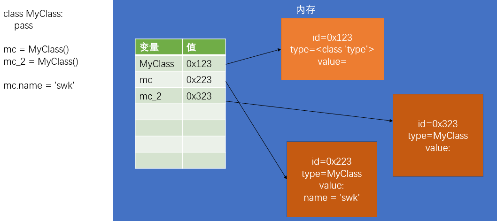

  - 第一步：创建一个变量。
  - 第二步：在内存中创建一个新对象。
  - 第三步：将对象的 id 赋值给变量。

### 类的定义

```python
# 尝试定义一个表示人的类
class Person:
    # 在类的代码块中，我们可以定义变量和函数
    # 在类中我们所定义的变量，将会成为所有的实例的公共属性
    # 所有实例都可以访问这些变量
    name = 'swk'  # 公共属性，所有实例都可以访问

    # 在类中也可以定义函数，类中的定义的函数，我们称为方法
    # 这些方法可以通过该类的所有实例来访问

    def say_hello(self):
        # 方法每次被调用时，解析器都会自动传递第一个实参
        # 第一个参数，就是调用方法的对象本身，
        #   如果是p1调的，则第一个参数就是p1对象
        #   如果是p2调的，则第一个参数就是p2对象
        # 一般我们都会将这个参数命名为self

        # say_hello()这个方法，可以显示如下格式的数据：
        #   你好！我是 xxx
        #   在方法中不能直接访问类中的属性
        print('你好！我是 %s' % self.name) # 类似Java中的this


# 创建Person的实例
p1 = Person()
p2 = Person()

# 调用属性：对象.属性名
print(p1.name)  # swk
print(p2.name)  # swk

# 调用方法：对象.方法名()
# 方法调用和函数调用的区别
#   如果是函数调用，则调用时传几个参数，就会有几个实参
#   但是如果是方法调用，默认传递一个参数，所以方法中至少要定义一个形参
p1.say_hello()  # 你好！我是 swk
p2.say_hello()  # 你好！我是 swk

# 修改p1的name属性
p1.name = '猪八戒'
p2.name = '沙和尚'
print(p1.name)
print(p2.name)
p1.say_hello()  # 你好！我是 猪八戒
p2.say_hello()  # 你好！我是 沙和尚

del p2.name  # 删除p2的name属性
print(p2.name)  # swk
```

- 类和对象都是对现实生活中的事物或程序中的内容的抽象。
- 实际上所有的事物都由两部分构成：
  - 数据（属性）
  - 行为（方法）
- 在类的代码块中，我们可以定义变量和函数：
  - 变量会成为该类实例的公共属性，所有的该类实例都可以通过 `对象.属性名` 的形式访问。
  - 函数会成为该类实例的公共方法，所有该类实例都可以通过 `对象.方法名()` 的形式调用方法。
- 注意：方法调用时，默认第一个参数由解析器自动传递，所以定义方法时，至少要定义一个形参！ 
- 实例为什么能访问到类中的属性和方法：
  - 类中定义的属性和方法都是公共的，任何该类实例都可以访问。
  - 属性和方法查找的流程：
    - 当我们调用一个对象的属性时，解析器会先在当前对象中寻找是否含有该属性，如果有，则直接返回当前的对象的属性值；如果没有，则去当前对象的类对象中去寻找，如果有，则返回类对象的属性值，如果类对象中依然没有，则报错！
  - 类对象和实例对象中都可以保存属性（方法）：
    - 如果这个属性（方法）是所有的实例共享的，则应该将其保存到类对象中。
    - 如果这个属性（方法）是某个实例独有，则应该保存到实例对象中。
    - 比如，Person 类中，name 属性每个对象都不同，应该保存到各个实例对象中，而国籍假设都是中国人，是一样的，则应该保存到类对象中。
    - 一般情况下，属性保存到实例对象中，而方法需要保存到类对象中。

### 对象的初始化

```python
class Person:
    # 在类中可以定义一些特殊方法（魔术方法）
    # 特殊方法都是以__开头，__结尾的方法
    # 特殊方法不需要我们自己调用，不要尝试去调用特殊方法
    # 特殊方法将会在特殊的时刻自动调用
    # 学习特殊方法：
    #   1.特殊方法什么时候调用
    #   2.特殊方法有什么作用
    # 创建对象的流程
    # p1 = Person()的运行流程
    #   1.创建一个变量
    #   2.在内存中创建一个新对象
    #   3.__init__(self)方法执行
    #   4.将对象的id赋值给变量

    # init会在对象创建以后立刻执行
    # init可以用来向新创建的对象中初始化属性
    # 调用类创建对象时，类后边的所有参数都会依次传递到init()中
    def __init__(self, name):
        # print(self)
        # 通过self向新建的对象中初始化属性
        self.name = name

    def say_hello(self):
        print('大家好，我是%s' % self.name)


# 目前来讲，对于Person类来说name是必须的，并且每一个对象中的name属性基本上都是不同
# 而我们现在是将name属性在定义为对象以后，手动添加到对象中，这种方式很容易出现错误
# 我们希望，在创建对象时，必须设置name属性，如果不设置对象将无法创建
#   并且属性的创建应该是自动完成的，而不是在创建对象以后手动完成
# p1 = Person()
# 手动向对象添加name属性
# p1.name = '孙悟空'

# p2 = Person()
# p2.name = '猪八戒'

# p3 = Person()
# p3.name = '沙和尚'

# p3.say_hello()

p1 = Person('孙悟空')
p2 = Person('猪八戒')
p3 = Person('沙和尚')
p4 = Person('唐僧')
# p1.__init__() 不要这么做

# print(p1.name)
# print(p2.name)
# print(p3.name)
# print(p4.name)

p4.say_hello()
```

```python
class Dog:
    '''
        表示狗的类
    '''

    def __init__(self, name, age, gender, height):
        self.name = name
        self.age = age
        self.gender = gender
        self.height = height

    def jiao(self):
        '''
            狗叫的方法
        '''
        print('汪汪汪~~~')

    def yao(self):
        '''
            狗咬的方法
        '''
        print('我咬你~~')

    def run(self):
        print('%s 快乐的奔跑着~~' % self.name)


d = Dog('小黑', 8, 'male', 30)
print(d.name, d.age, d.gender, d.height)

# 目前我们可以直接通过 对象.属性 的方式来修改属性的值，这种方式导致对象中的属性可以随意修改
#   非常的不安全，值可以任意修改，不论对错
# 现在我们就需要一种方式来增强数据的安全性
#   1.属性不能随意修改（我让你改你才能改，不让你改你就不能改）
#   2.属性不能修改为任意的值（年龄不能是负数）
d.name = '阿黄'
d.age = -10
d.run()

print(d.age)
```

- 类的基本结构：

  ```python
  class 类名([父类]) :
  
          公共的属性... 
  
          # 对象的初始化方法
          def __init__(self,...):
              ...
  
          # 其他的方法    
          def method_1(self,...):
              ...
  
          def method_2(self,...):
              ...
  
          ...
  ```

- 创建对象的流程，`p1 = Person()`：

  - 第一步：创建一个变量。
  - 第二步：在内存中创建一个新对象。
  - 第三步：`__init__(self) `方法执行。
  - 第四步：将对象的 id 赋值给变量。

### 封装

```python
# 封装是面向对象的三大特性之一
# 封装指的是隐藏对象中一些不希望被外部所访问到的属性或方法
# 如何隐藏一个对象中的属性？
#   - 将对象的属性名，修改为一个外部不知道的名字
# 如何获取（修改）对象中的属性？
#   - 需要提供一个getter和setter方法使外部可以访问到属性
#   - getter 获取对象中的指定属性（get_属性名）
#   - setter 用来设置对象的指定属性（set_属性名）
# 使用封装，确实增加了类的定义的复杂程度，但是它也确保了数据的安全性
#   1.隐藏了属性名，使调用者无法随意的修改对象中的属性
#   2.增加了getter和setter方法，很好的控制的属性是否是只读的
#       如果希望属性是只读的，则可以直接去掉setter方法
#       如果希望属性不能被外部访问，则可以直接去掉getter方法
#   3.使用setter方法设置属性，可以增加数据的验证，确保数据的值是正确的
#   4.使用getter方法获取属性，使用setter方法设置属性
#       可以在读取属性和修改属性的同时做一些其他的处理
#   5.使用getter方法可以表示一些计算的属性

class Dog:
    '''
        表示狗的类
    '''

    def __init__(self, name, age):
        self.hidden_name = name
        self.hidden_age = age

    def say_hello(self):
        print('大家好，我是 %s' % self.hidden_name)

    def get_name(self):
        '''
            get_name()用来获取对象的name属性
        '''
        # print('用户读取了属性')
        return self.hidden_name

    def set_name(self, name):
        # print('用户修改了属性')
        self.hidden_name = name

    def get_age(self):
        return self.hidden_age

    def set_age(self, age):
        if age > 0:
            self.hidden_age = age


d = Dog('旺财', 8)

# d.say_hello()

# 调用setter来修改name属性 
d.set_name('小黑')
d.set_age(-10)

# d.say_hello()
print(d.get_age())
```

```python
class Rectangle:
    '''
        表示矩形的类
    '''

    def __init__(self, width, height):
        self.hidden_width = width
        self.hidden_height = height

    def get_width(self):
        return self.hidden_width

    def get_height(self):
        return self.hidden_height

    def set_width(self, width):
        self.hidden_width = width

    def set_height(self, height):
        self.hidden_height = height

    def get_area(self):
        return self.hidden_width * self.hidden_height


# 测试
r = Rectangle(5, 2)
print(r.get_area())  # 10
r.set_width(10)
r.set_height(20)
print(r.get_area())  # 200


# 可以为对象的属性使用双下划线开头，__xxx
# 双下划线开头的属性，是对象的隐藏属性，隐藏属性只能在类的内部访问，无法通过对象访问
# 其实隐藏属性只不过是Python自动为属性改了一个名字
#   实际上是将名字修改为了，_类名__属性名 比如 __name -> _Person__name
class Person:
    def __init__(self, name):
        self.__name = name

    def get_name(self):
        return self.__name

    def set_name(self, name):
        self.__name = name


p = Person('孙悟空')

# print(p.__name)  # __开头的属性是隐藏属性，无法通过对象访问
print(p._Person__name)  # 能直接访问，孙悟空
p._Person__name = '猪八戒'
print(p.get_name())  # 也能直接更改，猪八戒


# 上面使用__开头的属性，实际上依然可以在外部访问，所以这种方式我们一般不用
#   一般我们会将一些私有属性（不希望被外部访问的属性）以_开头（实际上也可以直接访问和修改）
#   一般情况下，使用_开头的属性都是私有属性，没有特殊需要不要修改私有属性
class Person:
    def __init__(self, name):
        self._name = name

    def get_name(self):
        return self._name

    def set_name(self, name):
        self._name = name


p = Person('孙悟空')

print(p._name)  # 能直接访问
p._name = '猪八戒'
print(p._name)  # 也能直接修改，猪八戒
```

```python
class Person:
    def __init__(self, name, age):
        self._name = name
        self._age = age

    # property装饰器，用来将一个get方法，转换为对象的属性
    # 添加为property装饰器以后，我们就可以像调用属性一样使用get方法
    # 使用property装饰的方法，必须和属性名是一样的
    @property
    def name(self):
        print('get方法执行了~~~')
        return self._name

    # setter方法的装饰器：@属性名.setter
    @name.setter
    def name(self, name):
        print('setter方法调用了')
        self._name = name

    @property
    def age(self):
        return self._age

    @age.setter
    def age(self, age):
        self._age = age


p = Person('猪八戒', 18)

print(p.name, p.age)  # 调用的就是装饰器装饰的setter和get方法

p.name = '孙悟空'
p.age = 28

print(p.name, p.age)
```

### 继承

```python
# 继承

# 定义一个类 Animal（动物）
#   这个类中需要两个方法：run() sleep()
class Animal:
    def run(self):
        print('动物会跑~~~')

    def sleep(self):
        print('动物睡觉~~~')

    # def bark(self):
    #     print('动物嚎叫~~~')


# 定义一个类 Dog（狗）
#   这个类中需要三个方法：run() sleep() bark()
# class Dog:
#     def run(self):
#         print('狗会跑~~~')

#     def sleep(self):
#         print('狗睡觉~~~')

#     def bark(self):
#         print('汪汪汪~~~')

# 有一个类，能够实现我们需要的大部分功能，但是不能实现全部功能
# 如何能让这个类来实现全部的功能呢？
#   ① 直接修改这个类，在这个类中添加我们需要的功能
#       - 修改起来会比较麻烦，并且会违反OCP原则
#   ② 直接创建一个新的类
#       - 创建一个新的类比较麻烦，并且需要大量的进行复制粘贴，会出现大量的重复性代码
#   ③ 直接从Animal类中来继承它的属性和方法
#       - 继承是面向对象三大特性之一
#       - 通过继承我们可以使一个类获取到其他类中的属性和方法
#       - 在定义类时，可以在类名后的括号中指定当前类的父类（超类、基类、super）
#           子类（衍生类）可以直接继承父类中的所有的属性和方法
#
#  通过继承可以直接让子类获取到父类的方法或属性，避免编写重复性的代码，并且也符合OCP原则
#   所以我们经常需要通过继承来对一个类进行扩展

class Dog(Animal):
    def run(self):
        print('狗跑~~~~')

    def bark(self):
        print('汪汪汪~~~')


class Hashiqi(Dog):
    def fan_sha(self):
        print('我是一只傻傻的哈士奇')


d = Dog()
d.run()  # 狗跑~~~~
d.sleep()  # 动物睡觉~~~
d.bark()  # 汪汪汪~~~
print(isinstance(d, Dog))  # True
print(isinstance(d, Animal))  # True

h = Hashiqi()
h.run()  # 狗跑~~~~
h.fan_sha()  # 我是一只傻傻的哈士奇
print(isinstance(h, Hashiqi))  # True
print(isinstance(h, Dog))  # True
print(isinstance(h, Animal))  # True

print('######################################')


# 在创建类时，如果省略了父类，则默认父类为object
#   object是所有类的父类，所有类都继承自object
class Person(object):
    pass


# issubclass() 检查一个类是否是另一个类的子类
print(issubclass(Animal, Dog))  # False
print(issubclass(Animal, object))  # True
print(issubclass(Person, object))  # True

# isinstance()用来检查一个对象是否是一个类的实例
#   如果这个类是这个对象的父类，也会返回True
#   所有的对象都是object的实例
print(isinstance(print, object))  # True
```

```python
class Animal:
    def __init__(self, name):
        self._name = name

    def run(self):
        print('动物会跑~~~')

    def sleep(self):
        print('动物睡觉~~~')

    @property
    def name(self):
        return self._name

    @name.setter
    def name(self, name):
        self._name = name


# 父类中的所有方法都会被子类继承，包括特殊方法，也可以重写特殊方法
class Dog(Animal):

    def __init__(self, name, age):
        # 希望可以直接调用父类的__init__来初始化父类中定义的属性
        # super() 可以用来获取当前类的父类，
        #   并且通过super()返回对象调用父类方法时，不需要传递self
        super().__init__(name)
        self._age = age

    def run(self):
        print('狗跑~~~~')

    def bark(self):
        print('汪汪汪~~~')

    @property
    def age(self):
        return self._age

    @age.setter
    def age(self, age):
        self._age = age


d = Dog('旺财', 18)

print(d.name)  # 旺财
print(d.age)  # 18
```

#### 重写

```python
# 继承

# 定义一个类 Animal（动物）
#   这个类中需要两个方法：run() sleep()
class Animal:
    def run(self):
        print('动物会跑~~~')

    def sleep(self):
        print('动物睡觉~~~')


class Dog(Animal):
    def bark(self):
        print('汪汪汪~~~')

    def run(self):
        print('狗跑~~~~')


# 如果在子类中如果有和父类同名的方法，则通过子类实例去调用方法时，
#   会调用子类的方法而不是父类的方法，这个特点我们成为叫做方法的重写（覆盖，override）

# 创建Dog类的实例
d = Dog()

d.run()  # 狗跑~~~~


# 当我们调用一个对象的方法时，
#   会优先去当前对象中寻找是否具有该方法，如果有则直接调用
#   如果没有，则去当前对象的父类中寻找，如果父类中有则直接调用父类中的方法，
#   如果没有，则去父类的父类中寻找，以此类推，直到找到object，如果依然没有找到，则报错
class A(object):
    def test(self):
        print('AAA')


class B(A):
    def test(self):
        print('BBB')


class C(B):
    def test(self):
        print('CCC')


# 创建一个c的实例
c = C()
c.test()  # CCC
```

#### 多重继承

```python
class A(object):
    def test(self):
        print('AAA')


class B(object):
    def test(self):
        print('B中的test()方法~~')

    def test2(self):
        print('BBB')


# 在Python中是支持多重继承的，也就是我们可以为一个类同时指定多个父类
#   可以在类名的()后边添加多个类，来实现多重继承
#   多重继承，会使子类同时拥有多个父类，并且会获取到所有父类中的方法
# 在开发中没有特殊的情况，应该尽量避免使用多重继承，因为多重继承会让我们的代码过于复杂
# 如果多个父类中有同名的方法，则会先在第一个父类中寻找，然后找第二个，然后找第三个。。。
#   前边父类的方法会覆盖后边父类的方法
class C(A, B):
    pass


c = C()
c.test()  # AAA
c.test2()  # BBB

# 类名.__bases__ 这个属性可以用来获取当前类的所有父类，返回的是一个元组
print(B.__bases__)  # (<class 'object'>,)
print(C.__bases__)  # (<class '__main__.A'>, <class '__main__.B'>)
```

### 多态

```python
# 多态是面向对象的三大特征之一
# 多态从字面上理解是多种形态
# 狗（狼狗、藏獒、哈士奇、古牧 。。。）
# 一个对象可以以不同的形态去呈现

# 定义两个类
class A:
    def __init__(self, name):
        self._name = name

    @property
    def name(self):
        return self._name

    @name.setter
    def name(self, name):
        self._name = name


class B:
    def __init__(self, name):
        self._name = name

    def __len__(self):
        return 10

    @property
    def name(self):
        return self._name

    @name.setter
    def name(self, name):
        self._name = name


class C:
    pass


a = A('孙悟空')
b = B('猪八戒')
c = C()


# 定义一个函数
# 对于say_hello()这个函数来说，只要对象中含有name属性，它就可以作为参数传递
#   这个函数并不会考虑对象的类型，只要有name属性即可 ---> 多态的提现
def say_hello(obj):
    print('你好 %s' % obj.name)


# 在say_hello_2中我们做了一个类型检查，也就是只有obj是A类型的对象时，才可以正常使用，
#   其他类型的对象都无法使用该函数，这个函数就违反了多态
# 违反了多态的函数，只适用于一种类型的对象，无法处理其他类型对象，这样导致函数的适应性非常的差
# 注意，像isinstance()这种函数，在开发中一般是不会使用的！（使用这个函数，就表示可能违反了多态）
def say_hello_2(obj):
    # 做类型检查
    if isinstance(obj, A):
        print('你好 %s' % obj.name)
    # say_hello(b)


# say_hello_2(b)

# 鸭子类型（多态理论）：
#   如果一个东西，走路像鸭子，叫声像鸭子，那么它就是鸭子

# len()
# 之所以一个对象能通过len()来获取长度，是因为对象中具有一个特殊方法__len__
# 换句话说，只要对象中具有__len__特殊方法，就可以通过len()来获取它的长度
# 这就是多态的体现
l = [1, 2, 3]
s = 'hello'

print(len(l))  # 3
print(len(s))  # 5
print(len(b))  # 10
# print(len(c))  # 报错，object of type 'C' has no len()

# 面向对象的三大特征：
#   封装
#       - 确保对象中的数据安全
#   继承
#       - 保证了对象的可扩展性
#   多态
#       - 保证了程序的灵活性
```

### 类中的属性和方法

```python
# 定义一个类
class A(object):
    # 类属性---所有实例公用的
    # 实例属性---每个实例私有的
    # 类方法
    # 实例方法
    # 静态方法

    # 类属性，直接在类中定义的属性是类属性
    #   类属性可以通过类或类的实例访问到
    #   但是类属性只能通过类对象来修改，无法通过实例对象修改
    count = 0

    # __init__也是实例方法
    def __init__(self):
        # 实例属性，通过实例对象添加的属性属于实例属性
        #   实例属性只能通过实例对象来访问和修改，类对象无法访问修改
        self.name = '孙悟空'  # name也是实例属性

    # 实例方法
    #   在类中定义，以self为第一个参数的方法都是实例方法
    #   实例方法在调用时，Python会将调用对象作为self传入
    #   实例方法可以通过实例和类去调用
    #       当通过实例调用时，会自动将当前调用对象作为self传入
    #       当通过类调用时，不会自动传递self，此时我们必须手动传递self
    def test(self):
        print('这是test方法~~~ ', self)

    # 类方法
    #   在类内部使用 @classmethod 来修饰的方法属于类方法
    #   类方法的第一个参数是cls，也会被自动传递，cls就是当前的类对象
    #   类方法和实例方法的区别，实例方法的第一个参数是self，而类方法的第一个参数是cls
    #   类方法可以通过类去调用，也可以通过实例调用，没有区别
    @classmethod
    def test_2(cls):
        print('这是test_2方法，他是一个类方法~~~ ', cls)
        print(cls.count)  # 这个访问的是类属性，与实例对象无关

    # 静态方法
    #   在类中使用 @staticmethod 来修饰的方法属于静态方法
    #   静态方法不需要指定任何的默认参数，静态方法可以通过类和实例去调用
    #   静态方法，基本上是一个和当前类无关的方法，它只是一个保存到当前类中的函数
    #   静态方法一般都是一些工具方法，和当前类无关（建议静态方法不要放到某个类中，或者全部放到一个工具类中）
    @staticmethod
    def test_3():
        print('test_3执行了~~~')


print('A ', A.count)  # 类访问类属性：0
a = A()
print('a ', a.count)  # 类的实例访问类属性：0

a.count = 10  # 类的实例无法修改类属性，此操作是给a这个实例对象，添加了一个实例属性count
print('A ', A.count)  # 0
print('a ', a.count)  # 10
A.count = 100  # 类可以修改类属性，但不影响类的实例中已存在的同名属性
print('A ', A.count)  # 100
print('a ', a.count)  # 10
b = A()  # b这个实例对象中，没有count实例属性，访问的是A类的属性
print('b ', b.count)  # 100

# print('A ', A.name) # 类无法访问实例属性，AttributeError: type object 'A' has no attribute 'name'
print('a ', a.name)  # 孙悟空

# 类和类的实例，都可以访问实例方法
a.test()  # 等价于 A.test(a)：这是test方法~~~  <__main__.A object at 0x000002631BC28310>

# 类和类的实例，都可以访问类方法
A.test_2()  # 等价于 a.test_2()：这是test_2方法，他是一个类方法~~~  <class '__main__.A'>

# 静态方法，与类和类的实例无关
A.test_3()  # test_3执行了~~~
a.test_3()  # test_3执行了~~~
b.test_3()  # test_3执行了~~~
```

### 垃圾回收

```python
# 就像我们生活中会产生垃圾一样，程序在运行过程当中也会产生垃圾
# 程序运行过程中产生的垃圾会影响到程序的运行的运行性能，所以这些垃圾必须被及时清理
# 没用的东西就是垃圾
# 在程序中没有被引用的对象就是垃圾，这种垃圾对象过多以后会影响到程序的运行的性能
#   所以我们必须进行及时的垃圾回收，所谓的垃圾回收就是将垃圾对象从内存中删除
# 在Python中有自动的垃圾回收机制，它会自动将这些没有被引用的对象删除，
#   所以我们不用手动处理垃圾回收

class A:
    def __init__(self):
        self.name = 'A类'

    # del是一个特殊方法，它会在垃圾对象被回收前调用
    def __del__(self):
        print('A()对象被回收了~~~', self)


a = A()
print(a.name)
# a = None  # 将a设置为None，此时没有任何的变量对A()对象进行引用，A()对象变成了垃圾
# 变成垃圾的A()对象会被回收，回收前调用__del__()方法

# del a # del 会把a变量删除，也会导致A()对象变成垃圾

input('回车键退出程序...')  # 程序结束后，A()对象即使还在被a变量引用，仍然会被回收
```

### 特殊方法

```python
# 特殊方法，也称为魔术方法
# 特殊方法都是使用__开头和结尾的
# 特殊方法一般不需要我们手动调用，需要在一些特殊情况下自动执行

# 定义一个Person类
class Person(object):
    """人类"""

    def __init__(self, name, age):
        self.name = name
        self.age = age

    # __str__()这个特殊方法会在尝试将对象转换为字符串的时候调用
    # 它的作用可以用来指定对象转换为字符串的结果（print函数）
    def __str__(self):
        return 'Person [name=%s , age=%d]' % (self.name, self.age)

    # __repr__()这个特殊方法会在对当前对象使用repr()函数时调用
    # 它的作用是指定对象在‘交互模式’中直接输出的效果
    def __repr__(self):
        return 'Hello, this is repr'

    # 重写以下方法，让对象支持比较，以__gt__()为例说明
    # object.__lt__(self, other) 小于 <
    # object.__le__(self, other) 小于等于 <=
    # object.__eq__(self, other) 等于 ==
    # object.__ne__(self, other) 不等于 !=
    # object.__gt__(self, other) 大于 >
    # object.__ge__(self, other) 大于等于 >=

    # __gt__（）会在对象做大于比较的时候调用，该方法的返回值将会作为比较的结果
    # 他需要两个参数，一个self表示当前对象，other表示和当前对象比较的对象
    # self > other
    def __gt__(self, other):
        return self.age > other.age  # 以年龄作为比较的指标

    # __len__() # 获取对象的长度

    # object.__bool__(self)
    # 可以通过bool来指定对象转换为布尔值的情况
    def __bool__(self):
        return self.age > 17

    # 运算的方法
    # object.__add__(self, other)
    # object.__sub__(self, other)
    # object.__mul__(self, other)
    # object.__matmul__(self, other)
    # object.__truediv__(self, other)
    # object.__floordiv__(self, other)
    # object.__mod__(self, other)
    # object.__divmod__(self, other)
    # object.__pow__(self, other[, modulo])
    # object.__lshift__(self, other)
    # object.__rshift__(self, other)
    # object.__and__(self, other)
    # object.__xor__(self, other)
    # object.__or__(self, other)


# 创建两个Person类的实例
p1 = Person('孙悟空', 18)
p2 = Person('猪八戒', 28)

# 打印p1
# 当我们打印一个对象时，实际上打印的是对象的中特殊方法 __str__()的返回值
# print(p1)  # 不改写__str__()方法的输出结果：<__main__.Person object at 0x04E95090>
print(p1)  # 改写__str__()方法后的输出结果：Person [name=孙悟空 , age=18]

print(repr(p1))  # Hello, this is repr

# 大于比较方法
print(p1 > p2)  # False

print(bool(p1))  # True
# 条件不清晰，p1调用的就是__bool__()方法，一般不这样写
# if p1:
#     print(p1.name, '已经成年了')
# else:
#     print(p1.name, '还未成年了')
```

### 模块化

- 简介：

  ```python
  # 模块（module）
  # 模块化，模块化指将一个完整的程序分解为一个一个小的模块
  #   通过将模块组合，来搭建出一个完整的程序
  # 不采用模块化：统一将所有的代码编写到一个文件中
  # 采用模块化：将程序分别编写到多个文件中
  # 模块化的优点：
  #     ① 方便开发
  #     ② 方便维护
  #     ③ 模块可以复用！
  
  # 在Python中一个py文件就是一个模块，要想创建模块，实际上就是创建一个python文件
  # 注意：模块名要符号标识符的规范
  
  # 在一个模块中引入外部模块：
  # ① import 模块名 （模块名，就是python文件的名字，注意不要.py后缀）
  # ② import 模块名 as 模块别名
  #   - 可以引入同一个模块多次，但是模块的实例只会创建一个
  #   - import可以在程序的任意位置调用，但是一般情况下，import语句都会统一写在程序的开头
  #   - 在每一个模块内部都有一个__name__属性，通过这个属性可以获取到模块的名字
  #   - __name__属性值为 __main__的模块是主模块，一个程序中只会有一个主模块
  #       主模块就是我们直接通过 python 执行的模块（当前程序所在的模块）
  
  import test_module as test
  
  print(__name__)  # 主模块：__main__
  print(test.__name__)  # 引入的外部模块：test_module
  ```

- `m.py`：

  ```python
  # 可以在模块中定义变量，在模块中定义的变量，在引入该模块后，就可以直接使用了
  a = 10
  b = 20
  
  # 添加了_的变量，只能在模块内部访问，在通过 import * 方式引入时，不会引入_开头的变量
  _c = 30
  
  
  # 可以在模块中定义函数，同样可以通过模块访问到
  def test():
      print('test')
  
  
  def test2():
      print('test2')
  
  
  # 也可以定义类
  class Person:
      def __init__(self):
          self.name = '孙悟空'
  
  
  # 编写测试代码：
  #   这部分代码，只有当前模块作为主模块的时候才需要被执行
  #   而当前模块被其他模块引入时，不需要被执行
  #   此时，我们就必须要检查当前模块是否是主模块
  if __name__ == '__main__':
      test()
      test2()
      p = Person()
      print(p.name)
  ```

- `main.py`：

  ```python
  import m
  
  # 访问模块中的变量：模块名.变量名
  print(m.a, m.b)  # 10 20.
  # print(m._c)  # 此方式可以访问_c属性
  
  # 访问模块中的方法：模块名.方法名
  m.test()  # test
  m.test2()  # test2
  
  # 访问模块中的类：模块名.类名，创建类的实例
  p = m.Person()
  print(p.name)  # 孙悟空
  
  # 也可以只引入模块中的部分内容
  # 语法： from 模块名 import 变量, 变量....
  # from m import Person # 只引入Person
  # from m import test # 只引入test
  from m import Person, test  # 引入多个
  
  # 通过上面方式引入后，可以直接使用
  p1 = Person()
  print(p1)  # <m.Person object at 0x00000115DD088160>
  test()  # test
  
  
  # test2() # test2()没有引入，不能直接使用
  
  # from m import *  # 引入模块中所有内容，一般不会使用
  
  # 当前模块中，会覆盖被引入模块中的同名方法
  def test2():
      print('这是主模块中的test2')
  
  
  test2()  # 这是主模块中的test2
  
  # 也可以为引入的变量使用别名
  # 语法：from 模块名 import 变量 as 别名
  from m import test2 as new_test2
  
  test2()  # 这是主模块中的test2
  new_test2()  # test2
  
  # from m import *
  
  # print(_c) # _c属性无法访问
  
  
  # 总结：
  # import xxx
  # import xxx as yyy
  # from xxx import yyy , zzz , fff
  # from xxx import *
  # from xxx import yyy as zz
  ```

### 包

- 结构：

  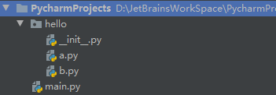

  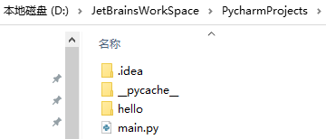

  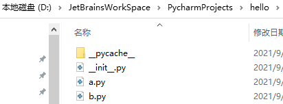

- `hello/__init__.py`：

  ```python
  def test():
      print('test')
  ```

- `hello/a.py`：

  ```python
  c = 30
  ```

- `hello/b.py`：

  ```python
  d = 40
  ```

- `main.py`：

  ```python
  # 包 Package
  # 包也是一个模块
  # 当我们模块中代码过多时，或者一个模块需要被分解为多个模块时，这时就需要使用到包
  # 普通的模块就是一个py文件，而包是一个文件夹
  #   包中必须要有一个 __init__.py 文件，这个文件中可以包含有包中的主要内容
  from hello import a, b
  
  print(a.c)
  print(b.d)
  
  # __pycache__ 是模块的缓存文件
  # .py代码在执行前，需要被解析器先转换为机器码，然后再执行
  #   所以我们在使用模块（包）时，也需要将模块的代码先转换为机器码，然后再交由计算机执行
  #   而为了提高程序运行的性能，python会在编译过一次以后，将代码保存到一个缓存文件中
  #   这样在下次加载这个模块（包）时，就可以不再重新编译而是直接加载缓存中编译好的代码即可
  ```

### Python 标准库

```python
# 思想：开箱即用
# 为了实现开箱即用的思想，Python中为我们提供了一个模块的标准库
# 在这个标准库中，有很多很强大的模块我们可以直接使用，并且标准库会随Python的安装一同安装

# sys模块：
#   它里面提供了一些变量和函数，使我们可以获取到Python解析器的信息
#   或者通过函数来操作Python解析器
# 引入sys模块：
import sys

print(sys)  # <module 'sys' (built-in)>

# sys.argv：
#   命令行执行代码时，获取命令行中所包含的参数
#   该属性是一个列表，列表中保存了当前命令的所有参数
#   参考IDEA中Java程序main()方法模块参数的引入，注意第一个参数
print(sys.argv)  # ['D:/JetBrainsWorkSpace/PycharmProjects/main.py', 'aaa', 'bbb']

# sys.modules：
#   获取当前程序中引入的所有模块
#   modules是一个字典，字典的key是模块的名字，字典的value是模块对象
print(sys.modules)  # {'sys': <module 'sys' (built-in)>, 'builtins': <module 'builtins' (built-in)>, ......}

# pprint模块：
#   print()打印不会格式化数据
#   它给我们提供了一个方法pprint()，该方法可以用来对打印的数据做简单的格式化
# 引入pprint模块：
import pprint

pprint.pprint(sys.modules)

# sys.path：
#   他是一个列表，列表中保存的是模块的搜索路径，不要轻易更改
# ['D:\\JetBrainsWorkSpace\\PycharmProjects',
#  'D:\\JetBrainsWorkSpace\\PycharmProjects',
#  'D:\\Program Files\\PyCharm Professional Edition with Anaconda plugin '
#  '2020.1.2\\plugins\\python\\helpers\\pycharm_display',
#  'D:\\Program\\Miniconda3\\python38.zip',
#  'D:\\Program\\Miniconda3\\DLLs',
#  'D:\\Program\\Miniconda3\\lib',
#  'D:\\Program\\Miniconda3',
#  'D:\\Program\\Miniconda3\\lib\\site-packages',
#  'D:\\Program\\Miniconda3\\lib\\site-packages\\win32',
#  'D:\\Program\\Miniconda3\\lib\\site-packages\\win32\\lib',
#  'D:\\Program\\Miniconda3\\lib\\site-packages\\Pythonwin',
#  'D:\\Program Files\\PyCharm Professional Edition with Anaconda plugin '
#  '2020.1.2\\plugins\\python\\helpers\\pycharm_matplotlib_backend']
pprint.pprint(sys.path)

# sys.platform：
#   表示当前Python运行的平台
print(sys.platform)  # win32

# sys.exit()：
#   函数用来退出程序
# sys.exit('程序出现异常，结束！')  # 后面的print('hello')语句不再执行
# print('hello')

# os模块：
#   让我们可以对操作系统进行访问
import os

# os.environ：
#   通过这个属性可以获取到系统的环境变量
pprint.pprint(os.environ)  # 所有的
pprint.pprint(os.environ['path'])  # 只查看path环境变量

# os.system()：
#   可以用来执行操作系统的命令
os.system('dir')  # dir命令
os.system('notepad')  # 打开记事本名令
```

> 命令行执行代码时的参数：
>
> ```powershell
> PS D:\JetBrainsWorkSpace\PycharmProjects> python main.py aaa bbb
> ['main.py', 'aaa', 'bbb']
> ```

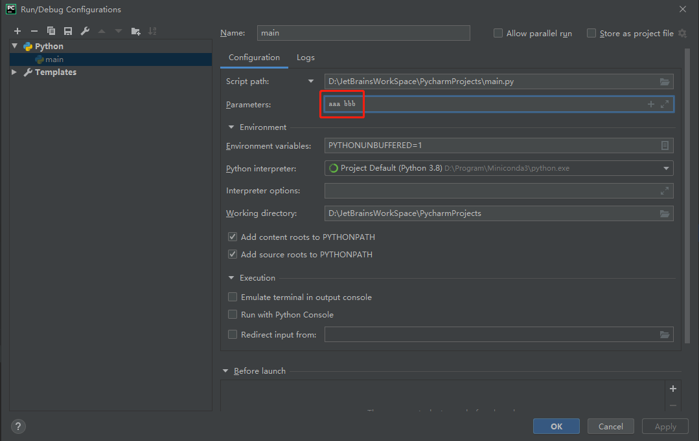

## Python 异常和文件

### 异常

-  程序在运行过程当中，不可避免的会出现一些错误，比如：使用了没有赋值过的变量，使用了不存在的索引，除 0 等。这些错误在程序中，我们称其为异常。
- 程序运行过程中，一旦出现异常将会导致程序立即终止，异常以后的代码全部都不会执行！

#### 处理异常

- 程序运行时出现异常，目的并不是让我们的程序直接终止！Python 是希望在出现异常时，我们可以编写代码来对异常进行处理！

- try 语句：

  ```python
  try:
      代码块（可能出现错误的语句）
  except 异常类型 as 异常名:
      代码块（出现错误以后的处理方式）
  except 异常类型 as 异常名:
      代码块（出现错误以后的处理方式）
  except 异常类型 as 异常名:
      代码块（出现错误以后的处理方式）
  else:
      代码块（没出错时要执行的语句）
  finally:
      代码块（该代码块总会执行）
  ```

-  try 是必须的，else 语句有没有都行，except 和 finally 至少有一个。

- 可以将可能出错的代码放入到 try 语句，这样如果代码没有错误，则会正常执行，如果出现错误，则会执行 expect 子句中的代码，这样我们就可以通过代码来处理异常，避免因为一个异常导致整个程序的终止。

#### 异常的传播

```python
def fn():
    print('Hello fn')
    print(a)
    print(10 / 0)


def fn2():
    print('Hello fn2')
    fn()


def fn3():
    print('Hello fn3')
    fn2()


fn3()
```

- 当在函数中出现异常时，如果在函数中对异常进行了处理，则异常不会再继续传播，如果函数中没有对异常进行处理，则异常会继续向函数调用处传播，如果函数调用处处理了异常，则不再传播，如果没有处理则继续向调用处传播，直到传递到全局作用域（主模块），如果依然没有处理，则程序终止，并且显示异常信息。
- 当程序运行过程中出现异常以后，所有的异常信息会被保存一个专门的异常对象中，而异常传播时，实际上就是异常对象抛给了调用处。比如：
  - ZeroDivisionError 类的对象专门用来表示除 0 的异常。
  - NameError 类的对象专门用来处理变量错误的异常。
- 在 Python 为我们提供了多个异常对象。

#### 异常对象

```python
print('异常出现前')
l = []
try:
    # print(c)
    # l[10]
    # 1 + 'hello'
    print(10 / 0)
except NameError:
    # 如果except后不跟任何的内容，则此时它会捕获到所有的异常
    # 如果在except后跟着一个异常的类型，那么此时它只会捕获该类型的异常
    print('出现 NameError 异常')
except ZeroDivisionError:
    print('出现 ZeroDivisionError 异常')
except IndexError:
    print('出现 IndexError 异常')
# Exception 是所有异常类的父类，所以如果except后跟的是Exception，他也会捕获到所有的异常
# 可以在异常类后边跟着一个 as xx 此时xx就是异常对象
except Exception as e: # 等同于 except:
    print('未知异常', e, type(e))
finally:
    print('无论是否出现异常，该子句都会执行')

print('异常出现后')
```

#### 抛出异常

```python
# 也可以自定义异常类，只需要创建一个类继承Exception即可
class MyError(Exception):
    pass


def add(a, b):
    # 如果a和b中有负数，就向调用处抛出异常
    if a < 0 or b < 0:
        # raise用于向外部抛出异常，后边可以跟一个异常类，或异常类的实例
        # raise ExceptioUS20190040060A1-20190207.XMLn
        # 抛出异常的目的，告诉调用者这里调用时出现问题，希望你自己处理一下
        # raise Exception('两个参数中不能有负数！')
        raise MyError('自定义的异常')

        # 也可以通过if else来代替异常的处理，但无法考虑到所有可能出异常的条件，难以控制
    return a + b


print(add(-123, 456))
```

-  可以使用 raise 语句来抛出异常，raise 语句后需要跟一个异常类或异常的实例。

### 文件

- 通过 Python 程序来对计算机中的各种文件进行增删改查的操作。
- 操作文件的步骤：
  - 打开文件。
  - 对文件进行各种操作（读、写），然后保存。
  - 关闭文件。

#### 打开文件

```python
# open(file, mode='r', buffering=-1, encoding_=None, errors=None, newline=None, closefd=True, opener=None)
# 使用open函数来打开一个文件
# 参数：
#   file 要打开的文件的名字（路径）
# 返回值：
#   返回一个对象，这个对象就代表了当前打开的文件

# 创建一个变量，来保存文件的名字
# 如果目标文件和当前文件在同一级目录下，则直接使用文件名即可
file_name = 'demo.txt'

# 在windows系统使用路径时，可以使用/来代替 \
# 或者可以使用 \\ 来代替 \
# 或者也可以使用原始字符串
# file_name = 'hello\\demo.txt'
# file_name = r'hello\demo.txt'

# 表示路径，可以使用..来返回一级目录
# file_name = '../hello/demo.txt'

# 如果目标文件距离当前文件比较远，此时可以使用绝对路径
# 绝对路径应该从磁盘的根目录开始书写
# file_name = r'C:\Users\XiSun\Desktop\hello.txt'

file_obj = open(file_name)  # 打开 file_name 对应的文件
print(file_obj)  # <_io.TextIOWrapper name='demo.txt' mode='r' encoding='cp936'>
```

#### 关闭文件

```python
# 打开文件
file_name = 'demo.txt'

# 调用open()来打开文件
# file_obj = open(file_name)

# 当我们获取了文件对象以后，所有的对文件的操作都应该通过对象来进行

# 读取文件中的内容：
#   read()方法，用来读取文件中的内容，它会将内容全部保存为一个字符串返回
# content = file_obj.read()
# print(content)

# 关闭文件：
#   调用close()方法来关闭文件
# file_obj.close()

# 上面的open()和close()是常规写法，可以用下面的方式简化操作
# with ... as 语句：
with open(file_name) as file_obj:
    # 在with语句中可以直接使用file_obj来做文件操作
    # 此时这个文件只能在with中使用，一旦with结束则文件会自动close()
    print(file_obj.read())

# 进一步完善，添加文件读取异常处理
# 文件处理的标准格式：
file_name = 'hello.txt'

try:
    with open(file_name) as file_obj:
        print(file_obj.read())
except FileNotFoundError:
    print(f'{file_name} 文件不存在~~')
```

#### 读取文件

```python
file_name = 'demo.txt'

try:
    # 调用open()来打开一个文件，可以将文件分成两种类型
    # 一种，是纯文本文件（使用utf-8等编码编写的文本文件）
    # 一种，是二进制文件（图片、mp3、ppt等这些文件）
    # open()打开文件时，默认是以文本文件的形式打开的，但是open()默认的编码为None
    #   所以处理文本文件时，必须要指定文件的编码
    with open(file_name, encoding='utf-8') as file_obj:
        # 通过 read() 来读取文件中的内容
        # 如果直接调用read()它会将文本文件的所有内容全部都读取出来
        #   如果要读取的文件较大的话，会一次性将文件的内容加载到内存中，容易导致内存泄漏
        #   所以对于较大的文件，不要直接调用read()
        # help(file_obj.read)查看帮助信息
        # read()可以接收一个size作为参数，该参数用来指定要读取的字符的数量
        #   默认值为-1，它会读取文件中的所有字符
        #   可以为size指定一个值，这样read()会读取指定数量的字符，
        #       每一次读取都是从上次读取到位置开始读取的
        #       如果字符的数量小于size，则会读取剩余所有的
        #       如果已经读取到了文件的最后了，则会返回''空串
        # content = file_obj.read(-1)
        content = file_obj.read(6)
        content = file_obj.read(6)
        content = file_obj.read(6)
        content = file_obj.read(6)
        # print(content)
        # print(len(content))
except FileNotFoundError:
    print(f'{file_name} 这个文件不存在！')

# 读取大文件的方式
file_name = 'demo.txt'

try:
    with open(file_name, encoding='utf-8') as file_obj:
        # 定义一个变量，来保存文件的内容
        file_content = ''
        # 定义一个变量，来指定每次读取的大小
        chunk = 100
        # 创建一个循环来读取文件内容
        while True:
            # 读取chunk大小的内容
            content = file_obj.read(chunk)

            # 检查是否读取到了内容
            if not content:
                # 内容读取完毕，退出循环
                break

            # 输出内容
            # print(content, end='')
            file_content += content

except FileNotFoundError:
    print(f'{file_name} 这个文件不存在！')

print(file_content)
```

```python
import pprint

file_name = 'demo.txt'

try:
    with open(file_name, encoding='utf-8') as file_obj:
        # readline()：
        #   该方法可以用来读取一行内容
        # print(file_obj.readline(), end='')  # print()打印自带换行符

        # readlines()：
        #   该方法用于一行一行的读取内容，它会一次性将读取到的内容封装到一个列表中返回
        # r = file_obj.readlines()
        # pprint.pprint(r[0])  # 'aaa\n'
        # pprint.pprint(r[1])  # 'bbb\n'
        # pprint.pprint(r[2])  # 'ccc\n'

        # 简化写法
        for t in file_obj:
            print(t, end='')

except FileNotFoundError:
    print(f'{file_name} 这个文件不存在！')
```

#### 写入文件

```python
file_name = 'demo1.txt'

# 使用open()打开文件时必须要指定打开文件所要做的操作：读、写、追加
#   如果不指定操作类型，则默认是 `读取文件` ，而读取文件时是不能向文件中写入的
# r：表示只读的
# w：表示是可写的，使用w来写入文件时，如果文件不存在会创建文件，如果文件存在则会截断文件
#       截断文件指删除原来文件中的所有内容（覆盖原文件内容）
# a：表示追加内容，如果文件不存在会创建文件，如果文件存在则会向文件中追加内容
# x：用来新建文件，如果文件不存在则创建，存在则报错
# +：为操作符增加功能
#   r+：即可读又可写，文件不存在会报错
#   w+：即可写又可读
#   a+：即可追加又可读
# with open(file_name , 'w' , encoding='utf-8') as file_obj:
# with open(file_name , 'r+' , encoding='utf-8') as file_obj:
with open(file_name, 'x', encoding='utf-8') as file_obj:
    # write()来向文件中写入内容
    # 如果操作的是一个文本文件的话，则write()需要传递一个字符串作为参数
    # 该方法会可以分多次向文件中写入内容
    # 写入完成以后，该方法会返回写入的字符的个数
    file_obj.write('aaa\n')
    file_obj.write('bbb\n')
    file_obj.write('ccc\n')
    file_obj.write(str(123) + '123123\n')  # 要转换为字符串，且不会自动换行
    r = file_obj.write('今天天气真不错')
    print(r)  # 7
```

#### 二进制文件操作

```python
file_name = 'F:/QQMusic/FLOW - Go!!!.flac'

# 读取模式：
#   t：读取文本文件（默认值）
#   b：读取二进制文件

with open(file_name, 'rb') as file_obj:
    # 读取文本文件时，size是以字符为单位的
    # 读取二进制文件时，size是以字节为单位
    # print(file_obj.read(100))

    # 将读取到的内容写出来
    # 定义一个新的文件
    new_name = 'aa.flac'

    with open(new_name, 'wb') as new_obj:

        # 定义每次读取的大小
        chunk = 1024 * 100  # 100 KB

        while True:
            # 从已有的对象中读取数据
            content = file_obj.read(chunk)

            # 内容读取完毕，终止循环
            if not content:
                break

            # 将读取到的数据写入到新对象中
            new_obj.write(content)
```

#### `seek()` 和 `tell()`

```python
# 二进制文件
with open('demo.txt', 'rb') as file_obj:
    # print(file_obj.read(30))
    # print(file_obj.read(100))

    # tell()方法用来查看当前读取的位置
    print('当前读取到了 -->', file_obj.tell())

    # seek()方法可以修改当前读取的位置
    # seek()需要两个参数：
    #   第一个：要切换到的位置
    #   第二个：计算位置的方式
    #       可选值：
    #           0 从头计算，默认值
    #           1 从当前位置计算
    #           2 从最后位置开始计算
    # file_obj.seek(55)
    # file_obj.seek(80, 0)
    # file_obj.seek(70, 1)
    file_obj.seek(-10, 2)  # 从文件的最后往前读10个字符
    print(file_obj.read())

# 文本文件
with open('demo.txt', 'rt', encoding='utf-8') as file_obj:
    print('当前读取到了 -->', file_obj.tell())

    file_obj.seek(9)  # 从头开始计算，切换到第9个字节开始读取
    print(file_obj.read())
```

#### 文件的其他操作

```python
import os
from pprint import pprint

# os.listdir()：获取指定目录的目录结构
#   需要一个路径作为参数，会获取到该路径下的目录结构，默认路径为 . ，即当前目录
#   该方法会返回一个列表，目录中的每一个文件（夹）的名字都是列表中的一个元素
r = os.listdir()
pprint(r)  # ['.idea', 'aa.flac', 'demo.txt', 'hello', 'main.py', '__pycache__']

# os.getcwd()：获取当前所在的目录
r = os.getcwd()
pprint(r)  # 'D:\\JetBrainsWorkSpace\\PycharmProjects'

# os.chdir()：切换当前所在的目录 作用相当于cd命令
# os.chdir('c:/')
# r = os.getcwd()
# pprint(r)  # 'c:\\'

# os.mkdir()；创建目录
os.mkdir("aaa")  # 在当前目录下创建一个名字为 aaa 的目录，如果已存在，则报错

# os.rmdir()：删除目录
os.rmdir('aaa')  # 在当前目录下删除一个名字为 aaa 的目录，如果不存在，则报错

# open()；打开文件
open('aa.txt', 'w')

# os.remove()：删除文件
os.remove('aa.flac')

# os.rename('旧名字','新名字')：可以对一个文件进行重命名，也可以用来移动一个文件
os.rename('hello', 'bb.txt')
# os.rename('bb.txt', 'c:/users/lilichao/desktop/bb.txt')

pprint(r)
```

## 本文参考

https://www.bilibili.com/video/BV1hW41197sB

https://www.liaoxuefeng.com/wiki/1016959663602400


## 声明

写作本文初衷是个人学习记录，鉴于本人学识有限，如有侵权或不当之处，请联系 [wdshfut@163.com](mailto:wdshfut@163.com)。

