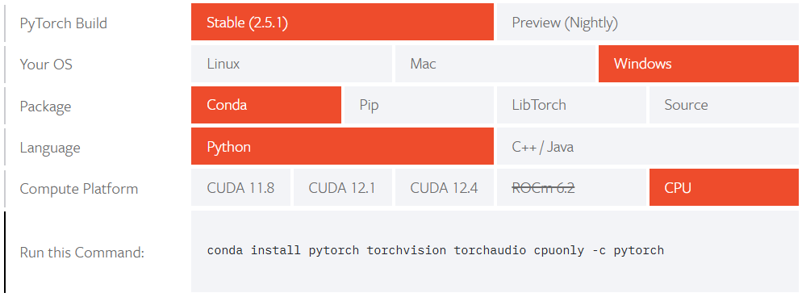
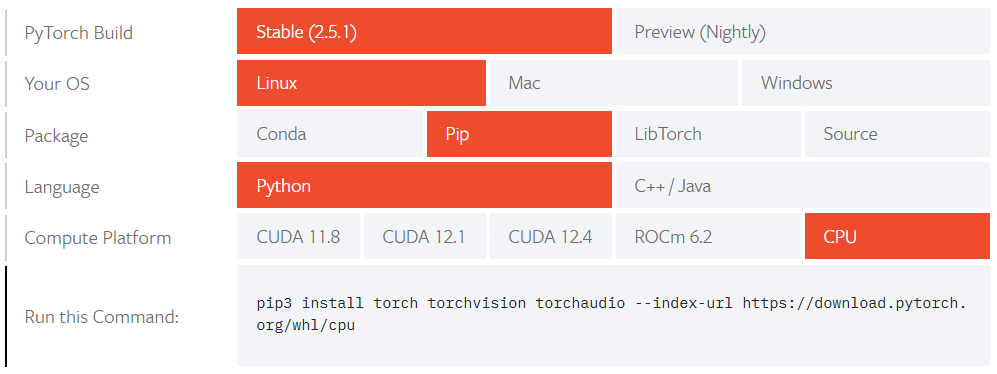

>**$\textcolor{RubineRed}{Author: ACatSmiling}$**
>
>**$\color{RubineRed}{Since: 2024-10-22}$**

## 概述

官网：https://pytorch.org/

**`Pytorch`**：**是一个开源的机器学习库，主要用于深度学习领域。**

**一、主要特点**

1. 动态图机制
   - Pytorch 使用动态计算图，这意味着你可以在运行时动态地构建、修改和执行计算图。这种灵活性使得调试代码更加容易，并且可以根据具体的需求快速调整模型结构。
   - 例如，在研究新的模型架构时，你可以方便地尝试不同的连接方式和层的组合，而不需要像静态图框架那样事先定义好整个计算图。
2. 易于使用
   - 它提供了简洁直观的 API，使得开发者可以快速上手。Pytorch 的代码风格接近 Python 的原生语法，对于熟悉 Python 的开发者来说，学习曲线相对较平缓。
   - 比如，定义一个神经网络模型就像定义一个普通的 Python 类一样简单，只需要继承自 torch.nn.Module 并实现 forward 方法即可。
3. 强大的生态系统
   - Pytorch 拥有庞大的社区和丰富的第三方库支持。开发者可以利用各种预训练模型、数据集和工具来加速自己的项目开发。
   - 例如，在计算机视觉领域，可以使用 torchvision 库来加载常见的数据集和预训练的模型；在自然语言处理方面，有 torchtext 库提供文本数据处理的功能。

**二、应用领域**

1. 计算机视觉
   - 可用于图像分类、目标检测、图像分割等任务。许多先进的计算机视觉模型都是使用 Pytorch 实现的，如 ResNet、YOLO 等。
   - 开发者可以利用 Pytorch 的强大功能和丰富的工具来训练和优化这些模型，以提高图像识别和处理的准确性和效率。
2. 自然语言处理
   - 在文本分类、机器翻译、语言建模等方面表现出色。Pytorch 提供了一系列用于处理文本数据的模块和函数，方便开发者构建和训练各种自然语言处理模型。
   - 例如，可以使用 Pytorch 的 torch.nn.Embedding 层来学习词向量表示，然后使用循环神经网络（RNN）或 Transformer 架构来进行序列建模。
3. 强化学习
   - Pytorch 也被广泛应用于强化学习领域，用于训练智能体来做出最优决策。它可以与各种强化学习算法结合使用，如深度 Q 网络（DQN）、策略梯度算法等。
   - 开发者可以利用 Pytorch 的高效计算和灵活的编程接口来实现复杂的强化学习算法，并在各种模拟环境和实际任务中进行实验和优化。

## 安装

Select your preferences and run the install command. Stable represents the most currently tested and supported version of PyTorch. This should be suitable for many users. Preview is available if you want the latest, not fully tested and supported, builds that are generated nightly. Please ensure that you have **met the prerequisites below (e.g., numpy)**, depending on your package manager. Anaconda is our recommended package manager since it installs all dependencies. You can also [install previous versions of PyTorch](https://pytorch.org/get-started/previous-versions). Note that LibTorch is only available for C++.

根据实际情况，选择相应的安装命令：

- Windows 系统：

  

  ```powershell
  (base) PS C:\Users\XiSun> conda env list
  # conda environments:
  #
  test                     C:\Users\XiSun\.conda\envs\test
  base                  *  C:\Users\XiSun\AppData\Local\Programs\Miniconda3
  py310                    C:\Users\XiSun\AppData\Local\Programs\Miniconda3\envs\py310
  py36                     C:\Users\XiSun\AppData\Local\Programs\Miniconda3\envs\py36
  py38                     C:\Users\XiSun\AppData\Local\Programs\Miniconda3\envs\py38
  
  # 新建一个 pytorch 虚拟环境
  (base) PS C:\Users\XiSun> conda create -n pytorch python=3.10
  Retrieving notices: ...working... done
  Collecting package metadata (current_repodata.json): done
  Solving environment: done
  
  
  ==> WARNING: A newer version of conda exists. <==
    current version: 23.3.1
    latest version: 24.11.2
  
  Please update conda by running
  
      $ conda update -n base -c defaults conda
  
  Or to minimize the number of packages updated during conda update use
  
       conda install conda=24.11.2
  
  
  
  ## Package Plan ##
  
    environment location: C:\Users\XiSun\AppData\Local\Programs\Miniconda3\envs\pytorch
  
    added / updated specs:
      - python=3.10
  
  
  The following packages will be downloaded:
  
      package                    |            build
      ---------------------------|-----------------
      ca-certificates-2024.11.26 |       haa95532_0         132 KB
      python-3.10.16             |       h4607a30_1        16.3 MB
      setuptools-75.1.0          |  py310haa95532_0         1.6 MB
      tzdata-2024b               |       h04d1e81_0         115 KB
      vc-14.40                   |       haa95532_2          10 KB
      vs2015_runtime-14.42.34433 |       h9531ae6_2         1.2 MB
      wheel-0.44.0               |  py310haa95532_0         138 KB
      ------------------------------------------------------------
                                             Total:        19.4 MB
  
  The following NEW packages will be INSTALLED:
  
    bzip2              pkgs/main/win-64::bzip2-1.0.8-h2bbff1b_6
    ca-certificates    pkgs/main/win-64::ca-certificates-2024.11.26-haa95532_0
    libffi             pkgs/main/win-64::libffi-3.4.4-hd77b12b_1
    openssl            pkgs/main/win-64::openssl-3.0.15-h827c3e9_0
    pip                pkgs/main/win-64::pip-24.2-py310haa95532_0
    python             pkgs/main/win-64::python-3.10.16-h4607a30_1
    setuptools         pkgs/main/win-64::setuptools-75.1.0-py310haa95532_0
    sqlite             pkgs/main/win-64::sqlite-3.45.3-h2bbff1b_0
    tk                 pkgs/main/win-64::tk-8.6.14-h0416ee5_0
    tzdata             pkgs/main/noarch::tzdata-2024b-h04d1e81_0
    vc                 pkgs/main/win-64::vc-14.40-haa95532_2
    vs2015_runtime     pkgs/main/win-64::vs2015_runtime-14.42.34433-h9531ae6_2
    wheel              pkgs/main/win-64::wheel-0.44.0-py310haa95532_0
    xz                 pkgs/main/win-64::xz-5.4.6-h8cc25b3_1
    zlib               pkgs/main/win-64::zlib-1.2.13-h8cc25b3_1
  
  
  Proceed ([y]/n)? y
  
  
  Downloading and Extracting Packages
  
  Preparing transaction: done
  Verifying transaction: done
  Executing transaction: done
  #
  # To activate this environment, use
  #
  #     $ conda activate pytorch
  #
  # To deactivate an active environment, use
  #
  #     $ conda deactivate
  
  (base) PS C:\Users\XiSun> conda activate pytorch
  (pytorch) PS C:\Users\XiSun> pip list
  Package    Version
  ---------- -------
  pip        24.2
  setuptools 75.1.0
  wheel      0.44.0
  
  # 安装 pytorch
  (pytorch) PS C:\Users\XiSun> conda install pytorch torchvision torchaudio cpuonly -c pytorch
  Collecting package metadata (current_repodata.json): done
  Solving environment: failed with initial frozen solve. Retrying with flexible solve.
  Solving environment: failed with repodata from current_repodata.json, will retry with next repodata source.
  Collecting package metadata (repodata.json): done
  Solving environment: done
  
  
  ==> WARNING: A newer version of conda exists. <==
    current version: 23.3.1
    latest version: 24.11.2
  
  Please update conda by running
  
      $ conda update -n base -c defaults conda
  
  Or to minimize the number of packages updated during conda update use
  
       conda install conda=24.11.2
  
  
  
  ## Package Plan ##
  
    environment location: C:\Users\XiSun\AppData\Local\Programs\Miniconda3\envs\pytorch
  
    added / updated specs:
      - cpuonly
      - pytorch
      - torchaudio
      - torchvision
  
  
  The following packages will be downloaded:
  
      package                    |            build
      ---------------------------|-----------------
      blas-1.0                   |              mkl           6 KB
      brotli-python-1.0.9        |  py310hd77b12b_8         346 KB
      certifi-2024.12.14         |  py310haa95532_0         162 KB
      charset-normalizer-3.3.2   |     pyhd3eb1b0_0          44 KB
      cpuonly-2.0                |                0           2 KB  pytorch
      filelock-3.13.1            |  py310haa95532_0          22 KB
      freetype-2.12.1            |       ha860e81_0         490 KB
      giflib-5.2.2               |       h7edc060_0         105 KB
      gmpy2-2.1.2                |  py310h7f96b67_0         160 KB
      idna-3.7                   |  py310haa95532_0         132 KB
      intel-openmp-2023.1.0      |   h59b6b97_46320         2.7 MB
      jinja2-3.1.4               |  py310haa95532_1         281 KB
      jpeg-9e                    |       h827c3e9_3         334 KB
      lcms2-2.16                 |       hb4a4139_0         566 KB
      lerc-4.0.0                 |       h5da7b33_0         185 KB
      libdeflate-1.22            |       h5bf469e_0         180 KB
      libjpeg-turbo-2.0.0        |       h196d8e1_0         618 KB
      libpng-1.6.39              |       h8cc25b3_0         369 KB
      libtiff-4.5.1              |       h44ae7cf_1         1.0 MB
      libuv-1.48.0               |       h827c3e9_0         322 KB
      libwebp-1.3.2              |       hbc33d0d_0          73 KB
      libwebp-base-1.3.2         |       h3d04722_1         303 KB
      lz4-c-1.9.4                |       h2bbff1b_1         152 KB
      markupsafe-2.1.3           |  py310h2bbff1b_0          25 KB
      mkl-2023.1.0               |   h6b88ed4_46358       155.9 MB
      mkl-service-2.4.0          |  py310h2bbff1b_1          44 KB
      mkl_fft-1.3.11             |  py310h827c3e9_0         168 KB
      mkl_random-1.2.8           |  py310hc64d2fc_0         257 KB
      mpc-1.1.0                  |       h7edee0f_1         260 KB
      mpfr-4.0.2                 |       h62dcd97_1         1.5 MB
      mpir-3.0.0                 |       hec2e145_1         1.3 MB
      mpmath-1.3.0               |  py310haa95532_0         834 KB
      networkx-3.2.1             |  py310haa95532_0         2.4 MB
      numpy-2.0.1                |  py310h055cbcc_1          11 KB
      numpy-base-2.0.1           |  py310h65a83cf_1         9.1 MB
      openjpeg-2.5.2             |       hae555c5_0         268 KB
      pillow-11.0.0              |  py310h096bfcc_1         767 KB
      pysocks-1.7.1              |  py310haa95532_0          28 KB
      pytorch-2.5.1              |     py3.10_cpu_0       147.4 MB  pytorch
      pytorch-mutex-1.0          |              cpu           3 KB  pytorch
      pyyaml-6.0.2               |  py310h827c3e9_0         174 KB
      requests-2.32.3            |  py310haa95532_1         101 KB
      sympy-1.13.3               |  py310haa95532_0        11.3 MB
      tbb-2021.8.0               |       h59b6b97_0         149 KB
      torchaudio-2.5.1           |        py310_cpu         5.8 MB  pytorch
      torchvision-0.20.1         |        py310_cpu         6.5 MB  pytorch
      typing_extensions-4.12.2   |  py310haa95532_0          65 KB
      urllib3-2.2.3              |  py310haa95532_0         184 KB
      win_inet_pton-1.1.0        |  py310haa95532_0           9 KB
      yaml-0.2.5                 |       he774522_0          62 KB
      zstd-1.5.6                 |       h8880b57_0         708 KB
      ------------------------------------------------------------
                                             Total:       353.7 MB
  
  The following NEW packages will be INSTALLED:
  
    blas               pkgs/main/win-64::blas-1.0-mkl
    brotli-python      pkgs/main/win-64::brotli-python-1.0.9-py310hd77b12b_8
    certifi            pkgs/main/win-64::certifi-2024.12.14-py310haa95532_0
    charset-normalizer pkgs/main/noarch::charset-normalizer-3.3.2-pyhd3eb1b0_0
    cpuonly            pytorch/noarch::cpuonly-2.0-0
    filelock           pkgs/main/win-64::filelock-3.13.1-py310haa95532_0
    freetype           pkgs/main/win-64::freetype-2.12.1-ha860e81_0
    giflib             pkgs/main/win-64::giflib-5.2.2-h7edc060_0
    gmpy2              pkgs/main/win-64::gmpy2-2.1.2-py310h7f96b67_0
    idna               pkgs/main/win-64::idna-3.7-py310haa95532_0
    intel-openmp       pkgs/main/win-64::intel-openmp-2023.1.0-h59b6b97_46320
    jinja2             pkgs/main/win-64::jinja2-3.1.4-py310haa95532_1
    jpeg               pkgs/main/win-64::jpeg-9e-h827c3e9_3
    lcms2              pkgs/main/win-64::lcms2-2.16-hb4a4139_0
    lerc               pkgs/main/win-64::lerc-4.0.0-h5da7b33_0
    libdeflate         pkgs/main/win-64::libdeflate-1.22-h5bf469e_0
    libjpeg-turbo      pkgs/main/win-64::libjpeg-turbo-2.0.0-h196d8e1_0
    libpng             pkgs/main/win-64::libpng-1.6.39-h8cc25b3_0
    libtiff            pkgs/main/win-64::libtiff-4.5.1-h44ae7cf_1
    libuv              pkgs/main/win-64::libuv-1.48.0-h827c3e9_0
    libwebp            pkgs/main/win-64::libwebp-1.3.2-hbc33d0d_0
    libwebp-base       pkgs/main/win-64::libwebp-base-1.3.2-h3d04722_1
    lz4-c              pkgs/main/win-64::lz4-c-1.9.4-h2bbff1b_1
    markupsafe         pkgs/main/win-64::markupsafe-2.1.3-py310h2bbff1b_0
    mkl                pkgs/main/win-64::mkl-2023.1.0-h6b88ed4_46358
    mkl-service        pkgs/main/win-64::mkl-service-2.4.0-py310h2bbff1b_1
    mkl_fft            pkgs/main/win-64::mkl_fft-1.3.11-py310h827c3e9_0
    mkl_random         pkgs/main/win-64::mkl_random-1.2.8-py310hc64d2fc_0
    mpc                pkgs/main/win-64::mpc-1.1.0-h7edee0f_1
    mpfr               pkgs/main/win-64::mpfr-4.0.2-h62dcd97_1
    mpir               pkgs/main/win-64::mpir-3.0.0-hec2e145_1
    mpmath             pkgs/main/win-64::mpmath-1.3.0-py310haa95532_0
    networkx           pkgs/main/win-64::networkx-3.2.1-py310haa95532_0
    numpy              pkgs/main/win-64::numpy-2.0.1-py310h055cbcc_1
    numpy-base         pkgs/main/win-64::numpy-base-2.0.1-py310h65a83cf_1
    openjpeg           pkgs/main/win-64::openjpeg-2.5.2-hae555c5_0
    pillow             pkgs/main/win-64::pillow-11.0.0-py310h096bfcc_1
    pysocks            pkgs/main/win-64::pysocks-1.7.1-py310haa95532_0
    pytorch            pytorch/win-64::pytorch-2.5.1-py3.10_cpu_0
    pytorch-mutex      pytorch/noarch::pytorch-mutex-1.0-cpu
    pyyaml             pkgs/main/win-64::pyyaml-6.0.2-py310h827c3e9_0
    requests           pkgs/main/win-64::requests-2.32.3-py310haa95532_1
    sympy              pkgs/main/win-64::sympy-1.13.3-py310haa95532_0
    tbb                pkgs/main/win-64::tbb-2021.8.0-h59b6b97_0
    torchaudio         pytorch/win-64::torchaudio-2.5.1-py310_cpu
    torchvision        pytorch/win-64::torchvision-0.20.1-py310_cpu
    typing_extensions  pkgs/main/win-64::typing_extensions-4.12.2-py310haa95532_0
    urllib3            pkgs/main/win-64::urllib3-2.2.3-py310haa95532_0
    win_inet_pton      pkgs/main/win-64::win_inet_pton-1.1.0-py310haa95532_0
    yaml               pkgs/main/win-64::yaml-0.2.5-he774522_0
    zstd               pkgs/main/win-64::zstd-1.5.6-h8880b57_0
  
  
  Proceed ([y]/n)? y
  
  
  done
  (pytorch) PS C:\Users\XiSun> pip list
  Package            Version
  ------------------ ----------
  Brotli             1.0.9
  certifi            2024.12.14
  charset-normalizer 3.3.2
  filelock           3.13.1
  gmpy2              2.1.2
  idna               3.7
  Jinja2             3.1.4
  MarkupSafe         2.1.3
  mkl_fft            1.3.11
  mkl_random         1.2.8
  mkl-service        2.4.0
  mpmath             1.3.0
  networkx           3.2.1
  numpy              2.0.1
  pillow             11.0.0
  pip                24.2
  PySocks            1.7.1
  PyYAML             6.0.2
  requests           2.32.3
  setuptools         75.1.0
  sympy              1.13.3
  torch              2.5.1
  torchaudio         2.5.1
  torchvision        0.20.1
  typing_extensions  4.12.2
  urllib3            2.2.3
  wheel              0.44.0
  win-inet-pton      1.1.0
  (pytorch) PS C:\Users\XiSun>
  ```

- Linux 系统：

  

>说明：
>
>1. 最新版的 PyTorch 要求 Python 3.9 及以上。
>2. 如果没有英伟达显卡，或是只有集显，Compute Platform 选择 CPU。
>3. Windows 系统，推荐使用 Conda，Linux 系统，推荐使用 Pip。

验证 Pytorch 是否安装成功：

```powershell
(pytorch) PS C:\Users\XiSun> python
Python 3.10.16 | packaged by Anaconda, Inc. | (main, Dec 11 2024, 16:19:12) [MSC v.1929 64 bit (AMD64)] on win32
Type "help", "copyright", "credits" or "license" for more information.
>>> import torch
>>> torch.cuda.is_available()  # GPU 是否可用，本机无 Nvidia 显卡，返回 False
False
>>>
```

使用 dir() 和 help()：

```powershell
(pytorch) PS C:\Users\XiSun> python
Python 3.10.16 | packaged by Anaconda, Inc. | (main, Dec 11 2024, 16:19:12) [MSC v.1929 64 bit (AMD64)] on win32
Type "help", "copyright", "credits" or "license" for more information.
>>> import torch
>>> dir(torch.cuda.is_available)
['__annotations__', '__builtins__', '__call__', '__class__', '__closure__', '__code__', '__defaults__', '__delattr__', '__dict__', '__dir__', '__doc__', '__eq__', '__format__', '__ge__', '__get__', '__getattribute__', '__globals__', '__gt__', '__hash__', '__init__', '__init_subclass__', '__kwdefaults__', '__le__', '__lt__', '__module__', '__name__', '__ne__', '__new__', '__qualname__', '__reduce__', '__reduce_ex__', '__repr__', '__setattr__', '__sizeof__', '__str__', '__subclasshook__']
>>> help(torch.cuda.is_available)
Help on function is_available in module torch.cuda:

is_available() -> bool
    Return a bool indicating if CUDA is currently available.
```


