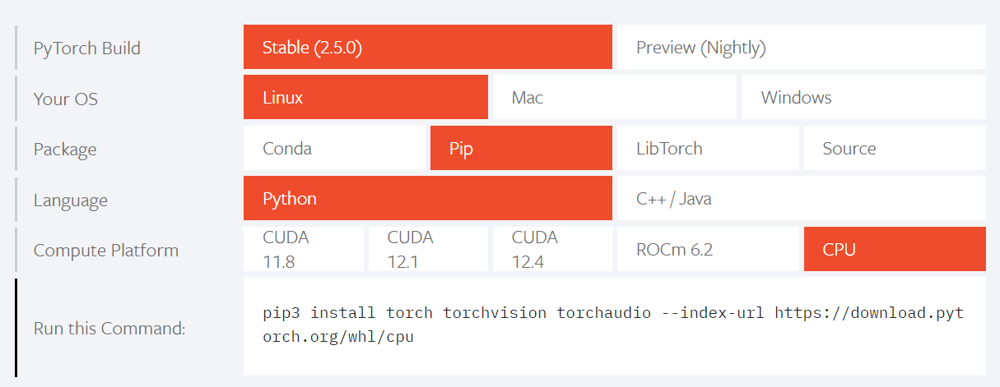

>**$\textcolor{RubineRed}{Author: ACatSmiling}$**
>
>**$\color{RubineRed}{Since: 2024-10-22}$**

## 概述

官网：https://pytorch.org/

Pytorch 是一个开源的机器学习库，主要用于深度学习领域。

**一、主要特点**

1. 动态图机制
   - Pytorch 使用动态计算图，这意味着你可以在运行时动态地构建、修改和执行计算图。这种灵活性使得调试代码更加容易，并且可以根据具体的需求快速调整模型结构。
   - 例如，在研究新的模型架构时，你可以方便地尝试不同的连接方式和层的组合，而不需要像静态图框架那样事先定义好整个计算图。
2. 易于使用
   - 它提供了简洁直观的 API，使得开发者可以快速上手。Pytorch 的代码风格接近 Python 的原生语法，对于熟悉 Python 的开发者来说，学习曲线相对较平缓。
   - 比如，定义一个神经网络模型就像定义一个普通的 Python 类一样简单，只需要继承自 `torch.nn.Module` 并实现 `forward` 方法即可。
3. 强大的生态系统
   - Pytorch 拥有庞大的社区和丰富的第三方库支持。开发者可以利用各种预训练模型、数据集和工具来加速自己的项目开发。
   - 例如，在计算机视觉领域，可以使用 `torchvision` 库来加载常见的数据集和预训练的模型；在自然语言处理方面，有 `torchtext` 库提供文本数据处理的功能。

**二、应用领域**

1. 计算机视觉
   - 可用于图像分类、目标检测、图像分割等任务。许多先进的计算机视觉模型都是使用 Pytorch 实现的，如 ResNet、YOLO 等。
   - 开发者可以利用 Pytorch 的强大功能和丰富的工具来训练和优化这些模型，以提高图像识别和处理的准确性和效率。
2. 自然语言处理
   - 在文本分类、机器翻译、语言建模等方面表现出色。Pytorch 提供了一系列用于处理文本数据的模块和函数，方便开发者构建和训练各种自然语言处理模型。
   - 例如，可以使用 Pytorch 的 `torch.nn.Embedding` 层来学习词向量表示，然后使用循环神经网络（RNN）或 Transformer 架构来进行序列建模。
3. 强化学习
   - Pytorch 也被广泛应用于强化学习领域，用于训练智能体来做出最优决策。它可以与各种强化学习算法结合使用，如深度 Q 网络（DQN）、策略梯度算法等。
   - 开发者可以利用 Pytorch 的高效计算和灵活的编程接口来实现复杂的强化学习算法，并在各种模拟环境和实际任务中进行实验和优化。


在 Linux 系统中，有多种方法可以查看是否有显卡以及获取显卡的相关信息。

**一、使用 lspci 命令**

1. 基本原理
   - `lspci`命令用于列出所有的 PCI（Peripheral Component Interconnect）设备，而显卡通常是通过 PCI 接口连接到主板上的，因此可以通过这个命令来查看显卡相关信息。
2. 操作步骤
   - 打开终端，输入以下命令：

```bash
     lspci | grep -i "vga\|3d\|display"
```

- 这个命令使用管道符（`|`）将`lspci`命令的输出传递给`grep`命令。`grep -i`选项表示忽略大小写，后面的`"vga\|3d\|display"`是一个正则表达式，用于筛选出包含`vga`、`3d`或者`display`这些关键字的行，这些关键字通常与显卡相关。

1. 结果解读
   - 如果命令输出了相关信息，比如类似`01:00.0 VGA compatible controller: NVIDIA Corporation...`这样的内容，就说明系统中有显卡，并且可以看到显卡的厂商（这里是 NVIDIA）等基本信息。

**二、使用 lshw 命令**

1. 基本原理
   - `lshw`（List Hardware）是一个更全面的硬件查看工具，它可以提供详细的硬件信息，包括显卡的详细型号、内存大小等。
2. 操作步骤
   - 首先需要安装`lshw`工具（如果没有安装的话）。在基于 Debian 或 Ubuntu 的系统中，可以使用`apt-get`命令安装：

```bash
     sudo apt-get install lshw
```

- 在基于 Red Hat 或 CentOS 的系统中，可以使用`yum`命令安装：

```bash
     sudo yum install lshw
```

- 安装完成后，在终端输入以下命令：

```bash
     sudo lshw -class display
```

- 这个命令用于列出所有属于`display`类别的硬件设备，也就是显卡相关设备。

1. 结果解读
   - 输出结果会详细列出显卡的信息，例如：

```plaintext
     *-display
          description: VGA compatible controller
          product: NVIDIA Corporation
          vendor: NVIDIA Corporation
          physical id: 0
          bus info: pci@0000:01:00.0
          version: a1
          width: 64 bits
          clock: 33MHz
          capabilities: pm msi pciexpress vga_controller bus_master cap_list rom
          configuration: driver=nvidia latency=0
          resources: irq:16 memory:fb000000 - fbffffff memory:c0000000 - cfffffff memory:d0000000 - d1ffffff ioport:e000(size=128) memory:fc000000 - fc07ffff
```

- 从这里可以看到显卡的描述（`description`）、产品型号（`product`）、厂商（`vendor`）、驱动程序（`configuration: driver=nvidia`）等详细信息。

**三、使用 glxinfo 命令（适用于有图形界面且安装了 OpenGL 相关库的情况）**

1. 基本原理
   - `glxinfo`是用于查询 OpenGL 扩展和相关显卡信息的工具。如果系统安装了图形界面和 OpenGL 相关库，就可以使用这个命令来查看显卡信息。
2. 操作步骤
   - 首先要确保系统安装了`mesa - utils`或者`glx - utils`（不同的 Linux 发行版安装包名称可能略有不同）。在 Ubuntu 系统中，可以使用`apt-get`命令安装：

```bash
     sudo apt-get install mesa - utils
```

- 安装完成后，在终端输入以下命令：

```bash
     glxinfo | grep -i "device"
```

- 这个命令用于筛选出包含`device`关键字的行，这些行通常包含显卡设备相关的信息。

1. 结果解读
   - 例如，如果输出类似`OpenGL device string: /dev/dri/card0`这样的内容，就说明找到了显卡设备相关的信息。

这些方法可以帮助你在 Linux 系统中查看是否有显卡以及获取显卡的相关信息。不同的方法可能会因为系统配置和安装的软件包不同而有所差异。


## 安装

Select your preferences and run the install command. Stable represents the most currently tested and supported version of PyTorch. This should be suitable for many users. Preview is available if you want the latest, not fully tested and supported, builds that are generated nightly. Please ensure that you have **met the prerequisites below (e.g., numpy)**, depending on your package manager. Anaconda is our recommended package manager since it installs all dependencies. You can also [install previous versions of PyTorch](https://pytorch.org/get-started/previous-versions). Note that LibTorch is only available for C++.



- 最新版的 PyTorch 要求 Python 3.9 及以上。
- 如果没有英伟达显卡，或是只有集显，Compute Platform 选择 CPU。

```shell
[root@dswang10 ~]# pip3 install torch torchvision torchaudio --index-url https://download.pytorch.org/whl/cpu
Looking in indexes: https://download.pytorch.org/whl/cpu
 Collecting torch
  Downloading https://download.pytorch.org/whl/cpu/torch-1.10.2%2Bcpu-cp36-cp36m-linux_x86_64.whl (199.3 MB)
     |████████████████████████████████| 199.3 MB 26 kB/s              
Collecting torchvision
  Downloading https://download.pytorch.org/whl/cpu/torchvision-0.11.3%2Bcpu-cp36-cp36m-linux_x86_64.whl (16.2 MB)
     |████████████████████████████████| 16.2 MB 112 kB/s            
Collecting torchaudio
  Downloading https://download.pytorch.org/whl/cpu/torchaudio-0.10.2%2Bcpu-cp36-cp36m-linux_x86_64.whl (2.7 MB)
     |████████████████████████████████| 2.7 MB 126 kB/s            
Requirement already satisfied: dataclasses in /usr/local/lib/python3.6/site-packages (from torch) (0.8)
Requirement already satisfied: typing-extensions in /usr/local/lib/python3.6/site-packages (from torch) (4.1.1)
Requirement already satisfied: numpy in /usr/local/lib64/python3.6/site-packages (from torchvision) (1.19.5)
Requirement already satisfied: pillow!=8.3.0,>=5.3.0 in /usr/local/lib64/python3.6/site-packages (from torchvision) (8.4.0)
Installing collected packages: torch, torchvision, torchaudio
Successfully installed torch-1.10.2+cpu torchaudio-0.10.2+cpu torchvision-0.11.3+cpu
WARNING: Running pip as the 'root' user can result in broken permissions and conflicting behaviour with the system package manager. It is recommended to use a virtual environment instead: https://pip.pypa.io/warnings/venv
```

