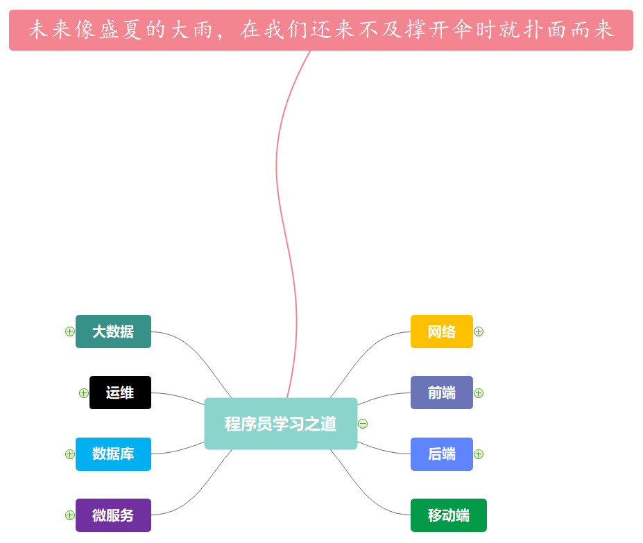

[思维导图总结](R~U~N.emmx)

- **网络篇**
  - [Network Protocol](Network/network-protocol.md)
  - [Nginx](Network/nginx.md)
- **前端篇**
  - [Vue](Vue/vue.md)
- **后端篇**
  - [Java](Java/java.md)
  - [Spring](Spring/spring.md)
  - [Spring MVC](Spring/Spring-mvc.md)
  - [Spring Boot](Spring/spring-boot.md)
  - [Spring Webflux](Spring/spring-webflux.md)
  - [RabbitMQ](MessageQueue/rabbitmq.md)
  - [JDBC](RelationalDatabase/jdbc.md)
  - [MyBatis](RelationalDatabase/mybatis.md)
  - [MyBatis Plus](RelationalDatabase/mybatis-plus.md)
  - [Maven](Tools/maven.md)
  - [Git](Tools/git.md)
- **移动端篇**
- **微服务篇**
  - [Spring Cloud](Spring/spring-cloud.md)
- **数据库篇**
  - [MySQL](RelationalDatabase/mysql.md)
  - [Redis](NoSQL/redis.md)
- **运维篇**
  - [Deploy](Deploy/deploy.md)
  - [Docker](Tools/docker.md)
- **大数据篇**
  - [Hadoop](BigData/hadoop.md)
  - [Flink](BigData/flink.md)
  - [Kafka](MessageQueue/kafka.md)
