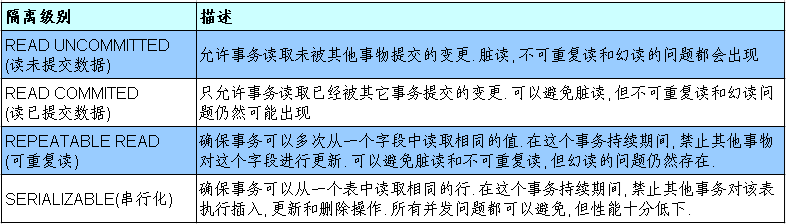

*date: 2021-06-27*


[TOC]

## JDBC 概述

### 数据的持久化

`持久化 (persistence)`：**把数据保存到可掉电式存储设备中以供之后使用**。大多数情况下，特别是企业级应用，**数据持久化意味着将内存中的数据保存到硬盘**上加以 "固化"**，而持久化的实现过程大多通过各种关系数据库来完成**。

持久化的主要应用是将内存中的数据存储在关系型数据库中，当然也可以存储在磁盘文件、XML 数据文件中。


### Java 中的数据存储技术

在 Java 中，数据库存取技术可分为如下几类：

- **JDBC** 直接访问数据库。
- JDO（Java Data Object）技术。

- **第三方 O/R 工具**，如 Hibernate，Mybatis 等。

JDBC 是 Java 访问数据库的基石，JDO、Hibernate、MyBatis 等只是更好的封装了 JDBC。

### JDBC 介绍

JDBC（Java Database Connectivity）是一个**`独立于特定数据库管理系统、通用的 SQL 数据库存取和操作的公共接口`**（一组 API），定义了用来访问数据库的标准 Java 类库，然后`java.sql`和`javax.sql`这些 Java 的 API，可以使用这些类库以一种**标准**的方法、方便地访问数据库资源。

JDBC 为访问不同的数据库提供了一种**统一的途径**，为开发者屏蔽了一些细节问题。

JDBC 的目标是使 Java 程序员使用 JDBC 可以连接任何**提供了 JDBC 驱动程序**的数据库系统，这样就使得程序员无需对特定的数据库系统的特点有过多的了解，从而大大简化和加快了开发过程。

如果没有 JDBC，那么 Java 程序访问数据库时是这样的：


有了 JDBC，Java 程序访问数据库时是这样的：


总结如下：


### JDBC 体系结构

JDBC 接口（API）包括两个层次：

- **面向应用的 API**：Java API，抽象接口，供应用程序开发人员使用（连接数据库，执行 SQL 语句，获得结果）。
- **面向数据库的 API**：Java Driver API，供开发商开发数据库驱动程序用。

> 面向接口编程：
>
> JDBC 是 sun 公司提供一套用于数据库操作的接口，Java 程序员只需要面向这套接口编程即可。
>
> 不同的数据库厂商，需要针对这套接口，提供不同实现。不同的实现的集合，即为不同数据库的驱动。

### JDBC 程序编写步骤


> ODBC（Open Database Connectivity，开放式数据库连接），是微软在 Windows 平台下推出的。使用者在程序中只需要调用 ODBC API，由 ODBC 驱动程序将调用转换成为对特定的数据库的调用请求。

## 获取数据库连接

### 要素一：Driver 驱动

`java.sql.Driver`接口是所有 JDBC 驱动程序需要实现的接口。这个接口是提供给数据库厂商使用的，不同数据库厂商提供不同的实现。

在程序中不需要直接去访问实现了 Driver 接口的类，而是由驱动程序管理器类（`java.sql.DriverManager`）去调用这些 Driver 实现。

第一步：Maven 添加驱动依赖。

- MySQL：

  ```xml
  <dependency>
      <groupId>mysql</groupId>
      <artifactId>mysql-connector-java</artifactId>
      <version>8.0.25</version>
  </dependency>
  ```

- PostgreSQL：

  ```xml
  <dependency>
      <groupId>org.postgresql</groupId>
      <artifactId>postgresql</artifactId>
      <version>42.2.10</version>
  </dependency>
  ```

第二步：加载驱动。加载 JDBC 驱动需调用 Class 类的静态方法`forName()`，并向其传递要加载的 JDBC 驱动的类名。

- MySQL：

  ```java
  Class.forName("com.mysql.cj.jdbc.Driver");
  ```

  >`com.mysql.jdbc.Driver`已被舍弃。

- PostgreSQL：

  ```java
  Class.forName("org.postgresql.Driver");
  ```

第三步：注册驱动。DriverManager 类是驱动程序管理器类，负责管理驱动程序。

- DriverManager 类使用`registerDriver()`注册驱动。

- 通常不用显式调用 DriverManager 类的`registerDriver()`来注册驱动程序类的实例，因为 Driver 接口的驱动程序类（即实现类）都包含了一个静态代码块，在这个静态代码块中，会调用 DriverManager 类的`registerDriver()`来注册自身的一个实例。下面是 MySQL 的 Driver 实现类的源码：

  ```java
  package com.mysql.cj.jdbc;
  
  import java.sql.DriverManager;
  import java.sql.SQLException;
  
  public class Driver extends NonRegisteringDriver implements java.sql.Driver {
      public Driver() throws SQLException {
      }
  
      static {
          try {
              DriverManager.registerDriver(new Driver());
          } catch (SQLException var1) {
              throw new RuntimeException("Can't register driver!");
          }
      }
  }
  ```

### 要素二：URL

JDBC URL 用于标识一个被注册的驱动程序，驱动程序管理器通过这个 URL 选择正确的驱动程序，从而建立到数据库的连接。

JDBC URL 的标准由三部分组成，各部分间用冒号分隔。 

- 格式：**`协议:子协议:子名称`**
  - **协议**：JDBC URL 中的协议总是 jdbc。
  - **子协议**：子协议用于标识一个数据库驱动程序。
  - **子名称**：一种标识数据库的方法。子名称可以依不同的子协议而变化，用子名称的目的是为**定位数据库**提供足够的信息。包含**主机名**（对应服务端的 ip 地址），**端口号和数据库名**。
- 举例：


  

几种常用数据库的 JDBC URL：

- MySQL 的连接 URL 的编写方式：

  - **`jdbc:mysql://主机名称:mysql服务端口号/数据库名称?参数=值&参数=值`**
    - `jdbc:mysql://localhost:3306/test`
    - `jdbc:mysql://localhost:3306/test?useUnicode=true&characterEncoding=utf8`
      - 如果 JDBC 程序与服务器端的字符集不一致，会导致乱码，此时，可以通过参数指定服务器端的字符集。
    - `jdbc:mysql://localhost:3306/test?user=root&password=123456`
- Oracle 9i 的连接 URL 的编写方式：

  - `jdbc:oracle:thin:@主机名称:oracle服务端口号:数据库名称`
    - `jdbc:oracle:thin:@localhost:1521:test`
- SQLServer 的连接 URL 的编写方式：

  - `jdbc:sqlserver://主机名称:sqlserver服务端口号:DatabaseName=数据库名称`
    - `jdbc:sqlserver://localhost:1433:DatabaseName=test`

### 要素三：用户名和密码

user 和 password，可以用`属性名=属性值`的方式告诉数据库。

可以调用 DriverManager 类的`getConnection()`方法建立到数据库的连接。

### 数据库连接方式举例

连接方式一：

```java
public void testConnection1() {
    try {
        // 1.提供java.sql.Driver接口实现类的对象
        Driver driver = null;
        driver = new com.mysql.cj.jdbc.Driver();

        // 2.提供url，指明具体操作的数据
        String url = "jdbc:mysql://localhost:3306/test";

        // 3.提供Properties的对象，指明用户名和密码
        Properties info = new Properties();
        info.setProperty("user", "root");
        info.setProperty("password", "abc123");

        // 4.调用driver的connect()，获取连接
        Connection connection = driver.connect(url, info);
        System.out.println(connection);
    } catch (SQLException e) {
        e.printStackTrace();
    }
}
```

>说明：上述代码中显式出现了第三方数据库的 API。

连接方式二：

```java
public void testConnection2() {
    try {
        // 1.实例化Driver
        String className = "com.mysql.cj.jdbc.Driver";
        Class<?> clazz = Class.forName(className);
        Driver driver = (Driver) clazz.newInstance();

        // 2.提供url，指明具体操作的数据
        String url = "jdbc:mysql://localhost:3306/test";

        // 3.提供Properties的对象，指明用户名和密码
        Properties info = new Properties();
        info.setProperty("user", "root");
        info.setProperty("password", "abc123");

        // 4.调用driver的connect()，获取连接
        Connection connection = driver.connect(url, info);
        System.out.println(connection);
    } catch (Exception e) {
        e.printStackTrace();
    }
}
```

>说明：相较于方式一，这里使用反射实例化 Driver，不在代码中显式出现第三方数据库的 API，体现了面向接口编程思想。

连接方式三：

```java
public void testConnection3() {
    try {
        // 1.数据库连接的4个基本要素：
        String url = "jdbc:mysql://localhost:3306/test";
        String user = "root";
        String password = "abc123";
        String driverName = "com.mysql.cj.jdbc.Driver";

        // 2.实例化Driver
        Class<?> clazz = Class.forName(driverName);
        Driver driver = (Driver) clazz.newInstance();
        
        // 3.注册驱动
        DriverManager.registerDriver(driver);
        
        // 4.获取连接
        Connection connection = DriverManager.getConnection(url, user, password);
        System.out.println(connection);
    } catch (Exception e) {
        e.printStackTrace();
    }
}
```

>说明：使用 DriverManager 实现数据库的连接。体会获取连接必要的 4 个基本要素。

连接方式四：

```java
public void testConnection4() {
    try {
        // 1.数据库连接的4个基本要素：
        String url = "jdbc:mysql://localhost:3306/test";
        String user = "root";
        String password = "abc123";
        String driverName = "com.mysql.cj.jdbc.Driver";

        // 2.加载驱动(实例化Driver和注册驱动)
        Class.forName(driverName);

        // Driver driver = (Driver) clazz.newInstance();
        // 3.注册驱动
        // DriverManager.registerDriver(driver);
        /*
            可以注释掉上述代码的原因，是因为在mysql的Driver类中声明有(其他数据库的Driver类有类似代码)：
            static {
                try {
                    DriverManager.registerDriver(new Driver());
                } catch (SQLException var1) {
                    throw new RuntimeException("Can't register driver!");
                }
            }
             */

        // 4.获取连接
        Connection connection = DriverManager.getConnection(url, user, password);
        System.out.println(connection);
    } catch (Exception e) {
        e.printStackTrace();
    }
}
```

>说明：不必显式的注册驱动。因为在 DriverManager 的源码中已经存在静态代码块，实现了驱动的注册。

连接方式五（最终版）：

```java
@Test
public void testConnection5() throws Exception {
    // 1.加载配置文件
    InputStream is = ConnectionTest.class.getClassLoader().getResourceAsStream("jdbc.properties");
    Properties pros = new Properties();
    pros.load(is);

    // 2.读取配置信息
    String user = pros.getProperty("user");
    String password = pros.getProperty("password");
    String url = pros.getProperty("url");
    String driverClass = pros.getProperty("driverClass");

    // 3.加载驱动
    Class.forName(driverClass);

    // 4.获取连接
    Connection connection = DriverManager.getConnection(url,user,password);
    System.out.println(connection);
}
```

- 配置文件 jdbc.properties 内容如下：

  ```properties
  user=root
  password=abc123
  url=jdbc:mysql://localhost:3306/test
  driverClass=com.mysql.cj.jdbc.Driver
  ```

  >说明：使用配置文件的方式保存配置信息，在代码中加载配置文件。

- 使用配置文件的好处：

  - 实现了代码和数据的分离，如果需要修改配置信息，直接在配置文件中修改，不需要深入代码。
  - 如果修改了配置信息，省去重新编译、打包的过程。

## 使用 PreparedStatement 实现 CRUD 操作

### Java 操作和访问数据库

数据库连接被用于向数据库服务器发送命令和 SQL 语句，并接受数据库服务器返回的结果。其实一个数据库连接就是一个 Socket 连接。

在`java.sql`包中有 3 个接口分别定义了对数据库的调用的不同方式：

- `Statement`：用于执行静态 SQL 语句并返回它所生成结果的对象。 
- `PrepatedStatement`：SQL 语句被预编译并存储在此对象中，可以使用此对象多次高效地执行该语句。
- `CallableStatement`：用于执行 SQL 存储过程。


### Java 与 SQL 对应数据类型转换表

| Java 类型          | SQL 类型                   |
| ------------------ | -------------------------- |
| boolean            | BIT                        |
| byte               | TINYINT                    |
| short              | SMALLINT                   |
| int                | INTEGER                    |
| long               | BIGINT                     |
| String             | CHAR，VARCHAR，LONGVARCHAR |
| byte   array       | BINARY，VAR BINARY         |
| java.sql.Date      | DATE                       |
| java.sql.Time      | TIME                       |
| java.sql.Timestamp | TIMESTAMP                  |

### 使用 Statement 操作数据表的弊端

通过调用 Connection 对象的`createStatement()`创建该对象。该对象用于执行静态的 SQL 语句，并且返回执行结果。

Statement 接口中定义了下列方法用于执行 SQL 语句：

```java
// 执行更新操作INSERT、UPDATE、DELETE
int executeUpdate(String sql) throws SQLException;

// 执行查询操作SELECT
ResultSet executeQuery(String sql) throws SQLException;
```

但是，使用 Statement 操作数据表存在弊端：

- **问题一：存在拼串操作，繁琐。**
- **问题二：存在 SQL 注入问题。**

SQL 注入是利用某些系统没有对用户输入的数据进行充分的检查，而在用户输入的数据中注入非法的 SQL 语句段或命令，如：`SELECT user, password FROM user_table WHERE user='a' OR 1 = ' AND password = ' OR '1' = '1')`，从而利用系统的 SQL 引擎完成恶意行为的做法。

对于 Java 而言，要防范 SQL 注入，只要用 PreparedStatement（从 Statement 扩展而来）取代 Statement 就可以了。

代码演示，模拟 Statement SQL 注入问题：

```java
public class StatementTest {
    // 使用Statement实现对数据表的查询操作
    public static <T> T get(String sql, Class<T> clazz) {
        Connection connection = null;
        Statement statement = null;
        ResultSet resultSet = null;
        try {
            // 1.加载配置文件
            InputStream is = StatementTest.class.getClassLoader().getResourceAsStream("jdbc.properties");
            Properties properties = new Properties();
            properties.load(is);

            // 2.读取配置信息
            String user = properties.getProperty("user");
            String password = properties.getProperty("password");
            String url = properties.getProperty("url");
            String driverClass = properties.getProperty("driverClass");

            // 3.加载驱动
            Class.forName(driverClass);

            // 4.获取连接
            connection = DriverManager.getConnection(url, user, password);

            statement = connection.createStatement();

            resultSet = statement.executeQuery(sql);

            // 获取结果集的元数据
            ResultSetMetaData resultSetMetaData = resultSet.getMetaData();

            // 获取结果集的列数
            int columnCount = resultSetMetaData.getColumnCount();

            if (resultSet.next()) {

                T t = clazz.newInstance();

                for (int i = 0; i < columnCount; i++) {
                    // 1.获取列的名称，适用于列名和属性名相同的情况
                    // String columnName = resultSetMetaData.getColumnName(i+1);

                    // 1.获取列的别名，适用于列名和属性名不同的情况
                    String columnName = resultSetMetaData.getColumnLabel(i + 1);

                    // 2. 根据列名获取对应数据表中的数据
                    Object columnVal = resultSet.getObject(columnName);

                    // 3. 将数据表中得到的数据，封装进对象
                    Field field = clazz.getDeclaredField(columnName);
                    field.setAccessible(true);
                    field.set(t, columnVal);
                }
                return t;
            }
        } catch (Exception e) {
            e.printStackTrace();
        } finally {
            // 关闭资源
            if (resultSet != null) {
                try {
                    resultSet.close();
                } catch (SQLException e) {
                    e.printStackTrace();
                }
            }

            if (statement != null) {
                try {
                    statement.close();
                } catch (SQLException e) {
                    e.printStackTrace();
                }
            }

            if (connection != null) {
                try {
                    connection.close();
                } catch (SQLException e) {
                    e.printStackTrace();
                }
            }
        }
        return null;
    }

    public static void main(String[] args) {
        // 使用Statement的弊端：需要拼写sql语句，并且存在SQL注入的问题
        // 如何避免出现sql注入：只要用PreparedStatement(从Statement扩展而来)取代Statement

        Scanner scanner = new Scanner(System.in);
        System.out.print("请输入用户名：");
        String user = scanner.nextLine();
        System.out.print("请输入密码：");
        String password = scanner.nextLine();
        // SELECT user,password FROM user_table WHERE user = '1' or ' AND password = '=1 or '1' = '1'
        String sql = "SELECT user,password FROM user_table WHERE user = '" + user + "' AND password = '" + password + "'";
        User returnUser = get(sql, User.class);
        if (returnUser != null) {
            System.out.println("登录成功");
        } else {
            System.out.println("用户名不存在或密码错误");
        }
    }
}
```

改进方式：


### PreparedStatement 的使用

#### PreparedStatement 介绍

通过调用 Connection 对象的`preparedStatement(String sql)`获取 PreparedStatement 对象。

**PreparedStatement 接口是 Statement 的子接口，它表示一条`预编译`过的 SQL 语句。**

PreparedStatement 对象所代表的 SQL 语句中的参数用`问号 (?)`来表示，调用 PreparedStatement 对象的`setXxx()`（Xxx 表示数据类型）来设置这些参数。`setXxx()`有两个参数，第一个参数是要设置的 SQL 语句中的问号参数的索引（`从 1 开始`），第二个是设置的 SQL 语句中的该索引位置对应参数的值。

#### PreparedStatement 与 Statement 的对比

- 代码的可读性和可维护性。
- **PreparedStatement 通过预编译，可以防止 SQL 注入（占位符的位置只是参数，SQL 的语意，在预编译时已经完成）。**
- PreparedStatement 可以操作 Blob 的数据，而 Statement 做不到。
- **PreparedStatement 能最大可能提高性能：**
  - DBServer 会对**预编译**语句提供性能优化。因为预编译语句有可能被重复调用，所以语句在被 DBServer 的编译器编译后的执行代码被缓存下来，那么下次调用时只要是相同的预编译语句就不需要编译，只要将参数直接传入编译过的语句执行代码中就会得到执行。
  - 在 Statement 语句中，即使是相同操作，但因为数据内容不一样，所以整个语句本身不能匹配，没有缓存语句的意义。事实是没有数据库会对普通语句编译后的执行代码缓存。这样，每执行一次都要对传入的语句编译一次。
  - 对于新的 SQL 语句，需要经过语法检查，语义检查，翻译成二进制命令等操作，PreparedStatement 的语句是预编译的，会被缓存，就不再需要经过前面的那几个操作，从而提高效率。

#### 使用 PreparedStatement 实现增、删、改操作

常规：

```java
public class PreparedStatementUpdateTest {
    // 向customers表中添加一条记录
    public static void testInsert() {
        Connection connection = null;
        PreparedStatement preparedStatement = null;
        try {
            // 1.读取配置文件中的4个基本信息
            InputStream is = ClassLoader.getSystemClassLoader().getResourceAsStream("jdbc.properties");
            Properties properties = new Properties();
            properties.load(is);

            String user = properties.getProperty("user");
            String password = properties.getProperty("password");
            String url = properties.getProperty("url");
            String driverClass = properties.getProperty("driverClass");

            // 2.加载驱动
            Class.forName(driverClass);

            // 3.获取连接
            connection = DriverManager.getConnection(url, user, password);

            // 4.预编译sql语句，返回PreparedStatement的实例
            String sql = "insert into customers(name, email, birth) values(?, ?, ?)";// ?: 占位符
            preparedStatement = connection.prepareStatement(sql);

            // 5.填充占位符
            preparedStatement.setString(1, "哪吒");
            preparedStatement.setString(2, "nezha@gmail.com");
            SimpleDateFormat sdf = new SimpleDateFormat("yyyy-MM-dd");
            java.util.Date date = sdf.parse("1000-01-01");
            preparedStatement.setDate(3, new Date(date.getTime()));// java.util.Date与java.sql.Date转换

            // 6.执行操作
            preparedStatement.execute();
        } catch (Exception e) {
            e.printStackTrace();
        } finally {
            // 7.资源的关闭
            try {
                if (pXreparedStatement != null) {
                    preparedStatement.close();
                }
            } catch (SQLException e) {
                e.printStackTrace();
            }

            try {
                if (connection != null) {
                    connection.close();
                }
            } catch (SQLException e) {
                e.printStackTrace();
            }
        }
    }

    public static void main(String[] args) {
        testInsert();
    }
}
```

通用：

```java
public class JDBCUtils {
    // 使用throws抛出异常，在真正用到Connection的地方，统一使用try/catch，防止获取连接时出现异常，导致Connection为空但代码继续执行
    public static Connection getConnection() throws Exception {
        // 1.读取配置文件中的4个基本信息
        InputStream is = ClassLoader.getSystemClassLoader().getResourceAsStream("jdbc.properties");
        Properties properties = new Properties();
        properties.load(is);

        String user = properties.getProperty("user");
        String password = properties.getProperty("password");
        String url = properties.getProperty("url");
        String driverClass = properties.getProperty("driverClass");

        // 2.加载驱动
        Class.forName(driverClass);

        // 3.获取连接
        Connection connection = DriverManager.getConnection(url, user, password);
        return connection;
    }

    public static void closeResource(Connection connection, Statement statement) {
        if (statement != null) {
            try {
                statement.close();
            } catch (SQLException e) {
                e.printStackTrace();
            }
        }

        if (connection != null) {
            try {
                connection.close();
            } catch (SQLException e) {
                e.printStackTrace();
            }
        }
    }

    public static void closeResource(Connection connection, Statement statement, ResultSet resultSet) {
        if (resultSet != null) {
            try {
                resultSet.close();
            } catch (SQLException e) {
                e.printStackTrace();
            }
        }

        if (statement != null) {
            try {
                statement.close();
            } catch (SQLException e) {
                e.printStackTrace();
            }
        }

        if (connection != null) {
            try {
                connection.close();
            } catch (SQLException e) {
                e.printStackTrace();
            }
        }
    }
}
```

```java
public class PreparedStatementUpdateTest {
    // 通用的增删改操作
    public static void update(String sql, Object... args) {// sql中占位符的个数与可变形参的长度相同！
        Connection connection = null;
        PreparedStatement preparedStatement = null;
        try {
            // 1.获取数据库的连接
            connection = JDBCUtils.getConnection();

            // 2.预编译sql语句，返回PreparedStatement的实例
            preparedStatement = connection.prepareStatement(sql);

            // 3.填充占位符
            for (int i = 0; i < args.length; i++) {
                preparedStatement.setObject(i + 1, args[i]);
            }

            // 4.执行
            /*
			 * 方式一，preparedStatement.execute()：
			 * 		如果执行的是查询操作，有返回结果，则此方法返回true;
			 * 		如果执行的是增、删、改操作，没有返回结果，则此方法返回false。
			 */
            // preparedStatement.execute();
            /*
             * 方式二，preparedStatement.executeUpdate()：
             *      返回sql语句执行过后，对数据库影响的行数，可以根据返回值，判断增、删、查操作的结果
             */
            preparedStatement.executeUpdate();
        } catch (Exception e) {
            e.printStackTrace();
        } finally {
            // 5.资源的关闭
            JDBCUtils.closeResource(connection, preparedStatement);
        }
    }

    public static void main(String[] args) {
        // String sql = "delete from customers where id = ?";
        // update(sql,3);

        // order是数据库关键字，作为表名，为防止错误，添加``符号
        String sql = "update `order` set order_name = ? where order_id = ?";
        update(sql, "DD", "2");
    }
}
```

#### 使用 PreparedStatement 实现查询操作

常规：

```java
/*
 * ORM编程思想---Object Relational Mapping
 * 一个数据表对应一个Java类
 * 表中的一条记录对应Java类的一个对象
 * 表中的一个字段对应Java类的一个属性
 */
public class Customer {
    private int id;

    private String name;

    private String email;

    private Date birth;// java.sql.Date

    public Customer() {
    }

    public Customer(int id, String name, String email, Date birth) {
        this.id = id;
        this.name = name;
        this.email = email;
        this.birth = birth;
    }

    public int getId() {
        return id;
    }

    public void setId(int id) {
        this.id = id;
    }

    public String getName() {
        return name;
    }

    public void setName(String name) {
        this.name = name;
    }

    public String getEmail() {
        return email;
    }

    public void setEmail(String email) {
        this.email = email;
    }

    public Date getBirth() {
        return birth;
    }

    public void setBirth(Date birth) {
        this.birth = birth;
    }

    @Override
    public String toString() {
        return "Customer [id=" + id + ", name=" + name + ", email=" + email + ", birth=" + birth + "]";
    }
}
```

```java
/**
 * 针对于customers表的查询操作
 */
public class CustomerForQuery {
    public static void testQuery1() {
        Connection connection = null;
        PreparedStatement preparedStatement = null;
        ResultSet resultSet = null;
        try {
            connection = JDBCUtils.getConnection();

            String sql = "select id, name, email, birth from customers where id = ?";
            preparedStatement = connection.prepareStatement(sql);
            preparedStatement.setObject(1, 1);

            // 执行，并返回结果集
            resultSet = preparedStatement.executeQuery();

            // 处理结果集
            // next()：判断结果集的下一条是否有数据，如果有数据返回true，并且指针下移；
            // 如果没有数据返回false，指针不会下移。
            if (resultSet.next()) {
                // 获取当前这条数据的各个字段值
                int id = resultSet.getInt(1);
                String name = resultSet.getString(2);
                String email = resultSet.getString(3);
                Date birth = resultSet.getDate(4);

                // 方式一：
                // System.out.println("id = " + id + ",name = " + name + ",email = " + email + ",birth = " + birth);

                // 方式二：
                // Object[] data = new Object[]{id, name, email, birth};

                // 方式三：将数据封装为一个对象（推荐）
                Customer customer = new Customer(id, name, email, birth);
                System.out.println(customer);
            }
        } catch (Exception e) {
            e.printStackTrace();
        } finally {
            // 关闭资源
            JDBCUtils.closeResource(connection, preparedStatement, resultSet);
        }
    }

    public static void main(String[] args) {
        testQuery1();
    }
}
```

通用：

- 类的属性和表的字段相同：

  ```java
  /**
   * 针对于customers表的查询操作
   */
  public class CustomerForQuery {
      /**
       * 针对customers表的通用的查询操作
       */
      public static Customer queryForCustomers(String sql, Object... args) {
          Connection connection = null;
          PreparedStatement preparedStatement = null;
          ResultSet resultSet = null;
          try {
              connection = JDBCUtils.getConnection();
  
              preparedStatement = connection.prepareStatement(sql);
              for (int i = 0; i < args.length; i++) {
                  preparedStatement.setObject(i + 1, args[i]);
              }
  
              resultSet = preparedStatement.executeQuery();
              // 获取结果集的元数据：ResultSetMetaData
              ResultSetMetaData resultSetMetaData = resultSet.getMetaData();
              // 通过ResultSetMetaData获取结果集中的列数
              int columnCount = resultSetMetaData.getColumnCount();
  
              // 只返回一条数据q2w
              if (resultSet.next()) {
                  Customer customer = new Customer();
                  // 处理结果集一行数据中的每一个列
                  for (int i = 0; i < columnCount; i++) {
                      // 获取列值
                      Object columnValue = resultSet.getObject(i + 1);
  
                      // 获取每个列的列名
                      // String columnName = resultSetMetaData.getColumnName(i + 1);
                      Strin.g columnLabel = resultSetMetaData.getColumnLabel(i + 1);
  
                      // 通过反射：给customer对象指定的columnName属性，赋值为columnValue
                      Field field = Customer.class.getDeclaredField(columnLabel);
                      field.setAccessible(true);
                      field.set(customer, columnValue);
                  }
                  return customer;
              }
          } catch (Exception e) {
              e.printStackTrace();
          } finally {
              JDBCUtils.closeResource(connection, preparedStatement, resultSet);
          }
          return null;
      }
  
      public static void main(String[] args) {
          String sql = "select id, name, email, birth from customers where id = ?";
          Customer customer = queryForCustomers(sql, 13);
          System.out.println(customer);
  
          sql = "select id, name, email, birth from customers where id = ? and name = ?";
          Customer customer1 = queryForCustomers(sql, 10, "杰杰");
          System.out.println(customer1);
      }
  }
  ```

- 类的属性和表的字段不同：

  ```java
  public class Order {
      private int orderId;
  
      private String orderName;
  
      private Date orderDate;// java.sql.Date
  
      public Order() {
          super();
      }
  
      public Order(int orderId, String orderName, Date orderDate) {
          super();
          this.orderId = orderId;
          this.orderName = orderName;
          this.orderDate = orderDate;
      }
  
      public int getOrderId() {
          return orderId;
      }
  
      public void setOrderId(int orderId) {
          this.orderId = orderId;
      }
  
      public String getOrderName() {
          return orderName;
      }
  
      public void setOrderName(String orderName) {
          this.orderName = orderName;
      }
  
      public Date getOrderDate() {
          return orderDate;
      }
  
      public void setOrderDate(Date orderDate) {
          this.orderDate = orderDate;
      }
  
      @Override
      public String toString() {
          return "Order [orderId=" + orderId + ", orderName=" + orderName + ", orderDate=" + orderDate + "]";
      }
  }
  ```

  ```java
  /**
   * 针对order表的通用的查询操作
   */
  public class OrderForQuery {
      /*
       * 针对于表的字段名与类的属性名不相同的情况：
       * 1.在声明sql时，使用类的属性名来命名字段的别名
       * 2.使用ResultSetMetaData时，需要使用getColumnLabel()来替换getColumnName()获取列的别名
       *   说明：如果sql中没有给字段起别名，getColumnLabel()获取的就是列名
       */
  
      /**
       * 针对于order表的通用的查询操作
       */
      public static Order orderForQuery(String sql, Object... args) {
          Connection connection = null;
          PreparedStatement preparedStatement = null;
          ResultSet resultSet = null;
          try {
              connection = JDBCUtils.getConnection();
  
              preparedStatement = connection.prepareStatement(sql);
              for (int i = 0; i < args.length; i++) {
                  preparedStatement.setObject(i + 1, args[i]);
              }
  
              // 执行，获取结果集
              resultSet = preparedStatement.executeQuery();
              // 获取结果集的元数据
              ResultSetMetaData resultSetMetaData = resultSet.getMetaData();
              // 获取列数
              int columnCount = resultSetMetaData.getColumnCount();
              if (resultSet.next()) {
                  Order order = new Order();
                  for (int i = 0; i < columnCount; i++) {
                      // 获取每个列的列值
                      Object columnValue = resultSet.getObject(i + 1);
                      // 通过ResultSetMetaData
                      // 获取列的列名：getColumnName()---不推荐使用
                      // String columnName = resultSetMetaData.getColumnName(i + 1);
                      // 获取列的别名：getColumnLabel()
                      String columnLabel = resultSetMetaData.getColumnLabel(i + 1);
  
                      // 通过反射，将对象指定名columnLabel的属性赋值为指定的值columnValue
                      Field field = Order.class.getDeclaredField(columnLabel);
                      field.setAccessible(true);
                      field.set(order, columnValue);
                  }
                  return order;
              }
          } catch (Exception e) {
              e.printStackTrace();
          } finally {
              JDBCUtils.closeResource(connection, preparedStatement, resultSet);
          }
          return null;
      }
  
      public static void main(String[] args) {
          String sql = "select order_id orderId, order_name orderName, order_date orderDate from `order` where order_id = ?";
          Order order = orderForQuery(sql, 1);
          System.out.println(order);
      }
  }
  ```

- 不同表：

  ```java
  public class PreparedStatementQueryTest {
      // 返回一个
      public static <T> T getInstance(Class<T> clazz, String sql, Object... args) {
          Connection connection = null;
          PreparedStatement preparedStatement = null;
          ResultSet resultSet = null;
          try {
              connection = JDBCUtils.getConnection();
  
              preparedStatement = connection.prepareStatement(sql);
              for (int i = 0; i < args.length; i++) {
                  preparedStatement.setObject(i + 1, args[i]);
              }
  
              resultSet = preparedStatement.executeQuery();
              // 获取结果集的元数据
              ResultSetMetaData resultSetMetaData = resultSet.getMetaData();
              // 通过ResultSetMetaData获取结果集中的列数
              int columnCount = resultSetMetaData.getColumnCount();
  
              if (resultSet.next()) {
                  T t = clazz.newInstance();
                  // 处理结果集一行数据中的每一个列
                  for (int i = 0; i < columnCount; i++) {
                      // 获取列值
                      Object columnValue = resultSet.getObject(i + 1);
                      // 获取每个列的别名
                      String columnLabel = resultSetMetaData.getColumnLabel(i + 1);
  
                      // 通过反射，给t对象指定的columnLabel属性，赋值为columnValue
                      Field field = clazz.getDeclaredField(columnLabel);
                      field.setAccessible(true);
                      field.set(t, columnValue);
                  }
                  return t;
              }
          } catch (Exception e) {
              e.printStackTrace();
          } finally {
              JDBCUtils.closeResource(connection, preparedStatement, resultSet);
          }
          return null;
      }
  
      // 返回一个集合
      public static <T> List<T> getForList(Class<T> clazz, String sql, Object... args) {
          Connection connection = null;
          PreparedStatement preparedStatement = null;
          ResultSet resultSet = null;
          try {
              connection = JDBCUtils.getConnection();
  
              preparedStatement = connection.prepareStatement(sql);
              for (int i = 0; i < args.length; i++) {
                  preparedStatement.setObject(i + 1, args[i]);
              }
  
              resultSet = preparedStatement.executeQuery();
              // 获取结果集的元数据
              ResultSetMetaData resultSetMetaData = resultSet.getMetaData();
              // 通过ResultSetMetaData获取结果集中的列数
              int columnCount = resultSetMetaData.getColumnCount();
              // 创建集合对象
              List<T> list = new ArrayList<>();
              while (resultSet.next()) {
                  T t = clazz.newInstance();
                  // 处理结果集一行数据中的每一个列: 给t对象指定的属性赋值
                  for (int i = 0; i < columnCount; i++) {
                      // 获取列值
                      Object columnValue = resultSet.getObject(i + 1);
                      // 获取每个列的别名
                      String columnLabel = resultSetMetaData.getColumnLabel(i + 1);
  
                      // 给t对象指定的columnName属性，赋值为columnValue：通过反射
                      Field field = clazz.getDeclaredField(columnLabel);
                      field.setAccessible(true);
                      field.set(t, columnValue);
                  }
                  list.add(t);
              }
              return list;
          } catch (Exception e) {
              e.printStackTrace();
          } finally {
              JDBCUtils.closeResource(connection, preparedStatement, resultSet);
          }
          return null;
      }
  
      public static void main(String[] args) {
          String sql = "select id, name, email, birth from customers where id = ?";
          Customer customer = getInstance(Customer.class, sql, 12);
          System.out.println(customer);
  
          String sql1 = "select order_id orderId, order_name orderName from `order` where order_id = ?";
          Order order = getInstance(Order.class, sql1, 1);
          System.out.println(order);
  
  
          String sql2 = "select id, name, email, birth from customers where id < ?";
          List<Customer> list = getForList(Customer.class, sql2, 12);
          list.forEach(System.out::println);
  
          String sql3 = "select order_id orderId, order_name orderName from `order`";
          List<Order> orderList = getForList(Order.class, sql3);
          orderList.forEach(System.out::println);
      }
  }
  ```

### ResultSet 与 ResultSetMetaData 的说明

#### ResultSet

查询数据库时，需要调用 PreparedStatement 的`executeQuery()`，查询结果是一个 ResultSet 对象。

ResultSet 对象以逻辑表格的形式封装了执行数据库操作的结果集，ResultSet 接口由数据库厂商提供实现。

ResultSet 返回的实际上就是一张数据表。有一个指针指向数据表的第一条记录的前面。

ResultSet 对象维护了一个指向当前数据行的**`游标`**，初始的时候，游标在第一行之前，可以通过 ResultSet 对象的`next()`移动到下一行。调用`next()`时会检测下一行是否有效，若有效，该方法返回 true，且指针下移。相当于 Iterator 对象的`hasNext()`和`next()`两个方法的结合体。


当指针指向一行时，可以通过调用`getXxx(int index)`或`getXxx(int columnName)`获取每一列的值。

- 例如：`getInt(1)`，`getString("name")`。
- **注意：`Java 与数据库交互涉及到的相关 Java API 中的索引都从 1 开始。`**

#### ResultSetMetaData

ResultSetMetaData 是描述 ResultSet 的元数据，可用于获取 ResultSet 对象中列的类型和属性信息。

通过 ResultSet 的`getMetaData()`获取 ResultSetMetaData。


常用方法：

- `getColumnCount()`：返回当前 ResultSet 对象中的列数。 
- `getColumnName(int column)`：获取指定列的名称，不推荐使用。
- `getColumnLabel(int column)`：获取指定列的别名，如果没有别名，则返回该列的名称。
- `getColumnTypeName(int column)`：检索指定列的数据库特定的类型名称。 
- `getColumnDisplaySize(int column)`：指示指定列的最大标准宽度，以字符为单位。 
- `isNullable(int column)`：指示指定列中的值是否可以为 null。 
- `isAutoIncrement(int column)`：指示是否自动为指定列进行编号，这样这些列仍然是只读的。 

### 资源的释放

- 释放 ResultSet，Statement，Connection。
- 数据库连接（Connection）是非常稀有的资源，用完后必须马上释放，如果 Connection 不能及时正确的关闭将导致系统宕机。Connection 的使用原则是**尽量晚的创建，尽量早的释放。**
- 应该在 finally 中关闭，保证即使其他代码出现异常，资源也一定能被关闭。

### JDBC API 使用小结

两种思想：

- 面向接口编程的思想

- ORM 思想（Object Relational Mapping）
  - 一个数据表对应一个 Java 类。
  - 表中的一条记录对应 Java 类的一个对象。
  - 表中的一个字段对应 Java 类的一个属性。

> SQL 应结合列名和表的属性名来写，必要时需要起别名。

两种技术：

- JDBC 结果集的元数据 ResultSetMetaData。
  - 获取列数：`getColumnCount()`
  - 获取列的别名：`getColumnLabel()`
- 通过反射，创建指定类的对象，获取指定的属性并赋值。

## 操作 BLOB 类型字段

### MySQL BLOB 类型

MySQL 中，BLOB 是一个二进制大型对象，是一个可以存储大量数据的容器，它能容纳不同大小的数据。

插入 BLOB 类型的数据必须使用 PreparedStatement，因为 BLOB 类型的数据无法使用字符串拼接来写。

MySQL 的四种 BLOB 类型（除了在存储的最大信息量上不同外，它们是等同的）：


实际使用中根据需要存入的数据大小定义不同的 BLOB 类型。

需要注意的是：如果存储的文件过大，数据库的性能会下降。

如果在指定了相关的 BLOB 类型以后，还报错：`xxx too large`，原因是文件大小超过默认存储。

```java
com.mysql.cj.jdbc.exceptions.PacketTooBigException: Packet for query is too large (6,218,041 > 4,194,304). You can change this value on the server by setting the 'max_allowed_packet' variable.
```

- 在 MySQL 的安装目录下，查找 my.ini 文件，并添加如下的配置参数：**`max_allowed_packet=16M`**，设置存储大小。注意：修改了 my.ini 文件之后，需要重新启动 MySQL 服务。

  ```ini
  max_allowed_packet=16M
  ```

  

- Windows 系统下，在服务中，右键点击属性，可以查找到 my.ini 文件的位置：

  

- 在 cmd 中，也可以查看 max_allowed_packet 配置：

  ```cmd
  C:\Users\XiSun>mysql -u root -p
  Enter password: ***************
  Welcome to the MySQL monitor.  Commands end with ; or \g.
  Your MySQL connection id is 8
  Server version: 8.0.25 MySQL Community Server - GPL
  
  Copyright (c) 2000, 2021, Oracle and/or its affiliates.
  
  Oracle is a registered trademark of Oracle Corporation and/or its
  affiliates. Other names may be trademarks of their respective
  owners.
  
  Type 'help;' or '\h' for help. Type '\c' to clear the current input statement.
  
  mysql> show VARIABLES like '%max_allowed_packet%';
  +---------------------------+------------+
  | Variable_name             | Value      |
  +---------------------------+------------+
  | max_allowed_packet        | 16777216   |
  | mysqlx_max_allowed_packet | 67108864   |
  | slave_max_allowed_packet  | 1073741824 |
  +---------------------------+------------+
  3 rows in set, 1 warning (0.01 sec)
  
  mysql>
  ```

  > 设置：`set global max_allowed_packet = 2*1024*1024*10;`
  >
  > 退出 MySQL：`quit`
  >
  > 重启：`service mysqld restart `

### 数据表中插入 BLOB 类型字段

```java
public class BlobTest {
    // 向数据表customers中插入Blob类型的字段
    public static void testInsert() {
        Connection connection = null;
        PreparedStatement preparedStatement = null;
        FileInputStream fis = null;
        try {
            connection = JDBCUtils.getConnection();

            String sql = "insert into customers(name, email, birth, photo) values(?, ?, ?, ?)";
            preparedStatement = connection.prepareStatement(sql);
            preparedStatement.setObject(1, "袁浩");
            preparedStatement.setObject(2, "yuan@qq.com");
            preparedStatement.setObject(3, "1992-09-08");
            fis = new FileInputStream(new File("E:/test.png"));
            preparedStatement.setBlob(4, fis);

            preparedStatement.execute();
        } catch (Exception exception) {
            exception.printStackTrace();
        } finally {
            try {
                if (fis != null) {
                    fis.close();
                }
            } catch (IOException exception) {
                exception.printStackTrace();
            }

            JDBCUtils.closeResource(connection, preparedStatement);
        }
    }
}
```

### 数据表中修改 BLOB 类型字段

```java
public class BlobTest {
    // 向数据表customers中修改Blob类型的字段
    public static void testUpdate() {
        Connection connection = null;
        PreparedStatement preparedStatement = null;
        FileInputStream fis = null;
        try {
            connection = JDBCUtils.getConnection();

            String sql = "update customers set photo = ? where id = ?";
            preparedStatement = connection.prepareStatement(sql);
            fis = new FileInputStream(new File("test.png"));
            preparedStatement.setBlob(1, fis);
            preparedStatement.setObject(2, 20);

            preparedStatement.execute();
        } catch (Exception exception) {
            exception.printStackTrace();
        } finally {
            try {
                if (fis != null) {
                    fis.close();
                }
            } catch (IOException exception) {
                exception.printStackTrace();
            }

            JDBCUtils.closeResource(connection, preparedStatement);
        }
    }
}
```

### 数据表中读取 BLOB 类型字段

```java
public class BlobTest {
    // 查询数据表customers中Blob类型的字段
    public static void testQuery() {
        Connection connection = null;
        PreparedStatement preparedStatement = null;
        InputStream is = null;
        FileOutputStream fos = null;
        ResultSet resultSet = null;
        try {
            connection = JDBCUtils.getConnection();
            String sql = "select id, name, email, birth, photo from customers where id = ?";
            preparedStatement = connection.prepareStatement(sql);
            preparedStatement.setInt(1, 20);
            resultSet = preparedStatement.executeQuery();
            if (resultSet.next()) {
                // 方式一：
                // int id = resultSet.getInt(1);
                // String name = resultSet.getString(2);
                // String email = resultSet.getString(3);
                // Date birth = resultSet.getDate(4);

                // 方式二：
                int id = resultSet.getInt("id");
                String name = resultSet.getString("name");
                String email = resultSet.getString("email");
                Date birth = resultSet.getDate("birth");

                Customer customer = new Customer(id, name, email, birth);
                System.out.println(customer);

                // Blob类型的字段需要下载下来，以文件的方式保存在本地
                Blob photo = resultSet.getBlob("photo");
                is = photo.getBinaryStream();
                fos = new FileOutputStream("test2.jpg");
                byte[] buffer = new byte[1024];
                int len;
                while ((len = is.read(buffer)) != -1) {
                    fos.write(buffer, 0, len);
                }
            }
        } catch (Exception e) {
            e.printStackTrace();
        } finally {
            try {
                if (fos != null) {
                    fos.close();
                }
            } catch (IOException e) {
                e.printStackTrace();
            }

            try {
                if (is != null) {
                    is.close();
                }
            } catch (IOException e) {
                e.printStackTrace();
            }

            JDBCUtils.closeResource(connection, preparedStatement, resultSet);
        }
    }
}
```

## 批量处理

### 批量执行 SQL 语句

当需要成批插入或者更新记录时，可以采用 JDBC 的**批量更新**机制，这一机制允许多条语句一次性提交给数据库批量处理。通常情况下比单独提交处理更有效率。

JDBC 的批量处理语句包括下面三个方法：

- **`addBatch(String)`：添加需要批量处理的 SQL 语句或是参数。**
- **`executeBatch()`：执行批量处理语句。**
- **`clearBatch()`：清空缓存的数据。**

通常我们会遇到两种批量执行 SQL 语句的情况：

- 多条 SQL 语句的批量处理。
- 一条 SQL 语句的批量传参。

### 高效的批量插入

举例：向数据表中插入 20000 条数据。

数据库中提供一个 goods 表作为测试。创建如下：

```sql
CREATE TABLE goods(
id INT PRIMARY KEY AUTO_INCREMENT,
NAME VARCHAR(20)
);
```

```sql
# 查询goods表总条目数
SELECT COUNT(*) FROM goods;

# 清空goods表
TRUNCATE TABLE goods;
```

#### 实现层次一

```java
/*
 * 使用PreparedStatement实现批量数据的操作
 *
 * update、delete本身就具有批量操作的效果。
 * 此时的批量操作，主要指的是批量插入。使用PreparedStatement如何实现更高效的批量插入？
 *
 * 功能：向goods表中插入20000条数据
 */
public class InsertTest {
    // 批量插入的方式一：使用Statement
    public static void testInsert1() {
        Connection connection = null;
        Statement statement = null;
        try {
            long start = System.currentTimeMillis();
            connection = JDBCUtils.getConnection();
            statement = connection.createStatement();
            for (int i = 1; i <= 20000; i++) {
                String sql = "insert into goods(name) values('name_" + i + "')";
                statement.execute(sql);
            }
            long end = System.currentTimeMillis();
            System.out.println("花费的时间为：" + (end - start));// 20000: 35856
        } catch (Exception exception) {
            exception.printStackTrace();
        } finally {
            JDBCUtils.closeResource(connection, statement);
        }
    }
}
```

#### 实现层次二

```java
/*
 * 使用PreparedStatement实现批量数据的操作
 *
 * update、delete本身就具有批量操作的效果。
 * 此时的批量操作，主要指的是批量插入。使用PreparedStatement如何实现更高效的批量插入？
 *
 * 功能：向goods表中插入20000条数据
 */
public class InsertTest {
    // 批量插入的方式二：使用PreparedStatement
    public static void testInsert2() {
        Connection connection = null;
        PreparedStatement preparedStatement = null;
        try {
            long start = System.currentTimeMillis();
            connection = JDBCUtils.getConnection();
            String sql = "insert into goods(name) values(?)";
            preparedStatement = connection.prepareStatement(sql);
            for (int i = 1; i <= 20000; i++) {
                preparedStatement.setObject(1, "name_" + i);
                preparedStatement.execute();
            }
            long end = System.currentTimeMillis();
            System.out.println("花费的时间为：" + (end - start));// 20000：36488
        } catch (Exception e) {
            e.printStackTrace();
        } finally {
            JDBCUtils.closeResource(connection, preparedStatement);
        }
    }
}
```

#### 实现层次三

```java
/*
 * 使用PreparedStatement实现批量数据的操作
 *
 * update、delete本身就具有批量操作的效果。
 * 此时的批量操作，主要指的是批量插入。使用PreparedStatement如何实现更高效的批量插入？
 *
 * 功能：向goods表中插入20000条数据
 */
public class InsertTest {
    /*
     * 批量插入的方式三：
     * 1.addBatch()、executeBatch()、clearBatch()
     * 2.MySQL服务器默认是关闭批处理的，需要通过一个参数，让MySQL开启批处理的支持。
     *     在配置文件的url后面添加参数：?rewriteBatchedStatements=true
     * 3.MySQL驱动要求5.1.37及以上版本
     */
    public static void testInsert3() {
        Connection connection = null;
        PreparedStatement preparedStatement = null;
        try {
            long start = System.currentTimeMillis();
            connection = JDBCUtils.getConnection();
            String sql = "insert into goods(name) values(?)";
            preparedStatement = connection.prepareStatement(sql);
            for (int i = 1; i <= 1000000; i++) {
                preparedStatement.setObject(1, "name_" + i);
                // 1."攒"sql
                preparedStatement.addBatch();
                if (i % 500 == 0) {
                    // 2.执行batch
                    preparedStatement.executeBatch();
                    // 3.清空batch
                    preparedStatement.clearBatch();
                }
            }
            long end = System.currentTimeMillis();
            System.out.println("花费的时间为：" + (end - start));// 20000: 1130
        } catch (Exception e) {                                // 1000000: 13560
            e.printStackTrace();
        } finally {
            JDBCUtils.closeResource(connection, preparedStatement);
        }
    }
}
```

> 要求 url 格式：`url=jdbc:mysql://localhost:3306/test?rewriteBatchedStatements=true`

#### 实现层次四

```java
/*
 * 使用PreparedStatement实现批量数据的操作
 *
 * update、delete本身就具有批量操作的效果。
 * 此时的批量操作，主要指的是批量插入。使用PreparedStatement如何实现更高效的批量插入？
 *
 * 功能：向goods表中插入20000条数据
 */
public class InsertTest {
    /*
     * 批量插入的方式四：设置连接不允许自动提交数据(在方式三的基础上实现)
     * 使用Connection的setAutoCommit(false)/commit()
     */
    public static void testInsert4() {
        Connection connection = null;
        PreparedStatement preparedStatement = null;
        try {
            long start = System.currentTimeMillis();
            connection = JDBCUtils.getConnection();
            // 1.先设置不允许自动提交数据
            connection.setAutoCommit(false);
            String sql = "insert into goods(name) values(?)";
            preparedStatement = connection.prepareStatement(sql);
            for (int i = 1; i <= 1000000; i++) {
                preparedStatement.setObject(1, "name_" + i);
                // 1."攒"sql
                preparedStatement.addBatch();
                if (i % 500 == 0) {
                    // 2.执行batch
                    preparedStatement.executeBatch();
                    // 3.清空batch
                    preparedStatement.clearBatch();
                }
            }
            // 2.然后手动提交数据
            connection.commit();
            long end = System.currentTimeMillis();
            System.out.println("花费的时间为：" + (end - start));// 20000: 1094
        } catch (Exception e) {                                // 1000000: 10129
            e.printStackTrace();
        } finally {
            JDBCUtils.closeResource(connection, ps);
        }
    }
}
```

> 每次向数据库 commit 操作时，也会耗时，可以等全部数据处理完后，再统一 commit。

## 数据库事务

### 数据库事务介绍

**`事务：一组逻辑操作单元，使数据从一种状态变换到另一种状态。`**

- 一组逻辑操作单元：指一个或多个 DML 操作。

**事务处理（事务操作）：**保证所有事务都作为一个工作单元来执行，即使出现了故障，都不能改变这种执行方式。当在一个事务中执行多个操作时，要么所有的事务都被`提交 (commit)`，那么这些修改就永久地保存下来；要么数据库管理系统将放弃所作的所有修改，整个事务`回滚 (rollback)`到最初状态。

为确保数据库中数据的一致性，数据的操纵应当是离散的成组的逻辑单元：当它全部完成时，数据的一致性可以保持，而当这个单元中的一部分操作失败，整个事务应全部视为错误，所有从起始点以后的操作应全部回退到开始状态。 

###  JDBC 事务处理

**`数据一旦提交 (commit)，就不可回滚。`**

数据什么时候会提交：

- **DDL 操作，一旦执行，都会自动提交。**注意：`set autocommit = false`对 DDL 操作无效。
  - DDL：CREATE、ALTER、DROP、TRUNCATE、COMMENT、RENAME。
- **DML 操作，默认情况下，一旦执行，就会自动提交。**可以通过`set autocommit = false`的方式取消 DML 操作的自动提交。
  - DML：SELECT、INSERT、UPDATE、DELETE、MERGE、CALL、EXPLAIN PLAN、LOCK TABLE。
- **当一个连接对象被创建时，默认情况下是自动提交事务**：每次执行一个 SQL 语句时，如果执行成功，就会向数据库自动提交，而不能回滚。
- **关闭数据库连接时，数据也会自动的提交。**如果多个操作，每个操作使用的是自己单独的连接，则无法保证事务。即同一个事务的多个操作必须在同一个连接下。

**JDBC 程序中为了让多个 SQL 语句作为一个事务执行：**

- 第一步：调用 Connection 对象的**`setAutoCommit(false);`**，取消自动提交事务；

- 第二步：在所有的 SQL 语句都成功执行后，调用**`commit();`**，提交事务；

- 第三步：当出现异常时，调用**`rollback();`**，回滚事务。

  >当一个事务操作结束之后，若此时 Connection 没有被关闭，还可能被重复使用，则应该调用 Connection 的`setAutoCommit(true)`，恢复其自动提交状态 。尤其是在使用数据库连接池技术时，在执行`close()`关闭资源之前，建议恢复自动提交状态。

案例：用户 AA 向用户 BB 转账 100。

- 未考虑事务的情况：

  ```java
  public class TransactionTest {
  
      /*
       * 针对于数据表user_table来说：
       * AA用户给BB用户转账100
       *
       * update user_table set balance = balance - 100 where user = 'AA';
       * update user_table set balance = balance + 100 where user = 'BB';
       */
  
      // 通用的增删改操作---version 1.0
      // ******************未考虑数据库事务情况下的转账操作**************************
      public static int update(String sql, Object... args) {
          Connection connection = null;
          PreparedStatement preparedStatement = null;
          try {
              // 1.获取数据库的连接
              connection = JDBCUtils.getConnection();
              // 2.预编译sql语句，返回PreparedStatement的实例
              preparedStatement = connection.prepareStatement(sql);
              // 3.填充占位符
              for (int i = 0; i < args.length; i++) {
                  preparedStatement.setObject(i + 1, args[i]);
              }
              // 4.执行
              return preparedStatement.executeUpdate();
          } catch (Exception e) {
              e.printStackTrace();
          } finally {
              // 5.资源的关闭
              JDBCUtils.closeResource(connection, preparedStatement);
          }
          return 0;
      }
  
      public static void main(String[] args) {
          String sql1 = "update user_table set balance = balance - 100 where user = ?";
          update(sql1, "AA");
  
          // 模拟网络异常
          System.out.println(10 / 0);
  
          String sql2 = "update user_table set balance = balance + 100 where user = ?";
          update(sql2, "BB");
  
          System.out.println("转账成功");
      }
  }
  ```

  > 上述代码，当出现网络异常时，AA 用户资产会少 100，但 BB 用户资产不会变化，转账过程发生错误。

- 考虑事务的情况：

  ```java
  /*
   * 1.什么叫数据库事务？
   * 事务：一组逻辑操作单元,使数据从一种状态变换到另一种状态。
   *        > 一组逻辑操作单元：一个或多个DML操作。
   *
   * 2.事务处理的原则：保证所有事务都作为一个工作单元来执行，即使出现了故障，都不能改变这种执行方式。
   * 当在一个事务中执行多个操作时，要么所有的事务都被提交(commit)，那么这些修改就永久地保存
   * 下来；要么数据库管理系统将放弃所作的所有修改，整个事务回滚(rollback)到最初状态。
   *
   * 3.数据一旦提交，就不可回滚
   *
   * 4.哪些操作会导致数据的自动提交？
   *        >DDL操作一旦执行，都会自动提交。
   *           >set autocommit = false 对DDL操作失效
   *        >DML默认情况下，一旦执行，就会自动提交。
   *           >我们可以通过set autocommit = false的方式取消DML操作的自动提交。
   *        >默认在关闭连接时，会自动的提交数据
   */
  public class TransactionTest {
  
      /*
       * 针对于数据表user_table来说：
       * AA用户给BB用户转账100
       *
       * update user_table set balance = balance - 100 where user = 'AA';
       * update user_table set balance = balance + 100 where user = 'BB';
       */
  
      // 通用的增删改操作---version 2.0(考虑事务)
      public static int update(Connection conn, String sql, Object... args) {
          PreparedStatement ps = null;
          try {
              // 1.预编译sql语句，返回PreparedStatement的实例
              ps = conn.prepareStatement(sql);
              // 2.填充占位符
              for (int i = 0; i < args.length; i++) {
                  ps.setObject(i + 1, args[i]);
              }
              // 3.执行
              return ps.executeUpdate();
          } catch (Exception e) {
              e.printStackTrace();
          } finally {
              // 4.资源的关闭
              if (ps != null) {
                  try {
                      ps.close();
                  } catch (SQLException throwables) {
                      throwables.printStackTrace();
                  }
              }
          }
          return 0;
      }
  
      public static void main(String[] args) {
          // ********************考虑数据库事务后的转账操作*********************
          Connection connection = null;
          try {
              connection = JDBCUtils.getConnection();
              System.out.println(connection.getAutoCommit());// 默认为true
              // 1.取消数据的自动提交
              connection.setAutoCommit(false);
  
              String sql1 = "update user_table set balance = balance - 100 where user = ?";
              update(connection, sql1, "AA");
  
              // 模拟网络异常
              System.out.println(10 / 0);
  
              String sql2 = "update user_table set balance = balance + 100 where user = ?";
              update(connection, sql2, "BB");
  
              System.out.println("转账成功");
  
              // 2.提交数据
              connection.commit();
          } catch (Exception e) {
              e.printStackTrace();
              // 3.回滚数据
              if (connection != null) {
                  try {
                      connection.rollback();
                  } catch (SQLException e1) {
                      e1.printStackTrace();
                  }
              }
          } finally {
              if (connection != null) {
                  // 关闭之前修改其为自动提交数据，主要针对于使用数据库连接池的使用
                  try {
                      connection.setAutoCommit(true);
                  } catch (SQLException e) {
                      e.printStackTrace();
                  }
  
                  try {
                      connection.close();
                  } catch (SQLException throwables) {
                      throwables.printStackTrace();
                  }
              }
          }
      }
  }
  ```

  > 上述代码，是一个完整的事务操作，AA 和 BB 用户，要么资产都发生变化，要么资产都不发生变化。

### 事务的 ACID 属性    

**`原子性 (Atomicity)`**

- 原子性是指事务是一个不可分割的工作单位，事务中的操作要么都发生，要么都不发生。 

**`一致性 (Consistency)`**

- 事务必须使数据库从一个一致性状态变换到另外一个一致性状态。

**`隔离性 (Isolation)`**

- 事务的隔离性是指一个事务的执行不能被其他事务干扰，即一个事务内部的操作及使用的数据对并发的其他事务是隔离的，并发执行的各个事务之间不能互相干扰。

  > 参考多线程对共享数据的处理。

**`持久性 (Durability)`**

- 持久性是指一个事务一旦被提交，它对数据库中数据的改变就是永久性的，接下来的其他操作和数据库故障不应该对其有任何影响。

#### 数据库的并发问题

对于同时运行的多个事务，当这些事务访问数据库中相同的数据时，如果没有采取必要的隔离机制，就会导致各种并发问题：

- **`脏读`**：对于两个事务 T1 和 T2，T1 读取了已经被 T2 更新但还**没有被提交**的字段。之后，若 T2 回滚，那么 T1 读取的内容就是临时且无效的。
- **`不可重复读`**：对于两个事务 T1 和 T2，T1 读取了一个字段，然后 T2 **更新**了该字段。之后，T1 再次读取同一个字段，值会不一样。
- **`幻读`**：对于两个事务 T1 和 T2，T1 从一个表中读取了一个字段，然后 T2 在该表中**插入**了一些新的行。之后, 如果 T1 再次读取同一个表，就会多出几行。

**数据库事务的隔离性**：数据库系统必须具有隔离并发运行各个事务的能力，使它们不会相互影响，从而避免各种并发问题。

一个事务与其他事务隔离的程度称为隔离级别。数据库规定了多种事务隔离级别，不同隔离级别对应不同的干扰程度，**隔离级别越高，数据一致性就越好，但并发性越弱。**

#### 四种隔离级别

数据库提供了 4 种事务隔离级别：



- Oracle 支持 2 种事务隔离级别：READ COMMITED 和 SERIALIZABLE。 Oracle 默认的事务隔离级别为 READ COMMITED。


- MySQL 支持 4 种事务隔离级别。MySQL 默认的事务隔离级别为 **`REPEATABLE READ`**。
- 在开发中，要保证隔离级别至少为 READ COMMITED。如果数据库本身能够满足，不需要在代码中设置，否则，应该在代码中显式设置事物的隔离级别。


#### 在 MySQL 中设置隔离级别

每启动一个 MySQL 程序，就会获得一个单独的数据库连接。每个数据库连接都有一个全局变量 @@transaction_isolation，表示当前的事务隔离级别。

查看当前的隔离级别：

```mysql
SELECT @@transaction_isolation;
```

> 旧版本是 @@tx_isolation。

设置当前用户 MySQL 连接的隔离级别:  

```mysql
set transaction isolation level read committed;
```

设置数据库系统的全局的隔离级别：

```mysql
set global transaction isolation level read committed;
```

> 设置隔离级别之后，需要重新连接 MySQL。

补充操作：

- 创建 MySQL 数据库用户：

  ```mysql
  create user tom identified by 'abc123';
  ```

- 授予权限：

  ```mysql
  # 授予通过网络方式登录的tom用户，对所有库所有表的全部权限，密码设为abc123
  grant all privileges on *.* to tom@'%'  identified by 'abc123'; 
  
   # 给tom用户使用本地命令行方式，授予test这个库下的所有表的插删改查的权限。
  grant select, insert, delete, update on test.* to tom@localhost identified by 'abc123'; 
  ```

#### 在 JDBC 中设置隔离级别

```java
public class TransactionTest {
    // 通用的增删改操作---version 2.0(考虑事务)
    public static int update(Connection conn, String sql, Object... args) {
        PreparedStatement ps = null;
        try {
            // 1.预编译sql语句，返回PreparedStatement的实例
            ps = conn.prepareStatement(sql);
            // 2.填充占位符
            for (int i = 0; i < args.length; i++) {
                ps.setObject(i + 1, args[i]);
            }
            // 3.执行
            return ps.executeUpdate();
        } catch (Exception e) {
            e.printStackTrace();
        } finally {
            // 4.资源的关闭
            if (ps != null) {
                try {
                    ps.close();
                } catch (SQLException throwables) {
                    throwables.printStackTrace();
                }
            }
        }
        return 0;
    }

    // 通用的查询操作，用于返回数据表中的一条记录---version 2.0(考虑事务)
    public static <T> T getInstance(Connection connection, Class<T> clazz, String sql, Object... args) {
        PreparedStatement preparedStatement = null;
        ResultSet resultSet = null;
        try {
            preparedStatement = connection.prepareStatement(sql);
            for (int i = 0; i < args.length; i++) {
                preparedStatement.setObject(i + 1, args[i]);
            }
            resultSet = preparedStatement.executeQuery();
            // 获取结果集的元数据 :ResultSetMetaData
            ResultSetMetaData resultSetMetaData = resultSet.getMetaData();
            // 通过ResultSetMetaData获取结果集中的列数
            int columnCount = resultSetMetaData.getColumnCount();
            if (resultSet.next()) {
                T t = clazz.newInstance();
                // 处理结果集一行数据中的每一个列
                for (int i = 0; i < columnCount; i++) {
                    // 获取列值
                    Object columValue = resultSet.getObject(i + 1);
                    // 获取每个列的列名
                    String columnLabel = resultSetMetaData.getColumnLabel(i + 1);
                    // 给t对象指定的columnName属性，赋值为columValue：通过反射
                    Field field = clazz.getDeclaredField(columnLabel);
                    field.setAccessible(true);
                    field.set(t, columValue);
                }
                return t;
            }
        } catch (Exception e) {
            e.printStackTrace();
        } finally {
            if (resultSet != null) {
                try {
                    resultSet.close();
                } catch (SQLException throwables) {
                    throwables.printStackTrace();
                }
            }

            if (preparedStatement != null) {
                try {
                    preparedStatement.close();
                } catch (SQLException throwables) {
                    throwables.printStackTrace();
                }
            }
        }
        return null;
    }

    // 模拟隔离级别测试：查询
    public static void testTransactionSelect() {
        Connection connection = null;
        try {
            connection = JDBCUtils.getConnection();
            // 获取当前连接的隔离级别，默认：TRANSACTION_REPEATABLE_READ
            System.out.println(connection.getTransactionIsolation());
            // 设置数据库的隔离级别
            connection.setTransactionIsolation(Connection.TRANSACTION_READ_UNCOMMITTED);
            // 取消自动提交数据
            connection.setAutoCommit(false);
            Thread.sleep(5000);
            String sql = "select user, password, balance from user_table where user = ?";
            User user = getInstance(connection, User.class, sql, "CC");
            System.out.println(user);
        } catch (Exception exception) {
            exception.printStackTrace();
        } finally {
            if (connection != null) {
                try {
                    connection.close();
                } catch (SQLException throwables) {
                    throwables.printStackTrace();
                }
            }
        }
    }

    // 模拟隔离级别测试：更新
    public static void testTransactionUpdate() {
        Connection connection = null;
        try {
            connection = JDBCUtils.getConnection();

            // 取消自动提交数据
            connection.setAutoCommit(false);
            String sql = "update user_table set balance = ? where user = ?";
            System.out.println("开始修改");
            update(connection, sql, 5000, "CC");
            Thread.sleep(15000);
            System.out.println("修改结束");
            connection.commit();
        } catch (Exception exception) {
            exception.printStackTrace();
            if (connection != null) {
                try {
                    connection.rollback();
                } catch (SQLException throwables) {
                    throwables.printStackTrace();
                }
            }
        } finally {
            if (connection != null) {
                try {
                    connection.setAutoCommit(true);
                } catch (SQLException e) {
                    e.printStackTrace();
                }

                try {
                    connection.close();
                } catch (SQLException throwables) {
                    throwables.printStackTrace();
                }
            }
        }
    }

    public static void main(String[] args) {
        Runnable update = () -> {
            try {
                testTransactionUpdate();
            } catch (Exception exception) {
                exception.printStackTrace();
            }
        };

        new Thread(update).start();


        Runnable select = () -> {
            try {
                testTransactionSelect();
            } catch (Exception exception) {
                exception.printStackTrace();
            }
        };

        new Thread(select).start();
    }
}
```

## DAO 及相关实现类

DAO：Data Access Object，访问数据信息的类和接口，包括了对数据的 CRUD（Create、Retrival、Update、Delete）操作，但不包含任何业务相关的信息。有时也称作 BaseDAO。

作用：为了实现功能的模块化，更有利于代码的维护和升级。

下面是尚硅谷 JavaWeb 阶段书城项目中 DAO 使用的体现：


层次结构：


### 基础实现

Page.java：

```java
public class Page<T> {
    public static final int PAGE_SIZE = 4; // 每页显示的记录数
    
    private int pageNo; // 当前页
    
    private List<T> list; // 每页查到的记录存放的集合
    
    // private int totalPageNo; // 总页数，通过计算得到
    
    private int totalRecord; // 总记录数，通过查询数据库得到

    public List<T> getList() {
        return list;
    }

    public void setList(List<T> list) {
        this.list = list;
    }

    public int getPageNo() {
        return pageNo;
    }

    public void setPageNo(int pageNo) {
        this.pageNo = pageNo;
    }

    public int getTotalRecord() {
        return totalRecord;
    }

    public void setTotalRecord(int totalRecord) {
        this.totalRecord = totalRecord;
    }

    @Override
    public String toString() {
        return "Page{" + "list=" + list + ", pageNo=" + pageNo + ", totalRecord=" + totalRecord + '}';
    }
}
```

Customer.java：

```java
public class Customer {
    private int id;
    
    private String name;
    
    private String email;
    
    private Date birth;

    public Customer() {
    }

    public Customer(int id, String name, String email, Date birth) {
        this.id = id;
        this.name = name;
        this.email = email;
        this.birth = birth;
    }

    public int getId() {
        return id;
    }

    public void setId(int id) {
        this.id = id;
    }

    public String getName() {
        return name;
    }

    public void setName(String name) {
        this.name = name;
    }

    public String getEmail() {
        return email;
    }

    public void setEmail(String email) {
        this.email = email;
    }

    public Date getBirth() {
        return birth;
    }

    public void setBirth(Date birth) {
        this.birth = birth;
    }

    @Override
    public String toString() {
        return "Customer [id=" + id + ", name=" + name + ", email=" + email + ", birth=" + birth + "]";
    }
}
```

BaseDao.java：

```java
/*
 * DAO: Data(base) Access Object
 * 封装了针对于数据表的通用的操作，声明为abstact类，不能被实例化
 */
public abstract class BaseDao {
    // 通用的增删改操作---version 2.0(考虑上事务)
    public int update(Connection connection, String sql, Object... args) {
        PreparedStatement preparedStatement = null;
        try {
            preparedStatement = connection.prepareStatement(sql);
            for (int i = 0; i < args.length; i++) {
                preparedStatement.setObject(i + 1, args[i]);
            }
            return preparedStatement.executeUpdate();
        } catch (Exception e) {
            e.printStackTrace();
        } finally {
            JDBCUtils.closeResource(null, preparedStatement);
        }
        return 0;
    }

    // 通用的查询操作，用于返回数据表中的一条记录---version 2.0(考虑上事务)
    public <T> T getInstance(Connection connection, Class<T> clazz, String sql, Object... args) {
        PreparedStatement preparedStatement = null;
        ResultSet resultSet = null;
        try {
            preparedStatement = connection.prepareStatement(sql);
            for (int i = 0; i < args.length; i++) {
                preparedStatement.setObject(i + 1, args[i]);
            }
            resultSet = preparedStatement.executeQuery();
            ResultSetMetaData resultSetMetaData = resultSet.getMetaData();
            int columnCount = resultSetMetaData.getColumnCount();
            if (resultSet.next()) {
                T t = clazz.newInstance();
                for (int i = 0; i < columnCount; i++) {
                    Object columnValue = resultSet.getObject(i + 1);
                    String columnLabel = resultSetMetaData.getColumnLabel(i + 1);
                    Field field = clazz.getDeclaredField(columnLabel);
                    field.setAccessible(true);
                    field.set(t, columnValue);
                }
                return t;
            }
        } catch (Exception e) {
            e.printStackTrace();
        } finally {
            JDBCUtils.closeResource(null, preparedStatement, resultSet);
        }
        return null;
    }

    // 通用的查询操作，用于返回数据表中的多条记录构成的集合---version 2.0(考虑事务)
    public <T> List<T> getForList(Connection connection, Class<T> clazz, String sql, Object... args) {
        PreparedStatement preparedStatement = null;
        ResultSet resultSet = null;
        try {
            preparedStatement = connection.prepareStatement(sql);
            for (int i = 0; i < args.length; i++) {
                preparedStatement.setObject(i + 1, args[i]);
            }
            resultSet = preparedStatement.executeQuery();
            ResultSetMetaData resultSetMetaData = resultSet.getMetaData();
            int columnCount = resultSetMetaData.getColumnCount();
            ArrayList<T> list = new ArrayList<T>();
            while (resultSet.next()) {
                T t = clazz.newInstance();
                for (int i = 0; i < columnCount; i++) {
                    Object columnValue = resultSet.getObject(i + 1);
                    String columnLabel = resultSetMetaData.getColumnLabel(i + 1);
                    Field field = clazz.getDeclaredField(columnLabel);
                    field.setAccessible(true);
                    field.set(t, columnValue);
                }
                list.add(t);
            }
            return list;
        } catch (Exception e) {
            e.printStackTrace();
        } finally {
            JDBCUtils.closeResource(null, preparedStatement, resultSet);
        }
        return null;
    }

    // 用于查询特殊值的通用的方法，比如：select count(*) from test;
    public <E> E getValue(Connection connection, String sql, Object... args) {
        PreparedStatement preparedStatement = null;
        ResultSet resultSet = null;
        try {
            preparedStatement = connection.prepareStatement(sql);
            for (int i = 0; i < args.length; i++) {
                preparedStatement.setObject(i + 1, args[i]);
            }
            resultSet = preparedStatement.executeQuery();
            if (resultSet.next()) {
                return (E) resultSet.getObject(1);
            }
        } catch (SQLException e) {
            e.printStackTrace();
        } finally {
            JDBCUtils.closeResource(null, preparedStatement, resultSet);
        }
        return null;
    }
}
```

> BaseDao 中未指定泛型，`getInstance()`和`getForList()`两个方法是泛型方法，每个子类在实现这两个方法时，都需要传入一个对应的 Class 参数，实际上这个参数是可以省略的。

CustomerDao.java：

```java
/*
 * 此接口用于规范针对于customers表的常用操作
 */
public interface CustomerDao {
    // 将customer对象添加到数据库中
    void insert(Connection connection, Customer customer);

    // 针对指定的id，删除表中的一条记录
    void deleteById(Connection connection, int id);

    // 针对内存中的customer对象，去修改数据表中指定的记录
    void update(Connection connection, Customer customer);

    // 针对指定的id查询得到对应的customer对象
    Customer getCustomerById(Connection connection, int id);

    // 查询表中的所有记录构成的集合
    List<Customer> getAll(Connection connection);

    // 返回数据表中的数据的条目数
    Long getCount(Connection connection);

    // 返回数据表中最大的生日
    Date getMaxBirth(Connection connection);
    
    /**
     * 获取带分页的Customer信息
     *
     * @param page：是只包含了用户输入的pageNo属性的Page对象
     * @return 返回的Page对象是包含了所有属性的Page对象
     */
    Page<Customer> getPageCustomers(Connection connection, Page<Customer> page);

    /**
     * 获取带分页和生日范围的Customer信息
     *
     * @param page：是只包含了用户输入的pageNo属性的Page对象
     * @return 返回的Page对象是包含了所有属性的Page对象
     */
    Page<Customer> getPageCustomersByBirth(Connection connection, Page<Customer> page, Date minBirth, Date maxBirth);
}
```

CustomerDaoImpl.java：

```java
public class CustomerDaoImpl extends BaseDao implements CustomerDao {
    @Override
    public void insert(Connection connection, Customer customer) {
        String sql = "insert into customers(name, email, birth) values(?, ?, ?)";
        update(connection, sql, customer.getName(), customer.getEmail(), customer.getBirth());
    }

    @Override
    public void deleteById(Connection connection, int id) {
        String sql = "delete from customers where id = ?";
        update(connection, sql, id);
    }

    @Override
    public void update(Connection connection, Customer customer) {
        String sql = "update customers set name = ?, email = ?, birth = ? where id = ?";
        update(connection, sql, customer.getName(), customer.getEmail(), customer.getBirth(), customer.getId());
    }

    @Override
    public Customer getCustomerById(Connection connection, int id) {
        String sql = "select id, name, email, birth from customers where id = ?";
        return getInstance(connection, Customer.class, sql, id);
    }

    @Override
    public List<Customer> getAll(Connection connection) {
        String sql = "select id, name, email, birth from customers";
        return getForList(connection, Customer.class, sql);
    }

    @Override
    public Long getCount(Connection connection) {
        String sql = "select count(*) from customers";
        return getValue(connection, sql);
    }

    @Override
    public Date getMaxBirth(Connection connection) {
        String sql = "select max(birth) from customers";
        return getValue(connection, sql);
    }
    
    @Override
    public Page<Customer> getPageCustomers(Connection connection, Page<Customer> page) {
        // 获取数据库中Customer的总数
        String sql = "select count(*) from customers";
        // 调用BaseDao中获取一个单一值的方法
        long totalRecord = (long) getValue(connection, sql);
        // 将总数设置都page对象中
        page.setTotalRecord((int) totalRecord);

        // 获取当前页中的记录存放的List
        String sql2 = "select id, name, email, birth from customers limit ?, ?";
        // 调用BaseDao中获取一个集合的方法
        List<Customer> beanList = getForList(connection, sql2, (page.getPageNo() - 1) * Page.PAGE_SIZE, Page.PAGE_SIZE);
        // 将这个List设置到page对象中
        page.setList(beanList);
        return page;
    }

    @Override
    public Page<Customer> getPageCustomersByBirth(Connection connection, Page<Customer> page, Date minBirth, Date maxBirth) {
        // 获取数据库中Customer的总数
        String sql = "select count(*) from customers where birth between ? and ?";
        // 调用BaseDao中获取一个单一值的方法
        long totalRecord = getValue(connection, sql, minBirth, maxBirth);
        // 将总数设置都page对象中
        page.setTotalRecord((int) totalRecord);

        // 获取当前页中的记录存放的List
        String sql2 = "select id, name, email, birth from customers where birth between ? and ? limit ?, ?";
        // 调用BaseDao中获取一个集合的方法
        List<Customer> beanList = getForList(connection, sql2, minBirth, maxBirth, (page.getPageNo() - 1) * Page.PAGE_SIZE, Page.PAGE_SIZE);
        // 将这个List设置到page对象中
        page.setList(beanList);
        return page;
    }
}
```

>CustomerDaoImpl 实现父类 BaseDao 的`getInstance()`和`getForList()`方法，需要传入 Customer.class 参数。

CustomerDaoImplTest.java：

```java
class CustomerDaoImplTest {
    private final CustomerDaoImpl dao = new CustomerDaoImpl();

    @Test
    public void testInsert() {
        Connection connection = null;
        try {
            connection = JDBCUtils.getConnection();
            Customer customer = new Customer(1, "于小飞", "xiaofei@126.com", new Date(43534646435L));
            dao.insert(connection, customer);
            System.out.println("添加成功");
        } catch (Exception e) {
            e.printStackTrace();
        } finally {
            JDBCUtils.closeResource(connection, null);
        }
    }

    @Test
    public void testDeleteById() {
        Connection connection = null;
        try {
            connection = JDBCUtils.getConnection();
            dao.deleteById(connection, 22);
            System.out.println("删除成功");
        } catch (Exception e) {
            e.printStackTrace();
        } finally {
            JDBCUtils.closeResource(connection, null);
        }
    }

    @Test
    public void testUpdate() {
        Connection connection = null;
        try {
            connection = JDBCUtils.getConnection();
            Customer customer = new Customer(18, "贝多芬", "beiduofen@126.com", new Date(453465656L));
            dao.update(connection, customer);
            System.out.println("修改成功");
        } catch (Exception e) {
            e.printStackTrace();
        } finally {
            JDBCUtils.closeResource(connection, null);
        }
    }

    @Test
    public void testGetCustomerById() {
        Connection connection = null;
        try {
            connection = JDBCUtils.getConnection();
            Customer customer = dao.getCustomerById(connection, 20);
            System.out.println(customer);
        } catch (Exception e) {
            e.printStackTrace();
        } finally {
            JDBCUtils.closeResource(connection, null);
        }
    }

    @Test
    public void testGetAll() {
        Connection connection = null;
        try {
            connection = JDBCUtils.getConnection();
            List<Customer> list = dao.getAll(connection);
            list.forEach(System.out::println);
        } catch (Exception e) {
            e.printStackTrace();
        } finally {
            JDBCUtils.closeResource(connection, null);
        }
    }

    @Test
    public void testGetCount() {
        Connection connection = null;
        try {
            connection = JDBCUtils.getConnection();
            Long count = dao.getCount(connection);
            System.out.println("表中的记录数为：" + count);
        } catch (Exception e) {
            e.printStackTrace();
        } finally {
            JDBCUtils.closeResource(connection, null);
        }
    }

    @Test
    public void testGetMaxBirth() {
        Connection connection = null;
        try {
            connection = JDBCUtils.getConnection();
            Date maxBirth = dao.getMaxBirth(connection);
            System.out.println("最大的生日为：" + maxBirth);
        } catch (Exception e) {
            e.printStackTrace();
        } finally {
            JDBCUtils.closeResource(connection, null);
        }
    }
    
    @Test
    public void testGetPageCustomers() {
        Connection connection = null;
        try {
            connection = JDBCUtils.getConnection();
            Page<Customer> page = new Page<>();
            page.setPageNo(2);// 查询第二页
            page = dao.getPageCustomers(connection, page);
            System.out.println(page);
        } catch (Exception exception) {
            exception.printStackTrace();
        } finally {
            JDBCUtils.closeResource(connection, null);
        }
    }

    @Test
    public void testGetPageCustomersByBirth() {
        Connection connection = null;
        try {
            connection = JDBCUtils.getConnection();
            Page<Customer> page = new Page<>();
            page.setPageNo(1);// 查询第二页
            SimpleDateFormat sdf = new SimpleDateFormat("yyyy-MM-dd");
            java.util.Date minDate = sdf.parse("1984-01-01");
            java.util.Date maxDate = sdf.parse("2010-12-31");
            page = dao.getPageCustomersByBirth(connection, page, new Date(minDate.getTime()), new Date(maxDate.getTime()));
            System.out.println(page);
        } catch (Exception exception) {
            exception.printStackTrace();
        } finally {
            JDBCUtils.closeResource(connection, null);
        }
    }
}
```

### 升级

在 BaseDao 中添加泛型，同步修改 CustomerDaoImpl 的相应代码：

BaseDao.java：

```java
/*
 * DAO: Data(base) Access Object
 * 封装了针对于数据表的通用的操作，声明为abstact类，不能被实例化
 */
public abstract class BaseDao<T> {
    // 在构造器中，或者代码块中赋值，clazz就是当前类的父类的泛型参数
    // 比如当前类为CustomerDaoImpl，clazz就是它的父类BaseDao<Customer>的泛型参数
    private Class<T> clazz;
    
    // 方式一：获取T的Class对象，获取泛型的类型，泛型是在被子类继承时才确定
	public BaseDao() {
		// 获取子类的类型
		Class clazz = this.getClass();
		// 获取父类的类型
		// getGenericSuperclass()用来获取当前类的父类的类型
		// ParameterizedType表示的是带泛型的类型
		ParameterizedType parameterizedType = (ParameterizedType) clazz.getGenericSuperclass();
		// 获取具体的泛型类型 getActualTypeArguments获取具体的泛型的类型
		// 这个方法会返回一个Type的数组
		Type[] types = parameterizedType.getActualTypeArguments();
		// 获取具体的泛型的类型·
		this.type = (Class<T>) types[0];
	}

    // 方式二：
    /*{
        Type genericSuperclass = this.getClass().getGenericSuperclass();
        ParameterizedType parameterizedType = (ParameterizedType) genericSuperclass;
        Type[] actualTypeArguments = parameterizedType.getActualTypeArguments();// 获取了父类的泛型参数
        clazz = (Class<T>) actualTypeArguments[0];// 泛型的第一个参数
    }*/

    // 通用的增删改操作---version 2.0(考虑上事务)
    public int update(Connection connection, String sql, Object... args) {
        PreparedStatement preparedStatement = null;
        try {
            preparedStatement = connection.prepareStatement(sql);
            for (int i = 0; i < args.length; i++) {
                preparedStatement.setObject(i + 1, args[i]);
            }
            return preparedStatement.executeUpdate();
        } catch (Exception e) {
            e.printStackTrace();
        } finally {
            JDBCUtils.closeResource(null, preparedStatement);
        }
        return 0;
    }

    // 通用的查询操作，用于返回数据表中的一条记录---version 2.0(考虑上事务)
    public T getInstance(Connection connection, String sql, Object... args) {
        PreparedStatement preparedStatement = null;
        ResultSet resultSet = null;
        try {
            preparedStatement = connection.prepareStatement(sql);
            for (int i = 0; i < args.length; i++) {
                preparedStatement.setObject(i + 1, args[i]);
            }
            resultSet = preparedStatement.executeQuery();
            ResultSetMetaData resultSetMetaData = resultSet.getMetaData();
            int columnCount = resultSetMetaData.getColumnCount();
            if (resultSet.next()) {
                T t = clazz.newInstance();
                for (int i = 0; i < columnCount; i++) {
                    Object columnValue = resultSet.getObject(i + 1);
                    String columnLabel = resultSetMetaData.getColumnLabel(i + 1);
                    Field field = clazz.getDeclaredField(columnLabel);
                    field.setAccessible(true);
                    field.set(t, columnValue);
                }
                return t;
            }
        } catch (Exception e) {
            e.printStackTrace();
        } finally {
            JDBCUtils.closeResource(null, preparedStatement, resultSet);
        }
        return null;
    }

    // 通用的查询操作，用于返回数据表中的多条记录构成的集合---version 2.0(考虑事务)
    public List<T> getForList(Connection connection, String sql, Object... args) {
        PreparedStatement preparedStatement = null;
        ResultSet resultSet = null;
        try {
            preparedStatement = connection.prepareStatement(sql);
            for (int i = 0; i < args.length; i++) {
                preparedStatement.setObject(i + 1, args[i]);
            }
            resultSet = preparedStatement.executeQuery();
            ResultSetMetaData resultSetMetaData = resultSet.getMetaData();
            int columnCount = resultSetMetaData.getColumnCount();
            ArrayList<T> list = new ArrayList<T>();
            while (resultSet.next()) {
                T t = clazz.newInstance();
                for (int i = 0; i < columnCount; i++) {
                    Object columnValue = resultSet.getObject(i + 1);
                    String columnLabel = resultSetMetaData.getColumnLabel(i + 1);
                    Field field = clazz.getDeclaredField(columnLabel);
                    field.setAccessible(true);
                    field.set(t, columnValue);
                }
                list.add(t);
            }
            return list;
        } catch (Exception e) {
            e.printStackTrace();
        } finally {
            JDBCUtils.closeResource(null, preparedStatement, resultSet);
        }
        return null;
    }

    // 用于查询特殊值的通用的方法，比如：select count(*) from test;
    public <E> E getValue(Connection connection, String sql, Object... args) {
        PreparedStatement preparedStatement = null;
        ResultSet resultSet = null;
        try {
            preparedStatement = connection.prepareStatement(sql);
            for (int i = 0; i < args.length; i++) {
                preparedStatement.setObject(i + 1, args[i]);
            }
            resultSet = preparedStatement.executeQuery();
            if (resultSet.next()) {
                return (E) resultSet.getObject(1);
            }
        } catch (SQLException e) {
            e.printStackTrace();
        } finally {
            JDBCUtils.closeResource(null, preparedStatement, resultSet);
        }
        return null;
    }
}
```

> BaseDao 中添加了泛型参数，每一个子类在继承时，直接添加对应的 Class，这样在方法中，就不需要再单独传入 Class 参数。

CustomerDaoImpl.java：

```java
public class CustomerDaoImpl extends BaseDao<Customer> implements CustomerDao {
    @Override
    public void insert(Connection connection, Customer customer) {
        String sql = "insert into customers(name, email, birth) values(?, ?, ?)";
        update(connection, sql, customer.getName(), customer.getEmail(), customer.getBirth());
    }

    @Override
    public void deleteById(Connection connection, int id) {
        String sql = "delete from customers where id = ?";
        update(connection, sql, id);
    }

    @Override
    public void update(Connection connection, Customer customer) {
        String sql = "update customers set name = ?, email = ?, birth = ? where id = ?";
        update(connection, sql, customer.getName(), customer.getEmail(), customer.getBirth(), customer.getId());
    }

    @Override
    public Customer getCustomerById(Connection connection, int id) {
        String sql = "select id, name, email, birth from customers where id = ?";
        return getInstance(connection, sql, id);
    }

    @Override
    public List<Customer> getAll(Connection connection) {
        String sql = "select id, name, email, birth from customers";
        return getForList(connection, sql);
    }

    @Override
    public Long getCount(Connection connection) {
        String sql = "select count(*) from customers";
        return getValue(connection, sql);
    }

    @Override
    public Date getMaxBirth(Connection connection) {
        String sql = "select max(birth) from customers";
        return getValue(connection, sql);
    }
}
```

## 数据库连接池

### JDBC 数据库连接池的必要性

在使用开发基于数据库的 Web 程序时，传统的模式基本是按以下步骤：

- **在主程序（如 servlet、beans）中建立数据库连接；**
- **进行 SQL 操作；**
- **断开数据库连接。**

这种模式开发，存在的问题：

- 普通的 JDBC 数据库连接使用 DriverManager 来获取，每次向数据库建立连接的时候都要将 Connection 加载到内存中，再验证用户名和密码（需要耗费 0.05s～1s 的时间）。当需要数据库连接的时候，就向数据库要求一个，执行完成后再断开连接。这样的方式将会消耗大量的资源和时间。**数据库的连接资源并没有得到很好的重复利用。**若同时有几百人甚至几千人在线，频繁的进行数据库连接操作将占用很多的系统资源，严重的甚至会造成服务器的崩溃。
- **对于每一次数据库连接，使用完后都得断开。**否则，如果程序出现异常而未能关闭，将会导致数据库系统中的内存泄漏，最终将导致重启数据库。
- **这种开发不能控制被创建的连接对象数**，系统资源会被毫无顾及的分配出去，如连接过多，也可能导致内存泄漏，服务器崩溃。 

### 数据库连接池技术

为解决传统开发中的数据库连接问题，可以采用数据库连接池技术。

**数据库连接池的基本思想**：就是为数据库连接建立一个 "缓冲池"。预先在缓冲池中放入一定数量的连接，当需要建立数据库连接时，只需从 "缓冲池" 中取出一个，使用完毕之后再放回去。

**数据库连接池负责分配、管理和释放数据库连接，它允许应用程序重复使用一个现有的数据库连接，而不是重新建立一个**。

数据库连接池在初始化时，会创建一定数量的数据库连接放到连接池中，这些数据库连接的数量是由**`最小数据库连接数`**来设定的。无论这些数据库连接是否被使用，连接池都将一直保证至少拥有这么多的连接数量。连接池的**最大数据库连接数量**限定了这个连接池能占有的最大连接数，当应用程序向连接池请求的连接数超过最大连接数量时，这些请求将被加入到等待队列中。


**工作原理：**


**数据库连接池技术的优点：**

- **资源重用**
  - 由于数据库连接得以重用，避免了频繁创建、释放连接所引起的大量性能开销。在减少系统消耗的基础上，另一方面也增加了系统运行环境的平稳性。
- **更快的系统反应速度**
  - 数据库连接池在初始化过程中，往往已经创建了若干数据库连接置于连接池中备用。此时连接的初始化工作均已完成。对于业务请求处理而言，直接利用现有可用连接，避免了数据库连接初始化和释放过程的时间开销，从而减少了系统的响应时间。
- **新的资源分配手段**
  - 对于多应用共享同一数据库的系统而言，可在应用层通过数据库连接池的配置，实现某一应用最大可用数据库连接数的限制，避免某一应用独占所有的数据库资源。
- **统一的连接管理，避免数据库连接泄漏**
  - 在较为完善的数据库连接池实现中，可根据预先的占用超时设定，强制回收被占用连接，从而避免了常规数据库连接操作中可能出现的资源泄露。


### 多种开源的数据库连接池

JDBC 的数据库连接池使用`javax.sql.DataSource`来表示，DataSource 是一个接口，该接口通常由服务器（如 Weblogic，WebSphere，Tomcat 等）提供实现，也有一些开源组织提供实现：

- DBCP：是 Apache 提供的数据库连接池。Tomcat 服务器自带 DBCP 数据库连接池。速度相对 C3P0 较快，但因自身存在 BUG，Hibernate3 已不再提供支持。
- C3P0：是一个开源组织提供的一个数据库连接池，速度相对较慢，稳定性还可以。Hibernate 官方推荐使用。
- Proxool：是 sourceforge 下的一个开源项目数据库连接池，有监控连接池状态的功能，稳定性较 C3P0 差一点。
- BoneCP：是一个开源组织提供的数据库连接池，速度快。
- **`Druid`**：是阿里提供的数据库连接池，据说是集 DBCP 、C3P0 、Proxool 优点于一身的数据库连接池，但是速度不确定是否有 BoneCP 快。
- DataSource 通常被称为数据源，它包含连接池和连接池管理两个部分，习惯上也经常把 DataSource 称为连接池。
- **DataSource 用来取代 DriverManager 来获取 Connection，获取速度快，同时可以大幅度提高数据库访问速度。**

特别注意：

- 数据源和数据库连接不同，数据源无需创建多个，它是产生数据库连接的工厂，因此，**整个应用只需要一个数据源即可。**
- 当数据库访问结束后，程序还是像以前一样关闭数据库连接：`connection.close();`，但`connection.close()`并没有关闭数据库的物理连接，它仅仅把数据库连接释放，将其归还给了数据库连接池。

#### C3P0 数据库连接池

Maven 添加依赖：

```xml
<dependency>
    <groupId>com.mchange</groupId>
    <artifactId>c3p0</artifactId>
    <version>0.9.5.2</version>
</dependency>
```

获取连接方式一：

```java
public class C3P0Test {
    // 方式一：不推荐
    private ComboPooledDataSource cpds = new ComboPooledDataSource();

    {
        try {
            // 创建c3p0数据库连接池
            cpds.setDriverClass("com.mysql.cj.jdbc.Driver");
            cpds.setJdbcUrl("jdbc:mysql://localhost:3306/test");
            cpds.setUser("root");
            cpds.setPassword("abc123");

            // 通过设置相关的参数，对数据库连接池进行管理
            cpds.setInitialPoolSize(10);// 设置初始时数据库连接池中的连接数
            // ......
        } catch (PropertyVetoException e) {
            e.printStackTrace();
        }
    }

    public Connection getC3P0Connection() throws Exception {
        Connection connection = cpds.getConnection();
        System.out.println(connection);

        // 销毁c3p0数据库连接池的方法，了解，不要轻易使用
        // DataSources.destroy(cpds);

        return connection;
    }
}
```

获取连接方式二：

```java
public class C3P0Test {
    // 方式二：使用配置文件，推荐
    private final DataSource cpds = new ComboPooledDataSource("helloc3p0");

    public Connection getC3P0Connection() throws SQLException {
        Connection connection = cpds.getConnection();
        System.out.println(connection);
        return connection;
    }
}
```

```xml
<?xml version="1.0" encoding="UTF-8"?>
<c3p0-config>
    <named-config name="helloc3p0">
        <!-- 获取连接的4个基本信息 -->
        <property name="driverClass">com.mysql.cj.jdbc.Driver</property>
        <!-- 如果连接本地3306端口，可以简写为：jdbc:mysql:///test -->
        <property name="jdbcUrl">jdbc:mysql://localhost:3306/test</property>
        <property name="user">root</property>
        <property name="password">abc123</property>

        <!-- 涉及到数据库连接池的管理的常用相关属性的设置 -->
        <!-- 若数据库中连接数不足时，一次向数据库服务器申请多少个连接 -->
        <property name="acquireIncrement">5</property>
        <!-- 初始化数据库连接池时连接的数量 -->
        <property name="initialPoolSize">5</property>
        <!-- 数据库连接池中的最小的数据库连接数 -->
        <property name="minPoolSize">5</property>
        <!-- 数据库连接池中的最大的数据库连接数 -->
        <property name="maxPoolSize">10</property>
        <!-- C3P0数据库连接池可以维护的Statement的个数 -->
        <property name="maxStatements">20</property>
        <!-- 每个连接同时可以使用的Statement对象的个数 -->
        <property name="maxStatementsPerConnection">5</property>
    </named-config>
</c3p0-config>
```

> c3p0-config.xml 配置文件，在 resourcs 目录下新建。

#### DBCP 数据库连接池

DBCP 是 Apache 软件基金组织下的开源连接池实现，该连接池依赖该组织下的另一个开源系统：Common-pool。如需使用该连接池实现，应在系统中增加如下两个 jar 文件：

- Commons-dbcp.jar：连接池的实现。
- Commons-pool.jar：连接池实现的依赖库。

**Tomcat 的连接池正是采用该连接池来实现的。**该数据库连接池既可以与应用服务器整合使用，也可由应用程序独立使用。

配置属性说明：

| 属性                       | 默认值 | 说明                                                         |
| -------------------------- | ------ | ------------------------------------------------------------ |
| initialSize                | 0      | 连接池启动时创建的初始化连接数量                             |
| maxActive                  | 8      | 连接池中可同时连接的最大的连接数                             |
| maxIdle                    | 8      | 连接池中最大的空闲的连接数，超过的空闲连接将被释放，如果设置为负数表示不限制 |
| minIdle                    | 0      | 连接池中最小的空闲的连接数，低于这个数量会被创建新的连接。该参数越接近maxIdle，性能越好，因为连接的创建和销毁，都是需要消耗资源的；但是不能太大。 |
| maxWait                    | 无限制 | 最大等待时间，当没有可用连接时，连接池等待连接释放的最大时间，超过该时间限制会抛出异常，如果设置-1表示无限等待 |
| poolPreparedStatements     | false  | 开启池的Statement是否prepared4CGMNHYG5BBBBBBBB               |
| maxOpenPreparedStatements  | 无限制 | 开启池的prepared 后的同时最大连接数                          |
| minEvictableIdleTimeMillis |        | 连接池中连接，在时间段内一直空闲， 被逐出连接池的时间        |
| removeAbandonedTimeout     | 300    | 超过时间限制，回收没有用(废弃)的连接                         |
| removeAbandoned            | false  | 超过removeAbandonedTimeout时间后，是否进 行没用连接（废弃）的回收 |

Maven 添加依赖：

```xml
<dependency>
    <groupId>commons-dbcp</groupId>
    <artifactId>commons-dbcp</artifactId>
    <version>1.4</version>
</dependency>
```


获取连接方式一：

```java
public class DBCPTest {
    // 方式一：不推荐
    private final BasicDataSource source = new BasicDataSource();

    {
        // 设置基本信息
        source.setDriverClassName("com.mysql.cj.jdbc.Driver");
        source.setUrl("jdbc:mysql:///test");
        source.setUsername("root");
        source.setPassword("abc123");

        // 设置其他涉及数据库连接池管理的相关属性：
        source.setInitialSize(10);
        source.setMaxActive(10);
        // ......
    }

    public Connection getDbcpConnection() {
        Connection connection = null;
        try {
            connection = source.getConnection();
            System.out.println(connection);
        } catch (SQLException throwables) {
            throwables.printStackTrace();
        }
        return connection;
    }
}
```

获取连接方式二：

```java
public class DBCPTest {
    // 方式二：使用配置文件，推荐
    private DataSource source = null;

    {
        try {
            Properties properties = new Properties();
            // 方式1：
            // FileInputStream is = new FileInputStream(new File("dbcp.properties"));
            // 方式2：
            InputStream is = ClassLoader.getSystemClassLoader().getResourceAsStream("dbcp.properties");
            properties.load(is);
            source = BasicDataSourceFactory.createDataSource(properties);
        } catch (Exception e) {
            e.printStackTrace();
        }
    }

    public Connection getDbcpConnection() throws Exception {
        Connection connection = source.getConnection();
        System.out.println(connection);
        return connection;
    }
}
```

```properties
driverClassName=com.mysql.cj.jdbc.Driver
url=jdbc:mysql://localhost:3306/test?rewriteBatchedStatements=true&useServerPrepStmts=false
username=root
password=abc123
initialSize=10
```

>dbcp.properties 配置文件，在 resourcs 目录下新建。

#### Druid（德鲁伊）数据库连接池

Druid 是阿里巴巴开源平台上一个数据库连接池实现，它结合了 C3P0、DBCP、Proxool 等 DB 池的优点，同时加入了日志监控，可以很好的监控 DB 池连接和 SQL 的执行情况，可以说是针对监控而生的 DB 连接池，**是目前最好的连接池之一。**

详细配置参数：

| **配置**                      | **缺省** | **说明**                                                     |
| ----------------------------- | -------- | ------------------------------------------------------------ |
| name                          |          | 配置这个属性的意义在于，如果存在多个数据源，监控的时候可以通过名字来区分开来。   如果没有配置，将会生成一个名字，格式是："DataSource-" +   System.identityHashCode(this) |
| url                           |          | 连接数据库的 url，不同数据库不一样。例如 MySQL:   jdbc:mysql://10.20.153.104:3306/druid2 |
| username                      |          | 连接数据库的用户名                                           |
| password                      |          | 连接数据库的密码。如果你不希望密码直接写在配置文件中，可以使用 ConfigFilter。详细看这里：<https://github.com/alibaba/druid/wiki/%E4%BD%BF%E7%94%A8ConfigFilter> |
| driverClassName               |          | 根据 url 自动识别，这一项可配可不配，如果不配置，druid 会根据 url 自动识别 dbType，然后选择相应的 driverClassName，建议配置。 |
| initialSize                   | 0        | 初始化时建立物理连接的个数。初始化发生在显示调用 init 方法，或者第一次 getConnection 时。 |
| maxActive                     | 8        | 最大连接池数量                                               |
| maxIdle                       | 8        | 已经不再使用，配置了也没效果。                               |
| minIdle                       |          | 最小连接池数量                                               |
| maxWait                       |          | 获取连接时最大等待时间，单位毫秒。配置了 maxWait 之后，缺省启用公平锁，并发效率会有所下降，如果需要可以通过配置 useUnfairLock 属性为 true 使用非公平锁。 |
| poolPreparedStatements        | false    | 是否缓存 preparedStatement，也就是 PSCache。PSCache 对支持游标的数据库性能提升巨大，比如说 Oracle。在 MySQL 下建议关闭。 |
| maxOpenPreparedStatements     | -1       | 要启用 PSCache，必须配置大于 0，当大于 0 时，poolPreparedStatements 自动触发修改为 true。在 Druid 中，不会存在 Oracle 下 PSCache 占用内存过多的问题，可以把这个数值配置大一些，比如说 100。 |
| validationQuery               |          | 用来检测连接是否有效的 sql，要求是一个查询语句。如果 validationQuery 为 null，testOnBorrow、testOnReturn、testWhileIdle 都不会起作用。 |
| testOnBorrow                  | true     | 申请连接时执行 validationQuery 检测连接是否有效，做了这个配置会降低性能。 |
| testOnReturn                  | false    | 归还连接时执行 validationQuery 检测连接是否有效，做了这个配置会降低性能 |
| testWhileIdle                 | false    | 建议配置为 true，不影响性能，并且保证安全性。申请连接的时候检测，如果空闲时间大于 timeBetweenEvictionRunsMillis，执行 validationQuery 检测连接是否有效。 |
| timeBetweenEvictionRunsMillis |          | 有两个含义： 1）Destroy 线程会检测连接的间隔时间；2）testWhileIdle 的判断依据，详细看 testWhileIdle 属性的说明。 |
| numTestsPerEvictionRun        |          | 不再使用，一个 DruidDataSource 只支持一个 EvictionRun。      |
| minEvictableIdleTimeMillis    |          |                                                              |
| connectionInitSqls            |          | 物理连接初始化的时候执行的 sql                               |
| exceptionSorter               |          | 根据 dbType 自动识别，当数据库抛出一些不可恢复的异常时，抛弃连接。 |
| filters                       |          | 属性类型是字符串，通过别名的方式配置扩展插件，常用的插件有：监控统计用的 filter：stat；日志用的 filter：log4j；防御 sql 注入的 filter：wall。 |
| proxyFilters                  |          | 类型是 List，如果同时配置了 filters 和 proxyFilters，是组合关系，并非替换关系。 |

Maven 添加依赖：

```xml
<dependency>
    <groupId>com.alibaba</groupId>
    <artifactId>druid</artifactId>
    <version>1.2.6</version>
</dependency>
```

获取连接方式一：

```java
public class DruidTest {
    // 方式一：不推荐
    private DruidDataSource dataSource = null;

    {
        // 设置基本信息
        dataSource = new DruidDataSource();
        dataSource.setDriverClassName("com.mysql.cj.jdbc.Driver");
        dataSource.setUrl("jdbc:mysql:///test");
        dataSource.setUsername("root");
        dataSource.setPassword("abc123");

        // 设置其他涉及数据库连接池管理的相关属性：
        dataSource.setInitialSize(10);
        // ......
    }

    public Connection getDruidConnection() throws Exception {
        Connection connection = dataSource.getConnection();
        System.out.println(connection);
        return connection;
    }
}
```

获取连接方式二：

```java
public class DruidTest {
    // 方式二：使用配置文件，推荐
    private DataSource dataSource = null;

    {
        try {
            Properties properties = new Properties();
            InputStream is = ClassLoader.getSystemClassLoader().getResourceAsStream("druid.properties");
            properties.load(is);
            dataSource = DruidDataSourceFactory.createDataSource(properties);
        } catch (Exception e) {
            e.printStackTrace();
        }
    }

    public Connection getDruidConnection() throws Exception {
        Connection connection = dataSource.getConnection();
        System.out.println(connection);
        return connection;
    }
}
```

```properties
driverClassName=com.mysql.cj.jdbc.Driver
url=jdbc:mysql://localhost:3306/test?rewriteBatchedStatements=true
username=root
password=abc123
initialSize=10
maxActive=20
maxWait=1000
filters=wall
```

>druid.properties 配置文件，在 resourcs 目录下新建。

## Apache-DBUtils 实现 CRUD 操作

### Apache-DBUtils 简介

`commons-dbutils`是 Apache 组织提供的一个开源 JDBC 工具类库，它是对 JDBC 的简单封装，学习成本极低，并且使用 DBUtils 能极大简化 JDBC 编码的工作量，同时也不会影响程序的性能。

API 介绍：

- `org.apache.commons.dbutils.DbUtils`
  - 工具类。
- `org.apache.commons.dbutils.QueryRunner`
  - 提供数据库操作的一系列重载的`update()`和`query()`操作。
- `org.apache.commons.dbutils.ResultSetHandler`
  - 此接口用于处理数据库查询操作得到的结果集。不同的结果集的情形，由其不同的子类来实现。

Maven 添加依赖：

```xml
<dependency>
    <groupId>commons-dbutils</groupId>
    <artifactId>commons-dbutils</artifactId>
    <version>1.7</version>
</dependency>
```

### 主要 API 的使用

#### DbUtils

DbUtils ：提供如关闭连接、装载 JDBC 驱动程序等常规工作的工具类，里面的所有方法都是静态的。

主要方法如下：

- `public static void close(…) throws java.sql.SQLException`：　DbUtils 类提供了三个重载的关闭方法。这些方法检查所提供的参数是不是 null，如果不是的话，它们就关闭 Connection、Statement 和 ResultSet。
- `public static void closeQuietly(…)`：这一类方法不仅能在 Connection、Statement 和 ResultSet 为 null 情况下避免关闭，还能隐藏一些在程序中抛出的 SQLEeception。
- `public static void commitAndClose(Connection connection)throws SQLException`： 用来提交连接的事务，然后关闭连接。
- `public static void commitAndCloseQuietly(Connection connection)`： 用来提交连接，然后关闭连接，并且在关闭连接时不抛出 SQL 异常。 
- `public static void rollback(Connection connection)throws SQLException`：允许 connection 为 null，因为方法内部做了判断。
- `public static void rollbackAndClose(Connection connection)throws SQLException`
- `rollbackAndCloseQuietly(Connection connection)`
- `public static boolean loadDriver(java.lang.String driverClassName)`：这一方装载并注册 JDBC 驱动程序，如果成功就返回 true。使用该方法，你不需要捕捉 ClassNotFoundException 异常。

#### QueryRunner 类

**该类简单化了 SQL 查询，它与 ResultSetHandler 组合在一起使用可以完成大部分的数据库操作，能够大大减少编码量。**

QueryRunner 类提供了两个构造器：

- 默认的构造器。
- 需要一个`javax.sql.DataSource`来作参数的构造器。

QueryRunner 类的主要方法：

- **更新**
  - `public int update(Connection connection, String sql, Object... params) throws SQLException`：用来执行一个更新（插入、更新或删除）操作。
- **插入**
  - `public <T> T insert(Connection connection, String sql, ResultSetHandler<T> rsh, Object... params) throws SQLException`：只支持 INSERT 语句，其中，rsh：The handler used to create the result object from the ResultSet of auto-generated keys。返回值：An object generated by the handler，即自动生成的键值。
- **批处理**
  - `public int[] batch(Connection connection, String sql, Object[][] params)throws SQLException`： INSERT，UPDATE，DELETE 语句。
  - `public <T> T insertBatch(Connection connection, String sql, ResultSetHandler<T> rsh, Object[][] params)throws SQLException`：只支持 INSERT 语句。
- **查询**
  - `public Object query(Connection connection, String sql, ResultSetHandler rsh, Object... params) throws SQLException`：执行一个查询操作，在这个查询中，对象数组中的每个元素值被用来作为查询语句的置换参数。该方法会自行处理 PreparedStatement 和 ResultSet 的创建和关闭。

#### ResultSetHandler 接口及实现类

该接口用于处理`java.sql.ResultSet`，将数据按要求转换为另一种形式。

ResultSetHandler 接口提供了一个单独的方法：`Object handle (java.sql.ResultSet rs)`。

接口的主要实现类：

- ArrayHandler：把结果集中的第一行数据转成对象数组。

- ArrayListHandler：把结果集中的每一行数据都转成一个数组，再存放到 List 中。

- **BeanHandler：**将结果集中的第一行数据封装到一个对应的 JavaBean 实例中。

- **BeanListHandler：**将结果集中的每一行数据都封装到一个对应的 JavaBean 实例中，再存放到 List 中。

- ColumnListHandler：将结果集中某一列的数据存放到 List 中。

- KeyedHandler(name)：将结果集中的每一行数据都封装到一个 Map 里，再把这些 Map 再存到一个 Map 里，其 key 为指定的 key。

- **MapHandler：**将结果集中的第一行数据封装到一个 Map 里，key 是列名，value 是对应的值。

- **MapListHandler：**将结果集中的每一行数据都封装到一个 Map 里，再存放到 List 中。

- **ScalarHandler：**查询单个值对象。


## JDBC 总结

pom.xml：

```xml
<?xml version="1.0" encoding="UTF-8"?>
<project xmlns="http://maven.apache.org/POM/4.0.0"
         xmlns:xsi="http://www.w3.org/2001/XMLSchema-instance"
         xsi:schemaLocation="http://maven.apache.org/POM/4.0.0 http://maven.apache.org/xsd/maven-4.0.0.xsd">
    <modelVersion>4.0.0</modelVersion>

    <groupId>cn.xisun</groupId>
    <artifactId>xisun-jdbc</artifactId>
    <version>1.0-SNAPSHOT</version>

    <dependencies>
        <dependency>
            <groupId>org.junit.jupiter</groupId>
            <artifactId>junit-jupiter</artifactId>
            <version>5.6.2</version>
            <scope>chemicalStructure</scope>
        </dependency>

        <dependency>
            <groupId>mysql</groupId>
            <artifactId>mysql-connector-java</artifactId>
            <version>8.0.25</version>
        </dependency>

        <dependency>
            <groupId>com.mchange</groupId>
            <artifactId>c3p0</artifactId>
            <version>0.9.5.2</version>
        </dependency>

        <dependency>
            <groupId>commons-dbcp</groupId>
            <artifactId>commons-dbcp</artifactId>
            <version>1.4</version>
        </dependency>

        <dependency>
            <groupId>com.alibaba</groupId>
            <artifactId>druid</artifactId>
            <version>1.2.6</version>
        </dependency>

        <dependency>
            <groupId>commons-dbutils</groupId>
            <artifactId>commons-dbutils</artifactId>
            <version>1.7</version>
        </dependency>
    </dependencies>
</project>
```

JDBCUtils.java：

```java
public class JDBCUtils {
    /**
     * @Description 常规方式获取数据库的连接
     */
    public static Connection getCommonConnection() throws Exception {
        // 1.读取配置文件中的4个基本信息
        Properties properties = new Properties();
        InputStream is = ClassLoader.getSystemClassLoader().getResourceAsStream("jdbc.properties");
        properties.load(is);
        String driverClass = properties.getProperty("driverClass");
        String url = properties.getProperty("url");
        String user = properties.getProperty("user");
        String password = properties.getProperty("password");

        // 2.加载驱动
        Class.forName(driverClass);

        // 3.获取连接
        return DriverManager.getConnection(url, user, password);
    }
    

    /**
     * @Description 使用C3P0数据库连接池技术获取数据库连接
     */
    // 创建一个C3P0数据库连接池，数据库连接池只需提供一个即可
    private static final ComboPooledDataSource CPDS = new ComboPooledDataSource("hellc3p0");

    public static Connection getC3P0Connection() throws SQLException {
        return CPDS.getConnection();
    }
    

    /**
     * @Description 使用DBCP数据库连接池技术获取数据库连接
     */
    // 创建一个DBCP数据库连接池，数据库连接池只需提供一个即可
    private static DataSource dbcpSource;

    static {
        try {
            Properties properties = new Properties();
            InputStream is = ClassLoader.getSystemClassLoader().getResourceAsStream("dbcp.properties");
            properties.load(is);
            dbcpSource = BasicDataSourceFactory.createDataSource(properties);
        } catch (Exception e) {
            e.printStackTrace();
        }
    }

    public static Connection getDbcpConnection() throws Exception {
        return dbcpSource.getConnection();
    }
    

    /**
     * @Description 使用Druid数据库连接池技术获取数据库连接
     */
    // 创建一个Druid数据库连接池，数据库连接池只需提供一个即可
    private static DataSource druidSource;

    static {
        try {
            Properties properties = new Properties();
            InputStream is = ClassLoader.getSystemClassLoader().getResourceAsStream("druid.properties");
            properties.load(is);
            druidSource = DruidDataSourceFactory.createDataSource(properties);
        } catch (Exception e) {
            e.printStackTrace();
        }
    }

    public static Connection getDruidConnection() throws SQLException {
        return druidSource.getConnection();
    }
    
    
    /**
     * @Description 连接回滚
     */
    public static void rollBackConnection(Connection connection) {
        if (connection != null) {
            try {
                connection.rollback();
            } catch (SQLException throwables) {
                throwables.printStackTrace();
            }
        }
        
        // DbUtils工具类提供的回滚操作
        /*DbUtils.rollback(connection);
        DbUtils.rollbackAndClose(connection);
        DbUtils.rollbackAndCloseQuietly(connection);*/
    }
    

    /**
     * @Description 常规方式，实现资源的关闭
     */
    public static void closeResource(Connection connection, Statement statement, ResultSet resultSet) {
        if (resultSet != null) {
            try {
                resultSet.close();
            } catch (SQLException throwables) {
                throwables.printStackTrace();
            }
        }

        if (statement != null) {
            try {
                statement.close();
            } catch (SQLException e) {
                e.printStackTrace();
            }
        }

        if (connection != null) {
            try {
                connection.close();
            } catch (SQLException e) {
                e.printStackTrace();
            }
        }
    }
    

    /**
     * @Description 使用DbUtils工具类，实现资源的关闭
     */
    public static void closeResourceByDbUtils(Connection connection, Statement statement, ResultSet resultSet) {
        // 方式一
        /*try {
            DbUtils.close(resultSet);
        } catch (SQLException e) {
            e.printStackTrace();
        }

        try {
            DbUtils.close(statement);
        } catch (SQLException e) {
            e.printStackTrace();
        }

        try {
            DbUtils.close(connection);
        } catch (SQLException e) {
            e.printStackTrace();
        }*/

        // 方式二
        DbUtils.closeQuietly(resultSet);
        DbUtils.closeQuietly(statement);
        DbUtils.closeQuietly(connection);
    }
}
```

resources：

- jdbc.properties：

  ```properties
  driverClass=com.mysql.cj.jdbc.Driver
  url=jdbc:mysql://localhost:3306/test
  user=root
  password=abc123
  ```

- c3p0-config.xml：

  ```xml
  <?xml version="1.0" encoding="UTF-8"?>
  <c3p0-config>
      <named-config name="helloc3p0">
          <!-- 获取连接的4个基本信息 -->
          <property name="driverClass">com.mysql.cj.jdbc.Driver</property>
          <!-- 如果连接本地3306端口，可以简写为：jdbc:mysql:///test -->
          <property name="jdbcUrl">jdbc:mysql://localhost:3306/test</property>
          <property name="user">root</property>
          <property name="password">abc123</property>
  
          <!-- 涉及到数据库连接池的管理的常用相关属性的设置 -->
          <!-- 若数据库中连接数不足时，一次向数据库服务器申请多少个连接 -->
          <property name="acquireIncrement">5</property>
          <!-- 初始化数据库连接池时连接的数量 -->
          <property name="initialPoolSize">5</property>
          <!-- 数据库连接池中的最小的数据库连接数 -->
          <property name="minPoolSize">5</property>
          <!-- 数据库连接池中的最大的数据库连接数 -->
          <property name="maxPoolSize">10</property>
          <!-- C3P0数据库连接池可以维护的Statement的个数 -->
          <property name="maxStatements">20</property>
          <!-- 每个连接同时可以使用的Statement对象的个数 -->
          <property name="maxStatementsPerConnection">5</property>
      </named-config>
  </c3p0-config>
  ```

- dbcp.properties：

  ```properties
  driverClassName=com.mysql.cj.jdbc.Driver
  url=jdbc:mysql:///test?rewriteBatchedStatements=true&useServerPrepStmts=false
  username=root
  password=abc123
  initialSize=10
  ```

- druid.properties：

  ```properties
  driverClassName=com.mysql.cj.jdbc.Driver
  url=jdbc:mysql:///test?rewriteBatchedStatements=true
  username=root
  password=abc123
  initialSize=10
  maxActive=20
  maxWait=1000
  filters=wall
  ```

  > `?rewriteBatchedStatements=true`：开启 MySQL 批处理的支持。

QueryRunnerTest.java：

```java
public class QueryRunnerTest {
    /**
     * @Description 测试插入
     */
    public void testInsert() {
        Connection connection = null;
        try {
            connection = JDBCUtils.getDruidConnection();
            QueryRunner runner = new QueryRunner();
            String sql = "insert into customers(name, email, birth) values(?, ?, ?)";
            int insertCount = runner.update(connection, sql, "cc", "cc@126.com", "1997-09-08");
            System.out.println("添加了" + insertCount + "条记录");
        } catch (SQLException e) {
            e.printStackTrace();
        } finally {
            JDBCUtils.closeResourceByDbUtils(connection, null, null);
        }
    }

    /**
     * @Description 测试删除
     */
    public void testDelete() {
        Connection connection = null;
        try {
            connection = JDBCUtils.getDruidConnection();
            QueryRunner runner = new QueryRunner();
            String sql = "delete from customers where id < ?";
            int deleteCount = runner.update(connection, sql, 26);
            System.out.println("删除了" + deleteCount + "条记录");
        } catch (SQLException e) {
            e.printStackTrace();
        } finally {
            JDBCUtils.closeResourceByDbUtils(connection, null, null);
        }
    }

    /**
     * @Description 测试更新
     */
    public void testUpdate() {
        Connection connection = null;
        FileInputStream fis = null;
        try {
            connection = JDBCUtils.getDruidConnection();
            QueryRunner runner = new QueryRunner();
            String sql = "update customers set name = ?, email = ?, birth = ?, photo = ? where id = ?";
            SimpleDateFormat sdf = new SimpleDateFormat("yyyy-MM-dd");
            java.util.Date date = sdf.parse("1997-05-21");
            // 处理BLOB类型字段数据
            fis = new FileInputStream(new File("E:/test.png"));
            int updateCount = runner.update(connection, sql, "zhangsan", "zs@163.com", new Date(date.getTime()), fis, 26);
            System.out.println("更新了" + updateCount + "条记录");
        } catch (SQLException | ParseException | FileNotFoundException e) {
            e.printStackTrace();
        } finally {
            if (fis != null) {
                try {
                    fis.close();
                } catch (IOException exception) {
                    exception.printStackTrace();
                }
            }
            JDBCUtils.closeResourceByDbUtils(connection, null, null);
        }
    }

    /**
     * @Description 测试查询
     * BeanHander：ResultSetHandler接口的实现类，用于封装表中的一条记录。
     */
    public void testQueryForBean() {
        Connection connection = null;
        try {
            connection = JDBCUtils.getDruidConnection();
            QueryRunner runner = new QueryRunner();
            String sql = "select id, name, email, birth from customers where id = ?";
            BeanHandler<Customer> handler = new BeanHandler<>(Customer.class);
            Customer customer = runner.query(connection, sql, handler, 26);
            System.out.println(customer);
        } catch (SQLException e) {
            e.printStackTrace();
        } finally {
            JDBCUtils.closeResourceByDbUtils(connection, null, null);
        }
    }

    /**
     * @Description 测试查询
     * BeanListHandler：ResultSetHandler接口的实现类，用于封装表中的多条记录构成的集合。
     */
    public void testQueryForBeanList() {
        Connection connection = null;
        try {
            connection = JDBCUtils.getDruidConnection();
            QueryRunner runner = new QueryRunner();
            String sql = "select id, name, email, birth from customers where id < ?";
            BeanListHandler<Customer> handler = new BeanListHandler<>(Customer.class);
            List<Customer> list = runner.query(connection, sql, handler, 28);
            list.forEach(System.out::println);
        } catch (SQLException e) {
            e.printStackTrace();
        } finally {
            JDBCUtils.closeResourceByDbUtils(connection, null, null);
        }
    }

    /**
     * @Description 测试查询
     * MapHander：ResultSetHandler接口的实现类，对应表中的一条记录。
     * 将字段及相应字段的值作为Map中的key和value
     */
    public void testQueryForMap() {
        Connection connection = null;
        try {
            connection = JDBCUtils.getDruidConnection();
            QueryRunner runner = new QueryRunner();
            String sql = "select id, name, email, birth from customers where id = ?";
            MapHandler handler = new MapHandler();
            Map<String, Object> map = runner.query(connection, sql, handler, 26);
            System.out.println(map);
        } catch (SQLException e) {
            e.printStackTrace();
        } finally {
            JDBCUtils.closeResourceByDbUtils(connection, null, null);
        }
    }

    /**
     * @Description 测试查询
     * MapListHander：ResultSetHandler接口的实现类，对应表中的多条记录。
     * 将字段及相应字段的值作为Map中的key和value，再将每一个Map添加到List中
     */
    public void testQueryForMapList() {
        Connection connection = null;
        try {
            connection = JDBCUtils.getDruidConnection();
            QueryRunner runner = new QueryRunner();
            String sql = "select id, name, email, birth from customers where id < ?";
            MapListHandler handler = new MapListHandler();
            List<Map<String, Object>> list = runner.query(connection, sql, handler, 28);
            list.forEach(System.out::println);
        } catch (SQLException e) {
            e.printStackTrace();
        } finally {
            JDBCUtils.closeResourceByDbUtils(connection, null, null);
        }
    }

    /**
     * @Description 测试查询
     * ScalarHandler：用于查询特殊值。
     * 类似于最大的，最小的，平均的，总和，个数相关的数据。
     */
    public void testQueryForSpecialValue1() {
        Connection connection = null;
        try {
            connection = JDBCUtils.getDruidConnection();
            QueryRunner runner = new QueryRunner();
            String sql = "select count(*) from customers";
            ScalarHandler<Long> handler = new ScalarHandler<>();
            Long count = runner.query(connection, sql, handler);
            System.out.println(count);
        } catch (SQLException e) {
            e.printStackTrace();
        } finally {
            JDBCUtils.closeResourceByDbUtils(connection, null, null);
        }
    }

    public void testQueryForSpecialValue2() {
        Connection connection = null;
        try {
            connection = JDBCUtils.getDruidConnection();
            QueryRunner runner = new QueryRunner();
            String sql = "select max(birth) from customers";
            ScalarHandler<Date> handler = new ScalarHandler<>();
            Date maxBirth = runner.query(connection, sql, handler);
            System.out.println(maxBirth);
        } catch (SQLException e) {
            e.printStackTrace();
        } finally {
            JDBCUtils.closeResourceByDbUtils(connection, null, null);
        }
    }

    /**
     * @Description 自定义ResultSetHandler的实现类
     */
    public void testQueryPersonal() {
        Connection connection = null;
        try {
            connection = JDBCUtils.getDruidConnection();
            QueryRunner runner = new QueryRunner();
            String sql = "select id, name, email, birth, photo from customers where id = ?";
            // 匿名内部类
            ResultSetHandler<Customer> handler = new ResultSetHandler<Customer>() {
                @Override
                public Customer handle(ResultSet resultSet) throws SQLException {
                    if (resultSet.next()) {
                        int id = resultSet.getInt("id");
                        String name = resultSet.getString("name");
                        String email = resultSet.getString("email");
                        Date birth = resultSet.getDate("birth");

                        // 处理BLOB类型字段
                        InputStream is = null;
                        FileOutputStream fos = null;
                        try {
                            Blob photo = resultSet.getBlob("photo");
                            is = photo.getBinaryStream();
                            fos = new FileOutputStream("test2.jpg");
                            byte[] buffer = new byte[1024];
                            int len;
                            while ((len = is.read(buffer)) != -1) {
                                fos.write(buffer, 0, len);
                            }
                        } catch (IOException exception) {
                            exception.printStackTrace();
                        } finally {
                            if (fos != null) {
                                try {
                                    fos.close();
                                } catch (IOException exception) {
                                    exception.printStackTrace();
                                }
                            }
                            if (is != null) {
                                try {
                                    is.close();
                                } catch (IOException exception) {
                                    exception.printStackTrace();
                                }
                            }
                        }
                        return new Customer(id, name, email, birth);
                    }
                    return null;
                }
            };
            Customer customer = runner.query(connection, sql, handler, 26);
            System.out.println(customer);
        } catch (SQLException e) {
            e.printStackTrace();
        } finally {
            JDBCUtils.closeResourceByDbUtils(connection, null, null);
        }
    }

    /**
     * @Description 测试事务操作
     */
    public void testTransaction() {
        Connection connection = null;
        try {
            connection = JDBCUtils.getDruidConnection();
            // 1.取消数据的自动提交
            connection.setAutoCommit(false);
            QueryRunner runner = new QueryRunner();
            String sql1 = "update user_table set balance = balance - 100 where user = ?";
            runner.update(connection, sql1, "AA");

            // 模拟网络异常
            System.out.println(10 / 0);

            String sql2 = "update user_table set balance = balance + 100 where user = ?";
            runner.update(connection, sql2, "BB");

            System.out.println("转账成功");

            // 2.提交数据
            connection.commit();
        } catch (Exception e) {
            e.printStackTrace();
            // 3.回滚数据
            JDBCUtils.rollBackConnection(connection);
            System.out.println("转账失败");
        } finally {
            JDBCUtils.closeResourceByDbUtils(connection, null, null);
        }
    }
}
```

## 本文参考

https://www.bilibili.com/video/BV1eJ411c7rf


## 声明

写作本文初衷是个人学习记录，鉴于本人学识有限，如有侵权或不当之处，请联系 [wdshfut@163.com](mailto:wdshfut@163.com)。
