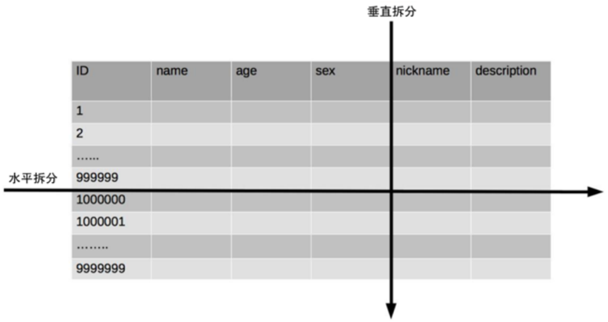
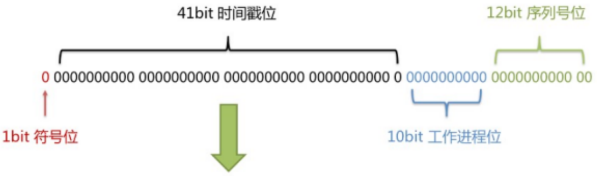
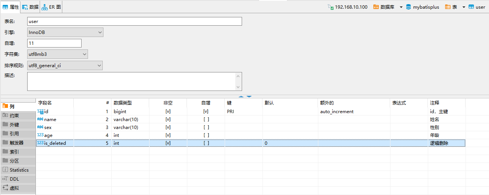
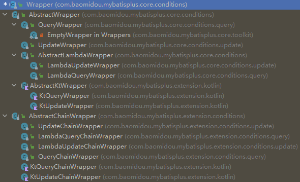
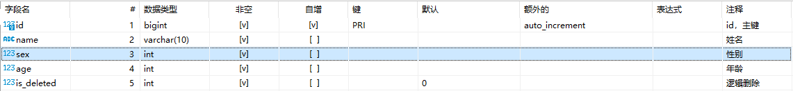
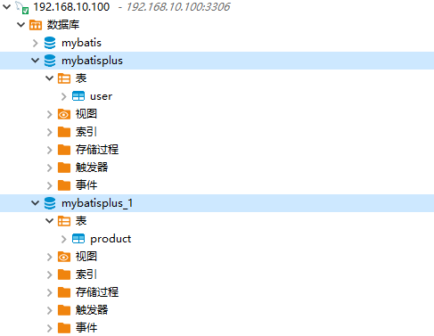

*`Author: ACatSmiling`*

*`Since: 2022-07-04`*

## 简介

官网：https://baomidou.com/

Github：https://github.com/baomidou/mybatis-plus

**`MyBatis-Plus`**（简称 MP）是`一个 MyBatis 的增强工具`，在 MyBatis 的基础上`只做增强不做改变`，为简化开发、提高效率而生。


MyBatis-Plus 提供了通用的 mapper 和 service，可以在不编写任何 SQL 语句的情况下，快速实现对单表的 CRUD、批量、逻辑删除、分页等操作。

### 特性

`无侵入`：只做增强不做改变，引入它不会对现有工程产生影响，如丝般顺滑。

`损耗小`：启动即会自动注入基本 CURD，性能基本无损耗，直接面向对象操作。

`强大的 CRUD 操作`：内置通用 Mapper、通用 Service，仅仅通过少量配置即可实现单表大部分 CRUD 操作，更有强大的条件构造器，满足各类使用需求。

`支持 Lambda 形式调用`：通过 Lambda 表达式，方便的编写各类查询条件，无需再担心字段写错。

`支持主键自动生成`：支持多达 4 种主键策略（内含分布式唯一 ID 生成器 Sequence），可自由配置，完美解决主键问题。

`支持 ActiveRecord 模式`：支持 ActiveRecord 形式调用，实体类只需继承 Model 类即可进行强大的 CRUD 操作。

`支持自定义全局通用操作`：支持全局通用方法注入（ Write once, use anywhere ）。

`内置代码生成器`：采用代码或者 Maven 插件可快速生成 Mapper 、 Model 、 Service 、Controller 层代码，支持模板引擎，更有超多自定义配置等您来使用。

`内置分页插件`：基于 MyBatis 物理分页，开发者无需关心具体操作，配置好插件之后，写分页等同于普通 List 查询。

`分页插件支持多种数据库`：支持 MySQL、MariaDB、Oracle、DB2、H2、HSQL、SQLite、Postgre、SQLServer 等多种数据库。

`内置性能分析插件`：可输出 SQL 语句以及其执行时间，建议开发测试时启用该功能，能快速揪出慢查询。

`内置全局拦截插件`：提供全表 delete 、 update 操作智能分析阻断，也可自定义拦截规则，预防误操作。

### 支持数据库

任何能使用 MyBatis 进行 CRUD，并且支持标准 SQL 的数据库，都可以使用 MyBatis-Plus，具体支持情况如下：

- MySQL，Oracle，DB2，H2，HSQL，SQLite，PostgreSQL，SQLServer，Phoenix，Gauss ，ClickHouse，Sybase，OceanBase，Firebird，Cubrid，Goldilocks，csiidb。
- 达梦数据库，虚谷数据库，人大金仓数据库，南大通用（华库）数据库，南大通用数据库，神通数据库，瀚高数据库。

### 框架结构


## quick start

### 环境说明

JDK：

```bash
C:\Users\XiSun>java -version
openjdk version "1.8.0_222"
OpenJDK Runtime Environment (AdoptOpenJDK)(build 1.8.0_222-b10)      
OpenJDK 64-Bit Server VM (AdoptOpenJDK)(build 25.222-b10, mixed mode)
```

Maven：

```bash
C:\Users\XiSun>mvn --version
Apache Maven 3.8.5 (3599d3414f046de2324203b78ddcf9b5e4388aa0)
Maven home: D:\Programs\Maven\apache-maven-3.8.5
Java version: 1.8.0_222, vendor: AdoptOpenJDK, runtime: D:\Programs\AdoptOpenJDK\jdk-8.0.222.10-hotspot\jre
Default locale: zh_CN, platform encoding: GBK
OS name: "windows 10", version: "10.0", arch: "amd64", family: "windows"
```

MySQL：

```bash
root@xisun-develop:/home/xisun# docker ps
CONTAINER ID   IMAGE          COMMAND                  CREATED       STATUS      PORTS                                                  NAMES
4905d5364838   mysql:8.0.29   "docker-entrypoint.s…"   3 weeks ago   Up 2 days   0.0.0.0:3306->3306/tcp, :::3306->3306/tcp, 33060/tcp   mysql_8.0.29
root@xisun-develop:/home/xisun# docker images
REPOSITORY              TAG          IMAGE ID       CREATED         SIZE
mysql                   8.0.29       0ef9083d9892   4 weeks ago     524MB
```

Spring Boot：

```xml
<parent>
    <groupId>org.springframework.boot</groupId>
    <artifactId>spring-boot-starter-parent</artifactId>
    <version>2.7.2</version>
</parent>
```

> Spring Boot 2.7.2 版本，默认使用的 MySQL 连接驱动为 8.0.29。

MyBatis-Plus：

```xml
<dependency>
    <groupId>com.baomidou</groupId>
    <artifactId>mybatis-plus-boot-starter</artifactId>
    <version>3.5.2</version>
</dependency>
```

### 生成数据

```sql
CREATE TABLE IF NOT EXISTS mybatisplus.user (
	`id` BIGINT(20) NOT NULL AUTO_INCREMENT COMMENT 'id，主键',
	`name` VARCHAR(10) NOT NULL COMMENT '姓名',
	`sex` VARCHAR(10) NOT NULL COMMENT '性别',
	`age` INT(10) NOT NULL COMMENT '年龄',
	PRIMARY KEY (`id`)
)
COLLATE='utf8_general_ci'
ENGINE=InnoDB
;

INSERT INTO mybatisplus.`user` (name, sex, age) VALUES ("张三", "男", 27);

INSERT INTO mybatisplus.`user` (name, sex, age) VALUES ("李四", "男", 28);

INSERT INTO mybatisplus.`user` (name, sex, age) VALUES ("王二", "男", 26);

INSERT INTO mybatisplus.`user` (name, sex, age) VALUES ("刘七", "女", 25);

INSERT INTO mybatisplus.`user` (name, sex, age) VALUES ("郑八", "男", 29);
```

### 创建 Spring Boot 项目


### 引入依赖

```xml
<?xml version="1.0" encoding="UTF-8"?>
<project xmlns="http://maven.apache.org/POM/4.0.0"
         xmlns:xsi="http://www.w3.org/2001/XMLSchema-instance"
         xsi:schemaLocation="http://maven.apache.org/POM/4.0.0 http://maven.apache.org/xsd/maven-4.0.0.xsd">
    <modelVersion>4.0.0</modelVersion>

    <groupId>cn.xisun.mybatisplus.springboot</groupId>
    <artifactId>xisun-mybatisplus-springboot</artifactId>
    <version>1.0-SNAPSHOT</version>

    <parent>
        <groupId>org.springframework.boot</groupId>
        <artifactId>spring-boot-starter-parent</artifactId>
        <version>2.7.2</version>
    </parent>

    <properties>
        <project.build.sourceEncoding>UTF-8</project.build.sourceEncoding>
        <java.version>8</java.version>
        <maven.compiler.source>${java.version}</maven.compiler.source>
        <maven.compiler.target>${java.version}</maven.compiler.target>
        <jupiter.version>5.8.2</jupiter.version>
        <lombok.version>1.18.24</lombok.version>
        <logback.version>1.2.11</logback.version>
        <hutool.version>5.8.3</hutool.version>
        <fastjson.version>2.0.7</fastjson.version>
    </properties>

    <repositories>
        <repository>
            <id>aliyun</id>
            <url>http://maven.aliyun.com/nexus/content/groups/public</url>
            <releases>
                <enabled>true</enabled>
            </releases>
            <snapshots>
                <enabled>false</enabled>
            </snapshots>
        </repository>
    </repositories>

    <pluginRepositories>
        <pluginRepository>
            <id>aliyun-plugin</id>
            <url>http://maven.aliyun.com/nexus/content/groups/public</url>
            <releases>
                <enabled>true</enabled>
            </releases>
            <snapshots>
                <enabled>false</enabled>
            </snapshots>
        </pluginRepository>
    </pluginRepositories>

    <dependencies>
        <dependency>
            <groupId>org.junit.jupiter</groupId>
            <artifactId>junit-jupiter</artifactId>
            <version>${jupiter.version}</version>
            <scope>test</scope>
        </dependency>

        <dependency>
            <groupId>org.projectlombok</groupId>
            <artifactId>lombok</artifactId>
            <version>${lombok.version}</version>
        </dependency>

        <dependency>
            <groupId>ch.qos.logback</groupId>
            <artifactId>logback-classic</artifactId>
            <version>${logback.version}</version>
        </dependency>

        <dependency>
            <groupId>cn.hutool</groupId>
            <artifactId>hutool-all</artifactId>
            <version>${hutool.version}</version>
        </dependency>

        <dependency>
            <groupId>com.alibaba</groupId>
            <artifactId>fastjson</artifactId>
            <version>${fastjson.version}</version>
        </dependency>

        <dependency>
            <groupId>org.springframework.boot</groupId>
            <artifactId>spring-boot-starter-web</artifactId>
        </dependency>

        <dependency>
            <groupId>org.springframework.boot</groupId>
            <artifactId>spring-boot-starter-test</artifactId>
            <scope>test</scope>
        </dependency>
        
        <!-- MySQL 驱动依赖 -->
        <dependency>
            <groupId>mysql</groupId>
            <artifactId>mysql-connector-java</artifactId>
            <scope>runtime</scope>
        </dependency>

        <!-- MyBatis Plus Starter依赖 -->
        <dependency>
            <groupId>com.baomidou</groupId>
            <artifactId>mybatis-plus-boot-starter</artifactId>
            <version>3.5.2</version>
        </dependency>
    </dependencies>
</project>
```

说明：spring-boot-starter-parent 中，有定义 mysql-connector-java 的默认版本，因此，引入 mysql-connector-java 依赖时，可以不指定版本。


> 如果默认的 MySQL 连接驱动，不匹配实际使用的 MySQL 数据库，在引入驱动依赖时，需要指定相应的驱动版本。
>

### 配置 application.yml

```yaml
spring:
  application:
    name: xisun-mybatisplus-server
  # 数据库配置
  datasource:
    # 配置数据源类型
    type: com.zaxxer.hikari.HikariDataSource
    # 配置连接数据库信息
    driver-class-name: com.mysql.cj.jdbc.Driver
    url: jdbc:mysql://${MYSQL_HOST:192.168.10.100}:${MYSQL_PORT:3306}/${MYSQL_DB:mybatisplus}?serverTimezone=GMT%2B8&characterEncoding=utf-8&useSSL=false
    username: ${MYSQL_USERNAME:root}
    password: ${MYSQL_PASSWORD:root}

# Logger Config
logging:
  level:
    cn.xisun.mybatisplus.springboot: DEBUG

# 配置MyBatis日志
mybatis-plus:
  configuration:
    log-impl: org.apache.ibatis.logging.stdout.StdOutImpl
```

>Spring Boot 2.0 内置 jdbc5 驱动，Spring Boot 2.1 及以上内置 jdbc8 驱动。
>
>driver-class-name：
>
>- ≤ MySQL 5：`com.mysql.jdbc.Driver`
>- ≥ MySQL 6：`com.mysql.cj.jdbc.Driver`
>
>连接地址 url：
>
>- MySQL 5.7 版本：`jdbc:mysql://192.168.10.100:3306/mybatisplus?characterEncoding=utf-8&useSSL=false`
>- MySQL 8.0 版本：`jdbc:mysql://192.168.10.100:3306:3306/mybatis_plus?serverTimezone=GMT%2B8&characterEncoding=utf-8&useSSL=false`

### 启动类

```java
/**
 * @author XiSun
 * @version 1.0
 * @date 2022/7/27 11:17
 * @description
 */
@SpringBootApplication
@MapperScan("cn.xisun.mybatisplus.springboot.mapper")
public class MainApplication {
    public static void main(String[] args) {
        SpringApplication.run(MainApplication.class, args);
    }
}
```

>`@MapperScan`注解：用在 SpringBoot 启动类上，扫描指定包下所有的接口类，然后这些接口在编译之后都会生成相应的实现类。@Mapper 支持扫描多个包以及表达式。

### 实体类

```java
/**
 * @author XiSun
 * @version 1.0
 * @date 2022/7/27 14:07
 * @description
 */
@Data
@NoArgsConstructor
public class User {
    private Long id;
    private String name;
    private String sex;
    private Integer age;
}
```

### Mapper 映射类

```java
/**
 * @author XiSun
 * @version 1.0
 * @date 2022/7/27 14:08
 * @description
 */
@Mapper
@Repository
public interface UserMapper extends BaseMapper<User> {
}
```

>`@Mapper`注解：用在接口类上，在编译之后会生成相应的接口实现类。如果有很多接口都需要使用 @Mapper 注解，则可以将这些接口置于同一个包路径下，然后使用 @MapperScan 注解扫描这个包，此时，该包下的接口不需要再添加 @Mapper 注解。
>
>`@Repository`注解：@Mapper 标注的类，使用 @Autowired 自动装配时，IDEA 会提示找不到这个类，但不影响程序运行。这是因为 @Mapper 注解是 MyBatis 提供的，而 @Autowried 注解是 Spring 提供的，IDEA 能理解 Spring 的上下文，但是却和 MyBatis 关联不上。因此，可以在 Mapper 接口上， 添加 @Repository 注解，或者 @Component 注解，让 IDEA 以为其也是一个 Spring 管理的 Bean。

### 测试类

```java
@SpringBootTest
class UserMapperTest {
    @Autowired
    UserMapper userMapper;

    @Test
    public void testSelectList() {
        //selectList()：根据MP内置的条件构造器查询一个list集合，null表示没有条件，即查询所有
        userMapper.selectList(null).forEach(System.out::println);
    }
}
```

### 输出

```java
2022-07-29 08:26:13.943 [main] INFO  o.s.b.t.context.SpringBootTestContextBootstrapper - Neither @ContextConfiguration nor @ContextHierarchy found for test class [cn.xisun.mybatisplus.springboot.mapper.UserMapperTest], using SpringBootContextLoader
2022-07-29 08:26:13.949 [main] INFO  o.s.test.context.support.AbstractContextLoader - Could not detect default resource locations for test class [cn.xisun.mybatisplus.springboot.mapper.UserMapperTest]: no resource found for suffixes {-context.xml, Context.groovy}.
2022-07-29 08:26:13.950 [main] INFO  o.s.t.c.support.AnnotationConfigContextLoaderUtils - Could not detect default configuration classes for test class [cn.xisun.mybatisplus.springboot.mapper.UserMapperTest]: UserMapperTest does not declare any static, non-private, non-final, nested classes annotated with @Configuration.
2022-07-29 08:26:14.073 [main] INFO  o.s.b.t.context.SpringBootTestContextBootstrapper - Found @SpringBootConfiguration cn.xisun.mybatisplus.springboot.MainApplication for test class cn.xisun.mybatisplus.springboot.mapper.UserMapperTest
2022-07-29 08:26:14.187 [main] INFO  o.s.b.t.context.SpringBootTestContextBootstrapper - Loaded default TestExecutionListener class names from location [META-INF/spring.factories]: [org.springframework.boot.test.mock.mockito.MockitoTestExecutionListener, org.springframework.boot.test.mock.mockito.ResetMocksTestExecutionListener, org.springframework.boot.test.autoconfigure.restdocs.RestDocsTestExecutionListener, org.springframework.boot.test.autoconfigure.web.client.MockRestServiceServerResetTestExecutionListener, org.springframework.boot.test.autoconfigure.web.servlet.MockMvcPrintOnlyOnFailureTestExecutionListener, org.springframework.boot.test.autoconfigure.web.servlet.WebDriverTestExecutionListener, org.springframework.boot.test.autoconfigure.webservices.client.MockWebServiceServerTestExecutionListener, org.springframework.test.context.web.ServletTestExecutionListener, org.springframework.test.context.support.DirtiesContextBeforeModesTestExecutionListener, org.springframework.test.context.event.ApplicationEventsTestExecutionListener, org.springframework.test.context.support.DependencyInjectionTestExecutionListener, org.springframework.test.context.support.DirtiesContextTestExecutionListener, org.springframework.test.context.transaction.TransactionalTestExecutionListener, org.springframework.test.context.jdbc.SqlScriptsTestExecutionListener, org.springframework.test.context.event.EventPublishingTestExecutionListener]
2022-07-29 08:26:14.204 [main] INFO  o.s.b.t.context.SpringBootTestContextBootstrapper - Using TestExecutionListeners: [org.springframework.test.context.support.DirtiesContextBeforeModesTestExecutionListener@7fd7a283, org.springframework.test.context.event.ApplicationEventsTestExecutionListener@22f59fa, org.springframework.boot.test.mock.mockito.MockitoTestExecutionListener@78fa769e, org.springframework.boot.test.autoconfigure.SpringBootDependencyInjectionTestExecutionListener@16612a51, org.springframework.test.context.support.DirtiesContextTestExecutionListener@54e041a4, org.springframework.test.context.transaction.TransactionalTestExecutionListener@2c78324b, org.springframework.test.context.jdbc.SqlScriptsTestExecutionListener@79defdc, org.springframework.test.context.event.EventPublishingTestExecutionListener@18317edc, org.springframework.boot.test.mock.mockito.ResetMocksTestExecutionListener@4e0ae11f, org.springframework.boot.test.autoconfigure.restdocs.RestDocsTestExecutionListener@238d68ff, org.springframework.boot.test.autoconfigure.web.client.MockRestServiceServerResetTestExecutionListener@4b86805d, org.springframework.boot.test.autoconfigure.web.servlet.MockMvcPrintOnlyOnFailureTestExecutionListener@5852c06f, org.springframework.boot.test.autoconfigure.web.servlet.WebDriverTestExecutionListener@4149c063, org.springframework.boot.test.autoconfigure.webservices.client.MockWebServiceServerTestExecutionListener@9cb8225]

  .   ____          _            __ _ _
 /\\ / ___'_ __ _ _(_)_ __  __ _ \ \ \ \
( ( )\___ | '_ | '_| | '_ \/ _` | \ \ \ \
 \\/  ___)| |_)| | | | | || (_| |  ) ) ) )
  '  |____| .__|_| |_|_| |_\__, | / / / /
 =========|_|==============|___/=/_/_/_/
 :: Spring Boot ::                (v2.7.2)

2022-07-29 08:26:14.511 [main] INFO  c.x.mybatisplus.springboot.mapper.UserMapperTest - Starting UserMapperTest using Java 1.8.0_222 on DESKTOP-F1JDHC6 with PID 1492 (started by XiSun in D:\Projects\xisun-java-projects\xisun-mybatisplus-springboot)
2022-07-29 08:26:14.512 [main] DEBUG c.x.mybatisplus.springboot.mapper.UserMapperTest - Running with Spring Boot v2.7.2, Spring v5.3.22
2022-07-29 08:26:14.512 [main] INFO  c.x.mybatisplus.springboot.mapper.UserMapperTest - No active profile set, falling back to 1 default profile: "default"
Logging initialized using 'class org.apache.ibatis.logging.stdout.StdOutImpl' adapter.
Property 'mapperLocations' was not specified.
 _ _   |_  _ _|_. ___ _ |    _ 
| | |\/|_)(_| | |_\  |_)||_|_\ 
     /               |         
                        3.5.2 
2022-07-29 08:26:15.645 [main] INFO  c.x.mybatisplus.springboot.mapper.UserMapperTest - Started UserMapperTest in 1.401 seconds (JVM running for 2.465)
Creating a new SqlSession
SqlSession [org.apache.ibatis.session.defaults.DefaultSqlSession@6cd56321] was not registered for synchronization because synchronization is not active
2022-07-29 08:26:15.885 [main] INFO  com.zaxxer.hikari.HikariDataSource - HikariPool-1 - Starting...
2022-07-29 08:26:16.107 [main] INFO  com.zaxxer.hikari.HikariDataSource - HikariPool-1 - Start completed.
JDBC Connection [HikariProxyConnection@2022562847 wrapping com.mysql.cj.jdbc.ConnectionImpl@2dc3271b] will not be managed by Spring
==>  Preparing: SELECT id,name,sex,age FROM user
==> Parameters: 
<==    Columns: id, name, sex, age
<==        Row: 1, 张三, 男, 27
<==        Row: 2, 李四, 男, 28
<==        Row: 3, 王二, 男, 26
<==        Row: 4, 刘七, 女, 25
<==        Row: 5, 郑八, 男, 29
<==      Total: 5
Closing non transactional SqlSession [org.apache.ibatis.session.defaults.DefaultSqlSession@6cd56321]
User(id=1, name=张三, sex=男, age=27)
User(id=2, name=李四, sex=男, age=28)
User(id=3, name=王二, sex=男, age=26)
User(id=4, name=刘七, sex=女, age=25)
User(id=5, name=郑八, sex=男, age=29)
2022-07-29 08:26:16.178 [SpringApplicationShutdownHook] INFO  com.zaxxer.hikari.HikariDataSource - HikariPool-1 - Shutdown initiated...
2022-07-29 08:26:16.184 [SpringApplicationShutdownHook] INFO  com.zaxxer.hikari.HikariDataSource - HikariPool-1 - Shutdown completed.
```

### 项目结构


## 基本 CRUD

### BaseMapper

MyBatis-Plus 中的基本 CRUD 操作，在内置的 BaseMapper 中都已得到了实现，我们可以直接使用，接口如下：


```java
/*
 * Copyright (c) 2011-2022, baomidou (jobob@qq.com).
 *
 * Licensed under the Apache License, Version 2.0 (the "License");
 * you may not use this file except in compliance with the License.
 * You may obtain a copy of the License at
 *
 *     http://www.apache.org/licenses/LICENSE-2.0
 *
 * Unless required by applicable law or agreed to in writing, software
 * distributed under the License is distributed on an "AS IS" BASIS,
 * WITHOUT WARRANTIES OR CONDITIONS OF ANY KIND, either express or implied.
 * See the License for the specific language governing permissions and
 * limitations under the License.
 */
package com.baomidou.mybatisplus.core.mapper;

import com.baomidou.mybatisplus.core.conditions.Wrapper;
import com.baomidou.mybatisplus.core.metadata.IPage;
import com.baomidou.mybatisplus.core.toolkit.CollectionUtils;
import com.baomidou.mybatisplus.core.toolkit.Constants;
import com.baomidou.mybatisplus.core.toolkit.ExceptionUtils;
import org.apache.ibatis.annotations.Param;

import java.io.Serializable;
import java.util.Collection;
import java.util.List;
import java.util.Map;

/*

               :`
                    .:,
                     :::,,.
             ::      `::::::
             ::`    `,:,` .:`
             `:: `::::::::.:`      `:';,`
              ::::,     .:::`   `@++++++++:
               ``        :::`  @+++++++++++#
                         :::, #++++++++++++++`
                 ,:      `::::::;'##++++++++++
                 .@#@;`   ::::::::::::::::::::;
                  #@####@, :::::::::::::::+#;::.
                  @@######+@:::::::::::::.  #@:;
           ,      @@########':::::::::::: .#''':`
           ;##@@@+:##########@::::::::::: @#;.,:.
            #@@@######++++#####'::::::::: .##+,:#`
            @@@@@#####+++++'#####+::::::::` ,`::@#:`
            `@@@@#####++++++'#####+#':::::::::::@.
             @@@@######+++++''#######+##';::::;':,`
              @@@@#####+++++'''#######++++++++++`
               #@@#####++++++''########++++++++'
               `#@######+++++''+########+++++++;
                `@@#####+++++''##########++++++,
                 @@######+++++'##########+++++#`
                @@@@#####+++++############++++;
              ;#@@@@@####++++##############+++,
             @@@@@@@@@@@###@###############++'
           @#@@@@@@@@@@@@###################+:
        `@#@@@@@@@@@@@@@@###################'`
      :@#@@@@@@@@@@@@@@@@@##################,
      ,@@@@@@@@@@@@@@@@@@@@################;
       ,#@@@@@@@@@@@@@@@@@@@##############+`
        .#@@@@@@@@@@@@@@@@@@#############@,
          @@@@@@@@@@@@@@@@@@@###########@,
           :#@@@@@@@@@@@@@@@@##########@,
            `##@@@@@@@@@@@@@@@########+,
              `+@@@@@@@@@@@@@@@#####@:`
                `:@@@@@@@@@@@@@@##@;.
                   `,'@@@@##@@@+;,`
                        ``...``

 _ _     /_ _ _/_. ____  /    _
/ / //_//_//_|/ /_\  /_///_/_\      Talk is cheap. Show me the code.
     _/             /
 */

/**
 * Mapper 继承该接口后，无需编写 mapper.xml 文件，即可获得CRUD功能
 * <p>这个 Mapper 支持 id 泛型</p>
 *
 * @author hubin
 * @since 2016-01-23
 */
public interface BaseMapper<T> extends Mapper<T> {

    /**
     * 插入一条记录
     *
     * @param entity 实体对象
     */
    int insert(T entity);

    /**
     * 根据 ID 删除
     *
     * @param id 主键ID
     */
    int deleteById(Serializable id);

    /**
     * 根据实体(ID)删除
     *
     * @param entity 实体对象
     * @since 3.4.4
     */
    int deleteById(T entity);

    /**
     * 根据 columnMap 条件，删除记录
     *
     * @param columnMap 表字段 map 对象
     */
    int deleteByMap(@Param(Constants.COLUMN_MAP) Map<String, Object> columnMap);

    /**
     * 根据 entity 条件，删除记录
     *
     * @param queryWrapper 实体对象封装操作类（可以为 null,里面的 entity 用于生成 where 语句）
     */
    int delete(@Param(Constants.WRAPPER) Wrapper<T> queryWrapper);

    /**
     * 删除（根据ID或实体 批量删除）
     *
     * @param idList 主键ID列表或实体列表(不能为 null 以及 empty)
     */
    int deleteBatchIds(@Param(Constants.COLL) Collection<?> idList);

    /**
     * 根据 ID 修改
     *
     * @param entity 实体对象
     */
    int updateById(@Param(Constants.ENTITY) T entity);

    /**
     * 根据 whereEntity 条件，更新记录
     *
     * @param entity        实体对象 (set 条件值,可以为 null)
     * @param updateWrapper 实体对象封装操作类（可以为 null,里面的 entity 用于生成 where 语句）
     */
    int update(@Param(Constants.ENTITY) T entity, @Param(Constants.WRAPPER) Wrapper<T> updateWrapper);

    /**
     * 根据 ID 查询
     *
     * @param id 主键ID
     */
    T selectById(Serializable id);

    /**
     * 查询（根据ID 批量查询）
     *
     * @param idList 主键ID列表(不能为 null 以及 empty)
     */
    List<T> selectBatchIds(@Param(Constants.COLL) Collection<? extends Serializable> idList);

    /**
     * 查询（根据 columnMap 条件）
     *
     * @param columnMap 表字段 map 对象
     */
    List<T> selectByMap(@Param(Constants.COLUMN_MAP) Map<String, Object> columnMap);

    /**
     * 根据 entity 条件，查询一条记录
     * <p>查询一条记录，例如 qw.last("limit 1") 限制取一条记录, 注意：多条数据会报异常</p>
     *
     * @param queryWrapper 实体对象封装操作类（可以为 null）
     */
    default T selectOne(@Param(Constants.WRAPPER) Wrapper<T> queryWrapper) {
        List<T> ts = this.selectList(queryWrapper);
        if (CollectionUtils.isNotEmpty(ts)) {
            if (ts.size() != 1) {
                throw ExceptionUtils.mpe("One record is expected, but the query result is multiple records");
            }
            return ts.get(0);
        }
        return null;
    }

    /**
     * 根据 Wrapper 条件，判断是否存在记录
     *
     * @param queryWrapper 实体对象封装操作类
     * @return 是否存在记录
     */
    default boolean exists(Wrapper<T> queryWrapper) {
        Long count = this.selectCount(queryWrapper);
        return null != count && count > 0;
    }

    /**
     * 根据 Wrapper 条件，查询总记录数
     *
     * @param queryWrapper 实体对象封装操作类（可以为 null）
     */
    Long selectCount(@Param(Constants.WRAPPER) Wrapper<T> queryWrapper);

    /**
     * 根据 entity 条件，查询全部记录
     *
     * @param queryWrapper 实体对象封装操作类（可以为 null）
     */
    List<T> selectList(@Param(Constants.WRAPPER) Wrapper<T> queryWrapper);

    /**
     * 根据 Wrapper 条件，查询全部记录
     *
     * @param queryWrapper 实体对象封装操作类（可以为 null）
     */
    List<Map<String, Object>> selectMaps(@Param(Constants.WRAPPER) Wrapper<T> queryWrapper);

    /**
     * 根据 Wrapper 条件，查询全部记录
     * <p>注意： 只返回第一个字段的值</p>
     *
     * @param queryWrapper 实体对象封装操作类（可以为 null）
     */
    List<Object> selectObjs(@Param(Constants.WRAPPER) Wrapper<T> queryWrapper);

    /**
     * 根据 entity 条件，查询全部记录（并翻页）
     *
     * @param page         分页查询条件（可以为 RowBounds.DEFAULT）
     * @param queryWrapper 实体对象封装操作类（可以为 null）
     */
    <P extends IPage<T>> P selectPage(P page, @Param(Constants.WRAPPER) Wrapper<T> queryWrapper);

    /**
     * 根据 Wrapper 条件，查询全部记录（并翻页）
     *
     * @param page         分页查询条件
     * @param queryWrapper 实体对象封装操作类
     */
    <P extends IPage<Map<String, Object>>> P selectMapsPage(P page, @Param(Constants.WRAPPER) Wrapper<T> queryWrapper);
}
```

### 插入

略

### 删除

略

### 修改

略

## 通用 Service

### IService 和 ServiceImpl

MyBatis-Plus 中有一个接口`IService`和其实现类`ServiceImpl`，封装了常见的业务层逻辑。

如果存在自定义通用 Service 方法的可能，可以创建自己的 IBaseService 继承 Mybatis-Plus 提供的基类。

```java
/**
 * 顶级 Service
 *
 * @author hubin
 * @since 2018-06-23
 */
public interface IService<T> {

    /**
     * 默认批次提交数量
     */
    int DEFAULT_BATCH_SIZE = 1000;

    /**
     * 插入一条记录（选择字段，策略插入）
     *
     * @param entity 实体对象
     */
    default boolean save(T entity) {
        return SqlHelper.retBool(getBaseMapper().insert(entity));
    }

    /**
     * 插入（批量）
     *
     * @param entityList 实体对象集合
     */
    @Transactional(rollbackFor = Exception.class)
    default boolean saveBatch(Collection<T> entityList) {
        return saveBatch(entityList, DEFAULT_BATCH_SIZE);
    }

    /**
     * 插入（批量）
     *
     * @param entityList 实体对象集合
     * @param batchSize  插入批次数量
     */
    boolean saveBatch(Collection<T> entityList, int batchSize);

    /**
     * 批量修改插入
     *
     * @param entityList 实体对象集合
     */
    @Transactional(rollbackFor = Exception.class)
    default boolean saveOrUpdateBatch(Collection<T> entityList) {
        return saveOrUpdateBatch(entityList, DEFAULT_BATCH_SIZE);
    }

    /**
     * 批量修改插入
     *
     * @param entityList 实体对象集合
     * @param batchSize  每次的数量
     */
    boolean saveOrUpdateBatch(Collection<T> entityList, int batchSize);

    /**
     * 根据 ID 删除
     *
     * @param id 主键ID
     */
    default boolean removeById(Serializable id) {
        return SqlHelper.retBool(getBaseMapper().deleteById(id));
    }

    /**
     * 根据 ID 删除
     *
     * @param id      主键(类型必须与实体类型字段保持一致)
     * @param useFill 是否启用填充(为true的情况,会将入参转换实体进行delete删除)
     * @return 删除结果
     * @since 3.5.0
     */
    default boolean removeById(Serializable id, boolean useFill) {
        throw new UnsupportedOperationException("不支持的方法!");
    }

    /**
     * 根据实体(ID)删除
     *
     * @param entity 实体
     * @since 3.4.4
     */
    default boolean removeById(T entity) {
        return SqlHelper.retBool(getBaseMapper().deleteById(entity));
    }

    /**
     * 根据 columnMap 条件，删除记录
     *
     * @param columnMap 表字段 map 对象
     */
    default boolean removeByMap(Map<String, Object> columnMap) {
        Assert.notEmpty(columnMap, "error: columnMap must not be empty");
        return SqlHelper.retBool(getBaseMapper().deleteByMap(columnMap));
    }

    /**
     * 根据 entity 条件，删除记录
     *
     * @param queryWrapper 实体包装类 {@link com.baomidou.mybatisplus.core.conditions.query.QueryWrapper}
     */
    default boolean remove(Wrapper<T> queryWrapper) {
        return SqlHelper.retBool(getBaseMapper().delete(queryWrapper));
    }

    /**
     * 删除（根据ID 批量删除）
     *
     * @param list 主键ID或实体列表
     */
    default boolean removeByIds(Collection<?> list) {
        if (CollectionUtils.isEmpty(list)) {
            return false;
        }
        return SqlHelper.retBool(getBaseMapper().deleteBatchIds(list));
    }

    /**
     * 批量删除
     *
     * @param list    主键ID或实体列表
     * @param useFill 是否填充(为true的情况,会将入参转换实体进行delete删除)
     * @return 删除结果
     * @since 3.5.0
     */
    @Transactional(rollbackFor = Exception.class)
    default boolean removeByIds(Collection<?> list, boolean useFill) {
        if (CollectionUtils.isEmpty(list)) {
            return false;
        }
        if (useFill) {
            return removeBatchByIds(list, true);
        }
        return SqlHelper.retBool(getBaseMapper().deleteBatchIds(list));
    }

    /**
     * 批量删除(jdbc批量提交)
     *
     * @param list 主键ID或实体列表(主键ID类型必须与实体类型字段保持一致)
     * @return 删除结果
     * @since 3.5.0
     */
    @Transactional(rollbackFor = Exception.class)
    default boolean removeBatchByIds(Collection<?> list) {
        return removeBatchByIds(list, DEFAULT_BATCH_SIZE);
    }

    /**
     * 批量删除(jdbc批量提交)
     *
     * @param list    主键ID或实体列表(主键ID类型必须与实体类型字段保持一致)
     * @param useFill 是否启用填充(为true的情况,会将入参转换实体进行delete删除)
     * @return 删除结果
     * @since 3.5.0
     */
    @Transactional(rollbackFor = Exception.class)
    default boolean removeBatchByIds(Collection<?> list, boolean useFill) {
        return removeBatchByIds(list, DEFAULT_BATCH_SIZE, useFill);
    }

    /**
     * 批量删除(jdbc批量提交)
     *
     * @param list      主键ID或实体列表
     * @param batchSize 批次大小
     * @return 删除结果
     * @since 3.5.0
     */
    default boolean removeBatchByIds(Collection<?> list, int batchSize) {
        throw new UnsupportedOperationException("不支持的方法!");
    }

    /**
     * 批量删除(jdbc批量提交)
     *
     * @param list      主键ID或实体列表
     * @param batchSize 批次大小
     * @param useFill   是否启用填充(为true的情况,会将入参转换实体进行delete删除)
     * @return 删除结果
     * @since 3.5.0
     */
    default boolean removeBatchByIds(Collection<?> list, int batchSize, boolean useFill) {
        throw new UnsupportedOperationException("不支持的方法!");
    }

    /**
     * 根据 ID 选择修改
     *
     * @param entity 实体对象
     */
    default boolean updateById(T entity) {
        return SqlHelper.retBool(getBaseMapper().updateById(entity));
    }

    /**
     * 根据 UpdateWrapper 条件，更新记录 需要设置sqlset
     *
     * @param updateWrapper 实体对象封装操作类 {@link com.baomidou.mybatisplus.core.conditions.update.UpdateWrapper}
     */
    default boolean update(Wrapper<T> updateWrapper) {
        return update(null, updateWrapper);
    }

    /**
     * 根据 whereEntity 条件，更新记录
     *
     * @param entity        实体对象
     * @param updateWrapper 实体对象封装操作类 {@link com.baomidou.mybatisplus.core.conditions.update.UpdateWrapper}
     */
    default boolean update(T entity, Wrapper<T> updateWrapper) {
        return SqlHelper.retBool(getBaseMapper().update(entity, updateWrapper));
    }

    /**
     * 根据ID 批量更新
     *
     * @param entityList 实体对象集合
     */
    @Transactional(rollbackFor = Exception.class)
    default boolean updateBatchById(Collection<T> entityList) {
        return updateBatchById(entityList, DEFAULT_BATCH_SIZE);
    }

    /**
     * 根据ID 批量更新
     *
     * @param entityList 实体对象集合
     * @param batchSize  更新批次数量
     */
    boolean updateBatchById(Collection<T> entityList, int batchSize);

    /**
     * TableId 注解存在更新记录，否插入一条记录
     *
     * @param entity 实体对象
     */
    boolean saveOrUpdate(T entity);

    /**
     * 根据 ID 查询
     *
     * @param id 主键ID
     */
    default T getById(Serializable id) {
        return getBaseMapper().selectById(id);
    }

    /**
     * 查询（根据ID 批量查询）
     *
     * @param idList 主键ID列表
     */
    default List<T> listByIds(Collection<? extends Serializable> idList) {
        return getBaseMapper().selectBatchIds(idList);
    }

    /**
     * 查询（根据 columnMap 条件）
     *
     * @param columnMap 表字段 map 对象
     */
    default List<T> listByMap(Map<String, Object> columnMap) {
        return getBaseMapper().selectByMap(columnMap);
    }

    /**
     * 根据 Wrapper，查询一条记录 <br/>
     * <p>结果集，如果是多个会抛出异常，随机取一条加上限制条件 wrapper.last("LIMIT 1")</p>
     *
     * @param queryWrapper 实体对象封装操作类 {@link com.baomidou.mybatisplus.core.conditions.query.QueryWrapper}
     */
    default T getOne(Wrapper<T> queryWrapper) {
        return getOne(queryWrapper, true);
    }

    /**
     * 根据 Wrapper，查询一条记录
     *
     * @param queryWrapper 实体对象封装操作类 {@link com.baomidou.mybatisplus.core.conditions.query.QueryWrapper}
     * @param throwEx      有多个 result 是否抛出异常
     */
    T getOne(Wrapper<T> queryWrapper, boolean throwEx);

    /**
     * 根据 Wrapper，查询一条记录
     *
     * @param queryWrapper 实体对象封装操作类 {@link com.baomidou.mybatisplus.core.conditions.query.QueryWrapper}
     */
    Map<String, Object> getMap(Wrapper<T> queryWrapper);

    /**
     * 根据 Wrapper，查询一条记录
     *
     * @param queryWrapper 实体对象封装操作类 {@link com.baomidou.mybatisplus.core.conditions.query.QueryWrapper}
     * @param mapper       转换函数
     */
    <V> V getObj(Wrapper<T> queryWrapper, Function<? super Object, V> mapper);

    /**
     * 查询总记录数
     *
     * @see Wrappers#emptyWrapper()
     */
    default long count() {
        return count(Wrappers.emptyWrapper());
    }

    /**
     * 根据 Wrapper 条件，查询总记录数
     *
     * @param queryWrapper 实体对象封装操作类 {@link com.baomidou.mybatisplus.core.conditions.query.QueryWrapper}
     */
    default long count(Wrapper<T> queryWrapper) {
        return SqlHelper.retCount(getBaseMapper().selectCount(queryWrapper));
    }

    /**
     * 查询列表
     *
     * @param queryWrapper 实体对象封装操作类 {@link com.baomidou.mybatisplus.core.conditions.query.QueryWrapper}
     */
    default List<T> list(Wrapper<T> queryWrapper) {
        return getBaseMapper().selectList(queryWrapper);
    }

    /**
     * 查询所有
     *
     * @see Wrappers#emptyWrapper()
     */
    default List<T> list() {
        return list(Wrappers.emptyWrapper());
    }

    /**
     * 翻页查询
     *
     * @param page         翻页对象
     * @param queryWrapper 实体对象封装操作类 {@link com.baomidou.mybatisplus.core.conditions.query.QueryWrapper}
     */
    default <E extends IPage<T>> E page(E page, Wrapper<T> queryWrapper) {
        return getBaseMapper().selectPage(page, queryWrapper);
    }

    /**
     * 无条件翻页查询
     *
     * @param page 翻页对象
     * @see Wrappers#emptyWrapper()
     */
    default <E extends IPage<T>> E page(E page) {
        return page(page, Wrappers.emptyWrapper());
    }

    /**
     * 查询列表
     *
     * @param queryWrapper 实体对象封装操作类 {@link com.baomidou.mybatisplus.core.conditions.query.QueryWrapper}
     */
    default List<Map<String, Object>> listMaps(Wrapper<T> queryWrapper) {
        return getBaseMapper().selectMaps(queryWrapper);
    }

    /**
     * 查询所有列表
     *
     * @see Wrappers#emptyWrapper()
     */
    default List<Map<String, Object>> listMaps() {
        return listMaps(Wrappers.emptyWrapper());
    }

    /**
     * 查询全部记录
     */
    default List<Object> listObjs() {
        return listObjs(Function.identity());
    }

    /**
     * 查询全部记录
     *
     * @param mapper 转换函数
     */
    default <V> List<V> listObjs(Function<? super Object, V> mapper) {
        return listObjs(Wrappers.emptyWrapper(), mapper);
    }

    /**
     * 根据 Wrapper 条件，查询全部记录
     *
     * @param queryWrapper 实体对象封装操作类 {@link com.baomidou.mybatisplus.core.conditions.query.QueryWrapper}
     */
    default List<Object> listObjs(Wrapper<T> queryWrapper) {
        return listObjs(queryWrapper, Function.identity());
    }

    /**
     * 根据 Wrapper 条件，查询全部记录
     *
     * @param queryWrapper 实体对象封装操作类 {@link com.baomidou.mybatisplus.core.conditions.query.QueryWrapper}
     * @param mapper       转换函数
     */
    default <V> List<V> listObjs(Wrapper<T> queryWrapper, Function<? super Object, V> mapper) {
        return getBaseMapper().selectObjs(queryWrapper).stream().filter(Objects::nonNull).map(mapper).collect(Collectors.toList());
    }

    /**
     * 翻页查询
     *
     * @param page         翻页对象
     * @param queryWrapper 实体对象封装操作类 {@link com.baomidou.mybatisplus.core.conditions.query.QueryWrapper}
     */
    default <E extends IPage<Map<String, Object>>> E pageMaps(E page, Wrapper<T> queryWrapper) {
        return getBaseMapper().selectMapsPage(page, queryWrapper);
    }

    /**
     * 无条件翻页查询
     *
     * @param page 翻页对象
     * @see Wrappers#emptyWrapper()
     */
    default <E extends IPage<Map<String, Object>>> E pageMaps(E page) {
        return pageMaps(page, Wrappers.emptyWrapper());
    }

    /**
     * 获取对应 entity 的 BaseMapper
     *
     * @return BaseMapper
     */
    BaseMapper<T> getBaseMapper();

    /**
     * 获取 entity 的 class
     *
     * @return {@link Class<T>}
     */
    Class<T> getEntityClass();

    /**
     * 以下的方法使用介绍:
     *
     * 一. 名称介绍
     * 1. 方法名带有 query 的为对数据的查询操作, 方法名带有 update 的为对数据的修改操作
     * 2. 方法名带有 lambda 的为内部方法入参 column 支持函数式的
     * 二. 支持介绍
     *
     * 1. 方法名带有 query 的支持以 {@link ChainQuery} 内部的方法名结尾进行数据查询操作
     * 2. 方法名带有 update 的支持以 {@link ChainUpdate} 内部的方法名为结尾进行数据修改操作
     *
     * 三. 使用示例,只用不带 lambda 的方法各展示一个例子,其他类推
     * 1. 根据条件获取一条数据: `query().eq("column", value).one()`
     * 2. 根据条件删除一条数据: `update().eq("column", value).remove()`
     *
     */

    /**
     * 链式查询 普通
     *
     * @return QueryWrapper 的包装类
     */
    default QueryChainWrapper<T> query() {
        return ChainWrappers.queryChain(getBaseMapper());
    }

    /**
     * 链式查询 lambda 式
     * <p>注意：不支持 Kotlin </p>
     *
     * @return LambdaQueryWrapper 的包装类
     */
    default LambdaQueryChainWrapper<T> lambdaQuery() {
        return ChainWrappers.lambdaQueryChain(getBaseMapper());
    }

    /**
     * 链式查询 lambda 式
     * kotlin 使用
     *
     * @return KtQueryWrapper 的包装类
     */
    default KtQueryChainWrapper<T> ktQuery() {
        return ChainWrappers.ktQueryChain(getBaseMapper(), getEntityClass());
    }

    /**
     * 链式查询 lambda 式
     * kotlin 使用
     *
     * @return KtQueryWrapper 的包装类
     */
    default KtUpdateChainWrapper<T> ktUpdate() {
        return ChainWrappers.ktUpdateChain(getBaseMapper(), getEntityClass());
    }

    /**
     * 链式更改 普通
     *
     * @return UpdateWrapper 的包装类
     */
    default UpdateChainWrapper<T> update() {
        return ChainWrappers.updateChain(getBaseMapper());
    }

    /**
     * 链式更改 lambda 式
     * <p>注意：不支持 Kotlin </p>
     *
     * @return LambdaUpdateWrapper 的包装类
     */
    default LambdaUpdateChainWrapper<T> lambdaUpdate() {
        return ChainWrappers.lambdaUpdateChain(getBaseMapper());
    }

    /**
     * <p>
     * 根据updateWrapper尝试更新，否继续执行saveOrUpdate(T)方法
     * 此次修改主要是减少了此项业务代码的代码量（存在性验证之后的saveOrUpdate操作）
     * </p>
     *
     * @param entity 实体对象
     */
    default boolean saveOrUpdate(T entity, Wrapper<T> updateWrapper) {
        return update(entity, updateWrapper) || saveOrUpdate(entity);
    }
}
```

```java
/**
 * IService 实现类（ 泛型：M 是 mapper 对象，T 是实体 ）
 *
 * @author hubin
 * @since 2018-06-23
 */
@SuppressWarnings("unchecked")
public class ServiceImpl<M extends BaseMapper<T>, T> implements IService<T> {

    protected Log log = LogFactory.getLog(getClass());

    @Autowired
    protected M baseMapper;

    @Override
    public M getBaseMapper() {
        return baseMapper;
    }

    protected Class<T> entityClass = currentModelClass();

    @Override
    public Class<T> getEntityClass() {
        return entityClass;
    }

    protected Class<M> mapperClass = currentMapperClass();

    /**
     * 判断数据库操作是否成功
     *
     * @param result 数据库操作返回影响条数
     * @return boolean
     * @deprecated 3.3.1
     */
    @Deprecated
    protected boolean retBool(Integer result) {
        return SqlHelper.retBool(result);
    }

    protected Class<M> currentMapperClass() {
        return (Class<M>) ReflectionKit.getSuperClassGenericType(this.getClass(), ServiceImpl.class, 0);
    }

    protected Class<T> currentModelClass() {
        return (Class<T>) ReflectionKit.getSuperClassGenericType(this.getClass(), ServiceImpl.class, 1);
    }


    /**
     * 批量操作 SqlSession
     *
     * @deprecated 3.3.0
     */
    @Deprecated
    protected SqlSession sqlSessionBatch() {
        return SqlHelper.sqlSessionBatch(entityClass);
    }

    /**
     * 释放sqlSession
     *
     * @param sqlSession session
     * @deprecated 3.3.0
     */
    @Deprecated
    protected void closeSqlSession(SqlSession sqlSession) {
        SqlSessionUtils.closeSqlSession(sqlSession, GlobalConfigUtils.currentSessionFactory(entityClass));
    }

    /**
     * 获取 SqlStatement
     *
     * @param sqlMethod ignore
     * @return ignore
     * @see #getSqlStatement(SqlMethod)
     * @deprecated 3.4.0
     */
    @Deprecated
    protected String sqlStatement(SqlMethod sqlMethod) {
        return SqlHelper.table(entityClass).getSqlStatement(sqlMethod.getMethod());
    }

    /**
     * 批量插入
     *
     * @param entityList ignore
     * @param batchSize  ignore
     * @return ignore
     */
    @Transactional(rollbackFor = Exception.class)
    @Override
    public boolean saveBatch(Collection<T> entityList, int batchSize) {
        String sqlStatement = getSqlStatement(SqlMethod.INSERT_ONE);
        return executeBatch(entityList, batchSize, (sqlSession, entity) -> sqlSession.insert(sqlStatement, entity));
    }

    /**
     * 获取mapperStatementId
     *
     * @param sqlMethod 方法名
     * @return 命名id
     * @since 3.4.0
     */
    protected String getSqlStatement(SqlMethod sqlMethod) {
        return SqlHelper.getSqlStatement(mapperClass, sqlMethod);
    }

    /**
     * TableId 注解存在更新记录，否插入一条记录
     *
     * @param entity 实体对象
     * @return boolean
     */
    @Transactional(rollbackFor = Exception.class)
    @Override
    public boolean saveOrUpdate(T entity) {
        if (null != entity) {
            TableInfo tableInfo = TableInfoHelper.getTableInfo(this.entityClass);
            Assert.notNull(tableInfo, "error: can not execute. because can not find cache of TableInfo for entity!");
            String keyProperty = tableInfo.getKeyProperty();
            Assert.notEmpty(keyProperty, "error: can not execute. because can not find column for id from entity!");
            Object idVal = tableInfo.getPropertyValue(entity, tableInfo.getKeyProperty());
            return StringUtils.checkValNull(idVal) || Objects.isNull(getById((Serializable) idVal)) ? save(entity) : updateById(entity);
        }
        return false;
    }

    @Transactional(rollbackFor = Exception.class)
    @Override
    public boolean saveOrUpdateBatch(Collection<T> entityList, int batchSize) {
        TableInfo tableInfo = TableInfoHelper.getTableInfo(entityClass);
        Assert.notNull(tableInfo, "error: can not execute. because can not find cache of TableInfo for entity!");
        String keyProperty = tableInfo.getKeyProperty();
        Assert.notEmpty(keyProperty, "error: can not execute. because can not find column for id from entity!");
        return SqlHelper.saveOrUpdateBatch(this.entityClass, this.mapperClass, this.log, entityList, batchSize, (sqlSession, entity) -> {
            Object idVal = tableInfo.getPropertyValue(entity, keyProperty);
            return StringUtils.checkValNull(idVal)
                || CollectionUtils.isEmpty(sqlSession.selectList(getSqlStatement(SqlMethod.SELECT_BY_ID), entity));
        }, (sqlSession, entity) -> {
            MapperMethod.ParamMap<T> param = new MapperMethod.ParamMap<>();
            param.put(Constants.ENTITY, entity);
            sqlSession.update(getSqlStatement(SqlMethod.UPDATE_BY_ID), param);
        });
    }

    @Transactional(rollbackFor = Exception.class)
    @Override
    public boolean updateBatchById(Collection<T> entityList, int batchSize) {
        String sqlStatement = getSqlStatement(SqlMethod.UPDATE_BY_ID);
        return executeBatch(entityList, batchSize, (sqlSession, entity) -> {
            MapperMethod.ParamMap<T> param = new MapperMethod.ParamMap<>();
            param.put(Constants.ENTITY, entity);
            sqlSession.update(sqlStatement, param);
        });
    }

    @Override
    public T getOne(Wrapper<T> queryWrapper, boolean throwEx) {
        if (throwEx) {
            return baseMapper.selectOne(queryWrapper);
        }
        return SqlHelper.getObject(log, baseMapper.selectList(queryWrapper));
    }

    @Override
    public Map<String, Object> getMap(Wrapper<T> queryWrapper) {
        return SqlHelper.getObject(log, baseMapper.selectMaps(queryWrapper));
    }

    @Override
    public <V> V getObj(Wrapper<T> queryWrapper, Function<? super Object, V> mapper) {
        return SqlHelper.getObject(log, listObjs(queryWrapper, mapper));
    }

    /**
     * 执行批量操作
     *
     * @param consumer consumer
     * @since 3.3.0
     * @deprecated 3.3.1 后面我打算移除掉 {@link #executeBatch(Collection, int, BiConsumer)} }.
     */
    @Deprecated
    protected boolean executeBatch(Consumer<SqlSession> consumer) {
        return SqlHelper.executeBatch(this.entityClass, this.log, consumer);
    }

    /**
     * 执行批量操作
     *
     * @param list      数据集合
     * @param batchSize 批量大小
     * @param consumer  执行方法
     * @param <E>       泛型
     * @return 操作结果
     * @since 3.3.1
     */
    protected <E> boolean executeBatch(Collection<E> list, int batchSize, BiConsumer<SqlSession, E> consumer) {
        return SqlHelper.executeBatch(this.entityClass, this.log, list, batchSize, consumer);
    }

    /**
     * 执行批量操作（默认批次提交数量{@link IService#DEFAULT_BATCH_SIZE}）
     *
     * @param list     数据集合
     * @param consumer 执行方法
     * @param <E>      泛型
     * @return 操作结果
     * @since 3.3.1
     */
    protected <E> boolean executeBatch(Collection<E> list, BiConsumer<SqlSession, E> consumer) {
        return executeBatch(list, DEFAULT_BATCH_SIZE, consumer);
    }

    @Override
    public boolean removeById(Serializable id) {
        TableInfo tableInfo = TableInfoHelper.getTableInfo(getEntityClass());
        if (tableInfo.isWithLogicDelete() && tableInfo.isWithUpdateFill()) {
            return removeById(id, true);
        }
        return SqlHelper.retBool(getBaseMapper().deleteById(id));
    }

    @Override
    @Transactional(rollbackFor = Exception.class)
    public boolean removeByIds(Collection<?> list) {
        if (CollectionUtils.isEmpty(list)) {
            return false;
        }
        TableInfo tableInfo = TableInfoHelper.getTableInfo(getEntityClass());
        if (tableInfo.isWithLogicDelete() && tableInfo.isWithUpdateFill()) {
            return removeBatchByIds(list, true);
        }
        return SqlHelper.retBool(getBaseMapper().deleteBatchIds(list));
    }

    @Override
    public boolean removeById(Serializable id, boolean useFill) {
        TableInfo tableInfo = TableInfoHelper.getTableInfo(entityClass);
        if (useFill && tableInfo.isWithLogicDelete()) {
            if (!entityClass.isAssignableFrom(id.getClass())) {
                T instance = tableInfo.newInstance();
                tableInfo.setPropertyValue(instance, tableInfo.getKeyProperty(), id);
                return removeById(instance);
            }
        }
        return SqlHelper.retBool(getBaseMapper().deleteById(id));
    }

    @Override
    @Transactional(rollbackFor = Exception.class)
    public boolean removeBatchByIds(Collection<?> list, int batchSize) {
        TableInfo tableInfo = TableInfoHelper.getTableInfo(entityClass);
        return removeBatchByIds(list, batchSize, tableInfo.isWithLogicDelete() && tableInfo.isWithUpdateFill());
    }

    @Override
    @Transactional(rollbackFor = Exception.class)
    public boolean removeBatchByIds(Collection<?> list, int batchSize, boolean useFill) {
        String sqlStatement = getSqlStatement(SqlMethod.DELETE_BY_ID);
        TableInfo tableInfo = TableInfoHelper.getTableInfo(entityClass);
        return executeBatch(list, batchSize, (sqlSession, e) -> {
            if (useFill && tableInfo.isWithLogicDelete()) {
                if (entityClass.isAssignableFrom(e.getClass())) {
                    sqlSession.update(sqlStatement, e);
                } else {
                    T instance = tableInfo.newInstance();
                    tableInfo.setPropertyValue(instance, tableInfo.getKeyProperty(), e);
                    sqlSession.update(sqlStatement, instance);
                }
            } else {
                sqlSession.update(sqlStatement, e);
            }
        });
    }

}
```

### 创建业务需求 Service 接口和实现类

```java
package cn.xisun.mybatisplus.springboot.service;

import cn.xisun.mybatisplus.springboot.entity.User;
import com.baomidou.mybatisplus.extension.service.IService;

/**
 * @author XiSun
 * @version 1.0
 * @date 2022/8/9 8:35
 * @description UserService继承IService模板提供的基础功能
 */
public interface UserService extends IService<User> {
}
```

```java
package cn.xisun.mybatisplus.springboot.service.impl;

import cn.xisun.mybatisplus.springboot.entity.User;
import cn.xisun.mybatisplus.springboot.mapper.UserMapper;
import cn.xisun.mybatisplus.springboot.service.UserService;
import com.baomidou.mybatisplus.extension.service.impl.ServiceImpl;

/**
 * @author XiSun
 * @version 1.0
 * @date 2022/8/14 19:59
 * @description ServiceImpl实现了IService，提供了IService中基础功能的实现
 * 若ServiceImpl无法满足业务需求，则可以在UserService自定义方法，并在实现类中实现
 */
@Service
public class UserServiceImpl extends ServiceImpl<UserMapper, User> implements UserService {
}
```

### 测试

```java
@SpringBootTest
class UserMapperTest {
    @Autowired
    private UserService userService;

    @Test
    public void test() {
        long count = userService.count();
        System.out.println(count);
    }
}
```

```java
2022-08-14 21:18:41.759 [main] INFO  c.x.mybatisplus.springboot.mapper.UserMapperTest - Started UserMapperTest in 3.143 seconds (JVM running for 4.465)
Creating a new SqlSession
SqlSession [org.apache.ibatis.session.defaults.DefaultSqlSession@73a8e994] was not registered for synchronization because synchronization is not active
2022-08-14 21:18:42.156 [main] INFO  com.zaxxer.hikari.HikariDataSource - HikariPool-1 - Starting...
2022-08-14 21:18:42.408 [main] INFO  com.zaxxer.hikari.HikariDataSource - HikariPool-1 - Start completed.
JDBC Connection [HikariProxyConnection@847141861 wrapping com.mysql.cj.jdbc.ConnectionImpl@1084ac45] will not be managed by Spring
==>  Preparing: SELECT COUNT( * ) FROM user
==> Parameters: 
<==    Columns: COUNT( * )
<==        Row: 5
<==      Total: 1
Closing non transactional SqlSession [org.apache.ibatis.session.defaults.DefaultSqlSession@73a8e994]
5
2022-08-14 21:18:42.514 [SpringApplicationShutdownHook] INFO  com.zaxxer.hikari.HikariDataSource - HikariPool-1 - Shutdown initiated...
2022-08-14 21:18:42.524 [SpringApplicationShutdownHook] INFO  com.zaxxer.hikari.HikariDataSource - HikariPool-1 - Shutdown completed.
```

```java
@SpringBootTest
class UserMapperTest {
    @Autowired
    private UserService userService;

    @Test
    public void testSaveBatch() {
        // SQL长度有限制，海量数据插入单条SQL无法实行，
        // 因此MP将批量插入放在了通用Service中实现，而不是通用Mapper
        List<User> users = new ArrayList<>();
        for (int i = 0; i < 5; i++) {
            User user = new User();
            user.setName("ybc" + i);
            user.setSex("male");
            user.setAge(20 + i);
            users.add(user);
        }
        userService.saveBatch(users);
    }
}
```

```java
2022-08-14 21:22:45.048 [main] INFO  c.x.mybatisplus.springboot.mapper.UserMapperTest - Started UserMapperTest in 3.145 seconds (JVM running for 4.633)
2022-08-14 21:22:45.342 [main] INFO  com.zaxxer.hikari.HikariDataSource - HikariPool-1 - Starting...
2022-08-14 21:22:45.579 [main] INFO  com.zaxxer.hikari.HikariDataSource - HikariPool-1 - Start completed.
JDBC Connection [HikariProxyConnection@1743702241 wrapping com.mysql.cj.jdbc.ConnectionImpl@4214ae8f] will be managed by Spring
==>  Preparing: INSERT INTO user ( name, sex, age ) VALUES ( ?, ?, ? )
==> Parameters: ybc0(String), male(String), 20(Integer)
==> Parameters: ybc1(String), male(String), 21(Integer)f
==> Parameters: ybc3(String), male(String), 23(Integer)
==> Parameters: ybc4(String), male(String), 24(Integer)
2022-08-14 21:22:45.758 [SpringApplicationShutdownHook] INFO  com.zaxxer.hikari.HikariDataSource - HikariPool-1 - Shutdown initiated...
2022-08-14 21:22:45.778 [SpringApplicationShutdownHook] INFO  com.zaxxer.hikari.HikariDataSource - HikariPool-1 - Shutdown completed.
```

## 常用注解

### @TableName

MyBatis-Plus 在确定操作的表时，由 BaseMapper 的泛型决定，即实体类型决定，且`默认操作的表名和实体类型的类名一致`。若实体类类型的类名和要操作的表的表名不一致，可以在实体类类型上添加`@TableName("table_name")`注解，标识实体类对应的表。

```java
@Data
@NoArgsConstructor
@TableName("user")
public class User {
    @TableId(value = "id", type = IdType.AUTO)
    private Long id;
    private String name;
    private String sex;
    private Integer age;
}
```

在开发的过程中，实体类所对应的表可能存在固定的前缀，此时，可以使用 MyBatis-Plus 提供的全局配置，为实体类所对应的表名设置默认的前缀。

```yaml
mybatis-plus:
  configuration:
    # 配置MyBatis日志
    log-impl: org.apache.ibatis.logging.stdout.StdOutImpl
  global-config:
    db-config:
      # 配置MyBatis-Plus操作表的默认前缀
      table-prefix: t_
```

### @TableId

MyBatis-Plus 在实现 CRUD 时，会`默认将 id 作为主键列`，并在插入数据时，`默认基于雪花算法的策略生成 id`。

如果实体类中主键对应的属性，不是 id，可以使用`@Tableld`指定表中主键对应的属性，例如：@TableId("uid") ；如果主键对应的属性与表中表示主键的字段不一致，则可以使用 @TableId 注解的 value 属性，指定表中的主键字段，例如：@TableId(value="uid")。

@TableId 的`type 属性`，可以用来定义主键策略，常用的主键策略：

| 值               | 描述                                                         |
| ---------------- | ------------------------------------------------------------ |
| IdType.ASSIGN_ID | 默认，基于雪花算法的策略生成数据 id，与数据库 id 是否设置自增无关 |
| IdType.AUTO      | 使用数据库的自增策略，注意，该类型请确保数据库设置了 id 自增，否则无效 |

#### 雪花算法

随着业务数据规模的增长，需要选择合适的方案，以应对逐渐增长的数据量和访问压力。数据库的扩展方式主要包括：`业务分库`、`主从复制`，`数据库分表`。（分库和主从复制，此处略过不提）

将不同业务数据分散存储到不同的数据库服务器，能够支撑百万甚至千万用户规模的业务，但如果业务继续发展，同一业务的单表数据也会达到单台数据库服务器的处理瓶颈。例如，淘宝的几亿用户数据，如果全部存放在一台数据库服务器的一张表中，肯定是无法满足性能要求的，此时就需要对单表数据进行拆分。

单表数据拆分有两种方式：`垂直分表`和`水平分表`。示意图如下：



- 垂直分表适合将表中某些`不常用且占了大量空间的列`拆分出去。例如，上面示意图中的 nickname 和 description 字段，假设我们是一个婚恋网站，用户在筛选其他用户的时候，主要是用 age 和 sex 两个字段进行查询，而 nickname 和 description 两个字段主要用于展示，一般不会在业务查询中用到。description 本身又比较长，因此我们可以将这两个字段独立到另外一张表中，这样在查询 age 和 sex 时，就能带来一定的性能提升。

- 水平分表适合`表行数特别大`的表，有的公司要求单表行数超过`5000 万`就必须进行分表，这个数字可以作为参考，但并不是绝对标准，关键还是要看表的访问性能。对于一些比较复杂的表，可能超过 1000万就要分表了；而对于一些简单的表，即使存储数据超过 1 亿行，也可以不分表。但不管怎样，当看到表的数据量达到千万级别时，作为架构师就要警觉起来，因为这很可能是架构的性能瓶颈或者隐患。

- 水平分表相比垂直分表，会引入更多的复杂性，例如要求全局唯一的主键 id 该如何处理。

  - `主键自增`

    - 以最常见的用户 ID 为例，可以按照 1000000 的范围大小进行分段，1 ~ 999999 放到表 1中，1000000 ~ 1999999 放到表2中，以此类推。
    - 复杂点：分段大小的选取。分段太小会导致切分后子表数量过多，增加维护复杂度；分段太大可能会导致单表依然存在性能问题，一般建议分段大小在 100 万至 2000 万之间，具体需要根据业务选取合适的分段大小。
    - 优点：可以随着数据的增加平滑地扩充新的表。例如，现在的用户是 100 万，如果增加到 1000 万，只需要增加新的表就可以了，原有的数据不需要动。
    - 缺点：表数据分布不均匀。假如按照 1000 万来进行分表，有可能某个分段实际存储的数据量只有 1 条，而另外一个分段实际存储的数据量有 1000 万条。

  - `取模`

    - 同样以用户 ID 为例，假如我们一开始就规划了 10 个数据库表，可以简单地用（user_id % 10）的值来表示数据所属的数据库表编号，ID 为 985 的用户放到编号为 5 的子表中，ID 为 10086 的用户放到编号为 6 的子表中。
    - 复杂点：初始表数量的确定。表数量太多维护比较麻烦，表数量太少又可能导致单表性能存在问题。
    - 优点：表数据分布比较均匀。
    - 缺点：扩充新的表很麻烦，所有数据都要重新分布。

  - `雪花算法`

    - 雪花算法是由 Twitter 公布的`分布式主键生成算法`，它能够保证不同表的主键的不重复性，以及相同表的主键的有序性。

    - 核心思想：ID 长度共 64 bit（一个 long 型）。
      
      
      
      - 第一位是一个符号位，1 bit 标识，由于 long 基本类型在 Java 中是带符号的，最高位是符号位，正数是 0，负数是 1，而 ID 一般是正数，最高位是 0。
      
      - 41 bit 时间截（毫秒级），存储的是时间截的差值（当前时间截 - 开始时间截），结果约等于 69.73 年。
      
      - 10 bit 作为机器的 ID（5 个 bit 是数据中心，5 个 bit 的机器 ID，可以部署在 1024 个节点）。
      
      - 12 bit 作为毫秒内的流水号（意味着每个节点在每毫秒可以产生 4096 个 ID）。
      
    - 优点：整体上按照时间自增排序，整个分布式系统内不会产生 ID 碰撞，并且效率较高。

### @TableField

MyBatis-Plus 在执行 SQL 语句时，要保证实体类中的属性名和表中的字段名一致。如果体类中的属性使用的是驼峰命名风格，而表中的字段使用的是下划线命名风格，例如实体类属性 userName，表中字段 user_name，此时，MyBatis-Plus 会自动将下划线命名风格转化为驼峰命名风格；如果实体类中的属性和表中的字段不满足上述情况，例如实体类属性 name，表中字段 username，此时，需要在实体类属性上使用`@TableField("username")`设置属性所对应的字段名。

### @TableLogic

`物理删除`：真实删除，将对应数据从数据库中删除，之后查询不到此条被删除的数据。

`逻辑删除`：假删除，将对应数据中代表是否被删除字段的状态修改为 "被删除状态"，之后在数据库中仍旧能看到此条数据记录。逻辑删除可以进行数据恢复。实现逻辑删除的方式：

- Step1：数据库中创建逻辑删除状态列，设置默认值为 0。

  

- Step2：实体类中添加逻辑删除属性。

  ```java
  public class User {
      private Long id;
      private String name;
      private Integer age;
      private String sex;
      @TableLogic
      private Integer isDeleted;
  }
  ```

- Step3：测试。

  - 删除功能，真正执行的是修改：

    ```sql
    UPDATE user SET is_deleted = 1 WHERE id = ? AND is_deleted = 0;
    ```

  - 查询功能，被逻辑删除的数据默认不会被查询：

    ```sql
    SELECT id, username AS name, age, email, is_deleted FROM user WHERE is_deleted = 0;
    ```

## 条件构造器和常用接口

### Wapper 接口

Wrapper 是条件构造抽象类，最顶端的父类：



- AbstractWrapper： 用于查询条件封装，生成 sql 的 where 条件。
  - QueryWrapper： 查询条件封装。
  - UpdateWrapper： Update 条件封装。
  - AbstractLambdaWrapper： 使用 Lambda 语法。
    - LambdaQueryWrapper：使用 Lambda 语法的查询 Wrapper。
    - LambdaUpdateWrapper：使用 Lambda 语法的更新 Wrapper。

### QueryWrapper

#### 组装查询条件

```java
@SpringBootTest
public class WrapperTest {
    @Autowired
    private UserService userService;

    @Test
    void test() {
        // 查询用户名包含ybc，年龄在20到30之间，并且性别不为null的用户信息
        QueryWrapper<User> queryWrapper = new QueryWrapper<>();
        queryWrapper.like("name", "ybc")
                .between("age", 20, 30)
                .isNotNull("sex");
        List<User> list = userService.list(queryWrapper);
        list.forEach(System.out::println);
    }
}
```

```java
2022-08-21 21:20:32.389 [main] INFO  cn.xisun.mybatisplus.springboot.mapper.WrapperTest - Started WrapperTest in 3.465 seconds (JVM running for 5.207)
Creating a new SqlSession
SqlSession [org.apache.ibatis.session.defaults.DefaultSqlSession@712c5463] was not registered for synchronization because synchronization is not active
2022-08-21 21:20:32.870 [main] INFO  com.zaxxer.hikari.HikariDataSource - HikariPool-1 - Starting...
2022-08-21 21:20:33.142 [main] INFO  com.zaxxer.hikari.HikariDataSource - HikariPool-1 - Start completed.
JDBC Connection [HikariProxyConnection@403388441 wrapping com.mysql.cj.jdbc.ConnectionImpl@733c464f] will not be managed by Spring
==>  Preparing: SELECT id,name,sex,age,is_deleted FROM user WHERE is_deleted=0 AND (name LIKE ? AND age BETWEEN ? AND ? AND sex IS NOT NULL)
==> Parameters: %ybc%(String), 20(Integer), 30(Integer)
<==    Columns: id, name, sex, age, is_deleted
<==        Row: 6, ybc0, male, 20, 0
<==        Row: 7, ybc1, male, 21, 0
<==        Row: 8, ybc2, male, 22, 0
<==        Row: 9, ybc3, male, 23, 0
<==        Row: 10, ybc4, male, 24, 0
<==      Total: 5
Closing non transactional SqlSession [org.apache.ibatis.session.defaults.DefaultSqlSession@712c5463]
User(id=6, name=ybc0, sex=male, age=20, isDeleted=0)
User(id=7, name=ybc1, sex=male, age=21, isDeleted=0)
User(id=8, name=ybc2, sex=male, age=22, isDeleted=0)
User(id=9, name=ybc3, sex=male, age=23, isDeleted=0)
User(id=10, name=ybc4, sex=male, age=24, isDeleted=0)
2022-08-21 21:20:33.257 [SpringApplicationShutdownHook] INFO  com.zaxxer.hikari.HikariDataSource - HikariPool-1 - Shutdown initiated...
2022-08-21 21:20:33.274 [SpringApplicationShutdownHook] INFO  com.zaxxer.hikari.HikariDataSource - HikariPool-1 - Shutdown completed.
```

#### 组装排序条件

```java
@SpringBootTest
public class WrapperTest {
    @Autowired
    private UserService userService;

    @Test
    public void test() {
        // 按年龄降序查询用户，如果年龄相同则按id升序排列
        QueryWrapper<User> queryWrapper = new QueryWrapper<>();
        queryWrapper
                .orderByDesc("age")
                .orderByAsc("id");
        List<User> users = userService.list(queryWrapper);
        users.forEach(System.out::println);
    }
}
```

```java
2022-08-21 21:59:35.176 [main] INFO  cn.xisun.mybatisplus.springboot.mapper.WrapperTest - Started WrapperTest in 2.937 seconds (JVM running for 4.168)
Creating a new SqlSession
SqlSession [org.apache.ibatis.session.defaults.DefaultSqlSession@72bdd7c7] was not registered for synchronization because synchronization is not active
2022-08-21 21:59:35.521 [main] INFO  com.zaxxer.hikari.HikariDataSource - HikariPool-1 - Starting...
2022-08-21 21:59:35.726 [main] INFO  com.zaxxer.hikari.HikariDataSource - HikariPool-1 - Start completed.
JDBC Connection [HikariProxyConnection@132372445 wrapping com.mysql.cj.jdbc.ConnectionImpl@3f63a513] will not be managed by Spring
==>  Preparing: SELECT id,name,sex,age,is_deleted FROM user WHERE is_deleted=0 ORDER BY age DESC,id ASC
==> Parameters: 
<==    Columns: id, name, sex, age, is_deleted
<==        Row: 5, 郑八, 男, 29, 0
<==        Row: 2, 李四, 男, 28, 0
<==        Row: 1, 张三, 男, 27, 0
<==        Row: 3, 王二, 男, 26, 0
<==        Row: 10, ybc4, male, 24, 0
<==        Row: 4, 刘七, 女, 23, 0
<==        Row: 7, ybc1, male, 23, 0
<==        Row: 9, ybc3, male, 23, 0
<==        Row: 8, ybc2, male, 22, 0
<==        Row: 6, ybc0, male, 20, 0
<==      Total: 10
Closing non transactional SqlSession [org.apache.ibatis.session.defaults.DefaultSqlSession@72bdd7c7]
User(id=5, name=郑八, sex=男, age=29, isDeleted=0)
User(id=2, name=李四, sex=男, age=28, isDeleted=0)
User(id=1, name=张三, sex=男, age=27, isDeleted=0)
User(id=3, name=王二, sex=男, age=26, isDeleted=0)
User(id=10, name=ybc4, sex=male, age=24, isDeleted=0)
User(id=4, name=刘七, sex=女, age=23, isDeleted=0)
User(id=7, name=ybc1, sex=male, age=23, isDeleted=0)
User(id=9, name=ybc3, sex=male, age=23, isDeleted=0)
User(id=8, name=ybc2, sex=male, age=22, isDeleted=0)
User(id=6, name=ybc0, sex=male, age=20, isDeleted=0)
2022-08-21 21:59:35.813 [SpringApplicationShutdownHook] INFO  com.zaxxer.hikari.HikariDataSource - HikariPool-1 - Shutdown initiated...
2022-08-21 21:59:35.822 [SpringApplicationShutdownHook] INFO  com.zaxxer.hikari.HikariDataSource - HikariPool-1 - Shutdown completed.
```

#### 组装删除条件

```java
@SpringBootTest
public class WrapperTest {
    @Autowired
    private UserService userService;

    @Test
    public void test() {
        // 删除sex为空的用户
        QueryWrapper<User> queryWrapper = new QueryWrapper<>();
        queryWrapper.isNull("sex");
        // 条件构造器也可以构建删除语句的条件
        boolean result = userService.remove(queryWrapper);
        System.out.println("删除结果：" + result);
    }
}
```

```java
2022-08-21 23:28:17.318 [main] INFO  cn.xisun.mybatisplus.springboot.mapper.WrapperTest - Started WrapperTest in 3.86 seconds (JVM running for 5.367)
Creating a new SqlSession
SqlSession [org.apache.ibatis.session.defaults.DefaultSqlSession@1682c08c] was not registered for synchronization because synchronization is not active
2022-08-21 23:28:17.760 [main] INFO  com.zaxxer.hikari.HikariDataSource - HikariPool-1 - Starting...
2022-08-21 23:28:18.055 [main] INFO  com.zaxxer.hikari.HikariDataSource - HikariPool-1 - Start completed.
JDBC Connection [HikariProxyConnection@1200293689 wrapping com.mysql.cj.jdbc.ConnectionImpl@2cca611f] will not be managed by Spring
==>  Preparing: UPDATE user SET is_deleted=1 WHERE is_deleted=0 AND (sex IS NULL)
==> Parameters: 
<==    Updates: 0
Closing non transactional SqlSession [org.apache.ibatis.session.defaults.DefaultSqlSession@1682c08c]
删除结果：false
2022-08-21 23:28:18.132 [SpringApplicationShutdownHook] INFO  com.zaxxer.hikari.HikariDataSource - HikariPool-1 - Shutdown initiated...
2022-08-21 23:28:18.142 [SpringApplicationShutdownHook] INFO  com.zaxxer.hikari.HikariDataSource - HikariPool-1 - Shutdown completed.
```

#### 条件的优先级

```java
@SpringBootTest
public class WrapperTest {
    @Autowired
    private UserService userService;

    @Test
    public void test() {
        // 将（年龄大于20并且用户名中包含有q）或sex为null的用户信息修改
        QueryWrapper<User> queryWrapper = new QueryWrapper<>();
        queryWrapper
                .like("name", "q")
                .gt("age", 20)
                .or()
                .isNull("sex");
        User user = new User();
        user.setAge(18);
        user.setSex("male");
        boolean result = userService.update(user, queryWrapper);
        System.out.println("更新结果：" + result);
    }
}
```

```java
2022-08-21 23:30:50.353 [main] INFO  cn.xisun.mybatisplus.springboot.mapper.WrapperTest - Started WrapperTest in 3.222 seconds (JVM running for 4.688)
Creating a new SqlSession
SqlSession [org.apache.ibatis.session.defaults.DefaultSqlSession@16aed49f] was not registered for synchronization because synchronization is not active
2022-08-21 23:30:50.734 [main] INFO  com.zaxxer.hikari.HikariDataSource - HikariPool-1 - Starting...
2022-08-21 23:30:50.979 [main] INFO  com.zaxxer.hikari.HikariDataSource - HikariPool-1 - Start completed.
JDBC Connection [HikariProxyConnection@1681259036 wrapping com.mysql.cj.jdbc.ConnectionImpl@7944b8b4] will not be managed by Spring
==>  Preparing: UPDATE user SET sex=?, age=? WHERE is_deleted=0 AND (name LIKE ? AND age > ? OR sex IS NULL)
==> Parameters: male(String), 18(Integer), %q%(String), 20(Integer)
<==    Updates: 0
Closing non transactional SqlSession [org.apache.ibatis.session.defaults.DefaultSqlSession@16aed49f]
更新结果：false
2022-08-21 23:30:51.062 [SpringApplicationShutdownHook] INFO  com.zaxxer.hikari.HikariDataSource - HikariPool-1 - Shutdown initiated...
2022-08-21 23:30:51.073 [SpringApplicationShutdownHook] INFO  com.zaxxer.hikari.HikariDataSource - HikariPool-1 - Shutdown completed.
```

```java
@SpringBootTest
public class WrapperTest {
    @Autowired
    private UserService userService;

    @Test
    public void test() {
        // 将（年龄大于20并且用户名中包含有q）或sex为null的用户信息修改
        QueryWrapper<User> queryWrapper = new QueryWrapper<>();
        // lambda表达式内的逻辑优先运算
        queryWrapper
                .like("name", "q")
                .and(i -> i.gt("age", 20)
                        .or()
                        .isNull("sex"));
        User user = new User();
        user.setAge(18);
        user.setSex("male");
        boolean result = userService.update(user, queryWrapper);
        System.out.println("受影响的行数：" + result);
    }
}
```

```java
2022-08-21 23:43:21.502 [main] INFO  cn.xisun.mybatisplus.springboot.mapper.WrapperTest - Started WrapperTest in 3.256 seconds (JVM running for 4.822)
Creating a new SqlSession
SqlSession [org.apache.ibatis.session.defaults.DefaultSqlSession@3f5156a6] was not registered for synchronization because synchronization is not active
2022-08-21 23:43:21.892 [main] INFO  com.zaxxer.hikari.HikariDataSource - HikariPool-1 - Starting...
2022-08-21 23:43:22.159 [main] INFO  com.zaxxer.hikari.HikariDataSource - HikariPool-1 - Start completed.
JDBC Connection [HikariProxyConnection@913902572 wrapping com.mysql.cj.jdbc.ConnectionImpl@461c3709] will not be managed by Spring
==>  Preparing: UPDATE user SET sex=?, age=? WHERE is_deleted=0 AND (name LIKE ? AND (age > ? OR sex IS NULL))
==> Parameters: male(String), 18(Integer), %q%(String), 20(Integer)
<==    Updates: 0
Closing non transactional SqlSession [org.apache.ibatis.session.defaults.DefaultSqlSession@3f5156a6]
受影响的行数：false
2022-08-21 23:43:22.245 [SpringApplicationShutdownHook] INFO  com.zaxxer.hikari.HikariDataSource - HikariPool-1 - Shutdown initiated...
2022-08-21 23:43:22.255 [SpringApplicationShutdownHook] INFO  com.zaxxer.hikari.HikariDataSource - HikariPool-1 - Shutdown completed.
```

#### 组装 select 子句

```java
@SpringBootTest
public class WrapperTest {
    @Autowired
    private UserService userService;

    @Test
    public void test06() {
        // 查询用户信息的name和age字段
        //SELECT username,age FROM t_user
        QueryWrapper<User> queryWrapper = new QueryWrapper<>();
        queryWrapper.select("name", "age");
        // listMaps()返回Map集合列表，通常配合list()使用，避免User对象中没有被查询到的列值为null
        List<Map<String, Object>> maps = userService.listMaps(queryWrapper);
        maps.forEach(System.out::println);
    }
}
```

```java
2022-08-21 23:52:31.890 [main] INFO  cn.xisun.mybatisplus.springboot.mapper.WrapperTest - Started WrapperTest in 3.349 seconds (JVM running for 4.654)
Creating a new SqlSession
SqlSession [org.apache.ibatis.session.defaults.DefaultSqlSession@76ececd] was not registered for synchronization because synchronization is not active
2022-08-21 23:52:32.279 [main] INFO  com.zaxxer.hikari.HikariDataSource - HikariPool-1 - Starting...
2022-08-21 23:52:32.520 [main] INFO  com.zaxxer.hikari.HikariDataSource - HikariPool-1 - Start completed.
JDBC Connection [HikariProxyConnection@1807397140 wrapping com.mysql.cj.jdbc.ConnectionImpl@2a7d9b41] will not be managed by Spring
==>  Preparing: SELECT name,age FROM user WHERE is_deleted=0
==> Parameters: 
<==    Columns: name, age
<==        Row: 张三, 27
<==        Row: 李四, 28
<==        Row: 王二, 26
<==        Row: 刘七, 23
<==        Row: 郑八, 29
<==        Row: ybc0, 20
<==        Row: ybc1, 23
<==        Row: ybc2, 22
<==        Row: ybc3, 23
<==        Row: ybc4, 24
<==      Total: 10
Closing non transactional SqlSession [org.apache.ibatis.session.defaults.DefaultSqlSession@76ececd]
{name=张三, age=27}
{name=李四, age=28}
{name=王二, age=26}
{name=刘七, age=23}
{name=郑八, age=29}
{name=ybc0, age=20}
{name=ybc1, age=23}
{name=ybc2, age=22}
{name=ybc3, age=23}
{name=ybc4, age=24}
2022-08-21 23:52:32.617 [SpringApplicationShutdownHook] INFO  com.zaxxer.hikari.HikariDataSource - HikariPool-1 - Shutdown initiated...
2022-08-21 23:52:32.628 [SpringApplicationShutdownHook] INFO  com.zaxxer.hikari.HikariDataSource - HikariPool-1 - Shutdown completed.
```

#### 实现子查询

```java
@SpringBootTest
public class WrapperTest {
    @Autowired
    private UserService userService;

    @Test
    public void test07() {
        // 查询sex为male的用户信息
        QueryWrapper<User> queryWrapper = new QueryWrapper<>();
        queryWrapper.inSql("id", "select id from user where sex = 'male'");
        List<User> list = userService.list(queryWrapper);
        list.forEach(System.out::println);
    }
}
```

```java
2022-08-27 20:55:06.166 [main] INFO  cn.xisun.mybatisplus.springboot.mapper.WrapperTest - Started WrapperTest in 3.175 seconds (JVM running for 4.252)
Creating a new SqlSession
SqlSession [org.apache.ibatis.session.defaults.DefaultSqlSession@2577a95d] was not registered for synchronization because synchronization is not active
2022-08-27 20:55:06.445 [main] INFO  com.zaxxer.hikari.HikariDataSource - HikariPool-1 - Starting...
2022-08-27 20:55:06.635 [main] INFO  com.zaxxer.hikari.HikariDataSource - HikariPool-1 - Start completed.
JDBC Connection [HikariProxyConnection@1229754153 wrapping com.mysql.cj.jdbc.ConnectionImpl@4f379769] will not be managed by Spring
==>  Preparing: SELECT id,name,sex,age,is_deleted FROM user WHERE is_deleted=0 AND (id IN (select id from user where sex = 'male'))
==> Parameters: 
<==    Columns: id, name, sex, age, is_deleted
<==        Row: 6, ybc0, male, 20, 0
<==        Row: 7, ybc1, male, 23, 0
<==        Row: 8, ybc2, male, 22, 0
<==        Row: 9, ybc3, male, 23, 0
<==        Row: 13, ybc2, male, 22, 0
<==        Row: 14, ybc3, male, 23, 0
<==        Row: 15, ybc4, male, 24, 0
<==        Row: 17, ybc0, male, 20, 0
<==        Row: 18, ybc1, male, 21, 0
<==        Row: 19, ybc2, male, 22, 0
<==        Row: 20, ybc3, male, 23, 0
<==        Row: 21, ybc4, male, 24, 0
<==      Total: 12
Closing non transactional SqlSession [org.apache.ibatis.session.defaults.DefaultSqlSession@2577a95d]
User(id=6, name=ybc0, sex=male, age=20, isDeleted=0)
User(id=7, name=ybc1, sex=male, age=23, isDeleted=0)
User(id=8, name=ybc2, sex=male, age=22, isDeleted=0)
User(id=9, name=ybc3, sex=male, age=23, isDeleted=0)
User(id=13, name=ybc2, sex=male, age=22, isDeleted=0)
User(id=14, name=ybc3, sex=male, age=23, isDeleted=0)
User(id=15, name=ybc4, sex=male, age=24, isDeleted=0)
User(id=17, name=ybc0, sex=male, age=20, isDeleted=0)
User(id=18, name=ybc1, sex=male, age=21, isDeleted=0)
User(id=19, name=ybc2, sex=male, age=22, isDeleted=0)
User(id=20, name=ybc3, sex=male, age=23, isDeleted=0)
User(id=21, name=ybc4, sex=male, age=24, isDeleted=0)
2022-08-27 20:55:06.720 [SpringApplicationShutdownHook] INFO  com.zaxxer.hikari.HikariDataSource - HikariPool-1 - Shutdown initiated...
2022-08-27 20:55:06.728 [SpringApplicationShutdownHook] INFO  com.zaxxer.hikari.HikariDataSource - HikariPool-1 - Shutdown completed.
```

### UpdateWrapper

```java
@SpringBootTest
public class WrapperTest {
    @Autowired
    private UserService userService;

    @Test
    public void test08() {
        // 将（年龄大于20或sex为null）并且用户名中包含有q的用户信息修改
        // 组装set子句以及修改条件
        UpdateWrapper<User> updateWrapper = new UpdateWrapper<>();
        // lambda表达式内的逻辑优先运算
        updateWrapper
                .set("age", 18)
                .set("sex", "male")
                .like("name", "q")
                .and(i -> i.gt("age", 20).or().isNull("sex"));
        // 方式一：自动填充，必须要创建User对象
        // User user = new User();
        // user.setName("张三");
        // boolean result = userService.update(user, updateWrapper);
        // 方式二：非自动填充，可以设置为null
        boolean result = userService.update(null, updateWrapper);
        System.out.println(result);
    }
}
```

方式一输出：

```java
2022-08-27 20:59:44.033 [main] INFO  cn.xisun.mybatisplus.springboot.mapper.WrapperTest - Started WrapperTest in 4.657 seconds (JVM running for 5.87)
Creating a new SqlSession
SqlSession [org.apache.ibatis.session.defaults.DefaultSqlSession@7d97e06c] was not registered for synchronization because synchronization is not active
2022-08-27 20:59:44.679 [main] INFO  com.zaxxer.hikari.HikariDataSource - HikariPool-1 - Starting...
2022-08-27 20:59:44.951 [main] INFO  com.zaxxer.hikari.HikariDataSource - HikariPool-1 - Start completed.
JDBC Connection [HikariProxyConnection@80504258 wrapping com.mysql.cj.jdbc.ConnectionImpl@574059d5] will not be managed by Spring
==>  Preparing: UPDATE user SET name=?, age=?,sex=? WHERE is_deleted=0 AND (name LIKE ? AND (age > ? OR sex IS NULL))
==> Parameters: 张三(String), 18(Integer), male(String), %q%(String), 20(Integer)
<==    Updates: 0
Closing non transactional SqlSession [org.apache.ibatis.session.defaults.DefaultSqlSession@7d97e06c]
false
2022-08-27 20:59:45.099 [SpringApplicationShutdownHook] INFO  com.zaxxer.hikari.HikariDataSource - HikariPool-1 - Shutdown initiated...
2022-08-27 20:59:45.122 [SpringApplicationShutdownHook] INFO  com.zaxxer.hikari.HikariDataSource - HikariPool-1 - Shutdown completed.
```

方式二输出：

```java
2022-08-27 21:04:12.857 [main] INFO  cn.xisun.mybatisplus.springboot.mapper.WrapperTest - Started WrapperTest in 4.9 seconds (JVM running for 7.132)
Creating a new SqlSession
SqlSession [org.apache.ibatis.session.defaults.DefaultSqlSession@22c53d82] was not registered for synchronization because synchronization is not active
2022-08-27 21:04:13.428 [main] INFO  com.zaxxer.hikari.HikariDataSource - HikariPool-1 - Starting...
2022-08-27 21:04:13.865 [main] INFO  com.zaxxer.hikari.HikariDataSource - HikariPool-1 - Start completed.
JDBC Connection [HikariProxyConnection@812415990 wrapping com.mysql.cj.jdbc.ConnectionImpl@664632e9] will not be managed by Spring
==>  Preparing: UPDATE user SET age=?,sex=? WHERE is_deleted=0 AND (name LIKE ? AND (age > ? OR sex IS NULL))
==> Parameters: 18(Integer), male(String), %q%(String), 20(Integer)
<==    Updates: 0
Closing non transactional SqlSession [org.apache.ibatis.session.defaults.DefaultSqlSession@22c53d82]
false
2022-08-27 21:04:14.023 [SpringApplicationShutdownHook] INFO  com.zaxxer.hikari.HikariDataSource - HikariPool-1 - Shutdown initiated...
2022-08-27 21:04:14.050 [SpringApplicationShutdownHook] INFO  com.zaxxer.hikari.HikariDataSource - HikariPool-1 - Shutdown completed.
```

> 方式一比方式二，多修改了 name 字段。

### Condition

在实际开发的过程中，组装条件是常见的功能，而这些条件数据来源于用户输入，是可选的，因此我们在组装这些条件时，必须先判断用户是否选择了这些条件，若选择则需要组装该条件，若没有选择则一定不能组装，以免影响 SQL 执行的结果。

普通方式：

```java
@SpringBootTest
public class WrapperTest {
    @Autowired
    private UserService userService;

    @Test
    public void test09() {
        // 定义查询条件，有可能为null（用户未输入或未选择）
        String username = null;
        Integer ageBegin = 10;
        Integer ageEnd = 24;
        QueryWrapper<User> queryWrapper = new QueryWrapper<>();
        // StringUtils.isNotBlank()判断某字符串是否不为空且长度不为0且不由空白符(whitespace)构成
        if (StringUtils.isNotBlank(username)) {
            queryWrapper.like("username", "q");
        }
        if (ageBegin != null) {
            queryWrapper.ge("age", ageBegin);
        }
        if (ageEnd != null) {
            queryWrapper.le("age", ageEnd);
        }
        List<User> users = userService.list(queryWrapper);
        users.forEach(System.out::println);
    }
}
```

```java
2022-08-27 21:05:11.850 [main] INFO  cn.xisun.mybatisplus.springboot.mapper.WrapperTest - Started WrapperTest in 3.044 seconds (JVM running for 4.321)
Creating a new SqlSession
SqlSession [org.apache.ibatis.session.defaults.DefaultSqlSession@71adfedd] was not registered for synchronization because synchronization is not active
2022-08-27 21:05:12.216 [main] INFO  com.zaxxer.hikari.HikariDataSource - HikariPool-1 - Starting...
2022-08-27 21:05:12.428 [main] INFO  com.zaxxer.hikari.HikariDataSource - HikariPool-1 - Start completed.
JDBC Connection [HikariProxyConnection@1929649021 wrapping com.mysql.cj.jdbc.ConnectionImpl@1235151c] will not be managed by Spring
==>  Preparing: SELECT id,name,sex,age,is_deleted FROM user WHERE is_deleted=0 AND (age >= ? AND age <= ?)
==> Parameters: 10(Integer), 24(Integer)
<==    Columns: id, name, sex, age, is_deleted
<==        Row: 4, 刘七, 女, 23, 0
<==        Row: 6, ybc0, male, 20, 0
<==        Row: 7, ybc1, male, 23, 0
<==        Row: 8, ybc2, male, 22, 0
<==        Row: 9, ybc3, male, 23, 0
<==        Row: 13, ybc2, male, 22, 0
<==        Row: 14, ybc3, male, 23, 0
<==        Row: 15, ybc4, male, 24, 0
<==        Row: 17, ybc0, male, 20, 0
<==        Row: 18, ybc1, male, 21, 0
<==        Row: 19, ybc2, male, 22, 0
<==        Row: 20, ybc3, male, 23, 0
<==        Row: 21, ybc4, male, 24, 0
<==      Total: 13
Closing non transactional SqlSession [org.apache.ibatis.session.defaults.DefaultSqlSession@71adfedd]
User(id=4, name=刘七, sex=女, age=23, isDeleted=0)
User(id=6, name=ybc0, sex=male, age=20, isDeleted=0)
User(id=7, name=ybc1, sex=male, age=23, isDeleted=0)
User(id=8, name=ybc2, sex=male, age=22, isDeleted=0)
User(id=9, name=ybc3, sex=male, age=23, isDeleted=0)
User(id=13, name=ybc2, sex=male, age=22, isDeleted=0)
User(id=14, name=ybc3, sex=male, age=23, isDeleted=0)
User(id=15, name=ybc4, sex=male, age=24, isDeleted=0)
User(id=17, name=ybc0, sex=male, age=20, isDeleted=0)
User(id=18, name=ybc1, sex=male, age=21, isDeleted=0)
User(id=19, name=ybc2, sex=male, age=22, isDeleted=0)
User(id=20, name=ybc3, sex=male, age=23, isDeleted=0)
User(id=21, name=ybc4, sex=male, age=24, isDeleted=0)
2022-08-27 21:05:12.530 [SpringApplicationShutdownHook] INFO  com.zaxxer.hikari.HikariDataSource - HikariPool-1 - Shutdown initiated...
2022-08-27 21:05:12.541 [SpringApplicationShutdownHook] INFO  com.zaxxer.hikari.HikariDataSource - HikariPool-1 - Shutdown completed.
```

上面的实现方案没有问题，但是代码比较复杂，我们可以使用带 condition 参数的重载方法构建查询条件，简化代码的编写：

```java
@SpringBootTest
public class WrapperTest {
    @Autowired
    private UserService userService;

    @Test
    public void test10() {
        // 定义查询条件，有可能为null（用户未输入或未选择）
        String username = null;
        Integer ageBegin = 10;
        Integer ageEnd = 24;
        QueryWrapper<User> queryWrapper = new QueryWrapper<>();
        // StringUtils.isNotBlank()判断某字符串是否不为空且长度不为0且不由空白符(whitespace)构成
        queryWrapper
                .like(StringUtils.isNotBlank(username), "username", "q")
                .ge(ageBegin != null, "age", ageBegin)
                .le(ageEnd != null, "age", ageEnd);
        List<User> users = userMapper.selectList(queryWrapper);
        users.forEach(System.out::println);
    }

}
```

```java
2022-08-27 21:05:55.636 [main] INFO  cn.xisun.mybatisplus.springboot.mapper.WrapperTest - Started WrapperTest in 3.025 seconds (JVM running for 4.503)
Creating a new SqlSession
SqlSession [org.apache.ibatis.session.defaults.DefaultSqlSession@4ceff87d] was not registered for synchronization because synchronization is not active
2022-08-27 21:05:55.984 [main] INFO  com.zaxxer.hikari.HikariDataSource - HikariPool-1 - Starting...
2022-08-27 21:05:56.228 [main] INFO  com.zaxxer.hikari.HikariDataSource - HikariPool-1 - Start completed.
JDBC Connection [HikariProxyConnection@1929649021 wrapping com.mysql.cj.jdbc.ConnectionImpl@1235151c] will not be managed by Spring
==>  Preparing: SELECT id,name,sex,age,is_deleted FROM user WHERE is_deleted=0 AND (age >= ? AND age <= ?)
==> Parameters: 10(Integer), 24(Integer)
<==    Columns: id, name, sex, age, is_deleted
<==        Row: 4, 刘七, 女, 23, 0
<==        Row: 6, ybc0, male, 20, 0
<==        Row: 7, ybc1, male, 23, 0
<==        Row: 8, ybc2, male, 22, 0
<==        Row: 9, ybc3, male, 23, 0
<==        Row: 13, ybc2, male, 22, 0
<==        Row: 14, ybc3, male, 23, 0
<==        Row: 15, ybc4, male, 24, 0
<==        Row: 17, ybc0, male, 20, 0
<==        Row: 18, ybc1, male, 21, 0
<==        Row: 19, ybc2, male, 22, 0
<==        Row: 20, ybc3, male, 23, 0
<==        Row: 21, ybc4, male, 24, 0
<==      Total: 13
Closing non transactional SqlSession [org.apache.ibatis.session.defaults.DefaultSqlSession@4ceff87d]
User(id=4, name=刘七, sex=女, age=23, isDeleted=0)
User(id=6, name=ybc0, sex=male, age=20, isDeleted=0)
User(id=7, name=ybc1, sex=male, age=23, isDeleted=0)
User(id=8, name=ybc2, sex=male, age=22, isDeleted=0)
User(id=9, name=ybc3, sex=male, age=23, isDeleted=0)
User(id=13, name=ybc2, sex=male, age=22, isDeleted=0)
User(id=14, name=ybc3, sex=male, age=23, isDeleted=0)
User(id=15, name=ybc4, sex=male, age=24, isDeleted=0)
User(id=17, name=ybc0, sex=male, age=20, isDeleted=0)
User(id=18, name=ybc1, sex=male, age=21, isDeleted=0)
User(id=19, name=ybc2, sex=male, age=22, isDeleted=0)
User(id=20, name=ybc3, sex=male, age=23, isDeleted=0)
User(id=21, name=ybc4, sex=male, age=24, isDeleted=0)
2022-08-27 21:05:56.327 [SpringApplicationShutdownHook] INFO  com.zaxxer.hikari.HikariDataSource - HikariPool-1 - Shutdown initiated...
2022-08-27 21:05:56.334 [SpringApplicationShutdownHook] INFO  com.zaxxer.hikari.HikariDataSource - HikariPool-1 - Shutdown completed.
```

### LambdaQueryWrapper

```java
@SpringBootTest
public class WrapperTest {
    @Autowired
    private UserService userService;
    
    @Test
    public void test11() {
        // 定义查询条件，有可能为null（用户未输入）
        String username = "q";
        Integer ageBegin = 10;
        Integer ageEnd = 24;
        LambdaQueryWrapper<User> queryWrapper = new LambdaQueryWrapper<>();
        // 避免使用字符串表示字段，防止运行时错误
        queryWrapper
                .like(StringUtils.isNotBlank(username), User::getName, username)
                .ge(ageBegin != null, User::getAge, ageBegin)
                .le(ageEnd != null, User::getAge, ageEnd);
        List<User> users = userMapper.selectList(queryWrapper);
        users.forEach(System.out::println);
    }
}
```

```java
2022-08-27 21:26:33.921 [main] INFO  cn.xisun.mybatisplus.springboot.mapper.WrapperTest - Started WrapperTest in 4.396 seconds (JVM running for 6.344)
Creating a new SqlSession
SqlSession [org.apache.ibatis.session.defaults.DefaultSqlSession@2577a95d] was not registered for synchronization because synchronization is not active
2022-08-27 21:26:34.466 [main] INFO  com.zaxxer.hikari.HikariDataSource - HikariPool-1 - Starting...
2022-08-27 21:26:34.768 [main] INFO  com.zaxxer.hikari.HikariDataSource - HikariPool-1 - Start completed.
JDBC Connection [HikariProxyConnection@64364705 wrapping com.mysql.cj.jdbc.ConnectionImpl@4f486211] will not be managed by Spring
==>  Preparing: SELECT id,name,sex,age,is_deleted FROM user WHERE is_deleted=0 AND (name LIKE ? AND age >= ? AND age <= ?)
==> Parameters: %q%(String), 10(Integer), 24(Integer)
<==      Total: 0
Closing non transactional SqlSession [org.apache.ibatis.session.defaults.DefaultSqlSession@2577a95d]
2022-08-27 21:26:34.931 [SpringApplicationShutdownHook] INFO  com.zaxxer.hikari.HikariDataSource - HikariPool-1 - Shutdown initiated...
2022-08-27 21:26:34.963 [SpringApplicationShutdownHook] INFO  com.zaxxer.hikari.HikariDataSource - HikariPool-1 - Shutdown completed.
```

### LambdaUpdateWrapper

```java
@SpringBootTest
public class WrapperTest {
    @Autowired
    private UserService userService;
    
    @Test
    public void test12() {
        // 组装set子句
        LambdaUpdateWrapper<User> updateWrapper = new LambdaUpdateWrapper<>();
        // lambda表达式内的逻辑优先运算
        updateWrapper
                .set(User::getAge, 18)
                .set(User::getSex, "male")
                .like(User::getName, "q")
                .and(i -> i.lt(User::getAge, 24).or().isNull(User::getSex));
        User user = new User();
        boolean result = userService.update(user, updateWrapper);
        System.out.println("更新结果：" + result);
    }
}
```

```java
2022-08-27 21:28:09.483 [main] INFO  cn.xisun.mybatisplus.springboot.mapper.WrapperTest - Started WrapperTest in 3.533 seconds (JVM running for 4.992)
Creating a new SqlSession
SqlSession [org.apache.ibatis.session.defaults.DefaultSqlSession@d3f4505] was not registered for synchronization because synchronization is not active
2022-08-27 21:28:09.966 [main] INFO  com.zaxxer.hikari.HikariDataSource - HikariPool-1 - Starting...
2022-08-27 21:28:10.247 [main] INFO  com.zaxxer.hikari.HikariDataSource - HikariPool-1 - Start completed.
JDBC Connection [HikariProxyConnection@1588976146 wrapping com.mysql.cj.jdbc.ConnectionImpl@4a50d04a] will not be managed by Spring
==>  Preparing: UPDATE user SET age=?,sex=? WHERE is_deleted=0 AND (name LIKE ? AND (age < ? OR sex IS NULL))
==> Parameters: 18(Integer), male(String), %q%(String), 24(Integer)
<==    Updates: 0
Closing non transactional SqlSession [org.apache.ibatis.session.defaults.DefaultSqlSession@d3f4505]
更新结果：false
2022-08-27 21:28:10.339 [SpringApplicationShutdownHook] INFO  com.zaxxer.hikari.HikariDataSource - HikariPool-1 - Shutdown initiated...
2022-08-27 21:28:10.351 [SpringApplicationShutdownHook] INFO  com.zaxxer.hikari.HikariDataSource - HikariPool-1 - Shutdown completed.
```

## 插件

### 分页插件

`MyBatis-Plus 自带分页插件`，只要简单的配置即可实现分页功能。

Step1：添加分页插件配置

```java
@Configuration
// 可以将主类中的@MapperScan注解移到此处
@MapperScan("cn.xisun.mybatisplus.springboot.mapper") 
public class MybatisPlusConfig {
    @Bean
    public MybatisPlusInterceptor mybatisPlusInterceptor() {
        MybatisPlusInterceptor interceptor = new MybatisPlusInterceptor();
        // 分页插件配置
        interceptor.addInnerInterceptor(new PaginationInnerInterceptor(DbType.MYSQL));
        return interceptor;
    }
}
```

Step2：测试

```java
@SpringBootTest
public class WrapperTest {
    @Autowired
    private UserService userService;
    
    @Test
    public void test13() {
        // 设置分页参数
        Page<User> page = new Page<>(1, 5);
        userService.page(page);
        // 获取分页数据
        List<User> list = page.getRecords();
        list.forEach(System.out::println);
        System.out.println("当前页：" + page.getCurrent());
        System.out.println("每页显示的条数：" + page.getSize());
        System.out.println("总记录数：" + page.getTotal());
        System.out.println("总页数：" + page.getPages());
        System.out.println("是否有上一页：" + page.hasPrevious());
        System.out.println("是否有下一页：" + page.hasNext());
    }
}
```

```java
2022-08-27 21:57:51.070 [main] INFO  cn.xisun.mybatisplus.springboot.mapper.WrapperTest - Started WrapperTest in 3.121 seconds (JVM running for 4.485)
Creating a new SqlSession
SqlSession [org.apache.ibatis.session.defaults.DefaultSqlSession@3a2e9f5b] was not registered for synchronization because synchronization is not active
2022-08-27 21:57:51.474 [main] INFO  com.zaxxer.hikari.HikariDataSource - HikariPool-1 - Starting...
2022-08-27 21:57:51.737 [main] INFO  com.zaxxer.hikari.HikariDataSource - HikariPool-1 - Start completed.
JDBC Connection [HikariProxyConnection@1670627211 wrapping com.mysql.cj.jdbc.ConnectionImpl@76d7881e] will not be managed by Spring
==>  Preparing: SELECT COUNT(*) AS total FROM user WHERE is_deleted = 0
==> Parameters: 
<==    Columns: total
<==        Row: 18
<==      Total: 1
==>  Preparing: SELECT id,name,sex,age,is_deleted FROM user WHERE is_deleted=0 LIMIT ?
==> Parameters: 5(Long)
<==    Columns: id, name, sex, age, is_deleted
<==        Row: 1, 张三, 男, 27, 0
<==        Row: 2, 李四, 男, 28, 0
<==        Row: 4, 刘七, 女, 23, 0
<==        Row: 5, 郑八, 男, 29, 0
<==        Row: 6, ybc0, male, 20, 0
<==      Total: 5
Closing non transactional SqlSession [org.apache.ibatis.session.defaults.DefaultSqlSession@3a2e9f5b]
User(id=1, name=张三, sex=男, age=27, isDeleted=0)
User(id=2, name=李四, sex=男, age=28, isDeleted=0)
User(id=4, name=刘七, sex=女, age=23, isDeleted=0)
User(id=5, name=郑八, sex=男, age=29, isDeleted=0)
User(id=6, name=ybc0, sex=male, age=20, isDeleted=0)
当前页：1
每页显示的条数：5
总记录数：18
总页数：4
是否有上一页：false
是否有下一页：true
2022-08-27 21:57:51.882 [SpringApplicationShutdownHook] INFO  com.zaxxer.hikari.HikariDataSource - HikariPool-1 - Shutdown initiated...
2022-08-27 21:57:51.900 [SpringApplicationShutdownHook] INFO  com.zaxxer.hikari.HikariDataSource - HikariPool-1 - Shutdown completed.
```

### xml 自定义分页

Step1：UserMapper 中定义接口方法

```java
@Mapper
@Repository
public interface UserMapper extends BaseMapper<User> {
    /**
     * 根据年龄查询用户列表，分页显示
     *
     * @param page 分页对象，xml中可以从里面进行取值，传递参数 Page 即自动分页，必须放在第一位
     * @param age  年龄
     * @return
     */
    Page<User> selectPageVo(@Param("page") Page<User> page, @Param("age") Integer age);
}
```

Step2：UserMapper.xml 中编写 SQL

```xml
<!-- SQL片段，记录基础字段 -->
<sql id="BaseColumns">id, name, age, sex</sql>

<!-- Page<User> selectPageVo(Page<User> page, Integer age); -->
<select id="selectPageVo" resultType="User">
    SELECT <include refid="BaseColumns"></include> FROM user WHERE age > #{age}
</select>
```

Step3：测试

```java
@SpringBootTest
public class WrapperTest {
    @Autowired
    private UserService userService;
    
    @Test
    public void test14() {
        // 设置分页参数
        Page<User> page = new Page<>(1, 5);
        userMapper.selectPageVo(page, 20);
        // 获取分页数据
        List<User> list = page.getRecords();
        list.forEach(System.out::println);
        System.out.println("当前页：" + page.getCurrent());
        System.out.println("每页显示的条数：" + page.getSize());
        System.out.println("总记录数：" + page.getTotal());
        System.out.println("总页数：" + page.getPages());
        System.out.println("是否有上一页：" + page.hasPrevious());
        System.out.println("是否有下一页：" + page.hasNext());
    }
}
```

### 乐观锁

#### 场景复现

一件商品，成本价是 80 元，售价是 100 元。老板先是通知小李，说你去把商品价格增加50元。小李正在玩游戏，耽搁了一个小时。正好一个小时后，老板觉得商品价格增加到 150 元，价格太高，可能会影响销量。又通知小王，你把商品价格降低 30 元。此时，小李和小王同时操作商品后台系统。小李操作的时候，系统先取出商品价格 100 元；小王也在操作，取出的商品价格也是 100 元。小李将价格加了 50 元，并将 100 + 50 = 150 元存入了数据库；小王将商品减了 30 元，并将 100 - 30 = 70 元存入了数据库。是的，如果没有锁，小李的操作就完全被小王的覆盖了。现在商品价格是 70 元，比成本价低 10 元。几分钟后，这个商品很快出售了 1000 多件商品，老板亏 1 万多。

上面的场景，如果使用`乐观锁`，小王保存价格前，会检查下价格是否被人修改过了。如果被修改过了，则重新取出的被修改后的价格 150 元，这样他会将 120 元存入数据库。如果使用`悲观锁`，小李取出数据后，小王只能等小李操作完之后，才能对价格进行操作，也可以保证最终的价格是 120 元。

#### 场景模拟

Step1：数据库中增加商品表

```sql
CREATE TABLE IF NOT EXISTS mybatis.product (
	`id` BIGINT(20) NOT NULL AUTO_INCREMENT COMMENT 'id，主键',
	`name` VARCHAR(30) NOT NULL COMMENT '商品名称',
	`price` INT(11) DEFAULT 0 COMMENT '价格',
	`version` INT(11) DEFAULT 0 COMMENT '乐观锁版本号',
	PRIMARY KEY (`id`)
)
COLLATE='utf8_general_ci'
ENGINE=InnoDB
;
```

Step2：添加数据

```sql
INSERT INTO mybatisplus.product (NAME, price) VALUES ('外星人笔记本', 100);
```

Step3：添加实体

```java
@Data
@NoArgsConstructor
@TableName("product")
public class Product {
    private Long id;
    private String name;
    private Integer price;
    private Integer version;
}
```

Step4：添加 Mapper

```java
@Mapper
@Repository
public interface ProductMapper extends BaseMapper<Product> {
}
```

Step5：添加 Service

```java
public interface ProductService extends IService<Product> {
}
```

```java
@Service
public class ProductServiceImpl extends ServiceImpl<ProductMapper, Product> implements ProductService {
}
```

Step6：测试，没有锁的情况

```java
@SpringBootTest
public class ProductTest {
    @Autowired
    ProductService productService;

    @Test
    void test01() {
        // 1.小李
        Product product1 = productService.getById(1L);
        System.out.println("小李取出的价格：" + product1.getPrice());
        // 2.小王
        Product product2 = productService.getById(1L);
        System.out.println("小王取出的价格：" + product2.getPrice());
        // 3.小李将价格加了50元，存入了数据库
        product1.setPrice(product1.getPrice() + 50);
        boolean result1 = productService.updateById(product1);
        System.out.println("小李修改结果：" + result1);
        // 4.小王将商品减了30元，存入了数据库
        product2.setPrice(product2.getPrice() - 30);
        boolean result2 = productService.updateById(product2);
        System.out.println("小王修改结果：" + result2);
        // 5.最后的结果
        Product p3 = productService.getById(1L);
        // 6.价格覆盖，最后的结果：70
        System.out.println("最后的结果：" + p3.getPrice());
    }
}
```

```java
2022-08-28 17:09:14.137 [main] INFO  cn.xisun.mybatisplus.springboot.mapper.ProductTest - Started ProductTest in 3.511 seconds (JVM running for 5.296)
Creating a new SqlSession
SqlSession [org.apache.ibatis.session.defaults.DefaultSqlSession@7c663eaf] was not registered for synchronization because synchronization is not active
2022-08-28 17:09:14.472 [main] INFO  com.zaxxer.hikari.HikariDataSource - HikariPool-1 - Starting...
2022-08-28 17:09:14.714 [main] INFO  com.zaxxer.hikari.HikariDataSource - HikariPool-1 - Start completed.
JDBC Connection [HikariProxyConnection@704530496 wrapping com.mysql.cj.jdbc.ConnectionImpl@7f287b98] will not be managed by Spring
==>  Preparing: SELECT id,name,price,version FROM product WHERE id=?
==> Parameters: 1(Long)
<==    Columns: id, name, price, version
<==        Row: 1, 外星人笔记本, 100, 0
<==      Total: 1
Closing non transactional SqlSession [org.apache.ibatis.session.defaults.DefaultSqlSession@7c663eaf]
小李取出的价格：100
Creating a new SqlSession
SqlSession [org.apache.ibatis.session.defaults.DefaultSqlSession@73c31181] was not registered for synchronization because synchronization is not active
JDBC Connection [HikariProxyConnection@64364705 wrapping com.mysql.cj.jdbc.ConnectionImpl@7f287b98] will not be managed by Spring
==>  Preparing: SELECT id,name,price,version FROM product WHERE id=?
==> Parameters: 1(Long)
<==    Columns: id, name, price, version
<==        Row: 1, 外星人笔记本, 100, 0
<==      Total: 1
Closing non transactional SqlSession [org.apache.ibatis.session.defaults.DefaultSqlSession@73c31181]
小王取出的价格：100
Creating a new SqlSession
SqlSession [org.apache.ibatis.session.defaults.DefaultSqlSession@4bc59b27] was not registered for synchronization because synchronization is not active
JDBC Connection [HikariProxyConnection@162320368 wrapping com.mysql.cj.jdbc.ConnectionImpl@7f287b98] will not be managed by Spring
==>  Preparing: UPDATE product SET name=?, price=?, version=? WHERE id=?
==> Parameters: 外星人笔记本(String), 150(Integer), 0(Integer), 1(Long)
<==    Updates: 1
Closing non transactional SqlSession [org.apache.ibatis.session.defaults.DefaultSqlSession@4bc59b27]
小李修改结果：true
Creating a new SqlSession
SqlSession [org.apache.ibatis.session.defaults.DefaultSqlSession@6b649efa] was not registered for synchronization because synchronization is not active
JDBC Connection [HikariProxyConnection@1710180594 wrapping com.mysql.cj.jdbc.ConnectionImpl@7f287b98] will not be managed by Spring
==>  Preparing: UPDATE product SET name=?, price=?, version=? WHERE id=?
==> Parameters: 外星人笔记本(String), 70(Integer), 0(Integer), 1(Long)
<==    Updates: 1
Closing non transactional SqlSession [org.apache.ibatis.session.defaults.DefaultSqlSession@6b649efa]
小王修改结果：true
Creating a new SqlSession
SqlSession [org.apache.ibatis.session.defaults.DefaultSqlSession@72543547] was not registered for synchronization because synchronization is not active
JDBC Connection [HikariProxyConnection@1032382137 wrapping com.mysql.cj.jdbc.ConnectionImpl@7f287b98] will not be managed by Spring
==>  Preparing: SELECT id,name,price,version FROM product WHERE id=?
==> Parameters: 1(Long)
<==    Columns: id, name, price, version
<==        Row: 1, 外星人笔记本, 70, 0
<==      Total: 1
Closing non transactional SqlSession [org.apache.ibatis.session.defaults.DefaultSqlSession@72543547]
最后的结果：70
2022-08-28 17:09:14.892 [SpringApplicationShutdownHook] INFO  com.zaxxer.hikari.HikariDataSource - HikariPool-1 - Shutdown initiated...
2022-08-28 17:09:14.910 [SpringApplicationShutdownHook] INFO  com.zaxxer.hikari.HikariDataSource - HikariPool-1 - Shutdown completed.
```

Step7：乐观锁实现流程

数据库表中添加 version 字段，取出记录时，获取当前 version：

```sql
SELECT id, name, price, version FROM product WHERE id = 1;
```

更新时，version + 1，如果 where 语句中的 version 版本不对，则更新失败:

```sql
UPDATE product SET price = price + 50, version = version + 1 WHERE id =1 AND version = 1;
```

#### Mybatis-Plus 实现乐观锁

Step1：修改实体类

```java
@Data
@NoArgsConstructor
@TableName("product")
public class Product {
    private Long id;
    private String name;
    private Integer price;
    @Version
    private Integer version;
}
```

Step2：添加乐观锁插件配置

```java
@Configuration
@MapperScan("cn.xisun.mybatisplus.springboot.mapper")
public class MybatisPlusConfig {
    @Bean
    public MybatisPlusInterceptor mybatisPlusInterceptor() {
        MybatisPlusInterceptor interceptor = new MybatisPlusInterceptor();
        // 分页插件配置
        interceptor.addInnerInterceptor(new PaginationInnerInterceptor(DbType.MYSQL));
        // 乐观锁插件配置
        interceptor.addInnerInterceptor(new OptimisticLockerInnerInterceptor());
        return interceptor;
    }
}
```

Step3：测试

```java
@SpringBootTest
public class ProductTest {
    @Autowired
    ProductService productService;

    @Test
    void test01() {
        // 1.小李
        Product product1 = productService.getById(1L);
        System.out.println("小李取出的价格：" + product1.getPrice());
        // 2.小王
        Product product2 = productService.getById(1L);
        System.out.println("小王取出的价格：" + product2.getPrice());
        // 3.小李将价格加了50元，存入了数据库
        product1.setPrice(product1.getPrice() + 50);
        boolean result1 = productService.updateById(product1);
        System.out.println("小李修改结果：" + result1);
        // 4.小王将商品减了30元，存入了数据库
        product2.setPrice(product2.getPrice() - 30);
        boolean result2 = productService.updateById(product2);
        System.out.println("小王修改结果：" + result2);
        // 5.最后的结果
        Product p3 = productService.getById(1L);
        // 6.价格覆盖，最后的结果：70
        System.out.println("最后的结果：" + p3.getPrice());
        // 7.最终的version
        Product product = productService.getById(1L);
        System.out.println("version：" + product.getVersion());
    }
}
```

```java
2022-08-28 18:49:20.654 [main] INFO  cn.xisun.mybatisplus.springboot.mapper.ProductTest - Started ProductTest in 3.471 seconds (JVM running for 5.086)
Creating a new SqlSession
SqlSession [org.apache.ibatis.session.defaults.DefaultSqlSession@3ba0ae41] was not registered for synchronization because synchronization is not active
2022-08-28 18:49:21.057 [main] INFO  com.zaxxer.hikari.HikariDataSource - HikariPool-1 - Starting...
2022-08-28 18:49:21.346 [main] INFO  com.zaxxer.hikari.HikariDataSource - HikariPool-1 - Start completed.
JDBC Connection [HikariProxyConnection@840042838 wrapping com.mysql.cj.jdbc.ConnectionImpl@6975fb1c] will not be managed by Spring
==>  Preparing: SELECT id,name,price,version FROM product WHERE id=?
==> Parameters: 1(Long)
<==    Columns: id, name, price, version
<==        Row: 1, 外星人笔记本, 100, 0
<==      Total: 1
Closing non transactional SqlSession [org.apache.ibatis.session.defaults.DefaultSqlSession@3ba0ae41]
小李取出的价格：100
Creating a new SqlSession
SqlSession [org.apache.ibatis.session.defaults.DefaultSqlSession@51e3d37e] was not registered for synchronization because synchronization is not active
JDBC Connection [HikariProxyConnection@977772506 wrapping com.mysql.cj.jdbc.ConnectionImpl@6975fb1c] will not be managed by Spring
==>  Preparing: SELECT id,name,price,version FROM product WHERE id=?
==> Parameters: 1(Long)
<==    Columns: id, name, price, version
<==        Row: 1, 外星人笔记本, 100, 0
<==      Total: 1
Closing non transactional SqlSession [org.apache.ibatis.session.defaults.DefaultSqlSession@51e3d37e]
小王取出的价格：100
Creating a new SqlSession
SqlSession [org.apache.ibatis.session.defaults.DefaultSqlSession@6418e39e] was not registered for synchronization because synchronization is not active
JDBC Connection [HikariProxyConnection@33389111 wrapping com.mysql.cj.jdbc.ConnectionImpl@6975fb1c] will not be managed by Spring
==>  Preparing: UPDATE product SET name=?, price=?, version=? WHERE id=? AND version=?
==> Parameters: 外星人笔记本(String), 150(Integer), 1(Integer), 1(Long), 0(Integer)
<==    Updates: 1
Closing non transactional SqlSession [org.apache.ibatis.session.defaults.DefaultSqlSession@6418e39e]
小李修改结果：true
Creating a new SqlSession
SqlSession [org.apache.ibatis.session.defaults.DefaultSqlSession@22bf9122] was not registered for synchronization because synchronization is not active
JDBC Connection [HikariProxyConnection@545392109 wrapping com.mysql.cj.jdbc.ConnectionImpl@6975fb1c] will not be managed by Spring
==>  Preparing: UPDATE product SET name=?, price=?, version=? WHERE id=? AND version=?
==> Parameters: 外星人笔记本(String), 70(Integer), 1(Integer), 1(Long), 0(Integer)
<==    Updates: 0
Closing non transactional SqlSession [org.apache.ibatis.session.defaults.DefaultSqlSession@22bf9122]
小王修改结果：false
Creating a new SqlSession
SqlSession [org.apache.ibatis.session.defaults.DefaultSqlSession@9687f55] was not registered for synchronization because synchronization is not active
JDBC Connection [HikariProxyConnection@1459669467 wrapping com.mysql.cj.jdbc.ConnectionImpl@6975fb1c] will not be managed by Spring
==>  Preparing: SELECT id,name,price,version FROM product WHERE id=?
==> Parameters: 1(Long)
<==    Columns: id, name, price, version
<==        Row: 1, 外星人笔记本, 150, 1
<==      Total: 1
Closing non transactional SqlSession [org.apache.ibatis.session.defaults.DefaultSqlSession@9687f55]
最后的结果：150
Creating a new SqlSession
SqlSession [org.apache.ibatis.session.defaults.DefaultSqlSession@6babffb5] was not registered for synchronization because synchronization is not active
JDBC Connection [HikariProxyConnection@561227586 wrapping com.mysql.cj.jdbc.ConnectionImpl@6975fb1c] will not be managed by Spring
==>  Preparing: SELECT id,name,price,version FROM product WHERE id=?
==> Parameters: 1(Long)
<==    Columns: id, name, price, version
<==        Row: 1, 外星人笔记本, 150, 1
<==      Total: 1
Closing non transactional SqlSession [org.apache.ibatis.session.defaults.DefaultSqlSession@6babffb5]
version：1
2022-08-28 18:49:21.530 [SpringApplicationShutdownHook] INFO  com.zaxxer.hikari.HikariDataSource - HikariPool-1 - Shutdown initiated...
2022-08-28 18:49:21.545 [SpringApplicationShutdownHook] INFO  com.zaxxer.hikari.HikariDataSource - HikariPool-1 - Shutdown completed.
```

可以看出，小王最终修改失败。

#### 流程优化

```java
@SpringBootTest
public class ProductTest {
    @Autowired
    ProductService productService;

    @Test
    public void test02() {
        // 1.小李取数据
        Product p1 = productService.getById(1L);
        // 2.小王取数据
        Product p2 = productService.getById(1L);
        // 3.小李修改 + 50
        p1.setPrice(p1.getPrice() + 50);
        boolean result1 = productService.updateById(p1);
        System.out.println("小李修改的结果：" + result1);
        // 4.小王修改 - 30
        p2.setPrice(p2.getPrice() - 30);
        boolean result2 = productService.updateById(p2);
        System.out.println("小王修改的结果：" + result2);
        // 5.失败重试，重新获取version并更新
        if (!result2) {
            p2 = productService.getById(1L);
            p2.setPrice(p2.getPrice() - 30);
            result2 = productService.updateById(p2);
        }
        System.out.println("小王修改重试的结果：" + result2);
        // 6.老板看价格
        Product p3 = productService.getById(1L);
        System.out.println("老板看价格：" + p3.getPrice());
    }
}
```

```java
2022-08-28 19:03:19.791 [main] INFO  cn.xisun.mybatisplus.springboot.mapper.ProductTest - Started ProductTest in 3.261 seconds (JVM running for 4.638)
Creating a new SqlSession
SqlSession [org.apache.ibatis.session.defaults.DefaultSqlSession@2c9a6717] was not registered for synchronization because synchronization is not active
2022-08-28 19:03:20.127 [main] INFO  com.zaxxer.hikari.HikariDataSource - HikariPool-1 - Starting...
2022-08-28 19:03:20.349 [main] INFO  com.zaxxer.hikari.HikariDataSource - HikariPool-1 - Start completed.
JDBC Connection [HikariProxyConnection@1677115089 wrapping com.mysql.cj.jdbc.ConnectionImpl@7ef8eda7] will not be managed by Spring
==>  Preparing: SELECT id,name,price,version FROM product WHERE id=?
==> Parameters: 1(Long)
<==    Columns: id, name, price, version
<==        Row: 1, 外星人笔记本, 100, 0
<==      Total: 1
Closing non transactional SqlSession [org.apache.ibatis.session.defaults.DefaultSqlSession@2c9a6717]
Creating a new SqlSession
SqlSession [org.apache.ibatis.session.defaults.DefaultSqlSession@5eb5da12] was not registered for synchronization because synchronization is not active
JDBC Connection [HikariProxyConnection@1246810186 wrapping com.mysql.cj.jdbc.ConnectionImpl@7ef8eda7] will not be managed by Spring
==>  Preparing: SELECT id,name,price,version FROM product WHERE id=?
==> Parameters: 1(Long)
<==    Columns: id, name, price, version
<==        Row: 1, 外星人笔记本, 100, 0
<==      Total: 1
Closing non transactional SqlSession [org.apache.ibatis.session.defaults.DefaultSqlSession@5eb5da12]
Creating a new SqlSession
SqlSession [org.apache.ibatis.session.defaults.DefaultSqlSession@3a479fda] was not registered for synchronization because synchronization is not active
JDBC Connection [HikariProxyConnection@1727776231 wrapping com.mysql.cj.jdbc.ConnectionImpl@7ef8eda7] will not be managed by Spring
==>  Preparing: UPDATE product SET name=?, price=?, version=? WHERE id=? AND version=?
==> Parameters: 外星人笔记本(String), 150(Integer), 1(Integer), 1(Long), 0(Integer)
<==    Updates: 1
Closing non transactional SqlSession [org.apache.ibatis.session.defaults.DefaultSqlSession@3a479fda]
小李修改的结果：true
Creating a new SqlSession
SqlSession [org.apache.ibatis.session.defaults.DefaultSqlSession@7186b202] was not registered for synchronization because synchronization is not active
JDBC Connection [HikariProxyConnection@1801756410 wrapping com.mysql.cj.jdbc.ConnectionImpl@7ef8eda7] will not be managed by Spring
==>  Preparing: UPDATE product SET name=?, price=?, version=? WHERE id=? AND version=?
==> Parameters: 外星人笔记本(String), 70(Integer), 1(Integer), 1(Long), 0(Integer)
<==    Updates: 0
Closing non transactional SqlSession [org.apache.ibatis.session.defaults.DefaultSqlSession@7186b202]
小王修改的结果：false
Creating a new SqlSession
SqlSession [org.apache.ibatis.session.defaults.DefaultSqlSession@36068727] was not registered for synchronization because synchronization is not active
JDBC Connection [HikariProxyConnection@1918121287 wrapping com.mysql.cj.jdbc.ConnectionImpl@7ef8eda7] will not be managed by Spring
==>  Preparing: SELECT id,name,price,version FROM product WHERE id=?
==> Parameters: 1(Long)
<==    Columns: id, name, price, version
<==        Row: 1, 外星人笔记本, 150, 1
<==      Total: 1
Closing non transactional SqlSession [org.apache.ibatis.session.defaults.DefaultSqlSession@36068727]
Creating a new SqlSession
SqlSession [org.apache.ibatis.session.defaults.DefaultSqlSession@22bf9122] was not registered for synchronization because synchronization is not active
JDBC Connection [HikariProxyConnection@545392109 wrapping com.mysql.cj.jdbc.ConnectionImpl@7ef8eda7] will not be managed by Spring
==>  Preparing: UPDATE product SET name=?, price=?, version=? WHERE id=? AND version=?
==> Parameters: 外星人笔记本(String), 120(Integer), 2(Integer), 1(Long), 1(Integer)
<==    Updates: 1
Closing non transactional SqlSession [org.apache.ibatis.session.defaults.DefaultSqlSession@22bf9122]
小王修改重试的结果：true
Creating a new SqlSession
SqlSession [org.apache.ibatis.session.defaults.DefaultSqlSession@9687f55] was not registered for synchronization because synchronization is not active
JDBC Connection [HikariProxyConnection@1459669467 wrapping com.mysql.cj.jdbc.ConnectionImpl@7ef8eda7] will not be managed by Spring
==>  Preparing: SELECT id,name,price,version FROM product WHERE id=?
==> Parameters: 1(Long)
<==    Columns: id, name, price, version
<==        Row: 1, 外星人笔记本, 120, 2
<==      Total: 1
Closing non transactional SqlSession [org.apache.ibatis.session.defaults.DefaultSqlSession@9687f55]
老板看价格：120
2022-08-28 19:03:20.530 [SpringApplicationShutdownHook] INFO  com.zaxxer.hikari.HikariDataSource - HikariPool-1 - Shutdown initiated...
2022-08-28 19:03:20.547 [SpringApplicationShutdownHook] INFO  com.zaxxer.hikari.HikariDataSource - HikariPool-1 - Shutdown completed.
```

## 通用枚举

表中的有些字段值是固定的，例如性别（男/女，male/female），此时，我们可以使用 MyBatis-Plus 的`通用枚举`来实现。

Step1：创建通用枚举类型

```java
@Getter
public enum SexEnum {
    MALE(1, "男"),
    FEMALE(2, "女");

    @EnumValue
    private Integer sex;
    private String sexName;

    SexEnum(Integer sex, String sexName) {
        this.sex = sex;
        this.sexName = sexName;
    }
}
```

Step2：修改原表中的 Sex 字段，以及实体类 Sex 属性的类型



```java
@Data
@NoArgsConstructor
@TableName("user")
public class User {
    @TableId(value = "id", type = IdType.AUTO)
    private Long id;
    private String name;
    private SexEnum sex;
    private Integer age;
    @TableLogic
    private Integer isDeleted;
}
```

Step3：测试

```java
@SpringBootTest
public class EnumTest {
    @Autowired
    private UserService userService;

    @Test
    public void testSexEnum() {
        User user = new User();
        user.setName("Enum");
        user.setAge(20);
        // 设置性别信息为枚举项，会将@EnumValue注解所标识的属性值存储到数据库
        user.setSex(SexEnum.MALE);
        boolean result = userService.save(user);
        System.out.println("保存结果：" + result);
    }
}
```

```java
2022-08-28 19:27:52.032 [main] INFO  cn.xisun.mybatisplus.springboot.mapper.EnumTest - Started EnumTest in 3.548 seconds (JVM running for 4.991)
Creating a new SqlSession
SqlSession [org.apache.ibatis.session.defaults.DefaultSqlSession@46039a21] was not registered for synchronization because synchronization is not active
2022-08-28 19:27:52.538 [main] INFO  com.zaxxer.hikari.HikariDataSource - HikariPool-1 - Starting...
2022-08-28 19:27:52.870 [main] INFO  com.zaxxer.hikari.HikariDataSource - HikariPool-1 - Start completed.
JDBC Connection [HikariProxyConnection@1907028305 wrapping com.mysql.cj.jdbc.ConnectionImpl@7061622] will not be managed by Spring
==>  Preparing: INSERT INTO user ( name, sex, age ) VALUES ( ?, ?, ? )
==> Parameters: Enum(String), 1(Integer), 20(Integer)
<==    Updates: 1
Closing non transactional SqlSession [org.apache.ibatis.session.defaults.DefaultSqlSession@46039a21]
保存结果：true
2022-08-28 19:27:53.095 [SpringApplicationShutdownHook] INFO  com.zaxxer.hikari.HikariDataSource - HikariPool-1 - Shutdown initiated...
2022-08-28 19:27:53.142 [SpringApplicationShutdownHook] INFO  com.zaxxer.hikari.HikariDataSource - HikariPool-1 - Shutdown completed.
```

## 代码生成器

Step1：Maven 引入依赖

```xml
<dependency>
    <groupId>com.baomidou</groupId>
    <artifactId>mybatis-plus-generator</artifactId>
    <version>3.5.3</version>
</dependency>

<dependency>
    <groupId>org.freemarker</groupId>
    <artifactId>freemarker</artifactId>
    <version>2.3.31</version>
</dependency>
```

Step2：快速生成

```java
public class FastAutoGeneratorTest {
    public static void main(String[] args) {
        FastAutoGenerator
                .create("jdbc:mysql://192.168.10.100:3306/mybatisplus?serverTimezone=GMT%2B8&characterEncoding" +
                        "=utf-8&useSSL=false&allowPublicKeyRetrieval=true", " root", "root")
                .globalConfig(builder -> {
                    builder
                            // 设置作者
                            .author("XiSun")
                            // 开启 swagger 模式
                            // .enableSwagger()
                            // 覆盖已生成文件，已弃用
                            // .fileOverride()
                            // 指定输出目录
                            .outputDir("D://mybatis-plus");
                })
                .packageConfig(builder -> {
                    builder
                            .parent("com.xisun.mybatisplus.springboot.entity")
                            // 设置父包模块名
                            .moduleName("mybatisplus")
                            // 设置entity生成路径
                            .pathInfo(Collections.singletonMap(OutputFile.entity, "D://mybatis-plus"));
                })
                .strategyConfig(builder -> {
                    builder
                            // 设置需要生成实体类的表名
                            .addInclude("user")
                            // 设置过滤表前缀
                            .addTablePrefix("t_", "c_");
                })
                // 使用Freemarker 引擎模板，默认的是Velocity引擎模板
                .templateEngine(new FreemarkerTemplateEngine())
                .execute();
    }
}
```

## 多数据源

适用于多种场景：纯粹多库、 读写分离、 一主多从、 混合模式等。目前我们就来模拟一个纯粹多库的一个场景，其他场景类似。

场景说明：我们创建两个库，分别为 mybatisplus 与 mybatisplus-1（新建），将 mybatisplus 库的 product 表移动到 mybatisplus-1 库，这样每个库一张表，通过一个测试用例分别获取用户数据与商品数据，如果获取到说明多库模拟成功。

Step1：创建数据库及表

```sql
CREATE TABLE IF NOT EXISTS mybatisplus_1.product (
	`id` BIGINT(20) NOT NULL AUTO_INCREMENT COMMENT 'id，主键',
	`name` VARCHAR(30) NOT NULL COMMENT '商品名称',
	`price` INT(11) DEFAULT 0 COMMENT '价格',
	`version` INT(11) DEFAULT 0 COMMENT '乐观锁版本号',
	PRIMARY KEY (`id`)
)
COLLATE='utf8_general_ci'
ENGINE=InnoDB
;
```

```sql
INSERT INTO mybatisplus_1.product (NAME, price) VALUES ('外星人笔记本', 100);
```

```sql
DROP TABLE IF EXISTS mybatisplus.product;
```



Step2：Maven 引入依赖

```xml
<dependency>
    <groupId>com.baomidou</groupId>
    <artifactId>dynamic-datasource-spring-boot-starter</artifactId>
    <version>3.5.1</version>
</dependency>
```

Step3：配置多数据源

```yaml
spring:
  application:
    name: xisun-mybatisplus-server
  #  单数据源配置
  #  datasource:
  #    # 配置数据源类型
  #    type: com.zaxxer.hikari.HikariDataSource
  #    # 配置连接数据库信息
  #    driver-class-name: com.mysql.cj.jdbc.Driver
  #    url: jdbc:mysql://${MYSQL_HOST:192.168.10.100}:${MYSQL_PORT:3306}/${MYSQL_DB:mybatisplus}?serverTimezone=GMT%2B8&characterEncoding=utf-8&useSSL=false&allowPublicKeyRetrieval=true
  #    username: ${MYSQL_USERNAME:root}
  #    password: ${MYSQL_PASSWORD:root}
  # 多数据源配置
  datasource:
    dynamic:
      # 设置默认的数据源或者数据源组，默认值即为master
      primary: master
      # 严格匹配数据源,默认false.true未匹配到指定数据源时抛异常，false使用默认数据源
      strict: false
      datasource:
        master:
          driver-class-name: com.mysql.cj.jdbc.Driver
          url: jdbc:mysql://192.168.10.100:3306/mybatisplus?serverTimezone=GMT%2B8&characterEncoding=utf-8&useSSL=false&allowPublicKeyRetrieval=true
          username: root
          password: root
        slave_1:
          driver-class-name: com.mysql.cj.jdbc.Driver
          url: jdbc:mysql://192.168.10.100:3306/mybatisplus_1?serverTimezone=GMT%2B8&characterEncoding=utf-8&useSSL=false&allowPublicKeyRetrieval=true
          username: root
          password: root
```

Step4：创建 UserMapper 和 UserService，使用`@DS`注解指定所操作的数据源。

```java
@Mapper
@Repository
public interface UserMapper extends BaseMapper<User> {
}
```

```java
public interface UserService extends IService<User> {
}
```

```java
@DS("master")
@Service
public class UserServiceImpl extends ServiceImpl<UserMapper, User> implements UserService {
}
```

Step5：创建 ProductMapper 和 ProductService，使用`@DS`注解指定所操作的数据源。

```java
@Mapper
@Repository
public interface ProductMapper extends BaseMapper<Product> {
}
```

```java
public interface ProductService extends IService<Product> {
}
```

```java
@DS("slave_1")
@Service
public class ProductServiceImpl extends ServiceImpl<ProductMapper, Product> implements ProductService {
}
```

Step6：测试

```java
@SpringBootTest
public class DynamicDatasourceTest {
    @Autowired
    private UserService userService;

    @Autowired
    private ProductService productService;

    @Test
    public void testDynamicDataSource() {
        System.out.println(userService.getById(1L));
        System.out.println(productService.getById(1L));
    }
}
```

```java
2022-08-28 21:56:21.228 [main] INFO  c.x.m.springboot.mapper.DynamicDatasourceTest - Started DynamicDatasourceTest in 4.571 seconds (JVM running for 6.35)
Creating a new SqlSession
SqlSession [org.apache.ibatis.session.defaults.DefaultSqlSession@738d37fc] was not registered for synchronization because synchronization is not active
JDBC Connection [HikariProxyConnection@1901752553 wrapping com.mysql.cj.jdbc.ConnectionImpl@3bc69ce9] will not be managed by Spring
==>  Preparing: SELECT id,name,sex,age,is_deleted FROM user WHERE id=? AND is_deleted=0
==> Parameters: 1(Long)
<==    Columns: id, name, sex, age, is_deleted
<==        Row: 1, 张三, 1, 27, 0
<==      Total: 1
Closing non transactional SqlSession [org.apache.ibatis.session.defaults.DefaultSqlSession@738d37fc]
User(id=1, name=张三, sex=MALE, age=27, isDeleted=0)
Creating a new SqlSession
SqlSession [org.apache.ibatis.session.defaults.DefaultSqlSession@4e245739] was not registered for synchronization because synchronization is not active
JDBC Connection [HikariProxyConnection@1567025476 wrapping com.mysql.cj.jdbc.ConnectionImpl@469a7575] will not be managed by Spring
==>  Preparing: SELECT id,name,price,version FROM product WHERE id=?
==> Parameters: 1(Long)
<==    Columns: id, name, price, version
<==        Row: 1, 外星人笔记本, 100, 0
<==      Total: 1
Closing non transactional SqlSession [org.apache.ibatis.session.defaults.DefaultSqlSession@4e245739]
Product(id=1, name=外星人笔记本, price=100, version=0)
2022-08-28 21:56:21.771 [SpringApplicationShutdownHook] INFO  c.b.dynamic.datasource.DynamicRoutingDataSource - dynamic-datasource start closing ....
2022-08-28 21:56:21.772 [SpringApplicationShutdownHook] INFO  com.zaxxer.hikari.HikariDataSource - master - Shutdown initiated...
2022-08-28 21:56:21.794 [SpringApplicationShutdownHook] INFO  com.zaxxer.hikari.HikariDataSource - master - Shutdown completed.
2022-08-28 21:56:21.794 [SpringApplicationShutdownHook] INFO  com.zaxxer.hikari.HikariDataSource - slave_1 - Shutdown initiated...
2022-08-28 21:56:21.804 [SpringApplicationShutdownHook] INFO  com.zaxxer.hikari.HikariDataSource - slave_1 - Shutdown completed.
2022-08-28 21:56:21.804 [SpringApplicationShutdownHook] INFO  c.b.dynamic.datasource.DynamicRoutingDataSource - dynamic-datasource all closed success,bye
```

Step7：结论

- 两个数据源，都能顺利获取对象。
- 如果我们实现读写分离，将写操作方法加上主库数据源，读操作方法加上从库数据源，自动切换，也就实现了读写分离。

## MyBatisX 插件

MyBatis-Plus 为我们提供了强大的 Mapper 和 Service 模板，能够大大的提高开发效率。但是在真正开发过程中，MyBatis-Plus 并不能为我们解决所有问题，例如一些复杂的 SQL、多表联查等，我们就需要自己去编写代码和 SQL 语句，这个时候可以使用`MyBatisX 插件`。

MyBatisX 是一款基于 IDEA 的快速开发插件，为效率而生，用法参考：https://baomidou.com/pages/ba5b24/

## 本文参考

https://www.bilibili.com/video/BV12R4y157Be

## 声明

写作本文初衷是个人学习记录，鉴于本人学识有限，如有侵权或不当之处，请联系 [wdshfut@163.com](mailto:wdshfut@163.com)。
