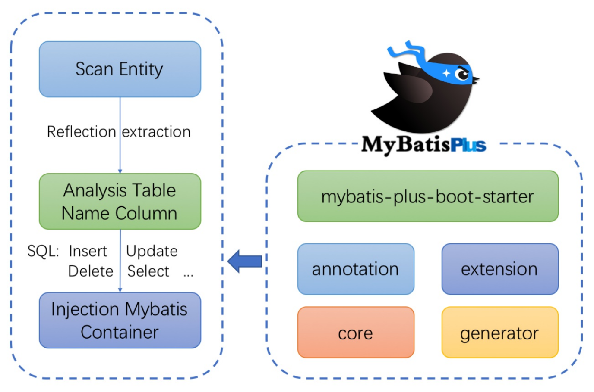
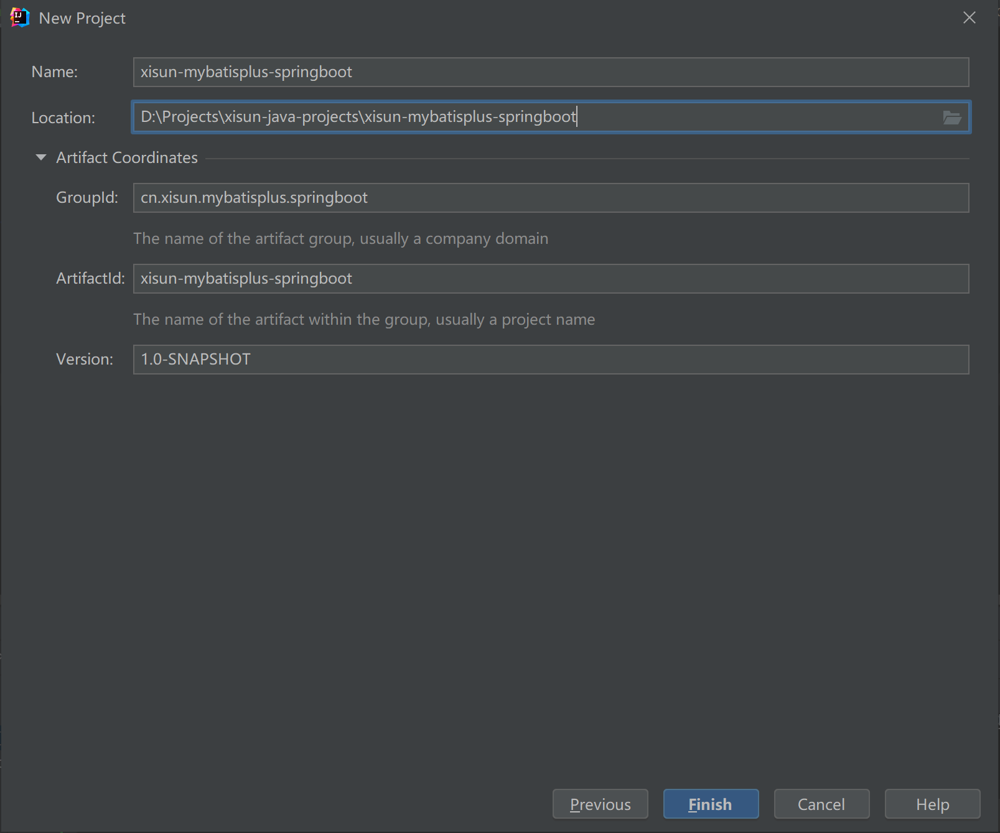
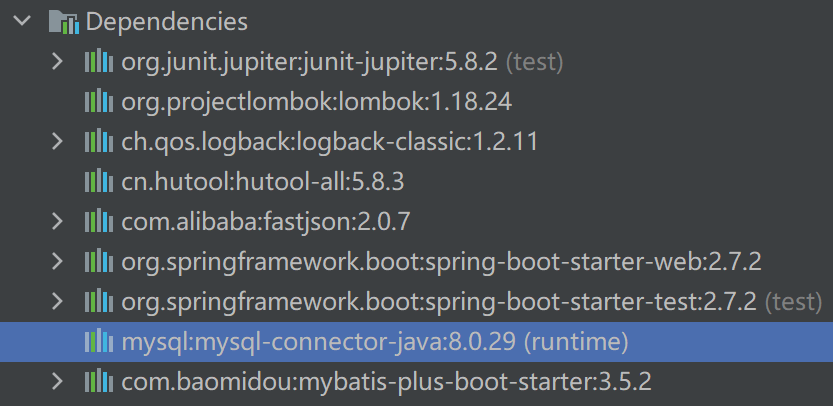
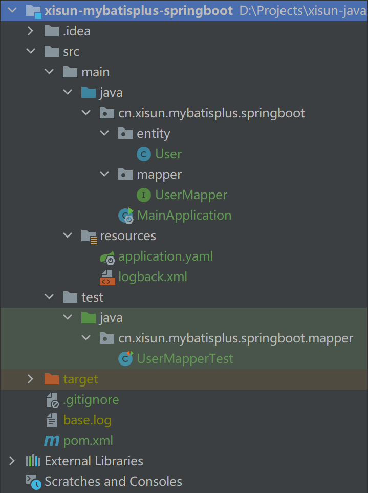
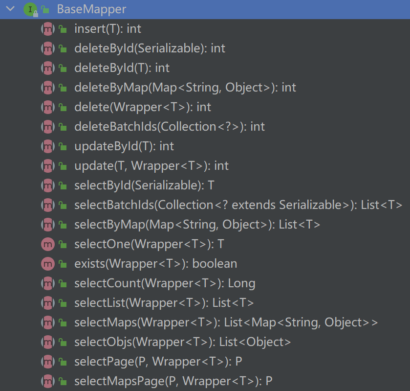

*date: 2022-07-04*

## 简介

官网：https://baomidou.com/

Github：https://github.com/baomidou/mybatis-plus

`MyBatis-Plus`（简称 MP）是`一个 MyBatis 的增强工具`，在 MyBatis 的基础上`只做增强不做改变`，为简化开发、提高效率而生。


MyBatis-Plus 提供了通用的 mapper 和 service，可以在不编写任何 SQL 语句的情况下，快速实现对单表的 CRUD、批量、逻辑删除、分页等操作。

### 特性

`无侵入`：只做增强不做改变，引入它不会对现有工程产生影响，如丝般顺滑。

`损耗小`：启动即会自动注入基本 CURD，性能基本无损耗，直接面向对象操作。

`强大的 CRUD 操作`：内置通用 Mapper、通用 Service，仅仅通过少量配置即可实现单表大部分 CRUD 操作，更有强大的条件构造器，满足各类使用需求。

`支持 Lambda 形式调用`：通过 Lambda 表达式，方便的编写各类查询条件，无需再担心字段写错。

`支持主键自动生成`：支持多达 4 种主键策略（内含分布式唯一 ID 生成器 Sequence），可自由配置，完美解决主键问题。

`支持 ActiveRecord 模式`：支持 ActiveRecord 形式调用，实体类只需继承 Model 类即可进行强大的 CRUD 操作。

`支持自定义全局通用操作`：支持全局通用方法注入（ Write once, use anywhere ）。

`内置代码生成器`：采用代码或者 Maven 插件可快速生成 Mapper 、 Model 、 Service 、Controller 层代码，支持模板引擎，更有超多自定义配置等您来使用。

`内置分页插件`：基于 MyBatis 物理分页，开发者无需关心具体操作，配置好插件之后，写分页等同于普通 List 查询。

`分页插件支持多种数据库`：支持 MySQL、MariaDB、Oracle、DB2、H2、HSQL、SQLite、Postgre、SQLServer 等多种数据库。

`内置性能分析插件`：可输出 SQL 语句以及其执行时间，建议开发测试时启用该功能，能快速揪出慢查询。

`内置全局拦截插件`：提供全表 delete 、 update 操作智能分析阻断，也可自定义拦截规则，预防误操作。

### 支持数据库

任何能使用 MyBatis 进行 CRUD，并且支持标准 SQL 的数据库，都可以使用 MyBatis-Plus，具体支持情况如下：

- MySQL，Oracle，DB2，H2，HSQL，SQLite，PostgreSQL，SQLServer，Phoenix，Gauss ，ClickHouse，Sybase，OceanBase，Firebird，Cubrid，Goldilocks，csiidb。
- 达梦数据库，虚谷数据库，人大金仓数据库，南大通用（华库）数据库，南大通用数据库，神通数据库，瀚高数据库。

### 框架结构



## quick start

### 环境说明

JDK：

```bash
C:\Users\XiSun>java -version
openjdk version "1.8.0_222"
OpenJDK Runtime Environment (AdoptOpenJDK)(build 1.8.0_222-b10)      
OpenJDK 64-Bit Server VM (AdoptOpenJDK)(build 25.222-b10, mixed mode)
```

Maven：

```bash
C:\Users\XiSun>mvn --version
Apache Maven 3.8.5 (3599d3414f046de2324203b78ddcf9b5e4388aa0)
Maven home: D:\Programs\Maven\apache-maven-3.8.5
Java version: 1.8.0_222, vendor: AdoptOpenJDK, runtime: D:\Programs\AdoptOpenJDK\jdk-8.0.222.10-hotspot\jre
Default locale: zh_CN, platform encoding: GBK
OS name: "windows 10", version: "10.0", arch: "amd64", family: "windows"
```

MySQL：

```bash
root@xisun-develop:/home/xisun# docker ps
CONTAINER ID   IMAGE          COMMAND                  CREATED       STATUS      PORTS                                                  NAMES
4905d5364838   mysql:8.0.29   "docker-entrypoint.s…"   3 weeks ago   Up 2 days   0.0.0.0:3306->3306/tcp, :::3306->3306/tcp, 33060/tcp   mysql_8.0.29
root@xisun-develop:/home/xisun# docker images
REPOSITORY              TAG          IMAGE ID       CREATED         SIZE
mysql                   8.0.29       0ef9083d9892   4 weeks ago     524MB
```

Spring Boot：

```xml
<parent>
    <groupId>org.springframework.boot</groupId>
    <artifactId>spring-boot-starter-parent</artifactId>
    <version>2.7.2</version>
</parent>
```

> Spring Boot 2.7.2 版本，默认使用的 MySQL 连接驱动为 8.0.29。

MyBatis-Plus：

```xml
<dependency>
    <groupId>com.baomidou</groupId>
    <artifactId>mybatis-plus-boot-starter</artifactId>
    <version>3.5.2</version>
</dependency>
```

### 生成数据

```sql
CREATE TABLE IF NOT EXISTS mybatisplus.user (
	`id` BIGINT(20) NOT NULL AUTO_INCREMENT COMMENT 'id，主键',
	`name` VARCHAR(10) NOT NULL COMMENT '姓名',
	`sex` VARCHAR(10) NOT NULL COMMENT '性别',
	`age` INT(10) NOT NULL COMMENT '年龄',
	PRIMARY KEY (`id`)
)
COLLATE='utf8_general_ci'
ENGINE=InnoDB
;

INSERT INTO mybatisplus.`user` (name, sex, age) VALUES ("张三", "男", 27);

INSERT INTO mybatisplus.`user` (name, sex, age) VALUES ("李四", "男", 28);

INSERT INTO mybatisplus.`user` (name, sex, age) VALUES ("王二", "男", 26);

INSERT INTO mybatisplus.`user` (name, sex, age) VALUES ("刘七", "女", 25);

INSERT INTO mybatisplus.`user` (name, sex, age) VALUES ("郑八", "男", 29);
```

### 创建 Spring Boot 项目



### 引入依赖

```xml
<?xml version="1.0" encoding="UTF-8"?>
<project xmlns="http://maven.apache.org/POM/4.0.0"
         xmlns:xsi="http://www.w3.org/2001/XMLSchema-instance"
         xsi:schemaLocation="http://maven.apache.org/POM/4.0.0 http://maven.apache.org/xsd/maven-4.0.0.xsd">
    <modelVersion>4.0.0</modelVersion>

    <groupId>cn.xisun.mybatisplus.springboot</groupId>
    <artifactId>xisun-mybatisplus-springboot</artifactId>
    <version>1.0-SNAPSHOT</version>

    <parent>
        <groupId>org.springframework.boot</groupId>
        <artifactId>spring-boot-starter-parent</artifactId>
        <version>2.7.2</version>
    </parent>

    <properties>
        <project.build.sourceEncoding>UTF-8</project.build.sourceEncoding>
        <java.version>8</java.version>
        <maven.compiler.source>${java.version}</maven.compiler.source>
        <maven.compiler.target>${java.version}</maven.compiler.target>
        <jupiter.version>5.8.2</jupiter.version>
        <lombok.version>1.18.24</lombok.version>
        <logback.version>1.2.11</logback.version>
        <hutool.version>5.8.3</hutool.version>
        <fastjson.version>2.0.7</fastjson.version>
    </properties>

    <repositories>
        <repository>
            <id>aliyun</id>
            <url>http://maven.aliyun.com/nexus/content/groups/public</url>
            <releases>
                <enabled>true</enabled>
            </releases>
            <snapshots>
                <enabled>false</enabled>
            </snapshots>
        </repository>
    </repositories>

    <pluginRepositories>
        <pluginRepository>
            <id>aliyun-plugin</id>
            <url>http://maven.aliyun.com/nexus/content/groups/public</url>
            <releases>
                <enabled>true</enabled>
            </releases>
            <snapshots>
                <enabled>false</enabled>
            </snapshots>
        </pluginRepository>
    </pluginRepositories>

    <dependencies>
        <dependency>
            <groupId>org.junit.jupiter</groupId>
            <artifactId>junit-jupiter</artifactId>
            <version>${jupiter.version}</version>
            <scope>test</scope>
        </dependency>

        <dependency>
            <groupId>org.projectlombok</groupId>
            <artifactId>lombok</artifactId>
            <version>${lombok.version}</version>
        </dependency>

        <dependency>
            <groupId>ch.qos.logback</groupId>
            <artifactId>logback-classic</artifactId>
            <version>${logback.version}</version>
        </dependency>

        <dependency>
            <groupId>cn.hutool</groupId>
            <artifactId>hutool-all</artifactId>
            <version>${hutool.version}</version>
        </dependency>

        <dependency>
            <groupId>com.alibaba</groupId>
            <artifactId>fastjson</artifactId>
            <version>${fastjson.version}</version>
        </dependency>

        <dependency>
            <groupId>org.springframework.boot</groupId>
            <artifactId>spring-boot-starter-web</artifactId>
        </dependency>

        <dependency>
            <groupId>org.springframework.boot</groupId>
            <artifactId>spring-boot-starter-test</artifactId>
            <scope>test</scope>
        </dependency>
        
        <!-- MySQL 驱动依赖 -->
        <dependency>
            <groupId>mysql</groupId>
            <artifactId>mysql-connector-java</artifactId>
            <scope>runtime</scope>
        </dependency>

        <!-- MyBatis Plus Starter依赖 -->
        <dependency>
            <groupId>com.baomidou</groupId>
            <artifactId>mybatis-plus-boot-starter</artifactId>
            <version>3.5.2</version>
        </dependency>
    </dependencies>
</project>
```

说明：spring-boot-starter-parent 中，有定义 mysql-connector-java 的默认版本，因此，引入 mysql-connector-java 依赖时，可以不指定版本。



> 如果默认的 MySQL 连接驱动，不匹配实际使用的 MySQL 数据库，在引入驱动依赖时，需要指定相应的驱动版本。
>

### 配置 application.yml

```yaml
spring:
  application:
    name: xisun-mybatisplus-server
  # 数据库配置
  datasource:
    # 配置数据源类型
    type: com.zaxxer.hikari.HikariDataSource
    # 配置连接数据库信息
    driver-class-name: com.mysql.cj.jdbc.Driver
    url: jdbc:mysql://${MYSQL_HOST:192.168.10.100}:${MYSQL_PORT:3306}/${MYSQL_DB:mybatisplus}?serverTimezone=GMT%2B8&characterEncoding=utf-8&useSSL=false
    username: ${MYSQL_USERNAME:root}
    password: ${MYSQL_PASSWORD:root}

# Logger Config
logging:
  level:
    cn.xisun.mybatisplus.springboot: DEBUG

# 配置MyBatis日志
mybatis-plus:
  configuration:
    log-impl: org.apache.ibatis.logging.stdout.StdOutImpl
```

>Spring Boot 2.0 内置 jdbc5 驱动，Spring Boot 2.1 及以上内置 jdbc8 驱动。
>
>driver-class-name：
>
>- ≤ MySQL 5：`com.mysql.jdbc.Driver`
>- ≥ MySQL 6：`com.mysql.cj.jdbc.Driver`
>
>连接地址 url：
>
>- MySQL 5.7 版本：`jdbc:mysql://192.168.10.100:3306/mybatisplus?characterEncoding=utf-8&useSSL=false`
>- MySQL 8.0 版本：`jdbc:mysql://192.168.10.100:3306:3306/mybatis_plus?serverTimezone=GMT%2B8&characterEncoding=utf-8&useSSL=false`

### 启动类

```java
/**
 * @author XiSun
 * @version 1.0
 * @date 2022/7/27 11:17
 * @description
 */
@SpringBootApplication
@MapperScan("cn.xisun.mybatisplus.springboot.mapper")
public class MainApplication {
    public static void main(String[] args) {
        SpringApplication.run(MainApplication.class, args);
    }
}
```

>`@MapperScan`注解：用在 SpringBoot 启动类上，扫描指定包下所有的接口类，然后这些接口在编译之后都会生成相应的实现类。@Mapper 支持扫描多个包以及表达式。

### 实体类

```java
/**
 * @author XiSun
 * @version 1.0
 * @date 2022/7/27 14:07
 * @description
 */
@Data
@NoArgsConstructor
public class User {
    private Long id;
    private String name;
    private String sex;
    private Integer age;
}
```

### Mapper 映射类

```java
/**
 * @author XiSun
 * @version 1.0
 * @date 2022/7/27 14:08
 * @description
 */
@Mapper
@Repository
public interface UserMapper extends BaseMapper<User> {
}
```

>`@Mapper`注解：用在接口类上，在编译之后会生成相应的接口实现类。如果有很多接口都需要使用 @Mapper 注解，则可以将这些接口置于同一个包路径下，然后使用 @MapperScan 注解扫描这个包，此时，该包下的接口不需要再添加 @Mapper 注解。
>
>`@Repository`注解：@Mapper 标注的类，使用 @Autowired 自动装配时，IDEA 会提示找不到这个类，但不影响程序运行。这是因为 @Mapper 注解是 MyBatis 提供的，而 @Autowried 注解是 Spring 提供的，IDEA 能理解 Spring 的上下文，但是却和 Mybatis 关联不上。因此，可以在 Mapper 接口上， 添加 @Repository 注解，或者 @Component 注解，让 IDEA 以为其也是一个 Spring 管理的 Bean。

### 测试类

```java
@SpringBootTest
class UserMapperTest {
    @Autowired
    UserMapper userMapper;

    @Test
    public void testSelectList() {
        //selectList()：根据MP内置的条件构造器查询一个list集合，null表示没有条件，即查询所有
        userMapper.selectList(null).forEach(System.out::println);
    }
}
```

### 输出

```java
2022-07-29 08:26:13.943 [main] INFO  o.s.b.t.context.SpringBootTestContextBootstrapper - Neither @ContextConfiguration nor @ContextHierarchy found for test class [cn.xisun.mybatisplus.springboot.mapper.UserMapperTest], using SpringBootContextLoader
2022-07-29 08:26:13.949 [main] INFO  o.s.test.context.support.AbstractContextLoader - Could not detect default resource locations for test class [cn.xisun.mybatisplus.springboot.mapper.UserMapperTest]: no resource found for suffixes {-context.xml, Context.groovy}.
2022-07-29 08:26:13.950 [main] INFO  o.s.t.c.support.AnnotationConfigContextLoaderUtils - Could not detect default configuration classes for test class [cn.xisun.mybatisplus.springboot.mapper.UserMapperTest]: UserMapperTest does not declare any static, non-private, non-final, nested classes annotated with @Configuration.
2022-07-29 08:26:14.073 [main] INFO  o.s.b.t.context.SpringBootTestContextBootstrapper - Found @SpringBootConfiguration cn.xisun.mybatisplus.springboot.MainApplication for test class cn.xisun.mybatisplus.springboot.mapper.UserMapperTest
2022-07-29 08:26:14.187 [main] INFO  o.s.b.t.context.SpringBootTestContextBootstrapper - Loaded default TestExecutionListener class names from location [META-INF/spring.factories]: [org.springframework.boot.test.mock.mockito.MockitoTestExecutionListener, org.springframework.boot.test.mock.mockito.ResetMocksTestExecutionListener, org.springframework.boot.test.autoconfigure.restdocs.RestDocsTestExecutionListener, org.springframework.boot.test.autoconfigure.web.client.MockRestServiceServerResetTestExecutionListener, org.springframework.boot.test.autoconfigure.web.servlet.MockMvcPrintOnlyOnFailureTestExecutionListener, org.springframework.boot.test.autoconfigure.web.servlet.WebDriverTestExecutionListener, org.springframework.boot.test.autoconfigure.webservices.client.MockWebServiceServerTestExecutionListener, org.springframework.test.context.web.ServletTestExecutionListener, org.springframework.test.context.support.DirtiesContextBeforeModesTestExecutionListener, org.springframework.test.context.event.ApplicationEventsTestExecutionListener, org.springframework.test.context.support.DependencyInjectionTestExecutionListener, org.springframework.test.context.support.DirtiesContextTestExecutionListener, org.springframework.test.context.transaction.TransactionalTestExecutionListener, org.springframework.test.context.jdbc.SqlScriptsTestExecutionListener, org.springframework.test.context.event.EventPublishingTestExecutionListener]
2022-07-29 08:26:14.204 [main] INFO  o.s.b.t.context.SpringBootTestContextBootstrapper - Using TestExecutionListeners: [org.springframework.test.context.support.DirtiesContextBeforeModesTestExecutionListener@7fd7a283, org.springframework.test.context.event.ApplicationEventsTestExecutionListener@22f59fa, org.springframework.boot.test.mock.mockito.MockitoTestExecutionListener@78fa769e, org.springframework.boot.test.autoconfigure.SpringBootDependencyInjectionTestExecutionListener@16612a51, org.springframework.test.context.support.DirtiesContextTestExecutionListener@54e041a4, org.springframework.test.context.transaction.TransactionalTestExecutionListener@2c78324b, org.springframework.test.context.jdbc.SqlScriptsTestExecutionListener@79defdc, org.springframework.test.context.event.EventPublishingTestExecutionListener@18317edc, org.springframework.boot.test.mock.mockito.ResetMocksTestExecutionListener@4e0ae11f, org.springframework.boot.test.autoconfigure.restdocs.RestDocsTestExecutionListener@238d68ff, org.springframework.boot.test.autoconfigure.web.client.MockRestServiceServerResetTestExecutionListener@4b86805d, org.springframework.boot.test.autoconfigure.web.servlet.MockMvcPrintOnlyOnFailureTestExecutionListener@5852c06f, org.springframework.boot.test.autoconfigure.web.servlet.WebDriverTestExecutionListener@4149c063, org.springframework.boot.test.autoconfigure.webservices.client.MockWebServiceServerTestExecutionListener@9cb8225]

  .   ____          _            __ _ _
 /\\ / ___'_ __ _ _(_)_ __  __ _ \ \ \ \
( ( )\___ | '_ | '_| | '_ \/ _` | \ \ \ \
 \\/  ___)| |_)| | | | | || (_| |  ) ) ) )
  '  |____| .__|_| |_|_| |_\__, | / / / /
 =========|_|==============|___/=/_/_/_/
 :: Spring Boot ::                (v2.7.2)

2022-07-29 08:26:14.511 [main] INFO  c.x.mybatisplus.springboot.mapper.UserMapperTest - Starting UserMapperTest using Java 1.8.0_222 on DESKTOP-F1JDHC6 with PID 1492 (started by XiSun in D:\Projects\xisun-java-projects\xisun-mybatisplus-springboot)
2022-07-29 08:26:14.512 [main] DEBUG c.x.mybatisplus.springboot.mapper.UserMapperTest - Running with Spring Boot v2.7.2, Spring v5.3.22
2022-07-29 08:26:14.512 [main] INFO  c.x.mybatisplus.springboot.mapper.UserMapperTest - No active profile set, falling back to 1 default profile: "default"
Logging initialized using 'class org.apache.ibatis.logging.stdout.StdOutImpl' adapter.
Property 'mapperLocations' was not specified.
 _ _   |_  _ _|_. ___ _ |    _ 
| | |\/|_)(_| | |_\  |_)||_|_\ 
     /               |         
                        3.5.2 
2022-07-29 08:26:15.645 [main] INFO  c.x.mybatisplus.springboot.mapper.UserMapperTest - Started UserMapperTest in 1.401 seconds (JVM running for 2.465)
Creating a new SqlSession
SqlSession [org.apache.ibatis.session.defaults.DefaultSqlSession@6cd56321] was not registered for synchronization because synchronization is not active
2022-07-29 08:26:15.885 [main] INFO  com.zaxxer.hikari.HikariDataSource - HikariPool-1 - Starting...
2022-07-29 08:26:16.107 [main] INFO  com.zaxxer.hikari.HikariDataSource - HikariPool-1 - Start completed.
JDBC Connection [HikariProxyConnection@2022562847 wrapping com.mysql.cj.jdbc.ConnectionImpl@2dc3271b] will not be managed by Spring
==>  Preparing: SELECT id,name,sex,age FROM user
==> Parameters: 
<==    Columns: id, name, sex, age
<==        Row: 1, 张三, 男, 27
<==        Row: 2, 李四, 男, 28
<==        Row: 3, 王二, 男, 26
<==        Row: 4, 刘七, 女, 25
<==        Row: 5, 郑八, 男, 29
<==      Total: 5
Closing non transactional SqlSession [org.apache.ibatis.session.defaults.DefaultSqlSession@6cd56321]
User(id=1, name=张三, sex=男, age=27)
User(id=2, name=李四, sex=男, age=28)
User(id=3, name=王二, sex=男, age=26)
User(id=4, name=刘七, sex=女, age=25)
User(id=5, name=郑八, sex=男, age=29)
2022-07-29 08:26:16.178 [SpringApplicationShutdownHook] INFO  com.zaxxer.hikari.HikariDataSource - HikariPool-1 - Shutdown initiated...
2022-07-29 08:26:16.184 [SpringApplicationShutdownHook] INFO  com.zaxxer.hikari.HikariDataSource - HikariPool-1 - Shutdown completed.
```

### 项目结构



## 基本 CRUD

### BaseMapper

MyBatis-Plus 中的基本 CRUD 操作，在内置的 BaseMapper 中都已得到了实现，我们可以直接使用，接口如下：



```java
/*
 * Copyright (c) 2011-2022, baomidou (jobob@qq.com).
 *
 * Licensed under the Apache License, Version 2.0 (the "License");
 * you may not use this file except in compliance with the License.
 * You may obtain a copy of the License at
 *
 *     http://www.apache.org/licenses/LICENSE-2.0
 *
 * Unless required by applicable law or agreed to in writing, software
 * distributed under the License is distributed on an "AS IS" BASIS,
 * WITHOUT WARRANTIES OR CONDITIONS OF ANY KIND, either express or implied.
 * See the License for the specific language governing permissions and
 * limitations under the License.
 */
package com.baomidou.mybatisplus.core.mapper;

import com.baomidou.mybatisplus.core.conditions.Wrapper;
import com.baomidou.mybatisplus.core.metadata.IPage;
import com.baomidou.mybatisplus.core.toolkit.CollectionUtils;
import com.baomidou.mybatisplus.core.toolkit.Constants;
import com.baomidou.mybatisplus.core.toolkit.ExceptionUtils;
import org.apache.ibatis.annotations.Param;

import java.io.Serializable;
import java.util.Collection;
import java.util.List;
import java.util.Map;

/*

               :`
                    .:,
                     :::,,.
             ::      `::::::
             ::`    `,:,` .:`
             `:: `::::::::.:`      `:';,`
              ::::,     .:::`   `@++++++++:
               ``        :::`  @+++++++++++#
                         :::, #++++++++++++++`
                 ,:      `::::::;'##++++++++++
                 .@#@;`   ::::::::::::::::::::;
                  #@####@, :::::::::::::::+#;::.
                  @@######+@:::::::::::::.  #@:;
           ,      @@########':::::::::::: .#''':`
           ;##@@@+:##########@::::::::::: @#;.,:.
            #@@@######++++#####'::::::::: .##+,:#`
            @@@@@#####+++++'#####+::::::::` ,`::@#:`
            `@@@@#####++++++'#####+#':::::::::::@.
             @@@@######+++++''#######+##';::::;':,`
              @@@@#####+++++'''#######++++++++++`
               #@@#####++++++''########++++++++'
               `#@######+++++''+########+++++++;
                `@@#####+++++''##########++++++,
                 @@######+++++'##########+++++#`
                @@@@#####+++++############++++;
              ;#@@@@@####++++##############+++,
             @@@@@@@@@@@###@###############++'
           @#@@@@@@@@@@@@###################+:
        `@#@@@@@@@@@@@@@@###################'`
      :@#@@@@@@@@@@@@@@@@@##################,
      ,@@@@@@@@@@@@@@@@@@@@################;
       ,#@@@@@@@@@@@@@@@@@@@##############+`
        .#@@@@@@@@@@@@@@@@@@#############@,
          @@@@@@@@@@@@@@@@@@@###########@,
           :#@@@@@@@@@@@@@@@@##########@,
            `##@@@@@@@@@@@@@@@########+,
              `+@@@@@@@@@@@@@@@#####@:`
                `:@@@@@@@@@@@@@@##@;.
                   `,'@@@@##@@@+;,`
                        ``...``

 _ _     /_ _ _/_. ____  /    _
/ / //_//_//_|/ /_\  /_///_/_\      Talk is cheap. Show me the code.
     _/             /
 */

/**
 * Mapper 继承该接口后，无需编写 mapper.xml 文件，即可获得CRUD功能
 * <p>这个 Mapper 支持 id 泛型</p>
 *
 * @author hubin
 * @since 2016-01-23
 */
public interface BaseMapper<T> extends Mapper<T> {

    /**
     * 插入一条记录
     *
     * @param entity 实体对象
     */
    int insert(T entity);

    /**
     * 根据 ID 删除
     *
     * @param id 主键ID
     */
    int deleteById(Serializable id);

    /**
     * 根据实体(ID)删除
     *
     * @param entity 实体对象
     * @since 3.4.4
     */
    int deleteById(T entity);

    /**
     * 根据 columnMap 条件，删除记录
     *
     * @param columnMap 表字段 map 对象
     */
    int deleteByMap(@Param(Constants.COLUMN_MAP) Map<String, Object> columnMap);

    /**
     * 根据 entity 条件，删除记录
     *
     * @param queryWrapper 实体对象封装操作类（可以为 null,里面的 entity 用于生成 where 语句）
     */
    int delete(@Param(Constants.WRAPPER) Wrapper<T> queryWrapper);

    /**
     * 删除（根据ID或实体 批量删除）
     *
     * @param idList 主键ID列表或实体列表(不能为 null 以及 empty)
     */
    int deleteBatchIds(@Param(Constants.COLL) Collection<?> idList);

    /**
     * 根据 ID 修改
     *
     * @param entity 实体对象
     */
    int updateById(@Param(Constants.ENTITY) T entity);

    /**
     * 根据 whereEntity 条件，更新记录
     *
     * @param entity        实体对象 (set 条件值,可以为 null)
     * @param updateWrapper 实体对象封装操作类（可以为 null,里面的 entity 用于生成 where 语句）
     */
    int update(@Param(Constants.ENTITY) T entity, @Param(Constants.WRAPPER) Wrapper<T> updateWrapper);

    /**
     * 根据 ID 查询
     *
     * @param id 主键ID
     */
    T selectById(Serializable id);

    /**
     * 查询（根据ID 批量查询）
     *
     * @param idList 主键ID列表(不能为 null 以及 empty)
     */
    List<T> selectBatchIds(@Param(Constants.COLL) Collection<? extends Serializable> idList);

    /**
     * 查询（根据 columnMap 条件）
     *
     * @param columnMap 表字段 map 对象
     */
    List<T> selectByMap(@Param(Constants.COLUMN_MAP) Map<String, Object> columnMap);

    /**
     * 根据 entity 条件，查询一条记录
     * <p>查询一条记录，例如 qw.last("limit 1") 限制取一条记录, 注意：多条数据会报异常</p>
     *
     * @param queryWrapper 实体对象封装操作类（可以为 null）
     */
    default T selectOne(@Param(Constants.WRAPPER) Wrapper<T> queryWrapper) {
        List<T> ts = this.selectList(queryWrapper);
        if (CollectionUtils.isNotEmpty(ts)) {
            if (ts.size() != 1) {
                throw ExceptionUtils.mpe("One record is expected, but the query result is multiple records");
            }
            return ts.get(0);
        }
        return null;
    }

    /**
     * 根据 Wrapper 条件，判断是否存在记录
     *
     * @param queryWrapper 实体对象封装操作类
     * @return 是否存在记录
     */
    default boolean exists(Wrapper<T> queryWrapper) {
        Long count = this.selectCount(queryWrapper);
        return null != count && count > 0;
    }

    /**
     * 根据 Wrapper 条件，查询总记录数
     *
     * @param queryWrapper 实体对象封装操作类（可以为 null）
     */
    Long selectCount(@Param(Constants.WRAPPER) Wrapper<T> queryWrapper);

    /**
     * 根据 entity 条件，查询全部记录
     *
     * @param queryWrapper 实体对象封装操作类（可以为 null）
     */
    List<T> selectList(@Param(Constants.WRAPPER) Wrapper<T> queryWrapper);

    /**
     * 根据 Wrapper 条件，查询全部记录
     *
     * @param queryWrapper 实体对象封装操作类（可以为 null）
     */
    List<Map<String, Object>> selectMaps(@Param(Constants.WRAPPER) Wrapper<T> queryWrapper);

    /**
     * 根据 Wrapper 条件，查询全部记录
     * <p>注意： 只返回第一个字段的值</p>
     *
     * @param queryWrapper 实体对象封装操作类（可以为 null）
     */
    List<Object> selectObjs(@Param(Constants.WRAPPER) Wrapper<T> queryWrapper);

    /**
     * 根据 entity 条件，查询全部记录（并翻页）
     *
     * @param page         分页查询条件（可以为 RowBounds.DEFAULT）
     * @param queryWrapper 实体对象封装操作类（可以为 null）
     */
    <P extends IPage<T>> P selectPage(P page, @Param(Constants.WRAPPER) Wrapper<T> queryWrapper);

    /**
     * 根据 Wrapper 条件，查询全部记录（并翻页）
     *
     * @param page         分页查询条件
     * @param queryWrapper 实体对象封装操作类
     */
    <P extends IPage<Map<String, Object>>> P selectMapsPage(P page, @Param(Constants.WRAPPER) Wrapper<T> queryWrapper);
}
```

### 插入

### 删除

### 修改

## 通用 Service

MyBatis-Plus 中有一个接口`IService`和其实现类`ServiceImpl`，封装了常见的业务层逻辑。


## 本文参考

https://www.bilibili.com/video/BV12R4y157Be?spm_id_from=333.337.search-card.all.click

## 声明

写作本文初衷是个人学习记录，鉴于本人学识有限，如有侵权或不当之处，请联系 [wdshfut@163.com](mailto:wdshfut@163.com)。
