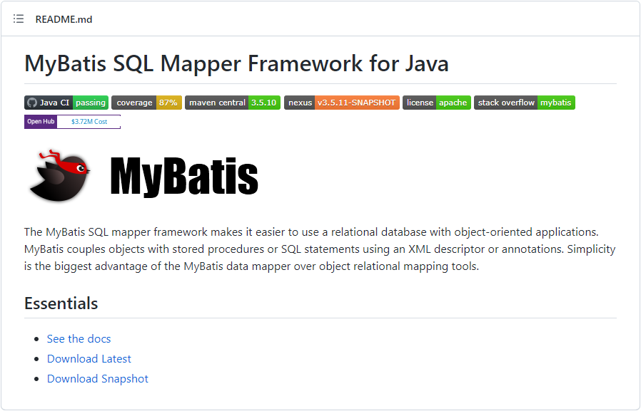
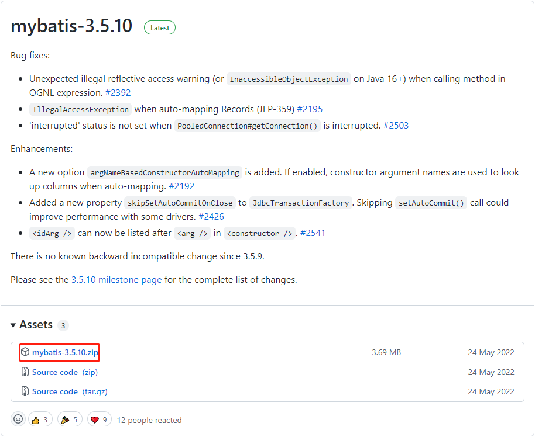
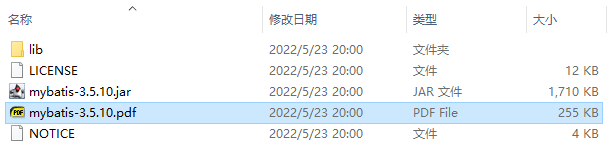
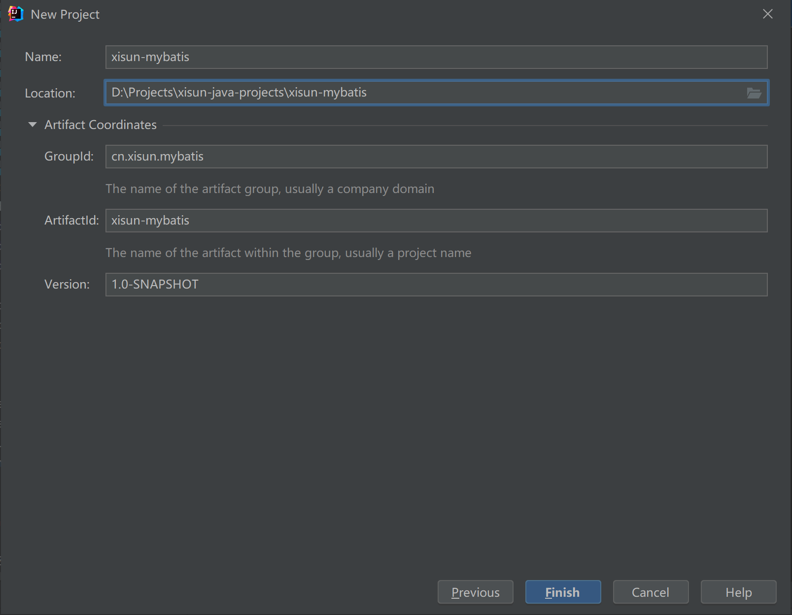
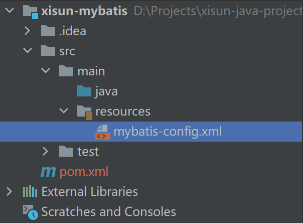
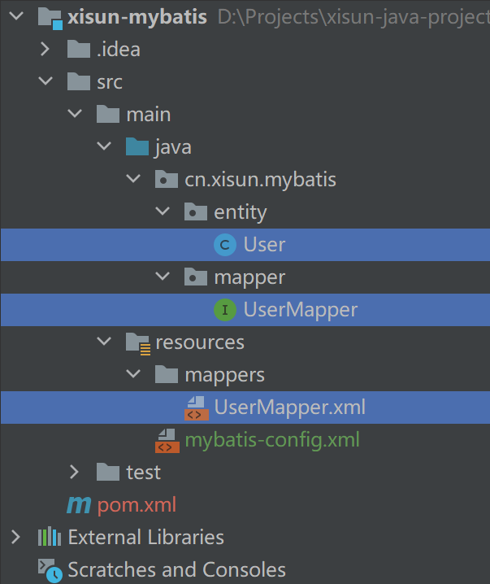
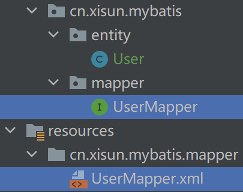

*date: 2022-06-22*

## 简介

`MyBatis`最初是 Apache 的一个开源项目`iBatis`，2010 年 6 月这个项目由 Apache Software Foundation 迁移到了 Google Code。随着开发团队转投 Google Code 旗下，iBatis 3.x 正式更名为 MyBatis，代码于 2013 年 11 月迁移到 Github。

iBatis 一词来源于 internet 和 abatis 的组合，它是一个`基于 Java 的持久层框架`。 iBatis 提供的持久层框架包括 SQL Maps 和 Data Access Objects（DAO）。

MyBatis 的特性：

- MyBatis 是支持`定制化 SQL`、`存储过程`以及`高级映射`的优秀的持久层框架；
- MyBatis 避免了几乎所有的 JDBC 代码和手动设置参数以及获取结果集；
- MyBatis 可以使用简单的`XML`或`注解`用于配置和原始映射，将接口和 Java 的 POJO（Plain Old Java Objects，普通的 Java 对象）映射成数据库中的记录；
- MyBatis 是一个`半自动的 ORM (Object Relation Mapping) 框架`。

GitHub 地址：https://github.com/mybatis/mybatis-3



点击 Download Latest，进入下载界面：



点击下载后，解压，可以得到 MyBatis 的官方文档（jar 包通过 Maven 管理，不需要使用）：



不同持久化层技术的对比：

- JDBC：
  - SQL 夹杂在 Java 代码中，耦合度高，导致硬编码内伤。
  - 维护不易，且实际开发需求中 SQL 有变化，频繁修改的情况多见。
  - 代码冗长，开发效率低。
- Hibernate 和 JPA
  - 操作简便，开发效率高；
  - 程序中的长难复杂 SQL 需要绕过框架（框架很难实现）。
  - 内部自动生成的 SQL，不容易做特殊优化。
  - 基于全映射的全自动框架，大量字段的 POJO 进行部分映射时比较困难。
  - 反射操作太多，导致数据库性能下降。
- MyBatis
  - 轻量级，性能出色。
  - SQL 和 Java 编码分开，功能边界清晰。Java 代码专注业务、SQL 语句专注数据。
  - 开发效率稍逊于 HIbernate，但是完全能够接受。

## quick start

### 创建 Maven 工程



### 引入依赖

```xml
<!-- MyBatis 核心 -->
<dependency>
    <groupId>org.mybatis</groupId>
    <artifactId>mybatis</artifactId>
    <version>3.5.10</version>
</dependency>

<!-- MySQL 连接驱动 -->
<dependency>
    <groupId>mysql</groupId>
    <artifactId>mysql-connector-java</artifactId>
    <version>8.0.29</version>
</dependency>
```

### 创建 MyBatis 核心配置文件



```xml
<?xml version="1.0" encoding="UTF-8" ?>
<!DOCTYPE configuration
        PUBLIC "-//mybatis.org//DTD Config 3.0//EN"
        "http://mybatis.org/dtd/mybatis-3-config.dtd">
<configuration>
    <!-- 设置连接数据库的环境 -->
    <environments default="development">
        <environment id="development">
            <!-- 使用 JDBC 管理事务 -->
            <transactionManager type="JDBC"/>
            <dataSource type="POOLED">
                <property name="driver" value="com.mysql.cj.jdbc.Driver"/>
                <property name="url" value="jdbc:mysql://192.168.10.100:3306/mybatis"/>
                <property name="username" value="root"/>
                <property name="password" value="root"/>
            </dataSource>
        </environment>
    </environments>

    <!-- 引入映射文件 -->
    <mappers>
        <mapper resource="mappers/UserMapper.xml"/>
    </mappers>
</configuration>
```

> 习惯上把配置文件命名为 mybatis-config.xml，并非强制要求。在整合 Spring 之后，这个配置文件可以省略。
> 
> 核心配置文件主要用于配置连接数据库的环境以及 MyBatis 的全局配置信息。

### 创建表

```sql
CREATE TABLE IF NOT EXISTS mybatis.user (
    `id` BIGINT(20) NOT NULL AUTO_INCREMENT COMMENT 'id，主键',
    `name` VARCHAR(20) NOT NULL COMMENT '姓名',
    `sex` VARCHAR(10) NOT NULL COMMENT '性别',
    `age` INT(10) NOT NULL COMMENT '年龄',
    `status` INT(10) NOT NULL COMMENT '状态',
    `create_time` DATETIME NOT NULL DEFAULT CURRENT_TIMESTAMP COMMENT '创建时间',
    `update_time` DATETIME NOT NULL DEFAULT CURRENT_TIMESTAMP COMMENT '修改时间',
    PRIMARY KEY (`id`)
)
COLLATE='utf8_general_ci'
ENGINE=InnoDB
;
```

### 创建实体类

```java
package cn.xisun.mybatis.entity;

import lombok.Data;
import lombok.NoArgsConstructor;

import java.util.Date;

/**
 * @author WangDeSong
 * @version 1.0
 * @date 2022/7/14 21:26
 * @description 用户
 */
@Data
@NoArgsConstructor
public class User {
    private Integer id;

    private String name;

    private String sex;

    private Integer age;

    private Integer status;

    /**
     * 使用resultType映射时，实体类的属性名，必须和数据库字段名一致
     */
    private Date create_time;

    private Date update_time;
}
```

### 创建 Mapper 接口

```java
package cn.xisun.mybatis.mapper;

/**
 * @author WangDeSong
 * @version 1.0
 * @date 2022/7/14 21:31
 * @description
 */
public interface UserMapper {
    /**
     * 添加一条用户信息
     *
     * @return 受影响的行数
     */
    int insertUser();

    /**
     * 修改用户信息
     *
     * @return 受影响的行数
     */
    int updateUser();

    /**
     * 删除用户信息
     *
     * @return 受影响的行数
     */
    int deleteUser();

    /**
     * 获取一条用户信息
     *
     * @return 用户实例
     */
    User getUserById();

    /**
     * 获取全部用户信息
     *
     * @return 用户列表
     */
    List<User> getUserList();
}
```

### 创建 Mapper 映射文件



```xml
<?xml version="1.0" encoding="UTF-8" ?>
<!DOCTYPE mapper
        PUBLIC "-//mybatis.org//DTD Mapper 3.0//EN"
        "http://mybatis.org/dtd/mybatis-3-mapper.dtd">
<!-- namespace 与 Mapper 接口的全类名保存一致 -->
<mapper namespace="cn.xisun.mybatis.mapper.UserMapper">
    <!-- id 属性的值与 Mapper 接口中的方法名保持一致 -->

    <!-- int insertUser(); -->
    <insert id="insertUser">
        INSERT INTO mybatis.`user` (name, sex, age, status)
        VALUES ("张三", "男", 27, 1);
    </insert>

    <!-- int updateUser(); -->
    <update id="updateUser">
        UPDATE mybatis.`user` u SET u.name = "李四" WHERE u.id = 1;
    </update>

    <!-- int deleteUser(); -->
    <delete id="deleteUser">
        DELETE FROM mybatis.`user` u WHERE u.id = 2;
    </delete>

    <!-- User getUserById(); -->
    <select id="getUserById" resultType="cn.xisun.mybatis.entity.User">
        SELECT * FROM mybatis.`user` u WHERE u.id = 3;
    </select>

    <!-- List<User> getUserList(); -->
    <select id="getUserList" resultType="cn.xisun.mybatis.entity.User">
        SELECT * FROM mybatis.`user`;
    </select>
</mapper>
```

映射文件的命名规则：

- 一般命名为：表所对应的实体类的类名 + Mapper.xml，如 UserMapper.xml。
- 一个映射文件对应一个实体类，以及一张表的操作。
- MyBatis 映射文件用于编写 SQL，访问以及操作表中的数据。
- MyBatis 映射文件存放的位置是`src/main/resources/mappers`目录下。
- 查询的标签 select 必须设置属性 resultType 或 resultMap，用于设置实体类和数据库表的映射
  关系。
  - `resultType`：`自动映射`，用于属性名和表中字段名一致的情况。
  - `resultMap`：`自定义映射`，用于一对多或多对一或字段名和属性名不一致的情况。
- 当查询的数据为多条时，不能使用实体类作为返回值，只能使用集合，否则会抛出异常
  TooManyResultsException；但是若查询的数据只有一条，可以使用实体类或集合作为返回值。

MyBatis 中可以面向接口操作数据，要保证两个一致：

- `Mapper 接口的全类名和映射文件的命名空间 namespace 保持一致。`
- `Mapper 接口中的方法名和映射文件中编写 SQL 的标签的 id 属性值保持一致。`

### 测试

```java
package cn.xisun.mybatis.mapper;

import cn.xisun.mybatis.entity.User;
import org.apache.ibatis.io.Resources;
import org.apache.ibatis.session.SqlSession;
import org.apache.ibatis.session.SqlSessionFactory;
import org.apache.ibatis.session.SqlSessionFactoryBuilder;
import org.junit.jupiter.api.Test;

import java.io.IOException;
import java.io.InputStream;

import static org.junit.jupiter.api.Assertions.*;

/**
 * @author WangDeSong
 * @version 1.0
 * @date 2022/7/14 21:50
 * @description
 */
class UserMapperTest {

    @Test
    void testInsertUser() throws IOException {
        // 读取MyBatis的核心配置文件
        InputStream is = Resources.getResourceAsStream("mybatis-config.xml");

        // 创建SqlSessionFactoryBuilder对象
        SqlSessionFactoryBuilder sqlSessionFactoryBuilder = new SqlSessionFactoryBuilder();

        // 通过核心配置文件所对应的字节输入流创建工厂类SqlSessionFactory，生产SqlSession对象
        SqlSessionFactory sqlSessionFactory = sqlSessionFactoryBuilder.build(is);

        // 创建SqlSession对象，此时通过SqlSession对象所操作的sql都必须手动提交或回滚事务
        // SqlSession sqlSession = sqlSessionFactory.openSession();
        // 在执行相应逻辑代码后，需要手动提交事务
        // sqlSession.commit();

        // 创建SqlSession对象，此时通过SqlSession对象所操作的sql都会自动提交
        SqlSession sqlSession = sqlSessionFactory.openSession(true);

        // 通过代理模式创建UserMapper接口的代理实现类对象
        UserMapper userMapper = sqlSession.getMapper(UserMapper.class);

        // 调用UserMapper接口中的方法，就可以根据UserMapper的全类名匹配元素文件，通过调用的方法名匹配
        // 映射文件中的SQL标签，并执行标签中的SQL语句
        int result = userMapper.insertUser();

        System.out.println("结果：" + result);
    }
}
```

> `SqlSession`：代表 Java 程序和数据库之间的会话。（HttpSession 是 Java 程序和浏览器之间的会话）
> 
> `SqlSessionFactory`：是生产 SqlSession 的工厂。

查看日志信息，注意，此日志需要设置为 DEBUG 模式：

```java
2022-07-14 22:54:45.500 [main] DEBUG org.apache.ibatis.logging.LogFactory - Logging initialized using 'class org.apache.ibatis.logging.slf4j.Slf4jImpl' adapter.
2022-07-14 22:54:45.520 [main] DEBUG o.apache.ibatis.datasource.pooled.PooledDataSource - PooledDataSource forcefully closed/removed all connections.
2022-07-14 22:54:45.520 [main] DEBUG o.apache.ibatis.datasource.pooled.PooledDataSource - PooledDataSource forcefully closed/removed all connections.
2022-07-14 22:54:45.520 [main] DEBUG o.apache.ibatis.datasource.pooled.PooledDataSource - PooledDataSource forcefully closed/removed all connections.
2022-07-14 22:54:45.521 [main] DEBUG o.apache.ibatis.datasource.pooled.PooledDataSource - PooledDataSource forcefully closed/removed all connections.
2022-07-14 22:54:45.609 [main] DEBUG org.apache.ibatis.transaction.jdbc.JdbcTransaction - Opening JDBC Connection
2022-07-14 22:54:46.126 [main] DEBUG o.apache.ibatis.datasource.pooled.PooledDataSource - Created connection 605420629.
2022-07-14 22:54:46.128 [main] DEBUG cn.xisun.mybatis.mapper.UserMapper.insertUser - ==>  Preparing: INSERT INTO mybatis.`user` (name, sex, age, status) VALUES ("张三", "男", 27, 1);
2022-07-14 22:54:46.153 [main] DEBUG cn.xisun.mybatis.mapper.UserMapper.insertUser - ==> Parameters: 
2022-07-14 22:54:46.158 [main] DEBUG cn.xisun.mybatis.mapper.UserMapper.insertUser - <==    Updates: 1
```

## MyBatis 核心配置文件详解

核心配置文件中的标签必须按照固定的顺序：

`properties ---> settings ---> typeAliases ---> typeHandlers ---> objectFactory ---> objectWrapperFactory ---> reflectorFactory ---> plugins ---> environments ---> databaseIdProvider ---> mappers`

```xml
<?xml version="1.0" encoding="UTF-8" ?>
<!DOCTYPE configuration
        PUBLIC "-//MyBatis.org//DTD Config 3.0//EN"
        "http://MyBatis.org/dtd/MyBatis-3-config.dtd">
<configuration>
    <!-- 引入 properties 文件，此时就可以 ${属性名} 的方式访问属性值 -->
    <properties resource="jdbc.properties"></properties>

    <settings>
        <!-- 将表中字段的下划线自动转换为驼峰 -->
        <setting name="mapUnderscoreToCamelCase" value="true"/>
        <!-- 开启延迟加载 -->
        <setting name="lazyLoadingEnabled" value="true"/>
    </settings>

    <typeAliases>
        <!--
            typeAlias：设置某个具体的类型的别名
                属性：
                    type：需要设置别名的类型的全类名
                    alias：设置此类型的别名，若不设置此属性，该类型拥有默认的别名，即类名且不区分大小写，
                        若设置此属性，此时该类型的别名只能使用 alias 所设置的值
        -->
        <!-- <typeAlias type="cn.xisun.mybatis.entity.User"></typeAlias> -->
        <!-- <typeAlias type="cn.xisun.mybatis.entity.User" alias="abc"></typeAlias> -->

        <!-- 以包为单位，设置改包下所有的类型都拥有默认的别名，即类名且不区分大小写 -->
        <package name="cn.xisun.mybatis.entity"/>
    </typeAliases>

    <!-- environments：设置多个连接数据库的环境信息
            属性：
                default：设置默认使用的环境的 id
    -->
    <environments default="development">
        <!-- environment：设置具体的连接数据库的环境信息
                属性：
                    id：设置环境的唯一标识，可以通过 environments 标签的 default 属性，
                        设置某一个环境的 id，表示默认使用的环境
        -->
        <environment id="development">
            <!-- transactionManager：设置事务管理方式
                    属性：
                        type：设置事务管理方式，可选值：JDBC|MANAGED
                            type="JDBC"：设置当前环境的事务管理为 JDBC 中原生的方式，事务提交或回滚，
								都必须手动处理
                            type="MANAGED"：设置事务被管理，例如 Spring 中的 AOP
            -->
            <transactionManager type="JDBC"/>
            <!-- dataSource：设置数据源
                    属性：
                        type：设置数据源的类型，可选值：POOLED|UNPOOLED|JNDI
                            type="POOLED"：使用数据库连接池，即会将创建的连接进行缓存，下次使用可以从
								缓存中直接获取，不需要重新创建
                            type="UNPOOLED"：不使用数据库连接池，即每次使用连接都需要重新创建
                            type="JNDI"：调用上下文中的数据源
            -->
            <dataSource type="POOLED">
                <!-- 设置驱动类的全类名 -->
                <property name="driver" value="${jdbc.driver}"/>
                <!-- 设置连接数据库的连接地址 -->
                <property name="url" value="${jdbc.url}"/>
                <!-- 设置连接数据库的用户名 -->
                <property name="username" value="${jdbc.username}"/>
                <!-- 设置连接数据库的密码 -->
                <property name="password" value="${jdbc.password}"/>
            </dataSource>
        </environment>
    </environments>

    <!-- 引入映射文件 -->
    <mappers>
        <!-- 引入具体的映射文件 -->
        <mapper resource="mappers/UserMapper.xml"/>
        <!--
            以包为单位，将包下所有的映射文件引入核心配置文件
            要求：
				1.Mapper 接口所在的包，要和映射文件所在的包，包名一致
				2.Mapper 接口，要和映射文件的名称一致
        -->
        <package name="cn.xisun.mybatis.mapper"/>
    </mappers>
</configuration>
```




> resources 路径下，依从性创建多层包时，不能使用 . 分割，必须使用 / 分割。

## MyBatis 中默认的类型别名

| Alias                     | Mapped Type  |
| ------------------------- | ------------ |
| _byte                     | byte         |
| _char (since 3.5.10)      | char         |
| _character (since 3.5.10) | char         |
| _long                     | long         |
| _short                    | short        |
| _int                      | int          |
| _integer                  | int          |
| _double                   | double       |
| _float                    | float        |
| _boolean                  | boolean      |
| string                    | String       |
| byte                      | Byte         |
| char (since 3.5.10)       | Character    |
| character (since 3.5.10)  | Character    |
| long                      | Long         |
| short                     | Short        |
| int                       | Integer      |
| integer                   | Integer      |
| double                    | Double       |
| float                     | Float        |
| boolean                   | Boolean      |
| date                      | Date         |
| decimal                   | BigDecimal   |
| bigdecimal                | BigDecimal   |
| biginteger                | BigInteger   |
| object                    | Object       |
| date[]                    | Date[]       |
| decimal[]                 | Decimal[]    |
| bigdecimal[]              | Bigdecimal[] |
| biginteger[]              | Biginteger[] |
| object[]                  | Object[]     |
| map                       | Map          |
| hashmap                   | HashMap      |
| list                      | List         |
| arraylist                 | ArrayList    |
| collection                | Collection   |
| iterator                  | Iterator     |

## MyBatis 获取参数值的两种方式

MyBatis 获取参数值的两种方式：`${}`和`#{}`。

- ${} 的本质是`字符串拼接`，#{} 的本质是`占位符赋值`（预编译处理）。

- ${} 使用字符串拼接的方式拼接 SQL，若为字符串类型或日期类型的字段进行赋值时，需要`手动添加单引号`。
- #{} 使用占位符赋值的方式拼接 SQL，若为字符串类型或日期类型的字段进行赋值时，可以`自动添加单引号`。
- MyBatis 在处理 ${} 时，就是把 ${} 替换成变量的值。
- MyBatis 在处理 #{} 时，会将 SQL 中的 #{} 替换为 ? 号，使用 PreparedStatement 的 set 方法来赋值。
- ${} 不能防止 SQL 注入，`#{} 可以防止 SQL 注入`。

### 单个字面量类型的参数

若 Mapper 接口中的方法参数为单个的字面量类型，此时，可以`通过 ${} 或 #{} 以任意的名称直接获取参数的值`（一般情况下，建议使用参数名），注意 ${} 需要手动添加单引号。

```java
public interface UserMapper {
    /**
     * 根据用户名获取用户信息
     *
     * @param name 用户名
     * @return 用户实例
     */
    User getUserByName(String name);
}
```

```xml
<?xml version="1.0" encoding="UTF-8" ?>
<!DOCTYPE mapper
        PUBLIC "-//mybatis.org//DTD Mapper 3.0//EN"
        "http://mybatis.org/dtd/mybatis-3-mapper.dtd">
<mapper namespace="cn.xisun.mybatis.mapper.UserMapper">
    <!-- User getUserByName(String name); -->
    <select id="getUserByName" resultType="cn.xisun.mybatis.entity.User">
        <!-- SELECT * FROM mybatis.`user` u WHERE u.name = '${name}'; -->
        SELECT * FROM mybatis.`user` u WHERE u.name = #{name};
    </select>
</mapper>
```

```java
class UserMapperTest {
    @Test
    void test() throws IOException {
        InputStream is = Resources.getResourceAsStream("mybatis-config.xml");
        SqlSessionFactoryBuilder sqlSessionFactoryBuilder = new SqlSessionFactoryBuilder();
        SqlSessionFactory sqlSessionFactory = sqlSessionFactoryBuilder.build(is);
        SqlSession sqlSession = sqlSessionFactory.openSession(true);
        UserMapper userMapper = sqlSession.getMapper(UserMapper.class);
        User user = userMapper.getUserByName("张三");
        System.out.println(user);
    }
}
```

使用 ${} 获取参数值时的日志：

```java
2022-07-16 22:11:27.212 [main] DEBUG cn.xisun.mybatis.mapper.UserMapper.getUserByName - ==>  Preparing: SELECT * FROM mybatis.`user` u WHERE u.name = '张三';
2022-07-16 22:11:27.234 [main] DEBUG cn.xisun.mybatis.mapper.UserMapper.getUserByName - ==> Parameters: 
2022-07-16 22:11:27.260 [main] DEBUG cn.xisun.mybatis.mapper.UserMapper.getUserByName - <==      Total: 1
User(id=3, name=张三, sex=男, age=27, status=1, create_time=Thu Jul 14 14:54:45 CST 2022, update_time=Thu Jul 14 14:54:45 CST 2022)
```

使用 #{} 获取参数值时的日志：

```java
2022-07-16 22:12:52.500 [main] DEBUG cn.xisun.mybatis.mapper.UserMapper.getUserByName - ==>  Preparing: SELECT * FROM mybatis.`user` u WHERE u.name = ?;
2022-07-16 22:12:52.523 [main] DEBUG cn.xisun.mybatis.mapper.UserMapper.getUserByName - ==> Parameters: 张三(String)
2022-07-16 22:12:52.553 [main] DEBUG cn.xisun.mybatis.mapper.UserMapper.getUserByName - <==      Total: 1
User(id=3, name=张三, sex=男, age=27, status=1, create_time=Thu Jul 14 14:54:45 CST 2022, update_time=Thu Jul 14 14:54:45 CST 2022)
```

对比可以看出，使用 #{} 时，SQL 经过了预编译处理。因此，建议尽量使用 #{}。

### 多个字面量类型的参数

若 Mapper 接口中的方法参数为多个时，此时 MyBatis 会自动将这些参数放在一个 Map 集合中，并以两种方式进行存储：

- 以`arg0, arg1...`为键，以参数为值；
- 以`param1, param2...`为键，以参数为值；
- 此时，可以`通过 ${} 或 #{} 访问 Map 集合的键的方式来获取对应的值`，注意 ${} 需要手动加单引号。
- 两种键可以混用，但要注意对应的值的位置顺序。

```java
public interface UserMapper {
    /**
     * 根据用户名和状态获取用户信息
     *
     * @param name   用户名
     * @param status 状态
     * @return 用户实例
     */
    User getUserByNameAndStatus(String name, Integer status);
}
```

```xml
<?xml version="1.0" encoding="UTF-8" ?>
<!DOCTYPE mapper
        PUBLIC "-//mybatis.org//DTD Mapper 3.0//EN"
        "http://mybatis.org/dtd/mybatis-3-mapper.dtd">
<mapper namespace="cn.xisun.mybatis.mapper.UserMapper">
    <!-- User getUserByNameAndStatus(String name, Integer status); -->
    <select id="getUserByNameAndStatus" resultType="cn.xisun.mybatis.entity.User">
        <!-- SELECT * FROM mybatis.`user` u WHERE u.name = #{arg0} AND u.status = #{arg1}; -->
        <!-- SELECT * FROM mybatis.`user` u WHERE u.name = #{param1} AND u.status = #{param2}; -->
        SELECT * FROM mybatis.`user` u WHERE u.name = #{arg0} AND u.status = #{param2};
    </select>
</mapper>
```

```java
class UserMapperTest {
    @Test
    void test() throws IOException {
        InputStream is = Resources.getResourceAsStream("mybatis-config.xml");
        SqlSessionFactoryBuilder sqlSessionFactoryBuilder = new SqlSessionFactoryBuilder();
        SqlSessionFactory sqlSessionFactory = sqlSessionFactoryBuilder.build(is);
        SqlSession sqlSession = sqlSessionFactory.openSession(true);
        UserMapper userMapper = sqlSession.getMapper(UserMapper.class);
        User user = userMapper.getUserByNameAndStatus("张三", 1);
        System.out.println(user);
    }
}
```

```java
2022-07-16 22:32:54.212 [main] DEBUG c.x.m.mapper.UserMapper.getUserByNameAndStatus - ==>  Preparing: SELECT * FROM mybatis.`user` u WHERE u.name = ? AND u.status = ?;
2022-07-16 22:32:54.235 [main] DEBUG c.x.m.mapper.UserMapper.getUserByNameAndStatus - ==> Parameters: 张三(String), 1(Integer)
2022-07-16 22:32:54.257 [main] DEBUG c.x.m.mapper.UserMapper.getUserByNameAndStatus - <==      Total: 1
User(id=3, name=张三, sex=男, age=27, status=1, create_time=Thu Jul 14 14:54:45 CST 2022, update_time=Thu Jul 14 14:54:45 CST 2022)
```

### Map 集合类型的参数

若 Mapper 接口中的方法需要的参数为多个时，此时，可以`自定义 Map 集合`，将这些参数放在 Map 中，然后通过 ${} 或 #{} 访问 Map 集合的键，获取对应的参数值，注意 ${} 需要手动加单引号。

```java
public interface UserMapper {
    /**
     * 将查询参数放到Map中
     *
     * @param map 查询参数的Map
     * @return 用户实例
     */
    User getUserByMap(Map<String, Object> map);
}
```

```xml
<?xml version="1.0" encoding="UTF-8" ?>
<!DOCTYPE mapper
        PUBLIC "-//mybatis.org//DTD Mapper 3.0//EN"
        "http://mybatis.org/dtd/mybatis-3-mapper.dtd">
<mapper namespace="cn.xisun.mybatis.mapper.UserMapper">
    <!-- User getUserByMap(Map<String, Object> map); -->
    <select id="getUserByMap" resultType="cn.xisun.mybatis.entity.User">
        SELECT * FROM mybatis.`user` u WHERE u.name = #{name} AND u.status = #{status};
    </select>
</mapper>
```

```java
class UserMapperTest {
    @Test
    void test() throws IOException {
        InputStream is = Resources.getResourceAsStream("mybatis-config.xml");
        SqlSessionFactoryBuilder sqlSessionFactoryBuilder = new SqlSessionFactoryBuilder();
        SqlSessionFactory sqlSessionFactory = sqlSessionFactoryBuilder.build(is);
        SqlSession sqlSession = sqlSessionFactory.openSession(true);
        UserMapper userMapper = sqlSession.getMapper(UserMapper.class);
        HashMap<String, Object> map = new HashMap<>();
        map.put("name", "张三");
        map.put("status", "1");
        User user = userMapper.getUserByMap(map);
        System.out.println(user);
    }
}
```

```java
2022-07-17 00:34:37.353 [main] DEBUG cn.xisun.mybatis.mapper.UserMapper.getUserByMap - ==>  Preparing: SELECT * FROM mybatis.`user` u WHERE u.name = ? AND u.status = ?;
2022-07-17 00:34:37.376 [main] DEBUG cn.xisun.mybatis.mapper.UserMapper.getUserByMap - ==> Parameters: 张三(String), 1(String)
2022-07-17 00:34:37.398 [main] DEBUG cn.xisun.mybatis.mapper.UserMapper.getUserByMap - <==      Total: 1
User(id=3, name=张三, sex=男, age=27, status=1, create_time=Thu Jul 14 14:54:45 CST 2022, update_time=Thu Jul 14 14:54:45 CST 2022)
```

### 实体类类型的参数

若 Mapper 接口中的方法参数为实体类对象时，此时，可以使用 ${} 或 #{}，通过`访问实体类对象中的属性名`的方式，获取对应的属性值，注意 ${} 需要手动加单引号。

```java
public interface UserMapper {
    /**
     * 将User实体添加到数据库
     *
     * @param user User实体
     * @return 受影响的行数
     */
    int insertUser(User user);
}
```

```xml
<?xml version="1.0" encoding="UTF-8" ?>
<!DOCTYPE mapper
        PUBLIC "-//mybatis.org//DTD Mapper 3.0//EN"
        "http://mybatis.org/dtd/mybatis-3-mapper.dtd">
<mapper namespace="cn.xisun.mybatis.mapper.UserMapper">
    <!-- int insertUser(User user); -->
    <insert id="insertUser">
        INSERT INTO mybatis.`user`
        VALUES (null, #{name}, #{sex}, #{age}, #{status}, #{create_time}, #{update_time});
    </insert>
</mapper>
```

```java
class UserMapperTest {
    @Test
    void test() throws IOException {
        InputStream is = Resources.getResourceAsStream("mybatis-config.xml");
        SqlSessionFactoryBuilder sqlSessionFactoryBuilder = new SqlSessionFactoryBuilder();
        SqlSessionFactory sqlSessionFactory = sqlSessionFactoryBuilder.build(is);
        SqlSession sqlSession = sqlSessionFactory.openSession(true);
        UserMapper userMapper = sqlSession.getMapper(UserMapper.class);
        User user = new User();
        user.setName("王五");
        user.setSex("男");
        user.setAge(28);
        user.setStatus(1);
        user.setCreate_time(Date.from(Instant.now()));
        user.setUpdate_time(Date.from(Instant.now()));
        System.out.println(user);
        int i = userMapper.insertUser(user);
        System.out.println(i);
    }
}
```

```java
User(id=null, name=王五, sex=男, age=28, status=1, create_time=Sun Jul 17 01:05:37 CST 2022, update_time=Sun Jul 17 01:05:37 CST 2022)
2022-07-17 01:05:38.242 [main] DEBUG cn.xisun.mybatis.mapper.UserMapper.insertUser - ==>  Preparing: INSERT INTO mybatis.`user` VALUES (null, ?, ?, ?, ?, ?, ?);
2022-07-17 01:05:38.269 [main] DEBUG cn.xisun.mybatis.mapper.UserMapper.insertUser - ==> Parameters: 王五(String), 男(String), 28(Integer), 1(Integer), 2022-07-17 01:05:37.774(Timestamp), 2022-07-17 01:05:37.775(Timestamp)
2022-07-17 01:05:38.307 [main] DEBUG cn.xisun.mybatis.mapper.UserMapper.insertUser - <==    Updates: 1
1
```

### 使用 @Param 标识参数

通过`@Param`注解，可以标识 Mapper 接口中的方法参数，此时，会将这些参数放在 Map 集合中，并以两种方式进行存储：

- 以`@Param 注解的 value 属性值`为键，以参数为值；
- 以`param1，param2...`为键，以参数为值；
- 此时，可以通过 ${} 或 #{} 访问 Map 集合的键的方式来获取对应的值，注意 ${} 需要手动加单引号。

```java
public interface UserMapper {
    /**
     * 通过@Param注解查询用户
     *
     * @param name   用户名
     * @param status 状态
     * @return 用户实例
     */
    User getUserByParam(@Param("name") String name, @Param("status") Integer status);
}
```

```xml
<?xml version="1.0" encoding="UTF-8" ?>
<!DOCTYPE mapper
        PUBLIC "-//mybatis.org//DTD Mapper 3.0//EN"
        "http://mybatis.org/dtd/mybatis-3-mapper.dtd">
<mapper namespace="cn.xisun.mybatis.mapper.UserMapper">
    <!-- User getUserByParam(@Param("name") String name, @Param("status") Integer status); -->
    <select id="getUserByParam" resultType="cn.xisun.mybatis.entity.User">
        SELECT * FROM mybatis.`user` u WHERE u.name = #{name} AND u.status = #{status};
    </select>
</mapper>
```

```java
class UserMapperTest {
    @Test
    void test() throws IOException {
        InputStream is = Resources.getResourceAsStream("mybatis-config.xml");
        SqlSessionFactoryBuilder sqlSessionFactoryBuilder = new SqlSessionFactoryBuilder();
        SqlSessionFactory sqlSessionFactory = sqlSessionFactoryBuilder.build(is);
        SqlSession sqlSession = sqlSessionFactory.openSession(true);
        UserMapper userMapper = sqlSession.getMapper(UserMapper.class);
        User user = userMapper.getUserByParam("张三", 1);
        System.out.println(user);
    }
}
```

```java
2022-07-17 01:18:45.885 [main] DEBUG cn.xisun.mybatis.mapper.UserMapper.getUserByParam - ==>  Preparing: SELECT * FROM mybatis.`user` u WHERE u.name = ? AND u.status = ?;
2022-07-17 01:18:45.908 [main] DEBUG cn.xisun.mybatis.mapper.UserMapper.getUserByParam - ==> Parameters: 张三(String), 1(Integer)
2022-07-17 01:18:45.928 [main] DEBUG cn.xisun.mybatis.mapper.UserMapper.getUserByParam - <==      Total: 1
User(id=3, name=张三, sex=男, age=27, status=1, create_time=Thu Jul 14 14:54:45 CST 2022, update_time=Thu Jul 14 14:54:45 CST 2022)
```

#### @Param 源码解析

## MyBatis 的各种查询功能

新建一个 SelectMapper 映射：

```xml
<?xml version="1.0" encoding="UTF-8" ?>
<!DOCTYPE configuration
        PUBLIC "-//mybatis.org//DTD Config 3.0//EN"
        "http://mybatis.org/dtd/mybatis-3-config.dtd">
<configuration>
    <!-- 设置连接数据库的环境 -->
    <environments default="development">
        <environment id="development">
            <transactionManager type="JDBC"/>
            <dataSource type="POOLED">
                <property name="driver" value="com.mysql.cj.jdbc.Driver"/>
                <property name="url" value="jdbc:mysql://192.168.10.100:3306/mybatis"/>
                <property name="username" value="root"/>
                <property name="password" value="root"/>
            </dataSource>
        </environment>
    </environments>

    <!-- 引入映射文件 -->
    <mappers>
        <mapper resource="mappers/UserMapper.xml"/>
        <mapper resource="mappers/SelectMapper.xml"/>
    </mappers>
</configuration>
```

### 查询一个实体类对象

若查询出的结果只有一条，则：

- 可以通过实体类对象接收。
- 可以通过 List 集合接收。
- 可以通过 Map 接收。

```java
public interface SelectMapper {
    /**
     * 根据用户id查询用户信息
     *
     * @param id 用户id
     * @return 用户实例
     */
    User getUserById(@Param("id") Integer id);
}
```

```xml
<?xml version="1.0" encoding="UTF-8" ?>
<!DOCTYPE mapper
        PUBLIC "-//mybatis.org//DTD Mapper 3.0//EN"
        "http://mybatis.org/dtd/mybatis-3-mapper.dtd">
<mapper namespace="cn.xisun.mybatis.mapper.SelectMapper">
    <!-- User getUserById(); -->
    <select id="getUserById" resultType="cn.xisun.mybatis.entity.User">
        SELECT * FROM mybatis.`user` u WHERE u.id = #{id};
    </select>
</mapper>
```

```java
class SelectMapperTest {
    @Test
    void test() throws IOException {
        InputStream is = Resources.getResourceAsStream("mybatis-config.xml");
        SqlSessionFactoryBuilder sqlSessionFactoryBuilder = new SqlSessionFactoryBuilder();
        SqlSessionFactory sqlSessionFactory = sqlSessionFactoryBuilder.build(is);
        SqlSession sqlSession = sqlSessionFactory.openSession(true);
        SelectMapper selectMapper = sqlSession.getMapper(SelectMapper.class);
        User user = selectMapper.getUserById(3);
        System.out.println(user);
    }
}
```

```java
2022-07-17 21:37:08.475 [main] DEBUG cn.xisun.mybatis.mapper.SelectMapper.getUserById - ==>  Preparing: SELECT * FROM mybatis.`user` u WHERE u.id = ?;
2022-07-17 21:37:08.504 [main] DEBUG cn.xisun.mybatis.mapper.SelectMapper.getUserById - ==> Parameters: 3(Integer)
2022-07-17 21:37:08.534 [main] DEBUG cn.xisun.mybatis.mapper.SelectMapper.getUserById - <==      Total: 1
User(id=3, name=张三, sex=男, age=27, status=1, create_time=Thu Jul 14 14:54:45 CST 2022, update_time=Thu Jul 14 14:54:45 CST 2022)
```

### 查询一个 List 集合

若查询出的结果有多条，则：

- 可以通过 List 集合接收。
- 可以通过 Map 接收。
- 一定不能通过实体类对象接收，否则报 TooManyResultsException 异常。

```java
public interface SelectMapper {
    /**
     * 获取所有用户
     *
     * @return 用户列表
     */
    List<User> getAllUser();
}
```

```xml
<?xml version="1.0" encoding="UTF-8" ?>
<!DOCTYPE mapper
        PUBLIC "-//mybatis.org//DTD Mapper 3.0//EN"
        "http://mybatis.org/dtd/mybatis-3-mapper.dtd">
<mapper namespace="cn.xisun.mybatis.mapper.SelectMapper">
    <!-- List<User> getAllUser(); -->
    <select id="getAllUser" resultType="cn.xisun.mybatis.entity.User">
        SELECT * FROM mybatis.`user` u;
    </select>
</mapper>
```

```java
class SelectMapperTest {
    @Test
    void test() throws IOException {
        InputStream is = Resources.getResourceAsStream("mybatis-config.xml");
        SqlSessionFactoryBuilder sqlSessionFactoryBuilder = new SqlSessionFactoryBuilder();
        SqlSessionFactory sqlSessionFactory = sqlSessionFactoryBuilder.build(is);
        SqlSession sqlSession = sqlSessionFactory.openSession(true);
        SelectMapper selectMapper = sqlSession.getMapper(SelectMapper.class);
        List<User> allUser = selectMapper.getAllUser();
        System.out.println(allUser);
    }
}
```

```java
2022-07-17 21:54:03.328 [main] DEBUG cn.xisun.mybatis.mapper.SelectMapper.getAllUser - ==>  Preparing: SELECT * FROM mybatis.`user` u;
2022-07-17 21:54:03.368 [main] DEBUG cn.xisun.mybatis.mapper.SelectMapper.getAllUser - ==> Parameters: 
2022-07-17 21:54:03.398 [main] DEBUG cn.xisun.mybatis.mapper.SelectMapper.getAllUser - <==      Total: 3
[User(id=1, name=李四, sex=男, age=27, status=1, create_time=Thu Jul 14 13:36:19 CST 2022, update_time=Thu Jul 14 13:36:19 CST 2022), User(id=3, name=张三, sex=男, age=27, status=1, create_time=Thu Jul 14 14:54:45 CST 2022, update_time=Thu Jul 14 14:54:45 CST 2022), User(id=4, name=王五, sex=男, age=28, status=1, create_time=Sun Jul 17 01:05:38 CST 2022, update_time=Sun Jul 17 01:05:38 CST 2022)]
```

### 查询单个数据

```java
public interface SelectMapper {
    /**
     * 查询用户总数
     *
     * @return 用户总数
     */
    Integer getTotal();
}
```

```xml
<?xml version="1.0" encoding="UTF-8" ?>
<!DOCTYPE mapper
        PUBLIC "-//mybatis.org//DTD Mapper 3.0//EN"
        "http://mybatis.org/dtd/mybatis-3-mapper.dtd">
<mapper namespace="cn.xisun.mybatis.mapper.SelectMapper">
    <!-- Integer getTotal(); -->
    <select id="getTotal" resultType="java.lang.Integer">
        SELECT COUNT(*) FROM mybatis.`user` u;
    </select>
</mapper>
```

```java
class SelectMapperTest {
    @Test
    void test() throws IOException {
        InputStream is = Resources.getResourceAsStream("mybatis-config.xml");
        SqlSessionFactoryBuilder sqlSessionFactoryBuilder = new SqlSessionFactoryBuilder();
        SqlSessionFactory sqlSessionFactory = sqlSessionFactoryBuilder.build(is);
        SqlSession sqlSession = sqlSessionFactory.openSession(true);
        SelectMapper selectMapper = sqlSession.getMapper(SelectMapper.class);
        Integer total = selectMapper.getTotal();
        System.out.println(total);
    }
}
```

```java
2022-07-17 22:05:31.651 [main] DEBUG cn.xisun.mybatis.mapper.SelectMapper.getTotal - ==>  Preparing: SELECT COUNT(*) FROM mybatis.`user` u;
2022-07-17 22:05:31.677 [main] DEBUG cn.xisun.mybatis.mapper.SelectMapper.getTotal - ==> Parameters: 
2022-07-17 22:05:31.706 [main] DEBUG cn.xisun.mybatis.mapper.SelectMapper.getTotal - <==      Total: 1
3
```

### 查询一条数据为 Map 集合

```java
public interface SelectMapper {
    /**
     * 根据用户id查询用户信息，结果转为Map集合
     *
     * @param id 用户id
     * @return 用户实例
     */
    Map<String, Object> getUserToMap(@Param("id") int id);
}
```

```xml
<?xml version="1.0" encoding="UTF-8" ?>
<!DOCTYPE mapper
        PUBLIC "-//mybatis.org//DTD Mapper 3.0//EN"
        "http://mybatis.org/dtd/mybatis-3-mapper.dtd">
<mapper namespace="cn.xisun.mybatis.mapper.SelectMapper">
    <!-- Map<String, Object> getUserToMap(@Param("id") int id); -->
    <select id="getUserToMap" resultType="java.util.Map">
        SELECT * FROM mybatis.`user` u WHERE u.id = #{id};
    </select>
</mapper>
```

```java
class SelectMapperTest {
    @Test
    void test() throws IOException {
        InputStream is = Resources.getResourceAsStream("mybatis-config.xml");
        SqlSessionFactoryBuilder sqlSessionFactoryBuilder = new SqlSessionFactoryBuilder();
        SqlSessionFactory sqlSessionFactory = sqlSessionFactoryBuilder.build(is);
        SqlSession sqlSession = sqlSessionFactory.openSession(true);
        SelectMapper selectMapper = sqlSession.getMapper(SelectMapper.class);
        Map<String, Object> user = selectMapper.getUserToMap(3);
        System.out.println(user);
    }
}
```

```java
2022-07-17 22:26:58.181 [main] DEBUG cn.xisun.mybatis.mapper.SelectMapper.getUserToMap - ==>  Preparing: SELECT * FROM mybatis.`user` u WHERE u.id = ?;
2022-07-17 22:26:58.217 [main] DEBUG cn.xisun.mybatis.mapper.SelectMapper.getUserToMap - ==> Parameters: 3(Integer)
2022-07-17 22:26:58.251 [main] DEBUG cn.xisun.mybatis.mapper.SelectMapper.getUserToMap - <==      Total: 1
{update_time=2022-07-14T14:54:45, create_time=2022-07-14T14:54:45, sex=男, name=张三, id=3, age=27, status=1}
```

> 查询结果的 Map，以属性名为 key，属性值为 value。

### 查询多条数据为 Map 集合

方式一：

```java
public interface SelectMapper {
    /**
     * 获取所有用户，结果转为Map集合
     * 查询出来的每一条数据都对应一个Map，因此，多条数据，可以放到List集合中
     *
     * @return 用户列表
     */
    List<Map<String, Object>> getAllUserToMap();
}
```

```xml
<?xml version="1.0" encoding="UTF-8" ?>
<!DOCTYPE mapper
        PUBLIC "-//mybatis.org//DTD Mapper 3.0//EN"
        "http://mybatis.org/dtd/mybatis-3-mapper.dtd">
<mapper namespace="cn.xisun.mybatis.mapper.SelectMapper">
    <!-- List<Map<String, Object>> getAllUserToMap(); -->
    <select id="getAllUserToMap" resultType="java.util.Map">
        SELECT * FROM mybatis.`user` u;
    </select>
</mapper>
```

```java
class SelectMapperTest {
    @Test
    void test() throws IOException {
        InputStream is = Resources.getResourceAsStream("mybatis-config.xml");
        SqlSessionFactoryBuilder sqlSessionFactoryBuilder = new SqlSessionFactoryBuilder();
        SqlSessionFactory sqlSessionFactory = sqlSessionFactoryBuilder.build(is);
        SqlSession sqlSession = sqlSessionFactory.openSession(true);
        SelectMapper selectMapper = sqlSession.getMapper(SelectMapper.class);
        List<Map<String, Object>> allUser = selectMapper.getAllUserToMap();
        System.out.println(allUser);
    }
}
```

```java
2022-07-17 23:08:28.910 [main] DEBUG c.x.mybatis.mapper.SelectMapper.getAllUserToMap - ==>  Preparing: SELECT * FROM mybatis.`user` u;
2022-07-17 23:08:28.958 [main] DEBUG c.x.mybatis.mapper.SelectMapper.getAllUserToMap - ==> Parameters: 
2022-07-17 23:08:28.993 [main] DEBUG c.x.mybatis.mapper.SelectMapper.getAllUserToMap - <==      Total: 3
[{update_time=2022-07-14T13:36:19, create_time=2022-07-14T13:36:19, sex=男, name=李四, id=1, age=27, status=1}, {update_time=2022-07-14T14:54:45, create_time=2022-07-14T14:54:45, sex=男, name=张三, id=3, age=27, status=1}, {update_time=2022-07-17T01:05:38, create_time=2022-07-17T01:05:38, sex=男, name=王五, id=4, age=28, status=1}]
```

方式二：

```java
public interface SelectMapper {
    /**
     * 方式二：获取所有用户，结果转为Map集合
     * 通过@MapKey注解设置Map集合的键，值是该键对应的数据的Map集合
     * 此处以用户id作为键，最终结果是一个大Map
     *
     * @return 用户列表
     */
    @MapKey("id")
    Map<String, Object> getAllUserToMap();
}
```

```xml
<?xml version="1.0" encoding="UTF-8" ?>
<!DOCTYPE mapper
        PUBLIC "-//mybatis.org//DTD Mapper 3.0//EN"
        "http://mybatis.org/dtd/mybatis-3-mapper.dtd">
<mapper namespace="cn.xisun.mybatis.mapper.SelectMapper">
    <!-- 方式二 -->
    <!-- Map<String, Object> getAllUserToMap(); -->
    <select id="getAllUserToMap" resultType="java.util.Map">
        SELECT * FROM mybatis.`user` u;
    </select>
</mapper>
```

```java
class SelectMapperTest {
    @Test
    void test() throws IOException {
        InputStream is = Resources.getResourceAsStream("mybatis-config.xml");
        SqlSessionFactoryBuilder sqlSessionFactoryBuilder = new SqlSessionFactoryBuilder();
        SqlSessionFactory sqlSessionFactory = sqlSessionFactoryBuilder.build(is);
        SqlSession sqlSession = sqlSessionFactory.openSession(true);
        SelectMapper selectMapper = sqlSession.getMapper(SelectMapper.class);
        Map<String, Object> allUser = selectMapper.getAllUserToMap();
        System.out.println(allUser);
    }
}
```

```java
2022-07-18 00:37:41.029 [main] DEBUG c.x.mybatis.mapper.SelectMapper.getAllUserToMap - ==>  Preparing: SELECT * FROM mybatis.`user` u;
2022-07-18 00:37:41.054 [main] DEBUG c.x.mybatis.mapper.SelectMapper.getAllUserToMap - ==> Parameters: 
2022-07-18 00:37:41.083 [main] DEBUG c.x.mybatis.mapper.SelectMapper.getAllUserToMap - <==      Total: 3
{1={update_time=2022-07-14T13:36:19, create_time=2022-07-14T13:36:19, sex=男, name=李四, id=1, age=27, status=1}, 3={update_time=2022-07-14T14:54:45, create_time=2022-07-14T14:54:45, sex=男, name=张三, id=3, age=27, status=1}, 4={update_time=2022-07-17T01:05:38, create_time=2022-07-17T01:05:38, sex=男, name=王五, id=4, age=28, status=1}}
```

> 注意：方式一与方式二写法上的区别，以及最终结果之间的区别。

## 特殊 SQL 的执行

新建一个 SelectMapper 映射：

```xml
<?xml version="1.0" encoding="UTF-8" ?>
<!DOCTYPE configuration
        PUBLIC "-//mybatis.org//DTD Config 3.0//EN"
        "http://mybatis.org/dtd/mybatis-3-config.dtd">
<configuration>
    <!-- 设置连接数据库的环境 -->
    <environments default="development">
        <environment id="development">
            <transactionManager type="JDBC"/>
            <dataSource type="POOLED">
                <property name="driver" value="com.mysql.cj.jdbc.Driver"/>
                <property name="url" value="jdbc:mysql://192.168.10.100:3306/mybatis"/>
                <property name="username" value="root"/>
                <property name="password" value="root"/>
            </dataSource>
        </environment>
    </environments>

    <!-- 引入映射文件 -->
    <mappers>
        <mapper resource="mappers/UserMapper.xml"/>
        <mapper resource="mappers/SelectMapper.xml"/>
        <mapper resource="mappers/SpecialSqlMapper.xml"/>
    </mappers>
</configuration>
```

### 模糊查询

```java
public interface SpecialSqlMapper {
    /**
     * 模糊查询
     *
     * @param fuzzy 模糊查询条件，此处为name
     * @return 用户列表
     */
    List<User> fuzzyQuery(@Param("fuzzy") String fuzzy);
}
```

```java
class SpecialSqlMapperTest {
    @Test
    void test() throws IOException {
        InputStream is = Resources.getResourceAsStream("mybatis-config.xml");
        SqlSessionFactoryBuilder sqlSessionFactoryBuilder = new SqlSessionFactoryBuilder();
        SqlSessionFactory sqlSessionFactory = sqlSessionFactoryBuilder.build(is);
        SqlSession sqlSession = sqlSessionFactory.openSession(true);
        SpecialSqlMapper specialSqlMapper = sqlSession.getMapper(SpecialSqlMapper.class);
        List<User> users = specialSqlMapper.fuzzyQuery("张三");
        System.out.println(users);
    }
}
```

方式一：

```xml
<?xml version="1.0" encoding="UTF-8" ?>
<!DOCTYPE mapper
        PUBLIC "-//mybatis.org//DTD Mapper 3.0//EN"
        "http://mybatis.org/dtd/mybatis-3-mapper.dtd">
<mapper namespace="cn.xisun.mybatis.mapper.SpecialSqlMapper">
    <!-- List<User> fuzzyQuery(@Param("fuzzy") String fuzzy); -->
    <select id="fuzzyQuery" resultType="cn.xisun.mybatis.entity.User">
        SELECT * FROM mybatis.`user` u WHERE u.name like '%${fuzzy}%';
    </select>
</mapper>
```

```java
2022-07-18 00:53:56.945 [main] DEBUG c.xisun.mybatis.mapper.SpecialSqlMapper.fuzzyQuery - ==>  Preparing: SELECT * FROM mybatis.`user` u WHERE u.name like '%张三%';
2022-07-18 00:53:56.969 [main] DEBUG c.xisun.mybatis.mapper.SpecialSqlMapper.fuzzyQuery - ==> Parameters: 
2022-07-18 00:53:56.988 [main] DEBUG c.xisun.mybatis.mapper.SpecialSqlMapper.fuzzyQuery - <==      Total: 2
[User(id=1, name=张三, sex=男, age=27, status=1, create_time=Thu Jul 14 13:36:19 CST 2022, update_time=Thu Jul 14 13:36:19 CST 2022), User(id=3, name=张三2, sex=男, age=27, status=1, create_time=Thu Jul 14 14:54:45 CST 2022, update_time=Thu Jul 14 14:54:45 CST 2022)]
```

> `'%${fuzzy}%'`--->`'%张三%'`。

方式二：

```xml
<?xml version="1.0" encoding="UTF-8" ?>
<!DOCTYPE mapper
        PUBLIC "-//mybatis.org//DTD Mapper 3.0//EN"
        "http://mybatis.org/dtd/mybatis-3-mapper.dtd">
<mapper namespace="cn.xisun.mybatis.mapper.SpecialSqlMapper">
    <!-- List<User> fuzzyQuery(@Param("fuzzy") String fuzzy); -->
    <select id="fuzzyQuery" resultType="cn.xisun.mybatis.entity.User">
        <!-- SELECT * FROM mybatis.`user` u WHERE u.name like '%${fuzzy}%'; -->
        SELECT * FROM mybatis.`user` u WHERE u.name like concat('%', #{fuzzy}, '%');
    </select>
</mapper>
```

```java
2022-07-18 22:56:14.167 [main] DEBUG c.xisun.mybatis.mapper.SpecialSqlMapper.fuzzyQuery - ==>  Preparing: SELECT * FROM mybatis.`user` u WHERE u.name like concat('%', ?, '%');
2022-07-18 22:56:14.193 [main] DEBUG c.xisun.mybatis.mapper.SpecialSqlMapper.fuzzyQuery - ==> Parameters: 寮犱笁(String)
2022-07-18 22:56:14.305 [main] DEBUG c.xisun.mybatis.mapper.SpecialSqlMapper.fuzzyQuery - <==      Total: 2
[User(id=1, name=张三, sex=男, age=27, status=1, create_time=Thu Jul 14 13:36:19 CST 2022, update_time=Thu Jul 14 13:36:19 CST 2022), User(id=3, name=张三2, sex=男, age=27, status=1, create_time=Thu Jul 14 14:54:45 CST 2022, update_time=Thu Jul 14 14:54:45 CST 2022)]
```

>`'%${fuzzy}%'`--->`concat('%', ?, '%')`。

方式三：

```xml
<?xml version="1.0" encoding="UTF-8" ?>
<!DOCTYPE mapper
        PUBLIC "-//mybatis.org//DTD Mapper 3.0//EN"
        "http://mybatis.org/dtd/mybatis-3-mapper.dtd">
<mapper namespace="cn.xisun.mybatis.mapper.SpecialSqlMapper">
    <!-- List<User> fuzzyQuery(@Param("fuzzy") String fuzzy); -->
    <select id="fuzzyQuery" resultType="cn.xisun.mybatis.entity.User">
        <!-- SELECT * FROM mybatis.`user` u WHERE u.name like '%${fuzzy}%'; -->
        <!-- SELECT * FROM mybatis.`user` u WHERE u.name like concat('%', #{fuzzy}, '%'); -->
        SELECT * FROM mybatis.`user` u WHERE u.name like "%"#{fuzzy}"%";
    </select>
</mapper>
```

```java
2022-07-18 22:58:04.856 [main] DEBUG c.xisun.mybatis.mapper.SpecialSqlMapper.fuzzyQuery - ==>  Preparing: SELECT * FROM mybatis.`user` u WHERE u.name like "%"?"%";
2022-07-18 22:58:04.884 [main] DEBUG c.xisun.mybatis.mapper.SpecialSqlMapper.fuzzyQuery - ==> Parameters: 寮犱笁(String)
2022-07-18 22:58:04.902 [main] DEBUG c.xisun.mybatis.mapper.SpecialSqlMapper.fuzzyQuery - <==      Total: 2
[User(id=1, name=张三, sex=男, age=27, status=1, create_time=Thu Jul 14 13:36:19 CST 2022, update_time=Thu Jul 14 13:36:19 CST 2022), User(id=3, name=张三2, sex=男, age=27, status=1, create_time=Thu Jul 14 14:54:45 CST 2022, update_time=Thu Jul 14 14:54:45 CST 2022)]
```

>`"%"#{fuzzy}"%"`--->`"%"?"%"`，可以看出，第三种方式是建议使用的。

### 批量删除

```java
public interface SpecialSqlMapper {
    /**
     * 批量删除
     *
     * @param ids 待删除的用户的id
     * @return 受影响的条数
     */
    int deleteMore(@Param("ids") String ids);
}
```

```xml
<?xml version="1.0" encoding="UTF-8" ?>
<!DOCTYPE mapper
        PUBLIC "-//mybatis.org//DTD Mapper 3.0//EN"
        "http://mybatis.org/dtd/mybatis-3-mapper.dtd">
<mapper namespace="cn.xisun.mybatis.mapper.SpecialSqlMapper">
    <!-- int deleteMore(@Param("ids") String ids); -->
    <delete id="deleteMore">
        DELETE FROM mybatis.`user` u WHERE u.id in (${ids});
    </delete>
</mapper>
```

> 因为 #{} 会自动在参数前后加 ''，最终得到的 SQL 语句无法执行，因此，只能使用 ${}。
>
> `DELETE FROM mybatis.user u WHERE u.id in (#{ids});`--->`DELETE FROM mybatis.user u WHERE u.id in (?);`--->`DELETE FROM mybatis.user u WHERE u.id in ('3, 4, 5');`

```java
class SpecialSqlMapperTest {
    @Test
    void test() throws IOException {
        InputStream is = Resources.getResourceAsStream("mybatis-config.xml");
        SqlSessionFactoryBuilder sqlSessionFactoryBuilder = new SqlSessionFactoryBuilder();
        SqlSessionFactory sqlSessionFactory = sqlSessionFactoryBuilder.build(is);
        SqlSession sqlSession = sqlSessionFactory.openSession(true);
        SpecialSqlMapper specialSqlMapper = sqlSession.getMapper(SpecialSqlMapper.class);
        int i = specialSqlMapper.deleteMore("2, 3, 4");
        System.out.println(i);
    }
}
```

```java
2022-07-18 23:15:17.098 [main] DEBUG c.xisun.mybatis.mapper.SpecialSqlMapper.deleteMore - ==>  Preparing: DELETE FROM mybatis.`user` u WHERE u.id in (2, 3, 4);
2022-07-18 23:15:17.118 [main] DEBUG c.xisun.mybatis.mapper.SpecialSqlMapper.deleteMore - ==> Parameters: 
2022-07-18 23:15:17.137 [main] DEBUG c.xisun.mybatis.mapper.SpecialSqlMapper.deleteMore - <==    Updates: 2
2
```

### 动态设置表名

```java
public interface SpecialSqlMapper {
    /**
     * 动态设置表名，查询所有的用户信息
     *
     * @param tableName 表名
     * @return 返回表中的所有信息
     */
    List<User> getAllUser(@Param("tableName") String tableName);
}
```

```xml
<?xml version="1.0" encoding="UTF-8" ?>
<!DOCTYPE mapper
        PUBLIC "-//mybatis.org//DTD Mapper 3.0//EN"
        "http://mybatis.org/dtd/mybatis-3-mapper.dtd">
<mapper namespace="cn.xisun.mybatis.mapper.SpecialSqlMapper">
    <!-- List<User> getAllUser(@Param("tableName") String tableName); -->
    <select id="getAllUser" resultType="cn.xisun.mybatis.entity.User">
        SELECT * FROM ${tableName};
    </select>
</mapper>
```

> 不能使用 #{}。

```java
class SpecialSqlMapperTest {
    @Test
    void test() throws IOException {
        InputStream is = Resources.getResourceAsStream("mybatis-config.xml");
        SqlSessionFactoryBuilder sqlSessionFactoryBuilder = new SqlSessionFactoryBuilder();
        SqlSessionFactory sqlSessionFactory = sqlSessionFactoryBuilder.build(is);
        SqlSession sqlSession = sqlSessionFactory.openSession(true);
        SpecialSqlMapper specialSqlMapper = sqlSession.getMapper(SpecialSqlMapper.class);
        List<User> users = specialSqlMapper.getAllUser("mybatis.`user` u");
        System.out.println(users);
    }
}
```

```java
2022-07-18 23:23:13.828 [main] DEBUG c.xisun.mybatis.mapper.SpecialSqlMapper.getAllUser - ==>  Preparing: SELECT * FROM mybatis.`user` u;
2022-07-18 23:23:13.847 [main] DEBUG c.xisun.mybatis.mapper.SpecialSqlMapper.getAllUser - ==> Parameters: 
2022-07-18 23:23:13.867 [main] DEBUG c.xisun.mybatis.mapper.SpecialSqlMapper.getAllUser - <==      Total: 1
[User(id=1, name=张三, sex=男, age=27, status=1, create_time=Thu Jul 14 13:36:19 CST 2022, update_time=Thu Jul 14 13:36:19 CST 2022)]
```

### 添加功能获取自增的主键

有些场景，在向数据库插入数据时，需要获得该数据的主键，在 JDBC 中实现方式如下：

```java
class SpecialSqlMapperTest {
    @Test
    void testJdbc() throws Exception {
        Class.forName("com.mysql.cj.jdbc.Driver");
        Connection connection = DriverManager.getConnection("jdbc:mysql://192.168.10.100:3306/mybatis",
                "root", "root");
        // Statement.RETURN_GENERATED_KEYS：返回主键
        // Statement.NO_GENERATED_KEYS：不返回主键
        PreparedStatement ps = connection.prepareStatement(
                "INSERT INTO mybatis.`user` (name, sex, age, status) VALUES (?, ?, ?, ?)",
                Statement.RETURN_GENERATED_KEYS);
        User user = new User();
        user.setName("王五");
        user.setSex("男");
        user.setAge(28);
        user.setStatus(1);
        ps.setString(1, user.getName());
        ps.setString(2, user.getSex());
        ps.setInt(3, user.getAge());
        ps.setInt(4, user.getStatus());
        ps.executeUpdate();
        // 获得插入数据的主键
        ResultSet resultSet = ps.getGeneratedKeys();
        while (resultSet.next()) {
            int id = resultSet.getInt(1);
            System.out.println(id);
        }
    }
}
```

在 MyBatis 中，也可以实现该功能。

```java
public interface SpecialSqlMapper {
    /**
     * 添加用户，并获得主键
     *
     * @param user 用户实例
     * @return 受影响的条数
     */
    int insertUser(User user);
}
```

```xml
<?xml version="1.0" encoding="UTF-8" ?>
<!DOCTYPE mapper
        PUBLIC "-//mybatis.org//DTD Mapper 3.0//EN"
        "http://mybatis.org/dtd/mybatis-3-mapper.dtd">
<mapper namespace="cn.xisun.mybatis.mapper.SpecialSqlMapper">
    <!-- int insertUser(User user); -->
    <insert id="insertUser" useGeneratedKeys="true" keyProperty="id">
        INSERT INTO mybatis.`user`
        VALUES (null, #{name}, #{sex}, #{age}, #{status}, #{create_time}, #{update_time});
    </insert>
</mapper>
```

> `useGeneratedKeys="true"`：表明待执行的 SQL 语句使用了递增的主键；
>
> `keyProperty="id"`：返回的主键，放入传入的参数 user 的 id 属性中（此处，数据库的主键即为 user 的 id 属性），因为 INSERT 或其他 SQL 语句，其执行之后返回的结果是固定的，受影响的条数或者查询的结果等，因此，返回的主键，是不能作为方法的返回值的，需要作为传入的参数的某个属性值返回。

```java
class SpecialSqlMapperTest {
    @Test
    void test() throws IOException {
        InputStream is = Resources.getResourceAsStream("mybatis-config.xml");
        SqlSessionFactoryBuilder sqlSessionFactoryBuilder = new SqlSessionFactoryBuilder();
        SqlSessionFactory sqlSessionFactory = sqlSessionFactoryBuilder.build(is);
        SqlSession sqlSession = sqlSessionFactory.openSession(true);
        SpecialSqlMapper specialSqlMapper = sqlSession.getMapper(SpecialSqlMapper.class);
        User user = new User();
        user.setName("王五");
        user.setSex("男");
        user.setAge(28);
        user.setStatus(1);
        user.setCreate_time(Date.from(Instant.now()));
        user.setUpdate_time(Date.from(Instant.now()));
        System.out.println(user);
        int i = specialSqlMapper.insertUser(user);
        System.out.println(user);
    }
}
```

```java
User(id=null, name=王五, sex=男, age=28, status=1, create_time=Tue Jul 19 00:00:24 CST 2022, update_time=Tue Jul 19 00:00:24 CST 2022)
2022-07-19 00:00:24.541 [main] DEBUG c.xisun.mybatis.mapper.SpecialSqlMapper.insertUser - ==>  Preparing: INSERT INTO mybatis.`user` VALUES (null, ?, ?, ?, ?, ?, ?);
2022-07-19 00:00:24.572 [main] DEBUG c.xisun.mybatis.mapper.SpecialSqlMapper.insertUser - ==> Parameters: 王五(String), 男(String), 28(Integer), 1(Integer), 2022-07-19 00:00:24.079(Timestamp), 2022-07-19 00:00:24.079(Timestamp)
2022-07-19 00:00:24.591 [main] DEBUG c.xisun.mybatis.mapper.SpecialSqlMapper.insertUser - <==    Updates: 1
User(id=10, name=王五, sex=男, age=28, status=1, create_time=Tue Jul 19 00:00:24 CST 2022, update_time=Tue Jul 19 00:00:24 CST 2022)
```

> 可以看到，插入之前，user 对象的 id 为 null，插入之后，id 为 10。

## 自定义映射 resultMap

若字段名和实体类中的属性名不一致，可以通过有三种方式进行匹配：

- Mapper 映射文件中，执行查询 SQL 时，为`表字段设置别名`。

  ```xml
  <?xml version="1.0" encoding="UTF-8" ?>
  <!DOCTYPE mapper
          PUBLIC "-//mybatis.org//DTD Mapper 3.0//EN"
          "http://mybatis.org/dtd/mybatis-3-mapper.dtd">
  <mapper namespace="cn.xisun.mybatis.mapper.EmployeeMapper">
      <!-- List<Employee> getAllEmployees(); -->
      <select id="getAllEmployees" resultType="cn.xisun.mybatis.entity.Employee">
          SELECT e.id, e.emp_name empName, e.sex, e.age, e.dep_id depId FROM mybatis.employee e ;
      </select>
  </mapper>
  ```

- 在 mybatis-config.xml 文件中，进行`全局设置`。

  mybatis-config.xml 文件，进行全局配置：

  ```xml
  <?xml version="1.0" encoding="UTF-8" ?>
  <!DOCTYPE configuration
          PUBLIC "-//mybatis.org//DTD Config 3.0//EN"
          "http://mybatis.org/dtd/mybatis-3-config.dtd">
  <configuration>
      <!-- 设置MyBatis的全局配置 -->
      <settings>
          <!-- 将表字段的_，自动映射为驼峰，例如emp_name映射为empName
                  mapUnderscoreToCamelCase默认为false
          -->
          <setting name="mapUnderscoreToCamelCase" value="true"/>
      </settings>
      
      <!-- 设置连接数据库的环境 -->
      <environments default="development">
          <environment id="development">
              <transactionManager type="JDBC"/>
              <dataSource type="POOLED">
                  <property name="driver" value="com.mysql.cj.jdbc.Driver"/>
                  <property name="url" value="jdbc:mysql://192.168.10.100:3306/mybatis"/>
                  <property name="username" value="root"/>
                  <property name="password" value="root"/>
              </dataSource>
          </environment>
      </environments>
  
      <!-- 引入映射文件 -->
      <mappers>
          <mapper resource="mappers/UserMapper.xml"/>
          <mapper resource="mappers/SelectMapper.xml"/>
          <mapper resource="mappers/SpecialSqlMapper.xml"/>
          <mapper resource="mappers/EmployeeMapper.xml"/>
          <mapper resource="mappers/DepartmentMapper.xml"/>
      </mappers>
  </configuration>
  ```

  Mapper 映射文件中，正常查询：

  ```xml
  <?xml version="1.0" encoding="UTF-8" ?>
  <!DOCTYPE mapper
          PUBLIC "-//mybatis.org//DTD Mapper 3.0//EN"
          "http://mybatis.org/dtd/mybatis-3-mapper.dtd">
  <mapper namespace="cn.xisun.mybatis.mapper.EmployeeMapper">
      <!-- List<Employee> getAllEmployees(); -->
      <select id="getAllEmployees" resultType="cn.xisun.mybatis.entity.Employee">
          SELECT * FROM mybatis.`employee`;
      </select>
  </mapper>
  ```

- 在 Mapper 映射文件中，通过`resultMap`设置自定义映射，后文主要以此作为说明。

创建表：

```sql
# 员工表
CREATE TABLE IF NOT EXISTS mybatis.employee (
	`id` BIGINT(20) NOT NULL AUTO_INCREMENT COMMENT 'id，主键',
	`emp_name` VARCHAR(10) NOT NULL COMMENT '员工姓名',
	`sex` VARCHAR(10) NOT NULL COMMENT '性别',
	`age` INT(10) NOT NULL COMMENT '年龄',
    `dep_id` BIGINT(20) NOT NULL COMMENT '所属部门id',
	PRIMARY KEY (`id`)
)
COLLATE='utf8_general_ci'
ENGINE=InnoDB
;
```

```sql
# 部门表
CREATE TABLE IF NOT EXISTS mybatis.department (
	`id` BIGINT(20) NOT NULL AUTO_INCREMENT COMMENT 'id，主键',
	`dep_name` VARCHAR(10) NOT NULL COMMENT '部门名称',
	PRIMARY KEY (`id`)
)
COLLATE='utf8_general_ci'
ENGINE=InnoDB
;
```

插入测试数据：

```sql
INSERT INTO mybatis.`employee` (emp_name, sex, age, dep_id) 
	VALUES ("张三", "男", 27, 1);

INSERT INTO mybatis.`employee` (emp_name, sex, age, dep_id) 
	VALUES ("李四", "男", 28, 2);
	
INSERT INTO mybatis.`department` (dep_name) VALUES ("研发部");

INSERT INTO mybatis.`department` (dep_name) VALUES ("产品部");
```

创建实体类：

```java
package cn.xisun.mybatis.entity;

import lombok.Data;
import lombok.NoArgsConstructor;

/**
 * @author WangDeSong
 * @version 1.0
 * @date 2022/7/20 0:37
 * @description 员工
 */
@Data
@NoArgsConstructor
public class Employee {
    private Integer id;

    private String empName;

    private String sex;

    private Integer age;

    private Integer depId;
}
```

```java
package cn.xisun.mybatis.entity;

import lombok.Data;
import lombok.NoArgsConstructor;

/**
 * @author WangDeSong
 * @version 1.0
 * @date 2022/7/20 0:38
 * @description 部门
 */
@Data
@NoArgsConstructor
public class Department {
    private Integer id;

    private String depName;
}
```

### resultMap 处理字段和属性的映射关系

```java
public interface EmployeeMapper {

    /**
     * 获取所有的员工信息
     *
     * @return 员工列表
     */
    List<Employee> getAllEmployees();
}
```

```xml
<?xml version="1.0" encoding="UTF-8" ?>
<!DOCTYPE mapper
        PUBLIC "-//mybatis.org//DTD Mapper 3.0//EN"
        "http://mybatis.org/dtd/mybatis-3-mapper.dtd">
<mapper namespace="cn.xisun.mybatis.mapper.EmployeeMapper">
    <!-- resultMap：设置自定义映射
            属性：
                id：表示自定义映射的唯一标识
                type：查询的数据要映射的实体类的类型
            子标签：
                id：设置主键的映射关系
                result：设置普通字段的映射关系
                association：设置多对一的映射关系
                collection：设置一对多的映射关系
                    属性：
                        property：设置映射关系中实体类中的属性名
                        column：设置映射关系中表中的字段名
    -->
    <resultMap id="employee" type="cn.xisun.mybatis.entity.Employee">
        <id property="id" column="id"></id>
        <result property="empName" column="emp_name"></result>
        <result property="age" column="age"></result>
        <result property="sex" column="sex"></result>
        <result property="depId" column="dep_id"></result>
    </resultMap>

    <!-- List<Employee> getAllEmployees(); -->
    <select id="getAllEmployees" resultMap="employee">
        SELECT * FROM mybatis.employee;
    </select>
</mapper>
```

```java
class EmployeeMapperTest {
    @Test
    void test() throws IOException {
        InputStream is = Resources.getResourceAsStream("mybatis-config.xml");
        SqlSessionFactoryBuilder sqlSessionFactoryBuilder = new SqlSessionFactoryBuilder();
        SqlSessionFactory sqlSessionFactory = sqlSessionFactoryBuilder.build(is);
        SqlSession sqlSession = sqlSessionFactory.openSession(true);
        EmployeeMapper employeeMapper = sqlSession.getMapper(EmployeeMapper.class);
        List<Employee> allEmployees = employeeMapper.getAllEmployees();
        System.out.println(allEmployees);
    }
}
```

```java
2022-07-20 16:49:12.935 [main] DEBUG c.x.mybatis.mapper.EmployeeMapper.getAllEmployees - ==>  Preparing: SELECT * FROM mybatis.employee;
2022-07-20 16:49:12.969 [main] DEBUG c.x.mybatis.mapper.EmployeeMapper.getAllEmployees - ==> Parameters: 
2022-07-20 16:49:12.994 [main] DEBUG c.x.mybatis.mapper.EmployeeMapper.getAllEmployees - <==      Total: 2
[Employee(id=1, empName=张三, sex=男, age=27, depId=1), Employee(id=2, empName=李四, sex=男, age=28, depId=2)]
```

### 多对一映射处理

修改一下 Employee 实体类和 Department 实体类：

```java
package cn.xisun.mybatis.entity;

import lombok.Data;
import lombok.NoArgsConstructor;

/**
 * @author WangDeSong
 * @version 1.0
 * @date 2022/7/20 0:37
 * @description 员工
 */
@Data
@NoArgsConstructor
public class Employee {
    private Integer id;

    private String empName;

    private String sex;

    private Integer age;

    /**
     * 多对一：Employee实例，对应一个Department实例
     */
    private Department department;
}
```

```java
package cn.xisun.mybatis.entity;

import lombok.Data;
import lombok.NoArgsConstructor;

/**
 * @author WangDeSong
 * @version 1.0
 * @date 2022/7/20 0:38
 * @description 部门
 */
@Data
@NoArgsConstructor
public class Department {
    private Integer id;

    private String depName;
}
```

可以看出，一个 Department 可以有多个 Employee，从 Employee 角度来看，这是一种多对一的关系。对于这种情况，有三种处理方式。

#### 级联方式处理映射关系

```java
public interface EmployeeMapper {
    /**
     * 根据员工id获取员工信息，同时包含员工所处的部门信息
     *
     * @param id 员工id
     * @return 员工实例
     */
    Employee getEmployeeById(@Param("id") Integer id);
}
```

```xml
<?xml version="1.0" encoding="UTF-8" ?>
<!DOCTYPE mapper
        PUBLIC "-//mybatis.org//DTD Mapper 3.0//EN"
        "http://mybatis.org/dtd/mybatis-3-mapper.dtd">
<mapper namespace="cn.xisun.mybatis.mapper.EmployeeMapper">
    <resultMap id="empAndDepResultMap" type="cn.xisun.mybatis.entity.Employee">
        <id property="id" column="emp_id"></id>
        <result property="empName" column="emp_name"></result>
        <result property="age" column="age"></result>
        <result property="sex" column="sex"></result>
        <result property="department.id" column="dep_id"></result>
        <result property="department.depName" column="dep_name"></result>
    </resultMap>

    <!-- Employee getEmployeeById(@Param("id") Integer id); -->
    <select id="getEmployeeById" resultMap="empAndDepResultMap">
        SELECT e.id emp_id, e.emp_name, e.sex, e.age, d.id dep_id, d.dep_name
        FROM mybatis.employee e
                 LEFT JOIN mybatis.department d ON e.dep_id = d.id
        WHERE e.id = #{id};
    </select>
</mapper>
```

```java
class EmployeeMapperTest {
    @Test
    void test() throws IOException {
        InputStream is = Resources.getResourceAsStream("mybatis-config.xml");
        SqlSessionFactoryBuilder sqlSessionFactoryBuilder = new SqlSessionFactoryBuilder();
        SqlSessionFactory sqlSessionFactory = sqlSessionFactoryBuilder.build(is);
        SqlSession sqlSession = sqlSessionFactory.openSession(true);
        EmployeeMapper employeeMapper = sqlSession.getMapper(EmployeeMapper.class);
        Employee employee = employeeMapper.getEmployeeById(2);
        System.out.println(employee);
    }
}
```

```java
2022-07-20 17:44:23.045 [main] DEBUG c.x.mybatis.mapper.EmployeeMapper.getEmployeeById - ==>  Preparing: SELECT e.id emp_id, e.emp_name, e.sex, e.age, d.id dep_id, d.dep_name FROM mybatis.employee e LEFT JOIN mybatis.department d ON e.dep_id = d.id WHERE e.id = ?;
2022-07-20 17:44:23.071 [main] DEBUG c.x.mybatis.mapper.EmployeeMapper.getEmployeeById - ==> Parameters: 2(Integer)
2022-07-20 17:44:23.090 [main] DEBUG c.x.mybatis.mapper.EmployeeMapper.getEmployeeById - <==      Total: 1
Employee(id=2, empName=李四, sex=男, age=28, department=Department(id=2, depName=产品部))
```

#### 使用 association 处理映射关系

```java
public interface EmployeeMapper {
    /**
     * 根据员工id获取员工信息，同时包含员工所处的部门信息
     *
     * @param id 员工id
     * @return 员工实例
     */
    Employee getEmployeeById(@Param("id") Integer id);
}
```

```xml
<?xml version="1.0" encoding="UTF-8" ?>
<!DOCTYPE mapper
        PUBLIC "-//mybatis.org//DTD Mapper 3.0//EN"
        "http://mybatis.org/dtd/mybatis-3-mapper.dtd">
<mapper namespace="cn.xisun.mybatis.mapper.EmployeeMapper">
    <!-- 多对一映射，方式二：使用association -->
    <resultMap id="empAndDepResultMap" type="cn.xisun.mybatis.entity.Employee"> <!-- 多的type -->
        <id property="id" column="emp_id"></id>
        <result property="empName" column="emp_name"></result>
        <result property="age" column="age"></result>
        <result property="sex" column="sex"></result>
        <!--
           association：处理多对一的映射关系
                属性：
                    property：需要处理多对一的映射关系的属性名
                    javaType：该属性的类型
        -->
        <association property="department" javaType="cn.xisun.mybatis.entity.Department"> <!-- 一的type -->
            <id property="id" column="dep_id"></id>
            <result property="depName" column="dep_name"></result>
        </association>
    </resultMap>

    <!-- Employee getEmployeeById(@Param("id") Integer id); -->
    <select id="getEmployeeById" resultMap="empAndDepResultMap">
        SELECT e.id emp_id, e.emp_name, e.sex, e.age, d.id dep_id, d.dep_name
        FROM mybatis.employee e
                 LEFT JOIN mybatis.department d ON e.dep_id = d.id
        WHERE e.id = #{id};
    </select>
</mapper>
```

> association 对应的是一的 type 类型，不要搞反了。

```java
class EmployeeMapperTest {
    @Test
    void test() throws IOException {
        InputStream is = Resources.getResourceAsStream("mybatis-config.xml");
        SqlSessionFactoryBuilder sqlSessionFactoryBuilder = new SqlSessionFactoryBuilder();
        SqlSessionFactory sqlSessionFactory = sqlSessionFactoryBuilder.build(is);
        SqlSession sqlSession = sqlSessionFactory.openSession(true);
        EmployeeMapper employeeMapper = sqlSession.getMapper(EmployeeMapper.class);
        Employee employee = employeeMapper.getEmployeeById(2);
        System.out.println(employee);
    }
}
```

```java
2022-07-20 18:12:07.058 [main] DEBUG c.x.mybatis.mapper.EmployeeMapper.getEmployeeById - ==>  Preparing: SELECT e.id emp_id, e.emp_name, e.sex, e.age, d.id dep_id, d.dep_name FROM mybatis.employee e LEFT JOIN mybatis.department d ON e.dep_id = d.id WHERE e.id = ?;
2022-07-20 18:12:07.085 [main] DEBUG c.x.mybatis.mapper.EmployeeMapper.getEmployeeById - ==> Parameters: 2(Integer)
2022-07-20 18:12:07.105 [main] DEBUG c.x.mybatis.mapper.EmployeeMapper.getEmployeeById - <==      Total: 1
Employee(id=2, empName=李四, sex=男, age=28, department=Department(id=2, depName=产品部))
```

#### 分步查询处理映射关系

EmployeeMapper.java：

```java
public interface EmployeeMapper {
    /**
     * 分步查询第一步：获取员工信息
     *
     * @param id 员工id
     * @return 员工实例
     */
    Employee getEmployeeByStepOneById(@Param("id") Integer id);
}
```

EmployeeMapper.xml：

```xml
<?xml version="1.0" encoding="UTF-8" ?>
<!DOCTYPE mapper
        PUBLIC "-//mybatis.org//DTD Mapper 3.0//EN"
        "http://mybatis.org/dtd/mybatis-3-mapper.dtd">
<mapper namespace="cn.xisun.mybatis.mapper.EmployeeMapper">
    <!-- 多对一映射，方式三：分步查询 -->
    <resultMap id="employee" type="cn.xisun.mybatis.entity.Employee">
        <id property="id" column="id"></id>
        <result property="empName" column="emp_name"></result>
        <result property="age" column="age"></result>
        <result property="sex" column="sex"></result>
        <!--
            select：设置分步查询，查询某个属性的值的SQL的标识（即：namespace.sqlId/全类名.方法名）
            column：将SQL以及查询结果中的某个字段设置为分步查询的条件
				注意：column是SQL查询出来的结果中的字段名，此处为dep_id
        -->
        <association property="department" column="dep_id" 
                     select="cn.xisun.mybatis.mapper.DepartmentMapper.getDepartmentByStepTwoById">
        </association>
    </resultMap>

    <!-- Employee getEmployeeByStepOneById(@Param("id") Integer id); -->
    <select id="getEmployeeByStepOneById" resultMap="employee">
        SELECT * FROM mybatis.employee WHERE id = #{id};
    </select>
</mapper>
```

DepartmentMapper.java：

```java
public interface DepartmentMapper {
    /**
     * 分步查询第二步：获取员工信息中的部门信息
     *
     * @param id 部门id
     * @return 部门实例
     */
    Department getDepartmentByStepTwoById(@Param("id") Integer id);
}
```

DepartmentMapper.xml：

```xml
<?xml version="1.0" encoding="UTF-8" ?>
<!DOCTYPE mapper
        PUBLIC "-//mybatis.org//DTD Mapper 3.0//EN"
        "http://mybatis.org/dtd/mybatis-3-mapper.dtd">
<mapper namespace="cn.xisun.mybatis.mapper.DepartmentMapper">
    <!-- 多对一映射，方式三：分步查询 -->
    <resultMap id="department" type="cn.xisun.mybatis.entity.Department">
        <id property="id" column="id"></id>
        <result property="depName" column="dep_name"></result>
    </resultMap>

    <!-- Department getDepartmentByStepTwoById(@Param("id") Integer id); -->
    <select id="getDepartmentByStepTwoById" resultMap="department">
        SELECT * FROM mybatis.department WHERE id = #{id};
    </select>
</mapper>
```

测试：

```java
class EmployeeMapperTest {
    @Test
    void test() throws IOException {
        InputStream is = Resources.getResourceAsStream("mybatis-config.xml");
        SqlSessionFactoryBuilder sqlSessionFactoryBuilder = new SqlSessionFactoryBuilder();
        SqlSessionFactory sqlSessionFactory = sqlSessionFactoryBuilder.build(is);
        SqlSession sqlSession = sqlSessionFactory.openSession(true);
        EmployeeMapper employeeMapper = sqlSession.getMapper(EmployeeMapper.class);
        Employee employee = employeeMapper.getEmployeeByStepOneById(2);
        System.out.println(employee);
    }
}
```

输出：

```java
2022-07-20 18:56:05.915 [main] DEBUG c.x.m.m.EmployeeMapper.getEmployeeByStepOneById - ==>  Preparing: SELECT * FROM mybatis.employee WHERE id = ?;
2022-07-20 18:56:05.941 [main] DEBUG c.x.m.m.EmployeeMapper.getEmployeeByStepOneById - ==> Parameters: 2(Integer)
2022-07-20 18:56:05.961 [main] DEBUG c.x.m.m.D.getDepartmentByStepTwoById - ====>  Preparing: SELECT * FROM mybatis.department WHERE id = ?;
2022-07-20 18:56:05.961 [main] DEBUG c.x.m.m.D.getDepartmentByStepTwoById - ====> Parameters: 2(Long)
2022-07-20 18:56:05.963 [main] DEBUG c.x.m.m.D.getDepartmentByStepTwoById - <====      Total: 1
2022-07-20 18:56:05.965 [main] DEBUG c.x.m.m.EmployeeMapper.getEmployeeByStepOneById - <==      Total: 1
Employee(id=2, empName=李四, sex=男, age=28, department=Department(id=2, depName=产品部))
```

##### 延迟加载

分布查询操作时，虽然使用了两个步骤，但每一个步骤都是一个单独的完整的功能，也是有着特定场景的需求。而分步查询的优点，即为`可以实现延迟加载`。

MyBatis 中，延迟加载功能默认不开启，因此需要先在核心配置文件中设置全局配置信息：

- `lazyLoadingEnabled`：延迟加载的全局开关，默认 false。当开启时，所有关联对象都会延迟加载。

  ```xml
  <settings>
      <setting name="lazyLoadingEnabled" value="true"/>
  </settings>
  ```

- `aggressiveLazyLoading`：当开启时，任何方法的调用都会加载该对象的所有属性。 否则，每个
  属性会按需加载。默认为 false，如果设置为 true，延迟加载即使开启，也不生效。

测试：

```java
public class LazyLoadingTest {
    @Test
    void test() throws IOException {
        InputStream is = Resources.getResourceAsStream("mybatis-config.xml");
        SqlSessionFactoryBuilder sqlSessionFactoryBuilder = new SqlSessionFactoryBuilder();
        SqlSessionFactory sqlSessionFactory = sqlSessionFactoryBuilder.build(is);
        SqlSession sqlSession = sqlSessionFactory.openSession(true);
        EmployeeMapper employeeMapper = sqlSession.getMapper(EmployeeMapper.class);
        Employee employee = employeeMapper.getEmployeeByStepOneById(2);
        // 只需要employee的empName属性，开启延时加载后，不会对Department表查询
        System.out.println(employee.getEmpName());
        System.out.println("--------------------------------------------");
        // 需要employee的department属性，此时，才会执行对Department表的查询操作
        System.out.println(employee.getDepartment());
    }
}
```

lazyLoadingEnabled 设置为 true 时，输出结果：

```java
2022-07-22 16:22:13.751 [main] DEBUG c.x.m.m.EmployeeMapper.getEmployeeByStepOneById - ==>  Preparing: SELECT * FROM mybatis.employee WHERE id = ?;
2022-07-22 16:22:13.778 [main] DEBUG c.x.m.m.EmployeeMapper.getEmployeeByStepOneById - ==> Parameters: 2(Integer)
2022-07-22 16:22:13.820 [main] DEBUG c.x.m.m.EmployeeMapper.getEmployeeByStepOneById - <==      Total: 1
李四
--------------------------------------------
2022-07-22 16:22:13.822 [main] DEBUG c.x.m.m.D.getDepartmentByStepTwoById - ==>  Preparing: SELECT * FROM mybatis.department WHERE id = ?;
2022-07-22 16:22:13.822 [main] DEBUG c.x.m.m.D.getDepartmentByStepTwoById - ==> Parameters: 1(Long)
2022-07-22 16:22:13.823 [main] DEBUG c.x.m.m.D.getDepartmentByStepTwoById - <==      Total: 1
Department(id=1, depName=研发部)
```

> 开启延时加载后，如果需要的查询结果不涉及 Department 表，则只会执行对 Employee 表的查询操作，只有需要的查询结果涉及到 Department 表的时候，才会执行对 Department 表的查询操作。

lazyLoadingEnabled 设置为 false 时，输出结果：

```java
2022-07-22 16:22:59.946 [main] DEBUG c.x.m.m.EmployeeMapper.getEmployeeByStepOneById - ==>  Preparing: SELECT * FROM mybatis.employee WHERE id = ?;
2022-07-22 16:22:59.970 [main] DEBUG c.x.m.m.EmployeeMapper.getEmployeeByStepOneById - ==> Parameters: 2(Integer)
2022-07-22 16:22:59.990 [main] DEBUG c.x.m.m.D.getDepartmentByStepTwoById - ====>  Preparing: SELECT * FROM mybatis.department WHERE id = ?;
2022-07-22 16:22:59.991 [main] DEBUG c.x.m.m.D.getDepartmentByStepTwoById - ====> Parameters: 1(Long)
2022-07-22 16:22:59.994 [main] DEBUG c.x.m.m.D.getDepartmentByStepTwoById - <====      Total: 1
2022-07-22 16:22:59.995 [main] DEBUG c.x.m.m.EmployeeMapper.getEmployeeByStepOneById - <==      Total: 1
李四
--------------------------------------------
Department(id=1, depName=研发部)
```

>关闭延时加载时，无论需要的查询结果会不会涉及 Department 表，都会执行对 Department  表的查询操作。也就是执行对全部表的查询操作，然后再使用查询结果。

注意，在全局配置中，当设置 lazyLoadingEnabled 为 true 后，会将所有的分布查询操作设置延时加载，而在实际应用中，有些分步查询不需要设置延时加载。此时，可以通过 association 和 collection 中的`fetchType`属性，手动设置当前的分步查询是否使用延迟加载。

```xml
<?xml version="1.0" encoding="UTF-8" ?>
<!DOCTYPE mapper
        PUBLIC "-//mybatis.org//DTD Mapper 3.0//EN"
        "http://mybatis.org/dtd/mybatis-3-mapper.dtd">
<mapper namespace="cn.xisun.mybatis.mapper.EmployeeMapper">
    <!-- 多对一映射，方式三：分步查询 -->
    <resultMap id="employee" type="cn.xisun.mybatis.entity.Employee">
        <id property="id" column="id"></id>
        <result property="empName" column="emp_name"></result>
        <result property="age" column="age"></result>
        <result property="sex" column="sex"></result>
        <!--
            select：设置分步查询，查询某个属性的值的SQL的标识（namespace.sqlId）
            column：将SQL以及查询结果中的某个字段设置为分步查询的条件
        -->
        <association property="department" select="cn.xisun.mybatis.mapper.DepartmentMapper.getDepartmentByStepTwoById"
                     column="dep_id" fetchType="eager">
        </association>
    </resultMap>

    <!-- Employee getEmployeeByStepOneById(@Param("id") Integer id); -->
    <select id="getEmployeeByStepOneById" resultMap="employee">
        SELECT * FROM mybatis.employee WHERE id = #{id};
    </select>
</mapper>
```

>`fetchType 有两个可选值，lazy 为延迟加载，eager 为立即加载。`当开启延时加载之后，fetchType 默认为 lazy。

### 一对多映射处理

修改一下 Employee 实体类和 Department 实体类：

```java
package cn.xisun.mybatis.entity;

import lombok.Data;
import lombok.NoArgsConstructor;

/**
 * @author WangDeSong
 * @version 1.0
 * @date 2022/7/20 0:37
 * @description 员工
 */
@Data
@NoArgsConstructor
public class Employee {
    private Integer id;

    private String empName;

    private String sex;

    private Integer age;

    /**
     * 一对多
     */
    private Integer depId;
}
```

```java
package cn.xisun.mybatis.entity;

import lombok.Data;
import lombok.NoArgsConstructor;

import java.util.List;

/**
 * @author WangDeSong
 * @version 1.0
 * @date 2022/7/20 0:38
 * @description 部门
 */
@Data
@NoArgsConstructor
public class Department {
    private Integer id;

    private String depName;

    /**
     * 一对多：Department实例，对应多个Employee实例，
     */
    private List<Employee> employees;
}
```

#### 使用 collection 处理映射关系

```xml
public interface DepartmentMapper {
    /**
     * 获取部门信息，包含部门内的所有员工
     *
     * @param id 部门id
     * @return 部门实例
     */
    Department getDepartmentById(@Param("id") Integer id);
}
```

```xml
<?xml version="1.0" encoding="UTF-8" ?>
<!DOCTYPE mapper
        PUBLIC "-//mybatis.org//DTD Mapper 3.0//EN"
        "http://mybatis.org/dtd/mybatis-3-mapper.dtd">
<mapper namespace="cn.xisun.mybatis.mapper.DepartmentMapper">
    <!-- 一对多映射，方式一：使用collection -->
    <resultMap id="department" type="cn.xisun.mybatis.entity.Department">
        <id property="id" column="dep_id"></id>
        <result property="depName" column="dep_name"></result>
        <!--
            collection：处理一对多的映射关系
                属性：
                    ofType：设置collection标签中所处理的集合属性中存储数据的类型
        -->
        <collection property="employees" ofType="cn.xisun.mybatis.entity.Employee">
            <id property="id" column="emp_id"></id>
            <result property="empName" column="emp_name"></result>
            <result property="sex" column="sex"></result>
            <result property="age" column="age"></result>
            <!-- employees集合中的employee对象，不应该设置其department属性 -->
        </collection>
    </resultMap>

    <!-- Department getDepartmentById(@Param("id") Integer id); -->
    <select id="getDepartmentById" resultMap="department">
        SELECT d.id dep_id, d.dep_name, e.id emp_id, e.emp_name, e.sex, e.age, e.dep_id
        FROM mybatis.department d
                 LEFT JOIN mybatis.employee e ON d.id = e.dep_id
        WHERE d.id = #{id};
    </select>
</mapper>
```

```java
class DepartmentMapperTest {
    @Test
    void test() throws IOException {
        InputStream is = Resources.getResourceAsStream("mybatis-config.xml");
        SqlSessionFactoryBuilder sqlSessionFactoryBuilder = new SqlSessionFactoryBuilder();
        SqlSessionFactory sqlSessionFactory = sqlSessionFactoryBuilder.build(is);
        SqlSession sqlSession = sqlSessionFactory.openSession(true);
        DepartmentMapper departmentMapper = sqlSession.getMapper(DepartmentMapper.class);
        Department department = departmentMapper.getDepartmentById(2);
        System.out.println(department);
    }
}
```

```java
2022-07-24 09:45:00.851 [main] DEBUG c.x.m.mapper.DepartmentMapper.getDepartmentById - ==>  Preparing: SELECT d.id dep_id, d.dep_name, e.id emp_id, e.emp_name, e.sex, e.age, e.dep_id FROM mybatis.department d LEFT JOIN mybatis.employee e ON d.id = e.dep_id WHERE d.id = ?;
2022-07-24 09:45:00.874 [main] DEBUG c.x.m.mapper.DepartmentMapper.getDepartmentById - ==> Parameters: 2(Integer)
2022-07-24 09:45:00.894 [main] DEBUG c.x.m.mapper.DepartmentMapper.getDepartmentById - <==      Total: 2
Department(id=2, depName=产品部, employees=[Employee(id=2, empName=李四, sex=男, age=28, department=null), Employee(id=3, empName=王五, sex=男, age=29, department=null)])
```

#### 分布查询处理映射关系

DepartmentMapper.java：

```java
public interface DepartmentMapper {
    /**
     * 分步查询第一步：获取部门信息
     *
     * @param id 部门id
     * @return 部门实例
     */
    Department getDepartmentByStepOneById(@Param("id") Integer id);
}
```

DepartmentMapper.xml：

```xml
<?xml version="1.0" encoding="UTF-8" ?>
<!DOCTYPE mapper
        PUBLIC "-//mybatis.org//DTD Mapper 3.0//EN"
        "http://mybatis.org/dtd/mybatis-3-mapper.dtd">
<mapper namespace="cn.xisun.mybatis.mapper.DepartmentMapper">
    <!-- 一对多映射，方式二：分布查询 -->
    <resultMap id="department" type="cn.xisun.mybatis.entity.Department">
        <id property="id" column="id"></id>
        <result property="depName" column="dep_name"></result>
        <!-- 根据department的id，查询对应的employee，因此，column列，填写的是department的id字段 -->
        <collection property="employees" column="id" fetchType="lazy"
                    select="cn.xisun.mybatis.mapper.EmployeeMapper.getEmployeeByStepTwoByDepId">
        </collection>
    </resultMap>

    <!-- Department getDepartmentByStepOneById(@Param("id") Integer id); -->
    <select id="getDepartmentByStepOneById" resultMap="department">
        SELECT * FROM mybatis.department WHERE id = #{id};
    </select>
</mapper>
```

EmployeeMapper.java：

```java
public interface EmployeeMapper {
    /**
     * 分步查询第二步：获取部门信息中的员工信息
     *
     * @param depId 员工所属部门id
     * @return 员工列表
     */
    List<Employee> getEmployeeByStepTwoByDepId(@Param("depId") Integer depId);
}
```

EmployeeMapper.xml：

```xml
<?xml version="1.0" encoding="UTF-8" ?>
<!DOCTYPE mapper
        PUBLIC "-//mybatis.org//DTD Mapper 3.0//EN"
        "http://mybatis.org/dtd/mybatis-3-mapper.dtd">
<mapper namespace="cn.xisun.mybatis.mapper.EmployeeMapper">
    <!-- 一对多映射，方式二：分布查询 -->
    <resultMap id="employee" type="cn.xisun.mybatis.entity.Employee">
        <id property="id" column="id"></id>
        <result property="empName" column="emp_name"></result>
        <result property="age" column="age"></result>
        <result property="sex" column="sex"></result>
        <result property="depId" column="dep_id"></result>
    </resultMap>

    <!-- Employee getEmployeeByStepTwoByDepId(@Param("dep_id") Integer dep_id); -->
    <select id="getEmployeeByStepTwoByDepId" resultMap="employee">
        SELECT * FROM mybatis.employee WHERE dep_id = #{depId};
    </select>
</mapper>
```

测试：

```java
class DepartmentMapperTest {
    @Test
    void test() throws IOException {
        InputStream is = Resources.getResourceAsStream("mybatis-config.xml");
        SqlSessionFactoryBuilder sqlSessionFactoryBuilder = new SqlSessionFactoryBuilder();
        SqlSessionFactory sqlSessionFactory = sqlSessionFactoryBuilder.build(is);
        SqlSession sqlSession = sqlSessionFactory.openSession(true);
        DepartmentMapper departmentMapper = sqlSession.getMapper(DepartmentMapper.class);
        Department department = departmentMapper.getDepartmentByStepOneById(2);
        System.out.println(department.getDepName());
        System.out.println("--------------------------------------------");
        System.out.println(department.getEmployees());
    }
}
```

输出：

```java
2022-07-24 21:02:52.356 [main] DEBUG c.x.m.m.D.getDepartmentByStepOneById - ==>  Preparing: SELECT * FROM mybatis.department WHERE id = ?;
2022-07-24 21:02:52.389 [main] DEBUG c.x.m.m.D.getDepartmentByStepOneById - ==> Parameters: 2(Integer)
2022-07-24 21:02:52.457 [main] DEBUG c.x.m.m.D.getDepartmentByStepOneById - <==      Total: 1
产品部
--------------------------------------------
2022-07-24 21:02:52.460 [main] DEBUG c.x.m.m.EmployeeMapper.getEmployeeByStepTwoByDepId - ==>  Preparing: SELECT * FROM mybatis.employee WHERE dep_id = ?;
2022-07-24 21:02:52.461 [main] DEBUG c.x.m.m.EmployeeMapper.getEmployeeByStepTwoByDepId - ==> Parameters: 2(Long)
2022-07-24 21:02:52.464 [main] DEBUG c.x.m.m.EmployeeMapper.getEmployeeByStepTwoByDepId - <==      Total: 2
[Employee(id=2, empName=李四, sex=男, age=28, depId=2), Employee(id=3, empName=王五, sex=男, age=29, depId=2)]
```

> 此处，设置了延时加载。

## 动态 SQL

MyBatis 框架的`动态 SQL 技术`是一种根据特定条件，动态拼装 SQL 语句的功能，它存在的意义是为了解决拼接 SQL 语句字符串时的痛点问题。

新建 DynamicSQLMapper.java：

```java
public interface DynamicSQLMapper {
    /**
     * 根据多条件查询，可能获得多个结果
     *
     * @param employee 查询条件可能包含多个，以一个Employee对象为参数模拟
     * @return 员工列表
     */
    List<Employee> getEmployeesByConditions(Employee employee);
}
```

新建一个 DynamicSQLMapper 映射：

```xml
<?xml version="1.0" encoding="UTF-8" ?>
<!DOCTYPE configuration
        PUBLIC "-//mybatis.org//DTD Config 3.0//EN"
        "http://mybatis.org/dtd/mybatis-3-config.dtd">
<configuration>
    <!-- 设置MyBatis的全局配置 -->
    <!-- <settings> -->
        <!-- 将表字段的_，自动映射为驼峰，例如emp_name映射为empName
                mapUnderscoreToCamelCase默认为false
        -->
        <!-- <setting name="mapUnderscoreToCamelCase" value="true"/>
    </settings> -->
    
    <settings>
        <!-- 开启延时加载 -->
        <setting name="lazyLoadingEnabled" value="true"/>
    </settings>
    
    <!-- 设置连接数据库的环境 -->
    <environments default="development">
        <environment id="development">
            <transactionManager type="JDBC"/>
            <dataSource type="POOLED">
                <property name="driver" value="com.mysql.cj.jdbc.Driver"/>
                <property name="url" value="jdbc:mysql://192.168.10.100:3306/mybatis"/>
                <property name="username" value="root"/>
                <property name="password" value="root"/>
            </dataSource>
        </environment>
    </environments>

    <!-- 引入映射文件 -->
    <mappers>
        <mapper resource="mappers/UserMapper.xml"/>
        <mapper resource="mappers/SelectMapper.xml"/>
        <mapper resource="mappers/SpecialSqlMapper.xml"/>
        <mapper resource="mappers/EmployeeMapper.xml"/>
        <mapper resource="mappers/DepartmentMapper.xml"/>
        <mapper resource="mappers/DynamicSQLMapper.xml"/>
    </mappers>
</configuration>
```

### if 标签

if 标签可通过 test 属性的表达式进行判断，若表达式的结果为 true，则标签中的内容会执行；反之，标签中的内容不会执行。

```xml
<?xml version="1.0" encoding="UTF-8" ?>
<!DOCTYPE mapper
        PUBLIC "-//mybatis.org//DTD Mapper 3.0//EN"
        "http://mybatis.org/dtd/mybatis-3-mapper.dtd">
<mapper namespace="cn.xisun.mybatis.mapper.DynamicSQLMapper">
    <resultMap id="employee" type="cn.xisun.mybatis.entity.Employee">
        <id property="id" column="id"></id>
        <result property="empName" column="emp_name"></result>
        <result property="age" column="age"></result>
        <result property="sex" column="sex"></result>
        <result property="depId" column="dep_id"></result>
    </resultMap>

    <!-- 动态SQL之if标签 -->
    <!-- List<Employee> getEmployeesByConditions(Employee employee); -->
    <select id="getEmployeesByConditions" resultMap="employee">
        SELECT * FROM mybatis.employee WHERE 1 = 1
        <!-- test中的条件，此处是employee对象的属性名 -->
        <if test="empName != '' and empName != null">
            <!-- AND可以替换成OR关键字 -->
            AND emp_name = #{empName}
        </if>
        <if test="age != '' and age != null">
            AND age = #{age}
        </if>
        <if test="sex != '' and sex != null">
            AND sex = #{sex}
        </if>
        ;
    </select>
</mapper>
```

```java
class DynamicSQLMapperTest {
    @Test
    void getEmployeesByConditions() throws IOException {
        InputStream is = Resources.getResourceAsStream("mybatis-config.xml");
        SqlSessionFactoryBuilder sqlSessionFactoryBuilder = new SqlSessionFactoryBuilder();
        SqlSessionFactory sqlSessionFactory = sqlSessionFactoryBuilder.build(is);
        SqlSession sqlSession = sqlSessionFactory.openSession(true);
        DynamicSQLMapper dynamicSQLMapper = sqlSession.getMapper(DynamicSQLMapper.class);
        Employee employee = new Employee();
        employee.setEmpName("张三");
        employee.setSex("男");
        List<Employee> employees = dynamicSQLMapper.getEmployeesByConditions(employee);
        System.out.println(employees);
    }
}
```

```java
2022-07-24 22:08:04.620 [main] DEBUG c.x.m.m.DynamicSQLMapper.getEmployeesByConditions - ==>  Preparing: SELECT * FROM mybatis.employee WHERE 1 = 1 AND emp_name = ? AND sex = ? ;
2022-07-24 22:08:04.642 [main] DEBUG c.x.m.m.DynamicSQLMapper.getEmployeesByConditions - ==> Parameters: 张三(String), 男(String)
2022-07-24 22:08:04.661 [main] DEBUG c.x.m.m.DynamicSQLMapper.getEmployeesByConditions - <==      Total: 1
[Employee(id=1, empName=张三, sex=男, age=27, depId=1)]
```

> 可以自行修改 employee 对象的属性值，并观察最终执行的 SQL 查询语句和条件。

### where 标签

`where 标签和 if 标签一般结合使用`：

- 若 where 标签中的 if 标签的条件都不满足，则 where 标签没有任何功能，即不会添加 WHERE 关键字；

- 若 where 标签中的 if 标签的条件满足，则 where 标签会自动添加 WHERE 关键字，并将条件最前面多余的 AND 或 OR 关键字去掉；

- 注意：where 标签不能去掉条件最后面多余的 AND 或 OR 关键字。

```xml
<?xml version="1.0" encoding="UTF-8" ?>
<!DOCTYPE mapper
        PUBLIC "-//mybatis.org//DTD Mapper 3.0//EN"
        "http://mybatis.org/dtd/mybatis-3-mapper.dtd">
<mapper namespace="cn.xisun.mybatis.mapper.DynamicSQLMapper">
    <resultMap id="employee" type="cn.xisun.mybatis.entity.Employee">
        <id property="id" column="id"></id>
        <result property="empName" column="emp_name"></result>
        <result property="age" column="age"></result>
        <result property="sex" column="sex"></result>
        <result property="depId" column="dep_id"></result>
    </resultMap>
    
    <!-- 动态SQL之where标签 -->
    <!-- List<Employee> getEmployeesByConditions(Employee employee); -->
    <select id="getEmployeesByConditions" resultMap="employee">
        SELECT * FROM mybatis.employee
        <!-- 当所有条件都不成立时，WHERE语句会省略 -->
        <where>
            <if test="empName != '' and empName != null">
                <!-- AND或OR关键字，只能添加在条件的最前面 -->
                AND emp_name = #{empName}
            </if>
            <if test="age != '' and age != null">
                AND age = #{age}
            </if>
            <if test="sex != '' and sex != null">
                AND sex = #{sex}
            </if>
        </where>
        ;
    </select>
</mapper>
```

```java
class DynamicSQLMapperTest {
    @Test
    void getEmployeesByConditions() throws IOException {
        InputStream is = Resources.getResourceAsStream("mybatis-config.xml");
        SqlSessionFactoryBuilder sqlSessionFactoryBuilder = new SqlSessionFactoryBuilder();
        SqlSessionFactory sqlSessionFactory = sqlSessionFactoryBuilder.build(is);
        SqlSession sqlSession = sqlSessionFactory.openSession(true);
        DynamicSQLMapper dynamicSQLMapper = sqlSession.getMapper(DynamicSQLMapper.class);
        Employee employee = new Employee();
        List<Employee> employees = dynamicSQLMapper.getEmployeesByConditions(employee);
        System.out.println(employees);
    }
}
```

```java
2022-07-24 22:18:43.760 [main] DEBUG c.x.m.m.DynamicSQLMapper.getEmployeesByConditions - ==>  Preparing: SELECT * FROM mybatis.employee ;
2022-07-24 22:18:43.781 [main] DEBUG c.x.m.m.DynamicSQLMapper.getEmployeesByConditions - ==> Parameters: 
2022-07-24 22:18:43.801 [main] DEBUG c.x.m.m.DynamicSQLMapper.getEmployeesByConditions - <==      Total: 3
[Employee(id=1, empName=张三, sex=男, age=27, depId=1), Employee(id=2, empName=李四, sex=男, age=28, depId=2), Employee(id=3, empName=王五, sex=男, age=29, depId=2)]
```

### trim 标签

trim 标签，用于`去掉或添加标签中的内容`。常用属性：

- prefix：在 trim 标签中的内容的前面添加某些内容。
- prefixOverrides：在 trim 标签中的内容的前面去掉某些内容。
- suffix：在 trim 标签中的内容的后面添加某些内容。
- suffixOverrides：在 trim 标签中的内容的后面去掉某些内容。
- 若标签中没有内容时，trim 标签无效。

```xml
<?xml version="1.0" encoding="UTF-8" ?>
<!DOCTYPE mapper
        PUBLIC "-//mybatis.org//DTD Mapper 3.0//EN"
        "http://mybatis.org/dtd/mybatis-3-mapper.dtd">
<mapper namespace="cn.xisun.mybatis.mapper.DynamicSQLMapper">
    <resultMap id="employee" type="cn.xisun.mybatis.entity.Employee">
        <id property="id" column="id"></id>
        <result property="empName" column="emp_name"></result>
        <result property="age" column="age"></result>
        <result property="sex" column="sex"></result>
        <result property="depId" column="dep_id"></result>
    </resultMap>

    <!-- 动态SQL之trim标签 -->
    <!-- List<Employee> getEmployeesByConditions(Employee employee); -->
    <select id="getEmployeesByConditions" resultMap="employee">
        SELECT * FROM mybatis.employee
        <trim prefix="WHERE" suffixOverrides="AND">
            <if test="empName != '' and empName != null">
                emp_name = #{empName} AND
            </if>
            <if test="age != '' and age != null">
                age = #{age} AND
            </if>
            <if test="sex != '' and sex != null">
                sex = #{sex} AND
            </if>
        </trim>
        ;
    </select>
</mapper>
```

```java
class DynamicSQLMapperTest {
    @Test
    void getEmployeesByConditions() throws IOException {
        InputStream is = Resources.getResourceAsStream("mybatis-config.xml");
        SqlSessionFactoryBuilder sqlSessionFactoryBuilder = new SqlSessionFactoryBuilder();
        SqlSessionFactory sqlSessionFactory = sqlSessionFactoryBuilder.build(is);
        SqlSession sqlSession = sqlSessionFactory.openSession(true);
        DynamicSQLMapper dynamicSQLMapper = sqlSession.getMapper(DynamicSQLMapper.class);
        Employee employee = new Employee();
        employee.setEmpName("张三");
        employee.setSex("男");
        List<Employee> employees = dynamicSQLMapper.getEmployeesByConditions(employee);
        System.out.println(employees);
    }
}
```

```java
2022-07-24 22:38:29.518 [main] DEBUG c.x.m.m.DynamicSQLMapper.getEmployeesByConditions - ==>  Preparing: SELECT * FROM mybatis.employee WHERE emp_name = ? AND sex = ? ;
2022-07-24 22:38:29.541 [main] DEBUG c.x.m.m.DynamicSQLMapper.getEmployeesByConditions - ==> Parameters: 张三(String), 男(String)
2022-07-24 22:38:29.566 [main] DEBUG c.x.m.m.DynamicSQLMapper.getEmployeesByConditions - <==      Total: 1
[Employee(id=1, empName=张三, sex=男, age=27, depId=1)]
```

### choose、when、otherwise 标签

choose、when、otherwise 标签，相当于 if...else if...else。

```xml
<?xml version="1.0" encoding="UTF-8" ?>
<!DOCTYPE mapper
        PUBLIC "-//mybatis.org//DTD Mapper 3.0//EN"
        "http://mybatis.org/dtd/mybatis-3-mapper.dtd">
<mapper namespace="cn.xisun.mybatis.mapper.DynamicSQLMapper">
    <resultMap id="employee" type="cn.xisun.mybatis.entity.Employee">
        <id property="id" column="id"></id>
        <result property="empName" column="emp_name"></result>
        <result property="age" column="age"></result>
        <result property="sex" column="sex"></result>
        <result property="depId" column="dep_id"></result>
    </resultMap>

    <!-- 动态SQL之choose、when、otherwise标签 -->
    <!-- List<Employee> getEmployeesByConditions(Employee employee); -->
    <select id="getEmployeesByConditions" resultMap="employee">
        SELECT * FROM mybatis.employee
        <where>
            <choose>
                <!-- when标签至少要有一个，otherwise标签至多只有一个 -->
                <!-- when标签的条件有一个满足时，后续的when标签忽略，如果when标签的条件都不满足，执行otherwise标签的语句 -->
                <when test="empName != '' and empName != null">
                    emp_name = #{empName}
                </when>
                <when test="age != '' and age != null">
                    age = #{age}
                </when>
                <when test="sex != '' and sex != null">
                    sex = #{sex}
                </when>
                <!-- 如果前面when标签的条件都不满足，然后也没有传入depId值，查询结果为空，其SQL语句为：
                     SELECT * FROM mybatis.employee WHERE dep_id = ? ;
                -->
                <otherwise>
                    dep_id = #{depId}
                </otherwise>
            </choose>
        </where>
        ;
    </select>
</mapper>
```

```java
class DynamicSQLMapperTest {
    @Test
    void getEmployeesByConditions() throws IOException {
        InputStream is = Resources.getResourceAsStream("mybatis-config.xml");
        SqlSessionFactoryBuilder sqlSessionFactoryBuilder = new SqlSessionFactoryBuilder();
        SqlSessionFactory sqlSessionFactory = sqlSessionFactoryBuilder.build(is);
        SqlSession sqlSession = sqlSessionFactory.openSession(true);
        DynamicSQLMapper dynamicSQLMapper = sqlSession.getMapper(DynamicSQLMapper.class);
        Employee employee = new Employee();
        employee.setEmpName("张三");
        employee.setSex("男");
        employee.setAge(27);
        List<Employee> employees = dynamicSQLMapper.getEmployeesByConditions(employee);
        System.out.println(employees);
    }
}
```

```java
2022-07-24 23:03:23.782 [main] DEBUG c.x.m.m.DynamicSQLMapper.getEmployeesByConditions - ==>  Preparing: SELECT * FROM mybatis.employee WHERE emp_name = ? ;
2022-07-24 23:03:23.806 [main] DEBUG c.x.m.m.DynamicSQLMapper.getEmployeesByConditions - ==> Parameters: 张三(String)
2022-07-24 23:03:23.832 [main] DEBUG c.x.m.m.DynamicSQLMapper.getEmployeesByConditions - <==      Total: 1
[Employee(id=1, empName=张三, sex=男, age=27, depId=1)]
```

> 注意查看 SQL 语句。

### foreach 标签

