*date: 2022-05-29*


[TOC]

## 逻辑架构

### 服务器处理客户端请求

首先，MySQL 是典型的 C/S 架构，即`Client/Server`架构，服务器端程序使用的是`mysqld`。

不论客户端进程和服务器进程是采用哪种方式进行通信，最后实现的效果都是：`客户端进程向服务器进程发送一段文本 (SQL 语句)，服务器进程处理后再向客户端进程发送一段文本 (处理结果)`。

那服务器进程对客户端进程发送的请求做了什么处理，才能产生最后的处理结果呢？这里以查询请求为例展示：


下面具体展开看一下：


### Connectors

#### 第 1 层：连接层

系统（客户端）访问 MySQL 服务器前，做的第一件事就是`建立 TCP 连接`。经过三次握手建立连接成功后， MySQL 服务器对 TCP 传输过来的账号密码做身份认证、权限获取。

- 用户名或密码不对，会收到一个 Access denied for user 错误，客户端程序结束执行。
- 用户名密码认证通过，会从权限表查出账号拥有的权限与连接关联，之后的权限判断逻辑，都将依赖于此时读到的权限。

TCP 连接收到请求后，必须要分配给一个线程专门与这个客户端的交互。所以还会有个线程池，去走后面的流程，每一个连接从线程池中获取线程，省去了创建和销毁线程的开销。

#### 第 2 层：服务层

**`SQL Interface：SQL 接口`**

- 接收用户的 SQL 命令，并且返回用户需要查询的结果。比如 SELECT ... FROM 就是调用 SQL Interface。
- MySQL 支持 DML（数据操作语言）、DDL（数据定义语言）、视图、存储过程、触发器、自定义函数等多种 SQL 语言接口。

**`Parser：解析器`**

- 在解析器中对 SQL 语句进行语法分析、语义分析。将 SQL 语句分解成数据结构，并将这个结构传递到后续步骤，以后 SQL 语句的传递和处理就是基于这个结构的。如果在分解构成中遇到错误，那么就说明这个 SQL 语句是不合理的。
- SQL 命令传递到解析器的时候会被解析器验证和解析，并为其创建`语法树`，并根据数据字典丰富查询语法树，会`验证该客户端是否具有执行该查询的权限`。创建好语法树后，MySQL 还会对 SQl 查询进行语法上的优化，进行查询重写。

**`Optimizer：查询优化器`**

- SQL 语句在语法解析之后、查询之前会使用查询优化器确定 SQL 语句的执行路径，生成一个`执行计划`。
- 这个执行计划表明应该使用哪些索引进行查询（全表检索还是使用索引检索），表之间的连接顺序如何，最后会按照执行计划中的步骤调用存储引擎提供的方法来真正的执行查询，并将查询结果返回给用户。
- 它使用`选取-投影-连接`策略进行查询。例如`SELECT id, name FROM student WHERE gender = '女';`。
  - 这个 SELECT 查询先根据 WHERE语句进行`选取`，而不是将表全部查询出来以后再进行 gender 过滤；
  - 这个 SELECT 查询先根据 id 和 name 进行属性`投影`，而不是将属性全部取出以后再进行过滤；
  - 然后，将这两个查询条件`连接`起来，生成最终查询结果。

**`Caches & Buffers：查询缓存组件`**

- MySQL 内部维持着一些 Cache 和 Buffer，比如 Query Cache 用来缓存一条 SELECT 语句的执行结果，如果能够在其中找到对应的查询结果，那么就不必再进行查询解析、优化和执行的整个过程了，直接将结果反馈给客户端。
- 这个缓存机制是由一系列小缓存组成的。比如表缓存，记录缓存，key 缓存，权限缓存等。
- 这个查询缓存可以在不同客户端之间共享。
- **从 MySQL 5.7.20 开始，不推荐使用查询缓存，并在 MySQL 8.0 中删除。**

#### 第 3 层：引擎层

**插件式存储引擎层（Storage Engines），真正的负责了 MySQL 中数据的存储和提取，对物理服务器级别维护的底层数据执行操作，服务器通过 API 与存储引擎进行通信。**不同的存储引擎具有的功能不同，这样就可以根据实际需要进行选取。

MySQL 8.0.29 默认支持的存储引擎如下：

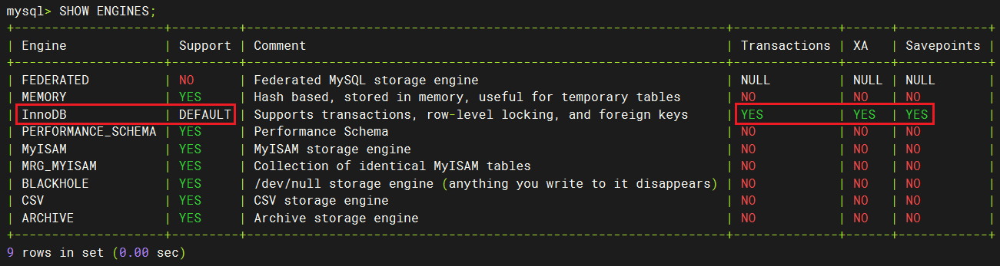

```mysql
mysql> SHOW ENGINES;
+--------------------+---------+----------------------------------------------------------------+--------------+------+------------+
| Engine             | Support | Comment                                                        | Transactions | XA   | Savepoints |
+--------------------+---------+----------------------------------------------------------------+--------------+------+------------+
| FEDERATED          | NO      | Federated MySQL storage engine                                 | NULL         | NULL | NULL       |
| MEMORY             | YES     | Hash based, stored in memory, useful for temporary tables      | NO           | NO   | NO         |
| InnoDB             | DEFAULT | Supports transactions, row-level locking, and foreign keys     | YES          | YES  | YES        |
| PERFORMANCE_SCHEMA | YES     | Performance Schema                                             | NO           | NO   | NO         |
| MyISAM             | YES     | MyISAM storage engine                                          | NO           | NO   | NO         |
| MRG_MYISAM         | YES     | Collection of identical MyISAM tables                          | NO           | NO   | NO         |
| BLACKHOLE          | YES     | /dev/null storage engine (anything you write to it disappears) | NO           | NO   | NO         |
| CSV                | YES     | CSV storage engine                                             | NO           | NO   | NO         |
| ARCHIVE            | YES     | Archive storage engine                                         | NO           | NO   | NO         |
+--------------------+---------+----------------------------------------------------------------+--------------+------+------------+
9 rows in set (0.00 sec)
```

#### 存储层

所有的数据，数据库、表的定义，表的每一行的内容，索引，都是存在`文件系统`上，以`文件`的方式存在的，并完成与存储引擎的交互。当然有些存储引擎比如 InnoDB，也支持不使用文件系统直接管理裸设备，但现代文件系统的实现使得这样做没有必要了。在文件系统之下，可以使用本地磁盘，可以使用 DAS、NAS、SAN 等各种存储系统。

#### 小结

本节开篇所示的 MySQL 架构图，为了熟悉 SQL 执行流程方便，可以简化如下：

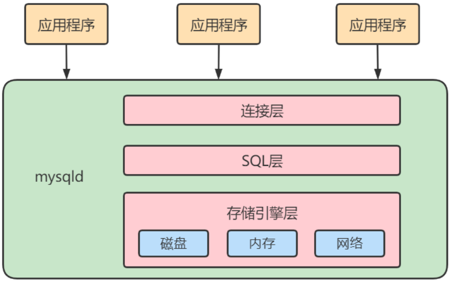

简化为三层结构：

- **连接层**：客户端和服务器端建立连接，客户端发送 SQL 至服务器端。
- **SQL 层（服务层）**：对 SQL 语句进行查询处理；与数据库文件的存储方式无关。
- **存储引擎层**：与数据库文件打交道，负责数据的存储和读取。

### SQL 执行流程

#### MySQL 中的 SQL执行流程


##### 查询缓存

Server 如果在查询缓存中发现了这条 SQL 语句，就会直接将结果返回给客户端；如果没有，就进入到解析器阶段。需要说明的是，**因为查询缓存往往效率不高，所以在 MySQL 8.0 之后舍弃了这个功能。**

查询缓存是提前把查询结果缓存起来，这样下次不需要执行就可以直接拿到结果。需要说明的是，**在 MySQL 中的查询缓存，不是缓存查询计划，而是查询对应的结果。**这就意味着查询匹配的鲁棒性大大降低，`只有相同的查询操作才会命中查询缓存`。**两个查询请求在任何字符上的不同（例如：空格、注释、大小写），都会导致缓存不会命中，因此 MySQL 的查询缓存命中率不高。**

**同时，如果查询请求中包含某些系统函数、用户自定义变量和函数、一些系统表，如 mysql 、information_schema、 performance_schema 数据库中的表，那这个请求就不会被缓存。**以某些系统函数举例，可能同样的函数的两次调用会产生不一样的结果，比如函数 NOW()，每次调用都会产生最新的当前时间，如果在一个查询请求中调用了这个函数，那即使查询请求的文本信息都一样，那不同时间的两次查询也应该得到不同的结果，如果在第一次查询时就缓存了，那第二次查询的时候直接使用第一次查询的结果就是错误的！

此外，既然是缓存，那就有缓存失效的时候。MySQL 的缓存系统会监测涉及到的每张表，只要该表的结构或者数据被修改，如对该表使用了 INSERT、UPDATE、DELETE、TRUNCATE TABLE、ALTER TABLE、DROP TABLE 或 DROP DATABASE 语句，那使用该表的所有高速缓存查询都将变为无效并从高速缓存中删除！对于更新压力大的数据库来说，查询缓存的命中率会非常低。

##### 解析器

在解析器中对 SQL 语句进行语法分析、语义分析。


`分析器先做词法分析。`输入的是由多个字符串和空格组成的一条 SQL 语句，MySQL 需要识别出里面的字符串分别是什么，代表什么。 例如，MySQL 从输入的 SELECT 关键字识别出来，这是一个查询语句。另外，MySQL 也要把字符串 T 识别成表名 T，把字符串 ID 识别成列 ID等。接着，要做语法分析。根据词法分析的结果，语法分析器（比如：Bison）会根据语法规则，判断输入的这个 SQL 语句是否满足 MySQL 语法。

```mysql
SELECT username, ismale FROM userinfo WHERE age >= 20 AND level >= 5 AND 1 = 1;
```

例如上述语句，如果 SQL 语句正确，则会生成一个这样的语法树：


##### 优化器

在`优化器中会确定 SQL 语句的执行路径`，比如是根据全表检索，还是根据索引检索等。

例如，如下语句是执行两个表的 JOIN：

```mysql
SELECT * FROM test1 JOIN test2 USING(ID) WHERE test1.name = 'aaa' AND test2.name = 'bbb'
```

方案 1：可以先从表 test1 里面取出 name = 'aaa' 的记录的 ID 值，再根据 ID 值关联到表 test2，再判断 test2 里面 name 的值是否等于 'bbb'。

方案 2：可以先从表 test2 里面取出 name = 'bbb' 的记录的 ID 值，再根据 ID 值关联到表 test1，再判断 test1 里面 name 的值是否等于 'aaa'。

这两种执行方法的逻辑结果是一样的，但是执行的效率会有不同，而优化器的作用就是决定选择使用哪一个方案。**优化器阶段完成后，SQL 语句的执行方案就确定下来了，然后进入执行器阶段。**

> 至于优化器是怎么选择索引的，有没有可能选择错等，索引章节再次说明。

在查询优化器中，可以分为`逻辑查询优化阶段`和`物理查询优化阶段`。

- 逻辑查询优化，是通过改变 SQL 语句的内容，来使得 SQL 查询更高效，同时为物理查询优化提供更多的候选执行计划。通常采用的方式是对 SQL 语句进行`等价变换`，对查询进行`重写`，而查询重写的数学基础就是关系代数。对条件表达式进行等价谓词重写、条件简化，对视图进行重写，对子查询进行优化，对连接语义进行了外连接消除、嵌套连接消除等。
- 物理查询优化，是基于`关系代数`进行的查询重写，而关系代数的每一步都对应着物理计算，这些物理计算往往存在多种算法，因此需要计算各种物理路径的代价，从中选择`代价最小的作为执行计划`。在这个阶段里，对于单表和多表连接的操作，需要高效的`使用索引`，提升查询效率。

##### 执行器

截止到现在，还没有真正去读写真实的表，仅仅只是产出了一个`执行计划`，接下来，就进入了`执行器阶段`。

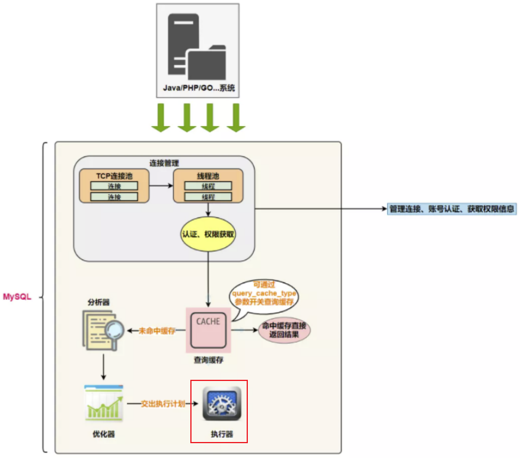


**在执行之前需要判断该用户是否具备权限。**如果没有，就会返回权限错误；如果具备权限，就执行 SQL 查询并返回结果。在 MySQL 8.0 以下的版本，如果设置了查询缓存，这时会将查询结果进行缓存。

例如，表 test 中，name 字段没有索引，对于以下 SQL，执行器的执行流程是这样的：

```mysql
SELECT * FROM test WHERE name = 'a'
```

- 调用 InnoDB 引擎接口取 test 表的第一行，判断 name 值是不是 a，如果不是则跳过，如果是则将这行存在结果集中。
- 调用引擎接口取下一行，重复相同的判断逻辑，直到取到这个表的最后一行。
- 执行器将上述遍历过程中，所有满足条件的行组成的记录集作为结果集返回给客户端。
- 至此，这个语句就执行完成了。对于有索引的表，执行的逻辑也差不多。

##### 执行流程

综上，SQL 语句在 MySQL 中的流程是：`SQL 语句 ---> [查询缓存] ---> 解析器 ---> 优化器 ---> 执行器。`


#### MySQL 8 中的 SQL 执行原理

**第一步，确认 profiling 是否开启。**

```mysql
mysql> SELECT @@profiling;
+-------------+
| @@profiling |
+-------------+
|           0 |
+-------------+
1 row in set, 1 warning (0.00 sec)

mysql> SHOW VARIABLES LIKE '%profiling%';
+------------------------+-------+
| Variable_name          | Value |
+------------------------+-------+
| have_profiling         | YES   |
| profiling              | OFF   |
| profiling_history_size | 15    |
+------------------------+-------+
3 rows in set (0.01 sec)

# profiling=0代表关闭, 需要把profiling打开, 即设置为1
mysql> SET profiling = 1;
Query OK, 0 rows affected, 1 warning (0.00 sec)
```

**第二步，多次执行相同的 SQL 查询。**

```mysql
mysql> SELECT COUNT(1) FROM employees;
+----------+
| COUNT(1) |
+----------+
|      107 |
+----------+
1 row in set (0.01 sec)

mysql> SELECT COUNT(1) FROM employees;
+----------+
| COUNT(1) |
+----------+
|      107 |
+----------+
1 row in set (0.00 sec)

mysql> SELECT COUNT(1) FROM employees;
+----------+
| COUNT(1) |
+----------+
|      107 |
+----------+
1 row in set (0.00 sec)

mysql> SELECT COUNT(1) FROM employees;
+----------+
| COUNT(1) |
+----------+
|      107 |
+----------+
1 row in set (0.00 sec)

mysql> SELECT COUNT(1) FROM employees;
+----------+
| COUNT(1) |
+----------+
|      107 |
+----------+
1 row in set (0.01 sec)
```

**第三步，查看 profiles。**

```mysql
# 查看当前会话产生的所有profiles
mysql> SHOW profiles;
+----------+------------+-----------------------------------+
| Query_ID | Duration   | Query                             |
+----------+------------+-----------------------------------+
|        1 | 0.00148825 | SHOW VARIABLES LIKE '%profiling%' |
|        2 | 0.00018850 | SELECT DATABASE()                 |
|        3 | 0.00016375 | SELECT DATABASE()                 |
|        4 | 0.00073875 | show databases                    |
|        5 | 0.00081400 | show tables                       |
|        6 | 0.00087100 | SELECT COUNT(1) FROM employees    |
|        7 | 0.00092375 | SELECT COUNT(1) FROM employees    |
|        8 | 0.00126200 | SELECT COUNT(1) FROM employees    |
|        9 | 0.00078000 | SELECT COUNT(1) FROM employees    |
|       10 | 0.00096625 | SELECT COUNT(1) FROM employees    |
+----------+------------+-----------------------------------+
10 rows in set, 1 warning (0.00 sec)
```

**第四步，查看 profile。**

```mysql
# 显示最后一次查询的执行计划, 查看程序的执行步骤
mysql> SHOW profile;
+--------------------------------+----------+
| Status                         | Duration |
+--------------------------------+----------+
| starting                       | 0.000132 |
| Executing hook on transaction  | 0.000029 |
| starting                       | 0.000022 |
| checking permissions           | 0.000013 |  # 权限检查
| Opening tables                 | 0.000079 |  # 打开表
| init                           | 0.000009 |  # 初始化
| System lock                    | 0.000013 |  # 锁系统
| optimizing                     | 0.000006 |  # 优化查询
| statistics                     | 0.000024 |
| preparing                      | 0.000019 |  # 准备
| executing                      | 0.000537 |  # 执行
| end                            | 0.000006 |
| query end                      | 0.000003 |
| waiting for handler commit     | 0.000006 |
| closing tables                 | 0.000005 |
| freeing items                  | 0.000060 |
| cleaning up                    | 0.000007 |
+--------------------------------+----------+
17 rows in set, 1 warning (0.00 sec)
```

```mysql
# 也可以查询指定的Query ID, Query 10即为最后一次查询的ID, 与上面的结果相同
mysql> SHOW profile FOR QUERY 10;
+--------------------------------+----------+
| Status                         | Duration |
+--------------------------------+----------+
| starting                       | 0.000132 |
| Executing hook on transaction  | 0.000029 |
| starting                       | 0.000022 |
| checking permissions           | 0.000013 |
| Opening tables                 | 0.000079 |
| init                           | 0.000009 |
| System lock                    | 0.000013 |
| optimizing                     | 0.000006 |
| statistics                     | 0.000024 |
| preparing                      | 0.000019 |
| executing                      | 0.000537 |
| end                            | 0.000006 |
| query end                      | 0.000003 |
| waiting for handler commit     | 0.000006 |
| closing tables                 | 0.000005 |
| freeing items                  | 0.000060 |
| cleaning up                    | 0.000007 |
+--------------------------------+----------+
17 rows in set, 1 warning (0.00 sec)
```

```mysql
# 还可以查询更丰富的内容
mysql> SHOW profile cpu, block io FOR QUERY 10;
+--------------------------------+----------+----------+------------+--------------+---------------+
| Status                         | Duration | CPU_user | CPU_system | Block_ops_in | Block_ops_out |
+--------------------------------+----------+----------+------------+--------------+---------------+
| starting                       | 0.000132 | 0.000075 |   0.000061 |            0 |             0 |
| Executing hook on transaction  | 0.000029 | 0.000013 |   0.000011 |            0 |             0 |
| starting                       | 0.000022 | 0.000011 |   0.000010 |            0 |             0 |
| checking permissions           | 0.000013 | 0.000008 |   0.000006 |            0 |             0 |
| Opening tables                 | 0.000079 | 0.000043 |   0.000036 |            0 |             0 |
| init                           | 0.000009 | 0.000005 |   0.000003 |            0 |             0 |
| System lock                    | 0.000013 | 0.000007 |   0.000006 |            0 |             0 |
| optimizing                     | 0.000006 | 0.000003 |   0.000003 |            0 |             0 |
| statistics                     | 0.000024 | 0.000013 |   0.000010 |            0 |             0 |
| preparing                      | 0.000019 | 0.000011 |   0.000009 |            0 |             0 |
| executing                      | 0.000537 | 0.000849 |   0.000000 |            0 |             0 |
| end                            | 0.000006 | 0.000006 |   0.000000 |            0 |             0 |
| query end                      | 0.000003 | 0.000002 |   0.000000 |            0 |             0 |
| waiting for handler commit     | 0.000006 | 0.000006 |   0.000000 |            0 |             0 |
| closing tables                 | 0.000005 | 0.000005 |   0.000000 |            0 |             0 |
| freeing items                  | 0.000060 | 0.000060 |   0.000000 |            0 |             0 |
| cleaning up                    | 0.000007 | 0.000006 |   0.000000 |            0 |             0 |
+--------------------------------+----------+----------+------------+--------------+---------------+
17 rows in set, 1 warning (0.00 sec)

mysql> SHOW profile cpu, block io FOR QUERY 9;
+--------------------------------+----------+----------+------------+--------------+---------------+
| Status                         | Duration | CPU_user | CPU_system | Block_ops_in | Block_ops_out |
+--------------------------------+----------+----------+------------+--------------+---------------+
| starting                       | 0.000073 | 0.000039 |   0.000032 |            0 |             0 |
| Executing hook on transaction  | 0.000003 | 0.000002 |   0.000001 |            0 |             0 |
| starting                       | 0.000006 | 0.000003 |   0.000003 |            0 |             0 |
| checking permissions           | 0.000004 | 0.000002 |   0.000002 |            0 |             0 |
| Opening tables                 | 0.000027 | 0.000015 |   0.000012 |            0 |             0 |
| init                           | 0.000004 | 0.000002 |   0.000001 |            0 |             0 |
| System lock                    | 0.000006 | 0.000003 |   0.000003 |            0 |             0 |
| optimizing                     | 0.000004 | 0.000002 |   0.000002 |            0 |             0 |
| statistics                     | 0.000014 | 0.000008 |   0.000006 |            0 |             0 |
| preparing                      | 0.000012 | 0.000007 |   0.000006 |            0 |             0 |
| executing                      | 0.000524 | 0.000477 |   0.000390 |            0 |             0 |
| end                            | 0.000009 | 0.000003 |   0.000003 |            0 |             0 |
| query end                      | 0.000003 | 0.000002 |   0.000001 |            0 |             0 |
| waiting for handler commit     | 0.000006 | 0.000003 |   0.000002 |            0 |             0 |
| closing tables                 | 0.000006 | 0.000003 |   0.000003 |            0 |             0 |
| freeing items                  | 0.000073 | 0.000040 |   0.000033 |            0 |             0 |
| cleaning up                    | 0.000008 | 0.000004 |   0.000003 |            0 |             0 |
+--------------------------------+----------+----------+------------+--------------+---------------+
17 rows in set, 1 warning (0.00 sec)
```

#### SQL 语法顺序

随着 MySQL 版本的更新换代，其优化器也在不断的升级，优化器会分析不同执行顺序产生的性能消耗的不同，而动态调整执行顺序。

需求：查询每个部门年龄高于 20 岁的人数，且高于 20 岁人数不能少于 2 人，显示人数最多的部门信息。

下面是经常出现的查询顺序：


### 数据库缓冲池（Buffer Pool）

InnoDB 存储引擎是以页为单位来管理存储空间的，我们进行的增删改查操作其实本质上都是在访问页面（包括读页面、写页面、创建新页面等操作）。`磁盘 I/O 需要消耗的时间很多，而在内存中进行操作，效率则会高很多。`为了能让数据表或者索引中的数据随时被所用，DBMS 会申请`占用内存来作为数据缓冲池`，在真正访问页面之前，需要把在磁盘上的页缓存到内存中的 Buffer Pool 之后才可以访问。

这样做的好处是可以让磁盘活动最小化，从而`减少与磁盘直接进行 I/O 的时间`。要知道，这种策略对提升 SQL 语句的查询性能来说至关重要，如果索引的数据在缓冲池里，那么访问的成本就会降低很多。

#### 查询缓存 VS 缓冲池

##### 查询缓存

查询缓存是提前把`查询结果缓存`起来，这样下次不需要执行就可以直接拿到结果。需要说明的是，在 MySQL 中的查询缓存，不是缓存查询计划，而是查询对应的结果。因为命中条件苛刻，而且只要数据表发生变化，查询缓存就会失效，因此命中率低。

##### 缓冲池

首先需要了解在 InnoDB 存储引擎中，缓冲池都包括了哪些。

在 InnoDB 存储引擎中有一部分数据会放到内存中，缓冲池则占了这部分内存的大部分，它用来存储各种数据的缓存，如下图所示：


从图中，能看到 InnoDB 缓冲池包括了数据页、索引页、插入缓冲、锁信息、自适应 Hash 和数据字典信息等。

**缓存池的重要性：**

对于使用 InnoDB 作为存储引擎的表来说，不管是用于存储用户数据的索引（包括聚簇索引和二级索引），还是各种系统数据，都是以`页`的形式存放在`表空间`中的，而所谓的表空间只不过是 InnoDB 对文件系统上一个或几个实际文件的抽象，也就是说数据归根结底还是存储在磁盘上。同时，磁盘的速度，远远跟不上 CPU 的速度。因此，缓冲池可以很大程度上消除 CPU 和磁盘之间的鸿沟。

所以，InnoDB 存储引擎在处理客户端的请求时，当需要访问某个页的数据时，就会把`完整的页数据全部加载到内存中`，也就是说，即使只需要访问一个页的一条记录，也需要先把整个页的数据加载到内存中。将整个页加载到内存中后，就可以进行读写访问，在进行完读写访问之后，并不会立即把页对应的内存空间释放掉，而是将其`缓存`起来，这样将来有请求再次访问该页面时，就可以`省去磁盘 I/O 的开销`。

**缓存原则：**

`位置 * 频次`这个原则，可以对磁盘 I/O 访问效率进行优化。

首先，位置决定效率，提供缓冲池就是为了在内存中可以直接访问数据。

其次，频次决定优先级顺序。因为缓冲池的大小是有限的，比如磁盘有 200 GB，但是内存只有 16 GB，缓冲池大小只有 1 GB，就无法将所有数据都加载到缓冲池里，这时就涉及到优先级顺序，会`优先对使用频次高的热数据进行加载`。

**缓冲池的预读特性：**

缓冲池的作用是提升磁盘 I/O 效率，而进行读取数据的时候，存在一个`局部性原理`，也就是使用了一些数据后，`大概率还会使用它周围的一些数据`，因此采用`预读`的机制提前加载，可以减少未来可能的磁盘 I/O 操作。

#### 缓冲池如何读取数据

缓冲池管理器会尽量将经常使用的数据保存起来，在数据库进行页面读操作的时候，首先会判断该页面是否在缓冲池中，如果存在就直接读取，如果不存在，就会通过内存或磁盘将页面存放到缓冲池中再进行读取。

缓存在数据库中的结构和作用如下图所示：


如果执行 SQL 语句的时候更新了缓存池中的数据，那么这些数据会马上同步到磁盘上吗？

实际上，当对数据库中的记录进行修改的时候，首先会修改缓冲池中页里面的记录信息，然后数据库会`以一定的频率刷新到磁盘上`。注意：并不是每一次发生更新操作，都会立刻进行磁盘回写，缓冲池会采用一种叫做`checkpoint`的机制，将数据回写到磁盘上，这样做的好处就是提升了数据库的整体性能。

比如，当缓冲池不够用时，需要释放掉一些不常用的页，此时就可以强行采用 checkpoint 的方式，将不常用的脏页回写到磁盘上，然后再从缓冲池中将这些页释放掉。这些`脏页 (dirty page)`指的是缓冲池中被修改过的页，与磁盘上的数据页不一致。 

#### 查看和设置缓冲池的大小

如果你使用的是 InnoDB 存储引擎，可以通过查看`innodb_buffer_pool_size`变量来查看缓冲池的大小。命令如下：

```mysql
mysql> SHOW VARIABLES LIKE 'innodb_buffer_pool_size';
+-------------------------+-----------+
| Variable_name           | Value     |
+-------------------------+-----------+
| innodb_buffer_pool_size | 134217728 |
+-------------------------+-----------+
1 row in set (0.00 sec)
```

InnoDB 的缓冲池大小，默认只有 $134217728 / 1024 / 1024 = 128$ MB。缓冲池大小可以修改，比如改为 256 MB：

```mysql
mysql> SET GLOBAL innodb_buffer_pool_size = 268435456;
Query OK, 0 rows affected (0.00 sec)

mysql> SHOW VARIABLES LIKE 'innodb_buffer_pool_size';
+-------------------------+-----------+
| Variable_name           | Value     |
+-------------------------+-----------+
| innodb_buffer_pool_size | 268435456 |
+-------------------------+-----------+
1 row in set (0.00 sec)
```

> 也可以通过配置文件修改：
>
> ```ini
> [server]
> innodb_buffer_pool_size = 268435456
> ```

#### 多个缓冲池实例

Buffer Pool 本质是 InnoDB 向操作系统申请的一块`连续的内存空间`，在多线程环境下，访问 Buffer Pool 中的数据都需要`加锁`处理。在 Buffer Pool 特别大而且多线程并发访问特别高的情况下，单一的 Buffer Pool 可能会影响请求的处理速度。所以在 Buffer Pool 特别大的时候，可以把它们`拆分成若干个小的 Buffer Pool`，每个 Buffer Pool 都称为一个`实例`，它们彼此是独立的，独立的申请内存空间，独立的管理各种链表。因此，在多线程并发访问时并不会相互影响，从而提高并发处理能力。

可以在服务器启动的时候，通过设置`innodb_buffer_pool_instances`的值，来修改 Buffer Pool 实例的个数：

```ini
[server]
innodb_buffer_pool_instances = 1
```

命令查看缓冲池实例的个数：

```mysql
mysql> SHOW VARIABLES LIKE 'innodb_buffer_pool_instances';
+------------------------------+-------+
| Variable_name                | Value |
+------------------------------+-------+
| innodb_buffer_pool_instances | 1     |
+------------------------------+-------+
1 row in set (0.00 sec)
```

每个 Buffer Pool 实例实际占用的内存空间：`innodb_buffer_pool_size/innodb_buffer_pool_instances`。也就是总共的缓冲池大小除以实例的个数，结果就是每个 Buffer Pool 实例占用的内存空间小。

不过也不是 Buffer Pool 的实例创建的越多越好，分别`管理各个 Buffer Pool 也需要性能开销`，InnoDB 规定：**当 innodb_buffer_pool_size 的值小于 1 GB 的时候，设置多个实例是无效的，此时，InnoDB 会默认把 innodb_buffer_pool_instances 的值修改为 1。当 innodb_buffer_pool_size 的值大于或等于 1 GB 的时候，建议设置多个实例。**

#### 引申问题

Buffer Pool 是 MySQL 内存结构中十分核心的一个组成，可以先把它想象成一个黑盒子。

黑盒下的更新数据流程：


当查询数据的时候，会先去 Buffer Pool 中查询，如果 Buffer Pool 中不存在，存储引擎会先将数据从磁盘加载到 Buffer Pool 中，然后将数据返回给客户端。同理，当更新某个数据的时候，如果这个数据不存在于 Buffer Pool 中，存储引擎也会先将数据从磁盘加载到 Buffer Pool 中，然后修改 Buffer Pool 中的数据，被修改过的数据（脏数据），会在之后统一刷入磁盘中。

这个过程存在一个问题，假如修改 Buffer Pool 中的数据成功，但还未将数据刷入磁盘时，MySQL 服务发生异常宕机。此时，更新后的数据只存在于 Buffer Pool 中，因为 MySQL 宕机，会导致这部分修改的数据丢失。再者，更新操作到一半时，MySQL 服务发生异常宕机，此时，需要回滚到更新之前的状态，又该如何处理呢？

答案是：`Redo Log 和 Undo Log`。

## 存储引擎

为了便于管理，人们把`连接管理`、`查询缓存`、`语法解析`、`查询优化`这些并不涉及真实数据存储的功能划分为`MySQL Server`的功能，把真实存取数据的功能划分为`存储引擎`的功能。在 MySQL Server 完成了查询优化后，只需要按照生成的`执行计划`调用底层存储引擎提供的 API，获取到数据后返回给客户端就可以了。

简而言之，`存储引擎就是指表的类型`。存储引擎最开始叫表处理器，后来改名为存储引擎，它的功能就是接收上层传下来的指令，然后对表中的数据进行提取或写入操作。

### 查看存储引擎

查看 MySQL 提供的存储引擎：

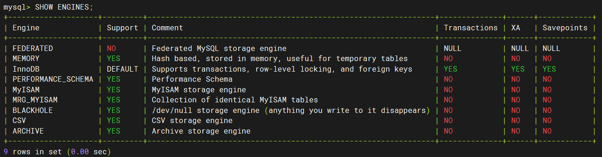

```mysql
mysql> SHOW ENGINES;
+--------------------+---------+----------------------------------------------------------------+--------------+------+------------+
| Engine             | Support | Comment                                                        | Transactions | XA   | Savepoints |
+--------------------+---------+----------------------------------------------------------------+--------------+------+------------+
| FEDERATED          | NO      | Federated MySQL storage engine                                 | NULL         | NULL | NULL       |
| MEMORY             | YES     | Hash based, stored in memory, useful for temporary tables      | NO           | NO   | NO         |
| InnoDB             | DEFAULT | Supports transactions, row-level locking, and foreign keys     | YES          | YES  | YES        |
| PERFORMANCE_SCHEMA | YES     | Performance Schema                                             | NO           | NO   | NO         |
| MyISAM             | YES     | MyISAM storage engine                                          | NO           | NO   | NO         |
| MRG_MYISAM         | YES     | Collection of identical MyISAM tables                          | NO           | NO   | NO         |
| BLACKHOLE          | YES     | /dev/null storage engine (anything you write to it disappears) | NO           | NO   | NO         |
| CSV                | YES     | CSV storage engine                                             | NO           | NO   | NO         |
| ARCHIVE            | YES     | Archive storage engine                                         | NO           | NO   | NO         |
+--------------------+---------+----------------------------------------------------------------+--------------+------+------------+
9 rows in set (0.00 sec)
```

### 设置系统默认的存储引擎

查看默认的存储引擎：

```mysql
# 方式一
mysql> SHOW VARIABLES LIKE '%storage_engine%';
+---------------------------------+-----------+
| Variable_name                   | Value     |
+---------------------------------+-----------+
| default_storage_engine          | InnoDB    |
| default_tmp_storage_engine      | InnoDB    |
| disabled_storage_engines        |           |
| internal_tmp_mem_storage_engine | TempTable |
+---------------------------------+-----------+
4 rows in set (0.00 sec)

# 方式二
mysql> SELECT @@default_storage_engine;
+--------------------------+
| @@default_storage_engine |
+--------------------------+
| InnoDB                   |
+--------------------------+
1 row in set (0.00 sec)
```

如果在创建表的语句中没有显式指定表的存储引擎的话，那就会`默认使用 InnoDB 作为表的存储引擎`。如果想改变表的默认存储引擎的话，可以这样写启动服务器的命令行：

```mysql
SET DEFAULT_STORAGE_ENGINE = MyISAM;
```

或者修改 my.cnf 文件，然后重启服务：

```ini
default-storage-engine=MyISAM
```

### 设置表的存储引擎

存储引擎是负责对表中的数据进行提取和写入工作的，`可以为不同的表设置不同的存储引擎`，也就是说不同的表可以有不同的物理存储结构，不同的提取和写入方式。

#### 创建表时指定存储引擎

显式的指定表的存储引擎：

```mysql
CREATE TABLE 表名(
	建表语句;
) ENGINE = 存储引擎名称
```

#### 修改表的存储引擎

如果表已经建好了，也可以修改表的存储引擎：

```mysql
ALTER TABLE 表名 ENGINE = 存储引擎名称
```

### 引擎介绍

#### InnoDB 引擎

InnoDB 是`具备外键支持功能的事务存储引擎`。

- MySQL 从 3.23.34a 开始就包含 InnoDB 存储引擎，大于等于 5.5 之后，默认采用 InnoDB 引擎 。
- InnoDB 是 MySQL 的`默认事务型引擎`，它被设计用来处理大量的短期（short-lived）事务，可以确保事务的完整提交（Commit）和回滚（Rollback）。
- 除了增加和查询外，还需要更新、删除操作，那么，应优先选择 InnoDB 存储引擎。
- 除非有非常特别的原因需要使用其他的存储引擎，否则应该优先考虑 InnoDB 引擎。
- 数据文件结构：
  - 表名.frm 存储表结构（MySQL 8.0 时，合并在表名.ibd 中）。
  - 表名.ibd 存储数据和索引。
- InnoDB是`为处理巨大数据量的最大性能设计`。
  - 在以前的版本中，字典数据以元数据文件、非事务表等来存储，现在这些元数据文件被删除了。比如：.frm，.par，.trn，.isl，.db.opt 等都在 MySQL 8.0 中不存在了。
- 对比 MyISAM 存储引擎， InnoDB 写的处理效率差一些 ，并且会占用更多的磁盘空间以保存数据和索引。
- MyISAM 只缓存索引，不缓存真实数据；InnoDB 不仅缓存索引还要缓存真实数据， 对内存要求较高 ，而且内存大小对性能有决定性的影响。

#### MyISAM 引擎

MyISAM 引擎是`主要的非事务处理存储引擎`。

- MyISAM 提供了大量的特性，包括全文索引、压缩、空间函数（GIS）等，但 MyISAM 不支持事务、行级锁、外键，有一个毫无疑问的缺陷就是崩溃后无法安全恢复。
- MySQL 5.5 之前默认的存储引擎。
- 优势是访问的速度快，对事务完整性没有要求或者以 SELECT、INSERT 为主的应用。
- 针对数据统计有额外的常数存储，故而 COUNT(*) 的查询效率很高。
- 数据文件结构：
  - 表名.frm 存储表结构。
  - 表名.MYD 存储数据 (MYData)。
  - 表名.MYI 存储索引 (MYIndex)。
- 应用场景：只读应用或者以读为主的业务。

#### Archive 引擎

Archive 引擎用于数据存档。功能：


#### Blackhole 引擎

Blackhole 引擎：丢弃写操作，读操作会返回空内容。

#### CSV 引擎

CSV 引擎：存储数据时，以逗号分隔各个数据项。

示例：

```mysql
mysql> CREATE TABLE test (i INT NOT NULL, c CHAR(10) NOT NULL) ENGINE = CSV;
Query OK, 0 rows affected (0.01 sec)

mysql> INSERT INTO test VALUES (1, 'record one'), (2, 'record two');
Query OK, 2 rows affected (0.01 sec)
Records: 2  Duplicates: 0  Warnings: 0

mysql> SELECT * FROM test;
+---+------------+
| i | c          |
+---+------------+
| 1 | record one |
| 2 | record two |
+---+------------+
2 rows in set (0.00 sec)
```

创建 CSV 表还会创建相应的`元文件`，用于`存储表的状态`和`表中存在的行数`。此文件的名称与表的名称相同，后缀为 CSM。如图所示：

#### Memory 引擎

Memory 引擎：采用的逻辑介质是`内存`， 响应速度很快 ，但是当 mysqld 守护进程崩溃的时候`数据会丢失 `。另外，要求存储的数据是数据长度不变的格式，比如，Blob 和 Text 类型的数据不可用，因为长度是不固定的。

主要特征：

- Memory 同时支持哈希（HASH）索引和 B+Tree 索引。
- Memory表至少比 MyISAM 表要快一个数量级。
- MEMORY 表的大小是受到限制的。表的大小主要取决于两个参数，分别是 max_rows 和 max_heap_table_size。其中，max_rows 可以在创建表时指定；max_heap_table_size 的大小默认为 16 MB，可以按需要进行扩大。
- 数据文件与索引文件分开存储。
- 缺点：数据易丢失，生命周期短。基于这个缺陷，选择 MEMORY 存储引擎时需要特别小心。

使用 Memory 存储引擎的场景：

- 目标数据比较小 ，而且非常频繁的进行访问，在内存中存放数据，如果太大的数据会造成内存溢出。可以通过参数 max_heap_table_size 控制 Memory 表的大小，限制 Memory 表的最大的大小。
- 如果数据是临时的，而且必须立即可用得到，那么就可以放在内存中。
- 存储在 Memory 表中的数据如果突然间丢失的话也没有太大的关系。

#### Federated 引擎

Federated 引擎：访问远程表。Federated 引擎是访问其他 MySQL 服务器的一个代理，尽管该引擎看起来提供了一种很好的跨服务器的灵活性，但也经常带来问题，因此默认是禁用的。

#### Merge 引擎

Merge 引擎：管理多个 MyISAM 表构成的表集合。

#### NDB 引擎

NDB 引擎：MySQL 集群专用存储引擎，也叫做 NDB Cluster 存储引擎，主要用于 MySQL Cluster 分布式集群环境，类似于 Oracle 的 RAC 集
群。

#### 引擎对比

MySQL 中同一个数据库，不同的表可以选择不同的存储引擎。如下表对常用存储引擎做出了对比：

### MyISAM VS InnoDB

| 对比项         | MyISAM                                                     | InnoDB                                                       |
| -------------- | ---------------------------------------------------------- | ------------------------------------------------------------ |
| 外键           | 不支持                                                     | 支持                                                         |
| 事务           | 不支持                                                     | 支持                                                         |
| 行表锁         | 表锁，即使操作一条记录，也会锁住整个表，不适合高并发的操作 | 行锁，操作时只锁某一行，对其他行没有影响，适合高并发的操作   |
| 缓存           | 只缓存索引，不缓存真实数据                                 | 不仅缓存索引，也缓存真实数据，对内存要求较高，而且内存大小对性能有决定性的影响 |
| 自带系统表使用 | Y                                                          | N                                                            |
| 关注点         | 性能：节省资源、消耗少、简单业务                           | 事务：并发写、事务、更大资源                                 |
| 默认安装       | Y                                                          | Y                                                            |
| 默认使用       | N                                                          | Y                                                            |

### InnoDB 补充

#### InnoDB 表的优势

InnoDB 存储引擎在实际应用中拥有诸多优势，比如操作便利、提高了数据库的性能、维护成本低等。如果由于硬件或软件的原因导致服务器崩溃，那么在重启服务器之后不需要进行额外的操作。InnoDB 崩溃恢复功能自动将之前提交的内容定型，然后撤销没有提交的进程，重启之后继续从崩溃点开始执行。

InnoDB 存储引擎在主内存中维护缓冲池，高频率使用的数据将在内存中直接被处理。这种缓存方式应用于多种信息，加速了处理进程。

在专用服务器上，物理内存中高达 80% 的部分被应用于缓冲池。如果需要将数据插入不同的表中，可以设置外键加强数据的完整性。更新或者删除数据，关联数据将会被自动更新或删除。如果试图将数据插入从表，但在主表中没有对应的数据，插入的数据将被自动移除。如果磁盘或内存中的数据出现崩溃，在使用脏数据之前，校验和机制会发出警告。当每个表的主键都设置合理时，与这些列有关的操作会被自动优化。插入、更新和删除操作通过做改变缓冲自动机制进行优化。 **InnoDB 不仅支持当前读写，也会缓冲改变的数据到数据流磁盘。**

InnoDB 的性能优势不只存在于长时运行查询的大型表。在同一列多次被查询时，自适应哈希索引会提高查询的速度。使用 InnoDB 可以压缩表和相关的索引，**可以在不影响性能和可用性的情况下创建或删除索引。**对于大型文本和 BLOB 数据，使用动态行形式，这种存储布局更高效。通过查询 INFORMATION_SCHEMA 库中的表可以监控存储引擎的内部工作。在同一个语句中，InnoDB 表可以与其他存储引擎表混用。即使有些操作系统限制文件大小为 2 GB，InnoDB 仍然可以处理。 **当处理大数据量时，InnoDB 兼顾 CPU，以达到最大性能。**

#### InnoDB 和 ACID 模型

ACID 模型是一系列数据库设计规则，这些规则着重强调可靠性，而可靠性对于商业数据和任务关键型应用非常重要。MySQL 包含类似 InnoDB 存储引擎的组件，与 ACID 模型紧密相连，这样出现意外时，数据不会崩溃，结果不会失真。如果依赖 ACID 模型，可以不使用一致性检查和崩溃恢复机制。如果拥有额外的软件保护，极可靠的硬件或者应用可以容忍一小部分的数据丢失和不一致，可以将 MySQL 设置调整为只依赖部分 ACID 特性，以达到更高的性能。下面是 InnoDB 存储引擎与 ACID 模型相同作用的四个方面：

- `原子方面`：ACID 的原子方面主要涉及 InnoDB 事务。与 MySQL 相关的特性主要包括：
  - 自动提交设置。
  - COMMIT 语句。
  - ROLLBACK 语句。
  - 操作 INFORMATION_SCHEMA 库中的表数据。
- `一致性方面`：ACID 模型的一致性主要涉及保护数据不崩溃的内部 InnoDB 处理过程。与 MySQL 相关的特性主要包括：
  - InnoDB 双写缓存。
  - InnoDB 崩溃恢复。
- `隔离方面`：隔离是应用于事务的级别。与 MySQL 相关的特性主要包括：
  - 自动提交设置。
  - SET ISOLATION LEVEL 语句。
  - InnoDB 锁的低级别信息。
- `耐久性方面`：ACID 模型的耐久性主要涉及与硬件配置相互影响的 MySQL 软件特性。由于硬件复杂多样化，耐久性方面没有具体的规则可循。与 MySQL 相关的特性有：
  - InnoDB 双写缓存，通过 innodb_doublewrite 配置项配置。
  - 配置项 innodb_flush_log_at_trx_commit。
  - 配置项 sync_binlog。
  - 配置项 innodb_file_per_table。
  - 存储设备的写入缓存。
  - 存储设备的备用电池缓存。
  - 运行 MySQL 的操作系统。
  - 持续的电力供应。
  - 备份策略。
  - 对分布式或托管的应用，最主要的在于硬件设备的地点以及网络情况。

#### InnoDB 架构

- `缓冲池`：缓冲池是主内存中的一部分空间，用来缓存已使用的表和索引数据。缓冲池使得经常被使用的数据能够直接在内存中获得，从而提高速度。
- `更改缓存`：更改缓存是一个特殊的数据结构，当受影响的索引页不在缓存中时，更改缓存会缓存辅助索引页的更改。索引页被其他读取操作时会加载到缓存池，缓存的更改内容就会被合并。不同于集群索引，辅助索引并非独一无二的。当系统大部分闲置时，清除操作会定期运行，将更新的索引页刷入磁盘。更新缓存合并期间，可能会大大降低查询的性能。在内存中，更新缓存占用一部分 InnoDB 缓冲池。在磁盘中，更新缓存是系统表空间的一部分。更新缓存的数据类型由 innodb_change_buffering 配置项管理。
- `自适应哈希索引`：自适应哈希索引将负载和足够的内存结合起来，使得 InnoDB 像内存数据库一样运行，不需要降低事务上的性能或可靠性。这个特性通过 innodb_adaptive_hash_index 选项配置，或者通过 --skip-innodb_adaptive_hash_index 命令行在服务启动时关闭。
- `重做日志缓存`：重做日志缓存存放要放入重做日志的数据。重做日志缓存大小通过 innodb_log_buffer_size 配置项配置。重做日志缓存会定期地将日志文件刷入磁盘。大型的重做日志缓存使得大型事务能够正常运行而不需要写入磁盘。
- `系统表空间`：系统表空间包括 InnoDB 数据字典、双写缓存、更新缓存和撤销日志，同时也包括表和索引数据。多表共享，系统表空间被视为共享表空间。
- `双写缓存`：双写缓存位于系统表空间中，用于写入从缓存池刷新的数据页。只有在刷新并写入双写缓存后，InnoDB 才会将数据页写入合适的位置。
- `撤销日志`：撤销日志是一系列与事务相关的撤销记录的集合，包含如何撤销事务最近的更改。如果其他事务要查询原始数据，可以从撤销日志记录中追溯未更改的数据。撤销日志存在于撤销日志片段中，这些片段包含于回滚片段中。
- `每个表一个文件的表空间`：每个表一个文件的表空间是指每个单独的表空间创建在自身的数据文件中，而不是系统表空间中。这个功能通过 innodb_file_per_table 配置项开启。每个表空间由一个单独的 .ibd 数据文件代表，该文件默认被创建在数据库目录中。
- `通用表空间`：使用 CREATE TABLESPACE 语法创建共享的 InnoDB 表空间。通用表空间可以创建在 MySQL 数据目录之外能够管理多个表并支持所有行格式的表。
- `撤销表空间`：撤销表空间由一个或多个包含撤销日志的文件组成。撤销表空间的数量由 innodb_undo_tablespaces 配置项配置。
- `临时表空间`：用户创建的临时表空间和基于磁盘的内部临时表都创建于临时表空间。innodb_temp_data_file_path 配置项定义了相关的路径、名称、大小和属性。如果该值为空，默认会在 innodb_data_home_dir 变量指定的目录下创建一个自动扩展的数据文件。
- `重做日志`：重做日志是基于磁盘的数据结构，在崩溃恢复期间使用，用来纠正数据。正常操作期间，重做日志会将请求数据进行编码，这些请求会改变 InnoDB 表数据。遇到意外崩溃后，未完成的更改会自动在初始化期间重新进行。

## 索引的数据结构

### 为什么使用索引

`索引是存储引擎用于快速找到数据记录的一种数据结构。` 常将索引比作教科书的目录部分（实际上不是完全一样），通过目录找到对应文章的页码，便可快速定位到需要的文章。MySQL 中也是一样的道理，**进行数据查找时，首先查看查询条件是否命中某条索引，符合则通过索引查找相关数据，如果不符合则需要全表扫描，即一条一条的查找记录，直到找到与条件符合的记录。** 


如上图所示，数据库没有索引的情况下，数据`分布在硬盘不同的位置上面`，读取数据时，摆臂需要前后摆动查找数据，这样操作非常耗时。如果`数据顺序摆放`，也需要从 1 到 6 行按顺序读取，这样就相当于进行了 6 次 I/O 操作，依旧非常耗时。如果不借助任何索引结构来帮助快速定位数据，假设查找 Col2 = 89 这条记录，就需要逐行查找、比较。从 Col2 = 34 开始，进行比较，发现不是，继续下一行。当前的表只有不到 10 行数据，但是如果表很大，有上千万条数据，就意味着要做很多次磁盘 I/O 才能找到。因为要查找 Col2 = 89 这条记录，CPU 必须先去磁盘查找这条记录，找到之后加载到内存，再对数据进行处理。这个过程最耗时间的就是磁盘 I/0（涉及到磁盘的旋转时间（速度较快）和磁盘的寻道时间（速度慢，耗时））。   

假如给数据使用`二叉树`这样的数据结构进行存储，如下图所示：

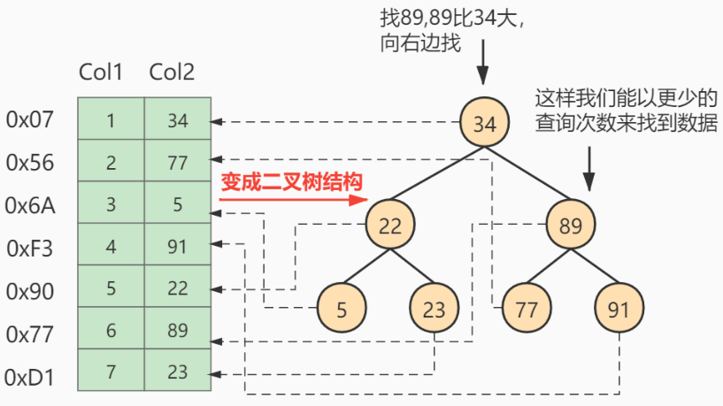

对字段 Col2 添加索引，就相当于在磁盘上为 Col2 维护了一个索引的数据结构，即这个`二叉搜索树`。二叉搜索树的每个节点存储的是`(K, V) 结构`，key 是 Col2，value 是该 key 所在行的文件指针（地址）。比如：该二叉搜索树的根节点就是 (34, 0x07)。对 Col2 添加了索引之后，这时再去查找 Col2 = 89 这条记录，会先去查找该二叉搜索树（二叉树的遍历查找）。读 34 到内存，因为 89 > 34，继续右侧数据，读 89 到内存，因为 89 = 89，找到数据并返回。然后，根据找到的节点的 value 快速定位到要查找的记录对应的地址。通过上述过程，可以发现，只需要查找两次（两次磁盘 I/O），就可以定位到记录的地址，查询速度也就提高了。

这就是为什么要使用索引的原因，其目的就是为了`减少磁盘 I/O 的次数`，加快查询的速度。

### 索引及其优缺点

#### 索引概述

MySQL 官方对索引的定义为：`索引 (Index) 是帮助 MySQL 高效获取数据的数据结构`。

`索引的本质：索引是数据结构。`可以简单理解为`"排好序的快速查找数据结构"`，满足特定查找算法。这些数据结构以某种方式指向数据， 这样就可以在这些数据结构的基础上实现`高级查找算法`。 

`索引是在存储引擎中实现的`，因此，每种存储引擎的索引，不一定完全相同，并且每种存储引擎不一定支持所有索引类型。同时，存储引擎可以定义每个表的`最大索引数`和`最大索引长度`。所有存储引擎支持每个表至少 16 个索引，总索引长度至少为 256 字节。有些存储引擎支持更多的索引数和更大的索引长度。

#### 优点

- 类似大学图书馆建书目索引，提高数据检索的效率，降低`数据库的 I/O 成本`，这也是创建索引最主要的原因。
- 通过创建唯一索引，可以保证数据库表中每一行`数据的唯一性`。
- 在实现数据的参考完整性方面，可以`加速表和表之间的连接`。换句话说，对于有依赖关系的子表和父表联合查询时，可以提高查询速度。
- 在使用分组和排序子句进行数据查询时，可以显著`减少查询中分组和排序的时间`，降低 CPU 的消耗。

#### 缺点

增加索引也有许多不利的方面，主要表现在如下几个方面：

- `创建索引和维护索引要耗费时间`，并且随着数据量的增加，所耗费的时间也会增加。
- 索引需要`占磁盘空间`，除了数据表占数据空间之外，每一个索引还要占一定的物理空间， 存储在磁盘上 ，如果有大量的索引，索引文件就可能比数据文件更快达到最大文件尺寸。
- 虽然索引大大提高了查询速度，同时却会`降低更新表的速度`。当对表中的数据进行增加、删除和修改的时候，索引也要动态地维护，这样就降低了数据的维护速度。

因此，选择使用索引时，需要综合考虑索引的优点和缺点。

> Tips：索引可以提高查询的速度，但是会影响插入记录的速度。这种情况下，最好的办法是先删除表中的索引，然后插入数据，插入完成后再创建索引。

### InnoDB 中索引的推演

#### 索引之前的查找

先来看一个精确匹配的例子：

```mysql
SELECT [列名列表] FROM 表名 WHERE 列名 = xxx
```

##### 在一个页中的查找

加和目前表中的记录比较少，所有的记录都可以被存放到一个页中，在查找记录的时候，可以根据搜索条件的不同分为两种情况：

- 以`主键`作为搜索条件：
  - 可以在页目录中使用`二分法`快速定位到对应的槽，然后再遍历该槽对应分组中的记录，即可快速找到指定的记录。
- 以`其他列`作为搜索条件：
  - 因为再数据页中没有对非主键列建立所谓的页目录，所以无法通过二分法快速定位相应的槽。这种情况下，只能从`最小记录`开始，`依次遍历`单链表中的每条记录，然后对比每条记录，是不是符合搜索条件。很显然，这种查找的效率是非常低的。

##### 在很多页中的查找

大部分情况下，表中存放的记录都是非常多的，需要很多的数据页来存储这些记录。在很多页中查找记录，可以分为两个步骤：

- 第一步：定位到记录所在的页。
- 第二步：从记录所在的页中查找相应的记录。

在没有索引的情况下，不论是根据主键列或者其他列的值进行查找，由于并不能快速的定位到记录所在的页，所以只能`从第一个页沿着双向链表一直往下找`，然后在每一个页中根据上面的查找方式去查找指定的记录。因为要遍历所有的数据页，所以这种方式显然是`超级耗时`的。如果一个表有一亿条记录呢？此时`索引`应运而生。相比一本书的目录，索引更像是图书馆中的书架结构，每一个书架相当于一个数据页，书架上的每一本书相当于表中的一条记录。


#### 设计索引

新建表：

```mysql
mysql> CREATE TABLE index_demo(
    -> c1 INT,
    -> c2 INT,
    -> c3 CHAR(1),
    -> PRIMARY KEY(c1)
    -> ) ROW_FORMAT = Compact;
Query OK, 0 rows affected (0.03 sec)
```

这个新建的 index_demo 表中有 2 个 INT 类型的列，1 个 CHAR(1) 类型的列，而且规定了 c1 列为主键，这个表使用 Compact 行格式来实际存储记录。这里简化了 index_demo 表的行格式示意图：


只在示意图里展示记录的这几个部分：

- `record_type`：记录头信息的一项属性，表示记录的类型，`0 表示普通记录`、`2 表示最小记录`、`3 表示最大记录`、`1 暂时还没用过`，后面讲。
- `next_record`：记录头信息的一项属性，表示下一条地址相对于本条记录的地址偏移量，后面演示用箭头来表明下一条记录是谁。
- 各个列的值 ：这里只记录在 index_demo 表中的三个列，分别是 c1 、 c2 和 c3。
- 其他信息 ：除了上述 3 种信息以外的所有信息，包括其他隐藏列的值以及记录的额外信息。

将记录格式示意图的其他信息项暂时去掉并把它竖起来的效果就是这样：

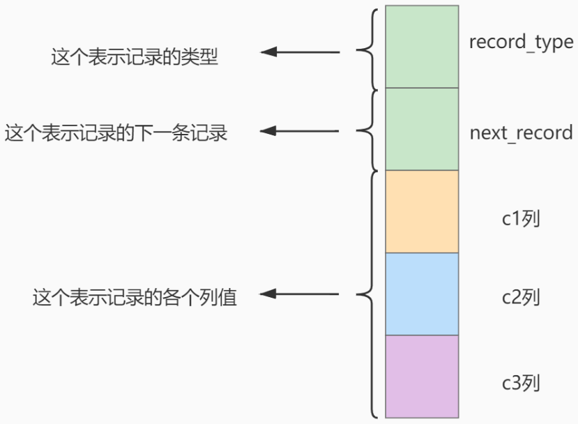

把一些记录放到页里的示意图就是：


##### 一个简单的索引设计方案

在根据某个搜索条件查找一些记录时为什么要遍历所有的数据页呢？因为各个页中的记录并没有规律，所以并不知道搜索条件会匹配哪些页中的记录，因此不得不依次遍历所有的数据页。所以如果想`快速的定位到需要查找的记录在哪些数据页中`该咋办？此时，可以为快速定位记录所在的数据页`建立一个目录`，而建这个目录必须完成下边这些事：

**`1. 下一个数据页中用户记录的主键值，必须大于上一个页中用户记录的主键值。`**

假设：每个数据页最多能存放 3 条记录（实际上一个数据页非常大，可以存放很多记录），有了这个假设之后，向 index_demo 表插入 3 条记录：

```mysql
mysql> INSERT INTO index_demo VALUES(1, 4, 'u'), (3, 9, 'd'), (5, 3, 'y');
Query OK, 3 rows affected (0.00 sec)
Records: 3  Duplicates: 0  Warnings: 0
```

那么这些记录已经按照主键值的大小，串联成一个`单向链表`了，如图所示：


从图中可以看出，index_demo 表中的 3 条记录，都被插入到编号为 10 的数据页中了。此时，再插入一条记录：

```mysql
mysql> INSERT INTO index_demo VALUES(4, 4, 'a');
Query OK, 1 row affected (0.01 sec)
```

因为页 10 最多只能放 3 条记录，所以不得不再分配一个新页：

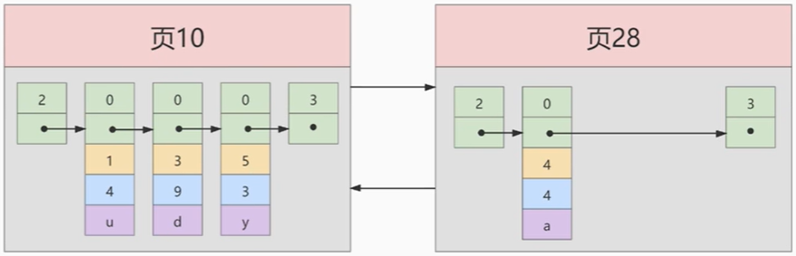

**注意，新分配的数据页编号可能并不是连续的。**它们只是通过维护着上一个页和下一个页的编号而建立了`链表`关系。另外，页 10 中用户记录最大的主键值是 5，而页 28 中有一条记录的主键值是 4，因为 5 > 4，所以这就不符合下一个数据页中用户记录的主键值必须大于上一个页中用户记录的主键值的要求，所以在插入主键值为 4 的记录的时候，需要伴随着一次`记录移动`，也就是把主键值为 5 的记录移动到页 28 中，然后再把主键值为 4 的记录插入到页 10 中，这个过程的示意图如下：

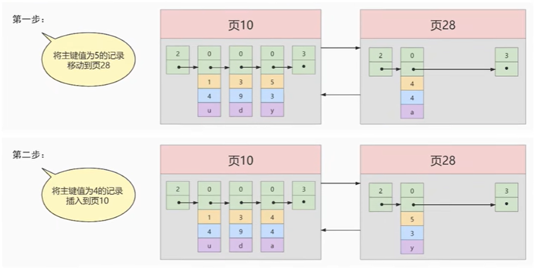

这个过程表明了在对页中的记录进行增删改操作的过程中，必须通过一些诸如记录移动的操作，来始终保证这个状态一直成立：下一个数据页中用户记录的主键值，必须大于上一个页中用户记录的主键值。而这个过程，称为`页分裂`。

**`2. 给所有的页建立一个目录项。`**

由于数据页的编号可能是不连续的，所以在向 index_demo 表中插入许多条记录后，可能是这样的效果：

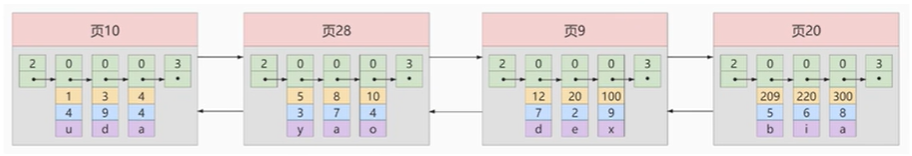

因为这些`16 KB`的页在物理存储上是`不连续`的，所以如果想从这么多页中根据主键值快速定位某些记录所在的页，需要给它们做个`目录`，每个页对应一个目录项，每个目录项包括下边两个部分：

- 页的用户记录中最下的主键值，用`key`表示。
- 页号，用`page_no`表示。

所以，为上边几个页做好的目录，就像这个样子：

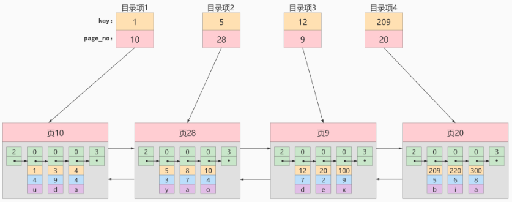

以页 28 为例，它对应目录项 2，这个目录项中包含着该页的页号 28，以及该页中用户记录的最小主键值 5。只需要把几个目录项在物理存储器上连续存储（比如：数组），就可以实现根据主键值快速查找某条记录的功能了。比如，查找主键为 20 的记录，具体查找过程分为两步：

- 第一步，先从目录项中根据`二分法`快速确定出主键值为 20 的记录在目录项 3 中（因为 12 < 20 < 209），它对应的页是页 9。
- 第二步，再根据前边说的在页中查找记录的方式，去页 9 中定位具体的记录。

至此，针对数据页做的简易目录就搞定了。这个目录有一个别名，称为`索引`。

##### InnoDB 中的索引方案

**`1. 迭代一次：目录项纪录的页。`**

前面称为一个简单的索引设计方案，是因为为了在根据主键值进行查找时，使用二分法快速定位具体的目录，而`假设`所有目录项都可以在物理存储器上`连续存储`，但是这样做有几个问题：

- InnoDB 是使用页来作为管理存储空间的基本单位，最多能保证`16 KB`的连续存储空间，而随着表中记录数量的增多，需要`非常大的连续的存储空间`，才能把所有的目录项都放下，这对记录数量非常多的表是不现实的。
- 同时，也会时常对记录进行增删操作，假设把页 28 中的记录都删除了，那意味着目录项 2 也就没有存在的必要了，这就需要把目录项 2 后面的目录项都向前移动一下，这样牵一发而动全身的操作效率很差。

所以，需要一种可以`灵活管理所有目录项`的方式。而目录项实际上跟`普通的用户记录`差不多，只不过目录项中的两个列是主键和页号而已，为了和用户记录做一下区分，把这些用来表示目录项的记录称为`目录项记录`。那 InnoDB 是怎么区分一条记录是普通的用户记录还是目录项记录呢？答案是使用记录头信息里的`record_type`属性，它的各个取值含义如下：

- `0`：普通的用户记录。
- `1`：目录项记录。
- `2`：最小记录。
- `3`：最大记录。

然后，把前边使用到的目录项放到数据页中的样子就是这样：


从图中可以看出来，新分配了一个编号为 30 的页来专门存储目录项记录。

`目录项记录`和`普通的用户记录`的对比：

- 不同点：
  - **record_type 值不同：**目录项记录的 record_type 值是`1`，而普通用户记录的 record_type 值是`0`。
  - **列数不同：**目录项记录只有`主键值和页的编号`两个列，而普通的用户记录的列是用户自己定义的，可能包含`很多列`，另外还有 InnoDB 自己添加的隐藏列。
  - 了解：记录头信息里还有一个叫`min_rec_mask`的属性，只有在存储目录项记录的页中的主键值最小的目录项记录的 min_rec_mask 值为 1，其他别的记录的 min_rec_mask 值都是 0。
- 相同点：
  - 两者用的是一样的数据页，都会为主键值生成`Page Directory`（页目录），从而在按照主键值进行查找时可以使用`二分法`来加快查询速度。

现在以查找主键为 20 的记录为例，根据某个主键值去查找记录的步骤，可以大致拆分成下边两步：

- 第一步：先到存储目录项记录的页，也就是页 30 中通过二分法快速定位到对应目录项，因为 12 < 20 < 209 ，所以定位到对应的记录所在的页就是页 9。
- 第二步：再到存储用户记录的页 9 中根据二分法快速定位到主键值为 20 的用户记录。

**`2. 迭代两次：多个目录项纪录的页。`**

虽然说目录项记录中只存储主键值和对应的页号，比用户记录需要的存储空间小多了，但是毕竟一个页只有 16 KB 大小，能存放的目录项记录也是有限的，如果表中的数据太多，以至于一个数据页不足以存放所有的目录项记录，该如何处理呢？

这里假设一个存储目录项记录的页最多只能存放 4 条目录项记录，所以如果此时再向上图中插入一条主键值为 320 的用户记录，那就需要分配一个新的存储目录项记录的页：

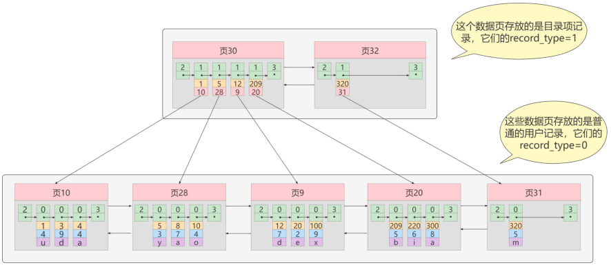

从图中可以看出，插入了一条主键值为 320 的用户记录之后，需要两个新的数据页：

- 为存储该用户记录而新生成了页 31。
- 因为原先存储目录项记录的页 30 的容量已满（前边假设只能存储 4 条目录项记录），所以不得不需要一个新的页 32 来存放页 31 对应的目录项。

现在因为存储目录项记录的页不止一个，所以如果想根据主键值查找一条用户记录大致需要 3 个步骤，以查找主键值为 20 的记录为例：

- 第一步：确定目录项记录页。现在的存储目录项记录的页有两个，即页 30 和页 32，又因为页 30 表示的目录项的主键值的范围是 [1, 320)，页 32 表示的目录项的主键值不小于 320 ，所以主键值为 20 的记录对应的目录项记录在页 30 中。
- 第二步：通过目录项记录页确定用户记录真实所在的页。在一个存储目录项记录的页中通过主键值定位一条目录项记录的方式说过了。
- 第三步：在真实存储用户记录的页中定位到具体的记录。

**`3. 迭代三次：目录项记录页的目录页。`**

现在问题来了，在上面这个查询步骤的第一步中，需要定位存储目录项记录的页，但是这些页是不连续的，如果表中的数据非常多则会产生很多存储目录项记录的页，那怎么根据主键值快速定位一个存储目录项记录的页呢？答案是为这些目录项记录的页再生成一个`更高级的目录`，就像是一个多级目录一样，大目录里嵌套小目录，小目录里才是实际的数据，所以现在各个页的示意图就是这样子：

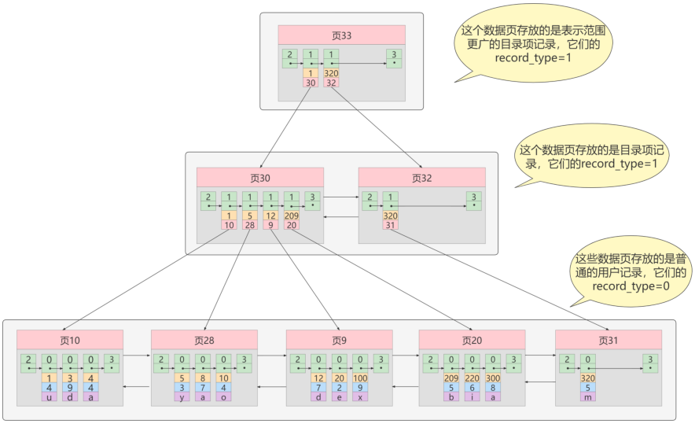

如图，生成了一个存储更高级目录项的页 33，这个页中的两条记录分别代表页 30 和页 32，如果用户记录的主键值在 [1, 320) 之间，则到页 30 中查找更详细的目录项记录，如果主键值不小于 320 的话，就到页 32 中查找更详细的目录项记录。

随着表中记录的增加，这个目录的层级会继续增加，如果简化一下，可以用下边这个图来描述它：

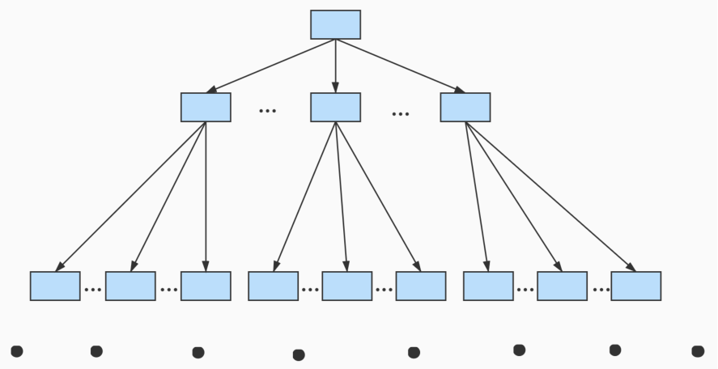

这个数据结构，它的名称是**`B+Tree`**。

**`4. B+Tree`**

不论是存放普通的用户记录的数据页，还是存放目录项记录的数据页，现在都把它们存放到 B+Tree 这个数据结构中了，所以也称这些数据页为`节点`。从图中可以看出，实际的普通的用户记录其实都存放在 B+Tree 的最底层的节点上，这些节点也称为`叶子节点`，其余用来存放目录项记录的节点称为`非叶子节点`或者`内节点`，其中 B+Tree 最上边的那个节点也成为`根节点`。

一个 B+Tree 的节点其实可以分成好多层，规定最下边的那层，也就是存放普通的用户记录的那层为`第 0 层`，之后依次往上加。之前做了一个非常极端的假设：存放普通的用户记录的页最多存放 3 条记录，存放目录项记录的页最多存放 4 条记录。其实**真实环境中一个页存放的记录数量是非常大的**，假设所有存放用户记录的叶子节点代表的数据页可以存放 100 条普通的用户记录，所有存放目录项记录的内节点代表的数据页可以存放 1000 条目录项记录，那么：

- 如果 B+Tree只有 1 层，也就是只有 1 个用于存放普通的用户记录的节点，则最多能存放 100 条普通的用户记录。
- 如果 B+Tree有 2 层，则最多能存放 1000 × 100 = 10,0000 条普通的用户记录。
- 如果 B+Tree有 3 层，则最多能存放 1000 × 1000 × 100 = 1,0000,0000 条普通的用户记录。
- 如果 B+Tree有 4 层，则最多能存放 1000 × 1000 × 1000 × 100 = 1000,0000,0000 条普通的用户记录。这是相当多的记录！！！

你的表里能存放 1000,0000,0000 条记录吗？所以一般情况下，我们`用到的 B+Tree 都不会超过 4 层`，那通过主键值去查找某条记录最多只需要在 4 个页面内查找（查找 3 个目录项页和 1 个用户记录页），又因为在每个页面内有所谓的`Page Directory`（页目录），所以在页面内也可以通过`二分法`实现快速定位记录。   

#### 常见的索引概念

索引按照物理实现方式，索引可以分为 2 种：`聚簇 (聚集) 索引`和`非聚簇 (非聚集) 索引`。我们也把非聚集索引称为`二级索引`或者`辅助索引`。

##### 聚簇索引

`聚簇索引`并不是一种单独的索引类型，而是`一种数据存储方式`（所有的普通的用户记录都存储在叶子节点），也就是所谓的`索引即数据，数据即索引`。

> 术语 "聚簇" 表示数据行和相邻的键值聚簇的存储在一起。

**特点：**

- 使用记录主键值的大小进行记录和页的排序，这包括三个方面的含义：
  - `页内的记录`是按照主键的大小顺序排成一个`单向链表`。
  - 各个存放`普通的用户记录的页`，也是根据页中用户记录的主键大小顺序排成一个`双向链表`。
  - 存放`目录项记录的页`分为不同的层次，在同一层次中的页也是根据页中目录项记录的主键大小顺序排成一个`双向链表`。

- B+Tree 的`叶子节点`存储的是完整的用户记录。
  - 所谓完整的用户记录，就是指这个记录中存储了所有列的值（包括隐藏列）。

我们把具有这两种特性的 B+Tree 称为`聚簇索引`，所有完整的普通的用户记录都存放在这个聚簇索引的叶子节点上。这种聚簇索引并不需要在 MySQL 语句中显式的使用 INDEX 语句去创建，InnoDB 存储引擎会`自动`的创建聚簇索引。

**优点：**

- `数据访问更快`，因为聚簇索引将索引和数据保存在同一个 B+Tree 中，因此从聚簇索引中获取数据比非聚簇索引更快。
- 聚簇索引对于主键的`排序查找`和`范围查找`速度非常快。
- 按照聚簇索引排列顺序，查询显示一定范围数据的时候，由于数据都是紧密相连，数据库不用从多个数据块中提取数据，所以`节省了大量的 I/O 操作`。

**缺点：**

- `插入速度严重依赖于插入顺序`，按照主键的顺序插入是最快的方式，否则将会出现页分裂，严重影响性能。因此，对于 InnoDB 表，一般都会定义一个**自增的 ID 列为主键**。
- `更新主键的代价很高`，因为将会导致被更新的行移动。因此，对于 InnoDB 表，一般定义**主键为不可更新**。
- `二级索引访问需要两次索引查找`，第一次找到主键值，第二次根据主键值找到行数据。

**限制：**

- 对于 MySQL 数据库目前只有 InnoDB 存储引擎支持聚簇索引，MyISAM 存储引擎不支持聚簇索引。
- 由于数据物理存储排序方式只能有一种，所以`每个 MySQL 的表只能有一个聚簇索引`。**一般情况下，就是该表的主键。**
- 如果没有定义主键，InnoDB 会选择`非空的唯一索引`代替。如果没有这样的索引，InnoDB 会`隐式的定义一个主键`来作为聚簇索引。
- InnoDB 只聚集在同一个页面中的记录。包含相邻键值的页面可能相距甚远。**如果已经设置了主键为聚簇索引，必须先删除主键，然后才能添加想要的聚簇索引，最后恢复设置主键即可**。
- 为了充分利用聚簇索引的聚簇特性，所以 InnoDB 表的主键尽量`选用有序的顺序 ID`，而不建议使用无序的 ID，比如 UUID，MD5，HASH，字符串列等这种无法保证数据的顺序增长的字段作为主键。

##### 非聚簇索引（二级索引、辅助索引）

上边介绍的聚簇索引，只能在搜索条件是`主键值`时才能发挥作用，因为 B+Tree 中的数据都是按照主键进行排序的。那如果需要以其他的列作为搜索条件该怎么办呢？肯定不能是从头到尾沿着链表依次遍历用户记录一遍。

答案：**可以多建几颗 B+Tree，不同的 B+Tree 中的数据采用不同的排序规则。**比方说用 c2 列的大小作为数据页、页中记录的排序规则，再建一颗 B+Tree，效果如下图所示：

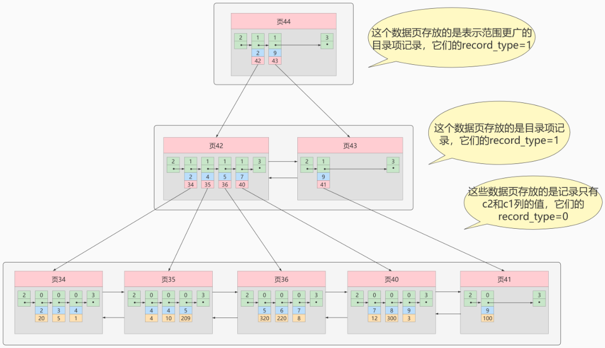

这个 B+Tree 与上边介绍的聚簇索引有几处不同：

- 使用记录 c2 列的大小进行记录和页的排序，这包括三个方面的含义：
  - 页内的记录是按照 c2 列的大小顺序排成一个`单向链表`。
  - 各个存放用户记录的页，也是根据页中记录的 c2 列的大小顺序排成一个`双向链表`。
  - 存放目录项记录的页分为不同的层次，在同一层次中的页也是根据页中目录项记录的 c2 列的大小顺序排成一个`双向链表`。
- B+Tree的叶子节点存储的并不是完整的用户记录，而只是`c2 列 + 主键`这两个列的值。
- 目录项记录中不再是`主键 + 页号`的搭配，而是`c2 列 + 页号`的搭配。

所以，如果现在想通过 c2 列的值查找某些记录的话，就可以使用刚刚建好的这个 B+Tree 了。以查找 c2 列的值为 4 的用用户记录为例，查找过程如下：

- 确定目录项记录。
  - 根据根页面，也就是页 44，可以快速定位到目录项记录所在的页为页 42（因为 2 < 4 < 9）。
- 通过目录项记录页确定用户记录真实所在的页。
  - 在页 42 中，可以快速定位到实际存储用户记录的页，但是由于 c2 列并没有唯一性约束，所以 c2 列的值为 4 的记录可能分布在多个数据页中，又因为 2 < 4 ≤ 4，所以确定实际存储用户记录的页在页 34 和页 35 中。
- 在真实存储用户记录的页中定位到具体的记录。
  - 到页 34 和页 35 中定位到具体的记录。
- 因为这个 B+Tree 的叶子节点中的记录只存储了 c2 和 c1（即主键）这两个列，所以必须再根据主键值去聚簇索引中再查找一边完整的用户记录。

**`概念：回表。`**

根据这个以 c2 列大小排序的 B+Tree 只能确定要查找记录的主键值，所以如果想根据 c2 列的值查找到完整的用户记录的话，仍然需要到聚簇索引中再查一遍，这个过程称为`回表`。也就是根据 c2 列的值查询一条完整的用户记录需要使用到 2 棵 B+Tree！

问题：为什么还需要一次回表操作呢？直接把完整的用户记录放到叶子节点不行吗？

回答：如果把完整的用户记录放到叶子节点确实可以不用回表，但是这样会占据大量存储空间，相当于每建立一颗 B+Tree 都需要把所有的用户记录再拷贝一份，有点太浪费存储空间。

因为这种按照`非主键列`建立的 B+Tree 需要一次回表操作才可以定位到完整的用户记录，所以这种 B+Tree 也被称为`二级索引`（Secondary Index），或者`辅助索引`。由于使用的是 c2 列的大小作为 B+Tree 的排序规则，所以也称这个 B+Tree 是为 c2 列建立的索引。

**非聚簇索引的存在不影响数据在聚簇索引中的组织，所以一张表可以有多个非聚簇索引。**

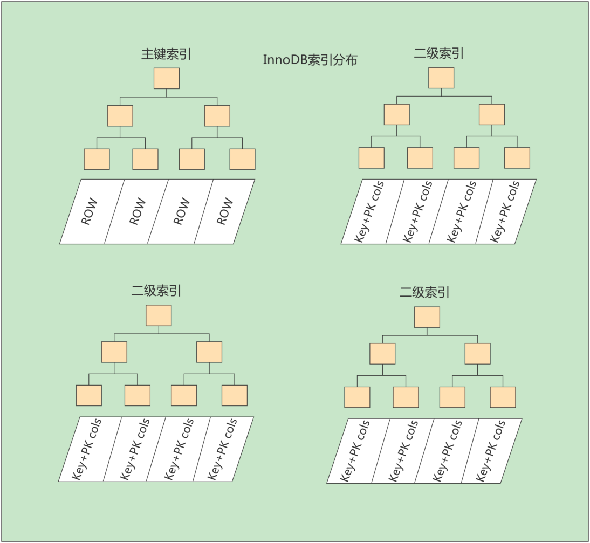

##### 聚簇索引 VS 非聚簇索引

聚簇索引与非聚簇索引的原理不同，在使用上也有一些区别：

- 聚簇索引的叶子节点存储的就是用户的`数据记录`，非聚簇索引的叶子节点存储的是`数据位置`。非聚簇索引不会影响数据表的物理存储顺序。
- 一个表`只能有一个聚簇索引`，因为只能有一种排序存储的方式，但`可以有多个非聚簇索引`，也就是多个索引目录提供数据检索。
- 使用聚簇索引的时候，数据的查询效率高。**聚簇索引列进行更新、插入或删除操作，那么整个簇将被更新。**这意味着聚簇索引对于需要频繁修改其数据的表可能不太适合。

##### 联合索引

我们也可以同时以多个列的大小作为排序规则，也就是同时为多个列建立索引，比如想让 B+Tree 按照 c2 和 c3 列的大小进行排序，这个包含两层含义：

- 先把各个记录和页按照 c2 列进行排序。
- 在记录的 c2 列相同的情况下，采用 c3 列进行排序。

为 c2 和 c3 列建立的索引的示意图如下：

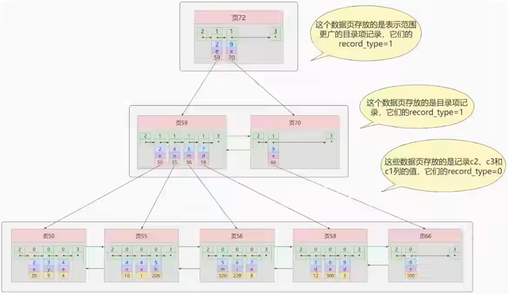

如图所示，需要注意以下几点：

- 每条目录项记录都是由 c2、c3 和页号这三个部分组成，各条记录先按照 c2 列的值进行排序，如果记录的 c2 列相同，则按照 c3 列的值进行排序。
- B+Tree叶子节点处的用户记录由 c2、c3 和主键 c1 列组成。

注意一点，以 c2 和 c3 列的大小为排序规则建立的 B+Tree称为`联合索引`，本质上也是一个二级索引。它的意思与为 c2 和 c3 列分别建立索引的表述是不同的，不同点如下：

- 建立联合索引只会建立如上图一样的 1 棵 B+Tree。
- 为 c2 和 c3 列分别建立索引，会分别以 c2 和 c3 列的大小为排序规则建立 2 棵 B+Tree。

#### InnoDB 的 B+Tree 索引的注意事项

##### 根页面位置万年不动

上面介绍 B+Tree 索引的时候，为了理解上的方便，先把存储用户记录的叶子节点画出来，然后接着画存储目录项记录的内节点，实际上 B+Tree 的形成过程是这样的：

- 每当为每个表创建一个 B+Tree 索引（聚簇索引不是人为创建的，默认就有）的时候，都会为这个索引创建一个`根节点`页面。最开始表中没有数据的时候，每个 B+Tree 索引对应的根节点中既没有用户记录，也没有目录项记录。
- 随后向表中插入用户记录时，先把用户记录存储到这个根节点中。
- 当`根节点中的可用空间用完`并继续插入记录时，此时会将根节点中的所有记录复制到一个新分配的页，比如页 a 中，然后对这个新页进行页分裂操作，得到另一个新页，比如页 b。这时，新插入的记录根据键值（也就是聚簇索引中的主键值，二级索引中对应的索引列的值）的大小就会被分配到页 a 或者页 b 中，而根节点便升级为存储目录项记录的页。

这个过程特别注意的是：**一个 B+Tree 索引的根节点自诞生之日起，便不会再移动。这样只要对某个表建立一个索引，那么它的根节点的页号便会被记录到某个地方，然后凡是 InnoDB 存储引擎需要用到这个索引的时候，都会从那个固定的地方取出根节点的页号，从而来访问这个索引。**

##### 内节点中目录项记录的唯一性

我们知道 B+Tree 索引的内节点中目录项记录的内容是`索引列 + 页号`的搭配，但是这个搭配对于二级索引来说有点不严谨。以 index_demo 表为例，假设这个表中的数据是这样的：

| c1   | c2   | c3   |
| ---- | ---- | ---- |
| 1    | 1    | 'u'  |
| 3    | 1    | 'd'  |
| 5    | 1    | 'y'  |
| 7    | 1    | 'a'  |

如果二级索引中目录项记录的内容只是索引列 + 页号的搭配的话，那么为 c2 列建立索引后的 B+Tree 应该长这样：


如果想新插入一行记录，其中 c1、c2 和 c3 的值分别是：9、1、'c'，那么在修改这个为 c2 列建立的二级索引对应的 B+Tree 时便碰到了大问题：由于页 3 中存储的目录项记录是由 c2 列 + 页号的值构成的，页 3 中的两条目录项记录对应的 c2 列的值都是 1，而新插入的这条记录的 c2 列的值也是 1，那这条新插入的记录到底应该放到页 4 中，还是应该放到页 5 中呢？

为了让新插入的记录能找到自己在哪个页里，需要**保证在 B+Tree 的同一层内节点的目录项记录除页号这个字段以外是唯一的**。所以对于二级索引的内节点的目录项记录的内容，实际上是由三个部分构成的：

- 索引列的值。
- 主键值。
- 页号。

也就是把主键值也添加到二级索引内节点中的目录项记录了，这样就能保证 B+Tree 每一层节点中各条目录项记录除页号这个字段外是唯一的，所以为 c2 列建立二级索引后的示意图实际上应该是这样子的：


这样再插入 (9, 1, 'c') 时，由于页 3 中存储的目录项记录是由 c2 列 + 主键 + 页号的值构成的，可以先把新纪录的 c2 列的值和页 3 中各目录项记录的 c2 列的值作比较，如果 c2 列的值相同的话，可以接着比较主键值，因为 B+Tree 同一层中不同目录项记录的 c2 列 + 主键的值肯定是不一样的，所以最后肯定能定位唯一的一条目录项记录。在本例中，最后确定新纪录应该被插入到页 5 中。

##### 一个页面最少存储两条记录

一个 B+Tree 只需要很少的层级就可以轻松存储数亿条记录，查询效率也高。这是因为 B+Tree 本质上是一个大的多层级目录，没经过一个目录时都会过滤掉许多无效的子目录，直到最后访问到存储真实数据的目录。那如果一个大的目录中只存放一个子目录是什么效果呢？那就是目录层级变的非常多，而且最后的那个存放真实数据的目录中只能存放一条记录。因此，InnoDB 的一个数据页至少应存储两条记录。

### MyISAM 中的索引方案

使用 B+Tree 索引的存储引擎如表所示：

| 索引/存储引擎 | MyISAM | InnoDB | Memory |
| ------------- | ------ | ------ | ------ |
| B-Tree 索引   | 支持   | 支持   | 支持   |

> 上表 MySQL 官方文档提到的 B-Tree，实际上就是指 B+Tree。 

实际上，即使多个存储引擎都支持同一种类型的索引，但它们的实现原理也是不同的。InnoDB 和 MyISAM 默认的索引是 B-Tree 索引，而 Memory 默认的索引是 Hash 索引。

**MyISAM 存储引擎使用 B+Tree 作为索引结构，叶子节点的 data 域存放的是`数据记录的地址`。**

#### MyISAM 索引的原理

在 InnoDB 中索引即数据，也就是聚簇索引的那棵 B+Tree的叶子节点中已经把所有完整的用户记录都包含了，而 MyISAM 的索引方案虽然也使用树形结构，但是却将`索引和数据分开存储`。下图是 MyISAM 索引的原理图：

- 将表中的记录`按照记录的插入顺序`单独存储到一个文件中，称为`数据文件`。这个文件并不划分为若干个数据页，有多少记录就往这个文件中塞多少记录。由于在插入数据时候并`没有刻意按照主键大小排序`，所以不能在这些数据上使用二分法进行查找。
- 使用 MyISAM 存储引擎的表会把索引信息另外存储到一个称为`索引文件`的文件中，MyISAM 会单独为表的主键创建一个索引，只不过在索引的叶子节点中存储的不是完整的用户记录，而是`主键值 + 数据记录地址`的组合。

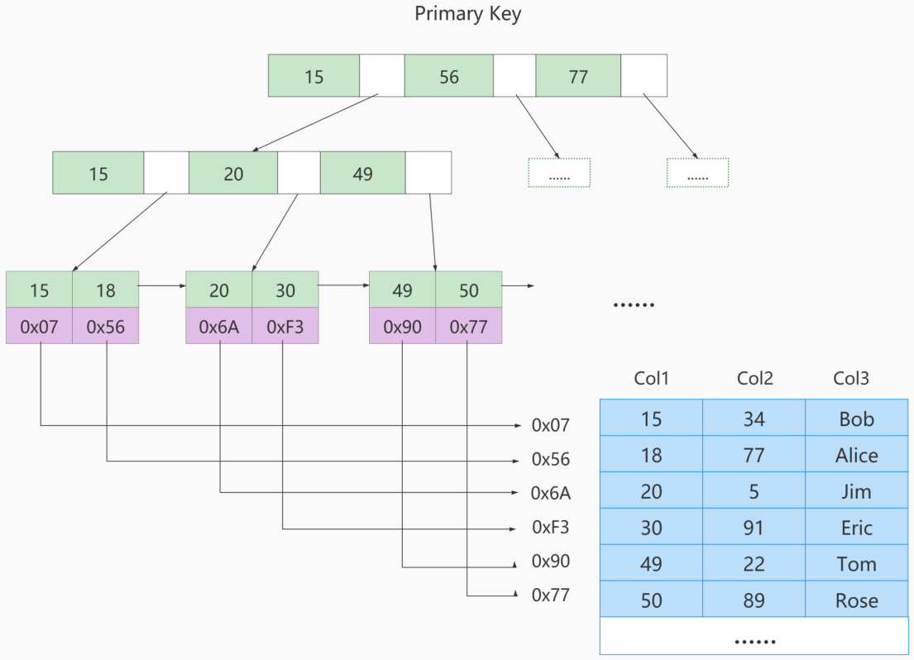

这里设表一共有三列，假设以 Col1 为主键，上图是一个 MyISAM 表的主索引（Primary Key）示意。可以看出 MyISAM 的索引文件仅仅保存数据记录的地址。在 MyISAM 中，主键索引和二级索引（Secondary Key）在结构上没有任何区别，只有主键索引要求 key 是唯一的，而二级索引的 key 可以重复。如果在 Col2 上建立一个二级索引，则此索引的结构如下图：

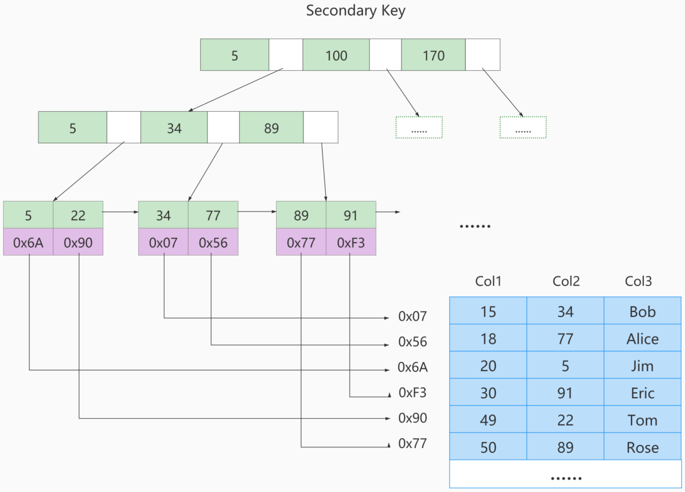

同样也是一棵 B+Tree，data 域保存数据记录的地址。因此，MyISAM 中索引检索的算法为：首先按照 B+Tree 搜索算法搜索索引，如果指定的 Key 存在，则取出其 data 域的值，然后以 data 域的值为地址，读取相应数据记录。

#### MyISAM VS InnoDB


MyISAM 的索引方式都是 "非聚簇" 的，与 InnoDB 包含 1 个聚簇索引是不同的。小结两种引擎中索引的区别：

- 在 InnoDB 存储引擎中，我们只需要根据主键值对聚簇索引进行一次查找就能找到对应的记录，而在 MyISAM 中却需要进行一次回表操作，意味着 MyISAM 中建立的索引相当于全部都是二级索引。
- InnoDB 的数据文件本身就是索引文件，而 MyISAM 索引文件和数据文件是分离的，索引文件仅保存数据记录的地址。
- InnoDB 的非聚簇索引 data 域存储相应记录主键的值，而 MyISAM 索引记录的是地址。换句话说，InnoDB 的所有非聚簇索引都引用主键作为 data 域。
- MyISAM 的回表操作是十分快速的，因为是拿着地址偏移量直接到文件中取数据的，反观 InnoDB 是通过获取主键之后再去聚簇索引里找记录，虽然说也不慢，但还是比不上直接用地址去访问。
- InnoDB 要求表必须有主键（MyISAM 可以没有）。如果没有显式指定，则 MySQL 系统会自动选择一个可以非空且唯一标识数据记录的列作为主键。如果不存在这种列，则 MySQL 自动为 InnoDB 表生成一个隐含字段作为主键，这个字段长度为 6 个字节，类型为长整型。

了解不同存储引擎的索引实现方式，对于正确使用和优化索引都非常有帮助。比如：

- 示例 1：知道了 InnoDB 的索引实现方式后，就很容易明白**为什么不建议使用过长的字段作为主键**，因为所有二级索引都引用主键索引，过长的主键索引会令二级索引变的过大。
- 示例 2：用非单调的字段作为主键在 InnoDB 中不是个好主意，因为 InnoDB 数据文件本身是一颗 B+Tree，非单调的主键会造成在插入新纪录时，数据文件为了维持 B+Tree 的特性而频繁的分裂调整，十分低效，而**使用自增字段作为主键则是一个很好的选择**。

### 索引的代价

索引是个好东西，可不能乱建，因为它在空间和时间上都会有消耗：

- `空间上的代价`：**每建立一个索引都要为它建立一棵 B+Tree**，每一棵 B+Tree 的每一个节点都是一个数据页，`一个页默认会占用 16 KB 的存储空间`，一棵很大的 B+Tree 由许多数据页组成，那就是很大的一片存储空间。
- `时间上的代价`：**每次对表中的数据进行 增、删、改 操作时，都需要去修改各个 B+Tree 索引。**而且 B+Tree 每层节点都是`按照索引列的值从小到大的顺序排序组成双向链表`。不论是叶子节点中的记录，还是内节点中的记录（也就是不论是用户记录还是目录项记录），都是按照索引列的值从小到大的顺序而形成了一个单向链表。而增、删、改操作可能会对节点和记录的排序造成破坏，所以存储引擎需要额外的时间进行一些`记录移位`，`页面分裂`、`页面回收`等操作来维护好节点和记录的排序。如果建了许多索引，每个索引对应的 B+Tree 都要进行相关的维护操作，会给性能拖后腿。

> 一个表上索引建的越多，就会占用越多的存储空间，在增删改记录的时候性能就越差，为了能建立又好又少的索引，需要了解这些索引在什么条件下起作用。

### MySQL 数据结构选择的合理性

从 MySQL 的角度讲，不得不考虑一个现实的问题就是磁盘 I/O，如果能让索引的数据结构尽量减少磁盘的 I/O 操作，所消耗的时间也就越小。可以说，`磁盘的 I/O 操作次数`对索引的使用效率至关重要。

查找都是索引操作，一般来说索引非常大，尤其是关系型数据库，当数据量较大的时候，索引的大小有可能几个 G 甚至更大，为了减少索引在内存的占用，`数据库索引是存储在外部磁盘上的`。当利用索引查询的时候，不可能把整个索引全部加载到内存，只能逐一加载，那么 MySQL 衡量查询效率的标准就是磁盘 I/O 次数。

#### 全表遍历

即从表的第一条数据，逐一查看，直到找到目标记录。

#### Hash 结构

Hash 本身是一个函数，又被称为散列函数，它可以帮助我们大幅提升检索数据的效率。

Hash 算法是通过某种确定性的算法（比如 MD5、SHA1、SHA2、SHA3）将输入变为输出，`相同的输入永远可以得到相同的输出`。假设输入内容有微小偏差，在输出中通常会有不同的结果。

举例：如果想要验证两个文件是否相同，那么不需要把两份文件直接拿来比对，只需要让对方把 Hash 函数计算得到的结果告知即可，然后在本地同样对文件进行 Hash 函数的运算，最后通过比较这两个 Hash 函数的结果是否相同，就可以知道这两个文件是否相同。

加快查找速度的数据结构，常见的有两类：

- `树`：例如平衡二叉搜索树，查询/插入/修改/删除的平均时间复杂度都是 O(log2N)。
- `哈希`：例如 HashMap，查询/插入/修改/删除的平均时间复杂度都是 O(1)。

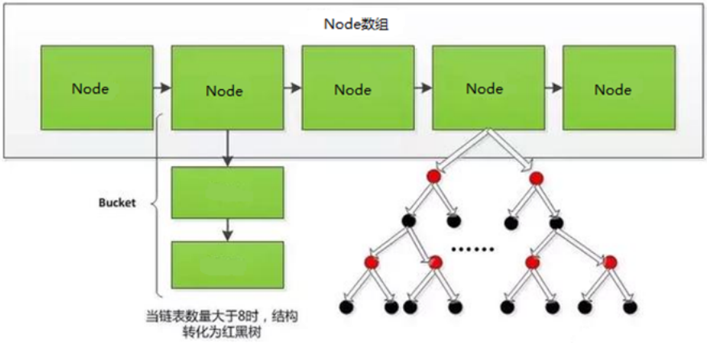

采用 Hash 进行检索的效率非常高，基本上一次检索就可以找到数据，而 B+Tree 需要自顶向下依次查找，多次访问节点才能找到数据，中间需要多次 I/O 操作，`从效率来说 Hash 比 B+Tree 更快`。

**在哈希的方式下，一个元素 k 处于 h(k) 中，即利用哈希函数 h，根据关键字 k 计算出槽的位置，函数 h 将关键字域映射到哈希表 T[0...m-1] 的槽位上。**

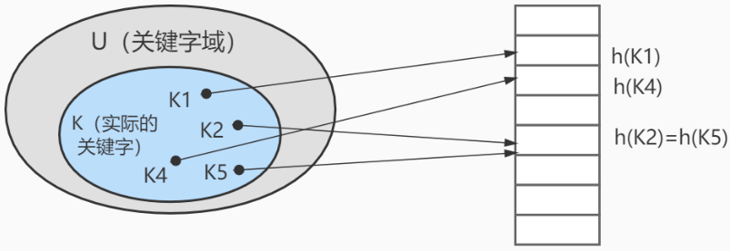

上图中哈希函数 h 有可能将两个不同的关键字映射到相同的位置，这叫做`碰撞`，在数据库中一般采用`链接法`来解决。在链接法中，将散列到同一槽位的元素放在一个链表中，如下图所示：

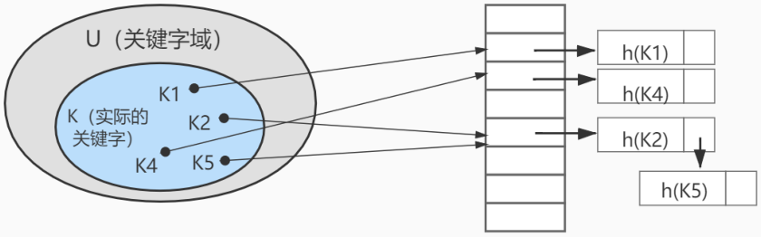

体会数组和 Hash 表的查找方面的效率区别：

```java
// 算法复杂度为O(n)
public static void main(String[] args) {
    int[] arr = new int[100000];
    for (int i = 0; i < arr.length; i++) {
        arr[i] = i + 1;
    }
    long start = System.currentTimeMillis();
    for (int j = 1; j <= 100000; j++) {
        for (int k : arr) {
            if (j == k) {
                break;
            }
        }
    }
    long end = System.currentTimeMillis();
    System.out.println("time： " + (end - start)); // time： 970
}
```

```java
public static void main(String[] args) {
    HashSet<Integer> set = new HashSet<>(100000);
    for (int i = 0; i < 100000; i++) {
        set.add(i + 1);
    }
    long start = System.currentTimeMillis();
    for (int j = 1; j <= 100000; j++) {
        boolean contains = set.contains(j);
    }
    long end = System.currentTimeMillis();
    System.out.println("time： " + (end - start)); //time： 5
}
```

既然 Hash 结构效率高，那为什么索引结构要设计成树型呢？

- 原因 1：Hash 索引仅能满足（=）、（<>）和 IN 查询，如果进行`范围查询`，哈希型的索引，时间复杂度会退化为 O(n)，而树型的 "有序" 特性，依然能够保持 O(log2N) 的高效率。
- 原因 2：Hash 索引还有一个缺陷，数据的存储是`没有顺序的`，在 ORDER BY 的情况下，使用 Hash 索引还需要对数据重新排序。
- 原因 3：对于联合索引的情况，Hash 值是将联合索引键合并后一起来计算的，无法对单独的一个键值或者几个索引键进行查询。
- 原因 4：对于等值查询来说，通常 Hash 索引的效率更高，不过也存在一种情况，就是`索引列的重复值如果很多，效率就会降低。`这是因为遇到 Hash 冲突时，需要遍历桶中的行指针来进行比较，进而找到查询的关键字，非常耗时。所以，Hash  索引通常不会用到重复值多的列上，比如性别、年龄等。

Hash 索引适用存储引擎如表所示：

| 索引/存储引擎 | MyISAM | InnoDB | Memory |
| ------------- | ------ | ------ | ------ |
| HASH 索引     | 不支持 | 不支持 | 支持   |

**Hash 索引的适用性：**

Hash 索引存在着很多限制，相比之下在数据库中 B+Tree 索引的使用面会更广，不过也有一些场景采用 Hash 索引效率更高，比如在键值型（Key-value）数据库中，Redis 存储的核心就是 Hash 表。

MySQL 中的 Memory 存储引擎支持 Hash 存储，如果需要用到查询的临时表时，就可以选择 Memory 存储引擎，把某个字段设置为 Hash 索引，比如字符串类型的字段，进行 Hash 计算之后长度可以缩短到几个字节。**`当字段的重复度低，而且经常需要进行等值查询的时候，采用 Hash 索引是个不错的选择。`**

另外，虽然 InnoDB 本身不支持 Hash 索引，但是提供`自适应 Hash 索引`（Adaptive Hash Index）。什么情况下才会使用自适应 Hash 索引呢？如果某个数据经常被访问，当满足一定条件的时候，MySQL 就会把这个数据页的地址存放到 Hash 表中，这样下次查询的时候，就可以直接找到这个页面的所在位置，这样 B+Tree 也具备了 Hash 索引的优点。

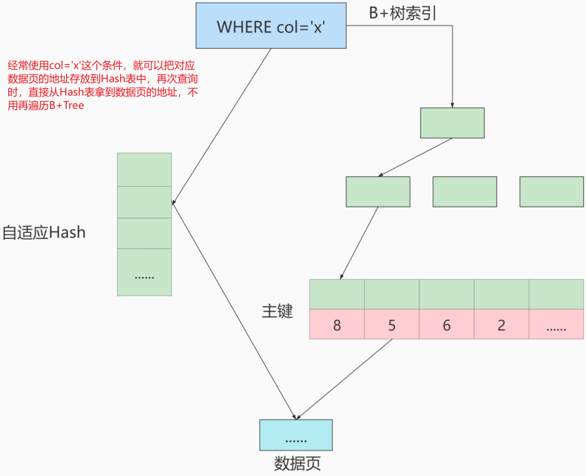

采用自适应 Hash 索引的目的是方便根据 SQL 的查询条件加速定位到叶子节点，特别是当 B+Tree 比较深的时候，通过自适应 Hash 索引可以明显提高数据的检索效率。

可以通过`innodb_adaptive_hash_index`变量来查看是否开启了自适应 Hash，比如：

```mysql
mysql> SHOW VARIABLES LIKE '%adaptive_hash_index%';
+----------------------------------+-------+
| Variable_name                    | Value |
+----------------------------------+-------+
| innodb_adaptive_hash_index       | ON    |
| innodb_adaptive_hash_index_parts | 8     |
+----------------------------------+-------+
2 rows in set (0.00 sec)
```

#### 二叉搜索树

如果利用二叉树作为索引结构，那么磁盘的IO次数和索引树的高度是相关的。

**二叉搜索树的特点：**

- 一个节点只能有两个子节点，也就是一个节点度不能超过 2。
- 左子节点 < 本节点 ≤ 右子节点。

**查找规则：**

先看下最基础的二叉搜索树（Binary Search Tree），搜索某个节点和插入节点的规则一样，假设搜索插入的数值为 key：

- 如果 key 大于根节点，则在右子树中进行查找；
- 如果 key 小于根节点，则在左子树中进行查找；
- 如果 key 等于根节点，也就是找到了这个节点，直接返回根节点即可。

举个例子，我们对数列 (34, 22, 89, 5, 23, 77, 91) 创造出来的二分搜索树，如下图所示：


但是存在特殊的情况，会导致二叉树的深度非常大。比如数列 (5, 22, 23, 34, 77, 89, 91)，创造出来的二分搜索树，就如下图所示：


上面这棵树也属于二分搜索树，但是性能上已经退化成了一条链表，查找数据的时间复杂度变成了 O(n)。同时，可以看出，第一棵树的深度是 3，也就是说最多只需要 3 次比较，就可以找到节点，而第二棵树的深度是 7，最多需要 7 次比较才能找到节点。

**为了提高查询效率，就需要`减少磁盘 I/O 次数`。为了减少磁盘 I/O 的次数，就需要尽量`降低树的高度`，需要把原来 "瘦高" 的树结构变的 "矮胖"，树的每层的分叉越多越好。**

#### AVL 树

 为了解决上面二叉搜索树退化成链表的问题，人们提出了`平衡二叉树`（Balanced Binary Tree），又称为`AVL 树`（有别于 AVL 算法），它在二叉搜索树的基础上增加了约束，具有以下性质：`它是一棵空树，或者它的左右两个子树的高度差的绝对值不超过 1，并且左右两个子树都是一颗平衡二叉树。`

> Tips：
>
> 常见的平衡二叉树有很多种，包括了`平衡二叉搜索树`、`红黑树`、`数堆`、`伸展树`。平衡二叉搜索树是最早提出来的自平衡二叉搜索树，当提到平衡二叉树时，一般指的就是平衡二叉搜索树。事实上，上面的第一棵树就属于平衡二叉搜索树，搜索时间复杂度是 O(log2n)。

数据查询的时间主要取决于磁盘 I/O 的次数，如果采用二叉树的形式，即使通过平衡二叉搜索树进行了改进，树的深度也是 O(log2n)，当 n 比较大时，深度也是比较高的。比如下图的情况：

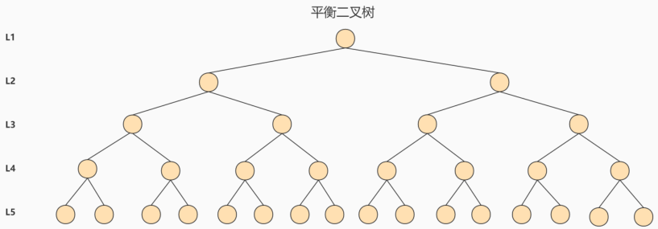


每访问一次节点就需要进程一次磁盘 I/0 操作，对于上面的树来说，需要进行 5 次 I/O 操作。虽然平衡二叉树的效率高，但是树的深度也同样高，这就意味着磁盘 I/O 操作次数多，会影响整体数据查询的效率。

针对同样的数据，如果把二叉树改成`M 叉树 (M > 2)`呢？当 M = 3 时，同样的 31 个节点可以由下面的三叉树来进行存储：


可以看到，此时树的高度降低了，当数据量 N 大的时候，以及树的分叉数 M 大的时候，M 叉树的高度会远小于二叉树的高度（M > 2）。这样，就把树从 "瘦高" 变为 "矮胖"。

#### B-Tree

B-Tree 的英文是 Balance Tree，也就是`多路平衡查找树`，简写为 B-Tree（横杠表示这两个单词相连，不是减号），它的高度远小于平衡二叉树的高度。

B-Tree 的结构如下图所示：


详细说明：


B-Tree 作为多路平衡查找树，它的每一个节点最多可以包括 M 个子节点，`M 称为 B-Tree 的阶 `（上图 B-Tree 的阶是 3，左边小，右边大，中间的是二者之间）。B-Tree 的每个磁盘块中包括了`关键字`和`子节点的指针`。如果一个磁盘块中包括了 x 个关键字，那么指针数就是 x + 1。对于一个 100 阶的 B-Tree 来说，如果有 3 层的话，最多可以存储约 100 万的索引数据。对于大量的索引数据来说，采用 B-Tree 的结构是非常适合的，因为树的高度要远小于二叉树的高度。

**一个 M 阶的 B-Tree（M > 2）有以下的特性：**

- 根节点的儿子数的范围是 [2, M]。
- 每个中间节点包含 k - 1 个关键字和 k 个孩子，孩子的数量 = 关键字的数量 + 1，k 的取值范围为 [ceil(M/2), M]。
- 叶子节点包括 k - 1 个关键字（叶子节点没有孩子），k 的取值范围为 [ceil(M/2), M]。
- 假设中间节点节点的关键字为：Key[1], Key[2], …, Key[k-1]，且关键字按照升序排序，即 Key[i] < Key[i+1]。此时 k - 1 个关键字相当于划分了 k 个范围，也就是对应着 k 个指针，即为：P[1], P[2], …, P[k]，其中 P[1] 指向关键字小于 Key[1] 的子树，P[i] 指向关键字属于 (Key[i-1], Key[i]) 的子树，P[k] 指向关键字大于 Key[k-1] 的子树。
- 所有叶子节点位于同一层。

上面那张图所表示的 B-Tree 就是一棵 3 阶的 B 树。可以看下磁盘块 2，里面的关键字为 (8, 12)，它有 3 个孩子 (3, 5)，(9, 10) 和 (13, 15)，能看到 (3, 5) 小于 8，(9, 10) 在 8 和 12 之间，而 (13, 15) 大于 12，刚好符合刚才给出的特征。

然后来看下如何用 B-Tree 进行查找。假设想要查找的关键字是 9，那么步骤可以分为以下几步：

- 与根节点的关键字 (17, 35) 进行比较，9 小于 17 那么得到指针 P1；
- 按照指针 P1 找到磁盘块 2，关键字为 (8, 12)，因为 9 在 8 和 12 之间，所以得到指针 P2；
- 按照指针 P2 找到磁盘块 6，关键字为 (9, 10)，然后找到了关键字 9。

可以看出来在 B-Tree 的搜索过程中，比较的次数并不少，但如果把数据读取出来然后在内存中进行比较，这个时间就是可以忽略不计的。而读取磁盘块本身需要进行 I/O 操作，消耗的时间比在内存中进行比较所需要的时间要多，是数据查找用时的重要因素。`B-Tree 相比于平衡二叉树来说磁盘 I/O 操作要少`，在数据查询中比平衡二叉树效率要高。所以`只要树的高度足够低，I/O 次数足够少，就可以提高查询性能`。

**小结：**

- B-Tree 在插入和删除节点的时候，如果导致树不平衡，就通过自动调整节点的位置来保持树的自平衡。
- 关键字集合分布在整棵树中，即叶子节点和非叶子节点都存放数据，搜索有可能在非叶子节点结束。
- 其搜索性能等价于在关键字全集内做一次二分查找。

#### B+Tree

B+Tree 也是一种多路搜索树，基于 B-Tree 做了改进，主流的 DBMS 都支持 B+Tree 的索引方式，比如 MySQL。**相比于 B-Tree，B+Tree 更适合文件索引系统。**

B+Tree 和 B-Tree 的差异：

- B+Tree 有 k 个孩子的节点就有 k 个关键字，也就是孩子数量 = 关键字数，而 B-Tree 中，孩子数量 = 关键字数 + 1。
- B+Tree 非叶子节点的关键字也会同时存在在子节点中，并且是在子节点中所有关键字的最大（或最小）。
- B+Tree 非叶子节点仅用于索引，不保存数据记录，跟记录有关的信息都放在叶子节点中。而 B-Tree 中，非叶子节点既保存索引，也保存数据记录。
- B+Tree 所有关键字都在叶子节点出现，叶子节点构成一个有序链表，而且叶子节点本身按照关键字的大小从小到大顺序链接。

下图就是一棵 B+Tree，阶数为 3，根节点中的关键字 1、18、 35 分别是子节点 (1, 8, 14) ，(18, 24, 31) 和 (35, 41, 53) 中的最小值，每一层父节点的关键字都会出现在下一层的子节点的关键字中，因此在叶子节点中包括了所有的关键字信息，并且每一个叶子节点都有一个指向下一个节点的指针，这样就形成了一个链表。


比如，想要查找关键字 16，B+Tree 会自顶向下逐层进行查找：

- 16 与根节点的关键字  (1, 18, 35) 进行比较，16 在 1 和 18 之间，得到指针 P1，指向磁盘块 2；
- 找到磁盘块 2，16 与关键字  (1, 8, 14) 进行比较，16 大于 14，得到指针 P2，指向磁盘块 7；
- 找到磁盘块 7，关键字为 (14, 16, 17)，找到关键字 16，继而找到对应的数据。

整个过程一共进行了 3 次 I/O 操作，看起来 B+Tree 和 B-Tree 的查询过程差不多，但是 B+Tree 和 B-Tree 有个根本的差异在于，B+Tree 的中间节点不直接存储数据，这样做的好处是：

- **首先，B+Tree 查询效率更稳定。**因为 B+Tree 每次只有访问到叶子节点才能找到对应的数据，而在 B-Tree 中，非叶子节点也会存储数据，会造成查询效率不稳定的情况，有时候访问到了非叶子节点就可以找到关键字，有时候需要访问到叶子节点才能找到关键字。
- **其次，B+Tree 的查询效率更高。**这是因为通常 B+Tree 比 B-Tree 更矮胖（阶数更大，深度更低，因为 B+Tree 非叶子节点不存储数据，占据的存储空间比 B-Tree 小，同样大小的数据页，B+Tree 能够存储更多的目录项记录，整棵树也就更矮胖），查询所需要的磁盘 I/O 次数也会更少。

**不仅在对单个关键字的查询上，在查询范围上，B+Tree 的效率也比 B-Tree 高。**这是因为所有关键字都出现在 B+Tree 的叶子节点中，叶子节点之间会有指针，数据又是递增的，这使得范围查找可以通过指针连接查找。而在 B-Tree 中，则需要通过中序遍历才能完成查询范围的查找，效率要低很多。

>B-Tree 和 B+Tree 都可以作为索引的数据结构，在 MySQL 中采用的是 B+Tree。
>
>另外，B-Tree 和 B+Tree 各有自己的应用场景，不能说 B+Tree 完全比 B-Tree 好，反之亦然。

**思考题：为了减少 I/O，索引树会一次性加载吗？**

- 数据库索引是存储在磁盘上的，如果数据量很大，必然导致索引的大小也很大，甚至超过几个 G。
- 当利用索引查询的时候，是不可能将全部几个 G 的索引都加载进内存的，能做的只能是：逐一加载每一个磁盘页，因为磁盘页对应着索引树的节点。

**思考题：B+Tree 的存储能力如何？为何说一般查找行记录，最多只需 1 ~ 3 次磁盘 I/O？**

- InnoDB 存储引擎中页的大小默认为 16KB。一般表的主键类型为 INT，占用 4 个字节，或者 BIGINT，占用 8 个字节，指针类型也一般为 4 个或者 8 个字节，也就是说一个页（B+Tree 中的一个节点）中大概存储 16KB / (8 B + 8 B) = 1024 个键值。也就是说一个深度为 3 的 B+Tree 索引，可以维护 1024 * 1024 * 1024，即超过 10 亿条记录。（此处为估算，并假定一个数据页页存储 1024 条行记录数据）
- 实际情况中，每个节点可能不会填满，因此`在数据库中，B+Tree 的高度一般都在 2 ~ 4 层。`MySQL 的 InnoDB 存储引擎在设计时，是将根节点常驻内存的，也就是说查找某一键值的行记录，最多只需要 1 ~ 3 次磁盘 I/O 操作。

**思考题：为什么说 B+Tree 比 B-Tree 更适合实际应用中操作系统的文件索引和数据库索引？**

- `B+Tree 的磁盘读写代价更低。`
  - B+Tree 的内部节点并没有指向关键字具体信息的指针，因此其内部节点相对 B-Tree 更小。如果把所有同一内部节点的关键字存放在同一磁盘块中，那么磁盘块所能容纳的关键字数量也越多，一次性读入内存中的需要查找的关键字也就越多，相对来说 I/O 读写次数也就降低了。 
- `B+Tree 的查询效率更加稳定。`
  - B+Tree 的非叶子节点并不是最终指向文件内容的节点，而只是叶子节点中关键字的索引。所以任何关键字的查找，必须走一条从根节点到叶子节点的路，所有关键字查询的路径长度相同，因而每一个数据的查询效率相当。

**思考题：Hash 索引与 B+Tree 索引的区别。**

- `Hash 索引不能进行范围查询，而 B+Tree 可以。`这是因为 Hash 索引指向的数据是无序的，而 B+Tree 的叶子节点是个有序的链表。
- `Hash 索引不支持联合索引的最左侧原则，即联合索引的部分索引无法使用，而 B+Tree 可以。`对于联合索引来说，Hash 索引在计算 Hash 值得时候，是将索引键合并后再一起计算 Hash 值，所以不会针对每个索引单独计算 Hash 值。因此，如果用到联合索引得一个或几个索引时，联合索引无法被使用。
- `Hash 索引不支持 ORDER BY 排序，而 B+Tree 可以。`因为 Hash 索引指向得数据是无序的，因此无法起到排序优化的作用，而 B+Tree 的数据是有序的，可以起到对该字段 ORDER BY 排序优化的作用。
- `Hash 索引不支持模糊查询，而 B+Tree 可以。`理由同上，当 B+Tree 使用 LIKE 进行模糊查询的时候，LIKE 后面后模糊查询（比如 % 结尾）可以起到优化左右。
- InnoDB 存储引擎不支持哈希索引。

**思考题：Hash 索引与 B+Tree 索引是在建索引的时候手动指定的吗？**


>MySQL 8.0 文档：https://dev.mysql.com/doc/refman/8.0/en/create-index.html

- 如果使用的是 MySQL，针对 InnoDB 和 MyISAM 存储引擎，默认会采用 B+Tree，无法使用 Hash 索引。InnoDB 提供的自适应 Hash 不需要手动指定，默认开启。如果是 Memory/Heap 和 NDB 存储引擎，可以选择使用 Hash 索引。

#### R-Tree

R-Tree 在 MySQL 很少使用，仅支持 geometry 数据类型 ，支持该类型的存储引擎只有 MyISAM、BDB、InnoDB、NDB、Archive 几种。举个 R-Tree 在现实领域中能够解决的例子：查找 20 英里以内所有的餐厅。如果没有 R-Tree 你会怎么解决？一般情况下我们会把餐厅的坐标 (x, y) 分为两个字段存放在数据库中，一个字段记录经度，另一个字段记录纬度。这样的话我们就需要遍历所有的餐厅获取其位置信息，然后计算是否满足要求。如果一个地区有 100 家餐厅的话，我们就要进行 100 次位置计算操作了，如果应用到谷歌、百度地图这种超大数据库中，这种方法便必定不可行了。R-Tree 就很好的`解决了这种高维空间搜索问题`。它把 B-Tree 的思想很好的扩展到了多维空间，采用了 B-Tree 分割空间的思想，并在添加、删除操作时采用合并、分解结点的方法，保证树的平衡性。因此，R-Tree 就是一棵用来`存储高维数据的平衡树`。相对于 B-Tree，R-Tree 的优势在于范围查找。

| 索引/存储引擎 | MyISAM | InnoDB | Memory |
| ------------- | ------ | ------ | ------ |
| R-Tree        | 支持   | 支持   | 不支持 |

### 附录：算法的时间复杂度

同一问题可用不同算法解决，而一个算法的质量优劣将影响到算法乃至程序的效率。算法分析的目的在于选择合适算法和改进算法。


## InnoDB 数据存储结构

### 数据库的存储结构：页

索引结构提供了高效的索引方式，不过索引信息以及数据记录都是保存在文件上的，确切说时存储在页结构中。另一方面，索引实在存储引擎中实现的，MySQL 服务器上的存储引擎负责对表中数据的读取和写入工作。不同存储引擎中数据存放的格式一般是不同的，甚至有的存储引擎都不用磁盘来存储数据，比如 Memory。

#### 磁盘与内存交互的基本单位：页

`InnoDB 存储引擎将数据划分为若干个页，InnoDB 中页的大小默认为 16 KB，一个页中可以存储多个行记录。`

InnoDB 以页（Page）作为磁盘和内存交互的基本单位，一次最少从磁盘中读取 16 KB 的内容到内存中，同时，一次也是最少把内存中的 16 KB 内容刷新到磁盘中。即：`在 MySQL 数据库中，管理存储空间的基本单位是页，数据库 I/O 操作的最小单位是页。`不论是读取一行数据，还是读取多行数据，都是将这些行所在的页进行加载。

> 记录是按照行来存储的，但是数据库的读取并不以行为单位，否则一次读取（也就是一次 I/O 操作）只能处理一行数据，效率会非常低。

#### 页结构概述

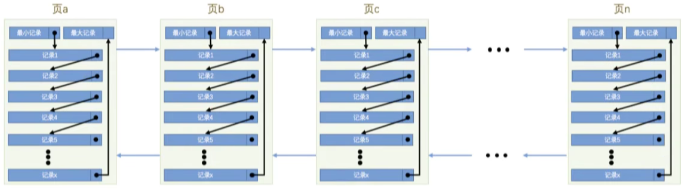

页 a，页 b，页 c，一直到页 n，这些页可以`不在物理结构上相连`，只要通过`双向链表`相关联即可。每个数据页中的记录会按照主键值从小到大的顺序组成一个`单向链表`，每个数据页都会为存储在它里边的记录生成一个`页目录`，在通过主键查找某条记录的时候，可以在页目录中使用`二分法`快速定位到对应的槽，然后再遍历该槽对应分组中的记录，即可快速找到指定的记录。

#### 页的大小

不同的数据库管理系统（DBMS）的页大小不同，MySQL 的 InnoDB 存储引擎，默认页的大小是 16 KB，可以通过命令查看：

```mysql
mysql> SHOW VARIABLES LIKE '%innodb_page_size%';
+------------------+-------+
| Variable_name    | Value |
+------------------+-------+
| innodb_page_size | 16384 |
+------------------+-------+
1 row in set (0.01 sec)
```

> SQL Server 中页的大小为 8 KB，Oracle 中用术语 "块" （Block）代表页，支持的块大小为 2 KB，4 KB，8 KB，16 KB，32 KB 和 64 KB。

#### 页的上层结构

在数据库中，除了行和页之外，还存在区（Extent）、段（Segment）和表空间（Tablespace）的概念。行、页、区、段、表空间的关系，如下图所示：

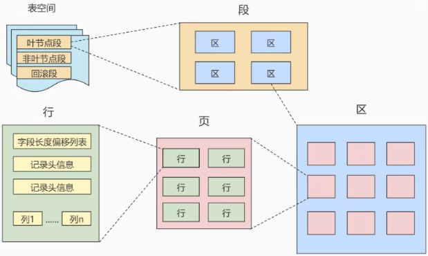

- 区（Extent）是比页大一级的存储结构，在 InnoDB 存储引擎中，`一个区会分配 64 个连续的页`。因为 InnoDB 中的页默认大小是 16 KB，所以一个区的大小是 64 * 16 KB = 1 MB。
- 段（Segment）是由一个或多个区组成，区在文件系统是一个连续分配的空间（在 InnoDB 中是连续的 64 个页），不过在段中不要求区与区之间是相邻的。`段是数据库中的分配单位，不同类型的数据库对象以不同的段形式存在。`当创建数据表、索引的时候，会创建相对应的段，比如创建一张表时会创建一个表段，创建一个索引时会创建一个索引段。
- 表空间（Tablespace）是一个逻辑容器，表空间存储的对象是段，在一个表空间中可以有一个或多个段，但是一个段只能属于一个表空间。数据库由一个或多个表空间组成，表空间从管理上可以划分为`系统表空间`、`用户表空间`、`撤销表空间`、`临时表空间`等。

### 页的内部结构

页如果按照类型划分的话，常见的有`数据页 (保存 B+Tree 节点)`、`系统页`、`Undo 页`和`事务数据页`等。数据页是最常使用的页。

数据页默认的 16 KB 大小的存储空间，被划分为七个部分，分别是`文件头 (File Header)、页头 (Page Header)、最大最小记录 (Infimum + Supremum)、用户记录 (User Records)、空闲空间 (Free Space)、页目录 (Page Directory) 和文件尾 (File Tailer)`。

页结构的示意图如下所示：

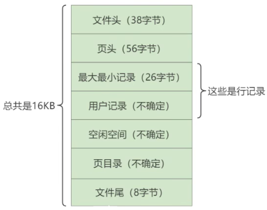

页的这 7 个结构的作用分别如下：

| 名称               | 占用大小 | 说明                                 |
| ------------------ | -------- | ------------------------------------ |
| File Header        | 38 字节  | 文件头，描述页的信息                 |
| Page Header        | 56 字节  | 页头，页的状态信息                   |
| Infimum + Supremum | 26 字节  | 最大和最小记录，这是两个虚拟的行记录 |
| User Records       | 不确定   | 用户记录，存储行记录内容             |
| Free Space         | 不确定   | 空闲记录，页中还没有被使用的空间     |
| Page Directory     | 不确定   | 页目录，存储用户记录的相对位置       |
| File Tailer        | 8 字节   | 文件尾，校验页是否完整               |

可以把这 7 个结构分成 3 个部分。

#### 第 1 部分：File Header（文件头）和File Trailer（文件尾）

首先是`文件通用部分`，也就是文件头和文件尾。

##### File Header

**作用：**描述各种页的通用信息，比如页的编号、上一页、下一页是谁等。

**大小：**`38 个字节`。

**构成：**

| 名称                               | 占用空间大小 | 描述                                                         |
| ---------------------------------- | ------------ | ------------------------------------------------------------ |
| `FIL_PAGE_SPACE_OR_CHKSUM`         | `4 字节`     | 页的校验和（checksum 值）                                    |
| `FIL_PAGE_OFFSET`                  | `4 字节`     | 页号                                                         |
| `FIL_PAGE_PREV`                    | `4 字节`     | 上一个页的页号                                               |
| `FIL_PAGE_NEXT`                    | `4 字节`     | 下一个页的页号                                               |
| FIL_PAGE_LSN                       | `8 字节`     | 页面被最后修改时对应的日志序列位置（Log Sequence Number）    |
| `FIL_PAGE_TYPE`                    | `2 字节`     | 页的类型                                                     |
| FIL_PAGE_FILE_FLUSH_LSN            | `8 字节`     | 仅在系统表空间的一个页中定义，代表文件至少被刷新到了对应的 LSN 值 |
| `FIL_PAGE_ARCH_LOG_NO_OR_SPACE_ID` | `4 字节`     | 页属于哪个表空间                                             |

- FIL_PAGE_OFFSET：每一个页都有一个单独的页号，就跟身份证号码一样，`InnoDB 通过页号可以唯一定位一个页`。

- FIL_PAGE_TYPE：表示页的类型，取值如下。

  | 类型名称                | 十六进制 | 描述                   |
  | ----------------------- | -------- | ---------------------- |
  | FIL_PAGE_TYPE_ALLOCATED | Ox0000   | 最新分配，暂未使用     |
  | `FIL_PAGE_UNDO_LOG`     | 0x0002   | Undo 日志页            |
  | FIL_PAGE_INODE          | 0x0003   | 段信息节点             |
  | FIL_PAGE_IBUF_FREE_LIST | 0x0004   | Insert Buffer 空闲列表 |
  | FIL_PAGE_IBUF_BITMAP    | 0x0005   | Insert Buffer 位图     |
  | `FIL_PAGE_TYPE_SYS`     | 0x0006   | 系统页                 |
  | FIL_PAGE_TYPE_TRX_SYS   | 0x0007   | 事务系统数据           |
  | FIL_PAGE_TYPE_FSP_HDR   | 0x0008   | 表空间头部信息         |
  | FIL_PAGE_TYPE_XDES      | 0x0009   | 扩展描述页             |
  | FIL_PAGE_TYPE_BLOB      | 0x000A   | 溢出页                 |
  | `FIL_PAGE_INDEX`        | 0x45BF   | 索引页，即数据页       |

- FIL_PAGE_PREV 和 FIL_PAGE_NEXT：InnoDB 都是以页为单位存放数据的，如果数据分散到多个不连续的页中存储的话， 需要把这些页关联起来，FIL_PAGE_PREV 和 FIL_PAGE_NEXT 就分别代表本页的上一个页和下一个页的页号。这样通过建立一个`双向链表`把许许多多的页就都串联起来了，保证这些页之间不需要是物理上的连续，而是`逻辑上的连续`。

  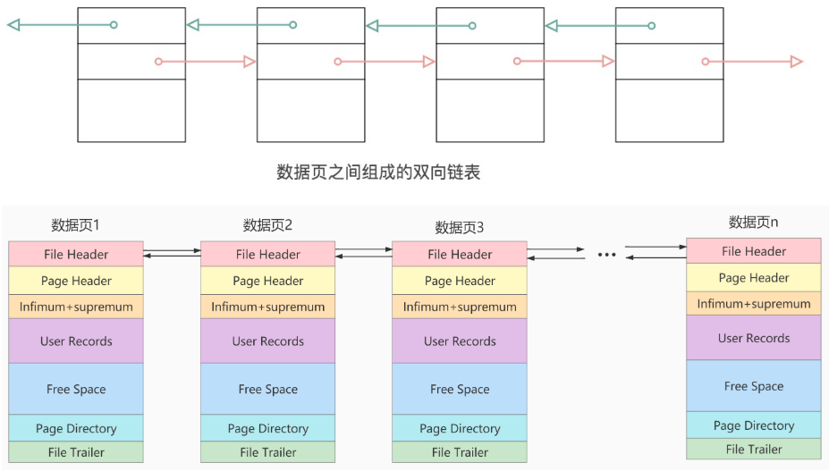

- FIL_PAGE_SPACE_OR_CHKSUM：代表当前页面的校验和（checksum）。

  - **校验和：对于一个很长的字节串来说，可以通过某种算法来计算一个比较短的值来代表这个很长的字节串，这个比较短的值就称为校验和。**在比较两个很长的字节串之前，先比较这两个长字节串的校验和，如果校验和都不一样，那么这两个长字节串肯定是不同的，这样可以省去直接比较两个比较长的字节串的时间损耗。文件头和文件尾都有属性 FIL_PAGE_SPACE_OR_CHKSUM。

  - 作用：**InnoDB 存储引擎以页为单位把数据加载到内存中处理，如果该页中的数据在内存中被修改了，那么在修改后的某个时间需要把数据同步到磁盘中。**但是如果在同步了一半的时候，出现断电等异常情况，就会造成该页传输的不完整。**为了检测一个页是否完整（也就是在同步的时候有没有发生同步不完全的异常情况），这时可以通过文件尾的校验和（checksum 值）与文件头的校验和做比对，如果两个值不相等则证明页的传输有问题，需要重新进行传输，否则认为页的传输已经完成。**

  - 具体的：每当一个页面在内存中修改了，在同步之前就要把它的校验和算出来，因为 File Header 在页面的前边，所以校验和会被首先同步到磁盘，当完全写完时，校验和也会被写到页的尾部，如果完全同步成功，则页的首部和尾部的校验和应该是一致的。**如果传输过程发生异常，那么在 File Header 中的校验和就代表着已经修改过的页，而在 File Trailer 中的校验和代表着原先的页（未修改之前的页的信息），二者不同则意味着同步中间发生了异常。**这里，校验方式就是采用 Hash 算法进行校验。

- FIL_PAGE_LSN：页面被最后修改时对应的日志序列位置，英文名是 Log Sequence Number。

##### File Trailer

大小：`8 个字节`。

作用：

- 前 4 个字节代表页的校验和：这个部分是和 File Header 中的校验和相对应的，是为了校验页的完整性的。

- 后 4 个字节代表页面被最后修改时对应的日志序列位置（LSN）：这个部分也是为了校验页的完整性的，如果首部和尾部的 LSN 值校验不成功的话，也说明同步过程出现了问题。

#### 第 2 部分：User Records（用户记录）、Infimum + Supremum（最大最小记录）、Free Space（空闲空间）

其次是`记录部分`，页的主要作用是存储记录，所以用户记录和最大最小记录占了页结构的主要空间。

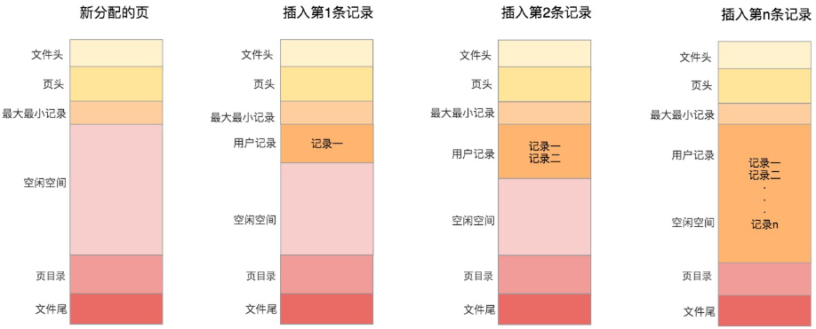

##### Free Space

我们自己存储的记录会按照指定的`行格式`存储到`User Records`部分。但是在一开始生成页的时候，其实并没有 User Records 这个部分，每当我们插入一条记录，都会从 Free Space 部分，也就是尚未使用的存储空间中申请一个记录大小的空间划分到 User Records 部分，当 Free Space 部分的空间全部被 User Records 部分替代掉之后，也就意味着这个页使用完了，如果还有新的记录插入的话，就需要去申请新的页了。


##### User Records

User Records 中的这些记录按照指定的行格式一条一条摆在 User Records 部分，`相互之间形成单链表`。

> 用户记录里的一条条数据如何记录？这里需要讲讲记录行格式的记录头信息。

##### Infimum + Supremum

记录之间可以比较大小，`对于一条完整的记录来说，比较记录的大小就是比较主键的大小。`比方说插入的 4 行记录的主键值分别是：1、2、3、4，这也就意味着这 4 条记录是从小到大依次递增。

InnoDB 规定的最小记录与最大记录这两条记录的构造十分简单，都是`由 5 字节大小的记录头信息和 8 字节大小的一个固定的部分组成的`，如图所示：


这两条记录不是我们自己定义的记录，所以它们并不存放在页的 User Records 部分，它们被单独放在一个称为 Infimum + Supremum 的部分，如图所示：

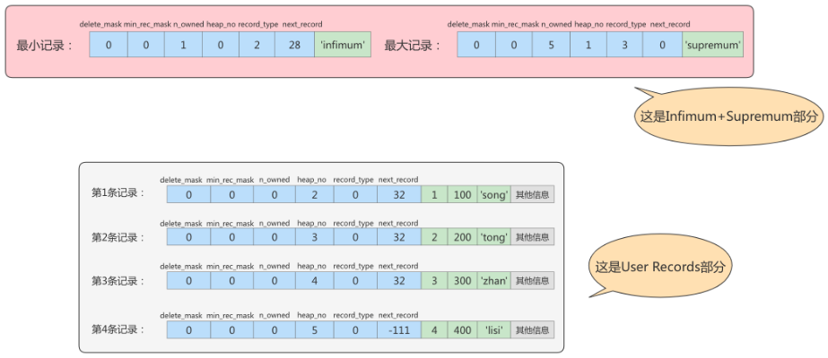

#### 第 3 部分：Page Directory（页目录）、Page Header（页头）

##### Page Director

**1. 为什么需要页目录？**

作用：在页中，记录是以`单向链表`的形式进行存储的。单向链表的特点就是`插入、删除非常方便`，但是`检索效率不高`，最差的情况下需要遍历链表上的所有节点才能完成检索。因此在页结构中专门设计了页目录这个模块，`专门给记录做一个目录`，然后通过`二分查找法`的方式进行检索，提升效率。

需求：根据主键值查找页中的某条记录，如何实现快速查找呢？

```mysql
SELECT * FROM page_demo WHERE c1 = 3
```

方式一：顺序查找。

- 从 Infimum记录（最小记录）开始，沿着链表一直往后找，直至找到目标记录，或者找不到。因为链表中各个记录的值是按照从小到大顺序排列的，所以当链表的某个节点代表的记录的主键值大于想要查找的主键值时，就可以停止查找了，因为该节点后边的节点的主键值是依次递增的。
- 如果一个页中存储了非常多的记录，顺序查找的性能很差。

方式二：使用页目录，二分法查找。

1. 将所有的记录分成几个组，这些记录包括最小记录和最大记录，但不包括标记为 "已删除" 的记录。
2. 第 1 组，也就是最小记录所在的分组，只有 1 个记录；最后一组，就是最大记录所在的分组，会有 1 ~ 8 条记录；其余的组记录数量在 4 ~ 8 条之间。这样做的好处是，除了第 1 组（最小记录所在组）以外，其余组的记录数会尽量平分。

3. 在每个组中最后一条记录的头信息中会存储该组一共有多少条记录，作为 n_owned 字段。
4. 页目录用来存储每组最后一条记录的地址偏移量，这些地址偏移量会按照先后顺序存储起来，每组的地址偏移量也被称之为槽（slot），每个槽相当于指针指向了不同组的最后一个记录。

举例 1：


举例 2：现在的 page_demo 表中正常的记录共有 6 条，InnoDB 会把它们分成两组，第一组中只有一个最小记录，第二组中是剩余的 5 条记录。


- 现在页目录部分中有两个槽，也就意味着我们的记录被分成了两个组，槽 1 中的值是 112，代表最大记录的地址偏移量（就是从页面的 0 字节开始数，数 112个 字节）；槽 0 中的值是 99，代表最小记录的地址偏移量。注意最小和最大记录的头信息中的 n_owned 属性。
- 最小记录的 n_owned 值为 1，这就代表着以最小记录结尾的这个分组中只有1条记录，也就是最小记录本身。最大记录的n_owned值为5，这就代表着以最大记录结尾的这个分组中只有5条记录，包括最大记录本身还有我们自己插入的4条记录。

用箭头指向的方式替代数字，这样更易于理解，修改后如下：


再换个角度看一下：（单纯从逻辑上看一下这些记录和页目录的关系）


**2. 页目录分组的个数如何确定？**

为什么最小记录的 n_owned 值为 1，而最大记录的 n_owned 值为 5 呢？

InnoDB 规定：对于最小记录所在的分组只能有 1 条记录，最大记录所在的分组拥有的记录条数只能在 1 ~ 8 条之间，剩下的分组中记录的条数范围只能在是 4 ~ 8 条之间。

分组是按照下边的步骤进行的：

- 初始情况下，一个数据页里只有最小记录和最大记录两条记录，它们分属于两个分组。

- 之后每插入一条记录，都会从页目录中找到主键值比本记录的主键值大并且差值最小的槽，然后把该槽对应的记录的 n_owned 值加 1，表示本组内又添加了一条记录，直到该组中的记录数等于 8 个。

- 在一个组中的记录数等于 8 个后再插入一条记录时，会将组中的记录拆分成两个组，一个组中 4 条记录，另一个 5 条记录。这个过程会在页目录中新增一个槽来记录这个新增分组中最大的那条记录的偏移量。

**3. 页目录结构下如何快速查找记录？**

现在向 page_demo 表中添加更多的数据，如下：

```mysql
INSERT INTO page_demo VALUES
(5, 500, 'zhou'), 
(6, 600, 'chen'), 
(7, 700, 'deng'), 
(8, 800, 'yang'), 
(9, 900, 'wang'), 
(10, 1000, 'zhao'), 
(11, 1100, 'qian'), 
(12, 1200, 'feng'), 
(13, 1300, 'tang'), 
(14, 1400, 'ding'), 
(15, 1500, 'jing'), 
(16, 1600, 'quan')
```

添加了 12 条记录，现在页里一共有 18 条记录了（包括最小和最大记录），这些记录被分成了 5 个组，如图所示：


> 这里只保留了 16 条记录的记录头信息中的 n_owned 和 next_record 属性，省略了各个记录之间的箭头。

现在看怎么从这个页目录中查找记录。因为各个槽代表的记录的主键值都是从小到大排序的，所以可以使用二分法来进行快速查找。5 个槽的编号分别是：0、1、2、3、4，所以初始情况下最低的槽就是 low = 0，最高的槽就是 high = 4。比方说想找主键值为 6 的记录，过程是这样的：

1. 计算中间槽的位置：(0 + 4) / 2 = 2，所以查看槽 2 对应记录的主键值为 8，又因为 8 > 6，所以设置 high = 2，low 保持不变。
2. 重新计算中间槽的位置：(0 + 2) / 2 = 1，所以查看槽 1 对应的主键值为 4，又因为 4 < 6，所以设置 low = 1，high 保持不变。
3. 因为 high - low 的值为1，所以确定主键值为 6 的记录在槽 2 对应的组中。此刻需要找到槽 2 中主键值最小的那条记录，然后沿着单向链表遍历槽 2 中的记录。

但是前边说过，每个槽对应的记录都是该组中主键值最大的记录，这里槽 2 对应的记录是主键值为 8 的记录，怎么定位一个组中最小的记录呢？因为各个槽都是挨着的，可以很轻易的拿到槽 1 对应的记录（主键值为 4），该条记录的下一条记录就是槽 2 中主键值最小的记录，该记录的主键值为 5。所以可以从这条主键值为 5 的记录出发，遍历槽 2 中的各条记录，直到找到主键值为 6 的那条记录即可。

由于一个组中包含的记录条数只能是 1 ~ 8 条，所以遍历一个组中的记录的代价是很小的。

**4. 小结：**

在一个数据页中查找指定主键值的记录的过程分为两步：

1. 通过二分法确定该记录所在的槽，并找到该槽所在分组中主键值最小的那条记录。
2. 通过记录的 next_record 属性遍历该槽所在的组中的各个记录。

##### Page Header

为了能得到一个数据页中存储的记录的状态信息，比如本页中已经存储了多少条记录，第一条记录的地址是什么，页目录中存储了多少个槽等等，特意在页中定义了一个叫 Page Header 的部分，这个部分占用固定的 56 个字节，专门存储各种状态信息。

| 名称                | 占用空间大小 | 描述                                                         |
| ------------------- | ------------ | ------------------------------------------------------------ |
| `PAGE_N_DIR_SLOTS`  | 2 字节       | 在页目录中的槽数量                                           |
| `PAGE_HEAP_TOP`     | 2 字节       | 还未使用的空间最小地址，也就是说从该地址之后就是 Free Space  |
| `PAGE_N_HEAP`       | 2 字节       | 本页中的记录的数量（包括最小和最大记录，以及标记为删除的记录） |
| `PAGE_FREE`         | 2 字节       | 第一个已经标记为删除的记录地址（各个已删除的记录通过 next_record 也会组成一个单链表，这个单链表中的记录可以被重新利用） |
| `PAGE_GARBAGE`      | 2 字节       | 已删除记录占用的字节数                                       |
| `PAGE_LAST_INSERT`  | 2 字节       | 最后插入记录的位置                                           |
| `PAGE_DIRECTION`    | 2 字节       | 记录插入的方向                                               |
| `PAGE_N_DIRECTION`  | 2 字节       | 一个方向连续插入的记录数量                                   |
| `PAGE_N_RECS`       | 2 字节       | 该页中记录的数量（不包括小和最大记录，以及标记为删除的记录） |
| `PAGE_MAX_TRX_ID`   | 8 字节       | 修改当前页的最大事务 ID，该值仅在二级索引中定义              |
| `PAGE_LEVEL`        | 2 字节       | 当前页在 B+Tree 中所处的层级                                 |
| `PAGE_INDEX_ID`     | 8 字节       | 索引 ID，表示当前页属于哪个索引                              |
| `PAGE_BTR_SEG_LEAF` | 10 字节      | B+Tree 叶子段的头部信息，仅在 B+Tree 的 Root 页定义          |
| `PAGE_BTR_SEG_TOP`  | 10 字节      | B+Tree 非叶子段的头部信息，仅在 B+Tree 的 Root 页定义        |

- PAGE_DIRECTION：假如新插入的一条记录的主键值比上一条记录的主键值大，我们说这条记录的插入方向是右边，反之则是左边。用来表示最后一条记录插入方向的状态就是 PAGE_DIRECTION。
- PAGE_N_DIRECTION：假设连续几次插入新记录的方向都是一致的，InnoDB 会把沿着同一个方向插入记录的条数记下来，这个条数就用 PAGE_N_DIRECTION 这个状态表示。当然，如果最后一条记录的插入方向改变了的话，这个状态的值会被清零重新统计。

#### 从数据页的角度看 B+Tree 如何查询


一棵 B+Tree 按照节点类型可以分成两部分：

- 叶子节点，B+Tree 最底层的节点，节点的高度为 0，存储行记录。
- 非叶子节点，节点的高度大于 0，存储索引键和页面指针，并不存储行记录本身。

当我们从页结构来理解 B+Tree 的结构的时候，可以帮助理解一些通过索引进行检索的原理：

- B+Tree 是如何进行记录检索的？
  - 如果通过 B+Tree 的索引查询行记录，首先是从 B+Tree 的根开始，逐层检索，直到找到叶子节点，也就是找到对应的数据页为止，将数据页加载到内存中，页目录中的槽采用`二分查找`的方式，先找到一个粗略的记录分组，然后再在分组中通过`链表遍历`的方式查找记录。
- 普通索引和唯一索引在查询效率上有什么不同？
  - 创建索引的时候，可以是普通索引，也可以是唯一索引。**唯一索引就是在普通索引上增加了约束性，也就是关键字唯一，找到关键字就停止检索。**而普通索引，可能会存在用户记录中的关键字相同的情况，根据页结构的原理，当读取一条记录的时候，不是单独将这条记录从磁盘中读出去，而是将这个记录所在的页加载到内存中进行读取。InnoDB 存储引擎的页大小为 16 KB，在一个页中可能存储着上千个记录，因此在普通索引的字段上进行查找，也就是在内存中多几次 "判断下一条记录" 的操作，对于 CPU 来说，这些操作所消耗的时间是可以忽略不计的。**因此，对一个索引字段进行检索，采用普通索引还是唯一索引，在检索效率上基本上没有差别。**

### InnoDB 行格式（或记录格式）

数据以行为单位来向表中，这些记录在磁盘上的存放方式也被称为`行格式`或者`记录格式`。InnoDB 存储引擎设计了 4 种不同类型的行格式，分别是`Compact`、`Redundant`、`Dynamic`和`Compressed`行格式。

查看 MySQL 8.0 默认的行格式：

```mysql
mysql> SELECT @@innodb_default_row_format;
+-----------------------------+
| @@innodb_default_row_format |
+-----------------------------+
| dynamic                     |
+-----------------------------+
1 row in set (0.00 sec)

# 或者
mysql> SHOW TABLE STATUS LIKE 'employees';
+-----------+--------+---------+------------+------+----------------+-------------+-----------------+--------------+-----------+----------------+---------------------+-------------+------------+-----------------+----------+----------------+---------+
| Name      | Engine | Version | Row_format | Rows | Avg_row_length | Data_length | Max_data_length | Index_length | Data_free | Auto_increment | Create_time         | Update_time | Check_time | Collation       | Checksum | Create_options | Comment |
+-----------+--------+---------+------------+------+----------------+-------------+-----------------+--------------+-----------+----------------+---------------------+-------------+------------+-----------------+----------+----------------+---------+
| employees | InnoDB |      10 | Dynamic    |  107 |            153 |       16384 |               0 |        81920 |         0 |           NULL | 2023-04-04 22:34:54 | NULL        | NULL       | utf8_general_ci |     NULL |                |         |
+-----------+--------+---------+------------+------+----------------+-------------+-----------------+--------------+-----------+----------------+---------------------+-------------+------------+-----------------+----------+----------------+---------+
1 row in set (0.01 sec)
```

#### 指定行格式的语法

在创建或修改表的语句中指定行格式：

```mysql
# 创建表
CREATE TABLE 表名 (列的信息) ROW_FORMAT=行格式名称

# 修改表
ALTER TABLE 表名 ROW_FORMAT=行格式名称
```

示例：

```mysql
mysql> CREATE TABLE record_test_table (
    -> col1 VARCHAR(8),
    -> col2 VARCHAR(8) NOT NULL,
    -> col3 CHAR(8),
    -> col4 VARCHAR(8)
    -> ) CHARSET=ascii ROW_FORMAT=COMPACT;
Query OK, 0 rows affected (0.04 sec)

mysql> INSERT INTO record_test_table(col1, col2, col3, col4) 
    -> VALUES
    -> ('zhangsan', 'lisi', 'wangwu', 'songhk'), 
    -> ('tong', 'chen', NULL, NULL);
Query OK, 2 rows affected (0.01 sec)
Records: 2  Duplicates: 0  Warnings: 0
```

#### Compact 行格式

在 MySQL 5.1 版本中，默认设置为 Compact 行格式。一条完整的记录其实可以被分为记录的额外信息和记录的真实数据两大部分。

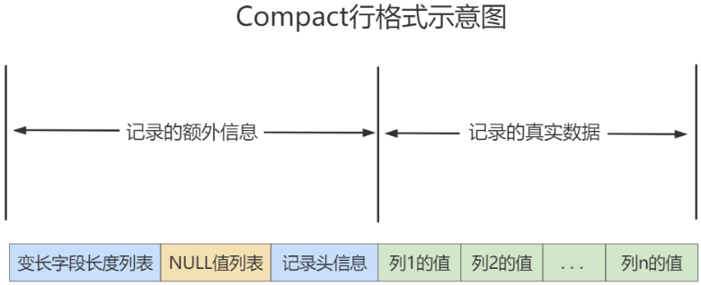

##### 变长字段长度列表

MySQL 支持一些变长的数据类型，比如 VARCHAR(M)、VARBINARY(M)、TEXT 类型、BLOB类型，这些数据类型修饰列称为变长字段，变长字段中存储多少字节的数据不是固定的，所以在存储真实数据的时候需要顺便把这些数据占用的字节数也存起来。在 Compact 行格式中，把所有变长字段的真实数据占用的字节长度都存放在记录的开头部位，从而形成一个变长字段长度列表。

注意：这里面存储的变长长度和字段顺序是反过来的。比如两个 VARCHAR 字段在表结构的顺序是 a(10)，b(15)。那么在变长字段长度列表中存储的长度顺序就是 15，10，是反过来的。

以 record_test_table 表中的第一条记录举例：因为 record_test_table 表的 col1、col2、col4 列都是 VARCHAR(8) 类型的，所以这三个列的值的长度都需要保存在记录开头处，注意 record_test_table 表中的各个列都使用的是 ASCⅡ 字符集（每个字符只需要 1 个字节来进行编码，如果是 UTF-8，则需要 3 个字节）。

| 列名 | 存储内容   | 内容长度（十进制表示） | 内容长度（十六进制表示） |
| ---- | ---------- | ---------------------- | ------------------------ |
| col1 | 'zhangsan' | 8                      | 0x08                     |
| col2 | 'lisi'     | 4                      | 0x04                     |
| col4 | 'songhk'   | 6                      | 0x06                     |

又因为这些长度值需要按照列的逆序存放，所以最后变长字段长度列表的字节串用十六进制表示的效果就是（各个字节之间实际上没有空格，用空格隔开只是方便理解）：06 04 08。

把这个字节串组成的变长字段长度列表填入上边的示意图中的效果就是：


##### NULL 值列表

Compact 行格式会把可以为 NULL 的列统一管理起来，存在一个标记为 NULL 值的列表中。如果表中没有允许存储 NULL 的列，则 NULL 值列表也不存在。

之所以要存储 NULL 值，是因为数据都是需要对齐的，如果没有标注出来 NULL 值的位置，就有可能在查询数据的时候出现混乱。如果使用一个特定的符号放到相应的数据位表示 NULL 值的话，虽然能达到效果，但是这样很浪费空间，所以直接就在行数据得头部开辟出一块空间专门用来记录该行数据哪些是非空数据，哪些是空数据，格式如下：

1. 二进制位的值为 1 时，代表该列的值为 NULL。
2. 二进制位的值为 0 时，代表该列的值不为 NULL。

例如：字段 a、b、c，其中 a 是主键，在某一行中存储的数依次是 a = 1、b = null、c = 2。那么 Compact 行格式中的 NULL 值列表中存储：01。第一个 0 表示 c 不为 NULL，第二个 1 表示 b 为 NULL。这里之所以没有 a，是因为数据库会自动跳过主键，因为主键肯定是非 NULL 且唯一的，在 NULL 值列表的数据中就会自动跳过主键。

record_test_table 插入的两条记录的 NULL 值列表就如下：

- 第一条记录：

  

- 第二条记录：

  

##### 记录头信息（5 字节）

**1. 记录头信息概述**

创建表 page_demo：

```mysql
mysql> CREATE TABLE page_demo(
    -> c1 INT,
    -> c2 INT,
    -> c3 VARCHAR(10000),
    -> PRIMARY KEY (c1)
    -> ) CHARSET=ascii ROW_FORMAT=Compact;
Query OK, 0 rows affected (0.03 sec)
```

这个表中记录的行格式示意图：


这些记录头信息中各个属性如下：

| 名称         | 大小（单位：bit） | 描述                                                         |
| ------------ | ----------------- | ------------------------------------------------------------ |
| 预留位 1     | 1                 | 没有使用                                                     |
| 预留位 2     | 1                 | 没有使用                                                     |
| delete_mask  | 1                 | 标记该记录是否被删除                                         |
| min_rec_mask | 1                 | B+Tree 的每层非叶子节点中的最小记录，都会添加该标记          |
| n_owned      | 4                 | 表示当前记录拥有的记录数                                     |
| heap_no      | 13                | 表示当前记录在记录堆的位置信息                               |
| record_type  | 3                 | 表示当前记录的类型，0 表示普通记录，1 表示 B+Tree 非叶子节点记录，2 表示最小记录，3 表示最大记录 |
| next_record  | 16                | 表示下一条记录的相对位置                                     |

简化后的行格式示意图：


插入数据：

```mysql
mysql> INSERT INTO page_demo 
    -> VALUES
    -> (1, 100, 'song'), 
    -> (2, 200, 'tong'), 
    -> (3, 300, 'zhan'), 
    -> (4, 400, 'lisi');
Query OK, 4 rows affected (0.01 sec)
Records: 4  Duplicates: 0  Warnings: 0
```

图示如下：

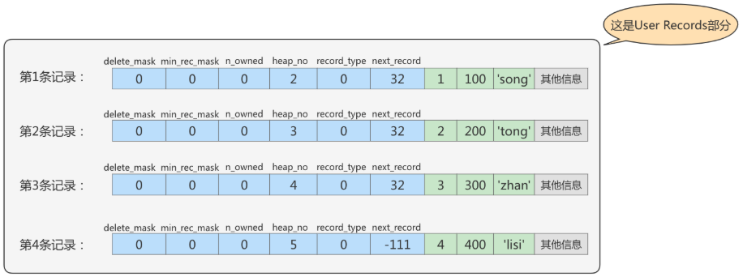

> 编号是从 2 开始的，因为默认会有一个最小记录和最大记录。

**2. 记录头信息中各个属性详细分析**

- delete_mask

  - 这个属性标记着当前记录是否被删除，占用 1 个二进制位。
    - 值为 0：代表记录并没有被删除。
    - 值为 1：代表记录被删除掉了。
  - 被删除的记录实际上没有删除，其还在真实的磁盘上。这些被删除的记录之所以不立即从磁盘上移除，是因为`移除它们之后其他的记录在磁盘上需要重新排列，导致性能消耗。`所以只是打一个删除标记而已，所有被删除掉的记录都会组成一个所谓的`垃圾链表`，在这个链表中的记录占用的空间称之为`可重用空间`，之后如果有新记录插入到表中的话，可能把这些被删除的记录占用的存储空间覆盖掉。

- min_rec_mask

  - B+Tree 的每层非叶子节点中的最小记录都会添加该标记，min_rec_mask 值为 1。我们自己插入的四条记录的 min_rec_mask 值都是 0，意味着它们都不是 B+Tree 的非叶子节点中的最小记录。

- record_type

  - 这个属性表示当前记录的类型，一共有 4 种类型的记录：
    - 0：表示普通记录。
    - 1：表示 B+Tree 非叶节点记录。
    - 2：表示最小记录。
    - 3：表示最大记录。
  - 从图中也可以看出来，我们自己插入的记录就是普通记录，它们的 record_type 值都是 0，而最小记录和最大记录的 record_type 值分别为 2 和 3。至于 record_type 为1的情况，在索引的数据结构章节讲过。

- heap_no

  - 这个属性表示当前记录在本页中的位置。
  - 从图中可以看出来，我们插入的 4 条记录在本页中的位置分别是：2、3、4、5。
  - MySQL 会自动给每个页里加两个记录，由于这两个记录并不是我们自己插入的，所以有时候也称为`伪记录`或者`虚拟记录`。这两个伪记录一个代表最小记录，一个代表最大记录。最小记录和最大记录的 heap_no 值分别是 0 和 1，也就是说它们的位置最靠前。

- n_owned

  - 页目录中每个组中最后一条记录的头信息中会存储该组一共有多少条记录，作为 n_owned 字段。详情见 Page Directory。

- next_record

  - 记录头信息里该属性非常重要，它表示从当前记录的真实数据到下一条记录的真实数据的地址偏移量。比如：第一条记录的 next_record 值为 32，意味着从第一条记录的真实数据的地址处向后找 32 个字节便是下一条记录的真实数据。

  - 注意，下一条记录指得并不是按照我们插入顺序的下一条记录，而是按照主键值由小到大的顺序的下一条记录。而且规定 Infimum 记录（也就是最小记录）的下一条记录就是本页中主键值最小的用户记录，而本页中主键值最大的用户记录的下一条记录就是 Supremum 记录（也就是最大记录）。下图用箭头代替偏移量表示 next_record。

    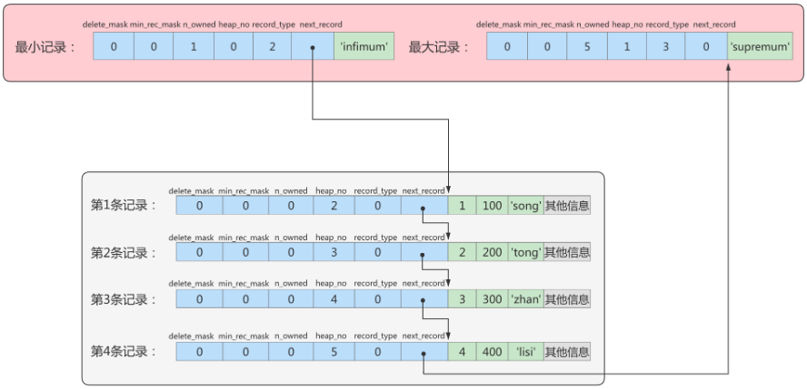

演示删除和添加操作：

- 删除操作

  - 从表中删除掉一条记录，这个链表也是会跟着变化：

    ```mysql
    mysql> DELETE FROM page_demo WHERE c1 = 2;
    Query OK, 1 row affected (0.01 sec)
    ```

  - 删掉第 2 条记录后的示意图就是：

    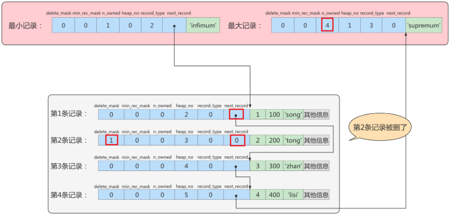

    - 从图中可以看出来，删除第 2 条记录前后主要发生了这些变化：
      - 第 2 条记录并没有从存储空间中移除，而是把该条记录的 delete_mask 值设置为 1。
      - 第 2 条记录的 next_record 值变为了 0，意味着该记录没有下一条记录了。
      - 第 1 条记录的 next_record 指向了第 3 条记录。
      - 最大记录的 n_owned 值从 5 变成了 4。
    - 所以，不论怎么对页中的记录做增删改操作，InnoDB 始终会维护一条记录的单链表，链表中的各个节点是按照主键值由小到大的顺序连接起来的。

- 添加操作

  - 主键值为 2 的记录被删掉了，但是存储空间却没有回收，如果再次把这条记录插入到表中，会发生什么事呢？

    ```mysql
    mysql> INSERT INTO page_demo VALUES (2, 200, 'tong');
    Query OK, 1 row affected (0.01 sec)
    ```

  - 记录的存储情况：

    

  - 直接复用了原来被删除记录的存储空间。说明：当数据页中存在多条被删除掉的记录时，这些记录的 next_record 属性将会把这些被删除掉的记录组成一个垃圾链表，以备之后重用这部分存储空间。

##### 记录的真实数据

记录的真实数据除了我们自己定义的列的数据以外，还会有三个隐藏列：

| 列名           | 是否必须 | 占用空间 | 描述                    |
| -------------- | -------- | -------- | ----------------------- |
| row_id         | 否       | 6 字节   | 行 ID，唯一标识一条记录 |
| transaction_id | 是       | 6 字节   | 事务 ID                 |
| roll_pointer   | 是       | 7 字节   | 回滚指针                |

实际上这几个列的真正名称其实是：DB_ROW_ID、DB_TRX_ID、DB_ROLL_PTR。

- 如果一个表没有手动定义主键，则会选取一个 Unique 键作为主键，如果连 Unique 键都没有定义的话，则会为表默认添加一个名为 row_id 的隐藏列作为主键，所以 row_id 是在没有自定义主键以及 Unique 键的情况下才会存在的。

- 事务 ID 和回滚指针在后面的 MySQL 事务日志章节中讲解。

创建表 mytest：

```mysql
mysql> CREATE TABLE mytest(
    -> col1 VARCHAR(10),
    -> col2 VARCHAR(10),
    -> col3 CHAR(10),
    -> col4 VARCHAR(10)
    -> )ENGINE=INNODB CHARSET=LATIN1 ROW_FORMAT=COMPACT;
```

插入数据：

```mysql
mysql> INSERT INTO mytest
    -> VALUES
    -> ('a','bb','bb','ccc'),
    -> ('d','ee','ee','fff'),
    -> ('d',NULL,NULL,'fff');
Query OK, 3 rows affected (0.00 sec)
Records: 3  Duplicates: 0  Warnings: 0
```

在 Windows 操作系统下，可以选择通过程序 UltraEdit 打开表空间文件 mytest.ibd 这个二进制文件。内容如下：

```mysql
------------------------------------------------------------------------------------------
0000c070 73 75 70 72 65 6d 75 6d 03 02 01 00 00 00 10 00|supremum........|
0000c080 2c 00 00 00 2b 68 00 00 00 00 00 06 05 80 00 00|,...+h..........|
0000c090 00 32 01 10 61 62 62 62 62 20 20 20 20 20 20 20|.2..abbbb|
0000c0a0 20 63 63 63 03 02 01 00 00 00 18 00 2b 00 00 00|ccc........+...|
0000c0b0 2b 68 01 00 00 00 00 06 06 80 00 00 00 32 01 10|+h...........2..|
0000c0c0 64 65 65 65 65 20 20 20 20 20 20 20 20 66 66 66|deeeefff|
0000c0d0 03 01 06 00 00 20 ff 98 00 00 00 2b 68 02 00 00|..........+h...|
0000c0e0 00 00 06 07 80 00 00 00 32 01 10 64 66 66 66 00|........2..dfff.|
------------------------------------------------------------------------------------------
```

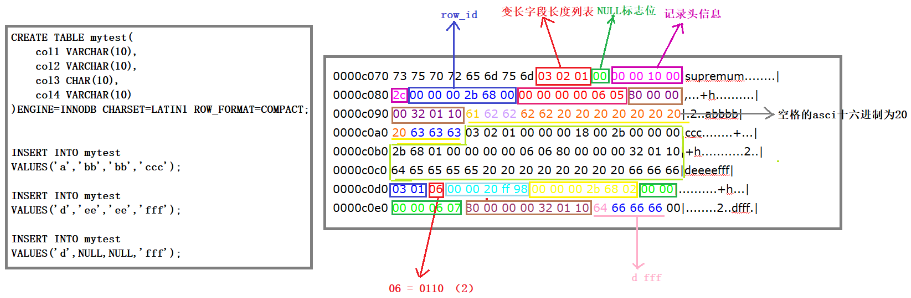

该行记录从0000c078开始，参考下面：

```mysql
---------------------------------------------------------------------
03 02 01                     /*变长字段长度列表，逆序*/
00                              /*NULL标志位，第一行没有NULL值*/
00 00 10 00 2c            /*Record Header，固定5字节长度*/
00 00 00 2b 68 00       /*RowID InnoDB自动创建，6字节*/
00 00 00 00 06 05       /*TransactionID*/
80 00 00 00 32 01 10   /*Roll Pointer*/
61                               /*列1数据'a'*/
62 62                          /*列2数据'bb'*/
62 62 20 20 20 20 20 20 20 20/*列3数据'bb'*/
63 63 63                     /*列4数据'ccc'*/
---------------------------------------------------------------------
```

- 注意 1：InnoDB 每行有隐藏列 TransactionID 和 Roll Pointer。

- 注意 2：固定长度 CHAR 字段在未能完全占用其长度空间时，会用 0x20 来进行填充。

接着再来分析下 Record Header 的最后两个字节，这两个字节代表 next_recorder，0x2c 代表下一个记录的偏移量，即当前记录的位置加上偏移量 0x2c 就是下条记录的起始位置。

第二行将不做整理，除了 RowID 不同外，它和第一行大同小异，现在来分析有 NULL 值的第三行：

```mysql
---------------------------------------------------------------------
03 01                               /*变长字段长度列表，逆序*/
06                                   /*NULL标志位，第三行有NULL值*/
00 00 20 ff 98                  /*Record Header*/
00 00 00 2b 68 02           /*RowID*/
00 00 00 00 06 07           /*TransactionID*/
80 00 00 00 32 01 10       /*Roll Pointer*/
64                                   /*列1数据'd'*/
66 66 66                         /*列4数据'fff'*/
---------------------------------------------------------------------
```

第三行有 NULL 值，因此 NULL 标志位不再是 00 而是 06，转换成二进制为 00000110，为 1 的值代表第 2 列和第 3 列的数据为 NULL。在其后存储列数据的部分，用户会发现没有存储 NULL 列，而只存储了第 1 列和第 4 列非 NULL 的值。

因此这个例子很好地说明了：不管是 CHAR 类型还是 VARCHAR 类型，在 Compact 格式下 NULL 值都不占用任何存储空间。

#### Dynamic 和 Compressed 行格式

##### 行溢出

**InnoDB 存储引擎可以将一条记录中的某些数据存储在真正的数据页面之外。**

很多 DBA 喜欢 MySQL 数据库提供的 VARCHAR(M) 类型，认为可以存放 65535 字节。这是真的吗？如果我们使用 ASCⅡ 字符集的话，一个字符就代表一个字节，我们看看 VARCHAR(65535) 是否可用：

```mysql
mysql> CREATE TABLE varchar_size_demo(
    -> c VARCHAR(65535)
    -> ) CHARSET=ascii ROW_FORMAT=Compact;
ERROR 1118 (42000): Row size too large. The maximum row size for the used table type, not counting BLOBs, is 65535. This includes storage overhead, check the manual. You have to change some columns to TEXT or BLOBs
```

报错信息表达的意思是：**MySQL 对一条记录占用的最大存储空间是有限制的，除 BLOB 或者 TEXT 类型的列之外， 其他所有的列（不包括隐藏列和记录头信息）占用的字节长度加起来`不能超过 65535 个字节`。**

这个 65535 个字节除了列本身的数据之外，还包括一些其他的数据，以 Compact 行格式为例，比如说我们为了存储一个 VARCHAR(M) 类型的列，除了真实数据占有空间以外，还需要记录的额外信息。

如果该 VARCHAR 类型的列没有 NOT NULL 属性，那最多只能存储 65532 个字节的数据，因为变长字段的长度占用 2 个字节，NULL 值标识需要占用 1 个字节：

```mysql
mysql> CREATE TABLE varchar_size_demo(
    -> c VARCHAR(65532)
    -> ) CHARSET=ascii ROW_FORMAT=Compact;
Query OK, 0 rows affected (0.04 sec)
```

如果有 NOT NULL 属性，那么就不需要 NULL 值标识，也就可以多存储一个字节，即 65533 个字节：

```mysql
mysql> CREATE TABLE varchar_size_demo( 
    -> c VARCHAR(65533) NOT NULL
    -> ) CHARSET=ascii ROW_FORMAT=Compact; 
Query OK, 0 rows affected (0.03 sec)
```

因为一个页的大小一般是 16 KB，也就是 16384 字节，而一个 VARCHAR(M) 类型的列就最多可以存储 65533 个字节，这样就可能出现一个页存放不了一条记录，这种现象称为`行溢出`。

在 Compact 和 Reduntant 行格式中，对于占用存储空间非常大的列，在记录的真实数据处只会存储该列的一部分数据，把剩余的数据`分散存储`在几个其他的页中进行分页存储，然后记录的真实数据处用 20 个字节存储指向这些页的地址（当然这 20 个字节中还包括这些分散在其他页面中的数据的占用的字节数），从而可以找到剩余数据所在的页。这称为`页的扩展`，举例如下：

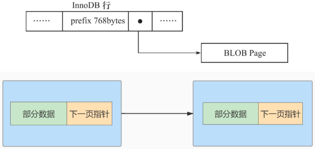

##### Dynamic 和 Compressed 行格式

`在 MySQL 8.0 中，默认行格式就是 Dynamic。`Dynamic、Compressed 行格式和 Compact 行格式挺像，只不过在处理行溢出数据时有分歧：

- Dynamic 和 Compressed 两种记录格式，对于存放在 BLOB 中的数据采用了完全的行溢出的方式。如图，在数据页中只存放 20 个字节的指针（溢出页的地址），实际的数据都存放在 Off Page （溢出页）中。

  

- Compact 和 Redundant 两种格式会在记录的真实数据处存储一部分数据（存放 768 个前缀字节）。

Compressed 行记录格式的另一个功能就是，存储在其中的行数据会以 zlib 的算法进行压缩，因此对于 BLOB、TEXT、VARCHAR 这类大长度类型的数据能够进行非常有效的存储。

#### Redundant 行格式

Redundant 是 MySQL 5.0 版本之前 InnoDB 的行记录存储方式，MySQL 5.0 支持 Redundant 是为了兼容之前版本的页格式。

现在把表 record_test_table 的行格式修改为 Redundant：

```mysql
mysql> ALTER TABLE record_test_table ROW_FORMAT=Redundant;
Query OK, 0 rows affected (0.07 sec)
Records: 0  Duplicates: 0  Warnings: 0
```


从上图可以看到，不同于 Compact 行记录格式，Redundant 行格式的首部是一个字段长度偏移列表，同样是按照列的顺序逆序放置的。

##### 字段长度偏移列表

Compact 行格式的开头是变长字段长度列表，而 Redundant 行格式的开头是字段长度偏移列表，与变长字段长度列表有两处不同：

- 少了 "变长" 两个字：Redundant 行格式会把该条记录中所有列（包括隐藏列）的长度信息都按照逆序存储到字段长度偏移列表。

- 多了 "偏移" 两个字：这意味着计算列值长度的方式不像 Compact 行格式那么直观，它是采用两个相邻数值的差值来计算各个列值的长度。

举例：比如第一条记录的字段长度偏移列表就是：

2B 25 1F 1B 13 0C 06

因为它是逆序排放的，所以按照列的顺序排列就是：

06 0C 13 17 1A 24 25

按照两个相邻数值的差值来计算各个列值的长度的意思就是：

- 第一列（row_id）的长度就是 0x06 个字节，也就是 6 个字节。
- 第二列（transaction_id）的长度就是（0x0C - 0x06）个字节，也就是 6 字节。
- 第三列（roll_pointer）的长度就是（0x13 - 0x0C）个字节，也就是 7 个字节。
- 第四列（col1）的长度就是（0x1B - 0x13）个字节，也就是 8 个字节。
- 第五列（col2）的长度就是（0x1F - 0x1B）个字节，也就是 4 个字节。
- 第六列（col3）的长度就是（0x25 - 0x1F）个字节，也就是 6 个字节。
- 第七列（col4）的长度就是（0x2B - 0x25）个字节，也就是 6 个字节。

##### 记录头信息（record header）

不同于 Compact 行格式，Redundant 行格式中的记录头信息固定占用 6 个字节（48 位），每位的含义见下表。

| 名称              | 大小（bit） | 描述                                                         |
| ----------------- | ----------- | ------------------------------------------------------------ |
| （）              | 1           | 未使用                                                       |
| （）              | 1           | 未使用                                                       |
| deleted_mask      | 1           | 该行是否已被删除                                             |
| min_rec_mask      | 1           | B+Tree 的每层非叶子节点中的最小记录都会添加该标记            |
| n_owned           | 4           | 该记录拥有的记录数                                           |
| heap_no           | 13          | 索引堆中该条记录的位置信息                                   |
| `n_fields`        | 10          | 记录中列的数量                                               |
| `1byte_offs_flag` | 1           | 记录字段长度偏移列表中每个列对应的偏移量使用 1 个字节还是 2 个字节表示 |
| next_record       | 16          | 页中下一条记录的绝对位置                                     |

与 Compact 行格式的记录头信息对比来看，有两处不同：（下面的解释，了解即可）

- Redundant 行格式多了 n_fields 和 1byte_offs_flag 这两个属性。
- Redundant 行格式没有 record_type 这个属性。

其中，n_fields代表一行中列的数量，占用 10 位，这也很好地解释了为什么 MySQL 一个行支持最多的列为 1023。另一个值 1byte_offs_flags 定义了偏移列表占用 1 个字节还是 2 个字节。当它的值为 1 时，表明使用 1个字节存储。当它的值为 0 时，表明使用 2 个字节存储。

1byte_offs_flag 的值是怎么选择的 ?

我们前边说过每个列对应的偏移量可以占用 1 个字节或者 2 个字节来存储，那到底什么时候用 1 个字节，什么时候用 2 个字节呢？其实是根据该条 Redundant 行格式记录的真实数据占用的总大小来判断的：

- 当记录的真实数据占用的字节数值不大于 127（十六进制 0x7F，二进制 01111111）时，每个列对应的偏移量占用 1 个字节。


- 当记录的真实数据占用的字节数大于 127，但不大于 32767（十六进制 0x7FFF，二进制 0111111111111111）时，每个列对应的偏移量占用 2 个字节。


- 有没有记录的真实数据大于 32767 的情况呢？有，不过此时的记录已经存放到了溢出页中，在本页中只保留前 768 个字节和 20 个字节的溢出页面地址。因为字段长度偏移列表处只需要记录每个列在本页面中的偏移就好了，所以每个列使用 2 个字节来存储偏移量就够了。


可以看出，Redundant 行格式还是比较简单粗暴的，直接使用整个记录的真实数据长度来决定使用 1 个字节还是 2 个字节存储列对应的偏移量。只要整条记录的真实数据占用的存储空间大小大于 127，即使第一个列的值占用存储空间小于 127，那也需要使用 2 个字节来表示该列对应的偏移量。简单粗暴，就是这么简单粗暴（所以这种行格式有些过时了）。

##### Redundant 行格式中 NULL 值的处理

因为 Redundant 行格式并没有 NULL 值列表，所以 Redundant 行格式在字段长度偏移列表中的各个列对应的偏移量处做了一些特殊处理 —— 将列对应的偏移量值的第一个比特位作为是否为 NULL 的依据，该比特位也可以被称之为 NULL 比特位。也就是说在解析一条记录的某个列时，首先看一下该列对应的偏移量的 NULL 比特位是不是为 1。如果为 1，那么该列的值就是 NULL，否则不是 NULL。

这也就解释了上边介绍为什么只要记录的真实数据大于 127（十六进制 0x7F，二进制 01111111）时，就采用 2 个字节来表示一个列对应的偏移量，主要是第一个比特位是所谓的 NULL 比特位，用来标记该列的值是否为 NULL。

但是还有一点要注意，对于值为 NULL 的列来说，该列的类型是否为定长类型决定了 NULL 值的实际存储方式，我们接下来分析一下 record_test_table 表的第二条记录，它对应的字段长度偏移列表如下：

A4 A4 1A 17 13 0C 06

按照列的顺序排放就是：

06 0C 13 17 1A A4 A4

我们分情况看一下：

- 如果存储 NULL 值的字段是定长类型的，比方说 CHAR(M) 数据类型的，则 NULL 值也将占用记录的真实数据部分，并把该字段对应的数据使用0x00S 字节填充。
  - 如图第二条记录的 c3 列的值是 NULL，而 c3 列的类型是 CHAR(10)，占用记录的真实数据部分 10 字节，所以我们看到在 Redundant 行格式中使用 0x00000000000000000000 来表示 NULL 值。
  - 另外，c3 列对应的偏移量为 0xA4，它对应的二进制实际是：10100100，可以看到最高位为 1，意味着该列的值是 NULL。将最高位去掉后的值变成了 0100100，对应的十进制值为 36，而 c2 列对应的偏移量为 0x1A，也就是十进制的 26。36 - 26 = 10，也就是说最终 c3 列占用的存储空间为 10 个字节。
- 如果该存储 NULL 值的字段是变长数据类型的，则不在记录的真实数据处占用任何存储空间。
  - 比如 record_test_table 表的 c4 列是 VARCHAR(10) 类型的，VARCHAR(10) 是一个变长数据类型，c4 列对应的偏移量为 0xA4，与 c3 列对应的偏移量相同，这也就意味着它的值也为 NULL，将 0xA4 的最高位去掉后对应的十进制值也是 36，36 - 36 = 0，也就意味着 c4 列本身不占用任何记录的实际数据处的空间。

除了以上的几点之外，Redundant 行格式和 Compact 行格式还是大致相同的。

总结，Redundant 行格式和 Compact 行格式的差异：

- Redundant 没有了 NULL 值列表。


- Redundant 行格式的记录头信息：

  - 多了 n_fields 和 1byte_offs_flag 这两个属性。


    - 没有 record_type 这个属性。

### 区、段与碎片区

#### 为什么要有区

B+Tree 的每一层中的页都会形成一个双向链表，如果是以页为单位来分配存储空间的话，**双向链表相邻的两个页之间的物理位置可能离的非常远**。在介绍 B+Tree 索引的适用场景的时候，特别提到范围查询只需要定位到最左边的记录和最右边的记录，然后沿着双向链表一直扫描就可以了，而如果链表中相邻的两个页物理位置离的非常远，就是所谓的`随机 I/O`。因为磁盘的速度和内存的速度差了好几个数量级，`随机 I/O 的效率非常慢`，所以应该尽量让链表中相邻的页的物理位置也相邻，这样进行范围查询的时候才可以使用所谓的`顺序 I/O`。

`引入区的概念，一个区就是在物理位置上连续的 64 个页`。因为 InnoDB 中页的大小默认是 16 KB，所以一个区的大小是 64 * 16 KB = 1 MB。在表中数据量大的时候，为某个索引分配空间的时候就不再按照页为单位来分配，而是按照区为单位分配，甚至在表中的数据特别多的时候，可以一次性分配多个连续的区。虽然可能造成一点点空间的浪费（数据不足以填充满整个区），但是从性能角度看，可以消除很多的随机 I/O，提升处理的效率。

#### 为什么要有段

对于范围查询，其实是对 B+Tree 叶子节点中的记录进行顺序扫描，而如果不区分叶子节点和非叶子节点，统统把节点代表的页面放到申请到的区中的话，进行范围扫描的效果就大打折扣。所以 InnoDB 对 B+Tree 的叶子节点和非叶子节点进行了区别对待，也就是说叶子节点有自己独有的区，非叶子节点也有自己独有的区。存放叶子节点的区的集合就算是一个`段 (Segment)`，存放非叶子节点的区的集合也算是一个段。也就是说一个索引会生成 2 个段，一个`叶子节点段`，一个`非叶子节点段`。

除了索引的叶子节点段和非叶子节点段意外，InnoDB 中还有为存储一些特殊的数据而定义的段，比如回滚段。所以，**常见的段有数据段、索引段、回滚段。**数据段即为 B+Tree 的叶子节点，索引段即为 B+Tree 的非叶子节点。

在 InnoDB 存储引擎中，对段的管理都是由引擎自身所完成，DBA 不能也没有必要对其进行控制，这从一定程度上简化了 DBA 对段的管理。

> 段其实不对应表空间中某一个连续的物理区域，而是一个逻辑上的概念，由若干个零散的页面以及一些完整的区组成。

#### 为什么要有碎片区

默认情况下，一个使用 InnoDB 存储引擎的表只有一个聚簇索引，一个索引会生成 2 个段，而段是以区为单位申请存储空间的，一个区默认占用 1 MB 的存储空间，所以默认情况下，一个只存了几条记录的小表也需要 2 MB 的存储空间吗？以后每次添加一个索引都需要多申请 2 MB 的存储空间吗？这对于存储记录比较少的表简直是极大的浪费。而这个问题的症结在于，到现在为止介绍的区都是纯粹的，也就是一个区被整个分配给某一个段，或者说区中的所有页面，都是为了存储同一个段的数据而存在的，即使段的数据填不满区中所有的页面，那余下的页面也不能挪作他用。

为了避免以完整的区为单位分配给某个段，造成数据量较小的表太浪费存储空间的这种情况，InnoDB 提出了一个`碎片区 (fragment)`的概念。在一个碎片区中，并不是所有的页都是为了存储同一个段的数据而存在的，而是碎片区中的页可以用于不同的目的，比如有些页用于段 A，有的页用于段 B，有些页甚至哪个段都不属于。`碎片区直属于表空间，不属于任何一个段。`

所以，此后为某个段分配存储空间的策略是这样的：

- **在刚开始向表中插入数据的时候，段是从某个碎片区以单个页面为单位来分配存储空间的。**
- **当某个段已经占用了 32 个碎片区页面后，就会申请以完整的区为单位来分配存储空间。**

所以，现在`段不能仅定义为是某些区的集合，更精确的说法是某些零散的页面以及一些完整的区的集合。`

#### 区的分类

区大体上可以分为 4 种类型：

- `空闲的区 (FREE)`：现在还没有用到这个区中的任何页面。
- `有剩余空间的碎片区 (FREE_FRAG)`：表示碎片区中还有可用的页面。
- `没有剩余空间的碎片区 (FULL_FRAG)`：表示碎片区中的所有页面都被使用，没有空闲页面。
- `附属于某个段的区 (FSEG)`：每一个索引都可以分为叶子节点段和非叶子节点段。

处于 FREE、FREE_FRAG 和 FULL_FRAG 这三种状态的区都是独立的，直属于表空间，而处于 FSEG 状态的区是附属于某个段的。

> 如果把表空间比作是一个集团军，段就相当于师，区就相当于团。一般的团都是隶属于某个师的，就像是处于 FSEG 的区全都隶属于某个段，而处于 FREE、FREE_FRAG 和 FULL_FRAG 这三种状态的区，是直接隶属于表空间，就像独立团直接听命于军部一样。

### 表空间

表空间可以看作是 InnoDB 存储引擎逻辑结构的最高层，所有的数据都存放在表空间中。

表空间是一个`逻辑容器`，表空间存储的对象是段，在一个表空间中可以有一个或多个段，但是一个段只能属于一个表空间。表空间数据库由一个或多个表空间组成，表空间从管理上可以划分为`系统表空间 (System Tablespace)`、`独立表空间 (File-per-table Tablespace)`、`撤销表空间  (Undo Tablespace)`和`临时表空间 (Temporary Tablespace)`等。

#### 独立表空间

独立表空间，即每张表有一个独立的表空间，也就是数据和索引信息都会保存在自己的表空间中。独立的表空间（即：单表）可以在不同的数据库之间进行`迁移`。

空间可以回收（DROP TABLE 操作可以自动回收表空间，其他情况，表空间不能自己回收），如果对于统计分析或是日志表，删除大量数据后可以通过`ALTER TABLE tablename ENGINE=InnoDB`回收不用的空间。对于使用独立表空间的表，不管怎么删除，表空间的碎片不会太严重的影响性能，而且还有机会处理。

##### 独立表空间结构

独立表空间由段、区、页组成。

##### 真实表空间对应的文件大小

到数据目录里面查看，会发现一个新建的表对应的 .ibd 文件只占用了 96 KB，才 6 个页面大小（MySQL 5.7 中），这是因为一开始表里面没有数据，表空间占用的空间很小。但是 .ibd 文件是自扩展的，随着表中数据的增多，表空间对应的文件也逐渐增大。

##### 查看 InnoDB 的表空间类型

```mysql
mysql> SHOW VARIABLES LIKE 'innodb_file_per_table';
+-----------------------+-------+
| Variable_name         | Value |
+-----------------------+-------+
| innodb_file_per_table | ON    |
+-----------------------+-------+
1 row in set (0.00 sec)
```

>innodb_file_per_table=ON，这意味着每张表都会单独保存一个 .ibd 文件。

#### 系统表空间

系统表空间的结构和独立表空间基本类似，只不过由于整个 MySQL 进程只有一个系统表空间，在系统表空间中会额外记录一些有关整个系统信息的页面，这部分是独立表空间中没有的。

##### InnoDB 数据字典

每当我们向一个表中插入一条记录的时候，`MySQL 校验过程`如下：先要校验一下插入语句对应的表存不存在；插入的列和表中的列是否符合；如果语法没有问题的话，还需要知道该表的聚簇索引和所有二级索引对应的根页面是哪个表空间的哪个页面，然后把记录插入对应索引的 B+Tree 中。所以说，MySQL 除了保存着我们插入的用户数据之外，还需要保存许多额外的信息，比如：

- 某个表属于哪个表空间，表里面有多少列。
- 表对应的每一个列的类型是什么。
- 该表有多少索引，每个索引对应哪几个字段，该索引对应的根页面在哪个表空间的哪个页面。
- 该表有哪些外键，外键对应哪个表的哪些列。
- 某个表空间对应文件系统上文件路径是什么。
- ...

上面这些数据，并不是使用 INSERT 语句插入的用户数据，实际上是为了更好的管理我们这些用户数据而不得已引入的一些额外数据，这些数据也称为`元数据`。InnoDB 存储引擎特意定义了一些列的`内部系统表 (Internal System Table)`来记录这些元数据：

| 表名             | 描述                                                         |
| ---------------- | ------------------------------------------------------------ |
| `SYS_TABLES`     | 整个 InnoDB 存储引擎中所有的表的信息                         |
| `SYS_COLUMNS`    | 整个 InnoDB 存储引擎中所有的列的信息                         |
| `SYS_INDEXES`    | 整个 InnoDB 存储引擎中所有的索引的信息                       |
| `SYS_FIELDS`     | 整个 InnoDB 存储引擎中所有的索引对应的列的信息               |
| SYS_FOREIGN      | 整个 InnoDB 存储引擎中所有的外键的信息                       |
| SYS_FOREIGN_COLS | 整个 InnoDB 存储引擎中所有的外键对应列的信息                 |
| SYS_TABLESPACES  | 整个 InnoDB 存储引擎中所有的表空间信息                       |
| SYS_DATAFILES    | 整个 InnoDB 存储引擎中所有的表空间对应文件系统的文件路径信息 |
| SYS_VIRTUAL      | 整个 InnoDB 存储引擎中所有的虚拟生成列的信息                 |

这些系统表也被称为`数据字典`，它们都是以 B+Tree 的形式保存在系统表空间的某些页面中，其中`SYS_TABLES`、`SYS_COLUMNS`、`SYS_INDEXES`和`SYS_FIELDS`这四个表尤为重要，称之为`基本系统表 (Basic System Tables)`。

**SYS_TABLES 表结构：**

| 列名       | 描述                                             |
| ---------- | ------------------------------------------------ |
| NAME       | 表的名称，主键                                   |
| ID         | InnoDB 存储引擎中每个表都有一个唯一的 ID         |
| N_COLS     | 该表拥有列的个数                                 |
| TYPE       | 表的类型，记录了一些文件格式、行格式、压缩等信息 |
| MIX_ID     | 已过时，忽略                                     |
| MIX_LEN    | 表的一些额外的属性                               |
| CLUSTER_ID | 未使用，忽略                                     |
| SPACE      | 该表所属表空间的 ID                              |

**SYS_COLUMNS 表结构：**

| 列名     | 描述                                                         |
| -------- | ------------------------------------------------------------ |
| TABLE_ID | 该列所属表对应的 ID。与 POS 一起构成联合主键                 |
| POS      | 该列在表中是第几列                                           |
| NAME     | 该列的名称                                                   |
| MTYPE    | main data type，主数据类型，比如 INT、CHAR、VARCHAR、FLOAT、DOUBLE 等 |
| PRTYPE   | precise type，精确数据类型，就是修饰数据类型的，比如是否允许 NULL 值，是否允许负数等 |
| LEN      | 该列最多占用存储空间的字节数                                 |
| PREC     | 该列的精度，不过这列可能都没有使用，默认值都是 0             |

**SYS_INDEXES 表结构：**

| 列名            | 描述                                                         |
| --------------- | ------------------------------------------------------------ |
| TABLE_ID        | 该索引所属表对应的 ID，与 ID 一起构成联合主键                |
| ID              | InnoDB 存储引擎中每个索引都有一个唯一的 ID                   |
| NAME            | 该索引的名称                                                 |
| N_FIELDS        | 该索引包含列的个数                                           |
| TYPE            | 该索引的类型，比如聚簇索引、唯一索引、更改缓冲区的索引、全文索引、普通的二级索引等 |
| SPACE           | 该索引根页面所在的表空间 ID                                  |
| PAGE_NO         | 该索引根页面所在的页面号                                     |
| MERGE_THRESHOLD | 如果页面中的记录被删除到某个比例，就把该页面和相邻页面合并，这个值就是这个比例 |

**SYS_FIELDS 表结构：**

| 列名     | 描述                                             |
| -------- | ------------------------------------------------ |
| INDEX_ID | 该索引列所属的索引的 ID，与 POS 一起构成联合主键 |
| POS      | 该索引列在某个索引中是第几列                     |
| COL_NAME | 该索引列的名称                                   |

### 附录：数据页加载的三种方式

InnoDB 从磁盘中读取数据的最小单位是数据页，对于 MySQL 存放的数据，逻辑概念上称之为表，在磁盘等物理层面而言，是按`数据页`形式进行存放的，当其加载到 MySQL 中后，称之为`缓存页`。如果缓冲池中没有该页数据，那么缓冲池有以下三种方式读取数据，每种方式的读取效率也是不同的。

#### 内存读取

如果该数据存在于内存中，基本上执行时间在 1 ms 左右，效率比较高。

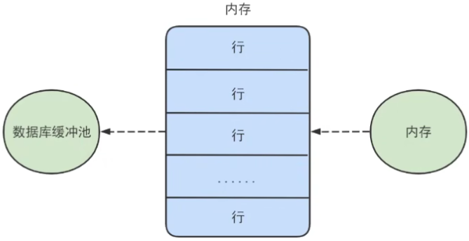

#### 随机读取

如果数据没有在内存中，就需要在磁盘上对该页进行查找，整体时间预估在 10 ms 左右，这 10 ms 中约有 6 ms 是磁盘的实际繁忙实际（包括`寻道和半圈旋转时间`），有 3 ms 是对可能发生的排队时间的估计值，另外还有 1 ms 的传输时间，将页从磁盘服务器缓冲区传输到数据库缓冲区中。这 10 ms 看起来很快，但实际上对于数据库来说消耗的时间已经很长了，因为这还只是一个页的读取时间。


#### 顺序读取

**顺序读取其实是一种批量读取的方式，因为请求的数据在磁盘上往往都是相邻存储的，顺序读取可以批量读取页面，这样的话，一次性加载到缓冲池中就不需要再对其他页面单独进行磁盘 I/O 操作。**如果一个磁盘的吞吐量是 40 MB/S，那么对于一个 16 KB 大小的页来说，一次可以顺序读取 2560 （40 MB / 16 KB）个页，相当于一个页的读取时间为 0.4 ms。采用批量读取的方式，即使是从磁盘上进行读取，效率也比从内存中只单独读取一个页的效率要高。

## 索引的创建与设计原则

### 索引的声明与使用

#### 索引的分类

MySQL 的索引包括普通索引、唯一性索引、全文索引、单列索引、多列索引和空间索引等。

- 从`功能逻辑`上说，索引主要有 4 种：普通索引、唯一索引、主键索引、全文索引。
- 按照`物理实现方式`，索引可以分为 2 种：聚簇索引和非聚簇索引。
- 按照`作用字段个数`进行划分，分成单列索引和联合索引。

##### 普通索引

在创建普通索引时，不附加任何限制条件，只是用于提高查询效率。这类索引可以创建在`任何数据类型`中，其值是否唯一和非空，要由字段本身的完整性约束性条件决定。建立索引以后，可以通过索引进行查询。例如，在表 student 的字段 name 上建立一个普通索引，查询记录时就可以根据该索引进行查询。

##### 唯一性索引

使用`UNIQUE 参数`可以设置索引为唯一性索引，在创建唯一性索引时，限制该索引的值必须是唯一的，但允许有空值。在一张数据表里，`可以有多个唯一索引`。例如，在表 student 的字段 email 中创建唯一性索引，那么字段 email 的值就必须是唯一的。通过唯一性索引，可以快速确定某条记录。

##### 主键索引

主键索引就是一种特殊的唯一性索引，在唯一索引的基础上增加了不为空的约束，也就是 NOT NULL + UNIQUE，一张表里`最多只有一个主键索引`。

##### 单列索引

在表中的单个字段上创建索引，单列索引只根据该字段进行索引。单列索引可以是普通索引，也可以是唯一性索引，还可以是全文索引，只要保证该索引只对应一个字段即可。一张表中，`可以有多个单列索引`。

##### 多列（组合、联合）索引

在表中的多个字段组合上创建索引。多列索引指向创建时对应的多个字段，可以通过这几个字段进行查询，但是只有查询条件中使用了这些字段中的第一个字段时才会被使用。例如，在表 student 的字段 id、name 和 gender 上建立一个多列索引 idx_id_name_gender，只有在查询条件中使用了字段 id 时，该索引才会被使用。使用多列索引时，遵循`最左前缀集合`。

##### 全文索引

全文索引，也称全文检索，是目前搜索引擎使用的一种关键技术。它能够利用`分词技术`等多种算法智能分析出文本文字中关键词的频率和重要性，然后按照一定的算法规则智能的筛选出想要的搜索结果。全文索引非常适合大型数据集，对于小的数据集，它的用处比较小。

使用参数`FULLTEXT`可以设置索引为全文索引，在定义索引的列上支持值的全文查找，允许在这些索引列中插入重复值和空值。全文索引只能创建在`CHAR`、`VARCHAR`或`TEXT`类型及其系列类型的字段上，`查询数据量较大的字符串类型的字段时，使用全文索引可以提高查询速度`。例如，表 student 的字段 information 是 TEXT 类型，该字段包含了很多文字信息，在字段 information 上建立全文索引后，可以提高查询字段 information 的速度。

全文索引典型的有两种类型：自然语言的全文索引和布尔全文索引。

- 自然语言搜索引擎将计算每一个文档对象和查询的相关度。这里，相关度是基于匹配的关键词的个数，以及关键词在文档中出现的次数。`在整个索引中出现次数越少的词语，匹配时的相关度就越高。`相反，非常常见的单词将不会被搜索，如果一个词语在超过 50% 的记录中都出现了，那么自然语言的搜索将不会搜索这类词语。

MySQL 数据库从 3.23.23 版开始支持全文索引，但在 MySQL 5.6.4 之前只有 MyISAM 支持，5.6.4 版本以后 InnoDB 才支持，但是官方版本不支持中文分词，需要第三方分词插件。在 5.7.6 版本，MySQL 内置了`ngram 全文解析器`，用来支持亚洲语种的分词。测试或使用全文检索时，需要先查看一下 MySQL 版本、存储引擎和数据类型，是否支持全文索引。

随着大数据时代的到来，关系型数据库应对全文索引的需求已力不从心，逐渐被 Solr、ElasticSearch 等专门的搜索引擎所替代。

##### 补充：空间索引

使用参数`SPATIAL`可以设置索引为空间索引。空间索引只能建立在空间数据类型上，这样可以提高系统获取空间数据的效率。MySQL 中的空间数据类型包括`GEOMETRY`、`POINT`、`LINESTRING`和`POLYGON`等。目前只有 MyISAM 存储引擎支持空间检索，而且索引的字段不能为空值。

##### 小结

不同的存储引擎支持的索引类型也不一样。

- InnoDB：支持 B+Tree、Full-Text 等索引，不支持 Hash 索引；
- MyISAM：支持 B+Tree、Full-Text 等索引，不支持 Hash 索引；
- Memory：支持 B+Tree、Hash 等索引，不支持 Full-Text 索引； 
- NDB：支持 Hash 索引，不支持 B+Tree、Full-Text 等索引； 
- Archive：不支持 B+Tree、Hash、Full-Text 等索引。

#### 创建索引

MySQL 支持多种方法在单个或多个列上创建索引：

- 在创建表的定义语句`CREATE TABLE`中指定索引列。
- 使用`ALTER TABLE`语句在存在的表上创建索引。
- 使用`CREATE INDEX`语句在已存在的表上添加索引。

##### 创建表的时候创建索引

使用 CREATE TABLE 创建表时，除了可以定义列的数据类型外，还可以定义主键约束、外键约束或者唯一性约束，而不论创建哪种约束，在定义约束的同时，相当于在指定列上创建了一个索引。

`隐式的索引创建`：

```mysql
# 1.隐式的添加索引(在添加有主键约束、唯一性约束或者外键约束的字段会自动的创建索引)
CREATE TABLE dept(
    dept_id INT PRIMARY KEY AUTO_INCREMENT,# 创建主键索引
    dept_name VARCHAR(20)
)

CREATE TABLE emp(
    emp_id INT PRIMARY KEY AUTO_INCREMENT,# 主键索引
    emp_name VARCHAR(20) UNIQUE,# 唯一索引
    dept_id INT,
    CONSTRAINT emp_dept_id_fk FOREIGN KEY(dept_id) REFERENCES dept(dept_id)
) # 外键索引
```

`显式的索引创建`，基本语法格式如下，共有七种情况：

```mysql
CREATE TABLE table_name [col_name data_type]
[UNIQUE | FULLTEXT | SPATIAL] [INDEX | KEY] [index_name] (col_name [length]) [ASC | DESC]
```

- UNIQUE、FULLTEXT 和 SPATIAL 为可选参数，分别表示唯一索引、全文索引和空间索引。
- INDEX 与 KEY 为同义词，两者的作用相同，用来指定创建索引。
- index_name 指定索引的名称，为可选参数，如果不指定，那么 MySQL 默认 col_name 为索引名。
- col_name 为需要创建索引的字段列，该字段列必须从数据表中定义的多个列中选择。
- length 为可选参数，表示索引的长度，只有字符串类型的字段才能指定索引长度。
- ASC 或 DESC 指定升序或者降序的索引值存储。
- 特例：主键索引使用主键约束的方式来创建。

**创建普通索引：**

在 book 表中的 year_publication 字段上建立普通索引，SQL 语句如下：

```mysql
CREATE TABLE book(
    book_id INT,
    book_name VARCHAR(100),
    authors VARCHAR(100),
    info VARCHAR(100) ,
    comment VARCHAR(100),
    year_publication YEAR,
    # 声明索引
    INDEX idx_bname(year_publication)
)
```

**创建唯一索引：**

```mysql
CREATE TABLE test(
	id INT NOT NULL,
	name varchar(30) NOT NULL,
	UNIQUE INDEX uk_idx_id(id)
)
```

**主键索引：**

设定为主键后数据库会自动建立索引，InnoDB 为聚簇索引，语法：

```mysql
CREATE TABLE student (
    # 通过定义主键约束的方式定义主键索引
	id INT(10) UNSIGNED AUTO_INCREMENT ,
	student_no VARCHAR(200),
	student_name VARCHAR(200),
	PRIMARY KEY(id)
)
```

删除主键索引：

```mysql
ALTER TABLE student DROP PRIMARY KEY
```

> 修改主键索引：必须先删除掉（DROP）原索引，再新建（ADD）索引。

**创建单列索引：**

```mysql
CREATE TABLE test2(
	id INT NOT NULL,
	name CHAR(50) NULL,
	INDEX single_idx_name(name(20))
)
```

**创建组合索引：**

```mysql
CREATE TABLE test3(
    id INT(11) NOT NULL,
    name CHAR(30) NOT NULL,
    age INT(11) NOT NULL,
    info VARCHAR(255),
    INDEX multi_idx(id, name, age)
)
```

> 组合索引在查询时会遵守`最左索引原则`，先进行 id 条件的比较，然后再进行 name 比较，最后才是 age，因此注意把最常用的查询字段放在索引的最左边。

**创建全文索引：**

FULLTEXT 全文索引可以用于全文搜索，并且只为`CHAR`、`VARCHAR`和`TEXT`列创建索引。索引总是对整个列进行，不支持局部（前缀）索引。

```mysql
CREATE TABLE test4(
    id INT NOT NULL,
    name CHAR(30) NOT NULL,
    age INT NOT NULL,
    info VARCHAR(255),
    FULLTEXT INDEX futxt_idx_info(info)
) ENGINE=MyISAM
```

> 在 MySQL 5.7 及之后版本中可以不指定最后的 ENGINE，因为在此版本中 InnoDB 支持全文索引。

创建一个给 title 和 body 字段添加全文索引的表：

```mysql
CREATE TABLE articles (
    id INT UNSIGNED AUTO_INCREMENT PRIMARY KEY,
    title VARCHAR (200),
    body TEXT,
    FULLTEXT index (title, body)
) ENGINE=INNODB
```

```mysql
CREATE TABLE `papers` (
  `id` int(10) unsigned NOT NULL AUTO_INCREMENT,
  `title` varchar(200) DEFAULT NULL,
  `content` text,
  PRIMARY KEY (`id`),
  FULLTEXT KEY `title` (`title`, `content`)
) ENGINE=MyISAM DEFAULT CHARSET=utf8
```

全文索引用 `MATCH + AGAINST` 方式查询：

```mysql
SELECT * FROM papers WHERE MATCH(title, content) AGAINST (‘查询字符串’);
```

>注意：
>
>1. 使用全文索引前，搞清楚版本支持情况；
>2. 全文索引比 LIKE + % 快 N 倍，但是可能存在精度问题；
>3. 如果需要全文索引的是大量数据，建议先添加数据，再创建索引。

**创建空间索引：**

空间索引创建中，要求空间类型的字段必须为`非空` 。

```mysql
CREATE TABLE test5(
	geo GEOMETRY NOT NULL,
	SPATIAL INDEX spa_idx_geo(geo)
) ENGINE=MyISAM
```

##### 在已经存在的表上创建索引

在已经存在的表中创建索引可以使用`ALTER TABLE`语句或者`CREATE INDEX`语句。

**使用 ALTER TABLE 语句创建索引：**

```mysql
ALTER TABLE table_name ADD [UNIQUE | FULLTEXT | SPATIAL] [INDEX | KEY]
[index_name] (col_name[length],...) [ASC | DESC]
```

示例：

```mysql
# 唯一索引
ALTER TABLE book ADD UNIQUE INDEX uk_idex_bid(book_id)

# 单列索引
ALTER TABLE book ADD INDEX inx_cmt(comment(50))

# 组合索引
ALTER TABLE book ADD INDEX idx_author_info(authors(30), info(50))
```

声明主键索引：

```mysql
CREATE TABLE customer2(
	id INT(10) UNSIGNED,
    customer_no VARCHAR(200),
    customer_name VARCHAR(200)
)

ALTER TABLE customer2 ADD PRIMARY KEY customer2(id)
```

**使用 CREATE INDEX 创建索引：**

`CREATE INDEX`语句可以在已经存在的表上添加索引，在 MySQL 中，CREATE INDEX 被映射到一个 ALTER TABLE 语句上，基本语法结构为：

```mysql
CREATE [UNIQUE | FULLTEXT | SPATIAL] INDEX index_name
ON table_name (col_name[length],...) [ASC | DESC]
```

示例：

```mysql
# 普通索引
CREATE INDEX idx_cmt ON book(comment)

# 唯一索引
CREATE UNIQUE INDEX uk_idx_bid ON book(book_id)

# 组合索引
CREATE INDEX mul_bid_bname_info ON book(book_id, book_name, info)
```

#### 删除索引

MySQ L中删除索引使用`ALTER TABLE`或`DROP INDEX`语句，两者可实现相同的功能，DROP INDEX 语句在内部被映射到一个 ALTER TABLE 语句中。

##### 使用 ALTER TABLE 删除索引

语法：

```mysql
ALTER TABLE table_name DROP INDEX index_name
```

示例：

```mysql
# 查看索引是否存在
SHOW INDEX FROM book\G

# 删除索引
ALTER TABLE book DROP INDEX idx_bk_id
```

>添加 AUTO_INCREMENT 约束字段的唯一索引不能被删除。

##### 使用 DROP INDEX 语句删除索引

语法：

```mysql
DROP INDEX index_name ON table_name
```

示例：

```mysql
# 删除索引
DROP INDEX idx_aut_info ON book

# 查看索引是否删除
SHOW INDEX FROM book\G
```

> 删除表中的列时，如果要删除的列为索引的组成部分，则该列也会从索引中删除。如果组成索引的所有列都被删除，则整个索引将被删除。

### MySQL 8.0 索引新特性

#### 支持降序索引

`降序索引以降序存储键值。`虽然在语法上，从 MySQL 4 版本就已经支持降序索引，但实际上该 DESC 定义是被忽略的，直到 MySQL 8 版本才开始真正支持降序索引（仅限于 InnoDB 存储引擎）。

MySQL 在 8.0 版本之前创建的仍然是升序索引，使用时进行反向扫描，这大大降低了数据库的效率。在某些场景下，降序索引意义重大。例如，如果一个查询，需要对多个列进行排序，且顺序要求不一致，那么使用降序索引，将会避免数据库使用额外的文件排序操作，从而提高性能。

示例：

```mysql
mysql> CREATE TABLE ts1(a int, b int, index idx_a_b(a, b desc)); 
Query OK, 0 rows affected (0.04 sec)

mysql> SHOW CREATE TABLE ts1;
+-------+---------------------------------------------------------------------------------------------------------------------------------------------+
| Table | Create Table                                                                                                                                |
+-------+---------------------------------------------------------------------------------------------------------------------------------------------+
| ts1   | CREATE TABLE `ts1` (
  `a` int DEFAULT NULL,
  `b` int DEFAULT NULL,
  KEY `idx_a_b` (`a`,`b` DESC)
) ENGINE=InnoDB DEFAULT CHARSET=utf8mb3 |
+-------+---------------------------------------------------------------------------------------------------------------------------------------------+
1 row in set (0.00 sec)
```

从结果可以看出，索引已经是降序了。

向数据表 ts1 中插入 800 条随机数据，执行语句如下：

```mysql
mysql> DELIMITER //
mysql> CREATE PROCEDURE ts_insert()
    -> BEGIN
    -> DECLARE i INT DEFAULT 1;
    -> WHILE i < 800
    -> DO
    -> insert into ts1 select rand()*80000,rand()*80000;
    -> SET i = i + 1;
    -> END WHILE;
    -> commit;
    -> END //
Query OK, 0 rows affected (0.02 sec)

mysql> DELIMITER ;
mysql> CALL ts_insert();
Query OK, 0 rows affected (3.95 sec)
```

在 MySQL 8.0 版本中查看数据表 ts1 的执行计划：

```mysql
mysql> EXPLAIN SELECT * FROM ts1 ORDER BY a, b DESC LIMIT 5;
+----+-------------+-------+------------+-------+---------------+---------+---------+------+------+----------+-------------+
| id | select_type | table | partitions | type  | possible_keys | key     | key_len | ref  | rows | filtered | Extra       |
+----+-------------+-------+------------+-------+---------------+---------+---------+------+------+----------+-------------+
|  1 | SIMPLE      | ts1   | NULL       | index | NULL          | idx_a_b | 10      | NULL |    5 |   100.00 | Using index |
+----+-------------+-------+------------+-------+---------------+---------+---------+------+------+----------+-------------+
1 row in set, 1 warning (0.01 sec)
```

从结果可以看出，执行计划中扫描数为 5，并且没有使用 Using filesort。

> 可以对比 MySQL 5.0 版本中相同查询的执行计划，执行计划中扫描数远大于 MySQL 8.0，并且使用了 Using filesort 排序。
>
> Using filesort 是 MySQL 中一种速度比较慢的外部排序，能避免是最好的。多数情况下，管理员可以通过优化索引来尽量避免出现 Using filesort，从而提高数据库执行速度。

`降序索引只对查询中特定的排序顺序有效，如果使用不当，反而查询效率更低。`例如，将上述查询的排序条件改为`ORDER BY a desc, b desc`，然后在 MySQL 8.0 版本中查看数据表 ts1 的执行计划：

```mysql
mysql> EXPLAIN SELECT * FROM ts1 ORDER BY a DESC,b DESC LIMIT 5;
+----+-------------+-------+------------+-------+---------------+---------+---------+------+------+----------+-----------------------------+
| id | select_type | table | partitions | type  | possible_keys | key     | key_len | ref  | rows | filtered | Extra                       |
+----+-------------+-------+------------+-------+---------------+---------+---------+------+------+----------+-----------------------------+
|  1 | SIMPLE      | ts1   | NULL       | index | NULL          | idx_a_b | 10      | NULL |  799 |   100.00 | Using index; Using filesort |
+----+-------------+-------+------------+-------+---------------+---------+---------+------+------+----------+-----------------------------+
1 row in set, 1 warning (0.00 sec)
```

> 此时再对比  MySQL 5.0 版本中相同查询的执行计划，会发现 MySQL 5.0 中执行计划会优于 MySQL 8.0。

#### 隐藏索引

在 MySQL 5.7 版本及之前，只能通过显式的方式删除索引。此时，如果发现删除索引后出现错误，又只能通过显式创建索引的方式将删除的索引创建回来。如果数据表中的数据量非常大，或者数据表本身比较大，这种操作就会消耗系统过多的资源，操作成本非常高。

从 MySQL 8.x 开始支持`隐藏索引 (invisible indexes)`，只需要将待删除的索引设置为隐藏索引，使查询优化器不再使用这个索引（即使使用 force index（强制使用索引），优化器也不会使用该索引），确认将索引设置为隐藏索引后系统不受任何响应，就可以彻底删除索引。这种通过先将索引设置为隐藏索引，再删除索引的方式就是`软删除`。

同时，如果想验证某个索引删除之后的查询性能影响，也可以暂时先隐藏该索引。

索引默认是可见的，在使用 CREATE TABLE，CREATE INDEX 或者 ALTER TABLE 等语句时，可以通过`VISIBLE`或者`INVISIBLE`关键词设置索引的可见性。

> 主键不能被设置为隐藏索引，当表中没有显式主键时，表中第一个唯一非空索引会成为隐式索引，也不能设置为隐藏索引。
>
> 当索引被隐藏时，它的内容仍然是和正常索引一样实时更新的。如果一个索引需要长期被隐藏，那么可以将其删除，因为索引的存在会影响插入、更新和删除的性能。

##### 创建表时直接创建

在 MySQL 中创建隐藏索引通过 SQL 语句`INVISIBLE`来实现，语法：

```mysql
 CREATE TABLE tablename(
    propname1 type1[CONSTRAINT1],
    propname2 type2[CONSTRAINT2],
    ......
    propnamen typen,
    INDEX [indexname](propname1 [(length)]) INVISIBLE
)
```

上述语句比普通索引多了一个关键字`INVISIBLE`，用来标记索引为不可见索引。

示例：

```mysql
CREATE TABLE book(
    book_id INT,
    book_name VARCHAR(100),
    authors VARCHAR (100),
    info VARCHAR (100),
    comment VARCHAR (100),
    year_publication YEAR,
    # 创建不可见的索引
    INDEX idx_cmt(comment) INVISIBLE
)
```

##### 在已经存在的表上创建

语法：

```mysql
CREATE INDEX indexname
ON tablename(propname[(length)]) INVISIBLE
```

示例：

```mysql
CREATE INDEX idx_year_pub ON book(year_publication) INVISIBLE
```

##### 通过 ALTER TABLE 语句创建

语法：

```mysql
ALTER TABLE tablename
ADD INDEX indexname (propname[(length)]) INVISIBLE
```

示例：

```mysql
ALTER TABLE book
ADD UNIQUE INDEX uk_idx_bname(book_name) INVISIBLE
```

##### 切换索引可见状态

已存在的索引可通过如下语句切换可见状态：

```mysql
# 切换成隐藏索引
ALTER TABLE tablename ALTER INDEX index_name INVISIBLE
# 切换成非隐藏索引
ALTER TABLE tablename ALTER INDEX index_name VISIBLE
```

示例：

```mysql
# 可见--->不可见
ALTER TABLE book ALTER INDEX idx_year_pub INVISIBLE
# 不可见--->可见
ALTER TABLE book ALTER INDEX idx_cmt VISIBLE
```

##### 使隐藏索引对查询优化器可见

在 MySQL 8.x 版本中，为索引提供了一种新的测试方式，可以通过查询优化器的一个开关 （`use_invisible_indexes`）来打开某个设置，使隐藏索引对查询优化器可见。如果 use_invisible_indexes 设置为 off（默认），优化器会忽略隐藏索引。如果设置为 on，即使隐藏索引不可见，优化器在生成执行计划时仍会考虑使用隐藏索引。

查看：

```mysql
mysql> SELECT @@optimizer_switch;
+------------------------------------------------------------------------------------------------------------------------------------------------------------------------------------------------------------------------------------------------------------------------------------------------------------------------------------------------------------------------------------------------------------------------------------------------------------------------------------------------------------------------------------------------------------------------------+
| @@optimizer_switch                                                                                                                                                                                                                                                                                                                                                                                                                                                                                                                                                           |
+------------------------------------------------------------------------------------------------------------------------------------------------------------------------------------------------------------------------------------------------------------------------------------------------------------------------------------------------------------------------------------------------------------------------------------------------------------------------------------------------------------------------------------------------------------------------------+
| index_merge=on,index_merge_union=on,index_merge_sort_union=on,index_merge_intersection=on,engine_condition_pushdown=on,index_condition_pushdown=on,mrr=on,mrr_cost_based=on,block_nested_loop=on,batched_key_access=off,materialization=on,semijoin=on,loosescan=on,firstmatch=on,duplicateweedout=on,subquery_materialization_cost_based=on,use_index_extensions=on,condition_fanout_filter=on,derived_merge=on,use_invisible_indexes=off,skip_scan=on,hash_join=on,subquery_to_derived=off,prefer_ordering_index=on,hypergraph_optimizer=off,derived_condition_pushdown=on |
+------------------------------------------------------------------------------------------------------------------------------------------------------------------------------------------------------------------------------------------------------------------------------------------------------------------------------------------------------------------------------------------------------------------------------------------------------------------------------------------------------------------------------------------------------------------------------+
1 row in set (0.00 sec)
```

修改：

```mysql
mysql> SELECT @@optimizer_switch;
+-----------------------------------------------------------------------------------------------------------------------------------------------------------------------------------------------------------------------------------------------------------------------------------------------------------------------------------------------------------------------------------------------------------------------------------------------------------------------------------------------------------------------------------------------------------------------------+
| @@optimizer_switch                                                                                                                                                                                                                                                                                                                                                                                                                                                                                                                                                          |
+-----------------------------------------------------------------------------------------------------------------------------------------------------------------------------------------------------------------------------------------------------------------------------------------------------------------------------------------------------------------------------------------------------------------------------------------------------------------------------------------------------------------------------------------------------------------------------+
| index_merge=on,index_merge_union=on,index_merge_sort_union=on,index_merge_intersection=on,engine_condition_pushdown=on,index_condition_pushdown=on,mrr=on,mrr_cost_based=on,block_nested_loop=on,batched_key_access=off,materialization=on,semijoin=on,loosescan=on,firstmatch=on,duplicateweedout=on,subquery_materialization_cost_based=on,use_index_extensions=on,condition_fanout_filter=on,derived_merge=on,use_invisible_indexes=on,skip_scan=on,hash_join=on,subquery_to_derived=off,prefer_ordering_index=on,hypergraph_optimizer=off,derived_condition_pushdown=on |
+-----------------------------------------------------------------------------------------------------------------------------------------------------------------------------------------------------------------------------------------------------------------------------------------------------------------------------------------------------------------------------------------------------------------------------------------------------------------------------------------------------------------------------------------------------------------------------+
1 row in set (0.00 sec)
```

### 索引的设计原则

#### 数据准备

创建数据库和表：

```mysql
mysql> CREATE DATABASE atguigudb1;
Query OK, 1 row affected (0.01 sec)

mysql> USE atguigudb1;
Database changed

mysql> CREATE TABLE `student_info` (
    -> `id` INT(11) NOT NULL AUTO_INCREMENT,
    -> `student_id` INT NOT NULL ,
    -> `name` VARCHAR(20) DEFAULT NULL,
    -> `course_id` INT NOT NULL ,
    -> `class_id` INT(11) DEFAULT NULL,
    -> `create_time` DATETIME DEFAULT CURRENT_TIMESTAMP ON UPDATE CURRENT_TIMESTAMP,
    -> PRIMARY KEY (`id`)
    -> ) ENGINE=INNODB AUTO_INCREMENT=1 DEFAULT CHARSET=utf8;
Query OK, 0 rows affected, 3 warnings (0.04 sec)

mysql> CREATE TABLE `course` (
    -> `id` INT(11) NOT NULL AUTO_INCREMENT,
    -> `course_id` INT NOT NULL ,
    -> `course_name` VARCHAR(40) DEFAULT NULL,
    -> PRIMARY KEY (`id`)
    -> ) ENGINE=INNODB AUTO_INCREMENT=1 DEFAULT CHARSET=utf8;
Query OK, 0 rows affected, 2 warnings (0.03 sec)
```

创建模拟数据必需的存储函数：

```mysql
# 函数1: 创建随机产生字符串函数
mysql> DELIMITER //
mysql> CREATE FUNCTION rand_string(n INT)
    -> RETURNS VARCHAR(255) # 函数会返回一个字符串
    -> BEGIN
    -> DECLARE chars_str VARCHAR(100) DEFAULT 'abcdefghijklmnopqrstuvwxyzABCDEFJHIJKLMNOPQRSTUVWXYZ';
    -> DECLARE return_str VARCHAR(255) DEFAULT '';
    -> DECLARE i INT DEFAULT 0;
    -> WHILE i < n DO
    -> SET return_str = CONCAT(return_str, SUBSTRING(chars_str, FLOOR(1 + RAND() * 52), 1));
    -> SET i = i + 1;
    -> END WHILE;
    -> RETURN return_str;
    -> END //
Query OK, 0 rows affected (0.01 sec)

mysql> DELIMITER ;

# 函数2: 创建随机数函数
mysql> DELIMITER //
mysql> CREATE FUNCTION rand_num(from_num INT, to_num INT) RETURNS INT(11)
    -> BEGIN
    -> DECLARE i INT DEFAULT 0;
    -> SET i = FLOOR(from_num + RAND() * (to_num - from_num + 1)) ;
    -> RETURN i;
    -> END //
Query OK, 0 rows affected, 1 warning (0.01 sec)

mysql> DELIMITER ;
```

>主从复制，主机会将写操作记录在 bin-log 日志中。从机读取 bin-log 日志，执行语句来同步数据。如果使用函数来操作数据，会导致从机和主机操作时间不一致。所以，默认情况下，MySQL 不开启创建函数设置。
>
>查看 MySQL 是否允许创建函数：
>
>```mysql
>mysql> SHOW VARIABLES LIKE 'log_bin_trust_function_creators';
>+---------------------------------+-------+
>| Variable_name                   | Value |
>+---------------------------------+-------+
>| log_bin_trust_function_creators | OFF   |
>+---------------------------------+-------+
>1 row in set (0.01 sec)
>```
>
>命令开启，允许创建函数设置：
>
>```mysql
>mysql> SET GLOBAL log_bin_trust_function_creators=1;
>Query OK, 0 rows affected (0.00 sec)
>```
>
>如果不进行如上设置，创建函数时会报错：
>
>```mysql
>ERROR 1418 (HY000): This function has none of DETERMINISTIC, NO SQL, or READS SQL DATA in its declaration and binary logging is enabled (you *might* want to use the less safe log_bin_trust_function_creators variable)
>```

创建插入模拟数据的存储过程：

```mysql
# 存储过程1: 创建插入课程表的存储过程
mysql> DELIMITER //
mysql> CREATE PROCEDURE insert_course(max_num INT)
    -> BEGIN
    -> DECLARE i INT DEFAULT 0;
    -> SET autocommit = 0; # 设置手动提交事务
    -> REPEAT # 循环
    -> SET i = i + 1; # 赋值
    -> INSERT INTO course(course_id, course_name) VALUES (rand_num(10000, 10100), rand_string(6));
    -> UNTIL i = max_num
    -> END REPEAT;
    -> COMMIT; # 提交事务
    -> END //
Query OK, 0 rows affected (0.02 sec)

mysql> DELIMITER ;

# 存储过程2: 创建插入学生信息表的存储过程
mysql> DELIMITER //
mysql> CREATE PROCEDURE insert_stu(max_num INT)
    -> BEGIN
    -> DECLARE i INT DEFAULT 0;
    -> SET autocommit = 0; # 设置手动提交事务
    -> REPEAT # 循环
    -> SET i = i + 1; # 赋值
    -> INSERT INTO student_info(course_id, class_id, student_id, name) VALUES (rand_num(10000, 10100), rand_num(10000, 10200), rand_num(1, 200000), rand_string(6));
    -> UNTIL i = max_num
    -> END REPEAT;
    -> COMMIT; # 提交事务
    -> END //
Query OK, 0 rows affected (0.01 sec)

mysql> DELIMITER ;
```

调用存储过程：

```mysql
mysql> CALL insert_course(100);
Query OK, 0 rows affected (0.02 sec)

mysql> CALL insert_stu(1000000);
Query OK, 0 rows affected (57.34 sec)
```

#### 适合创建索引的情景

##### 字段的数值有唯一性的限制

索引本身可以起到约束的作用，比如唯一索引、主键索引都是可以起到唯一性约束的，因此在数据表中，如果`某个字段是唯一性的`，就可以直接创建唯一性索引，或者主键索引。这样，可以更快速的通过该索引来确定某条记录。

>业务上具有唯一特性的字段，即使是组合字段，也必须建成唯一索引。（来源：Alibaba）
>
>说明：不要以为唯一索引影响了 INSERT 速度，实际上这个速度损耗可以忽略，但提高查找速度是明显的。

##### 频繁作为 WHERE 查询条件的字段

某个字段`在 SELECT 语句的 WHERE 条件中经常被使用到`，那么就需要给这个字段创建索引了。尤其是在数据量大的情况下，创建普通索引就可以大幅提升数据查询的效率。

##### 经常 GROUP BY 和 ORDER BY 的列

索引其实就是让数据按照某种顺序进行存储或检索。当我们使用 GROUP BY 对数据进行分组查询，或者使用 ORDER BY 对数据进行排序的时候，如果`对分组或者排序的字段建立索引`，本身索引的数据就已经排好序了，进行分组查询和排序操作性能不是很 nice 吗？另外，如果待排序的列有多个，那么可以在这些列上建立`组合索引`。

- 如果仅仅使用 GROUP BY 或者 ORDER BY，且后面只有一个字段，则单独建立索引；如果后面跟多个字段，则建立组合索引。
- 如果既有 GROUP BY 又有 ORDER BY，那就建立联合索引，且 GROUP BY 的字段写在前面，ORDER BY 的字段写在后面。MySQL 8.0 后的版本也可以考虑使用降序索引。

##### UPDATE、DELETE 的 WHERE 条件列

`对数据按照某个条件进行查询后再进行 UPDATE 或 DELETE 的操作，如果对 WHERE 字段创建了索引，就能大幅提升效率。`原理是因为需要先根据 WHERE 条件列检索出来这条记录，然后再对它进行更新或删除。如果进行更新的时候，更新的字段是非索引字段，提升的效率会更明显，这是因为非索引字段更新不需要对索引进行维护。

##### DISTINCT 字段需要创建索引

有时候需要对某个字段进行去重，使用`DISTINCT`，那么对这个字段创建索引，也会提升查询效率。这是因为索引会对数据按照某种顺序进行排序，所以在去重的时候会快很多。

##### 多表 JOIN 连接操作时，创建索引注意事项

首先，`连接表的数量尽量不要超过 3 张`，因为每增加一张表就相当于增加了一次嵌套的循环，数量级增长会非常快（n, n^2, n^3, …），严重影响查询的效率。

其次，`对 WHERE 条件创建索引`，因为 WHERE 才是对数据条件的过滤。如果在数据量非常大的情况下，没有 WHERE 条件过滤是非常可怕的。

最后，`对用于连接的字段创建索引`，并且该字段在多张表中的`类型必须一致`。比如 course_id 在 student_info 表和 course 表中都为 int(11) 类型，而不能一个为 int 另一个为 varchar 类型。否则在查询时，虽然也会进行隐式的类型转换，转换时会使用函数，但会导致`索引失效`。

##### 使用列的类型小的创建索引

此处说的`类型大小`，指的就是该类型表示的数据范围的大小。

在定义表结构的时候，要显式的指定列的类型，以整数类型为例，有 TINYINT、MEDIUMINT、INT、BIGINT 等，它们占用的存储空间依次递增，能表示的整数范围当然也是依次递增。如果想要对某个整数列建立索引的话，在表示的整数范围允许的情况下，尽量让索引列使用较小的类型，比如能使用 INT 就不要使用 BIGINT，能使用 MEDIUMINT 就不要使用 INT。原因如下：

- 数据类型越小，在查询时进行的比较操作就越快；
- 数据类型越小，索引占用的存储空间就越小，在一个数据页内就可以放下更多的记录，从而减少磁盘 I/O 带来的性能损耗，也就意味着可以把更多的数据页缓存在内存中，从而加快读写效率。

这个建议对于表的主键来说更加适应，因为不仅是聚簇索引中会存储主键值，其他所有的二级索引的节点处，都会存储一份记录的主键值，如果主键使用更小的数据类型，也就意味着节省更多的存储空间和更高效的 I/O。

##### 使用字符串前缀创建索引

假设字符串很长，那存储一个字符串就需要占用很大的存储空间。在需要为这个字符串列建立索引时，就意味着在对应的 B+Tree 中有这样的两个问题：

- B+Tree 索引中的记录需要把该列的完整字符串存储起来，更费时，而且字符串越长，在索引中占用的存储空间越大。
- 如果 B+Tree 索引中索引列存储的字符串很长，那在作字符串比较时会占用更多的时间。

此时，可以通过截取字段的前面一部分内容建立索引，即`前缀索引`。这样，在查找记录时，虽然不能精确的定位到记录的位置，但是能定位到相应字符串前缀所在的位置，然后根据前缀相同的记录的主键值，回表查询完整的字符串值。即节约空间，又减少了字符串的比较时间，还大体能解决排序的问题。

例如，TEXT 和 BLOG 类型的字段，进行全文检索会很浪费时间，如果只检索字段前面的若干字符，可以提高检索速度。

示例：

```mysql
# 创建一张商户表
CREATE TABLE shop(address varchar(120) NOT NULL);

# 因为地址字段比较长, 在地址字段上建立前缀索引
ALTER TABLE shop ADD INDEX(address(12));
```

问题是，前缀截取多少呢？截取的多了，达不到节省索引存储空间的目的，截取的少了，重复内容太多，字段的`散列度 (选择性)`会降低。 怎么计算不同的长度的选择性呢？

先看一下字段在全部数据中的选择度：

```mysql
SELECT COUNT(DISTINCT address) / COUNT(*) FROM shop
```

然后，通过不同长度去计算，与全表的选择性对比，公式：

```mysql
COUNT(DISTINCT LEFT(列名, 索引长度)) / COUNT(*)
```

例如：

```mysql
SELECT
COUNT(DISTINCT LEFT(address, 10)) / COUNT(*) AS sub10, -- 截取前10个字符的选择度 
COUNT(DISTINCT LEFT(address, 15)) / COUNT(*) AS sub11, -- 截取前15个字符的选择度 
COUNT(DISTINCT LEFT(address, 20)) / COUNT(*) AS sub12, -- 截取前20个字符的选择度 
COUNT(DISTINCT LEFT(address, 25)) / COUNT(*) AS sub13  -- 截取前25个字符的选择度
FROM shop
```

>拓展：Alibaba《Java开发手册》
>
>【 强制 】在 varchar 字段上建立索引时，必须指定索引长度，没必要对全字段建立索引，根据实际文本区分度决定索引长度。
>
>说明：索引的长度与区分度是一对矛盾体，一般对字符串类型数据，长度为 20 的索引，区分度会高达 90% 以上，可以使用`COUNT(DISTINCT LEFT(列名, 索引长度)) / COUNT(*)`计算的区分度来确定。

**引申：索引列前缀对排序的影响。**

如果使用了索引列前缀，比方说前边只把 address 列的前 12 个字符放到了二级索引中，下边的查询会有问题：

```mysql
SELECT * FROM shop ORDER BY address LIMIT 12
```

因为二级索引中不包含完整的 address 列信息，所以无法对前 12 个字符相同，后边的字符不同的记录进行排序，也就是`使用索引列前缀的方式无法支持使用索引排序`，只能使用文件排序。

##### 区分度高（散列性高）的列适合作为索引

`列的基数`指的是某一个列中不重复数据的个数，比方说某个列包含值 2，5，8，2，5，8，2，5，8，虽然有 9 条记录，但该列的基数是 3。也就是说，在记录行数一定的情况下，列的基数越大，该列中的值越分散；列的基数越小，该列中的值越集中。这个列基数指标非常重要，直接影响是否能有效的利用索引。最好为列的基数大的列建立索引，为基数太小的列建立索引，效果可能不好。

可以使用公式`SELECT COUNT(DISTINCT a) / COUNT(*) FROM t1`计算区分度，越接近 1 越好，一般超过`33%`就算是比较高效的索引。

> 拓展：**联合索引中，应把区分度高（散列性高）的列，放在前面。**

##### 使用最频繁的列放到联合索引的左侧

这样也可以较少的建立一些索引。同时，由于`最左前缀原则`，可以增加联合索引的使用率。

##### 在多个字段都要创建索引的情况下，联合索引优于单值索引

原因：

- 索引建立的多，维护的成本也高。
- 多个字段进行联合查询时，其实只使用到一个索引。
- 在建立联合索引的相关字段做查询时，联合索引都能生效，使用频率比较高，足够优化 SQL 执行的速度了。

#### 限制索引的数目

在实际工作中，也需要注意平衡，`索引的数目不是越多越好`。我们需要限制每张表上的索引数量，`建议单张表索引数量不超过 6 个`。原因：

- 每个索引都需要占用磁盘空间，索引越多，需要的磁盘空间就越大。


- 索引会影响 INSERT、DELETE、 UPDATE 等语句的性能，因为表中的数据更改的同时，索引也会进行调整和更新，会造成负担。


- 优化器在选择如何优化查询时，会根据统一信息，对每一个可以用到的索引来进行评估，以生成出一个最好的执行计划，如果同时有很多个索引都可以用于查询，会增加 MySQL 优化器生成执行计划的时间，降低查询性能。这是因为表中创建的索引过多，优化器在 possible_keys 中选择合适的 key 时需要的成本也会更多。比如下面查询中 possible_keys 有两个，实际使用的 key 只有一个，这个过程是优化器判断的。

  ```mysql
  mysql> EXPLAIN SELECT student_id, COUNT(*) AS num FROM student_info
      -> GROUP BY student_id
      -> ORDER BY create_time DESC
      -> LIMIT 100;
  +----+-------------+--------------+------------+-------+--------------------------+---------+---------+------+--------+----------+---------------------------------+
  | id | select_type | table        | partitions | type  | possible_keys            | key     | key_len | ref  | rows   | filtered | Extra                           |
  +----+-------------+--------------+------------+-------+--------------------------+---------+---------+------+--------+----------+---------------------------------+
  |  1 | SIMPLE      | student_info | NULL       | index | idx_sid,idx_cre_time_sid | idx_sid | 4       | NULL | 997449 |   100.00 | Using temporary; Using filesort |
  +----+-------------+--------------+------------+-------+--------------------------+---------+---------+------+--------+----------+---------------------------------+
  1 row in set, 1 warning (0.00 sec)
  ```

#### 不适合创建索引的情景

##### 在 WHERE 中使用不到的字段，不要设置索引

WHERE 条件（包括 GROUP BY 和 ORDER BY）里用不到的字段，不需要创建索引，索引的价值是快速定位，如果起不到定位的字段，通常是不需要创建索引的。

##### 数据量小的表最好不要使用索引

如果表记录太少，比如少于 1000 个，那么是不需要创建索引的。表记录太少，是否创建索引对查询效率的影响并不大，甚至说，查询花费的时间，可能比遍历索引的时间还要短，索引可能不会产生优化效果。

##### 有大量重复数据的列上不要建立索引

在条件表达式中经常用到的不同值较多的列上建立索引，但字段中如果有大量重复数据，也不用创建索引。比如性别字段，往往会有大量重复字段，如果建立索引，不但不会提高查询效率，反而会严重降低数据更新速度。

> 索引的价值是快速定位，如果想要定位的数据有很多，那么索引就失去了它的价值，比如通常情况下的性别字段。**当数据重复度大，比如高于 10% 的时候，也就不需要对这个字段使用索引。**

##### 避免对经常更新的表创建过多的索引


##### 不建议用无序的值作为索引

例如身份证、UUID（在索引比较时需要转为 ASCⅡ，并且插入时可能造成页分裂）、MD5、HASH、无序长字符串等。

##### 删除不再使用或者很少使用的索引

表中的数据被大量更新，或者数据的使用方式被改变后，原有的一些索引可能不再需要。数据库管理员应当定期找出这些索引，将它们删除，从而减少索引对更新操作的影响。

##### 不要定义冗余或重复的索引

有时候无意或者有意的对同一个列创建了多个索引，比如：index(a, b, c) 相当于 index(a)、index(a, b)、index(a, b, c)。

冗余索引：

```mysql
CREATE TABLE person_info(
    id INT UNSIGNED NOT NULL AUTO_INCREMENT,
    name VARCHAR(100) NOT NULL,
    birthday DATE NOT NULL,
    phone_number CHAR(11) NOT NULL,
    country varchar(100) NOT NULL,
    PRIMARY KEY (id),
    KEY idx_name_birthday_phone_number (name(10), birthday, phone_number),
    KEY idx_name (name(10))
)
```

- 通过 idx_name_birthday_phone_number 索引就可以对 name 列进行快速搜索，再创建一 个专门针对 name 列的索引就算是一个 冗余索引，维护这个索引只会增加维护的成本，并不会对搜索有 什么好处。

重复索引：

```mysql
CREATE TABLE repeat_index_demo (
    col1 INT PRIMARY KEY,
    col2 INT,
    UNIQUE uk_idx_c1 (col1),
    INDEX idx_c1 (col1)
)
```

- col1 既是主键，又给它定义为一个唯一索引，还给它定义了一个普通索引，可是主键本身就会生成聚簇索引，所以定义的唯一索引和普通索引是重复的，这种情况要避免。

#### 总结

索引是一把双刃剑，可以提高查询效率，但也会降低插入和更新的速度，并占用磁盘空间。

使用索引的最终目的是为了使查询的速度变快，上面给出的原则是最基本的准则，但是不能拘泥于上面的准则，在日常的学习和工作中需要进行不断的实践，根据应用的实际情况进行分析和判断，从而选择最合适的索引方式。

## 性能分析工具的使用

`在数据库调优中，目标就是 响应时间更快，吞吐量更大。`利用宏观的监控工具和微观的日志分析可以帮助快速找到调优的思路和方式。

### 数据库服务器的优化步骤

当遇到数据库调优问题的时候，该如何思考呢？这里把思考的流程整理成下面这张图。

整个流程划分成了` 观察（Show status）`和`行动（Action）`两个部分。字母 S 的部分代表观察（会使用相应的分析工具），字母 A 代表的部分是行动（对应分析可以采取的行动）：

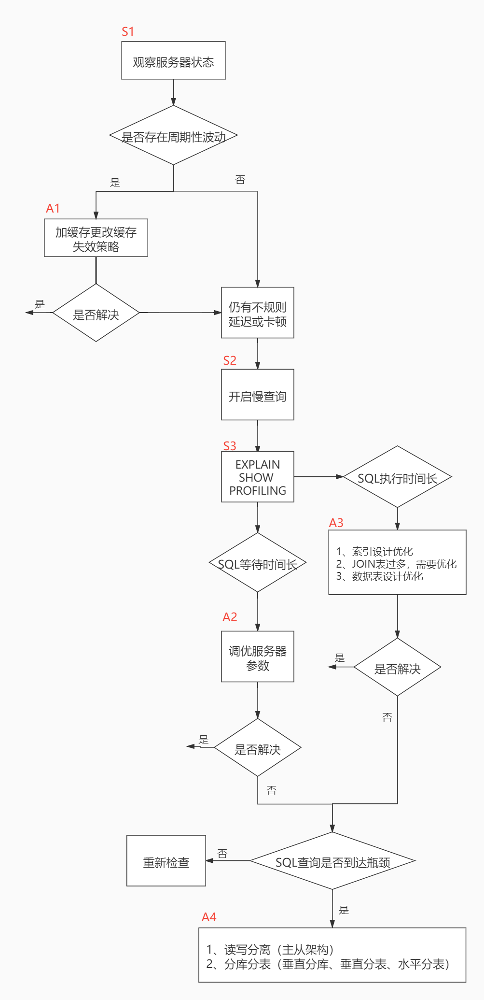

数据库调优时，可以通过观察了解数据库整体的运行状态，通过性能分析工具，可以帮助了解执行慢的 SQL 有哪些，查看具体的 SQL 执行计划，甚至是 SQL 执行中的每一步的成本代价，这样才能定位问题所在，找到了问题，再采取相应的行动。

- 首先，在 S1 部分，我们需要观察服务器的状态是否存在周期性的波动。如果`存在周期性波动`，有可能是周期性节点的原因，比如双十一、促销活动等。这样的话，可以通过 A1 这一步骤解决，也就是加缓存，或者更改缓存失效策略。
- 如果缓存策略没有解决，或者不是周期性波动的原因，就需要进一步`分析查询延迟和卡顿的原因`。接下来进入 S2 这一步，需要开`启慢查询`，慢查询可以帮助定位执行慢的 SQL 语句。可以通过设置`long_query_time`参数定义慢查询的阈值，如果 SQL 执行时间超过了 long_query_time，则会认为是慢查询。当收集上来这些慢查询之后，就可以通过分析工具对慢查询日志进行分析。
- 在 S3 这一步骤中，我们知道了执行慢的 SQL，可以针对性的用`EXPLAIN`查看对应 SQL 语句的执行计划，或者用`SHOW PROFILE`查看 SQL 中每一个步骤的时间成本。然后，就可以了解 SQL 查询慢是因为执行时间长，还是等待时间长。
- 如果是 SQL 等待时间长，进入 A2 步骤。在这一步骤中，可以`调优服务器的参数`，比如适当增加数据库缓冲池等。如果是 SQL 执行时间长，就进入 A3 步骤，这一步中需要考虑是索引设计的问题，还是查询关联的数据表过多，亦或者是因为数据表的字段设计问题导致了这一问题，然后在对应的维度上进行相应的调整。
- 如果 A2 和 A3 都不能解决问题，我们需要考虑数据库自身的 SQL 查询性能是否已经达到了瓶颈，如果确认没有达到性能瓶颈，就需要重新检查，重复以上的步骤。如果已经`达到了性能瓶颈`，进入 A4 阶段，需要考虑`增加服务器`，采用`读写分离`的架构，或者考虑对数据库进行`分库分表`，比如垂直分库、垂直分表和水平分表等。

以上就是数据库调优的流程思路，如果发现执行 SQL 时存在不规则延迟或卡顿的时候，就可以采用分析工具帮忙定位有问题的 SQL，这三种分析工具可以理解是 SQL 调优的三个步骤：`慢查询`、`EXPLAIN`和`SHOW PROFILING`。

小结：

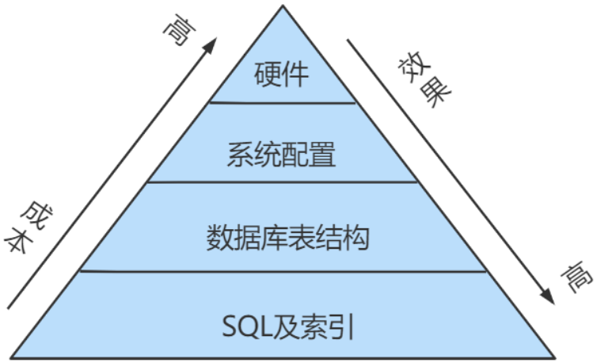

- 可以看到数据库调优的步骤中越往金字塔尖走，其成本越高，效果越差，因此在数据库调优的过程中，要重点把握金字塔底部的 SQL 及索引调优，数据库表结构调优，系统配置参数调优等软件层面的调优。

### 查看系统性能参数

可以使用`SHOW STATUS`语句查询一些数据库服务器的性能参数和使用频率，语法：

```mysql
SHOW [GLOBAL][SESSION] STATUES LIKE '[参数]'
```

一些常用的性能参数如下：

- Connections：连接 MySQL 服务器的次数。
- Uptime：MySQL 服务器的上线时间。
- Slow_queries：慢查询的次数。
- Innodb_rows_read：SELECT 查询返回的行数。
- Innodb_rows_inserted：执行 INSERT 操作插入的行数。
- Innodb_rows_updated：执行 UPDATE 操作更新的行数。
- Innodb_rows_deleted：执行 DELETE 操作删除的行数。
- Com_select：查询操作的次数。
- Com_insert：插入操作的次数。对于批量插入的 INSERT 操作，只累加一次。
- Com_update：更新操作的次数。
- Com_delete：删除操作的次数。

### 统计 SQL 的查询成本：last_query_cost

一条 SQL 查询语句在执行前需要确定查询执行计划，如果存在多种执行计划的话，MySQL 会计算每个执行计划所需要的成本，从中选择`成本最小`的一个作为最终执行的执行计划。

如果想要查看某条 SQL 语句的查询成本，可以在执行完这条 SQL 语句之后，通过查看当前会话中的`last_query_cost`变量值来得到当前查询的成本。last_query_cost 也是`评价一个查询的执行效率`的一个常用指标，这个查询成本对应的是`SQL 语句所需要读取的页的数量`。

以 student_info 表为例：

1. 查询 id = 900001 的记录，可以直接在聚簇索引上进行查找。查看查询优化器的成本，实际上只需要检索一个页即可，`Value`表示 I/O 加载的数据页的页数。

   ```mysql
   mysql> SELECT * FROM student_info WHERE id = 900001;
   +--------+------------+--------+-----------+----------+---------------------+
   | id     | student_id | name   | course_id | class_id | create_time         |
   +--------+------------+--------+-----------+----------+---------------------+
   | 900001 |     103954 | BfYzAg |     10064 |    10138 | 2023-07-02 18:54:38 |
   +--------+------------+--------+-----------+----------+---------------------+
   1 row in set (0.00 sec)
   
   mysql> SHOW STATUS LIKE 'last_query_cost';
   +-----------------+----------+
   | Variable_name   | Value    |
   +-----------------+----------+
   | Last_query_cost | 1.000000 |
   +-----------------+----------+
   1 row in set (0.01 sec)
   ```

2. 扩大下查询范围，student_id > 199900 的学生记录，大概需要进行 102120 个页的查询。

   ```mysql
   mysql> SELECT * FROM student_info WHERE student_id > 199900;
   +--------+------------+--------+-----------+----------+---------------------+
   | id     | student_id | name   | course_id | class_id | create_time         |
   +--------+------------+--------+-----------+----------+---------------------+
   |    607 |     199908 | PYxrsM |     10000 |    10080 | 2023-07-02 18:53:47 |
   |   1788 |     199993 | XLQSTN |     10092 |    10070 | 2023-07-02 18:53:47 |
   |   3042 |     199909 | OTcESy |     10023 |    10148 | 2023-07-02 18:53:47 |
   | 999891 |     199922 | mlvtHf |     10087 |    10184 | 2023-07-02 18:54:44 |
   +--------+------------+--------+-----------+----------+---------------------+
   514 rows in set (0.27 sec)
   
   mysql> SHOW STATUS LIKE 'last_query_cost';
   +-----------------+---------------+
   | Variable_name   | Value         |
   +-----------------+---------------+
   | Last_query_cost | 102120.464739 |
   +-----------------+---------------+
   1 row in set (0.00 sec)
   ```

3. 再次扩大查询范围，student_id > 199000 的学生记录，大概需要进行 100512 个页的查询。

   ```mysql
   mysql> SELECT * FROM student_info WHERE student_id > 199000;
   +--------+------------+--------+-----------+----------+---------------------+
   | id     | student_id | name   | course_id | class_id | create_time         |
   +--------+------------+--------+-----------+----------+---------------------+
   |     18 |     199656 | CNfphR |     10058 |    10029 | 2023-07-02 18:53:47 |
   |     30 |     199615 | gEEhXr |     10015 |    10058 | 2023-07-02 18:53:47 |
   |     57 |     199193 | uaUups |     10021 |    10105 | 2023-07-02 18:53:47 |
   | 999891 |     199922 | mlvtHf |     10087 |    10184 | 2023-07-02 18:54:44 |
   +--------+------------+--------+-----------+----------+---------------------+
   5023 rows in set (0.19 sec)
   
   mysql> SHOW STATUS LIKE 'last_query_cost';
   +-----------------+---------------+
   | Variable_name   | Value         |
   +-----------------+---------------+
   | Last_query_cost | 100512.649000 |
   +-----------------+---------------+
   1 row in set (0.00 sec)
   ```

>SQL查询是一个动态的过程，从页加载的角度，我们可以得到以下两点结论：
>
>- `位置决定效率`：如果页就在数据库缓冲池中，那么效率是最高的，否则还需要从内存或者磁盘中进行读取，当然针对单个页的读取来说，如果页存在于内存中，会比在磁盘中读取效率高很多。即`数据库缓冲池 > 内存 > 磁盘`。
>- `批量决定效率`：如果我们从磁盘中单一页进行随机读，那么效率是很低的（差不多 10 ms），而采用顺序读取的方式，批量对页进行读取，平均一页的读取效率就会提升很多，甚至要快于单个页面在内存中的随机读取。即`顺序读取 > 随机读取`。
>
>所以说，遇到 I/O 并不用担心，方法找对了，效率还是很高的。我们首先要考虑数据存放的位置，如果是经常使用的数据就要尽量放到缓冲池中，其次我们可以充分利用磁盘的吞吐能力，一次性批量读取数据，这样单个页的读取效率也就得到了提升。
>
>注：缓冲池和查询缓存并不是一个东西。

### 定位执行慢的 SQL：慢查询日志

MySQL 的慢查询日志，用来记录在 MySQL 中`响应时间超过阈值`的语句，具体指运行时间超过`long_query_time`值的 SQL，会被记录到慢查询日志中。long_query_time 的默认值是 10，意思是运行 10 秒以上（不含 10 秒）的语句，认为是超出了最大的忍耐时间值。

它的主要作用是，帮助我们发现那些执行时间特别长的 SQL 查询，并且有针对性的进行优化，从而提高系统的整体效率。当我们的数据库服务器发生阻塞、运行变慢的时候，检查一下慢查询日志，找到那些慢查询，对解决问题很有帮助。

默认情况下，MySQL 数据库`没有开启慢查询日志`，需要手动来设置这个参数。**如果不是调优需要的话，一般不建议启动该参数。**因为开启慢查询日志，会或多或少来带一定的性能影响。

> 慢查询日志，支持将日志记录写入文件。

#### 开启慢查询日志

##### 开启 slow_query_log

查看慢查询日志是否开启，以及日志的位置：

```mysql
mysql> SHOW VARIABLES LIKE '%slow_query_log%';
+---------------------+--------------------------------------+
| Variable_name       | Value                                |
+---------------------+--------------------------------------+
| slow_query_log      | OFF                                  |
| slow_query_log_file | /var/lib/mysql/de5e82a9b92d-slow.log |
+---------------------+--------------------------------------+
2 rows in set (0.00 sec)
```

修改慢查询日志状态为开启，注意这里要加 `global`，因为它是全局系统变量，否则会报错：

```mysql
mysql> SET GLOBAL slow_query_log='ON';
Query OK, 0 rows affected (0.00 sec)
```

再次查看：

```mysql
mysql> SHOW VARIABLES LIKE '%slow_query_log%';
+---------------------+--------------------------------------+
| Variable_name       | Value                                |
+---------------------+--------------------------------------+
| slow_query_log      | ON                                   |
| slow_query_log_file | /var/lib/mysql/de5e82a9b92d-slow.log |
+---------------------+--------------------------------------+
2 rows in set (0.00 sec)
```

##### 修改 long_query_time 阈值

查看慢查询的时间阈值设置：

```mysql
mysql> SHOW VARIABLES LIKE '%long_query_time%';
+-----------------+-----------+
| Variable_name   | Value     |
+-----------------+-----------+
| long_query_time | 10.000000 |
+-----------------+-----------+
1 row in set (0.00 sec)
```

按需重新设置，例如设置为 1 秒：

```mysql
# 测试发现设置global的方式对当前session的long_query_time失效，只对新连接的客户端有效，所以可以一并执行下列语句
mysql> SET GLOBAL long_query_time = 1;
Query OK, 0 rows affected (0.00 sec)

mysql> SET long_query_time = 1;
Query OK, 0 rows affected (0.00 sec)
```

##### 补充：配置文件中设置参数

如下的方式相较于前面的命令行方式，可以看作是永久设置。

修改`my.cnf`文件，在 [mysqld] 下增加或修改参数`slow_query_log`，`slow_query_log_file`和`long_query_time`后，然后重启 MySQL 服务器。

```cnf
[mysqld]
slow_query_log=ON # 开启慢查询日志的开关
slow_query_log_file=/var/lib/mysql/slow.log # 慢查询日志的目录和文件名信息
long_query_time=3 # 设置慢查询的阈值为3秒，超出此设定值的SQL即被记录到慢查询日志
log_output=FILE
```

如果不指定存储路径，慢查询日志将默认存储到 MySQL 数据库的数据文件夹下，如果不指定文件名，默认文件名为 hostname-slow.log。

#### 案例演示

第一步，建表：

```mysql
mysql> CREATE TABLE `student` (
    ->     `id` INT(11) NOT NULL AUTO_INCREMENT,
    ->     `stuno` INT NOT NULL ,
    ->     `name` VARCHAR(20) DEFAULT NULL,
    ->     `age` INT(3) DEFAULT NULL,
    ->     `classId` INT(11) DEFAULT NULL,
    ->     PRIMARY KEY (`id`)
    -> ) ENGINE=INNODB AUTO_INCREMENT=1 DEFAULT CHARSET=utf8;
Query OK, 0 rows affected, 4 warnings (0.03 sec)
```

第二步，开启允许创建函数：

```mysql
mysql> SHOW GLOBAL VARIABLES LIKE '%log_bin_trust_function_creators%';
+---------------------------------+-------+
| Variable_name                   | Value |
+---------------------------------+-------+
| log_bin_trust_function_creators | OFF   |
+---------------------------------+-------+
1 row in set (0.01 sec)

mysql> SET GLOBAL log_bin_trust_function_creators='ON';
Query OK, 0 rows affected (0.00 sec)

mysql> SHOW GLOBAL VARIABLES LIKE '%log_bin_trust_function_creators%';
+---------------------------------+-------+
| Variable_name                   | Value |
+---------------------------------+-------+
| log_bin_trust_function_creators | ON    |
+---------------------------------+-------+
1 row in set (0.00 sec)
```

第三步，创建函数：

```mysql
# 随机产生字符串函数rand_string，同上章

# 随机数函数rand_num，同上章
```

第四步，创建存储过程：

```mysql
mysql> DELIMITER //
mysql> CREATE PROCEDURE insert_stu1(  START INT , max_num INT )
    -> BEGIN 
    -> DECLARE i INT DEFAULT 0; 
    -> SET autocommit = 0; # 设置手动提交事务
    -> REPEAT # 循环
    -> SET i = i + 1; # 赋值
    -> INSERT INTO student (stuno, NAME ,age ,classId ) VALUES
    -> ((START+i),rand_string(6),rand_num(10,100),rand_num(10,1000)); 
    -> UNTIL i = max_num 
    -> END REPEAT; 
    -> COMMIT; # 提交事务
    -> END //
Query OK, 0 rows affected (0.01 sec)

mysql> DELIMITER ;
```

第五步，调用存储过程：

```mysql
mysql> CALL insert_stu1(100001,4000000);
Query OK, 0 rows affected (4 min 8.07 sec)
```

第六步，验证是否成功：

```mysql
mysql> SELECT COUNT(*) FROM student;
+----------+
| COUNT(*) |
+----------+
|  4000000 |
+----------+
1 row in set (0.21 sec)
```

#### 慢查询演示

执行下面的查询操作，进行慢查询语句的测试：

```mysql
mysql> SELECT * FROM student WHERE stuno = 3455655;
+---------+---------+--------+------+---------+
| id      | stuno   | name   | age  | classId |
+---------+---------+--------+------+---------+
| 3355654 | 3455655 | WOcWyE |   60 |     968 |
+---------+---------+--------+------+---------+
1 row in set (1.21 sec)

mysql> SELECT * FROM student WHERE name = 'ZfCwDz';
+---------+---------+--------+------+---------+
| id      | stuno   | name   | age  | classId |
+---------+---------+--------+------+---------+
|  427220 |  527221 | zfcWDZ |   33 |     311 |
|  781361 |  881362 | ZFcwdZ |   80 |     898 |
|  812704 |  912705 | ZFcwdZ |   81 |     965 |
| 2138264 | 2238265 | zFCWdz |   31 |     727 |
| 2602748 | 2702749 | zFCWdz |   35 |     938 |
| 2763745 | 2863746 | zfcWDZ |   31 |     239 |
| 2978248 | 3078249 | zFCWdz |   30 |     708 |
+---------+---------+--------+------+---------+
7 rows in set (1.26 sec)
```

因为此时慢日志的时间阈值为 1 秒，上面的两条 SQL，都属于慢日志。查看下慢查询的记录：

```mysql
mysql> SHOW STATUS LIKE 'slow_queries';
+---------------+-------+
| Variable_name | Value |
+---------------+-------+
| Slow_queries  | 3     |
+---------------+-------+
1 row in set (0.00 sec)
```

>在 MySQL 中，除了上述`slow_queries`变量，控制慢查询日志的还有另外一个变量`min_examined_row_limit`。这个变量的意思是，查询扫描过的最少记录数。这个变量和查询执行时间，共同组成了判别一个查询是否慢查询的条件。**如果查询扫描过的记录数大于等于这个变量的值，并且查询执行时间超过 long_query_time 的值，那么这个查询就被记录到慢查询日志中。**反之，则不被记录到慢查询日志中。另外，min_examined_row_limit 默认是 0，我们也一般不会去修改它。
>
>```mysql
>mysql> SHOW VARIABLES LIKE 'min%';
>+------------------------+-------+
>| Variable_name          | Value |
>+------------------------+-------+
>| min_examined_row_limit | 0     |
>+------------------------+-------+
>1 row in set (0.00 sec)
>```
>
>当这个值为默认值 0 时，与 long_query_time=10 合在一起，表示只要查询的执行时间超过 10 秒钟，哪怕一个记录也没有扫描过，都要被记录到慢查询日志中。你也可以根据需要，通过修改 "my.ini" 文件，来修改查询时长，或者通过 SET 指令，用 SQL 语句修改 min_examined_row_limit 的值。

#### 慢查询日志分析工具

在生产环境中，如果要手工分析日志，查找、分析 SQL，显然是个体力活，MySQL 提供了日志分析工具`mysqldumpslow`。

>说明：
>
>1. 该工具并不是 MySQL 内置的，不要在 MySQL 下执行，可以直接在根目录或者其他位置执行。
>2. 该工具只有 Linux 下才是开箱可用的，实际上生产中 MySQL 数据库一般也是部署在 Linux 环境中的。如果是 Windows 环境，可以参考 https://www.cnblogs.com/-mrl/p/15770811.html。

通过 mysqldumpslow 可以查看慢查询日志帮助：

```bash
# 创建软连接
xisun@xisun-develop:~/mysql/mysql-8.0.33-linux-glibc2.17-x86_64-minimal/bin$ sudo ln -sf /home/xisun/mysql/mysql-8.0.33-linux-glibc2.17-x86_64-minimal/bin/mysqldumpslow /usr/bin/

# 分析慢日志
xisun@xisun-develop:~/apps$ sudo mysqldumpslow -s t -t 5 mysql/data/de5e82a9b92d-slow.log 

Reading mysql slow query log from mysql/data/de5e82a9b92d-slow.log
Count: 1  Time=248.07s (248s)  Lock=0.00s (0s)  Rows=0.0 (0), root[root]@[127.0.0.1]
  CALL insert_stu1(N,N)

Count: 1  Time=1.26s (1s)  Lock=0.00s (0s)  Rows=7.0 (7), root[root]@[127.0.0.1]
  SELECT * FROM student WHERE name = 'S'

Count: 1  Time=1.21s (1s)  Lock=0.00s (0s)  Rows=1.0 (1), root[root]@[127.0.0.1]
  SELECT * FROM student WHERE stuno = N

Died at /usr/bin/mysqldumpslow line 162, <> chunk 3.

# 添加-a参数，显示SQL中的真实数据，不将具体的数值被N代替，字符串被S代替
xisun@xisun-develop:~/apps$ sudo mysqldumpslow -s t -t 5 -a mysql/data/de5e82a9b92d-slow.log 

Reading mysql slow query log from mysql/data/de5e82a9b92d-slow.log
Count: 1  Time=248.07s (248s)  Lock=0.00s (0s)  Rows=0.0 (0), root[root]@[127.0.0.1]
  CALL insert_stu1(100001,4000000)

Count: 1  Time=1.26s (1s)  Lock=0.00s (0s)  Rows=7.0 (7), root[root]@[127.0.0.1]
  SELECT * FROM student WHERE name = 'ZfCwDz'

Count: 1  Time=1.21s (1s)  Lock=0.00s (0s)  Rows=1.0 (1), root[root]@[127.0.0.1]
  SELECT * FROM student WHERE stuno = 3455655

Died at /usr/bin/mysqldumpslow line 162, <> chunk 3.
```

> Docker 容器中可能没有 mysqldumpslow 命令，此时，可以下载 MySQL 源码，上传到宿主机。MySQL 慢日志路径为 /var/lib/mysql，此路径在启动 Docker 容器时，已经被挂载到宿主机，可以在宿主机上，使用下载的 MySQL 源码中的 mysqldumpslow 命令分析慢日志。
>
> 查看 mysqldumpslow 帮助：
>
> ```bash
> $ mysqldumpslow --help
> Usage: mysqldumpslow [ OPTS... ] [ LOGS... ]
> 
> Parse and summarize the MySQL slow query log. Options are
> 
> --verbose    verbose
> --debug      debug
> --help       write this text to standard output
> 
> -v           verbose
> -d           debug
> -s ORDER     what to sort by (al, at, ar, c, l, r, t), 'at' is default
>        al: average lock time
>        ar: average rows sent
>        at: average query time
>         c: count
>         l: lock time
>         r: rows sent
>         t: query time  
> -r           reverse the sort order (largest last instead of first)
> -t NUM       just show the top n queries
> -a           don't abstract all numbers to N and strings to 'S'
> -n NUM       abstract numbers with at least n digits within names
> -g PATTERN   grep: only consider stmts that include this string
> -h HOSTNAME  hostname of db server for *-slow.log filename (can be wildcard),
>       default is '*', i.e. match all
> -i NAME      name of server instance (if using mysql.server startup script)
> -l           don't subtract lock time from total time
> ```
>
> mysqldumpslow 命令的具体参数如下：
>
> - `-a`：不将数字抽象成 N，字符串抽象成 S。
>
> - `-s`：是表示按照何种方式排序：
>   - c：访问次数
>   - l：锁定时间
>   - r：返回记录
>   - t：查询时间
>   - al：平均锁定时间
>   - ar：平均返回记录数
>   - at：平均查询时间 （默认方式）
>   - ac：平均查询次数
>
> - `-t`：即为返回前面多少条的数据。
>
> - `-g`：后边搭配一个正则匹配模式，大小写不敏感的；
>
> mysqldumpslow 常用查询：
>
> ```bash
> # 得到返回记录集最多的10个SQL
> $ mysqldumpslow -s r -t 10 /var/lib/mysql/xisun-slow.log
> 
> #  得到访问次数最多的10个SQL
> $ mysqldumpslow -s c -t 10 /var/lib/mysql/xisun-slow.log
> 
> # 得到按照时间排序的前10条里面含有左连接的查询语句
> $ mysqldumpslow -s t -t 10 -g "left join" /var/lib/mysql/xisun-slow.log
> 
> # 另外建议在使用这些命令时结合|和more使用，否则有可能出现爆屏情况
> $ mysqldumpslow -s r -t 10 /var/lib/mysql/xisun-slow.log | more
> ```

#### 关闭慢查询日志

##### 临时关闭

```mysql
mysql> SET GLOBAL slow_query_log='OFF';
```

##### 永久关闭

修改 my.cnf 或 my.ini 文件，把 mysqld 组下的 slow_query_log 值设置为 OFF，修改保存后，再重启 MySQL 服务，即可生效。

#### 删除慢查询日志

慢查询日志都是使用`mysqladmin -uroot -p flush-logs slow` 命令来删除重建的。使用时一定要注意，一旦执行了这个命令，慢查询日志都只存在于新的日志文件中，如果需要旧的查询日志，就必须事先备份。或者也可以直接手动删除慢查询日志。

### 查看 SQL 执行成本：SHOW PROFILE

`// TODO`

## 索引优化与查询优化

数据库调优的维度：

- 索引失效、没有充分利用所以 —— **`索引建立`**。
- 关联查询太多 JOIN（设计缺陷或不得已的需求）—— **`SQL 优化`**。
- 服务器调优及各个参数设置（缓冲、 线程数）—— **`调整 my.cnf`**。
- 数据过多 —— **`分库分表`**。

关于数据库调优的知识点非常分散，不同 DBMS，不同的公司，不同的职位，不同的项目遇到的问题都不尽相同。

虽然 SQL 查询优化的技术很多，但是大体方向上完全可以分为`物理查询优化`和`逻辑查询优化`两大块。

- 物理查询优化：通过`索引`和`表连接方式`等技术来进行优化，这里重点需要掌握索引的使用。
- 逻辑查询优化：通过`SQL 等价变换`提升查询效率，直白一点来讲就是，换一种执行效率更高的查询写法。

### 数据准备

创建存储过程：

```mysql
# 创建往stu表中插入数据的存储过程
mysql> DELIMITER //
mysql> CREATE PROCEDURE insert_stu(  START INT , max_num INT )
    -> BEGIN 
    -> DECLARE i INT DEFAULT 0; 
    -> SET autocommit = 0; # 设置手动提交事务
    -> REPEAT # 循环
    -> SET i = i + 1; # 赋值
    -> INSERT INTO student (stuno, name ,age ,classId ) VALUES
    -> ((START+i),rand_string(6),rand_num(1,50),rand_num(1,1000)); 
    -> UNTIL i = max_num 
    -> END REPEAT; 
    -> COMMIT; # 提交事务
    -> END //
Query OK, 0 rows affected (0.02 sec)

mysql> DELIMITER ;

# 创建往class表中插入数据的存储过程
mysql> DELIMITER //
mysql> CREATE PROCEDURE `insert_class`( max_num INT )
    -> BEGIN 
    -> DECLARE i INT DEFAULT 0; 
    -> SET autocommit = 0;  
    -> REPEAT 
    -> SET i = i + 1; 
    -> INSERT INTO class ( classname,address,monitor ) VALUES
    -> (rand_string(8),rand_string(10),rand_num(1,100000)); 
    -> UNTIL i = max_num 
    -> END REPEAT; 
    -> COMMIT;
    -> END //
Query OK, 0 rows affected (0.01 sec)

mysql> DELIMITER ;
```

调用存储过程：

```mysql
# 往class表添加1万条数据
mysql> CALL insert_class(10000);
Query OK, 0 rows affected (6.75 sec)

# 往stu表添加80万条数据
mysql> CALL insert_stu(100000, 800000);
Query OK, 0 rows affected (4 min 30.96 sec)
```

查看数据是否添加成功：

```mysql
mysql> SELECT COUNT(*) FROM class;
+----------+
| COUNT(*) |
+----------+
|    10000 |
+----------+
1 row in set (0.00 sec)

mysql> SELECT COUNT(*) FROM student;
+----------+
| COUNT(*) |
+----------+
|   800000 |
+----------+
1 row in set (0.02 sec)
```

创建删除某个表的索引的存储过程，避免手动删除索引：

```mysql
mysql> DELIMITER //
mysql> CREATE  PROCEDURE `proc_drop_index`(dbname VARCHAR(200),tablename VARCHAR(200))
    -> BEGIN
    ->    DECLARE done INT DEFAULT 0;
    ->    DECLARE ct INT DEFAULT 0;
    ->    DECLARE _index VARCHAR(200) DEFAULT '';
    ->    DECLARE _cur CURSOR FOR  SELECT  index_name  FROM
    -> 		information_schema.STATISTICS  WHERE table_schema=dbname AND table_name=tablename AND
    -> 		seq_in_index=1 AND  index_name <>'PRIMARY'; # 每个游标必须使用不同的declare continue handler for not found set done=1来控制游标的结束
    ->    DECLARE  CONTINUE HANDLER FOR NOT FOUND set done=2; # 若没有数据返回，程序继续，并将变量done设为2
    ->     OPEN _cur;
    ->     FETCH _cur INTO _index;
    ->     WHILE _index<>'' DO
    ->        SET @str = CONCAT("drop index ", _index , " on " , tablename );
    ->        PREPARE sql_str FROM @str ;
    ->        EXECUTE sql_str;
    ->        DEALLOCATE PREPARE sql_str;
    ->        SET _index='';
    ->        FETCH _cur INTO _index;
    ->     END WHILE;
    ->  CLOSE _cur;
    -> END //
Query OK, 0 rows affected (0.01 sec)

mysql> DELIMITER ;
```

>调用方法：`CALL proc_drop_index("dbname", "tablename");`。

### 索引失效案例

MySQL 中提高性能的一个最有效的方式是对数据表设计合理的索引。索引提供了高校访问数据的方法，并且加快了查询的速度，因此索引对查询的速度有着至关重要的影响。

- 使用索引可以快速的定位表中的某条记录，从而提高数据库查询的速度，提高数据库的性能。
- 如果查询时没有使用索引，查询语句就会扫描表中的所有记录。在数据量大的情况下，这样查询的速度会很慢。

大多数情况下都（默认）采用 B+Tree 来构建索引。只是空间列类型的索引使用 R-Tree，并且 Memory 表还支持 Hash 索引。

其实，用不用索引，最终都是优化器说了算。优化器时基于`cost 开销 (CostBaseOptimizer)`，它不是基于规则（Rule-BasedOptimizer），也不是基于语义。因此，优化器总是选择开销最小的。另外，SQL 语句是否使用索引，跟数据库版本、数据量、数据选择度都有关系。

> cost 开销的单位不是时间。

#### 全值匹配

**`全值匹配时，可以充分的利用组合索引，会匹配符合字段最多的组合索引。`**

如下所示，系统中经常出现的 SQL 语句，当没有建立索引时，`possible_keys`和`key`都为 NULL：

```mysql
mysql> EXPLAIN SELECT SQL_NO_CACHE * FROM student WHERE age = 30;
+----+-------------+---------+------------+------+---------------+------+---------+------+--------+----------+-------------+
| id | select_type | table   | partitions | type | possible_keys | key  | key_len | ref  | rows   | filtered | Extra       |
+----+-------------+---------+------------+------+---------------+------+---------+------+--------+----------+-------------+
|  1 | SIMPLE      | student | NULL       | ALL  | NULL          | NULL | NULL    | NULL | 742203 |    10.00 | Using where |
+----+-------------+---------+------------+------+---------------+------+---------+------+--------+----------+-------------+
1 row in set, 2 warnings (0.00 sec)

mysql> EXPLAIN SELECT SQL_NO_CACHE * FROM student WHERE age = 30 AND classId = 4;
+----+-------------+---------+------------+------+---------------+------+---------+------+--------+----------+-------------+
| id | select_type | table   | partitions | type | possible_keys | key  | key_len | ref  | rows   | filtered | Extra       |
+----+-------------+---------+------------+------+---------------+------+---------+------+--------+----------+-------------+
|  1 | SIMPLE      | student | NULL       | ALL  | NULL          | NULL | NULL    | NULL | 742203 |     1.00 | Using where |
+----+-------------+---------+------------+------+---------------+------+---------+------+--------+----------+-------------+
1 row in set, 2 warnings (0.00 sec)

mysql> EXPLAIN SELECT SQL_NO_CACHE * FROM student WHERE age = 30 AND classId = 4 AND NAME = 'abcd';
+----+-------------+---------+------------+------+---------------+------+---------+------+--------+----------+-------------+
| id | select_type | table   | partitions | type | possible_keys | key  | key_len | ref  | rows   | filtered | Extra       |
+----+-------------+---------+------------+------+---------------+------+---------+------+--------+----------+-------------+
|  1 | SIMPLE      | student | NULL       | ALL  | NULL          | NULL | NULL    | NULL | 742203 |     0.10 | Using where |
+----+-------------+---------+------------+------+---------------+------+---------+------+--------+----------+-------------+
1 row in set, 2 warnings (0.00 sec)
```

>`SQL_NO_CACHE`表示不使用查询缓存。

此时执行 SQL，数据查询速度会比较慢：

```mysql
mysql> SELECT SQL_NO_CACHE * FROM student WHERE age = 30 AND classId = 4 AND NAME = 'abcd';
Empty set, 1 warning (0.22 sec)
```

接下来建立索引：

```mysql
mysql> CREATE INDEX idx_age ON student(age);
Query OK, 0 rows affected (3.44 sec)
Records: 0  Duplicates: 0  Warnings: 0

mysql> CREATE INDEX idx_age_classid ON student(age, classId);
Query OK, 0 rows affected (3.60 sec)
Records: 0  Duplicates: 0  Warnings: 0

mysql> CREATE INDEX idx_age_classid_name ON student(age, classId, name);
Query OK, 0 rows affected (4.10 sec)
Records: 0  Duplicates: 0  Warnings: 0
```

>上面建立索引是与三条 SQL 的使用场景对应的，遵守了`全值匹配`的规则，就是说建立几个复合索引字段，最好的就是用上这几个字段，且按照顺序来用。

建立索引后执行，发现使用到了联合索引（组合索引字段最多的），且耗时明显减少：

```mysql
# 全值匹配，使用的是组合字段最多的索引idx_age_classid_name
mysql> EXPLAIN SELECT SQL_NO_CACHE * FROM student WHERE age = 30 AND classId = 4 AND NAME = 'abcd';
+----+-------------+---------+------------+------+----------------------------------------------+----------------------+---------+-------------------+------+----------+-------+
| id | select_type | table   | partitions | type | possible_keys                                | key                  | key_len | ref               | rows | filtered | Extra |
+----+-------------+---------+------------+------+----------------------------------------------+----------------------+---------+-------------------+------+----------+-------+
|  1 | SIMPLE      | student | NULL       | ref  | idx_age,idx_age_classid,idx_age_classid_name | idx_age_classid_name | 73      | const,const,const |    1 |   100.00 | NULL  |
+----+-------------+---------+------------+------+----------------------------------------------+----------------------+---------+-------------------+------+----------+-------+
1 row in set, 2 warnings (0.01 sec)

mysql> SELECT SQL_NO_CACHE * FROM student WHERE age = 30 AND classId = 4 AND NAME = 'abcd';
Empty set, 1 warning (0.00 sec)
```

>注意：上面的索引可能不生效，在数据量较大的情况下，进行全值匹配`SELECT *`，优化器可能经过计算发现，我们使用索引查询所有的数据后，还需要对查找到的数据进行回表操作，性能还不如全表扫描。此处因为没有造这么多数据，所以不演示效果。

#### 最左匹配原则

在 MySQL 建立联合索引时会遵守**`最佳左前缀匹配原则`**，即最左优先，在检索数据时从组合索引的最左边开始匹配，如果第一个字段匹配不上，则整个组合索引都不会生效。

- 下面的 SQL 将使用索引 idx_age：

  ```mysql
  mysql> EXPLAIN SELECT SQL_NO_CACHE * FROM student WHERE student.age = 30 AND student.name = 'abcd';
  +----+-------------+---------+------------+------+----------------------------------------------+---------+---------+-------+-------+----------+-------------+
  | id | select_type | table   | partitions | type | possible_keys                                | key     | key_len | ref   | rows  | filtered | Extra       |
  +----+-------------+---------+------------+------+----------------------------------------------+---------+---------+-------+-------+----------+-------------+
  |  1 | SIMPLE      | student | NULL       | ref  | idx_age,idx_age_classid,idx_age_classid_name | idx_age | 5       | const | 30518 |    10.00 | Using where |
  +----+-------------+---------+------------+------+----------------------------------------------+---------+---------+-------+-------+----------+-------------+
  1 row in set, 2 warnings (0.00 sec)
  ```

- 下面的 SQL 不会使用索引，因为没有创建 classId 或者 name 的索引：

  ```mysql
  mysql> EXPLAIN SELECT SQL_NO_CACHE * FROM student WHERE student.classId = 4 AND student.name = 'abcd';
  +----+-------------+---------+------------+------+---------------+------+---------+------+--------+----------+-------------+
  | id | select_type | table   | partitions | type | possible_keys | key  | key_len | ref  | rows   | filtered | Extra       |
  +----+-------------+---------+------------+------+---------------+------+---------+------+--------+----------+-------------+
  |  1 | SIMPLE      | student | NULL       | ALL  | NULL          | NULL | NULL    | NULL | 742203 |     1.00 | Using where |
  +----+-------------+---------+------------+------+---------------+------+---------+------+--------+----------+-------------+
  1 row in set, 2 warnings (0.00 sec)
  ```

- 下面的 SQL 查询就是遵守这一原则的正确打开方式：

  ```mysql
  mysql> EXPLAIN SELECT SQL_NO_CACHE * FROM student WHERE student.age = 30 AND student.classId = 4 AND student.name = 'abcd';
  +----+-------------+---------+------------+------+----------------------------------------------+----------------------+---------+-------------------+------+----------+-------+
  | id | select_type | table   | partitions | type | possible_keys                                | key                  | key_len | ref               | rows | filtered | Extra |
  +----+-------------+---------+------------+------+----------------------------------------------+----------------------+---------+-------------------+------+----------+-------+
  |  1 | SIMPLE      | student | NULL       | ref  | idx_age,idx_age_classid,idx_age_classid_name | idx_age_classid_name | 73      | const,const,const |    1 |   100.00 | NULL  |
  +----+-------------+---------+------------+------+----------------------------------------------+----------------------+---------+-------------------+------+----------+-------+
  1 row in set, 2 warnings (0.01 sec)
  ```

- 下面的 SQL 也会使用索引，因为**优化器会执行优化，调整查询条件的顺序**，但开发中应保持良好的开发习惯，保持条件中字段的顺序匹配索引的组合顺序： 

  ```mysql
  mysql> EXPLAIN SELECT SQL_NO_CACHE * FROM student WHERE student.classId = 4 AND student.age = 30 AND student.name = 'abcd';
  +----+-------------+---------+------------+------+----------------------------------------------+----------------------+---------+-------------------+------+----------+-------+
  | id | select_type | table   | partitions | type | possible_keys                                | key                  | key_len | ref               | rows | filtered | Extra |
  +----+-------------+---------+------------+------+----------------------------------------------+----------------------+---------+-------------------+------+----------+-------+
  |  1 | SIMPLE      | student | NULL       | ref  | idx_age,idx_age_classid,idx_age_classid_name | idx_age_classid_name | 73      | const,const,const |    1 |   100.00 | NULL  |
  +----+-------------+---------+------------+------+----------------------------------------------+----------------------+---------+-------------------+------+----------+-------+
  1 row in set, 2 warnings (0.00 sec)
  ```

- 如果删去索引 idx_age 和 idx_age_classid，只保留 idx_age_classid_name，执行如下 SQL，也会使用索引。

  ```mysql
  mysql> DROP INDEX idx_age ON student;
  Query OK, 0 rows affected (0.02 sec)
  Records: 0  Duplicates: 0  Warnings: 0
  
  mysql> DROP INDEX idx_age_classid ON student;
  Query OK, 0 rows affected (0.02 sec)
  Records: 0  Duplicates: 0  Warnings: 0
  
  # 使用了idx_age_classid_name索引，但是key_len是5，也就是说只使用了age部分的排序，因为age是int类型，4个字节加上null值列表一共5个字节。仔细想想，B+Tree是先按照age排序，再按照classid排序，最后按照name排序，因此不能跳过classId的排序直接就使用name的排序，所以只使用了age的索引
  mysql> EXPLAIN SELECT SQL_NO_CACHE * FROM student WHERE student.age = 30 AND student.name = 'abcd';
  +----+-------------+---------+------------+------+----------------------+----------------------+---------+-------+-------+----------+-----------------------+
  | id | select_type | table   | partitions | type | possible_keys        | key                  | key_len | ref   | rows  | filtered | Extra                 |
  +----+-------------+---------+------------+------+----------------------+----------------------+---------+-------+-------+----------+-----------------------+
  |  1 | SIMPLE      | student | NULL       | ref  | idx_age_classid_name | idx_age_classid_name | 5       | const | 31982 |    10.00 | Using index condition |
  +----+-------------+---------+------------+------+----------------------+----------------------+---------+-------+-------+----------+-----------------------+
  1 row in set, 2 warnings (0.00 sec)
  
  ```

综上，MySQL 可以为多个字段创建索引，一个索引可以包括 16 个字段，`对于多列字段，过滤条件要使用索引必须按照索引建立时的顺序，依次满足，一旦跳过某个字段，索引后面的字段都无法使用，如果查询条件中没有使用这些字段中的第一个字段时，多列索引不会被使用。`

#### 主键插入顺序

对于一个使用 InnoDB 存储引擎的表来说，在没有显式的创建索引时，表中的数据实际上都是存储在聚簇索引的叶子节点上的。而记录又是存储在数据页中，数据页和记录又是按照记录主键值从小到大的顺序进行排序，所以如果我们插入的记录的主键是依次增大的话，那我们每插满一个数据页就换到下一个数据页继续插入，而如果我们插入的主键值忽大忽小的话，就比较麻烦。假设某个数据页存储的记录已经满了，它存储的主键值在 1 ~ 100 之间：


如果此时再插入一条主键值为 9 的记录，那它插入的位置就如下图：

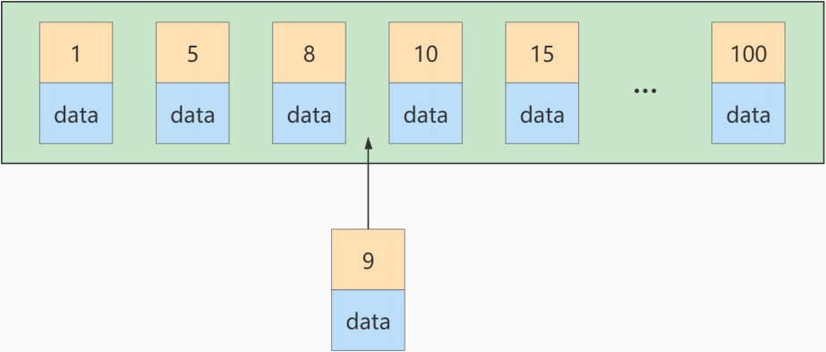

可这个数据页已经满了，再插进来咋办呢？我们需要把`当前页面分裂成两个页面`，把本页中的一些`记录移动`到新创建的这个页中。页面分裂和记录移位意味着什么？意味着：`性能损耗`！所以如果想尽量避免这样无谓的性能损耗，最好让插入的记录的`主键值依次递增`，这样就不会发生这样的性能损耗了。 所以我们建议：`让主键具有 AUTO_INCREMENT，让存储引擎自己为表生成主键，而不是手动插入。`比如 person_info 表：

```mysql
CREATE TABLE person_info(
    id INT UNSIGNED NOT NULL AUTO_INCREMENT,
    name VARCHAR(100) NOT NULL,
    birthday DATE NOT NULL,
    phone_number CHAR(11) NOT NULL,
    country varchar(100) NOT NULL,
    PRIMARY KEY (id),
    KEY idx_name_birthday_phone_number (name(10), birthday, phone_number)
);
```

自定义的主键列 id 拥有 AUTO_INCREMENT 属性，在插入记录时存储引擎会自动填入自增的主键值。这样的主键占用空间小，顺序写入，可以减少页分裂。

#### 计算导致索引失效

在 student 表的字段 stuno 上创建索引：

```mysql
mysql> CREATE INDEX idx_sno ON student(stuno);
Query OK, 0 rows affected (2.73 sec)
Records: 0  Duplicates: 0  Warnings: 0
```

**`当有计算条件时，索引失效。`**示例如下：

```mysql
mysql> EXPLAIN SELECT SQL_NO_CACHE id, stuno, NAME FROM student WHERE stuno = 900001;
+----+-------------+---------+------------+------+---------------+---------+---------+-------+------+----------+-------+
| id | select_type | table   | partitions | type | possible_keys | key     | key_len | ref   | rows | filtered | Extra |
+----+-------------+---------+------------+------+---------------+---------+---------+-------+------+----------+-------+
|  1 | SIMPLE      | student | NULL       | ref  | idx_sno       | idx_sno | 4       | const |    1 |   100.00 | NULL  |
+----+-------------+---------+------------+------+---------------+---------+---------+-------+------+----------+-------+
1 row in set, 2 warnings (0.00 sec)

# 有计算条件，索引失效
mysql> EXPLAIN SELECT SQL_NO_CACHE id, stuno, NAME FROM student WHERE stuno + 1 = 900001; 
+----+-------------+---------+------------+------+---------------+------+---------+------+--------+----------+-------------+
| id | select_type | table   | partitions | type | possible_keys | key  | key_len | ref  | rows   | filtered | Extra       |
+----+-------------+---------+------------+------+---------------+------+---------+------+--------+----------+-------------+
|  1 | SIMPLE      | student | NULL       | ALL  | NULL          | NULL | NULL    | NULL | 742203 |   100.00 | Using where |
+----+-------------+---------+------------+------+---------------+------+---------+------+--------+----------+-------------+
1 row in set, 2 warnings (0.00 sec)
```

可以看到如果对索引进行了表达式计算，索引就失效了。这是因为我们需要把索引字段的值都取出来，然后一次进行表达式的计算来进行条件判断，因此采用的就是`全表扫描`的方式，运行时间也会慢很多：

```mysql
mysql> SELECT SQL_NO_CACHE id, stuno, NAME FROM student WHERE stuno = 900001;
Empty set, 1 warning (0.00 sec)

mysql> SELECT SQL_NO_CACHE id, stuno, NAME FROM student WHERE stuno + 1 = 900001; 
+--------+--------+--------+
| id     | stuno  | NAME   |
+--------+--------+--------+
| 800000 | 900000 | skWeFP |
+--------+--------+--------+
1 row in set, 1 warning (0.18 sec)
```

#### 函数导致索引失效

在 student 表的字段 name 上创建索引：

```mysql
mysql> CREATE INDEX idx_name ON student(NAME); 
Query OK, 0 rows affected (3.58 sec)
Records: 0  Duplicates: 0  Warnings: 0
```

**`当有函数条件时，索引失效。`**示例如下

```mysql
mysql> EXPLAIN SELECT SQL_NO_CACHE * FROM student WHERE student.name LIKE 'abc%';
+----+-------------+---------+------------+-------+---------------+----------+---------+------+------+----------+-----------------------+
| id | select_type | table   | partitions | type  | possible_keys | key      | key_len | ref  | rows | filtered | Extra                 |
+----+-------------+---------+------------+-------+---------------+----------+---------+------+------+----------+-----------------------+
|  1 | SIMPLE      | student | NULL       | range | idx_name      | idx_name | 63      | NULL |   40 |   100.00 | Using index condition |
+----+-------------+---------+------------+-------+---------------+----------+---------+------+------+----------+-----------------------+
1 row in set, 2 warnings (0.00 sec)

# 有函数，索引失效
mysql> EXPLAIN SELECT SQL_NO_CACHE * FROM student WHERE LEFT(student.name, 3) = 'abc';
+----+-------------+---------+------------+------+---------------+------+---------+------+--------+----------+-------------+
| id | select_type | table   | partitions | type | possible_keys | key  | key_len | ref  | rows   | filtered | Extra       |
+----+-------------+---------+------------+------+---------------+------+---------+------+--------+----------+-------------+
|  1 | SIMPLE      | student | NULL       | ALL  | NULL          | NULL | NULL    | NULL | 742203 |   100.00 | Using where |
+----+-------------+---------+------------+------+---------------+------+---------+------+--------+----------+-------------+
1 row in set, 2 warnings (0.00 sec)
```

查询效率也慢很多：

```mysql
mysql> SELECT SQL_NO_CACHE * FROM student WHERE student.name LIKE 'abc%';
+--------+--------+--------+------+---------+
| id     | stuno  | name   | age  | classId |
+--------+--------+--------+------+---------+
| 580020 | 680020 | ABcHeA |   14 |     850 |
| 519840 | 619840 | ABcHgL |    9 |     671 |
| 626755 | 726755 | ABcHhL |   11 |     915 |
| 311719 | 411719 | AbCHJl |    9 |     177 |
|  97823 | 197823 | aBCihn |   44 |     540 |
| 385679 | 485679 | AbCIJw |    7 |     364 |
| 160879 | 260879 | ABcIjX |   12 |     256 |
| 371703 | 471703 | aBCijy |   38 |     355 |
| 201505 | 301505 | ABcIkb |   25 |     386 |
| 371290 | 471290 | aBCiky |   39 |     446 |
| 463195 | 563195 | AbCILD |   33 |     608 |
| 472221 | 572221 | AbCJMI |    6 |     586 |
| 605967 | 705967 | AbCJNL |   16 |     430 |
| 289583 | 389583 | abcjNn |   50 |     184 |
| 621037 | 721037 | ABcJor |   42 |     166 |
| 164750 | 264750 | ABcJpw |   13 |     993 |
| 763434 | 863434 | ABcKqB |   33 |     683 |
| 477662 | 577662 | aBCkqY |   48 |     821 |
| 351310 | 451310 | abckQz |    3 |     740 |
| 469852 | 569852 | aBCksi |   37 |     219 |
| 300036 | 400036 | abckSJ |   41 |      64 |
| 277597 | 377597 | aBCktm |    6 |     833 |
| 120380 | 220380 | abckTN |    9 |     565 |
| 336922 | 436922 | AbCKTn |   35 |     649 |
| 625396 | 725396 | AbCKUq |   46 |     578 |
|  10062 | 110062 | ABcLuR |   50 |     431 |
| 340986 | 440986 | aBClus |   28 |     698 |
| 600606 | 700606 | ABcLuT |    9 |     208 |
| 275797 | 375797 | ABcLvT |   10 |     283 |
| 377409 | 477409 | AbCLVu |   12 |      19 |
| 440071 | 540071 | abclVU |   36 |     882 |
|  87638 | 187638 | ABcLvV |   18 |     969 |
| 175531 | 275531 | abclVV |   42 |     372 |
| 321836 | 421836 | ABcLvV |   19 |      90 |
|   2012 | 102012 | AbCLWB |   43 |     618 |
| 400060 | 500060 | abclWY |    4 |     431 |
| 528467 | 628467 | aBClxC |   22 |     528 |
| 622236 | 722236 | abclXc |   22 |      21 |
|  37117 | 137117 | AbCLXF |    9 |      28 |
|  89616 | 189616 | abclXf |   35 |     118 |
+--------+--------+--------+------+---------+
40 rows in set, 1 warning (0.00 sec)

mysql> SELECT SQL_NO_CACHE * FROM student WHERE LEFT(student.name, 3) = 'abc';
+--------+--------+--------+------+---------+
| id     | stuno  | name   | age  | classId |
+--------+--------+--------+------+---------+
|   2012 | 102012 | AbCLWB |   43 |     618 |
|  10062 | 110062 | ABcLuR |   50 |     431 |
|  37117 | 137117 | AbCLXF |    9 |      28 |
|  87638 | 187638 | ABcLvV |   18 |     969 |
|  89616 | 189616 | abclXf |   35 |     118 |
|  97823 | 197823 | aBCihn |   44 |     540 |
| 120380 | 220380 | abckTN |    9 |     565 |
| 160879 | 260879 | ABcIjX |   12 |     256 |
| 164750 | 264750 | ABcJpw |   13 |     993 |
| 175531 | 275531 | abclVV |   42 |     372 |
| 201505 | 301505 | ABcIkb |   25 |     386 |
| 275797 | 375797 | ABcLvT |   10 |     283 |
| 277597 | 377597 | aBCktm |    6 |     833 |
| 289583 | 389583 | abcjNn |   50 |     184 |
| 300036 | 400036 | abckSJ |   41 |      64 |
| 311719 | 411719 | AbCHJl |    9 |     177 |
| 321836 | 421836 | ABcLvV |   19 |      90 |
| 336922 | 436922 | AbCKTn |   35 |     649 |
| 340986 | 440986 | aBClus |   28 |     698 |
| 351310 | 451310 | abckQz |    3 |     740 |
| 371290 | 471290 | aBCiky |   39 |     446 |
| 371703 | 471703 | aBCijy |   38 |     355 |
| 377409 | 477409 | AbCLVu |   12 |      19 |
| 385679 | 485679 | AbCIJw |    7 |     364 |
| 400060 | 500060 | abclWY |    4 |     431 |
| 440071 | 540071 | abclVU |   36 |     882 |
| 463195 | 563195 | AbCILD |   33 |     608 |
| 469852 | 569852 | aBCksi |   37 |     219 |
| 472221 | 572221 | AbCJMI |    6 |     586 |
| 477662 | 577662 | aBCkqY |   48 |     821 |
| 519840 | 619840 | ABcHgL |    9 |     671 |
| 528467 | 628467 | aBClxC |   22 |     528 |
| 580020 | 680020 | ABcHeA |   14 |     850 |
| 600606 | 700606 | ABcLuT |    9 |     208 |
| 605967 | 705967 | AbCJNL |   16 |     430 |
| 621037 | 721037 | ABcJor |   42 |     166 |
| 622236 | 722236 | abclXc |   22 |      21 |
| 625396 | 725396 | AbCKUq |   46 |     578 |
| 626755 | 726755 | ABcHhL |   11 |     915 |
| 763434 | 863434 | ABcKqB |   33 |     683 |
+--------+--------+--------+------+---------+
40 rows in set, 1 warning (0.23 sec)
```

#### 类型转换（自动或手动）导致索引失效

**`当有类型转换 (自动或手动) 条件时，索引失效。`**示例如下：

```mysql
mysql> EXPLAIN SELECT SQL_NO_CACHE * FROM student WHERE name = '123';
+----+-------------+---------+------------+------+---------------+----------+---------+-------+------+----------+-------+
| id | select_type | table   | partitions | type | possible_keys | key      | key_len | ref   | rows | filtered | Extra |
+----+-------------+---------+------------+------+---------------+----------+---------+-------+------+----------+-------+
|  1 | SIMPLE      | student | NULL       | ref  | idx_name      | idx_name | 63      | const |    1 |   100.00 | NULL  |
+----+-------------+---------+------------+------+---------------+----------+---------+-------+------+----------+-------+
1 row in set, 2 warnings (0.00 sec)

# 有类型转换，索引失效
mysql> EXPLAIN SELECT SQL_NO_CACHE * FROM student WHERE name = 123;
+----+-------------+---------+------------+------+---------------+------+---------+------+--------+----------+-------------+
| id | select_type | table   | partitions | type | possible_keys | key  | key_len | ref  | rows   | filtered | Extra       |
+----+-------------+---------+------------+------+---------------+------+---------+------+--------+----------+-------------+
|  1 | SIMPLE      | student | NULL       | ALL  | idx_name      | NULL | NULL    | NULL | 742203 |    10.00 | Using where |
+----+-------------+---------+------------+------+---------------+------+---------+------+--------+----------+-------------+
1 row in set, 5 warnings (0.00 sec)
```

> `name = 123`发生了类型转换，相当于使用了隐形函数，索引失效。
>
> **设计实体类属性时，一定要与数据库字段类型相对应。否则，就会出现类型转换的情况，进而导致索引失效。**

#### 范围条件右边的列索引失效

先删除 student 表上的所有索引，再重新创建索引：

```mysql
# 调用存储过程删除所有索引
mysql> CALL proc_drop_index('atguigudb1','student');
Query OK, 0 rows affected (0.06 sec)

# 验证是否删除成功
mysql> SELECT index_name FROM information_schema.STATISTICS WHERE table_schema='atguigudb1' AND table_name='student' AND seq_in_index=1 AND index_name <>'PRIMARY';
Empty set (0.00 sec)

# 重新创建组合索引
mysql> CREATE INDEX idx_age_classId_name ON student(age, classId, name);
Query OK, 0 rows affected (4.67 sec)
Records: 0  Duplicates: 0  Warnings: 0

# 验证是否创建成功
mysql> SELECT index_name FROM information_schema.STATISTICS WHERE table_schema='atguigudb1' AND table_name='student' AND seq_in_index=1 AND index_name <>'PRIMARY';
+----------------------+
| INDEX_NAME           |
+----------------------+
| idx_age_classId_name |
+----------------------+
1 row in set (0.01 sec)
```

**`对于有范围条件的，如 <、<=、>、>= 和 between 等，范围右边的列不能使用索引。`**示例如下：

```mysql
#  key_len为10，只用到了组合索引的前两个字段
mysql> EXPLAIN SELECT SQL_NO_CACHE * FROM student WHERE student.age = 30 AND student.classId > 20 AND student.name = 'abc';
+----+-------------+---------+------------+-------+----------------------+----------------------+---------+------+-------+----------+-----------------------+
| id | select_type | table   | partitions | type  | possible_keys        | key                  | key_len | ref  | rows  | filtered | Extra                 |
+----+-------------+---------+------------+-------+----------------------+----------------------+---------+------+-------+----------+-----------------------+
|  1 | SIMPLE      | student | NULL       | range | idx_age_classId_name | idx_age_classId_name | 10      | NULL | 32002 |    10.00 | Using index condition |
+----+-------------+---------+------------+-------+----------------------+----------------------+---------+------+-------+----------+-----------------------+
1 row in set, 2 warnings (0.00 sec)
```

即使是改变查询条件的顺序，依然不能使用全部索引。因为优化器会自动满足最左前缀原则 ，即优化器会`先根据组合索引进行排序`，组合索引的顺序决定了哪些列不能正常使用索引。

```mysql
mysql> EXPLAIN SELECT SQL_NO_CACHE * FROM student WHERE student.age = 30 AND student.name ='abc' AND student.classId > 20;
+----+-------------+---------+------------+-------+----------------------+----------------------+---------+------+-------+----------+-----------------------+
| id | select_type | table   | partitions | type  | possible_keys        | key                  | key_len | ref  | rows  | filtered | Extra                 |
+----+-------------+---------+------------+-------+----------------------+----------------------+---------+------+-------+----------+-----------------------+
|  1 | SIMPLE      | student | NULL       | range | idx_age_classId_name | idx_age_classId_name | 10      | NULL | 32002 |    10.00 | Using index condition |
+----+-------------+---------+------------+-------+----------------------+----------------------+---------+------+-------+----------+-----------------------+
1 row in set, 2 warnings (0.00 sec)
```

> 扩展：为什么范围查询会导致索引失效？
>
> **因为根据范围查找筛选后的数据，无法保证范围查找后面的字段是有序的。**例如：a_b_c 这个索引，根据 b 范围查找 > 2 的，在满足 b > 2 的情况下，如 b 为 "3, 4"，c 可能是 "5, 3"，因为 c 是无序的，那么 c 的索引也便失效了。

针对上述情况，可以建立如下索引（范围字段放在最后）进行改进：

```mysql
# 将classId放到组合索引最后
mysql> CREATE INDEX idx_age_name_classId ON student(age, name, classId);
Query OK, 0 rows affected (4.84 sec)
Records: 0  Duplicates: 0  Warnings: 0

# 同一个查询，使用到了全部的组合索引字段
mysql> EXPLAIN SELECT SQL_NO_CACHE * FROM student WHERE student.age = 30 AND student.name ='abc' AND student.classId > 20;
+----+-------------+---------+------------+-------+-------------------------------------------+----------------------+---------+------+------+----------+-----------------------+
| id | select_type | table   | partitions | type  | possible_keys                             | key                  | key_len | ref  | rows | filtered | Extra                 |
+----+-------------+---------+------------+-------+-------------------------------------------+----------------------+---------+------+------+----------+-----------------------+
|  1 | SIMPLE      | student | NULL       | range | idx_age_classId_name,idx_age_name_classId | idx_age_name_classId | 73      | NULL |    1 |   100.00 | Using index condition |
+----+-------------+---------+------------+-------+-------------------------------------------+----------------------+---------+------+------+----------+-----------------------+
1 row in set, 2 warnings (0.00 sec)
```

在应用开发中范围查询，例如：金额查询，日期查询往往都是范围查询。此时，**应将查询条件放置 WHERE 语句最后，在创建的组合索引中，也需要把范围涉及到的字段写在最后。**

#### 不等于（!= 或者 <>）索引失效

**`对于有不等于 (!= 或者 <>) 判断的，索引失效。`**示例如下：

```mysql
mysql> CREATE INDEX idx_name ON student(NAME);
Query OK, 0 rows affected (3.80 sec)
Records: 0  Duplicates: 0  Warnings: 0

mysql> EXPLAIN SELECT SQL_NO_CACHE * FROM student WHERE student.name <> 'abc';
+----+-------------+---------+------------+------+---------------+------+---------+------+--------+----------+-------------+
| id | select_type | table   | partitions | type | possible_keys | key  | key_len | ref  | rows   | filtered | Extra       |
+----+-------------+---------+------------+------+---------------+------+---------+------+--------+----------+-------------+
|  1 | SIMPLE      | student | NULL       | ALL  | idx_name      | NULL | NULL    | NULL | 742203 |    50.16 | Using where |
+----+-------------+---------+------------+------+---------------+------+---------+------+--------+----------+-------------+
1 row in set, 2 warnings (0.00 sec)

mysql> EXPLAIN SELECT SQL_NO_CACHE * FROM student WHERE student.name != 'abc';
+----+-------------+---------+------------+------+---------------+------+---------+------+--------+----------+-------------+
| id | select_type | table   | partitions | type | possible_keys | key  | key_len | ref  | rows   | filtered | Extra       |
+----+-------------+---------+------------+------+---------------+------+---------+------+--------+----------+-------------+
|  1 | SIMPLE      | student | NULL       | ALL  | idx_name      | NULL | NULL    | NULL | 742203 |    50.16 | Using where |
+----+-------------+---------+------------+------+---------------+------+---------+------+--------+----------+-------------+
1 row in set, 2 warnings (0.00 sec)
```

#### IS NULL 可以使用索引，IS NOT NULL 无法使用索引

示例如下：

```mysql
mysql> EXPLAIN SELECT SQL_NO_CACHE * FROM student WHERE name IS NULL;
+----+-------------+---------+------------+------+---------------+----------+---------+-------+------+----------+-----------------------+
| id | select_type | table   | partitions | type | possible_keys | key      | key_len | ref   | rows | filtered | Extra                 |
+----+-------------+---------+------------+------+---------------+----------+---------+-------+------+----------+-----------------------+
|  1 | SIMPLE      | student | NULL       | ref  | idx_name      | idx_name | 63      | const |    1 |   100.00 | Using index condition |
+----+-------------+---------+------------+------+---------------+----------+---------+-------+------+----------+-----------------------+
1 row in set, 2 warnings (0.00 sec)

# IS NOT NULL，索引失效
mysql> EXPLAIN SELECT SQL_NO_CACHE * FROM student WHERE name IS NOT NULL;
+----+-------------+---------+------------+------+---------------+------+---------+------+--------+----------+-------------+
| id | select_type | table   | partitions | type | possible_keys | key  | key_len | ref  | rows   | filtered | Extra       |
+----+-------------+---------+------------+------+---------------+------+---------+------+--------+----------+-------------+
|  1 | SIMPLE      | student | NULL       | ALL  | idx_name      | NULL | NULL    | NULL | 742203 |    50.00 | Using where |
+----+-------------+---------+------------+------+---------------+------+---------+------+--------+----------+-------------+
1 row in set, 2 warnings (0.00 sec)
```

因此，最好在设计数据库的时候就将 `字段设置 NOT NULL 约束`。比如可以将 INT 类型的字段，默认设置为 0，将字符串类型的字段，默认设置为空字符串（""）。

> 扩展：同理，在查询中使用`NOT LIKE`也无法使用索引，会导致全表扫描。

#### LIKE 以通配符 % 开头索引失效

**`在使用 LIKE 关键字时，如果匹配字符串的第一个字符为 "%"，索引失效。`**只有 "%" 不在第一个位置，索引才会起作用。

```mysql
mysql> EXPLAIN SELECT SQL_NO_CACHE * FROM student WHERE NAME LIKE 'ab%';
+----+-------------+---------+------------+-------+---------------+----------+---------+------+------+----------+-----------------------+
| id | select_type | table   | partitions | type  | possible_keys | key      | key_len | ref  | rows | filtered | Extra                 |
+----+-------------+---------+------------+-------+---------------+----------+---------+------+------+----------+-----------------------+
|  1 | SIMPLE      | student | NULL       | range | idx_name      | idx_name | 63      | NULL | 1201 |   100.00 | Using index condition |
+----+-------------+---------+------------+-------+---------------+----------+---------+------+------+----------+-----------------------+
1 row in set, 2 warnings (0.00 sec)

# %放在首位，索引失效
mysql> EXPLAIN SELECT SQL_NO_CACHE * FROM student WHERE NAME LIKE '%ab%';
+----+-------------+---------+------------+------+---------------+------+---------+------+--------+----------+-------------+
| id | select_type | table   | partitions | type | possible_keys | key  | key_len | ref  | rows   | filtered | Extra       |
+----+-------------+---------+------------+------+---------------+------+---------+------+--------+----------+-------------+
|  1 | SIMPLE      | student | NULL       | ALL  | NULL          | NULL | NULL    | NULL | 742203 |    11.11 | Using where |
+----+-------------+---------+------------+------+---------------+------+---------+------+--------+----------+-------------+
1 row in set, 2 warnings (0.00 sec)
```

>拓展：Alibaba Java 开发手册。
>
>**【强制】页面搜索严禁左模糊或者全模糊，如果需要请走搜索引擎来解决。**

#### OR 前后存在非索引的列，索引失效

在 WHERE 子句中，如果在 OR 前的条件列进行了索引，而在 OR 后的条件列没有进行索引，那么索引会失效。也就是说，**`OR 前后的两个条件中的列都是索引时，查询中才使用索引。`**因为 OR 的含义就是两个只要满足一个即可，因此只有一个条件列进行了索引是没有意义的，只要有条件列没有进行索引，就会进行全表扫描，因此索引的条件列也会失效。（OR 前后一个使用索引，一个进行全表扫描，合起来还没有直接进行全表扫描更快。）

示例如下：

```mysql
#  创建索引，此时只有OR前面的字段有索引
mysql> CREATE INDEX idx_age ON student(age);
Query OK, 0 rows affected (3.28 sec)
Records: 0  Duplicates: 0  Warnings: 0

# 未使用索引
mysql> EXPLAIN SELECT SQL_NO_CACHE * FROM student WHERE age = 10 OR classid = 100;
+----+-------------+---------+------------+------+---------------------------------------------------+------+---------+------+--------+----------+-------------+
| id | select_type | table   | partitions | type | possible_keys                                     | key  | key_len | ref  | rows   | filtered | Extra       |
+----+-------------+---------+------------+------+---------------------------------------------------+------+---------+------+--------+----------+-------------+
|  1 | SIMPLE      | student | NULL       | ALL  | idx_age_classId_name,idx_age_name_classId,idx_age | NULL | NULL    | NULL | 742203 |    11.88 | Using where |
+----+-------------+---------+------------+------+---------------------------------------------------+------+---------+------+--------+----------+-------------+
1 row in set, 2 warnings (0.00 sec)

# 再为OR后面的字段创建一个索引
mysql> CREATE INDEX idx_cid ON student(classid);
Query OK, 0 rows affected (3.09 sec)
Records: 0  Duplicates: 0  Warnings: 0

# 使用了索引
mysql> EXPLAIN SELECT SQL_NO_CACHE * FROM student WHERE age = 10 OR classid = 100;
+----+-------------+---------+------------+-------------+-----------------------------------------------------------+-----------------+---------+------+-------+----------+-------------------------------------------+
| id | select_type | table   | partitions | type        | possible_keys                                             | key             | key_len | ref  | rows  | filtered | Extra                                     |
+----+-------------+---------+------------+-------------+-----------------------------------------------------------+-----------------+---------+------+-------+----------+-------------------------------------------+
|  1 | SIMPLE      | student | NULL       | index_merge | idx_age_classId_name,idx_age_name_classId,idx_age,idx_cid | idx_age,idx_cid | 5,5     | NULL | 30807 |   100.00 | Using union(idx_age,idx_cid); Using where |
+----+-------------+---------+------------+-------------+-----------------------------------------------------------+-----------------+---------+------+-------+----------+-------------------------------------------+
1 row in set, 2 warnings (0.00 sec)
```

#### 数据库和表的字符集统一使用 utf8mb4/utf8mb3

统一使用 utf8mb4（5.5.3 版本以上支持）兼容性更好，统一字符集可以避免由于字符集转换产生的乱码。**`不同的字符集进行比较前，需要进行转换，会造成索引失效。`**

#### 总结

一般性建议：

- 对于单列索引，尽量选择针对当前 QUERY 过滤性更好的索引。
- 在选择组合索引的时候，当前 QUERY 中过滤性最好的字段在索引字段顺序中，位置越靠前越好。
- 在选择组合索引的时候，尽量选择能够包含当前 QUERY 中的 WHERE 子句中更多字段的索引。
- 在选择组合索引的时候，如果某个字段可能出现范围查询时，尽量把这个字段放在索引次序的最后面。

总之，书写 SQL 语句时，尽量避免造成索引失效的情况。

### 关联查询优化

#### 数据准备

创建 Type 表：

```mysql
mysql> CREATE TABLE IF NOT EXISTS `type` (
    -> `id` INT(10) UNSIGNED NOT NULL AUTO_INCREMENT,
    -> `card` INT(10) UNSIGNED NOT NULL,
    -> PRIMARY KEY (`id`)
    -> );
Query OK, 0 rows affected, 2 warnings (0.02 sec)
```

创建 Book 表：

```mysql
mysql> CREATE TABLE IF NOT EXISTS `book` (
    -> `bookid` INT(10) UNSIGNED NOT NULL AUTO_INCREMENT,
    -> `card` INT(10) UNSIGNED NOT NULL,
    -> PRIMARY KEY (`bookid`)
    -> );
Query OK, 0 rows affected, 2 warnings (0.05 sec)
```

插入数据：

```mysql
# type表插入20条数据，以下SQL执行20次
mysql> INSERT INTO type(card) VALUES(FLOOR(1 + RAND() * 20));
Query OK, 1 row affected (0.01 sec)

# book表插入20条数据，以下SQL执行20次
mysql> INSERT INTO book(card) VALUES(FLOOR(1 + RAND() * 20));
Query OK, 1 row affected (0.00 sec)

mysql> SELECT COUNT(*) FROM type;
+----------+
| COUNT(*) |
+----------+
|       20 |
+----------+
1 row in set (0.01 sec)

mysql> SELECT COUNT(*) FROM book;
+----------+
| COUNT(*) |
+----------+
|       20 |
+----------+
1 row in set (0.01 sec)
```

#### 采用左外连接

多表查询分为外连接和内连接，而外连接又分为左外连接，右外连接和满外连接。其中外连接中，左外连接与右外连接可以通过交换表来相互改造，其原理也是类似的，而满外连接无非是二者的一个综合，因此外连接只介绍左外连接的优化即可。

首先，当没有使用索引时，进行 EXPLAIN 分析，可以看到是全表扫描：

```mysql
mysql> EXPLAIN SELECT SQL_NO_CACHE * FROM type LEFT JOIN book ON type.card = book.card;
+----+-------------+-------+------------+------+---------------+------+---------+------+------+----------+--------------------------------------------+
| id | select_type | table | partitions | type | possible_keys | key  | key_len | ref  | rows | filtered | Extra                                      |
+----+-------------+-------+------------+------+---------------+------+---------+------+------+----------+--------------------------------------------+
|  1 | SIMPLE      | type  | NULL       | ALL  | NULL          | NULL | NULL    | NULL |   20 |   100.00 | NULL                                       |
|  1 | SIMPLE      | book  | NULL       | ALL  | NULL          | NULL | NULL    | NULL |   20 |   100.00 | Using where; Using join buffer (hash join) |
+----+-------------+-------+------------+------+---------------+------+---------+------+------+----------+--------------------------------------------+
2 rows in set, 2 warnings (0.00 sec)
```

- 在上面的查询 SQL 中，type 表是驱动表，book 表是被驱动表。在执行查询时，会先查找驱动表中符合条件的数据，再根据驱动表查询到的数据，在被驱动表中根据匹配条件查找对应的数据。因此被驱动表嵌套查询的次数是 20 * 20 = 400 次。实际上，由于总是需要在被驱动表中进行查询，优化器帮我们已经做了优化，上面的查询结果中可以看到，使用了`join buffer`，将数据缓存起来，提高检索的速度。

然后，为了提高外连接的性能，添加以下索引：

```mysql
# book表card字段添加索引
mysql> CREATE INDEX Y ON book(card);
Query OK, 0 rows affected (0.03 sec)
Records: 0  Duplicates: 0  Warnings: 0

mysql> EXPLAIN SELECT SQL_NO_CACHE * FROM type LEFT JOIN book ON type.card = book.card;
+----+-------------+-------+------------+------+---------------+------+---------+----------------------+------+----------+-------------+
| id | select_type | table | partitions | type | possible_keys | key  | key_len | ref                  | rows | filtered | Extra       |
+----+-------------+-------+------------+------+---------------+------+---------+----------------------+------+----------+-------------+
|  1 | SIMPLE      | type  | NULL       | ALL  | NULL          | NULL | NULL    | NULL                 |   20 |   100.00 | NULL        |
|  1 | SIMPLE      | book  | NULL       | ref  | Y             | Y    | 4       | atguigudb1.type.card |    1 |   100.00 | Using index |
+----+-------------+-------+------------+------+---------------+------+---------+----------------------+------+----------+-------------+
2 rows in set, 2 warnings (0.00 sec)
```

- 对于外层表来说，虽然其查询仍然是全表扫描，但是因为是左外连接，LEFT JOIN 左边的表的数据无论是否满足条件都会保留，因此全表扫描也是可以的。另外可以看到第二行的 type 变为了 ref，rows 也变成了 1，优化比较明显。这是由左连接特性决定的。**`LEFT JOIN 条件用于确定如何从右表搜索行，左边一定都有，所以右边是关键点，一定需要建立索引。`**

当然也可以给 type 表建立索引：

```mysql
# type表card字段添加索引
mysql> CREATE INDEX X ON type(card);
Query OK, 0 rows affected (0.03 sec)
Records: 0  Duplicates: 0  Warnings: 0

# 虽然type表card字段建立了索引，但是无法避免全表扫描
mysql> EXPLAIN SELECT SQL_NO_CACHE * FROM type LEFT JOIN book ON type.card = book.card;
+----+-------------+-------+------------+-------+---------------+------+---------+----------------------+------+----------+-------------+
| id | select_type | table | partitions | type  | possible_keys | key  | key_len | ref                  | rows | filtered | Extra       |
+----+-------------+-------+------------+-------+---------------+------+---------+----------------------+------+----------+-------------+
|  1 | SIMPLE      | type  | NULL       | index | NULL          | X    | 4       | NULL                 |   20 |   100.00 | Using index |
|  1 | SIMPLE      | book  | NULL       | ref   | Y             | Y    | 4       | atguigudb1.type.card |    1 |   100.00 | Using index |
+----+-------------+-------+------------+-------+---------------+------+---------+----------------------+------+----------+-------------+
2 rows in set, 2 warnings (0.00 sec)
```

> 注意：**`外连接的关联条件中，两个关联字段的类型、字符集一定要保持一致，否则索引会失效。`**

删除索引 Y，继续查询：

```mysql
# 删除索引
mysql> DROP INDEX Y ON book;
Query OK, 0 rows affected (0.01 sec)
Records: 0  Duplicates: 0  Warnings: 0

mysql> EXPLAIN SELECT SQL_NO_CACHE * FROM type LEFT JOIN book ON type.card = book.card;
+----+-------------+-------+------------+-------+---------------+------+---------+------+------+----------+--------------------------------------------+
| id | select_type | table | partitions | type  | possible_keys | key  | key_len | ref  | rows | filtered | Extra                                      |
+----+-------------+-------+------------+-------+---------------+------+---------+------+------+----------+--------------------------------------------+
|  1 | SIMPLE      | type  | NULL       | index | NULL          | X    | 4       | NULL |   20 |   100.00 | Using index                                |
|  1 | SIMPLE      | book  | NULL       | ALL   | NULL          | NULL | NULL    | NULL |   20 |   100.00 | Using where; Using join buffer (hash join) |
+----+-------------+-------+------------+-------+---------------+------+---------+------+------+----------+--------------------------------------------+
2 rows in set, 2 warnings (0.00 sec)
```

- book 表使用了 join buffer，再次验证了左外连接左边的表是驱动表，右边的表是被驱动表，后面将与内连接在这一点进行对比。

>**左外链接左表是驱动表右表是被驱动表，右外链接和此相反，内链接则是按照数据量的大小，数据量少的是驱动表，多的是被驱动表。**

#### 采用内连接

删除现有的索引，换成 INNER JOIN（MySQL 会自动选择驱动表）：

```mysql
mysql> DROP INDEX X ON type;
Query OK, 0 rows affected (0.01 sec)
Records: 0  Duplicates: 0  Warnings: 0

mysql> DROP INDEX Y ON book;
ERROR 1091 (42000): Can't DROP 'Y'; check that column/key exists

mysql> EXPLAIN SELECT SQL_NO_CACHE * FROM type INNER JOIN book ON type.card = book.card;
+----+-------------+-------+------------+------+---------------+------+---------+------+------+----------+--------------------------------------------+
| id | select_type | table | partitions | type | possible_keys | key  | key_len | ref  | rows | filtered | Extra                                      |
+----+-------------+-------+------------+------+---------------+------+---------+------+------+----------+--------------------------------------------+
|  1 | SIMPLE      | type  | NULL       | ALL  | NULL          | NULL | NULL    | NULL |   20 |   100.00 | NULL                                       |
|  1 | SIMPLE      | book  | NULL       | ALL  | NULL          | NULL | NULL    | NULL |   20 |    10.00 | Using where; Using join buffer (hash join) |
+----+-------------+-------+------------+------+---------------+------+---------+------+------+----------+--------------------------------------------+
2 rows in set, 2 warnings (0.00 sec)
```

为 book 表添加索引：

```mysql
mysql> ALTER TABLE book ADD INDEX Y (card);
Query OK, 0 rows affected (0.03 sec)
Records: 0  Duplicates: 0  Warnings: 0

# 此时，book表使用了索引，type表没有索引，type表为驱动表，book表为被驱动表
mysql> EXPLAIN SELECT SQL_NO_CACHE * FROM type INNER JOIN book ON type.card = book.card;
+----+-------------+-------+------------+------+---------------+------+---------+----------------------+------+----------+-------------+
| id | select_type | table | partitions | type | possible_keys | key  | key_len | ref                  | rows | filtered | Extra       |
+----+-------------+-------+------------+------+---------------+------+---------+----------------------+------+----------+-------------+
|  1 | SIMPLE      | type  | NULL       | ALL  | NULL          | NULL | NULL    | NULL                 |   20 |   100.00 | NULL        |
|  1 | SIMPLE      | book  | NULL       | ref  | Y             | Y    | 4       | atguigudb1.type.card |    1 |   100.00 | Using index |
+----+-------------+-------+------------+------+---------------+------+---------+----------------------+------+----------+-------------+
2 rows in set, 2 warnings (0.00 sec)
```

向 type 表中再增加 20 条数据，观察情况：

```mysql
mysql> INSERT INTO type(card) VALUES(FLOOR(1 + RAND() * 20));
Query OK, 1 row affected (0.02 sec)

mysql> SELECT COUNT(*) FROM type;
+----------+
| COUNT(*) |
+----------+
|       40 |
+----------+
1 row in set (0.00 sec)

mysql> SELECT COUNT(*) FROM book;
+----------+
| COUNT(*) |
+----------+
|       20 |
+----------+
1 row in set (0.00 sec)

# 此时，虽然book表数据少于type表，但是因为type表有索引，type表为驱动表，book表仍然为被驱动表
mysql> EXPLAIN SELECT SQL_NO_CACHE * FROM type INNER JOIN book ON type.card = book.card;
+----+-------------+-------+------------+------+---------------+------+---------+----------------------+------+----------+-------------+
| id | select_type | table | partitions | type | possible_keys | key  | key_len | ref                  | rows | filtered | Extra       |
+----+-------------+-------+------------+------+---------------+------+---------+----------------------+------+----------+-------------+
|  1 | SIMPLE      | type  | NULL       | ALL  | NULL          | NULL | NULL    | NULL                 |   40 |   100.00 | NULL        |
|  1 | SIMPLE      | book  | NULL       | ref  | Y             | Y    | 4       | atguigudb1.type.card |    1 |   100.00 | Using index |
+----+-------------+-------+------------+------+---------------+------+---------+----------------------+------+----------+-------------+
2 rows in set, 2 warnings (0.00 sec)
```

为 type 表增加索引：

```mysql
mysql> ALTER TABLE type ADD INDEX X (card);
Query OK, 0 rows affected (0.04 sec)
Records: 0  Duplicates: 0  Warnings: 0

# 此时，type表和book表都有索引，因为book表的数据少于type表，所以book表为驱动表，type表为被驱动表
mysql> EXPLAIN SELECT SQL_NO_CACHE * FROM type INNER JOIN book ON type.card = book.card;
+----+-------------+-------+------------+-------+---------------+------+---------+----------------------+------+----------+-------------+
| id | select_type | table | partitions | type  | possible_keys | key  | key_len | ref                  | rows | filtered | Extra       |
+----+-------------+-------+------------+-------+---------------+------+---------+----------------------+------+----------+-------------+
|  1 | SIMPLE      | book  | NULL       | index | Y             | Y    | 4       | NULL                 |   20 |   100.00 | Using index |
|  1 | SIMPLE      | type  | NULL       | ref   | X             | X    | 4       | atguigudb1.book.card |    2 |   100.00 | Using index |
+----+-------------+-------+------------+-------+---------------+------+---------+----------------------+------+----------+-------------+
2 rows in set, 2 warnings (0.00 sec)
```

**对于内连接，查询优化器可以决定谁作为驱动表，谁作为被驱动表。`当都没有索引时，表数据量少的是驱动表，多的是被驱动表；当只有一方有索引时，没有索引的表是驱动表，有索引的表是被驱动表 (因为被驱动表查询次数更多)；当都有索引时，则是表数据量少的是驱动表，多的是被驱动表 (小表驱动大表)。`**

>上面的规律不是一成不变的，如果一个表有索引，但是数据量很小，一个表没有索引，但是数据量很大，情况会是怎样的呢？我们要明白`优化器的优化原理：对于内连接，MySQL 会选择扫描次数比较少的作为驱动表，因此实际生产中最好使用 EXPLAIN 测试验证。`

#### JOIN 语句原理

JOIN 方式连接多表，本质就是各个表之间数据的循环匹配。MySQL 5.5 版本之前，MySQL 只支持一种表间关联方式，就是`嵌套循环 (Nested Loop)`。如果关联表的数据量很大，则 JOIN 关联的执行时间会非常漫长。在 MySQL 5.5 以后的版本中，MySQL 通过引入 BNLJ 算法来优化嵌套执行。

##### 驱动表和被驱动表

`驱动表就是主表，被驱动表就是从表、非驱动表。`

对于内连接：

```mysql
SELECT * FROM A JOIN B ON ...
```

- A 不一定是驱动表，优化器会根据查询语句做优化，决定先查哪张表。**先查询的哪张表就是驱动表，反之就是被驱动表。**通过 EXPLAIN 关键字可以查看。

对于外连接：

```mysql
SELECT * FROM A LEFT JOIN B ON ...
# 或
SELECT * FROM B RIGHT JOIN A ON ...
```

- 通常，大家会认为 A 就是驱动表，B 就是被驱动表，但也未必。测试如下：

  ```mysql
  mysql> CREATE TABLE a(f1 INT,f2 INT,INDEX(f1)) ENGINE=INNODB;
  Query OK, 0 rows affected (0.05 sec)
  
  mysql> CREATE TABLE b(f1 INT,f2 INT) ENGINE=INNODB;
  Query OK, 0 rows affected (0.06 sec)
  
  mysql> INSERT INTO a values(1,1),(2,2),(3,3),(4,4),(5,5),(6,6);
  Query OK, 6 rows affected (0.01 sec)
  Records: 6  Duplicates: 0  Warnings: 0
  
  mysql> INSERT INTO b values(3,3),(4,4),(5,5),(6,6),(7,7),(8,8);
  Query OK, 6 rows affected (0.00 sec)
  Records: 6  Duplicates: 0  Warnings: 0
  
  # 测试
  mysql> EXPLAIN SELECT * FROM a LEFT JOIN b ON a.f1 = b.f1 WHERE a.f2 = b.f2;
  +----+-------------+-------+------------+------+---------------+------+---------+-----------------+------+----------+-------------+
  | id | select_type | table | partitions | type | possible_keys | key  | key_len | ref             | rows | filtered | Extra       |
  +----+-------------+-------+------------+------+---------------+------+---------+-----------------+------+----------+-------------+
  |  1 | SIMPLE      | b     | NULL       | ALL  | NULL          | NULL | NULL    | NULL            |    6 |   100.00 | Using where |
  |  1 | SIMPLE      | a     | NULL       | ref  | f1            | f1   | 5       | atguigudb1.b.f1 |    1 |    16.67 | Using where |
  +----+-------------+-------+------------+------+---------------+------+---------+-----------------+------+----------+-------------+
  2 rows in set, 1 warning (0.00 sec)
  ```

- 虽然 SQL 语句是 a LEFT JOIN b，但实际执行时，b 是驱动表，a 是被驱动表。这是因为`查询优化器会把外连接改造为内连接，然后根据其优化策略选择驱动表与被驱动表。`

##### Simple Nested-Loop Join（简单嵌套循环连接）

算法相当简单，从表 A 取出一条数据 1，然后遍历表 B，将匹配到的数据放到 result。以此类推，驱动表 A 中的每一条记录，都会与被动驱动表 B 的全部记录进行判断：

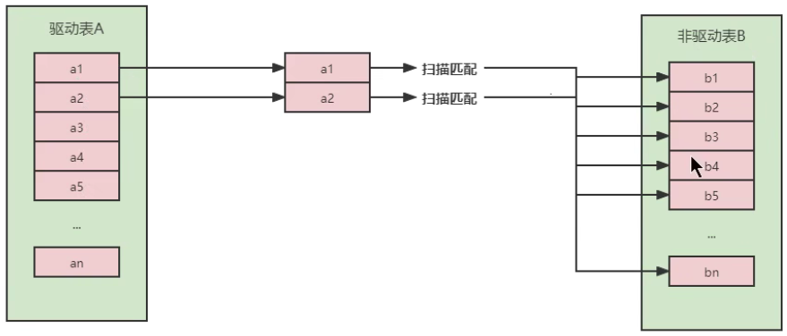

可以看到这种方式效率是非常低的，假设以上述表 A 数据 100 条，表 B 数据 1000 条，则 A * B = 10 万次。开销统计如下：

| 开销统计         | SNLJ                      |
| ---------------- | ------------------------- |
| 外表扫描次数     | 1                         |
| 内表扫描次数     | A                         |
| 读取记录数       | A + B * A                 |
| JOIN 比较次数    | B * A                     |
| 回表读取记录次数 | 0（没有索引，不涉及回表） |

当然，MySQL 肯定不会这么粗暴的进行表的连接，所以就出现了后面的两种优化算法。另外，从读取记录数来看：A + B * A中，驱动表 A 对性能的影响权重更大，因此，优化器会选择小表驱动大表。

##### Index Nested-Loop Join（索引嵌套循环连接）

Index Nested-Loop Join，其优化的思路主要是为了`减少内层表数据的匹配次数`，所以`要求被驱动表上必须有索引`才行。**通过外层表匹配条件直接与内层索引进行匹配，避免和内层表的每条记录进行比较，这样极大地减少了对内层表的匹配次数。**

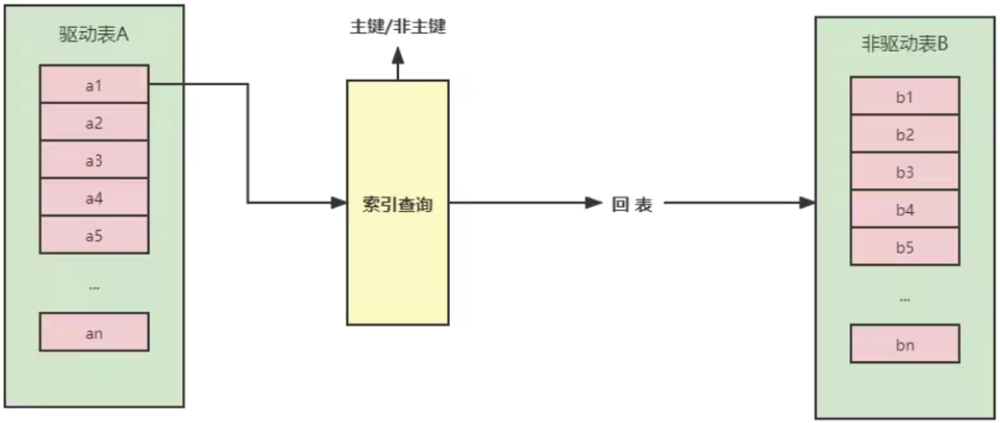

驱动表中的每条记录通过被驱动表的索引进行访问，因为索引查询的成本是比较固定的，故 MySQL 优化器都倾向于使用记录数少的表作为驱动表（外表）。

| 开销统计         | SNLJ      | INLJ                    |
| ---------------- | --------- | ----------------------- |
| 外表扫描次数     | 1         | 1                       |
| 内表扫描次数     | A         | 0                       |
| 读取记录数       | A + B * A | A + B(match)            |
| JOIN 比较次数    | B * A     | A * Index(Height)       |
| 回表读取记录次数 | 0         | B(match)（if possible） |

如果被驱动表加索引，效率是非常高的，如果索引不是主键索引，还需要进行一次回表查询。相比之下，如果被驱动表的索引是主键索引，效率会更高。

##### Block Nested-Loop Join（快嵌套循环连接）

如果存在索引，那么会使用 INDEX 的方式进行 JOIN，如果 JOIN 的列没有索引，则被驱动表要扫描的次数太多了。因为每次访问被驱动表，其表中的记录都会被加载到内存中，然后再从驱动表中取一条与其匹配，匹配结束后清除内存，然后再从驱动表中加载一条记录，然后把驱动表的记录再加载到内存匹配，这样周而复始，大大增加了 I/O 次数。为了减少被驱动表的 I/O 次数，就出现了`Block Nested-Loop Join`的方式。

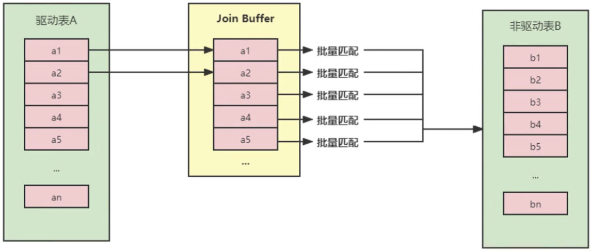

**BNLJ 不再是逐条获取驱动表的数据，而是一块一块的获取，并引入了 join buffer 缓冲区，将驱动表 JOIN 相关的部分数据列（每一批次的大小受 join buffer 的限制）缓存到 join buffer 中，然后全表扫描被驱动表，被驱动表的每一条记录一次性和 join buffer 中的所有驱动表记录进行匹配（内存中操作），将简单嵌套循环中的多次比较合并成一次，降低了被驱动表的访问频率。**

> 注意：**这里缓存的不只是关联表的列，SELECT 后面的列也会缓存起来，在一个有 N 个JOIN 关联的 SQL 中会分配 N - 1 个 join buffer。所以查询的时候尽量减少不必要的字段，这样可以让 join buffer 中存放更多的列。**

| 开销统计         | SNLJ      | INLJ                    | BNLJ                                              |
| ---------------- | --------- | ----------------------- | ------------------------------------------------- |
| 外表扫描次数     | 1         | 1                       | 1                                                 |
| 内表扫描次数     | A         | 0                       | A * used_column_size / join_buffer_size + 1       |
| 读取记录数       | A + B * A | A + B(match)            | A + B * (A * used_column_size / join_buffer_size) |
| JOIN 比较次数    | B * A     | A * Index(Height)       | B * A                                             |
| 回表读取记录次数 | 0         | B(match)（if possible） | 0                                                 |

参数设置：

- `block_nested_loop`：通过`SHOW VARIABLES LIKE '%optimizer_switch%'`查看 block_nested_loop 状态，默认是开启的。

  ```mysql
  mysql> SHOW VARIABLES LIKE '%optimizer_switch%';
  +------------------+------------------------------------------------------------------------------------------------------------------------------------------------------------------------------------------------------------------------------------------------------------------------------------------------------------------------------------------------------------------------------------------------------------------------------------------------------------------------------------------------------------------------------------------------------------------------------+
  | Variable_name    | Value                                                                                                                                                                                                                                                                                                                                                                                                                                                                                                                                                                        |
  +------------------+------------------------------------------------------------------------------------------------------------------------------------------------------------------------------------------------------------------------------------------------------------------------------------------------------------------------------------------------------------------------------------------------------------------------------------------------------------------------------------------------------------------------------------------------------------------------------+
  | optimizer_switch | index_merge=on,index_merge_union=on,index_merge_sort_union=on,index_merge_intersection=on,engine_condition_pushdown=on,index_condition_pushdown=on,mrr=on,mrr_cost_based=on,block_nested_loop=on,batched_key_access=off,materialization=on,semijoin=on,loosescan=on,firstmatch=on,duplicateweedout=on,subquery_materialization_cost_based=on,use_index_extensions=on,condition_fanout_filter=on,derived_merge=on,use_invisible_indexes=off,skip_scan=on,hash_join=on,subquery_to_derived=off,prefer_ordering_index=on,hypergraph_optimizer=off,derived_condition_pushdown=on |
  +------------------+------------------------------------------------------------------------------------------------------------------------------------------------------------------------------------------------------------------------------------------------------------------------------------------------------------------------------------------------------------------------------------------------------------------------------------------------------------------------------------------------------------------------------------------------------------------------------+
  1 row in set (0.01 sec)
  ```

- `join_buffer_size`：驱动表能不能一次加载完，要看 join buffer 能不能存储所有的数据，`默认情况下 join_buffer_size = 256 KB`。join buffer size 的最大值在 32 位系统可以申请 4 GB，而在 64 位操做系统下可以申请大于 4 GB 的 join_buffer空间（64 位 Windows 除外，其大值会被截断为 4 GB，并发出警告）。

##### 总结

- 保证被驱动表的 JOIN 字段已经创建了索引（减少内层表的循环匹配次数）。
- 需要 JOIN 的字段，数据类型保持绝对一致。
- LEFT JOIN 时，选择小表作为驱动表， 大表作为被驱动表，减少外层循环的次数。
- INNER JOIN 时，MySQL 会自动将小结果集的表选为驱动表，选择相信 MySQL 优化策略。
- 能够直接多表关联的尽量直接关联，不用子查询。（减少查询的趟数）
- 不建议使用子查询，建议将子查询 SQL 拆开，并结合程序多次查询，或使用 JOIN 来代替子查询。
- 衍生表建不了索引。
- 默认效率比较：INLJ > BNLJ > SNLJ。
- 正确理解小表驱动大表：大小不是指表中的记录数，而是永远用小结果集驱动大结果集（其本质就是减少外层循环的数据数量）。 比如 A 表有 100 条记录，B 表有 1000 条记录，但是 WHERE 条件过滤后，B 表结果集只留下 50 个记录，A 表结果集有 80 条记录，此时就可能是 B 表驱动 A 表。其实上面的例子还是不够准确，因为结果集的大小也不能粗略的用结果集的行数表示，而是表行数 * 每行大小。其实要理解这一点，只需要结合 join buffer 就好了，因为表行数 * 每行大小越小，其占用内存越小，就可以在 join buffer 中尽量少的次数加载完了。

##### Hash Join

`从 MySQL 8.0.20 版本开始，将废弃 BNLJ，因为加入了 Hash Join，默认都会使用 Hash Join。`

Nested Loop 与 Hash Join 对比如下：

| 类型     | Nested Loop                                                  | Hash Join                                                    |
| -------- | ------------------------------------------------------------ | ------------------------------------------------------------ |
| 使用条件 | 任何条件                                                     | 等值连接（=）                                                |
| 相关资源 | CPU、磁盘 I/O                                                | 内存、临时空间                                               |
| 特点     | 当有高选择性索引或进行限制性搜索时效率比较高，能够快速返回第一次的搜索结果 | 当缺乏索引或者索引条件模糊时，Hash Join 比 Nested Loop 有效。在数据仓库环境下，如果表的记录数多，效率高 |
| 缺点     | 当索引丢失或者查询条件限制不够时，效率很低；当表的记录数较多，效率低 | 为建立哈希表，需要大量内存。第一次的结果返回较慢             |

- Nested Loop：对于被连接的数据子集较小的情况，Nested Loop 是个较好的选择。
- Hash Join 是做`大数据集连接`时的常用方法，优化器使用两个表中较小（相对较小）的表利用 join key 在内存中建立`散列表`，然后扫描较大的表并探测散列表，找出与 Hash 表匹配的行。
  - 这种方式适用于较小的表完全可以放于内存中的情况，这样总成本就是访问两个表的成本之和。
  - 在表很大的情况下并不能完全放入内存，这时优化器会将它分割成若干不同的分区，不能放入内存的部分就把该分区写入磁盘的临时段，此时要求有较大的临时段，从而尽量提高 I/O 的性能。
  - 它能够很好的工作于没有索引的大表和并行查询的环境中，并提供最好的性能。大多数人都说它是 Join 的重型升降机。Hash Join 只能应用于等值连接（如 WHERE A.COL1 = B.COL2），这是由 Hash 的特点决定的。

### 子查询优化

MySQL 从 4.1 版本开始支持子查询，使用子查询可以进行 SELECT 语句的嵌套查询，即一个 SELECT 查询的结果作为另一个 SELECT 语句的条件，子查询可以一次性完成很多逻辑上需要多个步骤才能完成的操作。

子查询是 MySQL 的一项重要的功能，可以帮助我们通过一个 SQL 语句实现比较复杂的查询。但是，`子查询的执行效率不高，通常可以将其优化成一个连接查询。`

原因：

- 执行子查询时，MySQL 需要为内层查询语句的查询结果建立一个`临时表`，然后外层查询语句从临时表中查询记录。查询完毕后，再撤销这些临时表。这样会消耗过多的 CPU 和 IO 资源，产生大量的慢查询。
- 子查询的结果集存储的临时表，不论是内存临时表还是磁盘临时表都`不会存在索引`，所以查询性能会受到一定的影响。
- 对于返回结果集越大的子查询，其对查询性能的影响也就越大。

在 MySQL 中，可以使用连接（JOIN）查询来替代子查询。 连接查询`不需要建立临时表`，其`速度比子查询要快`，如果查询中`使用索引`的话，性能就会更好。

示例 1：查询学生表中是班长的学生信息。

- 使用子查询：

  ```mysql
  # 创建班级表中班长的索引
  mysql> CREATE INDEX idx_monitor ON class(monitor);
  Query OK, 0 rows affected (0.11 sec)
  Records: 0  Duplicates: 0  Warnings: 0
  
  # 询班长的信息
  mysql> EXPLAIN SELECT * FROM student stu1 WHERE stu1.stuno IN (SELECT monitor FROM class c WHERE monitor IS NOT NULL);
  +----+--------------+-------------+------------+--------+---------------------+---------------------+---------+-----------------------+--------+----------+--------------------------+
  | id | select_type  | table       | partitions | type   | possible_keys       | key                 | key_len | ref                   | rows   | filtered | Extra                    |
  +----+--------------+-------------+------------+--------+---------------------+---------------------+---------+-----------------------+--------+----------+--------------------------+
  |  1 | SIMPLE       | stu1        | NULL       | ALL    | NULL                | NULL                | NULL    | NULL                  | 742203 |   100.00 | NULL                     |
  |  1 | SIMPLE       | <subquery2> | NULL       | eq_ref | <auto_distinct_key> | <auto_distinct_key> | 5       | atguigudb1.stu1.stuno |      1 |   100.00 | NULL                     |
  |  2 | MATERIALIZED | c           | NULL       | index  | idx_monitor         | idx_monitor         | 5       | NULL                  |   9952 |   100.00 | Using where; Using index |
  +----+--------------+-------------+------------+--------+---------------------+---------------------+---------+-----------------------+--------+----------+--------------------------+
  3 rows in set, 1 warning (0.00 sec)
  ```

- 推荐，使用连接查询：

  ```mysql
  mysql> EXPLAIN SELECT stu1.* FROM student stu1 JOIN class c ON stu1.stuno = c.monitor WHERE c.monitor IS NOT NULL;
  +----+-------------+-------+------------+------+---------------+-------------+---------+-----------------------+--------+----------+-------------+
  | id | select_type | table | partitions | type | possible_keys | key         | key_len | ref                   | rows   | filtered | Extra       |
  +----+-------------+-------+------------+------+---------------+-------------+---------+-----------------------+--------+----------+-------------+
  |  1 | SIMPLE      | stu1  | NULL       | ALL  | NULL          | NULL        | NULL    | NULL                  | 742203 |   100.00 | Using where |
  |  1 | SIMPLE      | c     | NULL       | ref  | idx_monitor   | idx_monitor | 5       | atguigudb1.stu1.stuno |      1 |   100.00 | Using index |
  +----+-------------+-------+------------+------+---------------+-------------+---------+-----------------------+--------+----------+-------------+
  2 rows in set, 1 warning (0.00 sec)
  ```

示例 2：所有不为班长的同学。

- 使用子查询：

  ```mysql
  # 查询不为班长的学生信息
  mysql> EXPLAIN SELECT SQL_NO_CACHE a.* FROM student a WHERE a.stuno NOT IN (SELECT monitor FROM class b WHERE monitor IS NOT NULL);
  +----+-------------+-------+------------+-------+---------------+-------------+---------+------+--------+----------+--------------------------+
  | id | select_type | table | partitions | type  | possible_keys | key         | key_len | ref  | rows   | filtered | Extra                    |
  +----+-------------+-------+------------+-------+---------------+-------------+---------+------+--------+----------+--------------------------+
  |  1 | PRIMARY     | a     | NULL       | ALL   | NULL          | NULL        | NULL    | NULL | 742203 |   100.00 | Using where              |
  |  2 | SUBQUERY    | b     | NULL       | index | idx_monitor   | idx_monitor | 5       | NULL |   9952 |   100.00 | Using where; Using index |
  +----+-------------+-------+------------+-------+---------------+-------------+---------+------+--------+----------+--------------------------+
  2 rows in set, 2 warnings (0.00 sec)
  ```

- 推荐，使用连接查询：

  ```mysql
  mysql> EXPLAIN SELECT SQL_NO_CACHE a.* FROM student a LEFT OUTER JOIN class b ON a.stuno =b.monitor WHERE b.monitor IS NULL;
  +----+-------------+-------+------------+------+---------------+-------------+---------+--------------------+--------+----------+--------------------------+
  | id | select_type | table | partitions | type | possible_keys | key         | key_len | ref                | rows   | filtered | Extra                    |
  +----+-------------+-------+------------+------+---------------+-------------+---------+--------------------+--------+----------+--------------------------+
  |  1 | SIMPLE      | a     | NULL       | ALL  | NULL          | NULL        | NULL    | NULL               | 742203 |   100.00 | NULL                     |
  |  1 | SIMPLE      | b     | NULL       | ref  | idx_monitor   | idx_monitor | 5       | atguigudb1.a.stuno |      1 |   100.00 | Using where; Using index |
  +----+-------------+-------+------------+------+---------------+-------------+---------+--------------------+--------+----------+--------------------------+
  2 rows in set, 2 warnings (0.00 sec)
  ```

>尽量不要使用 NOT IN 或者 NOT EXISTS，用`LEFT JOIN xxx ON xx WHERE xx IS NULL`替代。

### ORDER BY 排序优化

#### 排序方式

问题：在 WHERE 条件字段上加索引，但是为什么在 ORDER BY 字段上还要加索引呢？

在 MySQL 中，支持两种排序方式，分别是`FileSort`和`Index 排序`。

- Index 排序中，索引可以保证数据的有序性，就不需要再进行排序，效率更更高。

- FileSort 排序则一般在`内存中`进行排序，占用 CPU 较多。如果待排序的结果较大，会产生临时文件 I/O 到磁盘进行排序的情况，效率低。

优化建议：

- SQL 中，可以在 WHERE 子句和 ORDER BY 子句中使用索引，目的是`在 WHERE 子句中避免全表扫描`，`在 ORDER BY 子句中避免使用 FileSort 排序`。当然，某些情况下全表扫描，或者 FileSort 排序不一定比索引慢。但总的来说，我们还是要避免，以提高查询效率。
- **尽量使用 Index 完成 ORDER BY 排序。如果 WHERE 和 ORDER BY 后面是相同的列就使用单索引列；如果不同就使用联合索引。**
- **无法使用 Index 时，需要对 FileSort 方式进行调优。**

####  优化实例

执先案例前，调用存储过程删除 student 和 class 表上的索引，只留主键：

```mysql
mysql> CALL proc_drop_index('atguigudb1','student');
Query OK, 0 rows affected (0.10 sec)

mysql> CALL proc_drop_index('atguigudb1','class');
Query OK, 0 rows affected (0.01 sec)

mysql> SELECT index_name FROM information_schema.STATISTICS WHERE table_schema='atguigudb1' AND table_name='student' AND seq_in_index=1 AND index_name <>'PRIMARY';
Empty set (0.00 sec)

mysql> SELECT index_name FROM information_schema.STATISTICS WHERE table_schema='atguigudb1' AND table_name='class' AND seq_in_index=1 AND index_name <>'
PRIMARY';
Empty set (0.00 sec)
```

##### 使用 LIMIT 参数

不加 LIMIT 参数：

```mysql
# 全表扫描，使用filesort排序
mysql> EXPLAIN SELECT SQL_NO_CACHE * FROM student ORDER BY age, classid;  
+----+-------------+---------+------------+------+---------------+------+---------+------+--------+----------+----------------+
| id | select_type | table   | partitions | type | possible_keys | key  | key_len | ref  | rows   | filtered | Extra          |
+----+-------------+---------+------------+------+---------------+------+---------+------+--------+----------+----------------+
|  1 | SIMPLE      | student | NULL       | ALL  | NULL          | NULL | NULL    | NULL | 742203 |   100.00 | Using filesort |
+----+-------------+---------+------------+------+---------------+------+---------+------+--------+----------+----------------+
1 row in set, 2 warnings (0.00 sec)
```

加上 LIMIT 参数：

```mysql
# 全表扫描，使用filesort排序
mysql> EXPLAIN SELECT SQL_NO_CACHE * FROM student ORDER BY age, classid LIMIT 10;
+----+-------------+---------+------------+------+---------------+------+---------+------+--------+----------+----------------+
| id | select_type | table   | partitions | type | possible_keys | key  | key_len | ref  | rows   | filtered | Extra          |
+----+-------------+---------+------------+------+---------------+------+---------+------+--------+----------+----------------+
|  1 | SIMPLE      | student | NULL       | ALL  | NULL          | NULL | NULL    | NULL | 742203 |   100.00 | Using filesort |
+----+-------------+---------+------------+------+---------------+------+---------+------+--------+----------+----------------+
1 row in set, 2 warnings (0.00 sec)
```

##### 使用索引

创建索引，但是不加 LIMIT 限制，索引失效：

```mysql
mysql> CREATE  INDEX idx_age_classid_name ON student (age, classid, name);
Query OK, 0 rows affected (4.40 sec)
Records: 0  Duplicates: 0  Warnings: 0

# 未加LIMIT参数，全表扫描，使用filesort排序
mysql> EXPLAIN  SELECT SQL_NO_CACHE * FROM student ORDER BY age, classid; 
+----+-------------+---------+------------+------+---------------+------+---------+------+--------+----------+----------------+
| id | select_type | table   | partitions | type | possible_keys | key  | key_len | ref  | rows   | filtered | Extra          |
+----+-------------+---------+------------+------+---------------+------+---------+------+--------+----------+----------------+
|  1 | SIMPLE      | student | NULL       | ALL  | NULL          | NULL | NULL    | NULL | 742203 |   100.00 | Using filesort |
+----+-------------+---------+------------+------+---------------+------+---------+------+--------+----------+----------------+
1 row in set, 2 warnings (0.00 sec)
```

- 虽然建立了索引，但是未加 LIMIT 参数得时候，优化器通过计算发现，需要回表的数据量特别大，使用索引的性能代价反而比不上不用索引的，因此并未使用索引。

现在，添加 LIMIT 参数：

```mysql
# 可以看到，使用了索引
mysql> EXPLAIN  SELECT SQL_NO_CACHE * FROM student ORDER BY age, classid LIMIT 10;
+----+-------------+---------+------------+-------+---------------+----------------------+---------+------+------+----------+-------+
| id | select_type | table   | partitions | type  | possible_keys | key                  | key_len | ref  | rows | filtered | Extra |
+----+-------------+---------+------------+-------+---------------+----------------------+---------+------+------+----------+-------+
|  1 | SIMPLE      | student | NULL       | index | NULL          | idx_age_classid_name | 73      | NULL |   10 |   100.00 | NULL  |
+----+-------------+---------+------------+-------+---------------+----------------------+---------+------+------+----------+-------+
1 row in set, 2 warnings (0.00 sec)
```

假如只查询组合索引中有的字段，观察结果：

```mysql
# 可以看到，此时也使用了索引，因为不涉及回表
mysql> EXPLAIN  SELECT SQL_NO_CACHE age, classid, name, id FROM student ORDER BY age, classid;  
+----+-------------+---------+------------+-------+---------------+----------------------+---------+------+--------+----------+-------------+
| id | select_type | table   | partitions | type  | possible_keys | key                  | key_len | ref  | rows   | filtered | Extra       |
+----+-------------+---------+------------+-------+---------------+----------------------+---------+------+--------+----------+-------------+
|  1 | SIMPLE      | student | NULL       | index | NULL          | idx_age_classid_name | 73      | NULL | 742203 |   100.00 | Using index |
+----+-------------+---------+------------+-------+---------------+----------------------+---------+------+--------+----------+-------------+
1 row in set, 2 warnings (0.00 sec)
```

##### ODRER BY 时顺序错误，索引失效

```mysql
# 创建索引age，classid，stuno
mysql> CREATE INDEX idx_age_classid_stuno ON student (age, classid, stuno);
Query OK, 0 rows affected (4.25 sec)
Records: 0  Duplicates: 0  Warnings: 0

# 索引失效
mysql> EXPLAIN SELECT * FROM student ORDER BY classid LIMIT 10;
+----+-------------+---------+------------+------+---------------+------+---------+------+--------+----------+----------------+
| id | select_type | table   | partitions | type | possible_keys | key  | key_len | ref  | rows   | filtered | Extra          |
+----+-------------+---------+------------+------+---------------+------+---------+------+--------+----------+----------------+
|  1 | SIMPLE      | student | NULL       | ALL  | NULL          | NULL | NULL    | NULL | 742203 |   100.00 | Using filesort |
+----+-------------+---------+------------+------+---------------+------+---------+------+--------+----------+----------------+
1 row in set, 1 warning (0.00 sec)

# 索引失效
mysql> EXPLAIN SELECT * FROM student ORDER BY classid, name LIMIT 10;  
+----+-------------+---------+------------+------+---------------+------+---------+------+--------+----------+----------------+
| id | select_type | table   | partitions | type | possible_keys | key  | key_len | ref  | rows   | filtered | Extra          |
+----+-------------+---------+------------+------+---------------+------+---------+------+--------+----------+----------------+
|  1 | SIMPLE      | student | NULL       | ALL  | NULL          | NULL | NULL    | NULL | 742203 |   100.00 | Using filesort |
+----+-------------+---------+------------+------+---------------+------+---------+------+--------+----------+----------------+
1 row in set, 1 warning (0.00 sec)

# 索引有效
mysql> EXPLAIN SELECT * FROM student ORDER BY age, classid, stuno LIMIT 10;
+----+-------------+---------+------------+-------+---------------+-----------------------+---------+------+------+----------+-------+
| id | select_type | table   | partitions | type  | possible_keys | key                   | key_len | ref  | rows | filtered | Extra |
+----+-------------+---------+------------+-------+---------------+-----------------------+---------+------+------+----------+-------+
|  1 | SIMPLE      | student | NULL       | index | NULL          | idx_age_classid_stuno | 14      | NULL |   10 |   100.00 | NULL  |
+----+-------------+---------+------------+-------+---------------+-----------------------+---------+------+------+----------+-------+
1 row in set, 1 warning (0.00 sec)

# 索引有效
mysql> EXPLAIN SELECT * FROM student ORDER BY age, classid LIMIT 10;
+----+-------------+---------+------------+-------+---------------+----------------------+---------+------+------+----------+-------+
| id | select_type | table   | partitions | type  | possible_keys | key                  | key_len | ref  | rows | filtered | Extra |
+----+-------------+---------+------------+-------+---------------+----------------------+---------+------+------+----------+-------+
|  1 | SIMPLE      | student | NULL       | index | NULL          | idx_age_classid_name | 73      | NULL |   10 |   100.00 | NULL  |
+----+-------------+---------+------------+-------+---------------+----------------------+---------+------+------+----------+-------+
1 row in set, 1 warning (0.00 sec)

# 索引有效
mysql> EXPLAIN SELECT * FROM student ORDER BY age LIMIT 10;
+----+-------------+---------+------------+-------+---------------+----------------------+---------+------+------+----------+-------+
| id | select_type | table   | partitions | type  | possible_keys | key                  | key_len | ref  | rows | filtered | Extra |
+----+-------------+---------+------------+-------+---------------+----------------------+---------+------+------+----------+-------+
|  1 | SIMPLE      | student | NULL       | index | NULL          | idx_age_classid_name | 73      | NULL |   10 |   100.00 | NULL  |
+----+-------------+---------+------------+-------+---------------+----------------------+---------+------+------+----------+-------+
1 row in set, 1 warning (0.00 sec)
```

##### ODRER BY 时规则不一致，索引失效 

**`顺序错，不索引；方向反，不索引。`**

```mysql
# 索引失效
mysql> EXPLAIN SELECT * FROM student ORDER BY age DESC, classid ASC LIMIT 10;
+----+-------------+---------+------------+------+---------------+------+---------+------+--------+----------+----------------+
| id | select_type | table   | partitions | type | possible_keys | key  | key_len | ref  | rows   | filtered | Extra          |
+----+-------------+---------+------------+------+---------------+------+---------+------+--------+----------+----------------+
|  1 | SIMPLE      | student | NULL       | ALL  | NULL          | NULL | NULL    | NULL | 742203 |   100.00 | Using filesort |
+----+-------------+---------+------------+------+---------------+------+---------+------+--------+----------+----------------+
1 row in set, 1 warning (0.00 sec)

# 索引失效
mysql> EXPLAIN SELECT * FROM student ORDER BY classid DESC, name DESC LIMIT 10;
+----+-------------+---------+------------+------+---------------+------+---------+------+--------+----------+----------------+
| id | select_type | table   | partitions | type | possible_keys | key  | key_len | ref  | rows   | filtered | Extra          |
+----+-------------+---------+------------+------+---------------+------+---------+------+--------+----------+----------------+
|  1 | SIMPLE      | student | NULL       | ALL  | NULL          | NULL | NULL    | NULL | 742203 |   100.00 | Using filesort |
+----+-------------+---------+------------+------+---------------+------+---------+------+--------+----------+----------------+
1 row in set, 1 warning (0.00 sec)

# 索引失效
mysql> EXPLAIN SELECT * FROM student ORDER BY age ASC, classid DESC LIMIT 10; 
+----+-------------+---------+------------+------+---------------+------+---------+------+--------+----------+----------------+
| id | select_type | table   | partitions | type | possible_keys | key  | key_len | ref  | rows   | filtered | Extra          |
+----+-------------+---------+------------+------+---------------+------+---------+------+--------+----------+----------------+
|  1 | SIMPLE      | student | NULL       | ALL  | NULL          | NULL | NULL    | NULL | 742203 |   100.00 | Using filesort |
+----+-------------+---------+------------+------+---------------+------+---------+------+--------+----------+----------------+
1 row in set, 1 warning (0.00 sec)

# 索引有效（方向保持一致，要正都正，要反都反）
mysql> EXPLAIN SELECT * FROM student ORDER BY age DESC, classid DESC LIMIT 10;
+----+-------------+---------+------------+-------+---------------+----------------------+---------+------+------+----------+---------------------+
| id | select_type | table   | partitions | type  | possible_keys | key                  | key_len | ref  | rows | filtered | Extra               |
+----+-------------+---------+------------+-------+---------------+----------------------+---------+------+------+----------+---------------------+
|  1 | SIMPLE      | student | NULL       | index | NULL          | idx_age_classid_name | 73      | NULL |   10 |   100.00 | Backward index scan |
+----+-------------+---------+------------+-------+---------------+----------------------+---------+------+------+----------+---------------------+
1 row in set, 1 warning (0.00 sec)
```

##### 无过滤，不索引

```mysql
# 索引有效
mysql> EXPLAIN SELECT * FROM student WHERE age = 45 ORDER BY classid;
+----+-------------+---------+------------+------+--------------------------------------------+----------------------+---------+-------+-------+----------+-------+
| id | select_type | table   | partitions | type | possible_keys                              | key                  | key_len | ref   | rows  | filtered | Extra |
+----+-------------+---------+------------+------+--------------------------------------------+----------------------+---------+-------+-------+----------+-------+
|  1 | SIMPLE      | student | NULL       | ref  | idx_age_classid_name,idx_age_classid_stuno | idx_age_classid_name | 5       | const | 29880 |   100.00 | NULL  |
+----+-------------+---------+------------+------+--------------------------------------------+----------------------+---------+-------+-------+----------+-------+
1 row in set, 1 warning (0.00 sec)

# 索引有效
mysql> EXPLAIN SELECT * FROM student WHERE age = 45 ORDER BY classid, name;
+----+-------------+---------+------------+------+--------------------------------------------+----------------------+---------+-------+-------+----------+-------+
| id | select_type | table   | partitions | type | possible_keys                              | key                  | key_len | ref   | rows  | filtered | Extra |
+----+-------------+---------+------------+------+--------------------------------------------+----------------------+---------+-------+-------+----------+-------+
|  1 | SIMPLE      | student | NULL       | ref  | idx_age_classid_name,idx_age_classid_stuno | idx_age_classid_name | 5       | const | 29880 |   100.00 | NULL  |
+----+-------------+---------+------------+------+--------------------------------------------+----------------------+---------+-------+-------+----------+-------+
1 row in set, 1 warning (0.00 sec)

# 索引失效
mysql> EXPLAIN SELECT * FROM student WHERE classid = 45 ORDER BY age;
+----+-------------+---------+------------+------+---------------+------+---------+------+--------+----------+-----------------------------+
| id | select_type | table   | partitions | type | possible_keys | key  | key_len | ref  | rows   | filtered | Extra                       |
+----+-------------+---------+------------+------+---------------+------+---------+------+--------+----------+-----------------------------+
|  1 | SIMPLE      | student | NULL       | ALL  | NULL          | NULL | NULL    | NULL | 742203 |    10.00 | Using where; Using filesort |
+----+-------------+---------+------------+------+---------------+------+---------+------+--------+----------+-----------------------------+
1 row in set, 1 warning (0.00 sec)

# 索引有效
mysql> EXPLAIN SELECT * FROM student WHERE classid = 45 ORDER BY age LIMIT 10;
+----+-------------+---------+------------+-------+---------------+----------------------+---------+------+------+----------+-------------+
| id | select_type | table   | partitions | type  | possible_keys | key                  | key_len | ref  | rows | filtered | Extra       |
+----+-------------+---------+------------+-------+---------------+----------------------+---------+------+------+----------+-------------+
|  1 | SIMPLE      | student | NULL       | index | NULL          | idx_age_classid_name | 73      | NULL |   10 |    10.00 | Using where |
+----+-------------+---------+------------+-------+---------------+----------------------+---------+------+------+----------+-------------+
1 row in set, 1 warning (0.01 sec)

# student表创建classid索引
mysql> CREATE INDEX idx_cid ON student(classid);
Query OK, 0 rows affected (3.46 sec)
Records: 0  Duplicates: 0  Warnings: 0

# 索引有效
mysql> EXPLAIN SELECT * FROM student WHERE classid = 45 ORDER BY age;
+----+-------------+---------+------------+------+---------------+---------+---------+-------+------+----------+----------------+
| id | select_type | table   | partitions | type | possible_keys | key     | key_len | ref   | rows | filtered | Extra          |
+----+-------------+---------+------------+------+---------------+---------+---------+-------+------+----------+----------------+
|  1 | SIMPLE      | student | NULL       | ref  | idx_cid       | idx_cid | 5       | const |  804 |   100.00 | Using filesort |
+----+-------------+---------+------------+------+---------------+---------+---------+-------+------+----------+----------------+
1 row in set, 1 warning (0.00 sec)
```

##### 总结

```mysql
对于索引：
INDEX a_b_c(a, b, c)

ORDER BY 能使用索引最左前缀，字段排序规则要保持一致
- ORDER BY a
- ORDER BY a, b
- ORDER BY a, b, c
- ORDER BY a DESC, b DESC, c DESC

如果 WHERE 使用索引的最左前缀定义为常量，则 ORDER BY 能使用索引 
- WHERE a = const ORDER BY b, c
- WHERE a = const AND b = const ORDER BY c
- WHERE a = const ORDER BY b, c
- WHERE a = const AND b > const ORDER BY b, c

不能使用索引进行排序
- ORDER BY a ASC, b DESC, c DESC /* 排序不一致 */ 
- WHERE g = const ORDER BY b, c /* 丢失a索引 */
- WHERE a = const ORDER BY c /* 丢失b索引 */
- WHERE a = const ORDER BY a, d /* d不是索引的一部分 */
- WHERE a IN (...) ORDER BY b, c /* 对于排序来说，多个相等条件也是范围查询 */
```

> 可以从 SQL 执行顺序方面来思考，WHERE 的执行顺序，排在 ORDER BY 之前。

#### 避免 FileSort 排序实例

下面，通过一个案例来实战 FileSort 和 Index 两种排序。`对 ORDER BY 子句，尽量使用 Index 方式排序，避免使用 FileSort 方式排序。`

场景：查询年龄为 30 岁的，且学生编号小于 101000 的学生，按用户名称排序。

执行前先清除 student 上的索引，只留主键：

```mysql
mysql> CALL proc_drop_index('atguigudb1','student');
Query OK, 0 rows affected (0.06 sec)

mysql> SELECT index_name FROM information_schema.STATISTICS WHERE table_schema='atguigudb1' AND table_name='student' AND seq_in_index=1 AND index_name <>'PRIMARY';
Empty set (0.01 sec)
```

测试以下的查询，此时显然使用的是 FileSort 进行排序：

```mysql
# type是ALL，即最坏的情况，Extra里还出现了Using filesort，也是最坏的情况，优化是必须的
mysql> EXPLAIN SELECT SQL_NO_CACHE * FROM student WHERE age = 30 AND stuno <101000 ORDER BY name;
+----+-------------+---------+------------+------+---------------+------+---------+------+--------+----------+-----------------------------+
| id | select_type | table   | partitions | type | possible_keys | key  | key_len | ref  | rows   | filtered | Extra                       |
+----+-------------+---------+------------+------+---------------+------+---------+------+--------+----------+-----------------------------+
|  1 | SIMPLE      | student | NULL       | ALL  | NULL          | NULL | NULL    | NULL | 742203 |     3.33 | Using where; Using filesort |
+----+-------------+---------+------------+------+---------------+------+---------+------+--------+----------+-----------------------------+
1 row in set, 2 warnings (0.00 sec)
```

**方案一：为了去掉 FileSort 我们可以创建特定索引。**

```mysql
# 创建索引
mysql> CREATE INDEX idx_age_name ON student(age, name);
Query OK, 0 rows affected (4.06 sec)
Records: 0  Duplicates: 0  Warnings: 0

# 可以看到已经使用了索引，虽然仅仅使用到了age这个字段
mysql> EXPLAIN SELECT SQL_NO_CACHE * FROM student WHERE age = 30 AND stuno < 101000 ORDER BY name;
+----+-------------+---------+------------+------+---------------+--------------+---------+-------+-------+----------+-------------+
| id | select_type | table   | partitions | type | possible_keys | key          | key_len | ref   | rows  | filtered | Extra       |
+----+-------------+---------+------------+------+---------------+--------------+---------+-------+-------+----------+-------------+
|  1 | SIMPLE      | student | NULL       | ref  | idx_age_name  | idx_age_name | 5       | const | 30062 |    33.33 | Using where |
+----+-------------+---------+------------+------+---------------+--------------+---------+-------+-------+----------+-------------+
1 row in set, 2 warnings (0.00 sec)
```

**方案二：尽量让 WHERE 的过滤条件和排序使用上索引。**

```mysql
# 删除旧索引
mysql> DROP INDEX idx_age_name ON student;
Query OK, 0 rows affected (0.02 sec)
Records: 0  Duplicates: 0  Warnings: 0

# 新建索引
mysql> CREATE INDEX idx_age_stuno_name ON student (age, stuno, name);
Query OK, 0 rows affected (4.05 sec)
Records: 0  Duplicates: 0  Warnings: 0

# 测试结果，虽然使用了索引，但是用的FileSort方式排序
mysql> EXPLAIN SELECT SQL_NO_CACHE * FROM student WHERE age = 30 AND stuno <101000 ORDER BY name;
+----+-------------+---------+------------+-------+--------------------+--------------------+---------+------+------+----------+---------------------------------------+
| id | select_type | table   | partitions | type  | possible_keys      | key                | key_len | ref  | rows | filtered | Extra                                 |
+----+-------------+---------+------------+-------+--------------------+--------------------+---------+------+------+----------+---------------------------------------+
|  1 | SIMPLE      | student | NULL       | range | idx_age_stuno_name | idx_age_stuno_name | 9       | NULL |   17 |   100.00 | Using index condition; Using filesort |
+----+-------------+---------+------------+-------+--------------------+--------------------+---------+------+------+----------+---------------------------------------+
1 row in set, 2 warnings (0.00 sec)
```

原因：因为所有的排序都是在条件过滤之后才执行的，所以，如果条件过滤大部分数据的话，剩下几百几千条数据进行排序其实并不是很消耗性能，即使索引优化了排序，但实际提升性能很有限。相对的 stuno < 10100 这个条件，如果没有用到索引的话，要对几万条数据进行扫描，这是非常消耗性能的，所以索引放在这个字段上性价比最高，是最优选择。

结论：

- **两个索引同时存在，MySQL 自动选择最优的方案。（对于这个例子，MySQL 选择 idx_age_stuno_name）。但是，随着数据量的变化，选择的索引也会随之变化的 。**
- **当 "范围条件" 和 "GROUP BY 或者 ORDER BY" 的字段出现二选一时，优先观察条件字段的过滤数量，如果过滤的数据足够多，而需要排序的数据并不多时，优先把索引放在范围字段上。反之，亦然。**

#### FileSort 算法

排序的字段若不在索引列上，则 FileSort 会有两种算法：`双路排序`和`单路排序`。

##### 双路排序（慢）

MySQL 4.1 之前是使用`双路排序`，字面意思就是两次扫描磁盘，最终得到数据， 读取行指针和 ORDER BY 列，对它们进行排序，然后扫描已经排序好的列表，按照列表中的值重新从列表中读取对应的数据输出。

- 从磁盘取排序字段，在 buffer 进行排序，再从 磁盘取其他字段。

因为取一批数据，要对磁盘进行两次扫描，众所周知，I/O 是很耗时的，所以在 MySQL 4.1 之后，出现了第二种改进的算法，就是单路排序。

##### 单路排序（快）

从磁盘读取查询需要的所有列，按照 ORDER BY 列在 buffer 对它们进行排序，然后扫描排序后的列表进行输出，它的效率更快一些，避免了第二次读取数据。并且把随机 I/O 变成了顺序 I/O，但是它会使用更多的空间， 因为它把每一行都保存在内存中了。

单路排序总体是好过双路排序的，但是单路排序也存在问题：在 sort_buffer 中，单路排序比多路排序要`占用更多空间`。因为单路排序是把所有字段都取出，所以可能取出的数据的总大小超出了 sort_buffer 的容量，导致每次只能取 sort_buffer 容量大小的数据，再进行排序（创建 temp 文件，多路合并），排完再取 sort_buffer 容量大小，依次进行，从而导致`多次 I/O`。单路排序本来想省一次 I/O 操作，反而导致了大量的 I/O 操作，得不偿失。

优化策略：

- `提高 sort_buffer_size。`

  - 不管用哪种算法，提高这个参数都会提高效率，但是要根据系统的能力去提高，因为这个参数是针对每个进程（connection）的 1MB ~ 8MB 之间调整。MySQL 5.7，InnoDB 存储引擎默认值都是 1048576 字节，即 1 MB。

    ```mysql
    mysql> SHOW VARIABLES LIKE '%sort_buffer_size%';
    +-------------------------+---------+
    | Variable_name           | Value   |
    +-------------------------+---------+
    | innodb_sort_buffer_size | 1048576 |
    | myisam_sort_buffer_size | 8388608 |
    | sort_buffer_size        | 262144  |
    +-------------------------+---------+
    3 rows in set (0.00 sec)
    ```

- `提高 max_length_for_sort_data。`

  - 提高这个参数，会增加改进算法的概率。但是如果设的太高，数据总容量超出 sort_buffer_size 的概率就增大，明显症状是高的磁盘 I/O 活动和低的处理器使用率。如果需要返回的列的总长度大于 max_length_for_sort_data，使用双路算法，否则使用单路算法，可以在 1024 ~ 8192 字节之间调整。

    ```mysql
    mysql> SHOW VARIABLES LIKE'%max_length_for_sort_data%';
    +--------------------------+-------+
    | Variable_name            | Value |
    +--------------------------+-------+
    | max_length_for_sort_data | 4096  |
    +--------------------------+-------+
    1 row in set (0.00 sec)
    ```

- `ORDER BY 时避免使用 SELECT *，尽量只 Query 所需要的字段。`

  - 当 Query 的字段大小综合小于 max_length_for_sort_data，而且排序字段不是 TEXT|BLOG 类型时，会使用改进后的算法——单路排序，否则用老算法——多路排序。
  - 两种算法的数据都有可能超出 sort_buffer_size 的容量，超出之后，会创建 tmp 文件进行合并排序，导致多次 I/O，但是用单路排序算法的风险会更大一些，所以要提高 sort_buffer_size。

### GROUP BY 分组优化

- **GROUP BY 使用索引的原则几乎跟 ORDER BY 一致 ，GROUP BY 即使没有过滤条件用到索引，也可以直接使用索引。**
- **GROUP BY 先排序再分组，遵照索引建的最佳左前缀法则。**
- **当无法使用索引列，增大 max_length_for_sort_data 和 sort_buffer_size 参数的设置。**
- **WHERE 效率高于 HAVING，能写在 WHERE 限定的条件就不要写在 HAVING 中了。**
- **减少使用 ORDER BY，和业务沟通能不排序就不排序，或将排序放到程序端去做。ORDER BY、GROUP BY、DISTINCT 这些语句较为耗费 CPU，数据库的 CPU 资源是极其宝贵的。**
- **包含了 ORDER BY、GROUP BY、DISTINCT 这些查询的语句，WHERE 条件过滤出来的结果集请保持在 1000 行以内，否则 SQL 会很慢。**

### LIMIT 分页优化

一般分页查询时，通过创建覆盖索引能够比较好地提高性能。一个常见又非常头疼的问题就是`LIMIT 2000000, 10`，此时需要 MySQL 排序前 2000010 记录，仅仅返回 2000000-2000010 的记录，其他记录丢弃，查询排序的代价非常大。

```mysql
mysql> EXPLAIN SELECT * FROM student LIMIT 2000000, 10;
+----+-------------+---------+------------+------+---------------+------+---------+------+--------+----------+-------+
| id | select_type | table   | partitions | type | possible_keys | key  | key_len | ref  | rows   | filtered | Extra |
+----+-------------+---------+------------+------+---------------+------+---------+------+--------+----------+-------+
|  1 | SIMPLE      | student | NULL       | ALL  | NULL          | NULL | NULL    | NULL | 742203 |   100.00 | NULL  |
+----+-------------+---------+------------+------+---------------+------+---------+------+--------+----------+-------+
1 row in set, 1 warning (0.00 sec)
```

**优化思路一**

- 在索引上完成排序分页操作，最后根据主键关联回原表查询所需要的其他列内容。

  ```mysql
  mysql> EXPLAIN SELECT * FROM student t, (SELECT id FROM student ORDER BY id LIMIT 2000000, 10) a WHERE t.id = a.id;
  +----+-------------+------------+------------+--------+---------------+---------+---------+------+--------+----------+-------------+
  | id | select_type | table      | partitions | type   | possible_keys | key     | key_len | ref  | rows   | filtered | Extra       |
  +----+-------------+------------+------------+--------+---------------+---------+---------+------+--------+----------+-------------+
  |  1 | PRIMARY     | <derived2> | NULL       | ALL    | NULL          | NULL    | NULL    | NULL | 742203 |   100.00 | NULL        |
  |  1 | PRIMARY     | t          | NULL       | eq_ref | PRIMARY       | PRIMARY | 4       | a.id |      1 |   100.00 | NULL        |
  |  2 | DERIVED     | student    | NULL       | index  | NULL          | PRIMARY | 4       | NULL | 742203 |   100.00 | Using index |
  +----+-------------+------------+------------+--------+---------------+---------+---------+------+--------+----------+-------------+
  3 rows in set, 1 warning (0.00 sec)
  ```

**优化思路二**

- 该方案适用于主键自增的表，可以把 LIMIT 查询转换成某个位置的查询。

  ```mysql
  mysql> EXPLAIN SELECT * FROM student WHERE id > 2000000 LIMIT 10;
  +----+-------------+---------+------------+-------+---------------+---------+---------+------+------+----------+-------------+
  | id | select_type | table   | partitions | type  | possible_keys | key     | key_len | ref  | rows | filtered | Extra       |
  +----+-------------+---------+------------+-------+---------------+---------+---------+------+------+----------+-------------+
  |  1 | SIMPLE      | student | NULL       | range | PRIMARY       | PRIMARY | 4       | NULL |    1 |   100.00 | Using where |
  +----+-------------+---------+------------+-------+---------------+---------+---------+------+------+----------+-------------+
  1 row in set, 1 warning (0.00 sec)
  
  mysql> SELECT * FROM student LIMIT 2000000, 10;
  Empty set (0.20 sec)
  
  mysql> SELECT * FROM student WHERE id > 2000000 LIMIT 10;
  Empty set (0.00 sec)
  ```

### 优先考虑覆盖索引

#### 什么是覆盖索引

理解方式一：索引是高效找到行的一个方法，但是一般数据库也能使用索引找到一个列的数据，因此它不必读取整个行。毕竟索引叶子节点存储了它们索引的数据；当能通过读取索引就可以得到想要的数据，那就不需要读取行了。一个索引包含了满足查询结果的数据就叫做`覆盖索引`。

理解方式二：**非聚簇复合索引的一种形式，它包括在查询里的 SELECT、JOIN 和 WHERE 子句用到的所有列（即建索引的字段正好是覆盖查询条件中所涉及的字段）。**

简单说就是， `覆盖索引的 "索引列 + 主键" 包含了 SELECT 到 FROM 之间查询的列`。

示例一：

```mysql
# 先删除索引
mysql> CALL proc_drop_index('atguigudb1','student');
Query OK, 0 rows affected (0.02 sec)

mysql> SELECT index_name FROM information_schema.STATISTICS WHERE table_schema='atguigudb1' AND table_name='student' AND seq_in_index=1 AND index_name <>'PRIMARY';
Empty set (0.00 sec)

# 新建索引，student表的age和name字段
mysql> CREATE INDEX idx_age_name ON student (age, name);
Query OK, 0 rows affected (4.20 sec)
Records: 0  Duplicates: 0  Warnings: 0

# 使用了不等于条件，索引失效
mysql> EXPLAIN SELECT * FROM student WHERE age <> 20;
+----+-------------+---------+------------+------+---------------+------+---------+------+--------+----------+-------------+
| id | select_type | table   | partitions | type | possible_keys | key  | key_len | ref  | rows   | filtered | Extra       |
+----+-------------+---------+------------+------+---------------+------+---------+------+--------+----------+-------------+
|  1 | SIMPLE      | student | NULL       | ALL  | idx_age_name  | NULL | NULL    | NULL | 742203 |   100.00 | Using where |
+----+-------------+---------+------------+------+---------------+------+---------+------+--------+----------+-------------+
1 row in set, 1 warning (0.00 sec)

# 也使用了不等于条件，但使用了索引idx_age_name，因为当前查询的字段只有age和name，idx_age_name在此处是覆盖索引
mysql> EXPLAIN SELECT age,NAME FROM student WHERE age <> 20;
+----+-------------+---------+------------+-------+---------------+--------------+---------+------+--------+----------+--------------------------+
| id | select_type | table   | partitions | type  | possible_keys | key          | key_len | ref  | rows   | filtered | Extra                    |
+----+-------------+---------+------------+-------+---------------+--------------+---------+------+--------+----------+--------------------------+
|  1 | SIMPLE      | student | NULL       | index | idx_age_name  | idx_age_name | 68      | NULL | 742203 |   100.00 | Using where; Using index |
+----+-------------+---------+------------+-------+---------------+--------------+---------+------+--------+----------+--------------------------+
1 row in set, 1 warning (0.00 sec)
```

>**注意：前面提到如果使用上 <> 就不会使用上索引，这并不是绝对的，比如上面这条 SQL。需要明确的一点是，关于索引失效以及索引优化，都是根据`效率`来决定的。对于二级索引来说：查询时间 = 二级索引计算时间 + 回表查询时间，由于此处使用的是覆盖索引，回表查询时间 = 0，索引优化器考虑到这一点，就使用上二级索引了。**

示例二：

```mysql
mysql> EXPLAIN SELECT * FROM student WHERE NAME LIKE '%abc';
+----+-------------+---------+------------+------+---------------+------+---------+------+--------+----------+-------------+
| id | select_type | table   | partitions | type | possible_keys | key  | key_len | ref  | rows   | filtered | Extra       |
+----+-------------+---------+------------+------+---------------+------+---------+------+--------+----------+-------------+
|  1 | SIMPLE      | student | NULL       | ALL  | NULL          | NULL | NULL    | NULL | 742203 |    11.11 | Using where |
+----+-------------+---------+------------+------+---------------+------+---------+------+--------+----------+-------------+
1 row in set, 1 warning (0.00 sec)

# 与示例一的<>同理，此处，LIKE的%在开头，但仍然使用了索引idx_age_name，idx_age_name在此处也是覆盖索引
mysql> EXPLAIN SELECT id, age FROM student WHERE NAME LIKE '%abc';
+----+-------------+---------+------------+-------+---------------+--------------+---------+------+--------+----------+--------------------------+
| id | select_type | table   | partitions | type  | possible_keys | key          | key_len | ref  | rows   | filtered | Extra                    |
+----+-------------+---------+------------+-------+---------------+--------------+---------+------+--------+----------+--------------------------+
|  1 | SIMPLE      | student | NULL       | index | NULL          | idx_age_name | 68      | NULL | 742203 |    11.11 | Using where; Using index |
+----+-------------+---------+------------+-------+---------------+--------------+---------+------+--------+----------+--------------------------+
1 row in set, 1 warning (0.00 sec)
```

#### 覆盖索引的利弊

**好处：**

1. **可以避免 Innodb 表进行索引的二次查询（回表）。**
   - Innodb 是以聚集索引的顺序来存储的，对于 Innodb 来说，二级索引在叶子节点中所保存的是行的主键信息，如果是用二级索引查询数据，在查找到相应的键值后，还需通过主键进行二次查询才能获取真实所需要的其他字段的数据。
   - 在覆盖索引中，二级索引的键值中可以获取所要的数据，避免了对主键的二次查询，减少了 I/O 操作，提升了查询效率。

2. **可以把随机 I/O 变成顺序 I/O 加快查询效率。**
   - 由于覆盖索引是按键值的顺序存储的，对于 I/O 密集型的范围查找来说，对比随机从磁盘读取每一行的数据 I/O 要少的多，因此利用覆盖索引在访问时也可以把磁盘的随机读取的 I/O 转变成索引查找的顺序 I/O。
   - 由于覆盖索引可以减少树的搜索次数，显著提升查询性能，所以使用覆盖索引是一个常用的性能优化手段。


**弊端：**

- 索引字段的维护总是有代价的。因此，在建立冗余索引来支持覆盖索引时就需要权衡考虑了。这是业务 DBA，或者称为业务数据架构师的工作。

### 如何给字符串添加索引

假设有一张教师表，表定义如下：

```mysql
CREATE TABLE teacher(
    ID bigint unsigned PRIMARY KEY,
    email varchar(64),
    ...
)ENGINE=innodb;
```

讲师要使用邮箱登录，所以业务代码中一定会出现类似于这样的语句：

```mysql
SELECT col1, col2 FROM teacher WHERE email = 'xxx';
```

如果 email 这个字段上没有索引，那么这个语句就只能做`全表扫描` 。

#### 前缀索引

MySQL是支持`前缀索引`的。默认地，如果你创建索引的语句不指定前缀长度，那么索引就会包含整个字符串。

```mysql
ALTER TABLE teacher ADD INDEX index1(email); 
# 或
ALTER TABLE teacher ADD INDEX index2(email(6)); 
```

这两种不同的定义在数据结构和存储上有什么区别呢？下图就是这两个索引的示意图：


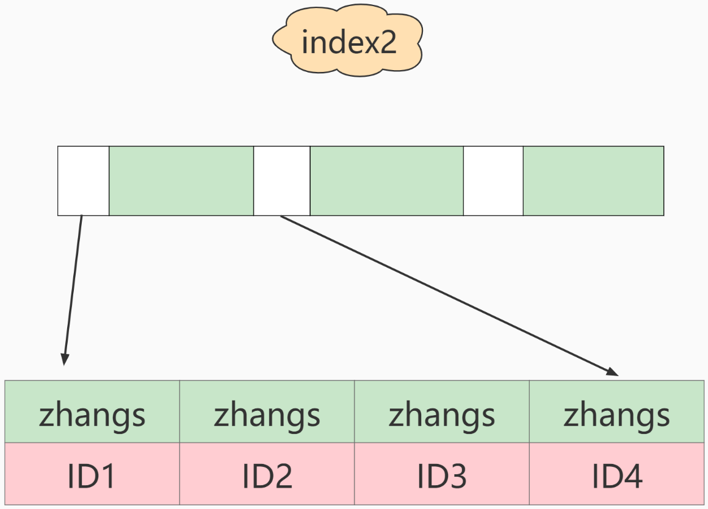

如果使用的是 index1 （即 email 整个字符串的索引结构），执行顺序是这样的：

- 从 index1 索引树找到满足索引值是 "zhangssxyz@xxx.com" 的这条记录，取得 ID2 的值；

- 到主键上查到主键值是 ID2 的行，判断 email 的值是正确的，将这行记录加入结果集；
- 取 index1 索引树上刚刚查到的位置的下一条记录，发现已经不满足email = "zhangssxyz@xxx.com" 的条件了，循环结束。
- 这个过程中，只需要回主键索引取一次数据，所以系统认为只扫描了一行。

如果使用的是 index2（即 email(6) 索引结构），执行顺序是这样的：

- 从 index2 索引树找到满足索引值是 "zhangs " 的记录，找到的第一个是 ID1；
- 到主键上查到主键值是 ID1 的行，判断出 email 的值不是 "zhangssxyz@xxx.com"，这行记录丢弃；
- 取 index2 上刚刚查到的位置的下一条记录，发现仍然是 "zhangs"，取出 ID2，再到 ID 索引上取整行然后判断，这次值对了，将这行记录加入结果集；
- 重复上一步，直到在 idxe2 上取到的值不是 "zhangs" 时，循环结束。
- 也就是说`使用前缀索引，定义好长度，就可以做到既节省空间，又不用额外增加太多的查询成本。`前面已经讲过区分度，区分度越高越好。因为区分度越高，意味着重复的键值越少。

#### 前缀索引对覆盖索引的影响

前面我们说了使用`前缀索引可能会增加扫描行数`，这会影响到性能。其实，前缀索引的影响不止如此，我们再看一下另外一个场景：

如果使用 index1（即 email 整个字符串的索引结构）的话，可以利用覆盖索引，从 index1 查到结果后直接就返回了，不需要回到 ID 索引再去查一次。而如果使用 index2（即 email(6) 索引结构）的话，就不得不回到 ID 索引再去判断 email 字段的值。

即使你将 index2 的定义修改为 email(18) 的前缀索引，这时候虽然 index2 已经包含了所有的信息，但 InnoDB 还是要回到 id 索引再查一下，因为系统并不确定前缀索引的定义是否截断了完整信息。

结论：`使用前缀索引就用不上覆盖索引对查询性能的优化了`，这也是你在选择是否使用前缀索引时需要考虑的一个因素。

#### 拓展内容

对于类似于邮箱这样的字段来说，使用前缀索引的效果可能还不错。但是，遇到前缀的区分度不够好的情况时，我们要怎么办呢?

比如，我们国家的身份证号，一共 18 位，其中前 6 位是地址码，所以同一个县的人的身份证号前 6 位一般会是相同的。

假设你维护的数据库是一个市的公民信息系统，这时候如果对身份证号做长度为 6 的前缀索引的话，这个索引的区分度就非常低了。按照我们前面说的方法，可能你需要创建长度为 12 以上的前缀索引，才能够满足区分度要求。

但是，索引选取的越长，占用的磁盘空间就越大，相同的数据页能放下的索引值就越少，搜索的效率也就会越低。
那么，如果我们能够确定业务需求里面只有按照身份证进行等值查询的需求，还有没有别的处理方法呢？要求这种方法，既可以占用更小的空间，也能达到相同的查询效率。有!

**第一种方式是使用`倒序存储`。**如果你存储身份证号的时候把它倒过来存，每次查询的时候：

```mysql
mysql> SELECT field list FROM teacher WHERE id_card = reverse(input_id_card_string);
```

由于身份证号的最后 6 位没有地址码这样的重复逻辑，所以最后这 6 位很可能就提供了足够的区分度。当然，实践中你还要使用 COUNT(DISTINCT) 方法去做验证区分度。

**第二种方式是`使用 hash 字段`。**你可以在表上再创建一个整数字段，来保存身份证的校验码，同时在这个字段上创建索引。

```mysql
mysql> ALTER TABLE teacher ADD id_card_crc int unsignedadd INDEX(id_card_crc);
```

然后每次插入新记录的时候，都同时用 crc32() 这个函数得到校验码填到这个新字段，由于校验码可能存在冲突，也就是说两个不同的身份证号通过 crc32() 函数得到的结果可能是相同的，所以你的查询语句 WHERE 部分要判断 id_card 的值是否精确相同。

```mysql
mysql> SELECT field list FROM teacher WHERE id_card_rc = crc32(input_id_card_string) AND id_card = input id_card_string;
```

这样，索引的长度变成了 4 个字节，比原来小了很多。

>从查询效率上看，**使用 hash 字段方式的查询性能相对更稳定一些**，因为 crc32 算出来的值虽然有冲突的概率，但是概率非常小，可以认为每次查询的平均扫描行数接近 1。而倒序存储方式毕竟还是用的前缀索引的方式，也就是说还是会增加扫描行数。

### 索引条件下推（索引下推）

Index Condition Pushdown (ICP) 是 MySQL 5.6 中新特性，是一种在存储引擎层使用索引过滤数据的一种优化方式。`ICP 可以减少存储引擎访问基表的次数，以及 MySQL 服务器访问存储引擎的次数。`

**索引中包含某个字段，但是实际查询没有使用到这个字段的索引（失效了，比如该字段的条件为 "%a%"），此时可以使用这个字段在索引中进行条件过滤，从而可以减少回表的记录条数，这种情况就叫做`索引条件下推/索引下推`。**

#### 使用前后对比

**在不使用 ICP 索引扫描的过程：**

- Storage 层：只将满足 index key 条件的索引记录对应的整行记录取出，返回给 Server 层。
- Server 层：对返回的数据，使用后面的 WHERE 条件过滤，直至返回最后一行。

**使用 ICP 扫描的过程：**

- Storage层：首先将 index key 条件满足的索引记录区间确定，然后在索引上使用 index filter 进行过滤。将满足的 index filter 条件的索引记录才去回表取出整行记录返回 Server 层。不满足 index filter 条件的索引记录丢弃，不回表、也不会返回 Server 层。
- Server 层：对返回的数据，使用 table filter 条件做最后的过滤。

**使用前后的成本差别：**

- 使用 ICP 前，存储层多返回了需要被 index filter 过滤掉的整行记录。
- 使用 ICP 后，直接就去掉了不满足 index filter 条件的记录，省去了这些记录回表和传递到 Server 层的成本。
- ICP 的加速效果取决于在存储引擎内通过 ICP 筛选掉的数据的比例。

#### ICP 的开启、关闭

默认情况下`启用`索引条件下推。可以通过设置系统变量`optimizer_switch `控制`index_condition_pushdown`：

```mysql
mysql> SHOW VARIABLES LIKE '%optimizer_switch%';
+------------------+------------------------------------------------------------------------------------------------------------------------------------------------------------------------------------------------------------------------------------------------------------------------------------------------------------------------------------------------------------------------------------------------------------------------------------------------------------------------------------------------------------------------------------------------------------------------------+
| Variable_name    | Value                                                                                                                                                                                                                                                                                                                                                                                                                                                                                                                                                                        |
+------------------+------------------------------------------------------------------------------------------------------------------------------------------------------------------------------------------------------------------------------------------------------------------------------------------------------------------------------------------------------------------------------------------------------------------------------------------------------------------------------------------------------------------------------------------------------------------------------+
| optimizer_switch | index_merge=on,index_merge_union=on,index_merge_sort_union=on,index_merge_intersection=on,engine_condition_pushdown=on,index_condition_pushdown=on,mrr=on,mrr_cost_based=on,block_nested_loop=on,batched_key_access=off,materialization=on,semijoin=on,loosescan=on,firstmatch=on,duplicateweedout=on,subquery_materialization_cost_based=on,use_index_extensions=on,condition_fanout_filter=on,derived_merge=on,use_invisible_indexes=off,skip_scan=on,hash_join=on,subquery_to_derived=off,prefer_ordering_index=on,hypergraph_optimizer=off,derived_condition_pushdown=on |
+------------------+------------------------------------------------------------------------------------------------------------------------------------------------------------------------------------------------------------------------------------------------------------------------------------------------------------------------------------------------------------------------------------------------------------------------------------------------------------------------------------------------------------------------------------------------------------------------------+
1 row in set (0.00 sec)

# 关闭索引下推
mysql> SET optimizer_switch='index_condition_pushdown=off';
Query OK, 0 rows affected (0.00 sec)

# 打开索引下推
mysql> SET optimizer_switch='index_condition_pushdown=on';
Query OK, 0 rows affected (0.00 sec)
```

>当使用索引条件下推时，`EXPLAIN`语句输出的结果中`Extra`列内容如果显示为`Using index condition`，即为索引条件下推。

#### ICP 使用案例

建表：

```mysql
mysql> CREATE TABLE people (
    -> `id` int NOT NULL AUTO_INCREMENT,
    -> `zipcode` varchar(20) COLLATE utf8_bin DEFAULT NULL,
    -> `firstname` varchar(20) COLLATE utf8_bin DEFAULT NULL,
    -> `lastname` varchar(20) COLLATE utf8_bin DEFAULT NULL,
    -> `address` varchar(50) COLLATE utf8_bin DEFAULT NULL,
    -> PRIMARY KEY (`id`),
    -> KEY `zip_last_first` (`zipcode`, `lastname`, `firstname`)
    -> ) ENGINE=InnoDB AUTO_INCREMENT=5 DEFAULT CHARSET=utf8mb3 COLLATE=utf8_bin;
Query OK, 0 rows affected, 6 warnings (0.04 sec)
```

插入数据：

```mysql
INSERT INTO people VALUES
(1, '000001', 'san', 'zhang', 'beijing'),
(2, '000002', 'si', 'li', 'nanjing'),
(3, '000003', 'wu', 'wang', 'shanghai'),
(4, '000001', 'liu', 'zhao', 'tianjin');
```

为该表定义联合索引 zip_last_first(zipcode, lastname, firstname) 。如果我们知道了一个人的邮编，但是不确定这个人的姓氏，可以进行如下检索：

```mysql
mysql> SELECT * FROM people WHERE zipcode= '000001' AND lastname LIKE '%zhang%' AND address LIKE '%beijing%';
+----+---------+-----------+----------+---------+
| id | zipcode | firstname | lastname | address |
+----+---------+-----------+----------+---------+
|  1 | 000001  | san       | zhang    | beijing |
+----+---------+-----------+----------+---------+
1 row in set (0.00 sec)

# 查询计划
mysql> EXPLAIN SELECT * FROM people WHERE zipcode= '000001' AND lastname LIKE '%zhang%' AND address LIKE '%beijing%';
+----+-------------+--------+------------+------+----------------+----------------+---------+-------+------+----------+------------------------------------+
| id | select_type | table  | partitions | type | possible_keys  | key            | key_len | ref   | rows | filtered | Extra                              |
+----+-------------+--------+------------+------+----------------+----------------+---------+-------+------+----------+------------------------------------+
|  1 | SIMPLE      | people | NULL       | ref  | zip_last_first | zip_last_first | 63      | const |    2 |    25.00 | Using index condition; Using where |
+----+-------------+--------+------------+------+----------------+----------------+---------+-------+------+----------+------------------------------------+
1 row in set, 1 warning (0.00 sec)
```

- 从查询计划可以看出，Extra 中显示了 Using index condition，这表示使用了索引下推。即：先使用索引的 zipcode 字段进行匹配，然后索引下推使用 lastname 字段进行过滤，最后再进行回表。
- 另外，Using where 表示条件中包含需要过滤的非索引列的数据，即 "address LIKE '%beijing%'" 这个条件并不是索引列，需要在服务端过滤掉。

> 为了便于 MySQL 客户端查询，将相关汉字替换为了拼音。

这个 PEOPLE 表中存在两个索引，分别是：

- 主键索引（简图）：

  

- 二级索引 zip_last_first：

  

下面关闭 IPC，再次查看执行计划：

```mysql
mysql> SET optimizer_switch='index_condition_pushdown=off';
Query OK, 0 rows affected (0.00 sec)

# 关闭IPC后，不再使用索引下推
mysql> EXPLAIN SELECT * FROM people WHERE zipcode= '000001' AND lastname LIKE '%zhang%' AND address LIKE '%beijing%';
+----+-------------+--------+------------+------+----------------+----------------+---------+-------+------+----------+-------------+
| id | select_type | table  | partitions | type | possible_keys  | key            | key_len | ref   | rows | filtered | Extra       |
+----+-------------+--------+------------+------+----------------+----------------+---------+-------+------+----------+-------------+
|  1 | SIMPLE      | people | NULL       | ref  | zip_last_first | zip_last_first | 63      | const |    2 |    25.00 | Using where |
+----+-------------+--------+------------+------+----------------+----------------+---------+-------+------+----------+-------------+
1 row in set, 1 warning (0.00 sec)
```

#### 开启和关闭 ICP 的性能对比

创建存储过程，主要目的是插入很多 000001 的数据，这样查询的时候，为了在存储引擎层坐果率，减少 I/O，也为了减少缓冲池（缓存数据页，没有 I/O）的作用。

```mysql
mysql> DELIMITER //
mysql> CREATE PROCEDURE inser_people(max_num INT)
    -> BEGIN
    -> DECLARE i INT DEFAULT 0;
    -> SET autocommit = 0;
    -> REPEAT
    -> SET i = i + 1;
    -> INSERT INTO people(zipcode, firstname, lastname, address) VALUES('000001', 'liu', 'zhao', 'tianjin');
    -> UNTIL i = max_num
    -> END REPEAT;
    -> COMMIT;
    -> END //
Query OK, 0 rows affected (0.01 sec)

mysql> DELIMITER ;
```

调用存储过程：

```mysql
mysql> CALL inser_people(1000000);
Query OK, 0 rows affected (27.68 sec)
```

首先，打开 profiling：

```mysql
mysql> SET profiling=1;
Query OK, 0 rows affected, 1 warning (0.00 sec)
```

执行 SQL 语句，此时索引下推打开：

```mysql
mysql>  SET optimizer_switch='index_condition_pushdown=on';
Query OK, 0 rows affected (0.00 sec)

mysql> SELECT * FROM people WHERE zipcode = '000001' AND lastname LIKE '%zhang%';
+----+---------+-----------+----------+---------+
| id | zipcode | firstname | lastname | address |
+----+---------+-----------+----------+---------+
|  1 | 000001  | san       | zhang    | beijing |
+----+---------+-----------+----------+---------+
1 row in set (0.25 sec)
```

再次执行 SQL 语句，此时索引下推关闭：

```mysql
mysql> SET optimizer_switch='index_condition_pushdown=off';
Query OK, 0 rows affected (0.00 sec)

mysql> SELECT * FROM people WHERE zipcode = '000001' AND lastname LIKE '%zhang%';
+----+---------+-----------+----------+---------+
| id | zipcode | firstname | lastname | address |
+----+---------+-----------+----------+---------+
|  1 | 000001  | san       | zhang    | beijing |
+----+---------+-----------+----------+---------+
1 row in set (2.52 sec)
```

查看当前会话所产生的所有 profiles：

```mysql
mysql> SHOW profiles\G;
*************************** 1. row ***************************
Query_ID: 1
Duration: 0.24520475
   Query: SELECT * FROM people WHERE zipcode = '000001' AND lastname LIKE '%zhang%'
*************************** 2. row ***************************
Query_ID: 2
Duration: 2.52617775
   Query: SELECT * FROM people WHERE zipcode = '000001' AND lastname LIKE '%zhang%'
3 rows in set, 1 warning (0.00 sec)

ERROR: 
No query specified
```

- 多次测试效率对比来看，使用 ICP 优化的查询效率会好一些。这里建议多存储一些数据，效果更明显。

#### ICP 的使用条件

- 只能用于二级索引（Secondary Index）。
- EXPLAIN 显示的执行计划中 type 值（join 类型）为 range 、ref、eq_ref 或者 ref_or_null 。
- 并非全部 WHERE 条件都可以用 ICP 筛选，如果 WHERE 条件的字段不在索引列中，还是要读取整表的记录到 Server 端做 WHERE 过滤。(IPC 是 Storage 层行为)
- ICP 可以用于 MyISAM 和 InnnoDB 存储引擎。
- MySQL 5.6 版本的不支持分区表的 ICP 功能，5.7 版本的开始支持。
- 当 SQL 使用覆盖索引时，不支持 ICP 优化方法。

### 普通索引 vs 唯一索引

在不同的业务场景下，应该选择普通索引，还是唯一索引？

假设你在维护一个居民系统，每个人都有一个唯一的身份证号，而且业务代码已经保证了不会写入两个重复的身份证号。如果居民系统需要按照身份证号查姓名：

```mysql
SELECT name FROM CUser WHERE id_card = 'xxxxxxxyyyyyyzzzzz';
```

所以，你一定会考虑在 id_card 字段上建索引。

由于身份证号字段比较大，不建议把身份证号当做主键。现在有两个选择，要么给 id_card 字段创建唯一素引，要么创建一个普通索引。如果业务代码已经保证了不会写入重复的身份证号，那么这两个选择逻辑上都是正确的。

你知道的，InnoDB 的数据是按数据页为单位来读写的。也就是说，当需要读一条记录的时候，并不是将这个记录本身从磁盘读出来，而是以页为单位，将其整体读入内存。在 InnoDB中，每个数据页的大小默认是 16 KB。

从性能的角度考虑，你选择唯一索引还是普通索引呢？选择的依据是什么呢？

假设，我们有一个主键列为 id 的表，表中有字段 k，并且在 k 上有索引，假设字段 k 上的值都不重复。 这个表的建表语句是：

```mysql
CREATE TABLE test(
    id int PRIMARY KEY,
    k int NOT null,
    name varchar(16),
    index (k)
)ENGINE=InnoDB;
```

表中 R1 ~ R5 的 (id, k) 值分别为 (100, 1)、(200, 2)、(300, 3)、(500, 5) 和 (600, 6)。

#### 查询过程

假设，执行查询的语句是 "SELECT id FROM test WHERE k = 5"。

- 对于普通索引来说，查找到满足条件的第一个记录 (5, 500) 后，需要查找下一个记录，直到碰到第一个不满足 k = 5 条件的记录。
- 对于唯一索引来说，由于索引定义了唯一性，查找到第一个满足条件的记录后，就会停止继续检索。

那么，这个不同带来的性能差距会有多少呢？答案是， 微乎其微。

你知道的，InnoDB 的数据是按数据页为单位来读写的。也就是说，当需要读一条记录的时候，并不是将这个记录本身从磁盘读出来，而是以页为单位，将其整体读入内存。在 InnoDB 中，每个数据页的大小默认是 16KB。

因为引擎是按页读写的，所以说，当找到 k = 5 的记录的时候，它所在的数据页就都在内存里了。那么，对于普通索引来说，要多做的那一次 "查找和判断下一条记录" 的操作，就只需要一次指针寻找和一次计算。

当然，如果 k = 5 这个记录刚好是这个数据页的最后一个记录，那么要取下一个记录，必须读取下一个数据页，这个操作会稍微复杂一些。

但是，我们之前计算过，对于整型字段，一个数据页可以放近千个 key，因此出现这种情况的概率会很低。所以我们计算平均性能差异时，仍可以认为这个操作成本对于现在的 CPU 来说可以忽略不计。

#### 更新过程

为了说明普通索引和唯一索引对更新语句性能的影响这个问题，介绍一下`change buffer`。

当需要更新一个数据页时，如果数据页在内存中就直接更新，而如果这个数据页还没有在内存中的话， 在不影响数据一致性的前提下，InooDB 会将这些更新操作缓存在 change buffer 中，这样就不需要从磁盘中读入这个数据页了。在下次查询需要访问这个数据页的时候，将数据页读入内存，然后执行 change buffer 中与这个页有关的操作。通过这种方式就能保证这个数据逻辑的正确性。

将 change buffer 中的操作应用到原数据页，得到最新结果的过程称为`merge`。除了`访问这个数据页`会触发 merge 外，系统有`后台线程`会定期 merge。在`数据库正常关闭 (shutdown)`的过程中，也会执行 merge 操作。

如果能够将更新操作先记录在 change buffer，`减少读磁盘`，语句的执行速度会得到明显的提升。而且， 数据读入内存是需要占用 buffer pool 的，所以这种方式还能够`避免占用内存`，提高内存利用率。

那么，什么条件下可以使用 change buffer 呢？

对干唯一索引来说，所有的更新操作都要先判断这个操作是否违反唯一性约束。比如，要插入 (4, 400) 这个记录，就要先判断现在表中是否已经存在 k = 4 的记录，而这必须要将数据页读入内存才能判断。如果都已经读入到内存了，那直接更新内存会更快，就没必要使用 change buffer 了。

因此，`唯一索引的更新就不能使用 change buffer，实际上也只有普通索引可以使用。`

change buffer 用的是 buffer pool 里的内存，因此不能无限增大。change buffer 的大小，可以通过参数`innodb_change_buffer_maxsize`来动态设置。这个参数设置为 50 的时候，表示 changebuffer 的大小最多只能占用 buffer pool 的 50%。

```mysql
mysql> SHOW VARIABLES LIKE '%change_buffer%';
+-------------------------------+-------+
| Variable_name                 | Value |
+-------------------------------+-------+
| innodb_change_buffer_max_size | 25    |
| innodb_change_buffering       | all   |
+-------------------------------+-------+
2 rows in set (0.01 sec)
```

那么，如果要在这张表中插入一个新记录 (4, 400) 的话，InnoDB 的处理流程是怎样的？

第一种情况是，这个记录要更新的目标页在内存中。这时：

- 对干唯一索引来说，找到 3 和 5 之间的位置，判断为没有冲突，插入这个值，语句执行结束。
- 对于普通索引来说，找到 3 和 5 之间的位置，插入这个值，语句执行结束。
- 这样看来，普通索引和唯一索引对更新语句性能影响的差别，只是一个判断，只会耗费微小的 CPU 时间。

第二种情况是，这个记录要更新的目标页不在内存中。这时：

- 对于唯一索引来说，需要将数据页读入内存，判断有没有冲突，插入这个值，语句执行结束。
- 对于普通索引来说，则是将更新记录在 change buffer，语句执行就结束了。

将数据从磁盘读入内存涉及随机 I/O 的访问，是数据库里面成本最高的操作之一。change buffer 因为减少了随机磁盘访问，所以对更新性能的提升是会很明显的。

>案例：
>
>某个业务的库内存命中率突然从 99% 降低到了 75%，整个系统处于阻塞状态，更新语句全部堵住。而探究其原因后，发现这个业务有大量插入数据的操作，而他在前一天把其中的某个普通索引改成了唯一索引。

#### change buffer 的使用场景

change buffer 只限于用在普通索引的场景下，而不适用于唯一索引。那么，现在有一个问题就是：普通索引的所有场景，使用 change buffer 都可以起到加速作用吗？

因为 merge 的时候是真正进行数据更新的时刻，而 change buffer 的主要目的就是将记录的变更动作缓存下来，所以`在一个数据页做 merge 之前，change buffer 记录的变更越多 (也就是这个页面上要更新的次数越多)，收益就越大。`

因此，对于`写多读少`的业务来说，页面在写完以后马上被访问到的概率比较小，此时 change buffer 的使用效果最好。这种业务模型常见的就是账单类、日志类的系统。

反过来，假设一个业务的更新模式是写入之后马上会做查询，那么即使满足了条件，将更新先记录在 change buffer，之后由于马上要访问这个数据页，会立即触发 merge 过程，这样随机访问 I/O 的次数不会减少，反而增加了 change buffer 的维护代价。所以，对于这种业务模式来说，changebuffer 反而起到了副作用。

- 普通索引和唯一索引应该怎么选择？其实，这两类索引在查询能力上是没差别的，主要考虑的是对`更新性能`的影响。所以，建议你`尽量选择普通索引`。
- 在实际使用中会发现，普通索引和 change buffer 的配合使用，对于`数据量大`的表的更新优化还是很明显的。
- 如果所有的更新后面，都马上`伴随着对这个记录的查询，那么你应该关闭change buffer`。而在其他情况下，change buffer 都能提升更新性能。
- 由于唯一索引用不上 change buffer 的优化机制，因此如果`业务可以接受`，从性能角度出发建议优先考虑`非唯一索引`。但是如果 "业务可能无法确保" 的情况下，怎么处理呢？
  - 首先，`业务正确性优先`。我们的前提是 "业务代码已经保证不会写入重复数据" 的情况下，讨论性能问题。如果业务不能保证，或者业务就是要求数据库来做约束，那么没得选，必须创建唯一索引。 这种情况下，本节的意义在于，如果碰上了大量插入数据慢、内存命中率低的时候，给你多提供一个排查思路。
  - 然后，在一些 "`归档库`" 的场景，你是可以考虑使用唯一索引的。比如，线上数据只需要保留半年， 然后历史数据保存在归档库。这时候，归档数据已经是确保没有唯一键冲突了。要提高归档效率， 可以考虑把表里面的唯一索引改成普通索引。

### 其它查询优化策略

#### EXISTS 和 IN 的区分

**问题：**

不太理解哪种情况下应该使用 EXISTS，哪种情况应该用 IN。选择的标准是看能否使用表的索引吗？

回答:

索引是个前提，其实选择与否还是要看表的大小。你可以将选择的标准理解为`小表驱动大表`，在这种方式下效率是最高的。

比如下面这样：

```mysql
SELECT * FROM A WHERE cc IN (SELECT cc FROM B)

SELECT * FROM A WHERE EXISTS (SELECT cc FROM B WHERE B.cc = A.cc)
```

- 当 A 小于 B 时，用 EXISTS。因为 EXISTS 的实现，相当于外表循环，实现的逻辑类似于：

  ```mysql
  for i in A
      for j in B
          if j.cc == i.cc then ...
  ```

- 当 B 小于 A 时用 IN，因为实现的逻辑类似于：

  ```mysql
  for i in B
      for j in A
          if j.cc == i.cc then ...
  ```

结论：**哪个表小就用哪个表来驱动，A 表小就用 EXISTS ，B 表小就用 IN。**

#### COUNT(*) 与 COUNT(具体字段) 效率对比

问：在 MySQL 中统计数据表的行数，可以使用三种方式`SELECT COUNT(*)`、`SELECT COUNT(1)`和`SELECT COUNT(具体字段)`，使用这三者之间的查询效率是怎样的？

答：

前提：如果你要统计的是某个字段的非空数据行数，则另当别论，毕竟比较执行效率的前提是结果一样才可以。

**环节 1：**COUNT(\*) 和 COUNT(1) 都是对所有结果进行 COUNT，`COUNT(*) 和 COUNT(1) 本质上并没有区别`（二者执行时间可能略有差别，不过你还是可以把它俩的执行效率看成是相等的）。如果有 WHERE 子句，则是对所有符合筛选条件的数据行进行统计；如果没有 WHERE 子句，则是对数据表的数据行数进行统计。

**环节 2：**COUNT(\*) 和 COUNT(1) 的使用，如果是 MyISAM 存储引擎，统计数据表的行数只需要`O(1)`的复杂度，这是因为每张 MyISAM 的数据表都有一个 meta 信息存储了 row_count 值，而一致性则由表级锁来保证。如果是 InnoDB 存储引擎，因为 InnoDB 支持事务，采用行级锁和 MVCC 机制，所以无法像 MyISAM 一样，维护一个 row_count 变量，因此需要采用扫描全表，是`O(n)`的复杂度，进行循环 + 计数的方式来完成统计。

**环节 3：**`在 InnoDB 引擎中，如果采用 COUNT(具体字段) 来统计数据行数，要尽量采用二级索引。`因为主键采用的索引是聚簇索引，聚簇索引包含的信息多，资源消耗明显会大于二级索引。对于 COUNT(*) 和COUNT(1) 来说，它们不需要查找具体的行，只是统计行数，系统会自动采用占用空间更小的二级索引来进行统计，如果有多个二级索引，会使用 keylen 小的二级索引进行扫描，当没有二级索引的时候，才会采用主键索引来进行统计。

#### 关于 SELECT(*)

在表查询中，建议明确字段，不要使用 \* 作为查询的字段列表，`推荐使用 SELECT <字段列表> 查询`。原因：

1. MySQL 在解析的过程中，会通过`查询数据字典`将 "*" 按序转换成所有列名，这会大大的耗费资源和时间。
2. 无法使用`覆盖索引`。

#### LIMIT 1 对优化的影响

针对的是会扫描全表的 SQL 语句，如果你可以确定结果集只有一条，那么加上`LIMIT 1`的时候，当找到一条结果的时候就不会继续扫描了，这样会加快查询速度。

如果数据表已经对字段建立了唯一索引，那么可以通过索引进行查询，不会全表扫描的话，就不需要加上`LIMIT 1`了。

#### 多使用 COMMIT

只要有可能，在程序中尽量多使用 COMMIT，这样程序的性能得到提高，需求也会因为 COMMIT 所释放的资源而减少。

COMMIT 所释放的资源:

- 回滚段上用于恢复数据的信息。
- 被程序语句获得的锁。
- redo/undo log buffer 中的空间。
- 管理上述 3 种资源中的内部花费。

### 淘宝数据库，主键如何设计的

聊一个实际问题：淘宝的数据库，主键是如何设计的？

某些错的离谱的答案还在网上年复一年的流传着，甚至还成为了所谓的 MySQL 军规。其中，一个最明显的错误就是关于 MySQL 的主键设计。

大部分人的回答如此自信：用 8 字节的 BIGINT 做主键，而不要用 INT。错!

这样的回答，只站在了数据库这一层，而没有`从业务的角度`思考主键。主键就是一个自增 ID 吗？站在 2022 年的新年档口，用自增做主键，架构设计上可能连及格都拿不到。

#### 自增 ID 的问题

自增 ID 做主键，简单易懂，几乎所有数据库都支持自增类型，只是实现上各自有所不同而已。自增 ID 除了简单，其他都是缺点，总体来看存在以下几方面的问题：

1. **可靠性不高**

存在自增 ID 回溯的问题，这个问题直到最新版本的 MySQL 8.0 才修复。

2. **安全性不高**

对外暴露的接口可以非常容易猜测对应的信息。比如：/user/1/ 这样的接口，可以非常容易猜测用户 ID 的值为多少，总用户数量有多少，也可以非常容易地通过接口进行数据的爬取。

3. **性能差**

自增 ID 的性能较差，需要在数据库服务器端生成。

4. **交互多**

业务还需要额外执行一次类似 last_insert_id() 的函数才能知道刚才插入的自增值，这需要多一次的网络交互。在海量并发的系统中，多 1 条 SQL，就多一次性能上的开销。

5. **局部唯一性**

最重要的一点，自增 ID 是局部唯一，只在当前数据库实例中唯一，而不是全局唯一，无法保证在任意服务器间都是唯一的。对于目前分布式系统来说，这简直就是噩梦。

#### 业务字段做主键

为了能够唯一地标识一个会员的信息，需要为`会员信息表`设置一个主键。那么，怎么为这个表设置主键，才能达到我们理想的目标呢？这里我们考虑业务字段做主键。 表数据如下：


在这表里，哪个字段比较合适呢？

##### 选择卡号（cardno）

会员卡号（cardno）看起来比较合适，因为会员卡号不能为空，而且有唯一性，可以用来标识一条会员记录。

```mysql
mysql> CREATE TABLE demo.membermaster
-> (
-> cardno CHAR(8) PRIMARY KEY, -- 会员卡号为主键 -> membername TEXT,
-> memberphone TEXT,
-> memberpid TEXT,
-> memberaddress TEXT,
-> sex TEXT,
-> birthday DATETIME
-> );
Query OK, 0 rows affected (0.06 sec)
```

不同的会员卡号对应不同的会员，字段 cardno 唯一地标识某一个会员。如果都是这样，会员卡号与会员一一对应，系统是可以正常运行的。

但实际情况是， `会员卡号可能存在重复使用的情况`。比如，张三因为工作变动搬离了原来的地址，不再到商家的门店消费了（退还了会员卡），于是张三就不再是这个商家门店的会员了。但是，商家不想让这个会员卡空着，就把卡号是 10000001 的会员卡发给了王五。

从系统设计的角度看，这个变化只是修改了会员信息表中的卡号是 10000001 这个会员信息，并不会影响到数据一致性。也就是说，修改会员卡号是 10000001 的会员信息，系统的各个模块，都会获取到修改后的会员信息，不会出现有的模块获取到修改之前的会员信息，有的模块获取到修改后的会员信息， 而导致系统内部数据不一致的情况。因此，从信息系统层面上看是没问题的。

但是从使用系统的业务层面来看，就有很大的问题了，会对商家造成影响。

比如，我们有一个销售流水表（trans），记录了所有的销售流水明细。2020 年 12 月 01 日，张三在门店购买了一本书，消费了 89 元。那么，系统中就有了张三买书的流水记录，如下所示：


接着，我们查询一下 2020 年 12 月 01 日的会员销售记录：

```mysql
mysql> SELECT b.membername,c.goodsname,a.quantity,a.salesvalue,a.transdate
-> FROM demo.trans AS a
-> JOIN demo.membermaster AS b
-> JOIN demo.goodsmaster AS c
-> ON (a.cardno = b.cardno AND a.itemnumber=c.itemnumber); 
+------------+-----------+----------+------------+---------------------+ 
| membername | goodsname | quantity | salesvalue |           transdate | 
+------------+-----------+----------+------------+---------------------+ 
| 张三        |        书 |    1.000 |      89.00 | 2020-12-01 00:00:00 | 
+------------+-----------+----------+------------+---------------------+ 
1 row in set (0.00 sec)
```

如果会员卡 10000001 又发给了王五，我们会更改会员信息表。导致查询时：

```mysql
mysql> SELECT b.membername,c.goodsname,a.quantity,a.salesvalue,a.transdate
-> FROM demo.trans AS a
-> JOIN demo.membermaster AS b
-> JOIN demo.goodsmaster AS c
-> ON (a.cardno = b.cardno AND a.itemnumber=c.itemnumber); 
+------------+-----------+----------+------------+---------------------+ 
| membername | goodsname | quantity | salesvalue | transdate           | 
+------------+-----------+----------+------------+---------------------+ 
| 王五        |        书 |    1.000 |      89.00 | 2020-12-01 00:00:00 | 
+------------+-----------+----------+------------+---------------------+ 
1 row in set (0.01 sec)
```

这次得到的结果是：王五在 2020 年 12 月 01 日，买了一本书，消费 89 元。显然是错误的！结论：`千万不能把会员卡号当做主键`。

##### 选择会员电话或身份证号

会员电话可以做主键吗？不行的。在实际操作中，`手机号也存在被运营商收回，重新发给别人用的情况。`

那身份证号行不行呢？好像可以。因为身份证决不会重复，身份证号与一个人存在一一对 应的关系。可问题是，`身份证号属于个人隐私`，顾客不一定愿意给你。要是强制要求会员必须登记身份证号，会把很多客人赶跑的。其实，客户电话也有这个问题，这也是我们在设计会员信息表的时候，允许身份证号和电话都为空的原因。

所以，建议`尽量不要用跟业务有关的字段做主键`。毕竟，作为项目设计的技术人员，我们谁也无法预测在项目的整个生命周期中，哪个业务字段会因为项目的业务需求而有重复，或者重用之类的情况出现。

> 经验：刚开始使用 MySQL 时，很多人都很容易犯的错误是喜欢用业务字段做主键，想当然地认为了解业务需求，但实际情况往往出乎意料，而更改主键设置的成本非常高。

#### 淘宝的主键设计

在淘宝的电商业务中，订单服务是一个核心业务。请问， 订单表的主键淘宝是如何设计的呢？是自增ID吗？

打开淘宝，看一下订单信息：


从上图可以发现，订单号不是自增 ID！我们详细看下上述 4 个订单号：

```tex
1550672064762308113
1481195847180308113
1431156171142308113
1431146631521308113
```

订单号是 19 位的长度，且订单的最后 5 位都是一样的，都是 08113。且订单号的前面 14 位部分是单调递增的。

大胆猜测，淘宝的订单 ID 设计应该是：`订单ID = 时间 + 去重字段 + 用户 ID 后 6 位尾号`。

这样的设计能做到全局唯一，且对分布式系统查询及其友好。

#### 推荐的主键设计

`非核心业务`：对应表的主键自增 ID，如告警、日志、监控等信息。

`核心业务`：**主键设计至少应该是全局唯一且是单调递增**。全局唯一保证在各系统之间都是唯一的，单调递增是希望插入时不影响数据库性能。

这里推荐最简单的一种主键设计：`UUID`。

##### UUID

**UUID 的特点：**全局唯一，占用 36 字节，数据无序，插入性能差。

**认识 UUID：**

- 为什么 UUID 是全局唯一的？
- 为什么 UUID 占用 36 个字节？
- 为什么 UUID 是无序的？

MySQL 数据库的 UUID 组成如下所示：

```tex
UUID = 时间 + UUID 版本（16 字节）- 时钟序列（4 字节） - MAC 地址（12 字节）
```

以 UUID 值 e0ea12d4-6473-11eb-943c-00155dbaa39d 举例：


1. 为什么 UUID 是全局唯一的？
   - 在 UUID 中时间部分占用 60 位，存储的类似 TIMESTAMP 的时间戳，但表示的是从 1582-10-15 00:00:00.00 到现在的 100 ns 的计数。可以看到 UUID 存储的时间精度比 TIMESTAMPE 更高，时间维度发生重复的概率降低到 1/100 ns。
   - 时钟序列是为了避免时钟被回拨导致产生时间重复的可能性。MAC 地址用于全局唯一。


2. 为什么 UUID 占用 36 个字节？
   - UUID 根据字符串进行存储，设计时还带有无用 "-" 字符串，因此总共需要 36 个字节。


3. 为什么 UUID 是随机无序的呢？
   - 因为 UUID 的设计中，将时间低位放在最前面，而这部分的数据是一直在变化的，并且是无序。


##### 改造UUID

若将时间高低位互换，则时间就是单调递增的了，也就变得单调递增了。MySQL 8.0 可以更换时间低位和时间高位的存储方式，这样无序的 UUID 就是有序的 UUID 了。

MySQL 8.0 还解决了 UUID 存在的空间占用的问题，除去了 UUID 字符串中无意义的 "-" 字符串，并且将字符串用二进制类型保存，这样存储空间降低为了 16 字节。

可以通过 MySQL 8.0 提供的`uuid_to_bin`函数实现上述功能，同样的，MySQL 也提供了`bin_to_uuid`函数进行转化：

```mysql
mysql> SET @uuid = UUID();
Query OK, 0 rows affected (0.00 sec)

mysql> SELECT @uuid, uuid_to_bin(@uuid), uuid_to_bin(@uuid, TRUE);
+--------------------------------------+----------------------------------------+----------------------------------------------------+
| @uuid                                | uuid_to_bin(@uuid)                     | uuid_to_bin(@uuid, TRUE)                           |
+--------------------------------------+----------------------------------------+----------------------------------------------------+
| 394569c7-7b7d-11ee-bd87-0242ac160002 | 0x394569C77B7D11EEBD870242AC160002     | 0x11EE7B7D394569C7BD870242AC160002                 |
+--------------------------------------+----------------------------------------+----------------------------------------------------+
1 row in set (0.00 sec)
```

**通过函数`uuid_to_bin(@uuid, TRUE)`，可以将无序的 UUID 转化为有序的 UUID，具有`全局唯一 + 单调递增`的特点，这不就是我们想要的主键！**

##### 有序 UUID 性能测试

16 字节的有序 UUID，相比之前 8 字节的自增ID，性能和存储空间对比究竟如何呢？

我们来做一个测试，插入 1 亿条数据，每条数据占用 500 字节，含有 3 个二级索引，最终的结果如下所示：


从上图可以看到插入 1 亿条数据有序 UUID 是最快的，而且在实际业务使用中有序 UUID 在`业务端就可以生成`，还可以进一步减少 SQL 的交互次数。

另外，虽然有序 UUID 相比自增 ID 多了 8 个字节，但实际只增大了 3G 的存储空间，还可以接受。

>在当今的互联网环境中，非常不推荐自增 ID 作为主键的数据库设计，更推荐类似有序 UUID 的全局唯一的实现。
>
>另外在真实的业务系统中，主键还可以加入业务和系统属性，如用户的尾号，机房的信息等。这样的主键设计就更为考验架构师的水平了。

##### 非 MySQL 8.0 版本

手动赋值字段做主键！

比如，设计各个分店的会员表的主键，因为如果每台机器各自产生的数据需要合并，就可能会出现主键重复的问题。

可以在总部 MySQL 数据库中，有一个管理信息表，在这个表中添加一个字段，专门用来记录当前会员编号的最大值。

门店在添加会员的时候，先到总部 MySQL 数据库中获取这个最大值，在这个基础上加 1，然后用这个值作为新会员的 id 的同时，更新总部 MySQL 数据库管理信息表中的当前会员编号的最大值。

这样一来，各个门店添加会员的时候，都对同一个总部 MySQL 数据库中的数据表字段进行操作，就解决了各门店添加会员时会员编号冲突的问题。

## 数据库的设计规范

### 为什么需要数据库设计

我们在设计数据表的时候，要考虑很多问题。比如：

- 用户都需要什么数据？需要在数据表中保存哪些数据？
- 如何保证数据表中数据的`正确性`？当插入、删除、更新的时候该进行怎样的`约束检查`？
- 如何降低数据表的`数据冗余度`，保证数据表不会因为用户量的增长而迅速扩张？
- 如何让负责数据库维护的人员`更方便`的使用数据库？
- 使用数据库的应用场景也各不相同，可以说针对不同的情况，设计出来的数据表可能千差万别。

现实情况中，面临的场景：

- 数据冗余、信息重复，存储空间浪费。
- 数据更新、插入、删除的异常。
- 无法正确表示信息。
- 丢失有效信息。
- 程序性能差。

良好的数据库设计，则有以下优点：

- 节省数据的存储空间。
- 能够保证数据的完整性。
- 方便进行数据库应用系统的开发。

总之，开始设置数据库的时候，我们就需要重视数据表的设计。为了建立`冗余较小`、`结构合理`的数据库，设计数据库时`必须遵循一定的规则`。

### 范式

#### 范式简介

**在关系型数据库中，关于数据表设计的基本原则、规则就称为`范式`。**可以理解为，一张数据表的设计结构需要满足的某种设计标准的`级别`。要想设计一个结构合理的关系型数据库，必须满足一定的范式。

范式的英文名称是 Normal Form，简称 NF。它是英国人 E.F.Codd 在上个世纪 70 年代提出关系数据库模型后总结出来的。范式是关系数据库理论的基础，也是我们在设计数据库结构过程中所要遵循的`规则`和`指导方法`。

#### 范式都包括哪些

目前关系型数据库有六种常见范式，按照范式级别，从低到高分别是：`第一范式 (1NF)、第二范式 (2NF)、第三范式 (3NF)、巴斯-科德范式 (BCNF)、第四范式 (4NF) 和第五范式 (5NF，又称完美范式)。`

数据库的范式设计越高阶，冗余度就越低，同时高阶的范式一定符合低阶范式的要求，满足最低要求的范式是第一范式（1NF）。在第一范式的基础上，进一步满足更多规范要求的称为第二范式（2NF），其余范式以此类推。


`一般来说，在关系型数据库设计中，最高也就遵循到 BCNF，普遍的是 3NF。`但范式不是绝对的，有时候为了提高某些查询性能，我们还需要破坏范式规则，也就是`反规范化`。

#### 键和相关属性的概念

范式的定义会使用到主键和候选键，数据库中的键（Key）由一个或者多个属性组成。数据表中常用的几种键和属性的定义：

- `超键`：能`唯一标识`元组的属性集叫做超键。（属性集，可以理解为一个或多个字段的组合）
- `候选键`：如果超键不包括多余的属性，那么这个超键就是候选键。用户可以从候选键中选择一个作为主键。
- `外键`∶如果数据表 R1 中的某属性集不是 R1 的主键，而是另一个数据表 R2 的主键，那么这个属性集就是数据表 R1 的外键。
- `主属性`：包含在任一候选键中的属性称为主属性。
- `非主属性`：与主属性相对，指的是不包含在任何一个候选键中的属性。

通常，我们也将候选键称之为`码`，把主键也称为`主码`。因为键可能是由多个属性组成的，针对单个属性，我们还可以用主属性和非主属性来进行区分。

举例来说，假设有两个表：

- 球员表（player）：球员编号 | 姓名 | 身份证号 | 年龄 | 球队编号


- 球队表（team）：球队编号 | 主教练 | 球队所在地

那么：

- 超键：对于球员表来说，超键就是包括球员编号或者身份证号（球员编号或者身份证号是能唯一标识元组的）的任意组合，比如（球员编号）、（球员编号，姓名）、（身份证号，年龄）等。
- 候选键：就是最小的超键，对于球员表来说，候选键就是（球员编号）或者（身份证号）。
- 主键：我们自己选定，也就是从候选键中选择一个，比如（球员编号）。
- 外键：球员表中的球队编号。
- 主属性、非主属性：在球员表中，主属性是（球员编号）（身份证号），其他的属性（姓名）（年龄）（球队编号）都是非主属性。

#### 第一范式

**第一范式主要是确保数据表中每个字段的值必须具有`原子性`，也就是说数据表中每个字段的值为`不可再次拆分的最小数据单位`。**

我们在设计某个字段的时候，对于字段 × 来说，不能把字段 × 拆分成字段 x_1 和字段 x_2。事实上，任何的 DBMS 都会满足第一范式的要求，不会将字段进行拆分。

**示例一：**

- 假设一家公司要存储员工的姓名和联系方式。它创建一个如下表：

  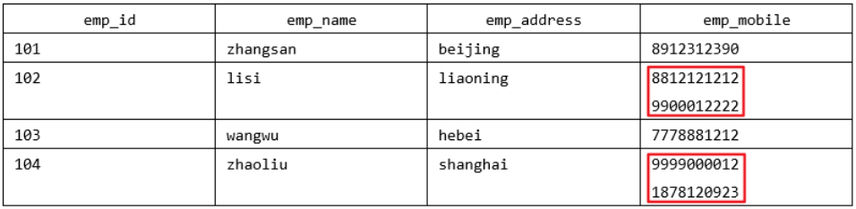

- 该表不符合 1NF ，因为规则说 "表的每个属性必须具有原子（单个）值"，lisi 和 zhaoliu 员工的 emp_mobile 值违反了该规则。为了使表符合 1NF ，我们应该有如下表数据：

  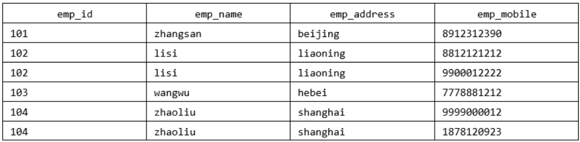

**示例二：**

- user 表的设计不符合第一范式：

  

- 其中，user_info 字段为用户信息，可以进一步拆分成更小粒度的字段，不符合数据库设计对第一范式的要求。将 user_info 拆分后如下：

  

**示例三：**

- 属性的原子性是主观的 。例如，Employees 关系中雇员姓名应当使用 1 个（fullname），2 个（firstname 和 lastname），还是3个（firstname、middlename 和 lastname）属性表示呢？答案取决于应用程序。如果应用程序需要分别处理雇员的姓名部分（如：用于搜索目的），则有必要把它们分开。否则，不需要。

  

  

#### 第二范式

**第二范式要求，在满足第一范式的基础上，还要满足数据表里的每一条数据记录，都是`可唯一标识`的（也就是一定有主键）。而且所有非主键字段，都必须`完全依赖主键`，不能只依赖主键的一部分。**如果知道主键的所有属性的值，就可以检索到任何元组（行）的任何属性的任何值。（要求中的主键，其实可以拓展替换为候选键）

另外第二范式只能完全函数依赖，不能部分函数依赖。

**示例一：**

- 成绩表 （学号，课程号，成绩）关系中，（学号，课程号）可以决定成绩，但是学号不能决定成绩，课程号也不能决定成绩，所以 "（学号，课程号）---> 成绩" 就是`完全依赖关系`。

**示例二：**

- `比赛表 player_game`，里面包含球员编号、姓名、年龄、比赛编号、比赛时间和比赛场地等属性，这里候选键和主键都为（球员编号，比赛编号），我们可以通过候选键（或主键）来决定如下的关系：

  ```tex
  (球员编号, 比赛编号) → (姓名, 年龄, 比赛时间, 比赛场地，得分)
  ```

- 但是这个数据表不满足第二范式，因为数据表中的字段之间还存在着如下的对应关系：

  ```tex
  # 姓名和年龄部分依赖球员编号
  (球员编号) → (姓名，年龄)
  
  # 比赛时间, 比赛场地部分依赖(球员编号, 比赛编号)
  (比赛编号) → (比赛时间, 比赛场地)
  ```

对于非主属性来说，并非完全依赖候选键。这样会产生怎样的问题呢？（为什么要满足 2NF）

- `数据冗余`： 如果一个球员可以参加 m 场比赛，那么球员的姓名和年龄就重复了 m - 1 次。一个比赛也可能会有 n 个球员参加，比赛的时间和地点就重复了 n - 1 次。

- `插入异常`： 如果我们想要添加一场新的比赛，但是这时还没有确定参加的球员都有谁，那么就没法插入。

- `删除异常`： 如果我要删除某个球员编号，如果没有单独保存比赛表的话，就会同时把比赛信息删除掉。

- `更新异常`： 如果我们调整了某场比赛的时间，那么数据表中所有这场比赛的时间都需要进行调整，否则就会出现一场比赛时间不同的情况。

为了避免出现上述的情况，我们可以把球员比赛表设计为下面的三张表：

| 表名                        | 属性（字段）                       |
| --------------------------- | ---------------------------------- |
| 球员 player 表              | 球员编号、姓名和年龄等属性         |
| 比赛 game 表                | 比赛编号、比赛时间和比赛场地等属性 |
| 球员比赛关系 player_game 表 | 球员编号、比赛编号和得分等属性     |

这样的话，每张数据表都符合第二范式，也就避免了异常情况的发生。

> **1NF 告诉我们`字段属性`需要是原子性的，而 2NF 告诉我们`一张表就是一个独立的对象`，一张表只表达一个意思。**

**示例三：**

- 定义一个名为 Orders 的关系，表示订单和订单行的信息：

  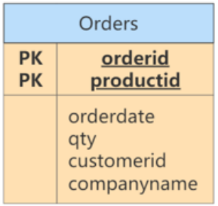

  - 违反了第二范式，因为有非主键属性仅依赖于候选键（或主键）的一部分。例如，可以仅通过 orderid 找到订单的 orderdate，以及 customerid 和 companyname，而没有必要再去使用 productid。

- 修改为 Orders 表和 OrderDetails 表如下，此时符合第二范式。

  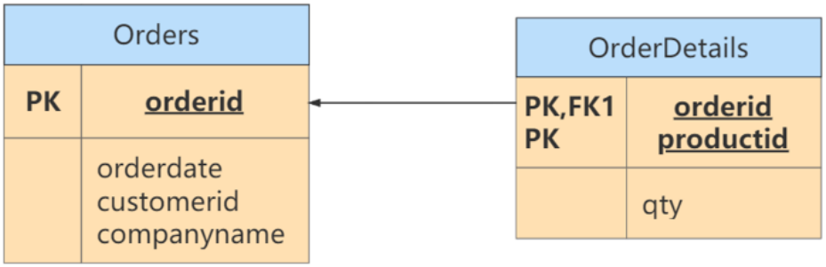

> 小结：`第二范式要求实体的属性完全依赖主关键字。`如果存在不完全依赖，那么这个属性和主关键字的这一部分应该分离出来形成一个新的实体，新实体与元实体之间是一对多的关系。

#### 第三范式

**第三范式是在第二范式的基础上，确保数据表中的`每一个非主键字段都和主键字段直接相关`，也就是说，要求数据表中的所有非主键字段不能依赖于其他非主键字段。**即，不能存在非主属性 A 依赖于非主属性 B，非主属性 B 依赖于主键 C 的情况，即存在 "A ---> B ---> C" 的决定关系。通俗地讲，该规则的意思是所有非主键属性之间不能有传递依赖关系，必须相互独立。（这里的主键可以拓展为候选键）

**示例一：**

- **部门信息表：**每个部门有部门编号（dept_id）、部门名称、部门简介等信息。
- **员工信息表：**每个员工有员工编号、姓名、部门编号。列出部门编号后就不能再将部门名称、部门简介等与部门有关的信息再加入员工信息表中。
- 如果不存在部门信息表，则根据第三范式（3NF）也应该构建它，否则就会有大量的数据冗余。

**示例二：**

- 如下表，商品类别名称依赖于商品类别编号，不符合第三范式：

  

- 将其修改为商品表和商品类别表，商品表 goods 通过商品类别 id 字段（category_id）与商品类别表 goods_category 进行关联。

  

**示例三：**

- 球员 player 表 ：球员编号、姓名、球队名称和球队主教练。现在，我们把属性之间的依赖关系画出来，如下图所示：

  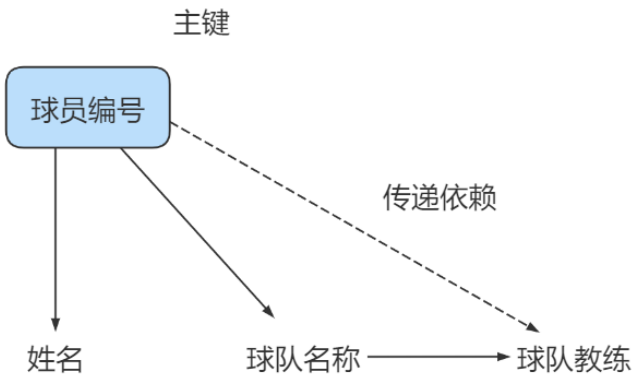

- 可以看到，球员编号决定了球队名称，同时球队名称决定了球队主教练，非主属性球队主教练就会传递依赖于球员编号，因此不符合 3NF 的要求。

- 如果要达到 3NF 的要求，需要把数据表拆成下面这样：

  | 表名   | 属性（字段）             |
  | ------ | ------------------------ |
  | 球队表 | 球员编号、姓名和球队名称 |
  | 球员表 | 球队名称、球队主教练     |

**示例四：**

- 修改第二范式中的示例三。

- 此时的 Orders 关系包含 orderid、orderdate、customerid 和 companyname 属性，主键定义为 orderid。customerid 和 companyname 均依赖于主键 orderid。例如，你需要通过 orderid 主键来查找代表订单中客户的 customerid，同样，你需要通过 orderid 主键查找订单中客户的公司名称（companyname）。然而， customerid 和 companyname 也是互相依靠的。为满足第三范式，可以改写如下：

  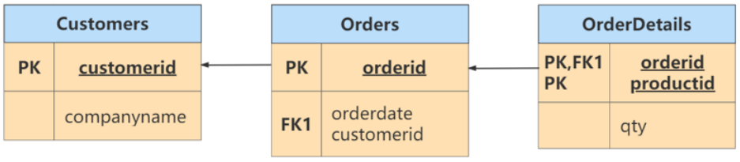

>符合3NF后的数据模型通俗地讲，2NF 和 3NF 通常以这句话概括：`"每个非键属性依赖于键，依赖于整个键，并且除了键别无他物"。`

#### 小结

关于数据表的设计，有三个范式要遵循：

- 第一范式（1NF），`确保每列保持原子性`。数据库的每一列都是不可分割的原子数据项，不可再分的最小数据单元，而不能是集合、数组、记录等非原子数据项。
- 第二范式（2NF），`确保每列都和主键完全依赖`。尤其在复合主键的情况向下，非主键部分不应该依赖于部分主键。
- 第三范式（3NF），`确保每列都和主键直接相关`，而不是间接相关。

**范式的优点：**数据的标准化有助于消除数据库中的数据冗余，`第三范式通常被认为在性能、拓展性和数据完整性方面达到了最好的平衡。`

**范式的缺点：**范式的使用，可能降低查询的效率。因为范式等级越高，设计出来的数据表就越多、越精细，数据的冗余度就越低，进行数据查询的时候就可能需要关联多张表，这不但代价昂贵，也可能使一些索引策略无效。

范式只是提出了设计的标准，实际上设计数据表时，未必一定要符合这些标准。开发中，我们会出现为了性能和读取效率违反范式化的原则，通过增加少量的冗余或重复的数据来提高数据库的读性能，减少关联查询，join 表的次数，实现空间换取时间的目的。因此，在实际的设计过程中要理论结合实际，灵活运用。

>范式本身没有优劣之分，只有适用场景不同。没有完美的设计，只有合适的设计，我们在数据表的设计中，还需要根据需求将范式和反范式混合使用。

### 反范式化

#### 概述

有的时候，不能简单按照规范要求设计数据表，因为有的数据看似冗余，其实对业务来说十分重要。这个时候，我们就要`遵循业务优先的原则`，首先满足业务需求，再尽量减少冗余。

如果数据库中的数据量比较大，系统的 UV 和 PV 访问频次比较高，则完全按照 MySQL 的三大范式设计数据表，读数据时会产生大量的关联查询，在一定程度上会影响数据库的读性能。如果我们想对查询效率进行优化，反范式化也是一种优化思路。此时，可以通过在数据表中增加冗余字段来提高数据库的读性能。

> **规范化 VS 性能：**
>
> 1. 为满足某种商业目标，数据库性能比规范化数据库更重要。
> 2. 在数据规范化的同时，要综合考虑数据库的性能。
> 3. 通过在给定的表中添加额外的字段，以大量减少需要从中搜索信息所需的时间。
> 4. 通过在给定的表中插入计算列，以方便查询。

#### 应用举例

**示例一：**

- 员工的信息存储在 employees 表中，部门信息存储在 departments 表中，通过 employees 表中的 department_id 字段与 departments 表建立关联关系。如果要查询一个员工所在部门的名称，可以使用下面的 SQL。如果经常需要进行这个操作，连接查询就会浪费很多时间。可以在 employees 表中增加一个冗余字段 department_name，这样就不用每次都进行连接操作了。

  ```mysql
  SELECT employee_id, department_name FROM employees e JOIN departments d ON e.department_id = d.department_id;
  ```

**示例二：**

- 反范式化的 goods商品信息表 设计如下：

  

**示例三：**

- 假设有 2 个表，分别是商品流水表（trans ）和商品信息表（goodsinfo）。商品流水表里有 400 万条流水记录，商品信息表里有 2000 条商品记录。

  - 商品流水表：

    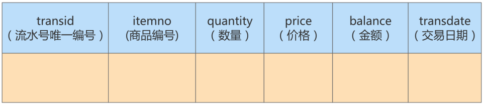

  - 商品信息表：

    

- 上面这两个表，都是符合第三范式要求的。但是，在项目的实施过程中，对流水的查询频率很高，而且为了获取商品名称，基本都会用到与商品信息表的连接查询。为了减少连接，可以直接把商品名称字段加到流水表里面。这样一来，就可以直接从流水表中获取商品名称字段了。虽然增加了冗余字段，但是避免了关联查询，提升了查询的效率。新的商品流水表如下所示：

  

**示例四：**

- 课程评论表 class_comment，对应的字段名称及含义如下：

  

- 学生表 student，对应的字段名称及含义如下：

  

- 在实际应用中，我们在显示课程评论的时候，通常会显示这个学生的昵称，而不是学生 ID，因此，当我们想要查询某个课程的前 1000 条评论时，需要关联 class_comment 和 student这两张表来进行查询。

**实验数据：模拟两张百万量级的数据表**

为了更好地进行 SQL 优化实验，我们需要给学生表和课程评论表随机模拟出百万量级的数据。我们可以通过存储过程来实现模拟数据。

- 创建表：

  ```mysql
  mysql> set names utf8;
  Query OK, 0 rows affected, 1 warning (0.00 sec)
  
  mysql> CREATE DATABASE atguigudb2;
  Query OK, 1 row affected (0.01 sec)
  
  mysql> USE atguigudb2;
  Database changed
  
  # 学生表
  mysql> CREATE TABLE student(
      -> stu_id INT PRIMARY KEY AUTO_INCREMENT,
      -> stu_name VARCHAR(25),
      -> create_time DATETIME
      -> );
  Query OK, 0 rows affected (0.03 sec)
  
  # 课程评论表
  mysql> CREATE TABLE class_comment(
      -> comment_id INT PRIMARY KEY AUTO_INCREMENT,
      -> class_id INT,
      -> comment_text VARCHAR(35),
      -> comment_time DATETIME,
      -> stu_id INT
      -> );
  Query OK, 0 rows affected (0.03 sec)
  ```

- 创建存储过程：

  ```mysql
  # 创建向学生表中添加数据的存储过程
  mysql> DELIMITER //
  mysql> CREATE PROCEDURE batch_insert_student(IN START INT(10),IN max_num INT (10))
      -> BEGIN
      -> DECLARE i INT DEFAULT 0;
      -> DECLARE date_start DATETIME DEFAULT ('2017-01-01 00:00:00');
      -> DECLARE date_temp DATETIME;
      -> SET date_temp = date_start;
      -> SET autocommit=0;
      -> REPEAT
      -> SET i=i+1;
      -> SET date_temp = DATE_ADD(date_temp,INTERVAL RAND( )*60 SECOND);
      -> INSERT INTO student(stu_id, stu_name,create_time)
      -> VALUES ((START+i), CONCAT ('stu_',i), date_temp) ;
      -> UNTIL i = max_num
      -> END REPEAT;
      -> COMMIT;
      -> END //
  Query OK, 0 rows affected, 2 warnings (0.02 sec)
  
  mysql> DELIMITER ;
  
  # 创建向课程评论表中添加数据的存储过程
  mysql> DELIMITER //
  mysql> CREATE PROCEDURE batch_insert_class_comments(IN START INT(10),IN max_num INT (10))
      -> BEGIN
      -> DECLARE i INT DEFAULT 0;
      -> DECLARE date_start DATETIME DEFAULT ('2018-01-01 00:00:00');
      -> DECLARE date_temp DATETIME;
      -> DECLARE comment_text VARCHAR(25);
      -> DECLARE stu_id INT;
      -> SET date_temp = date_start;
      -> SET autocommit=0;
      -> REPEAT
      -> SET i=i+1;
      -> SET date_temp = DATE_ADD(date_temp,INTERVAL RAND( )*60 SECOND);
      -> SET comment_text=SUBSTR(MD5(RAND()),1,20);
      -> SET stu_id=FLOOR(RAND()*1000000);
      -> INSERT INTO `class_comment`(`comment_id`,`class_id`,`comment_text`,`comment_time`,`stu_id`)
      -> VALUES ((START+i),10001,comment_text,date_temp,stu_id);
      -> UNTIL i = max_num
      -> END REPEAT;
      -> COMMIT;
      -> END //
  Query OK, 0 rows affected, 2 warnings (0.01 sec)
  
  mysql> DELIMITER ;
  ```

- 调用存储过程：

  ```mysql
  # 调用存储过程，学生id从10001开始，添加1000000条数据
  mysql> CALL batch_insert_student(10000, 1000000);
  Query OK, 0 rows affected (31.58 sec)
  
  # 添加数据的过程的调用，一个1000000条数据
  mysql> CALL batch_insert_class_comments(10000, 1000000);
  Query OK, 0 rows affected (34.81 sec)
  
  mysql> SELECT COUNT(*) FROM student;
  +----------+
  | COUNT(*) |
  +----------+
  |  1000000 |
  +----------+
  1 row in set (0.03 sec)
  
  mysql> SELECT COUNT(*) FROM class_comment;
  +----------+
  | COUNT(*) |
  +----------+
  |  1000000 |
  +----------+
  1 row in set (0.03 sec)
  ```

- 测试：

  ```mysql
  mysql> SELECT p.comment_text, p.comment_time, stu.stu_name FROM class_comment AS p LEFT JOIN student AS stu ON p.stu_id = stu.stu_id WHERE p.class_id = 10001 ORDER BY p.comment_id DESC LIMIT 10000;
  +----------------------+---------------------+------------+
  | comment_text         | comment_time        | stu_name   |
  +----------------------+---------------------+------------+
  | ea4d03873f7f3a26e1ba | 2018-12-14 03:26:26 | stu_209036 |
  | 1fe6697da6c77d637497 | 2018-12-14 03:26:22 | stu_740513 |
  | 5fafc1b2b297f23159cd | 2018-12-14 03:26:21 | stu_168595 |
  | badca0f8d453eb0b67bf | 2018-12-10 15:29:16 | stu_288793 |
  | 219f577d16b8005ca971 | 2018-12-10 15:28:48 | stu_259916 |
  | dcb3e24911b5bcaa47a8 | 2018-12-10 15:28:11 | stu_815722 |
  +----------------------+---------------------+------------+
  10000 rows in set (0.04 sec)
  ```

  - 运行时长为 0.04 秒，对于网站的响应来说，这已经很慢了，用户体验会非常差。如果我们想要提升查询的效率，可以允许适当的数据冗余，也就是在商品评论表中增加用户昵称字段，在 class_comment 数据表的基础上增加 stu_name 字段，就得到了 class_comment2 数据表。

- 反范式优化实验对比：

  ```mysql
  # 进行反范式化设计
  
  # 表的复制
  mysql> CREATE TABLE class_comment1 AS SELECT * FROM class_comment;
  Query OK, 1000000 rows affected (5.70 sec)
  Records: 1000000  Duplicates: 0  Warnings: 0
  
  # 添加主键，保证class_comment1与class_comment的结构相同
  mysql> ALTER TABLE class_comment1 ADD PRIMARY KEY(comment_id);
  Query OK, 0 rows affected (8.74 sec)
  Records: 0  Duplicates: 0  Warnings: 0
  
  mysql> SHOW INDEX FROM class_comment1;
  +----------------+------------+----------+--------------+-------------+-----------+-------------+----------+--------+------+------------+---------+---------------+---------+------------+
  | Table          | Non_unique | Key_name | Seq_in_index | Column_name | Collation | Cardinality | Sub_part | Packed | Null | Index_type | Comment | Index_comment | Visible | Expression |
  +----------------+------------+----------+--------------+-------------+-----------+-------------+----------+--------+------+------------+---------+---------------+---------+------------+
  | class_comment1 |          0 | PRIMARY  |            1 | comment_id  | A         |      996244 |     NULL |   NULL |      | BTREE      |         |               | YES     | NULL       |
  +----------------+------------+----------+--------------+-------------+-----------+-------------+----------+--------+------+------------+---------+---------------+---------+------------+
  1 row in set (0.00 sec)
  
  # 向课程评论表中增加stu_name字段
  mysql> ALTER TABLE class_comment1 ADD stu_name VARCHAR(25);
  Query OK, 0 rows affected (0.02 sec)
  Records: 0  Duplicates: 0  Warnings: 0
  
  # 给新添加的字段赋值
  mysql> UPDATE class_comment1 c SET stu_name = (SELECT stu_name FROM student s WHERE c.stu_id = s.stu_id);
  Query OK, 989941 rows affected (32.28 sec)
  Rows matched: 1000000  Changed: 989941  Warnings: 0
  ```

- 如果我们想要查询课程 ID 为 10001 的前 10000 条评论，需要写成下面这样：

  ```mysql
  mysql> SELECT comment_text, comment_time, stu_name FROM class_comment1 WHERE class_id = 10001 ORDER BY class_id DESC LIMIT 10000;
  +----------------------+---------------------+------------+
  | comment_text         | comment_time        | stu_name   |
  +----------------------+---------------------+------------+
  | 98ac57e47f969ccb3d5e | 2018-01-01 00:00:58 | stu_657565 |
  | 9417961cb63119c96cbc | 2018-01-01 00:01:10 | stu_236175 |
  | cb5b9be56b3ce6de9f0f | 2018-01-01 00:01:30 | stu_659727 |
  | 339b5f86158833d800c0 | 2018-01-04 11:59:26 | stu_411945 |
  | 2e069c3facbd62cf2051 | 2018-01-04 11:59:37 | stu_759542 |
  | 979fd006b1ea975b5c4d | 2018-01-04 12:00:28 | stu_160871 |
  +----------------------+---------------------+------------+
  10000 rows in set (0.00 sec)
  ```

  - 优化之后只需要扫描一次聚集索引即可，运行时间为 0.00 秒，查询时间比之前少很多。 你能看到，在数据量大的情况下，查询效率会有显著的提升。

#### 反范式的新问题

- `存储空间变大`了。
- 一个表中字段做了修改，另一个表中冗余的字段也需要做同步修改，否则`数据不一致`。
- 若采用存储过程来支持数据的更新、删除等额外操作，如果更新频繁，会非常`消耗系统资源`。
- 在`数据量小`的情况下，反范式不能体现性能的优势，可能还会让数据库的设计更加`复杂`。

#### 反范式的适用场景

当`冗余信息有价值`或者能`大幅度提高查询效率`的时候，我们才会采取反范式的优化。

1. 增加冗余字段的建议。
   - 这个冗余字段不需要经常进行修改。
   - 这个冗余字段查询的时候不可或缺（因为经常要用，所以才增加该冗余字段）。


2. 历史快照、历史数据的需要。
   - 在现实生活中，我们经常需要一些冗余信息，比如订单中的收货人信息，包括姓名、电话和地址等。每次发生的订单收货信息都属于历史快照，需要进行保存，但用户可以随时修改自己的信息，这时保存这些冗余信息是非常有必要的。


反范式优化也常用在数据仓库的设计中，因为数据仓库通常存储历史数据，对增删改的实时性要求不强，对历史数据的分析需求强。这时适当允许数据的冗余度，更方便进行数据分析。

简单总结下数据仓库和数据库在使用上的区别：

- 数据库设计的目的在于捕获数据，而数据仓库设计的目的在于分析数据；
- 数据库对数据的增删改实时性要求强，需要存储在线的用户数据，而数据仓库存储的一般是历史数据；
- 数据库设计需要尽量避免冗余，但为了提高查询效率也允许一定的冗余度，而数据仓库在设计上更偏向采用反范式设计。

> 注意：反范式反的是第二范式或第三范式，第一范式是一定要遵守的。

### 巴斯范式

人们在 3NF 的基础上进行了改进，提出了`巴斯范式 (BCNF)`，也叫做`巴斯-科德范式 (Boyce-Codd NormalForm)`。BCNF 被认为没有新的设计规范加入，`只是对第三范式中设计规范要求更强`，使得数据库冗余度更小。所以，称为是修正的第三范式，或扩充的第三范式，BCNF 不被称为第四范式。

若一个关系达到了第三范式，并且它只有一个候选键，或者它的每个候选键都是单属性，则该关系自然达到 BCNF。

> 一般来说，一个数据库设计符合 3NF 或 BCNF 就可以了。

#### 案例

我们分析如下表的范式情况：


在这个表中，一个仓库只有一个管理员，同时一个管理员也只管理一个仓库。先来梳理下这些属性之间的依赖关系。

- 仓库名决定了管理员，管理员也决定了仓库名，同时（仓库名，物品名）的属性集合可以决定数量这个属性。这样，我们就可以找到数据表的候选键。


- 候选键：是（管理员，物品名）和（仓库名，物品名），然后从候选键中选择一个作为主键，比如（仓库名，物品名）。
- 主属性：包含在任一候选键中的属性，也就是仓库名，管理员和物品名。

- 非主属性 ：数量这个属性。

#### 是否符合三范式

如何判断一张表的范式呢？需要根据范式的等级，从低到高来进行判断：

- 首先，数据表每个属性都是原子性的，符合 1NF 的要求；


- 其次，数据表中非主属性 "数量" 都与候选键全部依赖，（仓库名，物品名）决定数量，（管理员，物品名）决定数量。因此，数据表符合 2NF 的要求；


- 最后，数据表中的非主属性，不传递依赖于候选键。因此符合 3NF 的要求。

#### 存在的问题

既然数据表已经符合了 3NF 的要求，是不是就不存在问题了呢？来看下面的情况：

- 增加一个仓库，但是还没有存放任何物品。根据数据表实体完整性的要求，主键不能有空值，因此会出现插入异常 ；
- 如果仓库更换了管理员，就可能会修改数据表中的多条记录；
- 如果仓库里的商品都卖空了，那么此时仓库名称和相应的管理员名称也会随之被删除。

可以能看到，即便数据表符合 3NF 的要求，同样可能存在插入，更新和删除数据的异常情况。

#### 问题解决

首先需要确认造成异常的原因：主属性仓库名对于候选键（管理员，物品名）是部分依赖的关系，这样就有可能导致上面的异常情况。因此引入 BCNF，它在 3NF 的基础上消除了主属性对候选键的部分依赖或者传递依赖关系。

如果在关系 R 中，U 为主键，A 属性是主键的一个属性，若存在 A ---> Y，Y 为主属性（也就是非候选码中的属性），则该关系不属于 BCNF。

根据 BCNF 的要求，需要把仓库管理关系 warehouse_keeper 表拆分成下面这样：

- 仓库表 ：（仓库名，管理员）
- 库存表 ：（仓库名，物品名，数量）

这样就不存在主属性对于候选键的部分依赖或传递依赖，上面数据表的设计就符合 BCNF。

> 再举例如下：
>
> 有一个学生导师表，其中包含字段：学生 ID，专业，导师，专业 GPA，这其中学生 ID 和专业是联合主键。
>
> 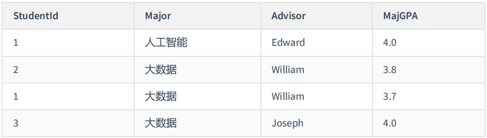
>
> 这个表的设计满足三范式，但是这里存在另一个依赖关系，"专业" 依赖于 "导师"，也就是说每个导师只做一个专业方面的导师，只要知道了是哪个导师，自然就知道是哪个专业的了。
>
> 所以这个表的部分主键 Major 依赖于非主键属性 Advisor，那么我们可以进行以下的调整，拆分成 2 个表：
>
> 学生导师表：
>
> 
>
> 导师表：
>
> 
>
> 

### 第四范式

`多值依赖`的概念：

- 多值依赖即属性之间的一对多关系，记为 K →→ A。
- 函数依赖事实上是单值依赖，所以不能表达属性值之间的一对多关系。
- 平凡的多值依赖∶全集 U = K + A，一个 K 可以对应于多个 A，即 K →→ A。此时整个表就是一组一对多关系。
- 非平凡的多值依赖：全集 U = K + A + B，一个 K 可以对应于多个 A，也可以对应于多个 B，A 与 B 互相独立，即 K →→ A，K →→ B。整个表有多组一对多关系，且有："一" 部分是相同的属性集合，"多" 部分是互相独立的属性集合。

**示例一：**

职工表（职工编号，职工孩子姓名，职工选修课程）。

在这个表中，同一个职工可能会有多个职工孩子姓名。同样，同一个职工也可能会有多个职工选修课程，即这里存在着多值事实，不符合第四范式。

如果要符合第四范式，只需要将上表分为两个表，使它们只有一个多值事实，例如： 职工表一（职工编号，职工孩子姓名），职工表二（职工编号，职工选修课程），两个表都只有一个多值事实，所以符合第四范式。

**示例二：**

比如建立课程、教师、教材的模型。我们规定，每门课程有对应的一组教师，每门课程也有对应的一组教材，一门课程使用的教材和教师没有关系。我们建立的关系表如下：课程 ID，教师 ID，教材 ID，这三列作为联合主键。

为了表述方便，我们用教师 Name 代替 ID，这样更容易看懂：


这个表除了主键，就没有其他字段了，所以肯定满足 BCNF，但是却存在多值依赖导致的异常。

假如下学期想采用一本新的英版高数教材，但是还没确定具体哪个老师来教，那么就无法在这个表中维护 Course 高数和 Book 英版高数教材的的关系。

解决办法是把这个多值依赖的表拆解成 2 个表，分别建立关系。这是拆分后的表：


### 第五范式、域键范式

除了第四范式外，还有更高级的`第五范式 (又称完美范式) 和域键范式 (DKNF)`。

在满足第四范式（4NF）的基础上，消除不是由候选键所蕴含的连接依赖。如果关系模式 R 中的每一个连接依赖均由 R 的候选键所隐含，则称此关系模式符合第五范式。

函数依赖是多值依赖的一种特殊的情况，而多值依赖实际上是连接依赖的一种特殊情况。但连接依赖不像函数依赖和多值依赖可以由语义直接导出 ，而是在关系连接运算时才反映出来。存在连接依赖的关系模式仍可能遇到数据冗余及插入、修改、删除异常等问题。

第五范式处理的是无损连接问题，这个范式基本`没有实际意义`，因为无损连接很少出现，而且难以察觉。而域键范式试图定义一个终极范式 ，该范式考虑所有的依赖和约束类型，但是实用价值也是最小的，只存在理论研究中。

### 实战案例

**需求：商超进货系统中的进货单表进行剖析。**

进货单表：

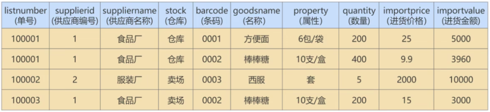

这个表中的字段很多，表里的数据量也很惊人。大量重复导致表变得庞大，效率极低。如何改造？

>在实际工作场景中，这种由于数据表结构设计不合理，而导致的数据重复的现象并不少见。往往是系统虽然能够运行，承载能力却很差，稍微有点流量，就会出现内存不足、CUP 使用率飙升的情况，甚至会导致整个项目失败。

#### 迭代 1 次：考虑 1NF

**第一范式要求：所有的字段都是基本数据字段，不可进一步拆分。这里需要确认，所有的列中，每个字段只包含一种数据。**

这张表里把 "property" 这一字段，拆分成 "specification (规格)" 和 "unit (单位)"，这 2 个字段如下：

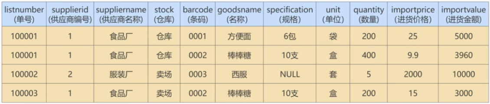

#### 迭代 2 次：考虑 2NF

**第二范式要求：在满足第一范式的基础上，还要满足数据表里的每一条数据记录，都是可唯一标识的。而且所有字段，都必须完全依赖主键，不能只依赖主键的一部分。**

第 1 步，就是要确定这个表的主键。通过观察发现，字段 "listnumber (单号)" + "barcode (条码)" 可以唯一标识每一条记录，可以作为主键。

第 2 步，确定好了主键以后，判断哪些字段完全依赖主键，哪些字段只依赖于主键的一部分。把只依赖于主键一部分的字段拆分出去，形成新的数据表。

首先，进货单明细表里面的 "goodsname (名称)"，"specification (规格)"，"unit (单位)" 这些信息是商品的属性，只依赖于 "barcode (条码)"，不完全依赖主键，可以拆分出去。把这 3 个字段加上它们所依赖的字段 "barcode (条码)"，拆分形成一个新的数据表 "商品信息表"。这样一来，原来的数据表就被拆分成了两个表。

- 商品信息表：

  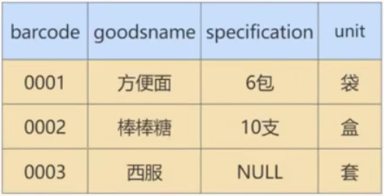

- 进货单表：

  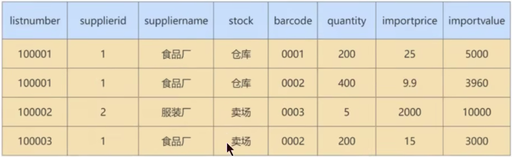

此外，字段 "supplierid (供应商编号)"，"suppliername (供应商名称)"，"stock (仓库)" 只依赖于 "listnumber (单号)"，不完全依赖于主键，所以，可以把 "supplierid"，"suppliername"，"stock" 这 3 个字段拆出去，再加上它们依赖的字段 "listnumber (单号)"，就形成了一个新的表 "进货单头表"。剩下的字段，会组成新的表，我们叫它 "进货单明细表"。原来的数据表就拆分成了 3 个表。

- 进货单头表：

  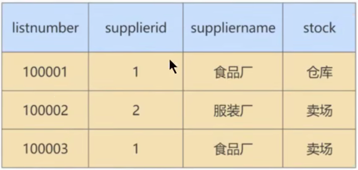

- 进货单明细表：

  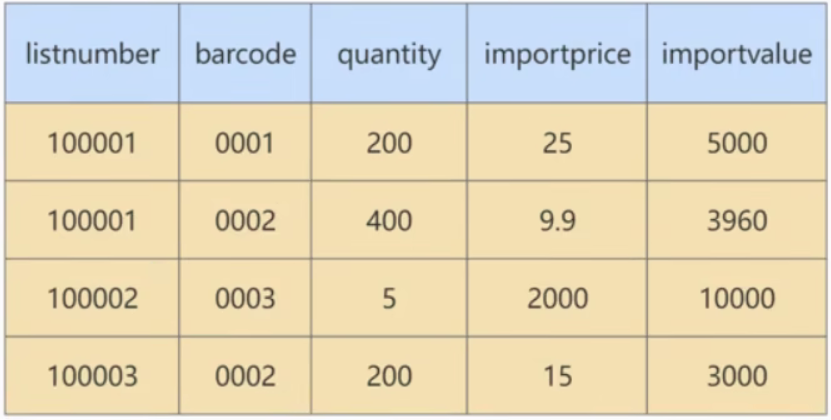

- 商品信息表：

  

现在来分析一下拆分后的 3 个表，保证这 3 个表都满足第二范式的要求。

第 3 步，在 "商品信息表" 中，字段 "barcode" 是有可能存在重复的，比如，用户门店可能有散装称重商品和自产商品，会存在条码共用的情况。所以，所有的字段都不能唯一标识表里的记录。这个时候必须给这个表加上一个主键，比如说是自增字段 "itemnumber"。

现在就可以把进货单明细表里面的字段 "barcode" 都替换成字段 "itemnumber"，这就得到了新的表。

- 进货单明细表：

  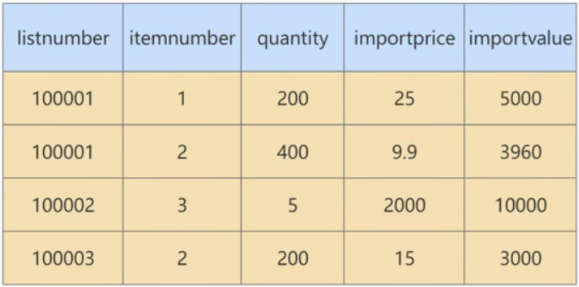

- 商品信息表：

  

拆分后的 3 个数据表，就全部满足了第二范式的要求。

#### 迭代 3 次：考虑 3NF

进货单头表还有数据冗余的可能。因为 "supplername" 依赖 "supplierid"，那么，这个时候，就可以按照第三范式的原则进行拆分了。进一步拆分一下进货单头表，把它拆解成供货商表和进货单头表。

- 供货商表：

  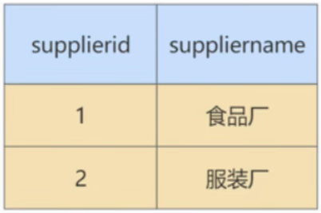

- 进货单头表：

  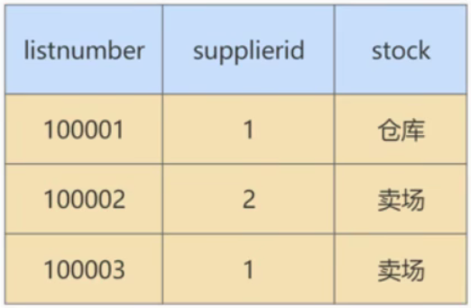

这 2 个表都满足第三范式的要求了。

#### 反范式化：业务优先的原则

在进货单明细表中，"quantity * importprice = importvalue"，"importprice"、"quantity" 和 "importvalue"，可以通过任意两个计算出第三个来，这就存在冗余字段。如果严格按照第三范式的要求，应该进行进一步优化。优化的办法是删除其中一个字段，只保留另外 2 个，这样就没有冗余数据了。

可是，真的可以这样做吗？要回答这个问题，就要先了解下实际工作中的业务优先原则。

所谓的业务优先原则，就是指一切以业务需求为主，技术服务于业务。**完全按照理论的设计，不一定就是最优，还要根据实际情况来决定。**这里就来分析一下不同选择的利与弊。

对于 "quantity * importprice =importvalue"，看起来 "importvalue" 似乎是冗余字段，但并不会导致数据不一致，可是，如果把这个字段取消，是会影响业务的。

因为有的时候，供货商会经常进行一些促销活动，按金额促销，那他们拿来的进货单只有金额，没有价格。而 "importprice" 反而是通过 "importvalue / quantity" 计算出来的，经过四舍五入，会产生较大的误差。这样日积月累，最终会导致查询结果出现较大偏差，影响系统的可靠性。

举例：进货金额（importvalue）是 25.5 元，数量（quantity）是 34，那么进货价格（importprice）就等于 25.5 / 34 = 0.74 元，但是如果用这个计算出来的进货价格（importprice）来计算进货金额，那么，进货金额（importvalue）就等于 0.74 x 34 = 25.16元，其中相差了 25.5 - 25.16 = 0.34 元。

所以，本着业务优先的原则，在不影响系统可靠性的前提下，可适当增加数据冗余，保留 "importvalue"，"importprice" 和 "quantity"。

因此，最终我们可以把进货单表拆分成下面的 4 个表：

- 进货单明细表：

  

- 商品信息表：

  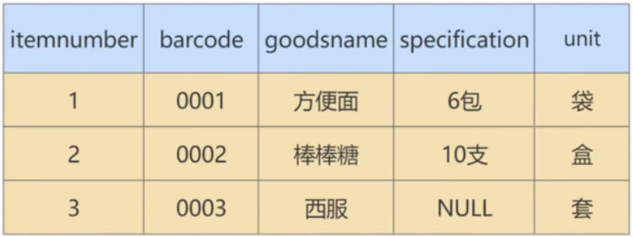

- 供货商表：

  

- 进货单头表：

  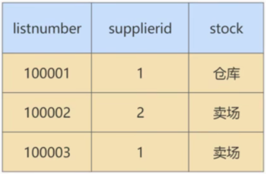

这样一来，我们就避免了冗余，而且还能够满足业务的需求，这样的数据表设计，才是合格的设计。

### ER 模型

数据库设计是牵一发而动全身的。那有没有什么办法提前看到数据库的全貌呢?比如需要哪些数据表、数据表中应该有哪些字段，数据表与数据表之间有什么关系、通过什么字段进行连接，等等。这样才能进行整体的梳理和设计。

其实，ER 模型就是一个这样的工具。ER 模型也叫作实体关系模型，是用来描述现实生活中客观存在的事物、事物的属性，以及事物之间关系的一种数据模型。在开发基于数据库的信息系统的设计阶段，通常使用ER模型来描述信息需求和信息特性，帮助我们理清业务逻辑，从而设计出优秀的数据库。

#### ER 模型包括哪些要素

ER 模型中有三个要素，分别是`实体`、`属性`和`关系`。

- `实体`，可以看做是数据对象，往往对应于现实生活中的真实存在的个体。在 ER 模型中，用`矩形`来表示。实体分为两类，分别是强实体和弱实体。强实体是指不依赖于其他实体的实体；弱实体是指对另一个实体有很强的依赖关系的实体。
- `属性`， 则是指实体的特性。比如超市的地址、联系电话、员工数等。在 ER 模型中用`椭圆形`来表示。
- `关系`， 则是指实体之间的联系。比如超市把商品卖给顾客，就是一种超市与顾客之间的联系。在 ER 模型中用`菱形`来表示。

注意：实体和属性不容易区分。这里提供一个原则：要从系统整体的角度出发去看，可以独立存在的是实体，不可再分的是属性。也就是说，属性不能包含其他属性。

#### 关系类型

在 ER 模型的 3 个要素中，关系又可以分为 3 种类型，分别是一对一、一对多、多对多。

- `一对一`：指实体之间的关系是一一对应的，比如个人与身份证信息之间的关系就是一对一的关系。一个人只能有一个身份证信息，一个身份证信息也只属于一个人。
- `一对多`∶指一边的实体通过关系，可以对应多个另外一边的实体。相反，另外一边的实体通过这个关系，则只能对应唯一的一边的实体。比如说，新建一个班级表，而每个班级都有多个学生，每个学生则对应一个班级，班级对学生就是一对多的关系。
- `多对多`：指关系两边的实体都可以通过关系对应多个对方的实体。比如在进货模块中，供货商与超市之间的关系就是多对多的关系，一个供货商可以给多个超市供货，一个超市也可以从多个供货商那里采购商品。再比如一个选课表，有许多科目，每个科目有很多学生选，而每个学生又可以选择多个科目，这就是多对多的关系。

#### 建模分析

ER 模型看起来比较麻烦，但是对我们把控项目整体非常重要。如果你只是开发一个小应用，或许简单设计几个表够用了，一旦要设计有一定规模的应用，在项目的初始阶段，建立完整的 ER 模型就非常关键了。开发应用项目的实质，其实就是`建模`。

此处设计的案例是电商业务，由于电商业务太过庞大且复杂，所以做了业务简化，比如针对 SKU（StockKeepingUnit，库存量单位）和 SPU（Standard Product Unit，标准化产品单元）的含义上，直接使用了 SKU，并没有提及 SPU 的概念。本次电商业务设计总共有 8 个实体，如下所示：

- 地址实体
- 用户实体
- 购物车实体
- 评论实体
- 商品实体
- 商品分类实体
- 订单实体
- 订单详情实体

其中，用户和商品分类是强实体，因为它们不需要依赖其他任何实体。而其他同于弱实体，因为它们虽然都可以独立存在，但是它们都依赖用户这个实体，因此都是弱实体。知道了这些要素就可以给电商业务创建 ER 模型了，如图：

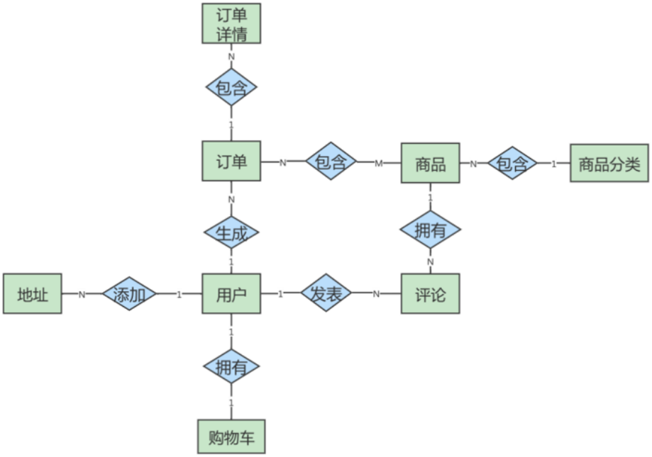

在这个图中，地址和用户之间的添加关系，是一对多的关系，而商品和商品详情示一对一的关系，商品和订单是多对多的关系。 这个 ER 模型，包括了 8 个实体之间的 8 种关系。

1. 用户可以在电商平台添加多个地址。
2. 用户只能拥有一个购物车。
3. 用户可以生成多个订单。
4. 用户可以发表多条评论。
5. 一件商品可以有多条评论。
6. 每一个商品分类包含多种商品。
7. 一个订单可以包含多个商品，一个商品可以在多个订单里。
8. 订单中又包含多个订单详情，因为一个订单中可能包含不同种类的商品。

#### ER 模型的细化

有了这个 ER 模型就可以从整体上理解电商的业务了。刚刚的 ER 模型展示了电商业务的框架，但是只包括了订单，地址，用户，购物车，评论，商品，商品分类和订单详情这八个实体，以及它们之间的关系，还不能对应到具体的表，以及表与表之间的关联。需要把属性加上，用椭圆来表示，这样得到的 ER 模型就更加完整了。

因此，我们需要进一步去设计一下这个 ER 模型的各个局部，也就是细化下电商的具体业务流程，然后把它们综合到一起，形成一个完整的 ER 模型。这样可以理清数据库的设计思路。

接下来再分析一下各个实体都有哪些属性，如下所示：

1. 地址实体：包括用户编号、省、市、地区、收件人、联系电话、是否是默认地址。
2. 用户实体：包括用户编号、用户名称、昵称、用户密码、手机号、邮箱、头像、用户级别。
3. 购物车实体：包括购物车编号、用户编号、商品编号、商品数量、图片文件 url。
4. 订单实体：包括订单编号、收货人、收件人电话、总金额、用户编号、付款方式、送货地址、下单时间。
5. 订单详情实体：包括订单详情编号、订单编号、商品名称、商品编号、商品数量。
6. 商品实体：包括商品编号、价格、商品名称、分类编号、是否销售，规格、颜色。
7. 评论实体：包括评论 id、评论内容、评论时间、用户编号、商品编号。
8. 商品分类实体：包括类别编号、类别名称、父类别编号。

这样细分之后就可以重新设计电商业务了，ER 模型如图：

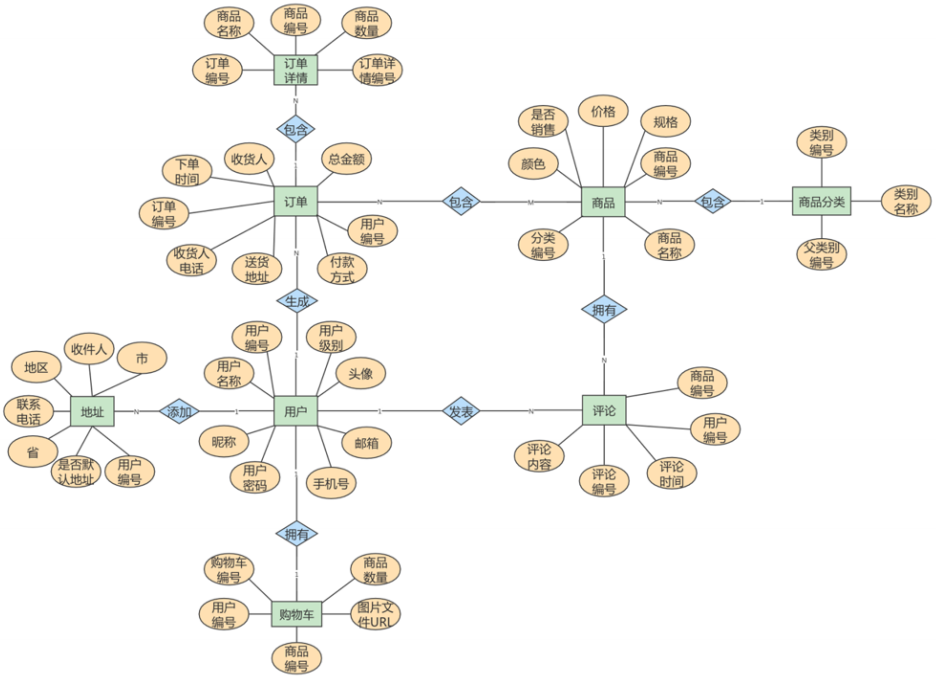

#### ER 模型图转换成数据表

通过绘制 ER 模型已经理清了业务逻辑，现在就要进行非常重要的一步了：把绘制好的 ER 模型，转换成具体的数据表。下面介绍下转换的原则：

1. 一个实体通常转换成一个数据表；
2. 一个多对多的关系，通常也转换成一个 数据表；
3. 一个 1 对 1，或者 1 对多的关系，往往通过表的外键来表达，而不是设计一个新的数据表；
4. 属性转换成表的字段。

下面结合前面的 ER 模型，具体讲解一下怎么运用这些转换的原则，把 ER 模型转换成具体的数据表，从而把抽象出来的数据模型，落实到具体的数据库设计当中。

**1、一个实体通常转换成一个数据表**

先来看一下强实体转换成数据表：

- 用户实体转换成用户表（user_info）的代码如下所示：

  ```mysql
  CREATE TABLE `user_info`(
    `id` bigint(20)NOT NULL AUTO_INCREMENT COMMENT '编号',
    `user_name` varchar(200)DEFAULT NULL COMMENT '用户名称',
    `nick_name` varchar (200)DEFAULT NULL COMMENT '用户昵称',
    `passwd` varchar (200)DEFAULT NULL COMMENT '用户密码',
    `phone_num` varchar (200) DEFAULT NULL COMMENT '手机号',
    `email` varchar(200) DEFAULT NULL COMMENT '邮箱',
    `head_img` varchar ( 200)DEFAULT NULL COMMENT'头像',
    `user_level` varchar(200) DEFAULT NULL COMMENT '用户级别',
    PRIMARY KEY (id)
  ) ENGINE=InnoDB AUTO_INCREMENT=4 DEFAULT CHARSET=utf8 COMMENT='用户表';
  ```

- 商品分类实体转换成商品分类表（base_category），由于商品分类可以有一级分类和二级分类，比如一级分类有家居、手机等等分类，二级分类可以根据手机的一级分类分为手机配件，运营商等，这里我们把商品分类实体规划为两张表，分别是一级分类表和二级分类表，之所以这么规划是因为一级分类和二级分类都是有限的，存储为两张表业务结构更加清晰。

  ```mysql
  # 一级分类表
    CREATE TABLE`base_category1`(
    `id` bigint(20) NOT NULL AUTO_INCREMENT COMMENT '编号',
    `name` varchar (10) NOT-NULL COMMENT '分类名称',
    PRIMARY KEY (`id`) USING BTREE
  )ENGINE=InnoDB AUTO_INCREMENT=1 DEFAULT CHARSET=utf8 ROW_FORMAT=DYNAMIC COMMENT='一级分类表';
  
  # 二级分类表
  CREATE TABLE `base_category2`(
    `id` bigint(20) NOT NULL AUTO_INCREMENT COMMENT '编号',
    `name` varchar (208) NOT NULL COMMENT '二级分类名称',
    `category1_id` bigint(20) DEFAULT NULL COMMENT '一级分类编号',
    PRIMARY KEY (`id`) USING BTREE
  )ENGINE=InnoDB AUTO_INCREMENT=1 DEFAULT CHARSET=utf8 ROW_FORMAT=DYNAMIC COMMENT='二级分类表';
  ```

- 那么如果规划为—张表呢，表结构如下所示：

  ```mysql
  CREATE TABLE `base_category`(
    `id` bigint(20) NOT NULL AUTO_INCREMENT COMMENT '编号',
    `name` varchar (200)NOT NULL COMMENT '分类名不',
    `category_parent_id` bigint(20) DEFAULT NULL COMMENT '父分类编号',
    PRIMARY KEY ( id  ) USING BTREE
  )ENGINE=InnoDB AUTO_INCRENENT=1 DEFAULT CHARSET=utf8 ROW_FORMAT=DYNAMIC COMMENT= '分类表';
  ```

  - 如果这样分类的话，那么查询一级分类时候，就需要判断父分类编号是否为空，但是如果插入二级分类的时候也是空，就容易造成业务数据混乱。而且查询二级分类的时候 IS NOT NULL 条件是无法使用到索引的。同时，这样的设计也不符合第二范式（因为父分类编号并不依赖分类编号 ID，因为父分类编号可以有很多数据为 NULL)，所以需要进行表的拆分。因此无论是业务需求还是数据库表的规范来看都应该拆分为两张表。

下面再把弱实体转换成数据表：

- 地址实体转换成地址表（user_address），如下所示：

  ```mysql
  CREATE TABLE `user_address`(
  `id` bigint(20)NOT NULL AUTO_INCREMENT COMMENT '编号',
  'province' varchar (500)DEFAULT NULL COMMENT'省',
  `city` varchar (500) DEFAULT NULL COMMENT '市',
  `user_address` varchar (500) DEFAULT NULL COMMENT '具体地址',
  `user_id bipint(20)` DEFAULT NULL COMMENT '用户id',
  `consignee` varchar( 40) DEFAULT NULL COMMENT '收件人',
  `phone_num ` varchar(40) DEFAULT NULL COMMENT ‘联系方式',
  `is_default` varchar( 1) DEFAULT NULL COMMENT '是否是默认',
  PRIMARY KEY (`id`)
  )ENGINE=InnoDB AUTO_INCREMENT=1 DEFAULT CHARSET=utf8 COMMENT='用户地址表';
  ```

- 订单实体转换成订单表（order_info)，如下所示，实际业务中订单的信息会非常多，我们这里做了简化。

  ```mysql
  CREATE TABLE `order_info`(
    `id` bigint(20) NOT NULL AUTO_INCREMENT COMMENT '编号',
    `consignee` varchar (100) DEFAULT NULL COMMENT '收货人',
    `consignee_tel` varchar(20) DEFAULT NULL COMMENT'收件人电话',
    `total_amount` decimal( 10,2)DEFAULT NULL COMMENT '总金额',
    `user_id` bigint(20) DEFAULT NULL COMMENT'用户id',
    `payment_way` varchar(20)DEFAULT NULL COMMENT'付款方式',
    `delivery_address` varchar( 1000) DEFAULT NULL COMMENT'送货地址',
    `create_time` datetime DEFAULT NULL COMMENT'下单时间',
    PRIMARY KEY (`id`) USING BTREE
  )ENGINE=InnoDB AUTO_INCRENENT=1 DEFAULT CHARSET=utf8 ROW_FORNAT=DYNAMIC COMMENT= '订单表';
  ```

- 订单详情实体转换成订单详情表（order_detail)，如下所示。（用于体现多对多关系的，见下节）：

  ```mysql
  # 订单详情表
  CREATE TABLE `order_detail`(
    `id` bigint(20) NOT NULL AUTO_INCREMENT COMMENT '订单详情编号',
    `order_id` bigint(20) DEFAULT NULL COMMENT '订单编号',
    `sku_id` bigint(20)DEFAULT NULL COMMENT 'sku_id',
    `sku_name` varchar(200) DEFAULT NULL COMMENT 'sku名称',
    `sku_num` varchar(200) DEFAULT NULL COMMENT '购买个数',
    `create_time` datetime DEFAULT NULL COMMENT'操作时间',
    PRIMARY KEY (`id`) USING BTREE
  )ENGINE=InnoDB AUTO_INCREMENT=1 DEFAULT CHARSET=utf8 ROW_FORMAT=DYNAMIC COMMENT='订单明细表';
  ```

- 购物车实体转换成购物车表（cart_info），如下所示：

  ```mysql
  CREATE TABLE `cart_info`(
    `cart_id` bigint(20)NOT NULL AUTO_INCREMENT COMMENT'编号',
    `user_id` varchar(200) DEFAULT NULL COMMENT'用户id',
    `sku_id` bigint(20)DEFAULT NULL COMMENT 'skuid' ,
    `sku_num` int( 11)DEFAULT NULL COMMENT '数量',
    `img_url` varchar ( 500) DEFAULT NULL COMMENT '图片文件',
    PRIMARY KEY (`id`) USING BTREE
  )ENGINE=InnoDB AUTO_INCRENENT=1 DEFAULT CHARSET=utf8 ROW_FORMAT=DYNAMIC COMMENT='购物车表';
  ```

- 评论实体转换成评论表（members），如下所示：

  ```mysql
  CREATE TABLE `sku_comments`(
    `comment_id` bigint(20) NOT NULL AUTO_INCREMENT COMMENT'评论编号',
    `user_id` bigin)t (20) DEFAULT NULL COMMENT'用户编号',
    `sku_id` decimal( 10,0) DEFAULT NULI COMMENT '商品编号',
    `comment` varchar(2000)DEFAULT NULL COMMENT '评论内容',
    `create_time` datetime DEFAULT NULL COMMENT '评论时间',
    PRIMARY KEY (`id`) USING BTREE
  )ENGINE=InnoDB AUTO_INCRENENT=45 DEFAULT CHARSET=utf8 ROW_FORMAT=DYNAMIC COMMNENT='商品评论表';
  ```

- 商品实体转换成商品表（members），如下所示：

  ```mysql
  CREATE TABLE `sku_info`(
    `sku_id` bigint(20) NOT NULL AUTO_INCREMENT COPMENT'商品编号(itemID)',
     `price` decimal(10,0) DEFAULT NULL COMMENT'价格',
    `sku_name` varchar(200) DEFAULT NULL COMMENT 'sku名称',
    `sku_desc` varchar(2000) DEFAULT NULL COMMENT'商品规格描述',
    `category3_id` bigint(20) DEFAULT NULL COMMENT'三级分类id(冗余)',
    `color` varchar (2000) DEFAULT NULL COMMENT '颜色',
    `is_sale` tinyint(3) NOT NULL DEFAULT '0' CONMMENT'是否销售(1:是0:否)',
    PRIMARY KEY (`id`) USING BTREE
  )ENGINE=InnoDB AUTO_INCRENENT=45 DEFAULT CHARSET=utf8 ROW_FORMAT=DYNAMIC COMMENT= '商品表';
  ```

**2、一个多对多的关系转换成一个数据表**

这个 ER 模型中的多对多的关系有 1 个，即商品和订单之间的关系，同品类的商品可以出现在不同的订单中，不同的订单也可以包含同一类型的商品，所以它们之间的关系是多对多。针对这种情况需要设计一个独立的表来表示，这种表一般称为中间表。

我们可以设计一个独立的订单详情表，来代表商品和订单之间的包含关系。这个表关联到 2 个实体，分别是订单、商品。所以，表中必须要包括这 2 个实体转换成的表的主键。除此之外，我们还要包括该关系自有的属性：商品数量，商品下单价格以及商品名称。

```mysql
# 订单详情表
CREATE TABLE `order_detail`(
`id` bigint(20) NOT NULL AUTO_INCREMENT COMMENT '订单详情编号',
`order_id` bigint(20)DEFAULT NULL COMMENT '订单编号',
`sku_id` bigint(20) DEFAULT NULL COMMENT 'sku_id ',
`sku_name` varchar(200) DEFAULT NULL COMMENT 'sku名称',
`sku_num` varchar(200)DEFAULT NULL COMMENT '购买个数',
`create_time` datetime DEFAULT NULL COMMENT '操作时间',
PRIMARY KEY (`id`) USING BTREE
)ENGINE=InnoDB AUTO_INCRENENT=1 DEFAULT CHARSET=utf8 ROW_FORMAT=DYNAMIC COMMENT='订单明细表';
```

> 公司的订单相关表主要有：order、order_item、sku、spu…，其中 order_detail 相当于 order_item。

**3、通过外键来表达1对多的关系**

在上面的表的设计中，我们可以用外键来表达一对多的关系。比如在商品评论表 sku_comments中，我们分别把 user_id、sku_id 定义成外键，以使用下面的语句设置外键。

```mysql
CONSTRAINT fk_comment_user FOREIGN KEY (user_id) REFERENCES user_info (id)

CONSTRAINT fk_comment_sku FOREIGN KEY (sku_id) REFERENCES sku_info (sku_id)
```

外键约束主要是在数据库层面上保证数据的一致性，但是因为插入和更新数据需要检查外键，理论上性能会有所下降，对性能是负面的影响。

`实际的项目，不建议使用外键。`一方面是降低开发的复杂度（有外键的话主从表类的操作必须先操作主表），另外是有外键在处理数据的时候非常麻烦。在电商平台，由于并发业务量比较大，所以一般不设置外键，以免影响数据库性能。

在应用层面做数据的一致性检查，本来就是一个正常的功能需求。如学生选课的场景，课程肯定不是输入的，而是通过下拉或查找等方式从系统中进行选取，就能够保证是合法的课程 ID，因此就不需要靠数据库的外键来检查了。

**4、把属性转换成表的字段**

在刚刚的设计中，我们也完成了把属性都转换成了表的字段，比如把商品属性转换成了商品信息表中的字段。

```mysql
CREATE TABLE `sku_info`(
  `sku_id` bigint(20) NOT NULL AUTO_INCREMENT COPMENT'商品编号(itemID)',
   `price` decimal(10,0) DEFAULT NULL COMMENT'价格',
  `sku_name` varchar(200) DEFAULT NULL COMMENT 'sku名称',
  `sku_desc` varchar(2000) DEFAULT NULL COMMENT'商品规格描述',
  `category3_id` bigint(20) DEFAULT NULL COMMENT'三级分类id(冗余)',
  `color` varchar (2000) DEFAULT NULL COMMENT '颜色',
  `is_sale` tinyint(3) NOT NULL DEFAULT '0' CONMMENT'是否销售(1:是0:否)',
  PRIMARY KEY (`id`) USING BTREE
)ENGINE=InnoDB AUTO_INCRENENT=45 DEFAULT CHARSET=utf8 ROW_FORMAT=DYNAMIC COMMENT= '商品表';
```

到这里，我们通过创建电商项目业务流程的 ER 模型，再把 ER 模型转换成具体的数据表的过程，完成利用 ER 模型设计电商项目数据库的工作。

其实，任何一个基于数据库的应用项目，都可以通过这种先建立 ER 模型，再转换成数据表的方式，完成数据库的设计工作。创建 ER 模型不是目的，目的是把业务逻辑梳理清楚，设计出优秀的数据库。不是为了建模而建模，要利用创建 ER 模型的过程来整理思路，这样创建 ER 模型才有意义。

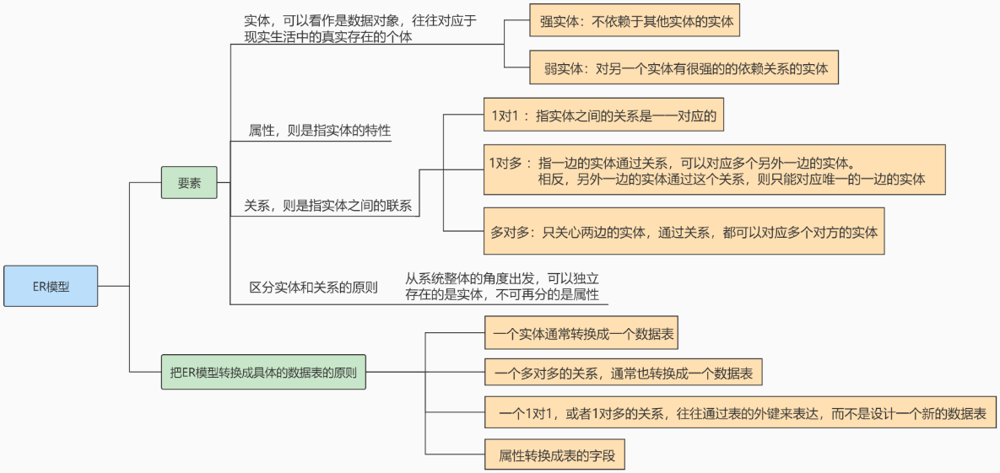

### 数据表的设计原则

综合以上内容，总结出数据表设计的一般原则：`三少一多`。

1. 数据表的个数越少越好。
   - RDBMS 的核心在于对实体和联系的定义，也就是 E-R 图（Entity Relationship Diagram），数据表越少，证明实体和联系设计得越简洁，既方便理解又方便操作。
2. 数据表中的字段个数越少越好。
   - 字段个数越多，数据冗余的可能性越大。设置字段个数少的前提是各个字段相互独立，而不是某个字段的取值可以由其他字段计算出来。当然字段个数少是相对的，通常会在数据冗余和检索效率中进行平衡。
3. 数据表中联合主键的字段个数越少越好。
   - 设置主键是为了确定唯一性，当一个字段无法确定唯一性的时候，就需要采用联合主键的方式（也就是用多个字段来定义一个主健）。联合主键中的字段越多，占用的索列空间越大，不仅会加大理解难度，还会增加运行时间和索引空间，因此联合主键的字段个数越少越好。
4. 使用主键和外键越多越好。
   - 数据库的设计实际上就是定义各种表，以及各种字段之间的关系。这些关系越多，证明这些实体之间的冗余度越低，利用度越高。这样做的好处在于不仅保证了数据表之间的独立性，还能提升相互之间的关联使用率。
   - 这里的外键指业务上实现外键，也就是逻辑外键。不一定使用外键约束实现。

"三少一多" 原则的核心就是简单可复用。简单指的是用更少的表、更少的字段、更少的联合主键字段来完成数据表的设计。可复用则是通过主键、外键的使用来增强数据表之间的复用率。因为一个主键可以理解是一张表的代表。键设计得越多，证明它们之间的利用率越高。

>注意：这个原则并不是绝对的，有时候我们需要牺牲数据的冗余度来换取数据处理的效率。

### 数据库对象编写建议

前面讲了数据库的设计规范，下面给出的这些规范适用于大多数公司，按照下面的规范来使用数据库，这样数据库可以发挥出更高的性能。

#### 关于库

1. 【强制】库的名称必须控制`在 32 个字符以内`，只能使用英文字母、数字和下划线，建议以英文字母开头。
2. 【强制】库名中英文一律`小写`，不同单词采用`下划线分割`，须见名知意。
3. 【强制】库的名称格式：`业务系统名称_子系统名`。
4. 【强制】库名`禁止使用关键字`，如 type，order 等。
5. 【强制】创建数据库时必须显式指定字符集，并且字符集只能是`utf8 或者 utf8mb4`。创建数据库 SQL 举例：CREATE DATABASE crm_fund DEFAULT CHARACTER SET 'utf8'。
6. 【建议】对于程序连接数据库账号，遵循`权限最小原则`。使用数据库账号只能在一个 DB 下使用，不准跨库。程序使用的账号原则上不准有 drop 权限。
7. 【建议】临时库以`tmp_`为前缀，并以日期为后缀；备份库以`bak_`为前缀，并以日期为后缀。

#### 关于表、列

1. 【强制】表和列的名称必须控制在 32 个字符以内，表名只能使用英文字母、数字和下划线，建议以英文字母开头。

2. 【强制】 表名、列名一律小写，不同单词采用下划线分割，须见名知意。

3. 【强制】表名要求有模块名强相关，同一模块的表名尽量使用统一前缀。比如：crm_fund_item。

4. 【强制】创建表时必须显式指定字符集为 utf8 或 utf8mb4。

5. 【强制】表名、列名禁止使用关键字，如 type，order 等。

6. 【强制】创建表时必须显式指定表存储引擎类型。如无特殊需求，一律为 InnoDB。

7. 【强制】建表`必须有 comment`。

8. 【强制】字段命名应尽可能使用表达实际含义的英文单词或缩写。如：公司 ID，不要使用 corporation_id，而用 corp_id 即可。

9. 【强制】布尔值类型的字段命名为`is_`描述。如 member 表上表示是否为 enabled 的会员的字段命名为 is_enabled。

10. 【强制】`禁止在数据库中存储图片、文件等大的二进制数据。`通常文件很大，短时间内造成数据量快速增长，数据库进行数据库读取时，通常会进行大量的随机 I/O 操作，文件很大时，I/O 操作很耗时。通常存储于文件服务器（如 FastDFS），数据库只存储文件地址信息。

11. 【建议】建表时关于主键：表必须有主键。

    - 强制要求主键为 id，类型为 int 或 bigint，且为 auto_increment，建议使用 unsigned 无符号型。
    - 标识表里每一行主体的字段不要设为主键，建议设为其他字段如 user_id，order_id 等，并建立 unique key 索引。因为如果设为主键且主键值为随机插入，则会导致 InnoDB 内部页分裂和大量随机 I/O，性能下降。

12. 【建议】核心表（如用户表）必须有行数据的创建时间字段（create_time）和最后更新时间字段（update_time），便于查问题。

13. 【建议】表中所有字段尽量都是 NOT NULL 属性，业务可以根据需要定义 DEFAULT 值。 因为使用 NULL 值会存在每一行都会占用额外存储空间、数据迁移容易出错、聚合函数计算结果偏差、业务代码容易出现空指针等问题。

14. 【建议】所有存储相同数据的列名和列类型必须一致（一般作为关联列，如果查询时关联列类型不一致会自动进行数据类型隐式转换，会造成列上的索引失效，导致查询效率降低）。

15. 【建议】中间表（或临时表）用于保留中间结果集，名称以`tmp_`开头。备份表用于备份或抓取源表快照，名称以`bak_`开头。中间表和备份表定期清理。

16. 【示范】一个较为规范的建表语句：

    ```mysql
    CREATE TABLE user_info (
      `id` int unsigned NOT NULL AUTO_INCREMENT COMMENT '自增主键',
      `user_id` bigint(11) NOT NULL COMMENT '用户id',
      `username` varchar(45) NOT NULL COMMENT '真实姓名',
      `email` varchar(30) NOT NULL COMMENT '用户邮箱',
      `nickname` varchar(45) NOT NULL COMMENT '昵称',
      `birthday` date NOT NULL COMMENT '生日',
      `sex` tinyint(4) DEFAULT '0' COMMENT '性别',
      `short_introduce` varchar(150) DEFAULT NULL COMMENT '一句话介绍自己，最多50个汉字',
      `user_resume` varchar(300) NOT NULL COMMENT '用户提交的简历存放地址',
      `user_register_ip` int NOT NULL COMMENT '用户注册时的源ip',
      `create_time` timestamp NOT NULL DEFAULT CURRENT_TIMESTAMP COMMENT '创建时间',
      `update_time` timestamp NOT NULL DEFAULT CURRENT_TIMESTAMP ON UPDATE CURRENT_TIMESTAMP COMMENT '修改时间',
      `user_review_status` tinyint NOT NULL COMMENT '用户资料审核状态，1为通过，2为审核中，3为未通过，4为还未提交审核',
      PRIMARY KEY (`id`),
      UNIQUE KEY `uniq_user_id` (`user_id`),
      KEY `idx_username`(`username`),
      KEY `idx_create_time_status`(`create_time`,`user_review_status`)
    ) ENGINE=InnoDB DEFAULT CHARSET=utf8 COMMENT='网站用户基本信息';
    ```

17. 【建议】创建表时，可以使用可视化工具。这样可以确保表、字段相关的约定都能设置上。实际上，我们通常很少自己写 DDL 语句，可以使用一些可视化工具来创建和操作数据库和数据表。可视化工具除了方便，还能直接帮我们将数据库的结构定义转化成 SQL 语言，方便数据库和数据表结构的导出和导入。

#### 关于索引

1. 【强制】InnoDB 表必须主键为 id int/bigint auto_increment，且主键值禁止被更新。
2. 【强制】InnoDB 和 MyISAM 存储引擎表，索引类型必须为 BTREE（此处是官方写法，代表的其实就是 B+Tree）。
3. 【建议】主键的名称以`pk_`开头，唯一键以`uni_`或`uk_`开头，普通索引以`idx_`开头，一律使用小写格式，以字段的名称或缩写作为后缀。
4. 【建议】多单词组成的 columnname，取前几个单词首字母，加末单词组成 column_name。如 sample 表 member_id 上的索引：idx_sample_mid。
5. 【建议】单个表上的索引个数不能超过 6 个。
6. 【建议】在建立索引时，多考虑建立联合索引，并把区分度最高的字段放在最前面。
7. 【建议】在多表 JOIN 的 SQL 里，保证被驱动表的连接列上有索引，这样 JOIN 执行效率最高。
8. 【建议】建表或加索引时，保证表里互相不存在冗余索引。 比如：如果表里已经存在 key(a, b)， 则 key(a) 为冗余索引，需要删除。

#### SQL 编写

1. 【强制】程序端 SELECT 语句必须指定具体字段名称，禁止写成 *。
2. 【建议】程序端 INSERT 语句指定具体字段名称，不要写成 INSERT INTO t1 VALUES(…)。
3. 【建议】除静态表或小表（100 行以内），DML 语句必须有 WHERE 条件，且使用索引查找。
4. 【建议】INSERT INTO…VALUES(XX), (XX), (XX)…，这里 XX 的值不要超过 5000 个。值过多虽然上线很快，但会引起主从同步延迟。
5. 【建议】SELECT 语句不要使用 UNION，推荐使用 UNION ALL，并且 UNION 子句个数限制在 5 个以内。
6. 【建议】线上环境，多表 JOIN 不要超过 5 个表。
7. 【建议】减少使用 ORDER BY，和业务沟通能不排序就不排序，或将排序放到程序端去做。`ORDER BY、GROUP BY、DISTINCT 这些语句较为耗费 CPU，数据库的 CPU 资源是极其宝贵的。`
8. 【建议】包含了 ORDER BY、GROUP BY、DISTINCT 这些查询的语句，WHERE 条件过滤出来的结果集请保持在 1000 行以内，否则 SQL 会很慢。
9. 【建议】对单表的多次 ALTER 操作必须合并为一次。对于超过 100 W 行的大表进行 ALTER TABLE，必须经过 DBA 审核，并在业务低峰期执行，多个 ALTER 需整合在一起。 因为 ALTER TABLE 会产生表锁，期间阻塞对于该表的所有写入，对于业务可能会产生极大影响。
10. 【建议】批量操作数据时，需要控制事务处理间隔时间，进行必要的 sleep。
11. 【建议】事务里包含 SQL 不超过 5 个。因为过长的事务会导致锁数据较久，MySQL 内部缓存、连接消耗过多等问题。
12. 【建议】事务里更新语句尽量基于主键或 UNIQUE KEY，如 UPDATE… WHERE id = XX，否则会产生间隙锁，内部扩大锁定范围，导致系统性能下降，产生死锁。

## 数据库其他调优策略

### 数据库调优的措施

#### 调优的目标

- 尽可能`节省系统资源`，以便系统可以提供更大负荷的服务（吞吐量更大）。
- 合理的结构设计和参数调整，以提高用户`操作响应的速度`（响应速度更快）。
- 减少系统的瓶颈，提高 MySQL 数据库整体的性能。

#### 如何定位调优问题

不过随着用户量的不断增加，以及应用程序复杂度的提升，我们很难用 "更快" 去定义数据库调优的目标，因为用户在不同时间段访问服务器遇到的瓶颈不同，比如双十一促销的时候会带来大规模的并发访问。还有用户在进行不同业务操作的时候，数据库的事务处理和 SQL 查询都会有所不同。因此还需要更加精细的定位，去确定调优的目标。

如何确定呢？一般情况下，有如下几种方式：

- **用户的反馈（主要）**
  - 用户是服务的对象，因此他们的反馈是最直接的。
  - 虽然他们不会直接提出技术建议，但是有些问题往往是用户第一时间发现的。要重视用户的反馈，找到和数据相关的问题。
- **日志分析（主要）**
  - 可以通过查看数据库日志和操作系统日志等方式找出异常情况，通过它们来定位遇到的问题。
  - 服务器资源使用监控，通过监控服务器的 CPU、内存、I/O 等使用情况，可以实时了解服务器的性能使用，与历史情况进行对比。
- **数据库内部状况监控**
  - 在数据库的监控中，活动会话（Active Session）监控是一个重要的指标。通过它可以清楚地了解数据库当前是否处于非常繁忙的状态，是否存在 SQL 堆积等。
- **其它**
  - 除了活动会话监控以外也可以对事务、锁等待等进行监控，这些都可以帮助我们对数据库的运行状态有更全面的认识。

#### 调优的维度和步骤

`需要调优的对象是整个数据库管理系统，它不仅包括 SQL 查询，还包括数据库的部署配置、架构等。`从这个角度来说，思考的维度就不仅仅局限在 SQL 优化上了。通过如下的步骤进行梳理：

##### 第 1 步：选择适合的 DBMS

如果对事务性处理以及安全性要求高的话，可以选择商业的数据库产品。这些数据库在事务处理和查询性能上都比较强，比如采用 SQL Server、Oracle，那么单表存储上亿条数据是没有问题的。如果数据表设计得好，即使不采用分库分表的方式，查询效率也不差。

除此以外也可以采用开源的 MySQL 进行存储，它有很多存储引擎可以选择，如果进行事务处理的话可以选择 InnoDB，非事务处理可以选择 MyISAM。

NoSQL 阵营包括键值型数据库、文档型数据库、搜索引擎，列式存储和图形数据库。这些数据库的优缺点和使用场景各有不同，比如列式存储数据库可以大幅度降低系统的 I/O，适合于分布式文件系统，但如果数据需要频繁地增删改，那么列式存储就不太适用了。

DBMS 的选择关系到了后面的整个设计过程，所以第一步就是要选择适合的 DBMS。如果已经确定好了 DBMS，那么这步可以跳过。

##### 第 2 步：优化表设计

选择了 DBMS 之后就需要进行表设计了。而数据表的设计方式也直接影响了后续的 SQL 查询语句。RDBMS 中，每个对象都可以定义为一张表，表与表之间的关系代表了对象之间的关系。如果用的是 MySQL，还可以根据不同表的使用需求，选择不同的存储引擎。除此以外，还有一些优化的原则可以参考：

- 表结构要尽量遵循三范式的原则。这样可以让数据结构更加清晰规范，减少冗余字段，同时也减少了在更新，插入和删除数据时等异常情况的发生。
- 如果查询应用比较多，尤其是需要进行多表联查的时候，可以采用反范式进行优化。反范式采用空间换时间的方式，通过增加冗余字段提高查询的效率。
- 表字段的数据类型选择，关系到了查询效率的高低以及存储空间的大小。一般来说，如果字段可以采用数值类型就不要采用字符类型。字符长度要尽可能设计得短一些。针对字符类型来说，当确定字符长度固定时，就可以采用 CHAR 类型。当长度不固定时，通常采用 VARCHAR 类型。

数据表的结构设计很基础，也很关键。好的表结构可以在业务发展和用户量增加的情况下依然发挥作用，不好的表结构设计会让数据表变得非常臃肿，查询效率也会降低。

##### 第 3 步：优化逻辑查询

当建立好数据表之后，就可以对数据表进行增删改查的操作了。这时首先需要考虑的是逻辑查询优化。

`SQL 查询优化，可以分为逻辑查询优化和物理查询优化。`逻辑查询优化就是通过改变 SQL 语句的内容，让 SQL 执行效率更高效，采用的方式是对 SQL 语句进行等价变换，对查询进行重写。

SQL 的查询重写包括了子查询优化、等价谓词重写、视图重写、条件简化、连接消除和嵌套连接消除等。

比如 EXISTS 子查询和 IN 子查询，会根据小表驱动大表的原则选择适合的子查询。在 WHERE 子句中会尽量避免对字段进行函数运算，它们会让字段的索引失效。示例如下：

- 查询评论内容开头为 abc 的内容都有哪些，如果在 WHERE 子句中使用了函数，语句就会写成下面这样：

  ```mysql
  SELECT comment_id, comment_text, comment_time FROM product_comment WHERE SUBSTRING(comnment_text, 1, 3) = 'abc';
  ```

- 采用查询重写的方式进行等价替换：

  ```mysql
  SELECT comment_id, comment_text, comment_time FROM product_comment WHERE comment_text LIKE 'abc%';
  ```

##### 第 4 步：优化物理查询

物理查询优化是在确定了逻辑查询优化之后，采用物理优化技术（比如索引等），通过计算代价模型对各种可能的访问路径进行估算，从而找到执行方式中代价最小的作为执行计划。在这个部分中需要掌握的重点是对索引的创建和使用。

但索引不是万能的，要根据实际情况来创建索引。那么都有哪些情况需要考虑呢？这在前面几章中已经进行了细致的剖析。

SQL 查询时需要对不同的数据表进行查询，因此在物理查询优化阶段也需要确定这些查询所采用的路径，具体的情况包括：

- 单表扫描：对于单表扫描来说，可以全表扫描所有的数据，也可以局部扫描。
- 两张表的连接：常用的连接方式包括了嵌套循环连接、 HASH 连接和合并连接。
- 多张表的连接：多张数据表进行连接的时候，顺序很重要，因为不同的连接路径查询的效率不同，搜索空间也会不同。在进行多表连接的时候，搜索空间可能会达到很高的数据量级，巨大的搜索空间显然会占用更多的资源，因此需要通过调整连接顺序，将搜索空间调整在一个可接受的范围内。

##### 第 5 步：使用 Redis 或 Memcached 作为缓存

除了可以对 SQL 本身进行优化以外，还可以请外援提升查询的效率。

因为数据都是存放到数据库中，需要从数据库层中取出数据放到内存中进行业务逻辑的操作，当用户量增大的时候，如果频繁地进行数据查询，会消耗数据库的很多资源。如果将常用的数据直接放到内存中，就会大幅提升查询的效率

键值存储数据库可以帮我们解决这个问题。

常用的键值存储数据库有 Redis 和 Memcached，它们都可以将数据存放到内存中。

从可靠性来说， Redis 支持持久化，可以让我们的数据保存在硬盘上，不过这样一来性能消耗也会比较大。而 Memcached 仅仅是内存存储，不支持持久化。

通常对于查询响应要求高的场景（响应时间短，吞吐量大)，可以考虑内存数据库，毕竟术业有专攻。传统的 RDBMS，都是将数据存储在硬盘上，而内存数据库则存放在内存中，查询起来要快得多。不过使用不同的工具，也增加了开发人员的使用成本。

##### 第 6 步：库级优化

库级优化是站在数据库的维度上进行的优化策略，比如控制一个库中的数据表数量。另外，单一的数据库总会遇到各种限制，不如取长补短，利用 "外援" 的方式。通过`主从架构`优化读写策略，通过对数据库进行垂直或者水平切分，突破单一数据库或数据表的访问限制，提升查询的性能。

###### 读写分离

如果读和写的业务量都很大，并且它们都在同一个数据库服务器中进行操作，那么数据库的性能就会出现瓶颈，这时为了提升系统的性能，优化用户体验，可以采用`读写分离`的方式降低主数据库的负载，比如用主数据库（master）完成写操作，用从数据库（slave）完成读操作。

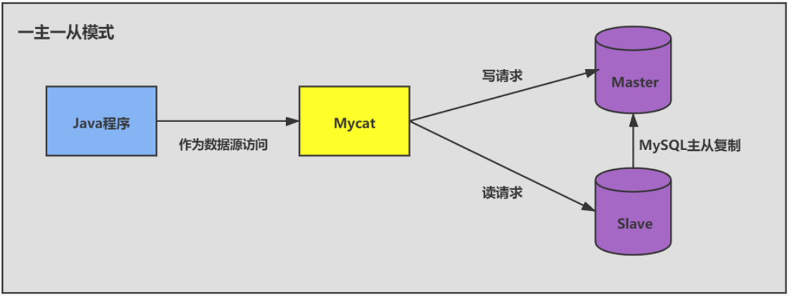

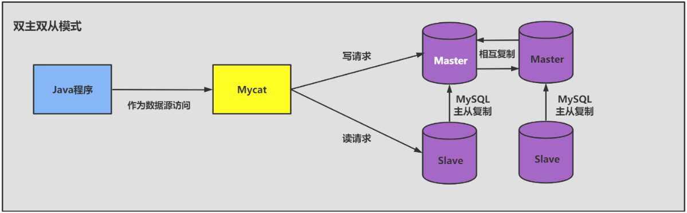

###### 数据分片

对数据库分库分表。当数据量级达到千万级以上时，有时候要把一个数据库切成多份，放到不同的数据库服务器上，减少对单一数据库服务器的访问压力。如果你使用的是 MySQL，就可以使用 MySQL 自带的分区表功能，当然你也可以考虑自己做`垂直拆分 (分库)`、`水平拆分 (分表)`、`垂直 + 水平拆分 (分库分表)`。

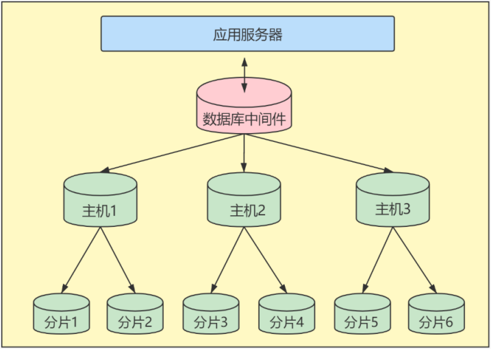

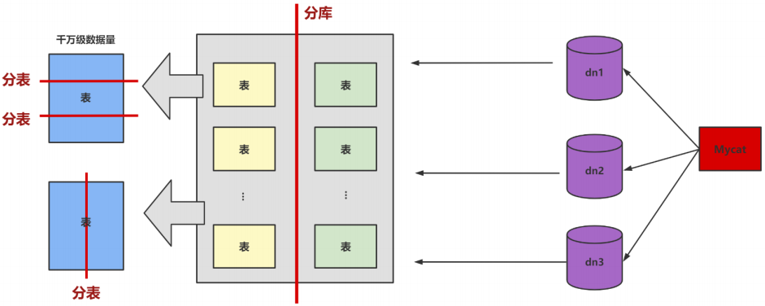

>- 垂直分表：比如按照热数据、冷数据进行分表。
>- 水平分表：比如按照日期范围进行划分。
>
>但需要注意的是，分拆在提升数据库性能的同时，也会增加维护和使用成本

### 优化 MySQL 服务器

优化 MySQL 服务器主要从两个方面来优化，一方面是对`硬件`进行优化。另一方面是对`MySQL 服务的参数`进行优化。这部分的内容需要较全面的知识，一般只有**专业的数据库管理员**才能进行这一类的优化。对于可以定制参数的操作系统，也可以针对 MySQL 进行操作系统优化。

#### 优化服务器硬件

服务器的硬件性能直接决定着 MySQL 数据库的性能。硬件的性能瓶颈直接决定 MySQL 数据库的运行速度和效率。针对性能瓶颈提高硬件配置，可以提高 MySQL 数据库查询、更新的速度。

1. 配置`较大的内存`。足够大的内存是提高 MySQL 数据库性能的方法之一。内存的速度比磁盘 I/O 快得多，可以通过增加系统的缓冲区容量使数据在内存中停留的时间更长，以读少磁盘 I/O。
2. 配置`高速磁盘系统`，以减少读盘的等待时间，提高响应速度。磁盘的 I/O 能力，也就是它的寻道能力，目前的 SCSI 高速旋转的是 7200 转/分钟，这样的速度，一旦访问的用户量上去，磁盘的压力就会过大，如果是每天的网站 pv（page view）在 150 w，这样的一般的配置就无法满足这样的需求了。现在 SSD 盛行，在 SSD 上随机访问和顺序访问性能几乎差不多，使用 SSD 可以减少随机 I/O 带来的性能损耗。
3. `合理分布磁盘 I/O`，把磁盘 I/O 分散在多个设备上，以减少资源竞争，提高并行操作能力。
4. 配置`多处理器`，MySQL 是多线程的数据库，多处理器可同时执行多个线程。

#### 优化 MySQL 服务的参数

通过优化 MySQL 服务的参数可以提高资源利用率，从而达到提高 MySQL 服务器性能的目的。

MySQL 服务的配置参数都在`my.cnf`或者`my.ini`文件的`[mysqld]`组中，配置完参数以后，需要重新启动 MySQL 服务才会生效。

下面对几个对性能影响比较大的参数进行详细介绍：

- `innodb_buffer_pool_size`：这个参数是 MySQL 数据库最重要的参数之一，表示 InnoDB 类型的`表和索引的最大缓存`。它不仅仅缓存索引数据，还会缓存表的数据。这个值越大，查询的速度就会越快。但是这个值太大会影响操作系统的性能。

- `key_buffer_size`：表示`索引缓冲区的大小`。`索引缓冲区是所有的线程共享`。增加索引缓冲区可以得到更好处理的索引（对所有读和多重写）。当然，这个值不是越大越好，它的大小取决于内存的大小。如果这个值太大，就会导致操作系统频繁换页，也会降低系统性能。对于内存在 4 GB 左右的服务器该参数可设置为 256 MB 或 384 MB。

- `table_cache`：表示`同时打开的表的个数`。这个值越大，能够同时打开的表的个数越多。物理内存越大，设置就越大。默认为 2402，调到 512 ~ 1024 最佳。这个值不是越大越好，因为同时打开的表太多会影响操作系统的性能。

- `query_cache_size`：表示查询缓冲区的大小。可以通过在 MySQL 控制台观察，如果 qcache_lowmem_prunes 的值非常大，则表明经常出现缓冲不够的情况，就要增加 query_cache_size 的值；如果 qcache_hits 的值非常大，则表明查询缓冲使用非常频繁，如果该值较小反而会影响效率，那么可以考虑不用查询缓存。

- `qcache_free_blocks`：如果该值非常大，则表明缓冲区中碎片很多。MySQL 8.0 之后失效。该参数需要和 query_cache_type 配合使用。

- `query_cache_type`：值是 0 时，所有的查询都不使用查询缓存区。但是 query_cache_type = 0 并不会导致 MySQL 释放 query_cache_size 所配置的缓存区内存。

  - 当 query_cache_type = 1 时，所有的查询都将使用查询缓存区，除非在查询语句中指定 SQL_NO_CACHE，如 SELECT SQL_NO_CACHE FROM tbl_name。
  - 当 query_cache_type = 2 时，只有在查询语句中使用 SQL_CACHE 关键字，查询才会使用查询缓存区。使用查询缓存区可以提高查询的速度，这种方式只适用于修改操作少且经常执行相同的查询操作的情况。

- `sort_buffer_size`：表示每个`需要进行排序的线程分配的缓冲区的大小`。增加这个参数的值可以提高 ORDER BY 或 GROUP BY 操作的速度。默认数值是 2097144 字节（约 2 MB）。对于内存在 4 GB 左右的服务器，推荐设置为 6 ~ 8 MB，如果有 100 个连接，那么实际分配的总共排序缓冲区大小为 100 × 6 = 600 MB。

- `join_buffer_size = 8M`：表示`联合查询操作所能使用的缓冲区大小`，和sort_buffer_size一样，该参数对应的分配内存也是每个连接独享。

- `read_buffer_size`：表示`每个线程连续扫描时为扫描的每个表分配的缓冲区的大小 (字节)`。当线程从表中连续读取记录时需要到这个缓冲区。SET SESSION read_buffer_size=n 可以临时设置该参数的值。默认为 64 KB，可以设置为 4 MB。

- `innodb_flush_log_at_trx_commit`：表示`何时将缓冲区的数据写入日志文件`，并且将日志文件写入磁盘中。该参数对于 InnoDB 引擎非常重要。该参数有 3 个值，分别为 0、1 和 2。该参数的默认值为 1。

  - 值为 0 时，表示`每秒 1 次`的频率，将数据写入日志文件并将日志文件写入磁盘。每个事务的 commit 并不会触发前面的任何操作。该模式速度最快，但不太安全，mysqld 进程的崩溃会导致上一秒钟所有事务数据的丢失。
  - 值为 1 时，表示`每次提交事务时`，将数据写入日志文件并将日志文件写入磁盘进行同步。该模式是最安全的，但也是最慢的一种方式。因为每次事务提交或事务外的指令都需要把日志写入（flush）硬盘。
  - 值为 2 时，表示`每次提交事务时`，将数据写入日志文件，每隔 1 秒将日志文件写入磁盘。该模式速度较快，也比 0 安全，只有在操作系统崩溃或者系统断电的情况下，上一秒钟所有事务数据才可能丢失。

- `innodb_log_buffer_size`：这是 InnoDB 存储引擎的`事务日志使用的缓冲区`。为了提高性能，也是先将信息写入 Innodb Log Buffer中，当满足 innodb_flush_log_trx_commit 参数所设置的相应条件（或者日志缓冲区写满）之后，才会将日志写到文件（或者同步到磁盘）中。

- `max_connections`：表示`允许连接到 MySQL 数据库的最大数量`，默认值是 151。如果状态变量 connection_errors_max_connections 不为零，并且一直增长，则说明不断有连接请求因数据库连接数已达到允许最大值而失败，这时可以考虑增大 max_connections 的值，在 Linux 平台下，性能好的服务器，支持 500 ~ 1000 个连接不是难事，需要根据服务器性能进行评估设定。这个连接数不是越大越好，因为这些连接会浪费内存的资源，过多的连接可能会导致 MySQL 服务器僵死。

- `back_log`：用于控制 MySQL 监听 TCP 端口时，设置的`积压请求栈大小`。如果 MySQL 的连接数达到 max_connections 时，新来的请求将会被存在堆栈中，以等待某一连接释放资源，该堆栈的数量即 back_log，如果等待连接的数量超过 back_log，将不被授予连接资源，将会报错。5.6.6 版本之前默认值为 50， 之后的版本默认为 50 +  (max_connections / 5)，对于 Linux 系统推荐设置为小于 512 的整数，最大不超过 900。

  - 如果需要数据库在较短的时间内处理大量连接请求， 可以考虑适当增大 back_log 的值。

- `thread_cache_size`：`线程池缓存线程数量的大小`，当客户端断开连接后将当前线程缓存起来，当在接到新的连接请求时快速响应无需创建新的线程。这尤其对那些使用短连接的应用程序来说可以极大的提高创建连接的效率。那么为了提高性能可以增大该参数的值。默认为 60，可以设置为 120。

  - 可以通过如下几个 MySQL 状态值，来适当调整线程池的大小：

    ```mysql
    show global status like 'Thread%';
    /*
    +-------------------+-------+
    | Variable_name | Value |
    +-------------------+-------+
    | Threads_cached | 2 |
    | Threads_connected | 1 |
    | Threads_created | 3 |
    | Threads_running | 2 |
    +-------------------+-------+
    */
    ```

  - 当 Threads_cached 越来越少，但 Threads_connected 始终不降，且 Threads_created 持续升高，可适当增加 thread_cache_size 的大小。

- `wait_timeout `：指定`一个请求的最大连接时间 `，对于 4 GB 左右内存的服务器，可以设置为 5 ~ 10。

- `interactive_timeout `：表示服务器在关闭连接前等待行动的秒数。

这里给出一份 my.cnf 的参考配置：

```cnf
[mysqld]
port = 3306 
serverid = 1 
socket = /tmp/mysql.sock 
# 避免MySQL的外部锁定，减少出错几率增强稳定性
skip-locking 
# 禁止MySQL对外部连接进行DNS解析，使用这一选项可以消除MySQL进行DNS解析的时间。但需要注意，如果开启该选项，则所有远程主机连接授权都要使用IP地址方式，否则MySQL将无法正常处理连接请求back_log = 384
skip-name-resolve 
key_buffer_size = 256M 
max_allowed_packet = 4M 
thread_stack = 256K
table_cache = 128K 
sort_buffer_size = 6M 
read_buffer_size = 4M
read_rnd_buffer_size=16M 
join_buffer_size = 8M 
myisam_sort_buffer_size =64M t
able_cache = 512 thread_cache_size = 64 query_cache_size = 64M
tmp_table_size = 256M 
max_connections = 768 
max_connect_errors = 10000000
wait_timeout = 10 
# 该参数取值为服务器逻辑CPU数量*2，在本例中，服务器有2颗物理CPU，而每颗物理CPU又支持H.T超线程，所以实际取值为4*2=8 
thread_concurrency = 8 
# 开启该选项可以彻底关闭MySQL的TCP/IP连接方式，如果WEB服务器是以远程连接的方式访问MySQL数据库服务器则不要开启该选项！否则将无法正常连接
skipnetworking 
table_cache=1024
# 默认为2M 
innodb_additional_mem_pool_size=4M 
innodb_flush_log_at_trx_commit=1
# 默认为1M
innodb_log_buffer_size=2M  
# 你的服务器CPU有几个就设置为几，建议用默认一般为8 
innodb_thread_concurrency=8 
# 默认为16M，调到64~256最挂
tmp_table_size=64M 
```

>很多情况还需要具体情况具体分析！

#### 示例

下面是一个电商平台，类似京东或天猫这样的平台。商家购买服务，入住平台，开通之后，商家可以在系统中上架各种商品，客户通过手机 App、微信小程序等渠道购买商品，商家接到订单以后安排快递送货。

刚刚上线的时候，系统运行状态良好。但是，随着入住的商家不断增多，使用系统的用户量越来越多，每天的订单数据达到了 5 万条以上。这个时候，系统开始出现问题，CPU 使用率不断飙升。终于，双十一或者 618 活动高峰的时候，CPU 使用率达到 99%，这实际上就意味着，系统的计算资源已经耗尽，再也无法处理任何新的订单了。换句话说，系统已经崩溃了。

这个时候，我们想到了对系统参数进行调整，因为参数的值决定了资源配置的方式和投放的程度。为了解决这个问题，一共调整 3 个系统参数，分别是：

- `InnoDB_flush_log_at_trx_commit`
- `InnoDB_buffer_pool_size`
- `InnoDB_buffer_pool_instances`

下面就说一说调整这三个参数的原因是什么：

1. 调整系统参数 InnoDB_flush_log_at_trx_commit。
   - 这个参数适用于 InnoDB 存储引擎，电商平台系统中的表用的存储引擎都是 InnoDB。默认的值是 1，意思是每次提交事务的时候，都把数据写入日志，并把日志写入磁盘。这样做的好处是数据安全性最佳，不足之处在于每次提交事务，都要进行磁盘写入的操作。在大并发的场景下，过于频繁的磁盘读写会导致 CPU 资源浪费，系统效率变低。
   - 这个参数的值还有 2 个可能的选项，分别是 0 和 2。现在把这个参数的值改成 2，这样就不用每次提交事务的时候都启动磁盘读写了，在大并发的场景下，可以改善系统效率，降低 CPU 使用率。即便出现故障，损失的数据也比绞小。
2. 调整系统参数 InnoDB_buffer_pool_size。
   - 这个参数的意思是，InnoDB 存储引擎使用缓存来存储索引和数据。这个值越大，可以加载到缓存区的索引和数据量就越多，需要的磁盘读写就越少。
   - 因为 MySQL 服务器是数据库专属服务器，只用来运行 MySQL 数据库服务，没有其他应用了，而我们的计算机是 64 位机器，内存也有 128 GB。于是把这个参数的值调整为 64 GB。这样一来，磁盘读写次数可以大幅降低，就可以充分利用内存，释放出一些 CPU 的资源。
3. 调整系统参数 InnoDB_buffer_pool_instances。
   - 这个参数可以将 InnoDB 的缓存区分成几个部分，这样可以提高系统的并行处理能力，因为可以允许多个进程同时处理不同部分的缓存区。
   - 把 InnoDB_buffer_pool_instances 的值修改为 64，意思就是把 InnoDB 的缓存区分成 64 个分区，这样就可以同时有多个进程进行数据操作，CPU 的效率就高多了。修改好了系统参数的值，要重启 MySQL 数据库服务器。

总结，遇到 CPU 资源不足的问题，可以从下面 2 个思路去解决：

- 疏通拥堵路段，消除瓶颈，让等待的时间更短。
- 开拓新的通道，增加并行处理能力。

### 优化数据库结构

一个好的`数据库设计方案`对于数据库的性能常常会起到`事半功倍`的效果。合理的数据库结构不仅可以使数据库占用更小的磁盘空间，而且能够使查询速度更快。数据库结构的设计需要考虑`数据冗余`、`查询和更新的速度`、`字段的数据类型`是否合理等多方面的内容。

#### 拆分表：冷热数据分离

拆分表的思路是，把 1 个包含很多字段的表，拆分成 2 个或者多个相对较小的表，这样做的原因是，这些表中某些字段的操作频率很高（`热数据`），经常要进行查询或者更新操作，而另外一些字段的使用频率却很低（`冷数据`），`冷热数据分离`，可以减小表的宽度。如果放在一个表里面，每次查询都要读取大记录，会消耗较多的资源。

MySQL 限制每个表最多存储`4096`列，并且每一行数据的大小不能超过`65535`字节。表越宽，把表装载进内存缓冲池时所占用的内存也就越大，也会消耗更多的 I/O。

冷热数据分离的目的是：① 减少磁盘 I/O，保证热数据的内存缓存命中率。② 更有效的利用缓存，避免读入无用的冷数据。

假设会员 members 表存储会员登录认证信息。该表中有很多字段，如 id、姓名、密码、地址、电话、个人描述字段。其中地址、电话、个人描述等字段并不常用，可以将这些不常用的字段分解出另一个表。将这个表取名叫 members_detail，表中有 member_id、address、telephone、description 等字段。这样就把会员表分成了两个表，分别为 members 表和 members_detail 表。

创建这两个表的 SQL 语句如下：

```mysql
CREATE TABLE members (
  id int(11) NOT NULL AUTO_INCREMENT,
  username varchar(50) DEFAULT NULL,
  password varchar(50) DEFAULT NULL,
  last_login_time datetime DEFAULT NULL,
  last_login_ip varchar(100) DEFAULT NULL,
  PRIMARY KEY(id)
);

CREATE TABLE members_detail (
  member_id int(11) NOT NULL DEFAULT 0,
  address varchar(255) DEFAULT NULL,
  telephone varchar(255) DEFAULT NULL,
  description text
);
```

如果需要查询会员的基本信息或详细信息，那么可以用会员的 id 来查询。如果需要将会员的基本信息和详细信息同时显示，那么可以将 members 表和 members_detail 表进行联合查询，查询语句如下：

```mysql
SELECT * FROM members LEFT JOIN members_detail on members.id = members_detail.member_id;
```

通过这种分解，可以提高表的查询效率。对于字段很多且有些字段使用不频繁的表，可以通过这种分解的方式来优化数据库的性能。

#### 增加中间表

对于需要经常联合查询的表，可以建立中间表以提高查询效率。**通过建立中间表，把需要经常联合查询的数据插入中间表中，然后将原来的联合查询改为对中间表的查询，以此来提高查询效率。**

首先，分析经常联合查询表中的字段。然后，使用这些字段建立一个中间表，并将原来联合查询的表的数据插入中间表中。最后，使用中间表来进行查询。

假设学生信息表和班级表的 SQL 语句如下：

```mysql
CREATE TABLE `class` (
  `id` INT(11) NOT NULL AUTO_INCREMENT,
  `className` VARCHAR(30) DEFAULT NULL,
  `address` VARCHAR(40) DEFAULT NULL,
  `monitor` INT NULL ,
  PRIMARY KEY (`id`)
) ENGINE=INNODB AUTO_INCREMENT=1 DEFAULT CHARSET=utf8;

CREATE TABLE `student` (
  `id` INT(11) NOT NULL AUTO_INCREMENT,
  `stuno` INT NOT NULL ,
  `name` VARCHAR(20) DEFAULT NULL,
  `age` INT(3) DEFAULT NULL,
  `classId` INT(11) DEFAULT NULL,
  PRIMARY KEY (`id`)
) ENGINE=INNODB AUTO_INCREMENT=1 DEFAULT CHARSET=utf8;
```

现在有一个模块，需要经常查询带有学生名称（name）、学生所在班级名称（className）、学生班级班长（monitor）的学生信息。根据这种情况，可以创建一个 temp_student 表。temp_student 表中存储学生名称（stu_name）、学生所在班级名称（className）和学生班级班长（monitor）信息。创建表的语句如下：

```mysql
CREATE TABLE `temp_student` (
  `id` INT(11) NOT NULL AUTO_INCREMENT,
  `stu_name` INT NOT NULL ,
  `className` VARCHAR(20) DEFAULT NULL,
  `monitor` INT(3) DEFAULT NULL,
  PRIMARY KEY (`id`)
) ENGINE=INNODB AUTO_INCREMENT=1 DEFAULT CHARSET=utf8;
```

接下来，从学生信息表和班级表中查询相关信息存储到临时表中：

```mysql
INSERT INTO temp_student(stu_name,className,monitor)
SELECT s.name, c.className, c.monitor FROM student AS s, class AS c WHERE s.classId = c.id
```

以后，可以直接从 temp_student 表中查询学生名称、班级名称和班级班长，而不用每次都进行联合查询，这样可以提高数据库的查询速度。

>如果用户信息修改了，是不是会导致 temp_student 中的数据不一致的问题呢？如何同步数据呢？
>
>方式 1：清空数据 ---> 重新添加数据。
>
>方式 2：使用视图。

#### 增加冗余字段

设计数据库表时应尽量遵循范式理论的规约，尽可能减少冗余字段，让数据库设计看起来精致、优雅。但是，合理地加入冗余字段可以提高查询速度。

表的规范化程度越高，表与表之间的关系就越多，需要连接查询的情况也就越多。尤其在数据量大，而且需要频繁进行连接的时候，为了提升效率，我们也可以考虑增加冗余字段来减少连接。

> 参考前面章节的反范式化。

#### 优化数据类型

改进表的设计时，可以考虑优化字段的数据类型。这个问题在大家刚从事开发时基本不算是问题。但是，随着你的经验越来越丰富，参与的项目越来越大，数据量也越来越多的时候，你就不能只从系统稳定性的角度来思考问题了，还要考虑到系统整体的稳定性和效率。此时，优先选择符合存储需要的最小的数据类型。

列的`字段越大`，建立索引时所需要的`空间也就越大`，这样一页中所能存储的索引节点的`数量就越少`，在遍历时所需要的`I/O次数也就越多`，`索引的性能也就越差`。

具体来说:

- **情况 1：对整数类型数据进行优化。**
  - 遇到整数类型的字段可以用`INT `型 。这样做的理由是，INT 型数据有足够大的取值范围，不用担心数据超出取值范围的问题。刚开始做项目的时候，首先要保证系统的稳定性，这样设计字段类型是可以的。但在数据量很大的时候，数据类型的定义，在很大程度上会影响到系统整体的执行效率。
  - 对于`非负型`的数据（如自增 ID、整型 IP）来说，要优先使用无符号整型`UNSIGNED`来存储。因为无符号相对于有符号，同样的字节数，存储的数值范围更大。如 tinyint 有符号为 -128 ~ 127，无符号为 0 ~ 255，多出一倍的存储空间。
- **情况 2：既可以使用文本类型也可以使用整数类型的字段，要选择使用整数类型。**
  - 跟文本类型数据相比，大整数往往占用`更少的存储空间` ，因此，在存取和比对的时候，可以占用更少的内存空间。所以，在二者皆可用的情况下，尽量使用整数类型，这样可以提高查询的效率。如：将 IP 地址转换成整型数据。
- **情况 3：避免使用 TEXT、BLOB 数据类型。**
  - MySQL`内存临时表`不支持TEXT、BLOB这样的大数据类型，如果查询中包含这样的数据，在排序等操作时，就不能使用内存临时表，必须使`用磁盘临时表`进行。并且对于这种数据，MySQL 还是要进行`二次查询`，会使 SQL 性能变得很差，但是不是说一定不能使用这样的数据类型。
  - 如果一定要使用，建议把 BLOB 或是 TEXT 列`分离到单独的扩展表`中，查询时一定不要使用 SELECT \*，而只需要取出必要的列，不需要 TEXT 列的数据时，不要对该列进行查询。
- **情况 4：避免使用 ENUM 类型。**
  - 修改 ENUM 值需要使用 ALTER 语句。
  - ENUN 类型的 ORDER BY 操作效率低，需要额外操作。
  - 使用 TINYINT 来代替 ENUM 类型。
- **情况 5：使用 TIMESTAMP 存储时间。**
  - TIMESTAMP 存储的时间范围 1970-01-0100:00:01 ~ 2038-01-19-03:14:07。
  - TIMESTAMP 使用 4 字节，DATETIME 使用 8 字节，同时 TIMESTAMP 具有自动赋值以及自动更新的特性。
- **情况 6：用 DECIMAL 代替 FLOAT 和 DOUBLE 存储精确浮点数。**
  - 非精准浮点：FLOAT 和 DOUBLE。
  - 精准浮点: DECIMAL。
  - DECIMAL 类型为精准浮点数，在计算时不会丢失精度，尤其是财务相关的金融类数据。占用空间由定义的宽度决定，每 4 个字节可以存储 3 位数字，并且小数点要占用一个字节。可用于存储比 BIGINT 更大的整型数据。

总之，遇到数据量大的项目时，一定要在充分了解业务需求的前提下，合理优化数据类型，这样才能充分发挥资源的效率，使系统达到最优。

#### 优化插入记录的速度

插入记录时，影响插入速度的主要是索引、唯一性校验、一次插入记录条数等。根据这些情况可以分别进行优化。这里我们分为 MyISAM 存储引擎和 InnoDB 存储引擎来讲。

##### MyISAM 存储引擎

###### 禁用索引

对于非空表，插入记录时，MySQL 会根据表的索引对插入的记录建立索引。如果插入大量数据，建立索引就会降低插入记录的速度。为了解决这种情况，可以在`插入记录之前禁用索引，数据插入完毕后再开启索引。`

禁用索引的语句如下：

```mysql
ALTER TABLE table_name DISABLE KEYS;
```

重新开启索引的语句如下：

```mysql
ALTER TABLE table_name ENABLE KEYS;
```

>若对空表批量导入数据，则不需要进行此操作，因为 MyISAM 引擎的表，是在导入数据之后才建立索引的。

###### 禁用唯一性检查

插入数据时，MySQL 会对插入的记录进行唯一性校验，这种唯一性校验会降低插入记录的速度。为了降低这种情况对查询速度的影响，可以`在插入记录之前禁用唯一性检合，等到记录插入完毕后再开启。`

禁用唯一性检查的语句如下：

```mysql
SET UNIQUE_GHECKS=0;
```

开启唯一性检查的语句如下：

```mysql
SET UNIQUE_GHECKS=1;
```

###### 使用批量插入

插入多条记录时，可以使用一条 INSERT 语句插入一条记录，也可以使用一条 INSERT 语句插入多条记录。

插入一条记录的 INSERT 语句情形如下：

```mysql
INSERT INTO student VALUES(1, 'zhangsan', 18, 1);
INSERT INTO student VALUES(2, 'lisi', 17, 1);
INSERT INTO student VALUES(3, 'wangwu', 17, 1);
INSERT INTO student VALUES(4, 'zhaoliu', 19, 1);
```

使用一条 INSERT 语句，插入多条记录的情形如下：

```mysql
INSERT INTO student VALUES
(1, 'zhangsan', 18, 1),
(2, 'lisi', 17, 1),
(3, 'wangwu', 17, 1),
(4, 'zhaoliu', 19, 1);
```

批量插入的速度要比逐条插入快。

###### 使用 LOAD DATA INFILE 批量导入

当需要批量导入数据时，如果能用`LOAD DATA INFILE`语句，就尽量使用。因为 LOAD DATA INFILE 语句导入数据的速度，比 INSERT 语句快。

##### InnoDB 存储引擎

###### 禁用唯一性检查

插入数据之前，执行`set unique_checks=0`来禁止对唯一索引的检查，数据导入完成之后再运行`set unique_checks=1`。这个和 MyISAM 引擎的使用方法一样。

###### 禁用外键检查

`插入数据之前，执行禁止对外键的检查，数据插入完成之后再恢复对外键的检查。`

禁用外键检查的语句如下：

```mysql
SET foreign_key_checks=0;
```

恢复对外键的检查语句如下：

```mysql
SET foreign_key_checks=1;
```

###### 禁止自动提交

`插入数据之前禁止事务的自动提交，数据导入完成之后，执行恢复自动提交操作。`

禁止自动提交的语句如下:

```mysql
SET autocommit=0;
```

恢复自动提交的语句如下：

```mysql
SET autocommit=1;
```

#### 使用非空约束

在设计字段的时候，如果业务允许，建议`尽量使用非空约束`。这样做的好处是：

- 进行比较和计算时，省去要对 NULL 值的字段判断是否为空的开销，提高存储效率。
- 非空字段也容易创建索引。因为索引 NULL 列需要额外的空间来保存，所以要占用更多的空间。使用非空约束，就可以节省存储空间（每个字段 1 个 bit）。

#### 分析表、检查表与优化表

MySQL提供了分析表、检查表和优化表的语句。`分析表`主要是分析关键字的分布，`检查表`主要是检查表是否存在错误，`优化表`主要是消除删除或更新造成的空间浪费。

##### 分析表

MySQL 中提供了`ANALYZE TABLE`语句分析表，ANALYZE TABLE 语句的基本语法如下：

```mysql
ANALYZE [LOCAL | NO_WRITE_TO_BINLOG] TABLE tbl_name[,tbl_name]…
```

默认的，MySQL 服务会将 ANALYZE TABLE 语句写到 binlog 中，以便在主从架构中，从服务能够同步数据。可以`添加参数 LOCAL 或者 NO_WRITE_TO_BINLOG 取消将语句写到 binlog 中`。

使用` ANALYZE TABLE`分析表的过程中，数据库系统会自动对表加一个`只读锁` 。在分析期间，只能读取表中的记录，不能更新和插入记录。ANALYZE TABLE 语句能够分析 InnoDB 和 MyISAM 类型的表，但是不能作用于视图。

ANALYZE TABLE 分析后的统计结果，会反应到`Cardinality`的值，该值`统计了表中某一键所在的列不重复的值的个数`。该值越接近表中的总行数，则在表连接查询或者索引查询时，就越优先被优化器选择使用。也就是索引列的 Cardinality 的值，与表中数据的总条数差距越大，即使查询的时候使用了该索引作为查询条件，存储引擎实际查询的时候使用的概率就越小。下面通过例子来验证下，Cardinality 可以通过`SHOW INDEX FROM tablename`查看。

下面举例说明，使用下面的语句创建一张 user 表。

- 创建表并添加 1000 条记录：

  ```mysql
  # 建表
  mysql> CREATE TABLE `user1` (
      ->   `id` INT NOT NULL AUTO_INCREMENT,
      ->   `name` VARCHAR(255) DEFAULT NULL,
      ->   `age` INT DEFAULT NULL,
      ->   `sex` VARCHAR(255) DEFAULT NULL,
      ->   PRIMARY KEY (`id`),
      ->   KEY `idx_name` (`name`) USING BTREE
      -> ) ENGINE=INNODB AUTO_INCREMENT=1 DEFAULT CHARSET=utf8mb3;
  Query OK, 0 rows affected, 1 warning (0.04 sec)
  
  mysql> SET GLOBAL log_bin_trust_function_creators = 1;
  Query OK, 0 rows affected (0.00 sec)
  
  # 创建函数
  mysql> DELIMITER //
  mysql> CREATE FUNCTION  rand_num (from_num INT ,to_num INT) RETURNS INT(11)
      -> BEGIN   
      -> DECLARE i INT DEFAULT 0;  
      -> SET i = FLOOR(from_num +RAND()*(to_num - from_num+1))   ;
      -> RETURN i;  
      -> END //
  Query OK, 0 rows affected, 1 warning (0.02 sec)
  
  mysql> DELIMITER ;
  
  # 创建存储过程
  mysql> DELIMITER //
  mysql> CREATE PROCEDURE  insert_user( max_num INT )
      -> BEGIN  
      -> DECLARE i INT DEFAULT 0;   
      ->  SET autocommit = 0;    
      ->  REPEAT  
      ->  SET i = i + 1;  
      ->  INSERT INTO `user1` ( NAME,age,sex ) 
      ->  VALUES ("atguigu",rand_num(1,20),"male");  
      ->  UNTIL i = max_num  
      ->  END REPEAT;  
      ->  COMMIT; 
      -> END //
  Query OK, 0 rows affected (0.01 sec)
  
  mysql> DELIMITER ;
  
  # 向表中添加1000条记录
  mysql> CALL insert_user(1000);
  Query OK, 0 rows affected (0.06 sec)
  ```

- 查看表中的索引：

  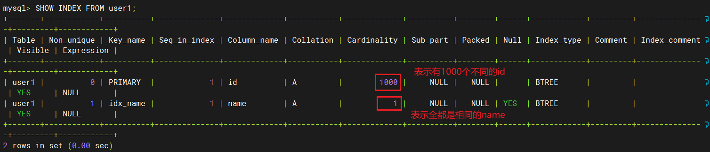

- 执行下列语句：

  ```mysql
  # 修改其中一条数据的name为atguigu03，此时，数据库中应该有两个不同的name值
  mysql> UPDATE user1 SET NAME = 'atguigu03' WHERE id = 2;
  Query OK, 1 row affected (0.00 sec)
  Rows matched: 1  Changed: 1  Warnings: 0
  
  # 但此时Cardinality显示name仍然只有一个，因为没有更新
  mysql> SHOW INDEX FROM user1;
  +-------+------------+----------+--------------+-------------+-----------+-------------+----------+--------+------+------------+---------+---------------+---------+------------+
  | Table | Non_unique | Key_name | Seq_in_index | Column_name | Collation | Cardinality | Sub_part | Packed | Null | Index_type | Comment | Index_comment | Visible | Expression |
  +-------+------------+----------+--------------+-------------+-----------+-------------+----------+--------+------+------------+---------+---------------+---------+------------+
  | user1 |          0 | PRIMARY  |            1 | id          | A         |        1000 |     NULL |   NULL |      | BTREE      |         |               | YES     | NULL       |
  | user1 |          1 | idx_name |            1 | name        | A         |           1 |     NULL |   NULL | YES  | BTREE      |         |               | YES     | NULL       |
  +-------+------------+----------+--------------+-------------+-----------+-------------+----------+--------+------+------------+---------+---------------+---------+------------+
  2 rows in set (0.00 sec)
  ```

- 分析表之后，再次查看：

  ```mysql
  # 分析表
  mysql> ANALYZE TABLE user1;
  +------------------+---------+----------+----------+
  | Table            | Op      | Msg_type | Msg_text |
  +------------------+---------+----------+----------+
  | atguigudb2.user1 | analyze | status   | OK       |
  +------------------+---------+----------+----------+
  1 row in set (0.01 sec)
  
  # Cardinality中name的值变为2，如果name越接近主键，说明其区分度越高
  mysql> SHOW INDEX FROM user1;
  +-------+------------+----------+--------------+-------------+-----------+-------------+----------+--------+------+------------+---------+---------------+---------+------------+
  | Table | Non_unique | Key_name | Seq_in_index | Column_name | Collation | Cardinality | Sub_part | Packed | Null | Index_type | Comment | Index_comment | Visible | Expression |
  +-------+------------+----------+--------------+-------------+-----------+-------------+----------+--------+------+------------+---------+---------------+---------+------------+
  | user1 |          0 | PRIMARY  |            1 | id          | A         |        1000 |     NULL |   NULL |      | BTREE      |         |               | YES     | NULL       |
  | user1 |          1 | idx_name |            1 | name        | A         |           2 |     NULL |   NULL | YES  | BTREE      |         |               | YES     | NULL       |
  +-------+------------+----------+--------------+-------------+-----------+-------------+----------+--------+------+------------+---------+---------------+---------+------------+
  2 rows in set (0.00 sec)
  ```

>假如说我们把 id = 3的数据的 name 修改成 atguigudb04，此时直接查看索引，发现 Cardinality 还是2，但是执行 ANALYZE 后，再查看会发现 Cardinality 已经变成 3，说明 ANALYZE 启动了刷新数据的作用。

##### 检查表

MySQL 中可以使用`CHECK TABLE`语句来检查表。CHECK TABLE 语句能够检查 InnoDB 和 MyISAM 类型的表是否存在错误。CHECK TABLE 语句在执行过程中也会给表加上`只读锁` 。

对于 MyISAM 类型的表，CHECK TABLE 语句还会更新关键字统计数据。而且，CHECK TABLE 也可以检查视图是否有错误，比如在视图定义中被引用的表已不存在。该语句的基本语法如下：

```mysql
CHECK TABLE tbl_name [, tbl_name] ... [option] ...
option = {QUICK | FAST | MEDIUM | EXTENDED |
```

其中，tbl_name 是表名；option 参数有 5 个取值，分别是 QUICK、FAST、MEDIUM、EXTENDED 和 CHANGED。各个选项的意义分别是：

- `QUICK`：不扫描行，不检查错误的连接。
- `FAST`：只检查没有被正确关闭的表。
- `CHANGED`：只检查上次检查后被更改的表和没有被正确关闭的表。
- `MEDIUM`：扫描行，以验证被删除的连接是有效的。也可以计算各行的关键字校验和，并使用计算出的校验和验证这一点。
- `EXTENDED`：对每行的所有关键字进行一个全面的关键字查找。这可以确保表是 100% 一致的，但是花的时间较长。

option 只对 MyISAM 类型的表有效，对 InnoDB 类型的表无效。比如：

```mysql
mysql> CHECK TABLE student;
+--------------------+-------+----------+----------+
| Table              | Op    | Msg_type | Msg_text |
+--------------------+-------+----------+----------+
| atguigudb2.student | check | status   | OK       |
+--------------------+-------+----------+----------+
1 row in set (0.40 sec)
```

该语句对于检查的表可能会产生多行信息。最后一行有一个状态的`Msg_type`值，Msg_text 通常为 OK。如果得到的不是 OK，通常要对其进行修复；是 OK 说明表已经是最新的了。表已经是最新的，意味着存储引擎对这张表不必进行检查。

##### 优化表

###### 方式 1：使用 OPTIMIZE TABLE 命令

MySQL 中使用`OPTIMIZE TABLE`语句来优化表。但是，OPTILMIZE TABLE 语句只能优化表中的`VARCHAR`、`BLOB `或`TEXT`类型的字段。一个表使用了这些字段的数据类型，若已经`删除`了表的一大部分数据，或者已经对含有可变长度行的表（含有 VARCHAR、BLOB 或 TEXT 列的表）进行了很多`更新 `，则应使用 OPTIMIZE TABLE 来重新利用未使用的空间，并整理数据文件的`碎片`。

OPTIMIZE TABLE 语句对 InnoDB 和 MyISAM 类型的表都有效，该语句在执行过程中也会给表加上`只读锁`。

OPTIMIZE TABLE 语句的基本语法如下：

```mysql
OPTIMIZE [LOCAL | NO_WRITE_TO_BINLOG] TABLE tbl_name [, tbl_name] ...
```

- LOCAL | NO_WRITE_TO_BINLOG 关键字的意义和分析表相同，都是指定不写入二进制日志。

示例：

```mysql
mysql> CREATE TABLE t1(id INT, name VARCHAR(15)) ENGINE=MyISAM;
Query OK, 0 rows affected (0.01 sec)

# 优化MyISAM表
mysql> OPTIMIZE TABLE t1;
+---------------+----------+----------+-----------------------------+
| Table         | Op       | Msg_type | Msg_text                    |
+---------------+----------+----------+-----------------------------+
| atguigudb2.t1 | optimize | status   | Table is already up to date |
+---------------+----------+----------+-----------------------------+
1 row in set (0.00 sec)

mysql> CREATE TABLE t2(id INT, name VARCHAR(15)) ENGINE=InnoDB;
Query OK, 0 rows affected (0.03 sec)

# 优化InnoDB表
mysql> OPTIMIZE TABLE t2;
+---------------+----------+----------+-------------------------------------------------------------------+
| Table         | Op       | Msg_type | Msg_text                                                          |
+---------------+----------+----------+-------------------------------------------------------------------+
| atguigudb2.t2 | optimize | note     | Table does not support optimize, doing recreate + analyze instead |
| atguigudb2.t2 | optimize | status   | OK                                                                |
+---------------+----------+----------+-------------------------------------------------------------------+
2 rows in set (0.05 sec)
```

> Msg_text 显示的 "Table does not support optimize, doing recreate + analyze instead" 是正常的，可以查看官网 https://dev.mysql.com/doc/refman/8.0/en/optimize-table.html 验证。

优化过程：**在 MyISAM 中，是先分析这张表，然后会整理相关的 MySQL datafile，之后回收未使用的空间；在 InnoDB 中，回收空间是简单通过 Alter table 进行整理空间。在优化期间，MySQL 会创建一个临时表，优化完成之后会删除原始表，然后会将临时表 rename 成为原始表。**

> 说明：在多数的设置中，根本不需要运行 OPTIMIZE TABLE。即使对可变长度的行进行了大量的更新，也不需要经常运行，每周一次或每月一次即可，并且只需要对特定的表运行。

示例：

```tex
1. 新建一张表，使用存储过程往里面放入100W数据，或者更多一些，争取能够以兆的单位显示
2. 查看服务器上数据文件的大小，文件目录是/var/1ib/mysq1/所在的数据库
3. 删除二分之一的数据，然后再查看当前数据文件的大小，会发现此时大小是不变的
4. 使用OPTIMIZE tablename命令优化表
5. 再查看当前数据文件的大小，会发现此时大小已经变化了，做了空间的回收
```

优化前：

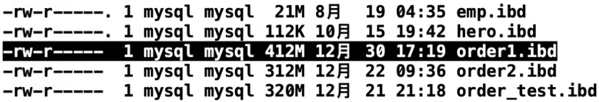

优化后：

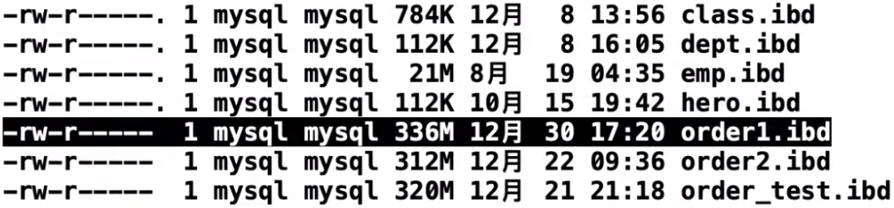

###### 方式 2：使用 mysqlcheck 命令

```bash
# mysqlcheck是Linux中的rompt，-o是代表optimize，优化特定表
$ mysqlcheck -o database_name table_name -h127.0.0.1 -uroot -p123456
# 或优化所有表
$ mysqlcheck -o --all-databases -h127.0.0.1 -uroot -p123456
```

> 使用 Docker 创建的 MySQL 容器，需要加上 -h 参数，指定主机。

示例：

```mysql
xisun@xisun-develop:~/mysql/mysql-8.0.33-linux-glibc2.17-x86_64-minimal/bin$ ./mysqlcheck -o atguigudb2 -h127.0.0.1 -uroot -p123456 -P3306
mysqlcheck: [Warning] Using a password on the command line interface can be insecure.
atguigudb2.class_comment
note     : Table does not support optimize, doing recreate + analyze instead
status   : OK
atguigudb2.class_comment1
note     : Table does not support optimize, doing recreate + analyze instead
status   : OK
atguigudb2.student
note     : Table does not support optimize, doing recreate + analyze instead
status   : OK
atguigudb2.t1                                      Table is already up to date
atguigudb2.t2
note     : Table does not support optimize, doing recreate + analyze instead
status   : OK
atguigudb2.user1
note     : Table does not support optimize, doing recreate + analyze instead
status   : OK
```

#### 小结

上述这些方法都是有利有弊的。比如：

- 修改数据类型，节省存储空间的同时，你要考虑到数据不能超过取值范围。
- 增加冗余字段的时候，不要忘了确保数据一致性。
- 把大表拆分，也意味着你的查询会增加新的连接，从而增加额外的开销和运维的成本。

因此，一定要结合实际的业务需求进行权衡。

### 大表优化

当 MySQL 单表记录数过大时，数据库的 CRUD 性能会明显下降，一些常见的优化措施如下。

#### 限定查询的范围

`禁止不带任何限制数据范围条件的查询语句。`比如：当用户在查询订单历史的时候，可以控制在一个月的范围内。

#### 读写分离

经典的数据库拆分方案，主库负责写，从库负责读。

- 一主一从模式：

  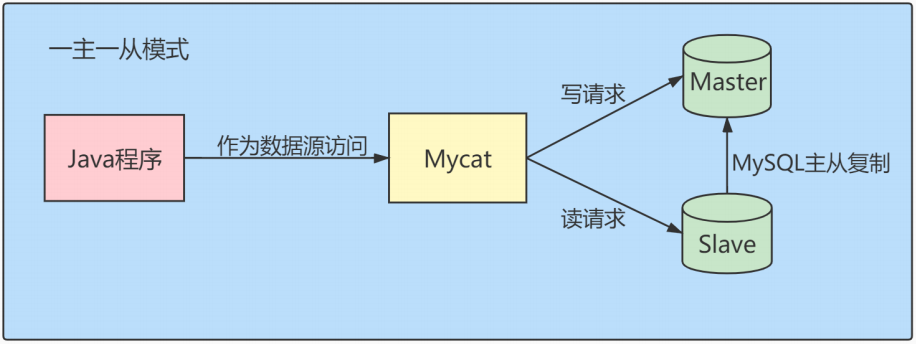

- 双主双从模式：

  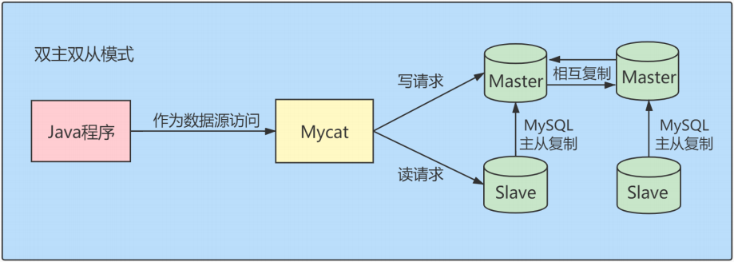

#### 垂直拆分

当数据量级达到`千万级`以上时，有时候我们需要把一个数据库切成多份，放到不同的数据库服务器上，减少对单一数据库服务器的访问压力。

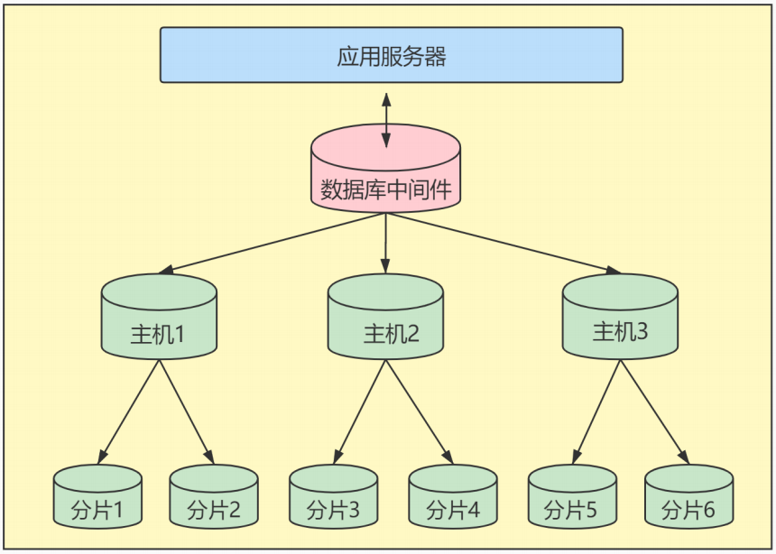

**垂直拆分的优点：** 可以使得列数据变小，在查询时减少读取的 Block 数，减少 I/O 次数。此外，垂直分区可以简化表的结构，易于维护。

**垂直拆分的缺点：** 主键会出现冗余，需要管理冗余列，并会引起 JOIN 操作。此外，垂直拆分会让事务变得更加复杂。

#### 水平拆分

特点：

- 尽量控制单表数据量的大小，建议控制在`1000 万以内`。1000 万并不是 MySQL 数据库的限制，但是过大会造成修改表结构、备份、恢复都会有很大的问题。此时可以用`历史数据归挡`（应用于日志数据），`水平分表`（应用于业务数据）等手段来控制数据量大小。

- 这里主要考虑业务数据的水平分表策略。将大的数据表按照`某个属性维度`分拆成不同的小表，每张小表保持相同的表结构。比如可以按照年份来划分，把不同年份的数据放到不同的数据表中。2017 年、2018 年和 2019 年的数据就可以分别放到三张数据表中。

- 水平分表仅是解决了单一表数据过大的问题，但由于表的数据还是在同一台机器上，其实对于提升 MySQL 并发能力没有什么意义，所以`水平拆分最好分库`，从而达到分布式的目的。

  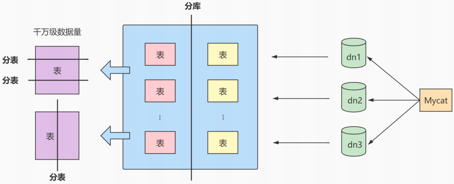

水平拆分能够支持非常大的数据量存储，应用端改造也少，但`分片事务难以解决，跨节点 JOIN 性能较差，逻辑复杂。`《Java 工程师修炼之道》的作者推荐尽量不要对数据进行分片，因为拆分会带来逻辑、部署、运维的各种复杂度，一般的数据表在优化得当的情况下，支撑千万以下的数据量是没有太大问题的。如果实在要分片，尽量选择客户端分片架构，这样可以减少一次和中间件的网络 I/O。

下面补充一下数据库分片的两种常见方案：

- **客户端代理：分片逻辑在应用端，封装在 JAR 包中，通过修改或者封装 JDBC 层来实现。**比如当当网的 Sharding-JDBC、阿里的 TDDL，是两种比较常用的实现。

- **中间件代理：在应用和数据中间加了一个代理层，分片逻辑统一维护在中间件服务中。**比如 Mycat、360 的 Atlas、网易的 DDB 等，都是这种架构的实现。

### 其他调优策略

#### 服务器语句超时处理

在 MySQL 8.0 中可以设置`服务器语句超时的限制`，单位可以达到`毫秒级别` 。当中断的执行语句超过设置的毫秒数后，服务器将终止查询影响不大的事务或连接，然后将错误报给客户端。

设置服务器语句超时的限制，可以通过设置系统变量`MAX_EXECUTION_TIME`来实现。默认情况下，MAX_EXECUTION_TIME 的值为 0，代表没有时间限制。示例：

```mysql
SET GLOBAL MAX_EXECUTION_TIME=2000;
SET SESSION MAX_EXECUTION_TIME=2000; # 指定该会话中SELECT语句的超时时间
```

#### 创建全局通用表空间

MySQL 8.0 使用`CREATE TABLE SPACE`语句来创建一个全局通用表空间。全局表空间可以被所有的数据库的表共享，而且相比于独享表空间，使用手动创建共享表空间，可以节约元数据方面的内存。可以在创建表的时候，指定属于哪个表空间，也可以对已有表进行表空间修改等。

下面创建名为 atguigu1 的共享表空间，SQL 语句如下：

```mysql
mysql> CREATE TABLESPACE atguigu1 ADD datafile 'atguigu1.ibd' file_block_size=16k;
Query OK, 0 rows affected (0.02 sec)
```

指定表空间，SQL 语句如下：

```mysql
mysql> CREATE TABLE test(id int, name varchar(18)) Engine=InnoDB DEFAULT charset utf8mb4 TABLESPACE atguigu1;
Query OK, 0 rows affected (0.02 sec)
```

也可以通过 ALTER TABLE 语句指定表空间，SQL 语句如下：

```mysql
mysql> ALTER TABLE test TABLESPACE atguigu1;
Query OK, 0 rows affected (0.03 sec)
Records: 0  Duplicates: 0  Warnings: 0
```

如何删除创建的共享表空间？因为是共享表空间，所以不能直接通过 drop table tbname 删除，这样操作并不能回收空间。当确定共享表空间的数据都没用，并且依赖该表空间的表均已经删除时，可以通过`DROP TABLESPACE`删除共享表空间来释放空间，如果依赖该共享表空间的表存在，就会删除失败。如下所示：

```mysql
mysql> DROP TABLESPACE atguigu1;
ERROR 3120 (HY000): Tablespace `atguigu1` is not empty.
```

所以，应该首先删除依赖该表空间的数据表，SQL 语句如下：

```mysql
mysql> DROP TABLE test;
Query OK, 0 rows affected (0.02 sec)
```

最后即可删除表空间，SQL 语句如下：

```mysql
mysql> DROP TABLESPACE atguigu1;
Query OK, 0 rows affected (0.02 sec)
```

####  MySQL 8.0 新特性：隐藏索引对调优的帮助

不可见索引的特性对于性能调试非常有用。在 MySQL 8.0 中，索引可以被 "隐藏" 和 "显示"。`当一个索引被隐藏时，它不会被查询优化器所使用。`也就是说，管理员可以隐藏一个索引，然后观察对数据库的影响。如果数据库性能有所下降，就说明这个索引是有用的，于是将其 "恢复显示" 即可；如果数据库性能看不出变化，就说明这个索引是多余的，可以删掉了。

需要注意的是当索引被隐藏时，它的内容仍然是和正常索引一样`实时更新`的。如果一个索引需要长期被隐藏，那么可以将其删除，因为索引的存在会影响插入、更新和删除的性能。

**数据表中的主键不能被设置为`invisible`。**

## 事务基础知识

### 数据库事务概述

事务是数据库区别于文件系统的重要特性之一，当有了事务就会让数据库始终保持`一致性`，同时还能通过事务的机制`恢复到某个时间点`，这样可以保证已提交到数据库的修改不会因为系统崩溃而丢失。

#### 存储引擎支持情况

`SHOW ENGINES `命令，可以查看当前 MySQL 支持的存储引擎都有哪些，以及这些存储引擎是否支持事务。

```mysql
mysql> SHOW ENGINES;
+--------------------+---------+----------------------------------------------------------------+--------------+------+------------+
| Engine             | Support | Comment                                                        | Transactions | XA   | Savepoints |
+--------------------+---------+----------------------------------------------------------------+--------------+------+------------+
| ndbcluster         | NO      | Clustered, fault-tolerant tables                               | NULL         | NULL | NULL       |
| FEDERATED          | NO      | Federated MySQL storage engine                                 | NULL         | NULL | NULL       |
| MEMORY             | YES     | Hash based, stored in memory, useful for temporary tables      | NO           | NO   | NO         |
| InnoDB             | DEFAULT | Supports transactions, row-level locking, and foreign keys     | YES          | YES  | YES        |
| PERFORMANCE_SCHEMA | YES     | Performance Schema                                             | NO           | NO   | NO         |
| MyISAM             | YES     | MyISAM storage engine                                          | NO           | NO   | NO         |
| ndbinfo            | NO      | MySQL Cluster system information storage engine                | NULL         | NULL | NULL       |
| MRG_MYISAM         | YES     | Collection of identical MyISAM tables                          | NO           | NO   | NO         |
| BLACKHOLE          | YES     | /dev/null storage engine (anything you write to it disappears) | NO           | NO   | NO         |
| CSV                | YES     | CSV storage engine                                             | NO           | NO   | NO         |
| ARCHIVE            | YES     | Archive storage engine                                         | NO           | NO   | NO         |
+--------------------+---------+----------------------------------------------------------------+--------------+------+------------+
11 rows in set (0.00 sec)
```

可以看出，`在 MySQL 中，只有 InnoDB 是支持事务的。`

#### 基本概念

**`事务`：一组逻辑操作单元（一组 SQL），使数据从一种状态变换到另一种状态。**

**`事务处理的原则`**：保证所有事务都作为`一个工作单元`来执行，即使出现了故障，都不能改变这种执行方式。当在一个事务中执行多个操作时，要么所有的事务都被提交（`commit`），那么这些修改就`永久`地保存下来；要么数据库管理系统将`放弃`所作的所有`修改`，整个事务回滚（`rollback`）到最初状态。

示例：

```mysql
# AA用户给BB用户转账100
UPDATE accounts SET money = money - 50 WHERE NAME = 'AA';

# 服务器宕机
UPDATE accounts SET money = money + 50 WHERE NAME = 'BB';
```

#### 事务的 ACID 特性

##### 原子性（Atomicity）

**`原子性`：是指事务是一个不可分割的工作单位，要么全部提交，要么全部失败回滚。**即，要么转账成功，要么转账失败，是不存在中间的状态。如果无法保证原子性会怎么样？那就会出现数据不一致的情形，A 账户减去 100 元，而 B 账户增加 100 元操作失败，系统将无故丢失 100 元。

##### 一致性（Consistency）

**`一致性`：是指事务执行前后，数据从一个合法性状态变换到另外一个合法性状态。这种状态是`语义上的`而不是语法上的，跟具体的业务有关。**

那什么是合法的数据状态呢？满足预定的约束的状态就叫做合法的状态。通俗一点，这状态是由你自己来定义的（比如满足现实世界中的约束）。满足这个状态，数据就是一致的，不满足这个状态，数据就是不一致的。如果事务中的某个操作失败了，系统就会自动撤销当前正在执行的事务，返回到事务操作之前的状态。

举例 1：A 账户有 200 元，转账 300 元出去，此时 A 账户余额为 -100 元。你自然就发现了此时数据是不一致的，为什么呢？因为你定义了一个状态，余额这列必须 >= 0。

举例 2：A 账户 200 元，转账 50 元给 B 账户，A 账户的钱扣了，但是 B 账户因为各种意外，余额并没有增加。你也知道此时数据是不一致的，为什么呢？因为你定义了一个状态，要求 A + B 的总余额必须不变。

举例 3：在数据表中将姓名字段设置为唯一性约束，这时当事务进行提交或者事务发生回滚的时候，如果数据表中的姓名不唯一，就破坏了事务的一致性要求。

> 国内很多网站上对一致性的阐述有误，具体可以参考 wikipedia 对 Consistency 的阐述。

##### 隔离型（Isolation）

**`隔离性`：是指一个事务的执行不能被其他事务干扰 ，即一个事务内部的操作及使用的数据对并发的其他事务是隔离的，并发执行的各个事务之间不能互相干扰。**

如果无法保证隔离性会怎么样？假设 A 账户有 200 元，B 账户 0 元。A 账户往 B 账户转账两次，每次金额为 50 元，分别在两个事务中执行。如果无法保证隔离性，会出现下面的情形：

```mysql
UPDATE accounts SET money = money - 50 WHERE NAME = 'AA';
UPDATE accounts SET money = money + 50 WHERE NAME = 'BB';
```

根据图解，发现出现了线程安全的问题，从而导致转账前后总金额不一致的情况：

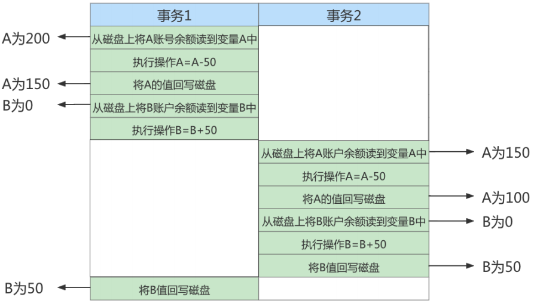

>可以联系 JUC 中的临界区的概念，为了避免各个线程都执行临界区的代码，必须加 synchronized。

##### 持久性（Durability）

**`持久性`：是指一个事务一旦被提交，它对数据库中数据的改变就是`永久性`的 ，接下来的其他操作和数据库故障不应该对其有任何影响。**

持久性是通过`事务日志`来保证的，事务日志包括了`重做日志`和`回滚日志`。当我们通过事务对数据进行修改的时候，首先会将数据库的变化信息记录到重做日志中，然后再对数据库中对应的行进行修改。这样做的好处是，即使数据库系统崩溃，数据库重启后也能找到没有更新到数据库系统中的重做日志，重新执行，从而使事务具有持久性。

##### 总结

ACID 是事务的四大特性，在这四个特性中，`原子性是基础，隔离性是手段，一致性是约束条件，而持久性是目的。`

数据库事务，其实就是数据库设计者为了方便起见，把需要保证原子性、隔离性、一致性和持久性的一个或多个数据库操作称为一个事务。一句话，事务就是 ACID。

#### 事物的状态

我们现在知道，事务是一个抽象的概念，它其实对应着一个或多个数据库操作，MySQL 根据这些操作所执行的不同阶段把事务大致划分成几个状态。

一个基本的状态转换图如下所示：

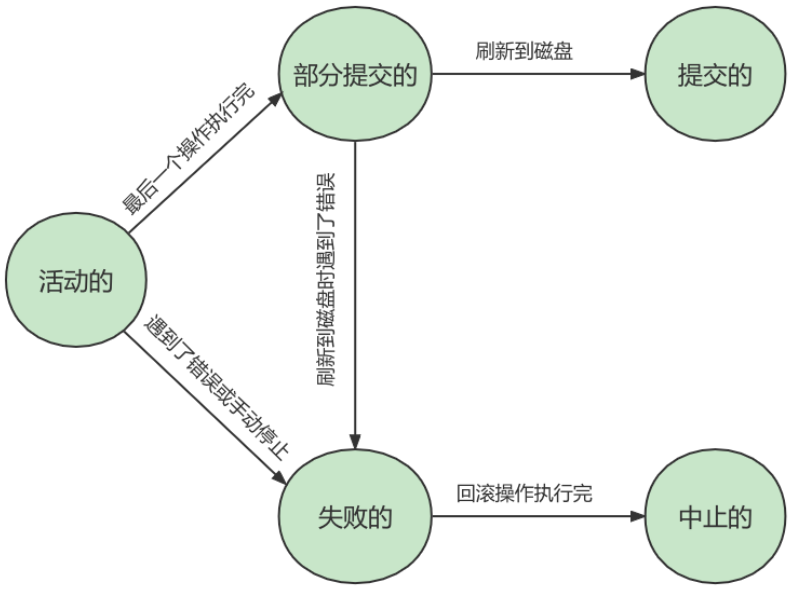

图中可见，只有当事务处于`提交的`或者`中止的`状态时，一个事务的生命周期才算是结束了。**对于已经提交的事务来说，该事务对数据库所做的修改将永久生效，对于处于中止状态的事务，该事务对数据库所做的所有修改被回滚到没执行该事务之前的状态。**

##### 活动的（active）

事务对应的数据库操作正在执行过程中时，就说该事务处在`活动的`状态。比如转账的事务（两条 DML）在执行。

##### 部分提交的（partially committed）

当事务中的最后一个操作执行完成，但由于操作都在内存中执行，所造成的影响并`没有刷新到磁盘`时，我们就说该事务处在`部分提交的`状态。比如转账的事务执行完成，但是还没有进行提交。

##### 失败的（failed）

当事务处在`活动的`或者`部分提交的`状态时，可能遇到了**某些错误**（数据库自身的错误、操作系统错误或者直接断电等）而无法继续执行，或者**人为的停止**当前事务的执行，就说该事务处在`失败的`状态。 比如正在转账时，银行突然断电了，事务就会被停止。

##### 中止的（aborted）

如果事务执行了一部分而变为`失败的`状态，那么就需要把已经修改的事务中的操作还原到事务执行前的状态。换句话说，就是要撤销失败事务对当前数据库造成的影响。把这个撤销的过程称之为`回滚`。当`回滚`操作执行完毕时，也就是数据库恢复到了执行事务之前的状态，就说该事务处在了`中止的`状态。比如当事务执行失败后，需要进行回滚，回滚完毕后的状态就是中止态。

##### 提交的（committed）

当一个处在`部分提交的`状态的事务将修改过的数据都`同步到磁盘`上之后，就可以说该事务处在了`提交的`状态。

### 如何使用事务

使用事务有两种方式，分别为`显式事务`和`隐式事务`。

#### 显式事务

**事务的完成过程：**

- 步骤 1：开启事务。
- 步骤 2：一系列的 DML 操作。
- …
- 步骤 3：事务结束，表现为两种状态：提交的状态（COMMIT）、中止的状态（ROLLBACK）。

**步骤 1：`START TRANSACTION`或者`BEGIN`命令，显式开启一个事务。**

```mysql
BEGIN;

# 或者
START TRANSACTION;
```

- `START TRANSACTION`语句相较于`BEGIN`特别之处在于，后边能跟随几个`修饰符`：

  - `READ ONLY`：标识当前事务是一个`只读事务`，也就是属于该事务的数据库操作只能读取数据，而不能修改数据。
  - `READ WRITE`：标识当前事务是一个`读写事务`，也就是属于该事务的数据库操作既可以读取数据，也可以修改数据。
  - `WITH CONSISTENT SNAPSHOT`：启动`一致性读`。

- 示例：

  ```mysql
  START TRANSACTION READ ONLY; # 开启一个只读事务
  
  START TRANSACTION READ ONLY, WITH CONSISTENT SNAPSHOT; # 开启只读事务和一致性读
  
  START TRANSACTION READ WRITE,WITH CONSISTENT SNAPSHOT; # 开启读写事务和一致性读
  ```

>注意：
>
>- READ ONLY 和 READ WRITE 是用来设置所谓的事务访问模式的，就是以只读还是读写的方式来访问数据库中的数据。
>- 一个事务的访问模式不能同时既设置为只读的，又设置为读写的，所以不能同时把 READ ONLY 和 READ WRITE 放到 START TRANSACTION 语句后边。
>
>- **如果不显式指定事务的访问模式，那么该事务的访问模式就是`读写模式`。**

**步骤 2：一系列事务中的操作（主要是 DML，不含 DDL）。**

**步骤 3：提交事务或中止事务（即回滚事务）。**

```mysql
# 提交事务。当提交事务后，对数据库的修改是永久性的
COMMIT;

# 回滚事务。即撤销正在进行的所有没有提交的修改
ROLLBACK;

# 将事务回滚到某个保存点
ROLLBACK TO [SAVEPOINT]
```

其中关于`SAVEPOINT`相关操作有：

```mysql
# 在事务中创建保存点，方便后续针对保存点进行回滚。一个事务中可么存在多个保存点
SAVEPOINT 保存点名称;

#删除某个保存点
RELEASE SAVEPOINT保存点名称;
```

#### 隐式事务

MySQL 中有一个系统变量`autocommit`：

```mysql
mysql> SHOW VARIABLES LIKE 'autocommit';
+---------------+-------+
| Variable_name | Value |
+---------------+-------+
| autocommit    | ON    |
+---------------+-------+
1 row in set (0.01 sec)
```

默认情况下，如果不显式的使用`START TRANSACTION`或者`BEGIN`语句开启一个事务，那么每一条语句都算是一个独立的事务，这种特性称之为事务的`自动提交`。下边这两条语句就相当于放到两个独立的事务中去执行：

```mysql
# 假设此时autocommit是默认值on
UPDATE account SET balance = balance - 10 WHERE id = 1; # 此时这条DML操作是一个独立的事务

UPDATE account SET balance = balance + 10 WHERE id = 2; # 此时这条DML操作是一个独立的事务
```

当然，如果想关闭这种自动提交的功能，可以使用下边两种方法之一：

- 显式的的使用`START TRANSACTION`或者`BEGIN`语句开启一个事务，这样在本次事务提交或者回滚前会暂时关闭掉自动提交的功能。

- 把系统变量`autocommit `的值设置为`OFF `。

  ```mysql
  SET autocommit = OFF;
  
  # 或
  SET autocommit = 0;
  ```

**关闭自动提交之后，写入的多条语句就算是属于同一个事务了。**直到我们显式的写出`COMMIT`语句来把这个事务提交掉，或者显式的写出`ROLLBACK`语句来把这个事务回滚掉。

> 补充：Oracle 默认不自动提交，需要手写 COMMIT 命令，而 MySQL 默认自动提交。

#### 隐式提交数据的情况

- **使用数据定义语言**（Data definition language，缩写为 DDL）

  - 数据库对象，指的就是`数据库`、`表`、`视图`、`存储过程`等结构。当使用`CREATE `、`ALTER`、`DROP`等语句去修改数据库对象时，会隐式的提交前边语句所属于的事务。即：

    ```mysql
    BEGIN;
    
    SELECT ... # 事务中的一条语句
    UPDATE ...# 事务中的一条语句
    ...  # 事务中的其它语句
    
    CREATE TABLE ...# 此语句会隐式的提交前边语句所属于的事务
    ```

- **隐式使用或修改 MySQL 数据库中的表**

  - 当使用`ALTER USER`、`CREATE USER`、`DROP USER` 、`GRANT`、`RENAME USER`、`REVOKE`、`SET PASSWORD`等语句时，会隐式的提交前边语句所属于的事务。

- **事务控制或使用关于锁定的语句**

  - 当在一个事务还没提交或者回滚时，就又使用`START TRANSACTION`或者`BEGIN`语句开启了另一个事务时，会隐式的提交前边语句所属于的事务。即：

    ```mysql
    BEGIN;
    
    SELECT ... # 事务中的一条语句
    UPDATE ... # 事务中的一条语句
    ...       # 事务中的其它语句
    
    BEGIN;   # 此语句会隐式的提交前面语句所属于的事务
    ```

  - 当前的 autocommit 系统变量的值为 OFF ，我们手动把它调为`ON`时，会隐式的提交前边语句所属于的事务。

  - 使用`LOCK TABLES`、`UNLOCK TABLES`等关于锁定的语句，会隐式的提交前边语句所属于的事务。

- **使用加载数据的语句**

  - 使用`LOAD DATA`语句来批量往数据库中导入数据时，会隐式的提交前边语句所属于的事务。

- **使用 MySQL 复制的一些语句**

  - 使用`START SLAVE`、`STOP SLAVE`、`RESET SLAVE`、`CHANGE MASTER TO`等语句时，会隐式的提交前边语句所属于的事务。

- **使用其它的一些语句**

  - 使用`ANALYZE TABLE`、`CACHE INDEX`、`CHECK TABLE`、`FLUSH`、`LOAD INDEX INTO CACHE `、`OPTIMIZE TABLE`、`REPAIR TABLE`、`RESET `等语句时，会隐式的提交前边语句所属于的事务。

#### 示例：提交与回滚

我们看下在 MySQL 的默认状态下，下面这个事务最后的处理结果是什么。

先创建 user3 表：

```mysql
mysql> USE atguigudb2;
Database changed

mysql> CREATE TABLE user3(NAME VARCHAR(15) PRIMARY KEY);
Query OK, 0 rows affected (0.03 sec)
```

**情况一：**

```mysql
mysql> BEGIN;
Query OK, 0 rows affected (0.00 sec)

mysql> INSERT INTO user3 VALUES('zhangsan'); # 此时不会自动提交数据
Query OK, 1 row affected (0.00 sec)

mysql> COMMIT;
Query OK, 0 rows affected (0.01 sec)

mysql> BEGIN;
Query OK, 0 rows affected (0.00 sec)

mysql> INSERT INTO user3 VALUES('lisi'); # 此时不会自动提交数据
Query OK, 1 row affected (0.00 sec)

mysql> INSERT INTO user3 VALUES('lisi'); # 受主键的影响，添加失败
ERROR 1062 (23000): Duplicate entry 'lisi' for key 'user3.PRIMARY'
mysql> ROLLBACK;
Query OK, 0 rows affected (0.00 sec)

mysql> SELECT * FROM user3;
+----------+
| NAME     |
+----------+
| zhangsan |
+----------+
1 row in set (0.00 sec)
```

**情况二：**

```mysql
mysql> TRUNCATE TABLE user3; # DDL操作会自动提交数据，不受autocommit变量的影响
Query OK, 0 rows affected (0.04 sec)

mysql> BEGIN;
Query OK, 0 rows affected (0.00 sec)

mysql> INSERT INTO user3 VALUES('zhangsan'); # 此时不会自动提交数据
Query OK, 1 row affected (0.00 sec)

mysql> COMMIT;
Query OK, 0 rows affected (0.01 sec)

mysql> INSERT INTO user3 VALUES('lisi'); # 默认情况下（即autocommit为true），DML操作也会自动提交数据
Query OK, 1 row affected (0.00 sec)

mysql> INSERT INTO user3 VALUES('lisi'); # 事务的失败的状态
ERROR 1062 (23000): Duplicate entry 'lisi' for key 'user3.PRIMARY'
mysql> ROLLBACK;
Query OK, 0 rows affected (0.00 sec)

mysql> SELECT * FROM user3;
+----------+
| NAME     |
+----------+
| lisi     |
| zhangsan |
+----------+
2 rows in set (0.00 sec)
```

**情况三：**

```mysql
mysql> TRUNCATE TABLE user3; # DDL操作会自动提交数据，不受autocommit变量的影响
Query OK, 0 rows affected (0.04 sec)

mysql> SELECT @@completion_type;
+-------------------+
| @@completion_type |
+-------------------+
| NO_CHAIN          |
+-------------------+
1 row in set (0.00 sec)

mysql> SET @@completion_type = 1;
Query OK, 0 rows affected (0.00 sec)

mysql> BEGIN;
Query OK, 0 rows affected (0.00 sec)

mysql> INSERT INTO user3 VALUES('zhangsan');
Query OK, 1 row affected (0.00 sec)

mysql> COMMIT;
Query OK, 0 rows affected (0.01 sec)

mysql> SELECT * FROM user3;
+----------+
| NAME     |
+----------+
| zhangsan |
+----------+
1 row in set (0.00 sec)

mysql> INSERT INTO user3 VALUES('lisi');
Query OK, 1 row affected (0.00 sec)

mysql> INSERT INTO user3 VALUES('lisi');
ERROR 1062 (23000): Duplicate entry 'lisi' for key 'user3.PRIMARY'
mysql> ROLLBACK;
Query OK, 0 rows affected (0.00 sec)

mysql> SELECT * FROM user3;
+----------+
| NAME     |
+----------+
| zhangsan |
+----------+
1 row in set (0.00 sec)
```

- 可以看到，相同的 SQL 代码，情况三只是在事务开始之前设置了`SET @@completion_type = 1`，但结果就和情况一的不一样，只有一个 "张三"。这是为什么呢？

这里讲解下 MySQL 中`completion_type`参数的作用，实际上这个参数有 3 种可能：

- `completion = 0`，这是`默认情况`。当执行 COMNIT 的时候会提交事务，在执行下一个事务时，还需要使用`START TRANSACTION`或者`BEGIN`来开启事务。
- `completion = 1`，这种情况下，当提交事务后，相当于执行了`COMMIT AND CHAIN`，也就是开启一个`链式事务`，即提交事务之后会开启一个相同隔离级别的事务。
- `completion = 2`，这种情况下，`CONMMIT = COMMIT AND RELEASE`，也就是提交后，会自动与服务器断开连接。

当我们设置 autocommit = 0 时，不论是否采用 START TRANSACTION 或者 BEGIN 的方式来开启事务，都需要用 COMMIT 进行提交，让事务生效，使用 ROLLBACK 对事务进行回滚。

当我们设置 autocommit = 1 时，每条 SQL 语句都会自动进行提交。不过这时，如果你采用 START TRANSACTION 或者 BEGIN 的方式来显式地开启事务，那么这个事务只有在 COMMIT 时才会生效，在 ROLLBACK 时才会回滚。

#### 示例：测试不支持事务的 Engine

创建测试的表：

```mysql
mysql> CREATE TABLE test1(i INT) ENGINE = INNODB;
Query OK, 0 rows affected (0.03 sec)

mysql> CREATE TABLE test2(i INT) ENGINE = MYISAM;
Query OK, 0 rows affected (0.01 sec)
```

针对于 InnoDB 表，ROLLBACK 会生效：

```mysql
mysql> BEGIN;
Query OK, 0 rows affected (0.00 sec)

mysql> INSERT INTO test1 VALUES (1);
Query OK, 1 row affected (0.00 sec)

mysql> ROLLBACK;
Query OK, 0 rows affected (0.00 sec)

# 执行完，发现表为空，说明回滚成功
mysql> SELECT * FROM test1;
Empty set (0.00 sec)
```

针对于 MyISAM表，不支持事务，BEGIN、ROLLBACK 都会失效：

```mysql
mysql> BEGIN;
Query OK, 0 rows affected (0.00 sec)

mysql> INSERT INTO test2 VALUES (1);
Query OK, 1 row affected (0.00 sec)

mysql> ROLLBACK;
Query OK, 0 rows affected, 1 warning (0.00 sec)

# 执行完，发现表中有上面插入的记录，说明MyISAM不支持事务
mysql> SELECT * FROM test2;
+------+
| i    |
+------+
|    1 |
+------+
1 row in set (0.00 sec)
```

#### 示例：SAVEPOINT

创建测试表，并简单测试：

```mysql
mysql> CREATE TABLE user4(name VARCHAR(15), balance DECIMAL(10, 2));
Query OK, 0 rows affected (0.03 sec)

mysql> BEGIN;
Query OK, 0 rows affected (0.01 sec)

mysql> INSERT INTO user4(name, balance) VALUES('zhangsan', 1000);
Query OK, 1 row affected (0.01 sec)

mysql> COMMIT;
Query OK, 0 rows affected (0.01 sec)

# 执行完，发现表中有上面插入的记录，说明默认创建的表是InnoDB的
mysql> SELECT * FROM user4;
+----------+---------+
| NAME     | balance |
+----------+---------+
| zhangsan | 1000.00 |
+----------+---------+
1 row in set (0.00 sec)
```

测试`SAVEPOINT`：

```mysql
# 开启事务
mysql> BEGIN;
Query OK, 0 rows affected (0.00 sec)

mysql> UPDATE user4 SET balance = balance - 100 WHERE name = 'zhangsan';
Query OK, 1 row affected (0.00 sec)
Rows matched: 1  Changed: 1  Warnings: 0

mysql> UPDATE user4 SET balance = balance - 100 WHERE name = 'zhangsan';
Query OK, 1 row affected (0.00 sec)
Rows matched: 1  Changed: 1  Warnings: 0

# 设置保存点（类似于虚拟机的快照）
mysql> SAVEPOINT s1;
Query OK, 0 rows affected (0.00 sec)

mysql> UPDATE user4 SET balance = balance + 1 WHERE name = 'zhangsan';
Query OK, 1 row affected (0.00 sec)
Rows matched: 1  Changed: 1  Warnings: 0

# 回滚到保存点
mysql> ROLLBACK TO s1;
Query OK, 0 rows affected (0.00 sec)

# 执行完，发现balance=800，说明回滚到保存点s1成功
mysql> SELECT * FROM user4;
+----------+---------+
| NAME     | balance |
+----------+---------+
| zhangsan |  800.00 |
+----------+---------+
1 row in set (0.00 sec)

# 由于还没有commit，所以可以对此次事务彻底回滚
mysql> ROLLBACK;
Query OK, 0 rows affected (0.00 sec)

# 执行完，发现balance=1000，说明回滚成功
mysql> SELECT * FROM user4;
+----------+---------+
| NAME     | balance |
+----------+---------+
| zhangsan | 1000.00 |
+----------+---------+
1 row in set (0.00 sec)
```

### 事务隔离级别

MySQL 是一个`客户端／服务器`架构的软件，对于同一个服务器来说，可以有若干个客户端与之连接，每个客户端与服务器连接上之后，就可以称为一个会话（`Session`）。每个客户端都可以在自己的会话中向服务器发出请求语句，一个请求语句可能是某个事务的一部分，也就是对于服务器来说可能同时处理多个事务。事务有`隔离性`的特性，理论上在某个事务`对某个数据进行访问`时，其他事务应该进行`排队` ，当该事务提交之后，其他事务才可以继续访问这个数据。但是这样对`性能影响太大` ，我们既想保持事务的隔离性，又想让服务器在处理访问同一数据的多个事务时`性能尽量高些`，那就看二者如何权衡取舍了。

#### 数据准备

```mysql
mysql> CREATE TABLE student (
    ->   studentno INT,
    ->   name VARCHAR(20),
    ->   class varchar(20),
    ->   PRIMARY KEY (studentno)
    -> ) Engine=InnoDB CHARSET=utf8;
Query OK, 0 rows affected, 1 warning (0.03 sec)

mysql> INSERT INTO student VALUES(1, 'xiaogu', '1 ban');
Query OK, 1 row affected (0.01 sec)

mysql> SELECT * FROM student;
+-----------+--------+-------+
| studentno | name   | class |
+-----------+--------+-------+
|         1 | xiaogu | 1 ban |
+-----------+--------+-------+
1 row in set (0.00 sec)
```

#### 数据并发问题

针对事务的隔离性和并发性怎么做取舍呢？先看一下访问相同数据的事务在`不保证串行执行`（也就是执行完一个再执行另一个）的情况下可能会出现哪些问题。

##### 脏写（Dirty Write）

对于两个事务 Session A、Session B，如果事务 Session A`修改了`另一个`未提交`事务 Session B`修改过`的数据，那就意味着发生了**`脏写`**。

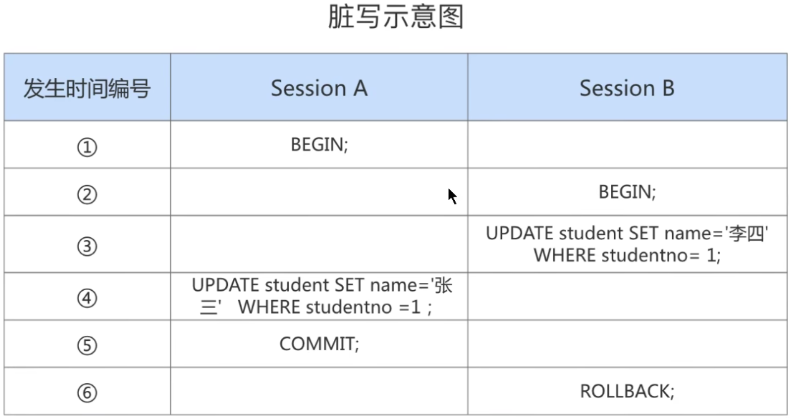

Session A 和 Session B 各开启了一个事务，Session B 中的事务先将 studentno 列为 1 的记录的 name 列更新为 "李四"，然后 Session A 中的事务接着又把这条 studentno 列为 1 的记录的 name 列更新为 "张三"。如果之后 Session B 中的事务进行了回滚，那么 Session A 中的更新也将不复存在，这科现象被称之为`脏写`。

这时，Session A 中的事务就没有效果了，明明把数据更新了，最后也提交事务了，最后看到的数据什么变化也没有。这里大家对事务的隔离级别比较了解的话，会发现默认隔离级别下，上面 Session A 中的更新语句会处于等待状态，这里只是跟大家说明一下会出现这样现象。

##### 脏读（Dirty Read）

对于两个事务 Session A、Session B，Session A`读取`了已经被 Session B`更新`但还`没有被提交`的字段。之后，如果 Session B`回滚`，Session A`读取`的内容就是`临时且无效`的。


Session A 和 Session B 各开启了一个事务，Session B 中的事务先将 studentno 列为 1 的记录的 name 列更新为 "张三"，然后 Session A 中的事务再去查询这条 studentno 为 1 的记录，如果读到列 name 的值为 "张三"，而 Session B 中的事务稍后进行了回滚，那么 Session A 中的事务相当于读到了一个不存在的数据，这种现象被称之为`脏读`。

##### 不可重复读（Non-Repeatable Read）

对于两个事务 Session A、Session B，Session A`读取`了一个字段，然后 Session B`更新`了该字段。之后，如果 Session A`再次读取`同一个字段，` 值就不同`了，那就意味着发生了**`不可重复读`**。

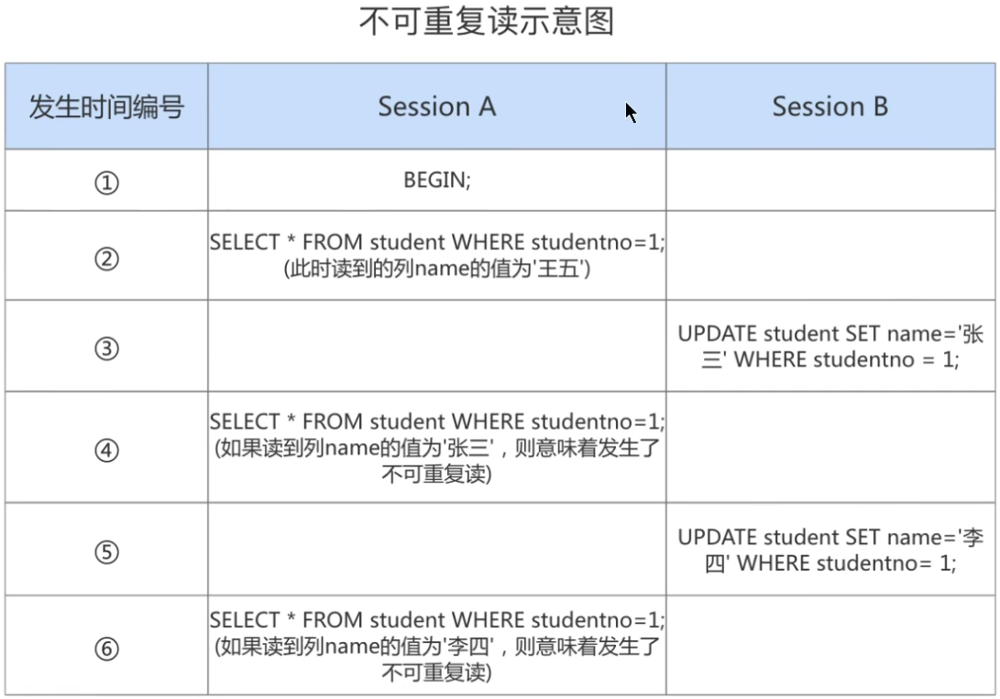

在 Session B 中提交了几个隐式事务（注意是隐式事务，意味着语句结束事务就提交了），这些事务都修改了 studentno 列为 1 的记录的列 name 的值，每次事务提交之后，如果 Session A 中的事务都可以查看到最新的值，这种现象被称之为`不可重复读`。

##### 幻读（Phantom）

对于两个事务 Session A、Session B，Session A 从一个表中`读取`了一个字段，然后 Session B 在该表中`插入`了一些新的行。之后，如果 Session A`再次读取` 同一个表，就会多出几行，那就意味着发生了**`幻读`**。


Session A 中的事务先根据 studentno > 0 这个条件查询表 student，得到了 name 列值为 "张三" 的记录；之后，Session B 中提交了一个隐式事务，该事务向表 student 中插入了一条新记录；之后，Session A 中的事务再根据相同的条件 studentno > 0 查询表 student，得到的结果集中包含 Session B 中的事务新插入的那条记录，这种现象被称之为`幻读` 。我们把新插入的那些记录称之为`幻影记录`。

>注意：
>
>- 如果 Session B 中删除了一些符合 studentno > 0 的记录而不是插入新记录，那 Session A 之后再根据 studentno > 0 的条件读取的记录变少了，这种现象`不属于幻读`，幻读强调的是`一个事务按照某个相同条件多次读取记录时，后续读取读到了之前没有读到的记录`。
>- 对于先前已经读到的记录，之后又读取不到这种情况，这相当于对每一条记录都发生了`不可重复读`的现象。幻读只是重点强调了读取到了之前读取没有获取到的记录。

#### SQL 中的四种隔离级别

上面介绍了几种并发事务执行过程中可能遇到的一些问题，这些问题有轻重缓急之分，我们给这些问题按照严重性来排一下序：**`脏写 > 脏读 > 不可重复读 > 幻读`**。

我们愿意舍弃一部分隔离性来换取一部分性能在这里就体现在：**设立一些隔离级别，隔离级别越低，并发问题发生的就越多。** `SQL 标准`中设立了 4 个`隔离级别`：

- **`READ UNCOMMITTED`**：**读未提交**，在该隔离级别，所有事务都可以看到其他未提交事务的执行结果。**可以避免脏写，但不能避免脏读、不可重复读、幻读。**
- **`READ COMMITTED`**：**读已提交**，它满足了隔离的简单定义：一个事务只能看见已经提交事务所做的改变。这是大多数数据库系统的默认隔离级别（但不是 MySQL 默认的）。**可以避免脏写和脏读，但不能避免可重复读和幻读。**
- **`REPEATABLE READ`**：**可重复读**，事务 A 在读到一条数据之后，此时事务 B 对该数据进行了修改并提交，那么事务 A 再读该数据，读到的还是原来的内容。**可以避免脏写、脏读和不可重复读，但不能避免幻读。**这是 MySQL 的默认隔离级别。
- **`SERIALIZABLE `**：**可串行化**，确保事务可以从一个表中读取相同的行。在这个事务持续期间，禁止其他事务对该表执行插入、更新和删除操作。**可以避免脏写、脏读、不可重复读和幻读，但性能十分低下。**

`SQL 标准`中规定，针对不同的隔离级别，并发事务可以发生不同严重程度的问题，具体情况如下：


- YES 表示没有解决。

>`脏写`怎么没涉及到？**因为脏写这个问题太严重了，不论是哪种隔离级别，都不允许脏写的情况发生。**

不同的隔离级别有不同的现象，并有不同的锁和并发机制，隔离级别越高，数据库的并发性能就越差，4 种事务隔离级别与并发性能的关系如下：

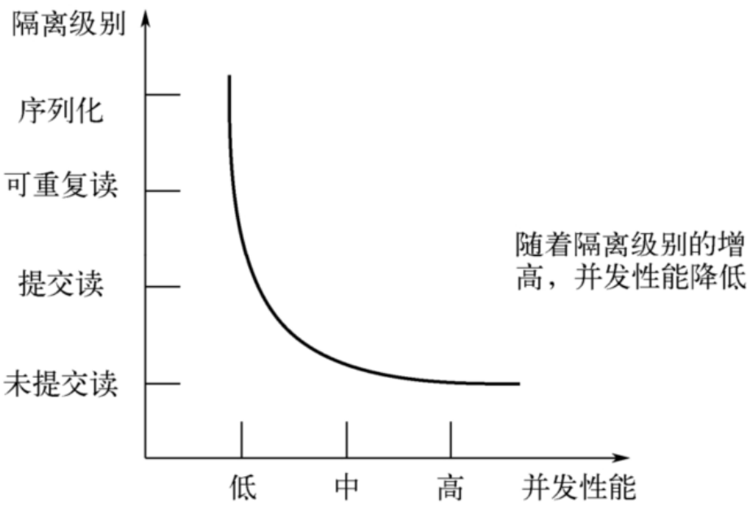

#### MySQL 支持的四种隔离级别

不同的数据库厂商对 SQL 标准中规定的四种隔离级别支持不一样。比如，`Oracle 就只支持 READ COMNITTED (默认隔离级别) 和 SERIALIZABLE 隔离级别`。MySQL 虽然支持 4 种隔离级别，但与 SQL 标准中所规定的各级隔离级别允许发生的问题却有些出入，MySQL 在 REPEATABLE READ 隔离级别下，是可以禁止幻读问题的发生的，禁止幻读的原因在后面 "多版本并发控制" 章节讲解。

MySQL 的默认隔离级别为`REPEATABLE READ`，可以手动修改一下事务的隔离级别：

```mysql
# MySQL 5.7.20版本之后，引入transaction_isolation来替换tx_isolation
mysql> SHOW VARIABLES LIKE 'transaction_isolation';
+-----------------------+-----------------+
| Variable_name         | Value           |
+-----------------------+-----------------+
| transaction_isolation | REPEATABLE-READ |
+-----------------------+-----------------+
1 row in set (0.01 sec)

# 或者不同MySQL版本中均可使用
mysql> SELECT @@transaction_isolation;
+-------------------------+
| @@transaction_isolation |
+-------------------------+
| REPEATABLE-READ         |
+-------------------------+
1 row in set (0.01 sec)
```

- MySQL 5.7.20 的版本之前，使用`SHOW VARIABLES LIKE 'tx_isolation';`命令查看隔离级别。

#### 如何设置事务的隔离级别

**1. 通过下面的语句修改事务的隔离级别。**

```mysql
SET [GLOBAL|SESSION] TRANSACTION ISOLATION LEVEL <隔离级别>;

# 其中，隔离级别格式：
> READ-UNCOMMITTED
> READ-COMMITTED
> REPEATABLE-READ
> SERIALIZABLE
```

或者：

```mysql
SET [GLOBAL|SESSION] TRANSACTION_ISOLATION = '<隔离级别>'

#其中，隔离级别格式：
> READ-UNCOMMITTED
> READ-COMMITTED
> REPEATABLE-READ
> SERIALIZABLE
```

**2. 关于设置时使用 GLOBAL 或 SESSION 的影响。**

使用`GLOBAL`关键字（在全局范围影响）：

```mysql
SET GLOBAL TRANSACTION ISOLATION LEVEL SERIALIZABLE;
# 或
SET GLOBAL TRANSACTION_ISOLATION = 'SERIALIZABLE';
```

- 当前已经存在的会话无效。
- 只对执行完该语句之后产生的会话起作用。

使用`SESSION`关键字（在会话范围影响）：

```mysql
SET SESSION TRANSACTION ISOLATION LEVEL SERIALIZABLE;
# 或
SET SESSION TRANSACTION_ISOLATION = 'SERIALIZABLE';
```

- 对当前会话的所有后续的事务有效。
- 如果在事务之间执行，则对后续的事务有效。
- 该语句可以在已经开启的事务中间执行，但不会影响当前正在执行的事务。

如果在服务器启动时想改变事务的默认隔离级别，可以修改启动参数`TRANSACTION_ISOLATION`的值。比如，在启动服务器时指定了 "TRANSACTION_ISOLATION = 'SERIALIZABLE'"，那么事务的默认隔离级别就从原来的 REPEATABLE-READ 变成了 SERIALIZABLE。

>数据库规定了多种事务隔离级别，不同隔离级别对应不同的干扰程度，隔离级别越高，数据一致性就越好，但并发性越弱。

**3. 演示 GLOBAL。**

当前会话设置 "TRANSACTION_ISOLATION = 'SERIALIZABLE'"，当前会话隔离级别未变：

```mysql
mysql> SHOW VARIABLES LIKE 'transaction_isolation';
+-----------------------+-----------------+
| Variable_name         | Value           |
+-----------------------+-----------------+
| transaction_isolation | REPEATABLE-READ |
+-----------------------+-----------------+
1 row in set (0.00 sec)

mysql> SET GLOBAL TRANSACTION_ISOLATION = 'SERIALIZABLE';
Query OK, 0 rows affected (0.00 sec)

mysql> SHOW VARIABLES LIKE 'transaction_isolation';
+-----------------------+-----------------+
| Variable_name         | Value           |
+-----------------------+-----------------+
| transaction_isolation | REPEATABLE-READ |
+-----------------------+-----------------+
1 row in set (0.00 sec)
```

新会话隔离级别发生改变：

```mysql
mysql> SHOW VARIABLES LIKE 'transaction_isolation';
+-----------------------+--------------+
| Variable_name         | Value        |
+-----------------------+--------------+
| transaction_isolation | SERIALIZABLE |
+-----------------------+--------------+
1 row in set (0.00 sec)
```

把当前会话退出重新登陆后，隔离级别发生改变。

> MySQL 服务重启后，隔离级别又重新回到默认，因为设置的都是在内存级别的。

**4. 演示 SESSION。**

当前会话设置 "TRANSACTION_ISOLATION = 'SERIALIZABLE'"，当前会话隔离级别就发生了改变，其他会话也发生了改变。

```mysql
mysql> SHOW VARIABLES LIKE 'transaction_isolation';
+-----------------------+-----------------+
| Variable_name         | Value           |
+-----------------------+-----------------+
| transaction_isolation | REPEATABLE-READ |
+-----------------------+-----------------+
1 row in set (0.01 sec)

mysql> SET SESSION TRANSACTION_ISOLATION = 'SERIALIZABLE';
Query OK, 0 rows affected (0.01 sec)

mysql> SHOW VARIABLES LIKE 'transaction_isolation';
+-----------------------+--------------+
| Variable_name         | Value        |
+-----------------------+--------------+
| transaction_isolation | SERIALIZABLE |
+-----------------------+--------------+
1 row in set (0.01 sec)
```

#### 不同隔离级别举例

创建数据表，并初始化数据：

```mysql
mysql> CREATE TABLE account(
    -> id INT PRIMARY KEY AUTO_INCREMENT,
    -> name VARCHAR(15),
    -> balance DECIMAL(15)
    -> );
Query OK, 0 rows affected (0.03 sec)

mysql> INSERT INTO account VALUES(1, 'zhangsan', '100'), (2, 'lisi', '0');
Query OK, 2 rows affected (0.01 sec)
Records: 2  Duplicates: 0  Warnings: 0
```

打开两个 Session，模拟两个事务，并将两个 Session 中的隔离级别都设置成 READ-UNCOMMITTED：

```mysql
mysql> SET SESSION TRANSACTION_ISOLATION = 'READ-UNCOMMITTED';
Query OK, 0 rows affected (0.00 sec)

mysql> SHOW VARIABLES LIKE 'transaction_isolation';
+-----------------------+------------------+
| Variable_name         | Value            |
+-----------------------+------------------+
| transaction_isolation | READ-UNCOMMITTED |
+-----------------------+------------------+
1 row in set (0.00 sec)
```

##### 演示 1：读未提交之脏读

案例一：

- 顺序 1：

  ```mysql
  # 事务1中更新数据，但是还没提交
  mysql> BEGIN;
  Query OK, 0 rows affected (0.00 sec)
  
  mysql> UPDATE account SET balance = balance + 100 WHERE id = 1;
  Query OK, 1 row affected (0.00 sec)
  Rows matched: 1  Changed: 1  Warnings: 0
  ```

- 顺序 2：

  ```mysql
  # 事务2中读取到了事务1还没提交的数据，出现了脏读
  mysql> SELECT * FROM account;
  +----+----------+---------+
  | id | name     | balance |
  +----+----------+---------+
  |  1 | zhangsan |     200 |
  |  2 | lisi     |       0 |
  +----+----------+---------+
  2 rows in set (0.00 sec)
  ```

- 顺序 3：

  ```mysql
  # 事务1回滚
  mysql> ROLLBACK;
  Query OK, 0 rows affected (0.01 sec)
  ```

- 顺序  4：

  ```mysql
  # 事务2读取的数据也变为之前的值
  mysql> SELECT * FROM account;
  +----+----------+---------+
  | id | name     | balance |
  +----+----------+---------+
  |  1 | zhangsan |     100 |
  |  2 | lisi     |       0 |
  +----+----------+---------+
  2 rows in set (0.00 sec)
  ```

案例二：

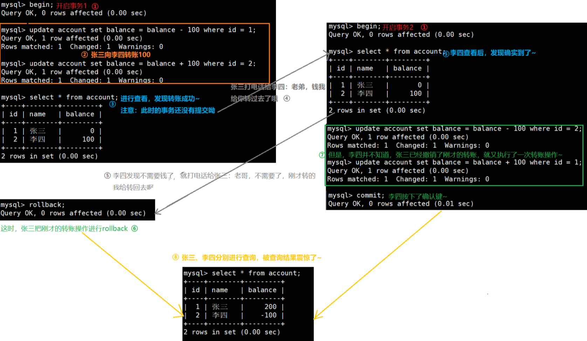

##### 演示 2：读已提交之不可重复读

环境准备：

```mysql
mysql> TRUNCATE TABLE account;
Query OK, 0 rows affected (0.02 sec)

mysql> INSERT INTO account VALUES(1, '张三', '100'), (2, '李四', '0');
Query OK, 2 rows affected (0.01 sec)
Records: 2  Duplicates: 0  Warnings: 0

mysql> SELECT * FROM account;
+----+--------+---------+
| id | name   | balance |
+----+--------+---------+
|  1 | 张三   |     100 |
|  2 | 李四   |       0 |
+----+--------+---------+
2 rows in set (0.01 sec)
```

将两个 Session 的隔离级别设置为 READ-COMMITTED：

```mysql
mysql> SET SESSION transaction_isolation = 'READ-COMMITTED';
Query OK, 0 rows affected (0.00 sec)

mysql> SELECT @@transaction_isolation;
+-------------------------+
| @@transaction_isolation |
+-------------------------+
| READ-COMMITTED          |
+-------------------------+
1 row in set (0.00 sec)
```

演示图解：

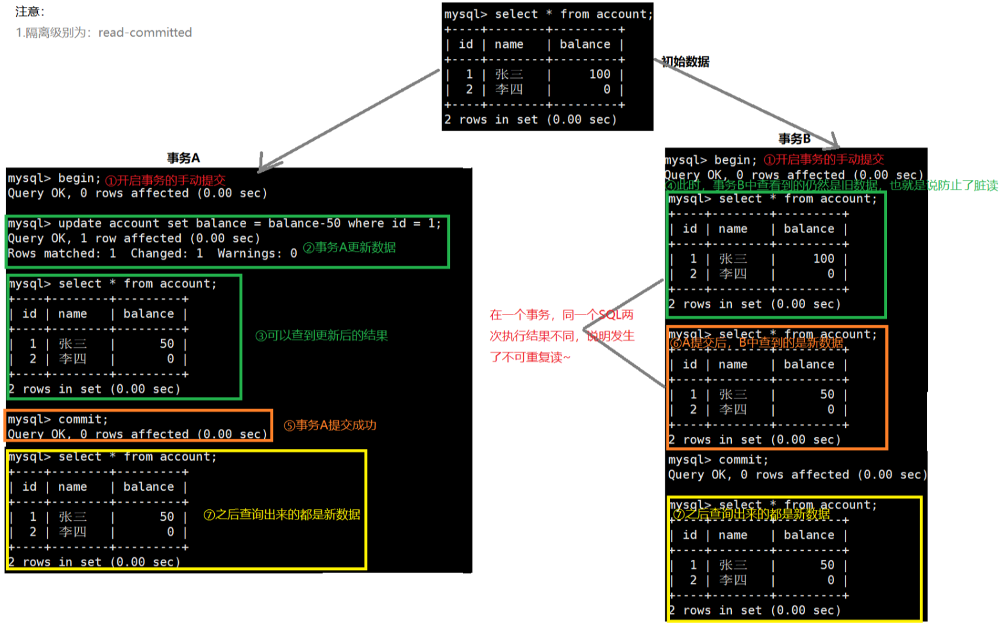

##### 演示 3：可重复读

将两个 Session 的隔离级别设置为 REPEATABLE-READ：

```mysql
mysql> SET SESSION transaction_isolation = 'REPEATABLE-READ';
Query OK, 0 rows affected (0.00 sec)

mysql> SELECT @@transaction_isolation;
+-------------------------+
| @@transaction_isolation |
+-------------------------+
| REPEATABLE-READ         |
+-------------------------+
1 row in set (0.00 sec)
```

演示图解：

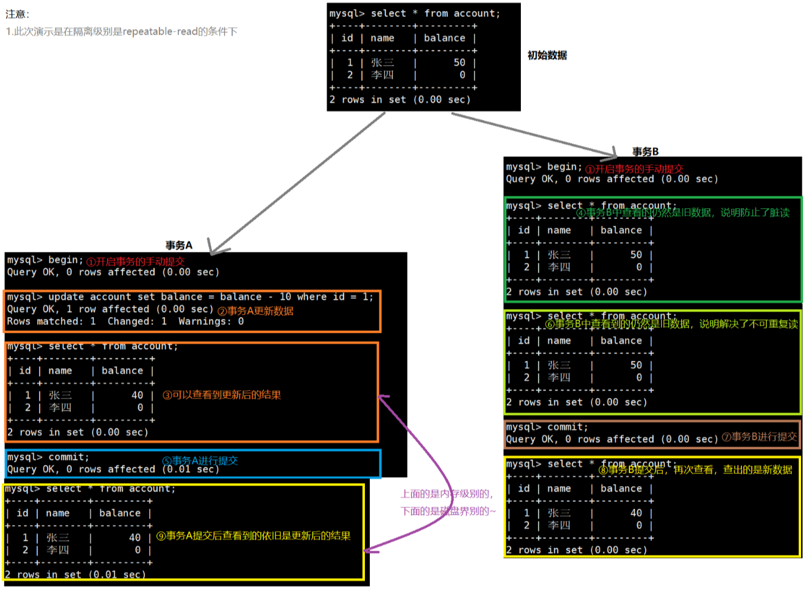

##### 演示 4：幻读

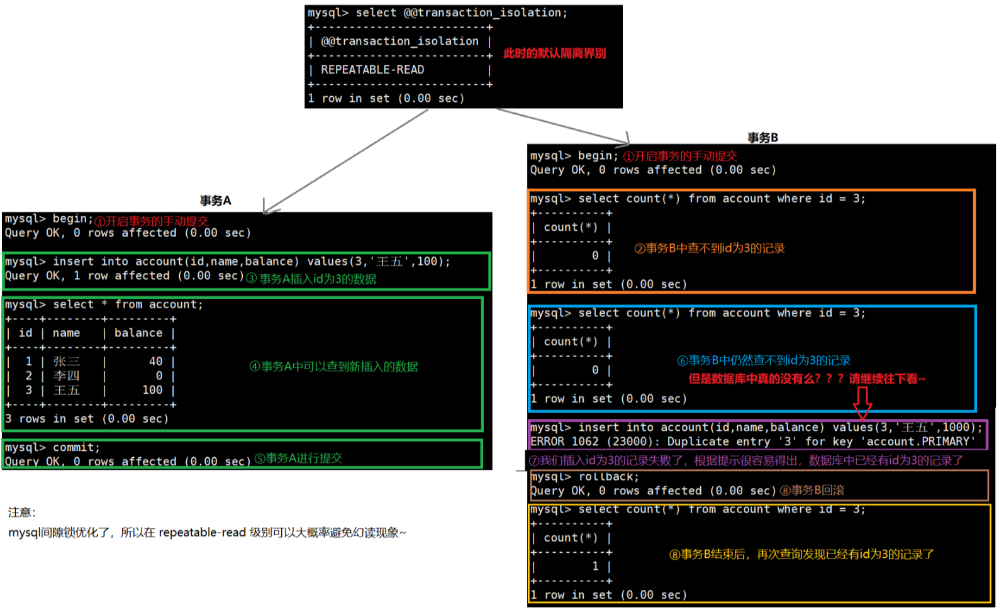

这里要灵活的理解读取的意思。第一次 SELECT 是读取，第二次的 INSERT 其实也属于隐式的读取，只不过是在 MySQL 的机制中读取的，**插入数据也是要先读取一下有没有主键冲突才能决定是否执行插入。**

**幻读，并不是说两次读取获取的结果集不同，幻读侧重的方面是某一次的 SELECT 操作得到的结果所表征的数据状态，无法支撑后续的业务操作。更为具体一些：SELECT 某记录是否存在，发现不存在，准备插入此记录，但执行 INSERT 时发现此记录已存在，无法插入，此时就发生了幻读（如上图所示）。**

在 REPEATABLE-READ 隔离级别下，step1、step2 是会正常执行的，step3 则会报错主键冲突，对于事务 B 的业务来说是执行失败的，这里事务 B 就是发生了幻读，因为事务 B 在 step1 中读取的数据状态并不能支撑后续的业务操作，事务 B："见鬼了，我刚才读到的结果应该可以支持我这样操作才对啊，为什么现在不可以？"事务 B 不敢相信的又执行了 step4，发现和 step1 读取的结果是一样的（REPEATABLE-READ下的 MVCC 机制)。此时，幻读无疑已经发生，事务 B 无论读取多少次，都查不到 id = 3 的记录，但它的确无法插入这条他通过读取来认定不存在的记录（此数据已被事务 A 插入)，对于事务 B 来说，它幻读了。

其实 REPEATABLE-READ（MySQL 默认隔离级别）也是可以避免幻读的，通过对 SELECT 操作手动加行 X 锁（独占锁）（SELECT … FOR UPDATE，这也正是 SERIALIZABLE 隔离级别下会隐式为你做的事情），同时，即便当前记录不存在，比如 id = 3 是不存在的，当前事务也会获得一把记录锁（因为 InnoDB 的行锁锁定的是索引，故记录实体存在与否没关系，存在就加`行 X 锁`，不存在就加`间隙锁`），他事务则无法插入此索引的记录，故杜绝了幻读。

在`SERIALIZABLE 隔离级别`下，step1 执行时，会隐式的添加`行 (X) 锁 / gap (X) 锁`的，从而 step2 会被阻塞，step3 会正常执行，待事务 1 提交后，事务 2 才能继续执行（主键冲突执行失败），对于事务 1 来说业务是正确的，成功的阻塞扼杀了扰乱业务的事务 2，对于事务 1 来说他前期读取的结果是可以支撑其后续业务的。

所以 MySQL 的幻读并非什么读取两次返回结果集不同，而是事务在插入事先检测不存在的记录时，惊奇的发现这些数据已经存在了，之前的检测读获取到的数据如同鬼影一般。

##### 演示 5：隔离级别是 SERIALIZABLE 时的效果


### 事务的常见分类

从事务理论的角度来看，可以把事务分为以下几种类型：

- 扁平事务（Flat Transactions）
- 带有保存点的扁平事务（Flat Transactions with Savepoints）
- 链事务（Chained Transactions）
- 嵌套事务（Nested Transactions）
- 分布式事务（Distributed Transactions）

下面简单介绍这几种类型：

- `扁平事务`：是事务类型中最简单的一种，但是在实际生产环境中，这可能是使用最频繁的事务。**在扁平事务中，所有操作都处于同一层次，其由 BEGIN WORK 开始，由 COMMIT WORK 或 ROLLBACK WORK 结束，其间的操作是原子的，要么都执行，要么都回滚。**因此，扁平事务是应用程序成为原子操作的基本组成模块。扁平事务虽然简单，但是在实际环境中使用最为频繁，也正因为其简单，使用频繁，故每个数据库系统都实现了对扁平事务的支持。**扁平事务的主要限制是不能提交或者回滚事务的某一部分，或分几个步骤提交。**扁平事务一般有三种不同的结果：

  - ① 事务成功完成。在平常应用中约占所有事务的 96%。
  - ② 应用程序要求停止事务。比如应用程序在捕获到异常时会回滚事务，约占事务的 3%。
  - ③ 外界因素强制终止事务。如连接超时或连接断开，约占所有事务的 1%。

- `带有保存点的扁平事务`：除了支持扁平事务支持的操作外，还允许在事务执行过程中回滚到同一事务中较早的一个状态。这是因为某些事务可能在执行过程中出现的错误并不会导致所有的操作都无效，放弃整个事务不合乎要求，开销太大。

  - `保存点 (Savepoint)`用来通知事务系统应该记住事务当前的状态，以便当之后发生错误时，事务能回到保存点当时的状态。对于扁平的事务来说，隐式的设置了一个保存点，然而在整个事务中，只有这一个保存点，因此，回滚只能会滚到事务开始时的状态。

- `链事务`：是指一个事务由多个子事务链式组成，它可以被视为保存点模式的一个变种。带有保存点的扁平事务，当发生系统崩溃时，所有的保存点都将消失，这意味着当进行恢复时，事务需要从开始处重新执行，而不能从最近的一个保存点继续执行。链事务的思想是：在提交一个事务时，释放不需要的数据对象，将必要的处理上下文隐式地传给下一个要开始的事务，前一个子事务的提交操作和下一个子事务的开始操作合并成一个原子操作，这意味着下一个事务将看到上一个事务的结果，就好像在一个事务中进行一样。这样，**在提交子事务时就可以释放不需要的数据对象，而不必等到整个事务完成后才释放**。其工作方式如下：

  

  - 链事务与带有保存点的扁平事务的不同之处体现在：

    - 带有保存点的扁平事务能回滚到任意正确的保存点，而链事务中的回滚仅限于当前事务，即只能恢复到最近的一个保存点。

    - 对于锁的处理，两者也不相同，链事务在执行 COMMIT 后即释放了当前所持有的锁，而带有保存点的扁平事务不影响迄今为止所持有的锁。

- `嵌套事务`：是个层次结构框架，由一个顶层事务（Top-Level Transaction）控制着各个层次的事务，顶层事务之下嵌套的事务被称为子事务（Subtransaction），其控制着每一个局部的变换，子事务本身也可以是嵌套事务。因此，嵌套事务的层次结构可以看成是一棵树。

- `分布式事务`：通常是在一个分布式环境下运行的扁平事务，因此，需要根据数据所在位置访问网络中不同节点的数据库资源。例如，一个银行用户从招商银行的账户向工商银行的账户转账 1000 元，这里需要用到分布式事务，因为不能仅调用某一家银行的数据库就完成任务。

## MySQL 事务日志

事务有 4 种特性：`原子性`、`一致性`、`隔离性`和`持久性`。那么事务的 4 种特性到底是基于什么机制实现呢？

- 事务的**隔离性**由`锁机制`实现。
- 而事务的原子性、一致性和持久性由事务的`redo log`和`undo log`来保证。
  - redo log 称为`重做日志`，提供再写入操作，恢复提交事务修改的页操作，用来保证事务的**持久性**。
  - undo log 称为`回滚日志`，回滚行记录到某个特定版本，用来保证事务的**原子性、一致性**。

有的 DBA 或许会认为 undo log 是 redo log 的逆过程，其实不然。redo log 和 undo log 都可以视为是一种`恢复操作`。但是：

- redo log：是存储引擎层（InnoDB）生成的日志，记录的是`物理级别`上的页修改操作，比如页号 xxx、偏移量 yyy 写入了 zzz 数据。主要为了保证`数据的可靠性`。
- undo log：是存储引擎层（InnoDB）生成的日志，记录的是`逻辑操作`日志，比如对某一行数据进行了 INSERT 语句操作，那么 undo log 就记录一条与之相反的 DELETE 操作。主要用于事务的`回滚`（undo log 记录的是每个修改操作的`逆操作`）和`一致性非锁定读`（undo log 回滚行记录到某种特定的版本 ---> MVCC，即多版本并发控制）。

### redo log

InnoDB 存储引擎是`以页为单位`来管理存储空间的。在真正访问页面之前，需要把在`磁盘上的页`缓存到内存中的`Buffer Pool`之后才可以访问。所有的变更都必须先更新缓冲池中的数据，然后缓冲池中的脏页会以一定的频率被刷入磁盘（`checkpoint 机制`），通过缓冲池来优化 CPU 和磁盘之间的鸿沟，这样就可以保证整体的性能不会下降太快。

#### 为什么需要 redo log

一方面，缓冲池可以帮助我们消除 CPU 和磁盘之间的鸿沟，checkpoint 机制可以保证数据的最终落盘，然而由于 checkpoint 并不是每次变更的时候就触发的，而是 master 线程隔一段时间去处理的。所以最坏的情况就是事务提交后，刚写完缓冲池，数据库宕机了，那么这段数据就是丢失的，无法恢复。

另一方面，事务包含持久性的特性，就是说对于一个已经提交的事务，在事务提交后即使系统发生了崩溃，这个事务对数据库中所做的更改也不能丢失。

那么如何保证这个持久性呢？一个简单的做法：`在事务提交完成之前把该事务所修改的所有页面都刷新到磁盘`。但是这个简单粗暴的做法有些问题：

- **修改量与刷新磁盘工作量严重不成比例**
  - 有时候仅仅修改了某个页面中的一个字节，但是我们知道在 InnoDB 中是以页为单位来进行磁盘 I/O 的，也就是说在该事务提交时不得不将一个完整的页面从内存中刷新到慈盘，我们又知道一个页面默认是 16 KB 大小，只修改一个字节就要刷新 16 KB 的数据到磁盘上，显然是太小题大做了。
- **随机 I/O 刷新较慢**
  - 一个事务可能包含很多语句，即使是一条语句也可能修改许多页面，假如该事务修改的这些页面可能并不相邻，这就意味着在将某个事务修改的 Buffer Pool 中的页面刷新到磁盘时，需要进行很多的随机 I/O，随机 I/O 比顺序 I/O 要慢，尤其对于传统的机械硬盘来说。

另一个解决的思路：我们只是想让已经提交了的事务对数据库中数据所做的修改永久生效，即使后来系统崩溃，在重启后也能把这种修改恢复出来。所以，`其实没有必要在每次事务提交时就把该事务在内存中修改过的全部页面刷新到磁盘，只需要把修改了哪些东西记录一下就好。`比如，某个事务将 0 号系统表空间中第 10 号页面中偏移量为 100 处的值 1 改成 2，我们只需记录一下："将第 0 号表空间的第 10 号页面中偏移量为 100 处的值更新为 2"。

InnoDB 引擎的事务采用了`WAL 技术 (Write-Ahead Logging)`，这种技术的思想就是`先写日志，再写磁盘`，只有日志写入成功，才算事务提交成功，这里的日志就是 redo log。当发生宕机且数据未刷到磁盘的时候，可以通过 redo log 来恢复，保证 ACID 中的 D，这就是 redo log 的作用。


#### redo log 的好处和特点

好处：

- redo log 降低了刷盘频率。
- redo log 占用的空间非常小。redo log 存储`表空间 ID`、`页号`、`偏移量`以及`需要更新的值`，所需的存储空间是很小的，刷盘快。

特点：

- redo log 是顺序写入磁盘的。
  - 在执行事务的过程中，每执行一条语句，就可能产生若干条 redo log，这些日志是按照产生的顺序写入磁盘的，也就是使用顺序 I/O，效率比随机 I/O 快。
- 事务执行过程中，redo log 不断记录。
  - redo log 跟 bin log 的区别，redo log 是`存储引擎层`产生的，而 bin log 是`数据库层`产生的。假设一个事务，对表做 10 万行的记录插入，在这个过程中，一直不断的往 redo log 顺序记录，而 bin log 不会记录，直到这个事务提交，才会一次写入到 bin log 文件中（`bin log 是记录主从复制的文件`）。

#### redo log 的组成

redo log 可以简单分为以下两个部分：

- `重做日志缓冲 (redo log buffer)` ，保存在内存中，是易失的。
- `重做日志文件 (redo log file)`，保存在硬盘中，是持久的。

##### redo log buffer

在服务器启动时，就向操作系统申请了一大片称之为`redo log buffer`的`连续内存空间`，翻译成中文就是重做日志缓冲区。这片内存空间被划分成若干个连续的`redo log block`。`一个 redo log block 占用 512 字节大小`。


**参数设置：`innodb_log_buffer_size`。**

- redo log buffer 的大小，默认 16 MB，最大值是 4096 MB，最小值为 1 MB。

  ```mysql
  mysql> SHOW VARIABLES LIKE '%innodb_log_buffer_size%';
  +------------------------+----------+
  | Variable_name          | Value    |
  +------------------------+----------+
  | innodb_log_buffer_size | 16777216 |
  +------------------------+----------+
  1 row in set (0.00 sec)
  ```

##### redo log file

redo log file 如图所示，其中的`ib_logfile0`和`ib_logfile1`即为 redo log：


#### redo log 的整体流程

以一个更新事务为例，redo log 的流转过程，如下图所示：


- 第 1 步：先将原始数据从磁盘中读入内存中来，修改数据的内存拷贝。
- 第 2 步：生成一条重做日志，并写入 redo log buffer，记录的是数据被修改后的值。
- 第 3 步：当事务 COMMIT 时，将 redo log buffer 中的内容刷新到 redo log file，对 redo log file 采用追加写的方式。
- 第 4 步：定期将内存中修改的数据刷新到磁盘中。

>`Write-Ahead Log`：预先日志持久化，在持久化一个数据页之前，先将内存中相应的日志页持久化。

#### redo log 的刷盘策略

redo log 的写入并不是直接写入磁盘的，InnoDB 引擎会在写 redo log 的时候先写 redo log buffer，之后以`一定的频率`刷到真正的 redo log file 中。这里的一定频率怎么看待呢？这就是我们要说的`刷盘策略`。

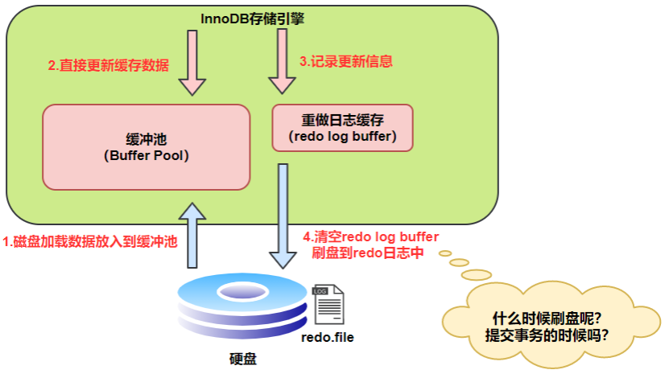

注意，redo log buffer 刷盘到 redo log file 的过程，并不是真正的刷到磁盘中去，只是刷入到`文件系统缓存`（`page cache`）中去（OS buffer，这是现代操作系统为了提高文件写入效率做的一个优化），真正的写入会交给`系统自己来决定`（比如 page cache 足够大了）。那么对于 InnoDB 来说就存在一个问题，如果交给系统来同步，同样如果系统宕机，那么数据也丢失了（虽然整个系统宕机的概率还是比较小的）。

针对这种情况，InnoDB 给出`innodb_flush_log_at_trx_commit `参数，该参数控制 COMMIT 提交事务时，如何将 redo log buffer 中的日志刷新到 redo log file 中。它支持三种策略：

- `设置为 0`：每次提交事务时，不会将 redo log buffer 中的日志写入 page cache，而是通过一个单独的线程，**每秒**写入 page cache 并调用系统的 fsync() 函数写入磁盘的 redo log file。这种方式不是实时写磁盘的， 而是每隔 1 秒写一次日志，如果系统崩溃，可能会丢失 1 秒的数据。

- `设置为 1`：**默认值**，每次提交事务时，都会将 redo log buffer 中的日志写入 page cache 中，并且会调用 fsync() 函数将日志写入 redo log file 中。这种方式虽然不会再崩溃时丢失数据，但是性能比较差。

  ```mysql
  mysql> SHOW VARIABLES LIKE 'innodb_flush_log_at_trx_commit';
  +--------------------------------+-------+
  | Variable_name                  | Value |
  +--------------------------------+-------+
  | innodb_flush_log_at_trx_commit | 1     |
  +--------------------------------+-------+
  1 row in set (0.00 sec)
  ```

- `设置为 2`：每次提交事务时，都只将 redo log buffer 中的日志写入 page cache 中，之后每隔 1 秒，通过 fsync() 函数将 page cache 中的数据写入 redo log file 中。

>write：`刷盘`，指的是 MySQL 从 buffer pool 中将内容写到系统的 page cache 中，并没有持久化到系统磁盘上。这个速度其实是很快的。
>
>fsync：`持久化到磁盘`，指的是从系统的 page cache 中，将数据持久化到系统磁盘上。这个速度可以认为比较慢，而且也是 IOPS 升高的真正原因。

另外，InnoDB 存储引擎有一个后台线程，`每隔 1 秒`，就会把 redo log buffer 中的内容写到文件系统缓存（page cache），然后调用刷盘操作。

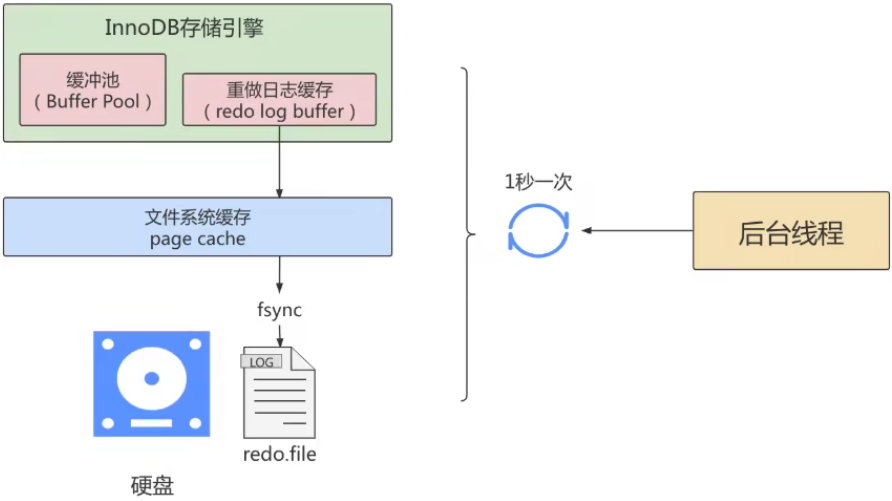

**也就是说，一个没有提交事务的 redo log 记录，也可能会刷盘。因为在事务执行过程 redo log 记录是会写入 redo log buffer 中，这些 redo log 记录会被后台线程刷盘。**

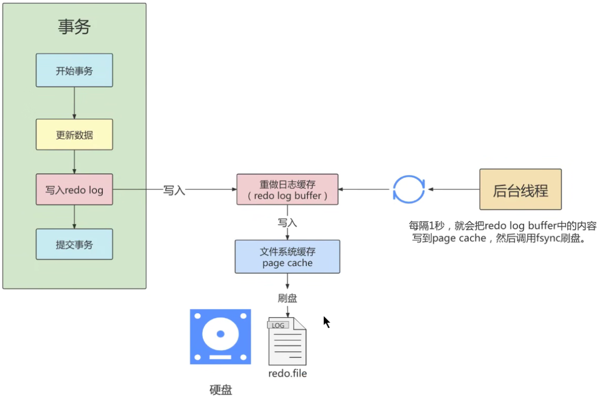

除了后台线程每秒 1 次的轮询操作，还有一种情况，当 redo log buffer 占用的空间即将达到 innodb_log_buffer_size 的`一半`的时候，后台线程会主动刷盘。

#### 不同刷盘策略演示

##### 刷盘策略分析

**1. innodb_flush_log_at_trx_commit = 1**


- innodb_flush_log_at_trx_commit = 1 时，`只要事务提交成功，都会主动同步刷盘，这个速度是很快的。`最终 redo log 记录就一定在硬盘里，不会有任何数据丢失。
- `如果事务执行期间 MySQL 挂了或宕机，这部分日志丢了，但是事务并没有提交，所以日志丢了也不会有损失。`可以保证 ACID 的 D，数据绝对不会丢失，但是这种效率是最差的。
- 建议使用默认值，虽然操作系统宕机的概率理论小于数据库宕机的概率，但是一般既然使用了事务，那么数据的安全相对来说更重要些。

**2. innodb_flush_log_at_trx_commit = 2**

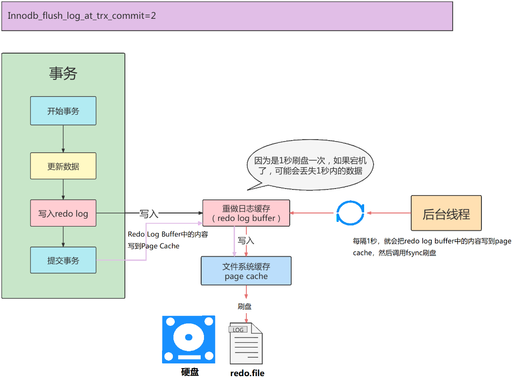

- innodb_flush_log_at_trx_commit = 2 时，只要事务提交成功，redo log buffer 中的内容就会写入文件系统缓存（page cache）。
- 如果只是 MySQL 挂了不会有任何数据丢失，但是操作系统宕机可能会有 1 秒数据的丢失，这种情况下无法满足 ACID 中的 D。
- 数值 2 是一种折中的做法，它的 I/O 效率理论是高于 1，低于 0 的。当进行调优时，为了降低 CPU 的使用率，可以从 1 降成 2，因为 O/S 出现故障的概率很小。

**3. innodb_flush_log_at_trx_commit = 0**


- innodb_flush_log_at_trx_commit = 0 时，master thread 中每 1 秒进行一次重做日志的 fsync 操作，因此实例 crash，`最多丢失 1 秒钟内的事务`。（master thread 是负责将缓冲池中的数据异步刷新到磁盘，保证数据的一致性）
- 数值 0，是一种效率最高的做法，这种策略有丢失数据的风险，也无法保证 D。

> 一句话，**`0：延迟写，延迟刷`，`1：实时写，实时刷`，`2：实时写，延迟刷`**。

##### 示例

比较 innodb_flush_log_at_trx_commit 对事务的影响。准备数据：

```mysql
mysql> USE atguigudb2;
Database changed

mysql> CREATE TABLE test_load(
    -> a INT,
    -> b CHAR(80)
    -> )ENGINE=INNODB;
Query OK, 0 rows affected (0.04 sec)

mysql> DELIMITER //
mysql> CREATE PROCEDURE p_load(COUNT INT UNSIGNED)
    -> BEGIN
    -> DECLARE s INT UNSIGNED DEFAULT 1;
    -> DECLARE c CHAR(80)DEFAULT REPEAT('a',80);
    -> WHILE s<=COUNT DO
    -> INSERT INTO test_load SELECT NULL,c;
    -> COMMIT;
    -> SET s=s+1;
    -> END WHILE;
    -> END //
Query OK, 0 rows affected (0.01 sec)

mysql> DELIMITER ;
```

innodb_flush_log_at_trx_commit = 1 时：

```mysql
mysql> SHOW VARIABLES LIKE 'innodb_flush_log_at_trx_commit';
+--------------------------------+-------+
| Variable_name                  | Value |
+--------------------------------+-------+
| innodb_flush_log_at_trx_commit | 1     |
+--------------------------------+-------+
1 row in set (0.00 sec)

mysql> CALL p_load(30000);
Query OK, 0 rows affected (2 min 3.70 sec)
```

innodb_flush_log_at_trx_commit = 2 时：

```mysql
mysql> TRUNCATE TABLE test_load;
Query OK, 0 rows affected (0.04 sec)

mysql> SET GLOBAL innodb_flush_log_at_trx_commit = 2;
Query OK, 0 rows affected (0.00 sec)

mysql> SHOW VARIABLES LIKE 'innodb_flush_log_at_trx_commit';
+--------------------------------+-------+
| Variable_name                  | Value |
+--------------------------------+-------+
| innodb_flush_log_at_trx_commit | 2     |
+--------------------------------+-------+
1 row in set (0.00 sec)

mysql> CALL p_load(30000);
Query OK, 0 rows affected (1 min 4.00 sec)
```

innodb_flush_log_at_trx_commit = 0 时：

```mysql
mysql> TRUNCATE TABLE test_load;
Query OK, 0 rows affected (0.03 sec)

mysql> SET GLOBAL innodb_flush_log_at_trx_commit = 0;
Query OK, 0 rows affected (0.00 sec)

mysql> SHOW VARIABLES LIKE 'innodb_flush_log_at_trx_commit';
+--------------------------------+-------+
| Variable_name                  | Value |
+--------------------------------+-------+
| innodb_flush_log_at_trx_commit | 0     |
+--------------------------------+-------+
1 row in set (0.00 sec)

mysql> CALL p_load(30000);
Query OK, 0 rows affected (1 min 0.72 sec)
```

最终结果：

| innodb_flush_logat_trx_commit | 执行所用的时间 |
| ----------------------------- | -------------- |
| 0                             | 1 min 0.72 sec |
| 1                             | 2 min 3.70 sec |
| 2                             | 1 min 4.00 sec |

针对上述存储过程，为了提高事务的提交性能，应该在将 3 万行记录插入表后进行一次的 COMMIT 操作，而不是每插入一条记录后就进行一次 COMMIT 操作，这样做的好处是可以使事务方法在 ROLLBACK 时，回滚到事务最开始的确定状态。

>注意：虽然用户可以通过设置参数 innodb_flush_log_at_trx_commit 为 0 或 2 来提高事务提交的性能，但需清楚，这种设置方法丧失了事务的 ACID 特性。

#### 写入 redo log buffer 过程

##### Mini-Transaction

MySQL 把对底层页面中的一次原子访问的过程，称之为一个`Mini-Transaction`，简称 mtr。比如，向某个索引对应的 B+Tree 中，插入一条记录的过程就是一个 Mini-Transaction。`一个 mtr 可以包含一组 redo log`，在进行崩溃恢复时这一组 redo log 作为一个不可分割的整体。

一个事务可以包含若干条语句，`每一条语句其实是由若干个 mtr 组成，每一个 mtr 又可以包含若干条 redo log`，画个图表示它们的关系就是这样：


- 一个事务由多条 SQL 语句组成。
- 一条 SQL 语句包含多个 mtr，因为一条 SQL 可能改变多条记录。
- 一个 mtr 对应多条 redo log，因为 redo log 存放的是物理级别的修改，当插入语句且页分裂时，会出现大量比如 "A 页 xxx、偏移量 yy 写入了 zzz 数据"，"B 页面 aaa、偏移量 bb 写入了 ccc 数据" 这样的记录。

##### redo log 写入 redo log buffer

向 redo log buffer 中写入 redo log 的过程是顺序的，也就是先往前边的 block 中写，当该 block 的空闲空间用完之后，再往下一个 block 中写。当想往 redo log buffer 中写入 redo log 时，第一个遇到的问题就是应该写在哪个 block 的哪个偏移量处，所以 InnoDB 的设计者特意提供了一个称之为`buf_free`的全局变量，该变量指明后续写入的 redo log 应该写入到 redo log buffer 中的哪个位置，如图所示：


一个 mtr 执行过程中，可能产生若干条 redo log，`这些 redo log 是一个不可分割的组`，所以其实并不是每生成一条 redo log，就将其插入到 redo log buffer 中，而是每个 mtr 运行过程中产生的日志`先暂时存到一个地方`，当该 mtr 结束的时候，将过程中产生的一组 redo log 再全部复制到 redo log buffer 中。假设有两个名为 T1、T2 的事务，每个事务都包含 2 个 mtr，我们给这几个 mtr 命名一下：

- 事务 T1 的两个 mtr 分别称为 mtr_T1_1 和 mtr_T1_2。
- 事务 T2 的两个 mtr 分别称为 mtr_T2_1 和 mtr_T2_2。

每个 mtr 都会产生一组 redo log，用示意图来描述一下这些 mtr 产生的日志情况：

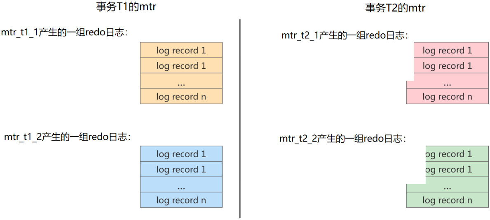

不同的事务可能是`并发`执行的，所以 T1、T2 之间的 mtr 可能是`交替执行`的。每当一个 mtr 执行完成时，伴随该 mtr 生成的一组 redo log 就需要被复制到 redo log buffer 中，也就是说，`不同事务的 mtr 可能是交替写入 redo log buffer 的`，我们画个示意图（为了美观，把一个 mtr 中产生的所有的 redo log 当作一个整体来画）：


有的 mtr 产生的 redo log 量可能非常大，比如 mtr_t1_2 产生的 redo log 占用空间比较大，占用了 3 个 block 来存储。

##### redo log block 的结构图

一个 redo log block 是由`日志头`、`日志体`、`日志尾`组成。日志头占用 12 字节，日志尾占用 8 字节，所以一个 block 真正能存储的数据就是 512 - 12 - 8 = 492 字节。


**真正的 redo log 都是存储到占用 496 字节大小的 log block body 中，图中的 log block header 和 log block trailer 存储的是一些管理信息。**我们来看看这些所谓的管理信息都有什么。


- `log block header`的属性分别如下：
  - `LOG_BLOCK_HDR_NO `：log buffer 是由 log block 组成，在内部 log buffer 就好似一个数组，因此 LOG_BLOCK_HDR_NO 用来标记这个数组中的位置。其是递增并且循环使用的，占用 4 个字节，但是由于第—位用来判新是否是 flush bit，所以最大的值为 2 GB。
  - `LOG_BLOCK_HDR_DATA_LEN`：表示 block 中已经使用了多少字节，初始值为`12`，因为 log block body 从第 12 个字节处开始。随着往 block 中写入的 redo log 越来越多，该属性值也跟着增长。如果 log block body 已经被全部写满，那么该属性的值被设置为`512`。
  - `LOG_BLOCK_FIRST_REC_GROUP `：一条 redo log 也可以称之为一条 redo 日志记录（redo log record)，一个 mtr 会生产多条 redo 日志记录，这些 redo 日志记录被称之为一个 redo 日志记录组（redo log record group）。LOG_BLOCK_FIRST_REC_GROUP 就代表该 block 中第一个 mtr 生成的 redo 日志记录组的偏移量（其实也就是这个 block 里，第一个 mtr 生成的第一条 redo 日志的偏移量）。如果该值的大小与 LOG_BLOCK_HDR_DATA_LEN 相同，则表示当前 log block 不包含新的日志。
  - `LOG_BLOCK_CHECKPOINT_NO`：占用 4 字节，表示该 log block 最后被写入时的`checkpoint`。
- `log block trailer`的属性如下：
  - `LOG_BLOCK_CHECKSUN`：表示 block 的校验值，用于正确性校验（其值和 LOG_BLOCK_HDR_NO 相同)，暂时不关心它。

#### redo log file 

##### 相关参数设置

- `innodb_log_group_home_dir `：指定 redo log 文件组所在的路径，默认值为`./`，表示在数据库的数据目录下。MySQL 的默认数据目录（`var/lib/mysql` ）下默认有两个名为`ib_logfile0 `和`ib_logfile1 `的文件，log buffer 中的日志，默认情况下就是刷新到这两个磁盘文件中。此 redo log 文件组位置可以修改。

  ```mysql
  mysql> SHOW VARIABLES LIKE 'innodb_log_group_home_dir';
  +---------------------------+-------+
  | Variable_name             | Value |
  +---------------------------+-------+
  | innodb_log_group_home_dir | ./    |
  +---------------------------+-------+
  1 row in set (0.00 sec)
  ```

- `innodb_log_files_in_group`：指明 redo log file 的个数，命名方式如 ib_logfile0，iblogfile1，…，iblogfilen。默认 2 个，最大 100 个。

  ```mysql
  mysql> SHOW VARIABLES LIKE 'innodb_log_files_in_group';
  +---------------------------+-------+
  | Variable_name             | Value |
  +---------------------------+-------+
  | innodb_log_files_in_group | 2     |
  +---------------------------+-------+
  1 row in set (0.00 sec)
  ```

- `innodb_flush_log_at_trx_commit`：控制 redo log 刷新到磁盘的策略，默认为`1`。

  ```mysql
  mysql> SHOW VARIABLES LIKE 'innodb_flush_log_at_trx_commit';
  +--------------------------------+-------+
  | Variable_name                  | Value |
  +--------------------------------+-------+
  | innodb_flush_log_at_trx_commit | 1     |
  +--------------------------------+-------+
  1 row in set (0.01 sec)
  ```

- `innodb_log_file_size`：单个 redo log file 设置大小，默认值为`48 MB `。最大值为 512 GB，注意最大值指的是整个 redo log 系列文件之和，即（innodb_log_files_in_group * innodb_log_file_size）不能大于最大值 512 GB。

  ```mysql
  mysql> SHOW VARIABLES LIKE 'innodb_log_file_size';
  +----------------------+----------+
  | Variable_name        | Value    |
  +----------------------+----------+
  | innodb_log_file_size | 50331648 |
  +----------------------+----------+
  1 row in set (0.00 sec
  ```

  - 根据业务修改其大小，以便容纳较大的事务。编辑 my.cnf 文件并重启数据库生效，如下所示：

    ```bash
    [root@centos7-mysql-1 mysql]#vim /etc/my.cnf
    innodb_log_file_size=200M
    ```

>在数据库实例更新比较频繁的情况下，可以适当加大 redo log 组数和大小。但也不推荐 redo log 设置过大，在 MySQL 崩溃恢复时，会重新执行 redo log 中的记录。

##### 日志文件组

从上边的描述中可以看到，磁盘上的 redo log file 不止一个，而是以一个`日志文件组`的形式出现的。这些文件以`ib_logfile[数字]`（`数字`可以是`0、1、2…`）的形式进行命名，每个 redo log file 大小都是一样的。

在将 redo log 写入日志文件组时，是从`ib_logfile0`开始写，如果`ib_logfile0`写满了，就接着`ib_logfile1`写。同理，`ib_logf1le1`写满了就去写`ib_logfile2`，依次类准。如果写到最后一个文件该咋办？那就`重新转到 ib_logfile0 继续写`，所以整个过程如下图所示：


总共的 redo log file 大小其实就是：`innodb_log_file_size * innodb_log_files_in_group`。

采用循环使用的方式向 redo log 文件组里写数据的话，会导致后写入的 redo log 覆盖掉前边写的 redo log，基于此，InnoDB 的设计者提出了 checkpoint 的概念。

##### checkpoint

在整个日志文件组中还有两个重要的属性，分别是`write pos`、`checkpoint`。

- write pos 是当前记录的位置，一边写一边后移。
- checkpoint 是当前要擦除的位置，也是往后推移。

**每次刷盘 redo log 记录到日志文件组中，write pos 位置就会后移更新。每次 MySQL 加载日志文件组恢复数据时，会清空加载过的 redo log 记录，并把 checkpoint 后移更新。**write pos 和 checkpoint 之间的还空着的部分，可以用来写入新的 redo log 记录。

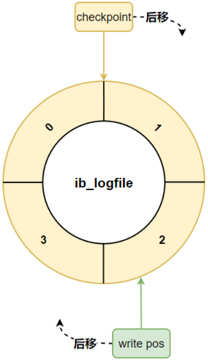

如果 write pos 追上 checkpoint ，表示日志文件组满了，这时候不能再写入新的 redo log 记录，MySQL 得停下来，清空一些记录，把 checkpoint 推进一下。

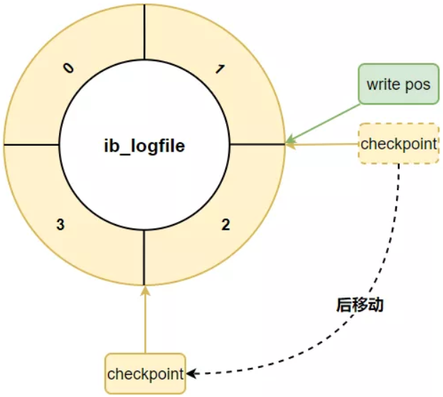

#### 小结

InnoDB 的更新操作，采用的是 Write Ahead Log（预先日志持久化）策略，即先写日志，再写入磁盘：

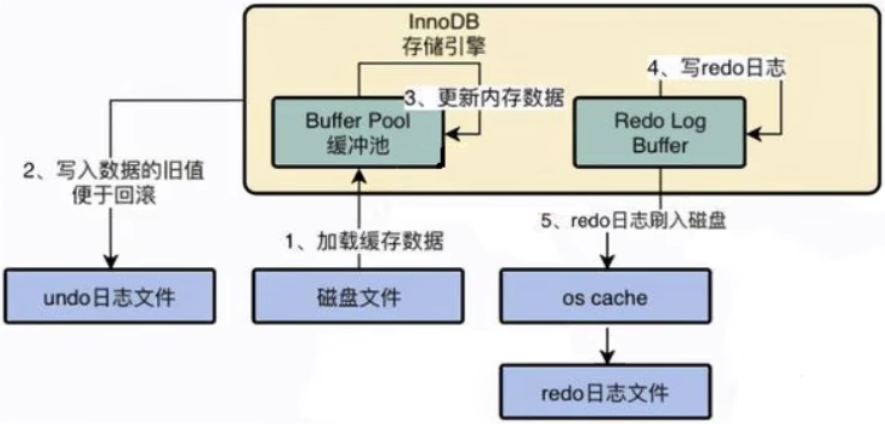

### undo log

redo log 是事务持久性的保证，undo log 是事务原子性的保证。在事务中更新数据的前置操作，其实是要先写入一个 undo log。

#### 如何理解 undo log

事务需要保证原子性，也就是事务中的操作要么全部完成，要么什么也不做。但有时候事务执行到一半会出现一些情况，比如：

- 情况一：事务执行过程中可能遇到各种错误，比如`服务器本身的错误`，`操作系统错误 `，甚至是突然`断电`导致的错误。
- 情况二：程序员可以在事务执行过程中，手动输入`ROLLBACK `语句结束当前事务的执行。

以上情况出现，需要把数据改回原先的样子，这个过程称之为`回滚` ，这样就可以造成一个假象：这个事务看起来什么都没做，所以符合原子性要求。

每当我们要对一条记录做`改动`时（这里的改动可以指`INSERT`、`DELETE`、`UPDATE `），都需要 "留一手"---> **把回滚时所需的东西记下来**。比如：

- `插入一条记录`时，至少要把这条记录的`主键值`记下来，之后回滚的时候，只需要把这个主键值对应的记录`删除`就好了（对于每个 INSERT，InnoDB 存储引擎会添加一个 DELETE）。
- `删除一条记录`时，至少要把这条记录中的`内容`都记下来，之后回滚的时候，再把由这些内容组成的记录`插入`到表中就好了（对于每个 DELETE，InnoDB 存储引擎会添加一个 INSERT）。

- `修改一条记录`时，至少要把修改这条记录前的`旧值`都记录下来，之后回滚的时候，再把这条记录`更新`为旧值就好了（对于每个 UPDATE，InnoDB 存储引擎会执行一个相反的 UPDATE，将修改前的行放回去）。

MySQL 把这些为了回滚而记录的内容，称之为`撤销日志`或者`回滚日志`，即  undo log。

>说明：
>
>- 由于查询操作（`SELECT`）并不会修改任何用户记录，所以在查询操作执行时，`不需要记录`相应的 undo log。
>- `undo log 会产生 redo log`，也就是 undo log 的产生会伴随着 redo log 的产生，这是因为 undo log 也需要持久性的保护。

#### undo log 的作用

##### 回滚数据

用户对 undo log 可能有误解的认为：undo log 用于将数据库物理地恢复到执行语句或事务之前的样子。但事实并非如此，undo log 是`逻辑日志`，只是将数据库逻辑地恢复到原来的样子。所有修改都被逻辑地取消了，但是**数据结构和页本身在回滚之后可能大不相同**，比如新增的页不会逻辑的进行删除。

这是因为在多用户并发系统中，可能会有数十、数百甚至数千个并发事务，数据库的主要任务就是`协调对数据记录的并发访问`。比如，一个事务在修改当前一个页中某几条记录，同时还有别的事务在对同一个页中另几条记录进行修改。因此，不能将一个页回滚到事务开始的样子，因为这样会影响其他事务正在进行的工作。

##### MVCC

undo log 的另一个作用是`MVCC`，即在 InnoDB 存储引擎中，`MVCC 的实现是通过 undo log 来完成的`。当用户读取一行记录时，若该记录已经被其他事务占用，当前事务可以通过 undo log 读取之前的行版本信息，以此实现`非锁定读取`。

#### undo log 的存储结构

##### 回滚段与 undo 页

InnoDB 对 undo log 的管理采用段的方式，也就是 `回滚段 (rollback segment)`。每个回滚段记录了`1024 `个` undo log segment` ，而在每个 undo log segment 中进行`undo 页`的申请。

- 在 InnoDB 1.1 版本之前（不包括 1.1 版本），只有一个 rollback segment ，因此，支持同时在线的事务限制为`1024`个，实际上这对绝大多数的应用来说都已经够用。
- 从 1.1 版本开始，InnoDB 支持`最大 128 个rollback segment `，故其支持同时在线的事务限制，提高到了`128 * 1024`个。

虽然 InnoDB 1.1 版本支持了 128 个 rollback segment，但是这些 rollback segment 都存储于共享表空间`ibdata`中。从 InnoDB 1.2 版本开始，可通过参数对 rollback segment 做进一步的设置。这些参数包括：

- `innodb_undo_directory`：设置 rollback segment 文件所在的路径。这意味着，rollback segment 可以存放在共享表空间以外的位置，即可以设置为独立表空间。该参数的默认值为 "./"，表示当前 InnoDB 存储引擎的目录。
- `innodb_undo_logs`：设置 rollback segment 的个数，默认值为`128`。在 InnoDB 1.2 版本中，该参数用来替换之前版本的参数 innodb_rollback_segments。
- `innodb_undo_tablespaces`：设置构成 rollback segment 文件的数目，`默认值为 2`，这样 rollback segment 可以较为平均地分布在多个文件中。设置该参数后，会在路径 innodb_undo_directory 看到 undo 为前缀的文件，该文件就代表 rollback segment 文件。

>undo log 相关参数一般很少改动。

##### undo 页的重用

当开启一个事务需要写 undo log 的时候，就得先去 undo log segment 中找到一个空闲的位置，当有空位的时候，就去申请 undo 页，在这个申请到的 undo 页中进行 undo log 的写入。我们知道 MySQL 默认一页的大小是 16 KB。

为每一个事务分配一个页，是非常浪费的（除非你的事务非常长)，假设你的应用的 TPS（每秒处理的事务数目）为 1000，那么 1 秒就需要 1000 个页，大概需要 16 MB 的存储，1 分钟大概需要 1 GB 的存储。如果照这样下去除非 MySQL 清理的非常勤快，否则随着时间的推移，磁盘空间会增长的非常快，而且很多空间都是浪费的。

于是，undo 页就被设计的可以`重用`了，当事务提交时，`不会立刻删除 undo 页`。因为重用，所以这个 undo 页可能混杂着其他事务的 undo log。undo log 在 commit 后，会被放到一个链表中，然后判断 undo 页的使用空间是否小于 3 /4，如果`小于 3/4`的话，则表示当前的 undo 页可以被重用，那么它就不会被回收，其他事务的 undo log 可以记录在当前 undo 页的后面。由于 undo log 是`离散的`，所以清理对应的磁盘空间时，效率不高。

> 因为每一个事务分配一个页，造成极大的浪费，所以要重用 ---> 因为重用，所以当前日志的 undo 页，可能会有其他事务的 undo log  ---> 所以当前事务提交后，不能立即删除 undo 页，而是 undo log 放到链表中，尝试重用 undo 页。

##### 回滚段与事务

1. 每个事务只会使用一个回滚段，一个回滚段在同一时刻可能会服务于多个事务。

2. 当一个事务开始的时候，会指定一个回滚段，在事务进行的过程中，当数据被修改时，原始的数据会被复制到回滚段。

3. 在回滚段中，事务会不断填充盘区，直到事务结束或所有的空间被用完。如果当前的盘区不够用，事务会在段中请求扩展下一个盘区，如果所有已分配的盘区都被用完，事务会覆盖最初的盘区，或者在回滚段允许的情况下扩展新的盘区来使用。

4. 回滚段存在于 undo 表空间中，在数据库中可以存在多个 undo 表空间，但同一时刻只能使用一个 undo 表空间。

   ```mysql
   mysql> SHOW VARIABLES LIKE 'innodb_undo_tablespaces';
   +-------------------------+-------+
   | Variable_name           | Value |
   +-------------------------+-------+
   | innodb_undo_tablespaces | 2     |
   +-------------------------+-------+
   1 row in set (0.00 sec)
   ```

5. 当事务提交时，InnoDB 存储引擎会做以下两件事情：

   - 将 undo log 放入列表中，以供之后的 purge 操作。
   - 判断 undo log 所在的页是否可以重用，若可以分配给下个事务使用。

##### 回滚段中的数据分类

- `未提交的回滚数据 (uncommitted undo information)`：该数据所关联的事务并未提交，用于实现读一致性，所以该数据不能被其他事务的数据覆盖。

- `已经提交但未过期的回滚数据(committed undo information)`：该数据关联的事务已经提交，但是仍受到 "undo retention" 参数的保持时间的影响。
- `事务已经提交并过期的数据(expired undo information)`：该数据关联的事务已经提交，而且数据保存时间已经超过 "undo retention" 参数指定的时间，属于已经过期的数据。当回滚段满了之后，会优先覆盖 "事务已经提交并过期的数据"。

事务提交后并不能马上删除 undo log 及 undo log 所在的页，这是因为可能还有其他事务需要通过 undo log 来得到行记录之前的版本。因此，事务提交时将 undo log 放入一个`链表`中，是否可以最终删除 undo log 及 undo log 所在页，由`purge`线程来判断。

#### undo log 的类型

在 InnoDB 存储引擎中，undo log 分为：

- `insert undo log`
  - insert undo log 是指在`INSERT`操作中产生的 undo log。因为 INSERT 操作的记录，只对事务本身可见，对其他事务不可见（这是事务隔离性的要求），故该 undo log 可以在事务提交后直接删除，不需要进行 purge 操作。
- `update undo log`
  - update undo log 记录的是对`UPDATE`和`DELETE`操作产生的 undo log，该 undo log 可能需要提供`MVCC`机制，因此不能在事务提交时就进行删除。提交时放入 undo log 链表，等待 purge 线程进行最后的删除。

#### undo log 的生命周期

##### 简要生成过程

以下是  undo + redo 事务的简化过程。

假设有 2 个数值，分别为 A = 1 和 B = 2，然后将 A 修改为 3，B 修改为 4：

```mysql
1. start transaction;
2．记录A = 1到undo log;
3. update A = 3;
4. 记录A = 3到redo log;
5．记录B = 2到undo log;
6. update B = 4;
7. 记录B = 4到redo log;
8．将redo log刷新到磁盘;
9. commit;
```

- 在 1 ~ 8 步骤的任意一步，系统宕机，事务未提交，该事务就不会对磁盘上的数据做任何影响。
- 如果在 8 ~ 9 之间宕机，恢复之后可以选择回滚，也可以选择继续完成事务提交，因为此时 redo log 已经持久化。
- 若在 9 之后系统宕机，内存映射中变更的数据还来不及刷回磁盘，那么系统恢复之后，可以根据 redo log 把数据刷回磁盘。

只有 Buffer Pool 的流程：

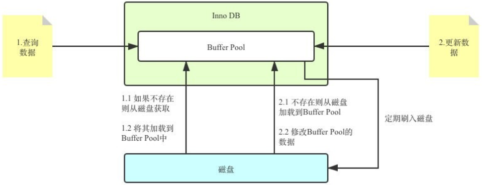

有了 redo log 和 undo log 之后：


在更新 Buffer Pool 中的数据之前，需要先将该数据事务开始之前的状态写入 undo log 中。假设更新到一半出错了，就可以通过 undo log 来回滚到事务开始前。

##### 详细生成过程

对于 InnoDB 引擎来说，每个行记录除了记录本身的数据之外，还有几个隐藏的列：


- `DB_ROW_ID`：如果没有为表显式的定义主键，并且表中也没有定义唯一索引，那么 InnoDB 会自动为表添加一个 row_id 的`隐藏列`作为主键。
- `DB_TRX_ID`：每个事务都会分配一个事务 ID，当对某条记录发生变更时，就会将这个事务的事务 ID 写入 trx_id 中。
- `DB_ROLL_PTR`：回滚指针，本质上就是指句 undo log 的指针。

**当执行 INSERT 时：**

```mysql
BEGIN;

INSERT INTO user (name) VALUES ("tom");
```

插入的数据都会生成一条`insert undo log`，并且数据的回滚指针会指向它。undo log 会记录 undo log 的序号、插入主键的列和值。那么在进行 rollback 的时候，通过主键直接把对应的数据删除即可。


**当执行 UPDATE 时：**

对于更新的操作会产生`update undo log`，并且会分更新主键的和不更新主键的。

假设现在执行：

```mysql
UPDATE user SET name = "Sun" WHERE id = 1;
```


这时会把老的记录写入新的 undo log，让回滚指针指向新的 undo log，它的 undo no 是 1，并且新的 undo log 会指向老的 undo log，它的 undo no 是 0。

假设现在执行：

```mysql
UPDATE user SET id = 2 WHERE id = 1;
```

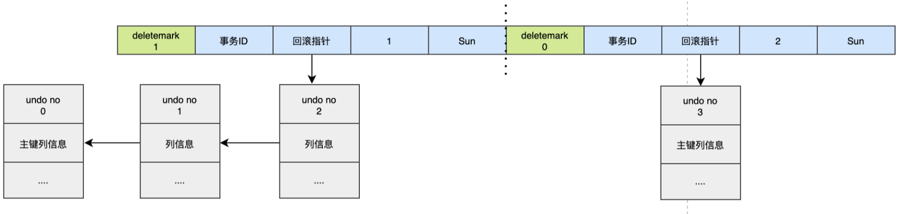

对于更新主键的操作，会先把原来的数据 deletemark 标识打开，这时并没有真正的删除数据，`真正的删除会交给清理线程去判断`，然后在后面插入一条新的数据，新的数据也会产生 undo log，并且 undo log 的序号会递增。

可以发现每次对数据的变更都会产生一个 undo log，当一条记录被变更多次时，那么就会产生多条 undo log，undo log 记录的是变更前的日志，并且每个 undo log 的序号是`递增`的，那么当要回滚的时候，按照序号`依次向前推`，就可以找到原始数据。

#### undo log 是如何回滚的

以上面的例子来说，假设执行 rollback，那么对应的流程应该是这样：

1. 通过 undo no = 3 的日志，把 id = 2 的数据删除。
2. 通过 undo no = 2 的日志，把 id = 1 的数据的 deletemark 还原成 0。
3. 通过 undo no = 1 的日志，把 id = 1 的数据的 name 还原成 Tom。
4. 通过 undo no = 0 的日志，把 id = 1 的数据删除。

#### undo log 的删除

对于`insert undo log`：

- 因为 INSERT 操作的记录，只对事务本身可见，对其他事务不可见。故该 undo log 可以在事务提交后直接删除，不需要进行 purge 操作。

对于`update undo log`：

- 该 undo log 可能需要提供 MVCC 机制，因此不能在事务提交时就进行删除。提交时放入 undo log 链表，等待 purge 线程进行最后的删除。

>purge 线程两个主要作用是：`清理 undo 页和清除 page 里面带有 Delete_Bit 标识的数据行`。在 InnoDB 中，事务中的 DELETE 操作，实际上并不是真正的删除掉数据行，而是一种`Delete Mark`操作，在记录上标识`Delete_Bit`，而不删除记录。这是一种 "假删除"，只是做了个标记，**真正的删除工作需要后台 purge 线程去完成**。

#### 小结

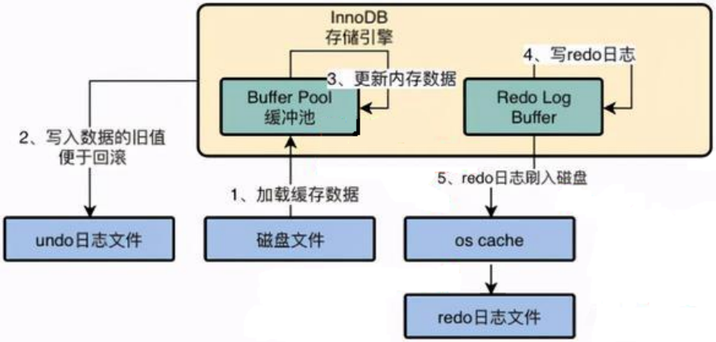

- redo log 是物理日志，记录的是数据页的物理变化。
- undo log 是逻辑日志，对事务回滚时，只是将数据库逻辑地恢复到原来的样子。
- undo log 不是 redo log 的逆过程。

## 本文参考

https://www.bilibili.com/video/BV1iq4y1u7vj

## 声明

写作本文初衷是个人学习记录，鉴于本人学识有限，如有侵权或不当之处，请联系 [wdshfut@163.com](mailto:wdshfut@163.com)。