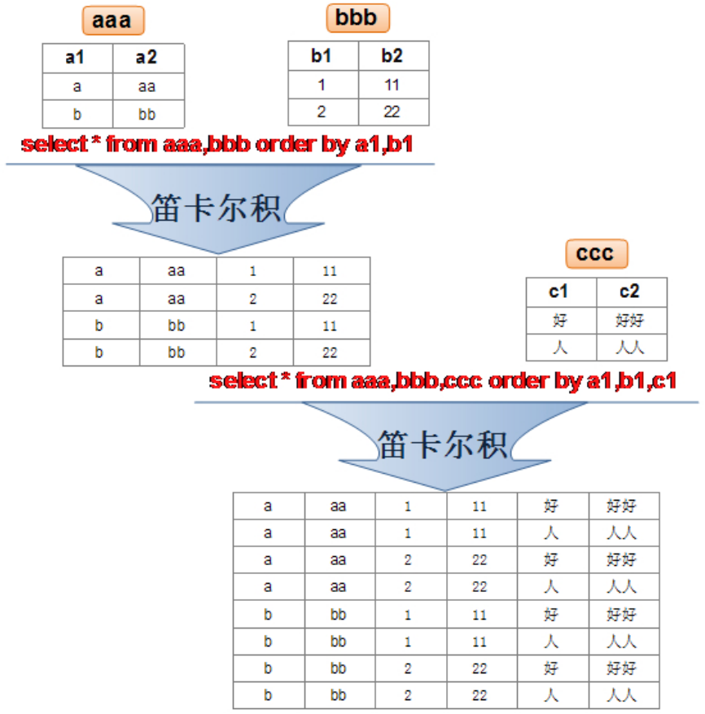
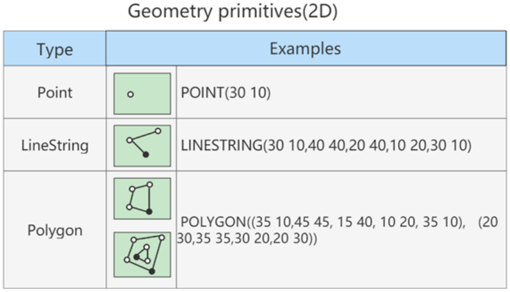
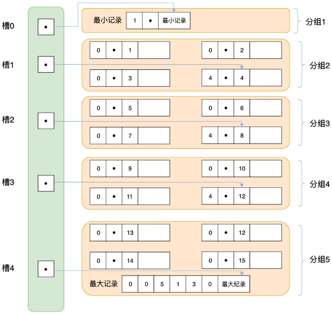

*`Author: ACatSmiling`*

*`Since: 2022-05-29`*

## 概述

### 为什么要使用数据库

`持久化 (persistence)`：把数据保存到可掉电式存储设备中以供之后使用。大多数情况下，特别是企业级应用，数据持久化意味着将内存中的数据保存到硬盘上加以 "固化"，而持久化的实现过程大多通过各种关系数据库来完成。

持久化的主要作用是将内存中的数据存储在关系型数据库中，当然也可以存储在磁盘文件、XML 数据文件中等。


### 数据库与数据库管理系统

#### 数据库的相关概念

`DB`：Database，数据库，即存储数据的 "仓库"，其本质是一个文件系统。它保存了一系列有组织的数据。

`DBMS`：Database Management System，数据库管理系统，是一种操纵和管理数据库的大型软件，用于建立、使用和维护数据库，对数据库进行统一管理和控制。用户通过数据库管理系统访问数据库中表内的数据。

`SQL`：Structured Query Language，结构化查询语言，专门用来与数据库通信的语言。

#### 数据库与数据库管理系统的关系

`数据库管理系统 (DBMS) 可以管理多个数据库`，一般开发人员会针对每一个应用创建一个数据库。为保存应用中实体的数据，一般会在数据库创建多个表，以保存程序中实体用户的数据。

数据库管理系统、数据库和表的关系如图所示：


#### 常见的数据库管理系统排名

目前互联网上常见的数据库管理软件有 Oracle、MySQL、SQL Server、DB2、PostgreSQL、Access、Sybase、Informix 这几种。以下是 2022 年 5 月 DB-Engines Ranking 对各数据库受欢迎程度进行调查后的统计结果（查看数据库最新排名：https://db-engines.com/en/ranking）：


对应的走势图（https://db-engines.com/en/ranking_trend）：


#### 常见的数据库介绍

`Oracle`

1979 年，Oracle 2 诞生，它是第一个商用的 RDBMS（关系型数据库管理系统）。随着 Oracle 软件的名气越来越大，公司也改名叫 Oracle 公司。

2007 年，总计 85 亿美金收购 BEA Systems。

2009 年，总计 74 亿美金收购 SUN。此前的 2008 年，SUN 以 10 亿美金收购 MySQL。意味着 Oracle 同时拥有了 MySQL 的管理权，至此 Oracle 在数据库领域中成为绝对的领导者。

2013 年，Oracle超越 IBM，成为继 Microsoft 后全球第二大软件公司。如今 Oracle 的年收入达到了 400 亿美金，足以证明商用（收费）数据库软件的价值。

`SQL Server`

SQL Server 是微软开发的大型商业数据库，诞生于 1989 年。C#、.net 等语言常使用，与 WinNT 完全集成，也可以很好地与 Microsoft BackOffice 产品集成。

`DB2`

IBM 公司的数据库产品，收费的。常应用在银行系统中。

`PostgreSQL`

PostgreSQL 的稳定性极强，最符合 SQL 标准，开放源码，具备商业级 DBMS 质量。PG 对数据量大的文本以及 SQL 处理较快。

`SyBase`

已经淡出历史舞台。提供了一个非常专业数据建模的工具 PowerDesigner。

`SQLite`

嵌入式的小型数据库，应用在手机端。 零配置，SQlite3 不用安装，不用配置，不用启动，关闭或者配置数据库实例。当系统崩溃后不用做任何恢复操作，在下次使用数据库的时候自动恢复。

`informix`

IBM 公司出品，取自 Information 和 Unix 的结合，它是第一个被移植到 Linux 上的商业数据库产品。仅运行于 unix/linux 平台，命令行操作。 性能较高，支持集群，适应于安全性要求极高的系统，尤其是银行，证券系统的应用。

### RDBMS 与非 RDBMS

从排名中我们能看出来，关系型数据库绝对是 DBMS 的主流，其中使用最多的 DBMS 分别是 Oracle、MySQL 和 SQL Server。这些都是关系型数据库（RDBMS）。

#### 关系型数据库（RDBMS）

这种类型的数据库是`最古老`的数据库类型，关系型数据库模型是把复杂的数据结构归结为简单的`二元关系 (即二维表格形式)`。


关系型数据库以`行(row)`和`列(column)`的形式存储数据，以便于用户理解。这一系列的行和列被称为`表(table)`，一组表组成了一个`库(database)`。

表与表之间的数据记录有`关系 (relationship)`。现实世界中的各种实体以及实体之间的各种联系均用`关系模型`来表示。`关系型数据库，就是建立在关系模型基础上的数据库。`

SQL 就是关系型数据库的查询语言。


关系型数据库的优势：

- `复杂查询`：可以用 SQL 语句方便的在一个表以及多个表之间做非常复杂的数据查询。
- `事务支持`：使得对于安全性能很高的数据访问要求得以实现。

#### 非关系型数据库（非 RDBMS）

非关系型数据库，可看成传统关系型数据库的功能阉割版本，基于键值对存储数据，不需要经过 SQL 层的解析，性能非常高 。同时，通过减少不常用的功能，进一步提高性能。

目前基本上大部分主流的非关系型数据库都是免费的。

##### 非关系型数据库分类

相比于 SQL，`NoSQL`泛指非关系型数据库，包括了榜单上的`键值型数据库`、`文档型数据库`、`搜索引擎数据库`和`列存储数据库`等，除此以外还包括`图形数据库`。也只有用 NoSQL 一词才能将这些技术囊括进来。

###### 键值型数据库

键值型数据库通过`Key-Value`键值的方式来存储数据，其中 Key 和 Value 可以是简单的对象，也可以是复杂的对象。`Key 作为唯一的标识符`，`优点是查找速度快`，在这方面明显优于关系型数据库，`缺点是无法像关系型数据库一样使用条件过滤 (比如 WHERE)`，如果你不知道去哪里找数据，就要遍历所有的键，这就会消耗大量的计算。

键值型数据库典型的使用场景是作为`内存缓存`。`Redis`是最流行的键值型数据库。


###### 文档型数据库

此类数据库可存放并获取文档，可以是 XML、JSON 等格式。在数据库中文档作为处理信息的基本单位，一个文档就相当于一条记录。文档数据库所存放的文档，就相当于键值数据库所存放的 "值"。`MongoDB`是最流行的文档型数据库，此外，还有 CouchDB 等。

###### 搜索引擎数据库

虽然关系型数据库采用了索引提升检索效率，但是针对全文索引效率却较低。搜索引擎数据库是应用在搜索引擎领域的数据存储形式，由于搜索引擎会爬取大量的数据，并以特定的格式进行存储，这样在检索的时候才能保证性能最优。核心原理是`倒排索引`。

典型产品：`Solr`、`Elasticsearch`、`Splunk`等。

###### 列存储数据库

列存储数据库是相对于行存储的数据库，Oracle、MySQL、SQL Server 等数据库都是采用的行式存储（Row-based），而列存储数据库是将数据按照列存储到数据库中，这样做的好处是可以大量降低系统的 I/O，适合于分布式文件系统，不足在于功能相对有限。典型产品：`HBase`等。


###### 图形数据库

图形数据库，利用了图这种数据结构存储了实体（对象）之间的关系。图形数据库最典型的例子就是社交网络中人与人的关系，数据模型主要是以节点和边（关系）来实现，特点在于`能高效地解决复杂的关系问题`。

图形数据库顾名思义，就是一种存储图形关系的数据库。它利用了图这种数据结构存储了实体（对象）之间的关系。关系型数据用于存储明确关系的数据，但对于复杂关系的数据存储却有些力不从心。如社交网络中人物之间的关系，如果用关系型数据库则非常复杂，用图形数据库将非常简单。典型产品：`Neo4J`、`InfoGrid`等。


##### NoSQL 的演变

由于 SQL 一直称霸 DBMS，因此许多人在思考是否有一种数据库技术能远离 SQL，于是 NoSQL 诞生了，但是随着发展却发现越来越离不开 SQL。到目前为止 NoSQL 阵营中的 DBMS 都会有实现类似 SQL 的功能。下面是 NoSQL 这个名词在不同时期的诠释，从这些释义的变化中可以看出 NoSQL 功能的演变 ：

1970：NoSQL = We have no SQL

1980：NoSQL = Know SQL

2000：NoSQL = No SQL!

2005：NoSQL = Not only SQL

2013：NoSQL = No, SQL!

NoSQL 对 SQL 做出了很好的补充，比如实际开发中，有很多业务需求，其实并不需要完整的关系型数据库功能，非关系型数据库的功能就足够使用了。这种情况下，使用性能更高、成本更低的非关系型数据库当然是更明智的选择。比如：日志收集、排行榜、定时器等。

总而言之，虽然 NoSQL 的分类很多，但即便如此，在 DBMS 排名中，还是 SQL 阵营的比重更大，影响力前 5 的 DBMS 中有 4 个是关系型数据库，而排名前 20 的 DBMS 中也有 12 个是关系型数据库。所以说，掌握 SQL 是非常有必要的。

### 关系型数据库设计规则

- 关系型数据库的典型数据结构就是`数据表` ，这些数据表的组成都是结构化的（Structured）。

- 将数据放到表中，表再放到库中。

- 一个数据库中可以有多个表，每个表都有一个名字，用来标识自己。表名具有`唯一性`。

- 表具有一些特性，这些特性定义了数据在表中如何存储，类似 Java 和 Python 中类的设计。

####  表、记录、字段

`E-R (entity-relationship，实体-联系)`模型中有三个主要概念是：`实体集`、`属性`、`联系集`。

一个实体集（class）对应于数据库中的一个表（table），一个实体（instance）则对应于数据库表中的一行（row），也称为一条记录（record）。一个属性（attribute）对应于数据库表中的一列（column），也称为一个字段（field）。


`ORM 思想 (Object Relational Mapping)`体现：

- 数据库中的一个表 <---> Java 或 Python 中的一个类。

- 表中的一条数据 <---> 类中的一个对象（或实体）。

- 表中的一个列 <----> 类中的一个字段、属性（field）。

#### 表的关联关系

- 表与表之间的数据记录有关系（relationship）。现实世界中的各种实体以及实体之间的各种联系均用关系模型来表示。

- 四种：一对一关联、一对多关联、多对多关联、自我引用。

#####  一对一关联（one-to-one）

在实际的开发中应用不多，因为一对一可以创建成一张表。

一对一关联两种建表原则：

- `外键唯一`：主表的主键和从表的外键（唯一），形成主外键关系，外键唯一。
- `外键是主键`：主表的主键和从表的主键，形成主外键关系。

举例，设计学生表 ：学号、姓名、手机号码、班级、系别、身份证号码、家庭住址、籍贯、紧急联系人、...

- 拆为两个表：两个表的记录是一一对应关系。

- 基础信息表（常用信息）：学号、姓名、手机号码、班级、系别。

- 档案信息表（不常用信息）：学号、身份证号码、家庭住址、籍贯、紧急联系人、...

  

##### 一对多关联（one-to-many）

常见实例场景：客户表和订单表，分类表和商品表，部门表和员工表。

一对多关联建表原则：`在从表 (多方) 创建一个字段，字段作为外键指向主表 (一方) 的主键。`


举例：

- 员工表：编号、姓名、...、所属部门。

- 部门表：编号、名称、简介。

  

  

##### 多对多关联（many-to-many）

要表示多对多关联，必须创建第三个表，该表通常称为`联接表`，它将多对多关系划分为两个一对多关系。将这两个表的主键都插入到第三个表中。


多对多关联建表原则：`需要创建第三张表，中间表中至少两个字段，这两个字段分别作为外键指向各自一方的主键。`

举例 1：学生-课程

- 学生信息表 ：一行代表一个学生的信息（学号、姓名、手机号码、班级、系别...）。

- 课程信息表 ：一行代表一个课程的信息（课程编号、授课老师、简介...）。

- 选课信息表 ：一个学生可以选多门课，一门课可以被多个学生选择。

  

举例 2：产品-订单

- 订单表和产品表有一种多对多的关系，这种关系是通过与订单明细表建立两个一对多关系来定义的。一个订单可以有多个产品，每个产品可以出现在多个订单中。

- 产品表 ：产品表中的每条记录表示一个产品。

- 订单表 ：订单表中的每条记录表示一个订单。

- 订单明细表 ：每个产品可以与订单表中的多条记录对应，即出现在多个订单中。一个订单可以与产品表中的多条记录对应，即包含多个产品。

  

举例 3：用户-角色

- 一个用户，可能存在多个角色。

  

##### 自我引用（Self reference）


### MySQL 介绍


- MySQL 是一个`开放源代码的关系型数据库管理系统`，由瑞典 MySQL AB（创始人 Michael Widenius）公司 1995 年开发，迅速成为开源数据库的 No.1。
- 2008 被 Sun 收购（10 亿美金），2009 年 Sun 被 Oracle 收购。`MariaDB`应运而生。（MySQL 的创造者担心 MySQL 有闭源的风险，因此创建了 MySQL 的分支项目 MariaDB）
- MySQL 6.x 版本之后分为`社区版`和`商业版`。
- MySQL 是一种关联数据库管理系统，将数据保存在不同的表中，而不是将所有数据放在一个大仓库内，这样就增加了速度并提高了灵活性。
- MySQL 是开源的，所以你不需要支付额外的费用。
- MySQL 是可以定制的，采用了`GPL (GNU General Public License) 协议`，你可以修改源码来开发自己的 MySQL 系统。
- MySQL 支持大型的数据库。可以处理拥有上千万条记录的大型数据库。
- MySQL 支持大型数据库，支持 5000 万条记录的数据仓库，32 位系统表文件最大可支持 4 GB ，64 位系统支持最大的表文件为`8 TB`。
- MySQL 使用`标准的 SQL 数据语言`形式。
- MySQL 可以允许运行于多个系统上，并且支持多种语言。这些编程语言包括 C、C++、Python、Java、Perl、PHP 和 Ruby 等。

#### MySQL 发展史重大事件

MySQL 的历史就是整个互联网的发展史。互联网业务从社交领域、电商领域到金融领域的发展，推动着应用对数据库的需求提升，对传统的数据库服务能力提出了挑战。高并发、高性能、高可用、轻资源、易维护、易扩展的需求，促进了 MySQL 的长足发展。


#### 关于 MySQL 8.0

`MySQL 从 5.7 版本直接跳跃发布了 8.0 版本`，可见这是一个令人兴奋的里程碑版本。MySQL 8 版本在功能上做了显著的改进与增强，开发者对 MySQL 的源代码进行了重构，最突出的一点是对 MySQL Optimizer 优化器进行了改进。不仅在速度上得到了改善，还为用户带来了更好的性能和更棒的体验。

#### Why choose MySQL


为什么如此多的厂商要选用 MySQL？大概总结的原因主要有以下几点：

1. 开放源代码，使用成本低。
2. 性能卓越，服务稳定。
3. 软件体积小，使用简单，并且易于维护。
4. 历史悠久，社区用户非常活跃，遇到问题可以寻求帮助。
5. 许多互联网公司在用，经过了时间的验证。

#### Oracle VS MySQL

Oracle 更适合大型跨国企业的使用，因为他们对费用不敏感，但是对性能要求以及安全性有更高的要求。

MySQL 由于其`体积小`、`速度快`、`总体拥有成本低`，`可处理上千万条记录`的大型数据库，尤其是`开放源码`这一特点，使得很多互联网公司、中小型网站选择了 MySQL 作为网站数据库（Facebook，Twitter，YouTube，阿里巴巴/蚂蚁金服，去哪儿，美团外卖，腾讯）。

### SQL 语言

1946 年，世界上第一台电脑诞生，如今，借由这台电脑发展起来的互联网已经自成江湖。在这几十年里，无数的技术、产业在这片江湖里沉浮，有的方兴未艾，有的已经几幕兴衰。但在这片浩荡的波动里，有一门技术从未消失，甚至老当益壮，那就是 SQL。

45 年前，也就是 1974 年，IBM 研究员发布了一篇揭开数据库技术的论文《SEQUEL：一门结构化的英语查询语言》，直到今天这门结构化的查询语言并没有太大的变化，相比于其他语言， SQL 的半衰期可以说是非常长了。

不论是前端工程师，还是后端算法工程师，都一定会和数据打交道，都需要了解如何又快又准确地提取自己想要的数据。更别提数据分析师了，他们的工作就是和数据打交道，整理不同的报告，以便指导业务决策。

`SQL (Structured Query Language，结构化查询语言)`是使用关系模型的数据库应用语言，与数据直接打交道，由 IBM 上世纪70年代开发出来。后由美国国家标准局（ANSI）开始着手制定 SQL 标准，先后有 SQL-86，SQL-89，SQL-92，SQL-99 等标准。

SQL 有两个重要的标准，分别是`SQL-92`和`SQL-99`，它们分别代表了 92 年和 99 年颁布的 SQL 标准，我们今天使用的 SQL 语言依然遵循这些标准。

>SQL 存在不同版本的标准规范，因为不同规范下的表连接操作是有区别的。
>
>SQL 有两个主要的标准，分别是 SQL-92 和 SQL-99。92 和 99 代表了标准提出的时间，SQL-92 就是 92 年提出的标准规范。当然除了 SQL-92 和 SQL-99 以外，还存在 SQL-86、SQL-89、SQL:2003、SQL:2008、SQL:2011 和 SQL:2016 等其他的标准。
>
>这么多标准，到底该学习哪个呢？实际上最重要的 SQL 标准就是 SQL-92 和 SQL-99。一般来说 SQL-92 的形式更简单，但是写的 SQL 语句会比较长，可读性较差。而 SQL-99 相比于 SQL-92 来说，语法更加复杂，但可读性更强。我们从这两个标准发布的页数也能看出，SQL-92 的标准有 500 页，而 SQL-99 标准超过了 1000 页。实际上从 SQL-99 之后，很少有人能掌握所有内容，因为确实太多了。就好比我们使用 Windows、Linux 和 Office 的时候，很少有人能掌握全部内容一样。我们只需要掌握一些核心的功能，满足日常工作的需求即可。
>
>SQL-92 和 SQL-99 是经典的 SQL 标准，也分别叫做 SQL-2 和 SQL-3 标准。也正是在这两个标准发布之后，SQL 影响力越来越大，甚至超越了数据库领域。现如今 SQL 已经不仅仅是数据库领域的主流语言，还是信息领域中信息处理的主流语言。在图形检索、图像检索以及语音检索中都能看到 SQL 语言的使用。

不同的数据库生产厂商都支持 SQL 语句，但都有特有内容：


#### SQL 语言的分类

SQL 语言在功能上主要分为如下三大类：

- **`DDL (Data Definition Languages，数据定义语言)`**：这些语句定义了不同的数据库、表、视图、索引等数据库对象，还可以用来创建、删除、修改数据库和数据表的结构。
  - 主要的语句关键字包括`CREATE`、`DROP`、`ALTER`等。
- **`DML (Data Manipulation Language，数据操作语言)`**：用于添加、删除、更新和查询数据库记录，并检查数据完整性。
  - 主要的语句关键字包括`INSERT`、`DELETE`、`UPDATE`、`SELECT`等。
  - `SELECT 是 SQL 语言的基础，最为重要。`
- **`DCL (Data Control Language，数据控制语言)`**：用于定义数据库、表、字段、用户的访问权限和安全级别。
  - 主要的语句关键字包括`GRANT`、`REVOKE`、`COMMIT`、`ROLLBACK`、`SAVEPOINT`等。

>因为查询语句使用的非常的频繁，所以很多人把查询语句单拎出来一类：`DQL (Data Query Language，数据查询语言)`。
>
>还有单独将 COMMIT 、 ROLLBACK 取出来的，称为`TCL (Transaction Control Language，事务控制语言)`。

#### SQL 语言的规则与规范

##### 基本规则

- SQL 可以写在一行或者多行。为了提高可读性，各子句分行写，必要时使用缩进。
- 每条命令以`;`或`\g`或`\G`结束。
- 关键字不能被缩写也不能分行。
- 关于标点符号：
  - 必须保证所有的 ()、单引号、双引号是成对结束的。
  - 必须使用英文状态下的半角输入方式。
  - 字符串型和日期时间类型的数据可以使用单引号（''）表示。
  - 列的别名，尽量使用双引号（""），而且不建议省略 as。

##### SQL大小写规范

- MySQL 在 Windows 环境下是大小写不敏感的。
- MySQL 在 Linux 环境下是大小写敏感的。
- 数据库名、表名、表的别名、变量名是严格区分大小写的。
  - 关键字、函数名、列名（字段名）、列的别名（字段的别名）是忽略大小写的。
- 推荐采用统一的书写规范：
  - `数据库名、表名、表别名、字段名、字段别名等都小写。`
  - `SQL 关键字、函数名、绑定变量等都大写。`

- 以上规范，建议遵守。

##### 注释

可以使用如下格式的注释结构：

- 单行注释：`#注释文字 (MySQL 特有的方式)`
- 单行注释：`-- 注释文字 (--后面必须包含一个空格。)`
- 多行注释：`/* 注释文字 */`

##### 命名规则

- 数据库、表名不能超过 30 个字符，变量名限制为 29 个字符。
- 只能包含 A–Z，a–z，0–9 和 _ 共 63 个字符。
- 数据库名、表名、字段名等对象名中间不要包含空格。
- 同一个 MySQL 软件中，数据库不能同名；同一个库中，表不能重名；同一个表中，字段不能重名。
- 字段不能和保留字、数据库系统或常用方法冲突。如果必须使用，需在 SQL 语句中使用`` (着重号)`引起来。
- 保持字段名和类型的一致性，在命名字段并为其指定数据类型的时候一定要保证一致性。假如数据类型在一个表里是整数，那在另一个表里可就别变成字符型了。

##### 导入指令

命令行登录 MySQL 客户端，使用`source`指令导入 sql 文件：

```sql
mysql> source /tmp/insert.sql;
```

> /tmp/insert.sql 是 sql 文件在服务器上的路径。

##  Docker 安装 MySQL

登录 https://hub.docker.com/，查看 MySQL 镜像：


选择以下版本，拉取镜像：


```bash
$ docker pull mysql:8.0.29
```

查看拉取的镜像：

```bash
$ docker images
```

启动容器：

```bash
$ docker run -d --name mysql -p 3306:3306 -v /home/xisun/datas/mysql/:/var/lib/mysql -e MYSQL_ROOT_PASSWORD=root mysql:8.0.29
```

修改容器的时间：

```bash
# 进入容器
$ docker exec -it mysql /bin/bash

# 容器内执行
$ date
$ ln -sf /usr/share/zoneinfo/Asia/Shanghai /etc/localtime

# 退出并重新进入容器
$ exit
$ docker exec -it mysql /bin/bash
```

> 参考：
>
> 

## 源码安装 MySQL

docker 镜像相比源码，会缺少一部分工具，比如 mysqlbinlog，此时，可以下载 MySQL 服务端源码到宿主机，然后使用。

> 生产环境下，也建议使用源码安装 MySQL。 

下载地址：https://downloads.mysql.com/archives/community/

选择对应宿主机的版本：


下载完成后，上传到宿主机：

```powershell
PS C:\Users\XiSun\Downloads> scp -P 10218 .\mysql-8.0.31-linux-glibc2.17-x86_64-minimal.tar.xz centos@192.168.3.22:/tmp
```

解压：

```bash
[centos@develop tmp]$ tar -xf mysql-8.0.31-linux-glibc2.17-x86_64-minimal.tar.xz
```

解压完成后，进入 bin 目录：

```bash
[centos@develop tmp]$ cd mysql-8.0.31-linux-glibc2.17-x86_64-minimal/bin/
[centos@develop bin]$ ls
data_sync-20230506.sql  myisamchk      my_print_defaults  mysqlcheck           mysqld_multi   mysqlimport                mysqlshow            mysql_upgrade
ibd2sdi                 myisam_ftdump  mysql              mysql_config         mysqld_safe    mysql_migrate_keyring      mysqlslap            perror
innochecksum            myisamlog      mysqladmin         mysql_config_editor  mysqldump      mysqlpump                  mysql_ssl_rsa_setup  zlib_decompress
lz4_decompress          myisampack     mysqlbinlog        mysqld               mysqldumpslow  mysql_secure_installation  mysql_tzinfo_to_sql
[centos@develop bin]$ ./mysql -h127.0.0.1 -uroot -proot -P3306
mysql: [Warning] Using a password on the command line interface can be insecure.
Welcome to the MySQL monitor.  Commands end with ; or \g.
Your MySQL connection id is 18810
Server version: 8.0.31 MySQL Community Server - GPL

Copyright (c) 2000, 2022, Oracle and/or its affiliates.

Oracle is a registered trademark of Oracle Corporation and/or its
affiliates. Other names may be trademarks of their respective
owners.

Type 'help;' or '\h' for help. Type '\c' to clear the current input statement.

mysql> 
```

> 诸如 mysql，mysqldump，mysqlbinlog 等命令，都可以直接在宿主机使用。

## MySQL 图形化管理工具

### DBeaver

官网：https://dbeaver.io/download/，下载方式如下：


Github：https://github.com/dbeaver/dbeaver/releases，下载方式如下：


安装程序下载后，点击安装即可。安装成功后，因为 DBeaver 是基于 Maven 构建的，数据库驱动也就是链接数据库的 JDBC 驱动是通过 Maven 仓库下载的，因此，第一步要做的是配置 Maven 镜像，否则在后续下载数据库驱动的时候会非常的慢。

点击 "窗口" ---> "首选项" ---> "连接" ---> "驱动" ---> "Maven"，设置阿里云镜像`http://maven.aliyun.com/nexus/content/groups/public/`：


配置完 Maven 仓库后，连接数据库：


更多关于 DBeaver 的使用方法，参考：https://juejin.cn/post/7065474476607012878。

>DBeaver 是用 Java 开发的，使用前需要安装 JDK 环境。

## MySQL 的基本使用

MySQL 语法规范：

- `不区分大小写`；
- 每句话用`;`或`\g`结尾；
- 各子句一般分行写；
- 关键字不能缩写，也不能分行；
- 用缩进提高语句的可读性。

进入容器，并与 MySQL 客户端交互：

```bash
[root@hadoop100 ~]# docker ps
CONTAINER ID   IMAGE          COMMAND                  CREATED       STATUS       PORTS                                                  NAMES
9ca17e09b0c1   mysql:8.0.29   "docker-entrypoint.s…"   4 hours ago   Up 4 hours   0.0.0.0:3306->3306/tcp, :::3306->3306/tcp, 33060/tcp   mysql
[root@hadoop100 ~]# docker exec -it 9ca17e09b0c1 /bin/bash
root@9ca17e09b0c1:/# ls
bin  boot  dev	docker-entrypoint-initdb.d  entrypoint.sh  etc	home  lib  lib64  media  mnt  opt  proc  root  run  sbin  srv  sys  tmp  usr  var
# 进入MySQL客户端，-u用户名，-p密码，-P端口
root@9ca17e09b0c1:/# mysql -uroot -proot -P3306
mysql: [Warning] Using a password on the command line interface can be insecure.
Welcome to the MySQL monitor.  Commands end with ; or \g.
Your MySQL connection id is 15
Server version: 8.0.29 MySQL Community Server - GPL

Copyright (c) 2000, 2022, Oracle and/or its affiliates.

Oracle is a registered trademark of Oracle Corporation and/or its
affiliates. Other names may be trademarks of their respective
owners.

Type 'help;' or '\h' for help. Type '\c' to clear the current input statement.

mysql>
```

- 执行建库脚本：

  ```mysql
  /*
  SQLyog Ultimate v12.08 (64 bit)
  MySQL - 5.7.28-log : Database - atguigudb
  *********************************************************************
  */
  
  
  /*!40101 SET NAMES utf8 */;
  
  /*!40101 SET SQL_MODE=''*/;
  
  /*!40014 SET @OLD_UNIQUE_CHECKS=@@UNIQUE_CHECKS, UNIQUE_CHECKS=0 */;
  /*!40014 SET @OLD_FOREIGN_KEY_CHECKS=@@FOREIGN_KEY_CHECKS, FOREIGN_KEY_CHECKS=0 */;
  /*!40101 SET @OLD_SQL_MODE=@@SQL_MODE, SQL_MODE='NO_AUTO_VALUE_ON_ZERO' */;
  /*!40111 SET @OLD_SQL_NOTES=@@SQL_NOTES, SQL_NOTES=0 */;
  CREATE DATABASE /*!32312 IF NOT EXISTS*/`atguigudb` /*!40100 DEFAULT CHARACTER SET utf8 */;
  
  USE `atguigudb`;
  
  /*Table structure for table `countries` */
  
  DROP TABLE IF EXISTS `countries`;
  
  CREATE TABLE `countries` (
    `country_id` char(2) NOT NULL,
    `country_name` varchar(40) DEFAULT NULL,
    `region_id` int(11) DEFAULT NULL,
    PRIMARY KEY (`country_id`),
    KEY `countr_reg_fk` (`region_id`),
    CONSTRAINT `countr_reg_fk` FOREIGN KEY (`region_id`) REFERENCES `regions` (`region_id`)
  ) ENGINE=InnoDB DEFAULT CHARSET=utf8;
  
  /*Data for the table `countries` */
  
  insert  into `countries`(`country_id`,`country_name`,`region_id`) values ('AR','Argentina',2),('AU','Australia',3),('BE','Belgium',1),('BR','Brazil',2),('CA','Canada',2),('CH','Switzerland',1),('CN','China',3),('DE','Germany',1),('DK','Denmark',1),('EG','Egypt',4),('FR','France',1),('HK','HongKong',3),('IL','Israel',4),('IN','India',3),('IT','Italy',1),('JP','Japan',3),('KW','Kuwait',4),('MX','Mexico',2),('NG','Nigeria',4),('NL','Netherlands',1),('SG','Singapore',3),('UK','United Kingdom',1),('US','United States of America',2),('ZM','Zambia',4),('ZW','Zimbabwe',4);
  
  /*Table structure for table `departments` */
  
  DROP TABLE IF EXISTS `departments`;
  
  CREATE TABLE `departments` (
    `department_id` int(4) NOT NULL DEFAULT '0',
    `department_name` varchar(30) NOT NULL,
    `manager_id` int(6) DEFAULT NULL,
    `location_id` int(4) DEFAULT NULL,
    PRIMARY KEY (`department_id`),
    UNIQUE KEY `dept_id_pk` (`department_id`),
    KEY `dept_loc_fk` (`location_id`),
    KEY `dept_mgr_fk` (`manager_id`),
    CONSTRAINT `dept_loc_fk` FOREIGN KEY (`location_id`) REFERENCES `locations` (`location_id`),
    CONSTRAINT `dept_mgr_fk` FOREIGN KEY (`manager_id`) REFERENCES `employees` (`employee_id`)
  ) ENGINE=InnoDB DEFAULT CHARSET=utf8;
  
  /*Data for the table `departments` */
  
  insert  into `departments`(`department_id`,`department_name`,`manager_id`,`location_id`) values (10,'Administration',200,1700),(20,'Marketing',201,1800),(30,'Purchasing',114,1700),(40,'Human Resources',203,2400),(50,'Shipping',121,1500),(60,'IT',103,1400),(70,'Public Relations',204,2700),(80,'Sales',145,2500),(90,'Executive',100,1700),(100,'Finance',108,1700),(110,'Accounting',205,1700),(120,'Treasury',NULL,1700),(130,'Corporate Tax',NULL,1700),(140,'Control And Credit',NULL,1700),(150,'Shareholder Services',NULL,1700),(160,'Benefits',NULL,1700),(170,'Manufacturing',NULL,1700),(180,'Construction',NULL,1700),(190,'Contracting',NULL,1700),(200,'Operations',NULL,1700),(210,'IT Support',NULL,1700),(220,'NOC',NULL,1700),(230,'IT Helpdesk',NULL,1700),(240,'Government Sales',NULL,1700),(250,'Retail Sales',NULL,1700),(260,'Recruiting',NULL,1700),(270,'Payroll',NULL,1700);
  
  /*Table structure for table `employees` */
  
  DROP TABLE IF EXISTS `employees`;
  
  CREATE TABLE `employees` (
    `employee_id` int(6) NOT NULL DEFAULT '0',
    `first_name` varchar(20) DEFAULT NULL,
    `last_name` varchar(25) NOT NULL,
    `email` varchar(25) NOT NULL,
    `phone_number` varchar(20) DEFAULT NULL,
    `hire_date` date NOT NULL,
    `job_id` varchar(10) NOT NULL,
    `salary` double(8,2) DEFAULT NULL,
    `commission_pct` double(2,2) DEFAULT NULL,
    `manager_id` int(6) DEFAULT NULL,
    `department_id` int(4) DEFAULT NULL,
    PRIMARY KEY (`employee_id`),
    UNIQUE KEY `emp_email_uk` (`email`),
    UNIQUE KEY `emp_emp_id_pk` (`employee_id`),
    KEY `emp_dept_fk` (`department_id`),
    KEY `emp_job_fk` (`job_id`),
    KEY `emp_manager_fk` (`manager_id`),
    CONSTRAINT `emp_dept_fk` FOREIGN KEY (`department_id`) REFERENCES `departments` (`department_id`),
    CONSTRAINT `emp_job_fk` FOREIGN KEY (`job_id`) REFERENCES `jobs` (`job_id`),
    CONSTRAINT `emp_manager_fk` FOREIGN KEY (`manager_id`) REFERENCES `employees` (`employee_id`)
  ) ENGINE=InnoDB DEFAULT CHARSET=utf8;
  
  /*Data for the table `employees` */
  
  insert  into `employees`(`employee_id`,`first_name`,`last_name`,`email`,`phone_number`,`hire_date`,`job_id`,`salary`,`commission_pct`,`manager_id`,`department_id`) values (100,'Steven','King','SKING','515.123.4567','1987-06-17','AD_PRES',24000.00,NULL,NULL,90),(101,'Neena','Kochhar','NKOCHHAR','515.123.4568','1989-09-21','AD_VP',17000.00,NULL,100,90),(102,'Lex','De Haan','LDEHAAN','515.123.4569','1993-01-13','AD_VP',17000.00,NULL,100,90),(103,'Alexander','Hunold','AHUNOLD','590.423.4567','1990-01-03','IT_PROG',9000.00,NULL,102,60),(104,'Bruce','Ernst','BERNST','590.423.4568','1991-05-21','IT_PROG',6000.00,NULL,103,60),(105,'David','Austin','DAUSTIN','590.423.4569','1997-06-25','IT_PROG',4800.00,NULL,103,60),(106,'Valli','Pataballa','VPATABAL','590.423.4560','1998-02-05','IT_PROG',4800.00,NULL,103,60),(107,'Diana','Lorentz','DLORENTZ','590.423.5567','1999-02-07','IT_PROG',4200.00,NULL,103,60),(108,'Nancy','Greenberg','NGREENBE','515.124.4569','1994-08-17','FI_MGR',12000.00,NULL,101,100),(109,'Daniel','Faviet','DFAVIET','515.124.4169','1994-08-16','FI_ACCOUNT',9000.00,NULL,108,100),(110,'John','Chen','JCHEN','515.124.4269','1997-09-28','FI_ACCOUNT',8200.00,NULL,108,100),(111,'Ismael','Sciarra','ISCIARRA','515.124.4369','1997-09-30','FI_ACCOUNT',7700.00,NULL,108,100),(112,'Jose Manuel','Urman','JMURMAN','515.124.4469','1998-03-07','FI_ACCOUNT',7800.00,NULL,108,100),(113,'Luis','Popp','LPOPP','515.124.4567','1999-12-07','FI_ACCOUNT',6900.00,NULL,108,100),(114,'Den','Raphaely','DRAPHEAL','515.127.4561','1994-12-07','PU_MAN',11000.00,NULL,100,30),(115,'Alexander','Khoo','AKHOO','515.127.4562','1995-05-18','PU_CLERK',3100.00,NULL,114,30),(116,'Shelli','Baida','SBAIDA','515.127.4563','1997-12-24','PU_CLERK',2900.00,NULL,114,30),(117,'Sigal','Tobias','STOBIAS','515.127.4564','1997-07-24','PU_CLERK',2800.00,NULL,114,30),(118,'Guy','Himuro','GHIMURO','515.127.4565','1998-11-15','PU_CLERK',2600.00,NULL,114,30),(119,'Karen','Colmenares','KCOLMENA','515.127.4566','1999-08-10','PU_CLERK',2500.00,NULL,114,30),(120,'Matthew','Weiss','MWEISS','650.123.1234','1996-07-18','ST_MAN',8000.00,NULL,100,50),(121,'Adam','Fripp','AFRIPP','650.123.2234','1997-04-10','ST_MAN',8200.00,NULL,100,50),(122,'Payam','Kaufling','PKAUFLIN','650.123.3234','1995-05-01','ST_MAN',7900.00,NULL,100,50),(123,'Shanta','Vollman','SVOLLMAN','650.123.4234','1997-10-10','ST_MAN',6500.00,NULL,100,50),(124,'Kevin','Mourgos','KMOURGOS','650.123.5234','1999-11-16','ST_MAN',5800.00,NULL,100,50),(125,'Julia','Nayer','JNAYER','650.124.1214','1997-07-16','ST_CLERK',3200.00,NULL,120,50),(126,'Irene','Mikkilineni','IMIKKILI','650.124.1224','1998-09-28','ST_CLERK',2700.00,NULL,120,50),(127,'James','Landry','JLANDRY','650.124.1334','1999-01-14','ST_CLERK',2400.00,NULL,120,50),(128,'Steven','Markle','SMARKLE','650.124.1434','2000-03-08','ST_CLERK',2200.00,NULL,120,50),(129,'Laura','Bissot','LBISSOT','650.124.5234','1997-08-20','ST_CLERK',3300.00,NULL,121,50),(130,'Mozhe','Atkinson','MATKINSO','650.124.6234','1997-10-30','ST_CLERK',2800.00,NULL,121,50),(131,'James','Marlow','JAMRLOW','650.124.7234','1997-02-16','ST_CLERK',2500.00,NULL,121,50),(132,'TJ','Olson','TJOLSON','650.124.8234','1999-04-10','ST_CLERK',2100.00,NULL,121,50),(133,'Jason','Mallin','JMALLIN','650.127.1934','1996-06-14','ST_CLERK',3300.00,NULL,122,50),(134,'Michael','Rogers','MROGERS','650.127.1834','1998-08-26','ST_CLERK',2900.00,NULL,122,50),(135,'Ki','Gee','KGEE','650.127.1734','1999-12-12','ST_CLERK',2400.00,NULL,122,50),(136,'Hazel','Philtanker','HPHILTAN','650.127.1634','2000-02-06','ST_CLERK',2200.00,NULL,122,50),(137,'Renske','Ladwig','RLADWIG','650.121.1234','1995-07-14','ST_CLERK',3600.00,NULL,123,50),(138,'Stephen','Stiles','SSTILES','650.121.2034','1997-10-26','ST_CLERK',3200.00,NULL,123,50),(139,'John','Seo','JSEO','650.121.2019','1998-02-12','ST_CLERK',2700.00,NULL,123,50),(140,'Joshua','Patel','JPATEL','650.121.1834','1998-04-06','ST_CLERK',2500.00,NULL,123,50),(141,'Trenna','Rajs','TRAJS','650.121.8009','1995-10-17','ST_CLERK',3500.00,NULL,124,50),(142,'Curtis','Davies','CDAVIES','650.121.2994','1997-01-29','ST_CLERK',3100.00,NULL,124,50),(143,'Randall','Matos','RMATOS','650.121.2874','1998-03-15','ST_CLERK',2600.00,NULL,124,50),(144,'Peter','Vargas','PVARGAS','650.121.2004','1998-07-09','ST_CLERK',2500.00,NULL,124,50),(145,'John','Russell','JRUSSEL','011.44.1344.429268','1996-10-01','SA_MAN',14000.00,0.40,100,80),(146,'Karen','Partners','KPARTNER','011.44.1344.467268','1997-01-05','SA_MAN',13500.00,0.30,100,80),(147,'Alberto','Errazuriz','AERRAZUR','011.44.1344.429278','1997-03-10','SA_MAN',12000.00,0.30,100,80),(148,'Gerald','Cambrault','GCAMBRAU','011.44.1344.619268','1999-10-15','SA_MAN',11000.00,0.30,100,80),(149,'Eleni','Zlotkey','EZLOTKEY','011.44.1344.429018','2000-01-29','SA_MAN',10500.00,0.20,100,80),(150,'Peter','Tucker','PTUCKER','011.44.1344.129268','1997-01-30','SA_REP',10000.00,0.30,145,80),(151,'David','Bernstein','DBERNSTE','011.44.1344.345268','1997-03-24','SA_REP',9500.00,0.25,145,80),(152,'Peter','Hall','PHALL','011.44.1344.478968','1997-08-20','SA_REP',9000.00,0.25,145,80),(153,'Christopher','Olsen','COLSEN','011.44.1344.498718','1998-03-30','SA_REP',8000.00,0.20,145,80),(154,'Nanette','Cambrault','NCAMBRAU','011.44.1344.987668','1998-12-09','SA_REP',7500.00,0.20,145,80),(155,'Oliver','Tuvault','OTUVAULT','011.44.1344.486508','1999-11-23','SA_REP',7000.00,0.15,145,80),(156,'Janette','King','JKING','011.44.1345.429268','1996-01-30','SA_REP',10000.00,0.35,146,80),(157,'Patrick','Sully','PSULLY','011.44.1345.929268','1996-03-04','SA_REP',9500.00,0.35,146,80),(158,'Allan','McEwen','AMCEWEN','011.44.1345.829268','1996-08-01','SA_REP',9000.00,0.35,146,80),(159,'Lindsey','Smith','LSMITH','011.44.1345.729268','1997-03-10','SA_REP',8000.00,0.30,146,80),(160,'Louise','Doran','LDORAN','011.44.1345.629268','1997-12-15','SA_REP',7500.00,0.30,146,80),(161,'Sarath','Sewall','SSEWALL','011.44.1345.529268','1998-11-03','SA_REP',7000.00,0.25,146,80),(162,'Clara','Vishney','CVISHNEY','011.44.1346.129268','1997-11-11','SA_REP',10500.00,0.25,147,80),(163,'Danielle','Greene','DGREENE','011.44.1346.229268','1999-03-19','SA_REP',9500.00,0.15,147,80),(164,'Mattea','Marvins','MMARVINS','011.44.1346.329268','2000-01-24','SA_REP',7200.00,0.10,147,80),(165,'David','Lee','DLEE','011.44.1346.529268','2000-02-23','SA_REP',6800.00,0.10,147,80),(166,'Sundar','Ande','SANDE','011.44.1346.629268','2000-03-24','SA_REP',6400.00,0.10,147,80),(167,'Amit','Banda','ABANDA','011.44.1346.729268','2000-04-21','SA_REP',6200.00,0.10,147,80),(168,'Lisa','Ozer','LOZER','011.44.1343.929268','1997-03-11','SA_REP',11500.00,0.25,148,80),(169,'Harrison','Bloom','HBLOOM','011.44.1343.829268','1998-03-23','SA_REP',10000.00,0.20,148,80),(170,'Tayler','Fox','TFOX','011.44.1343.729268','1998-01-24','SA_REP',9600.00,0.20,148,80),(171,'William','Smith','WSMITH','011.44.1343.629268','1999-02-23','SA_REP',7400.00,0.15,148,80),(172,'Elizabeth','Bates','EBATES','011.44.1343.529268','1999-03-24','SA_REP',7300.00,0.15,148,80),(173,'Sundita','Kumar','SKUMAR','011.44.1343.329268','2000-04-21','SA_REP',6100.00,0.10,148,80),(174,'Ellen','Abel','EABEL','011.44.1644.429267','1996-05-11','SA_REP',11000.00,0.30,149,80),(175,'Alyssa','Hutton','AHUTTON','011.44.1644.429266','1997-03-19','SA_REP',8800.00,0.25,149,80),(176,'Jonathon','Taylor','JTAYLOR','011.44.1644.429265','1998-03-24','SA_REP',8600.00,0.20,149,80),(177,'Jack','Livingston','JLIVINGS','011.44.1644.429264','1998-04-23','SA_REP',8400.00,0.20,149,80),(178,'Kimberely','Grant','KGRANT','011.44.1644.429263','1999-05-24','SA_REP',7000.00,0.15,149,NULL),(179,'Charles','Johnson','CJOHNSON','011.44.1644.429262','2000-01-04','SA_REP',6200.00,0.10,149,80),(180,'Winston','Taylor','WTAYLOR','650.507.9876','1998-01-24','SH_CLERK',3200.00,NULL,120,50),(181,'Jean','Fleaur','JFLEAUR','650.507.9877','1998-02-23','SH_CLERK',3100.00,NULL,120,50),(182,'Martha','Sullivan','MSULLIVA','650.507.9878','1999-06-21','SH_CLERK',2500.00,NULL,120,50),(183,'Girard','Geoni','GGEONI','650.507.9879','2000-02-03','SH_CLERK',2800.00,NULL,120,50),(184,'Nandita','Sarchand','NSARCHAN','650.509.1876','1996-01-27','SH_CLERK',4200.00,NULL,121,50),(185,'Alexis','Bull','ABULL','650.509.2876','1997-02-20','SH_CLERK',4100.00,NULL,121,50),(186,'Julia','Dellinger','JDELLING','650.509.3876','1998-06-24','SH_CLERK',3400.00,NULL,121,50),(187,'Anthony','Cabrio','ACABRIO','650.509.4876','1999-02-07','SH_CLERK',3000.00,NULL,121,50),(188,'Kelly','Chung','KCHUNG','650.505.1876','1997-06-14','SH_CLERK',3800.00,NULL,122,50),(189,'Jennifer','Dilly','JDILLY','650.505.2876','1997-08-13','SH_CLERK',3600.00,NULL,122,50),(190,'Timothy','Gates','TGATES','650.505.3876','1998-07-11','SH_CLERK',2900.00,NULL,122,50),(191,'Randall','Perkins','RPERKINS','650.505.4876','1999-12-19','SH_CLERK',2500.00,NULL,122,50),(192,'Sarah','Bell','SBELL','650.501.1876','1996-02-04','SH_CLERK',4000.00,NULL,123,50),(193,'Britney','Everett','BEVERETT','650.501.2876','1997-03-03','SH_CLERK',3900.00,NULL,123,50),(194,'Samuel','McCain','SMCCAIN','650.501.3876','1998-07-01','SH_CLERK',3200.00,NULL,123,50),(195,'Vance','Jones','VJONES','650.501.4876','1999-03-17','SH_CLERK',2800.00,NULL,123,50),(196,'Alana','Walsh','AWALSH','650.507.9811','1998-04-24','SH_CLERK',3100.00,NULL,124,50),(197,'Kevin','Feeney','KFEENEY','650.507.9822','1998-05-23','SH_CLERK',3000.00,NULL,124,50),(198,'Donald','OConnell','DOCONNEL','650.507.9833','1999-06-21','SH_CLERK',2600.00,NULL,124,50),(199,'Douglas','Grant','DGRANT','650.507.9844','2000-01-13','SH_CLERK',2600.00,NULL,124,50),(200,'Jennifer','Whalen','JWHALEN','515.123.4444','1987-09-17','AD_ASST',4400.00,NULL,101,10),(201,'Michael','Hartstein','MHARTSTE','515.123.5555','1996-02-17','MK_MAN',13000.00,NULL,100,20),(202,'Pat','Fay','PFAY','603.123.6666','1997-08-17','MK_REP',6000.00,NULL,201,20),(203,'Susan','Mavris','SMAVRIS','515.123.7777','1994-06-07','HR_REP',6500.00,NULL,101,40),(204,'Hermann','Baer','HBAER','515.123.8888','1994-06-07','PR_REP',10000.00,NULL,101,70),(205,'Shelley','Higgins','SHIGGINS','515.123.8080','1994-06-07','AC_MGR',12000.00,NULL,101,110),(206,'William','Gietz','WGIETZ','515.123.8181','1994-06-07','AC_ACCOUNT',8300.00,NULL,205,110);
  
  /*Table structure for table `job_grades` */
  
  DROP TABLE IF EXISTS `job_grades`;
  
  CREATE TABLE `job_grades` (
    `grade_level` varchar(3) DEFAULT NULL,
    `lowest_sal` int(11) DEFAULT NULL,
    `highest_sal` int(11) DEFAULT NULL
  ) ENGINE=InnoDB DEFAULT CHARSET=utf8;
  
  /*Data for the table `job_grades` */
  
  insert  into `job_grades`(`grade_level`,`lowest_sal`,`highest_sal`) values ('A',1000,2999),('B',3000,5999),('C',6000,9999),('D',10000,14999),('E',15000,24999),('F',25000,40000);
  
  /*Table structure for table `job_history` */
  
  DROP TABLE IF EXISTS `job_history`;
  
  CREATE TABLE `job_history` (
    `employee_id` int(6) NOT NULL,
    `start_date` date NOT NULL,
    `end_date` date NOT NULL,
    `job_id` varchar(10) NOT NULL,
    `department_id` int(4) DEFAULT NULL,
    PRIMARY KEY (`employee_id`,`start_date`),
    UNIQUE KEY `jhist_emp_id_st_date_pk` (`employee_id`,`start_date`),
    KEY `jhist_job_fk` (`job_id`),
    KEY `jhist_dept_fk` (`department_id`),
    CONSTRAINT `jhist_dept_fk` FOREIGN KEY (`department_id`) REFERENCES `departments` (`department_id`),
    CONSTRAINT `jhist_emp_fk` FOREIGN KEY (`employee_id`) REFERENCES `employees` (`employee_id`),
    CONSTRAINT `jhist_job_fk` FOREIGN KEY (`job_id`) REFERENCES `jobs` (`job_id`)
  ) ENGINE=InnoDB DEFAULT CHARSET=utf8;
  
  /*Data for the table `job_history` */
  
  insert  into `job_history`(`employee_id`,`start_date`,`end_date`,`job_id`,`department_id`) values (101,'1989-09-21','1993-10-27','AC_ACCOUNT',110),(101,'1993-10-28','1997-03-15','AC_MGR',110),(102,'1993-01-13','1998-07-24','IT_PROG',60),(114,'1998-03-24','1999-12-31','ST_CLERK',50),(122,'1999-01-01','1999-12-31','ST_CLERK',50),(176,'1998-03-24','1998-12-31','SA_REP',80),(176,'1999-01-01','1999-12-31','SA_MAN',80),(200,'1987-09-17','1993-06-17','AD_ASST',90),(200,'1994-07-01','1998-12-31','AC_ACCOUNT',90),(201,'1996-02-17','1999-12-19','MK_REP',20);
  
  /*Table structure for table `jobs` */
  
  DROP TABLE IF EXISTS `jobs`;
  
  CREATE TABLE `jobs` (
    `job_id` varchar(10) NOT NULL DEFAULT '',
    `job_title` varchar(35) NOT NULL,
    `min_salary` int(6) DEFAULT NULL,
    `max_salary` int(6) DEFAULT NULL,
    PRIMARY KEY (`job_id`),
    UNIQUE KEY `job_id_pk` (`job_id`)
  ) ENGINE=InnoDB DEFAULT CHARSET=utf8;
  
  /*Data for the table `jobs` */
  
  insert  into `jobs`(`job_id`,`job_title`,`min_salary`,`max_salary`) values ('AC_ACCOUNT','Public Accountant',4200,9000),('AC_MGR','Accounting Manager',8200,16000),('AD_ASST','Administration Assistant',3000,6000),('AD_PRES','President',20000,40000),('AD_VP','Administration Vice President',15000,30000),('FI_ACCOUNT','Accountant',4200,9000),('FI_MGR','Finance Manager',8200,16000),('HR_REP','Human Resources Representative',4000,9000),('IT_PROG','Programmer',4000,10000),('MK_MAN','Marketing Manager',9000,15000),('MK_REP','Marketing Representative',4000,9000),('PR_REP','Public Relations Representative',4500,10500),('PU_CLERK','Purchasing Clerk',2500,5500),('PU_MAN','Purchasing Manager',8000,15000),('SA_MAN','Sales Manager',10000,20000),('SA_REP','Sales Representative',6000,12000),('SH_CLERK','Shipping Clerk',2500,5500),('ST_CLERK','Stock Clerk',2000,5000),('ST_MAN','Stock Manager',5500,8500);
  
  /*Table structure for table `locations` */
  
  DROP TABLE IF EXISTS `locations`;
  
  CREATE TABLE `locations` (
    `location_id` int(4) NOT NULL DEFAULT '0',
    `street_address` varchar(40) DEFAULT NULL,
    `postal_code` varchar(12) DEFAULT NULL,
    `city` varchar(30) NOT NULL,
    `state_province` varchar(25) DEFAULT NULL,
    `country_id` char(2) DEFAULT NULL,
    PRIMARY KEY (`location_id`),
    UNIQUE KEY `loc_id_pk` (`location_id`),
    KEY `loc_c_id_fk` (`country_id`),
    CONSTRAINT `loc_c_id_fk` FOREIGN KEY (`country_id`) REFERENCES `countries` (`country_id`)
  ) ENGINE=InnoDB DEFAULT CHARSET=utf8;
  
  /*Data for the table `locations` */
  
  insert  into `locations`(`location_id`,`street_address`,`postal_code`,`city`,`state_province`,`country_id`) values (1000,'1297 Via Cola di Rie','00989','Roma',NULL,'IT'),(1100,'93091 Calle della Testa','10934','Venice',NULL,'IT'),(1200,'2017 Shinjuku-ku','1689','Tokyo','Tokyo Prefecture','JP'),(1300,'9450 Kamiya-cho','6823','Hiroshima',NULL,'JP'),(1400,'2014 Jabberwocky Rd','26192','Southlake','Texas','US'),(1500,'2011 Interiors Blvd','99236','South San Francisco','California','US'),(1600,'2007 Zagora St','50090','South Brunswick','New Jersey','US'),(1700,'2004 Charade Rd','98199','Seattle','Washington','US'),(1800,'147 Spadina Ave','M5V 2L7','Toronto','Ontario','CA'),(1900,'6092 Boxwood St','YSW 9T2','Whitehorse','Yukon','CA'),(2000,'40-5-12 Laogianggen','190518','Beijing',NULL,'CN'),(2100,'1298 Vileparle (E)','490231','Bombay','Maharashtra','IN'),(2200,'12-98 Victoria Street','2901','Sydney','New South Wales','AU'),(2300,'198 Clementi North','540198','Singapore',NULL,'SG'),(2400,'8204 Arthur St',NULL,'London',NULL,'UK'),(2500,'Magdalen Centre, The Oxford Science Park','OX9 9ZB','Oxford','Oxford','UK'),(2600,'9702 Chester Road','09629850293','Stretford','Manchester','UK'),(2700,'Schwanthalerstr. 7031','80925','Munich','Bavaria','DE'),(2800,'Rua Frei Caneca 1360 ','01307-002','Sao Paulo','Sao Paulo','BR'),(2900,'20 Rue des Corps-Saints','1730','Geneva','Geneve','CH'),(3000,'Murtenstrasse 921','3095','Bern','BE','CH'),(3100,'Pieter Breughelstraat 837','3029SK','Utrecht','Utrecht','NL'),(3200,'Mariano Escobedo 9991','11932','Mexico City','Distrito Federal,','MX');
  
  /*Table structure for table `order` */
  
  DROP TABLE IF EXISTS `order`;
  
  CREATE TABLE `order` (
    `order_id` int(11) DEFAULT NULL,
    `order_name` varchar(15) DEFAULT NULL
  ) ENGINE=InnoDB DEFAULT CHARSET=utf8;
  
  /*Data for the table `order` */
  
  insert  into `order`(`order_id`,`order_name`) values (1,'shkstart'),(2,'tomcat'),(3,'dubbo');
  
  /*Table structure for table `regions` */
  
  DROP TABLE IF EXISTS `regions`;
  
  CREATE TABLE `regions` (
    `region_id` int(11) NOT NULL,
    `region_name` varchar(25) DEFAULT NULL,
    PRIMARY KEY (`region_id`),
    UNIQUE KEY `reg_id_pk` (`region_id`)
  ) ENGINE=InnoDB DEFAULT CHARSET=utf8;
  
  /*Data for the table `regions` */
  
  insert  into `regions`(`region_id`,`region_name`) values (1,'Europe'),(2,'Americas'),(3,'Asia'),(4,'Middle East and Africa');
  
  /*Table structure for table `emp_details_view` */
  
  DROP TABLE IF EXISTS `emp_details_view`;
  
  /*!50001 DROP VIEW IF EXISTS `emp_details_view` */;
  /*!50001 DROP TABLE IF EXISTS `emp_details_view` */;
  
  /*!50001 CREATE TABLE  `emp_details_view`(
   `employee_id` int(6) ,
   `job_id` varchar(10) ,
   `manager_id` int(6) ,
   `department_id` int(4) ,
   `location_id` int(4) ,
   `country_id` char(2) ,
   `first_name` varchar(20) ,
   `last_name` varchar(25) ,
   `salary` double(8,2) ,
   `commission_pct` double(2,2) ,
   `department_name` varchar(30) ,
   `job_title` varchar(35) ,
   `city` varchar(30) ,
   `state_province` varchar(25) ,
   `country_name` varchar(40) ,
   `region_name` varchar(25) 
  )*/;
  
  /*View structure for view emp_details_view */
  
  /*!50001 DROP TABLE IF EXISTS `emp_details_view` */;
  /*!50001 DROP VIEW IF EXISTS `emp_details_view` */;
  
  /*!50001 CREATE ALGORITHM=UNDEFINED DEFINER=`root`@`localhost` SQL SECURITY DEFINER VIEW `emp_details_view` AS select `e`.`employee_id` AS `employee_id`,`e`.`job_id` AS `job_id`,`e`.`manager_id` AS `manager_id`,`e`.`department_id` AS `department_id`,`d`.`location_id` AS `location_id`,`l`.`country_id` AS `country_id`,`e`.`first_name` AS `first_name`,`e`.`last_name` AS `last_name`,`e`.`salary` AS `salary`,`e`.`commission_pct` AS `commission_pct`,`d`.`department_name` AS `department_name`,`j`.`job_title` AS `job_title`,`l`.`city` AS `city`,`l`.`state_province` AS `state_province`,`c`.`country_name` AS `country_name`,`r`.`region_name` AS `region_name` from (((((`employees` `e` join `departments` `d`) join `jobs` `j`) join `locations` `l`) join `countries` `c`) join `regions` `r`) where ((`e`.`department_id` = `d`.`department_id`) and (`d`.`location_id` = `l`.`location_id`) and (`l`.`country_id` = `c`.`country_id`) and (`c`.`region_id` = `r`.`region_id`) and (`j`.`job_id` = `e`.`job_id`)) */;
  
  /*!40101 SET SQL_MODE=@OLD_SQL_MODE */;
  /*!40014 SET FOREIGN_KEY_CHECKS=@OLD_FOREIGN_KEY_CHECKS */;
  /*!40014 SET UNIQUE_CHECKS=@OLD_UNIQUE_CHECKS */;
  /*!40111 SET SQL_NOTES=@OLD_SQL_NOTES */;
  ```

  ```mysql
  mysql> source /var/lib/mysql/tmp/atguigudb.sql;
  mysql> USE atguigudb;
  Database changed
  mysql> SHOW TABLES;
  +---------------------+
  | Tables_in_atguigudb |
  +---------------------+
  | countries           |
  | departments         |
  | emp_details_view    |
  | employees           |
  | job_grades          |
  | job_history         |
  | jobs                |
  | locations           |
  | order               |
  | regions             |
  +---------------------+
  10 rows in set (0.01 sec)
  ```

- 查看全部的数据库：`SHOW DATABASES;`

  ```mysql
  mysql> SHOW DATABASES;
  +--------------------+
  | Database           |
  +--------------------+
  | atguigudb          |
  | information_schema |
  | mysql              |
  | performance_schema |
  | sys                |
  +--------------------+
  5 rows in set (0.00 sec)
  ```

  - `information_schema`、`performance_schema`、`sys`和`mysql`，都是 MySQL 系统自带的数据库。

  - `information_schema`库主要保存 MySQL 数据库服务器的系统信息，比如数据库的名称、数据表的名称、字段名称、存取权限、数据文件所在的文件夹和系统使用的文件夹，等等。

  - `performance_schema`库可以用来监控 MySQL 的各类性能指标。

  - `sys`库主要作用是以一种更容易被理解的方式，展示 MySQL 数据库服务器的各类性能指标，帮助系统管理员和开发人员监控 MySQL 的技术性能。

  - `mysql`库保存了 MySQL 数据库服务器运行时需要的系统信息，比如数据文件夹、当前使用的字符集、约束检查信息，等等。

- 创建数据库：`CREATE DATABASES [数据库名];`

  ```mysql
  mysql> CREATE DATABASES test;
  Query OK, 1 row affected (0.02 sec)
  
  mysql> SHOW DATABASES;
  +--------------------+
  | Database           |
  +--------------------+
  | atguigudb          |
  | information_schema |
  | mysql              |
  | performance_schema |
  | sys                |
  | test               |
  +--------------------+
  6 rows in set (0.00 sec)
  ```

- 使用数据库：`USE [数据库名];`

  ```mysql
  mysql> USE test;
  Database changed
  ```

  - 如果没有使用 USE 语句，对数据库的操作也没有加 "数据名" 的限定，那么会报 "ERROR 1046(3D000): No database selected"（没有选择数据库）。

  - 使用完 USE 语句之后，如果接下来的 SQL 都是针对一个数据库操作的，那就不用重复 USE 了，如果要针对另一个数据库操作，那么要重新 USE。

- 查看当前数据库中有哪些数据表：`SHOW TABLES;`

  ```mysql
  mysql> SHOW TABLES;
  Empty set (0.00 sec)
  ```

- 查看指定数据库中有哪些数据表：`SHOW TABLES FROM [数据库名];`

  ```mysql
  mysql> SHOW TABLES FROM atguigudb;
  +---------------------+
  | Tables_in_atguigudb |
  +---------------------+
  | countries           |
  | departments         |
  | emp_details_view    |
  | employees           |
  | job_grades          |
  | job_history         |
  | jobs                |
  | locations           |
  | order               |
  | regions             |
  +---------------------+
  10 rows in set (0.00 sec)
  ```

- 建表：`CREATE TABLE [表名(表结构)];`

  ```mysql
  mysql> CREATE TABLE student (
      ->   id int,
      ->   name varchar(20)
      -> );
  Query OK, 0 rows affected (0.04 sec)
  mysql> SHOW TABLES;
  +----------------+
  | Tables_in_test |
  +----------------+
  | student        |
  +----------------+
  1 row in set (0.00 sec)
  ```

  - 如果是最后一个字段，后面就不用加逗号，因为逗号的作用是分割每个字段。

- 查看表结构：`DESC[RIBE] [表名];`，或者`SHOW FULL COLUMNS FROM [表名];`

  ```mysql
  mysql> DESC student;
  +-------+-------------+------+-----+---------+-------+
  | Field | Type        | Null | Key | Default | Extra |
  +-------+-------------+------+-----+---------+-------+
  | id    | int         | YES  |     | NULL    |       |
  | name  | varchar(20) | YES  |     | NULL    |       |
  +-------+-------------+------+-----+---------+-------+
  2 rows in set (0.01 sec)
  
  mysql> SHOW FULL COLUMNS FROM student;
  +-------+-------------+--------------------+------+-----+---------+-------+---------------------------------+---------+
  | Field | Type        | Collation          | Null | Key | Default | Extra | Privileges                      | Comment |
  +-------+-------------+--------------------+------+-----+---------+-------+---------------------------------+---------+
  | id    | int         | NULL               | YES  |     | NULL    |       | select,insert,update,references |         |
  | name  | varchar(20) | utf8mb4_0900_ai_ci | YES  |     | NULL    |       | select,insert,update,references |         |
  +-------+-------------+--------------------+------+-----+---------+-------+---------------------------------+---------+
  2 rows in set (0.00 sec)
  ```

  - Field：表示字段名称。

  - Type：表示字段类型。

  - Null：表示该列是否可以存储 NULL 值。

  - Key：表示该列是否已编制索引。PRI 值表示该列是表主键的一部分；UNI 值表示该列是 UNIQUE 索引的一部分；MUL 值表示在列中某个给定值允许出现多次。

  - Default：表示该列是否有默认值，如果有，那么值是多少。

  - Extra：表示可以获取的与给定列有关的附加信息，例如 AUTO_INCREMENT 等。

- 查看表中的所有记录：`SELECT * FROM [表名];`

  ```mysql
  mysql> SELECT * FROM student;
  Empty set (0.10 sec)
  ```

- 向表中添加一条记录：`INSERT INTO [表名 (表字段列表)] VALUES [(值列表)];`

  ```mysql
  mysql> INSERT INTO student VALUES (1, 'Tom');
  Query OK, 1 row affected (0.00 sec)
  
  mysql> INSERT INTO student VALUES (1, 'Jerry');
  Query OK, 1 row affected (0.01 sec)
  ```

- 修改表中的记录：`UPDATE [表名] SET [表字段1 = 值1, 表字段2 = 值2 ...] WHERE [条件];`

  ```mysql
  mysql> UPDATE student SET id = 2 WHERE name = 'Jerry';
  Query OK, 1 row affected (0.04 sec)
  Rows matched: 1  Changed: 1  Warnings: 0
  ```

- 删除表中的记录：`DELETE FROM [表名] WHERE [条件];`

  ```mysql
  mysql> DELETE FROM student WHERE id = 3;
  Query OK, 1 row affected (0.01 sec)
  ```

- 查看表的创建信息：`SHOW CREATE TABLE [表名];`

  ```mysql
  mysql> SHOW CREATE TABLE student;
  +---------+--------------------------------------------------------------------------------------------------------------------------------------------------------+
  | Table   | Create Table                                                                                                                                           |
  +---------+--------------------------------------------------------------------------------------------------------------------------------------------------------+
  | student | CREATE TABLE `student` (
    `id` int DEFAULT NULL,
    `name` varchar(20) DEFAULT NULL
  ) ENGINE=InnoDB DEFAULT CHARSET=utf8mb4 COLLATE=utf8mb4_0900_ai_ci |
  +---------+--------------------------------------------------------------------------------------------------------------------------------------------------------+
  1 row in set (0.00 sec)-
  ```

- 查看数据库的创建信息：`SHOW CREATE DATABASES [数据库名];`

  ```mysql
  mysql> SHOW CREATE DATABASE test;
  +----------+--------------------------------------------------------------------------------------------------------------------------------+
  | Database | Create Database                                                                                                                |
  +----------+--------------------------------------------------------------------------------------------------------------------------------+
  | test     | CREATE DATABASE `test` /*!40100 DEFAULT CHARACTER SET utf8mb4 COLLATE utf8mb4_0900_ai_ci */ /*!80016 DEFAULT ENCRYPTION='N' */ |
  +----------+--------------------------------------------------------------------------------------------------------------------------------+
  1 row in set (0.05 sec)
  ```

- 删除表：`DROP TABLE [表名];`

  ```mysql
  mysql> DROP TABLE student;
  Query OK, 0 rows affected (0.32 sec)
  ```

- 删除数据库：`DROP DATABASE [数据库名];`

  ```mysql
  mysql> DROP DATABASE test;
  Query OK, 0 rows affected (0.13 sec)
  ```

## MySQL 的编码

查看编码命令：

```mysql
mysql> SHOW VARIABLES LIKE 'character_%';
+--------------------------+--------------------------------+
| Variable_name            | Value                          |
+--------------------------+--------------------------------+
| character_set_client     | latin1                         |
| character_set_connection | latin1                         |
| character_set_database   | utf8mb4                        |
| character_set_filesystem | binary                         |
| character_set_results    | latin1                         |
| character_set_server     | utf8mb4                        |
| character_set_system     | utf8mb3                        |
| character_sets_dir       | /usr/share/mysql-8.0/charsets/ |
+--------------------------+--------------------------------+
8 rows in set (0.00 sec)

mysql> SHOW VARIABLES LIKE 'collation_%';
+----------------------+--------------------+
| Variable_name        | Value              |
+----------------------+--------------------+
| collation_connection | latin1_swedish_ci  |
| collation_database   | utf8mb4_0900_ai_ci |
| collation_server     | utf8mb4_0900_ai_ci |
+----------------------+--------------------+
3 rows in set (0.00 sec)
```

在 MySQL 8.0 版本之前，默认字符集为`latin1`，utf8 字符集指向的是 utf8mb3。网站开发人员在数据库设计的时候往往会将编码修改为 utf8 字符集，如果遗忘修改默认的编码，就会出现乱码的问题。从 MySQL 8.0 开始，数据库的默认字符集为`utf8mb4`，从而避免了上述的乱码问题。

## 基本的 SELECT 语句

### 常规语法

```mysql
SELECT [标识选择哪些列] FROM [标识从哪个表中选择];
```

查询所有列的所有数据：

```mysql
mysql> SELECT * FROM employee;
+----+----------+--------+-----+--------+
| id | emp_name | sex    | age | dep_id |
+----+----------+--------+-----+--------+
|  1 | Tom      | male   |  27 |      1 |
|  2 | Jerry    | male   |  28 |      2 |
|  3 | Lucy     | female |  29 |      2 |
+----+----------+--------+-----+--------+
3 rows in set (0.00 sec)
```

- 一般情况下，除非需要使用表中所有的字段数据，最好不要使用通配符`*`。使用通配符虽然可以节省输入查询语句的时间，但是获取不需要的列数据，通常会降低查询和所使用的应用程序的效率。
- 通配符的优势是，当不知道所需要的列的名称时，可以通过它获取它们。
- `在生产环境下，不推荐直接使用 SELECT * 进行查询。`

查询特定列的所有数据：

```mysql
mysql> SELECT emp_name, sex FROM employee;
+----------+--------+
| emp_name | sex    |
+----------+--------+
| Tom      | male   |
| Jerry    | male   |
| Lucy     | female |
+----------+--------+
3 rows in set (0.00 sec)
```

### 查询常数

SELECT 查询可以对常数进行查询，即在 SELECT 查询结果中增加一列固定的常数列，这列的取值是我们指定的，而不是从数据表中动态取出的。一般来说我们只从一个表中查询数据，通常不需要增加一个固定的常数列，但如果我们想整合不同的数据源，用常数列作为这个表的标记，就需要查询常数。

```mysql
mysql> SELECT 1;
+---+
| 1 |
+---+
| 1 |
+---+
1 row in set (0.00 sec)

mysql> SELECT 9/2;
+--------+
| 9/2    |
+--------+
| 4.5000 |
+--------+
1 row in set (0.00 sec)

mysql> SELECT 4*3;
+-----+
| 4*3 |
+-----+
|  12 |
+-----+
1 row in set (0.00 sec)
```

### 别名

语法：`在表名或列名，与其别名之间加入关键字 AS，如果别名中包含空格或特殊的字符或区分大小写，则别名使用双引号。`

```mysql
mysql> SELECT emp_name AS name, sex, age FROM employee;
+-------+--------+-----+
| name  | sex    | age |
+-------+--------+-----+
| Tom   | male   |  27 |
| Jerry | male   |  28 |
| Lucy  | female |  29 |
+-------+--------+-----+
3 rows in set (0.00 sec)

mysql> SELECT e.emp_name AS name, e.sex, e.age FROM employee e;
+-------+--------+-----+
| name  | sex    | age |
+-------+--------+-----+
| Tom   | male   |  27 |
| Jerry | male   |  28 |
| Lucy  | female |  29 |
+-------+--------+-----+
3 rows in set (0.01 sec)
```

> AS 可以省略。

### 去除重复行                                                                                                                         

默认情况下，查询会返回全部行，包括重复行。`在 SELECT 语句中使用关键字 DISTINCT 去除重复行。`

```mysql
mysql> SELECT DISTINCT dep_id FROM employee;
+--------+
| dep_id |
+--------+
|      1 |
|      2 |
+--------+
2 rows in set (0.00 sec)
```

DISTINCT 可以使用在多个字段上：

```sql
mysql> SELECT * FROM employee;
+----+----------+--------+-----+--------+
| id | emp_name | sex    | age | dep_id |
+----+----------+--------+-----+--------+
|  1 | Tom      | male   |  27 |      1 |
|  2 | Jerry    | male   |  28 |      2 |
|  3 | Lucy     | female |  29 |      2 |
|  4 | Lily     | female |  28 |      2 |
+----+----------+--------+-----+--------+
4 rows in set (0.00 sec)

mysql> SELECT DISTINCT sex FROM employee;
+--------+
| sex    |
+--------+
| male   |
| female |
+--------+
2 rows in set (0.07 sec)

mysql> SELECT DISTINCT sex, dep_id FROM employee;
+--------+--------+
| sex    | dep_id |
+--------+--------+
| male   |      1 |
| male   |      2 |
| female |      2 |
+--------+--------+
3 rows in set (0.00 sec)
```

注意：

- **DISTINCT 需要放到所有列名的前面。**
- **多个字段时，DISTINCT 依次从左至右去重。**以`SELECT DISTINCT sex, dep_id FROM employee;`为例，先对 sex 去重，然后再对 dep_id 去重。 

### 空值参与运算

**所有运算符或列值遇到 null 值，运算的结果都为 null。**注意，在 MySQL 中， 空值不等于空字符串。一个空字符串的长度是 0，而一个空值的长度是空。同时，在 MySQL 中，空值是占用空间的。

```mysql
mysql> SELECT employee_id, salary, commission_pct, 12 * salary * (1 + commission_pct) "annual_sal" FROM employees;
+-------------+----------+----------------+------------+
| employee_id | salary   | commission_pct | annual_sal |
+-------------+----------+----------------+------------+
|         100 | 24000.00 |           NULL |       NULL |
|         101 | 17000.00 |           NULL |       NULL |
|         102 | 17000.00 |           NULL |       NULL |
|         145 | 14000.00 |           0.40 |  235200.00 |
|         146 | 13500.00 |           0.30 |  210600.00 |
|         147 | 12000.00 |           0.30 |  187200.00 |
+-------------+----------+----------------+------------+
6 rows in set (0.00 sec)
```

### 着重号

表中的字段、表名等，不应该和保留字、数据库系统或常用方法冲突。如果真的相同，需要在 SQL 语句中使用一对``` (着重号)`引起来。

```mysql
mysql> SELECT * FROM ORDER;
ERROR 1064 (42000): You have an error in your SQL syntax; check the manual that corresponds to your MySQL server version for the right syntax to use near 'ORDER' at line 1

mysql> SELECT * FROM `ORDER`;
+----------+------------+
| order_id | order_name |
+----------+------------+
| 1        | shkstart   |
| 2        | tomcat     |
| 3        | dubbo      |
+----------+------------+
3 rows in set (0.00 sec)

mysql> SELECT * FROM `order`;
+----------+------------+
| order_id | order_name |
+----------+------------+
| 1        | shkstart   |
| 2        | tomcat     |
| 3        | dubbo      |
+----------+------------+
3 rows in set (0.00 sec)
```

### 过滤

`在 SELECT 语句中使用关键字 WHERE 去除重复行。注意：WHERE 子句紧随 FROM 子句。`

```mysql
mysql> SELECT DISTINCT sex, dep_id FROM employee WHERE dep_id = 1;
+--------+--------+
| sex    | dep_id |
+--------+--------+
| male   | 1      |
+--------+--------+
1 rows in set (0.00 sec)
```

## 运算符

### 算术运算符

算术运算符主要用于数学运算，其可以连接运算符前后的两个数值或表达式，对数值或表达式进行`加 (+)、减 (-)、乘 (*)、除 (/) 和取模 (%)`运算。

| 运算符   | 名称               | 作用                     | 示例                                       |
| -------- | ------------------ | ------------------------ | ------------------------------------------ |
| +        | 加法运算符         | 计算两个值或表达式的和   | SELECT A + B                               |
| -        | 减法运算符         | 计算两个值或表达式的差   | SELECT A - B                               |
| *        | 乘法运算符         | 计算两个值或表达式的乘积 | SELECT A * B                               |
| / 或 DIV | 除法运算符         | 计算两个值或表达式的商   | SELECT A / B<br />或者<br />SELECT A DIV B |
| % 或 MOD | 取模（取余）运算符 | 计算两个值或表达式的余数 | SELECT A % B<br />或者<br />SELECT A MOD B |

#### 加法与减法运算符

```mysql
mysql> SELECT 100, 100 + 0, 100 - 0, 100 + 50, 100 + 50 - 30, 100 + 35.5, 100 - 35.5 FROM dual;
+-----+---------+---------+----------+---------------+------------+------------+
| 100 | 100 + 0 | 100 - 0 | 100 + 50 | 100 + 50 - 30 | 100 + 35.5 | 100 - 35.5 |
+-----+---------+---------+----------+---------------+------------+------------+
| 100 |     100 |     100 |      150 |           120 |      135.5 |       64.5 |
+-----+---------+---------+----------+---------------+------------+------------+
1 row in set (0.00 sec)
```

结论：

- 一个整数类型的值对整数进行加法和减法操作，结果还是一个整数。
- 一个整数类型的值对浮点数进行加法和减法操作，结果是一个浮点数。
- 加法和减法的优先级相同，进行先加后减操作与进行先减后加操作的结果是一样的。
- 在 Java 中，+ 的左右两边如果有字符串，那么表示字符串的拼接。但是在 MySQL 中，+ 只表示数值相加。如果遇到非数值类型，先尝试转成数值，如果转失败，就按 0 计算。（补充：MySQL 中字符串拼接要使用字符串函数`CONCAT()`实现）

#### 乘法与除法运算符

```mysql
mysql> SELECT 100, 100 * 1, 100 * 1.0, 100 / 1.0, 100 / 2, 100 + 2 * 5 / 2, 100 / 3, 100 DIV 0 FROM dual;
+-----+---------+-----------+-----------+---------+-----------------+---------+-----------+
| 100 | 100 * 1 | 100 * 1.0 | 100 / 1.0 | 100 / 2 | 100 + 2 * 5 / 2 | 100 / 3 | 100 DIV 0 |
+-----+---------+-----------+-----------+---------+-----------------+---------+-----------+
| 100 |     100 |     100.0 |  100.0000 | 50.0000 |        105.0000 | 33.3333 |      NULL |
+-----+---------+-----------+-----------+---------+-----------------+---------+-----------+
1 row in set, 1 warning (0.00 sec)

# 计算出员工的年基本工资
mysql> SELECT employee_id, salary, salary * 12 annual_sal FROM employees;
+-------------+----------+------------+
| employee_id | salary   | annual_sal |
+-------------+----------+------------+
|         100 | 24000.00 |  288000.00 |
|         101 | 17000.00 |  204000.00 |
|         102 | 17000.00 |  204000.00 |
+-------------+----------+------------+
3 rows in set (0.00 sec)
```

#### 取模（取余）运算符

```mysql
mysql> SELECT 12 % 3, 12 MOD 5 FROM dual;
+--------+----------+
| 12 % 3 | 12 MOD 5 |
+--------+----------+
|      0 |        2 |
+--------+----------+
1 row in set (0.00 sec)

# 查询employee_id是偶数的员工
mysql> SELECT * FROM employees WHERE employee_id MOD 2 = 0;
+-------------+-------------+-------------+----------+--------------------+------------+------------+----------+----------------+------------+---------------+
| employee_id | first_name  | last_name   | email    | phone_number       | hire_date  | job_id     | salary   | commission_pct | manager_id | department_id |
+-------------+-------------+-------------+----------+--------------------+------------+------------+----------+----------------+------------+---------------+
|         100 | Steven      | King        | SKING    | 515.123.4567       | 1987-06-17 | AD_PRES    | 24000.00 |           NULL |       NULL |            90 |
|         102 | Lex         | De Haan     | LDEHAAN  | 515.123.4569       | 1993-01-13 | AD_VP      | 17000.00 |           NULL |        100 |            90 |
|         104 | Bruce       | Ernst       | BERNST   | 590.423.4568       | 1991-05-21 | IT_PROG    |  6000.00 |           NULL |        103 |            60 |
+-------------+-------------+-------------+----------+--------------------+------------+------------+----------+----------------+------------+---------------+
3 rows in set (0.00 sec)
```

### 比较运算符

比较运算符用来对表达式左边的操作数和右边的操作数进行比较，比较的结果为真则返回 1，比较的结果为假则返回 0，其他情况则返回 NULL。

比较运算符经常被用来作为 SELECT 查询语句的条件来使用，返回符合条件的结果记录。

| 运算符   | 名称           | 作用                                                         | 示例                                                         |
| -------- | -------------- | ------------------------------------------------------------ | ------------------------------------------------------------ |
| =        | 等于运算符     | 判断两个值、字符串或表达式是否相等                           | SELECT c FROM TABLE WHERE a = b;                             |
| <=>      | 安全等于运算符 | 安全的判断两个值、字符串或表达式是否相等                     | SELECT c FROM TABLE WHERE a <=> b;                           |
| <>（!=） | 不等于运算符   | 判断两个值、字符串或表达式是否不相等                         | SELECT c FROM TABLE WHERE a <> b;<br />SELECT c FROM TABLE WHERE a != b; |
| <        | 小于运算符     | 判断前面的值、字符串或表达式是否小于后面的值、字符串或表达式 | SELECT c FROM TABLE WHERE a < b;                             |
| <=       | 小于等于运算符 | 判断前面的值、字符串或表达式是否小于等于后面的值、字符串或表达式 | SELECT c FROM TABLE WHERE a <= b;                            |
| >        | 大于运算符     | 判断前面的值、字符串或表达式是否大于后面的值、字符串或表达式 | SELECT c FROM TABLE WHERE a > b;                             |
| >=       | 大于等于运算符 | 判断前面的值、字符串或表达式是否大于等于后面的值、字符串或表达式 | SELECT c FROM TABLE WHERE a >= b;                            |

#### 等于运算符

等于运算符（`=`）判断等号两边的值、字符串或表达式是否相等，如果相等则返回 1，不相等则返回 0。

在使用等于运算符时，遵循如下规则：

- 如果等号两边的值、字符串或表达式都为字符串，则 MySQL 会按照字符串进行比较，其比较的是每个字符串中字符的 ANSI 编码是否相等。

- 如果等号两边的值都是整数，则 MySQL 会按照整数来比较两个值的大小。

- 如果等号两边的值一个是整数，另一个是字符串，则 MySQL 会将字符串转化为数字进行比较。（**`隐式转换`：如果字符串能够转换为数字，则转换为数字；如果字符串不能转换为数字，则转换为 0。**）

  ```mysql
  -- 隐式转换在写MySQL的查询条件时, 需要特别注意, 如果查询字段是VARCHAR类型的, 不要使用=号与数字比较
  mysql> SELECT safety_analysis_id, COUNT(1) task_count
      -> FROM view_enterprise_self_work_task
      -> WHERE audit_status IN (1, 2, 3) AND actual_start_time BETWEEN '2023-06-05T00:00' AND '2023-06-08T13:49:44.693'
      -> GROUP BY safety_analysis_id
      -> ORDER BY safety_analysis_id;
  +--------------------------------------+------------+
  | safety_analysis_id                   | task_count |
  +--------------------------------------+------------+
  | NULL                                 |        395 |
  |                                      |        773 |
  | 1006                                 |          1 |
  | 102                                  |          1 |
  | 836                                  |          1 |
  | 836b0f87-7aab-4dc4-abda-dd0d048536b9 |          1 |
  | 837                                  |          2 |
  | b0000000-0000-0000-0000-000000006929 |          1 |
  | b0000000-0000-0000-0000-000000006931 |          2 |
  | b0000000-0000-0000-0000-000000006934 |          1 |
  | b0000000-0000-0000-0000-000000006935 |          1 |
  | b0000000-0000-0000-0000-000000006936 |          1 |
  | b0000000-0000-0000-0000-000000006937 |          1 |
  | b0000000-0000-0000-0000-000000006938 |          1 |
  | b51c56c4-ae75-4e2b-876f-681c48561a47 |          1 |
  +--------------------------------------+------------+
  15 rows in set (0.15 sec)
  
  -- 可以看出, 上述查询结果, 有NULL, 空值, 数字和字符串, 而对于不同的结果, 查询条件不一样
  
  -- 查询NULL, 空值和0的条件
  	-- 查询NULL: safety_analysis_id IS NULL, 不能用safety_analysis_id = NULL
  	-- 查询空值: safety_analysis_id = ''
  	-- 查询0: safety_analysis_id = '0', 不能用safety_analysis_id = 0
  mysql> SELECT safety_analysis_id, COUNT(1) task_count
      -> FROM view_enterprise_self_work_task
      -> WHERE audit_status IN (1, 2, 3) AND actual_start_time BETWEEN '2023-06-05T00:00' AND '2023-06-08T13:49:44.693'
      -> AND (safety_analysis_id IS NULL OR safety_analysis_id = '' OR safety_analysis_id = '0')
      -> GROUP BY safety_analysis_id
      -> ORDER BY safety_analysis_id;
  +--------------------+------------+
  | safety_analysis_id | task_count |
  +--------------------+------------+
  | NULL               |        395 |
  |                    |        773 |
  +--------------------+------------+
  2 rows in set (0.15 sec)
  
  -- 如果使用safety_analysis_id = 0, 会出现结果为字符串的情况
  mysql> SELECT safety_analysis_id, COUNT(1) task_count
      -> FROM view_enterprise_self_work_task
      -> WHERE audit_status IN (1, 2, 3) AND actual_start_time BETWEEN '2023-06-05T00:00' AND '2023-06-08T13:49:44.693'
      -> AND (safety_analysis_id IS NULL OR safety_analysis_id = '' OR safety_analysis_id = 0)
      -> GROUP BY safety_analysis_id
      -> ORDER BY safety_analysis_id;
  +--------------------------------------+------------+
  | safety_analysis_id                   | task_count |
  +--------------------------------------+------------+
  | NULL                                 |        395 |
  |                                      |        773 |
  | b0000000-0000-0000-0000-000000006929 |          1 |
  | b0000000-0000-0000-0000-000000006931 |          2 |
  | b0000000-0000-0000-0000-000000006934 |          1 |
  | b0000000-0000-0000-0000-000000006935 |          1 |
  | b0000000-0000-0000-0000-000000006936 |          1 |
  | b0000000-0000-0000-0000-000000006937 |          1 |
  | b0000000-0000-0000-0000-000000006938 |          1 |
  | b51c56c4-ae75-4e2b-876f-681c48561a47 |          1 |
  +--------------------------------------+------------+
  10 rows in set, 151 warnings (0.15 sec)
  
  -- 字符串 = 0, 不同的字符串, 结果都不一定相同
  mysql> SELECT '836b0f87-7aab-4dc4-abda-dd0d048536b9' = 0, 'b51c56c4-ae75-4e2b-876f-681c48561a47' = 0;
  +--------------------------------------------+--------------------------------------------+
  | '836b0f87-7aab-4dc4-abda-dd0d048536b9' = 0 | 'b51c56c4-ae75-4e2b-876f-681c48561a47' = 0 |
  +--------------------------------------------+--------------------------------------------+
  |                                          0 |                                          1 |
  +--------------------------------------------+--------------------------------------------+
  1 row in set, 2 warnings (0.00 sec)
  ```

- **如果等号两边的值、字符串或表达式中有一个为 NULL，则比较结果为 NULL。**

  ```mysql
  mysql> SELECT 1 = 1, 1 = '1', 1 = 0, 'a' = 'a', (5 + 3) = (2 + 6), '' = NULL , NULL = NULL;
  +-------+---------+-------+-----------+-------------------+-----------+-------------+
  | 1 = 1 | 1 = '1' | 1 = 0 | 'a' = 'a' | (5 + 3) = (2 + 6) | '' = NULL | NULL = NULL |
  +-------+---------+-------+-----------+-------------------+-----------+-------------+
  |     1 |       1 |     0 |         1 |                 1 |      NULL |        NULL |
  +-------+---------+-------+-----------+-------------------+-----------+-------------+
  1 row in set (0.01 sec)
  
  # 字符串abc与整数比较，隐式转换为整数0
  mysql> SELECT 1 = 2, 0 = 'abc', 1 = 'abc' FROM dual;
  +-------+-----------+-----------+
  | 1 = 2 | 0 = 'abc' | 1 = 'abc' |
  +-------+-----------+-----------+
  |     0 |         1 |         0 |
  +-------+-----------+-----------+
  1 row in set, 2 warnings (0.00 sec)
  
  # 查询salary=10000的员工
  mysql> SELECT employee_id, salary FROM employees WHERE salary = 10000;
  +-------------+----------+
  | employee_id | salary   |
  +-------------+----------+
  |         150 | 10000.00 |
  |         156 | 10000.00 |
  |         169 | 10000.00 |
  |         204 | 10000.00 |
  +-------------+----------+
  4 rows in set (0.01 sec)
  ```

#### 安全等于运算符

安全等于运算符（`<=>`）与等于运算符（=）的作用是相似的， 唯一的区别 是 <=> 可以用来对 NULL 进行判断。在两个操作数均为 NULL 时，其返回值为 1，而不为 NULL；当其中一个操作数为 NULL 时，其返回值为 0，而不为 NULL。

```mysql
mysql> SELECT 1 <=> '1', 1 <=> 0, 'a' <=> 'a', (5 + 3) <=> (2 + 6), '' <=> NULL, NULL <=> NULL FROM dual;
+-----------+---------+-------------+---------------------+-------------+---------------+
| 1 <=> '1' | 1 <=> 0 | 'a' <=> 'a' | (5 + 3) <=> (2 + 6) | '' <=> NULL | NULL <=> NULL |
+-----------+---------+-------------+---------------------+-------------+---------------+
|         1 |       0 |           1 |                   1 |           0 |             1 |
+-----------+---------+-------------+---------------------+-------------+---------------+
1 row in set (0.00 sec)
```

#### 不等于运算符

不等于运算符（`<>`或者`!=`）用于判断两边的数字、字符串或者表达式的值是否不相等，如果不相等则返回 1，相等则返回 0。不等于运算符不能判断 NULL 值。如果两边的值有任意一个为 NULL，或两边都为 NULL，则结果为 NULL。

```mysql
mysql> SELECT 1 <> 1, 1 != 2, 'a' != 'b', (3 + 4) <> (2 + 6), 'a' != NULL, NULL <> NULL;
+--------+--------+------------+--------------------+-------------+--------------+
| 1 <> 1 | 1 != 2 | 'a' != 'b' | (3 + 4) <> (2 + 6) | 'a' != NULL | NULL <> NULL |
+--------+--------+------------+--------------------+-------------+--------------+
|      0 |      1 |          1 |                  1 |        NULL |         NULL |
+--------+--------+------------+--------------------+-------------+--------------+
1 row in set (0.00 sec)
```

### 非符号类型运算符

| 运算符      | 名称             | 作用                                     | 示例                                         |
| ----------- | ---------------- | ---------------------------------------- | -------------------------------------------- |
| IS NULL     | 为空运算符       | 判断值、字符串或表达式是否为空           | SELECT B FROM TABLE WHERE A IS NULL;         |
| IS NOT NULL | 不为空运算符     | 判断值、字符串或表达式是否不为空         | SELECT B FROM TABLE WHERE A IS NOT NULL;     |
| LEAST       | 最小值运算符     | 在多个值中返回最小值                     | SELECT D FROM TABLE WHERE C LEAST(A, B);     |
| GREATEST    | 最大值运算符     | 在多个值中返回最大值                     | SELECT D FROM TABLE WHERE C GREATEST(A, B);  |
| BETWEEN AND | 两值之间的运算符 | 判断一个值是否在两个值之间               | SELECT D FROM TABLE WHERE C BETWEEN A AND B; |
| ISNULL      | 为空运算符       | 判断一个值、字符串或表达式是否为空       | SELECT B FROM TABLE WHERE ISNULL(A);         |
| IN          | 属于运算符       | 判断一个值是否为列表中的任意一个值       | SELECT D FROM TABLE WHERE C IN (A, B);       |
| NOT IN      | 不属于运算符     | 判断一个值是否不是一个列表中的任意一个值 | SELECT D FROM TABLE WHERE C NOT IN (A, B);   |
| LIKE        | 模糊匹配运算符   | 判断一个值是否符合模糊匹配规则           | SELECT C FROM TABLE WHERE A LIKE B;          |
| REGEXP      | 正则表达式运算符 | 判断一个值是否符合正则表达式的规则       | SELECT C FROM TABLE WHERE A REGEXP B;        |
| RLIKE       | 正则表达式运算符 | 判断一个值是否符合正则表达式的规则       | SELECT C FROM TABLE WHERE A RLIKE B;         |

#### 空运算符

空运算符（`IS NULL`或者`ISNULL()`）判断一个值是否为 NULL，如果为 NULL 则返回 1，否则返回 0。

```mysql
mysql> SELECT NULL IS NULL, ISNULL(NULL), ISNULL('a'), 1 IS NULL;
+--------------+--------------+-------------+-----------+
| NULL IS NULL | ISNULL(NULL) | ISNULL('a') | 1 IS NULL |
+--------------+--------------+-------------+-----------+
|            1 |            1 |           0 |         0 |
+--------------+--------------+-------------+-----------+
1 row in set (0.00 sec)
```

```mysql
# 查询commission_pct等于NULL。比较如下的四种写法：
mysql> SELECT employee_id,commission_pct FROM employees WHERE commission_pct IS NULL;
+-------------+----------------+
| employee_id | commission_pct |
+-------------+----------------+
|         100 |           NULL |
|         101 |           NULL |
|         102 |           NULL |
+-------------+----------------+
3 rows in set (0.00 sec)
mysql> SELECT employee_id,commission_pct FROM employees WHERE commission_pct <=> NULL;
+-------------+----------------+
| employee_id | commission_pct |
+-------------+----------------+
|         100 |           NULL |
|         101 |           NULL |
|         102 |           NULL |
+-------------+----------------+
3 rows in set (0.00 sec)
mysql> SELECT employee_id,commission_pct FROM employees WHERE ISNULL(commission_pct);
+-------------+----------------+
| employee_id | commission_pct |
+-------------+----------------+
|         100 |           NULL |
|         101 |           NULL |
|         102 |           NULL |
+-------------+----------------+
3 rows in set (0.00 sec)
# 错误的写法
mysql> SELECT employee_id,commission_pct FROM employees WHERE commission_pct = NULL;
Empty set (0.00 sec)
```

#### 非空运算符

非空运算符（`IS NOT NULL`）判断一个值是否不为 NULL，如果不为 NULL 则返回 1，否则返回 0。

```mysql
mysql> SELECT NULL IS NOT NULL, 'a' IS NOT NULL, 1 IS NOT NULL;
+------------------+-----------------+---------------+
| NULL IS NOT NULL | 'a' IS NOT NULL | 1 IS NOT NULL |
+------------------+-----------------+---------------+
|                0 |               1 |             1 |
+------------------+-----------------+---------------+
1 row in set (0.00 sec)
```

```mysql
# 查询commission_pct不等于NULL。比较如下的三种写法：
mysql> SELECT employee_id,commission_pct FROM employees WHERE commission_pct IS NOT NULL;
+-------------+----------------+
| employee_id | commission_pct |
+-------------+----------------+
|         145 |           0.40 |
|         146 |           0.30 |
|         147 |           0.30 |
+-------------+----------------+
3 rows in set (0.00 sec)
mysql> SELECT employee_id,commission_pct FROM employees WHERE NOT commission_pct <=> NULL;
+-------------+----------------+
| employee_id | commission_pct |
+-------------+----------------+ 
|         145 |           0.40 |
|         146 |           0.30 |
|         147 |           0.30 |
+-------------+----------------+
3 rows in set (0.00 sec)
mysql> SELECT employee_id,commission_pct FROM employees WHERE NOT ISNULL(commission_pct);
+-------------+----------------+
| employee_id | commission_pct |
+-------------+----------------+
|         145 |           0.40 |
|         146 |           0.30 |
|         147 |           0.30 |
+-------------+----------------+
3 rows in set (0.00 sec)
```

#### 最小值运算符

语法格式为：`LEAST(值1, 值2, ..., 值n)`。其中，n 表示参数列表中有 n 个值。在有两个或多个参数时，返回最小值。

```mysql
mysql> SELECT LEAST (1, 0, 2), LEAST('b', 'a', 'c'), LEAST(1, NULL, 2);
+-----------------+----------------------+-------------------+
| LEAST (1, 0, 2) | LEAST('b', 'a', 'c') | LEAST(1, NULL, 2) |
+-----------------+----------------------+-------------------+
|               0 | a                    |              NULL |
+-----------------+----------------------+-------------------+
1 row in set (0.00 sec)
```

- 当参数是整数或者浮点数时，LEAST 将返回其中最小的值；
- 当参数为字符串时，返回字母表中顺序最靠前的字符；
- **当比较值列表中有 NULL 时，不能判断大小，返回值为 NULL。**

#### 最大值运算符

语法格式为：`GREATEST(值1, 值2, ..., 值n)`。其中，n 表示参数列表中有 n 个值。在有两个或多个参数时，返回最大值。

```mysql
mysql> SELECT GREATEST(1, 0, 2), GREATEST('b', 'a', 'c'), GREATEST(1, NULL, 2);
+-------------------+-------------------------+----------------------+
| GREATEST(1, 0, 2) | GREATEST('b', 'a', 'c') | GREATEST(1, NULL, 2) |
+-------------------+-------------------------+----------------------+
|                 2 | c                       |                 NULL |
+-------------------+-------------------------+----------------------+
1 row in set (0.00 sec)
```

- 当参数是整数或者浮点数时，GREATEST 将返回其中最大的值；
- 当参数为字符串时，返回字母表中顺序最靠后的字符；
- **当比较值列表中有 NULL 时，不能判断大小，返回值为 NULL。**

####  BETWEEN AND 运算符

`BETWEEN AND`运算符使用的格式通常为`SELECT D FROM TABLE WHERE C BETWEEN A AND B`，此时，当 C 大于或等于 A，并且 C 小于或等于 B 时，结果为 1，否则结果为 0。

```mysql
mysql> SELECT 1 BETWEEN 0 AND 1, 10 BETWEEN 11 AND 12, 'b' BETWEEN 'a' AND 'c';
+-------------------+----------------------+-------------------------+
| 1 BETWEEN 0 AND 1 | 10 BETWEEN 11 AND 12 | 'b' BETWEEN 'a' AND 'c' |
+-------------------+----------------------+-------------------------+
|                 1 |                    0 |                       1 |
+-------------------+----------------------+-------------------------+
1 row in set (0.00 sec)
```

#### IN 运算符

`IN`运算符用于判断给定的值是否是 IN 列表中的一个值，如果是则返回 1，否则返回 0。

```mysql
mysql> SELECT 'a' IN ('a', 'b', 'c'), 1 IN (2, 3);
+------------------------+-------------+
| 'a' IN ('a', 'b', 'c') | 1 IN (2, 3) |
+------------------------+-------------+
|                      1 |           0 |
+------------------------+-------------+
1 row in set (0.00 sec)
```

**如果给定的值为 NULL，则结果为 NULL；如果 IN 列表中存在 NULL，当  IN 列表中存在给定值，则返回 0，否则返回 NULL。**

```mysql
mysql> SELECT 'a' IN ('a', 'b', 'c'), 1 IN (2, 3), NULL IN ('a', 'b'), 'a' IN ('a', NULL), 'b' IN ('a', NULL);
+------------------------+-------------+--------------------+--------------------+--------------------+
| 'a' IN ('a', 'b', 'c') | 1 IN (2, 3) | NULL IN ('a', 'b') | 'a' IN ('a', NULL) | 'b' IN ('a', NULL) |
+------------------------+-------------+--------------------+--------------------+--------------------+
|                      1 |           0 |               NULL |                  1 |               NULL |
+------------------------+-------------+--------------------+--------------------+--------------------+
1 row in set (0.00 sec)
```

#### NOT IN 运算符

`NOT IN`运算符用于判断给定的值是否不是 IN 列表中的一个值，如果不是 IN 列表中的一个值，则返回 1，否则返回 0。

```mysql
mysql> SELECT 'a' NOT IN ('a', 'b', 'c'), 1 NOT IN (2, 3);
+----------------------------+-----------------+
| 'a' NOT IN ('a', 'b', 'c') | 1 NOT IN (2, 3) |
+----------------------------+-----------------+
|                          0 |               1 |
+----------------------------+-----------------+
1 row in set (0.00 sec)
```

**如果给定的值为 NULL，则结果为 NULL；如果 NOT IN 列表中存在 NULL，当  NOT IN 列表中存在给定值，则返回 0，否则返回 NULL。**

```mysql
mysql> SELECT 'a' NOT IN ('a', 'b', 'c'), 1 NOT IN (2, 3), NULL NOT IN ('a', 'b'), 'a' NOT IN ('a', NULL), 'b' NOT IN ('a', NULL);
+----------------------------+-----------------+------------------------+------------------------+------------------------+
| 'a' NOT IN ('a', 'b', 'c') | 1 NOT IN (2, 3) | NULL NOT IN ('a', 'b') | 'a' NOT IN ('a', NULL) | 'b' NOT IN ('a', NULL) |
+----------------------------+-----------------+------------------------+------------------------+------------------------+
|                          0 |               1 |                   NULL |                      0 |                   NULL |
+----------------------------+-----------------+------------------------+------------------------+------------------------+
1 row in set (0.01 sec)
```

#### LIKE 运算符

`LIKE`运算符主要用来匹配字符串，通常用于模糊匹配，如果满足条件则返回 1，否则返回 0。如果给定的值或者匹配条件为 NULL，则返回结果为 NULL。

LIKE 运算符通常使用如下通配符：

```mysql
'%'：匹配 0 个或多个字符。
'_'：只能匹配一个字符。
```

```mysql
mysql> SELECT NULL LIKE 'abc', 'abc' LIKE NULL;
+-----------------+-----------------+
| NULL LIKE 'abc' | 'abc' LIKE NULL |
+-----------------+-----------------+
|            NULL |            NULL |
+-----------------+-----------------+
1 row in set (0.00 sec)

mysql> SELECT first_name FROM employees WHERE first_name LIKE 'S%';
+------------+
| first_name |
+------------+
| Steven     |
| Shelli     |
| Sigal      |
| Shanta     |
| Steven     |
| Stephen    |
| Sarath     |
| Sundar     |
| Sundita    |
| Sarah      |
| Samuel     |
| Susan      |
| Shelley    |
+------------+
13 rows in set (0.00 sec)

mysql> SELECT last_name FROM employees WHERE last_name LIKE '_o%';
+------------+
| last_name  |
+------------+
| Kochhar    |
| Lorentz    |
| Popp       |
| Tobias     |
| Colmenares |
| Vollman    |
| Mourgos    |
| Rogers     |
| Doran      |
| Fox        |
| Johnson    |
| Jones      |
+------------+
12 rows in set (0.00 sec)
```

#### REGEXP 运算符

`REGEXP`运算符用来匹配字符串，语法格式为：`expr REGEXP 匹配条件` 。如果 expr 满足匹配条件，返回 1；如果不满足，则返回 0。若 expr 或匹配条件任意一个为 NULL，则结果为 NULL。

REGEXP 运算符在进行匹配时，常用的有下面几种通配符：

```mysql
'^'：匹配以该字符后面的字符开头的字符串。
'$'：匹配以该字符前面的字符结尾的字符串。
'.'：匹配任何一个单字符。
'[...]'：匹配在方括号内的任何字符。例如，'[abc]'匹配'a'或'b'或'c'。为了命名字符的范围，可以使用'-'，例如'[a-z]'匹配任何字母，而'[0-9]'匹配任何数字。
'*'：匹配零个或多个在它前面的字符。例如，'x*'匹配任何数量的'x'字符，'[0-9]*'匹配任何数量的数字，而'*'匹配任何数量的任何字符。
```

```mysql
mysql> SELECT 'shkstart' REGEXP '^s', 'shkstart' REGEXP 't$', 'shkstart' REGEXP 'hk';
+------------------------+------------------------+------------------------+
| 'shkstart' REGEXP '^s' | 'shkstart' REGEXP 't$' | 'shkstart' REGEXP 'hk' |
+------------------------+------------------------+------------------------+
|                      1 |                      1 |                      1 |
+------------------------+------------------------+------------------------+
1 row in set (0.03 sec)

mysql> SELECT 'atguigu' REGEXP 'gu.gu', 'atguigu' REGEXP '[ab]';
+--------------------------+-------------------------+
| 'atguigu' REGEXP 'gu.gu' | 'atguigu' REGEXP '[ab]' |
+--------------------------+-------------------------+
|                        1 |                       1 |
+--------------------------+-------------------------+
1 row in set (0.00 sec)
```

#### 转义符

回避特殊符号时，需要使用`转义符`。如果使用`\`表示转义，要省略`ESCAPE`。如果不使用`\`，则要加上`ESCAPE`。

```mysql
mysql> SELECT job_id FROM jobs WHERE job_id LIKE 'IT\_%';
+---------+
| job_id  |
+---------+
| IT_PROG |
+---------+
1 row in set (0.00 sec)

mysql> 
mysql> SELECT job_id FROM jobs WHERE job_id LIKE 'IT$_%' escape '$';
+---------+
| job_id  |
+---------+
| IT_PROG |
+---------+
1 row in set (0.00 sec)
```

### 逻辑运算符

逻辑运算符主要用来判断表达式的真假，在 MySQL 中，逻辑运算符的返回结果为 1、0 或者 NULL。

MySQL 中支持 4 种逻辑运算符：

| 运算符     | 作用     | 示例                               |
| ---------- | -------- | ---------------------------------- |
| NOT 或 !   | 逻辑非   | SELECT NOT A                       |
| AND 或 &&  | 逻辑与   | SELECT A AND B<br />SELECT A && B  |
| OR 或 \|\| | 逻辑或   | SELECT A OR B<br />SELECT A \|\| B |
| XOR        | 逻辑异或 | SELECT A XOR B                     |

#### 逻辑非运算符

逻辑非（`NOT 或 !`）运算符，表示当给定的值为 0 时，返回 1；当给定的值为非 0 时，返回 0；当给定的值为 NULL 时，返回 NULL。

```sql
mysql> SELECT NOT 1, NOT 0, NOT(1+1), NOT !1, NOT NULL;
+-------+-------+----------+--------+----------+
| NOT 1 | NOT 0 | NOT(1+1) | NOT !1 | NOT NULL |
+-------+-------+----------+--------+----------+
| 0 | 1 | 0 | 1 | NULL |
+-------+-------+----------+--------+----------+
1 row in set, 1 warning (0.00 sec)
```

#### 逻辑与运算符

逻辑与（`AND 或 &&`）运算符，表示当给定的所有值均为非 0 值，并且都不为 NULL 时，返回 1；当给定的一个值或者多个值为 0 时，则返回 0；否则返回 NULL。

```mysql
mysql> SELECT 1 AND -1, 0 AND 1, 0 AND NULL, 1 AND NULL;
+----------+---------+------------+------------+
| 1 AND -1 | 0 AND 1 | 0 AND NULL | 1 AND NULL |
+----------+---------+------------+------------+
|        1 |       0 |          0 |       NULL |
+----------+---------+------------+------------+
1 row in set (0.01 sec)
```

#### 逻辑或运算符

逻辑或（`OR 或 ||`）运算符，表示当给定的值都不为 NULL，并且任何一个值为非 0 值时，则返回 1，否则返回 0；当一个值为 NULL，并且另一个值为非 0 值时，返回 1，否则返回 NULL；当两个值都为 NULL 时，返回 NULL。

```mysql
mysql> SELECT 1 OR -1, 1 OR 0, 1 OR NULL, 0 || NULL, NULL || NULL;
+---------+--------+-----------+-----------+--------------+
| 1 OR -1 | 1 OR 0 | 1 OR NULL | 0 || NULL | NULL || NULL |
+---------+--------+-----------+-----------+--------------+
|       1 |      1 |         1 |      NULL |         NULL |
+---------+--------+-----------+-----------+--------------+
1 row in set, 2 warnings (0.00 sec)
```

>OR 可以和 AND 一起使用，但是在使用时要注意两者的优先级，由于 AND 的优先级高于 OR，因此先对 AND 两边的操作数进行操作，再与 OR 中的操作数结合。

#### 逻辑异或运算符

逻辑异或（`XOR`）运算符，表示当给定的值中任意一个值为 NULL 时，则返回 NULL；如果两个非 NULL 的值都是 0 或者都不等于 0 时，则返回 0；如果一个值为 0，另一个值不为 0 时，则返回 1。

```mysql
mysql> SELECT 1 XOR -1, 1 XOR 0, 0 XOR 0, 1 XOR NULL, 1 XOR 1 XOR 1, 0 XOR 0 XOR 0;
+----------+---------+---------+------------+---------------+---------------+
| 1 XOR -1 | 1 XOR 0 | 0 XOR 0 | 1 XOR NULL | 1 XOR 1 XOR 1 | 0 XOR 0 XOR 0 |
+----------+---------+---------+------------+---------------+---------------+
|        0 |       1 |       0 |       NULL |             1 |             0 |
+----------+---------+---------+------------+---------------+---------------+
1 row in set (0.00 sec)
```

### 位运算符

位运算符是在二进制数上进行计算的运算符。**位运算符会先将操作数变成二进制数，然后进行位运算，最后将计算结果从二进制变回十进制数。**

#### 按位与运算符

按位与（`&`）运算符将给定值对应的二进制数逐位进行逻辑与运算。当给定值对应的二进制位的数值都为 1 时，则该位返回 1，否则返回 0。

```mysql
mysql> SELECT 1 & 10, 20 & 30;
+--------+---------+
| 1 & 10 | 20 & 30 |
+--------+---------+
|      0 |      20 |
+--------+---------+
1 row in set (0.00 sec)
```

> 1 的二进制数为 0001，10 的二进制数为 1010，所以 1 & 10 的结果为 0000，对应的十进制数为 0；
>
> 20 的二进制数为 10100，30 的二进制数为 11110，所以 20 & 30 的结果为 10100，对应的十进制数为 20。

#### 按位或运算符

按位或（`|`）运算符将给定的值对应的二进制数逐位进行逻辑或运算。当给定值对应的二进制位的数值有一个或两个为 1 时，则该位返回 1，否则返回 0。

```mysql
mysql> SELECT 1 | 10, 20 | 30;
+--------+---------+
| 1 | 10 | 20 | 30 |
+--------+---------+
|     11 |      30 |
+--------+---------+
1 row in set (0.00 sec)
```

> 1 的二进制数为 0001，10 的二进制数为 1010，所以 1 | 10 的结果为 1011，对应的十进制数为 11；
>
> 20 的二进制数为 10100，30 的二进制数为 11110，所以 20 | 30 的结果为 11110，对应的十进制数为 30。

#### 按位异或运算符

按位异或（`^`）运算符将给定的值对应的二进制数逐位进行逻辑异或运算。当给定值对应的二进制位的数值不同时，则该位返回 1，否则返回 0。

```mysql
mysql> SELECT 1 ^ 10, 20 ^ 30;
+--------+---------+
| 1 ^ 10 | 20 ^ 30 |
+--------+---------+
|     11 |      10 |
+--------+---------+
1 row in set (0.00 sec)
```

> 1 的二进制数为 0001，10 的二进制数为 1010，所以 1 ^ 10 的结果为 1011，对应的十进制数为 11；
>
> 20 的二进制数为 10100，30 的二进制数为 11110，所以 20 ^ 30 的结果为 01010，对应的十进制数为 10。

```mysql
mysql> SELECT 12 & 5, 12 | 5, 12 ^ 5 FROM DUAL;
+--------+--------+--------+
| 12 & 5 | 12 | 5 | 12 ^ 5 |
+--------+--------+--------+
|      4 |     13 |      9 |
+--------+--------+--------+
1 row in set (0.00 sec)
```

>

#### 按位取反运算符

按位取反（`~`）运算符将给定的值的二进制数逐位进行取反操作，即将 1 变为 0，将 0 变为 1。

```mysql
mysql> SELECT 10 & ~1;
+---------+
| 10 & ~1 |
+---------+
|      10 |
+---------+
1 row in set (0.00 sec)
```

> 由于按位取反（~）运算符的优先级高于按位与（&）运算符的优先级，所以 10 & ~1，首先，对数字 1 进行按位取反操作，结果除了最低位为 0，其他位都为 1，然后与 10 进行按位与操作，结果为 10。

#### 按位右移运算符

按位右移（`>>`）运算符将给定的值的二进制数的所有位右移指定的位数。右移指定的位数后，右边低位的数值被移出并丢弃，左边高位空出的位置用 0 补齐。

```mysql
mysql> SELECT 1 >> 2, 4 >> 2;
+--------+--------+
| 1 >> 2 | 4 >> 2 |
+--------+--------+
|      0 |      1 |
+--------+--------+
1 row in set (0.00 sec)
```

> 1 的二进制数为 0000 0001，右移 2 位为0000 0000，对应的十进制数为 0；
>
> 4 的二进制数为 0000 0100，右移 2 位为 0000 0001，对应的十进制数为 1。

#### 按位左移运算符

按位左移（`<<`）运算符将给定的值的二进制数的所有位左移指定的位数。左移指定的位数后，左边高位的数值被移出并丢弃，右边低位空出的位置用 0 补齐。

```mysql
mysql> SELECT 1 << 2, 4 << 2;
+--------+--------+
| 1 << 2 | 4 << 2 |
+--------+--------+
|      4 |     16 |
+--------+--------+
1 row in set (0.00 sec)
```

> 1 的二进制数为 0000 0001，左移 2 位为 0000 0100，对应的十进制数为 4；
>
> 4 的二进制数为 0000 0100，左移 2 位为 0001 0000，对应的十进制数为 16。

### 运算符的优先级

| 优先级 | 运算符                                                       |
| ------ | ------------------------------------------------------------ |
| 1      | :=，=（赋值）                                                |
| 2      | \|\|，OR，XOR                                                |
| 3      | &&，AND                                                      |
| 4      | NOT                                                          |
| 5      | BETWEEN，CASE，WHEN，THEN，ELSE                              |
| 6      | =（比较运算符），<=>，>=，>，<=，<，<>，!=，IS，LIKE，REGEXP，IN |
| 7      | \|                                                           |
| 8      | &                                                            |
| 9      | <<，>>                                                       |
| 10     | -，+                                                         |
| 11     | *，/，DIV，%，MOD                                            |
| 12     | ^                                                            |
| 13     | -（负号），~（按位取反）                                     |
| 14     | !                                                            |
| 15     | ()                                                           |

### 拓展：使用正则表达式查询

正则表达式通常被用来检索或替换那些符合某个模式的文本内容，根据指定的匹配模式匹配文本中符合要求的特殊字符串。例如，从一个文本文件中提取电话号码，查找一篇文章中重复的单词，或者替换用户输入的某些敏感词语等，这些地方都可以使用正则表达式。正则表达式强大而且灵活，可以应用于非常复杂的查询。

MySQL 中使用 REGEXP 关键字指定正则表达式的字符匹配模式。下表列出了 REGEXP 操作符中常用字符匹配列表：

| 选项         | 说明                                                         | 示例                                              | 匹配值示例                 |
| ------------ | ------------------------------------------------------------ | ------------------------------------------------- | -------------------------- |
| ^            | 匹配文本的开始字符                                           | '^b'：匹配以字母 b 开头的字符串                   | book，big，banana，bike    |
| $            | 匹配文本的结束字符                                           | 'st$'：匹配以 st 结尾的字符串                     | test，resist，persist      |
| ·            | 匹配任何单个字符                                             | 'b.t'：匹配任何 b 和 t 之间有一个字符的字符串     | bit，bat，but              |
| *            | 匹配零个或多个在它前面的字符                                 | 'f*n'：匹配字符 n 前面有任意个字符 f 的字符串     | fn，fan，aan，fabcn        |
| +            | 匹配前面的字符 1 次或多次                                    | 'ba+'：匹配以 b 开头后面紧跟至少有一个 a 的字符串 | ba，bay，bare，battle      |
| <字符串>     | 匹配包含指定的字符串的文本                                   | 'fa'：匹配包含 fa 的字符串                        | fan，afa，faad             |
| [字符集合]   | 匹配字符集合中的任意一个字符                                 | '[xz]'：匹配包含 x 或者 z 的字符串                | dizzy，zebra，x-ray，extra |
| [^]          | 匹配不在括号中的任何字符                                     | '\[^abc]'：匹配任何不包含a、b 或 c 的字符串       | desk，fox，f8ke            |
| 字符串{n,}   | 匹配前面的字符串至少 n 次                                    | 'b{2}'：匹配 2 个或更多的 b                       | bbb，bbbb，bbbbb           |
| 字符串{n, m} | 匹配前面的字符串至少 n 次，至多 m 次。如果 n 为 0，此参数为可选参数。 | 'b{2, 4}'：匹配含最少 2 个，最多 4 个 b 的字符串  | bb，bbb，bbbb              |

- 查询以特定字符或字符串开头的记录：

  ```mysql
  # 在fruits表中，查询f_name字段以字母b开头的记录
  mysql> SELECT * FROM fruits WHERE f_name REGEXP '^b';
  ```

- 查询以特定字符或字符串结尾的记录：

  ```mysql
  # 在fruits表中，查询f_name字段以字母y结尾的记录
  mysql> SELECT * FROM fruits WHERE f_name REGEXP 'y$';
  ```

- 用符号 "." 来替代字符串中的任意一个字符：

  ```mysql
  # 在fruits表中，查询f_name字段值包含字母a与g，且两个字母之间只有一个字母的记录
  mysql> SELECT * FROM fruits WHERE f_name REGEXP 'a.g';
  ```

- 使用 "*" 和 "+" 来匹配多个字符：

  ```mysql
  # 在fruits表中，查询f_name字段值以字母b开头且b后面出现字母a的记录
  mysql> SELECT * FROM fruits WHERE f_name REGEXP '^ba*';
  
  # 在fruits表中，查询f_name字段值以字母b开头且b后面出现字母a至少一次的记录
  mysql> SELECT * FROM fruits WHERE f_name REGEXP '^ba+';
  ```

  - "*" 匹配前面的字符任意多次，包括 0 次。
  - "+" 匹配前面的字符至少一次。

- 匹配指定字符串：

  ```mysql
  # 在fruits表中，查询f_name字段值包含字符串on的记录
  mysql> SELECT * FROM fruits WHERE f_name REGEXP 'on';
  
  # 对比LIKE
  mysql> SELECT * FROM fruits WHERE f_name LIKE 'on';
  
  # 在fruits表中，查询f_name字段值包含字符串on或者ap的记录
  mysql> SELECT * FROM fruits WHERE f_name REGEXP 'on|ap';
  ```

  - 正则表达式可以匹配指定字符串，只要这个字符串在查询文本中即可，如要匹配多个字符串，多个字符串之间使用分隔符 "|" 隔开。
  - LIKE 运算符也可以匹配指定的字符串，但与 REGEXP 不同，LIKE 匹配的字符串如果在文本中间出现，则找不到它，相应的行也不会返回。REGEXP 在文本内进行匹配，如果被匹配的字符串在文本中出现，REGEXP 将会找到它，相应的行也会被返回。

- 匹配指定字符中的任意一个：

  ```mysql
  # 在fruits表中，查找f_name字段中包含字母o或者t的记录
  mysql> SELECT * FROM fruits WHERE f_name REGEXP '[ot]';
  
  # 在fruits表中，查询s_id字段中包含4、5或者6的记录
  mysql> SELECT * FROM fruits WHERE s_id REGEXP '[456]';
  ```

  - 方括号 "[]" 指定一个字符集合，只匹配其中任何一个字符，即为所查找的文本。

- 匹配指定字符以外的字符：

  ```mysql
  # 在fruits表中，查询f_id字段中包含字母a~e和数字1~2以外字符的记录
  mysql> SELECT * FROM fruits WHERE f_id REGEXP '[^a-e1-2]';
  ```

  - "\[^字符集合]" 匹配不在指定集合中的任何字符。

- 使用 {n,} 或者 {n,m} 来指定字符串连续出现的次数：

  ```mysql
  # 在fruits表中，查询f_name字段值出现字母x至少2次的记录
  mysql> SELECT * FROM fruits WHERE f_name REGEXP 'x{2,}';
  
  # 在fruits表中，查询f_name字段值出现字符串ba最少1次、最多3次的记录
  mysql> SELECT * FROM fruits WHERE f_name REGEXP 'ba{1,3}';
  ```

  -  "字符串{n,}" 表示至少匹配 n 次前面的字符。
  -  "字符串{n,m}" 表示匹配前面的字符串不少于 n 次，不多于 m 次。

## 排序

### 排序规则

MySQL 使用`ORDER BY`子句排序：

- `ASC`（ascend）: 升序。

- `DESC`（descend）：降序。

- ORDER BY 子句在 SELECT 语句的结尾。

- ORDER BY 子句，默认按照升序排序，如果不指定 ORDER BY 子句，默认按照数据添加的顺序排序。

### 单列排序

```mysql
mysql> SELECT last_name, job_id, department_id, hire_date FROM employees ORDER BY hire_date;
+-------------+------------+---------------+------------+
| last_name   | job_id     | department_id | hire_date  |
+-------------+------------+---------------+------------+
| King        | AD_PRES    |            90 | 1987-06-17 |
| Whalen      | AD_ASST    |            10 | 1987-09-17 |
| Kochhar     | AD_VP      |            90 | 1989-09-21 |
+-------------+------------+---------------+------------+
3 rows in set (0.00 sec)

mysql> SELECT last_name, job_id, department_id, hire_date FROM employees ORDER BY hire_date DESC;
+-------------+------------+---------------+------------+
| last_name   | job_id     | department_id | hire_date  |
+-------------+------------+---------------+------------+
| Banda       | SA_REP     |            80 | 2000-04-21 |
| Kumar       | SA_REP     |            80 | 2000-04-21 |
| Ande        | SA_REP     |            80 | 2000-03-24 |
+-------------+------------+---------------+------------+
3 rows in set (0.00 sec)

mysql> SELECT employee_id, last_name, salary * 12 annsal FROM employees ORDER BY annsal;
+-------------+-------------+-----------+
| employee_id | last_name   | annsal    |
+-------------+-------------+-----------+
|         132 | Olson       |  25200.00 |
|         128 | Markle      |  26400.00 |
|         136 | Philtanker  |  26400.00 |
|         127 | Landry      |  28800.00 |
|         135 | Gee         |  28800.00 |
|         119 | Colmenares  |  30000.00 |
|         131 | Marlow      |  30000.00 |
|         140 | Patel       |  30000.00 |
|         144 | Vargas      |  30000.00 |
|         182 | Sullivan    |  30000.00 |
|         191 | Perkins     |  30000.00 |
+-------------+-------------+-----------+
11 rows in set (0.00 sec)
```

### 多列排序

```mysql
mysql> SELECT last_name, department_id, salary FROM employees ORDER BY department_id, salary DESC;
+-------------+---------------+----------+
| last_name   | department_id | salary   |
+-------------+---------------+----------+
| Grant       |          NULL |  7000.00 |
| Whalen      |            10 |  4400.00 |
| Hartstein   |            20 | 13000.00 |
| Fay         |            20 |  6000.00 |
| Raphaely    |            30 | 11000.00 |
| Khoo        |            30 |  3100.00 |
| Baida       |            30 |  2900.00 |
| Tobias      |            30 |  2800.00 |
| Himuro      |            30 |  2600.00 |
| Colmenares  |            30 |  2500.00 |
+-------------+---------------+----------+
11 rows in set (0.00 sec)
```

- **可以使用不在 SELECT 列表中的列排序。**
- 在对多列进行排序的时候，首先排序的第一列必须有相同的列值，才会对第二列进行排序。如果第一列数据中所有值都是唯一的，将不再对第二列进行排序。

## 分页

### 分页规则

分页原理：所谓分页显示，就是将数据库中的结果集，一段一段显示出来需要的条数。

MySQL 使用`LIMIT`子句分页，格式：

```mysql
LIMIT [位置偏移量,] 行数
```

>第一个参数 "位置偏移量" 指示 MySQL 从哪一行开始显示，是一个可选参数，如果不指定 "位置偏移量"，将会从表中的第一条记录开始（**第一条记录的位置偏移量是 0，第二条记录的位置偏移量是 1，以此类推**）；
>
>第二个参数 "行数" 指示 MySQL 返回的记录条数。

```mysql
-- 前10条记录：
mysql> SELECT * FROM 表名 LIMIT 0, 10;
或者
mysql> SELECT * FROM 表名 LIMIT 10;

-- 第11至20条记录：
mysql> SELECT * FROM 表名 LIMIT 10, 10;

-- 第21至30条记录：
mysql> SELECT * FROM 表名 LIMIT 20, 10;
```

>MySQL 8.0 中可以使用`LIMIT 3 OFFSET 4`，意思是获取从第 5 条记录开始后面的 3 条记录，和`LIMIT 4, 3;`返回的结果相同。

### 分页公式

公式：`(PageNo - 1) * PageSize, PageSize`。

```mysql
mysql> SELECT * FROM table LIMIT (PageNo - 1) * PageSize, PageSize;
```

> LIMIT 子句必须放在整个 SELECT 语句的最后！

使用 LIMIT 的好处：约束返回结果的数量可以**减少数据表的网络传输量**，也可以**提升查询效率**。如果我们知道返回结果只有 1 条，就可以使用 LIMIT 1，告诉 SELECT 语句只需要返回一条记录即可，这样的好处就是 SELECT 不需要扫描完整的表，只需要检索到一条符合条件的记录即可返回。

### 分页拓展

在不同的 DBMS 中分页使用的关键字可能不同。在 MySQL、PostgreSQL、MariaDB 和 SQLite 中使用 LIMIT 关键字，而且需要放到 SELECT 语句的最后面。

如果是 SQL Server 和 Access，需要使用 **TOP** 关键字，比如：

```sql
SELECT TOP 5 name, hp_max FROM heros ORDER BY hp_max DESC;
```

如果是 DB2，使用 **FETCH FIRST 5 ROWS ONLY** 这样的关键字：

```sql
SELECT name, hp_max FROM heros ORDER BY hp_max DESC FETCH FIRST 5 ROWS ONLY;
```

如果是 Oracle，需要基于 **ROWNUM** 来统计行数：

```sql
SELECT rownum, last_name,s alary FROM employees WHERE rownum < 5 ORDER BY salary DESC;
```

## 多表查询

多表查询，也称为关联查询，指两个或更多个表一起完成查询操作。

前提条件：这些一起查询的表之间是有关系的（一对一、一对多），它们之间一定是有关联字段，这个关联字段可能建立了外键，也可能没有建立外键。比如：员工表和部门表，这两个表依靠 "部门编号" 进行关联。

### 笛卡尔积

`笛卡尔乘积`是一个数学运算。假设有两个集合 X 和 Y，那么 X 和 Y 的笛卡尔积就是 X 和 Y 的所有可能组合，也就是第一个对象来自于 X，第二个对象来自于 Y 的所有可能。组合的个数即为两个集合中元素个数的乘积数。



**SQL-92 中，笛卡尔积也称为交叉连接 ，英文是 CROSS JOIN 。**在  SQL-99  中也是使用 CROSS JOIN 表示交叉连接。它的作用就是可以把任意表进行连接，即使这两张表不相关。在 MySQL 中如下情况会出现笛卡尔积：

```mysql
# 查询员工姓名和所在部门名称
mysql> SELECT last_name, department_name FROM employees, departments;
+-------------+----------------------+
| last_name   | department_name      |
+-------------+----------------------+
| King        | Payroll              |
| King        | Recruiting           |
| King        | Retail Sales         |
| King        | Government Sales     |
| King        | IT Helpdesk          |
| King        | NOC                  |
| King        | IT Support           |
| King        | Operations           |
| King        | Contracting          |
| King        | Construction         |
| King        | Manufacturing        |
| King        | Benefits             |
| King        | Shareholder Services |
| King        | Control And Credit   |
| King        | Corporate Tax        |
| King        | Treasury             |
| King        | Accounting           |
| King        | Finance              |
| King        | Executive            |
| King        | Sales                |
| King        | Public Relations     |
| King        | IT                   |
| King        | Shipping             |
| King        | Human Resources      |
| King        | Purchasing           |
| King        | Marketing            |
| King        | Administration       |
| Kochhar     | Payroll              |
+-------------+----------------------+
2889 rows in set (0.00 sec)
mysql> SELECT last_name, department_name FROM employees CROSS JOIN departments;
+-------------+----------------------+
| last_name   | department_name      |
+-------------+----------------------+
| King        | Payroll              |
| King        | Recruiting           |
| King        | Retail Sales         |
| King        | Government Sales     |
| King        | IT Helpdesk          |
| King        | NOC                  |
| King        | IT Support           |
| King        | Operations           |
| King        | Contracting          |
| King        | Construction         |
| King        | Manufacturing        |
| King        | Benefits             |
| King        | Shareholder Services |
| King        | Control And Credit   |
| King        | Corporate Tax        |
| King        | Treasury             |
| King        | Accounting           |
| King        | Finance              |
| King        | Executive            |
| King        | Sales                |
| King        | Public Relations     |
| King        | IT                   |
| King        | Shipping             |
| King        | Human Resources      |
| King        | Purchasing           |
| King        | Marketing            |
| King        | Administration       |
| Kochhar     | Payroll              |
+-------------+----------------------+
2889 rows in set (0.00 sec)
mysql> SELECT last_name, department_name FROM employees INNER JOIN departments;
+-------------+----------------------+
| last_name   | department_name      |
+-------------+----------------------+
| King        | Payroll              |
| King        | Recruiting           |
| King        | Retail Sales         |
| King        | Government Sales     |
| King        | IT Helpdesk          |
| King        | NOC                  |
| King        | IT Support           |
| King        | Operations           |
| King        | Contracting          |
| King        | Construction         |
| King        | Manufacturing        |
| King        | Benefits             |
| King        | Shareholder Services |
| King        | Control And Credit   |
| King        | Corporate Tax        |
| King        | Treasury             |
| King        | Accounting           |
| King        | Finance              |
| King        | Executive            |
| King        | Sales                |
| King        | Public Relations     |
| King        | IT                   |
| King        | Shipping             |
| King        | Human Resources      |
| King        | Purchasing           |
| King        | Marketing            |
| King        | Administration       |
| Kochhar     | Payroll              |
+-------------+----------------------+
2889 rows in set (0.00 sec)
mysql> SELECT last_name, department_name FROM employees JOIN departments;
+-------------+----------------------+
| last_name   | department_name      |
+-------------+----------------------+
| King        | Payroll              |
| King        | Recruiting           |
| King        | Retail Sales         |
| King        | Government Sales     |
| King        | IT Helpdesk          |
| King        | NOC                  |
| King        | IT Support           |
| King        | Operations           |
| King        | Contracting          |
| King        | Construction         |
| King        | Manufacturing        |
| King        | Benefits             |
| King        | Shareholder Services |
| King        | Control And Credit   |
| King        | Corporate Tax        |
| King        | Treasury             |
| King        | Accounting           |
| King        | Finance              |
| King        | Executive            |
| King        | Sales                |
| King        | Public Relations     |
| King        | IT                   |
| King        | Shipping             |
| King        | Human Resources      |
| King        | Purchasing           |
| King        | Marketing            |
| King        | Administration       |
| Kochhar     | Payroll              |
+-------------+----------------------+
2889 rows in set (0.00 sec)
```

> 上述查询结果，称为笛卡尔积的错误，原因：
>
> ```mysql
> mysql> SELECT COUNT(employee_id) FROM employees;
> +--------------------+
> | COUNT(employee_id) |
> +--------------------+
> |                107 |
> +--------------------+
> 1 row in set (0.00 sec)
> 
> mysql> SELECT COUNT(department_id) FROM departments;
> +----------------------+
> | COUNT(department_id) |
> +----------------------+
> |                   27 |
> +----------------------+
> 1 row in set (0.00 sec)
> 
> mysql> SELECT 107 * 27 FROM dual;
> +----------+
> | 107 * 27 |
> +----------+
> |     2889 |
> +----------+
> 1 row in set (0.00 sec)
> ```

笛卡尔积的错误会在下面条件下产生：

- **省略多个表的连接条件（或关联条件）。**
- **连接条件（或关联条件）无效。**
- **所有表中的所有行互相连接。**

为了避免笛卡尔积， 可以**在 WHERE 加入有效的连接条件**。加入连接条件后，查询语法：

```mysql
SELECT table1.column, table2.column
FROM table1, table2
WHERE table1.column1 = table2.column2; # 连接条件
```

> 连接  n 个表，至少需要 n - 1 个连接条件。

查询员工的姓名及其部门名称，正确的写法：

```mysql
mysql> SELECT last_name, department_name FROM employees, departments WHERE employees.department_id = departments.department_id;
+-------------+------------------+
| last_name   | department_name  |
+-------------+------------------+
| Whalen      | Administration   |
| Hartstein   | Marketing        |
| Fay         | Marketing        |
| Raphaely    | Purchasing       |
+-------------+------------------+
106 rows in set (0.00 sec)
```

> **在不同表中有相同字段时，需要在字段前加上所属表名的前缀。多表查询时，建议对每一个查询字段，都添加上所属表名的前缀，这样一是避免相同字段不明确，二是可以对查询进行优化，以提高查询效率。**
>
> **需要注意的是，如果使用了表的别名，在查询字段中、过滤条件中就只能使用别名进行代替，不能使用原有的表名，否则就会报错，这涉及到 SQL 语句不同分段的顺序执行问题。**

>阿里开发规范 ：
>【 强制 】对于数据库中表记录的查询和变更，只要涉及多个表，都需要在列名前加表的别名（或表名）进行限定。
>
>说明 ：对多表进行查询记录、更新记录、删除记录时，如果对操作列没有限定表的别名（或表名），并且操作列在多个表中存在时，就会抛异常。
>
>正例 ：SELECT t1.name FROM table_first AS t1, table_second AS t2 WHERE t1.id = t2.id;
>
>反例 ：在某业务中，由于多表关联查询语句没有加表的别名（或表名）的限制，正常运行两年后，最近在某个表中增加一个同名字段，在预发布环境做数据库变更后，线上查询语句出现出 1052 异常：Column 'name' in field list is ambiguous。

### 多表查询的分类

#### 分类 1：等值连接 vs 非等值连接

##### 等值连接


```mysql
mysql> SELECT employees.employee_id, employees.last_name, employees.department_id, departments.department_id, departments.location_id FROM employees, departments WHERE employees.department_id = departments.department_id;
+-------------+-------------+---------------+---------------+-------------+
| employee_id | last_name   | department_id | department_id | location_id |
+-------------+-------------+---------------+---------------+-------------+
|         103 | Hunold      |            60 |            60 |        1400 |
|         104 | Ernst       |            60 |            60 |        1400 |
|         105 | Austin      |            60 |            60 |        1400 |
|         106 | Pataballa   |            60 |            60 |        1400 |
|         107 | Lorentz     |            60 |            60 |        1400 |
+-------------+-------------+---------------+---------------+-------------+
106 rows in set (0.00 sec)
```

##### 非等值连接


```mysql
mysql> SELECT e.last_name, e.salary, j.grade_level FROM employees e, job_grades j WHERE e.salary BETWEEN j.lowest_sal AND j.highest_sal;
+-------------+----------+-------------+
| last_name   | salary   | grade_level |
+-------------+----------+-------------+
| King        | 24000.00 | E           |
| Kochhar     | 17000.00 | E           |
| De Haan     | 17000.00 | E           |
| Hunold      |  9000.00 | C           |
| Ernst       |  6000.00 | C           |
| Austin      |  4800.00 | B           |
| Pataballa   |  4800.00 | B           |
| Lorentz     |  4200.00 | B           |
| Greenberg   | 12000.00 | D           |
| Gietz       |  8300.00 | C           |
+-------------+----------+-------------+
107 rows in set (0.00 sec)
```

#### 分类 2：自连接 vs 非自连接


>table1 和 table2 本质上是同一张表，只是用取别名的方式虚拟成两张表以代表不同的意义，然后两个表再进行内连接、外连接等查询。

```mysql
mysql> SELECT CONCAT(worker.last_name, ' works for ', manager.last_name) FROM employees worker, employees manager WHERE worker.manager_id = manager.employee_id;
+------------------------------------------------------------+
| CONCAT(worker.last_name, ' works for ', manager.last_name) |
+------------------------------------------------------------+
| Kochhar works for King                                     |
| De Haan works for King                                     |
| Hunold works for De Haan                                   |
| Ernst works for Hunold                                     |
| Austin works for Hunold                                    |
| Pataballa works for Hunold                                 |
| Lorentz works for Hunold                                   |
| Gietz works for Higgins                                    |
+------------------------------------------------------------+
106 rows in set (0.00 sec)
```

#### 分类 3：内连接 vs 外连接


**`内连接`**：合并具有同一列的两个以上的表的行，**结果集中不包含一个表与另一个表不匹配的行**。

**`外连接`**：两个表在连接过程中除了返回满足连接条件的行以外，**还返回左（或右）表中不满足条件的行 ，这种连接称为左（或右） 外连接**。没有匹配的行时，结果表中相应的列为空（NULL）。

- 如果是左外连接，则连接条件中**左边的表也称为`主表`，右边的表称为`从表`。**

- 如果是右外连接，则连接条件中**右边的表也称为`主表` ，左边的表称为`从表`。**

### SQL-99 语法实现多表查询

#### 基本语法

使用`JOIN...ON`子句创建连接的语法结构：

```mysql
SELECT table1.column, table2.column,table3.column
FROM table1
JOIN table2 ON table1 和 table2 的连接条件
JOIN table3 ON table2 和 table3 的连接条件;
```

语法说明：

- 可以使用 ON 子句指定额外的连接条件。
- 这个连接条件是与其它条件分开的。
- ON 子句使语句具有更高的易读性。
- **关键字 JOIN、INNER JOIN、CROSS JOIN 的含义是一样的，都表示内连接。**

它的嵌套逻辑类似我们使用的 FOR 循环：

```mysql
for t1 in table1:
	for t2 in table2:
		if condition1:
			for t3 in table3:
				if condition2:
					output t1 + t2 + t3
```

> SQL-99 采用的这种嵌套结构非常清爽、层次性更强、可读性更强，即使再多的表进行连接也都清晰可见。如果采用 SQL-92，可读性就会大打折扣。

####  内连接（INNER JOIN）的实现

语法：

```mysql
SELECT 字段列表
FROM A表 INNER JOIN B表
ON 关联条件
WHERE 等其他子句;
```

```mysql
mysql> SELECT e.employee_id, e.last_name, e.department_id, d.department_id, d.location_id FROM employees e JOIN departments d ON (e.department_id = d.department_id);
+-------------+-------------+---------------+---------------+-------------+
| employee_id | last_name   | department_id | department_id | location_id |
+-------------+-------------+---------------+---------------+-------------+
|         103 | Hunold      |            60 |            60 |        1400 |
|         104 | Ernst       |            60 |            60 |        1400 |
|         105 | Austin      |            60 |            60 |        1400 |
|         106 | Pataballa   |            60 |            60 |        1400 |
|         107 | Lorentz     |            60 |            60 |        1400 |
|         204 | Baer        |            70 |            70 |        2700 |
+-------------+-------------+---------------+---------------+-------------+
106 rows in set (0.00 sec)

mysql> SELECT employee_id, city, department_name FROM employees e JOIN departments d ON d.department_id = e.department_id JOIN locations l ON d.location_id = l.location_id;
+-------------+---------------------+------------------+
| employee_id | city                | department_name  |
+-------------+---------------------+------------------+
|         200 | Seattle             | Administration   |
|         201 | Toronto             | Marketing        |
|         202 | Toronto             | Marketing        |
|         114 | Seattle             | Purchasing       |
|         115 | Seattle             | Purchasing       |
|         116 | Seattle             | Purchasing       |
|         117 | Seattle             | Purchasing       |
|         118 | Seattle             | Purchasing       |
|         119 | Seattle             | Purchasing       |
|         203 | London              | Human Resources  |
|         120 | South San Francisco | Shipping         |
|         206 | Seattle             | Accounting       |
+-------------+---------------------+------------------+
106 rows in set (0.00 sec)
```

#### 外连接（OUTER JOIN）的实现

##### 左外连接（LEFT OUTER JOIN）

语法：

```mysql
# 实现查询结果是A
SELECT 字段列表
FROM A表 LEFT JOIN B表
ON 关联条件
WHERE 等其他子句;
```

```mysql
mysql> SELECT e.last_name, e.department_id, d.department_name FROM employees e LEFT OUTER JOIN departments d ON (e.department_id = d.department_id);
+-------------+---------------+------------------+
| last_name   | department_id | department_name  |
+-------------+---------------+------------------+
| King        |            90 | Executive        |
| Kochhar     |            90 | Executive        |
| De Haan     |            90 | Executive        |
| Hunold      |            60 | IT               |
| Ernst       |            60 | IT               |
| Livingston  |            80 | Sales            |
| Grant       |          NULL | NULL             |
| Johnson     |            80 | Sales            |
| Gietz       |           110 | Accounting       |
+-------------+---------------+------------------+
107 rows in set (0.00 sec)
```

> 内连接查询结果是 106 条记录，左外连接是 107 条记录，有一个员工不存在部门信息，内连接的时候，不会显示这个员工的信息。

##### 右外连接（RIGHT OUTER JOIN）

语法：

```mysql
# 实现查询结果是B
SELECT 字段列表
FROM A表 RIGHT JOIN B表
ON 关联条件
WHERE 等其他子句;
```

```mysql
mysql> SELECT e.last_name, e.department_id, d.department_name FROM employees e RIGHT OUTER JOIN departments d ON (e.department_id = d.department_id);
+-------------+---------------+----------------------+
| last_name   | department_id | department_name      |
+-------------+---------------+----------------------+
| Whalen      |            10 | Administration       |
| Hartstein   |            20 | Marketing            |
| Fay         |            20 | Marketing            |
| Raphaely    |            30 | Purchasing           |
| Khoo        |            30 | Purchasing           |
| Baida       |            30 | Purchasing           |
| Tobias      |            30 | Purchasing           |
| Himuro      |            30 | Purchasing           |
| NULL        |          NULL | IT Support           |
| NULL        |          NULL | NOC                  |
| NULL        |          NULL | IT Helpdesk          |
| NULL        |          NULL | Government Sales     |
| NULL        |          NULL | Retail Sales         |
| NULL        |          NULL | Recruiting           |
| NULL        |          NULL | Payroll              |
+-------------+---------------+----------------------+
122 rows in set (0.00 sec)
```

>右连接查询时，有些部门没有员工，也会显示出部门的信息。
>
>需要注意的是，LEFT JOIN 和 RIGHT JOIN 只存在于 SQL-99 及以后的标准中，在 SQL-92 中不存在，只能用（+）表示。
>
>SQL-92 中采用（+）代表从表所在的位置。即左或右外连接中，（+）表示哪个是从表。Oracle 对 SQL-92 支持较好，而 MySQL 则不支持 SQL-92 的外连接。
>
>```sql
># 左外连接
>SELECT last_name,department_name
>FROM employees ,departments
>WHERE employees.department_id = departments.department_id(+);
>
># 右外连接
>SELECT last_name,department_name
>FROM employees ,departments
>WHERE employees.department_id(+) = departments.department_id;
>```

##### 满外连接（FULL OUTER JOIN）

`满外连接的结果 = 左右表匹配的数据 + 左表没有匹配到的数据 + 右表没有匹配到的数据。`

- SQL-99 是支持满外连接的。使用 FULL JOIN 或 FULL OUTER JOIN 来实现。
- 需要注意的是：**MySQL 不支持 FULL JOIN，但是可以用 LEFT JOIN UNION RIGHT JOIN 代替。**

> 在 SQL-92 中，只有左外连接和右外连接，没有满（或全）外连接。

### 合并查询结果

利用 UNION 关键字可以合并查询结果，可以给出多条 SELECT 语句，并将它们的结果组合成单个结果集。合并时，两个表对应的列数和数据类型必须相同，并且相互对应。**各个 SELECT 语句之间使用 UNION 或 UNION ALL 关键字分隔。**

语法格式：

```mysql
SELECT column,... FROM table1
UNION [ALL]
SELECT column,... FROM table2;
```

#### UNION 操作符

`UNION`操作符返回两个查询的结果集的并集，并去除重复记录。


#### UNION ALL 操作符

`UNION ALL`操作符返回两个查询的结果集的并集，对于两个结果集的重复部分，不去重。


>**执行 UNION ALL 语句时所需要的资源比 UNION 语句少。**如果明确知道合并数据后的结果数据不存在重复数据，或者不需要去除重复的数据，则尽量使用 UNION ALL 语句，以提高数据查询的效率。

举例，查询邮箱包含 a 或者部门编号大于 90 的员工信息：

```mysql
mysql> SELECT * FROM employees WHERE email LIKE '%a%' OR department_id > 90;
+-------------+-------------+------------+----------+--------------------+------------+------------+----------+----------------+------------+---------------+
| employee_id | first_name  | last_name  | email    | phone_number       | hire_date  | job_id     | salary   | commission_pct | manager_id | department_id |
+-------------+-------------+------------+----------+--------------------+------------+------------+----------+----------------+------------+---------------+
|         101 | Neena       | Kochhar    | NKOCHHAR | 515.123.4568       | 1989-09-21 | AD_VP      | 17000.00 |           NULL |        100 |            90 |
|         102 | Lex         | De Haan    | LDEHAAN  | 515.123.4569       | 1993-01-13 | AD_VP      | 17000.00 |           NULL |        100 |            90 |
|         206 | William     | Gietz      | WGIETZ   | 515.123.8181       | 1994-06-07 | AC_ACCOUNT |  8300.00 |           NULL |        205 |           110 |
+-------------+-------------+------------+----------+--------------------+------------+------------+----------+----------------+------------+---------------+
67 rows in set (0.00 sec)
```

使用 UNION 写法：

```mysql
mysql> SELECT * FROM employees WHERE email LIKE '%a%' UNION SELECT * FROM employees WHERE department_id > 90;
+-------------+-------------+------------+----------+--------------------+------------+------------+----------+----------------+------------+---------------+
| employee_id | first_name  | last_name  | email    | phone_number       | hire_date  | job_id     | salary   | commission_pct | manager_id | department_id |
+-------------+-------------+------------+----------+--------------------+------------+------------+----------+----------------+------------+---------------+
|         101 | Neena       | Kochhar    | NKOCHHAR | 515.123.4568       | 1989-09-21 | AD_VP      | 17000.00 |           NULL |        100 |            90 |
|         102 | Lex         | De Haan    | LDEHAAN  | 515.123.4569       | 1993-01-13 | AD_VP      | 17000.00 |           NULL |        100 |            90 |
|         206 | William     | Gietz      | WGIETZ   | 515.123.8181       | 1994-06-07 | AC_ACCOUNT |  8300.00 |           NULL |        205 |           110 |
+-------------+-------------+------------+----------+--------------------+------------+------------+----------+----------------+------------+---------------+
67 rows in set (0.00 sec)
```

### 7 种 SQL JOINS 的实现


中图：内连接 A ∩ B。

```mysql
mysql> SELECT employee_id, last_name, department_name FROM employees e JOIN departments d ON e.department_id = d.department_id;
+-------------+-------------+------------------+
| employee_id | last_name   | department_name  |
+-------------+-------------+------------------+
|         200 | Whalen      | Administration   |
|         201 | Hartstein   | Marketing        |
|         202 | Fay         | Marketing        |
|         205 | Higgins     | Accounting       |
|         206 | Gietz       | Accounting       |
+-------------+-------------+------------------+
106 rows in set (0.00 sec)
```

左上图：左外连接。

```mysql
mysql> SELECT employee_id, last_name, department_name FROM employees e LEFT JOIN departments d ON e.department_id = d.department_id;
+-------------+-------------+------------------+
| employee_id | last_name   | department_name  |
+-------------+-------------+------------------+
|         100 | King        | Executive        |
|         101 | Kochhar     | Executive        |
|         102 | De Haan     | Executive        |
|         178 | Grant       | NULL             |
|         205 | Higgins     | Accounting       |
|         206 | Gietz       | Accounting       |
+-------------+-------------+------------------+
107 rows in set (0.00 sec)
```

右上图：右外连接。

```mysql
mysql> SELECT employee_id, last_name, department_name FROM employees e RIGHT JOIN departments d ON e.department_id = d.`department_id`;
+-------------+-------------+----------------------+
| employee_id | last_name   | department_name      |
+-------------+-------------+----------------------+
|         200 | Whalen      | Administration       |
|         201 | Hartstein   | Marketing            |
|         202 | Fay         | Marketing            |
|        NULL | NULL        | IT Helpdesk          |
|        NULL | NULL        | Government Sales     |
|        NULL | NULL        | Retail Sales         |
|        NULL | NULL        | Recruiting           |
|        NULL | NULL        | Payroll              |
+-------------+-------------+----------------------+
122 rows in set (0.00 sec)
```

左中图：A - A ∩ B。

```mysql
mysql> SELECT employee_id, last_name, department_name FROM employees e LEFT JOIN departments d ON e.department_id = d.department_id WHERE d.department_id IS NULL;
+-------------+-----------+-----------------+
| employee_id | last_name | department_name |
+-------------+-----------+-----------------+
|         178 | Grant     | NULL            |
+-------------+-----------+-----------------+
1 row in set (0.00 sec)
```

右中图：B - A ∩ B。

```mysql
mysql> SELECT employee_id, last_name, department_name FROM employees e RIGHT JOIN departments d ON e.department_id = d.department_id WHERE e.department_id IS NULL;
+-------------+-----------+----------------------+
| employee_id | last_name | department_name      |
+-------------+-----------+----------------------+
|        NULL | NULL      | Treasury             |
|        NULL | NULL      | Corporate Tax        |
|        NULL | NULL      | Control And Credit   |
|        NULL | NULL      | Shareholder Services |
|        NULL | NULL      | Benefits             |
|        NULL | NULL      | Manufacturing        |
|        NULL | NULL      | Construction         |
|        NULL | NULL      | Contracting          |
|        NULL | NULL      | Operations           |
|        NULL | NULL      | IT Support           |
|        NULL | NULL      | NOC                  |
|        NULL | NULL      | IT Helpdesk          |
|        NULL | NULL      | Government Sales     |
|        NULL | NULL      | Retail Sales         |
|        NULL | NULL      | Recruiting           |
|        NULL | NULL      | Payroll              |
+-------------+-----------+----------------------+
16 rows in set (0.00 sec)
```

左下图：满外连接，左中图 + 右上图，A∪B。

```mysql
# 没有去重操作，效率高
mysql> SELECT employee_id, last_name, department_name FROM employees e LEFT JOIN departments d ON e.department_id = d.department_id WHERE d.department_id IS NULL UNION ALL SELECT employee_id, last_name, department_name FROM employees e RIGHT JOIN departments d ON e.department_id = d.department_id;
+-------------+-------------+----------------------+
| employee_id | last_name   | department_name      |
+-------------+-------------+----------------------+
|         178 | Grant       | NULL                 |
|         200 | Whalen      | Administration       |
|         201 | Hartstein   | Marketing            |
|         202 | Fay         | Marketing            |
|         114 | Raphaely    | Purchasing           |
|        NULL | NULL        | Construction         |
|        NULL | NULL        | Contracting          |
|        NULL | NULL        | Operations           |
|        NULL | NULL        | IT Support           |
|        NULL | NULL        | NOC                  |
|        NULL | NULL        | IT Helpdesk          |
|        NULL | NULL        | Government Sales     |
|        NULL | NULL        | Retail Sales         |
|        NULL | NULL        | Recruiting           |
|        NULL | NULL        | Payroll              |
+-------------+-------------+----------------------+
123 rows in set (0.00 sec)
```

右下图：左中图 + 右中图，A ∪B - A ∩ B，或者 (A - A ∩ B) ∪ (B - A ∩ B)。

```mysql
mysql> SELECT employee_id, last_name, department_name FROM employees e LEFT JOIN departments d ON e.department_id = d.department_id WHERE d.department_id IS NULL UNION ALL SELECT employee_id, last_name, department_name FROM employees e RIGHT JOIN departments d ON e.department_id = d.department_id WHERE e.department_id IS NULL;
+-------------+-----------+----------------------+
| employee_id | last_name | department_name      |
+-------------+-----------+----------------------+
|         178 | Grant     | NULL                 |
|        NULL | NULL      | Treasury             |
|        NULL | NULL      | Corporate Tax        |
|        NULL | NULL      | Control And Credit   |
|        NULL | NULL      | Shareholder Services |
|        NULL | NULL      | Benefits             |
|        NULL | NULL      | Manufacturing        |
|        NULL | NULL      | Construction         |
|        NULL | NULL      | Contracting          |
|        NULL | NULL      | Operations           |
|        NULL | NULL      | IT Support           |
|        NULL | NULL      | NOC                  |
|        NULL | NULL      | IT Helpdesk          |
|        NULL | NULL      | Government Sales     |
|        NULL | NULL      | Retail Sales         |
|        NULL | NULL      | Recruiting           |
|        NULL | NULL      | Payroll              |
+-------------+-----------+----------------------+
17 rows in set (0.00 sec)
```

左中图语法格式：

```mysql
# 实现A - A ∩ B
SELECT 字段列表
FROM A表 LEFT JOIN B表
ON 关联条件
WHERE 从表关联字段 IS NULL AND 等其他子句;
```

右中图语法格式：

```mysql
# 实现B - A ∩ B
SELECT 字段列表
FROM A表 RIGHT JOIN B表
ON 关联条件
WHERE 从表关联字段 IS NULL AND 等其他子句;
```

左下图语法格式：

```mysql
# 实现查询结果是A ∪ B，用左外的A，union右外的B
SELECT 字段列表
FROM A表 LEFT JOIN B表
ON 关联条件
WHERE 等其他子句
UNION
SELECT 字段列表
FROM A表 RIGHT JOIN B表
ON 关联条件
WHERE 等其他子句;
```

### SQL-99 语法新特性

#### 自然连接

SQL-99 在 SQL-92 的基础上提供了一些特殊语法，比如`NATURAL JOIN`用来表示自然连接。我们可以把自然连接理解为 SQL-92 中的等值连接，它会自动**查询两张连接表中所有相同的字段**，然后进行等值连接。

在 SQL-92 标准中：

```mysql
mysql> SELECT employee_id, last_name, department_name FROM employees e JOIN departments d ON e.department_id = d.department_id AND e.manager_id = d.manager_id;
+-------------+------------+-----------------+
| employee_id | last_name  | department_name |
+-------------+------------+-----------------+
|         202 | Fay        | Marketing       |
|         115 | Khoo       | Purchasing      |
|         116 | Baida      | Purchasing      |
|         117 | Tobias     | Purchasing      |
|         118 | Himuro     | Purchasing      |
|         119 | Colmenares | Purchasing      |
|         129 | Bissot     | Shipping        |
|         130 | Atkinson   | Shipping        |
|         131 | Marlow     | Shipping        |
|         132 | Olson      | Shipping        |
|         184 | Sarchand   | Shipping        |
|         185 | Bull       | Shipping        |
|         186 | Dellinger  | Shipping        |
|         187 | Cabrio     | Shipping        |
|         104 | Ernst      | IT              |
|         105 | Austin     | IT              |
|         106 | Pataballa  | IT              |
|         107 | Lorentz    | IT              |
|         150 | Tucker     | Sales           |
|         151 | Bernstein  | Sales           |
|         152 | Hall       | Sales           |
|         153 | Olsen      | Sales           |
|         154 | Cambrault  | Sales           |
|         155 | Tuvault    | Sales           |
|         101 | Kochhar    | Executive       |
|         102 | De Haan    | Executive       |
|         109 | Faviet     | Finance         |
|         110 | Chen       | Finance         |
|         111 | Sciarra    | Finance         |
|         112 | Urman      | Finance         |
|         113 | Popp       | Finance         |
|         206 | Gietz      | Accounting      |
+-------------+------------+-----------------+
32 rows in set (0.00 sec)
```

在 SQL-99 中可以写成：

```mysql
mysql> SELECT employee_id, last_name, department_name FROM employees e NATURAL JOIN departments d;
+-------------+------------+-----------------+
| employee_id | last_name  | department_name |
+-------------+------------+-----------------+
|         202 | Fay        | Marketing       |
|         115 | Khoo       | Purchasing      |
|         116 | Baida      | Purchasing      |
|         117 | Tobias     | Purchasing      |
|         118 | Himuro     | Purchasing      |
|         119 | Colmenares | Purchasing      |
|         129 | Bissot     | Shipping        |
|         130 | Atkinson   | Shipping        |
|         131 | Marlow     | Shipping        |
|         132 | Olson      | Shipping        |
|         184 | Sarchand   | Shipping        |
|         185 | Bull       | Shipping        |
|         186 | Dellinger  | Shipping        |
|         187 | Cabrio     | Shipping        |
|         104 | Ernst      | IT              |
|         105 | Austin     | IT              |
|         106 | Pataballa  | IT              |
|         107 | Lorentz    | IT              |
|         150 | Tucker     | Sales           |
|         151 | Bernstein  | Sales           |
|         152 | Hall       | Sales           |
|         153 | Olsen      | Sales           |
|         154 | Cambrault  | Sales           |
|         155 | Tuvault    | Sales           |
|         101 | Kochhar    | Executive       |
|         102 | De Haan    | Executive       |
|         109 | Faviet     | Finance         |
|         110 | Chen       | Finance         |
|         111 | Sciarra    | Finance         |
|         112 | Urman      | Finance         |
|         113 | Popp       | Finance         |
|         206 | Gietz      | Accounting      |
+-------------+------------+-----------------+
32 rows in set (0.00 sec)
```

#### USING 连接

当进行连接的时候，SQL-99 还支持使用`USING`**指定数据表里的同名字段**进行等值连接，但是只能配合 JOIN 一起使用。比如：

```mysql
mysql> SELECT employee_id, last_name, department_name FROM employees e JOIN departments d USING (department_id);
+-------------+-------------+------------------+
| employee_id | last_name   | department_name  |
+-------------+-------------+------------------+
|         200 | Whalen      | Administration   |
|         201 | Hartstein   | Marketing        |
|         202 | Fay         | Marketing        |
|         205 | Higgins     | Accounting       |
|         206 | Gietz       | Accounting       |
+-------------+-------------+------------------+
106 rows in set (0.00 sec)
```

与自然连接 NATURAL JOIN 不同的是，USING 指定了具体的相同的字段名称，需要在 USING 的括号 () 中填入要指定的同名字段。同时使用 JOIN...USING 可以简化 JOIN ON 的等值连接。它与下面的 SQL 查询结果是相同的：

```mysql
mysql> SELECT employee_id, last_name, department_name FROM employees e, departments d WHERE e.department_id = d.department_id;
```

### 小结

表连接的约束条件可以有三种方式：WHERE，ON，USING。

- WHERE：适用于所有关联查询。
- ON ：只能和 JOIN 一起使用，只能写关联条件。虽然关联条件可以并到 WHERE 中和其他条件一起写，但分开写可读性更好。
- USING：只能和 JOIN 一起使用，要求两个关联字段在关联表中名称一致，而且只能表示关联字段值相等。

```mysql
# 把关联条件写在where后面
mysql> SELECT last_name, department_name FROM employees, departments WHERE employees.department_id = departments.department_id;

# 把关联条件写在on后面，只能和JOIN一起使用
mysql> SELECT last_name, department_name FROM employees INNER JOIN departments ON employees.department_id = departments.department_id;

mysql> SELECT last_name, department_name FROM employees CROSS JOIN departments ON employees.department_id = departments.department_id;

mysql> SELECT last_name, department_name FROM employees JOIN departments ON employees.department_id = departments.department_id;

# 把关联字段写在using()中，只能和JOIN一起使用，而且两个表中的关联字段必须名称相同，而且只能表示=
# 查询员工姓名与基本工资
mysql> SELECT last_name, job_title FROM employees INNER JOIN jobs USING(job_id);

# n张表关联，至少需要n-1个关联条件
# 查询员工姓名，基本工资，部门名称
mysql> SELECT last_name, job_title, department_name FROM employees, departments, jobs WHERE employees.department_id = departments.department_id AND employees.job_id = jobs.job_id;

mysql> SELECT last_name, job_title, department_name FROM employees INNER JOIN departments INNER JOIN jobs ON employees.department_id = departments.department_id AND employees.job_id = jobs.job_id;
```

>注意：`要控制连接表的数量`。多表连接就相当于嵌套 for 循环一样，非常消耗资源，会让 SQL 查询性能下降得很严重，因此不要连接不必要的表。在许多 DBMS 中，也都会有最大连接表的限#制。

### 连表查询的条件问题

正确写法：

```mysql
SELECT 
  ledger.credit_code AS '统一社会信用代码', info.company_name AS '企业名称', ledger.hazard_ledger_id AS '主键',
  (CASE ledger.danger_level WHEN 1 THEN '一级' WHEN 2 THEN '二级' WHEN 3 THEN '三级' WHEN 4 THEN '四级' ELSE ledger.danger_level END) AS '隐患等级',
  (CASE ledger.manager_level WHEN 0 THEN '集团级' WHEN 1 THEN '公司级' WHEN 2 THEN '企业级' WHEN 3 THEN '车间级' WHEN 4 THEN '装置级' ELSE ledger.manager_level END) AS '管理级别',
  ledger.danger_type AS '隐患类型分类编码',
  (CASE 
        WHEN ledger.danger_type LIKE '1-%' THEN '健康' 
        WHEN ledger.danger_type LIKE '2-%' THEN '安全' 
        WHEN ledger.danger_type LIKE '3-%' THEN '环保' 
        WHEN ledger.danger_type LIKE '4-%' THEN '节能' 
        WHEN ledger.danger_type LIKE '5-%' THEN '低碳' 
        WHEN ledger.danger_type LIKE '6-%' THEN '安保' 
        ELSE ledger.danger_type 
   END) AS '隐患类型一级分类',
  -- ledger.danger_name AS '隐患名称', ledger.danger_description AS '隐患描述', ledger.danger_src AS '隐患来源', ledger.danger_type AS '隐患类型(专业)', ledger.danger_type1 AS '隐患类型(危害因素)', ledger.danger_type2 AS '隐患类型(体系)',
  ledger.find_by_name AS '发现人', ledger.find_date AS '发现时间', ledger.registration_by_name AS '登记人', ledger.regist_time AS '登记时间', '自建系统' AS '系统类型', NOW() AS '导出时间'
FROM dp_phd_ledger ledger
LEFT JOIN company_info info ON ledger.credit_code = info.credit_code AND info.deleted = 0 # 注意此处
WHERE ledger.deleted = 0 AND ledger.danger_type IS NOT NULL AND ledger.find_date >= '2023-05-01 00:00:00' 
ORDER BY ledger.credit_code, DATE_FORMAT(ledger.find_date, '%Y-%m-%d')
```

错误写法：

```mysql
SELECT 
  ledger.credit_code AS '统一社会信用代码', info.company_name AS '企业名称', ledger.hazard_ledger_id AS '主键',
  (CASE ledger.danger_level WHEN 1 THEN '一级' WHEN 2 THEN '二级' WHEN 3 THEN '三级' WHEN 4 THEN '四级' ELSE ledger.danger_level END) AS '隐患等级',
  (CASE ledger.manager_level WHEN 0 THEN '集团级' WHEN 1 THEN '公司级' WHEN 2 THEN '企业级' WHEN 3 THEN '车间级' WHEN 4 THEN '装置级' ELSE ledger.manager_level END) AS '管理级别',
  ledger.danger_type AS '隐患类型分类编码',
  (CASE 
        WHEN ledger.danger_type LIKE '1-%' THEN '健康' 
        WHEN ledger.danger_type LIKE '2-%' THEN '安全' 
        WHEN ledger.danger_type LIKE '3-%' THEN '环保' 
        WHEN ledger.danger_type LIKE '4-%' THEN '节能' 
        WHEN ledger.danger_type LIKE '5-%' THEN '低碳' 
        WHEN ledger.danger_type LIKE '6-%' THEN '安保' 
        ELSE ledger.danger_type 
   END) AS '隐患类型一级分类',
  -- ledger.danger_name AS '隐患名称', ledger.danger_description AS '隐患描述', ledger.danger_src AS '隐患来源', ledger.danger_type AS '隐患类型(专业)', ledger.danger_type1 AS '隐患类型(危害因素)', ledger.danger_type2 AS '隐患类型(体系)',
  ledger.find_by_name AS '发现人', ledger.find_date AS '发现时间', ledger.registration_by_name AS '登记人', ledger.regist_time AS '登记时间', '自建系统' AS '系统类型', NOW() AS '导出时间'
FROM dp_phd_ledger ledger
LEFT JOIN company_info info ON ledger.credit_code = info.credit_code
# 注意此处
WHERE info.deleted = 0 AND ledger.deleted = 0 AND ledger.danger_type IS NOT NULL AND ledger.find_date >= '2023-05-01 00:00:00' 
ORDER BY ledger.credit_code, DATE_FORMAT(ledger.find_date, '%Y-%m-%d')
```

对比正确的连表查询条件写法，错误的写法中，将右表的 info.deleted = 0 条件放到了 WHERE 中，正确的写法则是放在了 ON 中，原因：dp_phd_ledger 为左表，company_info 表为右表，LEFT JOIN 时，company_info 表可能没有数据，此时，company_info 表的 deleted 字段为 NULL，不满足 deleted = 0 条件，`数据会丢失`。而将 info.deleted = 0 条件放到 ON 中，会先过滤 company_info 表的数据，此时不会丢失数据。

## 单行函数

### 函数概述

函数在计算机语言的使用中贯穿始终，它可以把我们经常使用的代码封装起来，需要的时候直接调用即可。这样既提高了代码效率，又提高了可维护性。在 SQL 中我们也可以使用函数对检索出来的数据进行函数操作。使用这些函数，可以极大地提高用户对数据库的管理效率。


从函数定义的角度出发，可以将函数分成`内置函数`和`自定义函数`。在 SQL 语言中，同样也包括了内置函数和自定义函数。内置函数是系统内置的通用函数，而自定义函数是根据自己的需要编写的。

在使用 SQL 语言的时候，不是直接和这门语言打交道，而是通过它使用不同的数据库软件，即 DBMS。DBMS 之间的差异性很大，远大于同一个语言不同版本之间的差异。**实际上，只有很少的函数是被 DBMS 同时支持的。**比如，大多数 DBMS 使用（||）或者（+）来做拼接符，而在 MySQL 中的字符串拼接函数为 CONCAT()。大部分 DBMS 会有自己特定的函数，这就意味着采用 SQL 函数的代码可移植性是很差的，因此在使用函数的时候需要特别注意。

### MySQL 的内置函数及分类

MySQL 提供了丰富的内置函数，这些函数使得数据的维护与管理更加方便，能够更好地提供数据的分析与统计功能，在一定程度上提高了开发人员进行数据分析与统计的效率。

**MySQL 提供的内置函数从实现的功能角度可以分为数值函数、字符串函数、日期和时间函数、流程控制函数、加密与解密函数、获取 MySQL 信息函数、聚合函数等。**进一步，可以将这些丰富的内置函数再分为两类：`单行函数`、`聚合函数 (或分组函数)`。


- 单行函数：
  - 操作数据对象；
  - 接受参数返回一个结果；
  - 只对一行进行变换；
  - 每行返回一个结果；
  - 可以嵌套；
  - 参数可以是一列或一个值。

### 数值函数

#### 基本函数

| 函数                  | 用法                                                         |
| --------------------- | ------------------------------------------------------------ |
| ABS(x)                | 返回 x 的绝对值                                              |
| SIGN(x)               | 返回 x 的符号，正数返回 1，负数返回 -1，0 返回 0。           |
| PI()                  | 返回圆周率的值                                               |
| CEIL(x)，CEILING(x)   | 返回大于或等于某个值的最小整数                               |
| FLOOR(x)              | 返回小于或等于某个值的最大整数                               |
| LEAST(e1, e2, e3…)    | 返回列表中的最小值                                           |
| GREATEST(e1, e2, e3…) | 返回列表中的最大值                                           |
| MOD(x, y)             | 返回 x 除以 y 后的余数                                       |
| RAND()                | 返回 0 ~ 1 的随机值                                          |
| RAND(x)               | 返回 0 ~ 1 的随机值，其中 x 的值用作种子值，相同的 x 值会产生相同的随机数 |
| ROUND(x)              | 返回一个对 x 的值进行四舍五入后，最接近于 x 的整数           |
| ROUND(x, y)           | 返回一个对 x 的值进行四舍五入后最接近 x 的值，并保留到小数点后面 y 位 |
| TRUNCATE(x, y)        | 返回数字 x 截断为 y 位小数的结果                             |
| SQRT(x)               | 返回 x 的平方根，当 x 的值为负数时，返回 NULL                |

示例：

```mysql
mysql> SELECT ABS(-123), ABS(32), SIGN(-23), SIGN(43), PI(), CEIL(32.32), CEILING(-43.23), FLOOR(32.32), FLOOR(-43.23), MOD(12,5) FROM DUAL;
+-----------+---------+-----------+----------+----------+-------------+-----------------+--------------+---------------+-----------+
| ABS(-123) | ABS(32) | SIGN(-23) | SIGN(43) | PI()     | CEIL(32.32) | CEILING(-43.23) | FLOOR(32.32) | FLOOR(-43.23) | MOD(12,5) |
+-----------+---------+-----------+----------+----------+-------------+-----------------+--------------+---------------+-----------+
|       123 |      32 |        -1 |        1 | 3.141593 |          33 |             -43 |           32 |           -44 |         2 |
+-----------+---------+-----------+----------+----------+-------------+-----------------+--------------+---------------+-----------+
1 row in set (0.00 sec)

mysql> SELECT RAND(), RAND(), RAND(10), RAND(10), RAND(-1), RAND(-1) FROM DUAL;
+-------------------+--------------------+--------------------+--------------------+--------------------+--------------------+
| RAND()            | RAND()             | RAND(10)           | RAND(10)           | RAND(-1)           | RAND(-1)           |
+-------------------+--------------------+--------------------+--------------------+--------------------+--------------------+
| 0.759850322976569 | 0.3624563518561948 | 0.6570515219653505 | 0.6570515219653505 | 0.9050373219931845 | 0.9050373219931845 |
+-------------------+--------------------+--------------------+--------------------+--------------------+--------------------+
1 row in set (0.00 sec)

mysql> SELECT ROUND(12.33), ROUND(12.343,2), ROUND(12.324,-1), TRUNCATE(12.66,1), TRUNCATE(12.66,-1) FROM DUAL;
+--------------+-----------------+------------------+-------------------+--------------------+
| ROUND(12.33) | ROUND(12.343,2) | ROUND(12.324,-1) | TRUNCATE(12.66,1) | TRUNCATE(12.66,-1) |
+--------------+-----------------+------------------+-------------------+--------------------+
|           12 |           12.34 |               10 |              12.6 |                 10 |
+--------------+-----------------+------------------+-------------------+--------------------+
1 row in set (0.00 sec)
```

#### 角度与弧度互换函数

| 函数       | 用法                                    |
| ---------- | --------------------------------------- |
| RADIANS(x) | 将角度转化为弧度，其中，参数 x 为角度值 |
| DEGREES(x) | 将弧度转化为角度，其中，参数 x 为弧度值 |

示例：

```mysql
mysql> SELECT RADIANS(30), RADIANS(60), RADIANS(90), DEGREES(2 * PI()), DEGREES(RADIANS(90)) FROM DUAL;
+--------------------+--------------------+--------------------+-----------------+----------------------+
| RADIANS(30)        | RADIANS(60)        | RADIANS(90)        | DEGREES(2*PI()) | DEGREES(RADIANS(90)) |
+--------------------+--------------------+--------------------+-----------------+----------------------+
| 0.5235987755982988 | 1.0471975511965976 | 1.5707963267948966 |             360 |                   90 |
+--------------------+--------------------+--------------------+-----------------+----------------------+
1 row in set (0.00 sec)
```

#### 三角函数

| 函数        | 用法                                                         |
| ----------- | ------------------------------------------------------------ |
| SIN(x)      | 返回 x 的正弦值，其中，参数 x 为弧度值                       |
| ASIN(x)     | 返回 x 的反正弦值，即获取正弦为 x 的值。如果 x 的值不在 -1 到 1 之间，则返回 NULL |
| COS(x)      | 返回 x 的余弦值，其中，参数 x 为弧度值                       |
| ACOS(x)     | 返回 x 的反余弦值，即获取余弦为 x 的值。如果 x 的值不在 -1 到 1 之间，则返回 NULL |
| TAN(x)      | 返回 x 的正切值，其中，参数 x 为弧度值                       |
| ATAN(x)     | 返回 x 的反正切值，即返回正切值为 x 的值                     |
| ATAN2(m, n) | 返回两个参数的反正切值                                       |
| COT(x)      | 返回 x 的余切值，其中，x 为弧度值                            |

> ATAN2(m, n) 函数返回两个参数的反正切值。与 ATAN(x) 函数相比，ATAN2(m, n) 需要两个参数，例如有两个点 point(x1, y1) 和 point(x2, y2)，使用 ATAN(x) 函数计算反正切值为 ATAN((y2 - y1) / (x2 - x1))，使用 ATAN2(m, n) 计算反正切值则为 ATAN2(y2 - y1, x2 - x1)。由使用方式可以看出，当 x2 - x1 等于0时，ATAN(x) 函数会报错，而 ATAN2(m, n) 函数则仍然可以计算。

示例：

```mysql
mysql> SELECT SIN(RADIANS(30)), DEGREES(ASIN(1)), TAN(RADIANS(45)), DEGREES(ATAN(1)), DEGREES(ATAN2(1,1) ) FROM DUAL;
+---------------------+------------------+--------------------+------------------+----------------------+
| SIN(RADIANS(30))    | DEGREES(ASIN(1)) | TAN(RADIANS(45))   | DEGREES(ATAN(1)) | DEGREES(ATAN2(1,1) ) |
+---------------------+------------------+--------------------+------------------+----------------------+
| 0.49999999999999994 |               90 | 0.9999999999999999 |               45 |                   45 |
+---------------------+------------------+--------------------+------------------+----------------------+
1 row in set (0.00 sec)
```

#### 指数与对数

| 函数                   | 用法                                                       |
| ---------------------- | ---------------------------------------------------------- |
| POW(x, y)，POWER(x, y) | 返回 x 的 y 次方                                           |
| EXP(x)                 | 返回 e 的 x 次方，其中 e 是一个常数，2.718281828459045     |
| LN(x)，LOG(x)          | 返回以 e 为底的 x 的对数，当 x <= 0 时，返回的结果为 NULL  |
| LOG10(x)               | 返回以 10 为底的 x 的对数，当 x <= 0 时，返回的结果为 NULL |
| LOG2(x)                | 返回以 2 为底的 x 的对数，当 x <= 0 时，返回 NULL          |

示例：

```mysql
mysql> SELECT POW(2, 5), POWER(2, 4), EXP(2), LN(10), LOG10(10), LOG2(4) FROM DUAL;
+-----------+-------------+------------------+-------------------+-----------+---------+
| POW(2, 5) | POWER(2, 4) | EXP(2)           | LN(10)            | LOG10(10) | LOG2(4) |
+-----------+-------------+------------------+-------------------+-----------+---------+
|        32 |          16 | 7.38905609893065 | 2.302585092994046 |         1 |       2 |
+-----------+-------------+------------------+-------------------+-----------+---------+
1 row in set (0.00 sec)
```

#### 进制间的转换

| 函数            | 用法                         |
| --------------- | ---------------------------- |
| BIN(x)          | 返回 x 的二进制编码          |
| HEX(x)          | 返回 x 的十六进制编码        |
| OCT(x)          | 返回 x 的八进制编码          |
| CONV(x, f1, f2) | 返回 f1 进制数变成 f2 进制数 |

示例：

```mysql
mysql> SELECT BIN(10), HEX(10), OCT(10), CONV(10, 2, 8) FROM DUAL;
+---------+---------+---------+----------------+
| BIN(10) | HEX(10) | OCT(10) | CONV(10, 2, 8) |
+---------+---------+---------+----------------+
| 1010    | A       | 12      | 2              |
+---------+---------+---------+----------------+
1 row in set (0.00 sec)
```

### 字符串函数

| 函数                              | 用法                                                         |
| --------------------------------- | ------------------------------------------------------------ |
| ASCII(s)                          | 返回字符串 s 中的第一个字符的 ASCII 码值                     |
| CHAR_LENGTH(s)                    | 返回字符串 s 的字符数，作用与 CHARACTER_LENGTH(s) 相同       |
| LENGTH(s)                         | 返回字符串 s 的字节数，和字符集有关                          |
| CONCAT(s1, s2, ......, sn)        | 连接 s1, s2, ......, sn 为一个字符串                         |
| CONCAT_WS(x, s1, s2, ......, sn)  | 同 CONCAT(s1, s2, ......, sn) 函数，但是每个字符串之间要加上 x |
| INSERT(str, idx, len, replacestr) | 将字符串 str 从第 idx 位置开始，len 个字符长的子串替换为字符串 replacestr |
| REPLACE(str, a, b)                | 用字符串 b 替换字符串 str 中所有出现的字符串 a               |
| UPPER(s) 或 UCASE(s)              | 将字符串 s 的所有字母转成大写字母                            |
| LOWER(s) 或 LCASE(s)              | 将字符串 s的所有字母转成小写字母                             |
| LEFT(str, n)                      | 返回字符串 str 最左边的 n 个字符                             |
| RIGHT(str, n)                     | 返回字符串 str 最右边的 n 个字符                             |
| LPAD(str, len, pad)               | 用字符串 pad 对 str 最左边进行填充，直到 str 的长度为 len 个字符 |
| RPAD(str, len, pad)               | 用字符串 pad 对 str 最右边进行填充，直到 str 的长度为 len 个字符 |
| LTRIM(s)                          | 去掉字符串 s 左侧的空格                                      |
| RTRIM(s)                          | 去掉字符串 s 右侧的空格                                      |
| TRIM(s)                           | 去掉字符串 s 开始与结尾的空格                                |
| TRIM(s1 FROM s)                   | 去掉字符串 s 开始与结尾的 s1                                 |
| TRIM(LEADING s1 FROM s)           | 去掉字符串 s 开始处的 s1                                     |
| TRIM(TRAILING s1 FROM s)          | 去掉字符串 s 结尾处的 s1                                     |
| REPEAT(str, n)                    | 返回 str 重复 n 次的结果                                     |
| SPACE(n)                          | 返回 n 个空格                                                |
| STRCMP(s1, s2)                    | 比较字符串 s1 和 s2 的 ASCII 码值的大小                      |
| SUBSTR(s, index, len)             | 返回从字符串 s 的 index 位置起 len 个字符，作用与 SUBSTRING(s, n, len)、MID(s, n, len) 相同 |
| LOCATE(substr, str)               | 返回字符串 substr 在字符串 str 中首次出现的位置，作用与 POSITION(substr IN str)、INSTR(str, substr) 相同，如果未找到，返回 0 |
| ELT(m, s1, s2, ......, sn)        | 返回指定位置的字符串，如果 m = 1，则返回 s1，如果 m = 2，则返回 s2，如果 m = n，则返回 sn |
| FIELD(s, s1, s2, ......, sn)      | 返回字符串 s 在字符串列表中第一次出现的位置                  |
| FIND_IN_SET(s1, s2)               | 返回字符串 s1 在字符串 s2 中出现的位置。其中，字符串 s2 是一个以逗号分隔的字符串 |
| REVERSE(s)                        | 返回 s 反转后的字符串                                        |
| NULLIF(value1, value2)            | 比较两个字符串，如果 value1 与 value2 相等，则返回 NULL，否则返回 value1 |

> 注意：MySQL 中，字符串的位置是从 1 开始的。

示例：

```mysql
mysql> SELECT FIELD('mm', 'hello', 'msm', 'amma'), FIND_IN_SET('mm', 'hello,mm,amma') FROM DUAL;
+-------------------------------------+------------------------------------+
| FIELD('mm', 'hello', 'msm', 'amma') | FIND_IN_SET('mm', 'hello,mm,amma') |
+-------------------------------------+------------------------------------+
|                                   0 |                                  2 |
+-------------------------------------+------------------------------------+
1 row in set (0.00 sec)

mysql> SELECT NULLIF('mysql', 'mysql'), NULLIF('mysql', '') FROM DUAL;
+--------------------------+---------------------+
| NULLIF('mysql', 'mysql') | NULLIF('mysql', '') |
+--------------------------+---------------------+
| NULL                     | mysql               |
+--------------------------+---------------------+
1 row in set (0.00 sec)
```

### 日期和时间函数

#### 获取日期和时间

| 函数                                                         | 用法                           |
| ------------------------------------------------------------ | ------------------------------ |
| CURDATE() 或 CURRENT_DATE()                                  | 返回当前日期，只包含年、月、日 |
| CURTIME() 或 CURRENT_TIME()                                  | 返回当前时间，只包含时、分、秒 |
| NOW() 或 SYSDATE() 或 CURRENT_TIMESTAMP() 或 LOCALTIME() 或 LOCALTIMESTAMP() | 返回当前系统日期和时间         |
| UTC_DATE()                                                   | 返回 UTC（世界标准时间）日期   |
| UTC_TIME()                                                   | 返回 UTC（世界标准时间）时间   |

示例：

```mysql
mysql> SELECT CURDATE(), CURTIME(), NOW(), SYSDATE()+0, UTC_DATE(), UTC_DATE()+0, UTC_TIME(), UTC_TIME()+0 FROM DUAL;
+------------+-----------+---------------------+----------------+------------+--------------+------------+--------------+
| CURDATE()  | CURTIME() | NOW()               | SYSDATE()+0    | UTC_DATE() | UTC_DATE()+0 | UTC_TIME() | UTC_TIME()+0 |
+------------+-----------+---------------------+----------------+------------+--------------+------------+--------------+
| 2023-04-13 | 09:39:50  | 2023-04-13 09:39:50 | 20230413093950 | 2023-04-13 |     20230413 | 09:39:50   |        93950 |
+------------+-----------+---------------------+----------------+------------+--------------+------------+--------------+
1 row in set (0.00 sec)
```

#### 日期与时间戳的转换

| 函数                     | 用法                                                         |
| ------------------------ | ------------------------------------------------------------ |
| UNIX_TIMESTAMP()         | 以 UNIX 时间戳的形式返回当前时间。SELECT UNIX_TIMESTAMP() ---> 1634348884 |
| UNIX_TIMESTAMP(date)     | 将时间 date 以 UNIX 时间戳的形式返回                         |
| FROM_UNIXTIME(timestamp) | 将 UNIX 时间戳的时间转换为普通格式的时间                     |

示例：

```mysql
mysql> SELECT UNIX_TIMESTAMP(now());
+-----------------------+
| UNIX_TIMESTAMP(now()) |
+-----------------------+
|            1681378975 |
+-----------------------+
1 row in set (0.00 sec)

mysql> SELECT UNIX_TIMESTAMP(CURDATE());
+---------------------------+
| UNIX_TIMESTAMP(CURDATE()) |
+---------------------------+
|                1681344000 |
+---------------------------+
1 row in set (0.00 sec)

mysql> SELECT UNIX_TIMESTAMP(CURTIME());
+---------------------------+
| UNIX_TIMESTAMP(CURTIME()) |
+---------------------------+
|                1681378991 |
+---------------------------+
1 row in set (0.00 sec)

mysql> SELECT UNIX_TIMESTAMP('2011-11-11 11:11:11');
+---------------------------------------+
| UNIX_TIMESTAMP('2011-11-11 11:11:11') |
+---------------------------------------+
|                            1321009871 |
+---------------------------------------+
1 row in set (0.00 sec)

mysql> SELECT FROM_UNIXTIME(1576380910);
+---------------------------+
| FROM_UNIXTIME(1576380910) |
+---------------------------+
| 2019-12-15 03:35:10       |
+---------------------------+
1 row in set (0.01 sec)
```

#### 获取月份、星期、星期数、天数等函数

| 函数                                     | 用法                                                 |
| ---------------------------------------- | ---------------------------------------------------- |
| YEAR(date) / MONTH(date) / DAY(date)     | 返回具体的日期值                                     |
| HOUR(time) / MINUTE(time) / SECOND(time) | 返回具体的时间值                                     |
| MONTHNAME(date)                          | 返回月份：January，......                            |
| DAYNAME(date)                            | 返回星期几：MONDAY，TUESDAY，......，SUNDAY          |
| WEEKDAY(date)                            | 返回周几，注意，周一是 0，周二是 1，......，周日是 6 |
| QUARTER(date)                            | 返回日期对应的季度，范围为 1～4                      |
| WEEK(date) 或 WEEKOFYEAR(date)           | 返回一年中的第几周                                   |
| DAYOFYEAR(date)                          | 返回日期是一年中的第几天                             |
| DAYOFMONTH(date)                         | 返回日期位于所在月份的第几天                         |
| DAYOFWEEK(date)                          | 返回周几，注意：周日是 1，周一是 2，......，周六是 7 |

示例：

```mysql
mysql> SELECT YEAR(CURDATE()), MONTH(CURDATE()), DAY(CURDATE()), HOUR(CURTIME()), MINUTE(NOW()), SECOND(SYSDATE()) FROM DUAL; 
+-----------------+------------------+----------------+-----------------+---------------+-------------------+
| YEAR(CURDATE()) | MONTH(CURDATE()) | DAY(CURDATE()) | HOUR(CURTIME()) | MINUTE(NOW()) | SECOND(SYSDATE()) |
+-----------------+------------------+----------------+-----------------+---------------+-------------------+
|            2023 |                4 |             13 |               9 |            52 |                46 |
+-----------------+------------------+----------------+-----------------+---------------+-------------------+
1 row in set (0.00 sec)

mysql> SELECT MONTHNAME('2023-04-13'), DAYNAME('2023-04-13'), WEEKDAY('2023-04-13'), QUARTER(CURDATE()), WEEK(CURDATE()), DAYOFYEAR(NOW()
), DAYOFMONTH(NOW()), DAYOFWEEK(NOW()) FROM DUAL;
+-------------------------+-----------------------+-----------------------+--------------------+-----------------+------------------+-------------------+------------------+
| MONTHNAME('2023-04-13') | DAYNAME('2023-04-13') | WEEKDAY('2023-04-13') | QUARTER(CURDATE()) | WEEK(CURDATE()) | DAYOFYEAR(NOW()) | DAYOFMONTH(NOW()) | DAYOFWEEK(NOW()) |
+-------------------------+-----------------------+-----------------------+--------------------+-----------------+------------------+-------------------+------------------+
| April                   | Thursday              |                     3 |                  2 |              15 |              103 |                13 |                5 |
+-------------------------+-----------------------+-----------------------+--------------------+-----------------+------------------+-------------------+-----------------
```

#### 日期的操作函数

| 函数                    | 用法                                        |
| ----------------------- | ------------------------------------------- |
| EXTRACT(type FROM date) | 返回指定日期中特定的部分，type 指定返回的值 |

type 的取值与含义：


示例：

```mysql
mysql> SELECT EXTRACT(MINUTE FROM NOW()), EXTRACT(WEEK FROM NOW()), EXTRACT(QUARTER FROM NOW()), EXTRACT(MINUTE_SECOND FROM NOW()) FROM DUAL;
+----------------------------+--------------------------+-----------------------------+-----------------------------------+
| EXTRACT(MINUTE FROM NOW()) | EXTRACT(WEEK FROM NOW()) | EXTRACT(QUARTER FROM NOW()) | EXTRACT(MINUTE_SECOND FROM NOW()) |
+----------------------------+--------------------------+-----------------------------+-----------------------------------+
|                         43 |                       15 |                           2 |                              4324 |
+----------------------------+--------------------------+-----------------------------+-----------------------------------+
1 row in set (0.00 sec)
```

#### 时间和秒钟转换的函数

| 函数                 | 用法                                                         |
| -------------------- | ------------------------------------------------------------ |
| TIME_TO_SEC(time)    | 将 time 转化为秒并返回结果值，转化的公式为：小时 * 3600 + 分钟 * 60 + 秒 |
| SEC_TO_TIME(seconds) | 将 seconds 描述转化为包含小时、分钟和秒的时间                |

示例：

```mysql
mysql> SELECT TIME_TO_SEC(NOW());
+--------------------+
| TIME_TO_SEC(NOW()) |
+--------------------+
|              38801 |
+--------------------+
1 row in set (0.00 sec)

mysql> SELECT SEC_TO_TIME(38801);
+--------------------+
| SEC_TO_TIME(38801) |
+--------------------+
| 10:46:41           |
+--------------------+
1 row in set (0.00 sec)
```

#### 计算日期和时间的函数

第 1 组：

| 函数                                                         | 用法                                               |
| ------------------------------------------------------------ | -------------------------------------------------- |
| `DATE_ADD(date, INTERVAL expr type)`或 ADDDATE(date, INTERVAL expr type) | 返回与给定日期时间`增加 INTERVAL 时间段`的日期时间 |
| `DATE_SUB(date, INTERVAL expr type)`或 SUBDATE(date, INTERVAL expr type) | 返回与给定日期时间`减少 INTERVAL 时间段`的日期时间 |

type 的取值与含义：


示例：

```mysql
mysql> SELECT NOW() AS col1, DATE_SUB(NOW(), INTERVAL 1 HOUR) AS col2, DATE_ADD(NOW(), INTERVAL 1 HOUR) AS col3;
+---------------------+---------------------+---------------------+
| col1                | col2                | col3                |
+---------------------+---------------------+---------------------+
| 2023-05-12 16:32:16 | 2023-05-12 15:32:16 | 2023-05-12 17:32:16 |
+---------------------+---------------------+---------------------+
1 row in set (0.01 sec)

mysql> SELECT DATE_ADD(NOW(), INTERVAL 1 DAY) AS col1, DATE_ADD('2023-04-13 10:50:12', INTERVAL 1 SECOND) AS col2, ADDDATE('2023-04-13 10
:50:12', INTERVAL 1 SECOND) AS col3, DATE_ADD('2023-04-13 10:50:12', INTERVAL '1_1' MINUTE_SECOND) AS col4, DATE_ADD(NOW(), INTERVAL -1 YEAR) AS col5, DATE_ADD(NOW(), INTERVAL '1_1' YEAR_MONTH) AS col6 FROM DUAL;
+---------------------+---------------------+---------------------+---------------------+---------------------+---------------------+
| col1                | col2                | col3                | col4                | col5                | col6                |
+---------------------+---------------------+---------------------+---------------------+---------------------+---------------------+
| 2023-04-14 10:52:31 | 2023-04-13 10:50:13 | 2023-04-13 10:50:13 | 2023-04-13 10:51:13 | 2022-04-13 10:52:31 | 2024-05-13 10:52:31 |
+---------------------+---------------------+---------------------+---------------------+---------------------+---------------------+
1 row in set (0.00 sec)

mysql> SELECT DATE_SUB('2023-04-13', INTERVAL 31 DAY) AS col1, SUBDATE('2023-04-13', INTERVAL 31 DAY) AS col2, DATE_SUB('2023-04-13 02:01:01', INTERVAL '1 1' DAY_HOUR) AS col3 FROM DUAL;
+------------+------------+---------------------+
| col1       | col2       | col3                |
+------------+------------+---------------------+
| 2023-03-13 | 2023-03-13 | 2023-04-12 01:01:01 |
+------------+------------+---------------------+
1 row in set (0.00 sec)
```

第 2 组：

| 函数                           | 用法                                                         |
| ------------------------------ | ------------------------------------------------------------ |
| ADDTIME(time1, time2)          | 返回 time1 加上 time2 的时间。当 time2 为一个数字时，代表的是秒，可以为负数 |
| SUBTIME(time1, time2)          | 返回 time1 减去 time2 后的时间。当 time2 为一个数字时，代表的是秒，可以为负数 |
| DATEDIFF(date1, date2)         | 返回 date1 - date2 的日期间隔天数                            |
| TIMEDIFF(time1, time2)         | 返回 time1 - time2 的时间间隔                                |
| FROM_DAYS(N)                   | 返回从 0000 年 1 月 1 日起，N 天以后的日期                   |
| TO_DAYS(date)                  | 返回日期 date 距离 0000 年 1 月 1 日的天数                   |
| LAST_DAY(date)                 | 返回 date 所在月份的最后一天的日期                           |
| MAKEDATE(year, n)              | 针对给定年份与所在年份中的天数返回一个日期                   |
| MAKETIME(hour, minute, second) | 将给定的小时、分钟和秒组合成时间并返回                       |
| PERIOD_ADD(time, n)            | 返回 time 加上 n 后的时间                                    |

示例：

```mysql
mysql> SELECT ADDTIME(NOW(), 20), SUBTIME(NOW(), 30), SUBTIME(NOW(), '1:1:3'), DATEDIFF(NOW(), '2031-04-13'), TIMEDIFF(NOW(), '2023-04-25
 22:10:10'), FROM_DAYS(366), TO_DAYS('0000-12-25'), LAST_DAY(NOW()), MAKEDATE(YEAR(NOW()), 12), MAKETIME(10, 21, 23), PERIOD_ADD(20200101
010101, 10) FROM DUAL;
+---------------------+---------------------+-------------------------+-------------------------------+----------------------------------------+----------------+-----------------------+-----------------+---------------------------+----------------------+--------------------------------+
| ADDTIME(NOW(), 20)  | SUBTIME(NOW(), 30)  | SUBTIME(NOW(), '1:1:3') | DATEDIFF(NOW(), '2031-04-13') | TIMEDIFF(NOW(), '2023-04-25 22:10:10') | FROM_DAYS(366) | TO_DAYS('0000-12-25') | LAST_DAY(NOW()) | MAKEDATE(YEAR(NOW()), 12) | MAKETIME(10, 21, 23) | PERIOD_ADD(20200101010101, 10) |
+---------------------+---------------------+-------------------------+-------------------------------+----------------------------------------+----------------+-----------------------+-----------------+---------------------------+----------------------+--------------------------------+
| 2023-04-14 09:51:31 | 2023-04-14 09:50:41 | 2023-04-14 08:50:08     |                         -2921 | -276:18:59                             | 0001-01-01     |                   359 | 2023-04-30      | 2023-01-12                | 10:21:23             |                 20200101010111 |
+---------------------+---------------------+-------------------------+-------------------------------+----------------------------------------+----------------+-----------------------+-----------------+---------------------------+----------------------+--------------------------------+
1 row in set (0.00 sec)

mysql> SELECT ADDTIME(NOW(), 50);
+---------------------+
| ADDTIME(NOW(), 50)  |
+---------------------+
| 2023-04-14 09:52:29 |
+---------------------+
1 row in set (0.00 sec)

mysql> SELECT ADDTIME(NOW(), '1:1:1');
+-------------------------+
| ADDTIME(NOW(), '1:1:1') |
+-------------------------+
| 2023-04-14 10:52:52     |
+-------------------------+
1 row in set (0.00 sec)

mysql> SELECT SUBTIME(NOW(), '1:1:1');
+-------------------------+
| SUBTIME(NOW(), '1:1:1') |
+-------------------------+
| 2023-04-14 08:50:58     |
+-------------------------+
1 row in set (0.00 sec)

mysql> SELECT SUBTIME(NOW(), '-1:-1:-1');
+----------------------------+
| SUBTIME(NOW(), '-1:-1:-1') |
+----------------------------+
| 2023-04-14 09:52:08        |
+----------------------------+
1 row in set, 1 warning (0.00 sec)

mysql> SELECT FROM_DAYS(366);
+----------------+
| FROM_DAYS(366) |
+----------------+
| 0001-01-01     |
+----------------+
1 row in set (0.00 sec)

mysql> SELECT MAKEDATE(2020, 1);
+-------------------+
| MAKEDATE(2020, 1) |
+-------------------+
| 2020-01-01        |
+-------------------+
1 row in set (0.00 sec)

mysql> SELECT MAKEDATE(2020, 32);
+--------------------+
| MAKEDATE(2020, 32) |
+--------------------+
| 2020-02-01         |
+--------------------+
1 row in set (0.00 sec)

mysql> SELECT MAKETIME(1, 1, 1);
+-------------------+
| MAKETIME(1, 1, 1) |
+-------------------+
| 01:01:01          |
+-------------------+
1 row in set (0.00 sec)

mysql> SELECT PERIOD_ADD(20200101010101, 1);
+-------------------------------+
| PERIOD_ADD(20200101010101, 1) |
+-------------------------------+
|                20200101010102 |
+-------------------------------+
1 row in set (0.00 sec)

mysql> SELECT TO_DAYS(NOW());
+----------------+
| TO_DAYS(NOW()) |
+----------------+
|         738989 |
+----------------+
1 row in set (0.00 sec)
```

```mysql
# 查询7天内的新增用户数
mysql> SELECT COUNT(1) AS num FROM new_user WHERE TO_DAYS(NOW()) - TO_DAYS(regist_time) <= 7;
```

#### 日期的格式化与解析

| 函数                               | 用法                                           |
| ---------------------------------- | ---------------------------------------------- |
| DATE_FORMAT(date, fmt)             | 按照字符串 fmt 格式化日期 date 值              |
| TIME_FORMAT(time, fmt)             | 按照字符串 fmt 格式化时间 time 值              |
| GET_FORMAT(date_type, format_type) | 返回日期字符串的显示格式                       |
| STR_TO_DATE(str, fmt)              | 按照字符串 fmt 对 str 进行解析，解析为一个日期 |

上述`非 GET_FORMAT 函数`中 fmt 参数常用的格式符：

| 格式符 | 说明                                                         | 格式符   | 说明                                                         |
| ------ | ------------------------------------------------------------ | -------- | ------------------------------------------------------------ |
| %Y     | 用 4 位数字表示年份                                          | %y       | 用 2 位数字表示年份                                          |
| %M     | 用月名表示月份，January 等                                   | %m       | 用 2 位数字表示月份，01、02、03 等                           |
| %b     | 缩写的月名，Jan.、Feb. 等                                    | %c       | 用数字表示月份，1、2、3 等                                   |
| %D     | 用英文后缀表示月中的天数，1st、2nd、3rd 等                   | %d       | 用两位数字表示月中的天数，01、02 等                          |
| %e     | 用数字形式表示月中的天数，1、2、3、4、5 等                   |          |                                                              |
| %H     | 两位数字表示小数，24小时制，01、02 等                        | %h 和 %I | 两位数字表示小时，12 小时制，01、02 等                       |
| %k     | 数字形式表示小时，24小时制，1、2、3 等                       | %l       | 数字形式表示小时，12 小时制，1、2、3 等                      |
| %i     | 两位数字表示分钟，00、01、02 等                              | %S 和 %s | 两位数字表示秒，00、01、02 等                                |
| %W     | 一周中的星期名称，Sunday 等                                  | %a       | 一周中的星期缩写，Sun.、Mon. 等                              |
| %w     | 以数字表示周中的天数，0 = Sunday、1 = Monday 等              |          |                                                              |
| %j     | 以三位数字表示年中的天数，001、002 等                        | %U       | 以数字表示年中的第几周，1、2、3 等，其中 Sunday 为周中第一天 |
| %u     | 以数字表示年中的第几周，1、2、3 等，其中 Monday 为周中第一天 |          |                                                              |
| %T     | 24 小时制                                                    | %r       | 12 小时制                                                    |
| %p     | AM 或 PM                                                     | %%       | 表示 %                                                       |

上述`GET_FORMAT函数`中 date_type 和 format_type 参数取值如下：


示例：

```mysql
mysql> SELECT DATE_FORMAT(NOW(), '%H:%i:%s');
+--------------------------------+
| DATE_FORMAT(NOW(), '%H:%i:%s') |
+--------------------------------+
| 14:27:46                       |
+--------------------------------+
1 row in set (0.01 sec)
```

```mysql
mysql> SELECT STR_TO_DATE('09/01/2009', '%m/%d/%Y') FROM DUAL;
+---------------------------------------+
| STR_TO_DATE('09/01/2009', '%m/%d/%Y') |
+---------------------------------------+
| 2009-09-01                            |
+---------------------------------------+
1 row in set (0.00 sec)

mysql> SELECT STR_TO_DATE('20140422154706', '%Y%m%d%H%i%s') FROM DUAL;
+-----------------------------------------------+
| STR_TO_DATE('20140422154706', '%Y%m%d%H%i%s') |
+-----------------------------------------------+
| 2014-04-22 15:47:06                           |
+-----------------------------------------------+
1 row in set (0.00 sec)

mysql> SELECT STR_TO_DATE('2014-04-22 15:47:06', '%Y-%m-%d %H:%i:%s') FROM DUAL;
+---------------------------------------------------------+
| STR_TO_DATE('2014-04-22 15:47:06', '%Y-%m-%d %H:%i:%s') |
+---------------------------------------------------------+
| 2014-04-22 15:47:06                                     |
+---------------------------------------------------------+
1 row in set (0.00 sec)
```

```mysql
mysql> SELECT GET_FORMAT(DATE, 'USA');
+-------------------------+
| GET_FORMAT(DATE, 'USA') |
+-------------------------+
| %m.%d.%Y                |
+-------------------------+
1 row in set (0.00 sec)

mysql> SELECT DATE_FORMAT(NOW(), GET_FORMAT(DATE, 'USA')) FROM DUAL;
+---------------------------------------------+
| DATE_FORMAT(NOW(), GET_FORMAT(DATE, 'USA')) |
+---------------------------------------------+
| 04.23.2023                                  |
+---------------------------------------------+
1 row in set (0.00 sec)
```

```mysql
mysql> SELECT STR_TO_DATE('2023-01-01 00:00:00', '%Y-%m-%d');
+------------------------------------------------+
| STR_TO_DATE('2023-01-01 00:00:00', '%Y-%m-%d') |
+------------------------------------------------+
| 2023-01-01                                     |
+------------------------------------------------+
1 row in set, 1 warning (0.00 sec)
```

#### 常用的时间示例

```mysql
-- 本日起止时间
mysql> SELECT NOW(), DATE_FORMAT(NOW(), '%Y-%m-%d %00:%00:%00') today_start, DATE_FORMAT(NOW(), '%Y-%m-%d %H:%i:%s') today_current, DATE_FORMAT(NOW(), '%Y-%m-%d %23:%59:%59') today_end;
+---------------------+---------------------+---------------------+---------------------+
| NOW()               | today_start         | today_current       | today_end           |
+---------------------+---------------------+---------------------+---------------------+
| 2023-05-29 16:33:00 | 2023-05-29 00:00:00 | 2023-05-29 16:33:00 | 2023-05-29 23:59:59 |
+---------------------+---------------------+---------------------+---------------------+
1 row in set (0.00 sec)

-- 本周起止时间
mysql> SELECT NOW(), DATE_FORMAT(SUBDATE(NOW(), DATE_FORMAT(NOW(), '%w') - 1), '%Y-%m-%d %00:%00:%00') week_start, DATE_FORMAT(NOW(), '%Y-%m-%d %H:%i:%s') week_current, DATE_FORMAT(SUBDATE(NOW(), DATE_FORMAT(NOW(), '%w') - 7), '%Y-%m-%d %23:%59:%59') week_end;
+---------------------+---------------------+---------------------+---------------------+
| NOW()               | week_start          | week_current        | week_end            |
+---------------------+---------------------+---------------------+---------------------+
| 2023-05-29 16:39:49 | 2023-05-29 00:00:00 | 2023-05-29 16:39:49 | 2023-06-04 23:59:59 |
+---------------------+---------------------+---------------------+---------------------+
1 row in set (0.00 sec)

-- 本月起止时间
mysql> SELECT NOW(), DATE_FORMAT(NOW(), '%Y-%m-01 %00:%00:%00') month_start, DATE_FORMAT(NOW(), '%Y-%m-%d %H:%i:%s') month_current, DATE_FORMAT(LAST_DAY(NOW()), '%Y-%m-%d %23:%59:%59') month_end;
+---------------------+---------------------+---------------------+---------------------+
| NOW()               | month_start         | month_current       | month_end           |
+---------------------+---------------------+---------------------+---------------------+
| 2023-05-29 16:44:15 | 2023-05-01 00:00:00 | 2023-05-29 16:44:15 | 2023-05-31 23:59:59 |
+---------------------+---------------------+---------------------+---------------------+
1 row in set (0.00 sec)

-- 当前时间, 当前时间前推7天, 当前时间前推7天的0点, 当前时间前推7天的24点
mysql> SELECT NOW(), DATE_SUB(NOW(), INTERVAL 6 DAY) server_day_ago, DATE_FORMAT(DATE_SUB(NOW(), INTERVAL 6 DAY), '%Y-%m-%d %00:%00:%00') server_day_ago_start, DATE_FORMAT(DATE_SUB(NOW(), INTERVAL 6 DAY), '%Y-%m-%d %23:%59:%59') server_day_ago_end;
+---------------------+---------------------+----------------------+---------------------+
| NOW()               | server_day_ago      | server_day_ago_start | server_day_ago_end  |
+---------------------+---------------------+----------------------+---------------------+
| 2023-06-08 09:55:04 | 2023-06-02 09:55:04 | 2023-06-02 00:00:00  | 2023-06-02 23:59:59 |
+---------------------+---------------------+----------------------+---------------------+
1 row in set (0.00 sec)

-- 当前时间, 当前时间前推12个月, 当前时间前推12个月的月初的0点, 当前时间前推12个月的月末的24点
mysql> SELECT NOW(), DATE_SUB(NOW(), INTERVAL 11 MONTH) twelve_month_ago, DATE_FORMAT(DATE_SUB(NOW(), INTERVAL 11 MONTH), '%Y-%m-01 %00:%00:%00') twelve_month_ago_start, DATE_FORMAT(LAST_DAY(DATE_SUB(NOW(), INTERVAL 11 MONTH)), '%Y-%m-%d %23:%59:%59') twelve_month_ago_end;
+---------------------+---------------------+------------------------+----------------------+
| NOW()               | twelve_month_ago    | twelve_month_ago_start | twelve_month_ago_end |
+---------------------+---------------------+------------------------+----------------------+
| 2023-06-08 09:53:03 | 2022-07-08 09:53:03 | 2022-07-01 00:00:00    | 2022-07-31 23:59:59  |
+---------------------+---------------------+------------------------+----------------------+
1 row in set (0.00 sec)
```

对应的 Java 时间：

```java
import cn.hutool.core.date.DateUtil;
import lombok.extern.slf4j.Slf4j;

import java.time.LocalDateTime;

@Slf4j
public class DateTimeUtil {
    public static void main(String[] args) {
        LocalDateTime now = LocalDateTime.now();
        log.info("当前时间: {}", now);

        LocalDateTime todayStartTime = DateUtil.toLocalDateTime(DateUtil.beginOfDay(new Date()));
        LocalDateTime todayEndTime = DateUtil.toLocalDateTime(DateUtil.endOfDay(new Date()));
        log.info("本日开始时间: {}, 本日结束时间: {}", todayStartTime, todayEndTime);

        LocalDateTime weekStartTime = DateUtil.toLocalDateTime(DateUtil.beginOfWeek(new Date()));
        LocalDateTime weekEndTime = DateUtil.toLocalDateTime(DateUtil.endOfWeek(new Date()));
        log.info("本周开始时间: {}, 本周结束时间: {}", weekStartTime, weekEndTime);

        LocalDateTime monthStartTime = DateUtil.toLocalDateTime(DateUtil.beginOfMonth(new Date()));
        LocalDateTime monthEndTime = DateUtil.toLocalDateTime(DateUtil.endOfMonth(new Date()));
        log.info("本月开始时间: {}, 本月结束时间: {}", monthStartTime, monthEndTime);

        LocalDateTime serverDayAgoStartTime = DateUtil.toLocalDateTime(DateUtil.beginOfDay(DateUtil.offsetDay(new Date(), -6)));
        LocalDateTime serverDayAgoEndTime = DateUtil.toLocalDateTime(DateUtil.endOfDay(DateUtil.offsetDay(new Date(), -6)));
        log.info("当前时间前推7天的0点: {}, 当前时间前推7天的24点: {}", serverDayAgoStartTime, serverDayAgoEndTime);

        LocalDateTime twelveStartTime = DateUtil.toLocalDateTime(DateUtil.beginOfMonth(DateUtil.offsetMonth(new Date(), -11)));
        LocalDateTime twelveEndTime = DateUtil.toLocalDateTime(DateUtil.endOfMonth(DateUtil.offsetMonth(new Date(), -11)));
        log.info("当前时间前推12个月的月初的0点: {}, 当前时间前推12个月的月初的24点: {}", twelveStartTime, twelveEndTime);
	}
}

结果:
  当前时间: 2023-06-08T09:58:41.425010100
  本日开始时间: 2023-06-08T00:00, 本日结束时间: 2023-06-08T23:59:59.999
  本周开始时间: 2023-06-05T00:00, 本周结束时间: 2023-06-11T23:59:59.999
  本月开始时间: 2023-06-01T00:00, 本月结束时间: 2023-06-30T23:59:59.999
  当前时间前推7天的0点: 2023-06-02T00:00, 当前时间前推7天的24点: 2023-06-02T23:59:59.999
  当前时间前推12个月的月初的0点: 2022-07-01T00:00, 当前时间前推12个月的月初的24点: 2022-07-31T23:59:59.999
```

> Java 中 LocalDateTime 对应 MySQL 中的 datetime。

### 流程控制函数

流程处理函数可以根据不同的条件，执行不同的处理流程，可以在 SQL 语句中实现不同的条件选择。MySQL 中的流程处理函数主要包括 IF()、IFNULL() 和 CASE() 函数。

| 函数                                                         | 用法                                                 |
| ------------------------------------------------------------ | ---------------------------------------------------- |
| IF(value, value1, value2)                                    | 如果 value 的值为 TRUE，返回 value1，否则返回 value2 |
| IFNULL(value1, value2)                                       | 如果 value1 不为 NULL，返回 value1，否则返回 value2  |
| CASE WHEN 条件 1 THEN 结果 1 WHEN 条件 2 THEN 结果 2 ...... [ELSE 结果n] END | 相当于 Java 的 if...else if...else...                |
| CASE expr WHEN 常量值 1 THEN 值 1 WHEN 常量值 2 THEN 值 2 ...... [ELSE 值 n] END | 相当于 Java 的 switch...case...                      |

示例：

```mysql
mysql> SELECT IF(1 > 0, 'true', 'false');
+----------------------------+
| IF(1 > 0, 'true', 'false') |
+----------------------------+
| true                       |
+----------------------------+
1 row in set (0.00 sec)

mysql> SELECT IFNULL(null, 'Hello Word');
+----------------------------+
| IFNULL(null, 'Hello Word') |
+----------------------------+
| Hello Word                 |
+----------------------------+
1 row in set (0.00 sec)

mysql> SELECT CASE WHEN 1 > 0 THEN '1 > 0' WHEN 2 > 0 THEN '2 > 0' ELSE '3 > 0' END;
+-----------------------------------------------------------------------+
| CASE WHEN 1 > 0 THEN '1 > 0' WHEN 2 > 0 THEN '2 > 0' ELSE '3 > 0' END |
+-----------------------------------------------------------------------+
| 1 > 0                                                                 |
+-----------------------------------------------------------------------+
1 row in set (0.00 sec)

mysql> SELECT CASE 1 WHEN 1 THEN 'is 1' WHEN 2 THEN 'is 2' ELSE 'other' END;
+---------------------------------------------------------------+
| CASE 1 WHEN 1 THEN 'is 1' WHEN 2 THEN 'is 2' ELSE 'other' END |
+---------------------------------------------------------------+
| is 1                                                          |
+---------------------------------------------------------------+
1 row in set (0.00 sec)

mysql> SELECT employee_id, salary, CASE WHEN salary >= 15000 THEN '1' WHEN salary >= 10000 THEN '2' WHEN salary >= 8000 THEN '3' ELSE '4' END "position" FROM employees;
+-------------+----------+----------+
| employee_id | salary   | position |
+-------------+----------+----------+
|         100 | 24000.00 | 1        |
|         101 | 17000.00 | 1        |
|         102 | 17000.00 | 1        |
|         103 |  9000.00 | 3        |
|         104 |  6000.00 | 4        |
|         105 |  4800.00 | 4        |
|         106 |  4800.00 | 4        |
|         107 |  4200.00 | 4        |
|         108 | 12000.00 | 2        |
|         205 | 12000.00 | 2        |
|         206 |  8300.00 | 3        |
+-------------+----------+----------+
107 rows in set (0.00 sec)

mysql> SELECT CASE 1 WHEN 0 THEN 0 WHEN 1 THEN 1 ELSE -1 END;
+------------------------------------------------+
| CASE 1 WHEN 0 THEN 0 WHEN 1 THEN 1 ELSE -1 END |
+------------------------------------------------+
|                                              1 |
+------------------------------------------------+
1 row in set (0.00 sec)

mysql> SELECT employee_id, 12 * salary * (1 + IFNULL(commission_pct, 0)) FROM employees;
+-------------+-----------------------------------------------+
| employee_id | 12 * salary * (1 + IFNULL(commission_pct, 0)) |
+-------------+-----------------------------------------------+
|         100 |                                     288000.00 |
|         101 |                                     204000.00 |
|         102 |                                     204000.00 |
|         103 |                                     108000.00 |
|         104 |                                      72000.00 |
|         105 |                                      57600.00 |
|         106 |                                      57600.00 |
|         107 |                                      50400.00 |
|         108 |                                     144000.00 |
|         204 |                                     120000.00 |
|         205 |                                     144000.00 |
|         206 |                                      99600.00 |
+-------------+-----------------------------------------------+
107 rows in set (0.00 sec)

mysql> SELECT last_name, job_id, salary, CASE job_id WHEN 'IT_PROG' THEN 1.10 * salary WHEN 'ST_CLERK' THEN 1.15 * salary WHEN 'SA_REP' THEN 1.20 * salary ELSE salary END "REVISED_SALARY" FROM employees;
+-------------+------------+----------+----------------+
| last_name   | job_id     | salary   | REVISED_SALARY |
+-------------+------------+----------+----------------+
| King        | AD_PRES    | 24000.00 |       24000.00 |
| Kochhar     | AD_VP      | 17000.00 |       17000.00 |
| De Haan     | AD_VP      | 17000.00 |       17000.00 |
| Hunold      | IT_PROG    |  9000.00 |        9900.00 |
| Ernst       | IT_PROG    |  6000.00 |        6600.00 |
| Austin      | IT_PROG    |  4800.00 |        5280.00 |
| Baer        | PR_REP     | 10000.00 |       10000.00 |
| Higgins     | AC_MGR     | 12000.00 |       12000.00 |
| Gietz       | AC_ACCOUNT |  8300.00 |        8300.00 |
+-------------+------------+----------+----------------+
107 rows in set (0.00 sec)
```

### 加密与解密函数

加密与解密函数主要用于对数据库中的数据进行加密和解密处理，以防止数据被他人窃取，这些函数在保证数据库安全时非常有用。

| 函数                         | 用法                                                         |
| ---------------------------- | ------------------------------------------------------------ |
| PASSWORD(str)                | 返回字符串 str 的加密版本，41 位长的字符串。加密结果`不可逆 `，常用于用户的密码加密 |
| MD5(str)                     | 返回字符串 str 的 md5 加密后的值，也是一种加密方式。若参数为 NULL，则会返回 NULL |
| SHA(str)                     | 从原明文密码 str 计算并返回加密后的密码字符串，当参数为 NULL 时，返回 NULL。 `SHA 加密算法比 MD5 更加安全 ` |
| ENCODE(value, password_seed) | 返回使用 password_seed 作为加密密码加密 value                |
| DECODE(value, password_seed) | 返回使用 password_seed 作为加密密码解密 value                |

> 可以看到，ENCODE(value, password_seed) 函数与 DECODE(value, password_seed) 函数互为反函数。

示例：

```mysql
ysql> SELECT PASSWORD('mysql'), PASSWORD(NULL);
ERROR 1064 (42000): You have an error in your SQL syntax; check the manual that corresponds to your MySQL server version for the right syntax to use near '('mysql'), PASSWORD(NULL)' at line 1

mysql> SELECT md5('123');
+----------------------------------+
| md5('123')                       |
+----------------------------------+
| 202cb962ac59075b964b07152d234b70 |
+----------------------------------+
1 row in set (0.00 sec)

mysql> SELECT SHA('Tom123');
+------------------------------------------+
| SHA('Tom123')                            |
+------------------------------------------+
| c7c506980abc31cc390a2438c90861d0f1216d50 |
+------------------------------------------+
1 row in set (0.00 sec)

mysql> SELECT ENCODE('mysql', 'mysql');
ERROR 1305 (42000): FUNCTION atguigudb.ENCODE does not exist

mysql> SELECT DECODE(ENCODE('mysql','mysql'), 'mysql');
ERROR 1305 (42000): FUNCTION atguigudb.DECODE does not exist
```

### MySQL 信息函数

MySQL 中内置了一些可以查询 MySQL 信息的函数，这些函数主要用于帮助数据库开发或运维人员更好地对数据库进行维护工作。

| 函数                                                  | 用法                                                       |
| ----------------------------------------------------- | ---------------------------------------------------------- |
| VERSION()                                             | 返回当前 MySQL 的版本号                                    |
| CONNECTION_ID()                                       | 返回当前 MySQL 服务器的连接数                              |
| DATABASE()，SCHEMA()                                  | 返回 MySQL 命令行当前所在的数据库                          |
| USER()，CURRENT_USER()，SYSTEM_USER()，SESSION_USER() | 返回当前连接 MySQL 的用户名，返回结果格式为：主机名@用户名 |
| CHARSET(value)                                        | 返回字符串 value 自变量的字符集                            |
| COLLATION(value)                                      | 返回字符串 value 的比较规则                                |

示例：

```mysql
mysql> SELECT VERSION();
+-----------+
| VERSION() |
+-----------+
| 8.0.29    |
+-----------+
1 row in set (0.00 sec)

mysql> SELECT CONNECTION_ID();
+-----------------+
| CONNECTION_ID() |
+-----------------+
|               8 |
+-----------------+
1 row in set (0.00 sec)

mysql> SELECT DATABASE();
+------------+
| DATABASE() |
+------------+
| atguigudb  |
+------------+
1 row in set (0.00 sec)

mysql> SELECT DATABASE();
+------------+
| DATABASE() |
+------------+
| atguigudb  |
+------------+
1 row in set (0.00 sec)

mysql> SELECT USER(), CURRENT_USER(), SYSTEM_USER(), SESSION_USER();
+----------------+----------------+----------------+----------------+
| USER()         | CURRENT_USER() | SYSTEM_USER()  | SESSION_USER() |
+----------------+----------------+----------------+----------------+
| root@127.0.0.1 | root@%         | root@127.0.0.1 | root@127.0.0.1 |
+----------------+----------------+----------------+----------------+
1 row in set (0.00 sec)

mysql> SELECT CHARSET('ABC');
+----------------+
| CHARSET('ABC') |
+----------------+
| utf8mb3        |
+----------------+
1 row in set (0.00 sec)

mysql> SELECT COLLATION('ABC');
+------------------+
| COLLATION('ABC') |
+------------------+
| utf8_general_ci  |
+------------------+
1 row in set (0.01 sec)
```

### 其他函数

MySQL 中有些函数无法对其进行具体的分类，但是这些函数在 MySQL 的开发和运维过程中也是不容忽视的。

| 函数                           | 用法                                                         |
| ------------------------------ | ------------------------------------------------------------ |
| FORMAT(value, n)               | 返回对数字 value 进行格式化后的结果数据。n 表示`四舍五入`后保留到小数点后 n 位 |
| CONV(value, from, to)          | 将 value 的值进行不同进制之间的转换                          |
| INET_ATON(ipvalue)             | 将以点分隔的 IP 地址转化为一个数字                           |
| INET_NTOA(value)               | 将数字形式的 IP 地址转化为以点分隔的 IP 地址                 |
| BENCHMARK(n, expr)             | 将表达式 expr 重复执行 n 次。用于测试 MySQL 处理 expr 表达式所耗费的时间 |
| CONVERT(value USING char_code) | 将 value 所使用的字符编码修改为 char_code                    |

示例：

```mysql
# 如果n的值小于或者等于0，则只保留整数部分
mysql> SELECT FORMAT(123.123, 2), FORMAT(123.523, 0), FORMAT(123.123, -2);
+--------------------+--------------------+---------------------+
| FORMAT(123.123, 2) | FORMAT(123.523, 0) | FORMAT(123.123, -2) |
+--------------------+--------------------+---------------------+
| 123.12             | 124                | 123                 |
+--------------------+--------------------+---------------------+
1 row in set (0.00 sec)

mysql> SELECT CONV(16, 10, 2), CONV(8888, 10, 16), CONV(NULL, 10, 2);
+-----------------+--------------------+-------------------+
| CONV(16, 10, 2) | CONV(8888, 10, 16) | CONV(NULL, 10, 2) |
+-----------------+--------------------+-------------------+
| 10000           | 22B8               | NULL              |
+-----------------+--------------------+-------------------+
1 row in set (0.00 sec)

# 以192.168.1.100为例，计算方式为192乘以256的3次方，加上168乘以256的2次方，加上1乘以256，再加上100
mysql> SELECT INET_ATON('192.168.1.100');
+----------------------------+
| INET_ATON('192.168.1.100') |
+----------------------------+
|                 3232235876 |
+----------------------------+
1 row in set (0.00 sec)

mysql> SELECT INET_NTOA(3232235876);
+-----------------------+
| INET_NTOA(3232235876) |
+-----------------------+
| 192.168.1.100         |
+-----------------------+
1 row in set (0.00 sec)

mysql> SELECT BENCHMARK(1, MD5('mysql'));
+----------------------------+
| BENCHMARK(1, MD5('mysql')) |
+----------------------------+
|                          0 |
+----------------------------+
1 row in set (0.00 sec)

mysql> SELECT BENCHMARK(1000000, MD5('mysql'));
+----------------------------------+
| BENCHMARK(1000000, MD5('mysql')) |
+----------------------------------+
|                                0 |
+----------------------------------+
1 row in set (0.11 sec)

mysql> SELECT CHARSET('mysql'), CHARSET(CONVERT('mysql' USING 'utf8'));
+------------------+----------------------------------------+
| CHARSET('mysql') | CHARSET(CONVERT('mysql' USING 'utf8')) |
+------------------+----------------------------------------+
| utf8mb3          | utf8mb3                                |
+------------------+----------------------------------------+
1 row in set, 1 warning (0.00 sec)
```

## 聚合函数

### 概述

除了 SQL 单行函数，实际上 SQL 函数还有一类，叫做`聚合 (或聚集、分组) 函数`，它是对一组数据进行汇总的函数，输入的是一组数据的集合，输出的是单个值。

聚合函数作用于一组数据，并对一组数据返回一个值：


聚合函数类型：

- `AVG()`
- `SUM()`
- `MAX()`
- `MIN()`
- `COUNT()`

聚合函数用法：


> **聚合函数不能嵌套调用**，比如不能出现类似 "AVG(SUM(字段名称))" 形式的调用。

#### AVG 和 SUM 函数

可以对`数值型数据`使用 AVG 和 SUM 函数。

```mysql
mysql> SELECT AVG(salary), MAX(salary), MIN(salary), SUM(salary) FROM employees WHERE job_id LIKE '%REP%';
+-------------+-------------+-------------+-------------+
| AVG(salary) | MAX(salary) | MIN(salary) | SUM(salary) |
+-------------+-------------+-------------+-------------+
| 8272.727273 |    11500.00 |     6000.00 |   273000.00 |
+-------------+-------------+-------------+-------------+
1 row in set (0.00 sec)
```

#### MIN 和 MAX 函数

可以对`任意数据类型`的数据使用 MIN 和 MAX 函数。

```mysql
mysql> SELECT MIN(hire_date), MAX(hire_date) FROM employees;
+----------------+----------------+
| MIN(hire_date) | MAX(hire_date) |
+----------------+----------------+
| 1987-06-17     | 2000-04-21     |
+----------------+----------------+
1 row in set (0.00 sec)
```

#### COUNT 函数

`COUNT(*)`返回表中记录总数，适用于任意数据类型：

```mysql
mysql> SELECT COUNT(*) FROM employees WHERE department_id = 50;
+----------+
| COUNT(*) |
+----------+
|       45 |
+----------+
1 row in set (0.00 sec)
```

`COUNT(expr)`返回 expr 不为空的记录总数：

```mysql
mysql> SELECT COUNT(commission_pct) FROM employees WHERE department_id = 50;
+-----------------------+
| COUNT(commission_pct) |
+-----------------------+
|                     0 |
+-----------------------+
1 row in set (0.00 sec)
```

问题：用 count(\*)，count(1)，count(列名) 谁好呢？

- 其实，对于 MyISAM 引擎的表是没有区别的，这种引擎内部有一计数器在维护着行数。InnoDB 引擎的表用 count(\*)，count(1) 直接读行数，复杂度是 O(n)，因为 InnoDB 真的要去数一遍，但好于具体的 count(列名)。

问题：能不能使用 count(列名) 替换 count(\*)？

- 不要使用 count(列名) 来替代 count(\*)，count(\*) 是 SQL-92 定义的标准统计行数的语法，跟数据库无关，跟 NULL 和非 NULL 无关。

> **count(\*) 会统计值为 NULL 的行，而 count(列名) 不会统计此列为 NULL 值的行。**

### GROUP BY

#### 基本使用


可以使用 GROUP BY 子句将表中的数据分成若干组：

```mysql
SELECT column, group_function(column)
FROM table
[WHERE condition]
[GROUP BY group_by_expression]
[ORDER BY column];
```

> WHERE 一定放在 FROM 后面。

`在 SELECT 列表中所有未包含在组函数中的列，都应该包含在 GROUP BY 子句中`：

```mysql
mysql> SELECT department_id, AVG(salary) FROM employees GROUP BY department_id;
+---------------+--------------+
| department_id | AVG(salary)  |
+---------------+--------------+
|          NULL |  7000.000000 |
|            10 |  4400.000000 |
|            20 |  9500.000000 |
|            30 |  4150.000000 |
|            40 |  6500.000000 |
|            50 |  3475.555556 |
|            60 |  5760.000000 |
|            70 | 10000.000000 |
|            80 |  8955.882353 |
|            90 | 19333.333333 |
|           100 |  8600.000000 |
|           110 | 10150.000000 |
+---------------+--------------+
12 rows in set (0.00 sec)
```

反过来，`包含在 GROUP BY 子句中的列不必包含在 SELECT 列表中`：

```mysql
mysql> SELECT AVG(salary) FROM employees GROUP BY department_id;
+--------------+
| AVG(salary)  |
+--------------+
|  7000.000000 |
|  4400.000000 |
|  9500.000000 |
|  4150.000000 |
|  6500.000000 |
|  3475.555556 |
|  5760.000000 |
| 10000.000000 |
|  8955.882353 |
| 19333.333333 |
|  8600.000000 |
| 10150.000000 |
+--------------+
12 rows in set (0.00 sec)
```

#### 使用多个列分组


示例：

```mysql
mysql> SELECT department_id dept_id, job_id, SUM(salary) FROM employees GROUP BY department_id, job_id;
+---------+------------+-------------+
| dept_id | job_id     | SUM(salary) |
+---------+------------+-------------+
|      90 | AD_PRES    |    24000.00 |
|      90 | AD_VP      |    34000.00 |
|      60 | IT_PROG    |    28800.00 |
|     100 | FI_MGR     |    12000.00 |
|     100 | FI_ACCOUNT |    39600.00 |
|      30 | PU_MAN     |    11000.00 |
|      30 | PU_CLERK   |    13900.00 |
|      50 | ST_MAN     |    36400.00 |
|      50 | ST_CLERK   |    55700.00 |
|      80 | SA_MAN     |    61000.00 |
|      80 | SA_REP     |   243500.00 |
|    NULL | SA_REP     |     7000.00 |
|      50 | SH_CLERK   |    64300.00 |
|      10 | AD_ASST    |     4400.00 |
|      20 | MK_MAN     |    13000.00 |
|      20 | MK_REP     |     6000.00 |
|      40 | HR_REP     |     6500.00 |
|      70 | PR_REP     |    10000.00 |
|     110 | AC_MGR     |    12000.00 |
|     110 | AC_ACCOUNT |     8300.00 |
+---------+------------+-------------+
20 rows in set (0.00 sec)
```

#### 使用 WITH ROLLUP

使用`WITH ROLLUP`关键字之后，在所有查询出的分组记录之后增加一条记录，该记录计算查询出的所有记录的总和，即统计记录数量。

```mysql
mysql> SELECT department_id, AVG(salary) FROM employees WHERE department_id > 80 GROUP BY department_id WITH ROLLUP;
+---------------+--------------+
| department_id | AVG(salary)  |
+---------------+--------------+
|            90 | 19333.333333 |
|           100 |  8600.000000 |
|           110 | 10150.000000 |
|          NULL | 11809.090909 |
+---------------+--------------+
4 rows in set (0.00 sec)
```

>**当使用 ROLLUP 时，不能同时使用 ORDER BY 子句进行结果排序，即 ROLLUP 和 ORDER BY 是互相排斥的。**

### HAVING

#### 基本使用


过滤分组：HAVING 子句。

- 行已经被分组。
- 使用了聚合函数。
- 满足 HAVING 子句中条件的分组将被显示。
- HAVING 不能单独使用，必须要跟 GROUP BY 一起使用。

HAVING 用法：


示例：

```mysql
mysql> SELECT department_id, MAX(salary) FROM employees GROUP BY department_id HAVING MAX(salary) > 10000;
+---------------+-------------+
| department_id | MAX(salary) |
+---------------+-------------+
|            20 |    13000.00 |
|            30 |    11000.00 |
|            80 |    14000.00 |
|            90 |    24000.00 |
|           100 |    12000.00 |
|           110 |    12000.00 |
+---------------+-------------+
6 rows in set (0.00 sec)
```

**非法使用聚合函数：不能在 WHERE 子句中使用聚合函数。**如下：

```mysql
mysql> SELECT department_id, AVG(salary) FROM employees WHERE AVG(salary) > 8000 GROUP BY department_id;
ERROR 1111 (HY000): Invalid use of group function
```

#### WHERE 和 HAVING 的对比

区别 1：**WHERE 可以直接使用表中的字段作为筛选条件，但不能使用分组中的计算函数作为筛选条件；HAVING 必须要与 GROUP BY 配合使用，可以把分组计算的函数和分组字段作为筛选条件。**

- 这决定了，在需要对数据进行分组统计的时候，HAVING 可以完成 WHERE 不能完成的任务。这是因为，在查询语法结构中，WHERE 在 GROUP BY 之前，所以无法对分组结果进行筛选。HAVING 在 GROUP BY 之后，可以使用分组字段和分组中的计算函数，对分组的结果集进行筛选，这个功能是 WHERE 无法完成的。另外，WHERE 排除的记录不再包括在分组中。

区别 2：**如果需要通过连接从关联表中获取需要的数据，WHERE 是先筛选后连接，而 HAVING 是先连接后筛选。** 

- 这决定了，`在关联查询中，WHERE 比 HAVING 更高效。`因为 WHERE 可以先筛选，用一个筛选后的较小数据集和关联表进行连接，这样占用的资源比较少，执行效率也比较高。HAVING 则需要先把结果集准备好，也就是用未被筛选的数据集进行关联，然后对这个大的数据集进行筛选，这样占用的资源就比较多，执行效率也较低。

小结：

|        | 优点                         | 缺点                                   |
| ------ | ---------------------------- | -------------------------------------- |
| WHERE  | 先筛选数据再关联，执行效率高 | 不能使用分组中的计算函数进行筛选       |
| HAVING | 可以使用分组中的计算函数     | 在最后的结果集中进行筛选，执行效率较低 |

>开发中的选择：
>WHERE 和 HAVING 也不是互相排斥的，我们可以在一个查询里面同时使用 WHERE 和 HAVING。包含分组统计函数的条件用 HAVING，普通条件用 WHERE。这样，我们就既利用了 WHERE 条件的高效快速，又发挥了 HAVING 可以使用包含分组统计函数的查询条件的优点。当数据量特别大的时候，运行效率会有很大的差别。

### SELECT 的执行过程

#### 查询的结构

方式一：

```mysql
SELECT ..., ..., ...
FROM ..., ..., ...
WHERE 多表的连接条件
AND 不包含组函数的过滤条件
GROUP BY ..., ...
HAVING 包含组函数的过滤条件
ORDER BY ... ASC/DESC
LIMIT ...,...;
```

方式二：

```mysql
SELECT ..., ..., ...
FROM ...
JOIN ... ON 多表的连接条件
JOIN ... ON 多表的连接条件
...
WHERE 不包含组函数的过滤条件
AND/OR 不包含组函数的过滤条件
GROUP BY ..., ...
HAVING 包含组函数的过滤条件
ORDER BY ... ASC/DESC
LIMIT ..., ...;
```

其中：

- FROM：从哪些表中筛选。
- ON：关联多表查询时，去除笛卡尔积。
- WHERE：从表中筛选的条件。
- GROUP BY：分组依据。
- HAVING：在统计结果中再次筛选。
- ORDER BY：排序。
- LIMIT：分页。

#### SELECT 执行顺序

SELECT 查询时的两个顺序：

- 关键字的顺序是不能颠倒的：

  

- `SELECT 语句的执行顺序`（在 MySQL 和 Oracle 中，SELECT 执行顺序基本相同）：

  

比如如下 SQL 语句，它的关键字顺序和执行顺序是下面这样的：

```mysql
SELECT DISTINCT player_id, player_name, COUNT(*) AS num # 顺序 5
FROM player JOIN team ON player.team_id = team.team_id # 顺序 1
WHERE height > 1.80 # 顺序 2
GROUP BY player.team_id # 顺序 3
HAVING num > 2 # 顺序 4
ORDER BY num DESC # 顺序 6
LIMIT 2 # 顺序 7
```

> 在 SELECT 语句执行这些步骤的时候，每个步骤都会产生一个`虚拟表`，然后将这个虚拟表传入下一个步骤中作为输入。需要注意的是，这些步骤隐含在 SQL 的执行过程中，对于用户来说是不可见的。

#### SQL 的执行原理

1. SELECT 是先执行`FROM 阶段`的。在这个阶段，如果是多张表联查，还会经历下面的几个步骤：
   1. 首先先通过 CROSS JOIN 求笛卡尔积，相当于得到虚拟表 vt1-1（virtual table）；
   2. 通过 ON 进行筛选，在虚拟表 vt1-1 的基础上进行筛选，得到虚拟表 vt1-2；
   3. 添加外部行。如果我们使用的是左连接、右链接或者全连接，就会涉及到外部行，也就是在虚拟表 vt1-2 的基础上增加外部行，得到虚拟表 vt1-3。
2. 如果操作的是两张以上的表，还会重复上面的步骤，直到所有表都被处理完为止，这个过程得到的是**原始数据**。
3. 当拿到了查询数据表的原始数据，也就是最终的虚拟表 vt1，就可以在此基础上再进行`WHERE 阶段`。在这个阶段中，会根据 vt1 表的结果进行筛选过滤，得到虚拟表 vt2。
4. 然后进入第三步和第四步，也就是`GROUP BY 和 HAVING 阶段`。在这个阶段中，实际上是在虚拟表 vt2 的基础上进行分组和分组过滤，得到中间的虚拟表 vt3 和 vt4。
5. 当完成了条件筛选部分之后，就可以筛选表中提取的字段，也就是进入到 SELECT 和 DISTINCT 阶段。
6. 之后，在`SELECT 阶段`会提取想要的字段，然后在`DISTINCT 阶段`过滤掉重复的行，分别得到中间的虚拟表 vt5-1 和 vt5-2。
7. 当提取了想要的字段数据之后，就可以按照指定的字段进行排序，也就是`ORDER BY 阶段`，得到虚拟表 vt6。
8. 最后在 vt6 的基础上，取出指定行的记录，也就是`LIMIT 阶段`，得到最终的结果，对应的是虚拟表 vt7。

当然，在写 SELECT 语句的时候，不一定存在所有的关键字，相应的阶段就会省略。

同时因为 SQL 是一门类似英语的结构化查询语言，所以在写 SELECT 语句的时候，还要注意相应的关键字顺序，**所谓底层运行的原理，就是上面讲到的执行顺序。**

## 子查询

子查询指一个查询语句嵌套在另一个查询语句内部的查询，这个特性从 MySQL 4.1 开始引入。

SQL 中子查询的使用大大增强了 SELECT 查询的能力，因为很多时候查询需要从结果集中获取数据，或者需要从同一个表中先计算得出一个数据结果，然后与这个数据结果（可能是某个标量，也可能是某个集合）进行比较。

### 需求分析与问题解决

#### 实际问题


现有解决方式：

```mysql
# 方式一
mysql> SELECT salary FROM employees WHERE last_name = 'Abel';
+----------+
| salary   |
+----------+
| 11000.00 |
+----------+
1 row in set (0.00 sec)

mysql> SELECT last_name, salary FROM employees WHERE salary > 11000;
+-----------+----------+
| last_name | salary   |
+-----------+----------+
| King      | 24000.00 |
| Kochhar   | 17000.00 |
| De Haan   | 17000.00 |
| Greenberg | 12000.00 |
| Russell   | 14000.00 |
| Partners  | 13500.00 |
| Errazuriz | 12000.00 |
| Ozer      | 11500.00 |
| Hartstein | 13000.00 |
| Higgins   | 12000.00 |
+-----------+----------+
10 rows in set (0.00 sec)

# 方式二: 自连接
mysql> SELECT e2.last_name, e2.salary FROM employees e1, employees e2 WHERE e1.last_name = 'Abel' AND e1.`salary` < e2.`salary`;
+-----------+----------+
| last_name | salary   |
+-----------+----------+
| King      | 24000.00 |
| Kochhar   | 17000.00 |
| De Haan   | 17000.00 |
| Greenberg | 12000.00 |
| Russell   | 14000.00 |
| Partners  | 13500.00 |
| Errazuriz | 12000.00 |
| Ozer      | 11500.00 |
| Hartstein | 13000.00 |
| Higgins   | 12000.00 |
+-----------+----------+
10 rows in set (0.01 sec)

# 方式三: 子查询
mysql> SELECT last_name, salary FROM employees WHERE salary > (SELECT salary FROM employees WHERE last_name = 'Abel');
+-----------+----------+
| last_name | salary   |
+-----------+----------+
| King      | 24000.00 |
| Kochhar   | 17000.00 |
| De Haan   | 17000.00 |
| Greenberg | 12000.00 |
| Russell   | 14000.00 |
| Partners  | 13500.00 |
| Errazuriz | 12000.00 |
| Ozer      | 11500.00 |
| Hartstein | 13000.00 |
| Higgins   | 12000.00 |
+-----------+----------+
10 rows in set (0.00 sec)
```

#### 子查询的基本使用

子查询的基本语法结构：


- **子查询（内查询）在主查询之前一次执行完成。**
- **子查询的结果被主查询（外查询）使用。**

注意事项：

- 子查询要包含在括号内。
- 将子查询放在比较条件的右侧。
- 单行操作符对应单行子查询，多行操作符对应多行子查询。

#### 子查询的分类

分类方式一：按内查询的结果返回一条还是多条记录，将子查询分为`单行子查询`、`多行子查询`。

- 单行子查询

  

- 多行子查询

  

分类方式二：按内查询是否被执行多次，将子查询划分为`相关 (或关联) 子查询`和`不相关(或非关联)子查询`。

- 子查询从数据表中查询了数据结果，如果这个数据结果只执行一次，然后这个数据结果作为主查询的条件进行执行，那么这样的子查询叫做不相关子查询。
- 同样，如果子查询需要执行多次，即采用循环的方式，先从外部查询开始，每次都传入子查询进行查询，然后再将结果反馈给外部，这种嵌套的执行方式就称为相关子查询。

### 单行子查询

#### 单行比较操作符

| 操作符 | 含义                     |
| ------ | ------------------------ |
| =      | equal to                 |
| >      | greater than             |
| >=     | greater than or equal to |
| <      | less than                |
| <=     | less than or equal to    |
| <>     | not equal to             |

#### 代码示例

查询工资大于 149 号员工工资的员工的信息：


```mysql
mysql> SELECT last_name, salary FROM employees WHERE salary > (SELECT salary FROM employees WHERE employee_id = 149);
+-----------+----------+
| last_name | salary   |
+-----------+----------+
| King      | 24000.00 |
| Kochhar   | 17000.00 |
| De Haan   | 17000.00 |
| Greenberg | 12000.00 |
| Raphaely  | 11000.00 |
| Russell   | 14000.00 |
| Partners  | 13500.00 |
| Errazuriz | 12000.00 |
| Cambrault | 11000.00 |
| Ozer      | 11500.00 |
| Abel      | 11000.00 |
| Hartstein | 13000.00 |
| Higgins   | 12000.00 |
+-----------+----------+
13 rows in set (0.00 sec)
```

返回 job_id 与 141 号员工相同，salary 比 143 号员工多的员工姓名，job_id 和工资：

```mysql
mysql> SELECT last_name, job_id, salary FROM employees WHERE job_id = (SELECT job_id FROM employees WHERE employee_id = 141) AND salary > (SELECT salary FROM employees WHERE employee_id = 143);
+-------------+----------+---------+
| last_name   | job_id   | salary  |
+-------------+----------+---------+
| Nayer       | ST_CLERK | 3200.00 |
| Mikkilineni | ST_CLERK | 2700.00 |
| Bissot      | ST_CLERK | 3300.00 |
| Atkinson    | ST_CLERK | 2800.00 |
| Mallin      | ST_CLERK | 3300.00 |
| Rogers      | ST_CLERK | 2900.00 |
| Ladwig      | ST_CLERK | 3600.00 |
| Stiles      | ST_CLERK | 3200.00 |
| Seo         | ST_CLERK | 2700.00 |
| Rajs        | ST_CLERK | 3500.00 |
| Davies      | ST_CLERK | 3100.00 |
+-------------+----------+---------+
11 rows in set (0.00 sec)
```

返回公司工资最少的员工的 last_name，job_id 和 salary：

```mysql
mysql> SELECT last_name, job_id, salary FROM employees WHERE salary = (SELECT MIN(salary) FROM employees);
+-----------+----------+---------+
| last_name | job_id   | salary  |
+-----------+----------+---------+
| Olson     | ST_CLERK | 2100.00 |
+-----------+----------+---------+
1 row in set (0.00 sec)
```

查询与 141 号或 174 号员工的 manager_id 和 department_id 相同的其他员工的 employee_id，manager_id，department_id：

```mysql
# 方式一
mysql> SELECT employee_id, manager_id, department_id FROM employees WHERE manager_id IN (SELECT manager_id FROM employees WHERE employee_id IN (174,141)) AND department_id IN (SELECT department_id FROM employees WHERE employee_id IN (174,141)) AND employee_id NOT IN (174,141);
+-------------+------------+---------------+
| employee_id | manager_id | department_id |
+-------------+------------+---------------+
|         142 |        124 |            50 |
|         143 |        124 |            50 |
|         144 |        124 |            50 |
|         196 |        124 |            50 |
|         197 |        124 |            50 |
|         198 |        124 |            50 |
|         199 |        124 |            50 |
|         175 |        149 |            80 |
|         176 |        149 |            80 |
|         177 |        149 |            80 |
|         179 |        149 |            80 |
+-------------+------------+---------------+
11 rows in set (0.00 sec)

# 方式二
mysql> SELECT employee_id, manager_id, department_id FROM employees WHERE (manager_id, department_id) IN (SELECT manager_id, department_id FROM employees WHERE employee_id IN (141,174)) AND employee_id NOT IN (141,174);
+-------------+------------+---------------+
| employee_id | manager_id | department_id |
+-------------+------------+---------------+
|         142 |        124 |            50 |
|         143 |        124 |            50 |
|         144 |        124 |            50 |
|         196 |        124 |            50 |
|         197 |        124 |            50 |
|         198 |        124 |            50 |
|         199 |        124 |            50 |
|         175 |        149 |            80 |
|         176 |        149 |            80 |
|         177 |        149 |            80 |
|         179 |        149 |            80 |
+-------------+------------+---------------+
11 rows in set (0.00 sec)
```

#### HAVING 中的子查询

执行过程：

- 首先，执行子查询；
- 然后，向主查询中的 HAVING 子句返回结果。

查询最低工资大于 50 号部门最低工资的部门 id 和其最低工资：

```mysql
mysql> SELECT department_id, MIN(salary) FROM employees GROUP BY department_id HAVING MIN(salary) > (SELECT MIN(salary) FROM employees WHERE department_id = 50); 
+---------------+-------------+
| department_id | MIN(salary) |
+---------------+-------------+
|          NULL |     7000.00 |
|            10 |     4400.00 |
|            20 |     6000.00 |
|            30 |     2500.00 |
|            40 |     6500.00 |
|            60 |     4200.00 |
|            70 |    10000.00 |
|            80 |     6100.00 |
|            90 |    17000.00 |
|           100 |     6900.00 |
|           110 |     8300.00 |
+---------------+-------------+
11 rows in set (0.00 sec)
```

#### CASE 中的子查询

查询员工的 employee_id，last_name 和 location。其中，若员工 department_id 与 location_id 为1800 的员工的 department_id 相同，则 location 为 Canada，其余则为 USA。

```mysql
mysql> SELECT employee_id, last_name, (CASE department_id WHEN (SELECT department_id FROM departments WHERE location_id = 1800) THEN 'Canada' ELSE 'USA' END) location FROM employees;
+-------------+-------------+----------+
| employee_id | last_name   | location |
+-------------+-------------+----------+
|         100 | King        | USA      |
|         101 | Kochhar     | USA      |
|         102 | De Haan     | USA      |
|         103 | Hunold      | USA      |
|         104 | Ernst       | USA      |
|         105 | Austin      | USA      |
|         106 | Pataballa   | USA      |
|         107 | Lorentz     | USA      |
|         108 | Greenberg   | USA      |
|         109 | Faviet      | USA      |
|         110 | Chen        | USA      |
|         111 | Sciarra     | USA      |
|         112 | Urman       | USA      |
|         113 | Popp        | USA      |
|         200 | Whalen      | USA      |
|         201 | Hartstein   | Canada   |
|         202 | Fay         | Canada   |
|         203 | Mavris      | USA      |
|         204 | Baer        | USA      |
|         205 | Higgins     | USA      |
|         206 | Gietz       | USA      |
+-------------+-------------+----------+
107 rows in set (0.00 sec)
```

#### 空值问题

```mysql
mysql> SELECT last_name, job_id FROM employees WHERE job_id = (SELECT job_id FROM employees WHERE last_name = 'Haas');
Empty set (0.00 sec)

mysql> SELECT job_id FROM employees WHERE last_name = 'Haas';
Empty set 
```

> employees 中没有叫 Haas 的员工，子查询不返回任何行，主查询也为空值。

#### 非法使用子查询

```mysql
mysql> SELECT employee_id, last_name FROM employees WHERE salary = (SELECT MIN(salary) FROM employees GROUP BY department_id);
ERROR 1242 (21000): Subquery returns more than 1 row
```

> 多行子查询，但使用了单行比较符。

### 多行子查询

多行子查询，也称为集合比较子查询，其特点如下：

- 内查询返回多行。
- 使用多行比较操作符。

#### 多行比较操作符

| 操作符 | 含义                                                       |
| ------ | ---------------------------------------------------------- |
| IN     | 等于列表中的`任意一个`                                     |
| ANY    | 需要和单行比较操作符一起使用，和子查询返回的`某一个`值比较 |
| ALL    | 需要和单行比较操作符一起使用，和子查询返回的`所有`值比较   |
| SOME   | 实际上是 ANY 的别名，作用相同，一般常使用 ANY              |

#### 代码示例

返回其它 job_id 中比 job_id 为 IT_PROG 部门任一工资低的员工的员工号、姓名、job_id 以及 salary：


```mysql
mysql> SELECT employee_id, last_name, job_id, salary FROM employees WHERE salary < ANY (SELECT salary FROM employees WHERE job_id = 'IT_PROG') AND job_id <> 'IT_PROG';
+-------------+-------------+------------+---------+
| employee_id | last_name   | job_id     | salary  |
+-------------+-------------+------------+---------+
|         110 | Chen        | FI_ACCOUNT | 8200.00 |
|         111 | Sciarra     | FI_ACCOUNT | 7700.00 |
|         112 | Urman       | FI_ACCOUNT | 7800.00 |
|         113 | Popp        | FI_ACCOUNT | 6900.00 |
|         115 | Khoo        | PU_CLERK   | 3100.00 |		
|         116 | Baida       | PU_CLERK   | 2900.00 |
|         117 | Tobias      | PU_CLERK   | 2800.00 |
|         118 | Himuro      | PU_CLERK   | 2600.00 |
|         119 | Colmenares  | PU_CLERK   | 2500.00 |
|         120 | Weiss       | ST_MAN     | 8000.00 |
|         121 | Fripp       | ST_MAN     | 8200.00 |
|         122 | Kaufling    | ST_MAN     | 7900.00 |
|         123 | Vollman     | ST_MAN     | 6500.00 |
|         124 | Mourgos     | ST_MAN     | 5800.00 |
|         125 | Nayer       | ST_CLERK   | 3200.00 |
|         203 | Mavris      | HR_REP     | 6500.00 |
|         206 | Gietz       | AC_ACCOUNT | 8300.00 |
+-------------+-------------+------------+---------+
76 rows in set (0.00 sec)

mysql> SELECT salary FROM employees WHERE job_id = 'IT_PROG';
+---------+
| salary  |
+---------+
| 9000.00 |
| 6000.00 |
| 4800.00 |
| 4800.00 |
| 4200.00 |
+---------+
5 rows in set (0.00 sec)
```

返回其它 job_id 中比 job_id 为 IT_PROG 部门所有工资都低的员工的员工号、姓名、job_id 以及 salary：


```mysql
mysql> SELECT employee_id, last_name, job_id, salary FROM employees WHERE salary < ALL (SELECT salary FROM employees WHERE job_id = 'IT_PROG') AND job_id <> 'IT_PROG';
+-------------+-------------+----------+---------+
| employee_id | last_name   | job_id   | salary  |
+-------------+-------------+----------+---------+
|         115 | Khoo        | PU_CLERK | 3100.00 |
|         116 | Baida       | PU_CLERK | 2900.00 |
|         117 | Tobias      | PU_CLERK | 2800.00 |
|         118 | Himuro      | PU_CLERK | 2600.00 |
|         119 | Colmenares  | PU_CLERK | 2500.00 |
|         125 | Nayer       | ST_CLERK | 3200.00 |
|         126 | Mikkilineni | ST_CLERK | 2700.00 |
|         127 | Landry      | ST_CLERK | 2400.00 |
|         128 | Markle      | ST_CLERK | 2200.00 |
|         129 | Bissot      | ST_CLERK | 3300.00 |
|         130 | Atkinson    | ST_CLERK | 2800.00 |
|         131 | Marlow      | ST_CLERK | 2500.00 |
|         132 | Olson       | ST_CLERK | 2100.00 |
|         193 | Everett     | SH_CLERK | 3900.00 |
|         194 | McCain      | SH_CLERK | 3200.00 |
|         195 | Jones       | SH_CLERK | 2800.00 |
|         196 | Walsh       | SH_CLERK | 3100.00 |
|         197 | Feeney      | SH_CLERK | 3000.00 |
|         198 | OConnell    | SH_CLERK | 2600.00 |
|         199 | Grant       | SH_CLERK | 2600.00 |
+-------------+-------------+----------+---------+
44 rows in set (0.00 sec)
```

查询平均工资最低的部门 id：

```mysql
# 方式一
mysql> SELECT department_id FROM employees GROUP BY department_id HAVING AVG(salary) = (SELECT MIN(avg_sal) FROM (SELECT AVG(salary) avg_sal FROM employees GROUP BY department_id) t_dept_avg_sal);
+---------------+
| department_id |
+---------------+
|            50 |
+---------------+
1 row in set (0.00 sec)

# 方式二
mysql> SELECT department_id FROM employees GROUP BY department_id HAVING AVG(salary) = (SELECT MIN(avg_sal) FROM (SELECT AVG(salary) avg_sal FROM employees GROUP BY department_id) t_dept_avg_sal);
+---------------+
| department_id |
+---------------+
|            50 |
+---------------+
1 row in set (0.00 sec)
```

> MySQL 中聚合函数不能嵌套使用。

#### 空值问题

```mysql
mysql> SELECT last_name FROM employees WHERE employee_id NOT IN (SELECT manager_id FROM employees);
Empty set (0.00 sec)

mysql> SELECT manager_id FROM employees;
+------------+
| manager_id |
+------------+
|       NULL |
|        100 |
|        100 |
|        100 |
|        149 |
|        149 |
|        201 |
|        205 |
+------------+
107 rows in set (0.00 sec)

mysql> SELECT last_name FROM employees WHERE employee_id NOT IN (SELECT manager_id FROM employees WHERE manager_id IS NOT NULL);
+-------------+
| last_name   |
+-------------+
| Ernst       |
| Austin      |
| Pataballa   |
| Lorentz     |
| Faviet      |
| Mavris      |
| Baer        |
| Gietz       |
+-------------+
89 rows in set (0.00 sec)
```

> 因为子查询中，返回了一个 NULL 值，导致主查询失败。添加条件后，主查询正常。

### 相关子查询

#### 相关子查询执行流程

如果子查询的执行依赖于外部查询，通常情况下都是因为子查询中的表用到了外部的表，并进行了条件关联，因此每执行一次外部查询，子查询都要重新计算一次，这样的子查询就称之为`关联子查询`。

相关子查询按照一行接一行的顺序执行，主查询的每一行都执行一次子查询。


#### 代码示例

查询员工中工资大于本部门平均工资的员工的 last_name，salary 和其 department_id：

```mysql
# 相关子查询
mysql> SELECT e1.last_name, e1.salary, e1.department_id FROM employees e1 WHERE salary > (SELECT AVG(salary) FROM employees e2 WHERE e2.department_id = e1.department_id);
+-----------+----------+---------------+
| last_name | salary   | department_id |
+-----------+----------+---------------+
| King      | 24000.00 |            90 |
| Hunold    |  9000.00 |            60 |
| Ernst     |  6000.00 |            60 |
| Greenberg | 12000.00 |           100 |
| Faviet    |  9000.00 |           100 |
| Raphaely  | 11000.00 |            30 |
| Weiss     |  8000.00 |            50 |
| Fripp     |  8200.00 |            50 |
| Kaufling  |  7900.00 |            50 |
| Vollman   |  6500.00 |            50 |
| Mourgos   |  5800.00 |            50 |
| Ladwig    |  3600.00 |            50 |
| Rajs      |  3500.00 |            50 |
| Russell   | 14000.00 |            80 |
| Partners  | 13500.00 |            80 |
| Errazuriz | 12000.00 |            80 |
| Cambrault | 11000.00 |            80 |
| Zlotkey   | 10500.00 |            80 |
| Tucker    | 10000.00 |            80 |
| Bernstein |  9500.00 |            80 |
| Hall      |  9000.00 |            80 |
| King      | 10000.00 |            80 |
| Sully     |  9500.00 |            80 |
| McEwen    |  9000.00 |            80 |
| Vishney   | 10500.00 |            80 |
| Greene    |  9500.00 |            80 |
| Ozer      | 11500.00 |            80 |
| Bloom     | 10000.00 |            80 |
| Fox       |  9600.00 |            80 |
| Abel      | 11000.00 |            80 |
| Sarchand  |  4200.00 |            50 |
| Bull      |  4100.00 |            50 |
| Chung     |  3800.00 |            50 |
| Dilly     |  3600.00 |            50 |
| Bell      |  4000.00 |            50 |
| Everett   |  3900.00 |            50 |
| Hartstein | 13000.00 |            20 |
| Higgins   | 12000.00 |           110 |
+-----------+----------+---------------+
38 rows in set (0.00 sec)

# 方式二：在FROM中使用子查询
mysql> SELECT e1.last_name, e1.salary, e1.department_id FROM employees e1, (SELECT department_id, AVG(salary) dept_avg_sal FROM employees GROUP
BY department_id) e2 WHERE e1.department_id = e2.department_id AND e2.dept_avg_sal < e1.salary;
+-----------+----------+---------------+
| last_name | salary   | department_id |
+-----------+----------+---------------+
| Hartstein | 13000.00 |            20 |
| Raphaely  | 11000.00 |            30 |
| Weiss     |  8000.00 |            50 |
| Fripp     |  8200.00 |            50 |
| Kaufling  |  7900.00 |            50 |
| Vollman   |  6500.00 |            50 |
| Mourgos   |  5800.00 |            50 |
| Ladwig    |  3600.00 |            50 |
| Rajs      |  3500.00 |            50 |
| Sarchand  |  4200.00 |            50 |
| Bull      |  4100.00 |            50 |
| Chung     |  3800.00 |            50 |
| Dilly     |  3600.00 |            50 |
| Bell      |  4000.00 |            50 |
| Everett   |  3900.00 |            50 |
| Hunold    |  9000.00 |            60 |
| Ernst     |  6000.00 |            60 |
| Russell   | 14000.00 |            80 |
| Partners  | 13500.00 |            80 |
| Errazuriz | 12000.00 |            80 |
| Cambrault | 11000.00 |            80 |
| Zlotkey   | 10500.00 |            80 |
| Tucker    | 10000.00 |            80 |
| Bernstein |  9500.00 |            80 |
| Hall      |  9000.00 |            80 |
| King      | 10000.00 |            80 |
| Sully     |  9500.00 |            80 |
| McEwen    |  9000.00 |            80 |
| Vishney   | 10500.00 |            80 |
| Greene    |  9500.00 |            80 |
| Ozer      | 11500.00 |            80 |
| Bloom     | 10000.00 |            80 |
| Fox       |  9600.00 |            80 |
| Abel      | 11000.00 |            80 |
| King      | 24000.00 |            90 |
| Greenberg | 12000.00 |           100 |
| Faviet    |  9000.00 |           100 |
| Higgins   | 12000.00 |           110 |
+-----------+----------+---------------+
38 rows in set (0.00 sec)
```

>FROM 型的子查询：子查询是作为 FROM 的一部分，子查询要用 () 引起来，并且要给这个子查询取别名， 把它当成一张 "临时的虚拟的表" 来使用。（主表与虚拟表关联查询）

查询员工的 id，salary，按照 department_name 排序：

```mysql
# 在ORDER BY中使用子查询
mysql> SELECT e.employee_id, e.salary FROM employees e ORDER BY (SELECT department_name FROM departments d WHERE e.department_id = d.department_id);
+-------------+----------+
| employee_id | salary   |
+-------------+----------+
|         178 |  7000.00 |
|         205 | 12000.00 |
|         206 |  8300.00 |
|         200 |  4400.00 |
|         100 | 24000.00 |
|         101 | 17000.00 |
|         102 | 17000.00 |
|         108 | 12000.00 |
|         109 |  9000.00 |
|         110 |  8200.00 |
|         111 |  7700.00 |
|         196 |  3100.00 |
|         197 |  3000.00 |
|         198 |  2600.00 |
|         199 |  2600.00 |
+-------------+----------+
107 rows in set (0.00 sec)
```

>在SELECT中，除了GROUP BY 和 LIMIT之外，其他位置都可以声明子查询！

若 employees 表中 employee_id 与 job_history 表中 employee_id 相同的数目不小于 2，输出这些相同 id 的员工的 employee_id，last_name 和其 job_id：

```mysql
mysql> SELECT e.employee_id, e.last_name, e.job_id FROM employees e WHERE 2 <= (SELECT COUNT(*) FROM job_history WHERE employee_id = e.employee_id);
+-------------+-----------+---------+
| employee_id | last_name | job_id  |
+-------------+-----------+---------+
|         101 | Kochhar   | AD_VP   |
|         176 | Taylor    | SA_REP  |
|         200 | Whalen    | AD_ASST |
+-------------+-----------+---------+
3 rows in set (0.00 sec)
```

#### EXISTS 与 NOT EXISTS 关键字

**关联子查询通常也会和 EXISTS 操作符一起来使用，用来检查在子查询中是否存在满足条件的行。**

- 如果在子查询中不存在满足条件的行：
  - 条件返回 FALSE；
  - 继续在子查询中查找。（不满足继续找）

- 如果在子查询中存在满足条件的行：
  - 条件返回 TRUE；
  - 不在子查询中继续查找。（满足即返回）

**NOT EXISTS 关键字表示如果不存在某种条件，则返回 TRUE，否则返回 FALSE。**

查询公司管理者的 employee_id，last_name，job_id，department_id 信息：

```mysql
# 方式一: 自连接
mysql> SELECT DISTINCT e1.employee_id, e1.last_name, e1.job_id, e1.department_id FROM employees e1 JOIN employees e2 WHERE e1.employee_id
= e2.manager_id;
+-------------+-----------+---------+---------------+
| employee_id | last_name | job_id  | department_id |
+-------------+-----------+---------+---------------+
|         100 | King      | AD_PRES |            90 |
|         101 | Kochhar   | AD_VP   |            90 |
|         102 | De Haan   | AD_VP   |            90 |
|         103 | Hunold    | IT_PROG |            60 |
|         108 | Greenberg | FI_MGR  |           100 |
|         114 | Raphaely  | PU_MAN  |            30 |
|         120 | Weiss     | ST_MAN  |            50 |
|         121 | Fripp     | ST_MAN  |            50 |
|         122 | Kaufling  | ST_MAN  |            50 |
|         123 | Vollman   | ST_MAN  |            50 |
|         124 | Mourgos   | ST_MAN  |            50 |
|         145 | Russell   | SA_MAN  |            80 |
|         146 | Partners  | SA_MAN  |            80 |
|         147 | Errazuriz | SA_MAN  |            80 |
|         148 | Cambrault | SA_MAN  |            80 |
|         149 | Zlotkey   | SA_MAN  |            80 |
|         201 | Hartstein | MK_MAN  |            20 |
|         205 | Higgins   | AC_MGR  |           110 |
+-------------+-----------+---------+---------------+
18 rows in set (0.00 sec)

# 方式二: 存在一条记录, employees表中的manager_id等于employee_id, 即该employee为管理者
mysql> SELECT employee_id, last_name, job_id, department_id FROM employees e1 WHERE EXISTS (SELECT * FROM employees e2 WHERE e2.manager_id = e1.employee_id);
+-------------+-----------+---------+---------------+
| employee_id | last_name | job_id  | department_id |
+-------------+-----------+---------+---------------+
|         100 | King      | AD_PRES |            90 |
|         101 | Kochhar   | AD_VP   |            90 |
|         102 | De Haan   | AD_VP   |            90 |
|         103 | Hunold    | IT_PROG |            60 |
|         108 | Greenberg | FI_MGR  |           100 |
|         114 | Raphaely  | PU_MAN  |            30 |
|         120 | Weiss     | ST_MAN  |            50 |
|         121 | Fripp     | ST_MAN  |            50 |
|         122 | Kaufling  | ST_MAN  |            50 |
|         123 | Vollman   | ST_MAN  |            50 |
|         124 | Mourgos   | ST_MAN  |            50 |
|         145 | Russell   | SA_MAN  |            80 |
|         146 | Partners  | SA_MAN  |            80 |
|         147 | Errazuriz | SA_MAN  |            80 |
|         148 | Cambrault | SA_MAN  |            80 |
|         149 | Zlotkey   | SA_MAN  |            80 |
|         201 | Hartstein | MK_MAN  |            20 |
|         205 | Higgins   | AC_MGR  |           110 |
+-------------+-----------+---------+---------------+
18 rows in set (0.00 sec)

# 方式三: 相关子查询
mysql> SELECT employee_id, last_name, job_id, department_id FROM employees WHERE employee_id IN (SELECT DISTINCT manager_id FROM employees);
+-------------+-----------+---------+---------------+
| employee_id | last_name | job_id  | department_id |
+-------------+-----------+---------+---------------+
|         100 | King      | AD_PRES |            90 |
|         101 | Kochhar   | AD_VP   |            90 |
|         102 | De Haan   | AD_VP   |            90 |
|         103 | Hunold    | IT_PROG |            60 |
|         108 | Greenberg | FI_MGR  |           100 |
|         114 | Raphaely  | PU_MAN  |            30 |
|         120 | Weiss     | ST_MAN  |            50 |
|         121 | Fripp     | ST_MAN  |            50 |
|         122 | Kaufling  | ST_MAN  |            50 |
|         123 | Vollman   | ST_MAN  |            50 |
|         124 | Mourgos   | ST_MAN  |            50 |
|         145 | Russell   | SA_MAN  |            80 |
|         146 | Partners  | SA_MAN  |            80 |
|         147 | Errazuriz | SA_MAN  |            80 |
|         148 | Cambrault | SA_MAN  |            80 |
|         149 | Zlotkey   | SA_MAN  |            80 |
|         201 | Hartstein | MK_MAN  |            20 |
|         205 | Higgins   | AC_MGR  |           110 |
+-------------+-----------+---------+---------------+
18 rows in set (0.00 sec)
```

查询 departments 表中，不存在于 employees 表中的部门的 department_id 和 department_name：

```mysql
mysql> SELECT department_id, department_name FROM departments d WHERE NOT EXISTS (SELECT * FROM employees e WHERE e.department_id = d.department_id);
+---------------+----------------------+
| department_id | department_name      |
+---------------+----------------------+
|           120 | Treasury             |
|           130 | Corporate Tax        |
|           140 | Control And Credit   |
|           150 | Shareholder Services |
|           160 | Benefits             |
|           170 | Manufacturing        |
|           180 | Construction         |
|           190 | Contracting          |
|           200 | Operations           |
|           210 | IT Support           |
|           220 | NOC                  |
|           230 | IT Helpdesk          |
|           240 | Government Sales     |
|           250 | Retail Sales         |
|           260 | Recruiting           |
|           270 | Payroll              |
+---------------+----------------------+
16 rows in set (0.00 sec)
```

#### 相关更新

语法：

```mysql
UPDATE table1 alias1
SET column = (SELECT expression FROM table2 alias2 WHERE alias1.column = alias2.column);
```

>使用相关子查询依据一个表中的数据更新另一个表的数据。

在 employees 中增加一个 department_name 字段，数据为员工对应的部门名称：

```mysql
mysql> ALTER TABLE employees ADD(department_name VARCHAR(50));
Query OK, 0 rows affected (0.04 sec)
Records: 0  Duplicates: 0  Warnings: 0

mysql> UPDATE employees e SET department_name = (SELECT department_name FROM departments d WHERE e.department_id = d.department_id);
Query OK, 106 rows affected (0.01 sec)
```

#### 相关删除

语法：

```mysql
DELETE FROM table1 alias1
WHERE column operator (SELECT expression FROM table2 alias2 WHERE alias1.column = alias2.column);
```

> 使用相关子查询依据一个表中的数据删除另一个表的数据。

删除表 employees 中，与 emp_history 表皆有的数据：

```mysql
mysql> DELETE FROM employees e WHERE e.employee_id IN (SELECT eh.employee_id FROM emp_history eh WHERE eh.employee_id = e.employee_id);
```

### 子查询与自连接的对比

查询工资比 Abel 高的员工信息：

```mysql
# 方式一: 子查询
mysql> SELECT last_name, salary FROM employees WHERE salary > (SELECT salary FROM employees WHERE last_name = 'Abel');

# 方式二: 自连接
mysql> SELECT e2.last_name, e2.salary FROM employees e1, employees e2 WHERE e1.last_name = 'Abel' AND e1.salary < e2.salary;
```

此情况中，即可以使用子查询，也可以使用自连接。一般情况建议使用自连接，因为**在许多 DBMS 的处理过程中，对于自连接的处理速度要比子查询快得多。**

可以这样理解：子查询实际上是通过未知表进行查询后的条件判断，而自连接是通过已知的自身数据表进行条件判断，因此在大部分 DBMS 中都对自连接处理进行了优化。

## 创建和管理表

### 基础知识

#### 一条数据存储的过程

**`存储数据`是处理数据的第一步。**只有正确地把数据存储起来，才能进行有效的处理和分析。否则，只能是一团乱麻，无从下手。

那么，怎样才能把用户各种经营相关的、纷繁复杂的数据，有序、高效地存储起来呢？ 在 MySQL 中，一个完整的数据存储过程总共有 4 步，分别是`创建数据库`、`确认字段`、`创建数据表`、`插入数据`。


从系统架构的层次上看，MySQL 数据库系统从大到小依次是`数据库服务器`、`数据库`、`数据表`、`数据表的行与列`。

#### 标识符命名规则

- 数据库名、表名不得超过 30 个字符，变量名限制为 29 个。
- 必须只能包含 A~Z，a~z，0~9，_ 共 63 个字符。
- 数据库名、表名、字段名等对象名中间不要包含空格。
- 同一个 MySQL 软件中，数据库不能同名；同一个库中，表不能重名；同一个表中，字段不能重名，应避免字段和保留字、数据库系统或常用方法名冲突。如果需要使用，在 SQL 语句中使用 `（着重号）引起来。
- 保持字段名和类型的一致性：在命名字段并为其指定数据类型的时候一定要保证一致性，假如数据类型在一个表里是整数，那在另一个表里也应该是整数。

### 创建和管理数据库

####  创建数据库

```mysql
# 方式一: 创建数据库
mysql> CREATE DATABASE 数据库名;

# 方式二: 创建数据库并指定字符集
mysql> CREATE DATABASE 数据库名 CHARACTER SET 字符集;

# 方式三: 判断数据库是否已经存在, 不存在则创建数据库(推荐)
mysql> CREATE DATABASE IF NOT EXISTS 数据库名;
```

如果 MySQL 中已经存在相关的数据库，则忽略创建语句，不再创建数据库。

>注意：`DATABASE 不能改名`。一些可视化工具可以改名，它是建新库，把所有表复制到新库，再删旧库完成的。

#### 使用数据库

```mysql
# 查看当前所有的数据库
mysql> SHOW DATABASES;

# 查看当前正在使用的数据库
mysql> SELECT DATABASE();

# 查看指定库下所有的表
mysql> SHOW TABLES FROM 数据库名;

# 查看数据库的创建信息
mysql> SHOW CREATE DATABASE 数据库名;
mysql> SHOW CREATE DATABASE 数据库名\G

# 查看某张表属于哪个库
mysql> SELECT table_schema FROM information_schema.TABLES WHERE table_name = 表名;

# 使用/切换数据库
mysql> USE 数据库名;
```

>要操作表格和数据之前必须先说明是对哪个数据库进行操作，否则就要对所有对象加上 "数据库名."。

#### 修改数据库

```mysql
# 更改字符集, 比如: gbk, utf8等
mysql> ALTER DATABASE 数据库名 CHARACTER SET 字符集;
```

#### 删除数据库

```mysql
# 删除指定数据库
mysql> DROP DATABASE 数据库名;

# 删除指定数据库(推荐)
mysql> DROP DATABASE IF EXISTS 数据库名;
```

### 创建表

#### 创建方式一

必备条件：

- CREATE TABLE 权限；
- 存储空间。

语法格式：

```mysql
CREATE TABLE [IF NOT EXISTS] 表名(
字段1, 数据类型 [约束条件] [默认值],
字段2, 数据类型 [约束条件] [默认值],
字段3, 数据类型 [约束条件] [默认值],
……
[表约束条件]
);
```

>加上了 IF NOT EXISTS 关键字，则表示：如果当前数据库中不存在要创建的数据表，则创建数据表；如果当前数据库中已经存在要创建的数据表，则忽略建表语句，不再创建数据表。

必须指定：

- 表名；
- 列名或字段名，数据类型，长度。

可选指定：

- 约束条件；
- 默认值。

示例：

```mysql
-- 创建表
CREATE TABLE emp (
    -- int类型
    emp_id INT,
    -- 最多保存20个中英文字符
    emp_name VARCHAR(20),
    -- 总位数不超过15位
    salary DOUBLE,
    -- 日期类型
    birthday DATE
);

CREATE TABLE dept(
    -- int类型, 自增
    deptno INT(2) AUTO_INCREMENT,
    dname VARCHAR(14),
    loc VARCHAR(13),
    -- 主键
    PRIMARY KEY (deptno)
);
```

>在 MySQL 8.x 版本中，不再推荐为 INT 类型指定显示长度，并在未来的版本中可能去掉这样的语法。

#### 创建方式二

使用`AS subquery`选项，将创建表和插入数据结合起来：


- 指定的列和子查询中的列要一一对应。
- 通过列名和默认值定义列。

示例：

```mysql
mysql> CREATE TABLE emp1 AS SELECT * FROM employees;

# 创建的emp2是空表
mysql> CREATE TABLE emp2 AS SELECT * FROM employees WHERE 1 = 2;

mysql> CREATE TABLE dept80 AS SELECT employee_id, last_name, salary * 12 ANNSAL, hire_date FROM employees WHERE department_id = 80;
```

#### 查看数据表结构

在 MySQL 中创建好数据表之后，可以查看数据表的结构。MySQL 支持使用`DESCRIBE/DESC`语句查看数据表结构，也支持使用`SHOW CREATE TABLE`语句查看数据表结构。

语法格式如下：

```mysql
SHOW CREATE TABLE 表名\G
```

> 使用 SHOW CREATE TABLE 语句不仅可以查看表创建时的详细语句，还可以查看存储引擎和字符编码。

### 修改表

修改表指的是修改数据库中已经存在的数据表的结构。

使用`ALTER TABLE`语句可以实现：

- 向已有的表中添加列。
- 修改现有表中的列。
- 删除现有表中的列。
- 重命名现有表中的列。

#### 追加一个列

语法：

```mysql
ALTER TABLE 表名 ADD [COLUMN] 字段名 字段类型 [FIRST|AFTER 字段名];
```

#### 修改一个列

可以修改列的数据类型，长度、默认值和位置。

语法：

```mysql
ALTER TABLE 表名 MODIFY [COLUMN] 字段名1 字段类型 [DEFAULT 默认值] [FIRST|AFTER 字段名2];
```

> 对默认值的修改只影响今后对表的修改。

#### 重命名一个列

语法：

```mysql
ALTER TABLE 表名 CHANGE [column] 列名 新列名 新数据类型;
```

#### 删除一个列

语法：

```mysql
ALTER TABLE 表名 DROP [COLUMN] 字段名;
```

### 重命名表

```mysql
# 方式一
mysql> RENAME TABLE emp TO myemp;

# 方式二
mysql> ALTER table dept RENAME [TO] detail_dept; -- [TO]可以省略
```

### 删除表

在 MySQL 中，当一张数据表没有与其他任何数据表形成关联关系时，可以将当前数据表直接删除。

- 数据和结构都被删除。
- 所有正在运行的相关事务被提交。
- 所有相关索引被删除。

语法：

```mysql
DROP TABLE [IF EXISTS] 数据表1 [, 数据表2, …, 数据表n];
```

- IF EXISTS 的含义为：如果当前数据库中存在相应的数据表，则删除数据表；如果当前数据库中不存在相应的数据表，则忽略删除语句，不再执行删除数据表的操作。

>注意：**DROP TABLE 语句不能回滚。**

### 清空表

`TRUNCATE TABLE`语句：

- 删除表中所有的数据。
- 释放表的存储空间。

语法：

```mysql
TRUNCATE TABLE 表名;
```

> 注意：**TRUNCATE 语句不能回滚，而使用 DELETE 语句删除数据，可以回滚。**

>阿里开发规范：
>【参考】TRUNCATE TABLE 比 DELETE 速度快，且使用的系统和事务日志资源少，但 TRUNCATE 无事务且不触发 TRIGGER，有可能造成事故，故不建议在开发代码中使用此语句。
>
>说明：TRUNCATE TABLE 在功能上与不带 WHERE 子句的 DELETE 语句相同。

### 阿里开发规范扩展

**拓展 1：阿里巴巴《Java 开发手册》之 MySQL 字段命名。**

- 【 强制 】表名、字段名必须使用小写字母或数字，禁止出现数字开头，禁止两个下划线中间只出现数字。数据库字段名的修改代价很大，因为无法进行预发布，所以字段名称需要慎重考虑。

  - 正例：aliyun_admin，rdc_config，level3_name。
  - 反例：AliyunAdmin，rdcConfig，level_3_name。

- 【 强制 】禁用保留字，如 desc、range、match、delayed 等，请参考 MySQL 官方保留字。

- 【 强制 】表必备三字段：id，gmt_create，gmt_modified。

  - 说明：其中 id 必为主键，类型为 BIGINT UNSIGNED、单表时自增、步长为 1。gmt_create，gmt_modified 的类型均为 DATETIME 类型，前者现在时表示主动式创建，后者过去分词表示被动式更新。

- 【 推荐 】表的命名最好是遵循 "业务名称_表的作用"。

- 【 推荐 】库名与应用名称尽量一致。

- 【参考】合适的字符存储长度，不但节约数据库表空间、节约索引存储，更重要的是提升检索速度。

  - 正例：无符号值可以避免误存负数，且扩大了表示范围。

    

**拓展 2：如何理解清空表、删除表等操作需谨慎？！**

表删除操作将把表的定义和表中的数据一起删除，并且 MySQL 在执行删除操作时，不会有任何的确认信息提示，因此执行删除操时应当慎重。在删除表前，最好对表中的数据进行备份，这样当操作失误时可以对数据进行恢复，以免造成无法挽回的后果。

同样的，在使用 ALTER TABLE 进行表的基本修改操作时，在执行操作过程之前，也应该确保对数据进行完整的备份，因为数据库的改变是无法撤销的，如果添加了一个不需要的字段，可以将其删除；相同的，如果删除了一个需要的列，该列下面的所有数据都将会丢失。

**拓展 3：MySQL 8.0 新特性 — DDL 的原子化。**

**在 MySQL 8.0 版本中，InnoDB 表的 DDL 支持事务完整性，即 DDL 操作要么成功要么回滚 。**DDL 操作回滚日志写入到 data dictionary 数据字典表 mysql.innodb_ddl_log（该表是隐藏的表，通过 SHOW TABLES 无法看到）中，用于回滚操作。通过设置参数，可将 DDL 操作日志打印输出到 MySQL 错误日志中。

示例：

```mysql
mysql> CREATE DATABASE mytest;

mysql> USE mytest;

mysql> CREATE TABLE book1(
        	book_id INT,
        	book_name VARCHAR(255)
	   );

mysql> SHOW TABLES;
```

在 MySQL 5.7 版本中，删除数据表 book1 和数据表 book2，结果如下：

```mysql
mysql> DROP TABLE book1, book2;
ERROR 1051 (42S02): Unknown table 'mytest.book2'

mysql> SHOW TABLES;
Empty set (0.00 sec)
```

> 从结果可以看出，虽然删除操作时报错了，但是仍然删除了数据表 book1。

在 MySQL 8.0 版本中，删除数据表 book1 和数据表 book2，结果如下：

```mysql
mysql> mysql> DROP TABLE book1, book2;
ERROR 1051 (42S02): Unknown table 'mytest.book2'

mysql> SHOW tables;
+------------------+
| Tables_in_mytest |
+------------------+
| book1            |
+------------------+
1 row in set (0.00 sec)
```

>从结果可以看出，数据表 book1 并没有被删除。

## 数据处理之增删改

### 插入数据

#### 实际问题


使用`INSERT`语句向表中插入数据。

#### 方式一：VALUES 的方式添加

情况 1：为表的所有字段按默认顺序插入数据。

```mysql
INSERT INTO 表名
VALUES (value1, value2, …);
```

>值列表中需要为表的每一个字段指定值，并且值的顺序必须和数据表中字段定义时的顺序相同。

情况 2：为表的指定字段插入数据。

```mysql
INSERT INTO 表名(column1 [, column2, …, columnn])
VALUES (value1 [,value2, …, valuen]);
```

>为表的指定字段插入数据，就是在 INSERT 语句中只向部分字段中插入值，而其他字段的值为表定义时的默认值。
>
>在 INSERT 子句中随意列出列名，但是一旦列出，VALUES 中要插入的 value1，...，valuen 需要与 column1，...，columnn 列一一对应。如果类型不同，将无法插入，并且 MySQL 会产生错误。

情况 3：同时插入多条记录。

INSERT 语句可以同时向数据表中插入多条记录，插入时指定多个值列表，每个值列表之间用逗号分隔开，基本语法格式如下：

```mysql
INSERT INTO table_name
VALUES
(value1 [, value2, …, valuen]),
(value1 [, value2, …, valuen]),
……
(value1 [, value2, …, valuen]);
```

```mysql
INSERT INTO table_name(column1 [, column2, …, columnn])
VALUES
(value1 [, value2, …, valuen]),
(value1 [, value2, …, valuen]),
……
(value1 [, value2, …, valuen]);
```

使用 INSERT 同时插入多条记录时，MySQL 会返回一些在执行单行插入时没有的额外信息，这些信息的含义如下：

- Records：表明插入的记录条数。 
- Duplicates：表明插入时被忽略的记录，原因可能是这些记录包含了重复的主键值。 
- Warnings：表明有问题的数据值，例如发生数据类型转换。

>一个同时插入多行记录的 INSERT 语句等同于多个单行插入的 INSERT 语句，但是多行的 INSERT 语句在处理过程中`效率更高`。**因为 MySQL 执行单条 INSERT 语句插入多行数据比使用多条 INSERT 语句快，所以在插入多条记录时最好选择使用单条 INSERT 语句的方式插入。**

>VALUES 也可以写成 VALUE，但是 VALUES 是标准写法。
>
>**字符和日期型数据应包含在单引号中。**

#### 方式二：将查询结果插入到表中

INSERT 还可以将 SELECT 语句查询的结果插入到表中，此时不需要把每一条记录的值一个一个输入，只需要使用一条 INSERT 语句和一条 SELECT 语句组成的组合语句，即可快速地从一个或多个表中向一个表中插入多行。

语法：

```mysql
INSERT INTO 目标表名
(tar_column1 [, tar_column2, …, tar_columnn])
SELECT
(src_column1 [, src_column2, …, src_columnn])
FROM 源表名
[WHERE condition];
```

- 在 INSERT 语句中加入子查询。
- 不必书写 VALUES 子句。
- 子查询中的值列表应与 INSERT 子句中的列名对应。

### 更新数据


使用`UPDATE`语句更新数据。

语法：

```mysql
UPDATE table_name
SET column1 = value1, column2 = value2, …, column = valuen
[WHERE condition];
```

- 可以一次更新多条数据。
- 如果需要回滚数据，需要保证在 DML 前，关闭自动提交：`SET AUTOCOMMIT = FALSE;`。
- 使用 WHERE 子句指定需要更新的数据。
- 如果省略 WHERE 子句，则表中的所有数据都将被更新。

连表更新：

```mysql
UPDATE hse_alratk.`work_ticket` ticket
 	INNER JOIN hse_alratk.`work_ticket_operation` operation ON ticket.id = operation.work_ticket
     	and operation.is_audit_complete = 1
     	and operation.operation_code = 'sign'
     	and operation.is_deleted = 0
     	and ticket.is_deleted = 0
SET ticket.actual_start_time = operation.updated_dt;
 
UPDATE hse_alratk.`work_task` task
    INNER JOIN (
     	SELECT work_task, MIN(actual_start_time) AS min_start_time
     	FROM hse_alratk.`work_ticket`
     	WHERE actual_start_time IS NOT NULL AND is_deleted = 0
     	GROUP BY work_task
    ) a ON a.work_task = task.id AND task.is_deleted = 0
SET task.actual_start_time = a.min_start_time;
```

### 删除数据

使用`DELETE`语句从表中删除数据。

语法：

```mysql
DELETE FROM 表名 [WHERE <condition>];
```

>如果没有 WHERE 子句，DELETE 语句将删除表中的所有记录。

### MySQL 8.0 新特性：计算列

简单来说，**计算列就是某一列的值是通过别的列计算得来的。**例如，a 列值为 1，b 列值为 2，c 列不需要手动插入，定义 a + b 的结果为 c 的值，那么 c 就是计算列，是通过别的列计算得来的。

在 MySQL 8.0 中，CREATE TABLE 和 ALTER TABLE 中都支持增加计算列。

示例：定义数据表 tb1，然后定义字段 id、字段 a、字段 b 和字段 c，其中字段 c 为计算列，用于计算 a + b 的值。 

```mysql
# 创建测试表 tb1
mysql> CREATE TABLE tb1(
    -> 		id INT,
    -> 		a INT,
    -> 		b INT,
    -> 		c INT GENERATED ALWAYS AS (a + b) VIRTUAL
    -> );
Query OK, 0 rows affected (0.03 sec)
    
# 插入数据
mysql> INSERT INTO tb1(a, b) VALUES (100, 200);
Query OK, 1 row affected (0.01 sec)

# 查询
mysql> SELECT * FROM tb1;
+------+------+------+------+
| id   | a    | b    | c    |
+------+------+------+------+
| NULL |  100 |  200 |  300 |
+------+------+------+------+
1 row in set (0.00 sec)

# 更新
mysql> UPDATE tb1 SET a = 500;
Query OK, 1 row affected (0.01 sec)
Rows matched: 1  Changed: 1  Warnings: 0

# 计算列同步更新
mysql> SELECT * FROM tb1;
+------+------+------+------+
| id   | a    | b    | c    |
+------+------+------+------+
| NULL |  500 |  200 |  700 |
+------+------+------+------+
1 row in set (0.00 sec)
```

## MySQL 数据类型精讲

### MySQL 中的数据类型

| 数据             | 数据类型                                                     |
| ---------------- | ------------------------------------------------------------ |
| 整数类型         | TINYINT、SMALLINT、MEDIUMINT、INT（或 INTEGER）、BIGINT      |
| 浮点类型         | FLOAT、DOUBLE                                                |
| 定点数类型       | DECIMAL                                                      |
| 位类型           | BIT                                                          |
| 日期与时间类型   | YEAR、TIME、DATE、DATETIME、TIMESTAMP                        |
| 文本字符串类型   | CHAR、VARCHAR、TINYTEXT、TEXT、MEDIUMTEXT、LONGTEXT          |
| 枚举类型         | ENUM                                                         |
| 集合类型         | SET                                                          |
| 二进制字符串类型 | BINARY、VARBINARY、TINYBLOB、BLOB、MEDIUMBLOB、LONGBLOB      |
| JSON 类型        | JSON 对象、JSON 数组                                         |
| 空间数据类型     | 单值：GEOMETRY、POINT、LINESTRING、POLYGON；<br/>集合：MULTIPOINT、MULTILINESTRING、MULTIPOLYGON、GEOMETRYCOLLECTION |

其中，常用的几类类型介绍如下：

| 数据类型      | 描述                                                         |
| ------------- | ------------------------------------------------------------ |
| INT           | 从 $$-2^{31}$$ 到 $$2^{31}-1$$ 的整型数据，存储大小为  4 个字节 |
| CHAR(size)    | 定长字符数据，若未指定，默认为 1 个字符，最大长度 255        |
| VARCHAR(size) | 可变长字符数据，根据字符串实际长度保存，必须指定长度         |
| FLOAT(M, D)   | 单精度，占用 4 个字节，M = 整数位 + 小数位，D = 小数位。D <= M <= 255，0 <= D <= 30，默认 M + D <= 6 |
| DOUBLE(M, D)  | 双精度，占用 8 个字节，D <= M <= 255，0 <= D <= 30，默认 M + D <= 15 |
| DECIMAL(M, D) | 高精度小数，占用 M + 2 个字节，D <= M <= 65，0 <= D <= 30，最大取值范围与 DOUBLE 相同 |
| DATE          | 日期型数据，格式 'YYYY-MM-DD'                                |
| BLOB          | 二进制形式的长文本数据，最大可达 4G                          |
| TEXT          | 长文本数据，最大可达 4G                                      |

常见数据类型的属性，如下：

| MySQL 关键字       | 含义                     |
| ------------------ | ------------------------ |
| NULL               | 数据列可包含 NULL 值     |
| NOT NULL           | 数据列不允许包含 NULL 值 |
| DEFAULT            | 默认值                   |
| PRIMARY KEY        | 主键                     |
| AUTO_INCREMENT     | 自动递增，适用于整数类型 |
| UNSIGNED           | 无符号                   |
| CHARACTER SET name | 指定一个字符集           |

### 整数类型

#### 类型介绍

整数类型一共有 5 种，包括 TINYINT、SMALLINT、MEDIUMINT、INT（INTEGER）和 BIGINT。

| 整数类型       | 字节 | 有符号数取值范围                         | 无符号数取值范围       |
| -------------- | ---- | ---------------------------------------- | ---------------------- |
| TINYINT        | 1    | -128~127                                 | 0~255                  |
| SMALLINT       | 2    | -32768~32767                             | 0~65535                |
| MEDIUMINT      | 3    | -8388608~8388607                         | 0~16777215             |
| INT（INTEGER） | 4    | -2147483648~2147483647                   | 0~4294967295           |
| BIGINT         | 8    | -9223372036854775808~9223372036854775807 | 0~18446744073709551615 |

#### 可选属性

整数类型的可选属性有三个：M，UNSIGNED 和 ZEROFILL。

##### M

整型数据类型可以在定义表结构时指定所需要的显示宽度，如果不指定，则系统为每一种类型指定默认的宽度值。

`M：表示显示宽度，M 的取值范围是 (0, 255)。`例如，int(5) 表示当数据宽度小于 5 位的时候，在数字前面需要用字符填满宽度。该项功能需要配合 ZEROFILL 使用，表示用 0 填满宽度，否则指定显示宽度无效。

如果设置了显示宽度，那么插入的数据宽度超过显示宽度限制，会不会截断或插入失败？

答案：不会对插入的数据有任何影响，还是按照类型的实际宽度进行保存，即`显示宽度与类型可以存储的值范围无关`。**从 MySQL 8.0.17 开始，整数数据类型不推荐使用显示宽度属性。**

##### UNSIGNED

`UNSIGNED：无符号类型 (非负)，所有的整数类型都有一个可选的属性 UNSIGNED (无符号属性)，无符号整数类型的最小取值为 0。`所以，如果需要在 MySQL 数据库中保存非负整数值时，可以将整数类型设置为无符号类型。

##### ZEROFILL

`ZEROFILL：0 填充，如果指定了 ZEROFILL，表示不够 M 位时，用 0 在左边填充，如果超过 M 位，就按照实际位数存储，只是无须再用字符 0 进行填充。`如果某列是 ZEROFILL，那么 MySQL 会自动为当前列添加 UNSIGNED 属性。

#### 适用场景

TINYINT：一般用于枚举数据，比如系统设定取值范围很小且固定的场景。

SMALLINT：可以用于较小范围的统计数据，比如统计工厂的固定资产库存数量等。

MEDIUMINT：用于较大整数的计算，比如车站每日的客流量等。

INT（INTEGER）：取值范围足够大，一般情况下不用考虑超限问题，用得最多，比如商品编号。

BIGINT：只有当处理特别巨大的整数时才会用到，比如双十一的交易量、大型门户网站点击量、证券公司衍生产品持仓等。

在评估用哪种整数类型的时候，需要考虑`存储空间`和`可靠性`的平衡问题：一方面，用占用字节数少的整数类型可以节省存储空间；另一方面，要是为了节省存储空间， 使用的整数类型取值范围太小，一旦遇到超出取值范围的情况，就可能引起系统错误，影响可靠性。

举个例子，商品编号采用的数据类型是 INT。原因就在于，客户门店中流通的商品种类较多，而且，每天都有旧商品下架，新商品上架，这样不断迭代，日积月累。如果使用 SMALLINT 类型，虽然占用字节数比 INT 类型的整数少，但是却不能保证数据不会超出范围 65535。相反，使用 INT，就能确保有足够大的取值范围，不用担心数据超出范围影响可靠性的问题。

**需要注意的是，在实际工作中，系统故障产生的成本远远超过增加几个字段存储空间所产生的成本。因此，首先应确保数据不会超过取值范围，在这个前提之下，再去考虑如何节省存储空间。**

### 浮点类型

#### 类型介绍

浮点数和定点数类型的特点是可以处理小数，可以把整数看成小数的一个特例。因此，浮点数和定点数的使用场景，比整数大多了。 MySQL 支持的浮点数类型，分别是 FLOAT、DOUBLE、REAL。

- FLOAT 表示单精度浮点数。

- DOUBLE 表示双精度浮点数。

- REAL默认就是 DOUBLE。如果把 SQL 模式设定为启用 REAL_AS_FLOAT，那 么，MySQL 就认为 REAL 是 FLOAT。如果要启用 REAL_AS_FLOAT，可以通过以下 SQL 语句实现：

  ```mysql
  mysql> SET sql_mode = “REAL_AS_FLOAT”;
  ```

- FLOAT 占用字节数少，取值范围小；DOUBLE 占用字节数多，取值范围也大。

- **MySQL 存储浮点数的格式为：符号（S）、尾数（M）和阶码（E）。**因此，无论有没有符号，MySQL 的浮点数都会存储表示符号的部分。因此， 所谓的无符号数取值范围，其实就是有符号数取值范围大于等于零的部分。

  

#### 数据精度说明

对于浮点类型，在 MySQL 中单精度值使用 4 个字节，双精度值使用 8 个字节。

MySQL 允许使用`非标准语法`（其他数据库未必支持，因此如果涉及到数据迁移，则最好不要这么用）：`FLOAT(M, D)`或`DOUBLE(M, D)`。这里，M 称为`精度`，D 称为`标度`。(M, D) 中 M = 整数位 + 小数位，D = 小数位，且 D <= M <= 255，0 <= D <= 30。

例如，定义为 FLOAT(5, 2) 的一个列可以显示为 -999.99~999.99，如果超过这个范围会报错。FLOAT 和 DOUBLE 类型在不指定 (M, D) 时，默认会按照实际的精度（由实际的硬件和操作系统决定）来显示。

**浮点类型，也可以加 UNSIGNED，但是不会改变数据范围。**例如：FLOAT(3, 2) UNSIGNED 仍然只能表示 0~9.99 的范围。

不管是否显式设置了精度 (M, D)，MySQL 的处理方案如下：

- 如果存储时，整数部分超出了范围，MySQL 就会报错，不允许存这样的值。
- 如果存储时，小数点部分若超出范围，就分以下情况：
  - 若四舍五入后，整数部分没有超出范围，则只警告，能成功操作并四舍五入删除多余的小数位后保存。例如在 FLOAT(5, 2) 列内插入 999.009，近似结果是 999.01。
  - 若四舍五入后，整数部分超出范围，则 MySQL 报错，并拒绝处理。例如 FLOAT(5, 2) 列内插入 999.995 和 -999.995 都会报错。

从 MySQL 8.0.17 开始，FLOAT(M, D) 和 DOUBLE(M, D) 用法在官方文档中已经明确不推荐使用，将来可能被移除。另外，关于浮点型 FLOAT 和 DOUBLE 的 UNSIGNED 也不推荐使用了，将来也可能被移除。

#### 精度误差说明

浮点数类型有个缺陷，就是不精准。比如，设计一个表，有 f1 这个字段，插入值分别为 0.47，0.44，0.19，期待的运行结果是：0.47 + 0.44 + 0.19 = 1.1，实际使用 SUM 之后查询：

```mysql
mysql> CREATE TABLE test_double2(
    -> 		f1 DOUBLE
    -> );
Query OK, 0 rows affected (0.02 sec)

mysql> INSERT INTO test_double2 VALUES(0.47), (0.44), (0.19);
Query OK, 3 rows affected (0.00 sec)
Records: 3  Duplicates: 0  Warnings: 0

mysql> SELECT SUM(f1) FROM test_double2;
+--------------------+
| SUM(f1)            |
+--------------------+
| 1.0999999999999999 |
+--------------------+
1 row in set (0.00 sec)

mysql> SELECT SUM(f1) = 1.1, 1.1 = 1.1 FROM test_double2;
+---------------+-----------+
| SUM(f1) = 1.1 | 1.1 = 1.1 |
+---------------+-----------+
|             0 |         1 |
+---------------+-----------+
1 row in set (0.00 sec)
```

可以看到，查询结果是 1.0999999999999999。虽然误差很小，但确实有误差。 也可以尝试把数据类型改成 FLOAT，然后运行求和查询，得到的是 1.0999999940395355，显然，误差更大了。那么，为什么会存在这样的误差呢？问题还是出在 MySQL 对浮点类型数据的存储方式上。

**MySQL 用 4 个字节存储 FLOAT 类型数据，用 8 个字节来存储 DOUBLE 类型数据。无论哪个，都是采用`二进制的方式`来进行存储的。**比如 9.625，用二进制来表达，就是 1001.101，或者表达成 1.001101×$$2^3$$。如果尾数不是 0 或 5（比如 9.624），就无法用一个二进制数来精确表达。进而，就只好在取值允许的范围内进行四舍五入。

在编程中，如果用到浮点数，要特别注意误差问题，因为浮点数是不准确的，所以要避免使用 = 来判断两个数是否相等。同时，在一些对精确度要求较高的项目中，千万不要使用浮点数，不然会导致结果错误，甚至是造成不可挽回的损失。那么，MySQL 有没有精准的数据类型呢？当然有，这就是定点数类型 DECIMAL。

### 定点数类型

#### 类型介绍

MySQL 中的定点数类型只有 DECIMAL 一种类型：

| 数据类型                    | 字节数    | 含义                   |
| --------------------------- | --------- | ---------------------- |
| DECIMAL(M, D)，DEC，NUMERIC | M + 2字节 | 有效范围由 M 和 D 决定 |

- 使用 DECIMAL(M, D) 的方式表示高精度小数。其中，M 被称为精度，D 被称为标度。0 <= M <= 65，0 <= D <= 30，D < M。例如，定义 DECIMAL(5, 2) 的类型，表示该列取值范围是 -999.99~999.99。
- DECIMAL(M, D) 的最大取值范围与 DOUBLE 类型一样，但是有效的数据范围是由 M 和 D 决定的。DECIMAL 的存储空间并不是固定的，由精度值 M 决定，总共占用的存储空间为 M + 2个字节。也就是说，在一些对精度要求不高的场景下，比起占用同样字节长度的定点数，浮点数表达的数值范围可以更大一些。
- **定点数在 MySQL 内部是以`字符串`的形式进行存储，这就决定了它一定是精准的。**
- **当 DECIMAL 类型不指定精度和标度时，其默认为 DECIMAL(10, 0)。**当数据的精度超出了定点数类型的精度范围时，则 MySQL 同样会进行四舍五入处理。
- 浮点数 vs 定点数：
  - 浮点数相对于定点数的优点是，在长度一定的情况下，浮点类型取值范围大，但是不精准，适用于需要取值范围大，又可以容忍微小误差的科学计算场景（比如计算化学、分子建模、流体动力学等）。
  - 定点数类型取值范围相对小，但是精准，没有误差，适合于对精度要求极高的场景 （比如涉及金额计算的场景）。

### 位类型

BIT 类型中存储的是二进制值，类似 010110。

| 二进制字符串类型 | 长度 | 长度范围     | 占用空间               |
| ---------------- | ---- | ------------ | ---------------------- |
| BIT(M)           | M    | 1 <= M <= 64 | 约为 (M + 7) / 8个字节 |

BIT 类型，(M) 表示二进制的位数，位数最小值为 1，最大值为 64。如果没有指定 (M)，默认是 1 位，这个 1 位，表示只能存 1 位的二进制值。

示例：

```mysql
mysql> CREATE TABLE test_bit1(
    -> f1 BIT,
    -> f2 BIT(5),
    -> f3 BIT(64)
    -> );
Query OK, 0 rows affected (0.03 sec)

mysql> INSERT INTO test_bit1(f1) VALUES(1);
Query OK, 1 row affected (0.01 sec)

mysql> INSERT INTO test_bit1(f1) VALUES(2);
ERROR 1406 (22001): Data too long for column 'f1' at row 1
mysql> INSERT INTO test_bit1(f2) VALUES(23);
Query OK, 1 row affected (0.01 sec)

mysql> SELECT * FROM test_bit1;
+------------+------------+------------+
| f1         | f2         | f3         |
+------------+------------+------------+
| 0x01       | NULL       | NULL       |
| NULL       | 0x17       | NULL       |
+------------+------------+------------+
2 rows in set (0.01 sec)

# 使用SELECT命令查询位字段时, 可以用BIN()或HEX()函数进行读取。
mysql> SELECT BIN(f2), HEX(f2) FROM test_bit1;
+---------+---------+
| BIN(f2) | HEX(f2) |
+---------+---------+
| NULL    | NULL    |
| 10111   | 17      |
+---------+---------+
2 rows in set (0.00 sec)

# 使用b+0查询数据时, 可以直接查询出存储的十进制数据的值
mysql> SELECT f2 + 0 FROM test_bit1;
+--------+
| f2 + 0 |
+--------+
|   NULL |
|     23 |
+--------+
2 rows in set (0.00 sec)
```

### 日期与时间类型

MySQL 有多种表示日期和时间的数据类型，不同的版本可能有所差异，MySQL 8.0 版本支持的日期和时间类型主要有：YEAR 类型、TIME 类型、DATE 类型、DATETIME 类型和 TIMESTAMP 类型。

- YEAR 类型通常用来表示年。
- DATE 类型通常用来表示年、月、日。
- TIME 类型通常用来表示时、分、秒。
- DATETIME 类型通常用来表示年、月、日、时、分、秒。
- TIMESTAMP 类型通常用来表示带时区的年、月、日、时、分、秒。

| 类型      | 名称     | 字节 | 日期格式            | 最小值                  | 最大值                 |
| --------- | -------- | ---- | ------------------- | ----------------------- | ---------------------- |
| YEAR      | 年       | 1    | YYYY 或 YY          | 1901                    | 2155                   |
| TIME      | 时间     | 3    | HH:MM:SS            | -838:59:59              | 838:59:59              |
| DATE      | 日期     | 3    | YYYY-MM-DD          | 1000-01-01              | 9999-12-03             |
| DATETIME  | 日期时间 | 8    | YYYY-MM-DD HH:MM:SS | 1000-01-01 00:00:00     | 9999-12-03 23:59:59    |
| TIMESTAMP | 日期时间 | 4    | YYYY-MM-DD HH:MM:SS | 1970-01-01 00:00:00 UTC | 2038-01-19 03:14:07UTC |

可以看到，不同数据类型表示的时间内容不同、取值范围不同，而且占用的字节数也不一样，应根据实际需要灵活选取。

> 为什么时间类型 TIME 的取值范围不是 -23:59:59～23:59:59 呢？原因是 MySQL 设计的 TIME 类型，不仅可以表示一天之内的时间，而且可以用来表示一个时间间隔，这个时间间隔可以超过 24 小时。

#### YEAR 类型

YEAR 类型用来表示年份，在所有的日期时间类型中所占用的存储空间最小，只需要 1 个字节的存储空间。

在 MySQL 中，YEAR 有以下几种存储格式：

- 以 4 位字符串或数字格式表示 YEAR 类型，其格式为 YYYY，最小值为 1901，最大值为 2155。
- 以 2 位字符串格式表示 YEAR 类型，最小值为  00，最大值为 99。
  - 当取值为 01 到 69 时，表示 2001 到 2069；
  - 当取值为 70 到 99 时，表示 1970 到 1999；
  - 当取值整数的 0 或 00 添加的话，那么是 0000 年；
  - 当取值是日期/字符串的 '0' 添加的话，是 2000 年。


从 MySQL 5.5.27 开始，2 位格式的 YEAR 已经不推荐使用。YEAR 默认格式就是 YYYY，没必要写成 YEAR(4)，从 MySQL 8.0.19 开始，不推荐使用指定显示宽度的 YEAR(4) 数据类型。

#### DATE 类型

DATE 类型表示日期，没有时间部分，格式为 YYYY-MM-DD，其中，YYYY 表示年份，MM 表示月份，DD 表示日期。需要 3 个字节的存储空间。在向 DATE 类型的字段插入数据时，同样需要满足一定的格式条件。

- 以 YYYY-MM-DD 格式或者 YYYYMMDD 格式表示的字符串日期，其最小取值为 1000-01-01，最大取值为 9999-12-03。YYYYMMDD 格式会被转化 为YYYY-MM-DD 格式。
- 以 YY-MM-DD 格式或者 YYMMDD 格式表示的字符串日期，此格式中，年份为两位数值或字符串满足 YEAR 类型的格式条件为：当年份取值为 00 到 69 时，会被转化为 2000 到 2069；当年份取值为 70 到 99 时，会被转化为 1970 到 1999。
- 使用 CURRENT_DATE() 或者 NOW() 函数，会插入当前系统的日期。

#### TIME 类型

TIME 类型用来表示时间，不包含日期部分。在 MySQL 中，需要 3 个字节的存储空间来存储 TIME 类型的数据，可以使用 HH:MM:SS 格式来表示 TIME 类型，其中，HH 表示小时，MM 表示分钟，SS 表示秒。

在 MySQL 中，向 TIME 类型的字段插入数据时，也可以使用几种不同的格式： 

- 可以使用带有冒号的字符串，比如 'D HH:MM:SS'、'HH:MM:SS'、'HH:MM'、'D HH:MM'、'D HH' 或 'SS'格式，都能被正确地插入 TIME 类型的字段中。其中 D 表示天，其最小值为 0，最大值为 34。如果使用带有 D 格式的字符串插入 TIME 类型的字段时，D 会被转化为小时，计算格式为 D * 24 + HH。当使用带有冒号并且不带 D 的字符串表示时间时，表示当天的时间，比如 12:10 表示 12:10:00，而不是 00:12:10。
- 可以使用不带有冒号的字符串或者数字，格式为 'HHMMSS' 或者 HHMMSS。如果插入一个不合法的字符串或者数字，MySQL 在存储数据时，会将其自动转化为 00:00:00 进行存储。比如 1210，MySQL 会将最右边的两位解析成秒，表示 00:12:10，而不是 12:10:00。
- 使用 CURRENT_TIME() 或者 NOW() ，会插入当前系统的时间。

#### DATETIME 类型

DATETIME 类型在所有的日期时间类型中占用的存储空间最大，总共需要 8 个字节的存储空间。在格式上为 DATE 类型和 TIME 类型的组合，可以表示为 YYYY-MM-DD HH:MM:SS，其中 YYYY 表示年份，MM 表示月份，DD 表示日期，HH 表示小时，MM 表示分钟，SS 表示秒。

在向DATETIME类型的字段插入数据时，同样需要满足一定的格式条件：

- 以 YYYY-MM-DD HH:MM:SS 格式或者 YYYYMMDDHHMMSS 格式的字符串插入 DATETIME 类型的字段时，最小值为 1000-01-01 00:00:00，最大值为 9999-12-03 23:59:59。
  - 以 YYYYMMDDHHMMSS 格式的数字插入 DATETIME 类型的字段时，会被转化为 YYYY-MM-DD HH:MM:SS 格式。
- 以 YY-MM-DD HH:MM:SS 格式或者 YYMMDDHHMMSS 格式的字符串插入 DATETIME 类型的字段时，两位数的年份规则符合 YEAR 类型的规则，00 到 69 表示 2000 到 2069；70 到 99 表示 1970 到 1999。
- 使用函数 CURRENT_TIMESTAMP() 和 NOW() ，可以向 DATETIME 类型的字段插入系统的当前日期和时间。

#### TIMESTAMP 类型

TIMESTAMP 类型也可以表示日期时间，其显示格式与 DATETIME 类型相同，都是 YYYY-MM-DDHH:MM:SS ，需要 4 个字节的存储空间。但是 TIMESTAMP 存储的时间范围比 DATETIME 要小很多，只能存储 1970-01-01 00:00:01 UTC 到 2038-01-19 03:14:07 UTC 之间的时间。其中，UTC 表示世界统一时间，也叫作世界标准时间。

>存储数据的时候需要对当前时间所在的时区进行转换，查询数据的时候再将时间转换回当前的时区。因此，**使用 TIMESTAMP 存储的同一个时间值，在不同的时区查询时会显示不同的时间。**

向 TIMESTAMP 类型的字段插入数据时，当插入的数据格式满足 YY-MM-DD HH:MM:SS 和 YYMMDDHHMMSS 时，两位数值的年份同样符合 YEAR 类型的规则条件，只不过表示的时间范围要小很多。

如果向 TIMESTAMP 类型的字段插入的时间超出了 TIMESTAMP 类型的范围，则 MySQL 会抛出错误信息。

#### TIMESTAMP 和 DATETIME 的区别

- TIMESTAMP 存储空间比较小，表示的日期时间范围也比较小。
- 底层存储方式不同，TIMESTAMP 底层存储的是毫秒值，距离 1970-1-1 0:0:0 0 毫秒的毫秒值。
- 两个日期比较大小或日期计算时，TIMESTAMP 更方便、更快。
- TIMESTAMP 和时区有关。TIMESTAMP 会根据用户的时区不同，显示不同的结果。而 DATETIME 则只能反映出插入时当地的时区，其他时区的人查看数据必然会有误差的。

示例：

```mysql
mysql> CREATE TABLE temp_time(
    -> 		d1 DATETIME,
    -> 		d2 TIMESTAMP
    -> );
Query OK, 0 rows affected (0.04 sec)

mysql> INSERT INTO temp_time VALUES(NOW(), NOW());
Query OK, 1 row affected (0.01 sec)

mysql> SELECT * FROM temp_time;
+---------------------+---------------------+
| d1                  | d2                  |
+---------------------+---------------------+
| 2023-05-05 14:45:52 | 2023-05-05 14:45:52 |
| 2023-05-05 12:57:45 | 2023-05-05 12:57:45 |
+---------------------+---------------------+
2 rows in set (0.00 sec)

# 修改当前的时区
mysql> SET time_zone = '+9:00';
Query OK, 0 rows affected (0.00 sec)

mysql> SELECT * FROM temp_time;
+---------------------+---------------------+
| d1                  | d2                  |
+---------------------+---------------------+
| 2023-05-05 14:45:52 | 2023-05-05 15:45:52 |
| 2023-05-05 12:57:45 | 2023-05-05 13:57:45 |
+---------------------+---------------------+
2 rows in set (0.00 sec)
```

**实际开发中，用得最多的日期时间类型，就是 DATETIME。**一般存注册时间、商品发布时间等，不建议使用 DATETIME 存储，而是使用`时间戳`，因为 DATETIME 虽然直观，但不便于计算。

```mysql
mysql>  SELECT UNIX_TIMESTAMP();
+------------------+
| UNIX_TIMESTAMP() |
+------------------+
|       1683264546 |
+------------------+
1 row in set (0.00 sec)
```

### 文本字符串类型

MySQL 中，文本字符串总体上分为 CHAR、VARCHAR、TINYTEXT、TEXT、MEDIUMTEXT、LONGTEXT、ENUM、SET 等类型。


#### CHAR 和 VARCHAR 类型

CHAR 类型：

- CHAR(M) 类型一般需要预先定义字符串长度。如果不指定 (M)，则表示长度默认是 1 个字符。
- 如果保存时，数据的实际长度比 CHAR 类型声明的长度小，则会在`右侧填充空格`以达到指定的长度。**MySQL 检索 CHAR 类型的字段数据时，会去除尾部的空格。**
- 定义 CHAR 类型字段时，声明的字段长度即为 CHAR 类型字段所占的存储空间的字节数。

VARCHAR 类型：

- VARCHAR(M) 定义时，`必须指定长度 M`，否则报错。
- MySQL 4.0 版本以下，varchar(20)：指的是 20 字节，如果存放 UTF8 汉字时，只能存 6 个（每个汉字 3 字节）；MySQL 5.0 版本以上，varchar(20)：指的是 20 字符。
- **MySQL 检索 VARCHAR 类型的字段数据时，会保留数据尾部的空格。**
- VARCHAR 类型的字段所占用的存储空间，为字符串实际长度加 1 个字节。

CHAR 和 VARCHAR 对比：

| 类型       | 特点     | 空间上       | 时间上 | 适用场景             |
| ---------- | -------- | ------------ | ------ | -------------------- |
| CHAR(M)    | 固定长度 | 浪费存储空间 | 效率高 | 存储不大，速度要求高 |
| VARCHAR(M) | 可变长度 | 节省存储空间 | 效率低 | 非 CHAR 的情况       |

- 情况 1：存储很短的信息。比如门牌号码 101，201 这样很短的信息应该用 CHAR，因为 VARCHAR 还要占个 byte 用于存储信息长度，本来打算节约存储的，结果得不偿失。
- 情况 2：固定长度的。比如使用 uuid 作为主键，那用 CHAR 应该更合适。因为它固定长度，VARCHAR 动态根据长度的特性就消失了，而且还要占个长度信息。
- 情况 3：十分频繁改变的 COLUMN。因为 VARCHAR 每次存储都要有额外的计算，得到长度等工作，如果一个非常频繁改变的，那就要有很多的精力用于计算，而这些对于 CHAR 来说是不需要的。
- 情况 4：具体存储引擎中的情况：
  - MyISAM 数据存储引擎和数据列：MyISAM 数据表，最好使用固定长度（CHAR）的数据列代替可变长度（VARCHAR）的数据列。这样使得整个表静态化，从而使数据检索更快，用空间换时间。
  - MEMORY 存储引擎和数据列：MEMORY 数据表目前都使用固定长度的数据行存储，因此无论使用 CHAR 或 VARCHAR 列都没有关系，两者都是作为 CHAR 类型处理的。
  - InnoDB 存储引擎，建议使用 VARCHAR 类型。因为对于 InnoDB 数据表，内部的行存储格式并没有区分固定长度和可变长度列（所有数据行都使用指向数据列值的头指针），而且主要影响性能的因素是数据行使用的存储总量，由于 char 平均占用的空间多于 VARCHAR，所以除了简短并且固定长度的，其他考虑 VARCHAR。这样节省空间，对磁盘 I/O 和数据存储总量比较好。

#### TEXT 类型

在 MySQL 中，TEXT 用来保存文本类型的字符串，总共包含4种类型，分别为TINYTEXT、TEXT、MEDIUMTEXT 和 LONGTEXT 类型。

在向 TEXT 类型的字段保存和查询数据时，**系统自动按照实际长度存储**，不需要预先定义长度，这一点和 VARCHAR 类型相同。

每种 TEXT 类型保存的数据长度和所占用的存储空间不同，如下：

| 文本字符串类型 | 特点               | 长度 | 长度范围                            | 占用的存储空间 |
| -------------- | ------------------ | ---- | ----------------------------------- | -------------- |
| TINYTEXT       | 小文本、可变长度   | L    | 0 <= L <= 255                       | L + 2 个字节   |
| TEXT           | 文本、可变长度     | L    | 0 <= L <= 65535                     | L + 2 个字节   |
| MEDIUMTEXT     | 中等文本、可变长度 | L    | 0 <= L <= 16777215                  | L + 3 个字节   |
| LONGTEXT       | 大文本、可变长度   | L    | 0 <= L <= 4294967295（相当于 4 GB） | L + 4 个字节   |

- `由于实际存储的长度不确定，MySQL 不允许 TEXT 类型的字段做主键。`遇到这种情况，只能采用 CHAR(M)，或者 VARCHAR(M)。
- TEXT 文本类型，可以存比较大的文本段，搜索速度稍慢，因此如果不是特别大的内容，建议使用 CHAR，VARCHAR 来代替。
- TEXT 类型不用加默认值，加了也没用。
- **TEXT 和 BLOB 类型的数据，删除后容易导致 "空洞"，使得文件碎片比较多，所以频繁使用的表不建议包含 TEXT 类型字段，建议单独分出去，单独用一个表。**

### 枚举类型

ENUM 类型也叫作枚举类型，ENUM 类型的取值范围需要在定义字段时进行指定。设置字段值时，ENUM 类型只允许从成员中选取单个值，不能一次选取多个值。

ENUM 类型所需要的存储空间，由定义 ENUM 类型时指定的成员个数决定。

| 类型     | 长度 | 长度范围        | 占用的存储空间 |
| -------- | ---- | --------------- | -------------- |
| TINYTEXT | L    | 1 <= L <= 65535 | 1 或 2 个字节  |

- 当 ENUM 类型包含 1～255 个成员时，需要 1 个字节的存储空间；
- 当 ENUM 类型包含 256～65535 个成员时，需要 2 个字节的存储空间。
- ENUM 类型的成员个数的上限为 65535 个。

示例：

```mysql
mysql> CREATE TABLE test_enum(
    -> 		season ENUM('spring', 'summer', 'autumn', 'winter', 'unknow')
    -> );
Query OK, 0 rows affected (0.04 sec)

mysql> INSERT INTO test_enum VALUES('spring'), ('winter');
Query OK, 2 rows affected (0.01 sec)
Records: 2  Duplicates: 0  Warnings: 0

# 忽略大小写
mysql> INSERT INTO test_enum VALUES('UNKNOW');
Query OK, 1 row affected (0.00 sec)

# 允许按照角标的方式获取指定索引位置的枚举值
mysql> INSERT INTO test_enum VALUES('2'), (3);
Query OK, 2 rows affected (0.01 sec)
Records: 2  Duplicates: 0  Warnings: 0

mysql> INSERT INTO test_enum VALUES('rain');
ERROR 1265 (01000): Data truncated for column 'season' at row 1

# 当ENUM类型的字段没有声明为NOT NULL时, 插入NULL也是有效的
mysql> INSERT INTO test_enum VALUES(NULL);
Query OK, 1 row affected (0.01 sec)

mysql> SELECT * FROM test_enum;
+--------+
| season |
+--------+
| spring |
| winter |
| unknow |
| summer |
| autumn |
| NULL   |
+--------+
6 rows in set (0.00 sec)
```

### 集合类型

SET 表示一个字符串对象，可以包含 0 个或多个成员，但成员个数的上限为 64 。设置字段值时，可以取取值范围内的 0 个或多个值。

当 SET 类型包含的成员个数不同时，其所占用的存储空间也是不同的，具体如下：

| 成员个数范围（L 表示实际成员个数） | 占用的存储空间 |
| ---------------------------------- | -------------- |
| 1 <= L <= 8                        | 1 个字节       |
| 9 <= L <= 16                       | 2 个字节       |
| 17 <= L <= 24                      | 3 个字节       |
| 25 <= L <= 32                      | 4 个字节       |
| 33 <= L <= 64                      | 8 个字节       |

- SET 类型在存储数据时成员个数越多，其占用的存储空间越大。
- SET 类型在选取成员时，可以一次选择多个成员，这一点与ENUM类型不同。

示例：

```mysql
mysql> CREATE TABLE test_set(
    -> 		s SET ('A', 'B', 'C')
    -> );
Query OK, 0 rows affected (0.03 sec)

mysql> INSERT INTO test_set (s) VALUES ('A'), ('A,B');
Query OK, 2 rows affected (0.01 sec)
Records: 2  Duplicates: 0  Warnings: 0

# 逗号分隔, 不能有空格
mysql> INSERT INTO test_set (s) VALUES ('A'), ('A, B');
ERROR 1265 (01000): Data truncated for column 's' at row 2

# #插入重复的SET类型成员时, MySQL会自动删除重复的成员
mysql> INSERT INTO test_set (s) VALUES ('A,B,C,A');
Query OK, 1 row affected (0.01 sec)

# 向SET类型的字段插入SET成员中不存在的值时, MySQL会抛出错误。
mysql> INSERT INTO test_set (s) VALUES ('A,B,C,D');
ERROR 1265 (01000): Data truncated for column 's' at row 1

mysql> SELECT * FROM test_set;
+-------+
| s     |
+-------+
| A     |
| A,B   |
| A,B,C |
+-------+
3 rows in set (0.00 sec)
```

### 二进制字符串类型

MySQL 中的二进制字符串类型主要存储一些二进制数据，比如可以存储图片、音频和视频等二进制数据。

MySQL 中支持的二进制字符串类型主要包括 BINARY、VARBINARY、TINYBLOB、BLOB、MEDIUMBLOB 和 LONGBLOB 类型。

#### BINARY 和 VARBINARY 类型

BINARY 和 VARBINARY 类似于 CHAR 和 VARCHAR，只是它们存储的是二进制字符串。

BINARY(M) 为固定长度的二进制字符串，M 表示最多能存储的字节数，取值范围是 0~255 个字符。如果未指定 (M)，表示只能存储 1 个字节。例如 BINARY(8)，表示最多能存储 8 个字节，如果字段值不足 (M) 个字节，将在右边填充 '\0' 以补齐指定长度。

VARBINARY(M) 为可变长度的二进制字符串，M 表示最多能存储的字节数，总字节数不能超过行的字节长度限制 65535，另外还要考虑额外字节开销，VARBINARY 类型的数据除了存储数据本身外，还需要 1 或 2 个字节来存储数据的字节数。VARBINARY 类型必须指定(M)，否则报错。

| 二进制字符串类型 | 特点     | 值的长度              | 占用空间     |
| ---------------- | -------- | --------------------- | ------------ |
| BINARY(M)        | 固定长度 | M （0 <= M <= 255）   | M 个字节     |
| VARBINARY(M)     | 可变长度 | M （0 <= M <= 65535） | M + 1 个字节 |

#### BLOB 类型

BLOB 是一个二进制大对象，可以容纳可变数量的数据。

MySQL 中的 BLOB 类型包括 TINYBLOB、BLOB、MEDIUMBLOB 和 LONGBLOB 四种类型，它们可容纳值的最大长度不同。可以存储一个二进制的大对象，比如图片、音频和视频等。

需要注意的是，**在实际工作中，往往不会在 MySQL 数据库中使用 BLOB 类型存储大对象数据。**通常会将图片、音频和视频文件存储到服务器的磁盘上，并将图片、音频和视频的访问路径存储到 MySQL 中。

| 二进制字符串类型 | 值的长度 | 长度范围                            | 占用空间     |
| ---------------- | -------- | ----------------------------------- | ------------ |
| TINYBLOB         | L        | 0 <= M <= 255                       | L + 1 个字节 |
| BLOB             | L        | 0 <= M <= 65535（相当于 64 KB）     | L + 2 个字节 |
| MEDIUMBLOB       | L        | 0 <= M <= 16777215（相当于 16 MB）  | L + 3 个字节 |
| LONGBLOB         | L        | 0 <= M <= 4294967295（相当于 4 GB） | L + 4 个字节 |

#### TEXT 和 BLOB 的使用注意事项

在使用 TEXT 和 BLOB 字段类型时要注意以下几点，以便更好的发挥数据库的性能：

- BLOB 和 TEXT 值也会引起自己的一些问题，特别是执行了大量的删除或更新操作的时候。删除这种值会在数据表中留下很大的 "空洞"，以后填入这些 "空洞" 的记录可能长度不同。为了提高性能，建议`定期使用 OPTIMIZE TABLE 功能对这类表进行碎片整理`。
- 如果需要对大文本字段进行模糊查询，MySQL 提供了`前缀索引`。但是仍然要在不必要的时候避免检索大型的 BLOB 或 TEXT 值。例如，SELECT * 查询就不是很好的想法，除非你能够确定作为约束条件的 WHERE 子句只会找到所需要的数据行。否则，你可能毫无目的地在网络上传输大量的值。
- 把 BLOB 或 TEXT 列`分离到单独的表`中。在某些环境中，如果把这些数据列移动到第二张数据表中，可以让你把原数据表中的数据列转换为固定长度的数据行格式，那么它就是有意义的。这会`减少主表中的碎片`，使你得到固定长度数据行的性能优势。它还使你在主数据表上运行 SELECT * 查询的时候不会通过网络传输大量的 BLOB 或 TEXT 值。

### JSON 类型

JSON（JavaScript Object Notation）是一种轻量级的数据交换格式。简洁和清晰的层次结构使得 JSON 成为理想的数据交换语言，它易于人阅读和编写，同时也易于机器解析和生成，并有效地提升网络传输效率。JSON 可以将 JavaScript 对象中表示的一组数据转换为字符串，然后就可以在网络或者程序之间轻松地传递这个字符串，并在需要的时候将它还原为各编程语言所支持的数据格式。

在 MySQL 5.7 中，就已经支持 JSON 数据类型。在 MySQL 8.x 版本中，JSON 类型提供了可以进行自动验证的 JSON 文档和优化的存储结构，使得在 MySQL 中存储和读取 JSON 类型的数据更加方便和高效。 

示例：

```mysql
mysql> CREATE TABLE test_json(
    -> 		js json
    -> );
Query OK, 0 rows affected (0.04 sec)

mysql> INSERT INTO test_json (js) VALUES ('{"name":"songhk", "age":18, "address":{"province":"beijing", "city":"beijing"}}');
Query OK, 1 row affected (0.00 sec)

mysql> SELECT * FROM test_json;
+--------------------------------------------------------------------------------------+
| js                                                                                   |
+--------------------------------------------------------------------------------------+
| {"age": 18, "name": "songhk", "address": {"city": "beijing", "province": "beijing"}} |
+--------------------------------------------------------------------------------------+
1 rows in set (0.00 sec)
```

当需要检索 JSON 类型的字段中数据的某个具体值时，可以使用 "->" 和 "->>" 符号。

```mysql
mysql> SELECT js -> '$.name' AS NAME, js -> '$.age' AS age, js -> '$.address.province' AS province, js -> '$.address.city' AS city FROM test_json;
+----------+------+-----------+-----------+
| NAME     | age  | province  | city      |
+----------+------+-----------+-----------+
| "songhk" | 18   | "beijing" | "beijing" |
+----------+------+-----------+-----------+
1 rows in set (0.00 sec)
```

### 空间数据类型

MySQL 空间类型扩展支持地理特征的生成、存储和分析。这里的地理特征表示世界上具有位置的任何东西，可以是一个实体，例如一座山；可以是空间，例如一座办公楼；也可以是一个可定义的位置，例如一个十字路口等等。MySQL 中使用 Geometry（几何） 来表示所有地理特征。Geometry 指一个点或点的集合，代表世界上任何具有位置的事物。

MySQL 的空间数据类型（Spatial Data Type）对应于 OpenGIS 类，包括单值类型：GEOMETRY、POINT、LINESTRING、POLYGON以及集合类型：MULTIPOINT、MULTILINESTRING、MULTIPOLYGON、GEOMETRYCOLLECTION 。

- Geometry 是所有空间集合类型的基类，其他类型如 POINT、LINESTRING、POLYGON 都是 Geometry 的子类。
  - Point：顾名思义就是点，有一个坐标值。例如 POINT(121.213342 31.234532)，POINT(30 10)，坐标值支持 DECIMAL 类型，经度（longitude）在前，维度（latitude）在后，用空格分隔。
  - LineString：线，由一系列点连接而成。如果线从头至尾没有交叉，那就是简单的（simple）；如果起点和终点重叠，那就是封闭的（closed）。例如 LINESTRING(30 10,10 30,40 40)，点与点之间用逗号分隔，一个点中的经纬度用空格分隔，与 POINT 格式一致。
  - Polygon：多边形。可以是一个实心平面形，即没有内部边界，也可以有空洞，类似纽扣。最简单的就是只有一个外边界的情况，例如POLYGON((0 0,10 0,10 10, 0 10))。

下面展示几种常见的几何图形元素：



- MultiPoint、MultiLineString、MultiPolygon、GeometryCollection 这 4 种类型都是集合类，是多个 Point、LineString 或 Polygon 组合而成。

下面展示的是多个同类或异类几何图形元素的组合：


### 小结

在定义数据类型时，如果确定是整数，就用 INT；如果是小数，一定用定点数类型 DECIMAL(M,D) ； 如果是日期与时间，就用 DATETIME。

这样做的好处是，首先确保你的系统不会因为数据类型定义出错。不过，凡事都是有两面的，可靠性好，并不意味着高效。比如，TEXT 虽然使用方便，但是效率不如 CHAR(M) 和 VARCHAR(M)。

关于字符串的选择，建议参考如下阿里巴巴的《Java开发手册》规范：

>阿里巴巴《Java 开发手册》之 MySQL 数据库：
>
>- 任何字段如果为非负数，必须是 UNSIGNED。
>- 【 强制 】小数类型为 DECIMAL，禁止使用 FLOAT 和 DOUBLE。
>- 说明：在存储的时候，FLOAT 和 DOUBLE 都存在精度损失的问题，很可能在比较值的时候，得到不正确的结果。如果存储的数据范围超过 DECIMAL 的范围，建议将数据拆成整数和小数并分开存储。
>- 【 强制 】如果存储的字符串长度几乎相等，使用 CHAR 定长字符串类型。
>- 【 强制 】VARCHAR 是可变长字符串，不预先分配存储空间，长度不要超过 5000。如果存储长度大于此值，定义字段类型为 TEXT，独立出来一张表，用主键来对应，避免影响其它字段索引效率。

## 约束

### 常见的数据库对象

| 对象                  | 描述                                                         |
| --------------------- | ------------------------------------------------------------ |
| 表（TABLE）           | 表是存储数据的逻辑单元，以行和列的形式存在，列就是字段，行就是记录 |
| 数据字典              | 即系统表，存放数据库相关信息的表。系统表的数据通常由数据库系统维护，程序员通常不应该修改，只可查看 |
| 约束（CONSTRAINT）    | 执行数据校验的规则，用于保证数据完整性的规则                 |
| 视图（VIEW）          | 一个或者多个数据表里的数据的逻辑显示，视图并不存储数据       |
| 索引（INDEX）         | 用于提高查询性能，相当于书的目录                             |
| 存储过程（PROCEDURE） | 用于完成一次完整的业务处理，没有返回值，但可通过传出参数将多个值传给调用环境 |
| 存储函数（FUNCTION）  | 用于完成一次特定的计算，具有一个返回值                       |
| 触发器（TRIGGER）     | 相当于一个事件监听器，当数据库发生特定事件后，触发器被触发，完成相应的处理 |

### 概述

#### 为什么需要约束

**数据完整性（Data Integrity）是指数据的精确性（Accuracy）和可靠性（Reliability）。**它是防止数据库中存在不符合语义规定的数据和防止因错误信息的输入输出造成无效操作或错误信息而提出的。

为了保证数据的完整性，SQL 规范以约束的方式对表数据进行额外的条件限制。从以下四个方面考虑：

- `实体完整性 (Entity Integrity)`：例如，同一个表中，不能存在两条完全相同无法区分的记录。
- `域完整性 (Domain Integrity)` ：例如：年龄范围 0~120，性别范围 "男/女"。
- `引用完整性 (Referential Integrity)`：例如：员工所在部门，在部门表中要能找到这个部门。
- `用户自定义完整性 (User-defined Integrity)` ：例如：用户名唯一、密码不能为空等，本部门经理的工资不得高于本部门职工的平均工资的 5 倍。

#### 什么是约束

`约束，constraint，是表级的强制规定。`可以在创建表时规定约束（通过 CREATE TABLE 语句），或者在表创建之后通过 ALTER TABLE 语句规定
约束。

#### 约束的分类

根据约束`数据列的限制`，约束可分为：

- `单列约束`：每个约束只约束一列。
- `多列约束`：每个约束可约束多列数据。

根据约束的`作用范围`，约束可分为：


- `列级约束`：只能作用在一个列上，跟在列的定义后面。
- `表级约束`：可以作用在多个列上，不与列一起，而是单独定义。

根据约束`起的作用`，约束可分为：

- `NOT NULL`：非空约束，规定某个字段不能为空。
- `UNIQUE`：唯一约束，规定某个字段在整个表中是唯一的。
- `PRIMARY KEY`：主键（非空且唯一）约束。
- `FOREIGN KEY`：外键约束。
- `CHECK`：检查约束。**MySQL 不支持 CHECK 约束**，但可以使用 CHECK 约束，只是没有任何效果。
- `DEFAULT`：默认值约束。

查看某个表已有的约束：

```mysql
# information_schema数据库名(系统库)
# table_constraints表名称(专门存储各个表的约束)
SELECT * FROM information_schema.table_constraints WHERE table_name = '表名称';
```

```mysql
mysql> SELECT * FROM information_schema.table_constraints WHERE table_name = 'employees';
+--------------------+-------------------+-----------------+--------------+------------+-----------------+----------+
| CONSTRAINT_CATALOG | CONSTRAINT_SCHEMA | CONSTRAINT_NAME | TABLE_SCHEMA | TABLE_NAME | CONSTRAINT_TYPE | ENFORCED |
+--------------------+-------------------+-----------------+--------------+------------+-----------------+----------+
| def                | atguigudb         | emp_email_uk    | atguigudb    | employees  | UNIQUE          | YES      |
| def                | atguigudb         | emp_emp_id_pk   | atguigudb    | employees  | UNIQUE          | YES      |
| def                | atguigudb         | PRIMARY         | atguigudb    | employees  | PRIMARY KEY     | YES      |
| def                | atguigudb         | emp_dept_fk     | atguigudb    | employees  | FOREIGN KEY     | YES      |
| def                | atguigudb         | emp_job_fk      | atguigudb    | employees  | FOREIGN KEY     | YES      |
| def                | atguigudb         | emp_manager_fk  | atguigudb    | employees  | FOREIGN KEY     | YES      |
+--------------------+-------------------+-----------------+--------------+------------+-----------------+----------+
6 rows in set (0.00 sec)
```

### 非空约束

作用：限定某个字段/某列的值，不允许为空。

关键字：`NOT NULL`。

特点：

- 默认，所有的类型的值都可以是 NULL，包括 INT、FLOAT 等数据类型。
- 非空约束只能出现在表对象的列上，只能某个列单独限定非空，不能组合非空。
- 一个表可以有很多列都分别限定了非空。
- 空字符串 '' 不等于 NULL，0 也不等于 NULL。

添加非空约束：

```mysql
# 建表时
CREATE TABLE 表名称(
    字段名 数据类型,
    字段名 数据类型 NOT NULL,
    字段名 数据类型 NOT NULL
);

# 建表后
ALTER TABLE 表名称 MODIFY 字段名 数据类型 NOT NULL;
```

删除非空约束：

```mysql
# 去掉NOT NULL, 相当于修改某个非注解字段, 该字段允许为空
ALTER TABLE 表名称 MODIFY 字段名 数据类型 NULL;

# 去掉not null, 相当于修改某个非注解字段, 该字段允许为空
ALTER TABLE 表名称 MODIFY 字段名 数据类型;
```

### 唯一性约束

作用：用来限制某个字段/某列的值不能重复。

关键字：`UNIQUE`。

特点：

- 同一个表可以有多个唯一约束。
- 唯一约束可以是某一个列的值唯一，也可以多个列组合的值唯一。
- 唯一性约束允许列值为空，也允许出现多个 NULL 值。
- 在创建唯一约束的时候，如果不给唯一约束命名，就默认和列名相同。
- `MySQL 会给唯一约束的列上默认创建一个唯一索引。`

添加唯一约束：

```mysql
# 建表时
CREATE TABLE 表名称(
    字段名 数据类型,
    字段名 数据类型 UNIQUE,
    字段名 数据类型 UNIQUE KEY,
    字段名 数据类型
);

# 字段列表中如果是一个字段, 表示该列的值唯一, 如果是两个或更多个字段, 那么复合唯一, 即多个字段的组合是唯一的
CREATE TABLE 表名称(
    字段名 数据类型,
    字段名 数据类型,
    字段名 数据类型,
    [CONSTRAINT 约束名] UNIQUE KEY(字段名)
);

# 建表后
# 方式1
ALTER TABLE 表名称 ADD UNIQUE KEY(字段列表);

# 方式2
ALTER TABLE 表名称 MODIFY 字段名 字段类型 UNIQUE;
```

示例：

```mysql
mysql> CREATE TABLE USER(
    ->     id INT NOT NULL,
    ->     NAME VARCHAR(25),
    ->     PASSWORD VARCHAR(16),
    ->     -- 使用表级约束语法, 表示用户名和密码组合不能重复
    ->     CONSTRAINT uk_name_pwd UNIQUE(NAME,PASSWORD)
    -> );
Query OK, 0 rows affected (0.05 sec)


```

删除唯一约束：

- 添加唯一性约束的列上也会自动创建唯一索引。
- `删除唯一约束只能通过删除唯一索引的方式删除。`
- 删除时需要指定唯一索引名，唯一索引名就和唯一约束名一样。
- 如果创建唯一约束时未指定名称，如果是单列，就默认和列名相同；如果是组合列，那么默认和 () 中排在第一个的列名相同。也可以自定义唯一性约束名。

```mysql
# 查看都有哪些约束
SELECT * FROM information_schema.table_constraints WHERE table_name = 表名; 

# 删除约束
ALTER TABLE 表名 DROP INDEX 约束名;
```

**关于复合唯一性约束：**

```mysql
CREATE TABLE 表名称(
    字段名 数据类型,
    字段名 数据类型,
    字段名 数据类型,
    UNIQUE KEY(字段列表) # 字段列表中写的是多个字段名, 多个字段名用逗号分隔, 表示复合唯一约束, 即多个字段的组合是唯一的
);
```

### 主键约束

作用：用来唯一标识表中的一行记录。

关键字：`PRIMARY KEY`。

特点：

- `主键约束相当于唯一约束 + 非空约束的组合，主键约束列不允许重复，也不允许出现空值。`
- 一个表最多只能有一个主键约束，建立主键约束可以在列级别创建，也可以在表级别上创建。
- 主键约束对应着表中的一列或者多列（复合主键）。
- 如果是多列组合的复合主键约束，那么这些列都不允许为空值，并且组合的值不允许重复。`MySQL 的主键名总是 PRIMARY`，就算自己命名了主键约束名也没用。
- `当创建主键约束时，系统默认会在所在的列或列组合上建立对应的主键索引（能够根据主键查询的，就根据主键查询，效率更高）。如果删除主键约束了，主键约束对应的索引就自动删除了。`
- 需要注意的一点是，不要修改主键字段的值。因为主键是数据记录的唯一标识，如果修改了主键的值，就有可能会破坏数据的完整性。

添加主键约束：

```mysql
# 建表时指定主键约束
CREATE TABLE 表名称(
    字段名 数据类型 PRIMARY KEY, # 列级模式
    字段名 数据类型,
    字段名 数据类型
);
CREATE TABLE 表名称(
    字段名 数据类型,
    字段名 数据类型,
    字段名 数据类型,
    [CONSTRAINT 约束名] PRIMARY KEY(字段名) # 表级模式
);

# 建表后增加主键约束
ALTER TABLE 表名称 ADD PRIMARY KEY(字段列表); # 字段列表可以是一个字段, 也可以是多个字段, 如果是多个字段的话, 是复合主键
```

删除主键约束：

```mysql
ALTER TABLE 表名称 DROP PRIMARY KEY;
```

>说明：删除主键约束，不需要指定主键名，因为一个表只有一个主键，删除主键约束后，非空还存在。

**关于复合主键约束：**

```mysql
CREATE TABLE 表名称(
    字段名 数据类型,
    字段名 数据类型,
    字段名 数据类型,
	PRIMARY KEY(字段名1,字段名2) # 表示字段1和字段2的组合是唯一的, 也可以有更多个字段
);
```

### 外键约束

作用：限定某个表的某个字段的引用完整性。

关键字：`FOREIGN KEY`。

- 主表（父表）：被引用的表，被参考的表。
- 从表（子表）：引用别人的表，参考别人的表。

特点：

- **从表的外键列，必须引用/参考主表的主键或唯一约束的列，因为被依赖/被参考的值必须是唯一的。**
- 在创建外键约束时，如果不给外键约束命名，默认名不是列名，而是自动产生一个外键名（例如 student_ibfk_1），也可以指定外键约束名。
- 若创建表时就指定外键约束，需先创建主表，再创建从表。
- 删表时，先删从表（或先删除外键约束），再删除主表。
- 当主表的记录被从表参照时，主表的记录将不允许删除，如果要删除数据，需要先删除从表中依赖该记录的数据，然后才可以删除主表的数据。
- 在从表中指定外键约束，一个表可以建立多个外键约束。
- 从表的外键列与主表被参照的列名字可以不相同，但是数据类型必须一样，逻辑意义一致。如果类型不一样，创建子表时，会出现错误。
- **当创建外键约束时，系统默认会在所在的列上建立对应的普通索引，索引名是外键的约束名。（根据外键查询效率很高）**
- **删除外键约束后，必须手动删除对应的索引。**

添加外键约束：

```mysql
# 建表时
CREATE TABLE 主表名称(
    字段1 数据类型 PRIMARY KEY,
    字段2 数据类型
);

CREATE TABLE 从表名称(
字段1 数据类型 PRIMARY KEY,
字段2 数据类型,
[CONSTRAINT <外键约束名称>] FOREIGN KEY (从表的某个字段) REFERENCES 主表名 (被参考字段)
);
# (从表的某个字段)的数据类型必须与主表名(被参考字段)的数据类型一致, 逻辑意义也一样
# (从表的某个字段)的字段名可以与主表名(被参考字段)的字段名一样, 也可以不一样
-- FOREIGN KEY: 在表级指定子表中的列
-- REFERENCES: 标示在父表中的列

# 建表后
ALTER TABLE 从表名 ADD [CONSTRAINT 约束名] FOREIGN KEY (从表的字段) REFERENCES 主表名 (被引用字段) [ON UPDATE 约束等级][ON DELETE 约束等级];
```

>一般情况下，表与表的关联都是提前设计好了的，因此，会在创建表的时候就把外键约束定义好。不过，如果需要修改表的设计（比如添加新的字段，增加新的关联关系），但没有预先定义外键约束，那么，就要用修改表的方式来补充定义。

外键约束关系是针对主表和从表双方的：

- 添加了外键约束后，主表的修改和删除数据受约束。
- 添加了外键约束后，从表的添加和修改数据受约束。
- 在从表上建立外键，要求主表必须存在。
- 删除主表时，要求从表从表先删除，或将从表中外键引用该主表的关系先删除。

>在 MySQL 里，外键约束是有成本的，需要消耗系统资源。对于大并发的 SQL 操作，有可能会不适合。比如大型网站的中央数据库，可能会 因为外键约束的系统开销而变得非常慢 。所以，MySQL 允许不使用系统自带的外键约束，应在应用层面完成检查数据一致性的逻辑。也就是说，即使不用外键约束，也要想办法通过应用层面的附加逻辑，来实现外键约束的功能，确保数据的一致性。

`约束等级`：

- `Cascade`方式 ：在父表上 UPDATE/DELETE 记录时，同步 UPDATE/DELETE 子表的匹配记录。
- `Set null`方式 ：在父表上 UPDATE/DELETE 记录时，将子表上匹配记录的列设为 NULL，但是要注意子表的外键列不能为 NULL。
- `No action`方式 ：如果子表中有匹配的记录，则不允许对父表对应候选键进行 UPDATE/DELETE 操作。
- `Restrict`方式 ：同 No action， 都是立即检查外键约束。
- `Set default`方式 （在可视化工具 SQLyog 中可能显示空白）：父表有变更时，子表将外键列设置成一个默认的值，但 Innodb 不能识别。
- 如果没有指定等级，就相当于 Restrict 方式。
- 对于外键约束，最好是采用`ON UPDATE CASCADE ON DELETE RESTRICT`的方式。

删除外键约束：

```mysql
# 第一步, 先查看约束名和删除外键约束
SELECT * FROM information_schema.table_constraints WHERE table_name = 表名称;# 查看某个表的约束名

ALTER TABLE 从表名 DROP FOREIGN KEY 外键约束名;

# 第二步查看索引名和删除索引, 注意, 只能手动删除
SHOW INDEX FROM 表名称; # 查看某个表的索引名

ALTER TABLE 从表名 DROP INDEX 索引名;
```

> 阿里开发规范：
>
> **【 强制 】不得使用外键与级联，一切外键概念必须在应用层解决。**
>
> 说明：（概念解释）学生表中的 student_id 是主键，那么成绩表中的 student_id 则为外键。如果更新学生表中的 student_id，同时触发成绩表中的 student_id 更新，即为`级联更新`。**外键与级联更新适用于单机低并发，不适合分布式、高并发集群；级联更新是强阻塞，存在数据库更新风暴的风险；外键影响数据库的插入速度。**

### 检查约束

作用：检查某个字段的值是否符号某种要求，一般指的是值的范围。

关键字：`CHECK`。

>MySQL 5.7 可以使用 CHECK 约束，但 CHECK 约束对数据验证没有任何作用，添加数据时，没有任何错误或警告，MySQL 8.0 中可以使用 CHECK 约束。

### 默认约束

作用：给某个字段/某列指定默认值，一旦设置默认值，在插入数据时，如果此字段没有显式赋值，则赋值为默认值。

关键字：`DEFAULT`。

添加默认约束：

```mysql
# 建表时
CREATE TABLE 表名称(
    字段名 数据类型 PRIMARY KEY,
    字段名 数据类型 UNIQUE KEY NOT NULL,
    字段名 数据类型 UNIQUE KEY,
    字段名 数据类型 NOT NULL DEFAULT 默认值
);

CREATE TABLE 表名称(
    字段名 数据类型 DEFAULT 默认值 ,
    字段名 数据类型 NOT NULL DEFAULT 默认值,
    字段名 数据类型 NOT NULL DEFAULT 默认值,
    PRIMARY KEY(字段名),
    UNIQUE KEY(字段名)
);

# 建表后
ALTER TABLE 表名称 MODIFY 字段名 数据类型 DEFAULT 默认值;

# 如果这个字段原来有非空约束, 那么在加默认值约束时, 还得保留非空约束, 否则非空约束就被删除了
# 同理, 在给某个字段加非空约束也一样, 如果这个字段原来有默认值约束, 你想保留, 也要在modify语句中保留默认值约束, 否则就删除了
ALTER TABLE 表名称 MODIFY 字段名 数据类型 DEFAULT 默认值 NOT NULL;
```

>`说明：默认值约束一般不在唯一键和主键列上加。`

删除默认值约束：

```mysql
# 删除默认值约束, 也不保留非空约束
ALTER TABLE 表名称 MODIFY 字段名 数据类型;

# 删除默认值约束, 保留非空约束
ALTER TABLE 表名称 MODIFY 字段名 数据类型 NOT NULL; 
```

### 自增约束

作用：设置某个字段的值自增。

关键字：`AUTO_INCREMENT`。

特点：

- `一个表最多只能有一个自增长列。`
- 当需要产生唯一标识符或顺序值时，可设置自增长。
- 自增长列约束的列必须是键列（主键列，唯一键列）。
- 自增约束的列的数据类型必须是整数类型。
- 如果自增列指定了 0 和 NULL，会在当前最大值的基础上自增；如果自增列手动指定了具体值，直接赋值为具体值。

添加自增约束：

```mysql
# 建表时
CREATE TABLE 表名称(
    字段名 数据类型 PRIMARY KEY AUTO_INCREMENT,
    字段名 数据类型 UNIQUE KEY NOT NULL,
    字段名 数据类型 UNIQUE KEY,
    字段名 数据类型 NOT NULL DEFAULT 默认值
);

CREATE TABLE 表名称(
    字段名 数据类型 DEFAULT 默认值 ,
    字段名 数据类型 UNIQUE KEY AUTO_INCREMENT,
    字段名 数据类型 NOT NULL DEFAULT 默认值,
    PRIMARY KEY(字段名)
);

# 建表后
ALTER TABLE 表名称 MODIFY 字段名 数据类型 AUTO_INCREMENT;
```

删除自增约束：

```mysql
# ALTER TABLE 表名称 MODIFY 字段名 数据类型 AUTO_INCREMENT;# 给这个字段增加自增约束
ALTER TABLE 表名称 MODIFY 字段名 数据类型; # 去掉AUTO_INCREMENT, 相当于删除
```

>MySQL 8.0 新特性 - 自增变量的持久化：
>
>在 MySQL 8.0 之前，自增主键 AUTO_INCREMENT 的值如果大于 max(primary key) + 1，此时，如果删除最大的数据，然后重庆 MySQL 后，会重置 AUTO_INCREMENT=max(primary key)+1，再次新增数据时，主键会等于重启前被删除的数据的主键值，这种现象在某些情况下会导致业务主键冲突或者其他难以发现的问题。
>
>在 MySQL 5.7 系统中，对于自增主键的分配规则，是由 InnoDB 数据字典内部一个`计数器`来决定的，而该计数器只在`内存中维护`，并不会持久化到磁盘中，当数据库重启时，该计数器会被初始化。
>
>MySQL 8.0 将自增主键的计数器持久化到`重做日志`中。每次计数器发生改变，都会将其写入重做日志中。如果数据库重启，InnoDB 会根据重做日志中的信息来初始化计数器的内存值。

## 视图

### 概述


视图，VIEW，一方面可以帮我们使用表的一部分而不是所有的表，另一方面也可以针对不同的用户制定不同的查询视图。比如，针对一个公司的销售人员，我们只想给他看部分数据，而某些特殊的数据，比如采购的价格，则不会提供给他。再比如，人员薪酬是个敏感的字段，那么只给某个级别以上的人员开放，其他人的查询视图中则不提供这个字段。

### 视图的理解


- 视图是一种`虚拟表`，本身是`不具有数据`的，占用很少的内存空间，它是 SQL 中的一个重要概念。

- 视图建立在已有表的基础上，视图赖以建立的这些表称为`基表`。
- **视图的创建和删除只影响视图本身，不影响对应的基表。但是当对视图中的数据进行增加、删除和修改操作时，数据表中的数据会相应地发生变化，反之亦然。**
  - 在数据库中，视图不会保存数据，数据真正保存在数据表中。当对视图中的数据进行增加、删除和修改操作时，数据表中的数据会相应地发生变化；反之亦然。
- 向视图提供数据内容的语句为 SELECT 语句，可以将视图理解为存储起来的 SELECT 语句。
- 视图，是向用户提供基表数据的另一种表现形式。通常情况下，小型项目的数据库可以不使用视图，但是在大型项目中，以及数据表比较复杂的情况下，视图的价值就凸显出来了，它可以帮助我们把经常查询的结果集放到虚拟表中，提升使用效率。

### 创建视图

在 CREATE VIEW 语句中嵌入子查询：

```mysql
CREATE [OR REPLACE]
[ALGORITHM = {UNDEFINED | MERGE | TEMPTABLE}]
VIEW 视图名称 [(字段列表)]
AS 查询语句
[WITH [CASCADED|LOCAL] CHECK OPTION];

# 简化
CREATE VIEW 视图名称
AS 查询语句;
```

#### 创建单表视图

```mysql
mysql> CREATE VIEW empvu80
    -> AS
    -> SELECT employee_id, last_name, salary
    -> FROM employees
    -> WHERE department_id = 80;
Query OK, 0 rows affected (0.01 sec)

mysql> SELECT * FROM empvu80;
+-------------+------------+----------+
| employee_id | last_name  | salary   |
+-------------+------------+----------+
|         145 | Russell    | 14000.00 |
|         146 | Partners   | 13500.00 |
|         147 | Errazuriz  | 12000.00 |
|         148 | Cambrault  | 11000.00 |
|         149 | Zlotkey    | 10500.00 |
|         150 | Tucker     | 10000.00 |
|         151 | Bernstein  |  9500.00 |
|         152 | Hall       |  9000.00 |
|         176 | Taylor     |  8600.00 |
|         177 | Livingston |  8400.00 |
|         179 | Johnson    |  6200.00 |
+-------------+------------+----------+
34 rows in set (0.00 sec)
```

```mysql
mysql> CREATE VIEW emp_year_salary (ename, year_salary)
    -> AS
    -> SELECT last_name, salary * 12 * (1 + IFNULL(commission_pct, 0))
    -> FROM employees;
Query OK, 0 rows affected (0.01 sec)

mysql> SELECT * FROM emp_year_salary;
+-------------+-------------+
| ename       | year_salary |
+-------------+-------------+
| King        |   288000.00 |
| Kochhar     |   204000.00 |
| De Haan     |   204000.00 |
| Hunold      |   108000.00 |
| Ernst       |    72000.00 |
| Hartstein   |   156000.00 |
| Fay         |    72000.00 |
| Mavris      |    78000.00 |
| Baer        |   120000.00 |
| Higgins     |   144000.00 |
| Gietz       |    99600.00 |
+-------------+-------------+
107 rows in set (0.00 sec)
    
mysql> CREATE VIEW salvu50
    -> AS
    -> SELECT employee_id ID_NUMBER, last_name NAME, salary * 12 ANN_SALARY
    -> FROM employees
    -> WHERE department_id = 50;
Query OK, 0 rows affected (0.00 sec)

mysql> SELECT * FROM salvu50;
+-----------+-------------+------------+
| ID_NUMBER | NAME        | ANN_SALARY |
+-----------+-------------+------------+
|       120 | Weiss       |   96000.00 |
|       121 | Fripp       |   98400.00 |
|       122 | Kaufling    |   94800.00 |
|       123 | Vollman     |   78000.00 |
|       124 | Mourgos     |   69600.00 |
|       125 | Nayer       |   38400.00 |
|       126 | Mikkilineni |   32400.00 |
|       193 | Everett     |   46800.00 |
|       194 | McCain      |   38400.00 |
|       195 | Jones       |   33600.00 |
|       196 | Walsh       |   37200.00 |
|       197 | Feeney      |   36000.00 |
|       198 | OConnell    |   31200.00 |
|       199 | Grant       |   31200.00 |
+-----------+-------------+------------+
45 rows in set (0.00 sec)
```

>说明 1：实际上就是在 SQL 查询语句的基础上封装了视图 VIEW，这样就会基于 SQL 语句的结果集形成一张虚拟表。
>
>说明 2：**在创建视图时，没有在视图名后面指定字段列表，则视图中字段列表默认和 SELECT 语句中的字段列表一致。如果 SELECT 语句中给字段取了别名，那么视图中的字段名和别名相同。**

#### 创建多表联合视图

```mysql
mysql> CREATE VIEW empview
    -> AS
    -> SELECT e.employee_id emp_id, e.last_name, d.department_name
    -> FROM employees e, departments d
    -> WHERE e.department_id = d.department_id;
Query OK, 0 rows affected (0.01 sec)

mysql> SELECT * FROM empview;
+--------+-------------+------------------+
| emp_id | last_name   | department_name  |
+--------+-------------+------------------+
|    200 | Whalen      | Administration   |
|    201 | Hartstein   | Marketing        |
|    202 | Fay         | Marketing        |
|    114 | Raphaely    | Purchasing       |
|    160 | Doran       | Sales            |
|    161 | Sewall      | Sales            |
|    113 | Popp        | Finance          |
|    205 | Higgins     | Accounting       |
|    206 | Gietz       | Accounting       |
+--------+-------------+------------------+
106 rows in set (0.00 sec)

# 左外连接, 比上面的内连接数据多了一条
mysql> CREATE VIEW empview2
    -> AS
    -> SELECT e.employee_id emp_id, e.last_name, d.department_name
    -> FROM employees e LEFT JOIN departments d
    -> ON e.department_id = d.department_id;
Query OK, 0 rows affected (0.01 sec)

mysql> SELECT * FROM empview2;
+--------+-------------+------------------+
| emp_id | last_name   | department_name  |
+--------+-------------+------------------+
|    100 | King        | Executive        |
|    101 | Kochhar     | Executive        |
|    102 | De Haan     | Executive        |
|    164 | Marvins     | Sales            |
|    172 | Bates       | Sales            |
|    173 | Kumar       | Sales            |
|    174 | Abel        | Sales            |
|    175 | Hutton      | Sales            |
|    176 | Taylor      | Sales            |
|    177 | Livingston  | Sales            |
|    178 | Grant       | NULL             |
|    204 | Baer        | Public Relations |
|    205 | Higgins     | Accounting       |
|    206 | Gietz       | Accounting       |
+--------+-------------+------------------+
107 rows in set (0.00 sec)

mysql> CREATE VIEW emp_dept
	-> AS
	-> SELECT e.last_name, e.department_name
	-> FROM employees e LEFT JOIN departments d
	-> ON e.department_id = d.department_id;
Query OK, 0 rows affected (0.02 sec)

mysql> SELECT * FROM emp_dept;
+-------------+------------------+
| last_name   | department_name  |
+-------------+------------------+
| King        | Executive        |
| Kochhar     | Executive        |
| De Haan     | Executive        |
| Hunold      | IT               |
| Livingston  | Sales            |
| Grant       | NULL             |
| Johnson     | Sales            |
| Taylor      | Shipping         |
| Mavris      | Human Resources  |
| Baer        | Public Relations |
| Higgins     | Accounting       |
| Gietz       | Accounting       |
+-------------+------------------+
107 rows in set (0.00 sec)

mysql> CREATE VIEW dept_sum_vu(name, minsal, maxsal, avgsal)
    -> AS
    -> SELECT d.department_name, MIN(e.salary), MAX(e.salary), AVG(e.salary)
    -> FROM employees e, departments d
    -> WHERE e.department_id = d.department_id
    -> GROUP BY d.department_name;
Query OK, 0 rows affected (0.01 sec)

mysql> SELECT * FROM dept_sum_vu;
+------------------+----------+----------+--------------+
| name             | minsal   | maxsal   | avgsal       |
+------------------+----------+----------+--------------+
| Executive        | 17000.00 | 24000.00 | 19333.333333 |
| IT               |  4200.00 |  9000.00 |  5760.000000 |
| Finance          |  6900.00 | 12000.00 |  8600.000000 |
| Purchasing       |  2500.00 | 11000.00 |  4150.000000 |
| Shipping         |  2100.00 |  8200.00 |  3475.555556 |
| Sales            |  6100.00 | 14000.00 |  8955.882353 |
| Administration   |  4400.00 |  4400.00 |  4400.000000 |
| Marketing        |  6000.00 | 13000.00 |  9500.000000 |
| Human Resources  |  6500.00 |  6500.00 |  6500.000000 |
| Public Relations | 10000.00 | 10000.00 | 10000.000000 |
| Accounting       |  8300.00 | 12000.00 | 10150.000000 |
+------------------+----------+----------+--------------+
11 rows in set (0.00 sec)
```

#### 基于视图创建视图

当创建好一张视图之后，还可以在它的基础上继续创建视图。

举例：联合 emp_dept 视图和 emp_year_salary 视图查询员工姓名、部门名称、年薪信息，创建 emp_dept_ysalary 视图。

```mysql
mysql> CREATE VIEW emp_dept_ysalary
    -> AS
    -> SELECT emp_dept.last_name, emp_dept.department_name, emp_year_salary.year_salary
    -> FROM emp_dept INNER JOIN emp_year_salary
    -> ON emp_dept.last_name = emp_year_salary.last_name;
Query OK, 0 rows affected (0.01 sec)

mysql> SELECT * FROM emp_dept_ysalary;
+-------------+------------------+-------------+
| last_name   | department_name  | year_salary |
+-------------+------------------+-------------+
| King        | Sales            |   288000.00 |
| King        | Executive        |   288000.00 |
| Kochhar     | Executive        |   204000.00 |
| De Haan     | Executive        |   204000.00 |
| Hunold      | IT               |   108000.00 |
| Ernst       | IT               |    72000.00 |
| Grant       | NULL             |    31200.00 |
| Whalen      | Administration   |    52800.00 |
| Hartstein   | Marketing        |   156000.00 |
| Fay         | Marketing        |    72000.00 |
| Mavris      | Human Resources  |    78000.00 |
| Baer        | Public Relations |   120000.00 |
| Higgins     | Accounting       |   144000.00 |
| Gietz       | Accounting       |    99600.00 |
+-------------+------------------+-------------+
117 rows in set (0.01 sec)
```

#### 利用视图对数据进行格式化

开发中，经常需要输出某个格式的内容，比如想输出员工姓名和对应的部门名，对应格式为 emp_name(department_name)，就可以使用视图来完成数据格式化的操作：

```mysql
mysql> CREATE VIEW emp_depart
	-> AS
	-> SELECT CONCAT(e.last_name, '(', d.department_name, ')') AS emp_dept
	-> FROM employees e JOIN departments d
	-> WHERE e.department_id = d.department_id;
Query OK, 0 rows affected (0.01 sec)

mysql> SELECT * FROM emp_depart;
+-------------------------+
| emp_dept                |
+-------------------------+
| Whalen(Administration)  |
| Hartstein(Marketing)    |
| Fay(Marketing)          |
| Raphaely(Purchasing)    |
| Khoo(Purchasing)        |
| Urman(Finance)          |
| Popp(Finance)           |
| Higgins(Accounting)     |
| Gietz(Accounting)       |
+-------------------------+
106 rows in set (0.00 sec)
```

#### 示例

不同库的数据连表视图：

```mysql
-- 作业票视图

-- 对应字段:
    -- 企业标识, 作业票id, 作业任务id, 作业票编号, 作业名称, 作业内容, 作业具体地点, 作业位置名称, 作业单位名称, 属地单位, 作业类型, 作业等级, 作业状态, 实际开始时间, 实际结束时间, 作业票票样地址, 是否关联JSA, 数据来源(0统建, 1自建)

DROP VIEW IF EXISTS enterprise_self.view_enterprise_self_work_ticket;
CREATE VIEW enterprise_self.view_enterprise_self_work_ticket
(company_identity, work_ticket_id, work_task_id, work_ticket_num, work_name, work_content, work_site, work_position_name, work_unit_name, territorial_unit_name, work_type, work_level, work_status, actual_start_time, actual_end_time, ticket_url, if_jsa, source_type)
AS
(
    /*
	 * 统建系统
	 */
    SELECT ticket.tenant, ticket.id, ticket.work_task, ticket.num, ticket.work_name, ticket.work_content, ticket.work_site, ticket.work_position_name, ticket.work_unit_name, ticket.territorial_unit_name, ticket.work_type_code, ticket.work_level, ticket.work_status, ticket.actual_start_time, ticket.actual_end_time, ticket.ticket_url, (CASE WHEN (task.safety_analysis != 0) THEN '关联' ELSE '未关联' END) AS if_jsa, 0 FROM hse_alratk.work_ticket ticket LEFT JOIN hse_alratk.work_task task ON ticket.work_task = task.id WHERE ticket.is_deleted = 0 AND ticket.work_status IN (1, 2, 3, 4)
	/*
	 * 自建系统
	 */
    UNION ALL
    SELECT ticket.credit_code, ticket.work_ticket_id, ticket.work_task_id, ticket.work_ticket_code, ticket.work_name, ticket.work_content, '', ticket.work_position_name, ticket.work_unit_name, ticket.department_name, (CASE ticket.work_type_code WHEN 'blinding_pipeline_operation' THEN 'blinding-pipeline_operation' ELSE work_type_code END) AS work_type_code, (CASE ticket.work_level_code WHEN 'super' THEN '特级' WHEN 'first' THEN '一级' WHEN 'second' THEN '二级' WHEN 'third' THEN '三级' WHEN 'forth' THEN '四级' ELSE '-') AS work_level_code, 3, ticket.plan_start_time, ticket.plan_end_time, ticket.work_ticket_file_url, (CASE WHEN (task.jsa_id != '' AND task.jsa_id IS NOT NULL) THEN '关联' ELSE '未关联' END) AS if_jsa, 1 FROM data_sync.work_ticket ticket LEFT JOIN data_sync.work_task task ON ticket.work_task_id = task.work_task_id WHERE ticket.deleted = 0
);
```

对应 ddl：

```mysql
-- 作业票视图

-- 对应字段:
    -- 企业标识, 作业票id, 作业任务id, 作业票编号, 作业名称, 作业内容, 作业具体地点, 作业位置名称, 作业单位名称, 属地单位, 作业类型, 作业等级, 作业状态, 计划开始时间, 计划结束时间, 实际开始时间, 实际结束时间, 作业票票样地址, 是否关联安全分析, 位置点所属划分区域id, 坐标, 位置名称, 数据上报时间(自建系统), 数据来源(0统建, 1自建)

-- enterprise_data_lake2.view_enterprise_self_work_ticket source
DROP VIEW IF EXISTS enterprise_data_lake2.view_enterprise_self_work_ticket;
CREATE OR REPLACE
ALGORITHM = UNDEFINED VIEW `enterprise_data_lake2`.`view_enterprise_self_work_ticket`
AS
-- 统建系统
SELECT
    `ticket`.`tenant` AS `company_identity`,
    `ticket`.`id` AS `work_ticket_id`,
    `ticket`.`work_task` AS `work_task_id`,
    `ticket`.`num` AS `work_ticket_num`,
    `ticket`.`work_name` AS `work_name`,
    `ticket`.`work_content` AS `work_content`,
    `ticket`.`work_site` AS `work_site`,
    `ticket`.`work_position_name` AS `work_position_name`,
    `ticket`.`work_unit_name` AS `work_unit_name`,
    `ticket`.`territorial_unit_name` AS `territorial_unit_name`,
    `ticket`.`work_type_code` AS `work_type`,
    `ticket`.`work_level` AS `work_level`,
    `ticket`.`work_status` AS `work_status`,
    `ticket`.`plan_start_time` AS `plan_start_time`,
    `ticket`.`plan_end_time` AS `plan_end_time`,
    `ticket`.`actual_start_time` AS `actual_start_time`,
    `ticket`.`actual_end_time` AS `actual_end_time`,
    `ticket`.`ticket_url` AS `ticket_url`,
    (CASE
        WHEN (`task`.`safety_analysis` <> 0) THEN '关联'
        ELSE '未关联'
    END) AS `if_safety_analysis`,
    `position`.`region_id` AS `region_id`,
    `position`.`coordinate` AS `coordinate`,
    `position`.`position_name` AS `position_name`,
    NULL AS `report_create_date`,
    0 AS `source_type`
FROM
(`enterprise_data_lake2`.`work_ticket` `ticket`
    LEFT JOIN `enterprise_data_lake2`.`work_task` `task` ON ((`ticket`.`work_task` = `task`.`id`) AND (`ticket`.`tenant` = `task`.`tenant`))
    INNER JOIN `enterprise_data_lake2`.`mm_position` `position` ON ((`ticket`.`work_position` = `position`.`id`) AND (`ticket`.`tenant` = `position`.`tenant`))
)
WHERE
((`ticket`.`is_deleted` = 0) AND (`ticket`.`work_status` IN (1, 2, 3, 4)))
UNION ALL
-- 自建系统
SELECT
    `ticket`.`credit_code` AS `company_identity`,
    `ticket`.`work_ticket_id` AS `work_ticket_id`,
    `ticket`.`work_task_id` AS `work_task_id`,
    `ticket`.`work_ticket_code` AS `work_ticket_num`,
    `ticket`.`work_name` AS `work_name`,
    `ticket`.`work_content` AS `work_content`,
    '' AS `work_site`,
    `ticket`.`work_position_name` AS `work_position_name`,
    `ticket`.`work_unit_name` AS `work_unit_name`,
    `ticket`.`department_name` AS `territorial_unit_name`,
    (CASE
        `ticket`.`work_type_code` WHEN 'blinding_pipeline_operation' THEN 'blinding-pipeline_operation'
        ELSE `ticket`.`work_type_code`
    END) AS `work_type`,
    (CASE
        `ticket`.`work_level_code` WHEN 'super' THEN '特级'
        WHEN 'first' THEN '一级'
        WHEN 'second' THEN '二级'
        WHEN 'third' THEN '三级'
        WHEN 'forth' THEN '四级'
        ELSE '-'
    END) AS `work_level`,
    3 AS `work_status`,
    `ticket`.`plan_start_time` AS `plan_start_time`,
    `ticket`.`plan_end_time` AS `plan_end_time`,
    `ticket`.`plan_start_time` AS `actual_start_time`,
    `ticket`.`plan_end_time` AS `actual_end_time`,
    `ticket`.`work_ticket_file_url` AS `ticket_url`,
    (CASE
        WHEN ((`task`.`jsa_id` <> '')
            AND (`task`.`jsa_id` IS NOT NULL)) THEN '关联'
        ELSE '未关联'
    END) AS `if_safety_analysis`,
    NULL AS `region_id`,
    NULL AS `coordinate`,
    NULL AS `position_name`,
    `ticket`.`report_create_date` AS `report_create_date`,
    1 AS `source_type`
FROM
    (`data_sync`.`work_ticket` `ticket`
LEFT JOIN `data_sync`.`work_task` `task` ON
    ((`ticket`.`work_task_id` = `task`.`work_task_id`)))
WHERE
    (`ticket`.`deleted` = 0);
```

### 查看视图

```mysql
# 语法1: 查看数据库的表对象, 视图对象
mysql> SHOW TABLES;
+---------------------+
| Tables_in_atguigudb |
+---------------------+
| countries           |
| departments         |
| dept_sum_vu         |
| emp                 |
| emp_depart          |
| emp_dept            |
| emp_dept_ysalary    |
| emp_details_view    |
| emp_year_salary     |
| employees           |
| empview             |
| empview2            |
| empvu80             |
| job_grades          |
| job_history         |
| jobs                |
| locations           |
| order               |
| regions             |
| salvu50             |
+---------------------+
20 rows in set (0.00 sec)

# 语法2: 查看视图的结构
# DESC/DESCRIBE 视图名称;
mysql> DESC emp_depart;
+----------+-------------+------+-----+---------+-------+
| Field    | Type        | Null | Key | Default | Extra |
+----------+-------------+------+-----+---------+-------+
| emp_dept | varchar(57) | YES  |     | NULL    |       |
+----------+-------------+------+-----+---------+-------+
1 row in set (0.00 sec)

# 语法3: 查看视图的属性信息
# 查看视图信息(显示数据表的存储引擎, 版本, 数据行数和数据大小等)
# 执行结果显示, 注释Comment为VIEW, 说明该表为视图, 其他的信息为NULL, 说明这是一个虚表
mysql> SHOW TABLE STATUS LIKE 'emp_depart';
+------------+--------+---------+------------+------+----------------+-------------+-----------------+--------------+-----------+----------------+---------------------+-------------+------------+-----------+----------+----------------+---------+
| Name       | Engine | Version | Row_format | Rows | Avg_row_length | Data_length | Max_data_length | Index_length | Data_free | Auto_increment | Create_time         | Update_time | Check_time | Collation | Checksum | Create_options | Comment |
+------------+--------+---------+------------+------+----------------+-------------+-----------------+--------------+-----------+----------------+---------------------+-------------+------------+-----------+----------+----------------+---------+
| emp_depart | NULL   |    NULL | NULL       | NULL |           NULL |        NULL |            NULL |         NULL |      NULL |           NULL | 2023-05-09 16:45:51 | NULL        | NULL       | NULL      |     NULL | NULL           | VIEW    |
+------------+--------+---------+------------+------+----------------+-------------+-----------------+--------------+-----------+----------------+---------------------+-------------+------------+-----------+----------+----------------+---------+
1 row in set (0.00 sec)

# 语法4: 查看视图的详细定义信息
# SHOW CREATE VIEW 视图名称;
mysql> SHOW CREATE VIEW emp_depart;
+------------+--------------------------------------------------------------------------------------------------------------------------------------------------------------------------------------------------------------------------------------------------------------------+----------------------+----------------------+
| View       | Create View                                                                                                                                                                                                                                                        | character_set_client | collation_connection |
+------------+--------------------------------------------------------------------------------------------------------------------------------------------------------------------------------------------------------------------------------------------------------------------+----------------------+----------------------+
| emp_depart | CREATE ALGORITHM=UNDEFINED DEFINER=`root`@`%` SQL SECURITY DEFINER VIEW `emp_depart` AS select concat(`e`.`last_name`,'(',`d`.`department_name`,')') AS `emp_dept` from (`employees` `e` join `departments` `d`) where (`e`.`department_id` = `d`.`department_id`) | utf8mb3              | utf8_general_ci      |
+------------+--------------------------------------------------------------------------------------------------------------------------------------------------------------------------------------------------------------------------------------------------------------------+----------------------+----------------------+
1 row in set (0.00 sec)
```

### 更新视图的数据

#### 一般情况

MySQL 支持使用 INSERT、UPDATE 和 DELETE 语句对视图中的数据进行插入、更新和删除操作。当视图中的数据发生变化时，数据表中的数据也会发生变化，反之亦然。

#### 不可更新的视图

要使视图可更新，视图中的行和底层基本表中的行之间必须存在`一对一`的关系。另外当视图定义出现如下情况时，视图不支持更新操作：

- 在定义视图的时候指定了`ALGORITHM = TEMPTABLE`，视图将不支持 INSERT 和 DELETE 操作；
- 视图中不包含基表中所有被定义为非空又未指定默认值的列，视图将不支持 INSERT 操作；
- 在定义视图的 SELECT 语句中使用了 JOIN 联合查询 ，视图将不支持 INSERT 和 DELETE 操作；
- 在定义视图的 SELECT 语句后的字段列表中使用了`数学表达式`或`子查询`，视图将不支持 INSERT，也不支持 UPDATE 使用了数学表达式、子查询的字段值；
- 在定义视图的 SELECT 语句后的字段列表中使用`DISTINCT`、`聚合函数`、`GROUP BY`、`HAVING`、`UNION`等，视图将不支持 INSERT、UPDATE、DELETE；
- 在定义视图的 SELECT 语句中包含了子查询，而子查询中引用了FROM后面的表，视图将不支持 INSERT、UPDATE、DELETE；
- 视图定义基于一个`不可更新视图`；
- 常量视图。

>虽然可以更新视图数据，但总的来说，视图作为`虚拟表`，主要用于`方便查询`，不建议更新视图的数据。对视图数据的更改，都是通过对实际数据表里数据的操作来完成的。

### 修改和删除视图

#### 修改视图

方式 1：使用`CREATE OR REPLACE VIEW`子句修改视图。

```mysql
CREATE OR REPLACE VIEW empvu80(id_number, name, sal, department_id)
AS
SELECT employee_id, first_name || ' ' || last_name, salary, department_id
FROM employees
WHERE department_id = 80;
```

方式 2：使用`ALTER VIEW`子句修改视图。

```mysql
ALTER VIEW 视图名称
AS
查询语句
```

#### 删除视图

删除视图只是删除视图的定义，并不会删除基表的数据。

语法：

```mysql
DROP VIEW IF EXISTS 视图名称;

DROP VIEW IF EXISTS 视图名称1, 视图名称2, 视图名称3, ...;
```

>说明：基于视图 a、b 创建了新的视图 c，如果将视图 a 或者视图 b 删除，会导致视图 c 的查询失败。这样的视图 c 需要手动删除或修改，否则影响使用。

### 总结

#### 视图优点

**操作简单：**

- 将经常使用的查询操作定义为视图，可以使开发人员不需要关心视图对应的数据表的结构、表与表之间的关联关系，也不需要关心数据表之间的业务逻辑和查询条件，而只需要简单地操作视图即可，极大简化了开发人员对数据库的操作。

**减少数据冗余：**

- 视图跟实际数据表不一样，它存储的是查询语句。所以，在使用的时候，需要通过定义视图的查询语句来获取结果集。而视图本身不存储数据，不占用数据存储的资源，减少了数据冗余。

**数据安全：**

- MySQL 将用户对数据的访问限制在某些数据的结果集上，而这些数据的结果集可以使用视图来实现，用户不必直接查询或操作数据表。这也可以理解为`视图具有隔离性`。视图相当于在用户和实际的数据表之间加了一层虚拟表。

- 同时，MySQL 可以根据权限将用户对数据的访问限制在某些视图上，用户不需要查询数据表，可以直接通过视图获取数据表中的信息。这在一定程度上保障了数据表中数据的安全性。

**适应灵活多变的需求：**

- 当业务系统的需求发生变化后，如果需要改动数据表的结构，则工作量相对较大，可以使用视图来减少改动的工作量。这种方式在实际工作中使用得比较多。


**能够分解复杂的查询逻辑：**

- 数据库中如果存在复杂的查询逻辑，则可以将问题进行分解，创建多个视图获取数据，再将创建的多个视图结合起来，完成复杂的查询逻辑。

#### 视图缺点

如果在实际数据表的基础上创建了视图，那么，如果实际数据表的结构变更了，就需要及时对相关的视图进行相应的维护。特别是嵌套的视图（就是在视图的基础上创建视图），会导致维护变得比较复杂， 可读性不好 ，容易变成系统的潜在隐患。因为创建视图的 SQL 查询可能会对字段重命名，也可能包含复杂的逻辑，这些都会增加维护的成本。

实际项目中，如果视图过多，会导致数据库维护成本的问题。所以，在创建视图的时候，需要结合实际项目需求，综合考虑视图的优点和不足，这样才能正确使用视图，使系统整体达到最优。

## 存储过程与函数

MySQL 从 5.0 版本开始支持存储过程和函数。存储过程和函数能够将复杂的 SQL 逻辑封装在一起，应用程序无须关注存储过程和函数内部复杂的 SQL 逻辑，而只需要简单地调用存储过程和函数即可。

### 存储过程概述

**含义：**存储过程的英文是 Stored Procedure 。它的思想很简单，就是一组经过`预先编译`的 SQL 语句的封装。

**执行过程：**存储过程预先存储在 MySQL 服务器上，需要执行的时候，客户端只需要向服务器端发出调用存储过程的命令，服务器端就可以把预先存储好的这一系列 SQL 语句全部执行。

**好处：**

- 简化操作，提高了 SQL 语句的重用性，减少了开发程序员的压力。
- 减少操作过程中的失误，提高效率。
- 减少网络传输量（客户端不需要把所有的 SQL 语句通过网络发给服务器） 。
- 减少了 SQL 语句暴露在网上的风险，也提高了数据查询的安全性。

**和视图、函数的对比：**

- 它和视图有着同样的优点，清晰、安全，还可以减少网络传输量。不过它和视图不同，`视图是虚拟表`，通常不对底层数据表直接操作，而`存储过程是程序化的 SQL`，可以直接操作底层数据表，相比于面向集合的操作方式，能够实现一些更复杂的数据处理。
- 一旦存储过程被创建出来，使用它就像使用函数一样简单，直接通过调用存储过程名即可。**`相较于函数，存储过程是没有返回值的。`**

`存储过程的参数类型可以是 IN、OUT 和 INOUT`。根据这点分类如下：

- 没有参数（无参数无返回）。
- 仅仅带 IN 类型（有参数无返回） 。
- 仅仅带 OUT 类型（无参数有返回） 。
- 既带 IN 又带 OUT（有参数有返。回）。
- 带 INOUT（有参数有返回）
- 注意：IN、OUT、INOUT 都可以在一个存储过程中带多个。

### 创建存储过程

语法：

```mysql
CREATE PROCEDURE 存储过程名(IN|OUT|INOUT 参数名 参数类型,...)
[characteristics ...]
    BEGIN
        存储过程体
    END
```

- 参数前面的符号的意思：

  - `IN`：当前参数为输入参数，也就是表示入参；存储过程只是读取这个参数的值。**如果没有定义参数种类， 默认就是 IN ，表示输入参数。**
  - `OUT`：当前参数为输出参数，也就是表示出参；执行完成之后，调用这个存储过程的客户端或者应用程序就可以读取这个参数返回的值了。
  - `INOUT`：当前参数既可以为输入参数，也可以为输出参数。

- 形参类型可以是 MySQL 数据库中的任意类型。

- characteristics 表示创建存储过程时指定的对存储过程的约束条件，其取值信息如下：

  ```mysql
  LANGUAGE SQL
  | [NOT] DETERMINISTIC
  | { CONTAINS SQL | NO SQL | READS SQL DATA | MODIFIES SQL DATA }
  | SQL SECURITY { DEFINER | INVOKER }
  | COMMENT 'string'
  ```

  - `LANGUAGE SQL`：说明存储过程执行体是由 SQL 语句组成的，当前系统支持的语言为 SQL。
  - `[NOT] DETERMINISTIC`：指明存储过程执行的结果是否确定。DETERMINISTIC 表示结果是确定的，每次执行存储过程时，相同的输入会得到相同的输出。NOT DETERMINISTIC 表示结果是不确定的，相同的输入可能得到不同的输出。如果没有指定任意一个值，默认为 NOT DETERMINISTIC。
  - `{ CONTAINS SQL | NO SQL | READS SQL DATA | MODIFIES SQL DATA }`：指明子程序使用SQL语句的限制。
    - **CONTAINS SQL**：表示当前存储过程的子程序包含 SQL 语句，但是并不包含读写数据的 SQL 语句；
    - **NO SQL**：表示当前存储过程的子程序中不包含任何 SQL 语句；
    - **READS SQL DATA**：表示当前存储过程的子程序中包含读数据的 SQL 语句；
    - **MODIFIES SQL DATA**：表示当前存储过程的子程序中包含写数据的 SQL 语句。
    - 默认情况下，系统会指定为 CONTAINS SQL。
  - `SQL SECURITY { DEFINER | INVOKER }`：执行当前存储过程的权限，即指明哪些用户能够执行当前存储过程。
    - **DEFINER**：表示只有当前存储过程的创建者或者定义者才能执行当前存储过程；
    - **INVOKER**：表示拥有当前存储过程的访问权限的用户能够执行当前存储过程。
    - 如果没有设置相关的值，则 MySQL 默认指定值为 DEFINER。
  - `COMMENT 'string'`：注释信息，可以用来描述存储过程。

- 存储过程体中可以有多条 SQL 语句，如果仅仅一条 SQL 语句，则可以省略 BEGIN 和 END。编写存储过程并不是一件简单的事情，可能存储过程中需要复杂的 SQL 语句。

  ```mysql
  BEGIN…END: BEGIN…END中间包含了多个语句, 每个语句都以';'号为结束符
  DECLARE: DECLARE用来声明变量, 使用的位置在于BEGIN…END语句中间, 而且需要在其他语句使用之前进行变量的声明
  SET: 赋值语句, 用于对变量进行赋值
  SELECT… INTO: 把从数据表中查询的结果存放到变量中, 也就是为变量赋值
  ```

- 需要设置新的结束标记。

  ```mysql
  DELIMITER 新的结束标记
  ```

  ```mysql
  # 示例
  DELIMITER $
  
  CREATE PROCEDURE 存储过程名(IN|OUT|INOUT 参数名 参数类型,...)
  [characteristics ...]
      BEGIN
          sql语句1;
          sql语句2;
      END $
  
  DELIMITER ;
  ```

  - MySQL 默认的语句结束符号为分号 ";"，为了避免与存储过程中 SQL 语句结束符相冲突，需要使用 DELIMITER 重新设置存储过程的结束符。比如："DELIMITER //" 语句的作用是将 MySQL 的结束符设置为 //，并以 "END //" 结束存储过程。存储过程定义完毕之后再使用 "DELIMITER ;" 恢复默认结束符。
  - DELIMITER 也可以指定其他符号作为结束符。当使用 DELIMITER 命令时，应该避免使用反斜杠 "\\" 字符，因为反斜线是 MySQL 的转义字符。

示例：

```mysql
# 创建存储过程select_all_data(), 查看employees表的所有数据
DELIMITER $

CREATE PROCEDURE select_all_data()
    BEGIN
        SELECT * FROM employees;
    END $

DELIMITER ;

# 创建存储过程avg_employee_salary(), 返回所有员工的平均工资
DELIMITER //

CREATE PROCEDURE avg_employee_salary()
    BEGIN
        SELECT AVG(salary) AS avg_salary FROM employees;
    END //

DELIMITER ;

# 创建存储过程show_max_salary(), 用来查看employees表的最高薪资值
DELIMITER //

CREATE PROCEDURE show_max_salary()
    LANGUAGE SQL
    NOT DETERMINISTIC
    CONTAINS SQL
    SQL SECURITY DEFINER
    COMMENT '查看最高薪资'
    BEGIN
        SELECT MAX(salary) FROM employees;
    END //

DELIMITER ;

# 创建存储过程show_min_salary(), 查看employees表的最低薪资值, 并将最低薪资通过OUT参数ms输出
DELIMITER //

CREATE PROCEDURE show_min_salary(OUT ms DOUBLE)
    BEGIN
    	SELECT MIN(salary) INTO ms FROM employees;
    END //

DELIMITER ;

# 创建存储过程show_someone_salary(), 查看employees表的某个员工的薪资, 并用IN参数empname输入员工姓名
DELIMITER //

CREATE PROCEDURE show_someone_salary(IN empname VARCHAR(20))
    BEGIN
    	SELECT salary FROM employees WHERE ename = empname;
    END //
    
DELIMITER ;

# 创建存储过程show_someone_salary2(), 查看employees表的某个员工的薪资, 并用IN参数empname输入员工姓名, 用OUT参数empsalary输出员工薪资
DELIMITER //

    CREATE PROCEDURE show_someone_salary2(IN empname VARCHAR(20), OUT empsalary DOUBLE)
    BEGIN
    	SELECT salary INTO empsalary FROM emps WHERE ename = empname;
    END //
    
DELIMITER ;

# 创建存储过程show_mgr_name(), 查询某个员工领导的姓名, 并用INOUT参数empname输入员工姓名, 输出领导的姓名
DELIMITER //

CREATE PROCEDURE show_mgr_name(INOUT empname VARCHAR(20))
    BEGIN
    	SELECT ename INTO empname FROM emps
    	WHERE eid = (SELECT MID FROM emps WHERE ename = empname);
    END //
    
DELIMITER ;
```

### 调用存储过程

存储过程有多种调用方法。存储过程必须`使用 CALL 语句调用`，并且存储过程和数据库相关，如果要执行其他数据库中的存储过程，需要指定数据库名称，例如 CALL dbname.procname。

语法：

```mysql
CALL 存储过程名(实参列表);
```

- 调用 IN 模式的参数：

  ```mysql
  CALL sp1('值');
  ```

- 调用 OUT 模式的参数：

  ```mysql
  SET @name;
  CALL sp1(@name);
  SELECT @name;
  ```

- 调用 INOUT 模式的参数：

  ```mysql
  SET @name = 值;
  CALL sp1(@name);
  SELECT @name;
  ```

示例：

```mysql
# 创建存储过程, 实现累加运算
mysql> DELIMITER //
mysql> CREATE PROCEDURE `add_num`(IN n INT)
    -> 	BEGIN
    -> 		DECLARE i INT;
    -> 		DECLARE sum INT;
    -> 		SET i = 1;
    -> 		SET sum = 0;
    -> 		WHILE i <= n DO
    -> 			SET sum = sum + i;
    -> 			SET i = i +1;
    -> 		END WHILE;
    -> 		SELECT sum;
    -> 	END //
Query OK, 0 rows affected (0.01 sec)

mysql> DELIMITER ;
mysql> CALL add_num(50); 
+------+
| sum  |
+------+
| 1275 |
+------+
1 row in set (0.00 sec)

Query OK, 0 rows affected (0.00 sec)
```

### 存储函数的使用

语法：

```mysql
CREATE FUNCTION 函数名(参数名 参数类型,...)
RETURNS 返回值类型
[characteristics ...]
    BEGIN
        函数体 # 函数体中肯定有RETURN语句
    END
```

- 参数列表：指定参数为 IN、OUT 或 INOUT 只对 PROCEDURE 是合法的，`FUNCTION 中总是默认为 IN 参数`。
- RETURNS type 语句表示函数返回数据的类型；RETURNS 子句只能对 FUNCTION 做指定，对函数而言这是`强制`的。它用来指定函数的返回类型，而且函数体中也必须包含一个 RETURN value 语句。
- characteristic 为创建函数时指定的对函数的约束，取值与创建存储过程时相同。
- 函数体使用 BEGIN…END 来表示 SQL 代码的开始和结束，如果函数体只有一条语句，可以省略 BEGIN…END。

### 调用存储函数

在 MySQL 中，存储函数的使用方法与 MySQL 内部函数的使用方法是一样的。换言之，用户自己定义的存储函数与 MySQL 内部函数是一个性质的。**区别在于，存储函数是用户自己定义的，而内部函数是 MySQL 的开发者定义的。**

语法：

```mysql
SELECT 函数名(实参列表);
```

示例：

```mysql
# 创建存储函数email_by_name(), 参数定义为空, 该函数查询Abel的email并返回, 数据类型为字符串型
mysql> DELIMITER //
mysql> CREATE FUNCTION email_by_name()
    -> RETURNS VARCHAR(25)
    -> DETERMINISTIC
    -> CONTAINS SQL
    -> 	BEGIN
    -> 		RETURN (SELECT email FROM employees WHERE last_name = 'Abel');
    -> 	END //
Query OK, 0 rows affected (0.03 sec)

mysql> DELIMITER ;
mysql> SELECT email_by_name();
+-----------------+
| email_by_name() |
+-----------------+
| EABEL           |
+-----------------+
1 row in set (0.00 sec)

# 创建存储函数email_by_id(), 参数传入emp_id, 该函数查询emp_id的email并返回, 数据类型为字符串型
mysql> DELIMITER //
mysql> CREATE FUNCTION email_by_id(emp_id INT)
    -> RETURNS VARCHAR(25)
    -> DETERMINISTIC
    -> CONTAINS SQL
    -> 	BEGIN
    -> 		RETURN (SELECT email FROM employees WHERE employee_id = emp_id);
    -> 	END //
Query OK, 0 rows affected (0.02 sec)

mysql> DELIMITER ;
mysql> SET @emp_id = 102;
Query OK, 0 rows affected (0.00 sec)

mysql> SELECT email_by_id(102);
+------------------+
| email_by_id(102) |
+------------------+
| LDEHAAN          |
+------------------+
1 row in set (0.00 sec)

# 创建存储函数count_by_id(), 参数传入dept_id, 该函数查询dept_id部门的员工人数并返回, 数据类型为整型
mysql> DELIMITER //
mysql> CREATE FUNCTION count_by_id(dept_id INT)
    -> RETURNS INT
    -> LANGUAGE SQL
    -> NOT DETERMINISTIC
    -> READS SQL DATA
    -> SQL SECURITY DEFINER
    -> COMMENT '查询部门平均工资'
    -> 	BEGIN
    -> 		RETURN (SELECT COUNT(*) FROM employees WHERE department_id = dept_id);
    -> 	END //
Query OK, 0 rows affected (0.03 sec)

mysql> DELIMITER ;
mysql> SET @dept_id = 50;
Query OK, 0 rows affected (0.00 sec)

mysql> SELECT count_by_id(@dept_id);
+-----------------------+
| count_by_id(@dept_id) |
+-----------------------+
|                    45 |
+-----------------------+
1 row in set (0.00 sec
```

### 存储过程与存储函数对比


|          | 关键字    | 调用语法          | 返回值              | 应用场景                         |
| -------- | --------- | ----------------- | ------------------- | -------------------------------- |
| 存储过程 | PROCEDURE | `CALL 存储过程()` | 理解为有 0 个或多个 | 一般用于更新                     |
| 存储函数 | FUNCTION  | `SELECT 函数()`   | 只能是一个          | 一般用于查询结果为一个值并返回时 |

此外，`存储函数可以放在查询语句中使用，存储过程不行。`反之，存储过程的功能更加强大，包括能够执行对表的操作（比如创建表，删除表等）和事务操作，这些功能是存储函数不具备的。

### 存储过程和存储函数的查看、修改、删除

#### 查看

MySQL 存储了存储过程和函数的状态信息，用户可以使用 SHOW STATUS 语句或 SHOW CREATE 语句来查看，也可直接从系统的 information_schema 数据库中查询。

**方式 1 ：使用`SHOW CREATE`语句查看存储过程和存储函数的创建信息。**

语法：

```mysql
SHOW CREATE {PROCEDURE | FUNCTION} 存储过程名或函数名
```

示例：

```mysql
mysql> SHOW CREATE FUNCTION count_by_id;
+-------------+-----------------------------------------------------------------------------------------------------------------------+-------------------------------------------------------------------------------------------------------------------------------------------------------------------------------+----------------------+----------------------+--------------------+
| Function    | sql_mode                                                                                                              | Create Function                                                                                                                                                               | character_set_client | collation_connection | Database Collation |
+-------------+-----------------------------------------------------------------------------------------------------------------------+-------------------------------------------------------------------------------------------------------------------------------------------------------------------------------+----------------------+----------------------+--------------------+
| count_by_id | ONLY_FULL_GROUP_BY,STRICT_TRANS_TABLES,NO_ZERO_IN_DATE,NO_ZERO_DATE,ERROR_FOR_DIVISION_BY_ZERO,NO_ENGINE_SUBSTITUTION | CREATE DEFINER=`root`@`%` FUNCTION `count_by_id`(dept_id INT) RETURNS int
    READS SQL DATA
BEGIN
RETURN (SELECT COUNT(*) FROM employees WHERE department_id = dept_id);
END | utf8mb3              | utf8_general_ci      | utf8mb4_0900_ai_ci |
+-------------+-----------------------------------------------------------------------------------------------------------------------+-------------------------------------------------------------------------------------------------------------------------------------------------------------------------------+----------------------+----------------------+--------------------+
1 row in set (0.00 sec)
```

**方式 2：使用`SHOW STATUS`语句查看存储过程和存储函数的状态信息。**

语法：

```mysql
SHOW {PROCEDURE | FUNCTION} STATUS [LIKE 'pattern']
```

- 返回子程序的特征，如数据库、名字、类型、创建者及创建和修改日期。
- [LIKE 'pattern']：匹配存储过程或函数的名称，可以省略。当省略不写时，会列出MySQL数据库中存在的所有存储过程或函数的信息。

示例：

```mysql
 mysql> SHOW FUNCTION STATUS LIKE 'count_by_id';
+-----------+-------------+----------+---------+---------------------+---------------------+---------------+---------+----------------------+----------------------+--------------------+
| Db        | Name        | Type     | Definer | Modified            | Created             | Security_type | Comment | character_set_client | collation_connection | Database Collation |
+-----------+-------------+----------+---------+---------------------+---------------------+---------------+---------+----------------------+----------------------+--------------------+
| atguigudb | count_by_id | FUNCTION | root@%  | 2023-05-13 05:37:31 | 2023-05-13 05:37:31 | DEFINER       |         | utf8mb3              | utf8_general_ci      | utf8mb4_0900_ai_ci |
+-----------+-------------+----------+---------+---------------------+---------------------+---------------+---------+----------------------+----------------------+--------------------+
1 row in set (0.00 sec)
```

**方式 3：从 information_schema.Routines 表中查看存储过程和函数的信息。**

语法：

```mysql
SELECT * FROM information_schema.Routines
WHERE ROUTINE_NAME = '存储过程或存储函数名' [AND ROUTINE_TYPE = {'PROCEDURE|FUNCTION'}];
```

>MySQL 中存储过程和函数的信息存储在 information_schema 数据库下的 Routines 表中，可以通过查询该表的记录来查询存储过程和函数的信息。
>
>如果在 MySQL 数据库中存在存储过程和函数名称相同的情况，最好指定 ROUTINE_TYPE 查询条件来指明查询的是存储过程还是存储函数。

示例：

```mysql
mysql> SELECT * FROM information_schema.Routines WHERE ROUTINE_NAME = 'count_by_id' AND ROUTINE_TYPE = 'FUNCTION';
+---------------+-----------------+----------------+--------------+--------------+-----------+--------------------------+------------------------+-------------------+---------------+--------------------+--------------------+----------------+----------------+--------------+----------------------------------------------------------------------------------+---------------+-------------------+-----------------+------------------+-----------------+----------+---------------+---------------------+---------------------+-----------------------------------------------------------------------------------------------------------------------+-----------------+---------+----------------------+----------------------+--------------------+
| SPECIFIC_NAME | ROUTINE_CATALOG | ROUTINE_SCHEMA | ROUTINE_NAME | ROUTINE_TYPE | DATA_TYPE | CHARACTER_MAXIMUM_LENGTH | CHARACTER_OCTET_LENGTH | NUMERIC_PRECISION | NUMERIC_SCALE | DATETIME_PRECISION | CHARACTER_SET_NAME | COLLATION_NAME | DTD_IDENTIFIER | ROUTINE_BODY | ROUTINE_DEFINITION                                                               | EXTERNAL_NAME | EXTERNAL_LANGUAGE | PARAMETER_STYLE | IS_DETERMINISTIC | SQL_DATA_ACCESS | SQL_PATH | SECURITY_TYPE | CREATED             | LAST_ALTERED        | SQL_MODE                                                                                                              | ROUTINE_COMMENT | DEFINER | CHARACTER_SET_CLIENT | COLLATION_CONNECTION | DATABASE_COLLATION |
+---------------+-----------------+----------------+--------------+--------------+-----------+--------------------------+------------------------+-------------------+---------------+--------------------+--------------------+----------------+----------------+--------------+----------------------------------------------------------------------------------+---------------+-------------------+-----------------+------------------+-----------------+----------+---------------+---------------------+---------------------+-----------------------------------------------------------------------------------------------------------------------+-----------------+---------+----------------------+----------------------+--------------------+
| count_by_id   | def             | atguigudb      | count_by_id  | FUNCTION     | int       |                     NULL |                   NULL |                10 |             0 |               NULL | NULL               | NULL           | int            | SQL          | BEGIN
RETURN (SELECT COUNT(*) FROM employees WHERE department_id = dept_id);
END |          NULL | SQL               | SQL             | NO               | READS SQL DATA  |     NULL | DEFINER       | 2023-05-13 05:37:31 | 2023-05-13 05:37:31 | ONLY_FULL_GROUP_BY,STRICT_TRANS_TABLES,NO_ZERO_IN_DATE,NO_ZERO_DATE,ERROR_FOR_DIVISION_BY_ZERO,NO_ENGINE_SUBSTITUTION |                 | root@%  | utf8mb3              | utf8_general_ci      | utf8mb4_0900_ai_ci |
+---------------+-----------------+----------------+--------------+--------------+-----------+--------------------------+------------------------+-------------------+---------------+--------------------+--------------------+----------------+----------------+--------------+----------------------------------------------------------------------------------+---------------+-------------------+-----------------+------------------+-----------------+----------+---------------+---------------------+---------------------+-----------------------------------------------------------------------------------------------------------------------+-----------------+---------+----------------------+----------------------+--------------------+
1 row in set (0.00 sec)
```

#### 修改

修改存储过程或存储函数，不影响存储过程或存储函数功能，只是修改相关特性。

语法：

```mysql
ALTER {PROCEDURE | FUNCTION} 存储过程或函数的名 [characteristic ...]
```

>修改存储过程使用 ALTER PROCEDURE 语句，修改存储函数使用 ALTER FUNCTION 语句。除此之外，这两个语句的结构是一样的，语句中的所有参数也是一样的。

其中，characteristic 指定存储过程或函数的特性，其取值信息与创建存储过程、函数时的取值信息略有不同。

```mysql
{ CONTAINS SQL | NO SQL | READS SQL DATA | MODIFIES SQL DATA }
| SQL SECURITY { DEFINER | INVOKER }
| COMMENT 'string'
```

- CONTAINS SQL：表示子程序包含 SQL 语句，但不包含读或写数据的语句。
- NO SQL：表示子程序中不包含 SQL 语句。
- READS SQL DATA：表示子程序中包含读数据的语句。
- MODIFIES SQL DATA：表示子程序中包含写数据的语句。
- SQL SECURITY { DEFINER | INVOKER }：指明谁有权限来执行。
  - DEFINER：表示只有定义者自己才能够执行。
  - INVOKER：表示调用者可以执行。
- COMMENT 'string'：表示注释信息。

示例：

```mysql
# 修改存储过程, 将读写权限改为MODIFIES SQL DATA, 并指明调用者可以执行
ALTER PROCEDURE CountProc
MODIFIES SQL DATA
SQL SECURITY INVOKER

# 修改存储函数, 将读写权限改为READS SQL DATA, 并加上注释信息'FIND NAME'
ALTER FUNCTION CountProc
READS SQL DATA
COMMENT 'FIND NAME'
```

#### 删除

语法：

```mysql
DROP {PROCEDURE | FUNCTION} [IF EXISTS] 存储过程或函数的名
```

### 存储过程的优缺点

#### 优点

**存储过程可以一次编译多次使用。**存储过程只在创建时进行编译，之后的使用都不需要重新编译，这就提升了 SQL 的执行效率。

**可以减少开发工作量。**将代码封装成模块，实际上是编程的核心思想之一，这样可以把复杂的问题拆解成不同的模块，然后模块之间可以重复使用，在减少开发工作量的同时，还能保证代码的结构清晰。

**存储过程的安全性强。**在设定存储过程的时候可以设置对用户的使用权限，这样就和视图一样具有较强的安全性。

**可以减少网络传输量。**因为代码封装到存储过程中，每次使用只需要调用存储过程即可，这样就减少了网络传输量。

**良好的封装性。**在进行相对复杂的数据库操作时，原本需要使用一条一条的 SQL 语句，可能要连接多次数据库才能完成的操作，现在变成了一次存储过程，只需要连接一次即可。

#### 缺点

**可移植性差。**存储过程不能跨数据库移植，比如在 MySQL、Oracle 和 SQL Server 里编写的存储过程，在换成其他数据库时都需要重新编写。

**调试困难。**只有少数 DBMS 支持存储过程的调试。对于复杂的存储过程来说，开发和维护都不容易。虽然也有一些第三方工具可以对存储过程进行调试，但要收费。

**存储过程的版本管理很困难。**比如数据表索引发生变化了，可能会导致存储过程失效。在开发软件的时候往往需要进行版本管理，但是存储过程本身没有版本控制，版本迭代更新的时候很麻烦。

**不适合高并发的场景。**高并发的场景需要减少数据库的压力，有时数据库会采用分库分表的方式，而且对可扩展性要求很高，在这种情况下，存储过程会变得难以维护， 增加数据库的压力 ，显然就不适用了。

>阿里开发规范
>
>【强制】禁止使用存储过程，存储过程难以调试和扩展，更没有移植性。

## 变量、流程控制与游标

### 变量

在 MySQL 数据库中，变量分为`系统变量`以及`用户自定义变量`。

#### 系统变量

##### 系统变量分类

系统变量由系统定义，不是用户定义，属于`服务器层面`。启动 MySQL 服务，生成 MySQL 服务实例期间，MySQL 将为 MySQL 服务器内存中的系统变量赋值，这些系统变量定义了当前 MySQL 服务实例的属性、特征。这些系统变量的值要么是`编译 MySQL 时参数的默认值`，要么是`配置文件 (例如 my.ini 等) 中的参数值`。

> 可以通过网址 https://dev.mysql.com/doc/refman/8.0/en/server-system-variables.html 查看 MySQL 文档的系统变量。

系统变量分为`全局系统变量 (需要添加 global 关键字)`以及`会话系统变量 (需要添加 session 关键字)`，有时也把全局系统变量简称为全局变量，把会话系统变量称为 local 变量。如果不添加关键字，`默认会话级别`。静态变量（在 MySQL 服务实例运行期间，它们的值不能使用 set 动态修改）属于特殊的全局系统变量。

> **MySQL 8.0 的新特性 — 全局变量的持久化。**
>
> 在 MySQL 数据库中，全局变量可以通过 SET GLOBAL 语句来设置。例如，设置服务器语句超时的限制，可以通过设置系统变量 max_execution_time 来实现：
>
> ```mysql
> SET GLOBAL MAX_EXECUTION_TIME = 2000;
> ```
>
> 使用 SET GLOBAL 语句设置的变量值只会`临时生效`。数据库重启后，服务器又会从 MySQL 配置文件中读取变量的默认值。 MySQL 8.0 版本新增了`SET PERSIST`命令。例如，设置服务器的最大连接数为 1000：
>
> ```mysql
> SET PERSIST GLOBAL max_connections = 1000;
> ```
>
> MySQL 会将该命令的配置保存到数据目录下的`mysqld-auto.cnf`文件中，下次启动时会读取该文件，用其中的配置来覆盖默认的配置文件。
>
> 示例：
>
> ```mysql
> # 查看全局变量max_connections的值
> mysql> SHOW VARIABLES LIKE '%max_connections%';
> +------------------------+-------+
> | Variable_name          | Value |
> +------------------------+-------+
> | max_connections        | 1000  |
> | mysqlx_max_connections | 100   |
> +------------------------+-------+
> 2 rows in set (0.00 sec)
> 
> # 设置全局变量max_connections的值
> mysql> SET PERSIST max_connections = 1500;
> Query OK, 0 rows affected (0.00 sec)
> 
> # 重启MySQL服务器, 再次查询max_connections的值
> mysql> SHOW VARIABLES LIKE '%max_connections%';
> +------------------------+-------+
> | Variable_name          | Value |
> +------------------------+-------+
> | max_connections        | 1500  |
> | mysqlx_max_connections | 100   |
> +------------------------+-------+
> 2 rows in set (0.01 sec)
> ```

每一个 MySQL 客户机成功连接 MySQL 服务器后，都会产生与之对应的会话。会话期间，MySQL 服务实例会在 MySQL 服务器内存中生成与该会话对应的会话系统变量，这些会话系统变量的初始值是全局系统变量值的复制。如下图：


- 全局系统变量针对于所有会话（连接）有效，但`不能跨重启`。
- 会话系统变量仅针对于当前会话（连接）有效。会话期间，当前会话对某个会话系统变量值的修改，不会影响其他会话同一个会话系统变量的值。
- 会话 1 对某个全局系统变量值的修改，会导致会话 2 中同一个全局系统变量值的修改。
- MySQL 中，有些系统变量只能是全局的，例如 max_connections，用于限制服务器的最大连接数；有些系统变量作用域既可以是全局又可以是会话，例如 character_set_client，用于设置客户端的字符集；有些系统变量的作用域只能是当前会话，例如 pseudo_thread_id，用于标记当前会话的 MySQL 连接 ID。

##### 查看系统变量

**查看所有或部分系统变量：**

```mysql
# 查看所有全局变量
SHOW GLOBAL VARIABLES

# 查看所有会话变量
SHOW SESSION VARIABLES
# 或
SHOW VARIABLES

# 查看满足条件的部分全局变量
SHOW GLOBAL VARIABLES LIKE '%标识符%'

# 查看满足条件的部分会话变量
SHOW SESSION VARIABLES LIKE '%标识符%'
```

示例：

```mysql
mysql> SHOW GLOBAL VARIABLES LIKE 'admin_%';
+------------------------+-----------------+
| Variable_name          | Value           |
+------------------------+-----------------+
| admin_address          |                 |
| admin_port             | 33062           |
| admin_ssl_ca           |                 |
| admin_ssl_capath       |                 |
| admin_ssl_cert         |                 |
| admin_ssl_cipher       |                 |
| admin_ssl_crl          |                 |
| admin_ssl_crlpath      |                 |
| admin_ssl_key          |                 |
| admin_tls_ciphersuites |                 |
| admin_tls_version      | TLSv1.2,TLSv1.3 |
+------------------------+-----------------+
11 rows in set (0.01 sec)

mysql> SHOW SESSION VARIABLES LIKE 'admin_%';
+------------------------+-----------------+
| Variable_name          | Value           |
+------------------------+-----------------+
| admin_address          |                 |
| admin_port             | 33062           |
| admin_ssl_ca           |                 |
| admin_ssl_capath       |                 |
| admin_ssl_cert         |                 |
| admin_ssl_cipher       |                 |
| admin_ssl_crl          |                 |
| admin_ssl_crlpath      |                 |
| admin_ssl_key          |                 |
| admin_tls_ciphersuites |                 |
| admin_tls_version      | TLSv1.2,TLSv1.3 |
+------------------------+-----------------+
11 rows in set (0.00 sec)
```

**查看指定系统变量：**

作为 MySQL 编码规范，MySQL 中的`系统变量以 @@ 开头`，其中`@@global.`仅用于标记全局系统变量，`@@session.`仅用于标记会话系统变量。@@ 首先标记会话系统变量，如果会话系统变量不存在，则标记全局系统变量。

```mysql
# 查看指定的系统变量的值
SELECT @@global.变量名

# 查看指定的会话变量的值
SELECT @@session.变量名
# 或者
SELECT @@变量名
```

**修改系统变量的值：**

有些时候，数据库管理员需要修改系统变量的默认值，以便修改当前会话或者 MySQL 服务实例的属性、特征。具体方法：

方式 1：`修改 MySQL 配置文件`，继而修改 MySQL 系统变量的值（该方法`需要重启 MySQL 服务`）。
方式 2：在 MySQL 服务运行期间，`使用 set 命令`重新设置系统变量的值。

```mysql
# 为某个全局变量赋值
SET @@global.变量名 = 变量值
# 或者
SET GLOBAL 变量名 = 变量值

# 为某个会话变量赋值
SET @@session.变量名 = 变量值
# 或者
SET SESSION 变量名 = 变量值
```

示例：

```mysql
mysql> SELECT @@global.autocommit;
+---------------------+
| @@global.autocommit |
+---------------------+
|                   1 |
+---------------------+
1 row in set (0.01 sec)

mysql> SET GLOBAL autocommit = 0;
Query OK, 0 rows affected (0.00 sec)

mysql> SELECT @@global.autocommit;
+---------------------+
| @@global.autocommit |
+---------------------+
|                   0 |
+---------------------+
1 row in set (0.00 sec)


mysql> SELECT @@global.max_connections;
+--------------------------+
| @@global.max_connections |
+--------------------------+
|                      151 |
+--------------------------+
1 row in set (0.00 sec)

mysql> SET GLOBAL max_connections = 1000;
Query OK, 0 rows affected (0.00 sec)

mysql> SELECT @@global.max_connections;
+--------------------------+
| @@global.max_connections |
+--------------------------+
|                     1000 |
+--------------------------+
1 row in set (0.00 sec)
```

#### 用户变量

##### 用户变量分类

用户变量是用户自己定义的，作为 MySQL 编码规范，MySQL 中的`用户变量以 @ 开头`。根据作用范围不同，又分为`会话用户变量`和`局部变量`。

- 会话用户变量：作用域和会话变量一样，`只对当前连接会话有效`。
- 局部变量：`只在 BEGIN 和 END 语句块中有效`，局部变量`只能在存储过程和函数中使用`。

##### 会话用户变量

定义会话用户变量：

```mysql
# 方式1: '='或':='
SET @用户变量 = 值
SET @用户变量 := 值

# 方式2: ':='或INTO关键字
SELECT @用户变量 := 表达式 [FROM 等子句]
SELECT 表达式 INTO @用户变量 [FROM 等子句]
```

查看用户变量的值 （查看、比较、运算等）:

```mysql
SELECT @用户变量
```

示例：

```mysql
mysql> SET @a = 1;
Query OK, 0 rows affected (0.00 sec)

mysql> SELECT @a;
+------+
| @a   |
+------+
|    1 |
+------+
1 row in set (0.00 sec)


mysql> SELECT @num := COUNT(*) FROM employees;
+------------------+
| @num := COUNT(*) |
+------------------+
|              107 |
+------------------+
1 row in set, 1 warning (0.00 sec)

mysql> SELECT @num;
+------+
| @num |
+------+
|  107 |
+------+
1 row in set (0.00 sec)


mysql> SELECT AVG(salary) INTO @avgsalary FROM employees;
Query OK, 1 row affected (0.00 sec)

mysql> SELECT @avgsalary;
+-------------------+
| @avgsalary        |
+-------------------+
| 6461.682242990654 |
+-------------------+
1 row in set (0.00 sec)


# 查看某个未声明的变量时, 将得到NULL值
mysql> SELECT @big; 
+------------+
| @big       |
+------------+
| NULL       |
+------------+
1 row in set (0.00 sec)
```

##### 局部变量

定义：可以使用`DECLARE`语句定义一个局部变量。

作用域：仅仅在定义它的 BEGIN ... END 中有效。

位置：只能放在 BEGIN ... END 中，而且只能放在第一句。

```mysql
BEGIN
    # 声明局部变量
    DECLARE 变量名1 变量数据类型 [DEFAULT 变量默认值];
    DECLARE 变量名2, 变量名3, ... 变量数据类型 [DEFAULT 变量默认值];
    
    # 为局部变量赋值
    SET 变量名1 = 值;
    SELECT 值 INTO 变量名2 [FROM 子句];
    
    # 查看局部变量的值
    SELECT 变量1, 变量2, 变量3;
END
```

**定义变量：**

```mysql
# 如果没有DEFAULT子句, 初始值为NULL
DECLARE 变量名 类型 [default 值]
```

**变量赋值：**

```mysql
# 方式1: 一般用于赋简单的值
SET 变量名 = 值;
SET 变量名 := 值;

# 方式2: 一般用于赋表中的字段值
SELECT 字段名或表达式 INTO 变量名 FROM 表;
```

**使用变量（查看、比较、运算等）:**

```mysql
SELECT 局部变量名;
```

##### 会话用户变量 VS 局部变量


### 定义条件与处理程序

`定义条件`是事先定义程序执行过程中可能遇到的问题，`处理程序`定义了在遇到问题时应当采取的处理方式，并且保证存储过程或函数在遇到警告或错误时能继续执行。这样可以增强存储程序处理问题的能力，避免程序异常停止运行。

> 说明：定义条件和处理程序在存储过程、存储函数中都是支持的。

##### 案例分析

创建一个名称为 UpdateDataNoCondition 的存储过程：

```mysql
mysql> DELIMITER //
mysql> CREATE PROCEDURE UpdateDataNoCondition()
    -> BEGIN
    -> SET @x = 1;
    -> UPDATE employees SET email = NULL WHERE last_name = 'Abel';
    -> SET @x = 2;
    -> UPDATE employees SET email = 'aabbel' WHERE last_name = 'Abel';
    -> SET @x = 3;
    -> END //
Query OK, 0 rows affected (0.01 sec)

mysql> DELIMITER ;
```

调用存储过程：

```mysql
mysql> CALL UpdateDataNoCondition();
ERROR 1048 (23000): Column 'email' cannot be null

mysql> SELECT @x;
+------+
| @x   |
+------+
|    1 |
+------+
1 row in set (0.00 sec)
```

可以看到，此时 @x 变量的值为 1。结合创建存储过程的 SQL 语句代码可以得出：在存储过程中未定义条件和处理程序，且当存储过程中执行的 SQL 语句报错时，MySQL 数据库会抛出错误，并退出当前 SQL 逻辑，不再向下继续执行。

##### 定义条件

定义条件就是给 MySQL 中的错误码命名，这有助于存储的程序代码更清晰。它将一个`错误名字`和`指定的错误条件`关联起来。这个名字可以随后被用在定义处理程序的 DECLARE HANDLER 语句中。

定义条件使用 DECLARE 语句，语法：

```mysql
DECLARE 错误名称 CONDITION FOR 错误码(或错误条件)
```

错误码说明：

- `MySQL_error_code`和`sqlstate_value`都可以表示 MySQL 的错误。
  - MySQL_error_code 是数值类型错误代码。
  - sqlstate_value 是长度为 5 的字符串类型错误代码。
- 例如，在 ERROR 1418 (HY000) 中，1418 是 MySQL_error_code，'HY000' 是 sqlstate_value。
- 例如，在 ERROR 1142 (42000) 中，1142 是 MySQL_error_code，'42000' 是 sqlstate_value。

示例：

```mysql
# 定义'Field_Not_Be_NULL'错误名, 与MySQL中违反非空约束的错误类型'ERROR 1048 (23000)'对应
# 使用MySQL_error_code
DECLARE Field_Not_Be_NULL CONDITION FOR 1048;
# 使用sqlstate_value
DECLARE Field_Not_Be_NULL CONDITION FOR SQLSTATE '23000';

# 定义'ERROR 1148(42000)'错误, 名称为command_not_allowed
# 使用MySQL_error_code
DECLARE command_not_allowed CONDITION FOR 1148;
# 使用sqlstate_value
DECLARE command_not_allowed CONDITION FOR SQLSTATE '42000';
```

##### 定义处理程序

可以为 SQL 执行过程中发生的某种类型的错误定义特殊的处理程序。

定义处理程序使用 DECLARE 语句，语法：

```mysql
DECLARE 处理方式 HANDLER FOR 错误类型 处理语句
```

**处理方式：**有 3 个取值，CONTINUE、EXIT、UNDO。

- CONTINUE：表示遇到错误不处理，继续执行。
- EXIT：表示遇到错误马上退出。
- UNDO：表示遇到错误后撤回之前的操作，MySQL 中暂时不支持这样的操作。

**错误类型：**即条件，可以有如下取值。

- SQLSTATE '字符串错误码'：表示长度为 5 的 sqlstate_value 类型的错误代码。
- MySQL_error_code：匹配数值类型错误代码。
- 错误名称：表示 DECLARE ... CONDITION 定义的错误条件名称。

- SQLWARNING：匹配所有以 01 开头的 SQLSTATE 错误代码。
- NOT FOUND：匹配所有以 02 开头的 SQLSTATE 错误代码。
- SQLEXCEPTION：匹配所有没有被 SQLWARNING 或 NOT FOUND 捕获的 SQLSTATE 错误代码。

**处理语句：**如果出现上述条件之一，则采用对应的处理方式，并执行指定的处理语句。语句可以是像 "SET 变量 = 值" 这样的简单语句，也可以是使用 "BEGIN ... END" 编写的复合语句。

定义处理程序的几种方式，代码如下：

```mysql
# 方法1: 捕获sqlstate_value
DECLARE CONTINUE HANDLER FOR SQLSTATE '42S02' SET @info = 'NO_SUCH_TABLE';

# 方法2: 捕获mysql_error_value
DECLARE CONTINUE HANDLER FOR 1146 SET @info = 'NO_SUCH_TABLE';

# 方法3: 先定义条件, 再调用
DECLARE no_such_table CONDITION FOR 1146;
DECLARE CONTINUE HANDLER FOR NO_SUCH_TABLE SET @info = 'NO_SUCH_TABLE';

# 方法4: 使用SQLWARNING
DECLARE EXIT HANDLER FOR SQLWARNING SET @info = 'ERROR';

# 方法5: 使用NOT FOUND
DECLARE EXIT HANDLER FOR NOT FOUND SET @info = 'NO_SUCH_TABLE';

# 方法6: 使用SQLEXCEPTION
DECLARE EXIT HANDLER FOR SQLEXCEPTION SET @info = 'ERROR';
```

##### 案例解决

在存储过程中，定义处理程序，捕获 sqlstate_value 值，当遇到 MySQL_error_code 值为 1048 时，执行 CONTINUE 操作，并且将 @proc_value 的值设置为 -1。

```mysql
mysql> DELIMITER //
mysql> CREATE PROCEDURE UpdateDataWithCondition()
    -> BEGIN
    -> # 定义处理程序
    -> DECLARE CONTINUE HANDLER FOR 1048 SET @proc_value = -1;
    -> SET @x = 1;
    -> UPDATE employees SET email = NULL WHERE last_name = 'Abel';
    -> SET @x = 2;
    -> UPDATE employees SET email = 'aabbel' WHERE last_name = 'Abel';
    -> SET @x = 3;
    -> END //
Query OK, 0 rows affected (0.01 sec)

mysql> DELIMITER ;
mysql> CALL UpdateDataWithCondition();
Query OK, 0 rows affected (0.01 sec)

mysql> SELECT @x, @proc_value;
+------+-------------+
| @x   | @proc_value |
+------+-------------+
|    3 |          -1 |
+------+-------------+
1 row in set (0.00 sec)
```

### 流程控制

解决复杂问题不可能通过一个 SQL 语句完成，而是需要执行多个 SQL 操作。`流程控制语句`的作用就是控制存储过程中 SQL 语句的执行顺序，是完成复杂操作必不可少的一部分。只要是执行的程序，流程就分为三大类：

- `顺序结构`：程序从上往下依次执行。
- `分支结构`：程序按条件进行选择执行，从两条或多条路径中选择一条执行。
- `循环结构`：程序满足一定条件下，重复执行一组语句。

针对 MySQL 的流程控制语句主要有 3 类。`注意：只能用于存储程序。`

- `条件判断语句`：IF 语句和 CASE 语句。
- `循环语句`：LOOP、WHILE 和 REPEAT 语句。
- `跳转语句`：ITERATE 和 LEAVE 语句。

#### 分支结构之 IF

语法：

```mysql
IF 表达式1 THEN 操作1
[ELSEIF 表达式2 THEN 操作2]……
[ELSE 操作N]
END IF
```

- 根据表达式的结果为 TRUE 或 FALSE 执行相应的语句。"[]" 中的内容是可选的。
- 特点：① 不同的表达式对应不同的操作；② 使用在 BEGIN…END 中。

示例：

```mysql
# 存储过程update_salary_by_eid1, 定义IN参数emp_id, 输入员工编号, 判断其薪资如果低于8000元且入职时间超过5年, 就涨薪500元, 否则不变
mysql> DELIMITER //
mysql> CREATE PROCEDURE update_salary_by_eid1(IN emp_id INT)
    -> BEGIN
    -> DECLARE emp_salary DOUBLE;
    -> DECLARE hire_year DOUBLE;
    -> SELECT salary INTO emp_salary FROM employees WHERE employee_id = emp_id;
    -> SELECT DATEDIFF(CURDATE(), hire_date)/365 INTO hire_year
    -> FROM employees WHERE employee_id = emp_id;
    -> IF emp_salary < 8000 AND hire_year > 5
    -> THEN UPDATE employees SET salary = salary + 500 WHERE employee_id = emp_id;
    -> END IF;
    -> END //
Query OK, 0 rows affected (0.00 sec)
mysql> DELIMITER ;

mysql> SELECT employee_id, hire_date, salary FROM employees WHERE employee_id = 105;
+-------------+------------+---------+
| employee_id | hire_date  | salary  |
+-------------+------------+---------+
|         105 | 1997-06-25 | 4800.00 |
+-------------+------------+---------+
1 row in set (0.00 sec)

mysql> CALL update_salary_by_eid1(105);
Query OK, 1 row affected (0.01 sec)

mysql> SELECT employee_id, hire_date, salary FROM employees WHERE employee_id = 105;
+-------------+------------+---------+
| employee_id | hire_date  | salary  |
+-------------+------------+---------+
|         105 | 1997-06-25 | 5300.00 |
+-------------+------------+---------+
1 row in set (0.00 sec)
```

#### 分支结构之 CASE

语法 1：

```mysql
# 情况一: 类似switch
CASE 表达式
WHEN 值1 THEN 结果1或语句1(如果是语句, 需要加分号)
WHEN 值2 THEN 结果2或语句2(如果是语句, 需要加分号)
...
ELSE 结果n或语句n(如果是语句, 需要加分号)
END [case](如果是放在BEGIN...END中, 需要加上case, 如果放在SELECT后面不需要)
```

语法 2：

```mysql
# 情况二: 类似多重if
CASE
WHEN 条件1 THEN 结果1或语句1(如果是语句, 需要加分号)
WHEN 条件2 THEN 结果2或语句2(如果是语句, 需要加分号)
...
ELSE 结果n或语句n(如果是语句, 需要加分号)
END [case](如果是放在BEGIN...END, 中需要加上case, 如果放在SELECT后面不需要)
```

示例：

```mysql
# 语法1
CASE val
WHEN 1 THEN SELECT 'val is 1';
WHEN 2 THEN SELECT 'val is 2';
ELSE SELECT 'val is not 1 or 2';
END CASE;

# 语法2
CASE
WHEN val IS NULL THEN SELECT 'val is null';
WHEN val < 0 THEN SELECT 'val is less than 0';
WHEN val > 0 THEN SELECT 'val is greater than 0';
ELSE SELECT 'val is 0';
END CASE;
```

#### 循环结构之 LOOP

LOOP 循环语句用来重复执行某些语句。LOOP 内的语句一直重复执行直到循环被退出（使用 LEAVE 子句），跳出循环过程。

语法：

```mysql
[loop_label:] LOOP
循环执行的语句
END LOOP [loop_label]
```

- loop_label 表示 LOOP 语句的标注名称，可以省略。

示例：

```mysql
# 使用LOOP语句进行循环操作, id值小于10时将重复执行循环过程
DECLARE id INT DEFAULT 0;
add_loop:LOOP
    SET id = id +1;
    IF id >= 10 THEN LEAVE add_loop;
    END IF;
END LOOP add_loop;

# 存储过程update_salary_loop(), 声明OUT参数num, 存储过程中实现循环涨薪, 薪资涨为原来的1.1倍, 直到全公司的平均薪资达到12000结束
DELIMITER //
CREATE PROCEDURE update_salary_loop(OUT num INT)
BEGIN
    DECLARE avg_salary DOUBLE;
    DECLARE loop_count INT DEFAULT 0;
    SELECT AVG(salary) INTO avg_salary FROM employees;
    label_loop:LOOP
        IF avg_salary >= 12000 THEN LEAVE label_loop;
        END IF;
        UPDATE employees SET salary = salary * 1.1;
        SET loop_count = loop_count + 1;
        SELECT AVG(salary) INTO avg_salary FROM employees;
    END LOOP label_loop;
    SET num = loop_count;
END //
DELIMITER ;
```

#### 循环结构之 WHILE

WHILE 语句创建一个带条件判断的循环过程。WHILE 在执行语句时，先对指定的表达式进行判断，如果为真，就执行循环内的语句，否则退出循环。

语法：

```mysql
[while_label:] WHILE 循环条件 DO
循环体
END WHILE [while_label];
```

- while_label 为 WHILE 语句的标注名称，可以省略；如果循环条件结果为真，WHILE 语句内的语句或语句群被执行，直至循环条件为假，退出循环。

示例：

```mysql
mysql> DELIMITER //
mysql> CREATE PROCEDURE test_while()
    -> BEGIN
    -> DECLARE i INT DEFAULT 0;
    -> WHILE i < 10 DO
    -> SET i = i + 1;
    -> END WHILE;
    -> SELECT i;
    -> END //
Query OK, 0 rows affected (0.02 sec)

mysql> DELIMITER ;
mysql> CALL test_while();
+------+
| i    |
+------+
|   10 |
+------+
1 row in set (0.00 sec)

Query OK, 0 rows affected (0.00 sec)

# 存储过程update_salary_while()，声明OUT参数num，存储过程中实现循环降薪, 薪资降为原来的90%, 直到全公司的平均薪资达到5000结束
DELIMITER //
CREATE PROCEDURE update_salary_while(OUT num INT)
BEGIN
    DECLARE avg_sal DOUBLE ;
    DECLARE while_count INT DEFAULT 0;
    SELECT AVG(salary) INTO avg_sal FROM employees;
    WHILE avg_sal > 5000 DO
        UPDATE employees SET salary = salary * 0.9;
        SET while_count = while_count + 1;
        SELECT AVG(salary) INTO avg_sal FROM employees;
    END WHILE;
    SET num = while_count;
END //
DELIMITER ;
```

#### 循环结构之 REPEAT

REPEAT 语句创建一个带条件判断的循环过程。与 WHILE 循环不同的是，REPEAT 循环首先会执行一次循环，然后在 UNTIL 中进行表达式的判断，如果满足条件就退出，即 END REPEAT；如果条件不满足，则会就继续执行循环，直到满足退出条件为止。

语法：

```mysql
[repeat_label:] REPEAT
循环体的语句
UNTIL 结束循环的条件表达式
END REPEAT [repeat_label]
```

- repeat_label 为 REPEAT 语句的标注名称，可以省略；REPEAT 语句内的语句或语句群被重复，直至 expr_condition 为真。

示例：

```mysql
mysql> DELIMITER //
mysql> CREATE PROCEDURE test_repeat()
    -> BEGIN
    -> DECLARE i INT DEFAULT 0;
    -> REPEAT
    -> SET i = i + 1;
    -> UNTIL i >= 10
    -> END REPEAT;
    -> SELECT i;
    -> END //
Query OK, 0 rows affected (0.01 sec)

mysql> DELIMITER ;
mysql> CALL test_repeat();
+------+
| i    |
+------+
|   10 |
+------+
1 row in set (0.01 sec)

Query OK, 0 rows affected (0.01 sec)

# 存储过程update_salary_repeat(), 声明OUT参数num, 存储过程中实现循环涨薪, 薪资涨为原来的1.15倍, 直到全公司的平均薪资达到13000结束
DELIMITER //
CREATE PROCEDURE update_salary_repeat(OUT num INT)
BEGIN
    DECLARE avg_sal DOUBLE ;
    DECLARE repeat_count INT DEFAULT 0;
    SELECT AVG(salary) INTO avg_sal FROM employees;
    REPEAT
        UPDATE employees SET salary = salary * 1.15;
        SET repeat_count = repeat_count + 1;
        SELECT AVG(salary) INTO avg_sal FROM employees;
        UNTIL avg_sal >= 13000
    END REPEAT;
    SET num = repeat_count;
END //
DELIMITER ;
```

#### 循环结构对比

- 三种循环都可以省略名称，但如果循环中添加了循环控制语句（LEAVE 或 ITERATE），则必须添加名称。 

- LOOP：一般用于实现简单的 "死" 循环；WHILE：先判断后执行；REPEAT：先执行后判断，无条件至少执行一次。

#### 跳转语句之 LEAVE

LEAVE 语句：可以用在循环语句内，或者以 BEGIN 和 END 包裹起来的程序体内，表示跳出循环或者跳出程序体的操作，可以把 LEAVE 理解为 break。

语法：

```mysql
LEAVE 标记名
```

- label 参数表示循环的标志。LEAVE 和 BEGIN ... END 或循环一起被使用。

示例：

```mysql
# 存储过程leave_begin(), 声明INT类型的IN参数num, 给BEGIN...END加标记名, 并在BEGIN...END中使用IF语句判断num参数的值:
# 	如果num <= 0, 则使用LEAVE语句退出BEGIN...END
# 	如果num = 1, 则查询employees表的平均薪资
# 	如果num = 2, 则查询employees表的最低薪资
# 	如果num > 2, 则查询employees表的最高薪资
mysql> DELIMITER //
mysql> CREATE PROCEDURE leave_begin(IN num INT)
    -> begin_label: BEGIN
    -> IF num<=0
    -> THEN LEAVE begin_label;
    -> ELSEIF num=1
    -> THEN SELECT AVG(salary) FROM employees;
    -> ELSEIF num=2
    -> THEN SELECT MIN(salary) FROM employees;
    -> ELSE
    -> SELECT MAX(salary) FROM employees;
    -> END IF;
    -> SELECT COUNT(*) FROM employees;
    -> END //
Query OK, 0 rows affected (0.01 sec)

mysql> DELIMITER ;
mysql> CALL leave_begin(0);
Query OK, 0 rows affected (0.00 sec)

mysql> CALL leave_begin(1);
+-------------+
| AVG(salary) |
+-------------+
| 6466.355140 |
+-------------+
1 row in set (0.00 sec)

+----------+
| COUNT(*) |
+----------+
|      107 |
+----------+
1 row in set (0.00 sec)

Query OK, 0 rows affected (0.00 sec)

mysql> CALL leave_begin(2);
+-------------+
| MIN(salary) |
+-------------+
|     2100.00 |
+-------------+
1 row in set (0.00 sec)

+----------+
| COUNT(*) |
+----------+
|      107 |
+----------+
1 row in set (0.00 sec)

Query OK, 0 rows affected (0.00 sec)

mysql> CALL leave_begin(3);
+-------------+
| MAX(salary) |
+-------------+
|    24000.00 |
+-------------+
1 row in set (0.00 sec)

+----------+
| COUNT(*) |
+----------+
|      107 |
+----------+
1 row in set (0.00 sec)

Query OK, 0 rows affected (0.00 sec)
```

```mysql
# 存储过程leave_while(), 声明OUT参数num, 存储过程中使用WHILE循环降低薪资为原来薪资的90%, 直到全公司的平均薪资小于等于10000
DELIMITER //
CREATE PROCEDURE leave_while(OUT num INT)
BEGIN
    DECLARE avg_sal DOUBLE;# 记录平均工资
    DECLARE while_count INT DEFAULT 0;# 记录循环次数
    SELECT AVG(salary) INTO avg_sal FROM employees;# ① 初始化条件
    while_label:WHILE TRUE DO# ② 循环条件
        # ③ 循环体
        IF avg_sal <= 10000 THEN
        LEAVE while_label;
        END IF;
        UPDATE employees SET salary = salary * 0.9;
        SET while_count = while_count + 1;
        # ④ 迭代条件
        SELECT AVG(salary) INTO avg_sal FROM employees;
    END WHILE;
    # 赋值
    SET num = while_count;
END //
DELIMITER ;
```

#### 跳转语句之 ITERATE

ITERATE 语句：只能用在循环语句（LOOP、REPEAT 和 WHILE 语句）内，表示重新开始循环，将执行顺序转到语句段开头处。可以把 ITERATE 理解为 continue。

语法：

```mysql
ITERATE label
```

- label 参数表示循环的标志。ITERATE 语句必须跟在循环标志前面。

示例：

```mysql
mysql> DELIMITER //
mysql> CREATE PROCEDURE test_iterate()
    -> BEGIN
    -> DECLARE num INT DEFAULT 0;
    -> my_loop:LOOP
    -> SET num = num + 1;
    -> IF num < 10
    -> THEN ITERATE my_loop;
    -> ELSEIF num > 15
    -> THEN LEAVE my_loop;
    -> END IF;
    -> SELECT 'AABBCC';
    -> END LOOP my_loop;
    -> END //
Query OK, 0 rows affected (0.01 sec)

mysql> DELIMITER ;
mysql> CALL test_iterate();
+--------+
| AABBCC |
+--------+
| AABBCC |
+--------+
1 row in set (0.00 sec)

+--------+
| AABBCC |
+--------+
| AABBCC |
+--------+
1 row in set (0.00 sec)

+--------+
| AABBCC |
+--------+
| AABBCC |
+--------+
1 row in set (0.00 sec)

+--------+
| AABBCC |
+--------+
| AABBCC |
+--------+
1 row in set (0.00 sec)

+--------+
| AABBCC |
+--------+
| AABBCC |
+--------+
1 row in set (0.00 sec)

+--------+
| AABBCC |
+--------+
| AABBCC |
+--------+
1 row in set (0.00 sec)

Query OK, 0 rows affected (0.00 sec)
```

### 游标

#### 游标是什么

虽然可以通过筛选条件 WHERE 和 HAVING，或者是限定返回记录的关键字 LIMIT 返回一条记录，但是，却无法在结果集中像指针一样，向前定位一条记录、向后定位一条记录，或者是`随意定位到某一条记录`，并对记录的数据进行处理。

这个时候，就可以用到`游标 (或光标)`。游标，提供了一种灵活的操作方式，让我们能够对结果集中的每一条记录进行定位，并对指向的记录中的数据进行操作的数据结构。`游标让 SQL 这种面向集合的语言有了面向过程开发的能力。`

在 SQL 中，游标是一种临时的数据库对象，可以指向存储在数据库表中的数据行指针。这里游标 充当了
指针的作用 ，我们可以通过操作游标来对数据行进行操作。

**MySQL 中游标可以在存储过程和函数中使用。**

#### 游标使用步骤

游标必须在声明处理程序之前被声明，并且变量和条件还必须在声明游标或处理程序之前被声明。

如果想要使用游标，一般需要经历四个步骤。不同的 DBMS 中，使用游标的语法可能略有不同。

**第一步，声明游标。**

在 MySQL 中，使用`DECLARE 关键字声明游标`，语法：

```mysql
DECLARE cursor_name CURSOR FOR select_statement;
```

上述语法适用于 MySQL，SQL Server，DB2 和 MariaDB。如果是用 Oracle 或者 PostgreSQL，需要写成：

```postgresql
DECLARE cursor_name CURSOR IS select_statement;
```

要使用 SELECT 语句来获取数据结果集，而此时还没有开始遍历数据，**select_statement 代表的是 SELECT 语句，返回一个用于创建游标的结果集。**

示例：

```mysql
DECLARE cur_emp CURSOR FOR SELECT employee_id, salary FROM employees;
```

**第二步，打开游标。**

当定义好游标之后，如果想要使用游标，必须先打开游标。打开游标的时候，SELECT 语句的查询结果集就会送到游标工作区，为后面游标的`逐条读取`结果集中的记录做准备。语法：

```mysql
OPEN cursor_name;
```

示例：

```mysql
OPEN cur_emp;
```

**第三步，使用游标（从游标中取得数据）。**

语法：

```mysql
FETCH cursor_name INTO var_name [, var_name] ...
```

作用是使用 cursor_name 这个游标来读取当前行，并且将数据保存到 var_name 这个变量中，然后游标指针指到下一行。如果游标读取的数据行有多个列名，则在 INTO 关键字后面赋值给多个变量名即可。

> 注意：
>
> - `var_name 必须在声明游标之前就定义好。`
>
> - `游标的查询结果集中的字段数，必须跟 INTO 后面的变量数一致。`否则，在存储过程执行的时候，MySQL 会提示错误。

示例：

```mysql
FETCH cur_emp INTO emp_id, emp_sal;
```

**第四步，关闭游标。**

有 OPEN 就会有 CLOSE，也就是打开和关闭游标。**当使用完游标后需要关闭掉该游标，因为游标会占用系统资源 ，如果不及时关闭，游标会一直保持到存储过程结束，影响系统运行的效率。**关闭游标的操作，会释放游标占用的系统资源。

语法：

```mysql
CLOSE cursor_name;
```

关闭游标之后，就不能再检索查询结果中的数据行，如果需要检索只能再次打开游标。

示例：

```mysql
CLOSE cur_emp;
```

#### 游标使用示例

创建存储过程 get_count_by_limit_total_salary()，声明 IN 参数 limit_total_salary，DOUBLE类型；声明 OUT 参数 total_count，INT 类型。存储过程的功能：实现累加薪资最高的几个员工的薪资值，直到薪资总和达到 limit_total_salary 参数的值，返回累加的人数给 total_count。

```mysql
mysql> DELIMITER //
mysql> CREATE PROCEDURE get_count_by_limit_total_salary(IN limit_total_salary DOUBLE,OUT total_count INT)
    -> BEGIN
    -> DECLARE sum_salary DOUBLE DEFAULT 0; # 记录累加的总工资
    -> DECLARE cursor_salary DOUBLE DEFAULT 0; # 记录某一个工资值
    -> DECLARE emp_count INT DEFAULT 0; # 记录循环个数
    -> # 定义游标
    -> DECLARE emp_cursor CURSOR FOR SELECT salary FROM employees ORDER BY salary DESC;
    -> # 打开游标
    -> OPEN emp_cursor;
    -> REPEAT
    -> # 使用游标(从游标中获取数据)
    -> FETCH emp_cursor INTO cursor_salary;
    -> SET sum_salary = sum_salary + cursor_salary;
    -> SET emp_count = emp_count + 1;
    -> UNTIL sum_salary >= limit_total_salary
    -> END REPEAT;
    -> SET total_count = emp_count;
    -> # 关闭游标
    -> CLOSE emp_cursor;
    -> END //
Query OK, 0 rows affected (0.01 sec)

mysql> DELIMITER ;

mysql> SET @total_count='';
Query OK, 0 rows affected (0.00 sec)

mysql> CALL get_count_by_limit_total_salary(100000, @total_count);
Query OK, 0 rows affected (0.00 sec)

mysql> SELECT @total_count;
+--------------+
| @total_count |
+--------------+
|            7 |
+--------------+

mysql> CALL get_count_by_limit_total_salary(150000, @total_count);
Query OK, 0 rows affected (0.00 sec)

mysql> SELECT @total_count;
+--------------+
| @total_count |
+--------------+
|           11 |
+--------------+
1 row in set (0.00 sec)
```

#### 游标总结

游标是 MySQL 的一个重要的功能，为逐条读取结果集中的数据，提供了完美的解决方案。跟在应用层面实现相同的功能相比，游标可以在存储程序中使用，效率高，程序也更加简洁。

但同时也会带来一些性能问题，比如在使用游标的过程中，会对数据行进行`加锁`，这样在业务并发量大的时候，不仅会影响业务之间的效率，还会消耗系统资源，造成内存不足，这是因为`游标是在内存中进行的处理`。

## 触发器

在实际开发中，经常会遇到这样的情况：有 2 个或者多个相互关联的表，如商品信息和库存信息，分别存放在 2 个不同的数据表中，在添加一条新商品记录的时候，为了保证数据的完整性，必须同时在库存表中添加一条库存记录。

这样一来，我们就必须把这两个关联的操作步骤写到程序里面，而且要用事务包裹起来，确保这两个操作成为一个原子操作，要么全部执行，要么全部不执行。要是遇到特殊情况，可能还需要对数据进行手动维护，这样就很容易忘记其中的一步，导致数据缺失。

这个时候，可以使用`触发器`。创建一个触发器，让商品信息数据的插入操作自动触发库存数据的插入操作。这样一来，就不用担心因为忘记添加库存数据而导致的数据缺失了。

### 概述

MySQL 从 5.0.2 版本开始支持触发器。MySQL 的触发器和存储过程一样，都是嵌入到 MySQL 服务器的一段程序。

触发器是由`事件来触发某个操作`，这些事件包括`INSERT`、`UPDATE`、`DELETE`事件。所谓事件就是指用户的动作或者触发某项行为。如果定义了触发程序，当数据库执行这些语句时候，就相当于事件发生了，就会`自动`激发触发器执行相应的操作。

当对数据表中的数据执行插入、更新和删除操作，需要自动执行一些数据库逻辑时，可以使用触发器来实现。

### 触发器的创建

语法：

```mysql
CREATE TRIGGER 触发器名称
{BEFORE|AFTER} {INSERT|UPDATE|DELETE} ON 表名
FOR EACH ROW
触发器执行的语句块;
```

- `表名`：表示触发器监控的对象。
- `BEFORE|AFTER`：表示触发的时间。BEFORE 表示在事件之前触发；AFTER 表示在事件之后触发。
- `INSERT|UPDATE|DELETE`：表示触发的事件。
  - INSERT：表示插入记录时触发；
  - UPDATE：表示更新记录时触发；
  - DELETE：表示删除记录时触发。
- `触发器执行的语句块`：可以是单条 SQL 语句，也可以是由 BEGIN…END 结构组成的复合语句块。

示例：

```mysql
# 创建数据表
mysql> CREATE TABLE test_trigger (
    -> id INT PRIMARY KEY AUTO_INCREMENT,
    -> t_note VARCHAR(30)
    -> );
Query OK, 0 rows affected (0.03 sec)

mysql> CREATE TABLE test_trigger_log (
    -> id INT PRIMARY KEY AUTO_INCREMENT,
    -> t_log VARCHAR(30)
    -> );
Query OK, 0 rows affected (0.04 sec)

# 创建名称为before_insert的触发器, 向test_trigger数据表插入数据之前, 向test_trigger_log数据表中插入before_insert的日志信息
mysql> DELIMITER //
mysql> CREATE TRIGGER before_insert
    -> BEFORE INSERT ON test_trigger
    -> FOR EACH ROW
    -> BEGIN
    -> INSERT INTO test_trigger_log (t_log)
    -> VALUES('before_insert');
    -> END //
Query OK, 0 rows affected (0.02 sec)

mysql> DELIMITER ;

# 向test_trigger数据表中插入数据
mysql> INSERT INTO test_trigger (t_note) VALUES ('TEST BEFORE INSERT TRIGGER');
Query OK, 1 row affected (0.00 sec)

# 查看test_trigger_log数据表中的数据
mysql> SELECT * FROM test_trigger;
+----+----------------------------+
| id | t_note                     |
+----+----------------------------+
|  1 | TEST BEFORE INSERT TRIGGER |
+----+----------------------------+
1 row in set (0.00 sec)

mysql> SELECT * FROM test_trigger_log;
+----+---------------+
| id | t_log         |
+----+---------------+
|  1 | before_insert |
+----+---------------+
1 row in set (0.00 sec)
```

```mysql
# 创建名称为after_insert的触发器, 向test_trigger数据表插入数据之后, 向test_trigger_log数据表中插入after_insert的日志信息
mysql> DELIMITER //
mysql> CREATE TRIGGER after_insert
    -> AFTER INSERT ON test_trigger
    -> FOR EACH ROW
    -> BEGIN
    -> INSERT INTO test_trigger_log (t_log)
    -> VALUES('after_insert');
    -> END //
Query OK, 0 rows affected (0.01 sec)

mysql> DELIMITER ;

# 向test_trigger数据表中插入数据
mysql> INSERT INTO test_trigger (t_note) VALUES ('TEST AFTER INSERT TRIGGER');
Query OK, 1 row affected (0.01 sec)

# 查看test_trigger_log数据表中的数据
mysql> SELECT * FROM test_trigger;
+----+----------------------------+
| id | t_note                     |
+----+----------------------------+
|  1 | TEST BEFORE INSERT TRIGGER |
|  2 | TEST AFTER INSERT TRIGGER  |
+----+----------------------------+
2 rows in set (0.00 sec)

mysql> SELECT * FROM test_trigger_log;
+----+---------------+
| id | t_log         |
+----+---------------+
|  1 | before_insert |
|  2 | before_insert |
|  3 | after_insert  |
+----+---------------+
3 rows in set (0.00 sec)

```

### 触发器的查看和删除

#### 查看触发器

查看触发器是查看数据库中已经存在的触发器的定义、状态和语法信息等。

方式 1：查看当前数据库的所有触发器的定义。

```mysql
SHOW TRIGGERS
```

方式 2：查看当前数据库中某个触发器的定义。

```mysql
SHOW CREATE TRIGGER 触发器名
```

方式 3：从系统库 information_schema 的 TRIGGERS 表中查询 salary_check_trigger 触发器的信息。

```mysql
SELECT * FROM information_schema.TRIGGERS;
```

#### 删除触发器

触发器也是数据库对象，删除触发器也用 DROP 语句，语法：

```mysql
DROP TRIGGER IF EXISTS 触发器名称
```

### 触发器的优缺点

#### 优点

**1、触发器可以确保数据的完整性。**

假设用进货单头表（demo.importhead）来保存进货单的总体信息，包括进货单编号、供货商编号、仓库编号、总计进货数量、总计进货金额和验收日期。用进货单明细表（demo.importdetails）来保存进货商品的明细，包括进货单编号、商品编号、进货数量、进货价格和进货金额。


每当录入、删除和修改一条进货单明细数据的时候，进货单明细表里的数据就会发生变动。这个时候，在进货单头表中的总计数量和总计金额就必须重新计算，否则，进货单头表中的总计数量和总计金额就不等于进货单明细表中数量合计和金额合计了，这就是数据不一致。


为了解决这个问题，可以使用触发器，规定每当进货单明细表有数据插入、修改和删除的操作时，自动触发 2 步操作：

- 1）重新计算进货单明细表中的数量合计和金额合计；
- 2）用第一步中计算出来的值更新进货单头表中的合计数量与合计金额。

这样一来，进货单头表中的合计数量与合计金额的值，就始终与进货单明细表中计算出来的合计数量与合计金额的值相同，数据就是一致的，不会互相矛盾。

**2、触发器可以帮助我们记录操作日志。**
利用触发器，可以具体记录什么时间发生了什么。比如，记录修改会员储值金额的触发器，就是一个很好的例子。这对还原操作执行时的具体场景，更好地定位问题原因很有帮助。

**3、触发器还可以用在操作数据前，对数据进行合法性检查。**

比如，超市进货的时候，需要库管录入进货价格。但是，人为操作很容易犯错误，比如说在录入数量的时候，把条形码扫进去了；录入金额的时候，看串了行，录入的价格远超售价，导致账面上的巨亏……

这些都可以通过触发器，在实际插入或者更新操作之前，对相应的数据进行检查，及时提示错误，防止错误数据进入系统。

#### 缺点

**1、触发器最大的一个问题就是可读性差。**

因为触发器存储在数据库中，并且由事件驱动，这就意味着触发器有可能`不受应用层的控制`，这对系统维护是非常有挑战的。

比如，创建触发器用于修改会员储值操作。如果触发器中的操作出了问题，会导致会员储值金额更新失败。例如：

```mysql
mysql> update demo.membermaster set memberdeposit = 20 where memberid = 2;
ERROR 1054 (42S22): Unknown column 'aa' in 'field list'
```

结果显示，系统提示错误，字段 aa 不存在。这是因为，触发器中的数据插入操作多了一个字段，系统提示错误。可是，如果你不了解这个触发器，很可能会认为是更新语句本身的问题，或者是会员信息表的结构出了问题。说不定你还会给会员信息表添加一个叫 aa 的字段，试图解决这个问题，结果只能是白费力。

**2、相关数据的变更，可能会导致触发器出错。**

特别是数据表结构的变更，都可能会导致触发器出错，进而影响数据操作的正常运行。这些都会由于触发器本身的隐蔽性，影响到应用中错误原因排查的效率。

#### 注意点

注意，如果在子表中定义了外键约束，并且外键指定了 ON UPDATE/DELETE CASCADE/SET NULL 子句，此时修改父表被引用的键值或删除父表被引用的记录行时，也会引起子表的修改和删除操作，此时基于子表的 UPDATE 和 DELETE 语句定义的触发器并不会被激活。

例如：基于子表员工表（t_employee）的 DELETE 语句定义了触发器 t1，而子表的部门编号（did）字段定义了外键约束，引用了父表部门表（t_department）的主键列部门编号（did），并且该外键加了 ON DELETE SET NULL 子句，那么如果此时删除父表部门表（t_department）在子表员工表（t_employee）有匹配记录的部门记录时，会引起子表员工表（t_employee）匹配记录的部门编号（did）修改为NULL。但是，此时不会激活触发器 t1，只有直接对子表员工表（t_employee）执行 DELETE 语句时，才会激活触发器 t1。

## MySQL 8 其它新特性

`// TODO`

## 逻辑架构

### 逻辑架构剖析

#### 服务器处理客户端请求

首先，MySQL 是典型的 C/S 架构，即`Client/Server`架构，服务器端程序使用的是`mysqld`。

不论客户端进程和服务器进程是采用哪种方式进行通信，最后实现的效果都是：`客户端进程向服务器进程发送一段文本 (SQL 语句)，服务器进程处理后再向客户端进程发送一段文本 (处理结果)`。

那服务器进程对客户端进程发送的请求做了什么处理，才能产生最后的处理结果呢？这里以查询请求为例展示：


下面具体展开看一下：


分析：


> 此图是针对 MySQL 5.7。

#### Connectors

`Connectors`：指的是不同语言中与 SQL 的交互。MySQL 首先是一 个网络程序，在 TCP 之上定义了自己的应用层协议。所以要使用 MySQL，我们可以编写代码，跟 MySQL Server 建立 TCP 连接，之后按照其定义好的协议进行交互。或者比较方便的办法是调用 SDK，比如 Native C API、JDBC、PHP 等各语言 MySQL Connector，或者通过 ODBC。但通过 SDK 来访问 MySQL，本质上还是在 TCP 连接上通过 MySQL 协议跟 MySQL 进行交互。

#### 第 1 层：连接层

系统（客户端）访问 MySQL 服务器前，做的第一件事就是`建立 TCP 连接`。经过三次握手建立连接成功后， MySQL 服务器对 TCP 传输过来的账号密码做身份认证、权限获取。

- 用户名或密码不对，会收到一个 Access denied for user 错误，客户端程序结束执行。
- 用户名密码认证通过，会从权限表查出账号拥有的权限与连接关联，之后的权限判断逻辑，都将依赖于此时读到的权限。

TCP 连接收到请求后，必须要分配给一个线程专门与这个客户端的交互。所以还会有个线程池，去走后面的流程，每一个连接从线程池中获取线程，省去了创建和销毁线程的开销。

接着我们来思考一个问题：一个系统只会和 MySQL 服务器建立一个连接吗？只能有一个系统和  MySQL 服务器建立连接吗？

当然不是，多个系统都可以和 MySQL 服务器建立连接，每个系统建立的连接肯定不止一个。**所以，为了解决 TCP 无限创建与 TCP 频繁创建销毁带来的资源耗尽、性能下降问题，MySQL 服务器里有专门的 TCP 连接池限制连接数，采用长连接模式复用 TCP 连接，来解决上述问题。**


TCP 连接收到请求后，必须要分配给一个线程专门与这个客户端进行交互。所以还会有个线程池，去走后面的流程。每一个连接从线程池中获取线程，省去了创建和销毁线程的开销。这些内容我们都归纳到 MySQL 的连接管理组件中。

所以连接管理的职责是：**负责认证、管理连接、获取权限信息。**

#### 第 2 层：服务层

第二层架构主要完成大多数的核心服务功能，如 SQL 接口，并完成缓存的查询，SQL 的分析和优化及部分内置函数的执行。所有跨存储引擎的功能也在这一层实现，如过程、函数等。在该层，服务器会解析查询并创建相应的内部解析树，并对其完成相应的优化：如确定查询表的顺序，是否利用索引等，最后生成相应的执行操作。

如果是 SELECT 语句，服务器还会查询内部的缓存。如果缓存空间足够大，这样在解决大量读操作的环境中能够很好的提升系统的性能。

**`SQL Interface：SQL 接口`**

- 接收用户的 SQL 命令，并且返回用户需要查询的结果。比如 SELECT ... FROM 就是调用 SQL Interface。
- MySQL 支持 DML（数据操作语言）、DDL（数据定义语言）、视图、存储过程、触发器、自定义函数等多种 SQL 语言接口。

**`Parser：解析器`**

- 在解析器中对 SQL 语句进行语法分析、语义分析。将 SQL 语句分解成数据结构，并将这个结构传递到后续步骤，以后 SQL 语句的传递和处理就是基于这个结构的。如果在分解构成中遇到错误，那么就说明这个 SQL 语句是不合理的。
- SQL 命令传递到解析器的时候会被解析器验证和解析，并为其创建`语法树`，并根据数据字典丰富查询语法树，会`验证该客户端是否具有执行该查询的权限`。创建好语法树后，MySQL 还会对 SQl 查询进行语法上的优化，进行查询重写。

**`Optimizer：查询优化器`**

- SQL 语句在语法解析之后、查询之前会使用查询优化器确定 SQL 语句的执行路径，生成一个`执行计划`。
- 这个执行计划表明应该使用哪些索引进行查询（全表检索还是使用索引检索），表之间的连接顺序如何，最后会按照执行计划中的步骤调用存储引擎提供的方法来真正的执行查询，并将查询结果返回给用户。
- 它使用`选取-投影-连接`策略进行查询。例如`SELECT id, name FROM student WHERE gender = '女';`。
  - 这个 SELECT 查询先根据 WHERE 语句进行`选取`，而不是将表全部查询出来以后再进行 gender 过滤；
  - 这个 SELECT 查询先根据 id 和 name 进行属性`投影`，而不是将属性全部取出以后再进行过滤；
  - 然后，将这两个查询条件`连接`起来，生成最终查询结果。

**`Caches & Buffers：查询缓存组件`**

- MySQL 内部维持着一些 Cache 和 Buffer，比如 Query Cache 用来缓存一条 SELECT 语句的执行结果，如果能够在其中找到对应的查询结果，那么就不必再进行查询解析、优化和执行的整个过程了，直接将结果反馈给客户端。
- 这个缓存机制是由一系列小缓存组成的。比如表缓存，记录缓存，key 缓存，权限缓存等。
- 这个查询缓存可以在不同客户端之间共享。
- **从 MySQL 5.7.20 开始，不推荐使用查询缓存，并在 MySQL 8.0 中删除。**

#### 第 3 层：引擎层

和其它数据库相比，MySQL 有点与众不同，它的架构可以在多种不同场景中应用并发挥良好作用，主要体现在存储引擎的架构上，插件式的存储引擎架构将查询处理和其它的系统任务以及数据的存储提取相分离。这种架构可以根据业务的需求和实际需要选择合适的存储引擎。同时，开源的 MySQL 还允许开发人员设置自己的存储引擎。

这种高效的模块化架构为那些希望专门针对特定应用程序需求(例如数据仓库、事务处理或高可用性情况)的人提供了巨大的好处，同时享受使用一组独立于任何接口和服务的优势存储引擎。

**插件式存储引擎层（Storage Engines），真正的负责了 MySQL 中数据的存储和提取，对物理服务器级别维护的底层数据执行操作，服务器通过 API 与存储引擎进行通信。**不同的存储引擎具有的功能不同，这样就可以根据实际需要进行选取。

MySQL 8.0.29 默认支持的存储引擎如下：


```mysql
mysql> SHOW ENGINES;
+--------------------+---------+----------------------------------------------------------------+--------------+------+------------+
| Engine             | Support | Comment                                                        | Transactions | XA   | Savepoints |
+--------------------+---------+----------------------------------------------------------------+--------------+------+------------+
| FEDERATED          | NO      | Federated MySQL storage engine                                 | NULL         | NULL | NULL       |
| MEMORY             | YES     | Hash based, stored in memory, useful for temporary tables      | NO           | NO   | NO         |
| InnoDB             | DEFAULT | Supports transactions, row-level locking, and foreign keys     | YES          | YES  | YES        |
| PERFORMANCE_SCHEMA | YES     | Performance Schema                                             | NO           | NO   | NO         |
| MyISAM             | YES     | MyISAM storage engine                                          | NO           | NO   | NO         |
| MRG_MYISAM         | YES     | Collection of identical MyISAM tables                          | NO           | NO   | NO         |
| BLACKHOLE          | YES     | /dev/null storage engine (anything you write to it disappears) | NO           | NO   | NO         |
| CSV                | YES     | CSV storage engine                                             | NO           | NO   | NO         |
| ARCHIVE            | YES     | Archive storage engine                                         | NO           | NO   | NO         |
+--------------------+---------+----------------------------------------------------------------+--------------+------+------------+
9 rows in set (0.00 sec)
```

#### 存储层

所有的数据，数据库、表的定义，表的每一行的内容，索引，都是存在`文件系统`上，以`文件`的方式存在的，并完成与存储引擎的交互。当然有些存储引擎比如 InnoDB，也支持不使用文件系统直接管理裸设备，但现代文件系统的实现使得这样做没有必要了。在文件系统之下，可以使用本地磁盘，可以使用 DAS、NAS、SAN 等各种存储系统。

#### 小结

本节开篇所示的 MySQL 架构图，为了熟悉 SQL 执行流程方便，可以简化如下：


简化为三层结构：

- **`连接层`**：客户端和服务器端建立连接，客户端发送 SQL 至服务器端。
- **`SQL 层（服务层）`**：对 SQL 语句进行查询处理；与数据库文件的存储方式无关。
- **`存储引擎层`**：与数据库文件打交道，负责数据的存储和读取。

### SQL 执行流程

#### MySQL 中的 SQL 执行流程

MySQL 的查询流程：


##### 查询缓存

Server 如果在查询缓存中发现了这条 SQL 语句，就会直接将结果返回给客户端；如果没有，就进入到解析器阶段。需要说明的是，**因为查询缓存往往效率不高，所以在 MySQL 8.0 之后舍弃了这个功能。**

**大多数情况查询缓存就是个鸡肋，为什么呢？**

查询缓存是提前把查询结果缓存起来，这样下次不需要执行就可以直接拿到结果。需要说明的是，**在 MySQL 中的查询缓存，不是缓存查询计划，而是查询对应的结果。**这就意味着查询匹配的鲁棒性大大降低，`只有相同的查询操作才会命中查询缓存`。**两个查询请求在任何字符上的不同（例如：空格、注释、大小写），都会导致缓存不会命中，因此 MySQL 的查询缓存命中率不高。**

**同时，如果查询请求中包含某些系统函数、用户自定义变量和函数、一些系统表，如 mysql 、information_schema、 performance_schema 数据库中的表，那这个请求就不会被缓存。**以某些系统函数举例，可能同样的函数的两次调用会产生不一样的结果，比如函数 NOW()，每次调用都会产生最新的当前时间，如果在一个查询请求中调用了这个函数，那即使查询请求的文本信息都一样，那不同时间的两次查询也应该得到不同的结果，如果在第一次查询时就缓存了，那第二次查询的时候直接使用第一次查询的结果就是错误的！

此外，既然是缓存，那就有缓存失效的时候。MySQL 的缓存系统会监测涉及到的每张表，只要该表的结构或者数据被修改，如对该表使用了 INSERT、UPDATE、DELETE、TRUNCATE TABLE、ALTER TABLE、DROP TABLE 或 DROP DATABASE 语句，那使用该表的所有高速缓存查询都将变为无效并从高速缓存中删除！对于更新压力大的数据库来说，查询缓存的命中率会非常低。

总之，因为查询缓存往往弊大于利，查询缓存的失效非常频繁。

一般建议大家在`静态表`里使用查询缓存，什么叫静态表呢？就是一般我们极少更新的表。比如，一个系统配置表、字典表，这张表上的查询才适合使用查询缓存。好在 MySQL 也提供了这种 "按需使用" 的方式。你可以将 my.cnf 参数`query_ cache type`设置成`DEMAND`，代表当 SQL 语句中有`SQL_ CACHE`关键词时才缓存。比如：

```mysql
# query_ cache_ type 有 3 个值：0 代表关闭查询缓存 0FF，1 代表开启 ON，2 代表 DEMAND
query_cache_ type=2
```

这样对于默认的 SQL 语句都不使用查询缓存，而对于你确定要使用查询缓存的语句，可以用 SQL_CACHE 显式指定，像下面这个语句一样：

```mysql
SELECT SQL_CACHE * FROM test WHERE id = 5;
```

查看当前 MySQL |实例是否开启缓存机制：

```mysql
# MySQL 5.7 中：
mysql> show global variables like "%query_cache_type%";
+------------------+-------+
| Variable_name    | Value |
+------------------+-------+
| query_cache_type | OFF   |
+------------------+-------+
1 row in set (0.00 sec)

# MySQL 8.0 中：
mysql> show global variables like "%query_cache_type%";
Empty set (0.00 sec)
```

监控查询缓存的命中率：

```mysql
show status like '%Qcache%';
```


- `Qcache_free_blocks`：表示查询缓存中还有多少剩余的 blocks，如果该值显示较大，则说明查询缓存中的内存碎片过多了，可能在一定的时间进行整理。
- `Qcache_free_memory`：查询缓存的内存大小，通过这个参数可以很清晰的知道当前系统的查询内存是否够用，是多了，还是不够用，DBA 可以根据实际情况做出调整。
- `Qcache_hits`：表示有多少次命中缓存。我们主要可以通过该值来验证我们的查询缓存的效果。数字越大，缓存效果越理想。
- `Qcache_inserts`：表示多少次未命中然后插入，意思是新来的 SQL 请求在缓存中未找到，不得不执行查询处理，执行查询处理后把结果 insert 到查询缓存中。这样的情况的次数越多，表示查询缓存应用到的比较少，效果也就不理想。当然系统刚启动后，查询缓存是空的，这很正常。
- `Qcache_lowmem_prunes`：该参数记录有多少条查询因为内存不足而被移除出查询缓存。通过这个值，用户可以适当的调整缓存大小。
- `Qcache_not_cached`：表示因为 query_cache_type 的设置而没有被缓存的查询数量。
- `Qcache_queries_in_cache`：当前缓存中缓存的查询数量。
- `Qcache_total_blocks`：当前缓存的 block 数量。

##### 解析器

在解析器中对 SQL 语句进行语法分析、语义分析。


如果没有命中查询缓存，就要开始真正执行语句了。首先，MySQL 需要知道你要做什么，因此需要对 SQL 语句做解析。SQL 语句的分析分为`词法分析`与`语法分析`。

**分析器先做词法分析。**输入的是由多个字符串和空格组成的一条 SQL 语句，MySQL 需要识别出里面的字符串分别是什么，代表什么。 例如，MySQL 从输入的 SELECT 关键字识别出来，这是一个查询语句。另外，MySQL 也要把字符串 T 识别成表名 T，把字符串 ID 识别成列 ID 等。

**接着，要做语法分析。**根据词法分析的结果，语法分析器（比如：Bison）会根据语法规则，判断输入的这个 SQL 语句是否满足 MySQL 语法。

如果你的语句不对，就会收到 "" 的错误提醒，比如这个语句 FROM 写成了 FRO。

```mysql
mysql> SELECT * FROM user;
ERROR 1064 (42000): You have an error in your SQL syntax; check the manual that corresponds to your MySQL server version for the right syntax to use near 'fro user' at line 1
```

如果 SQL 语句正确，则会生成一个这样的语法树：


下图是 SQL 词法分析的过程步骤：


至此我们解析器的工作任务也基本圆满了，接下来进入到优化器。

##### 优化器

在`优化器中会确定 SQL 语句的执行路径`，比如是根据全表检索，还是根据索引检索等。

经过了解析器，MySQL 就知道你要做什么了。在开始执行之前，还要先经过优化器的处理。**一条查询可以有很多种执行方式，最后都返回相同的结果，优化器的作用就是找到这其中最好的执行计划**。**

例如，如下语句是执行两个表的 JOIN：

```mysql
SELECT * FROM test1 JOIN test2 USING(ID) WHERE test1.name = 'aaa' AND test2.name = 'bbb';
```

方案 1：可以先从表 test1 里面取出 name = 'aaa' 的记录的 ID 值，再根据 ID 值关联到表 test2，再判断 test2 里面 name 的值是否等于 'bbb'。

方案 2：可以先从表 test2 里面取出 name = 'bbb' 的记录的 ID 值，再根据 ID 值关联到表 test1，再判断 test1 里面 name 的值是否等于 'aaa'。

这两种执行方法的逻辑结果是一样的，但是执行的效率会有不同，而优化器的作用就是决定选择使用哪一个方案。**优化器阶段完成后，SQL 语句的执行方案就确定下来了，然后进入执行器阶段。**

> 至于优化器是怎么选择索引的，有没有可能选择错等，索引章节再次说明。

在查询优化器中，可以分为`逻辑查询优化阶段`和`物理查询优化阶段`。

- 逻辑查询优化，是通过改变 SQL 语句的内容，来使得 SQL 查询更高效，同时为物理查询优化提供更多的候选执行计划。通常采用的方式是对 SQL 语句进行`等价变换`，对查询进行`重写`，而查询重写的数学基础就是关系代数。对条件表达式进行等价谓词重写、条件简化，对视图进行重写，对子查询进行优化，对连接语义进行了外连接消除、嵌套连接消除等。
- 物理查询优化，是基于`关系代数`进行的查询重写，而关系代数的每一步都对应着物理计算，这些物理计算往往存在多种算法，因此需要计算各种物理路径的代价，从中选择`代价最小的作为执行计划`。在这个阶段里，对于单表和多表连接的操作，需要高效的`使用索引`，提升查询效率。

##### 执行器

截止到现在，还没有真正去读写真实的表，仅仅只是产出了一个`执行计划`，接下来，就进入了`执行器阶段`。


**在执行之前需要判断该用户是否具备权限。**如果没有，就会返回权限错误；如果具备权限，就执行 SQL 查询并返回结果。在 MySQL 8.0 以下的版本，如果设置了查询缓存，这时会将查询结果进行缓存。

如果有权限，就打开表继续执行。打开表的时候，执行器就会根据表的引擎定义，调用存储引擎API对表进行的读写。存储引擎API只是抽象接口，下面还有个**存储引擎层**，具体实现还是要看表选择的存储引擎。


例如，表 test 中，name 字段没有索引，对于以下 SQL，执行器的执行流程是这样的：

```mysql
SELECT * FROM test WHERE name = 'a'
```

- 调用 InnoDB 引擎接口取 test 表的第一行，判断 name 值是不是 a，如果不是则跳过，如果是则将这行存在结果集中。
- 调用引擎接口取下一行，重复相同的判断逻辑，直到取到这个表的最后一行。
- 执行器将上述遍历过程中，所有满足条件的行组成的记录集作为结果集返回给客户端。
- 至此，这个语句就执行完成了。对于有索引的表，执行的逻辑也差不多。

##### 执行流程

综上，SQL 语句在 MySQL 中的流程是：`SQL 语句 ---> [查询缓存] ---> 解析器 ---> 优化器 ---> 执行器。`


#### MySQL 8 中的 SQL 执行原理

前面的结构图很复杂，我们需要抓取最核心的部分：`SQL 的执行原理`。不同的 DBMS 的 SQL 的执行原理是相通的，只是在不同的软件中，各有各的实现路径。

既然一条 SQL 语句会经历不同的模块，那我们就来看下，在不同的模块中，SQL 执行所使用的资源（时间）是怎样的。

下面演示如何在 MySQL 中对一条 SQL 语句的执行时间进行分析。

**第一步，确认 profiling 是否开启。**

了解查询语句底层执行的过程：`select @@profiling;`，或者`show variables like '%profiling%'`查看是否开启计划。开启它可以让 MySQL 收集在 SQL 执行时所使用的资源情况，命令如下：

```mysql
mysql> SELECT @@profiling;
+-------------+
| @@profiling |
+-------------+
|           0 |
+-------------+
1 row in set, 1 warning (0.00 sec)

mysql> SHOW VARIABLES LIKE '%profiling%';
+------------------------+-------+
| Variable_name          | Value |
+------------------------+-------+
| have_profiling         | YES   |
| profiling              | OFF   |
| profiling_history_size | 15    |
+------------------------+-------+
3 rows in set (0.01 sec)

# profiling = 0代表关闭，需要把 profiling 打开，即设置为 1
mysql> SET profiling = 1;
Query OK, 0 rows affected, 1 warning (0.00 sec)
```

> Profiling 功能由 MySQL 会话变量 profiling 控制，默认是 OFF（关闭状态）。

**第二步，多次执行相同的 SQL 查询。**

```mysql
mysql> SELECT COUNT(1) FROM employees;
+----------+
| COUNT(1) |
+----------+
|      107 |
+----------+
1 row in set (0.01 sec)

mysql> SELECT COUNT(1) FROM employees;
+----------+
| COUNT(1) |
+----------+
|      107 |
+----------+
1 row in set (0.00 sec)

mysql> SELECT COUNT(1) FROM employees;
+----------+
| COUNT(1) |
+----------+
|      107 |
+----------+
1 row in set (0.00 sec)

mysql> SELECT COUNT(1) FROM employees;
+----------+
| COUNT(1) |
+----------+
|      107 |
+----------+
1 row in set (0.00 sec)

mysql> SELECT COUNT(1) FROM employees;
+----------+
| COUNT(1) |
+----------+
|      107 |
+----------+
1 row in set (0.01 sec)
```

**第三步，查看 profiles。**

```mysql
# 查看当前会话产生的所有 profiles
mysql> SHOW profiles;
+----------+------------+-----------------------------------+
| Query_ID | Duration   | Query                             |
+----------+------------+-----------------------------------+
|        1 | 0.00148825 | SHOW VARIABLES LIKE '%profiling%' |
|        2 | 0.00018850 | SELECT DATABASE()                 |
|        3 | 0.00016375 | SELECT DATABASE()                 |
|        4 | 0.00073875 | show databases                    |
|        5 | 0.00081400 | show tables                       |
|        6 | 0.00087100 | SELECT COUNT(1) FROM employees    |
|        7 | 0.00092375 | SELECT COUNT(1) FROM employees    |
|        8 | 0.00126200 | SELECT COUNT(1) FROM employees    |
|        9 | 0.00078000 | SELECT COUNT(1) FROM employees    |
|       10 | 0.00096625 | SELECT COUNT(1) FROM employees    |
+----------+------------+-----------------------------------+
10 rows in set, 1 warning (0.00 sec)
```

**第四步，查看 profile。**

```mysql
# 默认显示最后一次查询的执行计划, 查看程序的执行步骤
mysql> SHOW profile;
+--------------------------------+----------+
| Status                         | Duration |
+--------------------------------+----------+
| starting                       | 0.000132 |
| Executing hook on transaction  | 0.000029 |
| starting                       | 0.000022 |
| checking permissions           | 0.000013 |  # 权限检查
| Opening tables                 | 0.000079 |  # 打开表
| init                           | 0.000009 |  # 初始化
| System lock                    | 0.000013 |  # 锁系统
| optimizing                     | 0.000006 |  # 优化查询
| statistics                     | 0.000024 |
| preparing                      | 0.000019 |  # 准备
| executing                      | 0.000537 |  # 执行
| end                            | 0.000006 |
| query end                      | 0.000003 |
| waiting for handler commit     | 0.000006 |
| closing tables                 | 0.000005 |
| freeing items                  | 0.000060 |
| cleaning up                    | 0.000007 |
+--------------------------------+----------+
17 rows in set, 1 warning (0.00 sec)
```

```mysql
# 也可以查询指定的 Query ID, Query 10 即为最后一次查询的 ID, 与上面的结果相同
mysql> SHOW profile FOR QUERY 10;
+--------------------------------+----------+
| Status                         | Duration |
+--------------------------------+----------+
| starting                       | 0.000132 |
| Executing hook on transaction  | 0.000029 |
| starting                       | 0.000022 |
| checking permissions           | 0.000013 |
| Opening tables                 | 0.000079 |
| init                           | 0.000009 |
| System lock                    | 0.000013 |
| optimizing                     | 0.000006 |
| statistics                     | 0.000024 |
| preparing                      | 0.000019 |
| executing                      | 0.000537 |
| end                            | 0.000006 |
| query end                      | 0.000003 |
| waiting for handler commit     | 0.000006 |
| closing tables                 | 0.000005 |
| freeing items                  | 0.000060 |
| cleaning up                    | 0.000007 |
+--------------------------------+----------+
17 rows in set, 1 warning (0.00 sec)
```

```mysql
# 还可以查询更丰富的内容
mysql> SHOW profile cpu, block io FOR QUERY 10;
+--------------------------------+----------+----------+------------+--------------+---------------+
| Status                         | Duration | CPU_user | CPU_system | Block_ops_in | Block_ops_out |
+--------------------------------+----------+----------+------------+--------------+---------------+
| starting                       | 0.000132 | 0.000075 |   0.000061 |            0 |             0 |
| Executing hook on transaction  | 0.000029 | 0.000013 |   0.000011 |            0 |             0 |
| starting                       | 0.000022 | 0.000011 |   0.000010 |            0 |             0 |
| checking permissions           | 0.000013 | 0.000008 |   0.000006 |            0 |             0 |
| Opening tables                 | 0.000079 | 0.000043 |   0.000036 |            0 |             0 |
| init                           | 0.000009 | 0.000005 |   0.000003 |            0 |             0 |
| System lock                    | 0.000013 | 0.000007 |   0.000006 |            0 |             0 |
| optimizing                     | 0.000006 | 0.000003 |   0.000003 |            0 |             0 |
| statistics                     | 0.000024 | 0.000013 |   0.000010 |            0 |             0 |
| preparing                      | 0.000019 | 0.000011 |   0.000009 |            0 |             0 |
| executing                      | 0.000537 | 0.000849 |   0.000000 |            0 |             0 |
| end                            | 0.000006 | 0.000006 |   0.000000 |            0 |             0 |
| query end                      | 0.000003 | 0.000002 |   0.000000 |            0 |             0 |
| waiting for handler commit     | 0.000006 | 0.000006 |   0.000000 |            0 |             0 |
| closing tables                 | 0.000005 | 0.000005 |   0.000000 |            0 |             0 |
| freeing items                  | 0.000060 | 0.000060 |   0.000000 |            0 |             0 |
| cleaning up                    | 0.000007 | 0.000006 |   0.000000 |            0 |             0 |
+--------------------------------+----------+----------+------------+--------------+---------------+
17 rows in set, 1 warning (0.00 sec)

mysql> SHOW profile cpu, block io FOR QUERY 9;
+--------------------------------+----------+----------+------------+--------------+---------------+
| Status                         | Duration | CPU_user | CPU_system | Block_ops_in | Block_ops_out |
+--------------------------------+----------+----------+------------+--------------+---------------+
| starting                       | 0.000073 | 0.000039 |   0.000032 |            0 |             0 |
| Executing hook on transaction  | 0.000003 | 0.000002 |   0.000001 |            0 |             0 |
| starting                       | 0.000006 | 0.000003 |   0.000003 |            0 |             0 |
| checking permissions           | 0.000004 | 0.000002 |   0.000002 |            0 |             0 |
| Opening tables                 | 0.000027 | 0.000015 |   0.000012 |            0 |             0 |
| init                           | 0.000004 | 0.000002 |   0.000001 |            0 |             0 |
| System lock                    | 0.000006 | 0.000003 |   0.000003 |            0 |             0 |
| optimizing                     | 0.000004 | 0.000002 |   0.000002 |            0 |             0 |
| statistics                     | 0.000014 | 0.000008 |   0.000006 |            0 |             0 |
| preparing                      | 0.000012 | 0.000007 |   0.000006 |            0 |             0 |
| executing                      | 0.000524 | 0.000477 |   0.000390 |            0 |             0 |
| end                            | 0.000009 | 0.000003 |   0.000003 |            0 |             0 |
| query end                      | 0.000003 | 0.000002 |   0.000001 |            0 |             0 |
| waiting for handler commit     | 0.000006 | 0.000003 |   0.000002 |            0 |             0 |
| closing tables                 | 0.000006 | 0.000003 |   0.000003 |            0 |             0 |
| freeing items                  | 0.000073 | 0.000040 |   0.000033 |            0 |             0 |
| cleaning up                    | 0.000008 | 0.000004 |   0.000003 |            0 |             0 |
+--------------------------------+----------+----------+------------+--------------+---------------+
17 rows in set, 1 warning (0.00 sec)
```

除了查看 CPU、IO 阻塞等参数情况，还可以查看下列参数的利用情况：


#### SQL 语法顺序

随着 MySQL 版本的更新换代，其优化器也在不断的升级，优化器会分析不同执行顺序产生的性能消耗的不同，而动态调整执行顺序。

需求：查询每个部门年龄高于 20 岁的人数，且高于 20 岁人数不能少于 2 人，显示人数最多的部门信息。

下面是经常出现的查询顺序：


### 数据库缓冲池（Buffer Pool）

InnoDB 存储引擎是以页为单位来管理存储空间的，我们进行的增删改查操作其实本质上都是在访问页面（包括读页面、写页面、创建新页面等操作）。`磁盘 I/O 需要消耗的时间很多，而在内存中进行操作，效率则会高很多。`为了能让数据表或者索引中的数据随时被所用，DBMS 会申请`占用内存来作为数据缓冲池`，在真正访问页面之前，需要把在磁盘上的页缓存到内存中的 Buffer Pool 之后才可以访问。

这样做的好处是可以让磁盘活动最小化，从而`减少与磁盘直接进行 I/O 的时间`。要知道，这种策略对提升 SQL 语句的查询性能来说至关重要，如果索引的数据在缓冲池里，那么访问的成本就会降低很多。

#### 查询缓存 vs 缓冲池

##### 查询缓存

查询缓存是提前把`查询结果缓存`起来，这样下次不需要执行就可以直接拿到结果。需要说明的是，在 MySQL 中的查询缓存，不是缓存查询计划，而是查询对应的结果。因为命中条件苛刻，而且只要数据表发生变化，查询缓存就会失效，因此命中率低。

##### 缓冲池

首先需要了解在 InnoDB 存储引擎中，缓冲池都包括了哪些。

在 InnoDB 存储引擎中有一部分数据会放到内存中，缓冲池则占了这部分内存的大部分，它用来存储各种数据的缓存，如下图所示：


从图中，能看到 InnoDB 缓冲池包括了数据页、索引页、插入缓冲、锁信息、自适应 Hash 和数据字典信息等。

**缓存池的重要性：**

对于使用 InnoDB 作为存储引擎的表来说，不管是用于存储用户数据的索引（包括聚簇索引和二级索引），还是各种系统数据，都是以`页`的形式存放在`表空间`中的，而所谓的表空间只不过是 InnoDB 对文件系统上一个或几个实际文件的抽象，也就是说数据归根结底还是存储在磁盘上。同时，磁盘的速度，远远跟不上 CPU 的速度。因此，缓冲池可以很大程度上消除 CPU 和磁盘之间的鸿沟。

所以，InnoDB 存储引擎在处理客户端的请求时，当需要访问某个页的数据时，就会把`完整的页数据全部加载到内存中`，也就是说，即使只需要访问一个页的一条记录，也需要先把整个页的数据加载到内存中。将整个页加载到内存中后，就可以进行读写访问，在进行完读写访问之后，并不会立即把页对应的内存空间释放掉，而是将其`缓存`起来，这样将来有请求再次访问该页面时，就可以`省去磁盘 I/O 的开销`。

**缓存原则：**

`位置 * 频次`这个原则，可以对磁盘 I/O 访问效率进行优化。

首先，位置决定效率，提供缓冲池就是为了在内存中可以直接访问数据。

其次，频次决定优先级顺序。因为缓冲池的大小是有限的，比如磁盘有 200 GB，但是内存只有 16 GB，缓冲池大小只有 1 GB，就无法将所有数据都加载到缓冲池里，这时就涉及到优先级顺序，会`优先对使用频次高的热数据进行加载`。

**缓冲池的预读特性：**

缓冲池的作用是提升磁盘 I/O 效率，而进行读取数据的时候，存在一个`局部性原理`，也就是使用了一些数据后，`大概率还会使用它周围的一些数据`，因此采用`预读`的机制提前加载，可以减少未来可能的磁盘 I/O 操作。

#### 缓冲池如何读取数据

缓冲池管理器会尽量将经常使用的数据保存起来，在数据库进行页面读操作的时候，首先会判断该页面是否在缓冲池中，如果存在就直接读取，如果不存在，就会通过内存或磁盘将页面存放到缓冲池中再进行读取。

缓存在数据库中的结构和作用如下图所示：


如果执行 SQL 语句的时候更新了缓存池中的数据，那么这些数据会马上同步到磁盘上吗？

实际上，当对数据库中的记录进行修改的时候，首先会修改缓冲池中页里面的记录信息，然后数据库会`以一定的频率刷新到磁盘上`。注意：并不是每一次发生更新操作，都会立刻进行磁盘回写，缓冲池会采用一种叫做`checkpoint`的机制，将数据回写到磁盘上，这样做的好处就是提升了数据库的整体性能。

比如，当缓冲池不够用时，需要释放掉一些不常用的页，此时就可以强行采用 checkpoint 的方式，将不常用的脏页回写到磁盘上，然后再从缓冲池中将这些页释放掉。这些`脏页 (dirty page)`指的是缓冲池中被修改过的页，与磁盘上的数据页不一致。 

#### 查看和设置缓冲池的大小

如果你使用的是 MySQL MyISAM 存储引擎,它只缓存索引，不缓存数据，对应的键缓存参数`key_buffer_size`，你可以用它进行查看。

如果你使用的是 InnoDB 存储引擎，可以通过查看`innodb_buffer_pool_size`变量来查看缓冲池的大小。命令如下：

```mysql
mysql> SHOW VARIABLES LIKE 'innodb_buffer_pool_size';
+-------------------------+-----------+
| Variable_name           | Value     |
+-------------------------+-----------+
| innodb_buffer_pool_size | 134217728 |
+-------------------------+-----------+
1 row in set (0.00 sec)
```

InnoDB 的缓冲池大小，默认只有 $134217728 / 1024 / 1024 = 128$ MB。缓冲池大小可以修改，比如改为 256 MB：

```mysql
mysql> SET GLOBAL innodb_buffer_pool_size = 268435456;
Query OK, 0 rows affected (0.00 sec)

mysql> SHOW VARIABLES LIKE 'innodb_buffer_pool_size';
+-------------------------+-----------+
| Variable_name           | Value     |
+-------------------------+-----------+
| innodb_buffer_pool_size | 268435456 |
+-------------------------+-----------+
1 row in set (0.00 sec)
```

> 也可以通过配置文件修改：
>
> ```ini
> [server]
> innodb_buffer_pool_size = 268435456
> ```

#### 多个缓冲池实例

Buffer Pool 本质是 InnoDB 向操作系统申请的一块`连续的内存空间`，在多线程环境下，访问 Buffer Pool 中的数据都需要`加锁`处理。在 Buffer Pool 特别大而且多线程并发访问特别高的情况下，单一的 Buffer Pool 可能会影响请求的处理速度。所以在 Buffer Pool 特别大的时候，可以把它们`拆分成若干个小的 Buffer Pool`，每个 Buffer Pool 都称为一个`实例`，它们彼此是独立的，独立的申请内存空间，独立的管理各种链表。因此，在多线程并发访问时并不会相互影响，从而提高并发处理能力。

可以在服务器启动的时候，通过设置`innodb_buffer_pool_instances`的值，来修改 Buffer Pool 实例的个数：

```ini
[server]
innodb_buffer_pool_instances = 1
```

这样就表明我们要创建 1 个 Buffer Pool 实例。

命令查看缓冲池实例的个数：

```mysql
mysql> SHOW VARIABLES LIKE 'innodb_buffer_pool_instances';
+------------------------------+-------+
| Variable_name                | Value |
+------------------------------+-------+
| innodb_buffer_pool_instances | 1     |
+------------------------------+-------+
1 row in set (0.00 sec)
```

每个 Buffer Pool 实例实际占用的内存空间：`innodb_buffer_pool_size/innodb_buffer_pool_instances`。也就是总共的缓冲池大小除以实例的个数，结果就是每个 Buffer Pool 实例占用的内存空间大小。

不过也不是 Buffer Pool 的实例创建的越多越好，分别`管理各个 Buffer Pool 也需要性能开销`，InnoDB 规定：**当 innodb_buffer_pool_size 的值小于 1 GB 的时候，设置多个实例是无效的，此时，InnoDB 会默认把 innodb_buffer_pool_instances 的值修改为 1。当 innodb_buffer_pool_size 的值大于或等于 1 GB 的时候，建议设置多个实例。**

#### 引申问题

Buffer Pool 是 MySQL 内存结构中十分核心的一个组成，可以先把它想象成一个黑盒子。

黑盒下的更新数据流程：


当查询数据的时候，会先去 Buffer Pool 中查询，如果 Buffer Pool 中不存在，存储引擎会先将数据从磁盘加载到 Buffer Pool 中，然后将数据返回给客户端。同理，当更新某个数据的时候，如果这个数据不存在于 Buffer Pool 中，存储引擎也会先将数据从磁盘加载到 Buffer Pool 中，然后修改 Buffer Pool 中的数据，被修改过的数据（脏数据），会在之后统一刷入磁盘中。

这个过程存在一个问题，假如修改 Buffer Pool 中的数据成功，但还未将数据刷入磁盘时，MySQL 服务发生异常宕机。此时，更新后的数据只存在于 Buffer Pool 中，因为 MySQL 宕机，会导致这部分修改的数据丢失。再者，更新操作到一半时，MySQL 服务发生异常宕机，此时，需要回滚到更新之前的状态，又该如何处理呢？

答案是：`redo log 和 undo log`。

## 存储引擎

为了便于管理，人们把`连接管理`、`查询缓存`、`语法解析`、`查询优化`这些并不涉及真实数据存储的功能划分为`MySQL Server`的功能，把真实存取数据的功能划分为`存储引擎`的功能。在 MySQL Server 完成了查询优化后，只需要按照生成的`执行计划`调用底层存储引擎提供的 API，获取到数据后返回给客户端就可以了。

简而言之，`存储引擎就是指表的类型`。存储引擎最开始叫表处理器，后来改名为存储引擎，它的功能就是接收上层传下来的指令，然后对表中的数据进行提取或写入操作。

### 查看存储引擎

查看 MySQL 提供的存储引擎：


```mysql
mysql> SHOW ENGINES;
+--------------------+---------+----------------------------------------------------------------+--------------+------+------------+
| Engine             | Support | Comment                                                        | Transactions | XA   | Savepoints |
+--------------------+---------+----------------------------------------------------------------+--------------+------+------------+
| FEDERATED          | NO      | Federated MySQL storage engine                                 | NULL         | NULL | NULL       |
| MEMORY             | YES     | Hash based, stored in memory, useful for temporary tables      | NO           | NO   | NO         |
| InnoDB             | DEFAULT | Supports transactions, row-level locking, and foreign keys     | YES          | YES  | YES        |
| PERFORMANCE_SCHEMA | YES     | Performance Schema                                             | NO           | NO   | NO         |
| MyISAM             | YES     | MyISAM storage engine                                          | NO           | NO   | NO         |
| MRG_MYISAM         | YES     | Collection of identical MyISAM tables                          | NO           | NO   | NO         |
| BLACKHOLE          | YES     | /dev/null storage engine (anything you write to it disappears) | NO           | NO   | NO         |
| CSV                | YES     | CSV storage engine                                             | NO           | NO   | NO         |
| ARCHIVE            | YES     | Archive storage engine                                         | NO           | NO   | NO         |
+--------------------+---------+----------------------------------------------------------------+--------------+------+------------+
9 rows in set (0.00 sec)
```

### 设置系统默认的存储引擎

查看默认的存储引擎：

```mysql
# 方式一
mysql> SHOW VARIABLES LIKE '%storage_engine%';
+---------------------------------+-----------+
| Variable_name                   | Value     |
+---------------------------------+-----------+
| default_storage_engine          | InnoDB    |
| default_tmp_storage_engine      | InnoDB    |
| disabled_storage_engines        |           |
| internal_tmp_mem_storage_engine | TempTable |
+---------------------------------+-----------+
4 rows in set (0.00 sec)

# 方式二
mysql> SELECT @@default_storage_engine;
+--------------------------+
| @@default_storage_engine |
+--------------------------+
| InnoDB                   |
+--------------------------+
1 row in set (0.00 sec)
```

如果在创建表的语句中没有显式指定表的存储引擎的话，那就会`默认使用 InnoDB 作为表的存储引擎`。如果想改变表的默认存储引擎的话，可以这样写启动服务器的命令行：

```mysql
SET DEFAULT_STORAGE_ENGINE = MyISAM;
```

或者修改 my.cnf 文件，然后重启服务：

```ini
default-storage-engine=MyISAM
```

### 设置表的存储引擎

存储引擎是负责对表中的数据进行提取和写入工作的，`可以为不同的表设置不同的存储引擎`，也就是说不同的表可以有不同的物理存储结构，不同的提取和写入方式。

#### 创建表时指定存储引擎

显式的指定表的存储引擎：

```mysql
CREATE TABLE 表名(
	建表语句;
) ENGINE = 存储引擎名称
```

#### 修改表的存储引擎

如果表已经建好了，也可以修改表的存储引擎：

```mysql
ALTER TABLE 表名 ENGINE = 存储引擎名称
```

修改完后，可以查看表结构验证是否修改成功，例如：

```mysql
mysql> SHOW CREATE TABLE engine_demo_table\G
*************************** 1. row ***************************
Table: engine_demo_table
Create Table: CREATE TABLE `engine_demo_table` (
  `i` int(11) DEFAULT NULL
) ENGINE=InnoDB DEFAULT CHARSET=utf8
1 row in set (0.01 sec)
```

### 引擎介绍

#### InnoDB 引擎

InnoDB 是`具备外键支持功能的事务存储引擎`。

- MySQL 从 3.23.34a 开始就包含 InnoDB 存储引擎，大于等于 5.5 之后，默认采用 InnoDB 引擎 。
- InnoDB 是 MySQL 的`默认事务型引擎`，它被设计用来处理大量的短期（short-lived）事务，可以确保事务的完整提交（Commit）和回滚（Rollback）。
- 除了增加和查询外，还需要更新、删除操作，那么，应优先选择 InnoDB 存储引擎。
- 除非有非常特别的原因需要使用其他的存储引擎，否则应该优先考虑 InnoDB 引擎。
- 数据文件结构：
  - 表名.frm 存储表结构（MySQL 8.0 时，合并在表名.ibd 中）。
  - 表名.ibd 存储数据和索引。
- InnoDB是`为处理巨大数据量的最大性能设计`。
  - 在以前的版本中，字典数据以元数据文件、非事务表等来存储，现在这些元数据文件被删除了。比如：.frm，.par，.trn，.isl，.db.opt 等都在 MySQL 8.0 中不存在了。
- 对比 MyISAM 存储引擎， InnoDB 写的处理效率差一些 ，并且会占用更多的磁盘空间以保存数据和索引。
- MyISAM 只缓存索引，不缓存真实数据；InnoDB 不仅缓存索引还要缓存真实数据， 对内存要求较高 ，而且内存大小对性能有决定性的影响。

#### MyISAM 引擎

MyISAM 引擎是`主要的非事务处理存储引擎`。

- MyISAM 提供了大量的特性，包括全文索引、压缩、空间函数（GIS）等，但 MyISAM 不支持事务、行级锁、外键，有一个毫无疑问的缺陷就是崩溃后无法安全恢复。
- MySQL 5.5 之前默认的存储引擎。
- 优势是访问的速度快，对事务完整性没有要求或者以 SELECT、INSERT 为主的应用。
- 针对数据统计有额外的常数存储，故而 COUNT(*) 的查询效率很高。
- 数据文件结构：
  - 表名.frm 存储表结构。
  - 表名.MYD 存储数据 (MYData)。
  - 表名.MYI 存储索引 (MYIndex)。
- 应用场景：只读应用或者以读为主的业务。

#### Archive 引擎

Archive 引擎用于数据存档。功能：


#### Blackhole 引擎

Blackhole 引擎：丢弃写操作，读操作会返回空内容。

#### CSV 引擎

CSV 引擎：存储数据时，以逗号分隔各个数据项。

示例：

```mysql
mysql> CREATE TABLE test (i INT NOT NULL, c CHAR(10) NOT NULL) ENGINE = CSV;
Query OK, 0 rows affected (0.01 sec)

mysql> INSERT INTO test VALUES (1, 'record one'), (2, 'record two');
Query OK, 2 rows affected (0.01 sec)
Records: 2  Duplicates: 0  Warnings: 0

mysql> SELECT * FROM test;
+---+------------+
| i | c          |
+---+------------+
| 1 | record one |
| 2 | record two |
+---+------------+
2 rows in set (0.00 sec)
```

创建 CSV 表还会创建相应的`元文件`，用于`存储表的状态`和`表中存在的行数`。此文件的名称与表的名称相同，后缀为 CSM。如图所示：

#### Memory 引擎

Memory 引擎：采用的逻辑介质是`内存`， 响应速度很快 ，但是当 mysqld 守护进程崩溃的时候`数据会丢失 `。另外，要求存储的数据是数据长度不变的格式，比如，Blob 和 Text 类型的数据不可用，因为长度是不固定的。

主要特征：

- Memory 同时支持哈希（HASH）索引和 B+Tree 索引。
- Memory表至少比 MyISAM 表要快一个数量级。
- MEMORY 表的大小是受到限制的。表的大小主要取决于两个参数，分别是 max_rows 和 max_heap_table_size。其中，max_rows 可以在创建表时指定；max_heap_table_size 的大小默认为 16 MB，可以按需要进行扩大。
- 数据文件与索引文件分开存储。
- 缺点：数据易丢失，生命周期短。基于这个缺陷，选择 MEMORY 存储引擎时需要特别小心。

使用 Memory 存储引擎的场景：

- 目标数据比较小 ，而且非常频繁的进行访问，在内存中存放数据，如果太大的数据会造成内存溢出。可以通过参数 max_heap_table_size 控制 Memory 表的大小，限制 Memory 表的最大的大小。
- 如果数据是临时的，而且必须立即可用得到，那么就可以放在内存中。
- 存储在 Memory 表中的数据如果突然间丢失的话也没有太大的关系。

#### Federated 引擎

Federated 引擎：访问远程表。Federated 引擎是访问其他 MySQL 服务器的一个代理，尽管该引擎看起来提供了一种很好的跨服务器的灵活性，但也经常带来问题，因此默认是禁用的。

#### Merge 引擎

Merge 引擎：管理多个 MyISAM 表构成的表集合。

#### NDB 引擎

NDB 引擎：MySQL 集群专用存储引擎，也叫做 NDB Cluster 存储引擎，主要用于 MySQL Cluster 分布式集群环境，类似于 Oracle 的 RAC 集
群。

#### 引擎对比

MySQL 中同一个数据库，不同的表可以选择不同的存储引擎。如下表对常用存储引擎做出了对比：

| 特点           | MyISAM                                                    | InnoDB                                                       | Memory | Merge | NDB  |
| -------------- | --------------------------------------------------------- | ------------------------------------------------------------ | ------ | ----- | ---- |
| 存储限制       | 有                                                        | 64 TB                                                        | 有     | 没有  | 有   |
| `事务安全性`   |                                                           | 支持                                                         |        |       |      |
| `锁机制`       | 表锁，即使操作一条 记录也会锁住整个表，不适合高并发的操作 | 行锁，操作时只锁某一行，不对其它行有影响，适合高并发的操作   | 表锁   | 表锁  | 行锁 |
| B 树索引       | 支持                                                      | 支持                                                         | 支持   | 支持  | 支持 |
| 哈希索引       |                                                           |                                                              | 支持   |       | 支持 |
| 全文索引       | 支持                                                      |                                                              |        |       |      |
| 集群索引       |                                                           | 支持                                                         |        |       |      |
| 数据缓存       |                                                           | 支持                                                         | 支持   |       |      |
| `索引缓存`     | 只缓存索引，不缓存真实数据                                | 不仅缓存索引还要缓存真实数据，对内存要求较高，而且内存大小对性能有决定性的影响 | 支持   | 支持  | 支持 |
| 数据可压缩     | 支持                                                      |                                                              |        |       |      |
| 空间使用       | 低                                                        | 高                                                           | N/A    | 低    | 低   |
| 内存使用       | 低                                                        | 高                                                           | 中等   | 低    | 高   |
| 批量插入的速度 | 高                                                        | 低                                                           | 高     | 高    | 高   |
| `支持外键`     |                                                           | 支持                                                         |        |       |      |

### MyISAM vs InnoDB

MySQL 5.5 之前默认的存储引擎是 MyISAM，5.5 之后改为了 InnoDB。

首先，对于 InnoDB 存储引擎，提供了良好的事务管理、崩溃修复能力和并发控制。因为 InnoDB 存储引擎支持事务，所以对于要求事务完整性的场合，需要选择 InnoDB。比如数据操作除了插入和查询以外，还包含很多更新、删除操作，像财务系统等对数据准确性要求较高的系统。缺点是读写效率稍差，占用的数据空间相对较大。

其次，对于 MyISAM 存储引擎，如果是小型应用，系统以读操作和插入操作为主，只有很少的更新、删除操作，并且对事务的要求没有那么高，则可以选择这个存储引擎。MyISAM 存储引擎的优势在于占用空间小、处理速度快。缺点是不支持事务的完整性和并发性。

这两种存储引擎各有特点，当然，在 MySQL 中，也可以针对不同的数据表，可以选择不同的存储引擎。

| 对比项         | MyISAM                                                     | InnoDB                                                       |
| -------------- | ---------------------------------------------------------- | ------------------------------------------------------------ |
| 外键           | 不支持                                                     | 支持                                                         |
| 事务           | 不支持                                                     | 支持                                                         |
| 行表锁         | 表锁，即使操作一条记录，也会锁住整个表，不适合高并发的操作 | 行锁，操作时只锁某一行，对其他行没有影响，适合高并发的操作   |
| 缓存           | 只缓存索引，不缓存真实数据                                 | 不仅缓存索引，也缓存真实数据，对内存要求较高，而且内存大小对性能有决定性的影响 |
| 自带系统表使用 | Y                                                          | N                                                            |
| 关注点         | 性能：节省资源、消耗少、简单业务                           | 事务：并发写、事务、更大资源                                 |
| 默认安装       | Y                                                          | Y                                                            |
| 默认使用       | N                                                          | Y                                                            |

### InnoDB 补充

#### InnoDB 表的优势

InnoDB 存储引擎在实际应用中拥有诸多优势，比如操作便利、提高了数据库的性能、维护成本低等。如果由于硬件或软件的原因导致服务器崩溃，那么在重启服务器之后不需要进行额外的操作。InnoDB 崩溃恢复功能自动将之前提交的内容定型，然后撤销没有提交的进程，重启之后继续从崩溃点开始执行。

InnoDB 存储引擎在主内存中维护缓冲池，高频率使用的数据将在内存中直接被处理。这种缓存方式应用于多种信息，加速了处理进程。

在专用服务器上，物理内存中高达 80% 的部分被应用于缓冲池。如果需要将数据插入不同的表中，可以设置外键加强数据的完整性。更新或者删除数据，关联数据将会被自动更新或删除。如果试图将数据插入从表，但在主表中没有对应的数据，插入的数据将被自动移除。如果磁盘或内存中的数据出现崩溃，在使用脏数据之前，校验和机制会发出警告。当每个表的主键都设置合理时，与这些列有关的操作会被自动优化。插入、更新和删除操作通过做改变缓冲自动机制进行优化。 **InnoDB 不仅支持当前读写，也会缓冲改变的数据到数据流磁盘。**

InnoDB 的性能优势不只存在于长时运行查询的大型表。在同一列多次被查询时，自适应哈希索引会提高查询的速度。使用 InnoDB 可以压缩表和相关的索引，**可以在不影响性能和可用性的情况下创建或删除索引。**对于大型文本和 BLOB 数据，使用动态行形式，这种存储布局更高效。通过查询 INFORMATION_SCHEMA 库中的表可以监控存储引擎的内部工作。在同一个语句中，InnoDB 表可以与其他存储引擎表混用。即使有些操作系统限制文件大小为 2 GB，InnoDB 仍然可以处理。 **当处理大数据量时，InnoDB 兼顾 CPU，以达到最大性能。**

#### InnoDB 和 ACID 模型

ACID 模型是一系列数据库设计规则，这些规则着重强调可靠性，而可靠性对于商业数据和任务关键型应用非常重要。MySQL 包含类似 InnoDB 存储引擎的组件，与 ACID 模型紧密相连，这样出现意外时，数据不会崩溃，结果不会失真。如果依赖 ACID 模型，可以不使用一致性检查和崩溃恢复机制。如果拥有额外的软件保护，极可靠的硬件或者应用可以容忍一小部分的数据丢失和不一致，可以将 MySQL 设置调整为只依赖部分 ACID 特性，以达到更高的性能。下面是 InnoDB 存储引擎与 ACID 模型相同作用的四个方面：

- `原子方面`：ACID 的原子方面主要涉及 InnoDB 事务。与 MySQL 相关的特性主要包括：
  - 自动提交设置。
  - COMMIT 语句。
  - ROLLBACK 语句。
  - 操作 INFORMATION_SCHEMA 库中的表数据。
- `一致性方面`：ACID 模型的一致性主要涉及保护数据不崩溃的内部 InnoDB 处理过程。与 MySQL 相关的特性主要包括：
  - InnoDB 双写缓存。
  - InnoDB 崩溃恢复。
- `隔离方面`：隔离是应用于事务的级别。与 MySQL 相关的特性主要包括：
  - 自动提交设置。
  - SET ISOLATION LEVEL 语句。
  - InnoDB 锁的低级别信息。
- `耐久性方面`：ACID 模型的耐久性主要涉及与硬件配置相互影响的 MySQL 软件特性。由于硬件复杂多样化，耐久性方面没有具体的规则可循。与 MySQL 相关的特性有：
  - InnoDB 双写缓存，通过 innodb_doublewrite 配置项配置。
  - 配置项 innodb_flush_log_at_trx_commit。
  - 配置项 sync_binlog。
  - 配置项 innodb_file_per_table。
  - 存储设备的写入缓存。
  - 存储设备的备用电池缓存。
  - 运行 MySQL 的操作系统。
  - 持续的电力供应。
  - 备份策略。
  - 对分布式或托管的应用，最主要的在于硬件设备的地点以及网络情况。

#### InnoDB 架构

- `缓冲池`：缓冲池是主内存中的一部分空间，用来缓存已使用的表和索引数据。缓冲池使得经常被使用的数据能够直接在内存中获得，从而提高速度。
- `更改缓存`：更改缓存是一个特殊的数据结构，当受影响的索引页不在缓存中时，更改缓存会缓存辅助索引页的更改。索引页被其他读取操作时会加载到缓存池，缓存的更改内容就会被合并。不同于集群索引，辅助索引并非独一无二的。当系统大部分闲置时，清除操作会定期运行，将更新的索引页刷入磁盘。更新缓存合并期间，可能会大大降低查询的性能。在内存中，更新缓存占用一部分 InnoDB 缓冲池。在磁盘中，更新缓存是系统表空间的一部分。更新缓存的数据类型由 innodb_change_buffering 配置项管理。
- `自适应哈希索引`：自适应哈希索引将负载和足够的内存结合起来，使得 InnoDB 像内存数据库一样运行，不需要降低事务上的性能或可靠性。这个特性通过 innodb_adaptive_hash_index 选项配置，或者通过 --skip-innodb_adaptive_hash_index 命令行在服务启动时关闭。
- `重做日志缓存`：重做日志缓存存放要放入重做日志的数据。重做日志缓存大小通过 innodb_log_buffer_size 配置项配置。重做日志缓存会定期地将日志文件刷入磁盘。大型的重做日志缓存使得大型事务能够正常运行而不需要写入磁盘。
- `系统表空间`：系统表空间包括 InnoDB 数据字典、双写缓存、更新缓存和撤销日志，同时也包括表和索引数据。多表共享，系统表空间被视为共享表空间。
- `双写缓存`：双写缓存位于系统表空间中，用于写入从缓存池刷新的数据页。只有在刷新并写入双写缓存后，InnoDB 才会将数据页写入合适的位置。
- `撤销日志`：撤销日志是一系列与事务相关的撤销记录的集合，包含如何撤销事务最近的更改。如果其他事务要查询原始数据，可以从撤销日志记录中追溯未更改的数据。撤销日志存在于撤销日志片段中，这些片段包含于回滚片段中。
- `每个表一个文件的表空间`：每个表一个文件的表空间是指每个单独的表空间创建在自身的数据文件中，而不是系统表空间中。这个功能通过 innodb_file_per_table 配置项开启。每个表空间由一个单独的 .ibd 数据文件代表，该文件默认被创建在数据库目录中。
- `通用表空间`：使用 CREATE TABLESPACE 语法创建共享的 InnoDB 表空间。通用表空间可以创建在 MySQL 数据目录之外能够管理多个表并支持所有行格式的表。
- `撤销表空间`：撤销表空间由一个或多个包含撤销日志的文件组成。撤销表空间的数量由 innodb_undo_tablespaces 配置项配置。
- `临时表空间`：用户创建的临时表空间和基于磁盘的内部临时表都创建于临时表空间。innodb_temp_data_file_path 配置项定义了相关的路径、名称、大小和属性。如果该值为空，默认会在 innodb_data_home_dir 变量指定的目录下创建一个自动扩展的数据文件。
- `重做日志`：重做日志是基于磁盘的数据结构，在崩溃恢复期间使用，用来纠正数据。正常操作期间，重做日志会将请求数据进行编码，这些请求会改变 InnoDB 表数据。遇到意外崩溃后，未完成的更改会自动在初始化期间重新进行。

## 索引的存储结构

### 为什么使用索引

`索引是存储引擎用于快速找到数据记录的一种数据结构。` 常将索引比作教科书的目录部分（实际上不是完全一样），通过目录找到对应文章的页码，便可快速定位到需要的文章。MySQL 中也是一样的道理，**进行数据查找时，首先查看查询条件是否命中某条索引，符合则通过索引查找相关数据，如果不符合则需要全表扫描，即一条一条的查找记录，直到找到与条件符合的记录。** 


如上图所示，数据库没有索引的情况下，数据`分布在硬盘不同的位置上面`，读取数据时，摆臂需要前后摆动查找数据，这样操作非常耗时。如果`数据顺序摆放`，也需要从 1 到 6 行按顺序读取，这样就相当于进行了 6 次 I/O 操作，依旧非常耗时。如果不借助任何索引结构来帮助快速定位数据，假设查找 Col2 = 89 这条记录，就需要逐行查找、比较。从 Col2 = 34 开始，进行比较，发现不是，继续下一行。当前的表只有不到 10 行数据，但是如果表很大，有上千万条数据，就意味着要做很多次磁盘 I/O 才能找到。因为要查找 Col2 = 89 这条记录，CPU 必须先去磁盘查找这条记录，找到之后加载到内存，再对数据进行处理。这个过程最耗时间的就是磁盘 I/0（涉及到磁盘的旋转时间（速度较快）和磁盘的寻道时间（速度慢，耗时））。   

假如给数据使用`二叉树`这样的数据结构进行存储，如下图所示：


对字段 Col2 添加索引，就相当于在磁盘上为 Col2 维护了一个索引的数据结构，即这个`二叉搜索树`。二叉搜索树的每个节点存储的是`(K, V) 结构`，key 是 Col2，value 是该 key 所在行的文件指针（地址）。比如：该二叉搜索树的根节点就是 (34, 0x07)。对 Col2 添加了索引之后，这时再去查找 Col2 = 89 这条记录，会先去查找该二叉搜索树（二叉树的遍历查找）。读 34 到内存，因为 89 > 34，继续右侧数据，读 89 到内存，因为 89 = 89，找到数据并返回。然后，根据找到的节点的 value 快速定位到要查找的记录对应的地址。通过上述过程，可以发现，只需要查找两次（两次磁盘 I/O），就可以定位到记录的地址，查询速度也就提高了。

这就是为什么要使用索引的原因，其目的就是为了`减少磁盘 I/O 的次数`，加快查询的速度。

### 索引及其优缺点

#### 索引概述

MySQL 官方对索引的定义为：`索引 (Index) 是帮助 MySQL 高效获取数据的数据结构`。

`索引的本质：索引是数据结构。`可以简单理解为`"排好序的快速查找数据结构"`，满足特定查找算法。这些数据结构以某种方式指向数据， 这样就可以在这些数据结构的基础上实现`高级查找算法`。 

`索引是在存储引擎中实现的`，因此，每种存储引擎的索引，不一定完全相同，并且每种存储引擎不一定支持所有索引类型。同时，存储引擎可以定义每个表的`最大索引数`和`最大索引长度`。所有存储引擎支持每个表至少 16 个索引，总索引长度至少为 256 字节。有些存储引擎支持更多的索引数和更大的索引长度。

#### 优点

- 类似大学图书馆建书目索引，提高数据检索的效率，降低`数据库的 I/O 成本`，这也是创建索引最主要的原因。
- 通过创建唯一索引，可以保证数据库表中每一行`数据的唯一性`。
- 在实现数据的参考完整性方面，可以`加速表和表之间的连接`。换句话说，对于有依赖关系的子表和父表联合查询时，可以提高查询速度。
- 在使用分组和排序子句进行数据查询时，可以显著`减少查询中分组和排序的时间`，降低 CPU 的消耗。

#### 缺点

增加索引也有许多不利的方面，主要表现在如下几个方面：

- `创建索引和维护索引要耗费时间`，并且随着数据量的增加，所耗费的时间也会增加。
- 索引需要`占磁盘空间`，除了数据表占数据空间之外，每一个索引还要占一定的物理空间， 存储在磁盘上 ，如果有大量的索引，索引文件就可能比数据文件更快达到最大文件尺寸。
- 虽然索引大大提高了查询速度，同时却会`降低更新表的速度`。当对表中的数据进行增加、删除和修改的时候，索引也要动态地维护，这样就降低了数据的维护速度。

因此，选择使用索引时，需要综合考虑索引的优点和缺点。

> Tips：索引可以提高查询的速度，但是会影响插入记录的速度。这种情况下，最好的办法是先删除表中的索引，然后插入数据，插入完成后再创建索引。

### InnoDB 中索引的推演

#### 索引之前的查找

先来看一个精确匹配的例子：

```mysql
SELECT [列名列表] FROM 表名 WHERE 列名 = xxx
```

##### 在一个页中的查找

假设目前表中的记录比较少，所有的记录都可以被存放到一个页中，在查找记录的时候，可以根据搜索条件的不同分为两种情况：

- 以`主键`作为搜索条件：
  - 可以在页目录中使用`二分法`快速定位到对应的槽，然后再遍历该槽对应分组中的记录，即可快速找到指定的记录。
- 以`其他列`作为搜索条件：
  - 因为再数据页中没有对非主键列建立所谓的页目录，所以无法通过二分法快速定位相应的槽。这种情况下，只能从`最小记录`开始，`依次遍历`单链表中的每条记录，然后对比每条记录，是不是符合搜索条件。很显然，这种查找的效率是非常低的。

##### 在很多页中的查找

大部分情况下，表中存放的记录都是非常多的，需要很多的数据页来存储这些记录。在很多页中查找记录，可以分为两个步骤：

- 第一步：定位到记录所在的页。
- 第二步：从记录所在的页中查找相应的记录。

在没有索引的情况下，不论是根据主键列或者其他列的值进行查找，由于并不能快速的定位到记录所在的页，所以只能`从第一个页沿着双向链表一直往下找`，然后在每一个页中根据上面的查找方式去查找指定的记录。因为要遍历所有的数据页，所以这种方式显然是`超级耗时`的。如果一个表有一亿条记录呢？此时`索引`应运而生。相比一本书的目录，索引更像是图书馆中的书架结构，每一个书架相当于一个数据页，书架上的每一本书相当于表中的一条记录。


#### 设计索引

新建表：

```mysql
mysql> CREATE TABLE index_demo(
    -> c1 INT,
    -> c2 INT,
    -> c3 CHAR(1),
    -> PRIMARY KEY(c1)
    -> ) ROW_FORMAT = Compact;
Query OK, 0 rows affected (0.03 sec)
```

这个新建的 index_demo 表中有 2 个 INT 类型的列，1 个 CHAR(1) 类型的列，而且规定了 c1 列为主键，这个表使用 Compact 行格式来实际存储记录。这里简化了 index_demo 表的行格式示意图：


只在示意图里展示记录的这几个部分：

- `record_type`：记录头信息的一项属性，表示记录的类型，`0 表示普通记录`、`2 表示最小记录`、`3 表示最大记录`、`1 暂时还没用过`，后面讲。
- `next_record`：记录头信息的一项属性，表示下一条地址相对于本条记录的地址偏移量，后面演示用箭头来表明下一条记录是谁。
- 各个列的值 ：这里只记录在 index_demo 表中的三个列，分别是 c1 、 c2 和 c3。
- 其他信息 ：除了上述 3 种信息以外的所有信息，包括其他隐藏列的值以及记录的额外信息。

将记录格式示意图的其他信息项暂时去掉并把它竖起来的效果就是这样：


把一些记录放到页里的示意图就是：


##### 一个简单的索引设计方案

在根据某个搜索条件查找一些记录时为什么要遍历所有的数据页呢？因为各个页中的记录并没有规律，所以并不知道搜索条件会匹配哪些页中的记录，因此不得不依次遍历所有的数据页。所以如果想`快速的定位到需要查找的记录在哪些数据页中`该咋办？此时，可以为快速定位记录所在的数据页`建立一个目录`，而建这个目录必须完成下边这些事：

**`1. 下一个数据页中用户记录的主键值，必须大于上一个页中用户记录的主键值。`**

假设：每个数据页最多能存放 3 条记录（实际上一个数据页非常大，可以存放很多记录），有了这个假设之后，向 index_demo 表插入 3 条记录：

```mysql
mysql> INSERT INTO index_demo VALUES(1, 4, 'u'), (3, 9, 'd'), (5, 3, 'y');
Query OK, 3 rows affected (0.00 sec)
Records: 3  Duplicates: 0  Warnings: 0
```

那么这些记录已经按照主键值的大小，串联成一个`单向链表`了，如图所示：


从图中可以看出，index_demo 表中的 3 条记录，都被插入到编号为 10 的数据页中了。此时，再插入一条记录：

```mysql
mysql> INSERT INTO index_demo VALUES(4, 4, 'a');
Query OK, 1 row affected (0.01 sec)
```

因为页 10 最多只能放 3 条记录，所以不得不再分配一个新页：


**注意，新分配的数据页编号可能并不是连续的。**它们只是通过维护着上一个页和下一个页的编号而建立了`链表`关系。另外，页 10 中用户记录最大的主键值是 5，而页 28 中有一条记录的主键值是 4，因为 5 > 4，所以这就不符合下一个数据页中用户记录的主键值必须大于上一个页中用户记录的主键值的要求，所以在插入主键值为 4 的记录的时候，需要伴随着一次`记录移动`，也就是把主键值为 5 的记录移动到页 28 中，然后再把主键值为 4 的记录插入到页 10 中，这个过程的示意图如下：


这个过程表明了在对页中的记录进行增删改操作的过程中，必须通过一些诸如记录移动的操作，来始终保证这个状态一直成立：下一个数据页中用户记录的主键值，必须大于上一个页中用户记录的主键值。而这个过程，称为`页分裂`。

**`2. 给所有的页建立一个目录项。`**

由于数据页的编号可能是不连续的，所以在向 index_demo 表中插入许多条记录后，可能是这样的效果：


因为这些`16 KB`的页在物理存储上是`不连续`的，所以如果想从这么多页中根据主键值快速定位某些记录所在的页，需要给它们做个`目录`，每个页对应一个目录项，每个目录项包括下边两个部分：

- 页的用户记录中最下的主键值，用`key`表示。
- 页号，用`page_no`表示。

所以，为上边几个页做好的目录，就像这个样子：


以页 28 为例，它对应目录项 2，这个目录项中包含着该页的页号 28，以及该页中用户记录的最小主键值 5。只需要把几个目录项在物理存储器上连续存储（比如：数组），就可以实现根据主键值快速查找某条记录的功能了。比如，查找主键为 20 的记录，具体查找过程分为两步：

- 第一步，先从目录项中根据`二分法`快速确定出主键值为 20 的记录在目录项 3 中（因为 12 < 20 < 209），它对应的页是页 9。
- 第二步，再根据前边说的在页中查找记录的方式，去页 9 中定位具体的记录。

至此，针对数据页做的简易目录就搞定了。这个目录有一个别名，称为`索引`。

##### InnoDB 中的索引方案

**`1. 迭代一次：目录项纪录的页。`**

前面称为一个简单的索引设计方案，是因为为了在根据主键值进行查找时，使用二分法快速定位具体的目录，而`假设`所有目录项都可以在物理存储器上`连续存储`，但是这样做有几个问题：

- InnoDB 是使用页来作为管理存储空间的基本单位，最多能保证`16 KB`的连续存储空间，而随着表中记录数量的增多，需要`非常大的连续的存储空间`，才能把所有的目录项都放下，这对记录数量非常多的表是不现实的。
- 同时，也会时常对记录进行增删操作，假设把页 28 中的记录都删除了，那意味着目录项 2 也就没有存在的必要了，这就需要把目录项 2 后面的目录项都向前移动一下，这样牵一发而动全身的操作效率很差。

所以，需要一种可以`灵活管理所有目录项`的方式。而目录项实际上跟`普通的用户记录`差不多，只不过目录项中的两个列是主键和页号而已，为了和用户记录做一下区分，把这些用来表示目录项的记录称为`目录项记录`。那 InnoDB 是怎么区分一条记录是普通的用户记录还是目录项记录呢？答案是使用记录头信息里的`record_type`属性，它的各个取值含义如下：

- `0`：普通的用户记录。
- `1`：目录项记录。
- `2`：最小记录。
- `3`：最大记录。

然后，把前边使用到的目录项放到数据页中的样子就是这样：


从图中可以看出来，新分配了一个编号为 30 的页来专门存储目录项记录。

`目录项记录`和`普通的用户记录`的对比：

- 不同点：
  - **record_type 值不同：**目录项记录的 record_type 值是`1`，而普通用户记录的 record_type 值是`0`。
  - **列数不同：**目录项记录只有`主键值和页的编号`两个列，而普通的用户记录的列是用户自己定义的，可能包含`很多列`，另外还有 InnoDB 自己添加的隐藏列。
  - 了解：记录头信息里还有一个叫`min_rec_mask`的属性，只有在存储目录项记录的页中的主键值最小的目录项记录的 min_rec_mask 值为 1，其他别的记录的 min_rec_mask 值都是 0。
- 相同点：
  - 两者用的是一样的数据页，都会为主键值生成`Page Directory`（页目录），从而在按照主键值进行查找时可以使用`二分法`来加快查询速度。

现在以查找主键为 20 的记录为例，根据某个主键值去查找记录的步骤，可以大致拆分成下边两步：

- 第一步：先到存储目录项记录的页，也就是页 30 中通过二分法快速定位到对应目录项，因为 12 < 20 < 209 ，所以定位到对应的记录所在的页就是页 9。
- 第二步：再到存储用户记录的页 9 中根据二分法快速定位到主键值为 20 的用户记录。

**`2. 迭代两次：多个目录项纪录的页。`**

虽然说目录项记录中只存储主键值和对应的页号，比用户记录需要的存储空间小多了，但是毕竟一个页只有 16 KB 大小，能存放的目录项记录也是有限的，如果表中的数据太多，以至于一个数据页不足以存放所有的目录项记录，该如何处理呢？

这里假设一个存储目录项记录的页最多只能存放 4 条目录项记录，所以如果此时再向上图中插入一条主键值为 320 的用户记录，那就需要分配一个新的存储目录项记录的页：


从图中可以看出，插入了一条主键值为 320 的用户记录之后，需要两个新的数据页：

- 为存储该用户记录而新生成了页 31。
- 因为原先存储目录项记录的页 30 的容量已满（前边假设只能存储 4 条目录项记录），所以不得不需要一个新的页 32 来存放页 31 对应的目录项。

现在因为存储目录项记录的页不止一个，所以如果想根据主键值查找一条用户记录大致需要 3 个步骤，以查找主键值为 20 的记录为例：

- 第一步：确定目录项记录页。现在的存储目录项记录的页有两个，即页 30 和页 32，又因为页 30 表示的目录项的主键值的范围是 [1, 320)，页 32 表示的目录项的主键值不小于 320 ，所以主键值为 20 的记录对应的目录项记录在页 30 中。
- 第二步：通过目录项记录页确定用户记录真实所在的页。在一个存储目录项记录的页中通过主键值定位一条目录项记录的方式说过了。
- 第三步：在真实存储用户记录的页中定位到具体的记录。

**`3. 迭代三次：目录项记录页的目录页。`**

现在问题来了，在上面这个查询步骤的第一步中，需要定位存储目录项记录的页，但是这些页是不连续的，如果表中的数据非常多则会产生很多存储目录项记录的页，那怎么根据主键值快速定位一个存储目录项记录的页呢？答案是为这些目录项记录的页再生成一个`更高级的目录`，就像是一个多级目录一样，大目录里嵌套小目录，小目录里才是实际的数据，所以现在各个页的示意图就是这样子：


如图，生成了一个存储更高级目录项的页 33，这个页中的两条记录分别代表页 30 和页 32，如果用户记录的主键值在 [1, 320) 之间，则到页 30 中查找更详细的目录项记录，如果主键值不小于 320 的话，就到页 32 中查找更详细的目录项记录。

随着表中记录的增加，这个目录的层级会继续增加，如果简化一下，可以用下边这个图来描述它：


这个数据结构，它的名称是**`B+Tree`**。

**`4. B+Tree`**

不论是存放普通的用户记录的数据页，还是存放目录项记录的数据页，现在都把它们存放到 B+Tree 这个数据结构中了，所以也称这些数据页为`节点`。从图中可以看出，实际的普通的用户记录其实都存放在 B+Tree 的最底层的节点上，这些节点也称为`叶子节点`，其余用来存放目录项记录的节点称为`非叶子节点`或者`内节点`，其中 B+Tree 最上边的那个节点也成为`根节点`。

一个 B+Tree 的节点其实可以分成好多层，规定最下边的那层，也就是存放普通的用户记录的那层为`第 0 层`，之后依次往上加。之前做了一个非常极端的假设：存放普通的用户记录的页最多存放 3 条记录，存放目录项记录的页最多存放 4 条记录。其实**真实环境中一个页存放的记录数量是非常大的**，假设所有存放用户记录的叶子节点代表的数据页可以存放 100 条普通的用户记录，所有存放目录项记录的内节点代表的数据页可以存放 1000 条目录项记录，那么：

- 如果 B+Tree只有 1 层，也就是只有 1 个用于存放普通的用户记录的节点，则最多能存放 100 条普通的用户记录。
- 如果 B+Tree有 2 层，则最多能存放 1000 × 100 = 10,0000 条普通的用户记录。
- 如果 B+Tree有 3 层，则最多能存放 1000 × 1000 × 100 = 1,0000,0000 条普通的用户记录。
- 如果 B+Tree有 4 层，则最多能存放 1000 × 1000 × 1000 × 100 = 1000,0000,0000 条普通的用户记录。这是相当多的记录！！！

你的表里能存放 1000,0000,0000 条记录吗？所以一般情况下，我们`用到的 B+Tree 都不会超过 4 层`，那通过主键值去查找某条记录最多只需要在 4 个页面内查找（查找 3 个目录项页和 1 个用户记录页），又因为在每个页面内有所谓的`Page Directory`（页目录），所以在页面内也可以通过`二分法`实现快速定位记录。   

#### 常见的索引概念

索引按照物理实现方式，索引可以分为 2 种：`聚簇 (聚集) 索引`和`非聚簇 (非聚集) 索引`。我们也把非聚集索引称为`二级索引`或者`辅助索引`。

##### 聚簇索引

`聚簇索引`并不是一种单独的索引类型，而是`一种数据存储方式`（所有的普通的用户记录都存储在叶子节点），也就是所谓的`索引即数据，数据即索引`。

> 术语 "聚簇" 表示数据行和相邻的键值聚簇的存储在一起。

**特点：**

- 使用记录主键值的大小进行记录和页的排序，这包括三个方面的含义：
  - `页内的记录`是按照主键的大小顺序排成一个`单向链表`。
  - 各个存放`普通的用户记录的页`，也是根据页中用户记录的主键大小顺序排成一个`双向链表`。
  - 存放`目录项记录的页`分为不同的层次，在同一层次中的页也是根据页中目录项记录的主键大小顺序排成一个`双向链表`。

- B+Tree 的`叶子节点`存储的是完整的用户记录。
  - 所谓完整的用户记录，就是指这个记录中存储了所有列的值（包括隐藏列）。

我们把具有这两种特性的 B+Tree 称为`聚簇索引`，所有完整的普通的用户记录都存放在这个聚簇索引的叶子节点上。这种聚簇索引并不需要在 MySQL 语句中显式的使用 INDEX 语句去创建，InnoDB 存储引擎会`自动`的创建聚簇索引。

**优点：**

- `数据访问更快`，因为聚簇索引将索引和数据保存在同一个 B+Tree 中，因此从聚簇索引中获取数据比非聚簇索引更快。
- 聚簇索引对于主键的`排序查找`和`范围查找`速度非常快。
- 按照聚簇索引排列顺序，查询显示一定范围数据的时候，由于数据都是紧密相连，数据库不用从多个数据块中提取数据，所以`节省了大量的 I/O 操作`。

**缺点：**

- `插入速度严重依赖于插入顺序`，按照主键的顺序插入是最快的方式，否则将会出现页分裂，严重影响性能。因此，对于 InnoDB 表，一般都会定义一个**自增的 ID 列为主键**。
- `更新主键的代价很高`，因为将会导致被更新的行移动。因此，对于 InnoDB 表，一般定义**主键为不可更新**。
- `二级索引访问需要两次索引查找`，第一次找到主键值，第二次根据主键值找到行数据。

**限制：**

- 对于 MySQL 数据库目前只有 InnoDB 存储引擎支持聚簇索引，MyISAM 存储引擎不支持聚簇索引。
- 由于数据物理存储排序方式只能有一种，所以`每个 MySQL 的表只能有一个聚簇索引`。**一般情况下，就是该表的主键。**
- 如果没有定义主键，InnoDB 会选择`非空的唯一索引`代替。如果没有这样的索引，InnoDB 会`隐式的定义一个主键`来作为聚簇索引。
- InnoDB 只聚集在同一个页面中的记录。包含相邻键值的页面可能相距甚远。**如果已经设置了主键为聚簇索引，必须先删除主键，然后才能添加想要的聚簇索引，最后恢复设置主键即可**。
- 为了充分利用聚簇索引的聚簇特性，所以 InnoDB 表的主键尽量`选用有序的顺序 ID`，而不建议使用无序的 ID，比如 UUID，MD5，HASH，字符串列等这种无法保证数据的顺序增长的字段作为主键。

##### 非聚簇索引（二级索引、辅助索引）

上边介绍的聚簇索引，只能在搜索条件是`主键值`时才能发挥作用，因为 B+Tree 中的数据都是按照主键进行排序的。那如果需要以其他的列作为搜索条件该怎么办呢？肯定不能是从头到尾沿着链表依次遍历用户记录一遍。

答案：**可以多建几颗 B+Tree，不同的 B+Tree 中的数据采用不同的排序规则。**比方说用 c2 列的大小作为数据页、页中记录的排序规则，再建一颗 B+Tree，效果如下图所示：


这个 B+Tree 与上边介绍的聚簇索引有几处不同：

- 使用记录 c2 列的大小进行记录和页的排序，这包括三个方面的含义：
  - 页内的记录是按照 c2 列的大小顺序排成一个`单向链表`。
  - 各个存放用户记录的页，也是根据页中记录的 c2 列的大小顺序排成一个`双向链表`。
  - 存放目录项记录的页分为不同的层次，在同一层次中的页也是根据页中目录项记录的 c2 列的大小顺序排成一个`双向链表`。
- B+Tree的叶子节点存储的并不是完整的用户记录，而只是`c2 列 + 主键`这两个列的值。
- 目录项记录中不再是`主键 + 页号`的搭配，而是`c2 列 + 页号`的搭配。

所以，如果现在想通过 c2 列的值查找某些记录的话，就可以使用刚刚建好的这个 B+Tree 了。以查找 c2 列的值为 4 的用用户记录为例，查找过程如下：

- 确定目录项记录。
  - 根据根页面，也就是页 44，可以快速定位到目录项记录所在的页为页 42（因为 2 < 4 < 9）。
- 通过目录项记录页确定用户记录真实所在的页。
  - 在页 42 中，可以快速定位到实际存储用户记录的页，但是由于 c2 列并没有唯一性约束，所以 c2 列的值为 4 的记录可能分布在多个数据页中，又因为 2 < 4 ≤ 4，所以确定实际存储用户记录的页在页 34 和页 35 中。
- 在真实存储用户记录的页中定位到具体的记录。
  - 到页 34 和页 35 中定位到具体的记录。
- 因为这个 B+Tree 的叶子节点中的记录只存储了 c2 和 c1（即主键）这两个列，所以必须再根据主键值去聚簇索引中再查找一边完整的用户记录。

**`概念：回表。`**

根据这个以 c2 列大小排序的 B+Tree 只能确定要查找记录的主键值，所以如果想根据 c2 列的值查找到完整的用户记录的话，仍然需要到聚簇索引中再查一遍，这个过程称为`回表`。也就是根据 c2 列的值查询一条完整的用户记录需要使用到 2 棵 B+Tree！

问题：为什么还需要一次回表操作呢？直接把完整的用户记录放到叶子节点不行吗？

回答：如果把完整的用户记录放到叶子节点确实可以不用回表，但是这样会占据大量存储空间，相当于每建立一颗 B+Tree 都需要把所有的用户记录再拷贝一份，有点太浪费存储空间。

因为这种按照`非主键列`建立的 B+Tree 需要一次回表操作才可以定位到完整的用户记录，所以这种 B+Tree 也被称为`二级索引`（Secondary Index），或者`辅助索引`。由于使用的是 c2 列的大小作为 B+Tree 的排序规则，所以也称这个 B+Tree 是为 c2 列建立的索引。

**非聚簇索引的存在不影响数据在聚簇索引中的组织，所以一张表可以有多个非聚簇索引。**


##### 聚簇索引 VS 非聚簇索引

聚簇索引与非聚簇索引的原理不同，在使用上也有一些区别：

- 聚簇索引的叶子节点存储的就是用户的`数据记录`，非聚簇索引的叶子节点存储的是`数据位置`。非聚簇索引不会影响数据表的物理存储顺序。
- 一个表`只能有一个聚簇索引`，因为只能有一种排序存储的方式，但`可以有多个非聚簇索引`，也就是多个索引目录提供数据检索。
- 使用聚簇索引的时候，数据的查询效率高。**聚簇索引列进行更新、插入或删除操作，那么整个簇将被更新。**这意味着聚簇索引对于需要频繁修改其数据的表可能不太适合。

##### 联合索引

我们也可以同时以多个列的大小作为排序规则，也就是同时为多个列建立索引，比如想让 B+Tree 按照 c2 和 c3 列的大小进行排序，这个包含两层含义：

- 先把各个记录和页按照 c2 列进行排序。
- 在记录的 c2 列相同的情况下，采用 c3 列进行排序。

为 c2 和 c3 列建立的索引的示意图如下：


如图所示，需要注意以下几点：

- 每条目录项记录都是由 c2、c3 和页号这三个部分组成，各条记录先按照 c2 列的值进行排序，如果记录的 c2 列相同，则按照 c3 列的值进行排序。
- B+Tree叶子节点处的用户记录由 c2、c3 和主键 c1 列组成。

注意一点，以 c2 和 c3 列的大小为排序规则建立的 B+Tree称为`联合索引`，本质上也是一个二级索引。它的意思与为 c2 和 c3 列分别建立索引的表述是不同的，不同点如下：

- 建立联合索引只会建立如上图一样的 1 棵 B+Tree。
- 为 c2 和 c3 列分别建立索引，会分别以 c2 和 c3 列的大小为排序规则建立 2 棵 B+Tree。

#### InnoDB 的 B+Tree 索引的注意事项

##### 根页面位置万年不动

上面介绍 B+Tree 索引的时候，为了理解上的方便，先把存储用户记录的叶子节点画出来，然后接着画存储目录项记录的内节点，实际上 B+Tree 的形成过程是这样的：

- 每当为每个表创建一个 B+Tree 索引（聚簇索引不是人为创建的，默认就有）的时候，都会为这个索引创建一个`根节点`页面。最开始表中没有数据的时候，每个 B+Tree 索引对应的根节点中既没有用户记录，也没有目录项记录。
- 随后向表中插入用户记录时，先把用户记录存储到这个根节点中。
- 当`根节点中的可用空间用完`并继续插入记录时，此时会将根节点中的所有记录复制到一个新分配的页，比如页 a 中，然后对这个新页进行页分裂操作，得到另一个新页，比如页 b。这时，新插入的记录根据键值（也就是聚簇索引中的主键值，二级索引中对应的索引列的值）的大小就会被分配到页 a 或者页 b 中，而根节点便升级为存储目录项记录的页。

这个过程特别注意的是：**一个 B+Tree 索引的根节点自诞生之日起，便不会再移动。这样只要对某个表建立一个索引，那么它的根节点的页号便会被记录到某个地方，然后凡是 InnoDB 存储引擎需要用到这个索引的时候，都会从那个固定的地方取出根节点的页号，从而来访问这个索引。**

##### 内节点中目录项记录的唯一性

我们知道 B+Tree 索引的内节点中目录项记录的内容是`索引列 + 页号`的搭配，但是这个搭配对于二级索引来说有点不严谨。以 index_demo 表为例，假设这个表中的数据是这样的：

| c1   | c2   | c3   |
| ---- | ---- | ---- |
| 1    | 1    | 'u'  |
| 3    | 1    | 'd'  |
| 5    | 1    | 'y'  |
| 7    | 1    | 'a'  |

如果二级索引中目录项记录的内容只是索引列 + 页号的搭配的话，那么为 c2 列建立索引后的 B+Tree 应该长这样：


如果想新插入一行记录，其中 c1、c2 和 c3 的值分别是：9、1、'c'，那么在修改这个为 c2 列建立的二级索引对应的 B+Tree 时便碰到了大问题：由于页 3 中存储的目录项记录是由 c2 列 + 页号的值构成的，页 3 中的两条目录项记录对应的 c2 列的值都是 1，而新插入的这条记录的 c2 列的值也是 1，那这条新插入的记录到底应该放到页 4 中，还是应该放到页 5 中呢？

为了让新插入的记录能找到自己在哪个页里，需要**保证在 B+Tree 的同一层内节点的目录项记录除页号这个字段以外是唯一的**。所以对于二级索引的内节点的目录项记录的内容，实际上是由三个部分构成的：

- 索引列的值。
- 主键值。
- 页号。

也就是把主键值也添加到二级索引内节点中的目录项记录了，这样就能保证 B+Tree 每一层节点中各条目录项记录除页号这个字段外是唯一的，所以为 c2 列建立二级索引后的示意图实际上应该是这样子的：


这样再插入 (9, 1, 'c') 时，由于页 3 中存储的目录项记录是由 c2 列 + 主键 + 页号的值构成的，可以先把新纪录的 c2 列的值和页 3 中各目录项记录的 c2 列的值作比较，如果 c2 列的值相同的话，可以接着比较主键值，因为 B+Tree 同一层中不同目录项记录的 c2 列 + 主键的值肯定是不一样的，所以最后肯定能定位唯一的一条目录项记录。在本例中，最后确定新纪录应该被插入到页 5 中。

##### 一个页面最少存储两条记录

一个 B+Tree 只需要很少的层级就可以轻松存储数亿条记录，查询效率也高。这是因为 B+Tree 本质上是一个大的多层级目录，没经过一个目录时都会过滤掉许多无效的子目录，直到最后访问到存储真实数据的目录。那如果一个大的目录中只存放一个子目录是什么效果呢？那就是目录层级变的非常多，而且最后的那个存放真实数据的目录中只能存放一条记录。因此，InnoDB 的一个数据页至少应存储两条记录。

### MyISAM 中的索引方案

使用 B+Tree 索引的存储引擎如表所示：

| 索引/存储引擎 | MyISAM | InnoDB | Memory |
| ------------- | ------ | ------ | ------ |
| B-Tree 索引   | 支持   | 支持   | 支持   |

> 上表 MySQL 官方文档提到的 B-Tree，实际上就是指 B+Tree。 

实际上，即使多个存储引擎都支持同一种类型的索引，但它们的实现原理也是不同的。InnoDB 和 MyISAM 默认的索引是 B-Tree 索引，而 Memory 默认的索引是 Hash 索引。

**MyISAM 存储引擎使用 B+Tree 作为索引结构，叶子节点的 data 域存放的是`数据记录的地址`。**

#### MyISAM 索引的原理

在 InnoDB 中索引即数据，也就是聚簇索引的那棵 B+Tree的叶子节点中已经把所有完整的用户记录都包含了，而 MyISAM 的索引方案虽然也使用树形结构，但是却将`索引和数据分开存储`。下图是 MyISAM 索引的原理图：

- 将表中的记录`按照记录的插入顺序`单独存储到一个文件中，称为`数据文件`。这个文件并不划分为若干个数据页，有多少记录就往这个文件中塞多少记录。由于在插入数据时候并`没有刻意按照主键大小排序`，所以不能在这些数据上使用二分法进行查找。
- 使用 MyISAM 存储引擎的表会把索引信息另外存储到一个称为`索引文件`的文件中，MyISAM 会单独为表的主键创建一个索引，只不过在索引的叶子节点中存储的不是完整的用户记录，而是`主键值 + 数据记录地址`的组合。


这里设表一共有三列，假设以 Col1 为主键，上图是一个 MyISAM 表的主索引（Primary Key）示意。可以看出 MyISAM 的索引文件仅仅保存数据记录的地址。在 MyISAM 中，主键索引和二级索引（Secondary Key）在结构上没有任何区别，只有主键索引要求 key 是唯一的，而二级索引的 key 可以重复。如果在 Col2 上建立一个二级索引，则此索引的结构如下图：


同样也是一棵 B+Tree，data 域保存数据记录的地址。因此，MyISAM 中索引检索的算法为：首先按照 B+Tree 搜索算法搜索索引，如果指定的 Key 存在，则取出其 data 域的值，然后以 data 域的值为地址，读取相应数据记录。

#### MyISAM VS InnoDB


MyISAM 的索引方式都是 "非聚簇" 的，与 InnoDB 包含 1 个聚簇索引是不同的。小结两种引擎中索引的区别：

- 在 InnoDB 存储引擎中，我们只需要根据主键值对聚簇索引进行一次查找就能找到对应的记录，而在 MyISAM 中却需要进行一次回表操作，意味着 MyISAM 中建立的索引相当于全部都是二级索引。
- InnoDB 的数据文件本身就是索引文件，而 MyISAM 索引文件和数据文件是分离的，索引文件仅保存数据记录的地址。
- InnoDB 的非聚簇索引 data 域存储相应记录主键的值，而 MyISAM 索引记录的是地址。换句话说，InnoDB 的所有非聚簇索引都引用主键作为 data 域。
- MyISAM 的回表操作是十分快速的，因为是拿着地址偏移量直接到文件中取数据的，反观 InnoDB 是通过获取主键之后再去聚簇索引里找记录，虽然说也不慢，但还是比不上直接用地址去访问。
- InnoDB 要求表必须有主键（MyISAM 可以没有）。如果没有显式指定，则 MySQL 系统会自动选择一个可以非空且唯一标识数据记录的列作为主键。如果不存在这种列，则 MySQL 自动为 InnoDB 表生成一个隐含字段作为主键，这个字段长度为 6 个字节，类型为长整型。

了解不同存储引擎的索引实现方式，对于正确使用和优化索引都非常有帮助。比如：

- 示例 1：知道了 InnoDB 的索引实现方式后，就很容易明白**为什么不建议使用过长的字段作为主键**，因为所有二级索引都引用主键索引，过长的主键索引会令二级索引变的过大。
- 示例 2：用非单调的字段作为主键在 InnoDB 中不是个好主意，因为 InnoDB 数据文件本身是一颗 B+Tree，非单调的主键会造成在插入新纪录时，数据文件为了维持 B+Tree 的特性而频繁的分裂调整，十分低效，而**使用自增字段作为主键则是一个很好的选择**。

### 索引的代价

索引是个好东西，可不能乱建，因为它在空间和时间上都会有消耗：

- `空间上的代价`：**每建立一个索引都要为它建立一棵 B+Tree**，每一棵 B+Tree 的每一个节点都是一个数据页，`一个页默认会占用 16 KB 的存储空间`，一棵很大的 B+Tree 由许多数据页组成，那就是很大的一片存储空间。
- `时间上的代价`：**每次对表中的数据进行 增、删、改 操作时，都需要去修改各个 B+Tree 索引。**而且 B+Tree 每层节点都是`按照索引列的值从小到大的顺序排序组成双向链表`。不论是叶子节点中的记录，还是内节点中的记录（也就是不论是用户记录还是目录项记录），都是按照索引列的值从小到大的顺序而形成了一个单向链表。而增、删、改操作可能会对节点和记录的排序造成破坏，所以存储引擎需要额外的时间进行一些`记录移位`，`页面分裂`、`页面回收`等操作来维护好节点和记录的排序。如果建了许多索引，每个索引对应的 B+Tree 都要进行相关的维护操作，会给性能拖后腿。

> 一个表上索引建的越多，就会占用越多的存储空间，在增删改记录的时候性能就越差，为了能建立又好又少的索引，需要了解这些索引在什么条件下起作用。

### MySQL 数据结构选择的合理性

从 MySQL 的角度讲，不得不考虑一个现实的问题就是磁盘 I/O，如果能让索引的数据结构尽量减少磁盘的 I/O 操作，所消耗的时间也就越小。可以说，`磁盘的 I/O 操作次数`对索引的使用效率至关重要。

查找都是索引操作，一般来说索引非常大，尤其是关系型数据库，当数据量较大的时候，索引的大小有可能几个 G 甚至更大，为了减少索引在内存的占用，`数据库索引是存储在外部磁盘上的`。当利用索引查询的时候，不可能把整个索引全部加载到内存，只能逐一加载，那么 MySQL 衡量查询效率的标准就是磁盘 I/O 次数。

#### 全表遍历

即从表的第一条数据，逐一查看，直到找到目标记录。因为要加载所有页到内存，进行遍历查找，非常耗时，性能极差。

#### Hash 结构

Hash 本身是一个函数，又被称为散列函数，它可以帮助我们大幅提升检索数据的效率。

Hash 算法是通过某种确定性的算法（比如 MD5、SHA1、SHA2、SHA3）将输入变为输出，`相同的输入永远可以得到相同的输出`。假设输入内容有微小偏差，在输出中通常会有不同的结果。

举例：如果想要验证两个文件是否相同，那么不需要把两份文件直接拿来比对，只需要让对方把 Hash 函数计算得到的结果告知即可，然后在本地同样对文件进行 Hash 函数的运算，最后通过比较这两个 Hash 函数的结果是否相同，就可以知道这两个文件是否相同。

加快查找速度的数据结构，常见的有两类：

- `树`：例如平衡二叉搜索树，查询/插入/修改/删除的平均时间复杂度都是 O(log2N)。
- `哈希`：例如 HashMap，查询/插入/修改/删除的平均时间复杂度都是 O(1)。


采用 Hash 进行检索的效率非常高，基本上一次检索就可以找到数据，而 B+Tree 需要自顶向下依次查找，多次访问节点才能找到数据，中间需要多次 I/O 操作，`从效率来说 Hash 比 B+Tree 更快`。

**在哈希的方式下，一个元素 k 处于 h(k) 中，即利用哈希函数 h，根据关键字 k 计算出槽的位置，函数 h 将关键字域映射到哈希表 T[0...m-1] 的槽位上。**


上图中哈希函数 h 有可能将两个不同的关键字映射到相同的位置，这叫做`碰撞`，在数据库中一般采用`链接法`来解决。在链接法中，将散列到同一槽位的元素放在一个链表中，如下图所示：


体会数组和 Hash 表的查找方面的效率区别：

```java
// 算法复杂度为O(n)
public static void main(String[] args) {
    int[] arr = new int[100000];
    for (int i = 0; i < arr.length; i++) {
        arr[i] = i + 1;
    }
    long start = System.currentTimeMillis();
    for (int j = 1; j <= 100000; j++) {
        for (int k : arr) {
            if (j == k) {
                break;
            }
        }
    }
    long end = System.currentTimeMillis();
    System.out.println("time： " + (end - start)); // time： 970
}
```

```java
public static void main(String[] args) {
    HashSet<Integer> set = new HashSet<>(100000);
    for (int i = 0; i < 100000; i++) {
        set.add(i + 1);
    }
    long start = System.currentTimeMillis();
    for (int j = 1; j <= 100000; j++) {
        boolean contains = set.contains(j);
    }
    long end = System.currentTimeMillis();
    System.out.println("time： " + (end - start)); //time： 5
}
```

既然 Hash 结构效率高，那为什么索引结构要设计成树型呢？

- 原因 1：Hash 索引仅能满足（=）、（<>）和 IN 查询，如果进行`范围查询`，哈希型的索引，时间复杂度会退化为 O(n)，而树型的 "有序" 特性，依然能够保持 O(log2N) 的高效率。
- 原因 2：Hash 索引还有一个缺陷，数据的存储是`没有顺序的`，在 ORDER BY 的情况下，使用 Hash 索引还需要对数据重新排序。
- 原因 3：对于联合索引的情况，Hash 值是将联合索引键合并后一起来计算的，无法对单独的一个键值或者几个索引键进行查询。
- 原因 4：对于等值查询来说，通常 Hash 索引的效率更高，不过也存在一种情况，就是`索引列的重复值如果很多，效率就会降低。`这是因为遇到 Hash 冲突时，需要遍历桶中的行指针来进行比较，进而找到查询的关键字，非常耗时。所以，Hash  索引通常不会用到重复值多的列上，比如性别、年龄等。

Hash 索引适用存储引擎如表所示：

| 索引/存储引擎 | MyISAM | InnoDB | Memory |
| ------------- | ------ | ------ | ------ |
| HASH 索引     | 不支持 | 不支持 | 支持   |

**Hash 索引的适用性：**

Hash 索引存在着很多限制，相比之下在数据库中 B+Tree 索引的使用面会更广，不过也有一些场景采用 Hash 索引效率更高，比如在键值型（Key-value）数据库中，Redis 存储的核心就是 Hash 表。

MySQL 中的 Memory 存储引擎支持 Hash 存储，如果需要用到查询的临时表时，就可以选择 Memory 存储引擎，把某个字段设置为 Hash 索引，比如字符串类型的字段，进行 Hash 计算之后长度可以缩短到几个字节。**`当字段的重复度低，而且经常需要进行等值查询的时候，采用 Hash 索引是个不错的选择。`**

另外，虽然 InnoDB 本身不支持 Hash 索引，但是提供`自适应 Hash 索引`（Adaptive Hash Index）。什么情况下才会使用自适应 Hash 索引呢？如果某个数据经常被访问，当满足一定条件的时候，MySQL 就会把这个数据页的地址存放到 Hash 表中，这样下次查询的时候，就可以直接找到这个页面的所在位置，这样 B+Tree 也具备了 Hash 索引的优点。


采用自适应 Hash 索引的目的是方便根据 SQL 的查询条件加速定位到叶子节点，特别是当 B+Tree 比较深的时候，通过自适应 Hash 索引可以明显提高数据的检索效率。

可以通过`innodb_adaptive_hash_index`变量来查看是否开启了自适应 Hash，比如：

```mysql
mysql> SHOW VARIABLES LIKE '%adaptive_hash_index%';
+----------------------------------+-------+
| Variable_name                    | Value |
+----------------------------------+-------+
| innodb_adaptive_hash_index       | ON    |
| innodb_adaptive_hash_index_parts | 8     |
+----------------------------------+-------+
2 rows in set (0.00 sec)
```

#### 二叉搜索树

如果利用二叉树作为索引结构，那么磁盘的IO次数和索引树的高度是相关的。

**二叉搜索树的特点：**

- 一个节点只能有两个子节点，也就是一个节点度不能超过 2。
- 左子节点 < 本节点 ≤ 右子节点。

**查找规则：**

先看下最基础的二叉搜索树（Binary Search Tree），搜索某个节点和插入节点的规则一样，假设搜索插入的数值为 key：

- 如果 key 大于根节点，则在右子树中进行查找；
- 如果 key 小于根节点，则在左子树中进行查找；
- 如果 key 等于根节点，也就是找到了这个节点，直接返回根节点即可。

举个例子，我们对数列 (34, 22, 89, 5, 23, 77, 91) 创造出来的二分搜索树，如下图所示：


但是存在特殊的情况，会导致二叉树的深度非常大。比如数列 (5, 22, 23, 34, 77, 89, 91)，创造出来的二分搜索树，就如下图所示：


上面这棵树也属于二分搜索树，但是性能上已经退化成了一条链表，查找数据的时间复杂度变成了 O(n)。同时，可以看出，第一棵树的深度是 3，也就是说最多只需要 3 次比较，就可以找到节点，而第二棵树的深度是 7，最多需要 7 次比较才能找到节点。

**为了提高查询效率，就需要`减少磁盘 I/O 次数`。为了减少磁盘 I/O 的次数，就需要尽量`降低树的高度`，需要把原来 "瘦高" 的树结构变的 "矮胖"，树的每层的分叉越多越好。**

#### AVL 树

 为了解决上面二叉搜索树退化成链表的问题，人们提出了`平衡二叉树`（Balanced Binary Tree），又称为`AVL 树`（有别于 AVL 算法），它在二叉搜索树的基础上增加了约束，具有以下性质：`它是一棵空树，或者它的左右两个子树的高度差的绝对值不超过 1，并且左右两个子树都是一颗平衡二叉树。`

> Tips：
>
> 常见的平衡二叉树有很多种，包括了`平衡二叉搜索树`、`红黑树`、`数堆`、`伸展树`。平衡二叉搜索树是最早提出来的自平衡二叉搜索树，当提到平衡二叉树时，一般指的就是平衡二叉搜索树。事实上，上面的第一棵树就属于平衡二叉搜索树，搜索时间复杂度是 O(log2n)。

数据查询的时间主要取决于磁盘 I/O 的次数，如果采用二叉树的形式，即使通过平衡二叉搜索树进行了改进，树的深度也是 O(log2n)，当 n 比较大时，深度也是比较高的。比如下图的情况：


每访问一次节点就需要进程一次磁盘 I/0 操作，对于上面的树来说，需要进行 5 次 I/O 操作。虽然平衡二叉树的效率高，但是树的深度也同样高，这就意味着磁盘 I/O 操作次数多，会影响整体数据查询的效率。

针对同样的数据，如果把二叉树改成`M 叉树 (M > 2)`呢？当 M = 3 时，同样的 31 个节点可以由下面的三叉树来进行存储：


可以看到，此时树的高度降低了，当数据量 N 大的时候，以及树的分叉数 M 大的时候，M 叉树的高度会远小于二叉树的高度（M > 2）。这样，就把树从 "瘦高" 变为 "矮胖"。

#### B-Tree

B-Tree 的英文是 Balance Tree，也就是`多路平衡查找树`，简写为 B-Tree（横杠表示这两个单词相连，不是减号），它的高度远小于平衡二叉树的高度。

B-Tree 的结构如下图所示：


详细说明：


B-Tree 作为多路平衡查找树，它的每一个节点最多可以包括 M 个子节点，`M 称为 B-Tree 的阶 `（上图 B-Tree 的阶是 3，左边小，右边大，中间的是二者之间）。B-Tree 的每个磁盘块中包括了`关键字`和`子节点的指针`。如果一个磁盘块中包括了 x 个关键字，那么指针数就是 x + 1。对于一个 100 阶的 B-Tree 来说，如果有 3 层的话，最多可以存储约 100 万的索引数据。对于大量的索引数据来说，采用 B-Tree 的结构是非常适合的，因为树的高度要远小于二叉树的高度。

**一个 M 阶的 B-Tree（M > 2）有以下的特性：**

- 根节点的儿子数的范围是 [2, M]。
- 每个中间节点包含 k - 1 个关键字和 k 个孩子，孩子的数量 = 关键字的数量 + 1，k 的取值范围为 [ceil(M/2), M]。
- 叶子节点包括 k - 1 个关键字（叶子节点没有孩子），k 的取值范围为 [ceil(M/2), M]。
- 假设中间节点节点的关键字为：Key[1], Key[2], …, Key[k-1]，且关键字按照升序排序，即 Key[i] < Key[i+1]。此时 k - 1 个关键字相当于划分了 k 个范围，也就是对应着 k 个指针，即为：P[1], P[2], …, P[k]，其中 P[1] 指向关键字小于 Key[1] 的子树，P[i] 指向关键字属于 (Key[i-1], Key[i]) 的子树，P[k] 指向关键字大于 Key[k-1] 的子树。
- 所有叶子节点位于同一层。

上面那张图所表示的 B-Tree 就是一棵 3 阶的 B 树。可以看下磁盘块 2，里面的关键字为 (8, 12)，它有 3 个孩子 (3, 5)，(9, 10) 和 (13, 15)，能看到 (3, 5) 小于 8，(9, 10) 在 8 和 12 之间，而 (13, 15) 大于 12，刚好符合刚才给出的特征。

然后来看下如何用 B-Tree 进行查找。假设想要查找的关键字是 9，那么步骤可以分为以下几步：

- 与根节点的关键字 (17, 35) 进行比较，9 小于 17 那么得到指针 P1；
- 按照指针 P1 找到磁盘块 2，关键字为 (8, 12)，因为 9 在 8 和 12 之间，所以得到指针 P2；
- 按照指针 P2 找到磁盘块 6，关键字为 (9, 10)，然后找到了关键字 9。

可以看出来在 B-Tree 的搜索过程中，比较的次数并不少，但如果把数据读取出来然后在内存中进行比较，这个时间就是可以忽略不计的。而读取磁盘块本身需要进行 I/O 操作，消耗的时间比在内存中进行比较所需要的时间要多，是数据查找用时的重要因素。`B-Tree 相比于平衡二叉树来说磁盘 I/O 操作要少`，在数据查询中比平衡二叉树效率要高。所以`只要树的高度足够低，I/O 次数足够少，就可以提高查询性能`。

**小结：**

- B-Tree 在插入和删除节点的时候，如果导致树不平衡，就通过自动调整节点的位置来保持树的自平衡。
- 关键字集合分布在整棵树中，即叶子节点和非叶子节点都存放数据，搜索有可能在非叶子节点结束。
- 其搜索性能等价于在关键字全集内做一次二分查找。

#### B+Tree

B+Tree 也是一种多路搜索树，基于 B-Tree 做了改进，主流的 DBMS 都支持 B+Tree 的索引方式，比如 MySQL。**相比于 B-Tree，B+Tree 更适合文件索引系统。**

B+Tree 和 B-Tree 的差异：

- B+Tree 有 k 个孩子的节点就有 k 个关键字，也就是孩子数量 = 关键字数，而 B-Tree 中，孩子数量 = 关键字数 + 1。
- B+Tree 非叶子节点的关键字也会同时存在在子节点中，并且是在子节点中所有关键字的最大（或最小）。
- B+Tree 非叶子节点仅用于索引，不保存数据记录，跟记录有关的信息都放在叶子节点中。而 B-Tree 中，非叶子节点既保存索引，也保存数据记录。
- B+Tree 所有关键字都在叶子节点出现，叶子节点构成一个有序链表，而且叶子节点本身按照关键字的大小从小到大顺序链接。

下图就是一棵 B+Tree，阶数为 3，根节点中的关键字 1、18、 35 分别是子节点 (1, 8, 14) ，(18, 24, 31) 和 (35, 41, 53) 中的最小值，每一层父节点的关键字都会出现在下一层的子节点的关键字中，因此在叶子节点中包括了所有的关键字信息，并且每一个叶子节点都有一个指向下一个节点的指针，这样就形成了一个链表。


比如，想要查找关键字 16，B+Tree 会自顶向下逐层进行查找：

- 16 与根节点的关键字  (1, 18, 35) 进行比较，16 在 1 和 18 之间，得到指针 P1，指向磁盘块 2；
- 找到磁盘块 2，16 与关键字  (1, 8, 14) 进行比较，16 大于 14，得到指针 P2，指向磁盘块 7；
- 找到磁盘块 7，关键字为 (14, 16, 17)，找到关键字 16，继而找到对应的数据。

整个过程一共进行了 3 次 I/O 操作，看起来 B+Tree 和 B-Tree 的查询过程差不多，但是 B+Tree 和 B-Tree 有个根本的差异在于，B+Tree 的中间节点不直接存储数据，这样做的好处是：

- **首先，B+Tree 查询效率更稳定。**因为 B+Tree 每次只有访问到叶子节点才能找到对应的数据，而在 B-Tree 中，非叶子节点也会存储数据，会造成查询效率不稳定的情况，有时候访问到了非叶子节点就可以找到关键字，有时候需要访问到叶子节点才能找到关键字。
- **其次，B+Tree 的查询效率更高。**这是因为通常 B+Tree 比 B-Tree 更矮胖（阶数更大，深度更低，因为 B+Tree 非叶子节点不存储数据，占据的存储空间比 B-Tree 小，同样大小的数据页，B+Tree 能够存储更多的目录项记录，整棵树也就更矮胖），查询所需要的磁盘 I/O 次数也会更少。

**不仅在对单个关键字的查询上，在查询范围上，B+Tree 的效率也比 B-Tree 高。**这是因为所有关键字都出现在 B+Tree 的叶子节点中，叶子节点之间会有指针，数据又是递增的，这使得范围查找可以通过指针连接查找。而在 B-Tree 中，则需要通过中序遍历才能完成查询范围的查找，效率要低很多。

>B-Tree 和 B+Tree 都可以作为索引的数据结构，在 MySQL 中采用的是 B+Tree。
>
>另外，B-Tree 和 B+Tree 各有自己的应用场景，不能说 B+Tree 完全比 B-Tree 好，反之亦然。

**思考题：为了减少 I/O，索引树会一次性加载吗？**

- 数据库索引是存储在磁盘上的，如果数据量很大，必然导致索引的大小也很大，甚至超过几个 G。
- 当利用索引查询的时候，是不可能将全部几个 G 的索引都加载进内存的，能做的只能是：逐一加载每一个磁盘页，因为磁盘页对应着索引树的节点。

**思考题：B+Tree 的存储能力如何？为何说一般查找行记录，最多只需 1 ~ 3 次磁盘 I/O？**

- InnoDB 存储引擎中页的大小默认为 16KB。一般表的主键类型为 INT，占用 4 个字节，或者 BIGINT，占用 8 个字节，指针类型也一般为 4 个或者 8 个字节，也就是说一个页（B+Tree 中的一个节点）中大概存储 16KB / (8 B + 8 B) = 1024 个键值。也就是说一个深度为 3 的 B+Tree 索引，可以维护 1024 * 1024 * 1024，即超过 10 亿条记录。（此处为估算，并假定一个数据页页存储 1024 条行记录数据）
- 实际情况中，每个节点可能不会填满，因此`在数据库中，B+Tree 的高度一般都在 2 ~ 4 层。`MySQL 的 InnoDB 存储引擎在设计时，是将根节点常驻内存的，也就是说查找某一键值的行记录，最多只需要 1 ~ 3 次磁盘 I/O 操作。

**思考题：为什么说 B+Tree 比 B-Tree 更适合实际应用中操作系统的文件索引和数据库索引？**

- `B+Tree 的磁盘读写代价更低。`
  - B+Tree 的内部节点并没有指向关键字具体信息的指针，因此其内部节点相对 B-Tree 更小。如果把所有同一内部节点的关键字存放在同一磁盘块中，那么磁盘块所能容纳的关键字数量也越多，一次性读入内存中的需要查找的关键字也就越多，相对来说 I/O 读写次数也就降低了。 
- `B+Tree 的查询效率更加稳定。`
  - B+Tree 的非叶子节点并不是最终指向文件内容的节点，而只是叶子节点中关键字的索引。所以任何关键字的查找，必须走一条从根节点到叶子节点的路，所有关键字查询的路径长度相同，因而每一个数据的查询效率相当。

**思考题：Hash 索引与 B+Tree 索引的区别。**

- `Hash 索引不能进行范围查询，而 B+Tree 可以。`这是因为 Hash 索引指向的数据是无序的，而 B+Tree 的叶子节点是个有序的链表。
- `Hash 索引不支持联合索引的最左侧原则，即联合索引的部分索引无法使用，而 B+Tree 可以。`对于联合索引来说，Hash 索引在计算 Hash 值得时候，是将索引键合并后再一起计算 Hash 值，所以不会针对每个索引单独计算 Hash 值。因此，如果用到联合索引得一个或几个索引时，联合索引无法被使用。
- `Hash 索引不支持 ORDER BY 排序，而 B+Tree 可以。`因为 Hash 索引指向得数据是无序的，因此无法起到排序优化的作用，而 B+Tree 的数据是有序的，可以起到对该字段 ORDER BY 排序优化的作用。
- `Hash 索引不支持模糊查询，而 B+Tree 可以。`理由同上，当 B+Tree 使用 LIKE 进行模糊查询的时候，LIKE 后面后模糊查询（比如 % 结尾）可以起到优化左右。
- InnoDB 存储引擎不支持哈希索引。

**思考题：Hash 索引与 B+Tree 索引是在建索引的时候手动指定的吗？**


>MySQL 8.0 文档：https://dev.mysql.com/doc/refman/8.0/en/create-index.html

- 如果使用的是 MySQL，针对 InnoDB 和 MyISAM 存储引擎，默认会采用 B+Tree，无法使用 Hash 索引。InnoDB 提供的自适应 Hash 不需要手动指定，默认开启。如果是 Memory/Heap 和 NDB 存储引擎，可以选择使用 Hash 索引。

#### R-Tree

R-Tree 在 MySQL 很少使用，仅支持 geometry 数据类型 ，支持该类型的存储引擎只有 MyISAM、BDB、InnoDB、NDB、Archive 几种。举个 R-Tree 在现实领域中能够解决的例子：查找 20 英里以内所有的餐厅。如果没有 R-Tree 你会怎么解决？一般情况下我们会把餐厅的坐标 (x, y) 分为两个字段存放在数据库中，一个字段记录经度，另一个字段记录纬度。这样的话我们就需要遍历所有的餐厅获取其位置信息，然后计算是否满足要求。如果一个地区有 100 家餐厅的话，我们就要进行 100 次位置计算操作了，如果应用到谷歌、百度地图这种超大数据库中，这种方法便必定不可行了。R-Tree 就很好的`解决了这种高维空间搜索问题`。它把 B-Tree 的思想很好的扩展到了多维空间，采用了 B-Tree 分割空间的思想，并在添加、删除操作时采用合并、分解结点的方法，保证树的平衡性。因此，R-Tree 就是一棵用来`存储高维数据的平衡树`。相对于 B-Tree，R-Tree 的优势在于范围查找。

| 索引/存储引擎 | MyISAM | InnoDB | Memory |
| ------------- | ------ | ------ | ------ |
| R-Tree        | 支持   | 支持   | 不支持 |

#### 小结

使用索引可以帮助我们从海量的数据中快速定位想要查找的数据，不过索引也存在一些不足，比如占用存储空间、降低数据库写操作的性能等，如果有多个索引，还会增加索引选择的时间。当我们使用索引时，需要平衡索引的利（提升查询效率）和弊（维护索引所需的代价）。

在实际工作中，我们还需要基于需求和数据本身的分布情况，来确定是否需要使用索引，尽管索引不是万能的，但数据量大的时候不使用索引是不可想象的，毕竟索引的本质，是帮助我们提升数据检索的效率。

### 附录：算法的时间复杂度

同一问题可用不同算法解决，而一个算法的质量优劣将影响到算法乃至程序的效率。算法分析的目的在于选择合适算法和改进算法。


## InnoDB 数据存储结构

### 数据库的存储结构：页

索引结构提供了高效的索引方式，不过索引信息以及数据记录都是保存在文件上的，确切说时存储在页结构中。另一方面，索引实在存储引擎中实现的，MySQL 服务器上的存储引擎负责对表中数据的读取和写入工作。不同存储引擎中数据存放的格式一般是不同的，甚至有的存储引擎都不用磁盘来存储数据，比如 Memory。

#### 磁盘与内存交互的基本单位：页

`InnoDB 存储引擎将数据划分为若干个页，InnoDB 中页的大小默认为 16 KB，一个页中可以存储多个行记录。`

InnoDB 以页（Page）作为磁盘和内存交互的基本单位，一次最少从磁盘中读取 16 KB 的内容到内存中，同时，一次也是最少把内存中的 16 KB 内容刷新到磁盘中。即：`在 MySQL 数据库中，管理存储空间的基本单位是页，数据库 I/O 操作的最小单位是页。`不论是读取一行数据，还是读取多行数据，都是将这些行所在的页进行加载。

> 记录是按照行来存储的，但是数据库的读取并不以行为单位，否则一次读取（也就是一次 I/O 操作）只能处理一行数据，效率会非常低。

#### 页结构概述


页 a，页 b，页 c，一直到页 n，这些页可以`不在物理结构上相连`，只要通过`双向链表`相关联即可。每个数据页中的记录会按照主键值从小到大的顺序组成一个`单向链表`，每个数据页都会为存储在它里边的记录生成一个`页目录`，在通过主键查找某条记录的时候，可以在页目录中使用`二分法`快速定位到对应的槽，然后再遍历该槽对应分组中的记录，即可快速找到指定的记录。

#### 页的大小

不同的数据库管理系统（DBMS）的页大小不同，MySQL 的 InnoDB 存储引擎，默认页的大小是 16 KB，可以通过命令查看：

```mysql
mysql> SHOW VARIABLES LIKE '%innodb_page_size%';
+------------------+-------+
| Variable_name    | Value |
+------------------+-------+
| innodb_page_size | 16384 |
+------------------+-------+
1 row in set (0.01 sec)
```

> SQL Server 中页的大小为 8 KB，Oracle 中用术语 "块" （Block）代表页，支持的块大小为 2 KB，4 KB，8 KB，16 KB，32 KB 和 64 KB。

#### 页的上层结构

在数据库中，除了行和页之外，还存在区（Extent）、段（Segment）和表空间（Tablespace）的概念。行、页、区、段、表空间的关系，如下图所示：


- 区（Extent）是比页大一级的存储结构，在 InnoDB 存储引擎中，`一个区会分配 64 个连续的页`。因为 InnoDB 中的页默认大小是 16 KB，所以一个区的大小是 64 * 16 KB = 1 MB。
- 段（Segment）是由一个或多个区组成，区在文件系统是一个连续分配的空间（在 InnoDB 中是连续的 64 个页），不过在段中不要求区与区之间是相邻的。`段是数据库中的分配单位，不同类型的数据库对象以不同的段形式存在。`当创建数据表、索引的时候，会创建相对应的段，比如创建一张表时会创建一个表段，创建一个索引时会创建一个索引段。
- 表空间（Tablespace）是一个逻辑容器，表空间存储的对象是段，在一个表空间中可以有一个或多个段，但是一个段只能属于一个表空间。数据库由一个或多个表空间组成，表空间从管理上可以划分为`系统表空间`、`用户表空间`、`撤销表空间`、`临时表空间`等。

### 页的内部结构

页如果按照类型划分的话，常见的有`数据页 (保存 B+Tree 节点)`、`系统页`、`Undo 页`和`事务数据页`等。数据页是最常使用的页。

数据页默认的 16 KB 大小的存储空间，被划分为七个部分，分别是`文件头 (File Header)、页头 (Page Header)、最大最小记录 (Infimum + Supremum)、用户记录 (User Records)、空闲空间 (Free Space)、页目录 (Page Directory) 和文件尾 (File Tailer)`。

页结构的示意图如下所示：


页的这 7 个结构的作用分别如下：

| 名称               | 占用大小 | 说明                                 |
| ------------------ | -------- | ------------------------------------ |
| File Header        | 38 字节  | 文件头，描述页的信息                 |
| Page Header        | 56 字节  | 页头，页的状态信息                   |
| Infimum + Supremum | 26 字节  | 最大和最小记录，这是两个虚拟的行记录 |
| User Records       | 不确定   | 用户记录，存储行记录内容             |
| Free Space         | 不确定   | 空闲记录，页中还没有被使用的空间     |
| Page Directory     | 不确定   | 页目录，存储用户记录的相对位置       |
| File Tailer        | 8 字节   | 文件尾，校验页是否完整               |

可以把这 7 个结构分成 3 个部分。

#### 第 1 部分：File Header（文件头）和File Trailer（文件尾）

首先是`文件通用部分`，也就是文件头和文件尾。

##### File Header

**作用：**描述各种页的通用信息，比如页的编号、上一页、下一页是谁等。

**大小：**`38 个字节`。

**构成：**

| 名称                               | 占用空间大小 | 描述                                                         |
| ---------------------------------- | ------------ | ------------------------------------------------------------ |
| `FIL_PAGE_SPACE_OR_CHKSUM`         | `4 字节`     | 页的校验和（checksum 值）                                    |
| `FIL_PAGE_OFFSET`                  | `4 字节`     | 页号                                                         |
| `FIL_PAGE_PREV`                    | `4 字节`     | 上一个页的页号                                               |
| `FIL_PAGE_NEXT`                    | `4 字节`     | 下一个页的页号                                               |
| FIL_PAGE_LSN                       | `8 字节`     | 页面被最后修改时对应的日志序列位置（Log Sequence Number）    |
| `FIL_PAGE_TYPE`                    | `2 字节`     | 页的类型                                                     |
| FIL_PAGE_FILE_FLUSH_LSN            | `8 字节`     | 仅在系统表空间的一个页中定义，代表文件至少被刷新到了对应的 LSN 值 |
| `FIL_PAGE_ARCH_LOG_NO_OR_SPACE_ID` | `4 字节`     | 页属于哪个表空间                                             |

- FIL_PAGE_OFFSET：每一个页都有一个单独的页号，就跟身份证号码一样，`InnoDB 通过页号可以唯一定位一个页`。

- FIL_PAGE_TYPE：表示页的类型，取值如下。

  | 类型名称                | 十六进制 | 描述                   |
  | ----------------------- | -------- | ---------------------- |
  | FIL_PAGE_TYPE_ALLOCATED | Ox0000   | 最新分配，暂未使用     |
  | `FIL_PAGE_UNDO_LOG`     | 0x0002   | Undo 日志页            |
  | FIL_PAGE_INODE          | 0x0003   | 段信息节点             |
  | FIL_PAGE_IBUF_FREE_LIST | 0x0004   | Insert Buffer 空闲列表 |
  | FIL_PAGE_IBUF_BITMAP    | 0x0005   | Insert Buffer 位图     |
  | `FIL_PAGE_TYPE_SYS`     | 0x0006   | 系统页                 |
  | FIL_PAGE_TYPE_TRX_SYS   | 0x0007   | 事务系统数据           |
  | FIL_PAGE_TYPE_FSP_HDR   | 0x0008   | 表空间头部信息         |
  | FIL_PAGE_TYPE_XDES      | 0x0009   | 扩展描述页             |
  | FIL_PAGE_TYPE_BLOB      | 0x000A   | 溢出页                 |
  | `FIL_PAGE_INDEX`        | 0x45BF   | 索引页，即数据页       |

- FIL_PAGE_PREV 和 FIL_PAGE_NEXT：InnoDB 都是以页为单位存放数据的，如果数据分散到多个不连续的页中存储的话， 需要把这些页关联起来，FIL_PAGE_PREV 和 FIL_PAGE_NEXT 就分别代表本页的上一个页和下一个页的页号。这样通过建立一个`双向链表`把许许多多的页就都串联起来了，保证这些页之间不需要是物理上的连续，而是`逻辑上的连续`。

  

- FIL_PAGE_SPACE_OR_CHKSUM：代表当前页面的校验和（checksum）。

  - **校验和：对于一个很长的字节串来说，可以通过某种算法来计算一个比较短的值来代表这个很长的字节串，这个比较短的值就称为校验和。**在比较两个很长的字节串之前，先比较这两个长字节串的校验和，如果校验和都不一样，那么这两个长字节串肯定是不同的，这样可以省去直接比较两个比较长的字节串的时间损耗。文件头和文件尾都有属性 FIL_PAGE_SPACE_OR_CHKSUM。

  - 作用：**InnoDB 存储引擎以页为单位把数据加载到内存中处理，如果该页中的数据在内存中被修改了，那么在修改后的某个时间需要把数据同步到磁盘中。**但是如果在同步了一半的时候，出现断电等异常情况，就会造成该页传输的不完整。**为了检测一个页是否完整（也就是在同步的时候有没有发生同步不完全的异常情况），这时可以通过文件尾的校验和（checksum 值）与文件头的校验和做比对，如果两个值不相等则证明页的传输有问题，需要重新进行传输，否则认为页的传输已经完成。**

  - 具体的：每当一个页面在内存中修改了，在同步之前就要把它的校验和算出来，因为 File Header 在页面的前边，所以校验和会被首先同步到磁盘，当完全写完时，校验和也会被写到页的尾部，如果完全同步成功，则页的首部和尾部的校验和应该是一致的。**如果传输过程发生异常，那么在 File Header 中的校验和就代表着已经修改过的页，而在 File Trailer 中的校验和代表着原先的页（未修改之前的页的信息），二者不同则意味着同步中间发生了异常。**这里，校验方式就是采用 Hash 算法进行校验。

- FIL_PAGE_LSN：页面被最后修改时对应的日志序列位置，英文名是 Log Sequence Number。

##### File Trailer

大小：`8 个字节`。

作用：

- 前 4 个字节代表页的校验和：这个部分是和 File Header 中的校验和相对应的，是为了校验页的完整性的。

- 后 4 个字节代表页面被最后修改时对应的日志序列位置（LSN）：这个部分也是为了校验页的完整性的，如果首部和尾部的 LSN 值校验不成功的话，也说明同步过程出现了问题。

#### 第 2 部分：User Records（用户记录）、Infimum + Supremum（最大最小记录）、Free Space（空闲空间）

其次是`记录部分`，页的主要作用是存储记录，所以用户记录和最大最小记录占了页结构的主要空间。


##### Free Space

我们自己存储的记录会按照指定的`行格式`存储到`User Records`部分。但是在一开始生成页的时候，其实并没有 User Records 这个部分，每当我们插入一条记录，都会从 Free Space 部分，也就是尚未使用的存储空间中申请一个记录大小的空间划分到 User Records 部分，当 Free Space 部分的空间全部被 User Records 部分替代掉之后，也就意味着这个页使用完了，如果还有新的记录插入的话，就需要去申请新的页了。


##### User Records

User Records 中的这些记录按照指定的行格式一条一条摆在 User Records 部分，`相互之间形成单链表`。

> 用户记录里的一条条数据如何记录？这里需要讲讲记录行格式的记录头信息。

##### Infimum + Supremum

记录之间可以比较大小，`对于一条完整的记录来说，比较记录的大小就是比较主键的大小。`比方说插入的 4 行记录的主键值分别是：1、2、3、4，这也就意味着这 4 条记录是从小到大依次递增。

InnoDB 规定的最小记录与最大记录这两条记录的构造十分简单，都是`由 5 字节大小的记录头信息和 8 字节大小的一个固定的部分组成的`，如图所示：


这两条记录不是我们自己定义的记录，所以它们并不存放在页的 User Records 部分，它们被单独放在一个称为 Infimum + Supremum 的部分，如图所示：


#### 第 3 部分：Page Directory（页目录）、Page Header（页头）

##### Page Director

**1. 为什么需要页目录？**

作用：在页中，记录是以`单向链表`的形式进行存储的。单向链表的特点就是`插入、删除非常方便`，但是`检索效率不高`，最差的情况下需要遍历链表上的所有节点才能完成检索。因此在页结构中专门设计了页目录这个模块，`专门给记录做一个目录`，然后通过`二分查找法`的方式进行检索，提升效率。

需求：根据主键值查找页中的某条记录，如何实现快速查找呢？

```mysql
SELECT * FROM page_demo WHERE c1 = 3
```

方式一：顺序查找。

- 从 Infimum记录（最小记录）开始，沿着链表一直往后找，直至找到目标记录，或者找不到。因为链表中各个记录的值是按照从小到大顺序排列的，所以当链表的某个节点代表的记录的主键值大于想要查找的主键值时，就可以停止查找了，因为该节点后边的节点的主键值是依次递增的。
- 如果一个页中存储了非常多的记录，顺序查找的性能很差。

方式二：使用页目录，二分法查找。

1. 将所有的记录分成几个组，这些记录包括最小记录和最大记录，但不包括标记为 "已删除" 的记录。
2. 第 1 组，也就是最小记录所在的分组，只有 1 个记录；最后一组，就是最大记录所在的分组，会有 1 ~ 8 条记录；其余的组记录数量在 4 ~ 8 条之间。这样做的好处是，除了第 1 组（最小记录所在组）以外，其余组的记录数会尽量平分。

3. 在每个组中最后一条记录的头信息中会存储该组一共有多少条记录，作为 n_owned 字段。
4. 页目录用来存储每组最后一条记录的地址偏移量，这些地址偏移量会按照先后顺序存储起来，每组的地址偏移量也被称之为槽（slot），每个槽相当于指针指向了不同组的最后一个记录。

举例 1：



举例 2：现在的 page_demo 表中正常的记录共有 6 条，InnoDB 会把它们分成两组，第一组中只有一个最小记录，第二组中是剩余的 5 条记录。


- 现在页目录部分中有两个槽，也就意味着我们的记录被分成了两个组，槽 1 中的值是 112，代表最大记录的地址偏移量（就是从页面的 0 字节开始数，数 112个 字节）；槽 0 中的值是 99，代表最小记录的地址偏移量。注意最小和最大记录的头信息中的 n_owned 属性。
- 最小记录的 n_owned 值为 1，这就代表着以最小记录结尾的这个分组中只有1条记录，也就是最小记录本身。最大记录的n_owned值为5，这就代表着以最大记录结尾的这个分组中只有5条记录，包括最大记录本身还有我们自己插入的4条记录。

用箭头指向的方式替代数字，这样更易于理解，修改后如下：


再换个角度看一下：（单纯从逻辑上看一下这些记录和页目录的关系）


**2. 页目录分组的个数如何确定？**

为什么最小记录的 n_owned 值为 1，而最大记录的 n_owned 值为 5 呢？

InnoDB 规定：对于最小记录所在的分组只能有 1 条记录，最大记录所在的分组拥有的记录条数只能在 1 ~ 8 条之间，剩下的分组中记录的条数范围只能在是 4 ~ 8 条之间。

分组是按照下边的步骤进行的：

- 初始情况下，一个数据页里只有最小记录和最大记录两条记录，它们分属于两个分组。

- 之后每插入一条记录，都会从页目录中找到主键值比本记录的主键值大并且差值最小的槽，然后把该槽对应的记录的 n_owned 值加 1，表示本组内又添加了一条记录，直到该组中的记录数等于 8 个。

- 在一个组中的记录数等于 8 个后再插入一条记录时，会将组中的记录拆分成两个组，一个组中 4 条记录，另一个 5 条记录。这个过程会在页目录中新增一个槽来记录这个新增分组中最大的那条记录的偏移量。

**3. 页目录结构下如何快速查找记录？**

现在向 page_demo 表中添加更多的数据，如下：

```mysql
INSERT INTO page_demo VALUES
(5, 500, 'zhou'), 
(6, 600, 'chen'), 
(7, 700, 'deng'), 
(8, 800, 'yang'), 
(9, 900, 'wang'), 
(10, 1000, 'zhao'), 
(11, 1100, 'qian'), 
(12, 1200, 'feng'), 
(13, 1300, 'tang'), 
(14, 1400, 'ding'), 
(15, 1500, 'jing'), 
(16, 1600, 'quan')
```

添加了 12 条记录，现在页里一共有 18 条记录了（包括最小和最大记录），这些记录被分成了 5 个组，如图所示：


> 这里只保留了 16 条记录的记录头信息中的 n_owned 和 next_record 属性，省略了各个记录之间的箭头。

现在看怎么从这个页目录中查找记录。因为各个槽代表的记录的主键值都是从小到大排序的，所以可以使用二分法来进行快速查找。5 个槽的编号分别是：0、1、2、3、4，所以初始情况下最低的槽就是 low = 0，最高的槽就是 high = 4。比方说想找主键值为 6 的记录，过程是这样的：

1. 计算中间槽的位置：(0 + 4) / 2 = 2，所以查看槽 2 对应记录的主键值为 8，又因为 8 > 6，所以设置 high = 2，low 保持不变。
2. 重新计算中间槽的位置：(0 + 2) / 2 = 1，所以查看槽 1 对应的主键值为 4，又因为 4 < 6，所以设置 low = 1，high 保持不变。
3. 因为 high - low 的值为1，所以确定主键值为 6 的记录在槽 2 对应的组中。此刻需要找到槽 2 中主键值最小的那条记录，然后沿着单向链表遍历槽 2 中的记录。

但是前边说过，每个槽对应的记录都是该组中主键值最大的记录，这里槽 2 对应的记录是主键值为 8 的记录，怎么定位一个组中最小的记录呢？因为各个槽都是挨着的，可以很轻易的拿到槽 1 对应的记录（主键值为 4），该条记录的下一条记录就是槽 2 中主键值最小的记录，该记录的主键值为 5。所以可以从这条主键值为 5 的记录出发，遍历槽 2 中的各条记录，直到找到主键值为 6 的那条记录即可。

由于一个组中包含的记录条数只能是 1 ~ 8 条，所以遍历一个组中的记录的代价是很小的。

**4. 小结：**

在一个数据页中查找指定主键值的记录的过程分为两步：

1. 通过二分法确定该记录所在的槽，并找到该槽所在分组中主键值最小的那条记录。
2. 通过记录的 next_record 属性遍历该槽所在的组中的各个记录。

##### Page Header

为了能得到一个数据页中存储的记录的状态信息，比如本页中已经存储了多少条记录，第一条记录的地址是什么，页目录中存储了多少个槽等等，特意在页中定义了一个叫 Page Header 的部分，这个部分占用固定的 56 个字节，专门存储各种状态信息。

| 名称                | 占用空间大小 | 描述                                                         |
| ------------------- | ------------ | ------------------------------------------------------------ |
| `PAGE_N_DIR_SLOTS`  | 2 字节       | 在页目录中的槽数量                                           |
| `PAGE_HEAP_TOP`     | 2 字节       | 还未使用的空间最小地址，也就是说从该地址之后就是 Free Space  |
| `PAGE_N_HEAP`       | 2 字节       | 本页中的记录的数量（包括最小和最大记录，以及标记为删除的记录） |
| `PAGE_FREE`         | 2 字节       | 第一个已经标记为删除的记录地址（各个已删除的记录通过 next_record 也会组成一个单链表，这个单链表中的记录可以被重新利用） |
| `PAGE_GARBAGE`      | 2 字节       | 已删除记录占用的字节数                                       |
| `PAGE_LAST_INSERT`  | 2 字节       | 最后插入记录的位置                                           |
| `PAGE_DIRECTION`    | 2 字节       | 记录插入的方向                                               |
| `PAGE_N_DIRECTION`  | 2 字节       | 一个方向连续插入的记录数量                                   |
| `PAGE_N_RECS`       | 2 字节       | 该页中记录的数量（不包括小和最大记录，以及标记为删除的记录） |
| `PAGE_MAX_TRX_ID`   | 8 字节       | 修改当前页的最大事务 ID，该值仅在二级索引中定义              |
| `PAGE_LEVEL`        | 2 字节       | 当前页在 B+Tree 中所处的层级                                 |
| `PAGE_INDEX_ID`     | 8 字节       | 索引 ID，表示当前页属于哪个索引                              |
| `PAGE_BTR_SEG_LEAF` | 10 字节      | B+Tree 叶子段的头部信息，仅在 B+Tree 的 Root 页定义          |
| `PAGE_BTR_SEG_TOP`  | 10 字节      | B+Tree 非叶子段的头部信息，仅在 B+Tree 的 Root 页定义        |

- PAGE_DIRECTION：假如新插入的一条记录的主键值比上一条记录的主键值大，我们说这条记录的插入方向是右边，反之则是左边。用来表示最后一条记录插入方向的状态就是 PAGE_DIRECTION。
- PAGE_N_DIRECTION：假设连续几次插入新记录的方向都是一致的，InnoDB 会把沿着同一个方向插入记录的条数记下来，这个条数就用 PAGE_N_DIRECTION 这个状态表示。当然，如果最后一条记录的插入方向改变了的话，这个状态的值会被清零重新统计。

#### 从数据页的角度看 B+Tree 如何查询


一棵 B+Tree 按照节点类型可以分成两部分：

- 叶子节点，B+Tree 最底层的节点，节点的高度为 0，存储行记录。
- 非叶子节点，节点的高度大于 0，存储索引键和页面指针，并不存储行记录本身。

当我们从页结构来理解 B+Tree 的结构的时候，可以帮助理解一些通过索引进行检索的原理：

- B+Tree 是如何进行记录检索的？
  - 如果通过 B+Tree 的索引查询行记录，首先是从 B+Tree 的根开始，逐层检索，直到找到叶子节点，也就是找到对应的数据页为止，将数据页加载到内存中，页目录中的槽采用`二分查找`的方式，先找到一个粗略的记录分组，然后再在分组中通过`链表遍历`的方式查找记录。
- 普通索引和唯一索引在查询效率上有什么不同？
  - 创建索引的时候，可以是普通索引，也可以是唯一索引。**唯一索引就是在普通索引上增加了约束性，也就是关键字唯一，找到关键字就停止检索。**而普通索引，可能会存在用户记录中的关键字相同的情况，根据页结构的原理，当读取一条记录的时候，不是单独将这条记录从磁盘中读出去，而是将这个记录所在的页加载到内存中进行读取。InnoDB 存储引擎的页大小为 16 KB，在一个页中可能存储着上千个记录，因此在普通索引的字段上进行查找，也就是在内存中多几次 "判断下一条记录" 的操作，对于 CPU 来说，这些操作所消耗的时间是可以忽略不计的。**因此，对一个索引字段进行检索，采用普通索引还是唯一索引，在检索效率上基本上没有差别。**

### InnoDB 行格式（或记录格式）

数据以行为单位来向表中，这些记录在磁盘上的存放方式也被称为`行格式`或者`记录格式`。InnoDB 存储引擎设计了 4 种不同类型的行格式，分别是`Compact`、`Redundant`、`Dynamic`和`Compressed`行格式。

查看 MySQL 8.0 默认的行格式：

```mysql
mysql> SELECT @@innodb_default_row_format;
+-----------------------------+
| @@innodb_default_row_format |
+-----------------------------+
| dynamic                     |
+-----------------------------+
1 row in set (0.00 sec)

# 或者
mysql> SHOW TABLE STATUS LIKE 'employees';
+-----------+--------+---------+------------+------+----------------+-------------+-----------------+--------------+-----------+----------------+---------------------+-------------+------------+-----------------+----------+----------------+---------+
| Name      | Engine | Version | Row_format | Rows | Avg_row_length | Data_length | Max_data_length | Index_length | Data_free | Auto_increment | Create_time         | Update_time | Check_time | Collation       | Checksum | Create_options | Comment |
+-----------+--------+---------+------------+------+----------------+-------------+-----------------+--------------+-----------+----------------+---------------------+-------------+------------+-----------------+----------+----------------+---------+
| employees | InnoDB |      10 | Dynamic    |  107 |            153 |       16384 |               0 |        81920 |         0 |           NULL | 2023-04-04 22:34:54 | NULL        | NULL       | utf8_general_ci |     NULL |                |         |
+-----------+--------+---------+------------+------+----------------+-------------+-----------------+--------------+-----------+----------------+---------------------+-------------+------------+-----------------+----------+----------------+---------+
1 row in set (0.01 sec)
```

#### 指定行格式的语法

在创建或修改表的语句中指定行格式：

```mysql
# 创建表
CREATE TABLE 表名 (列的信息) ROW_FORMAT=行格式名称

# 修改表
ALTER TABLE 表名 ROW_FORMAT=行格式名称
```

示例：

```mysql
mysql> CREATE TABLE record_test_table (
    -> col1 VARCHAR(8),
    -> col2 VARCHAR(8) NOT NULL,
    -> col3 CHAR(8),
    -> col4 VARCHAR(8)
    -> ) CHARSET=ascii ROW_FORMAT=COMPACT;
Query OK, 0 rows affected (0.04 sec)

mysql> INSERT INTO record_test_table(col1, col2, col3, col4) 
    -> VALUES
    -> ('zhangsan', 'lisi', 'wangwu', 'songhk'), 
    -> ('tong', 'chen', NULL, NULL);
Query OK, 2 rows affected (0.01 sec)
Records: 2  Duplicates: 0  Warnings: 0
```

#### Compact 行格式

在 MySQL 5.1 版本中，默认设置为 Compact 行格式。一条完整的记录其实可以被分为记录的额外信息和记录的真实数据两大部分。


##### 变长字段长度列表

MySQL 支持一些变长的数据类型，比如 VARCHAR(M)、VARBINARY(M)、TEXT 类型、BLOB类型，这些数据类型修饰列称为变长字段，变长字段中存储多少字节的数据不是固定的，所以在存储真实数据的时候需要顺便把这些数据占用的字节数也存起来。在 Compact 行格式中，把所有变长字段的真实数据占用的字节长度都存放在记录的开头部位，从而形成一个变长字段长度列表。

注意：这里面存储的变长长度和字段顺序是反过来的。比如两个 VARCHAR 字段在表结构的顺序是 a(10)，b(15)。那么在变长字段长度列表中存储的长度顺序就是 15，10，是反过来的。

以 record_test_table 表中的第一条记录举例：因为 record_test_table 表的 col1、col2、col4 列都是 VARCHAR(8) 类型的，所以这三个列的值的长度都需要保存在记录开头处，注意 record_test_table 表中的各个列都使用的是 ASCⅡ 字符集（每个字符只需要 1 个字节来进行编码，如果是 UTF-8，则需要 3 个字节）。

| 列名 | 存储内容   | 内容长度（十进制表示） | 内容长度（十六进制表示） |
| ---- | ---------- | ---------------------- | ------------------------ |
| col1 | 'zhangsan' | 8                      | 0x08                     |
| col2 | 'lisi'     | 4                      | 0x04                     |
| col4 | 'songhk'   | 6                      | 0x06                     |

又因为这些长度值需要按照列的逆序存放，所以最后变长字段长度列表的字节串用十六进制表示的效果就是（各个字节之间实际上没有空格，用空格隔开只是方便理解）：06 04 08。

把这个字节串组成的变长字段长度列表填入上边的示意图中的效果就是：


##### NULL 值列表

Compact 行格式会把可以为 NULL 的列统一管理起来，存在一个标记为 NULL 值的列表中。如果表中没有允许存储 NULL 的列，则 NULL 值列表也不存在。

之所以要存储 NULL 值，是因为数据都是需要对齐的，如果没有标注出来 NULL 值的位置，就有可能在查询数据的时候出现混乱。如果使用一个特定的符号放到相应的数据位表示 NULL 值的话，虽然能达到效果，但是这样很浪费空间，所以直接就在行数据得头部开辟出一块空间专门用来记录该行数据哪些是非空数据，哪些是空数据，格式如下：

1. 二进制位的值为 1 时，代表该列的值为 NULL。
2. 二进制位的值为 0 时，代表该列的值不为 NULL。

例如：字段 a、b、c，其中 a 是主键，在某一行中存储的数依次是 a = 1、b = null、c = 2。那么 Compact 行格式中的 NULL 值列表中存储：01。第一个 0 表示 c 不为 NULL，第二个 1 表示 b 为 NULL。这里之所以没有 a，是因为数据库会自动跳过主键，因为主键肯定是非 NULL 且唯一的，在 NULL 值列表的数据中就会自动跳过主键。

record_test_table 插入的两条记录的 NULL 值列表就如下：

- 第一条记录：

  

- 第二条记录：

  

##### 记录头信息（5 字节）

**1. 记录头信息概述**

创建表 page_demo：

```mysql
mysql> CREATE TABLE page_demo(
    -> c1 INT,
    -> c2 INT,
    -> c3 VARCHAR(10000),
    -> PRIMARY KEY (c1)
    -> ) CHARSET=ascii ROW_FORMAT=Compact;
Query OK, 0 rows affected (0.03 sec)
```

这个表中记录的行格式示意图：


这些记录头信息中各个属性如下：

| 名称         | 大小（单位：bit） | 描述                                                         |
| ------------ | ----------------- | ------------------------------------------------------------ |
| 预留位 1     | 1                 | 没有使用                                                     |
| 预留位 2     | 1                 | 没有使用                                                     |
| delete_mask  | 1                 | 标记该记录是否被删除                                         |
| min_rec_mask | 1                 | B+Tree 的每层非叶子节点中的最小记录，都会添加该标记          |
| n_owned      | 4                 | 表示当前记录拥有的记录数                                     |
| heap_no      | 13                | 表示当前记录在记录堆的位置信息                               |
| record_type  | 3                 | 表示当前记录的类型，0 表示普通记录，1 表示 B+Tree 非叶子节点记录，2 表示最小记录，3 表示最大记录 |
| next_record  | 16                | 表示下一条记录的相对位置                                     |

简化后的行格式示意图：


插入数据：

```mysql
mysql> INSERT INTO page_demo 
    -> VALUES
    -> (1, 100, 'song'), 
    -> (2, 200, 'tong'), 
    -> (3, 300, 'zhan'), 
    -> (4, 400, 'lisi');
Query OK, 4 rows affected (0.01 sec)
Records: 4  Duplicates: 0  Warnings: 0
```

图示如下：


> 编号是从 2 开始的，因为默认会有一个最小记录和最大记录。

**2. 记录头信息中各个属性详细分析**

- delete_mask

  - 这个属性标记着当前记录是否被删除，占用 1 个二进制位。
    - 值为 0：代表记录并没有被删除。
    - 值为 1：代表记录被删除掉了。
  - 被删除的记录实际上没有删除，其还在真实的磁盘上。这些被删除的记录之所以不立即从磁盘上移除，是因为`移除它们之后其他的记录在磁盘上需要重新排列，导致性能消耗。`所以只是打一个删除标记而已，所有被删除掉的记录都会组成一个所谓的`垃圾链表`，在这个链表中的记录占用的空间称之为`可重用空间`，之后如果有新记录插入到表中的话，可能把这些被删除的记录占用的存储空间覆盖掉。

- min_rec_mask

  - B+Tree 的每层非叶子节点中的最小记录都会添加该标记，min_rec_mask 值为 1。我们自己插入的四条记录的 min_rec_mask 值都是 0，意味着它们都不是 B+Tree 的非叶子节点中的最小记录。

- record_type

  - 这个属性表示当前记录的类型，一共有 4 种类型的记录：
    - 0：表示普通记录。
    - 1：表示 B+Tree 非叶节点记录。
    - 2：表示最小记录。
    - 3：表示最大记录。
  - 从图中也可以看出来，我们自己插入的记录就是普通记录，它们的 record_type 值都是 0，而最小记录和最大记录的 record_type 值分别为 2 和 3。至于 record_type 为1的情况，在索引的数据结构章节讲过。

- heap_no

  - 这个属性表示当前记录在本页中的位置。
  - 从图中可以看出来，我们插入的 4 条记录在本页中的位置分别是：2、3、4、5。
  - MySQL 会自动给每个页里加两个记录，由于这两个记录并不是我们自己插入的，所以有时候也称为`伪记录`或者`虚拟记录`。这两个伪记录一个代表最小记录，一个代表最大记录。最小记录和最大记录的 heap_no 值分别是 0 和 1，也就是说它们的位置最靠前。

- n_owned

  - 页目录中每个组中最后一条记录的头信息中会存储该组一共有多少条记录，作为 n_owned 字段。详情见 Page Directory。

- next_record

  - 记录头信息里该属性非常重要，它表示从当前记录的真实数据到下一条记录的真实数据的地址偏移量。比如：第一条记录的 next_record 值为 32，意味着从第一条记录的真实数据的地址处向后找 32 个字节便是下一条记录的真实数据。

  - 注意，下一条记录指得并不是按照我们插入顺序的下一条记录，而是按照主键值由小到大的顺序的下一条记录。而且规定 Infimum 记录（也就是最小记录）的下一条记录就是本页中主键值最小的用户记录，而本页中主键值最大的用户记录的下一条记录就是 Supremum 记录（也就是最大记录）。下图用箭头代替偏移量表示 next_record。

    

演示删除和添加操作：

- 删除操作

  - 从表中删除掉一条记录，这个链表也是会跟着变化：

    ```mysql
    mysql> DELETE FROM page_demo WHERE c1 = 2;
    Query OK, 1 row affected (0.01 sec)
    ```

  - 删掉第 2 条记录后的示意图就是：

    

    - 从图中可以看出来，删除第 2 条记录前后主要发生了这些变化：
      - 第 2 条记录并没有从存储空间中移除，而是把该条记录的 delete_mask 值设置为 1。
      - 第 2 条记录的 next_record 值变为了 0，意味着该记录没有下一条记录了。
      - 第 1 条记录的 next_record 指向了第 3 条记录。
      - 最大记录的 n_owned 值从 5 变成了 4。
    - 所以，不论怎么对页中的记录做增删改操作，InnoDB 始终会维护一条记录的单链表，链表中的各个节点是按照主键值由小到大的顺序连接起来的。

- 添加操作

  - 主键值为 2 的记录被删掉了，但是存储空间却没有回收，如果再次把这条记录插入到表中，会发生什么事呢？

    ```mysql
    mysql> INSERT INTO page_demo VALUES (2, 200, 'tong');
    Query OK, 1 row affected (0.01 sec)
    ```

  - 记录的存储情况：

    

  - 直接复用了原来被删除记录的存储空间。说明：当数据页中存在多条被删除掉的记录时，这些记录的 next_record 属性将会把这些被删除掉的记录组成一个垃圾链表，以备之后重用这部分存储空间。

##### 记录的真实数据

记录的真实数据除了我们自己定义的列的数据以外，还会有三个隐藏列：

| 列名           | 是否必须 | 占用空间 | 描述                    |
| -------------- | -------- | -------- | ----------------------- |
| row_id         | 否       | 6 字节   | 行 ID，唯一标识一条记录 |
| transaction_id | 是       | 6 字节   | 事务 ID                 |
| roll_pointer   | 是       | 7 字节   | 回滚指针                |

实际上这几个列的真正名称其实是：DB_ROW_ID、DB_TRX_ID、DB_ROLL_PTR。

- 如果一个表没有手动定义主键，则会选取一个 Unique 键作为主键，如果连 Unique 键都没有定义的话，则会为表默认添加一个名为 row_id 的隐藏列作为主键，所以 row_id 是在没有自定义主键以及 Unique 键的情况下才会存在的。

- 事务 ID 和回滚指针在后面的 MySQL 事务日志章节中讲解。

创建表 mytest：

```mysql
mysql> CREATE TABLE mytest(
    -> col1 VARCHAR(10),
    -> col2 VARCHAR(10),
    -> col3 CHAR(10),
    -> col4 VARCHAR(10)
    -> )ENGINE=INNODB CHARSET=LATIN1 ROW_FORMAT=COMPACT;
```

插入数据：

```mysql
mysql> INSERT INTO mytest
    -> VALUES
    -> ('a','bb','bb','ccc'),
    -> ('d','ee','ee','fff'),
    -> ('d',NULL,NULL,'fff');
Query OK, 3 rows affected (0.00 sec)
Records: 3  Duplicates: 0  Warnings: 0
```

在 Windows 操作系统下，可以选择通过程序 UltraEdit 打开表空间文件 mytest.ibd 这个二进制文件。内容如下：

```mysql
------------------------------------------------------------------------------------------
0000c070 73 75 70 72 65 6d 75 6d 03 02 01 00 00 00 10 00|supremum........|
0000c080 2c 00 00 00 2b 68 00 00 00 00 00 06 05 80 00 00|,...+h..........|
0000c090 00 32 01 10 61 62 62 62 62 20 20 20 20 20 20 20|.2..abbbb|
0000c0a0 20 63 63 63 03 02 01 00 00 00 18 00 2b 00 00 00|ccc........+...|
0000c0b0 2b 68 01 00 00 00 00 06 06 80 00 00 00 32 01 10|+h...........2..|
0000c0c0 64 65 65 65 65 20 20 20 20 20 20 20 20 66 66 66|deeeefff|
0000c0d0 03 01 06 00 00 20 ff 98 00 00 00 2b 68 02 00 00|..........+h...|
0000c0e0 00 00 06 07 80 00 00 00 32 01 10 64 66 66 66 00|........2..dfff.|
------------------------------------------------------------------------------------------
```


该行记录从0000c078开始，参考下面：

```mysql
---------------------------------------------------------------------
03 02 01                     /*变长字段长度列表，逆序*/
00                              /*NULL标志位，第一行没有NULL值*/
00 00 10 00 2c            /*Record Header，固定5字节长度*/
00 00 00 2b 68 00       /*RowID InnoDB自动创建，6字节*/
00 00 00 00 06 05       /*TransactionID*/
80 00 00 00 32 01 10   /*Roll Pointer*/
61                               /*列1数据'a'*/
62 62                          /*列2数据'bb'*/
62 62 20 20 20 20 20 20 20 20/*列3数据'bb'*/
63 63 63                     /*列4数据'ccc'*/
---------------------------------------------------------------------
```

- 注意 1：InnoDB 每行有隐藏列 TransactionID 和 Roll Pointer。

- 注意 2：固定长度 CHAR 字段在未能完全占用其长度空间时，会用 0x20 来进行填充。

接着再来分析下 Record Header 的最后两个字节，这两个字节代表 next_recorder，0x2c 代表下一个记录的偏移量，即当前记录的位置加上偏移量 0x2c 就是下条记录的起始位置。

第二行将不做整理，除了 RowID 不同外，它和第一行大同小异，现在来分析有 NULL 值的第三行：

```mysql
---------------------------------------------------------------------
03 01                               /*变长字段长度列表，逆序*/
06                                   /*NULL标志位，第三行有NULL值*/
00 00 20 ff 98                  /*Record Header*/
00 00 00 2b 68 02           /*RowID*/
00 00 00 00 06 07           /*TransactionID*/
80 00 00 00 32 01 10       /*Roll Pointer*/
64                                   /*列1数据'd'*/
66 66 66                         /*列4数据'fff'*/
---------------------------------------------------------------------
```

第三行有 NULL 值，因此 NULL 标志位不再是 00 而是 06，转换成二进制为 00000110，为 1 的值代表第 2 列和第 3 列的数据为 NULL。在其后存储列数据的部分，用户会发现没有存储 NULL 列，而只存储了第 1 列和第 4 列非 NULL 的值。

因此这个例子很好地说明了：不管是 CHAR 类型还是 VARCHAR 类型，在 Compact 格式下 NULL 值都不占用任何存储空间。

#### Dynamic 和 Compressed 行格式

##### 行溢出

**InnoDB 存储引擎可以将一条记录中的某些数据存储在真正的数据页面之外。**

很多 DBA 喜欢 MySQL 数据库提供的 VARCHAR(M) 类型，认为可以存放 65535 字节。这是真的吗？如果我们使用 ASCⅡ 字符集的话，一个字符就代表一个字节，我们看看 VARCHAR(65535) 是否可用：

```mysql
mysql> CREATE TABLE varchar_size_demo(
    -> c VARCHAR(65535)
    -> ) CHARSET=ascii ROW_FORMAT=Compact;
ERROR 1118 (42000): Row size too large. The maximum row size for the used table type, not counting BLOBs, is 65535. This includes storage overhead, check the manual. You have to change some columns to TEXT or BLOBs
```

报错信息表达的意思是：**MySQL 对一条记录占用的最大存储空间是有限制的，除 BLOB 或者 TEXT 类型的列之外， 其他所有的列（不包括隐藏列和记录头信息）占用的字节长度加起来`不能超过 65535 个字节`。**

这个 65535 个字节除了列本身的数据之外，还包括一些其他的数据，以 Compact 行格式为例，比如说我们为了存储一个 VARCHAR(M) 类型的列，除了真实数据占有空间以外，还需要记录的额外信息。

如果该 VARCHAR 类型的列没有 NOT NULL 属性，那最多只能存储 65532 个字节的数据，因为变长字段的长度占用 2 个字节，NULL 值标识需要占用 1 个字节：

```mysql
mysql> CREATE TABLE varchar_size_demo(
    -> c VARCHAR(65532)
    -> ) CHARSET=ascii ROW_FORMAT=Compact;
Query OK, 0 rows affected (0.04 sec)
```

如果有 NOT NULL 属性，那么就不需要 NULL 值标识，也就可以多存储一个字节，即 65533 个字节：

```mysql
mysql> CREATE TABLE varchar_size_demo( 
    -> c VARCHAR(65533) NOT NULL
    -> ) CHARSET=ascii ROW_FORMAT=Compact; 
Query OK, 0 rows affected (0.03 sec)
```

因为一个页的大小一般是 16 KB，也就是 16384 字节，而一个 VARCHAR(M) 类型的列就最多可以存储 65533 个字节，这样就可能出现一个页存放不了一条记录，这种现象称为`行溢出`。

在 Compact 和 Reduntant 行格式中，对于占用存储空间非常大的列，在记录的真实数据处只会存储该列的一部分数据，把剩余的数据`分散存储`在几个其他的页中进行分页存储，然后记录的真实数据处用 20 个字节存储指向这些页的地址（当然这 20 个字节中还包括这些分散在其他页面中的数据的占用的字节数），从而可以找到剩余数据所在的页。这称为`页的扩展`，举例如下：


##### Dynamic 和 Compressed 行格式

`在 MySQL 8.0 中，默认行格式就是 Dynamic。`Dynamic、Compressed 行格式和 Compact 行格式挺像，只不过在处理行溢出数据时有分歧：

- Dynamic 和 Compressed 两种记录格式，对于存放在 BLOB 中的数据采用了完全的行溢出的方式。如图，在数据页中只存放 20 个字节的指针（溢出页的地址），实际的数据都存放在 Off Page （溢出页）中。

  

- Compact 和 Redundant 两种格式会在记录的真实数据处存储一部分数据（存放 768 个前缀字节）。

Compressed 行记录格式的另一个功能就是，存储在其中的行数据会以 zlib 的算法进行压缩，因此对于 BLOB、TEXT、VARCHAR 这类大长度类型的数据能够进行非常有效的存储。

#### Redundant 行格式

Redundant 是 MySQL 5.0 版本之前 InnoDB 的行记录存储方式，MySQL 5.0 支持 Redundant 是为了兼容之前版本的页格式。

现在把表 record_test_table 的行格式修改为 Redundant：

```mysql
mysql> ALTER TABLE record_test_table ROW_FORMAT=Redundant;
Query OK, 0 rows affected (0.07 sec)
Records: 0  Duplicates: 0  Warnings: 0
```


从上图可以看到，不同于 Compact 行记录格式，Redundant 行格式的首部是一个字段长度偏移列表，同样是按照列的顺序逆序放置的。

##### 字段长度偏移列表

Compact 行格式的开头是变长字段长度列表，而 Redundant 行格式的开头是字段长度偏移列表，与变长字段长度列表有两处不同：

- 少了 "变长" 两个字：Redundant 行格式会把该条记录中所有列（包括隐藏列）的长度信息都按照逆序存储到字段长度偏移列表。

- 多了 "偏移" 两个字：这意味着计算列值长度的方式不像 Compact 行格式那么直观，它是采用两个相邻数值的差值来计算各个列值的长度。

举例：比如第一条记录的字段长度偏移列表就是：

2B 25 1F 1B 13 0C 06

因为它是逆序排放的，所以按照列的顺序排列就是：

06 0C 13 17 1A 24 25

按照两个相邻数值的差值来计算各个列值的长度的意思就是：

- 第一列（row_id）的长度就是 0x06 个字节，也就是 6 个字节。
- 第二列（transaction_id）的长度就是（0x0C - 0x06）个字节，也就是 6 字节。
- 第三列（roll_pointer）的长度就是（0x13 - 0x0C）个字节，也就是 7 个字节。
- 第四列（col1）的长度就是（0x1B - 0x13）个字节，也就是 8 个字节。
- 第五列（col2）的长度就是（0x1F - 0x1B）个字节，也就是 4 个字节。
- 第六列（col3）的长度就是（0x25 - 0x1F）个字节，也就是 6 个字节。
- 第七列（col4）的长度就是（0x2B - 0x25）个字节，也就是 6 个字节。

##### 记录头信息（record header）

不同于 Compact 行格式，Redundant 行格式中的记录头信息固定占用 6 个字节（48 位），每位的含义见下表。

| 名称              | 大小（bit） | 描述                                                         |
| ----------------- | ----------- | ------------------------------------------------------------ |
| （）              | 1           | 未使用                                                       |
| （）              | 1           | 未使用                                                       |
| deleted_mask      | 1           | 该行是否已被删除                                             |
| min_rec_mask      | 1           | B+Tree 的每层非叶子节点中的最小记录都会添加该标记            |
| n_owned           | 4           | 该记录拥有的记录数                                           |
| heap_no           | 13          | 索引堆中该条记录的位置信息                                   |
| `n_fields`        | 10          | 记录中列的数量                                               |
| `1byte_offs_flag` | 1           | 记录字段长度偏移列表中每个列对应的偏移量使用 1 个字节还是 2 个字节表示 |
| next_record       | 16          | 页中下一条记录的绝对位置                                     |

与 Compact 行格式的记录头信息对比来看，有两处不同：（下面的解释，了解即可）

- Redundant 行格式多了 n_fields 和 1byte_offs_flag 这两个属性。
- Redundant 行格式没有 record_type 这个属性。

其中，n_fields代表一行中列的数量，占用 10 位，这也很好地解释了为什么 MySQL 一个行支持最多的列为 1023。另一个值 1byte_offs_flags 定义了偏移列表占用 1 个字节还是 2 个字节。当它的值为 1 时，表明使用 1个字节存储。当它的值为 0 时，表明使用 2 个字节存储。

1byte_offs_flag 的值是怎么选择的 ?

我们前边说过每个列对应的偏移量可以占用 1 个字节或者 2 个字节来存储，那到底什么时候用 1 个字节，什么时候用 2 个字节呢？其实是根据该条 Redundant 行格式记录的真实数据占用的总大小来判断的：

- 当记录的真实数据占用的字节数值不大于 127（十六进制 0x7F，二进制 01111111）时，每个列对应的偏移量占用 1 个字节。


- 当记录的真实数据占用的字节数大于 127，但不大于 32767（十六进制 0x7FFF，二进制 0111111111111111）时，每个列对应的偏移量占用 2 个字节。


- 有没有记录的真实数据大于 32767 的情况呢？有，不过此时的记录已经存放到了溢出页中，在本页中只保留前 768 个字节和 20 个字节的溢出页面地址。因为字段长度偏移列表处只需要记录每个列在本页面中的偏移就好了，所以每个列使用 2 个字节来存储偏移量就够了。


可以看出，Redundant 行格式还是比较简单粗暴的，直接使用整个记录的真实数据长度来决定使用 1 个字节还是 2 个字节存储列对应的偏移量。只要整条记录的真实数据占用的存储空间大小大于 127，即使第一个列的值占用存储空间小于 127，那也需要使用 2 个字节来表示该列对应的偏移量。简单粗暴，就是这么简单粗暴（所以这种行格式有些过时了）。

##### Redundant 行格式中 NULL 值的处理

因为 Redundant 行格式并没有 NULL 值列表，所以 Redundant 行格式在字段长度偏移列表中的各个列对应的偏移量处做了一些特殊处理 —— 将列对应的偏移量值的第一个比特位作为是否为 NULL 的依据，该比特位也可以被称之为 NULL 比特位。也就是说在解析一条记录的某个列时，首先看一下该列对应的偏移量的 NULL 比特位是不是为 1。如果为 1，那么该列的值就是 NULL，否则不是 NULL。

这也就解释了上边介绍为什么只要记录的真实数据大于 127（十六进制 0x7F，二进制 01111111）时，就采用 2 个字节来表示一个列对应的偏移量，主要是第一个比特位是所谓的 NULL 比特位，用来标记该列的值是否为 NULL。

但是还有一点要注意，对于值为 NULL 的列来说，该列的类型是否为定长类型决定了 NULL 值的实际存储方式，我们接下来分析一下 record_test_table 表的第二条记录，它对应的字段长度偏移列表如下：

A4 A4 1A 17 13 0C 06

按照列的顺序排放就是：

06 0C 13 17 1A A4 A4

我们分情况看一下：

- 如果存储 NULL 值的字段是定长类型的，比方说 CHAR(M) 数据类型的，则 NULL 值也将占用记录的真实数据部分，并把该字段对应的数据使用0x00S 字节填充。
  - 如图第二条记录的 c3 列的值是 NULL，而 c3 列的类型是 CHAR(10)，占用记录的真实数据部分 10 字节，所以我们看到在 Redundant 行格式中使用 0x00000000000000000000 来表示 NULL 值。
  - 另外，c3 列对应的偏移量为 0xA4，它对应的二进制实际是：10100100，可以看到最高位为 1，意味着该列的值是 NULL。将最高位去掉后的值变成了 0100100，对应的十进制值为 36，而 c2 列对应的偏移量为 0x1A，也就是十进制的 26。36 - 26 = 10，也就是说最终 c3 列占用的存储空间为 10 个字节。
- 如果该存储 NULL 值的字段是变长数据类型的，则不在记录的真实数据处占用任何存储空间。
  - 比如 record_test_table 表的 c4 列是 VARCHAR(10) 类型的，VARCHAR(10) 是一个变长数据类型，c4 列对应的偏移量为 0xA4，与 c3 列对应的偏移量相同，这也就意味着它的值也为 NULL，将 0xA4 的最高位去掉后对应的十进制值也是 36，36 - 36 = 0，也就意味着 c4 列本身不占用任何记录的实际数据处的空间。

除了以上的几点之外，Redundant 行格式和 Compact 行格式还是大致相同的。

总结，Redundant 行格式和 Compact 行格式的差异：

- Redundant 没有了 NULL 值列表。


- Redundant 行格式的记录头信息：

  - 多了 n_fields 和 1byte_offs_flag 这两个属性。
  - 没有 record_type 这个属性。

### 区、段与碎片区

#### 为什么要有区

B+Tree 的每一层中的页都会形成一个双向链表，如果是以页为单位来分配存储空间的话，**双向链表相邻的两个页之间的物理位置可能离的非常远**。在介绍 B+Tree 索引的适用场景的时候，特别提到范围查询只需要定位到最左边的记录和最右边的记录，然后沿着双向链表一直扫描就可以了，而如果链表中相邻的两个页物理位置离的非常远，就是所谓的`随机 I/O`。因为磁盘的速度和内存的速度差了好几个数量级，`随机 I/O 的效率非常慢`，所以应该尽量让链表中相邻的页的物理位置也相邻，这样进行范围查询的时候才可以使用所谓的`顺序 I/O`。

`引入区的概念，一个区就是在物理位置上连续的 64 个页`。因为 InnoDB 中页的大小默认是 16 KB，所以一个区的大小是 64 * 16 KB = 1 MB。在表中数据量大的时候，为某个索引分配空间的时候就不再按照页为单位来分配，而是按照区为单位分配，甚至在表中的数据特别多的时候，可以一次性分配多个连续的区。虽然可能造成一点点空间的浪费（数据不足以填充满整个区），但是从性能角度看，可以消除很多的随机 I/O，提升处理的效率。

#### 为什么要有段

对于范围查询，其实是对 B+Tree 叶子节点中的记录进行顺序扫描，而如果不区分叶子节点和非叶子节点，统统把节点代表的页面放到申请到的区中的话，进行范围扫描的效果就大打折扣。所以 InnoDB 对 B+Tree 的叶子节点和非叶子节点进行了区别对待，也就是说叶子节点有自己独有的区，非叶子节点也有自己独有的区。存放叶子节点的区的集合就算是一个`段 (Segment)`，存放非叶子节点的区的集合也算是一个段。也就是说一个索引会生成 2 个段，一个`叶子节点段`，一个`非叶子节点段`。

除了索引的叶子节点段和非叶子节点段意外，InnoDB 中还有为存储一些特殊的数据而定义的段，比如回滚段。所以，**常见的段有数据段、索引段、回滚段。**数据段即为 B+Tree 的叶子节点，索引段即为 B+Tree 的非叶子节点。

在 InnoDB 存储引擎中，对段的管理都是由引擎自身所完成，DBA 不能也没有必要对其进行控制，这从一定程度上简化了 DBA 对段的管理。

> 段其实不对应表空间中某一个连续的物理区域，而是一个逻辑上的概念，由若干个零散的页面以及一些完整的区组成。

#### 为什么要有碎片区

默认情况下，一个使用 InnoDB 存储引擎的表只有一个聚簇索引，一个索引会生成 2 个段，而段是以区为单位申请存储空间的，一个区默认占用 1 MB 的存储空间，所以默认情况下，一个只存了几条记录的小表也需要 2 MB 的存储空间吗？以后每次添加一个索引都需要多申请 2 MB 的存储空间吗？这对于存储记录比较少的表简直是极大的浪费。而这个问题的症结在于，到现在为止介绍的区都是纯粹的，也就是一个区被整个分配给某一个段，或者说区中的所有页面，都是为了存储同一个段的数据而存在的，即使段的数据填不满区中所有的页面，那余下的页面也不能挪作他用。

为了避免以完整的区为单位分配给某个段，造成数据量较小的表太浪费存储空间的这种情况，InnoDB 提出了一个`碎片区 (fragment)`的概念。在一个碎片区中，并不是所有的页都是为了存储同一个段的数据而存在的，而是碎片区中的页可以用于不同的目的，比如有些页用于段 A，有的页用于段 B，有些页甚至哪个段都不属于。`碎片区直属于表空间，不属于任何一个段。`

所以，此后为某个段分配存储空间的策略是这样的：

- **在刚开始向表中插入数据的时候，段是从某个碎片区以单个页面为单位来分配存储空间的。**
- **当某个段已经占用了 32 个碎片区页面后，就会申请以完整的区为单位来分配存储空间。**

所以，现在`段不能仅定义为是某些区的集合，更精确的说法是某些零散的页面以及一些完整的区的集合。`

#### 区的分类

区大体上可以分为 4 种类型：

- `空闲的区 (FREE)`：现在还没有用到这个区中的任何页面。
- `有剩余空间的碎片区 (FREE_FRAG)`：表示碎片区中还有可用的页面。
- `没有剩余空间的碎片区 (FULL_FRAG)`：表示碎片区中的所有页面都被使用，没有空闲页面。
- `附属于某个段的区 (FSEG)`：每一个索引都可以分为叶子节点段和非叶子节点段。

处于 FREE、FREE_FRAG 和 FULL_FRAG 这三种状态的区都是独立的，直属于表空间，而处于 FSEG 状态的区是附属于某个段的。

> 如果把表空间比作是一个集团军，段就相当于师，区就相当于团。一般的团都是隶属于某个师的，就像是处于 FSEG 的区全都隶属于某个段，而处于 FREE、FREE_FRAG 和 FULL_FRAG 这三种状态的区，是直接隶属于表空间，就像独立团直接听命于军部一样。

### 表空间

表空间可以看作是 InnoDB 存储引擎逻辑结构的最高层，所有的数据都存放在表空间中。

表空间是一个`逻辑容器`，表空间存储的对象是段，在一个表空间中可以有一个或多个段，但是一个段只能属于一个表空间。表空间数据库由一个或多个表空间组成，表空间从管理上可以划分为`系统表空间 (System Tablespace)`、`独立表空间 (File-per-table Tablespace)`、`撤销表空间  (Undo Tablespace)`和`临时表空间 (Temporary Tablespace)`等。

#### 独立表空间

独立表空间，即每张表有一个独立的表空间，也就是数据和索引信息都会保存在自己的表空间中。独立的表空间（即：单表）可以在不同的数据库之间进行`迁移`。

空间可以回收（DROP TABLE 操作可以自动回收表空间，其他情况，表空间不能自己回收），如果对于统计分析或是日志表，删除大量数据后可以通过`ALTER TABLE tablename ENGINE=InnoDB`回收不用的空间。对于使用独立表空间的表，不管怎么删除，表空间的碎片不会太严重的影响性能，而且还有机会处理。

##### 独立表空间结构

独立表空间由段、区、页组成。

##### 真实表空间对应的文件大小

到数据目录里面查看，会发现一个新建的表对应的 .ibd 文件只占用了 96 KB，才 6 个页面大小（MySQL 5.7 中），这是因为一开始表里面没有数据，表空间占用的空间很小。但是 .ibd 文件是自扩展的，随着表中数据的增多，表空间对应的文件也逐渐增大。

##### 查看 InnoDB 的表空间类型

```mysql
mysql> SHOW VARIABLES LIKE 'innodb_file_per_table';
+-----------------------+-------+
| Variable_name         | Value |
+-----------------------+-------+
| innodb_file_per_table | ON    |
+-----------------------+-------+
1 row in set (0.00 sec)
```

>innodb_file_per_table=ON，这意味着每张表都会单独保存一个 .ibd 文件。

#### 系统表空间

系统表空间的结构和独立表空间基本类似，只不过由于整个 MySQL 进程只有一个系统表空间，在系统表空间中会额外记录一些有关整个系统信息的页面，这部分是独立表空间中没有的。

##### InnoDB 数据字典

每当我们向一个表中插入一条记录的时候，`MySQL 校验过程`如下：先要校验一下插入语句对应的表存不存在；插入的列和表中的列是否符合；如果语法没有问题的话，还需要知道该表的聚簇索引和所有二级索引对应的根页面是哪个表空间的哪个页面，然后把记录插入对应索引的 B+Tree 中。所以说，MySQL 除了保存着我们插入的用户数据之外，还需要保存许多额外的信息，比如：

- 某个表属于哪个表空间，表里面有多少列。
- 表对应的每一个列的类型是什么。
- 该表有多少索引，每个索引对应哪几个字段，该索引对应的根页面在哪个表空间的哪个页面。
- 该表有哪些外键，外键对应哪个表的哪些列。
- 某个表空间对应文件系统上文件路径是什么。
- ...

上面这些数据，并不是使用 INSERT 语句插入的用户数据，实际上是为了更好的管理我们这些用户数据而不得已引入的一些额外数据，这些数据也称为`元数据`。InnoDB 存储引擎特意定义了一些列的`内部系统表 (Internal System Table)`来记录这些元数据：

| 表名             | 描述                                                         |
| ---------------- | ------------------------------------------------------------ |
| `SYS_TABLES`     | 整个 InnoDB 存储引擎中所有的表的信息                         |
| `SYS_COLUMNS`    | 整个 InnoDB 存储引擎中所有的列的信息                         |
| `SYS_INDEXES`    | 整个 InnoDB 存储引擎中所有的索引的信息                       |
| `SYS_FIELDS`     | 整个 InnoDB 存储引擎中所有的索引对应的列的信息               |
| SYS_FOREIGN      | 整个 InnoDB 存储引擎中所有的外键的信息                       |
| SYS_FOREIGN_COLS | 整个 InnoDB 存储引擎中所有的外键对应列的信息                 |
| SYS_TABLESPACES  | 整个 InnoDB 存储引擎中所有的表空间信息                       |
| SYS_DATAFILES    | 整个 InnoDB 存储引擎中所有的表空间对应文件系统的文件路径信息 |
| SYS_VIRTUAL      | 整个 InnoDB 存储引擎中所有的虚拟生成列的信息                 |

这些系统表也被称为`数据字典`，它们都是以 B+Tree 的形式保存在系统表空间的某些页面中，其中`SYS_TABLES`、`SYS_COLUMNS`、`SYS_INDEXES`和`SYS_FIELDS`这四个表尤为重要，称之为`基本系统表 (Basic System Tables)`。

**SYS_TABLES 表结构：**

| 列名       | 描述                                             |
| ---------- | ------------------------------------------------ |
| NAME       | 表的名称，主键                                   |
| ID         | InnoDB 存储引擎中每个表都有一个唯一的 ID         |
| N_COLS     | 该表拥有列的个数                                 |
| TYPE       | 表的类型，记录了一些文件格式、行格式、压缩等信息 |
| MIX_ID     | 已过时，忽略                                     |
| MIX_LEN    | 表的一些额外的属性                               |
| CLUSTER_ID | 未使用，忽略                                     |
| SPACE      | 该表所属表空间的 ID                              |

**SYS_COLUMNS 表结构：**

| 列名     | 描述                                                         |
| -------- | ------------------------------------------------------------ |
| TABLE_ID | 该列所属表对应的 ID。与 POS 一起构成联合主键                 |
| POS      | 该列在表中是第几列                                           |
| NAME     | 该列的名称                                                   |
| MTYPE    | main data type，主数据类型，比如 INT、CHAR、VARCHAR、FLOAT、DOUBLE 等 |
| PRTYPE   | precise type，精确数据类型，就是修饰数据类型的，比如是否允许 NULL 值，是否允许负数等 |
| LEN      | 该列最多占用存储空间的字节数                                 |
| PREC     | 该列的精度，不过这列可能都没有使用，默认值都是 0             |

**SYS_INDEXES 表结构：**

| 列名            | 描述                                                         |
| --------------- | ------------------------------------------------------------ |
| TABLE_ID        | 该索引所属表对应的 ID，与 ID 一起构成联合主键                |
| ID              | InnoDB 存储引擎中每个索引都有一个唯一的 ID                   |
| NAME            | 该索引的名称                                                 |
| N_FIELDS        | 该索引包含列的个数                                           |
| TYPE            | 该索引的类型，比如聚簇索引、唯一索引、更改缓冲区的索引、全文索引、普通的二级索引等 |
| SPACE           | 该索引根页面所在的表空间 ID                                  |
| PAGE_NO         | 该索引根页面所在的页面号                                     |
| MERGE_THRESHOLD | 如果页面中的记录被删除到某个比例，就把该页面和相邻页面合并，这个值就是这个比例 |

**SYS_FIELDS 表结构：**

| 列名     | 描述                                             |
| -------- | ------------------------------------------------ |
| INDEX_ID | 该索引列所属的索引的 ID，与 POS 一起构成联合主键 |
| POS      | 该索引列在某个索引中是第几列                     |
| COL_NAME | 该索引列的名称                                   |

### 附录：数据页加载的三种方式

InnoDB 从磁盘中读取数据的最小单位是数据页，对于 MySQL 存放的数据，逻辑概念上称之为表，在磁盘等物理层面而言，是按`数据页`形式进行存放的，当其加载到 MySQL 中后，称之为`缓存页`。如果缓冲池中没有该页数据，那么缓冲池有以下三种方式读取数据，每种方式的读取效率也是不同的。

#### 内存读取

如果该数据存在于内存中，基本上执行时间在 1 ms 左右，效率比较高。


#### 随机读取

如果数据没有在内存中，就需要在磁盘上对该页进行查找，整体时间预估在 10 ms 左右，这 10 ms 中约有 6 ms 是磁盘的实际繁忙实际（包括`寻道和半圈旋转时间`），有 3 ms 是对可能发生的排队时间的估计值，另外还有 1 ms 的传输时间，将页从磁盘服务器缓冲区传输到数据库缓冲区中。这 10 ms 看起来很快，但实际上对于数据库来说消耗的时间已经很长了，因为这还只是一个页的读取时间。


#### 顺序读取

**顺序读取其实是一种批量读取的方式，因为请求的数据在磁盘上往往都是相邻存储的，顺序读取可以批量读取页面，这样的话，一次性加载到缓冲池中就不需要再对其他页面单独进行磁盘 I/O 操作。**如果一个磁盘的吞吐量是 40 MB/S，那么对于一个 16 KB 大小的页来说，一次可以顺序读取 2560 （40 MB / 16 KB）个页，相当于一个页的读取时间为 0.4 ms。采用批量读取的方式，即使是从磁盘上进行读取，效率也比从内存中只单独读取一个页的效率要高。

## 本文参考

https://www.bilibili.com/video/BV1iq4y1u7vj

## 声明

写作本文初衷是个人学习记录，鉴于本人学识有限，如有侵权或不当之处，请联系 [wdshfut@163.com](mailto:wdshfut@163.com)。