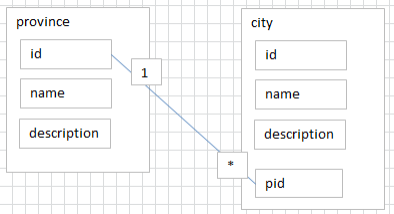
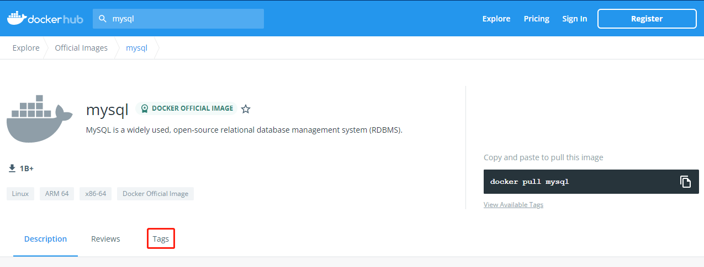

*date: 2022-05-29*

## 概述

### 为什么要使用数据库
`持久化 (persistence)`：把数据保存到可掉电式存储设备中以供之后使用。大多数情况下，特别是企业级应用，数据持久化意味着将内存中的数据保存到硬盘上加以 "固化"，而持久化的实现过程大多通过各种关系数据库来完成。

持久化的主要作用是将内存中的数据存储在关系型数据库中，当然也可以存储在磁盘文件、XML 数据文件中等。


### 数据库与数据库管理系统

#### 数据库的相关概念

`DB`：Database，数据库，即存储数据的 "仓库"，其本质是一个文件系统。它保存了一系列有组织的数据。

`DBMS`：Database Management System，数据库管理系统，是一种操纵和管理数据库的大型软件，用于建立、使用和维护数据库，对数据库进行统一管理和控制。用户通过数据库管理系统访问数据库中表内的数据。

`SQL`：Structured Query Language，结构化查询语言，专门用来与数据库通信的语言。

#### 数据库与数据库管理系统的关系

`数据库管理系统 (DBMS) 可以管理多个数据库`，一般开发人员会针对每一个应用创建一个数据库。为保存应用中实体的数据，一般会在数据库创建多个表，以保存程序中实体用户的数据。

数据库管理系统、数据库和表的关系如图所示：


#### 常见的数据库管理系统排名

目前互联网上常见的数据库管理软件有 Oracle、MySQL、SQL Server、DB2、PostgreSQL、Access、Sybase、Informix 这几种。以下是 2022 年 5 月 DB-Engines Ranking 对各数据库受欢迎程度进行调查后的统计结果（查看数据库最新排名：https://db-engines.com/en/ranking）：


对应的走势图（https://db-engines.com/en/ranking_trend）：


#### 常见的数据库介绍

`Oracle`

1979 年，Oracle 2 诞生，它是第一个商用的 RDBMS（关系型数据库管理系统）。随着 Oracle 软件的名气越来越大，公司也改名叫 Oracle 公司。

2007 年，总计 85 亿美金收购 BEA Systems。

2009 年，总计 74 亿美金收购 SUN。此前的 2008 年，SUN 以 10 亿美金收购 MySQL。意味着 Oracle 同时拥有了 MySQL 的管理权，至此 Oracle 在数据库领域中成为绝对的领导者。

2013 年，Oracle超越 IBM，成为继 Microsoft 后全球第二大软件公司。如今 Oracle 的年收入达到了 400 亿美金，足以证明商用（收费）数据库软件的价值。

`SQL Server`

SQL Server 是微软开发的大型商业数据库，诞生于 1989 年。C#、.net 等语言常使用，与 WinNT 完全集成，也可以很好地与 Microsoft BackOffice 产品集成。

`DB2`

IBM 公司的数据库产品，收费的。常应用在银行系统中。

`PostgreSQL`

PostgreSQL 的稳定性极强，最符合 SQL 标准，开放源码，具备商业级 DBMS 质量。PG 对数据量大的文本以及 SQL 处理较快。

`SyBase`

已经淡出历史舞台。提供了一个非常专业数据建模的工具 PowerDesigner。

`SQLite`

嵌入式的小型数据库，应用在手机端。 零配置，SQlite3 不用安装，不用配置，不用启动，关闭或者配置数据库实例。当系统崩溃后不用做任何恢复操作，在下次使用数据库的时候自动恢复。

`informix`

IBM 公司出品，取自 Information 和 Unix 的结合，它是第一个被移植到 Linux 上的商业数据库产品。仅运行于 unix/linux 平台，命令行操作。 性能较高，支持集群，适应于安全性要求极高的系统，尤其是银行，证券系统的应用。

### MySQL 介绍


- MySQL 是一个`开放源代码的关系型数据库管理系统` ，由瑞典 MySQL AB（创始人Michael Widenius）公司 1995 年开发，迅速成为开源数据库的 No.1。
- 2008 被 Sun 收购（10 亿美金），2009 年 Sun 被 Oracle 收购。`MariaDB`应运而生。（MySQL 的创造者担心 MySQL 有闭源的风险，因此创建了 MySQL 的分支项目 MariaDB）
- MySQL 6.x 版本之后分为`社区版`和`商业版`。
- MySQL 是一种关联数据库管理系统，将数据保存在不同的表中，而不是将所有数据放在一个大仓库内，这样就增加了速度并提高了灵活性。
- MySQL 是开源的，所以你不需要支付额外的费用。
- MySQL 是可以定制的，采用了`GPL (GNU General Public License) 协议`，你可以修改源码来开发自己的 MySQL 系统。
- MySQL 支持大型的数据库。可以处理拥有上千万条记录的大型数据库。
- MySQL 支持大型数据库，支持 5000 万条记录的数据仓库，32 位系统表文件最大可支持 4 GB ，64 位系统支持最大的表文件为`8 TB`。
- MySQL 使用`标准的SQL数据语言`形式。
- MySQL 可以允许运行于多个系统上，并且支持多种语言。这些编程语言包括 C、C++、Python、Java、Perl、PHP 和 Ruby 等。

#### MySQL 发展史重大事件

MySQL 的历史就是整个互联网的发展史。互联网业务从社交领域、电商领域到金融领域的发展，推动着应用对数据库的需求提升，对传统的数据库服务能力提出了挑战。高并发、高性能、高可用、轻资源、易维护、易扩展的需求，促进了 MySQL 的长足发展。


#### 关于 MySQL 8.0

`MySQL 从 5.7 版本直接跳跃发布了 8.0 版本`，可见这是一个令人兴奋的里程碑版本。MySQL 8版本在功能上做了显著的改进与增强，开发者对MySQL的源代码进行了重构，最突出的一点是多MySQL Optimizer优化器进行了改进。不仅在速度上得到了改善，还为用户带来了更好的性能和更棒的体验。

#### Why choose MySQL


为什么如此多的厂商要选用 MySQL？大概总结的原因主要有以下几点：

1. 开放源代码，使用成本低。
2. 性能卓越，服务稳定。
3. 软件体积小，使用简单，并且易于维护。
4. 历史悠久，社区用户非常活跃，遇到问题可以寻求帮助。
5. 许多互联网公司在用，经过了时间的验证。

#### Oracle VS MySQL

Oracle 更适合大型跨国企业的使用，因为他们对费用不敏感，但是对性能要求以及安全性有更高的要求。

MySQL 由于其`体积小`、`速度快`、`总体拥有成本低`，`可处理上千万条记录`的大型数据库，尤其是`开放源码`这一特点，使得很多互联网公司、中小型网站选择了 MySQL 作为网站数据库（Facebook，Twitter，YouTube，阿里巴巴/蚂蚁金服，去哪儿，美团外卖，腾讯）。

### RDBMS 与非 RDBMS

从排名中我们能看出来，关系型数据库绝对是 DBMS 的主流，其中使用最多的 DBMS 分别是 Oracle、MySQL 和 SQL Server。这些都是关系型数据库（RDBMS）。

#### 关系型数据库（RDBMS）

这种类型的数据库是`最古老`的数据库类型，关系型数据库模型是把复杂的数据结构归结为简单的`二元关系 (即二维表格形式)`。


关系型数据库以`行(row)`和`列(column)`的形式存储数据，以便于用户理解。这一系列的行和列被称为`表(table)`，一组表组成了一个`库(database)`。

表与表之间的数据记录有`关系 (relationship)`。现实世界中的各种实体以及实体之间的各种联系均用`关系模型`来表示。`关系型数据库，就是建立在关系模型基础上的数据库。`

SQL 就是关系型数据库的查询语言。


关系型数据库的优势：

- `复杂查询`：可以用 SQL 语句方便的在一个表以及多个表之间做非常复杂的数据查询。
- `事务支持`：使得对于安全性能很高的数据访问要求得以实现。

#### 非关系型数据库（非 RDBMS）

非关系型数据库，可看成传统关系型数据库的功能阉割版本，基于键值对存储数据，不需要经过 SQL 层的解析，性能非常高 。同时，通过减少不常用的功能，进一步提高性能。

目前基本上大部分主流的非关系型数据库都是免费的。

##### 非关系型数据库分类

相比于 SQL，`NoSQL`泛指非关系型数据库，包括了榜单上的`键值型数据库`、`文档型数据库`、`搜索引擎数据库`和`列存储数据库`等，除此以外还包括`图形数据库`。也只有用 NoSQL 一词才能将这些技术囊括进来。

###### 键值型数据库

键值型数据库通过`Key-Value`键值的方式来存储数据，其中 Key 和 Value 可以是简单的对象，也可以是复杂的对象。`Key 作为唯一的标识符`，`优点是查找速度快`，在这方面明显优于关系型数据库，`缺点是无法像关系型数据库一样使用条件过滤 (比如 WHERE)`，如果你不知道去哪里找数据，就要遍历所有的键，这就会消耗大量的计算。

键值型数据库典型的使用场景是作为`内存缓存`。`Redis`是最流行的键值型数据库。


###### 文档型数据库

此类数据库可存放并获取文档，可以是 XML、JSON 等格式。在数据库中文档作为处理信息的基本单位，一个文档就相当于一条记录。文档数据库所存放的文档，就相当于键值数据库所存放的 "值"。`MongoDB`是最流行的文档型数据库，此外，还有CouchDB等。

###### 搜索引擎数据库

虽然关系型数据库采用了索引提升检索效率，但是针对全文索引效率却较低。搜索引擎数据库是应用在搜索引擎领域的数据存储形式，由于搜索引擎会爬取大量的数据，并以特定的格式进行存储，这样在检索的时候才能保证性能最优。核心原理是`倒排索引`。

典型产品：`Solr`、`Elasticsearch`、`Splunk`等。

###### 列存储数据库

列存储数据库是相对于行存储的数据库，Oracle、MySQL、SQL Server 等数据库都是采用的行式存储（Row-based），而列存储数据库是将数据按照列存储到数据库中，这样做的好处是可以大量降低系统的 I/O，适合于分布式文件系统，不足在于功能相对有限。典型产品：`HBase`等。


###### 图形数据库

图形数据库，利用了图这种数据结构存储了实体（对象）之间的关系。图形数据库最典型的例子就是社交网络中人与人的关系，数据模型主要是以节点和边（关系）来实现，特点在于`能高效地解决复杂的关系问题`。

图形数据库顾名思义，就是一种存储图形关系的数据库。它利用了图这种数据结构存储了实体（对象）之间的关系。关系型数据用于存储明确关系的数据，但对于复杂关系的数据存储却有些力不从心。如社交网络中人物之间的关系，如果用关系型数据库则非常复杂，用图形数据库将非常简单。典型产品：`Neo4J`、`InfoGrid`等。


##### NoSQL 的演变

由于 SQL 一直称霸 DBMS，因此许多人在思考是否有一种数据库技术能远离 SQL，于是 NoSQL 诞生了，但是随着发展却发现越来越离不开 SQL。到目前为止 NoSQL 阵营中的 DBMS 都会有实现类似 SQL 的功能。下面是 NoSQL 这个名词在不同时期的诠释，从这些释义的变化中可以看出 NoSQL 功能的演变 ：

1970：NoSQL = We have no SQL

1980：NoSQL = Know SQL

2000：NoSQL = No SQL!

2005：NoSQL = Not only SQL

2013：NoSQL = No, SQL!

NoSQL 对 SQL 做出了很好的补充，比如实际开发中，有很多业务需求，其实并不需要完整的关系型数据库功能，非关系型数据库的功能就足够使用了。这种情况下，使用性能更高、成本更低的非关系型数据库当然是更明智的选择。比如：日志收集、排行榜、定时器等。

总而言之，虽然 NoSQL 的分类很多，但即便如此，在 DBMS 排名中，还是 SQL 阵营的比重更大，影响力前 5 的 DBMS 中有 4 个是关系型数据库，而排名前 20 的 DBMS 中也有 12 个是关系型数据库。所以说，掌握 SQL 是非常有必要的。

### 关系型数据库设计规则

- 关系型数据库的典型数据结构就是`数据表` ，这些数据表的组成都是结构化的（Structured）。

- 将数据放到表中，表再放到库中。

- 一个数据库中可以有多个表，每个表都有一个名字，用来标识自己。表名具有`唯一性`。

- 表具有一些特性，这些特性定义了数据在表中如何存储，类似 Java 和 Python 中类的设计。

####  表、记录、字段

`E-R (entity-relationship，实体-联系)`模型中有三个主要概念是：`实体集`、`属性`、`联系集`。

一个实体集（class）对应于数据库中的一个表（table），一个实体（instance）则对应于数据库表中的一行（row），也称为一条记录（record）。一个属性（attribute）对应于数据库表中的一列（column），也称为一个字段（field）。


`ORM 思想 (Object Relational Mapping)`体现：

- 数据库中的一个表 <---> Java 或 Python 中的一个类

- 表中的一条数据 <---> 类中的一个对象（或实体）

- 表中的一个列 <----> 类中的一个字段、属性（field）

#### 表的关联关系

- 表与表之间的数据记录有关系（relationship）。现实世界中的各种实体以及实体之间的各种联系均用关系模型来表示。

- 四种：一对一关联、一对多关联、多对多关联、自我引用。

#####  一对一关联（one-to-one）

在实际的开发中应用不多，因为一对一可以创建成一张表。

一对一关联两种建表原则：

- `外键唯一`：主表的主键和从表的外键（唯一），形成主外键关系，外键唯一。
- `外键是主键`：主表的主键和从表的主键，形成主外键关系。

举例，设计学生表 ：学号、姓名、手机号码、班级、系别、身份证号码、家庭住址、籍贯、紧急联系人、...

- 拆为两个表：两个表的记录是一一对应关系。

- 基础信息表（常用信息）：学号、姓名、手机号码、班级、系别

- 档案信息表（不常用信息）：学号、身份证号码、家庭住址、籍贯、紧急联系人、...

  

##### 一对多关联（one-to-many）

常见实例场景：客户表和订单表，分类表和商品表，部门表和员工表。

一对多关联建表原则：`在从表 (多方) 创建一个字段，字段作为外键指向主表 (一方) 的主键。`


举例：

- 员工表：编号、姓名、...、所属部门

- 部门表：编号、名称、简介

  

  

##### 多对多关联（many-to-many）

要表示多对多关联，必须创建第三个表，该表通常称为`联接表`，它将多对多关系划分为两个一对多关系。将这两个表的主键都插入到第三个表中。


多对多关联建表原则：`需要创建第三张表，中间表中至少两个字段，这两个字段分别作为外键指向各自一方的主键。`

举例 1：学生-课程

- 学生信息表 ：一行代表一个学生的信息（学号、姓名、手机号码、班级、系别...）。

- 课程信息表 ：一行代表一个课程的信息（课程编号、授课老师、简介...）。

- 选课信息表 ：一个学生可以选多门课，一门课可以被多个学生选择。

  

举例 2：产品-订单

- 订单表和产品表有一种多对多的关系，这种关系是通过与订单明细表建立两个一对多关系来定义的。一个订单可以有多个产品，每个产品可以出现在多个订单中。

- 产品表 ：产品表中的每条记录表示一个产品。

- 订单表 ：订单表中的每条记录表示一个订单。

- 订单明细表 ：每个产品可以与订单表中的多条记录对应，即出现在多个订单中。一个订单可以与产品表中的多条记录对应，即包含多个产品。

  

举例 3：用户-角色

- 一个用户，可能存在多个角色。

  

##### 自我引用（Self reference）


##  Docker 安装 MySQL

登录 https://hub.docker.com/，查看 MySQL 镜像：



选择以下版本，拉取镜像：


```bash
$ docker pull mysql:8.0.29
```

查看拉取的镜像：

```bash
$ docker images
```

启动容器：

```bash
$ docker run -d --name mysql_8.0.29 -p 3306:3306 -v /home/xisun/MyDatas/mysql/:/var/lib/mysql -e MYSQL_ROOT_PASSWORD=root mysql:8.0.29
```

## MySQL 数据库的使用

MySQL 语法规范：

- 不区分大小写；
- 每句话用`;`或`\g`结尾；
- 各子句一般分行写；
- 关键字不能缩写，也不能分行；
- 用缩进提高语句的可读性。

进入容器，并与 MySQL 客户端交互：

```bash
[root@hadoop100 ~]# docker ps
CONTAINER ID   IMAGE          COMMAND                  CREATED       STATUS       PORTS                                                  NAMES
9ca17e09b0c1   mysql:8.0.29   "docker-entrypoint.s…"   4 hours ago   Up 4 hours   0.0.0.0:3306->3306/tcp, :::3306->3306/tcp, 33060/tcp   mysql
[root@hadoop100 ~]# docker exec -it 9ca17e09b0c1 /bin/bash
root@9ca17e09b0c1:/# ls
bin  boot  dev	docker-entrypoint-initdb.d  entrypoint.sh  etc	home  lib  lib64  media  mnt  opt  proc  root  run  sbin  srv  sys  tmp  usr  var
# 进入MySQL客户端，-u用户名，-p密码
root@9ca17e09b0c1:/# mysql -uroot -proot
mysql: [Warning] Using a password on the command line interface can be insecure.
Welcome to the MySQL monitor.  Commands end with ; or \g.
Your MySQL connection id is 15
Server version: 8.0.29 MySQL Community Server - GPL

Copyright (c) 2000, 2022, Oracle and/or its affiliates.

Oracle is a registered trademark of Oracle Corporation and/or its
affiliates. Other names may be trademarks of their respective
owners.

Type 'help;' or '\h' for help. Type '\c' to clear the current input statement.

mysql>
```

- 查看全部的数据库：`show databases;`

  ```bash
  mysql> show databases;
  +--------------------+
  | Database           |
  +--------------------+
  | information_schema |
  | mysql              |
  | performance_schema |
  | sys                |
  +--------------------+
  4 rows in set (0.01 sec)
  ```

- 创建数据库：`create database 数据库名;`

  ```bash
  mysql> create database test;
  Query OK, 1 row affected (0.02 sec)
  
  mysql> show databases;
  +--------------------+
  | Database           |
  +--------------------+
  | information_schema |
  | mysql              |
  | performance_schema |
  | sys                |
  | test               |
  +--------------------+
  5 rows in set (0.00 sec)
  ```

- 使用数据库：`use 数据库名;`

  ```bash
  mysql> use test;
  Database changed
  ```

- 查看指定的数据库中有哪些数据表：`show tables;`

  ```bash
  mysql> show tables;
  Empty set (0.00 sec)
  ```

- 建表：`create table 表名(表结构);`

  ```bash
  mysql> create table students(id varchar(30), age int, name varchar(30));
  Query OK, 0 rows affected (0.06 sec)
  mysql> show tables;
  +----------------+
  | Tables_in_test |
  +----------------+
  | students       |
  +----------------+
  1 row in set (0.00 sec)
  ```

- 查看表结构：`desc[ribe] 表名;`

  ```bash
  mysql> desc students;
  +-------+-------------+------+-----+---------+-------+
  | Field | Type        | Null | Key | Default | Extra |
  +-------+-------------+------+-----+---------+-------+
  | id    | varchar(30) | YES  |     | NULL    |       |
  | age   | int         | YES  |     | NULL    |       |
  | name  | varchar(30) | YES  |     | NULL    |       |
  +-------+-------------+------+-----+---------+-------+
  3 rows in set (0.00 sec)
  ```

- 删除表：`drop table 表名;`

  ```bash
  mysql> drop table students;
  Query OK, 0 rows affected (0.03 sec)
  
  mysql> show tables;
  Empty set (0.00 sec)
  ```

- 查看表中的所有记录：`select * from 表名;`

- 向表中插入记录：`insert into 表名(列名列表) values(列对应的值的列表);`

  - 注意：插入 varchar 或 date 型的数据要用单引号`''`引起来。

- 修改记录：`update 表名 set 列1 = 列1的值, 列2 = 列2的值... where 条件;`

- 删除记录：`delete from 表名 where 条件;`

使用`Navicat`连接创建的 MySQL 容器： 


因为 Navicat 收费，可以选择使用 DBeaver。

`DBeaver`官网：https://dbeaver.io/download/，下载方式如下：


DBeaver Github：https://github.com/dbeaver/dbeaver/releases，下载方式如下：


安装程序下载后，点击安装即可。安装成功后，因为 DBeaver 是基于 Maven 构建的，数据库驱动也就是链接数据库的 JDBC 驱动是通过 Maven 仓库下载的，因此，第一步要做的是配置 Maven 镜像，否则在后续下载数据库驱动的时候会非常的慢。

点击 "窗口" ---> "首选项" ---> "连接" ---> "驱动" ---> "Maven"，设置阿里云镜像`http://maven.aliyun.com/nexus/content/groups/public/`：


配置完 Maven 仓库后，连接数据库：


更多关于 DBeaver 的使用方法，参考：https://juejin.cn/post/7065474476607012878

## MySQL 数据处理之查询

### SELECT 语句

语法：`SELECT *|{[DISTINCT] column|expression [alias],...} FROM table;`

- `SELECT`：标识选择哪些列。
- `FROM`：标识从哪个表中选择。
- `*`：选择全部列。

列的别名：


- 重命名一个列。
- 便于计算。
- 紧跟列名，或者在列名和别名之间加入关键字`AS`，别名使用双引号，以便在别名中包含空格或特殊的字符，并区分大小写。

字符串：

- 字符串可以是 SELECT 列表中的一个字符、数字、日期。
- 日期和字符只能在单引号中出现。
- 每当返回一行时，字符串被输出一次。

### 过滤和排序数据

#### WHERE 语句

语法：`SELECT *|{[DISTINCT] column|expression [alias],...} FROM table [WHERE condition(s)];`

- WHERE 子句紧随 FROM 子句。
- 例如：`SELECT employee_id, last_name, job_id, department_id FROM employees WHERE department_id = 90;`

#### 比较运算

| 操作符           | 含义                     |
| ---------------- | ------------------------ |
| =                | 等于（不是 ==）          |
| >                | 大于                     |
| >=               | 大于等于                 |
| <                | 小于                     |
| <=               | 小于等于                 |
| <>               | 不等于（也可以是 !=）    |
| BETWEEN...AND... | 在两个值之间（包含边界） |
| IN(set)          | 等于值列表中的一个       |
| LIKE             | 模糊查询                 |
| IS NULL          | 空值                     |

- 赋值使用`:=`符号。
- 例如：`SELECT last_name, salary FROM employees WHERE salary <= 3000;`

`BETWEEN`：

- 使用 BETWEEN 运算来显示在一个区间内的值。
- 例如：`SELECT last_name, salary FROM employees WHERE salary BETWEEN 2500 AND 3500;`

`In`:

- 使用 IN 运算显示列表中的值。
- 例如：`SELECT employee_id, last_name, salary, manager_id FROM employees WHERE manager_id IN (100, 101, 201);`

`LIKE`：

- 使用 LIKE 运算选择类似的值。

- 选择条件可以包含字符或数字。

  - `%`代表零个或多个字符（任意个字符）。
  - `_`代表一个字符。
  - `%`和`-`可以同时使用。

- 例如：`SELECT first_name FROM employees WHERE first_name LIKE 'S%';`

- 例如：`SELECT last_name FROM employees WHERE last_name LIKE '_o%';`

  

`NULL`：

- 使用`IS (NOT) NULL`判断空值。

- 例如：`SELECT last_name, manager_id FROM employees WHERE manager_id IS NULL;`

  

#### 逻辑运算

| 操作符 | 含义   |
| ------ | ------ |
| AND    | 逻辑并 |
| OR     | 逻辑或 |
| NOT    | 逻辑否 |

- AND 要求并的关系为真，例如：`SELECT employee_id, last_name, job_id, salary FROM employees WHERE salary >=10000 AND job_id LIKE '%MAN%';`

  

- OR 要求或关系为真，例如：`SELECT employee_id, last_name, job_id, salary FROM employees WHERE salary >= 10000 OR job_id LIKE '%MAN%';`

  

- NOT 要求不存在条件中，例如：`SELECT last_name, job_id FROM employees WHERE job_id NOT IN ('IT_PROG', 'ST_CLERK', 'SA_REP');`

  

#### ORDER BY 语句

使用`ORDER BY`子句排序：

- ORDER BY 子句在 SELECT 语句的结尾，例如：`SELECT last_name, job_id, department_id, hire_date FROM employees ORDER BY hire_date;`

  

- `ASC (ascend)`：升序。

- `DESC (descend)`：降序。

降序排序，例如：`SELECT last_name, job_id, department_id, hire_date FROM employees ORDER BY hire_date DESC;`


按别名排序，例如：`SELECT employee_id, last_name, salary*12 annsal FROM employees ORDER BY annsal;`


多个列排序，例如：`SELECT last_name, department_id, salary FROM employees ORDER BY department_id, salary DESC;`


- 上述 SQL，先按 department_id 升序排序，然后再按 salary 降序排序。
- 排序时，可以使用不在 SELECT 列表中的列排序。

#### 分组函数

分组函数作用于一组数据，并对一组数据返回一个值。

语法：`SELECT [column,] group_function(column), ... FROM table [WHERE condition] [GROUP BY column] [ORDER BY column];`

分组函数类型：

- `AVG()`

- `SUM()`

- `MAX()`

- `MIN()`

- `COUNT()`

- 可以对`数值型数据`使用 AVG 和 SUM 函数。例如：`SELECT AVG(salary), MAX(salary), MIN(salary), SUM(salary) FROM employees WHERE job_id LIKE '%REP%';`

  

- 可以对`任意数据类型`的数据使用 MIN 和 MAX 函数。例如：`SELECT MIN(hire_date), MAX(hire_date) FROM employees;`

  

- `COUNT(*)`返回表中记录总数，适用于`任意数据类型`。例如：`SELECT COUNT(*) FROM employees WHERE department_id = 50;`

  

- `COUNT(expr)`返回 expr 不为空的记录总数。例如：`SELECT COUNT(commission_pct) FROM employees WHERE department_id = 50;`

  

- s
