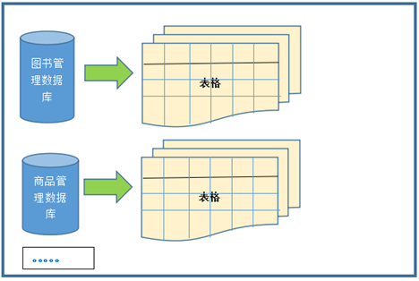
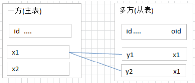
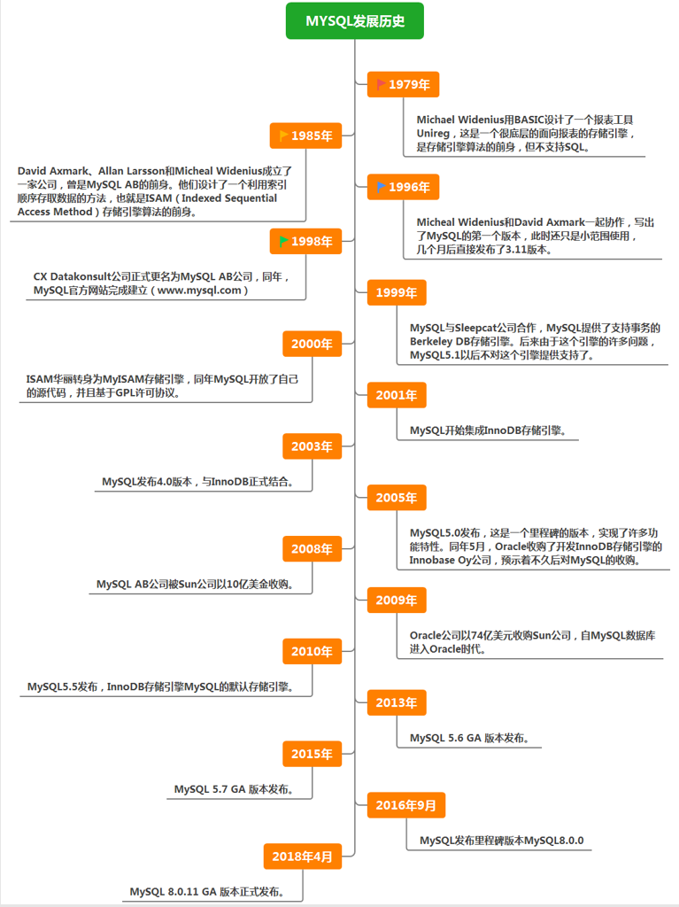

*date: 2022-05-29*

## 概述

### 为什么要使用数据库
`持久化 (persistence)`：把数据保存到可掉电式存储设备中以供之后使用。大多数情况下，特别是企业级应用，数据持久化意味着将内存中的数据保存到硬盘上加以 "固化"，而持久化的实现过程大多通过各种关系数据库来完成。

持久化的主要作用是将内存中的数据存储在关系型数据库中，当然也可以存储在磁盘文件、XML 数据文件中等。


### 数据库与数据库管理系统

#### 数据库的相关概念

`DB`：Database，数据库，即存储数据的 "仓库"，其本质是一个文件系统。它保存了一系列有组织的数据。

`DBMS`：Database Management System，数据库管理系统，是一种操纵和管理数据库的大型软件，用于建立、使用和维护数据库，对数据库进行统一管理和控制。用户通过数据库管理系统访问数据库中表内的数据。

`SQL`：Structured Query Language，结构化查询语言，专门用来与数据库通信的语言。

#### 数据库与数据库管理系统的关系

`数据库管理系统 (DBMS) 可以管理多个数据库`，一般开发人员会针对每一个应用创建一个数据库。为保存应用中实体的数据，一般会在数据库创建多个表，以保存程序中实体用户的数据。

数据库管理系统、数据库和表的关系如图所示：


#### 常见的数据库管理系统排名

目前互联网上常见的数据库管理软件有 Oracle、MySQL、SQL Server、DB2、PostgreSQL、Access、Sybase、Informix 这几种。以下是 2022 年 5 月 DB-Engines Ranking 对各数据库受欢迎程度进行调查后的统计结果（查看数据库最新排名：https://db-engines.com/en/ranking）：


对应的走势图（https://db-engines.com/en/ranking_trend）：


#### 常见的数据库介绍

`Oracle`

1979 年，Oracle 2 诞生，它是第一个商用的 RDBMS（关系型数据库管理系统）。随着 Oracle 软件的名气越来越大，公司也改名叫 Oracle 公司。

2007 年，总计 85 亿美金收购 BEA Systems。

2009 年，总计 74 亿美金收购 SUN。此前的 2008 年，SUN 以 10 亿美金收购 MySQL。意味着 Oracle 同时拥有了 MySQL 的管理权，至此 Oracle 在数据库领域中成为绝对的领导者。

2013 年，Oracle超越 IBM，成为继 Microsoft 后全球第二大软件公司。如今 Oracle 的年收入达到了 400 亿美金，足以证明商用（收费）数据库软件的价值。

`SQL Server`

SQL Server 是微软开发的大型商业数据库，诞生于 1989 年。C#、.net 等语言常使用，与 WinNT 完全集成，也可以很好地与 Microsoft BackOffice 产品集成。

`DB2`

IBM 公司的数据库产品，收费的。常应用在银行系统中。

`PostgreSQL`

PostgreSQL 的稳定性极强，最符合 SQL 标准，开放源码，具备商业级 DBMS 质量。PG 对数据量大的文本以及 SQL 处理较快。

`SyBase`

已经淡出历史舞台。提供了一个非常专业数据建模的工具 PowerDesigner。

`SQLite`

嵌入式的小型数据库，应用在手机端。 零配置，SQlite3 不用安装，不用配置，不用启动，关闭或者配置数据库实例。当系统崩溃后不用做任何恢复操作，在下次使用数据库的时候自动恢复。

`informix`

IBM 公司出品，取自 Information 和 Unix 的结合，它是第一个被移植到 Linux 上的商业数据库产品。仅运行于 unix/linux 平台，命令行操作。 性能较高，支持集群，适应于安全性要求极高的系统，尤其是银行，证券系统的应用。

### RDBMS 与非 RDBMS

从排名中我们能看出来，关系型数据库绝对是 DBMS 的主流，其中使用最多的 DBMS 分别是 Oracle、MySQL 和 SQL Server。这些都是关系型数据库（RDBMS）。

#### 关系型数据库（RDBMS）

这种类型的数据库是`最古老`的数据库类型，关系型数据库模型是把复杂的数据结构归结为简单的`二元关系 (即二维表格形式)`。


关系型数据库以`行(row)`和`列(column)`的形式存储数据，以便于用户理解。这一系列的行和列被称为`表(table)`，一组表组成了一个`库(database)`。

表与表之间的数据记录有`关系 (relationship)`。现实世界中的各种实体以及实体之间的各种联系均用`关系模型`来表示。`关系型数据库，就是建立在关系模型基础上的数据库。`

SQL 就是关系型数据库的查询语言。



关系型数据库的优势：

- `复杂查询`：可以用 SQL 语句方便的在一个表以及多个表之间做非常复杂的数据查询。
- `事务支持`：使得对于安全性能很高的数据访问要求得以实现。

#### 非关系型数据库（非 RDBMS）

非关系型数据库，可看成传统关系型数据库的功能阉割版本，基于键值对存储数据，不需要经过 SQL 层的解析，性能非常高 。同时，通过减少不常用的功能，进一步提高性能。

目前基本上大部分主流的非关系型数据库都是免费的。

##### 非关系型数据库分类

相比于 SQL，`NoSQL`泛指非关系型数据库，包括了榜单上的`键值型数据库`、`文档型数据库`、`搜索引擎数据库`和`列存储数据库`等，除此以外还包括`图形数据库`。也只有用 NoSQL 一词才能将这些技术囊括进来。

###### 键值型数据库

键值型数据库通过`Key-Value`键值的方式来存储数据，其中 Key 和 Value 可以是简单的对象，也可以是复杂的对象。`Key 作为唯一的标识符`，`优点是查找速度快`，在这方面明显优于关系型数据库，`缺点是无法像关系型数据库一样使用条件过滤 (比如 WHERE)`，如果你不知道去哪里找数据，就要遍历所有的键，这就会消耗大量的计算。

键值型数据库典型的使用场景是作为`内存缓存`。`Redis`是最流行的键值型数据库。


###### 文档型数据库

此类数据库可存放并获取文档，可以是 XML、JSON 等格式。在数据库中文档作为处理信息的基本单位，一个文档就相当于一条记录。文档数据库所存放的文档，就相当于键值数据库所存放的 "值"。`MongoDB`是最流行的文档型数据库，此外，还有CouchDB等。

###### 搜索引擎数据库

虽然关系型数据库采用了索引提升检索效率，但是针对全文索引效率却较低。搜索引擎数据库是应用在搜索引擎领域的数据存储形式，由于搜索引擎会爬取大量的数据，并以特定的格式进行存储，这样在检索的时候才能保证性能最优。核心原理是`倒排索引`。

典型产品：`Solr`、`Elasticsearch`、`Splunk`等。

###### 列存储数据库

列存储数据库是相对于行存储的数据库，Oracle、MySQL、SQL Server 等数据库都是采用的行式存储（Row-based），而列存储数据库是将数据按照列存储到数据库中，这样做的好处是可以大量降低系统的 I/O，适合于分布式文件系统，不足在于功能相对有限。典型产品：`HBase`等。


###### 图形数据库

图形数据库，利用了图这种数据结构存储了实体（对象）之间的关系。图形数据库最典型的例子就是社交网络中人与人的关系，数据模型主要是以节点和边（关系）来实现，特点在于`能高效地解决复杂的关系问题`。

图形数据库顾名思义，就是一种存储图形关系的数据库。它利用了图这种数据结构存储了实体（对象）之间的关系。关系型数据用于存储明确关系的数据，但对于复杂关系的数据存储却有些力不从心。如社交网络中人物之间的关系，如果用关系型数据库则非常复杂，用图形数据库将非常简单。典型产品：`Neo4J`、`InfoGrid`等。


##### NoSQL 的演变

由于 SQL 一直称霸 DBMS，因此许多人在思考是否有一种数据库技术能远离 SQL，于是 NoSQL 诞生了，但是随着发展却发现越来越离不开 SQL。到目前为止 NoSQL 阵营中的 DBMS 都会有实现类似 SQL 的功能。下面是 NoSQL 这个名词在不同时期的诠释，从这些释义的变化中可以看出 NoSQL 功能的演变 ：

1970：NoSQL = We have no SQL

1980：NoSQL = Know SQL

2000：NoSQL = No SQL!

2005：NoSQL = Not only SQL

2013：NoSQL = No, SQL!

NoSQL 对 SQL 做出了很好的补充，比如实际开发中，有很多业务需求，其实并不需要完整的关系型数据库功能，非关系型数据库的功能就足够使用了。这种情况下，使用性能更高、成本更低的非关系型数据库当然是更明智的选择。比如：日志收集、排行榜、定时器等。

总而言之，虽然 NoSQL 的分类很多，但即便如此，在 DBMS 排名中，还是 SQL 阵营的比重更大，影响力前 5 的 DBMS 中有 4 个是关系型数据库，而排名前 20 的 DBMS 中也有 12 个是关系型数据库。所以说，掌握 SQL 是非常有必要的。

### 关系型数据库设计规则

- 关系型数据库的典型数据结构就是`数据表` ，这些数据表的组成都是结构化的（Structured）。

- 将数据放到表中，表再放到库中。

- 一个数据库中可以有多个表，每个表都有一个名字，用来标识自己。表名具有`唯一性`。

- 表具有一些特性，这些特性定义了数据在表中如何存储，类似 Java 和 Python 中类的设计。

####  表、记录、字段

`E-R (entity-relationship，实体-联系)`模型中有三个主要概念是：`实体集`、`属性`、`联系集`。

一个实体集（class）对应于数据库中的一个表（table），一个实体（instance）则对应于数据库表中的一行（row），也称为一条记录（record）。一个属性（attribute）对应于数据库表中的一列（column），也称为一个字段（field）。


`ORM 思想 (Object Relational Mapping)`体现：

- 数据库中的一个表 <---> Java 或 Python 中的一个类

- 表中的一条数据 <---> 类中的一个对象（或实体）

- 表中的一个列 <----> 类中的一个字段、属性（field）

#### 表的关联关系

- 表与表之间的数据记录有关系（relationship）。现实世界中的各种实体以及实体之间的各种联系均用关系模型来表示。

- 四种：一对一关联、一对多关联、多对多关联、自我引用。

#####  一对一关联（one-to-one）

在实际的开发中应用不多，因为一对一可以创建成一张表。

一对一关联两种建表原则：

- `外键唯一`：主表的主键和从表的外键（唯一），形成主外键关系，外键唯一。
- `外键是主键`：主表的主键和从表的主键，形成主外键关系。

举例，设计学生表 ：学号、姓名、手机号码、班级、系别、身份证号码、家庭住址、籍贯、紧急联系人、...

- 拆为两个表：两个表的记录是一一对应关系。

- 基础信息表（常用信息）：学号、姓名、手机号码、班级、系别

- 档案信息表（不常用信息）：学号、身份证号码、家庭住址、籍贯、紧急联系人、...

  

##### 一对多关联（one-to-many）

常见实例场景：客户表和订单表，分类表和商品表，部门表和员工表。

一对多关联建表原则：`在从表 (多方) 创建一个字段，字段作为外键指向主表 (一方) 的主键。`



举例：

- 员工表：编号、姓名、...、所属部门

- 部门表：编号、名称、简介

  

  

##### 多对多关联（many-to-many）

要表示多对多关联，必须创建第三个表，该表通常称为`联接表`，它将多对多关系划分为两个一对多关系。将这两个表的主键都插入到第三个表中。


多对多关联建表原则：`需要创建第三张表，中间表中至少两个字段，这两个字段分别作为外键指向各自一方的主键。`

举例 1：学生-课程

- 学生信息表 ：一行代表一个学生的信息（学号、姓名、手机号码、班级、系别...）。

- 课程信息表 ：一行代表一个课程的信息（课程编号、授课老师、简介...）。

- 选课信息表 ：一个学生可以选多门课，一门课可以被多个学生选择。

  

举例 2：产品-订单

- 订单表和产品表有一种多对多的关系，这种关系是通过与订单明细表建立两个一对多关系来定义的。一个订单可以有多个产品，每个产品可以出现在多个订单中。

- 产品表 ：产品表中的每条记录表示一个产品。

- 订单表 ：订单表中的每条记录表示一个订单。

- 订单明细表 ：每个产品可以与订单表中的多条记录对应，即出现在多个订单中。一个订单可以与产品表中的多条记录对应，即包含多个产品。

  

举例 3：用户-角色

- 一个用户，可能存在多个角色。

  

##### 自我引用（Self reference）


### MySQL 介绍


- MySQL 是一个`开放源代码的关系型数据库管理系统` ，由瑞典 MySQL AB（创始人Michael Widenius）公司 1995 年开发，迅速成为开源数据库的 No.1。
- 2008 被 Sun 收购（10 亿美金），2009 年 Sun 被 Oracle 收购。`MariaDB`应运而生。（MySQL 的创造者担心 MySQL 有闭源的风险，因此创建了 MySQL 的分支项目 MariaDB）
- MySQL 6.x 版本之后分为`社区版`和`商业版`。
- MySQL 是一种关联数据库管理系统，将数据保存在不同的表中，而不是将所有数据放在一个大仓库内，这样就增加了速度并提高了灵活性。
- MySQL 是开源的，所以你不需要支付额外的费用。
- MySQL 是可以定制的，采用了`GPL (GNU General Public License) 协议`，你可以修改源码来开发自己的 MySQL 系统。
- MySQL 支持大型的数据库。可以处理拥有上千万条记录的大型数据库。
- MySQL 支持大型数据库，支持 5000 万条记录的数据仓库，32 位系统表文件最大可支持 4 GB ，64 位系统支持最大的表文件为`8 TB`。
- MySQL 使用`标准的SQL数据语言`形式。
- MySQL 可以允许运行于多个系统上，并且支持多种语言。这些编程语言包括 C、C++、Python、Java、Perl、PHP 和 Ruby 等。

#### MySQL 发展史重大事件

MySQL 的历史就是整个互联网的发展史。互联网业务从社交领域、电商领域到金融领域的发展，推动着应用对数据库的需求提升，对传统的数据库服务能力提出了挑战。高并发、高性能、高可用、轻资源、易维护、易扩展的需求，促进了 MySQL 的长足发展。



#### 关于 MySQL 8.0

`MySQL 从 5.7 版本直接跳跃发布了 8.0 版本`，可见这是一个令人兴奋的里程碑版本。MySQL 8版本在功能上做了显著的改进与增强，开发者对MySQL的源代码进行了重构，最突出的一点是多MySQL Optimizer优化器进行了改进。不仅在速度上得到了改善，还为用户带来了更好的性能和更棒的体验。

#### Why choose MySQL


为什么如此多的厂商要选用 MySQL？大概总结的原因主要有以下几点：

1. 开放源代码，使用成本低。
2. 性能卓越，服务稳定。
3. 软件体积小，使用简单，并且易于维护。
4. 历史悠久，社区用户非常活跃，遇到问题可以寻求帮助。
5. 许多互联网公司在用，经过了时间的验证。

#### Oracle VS MySQL

Oracle 更适合大型跨国企业的使用，因为他们对费用不敏感，但是对性能要求以及安全性有更高的要求。

MySQL 由于其`体积小`、`速度快`、`总体拥有成本低`，`可处理上千万条记录`的大型数据库，尤其是`开放源码`这一特点，使得很多互联网公司、中小型网站选择了 MySQL 作为网站数据库（Facebook，Twitter，YouTube，阿里巴巴/蚂蚁金服，去哪儿，美团外卖，腾讯）。

### SQL 语言

1946 年，世界上第一台电脑诞生，如今，借由这台电脑发展起来的互联网已经自成江湖。在这几十年里，无数的技术、产业在这片江湖里沉浮，有的方兴未艾，有的已经几幕兴衰。但在这片浩荡的波动里，有一门技术从未消失，甚至老当益壮，那就是 SQL。

45 年前，也就是 1974 年，IBM 研究员发布了一篇揭开数据库技术的论文《SEQUEL：一门结构化的英语查询语言》，直到今天这门结构化的查询语言并没有太大的变化，相比于其他语言， SQL 的半衰期可以说是非常长了。

不论是前端工程师，还是后端算法工程师，都一定会和数据打交道，都需要了解如何又快又准确地提取自己想要的数据。更别提数据分析师了，他们的工作就是和数据打交道，整理不同的报告，以便指导业务决策。

`SQL (Structured Query Language，结构化查询语言)`是使用关系模型的数据库应用语言，与数据直接打交道 ，由 IBM 上世纪70年代开发出来。后由美国国家标准局（ANSI）开始着手制定SQL标准，先后有 SQL-86 ， SQL-89 ， SQL-92 ， SQL-99 等标准。

SQL 有两个重要的标准，分别是`SQL-92`和`SQL-99`，它们分别代表了 92 年和 99 年颁布的 SQL 标准，我们今天使用的 SQL 语言依然遵循这些标准。

不同的数据库生产厂商都支持 SQL 语句，但都有特有内容：


#### SQL 语言的分类

SQL 语言在功能上主要分为如下三大类：

- `DDL (Data Definition Languages、数据定义语言)`：这些语句定义了不同的数据库、表、视图、索引等数据库对象，还可以用来创建、删除、修改数据库和数据表的结构。
  - 主要的语句关键字包括`CREATE` 、`DROP`、`ALTER`等。
- `DML (Data Manipulation Language、数据操作语言)`：用于添加、删除、更新和查询数据库记录，并检查数据完整性。
  - 主要的语句关键字包括`INSERT`、`DELETE`、`UPDATE`、`SELECT`等。
  - `SELECT 是 SQL 语言的基础，最为重要。`
- `DCL (Data Control Language、数据控制语言)`：用于定义数据库、表、字段、用户的访问权限和安全级别。
  - 主要的语句关键字包括`GRANT`、`REVOKE`、`COMMIT`、`ROLLBACK`、`SAVEPOINT`等。

>因为查询语句使用的非常的频繁，所以很多人把查询语句单拎出来一类：DQL（数据查询语言）。
>
>还有单独将 COMMIT 、 ROLLBACK 取出来的，称为 TCL （Transaction Control Language，事务控制语言）。

#### SQL 语言的规则与规范

##### 基本规则

- SQL 可以写在一行或者多行。为了提高可读性，各子句分行写，必要时使用缩进。
- 每条命令以`;`或`\g`或`\G`结束。
- 关键字不能被缩写也不能分行。
- 关于标点符号：
  - 必须保证所有的 ()、单引号、双引号是成对结束的。
  - 必须使用英文状态下的半角输入方式。
  - 字符串型和日期时间类型的数据可以使用单引号（''）表示。
  - 列的别名，尽量使用双引号（""），而且不建议省略 as。

##### SQL大小写规范

- MySQL 在 Windows 环境下是大小写不敏感的。
- MySQL 在 Linux 环境下是大小写敏感的。
- 数据库名、表名、表的别名、变量名是严格区分大小写的。
  - 关键字、函数名、列名（字段名）、列的别名（字段的别名）是忽略大小写的。
- 推荐采用统一的书写规范：
  - `数据库名、表名、表别名、字段名、字段别名等都小写。`
  - `SQL 关键字、函数名、绑定变量等都大写。`

- 以上规范，建议遵守。

##### 注释

可以使用如下格式的注释结构：

- 单行注释：`#注释文字 (MySQL 特有的方式)`
- 单行注释：`-- 注释文字 (--后面必须包含一个空格。)`
- 多行注释：`/* 注释文字 */`

##### 命名规则

- 数据库、表名不能超过 30 个字符，变量名限制为 29 个字符。
- 只能包含 A–Z，a–z，0–9 和 _ 共 63 个字符。
- 数据库名、表名、字段名等对象名中间不要包含空格。
- 同一个 MySQL 软件中，数据库不能同名；同一个库中，表不能重名；同一个表中，字段不能重名。
- 字段不能和保留字、数据库系统或常用方法冲突。如果必须使用，需在 SQL 语句中使用`` (着重号)`引起来。
- 保持字段名和类型的一致性，在命名字段并为其指定数据类型的时候一定要保证一致性。假如数据类型在一个表里是整数，那在另一个表里可就别变成字符型了

##### 导入指令

命令行登录 MySQL 客户端，使用`source`指令导入 sql 文件：

```sql
mysql> source /tmp/insert.sql
```

> /tmp/insert.sql 是 sql 文件在服务器上的路径。

##  Docker 安装 MySQL

登录 https://hub.docker.com/，查看 MySQL 镜像：


选择以下版本，拉取镜像：


```bash
$ docker pull mysql:8.0.29
```

查看拉取的镜像：

```bash
$ docker images
```

启动容器：

```bash
$ docker run -d --name mysql_8.0.29 -p 3306:3306 -v /home/xisun/MyDatas/mysql/:/var/lib/mysql -e MYSQL_ROOT_PASSWORD=root mysql:8.0.29
```

## MySQL 图形化管理工具

### DBeaver

官网：https://dbeaver.io/download/，下载方式如下：


Github：https://github.com/dbeaver/dbeaver/releases，下载方式如下：


安装程序下载后，点击安装即可。安装成功后，因为 DBeaver 是基于 Maven 构建的，数据库驱动也就是链接数据库的 JDBC 驱动是通过 Maven 仓库下载的，因此，第一步要做的是配置 Maven 镜像，否则在后续下载数据库驱动的时候会非常的慢。

点击 "窗口" ---> "首选项" ---> "连接" ---> "驱动" ---> "Maven"，设置阿里云镜像`http://maven.aliyun.com/nexus/content/groups/public/`：


配置完 Maven 仓库后，连接数据库：


更多关于 DBeaver 的使用方法，参考：https://juejin.cn/post/7065474476607012878

>DBeaver 是用Java 开发的，使用前需要安装 JDK 环境。

## MySQL 的基本使用

MySQL 语法规范：

- `不区分大小写`；
- 每句话用`;`或`\g`结尾；
- 各子句一般分行写；
- 关键字不能缩写，也不能分行；
- 用缩进提高语句的可读性。

进入容器，并与 MySQL 客户端交互：

```bash
[root@hadoop100 ~]# docker ps
CONTAINER ID   IMAGE          COMMAND                  CREATED       STATUS       PORTS                                                  NAMES
9ca17e09b0c1   mysql:8.0.29   "docker-entrypoint.s…"   4 hours ago   Up 4 hours   0.0.0.0:3306->3306/tcp, :::3306->3306/tcp, 33060/tcp   mysql
[root@hadoop100 ~]# docker exec -it 9ca17e09b0c1 /bin/bash
root@9ca17e09b0c1:/# ls
bin  boot  dev	docker-entrypoint-initdb.d  entrypoint.sh  etc	home  lib  lib64  media  mnt  opt  proc  root  run  sbin  srv  sys  tmp  usr  var
# 进入MySQL客户端，-u用户名，-p密码
root@9ca17e09b0c1:/# mysql -uroot -proot
mysql: [Warning] Using a password on the command line interface can be insecure.
Welcome to the MySQL monitor.  Commands end with ; or \g.
Your MySQL connection id is 15
Server version: 8.0.29 MySQL Community Server - GPL

Copyright (c) 2000, 2022, Oracle and/or its affiliates.

Oracle is a registered trademark of Oracle Corporation and/or its
affiliates. Other names may be trademarks of their respective
owners.

Type 'help;' or '\h' for help. Type '\c' to clear the current input statement.

mysql>
```

- 查看全部的数据库：`SHOW databases;`

  ```bash
  mysql> SHOW databases;
  +--------------------+
  | Database           |
  +--------------------+
  | information_schema |
  | mybatis            |
  | mybatisplus        |
  | mybatisplus_1      |
  | mysql              |
  | performance_schema |
  | sys                |
  +--------------------+
  7 rows in set (0.00 sec)
  ```

  - `information_schema`、`performance_schema`、`sys`和`mysql`，都是 MySQL 系统自带的数据库。

  - `information_schema`库主要保存 MySQL 数据库服务器的系统信息，比如数据库的名称、数据表的名称、字段名称、存取权限、数据文件所在的文件夹和系统使用的文件夹，等等。

  - `performance_schema`库可以用来监控 MySQL 的各类性能指标。

  - `sys`库主要作用是以一种更容易被理解的方式，展示 MySQL 数据库服务器的各类性能指标，帮助系统管理员和开发人员监控 MySQL 的技术性能。

  - `mysql`库保存了 MySQL 数据库服务器运行时需要的系统信息，比如数据文件夹、当前使用的字符集、约束检查信息，等等。

- 创建数据库：`CREATE database 数据库名;`

  ```bash
  mysql> CREATE database test;
  Query OK, 1 row affected (0.02 sec)
  
  mysql> SHOW databases;
  +--------------------+
  | Database           |
  +--------------------+
  | information_schema |
  | mybatis            |
  | mybatisplus        |
  | mybatisplus_1      |
  | mysql              |
  | performance_schema |
  | sys                |
  | test               |
  +--------------------+
  8 rows in set (0.00 sec)
  ```

- 使用数据库：`USE 数据库名;`

  ```bash
  mysql> USE test;
  Database changed
  ```

  - 如果没有使用 USE 语句，对数据库的操作也没有加 "数据名" 的限定，那么会报 "ERROR 1046(3D000): No database selected"（没有选择数据库）。

  - 使用完 USE 语句之后，如果接下来的 SQL 都是针对一个数据库操作的，那就不用重复 USE 了，如果要针对另一个数据库操作，那么要重新 USE。

- 查看当前数据库中有哪些数据表：`SHOW tables;`

  ```bash
  mysql> SHOW tables;
  Empty set (0.00 sec)
  ```

- 查看指定数据库中有哪些数据表：`SHOW tables FROM 数据库名;`

  ```bash
  mysql> SHOW tables FROM mybatisplus;
  +-----------------------+
  | Tables_in_mybatisplus |
  +-----------------------+
  | user                  |
  +-----------------------+
  1 row in set (0.01 sec)
  ```

- 建表：`CREATE table 表名(表结构);`

  ```bash
  mysql> CREATE table student (
      ->   id int,
      ->   name varchar(20)
      -> );
  Query OK, 0 rows affected (0.04 sec)
  mysql> SHOW tables;
  +----------------+
  | Tables_in_test |
  +----------------+
  | student        |
  +----------------+
  1 row in set (0.00 sec)
  ```

  - 如果是最后一个字段，后面就不用加逗号，因为逗号的作用是分割每个字段。

- 查看表结构：`DESC[RIBE] 表名;`，或者`SHOW FULL COLUMNS FROM 表名;`

  ```bash
  mysql> DESC student;
  +-------+-------------+------+-----+---------+-------+
  | Field | Type        | Null | Key | Default | Extra |
  +-------+-------------+------+-----+---------+-------+
  | id    | int         | YES  |     | NULL    |       |
  | name  | varchar(20) | YES  |     | NULL    |       |
  +-------+-------------+------+-----+---------+-------+
  2 rows in set (0.01 sec)
  
  mysql> SHOW FULL COLUMNS FROM student;
  +-------+-------------+--------------------+------+-----+---------+-------+---------------------------------+---------+
  | Field | Type        | Collation          | Null | Key | Default | Extra | Privileges                      | Comment |
  +-------+-------------+--------------------+------+-----+---------+-------+---------------------------------+---------+
  | id    | int         | NULL               | YES  |     | NULL    |       | select,insert,update,references |         |
  | name  | varchar(20) | utf8mb4_0900_ai_ci | YES  |     | NULL    |       | select,insert,update,references |         |
  +-------+-------------+--------------------+------+-----+---------+-------+---------------------------------+---------+
  2 rows in set (0.00 sec)
  ```

  - Field：表示字段名称。

  - Type：表示字段类型。

  - Null：表示该列是否可以存储 NULL 值。

  - Key：表示该列是否已编制索引。PRI 值表示该列是表主键的一部分；UNI 值表示该列是 UNIQUE 索引的一部分；MUL 值表示在列中某个给定值允许出现多次。

  - Default：表示该列是否有默认值，如果有，那么值是多少。

  - Extra：表示可以获取的与给定列有关的附加信息，例如 AUTO_INCREMENT 等。

- 查看表中的所有记录：`SELECT * FROM 表名;`

  ```bash
  mysql> SELECT * FROM student;
  Empty set (0.10 sec)
  ```

- 向表中添加一条记录：`INSERT INTO 表名 (表字段列表) VALUES (值列表);`

  ```bash
  mysql> INSERT INTO student VALUES (1, 'Tom');
  Query OK, 1 row affected (0.00 sec)
  
  mysql> INSERT INTO student VALUES (1, 'Jerry');
  Query OK, 1 row affected (0.01 sec)
  ```

- 修改表中的记录：`UPDATE 表名 SET 表字段1 = 值1, 表字段2 = 值2 ... WHERE 条件;`

  ```sql
  mysql> UPDATE student SET id = 2 WHERE name = 'Jerry';
  Query OK, 1 row affected (0.04 sec)
  Rows matched: 1  Changed: 1  Warnings: 0
  ```

- 删除表中的记录：`DELETE FROM  表名 WHERE 条件;`

  ```sql
  mysql> DELETE FROM student WHERE id = 3;
  Query OK, 1 row affected (0.01 sec)
  ```

- 查看表的创建信息：`SHOW CREATE TABLE 表名;`

  ```sql
  mysql> SHOW CREATE TABLE student;
  +---------+--------------------------------------------------------------------------------------------------------------------------------------------------------+
  | Table   | Create Table                                                                                                                                           |
  +---------+--------------------------------------------------------------------------------------------------------------------------------------------------------+
  | student | CREATE TABLE `student` (
    `id` int DEFAULT NULL,
    `name` varchar(20) DEFAULT NULL
  ) ENGINE=InnoDB DEFAULT CHARSET=utf8mb4 COLLATE=utf8mb4_0900_ai_ci |
  +---------+--------------------------------------------------------------------------------------------------------------------------------------------------------+
  1 row in set (0.00 sec)-
  ```

- 查看数据库的创建信息：`SHOW CREATE DATABASES 表名;`

  ```sql
  mysql> SHOW CREATE DATABASE test;
  +----------+--------------------------------------------------------------------------------------------------------------------------------+
  | Database | Create Database                                                                                                                |
  +----------+--------------------------------------------------------------------------------------------------------------------------------+
  | test     | CREATE DATABASE `test` /*!40100 DEFAULT CHARACTER SET utf8mb4 COLLATE utf8mb4_0900_ai_ci */ /*!80016 DEFAULT ENCRYPTION='N' */ |
  +----------+--------------------------------------------------------------------------------------------------------------------------------+
  1 row in set (0.05 sec)
  ```

- 删除表：`DROP TABLE 表名;`

  ```sql
  mysql> DROP TABLE student;
  Query OK, 0 rows affected (0.32 sec)
  ```

- 删除数据库：`DROP DATABASE 表名;`

  ```sql
  mysql> DROP DATABASE test;
  Query OK, 0 rows affected (0.13 sec)
  ```

## MySQL 的编码

查看编码命令：

```sql
mysql> SHOW VARIABLES LIKE 'character_%';
+--------------------------+--------------------------------+
| Variable_name            | Value                          |
+--------------------------+--------------------------------+
| character_set_client     | latin1                         |
| character_set_connection | latin1                         |
| character_set_database   | utf8mb4                        |
| character_set_filesystem | binary                         |
| character_set_results    | latin1                         |
| character_set_server     | utf8mb4                        |
| character_set_system     | utf8mb3                        |
| character_sets_dir       | /usr/share/mysql-8.0/charsets/ |
+--------------------------+--------------------------------+
8 rows in set (0.00 sec)

mysql> SHOW VARIABLES LIKE 'collation_%';
+----------------------+--------------------+
| Variable_name        | Value              |
+----------------------+--------------------+
| collation_connection | latin1_swedish_ci  |
| collation_database   | utf8mb4_0900_ai_ci |
| collation_server     | utf8mb4_0900_ai_ci |
+----------------------+--------------------+
3 rows in set (0.00 sec)
```

在 MySQL 8.0 版本之前，默认字符集为`latin1`，utf8 字符集指向的是 utf8mb3。网站开发人员在数据库设计的时候往往会将编码修改为 utf8 字符集，如果遗忘修改默认的编码，就会出现乱码的问题。从 MySQL 8.0 开始，数据库的默认字符集为`utf8mb4`，从而避免了上述的乱码问题。

## 基本的 SELECT 语句

### 常规语法

```sql
SELECT [标识选择哪些列] FROM [标识从哪个表中选择] ;
```

查询所有列的所有数据：

```sql
mysql> SELECT * FROM employee;
+----+----------+--------+-----+--------+
| id | emp_name | sex    | age | dep_id |
+----+----------+--------+-----+--------+
|  1 | Tom      | male   |  27 |      1 |
|  2 | Jerry    | male   |  28 |      2 |
|  3 | Lucy     | female |  29 |      2 |
+----+----------+--------+-----+--------+
3 rows in set (0.00 sec)
```

- 一般情况下，除非需要使用表中所有的字段数据，最好不要使用通配符`*`。使用通配符虽然可以节省输入查询语句的时间，但是获取不需要的列数据，通常会降低查询和所使用的应用程序的效率。
- 通配符的优势是，当不知道所需要的列的名称时，可以通过它获取它们。
- `在生产环境下，不推荐直接使用 SELECT * 进行查询。`

查询特定列的所有数据：

```sql
mysql> SELECT emp_name, sex FROM employee;
+----------+--------+
| emp_name | sex    |
+----------+--------+
| Tom      | male   |
| Jerry    | male   |
| Lucy     | female |
+----------+--------+
3 rows in set (0.00 sec)
```

### 查询常数

SELECT 查询可以对常数进行查询，即在 SELECT 查询结果中增加一列固定的常数列，这列的取值是我们指定的，而不是从数据表中动态取出的。一般来说我们只从一个表中查询数据，通常不需要增加一个固定的常数列，但如果我们想整合不同的数据源，用常数列作为这个表的标记，就需要查询常数。

```sql
mysql> SELECT 1;
+---+
| 1 |
+---+
| 1 |
+---+
1 row in set (0.00 sec)

mysql> SELECT 9/2;
+--------+
| 9/2    |
+--------+
| 4.5000 |
+--------+
1 row in set (0.00 sec)

mysql> SELECT 4*3;
+-----+
| 4*3 |
+-----+
|  12 |
+-----+
1 row in set (0.00 sec)
```

### 别名

语法：`在表名或列名，与其别名之间加入关键字 AS，如果别名中包含空格或特殊的字符或区分大小写，则别名使用双引号。`

```sql
mysql> SELECT emp_name AS name, sex, age FROM employee;
+-------+--------+-----+
| name  | sex    | age |
+-------+--------+-----+
| Tom   | male   |  27 |
| Jerry | male   |  28 |
| Lucy  | female |  29 |
+-------+--------+-----+
3 rows in set (0.00 sec)

mysql> SELECT e.emp_name AS name, e.sex, e.age FROM employee e;
+-------+--------+-----+
| name  | sex    | age |
+-------+--------+-----+
| Tom   | male   |  27 |
| Jerry | male   |  28 |
| Lucy  | female |  29 |
+-------+--------+-----+
3 rows in set (0.01 sec)
```

> AS 可以省略。

### 去除重复行                                                                                                                         

默认情况下，查询会返回全部行，包括重复行。`在 SELECT 语句中使用关键字 DISTINCT 去除重复行。`

```sql
mysql> SELECT DISTINCT dep_id FROM employee;
+--------+
| dep_id |
+--------+
|      1 |
|      2 |
+--------+
2 rows in set (0.00 sec)
```

DISTINCT 可以使用在多个字段上：

```sql
mysql> SELECT * FROM employee;
+----+----------+--------+-----+--------+
| id | emp_name | sex    | age | dep_id |
+----+----------+--------+-----+--------+
|  1 | Tom      | male   |  27 |      1 |
|  2 | Jerry    | male   |  28 |      2 |
|  3 | Lucy     | female |  29 |      2 |
|  4 | Lily     | female |  28 |      2 |
+----+----------+--------+-----+--------+
4 rows in set (0.00 sec)

mysql> SELECT DISTINCT sex FROM employee;
+--------+
| sex    |
+--------+
| male   |
| female |
+--------+
2 rows in set (0.07 sec)

mysql> SELECT DISTINCT sex, dep_id FROM employee;
+--------+--------+
| sex    | dep_id |
+--------+--------+
| male   |      1 |
| male   |      2 |
| female |      2 |
+--------+--------+
3 rows in set (0.00 sec)
```

注意：

- DISTINCT 需要放到所有列名的前面。
- 多个字段时，DISTINCT 依次从左至右去重。以`SELECT DISTINCT sex, dep_id FROM employee;`为例，先对 sex 去重，然后再对 dep_id 去重。 

### 空值参与运算

所有运算符或列值遇到 null 值，运算的结果都为 null。注意，在 MySQL 中， 空值不等于空字符串。一个空字符串的长度是 0，而一个空值的长
度是空。同时，在 MySQL 中，空值是占用空间的。

### 着重号

表中的字段、表名等，不应该和保留字、数据库系统或常用方法冲突。如果真的相同，需要在 SQL 语句中使用一对``` (着重号)`引起来。

```sql
mysql> SELECT * FROM ORDER;
ERROR 1064 (42000): You have an error in your SQL syntax; check the manual that corresponds to your MySQL server version for the right syntax to use near 'ORDER' at line 1

mysql> SELECT * FROM `ORDER`;
+----------+------------+
| order_id | order_name |
+----------+------------+
| 1        | shkstart   |
| 2        | tomcat     |
| 3        | dubbo      |
+----------+------------+
3 rows in set (0.00 sec)

mysql> SELECT * FROM `order`;
+----------+------------+
| order_id | order_name |
+----------+------------+
| 1        | shkstart   |
| 2        | tomcat     |
| 3        | dubbo      |
+----------+------------+
3 rows in set (0.00 sec)
```

### 过滤

`在 SELECT 语句中使用关键字 WHERE 去除重复行。注意：WHERE 子句紧随 FROM 子句。`

```sql
mysql> SELECT DISTINCT sex, dep_id FROM employee WHERE dep_id = 1;
+--------+--------+
| sex    | dep_id |
+--------+--------+
| male   | 1      |
+--------+--------+
1 rows in set (0.00 sec)
```

## 运算符

### 算术运算符

算术运算符主要用于数学运算，其可以连接运算符前后的两个数值或表达式，对数值或表达式进行加（+）、减（-）、乘（*）、除（/）和取模（%）运算。

| 运算符   | 名称               | 作用                     | 示例                                       |
| -------- | ------------------ | ------------------------ | ------------------------------------------ |
| +        | 加法运算符         | 计算两个值或表达式的和   | SELECT A + B                               |
| -        | 减法运算符         | 计算两个值或表达式的差   | SELECT A - B                               |
| *        | 乘法运算符         | 计算两个值或表达式的乘积 | SELECT A * B                               |
| / 或 DIV | 除法运算符         | 计算两个值或表达式的商   | SELECT A / B<br />或者<br />SELECT A DIV B |
| % 或 MOD | 取模（取余）运算符 | 计算两个值或表达式的余数 | SELECT A % B<br />或者<br />SELECT A MOD B |

#### 加法与减法运算符

```sql
mysql> SELECT 100, 100 + 0, 100 - 0, 100 + 50, 100 + 50 - 30, 100 + 35.5, 100 - 35.5 FROM dual;
+-----+---------+---------+----------+---------------+------------+------------+
| 100 | 100 + 0 | 100 - 0 | 100 + 50 | 100 + 50 - 30 | 100 + 35.5 | 100 - 35.5 |
+-----+---------+---------+----------+---------------+------------+------------+
| 100 |     100 |     100 |      150 |           120 |      135.5 |       64.5 |
+-----+---------+---------+----------+---------------+------------+------------+
1 row in set (0.00 sec)
```

结论：

- 一个整数类型的值对整数进行加法和减法操作，结果还是一个整数。
- 一个整数类型的值对浮点数进行加法和减法操作，结果是一个浮点数。
- 加法和减法的优先级相同，进行先加后减操作与进行先减后加操作的结果是一样的。
- 在 Java 中，+ 的左右两边如果有字符串，那么表示字符串的拼接。但是在 MySQL 中，+ 只表示数值相加。如果遇到非数值类型，先尝试转成数值，如果转失败，就按 0 计算。（补充：MySQL 中字符串拼接要使用字符串函数`CONCAT()`实现）

#### 乘法与除法运算符

```sql
mysql> SELECT 100, 100 * 1, 100 * 1.0, 100 / 1.0, 100 / 2, 100 + 2 * 5 / 2, 100 / 3, 100 DIV 0 FROM dual;
+-----+---------+-----------+-----------+---------+-----------------+---------+-----------+
| 100 | 100 * 1 | 100 * 1.0 | 100 / 1.0 | 100 / 2 | 100 + 2 * 5 / 2 | 100 / 3 | 100 DIV 0 |
+-----+---------+-----------+-----------+---------+-----------------+---------+-----------+
| 100 |     100 |     100.0 |  100.0000 | 50.0000 |        105.0000 | 33.3333 |      NULL |
+-----+---------+-----------+-----------+---------+-----------------+---------+-----------+
1 row in set, 1 warning (0.00 sec)

# 计算出员工的年基本工资
mysql> SELECT employee_id, salary, salary * 12 annual_sal FROM employees;
```

#### 取模（取余）运算符

```sql
mysql> SELECT 12 % 3, 12 MOD 5 FROM dual;
+--------+----------+
| 12 % 3 | 12 MOD 5 |
+--------+----------+
|      0 |        2 |
+--------+----------+
1 row in set (0.00 sec)

# 查询employee_id是偶数的员工
mysql> SELECT * FROM employees WHERE employee_id MOD 2 = 0;
```

### 比较运算符

比较运算符用来对表达式左边的操作数和右边的操作数进行比较，比较的结果为真则返回 1，比较的结果为假则返回 0，其他情况则返回 NULL。

比较运算符经常被用来作为 SELECT 查询语句的条件来使用，返回符合条件的结果记录。

| 运算符   | 名称           | 作用                                                         | 示例                                                         |
| -------- | -------------- | ------------------------------------------------------------ | ------------------------------------------------------------ |
| =        | 等于运算符     | 判断两个值、字符串或表达式是否相等                           | SELECT c FROM TABLE WHERE a = b;                             |
| <=>      | 安全等于运算符 | 安全的判断两个值、字符串或表达式是否相等                     | SELECT c FROM TABLE WHERE a <=> b;                           |
| <>（!=） | 不等于运算符   | 判断两个值、字符串或表达式是否不相等                         | SELECT c FROM TABLE WHERE a <> b;<br />SELECT c FROM TABLE WHERE a != b; |
| <        | 小于运算符     | 判断前面的值、字符串或表达式是否小于后面的值、字符串或表达式 | SELECT c FROM TABLE WHERE a < b;                             |
| <=       | 小于等于运算符 | 判断前面的值、字符串或表达式是否小于等于后面的值、字符串或表达式 | SELECT c FROM TABLE WHERE a <= b;                            |
| >        | 大于运算符     | 判断前面的值、字符串或表达式是否大于后面的值、字符串或表达式 | SELECT c FROM TABLE WHERE a > b;                             |
| >=       | 大于等于运算符 | 判断前面的值、字符串或表达式是否大于等于后面的值、字符串或表达式 | SELECT c FROM TABLE WHERE a >= b;                            |

#### 等于运算符

等于运算符（`=`）判断等号两边的值、字符串或表达式是否相等，如果相等则返回 1，不相等则返回 0。

在使用等于运算符时，遵循如下规则：

- 如果等号两边的值、字符串或表达式都为字符串，则 MySQL 会按照字符串进行比较，其比较的是每个字符串中字符的 ANSI 编码是否相等。
- 如果等号两边的值都是整数，则 MySQL 会按照整数来比较两个值的大小。
- 如果等号两边的值一个是整数，另一个是字符串，则 MySQL 会将字符串转化为数字进行比较。
- 如果等号两边的值、字符串或表达式中有一个为 NULL，则比较结果为 NULL。

```sql
mysql> SELECT 1 = 1, 1 = '1', 1 = 0, 'a' = 'a', (5 + 3) = (2 + 6), '' = NULL , NULL = NULL;
+-------+---------+-------+-----------+-------------------+-----------+-------------+
| 1 = 1 | 1 = '1' | 1 = 0 | 'a' = 'a' | (5 + 3) = (2 + 6) | '' = NULL | NULL = NULL |
+-------+---------+-------+-----------+-------------------+-----------+-------------+
|     1 |       1 |     0 |         1 |                 1 |      NULL |        NULL |
+-------+---------+-------+-----------+-------------------+-----------+-------------+

mysql> SELECT 1 = 2, 0 = 'abc', 1 = 'abc' FROM dual;
+-------+-----------+-----------+
| 1 = 2 | 0 = 'abc' | 1 = 'abc' |
+-------+-----------+-----------+
|     0 |         1 |         0 |
+-------+-----------+-----------+
1 row in set, 2 warnings (0.00 sec)

# 查询salary=10000的员工
mysql> SELECT employee_id, salary FROM employees WHERE salary = 10000;
```

#### 安全等于运算符

安全等于运算符（`<=>`）与等于运算符（=）的作用是相似的， 唯一的区别 是 <=> 可以用来对 NULL 进行判断。在两个操作数均为 NULL 时，其返回值为 1，而不为 NULL；当其中一个操作数为 NULL 时，其返回值为 0，而不为 NULL。

```sql
mysql> SELECT 1 <=> '1', 1 <=> 0, 'a' <=> 'a', (5 + 3) <=> (2 + 6), '' <=> NULL, NULL <=> NULL FROM dual;
+-----------+---------+-------------+---------------------+-------------+---------------+
| 1 <=> '1' | 1 <=> 0 | 'a' <=> 'a' | (5 + 3) <=> (2 + 6) | '' <=> NULL | NULL <=> NULL |
+-----------+---------+-------------+---------------------+-------------+---------------+
|         1 |       0 |           1 |                   1 |           0 |             1 |
+-----------+---------+-------------+---------------------+-------------+---------------+
1 row in set (0.00 sec)
```

#### 不等于运算符

不等于运算符（`<>`或者`!=`）用于判断两边的数字、字符串或者表达式的值是否不相等，如果不相等则返回 1，相等则返回 0。不等于运算符不能判断 NULL 值。如果两边的值有任意一个为 NULL，或两边都为 NULL，则结果为 NULL。

```sql
mysql> SELECT 1 <> 1, 1 != 2, 'a' != 'b', (3 + 4) <> (2 + 6), 'a' != NULL, NULL <> NULL;
+--------+--------+------------+--------------------+-------------+--------------+
| 1 <> 1 | 1 != 2 | 'a' != 'b' | (3 + 4) <> (2 + 6) | 'a' != NULL | NULL <> NULL |
+--------+--------+------------+--------------------+-------------+--------------+
|      0 |      1 |          1 |                  1 |        NULL |         NULL |
+--------+--------+------------+--------------------+-------------+--------------+
1 row in set (0.00 sec)
```

### 非符号类型运算符

| 运算符      | 名称             | 作用                                     | 示例                                         |
| ----------- | ---------------- | ---------------------------------------- | -------------------------------------------- |
| IS NULL     | 为空运算符       | 判断值、字符串或表达式是否为空           | SELECT B FROM TABLE WHERE A IS NULL;         |
| IS NOT NULL | 不为空运算符     | 判断值、字符串或表达式是否不为空         | SELECT B FROM TABLE WHERE A IS NOT NULL;     |
| LEAST       | 最小值运算符     | 在多个值中返回最小值                     | SELECT D FROM TABLE WHERE C LEAST(A, B);     |
| GREATEST    | 最大值运算符     | 在多个值中返回最大值                     | SELECT D FROM TABLE WHERE C GREATEST(A, B);  |
| BETWEEN AND | 两值之间的运算符 | 判断一个值是否在两个值之间               | SELECT D FROM TABLE WHERE C BETWEEN A AND B; |
| ISNULL      | 为空运算符       | 判断一个值、字符串或表达式是否为空       | SELECT B FROM TABLE WHERE ISNULL(A);         |
| IN          | 属于运算符       | 判断一个值是否为列表中的任意一个值       | SELECT D FROM TABLE WHERE C IN (A, B);       |
| NOT IN      | 不属于运算符     | 判断一个值是否不是一个列表中的任意一个值 | SELECT D FROM TABLE WHERE C NOT IN (A, B);   |
| LIKE        | 模糊匹配运算符   | 判断一个值是否符合模糊匹配规则           | SELECT C FROM TABLE WHERE A LIKE B;          |
| REGEXP      | 正则表达式运算符 | 判断一个值是否符合正则表达式的规则       | SELECT C FROM TABLE WHERE A REGEXP B;        |
| RLIKE       | 正则表达式运算符 | 判断一个值是否符合正则表达式的规则       | SELECT C FROM TABLE WHERE A RLIKE B;         |

#### 空运算符

空运算符（`IS NULL`或者`ISNULL()`）判断一个值是否为 NULL，如果为 NULL 则返回 1，否则返回 0。

```sql
mysql> SELECT NULL IS NULL, ISNULL(NULL), ISNULL('a'), 1 IS NULL;
+--------------+--------------+-------------+-----------+
| NULL IS NULL | ISNULL(NULL) | ISNULL('a') | 1 IS NULL |
+--------------+--------------+-------------+-----------+
|            1 |            1 |           0 |         0 |
+--------------+--------------+-------------+-----------+
1 row in set (0.00 sec)
```

```sql
# 查询commission_pct等于NULL。比较如下的四种写法：
SELECT employee_id,commission_pct FROM employees WHERE commission_pct IS NULL;
SELECT employee_id,commission_pct FROM employees WHERE commission_pct <=> NULL;
SELECT employee_id,commission_pct FROM employees WHERE ISNULL(commission_pct);
SELECT employee_id,commission_pct FROM employees WHERE commission_pct = NULL;
```

#### 非空运算符

非空运算符（`IS NOT NULL`）判断一个值是否不为 NULL，如果不为 NULL 则返回 1，否则返回 0。

```sql
mysql> SELECT NULL IS NOT NULL, 'a' IS NOT NULL, 1 IS NOT NULL;
+------------------+-----------------+---------------+
| NULL IS NOT NULL | 'a' IS NOT NULL | 1 IS NOT NULL |
+------------------+-----------------+---------------+
|                0 |               1 |             1 |
+------------------+-----------------+---------------+
1 row in set (0.00 sec)
```

```sql
# 查询commission_pct不等于NULL。比较如下的三种写法：
SELECT employee_id,commission_pct FROM employees WHERE commission_pct IS NOT NULL;
SELECT employee_id,commission_pct FROM employees WHERE NOT commission_pct <=> NULL;
SELECT employee_id,commission_pct FROM employees WHERE NOT ISNULL(commission_pct);
```

#### 最小值运算符

语法格式为：`LEAST(值1, 值2, ..., 值n)`。其中，n 表示参数列表中有 n 个值。在有两个或多个参数时，返回最小值。

```sql
mysql> SELECT LEAST (1, 0, 2), LEAST('b', 'a', 'c'), LEAST(1, NULL, 2);
+-----------------+----------------------+-------------------+
| LEAST (1, 0, 2) | LEAST('b', 'a', 'c') | LEAST(1, NULL, 2) |
+-----------------+----------------------+-------------------+
|               0 | a                    |              NULL |
+-----------------+----------------------+-------------------+
1 row in set (0.00 sec)
```

- 当参数是整数或者浮点数时，LEAST 将返回其中最小的值；
- 当参数为字符串时，返回字母表中顺序最靠前的字符；
- 当比较值列表中有 NULL 时，不能判断大小，返回值为 NULL。

#### 最大值运算符

语法格式为：`GREATEST(值1, 值2, ..., 值n)`。其中，n 表示参数列表中有 n 个值。在有两个或多个参数时，返回最大值。

```sql
mysql> SELECT GREATEST(1, 0, 2), GREATEST('b', 'a', 'c'), GREATEST(1, NULL, 2);
+-------------------+-------------------------+----------------------+
| GREATEST(1, 0, 2) | GREATEST('b', 'a', 'c') | GREATEST(1, NULL, 2) |
+-------------------+-------------------------+----------------------+
|                 2 | c                       |                 NULL |
+-------------------+-------------------------+----------------------+
1 row in set (0.00 sec)
```

- 当参数是整数或者浮点数时，GREATEST 将返回其中最大的值；
- 当参数为字符串时，返回字母表中顺序最靠后的字符；
- 当比较值列表中有 NULL 时，不能判断大小，返回值为 NULL。

####  BETWEEN AND 运算符

`BETWEEN AND`运算符使用的格式通常为 SELECT D FROM TABLE WHERE C BETWEEN A AND B，此时，当 C 大于或等于 A，并且 C 小于或等于 B 时，结果为 1，否则结果为 0。

```sql
mysql> SELECT 1 BETWEEN 0 AND 1, 10 BETWEEN 11 AND 12, 'b' BETWEEN 'a' AND 'c';
+-------------------+----------------------+-------------------------+
| 1 BETWEEN 0 AND 1 | 10 BETWEEN 11 AND 12 | 'b' BETWEEN 'a' AND 'c' |
+-------------------+----------------------+-------------------------+
|                 1 |                    0 |                       1 |
+-------------------+----------------------+-------------------------+
1 row in set (0.00 sec)
```

#### IN 运算符

`IN`运算符用于判断给定的值是否是 IN 列表中的一个值，如果是则返回 1，否则返回 0。如果给定的值为 NULL，或者 IN 列表中存在 NULL，则结果为 NULL。

```sql
mysql> SELECT 'a' IN ('a', 'b', 'c'), 1 IN (2, 3), NULL IN ('a', 'b'), 'a' IN ('a', NULL);
+------------------------+-------------+--------------------+--------------------+
| 'a' IN ('a', 'b', 'c') | 1 IN (2, 3) | NULL IN ('a', 'b') | 'a' IN ('a', NULL) |
+------------------------+-------------+--------------------+--------------------+
|                      1 |           0 |               NULL |                  1 |
+------------------------+-------------+--------------------+--------------------+
1 row in set (0.00 sec)
```

#### NOT IN 运算符

`NOT IN`运算符用于判断给定的值是否不是 IN 列表中的一个值，如果不是 IN 列表中的一个值，则返回 1，否则返回 0。

```sql
mysql> SELECT 'a' NOT IN ('a', 'b', 'c'), 1 NOT IN (2, 3);
+----------------------------+-----------------+
| 'a' NOT IN ('a', 'b', 'c') | 1 NOT IN (2, 3) |
+----------------------------+-----------------+
|                          0 |               1 |
+----------------------------+-----------------+
1 row in set (0.00 sec)
```

如果给定的值为 NULL，则结果为 NULL，如果 NOT IN 列表中存在 NULL，当  NOT IN 列表中存在给定值，则返回 0，否则返回 NULL，

```sql
mysql> SELECT NULL NOT IN ('a', 'b'), NULL NOT IN ('a', NULL), 'a' NOT IN ('a', NULL), 'a' NOT IN ('b', NULL);
+------------------------+-------------------------+------------------------+------------------------+
| NULL NOT IN ('a', 'b') | NULL NOT IN ('a', NULL) | 'a' NOT IN ('a', NULL) | 'a' NOT IN ('b', NULL) |
+------------------------+-------------------------+------------------------+------------------------+
|                   NULL |                    NULL |                      0 |                   NULL |
+------------------------+-------------------------+------------------------+------------------------+
1 row in set (0.00 sec)
```

#### LIKE 运算符

`LIKE`运算符主要用来匹配字符串，通常用于模糊匹配，如果满足条件则返回 1，否则返回 0。如果给定的值或者匹配条件为 NULL，则返回结果为 NULL。

LIKE 运算符通常使用如下通配符：

```sql
'%'：匹配 0 个或多个字符。
'_'：只能匹配一个字符。
```

```sql
mysql> SELECT NULL LIKE 'abc', 'abc' LIKE NULL;
+-----------------+-----------------+
| NULL LIKE 'abc' | 'abc' LIKE NULL |
+-----------------+-----------------+
|            NULL |            NULL |
+-----------------+-----------------+
1 row in set (0.00 sec)

SELECT first_name FROM employees WHERE first_name LIKE 'S%';

SELECT last_name FROM employees WHERE last_name LIKE '_o%';
```

#### REGEXP 运算符

`REGEXP`运算符用来匹配字符串，语法格式为：`expr REGEXP 匹配条件` 。如果 expr 满足匹配条件，返回 1；如果不满足，则返回 0。若 expr 或匹配条件任意一个为 NULL，则结果为 NULL。

REGEXP 运算符在进行匹配时，常用的有下面几种通配符：

```sql
'^'：匹配以该字符后面的字符开头的字符串。
'$'：匹配以该字符前面的字符结尾的字符串。
'.'：匹配任何一个单字符。
'[...]'：匹配在方括号内的任何字符。例如，'[abc]'匹配'a'或'b'或'c'。为了命名字符的范围，可以使用'-'，例如'[a-z]'匹配任何字母，而'[0-9]'匹配任何数字。
'*'：匹配零个或多个在它前面的字符。例如，'x*'匹配任何数量的'x'字符，'[0-9]*'匹配任何数量的数字，而'*'匹配任何数量的任何字符。
```

```sql
mysql> SELECT 'shkstart' REGEXP '^s', 'shkstart' REGEXP 't$', 'shkstart' REGEXP 'hk';
+------------------------+------------------------+------------------------+
| 'shkstart' REGEXP '^s' | 'shkstart' REGEXP 't$' | 'shkstart' REGEXP 'hk' |
+------------------------+------------------------+------------------------+
|                      1 |                      1 |                      1 |
+------------------------+------------------------+------------------------+
1 row in set (0.03 sec)

mysql> SELECT 'atguigu' REGEXP 'gu.gu', 'atguigu' REGEXP '[ab]';
+--------------------------+-------------------------+
| 'atguigu' REGEXP 'gu.gu' | 'atguigu' REGEXP '[ab]' |
+--------------------------+-------------------------+
|                        1 |                       1 |
+--------------------------+-------------------------+
1 row in set (0.00 sec)
```

#### 转义符

回避特殊符号时，需要使用`转义符`。如果使用`\`表示转义，要省略`ESCAPE`。如果不使用`\`，则要加上`ESCAPE`。

```sql
SELECT job_id FROM jobs WHERE job_id LIKE ‘IT\_%‘;

SELECT job_id FROM jobs WHERE job_id LIKE ‘IT$_%‘ escape ‘$‘;
```

### 逻辑运算符

逻辑运算符主要用来判断表达式的真假，在 MySQL 中，逻辑运算符的返回结果为 1、0 或者 NULL。

MySQL 中支持 4 种逻辑运算符：

| 运算符     | 作用     | 示例                               |
| ---------- | -------- | ---------------------------------- |
| NOT 或 !   | 逻辑非   | SELECT NOT A                       |
| AND 或 &&  | 逻辑与   | SELECT A AND B<br />SELECT A && B  |
| OR 或 \|\| | 逻辑或   | SELECT A OR B<br />SELECT A \|\| B |
| XOR        | 逻辑异或 | SELECT A XOR B                     |

#### 逻辑非运算符

逻辑非（`NOT 或 !`）运算符，表示当给定的值为 0 时，返回 1；当给定的值为非 0 时，返回 0；当给定的值为 NULL 时，返回 NULL。

```sql
mysql> SELECT NOT 1, NOT 0, NOT(1+1), NOT !1, NOT NULL;
+-------+-------+----------+--------+----------+
| NOT 1 | NOT 0 | NOT(1+1) | NOT !1 | NOT NULL |
+-------+-------+----------+--------+----------+
| 0 | 1 | 0 | 1 | NULL |
+-------+-------+----------+--------+----------+
1 row in set, 1 warning (0.00 sec)
```

#### 逻辑与运算符

逻辑与（`AND 或 &&`）运算符，表示当给定的所有值均为非 0 值，并且都不为 NULL 时，返回 1；当给定的一个值或者多个值为 0 时，则返回 0；否则返回 NULL。

```sql
mysql> SELECT 1 AND -1, 0 AND 1, 0 AND NULL, 1 AND NULL;
+----------+---------+------------+------------+
| 1 AND -1 | 0 AND 1 | 0 AND NULL | 1 AND NULL |
+----------+---------+------------+------------+
| 1 | 0 | 0 | NULL |
+----------+---------+------------+------------+
1 row in set (0.00 sec)
```

#### 逻辑或运算符

逻辑或（`OR 或 ||`）运算符，表示当给定的值都不为 NULL，并且任何一个值为非 0 值时，则返回 1，否则返回 0；当一个值为 NULL，并且另一个值为非 0 值时，返回 1，否则返回 NULL；当两个值都为 NULL 时，返回 NULL。

```sql
mysql> SELECT 1 OR -1, 1 OR 0, 1 OR NULL, 0 || NULL, NULL || NULL;
+---------+--------+-----------+-----------+--------------+
| 1 OR -1 | 1 OR 0 | 1 OR NULL | 0 || NULL | NULL || NULL |
+---------+--------+-----------+-----------+--------------+
| 1 | 1 | 1 | NULL | NULL |
+---------+--------+-----------+-----------+--------------+
1 row in set, 2 warnings (0.00 sec)
```

>OR 可以和 AND 一起使用，但是在使用时要注意两者的优先级，由于 AND 的优先级高于 OR，因此先对 AND 两边的操作数进行操作，再与 OR 中的操作数结合。

#### 逻辑异或运算符

逻辑异或（`XOR`）运算符，表示当给定的值中任意一个值为 NULL 时，则返回 NULL；如果两个非 NULL 的值都是 0 或者都不等于 0 时，则返回 0；如果一个值为 0，另一个值不为 0 时，则返回 1。

```sql
mysql> SELECT 1 XOR -1, 1 XOR 0, 0 XOR 0, 1 XOR NULL, 1 XOR 1 XOR 1, 0 XOR 0 XOR 0;
+----------+---------+---------+------------+---------------+---------------+
| 1 XOR -1 | 1 XOR 0 | 0 XOR 0 | 1 XOR NULL | 1 XOR 1 XOR 1 | 0 XOR 0 XOR 0 |
+----------+---------+---------+------------+---------------+---------------+
| 0 | 1 | 0 | NULL | 1 | 0 |
+----------+---------+---------+------------+---------------+---------------+
1 row in set (0.00 sec)
```

### 位运算符

位运算符是在二进制数上进行计算的运算符。位运算符会先将操作数变成二进制数，然后进行位运算，最后将计算结果从二进制变回十进制数。

#### 按位与运算符

按位与（`&`）运算符将给定值对应的二进制数逐位进行逻辑与运算。当给定值对应的二进制位的数值都为 1 时，则该位返回 1，否则返回 0。

```sql
mysql> SELECT 1 & 10, 20 & 30;
+--------+---------+
| 1 & 10 | 20 & 30 |
+--------+---------+
| 0 | 20 |
+--------+---------+
1 row in set (0.00 sec)
```

1 的二进制数为 0001，10 的二进制数为 1010，所以 1 & 10 的结果为 0000，对应的十进制数为 0。20 的二进制
数为 10100，30 的二进制数为 11110，所以 20 & 30 的结果为10100，对应的十进制数为 20。

#### 按位或运算符

按位或（`|`）运算符将给定的值对应的二进制数逐位进行逻辑或运算。当给定值对应的二进制位的数值有一个或两个为 1 时，则该位返回 1，否则返回 0。

```sql
mysql> SELECT 1 | 10, 20 | 30;
+--------+---------+
| 1 | 10 | 20 | 30 |
+--------+---------+
| 11 | 30 |
+--------+---------+
1 row in set (0.00 sec)
```

1 的二进制数为 0001，10 的二进制数为 1010，所以 1 | 10 的结果为 1011，对应的十进制数为 11。20 的二进
制数为 10100，30 的二进制数为 11110，所以 20 | 30 的结果为 11110，对应的十进制数为 30。

#### 按位异或运算符

按位异或（`^`）运算符将给定的值对应的二进制数逐位进行逻辑异或运算。当给定值对应的二进制位的数值不同时，则该位返回 1，否则返回 0。

```sql
mysql> SELECT 1 ^ 10, 20 ^ 30;
+--------+---------+
| 1 ^ 10 | 20 ^ 30 |
+--------+---------+
| 11 | 10 |
+--------+---------+
1 row in set (0.00 sec)
```

1 的二进制数为 0001，10 的二进制数为 1010，所以 1 ^ 10 的结果为 1011，对应的十进制数为 11。20 的二进
制数为 10100，30 的二进制数为 11110，所以 20 ^ 30 的结果为 01010，对应的十进制数为 10。

```sql
mysql> SELECT 12 & 5, 12 | 5,12 ^ 5 FROM DUAL;
+--------+--------+--------+
| 12 & 5 | 12 | 5 | 12 ^ 5 |
+--------+--------+--------+
| 4 | 13 | 9 |
+--------+--------+--------+
1 row in set (0.00 sec)
```


#### 按位取反运算符

按位取反（`~`）运算符将给定的值的二进制数逐位进行取反操作，即将 1 变为 0，将 0 变为 1。

```sql
mysql> SELECT 10 & ~1;
+---------+
| 10 & ~1 |
+---------+
| 10 |
+---------+
1 row in set (0.00 sec)
```

由于按位取反（~）运算符的优先级高于按位与（&）运算符的优先级，所以 10 & ~1，首先，对数字 1 进行按位取反操作，结果除了最低位为 0，其他位都为 1，然后与 10 进行按位与操作，结果为 10。

#### 按位右移运算符

按位右移（`>>`）运算符将给定的值的二进制数的所有位右移指定的位数。右移指定的位数后，右边低位的数值被移出并丢弃，左边高位空出的位置用 0 补齐。

```sql
mysql> SELECT 1 >> 2, 4 >> 2;
+--------+--------+
| 1 >> 2 | 4 >> 2 |
+--------+--------+
| 0 | 1 |
+--------+--------+
1 row in set (0.00 sec)
```

1 的二进制数为 0000 0001，右移 2 位为0000 0000，对应的十进制数为 0。4 的二进制数为 0000 0100，右移 2 位为 0000 0001，对应的十进制数为 1。

#### 按位左移运算符

按位左移（`<<`）运算符将给定的值的二进制数的所有位左移指定的位数。左移指定的位数后，左边高位的数值被移出并丢弃，右边低位空出的位置用 0 补齐。

```sql
mysql> SELECT 1 << 2, 4 << 2;
+--------+--------+
| 1 << 2 | 4 << 2 |
+--------+--------+
| 4 | 16 |
+--------+--------+
1 row in set (0.00 sec)
```

1 的二进制数为 0000 0001，左移 2 位为 0000 0100，对应的十进制数为 4。4 的二进制数为 0000 0100，左移 2 位为 0001 0000，对应的十进制数为 16。

### 运算符的优先级

| 优先级 | 运算符                                                       |
| ------ | ------------------------------------------------------------ |
| 1      | :=，=（赋值）                                                |
| 2      | \|\|，OR，XOR                                                |
| 3      | &&，AND                                                      |
| 4      | NOT                                                          |
| 5      | BETWEEN，CASE，WHEN，THEN，ELSE                              |
| 6      | =（比较运算符），<=>，>=，>，<=，<，<>，!=，IS，LIKE，REGEXP，IN |
| 7      | \|                                                           |
| 8      | &                                                            |
| 9      | <<，>>                                                       |
| 10     | -，+                                                         |
| 11     | *，/，DIV，%，MOD                                            |
| 12     | ^                                                            |
| 13     | -（负号），~（按位取反）                                     |
| 14     | !                                                            |
| 15     | ()                                                           |

### 拓展：使用正则表达式查询

正则表达式通常被用来检索或替换那些符合某个模式的文本内容，根据指定的匹配模式匹配文本中符合要求的特殊字符串。例如，从一个文本文件中提取电话号码，查找一篇文章中重复的单词，或者替换用户输入的某些敏感词语等，这些地方都可以使用正则表达式。正则表达式强大而且灵活，可以应用于非常复杂的查询。

MySQL 中使用 REGEXP 关键字指定正则表达式的字符匹配模式。下表列出了 REGEXP 操作符中常用字符匹配列表：

| 选项         | 说明                                                         | 示例                                              | 匹配值示例                 |
| ------------ | ------------------------------------------------------------ | ------------------------------------------------- | -------------------------- |
| ^            | 匹配文本的开始字符                                           | '^b'：匹配以字母 b 开头的字符串                   | book，big，banana，bike    |
| $            | 匹配文本的结束字符                                           | 'st$'：匹配以 st 结尾的字符串                     | test，resist，persist      |
| ·            | 匹配任何单个字符                                             | 'b.t'：匹配任何 b 和 t 之间有一个字符的字符串     | bit，bat，but              |
| *            | 匹配零个或多个在它前面的字符                                 | 'f*n'：匹配字符 n 前面有任意个字符 f 的字符串     | fn，fan，aan，fabcn        |
| +            | 匹配前面的字符 1 次或多次                                    | 'ba+'：匹配以 b 开头后面紧跟至少有一个 a 的字符串 | ba，bay，bare，battle      |
| <字符串>     | 匹配包含指定的字符串的文本                                   | 'fa'：匹配包含 fa 的字符串                        | fan，afa，faad             |
| [字符集合]   | 匹配字符集合中的任意一个字符                                 | '[xz]'：匹配包含 x 或者 z 的字符串                | dizzy，zebra，x-ray，extra |
| [^]          | 匹配不在括号中的任何字符                                     | '\[^abc]'：匹配任何不包含a、b 或 c 的字符串       | desk，fox，f8ke            |
| 字符串{n,}   | 匹配前面的字符串至少 n 次                                    | 'b{2}'：匹配 2 个或更多的 b                       | bbb，bbbb，bbbbb           |
| 字符串{n, m} | 匹配前面的字符串至少 n 次，至多 m 次。如果 n 为 0，此参数为可选参数。 | 'b{2, 4}'：匹配含最少 2 个，最多 4 个 b 的字符串  | bb，bbb，bbbb              |

- 查询以特定字符或字符串开头的记录
  ```sql
  # 在fruits表中，查询f_name字段以字母b开头的记录
  mysql> SELECT * FROM fruits WHERE f_name REGEXP '^b';
  ```

- 查询以特定字符或字符串结尾的记录

  ```sql
  # 在fruits表中，查询f_name字段以字母y结尾的记录
  mysql> SELECT * FROM fruits WHERE f_name REGEXP 'y$';
  ```

- 用符号 "." 来替代字符串中的任意一个字符

  ```sql
  # 在fruits表中，查询f_name字段值包含字母a与g，且两个字母之间只有一个字母的记录
  mysql> SELECT * FROM fruits WHERE f_name REGEXP 'a.g';
  ```

- 使用 "*" 和 "+" 来匹配多个字符

  ```sql
  # 在fruits表中，查询f_name字段值以字母b开头且b后面出现字母a的记录
  mysql> SELECT * FROM fruits WHERE f_name REGEXP '^ba*';
  
  # 在fruits表中，查询f_name字段值以字母b开头且b后面出现字母a至少一次的记录
  mysql> SELECT * FROM fruits WHERE f_name REGEXP '^ba+';
  ```

  - "*" 匹配前面的字符任意多次，包括 0 次。
  - "+" 匹配前面的字符至少一次。

- 匹配指定字符串

  ```sql
  # 在fruits表中，查询f_name字段值包含字符串on的记录
  mysql> SELECT * FROM fruits WHERE f_name REGEXP 'on';
  
  # 对比LIKE
  mysql> SELECT * FROM fruits WHERE f_name LIKE 'on';
  
  # 在fruits表中，查询f_name字段值包含字符串on或者ap的记录
  mysql> SELECT * FROM fruits WHERE f_name REGEXP 'on|ap';
  ```

  - 正则表达式可以匹配指定字符串，只要这个字符串在查询文本中即可，如要匹配多个字符串，多个字符串之间使用分隔符 "|" 隔开。
  - LIKE 运算符也可以匹配指定的字符串，但与 REGEXP 不同，LIKE 匹配的字符串如果在文本中间出现，则找不到它，相应的行也不会返回。REGEXP 在文本内进行匹配，如果被匹配的字符串在文本中出现，REGEXP 将会找到它，相应的行也会被返回。

- 匹配指定字符中的任意一个

  ```sql
  # 在fruits表中，查找f_name字段中包含字母o或者t的记录
  mysql> SELECT * FROM fruits WHERE f_name REGEXP '[ot]';
  
  # 在fruits表中，查询s_id字段中包含4、5或者6的记录
  mysql> SELECT * FROM fruits WHERE s_id REGEXP '[456]';
  ```

  - 方括号 "[]" 指定一个字符集合，只匹配其中任何一个字符，即为所查找的文本。

- 匹配指定字符以外的字符

  ```sql
  # 在fruits表中，查询f_id字段中包含字母a~e和数字1~2以外字符的记录
  mysql> SELECT * FROM fruits WHERE f_id REGEXP '[^a-e1-2]';
  ```

  - "\[^字符集合]" 匹配不在指定集合中的任何字符。

- 使用 {n,} 或者 {n,m} 来指定字符串连续出现的次数 

  ```sql
  # 在fruits表中，查询f_name字段值出现字母x至少2次的记录
  mysql> SELECT * FROM fruits WHERE f_name REGEXP 'x{2,}';
  
  # 在fruits表中，查询f_name字段值出现字符串ba最少1次、最多3次的记录
  mysql> SELECT * FROM fruits WHERE f_name REGEXP 'ba{1,3}';
  ```

  -  "字符串{n,}" 表示至少匹配 n 次前面的字符。
  - "字符串{n,m}" 表示匹配前面的字符串不少于 n 次，不多于 m 次。

## 排序与分页

### 排序规则

使用 ORDER BY 子句排序：

- `ASC`（ascend）: 升序。

- `DESC`（descend）：降序。

- ORDER BY 子句在 SELECT 语句的结尾。


MySQL： 

查看某张表属于哪个库：

```sql
SELECT table_schema FROM information_schema.TABLES WHERE table_name = '表名';
```

导出文件：

```sql
mysql -h127.0.0.1 -uhap -pshsh@MyCatHAydEn -P28000 -e "use mycat_pc; select * from sy_user where identity_card is null and sex is null;" > 202208101.sql
```

https://developer.aliyun.com/article/521437

docker cp /opt/a.sql bteye-mysql:/home/tmp/

https://blog.csdn.net/u012340794/article/details/71440604

表结构：

```sql
desc tabl_name;
```

https://blog.csdn.net/yageeart/article/details/7973381
>>>>>>> Stashed changes
