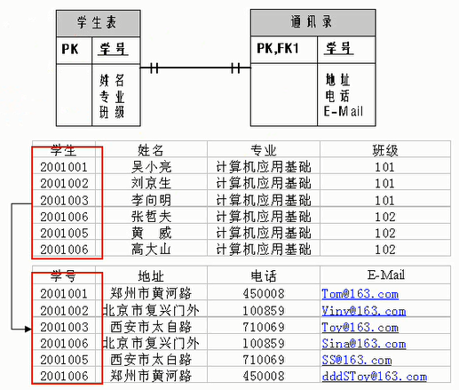
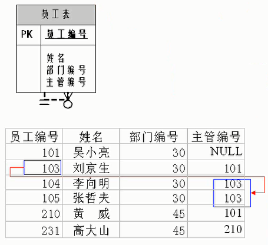
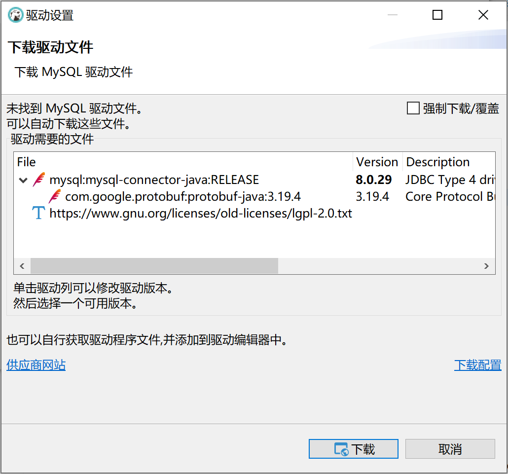

*date: 2022-05-29*

## 概述

### 为什么要使用数据库
`持久化 (persistence)`：把数据保存到可掉电式存储设备中以供之后使用。大多数情况下，特别是企业级应用，数据持久化意味着将内存中的数据保存到硬盘上加以 "固化"，而持久化的实现过程大多通过各种关系数据库来完成。

持久化的主要作用是将内存中的数据存储在关系型数据库中，当然也可以存储在磁盘文件、XML 数据文件中等。


### 数据库与数据库管理系统

#### 数据库的相关概念

`DB`：Database，数据库，即存储数据的 "仓库"，其本质是一个文件系统。它保存了一系列有组织的数据。

`DBMS`：Database Management System，数据库管理系统，是一种操纵和管理数据库的大型软件，用于建立、使用和维护数据库，对数据库进行统一管理和控制。用户通过数据库管理系统访问数据库中表内的数据。

`SQL`：Structured Query Language，结构化查询语言，专门用来与数据库通信的语言。

#### 数据库与数据库管理系统的关系

`数据库管理系统 (DBMS) 可以管理多个数据库`，一般开发人员会针对每一个应用创建一个数据库。为保存应用中实体的数据，一般会在数据库创建多个表，以保存程序中实体用户的数据。

数据库管理系统、数据库和表的关系如图所示：


#### 常见的数据库管理系统排名

目前互联网上常见的数据库管理软件有 Oracle、MySQL、SQL Server、DB2、PostgreSQL、Access、Sybase、Informix 这几种。以下是 2022 年 5 月 DB-Engines Ranking 对各数据库受欢迎程度进行调查后的统计结果（查看数据库最新排名：https://db-engines.com/en/ranking）：


对应的走势图（https://db-engines.com/en/ranking_trend）：


#### 常见的数据库介绍

`Oracle`

1979 年，Oracle 2 诞生，它是第一个商用的 RDBMS（关系型数据库管理系统）。随着 Oracle 软件的名气越来越大，公司也改名叫 Oracle 公司。

2007 年，总计 85 亿美金收购 BEA Systems。

2009 年，总计 74 亿美金收购 SUN。此前的 2008 年，SUN 以 10 亿美金收购 MySQL。意味着 Oracle 同时拥有了 MySQL 的管理权，至此 Oracle 在数据库领域中成为绝对的领导者。

2013 年，Oracle超越 IBM，成为继 Microsoft 后全球第二大软件公司。如今 Oracle 的年收入达到了 400 亿美金，足以证明商用（收费）数据库软件的价值。

`SQL Server`

SQL Server 是微软开发的大型商业数据库，诞生于 1989 年。C#、.net 等语言常使用，与 WinNT 完全集成，也可以很好地与 Microsoft BackOffice 产品集成。

`DB2`

IBM 公司的数据库产品，收费的。常应用在银行系统中。

`PostgreSQL`

PostgreSQL 的稳定性极强，最符合 SQL 标准，开放源码，具备商业级 DBMS 质量。PG 对数据量大的文本以及 SQL 处理较快。

`SyBase`

已经淡出历史舞台。提供了一个非常专业数据建模的工具 PowerDesigner。

`SQLite`

嵌入式的小型数据库，应用在手机端。 零配置，SQlite3 不用安装，不用配置，不用启动，关闭或者配置数据库实例。当系统崩溃后不用做任何恢复操作，在下次使用数据库的时候自动恢复。

`informix`

IBM 公司出品，取自 Information 和 Unix 的结合，它是第一个被移植到 Linux 上的商业数据库产品。仅运行于 unix/linux 平台，命令行操作。 性能较高，支持集群，适应于安全性要求极高的系统，尤其是银行，证券系统的应用。

### RDBMS 与非 RDBMS

从排名中我们能看出来，关系型数据库绝对是 DBMS 的主流，其中使用最多的 DBMS 分别是 Oracle、MySQL 和 SQL Server。这些都是关系型数据库（RDBMS）。

#### 关系型数据库（RDBMS）

这种类型的数据库是`最古老`的数据库类型，关系型数据库模型是把复杂的数据结构归结为简单的`二元关系 (即二维表格形式)`。


关系型数据库以`行(row)`和`列(column)`的形式存储数据，以便于用户理解。这一系列的行和列被称为`表(table)`，一组表组成了一个`库(database)`。

表与表之间的数据记录有`关系 (relationship)`。现实世界中的各种实体以及实体之间的各种联系均用`关系模型`来表示。`关系型数据库，就是建立在关系模型基础上的数据库。`

SQL 就是关系型数据库的查询语言。


关系型数据库的优势：

- `复杂查询`：可以用 SQL 语句方便的在一个表以及多个表之间做非常复杂的数据查询。
- `事务支持`：使得对于安全性能很高的数据访问要求得以实现。

#### 非关系型数据库（非 RDBMS）

非关系型数据库，可看成传统关系型数据库的功能阉割版本，基于键值对存储数据，不需要经过 SQL 层的解析，性能非常高 。同时，通过减少不常用的功能，进一步提高性能。

目前基本上大部分主流的非关系型数据库都是免费的。

##### 非关系型数据库分类

相比于 SQL，`NoSQL`泛指非关系型数据库，包括了榜单上的`键值型数据库`、`文档型数据库`、`搜索引擎数据库`和`列存储数据库`等，除此以外还包括`图形数据库`。也只有用 NoSQL 一词才能将这些技术囊括进来。

###### 键值型数据库

键值型数据库通过`Key-Value`键值的方式来存储数据，其中 Key 和 Value 可以是简单的对象，也可以是复杂的对象。`Key 作为唯一的标识符`，`优点是查找速度快`，在这方面明显优于关系型数据库，`缺点是无法像关系型数据库一样使用条件过滤 (比如 WHERE)`，如果你不知道去哪里找数据，就要遍历所有的键，这就会消耗大量的计算。

键值型数据库典型的使用场景是作为`内存缓存`。`Redis`是最流行的键值型数据库。


###### 文档型数据库

此类数据库可存放并获取文档，可以是 XML、JSON 等格式。在数据库中文档作为处理信息的基本单位，一个文档就相当于一条记录。文档数据库所存放的文档，就相当于键值数据库所存放的 "值"。`MongoDB`是最流行的文档型数据库，此外，还有 CouchDB 等。

###### 搜索引擎数据库

虽然关系型数据库采用了索引提升检索效率，但是针对全文索引效率却较低。搜索引擎数据库是应用在搜索引擎领域的数据存储形式，由于搜索引擎会爬取大量的数据，并以特定的格式进行存储，这样在检索的时候才能保证性能最优。核心原理是`倒排索引`。

典型产品：`Solr`、`Elasticsearch`、`Splunk`等。

###### 列存储数据库

列存储数据库是相对于行存储的数据库，Oracle、MySQL、SQL Server 等数据库都是采用的行式存储（Row-based），而列存储数据库是将数据按照列存储到数据库中，这样做的好处是可以大量降低系统的 I/O，适合于分布式文件系统，不足在于功能相对有限。典型产品：`HBase`等。


###### 图形数据库

图形数据库，利用了图这种数据结构存储了实体（对象）之间的关系。图形数据库最典型的例子就是社交网络中人与人的关系，数据模型主要是以节点和边（关系）来实现，特点在于`能高效地解决复杂的关系问题`。

图形数据库顾名思义，就是一种存储图形关系的数据库。它利用了图这种数据结构存储了实体（对象）之间的关系。关系型数据用于存储明确关系的数据，但对于复杂关系的数据存储却有些力不从心。如社交网络中人物之间的关系，如果用关系型数据库则非常复杂，用图形数据库将非常简单。典型产品：`Neo4J`、`InfoGrid`等。


##### NoSQL 的演变

由于 SQL 一直称霸 DBMS，因此许多人在思考是否有一种数据库技术能远离 SQL，于是 NoSQL 诞生了，但是随着发展却发现越来越离不开 SQL。到目前为止 NoSQL 阵营中的 DBMS 都会有实现类似 SQL 的功能。下面是 NoSQL 这个名词在不同时期的诠释，从这些释义的变化中可以看出 NoSQL 功能的演变 ：

1970：NoSQL = We have no SQL

1980：NoSQL = Know SQL

2000：NoSQL = No SQL!

2005：NoSQL = Not only SQL

2013：NoSQL = No, SQL!

NoSQL 对 SQL 做出了很好的补充，比如实际开发中，有很多业务需求，其实并不需要完整的关系型数据库功能，非关系型数据库的功能就足够使用了。这种情况下，使用性能更高、成本更低的非关系型数据库当然是更明智的选择。比如：日志收集、排行榜、定时器等。

总而言之，虽然 NoSQL 的分类很多，但即便如此，在 DBMS 排名中，还是 SQL 阵营的比重更大，影响力前 5 的 DBMS 中有 4 个是关系型数据库，而排名前 20 的 DBMS 中也有 12 个是关系型数据库。所以说，掌握 SQL 是非常有必要的。

### 关系型数据库设计规则

- 关系型数据库的典型数据结构就是`数据表` ，这些数据表的组成都是结构化的（Structured）。

- 将数据放到表中，表再放到库中。

- 一个数据库中可以有多个表，每个表都有一个名字，用来标识自己。表名具有`唯一性`。

- 表具有一些特性，这些特性定义了数据在表中如何存储，类似 Java 和 Python 中类的设计。

####  表、记录、字段

`E-R (entity-relationship，实体-联系)`模型中有三个主要概念是：`实体集`、`属性`、`联系集`。

一个实体集（class）对应于数据库中的一个表（table），一个实体（instance）则对应于数据库表中的一行（row），也称为一条记录（record）。一个属性（attribute）对应于数据库表中的一列（column），也称为一个字段（field）。


`ORM 思想 (Object Relational Mapping)`体现：

- 数据库中的一个表 <---> Java 或 Python 中的一个类。

- 表中的一条数据 <---> 类中的一个对象（或实体）。

- 表中的一个列 <----> 类中的一个字段、属性（field）。

#### 表的关联关系

- 表与表之间的数据记录有关系（relationship）。现实世界中的各种实体以及实体之间的各种联系均用关系模型来表示。

- 四种：一对一关联、一对多关联、多对多关联、自我引用。

#####  一对一关联（one-to-one）

在实际的开发中应用不多，因为一对一可以创建成一张表。

一对一关联两种建表原则：

- `外键唯一`：主表的主键和从表的外键（唯一），形成主外键关系，外键唯一。
- `外键是主键`：主表的主键和从表的主键，形成主外键关系。

举例，设计学生表 ：学号、姓名、手机号码、班级、系别、身份证号码、家庭住址、籍贯、紧急联系人、...

- 拆为两个表：两个表的记录是一一对应关系。

- 基础信息表（常用信息）：学号、姓名、手机号码、班级、系别。

- 档案信息表（不常用信息）：学号、身份证号码、家庭住址、籍贯、紧急联系人、...

  

##### 一对多关联（one-to-many）

常见实例场景：客户表和订单表，分类表和商品表，部门表和员工表。

一对多关联建表原则：`在从表 (多方) 创建一个字段，字段作为外键指向主表 (一方) 的主键。`


举例：

- 员工表：编号、姓名、...、所属部门。

- 部门表：编号、名称、简介。

  

  

##### 多对多关联（many-to-many）

要表示多对多关联，必须创建第三个表，该表通常称为`联接表`，它将多对多关系划分为两个一对多关系。将这两个表的主键都插入到第三个表中。


多对多关联建表原则：`需要创建第三张表，中间表中至少两个字段，这两个字段分别作为外键指向各自一方的主键。`

举例 1：学生-课程

- 学生信息表 ：一行代表一个学生的信息（学号、姓名、手机号码、班级、系别...）。

- 课程信息表 ：一行代表一个课程的信息（课程编号、授课老师、简介...）。

- 选课信息表 ：一个学生可以选多门课，一门课可以被多个学生选择。

  

举例 2：产品-订单

- 订单表和产品表有一种多对多的关系，这种关系是通过与订单明细表建立两个一对多关系来定义的。一个订单可以有多个产品，每个产品可以出现在多个订单中。

- 产品表 ：产品表中的每条记录表示一个产品。

- 订单表 ：订单表中的每条记录表示一个订单。

- 订单明细表 ：每个产品可以与订单表中的多条记录对应，即出现在多个订单中。一个订单可以与产品表中的多条记录对应，即包含多个产品。

  

举例 3：用户-角色

- 一个用户，可能存在多个角色。

  

##### 自我引用（Self reference）



### MySQL 介绍


- MySQL 是一个`开放源代码的关系型数据库管理系统`，由瑞典 MySQL AB（创始人 Michael Widenius）公司 1995 年开发，迅速成为开源数据库的 No.1。
- 2008 被 Sun 收购（10 亿美金），2009 年 Sun 被 Oracle 收购。`MariaDB`应运而生。（MySQL 的创造者担心 MySQL 有闭源的风险，因此创建了 MySQL 的分支项目 MariaDB）
- MySQL 6.x 版本之后分为`社区版`和`商业版`。
- MySQL 是一种关联数据库管理系统，将数据保存在不同的表中，而不是将所有数据放在一个大仓库内，这样就增加了速度并提高了灵活性。
- MySQL 是开源的，所以你不需要支付额外的费用。
- MySQL 是可以定制的，采用了`GPL (GNU General Public License) 协议`，你可以修改源码来开发自己的 MySQL 系统。
- MySQL 支持大型的数据库。可以处理拥有上千万条记录的大型数据库。
- MySQL 支持大型数据库，支持 5000 万条记录的数据仓库，32 位系统表文件最大可支持 4 GB ，64 位系统支持最大的表文件为`8 TB`。
- MySQL 使用`标准的 SQL 数据语言`形式。
- MySQL 可以允许运行于多个系统上，并且支持多种语言。这些编程语言包括 C、C++、Python、Java、Perl、PHP 和 Ruby 等。

#### MySQL 发展史重大事件

MySQL 的历史就是整个互联网的发展史。互联网业务从社交领域、电商领域到金融领域的发展，推动着应用对数据库的需求提升，对传统的数据库服务能力提出了挑战。高并发、高性能、高可用、轻资源、易维护、易扩展的需求，促进了 MySQL 的长足发展。


#### 关于 MySQL 8.0

`MySQL 从 5.7 版本直接跳跃发布了 8.0 版本`，可见这是一个令人兴奋的里程碑版本。MySQL 8 版本在功能上做了显著的改进与增强，开发者对 MySQL 的源代码进行了重构，最突出的一点是对 MySQL Optimizer 优化器进行了改进。不仅在速度上得到了改善，还为用户带来了更好的性能和更棒的体验。

#### Why choose MySQL


为什么如此多的厂商要选用 MySQL？大概总结的原因主要有以下几点：

1. 开放源代码，使用成本低。
2. 性能卓越，服务稳定。
3. 软件体积小，使用简单，并且易于维护。
4. 历史悠久，社区用户非常活跃，遇到问题可以寻求帮助。
5. 许多互联网公司在用，经过了时间的验证。

#### Oracle VS MySQL

Oracle 更适合大型跨国企业的使用，因为他们对费用不敏感，但是对性能要求以及安全性有更高的要求。

MySQL 由于其`体积小`、`速度快`、`总体拥有成本低`，`可处理上千万条记录`的大型数据库，尤其是`开放源码`这一特点，使得很多互联网公司、中小型网站选择了 MySQL 作为网站数据库（Facebook，Twitter，YouTube，阿里巴巴/蚂蚁金服，去哪儿，美团外卖，腾讯）。

### SQL 语言

1946 年，世界上第一台电脑诞生，如今，借由这台电脑发展起来的互联网已经自成江湖。在这几十年里，无数的技术、产业在这片江湖里沉浮，有的方兴未艾，有的已经几幕兴衰。但在这片浩荡的波动里，有一门技术从未消失，甚至老当益壮，那就是 SQL。

45 年前，也就是 1974 年，IBM 研究员发布了一篇揭开数据库技术的论文《SEQUEL：一门结构化的英语查询语言》，直到今天这门结构化的查询语言并没有太大的变化，相比于其他语言， SQL 的半衰期可以说是非常长了。

不论是前端工程师，还是后端算法工程师，都一定会和数据打交道，都需要了解如何又快又准确地提取自己想要的数据。更别提数据分析师了，他们的工作就是和数据打交道，整理不同的报告，以便指导业务决策。

`SQL (Structured Query Language，结构化查询语言)`是使用关系模型的数据库应用语言，与数据直接打交道，由 IBM 上世纪70年代开发出来。后由美国国家标准局（ANSI）开始着手制定 SQL 标准，先后有 SQL-86，SQL-89，SQL-92，SQL-99 等标准。

SQL 有两个重要的标准，分别是`SQL-92`和`SQL-99`，它们分别代表了 92 年和 99 年颁布的 SQL 标准，我们今天使用的 SQL 语言依然遵循这些标准。

>SQL 存在不同版本的标准规范，因为不同规范下的表连接操作是有区别的。
>
>SQL 有两个主要的标准，分别是 SQL-92 和 SQL-99。92 和 99 代表了标准提出的时间，SQL-92 就是 92 年提出的标准规范。当然除了 SQL-92 和 SQL-99 以外，还存在 SQL-86、SQL-89、SQL:2003、SQL:2008、SQL:2011 和 SQL:2016 等其他的标准。
>
>这么多标准，到底该学习哪个呢？实际上最重要的 SQL 标准就是 SQL-92 和 SQL-99。一般来说 SQL-92 的形式更简单，但是写的 SQL 语句会比较长，可读性较差。而 SQL-99 相比于 SQL-92 来说，语法更加复杂，但可读性更强。我们从这两个标准发布的页数也能看出，SQL-92 的标准有 500 页，而 SQL-99 标准超过了 1000 页。实际上从 SQL-99 之后，很少有人能掌握所有内容，因为确实太多了。就好比我们使用 Windows、Linux 和 Office 的时候，很少有人能掌握全部内容一样。我们只需要掌握一些核心的功能，满足日常工作的需求即可。
>
>SQL-92 和 SQL-99 是经典的 SQL 标准，也分别叫做 SQL-2 和 SQL-3 标准。也正是在这两个标准发布之后，SQL 影响力越来越大，甚至超越了数据库领域。现如今 SQL 已经不仅仅是数据库领域的主流语言，还是信息领域中信息处理的主流语言。在图形检索、图像检索以及语音检索中都能看到 SQL 语言的使用。

不同的数据库生产厂商都支持 SQL 语句，但都有特有内容：


#### SQL 语言的分类

SQL 语言在功能上主要分为如下三大类：

- **`DDL (Data Definition Languages，数据定义语言)`**：这些语句定义了不同的数据库、表、视图、索引等数据库对象，还可以用来创建、删除、修改数据库和数据表的结构。
  - 主要的语句关键字包括`CREATE`、`DROP`、`ALTER`等。
- **`DML (Data Manipulation Language，数据操作语言)`**：用于添加、删除、更新和查询数据库记录，并检查数据完整性。
  - 主要的语句关键字包括`INSERT`、`DELETE`、`UPDATE`、`SELECT`等。
  - `SELECT 是 SQL 语言的基础，最为重要。`
- **`DCL (Data Control Language，数据控制语言)`**：用于定义数据库、表、字段、用户的访问权限和安全级别。
  - 主要的语句关键字包括`GRANT`、`REVOKE`、`COMMIT`、`ROLLBACK`、`SAVEPOINT`等。

>因为查询语句使用的非常的频繁，所以很多人把查询语句单拎出来一类：`DQL (Data Query Language，数据查询语言)`。
>
>还有单独将 COMMIT 、 ROLLBACK 取出来的，称为`TCL (Transaction Control Language，事务控制语言)`。

#### SQL 语言的规则与规范

##### 基本规则

- SQL 可以写在一行或者多行。为了提高可读性，各子句分行写，必要时使用缩进。
- 每条命令以`;`或`\g`或`\G`结束。
- 关键字不能被缩写也不能分行。
- 关于标点符号：
  - 必须保证所有的 ()、单引号、双引号是成对结束的。
  - 必须使用英文状态下的半角输入方式。
  - 字符串型和日期时间类型的数据可以使用单引号（''）表示。
  - 列的别名，尽量使用双引号（""），而且不建议省略 as。

##### SQL大小写规范

- MySQL 在 Windows 环境下是大小写不敏感的。
- MySQL 在 Linux 环境下是大小写敏感的。
- 数据库名、表名、表的别名、变量名是严格区分大小写的。
  - 关键字、函数名、列名（字段名）、列的别名（字段的别名）是忽略大小写的。
- 推荐采用统一的书写规范：
  - `数据库名、表名、表别名、字段名、字段别名等都小写。`
  - `SQL 关键字、函数名、绑定变量等都大写。`

- 以上规范，建议遵守。

##### 注释

可以使用如下格式的注释结构：

- 单行注释：`#注释文字 (MySQL 特有的方式)`
- 单行注释：`-- 注释文字 (--后面必须包含一个空格。)`
- 多行注释：`/* 注释文字 */`

##### 命名规则

- 数据库、表名不能超过 30 个字符，变量名限制为 29 个字符。
- 只能包含 A–Z，a–z，0–9 和 _ 共 63 个字符。
- 数据库名、表名、字段名等对象名中间不要包含空格。
- 同一个 MySQL 软件中，数据库不能同名；同一个库中，表不能重名；同一个表中，字段不能重名。
- 字段不能和保留字、数据库系统或常用方法冲突。如果必须使用，需在 SQL 语句中使用`` (着重号)`引起来。
- 保持字段名和类型的一致性，在命名字段并为其指定数据类型的时候一定要保证一致性。假如数据类型在一个表里是整数，那在另一个表里可就别变成字符型了。

##### 导入指令

命令行登录 MySQL 客户端，使用`source`指令导入 sql 文件：

```sql
mysql> source /tmp/insert.sql;
```

> /tmp/insert.sql 是 sql 文件在服务器上的路径。

##  Docker 安装 MySQL

登录 https://hub.docker.com/，查看 MySQL 镜像：


选择以下版本，拉取镜像：


```bash
$ docker pull mysql:8.0.29
```

查看拉取的镜像：

```bash
$ docker images
```

启动容器：

```bash
$ docker run -d --name mysql -p 3306:3306 -v /home/xisun/datas/mysql/:/var/lib/mysql -e MYSQL_ROOT_PASSWORD=root mysql:8.0.29
```

修改容器的时间：

```bash
# 进入容器
$ docker exec -it mysql /bin/bash

# 容器内执行
$ date
$ ln -sf /usr/share/zoneinfo/Asia/Shanghai /etc/localtime

# 退出并重新进入容器
$ exit
$ docker exec -it mysql /bin/bash
```

> 参考：
>
> 

## MySQL 图形化管理工具

### DBeaver

官网：https://dbeaver.io/download/，下载方式如下：


Github：https://github.com/dbeaver/dbeaver/releases，下载方式如下：


安装程序下载后，点击安装即可。安装成功后，因为 DBeaver 是基于 Maven 构建的，数据库驱动也就是链接数据库的 JDBC 驱动是通过 Maven 仓库下载的，因此，第一步要做的是配置 Maven 镜像，否则在后续下载数据库驱动的时候会非常的慢。

点击 "窗口" ---> "首选项" ---> "连接" ---> "驱动" ---> "Maven"，设置阿里云镜像`http://maven.aliyun.com/nexus/content/groups/public/`：


配置完 Maven 仓库后，连接数据库：





更多关于 DBeaver 的使用方法，参考：https://juejin.cn/post/7065474476607012878。

>DBeaver 是用 Java 开发的，使用前需要安装 JDK 环境。

## MySQL 的基本使用

MySQL 语法规范：

- `不区分大小写`；
- 每句话用`;`或`\g`结尾；
- 各子句一般分行写；
- 关键字不能缩写，也不能分行；
- 用缩进提高语句的可读性。

进入容器，并与 MySQL 客户端交互：

```bash
[root@hadoop100 ~]# docker ps
CONTAINER ID   IMAGE          COMMAND                  CREATED       STATUS       PORTS                                                  NAMES
9ca17e09b0c1   mysql:8.0.29   "docker-entrypoint.s…"   4 hours ago   Up 4 hours   0.0.0.0:3306->3306/tcp, :::3306->3306/tcp, 33060/tcp   mysql
[root@hadoop100 ~]# docker exec -it 9ca17e09b0c1 /bin/bash
root@9ca17e09b0c1:/# ls
bin  boot  dev	docker-entrypoint-initdb.d  entrypoint.sh  etc	home  lib  lib64  media  mnt  opt  proc  root  run  sbin  srv  sys  tmp  usr  var
# 进入MySQL客户端，-u用户名，-p密码，-P端口
root@9ca17e09b0c1:/# mysql -uroot -proot -P3306
mysql: [Warning] Using a password on the command line interface can be insecure.
Welcome to the MySQL monitor.  Commands end with ; or \g.
Your MySQL connection id is 15
Server version: 8.0.29 MySQL Community Server - GPL

Copyright (c) 2000, 2022, Oracle and/or its affiliates.

Oracle is a registered trademark of Oracle Corporation and/or its
affiliates. Other names may be trademarks of their respective
owners.

Type 'help;' or '\h' for help. Type '\c' to clear the current input statement.

mysql>
```

- 执行建库脚本：

  ```mysql
  /*
  SQLyog Ultimate v12.08 (64 bit)
  MySQL - 5.7.28-log : Database - atguigudb
  *********************************************************************
  */
  
  
  /*!40101 SET NAMES utf8 */;
  
  /*!40101 SET SQL_MODE=''*/;
  
  /*!40014 SET @OLD_UNIQUE_CHECKS=@@UNIQUE_CHECKS, UNIQUE_CHECKS=0 */;
  /*!40014 SET @OLD_FOREIGN_KEY_CHECKS=@@FOREIGN_KEY_CHECKS, FOREIGN_KEY_CHECKS=0 */;
  /*!40101 SET @OLD_SQL_MODE=@@SQL_MODE, SQL_MODE='NO_AUTO_VALUE_ON_ZERO' */;
  /*!40111 SET @OLD_SQL_NOTES=@@SQL_NOTES, SQL_NOTES=0 */;
  CREATE DATABASE /*!32312 IF NOT EXISTS*/`atguigudb` /*!40100 DEFAULT CHARACTER SET utf8 */;
  
  USE `atguigudb`;
  
  /*Table structure for table `countries` */
  
  DROP TABLE IF EXISTS `countries`;
  
  CREATE TABLE `countries` (
    `country_id` char(2) NOT NULL,
    `country_name` varchar(40) DEFAULT NULL,
    `region_id` int(11) DEFAULT NULL,
    PRIMARY KEY (`country_id`),
    KEY `countr_reg_fk` (`region_id`),
    CONSTRAINT `countr_reg_fk` FOREIGN KEY (`region_id`) REFERENCES `regions` (`region_id`)
  ) ENGINE=InnoDB DEFAULT CHARSET=utf8;
  
  /*Data for the table `countries` */
  
  insert  into `countries`(`country_id`,`country_name`,`region_id`) values ('AR','Argentina',2),('AU','Australia',3),('BE','Belgium',1),('BR','Brazil',2),('CA','Canada',2),('CH','Switzerland',1),('CN','China',3),('DE','Germany',1),('DK','Denmark',1),('EG','Egypt',4),('FR','France',1),('HK','HongKong',3),('IL','Israel',4),('IN','India',3),('IT','Italy',1),('JP','Japan',3),('KW','Kuwait',4),('MX','Mexico',2),('NG','Nigeria',4),('NL','Netherlands',1),('SG','Singapore',3),('UK','United Kingdom',1),('US','United States of America',2),('ZM','Zambia',4),('ZW','Zimbabwe',4);
  
  /*Table structure for table `departments` */
  
  DROP TABLE IF EXISTS `departments`;
  
  CREATE TABLE `departments` (
    `department_id` int(4) NOT NULL DEFAULT '0',
    `department_name` varchar(30) NOT NULL,
    `manager_id` int(6) DEFAULT NULL,
    `location_id` int(4) DEFAULT NULL,
    PRIMARY KEY (`department_id`),
    UNIQUE KEY `dept_id_pk` (`department_id`),
    KEY `dept_loc_fk` (`location_id`),
    KEY `dept_mgr_fk` (`manager_id`),
    CONSTRAINT `dept_loc_fk` FOREIGN KEY (`location_id`) REFERENCES `locations` (`location_id`),
    CONSTRAINT `dept_mgr_fk` FOREIGN KEY (`manager_id`) REFERENCES `employees` (`employee_id`)
  ) ENGINE=InnoDB DEFAULT CHARSET=utf8;
  
  /*Data for the table `departments` */
  
  insert  into `departments`(`department_id`,`department_name`,`manager_id`,`location_id`) values (10,'Administration',200,1700),(20,'Marketing',201,1800),(30,'Purchasing',114,1700),(40,'Human Resources',203,2400),(50,'Shipping',121,1500),(60,'IT',103,1400),(70,'Public Relations',204,2700),(80,'Sales',145,2500),(90,'Executive',100,1700),(100,'Finance',108,1700),(110,'Accounting',205,1700),(120,'Treasury',NULL,1700),(130,'Corporate Tax',NULL,1700),(140,'Control And Credit',NULL,1700),(150,'Shareholder Services',NULL,1700),(160,'Benefits',NULL,1700),(170,'Manufacturing',NULL,1700),(180,'Construction',NULL,1700),(190,'Contracting',NULL,1700),(200,'Operations',NULL,1700),(210,'IT Support',NULL,1700),(220,'NOC',NULL,1700),(230,'IT Helpdesk',NULL,1700),(240,'Government Sales',NULL,1700),(250,'Retail Sales',NULL,1700),(260,'Recruiting',NULL,1700),(270,'Payroll',NULL,1700);
  
  /*Table structure for table `employees` */
  
  DROP TABLE IF EXISTS `employees`;
  
  CREATE TABLE `employees` (
    `employee_id` int(6) NOT NULL DEFAULT '0',
    `first_name` varchar(20) DEFAULT NULL,
    `last_name` varchar(25) NOT NULL,
    `email` varchar(25) NOT NULL,
    `phone_number` varchar(20) DEFAULT NULL,
    `hire_date` date NOT NULL,
    `job_id` varchar(10) NOT NULL,
    `salary` double(8,2) DEFAULT NULL,
    `commission_pct` double(2,2) DEFAULT NULL,
    `manager_id` int(6) DEFAULT NULL,
    `department_id` int(4) DEFAULT NULL,
    PRIMARY KEY (`employee_id`),
    UNIQUE KEY `emp_email_uk` (`email`),
    UNIQUE KEY `emp_emp_id_pk` (`employee_id`),
    KEY `emp_dept_fk` (`department_id`),
    KEY `emp_job_fk` (`job_id`),
    KEY `emp_manager_fk` (`manager_id`),
    CONSTRAINT `emp_dept_fk` FOREIGN KEY (`department_id`) REFERENCES `departments` (`department_id`),
    CONSTRAINT `emp_job_fk` FOREIGN KEY (`job_id`) REFERENCES `jobs` (`job_id`),
    CONSTRAINT `emp_manager_fk` FOREIGN KEY (`manager_id`) REFERENCES `employees` (`employee_id`)
  ) ENGINE=InnoDB DEFAULT CHARSET=utf8;
  
  /*Data for the table `employees` */
  
  insert  into `employees`(`employee_id`,`first_name`,`last_name`,`email`,`phone_number`,`hire_date`,`job_id`,`salary`,`commission_pct`,`manager_id`,`department_id`) values (100,'Steven','King','SKING','515.123.4567','1987-06-17','AD_PRES',24000.00,NULL,NULL,90),(101,'Neena','Kochhar','NKOCHHAR','515.123.4568','1989-09-21','AD_VP',17000.00,NULL,100,90),(102,'Lex','De Haan','LDEHAAN','515.123.4569','1993-01-13','AD_VP',17000.00,NULL,100,90),(103,'Alexander','Hunold','AHUNOLD','590.423.4567','1990-01-03','IT_PROG',9000.00,NULL,102,60),(104,'Bruce','Ernst','BERNST','590.423.4568','1991-05-21','IT_PROG',6000.00,NULL,103,60),(105,'David','Austin','DAUSTIN','590.423.4569','1997-06-25','IT_PROG',4800.00,NULL,103,60),(106,'Valli','Pataballa','VPATABAL','590.423.4560','1998-02-05','IT_PROG',4800.00,NULL,103,60),(107,'Diana','Lorentz','DLORENTZ','590.423.5567','1999-02-07','IT_PROG',4200.00,NULL,103,60),(108,'Nancy','Greenberg','NGREENBE','515.124.4569','1994-08-17','FI_MGR',12000.00,NULL,101,100),(109,'Daniel','Faviet','DFAVIET','515.124.4169','1994-08-16','FI_ACCOUNT',9000.00,NULL,108,100),(110,'John','Chen','JCHEN','515.124.4269','1997-09-28','FI_ACCOUNT',8200.00,NULL,108,100),(111,'Ismael','Sciarra','ISCIARRA','515.124.4369','1997-09-30','FI_ACCOUNT',7700.00,NULL,108,100),(112,'Jose Manuel','Urman','JMURMAN','515.124.4469','1998-03-07','FI_ACCOUNT',7800.00,NULL,108,100),(113,'Luis','Popp','LPOPP','515.124.4567','1999-12-07','FI_ACCOUNT',6900.00,NULL,108,100),(114,'Den','Raphaely','DRAPHEAL','515.127.4561','1994-12-07','PU_MAN',11000.00,NULL,100,30),(115,'Alexander','Khoo','AKHOO','515.127.4562','1995-05-18','PU_CLERK',3100.00,NULL,114,30),(116,'Shelli','Baida','SBAIDA','515.127.4563','1997-12-24','PU_CLERK',2900.00,NULL,114,30),(117,'Sigal','Tobias','STOBIAS','515.127.4564','1997-07-24','PU_CLERK',2800.00,NULL,114,30),(118,'Guy','Himuro','GHIMURO','515.127.4565','1998-11-15','PU_CLERK',2600.00,NULL,114,30),(119,'Karen','Colmenares','KCOLMENA','515.127.4566','1999-08-10','PU_CLERK',2500.00,NULL,114,30),(120,'Matthew','Weiss','MWEISS','650.123.1234','1996-07-18','ST_MAN',8000.00,NULL,100,50),(121,'Adam','Fripp','AFRIPP','650.123.2234','1997-04-10','ST_MAN',8200.00,NULL,100,50),(122,'Payam','Kaufling','PKAUFLIN','650.123.3234','1995-05-01','ST_MAN',7900.00,NULL,100,50),(123,'Shanta','Vollman','SVOLLMAN','650.123.4234','1997-10-10','ST_MAN',6500.00,NULL,100,50),(124,'Kevin','Mourgos','KMOURGOS','650.123.5234','1999-11-16','ST_MAN',5800.00,NULL,100,50),(125,'Julia','Nayer','JNAYER','650.124.1214','1997-07-16','ST_CLERK',3200.00,NULL,120,50),(126,'Irene','Mikkilineni','IMIKKILI','650.124.1224','1998-09-28','ST_CLERK',2700.00,NULL,120,50),(127,'James','Landry','JLANDRY','650.124.1334','1999-01-14','ST_CLERK',2400.00,NULL,120,50),(128,'Steven','Markle','SMARKLE','650.124.1434','2000-03-08','ST_CLERK',2200.00,NULL,120,50),(129,'Laura','Bissot','LBISSOT','650.124.5234','1997-08-20','ST_CLERK',3300.00,NULL,121,50),(130,'Mozhe','Atkinson','MATKINSO','650.124.6234','1997-10-30','ST_CLERK',2800.00,NULL,121,50),(131,'James','Marlow','JAMRLOW','650.124.7234','1997-02-16','ST_CLERK',2500.00,NULL,121,50),(132,'TJ','Olson','TJOLSON','650.124.8234','1999-04-10','ST_CLERK',2100.00,NULL,121,50),(133,'Jason','Mallin','JMALLIN','650.127.1934','1996-06-14','ST_CLERK',3300.00,NULL,122,50),(134,'Michael','Rogers','MROGERS','650.127.1834','1998-08-26','ST_CLERK',2900.00,NULL,122,50),(135,'Ki','Gee','KGEE','650.127.1734','1999-12-12','ST_CLERK',2400.00,NULL,122,50),(136,'Hazel','Philtanker','HPHILTAN','650.127.1634','2000-02-06','ST_CLERK',2200.00,NULL,122,50),(137,'Renske','Ladwig','RLADWIG','650.121.1234','1995-07-14','ST_CLERK',3600.00,NULL,123,50),(138,'Stephen','Stiles','SSTILES','650.121.2034','1997-10-26','ST_CLERK',3200.00,NULL,123,50),(139,'John','Seo','JSEO','650.121.2019','1998-02-12','ST_CLERK',2700.00,NULL,123,50),(140,'Joshua','Patel','JPATEL','650.121.1834','1998-04-06','ST_CLERK',2500.00,NULL,123,50),(141,'Trenna','Rajs','TRAJS','650.121.8009','1995-10-17','ST_CLERK',3500.00,NULL,124,50),(142,'Curtis','Davies','CDAVIES','650.121.2994','1997-01-29','ST_CLERK',3100.00,NULL,124,50),(143,'Randall','Matos','RMATOS','650.121.2874','1998-03-15','ST_CLERK',2600.00,NULL,124,50),(144,'Peter','Vargas','PVARGAS','650.121.2004','1998-07-09','ST_CLERK',2500.00,NULL,124,50),(145,'John','Russell','JRUSSEL','011.44.1344.429268','1996-10-01','SA_MAN',14000.00,0.40,100,80),(146,'Karen','Partners','KPARTNER','011.44.1344.467268','1997-01-05','SA_MAN',13500.00,0.30,100,80),(147,'Alberto','Errazuriz','AERRAZUR','011.44.1344.429278','1997-03-10','SA_MAN',12000.00,0.30,100,80),(148,'Gerald','Cambrault','GCAMBRAU','011.44.1344.619268','1999-10-15','SA_MAN',11000.00,0.30,100,80),(149,'Eleni','Zlotkey','EZLOTKEY','011.44.1344.429018','2000-01-29','SA_MAN',10500.00,0.20,100,80),(150,'Peter','Tucker','PTUCKER','011.44.1344.129268','1997-01-30','SA_REP',10000.00,0.30,145,80),(151,'David','Bernstein','DBERNSTE','011.44.1344.345268','1997-03-24','SA_REP',9500.00,0.25,145,80),(152,'Peter','Hall','PHALL','011.44.1344.478968','1997-08-20','SA_REP',9000.00,0.25,145,80),(153,'Christopher','Olsen','COLSEN','011.44.1344.498718','1998-03-30','SA_REP',8000.00,0.20,145,80),(154,'Nanette','Cambrault','NCAMBRAU','011.44.1344.987668','1998-12-09','SA_REP',7500.00,0.20,145,80),(155,'Oliver','Tuvault','OTUVAULT','011.44.1344.486508','1999-11-23','SA_REP',7000.00,0.15,145,80),(156,'Janette','King','JKING','011.44.1345.429268','1996-01-30','SA_REP',10000.00,0.35,146,80),(157,'Patrick','Sully','PSULLY','011.44.1345.929268','1996-03-04','SA_REP',9500.00,0.35,146,80),(158,'Allan','McEwen','AMCEWEN','011.44.1345.829268','1996-08-01','SA_REP',9000.00,0.35,146,80),(159,'Lindsey','Smith','LSMITH','011.44.1345.729268','1997-03-10','SA_REP',8000.00,0.30,146,80),(160,'Louise','Doran','LDORAN','011.44.1345.629268','1997-12-15','SA_REP',7500.00,0.30,146,80),(161,'Sarath','Sewall','SSEWALL','011.44.1345.529268','1998-11-03','SA_REP',7000.00,0.25,146,80),(162,'Clara','Vishney','CVISHNEY','011.44.1346.129268','1997-11-11','SA_REP',10500.00,0.25,147,80),(163,'Danielle','Greene','DGREENE','011.44.1346.229268','1999-03-19','SA_REP',9500.00,0.15,147,80),(164,'Mattea','Marvins','MMARVINS','011.44.1346.329268','2000-01-24','SA_REP',7200.00,0.10,147,80),(165,'David','Lee','DLEE','011.44.1346.529268','2000-02-23','SA_REP',6800.00,0.10,147,80),(166,'Sundar','Ande','SANDE','011.44.1346.629268','2000-03-24','SA_REP',6400.00,0.10,147,80),(167,'Amit','Banda','ABANDA','011.44.1346.729268','2000-04-21','SA_REP',6200.00,0.10,147,80),(168,'Lisa','Ozer','LOZER','011.44.1343.929268','1997-03-11','SA_REP',11500.00,0.25,148,80),(169,'Harrison','Bloom','HBLOOM','011.44.1343.829268','1998-03-23','SA_REP',10000.00,0.20,148,80),(170,'Tayler','Fox','TFOX','011.44.1343.729268','1998-01-24','SA_REP',9600.00,0.20,148,80),(171,'William','Smith','WSMITH','011.44.1343.629268','1999-02-23','SA_REP',7400.00,0.15,148,80),(172,'Elizabeth','Bates','EBATES','011.44.1343.529268','1999-03-24','SA_REP',7300.00,0.15,148,80),(173,'Sundita','Kumar','SKUMAR','011.44.1343.329268','2000-04-21','SA_REP',6100.00,0.10,148,80),(174,'Ellen','Abel','EABEL','011.44.1644.429267','1996-05-11','SA_REP',11000.00,0.30,149,80),(175,'Alyssa','Hutton','AHUTTON','011.44.1644.429266','1997-03-19','SA_REP',8800.00,0.25,149,80),(176,'Jonathon','Taylor','JTAYLOR','011.44.1644.429265','1998-03-24','SA_REP',8600.00,0.20,149,80),(177,'Jack','Livingston','JLIVINGS','011.44.1644.429264','1998-04-23','SA_REP',8400.00,0.20,149,80),(178,'Kimberely','Grant','KGRANT','011.44.1644.429263','1999-05-24','SA_REP',7000.00,0.15,149,NULL),(179,'Charles','Johnson','CJOHNSON','011.44.1644.429262','2000-01-04','SA_REP',6200.00,0.10,149,80),(180,'Winston','Taylor','WTAYLOR','650.507.9876','1998-01-24','SH_CLERK',3200.00,NULL,120,50),(181,'Jean','Fleaur','JFLEAUR','650.507.9877','1998-02-23','SH_CLERK',3100.00,NULL,120,50),(182,'Martha','Sullivan','MSULLIVA','650.507.9878','1999-06-21','SH_CLERK',2500.00,NULL,120,50),(183,'Girard','Geoni','GGEONI','650.507.9879','2000-02-03','SH_CLERK',2800.00,NULL,120,50),(184,'Nandita','Sarchand','NSARCHAN','650.509.1876','1996-01-27','SH_CLERK',4200.00,NULL,121,50),(185,'Alexis','Bull','ABULL','650.509.2876','1997-02-20','SH_CLERK',4100.00,NULL,121,50),(186,'Julia','Dellinger','JDELLING','650.509.3876','1998-06-24','SH_CLERK',3400.00,NULL,121,50),(187,'Anthony','Cabrio','ACABRIO','650.509.4876','1999-02-07','SH_CLERK',3000.00,NULL,121,50),(188,'Kelly','Chung','KCHUNG','650.505.1876','1997-06-14','SH_CLERK',3800.00,NULL,122,50),(189,'Jennifer','Dilly','JDILLY','650.505.2876','1997-08-13','SH_CLERK',3600.00,NULL,122,50),(190,'Timothy','Gates','TGATES','650.505.3876','1998-07-11','SH_CLERK',2900.00,NULL,122,50),(191,'Randall','Perkins','RPERKINS','650.505.4876','1999-12-19','SH_CLERK',2500.00,NULL,122,50),(192,'Sarah','Bell','SBELL','650.501.1876','1996-02-04','SH_CLERK',4000.00,NULL,123,50),(193,'Britney','Everett','BEVERETT','650.501.2876','1997-03-03','SH_CLERK',3900.00,NULL,123,50),(194,'Samuel','McCain','SMCCAIN','650.501.3876','1998-07-01','SH_CLERK',3200.00,NULL,123,50),(195,'Vance','Jones','VJONES','650.501.4876','1999-03-17','SH_CLERK',2800.00,NULL,123,50),(196,'Alana','Walsh','AWALSH','650.507.9811','1998-04-24','SH_CLERK',3100.00,NULL,124,50),(197,'Kevin','Feeney','KFEENEY','650.507.9822','1998-05-23','SH_CLERK',3000.00,NULL,124,50),(198,'Donald','OConnell','DOCONNEL','650.507.9833','1999-06-21','SH_CLERK',2600.00,NULL,124,50),(199,'Douglas','Grant','DGRANT','650.507.9844','2000-01-13','SH_CLERK',2600.00,NULL,124,50),(200,'Jennifer','Whalen','JWHALEN','515.123.4444','1987-09-17','AD_ASST',4400.00,NULL,101,10),(201,'Michael','Hartstein','MHARTSTE','515.123.5555','1996-02-17','MK_MAN',13000.00,NULL,100,20),(202,'Pat','Fay','PFAY','603.123.6666','1997-08-17','MK_REP',6000.00,NULL,201,20),(203,'Susan','Mavris','SMAVRIS','515.123.7777','1994-06-07','HR_REP',6500.00,NULL,101,40),(204,'Hermann','Baer','HBAER','515.123.8888','1994-06-07','PR_REP',10000.00,NULL,101,70),(205,'Shelley','Higgins','SHIGGINS','515.123.8080','1994-06-07','AC_MGR',12000.00,NULL,101,110),(206,'William','Gietz','WGIETZ','515.123.8181','1994-06-07','AC_ACCOUNT',8300.00,NULL,205,110);
  
  /*Table structure for table `job_grades` */
  
  DROP TABLE IF EXISTS `job_grades`;
  
  CREATE TABLE `job_grades` (
    `grade_level` varchar(3) DEFAULT NULL,
    `lowest_sal` int(11) DEFAULT NULL,
    `highest_sal` int(11) DEFAULT NULL
  ) ENGINE=InnoDB DEFAULT CHARSET=utf8;
  
  /*Data for the table `job_grades` */
  
  insert  into `job_grades`(`grade_level`,`lowest_sal`,`highest_sal`) values ('A',1000,2999),('B',3000,5999),('C',6000,9999),('D',10000,14999),('E',15000,24999),('F',25000,40000);
  
  /*Table structure for table `job_history` */
  
  DROP TABLE IF EXISTS `job_history`;
  
  CREATE TABLE `job_history` (
    `employee_id` int(6) NOT NULL,
    `start_date` date NOT NULL,
    `end_date` date NOT NULL,
    `job_id` varchar(10) NOT NULL,
    `department_id` int(4) DEFAULT NULL,
    PRIMARY KEY (`employee_id`,`start_date`),
    UNIQUE KEY `jhist_emp_id_st_date_pk` (`employee_id`,`start_date`),
    KEY `jhist_job_fk` (`job_id`),
    KEY `jhist_dept_fk` (`department_id`),
    CONSTRAINT `jhist_dept_fk` FOREIGN KEY (`department_id`) REFERENCES `departments` (`department_id`),
    CONSTRAINT `jhist_emp_fk` FOREIGN KEY (`employee_id`) REFERENCES `employees` (`employee_id`),
    CONSTRAINT `jhist_job_fk` FOREIGN KEY (`job_id`) REFERENCES `jobs` (`job_id`)
  ) ENGINE=InnoDB DEFAULT CHARSET=utf8;
  
  /*Data for the table `job_history` */
  
  insert  into `job_history`(`employee_id`,`start_date`,`end_date`,`job_id`,`department_id`) values (101,'1989-09-21','1993-10-27','AC_ACCOUNT',110),(101,'1993-10-28','1997-03-15','AC_MGR',110),(102,'1993-01-13','1998-07-24','IT_PROG',60),(114,'1998-03-24','1999-12-31','ST_CLERK',50),(122,'1999-01-01','1999-12-31','ST_CLERK',50),(176,'1998-03-24','1998-12-31','SA_REP',80),(176,'1999-01-01','1999-12-31','SA_MAN',80),(200,'1987-09-17','1993-06-17','AD_ASST',90),(200,'1994-07-01','1998-12-31','AC_ACCOUNT',90),(201,'1996-02-17','1999-12-19','MK_REP',20);
  
  /*Table structure for table `jobs` */
  
  DROP TABLE IF EXISTS `jobs`;
  
  CREATE TABLE `jobs` (
    `job_id` varchar(10) NOT NULL DEFAULT '',
    `job_title` varchar(35) NOT NULL,
    `min_salary` int(6) DEFAULT NULL,
    `max_salary` int(6) DEFAULT NULL,
    PRIMARY KEY (`job_id`),
    UNIQUE KEY `job_id_pk` (`job_id`)
  ) ENGINE=InnoDB DEFAULT CHARSET=utf8;
  
  /*Data for the table `jobs` */
  
  insert  into `jobs`(`job_id`,`job_title`,`min_salary`,`max_salary`) values ('AC_ACCOUNT','Public Accountant',4200,9000),('AC_MGR','Accounting Manager',8200,16000),('AD_ASST','Administration Assistant',3000,6000),('AD_PRES','President',20000,40000),('AD_VP','Administration Vice President',15000,30000),('FI_ACCOUNT','Accountant',4200,9000),('FI_MGR','Finance Manager',8200,16000),('HR_REP','Human Resources Representative',4000,9000),('IT_PROG','Programmer',4000,10000),('MK_MAN','Marketing Manager',9000,15000),('MK_REP','Marketing Representative',4000,9000),('PR_REP','Public Relations Representative',4500,10500),('PU_CLERK','Purchasing Clerk',2500,5500),('PU_MAN','Purchasing Manager',8000,15000),('SA_MAN','Sales Manager',10000,20000),('SA_REP','Sales Representative',6000,12000),('SH_CLERK','Shipping Clerk',2500,5500),('ST_CLERK','Stock Clerk',2000,5000),('ST_MAN','Stock Manager',5500,8500);
  
  /*Table structure for table `locations` */
  
  DROP TABLE IF EXISTS `locations`;
  
  CREATE TABLE `locations` (
    `location_id` int(4) NOT NULL DEFAULT '0',
    `street_address` varchar(40) DEFAULT NULL,
    `postal_code` varchar(12) DEFAULT NULL,
    `city` varchar(30) NOT NULL,
    `state_province` varchar(25) DEFAULT NULL,
    `country_id` char(2) DEFAULT NULL,
    PRIMARY KEY (`location_id`),
    UNIQUE KEY `loc_id_pk` (`location_id`),
    KEY `loc_c_id_fk` (`country_id`),
    CONSTRAINT `loc_c_id_fk` FOREIGN KEY (`country_id`) REFERENCES `countries` (`country_id`)
  ) ENGINE=InnoDB DEFAULT CHARSET=utf8;
  
  /*Data for the table `locations` */
  
  insert  into `locations`(`location_id`,`street_address`,`postal_code`,`city`,`state_province`,`country_id`) values (1000,'1297 Via Cola di Rie','00989','Roma',NULL,'IT'),(1100,'93091 Calle della Testa','10934','Venice',NULL,'IT'),(1200,'2017 Shinjuku-ku','1689','Tokyo','Tokyo Prefecture','JP'),(1300,'9450 Kamiya-cho','6823','Hiroshima',NULL,'JP'),(1400,'2014 Jabberwocky Rd','26192','Southlake','Texas','US'),(1500,'2011 Interiors Blvd','99236','South San Francisco','California','US'),(1600,'2007 Zagora St','50090','South Brunswick','New Jersey','US'),(1700,'2004 Charade Rd','98199','Seattle','Washington','US'),(1800,'147 Spadina Ave','M5V 2L7','Toronto','Ontario','CA'),(1900,'6092 Boxwood St','YSW 9T2','Whitehorse','Yukon','CA'),(2000,'40-5-12 Laogianggen','190518','Beijing',NULL,'CN'),(2100,'1298 Vileparle (E)','490231','Bombay','Maharashtra','IN'),(2200,'12-98 Victoria Street','2901','Sydney','New South Wales','AU'),(2300,'198 Clementi North','540198','Singapore',NULL,'SG'),(2400,'8204 Arthur St',NULL,'London',NULL,'UK'),(2500,'Magdalen Centre, The Oxford Science Park','OX9 9ZB','Oxford','Oxford','UK'),(2600,'9702 Chester Road','09629850293','Stretford','Manchester','UK'),(2700,'Schwanthalerstr. 7031','80925','Munich','Bavaria','DE'),(2800,'Rua Frei Caneca 1360 ','01307-002','Sao Paulo','Sao Paulo','BR'),(2900,'20 Rue des Corps-Saints','1730','Geneva','Geneve','CH'),(3000,'Murtenstrasse 921','3095','Bern','BE','CH'),(3100,'Pieter Breughelstraat 837','3029SK','Utrecht','Utrecht','NL'),(3200,'Mariano Escobedo 9991','11932','Mexico City','Distrito Federal,','MX');
  
  /*Table structure for table `order` */
  
  DROP TABLE IF EXISTS `order`;
  
  CREATE TABLE `order` (
    `order_id` int(11) DEFAULT NULL,
    `order_name` varchar(15) DEFAULT NULL
  ) ENGINE=InnoDB DEFAULT CHARSET=utf8;
  
  /*Data for the table `order` */
  
  insert  into `order`(`order_id`,`order_name`) values (1,'shkstart'),(2,'tomcat'),(3,'dubbo');
  
  /*Table structure for table `regions` */
  
  DROP TABLE IF EXISTS `regions`;
  
  CREATE TABLE `regions` (
    `region_id` int(11) NOT NULL,
    `region_name` varchar(25) DEFAULT NULL,
    PRIMARY KEY (`region_id`),
    UNIQUE KEY `reg_id_pk` (`region_id`)
  ) ENGINE=InnoDB DEFAULT CHARSET=utf8;
  
  /*Data for the table `regions` */
  
  insert  into `regions`(`region_id`,`region_name`) values (1,'Europe'),(2,'Americas'),(3,'Asia'),(4,'Middle East and Africa');
  
  /*Table structure for table `emp_details_view` */
  
  DROP TABLE IF EXISTS `emp_details_view`;
  
  /*!50001 DROP VIEW IF EXISTS `emp_details_view` */;
  /*!50001 DROP TABLE IF EXISTS `emp_details_view` */;
  
  /*!50001 CREATE TABLE  `emp_details_view`(
   `employee_id` int(6) ,
   `job_id` varchar(10) ,
   `manager_id` int(6) ,
   `department_id` int(4) ,
   `location_id` int(4) ,
   `country_id` char(2) ,
   `first_name` varchar(20) ,
   `last_name` varchar(25) ,
   `salary` double(8,2) ,
   `commission_pct` double(2,2) ,
   `department_name` varchar(30) ,
   `job_title` varchar(35) ,
   `city` varchar(30) ,
   `state_province` varchar(25) ,
   `country_name` varchar(40) ,
   `region_name` varchar(25) 
  )*/;
  
  /*View structure for view emp_details_view */
  
  /*!50001 DROP TABLE IF EXISTS `emp_details_view` */;
  /*!50001 DROP VIEW IF EXISTS `emp_details_view` */;
  
  /*!50001 CREATE ALGORITHM=UNDEFINED DEFINER=`root`@`localhost` SQL SECURITY DEFINER VIEW `emp_details_view` AS select `e`.`employee_id` AS `employee_id`,`e`.`job_id` AS `job_id`,`e`.`manager_id` AS `manager_id`,`e`.`department_id` AS `department_id`,`d`.`location_id` AS `location_id`,`l`.`country_id` AS `country_id`,`e`.`first_name` AS `first_name`,`e`.`last_name` AS `last_name`,`e`.`salary` AS `salary`,`e`.`commission_pct` AS `commission_pct`,`d`.`department_name` AS `department_name`,`j`.`job_title` AS `job_title`,`l`.`city` AS `city`,`l`.`state_province` AS `state_province`,`c`.`country_name` AS `country_name`,`r`.`region_name` AS `region_name` from (((((`employees` `e` join `departments` `d`) join `jobs` `j`) join `locations` `l`) join `countries` `c`) join `regions` `r`) where ((`e`.`department_id` = `d`.`department_id`) and (`d`.`location_id` = `l`.`location_id`) and (`l`.`country_id` = `c`.`country_id`) and (`c`.`region_id` = `r`.`region_id`) and (`j`.`job_id` = `e`.`job_id`)) */;
  
  /*!40101 SET SQL_MODE=@OLD_SQL_MODE */;
  /*!40014 SET FOREIGN_KEY_CHECKS=@OLD_FOREIGN_KEY_CHECKS */;
  /*!40014 SET UNIQUE_CHECKS=@OLD_UNIQUE_CHECKS */;
  /*!40111 SET SQL_NOTES=@OLD_SQL_NOTES */;
  ```

  ```mysql
  mysql> source /var/lib/mysql/tmp/atguigudb.sql;
  mysql> USE atguigudb;
  Database changed
  mysql> SHOW TABLES;
  +---------------------+
  | Tables_in_atguigudb |
  +---------------------+
  | countries           |
  | departments         |
  | emp_details_view    |
  | employees           |
  | job_grades          |
  | job_history         |
  | jobs                |
  | locations           |
  | order               |
  | regions             |
  +---------------------+
  10 rows in set (0.01 sec)
  ```

- 查看全部的数据库：`SHOW DATABASES;`

  ```mysql
  mysql> SHOW DATABASES;
  +--------------------+
  | Database           |
  +--------------------+
  | atguigudb          |
  | information_schema |
  | mysql              |
  | performance_schema |
  | sys                |
  +--------------------+
  5 rows in set (0.00 sec)
  ```

  - `information_schema`、`performance_schema`、`sys`和`mysql`，都是 MySQL 系统自带的数据库。

  - `information_schema`库主要保存 MySQL 数据库服务器的系统信息，比如数据库的名称、数据表的名称、字段名称、存取权限、数据文件所在的文件夹和系统使用的文件夹，等等。

  - `performance_schema`库可以用来监控 MySQL 的各类性能指标。

  - `sys`库主要作用是以一种更容易被理解的方式，展示 MySQL 数据库服务器的各类性能指标，帮助系统管理员和开发人员监控 MySQL 的技术性能。

  - `mysql`库保存了 MySQL 数据库服务器运行时需要的系统信息，比如数据文件夹、当前使用的字符集、约束检查信息，等等。

- 创建数据库：`CREATE DATABASES [数据库名];`

  ```mysql
  mysql> CREATE DATABASES test;
  Query OK, 1 row affected (0.02 sec)
  
  mysql> SHOW DATABASES;
  +--------------------+
  | Database           |
  +--------------------+
  | atguigudb          |
  | information_schema |
  | mysql              |
  | performance_schema |
  | sys                |
  | test               |
  +--------------------+
  6 rows in set (0.00 sec)
  ```

- 使用数据库：`USE [数据库名];`

  ```mysql
  mysql> USE test;
  Database changed
  ```

  - 如果没有使用 USE 语句，对数据库的操作也没有加 "数据名" 的限定，那么会报 "ERROR 1046(3D000): No database selected"（没有选择数据库）。

  - 使用完 USE 语句之后，如果接下来的 SQL 都是针对一个数据库操作的，那就不用重复 USE 了，如果要针对另一个数据库操作，那么要重新 USE。

- 查看当前数据库中有哪些数据表：`SHOW TABLES;`

  ```mysql
  mysql> SHOW TABLES;
  Empty set (0.00 sec)
  ```

- 查看指定数据库中有哪些数据表：`SHOW TABLES FROM [数据库名];`

  ```mysql
  mysql> SHOW TABLES FROM atguigudb;
  +---------------------+
  | Tables_in_atguigudb |
  +---------------------+
  | countries           |
  | departments         |
  | emp_details_view    |
  | employees           |
  | job_grades          |
  | job_history         |
  | jobs                |
  | locations           |
  | order               |
  | regions             |
  +---------------------+
  10 rows in set (0.00 sec)
  ```

- 建表：`CREATE TABLE [表名(表结构)];`

  ```mysql
  mysql> CREATE TABLE student (
      ->   id int,
      ->   name varchar(20)
      -> );
  Query OK, 0 rows affected (0.04 sec)
  mysql> SHOW TABLES;
  +----------------+
  | Tables_in_test |
  +----------------+
  | student        |
  +----------------+
  1 row in set (0.00 sec)
  ```

  - 如果是最后一个字段，后面就不用加逗号，因为逗号的作用是分割每个字段。

- 查看表结构：`DESC[RIBE] [表名];`，或者`SHOW FULL COLUMNS FROM [表名];`

  ```mysql
  mysql> DESC student;
  +-------+-------------+------+-----+---------+-------+
  | Field | Type        | Null | Key | Default | Extra |
  +-------+-------------+------+-----+---------+-------+
  | id    | int         | YES  |     | NULL    |       |
  | name  | varchar(20) | YES  |     | NULL    |       |
  +-------+-------------+------+-----+---------+-------+
  2 rows in set (0.01 sec)
  
  mysql> SHOW FULL COLUMNS FROM student;
  +-------+-------------+--------------------+------+-----+---------+-------+---------------------------------+---------+
  | Field | Type        | Collation          | Null | Key | Default | Extra | Privileges                      | Comment |
  +-------+-------------+--------------------+------+-----+---------+-------+---------------------------------+---------+
  | id    | int         | NULL               | YES  |     | NULL    |       | select,insert,update,references |         |
  | name  | varchar(20) | utf8mb4_0900_ai_ci | YES  |     | NULL    |       | select,insert,update,references |         |
  +-------+-------------+--------------------+------+-----+---------+-------+---------------------------------+---------+
  2 rows in set (0.00 sec)
  ```

  - Field：表示字段名称。

  - Type：表示字段类型。

  - Null：表示该列是否可以存储 NULL 值。

  - Key：表示该列是否已编制索引。PRI 值表示该列是表主键的一部分；UNI 值表示该列是 UNIQUE 索引的一部分；MUL 值表示在列中某个给定值允许出现多次。

  - Default：表示该列是否有默认值，如果有，那么值是多少。

  - Extra：表示可以获取的与给定列有关的附加信息，例如 AUTO_INCREMENT 等。

- 查看表中的所有记录：`SELECT * FROM [表名];`

  ```mysql
  mysql> SELECT * FROM student;
  Empty set (0.10 sec)
  ```

- 向表中添加一条记录：`INSERT INTO [表名 (表字段列表)] VALUES [(值列表)];`

  ```mysql
  mysql> INSERT INTO student VALUES (1, 'Tom');
  Query OK, 1 row affected (0.00 sec)
  
  mysql> INSERT INTO student VALUES (1, 'Jerry');
  Query OK, 1 row affected (0.01 sec)
  ```

- 修改表中的记录：`UPDATE [表名] SET [表字段1 = 值1, 表字段2 = 值2 ...] WHERE [条件];`

  ```mysql
  mysql> UPDATE student SET id = 2 WHERE name = 'Jerry';
  Query OK, 1 row affected (0.04 sec)
  Rows matched: 1  Changed: 1  Warnings: 0
  ```

- 删除表中的记录：`DELETE FROM [表名] WHERE [条件];`

  ```mysql
  mysql> DELETE FROM student WHERE id = 3;
  Query OK, 1 row affected (0.01 sec)
  ```

- 查看表的创建信息：`SHOW CREATE TABLE [表名];`

  ```mysql
  mysql> SHOW CREATE TABLE student;
  +---------+--------------------------------------------------------------------------------------------------------------------------------------------------------+
  | Table   | Create Table                                                                                                                                           |
  +---------+--------------------------------------------------------------------------------------------------------------------------------------------------------+
  | student | CREATE TABLE `student` (
    `id` int DEFAULT NULL,
    `name` varchar(20) DEFAULT NULL
  ) ENGINE=InnoDB DEFAULT CHARSET=utf8mb4 COLLATE=utf8mb4_0900_ai_ci |
  +---------+--------------------------------------------------------------------------------------------------------------------------------------------------------+
  1 row in set (0.00 sec)-
  ```

- 查看数据库的创建信息：`SHOW CREATE DATABASES [数据库名];`

  ```mysql
  mysql> SHOW CREATE DATABASE test;
  +----------+--------------------------------------------------------------------------------------------------------------------------------+
  | Database | Create Database                                                                                                                |
  +----------+--------------------------------------------------------------------------------------------------------------------------------+
  | test     | CREATE DATABASE `test` /*!40100 DEFAULT CHARACTER SET utf8mb4 COLLATE utf8mb4_0900_ai_ci */ /*!80016 DEFAULT ENCRYPTION='N' */ |
  +----------+--------------------------------------------------------------------------------------------------------------------------------+
  1 row in set (0.05 sec)
  ```

- 删除表：`DROP TABLE [表名];`

  ```mysql
  mysql> DROP TABLE student;
  Query OK, 0 rows affected (0.32 sec)
  ```

- 删除数据库：`DROP DATABASE [数据库名];`

  ```mysql
  mysql> DROP DATABASE test;
  Query OK, 0 rows affected (0.13 sec)
  ```

## MySQL 的编码

查看编码命令：

```mysql
mysql> SHOW VARIABLES LIKE 'character_%';
+--------------------------+--------------------------------+
| Variable_name            | Value                          |
+--------------------------+--------------------------------+
| character_set_client     | latin1                         |
| character_set_connection | latin1                         |
| character_set_database   | utf8mb4                        |
| character_set_filesystem | binary                         |
| character_set_results    | latin1                         |
| character_set_server     | utf8mb4                        |
| character_set_system     | utf8mb3                        |
| character_sets_dir       | /usr/share/mysql-8.0/charsets/ |
+--------------------------+--------------------------------+
8 rows in set (0.00 sec)

mysql> SHOW VARIABLES LIKE 'collation_%';
+----------------------+--------------------+
| Variable_name        | Value              |
+----------------------+--------------------+
| collation_connection | latin1_swedish_ci  |
| collation_database   | utf8mb4_0900_ai_ci |
| collation_server     | utf8mb4_0900_ai_ci |
+----------------------+--------------------+
3 rows in set (0.00 sec)
```

在 MySQL 8.0 版本之前，默认字符集为`latin1`，utf8 字符集指向的是 utf8mb3。网站开发人员在数据库设计的时候往往会将编码修改为 utf8 字符集，如果遗忘修改默认的编码，就会出现乱码的问题。从 MySQL 8.0 开始，数据库的默认字符集为`utf8mb4`，从而避免了上述的乱码问题。

## 基本的 SELECT 语句

### 常规语法

```mysql
SELECT [标识选择哪些列] FROM [标识从哪个表中选择];
```

查询所有列的所有数据：

```mysql
mysql> SELECT * FROM employee;
+----+----------+--------+-----+--------+
| id | emp_name | sex    | age | dep_id |
+----+----------+--------+-----+--------+
|  1 | Tom      | male   |  27 |      1 |
|  2 | Jerry    | male   |  28 |      2 |
|  3 | Lucy     | female |  29 |      2 |
+----+----------+--------+-----+--------+
3 rows in set (0.00 sec)
```

- 一般情况下，除非需要使用表中所有的字段数据，最好不要使用通配符`*`。使用通配符虽然可以节省输入查询语句的时间，但是获取不需要的列数据，通常会降低查询和所使用的应用程序的效率。
- 通配符的优势是，当不知道所需要的列的名称时，可以通过它获取它们。
- `在生产环境下，不推荐直接使用 SELECT * 进行查询。`

查询特定列的所有数据：

```mysql
mysql> SELECT emp_name, sex FROM employee;
+----------+--------+
| emp_name | sex    |
+----------+--------+
| Tom      | male   |
| Jerry    | male   |
| Lucy     | female |
+----------+--------+
3 rows in set (0.00 sec)
```

### 查询常数

SELECT 查询可以对常数进行查询，即在 SELECT 查询结果中增加一列固定的常数列，这列的取值是我们指定的，而不是从数据表中动态取出的。一般来说我们只从一个表中查询数据，通常不需要增加一个固定的常数列，但如果我们想整合不同的数据源，用常数列作为这个表的标记，就需要查询常数。

```mysql
mysql> SELECT 1;
+---+
| 1 |
+---+
| 1 |
+---+
1 row in set (0.00 sec)

mysql> SELECT 9/2;
+--------+
| 9/2    |
+--------+
| 4.5000 |
+--------+
1 row in set (0.00 sec)

mysql> SELECT 4*3;
+-----+
| 4*3 |
+-----+
|  12 |
+-----+
1 row in set (0.00 sec)
```

### 别名

语法：`在表名或列名，与其别名之间加入关键字 AS，如果别名中包含空格或特殊的字符或区分大小写，则别名使用双引号。`

```mysql
mysql> SELECT emp_name AS name, sex, age FROM employee;
+-------+--------+-----+
| name  | sex    | age |
+-------+--------+-----+
| Tom   | male   |  27 |
| Jerry | male   |  28 |
| Lucy  | female |  29 |
+-------+--------+-----+
3 rows in set (0.00 sec)

mysql> SELECT e.emp_name AS name, e.sex, e.age FROM employee e;
+-------+--------+-----+
| name  | sex    | age |
+-------+--------+-----+
| Tom   | male   |  27 |
| Jerry | male   |  28 |
| Lucy  | female |  29 |
+-------+--------+-----+
3 rows in set (0.01 sec)
```

> AS 可以省略。

### 去除重复行                                                                                                                         

默认情况下，查询会返回全部行，包括重复行。`在 SELECT 语句中使用关键字 DISTINCT 去除重复行。`

```mysql
mysql> SELECT DISTINCT dep_id FROM employee;
+--------+
| dep_id |
+--------+
|      1 |
|      2 |
+--------+
2 rows in set (0.00 sec)
```

DISTINCT 可以使用在多个字段上：

```sql
mysql> SELECT * FROM employee;
+----+----------+--------+-----+--------+
| id | emp_name | sex    | age | dep_id |
+----+----------+--------+-----+--------+
|  1 | Tom      | male   |  27 |      1 |
|  2 | Jerry    | male   |  28 |      2 |
|  3 | Lucy     | female |  29 |      2 |
|  4 | Lily     | female |  28 |      2 |
+----+----------+--------+-----+--------+
4 rows in set (0.00 sec)

mysql> SELECT DISTINCT sex FROM employee;
+--------+
| sex    |
+--------+
| male   |
| female |
+--------+
2 rows in set (0.07 sec)

mysql> SELECT DISTINCT sex, dep_id FROM employee;
+--------+--------+
| sex    | dep_id |
+--------+--------+
| male   |      1 |
| male   |      2 |
| female |      2 |
+--------+--------+
3 rows in set (0.00 sec)
```

注意：

- DISTINCT 需要放到所有列名的前面。
- 多个字段时，DISTINCT 依次从左至右去重。以`SELECT DISTINCT sex, dep_id FROM employee;`为例，先对 sex 去重，然后再对 dep_id 去重。 

### 空值参与运算

**所有运算符或列值遇到 null 值，运算的结果都为 null。**注意，在 MySQL 中， 空值不等于空字符串。一个空字符串的长度是 0，而一个空值的长度是空。同时，在 MySQL 中，空值是占用空间的。

```mysql
mysql> SELECT employee_id, salary, commission_pct, 12 * salary * (1 + commission_pct) "annual_sal" FROM employees;
+-------------+----------+----------------+------------+
| employee_id | salary   | commission_pct | annual_sal |
+-------------+----------+----------------+------------+
|         100 | 24000.00 |           NULL |       NULL |
|         101 | 17000.00 |           NULL |       NULL |
|         102 | 17000.00 |           NULL |       NULL |
|         145 | 14000.00 |           0.40 |  235200.00 |
|         146 | 13500.00 |           0.30 |  210600.00 |
|         147 | 12000.00 |           0.30 |  187200.00 |
+-------------+----------+----------------+------------+
6 rows in set (0.00 sec)
```

### 着重号

表中的字段、表名等，不应该和保留字、数据库系统或常用方法冲突。如果真的相同，需要在 SQL 语句中使用一对``` (着重号)`引起来。

```mysql
mysql> SELECT * FROM ORDER;
ERROR 1064 (42000): You have an error in your SQL syntax; check the manual that corresponds to your MySQL server version for the right syntax to use near 'ORDER' at line 1

mysql> SELECT * FROM `ORDER`;
+----------+------------+
| order_id | order_name |
+----------+------------+
| 1        | shkstart   |
| 2        | tomcat     |
| 3        | dubbo      |
+----------+------------+
3 rows in set (0.00 sec)

mysql> SELECT * FROM `order`;
+----------+------------+
| order_id | order_name |
+----------+------------+
| 1        | shkstart   |
| 2        | tomcat     |
| 3        | dubbo      |
+----------+------------+
3 rows in set (0.00 sec)
```

### 过滤

`在 SELECT 语句中使用关键字 WHERE 去除重复行。注意：WHERE 子句紧随 FROM 子句。`

```mysql
mysql> SELECT DISTINCT sex, dep_id FROM employee WHERE dep_id = 1;
+--------+--------+
| sex    | dep_id |
+--------+--------+
| male   | 1      |
+--------+--------+
1 rows in set (0.00 sec)
```

## 运算符

### 算术运算符

算术运算符主要用于数学运算，其可以连接运算符前后的两个数值或表达式，对数值或表达式进行`加 (+)、减 (-)、乘 (*)、除 (/) 和取模 (%)`运算。

| 运算符   | 名称               | 作用                     | 示例                                       |
| -------- | ------------------ | ------------------------ | ------------------------------------------ |
| +        | 加法运算符         | 计算两个值或表达式的和   | SELECT A + B                               |
| -        | 减法运算符         | 计算两个值或表达式的差   | SELECT A - B                               |
| *        | 乘法运算符         | 计算两个值或表达式的乘积 | SELECT A * B                               |
| / 或 DIV | 除法运算符         | 计算两个值或表达式的商   | SELECT A / B<br />或者<br />SELECT A DIV B |
| % 或 MOD | 取模（取余）运算符 | 计算两个值或表达式的余数 | SELECT A % B<br />或者<br />SELECT A MOD B |

#### 加法与减法运算符

```mysql
mysql> SELECT 100, 100 + 0, 100 - 0, 100 + 50, 100 + 50 - 30, 100 + 35.5, 100 - 35.5 FROM dual;
+-----+---------+---------+----------+---------------+------------+------------+
| 100 | 100 + 0 | 100 - 0 | 100 + 50 | 100 + 50 - 30 | 100 + 35.5 | 100 - 35.5 |
+-----+---------+---------+----------+---------------+------------+------------+
| 100 |     100 |     100 |      150 |           120 |      135.5 |       64.5 |
+-----+---------+---------+----------+---------------+------------+------------+
1 row in set (0.00 sec)
```

结论：

- 一个整数类型的值对整数进行加法和减法操作，结果还是一个整数。
- 一个整数类型的值对浮点数进行加法和减法操作，结果是一个浮点数。
- 加法和减法的优先级相同，进行先加后减操作与进行先减后加操作的结果是一样的。
- 在 Java 中，+ 的左右两边如果有字符串，那么表示字符串的拼接。但是在 MySQL 中，+ 只表示数值相加。如果遇到非数值类型，先尝试转成数值，如果转失败，就按 0 计算。（补充：MySQL 中字符串拼接要使用字符串函数`CONCAT()`实现）

#### 乘法与除法运算符

```mysql
mysql> SELECT 100, 100 * 1, 100 * 1.0, 100 / 1.0, 100 / 2, 100 + 2 * 5 / 2, 100 / 3, 100 DIV 0 FROM dual;
+-----+---------+-----------+-----------+---------+-----------------+---------+-----------+
| 100 | 100 * 1 | 100 * 1.0 | 100 / 1.0 | 100 / 2 | 100 + 2 * 5 / 2 | 100 / 3 | 100 DIV 0 |
+-----+---------+-----------+-----------+---------+-----------------+---------+-----------+
| 100 |     100 |     100.0 |  100.0000 | 50.0000 |        105.0000 | 33.3333 |      NULL |
+-----+---------+-----------+-----------+---------+-----------------+---------+-----------+
1 row in set, 1 warning (0.00 sec)

# 计算出员工的年基本工资
mysql> SELECT employee_id, salary, salary * 12 annual_sal FROM employees;
+-------------+----------+------------+
| employee_id | salary   | annual_sal |
+-------------+----------+------------+
|         100 | 24000.00 |  288000.00 |
|         101 | 17000.00 |  204000.00 |
|         102 | 17000.00 |  204000.00 |
+-------------+----------+------------+
3 rows in set (0.00 sec)
```

#### 取模（取余）运算符

```mysql
mysql> SELECT 12 % 3, 12 MOD 5 FROM dual;
+--------+----------+
| 12 % 3 | 12 MOD 5 |
+--------+----------+
|      0 |        2 |
+--------+----------+
1 row in set (0.00 sec)

# 查询employee_id是偶数的员工
mysql> SELECT * FROM employees WHERE employee_id MOD 2 = 0;
+-------------+-------------+-------------+----------+--------------------+------------+------------+----------+----------------+------------+---------------+
| employee_id | first_name  | last_name   | email    | phone_number       | hire_date  | job_id     | salary   | commission_pct | manager_id | department_id |
+-------------+-------------+-------------+----------+--------------------+------------+------------+----------+----------------+------------+---------------+
|         100 | Steven      | King        | SKING    | 515.123.4567       | 1987-06-17 | AD_PRES    | 24000.00 |           NULL |       NULL |            90 |
|         102 | Lex         | De Haan     | LDEHAAN  | 515.123.4569       | 1993-01-13 | AD_VP      | 17000.00 |           NULL |        100 |            90 |
|         104 | Bruce       | Ernst       | BERNST   | 590.423.4568       | 1991-05-21 | IT_PROG    |  6000.00 |           NULL |        103 |            60 |
+-------------+-------------+-------------+----------+--------------------+------------+------------+----------+----------------+------------+---------------+
3 rows in set (0.00 sec)
```

### 比较运算符

比较运算符用来对表达式左边的操作数和右边的操作数进行比较，比较的结果为真则返回 1，比较的结果为假则返回 0，其他情况则返回 NULL。

比较运算符经常被用来作为 SELECT 查询语句的条件来使用，返回符合条件的结果记录。

| 运算符   | 名称           | 作用                                                         | 示例                                                         |
| -------- | -------------- | ------------------------------------------------------------ | ------------------------------------------------------------ |
| =        | 等于运算符     | 判断两个值、字符串或表达式是否相等                           | SELECT c FROM TABLE WHERE a = b;                             |
| <=>      | 安全等于运算符 | 安全的判断两个值、字符串或表达式是否相等                     | SELECT c FROM TABLE WHERE a <=> b;                           |
| <>（!=） | 不等于运算符   | 判断两个值、字符串或表达式是否不相等                         | SELECT c FROM TABLE WHERE a <> b;<br />SELECT c FROM TABLE WHERE a != b; |
| <        | 小于运算符     | 判断前面的值、字符串或表达式是否小于后面的值、字符串或表达式 | SELECT c FROM TABLE WHERE a < b;                             |
| <=       | 小于等于运算符 | 判断前面的值、字符串或表达式是否小于等于后面的值、字符串或表达式 | SELECT c FROM TABLE WHERE a <= b;                            |
| >        | 大于运算符     | 判断前面的值、字符串或表达式是否大于后面的值、字符串或表达式 | SELECT c FROM TABLE WHERE a > b;                             |
| >=       | 大于等于运算符 | 判断前面的值、字符串或表达式是否大于等于后面的值、字符串或表达式 | SELECT c FROM TABLE WHERE a >= b;                            |

#### 等于运算符

等于运算符（`=`）判断等号两边的值、字符串或表达式是否相等，如果相等则返回 1，不相等则返回 0。

在使用等于运算符时，遵循如下规则：

- 如果等号两边的值、字符串或表达式都为字符串，则 MySQL 会按照字符串进行比较，其比较的是每个字符串中字符的 ANSI 编码是否相等。
- 如果等号两边的值都是整数，则 MySQL 会按照整数来比较两个值的大小。
- 如果等号两边的值一个是整数，另一个是字符串，则 MySQL 会将字符串转化为数字进行比较。（**隐式转换：如果字符串能够转换为数字，则转换为数字；如果字符串不能转换为数字，则转换为 0。**）
- **如果等号两边的值、字符串或表达式中有一个为 NULL，则比较结果为 NULL。**

```mysql
mysql> SELECT 1 = 1, 1 = '1', 1 = 0, 'a' = 'a', (5 + 3) = (2 + 6), '' = NULL , NULL = NULL;
+-------+---------+-------+-----------+-------------------+-----------+-------------+
| 1 = 1 | 1 = '1' | 1 = 0 | 'a' = 'a' | (5 + 3) = (2 + 6) | '' = NULL | NULL = NULL |
+-------+---------+-------+-----------+-------------------+-----------+-------------+
|     1 |       1 |     0 |         1 |                 1 |      NULL |        NULL |
+-------+---------+-------+-----------+-------------------+-----------+-------------+
1 row in set (0.01 sec)

# 字符串abc与整数比较，隐式转换为整数0
mysql> SELECT 1 = 2, 0 = 'abc', 1 = 'abc' FROM dual;
+-------+-----------+-----------+
| 1 = 2 | 0 = 'abc' | 1 = 'abc' |
+-------+-----------+-----------+
|     0 |         1 |         0 |
+-------+-----------+-----------+
1 row in set, 2 warnings (0.00 sec)

# 查询salary=10000的员工
mysql> SELECT employee_id, salary FROM employees WHERE salary = 10000;
+-------------+----------+
| employee_id | salary   |
+-------------+----------+
|         150 | 10000.00 |
|         156 | 10000.00 |
|         169 | 10000.00 |
|         204 | 10000.00 |
+-------------+----------+
4 rows in set (0.01 sec)
```

#### 安全等于运算符

安全等于运算符（`<=>`）与等于运算符（=）的作用是相似的， 唯一的区别 是 <=> 可以用来对 NULL 进行判断。在两个操作数均为 NULL 时，其返回值为 1，而不为 NULL；当其中一个操作数为 NULL 时，其返回值为 0，而不为 NULL。

```mysql
mysql> SELECT 1 <=> '1', 1 <=> 0, 'a' <=> 'a', (5 + 3) <=> (2 + 6), '' <=> NULL, NULL <=> NULL FROM dual;
+-----------+---------+-------------+---------------------+-------------+---------------+
| 1 <=> '1' | 1 <=> 0 | 'a' <=> 'a' | (5 + 3) <=> (2 + 6) | '' <=> NULL | NULL <=> NULL |
+-----------+---------+-------------+---------------------+-------------+---------------+
|         1 |       0 |           1 |                   1 |           0 |             1 |
+-----------+---------+-------------+---------------------+-------------+---------------+
1 row in set (0.00 sec)
```

#### 不等于运算符

不等于运算符（`<>`或者`!=`）用于判断两边的数字、字符串或者表达式的值是否不相等，如果不相等则返回 1，相等则返回 0。不等于运算符不能判断 NULL 值。如果两边的值有任意一个为 NULL，或两边都为 NULL，则结果为 NULL。

```mysql
mysql> SELECT 1 <> 1, 1 != 2, 'a' != 'b', (3 + 4) <> (2 + 6), 'a' != NULL, NULL <> NULL;
+--------+--------+------------+--------------------+-------------+--------------+
| 1 <> 1 | 1 != 2 | 'a' != 'b' | (3 + 4) <> (2 + 6) | 'a' != NULL | NULL <> NULL |
+--------+--------+------------+--------------------+-------------+--------------+
|      0 |      1 |          1 |                  1 |        NULL |         NULL |
+--------+--------+------------+--------------------+-------------+--------------+
1 row in set (0.00 sec)
```

### 非符号类型运算符

| 运算符      | 名称             | 作用                                     | 示例                                         |
| ----------- | ---------------- | ---------------------------------------- | -------------------------------------------- |
| IS NULL     | 为空运算符       | 判断值、字符串或表达式是否为空           | SELECT B FROM TABLE WHERE A IS NULL;         |
| IS NOT NULL | 不为空运算符     | 判断值、字符串或表达式是否不为空         | SELECT B FROM TABLE WHERE A IS NOT NULL;     |
| LEAST       | 最小值运算符     | 在多个值中返回最小值                     | SELECT D FROM TABLE WHERE C LEAST(A, B);     |
| GREATEST    | 最大值运算符     | 在多个值中返回最大值                     | SELECT D FROM TABLE WHERE C GREATEST(A, B);  |
| BETWEEN AND | 两值之间的运算符 | 判断一个值是否在两个值之间               | SELECT D FROM TABLE WHERE C BETWEEN A AND B; |
| ISNULL      | 为空运算符       | 判断一个值、字符串或表达式是否为空       | SELECT B FROM TABLE WHERE ISNULL(A);         |
| IN          | 属于运算符       | 判断一个值是否为列表中的任意一个值       | SELECT D FROM TABLE WHERE C IN (A, B);       |
| NOT IN      | 不属于运算符     | 判断一个值是否不是一个列表中的任意一个值 | SELECT D FROM TABLE WHERE C NOT IN (A, B);   |
| LIKE        | 模糊匹配运算符   | 判断一个值是否符合模糊匹配规则           | SELECT C FROM TABLE WHERE A LIKE B;          |
| REGEXP      | 正则表达式运算符 | 判断一个值是否符合正则表达式的规则       | SELECT C FROM TABLE WHERE A REGEXP B;        |
| RLIKE       | 正则表达式运算符 | 判断一个值是否符合正则表达式的规则       | SELECT C FROM TABLE WHERE A RLIKE B;         |

#### 空运算符

空运算符（`IS NULL`或者`ISNULL()`）判断一个值是否为 NULL，如果为 NULL 则返回 1，否则返回 0。

```mysql
mysql> SELECT NULL IS NULL, ISNULL(NULL), ISNULL('a'), 1 IS NULL;
+--------------+--------------+-------------+-----------+
| NULL IS NULL | ISNULL(NULL) | ISNULL('a') | 1 IS NULL |
+--------------+--------------+-------------+-----------+
|            1 |            1 |           0 |         0 |
+--------------+--------------+-------------+-----------+
1 row in set (0.00 sec)
```

```mysql
# 查询commission_pct等于NULL。比较如下的四种写法：
mysql> SELECT employee_id,commission_pct FROM employees WHERE commission_pct IS NULL;
+-------------+----------------+
| employee_id | commission_pct |
+-------------+----------------+
|         100 |           NULL |
|         101 |           NULL |
|         102 |           NULL |
+-------------+----------------+
3 rows in set (0.00 sec)
mysql> SELECT employee_id,commission_pct FROM employees WHERE commission_pct <=> NULL;
+-------------+----------------+
| employee_id | commission_pct |
+-------------+----------------+
|         100 |           NULL |
|         101 |           NULL |
|         102 |           NULL |
+-------------+----------------+
3 rows in set (0.00 sec)
mysql> SELECT employee_id,commission_pct FROM employees WHERE ISNULL(commission_pct);
+-------------+----------------+
| employee_id | commission_pct |
+-------------+----------------+
|         100 |           NULL |
|         101 |           NULL |
|         102 |           NULL |
+-------------+----------------+
3 rows in set (0.00 sec)
# 错误的写法
mysql> SELECT employee_id,commission_pct FROM employees WHERE commission_pct = NULL;
Empty set (0.00 sec)
```

#### 非空运算符

非空运算符（`IS NOT NULL`）判断一个值是否不为 NULL，如果不为 NULL 则返回 1，否则返回 0。

```mysql
mysql> SELECT NULL IS NOT NULL, 'a' IS NOT NULL, 1 IS NOT NULL;
+------------------+-----------------+---------------+
| NULL IS NOT NULL | 'a' IS NOT NULL | 1 IS NOT NULL |
+------------------+-----------------+---------------+
|                0 |               1 |             1 |
+------------------+-----------------+---------------+
1 row in set (0.00 sec)
```

```mysql
# 查询commission_pct不等于NULL。比较如下的三种写法：
mysql> SELECT employee_id,commission_pct FROM employees WHERE commission_pct IS NOT NULL;
+-------------+----------------+
| employee_id | commission_pct |
+-------------+----------------+
|         145 |           0.40 |
|         146 |           0.30 |
|         147 |           0.30 |
+-------------+----------------+
3 rows in set (0.00 sec)
mysql> SELECT employee_id,commission_pct FROM employees WHERE NOT commission_pct <=> NULL;
+-------------+----------------+
| employee_id | commission_pct |
+-------------+----------------+ 
|         145 |           0.40 |
|         146 |           0.30 |
|         147 |           0.30 |
+-------------+----------------+
3 rows in set (0.00 sec)
mysql> SELECT employee_id,commission_pct FROM employees WHERE NOT ISNULL(commission_pct);
+-------------+----------------+
| employee_id | commission_pct |
+-------------+----------------+
|         145 |           0.40 |
|         146 |           0.30 |
|         147 |           0.30 |
+-------------+----------------+
3 rows in set (0.00 sec)
```

#### 最小值运算符

语法格式为：`LEAST(值1, 值2, ..., 值n)`。其中，n 表示参数列表中有 n 个值。在有两个或多个参数时，返回最小值。

```mysql
mysql> SELECT LEAST (1, 0, 2), LEAST('b', 'a', 'c'), LEAST(1, NULL, 2);
+-----------------+----------------------+-------------------+
| LEAST (1, 0, 2) | LEAST('b', 'a', 'c') | LEAST(1, NULL, 2) |
+-----------------+----------------------+-------------------+
|               0 | a                    |              NULL |
+-----------------+----------------------+-------------------+
1 row in set (0.00 sec)
```

- 当参数是整数或者浮点数时，LEAST 将返回其中最小的值；
- 当参数为字符串时，返回字母表中顺序最靠前的字符；
- **当比较值列表中有 NULL 时，不能判断大小，返回值为 NULL。**

#### 最大值运算符

语法格式为：`GREATEST(值1, 值2, ..., 值n)`。其中，n 表示参数列表中有 n 个值。在有两个或多个参数时，返回最大值。

```mysql
mysql> SELECT GREATEST(1, 0, 2), GREATEST('b', 'a', 'c'), GREATEST(1, NULL, 2);
+-------------------+-------------------------+----------------------+
| GREATEST(1, 0, 2) | GREATEST('b', 'a', 'c') | GREATEST(1, NULL, 2) |
+-------------------+-------------------------+----------------------+
|                 2 | c                       |                 NULL |
+-------------------+-------------------------+----------------------+
1 row in set (0.00 sec)
```

- 当参数是整数或者浮点数时，GREATEST 将返回其中最大的值；
- 当参数为字符串时，返回字母表中顺序最靠后的字符；
- **当比较值列表中有 NULL 时，不能判断大小，返回值为 NULL。**

####  BETWEEN AND 运算符

`BETWEEN AND`运算符使用的格式通常为`SELECT D FROM TABLE WHERE C BETWEEN A AND B`，此时，当 C 大于或等于 A，并且 C 小于或等于 B 时，结果为 1，否则结果为 0。

```mysql
mysql> SELECT 1 BETWEEN 0 AND 1, 10 BETWEEN 11 AND 12, 'b' BETWEEN 'a' AND 'c';
+-------------------+----------------------+-------------------------+
| 1 BETWEEN 0 AND 1 | 10 BETWEEN 11 AND 12 | 'b' BETWEEN 'a' AND 'c' |
+-------------------+----------------------+-------------------------+
|                 1 |                    0 |                       1 |
+-------------------+----------------------+-------------------------+
1 row in set (0.00 sec)
```

#### IN 运算符

`IN`运算符用于判断给定的值是否是 IN 列表中的一个值，如果是则返回 1，否则返回 0。

```mysql
mysql> SELECT 'a' IN ('a', 'b', 'c'), 1 IN (2, 3);
+------------------------+-------------+
| 'a' IN ('a', 'b', 'c') | 1 IN (2, 3) |
+------------------------+-------------+
|                      1 |           0 |
+------------------------+-------------+
1 row in set (0.00 sec)
```

**如果给定的值为 NULL，则结果为 NULL；如果 IN 列表中存在 NULL，当  IN 列表中存在给定值，则返回 0，否则返回 NULL。**

```mysql
mysql> SELECT 'a' IN ('a', 'b', 'c'), 1 IN (2, 3), NULL IN ('a', 'b'), 'a' IN ('a', NULL), 'b' IN ('a', NULL);
+------------------------+-------------+--------------------+--------------------+--------------------+
| 'a' IN ('a', 'b', 'c') | 1 IN (2, 3) | NULL IN ('a', 'b') | 'a' IN ('a', NULL) | 'b' IN ('a', NULL) |
+------------------------+-------------+--------------------+--------------------+--------------------+
|                      1 |           0 |               NULL |                  1 |               NULL |
+------------------------+-------------+--------------------+--------------------+--------------------+
1 row in set (0.00 sec)
```

#### NOT IN 运算符

`NOT IN`运算符用于判断给定的值是否不是 IN 列表中的一个值，如果不是 IN 列表中的一个值，则返回 1，否则返回 0。

```mysql
mysql> SELECT 'a' NOT IN ('a', 'b', 'c'), 1 NOT IN (2, 3);
+----------------------------+-----------------+
| 'a' NOT IN ('a', 'b', 'c') | 1 NOT IN (2, 3) |
+----------------------------+-----------------+
|                          0 |               1 |
+----------------------------+-----------------+
1 row in set (0.00 sec)
```

**如果给定的值为 NULL，则结果为 NULL；如果 NOT IN 列表中存在 NULL，当  NOT IN 列表中存在给定值，则返回 0，否则返回 NULL。**

```mysql
mysql> SELECT 'a' NOT IN ('a', 'b', 'c'), 1 NOT IN (2, 3), NULL NOT IN ('a', 'b'), 'a' NOT IN ('a', NULL), 'b' NOT IN ('a', NULL);
+----------------------------+-----------------+------------------------+------------------------+------------------------+
| 'a' NOT IN ('a', 'b', 'c') | 1 NOT IN (2, 3) | NULL NOT IN ('a', 'b') | 'a' NOT IN ('a', NULL) | 'b' NOT IN ('a', NULL) |
+----------------------------+-----------------+------------------------+------------------------+------------------------+
|                          0 |               1 |                   NULL |                      0 |                   NULL |
+----------------------------+-----------------+------------------------+------------------------+------------------------+
1 row in set (0.01 sec)
```

#### LIKE 运算符

`LIKE`运算符主要用来匹配字符串，通常用于模糊匹配，如果满足条件则返回 1，否则返回 0。如果给定的值或者匹配条件为 NULL，则返回结果为 NULL。

LIKE 运算符通常使用如下通配符：

```mysql
'%'：匹配 0 个或多个字符。
'_'：只能匹配一个字符。
```

```mysql
mysql> SELECT NULL LIKE 'abc', 'abc' LIKE NULL;
+-----------------+-----------------+
| NULL LIKE 'abc' | 'abc' LIKE NULL |
+-----------------+-----------------+
|            NULL |            NULL |
+-----------------+-----------------+
1 row in set (0.00 sec)

mysql> SELECT first_name FROM employees WHERE first_name LIKE 'S%';
+------------+
| first_name |
+------------+
| Steven     |
| Shelli     |
| Sigal      |
| Shanta     |
| Steven     |
| Stephen    |
| Sarath     |
| Sundar     |
| Sundita    |
| Sarah      |
| Samuel     |
| Susan      |
| Shelley    |
+------------+
13 rows in set (0.00 sec)

mysql> SELECT last_name FROM employees WHERE last_name LIKE '_o%';
+------------+
| last_name  |
+------------+
| Kochhar    |
| Lorentz    |
| Popp       |
| Tobias     |
| Colmenares |
| Vollman    |
| Mourgos    |
| Rogers     |
| Doran      |
| Fox        |
| Johnson    |
| Jones      |
+------------+
12 rows in set (0.00 sec)
```

#### REGEXP 运算符

`REGEXP`运算符用来匹配字符串，语法格式为：`expr REGEXP 匹配条件` 。如果 expr 满足匹配条件，返回 1；如果不满足，则返回 0。若 expr 或匹配条件任意一个为 NULL，则结果为 NULL。

REGEXP 运算符在进行匹配时，常用的有下面几种通配符：

```mysql
'^'：匹配以该字符后面的字符开头的字符串。
'$'：匹配以该字符前面的字符结尾的字符串。
'.'：匹配任何一个单字符。
'[...]'：匹配在方括号内的任何字符。例如，'[abc]'匹配'a'或'b'或'c'。为了命名字符的范围，可以使用'-'，例如'[a-z]'匹配任何字母，而'[0-9]'匹配任何数字。
'*'：匹配零个或多个在它前面的字符。例如，'x*'匹配任何数量的'x'字符，'[0-9]*'匹配任何数量的数字，而'*'匹配任何数量的任何字符。
```

```mysql
mysql> SELECT 'shkstart' REGEXP '^s', 'shkstart' REGEXP 't$', 'shkstart' REGEXP 'hk';
+------------------------+------------------------+------------------------+
| 'shkstart' REGEXP '^s' | 'shkstart' REGEXP 't$' | 'shkstart' REGEXP 'hk' |
+------------------------+------------------------+------------------------+
|                      1 |                      1 |                      1 |
+------------------------+------------------------+------------------------+
1 row in set (0.03 sec)

mysql> SELECT 'atguigu' REGEXP 'gu.gu', 'atguigu' REGEXP '[ab]';
+--------------------------+-------------------------+
| 'atguigu' REGEXP 'gu.gu' | 'atguigu' REGEXP '[ab]' |
+--------------------------+-------------------------+
|                        1 |                       1 |
+--------------------------+-------------------------+
1 row in set (0.00 sec)
```

#### 转义符

回避特殊符号时，需要使用`转义符`。如果使用`\`表示转义，要省略`ESCAPE`。如果不使用`\`，则要加上`ESCAPE`。

```mysql
mysql> SELECT job_id FROM jobs WHERE job_id LIKE 'IT\_%';
+---------+
| job_id  |
+---------+
| IT_PROG |
+---------+
1 row in set (0.00 sec)

mysql> 
mysql> SELECT job_id FROM jobs WHERE job_id LIKE 'IT$_%' escape '$';
+---------+
| job_id  |
+---------+
| IT_PROG |
+---------+
1 row in set (0.00 sec)
```

### 逻辑运算符

逻辑运算符主要用来判断表达式的真假，在 MySQL 中，逻辑运算符的返回结果为 1、0 或者 NULL。

MySQL 中支持 4 种逻辑运算符：

| 运算符     | 作用     | 示例                               |
| ---------- | -------- | ---------------------------------- |
| NOT 或 !   | 逻辑非   | SELECT NOT A                       |
| AND 或 &&  | 逻辑与   | SELECT A AND B<br />SELECT A && B  |
| OR 或 \|\| | 逻辑或   | SELECT A OR B<br />SELECT A \|\| B |
| XOR        | 逻辑异或 | SELECT A XOR B                     |

#### 逻辑非运算符

逻辑非（`NOT 或 !`）运算符，表示当给定的值为 0 时，返回 1；当给定的值为非 0 时，返回 0；当给定的值为 NULL 时，返回 NULL。

```sql
mysql> SELECT NOT 1, NOT 0, NOT(1+1), NOT !1, NOT NULL;
+-------+-------+----------+--------+----------+
| NOT 1 | NOT 0 | NOT(1+1) | NOT !1 | NOT NULL |
+-------+-------+----------+--------+----------+
| 0 | 1 | 0 | 1 | NULL |
+-------+-------+----------+--------+----------+
1 row in set, 1 warning (0.00 sec)
```

#### 逻辑与运算符

逻辑与（`AND 或 &&`）运算符，表示当给定的所有值均为非 0 值，并且都不为 NULL 时，返回 1；当给定的一个值或者多个值为 0 时，则返回 0；否则返回 NULL。

```mysql
mysql> SELECT 1 AND -1, 0 AND 1, 0 AND NULL, 1 AND NULL;
+----------+---------+------------+------------+
| 1 AND -1 | 0 AND 1 | 0 AND NULL | 1 AND NULL |
+----------+---------+------------+------------+
|        1 |       0 |          0 |       NULL |
+----------+---------+------------+------------+
1 row in set (0.01 sec)
```

#### 逻辑或运算符

逻辑或（`OR 或 ||`）运算符，表示当给定的值都不为 NULL，并且任何一个值为非 0 值时，则返回 1，否则返回 0；当一个值为 NULL，并且另一个值为非 0 值时，返回 1，否则返回 NULL；当两个值都为 NULL 时，返回 NULL。

```mysql
mysql> SELECT 1 OR -1, 1 OR 0, 1 OR NULL, 0 || NULL, NULL || NULL;
+---------+--------+-----------+-----------+--------------+
| 1 OR -1 | 1 OR 0 | 1 OR NULL | 0 || NULL | NULL || NULL |
+---------+--------+-----------+-----------+--------------+
|       1 |      1 |         1 |      NULL |         NULL |
+---------+--------+-----------+-----------+--------------+
1 row in set, 2 warnings (0.00 sec)
```

>OR 可以和 AND 一起使用，但是在使用时要注意两者的优先级，由于 AND 的优先级高于 OR，因此先对 AND 两边的操作数进行操作，再与 OR 中的操作数结合。

#### 逻辑异或运算符

逻辑异或（`XOR`）运算符，表示当给定的值中任意一个值为 NULL 时，则返回 NULL；如果两个非 NULL 的值都是 0 或者都不等于 0 时，则返回 0；如果一个值为 0，另一个值不为 0 时，则返回 1。

```mysql
mysql> SELECT 1 XOR -1, 1 XOR 0, 0 XOR 0, 1 XOR NULL, 1 XOR 1 XOR 1, 0 XOR 0 XOR 0;
+----------+---------+---------+------------+---------------+---------------+
| 1 XOR -1 | 1 XOR 0 | 0 XOR 0 | 1 XOR NULL | 1 XOR 1 XOR 1 | 0 XOR 0 XOR 0 |
+----------+---------+---------+------------+---------------+---------------+
|        0 |       1 |       0 |       NULL |             1 |             0 |
+----------+---------+---------+------------+---------------+---------------+
1 row in set (0.00 sec)
```

### 位运算符

位运算符是在二进制数上进行计算的运算符。**位运算符会先将操作数变成二进制数，然后进行位运算，最后将计算结果从二进制变回十进制数。**

#### 按位与运算符

按位与（`&`）运算符将给定值对应的二进制数逐位进行逻辑与运算。当给定值对应的二进制位的数值都为 1 时，则该位返回 1，否则返回 0。

```mysql
mysql> SELECT 1 & 10, 20 & 30;
+--------+---------+
| 1 & 10 | 20 & 30 |
+--------+---------+
|      0 |      20 |
+--------+---------+
1 row in set (0.00 sec)
```

> 1 的二进制数为 0001，10 的二进制数为 1010，所以 1 & 10 的结果为 0000，对应的十进制数为 0；
>
> 20 的二进制数为 10100，30 的二进制数为 11110，所以 20 & 30 的结果为 10100，对应的十进制数为 20。

#### 按位或运算符

按位或（`|`）运算符将给定的值对应的二进制数逐位进行逻辑或运算。当给定值对应的二进制位的数值有一个或两个为 1 时，则该位返回 1，否则返回 0。

```mysql
mysql> SELECT 1 | 10, 20 | 30;
+--------+---------+
| 1 | 10 | 20 | 30 |
+--------+---------+
|     11 |      30 |
+--------+---------+
1 row in set (0.00 sec)
```

> 1 的二进制数为 0001，10 的二进制数为 1010，所以 1 | 10 的结果为 1011，对应的十进制数为 11；
>
> 20 的二进制数为 10100，30 的二进制数为 11110，所以 20 | 30 的结果为 11110，对应的十进制数为 30。

#### 按位异或运算符

按位异或（`^`）运算符将给定的值对应的二进制数逐位进行逻辑异或运算。当给定值对应的二进制位的数值不同时，则该位返回 1，否则返回 0。

```mysql
mysql> SELECT 1 ^ 10, 20 ^ 30;
+--------+---------+
| 1 ^ 10 | 20 ^ 30 |
+--------+---------+
|     11 |      10 |
+--------+---------+
1 row in set (0.00 sec)
```

> 1 的二进制数为 0001，10 的二进制数为 1010，所以 1 ^ 10 的结果为 1011，对应的十进制数为 11；
>
> 20 的二进制数为 10100，30 的二进制数为 11110，所以 20 ^ 30 的结果为 01010，对应的十进制数为 10。

```mysql
mysql> SELECT 12 & 5, 12 | 5, 12 ^ 5 FROM DUAL;
+--------+--------+--------+
| 12 & 5 | 12 | 5 | 12 ^ 5 |
+--------+--------+--------+
|      4 |     13 |      9 |
+--------+--------+--------+
1 row in set (0.00 sec)
```

>

#### 按位取反运算符

按位取反（`~`）运算符将给定的值的二进制数逐位进行取反操作，即将 1 变为 0，将 0 变为 1。

```mysql
mysql> SELECT 10 & ~1;
+---------+
| 10 & ~1 |
+---------+
|      10 |
+---------+
1 row in set (0.00 sec)
```

> 由于按位取反（~）运算符的优先级高于按位与（&）运算符的优先级，所以 10 & ~1，首先，对数字 1 进行按位取反操作，结果除了最低位为 0，其他位都为 1，然后与 10 进行按位与操作，结果为 10。

#### 按位右移运算符

按位右移（`>>`）运算符将给定的值的二进制数的所有位右移指定的位数。右移指定的位数后，右边低位的数值被移出并丢弃，左边高位空出的位置用 0 补齐。

```mysql
mysql> SELECT 1 >> 2, 4 >> 2;
+--------+--------+
| 1 >> 2 | 4 >> 2 |
+--------+--------+
|      0 |      1 |
+--------+--------+
1 row in set (0.00 sec)
```

> 1 的二进制数为 0000 0001，右移 2 位为0000 0000，对应的十进制数为 0；
>
> 4 的二进制数为 0000 0100，右移 2 位为 0000 0001，对应的十进制数为 1。

#### 按位左移运算符

按位左移（`<<`）运算符将给定的值的二进制数的所有位左移指定的位数。左移指定的位数后，左边高位的数值被移出并丢弃，右边低位空出的位置用 0 补齐。

```mysql
mysql> SELECT 1 << 2, 4 << 2;
+--------+--------+
| 1 << 2 | 4 << 2 |
+--------+--------+
|      4 |     16 |
+--------+--------+
1 row in set (0.00 sec)
```

> 1 的二进制数为 0000 0001，左移 2 位为 0000 0100，对应的十进制数为 4；
>
> 4 的二进制数为 0000 0100，左移 2 位为 0001 0000，对应的十进制数为 16。

### 运算符的优先级

| 优先级 | 运算符                                                       |
| ------ | ------------------------------------------------------------ |
| 1      | :=，=（赋值）                                                |
| 2      | \|\|，OR，XOR                                                |
| 3      | &&，AND                                                      |
| 4      | NOT                                                          |
| 5      | BETWEEN，CASE，WHEN，THEN，ELSE                              |
| 6      | =（比较运算符），<=>，>=，>，<=，<，<>，!=，IS，LIKE，REGEXP，IN |
| 7      | \|                                                           |
| 8      | &                                                            |
| 9      | <<，>>                                                       |
| 10     | -，+                                                         |
| 11     | *，/，DIV，%，MOD                                            |
| 12     | ^                                                            |
| 13     | -（负号），~（按位取反）                                     |
| 14     | !                                                            |
| 15     | ()                                                           |

### 拓展：使用正则表达式查询

正则表达式通常被用来检索或替换那些符合某个模式的文本内容，根据指定的匹配模式匹配文本中符合要求的特殊字符串。例如，从一个文本文件中提取电话号码，查找一篇文章中重复的单词，或者替换用户输入的某些敏感词语等，这些地方都可以使用正则表达式。正则表达式强大而且灵活，可以应用于非常复杂的查询。

MySQL 中使用 REGEXP 关键字指定正则表达式的字符匹配模式。下表列出了 REGEXP 操作符中常用字符匹配列表：

| 选项         | 说明                                                         | 示例                                              | 匹配值示例                 |
| ------------ | ------------------------------------------------------------ | ------------------------------------------------- | -------------------------- |
| ^            | 匹配文本的开始字符                                           | '^b'：匹配以字母 b 开头的字符串                   | book，big，banana，bike    |
| $            | 匹配文本的结束字符                                           | 'st$'：匹配以 st 结尾的字符串                     | test，resist，persist      |
| ·            | 匹配任何单个字符                                             | 'b.t'：匹配任何 b 和 t 之间有一个字符的字符串     | bit，bat，but              |
| *            | 匹配零个或多个在它前面的字符                                 | 'f*n'：匹配字符 n 前面有任意个字符 f 的字符串     | fn，fan，aan，fabcn        |
| +            | 匹配前面的字符 1 次或多次                                    | 'ba+'：匹配以 b 开头后面紧跟至少有一个 a 的字符串 | ba，bay，bare，battle      |
| <字符串>     | 匹配包含指定的字符串的文本                                   | 'fa'：匹配包含 fa 的字符串                        | fan，afa，faad             |
| [字符集合]   | 匹配字符集合中的任意一个字符                                 | '[xz]'：匹配包含 x 或者 z 的字符串                | dizzy，zebra，x-ray，extra |
| [^]          | 匹配不在括号中的任何字符                                     | '\[^abc]'：匹配任何不包含a、b 或 c 的字符串       | desk，fox，f8ke            |
| 字符串{n,}   | 匹配前面的字符串至少 n 次                                    | 'b{2}'：匹配 2 个或更多的 b                       | bbb，bbbb，bbbbb           |
| 字符串{n, m} | 匹配前面的字符串至少 n 次，至多 m 次。如果 n 为 0，此参数为可选参数。 | 'b{2, 4}'：匹配含最少 2 个，最多 4 个 b 的字符串  | bb，bbb，bbbb              |

- 查询以特定字符或字符串开头的记录：
  ```mysql
  # 在fruits表中，查询f_name字段以字母b开头的记录
  mysql> SELECT * FROM fruits WHERE f_name REGEXP '^b';
  ```

- 查询以特定字符或字符串结尾的记录：

  ```mysql
  # 在fruits表中，查询f_name字段以字母y结尾的记录
  mysql> SELECT * FROM fruits WHERE f_name REGEXP 'y$';
  ```

- 用符号 "." 来替代字符串中的任意一个字符：

  ```mysql
  # 在fruits表中，查询f_name字段值包含字母a与g，且两个字母之间只有一个字母的记录
  mysql> SELECT * FROM fruits WHERE f_name REGEXP 'a.g';
  ```

- 使用 "*" 和 "+" 来匹配多个字符：

  ```mysql
  # 在fruits表中，查询f_name字段值以字母b开头且b后面出现字母a的记录
  mysql> SELECT * FROM fruits WHERE f_name REGEXP '^ba*';
  
  # 在fruits表中，查询f_name字段值以字母b开头且b后面出现字母a至少一次的记录
  mysql> SELECT * FROM fruits WHERE f_name REGEXP '^ba+';
  ```

  - "*" 匹配前面的字符任意多次，包括 0 次。
  - "+" 匹配前面的字符至少一次。

- 匹配指定字符串：

  ```mysql
  # 在fruits表中，查询f_name字段值包含字符串on的记录
  mysql> SELECT * FROM fruits WHERE f_name REGEXP 'on';
  
  # 对比LIKE
  mysql> SELECT * FROM fruits WHERE f_name LIKE 'on';
  
  # 在fruits表中，查询f_name字段值包含字符串on或者ap的记录
  mysql> SELECT * FROM fruits WHERE f_name REGEXP 'on|ap';
  ```

  - 正则表达式可以匹配指定字符串，只要这个字符串在查询文本中即可，如要匹配多个字符串，多个字符串之间使用分隔符 "|" 隔开。
  - LIKE 运算符也可以匹配指定的字符串，但与 REGEXP 不同，LIKE 匹配的字符串如果在文本中间出现，则找不到它，相应的行也不会返回。REGEXP 在文本内进行匹配，如果被匹配的字符串在文本中出现，REGEXP 将会找到它，相应的行也会被返回。

- 匹配指定字符中的任意一个：

  ```mysql
  # 在fruits表中，查找f_name字段中包含字母o或者t的记录
  mysql> SELECT * FROM fruits WHERE f_name REGEXP '[ot]';
  
  # 在fruits表中，查询s_id字段中包含4、5或者6的记录
  mysql> SELECT * FROM fruits WHERE s_id REGEXP '[456]';
  ```

  - 方括号 "[]" 指定一个字符集合，只匹配其中任何一个字符，即为所查找的文本。

- 匹配指定字符以外的字符：

  ```mysql
  # 在fruits表中，查询f_id字段中包含字母a~e和数字1~2以外字符的记录
  mysql> SELECT * FROM fruits WHERE f_id REGEXP '[^a-e1-2]';
  ```

  - "\[^字符集合]" 匹配不在指定集合中的任何字符。

- 使用 {n,} 或者 {n,m} 来指定字符串连续出现的次数：

  ```mysql
  # 在fruits表中，查询f_name字段值出现字母x至少2次的记录
  mysql> SELECT * FROM fruits WHERE f_name REGEXP 'x{2,}';
  
  # 在fruits表中，查询f_name字段值出现字符串ba最少1次、最多3次的记录
  mysql> SELECT * FROM fruits WHERE f_name REGEXP 'ba{1,3}';
  ```

  -  "字符串{n,}" 表示至少匹配 n 次前面的字符。
  - "字符串{n,m}" 表示匹配前面的字符串不少于 n 次，不多于 m 次。

## 排序

### 排序规则

MySQL 使用`ORDER BY`子句排序：

- `ASC`（ascend）: 升序。

- `DESC`（descend）：降序。

- ORDER BY 子句在 SELECT 语句的结尾。

- ORDER BY 子句，默认按照升序排序，如果不指定 ORDER BY 子句，默认按照数据添加的顺序排序。

### 单列排序

```mysql
mysql> SELECT last_name, job_id, department_id, hire_date FROM employees ORDER BY hire_date;
+-------------+------------+---------------+------------+
| last_name   | job_id     | department_id | hire_date  |
+-------------+------------+---------------+------------+
| King        | AD_PRES    |            90 | 1987-06-17 |
| Whalen      | AD_ASST    |            10 | 1987-09-17 |
| Kochhar     | AD_VP      |            90 | 1989-09-21 |
+-------------+------------+---------------+------------+
3 rows in set (0.00 sec)

mysql> SELECT last_name, job_id, department_id, hire_date FROM employees ORDER BY hire_date DESC;
+-------------+------------+---------------+------------+
| last_name   | job_id     | department_id | hire_date  |
+-------------+------------+---------------+------------+
| Banda       | SA_REP     |            80 | 2000-04-21 |
| Kumar       | SA_REP     |            80 | 2000-04-21 |
| Ande        | SA_REP     |            80 | 2000-03-24 |
+-------------+------------+---------------+------------+
3 rows in set (0.00 sec)

mysql> SELECT employee_id, last_name, salary * 12 annsal FROM employees ORDER BY annsal;
+-------------+-------------+-----------+
| employee_id | last_name   | annsal    |
+-------------+-------------+-----------+
|         132 | Olson       |  25200.00 |
|         128 | Markle      |  26400.00 |
|         136 | Philtanker  |  26400.00 |
|         127 | Landry      |  28800.00 |
|         135 | Gee         |  28800.00 |
|         119 | Colmenares  |  30000.00 |
|         131 | Marlow      |  30000.00 |
|         140 | Patel       |  30000.00 |
|         144 | Vargas      |  30000.00 |
|         182 | Sullivan    |  30000.00 |
|         191 | Perkins     |  30000.00 |
+-------------+-------------+-----------+
11 rows in set (0.00 sec)
```

### 多列排序

```mysql
mysql> SELECT last_name, department_id, salary FROM employees ORDER BY department_id, salary DESC;
+-------------+---------------+----------+
| last_name   | department_id | salary   |
+-------------+---------------+----------+
| Grant       |          NULL |  7000.00 |
| Whalen      |            10 |  4400.00 |
| Hartstein   |            20 | 13000.00 |
| Fay         |            20 |  6000.00 |
| Raphaely    |            30 | 11000.00 |
| Khoo        |            30 |  3100.00 |
| Baida       |            30 |  2900.00 |
| Tobias      |            30 |  2800.00 |
| Himuro      |            30 |  2600.00 |
| Colmenares  |            30 |  2500.00 |
+-------------+---------------+----------+
11 rows in set (0.00 sec)
```

- **可以使用不在 SELECT 列表中的列排序。**
- 在对多列进行排序的时候，首先排序的第一列必须有相同的列值，才会对第二列进行排序。如果第一列数据中所有值都是唯一的，将不再对第二列进行排序。

## 分页

### 分页规则

分页原理：所谓分页显示，就是将数据库中的结果集，一段一段显示出来需要的条数。

MySQL 使用`LIMIT`子句分页，格式：

```mysql
LIMIT [位置偏移量,] 行数
```

>第一个参数 "位置偏移量" 指示 MySQL 从哪一行开始显示，是一个可选参数，如果不指定 "位置偏移量"，将会从表中的第一条记录开始（**第一条记录的位置偏移量是 0，第二条记录的位置偏移量是 1，以此类推**）；
>
>第二个参数 "行数" 指示 MySQL 返回的记录条数。

```mysql
-- 前10条记录：
mysql> SELECT * FROM 表名 LIMIT 0, 10;
或者
mysql> SELECT * FROM 表名 LIMIT 10;

-- 第11至20条记录：
mysql> SELECT * FROM 表名 LIMIT 10, 10;

-- 第21至30条记录：
mysql> SELECT * FROM 表名 LIMIT 20, 10;
```

>MySQL 8.0 中可以使用`LIMIT 3 OFFSET 4`，意思是获取从第 5 条记录开始后面的 3 条记录，和`LIMIT 4,3;`返回的结果相同。

### 分页公式

公式：`(PageNo - 1) * PageSize, PageSize`。

```mysql
mysql> SELECT * FROM table LIMIT (PageNo - 1) * PageSize, PageSize;
```

> LIMIT 子句必须放在整个 SELECT 语句的最后！

使用 LIMIT 的好处：约束返回结果的数量可以**减少数据表的网络传输量**，也可以**提升查询效率**。如果我们知道返回结果只有 1 条，就可以使用 LIMIT 1，告诉 SELECT 语句只需要返回一条记录即可，这样的好处就是 SELECT 不需要扫描完整的表，只需要检索到一条符合条件的记录即可返回。

### 分页拓展

在不同的 DBMS 中分页使用的关键字可能不同。在 MySQL、PostgreSQL、MariaDB 和 SQLite 中使用 LIMIT 关键字，而且需要放到 SELECT 语句的最后面。

如果是 SQL Server 和 Access，需要使用 **TOP** 关键字，比如：

```sql
SELECT TOP 5 name, hp_max FROM heros ORDER BY hp_max DESC;
```

如果是 DB2，使用 **FETCH FIRST 5 ROWS ONLY** 这样的关键字：

```sql
SELECT name, hp_max FROM heros ORDER BY hp_max DESC FETCH FIRST 5 ROWS ONLY;
```

如果是 Oracle，需要基于 **ROWNUM** 来统计行数：

```sql
SELECT rownum, last_name,s alary FROM employees WHERE rownum < 5 ORDER BY salary DESC;
```

## 多表查询

多表查询，也称为关联查询，指两个或更多个表一起完成查询操作。

前提条件：这些一起查询的表之间是有关系的（一对一、一对多），它们之间一定是有关联字段，这个关联字段可能建立了外键，也可能没有建立外键。比如：员工表和部门表，这两个表依靠 "部门编号" 进行关联。

### 笛卡尔积

`笛卡尔乘积`是一个数学运算。假设有两个集合 X 和 Y，那么 X 和 Y 的笛卡尔积就是 X 和 Y 的所有可能组合，也就是第一个对象来自于 X，第二个对象来自于 Y 的所有可能。组合的个数即为两个集合中元素个数的乘积数。


**SQL-92 中，笛卡尔积也称为交叉连接 ，英文是 CROSS JOIN 。**在  SQL-99  中也是使用 CROSS JOIN 表示交叉连接。它的作用就是可以把任意表进行连接，即使这两张表不相关。在 MySQL 中如下情况会出现笛卡尔积：

```mysql
# 查询员工姓名和所在部门名称
mysql> SELECT last_name, department_name FROM employees, departments;
+-------------+----------------------+
| last_name   | department_name      |
+-------------+----------------------+
| King        | Payroll              |
| King        | Recruiting           |
| King        | Retail Sales         |
| King        | Government Sales     |
| King        | IT Helpdesk          |
| King        | NOC                  |
| King        | IT Support           |
| King        | Operations           |
| King        | Contracting          |
| King        | Construction         |
| King        | Manufacturing        |
| King        | Benefits             |
| King        | Shareholder Services |
| King        | Control And Credit   |
| King        | Corporate Tax        |
| King        | Treasury             |
| King        | Accounting           |
| King        | Finance              |
| King        | Executive            |
| King        | Sales                |
| King        | Public Relations     |
| King        | IT                   |
| King        | Shipping             |
| King        | Human Resources      |
| King        | Purchasing           |
| King        | Marketing            |
| King        | Administration       |
| Kochhar     | Payroll              |
+-------------+----------------------+
2889 rows in set (0.00 sec)
mysql> SELECT last_name, department_name FROM employees CROSS JOIN departments;
+-------------+----------------------+
| last_name   | department_name      |
+-------------+----------------------+
| King        | Payroll              |
| King        | Recruiting           |
| King        | Retail Sales         |
| King        | Government Sales     |
| King        | IT Helpdesk          |
| King        | NOC                  |
| King        | IT Support           |
| King        | Operations           |
| King        | Contracting          |
| King        | Construction         |
| King        | Manufacturing        |
| King        | Benefits             |
| King        | Shareholder Services |
| King        | Control And Credit   |
| King        | Corporate Tax        |
| King        | Treasury             |
| King        | Accounting           |
| King        | Finance              |
| King        | Executive            |
| King        | Sales                |
| King        | Public Relations     |
| King        | IT                   |
| King        | Shipping             |
| King        | Human Resources      |
| King        | Purchasing           |
| King        | Marketing            |
| King        | Administration       |
| Kochhar     | Payroll              |
+-------------+----------------------+
2889 rows in set (0.00 sec)
mysql> SELECT last_name, department_name FROM employees INNER JOIN departments;
+-------------+----------------------+
| last_name   | department_name      |
+-------------+----------------------+
| King        | Payroll              |
| King        | Recruiting           |
| King        | Retail Sales         |
| King        | Government Sales     |
| King        | IT Helpdesk          |
| King        | NOC                  |
| King        | IT Support           |
| King        | Operations           |
| King        | Contracting          |
| King        | Construction         |
| King        | Manufacturing        |
| King        | Benefits             |
| King        | Shareholder Services |
| King        | Control And Credit   |
| King        | Corporate Tax        |
| King        | Treasury             |
| King        | Accounting           |
| King        | Finance              |
| King        | Executive            |
| King        | Sales                |
| King        | Public Relations     |
| King        | IT                   |
| King        | Shipping             |
| King        | Human Resources      |
| King        | Purchasing           |
| King        | Marketing            |
| King        | Administration       |
| Kochhar     | Payroll              |
+-------------+----------------------+
2889 rows in set (0.00 sec)
mysql> SELECT last_name, department_name FROM employees JOIN departments;
+-------------+----------------------+
| last_name   | department_name      |
+-------------+----------------------+
| King        | Payroll              |
| King        | Recruiting           |
| King        | Retail Sales         |
| King        | Government Sales     |
| King        | IT Helpdesk          |
| King        | NOC                  |
| King        | IT Support           |
| King        | Operations           |
| King        | Contracting          |
| King        | Construction         |
| King        | Manufacturing        |
| King        | Benefits             |
| King        | Shareholder Services |
| King        | Control And Credit   |
| King        | Corporate Tax        |
| King        | Treasury             |
| King        | Accounting           |
| King        | Finance              |
| King        | Executive            |
| King        | Sales                |
| King        | Public Relations     |
| King        | IT                   |
| King        | Shipping             |
| King        | Human Resources      |
| King        | Purchasing           |
| King        | Marketing            |
| King        | Administration       |
| Kochhar     | Payroll              |
+-------------+----------------------+
2889 rows in set (0.00 sec)
```

> 上述查询结果，称为笛卡尔积的错误，原因：
>
> ```mysql
> mysql> SELECT COUNT(employee_id) FROM employees;
> +--------------------+
> | COUNT(employee_id) |
> +--------------------+
> |                107 |
> +--------------------+
> 1 row in set (0.00 sec)
> 
> mysql> SELECT COUNT(department_id) FROM departments;
> +----------------------+
> | COUNT(department_id) |
> +----------------------+
> |                   27 |
> +----------------------+
> 1 row in set (0.00 sec)
> 
> mysql> SELECT 107 * 27 FROM dual;
> +----------+
> | 107 * 27 |
> +----------+
> |     2889 |
> +----------+
> 1 row in set (0.00 sec)
> ```

笛卡尔积的错误会在下面条件下产生：

- 省略多个表的连接条件（或关联条件）；
- 连接条件（或关联条件）无效；
- 所有表中的所有行互相连接。

为了避免笛卡尔积， 可以**在** **WHERE** **加入有效的连接条件。**加入连接条件后，查询语法：

```mysql
SELECT table1.column, table2.column
FROM table1, table2
WHERE table1.column1 = table2.column2; # 连接条件
```

> 连接  n 个表，至少需要 n - 1 个连接条件。

查询员工的姓名及其部门名称，正确的写法：

```mysql
mysql> SELECT last_name, department_name FROM employees, departments WHERE employees.department_id = departments.department_id;
+-------------+------------------+
| last_name   | department_name  |
+-------------+------------------+
| Whalen      | Administration   |
| Hartstein   | Marketing        |
| Fay         | Marketing        |
| Raphaely    | Purchasing       |
+-------------+------------------+
106 rows in set (0.00 sec)
```

> **在不同表中有相同字段时，需要在字段前加上所属表名的前缀。多表查询时，建议对每一个查询字段，都添加上所属表名的前缀，这样一是避免相同字段不明确，二是可以对查询进行优化，以提高查询效率。**
>
> **需要注意的是，如果使用了表的别名，在查询字段中、过滤条件中就只能使用别名进行代替，不能使用原有的表名，否则就会报错，这涉及到 SQL 语句不同分段的顺序执行问题。**

>阿里开发规范 ：
>【 强制 】对于数据库中表记录的查询和变更，只要涉及多个表，都需要在列名前加表的别名（或表名）进行限定。
>
>说明 ：对多表进行查询记录、更新记录、删除记录时，如果对操作列没有限定表的别名（或表名），并且操作列在多个表中存在时，就会抛异常。
>
>正例 ：SELECT t1.name FROM table_first AS t1, table_second AS t2 WHERE t1.id = t2.id;
>
>反例 ：在某业务中，由于多表关联查询语句没有加表的别名（或表名）的限制，正常运行两年后，最近在某个表中增加一个同名字段，在预发布环境做数据库变更后，线上查询语句出现出 1052 异常：Column 'name' in field list is ambiguous。

### 多表查询的分类

#### 分类 1：等值连接 vs 非等值连接

##### 等值连接


```mysql
mysql> SELECT employees.employee_id, employees.last_name, employees.department_id, departments.department_id, departments.location_id FROM employees, departments WHERE employees.department_id = departments.department_id;
+-------------+-------------+---------------+---------------+-------------+
| employee_id | last_name   | department_id | department_id | location_id |
+-------------+-------------+---------------+---------------+-------------+
|         103 | Hunold      |            60 |            60 |        1400 |
|         104 | Ernst       |            60 |            60 |        1400 |
|         105 | Austin      |            60 |            60 |        1400 |
|         106 | Pataballa   |            60 |            60 |        1400 |
|         107 | Lorentz     |            60 |            60 |        1400 |
+-------------+-------------+---------------+---------------+-------------+
106 rows in set (0.00 sec)
```

##### 非等值连接


```mysql
mysql> SELECT e.last_name, e.salary, j.grade_level FROM employees e, job_grades j WHERE e.salary BETWEEN j.lowest_sal AND j.highest_sal;
+-------------+----------+-------------+
| last_name   | salary   | grade_level |
+-------------+----------+-------------+
| King        | 24000.00 | E           |
| Kochhar     | 17000.00 | E           |
| De Haan     | 17000.00 | E           |
| Hunold      |  9000.00 | C           |
| Ernst       |  6000.00 | C           |
| Austin      |  4800.00 | B           |
| Pataballa   |  4800.00 | B           |
| Lorentz     |  4200.00 | B           |
| Greenberg   | 12000.00 | D           |
| Gietz       |  8300.00 | C           |
+-------------+----------+-------------+
107 rows in set (0.00 sec)
```

#### 分类 2：自连接 vs 非自连接


>table1 和 table2 本质上是同一张表，只是用取别名的方式虚拟成两张表以代表不同的意义，然后两个表再进行内连接、外连接等查询。

```mysql
mysql> SELECT CONCAT(worker.last_name, ' works for ', manager.last_name) FROM employees worker, employees manager WHERE worker.manager_id = manager.employee_id;
+------------------------------------------------------------+
| CONCAT(worker.last_name, ' works for ', manager.last_name) |
+------------------------------------------------------------+
| Kochhar works for King                                     |
| De Haan works for King                                     |
| Hunold works for De Haan                                   |
| Ernst works for Hunold                                     |
| Austin works for Hunold                                    |
| Pataballa works for Hunold                                 |
| Lorentz works for Hunold                                   |
| Gietz works for Higgins                                    |
+------------------------------------------------------------+
106 rows in set (0.00 sec)
```

#### 分类 3：内连接 vs 外连接


**`内连接`**：合并具有同一列的两个以上的表的行，**结果集中不包含一个表与另一个表不匹配的行。**

**`外连接`**：两个表在连接过程中除了返回满足连接条件的行以外，**还返回左（或右）表中不满足条件的行 ，这种连接称为左（或右） 外连接。**没有匹配的行时，结果表中相应的列为空（NULL）。

- 如果是左外连接，则连接条件中**左边的表也称为`主表`，右边的表称为`从表`。**

- 如果是右外连接，则连接条件中**右边的表也称为`主表` ，左边的表称为`从表`。**

### SQL-99 语法实现多表查询

#### 基本语法

使用`JOIN...ON`子句创建连接的语法结构：

```mysql
SELECT table1.column, table2.column,table3.column
FROM table1
JOIN table2 ON table1 和 table2 的连接条件
JOIN table3 ON table2 和 table3 的连接条件;
```

语法说明：

- 可以使用 ON 子句指定额外的连接条件。
- 这个连接条件是与其它条件分开的。
- ON 子句使语句具有更高的易读性。
- **关键字 JOIN、INNER JOIN、CROSS JOIN 的含义是一样的，都表示内连接。**

它的嵌套逻辑类似我们使用的 FOR 循环：

```mysql
for t1 in table1:
	for t2 in table2:
		if condition1:
			for t3 in table3:
				if condition2:
					output t1 + t2 + t3
```

> SQL-99 采用的这种嵌套结构非常清爽、层次性更强、可读性更强，即使再多的表进行连接也都清晰可见。如果采用 SQL-92，可读性就会大打折扣。

####  内连接（INNER JOIN）的实现

语法：

```mysql
SELECT 字段列表
FROM A表 INNER JOIN B表
ON 关联条件
WHERE 等其他子句;
```

```mysql
mysql> SELECT e.employee_id, e.last_name, e.department_id, d.department_id, d.location_id FROM employees e JOIN departments d ON (e.department_id = d.department_id);
+-------------+-------------+---------------+---------------+-------------+
| employee_id | last_name   | department_id | department_id | location_id |
+-------------+-------------+---------------+---------------+-------------+
|         103 | Hunold      |            60 |            60 |        1400 |
|         104 | Ernst       |            60 |            60 |        1400 |
|         105 | Austin      |            60 |            60 |        1400 |
|         106 | Pataballa   |            60 |            60 |        1400 |
|         107 | Lorentz     |            60 |            60 |        1400 |
|         204 | Baer        |            70 |            70 |        2700 |
+-------------+-------------+---------------+---------------+-------------+
106 rows in set (0.00 sec)

mysql> SELECT employee_id, city, department_name FROM employees e JOIN departments d ON d.department_id = e.department_id JOIN locations l ON d.location_id = l.location_id;
+-------------+---------------------+------------------+
| employee_id | city                | department_name  |
+-------------+---------------------+------------------+
|         200 | Seattle             | Administration   |
|         201 | Toronto             | Marketing        |
|         202 | Toronto             | Marketing        |
|         114 | Seattle             | Purchasing       |
|         115 | Seattle             | Purchasing       |
|         116 | Seattle             | Purchasing       |
|         117 | Seattle             | Purchasing       |
|         118 | Seattle             | Purchasing       |
|         119 | Seattle             | Purchasing       |
|         203 | London              | Human Resources  |
|         120 | South San Francisco | Shipping         |
|         206 | Seattle             | Accounting       |
+-------------+---------------------+------------------+
106 rows in set (0.00 sec)
```

#### 外连接（OUTER JOIN）的实现

##### 左外连接（LEFT OUTER JOIN）

语法：

```mysql
# 实现查询结果是A
SELECT 字段列表
FROM A表 LEFT JOIN B表
ON 关联条件
WHERE 等其他子句;
```

```mysql
mysql> SELECT e.last_name, e.department_id, d.department_name FROM employees e LEFT OUTER JOIN departments d ON (e.department_id = d.department_id);
+-------------+---------------+------------------+
| last_name   | department_id | department_name  |
+-------------+---------------+------------------+
| King        |            90 | Executive        |
| Kochhar     |            90 | Executive        |
| De Haan     |            90 | Executive        |
| Hunold      |            60 | IT               |
| Ernst       |            60 | IT               |
| Livingston  |            80 | Sales            |
| Grant       |          NULL | NULL             |
| Johnson     |            80 | Sales            |
| Gietz       |           110 | Accounting       |
+-------------+---------------+------------------+
107 rows in set (0.00 sec)
```

> 内连接查询结果是 106 条记录，左外连接是 107 条记录，有一个员工不存在部门信息，内连接的时候，不会显示这个员工的信息。

##### 右外连接（RIGHT OUTER JOIN）

语法：

```mysql
# 实现查询结果是B
SELECT 字段列表
FROM A表 RIGHT JOIN B表
ON 关联条件
WHERE 等其他子句;
```

```mysql
mysql> SELECT e.last_name, e.department_id, d.department_name FROM employees e RIGHT OUTER JOIN departments d ON (e.department_id = d.department_id);
+-------------+---------------+----------------------+
| last_name   | department_id | department_name      |
+-------------+---------------+----------------------+
| Whalen      |            10 | Administration       |
| Hartstein   |            20 | Marketing            |
| Fay         |            20 | Marketing            |
| Raphaely    |            30 | Purchasing           |
| Khoo        |            30 | Purchasing           |
| Baida       |            30 | Purchasing           |
| Tobias      |            30 | Purchasing           |
| Himuro      |            30 | Purchasing           |
| NULL        |          NULL | IT Support           |
| NULL        |          NULL | NOC                  |
| NULL        |          NULL | IT Helpdesk          |
| NULL        |          NULL | Government Sales     |
| NULL        |          NULL | Retail Sales         |
| NULL        |          NULL | Recruiting           |
| NULL        |          NULL | Payroll              |
+-------------+---------------+----------------------+
122 rows in set (0.00 sec)
```

>右连接查询时，有些部门没有员工，也会显示出部门的信息。
>
>需要注意的是，LEFT JOIN 和 RIGHT JOIN 只存在于 SQL-99 及以后的标准中，在 SQL-92 中不存在，只能用（+）表示。
>
>SQL-92 中采用（+）代表从表所在的位置。即左或右外连接中，（+）表示哪个是从表。Oracle 对 SQL-92 支持较好，而 MySQL 则不支持 SQL-92 的外连接。
>
>```sql
># 左外连接
>SELECT last_name,department_name
>FROM employees ,departments
>WHERE employees.department_id = departments.department_id(+);
>
># 右外连接
>SELECT last_name,department_name
>FROM employees ,departments
>WHERE employees.department_id(+) = departments.department_id;
>```

##### 满外连接（FULL OUTER JOIN）

`满外连接的结果 = 左右表匹配的数据 + 左表没有匹配到的数据 + 右表没有匹配到的数据。`

- SQL-99 是支持满外连接的。使用 FULL JOIN 或 FULL OUTER JOIN 来实现。
- 需要注意的是：**MySQL 不支持 FULL JOIN，但是可以用 LEFT JOIN UNION RIGHT JOIN 代替。**

> 在 SQL-92 中，只有左外连接和右外连接，没有满（或全）外连接。

### 合并查询结果

利用 UNION 关键字可以合并查询结果，可以给出多条 SELECT 语句，并将它们的结果组合成单个结果集。合并时，两个表对应的列数和数据类型必须相同，并且相互对应。**各个 SELECT 语句之间使用 UNION 或 UNION ALL 关键字分隔。**

语法格式：

```mysql
SELECT column,... FROM table1
UNION [ALL]
SELECT column,... FROM table2;
```

#### UNION 操作符

`UNION`操作符返回两个查询的结果集的并集，并去除重复记录。


#### UNION ALL 操作符

`UNION ALL`操作符返回两个查询的结果集的并集，对于两个结果集的重复部分，不去重。


>**执行 UNION ALL 语句时所需要的资源比 UNION 语句少。**如果明确知道合并数据后的结果数据不存在重复数据，或者不需要去除重复的数据，则尽量使用 UNION ALL 语句，以提高数据查询的效率。

举例，查询邮箱包含 a 或者部门编号大于 90 的员工信息：

```mysql
mysql> SELECT * FROM employees WHERE email LIKE '%a%' OR department_id > 90;
+-------------+-------------+------------+----------+--------------------+------------+------------+----------+----------------+------------+---------------+
| employee_id | first_name  | last_name  | email    | phone_number       | hire_date  | job_id     | salary   | commission_pct | manager_id | department_id |
+-------------+-------------+------------+----------+--------------------+------------+------------+----------+----------------+------------+---------------+
|         101 | Neena       | Kochhar    | NKOCHHAR | 515.123.4568       | 1989-09-21 | AD_VP      | 17000.00 |           NULL |        100 |            90 |
|         102 | Lex         | De Haan    | LDEHAAN  | 515.123.4569       | 1993-01-13 | AD_VP      | 17000.00 |           NULL |        100 |            90 |
|         206 | William     | Gietz      | WGIETZ   | 515.123.8181       | 1994-06-07 | AC_ACCOUNT |  8300.00 |           NULL |        205 |           110 |
+-------------+-------------+------------+----------+--------------------+------------+------------+----------+----------------+------------+---------------+
67 rows in set (0.00 sec)
```

使用 UNION 写法：

```mysql
mysql> SELECT * FROM employees WHERE email LIKE '%a%' UNION SELECT * FROM employees WHERE department_id > 90;
+-------------+-------------+------------+----------+--------------------+------------+------------+----------+----------------+------------+---------------+
| employee_id | first_name  | last_name  | email    | phone_number       | hire_date  | job_id     | salary   | commission_pct | manager_id | department_id |
+-------------+-------------+------------+----------+--------------------+------------+------------+----------+----------------+------------+---------------+
|         101 | Neena       | Kochhar    | NKOCHHAR | 515.123.4568       | 1989-09-21 | AD_VP      | 17000.00 |           NULL |        100 |            90 |
|         102 | Lex         | De Haan    | LDEHAAN  | 515.123.4569       | 1993-01-13 | AD_VP      | 17000.00 |           NULL |        100 |            90 |
|         206 | William     | Gietz      | WGIETZ   | 515.123.8181       | 1994-06-07 | AC_ACCOUNT |  8300.00 |           NULL |        205 |           110 |
+-------------+-------------+------------+----------+--------------------+------------+------------+----------+----------------+------------+---------------+
67 rows in set (0.00 sec)
```

### 7 种 SQL JOINS 的实现


中图：内连接 A ∩ B。

```mysql
mysql> SELECT employee_id, last_name, department_name FROM employees e JOIN departments d ON e.department_id = d.department_id;
+-------------+-------------+------------------+
| employee_id | last_name   | department_name  |
+-------------+-------------+------------------+
|         200 | Whalen      | Administration   |
|         201 | Hartstein   | Marketing        |
|         202 | Fay         | Marketing        |
|         205 | Higgins     | Accounting       |
|         206 | Gietz       | Accounting       |
+-------------+-------------+------------------+
106 rows in set (0.00 sec)
```

左上图：左外连接。

```mysql
mysql> SELECT employee_id, last_name, department_name FROM employees e LEFT JOIN departments d ON e.department_id = d.department_id;
+-------------+-------------+------------------+
| employee_id | last_name   | department_name  |
+-------------+-------------+------------------+
|         100 | King        | Executive        |
|         101 | Kochhar     | Executive        |
|         102 | De Haan     | Executive        |
|         178 | Grant       | NULL             |
|         205 | Higgins     | Accounting       |
|         206 | Gietz       | Accounting       |
+-------------+-------------+------------------+
107 rows in set (0.00 sec)
```

右上图：右外连接。

```mysql
mysql> SELECT employee_id, last_name, department_name FROM employees e RIGHT JOIN departments d ON e.department_id = d.`department_id`;
+-------------+-------------+----------------------+
| employee_id | last_name   | department_name      |
+-------------+-------------+----------------------+
|         200 | Whalen      | Administration       |
|         201 | Hartstein   | Marketing            |
|         202 | Fay         | Marketing            |
|        NULL | NULL        | IT Helpdesk          |
|        NULL | NULL        | Government Sales     |
|        NULL | NULL        | Retail Sales         |
|        NULL | NULL        | Recruiting           |
|        NULL | NULL        | Payroll              |
+-------------+-------------+----------------------+
122 rows in set (0.00 sec)
```

左中图：A - A ∩ B。

```mysql
mysql> SELECT employee_id, last_name, department_name FROM employees e LEFT JOIN departments d ON e.department_id = d.department_id WHERE d.department_id IS NULL;
+-------------+-----------+-----------------+
| employee_id | last_name | department_name |
+-------------+-----------+-----------------+
|         178 | Grant     | NULL            |
+-------------+-----------+-----------------+
1 row in set (0.00 sec)
```

右中图：B - A ∩ B。

```mysql
mysql> SELECT employee_id, last_name, department_name FROM employees e RIGHT JOIN departments d ON e.department_id = d.department_id WHERE e.department_id IS NULL;
+-------------+-----------+----------------------+
| employee_id | last_name | department_name      |
+-------------+-----------+----------------------+
|        NULL | NULL      | Treasury             |
|        NULL | NULL      | Corporate Tax        |
|        NULL | NULL      | Control And Credit   |
|        NULL | NULL      | Shareholder Services |
|        NULL | NULL      | Benefits             |
|        NULL | NULL      | Manufacturing        |
|        NULL | NULL      | Construction         |
|        NULL | NULL      | Contracting          |
|        NULL | NULL      | Operations           |
|        NULL | NULL      | IT Support           |
|        NULL | NULL      | NOC                  |
|        NULL | NULL      | IT Helpdesk          |
|        NULL | NULL      | Government Sales     |
|        NULL | NULL      | Retail Sales         |
|        NULL | NULL      | Recruiting           |
|        NULL | NULL      | Payroll              |
+-------------+-----------+----------------------+
16 rows in set (0.00 sec)
```

左下图：满外连接，左中图 + 右上图，A∪B。

```mysql
# 没有去重操作，效率高
mysql> SELECT employee_id, last_name, department_name FROM employees e LEFT JOIN departments d ON e.department_id = d.department_id WHERE d.department_id IS NULL UNION ALL SELECT employee_id, last_name, department_name FROM employees e RIGHT JOIN departments d ON e.department_id = d.department_id;
+-------------+-------------+----------------------+
| employee_id | last_name   | department_name      |
+-------------+-------------+----------------------+
|         178 | Grant       | NULL                 |
|         200 | Whalen      | Administration       |
|         201 | Hartstein   | Marketing            |
|         202 | Fay         | Marketing            |
|         114 | Raphaely    | Purchasing           |
|        NULL | NULL        | Construction         |
|        NULL | NULL        | Contracting          |
|        NULL | NULL        | Operations           |
|        NULL | NULL        | IT Support           |
|        NULL | NULL        | NOC                  |
|        NULL | NULL        | IT Helpdesk          |
|        NULL | NULL        | Government Sales     |
|        NULL | NULL        | Retail Sales         |
|        NULL | NULL        | Recruiting           |
|        NULL | NULL        | Payroll              |
+-------------+-------------+----------------------+
123 rows in set (0.00 sec)
```

右下图：左中图 + 右中图，A ∪B - A ∩ B，或者 (A - A ∩ B) ∪ (B - A ∩ B)。

```mysql
mysql> SELECT employee_id, last_name, department_name FROM employees e LEFT JOIN departments d ON e.department_id = d.department_id WHERE d.department_id IS NULL UNION ALL SELECT employee_id, last_name, department_name FROM employees e RIGHT JOIN departments d ON e.department_id = d.department_id WHERE e.department_id IS NULL;
+-------------+-----------+----------------------+
| employee_id | last_name | department_name      |
+-------------+-----------+----------------------+
|         178 | Grant     | NULL                 |
|        NULL | NULL      | Treasury             |
|        NULL | NULL      | Corporate Tax        |
|        NULL | NULL      | Control And Credit   |
|        NULL | NULL      | Shareholder Services |
|        NULL | NULL      | Benefits             |
|        NULL | NULL      | Manufacturing        |
|        NULL | NULL      | Construction         |
|        NULL | NULL      | Contracting          |
|        NULL | NULL      | Operations           |
|        NULL | NULL      | IT Support           |
|        NULL | NULL      | NOC                  |
|        NULL | NULL      | IT Helpdesk          |
|        NULL | NULL      | Government Sales     |
|        NULL | NULL      | Retail Sales         |
|        NULL | NULL      | Recruiting           |
|        NULL | NULL      | Payroll              |
+-------------+-----------+----------------------+
17 rows in set (0.00 sec)
```

左中图语法格式：

```mysql
# 实现A - A ∩ B
SELECT 字段列表
FROM A表 LEFT JOIN B表
ON 关联条件
WHERE 从表关联字段 IS NULL AND 等其他子句;
```

右中图语法格式：

```mysql
# 实现B - A ∩ B
SELECT 字段列表
FROM A表 RIGHT JOIN B表
ON 关联条件
WHERE 从表关联字段 IS NULL AND 等其他子句;
```

左下图语法格式：

```mysql
# 实现查询结果是A ∪ B，用左外的A，union右外的B
SELECT 字段列表
FROM A表 LEFT JOIN B表
ON 关联条件
WHERE 等其他子句
UNION
SELECT 字段列表
FROM A表 RIGHT JOIN B表
ON 关联条件
WHERE 等其他子句;
```

### SQL-99 语法新特性

#### 自然连接

SQL-99 在 SQL-92 的基础上提供了一些特殊语法，比如`NATURAL JOIN`用来表示自然连接。我们可以把自然连接理解为 SQL-92 中的等值连接，它会自动**查询两张连接表中所有相同的字段**，然后进行等值连接。

在 SQL-92 标准中：

```mysql
mysql> SELECT employee_id, last_name, department_name FROM employees e JOIN departments d ON e.department_id = d.department_id AND e.manager_id = d.manager_id;
+-------------+------------+-----------------+
| employee_id | last_name  | department_name |
+-------------+------------+-----------------+
|         202 | Fay        | Marketing       |
|         115 | Khoo       | Purchasing      |
|         116 | Baida      | Purchasing      |
|         117 | Tobias     | Purchasing      |
|         118 | Himuro     | Purchasing      |
|         119 | Colmenares | Purchasing      |
|         129 | Bissot     | Shipping        |
|         130 | Atkinson   | Shipping        |
|         131 | Marlow     | Shipping        |
|         132 | Olson      | Shipping        |
|         184 | Sarchand   | Shipping        |
|         185 | Bull       | Shipping        |
|         186 | Dellinger  | Shipping        |
|         187 | Cabrio     | Shipping        |
|         104 | Ernst      | IT              |
|         105 | Austin     | IT              |
|         106 | Pataballa  | IT              |
|         107 | Lorentz    | IT              |
|         150 | Tucker     | Sales           |
|         151 | Bernstein  | Sales           |
|         152 | Hall       | Sales           |
|         153 | Olsen      | Sales           |
|         154 | Cambrault  | Sales           |
|         155 | Tuvault    | Sales           |
|         101 | Kochhar    | Executive       |
|         102 | De Haan    | Executive       |
|         109 | Faviet     | Finance         |
|         110 | Chen       | Finance         |
|         111 | Sciarra    | Finance         |
|         112 | Urman      | Finance         |
|         113 | Popp       | Finance         |
|         206 | Gietz      | Accounting      |
+-------------+------------+-----------------+
32 rows in set (0.00 sec)
```

在 SQL-99 中可以写成：

```mysql
mysql> SELECT employee_id, last_name, department_name FROM employees e NATURAL JOIN departments d;
+-------------+------------+-----------------+
| employee_id | last_name  | department_name |
+-------------+------------+-----------------+
|         202 | Fay        | Marketing       |
|         115 | Khoo       | Purchasing      |
|         116 | Baida      | Purchasing      |
|         117 | Tobias     | Purchasing      |
|         118 | Himuro     | Purchasing      |
|         119 | Colmenares | Purchasing      |
|         129 | Bissot     | Shipping        |
|         130 | Atkinson   | Shipping        |
|         131 | Marlow     | Shipping        |
|         132 | Olson      | Shipping        |
|         184 | Sarchand   | Shipping        |
|         185 | Bull       | Shipping        |
|         186 | Dellinger  | Shipping        |
|         187 | Cabrio     | Shipping        |
|         104 | Ernst      | IT              |
|         105 | Austin     | IT              |
|         106 | Pataballa  | IT              |
|         107 | Lorentz    | IT              |
|         150 | Tucker     | Sales           |
|         151 | Bernstein  | Sales           |
|         152 | Hall       | Sales           |
|         153 | Olsen      | Sales           |
|         154 | Cambrault  | Sales           |
|         155 | Tuvault    | Sales           |
|         101 | Kochhar    | Executive       |
|         102 | De Haan    | Executive       |
|         109 | Faviet     | Finance         |
|         110 | Chen       | Finance         |
|         111 | Sciarra    | Finance         |
|         112 | Urman      | Finance         |
|         113 | Popp       | Finance         |
|         206 | Gietz      | Accounting      |
+-------------+------------+-----------------+
32 rows in set (0.00 sec)
```

#### USING 连接

当进行连接的时候，SQL-99 还支持使用`USING`**指定数据表里的同名字段**进行等值连接，但是只能配合 JOIN 一起使用。比如：

```mysql
mysql> SELECT employee_id, last_name, department_name FROM employees e JOIN departments d USING (department_id);
+-------------+-------------+------------------+
| employee_id | last_name   | department_name  |
+-------------+-------------+------------------+
|         200 | Whalen      | Administration   |
|         201 | Hartstein   | Marketing        |
|         202 | Fay         | Marketing        |
|         205 | Higgins     | Accounting       |
|         206 | Gietz       | Accounting       |
+-------------+-------------+------------------+
106 rows in set (0.00 sec)
```

与自然连接 NATURAL JOIN 不同的是，USING 指定了具体的相同的字段名称，需要在 USING 的括号 () 中填入要指定的同名字段。同时使用 JOIN...USING 可以简化 JOIN ON 的等值连接。它与下面的 SQL 查询结果是相同的：

```mysql
mysql> SELECT employee_id, last_name, department_name FROM employees e, departments d WHERE e.department_id = d.department_id;
```

### 小结

表连接的约束条件可以有三种方式：WHERE，ON，USING。

- WHERE：适用于所有关联查询。
- ON ：只能和 JOIN 一起使用，只能写关联条件。虽然关联条件可以并到 WHERE 中和其他条件一起写，但分开写可读性更好。
- USING：只能和 JOIN 一起使用，要求两个关联字段在关联表中名称一致，而且只能表示关联字段值相等。

```mysql
# 把关联条件写在where后面
mysql> SELECT last_name, department_name FROM employees, departments WHERE employees.department_id = departments.department_id;

# 把关联条件写在on后面，只能和JOIN一起使用
mysql> SELECT last_name, department_name FROM employees INNER JOIN departments ON employees.department_id = departments.department_id;

mysql> SELECT last_name, department_name FROM employees CROSS JOIN departments ON employees.department_id = departments.department_id;

mysql> SELECT last_name, department_name FROM employees JOIN departments ON employees.department_id = departments.department_id;

# 把关联字段写在using()中，只能和JOIN一起使用，而且两个表中的关联字段必须名称相同，而且只能表示=
# 查询员工姓名与基本工资
mysql> SELECT last_name, job_title FROM employees INNER JOIN jobs USING(job_id);

# n张表关联，至少需要n-1个关联条件
# 查询员工姓名，基本工资，部门名称
mysql> SELECT last_name, job_title, department_name FROM employees, departments, jobs WHERE employees.department_id = departments.department_id AND employees.job_id = jobs.job_id;

mysql> SELECT last_name, job_title, department_name FROM employees INNER JOIN departments INNER JOIN jobs ON employees.department_id = departments.department_id AND employees.job_id = jobs.job_id;
```

>注意：`要控制连接表的数量`。多表连接就相当于嵌套 for 循环一样，非常消耗资源，会让 SQL 查询性能下降得很严重，因此不要连接不必要的表。在许多 DBMS 中，也都会有最大连接表的限制。

## 单行函数

### 函数概述

函数在计算机语言的使用中贯穿始终，它可以把我们经常使用的代码封装起来，需要的时候直接调用即可。这样既提高了代码效率，又提高了可维护性。在 SQL 中我们也可以使用函数对检索出来的数据进行函数操作。使用这些函数，可以极大地提高用户对数据库的管理效率。


从函数定义的角度出发，可以将函数分成`内置函数`和`自定义函数`。在 SQL 语言中，同样也包括了内置函数和自定义函数。内置函数是系统内置的通用函数，而自定义函数是根据自己的需要编写的。

在使用 SQL 语言的时候，不是直接和这门语言打交道，而是通过它使用不同的数据库软件，即 DBMS。DBMS 之间的差异性很大，远大于同一个语言不同版本之间的差异。**实际上，只有很少的函数是被 DBMS 同时支持的。**比如，大多数 DBMS 使用（||）或者（+）来做拼接符，而在 MySQL 中的字符串拼接函数为 CONCAT()。大部分 DBMS 会有自己特定的函数，这就意味着采用 SQL 函数的代码可移植性是很差的，因此在使用函数的时候需要特别注意。

### MySQL 的内置函数及分类

MySQL 提供了丰富的内置函数，这些函数使得数据的维护与管理更加方便，能够更好地提供数据的分析与统计功能，在一定程度上提高了开发人员进行数据分析与统计的效率。

**MySQL 提供的内置函数从实现的功能角度可以分为数值函数、字符串函数、日期和时间函数、流程控制函数、加密与解密函数、获取 MySQL 信息函数、聚合函数等。**进一步，可以将这些丰富的内置函数再分为两类：`单行函数`、`聚合函数 (或分组函数)`。


- 单行函数：
  - 操作数据对象；
  - 接受参数返回一个结果；
  - 只对一行进行变换；
  - 每行返回一个结果；
  - 可以嵌套；
  - 参数可以是一列或一个值。

### 数值函数

#### 基本函数

| 函数                  | 用法                                                         |
| --------------------- | ------------------------------------------------------------ |
| ABS(x)                | 返回 x 的绝对值                                              |
| SIGN(x)               | 返回 x 的符号，正数返回 1，负数返回 -1，0 返回 0。           |
| PI()                  | 返回圆周率的值                                               |
| CEIL(x)，CEILING(x)   | 返回大于或等于某个值的最小整数                               |
| FLOOR(x)              | 返回小于或等于某个值的最大整数                               |
| LEAST(e1, e2, e3…)    | 返回列表中的最小值                                           |
| GREATEST(e1, e2, e3…) | 返回列表中的最大值                                           |
| MOD(x, y)             | 返回 x 除以 y 后的余数                                       |
| RAND()                | 返回 0 ~ 1 的随机值                                          |
| RAND(x)               | 返回 0 ~ 1 的随机值，其中 x 的值用作种子值，相同的 x 值会产生相同的随机数 |
| ROUND(x)              | 返回一个对 x 的值进行四舍五入后，最接近于 x 的整数           |
| ROUND(x, y)           | 返回一个对 x 的值进行四舍五入后最接近 x 的值，并保留到小数点后面 y 位 |
| TRUNCATE(x, y)        | 返回数字 x 截断为 y 位小数的结果                             |
| SQRT(x)               | 返回 x 的平方根，当 x 的值为负数时，返回 NULL                |

示例：

```mysql
mysql> SELECT ABS(-123), ABS(32), SIGN(-23), SIGN(43), PI(), CEIL(32.32), CEILING(-43.23), FLOOR(32.32), FLOOR(-43.23), MOD(12,5) FROM DUAL;
+-----------+---------+-----------+----------+----------+-------------+-----------------+--------------+---------------+-----------+
| ABS(-123) | ABS(32) | SIGN(-23) | SIGN(43) | PI()     | CEIL(32.32) | CEILING(-43.23) | FLOOR(32.32) | FLOOR(-43.23) | MOD(12,5) |
+-----------+---------+-----------+----------+----------+-------------+-----------------+--------------+---------------+-----------+
|       123 |      32 |        -1 |        1 | 3.141593 |          33 |             -43 |           32 |           -44 |         2 |
+-----------+---------+-----------+----------+----------+-------------+-----------------+--------------+---------------+-----------+
1 row in set (0.00 sec)

mysql> SELECT RAND(), RAND(), RAND(10), RAND(10), RAND(-1), RAND(-1) FROM DUAL;
+-------------------+--------------------+--------------------+--------------------+--------------------+--------------------+
| RAND()            | RAND()             | RAND(10)           | RAND(10)           | RAND(-1)           | RAND(-1)           |
+-------------------+--------------------+--------------------+--------------------+--------------------+--------------------+
| 0.759850322976569 | 0.3624563518561948 | 0.6570515219653505 | 0.6570515219653505 | 0.9050373219931845 | 0.9050373219931845 |
+-------------------+--------------------+--------------------+--------------------+--------------------+--------------------+
1 row in set (0.00 sec)

mysql> SELECT ROUND(12.33), ROUND(12.343,2), ROUND(12.324,-1), TRUNCATE(12.66,1), TRUNCATE(12.66,-1) FROM DUAL;
+--------------+-----------------+------------------+-------------------+--------------------+
| ROUND(12.33) | ROUND(12.343,2) | ROUND(12.324,-1) | TRUNCATE(12.66,1) | TRUNCATE(12.66,-1) |
+--------------+-----------------+------------------+-------------------+--------------------+
|           12 |           12.34 |               10 |              12.6 |                 10 |
+--------------+-----------------+------------------+-------------------+--------------------+
1 row in set (0.00 sec)
```

#### 角度与弧度互换函数

| 函数       | 用法                                    |
| ---------- | --------------------------------------- |
| RADIANS(x) | 将角度转化为弧度，其中，参数 x 为角度值 |
| DEGREES(x) | 将弧度转化为角度，其中，参数 x 为弧度值 |

示例：

```mysql
mysql> SELECT RADIANS(30), RADIANS(60), RADIANS(90), DEGREES(2 * PI()), DEGREES(RADIANS(90)) FROM DUAL;
+--------------------+--------------------+--------------------+-----------------+----------------------+
| RADIANS(30)        | RADIANS(60)        | RADIANS(90)        | DEGREES(2*PI()) | DEGREES(RADIANS(90)) |
+--------------------+--------------------+--------------------+-----------------+----------------------+
| 0.5235987755982988 | 1.0471975511965976 | 1.5707963267948966 |             360 |                   90 |
+--------------------+--------------------+--------------------+-----------------+----------------------+
1 row in set (0.00 sec)
```

#### 三角函数

| 函数        | 用法                                                         |
| ----------- | ------------------------------------------------------------ |
| SIN(x)      | 返回 x 的正弦值，其中，参数 x 为弧度值                       |
| ASIN(x)     | 返回 x 的反正弦值，即获取正弦为 x 的值。如果 x 的值不在 -1 到 1 之间，则返回 NULL |
| COS(x)      | 返回 x 的余弦值，其中，参数 x 为弧度值                       |
| ACOS(x)     | 返回 x 的反余弦值，即获取余弦为 x 的值。如果 x 的值不在 -1 到 1 之间，则返回 NULL |
| TAN(x)      | 返回 x 的正切值，其中，参数 x 为弧度值                       |
| ATAN(x)     | 返回 x 的反正切值，即返回正切值为 x 的值                     |
| ATAN2(m, n) | 返回两个参数的反正切值                                       |
| COT(x)      | 返回 x 的余切值，其中，x 为弧度值                            |

> ATAN2(m, n) 函数返回两个参数的反正切值。与 ATAN(x) 函数相比，ATAN2(m, n) 需要两个参数，例如有两个点 point(x1, y1) 和 point(x2, y2)，使用 ATAN(x) 函数计算反正切值为 ATAN((y2 - y1) / (x2 - x1))，使用 ATAN2(m, n) 计算反正切值则为 ATAN2(y2 - y1, x2 - x1)。由使用方式可以看出，当 x2 - x1 等于0时，ATAN(x) 函数会报错，而 ATAN2(m, n) 函数则仍然可以计算。

示例：

```mysql
mysql> SELECT SIN(RADIANS(30)), DEGREES(ASIN(1)), TAN(RADIANS(45)), DEGREES(ATAN(1)), DEGREES(ATAN2(1,1) ) FROM DUAL;
+---------------------+------------------+--------------------+------------------+----------------------+
| SIN(RADIANS(30))    | DEGREES(ASIN(1)) | TAN(RADIANS(45))   | DEGREES(ATAN(1)) | DEGREES(ATAN2(1,1) ) |
+---------------------+------------------+--------------------+------------------+----------------------+
| 0.49999999999999994 |               90 | 0.9999999999999999 |               45 |                   45 |
+---------------------+------------------+--------------------+------------------+----------------------+
1 row in set (0.00 sec)
```

#### 指数与对数

| 函数                   | 用法                                                       |
| ---------------------- | ---------------------------------------------------------- |
| POW(x, y)，POWER(x, y) | 返回 x 的 y 次方                                           |
| EXP(x)                 | 返回 e 的 x 次方，其中 e 是一个常数，2.718281828459045     |
| LN(x)，LOG(x)          | 返回以 e 为底的 x 的对数，当 x <= 0 时，返回的结果为 NULL  |
| LOG10(x)               | 返回以 10 为底的 x 的对数，当 x <= 0 时，返回的结果为 NULL |
| LOG2(x)                | 返回以 2 为底的 x 的对数，当 x <= 0 时，返回 NULL          |

示例：

```mysql
mysql> SELECT POW(2, 5), POWER(2, 4), EXP(2), LN(10), LOG10(10), LOG2(4) FROM DUAL;
+-----------+-------------+------------------+-------------------+-----------+---------+
| POW(2, 5) | POWER(2, 4) | EXP(2)           | LN(10)            | LOG10(10) | LOG2(4) |
+-----------+-------------+------------------+-------------------+-----------+---------+
|        32 |          16 | 7.38905609893065 | 2.302585092994046 |         1 |       2 |
+-----------+-------------+------------------+-------------------+-----------+---------+
1 row in set (0.00 sec)
```

#### 进制间的转换

| 函数            | 用法                         |
| --------------- | ---------------------------- |
| BIN(x)          | 返回 x 的二进制编码          |
| HEX(x)          | 返回 x 的十六进制编码        |
| OCT(x)          | 返回 x 的八进制编码          |
| CONV(x, f1, f2) | 返回 f1 进制数变成 f2 进制数 |

示例：

```mysql
mysql> SELECT BIN(10), HEX(10), OCT(10), CONV(10, 2, 8) FROM DUAL;
+---------+---------+---------+----------------+
| BIN(10) | HEX(10) | OCT(10) | CONV(10, 2, 8) |
+---------+---------+---------+----------------+
| 1010    | A       | 12      | 2              |
+---------+---------+---------+----------------+
1 row in set (0.00 sec)
```

### 字符串函数

| 函数                              | 用法                                                         |
| --------------------------------- | ------------------------------------------------------------ |
| ASCII(s)                          | 返回字符串 s 中的第一个字符的 ASCII 码值                     |
| CHAR_LENGTH(s)                    | 返回字符串 s 的字符数，作用与 CHARACTER_LENGTH(s) 相同       |
| LENGTH(s)                         | 返回字符串 s 的字节数，和字符集有关                          |
| CONCAT(s1, s2, ......, sn)        | 连接 s1, s2, ......, sn 为一个字符串                         |
| CONCAT_WS(x, s1, s2, ......, sn)  | 同 CONCAT(s1, s2, ......, sn) 函数，但是每个字符串之间要加上 x |
| INSERT(str, idx, len, replacestr) | 将字符串 str 从第 idx 位置开始，len 个字符长的子串替换为字符串 replacestr |
| REPLACE(str, a, b)                | 用字符串 b 替换字符串 str 中所有出现的字符串 a               |
| UPPER(s) 或 UCASE(s)              | 将字符串 s 的所有字母转成大写字母                            |
| LOWER(s) 或 LCASE(s)              | 将字符串 s的所有字母转成小写字母                             |
| LEFT(str, n)                      | 返回字符串 str 最左边的 n 个字符                             |
| RIGHT(str, n)                     | 返回字符串 str 最右边的 n 个字符                             |
| LPAD(str, len, pad)               | 用字符串 pad 对 str 最左边进行填充，直到 str 的长度为 len 个字符 |
| RPAD(str, len, pad)               | 用字符串 pad 对 str 最右边进行填充，直到 str 的长度为 len 个字符 |
| LTRIM(s)                          | 去掉字符串 s 左侧的空格                                      |
| RTRIM(s)                          | 去掉字符串 s 右侧的空格                                      |
| TRIM(s)                           | 去掉字符串 s 开始与结尾的空格                                |
| TRIM(s1 FROM s)                   | 去掉字符串 s 开始与结尾的 s1                                 |
| TRIM(LEADING s1 FROM s)           | 去掉字符串 s 开始处的 s1                                     |
| TRIM(TRAILING s1 FROM s)          | 去掉字符串 s 结尾处的 s1                                     |
| REPEAT(str, n)                    | 返回 str 重复 n 次的结果                                     |
| SPACE(n)                          | 返回 n 个空格                                                |
| STRCMP(s1, s2)                    | 比较字符串 s1 和 s2 的 ASCII 码值的大小                      |
| SUBSTR(s, index, len)             | 返回从字符串 s 的 index 位置起 len 个字符，作用与 SUBSTRING(s, n, len)、MID(s, n, len) 相同 |
| LOCATE(substr, str)               | 返回字符串 substr 在字符串 str 中首次出现的位置，作用与 POSITION(substr IN str)、INSTR(str, substr) 相同，如果未找到，返回 0 |
| ELT(m, s1, s2, ......, sn)        | 返回指定位置的字符串，如果 m = 1，则返回 s1，如果 m = 2，则返回 s2，如果 m = n，则返回 sn |
| FIELD(s, s1, s2, ......, sn)      | 返回字符串 s 在字符串列表中第一次出现的位置                  |
| FIND_IN_SET(s1, s2)               | 返回字符串 s1 在字符串 s2 中出现的位置。其中，字符串 s2 是一个以逗号分隔的字符串 |
| REVERSE(s)                        | 返回 s 反转后的字符串                                        |
| NULLIF(value1, value2)            | 比较两个字符串，如果 value1 与 value2 相等，则返回 NULL，否则返回 value1 |

> 注意：MySQL 中，字符串的位置是从 1 开始的。

示例：

```mysql
mysql> SELECT FIELD('mm', 'hello', 'msm', 'amma'), FIND_IN_SET('mm', 'hello,mm,amma') FROM DUAL;
+-------------------------------------+------------------------------------+
| FIELD('mm', 'hello', 'msm', 'amma') | FIND_IN_SET('mm', 'hello,mm,amma') |
+-------------------------------------+------------------------------------+
|                                   0 |                                  2 |
+-------------------------------------+------------------------------------+
1 row in set (0.00 sec)

mysql> SELECT NULLIF('mysql', 'mysql'), NULLIF('mysql', '') FROM DUAL;
+--------------------------+---------------------+
| NULLIF('mysql', 'mysql') | NULLIF('mysql', '') |
+--------------------------+---------------------+
| NULL                     | mysql               |
+--------------------------+---------------------+
1 row in set (0.00 sec)
```

### 日期和时间函数

#### 获取日期和时间

| 函数                                                         | 用法                           |
| ------------------------------------------------------------ | ------------------------------ |
| CURDATE() 或 CURRENT_DATE()                                  | 返回当前日期，只包含年、月、日 |
| CURTIME() 或 CURRENT_TIME()                                  | 返回当前时间，只包含时、分、秒 |
| NOW() 或 SYSDATE() 或 CURRENT_TIMESTAMP() 或 LOCALTIME() 或 LOCALTIMESTAMP() | 返回当前系统日期和时间         |
| UTC_DATE()                                                   | 返回 UTC（世界标准时间）日期   |
| UTC_TIME()                                                   | 返回 UTC（世界标准时间）时间   |

示例：

```mysql
mysql> SELECT CURDATE(), CURTIME(), NOW(), SYSDATE()+0, UTC_DATE(), UTC_DATE()+0, UTC_TIME(), UTC_TIME()+0 FROM DUAL;
+------------+-----------+---------------------+----------------+------------+--------------+------------+--------------+
| CURDATE()  | CURTIME() | NOW()               | SYSDATE()+0    | UTC_DATE() | UTC_DATE()+0 | UTC_TIME() | UTC_TIME()+0 |
+------------+-----------+---------------------+----------------+------------+--------------+------------+--------------+
| 2023-04-13 | 09:39:50  | 2023-04-13 09:39:50 | 20230413093950 | 2023-04-13 |     20230413 | 09:39:50   |        93950 |
+------------+-----------+---------------------+----------------+------------+--------------+------------+--------------+
1 row in set (0.00 sec)
```

#### 日期与时间戳的转换

| 函数                     | 用法                                                         |
| ------------------------ | ------------------------------------------------------------ |
| UNIX_TIMESTAMP()         | 以 UNIX 时间戳的形式返回当前时间。SELECT UNIX_TIMESTAMP() ---> 1634348884 |
| UNIX_TIMESTAMP(date)     | 将时间 date 以 UNIX 时间戳的形式返回                         |
| FROM_UNIXTIME(timestamp) | 将 UNIX 时间戳的时间转换为普通格式的时间                     |

示例：

```mysql
mysql> SELECT UNIX_TIMESTAMP(now());
+-----------------------+
| UNIX_TIMESTAMP(now()) |
+-----------------------+
|            1681378975 |
+-----------------------+
1 row in set (0.00 sec)

mysql> SELECT UNIX_TIMESTAMP(CURDATE());
+---------------------------+
| UNIX_TIMESTAMP(CURDATE()) |
+---------------------------+
|                1681344000 |
+---------------------------+
1 row in set (0.00 sec)

mysql> SELECT UNIX_TIMESTAMP(CURTIME());
+---------------------------+
| UNIX_TIMESTAMP(CURTIME()) |
+---------------------------+
|                1681378991 |
+---------------------------+
1 row in set (0.00 sec)

mysql> SELECT UNIX_TIMESTAMP('2011-11-11 11:11:11');
+---------------------------------------+
| UNIX_TIMESTAMP('2011-11-11 11:11:11') |
+---------------------------------------+
|                            1321009871 |
+---------------------------------------+
1 row in set (0.00 sec)

mysql> SELECT FROM_UNIXTIME(1576380910);
+---------------------------+
| FROM_UNIXTIME(1576380910) |
+---------------------------+
| 2019-12-15 03:35:10       |
+---------------------------+
1 row in set (0.01 sec)
```

#### 获取月份、星期、星期数、天数等函数

| 函数                                     | 用法                                                 |
| ---------------------------------------- | ---------------------------------------------------- |
| YEAR(date) / MONTH(date) / DAY(date)     | 返回具体的日期值                                     |
| HOUR(time) / MINUTE(time) / SECOND(time) | 返回具体的时间值                                     |
| MONTHNAME(date)                          | 返回月份：January，......                            |
| DAYNAME(date)                            | 返回星期几：MONDAY，TUESDAY，......，SUNDAY          |
| WEEKDAY(date)                            | 返回周几，注意，周一是 0，周二是 1，......，周日是 6 |
| QUARTER(date)                            | 返回日期对应的季度，范围为 1～4                      |
| WEEK(date) 或 WEEKOFYEAR(date)           | 返回一年中的第几周                                   |
| DAYOFYEAR(date)                          | 返回日期是一年中的第几天                             |
| DAYOFMONTH(date)                         | 返回日期位于所在月份的第几天                         |
| DAYOFWEEK(date)                          | 返回周几，注意：周日是 1，周一是 2，......，周六是 7 |

示例：

```mysql
mysql> SELECT YEAR(CURDATE()), MONTH(CURDATE()), DAY(CURDATE()), HOUR(CURTIME()), MINUTE(NOW()), SECOND(SYSDATE()) FROM DUAL; 
+-----------------+------------------+----------------+-----------------+---------------+-------------------+
| YEAR(CURDATE()) | MONTH(CURDATE()) | DAY(CURDATE()) | HOUR(CURTIME()) | MINUTE(NOW()) | SECOND(SYSDATE()) |
+-----------------+------------------+----------------+-----------------+---------------+-------------------+
|            2023 |                4 |             13 |               9 |            52 |                46 |
+-----------------+------------------+----------------+-----------------+---------------+-------------------+
1 row in set (0.00 sec)

mysql> SELECT MONTHNAME('2023-04-13'), DAYNAME('2023-04-13'), WEEKDAY('2023-04-13'), QUARTER(CURDATE()), WEEK(CURDATE()), DAYOFYEAR(NOW()
), DAYOFMONTH(NOW()), DAYOFWEEK(NOW()) FROM DUAL;
+-------------------------+-----------------------+-----------------------+--------------------+-----------------+------------------+-------------------+------------------+
| MONTHNAME('2023-04-13') | DAYNAME('2023-04-13') | WEEKDAY('2023-04-13') | QUARTER(CURDATE()) | WEEK(CURDATE()) | DAYOFYEAR(NOW()) | DAYOFMONTH(NOW()) | DAYOFWEEK(NOW()) |
+-------------------------+-----------------------+-----------------------+--------------------+-----------------+------------------+-------------------+------------------+
| April                   | Thursday              |                     3 |                  2 |              15 |              103 |                13 |                5 |
+-------------------------+-----------------------+-----------------------+--------------------+-----------------+------------------+-------------------+-----------------
```

#### 日期的操作函数

| 函数                    | 用法                                        |
| ----------------------- | ------------------------------------------- |
| EXTRACT(type FROM date) | 返回指定日期中特定的部分，type 指定返回的值 |

type 的取值与含义：


示例：

```mysql
mysql> SELECT EXTRACT(MINUTE FROM NOW()), EXTRACT(WEEK FROM NOW()), EXTRACT(QUARTER FROM NOW()), EXTRACT(MINUTE_SECOND FROM NOW()) FROM DUAL;
+----------------------------+--------------------------+-----------------------------+-----------------------------------+
| EXTRACT(MINUTE FROM NOW()) | EXTRACT(WEEK FROM NOW()) | EXTRACT(QUARTER FROM NOW()) | EXTRACT(MINUTE_SECOND FROM NOW()) |
+----------------------------+--------------------------+-----------------------------+-----------------------------------+
|                         43 |                       15 |                           2 |                              4324 |
+----------------------------+--------------------------+-----------------------------+-----------------------------------+
1 row in set (0.00 sec)
```

#### 时间和秒钟转换的函数

| 函数                 | 用法                                                         |
| -------------------- | ------------------------------------------------------------ |
| TIME_TO_SEC(time)    | 将 time 转化为秒并返回结果值，转化的公式为：小时 * 3600 + 分钟 * 60 + 秒 |
| SEC_TO_TIME(seconds) | 将 seconds 描述转化为包含小时、分钟和秒的时间                |

示例：

```mysql
mysql> SELECT TIME_TO_SEC(NOW());
+--------------------+
| TIME_TO_SEC(NOW()) |
+--------------------+
|              38801 |
+--------------------+
1 row in set (0.00 sec)

mysql> SELECT SEC_TO_TIME(38801);
+--------------------+
| SEC_TO_TIME(38801) |
+--------------------+
| 10:46:41           |
+--------------------+
1 row in set (0.00 sec)
```

#### 计算日期和时间的函数

第 1 组：

| 函数                                                         | 用法                                             |
| ------------------------------------------------------------ | ------------------------------------------------ |
| DATE_ADD(datetime, INTERVAL expr type) 或 ADDDATE(date, INTERVAL expr type) | 返回与给定日期时间相差 INTERVAL 时间段的日期时间 |
| DATE_SUB(date, INTERVAL expr type) 或 SUBDATE(date, INTERVAL expr type) | 返回与 date 相差 INTERVAL 时间间隔的日期         |

type 的取值与含义：


示例：

```mysql
mysql> SELECT DATE_ADD(NOW(), INTERVAL 1 DAY) AS col1, DATE_ADD('2023-04-13 10:50:12', INTERVAL 1 SECOND) AS col2, ADDDATE('2023-04-13 10
:50:12', INTERVAL 1 SECOND) AS col3, DATE_ADD('2023-04-13 10:50:12', INTERVAL '1_1' MINUTE_SECOND) AS col4, DATE_ADD(NOW(), INTERVAL -1 YEAR) AS col5, DATE_ADD(NOW(), INTERVAL '1_1' YEAR_MONTH) AS col6 FROM DUAL;
+---------------------+---------------------+---------------------+---------------------+---------------------+---------------------+
| col1                | col2                | col3                | col4                | col5                | col6                |
+---------------------+---------------------+---------------------+---------------------+---------------------+---------------------+
| 2023-04-14 10:52:31 | 2023-04-13 10:50:13 | 2023-04-13 10:50:13 | 2023-04-13 10:51:13 | 2022-04-13 10:52:31 | 2024-05-13 10:52:31 |
+---------------------+---------------------+---------------------+---------------------+---------------------+---------------------+
1 row in set (0.00 sec)

mysql> SELECT DATE_SUB('2023-04-13', INTERVAL 31 DAY) AS col1, SUBDATE('2023-04-13', INTERVAL 31 DAY) AS col2, DATE_SUB('2023-04-13 02:01:01', INTERVAL '1 1' DAY_HOUR) AS col3 FROM DUAL;
+------------+------------+---------------------+
| col1       | col2       | col3                |
+------------+------------+---------------------+
| 2023-03-13 | 2023-03-13 | 2023-04-12 01:01:01 |
+------------+------------+---------------------+
1 row in set (0.00 sec)
```

第 2 组：

| 函数                           | 用法                                                         |
| ------------------------------ | ------------------------------------------------------------ |
| ADDTIME(time1, time2)          | 返回 time1 加上 time2 的时间。当 time2 为一个数字时，代表的是秒，可以为负数 |
| SUBTIME(time1, time2)          | 返回 time1 减去 time2 后的时间。当 time2 为一个数字时，代表的是秒，可以为负数 |
| DATEDIFF(date1, date2)         | 返回 date1 - date2 的日期间隔天数                            |
| TIMEDIFF(time1, time2)         | 返回 time1 - time2 的时间间隔                                |
| FROM_DAYS(N)                   | 返回从 0000 年 1 月 1 日起，N 天以后的日期                   |
| TO_DAYS(date)                  | 返回日期 date 距离 0000 年 1 月 1 日的天数                   |
| LAST_DAY(date)                 | 返回 date 所在月份的最后一天的日期                           |
| MAKEDATE(year, n)              | 针对给定年份与所在年份中的天数返回一个日期                   |
| MAKETIME(hour, minute, second) | 将给定的小时、分钟和秒组合成时间并返回                       |
| PERIOD_ADD(time, n)            | 返回 time 加上 n 后的时间                                    |

示例：

```mysql
mysql> SELECT ADDTIME(NOW(), 20), SUBTIME(NOW(), 30), SUBTIME(NOW(), '1:1:3'), DATEDIFF(NOW(), '2031-04-13'), TIMEDIFF(NOW(), '2023-04-25
 22:10:10'), FROM_DAYS(366), TO_DAYS('0000-12-25'), LAST_DAY(NOW()), MAKEDATE(YEAR(NOW()), 12), MAKETIME(10, 21, 23), PERIOD_ADD(20200101
010101, 10) FROM DUAL;
+---------------------+---------------------+-------------------------+-------------------------------+----------------------------------------+----------------+-----------------------+-----------------+---------------------------+----------------------+--------------------------------+
| ADDTIME(NOW(), 20)  | SUBTIME(NOW(), 30)  | SUBTIME(NOW(), '1:1:3') | DATEDIFF(NOW(), '2031-04-13') | TIMEDIFF(NOW(), '2023-04-25 22:10:10') | FROM_DAYS(366) | TO_DAYS('0000-12-25') | LAST_DAY(NOW()) | MAKEDATE(YEAR(NOW()), 12) | MAKETIME(10, 21, 23) | PERIOD_ADD(20200101010101, 10) |
+---------------------+---------------------+-------------------------+-------------------------------+----------------------------------------+----------------+-----------------------+-----------------+---------------------------+----------------------+--------------------------------+
| 2023-04-14 09:51:31 | 2023-04-14 09:50:41 | 2023-04-14 08:50:08     |                         -2921 | -276:18:59                             | 0001-01-01     |                   359 | 2023-04-30      | 2023-01-12                | 10:21:23             |                 20200101010111 |
+---------------------+---------------------+-------------------------+-------------------------------+----------------------------------------+----------------+-----------------------+-----------------+---------------------------+----------------------+--------------------------------+
1 row in set (0.00 sec)

mysql> SELECT ADDTIME(NOW(), 50);
+---------------------+
| ADDTIME(NOW(), 50)  |
+---------------------+
| 2023-04-14 09:52:29 |
+---------------------+
1 row in set (0.00 sec)

mysql> SELECT ADDTIME(NOW(), '1:1:1');
+-------------------------+
| ADDTIME(NOW(), '1:1:1') |
+-------------------------+
| 2023-04-14 10:52:52     |
+-------------------------+
1 row in set (0.00 sec)

mysql> SELECT SUBTIME(NOW(), '1:1:1');
+-------------------------+
| SUBTIME(NOW(), '1:1:1') |
+-------------------------+
| 2023-04-14 08:50:58     |
+-------------------------+
1 row in set (0.00 sec)

mysql> SELECT SUBTIME(NOW(), '-1:-1:-1');
+----------------------------+
| SUBTIME(NOW(), '-1:-1:-1') |
+----------------------------+
| 2023-04-14 09:52:08        |
+----------------------------+
1 row in set, 1 warning (0.00 sec)

mysql> SELECT FROM_DAYS(366);
+----------------+
| FROM_DAYS(366) |
+----------------+
| 0001-01-01     |
+----------------+
1 row in set (0.00 sec)

mysql> SELECT MAKEDATE(2020, 1);
+-------------------+
| MAKEDATE(2020, 1) |
+-------------------+
| 2020-01-01        |
+-------------------+
1 row in set (0.00 sec)

mysql> SELECT MAKEDATE(2020, 32);
+--------------------+
| MAKEDATE(2020, 32) |
+--------------------+
| 2020-02-01         |
+--------------------+
1 row in set (0.00 sec)

mysql> SELECT MAKETIME(1, 1, 1);
+-------------------+
| MAKETIME(1, 1, 1) |
+-------------------+
| 01:01:01          |
+-------------------+
1 row in set (0.00 sec)

mysql> SELECT PERIOD_ADD(20200101010101, 1);
+-------------------------------+
| PERIOD_ADD(20200101010101, 1) |
+-------------------------------+
|                20200101010102 |
+-------------------------------+
1 row in set (0.00 sec)

mysql> SELECT TO_DAYS(NOW());
+----------------+
| TO_DAYS(NOW()) |
+----------------+
|         738989 |
+----------------+
1 row in set (0.00 sec)
```

```mysql
# 查询7天内的新增用户数
mysql> SELECT COUNT(1) AS num FROM new_user WHERE TO_DAYS(NOW()) - TO_DAYS(regist_time) <= 7;
```

#### 日期的格式化与解析

| 函数                               | 用法                                           |
| ---------------------------------- | ---------------------------------------------- |
| DATE_FORMAT(date, fmt)             | 按照字符串 fmt 格式化日期 date 值              |
| TIME_FORMAT(time, fmt)             | 按照字符串 fmt 格式化时间 time 值              |
| GET_FORMAT(date_type, format_type) | 返回日期字符串的显示格式                       |
| STR_TO_DATE(str, fmt)              | 按照字符串 fmt 对 str 进行解析，解析为一个日期 |

上述`非 GET_FORMAT 函数`中 fmt 参数常用的格式符：

| 格式符 | 说明                                                         | 格式符   | 说明                                                         |
| ------ | ------------------------------------------------------------ | -------- | ------------------------------------------------------------ |
| %Y     | 用 4 位数字表示年份                                          | %y       | 用 2 位数字表示年份                                          |
| %M     | 用月名表示月份，January 等                                   | %m       | 用 2 位数字表示月份，01、02、03 等                           |
| %b     | 缩写的月名，Jan.、Feb. 等                                    | %c       | 用数字表示月份，1、2、3 等                                   |
| %D     | 用英文后缀表示月中的天数，1st、2nd、3rd 等                   | %d       | 用两位数字表示月中的天数，01、02 等                          |
| %e     | 用数字形式表示月中的天数，1、2、3、4、5 等                   |          |                                                              |
| %H     | 两位数字表示小数，24小时制，01、02 等                        | %h 和 %I | 两位数字表示小时，12 小时制，01、02 等                       |
| %k     | 数字形式表示小时，24小时制，1、2、3 等                       | %l       | 数字形式表示小时，12 小时制，1、2、3 等                      |
| %i     | 两位数字表示分钟，00、01、02 等                              | %S 和 %s | 两位数字表示秒，00、01、02 等                                |
| %W     | 一周中的星期名称，Sunday 等                                  | %a       | 一周中的星期缩写，Sun.、Mon. 等                              |
| %w     | 以数字表示周中的天数，0 = Sunday、1 = Monday 等              |          |                                                              |
| %j     | 以三位数字表示年中的天数，001、002 等                        | %U       | 以数字表示年中的第几周，1、2、3 等，其中 Sunday 为周中第一天 |
| %u     | 以数字表示年中的第几周，1、2、3 等，其中 Monday 为周中第一天 |          |                                                              |
| %T     | 24 小时制                                                    | %r       | 12 小时制                                                    |
| %p     | AM 或 PM                                                     | %%       | 表示 %                                                       |

上述`GET_FORMAT函数`中 date_type 和 format_type 参数取值如下：


示例：

```mysql
mysql> SELECT DATE_FORMAT(NOW(), '%H:%i:%s');
+--------------------------------+
| DATE_FORMAT(NOW(), '%H:%i:%s') |
+--------------------------------+
| 14:27:46                       |
+--------------------------------+
1 row in set (0.01 sec)
```

```mysql
mysql> SELECT STR_TO_DATE('09/01/2009', '%m/%d/%Y') FROM DUAL;
+---------------------------------------+
| STR_TO_DATE('09/01/2009', '%m/%d/%Y') |
+---------------------------------------+
| 2009-09-01                            |
+---------------------------------------+
1 row in set (0.00 sec)

mysql> SELECT STR_TO_DATE('20140422154706', '%Y%m%d%H%i%s') FROM DUAL;
+-----------------------------------------------+
| STR_TO_DATE('20140422154706', '%Y%m%d%H%i%s') |
+-----------------------------------------------+
| 2014-04-22 15:47:06                           |
+-----------------------------------------------+
1 row in set (0.00 sec)

mysql> SELECT STR_TO_DATE('2014-04-22 15:47:06', '%Y-%m-%d %H:%i:%s') FROM DUAL;
+---------------------------------------------------------+
| STR_TO_DATE('2014-04-22 15:47:06', '%Y-%m-%d %H:%i:%s') |
+---------------------------------------------------------+
| 2014-04-22 15:47:06                                     |
+---------------------------------------------------------+
1 row in set (0.00 sec)
```

```mysql
mysql> SELECT GET_FORMAT(DATE, 'USA');
+-------------------------+
| GET_FORMAT(DATE, 'USA') |
+-------------------------+
| %m.%d.%Y                |
+-------------------------+
1 row in set (0.00 sec)

mysql> SELECT DATE_FORMAT(NOW(), GET_FORMAT(DATE, 'USA')) FROM DUAL;
+---------------------------------------------+
| DATE_FORMAT(NOW(), GET_FORMAT(DATE, 'USA')) |
+---------------------------------------------+
| 04.23.2023                                  |
+---------------------------------------------+
1 row in set (0.00 sec)
```

```mysql
mysql> SELECT STR_TO_DATE('2023-01-01 00:00:00', '%Y-%m-%d');
+------------------------------------------------+
| STR_TO_DATE('2023-01-01 00:00:00', '%Y-%m-%d') |
+------------------------------------------------+
| 2023-01-01                                     |
+------------------------------------------------+
1 row in set, 1 warning (0.00 sec)
```

### 流程控制函数

流程处理函数可以根据不同的条件，执行不同的处理流程，可以在 SQL 语句中实现不同的条件选择。MySQL 中的流程处理函数主要包括 IF()、IFNULL() 和 CASE() 函数。

| 函数                                                         | 用法                                                 |
| ------------------------------------------------------------ | ---------------------------------------------------- |
| IF(value, value1, value2)                                    | 如果 value 的值为 TRUE，返回 value1，否则返回 value2 |
| IFNULL(value1, value2)                                       | 如果 value1 不为 NULL，返回 value1，否则返回 value2  |
| CASE WHEN 条件 1 THEN 结果 1 WHEN 条件 2 THEN 结果 2 ...... [ELSE 结果n] END | 相当于 Java 的 if...else if...else...                |
| CASE expr WHEN 常量值 1 THEN 值 1 WHEN 常量值 2 THEN 值 2 ...... [ELSE 值 n] END | 相当于 Java 的 switch...case...                      |

示例：

```mysql
mysql> SELECT IF(1 > 0, 'true', 'false');
+----------------------------+
| IF(1 > 0, 'true', 'false') |
+----------------------------+
| true                       |
+----------------------------+
1 row in set (0.00 sec)

mysql> SELECT IFNULL(null, 'Hello Word');
+----------------------------+
| IFNULL(null, 'Hello Word') |
+----------------------------+
| Hello Word                 |
+----------------------------+
1 row in set (0.00 sec)

mysql> SELECT CASE WHEN 1 > 0 THEN '1 > 0' WHEN 2 > 0 THEN '2 > 0' ELSE '3 > 0' END;
+-----------------------------------------------------------------------+
| CASE WHEN 1 > 0 THEN '1 > 0' WHEN 2 > 0 THEN '2 > 0' ELSE '3 > 0' END |
+-----------------------------------------------------------------------+
| 1 > 0                                                                 |
+-----------------------------------------------------------------------+
1 row in set (0.00 sec)

mysql> SELECT CASE 1 WHEN 1 THEN 'is 1' WHEN 2 THEN 'is 2' ELSE 'other' END;
+---------------------------------------------------------------+
| CASE 1 WHEN 1 THEN 'is 1' WHEN 2 THEN 'is 2' ELSE 'other' END |
+---------------------------------------------------------------+
| is 1                                                          |
+---------------------------------------------------------------+
1 row in set (0.00 sec)

mysql> SELECT employee_id, salary, CASE WHEN salary >= 15000 THEN '1' WHEN salary >= 10000 THEN '2' WHEN salary >= 8000 THEN '3' ELSE '4' END "position" FROM employees;
+-------------+----------+----------+
| employee_id | salary   | position |
+-------------+----------+----------+
|         100 | 24000.00 | 1        |
|         101 | 17000.00 | 1        |
|         102 | 17000.00 | 1        |
|         103 |  9000.00 | 3        |
|         104 |  6000.00 | 4        |
|         105 |  4800.00 | 4        |
|         106 |  4800.00 | 4        |
|         107 |  4200.00 | 4        |
|         108 | 12000.00 | 2        |
|         205 | 12000.00 | 2        |
|         206 |  8300.00 | 3        |
+-------------+----------+----------+
107 rows in set (0.00 sec)

mysql> SELECT CASE 1 WHEN 0 THEN 0 WHEN 1 THEN 1 ELSE -1 END;
+------------------------------------------------+
| CASE 1 WHEN 0 THEN 0 WHEN 1 THEN 1 ELSE -1 END |
+------------------------------------------------+
|                                              1 |
+------------------------------------------------+
1 row in set (0.00 sec)

mysql> SELECT employee_id, 12 * salary * (1 + IFNULL(commission_pct, 0)) FROM employees;
+-------------+-----------------------------------------------+
| employee_id | 12 * salary * (1 + IFNULL(commission_pct, 0)) |
+-------------+-----------------------------------------------+
|         100 |                                     288000.00 |
|         101 |                                     204000.00 |
|         102 |                                     204000.00 |
|         103 |                                     108000.00 |
|         104 |                                      72000.00 |
|         105 |                                      57600.00 |
|         106 |                                      57600.00 |
|         107 |                                      50400.00 |
|         108 |                                     144000.00 |
|         204 |                                     120000.00 |
|         205 |                                     144000.00 |
|         206 |                                      99600.00 |
+-------------+-----------------------------------------------+
107 rows in set (0.00 sec)

mysql> SELECT last_name, job_id, salary, CASE job_id WHEN 'IT_PROG' THEN 1.10 * salary WHEN 'ST_CLERK' THEN 1.15 * salary WHEN 'SA_REP' THEN 1.20 * salary ELSE salary END "REVISED_SALARY" FROM employees;
+-------------+------------+----------+----------------+
| last_name   | job_id     | salary   | REVISED_SALARY |
+-------------+------------+----------+----------------+
| King        | AD_PRES    | 24000.00 |       24000.00 |
| Kochhar     | AD_VP      | 17000.00 |       17000.00 |
| De Haan     | AD_VP      | 17000.00 |       17000.00 |
| Hunold      | IT_PROG    |  9000.00 |        9900.00 |
| Ernst       | IT_PROG    |  6000.00 |        6600.00 |
| Austin      | IT_PROG    |  4800.00 |        5280.00 |
| Baer        | PR_REP     | 10000.00 |       10000.00 |
| Higgins     | AC_MGR     | 12000.00 |       12000.00 |
| Gietz       | AC_ACCOUNT |  8300.00 |        8300.00 |
+-------------+------------+----------+----------------+
107 rows in set (0.00 sec)
```

### 加密与解密函数

加密与解密函数主要用于对数据库中的数据进行加密和解密处理，以防止数据被他人窃取，这些函数在保证数据库安全时非常有用。

| 函数                         | 用法                                                         |
| ---------------------------- | ------------------------------------------------------------ |
| PASSWORD(str)                | 返回字符串 str 的加密版本，41 位长的字符串。加密结果`不可逆 `，常用于用户的密码加密 |
| MD5(str)                     | 返回字符串 str 的 md5 加密后的值，也是一种加密方式。若参数为 NULL，则会返回 NULL |
| SHA(str)                     | 从原明文密码 str 计算并返回加密后的密码字符串，当参数为 NULL 时，返回 NULL。 `SHA 加密算法比 MD5 更加安全 ` |
| ENCODE(value, password_seed) | 返回使用 password_seed 作为加密密码加密 value                |
| DECODE(value, password_seed) | 返回使用 password_seed 作为加密密码解密 value                |

> 可以看到，ENCODE(value, password_seed) 函数与 DECODE(value, password_seed) 函数互为反函数。

示例：

```mysql
ysql> SELECT PASSWORD('mysql'), PASSWORD(NULL);
ERROR 1064 (42000): You have an error in your SQL syntax; check the manual that corresponds to your MySQL server version for the right syntax to use near '('mysql'), PASSWORD(NULL)' at line 1

mysql> SELECT md5('123');
+----------------------------------+
| md5('123')                       |
+----------------------------------+
| 202cb962ac59075b964b07152d234b70 |
+----------------------------------+
1 row in set (0.00 sec)

mysql> SELECT SHA('Tom123');
+------------------------------------------+
| SHA('Tom123')                            |
+------------------------------------------+
| c7c506980abc31cc390a2438c90861d0f1216d50 |
+------------------------------------------+
1 row in set (0.00 sec)

mysql> SELECT ENCODE('mysql', 'mysql');
ERROR 1305 (42000): FUNCTION atguigudb.ENCODE does not exist

mysql> SELECT DECODE(ENCODE('mysql','mysql'), 'mysql');
ERROR 1305 (42000): FUNCTION atguigudb.DECODE does not exist
```

### MySQL 信息函数

MySQL 中内置了一些可以查询 MySQL 信息的函数，这些函数主要用于帮助数据库开发或运维人员更好地对数据库进行维护工作。

| 函数                                                  | 用法                                                       |
| ----------------------------------------------------- | ---------------------------------------------------------- |
| VERSION()                                             | 返回当前 MySQL 的版本号                                    |
| CONNECTION_ID()                                       | 返回当前 MySQL 服务器的连接数                              |
| DATABASE()，SCHEMA()                                  | 返回 MySQL 命令行当前所在的数据库                          |
| USER()，CURRENT_USER()，SYSTEM_USER()，SESSION_USER() | 返回当前连接 MySQL 的用户名，返回结果格式为：主机名@用户名 |
| CHARSET(value)                                        | 返回字符串 value 自变量的字符集                            |
| COLLATION(value)                                      | 返回字符串 value 的比较规则                                |

示例：

```mysql
mysql> SELECT VERSION();
+-----------+
| VERSION() |
+-----------+
| 8.0.29    |
+-----------+
1 row in set (0.00 sec)

mysql> SELECT CONNECTION_ID();
+-----------------+
| CONNECTION_ID() |
+-----------------+
|               8 |
+-----------------+
1 row in set (0.00 sec)

mysql> SELECT DATABASE();
+------------+
| DATABASE() |
+------------+
| atguigudb  |
+------------+
1 row in set (0.00 sec)

mysql> SELECT DATABASE();
+------------+
| DATABASE() |
+------------+
| atguigudb  |
+------------+
1 row in set (0.00 sec)

mysql> SELECT USER(), CURRENT_USER(), SYSTEM_USER(), SESSION_USER();
+----------------+----------------+----------------+----------------+
| USER()         | CURRENT_USER() | SYSTEM_USER()  | SESSION_USER() |
+----------------+----------------+----------------+----------------+
| root@127.0.0.1 | root@%         | root@127.0.0.1 | root@127.0.0.1 |
+----------------+----------------+----------------+----------------+
1 row in set (0.00 sec)

mysql> SELECT CHARSET('ABC');
+----------------+
| CHARSET('ABC') |
+----------------+
| utf8mb3        |
+----------------+
1 row in set (0.00 sec)

mysql> SELECT COLLATION('ABC');
+------------------+
| COLLATION('ABC') |
+------------------+
| utf8_general_ci  |
+------------------+
1 row in set (0.01 sec)
```

### 其他函数

MySQL 中有些函数无法对其进行具体的分类，但是这些函数在 MySQL 的开发和运维过程中也是不容忽视的。

| 函数                           | 用法                                                         |
| ------------------------------ | ------------------------------------------------------------ |
| FORMAT(value, n)               | 返回对数字 value 进行格式化后的结果数据。n 表示`四舍五入`后保留到小数点后 n 位 |
| CONV(value, from, to)          | 将 value 的值进行不同进制之间的转换                          |
| INET_ATON(ipvalue)             | 将以点分隔的 IP 地址转化为一个数字                           |
| INET_NTOA(value)               | 将数字形式的 IP 地址转化为以点分隔的 IP 地址                 |
| BENCHMARK(n, expr)             | 将表达式 expr 重复执行 n 次。用于测试 MySQL 处理 expr 表达式所耗费的时间 |
| CONVERT(value USING char_code) | 将 value 所使用的字符编码修改为 char_code                    |

示例：

```mysql
# 如果n的值小于或者等于0，则只保留整数部分
mysql> SELECT FORMAT(123.123, 2), FORMAT(123.523, 0), FORMAT(123.123, -2);
+--------------------+--------------------+---------------------+
| FORMAT(123.123, 2) | FORMAT(123.523, 0) | FORMAT(123.123, -2) |
+--------------------+--------------------+---------------------+
| 123.12             | 124                | 123                 |
+--------------------+--------------------+---------------------+
1 row in set (0.00 sec)

mysql> SELECT CONV(16, 10, 2), CONV(8888, 10, 16), CONV(NULL, 10, 2);
+-----------------+--------------------+-------------------+
| CONV(16, 10, 2) | CONV(8888, 10, 16) | CONV(NULL, 10, 2) |
+-----------------+--------------------+-------------------+
| 10000           | 22B8               | NULL              |
+-----------------+--------------------+-------------------+
1 row in set (0.00 sec)

# 以192.168.1.100为例，计算方式为192乘以256的3次方，加上168乘以256的2次方，加上1乘以256，再加上100
mysql> SELECT INET_ATON('192.168.1.100');
+----------------------------+
| INET_ATON('192.168.1.100') |
+----------------------------+
|                 3232235876 |
+----------------------------+
1 row in set (0.00 sec)

mysql> SELECT INET_NTOA(3232235876);
+-----------------------+
| INET_NTOA(3232235876) |
+-----------------------+
| 192.168.1.100         |
+-----------------------+
1 row in set (0.00 sec)

mysql> SELECT BENCHMARK(1, MD5('mysql'));
+----------------------------+
| BENCHMARK(1, MD5('mysql')) |
+----------------------------+
|                          0 |
+----------------------------+
1 row in set (0.00 sec)

mysql> SELECT BENCHMARK(1000000, MD5('mysql'));
+----------------------------------+
| BENCHMARK(1000000, MD5('mysql')) |
+----------------------------------+
|                                0 |
+----------------------------------+
1 row in set (0.11 sec)

mysql> SELECT CHARSET('mysql'), CHARSET(CONVERT('mysql' USING 'utf8'));
+------------------+----------------------------------------+
| CHARSET('mysql') | CHARSET(CONVERT('mysql' USING 'utf8')) |
+------------------+----------------------------------------+
| utf8mb3          | utf8mb3                                |
+------------------+----------------------------------------+
1 row in set, 1 warning (0.00 sec)
```

## 聚合函数

### 概述

除了 SQL 单行函数，实际上 SQL 函数还有一类，叫做`聚合 (或聚集、分组) 函数`，它是对一组数据进行汇总的函数，输入的是一组数据的集合，输出的是单个值。

聚合函数作用于一组数据，并对一组数据返回一个值：


聚合函数类型：

- `AVG()`
- `SUM()`
- `MAX()`
- `MIN()`
- `COUNT()`

聚合函数用法：


> **聚合函数不能嵌套调用**，比如不能出现类似 "AVG(SUM(字段名称))" 形式的调用。

#### AVG 和 SUM 函数

可以对`数值型数据`使用 AVG 和 SUM 函数。

```mysql
mysql> SELECT AVG(salary), MAX(salary), MIN(salary), SUM(salary) FROM employees WHERE job_id LIKE '%REP%';
+-------------+-------------+-------------+-------------+
| AVG(salary) | MAX(salary) | MIN(salary) | SUM(salary) |
+-------------+-------------+-------------+-------------+
| 8272.727273 |    11500.00 |     6000.00 |   273000.00 |
+-------------+-------------+-------------+-------------+
1 row in set (0.00 sec)
```

#### MIN 和 MAX 函数

可以对`任意数据类型`的数据使用 MIN 和 MAX 函数。

```mysql
mysql> SELECT MIN(hire_date), MAX(hire_date) FROM employees;
+----------------+----------------+
| MIN(hire_date) | MAX(hire_date) |
+----------------+----------------+
| 1987-06-17     | 2000-04-21     |
+----------------+----------------+
1 row in set (0.00 sec)
```

#### COUNT 函数

`COUNT(*)`返回表中记录总数，适用于任意数据类型：

```mysql
mysql> SELECT COUNT(*) FROM employees WHERE department_id = 50;
+----------+
| COUNT(*) |
+----------+
|       45 |
+----------+
1 row in set (0.00 sec)
```

`COUNT(expr)`返回 expr 不为空的记录总数：

```mysql
mysql> SELECT COUNT(commission_pct) FROM employees WHERE department_id = 50;
+-----------------------+
| COUNT(commission_pct) |
+-----------------------+
|                     0 |
+-----------------------+
1 row in set (0.00 sec)
```

问题：用 count(\*)，count(1)，count(列名) 谁好呢？

- 其实，对于 MyISAM 引擎的表是没有区别的，这种引擎内部有一计数器在维护着行数。InnoDB 引擎的表用 count(\*)，count(1) 直接读行数，复杂度是 O(n)，因为 InnoDB 真的要去数一遍，但好于具体的 count(列名)。

问题：能不能使用 count(列名) 替换 count(\*)？

- 不要使用 count(列名) 来替代 count(\*)，count(\*) 是 SQL-92 定义的标准统计行数的语法，跟数据库无关，跟 NULL 和非 NULL 无关。

> **count(\*) 会统计值为 NULL 的行，而 count(列名) 不会统计此列为 NULL 值的行。**

### GROUP BY

#### 基本使用


可以使用 GROUP BY 子句将表中的数据分成若干组：

```mysql
SELECT column, group_function(column)
FROM table
[WHERE condition]
[GROUP BY group_by_expression]
[ORDER BY column];
```

> WHERE 一定放在 FROM 后面。

`在 SELECT 列表中所有未包含在组函数中的列，都应该包含在 GROUP BY 子句中`：

```mysql
mysql> SELECT department_id, AVG(salary) FROM employees GROUP BY department_id;
+---------------+--------------+
| department_id | AVG(salary)  |
+---------------+--------------+
|          NULL |  7000.000000 |
|            10 |  4400.000000 |
|            20 |  9500.000000 |
|            30 |  4150.000000 |
|            40 |  6500.000000 |
|            50 |  3475.555556 |
|            60 |  5760.000000 |
|            70 | 10000.000000 |
|            80 |  8955.882353 |
|            90 | 19333.333333 |
|           100 |  8600.000000 |
|           110 | 10150.000000 |
+---------------+--------------+
12 rows in set (0.00 sec)
```

反过来，`包含在 GROUP BY 子句中的列不必包含在 SELECT 列表中`：

```mysql
mysql> SELECT AVG(salary) FROM employees GROUP BY department_id;
+--------------+
| AVG(salary)  |
+--------------+
|  7000.000000 |
|  4400.000000 |
|  9500.000000 |
|  4150.000000 |
|  6500.000000 |
|  3475.555556 |
|  5760.000000 |
| 10000.000000 |
|  8955.882353 |
| 19333.333333 |
|  8600.000000 |
| 10150.000000 |
+--------------+
12 rows in set (0.00 sec)
```

#### 使用多个列分组


示例：

```mysql
mysql> SELECT department_id dept_id, job_id, SUM(salary) FROM employees GROUP BY department_id, job_id;
+---------+------------+-------------+
| dept_id | job_id     | SUM(salary) |
+---------+------------+-------------+
|      90 | AD_PRES    |    24000.00 |
|      90 | AD_VP      |    34000.00 |
|      60 | IT_PROG    |    28800.00 |
|     100 | FI_MGR     |    12000.00 |
|     100 | FI_ACCOUNT |    39600.00 |
|      30 | PU_MAN     |    11000.00 |
|      30 | PU_CLERK   |    13900.00 |
|      50 | ST_MAN     |    36400.00 |
|      50 | ST_CLERK   |    55700.00 |
|      80 | SA_MAN     |    61000.00 |
|      80 | SA_REP     |   243500.00 |
|    NULL | SA_REP     |     7000.00 |
|      50 | SH_CLERK   |    64300.00 |
|      10 | AD_ASST    |     4400.00 |
|      20 | MK_MAN     |    13000.00 |
|      20 | MK_REP     |     6000.00 |
|      40 | HR_REP     |     6500.00 |
|      70 | PR_REP     |    10000.00 |
|     110 | AC_MGR     |    12000.00 |
|     110 | AC_ACCOUNT |     8300.00 |
+---------+------------+-------------+
20 rows in set (0.00 sec)
```

#### 使用 WITH ROLLUP

使用`WITH ROLLUP`关键字之后，在所有查询出的分组记录之后增加一条记录，该记录计算查询出的所有记录的总和，即统计记录数量。

```mysql
mysql> SELECT department_id, AVG(salary) FROM employees WHERE department_id > 80 GROUP BY department_id WITH ROLLUP;
+---------------+--------------+
| department_id | AVG(salary)  |
+---------------+--------------+
|            90 | 19333.333333 |
|           100 |  8600.000000 |
|           110 | 10150.000000 |
|          NULL | 11809.090909 |
+---------------+--------------+
4 rows in set (0.00 sec)
```

>**当使用 ROLLUP 时，不能同时使用 ORDER BY 子句进行结果排序，即 ROLLUP 和 ORDER BY 是互相排斥的。**

### HAVING

#### 基本使用


过滤分组：HAVING 子句。
- 行已经被分组。
- 使用了聚合函数。
- 满足 HAVING 子句中条件的分组将被显示。
- HAVING 不能单独使用，必须要跟 GROUP BY 一起使用。

HAVING 用法：


示例：

```mysql
mysql> SELECT department_id, MAX(salary) FROM employees GROUP BY department_id HAVING MAX(salary) > 10000;
+---------------+-------------+
| department_id | MAX(salary) |
+---------------+-------------+
|            20 |    13000.00 |
|            30 |    11000.00 |
|            80 |    14000.00 |
|            90 |    24000.00 |
|           100 |    12000.00 |
|           110 |    12000.00 |
+---------------+-------------+
6 rows in set (0.00 sec)
```

**非法使用聚合函数：不能在 WHERE 子句中使用聚合函数。**如下：

```mysql
mysql> SELECT department_id, AVG(salary) FROM employees WHERE AVG(salary) > 8000 GROUP BY department_id;
ERROR 1111 (HY000): Invalid use of group function
```

#### WHERE 和 HAVING 的对比

区别 1：**WHERE 可以直接使用表中的字段作为筛选条件，但不能使用分组中的计算函数作为筛选条件；HAVING 必须要与 GROUP BY 配合使用，可以把分组计算的函数和分组字段作为筛选条件。**

- 这决定了，在需要对数据进行分组统计的时候，HAVING 可以完成 WHERE 不能完成的任务。这是因为，在查询语法结构中，WHERE 在 GROUP BY 之前，所以无法对分组结果进行筛选。HAVING 在 GROUP BY 之后，可以使用分组字段和分组中的计算函数，对分组的结果集进行筛选，这个功能是 WHERE 无法完成的。另外，WHERE排除的记录不再包括在分组中。

区别 2：**如果需要通过连接从关联表中获取需要的数据，WHERE 是先筛选后连接，而 HAVING 是先连接后筛选。** 

- 这决定了，`在关联查询中，WHERE 比 HAVING 更高效。`因为 WHERE 可以先筛选，用一个筛选后的较小数据集和关联表进行连接，这样占用的资源比较少，执行效率也比较高。HAVING 则需要先把结果集准备好，也就是用未被筛选的数据集进行关联，然后对这个大的数据集进行筛选，这样占用的资源就比较多，执行效率也较低。

小结：

|        | 优点                         | 缺点                                   |
| ------ | ---------------------------- | -------------------------------------- |
| WHERE  | 先筛选数据再关联，执行效率高 | 不能使用分组中的计算函数进行筛选       |
| HAVING | 可以使用分组中的计算函数     | 在最后的结果集中进行筛选，执行效率较低 |

>开发中的选择：
>WHERE 和 HAVING 也不是互相排斥的，我们可以在一个查询里面同时使用 WHERE 和 HAVING。包含分组统计函数的条件用 HAVING，普通条件用 WHERE。这样，我们就既利用了 WHERE 条件的高效快速，又发挥了 HAVING 可以使用包含分组统计函数的查询条件的优点。当数据量特别大的时候，运行效率会有很大的差别。

### SELECT 的执行过程

#### 查询的结构

方式一：

```mysql
SELECT ..., ..., ...
FROM ..., ..., ...
WHERE 多表的连接条件
AND 不包含组函数的过滤条件
GROUP BY ..., ...
HAVING 包含组函数的过滤条件
ORDER BY ... ASC/DESC
LIMIT ...,...;
```

方式二：

```mysql
SELECT ..., ..., ...
FROM ...
JOIN ... ON 多表的连接条件
JOIN ... ON 多表的连接条件
...
WHERE 不包含组函数的过滤条件
AND/OR 不包含组函数的过滤条件
GROUP BY ..., ...
HAVING 包含组函数的过滤条件
ORDER BY ... ASC/DESC
LIMIT ..., ...;
```

其中：

- FROM：从哪些表中筛选。
- ON：关联多表查询时，去除笛卡尔积。
- WHERE：从表中筛选的条件。
- GROUP BY：分组依据。
- HAVING：在统计结果中再次筛选。
- ORDER BY：排序。
- LIMIT：分页。

#### SELECT 执行顺序

SELECT 查询时的两个顺序：

- 关键字的顺序是不能颠倒的：

  

- `SELECT 语句的执行顺序`（在 MySQL 和 Oracle 中，SELECT 执行顺序基本相同）：

  

比如如下 SQL 语句，它的关键字顺序和执行顺序是下面这样的：

```mysql
SELECT DISTINCT player_id, player_name, COUNT(*) AS num # 顺序 5
FROM player JOIN team ON player.team_id = team.team_id # 顺序 1
WHERE height > 1.80 # 顺序 2
GROUP BY player.team_id # 顺序 3
HAVING num > 2 # 顺序 4
ORDER BY num DESC # 顺序 6
LIMIT 2 # 顺序 7
```

> 在 SELECT 语句执行这些步骤的时候，每个步骤都会产生一个`虚拟表`，然后将这个虚拟表传入下一个步骤中作为输入。需要注意的是，这些步骤隐含在 SQL 的执行过程中，对于用户来说是不可见的。

#### SQL 的执行原理

SELECT 是先执行`FROM 阶段`的。在这个阶段，如果是多张表联查，还会经历下面的几个步骤：
1. 首先先通过 CROSS JOIN 求笛卡尔积，相当于得到虚拟表 vt1-1（virtual table）；
2. 通过 ON 进行筛选，在虚拟表 vt1-1 的基础上进行筛选，得到虚拟表 vt1-2；
3. 添加外部行。如果我们使用的是左连接、右链接或者全连接，就会涉及到外部行，也就是在虚拟表 vt1-2 的基础上增加外部行，得到虚拟表 vt1-3。

如果操作的是两张以上的表，还会重复上面的步骤，直到所有表都被处理完为止，这个过程得到的是原始数据。

当拿到了查询数据表的原始数据，也就是最终的虚拟表 vt1，就可以在此基础上再进行`WHERE 阶段`。在这个阶段中，会根据 vt1 表的结果进行筛选过滤，得到虚拟表 vt2。

然后进入第三步和第四步，也就是`GROUP BY 和 HAVING 阶段`。在这个阶段中，实际上是在虚拟表 vt2 的基础上进行分组和分组过滤，得到中间的虚拟表 vt3 和 vt4。

当完成了条件筛选部分之后，就可以筛选表中提取的字段，也就是进入到 SELECT 和 DISTINCT 阶段。

之后，在`SELECT 阶段`会提取想要的字段，然后在`DISTINCT 阶段`过滤掉重复的行，分别得到中间的虚拟表 vt5-1 和 vt5-2。

当提取了想要的字段数据之后，就可以按照指定的字段进行排序，也就是`ORDER BY 阶段`，得到虚拟表 vt6。

最后在 vt6 的基础上，取出指定行的记录，也就是`LIMIT 阶段`，得到最终的结果，对应的是虚拟表 vt7。

当然，在写 SELECT 语句的时候，不一定存在所有的关键字，相应的阶段就会省略。

同时因为 SQL 是一门类似英语的结构化查询语言，所以在写 SELECT 语句的时候，还要注意相应的关键字顺序，**所谓底层运行的原理，就是上面讲到的执行顺序。**

## 子查询

子查询指一个查询语句嵌套在另一个查询语句内部的查询，这个特性从 MySQL 4.1 开始引入。

SQL 中子查询的使用大大增强了 SELECT 查询的能力，因为很多时候查询需要从结果集中获取数据，或者需要从同一个表中先计算得出一个数据结果，然后与这个数据结果（可能是某个标量，也可能是某个集合）进行比较。

### 需求分析与问题解决

#### 实际问题


现有解决方式：

```mysql
# 方式一
mysql> SELECT salary FROM employees WHERE last_name = 'Abel';
+----------+
| salary   |
+----------+
| 11000.00 |
+----------+
1 row in set (0.00 sec)

mysql> SELECT last_name, salary FROM employees WHERE salary > 11000;
+-----------+----------+
| last_name | salary   |
+-----------+----------+
| King      | 24000.00 |
| Kochhar   | 17000.00 |
| De Haan   | 17000.00 |
| Greenberg | 12000.00 |
| Russell   | 14000.00 |
| Partners  | 13500.00 |
| Errazuriz | 12000.00 |
| Ozer      | 11500.00 |
| Hartstein | 13000.00 |
| Higgins   | 12000.00 |
+-----------+----------+
10 rows in set (0.00 sec)

# 方式二: 自连接
mysql> SELECT e2.last_name, e2.salary FROM employees e1, employees e2 WHERE e1.last_name = 'Abel' AND e1.`salary` < e2.`salary`;
+-----------+----------+
| last_name | salary   |
+-----------+----------+
| King      | 24000.00 |
| Kochhar   | 17000.00 |
| De Haan   | 17000.00 |
| Greenberg | 12000.00 |
| Russell   | 14000.00 |
| Partners  | 13500.00 |
| Errazuriz | 12000.00 |
| Ozer      | 11500.00 |
| Hartstein | 13000.00 |
| Higgins   | 12000.00 |
+-----------+----------+
10 rows in set (0.01 sec)

# 方式三: 子查询
mysql> SELECT last_name, salary FROM employees WHERE salary > (SELECT salary FROM employees WHERE last_name = 'Abel');
+-----------+----------+
| last_name | salary   |
+-----------+----------+
| King      | 24000.00 |
| Kochhar   | 17000.00 |
| De Haan   | 17000.00 |
| Greenberg | 12000.00 |
| Russell   | 14000.00 |
| Partners  | 13500.00 |
| Errazuriz | 12000.00 |
| Ozer      | 11500.00 |
| Hartstein | 13000.00 |
| Higgins   | 12000.00 |
+-----------+----------+
10 rows in set (0.00 sec)
```

#### 子查询的基本使用

子查询的基本语法结构：


- **子查询（内查询）在主查询之前一次执行完成。**
- **子查询的结果被主查询（外查询）使用。**

注意事项：

- 子查询要包含在括号内。
- 将子查询放在比较条件的右侧。
- 单行操作符对应单行子查询，多行操作符对应多行子查询。

#### 子查询的分类

分类方式一：按内查询的结果返回一条还是多条记录，将子查询分为`单行子查询`、`多行子查询`。

- 单行子查询

  

- 多行子查询

  

分类方式二：按内查询是否被执行多次，将子查询划分为`相关 (或关联) 子查询`和`不相关(或非关联)子查询`。

- 子查询从数据表中查询了数据结果，如果这个数据结果只执行一次，然后这个数据结果作为主查询的条件进行执行，那么这样的子查询叫做不相关子查询。
- 同样，如果子查询需要执行多次，即采用循环的方式，先从外部查询开始，每次都传入子查询进行查询，然后再将结果反馈给外部，这种嵌套的执行方式就称为相关子查询。

### 单行子查询

#### 单行比较操作符

| 操作符 | 含义                     |
| ------ | ------------------------ |
| =      | equal to                 |
| >      | greater than             |
| >=     | greater than or equal to |
| <      | less than                |
| <=     | less than or equal to    |
| <>     | not equal to             |

#### 代码示例

查询工资大于 149 号员工工资的员工的信息：


```mysql
mysql> SELECT last_name, salary FROM employees WHERE salary > (SELECT salary FROM employees WHERE employee_id = 149);
+-----------+----------+
| last_name | salary   |
+-----------+----------+
| King      | 24000.00 |
| Kochhar   | 17000.00 |
| De Haan   | 17000.00 |
| Greenberg | 12000.00 |
| Raphaely  | 11000.00 |
| Russell   | 14000.00 |
| Partners  | 13500.00 |
| Errazuriz | 12000.00 |
| Cambrault | 11000.00 |
| Ozer      | 11500.00 |
| Abel      | 11000.00 |
| Hartstein | 13000.00 |
| Higgins   | 12000.00 |
+-----------+----------+
13 rows in set (0.00 sec)
```

返回 job_id 与 141 号员工相同，salary 比 143 号员工多的员工姓名，job_id 和工资：

```mysql
mysql> SELECT last_name, job_id, salary FROM employees WHERE job_id = (SELECT job_id FROM employees WHERE employee_id = 141) AND salary > (SELECT salary FROM employees WHERE employee_id = 143);
+-------------+----------+---------+
| last_name   | job_id   | salary  |
+-------------+----------+---------+
| Nayer       | ST_CLERK | 3200.00 |
| Mikkilineni | ST_CLERK | 2700.00 |
| Bissot      | ST_CLERK | 3300.00 |
| Atkinson    | ST_CLERK | 2800.00 |
| Mallin      | ST_CLERK | 3300.00 |
| Rogers      | ST_CLERK | 2900.00 |
| Ladwig      | ST_CLERK | 3600.00 |
| Stiles      | ST_CLERK | 3200.00 |
| Seo         | ST_CLERK | 2700.00 |
| Rajs        | ST_CLERK | 3500.00 |
| Davies      | ST_CLERK | 3100.00 |
+-------------+----------+---------+
11 rows in set (0.00 sec)
```

返回公司工资最少的员工的 last_name，job_id 和 salary：

```mysql
mysql> SELECT last_name, job_id, salary FROM employees WHERE salary = (SELECT MIN(salary) FROM employees);
+-----------+----------+---------+
| last_name | job_id   | salary  |
+-----------+----------+---------+
| Olson     | ST_CLERK | 2100.00 |
+-----------+----------+---------+
1 row in set (0.00 sec)
```

查询与 141 号或 174 号员工的 manager_id 和 department_id 相同的其他员工的 employee_id，manager_id，department_id：

```mysql
# 方式一
mysql> SELECT employee_id, manager_id, department_id FROM employees WHERE manager_id IN (SELECT manager_id FROM employees WHERE employee_id IN (174,141)) AND department_id IN (SELECT department_id FROM employees WHERE employee_id IN (174,141)) AND employee_id NOT IN (174,141);
+-------------+------------+---------------+
| employee_id | manager_id | department_id |
+-------------+------------+---------------+
|         142 |        124 |            50 |
|         143 |        124 |            50 |
|         144 |        124 |            50 |
|         196 |        124 |            50 |
|         197 |        124 |            50 |
|         198 |        124 |            50 |
|         199 |        124 |            50 |
|         175 |        149 |            80 |
|         176 |        149 |            80 |
|         177 |        149 |            80 |
|         179 |        149 |            80 |
+-------------+------------+---------------+
11 rows in set (0.00 sec)

# 方式二
mysql> SELECT employee_id, manager_id, department_id FROM employees WHERE (manager_id, department_id) IN (SELECT manager_id, department_id FROM employees WHERE employee_id IN (141,174)) AND employee_id NOT IN (141,174);
+-------------+------------+---------------+
| employee_id | manager_id | department_id |
+-------------+------------+---------------+
|         142 |        124 |            50 |
|         143 |        124 |            50 |
|         144 |        124 |            50 |
|         196 |        124 |            50 |
|         197 |        124 |            50 |
|         198 |        124 |            50 |
|         199 |        124 |            50 |
|         175 |        149 |            80 |
|         176 |        149 |            80 |
|         177 |        149 |            80 |
|         179 |        149 |            80 |
+-------------+------------+---------------+
11 rows in set (0.00 sec)
```

#### HAVING 中的子查询

执行过程：

- 首先，执行子查询；
- 然后，向主查询中的 HAVING 子句返回结果。

查询最低工资大于 50 号部门最低工资的部门 id 和其最低工资：

```mysql
mysql> SELECT department_id, MIN(salary) FROM employees GROUP BY department_id HAVING MIN(salary) > (SELECT MIN(salary) FROM employees WHERE department_id = 50); 
+---------------+-------------+
| department_id | MIN(salary) |
+---------------+-------------+
|          NULL |     7000.00 |
|            10 |     4400.00 |
|            20 |     6000.00 |
|            30 |     2500.00 |
|            40 |     6500.00 |
|            60 |     4200.00 |
|            70 |    10000.00 |
|            80 |     6100.00 |
|            90 |    17000.00 |
|           100 |     6900.00 |
|           110 |     8300.00 |
+---------------+-------------+
11 rows in set (0.00 sec)
```

#### CASE 中的子查询

查询员工的 employee_id，last_name 和 location。其中，若员工 department_id 与 location_id 为1800 的员工的 department_id 相同，则 location 为 Canada，其余则为 USA。

```mysql
mysql> SELECT employee_id, last_name, (CASE department_id WHEN (SELECT department_id FROM departments WHERE location_id = 1800) THEN 'Canada' ELSE 'USA' END) location FROM employees;
+-------------+-------------+----------+
| employee_id | last_name   | location |
+-------------+-------------+----------+
|         100 | King        | USA      |
|         101 | Kochhar     | USA      |
|         102 | De Haan     | USA      |
|         103 | Hunold      | USA      |
|         104 | Ernst       | USA      |
|         105 | Austin      | USA      |
|         106 | Pataballa   | USA      |
|         107 | Lorentz     | USA      |
|         108 | Greenberg   | USA      |
|         109 | Faviet      | USA      |
|         110 | Chen        | USA      |
|         111 | Sciarra     | USA      |
|         112 | Urman       | USA      |
|         113 | Popp        | USA      |
|         200 | Whalen      | USA      |
|         201 | Hartstein   | Canada   |
|         202 | Fay         | Canada   |
|         203 | Mavris      | USA      |
|         204 | Baer        | USA      |
|         205 | Higgins     | USA      |
|         206 | Gietz       | USA      |
+-------------+-------------+----------+
107 rows in set (0.00 sec)
```

#### 空值问题

```mysql
mysql> SELECT last_name, job_id FROM employees WHERE job_id = (SELECT job_id FROM employees WHERE last_name = 'Haas');
Empty set (0.00 sec)

mysql> SELECT job_id FROM employees WHERE last_name = 'Haas';
Empty set 
```

> employees 中没有叫 Haas 的员工，子查询不返回任何行，主查询也为空值。

#### 非法使用子查询

```mysql
mysql> SELECT employee_id, last_name FROM employees WHERE salary = (SELECT MIN(salary) FROM employees GROUP BY department_id);
ERROR 1242 (21000): Subquery returns more than 1 row
```

> 多行子查询，但使用了单行比较符。

### 多行子查询

多行子查询，也称为集合比较子查询，其特点如下：

- 内查询返回多行
- 使用多行比较操作符

#### 多行比较操作符

| 操作符 | 含义                                                       |
| ------ | ---------------------------------------------------------- |
| IN     | 等于列表中的`任意一个`                                     |
| ANY    | 需要和单行比较操作符一起使用，和子查询返回的`某一个`值比较 |
| ALL    | 需要和单行比较操作符一起使用，和子查询返回的`所有`值比较   |
| SOME   | 实际上是 ANY 的别名，作用相同，一般常使用 ANY              |

#### 代码示例

返回其它 job_id 中比 job_id 为 IT_PROG 部门任一工资低的员工的员工号、姓名、job_id 以及 salary：


```mysql
mysql> SELECT employee_id, last_name, job_id, salary FROM employees WHERE salary < ANY (SELECT salary FROM employees WHERE job_id = 'IT_PROG') AND job_id <> 'IT_PROG';
+-------------+-------------+------------+---------+
| employee_id | last_name   | job_id     | salary  |
+-------------+-------------+------------+---------+
|         110 | Chen        | FI_ACCOUNT | 8200.00 |
|         111 | Sciarra     | FI_ACCOUNT | 7700.00 |
|         112 | Urman       | FI_ACCOUNT | 7800.00 |
|         113 | Popp        | FI_ACCOUNT | 6900.00 |
|         115 | Khoo        | PU_CLERK   | 3100.00 |		
|         116 | Baida       | PU_CLERK   | 2900.00 |
|         117 | Tobias      | PU_CLERK   | 2800.00 |
|         118 | Himuro      | PU_CLERK   | 2600.00 |
|         119 | Colmenares  | PU_CLERK   | 2500.00 |
|         120 | Weiss       | ST_MAN     | 8000.00 |
|         121 | Fripp       | ST_MAN     | 8200.00 |
|         122 | Kaufling    | ST_MAN     | 7900.00 |
|         123 | Vollman     | ST_MAN     | 6500.00 |
|         124 | Mourgos     | ST_MAN     | 5800.00 |
|         125 | Nayer       | ST_CLERK   | 3200.00 |
|         203 | Mavris      | HR_REP     | 6500.00 |
|         206 | Gietz       | AC_ACCOUNT | 8300.00 |
+-------------+-------------+------------+---------+
76 rows in set (0.00 sec)

mysql> SELECT salary FROM employees WHERE job_id = 'IT_PROG';
+---------+
| salary  |
+---------+
| 9000.00 |
| 6000.00 |
| 4800.00 |
| 4800.00 |
| 4200.00 |
+---------+
5 rows in set (0.00 sec)
```

返回其它 job_id 中比 job_id 为 IT_PROG 部门所有工资都低的员工的员工号、姓名、job_id 以及 salary：


```mysql
mysql> SELECT employee_id, last_name, job_id, salary FROM employees WHERE salary < ALL (SELECT salary FROM employees WHERE job_id = 'IT_PROG') AND job_id <> 'IT_PROG';
+-------------+-------------+----------+---------+
| employee_id | last_name   | job_id   | salary  |
+-------------+-------------+----------+---------+
|         115 | Khoo        | PU_CLERK | 3100.00 |
|         116 | Baida       | PU_CLERK | 2900.00 |
|         117 | Tobias      | PU_CLERK | 2800.00 |
|         118 | Himuro      | PU_CLERK | 2600.00 |
|         119 | Colmenares  | PU_CLERK | 2500.00 |
|         125 | Nayer       | ST_CLERK | 3200.00 |
|         126 | Mikkilineni | ST_CLERK | 2700.00 |
|         127 | Landry      | ST_CLERK | 2400.00 |
|         128 | Markle      | ST_CLERK | 2200.00 |
|         129 | Bissot      | ST_CLERK | 3300.00 |
|         130 | Atkinson    | ST_CLERK | 2800.00 |
|         131 | Marlow      | ST_CLERK | 2500.00 |
|         132 | Olson       | ST_CLERK | 2100.00 |
|         193 | Everett     | SH_CLERK | 3900.00 |
|         194 | McCain      | SH_CLERK | 3200.00 |
|         195 | Jones       | SH_CLERK | 2800.00 |
|         196 | Walsh       | SH_CLERK | 3100.00 |
|         197 | Feeney      | SH_CLERK | 3000.00 |
|         198 | OConnell    | SH_CLERK | 2600.00 |
|         199 | Grant       | SH_CLERK | 2600.00 |
+-------------+-------------+----------+---------+
44 rows in set (0.00 sec)
```

查询平均工资最低的部门 id：

```mysql
# 方式一
mysql> SELECT department_id FROM employees GROUP BY department_id HAVING AVG(salary) = (SELECT MIN(avg_sal) FROM (SELECT AVG(salary) avg_sal FROM employees GROUP BY department_id) t_dept_avg_sal);
+---------------+
| department_id |
+---------------+
|            50 |
+---------------+
1 row in set (0.00 sec)

# 方式二
mysql> SELECT department_id FROM employees GROUP BY department_id HAVING AVG(salary) = (SELECT MIN(avg_sal) FROM (SELECT AVG(salary) avg_sal FROM employees GROUP BY department_id) t_dept_avg_sal);
+---------------+
| department_id |
+---------------+
|            50 |
+---------------+
1 row in set (0.00 sec)
```

> MySQL 中聚合函数不能嵌套使用。

#### 空值问题

```mysql
mysql> SELECT last_name FROM employees WHERE employee_id NOT IN (SELECT manager_id FROM employees);
Empty set (0.00 sec)

mysql> SELECT manager_id FROM employees;
+------------+
| manager_id |
+------------+
|       NULL |
|        100 |
|        100 |
|        100 |
|        149 |
|        149 |
|        201 |
|        205 |
+------------+
107 rows in set (0.00 sec)

mysql> SELECT last_name FROM employees WHERE employee_id NOT IN (SELECT manager_id FROM employees WHERE manager_id IS NOT NULL);
+-------------+
| last_name   |
+-------------+
| Ernst       |
| Austin      |
| Pataballa   |
| Lorentz     |
| Faviet      |
| Mavris      |
| Baer        |
| Gietz       |
+-------------+
89 rows in set (0.00 sec)
```

> 因为子查询中，返回了一个 NULL 值，导致主查询失败。添加条件后，主查询正常。

### 相关子查询

#### 相关子查询执行流程

如果子查询的执行依赖于外部查询，通常情况下都是因为子查询中的表用到了外部的表，并进行了条件关联，因此每执行一次外部查询，子查询都要重新计算一次，这样的子查询就称之为`关联子查询`。

相关子查询按照一行接一行的顺序执行，主查询的每一行都执行一次子查询。


#### 代码示例

查询员工中工资大于本部门平均工资的员工的 last_name，salary 和其 department_id：

```mysql
# 相关子查询
mysql> SELECT e1.last_name, e1.salary, e1.department_id FROM employees e1 WHERE salary > (SELECT AVG(salary) FROM employees e2 WHERE e2.department_id = e1.department_id);
+-----------+----------+---------------+
| last_name | salary   | department_id |
+-----------+----------+---------------+
| King      | 24000.00 |            90 |
| Hunold    |  9000.00 |            60 |
| Ernst     |  6000.00 |            60 |
| Greenberg | 12000.00 |           100 |
| Faviet    |  9000.00 |           100 |
| Raphaely  | 11000.00 |            30 |
| Weiss     |  8000.00 |            50 |
| Fripp     |  8200.00 |            50 |
| Kaufling  |  7900.00 |            50 |
| Vollman   |  6500.00 |            50 |
| Mourgos   |  5800.00 |            50 |
| Ladwig    |  3600.00 |            50 |
| Rajs      |  3500.00 |            50 |
| Russell   | 14000.00 |            80 |
| Partners  | 13500.00 |            80 |
| Errazuriz | 12000.00 |            80 |
| Cambrault | 11000.00 |            80 |
| Zlotkey   | 10500.00 |            80 |
| Tucker    | 10000.00 |            80 |
| Bernstein |  9500.00 |            80 |
| Hall      |  9000.00 |            80 |
| King      | 10000.00 |            80 |
| Sully     |  9500.00 |            80 |
| McEwen    |  9000.00 |            80 |
| Vishney   | 10500.00 |            80 |
| Greene    |  9500.00 |            80 |
| Ozer      | 11500.00 |            80 |
| Bloom     | 10000.00 |            80 |
| Fox       |  9600.00 |            80 |
| Abel      | 11000.00 |            80 |
| Sarchand  |  4200.00 |            50 |
| Bull      |  4100.00 |            50 |
| Chung     |  3800.00 |            50 |
| Dilly     |  3600.00 |            50 |
| Bell      |  4000.00 |            50 |
| Everett   |  3900.00 |            50 |
| Hartstein | 13000.00 |            20 |
| Higgins   | 12000.00 |           110 |
+-----------+----------+---------------+
38 rows in set (0.00 sec)

# 方式二：在FROM中使用子查询
mysql> SELECT e1.last_name, e1.salary, e1.department_id FROM employees e1, (SELECT department_id, AVG(salary) dept_avg_sal FROM employees GROUP
BY department_id) e2 WHERE e1.department_id = e2.department_id AND e2.dept_avg_sal < e1.salary;
+-----------+----------+---------------+
| last_name | salary   | department_id |
+-----------+----------+---------------+
| Hartstein | 13000.00 |            20 |
| Raphaely  | 11000.00 |            30 |
| Weiss     |  8000.00 |            50 |
| Fripp     |  8200.00 |            50 |
| Kaufling  |  7900.00 |            50 |
| Vollman   |  6500.00 |            50 |
| Mourgos   |  5800.00 |            50 |
| Ladwig    |  3600.00 |            50 |
| Rajs      |  3500.00 |            50 |
| Sarchand  |  4200.00 |            50 |
| Bull      |  4100.00 |            50 |
| Chung     |  3800.00 |            50 |
| Dilly     |  3600.00 |            50 |
| Bell      |  4000.00 |            50 |
| Everett   |  3900.00 |            50 |
| Hunold    |  9000.00 |            60 |
| Ernst     |  6000.00 |            60 |
| Russell   | 14000.00 |            80 |
| Partners  | 13500.00 |            80 |
| Errazuriz | 12000.00 |            80 |
| Cambrault | 11000.00 |            80 |
| Zlotkey   | 10500.00 |            80 |
| Tucker    | 10000.00 |            80 |
| Bernstein |  9500.00 |            80 |
| Hall      |  9000.00 |            80 |
| King      | 10000.00 |            80 |
| Sully     |  9500.00 |            80 |
| McEwen    |  9000.00 |            80 |
| Vishney   | 10500.00 |            80 |
| Greene    |  9500.00 |            80 |
| Ozer      | 11500.00 |            80 |
| Bloom     | 10000.00 |            80 |
| Fox       |  9600.00 |            80 |
| Abel      | 11000.00 |            80 |
| King      | 24000.00 |            90 |
| Greenberg | 12000.00 |           100 |
| Faviet    |  9000.00 |           100 |
| Higgins   | 12000.00 |           110 |
+-----------+----------+---------------+
38 rows in set (0.00 sec)
```

>FROM 型的子查询：子查询是作为 FROM 的一部分，子查询要用 () 引起来，并且要给这个子查询取别名， 把它当成一张 "临时的虚拟的表" 来使用。（主表与虚拟表关联查询）

查询员工的 id，salary，按照 department_name 排序：

```mysql
# 在ORDER BY中使用子查询
mysql> SELECT e.employee_id, e.salary FROM employees e ORDER BY (SELECT department_name FROM departments d WHERE e.department_id = d.department_id);
+-------------+----------+
| employee_id | salary   |
+-------------+----------+
|         178 |  7000.00 |
|         205 | 12000.00 |
|         206 |  8300.00 |
|         200 |  4400.00 |
|         100 | 24000.00 |
|         101 | 17000.00 |
|         102 | 17000.00 |
|         108 | 12000.00 |
|         109 |  9000.00 |
|         110 |  8200.00 |
|         111 |  7700.00 |
|         196 |  3100.00 |
|         197 |  3000.00 |
|         198 |  2600.00 |
|         199 |  2600.00 |
+-------------+----------+
107 rows in set (0.00 sec)
```

>在SELECT中，除了GROUP BY 和 LIMIT之外，其他位置都可以声明子查询！

若 employees 表中 employee_id 与 job_history 表中 employee_id 相同的数目不小于 2，输出这些相同 id 的员工的 employee_id，last_name 和其 job_id：

```mysql
mysql> SELECT e.employee_id, e.last_name, e.job_id FROM employees e WHERE 2 <= (SELECT COUNT(*) FROM job_history WHERE employee_id = e.employee_id);
+-------------+-----------+---------+
| employee_id | last_name | job_id  |
+-------------+-----------+---------+
|         101 | Kochhar   | AD_VP   |
|         176 | Taylor    | SA_REP  |
|         200 | Whalen    | AD_ASST |
+-------------+-----------+---------+
3 rows in set (0.00 sec)
```

#### EXISTS 与 NOT EXISTS 关键字

**关联子查询通常也会和 EXISTS 操作符一起来使用，用来检查在子查询中是否存在满足条件的行。**

- 如果在子查询中不存在满足条件的行：
  - 条件返回 FALSE；
  - 继续在子查询中查找。（不满足继续找）

- 如果在子查询中存在满足条件的行：
  - 条件返回 TRUE；
  - 不在子查询中继续查找。（满足即返回）

**NOT EXISTS 关键字表示如果不存在某种条件，则返回 TRUE，否则返回 FALSE。**

查询公司管理者的 employee_id，last_name，job_id，department_id 信息：

```mysql
# 方式一: 自连接
mysql> SELECT DISTINCT e1.employee_id, e1.last_name, e1.job_id, e1.department_id FROM employees e1 JOIN employees e2 WHERE e1.employee_id
= e2.manager_id;
+-------------+-----------+---------+---------------+
| employee_id | last_name | job_id  | department_id |
+-------------+-----------+---------+---------------+
|         100 | King      | AD_PRES |            90 |
|         101 | Kochhar   | AD_VP   |            90 |
|         102 | De Haan   | AD_VP   |            90 |
|         103 | Hunold    | IT_PROG |            60 |
|         108 | Greenberg | FI_MGR  |           100 |
|         114 | Raphaely  | PU_MAN  |            30 |
|         120 | Weiss     | ST_MAN  |            50 |
|         121 | Fripp     | ST_MAN  |            50 |
|         122 | Kaufling  | ST_MAN  |            50 |
|         123 | Vollman   | ST_MAN  |            50 |
|         124 | Mourgos   | ST_MAN  |            50 |
|         145 | Russell   | SA_MAN  |            80 |
|         146 | Partners  | SA_MAN  |            80 |
|         147 | Errazuriz | SA_MAN  |            80 |
|         148 | Cambrault | SA_MAN  |            80 |
|         149 | Zlotkey   | SA_MAN  |            80 |
|         201 | Hartstein | MK_MAN  |            20 |
|         205 | Higgins   | AC_MGR  |           110 |
+-------------+-----------+---------+---------------+
18 rows in set (0.00 sec)

# 方式二: 存在一条记录, employees表中的manager_id等于employee_id, 即该employee为管理者
mysql> SELECT employee_id, last_name, job_id, department_id FROM employees e1 WHERE EXISTS (SELECT * FROM employees e2 WHERE e2.manager_id = e1.employee_id);
+-------------+-----------+---------+---------------+
| employee_id | last_name | job_id  | department_id |
+-------------+-----------+---------+---------------+
|         100 | King      | AD_PRES |            90 |
|         101 | Kochhar   | AD_VP   |            90 |
|         102 | De Haan   | AD_VP   |            90 |
|         103 | Hunold    | IT_PROG |            60 |
|         108 | Greenberg | FI_MGR  |           100 |
|         114 | Raphaely  | PU_MAN  |            30 |
|         120 | Weiss     | ST_MAN  |            50 |
|         121 | Fripp     | ST_MAN  |            50 |
|         122 | Kaufling  | ST_MAN  |            50 |
|         123 | Vollman   | ST_MAN  |            50 |
|         124 | Mourgos   | ST_MAN  |            50 |
|         145 | Russell   | SA_MAN  |            80 |
|         146 | Partners  | SA_MAN  |            80 |
|         147 | Errazuriz | SA_MAN  |            80 |
|         148 | Cambrault | SA_MAN  |            80 |
|         149 | Zlotkey   | SA_MAN  |            80 |
|         201 | Hartstein | MK_MAN  |            20 |
|         205 | Higgins   | AC_MGR  |           110 |
+-------------+-----------+---------+---------------+
18 rows in set (0.00 sec)

# 方式三: 相关子查询
mysql> SELECT employee_id, last_name, job_id, department_id FROM employees WHERE employee_id IN (SELECT DISTINCT manager_id FROM employees);
+-------------+-----------+---------+---------------+
| employee_id | last_name | job_id  | department_id |
+-------------+-----------+---------+---------------+
|         100 | King      | AD_PRES |            90 |
|         101 | Kochhar   | AD_VP   |            90 |
|         102 | De Haan   | AD_VP   |            90 |
|         103 | Hunold    | IT_PROG |            60 |
|         108 | Greenberg | FI_MGR  |           100 |
|         114 | Raphaely  | PU_MAN  |            30 |
|         120 | Weiss     | ST_MAN  |            50 |
|         121 | Fripp     | ST_MAN  |            50 |
|         122 | Kaufling  | ST_MAN  |            50 |
|         123 | Vollman   | ST_MAN  |            50 |
|         124 | Mourgos   | ST_MAN  |            50 |
|         145 | Russell   | SA_MAN  |            80 |
|         146 | Partners  | SA_MAN  |            80 |
|         147 | Errazuriz | SA_MAN  |            80 |
|         148 | Cambrault | SA_MAN  |            80 |
|         149 | Zlotkey   | SA_MAN  |            80 |
|         201 | Hartstein | MK_MAN  |            20 |
|         205 | Higgins   | AC_MGR  |           110 |
+-------------+-----------+---------+---------------+
18 rows in set (0.00 sec)
```

查询 departments 表中，不存在于 employees 表中的部门的 department_id 和 department_name：

```mysql
mysql> SELECT department_id, department_name FROM departments d WHERE NOT EXISTS (SELECT * FROM employees e WHERE e.department_id = d.department_id);
+---------------+----------------------+
| department_id | department_name      |
+---------------+----------------------+
|           120 | Treasury             |
|           130 | Corporate Tax        |
|           140 | Control And Credit   |
|           150 | Shareholder Services |
|           160 | Benefits             |
|           170 | Manufacturing        |
|           180 | Construction         |
|           190 | Contracting          |
|           200 | Operations           |
|           210 | IT Support           |
|           220 | NOC                  |
|           230 | IT Helpdesk          |
|           240 | Government Sales     |
|           250 | Retail Sales         |
|           260 | Recruiting           |
|           270 | Payroll              |
+---------------+----------------------+
16 rows in set (0.00 sec)
```

#### 相关更新

语法：

```mysql
UPDATE table1 alias1
SET column = (SELECT expression FROM table2 alias2 WHERE alias1.column = alias2.column);
```

>使用相关子查询依据一个表中的数据更新另一个表的数据。

在 employees 中增加一个 department_name 字段，数据为员工对应的部门名称：

```mysql
mysql> ALTER TABLE employees ADD(department_name VARCHAR(50));
Query OK, 0 rows affected (0.04 sec)
Records: 0  Duplicates: 0  Warnings: 0

mysql> UPDATE employees e SET department_name = (SELECT department_name FROM departments d WHERE e.department_id = d.department_id);
Query OK, 106 rows affected (0.01 sec)
```

#### 相关删除

语法：

```mysql
DELETE FROM table1 alias1
WHERE column operator (SELECT expression FROM table2 alias2 WHERE alias1.column = alias2.column);
```

> 使用相关子查询依据一个表中的数据删除另一个表的数据。

删除表 employees 中，与 emp_history 表皆有的数据：

```mysql
mysql> DELETE FROM employees e WHERE e.employee_id IN (SELECT eh.employee_id FROM emp_history eh WHERE eh.employee_id = e.employee_id);
```

### 子查询与自连接的对比

查询工资比 Abel 高的员工信息：

```mysql
# 方式一: 子查询
mysql> SELECT last_name, salary FROM employees WHERE salary > (SELECT salary FROM employees WHERE last_name = 'Abel');

# 方式二: 自连接
mysql> SELECT e2.last_name, e2.salary FROM employees e1, employees e2 WHERE e1.last_name = 'Abel' AND e1.salary < e2.salary;
```

此情况中，即可以使用子查询，也可以使用自连接。一般情况建议使用自连接，因为**在许多 DBMS 的处理过程中，对于自连接的处理速度要比子查询快得多。**

可以这样理解：子查询实际上是通过未知表进行查询后的条件判断，而自连接是通过已知的自身数据表进行条件判断，因此在大部分 DBMS 中都对自连接处理进行了优化。

## 创建和管理表

### 基础知识

#### 一条数据存储的过程

**`存储数据`是处理数据的第一步。**只有正确地把数据存储起来，才能进行有效的处理和分析。否则，只能是一团乱麻，无从下手。

那么，怎样才能把用户各种经营相关的、纷繁复杂的数据，有序、高效地存储起来呢？ 在 MySQL 中，一个完整的数据存储过程总共有 4 步，分别是`创建数据库`、`确认字段`、`创建数据表`、`插入数据`。


从系统架构的层次上看，MySQL 数据库系统从大到小依次是`数据库服务器`、`数据库`、`数据表`、`数据表的行与列`。

#### 标识符命名规则

- 数据库名、表名不得超过 30 个字符，变量名限制为 29 个。
- 必须只能包含 A~Z，a~z，0~9，_ 共 63 个字符。
- 数据库名、表名、字段名等对象名中间不要包含空格。
- 同一个 MySQL 软件中，数据库不能同名；同一个库中，表不能重名；同一个表中，字段不能重名，应避免字段和保留字、数据库系统或常用方法名冲突。如果需要使用，在 SQL 语句中使用 `（着重号）引起来。
- 保持字段名和类型的一致性：在命名字段并为其指定数据类型的时候一定要保证一致性，假如数据类型在一个表里是整数，那在另一个表里也应该是整数。

### 创建和管理数据库

####  创建数据库

```mysql
# 方式一: 创建数据库
mysql> CREATE DATABASE 数据库名;

# 方式二: 创建数据库并指定字符集
mysql> CREATE DATABASE 数据库名 CHARACTER SET 字符集;

# 方式三: 判断数据库是否已经存在, 不存在则创建数据库(推荐)
mysql> CREATE DATABASE IF NOT EXISTS 数据库名;
```

如果 MySQL 中已经存在相关的数据库，则忽略创建语句，不再创建数据库。

>注意：`DATABASE 不能改名`。一些可视化工具可以改名，它是建新库，把所有表复制到新库，再删旧库完成的。

#### 使用数据库

```mysql
# 查看当前所有的数据库
mysql> SHOW DATABASES;

# 查看当前正在使用的数据库
mysql> SELECT DATABASE();

# 查看指定库下所有的表
mysql> SHOW TABLES FROM 数据库名;

# 查看数据库的创建信息
mysql> SHOW CREATE DATABASE 数据库名;
mysql> SHOW CREATE DATABASE 数据库名\G

# 查看某张表属于哪个库
mysql> SELECT table_schema FROM information_schema.TABLES WHERE table_name = 表名;

# 使用/切换数据库
mysql> USE 数据库名;
```

>要操作表格和数据之前必须先说明是对哪个数据库进行操作，否则就要对所有对象加上 "数据库名."。

#### 修改数据库

```mysql
# 更改字符集, 比如: gbk, utf8等
mysql> ALTER DATABASE 数据库名 CHARACTER SET 字符集;
```

#### 删除数据库

```mysql
# 删除指定数据库
mysql> DROP DATABASE 数据库名;

# 删除指定数据库(推荐)
mysql> DROP DATABASE IF EXISTS 数据库名;
```

### 创建表

#### 创建方式一

必备条件：

- CREATE TABLE 权限；
- 存储空间。

语法格式：

```mysql
CREATE TABLE [IF NOT EXISTS] 表名(
字段1, 数据类型 [约束条件] [默认值],
字段2, 数据类型 [约束条件] [默认值],
字段3, 数据类型 [约束条件] [默认值],
……
[表约束条件]
);
```

>加上了 IF NOT EXISTS 关键字，则表示：如果当前数据库中不存在要创建的数据表，则创建数据表；如果当前数据库中已经存在要创建的数据表，则忽略建表语句，不再创建数据表。

必须指定：

- 表名；
- 列名或字段名，数据类型，长度。

可选指定：

- 约束条件；
- 默认值。

示例：

```mysql
-- 创建表
CREATE TABLE emp (
    -- int类型
    emp_id INT,
    -- 最多保存20个中英文字符
    emp_name VARCHAR(20),
    -- 总位数不超过15位
    salary DOUBLE,
    -- 日期类型
    birthday DATE
);

CREATE TABLE dept(
    -- int类型, 自增
    deptno INT(2) AUTO_INCREMENT,
    dname VARCHAR(14),
    loc VARCHAR(13),
    -- 主键
    PRIMARY KEY (deptno)
);
```

>在 MySQL 8.x 版本中，不再推荐为 INT 类型指定显示长度，并在未来的版本中可能去掉这样的语法。

#### 创建方式二

使用`AS subquery`选项，将创建表和插入数据结合起来：


- 指定的列和子查询中的列要一一对应。
- 通过列名和默认值定义列。

示例：

```mysql
mysql> CREATE TABLE emp1 AS SELECT * FROM employees;

# 创建的emp2是空表
mysql> CREATE TABLE emp2 AS SELECT * FROM employees WHERE 1 = 2;

mysql> CREATE TABLE dept80 AS SELECT employee_id, last_name, salary * 12 ANNSAL, hire_date FROM employees WHERE department_id = 80;
```

#### 查看数据表结构

在 MySQL 中创建好数据表之后，可以查看数据表的结构。MySQL 支持使用`DESCRIBE/DESC`语句查看数据表结构，也支持使用`SHOW CREATE TABLE`语句查看数据表结构。

语法格式如下：

```mysql
SHOW CREATE TABLE 表名\G
```

> 使用 SHOW CREATE TABLE 语句不仅可以查看表创建时的详细语句，还可以查看存储引擎和字符编码。

### 修改表

修改表指的是修改数据库中已经存在的数据表的结构。

使用`ALTER TABLE`语句可以实现：

- 向已有的表中添加列。
- 修改现有表中的列。
- 删除现有表中的列。
- 重命名现有表中的列。

#### 追加一个列

语法：

```mysql
ALTER TABLE 表名 ADD [COLUMN] 字段名 字段类型 [FIRST|AFTER 字段名];
```

#### 修改一个列

可以修改列的数据类型，长度、默认值和位置。

语法：

```mysql
ALTER TABLE 表名 MODIFY [COLUMN] 字段名1 字段类型 [DEFAULT 默认值] [FIRST|AFTER 字段名2];
```

> 对默认值的修改只影响今后对表的修改。

#### 重命名一个列

语法：

```mysql
ALTER TABLE 表名 CHANGE [column] 列名 新列名 新数据类型;
```

#### 删除一个列

语法：

```mysql
ALTER TABLE 表名 DROP [COLUMN] 字段名;
```

### 重命名表

```mysql
# 方式一
mysql> RENAME TABLE emp TO myemp;

# 方式二
mysql> ALTER table dept RENAME [TO] detail_dept; -- [TO]可以省略
```

### 删除表

在 MySQL 中，当一张数据表没有与其他任何数据表形成关联关系时，可以将当前数据表直接删除。

- 数据和结构都被删除。
- 所有正在运行的相关事务被提交。
- 所有相关索引被删除。

语法：

```mysql
DROP TABLE [IF EXISTS] 数据表1 [, 数据表2, …, 数据表n];
```

- IF EXISTS 的含义为：如果当前数据库中存在相应的数据表，则删除数据表；如果当前数据库中不存在相应的数据表，则忽略删除语句，不再执行删除数据表的操作。

>注意：**DROP TABLE 语句不能回滚。**

### 清空表

`TRUNCATE TABLE`语句：

- 删除表中所有的数据。
- 释放表的存储空间。

语法：

```mysql
TRUNCATE TABLE 表名;
```

> 注意：**TRUNCATE 语句不能回滚，而使用 DELETE 语句删除数据，可以回滚。**

>阿里开发规范：
>【参考】TRUNCATE TABLE 比 DELETE 速度快，且使用的系统和事务日志资源少，但 TRUNCATE 无事务且不触发 TRIGGER，有可能造成事故，故不建议在开发代码中使用此语句。
>
>说明：TRUNCATE TABLE 在功能上与不带 WHERE 子句的 DELETE 语句相同。

### 阿里开发规范扩展

**拓展 1：阿里巴巴《Java 开发手册》之 MySQL 字段命名。**

- 【 强制 】表名、字段名必须使用小写字母或数字，禁止出现数字开头，禁止两个下划线中间只出现数字。数据库字段名的修改代价很大，因为无法进行预发布，所以字段名称需要慎重考虑。

  - 正例：aliyun_admin，rdc_config，level3_name。
  - 反例：AliyunAdmin，rdcConfig，level_3_name。

- 【 强制 】禁用保留字，如 desc、range、match、delayed 等，请参考 MySQL 官方保留字。

- 【 强制 】表必备三字段：id，gmt_create，gmt_modified。

  - 说明：其中 id 必为主键，类型为 BIGINT UNSIGNED、单表时自增、步长为 1。gmt_create，gmt_modified 的类型均为 DATETIME 类型，前者现在时表示主动式创建，后者过去分词表示被动式更新。

- 【 推荐 】表的命名最好是遵循 "业务名称_表的作用"。

- 【 推荐 】库名与应用名称尽量一致。

- 【参考】合适的字符存储长度，不但节约数据库表空间、节约索引存储，更重要的是提升检索速度。

  - 正例：无符号值可以避免误存负数，且扩大了表示范围。

    

**拓展 2：如何理解清空表、删除表等操作需谨慎？！**

表删除操作将把表的定义和表中的数据一起删除，并且 MySQL 在执行删除操作时，不会有任何的确认信息提示，因此执行删除操时应当慎重。在删除表前，最好对表中的数据进行备份，这样当操作失误时可以对数据进行恢复，以免造成无法挽回的后果。

同样的，在使用 ALTER TABLE 进行表的基本修改操作时，在执行操作过程之前，也应该确保对数据进行完整的备份，因为数据库的改变是无法撤销的，如果添加了一个不需要的字段，可以将其删除；相同的，如果删除了一个需要的列，该列下面的所有数据都将会丢失。

**拓展 3：MySQL 8.0 新特性 — DDL 的原子化。**

**在 MySQL 8.0 版本中，InnoDB 表的 DDL 支持事务完整性，即 DDL 操作要么成功要么回滚 。**DDL 操作回滚日志写入到 data dictionary 数据字典表 mysql.innodb_ddl_log（该表是隐藏的表，通过 SHOW TABLES 无法看到）中，用于回滚操作。通过设置参数，可将 DDL 操作日志打印输出到 MySQL 错误日志中。

示例：

```mysql
mysql> CREATE DATABASE mytest;

mysql> USE mytest;

mysql> CREATE TABLE book1(
        	book_id INT,
        	book_name VARCHAR(255)
	   );

mysql> SHOW TABLES;
```

在 MySQL 5.7 版本中，删除数据表 book1 和数据表 book2，结果如下：

```mysql
mysql> DROP TABLE book1, book2;
ERROR 1051 (42S02): Unknown table 'mytest.book2'

mysql> SHOW TABLES;
Empty set (0.00 sec)
```

> 从结果可以看出，虽然删除操作时报错了，但是仍然删除了数据表 book1。

在 MySQL 8.0 版本中，删除数据表 book1 和数据表 book2，结果如下：

```mysql
mysql> mysql> DROP TABLE book1, book2;
ERROR 1051 (42S02): Unknown table 'mytest.book2'

mysql> SHOW tables;
+------------------+
| Tables_in_mytest |
+------------------+
| book1            |
+------------------+
1 row in set (0.00 sec)
```

>从结果可以看出，数据表 book1 并没有被删除。

## 数据处理之增删改

### 插入数据

#### 实际问题


使用`INSERT`语句向表中插入数据。

#### 方式一：VALUES 的方式添加

情况 1：为表的所有字段按默认顺序插入数据。

```mysql
INSERT INTO 表名
VALUES (value1, value2, …);
```

>值列表中需要为表的每一个字段指定值，并且值的顺序必须和数据表中字段定义时的顺序相同。

情况 2：为表的指定字段插入数据。

```mysql
INSERT INTO 表名(column1 [, column2, …, columnn])
VALUES (value1 [,value2, …, valuen]);
```

>为表的指定字段插入数据，就是在 INSERT 语句中只向部分字段中插入值，而其他字段的值为表定义时的默认值。
>
>在 INSERT 子句中随意列出列名，但是一旦列出，VALUES 中要插入的 value1，...，valuen 需要与 column1，...，columnn 列一一对应。如果类型不同，将无法插入，并且 MySQL 会产生错误。

情况 3：同时插入多条记录。

INSERT 语句可以同时向数据表中插入多条记录，插入时指定多个值列表，每个值列表之间用逗号分隔开，基本语法格式如下：

```mysql
INSERT INTO table_name
VALUES
(value1 [, value2, …, valuen]),
(value1 [, value2, …, valuen]),
……
(value1 [, value2, …, valuen]);
```

```mysql
INSERT INTO table_name(column1 [, column2, …, columnn])
VALUES
(value1 [, value2, …, valuen]),
(value1 [, value2, …, valuen]),
……
(value1 [, value2, …, valuen]);
```

使用 INSERT 同时插入多条记录时，MySQL 会返回一些在执行单行插入时没有的额外信息，这些信息的含义如下：

- Records：表明插入的记录条数。 
- Duplicates：表明插入时被忽略的记录，原因可能是这些记录包含了重复的主键值。 
- Warnings：表明有问题的数据值，例如发生数据类型转换。

>一个同时插入多行记录的 INSERT 语句等同于多个单行插入的 INSERT 语句，但是多行的 INSERT 语句在处理过程中`效率更高`。**因为 MySQL 执行单条 INSERT 语句插入多行数据比使用多条 INSERT 语句快，所以在插入多条记录时最好选择使用单条 INSERT 语句的方式插入。**

>VALUES 也可以写成 VALUE，但是 VALUES 是标准写法。
>
>**字符和日期型数据应包含在单引号中。**

#### 方式二：将查询结果插入到表中

INSERT 还可以将 SELECT 语句查询的结果插入到表中，此时不需要把每一条记录的值一个一个输入，只需要使用一条 INSERT 语句和一条 SELECT 语句组成的组合语句，即可快速地从一个或多个表中向一个表中插入多行。

语法：

```mysql
INSERT INTO 目标表名
(tar_column1 [, tar_column2, …, tar_columnn])
SELECT
(src_column1 [, src_column2, …, src_columnn])
FROM 源表名
[WHERE condition];
```

- 在 INSERT 语句中加入子查询。
- 不必书写 VALUES 子句。
- 子查询中的值列表应与 INSERT 子句中的列名对应。

### 更新数据


使用`UPDATE`语句更新数据。

语法：

```mysql
UPDATE table_name
SET column1 = value1, column2 = value2, …, column = valuen
[WHERE condition];
```

- 可以一次更新多条数据。
- 如果需要回滚数据，需要保证在 DML 前，关闭自动提交：`SET AUTOCOMMIT = FALSE;`。
- 使用 WHERE 子句指定需要更新的数据。
- 如果省略 WHERE 子句，则表中的所有数据都将被更新。

### 删除数据

使用`DELETE`语句从表中删除数据。

语法：

```mysql
DELETE FROM 表名 [WHERE <condition>];
```

>如果没有 WHERE 子句，DELETE 语句将删除表中的所有记录。

### MySQL 8.0 新特性：计算列

简单来说，**计算列就是某一列的值是通过别的列计算得来的。**例如，a 列值为 1，b 列值为 2，c 列不需要手动插入，定义 a + b 的结果为 c 的值，那么 c 就是计算列，是通过别的列计算得来的。

在 MySQL 8.0 中，CREATE TABLE 和 ALTER TABLE 中都支持增加计算列。

示例：定义数据表 tb1，然后定义字段 id、字段 a、字段 b 和字段 c，其中字段 c 为计算列，用于计算 a + b 的值。 

```mysql
# 创建测试表 tb1
mysql> CREATE TABLE tb1(
    -> 		id INT,
    -> 		a INT,
    -> 		b INT,
    -> 		c INT GENERATED ALWAYS AS (a + b) VIRTUAL
    -> );
Query OK, 0 rows affected (0.03 sec)
    
# 插入数据
mysql> INSERT INTO tb1(a, b) VALUES (100, 200);
Query OK, 1 row affected (0.01 sec)

# 查询
mysql> SELECT * FROM tb1;
+------+------+------+------+
| id   | a    | b    | c    |
+------+------+------+------+
| NULL |  100 |  200 |  300 |
+------+------+------+------+
1 row in set (0.00 sec)

# 更新
mysql> UPDATE tb1 SET a = 500;
Query OK, 1 row affected (0.01 sec)
Rows matched: 1  Changed: 1  Warnings: 0

# 计算列同步更新
mysql> SELECT * FROM tb1;
+------+------+------+------+
| id   | a    | b    | c    |
+------+------+------+------+
| NULL |  500 |  200 |  700 |
+------+------+------+------+
1 row in set (0.00 sec)
```

## MySQL 数据类型精讲

### MySQL 中的数据类型

| 数据             | 数据类型                                                     |
| ---------------- | ------------------------------------------------------------ |
| 整数类型         | TINYINT、SMALLINT、MEDIUMINT、INT（或 INTEGER）、BIGINT      |
| 浮点类型         | FLOAT、DOUBLE                                                |
| 定点数类型       | DECIMAL                                                      |
| 位类型           | BIT                                                          |
| 日期与时间类型   | YEAR、TIME、DATE、DATETIME、TIMESTAMP                        |
| 文本字符串类型   | CHAR、VARCHAR、TINYTEXT、TEXT、MEDIUMTEXT、LONGTEXT          |
| 枚举类型         | ENUM                                                         |
| 集合类型         | SET                                                          |
| 二进制字符串类型 | BINARY、VARBINARY、TINYBLOB、BLOB、MEDIUMBLOB、LONGBLOB      |
| JSON 类型        | JSON 对象、JSON 数组                                         |
| 空间数据类型     | 单值：GEOMETRY、POINT、LINESTRING、POLYGON；<br/>集合：MULTIPOINT、MULTILINESTRING、MULTIPOLYGON、GEOMETRYCOLLECTION |

其中，常用的几类类型介绍如下：

| 数据类型      | 描述                                                         |
| ------------- | ------------------------------------------------------------ |
| INT           | 从 $$-2^{31}$$ 到 $$2^{31}-1$$ 的整型数据，存储大小为  4 个字节 |
| CHAR(size)    | 定长字符数据，若未指定，默认为 1 个字符，最大长度 255        |
| VARCHAR(size) | 可变长字符数据，根据字符串实际长度保存，必须指定长度         |
| FLOAT(M, D)   | 单精度，占用 4 个字节，M = 整数位 + 小数位，D = 小数位。D <= M <= 255，0 <= D <= 30，默认 M + D <= 6 |
| DOUBLE(M, D)  | 双精度，占用 8 个字节，D <= M <= 255，0 <= D <= 30，默认 M + D <= 15 |
| DECIMAL(M, D) | 高精度小数，占用 M + 2 个字节，D <= M <= 65，0 <= D <= 30，最大取值范围与 DOUBLE 相同 |
| DATE          | 日期型数据，格式 'YYYY-MM-DD'                                |
| BLOB          | 二进制形式的长文本数据，最大可达 4G                          |
| TEXT          | 长文本数据，最大可达 4G                                      |

常见数据类型的属性，如下：

| MySQL 关键字       | 含义                     |
| ------------------ | ------------------------ |
| NULL               | 数据列可包含 NULL 值     |
| NOT NULL           | 数据列不允许包含 NULL 值 |
| DEFAULT            | 默认值                   |
| PRIMARY KEY        | 主键                     |
| AUTO_INCREMENT     | 自动递增，适用于整数类型 |
| UNSIGNED           | 无符号                   |
| CHARACTER SET name | 指定一个字符集           |

### 整数类型

#### 类型介绍

整数类型一共有 5 种，包括 TINYINT、SMALLINT、MEDIUMINT、INT（INTEGER）和 BIGINT。

| 整数类型       | 字节 | 有符号数取值范围                         | 无符号数取值范围       |
| -------------- | ---- | ---------------------------------------- | ---------------------- |
| TINYINT        | 1    | -128~127                                 | 0~255                  |
| SMALLINT       | 2    | -32768~32767                             | 0~65535                |
| MEDIUMINT      | 3    | -8388608~8388607                         | 0~16777215             |
| INT（INTEGER） | 4    | -2147483648~2147483647                   | 0~4294967295           |
| BIGINT         | 8    | -9223372036854775808~9223372036854775807 | 0~18446744073709551615 |

#### 可选属性

整数类型的可选属性有三个：M，UNSIGNED 和 ZEROFILL。

##### M

整型数据类型可以在定义表结构时指定所需要的显示宽度，如果不指定，则系统为每一种类型指定默认的宽度值。

`M：表示显示宽度，M 的取值范围是 (0, 255)。`例如，int(5) 表示当数据宽度小于 5 位的时候，在数字前面需要用字符填满宽度。该项功能需要配合 ZEROFILL 使用，表示用 0 填满宽度，否则指定显示宽度无效。

如果设置了显示宽度，那么插入的数据宽度超过显示宽度限制，会不会截断或插入失败？

答案：不会对插入的数据有任何影响，还是按照类型的实际宽度进行保存，即`显示宽度与类型可以存储的值范围无关`。**从 MySQL 8.0.17 开始，整数数据类型不推荐使用显示宽度属性。**

##### UNSIGNED

`UNSIGNED：无符号类型 (非负)，所有的整数类型都有一个可选的属性 UNSIGNED (无符号属性)，无符号整数类型的最小取值为 0。`所以，如果需要在 MySQL 数据库中保存非负整数值时，可以将整数类型设置为无符号类型。

##### ZEROFILL

`ZEROFILL：0 填充，如果指定了 ZEROFILL，表示不够 M 位时，用 0 在左边填充，如果超过 M 位，就按照实际位数存储，只是无须再用字符 0 进行填充。`如果某列是 ZEROFILL，那么 MySQL 会自动为当前列添加 UNSIGNED 属性。

#### 适用场景

TINYINT：一般用于枚举数据，比如系统设定取值范围很小且固定的场景。

SMALLINT：可以用于较小范围的统计数据，比如统计工厂的固定资产库存数量等。

MEDIUMINT：用于较大整数的计算，比如车站每日的客流量等。

INT（INTEGER）：取值范围足够大，一般情况下不用考虑超限问题，用得最多，比如商品编号。

BIGINT：只有当处理特别巨大的整数时才会用到，比如双十一的交易量、大型门户网站点击量、证券公司衍生产品持仓等。

在评估用哪种整数类型的时候，需要考虑`存储空间`和`可靠性`的平衡问题：一方面，用占用字节数少的整数类型可以节省存储空间；另一方面，要是为了节省存储空间， 使用的整数类型取值范围太小，一旦遇到超出取值范围的情况，就可能引起系统错误，影响可靠性。

举个例子，商品编号采用的数据类型是 INT。原因就在于，客户门店中流通的商品种类较多，而且，每天都有旧商品下架，新商品上架，这样不断迭代，日积月累。如果使用 SMALLINT 类型，虽然占用字节数比 INT 类型的整数少，但是却不能保证数据不会超出范围 65535。相反，使用 INT，就能确保有足够大的取值范围，不用担心数据超出范围影响可靠性的问题。

**需要注意的是，在实际工作中，系统故障产生的成本远远超过增加几个字段存储空间所产生的成本。因此，首先应确保数据不会超过取值范围，在这个前提之下，再去考虑如何节省存储空间。**

### 浮点类型

#### 类型介绍

浮点数和定点数类型的特点是可以处理小数，可以把整数看成小数的一个特例。因此，浮点数和定点数的使用场景，比整数大多了。 MySQL 支持的浮点数类型，分别是 FLOAT、DOUBLE、REAL。

- FLOAT 表示单精度浮点数。

- DOUBLE 表示双精度浮点数。

- REAL默认就是 DOUBLE。如果把 SQL 模式设定为启用 REAL_AS_FLOAT，那 么，MySQL 就认为 REAL 是 FLOAT。如果要启用 REAL_AS_FLOAT，可以通过以下 SQL 语句实现：

  ```mysql
  mysql> SET sql_mode = “REAL_AS_FLOAT”;
  ```

- FLOAT 占用字节数少，取值范围小；DOUBLE 占用字节数多，取值范围也大。

- **MySQL 存储浮点数的格式为：符号（S）、尾数（M）和阶码（E）。**因此，无论有没有符号，MySQL 的浮点数都会存储表示符号的部分。因此， 所谓的无符号数取值范围，其实就是有符号数取值范围大于等于零的部分。

  

#### 数据精度说明

对于浮点类型，在 MySQL 中单精度值使用 4 个字节，双精度值使用 8 个字节。

MySQL 允许使用`非标准语法`（其他数据库未必支持，因此如果涉及到数据迁移，则最好不要这么用）：`FLOAT(M, D)`或`DOUBLE(M, D)`。这里，M 称为`精度`，D 称为`标度`。(M, D) 中 M = 整数位 + 小数位，D = 小数位，且 D <= M <= 255，0 <= D <= 30。

例如，定义为 FLOAT(5, 2) 的一个列可以显示为 -999.99~999.99，如果超过这个范围会报错。FLOAT 和 DOUBLE 类型在不指定 (M, D) 时，默认会按照实际的精度（由实际的硬件和操作系统决定）来显示。

**浮点类型，也可以加 UNSIGNED，但是不会改变数据范围。**例如：FLOAT(3, 2) UNSIGNED 仍然只能表示 0~9.99 的范围。

不管是否显式设置了精度 (M, D)，MySQL 的处理方案如下：

- 如果存储时，整数部分超出了范围，MySQL 就会报错，不允许存这样的值。
- 如果存储时，小数点部分若超出范围，就分以下情况：
  - 若四舍五入后，整数部分没有超出范围，则只警告，能成功操作并四舍五入删除多余的小数位后保存。例如在 FLOAT(5, 2) 列内插入 999.009，近似结果是 999.01。
  - 若四舍五入后，整数部分超出范围，则 MySQL 报错，并拒绝处理。例如 FLOAT(5, 2) 列内插入 999.995 和 -999.995 都会报错。

从 MySQL 8.0.17 开始，FLOAT(M, D) 和 DOUBLE(M, D) 用法在官方文档中已经明确不推荐使用，将来可能被移除。另外，关于浮点型 FLOAT 和 DOUBLE 的 UNSIGNED 也不推荐使用了，将来也可能被移除。

#### 精度误差说明

浮点数类型有个缺陷，就是不精准。比如，设计一个表，有 f1 这个字段，插入值分别为 0.47，0.44，0.19，期待的运行结果是：0.47 + 0.44 + 0.19 = 1.1，实际使用 SUM 之后查询：

```mysql
mysql> CREATE TABLE test_double2(
    -> 		f1 DOUBLE
    -> );
Query OK, 0 rows affected (0.02 sec)

mysql> INSERT INTO test_double2 VALUES(0.47), (0.44), (0.19);
Query OK, 3 rows affected (0.00 sec)
Records: 3  Duplicates: 0  Warnings: 0

mysql> SELECT SUM(f1) FROM test_double2;
+--------------------+
| SUM(f1)            |
+--------------------+
| 1.0999999999999999 |
+--------------------+
1 row in set (0.00 sec)

mysql> SELECT SUM(f1) = 1.1, 1.1 = 1.1 FROM test_double2;
+---------------+-----------+
| SUM(f1) = 1.1 | 1.1 = 1.1 |
+---------------+-----------+
|             0 |         1 |
+---------------+-----------+
1 row in set (0.00 sec)
```

可以看到，查询结果是 1.0999999999999999。虽然误差很小，但确实有误差。 也可以尝试把数据类型改成 FLOAT，然后运行求和查询，得到的是 1.0999999940395355，显然，误差更大了。那么，为什么会存在这样的误差呢？问题还是出在 MySQL 对浮点类型数据的存储方式上。

**MySQL 用 4 个字节存储 FLOAT 类型数据，用 8 个字节来存储 DOUBLE 类型数据。无论哪个，都是采用`二进制的方式`来进行存储的。**比如 9.625，用二进制来表达，就是 1001.101，或者表达成 1.001101×$$2^3$$。如果尾数不是 0 或 5（比如 9.624），就无法用一个二进制数来精确表达。进而，就只好在取值允许的范围内进行四舍五入。

在编程中，如果用到浮点数，要特别注意误差问题，因为浮点数是不准确的，所以要避免使用 = 来判断两个数是否相等。同时，在一些对精确度要求较高的项目中，千万不要使用浮点数，不然会导致结果错误，甚至是造成不可挽回的损失。那么，MySQL 有没有精准的数据类型呢？当然有，这就是定点数类型 DECIMAL。

### 定点数类型

#### 类型介绍

MySQL 中的定点数类型只有 DECIMAL 一种类型：

| 数据类型                    | 字节数    | 含义                   |
| --------------------------- | --------- | ---------------------- |
| DECIMAL(M, D)，DEC，NUMERIC | M + 2字节 | 有效范围由 M 和 D 决定 |

- 使用 DECIMAL(M, D) 的方式表示高精度小数。其中，M 被称为精度，D 被称为标度。0 <= M <= 65，0 <= D <= 30，D < M。例如，定义 DECIMAL(5, 2) 的类型，表示该列取值范围是 -999.99~999.99。
- DECIMAL(M, D) 的最大取值范围与 DOUBLE 类型一样，但是有效的数据范围是由 M 和 D 决定的。DECIMAL 的存储空间并不是固定的，由精度值 M 决定，总共占用的存储空间为 M + 2个字节。也就是说，在一些对精度要求不高的场景下，比起占用同样字节长度的定点数，浮点数表达的数值范围可以更大一些。
- **定点数在 MySQL 内部是以`字符串`的形式进行存储，这就决定了它一定是精准的。**
- **当 DECIMAL 类型不指定精度和标度时，其默认为 DECIMAL(10, 0)。**当数据的精度超出了定点数类型的精度范围时，则 MySQL 同样会进行四舍五入处理。
- 浮点数 vs 定点数：
  - 浮点数相对于定点数的优点是，在长度一定的情况下，浮点类型取值范围大，但是不精准，适用于需要取值范围大，又可以容忍微小误差的科学计算场景（比如计算化学、分子建模、流体动力学等）。
  - 定点数类型取值范围相对小，但是精准，没有误差，适合于对精度要求极高的场景 （比如涉及金额计算的场景）。

### 位类型

BIT 类型中存储的是二进制值，类似 010110。

| 二进制字符串类型 | 长度 | 长度范围     | 占用空间               |
| ---------------- | ---- | ------------ | ---------------------- |
| BIT(M)           | M    | 1 <= M <= 64 | 约为 (M + 7) / 8个字节 |

BIT 类型，(M) 表示二进制的位数，位数最小值为 1，最大值为 64。如果没有指定 (M)，默认是 1 位，这个 1 位，表示只能存 1 位的二进制值。

示例：

```mysql
mysql> CREATE TABLE test_bit1(
    -> f1 BIT,
    -> f2 BIT(5),
    -> f3 BIT(64)
    -> );
Query OK, 0 rows affected (0.03 sec)

mysql> INSERT INTO test_bit1(f1) VALUES(1);
Query OK, 1 row affected (0.01 sec)

mysql> INSERT INTO test_bit1(f1) VALUES(2);
ERROR 1406 (22001): Data too long for column 'f1' at row 1
mysql> INSERT INTO test_bit1(f2) VALUES(23);
Query OK, 1 row affected (0.01 sec)

mysql> SELECT * FROM test_bit1;
+------------+------------+------------+
| f1         | f2         | f3         |
+------------+------------+------------+
| 0x01       | NULL       | NULL       |
| NULL       | 0x17       | NULL       |
+------------+------------+------------+
2 rows in set (0.01 sec)

# 使用SELECT命令查询位字段时, 可以用BIN()或HEX()函数进行读取。
mysql> SELECT BIN(f2), HEX(f2) FROM test_bit1;
+---------+---------+
| BIN(f2) | HEX(f2) |
+---------+---------+
| NULL    | NULL    |
| 10111   | 17      |
+---------+---------+
2 rows in set (0.00 sec)

# 使用b+0查询数据时, 可以直接查询出存储的十进制数据的值
mysql> SELECT f2 + 0 FROM test_bit1;
+--------+
| f2 + 0 |
+--------+
|   NULL |
|     23 |
+--------+
2 rows in set (0.00 sec)
```

### 日期与时间类型

MySQL 有多种表示日期和时间的数据类型，不同的版本可能有所差异，MySQL 8.0 版本支持的日期和时间类型主要有：YEAR 类型、TIME 类型、DATE 类型、DATETIME 类型和 TIMESTAMP 类型。

- YEAR 类型通常用来表示年。
- DATE 类型通常用来表示年、月、日。
- TIME 类型通常用来表示时、分、秒。
- DATETIME 类型通常用来表示年、月、日、时、分、秒。
- TIMESTAMP 类型通常用来表示带时区的年、月、日、时、分、秒。

| 类型      | 名称     | 字节 | 日期格式            | 最小值                  | 最大值                 |
| --------- | -------- | ---- | ------------------- | ----------------------- | ---------------------- |
| YEAR      | 年       | 1    | YYYY 或 YY          | 1901                    | 2155                   |
| TIME      | 时间     | 3    | HH:MM:SS            | -838:59:59              | 838:59:59              |
| DATE      | 日期     | 3    | YYYY-MM-DD          | 1000-01-01              | 9999-12-03             |
| DATETIME  | 日期时间 | 8    | YYYY-MM-DD HH:MM:SS | 1000-01-01 00:00:00     | 9999-12-03 23:59:59    |
| TIMESTAMP | 日期时间 | 4    | YYYY-MM-DD HH:MM:SS | 1970-01-01 00:00:00 UTC | 2038-01-19 03:14:07UTC |

可以看到，不同数据类型表示的时间内容不同、取值范围不同，而且占用的字节数也不一样，应根据实际需要灵活选取。

> 为什么时间类型 TIME 的取值范围不是 -23:59:59～23:59:59 呢？原因是 MySQL 设计的 TIME 类型，不仅可以表示一天之内的时间，而且可以用来表示一个时间间隔，这个时间间隔可以超过 24 小时。

#### YEAR 类型

YEAR 类型用来表示年份，在所有的日期时间类型中所占用的存储空间最小，只需要 1 个字节的存储空间。

在 MySQL 中，YEAR 有以下几种存储格式：

- 以 4 位字符串或数字格式表示 YEAR 类型，其格式为 YYYY，最小值为 1901，最大值为 2155。
- 以 2 位字符串格式表示 YEAR 类型，最小值为  00，最大值为 99。
  - 当取值为 01 到 69 时，表示 2001 到 2069；
  - 当取值为 70 到 99 时，表示 1970 到 1999；
  - 当取值整数的 0 或 00 添加的话，那么是 0000 年；
  - 当取值是日期/字符串的 '0' 添加的话，是 2000 年。


从 MySQL 5.5.27 开始，2 位格式的 YEAR 已经不推荐使用。YEAR 默认格式就是 YYYY，没必要写成 YEAR(4)，从 MySQL 8.0.19 开始，不推荐使用指定显示宽度的 YEAR(4) 数据类型。

#### DATE 类型

DATE 类型表示日期，没有时间部分，格式为 YYYY-MM-DD，其中，YYYY 表示年份，MM 表示月份，DD 表示日期。需要 3 个字节的存储空间。在向 DATE 类型的字段插入数据时，同样需要满足一定的格式条件。

- 以 YYYY-MM-DD 格式或者 YYYYMMDD 格式表示的字符串日期，其最小取值为 1000-01-01，最大取值为 9999-12-03。YYYYMMDD 格式会被转化 为YYYY-MM-DD 格式。
- 以 YY-MM-DD 格式或者 YYMMDD 格式表示的字符串日期，此格式中，年份为两位数值或字符串满足 YEAR 类型的格式条件为：当年份取值为 00 到 69 时，会被转化为 2000 到 2069；当年份取值为 70 到 99 时，会被转化为 1970 到 1999。
- 使用 CURRENT_DATE() 或者 NOW() 函数，会插入当前系统的日期。

#### TIME 类型

TIME 类型用来表示时间，不包含日期部分。在 MySQL 中，需要 3 个字节的存储空间来存储 TIME 类型的数据，可以使用 HH:MM:SS 格式来表示 TIME 类型，其中，HH 表示小时，MM 表示分钟，SS 表示秒。

在 MySQL 中，向 TIME 类型的字段插入数据时，也可以使用几种不同的格式： 

- 可以使用带有冒号的字符串，比如 'D HH:MM:SS'、'HH:MM:SS'、'HH:MM'、'D HH:MM'、'D HH' 或 'SS'格式，都能被正确地插入 TIME 类型的字段中。其中 D 表示天，其最小值为 0，最大值为 34。如果使用带有 D 格式的字符串插入 TIME 类型的字段时，D 会被转化为小时，计算格式为 D * 24 + HH。当使用带有冒号并且不带 D 的字符串表示时间时，表示当天的时间，比如 12:10 表示 12:10:00，而不是 00:12:10。
- 可以使用不带有冒号的字符串或者数字，格式为 'HHMMSS' 或者 HHMMSS。如果插入一个不合法的字符串或者数字，MySQL 在存储数据时，会将其自动转化为 00:00:00 进行存储。比如 1210，MySQL 会将最右边的两位解析成秒，表示 00:12:10，而不是 12:10:00。
- 使用 CURRENT_TIME() 或者 NOW() ，会插入当前系统的时间。

#### DATETIME 类型

DATETIME 类型在所有的日期时间类型中占用的存储空间最大，总共需要 8 个字节的存储空间。在格式上为 DATE 类型和 TIME 类型的组合，可以表示为 YYYY-MM-DD HH:MM:SS，其中 YYYY 表示年份，MM 表示月份，DD 表示日期，HH 表示小时，MM 表示分钟，SS 表示秒。

在向DATETIME类型的字段插入数据时，同样需要满足一定的格式条件：

- 以 YYYY-MM-DD HH:MM:SS 格式或者 YYYYMMDDHHMMSS 格式的字符串插入 DATETIME 类型的字段时，最小值为 1000-01-01 00:00:00，最大值为 9999-12-03 23:59:59。
  - 以 YYYYMMDDHHMMSS 格式的数字插入 DATETIME 类型的字段时，会被转化为 YYYY-MM-DD HH:MM:SS 格式。
- 以 YY-MM-DD HH:MM:SS 格式或者 YYMMDDHHMMSS 格式的字符串插入 DATETIME 类型的字段时，两位数的年份规则符合 YEAR 类型的规则，00 到 69 表示 2000 到 2069；70 到 99 表示 1970 到 1999。
- 使用函数 CURRENT_TIMESTAMP() 和 NOW() ，可以向 DATETIME 类型的字段插入系统的当前日期和时间。

#### TIMESTAMP 类型

TIMESTAMP 类型也可以表示日期时间，其显示格式与 DATETIME 类型相同，都是 YYYY-MM-DDHH:MM:SS ，需要 4 个字节的存储空间。但是 TIMESTAMP 存储的时间范围比 DATETIME 要小很多，只能存储 1970-01-01 00:00:01 UTC 到 2038-01-19 03:14:07 UTC 之间的时间。其中，UTC 表示世界统一时间，也叫作世界标准时间。

>存储数据的时候需要对当前时间所在的时区进行转换，查询数据的时候再将时间转换回当前的时区。因此，**使用 TIMESTAMP 存储的同一个时间值，在不同的时区查询时会显示不同的时间。**

向 TIMESTAMP 类型的字段插入数据时，当插入的数据格式满足 YY-MM-DD HH:MM:SS 和 YYMMDDHHMMSS 时，两位数值的年份同样符合 YEAR 类型的规则条件，只不过表示的时间范围要小很多。

如果向 TIMESTAMP 类型的字段插入的时间超出了 TIMESTAMP 类型的范围，则 MySQL 会抛出错误信息。

#### TIMESTAMP 和 DATETIME 的区别

- TIMESTAMP 存储空间比较小，表示的日期时间范围也比较小。
- 底层存储方式不同，TIMESTAMP 底层存储的是毫秒值，距离 1970-1-1 0:0:0 0 毫秒的毫秒值。
- 两个日期比较大小或日期计算时，TIMESTAMP 更方便、更快。
- TIMESTAMP 和时区有关。TIMESTAMP 会根据用户的时区不同，显示不同的结果。而 DATETIME 则只能反映出插入时当地的时区，其他时区的人查看数据必然会有误差的。

示例：

```mysql
mysql> CREATE TABLE temp_time(
    -> 		d1 DATETIME,
    -> 		d2 TIMESTAMP
    -> );
Query OK, 0 rows affected (0.04 sec)

mysql> INSERT INTO temp_time VALUES(NOW(), NOW());
Query OK, 1 row affected (0.01 sec)

mysql> SELECT * FROM temp_time;
+---------------------+---------------------+
| d1                  | d2                  |
+---------------------+---------------------+
| 2023-05-05 14:45:52 | 2023-05-05 14:45:52 |
| 2023-05-05 12:57:45 | 2023-05-05 12:57:45 |
+---------------------+---------------------+
2 rows in set (0.00 sec)

# 修改当前的时区
mysql> SET time_zone = '+9:00';
Query OK, 0 rows affected (0.00 sec)

mysql> SELECT * FROM temp_time;
+---------------------+---------------------+
| d1                  | d2                  |
+---------------------+---------------------+
| 2023-05-05 14:45:52 | 2023-05-05 15:45:52 |
| 2023-05-05 12:57:45 | 2023-05-05 13:57:45 |
+---------------------+---------------------+
2 rows in set (0.00 sec)
```

**实际开发中，用得最多的日期时间类型，就是 DATETIME。**一般存注册时间、商品发布时间等，不建议使用 DATETIME 存储，而是使用`时间戳`，因为 DATETIME 虽然直观，但不便于计算。

```mysql
mysql>  SELECT UNIX_TIMESTAMP();
+------------------+
| UNIX_TIMESTAMP() |
+------------------+
|       1683264546 |
+------------------+
1 row in set (0.00 sec)
```

### 文本字符串类型


### 枚举类型

### 集合类型

### 二进制字符串类型

### JSON 类型

### 空间数据类型


导出文件：

```sql
mysql -h127.0.0.1 -uhap -pshsh@MyCatHAydEn -P28000 -e "use mycat_pc; select * from sy_user where identity_card is null and sex is null;" > 202208101.sql
```

https://developer.aliyun.com/article/521437

docker cp /opt/a.sql bteye-mysql:/home/tmp/

https://blog.csdn.net/u012340794/article/details/71440604

表结构：

```sql
desc tabl_name;
```

https://blog.csdn.net/yageeart/article/details/7973381
>>>>>>> Stashed changes
