*date: 2022-07-27*


[TOC]

## 解压

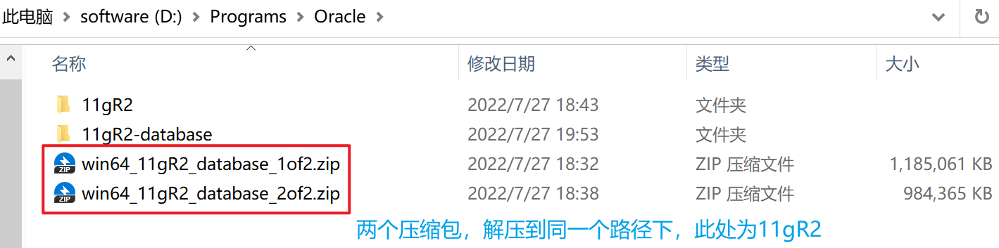


## 安装过程

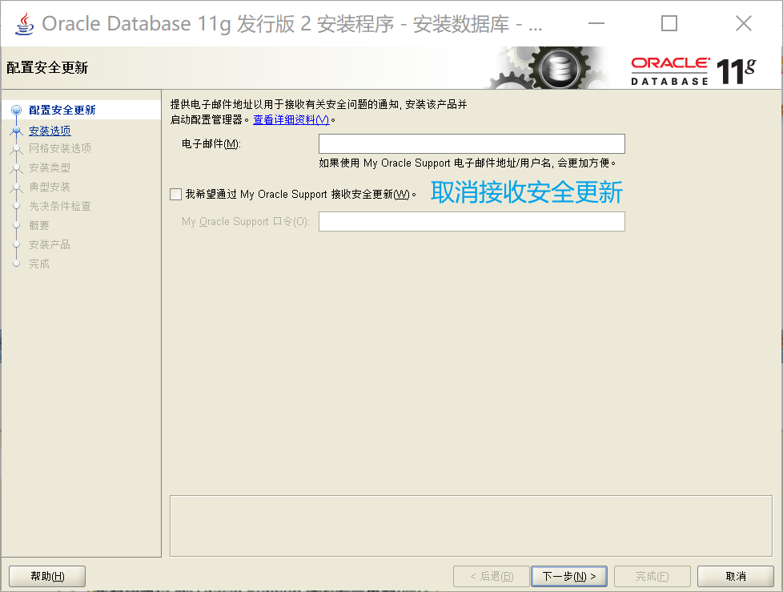

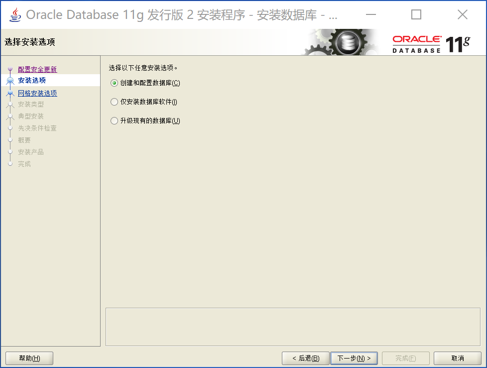

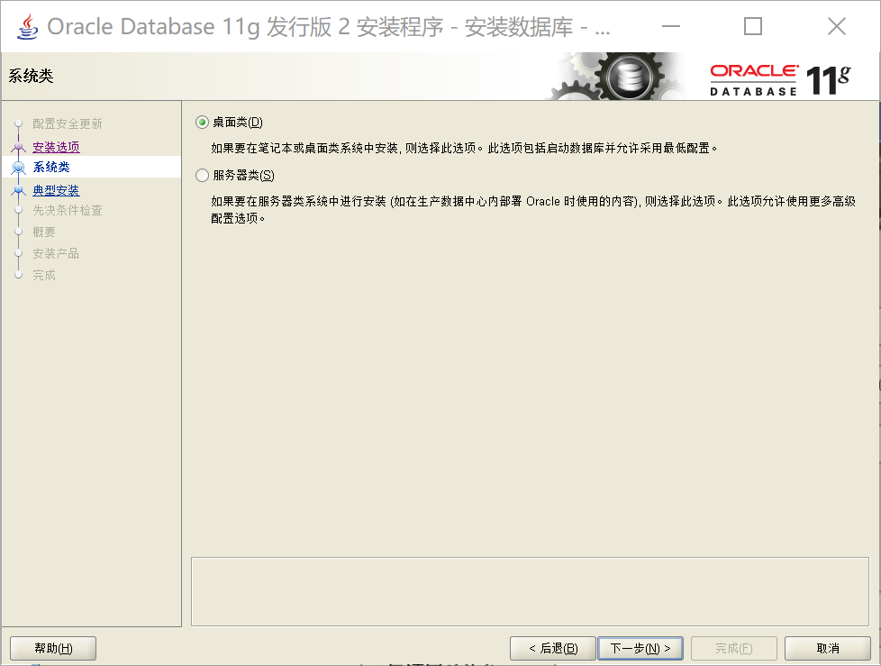

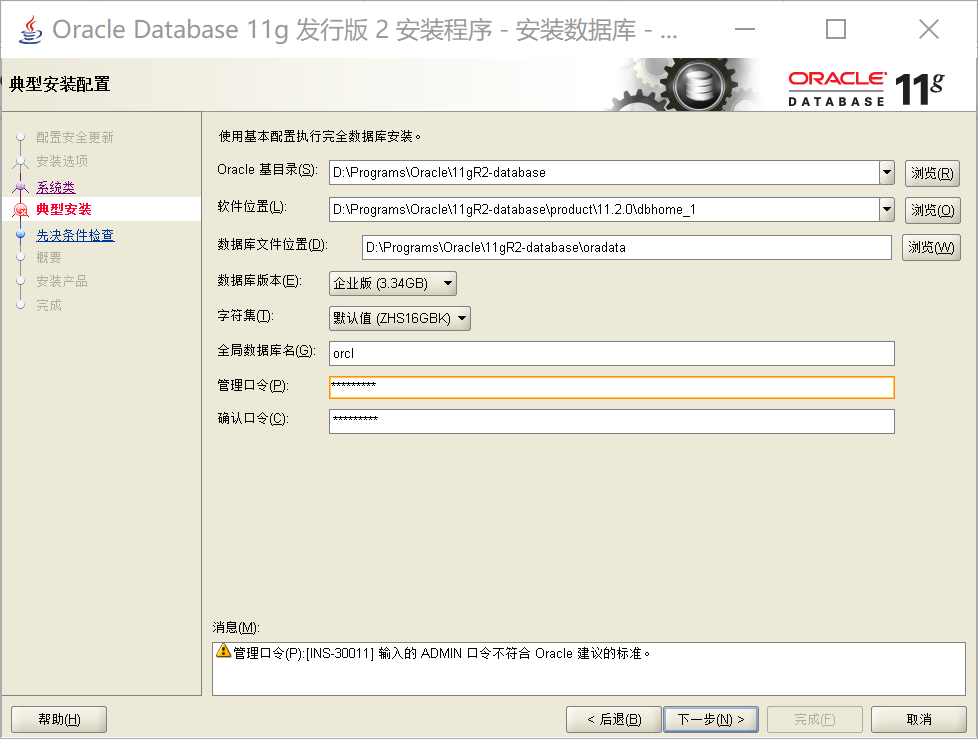

> 管理口令：Oracle11g

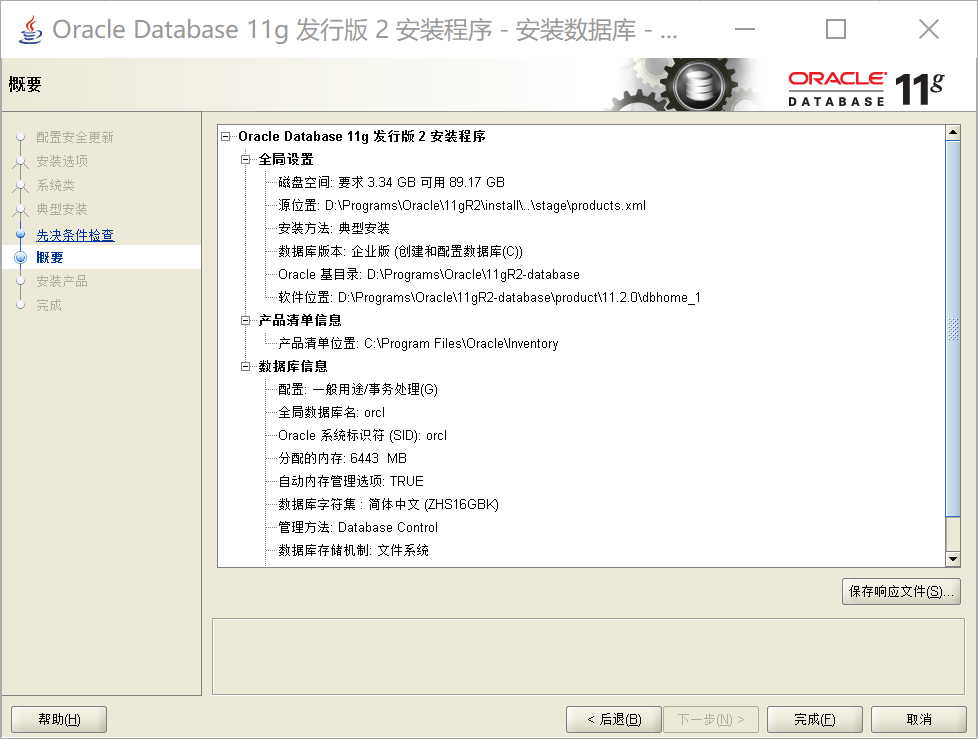

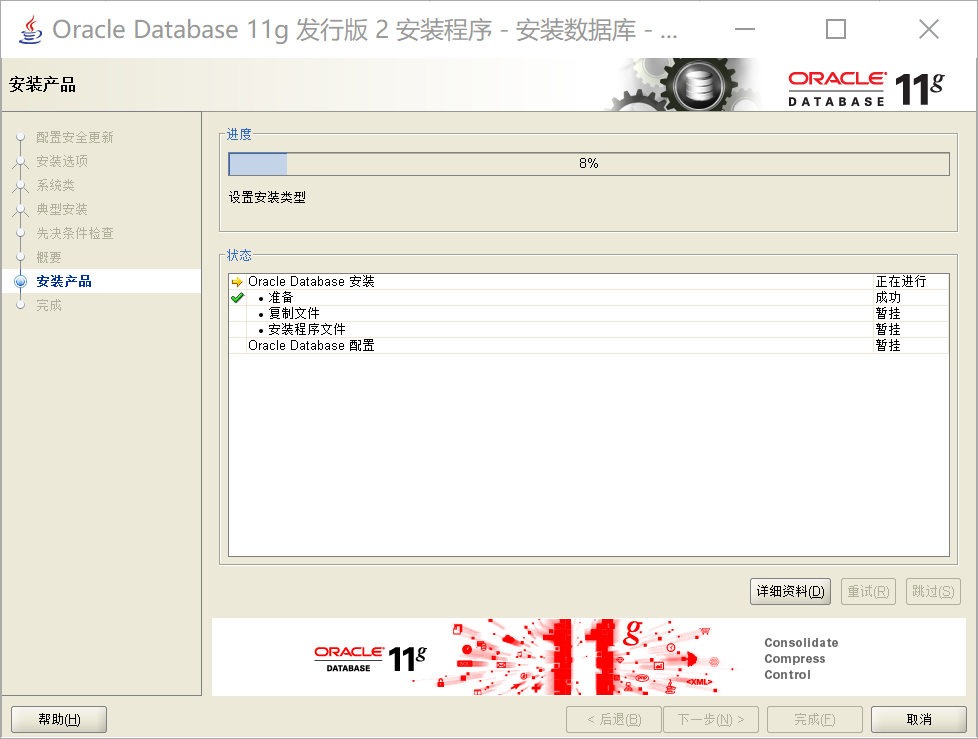

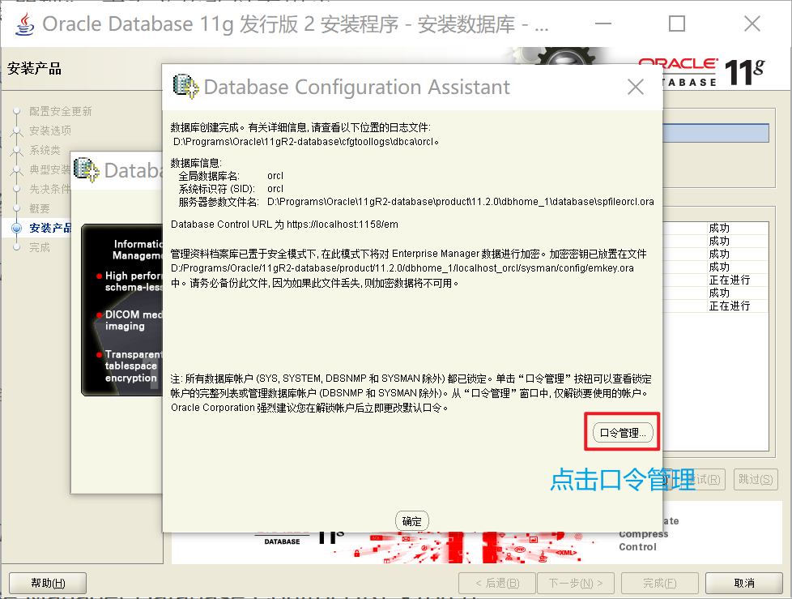

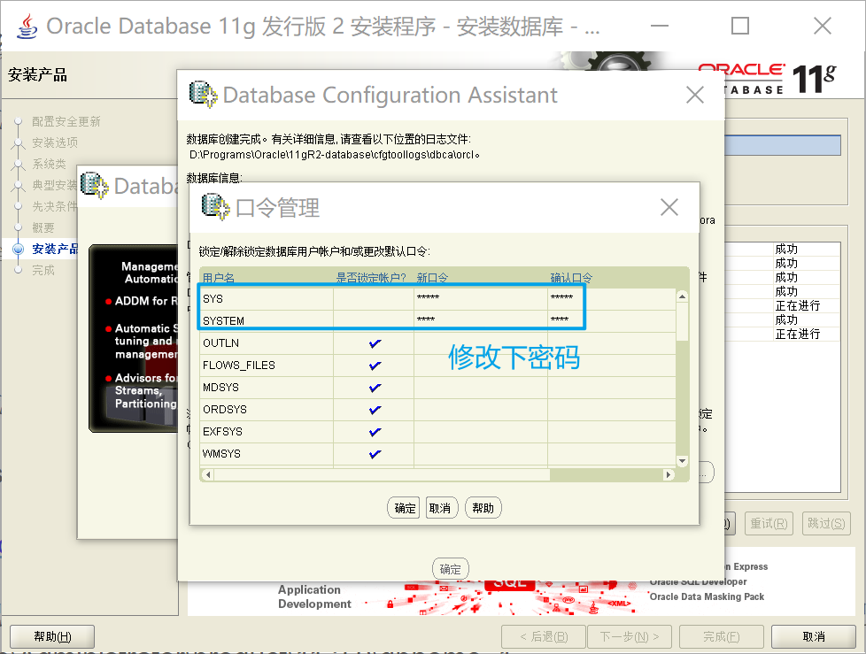

> SYS：普通管理员
>
> SYSTEM：超级管理员

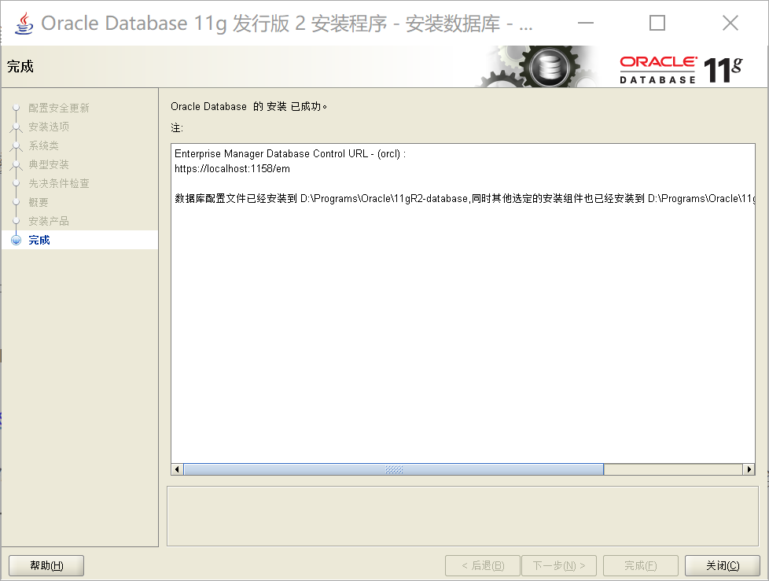

## 添加 PATH

将 Oracle 安装目录`D:\Programs\Oracle\11gR2-database\product\11.2.0\dbhome_1\BIN`，添加到 PATH 变量：

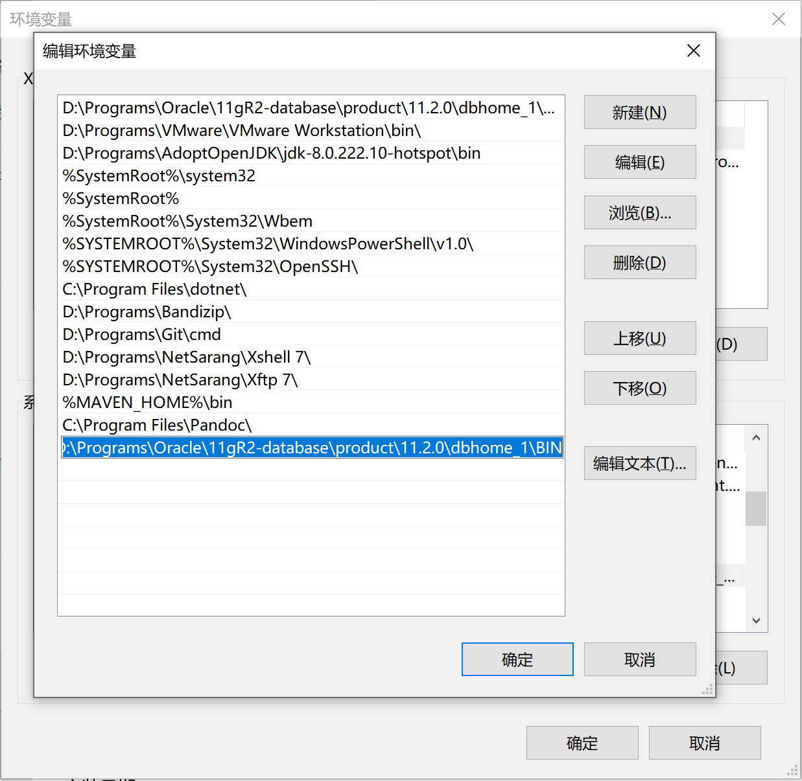

> BIN 目录中有一些 Oracle 自带的命令，如导入文件的 imp 命令。

## 服务启动

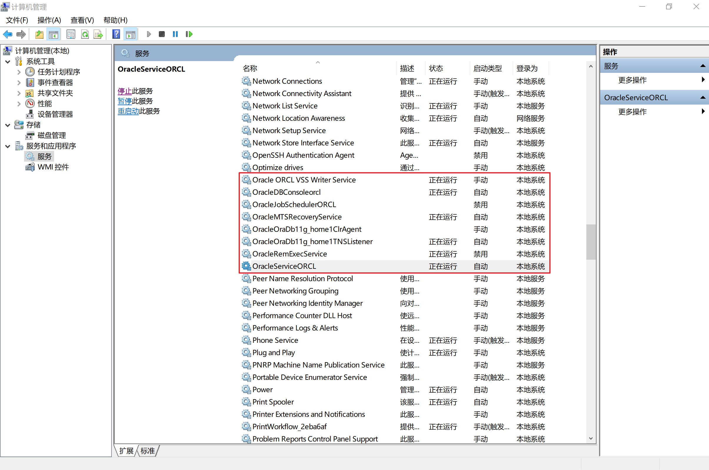

Oracle 安装成功后，会在系统中进行服务的注册，在注册的这些服务中有以下两个服务必须启动，否则 Oracle 将无法正常使用：

- `OracleOraDb11g_home1TNSListener`：表示监听服务，如果客户端要想连接到数据库，此服务必须打开，在程序开发中该服务也要起作用。

- `OracleServiceORCL`：表示数据库的主服务，命名规则：OracleService数据库名称。此服务必须打开，否则 Oracle 无法使用。
- 这两个服务，是开机自动启动的，如果 Oracle 无法正常使用，查看一下服务是否正常。

## 连接

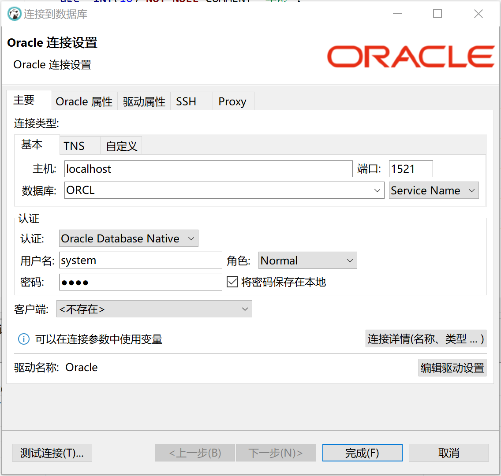

## 导入数据

Oracle 导入数据，需要注意两点：

- 查看 Oracle 版本，待执行导入的数据库版本，需要与备份的数据库版本相同或者是备份数据库的之后版本。
- 导入导出命令配对：exp 导出就用 imp 导入；expdp 导出就用 impdp 导入。
- 需要知道待导入数据，对应的账号，密码和表空间。

创建表空间和用户：

```sql
-- 创建表空间，表空间名：aaa
CREATE TABLESPACE aaa DATAFILE 'D:\Programs\Oracle\dbf\aaa.DBF' SIZE 1G AUTOEXTEND ON
	NEXT 100M MAXSIZE UNLIMITED LOGGING EXTENT MANAGEMENT LOCAL AUTOALLOCATE SEGMENT
	SPACE MANAGEMENT AUTO;
-- 创建用户，用户名：bbb，密码：ccc
CREATE USER bbb IDENTIFIED BY ccc DEFAULT TABLESPACE aaa;
-- 授权用户
GRANT DBA, CONNECT, RESOURCE TO ;
```

> 以上命令在 SQL 编辑器中执行。

导入数据：

```bash
# 202104.dmp，即为待导入的数据
C:\Users\XiSun>IMP bbb/ccc@localhost:1521/orcl FILE=D:\Programs\Oracle\dmp\202104.dmp FULL=y LOG=D:\Programs\Oracle\log\message.log
```

> 以上命令在 cmd 窗口执行。

当看到如下信息，说明数据导入成功：


> 导入数据的详细日志文件，位于：D:\Programs\Oracle\log\message.log。

导入成功后，可以查看表结构和数据信息：

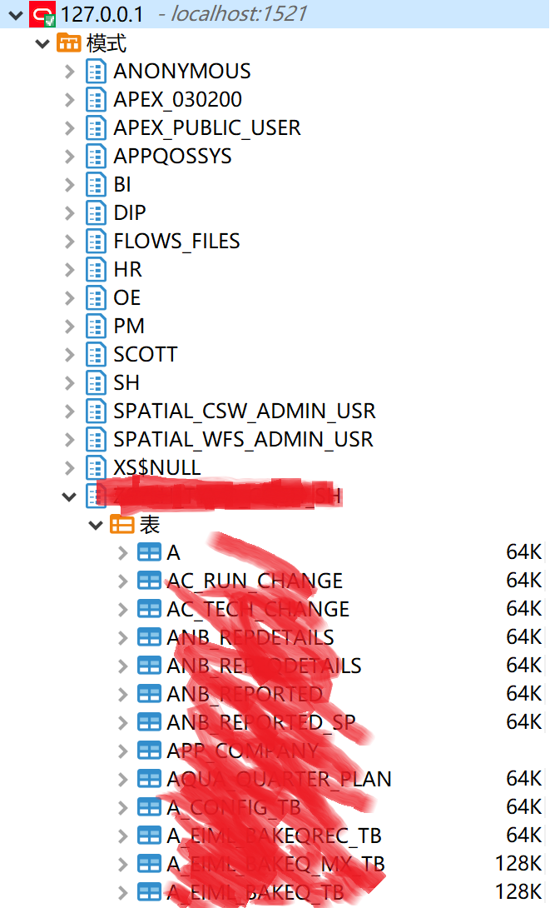

## 本文参考

https://blog.csdn.net/jffhy2017/article/details/54562385

## 声明

写作本文初衷是个人学习记录，鉴于本人学识有限，如有侵权或不当之处，请联系 [wdshfut@163.com](mailto:wdshfut@163.com)。