## 飞越疯人院

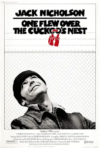

[豆瓣评分: 9.1](https://movie.douban.com/subject/1292224/)

导演: [米洛斯·福尔曼](https://movie.douban.com/celebrity/1053561/)

编剧: [劳伦斯·奥邦](https://movie.douban.com/celebrity/1033260/) / [博·古德曼](https://movie.douban.com/celebrity/1050456/) / [肯·凯西](https://movie.douban.com/celebrity/1050511/) / [达尔·瓦瑟曼](https://movie.douban.com/celebrity/1042473/)

主演: [杰克·尼科尔森](https://movie.douban.com/celebrity/1054528/) / [丹尼·德维托](https://movie.douban.com/celebrity/1040516/) / [克里斯托弗·洛伊德](https://movie.douban.com/celebrity/1027163/) / [路易丝·弗莱彻](https://movie.douban.com/celebrity/1010639/) / [威尔·萨姆森](https://movie.douban.com/celebrity/1027380/) / [特德·马克兰德](https://movie.douban.com/celebrity/1126155/) / [布拉德·道里夫](https://movie.douban.com/celebrity/1031866/) / [斯加特曼·克罗索斯](https://movie.douban.com/celebrity/1019092/) / [迈克尔·贝里曼](https://movie.douban.com/celebrity/1064035/) / [彼得·布罗科](https://movie.douban.com/celebrity/1073554/) / [穆瓦科·卡姆布卡](https://movie.douban.com/celebrity/1071026/) / [威廉·达尔](https://movie.douban.com/celebrity/1080903/) / [乔西普·艾利克](https://movie.douban.com/celebrity/1085117/) / [西德尼·拉斯克](https://movie.douban.com/celebrity/1104610/) / [凯·李](https://movie.douban.com/celebrity/1028656/) / [德怀特·马费尔德](https://movie.douban.com/celebrity/1124225/) / [路易莎·莫里茨](https://movie.douban.com/celebrity/1132114/) / [威廉·雷德菲尔德](https://movie.douban.com/celebrity/1138787/) / [菲利普·罗斯](https://movie.douban.com/celebrity/1139262/) / [米米·萨奇席恩](https://movie.douban.com/celebrity/1145683/) / [文森特·斯卡维利](https://movie.douban.com/celebrity/1041166/) / [米斯·斯马尔](https://movie.douban.com/celebrity/1152185/) / [德罗斯·V·史密斯](https://movie.douban.com/celebrity/1156528/)

上映日期: 1975-11-19(美国)

片长: 133分钟

## 人·鬼·情

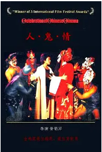

[豆瓣评分: 8.6](https://movie.douban.com/subject/1307320/)

导演: [黄蜀芹](https://movie.douban.com/celebrity/1287049/)

编剧: [黄蜀芹](https://movie.douban.com/celebrity/1287049/) / [李子羽](https://movie.douban.com/subject_search?search_text=李子羽) / [宋国勋](https://movie.douban.com/subject_search?search_text=宋国勋)

主演: [裴艳玲](https://movie.douban.com/celebrity/1350478/) / [李保田](https://movie.douban.com/celebrity/1038193/) / [徐守莉](https://movie.douban.com/celebrity/1318544/) / [姬麒麟](https://movie.douban.com/celebrity/1274783/) / [村里](https://movie.douban.com/celebrity/1313017/) / [史原](https://movie.douban.com/celebrity/1356274/) / [邸力](https://movie.douban.com/celebrity/1348028/)

上映日期: 1987

片长: 105分钟

## 天堂电影院

[豆瓣评分: 9.2](https://movie.douban.com/subject/1291828/)

导演: [朱塞佩·托纳多雷](https://movie.douban.com/celebrity/1018983/)

编剧: [朱塞佩·托纳多雷](https://movie.douban.com/celebrity/1018983/) / [瓦娜·波利](https://movie.douban.com/celebrity/1391406/)

主演: [菲利普·努瓦雷](https://movie.douban.com/celebrity/1027971/) / [萨瓦特利·卡西欧](https://movie.douban.com/celebrity/1041512/) / [雅克·贝汉](https://movie.douban.com/celebrity/1010752/) / [马克·莱昂纳蒂](https://movie.douban.com/celebrity/1040799/) / [莱奥波多·特里耶斯泰](https://movie.douban.com/celebrity/1048379/) / [安东内拉·阿蒂利](https://movie.douban.com/celebrity/1277558/) / [恩佐·卡拉瓦勒](https://movie.douban.com/celebrity/1078332/) / [艾萨·丹尼埃利](https://movie.douban.com/celebrity/1074920/) / [里奥·故罗塔](https://movie.douban.com/celebrity/1016903/) / [普佩拉·玛奇奥](https://movie.douban.com/celebrity/1124544/) / [阿格妮丝·那诺](https://movie.douban.com/celebrity/1132142/) / [塔诺·希玛罗萨](https://movie.douban.com/celebrity/1016941/) / [尼古拉·迪·平托](https://movie.douban.com/celebrity/1088005/) / [罗伯塔·蕾娜](https://movie.douban.com/celebrity/1333188/) / [尼诺·戴罗佐](https://movie.douban.com/celebrity/1155427/) / [玛丽娜·朱迪切](https://movie.douban.com/celebrity/1333189/) / [比阿特丽斯·帕姆](https://movie.douban.com/celebrity/1329077/) / [布丽吉特·佛西](https://movie.douban.com/celebrity/1018402/) / [朱塞佩·托纳多雷](https://movie.douban.com/celebrity/1018983/)

上映日期: 2021-06-11(中国大陆) / 1988-11-17(意大利)

片长: 155分钟 / 173分钟(导演剪辑版) / 123分钟(剧场版) / 124分钟(中国大陆)

## 死亡诗社

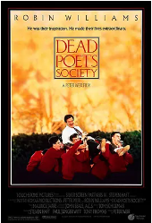

[豆瓣评分: 9.2](https://movie.douban.com/subject/1291548)

导演: [彼得·威尔](https://movie.douban.com/celebrity/1022721/)

编剧: [汤姆·舒尔曼](https://movie.douban.com/celebrity/1296987/)

主演: [罗宾·威廉姆斯](https://movie.douban.com/celebrity/1009241/) / [罗伯特·肖恩·莱纳德](https://movie.douban.com/celebrity/1031873/) / [伊桑·霍克](https://movie.douban.com/celebrity/1018984/) / [乔西·查尔斯](https://movie.douban.com/celebrity/1049551/) / [盖尔·汉森](https://movie.douban.com/celebrity/1323643/) / [迪伦·库斯曼](https://movie.douban.com/celebrity/1342079/) / [阿勒隆·鲁杰罗](https://movie.douban.com/celebrity/1342078/) / [詹姆斯·沃特斯顿](https://movie.douban.com/celebrity/1167539/) / [诺曼·劳埃德](https://movie.douban.com/celebrity/1118329/) / [柯特伍德·史密斯](https://movie.douban.com/celebrity/1010600/) / [卡拉·贝尔韦尔](https://movie.douban.com/celebrity/1342077/) / [利昂·波纳尔](https://movie.douban.com/celebrity/1127866/) / [乔治·马丁](https://movie.douban.com/celebrity/1125954/) / [乔·奥菲耶里](https://movie.douban.com/celebrity/1342075/) / [马特·凯里](https://movie.douban.com/celebrity/1342074/) / [凯文·库尼](https://movie.douban.com/celebrity/1054975/) / [拉腊·弗林·鲍尔](https://movie.douban.com/celebrity/1000059/) / [亚历桑德拉·鲍尔斯](https://movie.douban.com/celebrity/1049984/) / [梅洛拉·沃尔特斯](https://movie.douban.com/celebrity/1027275/) / [帕梅拉·伯勒尔](https://movie.douban.com/celebrity/1067991/) / [约翰·库宁汉姆](https://movie.douban.com/celebrity/1010765/) / [迪布拉·穆尼](https://movie.douban.com/celebrity/1133075/) / [库尔特·莱特纳](https://movie.douban.com/celebrity/1123253/) / [凯瑟·斯内德](https://movie.douban.com/celebrity/1297989/) / [霍纳斯·斯蒂克洛瑞斯](https://movie.douban.com/celebrity/1150808/) / [杰米·肯尼迪](https://movie.douban.com/celebrity/1019042/)

上映日期: 1989-06-02(多伦多首映) / 1989-06-09(美国)

片长: 128分钟

## 棋王

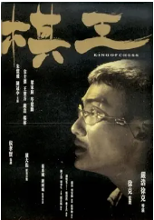

[豆瓣评分: 7.8](https://movie.douban.com/subject/1307163/)

导演: [严浩](https://movie.douban.com/celebrity/1275090/) / [徐克](https://movie.douban.com/celebrity/1007152/)

编剧: [严浩](https://movie.douban.com/celebrity/1275090/) / [梁家辉](https://movie.douban.com/celebrity/1118167/)

主演: [梁家辉](https://movie.douban.com/celebrity/1118167/) / [岑建勋](https://movie.douban.com/celebrity/1274474/) / [严浩](https://movie.douban.com/celebrity/1275090/) / [杨林](https://movie.douban.com/celebrity/1301467/) / [王圣方](https://movie.douban.com/celebrity/1398846/) / [金士杰](https://movie.douban.com/celebrity/1275482/) / [陈冠中](https://movie.douban.com/celebrity/1280431/) / [朱怀飞](https://movie.douban.com/celebrity/1398847/) / [柯星沛](https://movie.douban.com/celebrity/1288789/) / [高国光](https://movie.douban.com/celebrity/1398865/) / [洪善群](https://movie.douban.com/celebrity/1398864/) / [张华坤](https://movie.douban.com/celebrity/1398858/) / [朱凤岗](https://movie.douban.com/celebrity/1398863/) / [陈淑贞](https://movie.douban.com/celebrity/1398860/) / [李天禄](https://movie.douban.com/celebrity/1321856/) / [邱俊龙](https://movie.douban.com/celebrity/1398861/) / [王庆余](https://movie.douban.com/celebrity/1398872/) / [雷鸣](https://movie.douban.com/celebrity/1289745/) / [古军](https://movie.douban.com/celebrity/1345011/) / [张宝善](https://movie.douban.com/celebrity/1398859/) / [马赛](https://movie.douban.com/celebrity/1398866/) / [沈瑞焜](https://movie.douban.com/celebrity/1398867/) / [邓安宁](https://movie.douban.com/celebrity/1329239/) / [田树英](https://movie.douban.com/celebrity/1398871/) / [张嘉泰](https://movie.douban.com/celebrity/1398857/) / [孙晓威](https://movie.douban.com/celebrity/1398868/) / [周白](https://movie.douban.com/celebrity/1398862/) / [登坤艳](https://movie.douban.com/celebrity/1398870/) / [宋耀中](https://movie.douban.com/celebrity/1398869/)

上映日期: 1991-09-06(中国香港)

片长: 109分钟

## 闻香识女人

[豆瓣评分: 9.1](https://movie.douban.com/subject/1298624/)

导演: [马丁·布莱斯特](https://movie.douban.com/celebrity/1055265/)

编剧: [博·古德曼](https://movie.douban.com/celebrity/1050456/) / [乔瓦尼·阿尔皮诺](https://movie.douban.com/celebrity/1005934/)

主演: [阿尔·帕西诺](https://movie.douban.com/celebrity/1054451/) / [克里斯·奥唐纳](https://movie.douban.com/celebrity/1009272/) / [詹姆斯·瑞布霍恩](https://movie.douban.com/celebrity/1049801/) / [加布里埃尔·安瓦尔](https://movie.douban.com/celebrity/1004572/) / [菲利普·塞默·霍夫曼](https://movie.douban.com/celebrity/1054394/) / [理查德·文彻](https://movie.douban.com/celebrity/1157313/) / [布莱德利·惠特福德](https://movie.douban.com/celebrity/1027158/) / [罗谢尔·奥利弗](https://movie.douban.com/celebrity/1132719/) / [Margaret Eginton](https://movie.douban.com/subject_search?search_text=Margaret Eginton) / [Tom Riis Farrell](https://movie.douban.com/subject_search?search_text=Tom Riis Farrell) / [Nicholas Sadler](https://movie.douban.com/subject_search?search_text=Nicholas Sadler) / [托德·路易斯](https://movie.douban.com/celebrity/1004880/) / [马特·史密斯](https://movie.douban.com/celebrity/1297909/) / [吉恩·坎菲尔德](https://movie.douban.com/celebrity/1342039/) / [弗兰西丝·康罗伊](https://movie.douban.com/celebrity/1040622/)

上映日期: 1992-12-23(美国)

片长: 157分钟

## 霸王别姬

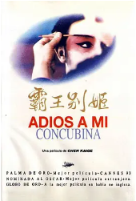

[豆瓣评分: 9.6](https://movie.douban.com/subject/1291546/)

导演: [陈凯歌](https://movie.douban.com/celebrity/1023040/)

编剧: [芦苇](https://movie.douban.com/celebrity/1275557/) / [李碧华](https://movie.douban.com/celebrity/1275229/)

主演: [张国荣](https://movie.douban.com/celebrity/1003494/) / [张丰毅](https://movie.douban.com/celebrity/1050265/) / [巩俐](https://movie.douban.com/celebrity/1035641/) / [葛优](https://movie.douban.com/celebrity/1000905/) / [英达](https://movie.douban.com/celebrity/1011479/) / [蒋雯丽](https://movie.douban.com/celebrity/1020487/) / [吴大维](https://movie.douban.com/celebrity/1028801/) / [吕齐](https://movie.douban.com/celebrity/1275230/) / [雷汉](https://movie.douban.com/celebrity/1275232/) / [尹治](https://movie.douban.com/celebrity/1275236/) / [马明威](https://movie.douban.com/celebrity/1275234/) / [费振翔](https://movie.douban.com/celebrity/1275235/) / [智一桐](https://movie.douban.com/celebrity/1275239/) / [李春](https://movie.douban.com/celebrity/1275231/) / [赵海龙](https://movie.douban.com/celebrity/1275237/) / [李丹](https://movie.douban.com/celebrity/1275238/) / [童弟](https://movie.douban.com/celebrity/1275233/) / [沈慧芬](https://movie.douban.com/celebrity/1317383/) / [黄斐](https://movie.douban.com/celebrity/1373062/) / [徐杰](https://movie.douban.com/celebrity/1317248/)

上映日期: 1993-07-26(中国大陆) / 1993-01-01(中国香港)

片长: 171分钟 / 155分钟(美国剧场版)

## 阿甘正传

[豆瓣评分: 9.5](https://movie.douban.com/subject/1292720/)

导演: [罗伯特·泽米吉斯](https://movie.douban.com/celebrity/1053564/)

编剧: [埃里克·罗思](https://movie.douban.com/celebrity/1000393/) / [温斯顿·格鲁姆](https://movie.douban.com/celebrity/1285512/)

主演: [汤姆·汉克斯](https://movie.douban.com/celebrity/1054450/) / [罗宾·怀特](https://movie.douban.com/celebrity/1002676/) / [加里·西尼斯](https://movie.douban.com/celebrity/1031848/) / [麦凯尔泰·威廉逊](https://movie.douban.com/celebrity/1031912/) / [莎莉·菲尔德](https://movie.douban.com/celebrity/1041112/) / [海利·乔·奥斯蒙](https://movie.douban.com/celebrity/1025137/) / [迈克尔·康纳·亨弗里斯](https://movie.douban.com/celebrity/1287151/) / [哈罗德·G·赫瑟姆](https://movie.douban.com/celebrity/1101200/) / [山姆·安德森](https://movie.douban.com/celebrity/1057231/) / [伊俄涅·M·特雷奇](https://movie.douban.com/celebrity/1157541/) / [彼得·道博森](https://movie.douban.com/celebrity/1009527/) / [希芳·法隆](https://movie.douban.com/celebrity/1080248/) / [伊丽莎白·汉克斯](https://movie.douban.com/celebrity/1102459/) / [汉娜·豪尔](https://movie.douban.com/celebrity/1009340/) / [克里斯托弗·琼斯](https://movie.douban.com/celebrity/1112005/) / [罗布·兰德里](https://movie.douban.com/celebrity/1289360/) / [杰森·麦克奎尔](https://movie.douban.com/celebrity/1125236/) / [桑尼·施罗耶](https://movie.douban.com/celebrity/1145663/) / [艾德·戴维斯](https://movie.douban.com/celebrity/1081644/) / [丹尼尔C.斯瑞派克](https://movie.douban.com/celebrity/1028832/) / [大卫·布里斯宾](https://movie.douban.com/celebrity/1067651/) / [德博拉·麦克蒂尔](https://movie.douban.com/celebrity/1115167/) / [艾尔·哈林顿](https://movie.douban.com/celebrity/1095746/) / [阿非莫·奥米拉](https://movie.douban.com/celebrity/1037024/) / [约翰·沃德斯塔德](https://movie.douban.com/celebrity/1164655/) / [迈克尔·伯吉斯](https://movie.douban.com/celebrity/1077989/) / [埃里克·安德伍德](https://movie.douban.com/celebrity/1156633/) / [拜伦·明斯](https://movie.douban.com/celebrity/1292173/) / [斯蒂芬·布吉格沃特](https://movie.douban.com/celebrity/1050503/) / [约翰·威廉·高尔特](https://movie.douban.com/celebrity/1102416/) / [希拉里·沙普兰](https://movie.douban.com/celebrity/1069270/) / [伊莎贝尔·罗斯](https://movie.douban.com/celebrity/1296038/) / [理查德·达历山德罗](https://movie.douban.com/celebrity/1075120/) / [迪克·史迪威](https://movie.douban.com/celebrity/1157301/) / [迈克尔-杰斯](https://movie.douban.com/celebrity/1114521/) / [杰弗里·布莱克](https://movie.douban.com/celebrity/1066340/) / [瓦妮莎·罗斯](https://movie.douban.com/celebrity/1296180/) / [迪克·卡维特](https://movie.douban.com/celebrity/1041384/) / [马拉·苏查雷特扎](https://movie.douban.com/celebrity/1155461/) / [乔·阿拉斯奇](https://movie.douban.com/celebrity/1059676/) / [W·本森·泰瑞](https://movie.douban.com/celebrity/1152599/)

上映日期: 1994-06-23(洛杉矶首映) / 1994-07-06(美国)

片长: 142分钟

## 肖申克的救赎

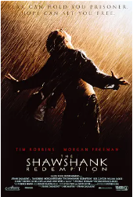

[豆瓣评分: 9.7](https://movie.douban.com/subject/1292052/)

导演: [弗兰克·德拉邦特](https://movie.douban.com/celebrity/1047973/)

编剧: [弗兰克·德拉邦特](https://movie.douban.com/celebrity/1047973/) / [斯蒂芬·金](https://movie.douban.com/celebrity/1049547/)

主演: [蒂姆·罗宾斯](https://movie.douban.com/celebrity/1054521/) / [摩根·弗里曼](https://movie.douban.com/celebrity/1054534/) / [鲍勃·冈顿](https://movie.douban.com/celebrity/1041179/) / [威廉姆·赛德勒](https://movie.douban.com/celebrity/1000095/) / [克兰西·布朗](https://movie.douban.com/celebrity/1013817/) / [吉尔·贝罗斯](https://movie.douban.com/celebrity/1010612/) / [马克·罗斯顿](https://movie.douban.com/celebrity/1054892/) / [詹姆斯·惠特摩](https://movie.douban.com/celebrity/1027897/) / [杰弗里·德曼](https://movie.douban.com/celebrity/1087302/) / [拉里·布兰登伯格](https://movie.douban.com/celebrity/1074035/) / [尼尔·吉恩托利](https://movie.douban.com/celebrity/1099030/) / [布赖恩·利比](https://movie.douban.com/celebrity/1343305/) / [大卫·普罗瓦尔](https://movie.douban.com/celebrity/1048222/) / [约瑟夫·劳格诺](https://movie.douban.com/celebrity/1343306/) / [祖德·塞克利拉](https://movie.douban.com/celebrity/1315528/) / [保罗·麦克兰尼](https://movie.douban.com/celebrity/1014040/) / [芮妮·布莱恩](https://movie.douban.com/celebrity/1390795/) / [阿方索·弗里曼](https://movie.douban.com/celebrity/1083603/) / [V·J·福斯特](https://movie.douban.com/celebrity/1330490/) / [弗兰克·梅德拉诺](https://movie.douban.com/celebrity/1000635/) / [马克·迈尔斯](https://movie.douban.com/celebrity/1390797/) / [尼尔·萨默斯](https://movie.douban.com/celebrity/1150160/) / [耐德·巴拉米](https://movie.douban.com/celebrity/1048233/) / [布赖恩·戴拉特](https://movie.douban.com/celebrity/1000721/) / [唐·麦克马纳斯](https://movie.douban.com/celebrity/1333685/)

上映日期: 1994-09-10(多伦多电影节) / 1994-10-14(美国)

片长: 142分钟

## 变脸

[豆瓣评分: 9.1](https://movie.douban.com/subject/1293237/)

导演: [吴天明](https://movie.douban.com/celebrity/1168676/)

编剧: [魏明伦](https://movie.douban.com/celebrity/1486340/)

主演: [朱旭](https://movie.douban.com/celebrity/1275118/) / [周任莹](https://movie.douban.com/celebrity/1364690/) / [赵志刚](https://movie.douban.com/celebrity/1318014/) / [张瑞阳](https://movie.douban.com/subject_search?search_text=张瑞阳)

上映日期: 1995-06-09(中国大陆)

片长: 101分钟 / 91分钟(美国)

## 南海十三郎

[豆瓣评分: 9.3](https://movie.douban.com/subject/1303913/)

导演: [高志森](https://movie.douban.com/celebrity/1281025/)

编剧: [杜国威](https://movie.douban.com/celebrity/1299321/)

主演: [谢君豪](https://movie.douban.com/celebrity/1157914/) / [潘灿良](https://movie.douban.com/subject_search?search_text=潘灿良) / [苏玉华](https://movie.douban.com/celebrity/1017823/) / [梁汉威](https://movie.douban.com/subject_search?search_text=梁汉威) / [吴绮莉](https://movie.douban.com/celebrity/1313691/) / [黄霑](https://movie.douban.com/celebrity/1008091/) / [周志辉](https://movie.douban.com/subject_search?search_text=周志辉)

上映日期: 1997-05-15(中国香港)

片长: 110分钟

## 心灵捕手

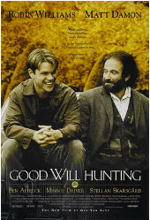

[豆瓣评分: 9.0](https://movie.douban.com/subject/1292656/)

导演: [格斯·范·桑特](https://movie.douban.com/celebrity/1041021/)

编剧: [本·阿弗莱克](https://movie.douban.com/celebrity/1054417/) / [马特·达蒙](https://movie.douban.com/celebrity/1054443/)

主演: [马特·达蒙](https://movie.douban.com/celebrity/1054443/) / [罗宾·威廉姆斯](https://movie.douban.com/celebrity/1009241/) / [本·阿弗莱克](https://movie.douban.com/celebrity/1054417/) / [斯特兰·斯卡斯加德](https://movie.douban.com/celebrity/1017918/) / [明妮·德里弗](https://movie.douban.com/celebrity/1004602/) / [卡西·阿弗莱克](https://movie.douban.com/celebrity/1022593/) / [科尔·豪瑟](https://movie.douban.com/celebrity/1000106/) / [约翰·迈顿](https://movie.douban.com/celebrity/1028557/) / [丹·华盛顿](https://movie.douban.com/celebrity/1165269/) / [艾莉森·福兰德](https://movie.douban.com/celebrity/1082431/) / [维克·萨海](https://movie.douban.com/celebrity/1276646/) / [史蒂文·科兹洛夫斯基](https://movie.douban.com/celebrity/1102911/) / [斯科特·威廉姆·文特斯](https://movie.douban.com/celebrity/1022835/) / [吉米·弗林](https://movie.douban.com/celebrity/1085353/) / [乔治·普林普顿](https://movie.douban.com/celebrity/1032632/) / [弗朗切斯科·克莱门特](https://movie.douban.com/celebrity/1387771/)

上映日期: 1997-12-05(美国)

片长: 126分钟

## 楚门的世界

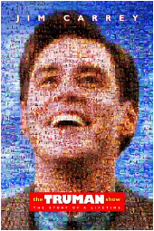

[豆瓣评分: 9.4](https://movie.douban.com/subject/1292064/)

导演: [彼得·威尔](https://movie.douban.com/celebrity/1022721/)

编剧: [安德鲁·尼科尔](https://movie.douban.com/celebrity/1018008/)

主演: [金·凯瑞](https://movie.douban.com/celebrity/1054438/) / [劳拉·琳妮](https://movie.douban.com/celebrity/1053572/) / [艾德·哈里斯](https://movie.douban.com/celebrity/1048024/) / [诺亚·艾默里奇](https://movie.douban.com/celebrity/1032144/) / [娜塔莎·麦克艾霍恩](https://movie.douban.com/celebrity/1036358/)

上映日期: 1998-06-05(美国)

片长: 103分钟

## 海上钢琴师

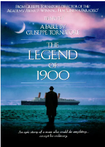

[豆瓣评分: 9.3](https://movie.douban.com/subject/1292001/)

导演: [朱塞佩·托纳多雷](https://movie.douban.com/celebrity/1018983/)

编剧: [亚历山德罗·巴里科](https://movie.douban.com/celebrity/1005822/) / [朱塞佩·托纳多雷](https://movie.douban.com/celebrity/1018983/)

主演: [蒂姆·罗斯](https://movie.douban.com/celebrity/1025176/) / [普路特·泰勒·文斯](https://movie.douban.com/celebrity/1010659/) / [比尔·努恩](https://movie.douban.com/celebrity/1027407/) / [克兰伦斯·威廉姆斯三世](https://movie.douban.com/celebrity/1161241/) / [梅兰尼·蒂埃里](https://movie.douban.com/celebrity/1009391/) / [皮特·沃恩](https://movie.douban.com/celebrity/1156985/) / [尼尔·奥布赖恩](https://movie.douban.com/celebrity/1426475/) / [阿尔贝托·巴斯克斯](https://movie.douban.com/celebrity/1155601/) / [加布里埃莱·拉维亚](https://movie.douban.com/celebrity/1028430/) / [科里·巴克](https://movie.douban.com/celebrity/1075724/) / [西德尼·科尔](https://movie.douban.com/celebrity/1073833/) / [Luigi De Luca](https://movie.douban.com/celebrity/1426476/) / [尼古拉·迪·平托](https://movie.douban.com/celebrity/1088005/) / [费米·依鲁福祖](https://movie.douban.com/celebrity/1361676/) / [伊斯顿·盖奇](https://movie.douban.com/celebrity/1099619/) / [凯文·麦克纳利](https://movie.douban.com/celebrity/1123046/) / [布莱恩·普林格](https://movie.douban.com/celebrity/1129403/) / [沙拉·鲁宾](https://movie.douban.com/celebrity/1296266/) / [希思科特·威廉姆斯](https://movie.douban.com/celebrity/1041819/) / [阿妮妲·扎格利亚](https://movie.douban.com/celebrity/1323553/) / [安吉洛·迪洛雷塔](https://movie.douban.com/celebrity/1087425/)

上映日期: 2019-11-15(中国大陆) / 1998-10-28(意大利)

片长: 165分钟 / 120分钟(法国版) / 169分钟(加长版) / 125分钟(中国大陆)

## 那山那水那狗

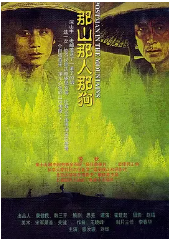

[豆瓣评分: 8.8](https://movie.douban.com/subject/1307766/)

导演: [霍建起](https://movie.douban.com/celebrity/1006351/)

编剧: [思芜](https://movie.douban.com/celebrity/1306547/)

主演: [滕汝骏](https://movie.douban.com/celebrity/1299044/) / [刘烨](https://movie.douban.com/celebrity/1000572/) / [赵秀丽](https://movie.douban.com/celebrity/1332569/) / [陈好](https://movie.douban.com/celebrity/1037748/) / [龚业珩](https://movie.douban.com/celebrity/1319377/) / [党浩予](https://movie.douban.com/celebrity/1313612/)

上映日期: 1999(中国大陆) / 2001-04-07(日本)

片长: 93分钟

## 美丽心灵

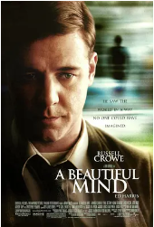

[豆瓣评分: 9.1](https://movie.douban.com/subject/1306029/)

导演: [朗·霍华德](https://movie.douban.com/celebrity/1031844/)

编剧: [阿齐瓦·高斯曼](https://movie.douban.com/celebrity/1009507/) / [西尔维娅·纳萨尔](https://movie.douban.com/celebrity/1023504/)

主演: [罗素·克劳](https://movie.douban.com/celebrity/1016674/) / [艾德·哈里斯](https://movie.douban.com/celebrity/1048024/) / [詹妮弗·康纳利](https://movie.douban.com/celebrity/1016673/) / [克里斯托弗·普卢默](https://movie.douban.com/celebrity/1036321/) / [保罗·贝坦尼](https://movie.douban.com/celebrity/1003482/) / [亚当·戈德堡](https://movie.douban.com/celebrity/1040542/) / [乔什·卢卡斯](https://movie.douban.com/celebrity/1017919/) / [安东尼·拉普](https://movie.douban.com/celebrity/1040545/) / [贾森·加里-斯坦福德](https://movie.douban.com/celebrity/1091104/) / [贾德·赫希](https://movie.douban.com/celebrity/1055274/) / [奥斯汀·潘德尔顿](https://movie.douban.com/celebrity/1127690/) / [薇薇·卡登尼](https://movie.douban.com/celebrity/1000259/) / [吉莉·西蒙](https://movie.douban.com/celebrity/1394787/) / [维克多·斯坦巴赫](https://movie.douban.com/celebrity/1394788/) / [坦娅·克拉克](https://movie.douban.com/celebrity/1191020/) / [罗伊·辛尼斯](https://movie.douban.com/celebrity/1154321/) / [谢丽尔·霍华德](https://movie.douban.com/celebrity/1094520/) / [兰斯·霍华德](https://movie.douban.com/celebrity/1054335/) / [简·詹金斯](https://movie.douban.com/celebrity/1103031/) / [乔什·帕斯](https://movie.douban.com/celebrity/1018122/) / [瓦伦蒂娜·卡迪纳利](https://movie.douban.com/celebrity/1067629/) / [蒂格尔·F·伯格里](https://movie.douban.com/celebrity/1407191/) / [迈克尔·埃斯佩尔](https://movie.douban.com/celebrity/1335929/) / [艾米·瓦尔兹](https://movie.douban.com/celebrity/1347598/) / [小艾德.朱普](https://movie.douban.com/celebrity/1113196/) / [卡拉·奥奇格罗索](https://movie.douban.com/celebrity/1169793/) / [斯特里奥·萨万特](https://movie.douban.com/celebrity/1142755/) / [迈克尔·阿伯特](https://movie.douban.com/celebrity/1247100/) / [雷吉·奥斯汀](https://movie.douban.com/celebrity/1014305/) / [凯德·比特纳](https://movie.douban.com/celebrity/1194783/) / [理查·布莱恩特](https://movie.douban.com/celebrity/1191048/) / [丹·陈](https://movie.douban.com/celebrity/1197717/) / [乔纳·福尔肯](https://movie.douban.com/celebrity/1090319/) / [法布里奇奥·范特](https://movie.douban.com/celebrity/1080433/) / [斯科特·费恩斯特罗姆](https://movie.douban.com/celebrity/1166472/) / [迈克尔·菲奥里](https://movie.douban.com/celebrity/1083476/) / [塞斯·盖贝尔](https://movie.douban.com/celebrity/1027244/) / [埃文·哈特](https://movie.douban.com/celebrity/1178277/) / [杰森·霍顿](https://movie.douban.com/celebrity/1046142/) / [布莱丝·达拉斯·霍华德](https://movie.douban.com/celebrity/1027772/) / [朗·霍华德](https://movie.douban.com/celebrity/1031844/) / [多里·曼佐尔](https://movie.douban.com/celebrity/1272356/) / [罗伯特·迈尔斯](https://movie.douban.com/celebrity/1234977/) / [里德·彭尼](https://movie.douban.com/celebrity/1205938/) / [米尔斯·彼埃尔](https://movie.douban.com/celebrity/1212540/) / [肖恩·里德](https://movie.douban.com/celebrity/1188892/)

上映日期: 2001-12-13(加州首映) / 2002-01-04(美国)

片长: 135分钟

## 放牛班的春天

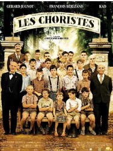

[豆瓣评分: 9.3](https://movie.douban.com/subject/1291549/)

导演: [克里斯托夫·巴哈蒂](https://movie.douban.com/celebrity/1277959/)

编剧: [乔治·沙普罗](https://movie.douban.com/celebrity/1280488/) / [勒·惠勒](https://movie.douban.com/celebrity/1006748/) / [诺埃-诺尔](https://movie.douban.com/celebrity/1132096/) / [克里斯托夫·巴哈蒂](https://movie.douban.com/celebrity/1277959/) / [菲利普·洛佩斯-屈瓦尔](https://movie.douban.com/celebrity/1290313/)

主演: [让-巴蒂斯特·莫尼耶](https://movie.douban.com/celebrity/1036712/) / [热拉尔·朱尼奥](https://movie.douban.com/celebrity/1048281/) / [弗朗索瓦·贝莱昂](https://movie.douban.com/celebrity/1054351/) / [凯德·麦拉德](https://movie.douban.com/celebrity/1000491/) / [让-保罗·博奈雷](https://movie.douban.com/celebrity/1332377/) / [雅克·贝汉](https://movie.douban.com/celebrity/1010752/) / [玛丽·布奈尔](https://movie.douban.com/celebrity/1019268/) / [马克桑斯·贝汉](https://movie.douban.com/celebrity/1319250/) / [格雷戈里·加迪诺尔](https://movie.douban.com/celebrity/1340685/) / [托马斯·布伦门塔尔](https://movie.douban.com/celebrity/1339548/) / [西里尔·伯尔尼科特](https://movie.douban.com/celebrity/1361810/) / [西蒙·法戈特](https://movie.douban.com/celebrity/1361811/) / [泰奥杜尔·卡雷-卡赛尼](https://movie.douban.com/celebrity/1212721/) / [菲利普·杜·詹纳兰德](https://movie.douban.com/celebrity/1361812/) / [埃里克·德斯玛莱茨](https://movie.douban.com/celebrity/1361814/) / [狄迪尔·弗拉蒙](https://movie.douban.com/celebrity/1025131/) / [Carole Weiss](https://movie.douban.com/subject_search?search_text=Carole Weiss)

上映日期: 2004-10-16(中国大陆) / 2022-12-02(中国大陆重映) / 2004-03-17(法国)

片长: 97分钟

## 当幸福来敲门

[豆瓣评分: 9.2](https://movie.douban.com/subject/1849031/)

导演: [加布里埃莱·穆奇诺](https://movie.douban.com/celebrity/1045093/)

编剧: [斯蒂夫·康拉德](https://movie.douban.com/celebrity/1322146/)

主演: [威尔·史密斯](https://movie.douban.com/celebrity/1027138/) / [贾登·史密斯](https://movie.douban.com/celebrity/1010532/) / [坦迪·牛顿](https://movie.douban.com/celebrity/1040513/) / [布莱恩·豪威 ](https://movie.douban.com/celebrity/1317100/)/ [詹姆斯·凯伦](https://movie.douban.com/celebrity/1112637/) / [丹·卡斯泰兰尼塔](https://movie.douban.com/celebrity/1041148/) / [柯特·富勒](https://movie.douban.com/celebrity/1049882/) / [塔卡尤·费舍尔](https://movie.douban.com/celebrity/1087216/) / [凯文·韦斯特](https://movie.douban.com/celebrity/1165462/) / [乔治·张](https://movie.douban.com/celebrity/1368948/) / [戴维·迈克尔·西尔弗曼](https://movie.douban.com/celebrity/1368949/) / [多米尼克·博夫](https://movie.douban.com/celebrity/1368950/) / [杰弗·卡伦](https://movie.douban.com/celebrity/1042019/) / [乔伊芙·拉文](https://movie.douban.com/celebrity/1368951/) / [斯科特·克拉斯](https://movie.douban.com/celebrity/1110175/)

上映日期: 2008-01-17(中国大陆) / 2020-07-20(中国大陆重映) / 2006-12-15(美国)

片长: 117分钟

## 成长教育

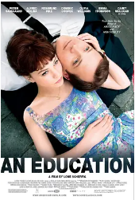

[豆瓣评分: 7.7](https://movie.douban.com/subject/3011093/)

导演: [罗勒·莎菲](https://movie.douban.com/celebrity/1045092/)

编剧: [琳·巴贝尔](https://movie.douban.com/celebrity/1018347/) / [尼克·霍恩比](https://movie.douban.com/celebrity/1000424/)

主演: [凯瑞·穆里根](https://movie.douban.com/celebrity/1025144/) / [彼得·萨斯加德](https://movie.douban.com/celebrity/1031800/) / [阿尔弗雷德·莫里纳](https://movie.douban.com/celebrity/1017897/) / [卡拉·西摩](https://movie.douban.com/celebrity/1297274/) / [奥莉维亚·威廉姆斯](https://movie.douban.com/celebrity/1022627/) / [多米尼克·库珀](https://movie.douban.com/celebrity/1017901/) / [裴淳华](https://movie.douban.com/celebrity/1040989/) / [马修·比尔德](https://movie.douban.com/celebrity/1000400/) / [艾玛·汤普森](https://movie.douban.com/celebrity/1054514/) / [莎莉·霍金斯](https://movie.douban.com/celebrity/1044915/) / [詹姆斯·诺顿](https://movie.douban.com/celebrity/1326707/)

上映日期: 2009-10-30(英国)

片长: 100分钟

## 怦然心动

[豆瓣评分: 9.1](https://movie.douban.com/subject/3319755/)

导演: [罗伯·莱纳](https://movie.douban.com/celebrity/1031903/)

编剧: [罗伯·莱纳](https://movie.douban.com/celebrity/1031903/) / [安德鲁·沙因曼](https://movie.douban.com/celebrity/1276019/) / [文德琳·范·德拉安南](https://movie.douban.com/celebrity/1014692/)

主演: [玛德琳·卡罗尔](https://movie.douban.com/celebrity/1031867/) / [卡兰·麦克奥利菲](https://movie.douban.com/celebrity/1004751/) / [瑞贝卡·德·莫妮](https://movie.douban.com/celebrity/1049546/) / [安东尼·爱德华兹](https://movie.douban.com/celebrity/1055414/) / [约翰·马奥尼](https://movie.douban.com/celebrity/1054959/) / [佩内洛普·安·米勒](https://movie.douban.com/celebrity/1013868/) / [艾丹·奎因](https://movie.douban.com/celebrity/1031890/) / [凯文·韦斯曼](https://movie.douban.com/celebrity/1014032/) / [摩根·莉莉](https://movie.douban.com/celebrity/1000182/) / [瑞安·克茨纳](https://movie.douban.com/celebrity/1276020/) / [吉莉安·普法夫](https://movie.douban.com/celebrity/1276021/) / [迈克尔·博萨](https://movie.douban.com/celebrity/1276022/) / [博·勒纳](https://movie.douban.com/celebrity/1276023/) / [杰奎琳·埃沃拉](https://movie.douban.com/celebrity/1276024/) / [泰勒·格鲁秀斯](https://movie.douban.com/celebrity/1276025/) / [艾莉·布莱恩特](https://movie.douban.com/celebrity/1276026/) / [阿什莉·泰勒](https://movie.douban.com/celebrity/1276027/) / [伊瑟尔·布罗萨德](https://movie.douban.com/celebrity/1023036/) / [科迪·霍恩](https://movie.douban.com/celebrity/1276028/) / [迈克尔·博尔顿](https://movie.douban.com/celebrity/1022965/) / [肖恩·哈珀](https://movie.douban.com/celebrity/1238165/) / [斯戴芬妮·斯考特](https://movie.douban.com/celebrity/1036534/) / [帕特丽夏·伦茨](https://movie.douban.com/celebrity/1390240/) / [马修·戈尔德](https://movie.douban.com/celebrity/1233459/) / [阿罗拉·凯瑟琳·史密斯](https://movie.douban.com/celebrity/1390241/) / [凯莉·唐纳利](https://movie.douban.com/celebrity/1390242/) / [索菲亚·撒高](https://movie.douban.com/celebrity/1390243/) / [米歇尔·梅斯默](https://movie.douban.com/celebrity/1390244/) / [斯科特·乔尔·吉兹基](https://movie.douban.com/celebrity/1266903/) / [罗德·迈尔斯](https://movie.douban.com/celebrity/1327187/) / [卡拉 帕西托](https://movie.douban.com/celebrity/1248195/) / [凯特琳·帕西托](https://movie.douban.com/celebrity/1258662/)

上映日期: 2010-07-26(好莱坞首映) / 2010-09-10(美国)

片长: 90分钟

## 达拉斯买家俱乐部

[豆瓣评分: 8.8](https://movie.douban.com/subject/1793929/)

导演: [让-马克·瓦雷](https://movie.douban.com/celebrity/1274537/)

编剧: [克莱格·鲍登](https://movie.douban.com/celebrity/1333617/) / [梅丽莎·沃雷克](https://movie.douban.com/celebrity/1319828/)

主演: [马修·麦康纳](https://movie.douban.com/celebrity/1040511/) / [詹妮弗·加纳](https://movie.douban.com/celebrity/1054512/) / [杰瑞德·莱托](https://movie.douban.com/celebrity/1013764/) / [斯蒂夫·扎恩](https://movie.douban.com/celebrity/1035639/) / [达拉斯·罗伯特斯](https://movie.douban.com/celebrity/1044905/) / [凯文·兰金](https://movie.douban.com/celebrity/1143727/) / [丹尼斯·欧哈拉](https://movie.douban.com/celebrity/1013900/) / [简·麦克尼尔](https://movie.douban.com/celebrity/1333618/) / [格里芬·邓恩](https://movie.douban.com/celebrity/1019053/) / [詹姆斯·杜蒙特](https://movie.douban.com/celebrity/1025390/) / [朱丽叶·里夫斯](https://movie.douban.com/celebrity/1191398/) / [斯蒂菲·格罗特](https://movie.douban.com/celebrity/1333619/) / [J·D·埃弗摩尔](https://movie.douban.com/celebrity/1086542/)

上映日期: 2013-09-07(多伦多电影节) / 2013-11-22(美国)

片长: 117分钟

## 白日梦想家

[豆瓣评分: 8.6](https://movie.douban.com/subject/2133323/)

导演: [本·斯蒂勒](https://movie.douban.com/celebrity/1054412/)

编剧: [斯蒂夫·康拉德](https://movie.douban.com/celebrity/1322146/) / [詹姆斯·瑟伯](https://movie.douban.com/celebrity/1037573/)

主演: [本·斯蒂勒](https://movie.douban.com/celebrity/1054412/) / [克里斯汀·韦格](https://movie.douban.com/celebrity/1022588/) / [亚当·斯科特](https://movie.douban.com/celebrity/1002677/) / [西恩·潘](https://movie.douban.com/celebrity/1054527/) / [凯瑟琳·哈恩](https://movie.douban.com/celebrity/1022649/) / [泰伦斯·伯尼·海恩斯](https://movie.douban.com/celebrity/1091448/) / [保罗·菲兹杰拉德](https://movie.douban.com/celebrity/1028202/) / [乔恩·戴利](https://movie.douban.com/celebrity/1339434/) / [乔伊·斯洛特尼克](https://movie.douban.com/celebrity/1152200/) / [格蕾丝·雷克斯](https://movie.douban.com/celebrity/1317694/) / [阿莱克斯·阿方格](https://movie.douban.com/celebrity/1329936/) / [阿曼达·诺顿](https://movie.douban.com/celebrity/1292944/) / [阿德里安·马丁斯](https://movie.douban.com/celebrity/1351492/) / [雪莉·麦克雷恩](https://movie.douban.com/celebrity/1048130/) / [艾米·斯蒂勒](https://movie.douban.com/celebrity/1022674/) / [斯图尔特·康菲尔德](https://movie.douban.com/celebrity/1340832/) / [奥拉维尔·达里·奥拉夫松](https://movie.douban.com/celebrity/1032826/) / [索哈德吕尔·西格罗森](https://movie.douban.com/celebrity/1110511/) / [贡纳·黑尔加松](https://movie.douban.com/celebrity/1093316/) / [卡伊·伦诺克斯](https://movie.douban.com/celebrity/1342427/) / [柯南·奥布莱恩](https://movie.douban.com/celebrity/1000115/) / [安迪·里克特](https://movie.douban.com/celebrity/1041199/) / [安东尼·德西奥](https://movie.douban.com/celebrity/1337959/) / [帕顿·奥斯瓦尔特](https://movie.douban.com/celebrity/1007015/) / [理查德·德多梅尼科](https://movie.douban.com/celebrity/1090312/) / [马特·莱文](https://movie.douban.com/celebrity/1000529/) / [格雷格·西佩斯](https://movie.douban.com/celebrity/1162789/) / [马米·科西科](https://movie.douban.com/celebrity/1263189/) / [马修·古利](https://movie.douban.com/celebrity/1239524/) / [罗丝玛丽·霍华德](https://movie.douban.com/celebrity/1393141/) / [伊兰·克里斯费尔德](https://movie.douban.com/celebrity/1259405/) / [安娜·库奇马](https://movie.douban.com/celebrity/1259721/)

上映日期: 2013-12-25(美国)

片长: 114分钟

## 百鸟朝凤

[豆瓣评分: 8.3](https://movie.douban.com/subject/10831445/)

导演: [吴天明](https://movie.douban.com/celebrity/1168676/)

编剧: [吴天明](https://movie.douban.com/celebrity/1168676/) / [罗雪莹](https://movie.douban.com/celebrity/1358108/) / [肖江虹](https://movie.douban.com/celebrity/1358109/)

主演: [陶泽如](https://movie.douban.com/celebrity/1039767/) / [李岷城](https://movie.douban.com/celebrity/1318702/) / [嵇波](https://movie.douban.com/celebrity/1323457/) / [胡先煦](https://movie.douban.com/celebrity/1329632/) / [郑伟](https://movie.douban.com/celebrity/1325438/) / [迟蓬](https://movie.douban.com/celebrity/1314926/) / [袁中方](https://movie.douban.com/celebrity/1318647/) / [墨阳](https://movie.douban.com/celebrity/1317986/) / [张喜前](https://movie.douban.com/celebrity/1322765/) / [谭群](https://movie.douban.com/celebrity/1358110/) / [王长玲](https://movie.douban.com/celebrity/1358111/) / [周天羽](https://movie.douban.com/celebrity/1358112/) / [张双成](https://movie.douban.com/celebrity/1358113/) / [许还山](https://movie.douban.com/celebrity/1313235/)

上映日期: 2016-05-06(中国大陆) / 2017-04-20(中国大陆重映) / 2013-09-25(金鸡百花电影节)

片长: 108分钟

## 我不是药神

[豆瓣评分: 9.0](https://movie.douban.com/subject/26752088/)

导演: [文牧野](https://movie.douban.com/celebrity/1349765/)

编剧: [韩家女](https://movie.douban.com/celebrity/1375690/) / [钟伟](https://movie.douban.com/celebrity/1391650/) / [文牧野](https://movie.douban.com/celebrity/1349765/)

主演: [徐峥](https://movie.douban.com/celebrity/1274297/) / [王传君](https://movie.douban.com/celebrity/1313837/) / [周一围](https://movie.douban.com/celebrity/1276085/) / [谭卓](https://movie.douban.com/celebrity/1312976/) / [章宇](https://movie.douban.com/celebrity/1322072/) / [杨新鸣](https://movie.douban.com/celebrity/1275510/) / [王佳佳](https://movie.douban.com/celebrity/1317520/) / [王砚辉](https://movie.douban.com/celebrity/1322085/) / [贾弘逍](https://movie.douban.com/celebrity/1391651/) / [龚蓓苾](https://movie.douban.com/celebrity/1274298/) / [宁浩](https://movie.douban.com/celebrity/1274265/) / [李乃文](https://movie.douban.com/celebrity/1274530/) / [岳小军](https://movie.douban.com/celebrity/1310743/) / [苇青](https://movie.douban.com/celebrity/1319163/) / [富冠铭](https://movie.douban.com/celebrity/1396851/) / [巴拉特·巴蒂](https://movie.douban.com/celebrity/1396800/) / [喜利图](https://movie.douban.com/celebrity/1396458/) / [张海艳](https://movie.douban.com/celebrity/1396812/) / [朱耕佑](https://movie.douban.com/celebrity/1396885/)

上映日期: 2018-07-05(中国大陆) / 2018-06-30(大规模点映)

片长: 117分钟

