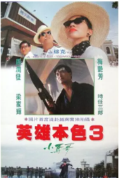
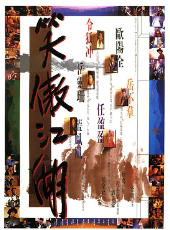
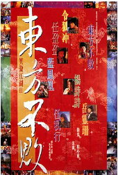
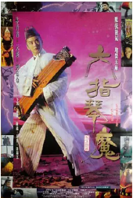
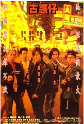
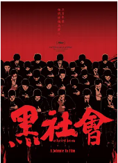

## 英雄本色

[豆瓣评分: 8.6](https://movie.douban.com/subject/1297574/)

导演: [吴宇森](https://movie.douban.com/celebrity/1027853/)

编剧: [陈庆嘉](https://movie.douban.com/celebrity/1274234/) / [吴宇森](https://movie.douban.com/celebrity/1027853/) / [梁淑华](https://movie.douban.com/celebrity/1322098/)

主演: [周润发](https://movie.douban.com/celebrity/1044899/) / [狄龙](https://movie.douban.com/celebrity/1025426/) / [张国荣](https://movie.douban.com/celebrity/1003494/) / [朱宝意](https://movie.douban.com/celebrity/1042434/) / [李子雄](https://movie.douban.com/celebrity/1037662/) / [田丰](https://movie.douban.com/celebrity/1019621/) / [吴宇森](https://movie.douban.com/celebrity/1027853/) / [曾江](https://movie.douban.com/celebrity/1275451/) / [成奎安](https://movie.douban.com/celebrity/1141665/) / [徐克](https://movie.douban.com/celebrity/1007152/) / [陈志辉](https://movie.douban.com/celebrity/1312869/)

上映日期: 2017-11-17(中国大陆) / 1986-08-02(中国香港)

片长: 95分钟

## 英雄本色 2

[豆瓣评分: 8.4](https://movie.douban.com/subject/1297862/)

导演: [吴宇森](https://movie.douban.com/celebrity/1027853/)

编剧: [徐克](https://movie.douban.com/celebrity/1007152/) / [吴宇森](https://movie.douban.com/celebrity/1027853/)

主演: [狄龙](https://movie.douban.com/celebrity/1025426/) / [张国荣](https://movie.douban.com/celebrity/1003494/) / [周润发](https://movie.douban.com/celebrity/1044899/) / [石天](https://movie.douban.com/celebrity/1146001/) / [关山](https://movie.douban.com/celebrity/1103354/) / [朱宝意](https://movie.douban.com/celebrity/1042434/) / [曾江](https://movie.douban.com/celebrity/1275451/) / [成奎安](https://movie.douban.com/celebrity/1141665/) / [吴孟达](https://movie.douban.com/celebrity/1016771/) / [王正方](https://movie.douban.com/celebrity/1300399/)

上映日期: 1987-12-17(中国香港)

片长: 105分钟

## 旺角卡门

[豆瓣评分: 7.8](https://movie.douban.com/subject/1304624/)

导演: [王家卫](https://movie.douban.com/celebrity/1041024/)

编剧: [王家卫](https://movie.douban.com/celebrity/1041024/)

主演: [刘德华](https://movie.douban.com/celebrity/1054424/) / [张学友](https://movie.douban.com/celebrity/1012563/) / [张曼玉](https://movie.douban.com/celebrity/1274231/) / [万梓良](https://movie.douban.com/celebrity/1023948/) / [林蛟](https://movie.douban.com/celebrity/1342431/) / [黄斌](https://movie.douban.com/celebrity/1301199/) / [陈志辉](https://movie.douban.com/celebrity/1312869/) / [王剑风](https://movie.douban.com/subject_search?search_text=王剑风) / [江道海](https://movie.douban.com/celebrity/1327763/) / [张叔平](https://movie.douban.com/celebrity/1274369/)

上映日期: 1988-06-09(中国香港)

片长: 102分钟

## 英雄本色 3：夕阳之歌

[豆瓣评分: 7.5](https://movie.douban.com/subject/1293759/)

导演: [徐克](https://movie.douban.com/celebrity/1007152/)

编剧: [戴富浩](https://movie.douban.com/celebrity/1377231/) / [梁耀明](https://movie.douban.com/celebrity/1377232/) / [徐克](https://movie.douban.com/celebrity/1007152/)

主演: [周润发](https://movie.douban.com/celebrity/1044899/) / [梅艳芳](https://movie.douban.com/celebrity/1047976/) / [梁家辉](https://movie.douban.com/celebrity/1118167/) / [张可颐](https://movie.douban.com/celebrity/1073994/) / [时任三郎](https://movie.douban.com/celebrity/1007548/) / [石坚](https://movie.douban.com/celebrity/1140701/) / [郑伟伦](https://movie.douban.com/celebrity/1416033/)

上映日期: 1989-10-20(中国香港)

片长: 120分钟

## 笑傲江湖

[豆瓣评分: 8.0](https://movie.douban.com/subject/1297304/)

导演: [胡金铨](https://movie.douban.com/celebrity/1048426/) / [徐克](https://movie.douban.com/celebrity/1007152/) / [李惠民](https://movie.douban.com/celebrity/1319466/) / [程小东](https://movie.douban.com/celebrity/1280664/)

编剧: [黄鹰](https://movie.douban.com/celebrity/1316778/) / [梁耀明](https://movie.douban.com/celebrity/1377232/) / [戴富浩](https://movie.douban.com/celebrity/1377231/) / [林纪陶](https://movie.douban.com/celebrity/1289291/) / [刘大木](https://movie.douban.com/celebrity/1354545/) / [更多...](javascript:;)

主演: [许冠杰](https://movie.douban.com/celebrity/1102963/) / [叶童](https://movie.douban.com/celebrity/1033481/) / [张学友](https://movie.douban.com/celebrity/1012563/) / [张敏](https://movie.douban.com/celebrity/1005297/) / [袁洁莹](https://movie.douban.com/celebrity/1051082/) / [刘兆铭](https://movie.douban.com/celebrity/1313719/) / [元华](https://movie.douban.com/celebrity/1050240/) / [刘洵](https://movie.douban.com/celebrity/1274304/) / [林正英](https://movie.douban.com/celebrity/1016823/) / [午马](https://movie.douban.com/celebrity/1054282/)

上映日期: 1990-01-27(中国台湾) / 1990-04-05(中国香港)

片长: 118分钟

## 天若有情

[豆瓣评分: 8.4](https://movie.douban.com/subject/1297710/)

导演: [陈木胜](https://movie.douban.com/celebrity/1274293/)

编剧: [阮世生](https://movie.douban.com/celebrity/1023957/)

主演: [刘德华](https://movie.douban.com/celebrity/1054424/) / [吴倩莲](https://movie.douban.com/celebrity/1166703/) / [吴孟达](https://movie.douban.com/celebrity/1016771/) / [朱铁和](https://movie.douban.com/celebrity/1331124/) / [刘江](https://movie.douban.com/celebrity/1274572/) / [黄光亮](https://movie.douban.com/celebrity/1301194/) / [林聪](https://movie.douban.com/subject_search?search_text=林聪)

上映日期: 1990-06-14(中国香港)

片长: 92分钟

## 笑傲江湖 2：东方不败

[豆瓣评分: 8.5](https://movie.douban.com/subject/1294417/)

导演: [程小东](https://movie.douban.com/celebrity/1280664/)

编剧: [徐克](https://movie.douban.com/celebrity/1007152/) / [邓碧燕](https://movie.douban.com/celebrity/1321260/) / [陈天璇](https://movie.douban.com/celebrity/1322467/)

主演: [李连杰](https://movie.douban.com/celebrity/1025146/) / [林青霞](https://movie.douban.com/celebrity/1044746/) / [关之琳](https://movie.douban.com/celebrity/1028064/) / [李嘉欣](https://movie.douban.com/celebrity/1139540/) / [李子雄](https://movie.douban.com/celebrity/1037662/) / [余安安](https://movie.douban.com/celebrity/1301560/) / [袁洁莹](https://movie.douban.com/celebrity/1051082/) / [刘洵](https://movie.douban.com/celebrity/1274304/) / [任世官](https://movie.douban.com/celebrity/1165667/) / [钱嘉乐](https://movie.douban.com/celebrity/1025476/)

上映日期: 1992-06-26(中国香港)

片长: 107分钟

## 笑傲江湖 3：东方不败之风云再起

[豆瓣评分: 7.4](https://movie.douban.com/subject/1394324/)

导演: [李惠民](https://movie.douban.com/celebrity/1319466/) / [程小东](https://movie.douban.com/celebrity/1280664/)

编剧: [司徒慧焯](https://movie.douban.com/celebrity/1298762/) / [张炭](https://movie.douban.com/celebrity/1313457/) / [徐克](https://movie.douban.com/celebrity/1007152/)

主演: [林青霞](https://movie.douban.com/celebrity/1044746/) / [王祖贤](https://movie.douban.com/celebrity/1166896/) / [王静莹](https://movie.douban.com/celebrity/1274668/) / [于荣光](https://movie.douban.com/celebrity/1274556/) / [刘洵](https://movie.douban.com/celebrity/1274304/) / [高雄](https://movie.douban.com/celebrity/1313798/) / [李家鼎](https://movie.douban.com/celebrity/1328058/) / [苑琼丹](https://movie.douban.com/celebrity/1274445/) / [任世官](https://movie.douban.com/celebrity/1165667/)

上映日期: 1993-01-21(中国香港)

片长: 98分钟

## 白莲邪神

[豆瓣评分: 6.3](https://movie.douban.com/subject/1304701/)

导演: [郑兆强](https://movie.douban.com/celebrity/1280597/)

编剧: [冯瑞熊](https://movie.douban.com/celebrity/1378957/)

主演: [杜少津](https://movie.douban.com/celebrity/1343825/) / [叶全真](https://movie.douban.com/celebrity/1051995/) / [袁洁莹](https://movie.douban.com/celebrity/1051082/)

上映日期: 1993-12-02(中国香港)

片长: 96分钟

## 六指琴魔

[豆瓣评分: 7.3](https://movie.douban.com/subject/1300265/)

导演: [吴勉勤](https://movie.douban.com/celebrity/1326358/)

编剧: [李敏才](https://movie.douban.com/celebrity/1326368/) / [李炯楷](https://movie.douban.com/celebrity/1326359/)

主演: [林青霞](https://movie.douban.com/celebrity/1044746/) / [元彪](https://movie.douban.com/celebrity/1163752/) / [刘嘉玲](https://movie.douban.com/celebrity/1036905/) / [林威](https://movie.douban.com/celebrity/1289306/) / [午马](https://movie.douban.com/celebrity/1054282/) / [徐锦江](https://movie.douban.com/celebrity/1028828/) / [郑爽](https://movie.douban.com/celebrity/1275766/)

上映日期: 1994-01-08(中国香港)

片长: 91分钟

## 刀

[豆瓣评分: 8.1](https://movie.douban.com/subject/1401962/)

导演: [徐克](https://movie.douban.com/celebrity/1007152/)

编剧: [许安](https://movie.douban.com/celebrity/1287130/) / [苏文星](https://movie.douban.com/celebrity/1360361/) / [徐克](https://movie.douban.com/celebrity/1007152/)

主演: [赵文卓](https://movie.douban.com/celebrity/1000526/) / [熊欣欣](https://movie.douban.com/celebrity/1033090/) / [桑妮](https://movie.douban.com/celebrity/1312866/) / [惠天赐](https://movie.douban.com/celebrity/1312867/) / [陈豪](https://movie.douban.com/celebrity/1003593/) / [钟碧霞](https://movie.douban.com/celebrity/1359144/) / [朱永棠](https://movie.douban.com/celebrity/1312868/) / [周嘉玲](https://movie.douban.com/celebrity/1037015/) / [谢天华](https://movie.douban.com/celebrity/1010833/) / [邹兆龙](https://movie.douban.com/celebrity/1022821/) / [元彬](https://movie.douban.com/celebrity/1278657/) / [陈志辉](https://movie.douban.com/celebrity/1312869/) / [雪妮](https://movie.douban.com/celebrity/1321088/)

上映日期: 1995-12-21(中国香港)

片长: 105分钟

## 古惑仔之人在江湖

[豆瓣评分: 7.9](https://movie.douban.com/subject/1433736/)

导演: [刘伟强](https://movie.douban.com/celebrity/1106979/)

编剧: [文隽](https://movie.douban.com/celebrity/1274823/)

主演: [郑伊健](https://movie.douban.com/celebrity/1031793/) / [陈小春](https://movie.douban.com/celebrity/1075760/) / [吴镇宇](https://movie.douban.com/celebrity/1037098/) / [黎姿](https://movie.douban.com/celebrity/1028208/) / [林晓峰](https://movie.douban.com/celebrity/1029805/) / [谢天华](https://movie.douban.com/celebrity/1010833/) / [林尚义](https://movie.douban.com/celebrity/1042889/) / [朱永棠](https://movie.douban.com/celebrity/1312868/) / [吴志雄](https://movie.douban.com/celebrity/1316796/) / [任达华](https://movie.douban.com/celebrity/1031194/) / [夏萍](https://movie.douban.com/celebrity/1029271/) / [罗兰](https://movie.douban.com/celebrity/1054340/) / [王龙威](https://movie.douban.com/celebrity/1012747/) / [陈秀茹](https://movie.douban.com/celebrity/1352862/)

上映日期: 1996-01-25(中国香港)

片长: 97分钟

## 古惑仔 2 之猛龙过江

[豆瓣评分: 7.7](https://movie.douban.com/subject/1473074/)

导演: [刘伟强](https://movie.douban.com/celebrity/1106979/)

编剧: [许莎朗](https://movie.douban.com/celebrity/1335187/) / [文隽](https://movie.douban.com/celebrity/1274823/)

主演: [郑伊健](https://movie.douban.com/celebrity/1031793/) / [陈小春](https://movie.douban.com/celebrity/1075760/) / [黎姿](https://movie.douban.com/celebrity/1028208/) / [邱淑贞](https://movie.douban.com/celebrity/1048296/) / [林晓峰](https://movie.douban.com/celebrity/1029805/) / [谢天华](https://movie.douban.com/celebrity/1010833/) / [朱永棠](https://movie.douban.com/celebrity/1312868/) / [黄秋生](https://movie.douban.com/celebrity/1050076/) / [任达华](https://movie.douban.com/celebrity/1031194/) / [雷震](https://movie.douban.com/celebrity/1052072/) / [柯受良](https://movie.douban.com/celebrity/1315099/) / [谭小环](https://movie.douban.com/celebrity/1052846/) / [陈豪](https://movie.douban.com/celebrity/1003593/)

上映日期: 1996-03-30(中国香港)

片长: 101分钟

## 古惑仔 3 之只手遮天

[豆瓣评分: 7.8](https://movie.douban.com/subject/1301283/)

导演: [刘伟强](https://movie.douban.com/celebrity/1106979/)

编剧: [许莎朗](https://movie.douban.com/celebrity/1335187/) / [文隽](https://movie.douban.com/celebrity/1274823/)

主演: [郑伊健](https://movie.douban.com/celebrity/1031793/) / [陈小春](https://movie.douban.com/celebrity/1075760/) / [黎姿](https://movie.douban.com/celebrity/1028208/) / [邱淑贞](https://movie.douban.com/celebrity/1048296/) / [林晓峰](https://movie.douban.com/celebrity/1029805/) / [谢天华](https://movie.douban.com/celebrity/1010833/) / [朱永棠](https://movie.douban.com/celebrity/1312868/) / [黄秋生](https://movie.douban.com/celebrity/1050076/) / [任达华](https://movie.douban.com/celebrity/1031194/) / [雷震](https://movie.douban.com/celebrity/1052072/) / [柯受良](https://movie.douban.com/celebrity/1315099/) / [谭小环](https://movie.douban.com/celebrity/1052846/) / [陈豪](https://movie.douban.com/celebrity/1003593/)

上映日期: 1996-03-30(中国香港)

片长: 98分钟

## 黑社会

[豆瓣评分: 8.4](https://movie.douban.com/subject/1309220/)

导演: [杜琪峰](https://movie.douban.com/celebrity/1160186/)

编剧: [游乃海](https://movie.douban.com/celebrity/1161310/) / [叶天成](https://movie.douban.com/celebrity/1306719/)

主演: [任达华](https://movie.douban.com/celebrity/1031194/) / [梁家辉](https://movie.douban.com/celebrity/1118167/) / [古天乐](https://movie.douban.com/celebrity/1027577/) / [林雪](https://movie.douban.com/celebrity/1274279/) / [张家辉](https://movie.douban.com/celebrity/1037273/) / [张兆辉](https://movie.douban.com/celebrity/1005843/) / [林家栋](https://movie.douban.com/celebrity/1050329/) / [王天林](https://movie.douban.com/celebrity/1041074/) / [谭炳文](https://movie.douban.com/celebrity/1317676/) / [邵美琪](https://movie.douban.com/celebrity/1152997/) / [姜大卫](https://movie.douban.com/celebrity/1013705/) / [尤勇智](https://movie.douban.com/celebrity/1301518/) / [黄浩然](https://movie.douban.com/celebrity/1051740/) / [车保罗](https://movie.douban.com/celebrity/1315269/) / [吴廷烨](https://movie.douban.com/celebrity/1275607/) / [郭锋](https://movie.douban.com/celebrity/1314508/) / [王钟](https://movie.douban.com/celebrity/1003807/) / [陈少鹏](https://movie.douban.com/celebrity/1326667/) / [元彬](https://movie.douban.com/celebrity/1278657/) / [甄懋强](https://movie.douban.com/celebrity/1364264/) / [洪罗拔](https://movie.douban.com/celebrity/1364265/) / [余袁稳](https://movie.douban.com/celebrity/1364266/) / [黄志伟](https://movie.douban.com/celebrity/1308890/) / [赵志诚](https://movie.douban.com/celebrity/1326360/) / [黄思恩](https://movie.douban.com/celebrity/1364267/) / [林文伟](https://movie.douban.com/celebrity/1364268/) / [何汉州](https://movie.douban.com/celebrity/1364269/) / [唐培中](https://movie.douban.com/celebrity/1364270/) / [何柱](https://movie.douban.com/celebrity/1364271/) / [元宝](https://movie.douban.com/celebrity/1346065/) / [李日升](https://movie.douban.com/celebrity/1364272/)

上映日期: 2005-10-20(中国香港)

片长: 100分钟 / 85分钟(删减版)

>解析：https://www.bilibili.com/video/BV14u411h72B

## 黑社会 2：以和为贵

[豆瓣评分: 8.3](https://movie.douban.com/subject/1484760/)

导演: [杜琪峰](https://movie.douban.com/celebrity/1160186/)

编剧: [游乃海](https://movie.douban.com/celebrity/1161310/) / [叶天成](https://movie.douban.com/celebrity/1306719/)

主演: [古天乐](https://movie.douban.com/celebrity/1027577/) / [任达华](https://movie.douban.com/celebrity/1031194/) / [张家辉](https://movie.douban.com/celebrity/1037273/) / [林家栋](https://movie.douban.com/celebrity/1050329/) / [王天林](https://movie.douban.com/celebrity/1041074/) / [林雪](https://movie.douban.com/celebrity/1274279/) / [安志杰](https://movie.douban.com/celebrity/1045364/) / [郑浩南](https://movie.douban.com/celebrity/1028605/) / [张兆辉](https://movie.douban.com/celebrity/1005843/) / [谭炳文](https://movie.douban.com/celebrity/1317676/) / [尤勇智](https://movie.douban.com/celebrity/1301518/) / [潘月彤](https://movie.douban.com/celebrity/1364273/) / [张武孝](https://movie.douban.com/celebrity/1364458/) / [元彬](https://movie.douban.com/celebrity/1278657/) / [莫醒麟](https://movie.douban.com/celebrity/1364459/) / [李日升](https://movie.douban.com/celebrity/1364272/) / [黄思恩](https://movie.douban.com/celebrity/1364267/) / [徐忠信](https://movie.douban.com/celebrity/1327646/) / [罗强](https://movie.douban.com/celebrity/1364460/) / [赵志诚](https://movie.douban.com/celebrity/1326360/) / [罗靖庭](https://movie.douban.com/celebrity/1364461/) / [唐培中](https://movie.douban.com/celebrity/1364270/) / [张荣祥](https://movie.douban.com/celebrity/1326361/) / [张志平](https://movie.douban.com/celebrity/1364462/) / [陈绍佳](https://movie.douban.com/celebrity/1364463/) / [周建军](https://movie.douban.com/celebrity/1364464/) / [李发源](https://movie.douban.com/celebrity/1360501/) / [陈桂芬](https://movie.douban.com/celebrity/1364465/) / [樊文杰](https://movie.douban.com/celebrity/1364466/) / [凌振帮](https://movie.douban.com/celebrity/1311447/) / [余袁稳](https://movie.douban.com/celebrity/1364266/)

上映日期: 2006-04-27(中国香港)

片长: 92分钟

>解析：https://www.bilibili.com/video/BV1qX4y1v7GN

## 一个人的武林

[豆瓣评分: 6.7](https://movie.douban.com/subject/24695277/)

导演: [陈德森](https://movie.douban.com/celebrity/1313007/)

编剧: [刘浩良](https://movie.douban.com/celebrity/1317346/) / [麦天枢](https://movie.douban.com/celebrity/1343080/) / [陈德森](https://movie.douban.com/celebrity/1313007/)

主演: [甄子丹](https://movie.douban.com/celebrity/1025194/) / [王宝强](https://movie.douban.com/celebrity/1274388/) / [杨采妮](https://movie.douban.com/celebrity/1018373/) / [白冰](https://movie.douban.com/celebrity/1275547/) / [方中信](https://movie.douban.com/celebrity/1033102/) / [樊少皇](https://movie.douban.com/celebrity/1018257/) / [释彦能](https://movie.douban.com/celebrity/1202926/) / [姜大卫](https://movie.douban.com/celebrity/1013705/) / [喻亢](https://movie.douban.com/celebrity/1339113/) / [思漩](https://movie.douban.com/celebrity/1317102/) / [吴浩康](https://movie.douban.com/celebrity/1313361/) / [纪焕博](https://movie.douban.com/celebrity/1321846/) / [王嘉慧](https://movie.douban.com/celebrity/1343836/) / [张文杰](https://movie.douban.com/celebrity/1336383/) / [刘伟强](https://movie.douban.com/celebrity/1106979/) / [郭子健](https://movie.douban.com/celebrity/1274244/) / [孟海](https://movie.douban.com/celebrity/1286778/) / [邹文怀](https://movie.douban.com/celebrity/1016883/) / [袁祥仁](https://movie.douban.com/celebrity/1301574/) / [张蓝心](https://movie.douban.com/celebrity/1324267/) / [元彬](https://movie.douban.com/celebrity/1278657/)

上映日期: 2014-10-31(中国大陆)

片长: 100分钟

- 古惑仔
- 无人区
- 机动部队
- 暗战
- 喋血街头
- 无双
- 寒战
- 毒战
- 新世界
- 无间道
- 扫毒
- 门徒
- 卑劣的街头
- 教父
- 监狱风云
- 杀破狼
- 导火线
- 狼牙
- 阿飞与阿基
- 咖喱和辣椒
- 喋血双雄
- 纵横四海
- 新仙鹤神针
- 赌神
- 监狱风云
- 东方三侠
- 方世玉