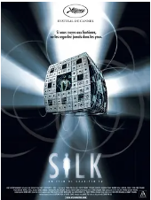

## 回魂夜

[豆瓣评分: 8.1](https://movie.douban.com/subject/1299765/)

导演: [刘镇伟](https://movie.douban.com/celebrity/1274431/)

编剧: [刘镇伟](https://movie.douban.com/celebrity/1274431/)

主演: [周星驰](https://movie.douban.com/celebrity/1048026/) / [莫文蔚](https://movie.douban.com/celebrity/1018248/) / [梁家仁](https://movie.douban.com/celebrity/1008125/) / [黄一飞](https://movie.douban.com/celebrity/1301215/) / [李力持](https://movie.douban.com/celebrity/1274246/) / [卢雄](https://movie.douban.com/celebrity/1377025/) / [张莽](https://movie.douban.com/celebrity/1305232/) / [谭淑梅](https://movie.douban.com/celebrity/1337283/) / [黄智贤](https://movie.douban.com/celebrity/1315071/) / [周志辉](https://movie.douban.com/celebrity/1343510/) / [侯焕玲](https://movie.douban.com/celebrity/1275424/)

上映日期: 1995-07-06

片长: 82分钟

## 双瞳

[豆瓣评分: 7.7](https://movie.douban.com/subject/1305046/)

导演: [陈国富](https://movie.douban.com/celebrity/1075862/)

编剧: [苏照彬](https://movie.douban.com/celebrity/1274731/) / [陈国富](https://movie.douban.com/celebrity/1075862/)

主演: [梁家辉](https://movie.douban.com/celebrity/1118167/) / [刘若英](https://movie.douban.com/celebrity/1041007/) / [戴立忍](https://movie.douban.com/celebrity/1023718/) / [大卫·摩斯](https://movie.douban.com/celebrity/1027810/) / [杨贵媚](https://movie.douban.com/celebrity/1165442/) / [林涵](https://movie.douban.com/celebrity/1331802/) / [郎雄](https://movie.douban.com/celebrity/1274507/)

上映日期: 2002-10-25(中国台湾)

片长: 113分钟

## 诡丝

[豆瓣评分: 7.2](https://movie.douban.com/subject/1780168/)

导演: [苏照彬](https://movie.douban.com/celebrity/1274731/)

编剧: [苏照彬](https://movie.douban.com/celebrity/1274731/)

主演: [张震](https://movie.douban.com/celebrity/1077991/) / [林嘉欣](https://movie.douban.com/celebrity/1204410/) / [江口洋介](https://movie.douban.com/celebrity/1088015/) / [徐熙媛](https://movie.douban.com/celebrity/1027645/) / [陈柏霖](https://movie.douban.com/celebrity/1211987/) / [张钧甯](https://movie.douban.com/celebrity/1257882/) / [万芳](https://movie.douban.com/celebrity/1325657/) / [陈冠伯](https://movie.douban.com/celebrity/1221966/) / [马之秦](https://movie.douban.com/celebrity/1323221/) / [津嘉山正种](https://movie.douban.com/celebrity/1156488/) / [戴立忍](https://movie.douban.com/celebrity/1023718/)

上映日期: 2006-09-29(中国台湾)

片长: 108分钟

## 

[豆瓣评分: ]()

## 

[豆瓣评分: ]()

## 

[豆瓣评分: ]()

## 

[豆瓣评分: ]()

## 

[豆瓣评分: ]()

- 小岛惊魂
- 灵异第六感
- 七宗罪
- 沉默的羔羊
- 闪灵
- 见鬼
- 恐怖游轮
- 前目的地
- 记忆碎片
- 异度空间    （枪王）
- 致命ID
- 1408幻影凶间
- 蝴蝶效应
- 迷雾
- 彗星来的那一夜
- 禁闭岛
- 致命魔术
- 十二猴子
- 误杀