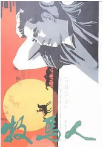
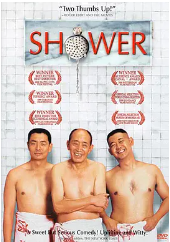
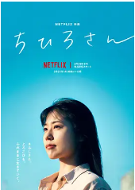

## 

[豆瓣评分: ]()

## 五朵金花

[豆瓣评分: 8.1](https://movie.douban.com/subject/1451563/)

导演: [王家乙](https://movie.douban.com/celebrity/1315903/)

编剧: [王公浦](https://movie.douban.com/celebrity/1329617/) / [赵季康](https://movie.douban.com/celebrity/1329618/)

主演: [杨丽坤](https://movie.douban.com/celebrity/1047617/) / [莫梓江](https://movie.douban.com/celebrity/1329619/) / [孙静贞](https://movie.douban.com/celebrity/1329620/) / [谭尧中](https://movie.douban.com/celebrity/1329621/) / [王苏娅](https://movie.douban.com/celebrity/1316923/) / [朱一锦](https://movie.douban.com/celebrity/1329622/)

上映日期: 1959-10

片长: 95分钟

## 刘三姐

[豆瓣评分: 8.5](https://movie.douban.com/subject/1298755/)

导演: [苏里](https://movie.douban.com/celebrity/1315794/)

编剧: [乔羽](https://movie.douban.com/celebrity/1315964/)

主演: [黄婉秋](https://movie.douban.com/celebrity/1093959/) / [刘世龙](https://movie.douban.com/celebrity/1331541/) / [张巨光](https://movie.douban.com/celebrity/1370230/) / [梁音](https://movie.douban.com/celebrity/1275909/) / [张文君](https://movie.douban.com/celebrity/1383247/) / [夏宗学](https://movie.douban.com/celebrity/1383245/) / [贺汝瑜](https://movie.douban.com/celebrity/1361184/) / [方化](https://movie.douban.com/celebrity/1315408/)

上映日期: 1960(中国大陆)

片长: 112分钟

## 牧马人

[豆瓣评分: 9.1](https://movie.douban.com/subject/1308038/)

导演: [谢晋](https://movie.douban.com/celebrity/1042500/)

编剧: [李凖](https://movie.douban.com/celebrity/1305477/)

主演: [朱时茂](https://movie.douban.com/celebrity/1313275/) / [丛珊](https://movie.douban.com/celebrity/1047358/) / [刘琼](https://movie.douban.com/celebrity/1030875/) / [牛犇](https://movie.douban.com/celebrity/1275893/) / [雷仲谦](https://movie.douban.com/celebrity/1406047/) / [奇梦石](https://movie.douban.com/celebrity/1316147/)

上映日期: 1982

片长: 99分钟

## 洗澡

[豆瓣评分: 8.4](https://movie.douban.com/subject/1303485/)

导演: [张杨](https://movie.douban.com/celebrity/1301697/)

编剧: [张杨](https://movie.douban.com/celebrity/1301697/) / [刘奋斗](https://movie.douban.com/celebrity/1275174/) / [霍昕](https://movie.douban.com/celebrity/1287182/) / [刁亦男](https://movie.douban.com/celebrity/1276173/) / [蔡尚君](https://movie.douban.com/celebrity/1315693/)

主演: [姜武](https://movie.douban.com/celebrity/1274290/) / [濮存昕](https://movie.douban.com/celebrity/1274855/) / [朱旭](https://movie.douban.com/celebrity/1275118/) / [李丁](https://movie.douban.com/celebrity/1274854/) / [封顺](https://movie.douban.com/celebrity/1344505/) / [何冰](https://movie.douban.com/celebrity/1274825/) / [杜彭](https://movie.douban.com/subject_search?search_text=杜彭) / [隋永清](https://movie.douban.com/celebrity/1388971/) / [胡贝贝](https://movie.douban.com/subject_search?search_text=胡贝贝) / [金钊](https://movie.douban.com/celebrity/1374585/) / [杨子纯](https://movie.douban.com/celebrity/1345557/) / [方征](https://movie.douban.com/celebrity/1370871/) / [刘夕媛](https://movie.douban.com/subject_search?search_text=刘夕媛) / [苗得发](https://movie.douban.com/subject_search?search_text=苗得发) / [乔凤伟](https://movie.douban.com/subject_search?search_text=乔凤伟)

上映日期: 1999-09-14(多伦多电影节)

片长: 92分钟

## 心灵驿站

[豆瓣评分: 8.1](https://movie.douban.com/subject/1308632/)

导演: [汤姆·麦卡锡](https://movie.douban.com/celebrity/1004746/)

编剧: [汤姆·麦卡锡](https://movie.douban.com/celebrity/1004746/)

主演: [彼特·丁拉基](https://movie.douban.com/celebrity/1019009/) / [派翠西娅·克拉克森](https://movie.douban.com/celebrity/1013791/) / [鲍比·坎纳瓦尔](https://movie.douban.com/celebrity/1044985/) / [乔什·帕斯](https://movie.douban.com/celebrity/1018122/) / [保罗·本杰明](https://movie.douban.com/celebrity/1278352/) / [Jase Blankfort](https://movie.douban.com/celebrity/1064194/) / [鲍拉·加茜丝](https://movie.douban.com/celebrity/1032005/) / [理查德·坎德](https://movie.douban.com/celebrity/1041144/) / [林恩·科恩](https://movie.douban.com/celebrity/1322152/) / [瑞雯·古德温](https://movie.douban.com/celebrity/1102066/) / [马拉·苏查雷特扎](https://movie.douban.com/celebrity/1155461/) / [米歇尔·威廉姆斯](https://movie.douban.com/celebrity/1049491/) / [杰西·巴托克](https://movie.douban.com/celebrity/1032460/) / [乔·洛·特鲁格里奥](https://movie.douban.com/celebrity/1125111/) / [约翰·斯拉特里](https://movie.douban.com/celebrity/1022661/) / [麦丽·弗拉纳甘](https://movie.douban.com/celebrity/1090433/) / [Sarah Bolger](https://movie.douban.com/celebrity/1225453/) / [伊林·盖特兹](https://movie.douban.com/celebrity/1100178/) / [Jeremy Bergman](https://movie.douban.com/celebrity/1064883/)

上映日期: 2003-10-03(美国)

片长: 89分钟

## 千寻小姐

[豆瓣评分: 7.8](https://movie.douban.com/subject/35791966/)

导演: [今泉力哉](https://movie.douban.com/celebrity/1320194/)

编剧: [泽井香织](https://movie.douban.com/celebrity/1430608/) / [今泉力哉](https://movie.douban.com/celebrity/1320194/)

主演: [有村架纯](https://movie.douban.com/celebrity/1275528/) / [丰岛花](https://movie.douban.com/celebrity/1335346/) / [岛田铁太](https://movie.douban.com/celebrity/1479823/) / [van](https://movie.douban.com/celebrity/1486607/) / [若叶龙也](https://movie.douban.com/celebrity/1275295/) / [佐久间由衣](https://movie.douban.com/celebrity/1348586/) / [长泽树](https://movie.douban.com/celebrity/1451649/) / [市川实和子](https://movie.douban.com/celebrity/1034148/) / [铃木庆一](https://movie.douban.com/celebrity/1052012/) / [根岸季衣](https://movie.douban.com/celebrity/1008299/) / [平田满](https://movie.douban.com/celebrity/1043004/) / [中川雅也](https://movie.douban.com/celebrity/1042693/) / [风吹淳](https://movie.douban.com/celebrity/1048583/)

上映日期: 2023-02-23(日本网络)

片长: 131分钟

- 遗愿清单
- 警察有约
- 何必有我
- 落叶归根
- 活着
- 宇宙探索编辑部
- hello，树先生
- 小森林
- 入殓师
- 一个叫欧维的男人决定去死
- 触不可及
- 海蒂和爷爷
- 忠犬八公的故事
- 幸福终点站
- 阿郎的故事
- 甜蜜蜜
- 岁月神偷
- 秋天的童话
- 碧海蓝天
- 爱在黎明破晓前
- 爱在日落黄昏时
- 爱在午夜降临前
- 弱点
- 七磅
- 钢的琴
- 三峡好人
- 一一
- 山河故人
- 心灵驿站
- 癫佬正传
- 笼民
- 大鱼
- 返老还童
- 雨人
- 查理和巧克力工厂
- 剪刀手爱德华
- 卒迹