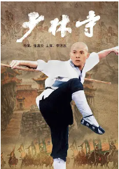
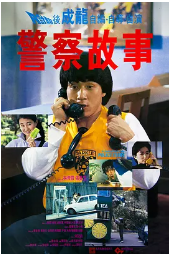
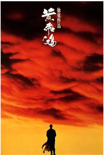
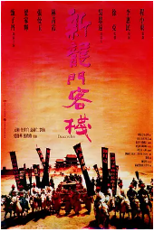
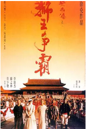
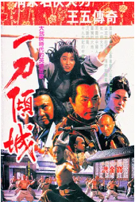
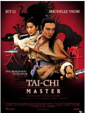
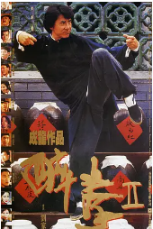
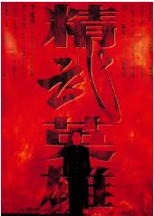

## 

[豆瓣评分: ]()

## 醉拳

[豆瓣评分: 7.8](https://movie.douban.com/subject/1296693/)

导演: [袁和平](https://movie.douban.com/celebrity/1275026/)

编剧: [袁和平](https://movie.douban.com/celebrity/1275026/) / [萧龙](https://movie.douban.com/subject_search?search_text=萧龙)

主演: [成龙](https://movie.douban.com/celebrity/1054531/) / [黄正利](https://movie.douban.com/celebrity/1037123/) / [袁小田](https://movie.douban.com/subject_search?search_text=袁小田) / [石天](https://movie.douban.com/celebrity/1146001/) / [冯敬文](https://movie.douban.com/subject_search?search_text=冯敬文)

上映日期: 1978-10-05

片长: 111分钟

## 少林寺

[豆瓣评分: 8.4](https://movie.douban.com/subject/1301198/)

导演: [张鑫炎](https://movie.douban.com/celebrity/1274841/)

编剧: [卢兆璋](https://movie.douban.com/celebrity/1322413/) / [薛后](https://movie.douban.com/celebrity/1347791/)

主演: [李连杰](https://movie.douban.com/celebrity/1025146/) / [于海](https://movie.douban.com/celebrity/1312752/) / [丁岚](https://movie.douban.com/celebrity/1274837/) / [于承惠](https://movie.douban.com/celebrity/1316257/) / [计春华](https://movie.douban.com/celebrity/1275319/) / [王光权](https://movie.douban.com/celebrity/1340052/) / [胡坚强](https://movie.douban.com/celebrity/1322317/) / [孙建魁](https://movie.douban.com/celebrity/1319122/) / [刘怀良](https://movie.douban.com/celebrity/1347793/) / [张建文](https://movie.douban.com/celebrity/1347797/) / [阎涤华](https://movie.douban.com/celebrity/1347795/) / [王珏](https://movie.douban.com/celebrity/1316753/) / [杜传扬](https://movie.douban.com/celebrity/1347796/) / [崔志强](https://movie.douban.com/celebrity/1347794/) / [寻峰](https://movie.douban.com/celebrity/1335513/) / [潘汉光](https://movie.douban.com/celebrity/1347792/) / [方平](https://movie.douban.com/subject_search?search_text=方平) / [潘清福](https://movie.douban.com/celebrity/1322316/) / [蒋洪波](https://movie.douban.com/celebrity/1375281/)

上映日期: 1982-02-01(中国大陆) / 1982-01-21(中国香港)

片长: 92分钟

## A 计划

[豆瓣评分: 8.2](https://movie.douban.com/subject/1297909/)

导演: [成龙](https://movie.douban.com/celebrity/1054531/)

编剧: [邓景生](https://movie.douban.com/celebrity/1298905/) / [成龙](https://movie.douban.com/celebrity/1054531/)

主演: [成龙](https://movie.douban.com/celebrity/1054531/) / [洪金宝](https://movie.douban.com/celebrity/1055887/) / [元彪](https://movie.douban.com/celebrity/1163752/) / [黄曼凝](https://movie.douban.com/celebrity/1341914/) / [狄威](https://movie.douban.com/celebrity/1318441/) / [太保](https://movie.douban.com/celebrity/1312993/) / [午马](https://movie.douban.com/celebrity/1054282/) / [钱嘉乐](https://movie.douban.com/celebrity/1025476/) / [火星](https://movie.douban.com/celebrity/1033056/) / [李海生](https://movie.douban.com/celebrity/1274574/) / [关海山](https://movie.douban.com/celebrity/1289167/) / [王伟](https://movie.douban.com/celebrity/1274583/) / [罗浩楷](https://movie.douban.com/celebrity/1329430/) / [刘克宣](https://movie.douban.com/celebrity/1340134/) / [韩义生](https://movie.douban.com/celebrity/1341964/) / [劳拉·福纳](https://movie.douban.com/celebrity/1018950/) / [冯敬文](https://movie.douban.com/celebrity/1341397/) / [李健生](https://movie.douban.com/celebrity/1328406/) / [吴勉勤](https://movie.douban.com/celebrity/1326358/)

上映日期: 1983-12-22(中国香港)

片长: 105分钟 / 97分钟(美国)

## 警察故事

[豆瓣评分: 8.2](https://movie.douban.com/subject/1400868/)

导演: [成龙](https://movie.douban.com/celebrity/1054531/)

编剧: [邓景生](https://movie.douban.com/celebrity/1298905/) / [成龙](https://movie.douban.com/celebrity/1054531/)

主演: [成龙](https://movie.douban.com/celebrity/1054531/) / [林青霞](https://movie.douban.com/celebrity/1044746/) / [张曼玉](https://movie.douban.com/celebrity/1274231/) / [董骠](https://movie.douban.com/celebrity/1274446/) / [楚原](https://movie.douban.com/celebrity/1275401/) / [曹查理](https://movie.douban.com/celebrity/1275320/) / [汤镇业](https://movie.douban.com/celebrity/1028943/) / [刘雅丽](https://movie.douban.com/celebrity/1425124/) / [卢敏仪](https://movie.douban.com/celebrity/1318983/) / [林国斌](https://movie.douban.com/celebrity/1289293/)

上映日期: 1985-12-14(中国香港)

片长: 101分钟 / 106分钟(日本加长版) / 99分钟(英国) / 90分钟(美国)

## 黄河大侠

[豆瓣评分: 7.8](https://movie.douban.com/subject/1472019/)

导演: [张鑫炎](https://movie.douban.com/celebrity/1274841/) / [张子恩](https://movie.douban.com/celebrity/1275877/)

编剧: [黄麦铨](https://movie.douban.com/subject_search?search_text=黄麦铨)

主演: [于承惠](https://movie.douban.com/celebrity/1316257/) / [靳德茂](https://movie.douban.com/celebrity/1320042/) / [淳于珊珊](https://movie.douban.com/celebrity/1040352/) / [赵志刚](https://movie.douban.com/celebrity/1318014/) / [计春华](https://movie.douban.com/celebrity/1275319/) / [万琼](https://movie.douban.com/celebrity/1335474/) / [熊欣欣](https://movie.douban.com/celebrity/1033090/)

上映日期: 1988-06-09(中国大陆)

片长: 91分钟

## A 计划续集

[豆瓣评分: 7.9](https://movie.douban.com/subject/1299120/)

导演: [成龙](https://movie.douban.com/celebrity/1054531/)

编剧: [成龙](https://movie.douban.com/celebrity/1054531/) / [邓景生](https://movie.douban.com/celebrity/1298905/)

主演: [成龙](https://movie.douban.com/celebrity/1054531/) / [张曼玉](https://movie.douban.com/celebrity/1274231/) / [关之琳](https://movie.douban.com/celebrity/1028064/) / [刘嘉玲](https://movie.douban.com/celebrity/1036905/) / [林威](https://movie.douban.com/celebrity/1289306/) / [董骠](https://movie.douban.com/celebrity/1274446/) / [关海山](https://movie.douban.com/celebrity/1289167/) / [吕良伟](https://movie.douban.com/celebrity/1037706/) / [何家劲](https://movie.douban.com/celebrity/1014913/) / [钟镇涛](https://movie.douban.com/celebrity/1033223/) / [许冠英](https://movie.douban.com/celebrity/1023727/) / [陈友](https://movie.douban.com/celebrity/1028948/) / [卢惠光](https://movie.douban.com/celebrity/1032633/) / [陈惠敏](https://movie.douban.com/celebrity/1012699/) / [吕方](https://movie.douban.com/celebrity/1313496/) / [简慧真](https://movie.douban.com/celebrity/1014977/) / [林德禄 ](https://movie.douban.com/celebrity/1326068/)/ [火星](https://movie.douban.com/celebrity/1033056/) / [李健生](https://movie.douban.com/celebrity/1328406/) / [林国斌](https://movie.douban.com/celebrity/1289293/) / [黄新](https://movie.douban.com/celebrity/1342013/) / [黄曼凝](https://movie.douban.com/celebrity/1341914/) / [朱铁和](https://movie.douban.com/celebrity/1331124/) / [刘兆铭](https://movie.douban.com/celebrity/1313719/) / [韩义生](https://movie.douban.com/celebrity/1341964/) / [博兹达尔·斯密贾尼克](https://movie.douban.com/celebrity/1156008/) / [太保](https://movie.douban.com/celebrity/1312993/) / [王龙威](https://movie.douban.com/celebrity/1012747/)

上映日期: 1987-08-19(中国香港) / 1987-07-25(日本)

片长: 106分钟 / 101分钟(美国)

## 黄飞鸿

[豆瓣评分: 8.4](https://movie.douban.com/subject/1298443/)

导演: [徐克](https://movie.douban.com/celebrity/1007152/)

编剧: [徐克](https://movie.douban.com/celebrity/1007152/) / [阮继志](https://movie.douban.com/celebrity/1322097/) / [梁耀明](https://movie.douban.com/subject_search?search_text=梁耀明) / [邓碧燕](https://movie.douban.com/celebrity/1321260/)

主演: [李连杰](https://movie.douban.com/celebrity/1025146/) / [元彪](https://movie.douban.com/celebrity/1163752/) / [关之琳](https://movie.douban.com/celebrity/1028064/) / [张学友](https://movie.douban.com/celebrity/1012563/) / [郑则仕](https://movie.douban.com/celebrity/1019278/) / [袁锦辉](https://movie.douban.com/subject_search?search_text=袁锦辉) / [邱建国](https://movie.douban.com/celebrity/1324739/) / [任世官](https://movie.douban.com/celebrity/1165667/) / [袁祥仁](https://movie.douban.com/subject_search?search_text=袁祥仁) / [熊欣欣](https://movie.douban.com/celebrity/1033090/)

上映日期: 1991-08-15

片长: 134分钟 / 95分钟(德国) / 99分钟(美国)

> **如果这个世界真有金山的话，那些洋船为什么要来我们的港口？也许，我们已经站在金山上了。**

## 黄飞鸿之二：男儿当自强

[豆瓣评分: 8.3](https://movie.douban.com/subject/1293475/)

导演: [徐克](https://movie.douban.com/celebrity/1007152/)

编剧: [徐克](https://movie.douban.com/celebrity/1007152/) / [张炭](https://movie.douban.com/subject_search?search_text=张炭) / [陈天璇](https://movie.douban.com/subject_search?search_text=陈天璇)

主演: [李连杰](https://movie.douban.com/celebrity/1025146/) / [关之琳](https://movie.douban.com/celebrity/1028064/) / [甄子丹](https://movie.douban.com/celebrity/1025194/) / [莫少聪](https://movie.douban.com/celebrity/1037846/) / [姜大卫](https://movie.douban.com/celebrity/1013705/) / [熊欣欣](https://movie.douban.com/celebrity/1033090/) / [张铁林](https://movie.douban.com/celebrity/1020586/) / [任世官](https://movie.douban.com/celebrity/1165667/) / [梁日豪](https://movie.douban.com/subject_search?search_text=梁日豪) / [何家驹](https://movie.douban.com/subject_search?search_text=何家驹) / [方保罗](https://movie.douban.com/subject_search?search_text=方保罗)

上映日期: 1992-04-16
片长: 107分钟

> **但愿朝阳长照我土，莫忘烈士鲜血满地。**

## 新龙门客栈

[豆瓣评分: 8.7](https://movie.douban.com/subject/1292287/)

导演: [李惠民](https://movie.douban.com/celebrity/1319466/)

编剧: [徐克](https://movie.douban.com/celebrity/1007152/) / [张炭](https://movie.douban.com/celebrity/1313457/) / [何冀平](https://movie.douban.com/celebrity/1312026/)

主演: [张曼玉](https://movie.douban.com/celebrity/1274231/) / [林青霞](https://movie.douban.com/celebrity/1044746/) / [梁家辉](https://movie.douban.com/celebrity/1118167/) / [甄子丹](https://movie.douban.com/celebrity/1025194/) / [熊欣欣](https://movie.douban.com/celebrity/1033090/) / [刘洵](https://movie.douban.com/celebrity/1274304/) / [任世官](https://movie.douban.com/celebrity/1165667/) / [吴启华](https://movie.douban.com/celebrity/1274420/) / [袁祥仁](https://movie.douban.com/celebrity/1301574/) / [徐锦江](https://movie.douban.com/celebrity/1028828/) / [郑希怡](https://movie.douban.com/celebrity/1221295/) / [王彤川](https://movie.douban.com/celebrity/1369028/) / [王伟顺](https://movie.douban.com/celebrity/1383611/) / [蔡浩](https://movie.douban.com/celebrity/1383612/)

上映日期: 2012-02-24(中国大陆) / 1992-08-27(中国香港)

片长: 88分钟 / 99分钟 / 103分钟(美国)

## 黄飞鸿之三：狮王争霸

[豆瓣评分: 8.2](https://movie.douban.com/subject/1292704/)

导演: [徐克](https://movie.douban.com/celebrity/1007152/)

编剧: [徐克](https://movie.douban.com/celebrity/1007152/) / [张炭](https://movie.douban.com/celebrity/1313457/) / [陈天璇](https://movie.douban.com/celebrity/1322467/)

主演: [李连杰](https://movie.douban.com/celebrity/1025146/) / [关之琳](https://movie.douban.com/celebrity/1028064/) / [莫少聪](https://movie.douban.com/celebrity/1037846/) / [熊欣欣](https://movie.douban.com/celebrity/1033090/) / [刘洵](https://movie.douban.com/celebrity/1274304/) / [庄域飞](https://movie.douban.com/celebrity/1167299/) / [Jin Chiu](https://movie.douban.com/subject_search?search_text=Jin Chiu) / [葛存壮](https://movie.douban.com/celebrity/1275415/) / [Tak-Yan Wong](https://movie.douban.com/subject_search?search_text=Tak-Yan Wong) / [张春仲](https://movie.douban.com/celebrity/1318275/) / [孟瑾](https://movie.douban.com/celebrity/1370652/) / [李炳雷](https://movie.douban.com/celebrity/1357568/)

上映日期: 1992-12-24(中国台湾) / 1993-02-11(中国香港)

片长: 112分钟 / 125分钟(中国大陆) / 132分钟(中国台湾)

> **李大人，所谓胜者为王，败者为寇。刚才天炮一响，如果没有天灯挡枪的话，胜负归谁还真没人知道。现在金牌在我黄某的手上，并非我赢了，大人为了大显我民神威而办的这场狮王争霸，死伤这么多人，在世人面前，其实我们都输了。以小民之见，我们不只要练武强身，以抗外敌，最重要的还是广开民智，治武合一，那才是国富民强之道。**

## 一刀倾城

[豆瓣评分: 8.2](https://movie.douban.com/subject/1299085/)

导演: [洪金宝](https://movie.douban.com/celebrity/1055887/)

编剧: [张炭](https://movie.douban.com/celebrity/1313457/) / [司徒卓汉](https://movie.douban.com/celebrity/1314905/)

主演: [狄龙](https://movie.douban.com/celebrity/1025426/) / [杨凡](https://movie.douban.com/celebrity/1336898/) / [杨丽菁](https://movie.douban.com/celebrity/1037356/) / [关之琳](https://movie.douban.com/celebrity/1028064/) / [赵长军](https://movie.douban.com/celebrity/1327076/) / [洪金宝](https://movie.douban.com/celebrity/1055887/) / [黄锦江](https://movie.douban.com/celebrity/1275605/) / [邹兆龙](https://movie.douban.com/celebrity/1022821/) / [刘洵](https://movie.douban.com/celebrity/1274304/)

上映日期: 1993-07-15

片长: 103分钟

## 太极张三丰

[豆瓣评分: 8.1](https://movie.douban.com/subject/1294561/)

导演: [袁和平](https://movie.douban.com/celebrity/1275026/)

编剧: [叶广俭](https://movie.douban.com/celebrity/1301507/)

主演: [李连杰](https://movie.douban.com/celebrity/1025146/) / [杨紫琼](https://movie.douban.com/celebrity/1022664/) / [钱小豪](https://movie.douban.com/celebrity/1005415/) / [袁洁莹](https://movie.douban.com/celebrity/1051082/) / [袁祥仁](https://movie.douban.com/celebrity/1301574/) / [刘洵](https://movie.douban.com/celebrity/1274304/) / [于海](https://movie.douban.com/celebrity/1312752/)

上映日期: 1993-11-18(中国香港)

片长: 96分钟

## 醉拳 2

[豆瓣评分: 8.1](https://movie.douban.com/subject/1307319/)

导演: [刘家良](https://movie.douban.com/celebrity/1275361/)

编剧: [邓景生](https://movie.douban.com/celebrity/1298905/) / [阮继志](https://movie.douban.com/celebrity/1322097/) / [唐敏明](https://movie.douban.com/celebrity/1425922/)

主演: [成龙](https://movie.douban.com/celebrity/1054531/) / [梅艳芳](https://movie.douban.com/celebrity/1047976/) / [狄龙](https://movie.douban.com/celebrity/1025426/) / [黄日华](https://movie.douban.com/celebrity/1050735/) / [刘家良](https://movie.douban.com/celebrity/1275361/) / [卢惠光](https://movie.douban.com/celebrity/1032633/) / [钱嘉乐](https://movie.douban.com/celebrity/1025476/) / [翁虹](https://movie.douban.com/celebrity/1162012/) / [鲍方](https://movie.douban.com/celebrity/1044120/) / [曹颖](https://movie.douban.com/celebrity/1275654/) / [刘德华](https://movie.douban.com/celebrity/1054424/)

上映日期: 1994-02-03(中国香港)

片长: 102分钟 / 99分钟(美国)

## 精武英雄

[豆瓣评分: 8.6](https://movie.douban.com/subject/1292895/)

导演: [陈嘉上](https://movie.douban.com/celebrity/1274245/)

编剧: [陈嘉上](https://movie.douban.com/celebrity/1274245/) / [叶广俭](https://movie.douban.com/celebrity/1301507/) / [林纪陶](https://movie.douban.com/celebrity/1289291/)

主演: [李连杰](https://movie.douban.com/celebrity/1025146/) / [中山忍](https://movie.douban.com/celebrity/1017839/) / [钱小豪](https://movie.douban.com/celebrity/1005415/) / [蔡少芬](https://movie.douban.com/celebrity/1050946/) / [周比利](https://movie.douban.com/celebrity/1050501/) / [秦沛](https://movie.douban.com/celebrity/1048476/) / [仓田保昭](https://movie.douban.com/celebrity/1032379/) / [袁祥仁](https://movie.douban.com/celebrity/1301574/) / [楼学贤](https://movie.douban.com/celebrity/1327277/) / [高桥利道](https://movie.douban.com/celebrity/1349073/) / [谭淑梅](https://movie.douban.com/celebrity/1337283/) / [彭子晴](https://movie.douban.com/celebrity/1337251/) / [张浚鸿](https://movie.douban.com/celebrity/1349132/) / [李文标](https://movie.douban.com/celebrity/1349131/) / [林刚](https://movie.douban.com/celebrity/1349133/) / [麦咏麟](https://movie.douban.com/celebrity/1320018/) / [黄新](https://movie.douban.com/celebrity/1342013/) / [卢庆辉](https://movie.douban.com/celebrity/1315281/) / [刘思乐](https://movie.douban.com/celebrity/1349135/)

上映日期: 1994-12-22(中国香港)

片长: 107分钟 / 98分钟(德国)

## 黄飞鸿之西域雄狮

[豆瓣评分: ]()

**佛山，黄飞鸿。**

- 
- 荒野大镖客
- 黄昏双镖客
- 霍元甲
- 目中无人
- 中南海保镖
- 给爸爸的信
- 
- 
- 唐山大兄
- 
- 陈真