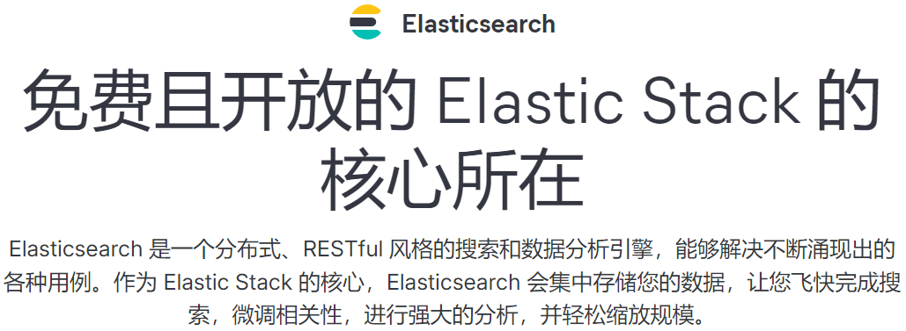
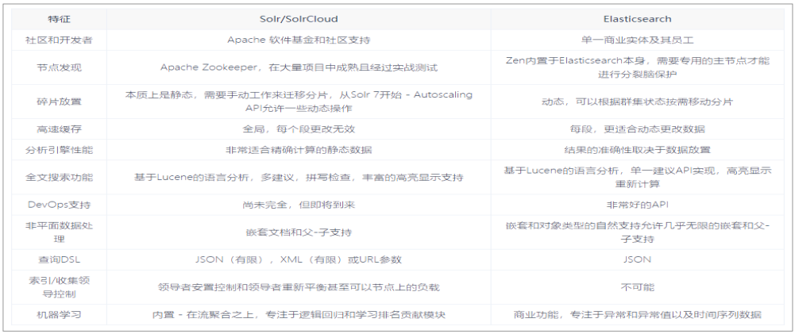
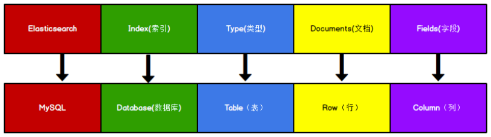
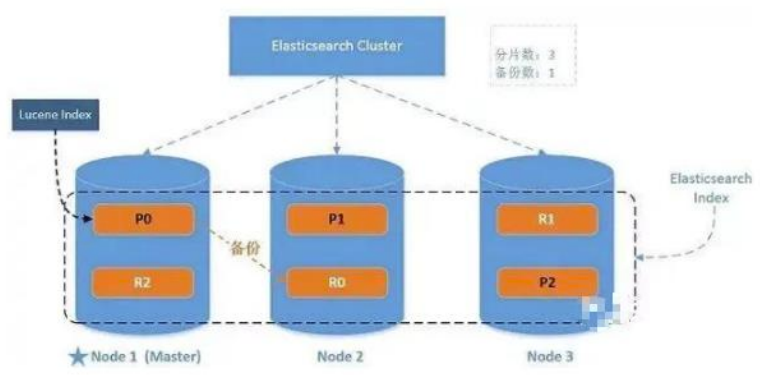

> **$\textcolor{RubineRed}{Author: ACatSmiling}$**
>
> **$\color{RubineRed}{Since: 2024-07-25}$**

## 概述

### 什么是 Elasticsearch

官方网站：https://www.elastic.co/cn/elasticsearch



`The Elastic Stack，包括 Elasticsearch、Kibana、Beats 和 Logstash（也称为 ELK Stack）。` 能够安全可靠地获取任何来源、任何格式的数据，然后实时地对数据进行搜索、分析和可视化。

**`Elaticsearch`**：**简称为 ES，ES 是一个开源的高扩展的分布式全文搜索引擎，是整个 Elastic  Stack 技术栈的核心。它可以近乎实时的存储、检索数据；本身扩展性很好，可以扩展到上百台服务器，处理 PB 级别的数据。**

### 全文搜索引擎

Google，百度类的网站搜索，它们都是根据网页中的关键字生成索引，我们在搜索的时候输入关键字，它们会将该关键字即索引匹配到的所有网页返回；还有常见的项目中应用日志的搜索等等。对于这些非结构化的数据文本，关系型数据库搜索不是能很好的支持。

一般传统数据库，全文检索都实现的很鸡肋，因为一般也没人用数据库存文本字段。进行全文检索需要扫描整个表，如果数据量大的话，即使对 SQL 的语法优化，也收效甚微。建立了索引，但是维护起来也很麻烦，对于 insert 和 update 操作都会重新构建索引。

基于以上原因可以分析得出，在一些生产环境中，使用常规的搜索方式，性能是非常差的：

- 搜索的数据对象是大量的非结构化的文本数据。
- 文件记录量达到数十万或数百万个甚至更多。
- 支持大量基于交互式文本的查询。
- 需求非常灵活的全文搜索查询。
- 对高度相关的搜索结果的有特殊需求，但是没有可用的关系数据库可以满足。
- 对不同记录类型、非文本数据操作或安全事务处理的需求相对较少的情况。

为了解决结构化数据搜索和非结构化数据搜索性能问题，我们就需要专业、健壮、强大的全文搜索引擎。

这里说到的`全文搜索引擎`指的是目前广泛应用的主流搜索引擎。**它的工作原理是计算机索引程序通过扫描文章中的每一个词，对每一个词建立一个索引，指明该词在文章中出现的次数和位置，当用户查询时，检索程序就根据事先建立的索引进行查找，并将查找的结果反馈给用户的检索方式。**这个过程类似于通过字典中的检索字表查字的过程。

### Elasticsearch vs Solr

`Lucene`是 Apache 软件基金会 Jakarta 项目组的一个子项目，提供了一个简单却强大的应用程式接口，能够做全文索引和搜寻。在 Java 开发环境里，Lucene 是一个成熟的免费开源工具。就其本身而言，Lucene 是当前以及最近几年最受欢迎的免费 Java 信息检索程序库。但 Lucene 只是一个提供全文搜索功能类库的核心工具包，而真正使用它还需要一个完善的服务框架搭建起来进行应用。

目前市面上流行的搜索引擎软件，主流的就两款：Elasticsearch 和 Solr，这两款都是基于 Lucene 搭建的，可以独立部署启动的搜索引擎服务软件。由于内核相同，所以两者除了服务器安装、部署、管理、集群以外，对于数据的操作修改、添加、保存、查询等等都十分类似。

在使用过程中，一般都会将 Elasticsearch 和 Solr 这两个软件对比，然后进行选型。这两个搜索引擎都是流行的、先进的开源搜索引擎。它们都是围绕核心底层搜索库 Lucene 构建的，但它们又是不同的，各有其优点和缺点：



Elasticsearch 和 Solr 都是开源搜索引擎，那么我们在使用时该如何选择呢？

- Google 搜索趋势结果表明，与 Solr 相比，Elasticsearch 具有很大的吸引力，但这并不意味着 Apache Solr 已经死亡。虽然有些人可能不这么认为，但 Solr 仍然是最受欢迎的搜索引擎之一，拥有强大的社区和开源支持。
- 与 Solr 相比，Elasticsearch 易于安装且非常轻巧。此外，你可以在几分钟内安装并运行 Elasticsearch。但是，如果 Elasticsearch 管理不当，这种易于部署和使用可能会成为一个问题。基于 JSON 的配置很简单，但如果要为文件中的每个配置指定注释，那么它不适合您。**总的来说，如果你的应用使用的是 JSON，那么 Elasticsearch 是一个更好的选择。** 否则，请使用 Solr，因为它的 schema.xml 和 solrconfig.xml 都有很好的文档记录。
- Solr 拥有更大，更成熟的用户，开发者和贡献者社区。Elasticsearch 拥有规模较小但活跃的用户社区，以及不断增长的贡献者社区。Solr 贡献者和提交者来自许多不同的组织，而 Elasticsearch 提交者来自单个公司。
- Solr 更成熟，但 ES 增长迅速，更稳定。
- Solr 是一个非常有据可查的产品，具有清晰的示例和 API 用例场景。 Elasticsearch 的文档组织良好，但它缺乏好的示例和清晰的配置说明。

那么，到底是 Solr 还是 Elasticsearch？ 有时很难找到明确的答案。无论选择 Solr 还是 Elasticsearch，首先需要了解正确的用例和未来需求，总结它们的每个属性。

- 由于易于使用，Elasticsearch 在新开发者中更受欢迎。一个下载和一个命令就可以启动一切。
- 如果除了搜索文本之外还需要它来处理分析查询，Elasticsearch 是更好的选择。
- 如果需要分布式索引，则需要选择 Elasticsearch。对于需要良好可伸缩性和以及性能分布式环境，Elasticsearch 是更好的选择。
- Elasticsearch 在开源日志管理用例中占据主导地位，许多组织在 Elasticsearch 中索引它们的日志以使其可搜索。
- 如果你喜欢监控和指标，那么请使用 Elasticsearch，因为相对于 Solr，Elasticsearch 暴露 了更多的关键指标。

### Elasticsearch 应用案例

GitHub: 2013 年初，抛弃了 Solr，采取 Elasticsearch 来做 PB 级的搜索。"GitHub 使用 Elasticsearch 搜索 20TB 的数据，包括 13 亿文件和 1300 亿行代码"。

维基百科：启动以 Elasticsearch 为基础的核心搜索架构。

SoundCloud："SoundCloud 使用 Elasticsearch 为 1.8 亿用户提供即时而精准的音乐搜索服务"。

百度：目前广泛使用 Elasticsearch 作为文本数据分析，采集百度所有服务器上的各类指标数据及用户自定义数据，通过对各种数据进行多维分析展示，辅助定位分析实例异常 或业务层面异常。目前覆盖百度内部 20 多个业务线（包括云分析、网盟、预测、文库、 直达号、钱包、风控等），单集群最大 100 台机器，200 个 ES 节点，每天导入 30TB+ 数据。

新浪：使用 Elasticsearch 分析处理 32 亿条实时日志。

阿里：使用 Elasticsearch 构建日志采集和分析体系。

Stack Overflow：解决 Bug 问题的网站，全英文，编程人员交流的网站。

## Elasticsearch 环境

### 相关概念

#### 单机 & 集群

单台 ES 服务器提供服务，往往都有最大的负载能力，超过这个阈值，服务器性能就会大大降低甚至不可用，所以生产环境中，一般都是运行在指定服务器集群中。

除了负载能力，单点服务器也存在其他问题：

- 单台机器存储容量有限。
- 单服务器容易出现单点故障，无法实现高可用。
- 单服务的并发处理能力有限。

配置服务器集群时，集群中节点数量没有限制，大于等于 2 个节点就可以看做是集群了。一般出于高性能及高可用方面来考虑集群中节点数量都是 3 个以上。

#### 集群 Cluster

一个集群就是由一个或多个服务器节点组织在一起，共同持有整个的数据，并一起提供索引和搜索功能。**一个 ES 集群有一个唯一的名字标识，这个名字默认就 是 "elasticsearch"。这个名字是很重要的，因为一个节点只能通过指定某个集群的名字，来加入这个集群。**

#### 节点 Node

集群中包含很多服务器，一个节点就是其中的一个服务器。作为集群的一部分，它存储数据，参与集群的索引和搜索功能。

一个节点也是由一个名字来标识的，默认情况下，这个名字是一个随机的漫威漫画角色的名字，这个名字会在启动的时候赋予节点。这个名字对于管理工作来说挺重要的，因为在这个管理过程中，你会去确定网络中的哪些服务器对应于 ES 集群中的哪些节点。

`一个节点可以通过配置集群名称的方式来加入一个指定的集群。`**默认情况下，每个节点都会被安排加入到一个叫做 "elasticsearch" 的集群中，这意味着，如果你在你的网络中启动了若干个节点，并假定它们能够相互发现彼此，它们将会自动地形成并加入到一个叫做 "elasticsearch" 的集群中。**

在一个集群里，只要你想，可以拥有任意多个节点。而且，如果当前你的网络中没有运行任何 ES 节点，这时启动一个节点，会默认创建并加入一个叫做 "elasticsearch" 的集群。

### Docker 单机


### Docker 集群


## Elasticsearch 基本操作

### RESTful

REST 指的是一组架构约束条件和原则。满足这些约束条件和原则的应用程序或设计就是 RESTful。**Web 应用程序最重要的 REST 原则是，客户端和服务器之间的交互在请求之间是无状态的，从客户端到服务器的每个请求都必须包含理解请求所必需的信息。**如果服务器在请求之间的任何时间点重启，客户端不会得到通知。此外，无状态请求可以由任何可用服务器回答，这十分适合云计算之类的环境。客户端可以缓存数据以改进性能。

在服务器端，应用程序状态和功能可以分为各种资源。资源是一个有趣的概念实体，它向客户端公开。资源的例子有：应用程序对象、数据库记录、算法等等。每个资源都使用 URI（Universal Resource Identifier）得到一个唯一的地址。所有资源都共享统一的接口，以便在客户端和服务器之间传输状态。使用的是标准的 HTTP 方法，比如 GET、PUT、POST 和 DELETE 等。

在 REST 样式的 Web 服务中，每个资源都有一个地址。资源本身都是方法调用的目标，方法列表对所有资源都是一样的。这些方法都是标准方法，包括 HTTP GET、POST、PUT、DELETE，还可能包括 HEAD 和 OPTIONS。简单的理解就是，**如果想要访问互联网上的资源，就必须向资源所在的服务器发出请求，请求体中必须包含资源的网络路径，以 及对资源进行的操作（增删改查）。**

### 数据格式

Elasticsearch 是面向文档型数据库，一条数据在这里就是一个文档。为了方便大家理解，我们将 Elasticsearch 里存储文档数据和关系型数据库 MySQL 存储数据的概念进行一个类比：



- **ES 里的 Index 可以看做一个库，Types 相当于表，Documents 相当于表的行。**
- Types 的概念已经被逐渐弱化，Elasticsearch 6.X 中，一个 Index 下已经只能包含一个 type，Elasticsearch 7.X 中，Type 的概念已经被删除了。

### HTTP 操作

#### 索引操作

##### 创建索引

向 ES 服务器`发 PUT 请求`：


>对比关系型数据库，创建索引就等同于创建数据库。

##### 查看全部索引

向 ES 服务器`发 GET 请求`：


##### 查看单个索引

向 ES 服务器`发 GET 请求`：


##### 删除索引

向 ES 服务器`发 DELETE 请求`：


#### 文档操作

##### 创建文档

索引创建好后，接下来就可以创建文档，并添加数据。这里的文档可以类比为关系型数据库中的表数据，添加的**数据格式为 JSON 格式**。

向 ES 服务器`发 POST 请求`：


##### 查看文档

查看文档时，**需要指明文档的唯一性标识**，类似于 MySQL 中数据的主键查询。

向 ES 服务器`发 GET 请求`：


##### 修改文档

和新增文档一样，输入相同的 URL 地址请求，如果请求体变化，会将原有的数据内容覆盖。

向 ES 服务器`发 POST 请求`：


##### 修改字段

修改数据时，也可以只修改某一条数据的局部信息。

向 ES 服务器`发 POST 请求`：

请求体内容为：

```json
{
    "doc": {
        "price": 3000.00
    }
}
```


##### 删除文档

删除一个文档不会立即从磁盘上移除，它**只是被标记成已删除（逻辑删除）**。

向 ES 服务器`发 DELETE 请求`：


##### 条件删除文档

一般删除数据都是根据文档的唯一性标识进行删除，实际操作时，也可以根据条件对多条数据进行删除。


#### 映射操作

有了索引库，等于有了数据库中的 Database。

接下来就需要建索引库（Index）中的映射了，类似于数据库（Database）中的表结构（Table）。 创建数据库表需要设置字段名称，类型，长度，约束等；索引库也一样，需要知道这个类型下有哪些字段，每个字段有哪些约束信息，这就叫做**`映射（mapping）`**。

##### 创建映射

向 ES 服务器`发 PUT 请求`：

请求体内容：

```json
{
    "properties": {
        "name": {
            "type": "text",
            "index": true
        },
        "sex": {
            "type": "text",
            "index": false
        },
        "age": {
            "type": "long",
            "index": false
        }
    }
}
```

映射数据说明：

- `字段名`：任意填写，下面指定许多属性。例如：title、subtitle、images、price。
- `type`：字段的数据类型。Elasticsearch 中支持的数据类型非常丰富，说几个关键的：
  - String 类型，分两种：
    - **text：可分词。**
    - **keyword：不可分词，数据会作为完整字段进行匹配。**
  - Numerical，数值类型，分两类：
    - 基本数据类型：long、integer、short、byte、double、float、half_float。
    - 浮点数的高精度类型：scaled_float。
  - Date：日期类型。
  - Array：数组类型。
  - Object：对象。
- `index`：是否索引，默认为 true，也就是说你不进行任何配置，所有字段都会被索引。
  - true：字段会被索引，则可以用来进行搜索。
  - false：字段不会被索引，不能用来搜索。
- `store`：是否将数据进行独立存储，默认为 false。
  - 原始的文本会存储在 \_source 里面，默认情况下其他提取出来的字段都不是独立存储 的，是从 \_source 里面提取出来的。当然你也可以独立的存储某个字段，只要设置 "store": true 即可，获取独立存储的字段要比从 \_source 中解析快得多，但是也会占用更多的空间，所以要根据实际业务需求来设置。
- `analyzer`：分词器，这里的 ik_max_word 即使用 ik 分词器，后面会有专门的章节学习。

服务器响应结果如下：


##### 查看映射

向 ES 服务器`发 GET 请求`：


##### 索引映射关联

向 ES 服务器`发 PUT 请求`：


#### 高级查询

Elasticsearch 提供了基于 JSON 提供完整的查询 DSL 来定义查询。

##### 查询所有文档

向 ES 服务器`发 GET 请求`：


##### 匹配查询

match 匹配类型查询，会把查询条件进行分词，然后进行查询，多个词条之间是 or 的关系。

向 ES 服务器`发 GET 请求`：


##### 字段匹配查询

multi_match 与 match 类似，不同的是它可以在多个字段中查询。

向 ES 服务器发 GET 请求：


##### 关键字精确查询

term 查询，精确的关键词匹配查询，不对查询条件进行分词。

向 ES 服务器发 GET 请求：


##### 多关键字精确查询

terms 查询和 term 查询一样，但它允许你指定多值进行匹配，如果这个字段包含了指定值中的任何一个值，那么这个文档满足条件。

向 ES 服务器`发 GET 请求`：


##### 指定查询字段

默认情况下，Elasticsearch 在搜索的结果中，会把文档中保存在 \_source 的所有字段都返回。如果我们只想获取其中的部分字段，我们可以添加 \_source 的过滤。

向 ES 服务器`发 GET 请求`：


##### 过滤字段

通过：

- includes：来指定想要显示的字段。
- excludes：来指定不想要显示的字段。

向 ES 服务器`发 GET 请求`：


##### 组合查询

`bool 查询`把各种其它查询通过`must（必须 ）`、`must_not（必须不）`、`should（应该）`的方式进行组合。

向 ES 服务器`发 GET 请求`：


##### 范围查询

`range 查询`找出那些落在指定区间内的数字或者时间。range 查询允许以下字符：

| 操作符 | 说明 |
| ------ | ---- |
| gt     | >    |
| gte    | >=   |
| lt     | <    |
| lte    | <=   |

向 ES 服务器`发 GET 请求`：


#####  模糊查询

返回包含与搜索字词相似的字词的文档。

编辑距离是将一个术语转换为另一个术语所需的一个字符更改的次数。这些更改可以包括：

- 更改字符（box → fox）。
- 删除字符（black → lack）。
- 插入字符（sic → sick）。
- 转置两个相邻字符（act → cat）。

为了找到相似的术语，`fuzzy 查询`会在指定的编辑距离内创建一组搜索词的所有可能的变体或扩展，然后查询返回每个扩展的完全匹配。 通过 fuzziness 修改编辑距离，一般使用默认值 AUTO，根据术语的长度生成编辑距离。


##### 单字段排序

`sort 排序`可以让我们按照不同的字段进行排序，并且通过 order 指定排序的方式：

- desc：降序。
- asc：升序。

向 ES 服务器`发 GET 请求`：


##### 多字段排序

假定我们想要结合使用 age 和 \_score 进行查询，并且匹配的结果首先按照年龄排序，然后按照相关性得分排序。

向 ES 服务器`发 GET 请求`：


##### 高亮查询

在进行关键字搜索时，搜索出的内容中的关键字会显示不同的颜色，称之为高亮。

ES 可以对查询内容中的关键字部分，进行标签和样式（高亮）的设置。在使用 match 查询的同时，加上一个 highlight 属性：

- pre_tags：前置标签。
- post_tags：后置标签。
- fields：需要高亮的字段。
- title：这里声明 title 字段需要高亮，后面可以为这个字段设置特有配置，也可以空。

向 ES 服务器`发 GET 请求`：


##### 分页查询

参数：

- from：当前页的起始索引，默认从 0 开始，$from = (pageNum - 1) * size$。
- size：每页显示多少条。

向 ES 服务器`发 GET 请求`：


##### 聚合查询

聚合允许使用者对 ES 文档进行统计分析，类似与关系型数据库中的 group by，当然还有很多其他的聚合，例如取最大值、平均值等等。

- 对某个字段取最大值 max
- 


##### 桶聚合查询


## Elasticsearch 进阶

### 核心概念

#### 索引（Index）

`一个索引就是一个拥有几分相似特征的文档的集合。`比如说，你可以有一个客户数据的索引，一个产品目录的索引，还有一个订单数据的索引。

- **一个索引由一个名字来标识（必须全部是小写字母）。**
- **当我们要对这个索引中的文档进行索引、搜索、更新和删除的时候，都要使用到这个名字。**
- **在一个集群中，可以定义任意多的索引。**

能搜索的数据必须索引，这样的好处是可以提高查询速度，比如：新华字典前面的目录就是索引的意思，目录可以提高查询速度。

`ES 索引的精髓：一切设计都是为了提高搜索的性能。`

#### 类型（Type）

在一个索引中，你可以定义一种或多种类型。

一个类型是你的索引的一个逻辑上的分类/分区，其语义完全由你来定。通常，会为具 有一组共同字段的文档定义一个类型。不同的版本，类型发生了不同的变化：

| 版本 | Type                                               |
| ---- | -------------------------------------------------- |
| 5.x  | 支持多种 type                                      |
| 6.x  | 只能有一种 type                                    |
| 7.x  | 默认不再支持自定义索引类型（**默认类型为：_doc**） |

#### 文档（Document）

`一个文档是一个可被索引的基础信息单元，也就是一条数据。`比如：你可以拥有某一个客户的一个文档，某一个产品的一个文档，当然，也可以拥有某个订单的一个文档。

- **文档以 JSON（Javascript Object Notation）格式来表示**，而 JSON 是一个到处存在的互联网数据交互格式。 
- **在一个 index/type 里面，你可以存储任意多的文档。**

#### 字段（Field）

相当于是数据表的字段，`对文档数据根据不同属性进行的分类标识`。

#### 映射（Mapping）

`mapping 是处理数据的方式和规则方面做一些限制。`比如：某个字段的数据类型、默认值、分析器、是否被索引等等。这些都是映射里面可以设置的，其它就是处理 ES 里面数据的一些使用规则设置也叫做映射，**按着最优规则处理数据对性能提高很大**，因此才需要建立映射， 并且需要思考如何建立映射才能对性能更好。

#### 分片（Shards）

一个索引可以存储超出单个节点硬件限制的大量数据。比如，一个具有 10 亿文档数据的索引占据 1TB 的磁盘空间，而任一节点都可能没有这样大的磁盘空间。或者单个节点处理搜索请求，响应太慢。为了解决这个问题，ES 提供了将索引划分成多份的能力，每一份就称之为分片。当你创建一个索引的时候，你可以指定你想要的分片的数量。`每个分片本身也是一个功能完善并且独立的 "索引"，这个 "索引" 可以被放置到集群中的任何节点上。`

分片很重要，主要有两方面的原因：

1. 允许水平分割/扩展内容容量。
2. 允许在分片之上进行分布式的、并行的操作，进而提高性能/吞吐量。

至于一个分片怎样分布，它的文档怎样聚合和搜索请求，是完全由 ES 管理的， 对于作为用户的你来说，这些都是透明的，无需过分关心。

> 被混淆的概念是，一个 Lucene 索引我们在 ES 称作分片，一个 ES 索引是分片的集合，当 ES 在索引中搜索的时候，它会发送查询到每一个属于索引的分片（Lucene 索引），然后合并每个分片的结果到一个全局的结果集。

#### 副本（Replicas）

在一个网络/云的环境里，失败随时都可能发生，在某个分片/节点不知怎么的就处于离线状态，或者由于任何原因消失了，这种情况下，有一个故障转移机制是非常有用，并且是强烈推荐的。为此目的，Elasticsearch 允许你创建分片的一份或多份拷贝，这些拷贝叫做`复制分片（副本）`。

复制分片之所以重要，有两个主要原因：

1. 在分片/节点失败的情况下，提供了高可用性。因为这个原因，注意到复制分片从不与原/主要（original/primary）分片置于同一节点上是非常重要的。
2. 扩展你的搜索量/吞吐量，因为搜索可以在所有的副本上并行运行。

总之，每个索引可以被分成多个分片。一个索引也可以被复制 0 次（意思是没有复制）或多次。一旦复制了，每个索引就有了**`主分片（作为复制源的原来的分片）`**和**`复制分片（主分片的拷贝）`**之别。**分片和复制的数量可以在索引创建的时候指定，在索引创建之后，可以在任何时候动态地改变复制的数量，但是不能改变分片的数量。**

- `主分片数量不可变`：主分片数量决定了数据如何在集群中分布。如果允许改变主分片数量，会涉及大量数据的重新分配和迁移，这可能会非常复杂和耗时，容易导致数据不一致等问题。
- `副分片数量可以动态调整`：增加副本分片可以提高数据的可用性和查询性能，更多的副本分片意味着更多的节点可以提供相同的数据，从而分散读请求的负载。减少副本分片可以节省存储空间和资源，但会降低数据的冗余度和可用性。

默认情况下，ES 中的每个索引被分片 1 个主分片和 1 个复制，这意味着，如果你的集群中至少有两个节点，你的索引将会有 1 个主分片和另外 1 个复制分片（1 个完全拷贝），这样的话，每个索引总共就有 2 个分片，我们需要根据索引需要确定分片个数。

#### 分配（Allocation）

将分片分配给某个节点的过程，包括分配主分片或者副本。如果是副本，还包含从主分片复制数据的过程。这个过程是由 master 节点完成的。

### 系统架构



一个运行中的 Elasticsearch 实例称为一个节点，而集群是由一个或者多个拥有相同 cluster.name 配置的节点组成， 它们共同承担数据和负载的压力。当有节点加入集群中或者从集群中移除节点时，集群将会重新平均分布所有的数据。

当一个节点被选举成为主节点时， 它将负责管理集群范围内的所有变更，例如增加、 删除索引，或者增加、删除节点等。 而主节点并不需要涉及到文档级别的变更和搜索等操作，所以当集群只拥有一个主节点的情况下，即使流量的增加它也不会成为瓶颈。任何节点都可以成为主节点。我们的示例集群就只有一个节点，所以它同时也成为了主节点。

作为用户，我们可以将请求发送到集群中的任何节点，包括主节点。每个节点都知道任意文档所处的位置，并且能够将我们的请求直接转发到存储我们所需文档的节点。无论我们将请求发送到哪个节点，它都能负责从各个包含我们所需文档的节点收集回数据，并将最终结果返回給客户端。ES 对这一切的管理都是透明的。

### 分布式集群

#### 单节点集群

我们在包含一个空节点的集群内创建名为 users 的索引，为了演示目的，我们将分配 3 个主分片和一份副本（每个主分片拥有一个副本分片）：


#### 故障转移

当集群中只有一个节点在运行时，意味着会有一个单点故障问题——没有冗余。 幸运的是，我们只需再启动一个节点即可防止数据丢失。当你在同一台机器上启动了第二个节点时，只要它和第一个节点有同样的 cluster.name 配置，它就会自动发现集群并加入到其中。 但是在不同机器上启动节点的时候，为了加入到同一集群，你需要配置一个可连接到的单播主机列表。之所以配置为使用单播发现，是为了防止节点无意中加入集群。只有在同一台机器上运行的节点才会自动组成集群。

如果启动了第二个节点，我们的集群将会拥有两个节点的集群：所有主分片和副本分片都已被分配。