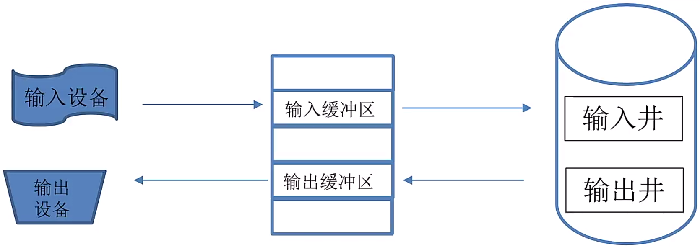

*date: 2024-03-13*

[TOC]

## 计算机硬件

### 中央处理单元 CPU

CPU 的功能：

- 程序控制
- 操作控制
- 时间控制
- 数据处理

CPU 的组成：

- `运算器`（**数据加工、算术运算、逻辑运算**）
  - 算术逻辑单元 ALU
  - 累加器
  - 状态条件寄存器
  - 缓冲寄存器
- `控制器`（**保证指令执行、处理异常事件**）
  - 指令寄存器
  - 程序计数器
  - 地址寄存器
  - 指令译码器
- `寄存器组`（**保存程序的中间结果**）
- `总线`

>在 CPU 中，（ ）不仅要保证指令的正确执行，还要能够处理异常事件。
>
>A. 运算器
>
>B. 控制器
>
>C. 寄存器
>
>D. 内部总线
>
>【答案】B

### 数据表示

#### 二进制转十进制

`无符号的二进制整数`：**从右往左依次用二进制位上的位数乘以 2 的 n 次幂的和（n 大于等于 0）**。

`带符号的二进制整数`：除去**最高位的符号位（1 为负数，0 为正数）**，其余与无符号二进制转化为十进制方法相同。

`小数二进制数`：从小数点后第 1 位上的二进制数字乘以 2 的负一次方，加上第 2 位上的二进制数字乘以 2 的负二次方，以此类推**第 n 位上的二进制数字乘以 2 的负 n 次方**。

>将二进制 1100.101 转化为十进制，结果是（ ）。
>
>A. 12.625
>
>B. 12.75
>
>C. 24.625
>
>D. 24.75
>
>【答案】A

#### 十进制转二进制

`转化整数`：

1. 将**整数部分除 2，取余**。
2. 当商不为 0 时，将商作为被除数。
3. 继续除 2 取余，直至商为 0。
4. 将**余数按从下到上的顺序记录**。

`转化小数`：

1. 将**小数部分乘 2，取整**。
2. 如果结果仍有小数，就继续乘 2。
3. 直到小数部分为 0，或者已经达到了精度要求。
4. 将**取整的结果按从上到下的顺序记录**。

>将十进制 11.75 转化为二进制，结果是（ ）。
>
>A. 1011.11
>
>B. 1010.11
>
>C. 1010.01
>
>D. 1011.01
>
>【答案】A

#### 原码

**最高位是符号位，0 表示正号，1 表示负号，其余的 n-1 位表示数值的绝对值。**

- 数值 0 的原码表示有两种形式：[+0]~原~ = 0 0000000，[-0]~原~ = 1 0000000。

以带符号位的四位二进制数为例：1010，最高位为 1 表示这是一个负数，其它三位 010，即 $0*2^2+1*2^1+0*2^0=2$，所以 1010 表示十进制数 -2。

>若机器字长为 8，则 +127 和 -0.5 分为表示为（ ）。
>
>A. 0 1111111，0 1000101
>
>B. 0 1111111，1 1000000
>
>C. 1 1111111，0 1000000
>
>D. 1 0000000，1 1000101
>
>【答案】B

#### 反码

**原码最大的问题就在于一个数加上它的相反数不等于 0。**例如：1~原~ = 0001，-1~原~ = 1001，则 1~原~ + (-1~原~) = 1010，即得出 1 + (-1) = -2，这很明显是错误的。

`正数的反码`：等于它的原码。

`负数的反码`：将负数绝对值的原码，除符号位外，其它位按位取反。

- 数值 0 的反码表示有两种形式：[+0]~反~ = 0 0000000，[-0]~反~= 1 1111111。

#### 补码

**反码也无法解决负数相加的问题。**例如：-1~反~ = 1110，-3~反~ = 1100，则 (-1~反~) + (-3~反~) = 1010，1010 的原码为 1101，即 -5，这很明显也是错误的。

`正数的补码`：等于它的原码。

`负数的补码`：等于它的反码 +1 或等于 $(2^{机器字长}-|负数|)$所得结果的原码。

- 数值 0 有唯一的编码：[+0]~补~ = 0 0000000，[-0]~补~ = 0 0000000。

**`计算机中均采用补码进行加减运算。`**

例如：若机器字长为 4，计算 6 - 2 。

解答：6~原~ = 0110 ---> 6~反~ = 0110 ---> 6~补~ = 0110，-2~原~ = 1010 ---> -2~反~ = 1101 ---> -2~补~ = 1110，则 6~补~ + (-2~补~) = 0100，即结果是一个正数，正数的补码等于反码等于源码，也就是 6 - 2 = 4，结果正确。

>如果 2X 的补码是 90H，那么 X 的真值是（ ）。（2016 上半年试题)
>
>A. 56
>
>B. -56
>
>C. 72
>
>D. -72
>
>【答案】B
>
>【解析】**十六进制用符号 H 或者 0x 表示，每一位十六进制代表四位二进制。**十六进制数 90，转换为二进制数为 1001 0000，补码 1001 0000 对应的反码为 1000 1111，再对应原码为 1111 0000，即 -112，因为 2X = -112，所以 X = -56。
>
>
>
>计算机系统中采用补码表示有符号的数值，（ ）。（2022 下半年试题）
>
>A. 可以保持加法和减法运算过程与手工运算方式一致
>
>B. 可以提高运算过程和结果的精准程度
>
>C. 可以提高加法和减法运算的速度
>
>D. 可以将减法运算转换为加法运算从而简化运算器的设计
>
>【答案】D
>
>
>
>原码表示法和补码表示法是计算机中用于表示数据的两种编码方法，在计算机系统中常采用补码来表示和运算数据，原因是采用补码可以（ ）。（2011 上半年试题）
>
>A. 保证运算过程与手工运算方法保持一致
>
>B. 简化计算机运算部件的设计
>
>C. 提高数据的运算速度
>
>D. 提高数据的运算精度
>
>【答案】B

#### 移码

`移码`：补码的符号位取反，移码的主要用途是表示浮点数的指数（阶码）。

|        | 正数                                                         | 负数                                                         |
| ------ | ------------------------------------------------------------ | ------------------------------------------------------------ |
| `原码` | **最高位为符号位 0 表示正号，其他位存放该数的二进制的绝对值** | **最高位为符号位 1 表示负号，其他位存放该数的二进制的绝对值** |
| `反码` | **等于原码**                                                 | **按它的原码，除符号位外，按位取反**                         |
| `补码` | **等于原码**                                                 | **反码 +1 或等于 $(2^{机器字长}-|负数|)$~原~**               |
| `移码` | **补码的符号位取反**                                         | **补码的符号位取反**                                         |

#### 浮点数

浮点数的表示形式：**N = 尾数 × 基数^阶码（指数）^**

- 二进制中，基数都是 2，十进制中，基数都是 10，其他进制类推。
- 尾数一般是一个小数，阶码一般是一个整数。例如：1.23 × 10^5^。

浮点数的表示格式：

| 数符             | 阶符             |
| ---------------- | ---------------- |
| 尾数（**补码**） | 阶码（**移码**） |

- `尾数`：**用补码表示，位数决定数的有效精度，位数越多精度越高。**
- `阶码`：**用移码表示，位数决定数的表示范围，位数越多范围越大。**
- 对阶时，小数向大数看齐。
- 对阶是通过较小数的尾数右移实现的。

>浮点数的表示分为阶和尾数两部分。两个浮点数相加时，需要先对阶，即（ ）（n 为阶差的绝对值）。（2018 上半年试题）
>
>A. 将大阶向小阶对齐，同时将尾数左移 n 位
>
>B. 将大阶向小阶对齐，同时将尾数右移 n 位
>
>C. 将小阶向大阶对齐，同时将尾数左移 n 位
>
>D. 将小阶向大阶对齐，同时将尾数右移 n 位
>
>【答案】D
>
>
>
>对于长度相同但格式不同的两种浮点数，假设前者阶码长、尾数短，后者阶码短、尾数长，其它规定都相同，则二者可以表示数值的范围和精度情况为（ ）。（2022 下半年试题）
>
>A. 二者可表示的数的范围和精度相同
>
>B. 前者所表示的数的范围更大且精度更高
>
>C. 前者所表示的数的范围更大但精度更低
>
>D. 前者所表示的数的范围更小但精度更高
>
>【答案】C

### 校验码

#### 奇偶校验

`奇偶校验码`的编码方法是：由若干位有效信息的头部或者尾部，再加上一个二进制位（校验位）组成校验码。

- `奇校验`：整个校验码（有效信息位和校验位）中 "1" 的个数为奇数。
- `偶校验`：整个校验码（有效信息位和校验位）中 "1" 的个数为偶数。

**奇偶校验码只能纠错，不能纠错：**

- 如果有**奇数个位发生误码**，则奇偶性发生变化，**可以检查出误码，但不能纠错。**
- 如果有**偶数个位发生误码**，则奇偶性不发生变化，**不能检查出误码（也称漏检）。**

>给出编码 1001101 的奇校验码和偶校验码（ ）。
>
>A. 10011011，10011010
>
>B. 10011011，10011011
>
>C. 10011010，10011010
>
>D. 10011010，10011010
>
>【答案】A

#### 模 2 除法

模 2 除法计算过程：

1. 被除数首位是几商就上几；
2. 异或运算；
3. 异或后首位一定是0，舍弃掉这个0首位；
4. 补末位（落数），再上商。

例如，1011 0010 000 模2 除 1100 1，过程如下：

计算到最后，余数为 4 位数，小于被除数 5 位数，计算完成。

#### 循环冗余校验 CRC

流程：

- 收发双方约定好一个生成多项式 G(x)；

- 发送方基于待发送的数据和生成多项式计算出差错检测码（冗余码），然后将其添加到待传输数据的后面一起传输；

- 接收方通过生成多项式来计算收到的数据是否产生了误码。

  ● 算法要求生成多项式必须包含最低次项

示例一，待发送的信息为 1010 01，生成多项式为 G(x) = x^3^ + x^2^ + 1，计算编码后的信息。

1. **构造被除数：在待发送信息后面，添加生成多项式最高次数个 0。**即：1010 0100 0。

2. **构造除数：生成多项式各项系数构成的比特串。**即：1101。

3. **做模二除法运算。**得到余数为 1。

   

4. **检查余数：余数的位数应与生成多项式最高次数相同，如果位数不够，则在余数前补 0 来凑足位数。**即：001。

5. 因此，编码后的信息为：${\color{red}1010 01}$${\color{green}00 1}$。

示例二，接收到的信息为 1011 0100 1，生成多项式为 G(x) = x^3^ + x^2^ + 1，判断传输是否有误码。

1. **构造被除数：接收到的信息就是被除数。**即：1011 0100 1。

2. **构造除数：生成多项式各项系数构成的比特串。**即：1101。

3. **做模二除法运算。**得到余数为 11。

   

4. **检查余数：余数为 0，传输过程无误码；余数不为 0，传输过程产生误码。**

5. 因此，传输过程产生了误码。

>在（ ）校验方法中，采用模 2 运算来构造校验位。（2019 上半年试题）
>
>A. 水平奇偶
>
>B. 垂直奇偶
>
>C. 海明码
>
>D. 循环冗余
>
>【答案】D

#### 海明校验

**设数据位是 n 位，校验位是 k 位，则 n 和 k 必须满足以下关系：2^k^ － 1 >= n + k。**

海明码的编码规则如下：设 k 个校验位为 P~k~，P~k-1~，…，P~1~，n 个数据位为 D~n~，D~n-1~，…，D~1~，对应的海明码为 H~n+k~，H~n+k-1~，…，H~1~。

（1）校验码 P~i~ 要放在 2^i-1^ 的位置。

（2）海明码中的任何一位都是由若干个校验位来校验的。

（3）被校验的海明位的下标，**等于所有参与校验该位的校验位的下标之和**，而校验位由自身校验。

>待传送的信息为 1010，若采用海明校验，则奇校验规则下的海明码是（ ）。
>
>A. 0110 010
>
>B. 0110 011
>
>C. 1110 010
>
>D. 1110 011
>
>【答案】A
>
>【解析】
>
>1. 数据位 n 等于 4，根据校验位和数据位之间的关系，校验位 k 等于 3（2^k^ >= 5 + k），海明位一共为 4 + 3 = 7。
>
>2. 因为校验码放在 2^i-1^ 的位置，则数据位和校验位之间的位置关系为：P1，P2，D1，P3，D2，D3，D4。海明位与数据位和校验位的关系为：
>
>   
>
>3. 海明位下标与校验位下标关系表（注意，校验位的下标是该校验位在海明位对应的位置，满足 2^i^ 条件，i 是大于等于 0 的整数）：
>
>   
>
>4. 根据上表，得出校验位和数据位的对应关系，进而根据对应的数据位数据，求出奇/偶校验码规则下对应的海明码：
>
>   
>
>5. 根据计算出来的奇/偶校验码规则下对应的海明码，将海明码填到对应的位置：
>
>   
>
>6. 因此，奇校验规则下，传输的信息为 0110 010。如果是偶校验规则，传输的信息为 1011 010。

### 存储器

#### 存储器的层次结构

>在程序的执行过程中，Cache 与主存的地址映射是由（ ）完成的。（2017 下半年试题）
>
>A. 操作系统
>
>B. 程序员调度
>
>C. 硬件自动
>
>D. 用户软件
>
>【答案】C

#### 高速缓存 Cache

特点：

- Cache 位于 CPU 与主存之间。

- Cache 对程序员来说是透明的。

- 设置多级高速缓存 Cache 以提高命中率（访问主存的效率）。

- **使用 Cache 改善系统性能的依据是程序的局部性原理。**

  

  - `时间局部性`：被引用过一次的存储器位置在未来会被多次引用，**主要体现是循环**。
  - `空间局部性`：如果一个存储器的位置被引用，那么将来它附近的位置也会被引用，**主要体现是顺序执行的过程**。

>在 CPU 内外常设置多级高速缓存 Cache 其主要目的是（ ）。（2019 下半年试题）
>
>A. 扩大主存的存储容量
>
>B. 提高 CPU 访问主存数据或指令的效率
>
>C. 扩大存储系统的容量
>
>D. 提高 CPU 访问外存储器的速度
>
>【答案】B

#### Cache 的地址映像方法

>Cache 的地址映像方式中，发生块冲突次数最小的是（ ）。（2015 年上半年）
>
>A. 全相联映像
>
>B. 组相联映像
>
>C. 直接映像
>
>D. 无法确定
>
>【答案】A

#### Cache 替换算法

>Cache 的替换算法中，（ ）算法计数器位数多，实现困难。
>
>A. FIFO
>
>B. LFU
>
>C. LRU
>
>D. RAND
>
>【答案】B

#### 磁盘（外存储器）

机械磁盘存在两组运动：

- 磁盘的**旋转运动**。
- 机械臂控制磁头**沿半经方向的直线运动**。

**存取时间 = 寻道时间 + 等待时间：**

- `寻道时间`：指磁头移动到磁道所需的时间。
- `等待时间`：等待读写的扇区转到磁头下方所用的时间。
- 相较于寻道时间和等待时间，数据写入磁盘的时间微不足道，因此存取时间只考虑寻道时间和等待时间。

>在磁盘调度管理中，通常（ ）。（2019 下半年试题）
>
>A. 先进行旋转调度，再进行移臂调度
>
>B. 在访问不同柱面的信息时，只需要进行旋转调度
>
>C. 先进行移臂调度，再进行旋转调度
>
>D. 在访问同一磁道的信息时，只需要进行移臂调度
>
>【答案】C

### 输入/输出技术

输入/输出技术，是指 CPU 控制主存与外设之间数据交互的过程。因为外设处理速度比主存慢很多，对于二者之间的平衡，常见的方式有：

- `直接程序控制`
  - 分为无条件传送和程序查询方式。
  - 降低了 CPU 的效率。
  - 对外部的突发事件无法做出实时响应。
- `程序中断方式`
  - 利用中断方式完成数据的输入/输出。
  - CPU 接到中断请求信号后，保存正在执行程序的现场。
  - 与程序控制方式相比，因为 CPU 无须等待而提高了效率。
- `DMA`
  - 在主存与 I/O 设备（外设）之间建立数据通路，进行数据的交换处理。
  - 在 DMA 传送过程中无须 CPU 的干预。
  - DMA 传送数据时要占用系统总线，此时，CPU 不能使用总线。
- `输入/输出处理机 (IOP)`
  - 分担了 CPU 的一部分功能，可以实现对外围设备的统一管理，完成外围设备与主存之间的数据传送。
  - 大大提高了 CPU 的工作效率，这种效率的提高是以增加更多的硬件为代价的。

>DMA 控制方式是在（ ）之间直接建立数据通路进行数据的交换处理。（2019 年上半年试题软设）
>
>A. CPU 与主存
>
>B. CPU 与外设
>
>C. 主存与外设
>
>D. 外设与外设
>
>【答案】C
>
>
>
>计算机运行过程中，CPU 需要与外设进行数据交换。采用（ ）控制技术时，CPU 与外设可并行工作。（2017 年下半年)
>
>A. 程序查询方式和中断方式
>
>B. 中断方式和 DMA 方式
>
>C. 程序查询方式和 DMA 方式
>
>D. 程序查询方式、中断方式和 DMA 方式
>
>【答案】B

### Flynn 分类法

**根据指令流和数据流的不同组合**，将计算机分为四种类型：

>Flynn 分类法根据计算机在执行程序的过程中（ ）的不同组合，将计算机分为 4 类，当前主流的多核计算机属于（ ）计算机。
>
>A. 指令流和数据流
>
>B. 数据流和控制流
>
>C. 指令流和控制流
>
>D. 数据流和总线带宽
>
>A. SISD
>
>B. SIMD
>
>C. MISD
>
>D. MIMD
>
>【答案】A D

### 指令系统

| 指令系统类型 | 指令                                                         | 寻址方式   | 实现方式                                               | 其他                       | 代表        |
| ------------ | ------------------------------------------------------------ | ---------- | ------------------------------------------------------ | -------------------------- | ----------- |
| CISC（复杂） | 数量多，使用频率差别大，可变长格式                           | 支持多种   | 微程序控制技术（微码）                                 | 研制周期长                 | X86         |
| RISC（精简） | 数量少，使用频率接近，定长格式，大部分为单周期指令，操作寄存器，只有 Load/Store 操作内存 | 支持方式少 | 增加了通用寄存器，硬布线逻辑控制为主，更适合采用流水线 | 优化编译，有效支持高级语言 | RISC-V，ARM |

>以下关于 RISC 和 CISC 的叙述中，不正确的是（ ）。（2022 年上半年）
>
>A. RISC 的大多指令在一个时钟周期内完成
>
>B. RISC 普遍采用微程序控制器，CISC 则普遍采用硬布线控制器
>
>C. RISC 的指令种类和寻址方式相对于 CISC 更少
>
>D. RISC 和 CISC 都采用流水线技术
>
>【答案】B
>
>【解析】CISC 普遍采用微程序控制器，RISC 则普遍采用硬布线控制器

### 流水线

`流水线`是指**在程序执行时多条指令重叠进行操作的一种准并行处理实现技术**。各种部件同时处理是针对不同指令而言的，它们可同时为多条指令的不同部分进行工作，以提高各部件的利用率和指令的平均执行速度。

一条指令的执行过程可以分解为取指、分析和执行三步，在取指时间 t~取指~ = 3△t、分析时间 t~分析~ = 2△t、执行时间 t~执行~ = 4△t 的情况下，若按串行方式执行，则 10 条指令全部执行完需要（ ）△t；若按流水线的方式执行，流水线周期为（ ）△t，则 10 条指令全部执行完需要（ ）△t。

- (3△t + 2△t + 4△t) * 10 = 90△t
- 流水线周期 = 时间最长的指令 = 4△t
- 流水线执行时，若按照理论公式为：(3△t + 2△t + 4△t) + (10 - 1) * 4△t = 45△t，若按照实践公式为：3 * 4△t + (10 - 1) * 4△t = 48△t。（优先计算理论公式的值）

流水线的`吞吐率`（Though Put rate，TP）是指**在单位时间内流水线所完成的任务数量或输出的结果数量**。计算流水线吞吐率的最基本公式如下：

流水线的`最大吞吐率`（n 是指令的条数）：

流水线的`加速比`是指完成同样一批任务，不使用流水线所用的时间与使用流水线所用的时间之比。计算流水线的加速比的公式如下：

>执行指令时，将每一节指令都分解为取指、分析和执行三步。已知取指时间 5△t，分析时间 2△t，执行时间 3△t，如果按照取指、分析、执行重叠的流水线方式执行指令，从头到尾执行完 500 条指令需（ ）△t。（2019 年下半年）
>
>A. 2500 
>
>B. 2505 
>
>C. 2510 
>
>D. 2515
>
>【答案】B
>
>【解析】理论公式：(5△t + 2△t + 3△t) + (500 - 1) * 5△t = 2505△t，实践公式：3 * 5△t + (500 -1) * 5△t = 2510△t，优先选择理论公式计算的结果。

### 冯诺依曼结构和哈弗结构

>目前处理器市场中存在 CPU、GPU 和 DSP 多种类型处理器，分别用于不同场景，这些处理器具有不同的体系结构，DSP 采用（ ）。
>
>A. 冯·诺依曼结构 
>
>B. 哈佛结构 
>
>C. FPGA 结构 
>
>D. 与 GPU 相同结构
>
>【答案】B
>
>【解析】FPGA 是指可编程门阵列，是一种电路结构，不是处理器的体系结构划分。GPU，图形处理器，即显卡，没有所谓的体系结构划分。
>
>
>
>以下关于冯·诺依曼计算机的叙述中，不正确的是（ ）。（2022 年上半年)
>
>A. 程序指令和数据都采用二进制表示
>
>B. 程序指令总是存储在主存中，而数据则存储在高速缓存中
>
>C. 程序的功能都由中央处理器（CPU）执行指令来实现
>
>D. 程序的执行工作由指令进行自动控制
>
>【答案】B
>
>【解析】冯·诺依曼结构中，程序指令和数据存储在同一个存储器中。

### 总线

特点：

- `共享`：总线的部件相互之间可以进行信息的交换。
- `分时`：同一时刻仅允许一个部件向总线发送信息，但允许多个部件同时从总线上接收相同的信息。

通信方向：

- `单工`:一个方向上传输（正向或反向），不能改变信号的传输方向。
- `半双工`：一种可切换方向的单工通信。
- `全双工`：双向的传输。

分类：

- `串行总线`：适合长距离传输。
- `并行总线`：适合近距离传输。

功能分类：

- `数据总线`：Data Bus，DB，在 CPU 与 RAM（Random Access Memory）之间来回传送需要处理或是需要储存的数据。
- `地址总线`：Address Bus，AB，用来指定在 RAM 之中储存的数据的地址。
- `控制总线`：Control Bus，CB，将微处理器控制单元（Control Unit）的信号，传送到周边设备。

>以下关于总线的叙述中，不正确的是（ ）。
>
>A. 并行总线适合近距离高速数据传输
>
>B. 串行总线适合长距离数据传输
>
>C. 单总线结构在一个总线上适应不同种类的设备，设计简单且性能很高
>
>D. 专用总线在设计上可以与连接设备实现最佳匹配
>
>【答案】C
>
>【解析】单总线性能不高。

### 加密和认证

#### 对称加密技术

`对称加密`是指信息的发送方和接收方使用同一个密钥去加密和解密数据。

- 加密过程：明文 + 加密算法 + 私钥 => 密文。
- 解密过程：密文 + 解密算法 + 私钥 => 明文。

特点：算法公开、加密和解密速度快，适合于对大数据量进行加密。加密强度不够、密钥安全管理困难。

常见的对称加密算法：**DES、3DES、RC、IDEA、PGP、AES 等。**

#### 非对称加密技术

`非对称加密`与对称加密相比，其安全性更好。对称加密的通信双方使用相同的密钥，如果一方的密钥遭泄露，那么整个通信就会被破解。而非对称加密使用一对密钥，即**公钥和私钥**，且二者成对出现。私钥被自己保存，不能对外泄露。公钥指的是公共的密钥，任何人都可以获得该密钥。用公钥或私钥中的任何一个进行加密，用另一个进行解密。

特点：非对称加密算法的保密性比较好，它消除了最终用户交换密钥的需要，但加密和解密花费的时间长、速度慢，不适合于对文件加密，而只适用于对少量数据进行加密。

常见的非对称加密算法：**RSA、DSA、ECC（椭园曲线算法）等。**

#### 信息摘要

`信息摘要`简要地描述了一份较长的信息或文件，它可以被看作一份长文件的 "数字指纹"，**信息摘要用于创建数字签名**，对于特定的文件而言，信息摘要是唯一的。

- 信息摘要可以被公开，它不会透露相应文件的任何内容。

- 原始数据不同，生成的摘要一定不同，单向不可逆。

信息摘要算法：

#### 数字签名

`数字签名`采用非对称密码体制（公钥密码体制），即发送者使用私钥加密数据，接收者使用对应的公钥解密数据，它具有以下功能：

- 报文鉴别：用于证明来源，接收者可以通过签名确定是哪个发送者进行的签名。

- 防止抵赖：防止发送者否认签名，发送者一旦签名，标记就打上了，无法抵赖。
- 防止伪造：防止接收者伪造发送者的签名。

>下列算法中属于非对称加密算法的是（ ）。（2021 年上半年)
>
>A. DES
>
>B. RSA
>
>C. AES
>
>D. MD5
>
>【答案】B

### 计算机可靠性模型

`串联系统`：假设一个系统由 N 个子系统组成，当且仅当所有的子系统都能正常工作时系统才能正常工作，这种系统称为串联系统。

- 设系统中各个子系统的可靠性分别用 R~1~，R~2~，......，R~N~ 来表示，则系统的可靠性 R 可由下式求得：R = R~1~ R~2~ ... R~N~。

`并联系统`：假如一个系统由 N 个子系统组成，只要有一个子系统正常工作，系统就能正常工作，这样的系统称为并联系统。

- 设每个子系统的可靠性分别以 R~1~，R~2~，......，R~N~ 表示，则整个系统的可靠性 R 可由下式求得：R = 1- (1- R~1~) (1- R~2~) ... (1- R~N~)。

>某系统由 3 个部件构成，每个部件的千小时可靠度都为 R，该系统的千小时可靠度为 (1 - (1 - R)^2^) R，则该系统的构成方式是（ ）。（2019 年下半年）
>
>A. 3 个部件串联
>
>B. 3 个部件并联
>
>C. 前两个部件并联后与第三个部件串联
>
>D. 第一个部件与后两个部件并联构成的子系统串联
>
>【答案】C
>
>【解析】选项 D 的可靠度为：R (1 - (1 - R)^2^)

## 操作系统

### 概述

操作系统的作用：通过资源管理提高计算机系统的效率；改善人机界面向用户提供友好的工作环境。

操作系统的特征：`并发性`、`共享性`、`虚拟性`、`不确定性`。

操作系统的功能：`进程管理`、`存储管理`、`文件管理`、`设备管理`、作业管理。

操作系统的分类：批处理操作系统、分时操作系统（轮流使用 CPU 工作片）、实时操作系统（快速响应）、网络操作系统、分布式操作系统（物理分散的计算机互联系统）、微机操作系统（Windows）、嵌入式操作系统。

计算机启动的基本流程为：BIOS ---> 主引导记录 ---> 操作系统。

#### 微内核操作系统

`微内核`，顾名思义，就是尽可能的将内核做的很小，**只将最为核心必要的东西放入内核中**，其他能独立的东西都放入用户进程中，这样，**系统就被分为了用户态和内核态**。

单体内核 VS 微内核：

|          | 实质                                                         | 优点                                                         | 缺点                                                         |
| -------- | ------------------------------------------------------------ | ------------------------------------------------------------ | ------------------------------------------------------------ |
| 单体内核 | 将图形、设备驱动及文件系统等功能，全部在内核中实现，运行在内核状态和同一地址空间 | 减少进程间通信和状态切换的系统开销，获得较高的运行效率       | 内核庞大，占用资源较多且不易裁剪。系统的稳定性和安全性不好   |
| 微内核   | 只实现基本功能，将图形系统、文件系统、设备驱动及通信功能放在内核之外 | 内核精炼，便于裁剪和移植。系统服务程序运行在用户地址空间，系统的可靠性、稳定性和安全性较高。可用于分布式系统 | 用户状态和内核状态需要频繁切换，从而导致系统效率不如单体内核 |

#### 嵌入式操作系统

`嵌入式操作系统`特点：**微型化、代码质量高、专业化、实时性强、可裁剪可配置。**

实时嵌入式操作系统的内核服务：异常和中断、计时器、I/O 管理。

常见的嵌入式 RTOS（实时操作系统）：VxWorks、RT-Linux、QNX、pSOS。

嵌入式系统初始化过程按照自底向上、从硬件到软件的次序依次为：芯片级初始化 ---> 板卡级初始化 ---> 系统级初始化。**芯片级是微处理器的初始化，板卡级是其他硬件设备初始化，系统级初始化就是软件及操作系统初始化。**

### 进程管理

#### 进程的组成和状态

`进程`是**计算机中正在运行的程序的实例，它是操作系统进行资源分配和管理的基本单位，包括代码、数据和执行状态等信息。**

进程的组成：`进程控制块 PCB (唯一标志)`、`程序 (描述进程要做什么)`、`数据 (存放进程执行时所需的数据)`。

进程基础的状态时下左图中的三态图，这是系统自动控制时只有三种状态，而下右图中的五态，是多了两种状态：静止就绪和静止阻塞，需要人为的操作才会进入对应状态，活跃就绪即就绪，活跃阻塞即等待。

#### 前趋图

`前趋图`：用来表示哪些任务可以并行执行，哪些任务之间有顺序关系。具体如下图：

- 可知，ABC 可以并行执行，但是必须 ABC 都执行完后，才能执行 D，这就确定了两点：`任务间的并行`、`任务间的先后顺序`。

#### 进程资源图

`进程资源图`：用来表示进程和资源之间的分配和请求关系。如下图所示：

- **P 代表进程，R 代表资源，R 方框中有几个圆球就表示有几个这种资源。**在图中，R1 指向 P1，表示 R1 有一个资源已经分配给了 P1，P1 指向 R2，表示 P1 还需要请求一个 R2 资源才能执行。

`阻塞节点`：某进程所请求的资源已经全部分配完毕，无法获取所需资源，该进程被阻塞了无法继续。如上图中 P2。

`非阻塞节点`：某进程所请求的资源还有剩余，可以分配给该进程继续运行。如上图中 P1、P3。当一个进程资源图中所有进程都是阻塞节点时，即陷入死锁状态。

>在如下所示的进程资源图中，（）；该进程资源图是（）。
>
>
>
>A. P1、P2、P3 都是阻塞节点
>
>B. P1 是阻塞节点，P2、P3 是非阻塞节点
>
>C. P1、P2 是阻塞节点，P3 是非阻塞节点
>
>D. P1、P2 是非阻塞节点，P3 是阻塞节点
>
>A. 可以化简的，其化简顺序为 P1 ---> P2 ---> P3
>
>B. 可以化简的，其化简顺序为 P3 ---> P1 ---> P2
>
>C. 可以化简的，其化简顺序为 P2 ---> P1 ---> P3
>
>D. 不可以化简的，因为 P1、P2、P3 申请的资源都不能得
>
>【答案】C B

#### 同步与互斥

`互斥`：指多个进程只能互斥地访问某个资源（即临界资源），即只有一个进程可以访问该资源，其他进程必须等待。互斥可以防止多个进程同时访问同一个资源，从而避免数据损坏和程序崩溃。如打印机、公共厕所。

`临界资源`：各进程间需要以互斥方式对其进行访问的资源。

`互斥信号量`：对临界资源采用互斥访问，实现进程的互斥，使用互斥信号量后其他进程无法访问，**其值只能为 0 或 1**。比如厕所的门锁有两个状态：打开和关闭。当门锁打开时，表示厕所空闲，可以进入。当门锁关闭时，表示厕所有人使用，其他人需要等待。门锁就像是互斥信号量，它表示厕所的使用状态。人就像是进程，他们需要获取门锁才能使用厕所。

`同步`：指多个进程之间互相协调，以确保它们按照一定的顺序执行。同步可以防止进程之间出现竞争和冲突，从而提高程序的正确性和效率。比如多个人一起做某件事情。

`同步信号量`：是一种用于实现进程同步的工具。**它是一个共享变量，可以用来表示资源的数量。**比如餐厅里的餐桌数量有限，当顾客来吃饭时，如果餐桌空闲，则可以直接坐下。如果餐桌都满了，则顾客需要等待，餐桌就像是同步信号量，它表示餐桌的数量。顾客就像是进程，他们需要获取餐桌才能吃饭。

#### 信号量

`P 操作`：申请资源，S = S - 1，若S >= 0，则执行 P 操作的进程继续执行；若 S < 0，则置该进程为阻塞状态（因为无可用资源），并将其插入阻塞队列。

- S 减去 1 之后，若小于 0，说明申请资源时，没有可用资源存在，申请资源的线程进入阻塞队列。

`V 操作`：释放资源，S = S + 1，若 S > 0，代表此时资源有空余，没有阻塞的进程，则该进程继续执行；若 S <= 0，代表此时线程在被阻塞，所以需要从阻塞状态唤醒一个进程，并将其插入就绪队列（此时因为缺少资源被 P 操作阻塞的进程可以继续执行），然后执行 V 操作的进程继续。

- S 加上 1 之后，若 S <= 0，说明释放资源后，有正在阻塞的线程等待资源，因此需要从阻塞状态唤醒一个进程，该进程进入就绪队列。

>进程 P1、P2、P3、P4 和 P5 的前趋图如下图所示：
>
>
>
>若用 PV 操作控制进程 P1、P2、P3、P4 和 P5 并发执行的过程，则需要设置 5 个信号 S1、S2、S3、S4 和 S5，且信号量 S1～S5 的初值都等于零。下图中 a 和 b 处应分别填（）；c 和 d 处应分别填写（）；e 和 f 处应分别填写（）。
>
>
>
>A. V(S1) P(S2) 和 V(S3)						B. P(S1) V(S2) 和 V(S3)						C. V(S1) V(S2) 和 V(S3)						D. P(S1) P(S2) 和 V(S3)
>
>A. P(S2) 和 P(S4)								B. P(S2) 和 V(S4)								C. V(S2) 和 P(S4)								D. V(S2) 和 V(S4)
>
>A. P(S4) 和 V(S4) V(S5)							B. V(S5) 和 P(S4) P(S5)							C. V(S3) 和 V(S4) V(S5)							D. P(S3) 和 P(S4) V(P5)
>
>【答案】C B B
>
>【解析】方式一：一个进程的开始处，都是 P 操作，进程的结束处，都是 V 操作（第一个进程，是 V 操作）。根据此特点，c 和 f 都是 P 操作，a、b、d 和 e 都是 V 操作。方式二：结合前驱图以及题目中的条件，填写信号量如下图，然后得出各处应填写的操作。
>
>
>
>
>
>进程 P1、P2、P3、P4、P5 和 P6 的前趋图如下所示：
>
>
>
>若用 PV 操作控制这 6 个进程的同步与互斥的程序如下，那么程序中的空 ① 和空 ② 处应分别为（）；空 ③ 和空 ④ 处应分别为（）；空 ⑤ 和空 ⑥ 处应分别（）。
>
>
>
>A. V(S1) V(S2) 和 P(S2)					B. P(S1) P(S2) 和 V(S2)					C. V(S1) V(S2) 和 P(S1)					D. P(S1) P(S2) 和 V(S1)
>
>A. V(S3) 和 V(S5) V(S6)					B. P(S3) 和 V(S5) V(S6)					C. V(S3) 和 P(S5) P(S6)					D. P(S3) 和 P(S5) P(S6)
>
>A. P(S6) 和 P(S7) V(S8)					B. V(S6) 和 V(S7) V(S8)					C. P(S6) 和 P(S7) P(S8)					D. V(S7) 和 P(S7) P(S8)
>
>【答案】C B D
>
>【解析】结合前驱图以及题目中的条件，填写信号量如下图，然后得出各处应填写的操作。
>
>

#### 生产者和消费者

经典问题：生产者和消费者的问题

三个信号量：互斥信号量 S0（仓库独立使用权），同步信号量 S1（仓库空闲位置），同步信号量 S2（仓库商品个数）。

>假设某系统采用非抢占式优先级调度算法，若该系统有两个优先级相同的进程 P1 和 P2，各进程的程序段如下所示，若信号量 S1 和 S2 的初值都为 0。进程 P1 和 P2 并发执行后 a、b 和 c 的结果分别为：a =（），b =（），c =（）。
>
>
>
>A. 6												B. 7												C. 10												D. 13
>
>A. 4												B. 6												C. 9												  D. 10
>
>A. 4												B. 6												C. 10												D. 13
>
>【答案】D B C
>
>【解析】**非抢占式：优先级相同。**

#### 死锁

当一个进程在等待永远不可能发生的事件时，就会产生死锁，若系统中有多个进程处于死锁状态，就会造成系统死锁。

死锁产生的四个必要条件：

- **资源互斥。**
- **每个进程占有资源并等待其他资源。**
- **系统不能剥夺进程资源。**
- **进程资源图是一个环路。**

死锁产生后，解决措施是打破四大条件，有下列方法：

- `死锁预防`：采用某种策略限制并发进程对于资源的请求，破坏死锁产生的四个条件之一，使系统任何时刻都不满足死锁的条件。
- `死锁避免`： 一般采用**银行家算法**来避免，银行家算法，就是提前计算出一条不会死锁的资源分配方法，才分配资源，否则不分配资源，相当于借贷，考虑对方还得起才借钱，提前考虑好以后，就可以避免死锁。
- `死锁检测`：允许死锁产生，但系统定时运行一个检测死锁的程序，若检测到系统中发生死锁，则设法加以解除。
- `死锁解除`：即死锁发生后的解除方法，如强制剥夺资源，撤销进程等。

死锁计算问题：系统内有 n 个进程，每个进程都需要 R 个资源，那么其**发生死锁的最大资源数为 n * (R - 1)**，其**不发生死锁的最小资源数为 n * (R - 1) + 1**。

>某系统中有 3 个并发进程竞争资源 R，每个进程都需要 5 个 R，那么至少有（）。
>
>A. 12										B. 13										C. 14										D. 15
>
>【答案】B
>
>
>
>银行家算法真题：假设系统中有三类互斥资源 R1、R2 和 R3，可用资源数分别为 10、5 和 3。在 T0 时刻系统中有 P1、P2、P3、P4 和 P5 五个进程，这些进程对资源的最大需求和已分配资源数如下表所示，此时系统剩余的可用资源数分别为（）。如果进程按（）序列执行，那么系统状态是安全的。
>
>
>
>A. 1、1 和 0								B. 1、1 和 1								C. 2、1 和 0								D. 2、0 和 1
>
>A. P1一P2一P4一P5一P3 
>
>B. P5一P2一P4一P3一P1
>
>C. P4一P2一P1一P5一P3 
>
>D. P5一P1一P4一P2一P3
>
>【答案】D B

#### 线程

传统的进程有两个属性：

- **可拥有资源的独立单位。**
- **可独立调度和分配的基本单位。**

引入线程后，**线程是独立调度的最小单位**，**进程是拥有资源的最小单位**，线程可以共享进程的公共数据、全局变量、代码、文件等资源，但不能共享线程独有的资源，如线程的栈指针等标识数据。

### 存储管理

#### 页式存储

`页式存储`是操作系统的一种存储管理方式。因为我们的程序往往是远远大于内存的，所以程序在执行的时候，是不会一次性把所有内容都装入到内存中，它会把程序分为若干个**页**，每个页固定大小，一般是 4 KB（默认），然后把这些页离散存入到内存中，而内存是按**块**来划分的，所以就通过**页表**来进行映射程序中的页在内存中的块的存储。

- 每个页分为页号和页内地址，页号用来和块号对应，代表存储的位置，大小可以代表页的数量，页内地址代表的是存储的数据内容，大小可以代表数据大小。
- `逻辑地址`是程序员在编写程序时使用的地址，它是由 CPU 生成的虚拟地址，逻辑地址并不一定对应物理内存中的实际位置，而是由操作系统进行地址转换后才能访问物理内存。**逻辑地址的构成是：逻辑页号 + 页内地址。**
- `物理地址`是内存单元在物理内存中的实际位置。它是计算机硬件可以直接寻址的地址。**物理地址的构成是：物理块号 + 页内地址。**

优点：**利用率高、碎片小（只在最后一个页中有）、分配及管理简单。**

缺点：**增加了系统开销，可能产生抖动现象。**

>某计算机系统页面大小为 4 KB，若进程的页面变换表如下所示，逻辑地址为十六进制 1D16H。该地址经过变换后，其物理地址应为十六进制（）。
>
>
>
>A. 1024H										B. 3D16H										C. 4DI6H										D. 6D16H
>
>【答案】B
>
>【解析】**十六进制数字：通常用数字 0、1、2、3、4、5、6、7、8、9 和字母 A、B、C、D、E、F（a、b、c、d、e、f）表示，其中 A ~ F 表示 10 ~ 15。**因为计算机系统页面大小为 4 KB，即页内地址是二进制的 12 位（4 KB = 2^12^），而二进制的 12 位，对应十六进制的 3 位，所以逻辑地址为 1D16H 的十六进制，其后三位 D16 为页内地址，首位 1 为页号。由页表对应关系，页号 1 对应块号 3，所以物理地址为 3D16H。
>
>
>
>某虚拟存储器的用户编程空间共 64 个页面，每页为 1 KB，内存为 16 KB。假定某时刻一用户页表中已调入内存的页面的页号和物理块号的对照表如下，则逻辑地址 0A5CH 所对应的物理地址是什么？要求：写出主要计算过程。 
>
>| 页号 | 块号 |
>| ---- | ---- |
>| 0    | 3    |
>| 1    | 7    |
>| 2    | 9    |
>| 3    | 5    |
>
>【解析】**由 "用户编程空间共 64 个页面"，64 = 2^6^，可知页号部分占 6 位；由 "每页为 1 KB"，1 KB = 2^10^，可知页内地址占 10 位；由 "内存为 16 KB"，16 = 2^4^，可知块号占 4 位。**逻辑地址 0A5CH，所对应的二进制表示形式是：0000 1010 0101 1100，后十位 10 0101 1100 是页内地址，前六位 0000 10 为页号，页号转换为十进制是 2。由页表对应关系，页号 2 对应块号 9，9 转换为二进制是 1001，因此，可以求出物理地址为：1001 10 0101 1100，转换成十六进制为 265CH。即逻辑地址 0A5CH 所对应的物理地址是 265CH。

#### 页面置换算法

有时候，进程空间分为 100 个页面，而系统内存只有 10 个物理块，无法全部满足分配，就需要将马上要执行的页面先分配进去，而后根据算法进行淘汰，使 100 个页面能够按执行顺序调入物理块中执行完。

`缺页`表示需要执行的页不在内存物理块中，需要从外部调入内存，会增加执行时间，因此，缺页数越多，系统效率越低。

页面置换算法：

- `最优算法`：OPT，**理论上的算法**，无法实现，是在进程执行完后进行的最佳效率计算，用来让其他算法比较差距。原理是选择未来最长时间内不被访问的页面置换，这样可以保证未来执行的都是马上要访问的。
- `先进先出算法`：FIFO，先调入内存的页先被置换淘汰，**会产生抖动现象**，即分配的页数越多，缺页率可能越多，**效率越低**。
- `最近最少使用`：LRU，在最近的过去，进程执行过程中，过去最少使用的页面被置换淘汰，根据局部性原理，这种方式**效率高**，且**不会产生抖动现象**。

>某进程有 4 个页面，页号为 0 ~ 3，页面变换表及状态位、访问位和修改位的含义如下图所示，若系统给该进程分配了 3 个存储块，当访问前页面 1 不在内存时，淘汰表中页号为（）的页面代价最小。
>
>
>
>A. 0													B. 1													C. 2													D. 3
>
>【答案】D

#### 快表

`快表`是一块小容量的相联存储器，由快速存储器组成，按内容访问，速度快，并且可以从硬件上保证按内容并行查找，一般用来存放当前访问最频繁的少数活动页面的页号（可以看成是页表的频繁访问数据的副本）。

- **快表是将页表存于 Cache 中。**

- **慢表是将页表存于内存中。**
- 因此，慢表需要访问两次内存才能取出数据，而快表是访问一次 Cache 和一次内存，因此更快。

#### 段式存储

`段式存储`将进程空间分为一个个段，每段也有段号和段内地址，与页式存储不同的是，**每段物理大小不同**，分段是根据逻辑整体分段的。

`地址表示：(段号，段内偏移)`。其中段内偏移不能超过该段号对应的段长，否则越界错误，而此地址对应的真正内存地址应该是：**段号对应的基地址 + 段内偏移**。

优点：**程序逻辑完整，修改互不影响。**

缺点：**内存碎片浪费大，导致内存利用率低。**

>设某进程的段表如下所示，逻辑地址（）可以转换为对应的物理位置。
>
>
>
>A. (0，1597)、(1，30) 和 (3，1390)
>
>B. (0，128)、(1，30) 和 (3，1390)
>
>C. (0，1597)、(2，98) 和 (3，1390)
>
>D. (0，128)、(2，98) 和 (4，1066)
>
>【答案】B
>
>【解析】0 号段，段内偏移为 600；1 号段，段内偏移为 50；2 号段，段内偏移为 100；3 号段，段内偏移为 2988；4 号段，段内偏移为 960。

#### 段页存储

`段页存储`对进程空间先分段，后分页。

优点：空间浪费小、存储共享容易、能动态连接。

缺点：由于管理软件的增加，复杂性和开销也增加，执行速度下降。

### 文件管理

#### 文件结构

计算机系统中采用的索引文件结构如下图所示：

- 系统中有 13 个索引节点，0 ~ 9 为`直接索引`，即每个索引节点存放的是内容，假设每个物理盘大小为 4 KB，共可存 4 KB * 10 = 40 KB 数据。

- 10 号为`一级间接索引`节点，大小为 4 KB，存放的并非直接数据，而是链接到直接物理盘块的地址，假设每个地址占 4 B，则共有 1024 个地址，对应 1024 个物理盘，可存 1024 * 4 KB * 1 = 4098 KB 数据。
- 11 号为`二级间接索引`节点，直接盘存放一级地址，一级地址再存放物理盘快地址，而后链接到存放数据的物理盘块，容量又扩大了一个数量级，为 1024 *1024 * 4 KB * 1 = 4194304 KB 数据。
- 三级简介索引类推。

>设文件索引节点中有 8 个地址项，每个地址项大小为 4 字节，其中 5 个地址项为直接地址索引，2 个地址项是一级间接地址索引，1 个地址项是二级间接地址索引，磁盘索引块和磁盘数据块大小均为 1 KB，若要访问文件的逻辑块号分别为 5 和 518，则系统应分别采用（），而且可表示的单个文件最大长度是（）KB。
>
>A. 直接地址索引和一级间接地址索引
>
>B. 直接地址索引和二级间接地址索引
>
>C. 一级间接地址索引和二级间接地址索引
>
>D. 一级间接地址索引和一级间接地址索引
>
>A. 517										B. 1029										C. 16513										D. 66053
>
>【答案】C D
>
>【解析】磁盘索引块大小为 1 KB，每个地址项大小为 4 B，则每个磁盘索引块存放 1 KB / 4 B = 256 个地址项。直接索引 5 个，存放 0 ~ 4 号逻辑块；一级间接索引 2 个，存放 5 ~ 517 号逻辑块；518 及其之后的逻辑块，存放在二级间接索引。可表示的单个文件最大长度为：256 * 256 * 1 * 1 KB + 256 * 2 * 1 KB + 5 * 1 KB = 66053 KB。

#### 树形文件

`相对路径`：是从当前路径开始的路径。

`绝对路径`：是从根目录开始的路径。

`全文件名`：绝对路径 + 文件名。

注意，绝对路径和相对路径是不加最后的文件名的，只是单纯的路径序列。树形结构主要是区分相对路径和绝对路径，如下图所示：

文件属性：

- R：只读文件属性。
- A：存档属性。
- S：系统文件。
- H：隐藏文件。

文件名的组成：

- 驱动器号
- 路径
- 主文件名
- 扩展名

>若某文件系统的目录结构如下图所示，假设用户要访问文件 Fault.swf，且当前工作目录为 swshare，则该文件的全文件名为（），相对路径和绝对路径分别为（）。
>
>
>
>A. Fault.swf					B. flash\Fault.swf					C. swshare\flash\Fault.swf					D. \swshare\flash\Fault.swf
>
>A. swshare\flash\和\flash\			B. flash和\swshare\flash\			C. \swshare\flash\和flash\			D. \flash\和\swshare\flash\
>
>【答案】D B

#### 空间存储

空闲区表法：将所有空闲空间整合成一张表，即空闲文件目录。

空闲链表法：将所有空闲空间链接成一个链表，根据需要分配。

成组链接法：既分组，每组内又链接成链表，是上述两种方法的综合。

`位示图法`：**对每个物理空间用一位标识，为 1 则使用，为 0 则空闲，形成一张位示图。**

>某文件管理系统在磁盘上建立了位示图（bitmap），记录磁盘的使用情况。若磁盘上的物理块依次编号为：0、1、2、…，系统中字长为 32 位，每一位对应文件存储器上的一个物理块，取值 0 和 1 分别表示空闲和占用，如下图所示。
>
>
>
>假设将 4195 号物理块分配给某文件，那么该物理块的使用情况在位示图中的第（）个字中描述，系统应该将（）。
>
>A. 129										B. 130										C. 131										D. 132
>
>A. 该字的第 3 个位置为 "0"
>
>B. 该字的第 3 个位置为 "1"
>
>C. 该字的第 4 个位置为 "0"
>
>D. 该字的第 4 个位置为 "1"
>
>【答案】D D
>
>【解析】系统中字长为 32 位，可以存放 0 ~ 31 号物理块，即 32 个物理块。4195 号物理块，是第 4196 个，4196 除以 32，得 131 余 4，即在该位示图得第 132 个字中描述，且该字的 第 4 个位置（3 号位）标识为 1。

### 设备管理

#### 虚设备和 SPOOLING 技术

一台实际的物理设备，例如打印机，在同一时间只能由一个进程使用，其他进程只能等待，且不知道什么时候打印机空闲，此时，极大的浪费了外设的工作效率。

引入`SPOOLING 技术`，就是在外设上建立两个数据缓冲区，分别称为**输入井和输出井**，这样，无论多少进程，都可以共用这一台打印机，只需要将打印命令发出，数据就会排队存储在缓冲区中，打印机会自动按顺序打印，实现了物理外设的共享，使得每个进程都感觉在使用一个打印机，这就是`物理设备的虚拟化`。如下图所示：

## 计算机网络

### 网络功能和分类

计算机网络是计算机技术与通信技术相结合的产物，它实现了远程通信、远程信息处理和资源共享。

计算机网络的功能：`数据通信`、`资源共享`、`管理集中化`、`实现分布式处理`、`负载均衡`。

- **网络性能指标**：`速率`、`带宽 (频带宽度或传送线路速率)`、`吞吐量`、`时延`、`利用率`。
- **网络非性能指标**：`费用`、`质量`、`标准化`、`可靠性`、`可扩展性`、`可升级性`、`易管理性`和`可维护性`。

计算机网络按**分布范围**划分如下图所示：

计算机网络按**拓扑结构**划分如下图所示：

- `总线型`：利用率低、干扰大、价格低。
- `星型`：交换机形成的局域网、中央单元负荷大。
- `环型`：流动方向固定、效率低扩充难。
- `树型`：总线型的扩充、分级结构。
- `分布式`：任意节点连接、管理难成本高。

### 网络互联模型及协议

网络互联模型：

每一层的功能和协议：

| 层名称     | 主要功能               | 详细描述                                                     | 主要设备           |
| ---------- | ---------------------- | ------------------------------------------------------------ | ------------------ |
| 应用层     | 处理网络应用           | **直接为端用户服务，提供各类应用过程的接口和用户接口。**例如 HTTP、Tenlent、FTP、SMTP、NFS 等。 | 网关               |
| 表示层     | 数据表示               | **使应用层可以根据其服务解释数据的涵义。**通常包括数据编码的约定、本地句法的转换。例如 JPEG、ASCII、GIF、DES、MPEG 等。 | 网关               |
| 会话层     | 互联主机通信           | 负责管理远程用户或进程间的通信，通常包括通信控制、检查点设置、重建中断的传输链路、名字查找和安全验证服务。例如：RPC、SQL 等。 | 网关               |
| 传输层     | 端到端连接，传输报文段 | **实现发送端和接收端的端到端的数据分组传送，负责保证实现数据包无差错、按顺序、无丢失和无冗余的传输。**其服务访问点为`端口`。代表性协议有 TCP、UDP、SPX 等。 | 网关               |
| 网络层     | 分组传输和路由选择     | 通过网络连接交换传输层实体发出的数据，**解决路由器选择、网络拥塞、 异构网络互联的问题。**服务访问点为`逻辑地址 (IP 网络地址)`。代表性协议有 IP、IPX 等。 | **路由器**         |
| 数据链路层 | 传输以`帧`为单位的信息 | 建立、维持和释放网络实体之间的数据链路，把流量控制合并在一起。为 MAC（媒介访问层）和 LLC（逻辑链路层） 两个子层。服务访问点为`物理地址 (MAC 地址)`。代表性协议有 IEEE802.3/.2、HDLC、PPP、ATM 等。 | **交换机、网桥**   |
| 物理层     | `二进制位`传输         | 通过一系列协议定义了通信设备的机械的、电气的、功能的、规程的特征。代表性协议有 RS232、V.35、RJ-45、FDDI 等。 | **中继器、集线器** |

数据传输过程：

>在 OSI 参考模型中，能实现路由选择、拥塞控制与互联功能的层是（）。
>
>A. 传输层										B. 应用层										C. 网络层										D. 物理层
>
>【答案】C

#### 网络层协议

网络层中的协议主要**处理信息的路由和主机地址解析**。

- `IP`：网络层最重要的核心协议，在源地址和目的地址之间传送数据报，**无连接、不可靠**。它将差错检测和流量控制之类的服务授权给了其他的各层协议，这正是 TCP/IP 能够高效率工作的一个重要保证。**网络层的功能主要由 IP 来提供，除了提供端到端的分组分发功能外，IP 还提供很多扩充功能。**例如，为了克服数据链路层对帧大小的限制，网络层提供了数据分块和重组功能，这使得很大的 IP 数据包能以较小的分组在网络上传输。
- `ICMP (Internet Control Message Protocol，网际控制报文协议)`：因特网控制报文协议，用于在 IP主机、路由器之间传递控制消息。控制消息是指**网络通不通、主机是否可达、路由是否可用**等网络本身的消息。
- `ARP (Address Resolution Protocol，地址解析协议)`和`RARP (Reverse Address Resolution Protocol，反向地址解析协议)`：地址解析协议 ARP 是将 IP 地址转换为物理地址；RARP 是将物理地址转换为 IP 地址。
- `IGMP (Internet Group Management Protocol，网际组管理协议)`：网络组管理协议，允许因特网中的计算机参加多播，**是计算机用做向相邻多目路由器报告多目组成员的协议，支持组播。**

>在 TCP/IP 体系结构中，将 IP 地址转换为 MAC 地址的协议是（）。
>
>A. RARP											B. ARP											C. ICMP											D. TCP
>
>【答案】B

#### 传输层协议

传输层主要有两个传输协议，分别是`传输控制协议 (Transmission Control Protocol，TCP)`和`用户数据报协议 (User Datagram Protocol，UDP)`，这些协议负责**提供流量控制、错误校验和排序服务。**

- `TCP`：是整个 TCP/IP 协议族中最重要的协议之一 ，它在 IP 协议提供的不可靠数据服务的基础上，采用了重发技术，为应用程序提供了一个**可靠的、面向连接的、全双工的**数据传输服务。TCP 协议**一般用于传输数据量比较少，且对可靠性要求高的场合。**
- `UDP`：是一种**不可靠的、无连接的**协议，可以保证应用程序进程间的通信，与 TCP 相比，它的错误检测功能要弱得多。可以这样说，**TCP 有助于提供可靠性，而 UDP 则有助于提高传输速率。**UDP 协议**一般用于传输数据量大，对可靠性要求不是很高，但要求速度快的场合。**

**TCP 建立在无连接的 IP 基础之上**，因此使用了三种机制实现面向连接的服务。

1. **使用序号对数据报进行标记。**这种方式便于 TCP 接收服务在向高层传递数据之前调整失序的数据包。
2. **TCP 使用确认、校验和定时器系统提供可靠性。**当接收者按照顺序识别出数据报未能到达或发生错误时，接收者将通知发送者；当接收者在特定时间没有发送确认信息时，那么发送者就会认为发送的数据包并没有到达接收方，这时发送者就会考虑**重传数据**。
3. **TCP 使用窗口机制调整数据流量。**并且窗口的大小并不是固定的，而是会随着网络的情况进行调整。

**UDP 协议是一种不可靠的、无连接的数据报服务。**源主机在传送数据前不需要和目标主机建立连接。

1. UDP 是**无连接的**，发送数据之前不需要建立连接，因此减少了开销和发送数据之前的时延。
2. UDP 使用**尽最大努力交付**，即不保证可靠交付，因此主机不需要维持复杂的连接状态表。
3. UDP 是**面向报文的**，UDP 对应用层交下来的报文，既不合并，也不拆分，而是保留这些报文的边界。UDP 一次交付一个完整的报文。
4. UDP **没有拥塞控制**，因此网络出现的拥塞不会使源主机的发送速率降低。这对某些实时应用是很重要的，很适合多媒体通信的要求。
5. UDP **支持一对一、一对多、多对一和多对多的交互通信**。
6. UDP 的**首部开销小**，只有 8 个字节，比 TCP 的 20 个字节的首部要短。

#### 应用层协议

应用层协议：**基于 TCP 的 FTP、HTTP 等都是可靠传输；基于 UDP 的 TFTP、DHCP、DNS 等都是不可靠传输。**

- `FTP`：可靠的文件传输协议，用于因特网上的控制文件的双向传输。
- `HTTP`：超文本传输协议，用于从 WWW 服务器传输超文本到本地浏览器的传输协议。**使用 SSL 加密后的安全网页协议为 HTTPS。**
- `SMTP 和 POP3`：简单邮件传输协议，是一组用于由源地址到目的地址传送邮件的规则，邮件报文采用 ASCII 格式表示。
- `Telnet`：远程连接协议，是因特网远程登录服务的标准协议和主要方式。
- `TFTP`：不可靠的、开销不大的小文件传输协议。**使用超时重传方式来保证数据的到达。**
- `SNMP`：简单网络管理协议，由一组网络管理的标准协议，包含一个应用层协议、数据库模型和一组资源对象。该协议能够支持网络管理系统，泳衣监测连接到网络上的设备是否有任何引起管理师行关注的情况。
- `DHCP`：动态主机配置协议，基于 UDP，基于 C/S 模型，为主机动态分配 IP 地址，有三种方式：固定分配、动态分配、自动分配。
- `DNS`：域名解析协议，通过域名解析出 IP 地址。

### 网络互联常用设备

>下列网络互联设备中，属于物理层的是（）。
>
>A. 交换机										B. 中继器										C. 路由器										D. 网桥
>
>【答案】B

### IP 地址及子网

#### IPv4

`IP (IPV4) 地址`是**一个 32 位的二进制数**的逻辑地址，为了表示方便，一般会采用`点分十进制方法`来表示：将 32 位二进制代码，**每 8 位二进制转换成十进制**，就变成了 4 个十进制数，而后在每个十进制数间隔中插入 "."。比如，128.11.3.31。因为每个十进制数都是由 8 个二进制数转换而来， 因此 IP 地址**每个部分取值范围为 0 ~ 255**。

在逻辑上，IP 地址分为`网络号`和`主机号`，**依据网络号位数的不同**，可以将 IP 地址分为以下几类：

- A 类地址：**8 位网络号（0 开头）+ 24 位主机号**，范围：1.0.0.0 ~ 126.255.255.255。（`0 不能用，127 为保留网段。`）
- B 类地址：**16 位网络号（10 开头）+ 16 位主机号**，范围：128.0.0.0 ~ 191.255.255.255。
- C 类地址：**24 位网络号（110 开头）+ 8 位主机号**，范围：192.0.0.0 ~ 223.255.255.255。
- D 类地址：组播地址，范围：224.0.0.0 ~ 239.255.255.255。
- E 类地址：保留以后再用，范围：240.0.0.0 ~ 255.255.255.255。

`无分类编址`：即不是按照 A B C 类规则，而是自动规定网络号。无分类编址格式为：`IP地址/网络号`，例如 128.168.0.11/20，其表示的 IP 地址为 128.168.0.11，网络号占 20 位，因此主机号占 32 - 20 = 12 位，也可以划分子网。

特殊 IP 地址：

- `公有地址`：通过它直接访问因特网，是全网唯一的IP地址。

- `私有地址`：属于非注册地址，专门为组织机构内部使用，不能直接访问因特网，下表所示为私有地址范围。

  

其他特殊地址：

#### 子网及子网掩码

`子网划分`：一般公司在申请网络时，会直接获得一个范围很大的网络，如一个 B 类地址，因为主机数之间相差的太大了，不利于分配，我们一般采用子网划分的方法来划分网络，即自定义网络号位数，就能自定义主机号位数，就能根据主机个数来划分出最适合的方案，不会造成资源的浪费。因此就有`子网`的概念，一般的 IP 地址按标准划分为 A B C 类后，可以进行再一步的划分，**将主机号拿出几位作为子网号**，就可以划分出多个子网，此时 IP 地址组成为：`网络号 + 子网号 + 主机号`。

- 网络号和子网号都为 1，主机号都为 0，这样的地址为`子网掩码`。
- 要注意的是：子网号可以为全 0 和全 1，主机号不能为全 0 或全 1，因此，主机数需要 -2，而子网数不用。
- 还可以聚合网络为`超网`，就是划分子网的逆过程，将网络号取出几位作为主机号，此时，这个网络内的主机数量就变多了，成为一个更大的网络。

三级 IP 地址： 网络号 + 子网号 + 主机号

#### IPv6

### 网络规划与设计

#### 网络系统建设

网络建设工程可分为`网络规划`、`网络设计`和`网络实施`三个环节。

在网络设计方面，应着重考虑以下几个要素，它们也是网络设计和网络建设的基本原则。

1. **采用先进，成熟的技术。**在规划网络、选择网络技术和网络设备时，应重点考虑当今主流的网络技术和网络设备。只有这样，才能保证建成的网络 有良好的性能，从而有效地保护建网投资，保证网络设备之间、网络设备和计算机之间的互联，以及网络的尽快使用、可靠运行。
2. **遵循国际标准，坚持开放性原则。**网络的建设应遵循国际标准，采用大多数厂家支持的标准协议及标准接口，从而为异种机、异种操作系统的互 连提供极大的便利和可能。
3. **网络的可管理性。**具有良好可管理性的网络，网管人员可借助先进的网管软件，方便地完成设备配置、状态监视、信息统计、流量分析、故障报警、诊断和排除等任务。
4. **系统的安全性。**一般的网络包括内部的业务网和外部网。对于内部用户，可分别授予不同的访问权限，同时对不同的部门（或工作组）进行不同的访问及连通设置。对于外部的因特网络，要考虑网络黑客和其他不法分子的破坏，防止网络病毒的传播。有些网络系统，如金融系统，对安全性和保密性有着更加严格的要求。网络系统的安全性包括两个方面的内容：一方面是外部网络与本单位网络之间互联的安全性问题，另一方面是本单位网络系统管理的安全性问题。
5. **灵活性和扩充性。**网络的灵活性体现在连接方便，设置和管理简单、灵活，使用和维护方便。网络的可扩充性表现在数量的增加、质量的提高和新功能的扩充。网络的主干设备应采用功能强、扩充性好的设备，如模块化结构、软件可升级，信息传输速度高、吞吐量大。可灵活选择快速以太网、千兆以太网、FDDI、ATM网络模块进行配置，关键元件应具有冗余备份的功能。
6. **系统的稳定性和可靠性。**选择网络产品和服务器时，最重要的一点应考虑它们的稳定性和可靠性，这也是我们强调选择技术先进、成熟产品的重要原因之一。关键网络设备和重要服务器的选择应考虑是否具有良好的电源备份系统、链路备份系统，是否具有中心处理模块的备份，系统是否具有快速、良好的自愈能力等。不应追求那些功能大而全但不可靠或不稳定的产品，也不要选择那些不成熟和没有形成规范的产品。
7. **经济性。**网络的规划不但要保质保量按时完成，而且要减少失误、杜绝浪费。
8. **实用性。**网络设计一定要充分保护网络系统现有资源。同时要根据实际情况，采用新技术和新装备，还需要考虑组网过程要与平台建设及开发同步进行，建立一个实用的网络。力求使网络既满足目前需要，又能适应未来发展，同时达到较好的性能/价格比。

#### 三层模型

三层模型将网络划分为`核心层`、`汇聚层`和`接入层`，每一层都有着特定的作用。

`接入层`：

- 通常将**网络中直接面向用户连接或访问网络的部分称为接入层**。
- 目的是**允许终端用户连接到网络**，主要解决相邻用户之间的互访需求，并且为这些访问提供足够的带宽。
- 接入层还应当适当负责一些**用户管理功能**（如地址认证、用户认证、计费管理等），以及**用户信息收集工作**（如用户的 IP 地址、MAC 地址、访问日志等）。

`汇聚层`：

- 汇聚层是核心层和接入层的分界面，完成**网络访问策略控制、数据包处理、过滤、寻址，以及其他数据处理的任务**。
- **汇聚层交换机是多台接入层交换机的汇聚点**，它必须能够处理来自接入层设备的所有通信量，并提供到核心层的上行链路，因此，**汇聚层交换机与接入层交换机比较，需要更高的性能、更少的接口和更高的交换速率**。

`核心层`：

- 网络主干部分称为核心层，核心层的**主要目的在于通过高速转发通信，提供优化、可靠的骨干传输结构**，因此，**核心层交换机应拥有更高的可靠性，性能和吞吐量**。
- 核心层为网络提供了骨干组件或高速交换组件，在纯粹的分层设计中，**核心层只完成数据交换的特殊任务**。
- 需要根据网络需求的地理距离、信息流量和数据负载的轻重来选择核心层技术，常用的技术包括 **ATM、100Base-Fx 和千兆以太网**等。
- 在主干网中，考虑到高可用性的需求，通常会**使用双星（树）结构**，即采用两台同样的交换机，与汇聚层交换机分别连接，并使用链路聚合技术实现**双机互联**。
- 核心层的设备**采用双机冗余热备份**是非常必要的，也可以使用负载均衡功能来改善网络性能。

>按照网络分层设计模型，通常把局域网设计为三层，即核心层、汇聚层和接入层，以下关于分层网络功能的描述中，不正确的是（）。
>
>A. 核心层设备负责数据包过滤、策略路由等功能
>
>B. 汇聚层完成路由汇总和协议转换功能
>
>C. 接入层应提供一部分管理功能，例如 MAC 地址认证、计费管理等
>
>D. 接入层负责收集用户信息，例如用户 IP 地址、MAC 地址、访问日志等
>
>【答案】A
>
>
>
>以下关于层次化局域网模型中核心层的叙述 ，正确的是（）。
>
>A. 为了保障安全性，对分组要进行有效性检查
>
>B. 将分组从一个区域高速地转发到另一个区域
>
>C. 由多台二 、三层交换机组成
>
>D. 提供多条路径来缓解通信瓶颈
>
>【答案】B

#### 综合布线系统

`综合布线系统 PDS`是一个**用于传输语音、数据、影像和其他信息的标准结构化布线系统，是建筑物或建筑群的传输网络，它使语言和数据通信设备、交换设备和其他信息管理系统彼此相连接。**综合布线的热物理结构**一般采用模块化设计和分层星型拓扑结构**。它包含 6 个独立的子系统：

1. `工作区子系统`：实现**工作区终端设备到水平子系统的信息插座之间**的互联。
   - 它是工作区内终端设备连接到信息插座之间的设备组成，包括信息插座、连接软线、适配器、计算机、网络集散器、电话、报警探头、摄像机、监视器、音响等。
2. `水平子系统`：实现**信息插座和管理子系统之间、工作区子系统和干线子系统之间**的连接。
   - 水平子系统是布置在同一楼层上，一端接在信息插座，另一端接在配线间的跳线架上，它的功能是将干线子系统线路延伸到用户工作区，将用户工作区引至管理子系统，并为用户提供一个符合国际标准，满足语音及高速数据传输要求的信息点出口。
3. `管理子系统`：连接各楼层**水平布线子系统和垂直干缆线**，负责连接控制其他子系统，为连接其他子系统提供连接手段。
   - 安装有线路管理器件及各种公用设备，实现整个系统集中管理，它是干线子系统和水平子系统的桥梁，同时又可为同层组网提供条件。其中包括双绞线跳线架、跳线（有快接式跳线和简易跳线之分）。
4. `垂直干线子系统`：实现**各楼层设备间子系统之间**的互连。
   - 通常它是由主设备间至各层管理间，特别是在位于中央点的公共系统设备处提供多个线路设施，采用大对数的电缆馈线或光缆，两端分别端接在设备间和管理间的跳线架上，目的是实现计算机设备、程控交换机（PBX）、控制中心与各管理子系统间的连接，是建筑物干线电缆的路由。
5. `设备间子系统`：实现**中央主配线架与各种不同设备之间**的连接。
   - 该子系统是由设备间中的电缆、连接跳线架及相关支撑硬件、防雷电保护装置等构成。可以说是整个配线系统的中心单元，因此它的布放、造型及环境条件的考虑适当与否，直接影响到将来信息系统的正常运行及维护和使用的灵活性。电话交换机、计算机主机设备及入口设施也可与配线设备安装在一起。
6. `建筑群子系统`：**各个建筑物通信系统之间**的互联。
   - 它是将多个建筑物的数据通信信号连接成一体的布线系统，它采用架空或地下电缆管道或直埋敷设的室外电缆和光缆互连起来，是结构化布线系统的一部分，支持提供楼群之间通信所需的硬件。

>结构化布线系统分为六个子系统，其中水平子系统（）。
>
>A. 由各种交叉连接设备以及集线器和交换机等设备组成
>
>B. 连接了干线子系统和工作区子系统
>
>C. 由终端设备到信息插座的整个区域组成
>
>D. 实现各楼层设备间子系统之间的互连
>
>【答案】B
>
>【解析】C 属于工作区子系统，D 属于垂直干线子系统。

#### 其他网络知识

##### 通信技术

计算机网络是利用`通信技术`**将数据从一个结点传送到另一结点**的过程，通信技术是计算机网络的基础。

`信道`可分为物理信道和逻辑信道：

- `物理信道`由传输介质和设备组成，根据传输介质的不同，**分为无线信道和有线信道**。
- `逻辑信道`是指在数据发送端和接收端之间存在的一条虚拟线路，可以是有连接的或无连接的，逻辑信道**以物理信道为载体**。

发信机进行的信号处理包括信源编码、信道编码、交织、脉冲成形和调制。相反地，收信机进行的信号处理包括解调、采样判决 、去交织 、信道译码和信源译码 。

如果**同时传递多路数据**就需要复用技术和多址技术：

- `复用技术`是指**在一条信道上同时传输多路数据**的技术，如 TDM 时分复用、FDM 频分复用和 CDM 码分复用等。
- `多址技术`是指**在一条线上同时传输多个用户数据**的技术，在接收端把多个用户的数据分离，如 TDMA 时分多址、FDMA 频分多址和 CDMA 码分多址等。

作为**新一代的移动通信技术**，`5G 网络`的主要特征：**服务化架构、网络切片。**

##### 交换技术

数据在网络中转发通常离不开`交换机`，人们日常使用的计算机通常就是通过交换机接入网络的。

交换机功能包括：

- **集线功能**：提供大量可供线缆连接的端口达到部署星状拓扑网络的目的。
- **中继功能**：在转发帧时重新产生不失真的电信号。
- **桥接功能**：在内置的端口上使用相同的转发和过滤逻辑。
- **隔离冲突域功能**：将部署好的局域网分为多个冲突域，而每个冲突域都有自己独立的带宽，以提高交换机整体宽带利用效率。

交换机需要实现的功能：

1. **转发路径学习**：根据收到数据帧中的源 MAC 地址建立该地址同交换机端口的映射，写入 MAC 地址表中。
2. **数据转发**：如果交换机根据数据帧中的目的 MAC 地址，在建立好的 MAC 地址表中查询到了，就向对应端口进行转发。
3. **数据泛洪**：如果数据帧中的目的 MAC 地址不在 MAC 地址表中，则向所有端口转发， 也就是泛洪。广播帧和组播帧向所有端口（不包括源端口）进行转发。
4. **链路地址更新**：MAC 地址表会每隔一定时间（如 300 s）更新一次。

##### 路由技术

路由功能**由路由器来提供**，具体包括：

- **异种网络互连**：比如具有异种子网协议的网络互连。
- **子网协议转换**：不同子网间，包括局域网和广域网之间的协议转换。
- **数据路由**：即将数据从一个网络依据路由规则转发到另一个网络。
- **速率适配**：利用缓存和流控协议进行适配。
- **隔离网络**：防止广播风暴，实现防火墙。
- **报文分片和重组**：超过接口的 MTU 报文被分片，到达目的地之后的报文被重组。
- **备份、流量控制**：如主备线路的切换和复杂流量控制等。

**路由器工作在 OSI 七层协议中的第 3 层，即网络层。**其主要任务是接收来源于一个网络接口的数据包，通常根据此数据包的目地址决定待转发的下一个地址（即下一跳地址）。路由器中维持着数据转发所需的路由表，所有数据包的发送或转发都通过查找路由表来实现。这个路由表可以静态配置，也可以通过动态路由协议自动生成。

一般来说，路由协议可分为`内部网关协议 (IGP)`和`外部网关协议 (EGP)`两类。

##### 传输介质

`双绞线`：将多根铜线按规则缠绕在一起，能够减少干扰；**分为无屏蔽双绞线 UTP 和屏蔽双绞线 STP**，都是由一对铜线簇组成，也即我们常说的网线；双绞线的**传输距离在 100 m 以内**。

- `无屏蔽双绞线 UTP`：价格低，安装简单，但可靠性相对较低，分为 **CAT3**（3 类 UTP，速率为 10 Mbps）、**CAT4**（4 类 UTP，与 3 类差不多，无应用）、**CAT5**（5 类 UTP，速率为 100 Mbps，用于快速以太网）、**CAT5E**（超 5 类 UTP，速率为 1000 Mbps）、**CAT6**（6 类UTP，用来替代 CAT5E，速率也是 1000 Mbps）。
- `屏蔽双绞线 STP`：比之 UTP 增加了 一层屏蔽层，可以有效的提高可靠性，但对应的价格高，安装麻烦，一般用于对传输可靠性要求很高的场合。

`网线`有如下两种安装标准：都是八根不同颜色的网线，按照不同的顺序排序，插入水晶头中，**区分在第 1 2 3 6 四根网线的位置不同**。

`光纤`：由纤芯和包层组成，传输的光信号在纤芯中传输，然而从端出来的信号都是电信号，要经过光纤传输的话，就必须将电信号转换为光信号。

- `多模光纤 MMF`：纤芯半径较大，因此**可以同时传输多种不同的信号**，光信号在光纤中以全反射的形式传输，**采用发光二极管 LED 为光源**，成本低，但是传输的效率和可靠性都较低，**适合于短距离传输**，其传输距离与传输速率相关，速率为 100 Mbps 时为 2 KM，速率为 1000 Mbps 时为 550 m。

  

- `单模光纤 SMF`：纤芯半径很小，**一般只能传输一种信号**，**采用激光二极管 LD 作为光源**，并且只支持激光信号的传播，同样是以全反射形式传播，只不过反射角很大，看起来像一条直线，成本高，但是**传输距离远**，可靠性高，传输距离可达 5 KM。

  

`无线信道`：分为无线电波和红外光波。

>以下关于光纤的说法中，错误的是（）。
>
>A. 单模光纤的纤芯直径更细
>
>B. 单模光纤采用 LED 作为光源
>
>C. 多模光纤比单模光纤的传输距离近
>
>D. 多模光纤中光波在光导纤维中以多种模式传播
>
>【答案】B

##### 通信方式和交换方式

`通信方向`：数据通信是指发送方发送数据到接收方。这个传输过程可以分类如下：

- `单工`：只能由设备 A 发给设备 B，即数据流只能单向流动。
- `半双工`：设备 A 和设备 B 可以互相通信，但是同一时刻数据流只能单向流动。
- `全双工`：设备 A 和设备 B 在任意时刻都能互相通信。

`同步方式`：

- `异步传输`：发送方每发送一个字符，需要约定一个起始位和停止位插入到字符的起始和结尾处，这样当接收方接收到该字符时能够识别，但是这样会造成资源浪费，传输效率降低。
- `同步传输`：以数据块为单位进行传输，当发送方要发送数据时，先发送一个同步帧，接收方收到后做好接收准备，开始接收数据块，结束后又会有结束帧确认，这样一次传输一个数据块，效率高。
- `串行传输`：只有一根数据线，数据只能 1 bit 挨个排队传送，适合低速设备、远距离的传送，一般用于广域网中 。
- `并行传输`：有多根数据线，可以同时传输多个 bit 数据，适合高速设备的传送，常用语计算机内部各硬件模块之间。

`交换方式`：

- `电路交换`： 通信一方进行呼叫，另一方接收后，在二者之间会**建立一个专用电路**，特点为**面向连接、实时性高、链路利用率低**，一般用于语音视频通信。
- `报文交换`： **以报文为单位，存储转发模式**，接收到数据后先存储，进行差错校验，没有错误则转发，有错误则丢弃，因此会**有延时，但可靠性高，是面向无连接的**。
- `分组交换`：**以分组为单位，也是存储转发模式**，因为分组的长度比报文小，所以时延小于报文交换。又可分为三种方式：
  - `数据报`：是现在主流的交换方式，**各个分组携带地址信息，自由的选择不同的路由路径传送到接收方**，接收方接收到分组后再根据地址信息重新组装成原数据，是**面向无连接**的，但是**不可靠**的。
  - `虚电路`：发送方发送一个分组，接收方收到后，二者之间就**建立了一个虚拟的通信线路**，二者之间的分组数据交互都通过这条线路传送，在空闲的时候这条线路也可以传输其他数据，是**面向连接**的，**可靠**的。
  - `信元交换`：**异步传输模式 ATM 采用的交换方式**，本质是按照虚电路方式进行转发，只不过**信元是固定长度的分组**，共 53 B，其中 5 B 为头部，48 B 为数据域，也是**面向连接**的，**可靠**的。

>以数据通信模型按照数据信息在传输链路上的传送方向，可以分为三类。下列选项中，（）不属于这三类传输方式。
>
>A. 单工通信：信号只能向 一个方向传送
>
>B. 半双工通信：信息的传递可以是双向的
>
>C. 全双工通信：通信的双方可以同时发送和接收信息
>
>D. 全单工通信：信号同时向两个方向传输
>
>【答案】D

##### 网络存储技术

目前，主流的网络存储技术主要有三种，分别是`直接附加存储 (Direct Attached Storage，DAS)`、`网络附加存储 (Network Attached Storage，NAS)`和`存储区域网络 (Storage Area Network，SAN)`。

###### 直接附加存储

DAS 是将存储设备**通过 SCSI（Small Computer System Interface，小型计算机系统接口）电缆直接连到服务器**，其本身是硬件的堆叠，存储操作依赖于服务器，不带有任何存储操作系统。因此，有些文献也把 DAS 称为 SAS（Server Attached Storage，服务器附加存储）。

DAS 的适用环境为：

- 服务器在地理分布上很分散，通过 SAN 或 NAS 在它们之间进行互连非常困难时。
- 存储系统必须被直接连接到应用服务器上时，例如，Microsoft Cluster Server 或某些数据库使用的 "原始分区"。
- 包括许多数据库应用和应用服务器在内的应用，它们需要直接连接到存储器上时。

由于 DAS 直接将存储设备连接到服务器上，这导致它在传递距离、连接数量、传输速率等方面都受到限制。因此，当存储容量增加时，DAS 方式很难扩展，这对存储容量的升级是一个巨大的瓶颈；另一方面，由于数据的读取都要通过服务器来处理，必然导致服务器的处理压力增加，数据处理和传输能力将大大降低；此外，当服务器出现宕机等异常状况时，也会波及存储数据，使其无法使用。目前，**DAS 基本被 NAS 所代替**。

###### 网络附加存储

采用 NAS 技术的存储设备不再通过 I/O 总线附属于某个特定的服务器，而是**通过网络接口与网络直接相连**，由用户通过网络访问。NAS 存储系统的结构如图所示：

NAS 存储设备类似于一个专用的文件服务器，它去掉了通用服务器的大多数计算功能，而仅仅提供文件系统功能，从而降低了设备的成本。并且为方便存储设备到网络之间能以最有效的方式发送数据，它专门优化了系统硬件与软件架构。NAS 以数据为中心，将存储设备与服务器分离，其存储设备在功能上完全独立于网络中的主服务器，客户机与存储设备之间的数据访问不再需要文件服务器的干预，同时它允许客户机与存储设备之间进行直接的数据访问，所以不仅响应速度快，而且数据传输速率也很高。

**NAS 存储支持即插即用，可以在网络的任一位置建立存储。**基于 Web 管理，从而使设备的安装、使用和管理更加容易。NAS 可以很经济地解决存储容量不足的问题，但难以获得满意的性能。

###### 存储区域网络

SAN 是**通过专用交换机将磁盘阵列与服务器连接起来的高速专用子网**。它没有采用文件共享存取方式，而是**采用块（block）级别存储**。SAN 是通过专用高速网将一个或多个网络存储设备和服务器连接起来的专用存储系统，其**最大特点是将存储设备从传统的以太网中分离出来，成为独立的存储区域网络。**SAN 的系统结构如图所示：

## 其他计算机知识

### 计算机语言

`计算机语言`：是指用于人与计算机之间通讯的语言，也被称为编程语言。它是一种被设计用来编写计算机程序的规则和约定，可以用来描述计算机所需执行的操作和计算步骤。

计算机语言**主要由一套指令组成**，而这种指令一般**包括表达式、流程控制和集合三大部分内容。**

计算机语言可以分为不同的类别，包括机器语言、汇编语言和高级语言。

#### 机器语言

机器语言是一种指令集的体系，是计算机的设计者通过计算机的硬件结构赋予计算机的操作功能。

是第一代计算机语言，计算机自身的语言（低级语言），通过二进制代码串操作。指令组成：操作码、操作数的地址、操作结果的存储地址、下条指令的地址。

**机器语言指令必须包括：操作码、操作数的地址、操作结果的存储地址、下条指令的地址。**

指令格式：

- `单地址指令`：这类指令只包括一个操作数地址。操作数被存储在指定地址（A）中，而结果则通常被隐含在特定的寄存器中。为了执行操作，需要使用一个指定的寄存器来存储第二个操作数和操作结果。
- `二地址指令`：这种指令格式只包括一个操作数地址和一个结果地址。第一个地址（A1）确定第一个操作数，而第二个地址（A2）同时确定第二个操作数和结果。这类指令隐含了第二操作数和结果的地址，所以其操作码部分通常较短。
- `三地址指令`：这种指令格式通常包括两个操作数地址和一个结果地址。在三地址指令中，第一个地址（A1）确定第一个操作数，第二个地址（A2）确定第二个操作数，第三个地址（A3）则用于存储执行操作后的结果。执行完指令后，下一条指令的地址通常由程序计数器按顺序给出。
- `四地址指令`：这种指令格式包括四个地址码字段，分别为两个操作数地址和一个结果地址。这种格式的操作码部分通常比较长，可以表示更多的操作类型。四地址指令的第一个地址（A1）确定第一个操作数，第二个地址（A2）确定第二个操作数，第三个地址（A3）和第四个地址（A4）用于存储执行操作后的结果。

#### 汇编语言

`汇编语言`：面向机器的程序设计语言，用于电子计算机、微处理器、微控制器或其他可编程器件。它也被称为符号语言，因为用助记符代替机器指令的操作码，用地址符号或标号代替指令或操作数的地址。

汇编语言有三种语句：指令、伪指令、宏指令。

- `指令`：指令是汇编语言中最基本的语句类型，用于描述计算机要执行的操作。

- `伪指令`：伪指令是用于控制汇编过程的语句，不是真正的机器指令。

- `宏指令`：宏指令是一种特殊的指令，用于定义可重用的代码块。

#### 高级语言

`高级语言`：是一种与特定计算机体系结构无关的程序设计语言，它更接近于自然语言，能够以更简洁、更易读的方式描述计算机程序。与低级语言相比，高级语言具有更好的可读性、可维护性和可移植性。

根据语言的抽象程度，高级语言可以分为面向过程、面向对象和泛型等类型。

- `面向过程的语言`：这种语言遵循 "自上而下" 的程序设计方法，以功能模块化的方式组织程序，将程序分解为一系列的功能模块，每个模块都有特定的功能和作用。C 语言就是一种典型的面向过程的语言。
- `面向对象的语言`：这种语言遵循 "面向对象" 的程序设计方法，将程序看作是一系列对象的集合，每个对象都有自己的属性和方法。Java、C++ 和 C# 就是面向对象语言的典型代表。
- `泛型语言`：这种语言遵循 "泛型程序设计" 的方法，将程序看作是一系列类型的集合，每个类型都有自己的属性和方法。Python 就是一种泛型语言。

#### 建模语言

`建模语言`：一种用于描述、设计和构建计算机系统、软件、网络等的技术，它可以是图形语言或文本语言。

图形语言通常使用图表来表示系统或软件的结构和行为，常用的图形元素包括**概念、连接符号、图形符号**等，这些元素可以用来表示系统的组件、关系、约束等。例如，统一建模语言（UML）是一种常用的图形建模语言，它提供了一系列标准化的图形符号和表达方式，用于帮助软件工程师可视化、构建和记录软件系统的设计。

#### 形式化语言

`形式化语言`：形式化方法是把概念、判断、推理转化成特定的形式符号后，对形式符号表达系统进行研究的方法，是用具有精确语义的形式语言书写的程序功能描述，它是设计和编制程序的出发点，也是验证程序是否正确的依据。

形式化语言通常分为以下几类：

- `形式逻辑语言`：形式逻辑语言是数学基础的一个重要组成部分，它使用一组符号和规则来表示概念、关系和推理，可以用来描述计算机程序或系统的行为和性质。
- `自动机理论语言`：自动机理论语言是一组用来描述自动机（包括计算机程序）行为的数学模型，它可以用来描述程序的流程、操作和行为。
- `程序设计语言`：程序设计语言是一种形式化语言，它用来定义计算机程序，可以包括数据类型、变量、操作符和控制结构等，它可以用来描述程序的语法、语义和行为。
- `描述性语言`：描述性语言是一种用来描述计算机系统结构和行为的自然语言，它通常包括系统需求、系统设计、系统实现等部分，可以用来描述系统的功能、行为和性能等。

### 多媒体

`媒体`是承载信息的载体，即**信息的表现形式（或者传播形式）**，如文字、声音、图像、动画和视频等。

按照 ITU-T 建议的定义，媒体可分为：感觉媒体、表示媒体、显示媒体、存储媒体和传输媒体。

- `感觉媒体`：指的是用户接触信息的感觉形式，如视觉、听觉和触觉等。
- `表示媒体`：指的是信息的表示形式，如图像、声音、视频等。
- `表现媒体`：也称为显示媒体，指表现和获取信息的物理设备，如键盘、鼠标、扫描仪、话简和摄像机等为输入媒体，显示器、打印机和音箱等为输出媒体。
- `存储媒体`：指用于存储表示媒体的物理介质，如硬盘、软盘、磁盘、光盘、ROM 及 RAM 等。
- `传输媒体`：指传输表示媒体的物理介质，如电缆、光缆和电磁波等。

多媒体有四个重要的特征：

- `多维化`：多维化是指媒体的多样化。它提供了多维化信息空间下的交互能力和获得多维化信息空间的方法，如输入、输出、传输、存储和处理的手段与方法等。
- `集成性`：集成性不仅指多媒体设备集成，而且指多媒体信息集成或表现集成。
- `交互性`：交互性是人们获取和使用信息时变被动为主动的最重要的标志。交互性可向用户提供更有效地控制和使用信息的手段，可增加人们对信息的注意和理解。
- `实时性`：实时性是指多媒体技术中涉及的一些媒体。例如，音频和视频信息具有很强的时间特性，会随着时间的变化而变化。

**多媒体的基本组成：**

**多媒体系统的关键技术：**

- `视音频技术`：视频技术包括视频数字化和视频编码技术两个方面，音频技术包括音频数字化、语音处理、语音合成及语音识别四个方面。
- `通信技术`：多媒体系统中的一项关键技术，是指将信息从一个地点传送到另一个地点所采取的方法和措施。通信技术通常包括了数据传输信道技术和数据传输技术。
- `数据压缩技术`：数据压缩算法分为下面三类。
  - `即时压缩和非即时压缩`：即时/非即时压缩的区别在于，信息在传输过程中被压缩还是信息压缩后再传输。即时压缩一般应用在影像、声音数据的传送中，即时压缩常用到专门的硬件设备，如压缩卡等。
  - `数据压缩和文件压缩`：数据压缩是专指一些具有时间性的数据，这些数据常常是即时采集即时处理或传输的。而文件压缩是指对将要保存在磁盘等物理介质的数据进行压缩。
  - `无损压缩与有损压缩`：无损压缩是利用数据的统计元余进行压缩，通常无损压缩的压缩比比较低，而有损压缩是利用了人类对视觉、听觉对图像、声音中的某些频率成分不敏感的特性，允许压缩的过程中损失一定的信息。
  - `压缩编码格式`：联合图像专家小组标准（JPEG）、动态图像视频编码标准（MPEG）、视频编解码器标准（H.26L）。
- `虚拟现实 (VR) 技术`：VR 是**一种可以创建和体验虚拟世界的计算机仿真系统**，它利用计算机生成一种模拟环境，使用户沉浸到该环境中，让人有种身临其境的感觉。VR 采用计算机技术生成一个**逼真的视觉、听觉、触觉、味觉及嗅觉的感知系统**，用户可以用人的自然技能与这个生成的虚拟实体进行交互操作。其概念包含三层含义：
  - 虚拟实体是用计算机生成的一个逼真的实体。
  - 用户可以通过人的自然技能与该环境交互。
  - 要借助一些三维传感设备来完成交互动作，常用的有头盔立体显示器、数据于套、数据服装和三维鼠标等。

- `增强现实 (AR) 技术`：是指把原本在现实世界的一定时间和空间范围内很难体验到的实体信息（视觉信息、声音、味道和触觉等)，通过模拟仿真后，再叠加到现实世界中被人类感官所感知，从而达到超越现实的感官体验。包括下面技术：
  - `计算机图形图像技术`：增强现实的用户可以戴上透明的护目镜，透过它看到整个世界，连同计算机生成而投射到这一世界表面的图像，从而使物理世界的景象超出用户的日常经验之外。这种增强的信息可以是在真实环境中与之共存的虚拟物体，也可以是实际存在的物体的非几何信息。
  - `空间定位技术`：为了改善效果，增强现实所投射的图像必须在空间定位上与用户相关。当用户转动或移动头部时，视野变动，计算机产生的增强信息随之做相应的变化。
  - `人文智能`：该技术以将处理设备和人的身心能力结合起来为特点，并非仿真人的智能，而是试图发挥传感器、可穿戴计算等技术的优势，使人们能够捕获自己的日常经历、记忆及所见所闻，并与他人进行更有效的交流。

VR 和 AR 技术主要分为：桌面式、分布式、沉浸式、增强式。

VR/AR 技术发展至今，虽然被广泛应用，其主要关键技术还有待深入研究：

1. **数据采集与优化传输技术**。数据采集主要解决如何获取光照、火焰、动态地形等自然现象的数据问题，通常用 3 种设备获取，即全向相机、高速摄像机和激光设备。优化数据传输技术是要满足低功耗、低延时、高效率等特点，保证数据传输的可靠性。
2. **交互与情形实时再现技术**。交互技术的接触方式可分为力觉反馈和触觉反馈两种。力觉反馈是指借助操作控制杆的反作用力效果将虚拟物体的运动轨迹转换成真实物体的机械运动，触觉反馈是指通过手戴 3D 数据手套获取手掌和手指的形态和温度等信息，来满足用户对虚拟物体的移动、抓取和触摸等操作。情形实时再现包含了跟踪定位技术、高效可靠的渲染技术和逼真的显示技术等。

### 系统工程

`系统工程`：是利用计算机作为工具，对**系统的结构、元素、信息和反馈等进行分析**，以达到**最优规划、最优设计、最优管理和最优控制**的目的。

`系统之系统 (System of Systems，SoS)`：是一种**复杂系统设计和组织的方式**，其中一个或多个子系统被组合到一起以实现更大的整体系统功能。这些子系统本身也可以被视为独立的系统，具有自己的组件、接口和功能。适用于其系统元素本身也是系统的情况。

`系统工程方法`：是一种现代的科学决策方法，也是一门基本的决策技术。它针对主要问题、主要情况和全过程，运用有效工具进行全面的分析和处理。

- `霍尔的三维结构`：集中体现了系统工程方法的**系统化、综合化、最优化、程序化和标准化**等特点是系统工程方法论的重要基础内容。
  - 霍尔三维结构是将系统工程整个活动过程分为**前后紧密衔接的 7 个阶段和 7 个步骤**，同时还考虑了为完成这些阶段和步骤所需要的各种专业知识和技能。这样，就形成了**由时间维、逻辑维和知识维组成的三维空间结构**。
- `切克兰德方法`：社会经济系统中的问题往往很难和工程技术系统中的问题一样，切克兰德方法的特点是**事先将需求确定清楚，难以按价值系统的评价准则设计出符合这种需求的最优系统方案。**切克兰德方法论的核心不是 "最优化"，而**是 "比较" 与 "探寻"**。从模型和现状的比较中来学习改善现状的途径。切克兰德方法将工作过程分为 7 个步骤：
  1. **认识问题**。收集与问题有关的信息，表达问题现状，寻找构成和影响因素及其关系，以便明确系统问题结构、现存过程及其相互之间的不适应之处，确定有关的行为主体和利益主体。
  2. **根底定义**。初步弄清、改善与现状有关的各种因素及其相互关系。根底定义的目的是弄清系统问题的关键要素以及关联因素，为系统的发展及其研究确立各种基本的看法，并尽可能选择出最合适的基本观点。
  3. **建立概念模型**。在不能建立精确数学模型的情况下，用结构模型或语言模型来描述系统的现状概念模型来自于根底定义，是通过系统化语言对问题抽象描述的结果，其结构及要素必须符合根底定义的思想，并能实现其要求。
  4. **比较及探寻**。将现实问题和概念模型进行对比，找出符合决策者意图且可行的方案或途径。有时通过比较，需要对根底定义的结果进行适当修正。
  5. **选择**。针对比较的结果，考虑有关人员的态度及其他社会、行为等因素，选出现实可行的改善方案。
  6. **设计与实施**。通过详尽和有针对性的设计，形成具有可操作性的方案，并使得有关人员乐于接受和原意为方案的实现竭尽全力。
  7. **评估与反馈**。根据在实施过程中获得的新认识，修正问题描述、根底定义及概念模型等

- `并行工程方法`：是**对产品及其相关过程进行并行、集成化处理的系统方法和综合技术**。它要求产品开发人员从设计开始就**考虑产品生命周期的全过程**，不仅考虑产品的各项性能，如质量、成本和用户要求，还应考虑与产品有关的各工艺过程的质量及服务的质量。并行工程的目标是**提高质量、降低成本、缩短产品开发周期和产品上市时间**。并行工程方法的核心点：
  1. 在产品的设计开发期间，将**概念设计、结构设计、工艺设计、最终需求等结合起来**，保证以最快的速度按要求的质量完成。
  2. 各项工作由与此相关的项目小组完成。进程中**小组成员各自安排自身的工作**， 但可以随时或定期反馈信息，并对出现的问题协调解决。
  3. **依据适当的信息系统工具，反馈与协调整个项目的进行。**利用现代 CIM 技术，在产品的研制与开发期间，辅助项目进程的并行化。
- `综合集成法`：钱学森等首次把处理开放的复杂巨系统的方法命名为从定性到定量的综合集成法。综合集成法是**从整体上考虑并解决问题的方法论**，是现代科学条件下认识方法论上的一次飞跃。
  - 开放的复杂巨系统的一般基本原则与一般系统论的原则相一致：**整体论原则、相互联系原则、有序性原则、动态原则。**
  - 开放的复杂巨系统主要性质：**开放性、复杂性、进化与涌现性、层次性、巨量性。**
  - 综合集成方法的主要特点有：
    - 定性研究与定量研究有机结合，贯穿全过程。
    - 科学理论与经验知识结合，把人们对客观事物的知识综合集成解决问题。
    - 应用系统思想把多种学科结合起来进行综合研究。
    - 根据复杂巨系统的层次结构，把宏观研究与微观研究统一起来。
    - 必须有大型计算机系统支持，不仅有管理信息系统、决策支持系统等功能，而且还要有综合集成的功能。
- `WSR(物理-事理-人理） 系统方法`：WSR 是物理、事理和人理三者如何巧妙配置、有效利用以解决问题的一种系统方法论。**"懂物理、明事理、通人理"** 就是 WSR 方法论的实践准则。
  - WSR 方法论一般工作过程可理解为这样的 7 步：**理解意图、制定目标、调查分析、构造策略、选择方案、协调关系和实现构想。**
  - WSR 系统方法不是一种具体的解决问题的方法，而**是一种问题分析与解决的方法论，可以广泛应用于各种领域和学科。同时，它也强调与具体实践相结合，从实际出发，以解决实际问题为目标，具有很强的实用性。**

系统工程`生命周期 7 阶段`：

1. `探索性研究阶段`：目的是识别利益攸关者的需求，探索创意和技术。
2. `概念阶段`：目的是细化利益攸关者的需求，探索可行概念，提出有望实现的解决方案。
3. `开发阶段`：目的是细化系统需求，创建解决方案的描述，构建系统，验证并确认系统。
4. `生产阶段`：目的是生产系统并进行检验和验证。
5. `使用阶段`：目的是运行系统以满足用户需求。
6. `保障阶段`：目的是提供持续的系统能力。
7. `退役阶段`：目的是存储、归档或退出系统。

`生命周期方法`：

- `计划驱动方法`：特征在于整个过程始终守规定流程的系统化方法。**特别关注文档的完整性、需求的可追溯性以及每种表示的事后验证。**
- `渐进迭代式开发`：允许为项目提供一个初始能力，随之提供连续交付以达到期望的系统。目标在于快速产生价值并提供快速响应能力。**适合需求不清晰，较小的，不太复杂的系统。**
- `精益开发`：精益思想是一种整体性的范式，**聚焦于向客户交付最大价值并使浪费活动最小化是一个动态的、知识驱动的、以客户为中心的过程**，通过这一过程使特定企业的所有人员以创造竹值为目标不断地消除浪费。
- `敏捷开发`：敏捷的关键**目标在于灵活性，当风险可接受时允许从序列中排除选定的事件。**适用于系统工程的敏捷原则如下：
  - 最高的优先级是通过尽早地和持续地交付有价值的软件来满足客户。
  - 欢迎需求变更，即使是在项目开发后期。
  - 敏捷流程利用需求变更帮助客户获得竞争优势。
  - 不断交付可用的软件，周期从几周到几个月不等，且越短越好。
  - 在项目中业务人员与开发人员每天在一起工作，业务人员始终参与到开发工作中。
  - 在开发团队内部和团队之间，传递信息最有效的方法是面对面交谈。
  - 工作软供是进展的主要度量。
  - 对技术的精益求精以及对设计的不断完善将提升敏捷性。
  - 简单性（尽最大可能减少不必要的工作的艺术）是精髓。
  - 最佳的架构、需求和设计出自于自组织的团队。
  - 团队要定期反省如何能够做到更加高效，并相应地调整团队的行为。

`基于模型的系统工程 (MBSE)`：是建模方法的形式化应用，以使建模方法支持系统需求、分析、设计、验证和确认等活动，这些活动从概念性设计阶段开始，持续贯穿到设计开发以及后来的所有生命周期阶段。

系统工程过程的**三个阶段分别产生三种图形**：

1. 在需求分析阶段，产生**需求图、用例图及包图**。
2. 在功能分析与分配阶段，产生**顺序图、活动图及状态机图**。
3. 在设计综合阶段，产生**模块定义图、内部块图及参数图等**。

MBSE 的三大支柱分别是**建模语言、建模工具和建模思路**。

>系统工程利用计算机作为工具，对系统的结构、元素、（）和反馈等进行分析，以达到最优（）、最优设计、最优管理和最优控制的目的。霍尔（AD. Hal）于 1969 年提出了系统方法的三维结构体系，通常称为霍尔三维结构，这是系统工程方法论的基础，霍尔三维结构以时间维、（）维、知识维组成的立体结构概括性地表示出系统工程的各阶段、各步骤以及所涉及的知识范围。其中时间维是系统的工作进程，对于一个具体的工程项目，可以分为 7 个阶段，在（）阶段会做出研制方案及生产计划。
>
>A. 知识							B. 需求							C. 文档							D. 信息
>
>A. 战略							B. 规划							C. 实现							D. 处理
>
>A. 空间							B. 结构							C. 组织							D. 逻辑
>
>A. 规划							B. 拟定							C. 研制							D. 生产
>
>【答案】D B D C

## 嵌入式技术

## 系统配置与性能评价

### 性能指标

对`计算机评价`的主要性能指标（以下都要了解掌握）：

- 计算机评价的主要性能指标是用来衡量计算机系统性能的重要标准。
- **时钟频率、运算速度、运算精度、内存的存储容量、存储器的存取周期、数据处理速率 PDR（processingdatarate）、吞吐率、各种响应时间、各种利用率、RASIS 特性（可靠性 Reliability、可用性 Availability、可维护性 Sericeability、完整性 Integraity 和安全性 Security）、平均故障响应时间、兼容性、可扩充性、性能价格比。**

对`路由器评价`的主要性能指标（对核心指标要知道）：

- 路由器性能评价指标的主要作用是帮助评估和描述路由器的性能表现。
- **设备吞吐量、端口吞吐量**、全双工线速转发能力、背靠背帧数、路由表能力、背板能力、**丢包率、时延、时延抖动**、VPN 支持能力、内部时钟精度、队列管理机制、端口硬件队列数、分类业务带宽保证、RSVP、IP DiffServ、CAR 支持、冗余、热插拔组件、路由器冗余协议、网管、基于 web 的管理、网管类型、带外网管支持、网管粒度、计费能力/协议、分组语音支持方式、协议支持、语音压缩能力、端口密度、信令支持。

对`交换机评价`的主要性能指标（了解就可以）：

- 交换机类型、配置、支持的网络类型、最大 ATM 端口数、最大 SONET 端口数、最大 FDDI 端口数、背板吞吐量、缓冲区大小、最大 MAC 地址表大小、最大电源数、支持协议和标准、路由信息协议（RIP）、RIP2、开放式最短路径优先第 2 版、边界网关协议（BGP）、无类域间路由（CIDR）、百联网成组管理协议（IGMP）、距离天量多播路由协议（DVMRP）、开放式最短路径优先多播路由协议（MOSPF）、协议无关的多播协议（PIM）、资源预留协议（RSVP）、802.1p 优先级标记，多队列、路由、支持第3 层交换、支持多层（4 到 7 层）交换、支持多协议路由、支持路由缓存、可支持最大路由表数、VLAN、最大 VLAN 数量、网管、支持网管类型、支持端口镜像、Qos、支持基于策略的第 2 层交换、每端口最大优先级队列数、支持基于策略的第 3 层交换、支持基于策略的应用级 QoS、支持最小/最大带宽分配、几余、热交换组件（管理卡，交换结构，接口模块，电源，冷却系统）、支持端口链路聚集协议、负载均衡。

对`网络评价`主要性能指标（要掌握）：

- **设备级性能指标、网络级性能指标、应用级性能指标、用户级性能指标、吞吐量。**

对`操作系统评价`主要性能指标（要掌握）：

- **系统的可靠性、系统的吞吐率（量）、系统响应时间、系统资源利用率、可移植性。**

对`数据库管理系统评价`的主要性能指标（要掌握）：

- **分为数据库本身和管理系统两部分，数据库的大小、数据库中表的数量、单个表的大小、表中允许的记录（行）数量、单个记录（行）的大小、表上所允许的索引数量、数据库所允许的索引数量、最大并发事务处理能力、负载均衡能力、最大连接数等。**

对`WEB 服务器评价`的主要性能指标有（要掌握）：

- **最大并发连接数、响应延迟、吞吐量。**

>对计算机评价的主要性能指标有时钟频率、（1）、运算精度和内存容量等。对数据库管理系统评价的主要性能指标有（2）、数据库所允许的索引数量和最大并发实物处理能力等。
>
>1、
>
>A. 丢包率					B. 端口吞吐量					C. 可移植性					D. 数据处理速率
>
>2、
>
>A. MIPS					B. 支持协议和标准					C. 最大连接数					D. 时延抖动
>
>【答案】D C
>
>
>
>为了优化系统的性能，有时需要对系统进行调整。对于不同的系统，其调整参数也不尽相同。例如，对于数据库系统，主要包括 CPU/内存使用状况、（1）、进程/线程使用状态、日志文件大小等。对于应用系统，主要包括应用系统的可用性、响应时间、（2）、特定应用资源占用等。
>
>1、
>
>A. 数据丢包率					B. 端口吞吐量					C. 数据处理速率					D. 查询语句性能
>
>2、
>
>A. 并发用户数					B. 支持协议和标准					C. 最大连接数					D. 时延抖动
>
>【答案】D A

### 性能评价方法

性能评测的常用方法：

1. `时钟频率`：一般来讲，主频越高，速度越快。
2. `指令执行速度`：计量单位 KIPS、MIPS。
3. `等效指令速度法`：统计各类指令在程序中所占比例，并进行折算，是一种固定比例法。
4. `数据处理速率法 (Processing Data Rate，PDR)`：采用计算 PDR 值的方法来衡量机器性能，PDR 值越大，机器性能越好。PDR 与每条指令和每个操作数的平均位数，以及每条指令的平均运算速度有关。

`基准程序法 (Benchmark)`：把**应用程序中用得最多最频繁的那部分核心程序作为评价计算机性能的标准程序**，称为基准测试程序（benchmark），是目前被用户一致承认的测试性能的较好方法，有多种多样的基准程序。其中包含：

1. `整数测试程序`：同一家的机器，采用相同的体系结构，用相同的基准程序测试，得到的 MIPS 值越大，一般说明机器速度越快。
2. `浮点测试程序`：指标 MFLOPS（理论峰值浮点速度）。
3. `SPEC基准程序 (SPEC Benchmark)`：重点面向处理器性能的基准程序集将被测计算机的执行时间标准化，即将被测计算机的执行时间除以一个参考处理器的执行时间。
4. `TPC 基准程序`：用于评测计算机在事务处理、数据库处理、企业管理与决策支持系统等方面的性能。其中，**TPC-C 是在线事务处理（On-line Transaction Processing，OLTP）的基准程序，TPC-D 是决策支持的基准程序，TPC-E 是大型企业信息服务的基准程序。**

大多数情况下，为测试新系统的性能，用户必须依靠评价程序来评价机器的性能。下面列出了 4 种评价程序，它们评测的准确程度依次递减：**真实的程序、核心程序、小型基准程序、合成基准程序。**

>把应用程序中应用最频繁的那部分核心程序作为评价计算机性能的标准程序，称为（1）程序，（2）不是对 web 服务器进行性能评估的主要指标。
>
>A. 仿真测试					B. 核心测试					C. 基准测试					D. 标准测试
>
>A. 丢包率					B. 最大并发连接数					C. 响应延迟					D. 吞吐量
>
>【答案】C A

### 阿姆达尔定律

`阿姆达尔 (Amdahl) 定律`：**是指计算机系统中对某一部件采用某种更快的执行方式所获得的系统性能改变程度，取决于这种方式被使用的频率，或所占总执行时间的比例，主要用于系统性能改进的计算中。**
$$
加速比=\frac{不使用增强部件时完成整个任务的时间}{使用增强部件时完成整个任务的时间}
$$

$$
新的执行时间=原来的执行时间\times[(1-增强比例)+\frac{增强比例}{增强加速比}]
$$

- $原来的执行时间\times(1-增强比例)$：表示未增强的部分，执行时间未发生变化，仍等于原来的执行时间。
- $原来的执行时间\times\frac{增强比例}{增强加速比}$：表示增强的部分，新的执行时间。

$$
总加速比=\frac{原来的执行时间}{新的执行时间}=\frac{1}{(1-增强比例)+\frac{增强比例}{增强加速比}}
$$

>阿姆达尔（Amdahl）定律量化定义了通过改进系统中某个组件的性能，使系统整体性能提高的程度。假设某一功能的处理时间为整个系统运行时间的 60%，若使该功能的处理速度提高至原来的 5 倍，则根据阿姆达尔定律，整个系统的处理速度可提高至原来的（）倍。
>
>A. 1.333					B. 1.923					C. 1.5					D. 1.829
>
>【解析】
>$$
>总加速比=\frac{原来的执行时间}{新的执行时间}=\frac{1}{(1-增强比例)+\frac{增强比例}{增强加速比}}=\frac{1}{(1-60\%)+\frac{60\%}{5}}=1.923
>$$
>
>
>【答案】B

## 信息系统基础知识

### 信息系统概述

`信息系统`是由计算机硬件、网络和通信设备、计算机软件、信息资源、信息用户和规章制度组成的**以处理信息流为目的的人机一体化系统**。

- 信息系统的五个基本功能：`输入`、`存储`、`处理`、`输出`和`控制`。

- 信息系统的性质影响着系统开发者和系统用户的知识需求。`"以计算机为基础"`要求系统设计者必须具备计算机及其在信息处理中的应用知识，`"人机交互"`要求系统设计者还需要了解人作为系统组成部分的能力以及人作为信息使用者的各种行为。
- 信息系统建设的原则：`高层管理人员介入原则`、`用户参与开发原则`、`自顶向下规划原则`、`工程化原则`、`其他原则 (创新性，整体性，发展性，经济性等)`。

`诺兰模型`：**信息系统进化的阶段模型，将计算机信息系统的发展道路划分为 6 个阶段。**

- **初始阶段**：计算机刚进入企业时只作为办公设备使用，应用非常少，一般仅用于财务部门。
- **传播阶段**：企业对计算机有了一定了解，想利用计算机解决工作中的问题，比如进行更多的数据处理，给管理工作和业务带来便利。会大幅度增加软件投入，盲目投入产生问题，效率低。
- **控制阶段**：从整体上控制计算机信息系统的发展，在客观上要求组织协调、解决数据共享问题。信息系统呈现单点、分散的特点，系统和资源利用率不高。是计算机管理逐渐变为数据管理的关键。
- **集成阶段**：在控制的基础上，企业开始重新进行规划设计，建立基础数据库，并建成统一的信息管理系统。使人、财、物等资源信息能够在企业集成共享，更有效地利用现有的IT系统和资源。
- **数据管理阶段**：企业高层意识到信息战略的重要，信息成为企业的重要资源，企业的信息化建设也真正进入到数据处理阶段。使用统一平台，各部门、各系统基本实现资源整合和信息共享。
- **成熟阶段**：信息系统已经可以满足企业各个层次的需求，从简单的事务处理到支持高效管理的决策。企业真正把IT与管理过程结合起来，将组织内部、外部的资源充分整合和利用。

### 信息系统的分类

从低级到高级、简单到复杂、局部到全局：

- `业务 (数据) 处理系统 (TPS/DPS)`：随着企业业务需求的增长和技术条件的发展，人们逐步将计算机应用于企业局部业务（数据）的管理，某个领域具有专家水平的大量知识与经验，能够利用人类专家的知识和解决问题的方法来处理财会管理、销售管理、物资管理和生产管理等，即计算机应用发展到对企业的局部事务的管理。
- `管理信息系统 (MIS)`：由人和计算机等组成的，能进行管理信息的收集、传输、存储、加工、维护和使用的系统。形成了对企业全局性的、整体性的计算机应用。能提供企业各级领导从事管理需要的信息，但其收集信息的范围还更多地侧重于企业内部。
- `决策支持系统 (DSS)`：是在管理信息系统基础上发展起来的系统，帮助决策者利用数据和模型去解决半结构化决策问题和非结构化决策问题的交互式系统。服务于高层决策的管理信息系统，按功能可分为专用 DSS、DSS 工具和 DSs 生成器。
- `专家系统 (ES)`：一个智能计算机程序系统，其内部包含某个领域具有专业水平的大量只是和经验。是一种模拟人类专家解决领域问题的计算机程序系统。
- `办公自动化系统 (OAS)`：人机结合的综合性的办公事务管理系统，或称办公事务处理系统。该系统将当代各种先进技术和设备应用于办公室的办公活动中，使办公活动实现科学化、自动化以达到改善工作环境、最大限度地提高办公事务工作质量和工作效率。
- `综合性信息系统`：以上 5 种信息系统是可能同时都存在，也可能同时存在几种，而更高级的是几种信息系统互相融合成一体，目前企业主要使用的信息化系统主要有 ERP 系统（企业资源管理）、WMS 系统（仓储管理系统)、MES 系统（也称之为 SFC，即制造过程管理系统）和产品数据管理系统（PDM）。
  - `ERP 系统`：主要**管理公司的各种资源**，负责处理进销存、供应链、生产计划 MPS、MRP 计算、生产订单、管理会计，是财务数据的强力支撑。
  - `WMS 系统`：主要包括**库房货位管理**，主要有收发料，通过扫码进出库，对库存进行库位、先进先出与盘点；栈板出货管控、库龄管理等内容，主要是立体仓库或大批量仓库数据需求。
  - `MES 系统`：负责**生产过程和生产过程中防呆、自动化设备集成**，是各个客户审核的重点，是生产全流程管控，也有企业称之为 SFC，其实大同小异，但是它是生产过程、生产工艺、生产设备、自动化生产直接的核心。
  - `PDM 系统`：**管理研发阶段的物料、BOM、工程变更数据，负责产品数据为主。**PDM 系统是产品研发全过程管理，主要涉及协同研发等能力。

#### 业务处理系统 TPS

又可称为`电子数据处理系统`（EDP），**最初级形式的信息系统**。针对管理中具体的事务（如财会、销售、库存等）来辅助管理人员将所发生的数据进行记录、传票、记账、统计和分类，并制成报表等活动，为经营决策提供有效信息的基于计算机的信息系统。

由于 TPS 的**主要功能就是对企业管理中日常事务所发生的数据进行输入、处理和输出。**因此，TPS 的数据处理周期由以下几个构成：

- `数据输入`：主要解决如何将企业经营活动中产生的大量原始数据准确、迅速地输入到计算机系统中并存储起来，这是信息系统进行信息处理的 "瓶颈"。因此，数据的输入方式和进度是这个阶段的关键问题。常见的数据输入方式有 3 种，即人工、自动及二者结合。
- `数据处理`：TPS 中常见的数据处理方式有两种，一种是批处理方式（将事务数据积累到一段时间后进行定期处理）；另一种是联机事务处理方式（OLTP，实时处理）。
- `数据维护`：一个组织的数据库通过 TPS 来更新，以确保数据库中的数据能及时、正确地反映当前最新的经营状况，因此数据库的维护是 TPS 的一项主要功能。对数据库的访问形式基本有 4 种：检索、修改、存入和删除。
- `文件报表的产生`：TPS 的输出就是为终端用户提供所需的有关文件和报表，这些文件和报表根据其用途不同可分为行动文件（该文件的接收者持有文件后可进行某项事务处理）、信息文件（类文件向其持有者表明某项业务己发生了）和周转文件（交给接受者之后通常还要返回到发送者手中）。
- `查询处理`：TPS 支持终端用户的批次查询或联机实时查询，典型的查询方式是用户通过屏幕显示获得查询结果。

特点：**TPS 是其他类型信息系统的信息产生器，企业在推进全面信息化的过程中往往是从开发 TPS 入手的。许多 TPS 处于企业系统的边界，它是将企业与外部环境联系起来的 "桥梁"。因此，TPS 性能的好坏将直接影响着组织的整体形象，是提高企业市场竞争力的重要因素。由于 TPS 面对的是结构化程度很高的管理问题，因此可以采用结构化生命周期法来进行开发。**

#### 管理信息系统 MIS

由业务处理系统发展而成的，是在TPS基础上引进大量管理方法对企业整体信息进行处理，并利用信息进行预测、控制、计划、辅助企业全面管理的信息系统。

管理信息系统由四大部件组成：即信息源、信息处理器、信息用户和信息管理者。

根据各部件之间的联系可分为开环（不收集外部信息不反馈）和闭环（不断收集信息反馈调整）。

根据处理的内容及决策的层次来看，我们可以把管理信息系统看成一个金字塔式的结构分为战略计划、管理控制和运行控制 3 层，最下方就是 TPS 进行的业务处理部分。

管理信息系统的功能：职能的完成往往是通过 "过程" 实现，过程是逻辑上相关活动的集合，因而往往把管理信息系统的功能结构表示成功能-过程结构，如下图所示。

管理信息系统的组成（用功能/层次矩阵表示)**。**

- 总体销售市场子系统。它包括销售和推销，在运行控制方面包括雇用和训练销售人员、销售和推销的日常调度，还包括按区域、产品、顾客销售数量的定期分析等。
- 生产子系统。它包括产品设计、生产设备计划、生产设备的调度和运行、生产人员的雇用和训练、质量控制和检查等。
- 后勤子系统。它包括采购、收货、库存控制和分发。
- 人事子系统。它包括雇用、培训、考核记录、工资和解雇等。
- 财务和会计子系统。财务的目标是保证企业的财务要求，并使其花费尽可能的低;会计则是把财务业务分类、总结，填入标准财务报告，准备预算、成本数据的分析与分类等。
- 信息处理子系统。该系统的作用是保证企业的信息需要。典型的任务是处理请求、收集数据、改变数据和程序的请求、报告硬件和软件的故障及规划建议等。
- 高层管理子系统。为高层领导服务。业务包括查询信息和支持决策，编写文件和信件，向公司其他部门发送指令。

#### 决策支持系统 DSS

DSS 应当是一个交互式的、灵活的、适应性强的基于计算机的信息系统，**能够为解决非结构化管理问题提供支持，以改善决策的质量。**

**DSS 的基本模式反映 DSS 的形式及其与 "真实系统"、人和外部环境的关系，如图所示。其中管理者处于核心地位，运用自己的知识和经验，结合决策支持系统提供的支持，对其管理的 "真实系统" 进行决策。**

DSS 的两种基本结构形式是两库结构和基于知识的结构，实际中的 DSS 由这两种基本结构通过分解或增加某些部件演变而来。两库结构由数据库子系统、模型库子系统和对话子系统形成三角形分布的结构：

**决策支持系统的总体功能是支持各种层次的人们进行决策。**具体可细分为：

- 决策支持系统用来整理和提供本系统与决策问题有关的各种数据。
- 决策支持系统要尽可能地收集、存储和及时提供与决策有关的外部信息。
- 决策支持系统能及时收集和提供有关各项活动的反馈信息。
- 决策支持系统对各种与决策有关的模型具有存储和管理的能力。
- 决策支持系统提供对常用的数学方法、统计方法和运筹方法的存储和管理。
- 决策支持系统能对各种数据、模型、方法进行有效管理，为用户提供查找、变更、增加、删除等操作功能。
- 决策支持系统运用所提供的模型和方法对数据进行加工，并得出有效支持决策的信息。
- 决策支持系统具有人-机对话接口和图形加工、输出功能，不仅用户可以对所需要的数据进行查询，而且可以输出相应的图形。
- 决策支持系统应能支持分布使用方式，提供有效的传输功能，以保证分散在不同地点的用户能共享系统所提供的模型、方法和可共享的数据。

**决策支持系统的特点：**

- 决策支持系统面向决策者。
- 决策支持系统支持对半结构化问题的决策。
- 决策支持系统的作用是辅助决策者、支持决策者。
- 决策支持系统体现决策过程的动态性。
- 决策支持系统提倡交互式处理。

**决策支持系统的组成：**

- `数据的重组和确认`。**与决策支持系统相关的数据库的问题是，获得正确的数据并且可用理想的形式操作这些数据，这个问题可以通过`数据仓库`的概念解决。**
- `数据字典的建立`。**数据仓库是一个与作业层系统分离存在的数据库，通过对数据仓库的存取，管理者可以做出以事实为根据的决策来解决许多业务问题。**
- `数据挖掘和智能体`。**一旦建成数据仓库，管理者们需要运用工具进行数据存取和查询，使用的工具称为`智能体`。**数据挖掘的结果类型包括：
  - **联合**：把各个事件联系在一起的过程。例如购买面包的用户 80% 也会购买牛奶。
  - **定序**：指对数据集中的变量进行排序，挖掘出其间的顺序关系或先后逻辑。例如，分析疫情期间每日确诊病例数量的数据，观察病例数随时间的变化规律。
  - **分类**：根据模式组织数据的过程。例如，将银行客户分成不同信用级别，比如 A 级（信用最好）、B 级、C 级、D 级（信用最差）。
  - **聚类**：推导特定小组与其他小组相区分的判断规则的过程。例如，在网购网站上，根据用户浏览和购买记录，将用户分成爱购买家电的一族、爱买化妆品的一族等，用于个性化推荐，又或者是在音乐 app 上，根据用户听歌习惯，将用户自动分成爱听古典乐的一类、爱听流行乐的一类，以便推荐相应歌曲，又或者是在社交平台上，根据用户兴趣和社交关系，自动将用户聚类为游戏群体、摄影群体、旅游群体等，以匹配同类用户。
- `模型建立`。**针对模型库的处理，根据实际业务场景和需求，选择或构建不同的分析模型，用来进行预测、优化、规划等，以便做出更好的决策，模型管理的目的就是帮助决策者理解与选择有关的现象。建立模型的方法有`穷枚举法算法`、`启发式`和`模拟法`。**比如一个制造业公司，需要决策支持系统帮助生产计划，模型建立步骤可以是：
  - 收集历史生产和销售数据。
  - 建立预测模型，预测未来几个月的产品销量。
  - 建立线性规划模型，确定每个产品的最优生产量。
  - 建立产能规划模型，合理分配生产资源。
  - 将这些模型整合，形成决策支持系统，进行生产计划优化。简单来说，就是根据实际业务需求，选择合适的预测模型、优化模型、仿真模型等，让系统可以对复杂问题进行分析，以提供决策依据。

#### 专家系统 ES

**基于知识的专家系统（Expert System，ES)，是人工智能的一个重要分支。**专家系统的能力来自于它所拥有的专家知识，知识的表示及推理的方法则提供了应用的机理。

我们可以把专家系统想象成一个很聪明的机器人，它可以像专家一样提供专业建议和解决问题。比如一个医生专家系统，病人描述了自己的症状，专家系统就可以根据它存储的医学知识给出诊断意见。一个下棋的专家系统，它学习了大量的棋谱和下棋策略，可以和人类高手对弈。专家系统之所以看起来很智能，是因为它事先向专家学习了大量知识，并根据这些知识模拟专家进行推理。但专家系统只能解决特定领域的问题，不像人类能通用地思考。而且它的知识库需要不断更新，才能给出准确的建议。简单来说，**专家系统就是一个可模拟专家进行推理的智能系统，让普通人也能获得专家级建议。**

**专家系统不同于传统的应用程序和其他类型的人工智能问题求解程序**。主要表现在以下 5 个方面：

- 系统属于人工智能范畴，其求解的问题是**半结构化或非结构化**问题。
- 系统**模拟的是人类专家在问题领域的推理**，而不是模拟问题领域本身。
- 系统由 3 个要素组成：描述问题状态的综合数据库、存放启发式经验知识的知识库和对知识库的知识进行推理的推理机。三要素分别对应数据级、知识库级和控制级三级知识，而传统应用程序只有数据和程序两级结构。
- 系统处理的问题是实际的问题，而不是纯学术的问题。
- 解决手段来看，专家系统专用性强，通用性差。

**专家系统的特点：超越时间限制（不需要休息）、操作成本低廉、易于传递与复制、处理手段一致（不会因人而异）、善于克服难题、适用特定领域。**

**专家系统的组成：**

- `知识库`。用来存放系统求解实际问题的领域知识。知识库中的知识可分成两类：一类为事实性知识，另一类是启发性知识。
- `综合数据库`。是专家系统在执行与推理过程中用以存放所需要和产生的各种信息的工作存储器，因此，综合数据库又叫`动态知识库`，其内容在系统运行过程中是不断变化的。相应地把专家系统的知识库称为`静态知识库`，二者一起构成完整知识库。
- `推理机`。推理机和完整知识库一起构成专家系统的核心。推理机也被称为控制结构或规则解释器，通常包括推理机制和控制策略，是一组用来控制系统的运行、执行各种任务、根据知识库进行各种搜索和推理的程序模块。
- `知识获取`。主要有两方面功能：一是知识的编辑和求精，二是知识自学习。
- `解释程序`。是面向用户服务的，负责解答用户提出的各种问题。
- `人机接口`。通常包括两部分：一部分是专家系统与用户的接口，另一部分是专家系统与领域专家和知识工程师的接口。

专家系统是一种人工智能技术，旨在模拟人类专家的知识和推理过程，用于解决复杂的问题。在日常生活中，专家系统可以应用于各种领域。以下是几个日常生活中的应用例子：

- **医疗诊断**：专家系统在医疗领域有广泛的应用。它可以根据患者的症状和病史，进行诊断和建议治疗方案。例如，一个专家系统可以针对常见的感冒症状，询问患者的体温、咳嗽、头痛等情况，并根据这些信息给出可能的疾病诊断和自我治疗建议，比如是否需要去看医生或服用何种药物。
- **金融规划**：专家系统可用于个人财务规划和投资建议。通过收集用户的财务目标、风险承受能力和投资偏好等信息，专家系统可以推荐适合的投资组合和理财计划。例如，根据用户的收入、年龄、家庭状况等，系统可以建议分配资产的比例，包括投资股票、债券、房地产等。
- **故障诊断与维修**：专家系统可以在家电、汽车等设备的故障诊断和维修方面发挥作用。当设备出现故障时，用户可以通过与专家系统的对话，描述问题的细节，例如故障现象、出现的错误代码等。专家系统会根据这些信息，参考预先设定的故障库和修复方案，为用户提供初步的排查指南或建议维修措施。
- **烹饪食谱推荐**：专家系统可以帮助用户根据自己的口味和饮食需求，推荐合适的烹饪食谱。用户可以告诉系统他们的喜好、食物过敏情况、偏好的烹饪方式等，专家系统会据此生成适合的食谱，并提供烹饪步骤和营养信息。

>`人工智能 (AI)`旨在利用机械、电子、光电或生物器件等制造的装置或机器，**模仿人类的智能**。AI 研究的重点放在开发具有智能行为的计算机系统上，智能行为表现出以下 5 个特点:
>
>- **从过去的事件或情形中汲取经验**，并将从经验中得到的知识应用于新的环境和场景。
>- **具有在缺乏重要信息时解决问题的能力**。
>- **具有处理和操纵各种符号、理解形象化图片（图像）的能力**。
>- **想象力和创造力**。
>- 善于启发。
>
>人工智能是一个极为广泛的领域，AI 的主要分支有**专家系统、机器人技术、视觉系统、自然语言处理、学习系统和神经网络**等。

#### 办公自动化系统 OAS

办公自动化就是**办公信息处理手段的自动化**。OAS 要解决的是包括**数据、文字、声音、图像等信息的一体化处理问题**。从本质上讲，办公自动化就是以先进的科学技术为基础，利用有关办公自动化设备协助办公人员管理各项办公信息，主要利用资源以提高办公效率和办公质量。计算机技术、通信技术、系统科学和行为科学是它的 4 大支柱。**其中以行为科学为主导，系统科学为理论基础，结合运用计算机技术和通信技术。**

OAS 的主要功能：

- `事务处理`。完成办公部分内的大量繁琐事情，又称为事务办公系统，分为单机处理系统和多机处理系统（通信、信息共享）。类似于我们前面的 TPS 系统。
- `信息管理`。对信息流的控制管理，主要包括信息的收集、加工、传递、交流、存取、提供、分析、判断、应用和反馈那些办公人员的综合性工作。可称为管理型办公系统，它能将事务型办公系统中各项孤立的事务处理通过信息交换和共享资源联系起来，获得准确、快捷、及时、优质的功效。管理型办公系统是一种分布式的处理系统，具有计算机通信和网络功能。类似于我们前面的 MIS 系统。
- `辅助决策`。可称为决策型办公系统，以经理型办公系统提供的大量信息作为决策工作的基础，建立起能综合分析、预测发展、判断利弊的计算机可运行的决策模型，根据原始数据信息，自动做出比较符合实际的决策方案。类似于我们前面的 DSS 系统。

**办公自动化系统的组成：`计算机设备`、`办公设备`、`数据通信及网络设备`、`软件系统`。**

OAS 的日常使用举例：

- 事务处理
  - 小明要请一天假，没有 OAS 系统前，他需要填写请假条，找到部门主管签字批准，然后送到人事部档案。使用 OAS 系统后，小明可以在系统内提出请假申请，系统自动提醒主管并取得批准，人事部也可以在系统查看，整个流程自动完成。
  - 小花需要采购一批办公用品，传统做法是填表申请，等待多个部门审批，浪费时间。使用 OAS 系统，小花可以在移动 app 上提出申请，系统自动把采购需求发送给采购部，并根据设置的审批流程发送各部门主管，一个星期后办公用品直接送到了小花的办公桌。
  - 所以 OAS 系统通过流程自动化和信息共享，可以优化企业内部的协同工作，提高工作效率，减少重复劳动。
- 信息管理
  - 假设小明是一位自由职业者，他使用某 OAS 系统来管理自己的工作内容。
  - 小明可以在 OAS 系统里建立客户数据库，记录每位客户的姓名、联系方式、服务类型等信息。
  - 在进行设计项目时，小明可以在系统里针对每个项目建立文件夹，上传设计草图、文档等资料。
  - 系统会自动统计每个项目的工作时间，小明可以随时查看每个项目的总消耗时间。
  - 每完成一个项目，小明会在系统里标记项目状态已结单，系统会自动生成项目结单、账单。
- 辅助决策
  - 系统根据历史计费数据，可以生成小明不同服务类型的收入报告。
  - 根据系统生成的收入报告，小明可以分析哪些服务收入较高，从而决定业务发展方向。
  - 小明也可以使用系统的预算管理功能，模拟不同方案的收支情况，辅助其制定合理的财务计划。
  - 系统可以配置时长预警，当某项目时间超过预定范围时，系统提醒小明关注进度。 

#### 企业资源规划 ERP

**`企业资源规划`是指建立在信息技术基础上，以系统化的管理思想，为企业提供决策和运营手段的管理平台。ERP 系统是将企业所有资源进行集成整合，并进行全面、一体化管理的信息系统。**

演变过程：**物料需求计划（物料单系统）---> 制造资源计划（增加库存、分销等）---> 企业资源计划（打通了供应链，加入财务、人力资源、销售管理等）。**

企业有三大资源：`物流 (物流管理)`、`资金流 (财务管理)`、`信息流 (生产控制管理)`、现在一般认为`人力资源 (人力资源管理)`是企业第四大资源。

企业的资源计划可从下面三点来理解：

- `管理思想`：ERP 首先是一种管理思想，将企业资源分类管理，是管理思想的变革。
- `软件产品`：其次，ERP 是个软件产品，为企业用户提供一体化的解决方案，不是买来直接用的，需要个性化的开发和部署。
- `管理系统`：ERP 最后是一个管理系统，存在众多的子系统，这些子系统有统一的规划，是互联互通的，便于事前事中监控。

ERP 中的 11 个模块：

- 生产预测。市场需求是企业生存的基础，在 ERP 中首先需要对市场进行较准确的预测。**预测主要用于计划**，在 ERP 的 5 个层次的计划中，前 3 个层次计划，即经营计划、生产计划大纲和主生产计划的编制都离不开预测。
- 销售管理。销售管理主要是针对企业的销售部门的相关业务进行管理。
- 经营计划（生产计划大纲）。是**根据经营计划的生产目标制定**的，是对企业经营计划的细化，用以**描述企业在可用资源的条件下，在一定时期中的产量计划。**
- 主生产计划。是**对企业生产计划大纲的细化**，说明在一定时期内的下计划：生产什么，生产多少和什么时候交货。主生产计划的编制以生产大纲为准，其汇总结果应当等同于生产计划大纲。
- 物料需求计划。物料需求计划是**对主生产计划的各个项目所需的全部制造件和全部采购件的网络支持计划和时间进度计划**。它根据主生产计划对最终产品的需求数量和交货期，推导出构成产品的零部件及材料的需求数量和需求时期，再导出自制零部件的制作订单下达日期和采购件的采购订单发送日期，并进行需求资源和可用能力之间的进一步平衡。
- 能力需求计划。是**对物料需求计划所需能力进行核算的一种计划管理方法**。旨在**通过分析比较 MRP 的需求和企业现有生产能力**，及早发现能力的瓶颈所在，为实现企业的生产任务而提供能力方面的保障。
- 车间作业计划。是在 MRP 所产生的加工制造订单（即自制零部件生产计划）的基础上，按照交货期的前后和生产优先级选择原则以及车间的生产资源情况（如设备、人员、物料的可用性、加工能力的大小等），**将零部件的生产计划以订单的形式下达给适当的车间**。
- `采购与库存管理`。**采购与库存管理是 ERP 的基本模块**，其中采购管理模块是对采购工作，即**从采购订单产生至货物收到的全过程**进行组织、实施与控制，库存管理模块则是对企业物料的进、出、存进行管理。
- `质量与设备管理`。质量管理贯穿于企业管理的始终。设备管理是指依据企业的生产经营目标，通过一系列的技术、经济和组织措施，**对设备寿命周期内的所有设备物资运动形态和价值运动形态进行的综合管理**。
- `财务管理`。会计工作是企业管理的重要组成部分，是以货币的形式反映和监督企业的日常经济活动，并对这些经济业务的数据进行分类、汇总，以便为企业管理和决策提供必要的信息支持。**企业财务管理是企业会计工作和活动的统称**。
- ERP 有关扩展应用模块。如客户关系管理、分销资源管理、供应链管理和电子商务等，这几个扩展模块本身也是一个独立的系统，在市场上它们常作为独立的软件产品进行出售和实施。

**ERP 的功能：支持决策的功能、为处于不同行业的企业提供有针对性的 IT 解决方案、从企业内部的供应链发展为全行业和跨行业的供应链。**

**案例讲解：**ERP 系统在制造业中的应用。

小明是一家制造业公司的生产主管，负责管理整个生产过程。他的公司使用了一套完善的 ERP 系统，下面将展示 ERP 系统在他日常工作中的应用。

- **第一阶段：前期规划与准备。**
  - 市场预测和销售计划：销售团队提供未来三个月的销售预测数据，小明将这些数据输入 ERP 系统。系统结合历史销售数据和市场趋势，生成销售计划报表。小明可以通过该报表了解未来销售趋势，准确把握市场需求。
  - 订单管理：销售团队将新的客户订单录入 ERP 系统。小明可以在系统中查看订单状态和进度，确保按时交付产品。如果出现订单延迟或问题，他可以及时采取措施，确保客户满意度。
  - 原材料采购计划：ERP 系统根据销售计划和生产计划，自动生成原材料的采购计划。小明可以在系统中查看所需原材料的数量和采购时间，以及当前库存情况，从而提前安排采购订单，确保生产不会因原材料短缺而受阻。
- **第二阶段：生产过程管理。**
  - 生产计划：基于销售计划和原材料采购计划，小明制定生产计划。ERP 系统帮助他进行产能规划和排程，确保生产线的高效运作。他可以在系统中查看生产进度、生产线的产能利用率和产出等信息，实时掌握生产状态。
  - 物料管理：ERP 系统跟踪库存水平，自动触发原材料的补货或采购流程。当库存低于设定阈值时，系统会自动生成采购订单，确保原材料及时送达生产线。
  - 人力资源管理：小明使用 ERP 系统进行人员管理和员工调度。他可以查看员工的工作日历、休假安排和绩效评估等信息，优化人员分配，确保生产线的高效运转。
- **第三阶段：生产监控与改进。**
  - 生产进度追踪：ERP 系统实时记录生产过程中的各个环节，从原材料采购、生产排程到成品入库，都有相应的数据记录。小明通过 ERP 系统追踪生产进度，及时发现和解决生产中的问题，确保生产计划的顺利执行。
- **第四阶段：财务管理。**
  - 财务管理：ERP 系统集成了财务模块，记录生产过程中的成本、销售收入和库存值等数据。小明可以在系统中查看财务报表，了解生产成本和收入情况，为管理决策提供依据。
  - 效率分析和改进：ERP 系统提供各种报表和数据分析工具，小明可以评估生产效率和质量表现。他可以查看生产周期、生产成本、不良品率等数据，找出潜在的生产瓶颈或质量问题，并采取相应的改进措施，提高生产效率和产品质量。

### 信息系统的生命周期

信息系统的生命周期，分为四个阶段：

- `第一阶段，信息系统的产生阶段`：也是信息系统的概念阶段或者是信息系统的需求分析阶段。这一阶段又分为两个过程，一是概念的产生过程，即根据企业经营管理的需要，提出建设信息系统的初步想法；二是需求分析过程，即对企业信息系统的需求进行深入地调研和分析，并形成需求分析报告。

- `第二阶段，信息系统的开发阶段`：是最重要、最关键的阶段。**包括总体规划、系统分析、系统设计、系统实施和系统验收这五个阶段。**
  1. `总体规划阶段`。信息系统总体规划是系统开发的起始阶段，**它的基础是需求分析**。作用主要有：指明信息系统在企业经营战略中的作用和地位;指导信息系统的开发;优化配置和利用各种资源，包括内部资源和外部资源。总体规划产出包括信息系统的开发目标、信息系统的总体架构、信息系统的组织结构和管理流程、信息系统的实施计划、信息系统的技术规范等。
  2. `系统分析阶段`。**目标是为系统设计阶段提供系统的逻辑模型**。以企业的业务流程分析为基础,规划即将建设的信息系统的基本架构，它是企业的管理流程和信息流程的交汇点。内容主要包括组织结构及功能分析、业务流程分析、数据和数据流程分析、系统初步方案等。
  3. `系统设计阶段`。**根据系统分析的结果，设计出信息系统的实施方案。**主要内容包括系统架构设计、数据库设计、处理流程设计、功能模块设计、安全控制方案设计、系统组织和队伍设计、系统管理流程设计等。
  4. `系统实施阶段`。**将设计阶段的结果在计算机和网络上具体实现，也就是将设计文本变成能在计算机上运行的软件系统。**由于系统实施阶段是对以前的全部工作的检验，因此，系统实施阶段用户的参与特别重要。系统实施阶段以后，用户逐步变为系统的主导地位。
  5. `系统验收阶段`。信息系统实施阶段结束以后，系统就要进入试运行。通过试运行，系统性能的优劣以及是否做到了用户友好等问题都会暴露在用户面前，这时就进入了系统验收阶段。
- `第三阶段，信息系统的运行阶段`：当信息系统通过验收，**正式移交给用户以后，系统就进入了运行阶段。**系统维护包括**排错性维护、适应性维护、完善性维护和预防性维护**。
- `第四阶段，信息系统的消亡阶段`：在**信息系统建设的初期企业就应当注意系统的消亡条件和时机**，以及由此而花费的成本。

### 信息系统的开发方法

#### 结构化方法

`结构化方法`：结构是指系统内各个组成要素之间的相互联系、相互作用的框架，结构化开发方法就是把软件开发过程划分成若干个阶段和步骤，每个阶段有明确的输入和输出，并采用一定的技术或表示方式来描述各个阶段的工作成果，结构化方法是一种传统的信息系统开发方法，由结构化分析（SA）、结构化设计（SD）和结构化程序设计（SP）三部分有机结合而成，其精髓是`自顶向下、逐步求精和模块化设计`。

**结构化方法的主要阶段：**

- 需求分析阶段：与用户沟通，明确软件需求和业务流程，绘制需求模型图。
- 概要设计阶段：根据需求，设计软件的总体结构和模块，描绘系统结构图。
- 详细设计阶段：对各个模块进行详细的接口设计、数据库设计、业务逻辑设计，画出详细设计图。
- 编码实现阶段：根据详细设计文档，选择编程语言编写程序代码。
- 测试阶段：对编写的代码进行测试，确保软件符合需求。
- 部署阶段：将测试通过的代码安装部署到服务器，推向产品环境。

**结构化方法的主要特点：**

- 开发目标清晰化。结构化方法的系统开发遵循 "用户第一" 的原则。
- 开发工作阶段化。每个阶段工作完成后，要根据阶段工作目标和要求进行审查，这使各阶段工作有条不紊地进行，便于项目管理与控制。
- 开发文档规范化。结构化方法每个阶段工作完成后，要按照要求完成相应的文档，以保证各个工作阶段的衔接与系统维护工作的遍历。
- 设计方法结构化。在系统分析与设计时，从整体和全局考虑，自顶向下地分解；在系统实现时，根据设计的要求，先编写各个具体的功能模块，然后自底向上逐步实现整个系统。

**结构化方法的不足和局限：**

- 开发周期长：按顺序经历各个阶段，直到实施阶段结束后，用户才能使用系统。
- 难以适应需求变化：不适用于需求不明确或经常变更的项目。
- 很少考虑数据结构：结构化方法是一种面向数据流的开发方法，很少考虑数据结构。

**结构化方法一般利用图形表达用户需求，常用工具有`数据流图`、`数据字典`、`结构化语言`、`判定表`以及`判定树`等。**

#### 原型化方法

`原型化方法`：也称为快速原型法，或者简称为原型法。它是一种根据用户初步需求，利用系统开发工具，**快速地建立一个系统模型展示给用户，在此基础上与用户交流**，最终实现用户需求的信息系统快速开发的方法。

**原型化方法的分类和特点：**

- 按是否实现功能分类：分为水平原型（行为原型，功能的导航）、垂直原型（结构化原型，实现了部分功能）。
- 按最终结果分类：分为抛弃式原型、演化式原型。
- 原型化方法可以使**系统开发的周期缩短、成本和风险降低、速度加快，获得较高的综合开发效益。**
- 原型化方法是以用户为中心来开发系统的，用户参与的程度大大提高，开发的系统符合用户的需求，因而**增加了用户的满意度，提高了系统开发的成功率。**
- 由于用户参与了系统开发的全过程，对系统的功能和结构容易理解和接受，有利于系统的移交，有利于系统的运行与维护。
- 原型化方法的不足之处：**开发的环境要求高，管理水平要求高。** 

由以上的分析可以看出，原型化方法的优点主要在于能更有效地确认用户需求。从直观上来看，原型法适用于那些需求不明确的系统开发。事实上，对于分析层面难度大、技术层面难度不大的系统，适合于原型法开发。

#### 面向对象的方法

`面向对象方法`：面向对象方法（OO）认为，**客观世界是由各种对象组成的**，任何事物都是对象每一个对象都有自己的运动规律和内部状态，都属于某个对象类，是该对象类的一个元素。复杂的对象可由相对简单的各种对象以某种方式而构成，不同对象的组合及相互作用就构成了系统。

**面向对象方法的特点：**

- 使用 OO 方法构造的**系统具有更好的复用性**，其关键在于建立一个全面、合理、统一的模型。OO 方法也划分阶段，但其中的系统分析、系统设计和系统实现三个阶段之间已经没有 "缝隙"，也就是说，这三个阶段的界限变得不明确，某项工作既可以在前一个阶段完成，也可以在后一个阶段完成;前一个阶段工作做得不够细，在后一个阶段可以补充。
- 面向对象方法可以**普遍适用于各类信息系统的开发**。
- 面向对象方法的不足之处：**必须依靠一定的面向对象技术支持**，在大型项目的开发上具有一定的局限性，不能涉足系统分析以前的开发环节。

当前，一些大型信息系统的开发，**通常是将结构化方法和 OO 方法结合起来**。首先，使用结构化方法进行自顶向下的整体划分；然后，自底向上地采用 OO 方法进行开发。因此，结构化方法和 OO 方法仍是两种在系统开发领域中相互依存的、不可替代的方法。

#### 面向服务的方法

`面向服务的方法`：Service Oriented Architecture，简称 SOA，进一步将接口的定义与实现进行解耦，则催生了服务和面向服务的开发方法

面向服务开发方法，就像我们日常生活中使用的各种服务一样。比如叫外卖，我们可以选择用美团外卖、饿了么等应用，它们都提供了外卖订餐服务。这些外卖应用就是调用了餐馆提供的 "外卖服务"。再比如坐车，我们可以选择用滴滴、微信打车等应用叫车，它们调用了出租车公司提供的 "叫车服务"。可以看到，餐馆和出租车公司将自己的服务以标准接口的形式对外提供，各种应用可以灵活调用这些服务。如果餐馆或者出租车公司要改进服务流程，对外部调用者没有影响，因为服务接口没有变。这就**实现了服务提供者和服务调用者的松耦合**。服务调用者只关心服务接口，不关心服务的内部实现。面向服务开发就是这样一种思想，要把系统分割成不同的服务，每个服务完成一项业务功能，服务之间通过开放接口进行交互，这样可以提高服务的重用性和系统的灵活性。比如新增业务时，可以调用已有服务，无需从头开发。

从应用的角度来看，组织内部、组织之间各种应用系统的互相通信和互操作性直接影响着组织对信息的掌握程度和处理速度。如何使信息系统快速响应需求与环境变化，提高系统可复用性、信息资源共享和系统之间的互操作性，成为影响信息化建设效率的关键问题，而 SOA 的思维方式恰好满足了这种需求。

### 企业典型信息系统架构模型 —— 政府信息化和电子政务

`电子政务`实质上是**对现有的、工业时代形成的政府形态的一种改造**，即利用信息技术和其他相关技术，将其管理和服务职能进行集成，在网络上实现政府组织结构和工作流程优化重组，超越时间、空间与部门分隔的制约，实现公务、政务、商务、事务的一体化管理与运行。

电子政务主要包括**三个组成部分**：

- 政府部门内部的电子化和网络化办公。
- 政府部门之间通过计算机网络进行的信息共享和实时通信。
- 政府部门通过网络与居民之间进行的双向信息交流。

电子政务在世界范围内的发展有**两个主要的特征**：

- 第一个特征是，**以互联网为基础设施**，构造和发展电子政务。
- 第二个特征是，就电子政务的内涵而言，**更强调政府服务功能的发挥和完善**，包括政府对企业、对居民的服务以及政府各部门之间的相互服务。

电子政务的发展大致经历了**四个阶段**：起步阶段、政府与用户单向互动、政府与用户双向互动、网上事务处理。

电子政务的**应用领域**：面向社会、政府部门之间、政府部门内部的各类应用系统涉及政府部门内部的各类核心数据的应用系统、政府电子化采购、电子社区。

电子政务互动的体现：**政府到政府（Government-to-Government，G2G）、政府到企业（Government-to-Business，G2B）、政府到公众（Government-to-Citizen，G2C）、企业到政府（Business-to-Government，B2G）和公众到政府（Citizen-to-Government，C2G）。**

- `G2G (政府到政府)`
  - 双边合作协议：两个国家政府之间签署协议，以促进贸易、合作项目、科技研发等领域的合作。例如，两国政府签署的关于环保合作的协议，共同应对气候变化和环境污染。
  - 政府间数据共享：两个政府部门之间共享数据，以加强安全合作、犯罪打击、边境管理等。例如，两国情报部门之间分享情报信息，以便预防跨国恐怖主义活动。
- `G2B (政府到企业)`
  - 政府招标和采购：政府向企业发布招标公告，邀请企业竞标政府项目或服务。例如，政府部门发布建设一所新学校的招标公告，邀请建筑公司投标竞争。
  - 政府发放补贴和奖励：政府向企业提供财政支持，以鼓励特定产业的发展或实现特定目标。例如，政府向可再生能源公司提供津贴，以促进清洁能源的发展。
- `G2C (政府到公众)`
  - 电子政务服务：政府通过互联网平台向公众提供各种在线服务，例如在线申请身份证、驾驶执照或社会福利等。例如，公民可以通过政府网站在线申请护照。
  - 警示和通知：政府向公众发布警示和通知，以提醒市民注意安全或宣传重要信息。例如，政府发布台风预警，提醒市民采取必要的防护措施。
- `B2G (企业到政府)`
  - 税务申报和缴税：企业向政府部门申报税务信息，并缴纳相关税款。例如，企业根据税法规定向税务局报告年度财务状况，并缴纳应纳税款。
  - 合规申报和监管报告：企业根据政府法规和监管要求向相关政府部门提交合规申报和监管报告。例如，某制药公司向药品监管机构提交新药研发和临床试验报告。
- `C2G (公众到政府)`
  - 公众意见和建议：公众向政府表达意见、建议或对政策的看法。例如，市民可以通过公开听证会或信件向政府表达对特定法规的意见。
  - 投诉和申诉：公众向政府部门提出投诉或申诉，寻求问题解决或寻求公平裁决。例如，消费者向市场监管部门投诉某家企业的不当商业行为。

`企业信息化`就是企业利用现代信息技术，通过信息资源的深入开发和广泛利用，实现企业生产过程的自动化、管理方式的网络化、决策支持的智能化和商务运营的电子化，不断提高生产、经营、管理、决策的效率和水平，进而提高企业经济效益和企业竞争力的过程。

企业信息化的具体目标是**优化企业业务流程，使之更加有效**，它的根本目的在于提高企业竞争能力，使得企业具有平稳和有效的运作能力，对紧急情况和机会做出快速反应，为企业内外部用户提供有价值的信息。包括技术创新、管理创新和制度创新。

企业信息化一定要**建立在企业战略规划基础之上**，以企业战略规划为基础建立的企业管理模式是建立企业战略数据模型的依据。

企业信息化就是**技术和业务**的融合。需要从三个层面来实现：

- `企业战略的层面`。必须对企业目前的业务策略和未来的发展方向作深入分析。达到战略上的融合。
- `业务运作层面`。针对企业所确定的业务战略，通过分析获得实现这些目标的关键驱动力和实现这些目标的关键流程。
- `管理运作层面`。虽然这一层面从价值链的角度上来说，是属于辅助流程，但它对企业日常管理的科学性、高效性是非常重要的。除了**提出应用功能的需求**外，还必须**给出相应的信息技术体系**，这些将确保管理模式和组织架构适应信息化的需要。

`企业战略数据模型`分为**数据库模型和数据仓库模型**，数据库模型用来描述日常事务处理中数据及其关系，数据仓库模型则描述企业高层管理决策者所需信息及其关系。

企业信息化方法：

- `业务流程重构方法`。对企业的组织结构和工作方法进行 "彻底的、根本性的" 重新设计。
- `核心业务应用方法`。任何一家企业，要想在市场竞争的环境中生存发展，都必须有自己的核心业务。围绕核心业务应用计算机技术和网络技术是很多企业信息化成功的秘诀。
- `信息系统建设方法`。对大多数企业来说，建设信息系统是企业信息化的重点和关键。因此，信息系统建设成了最具普遍意义的企业信息化方法。
- `主题数据库方法`。主题数据库就是面向企业业务主题的数据库，也就是面向企业的核心业务的数据库。
- `资源管理方法`。目前，流行的企业信息化的资源管理方法有很多，最常见的有企业资源计划（ERP）、供应链管理（SCM）等。
- `人力资本投资方法`。人力资本与人力资源的主要区别是人力资本理论把一部分企业的优秀员工看作是一种资本，能够取得投资收益。人力资本投资方法特别适用于那些依靠智力和知识而生存的企业。

## 数据库设计

### 基本概念

**数据**：是数据库中存储的基本对象，是描述事物的符号记录。

**数据的分类**：文本、图形、图像、音频、视频。

**数据库 DB**：是长期存储在计算机内、有组织的、可共享的大量数据的集合。

**数据库的基本特征**：数据按一定的数据模型组织、描述和存储。

- 可为各种用户共享；
- 冗余度较小；
- 数据独立性较高；
- 易扩展。

**数据库系统 DBS**：是一个采用了数据库技术，有组织地、动态地存储大量相关数据，方便多用户访问的计算机系统。其由下面四个部分组成：

- 数据库：统一管理、长期存储在计算机内的，有组织的相关数据的集合。
- 硬件：构成计算机系统包括存储数据所需的外部设备。
- 软件：操作系统、数据库管理系统及应用程序。
- 人员：系统分析和数据库设计人员、应用程序员、最终用户、数据库管理员 DBA。

**数据库管理系统 DBMS 的功能**：

- 实现对共享数据有效的组织、管理和存取。
- 包括数据定义、数据库操作、数据库运行管理、数据的存储管理、数据库的建立和维护等。

### 三级模式和二级映像

`三级模式`是指数据库管理系统从三个层次来管理数据，分别是外部层（ExternalLevel）、概念层（Conceptual Level）和内部层（InternalLevel）。这三个层次分别对应三种不同类型的模式，分别是外模式（External Schema）、概念模式（Conceptual Schema）和内模式（Internal Schema）。在外模式与概念模式之间，以及概念模式与内模式之间，还存在映像，即`二级映像`。

- `外模式`：面向应用程序，描述用户的数据视图（View）。
- `内模式`：又称为物理模式、存储模式，面向物理上的数据库，描述数据在磁盘中如何存储。
- `概念模式`：又称为模式、逻辑模式，面向数据库设计人员，描述数据的整体逻辑结构。

**概念模式：**

`概念模式`类似于表格的列标题，它描述了商品表中包含哪些信息。下图中，表的横向称为行，纵向称为列，第一行就是列标题，用来描述该列的数据表示什么含义。实际上，概念模式在数据库中描述的信息还有很多，如多张表之间的联系、表中每一列的数据类型和长度等。

**内模式：**

在将 Excel 表格另存为文件时，可以选择保存的文件路径、保存类型（如 XLS、XLSX、CSV 等格式）等，这些与存储相关的描述信息相当于内模式。在数据库中，内模式描述数据的物理结构和存储方式，如堆文件、索引文件、散列（Hash）文件等。

**外模式：**

在打开一个电子表格后，默认会显示表格中所有的数据，这个表格称为基本表。在将数据提供给其他用户时，出于权限、安全控制等因素的考虑，只允许用户看到一部分数据，或不同用户看到不同的数据，这样的需求就可以用视图来实现。下图是视图和基本表的关系。

基本表中的数据是实际存储在数据库中的，而视图中的数据是查询或计算出来的。由此可见，外模式可以为不同用户的需求创建不同的视图，且由于不同用户的需求不同，数据的显示方式也会多种多样。因此，**一个数据库中会有多个外模式，而概念模式和内模式则只有一个。**

三级模式是数据的三个抽象级别，每个级别关心的重点不同。**为了使三级模式之间产生关联，数据库管理系统在三级模式之间提供了二级映像功能。二级映像是一种规则，它规定了映像双方如何进行转换。**通过二级映像，体现了逻辑和物理两个层面的数据独立性：

- `逻辑独立性`：**外模式/概念模式映像体现了逻辑独立性。**逻辑独立性是指当修改了概念模式，不影响其上一层的外模式。例如，将基本表的“库存”和“销量”拆分到另一张表中，此时概念模式发生了更改，但可以通过改变外模式/概念模式的映像，继续为用户提供原有的视图。
- `物理独立性`：**概念模式/内模式映像体现了物理独立性。**物理独立性是指修改了内模式，不影响其上层的概念模式和外模式。例如，在Excel中将.xls文件另存为.xlsx文件，虽然更换了文件格式，但是打开文件后显示的表格内容一般不会发生改变。在数据库中，更换更先进的存储结构，或者创建索引以加快查询速度，内模式会发生改变。此时，只需改变概念模式/内模式映像，就不会影响到原有的概念模式

>在数据库系统中，数据库的视图、基本表和存储文件的结构分别与（）对应；数据的物理独立性和数据的逻辑独立性是分别通过修改（）来完成的。
>
>A. 模式、外模式、内模式										B. 模式、内模式、外模式
>
>C. 外模式、模式、内模式										D. 外模式、内模式、模式
>
>A. 模式与内模式之间的映像、外模式与模式之间的映像
>
>B. 外模式与内模式之间的映像、外模式与模式之间的映像
>
>C. 外模式与模式之间的映像、模式与内模式之间的映像
>
>D. 外模式与内模式之间的映像、模式与内模式之间的映像
>
>【答案】C A

### 数据库设计流程

1. `需求分析`：即分析数据存储的要求，**产出物有数据流图、数据字典、需求说明书。**获得用户对系统的三个要求：信息要求、处理要求、系统要求。
2. `概念结构设计`：就是**设计 E-R 图，也即实体-联系图。**工作步骤包括：选择局部应用、逐一设计分 E-R 图、E-R 图合并。分 E-R 图进行合并时，它们之间存在的冲突主要有以下 3 类：
   - `属性冲突`：同一属性可能会存在于不同的分 E-R 图中。
   - `命名冲突`：相同意义的属性，在不同的分 E-R 图上有着不同的命名，或是名称相同的属性在不同的分 E-R 图中代表着不同的意义。
   - `结构冲突`：同一实体在不同的分 E-R 图中有不同的属性，同一对象在某一分 E-R 图中被抽象为实体，而在另一分 E-R 图中又被抽象为属性。
3. `逻辑结构设计`：**将 E-R 图，转换成关系模式。**工作步骤包括：确定数据模型、将 E-R 图转换成为指定的数据模型、确定完整性约束和确定用户视图。
4. `物理设计`：步骤包括确定数据分布、存储结构和访问方式。
5. `数据库实施阶段`：根据逻辑设计和物理设计阶段的结果建立数据库，编制与调试应用程序，组织数据入库，并进行试运行。
6. `数据库运行和维护阶段`：数据库应用系统经过试运行即可投入运行，但该阶段需要不断地对系统进行评价、调整与修改。

>在数据库逻辑结构设计阶段，需要（）阶段形成的（）作为设计依据。
>
>A. 需求分析						B. 概念结构设计						C. 物理结构设计						D. 数据库运行和维护
>
>A. 程序文档、数据字典和数据流图											 B. 需求说明文档、程序文档和数据流图
>
>C. 需求说明文档、数据字典和数据流图										D. 需求说明文档、数据字典和程序文档
>
>【答案】A C
>
>【解析】由第二问的答案，可以确定出第一问的答案是 A。

### 数据模型

分类：

- `概念模型`是**从用户的角度进行建模的**，是现实世界到信息世界的第一抽象，是真正的实体-联系模型。
  - 概念模式就是 E-R 模型，概念结构设计阶段产出。
- `关系模型`是**二维表形式表示的实体-联系模型**，是将实体-联系模型转换而来的，经过开发人员设计的。
  - 关系模型就是关系模式，逻辑结构设计阶段产出。 

- 网状模型表示实体类型及其实体之间的联系，一个事物和另外几个都有联系，形成一张网。
- 面向对象模型是采用面向对象的方法设计数据库，以对象为单位，每个对象包括属性和方法，具有类和继承等特点。

**数据模型三要素：**`数据结构`（所研究的对象类型的集合）、`数据操作`（对数据库中各种对象的实例允许执行的操作的集合）、`数据的约束条件`（一组完整性规则的集合）。

**概念模型：**

**用 E-R 图来描述概念数据模型，世界是由一组称作实体的基本对象和这些对象之间的联系构成的。**

在 E-R 模型中，使用椭圆表示属性（一般没有）、长方形表示实体、菱形表示联系，联系的两端要填写联系类型，示例如下图：

- `实体`：**客观存在并可相互区别的事物。**可以是具体的人、事、物或抽象概念。如人、汽车、图书、账户、贷款。
  - **弱实体和强实体**：弱实体依赖于强实体的存在而存在。
  - **实体集**：具有相同类型和共享相同属性的实体的集合，如学生、课程。
- `属性`：**实体所具有的特性。**
  - **属性分类**：简单属性和复合属性；单值属性和多值属性；NULL 属性；派生属性（可以通过其他属性运算出来，比如年龄可以根据出生日期）。
  - **域**：属性的取值范围称为该属性的域。
  - **码（key）**：唯一标识实体的属性集。
- `联系`：**现实世界中事物内部以及事物之间的联系，在 E-R 图中反映为实体内部的联系和实体之间的联系。**
  - 一对一（1 : 1）。
  - 一对多（1 : N）。
  - 多对多（M : N）。

**关系模型：**

关系模型中数据的逻辑结构是一张二维表，由行列组成。用表格结构表达实体集，用外键标识实体间的联系。如下图：

优点：建立在严格的数学概念基础上；概念单一、结构简单、清晰，用户易懂易用；存取路径对用户透明，从而数据独立性、安全性好，简化数据库开发工作。

缺点：由于存取路径透明，查询效率往往不如非关系数据模型。

E-R 模型转换为关系模型：**E-R 图是全局的设计概念，不适合进行计算机处理，为了适应关系数据库的处理，必须将 E-R 图转为关系模型。**

E-R 图是由实体、属性和联系三要素组成，而关系模型只有一个结构，所以我们使用以下方式进行转换：**每个实体都对应一个关系模型，实体名对应关系模型中的名称，实体属性对应关系模型的属性，实体标识符（联系）对应关系模型的码。**

E-R 图的联系分为三种：

- 1:1 联系：联系可以放到任意的两端实体中，作为一个属性（要保证 1:1 的两端关联），也可以转换为一个单独的关系模式。
- 1:N 联系：联系可以单独作为一个关系模式，也可以在 N 端中加入 1 端实体的主键。
- M:N 联系：联系必须作为一个单独的关系模式，其主键是 M 和 N 端的联合主键。

>某本科高校新建教务管理系统，支撑各学院正常的教学教务管理工作。经过初步分析，系统中包含的实体有学院、教师、学生、课程等。考虑需要将本科学生的考试成绩及时通报给学生家长，新增家长实体；考虑到夜大、网络教育学生管理方式的不同，需要额外的管理数据，新增进修学生实体：规定一个学生可以选择多门课程，每门课程可以被多名学生选修；一个教师可以教授多门课程，一门课程只能被一名教师讲授。（）实体之间为多对多联系，（）属于弱实体对强实体的依赖联系。
>
>A. 学生、学院							B. 教师、学院							C. 学生、课程							D. 教师、课程
>
>A. 家长、学生							B. 学生、教师							C. 学生、学院							D. 教师、学院
>
>【答案】C A
>
>
>
>部门、员工和项目的关系模式及它们之间的 E-R 图如下所示，其中关系模式中带实下划线的属性表示主键属性。图中：
>
>
>
>若部门和员工关系进行自然连接运算，其结果为（）元关系。由于员工和项目之间的联系类型为（），所以员工和项目之间的联系需要转换成一个独立的关系模式，该关系模式的主键是（）。
>
>A. 5										B. 6										C. 7										D. 8
>
>A. 1 对 1									B. 1 对多									C. 多对 1									D. 多对多
>
>A. (项目名称，员工代码)					B. (项目编号，员工代码)					C. (项目名称，部门代码)					D. (项目名称，承担任务)
>
>【答案】C D B

### 关系代数

`并`：结果是两张表中所有记录数合并，相同记录只显示一次。

`交`：结果是两张表中相同的记录。

`差`：S1-S2，结果是 S1 表中有而 S2 表中没有的那些记录。

`笛卡尔积`：S1XS2，产生的结果包括 S1 和 S2 的所有属性列，并且 S1 中每条记录依次和 S2 中所有记录组合成一条记录，最终属性列为 S1+S2 属性列，记录数为 S1*S2 记录数。

`投影 (π: pai)`：实际是按条件选择某关系模式中的某列，列也可以用数字表示。

`选择 (σ: seigema)`：实际是按条件选择某关系模式中的某条记录。

`自然连接`：显示全部的属性列，但是**相同属性列只显示一次**，显示**两个关系模式中属性相同且值相同的记录**。

设有关系 R、S 如下左图所示，自然连接结果如下右图所示：

>
>
>【答案】B D

### 规范化

#### 函数依赖

`函数依赖`：**给定一个 X，能唯一确定一个 Y，就称 X 决定/确定 Y，或者说 Y 依赖于 X。**例如：Y = X * X 函数，此时 X 能确定 Y 的值，但是 Y 无法确定 X 的值，比如 X = 2，则 Y = 4，但是 Y = 4 无法确定 X = 2。 

函数依赖又可扩展以下两种规则：

- `部分函数依赖`：A 可决定 C，(A, B) 也可决定 C，既然 A 都可以决定 C 了，那么要不要 B 其实都无所谓了，所有这种就称之为部分函数依赖。
- `传递函数依赖`：当 A 和 B 不相同时，A 可决定 B，B 可决定 C，则 A 可决定 C，这是传递函数依赖；若 A 和 B 相同，则不存在传递了，A 就可以直接就可决定 C。

`函数依赖的公理系统`：是指一组用于推导和证明函数依赖的规则和公理集合。这些公理系统基本上是数学理论的扩展，包括以下公理和规则：

- 自反律：对于任意属性集合 X 和 Y，有 X ⊆ Y，则 X → Y。
- 增广律：对于任意属性集合 X、Y 和 Z，如果 X → Y，那么 XZ → YZ。
- 合并律：对于任意属性集合 X、Y 和 Z，如果 X → Y 和 X → Z，那么 X → YZ。
- 分解律：对于任意属性集合 X、Y 和 Z，如果 X → YZ，则 X → Y 和 X → Z。
- 合成律：对于任意属性集合 X、Y 和 Z，如果 X → Y 且Y → Z，那么 XZ → YZ。
- 传递律：对于任意属性集合 X、Y 和 Z，如果 X → Y 且Y → Z，那么 X → Z。

#### 键与约束

`超键`：**指能够唯一标识关系中每个元组的属性集合。**换句话说，超键中的属性组合可以保证每个元组在关系中都是唯一的。举例：假设我们有一个学生表，包含以下属性：学号、姓名、性别、出生日期，那么，以下属性集合都是超键：{学号}、{学号, 出生日期}、{姓名, 性别, 出生日期}，因为这些属性组合都可以唯一标识每个学生。

`候选键`：**超键中不包含任何冗余属性的超键。**换句话说，候选键中的每个属性都是必需的，用于唯一标识元组。举例：在上面的例子中，{学号} 是候选键，因为它是唯一标识学生的**最小属性集合**。{姓名, 性别, 出生日期} 也是候选键，但它包含冗余属性，因为姓名、性别和出生日期可以由学号推断出来。

`主属性`：**是指除候选键以外的、具有代表意义的非重复且非衍生属性。**举例：在上面的例子中，姓名、性别和出生日期都是主属性，因为它们具有代表意义，并且不是由其他属性推导出来的。

`主键`：**从候选键中选取的一个属性或属性集合，作为表中元组的唯一标识符。**举例：在上面的例子中，我们可以选择 {学号} 作为主键。

`外键`：是指一个表中的属性，它引用另一个表中的主键。外键用于建立表之间的关系。

`实体完整性约束`：**即主键约束，主键值不能为空，也不能重复。**

`参照完整性约束`：**即外键约束，外键必须是其他表中已经存在的主键的值，或者为空。**

`用户自定义完整性约束`：自定义表达式约束，如设定年龄属性的值必须在 0 到 180 之间。

**总结：**

- 超键：能唯一标识记录的属性集合。
- 候选键：最小的超键。
- 主属性：除候选键外的具有代表意义的非重复且非衍生属性。
- 主键：任选一个候选键。

>**设计一张学生课程表，包含以下属性：学号、姓名、系名、课程名称、教师姓名。**
>
>- 超键：是表中能唯一区分每条记录的数据项集合。该表有两个超键：
>  - 学号：能唯一标识每位学生。
>  - 姓名 + 系名 + 课程名称：也能唯一标识每门课程。
>- 候选键：是表中的最小超键，用于关联其他表或保证数据完整性。该表的候选键是学号，因为学号作为最小的超键，既能唯一标识每位学生，又适合作为主键与其他表建立关联。
>- 主属性：是除候选键之外的非重复且非衍生的属性集合。该表的主属性为：
>  - 姓名：标识学生的名称，非重复且非从其他属性导出。
>  - 系名：标识学生的系别，非重复且非从其他属性导出。
>  - 课程名称：标识选修课程的名称，非重复且非从其他属性导出。
>  - 教师姓名：标识任课教师的姓名，非重复且非从其他属性导出。
>
>
>
>**假设雇员表和部门表如下图所示：**
>
>
>
>- 超键：雇员编号，姓名，部门编号，部门名（这些属性的任意组合可以唯一标识一行记录）。
>- 候选键：雇员编号（可以唯一标识一行记录，并且没有它的任何属性子集具有同样的特征）。
>- 主键：雇员编号（从候选键中选择的最简单属性，用于唯一标识一行记录）。
>- 外键：部门编号（在雇员表中指向部门表的主键，用于两张表之间的联系）。
>- 主属性：雇员编号，姓名，职位（决定雇员实体的属性）。

#### 范式

`第一范式 1NF`：**要求数据库表中的所有字段都是不可分割的原子值。**通俗地说，第一范式就是表中**不允许有小表的存在**。比如，对于如下的员工表，就不属于第一范式。

假设，用一个单一的关系模式学生来描述学校的教务系统：学生(学号, 学生姓名, 系号, 系主任姓名, 课程号, 成绩)，依赖关系(学号 → 学生姓名, 学号 → 所在系, 所在系 → 系主任姓名, (学号, 课程号) → 成绩)。

`第二范式 2NF`：**在 1NF 的基础上，要求数据库表中的每个非主属性完全依赖于候选键。**也就是说，一个表只描述一件事物，通俗地说，就是表中**不能存在联合主键**。按照定义，上面的学生表就不满足 2NF，因为学号不能完全确定成绩（每个学生可以选多门课）。解决方案，将学生表分解为：

- 学生(学号, 学生姓名, 系编号, 系名, 系主任)。
- 选课(学号, 课程号, 成绩)。

此时，每张表均属于2NF。

`第三范式 3NF`：**在 2NF 的基础上，要求数据库表中的每个非主属性不依赖于其它非主属性。**也就是说，数据表中的每一列都和主键直接相关，而不依赖于其它列，即**不存在传递依赖**。继续上面的实例，学生关系模式就不属于 3NF，因为学生无法直接决定系主任和系名，是由学号 → 系编号，再由系编号 → 系主任，系编号 → 系名，因此存在非主属性对主属性的传递依赖。解决方案，将学生表进一步分解为：

- 学生(学号, 学生姓名, 系编号)。
- 系(系编号, 系名, 系主任)。
- 选课(学号, 课程号, 成绩)

此时，每张表都属于 3NF。

`BC范式 BCNF`：规范化数据库设计的一种方法，它对关系型数据库中的表进行分解，其符合第三范式（3NF），同时尽量避免数据冗余和不一致性，提高数据的可靠性和完整性。假设仓库管理关系表(仓库 ID, 存储物品 ID, 管理员 ID, 数量)，且有一个管理员只在一个仓库工作，一个仓库可以存储多种物品。此关系模式已经属于 3NF，那么这个关系模式是否存在问题呢？我们来看以下几种操作：

- 删除异常：当仓库被清空后，所有 "存储物品 ID" 和 "数量" 信息被删除的同时，"仓库 ID" 和 "管理员 ID" 信息也被删除了。
- 插入异常：当仓库没有存储任何物品时，无法给仓库分配管理员。
- 更新异常：如果仓库换了管理员，则表中所有对应行的管理员 ID 都要修改。 

解决方案：把仓库管理关系表分解为二个关系表：

- 仓库管理：(仓库 ID, 管理员 ID)。
- 仓库：(仓库 ID, 存储物品 ID, 数量)。

这样的数据库表是符合 BCNF 范式的，其消除了删除异常、插入异常和更新异常。

>给定关系模式 R(U, F)，U = {A, B, C, D}，F = {AB → C, CD → B}。关系 R（），且分别有（）。
>
>A. 只有 1 个候选关键字 ACB				B. 只有 1 个候选关键字 BCD				C. 有 2 个候选关键字 ACD 和 ABD				D. 有 2 个候选关键字 ACB 和 BCD
>
>A. 0 个非主属性和 4 个主属性				B. 1 个非主属性和 3 个主属性				C. 2 个非主属性和 2 个主属性				D. 3 个非主属性和 1 个主属性
>
>【答案】C A
>
>【解析】**候选关键字的求法：根据依赖集，找出从未在右边出现过的属性，必然是候选键之一，以该属性为基础，根据依赖集依次扩展，看能否遍历所有属性，将无法遍历的加入候选键中。**AD 是只出不进，必须是关键字的。ABCD 都不能被其他的推出，四个都是主属性。（候选关键字中的属性，都是主属性）
>
>
>
>设有关系模式 R(E, N, M, L, Q)，其函数依赖集为 F = {E → N, EM → Q, M → L}。则关系模式 R 达到了（），该关系模式（）。
>
>A. 1 NF										B. 2NF										C. 3NF										D.BCNF
>
>A. 无需进行分解，因为已经达到了3NF
>
>B. 无需进行分解，因为已经达到了BCNF
>
>C. 尽管不存在部分函数依赖，但还存在传递依赖，所以需要进行分解
>
>D. 需要进行分解，因为存在冗余、修改操作的不一致性、插入和删除异常
>
>【答案】A D
>
>【解析】R 中存在联合主键 EM，不满足 2NF。

## 本文参考

https://www.zhihu.com/education/training/course-detail/1748737088365821953（请支持正版）

## 声明

写作本文初衷是个人学习记录，鉴于本人学识有限，如有侵权或不当之处，请联系 [wdshfut@163.com](mailto:wdshfut@163.com)。
