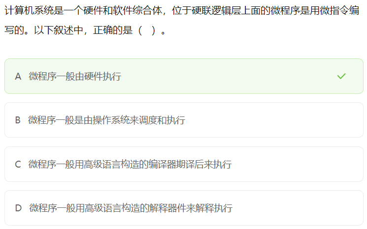
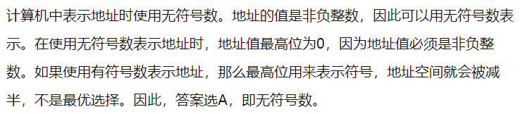
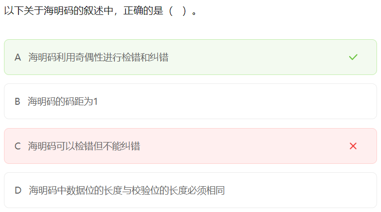
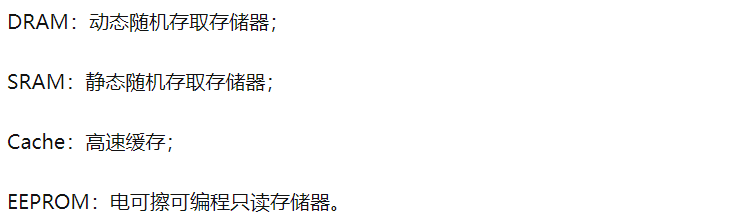
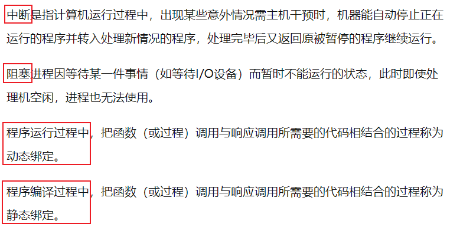
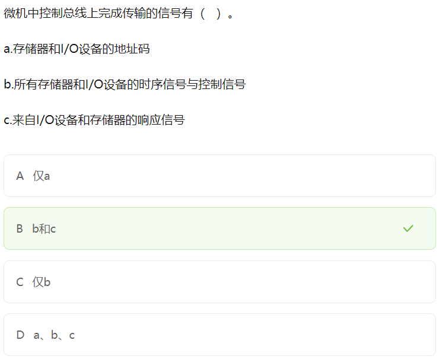

*Since Date: 2024-03-13*

[TOC]

## 计算机硬件

### 中央处理单元 CPU

CPU 的功能：

- 程序控制
- 操作控制
- 时间控制
- 数据处理

CPU 的组成：

- `运算器`（**数据加工、算术运算、逻辑运算**）
  - 算术逻辑单元 ALU
  - 累加器
  - 状态条件寄存器
  - 缓冲寄存器
- `控制器`（**保证指令执行、处理异常事件**）
  - 指令寄存器
  - 程序计数器
  - 地址寄存器
  - 指令译码器
- `寄存器组`（**保存程序的中间结果**）
- `总线`

>在 CPU 中，（ ）不仅要保证指令的正确执行，还要能够处理异常事件。
>
>A. 运算器										B. 控制器										C. 寄存器										D. 内部总线
>
>【答案】B

### 数据表示

#### 二进制转十进制

`无符号的二进制整数`：**从右往左依次用二进制位上的位数乘以 2 的 n 次幂的和（n 大于等于 0）**。

`带符号的二进制整数`：除去**最高位的符号位（1 为负数，0 为正数）**，其余与无符号二进制转化为十进制方法相同。

`小数二进制数`：从小数点后第 1 位上的二进制数字乘以 2 的负一次方，加上第 2 位上的二进制数字乘以 2 的负二次方，以此类推**第 n 位上的二进制数字乘以 2 的负 n 次方**。

>将二进制 1100.101 转化为十进制，结果是（ ）。
>
>A. 12.625										  B. 12.75										   C. 24.625										D. 24.75
>
>【答案】A

#### 十进制转二进制

`转化整数`：

1. 将**整数部分除 2，取余**。
2. 当商不为 0 时，将商作为被除数。
3. 继续除 2 取余，直至商为 0。
4. 将**余数按从下到上的顺序记录**。

`转化小数`：

1. 将**小数部分乘 2，取整**。
2. 如果结果仍有小数，就继续乘 2。
3. 直到小数部分为 0，或者已经达到了精度要求。
4. 将**取整的结果按从上到下的顺序记录**。

>将十进制 11.75 转化为二进制，结果是（ ）。
>
>A. 1011.11										B. 1010.11										C. 1010.01										 D. 1011.01
>
>【答案】A

#### 原码

**最高位是符号位，0 表示正号，1 表示负号，其余的 n-1 位表示数值的绝对值。**

- 数值 0 的原码表示有两种形式：[+0]~原~ = 0 0000000，[-0]~原~ = 1 0000000。

以带符号位的四位二进制数为例：1010，最高位为 1 表示这是一个负数，其它三位 010，即 $0*2^2+1*2^1+0*2^0=2$，所以 1010 表示十进制数 -2。

>若机器字长为 8，则 +127 和 -0.5 分为表示为（ ）。
>
>A. 0 1111111，0 1000101						B. 0 1111111，1 1000000						C. 1 1111111，0 1000000						 D. 1 0000000，1 1000101
>
>【答案】B

#### 反码

**原码最大的问题就在于一个数加上它的相反数不等于 0。**例如：1~原~ = 0001，-1~原~ = 1001，则 1~原~ + (-1~原~) = 1010，即得出 1 + (-1) = -2，这很明显是错误的。

`正数的反码`：等于它的原码。

`负数的反码`：**将负数绝对值的原码，除符号位外，其它位按位取反。**

- 数值 0 的反码表示有两种形式：[+0]~反~ = 0 0000000，[-0]~反~= 1 1111111。

#### 补码

**反码也无法解决负数相加的问题。**例如：-1~反~ = 1110，-3~反~ = 1100，则 (-1~反~) + (-3~反~) = 1010，1010 的原码为 1101，即 -5，这很明显也是错误的。

`正数的补码`：等于它的原码。

`负数的补码`：**等于它的反码 +1 或等于 $(2^{机器字长}-|负数|)$所得结果的原码。**

- 数值 0 有唯一的编码：[+0]~补~ = 0 0000000，[-0]~补~ = 0 0000000。

**`计算机中均采用补码进行加减运算。`**

例如：若机器字长为 4，计算 6 - 2 。

解答：6~原~ = 0110 ---> 6~反~ = 0110 ---> 6~补~ = 0110，-2~原~ = 1010 ---> -2~反~ = 1101 ---> -2~补~ = 1110，则 6~补~ + (-2~补~) = 0100，即结果是一个正数，正数的补码等于反码等于源码，也就是 6 - 2 = 4，结果正确。

>如果 2X 的补码是 90H，那么 X 的真值是（ ）。（2016 上半年试题)
>
>A. 56											B. -56											C. 72											D. -72
>
>【答案】B
>
>【解析】**十六进制用符号 H 或者 0x 表示，每一位十六进制代表四位二进制。**十六进制数 90，转换为二进制数为 1001 0000，补码 1001 0000 对应的反码为 1000 1111，再对应原码为 1111 0000，即 -112，因为 2X = -112，所以 X = -56。
>
>
>
>计算机系统中采用补码表示有符号的数值，（ ）。（2022 下半年试题）
>
>A. 可以保持加法和减法运算过程与手工运算方式一致										 B. 可以提高运算过程和结果的精准程度
>
>C. 可以提高加法和减法运算的速度															 D. **可以将减法运算转换为加法运算从而简化运算器的设计**
>
>【答案】D
>
>
>
>原码表示法和补码表示法是计算机中用于表示数据的两种编码方法，在计算机系统中常采用补码来表示和运算数据，原因是采用补码可以（ ）。（2011 上半年试题）
>
>A. 保证运算过程与手工运算方法保持一致													 B. 简化计算机运算部件的设计
>
>C. 提高数据的运算速度																		 D. 提高数据的运算精度
>
>【答案】B

#### 移码

`移码`：补码的符号位取反，移码的主要用途是表示浮点数的指数（阶码）。

|        | 正数                                                         | 负数                                                         |
| ------ | ------------------------------------------------------------ | ------------------------------------------------------------ |
| `原码` | **最高位为符号位 0 表示正号，其他位存放该数的二进制的绝对值** | **最高位为符号位 1 表示负号，其他位存放该数的二进制的绝对值** |
| `反码` | **等于原码**                                                 | **按它的原码，除符号位外，按位取反**                         |
| `补码` | **等于原码**                                                 | **反码 +1 或等于 $(2^{机器字长}-|负数|)$~原~**               |
| `移码` | **补码的符号位取反**                                         | **补码的符号位取反**                                         |

#### 浮点数

浮点数的表示形式：**N = 尾数 × 基数^阶码（指数）^**

- 二进制中，基数都是 2，十进制中，基数都是 10，其他进制类推。
- 尾数一般是一个小数，阶码一般是一个整数。例如：1.23 × 10^5^。

浮点数的表示格式：

| 数符             | 阶符             |
| ---------------- | ---------------- |
| 尾数（**补码**） | 阶码（**移码**） |

- `尾数`：**用补码表示，位数决定数的有效精度，位数越多精度越高。**
- `阶码`：**用移码表示，位数决定数的表示范围，位数越多范围越大。**
- 对阶时，**小数向大数看齐**。
- 对阶是通过**较小数的尾数右移**实现的。

>浮点数的表示分为阶和尾数两部分。两个浮点数相加时，需要先对阶，即（ ）（n 为阶差的绝对值）。（2018 上半年试题）
>
>A. 将大阶向小阶对齐，同时将尾数左移 n 位												  B. 将大阶向小阶对齐，同时将尾数右移 n 位
>
>C. 将小阶向大阶对齐，同时将尾数左移 n 位												  D. **将小阶向大阶对齐，同时将尾数右移 n 位**
>
>【答案】D
>
>
>
>对于长度相同但格式不同的两种浮点数，假设前者阶码长、尾数短，后者阶码短、尾数长，其它规定都相同，则二者可以表示数值的范围和精度情况为（ ）。（2022 下半年试题）
>
>A. 二者可表示的数的范围和精度相同														 B. 前者所表示的数的范围更大且精度更高
>
>C. 前者所表示的数的范围更大但精度更低												      D. 前者所表示的数的范围更小但精度更高
>
>【答案】C

### 校验码

#### 奇偶校验

`奇偶校验码`的编码方法是：由若干位有效信息的头部或者尾部，再**加上一个二进制位（校验位）组成校验码**。

- `奇校验`：整个校验码（有效信息位和校验位）中 **"1" 的个数为奇数**。
- `偶校验`：整个校验码（有效信息位和校验位）中 **"1" 的个数为偶数**。

**奇偶校验码只能检错，不能纠错：**

- 如果有**奇数个位发生误码**，则奇偶性发生变化，**可以检查出误码，但不能纠错。**
- 如果有**偶数个位发生误码**，则奇偶性不发生变化，**不能检查出误码（也称漏检）。**

>给出编码 1001101 的奇校验码和偶校验码（ ）。
>
>A. 10011011，10011010						B. 10011011，10011011						 C. 10011010，10011010						 D. 10011010，10011010
>
>【答案】A

#### 循环冗余校验 CRC

`模 2 除法`计算过程：

1. **被除数首位是几商就上几；**
2. **异或运算；**
3. **异或后首位一定是0，舍弃掉这个0首位；**
4. **补末位（落数），再上商。**

例如，1011 0010 000 模 2 除 1100 1，过程如下：

计算到最后，余数为 4 位数，小于被除数 5 位数，计算完成。

`循环冗余校验 CRC`流程：

- 收发双方约定好一个生成多项式 G(x)；

- 发送方基于待发送的数据和生成多项式计算出差错检测码（冗余码），然后将其添加到待传输数据的后面一起传输；

- 接收方通过生成多项式来计算收到的数据是否产生了误码。

  ● 算法要求生成多项式必须包含最低次项

示例一，待发送的信息为 1010 01，生成多项式为 G(x) = x^3^ + x^2^ + 1，计算编码后的信息。

1. **构造被除数：在待发送信息后面，添加生成多项式最高次数个 0。**即：1010 0100 0。

2. **构造除数：生成多项式各项系数构成的比特串。**即：1101。

3. **做模二除法运算。**得到余数为 1。

   

4. **检查余数：余数的位数应与生成多项式最高次数相同，如果位数不够，则在余数前补 0 来凑足位数。**即：001。

5. 因此，编码后的信息为：${\color{red}1010 01}$${\color{green}00 1}$。

示例二，接收到的信息为 1011 0100 1，生成多项式为 G(x) = x^3^ + x^2^ + 1，判断传输是否有误码。

1. **构造被除数：接收到的信息就是被除数。**即：1011 0100 1。

2. **构造除数：生成多项式各项系数构成的比特串。**即：1101。

3. **做模二除法运算。**得到余数为 11。

   

4. **检查余数：余数为 0，传输过程无误码；余数不为 0，传输过程产生误码。**

5. 因此，传输过程产生了误码。

>在（ ）校验方法中，采用模 2 运算来构造校验位。（2019 上半年试题）
>
>A. 水平奇偶									 B. 垂直奇偶										 C. 海明码										 D. 循环冗余
>
>【答案】D

#### 海明校验

**设数据位是 n 位，校验位是 k 位，则 n 和 k 必须满足以下关系：2^k^ － 1 >= n + k。**

海明码的编码规则如下：设 k 个校验位为 P~k~，P~k-1~，…，P~1~，n 个数据位为 D~n~，D~n-1~，…，D~1~，对应的海明码为 H~n+k~，H~n+k-1~，…，H~1~。

（1）校验码 P~i~ 要放在 2^i-1^ 的位置。

（2）海明码中的任何一位都是由若干个校验位来校验的。

（3）被校验的海明位的下标，**等于所有参与校验该位的校验位的下标之和**，而校验位由自身校验。

>待传送的信息为 1010，若采用海明校验，则奇校验规则下的海明码是（ ）。
>
>A. 0110 010									  B. 0110 011										 C. 1110 010										 D. 1110 011
>
>【答案】A
>
>【解析】
>
>1. 数据位 n 等于 4，根据校验位和数据位之间的关系，校验位 k 等于 3（2^k^ >= 5 + k），海明位一共为 4 + 3 = 7。
>
>2. 因为校验码放在 2^i-1^ 的位置，则数据位和校验位之间的位置关系为：P1，P2，D1，P3，D2，D3，D4。海明位与数据位和校验位的关系为：
>
>  
>
>3. 海明位下标与校验位下标关系表（注意，校验位的下标是该校验位在海明位对应的位置，满足 2^i^ 条件，i 是大于等于 0 的整数）：
>
>  
>
> 4. 根据上表，得出校验位和数据位的对应关系，进而根据对应的数据位数据，求出奇/偶校验码规则下对应的海明码：
>
>  
>
> 5. 根据计算出来的奇/偶校验码规则下对应的海明码，将海明码填到对应的位置：
>
>  
>
> 6. 因此，奇校验规则下，传输的信息为 0110 010。如果是偶校验规则，传输的信息为 1011 010。

### 存储器

#### 存储器的层次结构

>在程序的执行过程中，Cache 与主存的地址映射是由（ ）完成的。（2017 下半年试题）
>
>A. 操作系统									B. 程序员调度									C. 硬件自动									D. 用户软件
>
>【答案】C

#### 高速缓存 Cache

特点：

- Cache 位于 CPU 与主存之间。

- **Cache 对程序员来说是透明的。**

- 设置多级高速缓存 Cache 以提高命中率（访问主存的效率）。

- **使用 Cache 改善系统性能的依据是程序的局部性原理。**

  

  - `时间局部性`：被引用过一次的存储器位置在未来会被多次引用，**主要体现是循环（sum 变量）**。
  - `空间局部性`：如果一个存储器的位置被引用，那么将来它附近的位置也会被引用，**主要体现是顺序执行的过程（arr 数组）**。

>在 CPU 内外常设置多级高速缓存 Cache 其主要目的是（ ）。（2019 下半年试题）
>
>A. 扩大主存的存储容量																			B. 提高 CPU 访问主存数据或指令的效率
>
>C. 扩大存储系统的容量																			D. 提高 CPU 访问外存储器的速度
>
>【答案】B

##### Cache 的地址映像方法

>Cache 的地址映像方式中，发生块冲突次数最小的是（ ）。（2015 年上半年）
>
>A. 全相联映像									B. 组相联映像									C. 直接映像									D. 无法确定
>
>【答案】A

##### Cache 替换算法

- 近期最少使用算法 = 近期最久未使用算法。

>Cache 的替换算法中，（ ）算法计数器位数多，实现困难。
>
>A. FIFO											B. LFU											C. LRU											D. RAND
>
>【答案】B

#### 磁盘（外存储器）

机械磁盘存在两组运动：

- 磁盘的**旋转运动**。
- 机械臂控制磁头**沿半经方向的直线运动**。

**存取时间 = 寻道时间 + 等待时间：**

- `寻道时间`：指磁头移动到磁道所需的时间。
- `等待时间`：等待读写的扇区转到磁头下方所用的时间。
- 相较于寻道时间和等待时间，数据写入磁盘的时间微不足道，因此**存取时间只考虑寻道时间和等待时间**。

>在磁盘调度管理中，通常（ ）。（2019 下半年试题）
>
>A. 先进行旋转调度，再进行移臂调度																		  B. 在访问不同柱面的信息时，只需要进行旋转调度
>
>C. 先进行移臂调度，再进行旋转调度																		  D. 在访问同一磁道的信息时，只需要进行移臂调度
>
>【答案】C
>
>
>
>假设某磁盘的每个磁道划分成 11 个物理块，每块存放 1 个逻辑记录。逻辑记录 R0，R1，...，R9，R10 存放在同一个磁道上，记录的存放顺序如下表所示：
>
>
>
>如果磁盘的旋转周期为 33 ms，磁头当前处在 R0 的开始处。若系统使用单缓冲区顺序处理这些记录，每个记录处理时间为 3 ms，则处理这 11 个记录的最长时间为（），若对信息存储进行优化分布后，处理 11 个记录的最少时间为（）。
>
>A. 33 ms												B. 336 ms												C. 366 ms												D. 376 ms
>
>A. 33 ms												B. 66 ms												  C. 86 ms												  D. 93 ms
>
>【答案】C B
>
>【解析】一个磁道划分为11个物理块，每块存放一个逻辑记录，而存储的逻辑记录从 R0 到 R10 一共11个，所以正好成为一个回环。如下图所示：
>
>
>
>磁盘旋转是一个不会停下来的匀速旋转的过程，所以周期为 33 ms 时，平均每个物理块的读取时间为 33/11 = 3 ms，这 3 ms 即为**平均定位时间**。
>
>同时，单缓冲区意味着一次只能处理一个记录，等处理完成释放缓冲区才能进行下一个操作。
>
>对于第一个题目，处理这 11 个记录的最长时间，不要被 "最长" 这两个字误导，其实就是要你求处理 11 个记录的时间。可以算出来，当读取 R0 时，用时 3 ms，加载到单缓冲区完成处理，用时 3 ms，这时候，磁头的位置应处于 R2 的开始处。但我们需要读取的记录是 R1，因此，我们要等待到磁头旋转到 R1 的位置时才能继续处理记录。也就是说，处理一个记录的时候，磁头需要转一个周期还要多一个物理块才能读到下一个记录。易得出，等待时间为 33 + 3 = 36 ms。由于最后一个的位置特殊，读取完后，不需要等待磁头转到下个记录这部分时间，因而 R10 的处理时间为 "读取的时间 + 处理的事件"，即 3 + 3 = 6 ms。所以处理这 11 个记录的时长为：36 * 10 + 6 = 366 ms。
>
>对于第二个题目，若对信息存储进行优化分布后，处理 11 个记录的最少时间。做完第一题的时候你就明白了，最理想的信息存储分布就是，当读取完一个记录，执行完后立刻能读取下一个记录这样的布局是最快的。如下图所示：
>
>
>
>易得出，处理一个记录的用时仅为 6 ms，一共有 11 条记录，11 * 6 = 66 ms。
>
>
>
>在磁盘调度管理中，应先进行移臂调度，再进行旋转调度。假设磁盘移动臂位于 21 号柱面上，进程的请求序列如下表所示。如果采用最短移臂调度算法，那么系统的响应序列应为（）。 
>
>
>
>A. ②⑧③④⑤①⑦⑥⑨								B. ②③⑧④⑥⑨①⑤⑦								C. ①②③④⑤⑥⑦⑧⑨								D. ②⑧③⑤⑦①④⑥⑨
>
>【答案】D
>
>【解析】当进程请求读磁盘时，操作系统先进行移臂调度，再进行旋转调度。由于移动臂位于 21 号柱面上，按照最短寻道时间优先的响应柱面序列为 23 → 17 → 32 → 38。按照旋转调度的原则分析如下：进程在 23 号柱面上的响应序列为 ② → ⑧ → ③（同一柱面，扇区号增大），因为进程访问的是不同磁道上的不同编号的扇区，旋转调度总是让首先到达读写磁头位置下的扇区先进行传送操作。进程在 17 号柱面上的响应序列为 ⑤ → ⑦ → ①（同一柱面，① 和 ⑦ 的扇区号也相同），或 ⑤ → ① → ⑦。对于 ① 和 ⑦ 可以任选一个进行读写，因为进程访问的是不同磁道上具有相同编号的扇区，旋转调度可以任选一个读写磁头位置下的扇区进行传送操作。进程在 32 号柱面上的响应序列为 ④ → ⑥，由于 ⑨ 在 38 号柱面上，故最后响应。从上面的分析中可以得出按照最短寻道时间优先的响应序列为 ②⑧③⑤⑦①④⑥⑨。

### 输入/输出技术

`输入/输出技术`，是**指 CPU 控制主存与外设之间数据交互的过程**。因为外设处理速度比主存慢很多，对于二者之间的平衡，常见的方式有：

- `直接程序控制`
  - 分为**无条件传送和程序查询**方式。
  - 降低了 CPU 的效率。
  - 对外部的突发事件无法做出实时响应。
  
- `程序中断方式`
  - 利用中断方式完成数据的输入/输出。
  - CPU 接到中断请求信号后，保存正在执行程序的现场。
  - 与程序控制方式相比，因为 **CPU 无须等待**而提高了效率。
  
- `DMA`
  
  
  
  - 在**主存与 I/O 设备（外设）之间建立数据通路**，进行数据的交换处理。
  - 在 DMA 传送过程中**无须 CPU 的干预**。
  - DMA 传送数据时要**占用系统总线**，此时，CPU 不能使用总线。
  
- `输入/输出处理机 (IOP)`
  - 分担了 CPU 的一部分功能，可以实现对外围设备的统一管理，完成外围设备与主存之间的数据传送。
  - 大大提高了 CPU 的工作效率，这种效率的提高是**以增加更多的硬件为代价**的。

>DMA 控制方式是在（ ）之间直接建立数据通路进行数据的交换处理。（2019 年上半年试题软设）
>
>A. CPU 与主存										B. CPU 与外设									     C. 主存与外设									 D. 外设与外设
>
>【答案】C
>
>
>
>计算机运行过程中，CPU 需要与外设进行数据交换。采用（ ）控制技术时，CPU 与外设可并行工作。（2017 年下半年)
>
>A. 程序查询方式和中断方式					 	B. 中断方式和 DMA 方式						  	C. 程序查询方式和 DMA 方式					 D. 程序查询方式、中断方式和 DMA 方式
>
>【答案】B

### Flynn 分类法

**根据指令流和数据流的不同组合**，将计算机分为四种类型：

>Flynn 分类法根据计算机在执行程序的过程中（ ）的不同组合，将计算机分为 4 类，当前主流的多核计算机属于（ ）计算机。
>
>A. 指令流和数据流							  	B. 数据流和控制流							C. 指令流和控制流								D. 数据流和总线带宽
>
>A. SISD											   B. SIMD										 C. MISD											D. MIMD
>
>【答案】A D

### 指令系统

>以下关于 RISC 和 CISC 的叙述中，不正确的是（ ）。（2022 年上半年）
>
>A. RISC 的大多指令在一个时钟周期内完成														B. RISC 普遍采用微程序控制器，CISC 则普遍采用硬布线控制器
>
>C. RISC 的指令种类和寻址方式相对于 CISC 更少												   D. RISC 和 CISC 都采用流水线技术
>
>【答案】B
>
>【解析】CISC 普遍采用微程序控制器，RISC 则普遍采用硬布线控制器。

### 流水线

`流水线`是指**在程序执行时多条指令重叠进行操作的一种准并行处理实现技术**。各种部件同时处理是针对不同指令而言的，它们可同时为多条指令的不同部分进行工作，以提高各部件的利用率和指令的平均执行速度。

一条指令的执行过程可以分解为取指、分析和执行三步，在取指时间 t~取指~ = 3△t、分析时间 t~分析~ = 2△t、执行时间 t~执行~ = 4△t 的情况下，若按串行方式执行，则 10 条指令全部执行完需要（ ）△t；若按流水线的方式执行，流水线周期为（ ）△t，则 10 条指令全部执行完需要（ ）△t。

- (3△t + 2△t + 4△t) * 10 = 90△t
- 流水线周期 = 时间最长的指令 = 4△t
- 流水线执行时，若按照理论公式为：(3△t + 2△t + 4△t) + (10 - 1) * 4△t = 45△t，若按照实践公式为：3 * 4△t + (10 - 1) * 4△t = 48△t。（优先计算理论公式的值）

流水线的`吞吐率`（Though Put rate，TP）是指**在单位时间内流水线所完成的任务数量或输出的结果数量**。计算流水线吞吐率的最基本公式如下：

流水线的`最大吞吐率`（n 是指令的条数）：

流水线的`加速比`是指完成同样一批任务，不使用流水线所用的时间与使用流水线所用的时间之比。计算流水线的加速比的公式如下：

>执行指令时，将每一节指令都分解为取指、分析和执行三步。已知取指时间 5△t，分析时间 2△t，执行时间 3△t，如果按照取指、分析、执行重叠的流水线方式执行指令，从头到尾执行完 500 条指令需（ ）△t。（2019 年下半年）
>
>A. 2500											B. 2505										 C. 2510											D. 2515
>
>【答案】B
>
>【解析】理论公式：(5△t + 2△t + 3△t) + (500 - 1) * 5△t = 2505△t，实践公式：3 * 5△t + (500 -1) * 5△t = 2510△t，优先选择理论公式计算的结果。

### 冯诺依曼结构和哈弗结构

>目前处理器市场中存在 CPU、GPU 和 DSP 多种类型处理器，分别用于不同场景，这些处理器具有不同的体系结构，DSP 采用（ ）。
>
>A. 冯·诺依曼结构								  B. 哈佛结构									C. FPGA 结构									D. 与 GPU 相同结构
>
>【答案】B
>
>【解析】FPGA 是指可编程门阵列，是一种电路结构，不是处理器的体系结构划分。GPU，图形处理器，即显卡，没有所谓的体系结构划分。
>
>
>
>以下关于冯·诺依曼计算机的叙述中，不正确的是（ ）。（2022 年上半年)
>
>A. 程序指令和数据都采用二进制表示															B. 程序指令总是存储在主存中，而数据则存储在高速缓存中
>
>C. 程序的功能都由中央处理器（CPU）执行指令来实现										 D. 程序的执行工作由指令进行自动控制
>
>【答案】B
>
>【解析】冯·诺依曼结构中，程序指令和数据存储在同一个存储器中。

### 总线

特点：

- `共享`：总线的部件相互之间可以进行信息的交换。
- `分时`：同一时刻仅允许一个部件向总线发送信息，但允许多个部件同时从总线上接收相同的信息。

通信方向：

- `单工`:一个方向上传输（正向或反向），不能改变信号的传输方向。
- `半双工`：一种可切换方向的单工通信。
- `全双工`：双向的传输。

分类：

- `串行总线`：适合长距离传输。
- `并行总线`：适合近距离传输。

功能分类：

- `数据总线`：Data Bus，DB，在 CPU 与 RAM（Random Access Memory）之间来回传送需要处理或是需要储存的数据。
- `地址总线`：Address Bus，AB，用来指定在 RAM 之中储存的数据的地址。
- `控制总线`：Control Bus，CB，将微处理器控制单元（Control Unit）的信号，传送到周边设备。

>以下关于总线的叙述中，不正确的是（ ）。
>
>A. 并行总线适合近距离高速数据传输															 B. 串行总线适合长距离数据传输
>
>C. 单总线结构在一个总线上适应不同种类的设备，设计简单且性能很高					     D. 专用总线在设计上可以与连接设备实现最佳匹配
>
>【答案】C
>
>【解析】单总线性能不高。

### 加密和认证

#### 对称加密技术

`对称加密`是指信息的发送方和接收方使用同一个密钥去加密和解密数据。

- 加密过程：明文 + 加密算法 + 私钥 => 密文。
- 解密过程：密文 + 解密算法 + 私钥 => 明文。

特点：算法公开、加密和解密速度快，适合于对大数据量进行加密。加密强度不够、密钥安全管理困难。

常见的对称加密算法：**DES、3DES、RC、IDEA、PGP、AES 等。**

#### 非对称加密技术

`非对称加密`与对称加密相比，其安全性更好。对称加密的通信双方使用相同的密钥，如果一方的密钥遭泄露，那么整个通信就会被破解。而非对称加密使用一对密钥，即**公钥和私钥**，且二者成对出现。私钥被自己保存，不能对外泄露。公钥指的是公共的密钥，任何人都可以获得该密钥。用公钥或私钥中的任何一个进行加密，用另一个进行解密。

特点：非对称加密算法的保密性比较好，它消除了最终用户交换密钥的需要，但加密和解密花费的时间长、速度慢，不适合于对文件加密，而只适用于对少量数据进行加密。

常见的非对称加密算法：**RSA、DSA、ECC（椭园曲线算法）等。**

>下列算法中属于非对称加密算法的是（ ）。（2021 年上半年)
>
>A. DES											B. RSA											C. AES											D. MD5
>
>【答案】B

#### 信息摘要

`信息摘要`简要地描述了一份较长的信息或文件，它可以被看作一份长文件的 "数字指纹"，**信息摘要用于创建数字签名**，**对于特定的文件而言，信息摘要是唯一的**。

- 信息摘要可以被公开，它不会透露相应文件的任何内容。

- 原始数据不同，生成的摘要一定不同，**单向不可逆**。

信息摘要算法：

#### 数字签名

`数字签名`采用非对称密码体制（公钥密码体制），即**发送者使用私钥加密数据，接收者使用对应的公钥解密数据。**它具有以下功能：

- 报文鉴别：用于证明来源，接收者可以通过签名确定是哪个发送者进行的签名。

- 防止抵赖：防止发送者否认签名，发送者一旦签名，标记就打上了，无法抵赖。
- 防止伪造：防止接收者伪造发送者的签名。

### 计算机可靠性模型

`串联系统`：假设一个系统由 N 个子系统组成，当且仅当所有的子系统都能正常工作时系统才能正常工作，这种系统称为串联系统。

- 设系统中各个子系统的可靠性分别用 R~1~，R~2~，......，R~N~ 来表示，则系统的可靠性 R 可由下式求得：**R = R~1~ R~2~ ... R~N~**。

`并联系统`：假如一个系统由 N 个子系统组成，只要有一个子系统正常工作，系统就能正常工作，这样的系统称为并联系统。

- 设每个子系统的可靠性分别以 R~1~，R~2~，......，R~N~ 表示，则整个系统的可靠性 R 可由下式求得：**R = 1- (1- R~1~) (1- R~2~) ... (1- R~N~)**。

>某系统由 3 个部件构成，每个部件的千小时可靠度都为 R，该系统的千小时可靠度为 (1 - (1 - R)^2^) R，则该系统的构成方式是（ ）。（2019 年下半年）
>
>A. 3 个部件串联								  B. 3 个部件并联								C. 前两个部件并联后与第三个部件串联			D. 第一个部件与后两个部件并联构成的子系统串联
>
>【答案】C
>
>【解析】选项 D 的可靠度为：R (1 - (1 - R)^2^)。

### 例题

【题目】

【解析】

【题目】

【解析】

【题目】

【解析】

【题目】

【解析】

【题目】

【解析】

【题目】

【解析】

【题目】

【解析】

【题目】

【解析】

【题目】

【解析】

【题目】

【解析】

【题目】

【解析】

【题目】

【解析】

【题目】

【解析】

【题目】

【解析】

【题目】

【解析】

【题目】

【解析】

【题目】

【解析】

【题目】

【解析】

【题目】

【解析】

【题目】

【解析】

【题目】

【解析】

【题目】

【解析】

【题目】

【解析】

【题目】

【解析】

【题目】

【解析】

【题目】

【解析】

【题目】

【解析】

【题目】

【解析】

【题目】

【解析】

【题目】

【解析】

【题目】

【解析】

【题目】

【解析】

【题目】

【解析】

【题目】

【解析】

【题目】

【解析】

#### 输入/输出技术

【题目】

【解析】

【题目】

【解析】

【题目】

【解析】

【题目】

【解析】

【题目】

【解析】

【题目】

【解析】

【题目】

【解析】

【题目】

【解析】

【题目】

【解析】

【题目】

【解析】

【题目】

【解析】

【题目】

【解析】

【题目】

【解析】

【题目】

【解析】

【题目】

【解析】

#### 计算机体系结构

【题目】

【解析】

#### 总线

【题目】

【解析】

【题目】

【解析】

【题目】

【解析】

【题目】

【解析】

【题目】

【解析】

【题目】

【解析】

【题目】

【解析】

【题目】

【解析】

【题目】

【解析】

【题目】

【解析】

【题目】

【解析】

【题目】

【解析】

【题目】

【解析】

【题目】

【解析】

【题目】

【解析】

## 操作系统

### 概述

操作系统的作用：通过资源管理**提高计算机系统的效率**；**改善人机界面**向用户提供友好的工作环境。

操作系统的特征：`并发性`、`共享性`、`虚拟性`、`不确定性`。

操作系统的功能：`进程管理`、`存储管理`、`文件管理`、`设备管理`、作业管理。

操作系统的分类：批处理操作系统、分时操作系统（轮流使用 CPU 工作片）、实时操作系统（快速响应）、网络操作系统、分布式操作系统（物理分散的计算机互联系统）、微机操作系统（Windows）、嵌入式操作系统。

计算机启动的基本流程为：BIOS ---> 主引导记录 ---> 操作系统。

#### 微内核操作系统

`微内核`，顾名思义，就是尽可能的将内核做的很小，**只将最为核心必要的东西放入内核中**，其他能独立的东西都放入用户进程中，这样，**系统就被分为了用户态和内核态**。

单体内核 VS 微内核：

|            | 实质                                                         | 优点                                                         | 缺点                                                         |
| ---------- | ------------------------------------------------------------ | ------------------------------------------------------------ | ------------------------------------------------------------ |
| `单体内核` | 将图形、设备驱动及文件系统等功能，全部在内核中实现，运行在内核状态和同一地址空间 | 减少进程间通信和状态切换的系统开销，获得较高的运行效率       | 内核庞大，占用资源较多且不易裁剪。系统的稳定性和安全性不好   |
| `微内核`   | 只实现基本功能，将图形系统、文件系统、设备驱动及通信功能放在内核之外 | 内核精炼，便于裁剪和移植。系统服务程序运行在用户地址空间，系统的可靠性、稳定性和安全性较高。可用于分布式系统 | 用户状态和内核状态需要频繁切换，从而导致系统效率不如单体内核 |

#### 嵌入式操作系统

`嵌入式操作系统`特点：**微型化、代码质量高、专业化、实时性强、可裁剪可配置。**

实时嵌入式操作系统的内核服务：异常和中断、计时器、I/O 管理。

常见的嵌入式 RTOS（实时操作系统）：VxWorks、RT-Linux、QNX、pSOS。

嵌入式系统初始化过程按照自底向上、从硬件到软件的次序依次为：**芯片级初始化 ---> 板卡级初始化 ---> 系统级初始化**。

- **芯片级是微处理器的初始化，板卡级是其他硬件设备初始化，系统级初始化就是软件及操作系统初始化。**

### 进程管理

#### 进程的组成和状态

`进程`是**计算机中正在运行的程序的实例，它是操作系统进行资源分配和管理的基本单位，包括代码、数据和执行状态等信息。**

进程的组成：`进程控制块 PCB (唯一标志)`、`程序 (描述进程要做什么)`、`数据 (存放进程执行时所需的数据)`。

进程基础的状态时下左图中的**三态图**，这是系统自动控制时只有三种状态，而下右图中的**五态**，是多了两种状态：静止就绪和静止阻塞，需要人为的操作才会进入对应状态，活跃就绪即就绪，活跃阻塞即等待。

#### 前趋图

`前趋图`：用来表示哪些任务可以并行执行，哪些任务之间有顺序关系。具体如下图：

- 可知，ABC 可以并行执行，但是必须 ABC 都执行完后，才能执行 D，这就确定了两点：**任务间的并行、任务间的先后顺序。**

#### 进程资源图

`进程资源图`：用来表示进程和资源之间的分配和请求关系。如下图所示：

- **P 代表进程，R 代表资源，R 方框中有几个圆球就表示有几个这种资源。**在图中，R1 指向 P1，表示 R1 有一个资源已经分配给了 P1，P1 指向 R2，表示 P1 还需要请求一个 R2 资源才能执行。

`阻塞节点`：某进程所请求的资源已经全部分配完毕，无法获取所需资源，该进程被阻塞了无法继续。如上图中 P2。

`非阻塞节点`：某进程所请求的资源还有剩余，可以分配给该进程继续运行。如上图中 P1、P3。**当一个进程资源图中所有进程都是阻塞节点时，即陷入死锁状态。**

>在如下所示的进程资源图中，（）；该进程资源图是（）。
>
>
>
>A. P1、P2、P3 都是阻塞节点			B. P1 是阻塞节点，P2、P3 是非阻塞节点			 C. P1、P2 是阻塞节点，P3 是非阻塞节点			D. P1、P2 是非阻塞节点，P3 是阻塞节点
>
>A. 可以化简的，其化简顺序为 P1 ---> P2 ---> P3												  B. 可以化简的，其化简顺序为 P3 ---> P1 ---> P2
>
>C. 可以化简的，其化简顺序为 P2 ---> P1 ---> P3												  D. 不可以化简的，因为 P1、P2、P3 申请的资源都不能得
>
>【答案】C B

#### 同步与互斥

`互斥`：指多个进程只能互斥地访问某个资源（即临界资源），即只有一个进程可以访问该资源，其他进程必须等待。互斥可以防止多个进程同时访问同一个资源，从而避免数据损坏和程序崩溃。如打印机、公共厕所。

- `临界资源`：各进程间需要以互斥方式对其进行访问的资源。
- `互斥信号量`：对临界资源采用互斥访问，实现进程的互斥，使用互斥信号量后其他进程无法访问，**其值只能为 0 或 1**。比如厕所的门锁有两个状态：打开和关闭。当门锁打开时，表示厕所空闲，可以进入。当门锁关闭时，表示厕所有人使用，其他人需要等待。门锁就像是互斥信号量，它表示厕所的使用状态。人就像是进程，他们需要获取门锁才能使用厕所。**（互斥信号量是锁）**

`同步`：指多个进程之间互相协调，以确保它们按照一定的顺序执行。同步可以防止进程之间出现竞争和冲突，从而提高程序的正确性和效率。比如多个人一起做某件事情。

- `同步信号量`：是一种用于实现进程同步的工具。**它是一个共享变量，可以用来表示资源的数量。**比如餐厅里的餐桌数量有限，当顾客来吃饭时，如果餐桌空闲，则可以直接坐下。如果餐桌都满了，则顾客需要等待，餐桌就像是同步信号量，它表示餐桌的数量。顾客就像是进程，他们需要获取餐桌才能吃饭。**（同步信号量是同步操作的那个变量）**

#### 信号量

`P 操作`：**申请资源，S = S - 1，若S >= 0，则执行 P 操作的进程继续执行；若 S < 0，则置该进程为阻塞状态（因为无可用资源），并将其插入阻塞队列。**

- S 减去 1 之后，若小于 0，说明申请资源时，没有可用资源存在，申请资源的线程进入阻塞队列。
- 若 S = 0，说明资源池中只有一个资源，若 S > 0，说明资源池中有不止一个资源。

`V 操作`：**释放资源，S = S + 1，若 S > 0，代表此时资源有空余，没有阻塞的进程，则该进程继续执行；若 S <= 0，代表此时线程在被阻塞，所以需要从阻塞状态唤醒一个进程，并将其插入就绪队列（此时因为缺少资源被 P 操作阻塞的进程可以继续执行），然后执行 V 操作的进程继续。**

- S 加上 1 之后，若 S <= 0，说明释放资源后，有正在阻塞的线程等待资源，因此需要从阻塞状态唤醒一个进程，该进程进入就绪队列。
- 若 S = 0，说明当前有一个正在阻塞等待资源的线程，若 S < 0，说明当前有不止一个正在阻塞等待资源的线程。

>进程 P1、P2、P3、P4 和 P5 的前趋图如下图所示：
>
>
>
>若用 PV 操作控制进程 P1、P2、P3、P4 和 P5 并发执行的过程，则需要设置 5 个信号 S1、S2、S3、S4 和 S5，且信号量 S1～S5 的初值都等于零。下图中 a 和 b 处应分别填（）；c 和 d 处应分别填写（）；e 和 f 处应分别填写（）。
>
>
>
>A. V(S1) P(S2) 和 V(S3)								B. P(S1) V(S2) 和 V(S3)							C. V(S1) V(S2) 和 V(S3)							D. P(S1) P(S2) 和 V(S3)
>
>A. P(S2) 和 P(S4)									   B. P(S2) 和 V(S4)								   C. V(S2) 和 P(S4)								   D. V(S2) 和 V(S4)
>
>A. P(S4) 和 V(S4) V(S5)							      B. V(S5) 和 P(S4) P(S5)							C. V(S3) 和 V(S4) V(S5)							D. P(S3) 和 P(S4) V(P5)
>
>【答案】C B B
>
>【解析】方式一：一个进程的开始处，都是 P 操作，进程的结束处，都是 V 操作（第一个进程，是 V 操作）。根据此特点，c 和 f 都是 P 操作，a、b、d 和 e 都是 V 操作。方式二：结合前驱图以及题目中的条件，填写信号量如下图，然后得出各处应填写的操作。
>
>
>
>
>
>进程 P1、P2、P3、P4、P5 和 P6 的前趋图如下所示：
>
>
>
>若用 PV 操作控制这 6 个进程的同步与互斥的程序如下，那么程序中的空 ① 和空 ② 处应分别为（）；空 ③ 和空 ④ 处应分别为（）；空 ⑤ 和空 ⑥ 处应分别（）。
>
>
>
>A. V(S1) V(S2) 和 P(S2)							B. P(S1) P(S2) 和 V(S2)							C. V(S1) V(S2) 和 P(S1)							D. P(S1) P(S2) 和 V(S1)
>
>A. V(S3) 和 V(S5) V(S6)							B. P(S3) 和 V(S5) V(S6)							C. V(S3) 和 P(S5) P(S6)							D. P(S3) 和 P(S5) P(S6)
>
>A. P(S6) 和 P(S7) V(S8)							B. V(S6) 和 V(S7) V(S8)							C. P(S6) 和 P(S7) P(S8)							D. V(S7) 和 P(S7) P(S8)
>
>【答案】C B D
>
>【解析】结合前驱图以及题目中的条件，填写信号量如下图，然后得出各处应填写的操作。
>
>

#### 生产者和消费者

经典问题：生产者和消费者的问题。

三个信号量：**互斥信号量 S0（仓库独立使用权），同步信号量 S1（仓库空闲位置），同步信号量 S2（仓库商品个数）。**

>假设某系统采用非抢占式优先级调度算法，若该系统有两个优先级相同的进程 P1 和 P2，各进程的程序段如下所示，若信号量 S1 和 S2 的初值都为 0。进程 P1 和 P2 并发执行后 a、b 和 c 的结果分别为：a =（），b =（），c =（）。
>
>
>
>A. 6													B. 7													C. 10													D. 13
>
>A. 4													B. 6													C. 9												  	D. 10
>
>A. 4													B. 6													C. 10													D. 13
>
>【答案】D B C
>
>【解析】**非抢占式：优先级相同。**

#### 死锁

当一个进程在等待永远不可能发生的事件时，就会产生`死锁`，若系统中有多个进程处于死锁状态，就会造成系统死锁。

死锁产生的四个必要条件：

- **资源互斥。**
- **每个进程占有资源并等待其他资源。**
- **系统不能剥夺进程资源。**
- **进程资源图是一个环路。**

死锁产生后，解决措施是打破四大条件，有下列方法：

- `死锁预防`：采用某种策略限制并发进程对于资源的请求，破坏死锁产生的四个条件之一，使系统任何时刻都不满足死锁的条件。
- `死锁避免`： 一般采用**银行家算法**来避免，银行家算法，就是提前计算出一条不会死锁的资源分配方法，才分配资源，否则不分配资源，相当于借贷，考虑对方还得起才借钱，提前考虑好以后，就可以避免死锁。
- `死锁检测`：允许死锁产生，但系统定时运行一个检测死锁的程序，若检测到系统中发生死锁，则设法加以解除。
- `死锁解除`：即死锁发生后的解除方法，如强制剥夺资源，撤销进程等。

死锁计算问题：系统内有 n 个进程，每个进程都需要 R 个资源，那么其**发生死锁的最大资源数为 n * (R - 1)**，其**不发生死锁的最小资源数为 n * (R - 1) + 1**。

>某系统中有 3 个并发进程竞争资源 R，每个进程都需要 5 个 R，那么至少有（）个资源数。
>
>A. 12												B. 13												C. 14												D. 15
>
>【答案】B
>
>
>
>银行家算法真题：假设系统中有三类互斥资源 R1、R2 和 R3，可用资源数分别为 10、5 和 3。在 T0 时刻系统中有 P1、P2、P3、P4 和 P5 五个进程，这些进程对资源的最大需求和已分配资源数如下表所示，此时系统剩余的可用资源数分别为（）。如果进程按（）序列执行，那么系统状态是安全的。
>
>
>
>A. 1、1 和 0										 B. 1、1 和 1										 C. 2、1 和 0										D. 2、0 和 1
>
>A. P1一P2一P4一P5一P3						     B. P5一P2一P4一P3一P1						      C. P4一P2一P1一P5一P3						    D. P5一P1一P4一P2一P3
>
>【答案】D B

#### 线程

传统的进程有两个属性：

- **可拥有资源的独立单位。**
- **可独立调度和分配的基本单位。**

引入线程后，**线程是独立调度的最小单位**，**进程是拥有资源的最小单位**，线程可以共享进程的公共数据、全局变量、代码、文件等资源，但不能共享线程独有的资源，如线程的栈指针等标识数据。

### 存储管理

#### 页式存储

`页式存储`是操作系统的一种存储管理方式。因为我们的程序往往是远远大于内存的，所以程序在执行的时候，是不会一次性把所有内容都装入到内存中，它会把程序分为若干个`页`，每个页固定大小，一般是 4 KB（默认），然后把这些页离散存入到内存中，而内存是按`块`来划分的，所以就通过`页表`来进行映射程序中的页在内存中的块的存储。**（此处的页号与块号的对应关系，应该就是高速缓存 Cache 的地址映像方法）**

- 每个页分为页号和页内地址，**页号用来和块号对应**，代表存储的位置，大小可以代表页的数量，**页内地址代表的是存储的数据内容**，大小可以代表数据大小。
- `逻辑地址`是程序员在编写程序时使用的地址，它是由 CPU 生成的虚拟地址，逻辑地址并不一定对应物理内存中的实际位置，而是由操作系统进行地址转换后才能访问物理内存。**逻辑地址的构成是：逻辑页号 + 页内地址。**
- `物理地址`是内存单元在物理内存中的实际位置。它是计算机硬件可以直接寻址的地址。**物理地址的构成是：物理块号 + 页内地址。**

优点：**利用率高、碎片小（只在最后一个页中有）、分配及管理简单。**

缺点：**增加了系统开销，可能产生抖动现象。**

>某计算机系统页面大小为 4 KB，若进程的页面变换表如下所示，逻辑地址为十六进制 1D16H。该地址经过变换后，其物理地址应为十六进制（）。
>
>
>
>A. 1024H												B. 3D16H												C. 4DI6H												D. 6D16H
>
>【答案】B
>
>【解析】**十六进制数字：通常用数字 0、1、2、3、4、5、6、7、8、9 和字母 A、B、C、D、E、F（a、b、c、d、e、f）表示，其中 A ~ F 表示 10 ~ 15。**因为计算机系统页面大小为 4 KB，即页内地址是二进制的 12 位（4 KB = 2^12^），而二进制的 12 位，对应十六进制的 3 位，所以逻辑地址为 1D16H 的十六进制，其后三位 D16 为页内地址，首位 1 为页号。由页表对应关系，页号 1 对应块号 3，所以物理地址为 3D16H。
>
>- 页面大小 = 4 KB = 2^12^，而逻辑地址为十六进制，即逻辑地址的后 12 位为页内地址，前 4 位为逻辑页号。则 1D16H 的页号为 1，页内地址为 D16，对应的物理地址为 3D16H。
>
>
>
>某虚拟存储器的用户编程空间共 64 个页面，每页为 1 KB，内存为 16 KB。假定某时刻一用户页表中已调入内存的页面的页号和物理块号的对照表如下，则逻辑地址 0A5CH 所对应的物理地址是什么？要求：写出主要计算过程。 
>
>| 页号 | 块号 |
>| ---- | ---- |
>| 0    | 3    |
>| 1    | 7    |
>| 2    | 9    |
>| 3    | 5    |
>
>【解析】**由 "用户编程空间共 64 个页面"，64 = 2^6^，可知页号部分占 6 位；由 "每页为 1 KB"，1 KB = 2^10^，可知页内地址占 10 位；由 "内存为 16 KB"，16 = 2^4^，可知块号占 4 位。**逻辑地址 0A5CH，所对应的二进制表示形式是：0000 1010 0101 1100，后十位 10 0101 1100 是页内地址，前六位 0000 10 为页号，页号转换为十进制是 2。由页表对应关系，页号 2 对应块号 9，9 转换为二进制是 1001，因此，可以求出物理地址为：1001 10 0101 1100，转换成十六进制为 265CH。即逻辑地址 0A5CH 所对应的物理地址是 265CH。
>
>- 64 个页面 = 2^6^，页面大小 = 1 KB = 2^10^，而逻辑地址为十六进制，即逻辑地址的前 6 位为逻辑页号，后 10 位为页内地址。逻辑地址 0A5CH 转换为二进制为 0000 1010 0101 1100，因此，页号为 0000 10，页内地址为 10 0101 1100。由页号 000010 转换为十进制为 2，对应的块号为 9，转换为二进制为 1001。则物理地址 = 块号 + 页内地址 = 1001 10 0101 1100，即 10 0110 0101 1100，转换为十六进制为 265CH。
>- **`页面个数 ---> 逻辑页号，页面大小 ---> 页内地址，内存大小 ---> 物理块号。`**

#### 页面置换算法

有时候，进程空间分为 100 个页面，而系统内存只有 10 个物理块，无法全部满足分配，就需要将马上要执行的页面先分配进去，而后根据算法进行淘汰，使 100 个页面能够按执行顺序调入物理块中执行完。

`缺页`表示需要执行的页不在内存物理块中，需要从外部调入内存，会增加执行时间，因此，缺页数越多，系统效率越低。

页面置换算法：**（此处的页面置换算法，应该就是指的高速缓存 Cache 的替换算法）**

- `最优算法`：OPT，**理论上的算法**，无法实现，是在进程执行完后进行的最佳效率计算，用来让其他算法比较差距。原理是选择未来最长时间内不被访问的页面置换，这样可以保证未来执行的都是马上要访问的。
- `先进先出算法`：FIFO，先调入内存的页先被置换淘汰，**会产生抖动现象**，即分配的页数越多，缺页率可能越多，**效率越低**。
- `最近最少使用`：LRU，在最近的过去，进程执行过程中，过去最少使用的页面被置换淘汰，根据局部性原理，这种方式**效率高**，且**不会产生抖动现象**。

>某进程有 4 个页面，页号为 0 ~ 3，页面变换表及状态位、访问位和修改位的含义如下图所示，若系统给该进程分配了 3 个存储块，当访问前页面 1 不在内存时，淘汰表中页号为（）的页面代价最小。
>
>
>
>A. 0													B. 1													C. 2													D. 3
>
>【答案】D

#### 快表

`快表`是一块小容量的相联存储器，由快速存储器组成，按内容访问，速度快，并且可以从硬件上保证按内容并行查找，一般用来存放当前访问最频繁的少数活动页面的页号（可以看成是页表的频繁访问数据的副本）。

- **快表是将页表存于 Cache 中。**

- **慢表是将页表存于内存中。**
- 因此，**慢表需要访问两次内存**才能取出数据，而**快表是访问一次 Cache 和一次内存**，因此更快。

#### 段式存储

`段式存储`将进程空间分为一个个段，每段也有段号和段内地址，与页式存储不同的是，**每段物理大小不同**，分段是根据逻辑整体分段的。

`地址表示：(段号，段内偏移)`。其中段内偏移不能超过该段号对应的段长，否则越界错误，而此地址对应的真正内存地址应该是：**段号对应的基地址 + 段内偏移**。

优点：**程序逻辑完整，修改互不影响。**

缺点：**内存碎片浪费大，导致内存利用率低。**

>设某进程的段表如下所示，逻辑地址（）可以转换为对应的物理位置。
>
>
>
>A. (0，1597)、(1，30) 和 (3，1390)				B. (0，128)、(1，30) 和 (3，1390)				C. (0，1597)、(2，98) 和 (3，1390)				D. (0，128)、(2，98) 和 (4，1066)
>
>【答案】B
>
>【解析】0 号段，段内偏移为 600；1 号段，段内偏移为 50；2 号段，段内偏移为 100；3 号段，段内偏移为 2988；4 号段，段内偏移为 960。

#### 段页存储

`段页存储`对进程空间**先分段，后分页**。

优点：空间浪费小、存储共享容易、能动态连接。

缺点：由于管理软件的增加，复杂性和开销也增加，执行速度下降。

### 文件管理

#### 文件结构

计算机系统中采用的索引文件结构如下图所示：

- 系统中有 13 个索引节点，0 ~ 9 为`直接索引`，即每个索引节点存放的是内容，假设每个物理盘大小为 4 KB，共可存 4 KB * 10 = 40 KB 数据。

- 10 号为`一级间接索引`节点，大小为 4 KB，存放的并非直接数据，而是链接到直接物理盘块的地址，假设每个地址占 4 B，则共有 1024 个地址，对应 1024 个物理盘，可存 1024 * 4 KB * 1 = 4098 KB 数据。
- 11 号为`二级间接索引`节点，直接盘存放一级地址，一级地址再存放物理盘快地址，而后链接到存放数据的物理盘块，容量又扩大了一个数量级，为 1024 *1024 * 4 KB * 1 = 4194304 KB 数据。
- 三级简介索引类推。

>设文件索引节点中有 8 个地址项，每个地址项大小为 4 字节，其中 5 个地址项为直接地址索引，2 个地址项是一级间接地址索引，1 个地址项是二级间接地址索引，磁盘索引块和磁盘数据块大小均为 1 KB，若要访问文件的逻辑块号分别为 5 和 518，则系统应分别采用（），而且可表示的单个文件最大长度是（）KB。
>
>A. 直接地址索引和一级间接地址索引
>
>B. 直接地址索引和二级间接地址索引
>
>C. 一级间接地址索引和二级间接地址索引
>
>D. 一级间接地址索引和一级间接地址索引
>
>A. 517												B. 1029											C. 16513											D. 66053
>
>【答案】C D
>
>【解析】磁盘索引块大小为 1 KB，每个地址项大小为 4 B，则每个磁盘索引块存放 1 KB / 4 B = 256 个地址项。直接索引 5 个，存放 0 ~ 4 号逻辑块；一级间接索引 2 个，存放 5 ~ 516 号逻辑块；517 号 及其之后的逻辑块，存放在二级间接索引。可表示的单个文件最大长度为：256 * 256 * 1 * 1 KB + 256 * 2 * 1 KB + 5 * 1 KB = 66053 KB。

#### 树形文件

`相对路径`：是从当前路径开始的路径。

`绝对路径`：是从根目录开始的路径。

`全文件名`：绝对路径 + 文件名。

注意，绝对路径和相对路径是不加最后的文件名的，只是单纯的路径序列。树形结构主要是区分相对路径和绝对路径，如下图所示：

文件属性：

- R：只读文件属性。
- A：存档属性。
- S：系统文件。
- H：隐藏文件。

文件名的组成：

- 驱动器号。
- 路径。
- 主文件名。
- 扩展名。

>若某文件系统的目录结构如下图所示，假设用户要访问文件 Fault.swf，且当前工作目录为 swshare，则该文件的全文件名为（），相对路径和绝对路径分别为（）。
>
>
>
>A. Fault.swf										B. flash\Fault.swf									C. swshare\flash\Fault.swf						D. \swshare\flash\Fault.swf
>
>A. swshare\flash\和\flash\						 B. flash和\swshare\flash\							C. \swshare\flash\和flash\						D. \flash\和\swshare\flash\
>
>【答案】D B

#### 空间存储

空闲区表法：将所有空闲空间整合成一张表，即空闲文件目录。

空闲链表法：将所有空闲空间链接成一个链表，根据需要分配。

成组链接法：既分组，每组内又链接成链表，是上述两种方法的综合。

`位示图法`：**对每个物理空间用一位标识，为 1 则使用，为 0 则空闲，形成一张位示图。**

>某文件管理系统在磁盘上建立了位示图（bitmap），记录磁盘的使用情况。若磁盘上的物理块依次编号为：0、1、2、…，系统中字长为 32 位，每一位对应文件存储器上的一个物理块，取值 0 和 1 分别表示空闲和占用，如下图所示。
>
>
>
>假设将 4195 号物理块分配给某文件，那么该物理块的使用情况在位示图中的第（）个字中描述，系统应该将（）。
>
>A. 129												B. 130												C. 131											D. 132
>
>A. 该字的第 3 个位置为 "0"						  B. 该字的第 3 个位置为 "1"						  C. 该字的第 4 个位置为 "0"					  D. 该字的第 4 个位置为 "1"
>
>【答案】D D
>
>【解析】系统中字长为 32 位，可以存放 0 ~ 31 号物理块，即 32 个物理块。4195 号物理块，是第 4196 个，4196 除以 32，得 131 余 4，即在该位示图得第 132 个字中描述，且该字的 第 4 个位置（3 号位）标识为 1。

### 设备管理

> 输入/输出技术见计算机硬件章节。

#### 虚设备和 SPOOLING 技术

一台实际的物理设备，例如打印机，在同一时间只能由一个进程使用，其他进程只能等待，且不知道什么时候打印机空闲，此时，极大的浪费了外设的工作效率。

引入`SPOOLING 技术`，就是在外设上建立两个数据缓冲区，分别称为**输入井和输出井**，这样，无论多少进程，都可以共用这一台打印机，只需要将打印命令发出，数据就会排队存储在缓冲区中，打印机会自动按顺序打印，实现了物理外设的共享，使得每个进程都感觉在使用一个打印机，这就是`物理设备的虚拟化`。如下图所示：

## 计算机网络

### 网络功能和分类

计算机网络是计算机技术与通信技术相结合的产物，它实现了远程通信、远程信息处理和资源共享。

计算机网络的功能：`数据通信`、`资源共享`、`管理集中化`、`实现分布式处理`、`负载均衡`。

- **网络性能指标**：`速率`、`带宽 (频带宽度或传送线路速率)`、`吞吐量`、`时延`、`利用率`。
- **网络非性能指标**：`费用`、`质量`、`标准化`、`可靠性`、`可扩展性`、`可升级性`、`易管理性`和`可维护性`。

计算机网络按**分布范围**划分如下图所示：

计算机网络按**拓扑结构**划分如下图所示：

- `总线型`：利用率低、干扰大、价格低。
- `星型`：交换机形成的局域网、中央单元负荷大。
- `环型`：流动方向固定、效率低扩充难。
- `树型`：总线型的扩充、分级结构。
- `分布式`：任意节点连接、管理难成本高。

### 网络互联模型及协议

网络互联模型：

每一层的功能和协议：

| 层名称     | 主要功能               | 详细描述                                                     | 主要设备           |
| ---------- | ---------------------- | ------------------------------------------------------------ | ------------------ |
| 应用层     | 处理网络应用           | **直接为端用户服务，提供各类应用过程的接口和用户接口。**例如 HTTP、Tenlent、FTP、SMTP、NFS 等。 | 网关               |
| 表示层     | 数据表示               | **使应用层可以根据其服务解释数据的涵义。**通常包括数据编码的约定、本地句法的转换。例如 JPEG、ASCII、GIF、DES、MPEG 等。 | 网关               |
| 会话层     | 互联主机通信           | 负责管理远程用户或进程间的通信，通常包括通信控制、检查点设置、重建中断的传输链路、名字查找和安全验证服务。例如：RPC、SQL 等。 | 网关               |
| 传输层     | 端到端连接，传输报文段 | **实现发送端和接收端的端到端的数据分组传送，负责保证实现数据包无差错、按顺序、无丢失和无冗余的传输。**其服务访问点为`端口`。代表性协议有 TCP、UDP、SPX 等。 | 网关               |
| 网络层     | 分组传输和路由选择     | 通过网络连接交换传输层实体发出的数据，**解决路由器选择、网络拥塞、 异构网络互联的问题。**服务访问点为`逻辑地址 (IP 网络地址)`。代表性协议有 IP、IPX 等。 | **路由器**         |
| 数据链路层 | 传输以`帧`为单位的信息 | 建立、维持和释放网络实体之间的数据链路，把流量控制合并在一起。为 MAC（媒介访问层）和 LLC（逻辑链路层） 两个子层。服务访问点为`物理地址 (MAC 地址)`。代表性协议有 IEEE802.3/.2、HDLC、PPP、ATM 等。 | **交换机、网桥**   |
| 物理层     | `二进制位`传输         | 通过一系列协议定义了通信设备的机械的、电气的、功能的、规程的特征。代表性协议有 RS232、V.35、RJ-45、FDDI 等。 | **中继器、集线器** |

数据传输过程：

>在 OSI 参考模型中，能实现路由选择、拥塞控制与互联功能的层是（）。
>
>A. 传输层										B. 应用层										C. 网络层										D. 物理层
>
>【答案】C

#### 网络层协议

网络层中的协议主要**处理信息的路由和主机地址解析**。

- `IP`：网络层最重要的核心协议，在源地址和目的地址之间传送数据报，**无连接、不可靠**。它将差错检测和流量控制之类的服务授权给了其他的各层协议，这正是 TCP/IP 能够高效率工作的一个重要保证。**网络层的功能主要由 IP 来提供，除了提供端到端的分组分发功能外，IP 还提供很多扩充功能。**例如，为了克服数据链路层对帧大小的限制，网络层提供了数据分块和重组功能，这使得很大的 IP 数据包能以较小的分组在网络上传输。
- `ICMP (Internet Control Message Protocol，网际控制报文协议)`：因特网控制报文协议，用于在 IP主机、路由器之间传递控制消息。控制消息是指**网络通不通、主机是否可达、路由是否可用**等网络本身的消息。
- `ARP (Address Resolution Protocol，地址解析协议)`和`RARP (Reverse Address Resolution Protocol，反向地址解析协议)`：地址解析协议 ARP 是将 IP 地址转换为物理地址；RARP 是将物理地址转换为 IP 地址。
- `IGMP (Internet Group Management Protocol，网际组管理协议)`：网络组管理协议，允许因特网中的计算机参加多播，**是计算机用做向相邻多目路由器报告多目组成员的协议，支持组播。**

>在 TCP/IP 体系结构中，将 IP 地址转换为 MAC 地址的协议是（）。
>
>A. RARP											B. ARP											C. ICMP											D. TCP
>
>【答案】B

#### 传输层协议

传输层主要有两个传输协议，分别是`传输控制协议 (Transmission Control Protocol，TCP)`和`用户数据报协议 (User Datagram Protocol，UDP)`，这些协议负责**提供流量控制、错误校验和排序服务。**

- `TCP`：是整个 TCP/IP 协议族中最重要的协议之一 ，它在 IP 协议提供的不可靠数据服务的基础上，采用了重发技术，为应用程序提供了一个**可靠的、面向连接的、全双工的**数据传输服务。TCP 协议**一般用于传输数据量比较少，且对可靠性要求高的场合。**
- `UDP`：是一种**不可靠的、无连接的**协议，可以保证应用程序进程间的通信，与 TCP 相比，它的错误检测功能要弱得多。可以这样说，**TCP 有助于提供可靠性，而 UDP 则有助于提高传输速率。**UDP 协议**一般用于传输数据量大，对可靠性要求不是很高，但要求速度快的场合。**

**TCP 建立在无连接的 IP 基础之上**，因此使用了三种机制实现面向连接的服务。

1. **使用序号对数据报进行标记。**这种方式便于 TCP 接收服务在向高层传递数据之前调整失序的数据包。
2. **TCP 使用确认、校验和定时器系统提供可靠性。**当接收者按照顺序识别出数据报未能到达或发生错误时，接收者将通知发送者；当接收者在特定时间没有发送确认信息时，那么发送者就会认为发送的数据包并没有到达接收方，这时发送者就会考虑**重传数据**。
3. **TCP 使用窗口机制调整数据流量。**并且窗口的大小并不是固定的，而是会随着网络的情况进行调整。

**UDP 协议是一种不可靠的、无连接的数据报服务。**源主机在传送数据前不需要和目标主机建立连接。

1. UDP 是**无连接的**，发送数据之前不需要建立连接，因此减少了开销和发送数据之前的时延。
2. UDP 使用**尽最大努力交付**，即不保证可靠交付，因此主机不需要维持复杂的连接状态表。
3. UDP 是**面向报文的**，UDP 对应用层交下来的报文，既不合并，也不拆分，而是保留这些报文的边界。UDP 一次交付一个完整的报文。
4. UDP **没有拥塞控制**，因此网络出现的拥塞不会使源主机的发送速率降低。这对某些实时应用是很重要的，很适合多媒体通信的要求。
5. UDP **支持一对一、一对多、多对一和多对多的交互通信**。
6. UDP 的**首部开销小**，只有 8 个字节，比 TCP 的 20 个字节的首部要短。

#### 应用层协议

应用层协议：**基于 TCP 的 FTP、HTTP 等都是可靠传输；基于 UDP 的 TFTP、DHCP、DNS 等都是不可靠传输。**

- `FTP`：可靠的文件传输协议，用于因特网上的控制文件的双向传输。
- `HTTP`：超文本传输协议，用于从 WWW 服务器传输超文本到本地浏览器的传输协议。**使用 SSL 加密后的安全网页协议为 HTTPS。**
- `SMTP 和 POP3`：简单邮件传输协议，是一组用于由源地址到目的地址传送邮件的规则，邮件报文采用 ASCII 格式表示。
- `Telnet`：远程连接协议，是因特网远程登录服务的标准协议和主要方式。
- `TFTP`：不可靠的、开销不大的小文件传输协议。**使用超时重传方式来保证数据的到达。**
- `SNMP`：简单网络管理协议，由一组网络管理的标准协议，包含一个应用层协议、数据库模型和一组资源对象。该协议能够支持网络管理系统，泳衣监测连接到网络上的设备是否有任何引起管理师行关注的情况。
- `DHCP`：动态主机配置协议，基于 UDP，基于 C/S 模型，为主机动态分配 IP 地址，有三种方式：固定分配、动态分配、自动分配。
- `DNS`：域名解析协议，通过域名解析出 IP 地址。

### 网络互联常用设备

>下列网络互联设备中，属于物理层的是（）。
>
>A. 交换机										B. 中继器										C. 路由器										D. 网桥
>
>【答案】B

### IP 地址及子网

#### IPv4

`IP (IPV4) 地址`是**一个 32 位的二进制数**的逻辑地址，为了表示方便，一般会采用`点分十进制方法`来表示：将 32 位二进制代码，**每 8 位二进制转换成十进制**，就变成了 4 个十进制数，而后在每个十进制数间隔中插入 "."。比如，128.11.3.31。因为每个十进制数都是由 8 个二进制数转换而来， 因此 IP 地址**每个部分取值范围为 0 ~ 255**。

在逻辑上，IP 地址分为`网络号`和`主机号`，**依据网络号位数的不同**，可以将 IP 地址分为以下几类：

- A 类地址：**8 位网络号（0 开头）+ 24 位主机号**，范围：1.0.0.0 ~ 126.255.255.255。（`0 不能用，127 为保留网段。`）
- B 类地址：**16 位网络号（10 开头）+ 16 位主机号**，范围：128.0.0.0 ~ 191.255.255.255。
- C 类地址：**24 位网络号（110 开头）+ 8 位主机号**，范围：192.0.0.0 ~ 223.255.255.255。
- D 类地址：组播地址，范围：224.0.0.0 ~ 239.255.255.255。
- E 类地址：保留以后再用，范围：240.0.0.0 ~ 255.255.255.255。

`无分类编址`：即不是按照 A B C 类规则，而是自动规定网络号。无分类编址格式为：`IP地址/网络号`，例如 128.168.0.11/20，其表示的 IP 地址为 128.168.0.11，网络号占 20 位，因此主机号占 32 - 20 = 12 位，也可以划分子网。

特殊 IP 地址：

- `公有地址`：通过它直接访问因特网，是全网唯一的IP地址。

- `私有地址`：属于非注册地址，专门为组织机构内部使用，不能直接访问因特网，下表所示为私有地址范围。

  

其他特殊地址：

#### 子网及子网掩码

`子网划分`：一般公司在申请网络时，会直接获得一个范围很大的网络，如一个 B 类地址，因为主机数之间相差的太大了，不利于分配，我们一般采用子网划分的方法来划分网络，即自定义网络号位数，就能自定义主机号位数，就能根据主机个数来划分出最适合的方案，不会造成资源的浪费。因此就有`子网`的概念，一般的 IP 地址按标准划分为 A B C 类后，可以进行再一步的划分，**将主机号拿出几位作为子网号**，就可以划分出多个子网，此时 IP 地址组成为：`网络号 + 子网号 + 主机号`。

- 网络号和子网号都为 1，主机号都为 0，这样的地址为`子网掩码`。
- 要注意的是：子网号可以为全 0 和全 1，主机号不能为全 0 或全 1，因此，主机数需要 -2，而子网数不用。
- 还可以聚合网络为`超网`，就是划分子网的逆过程，将网络号取出几位作为主机号，此时，这个网络内的主机数量就变多了，成为一个更大的网络。

三级 IP 地址： 网络号 + 子网号 + 主机号

#### IPv6

### 网络规划与设计

#### 网络系统建设

网络建设工程可分为`网络规划`、`网络设计`和`网络实施`三个环节。

在网络设计方面，应着重考虑以下几个要素，它们也是网络设计和网络建设的基本原则。

1. **采用先进，成熟的技术。**在规划网络、选择网络技术和网络设备时，应重点考虑当今主流的网络技术和网络设备。只有这样，才能保证建成的网络 有良好的性能，从而有效地保护建网投资，保证网络设备之间、网络设备和计算机之间的互联，以及网络的尽快使用、可靠运行。
2. **遵循国际标准，坚持开放性原则。**网络的建设应遵循国际标准，采用大多数厂家支持的标准协议及标准接口，从而为异种机、异种操作系统的互 连提供极大的便利和可能。
3. **网络的可管理性。**具有良好可管理性的网络，网管人员可借助先进的网管软件，方便地完成设备配置、状态监视、信息统计、流量分析、故障报警、诊断和排除等任务。
4. **系统的安全性。**一般的网络包括内部的业务网和外部网。对于内部用户，可分别授予不同的访问权限，同时对不同的部门（或工作组）进行不同的访问及连通设置。对于外部的因特网络，要考虑网络黑客和其他不法分子的破坏，防止网络病毒的传播。有些网络系统，如金融系统，对安全性和保密性有着更加严格的要求。网络系统的安全性包括两个方面的内容：一方面是外部网络与本单位网络之间互联的安全性问题，另一方面是本单位网络系统管理的安全性问题。
5. **灵活性和扩充性。**网络的灵活性体现在连接方便，设置和管理简单、灵活，使用和维护方便。网络的可扩充性表现在数量的增加、质量的提高和新功能的扩充。网络的主干设备应采用功能强、扩充性好的设备，如模块化结构、软件可升级，信息传输速度高、吞吐量大。可灵活选择快速以太网、千兆以太网、FDDI、ATM网络模块进行配置，关键元件应具有冗余备份的功能。
6. **系统的稳定性和可靠性。**选择网络产品和服务器时，最重要的一点应考虑它们的稳定性和可靠性，这也是我们强调选择技术先进、成熟产品的重要原因之一。关键网络设备和重要服务器的选择应考虑是否具有良好的电源备份系统、链路备份系统，是否具有中心处理模块的备份，系统是否具有快速、良好的自愈能力等。不应追求那些功能大而全但不可靠或不稳定的产品，也不要选择那些不成熟和没有形成规范的产品。
7. **经济性。**网络的规划不但要保质保量按时完成，而且要减少失误、杜绝浪费。
8. **实用性。**网络设计一定要充分保护网络系统现有资源。同时要根据实际情况，采用新技术和新装备，还需要考虑组网过程要与平台建设及开发同步进行，建立一个实用的网络。力求使网络既满足目前需要，又能适应未来发展，同时达到较好的性能/价格比。

#### 三层模型

三层模型将网络划分为`核心层`、`汇聚层`和`接入层`，每一层都有着特定的作用。

`接入层`：

- 通常将**网络中直接面向用户连接或访问网络的部分称为接入层**。
- 目的是**允许终端用户连接到网络**，主要解决相邻用户之间的互访需求，并且为这些访问提供足够的带宽。
- 接入层还应当适当负责一些**用户管理功能**（如地址认证、用户认证、计费管理等），以及**用户信息收集工作**（如用户的 IP 地址、MAC 地址、访问日志等）。

`汇聚层`：

- 汇聚层是核心层和接入层的分界面，完成**网络访问策略控制、数据包处理、过滤、寻址，以及其他数据处理的任务**。
- **汇聚层交换机是多台接入层交换机的汇聚点**，它必须能够处理来自接入层设备的所有通信量，并提供到核心层的上行链路，因此，**汇聚层交换机与接入层交换机比较，需要更高的性能、更少的接口和更高的交换速率**。

`核心层`：

- 网络主干部分称为核心层，核心层的**主要目的在于通过高速转发通信，提供优化、可靠的骨干传输结构**，因此，**核心层交换机应拥有更高的可靠性，性能和吞吐量**。
- 核心层为网络提供了骨干组件或高速交换组件，在纯粹的分层设计中，**核心层只完成数据交换的特殊任务**。
- 需要根据网络需求的地理距离、信息流量和数据负载的轻重来选择核心层技术，常用的技术包括 **ATM、100Base-Fx 和千兆以太网**等。
- 在主干网中，考虑到高可用性的需求，通常会**使用双星（树）结构**，即采用两台同样的交换机，与汇聚层交换机分别连接，并使用链路聚合技术实现**双机互联**。
- 核心层的设备**采用双机冗余热备份**是非常必要的，也可以使用负载均衡功能来改善网络性能。

>按照网络分层设计模型，通常把局域网设计为三层，即核心层、汇聚层和接入层，以下关于分层网络功能的描述中，不正确的是（）。
>
>A. 核心层设备负责数据包过滤、策略路由等功能											 B. 汇聚层完成路由汇总和协议转换功能
>
>C. 接入层应提供一部分管理功能，例如 MAC 地址认证、计费管理等						D. 接入层负责收集用户信息，例如用户 IP 地址、MAC 地址、访问日志等
>
>【答案】A
>
>
>
>以下关于层次化局域网模型中核心层的叙述 ，正确的是（）。
>
>A. 为了保障安全性，对分组要进行有效性检查											      B. 将分组从一个区域高速地转发到另一个区域
>
>C. 由多台二 、三层交换机组成																 D. 提供多条路径来缓解通信瓶颈
>
>【答案】B

#### 综合布线系统

`综合布线系统 PDS`是一个**用于传输语音、数据、影像和其他信息的标准结构化布线系统，是建筑物或建筑群的传输网络，它使语言和数据通信设备、交换设备和其他信息管理系统彼此相连接。**综合布线的热物理结构**一般采用模块化设计和分层星型拓扑结构**。它包含 6 个独立的子系统：

1. `工作区子系统`：实现**工作区终端设备到水平子系统的信息插座之间**的互联。
   - 它是工作区内终端设备连接到信息插座之间的设备组成，包括信息插座、连接软线、适配器、计算机、网络集散器、电话、报警探头、摄像机、监视器、音响等。
2. `水平子系统`：实现**信息插座和管理子系统之间、工作区子系统和干线子系统之间**的连接。
   - 水平子系统是布置在同一楼层上，一端接在信息插座，另一端接在配线间的跳线架上，它的功能是将干线子系统线路延伸到用户工作区，将用户工作区引至管理子系统，并为用户提供一个符合国际标准，满足语音及高速数据传输要求的信息点出口。
3. `管理子系统`：连接各楼层**水平布线子系统和垂直干缆线**，负责连接控制其他子系统，为连接其他子系统提供连接手段。
   - 安装有线路管理器件及各种公用设备，实现整个系统集中管理，它是干线子系统和水平子系统的桥梁，同时又可为同层组网提供条件。其中包括双绞线跳线架、跳线（有快接式跳线和简易跳线之分）。
4. `垂直干线子系统`：实现**各楼层设备间子系统之间**的互连。
   - 通常它是由主设备间至各层管理间，特别是在位于中央点的公共系统设备处提供多个线路设施，采用大对数的电缆馈线或光缆，两端分别端接在设备间和管理间的跳线架上，目的是实现计算机设备、程控交换机（PBX）、控制中心与各管理子系统间的连接，是建筑物干线电缆的路由。
5. `设备间子系统`：实现**中央主配线架与各种不同设备之间**的连接。
   - 该子系统是由设备间中的电缆、连接跳线架及相关支撑硬件、防雷电保护装置等构成。可以说是整个配线系统的中心单元，因此它的布放、造型及环境条件的考虑适当与否，直接影响到将来信息系统的正常运行及维护和使用的灵活性。电话交换机、计算机主机设备及入口设施也可与配线设备安装在一起。
6. `建筑群子系统`：**各个建筑物通信系统之间**的互联。
   - 它是将多个建筑物的数据通信信号连接成一体的布线系统，它采用架空或地下电缆管道或直埋敷设的室外电缆和光缆互连起来，是结构化布线系统的一部分，支持提供楼群之间通信所需的硬件。

>结构化布线系统分为六个子系统，其中水平子系统（）。
>
>A. 由各种交叉连接设备以及集线器和交换机等设备组成								B. 连接了干线子系统和工作区子系统
>
>C. 由终端设备到信息插座的整个区域组成											     D. 实现各楼层设备间子系统之间的互连
>
>【答案】B
>
>【解析】C 属于工作区子系统，D 属于垂直干线子系统。

#### 其他网络知识

##### 通信技术

计算机网络是利用`通信技术`**将数据从一个结点传送到另一结点**的过程，通信技术是计算机网络的基础。

`信道`可分为物理信道和逻辑信道：

- `物理信道`由传输介质和设备组成，根据传输介质的不同，**分为无线信道和有线信道**。
- `逻辑信道`是指在数据发送端和接收端之间存在的一条虚拟线路，可以是有连接的或无连接的，逻辑信道**以物理信道为载体**。

发信机进行的信号处理包括信源编码、信道编码、交织、脉冲成形和调制。相反地，收信机进行的信号处理包括解调、采样判决 、去交织 、信道译码和信源译码 。

如果**同时传递多路数据**就需要复用技术和多址技术：

- `复用技术`是指**在一条信道上同时传输多路数据**的技术，如 TDM 时分复用、FDM 频分复用和 CDM 码分复用等。
- `多址技术`是指**在一条线上同时传输多个用户数据**的技术，在接收端把多个用户的数据分离，如 TDMA 时分多址、FDMA 频分多址和 CDMA 码分多址等。

作为**新一代的移动通信技术**，`5G 网络`的主要特征：**服务化架构、网络切片。**

##### 交换技术

数据在网络中转发通常离不开`交换机`，人们日常使用的计算机通常就是通过交换机接入网络的。

交换机功能包括：

- **集线功能**：提供大量可供线缆连接的端口达到部署星状拓扑网络的目的。
- **中继功能**：在转发帧时重新产生不失真的电信号。
- **桥接功能**：在内置的端口上使用相同的转发和过滤逻辑。
- **隔离冲突域功能**：将部署好的局域网分为多个冲突域，而每个冲突域都有自己独立的带宽，以提高交换机整体宽带利用效率。

交换机需要实现的功能：

1. **转发路径学习**：根据收到数据帧中的源 MAC 地址建立该地址同交换机端口的映射，写入 MAC 地址表中。
2. **数据转发**：如果交换机根据数据帧中的目的 MAC 地址，在建立好的 MAC 地址表中查询到了，就向对应端口进行转发。
3. **数据泛洪**：如果数据帧中的目的 MAC 地址不在 MAC 地址表中，则向所有端口转发， 也就是泛洪。广播帧和组播帧向所有端口（不包括源端口）进行转发。
4. **链路地址更新**：MAC 地址表会每隔一定时间（如 300 s）更新一次。

##### 路由技术

路由功能**由路由器来提供**，具体包括：

- **异种网络互连**：比如具有异种子网协议的网络互连。
- **子网协议转换**：不同子网间，包括局域网和广域网之间的协议转换。
- **数据路由**：即将数据从一个网络依据路由规则转发到另一个网络。
- **速率适配**：利用缓存和流控协议进行适配。
- **隔离网络**：防止广播风暴，实现防火墙。
- **报文分片和重组**：超过接口的 MTU 报文被分片，到达目的地之后的报文被重组。
- **备份、流量控制**：如主备线路的切换和复杂流量控制等。

**路由器工作在 OSI 七层协议中的第 3 层，即网络层。**其主要任务是接收来源于一个网络接口的数据包，通常根据此数据包的目地址决定待转发的下一个地址（即下一跳地址）。路由器中维持着数据转发所需的路由表，所有数据包的发送或转发都通过查找路由表来实现。这个路由表可以静态配置，也可以通过动态路由协议自动生成。

一般来说，路由协议可分为`内部网关协议 (IGP)`和`外部网关协议 (EGP)`两类。

##### 传输介质

`双绞线`：将多根铜线按规则缠绕在一起，能够减少干扰；**分为无屏蔽双绞线 UTP 和屏蔽双绞线 STP**，都是由一对铜线簇组成，也即我们常说的网线；双绞线的**传输距离在 100 m 以内**。

- `无屏蔽双绞线 UTP`：价格低，安装简单，但可靠性相对较低，分为 **CAT3**（3 类 UTP，速率为 10 Mbps）、**CAT4**（4 类 UTP，与 3 类差不多，无应用）、**CAT5**（5 类 UTP，速率为 100 Mbps，用于快速以太网）、**CAT5E**（超 5 类 UTP，速率为 1000 Mbps）、**CAT6**（6 类UTP，用来替代 CAT5E，速率也是 1000 Mbps）。
- `屏蔽双绞线 STP`：比之 UTP 增加了 一层屏蔽层，可以有效的提高可靠性，但对应的价格高，安装麻烦，一般用于对传输可靠性要求很高的场合。

`网线`有如下两种安装标准：都是八根不同颜色的网线，按照不同的顺序排序，插入水晶头中，**区分在第 1 2 3 6 四根网线的位置不同**。

`光纤`：由纤芯和包层组成，传输的光信号在纤芯中传输，然而从端出来的信号都是电信号，要经过光纤传输的话，就必须将电信号转换为光信号。

- `多模光纤 MMF`：纤芯半径较大，因此**可以同时传输多种不同的信号**，光信号在光纤中以全反射的形式传输，**采用发光二极管 LED 为光源**，成本低，但是传输的效率和可靠性都较低，**适合于短距离传输**，其传输距离与传输速率相关，速率为 100 Mbps 时为 2 KM，速率为 1000 Mbps 时为 550 m。

  

- `单模光纤 SMF`：纤芯半径很小，**一般只能传输一种信号**，**采用激光二极管 LD 作为光源**，并且只支持激光信号的传播，同样是以全反射形式传播，只不过反射角很大，看起来像一条直线，成本高，但是**传输距离远**，可靠性高，传输距离可达 5 KM。

  

`无线信道`：分为无线电波和红外光波。

>以下关于光纤的说法中，错误的是（）。
>
>A. 单模光纤的纤芯直径更细																   B. 单模光纤采用 LED 作为光源
>
>C. 多模光纤比单模光纤的传输距离近														D. 多模光纤中光波在光导纤维中以多种模式传播
>
>【答案】B

##### 通信方式和交换方式

`通信方向`：数据通信是指发送方发送数据到接收方。这个传输过程可以分类如下：

- `单工`：只能由设备 A 发给设备 B，即数据流只能单向流动。
- `半双工`：设备 A 和设备 B 可以互相通信，但是同一时刻数据流只能单向流动。
- `全双工`：设备 A 和设备 B 在任意时刻都能互相通信。

`同步方式`：

- `异步传输`：发送方每发送一个字符，需要约定一个起始位和停止位插入到字符的起始和结尾处，这样当接收方接收到该字符时能够识别，但是这样会造成资源浪费，传输效率降低。
- `同步传输`：以数据块为单位进行传输，当发送方要发送数据时，先发送一个同步帧，接收方收到后做好接收准备，开始接收数据块，结束后又会有结束帧确认，这样一次传输一个数据块，效率高。
- `串行传输`：只有一根数据线，数据只能 1 bit 挨个排队传送，适合低速设备、远距离的传送，一般用于广域网中 。
- `并行传输`：有多根数据线，可以同时传输多个 bit 数据，适合高速设备的传送，常用语计算机内部各硬件模块之间。

`交换方式`：

- `电路交换`： 通信一方进行呼叫，另一方接收后，在二者之间会**建立一个专用电路**，特点为**面向连接、实时性高、链路利用率低**，一般用于语音视频通信。
- `报文交换`： **以报文为单位，存储转发模式**，接收到数据后先存储，进行差错校验，没有错误则转发，有错误则丢弃，因此会**有延时，但可靠性高，是面向无连接的**。
- `分组交换`：**以分组为单位，也是存储转发模式**，因为分组的长度比报文小，所以时延小于报文交换。又可分为三种方式：
  - `数据报`：是现在主流的交换方式，**各个分组携带地址信息，自由的选择不同的路由路径传送到接收方**，接收方接收到分组后再根据地址信息重新组装成原数据，是**面向无连接**的，但是**不可靠**的。
  - `虚电路`：发送方发送一个分组，接收方收到后，二者之间就**建立了一个虚拟的通信线路**，二者之间的分组数据交互都通过这条线路传送，在空闲的时候这条线路也可以传输其他数据，是**面向连接**的，**可靠**的。
  - `信元交换`：**异步传输模式 ATM 采用的交换方式**，本质是按照虚电路方式进行转发，只不过**信元是固定长度的分组**，共 53 B，其中 5 B 为头部，48 B 为数据域，也是**面向连接**的，**可靠**的。

>以数据通信模型按照数据信息在传输链路上的传送方向，可以分为三类。下列选项中，（）不属于这三类传输方式。
>
>A. 单工通信：信号只能向 一个方向传送													    B. 半双工通信：信息的传递可以是双向的
>
>C. 全双工通信：通信的双方可以同时发送和接收信息										D. 全单工通信：信号同时向两个方向传输
>
>【答案】D

##### 网络存储技术

目前，主流的网络存储技术主要有三种，分别是`直接附加存储 (Direct Attached Storage，DAS)`、`网络附加存储 (Network Attached Storage，NAS)`和`存储区域网络 (Storage Area Network，SAN)`。

###### 直接附加存储

DAS 是将存储设备**通过 SCSI（Small Computer System Interface，小型计算机系统接口）电缆直接连到服务器**，其本身是硬件的堆叠，存储操作依赖于服务器，不带有任何存储操作系统。因此，有些文献也把 DAS 称为 SAS（Server Attached Storage，服务器附加存储）。

DAS 的适用环境为：

- 服务器在地理分布上很分散，通过 SAN 或 NAS 在它们之间进行互连非常困难时。
- 存储系统必须被直接连接到应用服务器上时，例如，Microsoft Cluster Server 或某些数据库使用的 "原始分区"。
- 包括许多数据库应用和应用服务器在内的应用，它们需要直接连接到存储器上时。

由于 DAS 直接将存储设备连接到服务器上，这导致它在传递距离、连接数量、传输速率等方面都受到限制。因此，当存储容量增加时，DAS 方式很难扩展，这对存储容量的升级是一个巨大的瓶颈；另一方面，由于数据的读取都要通过服务器来处理，必然导致服务器的处理压力增加，数据处理和传输能力将大大降低；此外，当服务器出现宕机等异常状况时，也会波及存储数据，使其无法使用。目前，**DAS 基本被 NAS 所代替**。

###### 网络附加存储

采用 NAS 技术的存储设备不再通过 I/O 总线附属于某个特定的服务器，而是**通过网络接口与网络直接相连**，由用户通过网络访问。NAS 存储系统的结构如图所示：

NAS 存储设备类似于一个专用的文件服务器，它去掉了通用服务器的大多数计算功能，而仅仅提供文件系统功能，从而降低了设备的成本。并且为方便存储设备到网络之间能以最有效的方式发送数据，它专门优化了系统硬件与软件架构。NAS 以数据为中心，将存储设备与服务器分离，其存储设备在功能上完全独立于网络中的主服务器，客户机与存储设备之间的数据访问不再需要文件服务器的干预，同时它允许客户机与存储设备之间进行直接的数据访问，所以不仅响应速度快，而且数据传输速率也很高。

**NAS 存储支持即插即用，可以在网络的任一位置建立存储。**基于 Web 管理，从而使设备的安装、使用和管理更加容易。NAS 可以很经济地解决存储容量不足的问题，但难以获得满意的性能。

###### 存储区域网络

SAN 是**通过专用交换机将磁盘阵列与服务器连接起来的高速专用子网**。它没有采用文件共享存取方式，而是**采用块（block）级别存储**。SAN 是通过专用高速网将一个或多个网络存储设备和服务器连接起来的专用存储系统，其**最大特点是将存储设备从传统的以太网中分离出来，成为独立的存储区域网络。**SAN 的系统结构如图所示：

## 其他计算机知识

### 计算机语言

`计算机语言`：是指用于人与计算机之间通讯的语言，也被称为编程语言。它是一种被设计用来编写计算机程序的规则和约定，可以用来描述计算机所需执行的操作和计算步骤。

计算机语言**主要由一套指令组成**，而这种指令一般**包括表达式、流程控制和集合三大部分内容。**

计算机语言可以分为不同的类别，包括机器语言、汇编语言和高级语言。

#### 机器语言

机器语言是一种指令集的体系，是计算机的设计者通过计算机的硬件结构赋予计算机的操作功能。

是第一代计算机语言，**计算机自身的语言（低级语言）**，通过二进制代码串操作。指令组成：操作码、操作数的地址、操作结果的存储地址、下条指令的地址。

**机器语言指令必须包括：操作码、操作数的地址、操作结果的存储地址、下条指令的地址。**

指令格式：

- `单地址指令`：这类指令只包括**一个操作数地址**。操作数被存储在指定地址（A）中，而结果则通常被隐含在特定的寄存器中。为了执行操作，需要使用一个指定的寄存器来存储第二个操作数和操作结果。
- `二地址指令`：这种指令格式只包括**一个操作数地址和一个结果地址**。第一个地址（A1）确定第一个操作数，而第二个地址（A2）同时确定第二个操作数和结果。这类指令隐含了第二操作数和结果的地址，所以其操作码部分通常较短。
- `三地址指令`：这种指令格式通常包括**两个操作数地址和一个结果地址**。在三地址指令中，第一个地址（A1）确定第一个操作数，第二个地址（A2）确定第二个操作数，第三个地址（A3）则用于存储执行操作后的结果。执行完指令后，下一条指令的地址通常由程序计数器按顺序给出。
- `四地址指令`：这种指令格式包括四个地址码字段，分别为**两个操作数地址和一个结果地址**。这种格式的操作码部分通常比较长，可以表示更多的操作类型。四地址指令的第一个地址（A1）确定第一个操作数，第二个地址（A2）确定第二个操作数，第三个地址（A3）和第四个地址（A4）用于存储执行操作后的结果。

#### 汇编语言

`汇编语言`：面向机器的程序设计语言，用于电子计算机、微处理器、微控制器或其他可编程器件。它也被称为符号语言，因为用助记符代替机器指令的操作码，用地址符号或标号代替指令或操作数的地址。

汇编语言有三种语句：指令、伪指令、宏指令。

- `指令`：指令是汇编语言中最基本的语句类型，用于描述计算机要执行的操作。

- `伪指令`：伪指令是用于控制汇编过程的语句，不是真正的机器指令。

- `宏指令`：宏指令是一种特殊的指令，用于定义可重用的代码块。

#### 高级语言

`高级语言`：是一种与特定计算机体系结构无关的程序设计语言，它更接近于自然语言，能够以更简洁、更易读的方式描述计算机程序。与低级语言相比，高级语言具有更好的可读性、可维护性和可移植性。

根据语言的抽象程度，高级语言可以分为面向过程、面向对象和泛型等类型。

- `面向过程的语言`：这种语言遵循 "自上而下" 的程序设计方法，以功能模块化的方式组织程序，将程序分解为一系列的功能模块，每个模块都有特定的功能和作用。C 语言就是一种典型的面向过程的语言。
- `面向对象的语言`：这种语言遵循 "面向对象" 的程序设计方法，将程序看作是一系列对象的集合，每个对象都有自己的属性和方法。Java、C++ 和 C# 就是面向对象语言的典型代表。
- `泛型语言`：这种语言遵循 "泛型程序设计" 的方法，将程序看作是一系列类型的集合，每个类型都有自己的属性和方法。Python 就是一种泛型语言。

#### 建模语言

`建模语言`：一种用于描述、设计和构建计算机系统、软件、网络等的技术，它可以是图形语言或文本语言。

图形语言通常使用图表来表示系统或软件的结构和行为，常用的图形元素包括**概念、连接符号、图形符号**等，这些元素可以用来表示系统的组件、关系、约束等。例如，统一建模语言（UML）是一种常用的图形建模语言，它提供了一系列标准化的图形符号和表达方式，用于帮助软件工程师可视化、构建和记录软件系统的设计。

#### 形式化语言

`形式化语言`：形式化方法是把概念、判断、推理转化成特定的形式符号后，对形式符号表达系统进行研究的方法，是用具有精确语义的形式语言书写的程序功能描述，它是设计和编制程序的出发点，也是验证程序是否正确的依据。

形式化语言通常分为以下几类：

- `形式逻辑语言`：形式逻辑语言是数学基础的一个重要组成部分，它使用一组符号和规则来表示概念、关系和推理，可以用来描述计算机程序或系统的行为和性质。
- `自动机理论语言`：自动机理论语言是一组用来描述自动机（包括计算机程序）行为的数学模型，它可以用来描述程序的流程、操作和行为。
- `程序设计语言`：程序设计语言是一种形式化语言，它用来定义计算机程序，可以包括数据类型、变量、操作符和控制结构等，它可以用来描述程序的语法、语义和行为。
- `描述性语言`：描述性语言是一种用来描述计算机系统结构和行为的自然语言，它通常包括系统需求、系统设计、系统实现等部分，可以用来描述系统的功能、行为和性能等。

### 多媒体

`媒体`是承载信息的载体，即**信息的表现形式（或者传播形式）**，如文字、声音、图像、动画和视频等。

按照 ITU-T 建议的定义，媒体可分为：感觉媒体、表示媒体、显示媒体、存储媒体和传输媒体。

- `感觉媒体`：指的是用户接触信息的感觉形式，如视觉、听觉和触觉等。
- `表示媒体`：指的是信息的表示形式，如图像、声音、视频等。
- `表现媒体`：也称为显示媒体，指表现和获取信息的物理设备，如键盘、鼠标、扫描仪、话简和摄像机等为输入媒体，显示器、打印机和音箱等为输出媒体。
- `存储媒体`：指用于存储表示媒体的物理介质，如硬盘、软盘、磁盘、光盘、ROM 及 RAM 等。
- `传输媒体`：指传输表示媒体的物理介质，如电缆、光缆和电磁波等。

多媒体有四个重要的特征：

- `多维化`：多维化是指媒体的多样化。它提供了多维化信息空间下的交互能力和获得多维化信息空间的方法，如输入、输出、传输、存储和处理的手段与方法等。
- `集成性`：集成性不仅指多媒体设备集成，而且指多媒体信息集成或表现集成。
- `交互性`：交互性是人们获取和使用信息时变被动为主动的最重要的标志。交互性可向用户提供更有效地控制和使用信息的手段，可增加人们对信息的注意和理解。
- `实时性`：实时性是指多媒体技术中涉及的一些媒体。例如，音频和视频信息具有很强的时间特性，会随着时间的变化而变化。

**多媒体的基本组成：**

**多媒体系统的关键技术：**

- `视音频技术`：视频技术包括视频数字化和视频编码技术两个方面，音频技术包括音频数字化、语音处理、语音合成及语音识别四个方面。
- `通信技术`：多媒体系统中的一项关键技术，是指将信息从一个地点传送到另一个地点所采取的方法和措施。通信技术通常包括了数据传输信道技术和数据传输技术。
- `数据压缩技术`：数据压缩算法分为下面三类。
  - `即时压缩和非即时压缩`：即时/非即时压缩的区别在于，信息在传输过程中被压缩还是信息压缩后再传输。即时压缩一般应用在影像、声音数据的传送中，即时压缩常用到专门的硬件设备，如压缩卡等。
  - `数据压缩和文件压缩`：数据压缩是专指一些具有时间性的数据，这些数据常常是即时采集即时处理或传输的。而文件压缩是指对将要保存在磁盘等物理介质的数据进行压缩。
  - `无损压缩与有损压缩`：无损压缩是利用数据的统计元余进行压缩，通常无损压缩的压缩比比较低，而有损压缩是利用了人类对视觉、听觉对图像、声音中的某些频率成分不敏感的特性，允许压缩的过程中损失一定的信息。
  - `压缩编码格式`：联合图像专家小组标准（JPEG）、动态图像视频编码标准（MPEG）、视频编解码器标准（H.26L）。
- `虚拟现实 (VR) 技术`：VR 是**一种可以创建和体验虚拟世界的计算机仿真系统**，它利用计算机生成一种模拟环境，使用户沉浸到该环境中，让人有种身临其境的感觉。VR 采用计算机技术生成一个**逼真的视觉、听觉、触觉、味觉及嗅觉的感知系统**，用户可以用人的自然技能与这个生成的虚拟实体进行交互操作。其概念包含三层含义：
  - 虚拟实体是用计算机生成的一个逼真的实体。
  - 用户可以通过人的自然技能与该环境交互。
  - 要借助一些三维传感设备来完成交互动作，常用的有头盔立体显示器、数据于套、数据服装和三维鼠标等。

- `增强现实 (AR) 技术`：是指把原本在现实世界的一定时间和空间范围内很难体验到的实体信息（视觉信息、声音、味道和触觉等)，通过模拟仿真后，再叠加到现实世界中被人类感官所感知，从而达到超越现实的感官体验。包括下面技术：
  - `计算机图形图像技术`：增强现实的用户可以戴上透明的护目镜，透过它看到整个世界，连同计算机生成而投射到这一世界表面的图像，从而使物理世界的景象超出用户的日常经验之外。这种增强的信息可以是在真实环境中与之共存的虚拟物体，也可以是实际存在的物体的非几何信息。
  - `空间定位技术`：为了改善效果，增强现实所投射的图像必须在空间定位上与用户相关。当用户转动或移动头部时，视野变动，计算机产生的增强信息随之做相应的变化。
  - `人文智能`：该技术以将处理设备和人的身心能力结合起来为特点，并非仿真人的智能，而是试图发挥传感器、可穿戴计算等技术的优势，使人们能够捕获自己的日常经历、记忆及所见所闻，并与他人进行更有效的交流。

VR 和 AR 技术主要分为：桌面式、分布式、沉浸式、增强式。

VR/AR 技术发展至今，虽然被广泛应用，其主要关键技术还有待深入研究：

1. **数据采集与优化传输技术**。数据采集主要解决如何获取光照、火焰、动态地形等自然现象的数据问题，通常用 3 种设备获取，即全向相机、高速摄像机和激光设备。优化数据传输技术是要满足低功耗、低延时、高效率等特点，保证数据传输的可靠性。
2. **交互与情形实时再现技术**。交互技术的接触方式可分为力觉反馈和触觉反馈两种。力觉反馈是指借助操作控制杆的反作用力效果将虚拟物体的运动轨迹转换成真实物体的机械运动，触觉反馈是指通过手戴 3D 数据手套获取手掌和手指的形态和温度等信息，来满足用户对虚拟物体的移动、抓取和触摸等操作。情形实时再现包含了跟踪定位技术、高效可靠的渲染技术和逼真的显示技术等。

### 系统工程

`系统工程`：是利用计算机作为工具，对**系统的结构、元素、信息和反馈等进行分析**，以达到**最优规划、最优设计、最优管理和最优控制**的目的。

`系统之系统 (System of Systems，SoS)`：是一种**复杂系统设计和组织的方式**，其中一个或多个子系统被组合到一起以实现更大的整体系统功能。这些子系统本身也可以被视为独立的系统，具有自己的组件、接口和功能。适用于其系统元素本身也是系统的情况。

`系统工程方法`：是一种现代的科学决策方法，也是一门基本的决策技术。它针对主要问题、主要情况和全过程，运用有效工具进行全面的分析和处理。

- `霍尔的三维结构`：集中体现了系统工程方法的**系统化、综合化、最优化、程序化和标准化**等特点是系统工程方法论的重要基础内容。
  - 霍尔三维结构是将系统工程整个活动过程分为**前后紧密衔接的 7 个阶段和 7 个步骤**，同时还考虑了为完成这些阶段和步骤所需要的各种专业知识和技能。这样，就形成了**由时间维、逻辑维和知识维组成的三维空间结构**。
- `切克兰德方法`：社会经济系统中的问题往往很难和工程技术系统中的问题一样，切克兰德方法的特点是**事先将需求确定清楚，难以按价值系统的评价准则设计出符合这种需求的最优系统方案。**切克兰德方法论的核心不是 "最优化"，而**是 "比较" 与 "探寻"**。从模型和现状的比较中来学习改善现状的途径。切克兰德方法将工作过程分为 7 个步骤：
  1. **认识问题**。收集与问题有关的信息，表达问题现状，寻找构成和影响因素及其关系，以便明确系统问题结构、现存过程及其相互之间的不适应之处，确定有关的行为主体和利益主体。
  2. **根底定义**。初步弄清、改善与现状有关的各种因素及其相互关系。根底定义的目的是弄清系统问题的关键要素以及关联因素，为系统的发展及其研究确立各种基本的看法，并尽可能选择出最合适的基本观点。
  3. **建立概念模型**。在不能建立精确数学模型的情况下，用结构模型或语言模型来描述系统的现状概念模型来自于根底定义，是通过系统化语言对问题抽象描述的结果，其结构及要素必须符合根底定义的思想，并能实现其要求。
  4. **比较及探寻**。将现实问题和概念模型进行对比，找出符合决策者意图且可行的方案或途径。有时通过比较，需要对根底定义的结果进行适当修正。
  5. **选择**。针对比较的结果，考虑有关人员的态度及其他社会、行为等因素，选出现实可行的改善方案。
  6. **设计与实施**。通过详尽和有针对性的设计，形成具有可操作性的方案，并使得有关人员乐于接受和原意为方案的实现竭尽全力。
  7. **评估与反馈**。根据在实施过程中获得的新认识，修正问题描述、根底定义及概念模型等

- `并行工程方法`：是**对产品及其相关过程进行并行、集成化处理的系统方法和综合技术**。它要求产品开发人员从设计开始就**考虑产品生命周期的全过程**，不仅考虑产品的各项性能，如质量、成本和用户要求，还应考虑与产品有关的各工艺过程的质量及服务的质量。并行工程的目标是**提高质量、降低成本、缩短产品开发周期和产品上市时间**。并行工程方法的核心点：
  1. 在产品的设计开发期间，将**概念设计、结构设计、工艺设计、最终需求等结合起来**，保证以最快的速度按要求的质量完成。
  2. 各项工作由与此相关的项目小组完成。进程中**小组成员各自安排自身的工作**， 但可以随时或定期反馈信息，并对出现的问题协调解决。
  3. **依据适当的信息系统工具，反馈与协调整个项目的进行。**利用现代 CIM 技术，在产品的研制与开发期间，辅助项目进程的并行化。
- `综合集成法`：钱学森等首次把处理开放的复杂巨系统的方法命名为从定性到定量的综合集成法。综合集成法是**从整体上考虑并解决问题的方法论**，是现代科学条件下认识方法论上的一次飞跃。
  - 开放的复杂巨系统的一般基本原则与一般系统论的原则相一致：**整体论原则、相互联系原则、有序性原则、动态原则。**
  - 开放的复杂巨系统主要性质：**开放性、复杂性、进化与涌现性、层次性、巨量性。**
  - 综合集成方法的主要特点有：
    - 定性研究与定量研究有机结合，贯穿全过程。
    - 科学理论与经验知识结合，把人们对客观事物的知识综合集成解决问题。
    - 应用系统思想把多种学科结合起来进行综合研究。
    - 根据复杂巨系统的层次结构，把宏观研究与微观研究统一起来。
    - 必须有大型计算机系统支持，不仅有管理信息系统、决策支持系统等功能，而且还要有综合集成的功能。
- `WSR (物理-事理-人理) 系统方法`：WSR 是物理、事理和人理三者如何巧妙配置、有效利用以解决问题的一种系统方法论。**"懂物理、明事理、通人理"** 就是 WSR 方法论的实践准则。
  - WSR 方法论一般工作过程可理解为这样的 7 步：**理解意图、制定目标、调查分析、构造策略、选择方案、协调关系和实现构想。**
  - WSR 系统方法不是一种具体的解决问题的方法，而**是一种问题分析与解决的方法论，可以广泛应用于各种领域和学科。同时，它也强调与具体实践相结合，从实际出发，以解决实际问题为目标，具有很强的实用性。**

系统工程`生命周期 7 阶段`：

1. `探索性研究阶段`：目的是识别利益攸关者的需求，探索创意和技术。
2. `概念阶段`：目的是细化利益攸关者的需求，探索可行概念，提出有望实现的解决方案。
3. `开发阶段`：目的是细化系统需求，创建解决方案的描述，构建系统，验证并确认系统。
4. `生产阶段`：目的是生产系统并进行检验和验证。
5. `使用阶段`：目的是运行系统以满足用户需求。
6. `保障阶段`：目的是提供持续的系统能力。
7. `退役阶段`：目的是存储、归档或退出系统。

`生命周期方法`：

- `计划驱动方法`：特征在于整个过程始终守规定流程的系统化方法。**特别关注文档的完整性、需求的可追溯性以及每种表示的事后验证。**
- `渐进迭代式开发`：允许为项目提供一个初始能力，随之提供连续交付以达到期望的系统。目标在于快速产生价值并提供快速响应能力。**适合需求不清晰，较小的，不太复杂的系统。**
- `精益开发`：精益思想是一种整体性的范式，**聚焦于向客户交付最大价值并使浪费活动最小化是一个动态的、知识驱动的、以客户为中心的过程**，通过这一过程使特定企业的所有人员以创造竹值为目标不断地消除浪费。
- `敏捷开发`：敏捷的关键**目标在于灵活性，当风险可接受时允许从序列中排除选定的事件。**适用于系统工程的敏捷原则如下：
  - 最高的优先级是通过尽早地和持续地交付有价值的软件来满足客户。
  - 欢迎需求变更，即使是在项目开发后期。
  - 敏捷流程利用需求变更帮助客户获得竞争优势。
  - 不断交付可用的软件，周期从几周到几个月不等，且越短越好。
  - 在项目中业务人员与开发人员每天在一起工作，业务人员始终参与到开发工作中。
  - 在开发团队内部和团队之间，传递信息最有效的方法是面对面交谈。
  - 工作软供是进展的主要度量。
  - 对技术的精益求精以及对设计的不断完善将提升敏捷性。
  - 简单性（尽最大可能减少不必要的工作的艺术）是精髓。
  - 最佳的架构、需求和设计出自于自组织的团队。
  - 团队要定期反省如何能够做到更加高效，并相应地调整团队的行为。

`基于模型的系统工程 (MBSE)`：是建模方法的形式化应用，以使建模方法支持系统需求、分析、设计、验证和确认等活动，这些活动从概念性设计阶段开始，持续贯穿到设计开发以及后来的所有生命周期阶段。

系统工程过程的**三个阶段分别产生三种图形**：

1. 在需求分析阶段，产生**需求图、用例图及包图**。
2. 在功能分析与分配阶段，产生**顺序图、活动图及状态机图**。
3. 在设计综合阶段，产生**模块定义图、内部块图及参数图等**。

MBSE 的三大支柱分别是**建模语言、建模工具和建模思路**。

>系统工程利用计算机作为工具，对系统的结构、元素、（）和反馈等进行分析，以达到最优（）、最优设计、最优管理和最优控制的目的。霍尔（AD. Hal）于 1969 年提出了系统方法的三维结构体系，通常称为霍尔三维结构，这是系统工程方法论的基础，霍尔三维结构以时间维、（）维、知识维组成的立体结构概括性地表示出系统工程的各阶段、各步骤以及所涉及的知识范围。其中时间维是系统的工作进程，对于一个具体的工程项目，可以分为 7 个阶段，在（）阶段会做出研制方案及生产计划。
>
>A. 知识											B. 需求											C. 文档											D. 信息
>
>A. 战略											B. 规划											C. 实现											D. 处理
>
>A. 空间											B. 结构											C. 组织											D. 逻辑
>
>A. 规划											B. 拟定											C. 研制											D. 生产
>
>【答案】D B D C

## 嵌入式技术

`嵌入式技术`：是指在**特定的硬件设备**中集成计算机系统及软件，来实现某种**特定功能**的技术。简单来说，就是在各种设备中嵌入微处理器和程序，来控制和监视设备工作的技术。

嵌入式技术的主要特点有：

- 专用性：嵌入式系统通常针对某一特定应用开发和优化，功能专一。
- 实时性：嵌入式系统通常需要保证硬件的实时响应，完成实时控制和数据采集等操作。
- 低成本：嵌入式系统硬件资源有限，需要低成本实现，通常没有操作系统。
- 可靠性：嵌入式系统工作环境恶劣，需要有较高的可靠性和稳定性，防止系统失效。
- 体积小：嵌入式系统规模较小，体积和功耗都需要尽可能小。

嵌入式技术广泛应用于各个行业，例如：

- 汽车电子：发动机控制、ABS 防抱死、天窗控制等。
- 家电产品：空调控制、洗衣机控制、冰箱控制等。
- 通信设备：路由器、交换机、手机、base station 等。
- 安防监控：监控摄像头、生物识别等。
- 工业自动化：PLC 控制器、机器人控制等。
- 医疗设备：心电监护仪、B 超仪器、血糖仪等。

### 嵌入式微处理体系结构

#### 冯诺依曼结构

传统计算机采用`冯·诺依曼 (Von Neumann) 结构`，也称`普林斯顿结构`，**是一种将程序指令存储器和数据存储器合并在一起的存储器结构**。

- 冯·诺依曼结构的计算机程序和数据共用一个存储空间，程序指令存储地址和数据存储地址指向同一个存储器的不同物理位置。
- 采用单一的地址及数据总线，程序指令和数据的宽度相同。
- 处理器执行指令时，先从储存器中取出指令解码，再取操作数执行运算，即使单条指令也要耗费几个甚至几十个周期，在高速运算时，在传输通道上会出现瓶颈效应。

#### 哈佛结构

`哈佛结构`是一种**并行体系结构**，它的主要特点是将**程序和数据存储在不同的存储空间中**，即**程序存储器和数据存储器是两个相互独立的存储器，每个存储器独立编址、独立访问**。

- 与两个存储器相对应的是系统中的**两套独立的地址总线和数据总线**。
- 这种分离的程序总线和数据总线可**允许在一个机器周期内同时获取指令字（来自程序存储器）和操作数（来自数据存储器）**，从而提高了执行速度，使数据的吞吐率提高了 1 倍。

### 嵌入式微处理器分类

#### 根据嵌入式微处理器的字长宽度分类

可以分为 4 位、8 位、16 位、32 位和 64 位。一般把 **16 位及以下**的称为`嵌入式微控制器 (MCU)`，**32 位及以上**的称为`嵌入式微处理器 (MPU)`。

> 科普知识：字长宽度是指微处理器一次能够处理的二进制数据的位数，**字长宽度的增加通常意味着微处理器能够处理更大量的数据和更复杂的指令**，从而提高了计算机的性能和处理能力。例如，64 位微处理器相比 32 位微处理器可以处理更大的内存地址范围，支持更高的内存容量，并且在执行某些任务时可能会更高效。

#### 根据系统集成度分类

可以分为两类：

- 一种是微处理器内部仅包含单纯的中央处理器单元，称为`一般用途型微处理器`。
- 另一种则是将 CPU、ROM、RAM 及 I/O 等部件集成到同一个芯片上，称为`单芯片微控制器 (Single ChipMicrocontroller)`。

#### 根据用途分类

可以分为四类：

- `微控制器 MCU`：资源限制较强，用于简单控制与接口应用，如单片机系列，如 51 单片机、AVR、PIC 等。
- `微处理器 MPU`：性能较高，用于复杂控制与高级应用，如 ARM Cortex 系列、PowerPC 等。
- `数字信号处理器 DSP`：专门用于信号处理，性能强大，如语音/音频/图像处理，如 TI TMS320 系列。
- `片上系统 SoC`：集成度高，将 MCU/MPU 核、内存、外设集成在一片芯片上，用于便携设备，如各种智能硬件的 SoC 芯片。手机 SoC 生产过程就像是在上面建立一座城市，一般由厂商设计好图纸，然后交由代工厂进行生产，比如高通的 Snapdragon SoC，华为的麒麟 SoC，三星的 Exynos SoC。

其主要区别在于：

1. **性能与功能：MCU < SoC < MPU < DSP。**
2. 集成度：MCU 最低，SoC最高，内含各种外设与接口。
3. 成本：从高到低依次为 DSP、MPU、SoC 和 MCU。
4. 适用场景：
   - MCU 用于简单控制与接口。
   - MPU 用于高性能控制与应用。
   - DSP 用于专业信号处理。
   - SoC 用于单一智能设备。

适用场景示例：

- PIC16F84：8 位 MCU，用于简单控制与接口。
- ARM Cortex-A53：32 位 MPU，用于高性能控制与应用。
- TI TMS320C6678：浮点 DSP，用于专业图像/语音信号处理。
- ESP8266：SoC 芯片，内含 MCU、WiFi 模块等，用于智能硬件。

### 多核处理器

`多核`指多个微处理器内核，是将两个或更多的微处理器封装在一起，集成在一个电路中。多核处理器是单枚芯片，能够直接插入单一的处理器插槽中。多核与多 CPU 相比，**很好的降低了计算机系统的功耗和体积**。在多核技术中，**由操作系统软件进行调度，多进程，多线程并发都可以。**

**多核处理器工作协调实现方式：**

- `对称多处理技术 SMP`：将 2 颗完全一样的处理器封装在一个芯片内，达到双倍或接近双倍的处理性能，节省运算资源。
- `非对称处理技术 AMP`：2 个处理内核彼此不同，各自处理和执行特定的功能，在软件的协调下分担不同的计算任务。
- `粗粒度多处理技术 BMP`：介于 SMP 和 AMP 之间的一种多核架构，其工作协调方式也在两者之间。

**多核 CPU 的调度有全局队列调度和局部队列调度两种：**

- `全局队列调度`：是指**操作系统维护一个全局的任务等待队列**，当系统中有一个 CPU 空闲时，操作系统就从全局任务等待队列中选取就绪任务开始执行，CPU 核心利用率高。
- `局部队列调度`：是**操作系统为每个 CPU 内核维护一个局部的任务等待队列**，当系统中有一个 CPU 内核空闲时，就从该核心的任务等待队列中选取适当的任务执行，优点是无需在多个 CPU 之间切换。

>嵌入式处理器是嵌入式系统的核心部件，一般可分为嵌入式微处理器（MPU）、微控制器（MCU）、数字信号处理器（DSP）和片上系统（SoC）。以下叙述中，错误的是（）。
>
>A. MPU 在安全性和可靠性等方面进行增强，适用于运算量大的智能系统
>
>B. MCU 典型代表是单片机，体积小从而使功耗和成本下降
>
>C. DSP 处理器对系统结构和指令进行了特殊设计，适合数字信号处理
>
>D. SoC 是一个有专用目标的集成电路，其中包括完整系统并有嵌入式软件的全部内容
>
>【答案】A
>
>【解析】MPU 不适用于运算量大的智能系统。
>
>
>
>以下关于多核处理器的说法中，不正确的是（）。
>
>A. 采用多核处理器可以降低计算机系统的功耗和体积
>
>B. SMP、BMP 和 AMP 是多核处理器系统通常采用的三种结构，采用哪种结构与应用场景相关，而无须考虑硬件的组成差异
>
>C. 在多核处理器中，计算机可以同时执行多个进程，而操作系统中的多个线程也可以并行执行
>
>D. 多核处理器是将两个或更多的独立处理器封装在一起，集成在一个电路中
>
>【答案】B

### 嵌入式软件

`嵌入式软件`是指**应用在嵌入式计算机系统当中的各种软件**，除了具有通用软件的一般特性，还具有一些与嵌入式系统相关的特点，包括：**规模较小、开发难度大、实时性和可靠性要求高、要求固化存储。**

- **系统软件（底层驱动和操作系统）**：**控制和管理嵌入式系统资源**，为嵌入式应用提供支持的各种软件，如设备驱动程序、嵌入式操作系统、嵌入式中间件等。
- **应用软件**：**嵌入式系统中的上层软件**，定义了嵌入式设备的主要功能和用途，并负责与用户交互，一般面向特定的应用领域，如飞行控制软件、手机软件、地图等。
- **支撑软件**：**辅助软件开发的工具软件**，如系统分析设计工具、在线仿真工具、交叉编译器等。

#### 系统软件中的 BSP

`板级支持包 (BSP)`：是属于底层驱动和操作系统的一部分，它是针对特定硬件平台的软件包，包含了与硬件相关的**驱动程序、引导程序、硬件抽象层**等，用于支持特定的硬件平台和操作系统。**BSP 主要负责底层硬件资源的管理和控制，提供给上层软件使用。**

主要具有以下两个特点：

- `硬件相关性`：BSP 是基于特定的硬件平台（如 CPU 架构、外设组成等）开发的，它需要对该平台的每一个硬件模块（如 CPU、内存、外设）进行详细的配置与编程，以实现对整个系统的初始化与控制。所以，**不同的硬件平台需要不同的 BSP 软件包支持**。
- `操作系统相关性`：BSP 需要为上层的嵌入式操作系统提供统一的软件接口和硬件运行环境。所以，**相同硬件平台的不同操作系统也需要不同的 BSP 软件包支持**。

BSP 主要包括两个方面的内容：

- 引导加载程序 BootLoader。
- 设备驱动程序。

##### BSP 中的 BootLoader

**BootLoader 是嵌入式系统加电后运行的第一段软件代码**，是在操作系统内核运行之前运行的一小段程序，通过这段程序，可以初始化硬件设备、建立内存空间的映射图，从而将系统的软硬件环境设置到一个合适的状态，以便为最终调用操作系统内核做好准备。一般包括以下功能：

- `片级初始化`：主要完成微处理器的初始化，包括设置微处理器的核心寄存器和控制寄存器、微处理器的核心工作模式及其局部总线模式等。片级初始化把微处理器从上电时的默认状态逐步设置成系统所要求的工作状态。**这是一个纯硬件的初始化过程**。
- `板级初始化`：通过正确地设置各种寄存器的内容来完成微处理器以外的其他硬件设备的初始化。例如，初始化 LED 显示设备、初始化定时器、设置中断控制寄存器、初始化串口通信、初始化内存控制器、建立内存空间的地址映射等。在此过程中，除了要设置各种硬件寄存器以外，还要设置某些软件的数据结构和参数。因此，**这是一个同时包含有软件和硬件在内的初始化过程**。
- `加载内核 (系统级初始化)`：**将操作系统和应用程序的映像从 Flash 存储器复制到系统的内存当中**，然后跳转到系统内核的第一条指令处继续执行。

所以，BootLoader 为操作系统的正常运行奠定硬件基础，总的来说 BootLoader 的主要任务是初始化硬件设备、加载操作系统内核到内存中，并将控制权转移给内核，从而启动整个系统。

##### BSP 中的设备驱动程序

设备驱动程序，就是操作系统中的一部分，用于管理和控制系统的具体硬件设备，为上层应用软件提供统一的设备接口和访问机制。驱动程序需包含 OS 相关内容，需要根据 OS 的驱动模型编写，并通过 OS 提供的接口访问硬件资源。

对于不同的硬件设备来说，它们的功能是不一样的，所以它们的设备驱动程序也是不一样的。但是一般来说，大多数的设备驱动程序都会具备以下的一些基本功能：

- 硬件开启：在开机上电或系统重启的时候，对硬件进行初始化。
- 硬件关闭：将硬件设置为关机状态。
- 硬件停用：暂停使用这个硬件。
- 硬件启用：重新启用这个硬件。
- 读操作：从硬件中读取数据。
- 写操作：往硬件中写入数据。

驱动程序需要基于特定 OS 和硬件平台完成开发，它是操作系统的一部分，用于管理系统的外设资源。

### 嵌入式系统

**嵌入式系统的组成**：一般嵌入式系统由`嵌入式处理器`、`相关支撑硬件`、`嵌入式操作系统`、`支撑软件`以及`应用软件`组成。

嵌入式系统应具备以下特性：

- **专用性强**。嵌入式系统面向特定应用需求，能够把通用CPU中许多由板卡完成的任务集成在芯片内部，从而有利于嵌入式系统的小型化。
- **技术融合**。嵌入式系统将先进的计算机技术、通信技术、半导体技术和电子技术与各个行业的具体应用相结合，是一个技术密集、资金密集、高度分散、不断创新的知识集成系统。
- **软硬一体软件为主**。软件是嵌入式系统的主体，有IP核。嵌入式系统的硬件和软件都可以高效地设计，量体裁衣，去除冗余，可以在同样的硅片面积上实现更高的性能。
- **比通用计算机资源少**。由于嵌入式系统通常只完成少数几个任务。设计时考虑到其经济性，不能使用通用CPU，这就意味着管理的资源少，成本低，结构更简单。
- **程序代码固化在非易失存储器中**。为了提高执行速度和系统可靠性，嵌入式系统中的软件一般都固化在存储器芯片或单片机本身中，而不是存在磁盘中。
- **需专门开发工具和环境**。嵌入式系统本身不具备开发能力，即使设计完成以后，用户通常也不能对其中的程序功能进行修改，必须有一套开发工具和环境才能进行开发。
- **体积小、价格低、工艺先进、性能价格比高、系统配置要求低、实时性强。**
- **对安全性和可靠性的要求高**。

#### 嵌入式系统分类

根据不同用途可将嵌入式系统划分为**嵌入式实时系统和嵌入式非实时系统**两种，而实时系统又可分为**强实时系统和弱实时系统**。如果从安全性要求看，嵌入式系统还可分为**安全攸关系统和非安全攸关系统**。

嵌入式系统分为**硬件层、抽象层、操作系统层、中间件层和应用层等 5 层**：

- `硬件层`：硬件层主要是为嵌入式系统提供运行支撑的硬件环境，其核心是微处理器、存储器（ROM、SDRAM、Hash 等）、I/O 接口（A/D、D/A、I/O 等）和通用设备以及总线、电源、时钟等。
- `抽象层`：在硬件层和软件层之间为抽象层，主要实现对硬件层的硬件进行抽象，为上层应用（操作系统）提供虚拟的硬件资源；板级支持包（BSP）是一种硬件驱动软件，它是面向硬件层的硬件芯片或电路进行驱动，为上层操作系统提供对硬件进行管理的支持。
- `操作系统层`：操作系统层主要由嵌入式操作系统、文件系统、图形用户接口、网络系统和通用组件等可配置模块组成。
- `中间件层`：中间件层一般位于操作系统之上，管理计算机资源和网络通信，中间件层是连接两个独立应用的桥梁。
- `应用层`：应用层是指嵌入式系统的具体应用，主要包括不同的应用软件。

#### 嵌入式数据库系统 EDBMS

#### 嵌入式操作系统 EOS

#### 嵌入式实时操作系统

### 嵌入式软件设计

### 软件开发工具

## 系统配置与性能评价

### 性能指标

对`计算机评价`的主要性能指标（以下都要了解掌握）：

- 计算机评价的主要性能指标是用来衡量计算机系统性能的重要标准。
- **时钟频率、运算速度、运算精度、内存的存储容量、存储器的存取周期、数据处理速率 PDR（processingdatarate）、吞吐率、各种响应时间、各种利用率、RASIS 特性（可靠性 Reliability、可用性 Availability、可维护性 Sericeability、完整性 Integraity 和安全性 Security）、平均故障响应时间、兼容性、可扩充性、性能价格比。**

对`路由器评价`的主要性能指标（对核心指标要知道）：

- 路由器性能评价指标的主要作用是帮助评估和描述路由器的性能表现。
- **设备吞吐量、端口吞吐量**、全双工线速转发能力、背靠背帧数、路由表能力、背板能力、**丢包率、时延、时延抖动**、VPN 支持能力、内部时钟精度、队列管理机制、端口硬件队列数、分类业务带宽保证、RSVP、IP DiffServ、CAR 支持、冗余、热插拔组件、路由器冗余协议、网管、基于 web 的管理、网管类型、带外网管支持、网管粒度、计费能力/协议、分组语音支持方式、协议支持、语音压缩能力、端口密度、信令支持。

对`交换机评价`的主要性能指标（了解就可以）：

- 交换机类型、配置、支持的网络类型、最大 ATM 端口数、最大 SONET 端口数、最大 FDDI 端口数、背板吞吐量、缓冲区大小、最大 MAC 地址表大小、最大电源数、支持协议和标准、路由信息协议（RIP）、RIP2、开放式最短路径优先第 2 版、边界网关协议（BGP）、无类域间路由（CIDR）、百联网成组管理协议（IGMP）、距离天量多播路由协议（DVMRP）、开放式最短路径优先多播路由协议（MOSPF）、协议无关的多播协议（PIM）、资源预留协议（RSVP）、802.1p 优先级标记，多队列、路由、支持第3 层交换、支持多层（4 到 7 层）交换、支持多协议路由、支持路由缓存、可支持最大路由表数、VLAN、最大 VLAN 数量、网管、支持网管类型、支持端口镜像、Qos、支持基于策略的第 2 层交换、每端口最大优先级队列数、支持基于策略的第 3 层交换、支持基于策略的应用级 QoS、支持最小/最大带宽分配、几余、热交换组件（管理卡，交换结构，接口模块，电源，冷却系统）、支持端口链路聚集协议、负载均衡。

对`网络评价`主要性能指标（要掌握）：

- **设备级性能指标、网络级性能指标、应用级性能指标、用户级性能指标、吞吐量。**

对`操作系统评价`主要性能指标（要掌握）：

- **系统的可靠性、系统的吞吐率（量）、系统响应时间、系统资源利用率、可移植性。**

对`数据库管理系统评价`的主要性能指标（要掌握）：

- **分为数据库本身和管理系统两部分，数据库的大小、数据库中表的数量、单个表的大小、表中允许的记录（行）数量、单个记录（行）的大小、表上所允许的索引数量、数据库所允许的索引数量、最大并发事务处理能力、负载均衡能力、最大连接数等。**

对`WEB 服务器评价`的主要性能指标有（要掌握）：

- **最大并发连接数、响应延迟、吞吐量。**

>对计算机评价的主要性能指标有时钟频率、（）、运算精度和内存容量等。对数据库管理系统评价的主要性能指标有（）、数据库所允许的索引数量和最大并发实物处理能力等。
>
>A. 丢包率										B. 端口吞吐量										C. 可移植性										D. 数据处理速率
>
>A. MIPS										    B. 支持协议和标准								     C. 最大连接数									  D. 时延抖动
>
>【答案】D C
>
>
>
>为了优化系统的性能，有时需要对系统进行调整。对于不同的系统，其调整参数也不尽相同。例如，对于数据库系统，主要包括 CPU/内存使用状况、（）、进程/线程使用状态、日志文件大小等。对于应用系统，主要包括应用系统的可用性、响应时间、（）、特定应用资源占用等。
>
>A. 数据丢包率									B. 端口吞吐量										C. 数据处理速率								     D. 查询语句性能
>
>A. 并发用户数									B. 支持协议和标准								     C. 最大连接数									  D. 时延抖动
>
>【答案】D A

### 性能评价方法

性能评测的常用方法：

1. `时钟频率`：一般来讲，主频越高，速度越快。
2. `指令执行速度`：计量单位 KIPS、MIPS。
3. `等效指令速度法`：统计各类指令在程序中所占比例，并进行折算，是一种固定比例法。
4. `数据处理速率法 (Processing Data Rate，PDR)`：采用计算 PDR 值的方法来衡量机器性能，PDR 值越大，机器性能越好。PDR 与每条指令和每个操作数的平均位数，以及每条指令的平均运算速度有关。

`基准程序法 (Benchmark)`：把**应用程序中用得最多最频繁的那部分核心程序作为评价计算机性能的标准程序**，称为基准测试程序（benchmark），是目前被用户一致承认的测试性能的较好方法，有多种多样的基准程序。其中包含：

1. `整数测试程序`：同一家的机器，采用相同的体系结构，用相同的基准程序测试，得到的 MIPS 值越大，一般说明机器速度越快。
2. `浮点测试程序`：指标 MFLOPS（理论峰值浮点速度）。
3. `SPEC基准程序 (SPEC Benchmark)`：重点面向处理器性能的基准程序集将被测计算机的执行时间标准化，即将被测计算机的执行时间除以一个参考处理器的执行时间。
4. `TPC 基准程序`：用于评测计算机在事务处理、数据库处理、企业管理与决策支持系统等方面的性能。其中，**TPC-C 是在线事务处理（On-line Transaction Processing，OLTP）的基准程序，TPC-D 是决策支持的基准程序，TPC-E 是大型企业信息服务的基准程序。**

大多数情况下，为测试新系统的性能，用户必须依靠评价程序来评价机器的性能。下面列出了 4 种评价程序，它们评测的准确程度依次递减：**真实的程序、核心程序、小型基准程序、合成基准程序。**

>把应用程序中应用最频繁的那部分核心程序作为评价计算机性能的标准程序，称为（）程序，（）不是对 web 服务器进行性能评估的主要指标。
>
>A. 仿真测试										B. 核心测试										C. 基准测试										  D. 标准测试
>
>A. 丢包率										    B. 最大并发连接数								 C. 响应延迟										  D. 吞吐量
>
>【答案】C A

### 阿姆达尔定律

`阿姆达尔 (Amdahl) 定律`：**是指计算机系统中对某一部件采用某种更快的执行方式所获得的系统性能改变程度，取决于这种方式被使用的频率，或所占总执行时间的比例，主要用于系统性能改进的计算中。**
$$
加速比=\frac{不使用增强部件时完成整个任务的时间}{使用增强部件时完成整个任务的时间}
$$

$$
新的执行时间=原来的执行时间\times[(1-增强比例)+\frac{增强比例}{增强加速比}]
$$

- $原来的执行时间\times(1-增强比例)$：表示未增强的部分，执行时间未发生变化，仍等于原来的执行时间。
- $原来的执行时间\times\frac{增强比例}{增强加速比}$：表示增强的部分，新的执行时间。

$$
总加速比=\frac{原来的执行时间}{新的执行时间}=\frac{1}{(1-增强比例)+\frac{增强比例}{增强加速比}}
$$

>阿姆达尔（Amdahl）定律量化定义了通过改进系统中某个组件的性能，使系统整体性能提高的程度。假设某一功能的处理时间为整个系统运行时间的 60%，若使该功能的处理速度提高至原来的 5 倍，则根据阿姆达尔定律，整个系统的处理速度可提高至原来的（）倍。
>
>A. 1.333											B. 1.923											C. 1.5												D. 1.829
>
>【解析】
>$$
>总加速比=\frac{原来的执行时间}{新的执行时间}=\frac{1}{(1-增强比例)+\frac{增强比例}{增强加速比}}=\frac{1}{(1-60\%)+\frac{60\%}{5}}=1.923
>$$
>
>
>【答案】B

## 信息系统基础知识

### 信息系统概述

`信息系统`是由计算机硬件、网络和通信设备、计算机软件、信息资源、信息用户和规章制度组成的**以处理信息流为目的的人机一体化系统**。

- 信息系统的五个基本功能：`输入`、`存储`、`处理`、`输出`和`控制`。

- 信息系统的性质影响着系统开发者和系统用户的知识需求。`"以计算机为基础"`要求系统设计者必须具备计算机及其在信息处理中的应用知识，`"人机交互"`要求系统设计者还需要了解人作为系统组成部分的能力以及人作为信息使用者的各种行为。
- 信息系统建设的原则：`高层管理人员介入原则`、`用户参与开发原则`、`自顶向下规划原则`、`工程化原则`、`其他原则 (创新性，整体性，发展性，经济性等)`。

`诺兰模型`：**信息系统进化的阶段模型，将计算机信息系统的发展道路划分为 6 个阶段。**

- **初始阶段**：计算机刚进入企业时只作为办公设备使用，应用非常少，一般仅用于财务部门。
- **传播阶段**：企业对计算机有了一定了解，想利用计算机解决工作中的问题，比如进行更多的数据处理，给管理工作和业务带来便利。会大幅度增加软件投入，盲目投入产生问题，效率低。
- **控制阶段**：从整体上控制计算机信息系统的发展，在客观上要求组织协调、解决数据共享问题。信息系统呈现单点、分散的特点，系统和资源利用率不高。是计算机管理逐渐变为数据管理的关键。
- **集成阶段**：在控制的基础上，企业开始重新进行规划设计，建立基础数据库，并建成统一的信息管理系统。使人、财、物等资源信息能够在企业集成共享，更有效地利用现有的IT系统和资源。
- **数据管理阶段**：企业高层意识到信息战略的重要，信息成为企业的重要资源，企业的信息化建设也真正进入到数据处理阶段。使用统一平台，各部门、各系统基本实现资源整合和信息共享。
- **成熟阶段**：信息系统已经可以满足企业各个层次的需求，从简单的事务处理到支持高效管理的决策。企业真正把IT与管理过程结合起来，将组织内部、外部的资源充分整合和利用。

### 信息系统的分类

从低级到高级、简单到复杂、局部到全局：

- `业务 (数据) 处理系统 (TPS/DPS)`：随着企业业务需求的增长和技术条件的发展，人们逐步将计算机应用于企业局部业务（数据）的管理，某个领域具有专家水平的大量知识与经验，能够利用人类专家的知识和解决问题的方法来处理财会管理、销售管理、物资管理和生产管理等，即计算机应用发展到对企业的局部事务的管理。
- `管理信息系统 (MIS)`：由人和计算机等组成的，能进行管理信息的收集、传输、存储、加工、维护和使用的系统。形成了对企业全局性的、整体性的计算机应用。能提供企业各级领导从事管理需要的信息，但其收集信息的范围还更多地侧重于企业内部。
- `决策支持系统 (DSS)`：是在管理信息系统基础上发展起来的系统，帮助决策者利用数据和模型去解决半结构化决策问题和非结构化决策问题的交互式系统。服务于高层决策的管理信息系统，按功能可分为专用 DSS、DSS 工具和 DSs 生成器。
- `专家系统 (ES)`：一个智能计算机程序系统，其内部包含某个领域具有专业水平的大量只是和经验。是一种模拟人类专家解决领域问题的计算机程序系统。
- `办公自动化系统 (OAS)`：人机结合的综合性的办公事务管理系统，或称办公事务处理系统。该系统将当代各种先进技术和设备应用于办公室的办公活动中，使办公活动实现科学化、自动化以达到改善工作环境、最大限度地提高办公事务工作质量和工作效率。
- `综合性信息系统`：以上 5 种信息系统是可能同时都存在，也可能同时存在几种，而更高级的是几种信息系统互相融合成一体，目前企业主要使用的信息化系统主要有 ERP 系统（企业资源管理）、WMS 系统（仓储管理系统)、MES 系统（也称之为 SFC，即制造过程管理系统）和产品数据管理系统（PDM）。
  - `ERP 系统`：主要**管理公司的各种资源**，负责处理进销存、供应链、生产计划 MPS、MRP 计算、生产订单、管理会计，是财务数据的强力支撑。
  - `WMS 系统`：主要包括**库房货位管理**，主要有收发料，通过扫码进出库，对库存进行库位、先进先出与盘点；栈板出货管控、库龄管理等内容，主要是立体仓库或大批量仓库数据需求。
  - `MES 系统`：负责**生产过程和生产过程中防呆、自动化设备集成**，是各个客户审核的重点，是生产全流程管控，也有企业称之为 SFC，其实大同小异，但是它是生产过程、生产工艺、生产设备、自动化生产直接的核心。
  - `PDM 系统`：**管理研发阶段的物料、BOM、工程变更数据，负责产品数据为主。**PDM 系统是产品研发全过程管理，主要涉及协同研发等能力。

#### 业务处理系统 TPS

又可称为`电子数据处理系统`（EDP），**最初级形式的信息系统**。针对管理中具体的事务（如财会、销售、库存等）来辅助管理人员将所发生的数据进行记录、传票、记账、统计和分类，并制成报表等活动，为经营决策提供有效信息的基于计算机的信息系统。

由于 TPS 的**主要功能就是对企业管理中日常事务所发生的数据进行输入、处理和输出。**因此，TPS 的数据处理周期由以下几个构成：

- `数据输入`：主要解决如何将企业经营活动中产生的大量原始数据准确、迅速地输入到计算机系统中并存储起来，这是信息系统进行信息处理的 "瓶颈"。因此，数据的输入方式和进度是这个阶段的关键问题。常见的数据输入方式有 3 种，即人工、自动及二者结合。
- `数据处理`：TPS 中常见的数据处理方式有两种，一种是批处理方式（将事务数据积累到一段时间后进行定期处理）；另一种是联机事务处理方式（OLTP，实时处理）。
- `数据维护`：一个组织的数据库通过 TPS 来更新，以确保数据库中的数据能及时、正确地反映当前最新的经营状况，因此数据库的维护是 TPS 的一项主要功能。对数据库的访问形式基本有 4 种：检索、修改、存入和删除。
- `文件报表的产生`：TPS 的输出就是为终端用户提供所需的有关文件和报表，这些文件和报表根据其用途不同可分为行动文件（该文件的接收者持有文件后可进行某项事务处理）、信息文件（类文件向其持有者表明某项业务己发生了）和周转文件（交给接受者之后通常还要返回到发送者手中）。
- `查询处理`：TPS 支持终端用户的批次查询或联机实时查询，典型的查询方式是用户通过屏幕显示获得查询结果。

特点：**TPS 是其他类型信息系统的信息产生器，企业在推进全面信息化的过程中往往是从开发 TPS 入手的。许多 TPS 处于企业系统的边界，它是将企业与外部环境联系起来的 "桥梁"。因此，TPS 性能的好坏将直接影响着组织的整体形象，是提高企业市场竞争力的重要因素。由于 TPS 面对的是结构化程度很高的管理问题，因此可以采用结构化生命周期法来进行开发。**

#### 管理信息系统 MIS

由业务处理系统发展而成的，是在TPS基础上引进大量管理方法对企业整体信息进行处理，并利用信息进行预测、控制、计划、辅助企业全面管理的信息系统。

管理信息系统由四大部件组成：即信息源、信息处理器、信息用户和信息管理者。

根据各部件之间的联系可分为开环（不收集外部信息不反馈）和闭环（不断收集信息反馈调整）。

根据处理的内容及决策的层次来看，我们可以把管理信息系统看成一个金字塔式的结构分为战略计划、管理控制和运行控制 3 层，最下方就是 TPS 进行的业务处理部分。

管理信息系统的功能：职能的完成往往是通过 "过程" 实现，过程是逻辑上相关活动的集合，因而往往把管理信息系统的功能结构表示成功能-过程结构，如下图所示。

管理信息系统的组成（用功能/层次矩阵表示)**。**

- 总体销售市场子系统。它包括销售和推销，在运行控制方面包括雇用和训练销售人员、销售和推销的日常调度，还包括按区域、产品、顾客销售数量的定期分析等。
- 生产子系统。它包括产品设计、生产设备计划、生产设备的调度和运行、生产人员的雇用和训练、质量控制和检查等。
- 后勤子系统。它包括采购、收货、库存控制和分发。
- 人事子系统。它包括雇用、培训、考核记录、工资和解雇等。
- 财务和会计子系统。财务的目标是保证企业的财务要求，并使其花费尽可能的低;会计则是把财务业务分类、总结，填入标准财务报告，准备预算、成本数据的分析与分类等。
- 信息处理子系统。该系统的作用是保证企业的信息需要。典型的任务是处理请求、收集数据、改变数据和程序的请求、报告硬件和软件的故障及规划建议等。
- 高层管理子系统。为高层领导服务。业务包括查询信息和支持决策，编写文件和信件，向公司其他部门发送指令。

#### 决策支持系统 DSS

DSS 应当是一个交互式的、灵活的、适应性强的基于计算机的信息系统，**能够为解决非结构化管理问题提供支持，以改善决策的质量。**

**DSS 的基本模式反映 DSS 的形式及其与 "真实系统"、人和外部环境的关系，如图所示。其中管理者处于核心地位，运用自己的知识和经验，结合决策支持系统提供的支持，对其管理的 "真实系统" 进行决策。**

DSS 的两种基本结构形式是两库结构和基于知识的结构，实际中的 DSS 由这两种基本结构通过分解或增加某些部件演变而来。两库结构由数据库子系统、模型库子系统和对话子系统形成三角形分布的结构：

**决策支持系统的总体功能是支持各种层次的人们进行决策。**具体可细分为：

- 决策支持系统用来整理和提供本系统与决策问题有关的各种数据。
- 决策支持系统要尽可能地收集、存储和及时提供与决策有关的外部信息。
- 决策支持系统能及时收集和提供有关各项活动的反馈信息。
- 决策支持系统对各种与决策有关的模型具有存储和管理的能力。
- 决策支持系统提供对常用的数学方法、统计方法和运筹方法的存储和管理。
- 决策支持系统能对各种数据、模型、方法进行有效管理，为用户提供查找、变更、增加、删除等操作功能。
- 决策支持系统运用所提供的模型和方法对数据进行加工，并得出有效支持决策的信息。
- 决策支持系统具有人-机对话接口和图形加工、输出功能，不仅用户可以对所需要的数据进行查询，而且可以输出相应的图形。
- 决策支持系统应能支持分布使用方式，提供有效的传输功能，以保证分散在不同地点的用户能共享系统所提供的模型、方法和可共享的数据。

**决策支持系统的特点：**

- 决策支持系统面向决策者。
- 决策支持系统支持对半结构化问题的决策。
- 决策支持系统的作用是辅助决策者、支持决策者。
- 决策支持系统体现决策过程的动态性。
- 决策支持系统提倡交互式处理。

**决策支持系统的组成：**

- `数据的重组和确认`。**与决策支持系统相关的数据库的问题是，获得正确的数据并且可用理想的形式操作这些数据，这个问题可以通过`数据仓库`的概念解决。**
- `数据字典的建立`。**数据仓库是一个与作业层系统分离存在的数据库，通过对数据仓库的存取，管理者可以做出以事实为根据的决策来解决许多业务问题。**
- `数据挖掘和智能体`。**一旦建成数据仓库，管理者们需要运用工具进行数据存取和查询，使用的工具称为`智能体`。**数据挖掘的结果类型包括：
  - **联合**：把各个事件联系在一起的过程。例如购买面包的用户 80% 也会购买牛奶。
  - **定序**：指对数据集中的变量进行排序，挖掘出其间的顺序关系或先后逻辑。例如，分析疫情期间每日确诊病例数量的数据，观察病例数随时间的变化规律。
  - **分类**：根据模式组织数据的过程。例如，将银行客户分成不同信用级别，比如 A 级（信用最好）、B 级、C 级、D 级（信用最差）。
  - **聚类**：推导特定小组与其他小组相区分的判断规则的过程。例如，在网购网站上，根据用户浏览和购买记录，将用户分成爱购买家电的一族、爱买化妆品的一族等，用于个性化推荐，又或者是在音乐 app 上，根据用户听歌习惯，将用户自动分成爱听古典乐的一类、爱听流行乐的一类，以便推荐相应歌曲，又或者是在社交平台上，根据用户兴趣和社交关系，自动将用户聚类为游戏群体、摄影群体、旅游群体等，以匹配同类用户。
- `模型建立`。**针对模型库的处理，根据实际业务场景和需求，选择或构建不同的分析模型，用来进行预测、优化、规划等，以便做出更好的决策，模型管理的目的就是帮助决策者理解与选择有关的现象。建立模型的方法有`穷枚举法算法`、`启发式`和`模拟法`。**比如一个制造业公司，需要决策支持系统帮助生产计划，模型建立步骤可以是：
  - 收集历史生产和销售数据。
  - 建立预测模型，预测未来几个月的产品销量。
  - 建立线性规划模型，确定每个产品的最优生产量。
  - 建立产能规划模型，合理分配生产资源。
  - 将这些模型整合，形成决策支持系统，进行生产计划优化。简单来说，就是根据实际业务需求，选择合适的预测模型、优化模型、仿真模型等，让系统可以对复杂问题进行分析，以提供决策依据。

#### 专家系统 ES

**基于知识的专家系统（Expert System，ES)，是人工智能的一个重要分支。**专家系统的能力来自于它所拥有的专家知识，知识的表示及推理的方法则提供了应用的机理。

我们可以把专家系统想象成一个很聪明的机器人，它可以像专家一样提供专业建议和解决问题。比如一个医生专家系统，病人描述了自己的症状，专家系统就可以根据它存储的医学知识给出诊断意见。一个下棋的专家系统，它学习了大量的棋谱和下棋策略，可以和人类高手对弈。专家系统之所以看起来很智能，是因为它事先向专家学习了大量知识，并根据这些知识模拟专家进行推理。但专家系统只能解决特定领域的问题，不像人类能通用地思考。而且它的知识库需要不断更新，才能给出准确的建议。简单来说，**专家系统就是一个可模拟专家进行推理的智能系统，让普通人也能获得专家级建议。**

**专家系统不同于传统的应用程序和其他类型的人工智能问题求解程序**。主要表现在以下 5 个方面：

- 系统属于人工智能范畴，其求解的问题是**半结构化或非结构化**问题。
- 系统**模拟的是人类专家在问题领域的推理**，而不是模拟问题领域本身。
- 系统由 3 个要素组成：描述问题状态的综合数据库、存放启发式经验知识的知识库和对知识库的知识进行推理的推理机。三要素分别对应数据级、知识库级和控制级三级知识，而传统应用程序只有数据和程序两级结构。
- 系统处理的问题是实际的问题，而不是纯学术的问题。
- 解决手段来看，专家系统专用性强，通用性差。

**专家系统的特点：超越时间限制（不需要休息）、操作成本低廉、易于传递与复制、处理手段一致（不会因人而异）、善于克服难题、适用特定领域。**

**专家系统的组成：**

- `知识库`。用来存放系统求解实际问题的领域知识。知识库中的知识可分成两类：一类为事实性知识，另一类是启发性知识。
- `综合数据库`。是专家系统在执行与推理过程中用以存放所需要和产生的各种信息的工作存储器，因此，综合数据库又叫`动态知识库`，其内容在系统运行过程中是不断变化的。相应地把专家系统的知识库称为`静态知识库`，二者一起构成完整知识库。
- `推理机`。推理机和完整知识库一起构成专家系统的核心。推理机也被称为控制结构或规则解释器，通常包括推理机制和控制策略，是一组用来控制系统的运行、执行各种任务、根据知识库进行各种搜索和推理的程序模块。
- `知识获取`。主要有两方面功能：一是知识的编辑和求精，二是知识自学习。
- `解释程序`。是面向用户服务的，负责解答用户提出的各种问题。
- `人机接口`。通常包括两部分：一部分是专家系统与用户的接口，另一部分是专家系统与领域专家和知识工程师的接口。

专家系统是一种人工智能技术，旨在模拟人类专家的知识和推理过程，用于解决复杂的问题。在日常生活中，专家系统可以应用于各种领域。以下是几个日常生活中的应用例子：

- **医疗诊断**：专家系统在医疗领域有广泛的应用。它可以根据患者的症状和病史，进行诊断和建议治疗方案。例如，一个专家系统可以针对常见的感冒症状，询问患者的体温、咳嗽、头痛等情况，并根据这些信息给出可能的疾病诊断和自我治疗建议，比如是否需要去看医生或服用何种药物。
- **金融规划**：专家系统可用于个人财务规划和投资建议。通过收集用户的财务目标、风险承受能力和投资偏好等信息，专家系统可以推荐适合的投资组合和理财计划。例如，根据用户的收入、年龄、家庭状况等，系统可以建议分配资产的比例，包括投资股票、债券、房地产等。
- **故障诊断与维修**：专家系统可以在家电、汽车等设备的故障诊断和维修方面发挥作用。当设备出现故障时，用户可以通过与专家系统的对话，描述问题的细节，例如故障现象、出现的错误代码等。专家系统会根据这些信息，参考预先设定的故障库和修复方案，为用户提供初步的排查指南或建议维修措施。
- **烹饪食谱推荐**：专家系统可以帮助用户根据自己的口味和饮食需求，推荐合适的烹饪食谱。用户可以告诉系统他们的喜好、食物过敏情况、偏好的烹饪方式等，专家系统会据此生成适合的食谱，并提供烹饪步骤和营养信息。

>`人工智能 (AI)`旨在利用机械、电子、光电或生物器件等制造的装置或机器，**模仿人类的智能**。AI 研究的重点放在开发具有智能行为的计算机系统上，智能行为表现出以下 5 个特点:
>
>- **从过去的事件或情形中汲取经验**，并将从经验中得到的知识应用于新的环境和场景。
>- **具有在缺乏重要信息时解决问题的能力**。
>- **具有处理和操纵各种符号、理解形象化图片（图像）的能力**。
>- **想象力和创造力**。
>- 善于启发。
>
>人工智能是一个极为广泛的领域，AI 的主要分支有**专家系统、机器人技术、视觉系统、自然语言处理、学习系统和神经网络**等。

#### 办公自动化系统 OAS

办公自动化就是**办公信息处理手段的自动化**。OAS 要解决的是包括**数据、文字、声音、图像等信息的一体化处理问题**。从本质上讲，办公自动化就是以先进的科学技术为基础，利用有关办公自动化设备协助办公人员管理各项办公信息，主要利用资源以提高办公效率和办公质量。计算机技术、通信技术、系统科学和行为科学是它的 4 大支柱。**其中以行为科学为主导，系统科学为理论基础，结合运用计算机技术和通信技术。**

OAS 的主要功能：

- `事务处理`。完成办公部分内的大量繁琐事情，又称为事务办公系统，分为单机处理系统和多机处理系统（通信、信息共享）。类似于我们前面的 TPS 系统。
- `信息管理`。对信息流的控制管理，主要包括信息的收集、加工、传递、交流、存取、提供、分析、判断、应用和反馈那些办公人员的综合性工作。可称为管理型办公系统，它能将事务型办公系统中各项孤立的事务处理通过信息交换和共享资源联系起来，获得准确、快捷、及时、优质的功效。管理型办公系统是一种分布式的处理系统，具有计算机通信和网络功能。类似于我们前面的 MIS 系统。
- `辅助决策`。可称为决策型办公系统，以经理型办公系统提供的大量信息作为决策工作的基础，建立起能综合分析、预测发展、判断利弊的计算机可运行的决策模型，根据原始数据信息，自动做出比较符合实际的决策方案。类似于我们前面的 DSS 系统。

**办公自动化系统的组成：`计算机设备`、`办公设备`、`数据通信及网络设备`、`软件系统`。**

OAS 的日常使用举例：

- 事务处理
  - 小明要请一天假，没有 OAS 系统前，他需要填写请假条，找到部门主管签字批准，然后送到人事部档案。使用 OAS 系统后，小明可以在系统内提出请假申请，系统自动提醒主管并取得批准，人事部也可以在系统查看，整个流程自动完成。
  - 小花需要采购一批办公用品，传统做法是填表申请，等待多个部门审批，浪费时间。使用 OAS 系统，小花可以在移动 app 上提出申请，系统自动把采购需求发送给采购部，并根据设置的审批流程发送各部门主管，一个星期后办公用品直接送到了小花的办公桌。
  - 所以 OAS 系统通过流程自动化和信息共享，可以优化企业内部的协同工作，提高工作效率，减少重复劳动。
- 信息管理
  - 假设小明是一位自由职业者，他使用某 OAS 系统来管理自己的工作内容。
  - 小明可以在 OAS 系统里建立客户数据库，记录每位客户的姓名、联系方式、服务类型等信息。
  - 在进行设计项目时，小明可以在系统里针对每个项目建立文件夹，上传设计草图、文档等资料。
  - 系统会自动统计每个项目的工作时间，小明可以随时查看每个项目的总消耗时间。
  - 每完成一个项目，小明会在系统里标记项目状态已结单，系统会自动生成项目结单、账单。
- 辅助决策
  - 系统根据历史计费数据，可以生成小明不同服务类型的收入报告。
  - 根据系统生成的收入报告，小明可以分析哪些服务收入较高，从而决定业务发展方向。
  - 小明也可以使用系统的预算管理功能，模拟不同方案的收支情况，辅助其制定合理的财务计划。
  - 系统可以配置时长预警，当某项目时间超过预定范围时，系统提醒小明关注进度。 

#### 企业资源规划 ERP

**`企业资源规划`是指建立在信息技术基础上，以系统化的管理思想，为企业提供决策和运营手段的管理平台。ERP 系统是将企业所有资源进行集成整合，并进行全面、一体化管理的信息系统。**

演变过程：**物料需求计划（物料单系统）---> 制造资源计划（增加库存、分销等）---> 企业资源计划（打通了供应链，加入财务、人力资源、销售管理等）。**

企业有三大资源：`物流 (物流管理)`、`资金流 (财务管理)`、`信息流 (生产控制管理)`、现在一般认为`人力资源 (人力资源管理)`是企业第四大资源。

企业的资源计划可从下面三点来理解：

- `管理思想`：ERP 首先是一种管理思想，将企业资源分类管理，是管理思想的变革。
- `软件产品`：其次，ERP 是个软件产品，为企业用户提供一体化的解决方案，不是买来直接用的，需要个性化的开发和部署。
- `管理系统`：ERP 最后是一个管理系统，存在众多的子系统，这些子系统有统一的规划，是互联互通的，便于事前事中监控。

ERP 中的 11 个模块：

- 生产预测。市场需求是企业生存的基础，在 ERP 中首先需要对市场进行较准确的预测。**预测主要用于计划**，在 ERP 的 5 个层次的计划中，前 3 个层次计划，即经营计划、生产计划大纲和主生产计划的编制都离不开预测。
- 销售管理。销售管理主要是针对企业的销售部门的相关业务进行管理。
- 经营计划（生产计划大纲）。是**根据经营计划的生产目标制定**的，是对企业经营计划的细化，用以**描述企业在可用资源的条件下，在一定时期中的产量计划。**
- 主生产计划。是**对企业生产计划大纲的细化**，说明在一定时期内的下计划：生产什么，生产多少和什么时候交货。主生产计划的编制以生产大纲为准，其汇总结果应当等同于生产计划大纲。
- 物料需求计划。物料需求计划是**对主生产计划的各个项目所需的全部制造件和全部采购件的网络支持计划和时间进度计划**。它根据主生产计划对最终产品的需求数量和交货期，推导出构成产品的零部件及材料的需求数量和需求时期，再导出自制零部件的制作订单下达日期和采购件的采购订单发送日期，并进行需求资源和可用能力之间的进一步平衡。
- 能力需求计划。是**对物料需求计划所需能力进行核算的一种计划管理方法**。旨在**通过分析比较 MRP 的需求和企业现有生产能力**，及早发现能力的瓶颈所在，为实现企业的生产任务而提供能力方面的保障。
- 车间作业计划。是在 MRP 所产生的加工制造订单（即自制零部件生产计划）的基础上，按照交货期的前后和生产优先级选择原则以及车间的生产资源情况（如设备、人员、物料的可用性、加工能力的大小等），**将零部件的生产计划以订单的形式下达给适当的车间**。
- `采购与库存管理`。**采购与库存管理是 ERP 的基本模块**，其中采购管理模块是对采购工作，即**从采购订单产生至货物收到的全过程**进行组织、实施与控制，库存管理模块则是对企业物料的进、出、存进行管理。
- `质量与设备管理`。质量管理贯穿于企业管理的始终。设备管理是指依据企业的生产经营目标，通过一系列的技术、经济和组织措施，**对设备寿命周期内的所有设备物资运动形态和价值运动形态进行的综合管理**。
- `财务管理`。会计工作是企业管理的重要组成部分，是以货币的形式反映和监督企业的日常经济活动，并对这些经济业务的数据进行分类、汇总，以便为企业管理和决策提供必要的信息支持。**企业财务管理是企业会计工作和活动的统称**。
- ERP 有关扩展应用模块。如客户关系管理、分销资源管理、供应链管理和电子商务等，这几个扩展模块本身也是一个独立的系统，在市场上它们常作为独立的软件产品进行出售和实施。

**ERP 的功能：支持决策的功能、为处于不同行业的企业提供有针对性的 IT 解决方案、从企业内部的供应链发展为全行业和跨行业的供应链。**

**案例讲解：**ERP 系统在制造业中的应用。

小明是一家制造业公司的生产主管，负责管理整个生产过程。他的公司使用了一套完善的 ERP 系统，下面将展示 ERP 系统在他日常工作中的应用。

- **第一阶段：前期规划与准备。**
  - 市场预测和销售计划：销售团队提供未来三个月的销售预测数据，小明将这些数据输入 ERP 系统。系统结合历史销售数据和市场趋势，生成销售计划报表。小明可以通过该报表了解未来销售趋势，准确把握市场需求。
  - 订单管理：销售团队将新的客户订单录入 ERP 系统。小明可以在系统中查看订单状态和进度，确保按时交付产品。如果出现订单延迟或问题，他可以及时采取措施，确保客户满意度。
  - 原材料采购计划：ERP 系统根据销售计划和生产计划，自动生成原材料的采购计划。小明可以在系统中查看所需原材料的数量和采购时间，以及当前库存情况，从而提前安排采购订单，确保生产不会因原材料短缺而受阻。
- **第二阶段：生产过程管理。**
  - 生产计划：基于销售计划和原材料采购计划，小明制定生产计划。ERP 系统帮助他进行产能规划和排程，确保生产线的高效运作。他可以在系统中查看生产进度、生产线的产能利用率和产出等信息，实时掌握生产状态。
  - 物料管理：ERP 系统跟踪库存水平，自动触发原材料的补货或采购流程。当库存低于设定阈值时，系统会自动生成采购订单，确保原材料及时送达生产线。
  - 人力资源管理：小明使用 ERP 系统进行人员管理和员工调度。他可以查看员工的工作日历、休假安排和绩效评估等信息，优化人员分配，确保生产线的高效运转。
- **第三阶段：生产监控与改进。**
  - 生产进度追踪：ERP 系统实时记录生产过程中的各个环节，从原材料采购、生产排程到成品入库，都有相应的数据记录。小明通过 ERP 系统追踪生产进度，及时发现和解决生产中的问题，确保生产计划的顺利执行。
- **第四阶段：财务管理。**
  - 财务管理：ERP 系统集成了财务模块，记录生产过程中的成本、销售收入和库存值等数据。小明可以在系统中查看财务报表，了解生产成本和收入情况，为管理决策提供依据。
  - 效率分析和改进：ERP 系统提供各种报表和数据分析工具，小明可以评估生产效率和质量表现。他可以查看生产周期、生产成本、不良品率等数据，找出潜在的生产瓶颈或质量问题，并采取相应的改进措施，提高生产效率和产品质量。

### 信息系统的生命周期

信息系统的生命周期，分为四个阶段：

- `第一阶段，信息系统的产生阶段`：也是信息系统的概念阶段或者是信息系统的需求分析阶段。这一阶段又分为两个过程，一是概念的产生过程，即根据企业经营管理的需要，提出建设信息系统的初步想法；二是需求分析过程，即对企业信息系统的需求进行深入地调研和分析，并形成需求分析报告。

- `第二阶段，信息系统的开发阶段`：是最重要、最关键的阶段。**包括总体规划、系统分析、系统设计、系统实施和系统验收这五个阶段。**
  1. `总体规划阶段`。信息系统总体规划是系统开发的起始阶段，**它的基础是需求分析**。作用主要有：指明信息系统在企业经营战略中的作用和地位;指导信息系统的开发;优化配置和利用各种资源，包括内部资源和外部资源。总体规划产出包括信息系统的开发目标、信息系统的总体架构、信息系统的组织结构和管理流程、信息系统的实施计划、信息系统的技术规范等。
  2. `系统分析阶段`。**目标是为系统设计阶段提供系统的逻辑模型**。以企业的业务流程分析为基础,规划即将建设的信息系统的基本架构，它是企业的管理流程和信息流程的交汇点。内容主要包括组织结构及功能分析、业务流程分析、数据和数据流程分析、系统初步方案等。
  3. `系统设计阶段`。**根据系统分析的结果，设计出信息系统的实施方案。**主要内容包括系统架构设计、数据库设计、处理流程设计、功能模块设计、安全控制方案设计、系统组织和队伍设计、系统管理流程设计等。
  4. `系统实施阶段`。**将设计阶段的结果在计算机和网络上具体实现，也就是将设计文本变成能在计算机上运行的软件系统。**由于系统实施阶段是对以前的全部工作的检验，因此，系统实施阶段用户的参与特别重要。系统实施阶段以后，用户逐步变为系统的主导地位。
  5. `系统验收阶段`。信息系统实施阶段结束以后，系统就要进入试运行。通过试运行，系统性能的优劣以及是否做到了用户友好等问题都会暴露在用户面前，这时就进入了系统验收阶段。
- `第三阶段，信息系统的运行阶段`：当信息系统通过验收，**正式移交给用户以后，系统就进入了运行阶段。**系统维护包括**排错性维护、适应性维护、完善性维护和预防性维护**。
- `第四阶段，信息系统的消亡阶段`：在**信息系统建设的初期企业就应当注意系统的消亡条件和时机**，以及由此而花费的成本。

### 信息系统的开发方法

#### 结构化方法

`结构化方法`：结构是指系统内各个组成要素之间的相互联系、相互作用的框架，结构化开发方法就是把软件开发过程划分成若干个阶段和步骤，每个阶段有明确的输入和输出，并采用一定的技术或表示方式来描述各个阶段的工作成果，结构化方法是一种传统的信息系统开发方法，由结构化分析（SA）、结构化设计（SD）和结构化程序设计（SP）三部分有机结合而成，其精髓是`自顶向下、逐步求精和模块化设计`。

**结构化方法的主要阶段：**

- 需求分析阶段：与用户沟通，明确软件需求和业务流程，绘制需求模型图。
- 概要设计阶段：根据需求，设计软件的总体结构和模块，描绘系统结构图。
- 详细设计阶段：对各个模块进行详细的接口设计、数据库设计、业务逻辑设计，画出详细设计图。
- 编码实现阶段：根据详细设计文档，选择编程语言编写程序代码。
- 测试阶段：对编写的代码进行测试，确保软件符合需求。
- 部署阶段：将测试通过的代码安装部署到服务器，推向产品环境。

**结构化方法的主要特点：**

- 开发目标清晰化。结构化方法的系统开发遵循 "用户第一" 的原则。
- 开发工作阶段化。每个阶段工作完成后，要根据阶段工作目标和要求进行审查，这使各阶段工作有条不紊地进行，便于项目管理与控制。
- 开发文档规范化。结构化方法每个阶段工作完成后，要按照要求完成相应的文档，以保证各个工作阶段的衔接与系统维护工作的遍历。
- 设计方法结构化。在系统分析与设计时，从整体和全局考虑，自顶向下地分解；在系统实现时，根据设计的要求，先编写各个具体的功能模块，然后自底向上逐步实现整个系统。

**结构化方法的不足和局限：**

- 开发周期长：按顺序经历各个阶段，直到实施阶段结束后，用户才能使用系统。
- 难以适应需求变化：不适用于需求不明确或经常变更的项目。
- 很少考虑数据结构：结构化方法是一种面向数据流的开发方法，很少考虑数据结构。

**结构化方法一般利用图形表达用户需求，常用工具有`数据流图`、`数据字典`、`结构化语言`、`判定表`以及`判定树`等。**

#### 原型化方法

`原型化方法`：也称为快速原型法，或者简称为原型法。它是一种根据用户初步需求，利用系统开发工具，**快速地建立一个系统模型展示给用户，在此基础上与用户交流**，最终实现用户需求的信息系统快速开发的方法。

**原型化方法的分类和特点：**

- 按是否实现功能分类：分为水平原型（行为原型，功能的导航）、垂直原型（结构化原型，实现了部分功能）。
- 按最终结果分类：分为抛弃式原型、演化式原型。
- 原型化方法可以使**系统开发的周期缩短、成本和风险降低、速度加快，获得较高的综合开发效益。**
- 原型化方法是以用户为中心来开发系统的，用户参与的程度大大提高，开发的系统符合用户的需求，因而**增加了用户的满意度，提高了系统开发的成功率。**
- 由于用户参与了系统开发的全过程，对系统的功能和结构容易理解和接受，有利于系统的移交，有利于系统的运行与维护。
- 原型化方法的不足之处：**开发的环境要求高，管理水平要求高。** 

由以上的分析可以看出，原型化方法的优点主要在于能更有效地确认用户需求。从直观上来看，原型法适用于那些需求不明确的系统开发。事实上，对于分析层面难度大、技术层面难度不大的系统，适合于原型法开发。

#### 面向对象的方法

`面向对象方法`：面向对象方法（OO）认为，**客观世界是由各种对象组成的**，任何事物都是对象每一个对象都有自己的运动规律和内部状态，都属于某个对象类，是该对象类的一个元素。复杂的对象可由相对简单的各种对象以某种方式而构成，不同对象的组合及相互作用就构成了系统。

**面向对象方法的特点：**

- 使用 OO 方法构造的**系统具有更好的复用性**，其关键在于建立一个全面、合理、统一的模型。OO 方法也划分阶段，但其中的系统分析、系统设计和系统实现三个阶段之间已经没有 "缝隙"，也就是说，这三个阶段的界限变得不明确，某项工作既可以在前一个阶段完成，也可以在后一个阶段完成;前一个阶段工作做得不够细，在后一个阶段可以补充。
- 面向对象方法可以**普遍适用于各类信息系统的开发**。
- 面向对象方法的不足之处：**必须依靠一定的面向对象技术支持**，在大型项目的开发上具有一定的局限性，不能涉足系统分析以前的开发环节。

当前，一些大型信息系统的开发，**通常是将结构化方法和 OO 方法结合起来**。首先，使用结构化方法进行自顶向下的整体划分；然后，自底向上地采用 OO 方法进行开发。因此，结构化方法和 OO 方法仍是两种在系统开发领域中相互依存的、不可替代的方法。

#### 面向服务的方法

`面向服务的方法`：Service Oriented Architecture，简称 SOA，进一步将接口的定义与实现进行解耦，则催生了服务和面向服务的开发方法

面向服务开发方法，就像我们日常生活中使用的各种服务一样。比如叫外卖，我们可以选择用美团外卖、饿了么等应用，它们都提供了外卖订餐服务。这些外卖应用就是调用了餐馆提供的 "外卖服务"。再比如坐车，我们可以选择用滴滴、微信打车等应用叫车，它们调用了出租车公司提供的 "叫车服务"。可以看到，餐馆和出租车公司将自己的服务以标准接口的形式对外提供，各种应用可以灵活调用这些服务。如果餐馆或者出租车公司要改进服务流程，对外部调用者没有影响，因为服务接口没有变。这就**实现了服务提供者和服务调用者的松耦合**。服务调用者只关心服务接口，不关心服务的内部实现。面向服务开发就是这样一种思想，要把系统分割成不同的服务，每个服务完成一项业务功能，服务之间通过开放接口进行交互，这样可以提高服务的重用性和系统的灵活性。比如新增业务时，可以调用已有服务，无需从头开发。

从应用的角度来看，组织内部、组织之间各种应用系统的互相通信和互操作性直接影响着组织对信息的掌握程度和处理速度。如何使信息系统快速响应需求与环境变化，提高系统可复用性、信息资源共享和系统之间的互操作性，成为影响信息化建设效率的关键问题，而 SOA 的思维方式恰好满足了这种需求。

### 企业典型信息系统架构模型 —— 政府信息化和电子政务

`电子政务`实质上是**对现有的、工业时代形成的政府形态的一种改造**，即利用信息技术和其他相关技术，将其管理和服务职能进行集成，在网络上实现政府组织结构和工作流程优化重组，超越时间、空间与部门分隔的制约，实现公务、政务、商务、事务的一体化管理与运行。

电子政务主要包括**三个组成部分**：

- 政府部门内部的电子化和网络化办公。
- 政府部门之间通过计算机网络进行的信息共享和实时通信。
- 政府部门通过网络与居民之间进行的双向信息交流。

电子政务在世界范围内的发展有**两个主要的特征**：

- 第一个特征是，**以互联网为基础设施**，构造和发展电子政务。
- 第二个特征是，就电子政务的内涵而言，**更强调政府服务功能的发挥和完善**，包括政府对企业、对居民的服务以及政府各部门之间的相互服务。

电子政务的发展大致经历了**四个阶段**：起步阶段、政府与用户单向互动、政府与用户双向互动、网上事务处理。

电子政务的**应用领域**：面向社会、政府部门之间、政府部门内部的各类应用系统涉及政府部门内部的各类核心数据的应用系统、政府电子化采购、电子社区。

电子政务互动的体现：**政府到政府（Government-to-Government，G2G）、政府到企业（Government-to-Business，G2B）、政府到公众（Government-to-Citizen，G2C）、企业到政府（Business-to-Government，B2G）和公众到政府（Citizen-to-Government，C2G）。**

- `G2G (政府到政府)`
  - 双边合作协议：两个国家政府之间签署协议，以促进贸易、合作项目、科技研发等领域的合作。例如，两国政府签署的关于环保合作的协议，共同应对气候变化和环境污染。
  - 政府间数据共享：两个政府部门之间共享数据，以加强安全合作、犯罪打击、边境管理等。例如，两国情报部门之间分享情报信息，以便预防跨国恐怖主义活动。
- `G2B (政府到企业)`
  - 政府招标和采购：政府向企业发布招标公告，邀请企业竞标政府项目或服务。例如，政府部门发布建设一所新学校的招标公告，邀请建筑公司投标竞争。
  - 政府发放补贴和奖励：政府向企业提供财政支持，以鼓励特定产业的发展或实现特定目标。例如，政府向可再生能源公司提供津贴，以促进清洁能源的发展。
- `G2C (政府到公众)`
  - 电子政务服务：政府通过互联网平台向公众提供各种在线服务，例如在线申请身份证、驾驶执照或社会福利等。例如，公民可以通过政府网站在线申请护照。
  - 警示和通知：政府向公众发布警示和通知，以提醒市民注意安全或宣传重要信息。例如，政府发布台风预警，提醒市民采取必要的防护措施。
- `B2G (企业到政府)`
  - 税务申报和缴税：企业向政府部门申报税务信息，并缴纳相关税款。例如，企业根据税法规定向税务局报告年度财务状况，并缴纳应纳税款。
  - 合规申报和监管报告：企业根据政府法规和监管要求向相关政府部门提交合规申报和监管报告。例如，某制药公司向药品监管机构提交新药研发和临床试验报告。
- `C2G (公众到政府)`
  - 公众意见和建议：公众向政府表达意见、建议或对政策的看法。例如，市民可以通过公开听证会或信件向政府表达对特定法规的意见。
  - 投诉和申诉：公众向政府部门提出投诉或申诉，寻求问题解决或寻求公平裁决。例如，消费者向市场监管部门投诉某家企业的不当商业行为。

`企业信息化`就是企业利用现代信息技术，通过信息资源的深入开发和广泛利用，实现企业生产过程的自动化、管理方式的网络化、决策支持的智能化和商务运营的电子化，不断提高生产、经营、管理、决策的效率和水平，进而提高企业经济效益和企业竞争力的过程。

企业信息化的具体目标是**优化企业业务流程，使之更加有效**，它的根本目的在于提高企业竞争能力，使得企业具有平稳和有效的运作能力，对紧急情况和机会做出快速反应，为企业内外部用户提供有价值的信息。包括技术创新、管理创新和制度创新。

企业信息化一定要**建立在企业战略规划基础之上**，以企业战略规划为基础建立的企业管理模式是建立企业战略数据模型的依据。

企业信息化就是**技术和业务**的融合。需要从三个层面来实现：

- `企业战略的层面`。必须对企业目前的业务策略和未来的发展方向作深入分析。达到战略上的融合。
- `业务运作层面`。针对企业所确定的业务战略，通过分析获得实现这些目标的关键驱动力和实现这些目标的关键流程。
- `管理运作层面`。虽然这一层面从价值链的角度上来说，是属于辅助流程，但它对企业日常管理的科学性、高效性是非常重要的。除了**提出应用功能的需求**外，还必须**给出相应的信息技术体系**，这些将确保管理模式和组织架构适应信息化的需要。

`企业战略数据模型`分为**数据库模型和数据仓库模型**，数据库模型用来描述日常事务处理中数据及其关系，数据仓库模型则描述企业高层管理决策者所需信息及其关系。

企业信息化方法：

- `业务流程重构方法`。对企业的组织结构和工作方法进行 "彻底的、根本性的" 重新设计。
- `核心业务应用方法`。任何一家企业，要想在市场竞争的环境中生存发展，都必须有自己的核心业务。围绕核心业务应用计算机技术和网络技术是很多企业信息化成功的秘诀。
- `信息系统建设方法`。对大多数企业来说，建设信息系统是企业信息化的重点和关键。因此，信息系统建设成了最具普遍意义的企业信息化方法。
- `主题数据库方法`。主题数据库就是面向企业业务主题的数据库，也就是面向企业的核心业务的数据库。
- `资源管理方法`。目前，流行的企业信息化的资源管理方法有很多，最常见的有企业资源计划（ERP）、供应链管理（SCM）等。
- `人力资本投资方法`。人力资本与人力资源的主要区别是人力资本理论把一部分企业的优秀员工看作是一种资本，能够取得投资收益。人力资本投资方法特别适用于那些依靠智力和知识而生存的企业。

## 数据库设计

### 基本概念

**数据**：是数据库中存储的基本对象，是描述事物的符号记录。

**数据的分类**：文本、图形、图像、音频、视频。

**数据库 DB**：是长期存储在计算机内、有组织的、可共享的大量数据的集合。

**数据库的基本特征**：数据按一定的数据模型组织、描述和存储。

- 可为各种用户共享；
- 冗余度较小；
- 数据独立性较高；
- 易扩展。

**数据库系统 DBS**：是一个采用了数据库技术，有组织地、动态地存储大量相关数据，方便多用户访问的计算机系统。其由下面四个部分组成：

- 数据库：统一管理、长期存储在计算机内的，有组织的相关数据的集合。
- 硬件：构成计算机系统包括存储数据所需的外部设备。
- 软件：操作系统、数据库管理系统及应用程序。
- 人员：系统分析和数据库设计人员、应用程序员、最终用户、数据库管理员 DBA。

**数据库管理系统 DBMS 的功能**：

- 实现对共享数据有效的组织、管理和存取。
- 包括数据定义、数据库操作、数据库运行管理、数据的存储管理、数据库的建立和维护等。

### 三级模式和二级映像

`三级模式`是指数据库管理系统从三个层次来管理数据，分别是外部层（ExternalLevel）、概念层（Conceptual Level）和内部层（InternalLevel）。这三个层次分别对应三种不同类型的模式，分别是外模式（External Schema）、概念模式（Conceptual Schema）和内模式（Internal Schema）。在外模式与概念模式之间，以及概念模式与内模式之间，还存在映像，即`二级映像`。

- `外模式`：面向应用程序，描述用户的数据视图（View）。
- `内模式`：又称为物理模式、存储模式，面向物理上的数据库，描述数据在磁盘中如何存储。
- `概念模式`：又称为模式、逻辑模式，面向数据库设计人员，描述数据的整体逻辑结构。

**概念模式：**

`概念模式`类似于表格的列标题，它描述了商品表中包含哪些信息。下图中，表的横向称为行，纵向称为列，第一行就是列标题，用来描述该列的数据表示什么含义。实际上，概念模式在数据库中描述的信息还有很多，如多张表之间的联系、表中每一列的数据类型和长度等。

**内模式：**

在将 Excel 表格另存为文件时，可以选择保存的文件路径、保存类型（如 XLS、XLSX、CSV 等格式）等，这些与存储相关的描述信息相当于内模式。在数据库中，内模式描述数据的物理结构和存储方式，如堆文件、索引文件、散列（Hash）文件等。

**外模式：**

在打开一个电子表格后，默认会显示表格中所有的数据，这个表格称为基本表。在将数据提供给其他用户时，出于权限、安全控制等因素的考虑，只允许用户看到一部分数据，或不同用户看到不同的数据，这样的需求就可以用视图来实现。下图是视图和基本表的关系。

基本表中的数据是实际存储在数据库中的，而视图中的数据是查询或计算出来的。由此可见，外模式可以为不同用户的需求创建不同的视图，且由于不同用户的需求不同，数据的显示方式也会多种多样。因此，**一个数据库中会有多个外模式，而概念模式和内模式则只有一个。**

三级模式是数据的三个抽象级别，每个级别关心的重点不同。**为了使三级模式之间产生关联，数据库管理系统在三级模式之间提供了二级映像功能。二级映像是一种规则，它规定了映像双方如何进行转换。**通过二级映像，体现了逻辑和物理两个层面的数据独立性：

- `逻辑独立性`：**外模式/概念模式映像体现了逻辑独立性。**逻辑独立性是指当修改了概念模式，不影响其上一层的外模式。例如，将基本表的“库存”和“销量”拆分到另一张表中，此时概念模式发生了更改，但可以通过改变外模式/概念模式的映像，继续为用户提供原有的视图。
- `物理独立性`：**概念模式/内模式映像体现了物理独立性。**物理独立性是指修改了内模式，不影响其上层的概念模式和外模式。例如，在Excel中将.xls文件另存为.xlsx文件，虽然更换了文件格式，但是打开文件后显示的表格内容一般不会发生改变。在数据库中，更换更先进的存储结构，或者创建索引以加快查询速度，内模式会发生改变。此时，只需改变概念模式/内模式映像，就不会影响到原有的概念模式

>在数据库系统中，数据库的视图、基本表和存储文件的结构分别与（）对应；数据的物理独立性和数据的逻辑独立性是分别通过修改（）来完成的。
>
>A. 模式、外模式、内模式						B. 模式、内模式、外模式						C. 外模式、模式、内模式						D. 外模式、内模式、模式
>
>A. 模式与内模式之间的映像、外模式与模式之间的映像										     B. 外模式与内模式之间的映像、外模式与模式之间的映像
>
>C. 外模式与模式之间的映像、模式与内模式之间的映像										     D. 外模式与内模式之间的映像、模式与内模式之间的映像
>
>【答案】C A

### 数据库设计流程

1. `需求分析`：即分析数据存储的要求，**产出物有数据流图、数据字典、需求说明书。**获得用户对系统的三个要求：信息要求、处理要求、系统要求。
2. `概念结构设计`：就是**设计 E-R 图，也即实体-联系图。**工作步骤包括：选择局部应用、逐一设计分 E-R 图、E-R 图合并。分 E-R 图进行合并时，它们之间存在的冲突主要有以下 3 类：
   - `属性冲突`：同一属性可能会存在于不同的分 E-R 图中。
   - `命名冲突`：相同意义的属性，在不同的分 E-R 图上有着不同的命名，或是名称相同的属性在不同的分 E-R 图中代表着不同的意义。
   - `结构冲突`：同一实体在不同的分 E-R 图中有不同的属性，同一对象在某一分 E-R 图中被抽象为实体，而在另一分 E-R 图中又被抽象为属性。
3. `逻辑结构设计`：**将 E-R 图，转换成关系模式。**工作步骤包括：确定数据模型、将 E-R 图转换成为指定的数据模型、确定完整性约束和确定用户视图。
4. `物理设计`：步骤包括确定数据分布、存储结构和访问方式。
5. `数据库实施阶段`：根据逻辑设计和物理设计阶段的结果建立数据库，编制与调试应用程序，组织数据入库，并进行试运行。
6. `数据库运行和维护阶段`：数据库应用系统经过试运行即可投入运行，但该阶段需要不断地对系统进行评价、调整与修改。

>在数据库逻辑结构设计阶段，需要（）阶段形成的（）作为设计依据。
>
>A. 需求分析										B. 概念结构设计								    	C. 物理结构设计								  	D. 数据库运行和维护
>
>A. 程序文档、数据字典和数据流图			     B. 需求说明文档、程序文档和数据流图		   	C. 需求说明文档、数据字典和数据流图			D. 需求说明文档、数据字典和程序文档
>
>【答案】A C
>
>【解析】由第二问的答案，可以确定出第一问的答案是 A。

### 数据模型

分类：

- `概念模型`是**从用户的角度进行建模的**，是现实世界到信息世界的第一抽象，是真正的实体-联系模型。
  - 概念模式就是 E-R 模型，概念结构设计阶段产出。
- `关系模型`是**二维表形式表示的实体-联系模型**，是将实体-联系模型转换而来的，经过开发人员设计的。
  - 关系模型就是关系模式，逻辑结构设计阶段产出。 

- 网状模型表示实体类型及其实体之间的联系，一个事物和另外几个都有联系，形成一张网。
- 面向对象模型是采用面向对象的方法设计数据库，以对象为单位，每个对象包括属性和方法，具有类和继承等特点。

**数据模型三要素：**`数据结构`（所研究的对象类型的集合）、`数据操作`（对数据库中各种对象的实例允许执行的操作的集合）、`数据的约束条件`（一组完整性规则的集合）。

**概念模型：**

**用 E-R 图来描述概念数据模型，世界是由一组称作实体的基本对象和这些对象之间的联系构成的。**

在 E-R 模型中，使用椭圆表示属性（一般没有）、长方形表示实体、菱形表示联系，联系的两端要填写联系类型，示例如下图：

- `实体`：**客观存在并可相互区别的事物。**可以是具体的人、事、物或抽象概念。如人、汽车、图书、账户、贷款。
  - **弱实体和强实体**：弱实体依赖于强实体的存在而存在。
  - **实体集**：具有相同类型和共享相同属性的实体的集合，如学生、课程。
- `属性`：**实体所具有的特性。**
  - **属性分类**：简单属性和复合属性；单值属性和多值属性；NULL 属性；派生属性（可以通过其他属性运算出来，比如年龄可以根据出生日期）。
  - **域**：属性的取值范围称为该属性的域。
  - **码（key）**：唯一标识实体的属性集。
- `联系`：**现实世界中事物内部以及事物之间的联系，在 E-R 图中反映为实体内部的联系和实体之间的联系。**
  - 一对一（1 : 1）。
  - 一对多（1 : N）。
  - 多对多（M : N）。

**关系模型：**

关系模型中数据的逻辑结构是一张二维表，由行列组成。用表格结构表达实体集，用外键标识实体间的联系。如下图：

优点：建立在严格的数学概念基础上；概念单一、结构简单、清晰，用户易懂易用；存取路径对用户透明，从而数据独立性、安全性好，简化数据库开发工作。

缺点：由于存取路径透明，查询效率往往不如非关系数据模型。

E-R 模型转换为关系模型：**E-R 图是全局的设计概念，不适合进行计算机处理，为了适应关系数据库的处理，必须将 E-R 图转为关系模型。**

E-R 图是由实体、属性和联系三要素组成，而关系模型只有一个结构，所以我们使用以下方式进行转换：**每个实体都对应一个关系模型，实体名对应关系模型中的名称，实体属性对应关系模型的属性，实体标识符（联系）对应关系模型的码。**

E-R 图的联系分为三种：

- 1:1 联系：联系可以放到任意的两端实体中，作为一个属性（要保证 1:1 的两端关联），也可以转换为一个单独的关系模式。
- 1:N 联系：联系可以单独作为一个关系模式，也可以在 N 端中加入 1 端实体的主键。
- M:N 联系：联系必须作为一个单独的关系模式，其主键是 M 和 N 端的联合主键。

>某本科高校新建教务管理系统，支撑各学院正常的教学教务管理工作。经过初步分析，系统中包含的实体有学院、教师、学生、课程等。考虑需要将本科学生的考试成绩及时通报给学生家长，新增家长实体；考虑到夜大、网络教育学生管理方式的不同，需要额外的管理数据，新增进修学生实体：规定一个学生可以选择多门课程，每门课程可以被多名学生选修；一个教师可以教授多门课程，一门课程只能被一名教师讲授。（）实体之间为多对多联系，（）属于弱实体对强实体的依赖联系。
>
>A. 学生、学院									B. 教师、学院									C. 学生、课程									D. 教师、课程
>
>A. 家长、学生									B. 学生、教师									C. 学生、学院									D. 教师、学院
>
>【答案】C A
>
>
>
>部门、员工和项目的关系模式及它们之间的 E-R 图如下所示，其中关系模式中带实下划线的属性表示主键属性。图中：
>
>
>
>若部门和员工关系进行自然连接运算，其结果为（）元关系。由于员工和项目之间的联系类型为（），所以员工和项目之间的联系需要转换成一个独立的关系模式，该关系模式的主键是（）。
>
>A. 5												 B. 6											    C. 7											      D. 8
>
>A. 1 对 1											B. 1 对多										 C. 多对 1										   D. 多对多
>
>A. (项目名称，员工代码)						    B. (项目编号，员工代码)					      C. (项目名称，部门代码)						D. (项目名称，承担任务)
>
>【答案】C D B

### 关系代数

`并`：结果是两张表中所有记录数合并，相同记录只显示一次。

`交`：结果是两张表中相同的记录。

`差`：S1-S2，结果是 S1 表中有而 S2 表中没有的那些记录。

`笛卡尔积`：S1XS2，产生的结果包括 S1 和 S2 的所有属性列，并且 S1 中每条记录依次和 S2 中所有记录组合成一条记录，最终属性列为 S1+S2 属性列，记录数为 S1*S2 记录数。

`投影 (π: pai)`：实际是按条件选择某关系模式中的某列，列也可以用数字表示。

`选择 (σ: seigema)`：实际是按条件选择某关系模式中的某条记录。

`自然连接`：显示全部的属性列，但是**相同属性列只显示一次**，显示**两个关系模式中属性相同且值相同的记录**。

设有关系 R、S 如下左图所示，自然连接结果如下右图所示：

>
>
>【答案】B D

### 规范化

#### 函数依赖

`函数依赖`：**给定一个 X，能唯一确定一个 Y，就称 X 决定/确定 Y，或者说 Y 依赖于 X。**例如：Y = X * X 函数，此时 X 能确定 Y 的值，但是 Y 无法确定 X 的值，比如 X = 2，则 Y = 4，但是 Y = 4 无法确定 X = 2。 

函数依赖又可扩展以下两种规则：

- `部分函数依赖`：A 可决定 C，(A, B) 也可决定 C，既然 A 都可以决定 C 了，那么要不要 B 其实都无所谓了，所有这种就称之为部分函数依赖。
- `传递函数依赖`：当 A 和 B 不相同时，A 可决定 B，B 可决定 C，则 A 可决定 C，这是传递函数依赖；若 A 和 B 相同，则不存在传递了，A 就可以直接就可决定 C。

`函数依赖的公理系统`：是指一组用于推导和证明函数依赖的规则和公理集合。这些公理系统基本上是数学理论的扩展，包括以下公理和规则：

- 自反律：对于任意属性集合 X 和 Y，有 X ⊆ Y，则 X → Y。
- 增广律：对于任意属性集合 X、Y 和 Z，如果 X → Y，那么 XZ → YZ。
- 合并律：对于任意属性集合 X、Y 和 Z，如果 X → Y 和 X → Z，那么 X → YZ。
- 分解律：对于任意属性集合 X、Y 和 Z，如果 X → YZ，则 X → Y 和 X → Z。
- 合成律：对于任意属性集合 X、Y 和 Z，如果 X → Y 且Y → Z，那么 XZ → YZ。
- 传递律：对于任意属性集合 X、Y 和 Z，如果 X → Y 且Y → Z，那么 X → Z。

#### 键与约束

`超键`：**指能够唯一标识关系中每个元组的属性集合。**换句话说，超键中的属性组合可以保证每个元组在关系中都是唯一的。举例：假设我们有一个学生表，包含以下属性：学号、姓名、性别、出生日期，那么，以下属性集合都是超键：{学号}、{学号, 出生日期}、{姓名, 性别, 出生日期}，因为这些属性组合都可以唯一标识每个学生。

`候选键`：**超键中不包含任何冗余属性的超键。**换句话说，候选键中的每个属性都是必需的，用于唯一标识元组。举例：在上面的例子中，{学号} 是候选键，因为它是唯一标识学生的**最小属性集合**。{姓名, 性别, 出生日期} 也是候选键，但它包含冗余属性，因为姓名、性别和出生日期可以由学号推断出来。

`主属性`：**是指除候选键以外的、具有代表意义的非重复且非衍生属性。**举例：在上面的例子中，姓名、性别和出生日期都是主属性，因为它们具有代表意义，并且不是由其他属性推导出来的。

`主键`：**从候选键中选取的一个属性或属性集合，作为表中元组的唯一标识符。**举例：在上面的例子中，我们可以选择 {学号} 作为主键。

`外键`：是指一个表中的属性，它引用另一个表中的主键。外键用于建立表之间的关系。

`实体完整性约束`：**即主键约束，主键值不能为空，也不能重复。**

`参照完整性约束`：**即外键约束，外键必须是其他表中已经存在的主键的值，或者为空。**

`用户自定义完整性约束`：自定义表达式约束，如设定年龄属性的值必须在 0 到 180 之间。

**总结：**

- 超键：能唯一标识记录的属性集合。
- 候选键：最小的超键。
- 主属性：除候选键外的具有代表意义的非重复且非衍生属性。
- 主键：任选一个候选键。

>**设计一张学生课程表，包含以下属性：学号、姓名、系名、课程名称、教师姓名。**
>
>- 超键：是表中能唯一区分每条记录的数据项集合。该表有两个超键：
>  - 学号：能唯一标识每位学生。
>  - 姓名 + 系名 + 课程名称：也能唯一标识每门课程。
>- 候选键：是表中的最小超键，用于关联其他表或保证数据完整性。该表的候选键是学号，因为学号作为最小的超键，既能唯一标识每位学生，又适合作为主键与其他表建立关联。
>- 主属性：是除候选键之外的非重复且非衍生的属性集合。该表的主属性为：
>  - 姓名：标识学生的名称，非重复且非从其他属性导出。
>  - 系名：标识学生的系别，非重复且非从其他属性导出。
>  - 课程名称：标识选修课程的名称，非重复且非从其他属性导出。
>  - 教师姓名：标识任课教师的姓名，非重复且非从其他属性导出。
>
>
>
>**假设雇员表和部门表如下图所示：**
>
>
>
>- 超键：雇员编号，姓名，部门编号，部门名（这些属性的任意组合可以唯一标识一行记录）。
>- 候选键：雇员编号（可以唯一标识一行记录，并且没有它的任何属性子集具有同样的特征）。
>- 主键：雇员编号（从候选键中选择的最简单属性，用于唯一标识一行记录）。
>- 外键：部门编号（在雇员表中指向部门表的主键，用于两张表之间的联系）。
>- 主属性：雇员编号，姓名，职位（决定雇员实体的属性）。

#### 范式

`第一范式 1NF`：**要求数据库表中的所有字段都是不可分割的原子值。**通俗地说，第一范式就是表中**不允许有小表的存在**。比如，对于如下的员工表，就不属于第一范式。

假设，用一个单一的关系模式学生来描述学校的教务系统：学生(学号, 学生姓名, 系号, 系主任姓名, 课程号, 成绩)，依赖关系(学号 → 学生姓名, 学号 → 所在系, 所在系 → 系主任姓名, (学号, 课程号) → 成绩)。

`第二范式 2NF`：**在 1NF 的基础上，要求数据库表中的每个非主属性完全依赖于候选键。**也就是说，一个表只描述一件事物，通俗地说，就是表中**不能存在联合主键**。按照定义，上面的学生表就不满足 2NF，因为学号不能完全确定成绩（每个学生可以选多门课）。解决方案，将学生表分解为：

- 学生(学号, 学生姓名, 系编号, 系名, 系主任)。
- 选课(学号, 课程号, 成绩)。

此时，每张表均属于2NF。

`第三范式 3NF`：**在 2NF 的基础上，要求数据库表中的每个非主属性不依赖于其它非主属性。**也就是说，数据表中的每一列都和主键直接相关，而不依赖于其它列，即**不存在传递依赖**。继续上面的实例，学生关系模式就不属于 3NF，因为学生无法直接决定系主任和系名，是由学号 → 系编号，再由系编号 → 系主任，系编号 → 系名，因此存在非主属性对主属性的传递依赖。解决方案，将学生表进一步分解为：

- 学生(学号, 学生姓名, 系编号)。
- 系(系编号, 系名, 系主任)。
- 选课(学号, 课程号, 成绩)

此时，每张表都属于 3NF。

`BC范式 BCNF`：规范化数据库设计的一种方法，它对关系型数据库中的表进行分解，其符合第三范式（3NF），同时尽量避免数据冗余和不一致性，提高数据的可靠性和完整性。假设仓库管理关系表(仓库 ID, 存储物品 ID, 管理员 ID, 数量)，且有一个管理员只在一个仓库工作，一个仓库可以存储多种物品。此关系模式已经属于 3NF，那么这个关系模式是否存在问题呢？我们来看以下几种操作：

- 删除异常：当仓库被清空后，所有 "存储物品 ID" 和 "数量" 信息被删除的同时，"仓库 ID" 和 "管理员 ID" 信息也被删除了。
- 插入异常：当仓库没有存储任何物品时，无法给仓库分配管理员。
- 更新异常：如果仓库换了管理员，则表中所有对应行的管理员 ID 都要修改。 

解决方案：把仓库管理关系表分解为二个关系表：

- 仓库管理：(仓库 ID, 管理员 ID)。
- 仓库：(仓库 ID, 存储物品 ID, 数量)。

这样的数据库表是符合 BCNF 范式的，其消除了删除异常、插入异常和更新异常。

>给定关系模式 R(U, F)，U = {A, B, C, D}，F = {AB → C, CD → B}。关系 R（），且分别有（）。
>
>A. 只有 1 个候选关键字 ACB					B. 只有 1 个候选关键字 BCD					C. 有 2 个候选关键字 ACD 和 ABD				D. 有 2 个候选关键字 ACB 和 BCD
>
>A. 0 个非主属性和 4 个主属性				   B. 1 个非主属性和 3 个主属性				    C. 2 个非主属性和 2 个主属性					D. 3 个非主属性和 1 个主属性
>
>【答案】C A
>
>【解析】**候选关键字的求法：根据依赖集，找出从未在右边出现过的属性，必然是候选键之一，以该属性为基础，根据依赖集依次扩展，看能否遍历所有属性，将无法遍历的加入候选键中。**AD 是只出不进，必须是关键字的。ABCD 都不能被其他的推出，四个都是主属性。（候选关键字中的属性，都是主属性）
>
>
>
>设有关系模式 R(E, N, M, L, Q)，其函数依赖集为 F = {E → N, EM → Q, M → L}。则关系模式 R 达到了（），该关系模式（）。
>
>A. 1 NF											B. 2NF										    C. 3NF											   D. BCNF
>
>A. 无需进行分解，因为已经达到了 3NF														    B. 无需进行分解，因为已经达到了 BCNF
>
>C. 尽管不存在部分函数依赖，但还存在传递依赖，所以需要进行分解						   D. 需要进行分解，因为存在冗余、修改操作的不一致性、插入和删除异常
>
>【答案】A D
>
>【解析】R 中存在联合主键 EM，不满足 2NF。

#### 反范式化

`反范式化技术`：规范化设计后，数据库设计者希望**牺牲部分规范化来提高性能**。

- 采用反规范化技术的益处：降低连接操作的需求、降低外码和索引的数目，还可能减少表的数目，能够提高查询效率。
- 可能带来的问题：**数据的重复存储**，浪费了磁盘空间；可能出现**数据的完整性问题**，为了保障数据的一致性，增加了数据维护的复杂性，**会降低修改速度**。 

具体方式：

- 增加冗余列：在**多个表中保留相同的列**，通过增加数据冗余减少或避免查询时的连接操作。
- 增加派生列：在表中**增加可以由本表或其它表中数据计算生成的列**，减少查询时的连接操作并避免计算或使用集合函数。
- 重新组表：如果许多用户需要查看两个表连接出来的结果数据，则**把这两个表重新组成一个表来减少连接而提高性能**。
- 水平分割表：根据一列或多列数据的值，把**数据放到多个独立的表中**，主要用于表数据规模很大、表中数据相对独立或数据需要存放到多个介质上时使用。
- 垂直分割表：对表进行分割，将**主键与部分列放到一个表中**，主键与其它列放到另一个表中，在查询时减少 I/O 次数。

#### 模式分解

`模式分解`：是关系数据库规范化设计中的一个重要概念。它指的是通过对关系模式进行拆分，来消除模式中的混合组合依赖，达到将模式分解为更小的模式的过程。一般分为以下两种：

- `是否保持函数依赖分解`：对于关系模式 R，有依赖集 F，若对 R 进行分解，分解出来的多个关系模式，保持原来的依赖集不变，则为保持函数依赖的分解。另外，注意要消除掉冗余依赖，如传递依赖。

  - 例如，假设原关系模式 R(A, B, C)，依赖集 F(A → B, B → C, A → C)，将其分解为两个关系模式 R1 (A, B) 和 R2(B, C)，此时 R1 中保持依赖 A → B，R2 保持依赖 B → C，说明分解后的 R1 和 R2 是保持函数依赖的分解，因为 A → C 这个函数依赖实际是一个冗余依赖，可以由前两个依赖传递得到，因此不需要管。

- `有损无损分解`：分解后的关系模式能够还原出原关系模式，就是无损分解，不能还原就是有损。

  - 当`分解为两个关系模式`，可以通过以下定理判断是否无损分解：定理：如果 R 的分解为 p = {R1 ，R2}，F 为 R 所满足的函数依赖集合，分解 p 具有无损连接性的**充分必要条件是 R1 ∩ R2 → (R1 - R2) 或者 R1 ∩ R2 → (R2 - R1 )**。

  - 当`分解为三个及以上关系模式`时，可以通过表格法求解，如下：

    

>假设关系模式 R(U, F)，属性集 U = {A, B, C)，函数依赖集 F = {A → B, B → C)。若将其分解为 p = {R1 (U1, F1 )，R2(U2, F2))，其中 U1 = {A, B)，U2 = {A, C}。那么，分解 p（）。
>
>A. 有损连接但保持函数依赖					   B. 既无损连接又保持函数依赖				   C. 有损连接且不保持函数依赖					D. 无损连接但不保持函数依赖
>
>【答案】D
>
>【解析】U1 中的 A 和 B，只可以得到 F 中 A → B，U2 中的 A 和 C，既无法得到 A → B，也无法得到 B → C，不保持函数依赖。
>
>
>
>给定关系模式 R(U, F)，U = {A, B, C, D, E}，F = {B → A, D → A, A → E, AC → B}，则 R 的候选关键字为（），分解 p = {R1 (ABCE), R2(CD)}（）。
>
>A. CD											    B. ABD											C. ACD											  D. ADE
>
>A. 具有无损连接性，且保持函数依赖			B. 不具有无损连接性，但保持函数依赖		 C. 具有无损连接性，但不保持函数依赖		  D. 不具有无损连接性，也不保持函数依赖
>
>【答案】A D
>
>【解析】CD 是必须的，但是 A 不是，所以 R 的候选关键字为 CD。R1 中的 ABCE，可以得到 F 中 B → A，A → E，AC → B，R2 中的 CD，无法得到 F 中的任何依赖关系，所以 p 不保持函数依赖。

### 事务

`事务`：**由一系列 DML 操作组成，这些操作，要么全做，要么全不做，它从第一个 DML 操作开始，rollback、commit 或者 DDL 结束。**拥有以下四种特性，详解如下**：**

- （操作）`原子性`：Atomicity，要么全做，要么全不做，例如银行转账，在没到最后一步完成转账之前，前面的所有操作都是无效的。
- （数据）`一致性`：Consistency，事务发生后数据是一致的，例如银行转账，不会存在 A 账户转出，但是 B 账户没收到的情况。
- （执行）`隔离性`：Isolation，任一事务的更新操作直到其成功提交的整个过程对其他事务都是不可见的，不同事务之间是隔离的，互不干涉。
- （改变）`持续性`：Durability，事务操作的结果是持续性的。 

事务是并发控制的前提条件，并发控制就是控制不同的事务并发执行，提高系统效率，但是并发控制中存在下面三个问题：

1. `丢失更新`：事务 1 对数据 A 进行了修改并写回，事务 2 也对 A 进行了修改并写回，此时事务 2 写回的数据会覆盖事务 1 写回的数据，就丢失了事务 1 对 A 的更新。即对数据 A 的更新会被覆盖。
2. `不可重复读`：事务 2 读A，而后事务 1 对数据 A 进行了修改并写回，此时若事务 2 再读 A，发现数据不对。即一个事务重复读 A 两次，会发现数据 A 有误。
3. `读脏数据`：事务 1 对数据 A 进行了修改后，事务 2 读数据 A，而后事务 1 回滚，数据 A 恢复了原来的值，那么事务 2 对数据 A 做的事是无效的，读到了脏数据。

### 封锁协议

`X 锁是排它锁 (写锁)`：若事务 T 对数据对象 A 加上 X 锁，则只允许 T 读取和修改 A，**其他事务都不能再对 A 加任何类型的锁**，直到 T 释放 A 上的锁。

`S 锁是共享锁 (读锁)`：若事务 T 对数据对象 A 加上 S 锁，则只允许 T 读取 A，但不能修改 A，**其他事务只能再对 A 加 S 锁（也即能读不能修改）**，直到 T 释放 A 上的 S 锁。

共分为三级封锁协议，如下：

- `一级封锁协议`：事务在**修改数据 R 之前必须先对其加 X 锁**，直到事务结束才释放。**可解决丢失更新问题**。

  

- `二级封锁协议`：一级封锁协议的基础上，加上事务 T 在**读数据 R 之前必须先对其加 S 锁，读完后即可释放 S 锁**。**可解决丢失更新、读脏数据问题**。

  

- `三级封锁协议`：一级封锁协议的基础上，加上事务 T 在**读取数据 R 之前先对其加 S 锁，直到事务结束才释放**。**可解决丢失更新、读脏数据、数据重复读问题**。

>当多个事务并发执行时，任一事务的更新操作直到其成功提交的整个过程对其他事务都是不可见的，这一性质通常被称为事务的（）。
>
>A. 原子性										   B. 一致性										  C. 隔离性										  D. 持久性
>
>【答案】C
>
>
>
>若事务 T1 对数据 D1 加了共享锁，事务 T2、T3 分别对数据 D2、D3 加了排它锁，则事务 T1 对数据（），事务 T2 对数据（）。
>
>A. D2、D3 加排它锁都成功					     B. D2、D3 加共享锁都成功					    C. D2 加共享锁成功， D3 加排它锁失败		   D. D2、D3 加排它锁和共享锁都失败
>
>A. D1 、D3 加共享锁都失败					    B. D1 、D3 加共享锁都成功					   C. D1 加共享锁成功，D3 加排它锁失败		    D. D1 加排它锁成功，D3 加共享锁失败
>
>【答案】D C

### SQL 语言

`SQL`：Structured Query Language，是关系数据库管理系统的标准查询语言，用于存取数据以及查询、更新和管理关系数据库。

SQL 的主要功能包括：

1. `数据定义语言 (DDL)`：用于定义数据库对象，如表、视图、索引等。包括 CREATE、ALTER、DROP 等语句。
2. `数据操作语言 (DML)`：用于对数据库中表的数据进行增删改操作。包括 INSERT、UPDATE、DELETE 等语句。
3. `数据查询语言 (DQL)`：用于查询数据库中表的记录。主要是 SELECT 语句及其子句。
4. `事务控制语言 (TCL)`：用于管理数据库事务。包括 COMMIT、ROLLBACK、SAVEPOINT 等语句。
5. `数据控制语言 (DCL)`：用于管理数据库的权限和安全性。主要是 GRANT 和 REVOKE 语句。

常见的 DDL 操作：

- 创建操作：create database/table/index/view 名称。
- 修改操作：alter table 表名 add/drop/modify 列名。
- 删除操作：drop database/table/index/view 名称。

常见的 DML 操作：

- 数据库插入：insert into values()： insert into t1 values('a'，66)。
- 数据库删除：delete from..where： delete from t1 where sno=4。
- 数据库修改：update ... set ... where ...： update t1 set sname='aa' where sno=3

常见的 DQL 操作：**select … from … where … group by ... having ... order by ... limit ...** 。

- 排序 order by，默认为升序（ASC），降序要加关键字 DESC：select * from t1 order by sno。
- 分页 limit，limit startIndex, pageSize，startIndex 代表从第几项开始，pageSize 代表展示多少项数据，startIndex 从 0 开始算：select * from t1 limit 0, 10。
- 分组查询 group by，分组时要注意 select 后的列名要适应分组，having 为分组查询附加条件：select sno, avg(score) from student group by sno having(avg(score)>60)。
- 更名运算 as：select sno as “学号” from table。
- 字符串匹配：like，% 匹配多个字符串，\_ 匹配任意一个字符串：select * from t1 where sname like 'a_' 。

常见的 TCL 操作：

- 开启事务：start transaction。
- 事务提交：commit。
- 事务回滚：rollback。
- 设置保存点：save point。
- 回滚至保存点：rollback to savepoint。

常见的 DCL 操作：

- 创建用户（CREATE USER）：用于创建新的数据库用户。
- 删除用户（DROP USER）：用于删除已存在的数据库用户。
- 修改用户密码（ALTER USER）：用于修改数据库用户的密码。
- 授予权限（GRANT）：用于为用户或角色授予对数据库对象的权限。
- 撤销权限（REVOKE）：用于撤销用户或角色已获得的对数据库对象的权限。
- 创建角色（CREATE ROLE）：用于创建新的数据库角色。
- 删除角色（DROP ROLE）：用于删除已存在的数据库角色。
- 授予角色（GRANT ROLE）：用于将角色授予给用户或其他角色。
- 撤销角色（REVOKE ROLE）：用于撤销用户或角色已获得的角色。 

其他的表操作：

- 指定主键（primary key()）：用于设置某个表的字段为主键。
- 指定外键（foreign key()）：用于设置某个表的某个字段为外键，后面还需要接关联哪个表的主键字段。

>某销售公司数据库的零件关系 P(零件号, 零件名称, 供应商, 供应商所在地, 库存量)，函数依赖集 F = {零件号 → 零件名称, (零件号, 供应商) → 库存量, 供应商 → 供应商所在地}。零件关系 P 属于（）。查询各种零件的平均库存量、最多库存量与最少库存量之间差值的 SQL 语句如下：SELECT 零件号, () FROM P ()。
>
>A. 1NF												B. 2NF												C. 3NF												D. 4NF
>
>A. AVG(库存量) AS 平均库存量，MAX(库存量) - MIN(库存量) AS 差值									  B. 平均库存量 AS AVG(库存量)，差值 AS MAX(库存量) - MIN(库存量)
>
>C. AVG库存量 AS 平均库存量，MAX库存量 - MIN库存量 AS 差值										   D. 平均库存量 AS AVG库存量，差值 AS MAX库存量-MIN库存量
>
>A. ORDER BY 供应商								  B. ORDER BY 零件号								   C. GROUP BY 供应商								  D. GROUP BY 零件号
>
>【答案】A A D

### 应用程序与数据库交互

`应用程序与数据交互`：应用程序通过程序接口来访问数据库并进行操作**。**

- 库函数级别访问接口：最底层的访问方式，比如使用 OCI 来访问数据库，开发效率低，依赖特定的数据库，学习难度高。
- 嵌入 SQL 访问接口：直接将 SQL 语句写入到变成语句的源码中，需要数据库厂商提供一个嵌入式 SQL 的预编译器，方便对嵌入式 SQL 的代码进行预编译并操作数据库，操作起来比较麻烦，需要和 DBMS 进行交互，而且性能也不高。
- 通用数据接口标准：为不同的数据库提供统一的接口（ODBC），允许我们在程序里面书写 SQL 语句进行操作数据库，不通过 DBMS，直接使用 SQL 操作数据库中的数据，但是直接使用 ODBC 比较麻烦，后来又发展出了 DAO、RDO 和 ADO 这些数据库访问接口以及专门给 .NET 使用的 ADO 和 Java 使用的 JDBC。
- ORM 访问接口：使用框架技术让对象和数据库中的表产生映射，让我们直接操作对象就能修改表数据，典型的有 Hibernate、MyBatis、JPA 等框架，这种开发效率最高，降低了程序员对数据库知识的要求。

### NoSQL 数据库

`NoSQL`：**Non-Relational 或者是 Not Only SQL，泛指非关系型数据库，区分开关系型数据库，并且不保证关系型数据库的 ACID 特性。**

NoSQL 的分类：

- `列式存储数据库`：跟传统的关系型数据库一样，数据按行列进行存储，这种类别通常用来应对分布式数据库的存储海量数据，比如 HBase。
- `键值对存储数据库`：以 key-value 的形式来存储数据，特点是简单、容易部署，比如 Redis。
- `文档型数据库`：类似于键值对数据库，可以看成是键值对数据库的升级版，允许嵌套键值，处理复杂数据的时候比传统的键值对存储效率高，比如 MongoDB。
- `图数据库`：使用灵活的图形模型来存储数据，能够拓展到多个服务器上，适合存储通过图进行建模的数据，比如社交网络、交通网络等，常见的产品有 Neo4J。

NoSQL 的特征**：易拓展、大数据量、高性能、灵活的数据模型、高可用。**

NoSQL 的框架分层（从下至上）：**数据持久层、数据分布层、数据逻辑模型层和接口层**，层次之间相辅而成，协调工作。

NoSQL 适用于哪些场景：**数据模型比较简单、需要灵活性更强的系统、对数据性能要求高、不需要高度的数据一致性。**

## 信息安全

### 信息安全基础

#### 系统安全防范体系

`系统安全防范体系`也是**分层次**的，不同层次反映了不同的安全问题，**根据网络的应用现状情况和结构**，可以将安全防范体系的层次划分为`物理层安全`、`系统层安全`、`网络层安全`、`应用层安全`和`安全管理`。

- **物理环境的安全性**。物理层的安全包括**通信线路、物理设备和机房**的安全等。
- **操作系统的安全性**。系统层的安全问题**来自计算机网络内使用的操作系统的安全**。主要表现在 3 个方面，一是由**操作系统本身的缺陷带来的不安全因素**，主要包括身份认证、访问控制和系统漏洞等；二是**对操作系统的安全配置问题**；三是**病毒对操作系统的威胁**。
- **网络的安全性**。网络层的安全问题**主要体现在计算机网络方面**，包括网络层身份认证、 网络资源的访问控制、 数据传输的保密与完整性、远程接入的安全、域名系统的安全、路由系统的安全、入侵检测的手段和网络设施防病毒等。
- **应用的安全性**。应用层的安全问题**主要由提供服务所采用的应用软件和数据的安全性产生**，包括 Web 服务、电子邮件系统和 DNS 等。此外，还包括**病毒对系统的威胁**。
- **管理的安全性**。安全管理包括**安全技术和设备的管理、安全管理制度、部门与人员的组织规则等**。

>网络安全体系设计可从物理线路安全、网络安全、系统安全、应用安全等方面来进行。 其中，数据库容灾属于（）。
>
>A. 物理线路安全和网络安全							B. 应用安全和网络安全							C. 系统安全和网络安全							D. 系统安全和应用安全
>
>【答案】D
>
>【解析】数据库属于应用系统 ，又与操作系统相关 ，因此属于系统安全和应用安全。

#### 信息安全基本要素

信息安全包括 5 个基本要素：机密性、完整性、可用性、可控性与可审查性 。

- `机密性`：确保信息**不暴露给未授权**的实体或进程。
- `完整性`：只有**得到允许的人才能修改数据**，并且**能够判别出数据是否己被篡改**。
- `可用性`：得到授权的实体**在需要时可访问数据**，即攻击者不能占用所有的资源而阻碍授权者的工作。
- `可控性`：可以**控制授权范围内的信息流向及行为方式**。
- `可审查性`：对出现的信息安全问题**提供调查的依据和手段**。

>在进行软件系统安全性分析时，（）保证信息不泄露给未授权的用户、实体或过程；完整性保证信息的完整和准确，防止信息被非法修改；（）保证对信息的传播及内容具有控制的能力，防止为非法者所用。
>
>A. 完整性												B. 不可否认性										C. 可控性										    D. 机密性
>
>A. 完整性												B. 安全审计										    C. 加密性										    D. 可控性
>
>【答案】D D

#### 信息安全的范围

信息安全的范围包括：`设备安全`、`数据安全`、`内容安全`和`行为安全`。

- 信息系统设备的安全是信息系统安全的首要问题，是信息系统安全的物质基础。它包括 3 个方面：**设备的稳定性、可靠性、可用性**。
- 数据安全即采取措施确保数据免受未授权的泄露、篡改和毁坏。它包括 3 个方面：**数据的秘密性、完整性、可用性**。
- 内容安全是信息安全在政治、法律、道德层次上的要求。它包括 3 个方面：**信息内容政治上健康、符合国家法律法规、符合道德规范**。
- 信息系统的服务功能是指最终通过行为提供给用户，确保信息系统的行为安全，才能最终确保系统的信息安全。行为安全的特性包括：**行为的秘密性、完整性、可控性**。

#### 信息的存储安全

信息的存储安全包括`信息使用的安全`、`系统安全监控`、`计算机病毒防治`、`数据的加密`和`防止非法的攻击`等。

- 信息使用的安全。包括**用户的标识与验证、用户存取权限限制**。
- 系统安全监控。系统必须**建立一套安全监控系统**，全面监控系统的活动，并随时检查系统的使用情况，一旦有非法入侵者进入系统，能及时发现并采取相应措施，确定和填补安全及保密的漏洞。还应当**建立完善的审计系统和日志管理系统**，利用日志和审计功能对系统进行安全监控。
- 计算机网络服务器必须**加装网络病毒自动检测系统**，以保护网络系统的安全，防范计算机病毒的侵袭，并且必须**定期更新网络病毒检测系统**。

#### 网络安全

`网络安全隐患 (漏洞)`：**物理安全性、软件安全漏洞、不兼容使用安全漏洞、选择合适的安全哲理。**

`网络安全威胁`：**非授权的访问、信息泄露或丢失、破坏数据完整性、拒绝服务攻击、利用网络传播病毒。**

`安全措施的目标`：**访问控制、认证、完整性、审计、保密。**

#### 信息安全系统组成框架

框架通常由`技术体系`、`组织机构`、`管理体系`共同构建。

对于技术体系，**从实现技术上来看**，信息安全系统涉及以下技术：

- `基础安全设备`：包括**密码芯片、加密卡、身份识别卡**等，此外还涵盖运用到**物理安全**的物理环境保障技术，建筑物、机房条件及硬件设备条件满足信息系统的机械防护安全，通过对电力供应设备以及信息系统组件的抗电磁干扰和电磁泄漏性能的选择性措施达到相应的安全目的。
- `计算机网络安全`：指**信息在网络传输过程中的安全防范**，用于防止和监控**未经授权破坏、更改和盗取数据**的行为。通常涉及物理隔离，防火墙及访问控制，加密传输、认证、数字签名、摘要， 隧道及 VPN 技术，病毒防范及上网行为管理，安全审计等实现技术。
- `操作系统安全`：是指操作系统的**无错误配置、无漏洞、无后门、无特洛伊木马**等，能防止非法用户对计算机资源的非法存取，**一般用来表达对操作系统的安全需求**。操作系统的安全机制包括标识与鉴别机制、访问控制机制、最小特权管理、可信通路机制、运行保障机制、存储保护机制、文件保护机制、安全审计机制，等等 。
- `数据库安全`：可粗略划分为**数据库管理系统安全和数据库应用系统安全**两个部分，主要涉及物理数据库的完整性、逻辑数据库的完整性、元素安全性、可审计性、访问控制、身份认证、可用性、推理控制、多级保护以及消除隐通道等相关技术。
- `终端安全设备`：从电信网终端设备的角度分为**电话密码机、传真密码机、异步数据密码机**等。

>完整的信息安全系统至少包含三类措施，即技术方面的安全措施、管理方面的安全措施和相应的（）。其中，信息安全的技术措施主要有：信息加密、数字签名、身份鉴别、访问控制、网络控制技术、反病毒技术、（）。
>
>A. 用户需求										B. 政策法律										C. 市场需求										D. 领域需求
>
>A. 数据备份和数据测试						      B. 数据迁移和数据备份						      C. 数据备份和灾难恢复						     D. 数据迁移和数据测试
>
>【答案】B C

### 信息安全技术

#### 对称加密技术

`对称加密技术`：**数据的加密和解密的密钥（密码）是相同的，属于不公开密钥加密算法。**

优缺点分析：

- 优点是**加密速度快，适合加密大数据**（大量数据）。
- 缺点是**加密强度不高**（因为密钥位数少），且**密钥分发困难**（因为密钥还需要传输给接收方，也要考虑保密性等问题）。

对称加密算法有两种基本类型，分别是`分组密码`和`序列密码`。分组密码是在明文分组和密文分组上进行运算，序列密码是对明文和密文数据流按位或字节进行运算。

常见的对称密钥加密算法如下：

- `DES`：Data Encryption Standard，美国的数据加密标准，**64 位密钥**（其中 8 位用于校验，所以也可以说是 56 位密钥）、明文和密文都是 64 位分组，DES 算法具有很高安全性，但是可以用穷举搜索法对 DES 算法进行攻击。
- `3DES`：Triple-DES，使用 **112 位密钥**对数据进行三次加密，即用两个 56 位密钥 K1、K2。
  - 发送方加密：K1 加密 ---> K2 解密 ---> K1 加密。
  - 接收方解密：K1 解密 ---> K2 加密 ---> K1 解密。
- `IDEA`：Intemational Data Encryption Algorithm，国际数据加密算法，**128 位密钥**，明文和密文都是 64 位，比 DES 的加密性好，对计算机功能要求相对低。
- `AES`：Advanced Encryption Standard，是美国联邦政府采用的一种区块加密标准，这个标准用来替代原先的 DES。对其要求是 "**至少像 3DES 一样安全**"。AES **支持 128、192 和 256 位三种密钥长度**，能够在世界范围内免版税使用，提供的安全级别足以保护未来 20 ~ 30 年内的数据，可以通过软件或硬件实现。
- `RC-5`：RSA 数据安全公司的很多产品，都使用了 RC-5。

#### 非对称加密技术

`非对称加密技术`：**数据的加密和解密的密钥是不同的，分为公钥和私钥。**是**公开密钥加密算法**。

优缺点分析：

- 优点是**安全性高**，不容易破解，可以**适应开放性的使用环境**，**可以实现数字签名与验证**。
- 缺点是**加密速度慢**。

非对称技术的原理是：**发送者发送数据时，使用接收者的公钥作加密密钥，私钥作解密密钥，这样只有接收者才能解密密文得到明文。**安全性更高，因为无需传输密钥，但**无法保证完整性**。如下：

常见的非对称加密算法如下：

- `RSA`：**512 位（或 1024 位）密钥**，计算机量极大，难破解。加密/解密时要进行大指数模运算，因此加密/解密速度很慢，**主要用在数字签名中**。
- `Elgamal`、`ECC (椭圆曲线算法)`、`背包算法`、`Rabin`、`D-H`等。

#### 数字信封

相比较可知，对称加密算法密钥一般只有 56 位，因此加密过程简单，适合加密大数据，也因此加密强度不高；而非对称加密算法密钥有 1024 位，相应的解密计算量庞大，难以破解，却不适合加密大数据，一般用来加密对称算法的密钥，这样，就将两个技术组合使用了，这也是`数字信封`的原理。

数字信封原理：**信是对称加密的密钥**，数字信封就是**对此密钥进行非对称加密**。具体过程：**发送方将数据用对称密钥加密传输，而将对称密钥用接收方公钥加密发送给对方。接收方收到数字信封，用自己的私钥解密信封，取出对称密钥解密得原文。**

数字信封运用了对称加密技术和非对称加密技术，**本质是使用对称密钥加密数据，非对称密钥加密对称密钥**，解决了对称密钥的传输问题。

>为保障数据的存储和运输安全，防止信息泄露，对一些数据进行加密。由于对称密码算法（），所以特别适合对大量的数据进行加密。
>
>A. 比非对称密码算法更安全						B. 比非对称密码算法密钥更长						C. 比非对称密码算法效率更高						D. 还能同时用于身份认证
>
>【答案】C
>
>
>
>假设 A 和 B 之间要进行加密通信，则正确的非对称加密流程是（）。
>
>① A 和 B 都要产生一对用于加密和解密的加密密钥和解密密钥
>
>② A 将公钥传送给 B，将私钥自己保存，B 将公钥传送给 A，将私钥自己保存
>
>③ A 发送消息给 B 时，先用 B 的公钥对信息进行加密，再将密文发送给 B
>
>④ B 收到 A 发来的消息时，用自己的私钥解密
>
>A. ①②③④											B. ①③④②										   C. ③①②④											D. ②③①④
>
>【答案】A
>
>
>
>DES 是一种（），其密钥长度为 56 位，3DES 是利用 DES 的加密方式，对明文进行 3 次加密，以提高加密强度，其密钥长度是（）位。
>
>A. 共享密钥											B. 公开密钥										   C. 报文摘要										      D. 访问控制
>
>A. 56													B. 112												C. 128												   D. 168
>
>【答案】A B
>
>
>
>要对消息明文进行加密传送，当前通常使用的加密算法是（ ）。
>
>A. RSA												  B. SHA-1											    C. MD5												 D. RC5
>
>【答案】D
>
>【解析】RSA 是目前最有影响力和最常用的公钥加密算法，它能够抵抗到目前为止已知的绝大多数密码攻击，已被 ISO 推荐为公钥数据加密标准。RSA 由于效率问题，一般不直接用于明文加密。SHA-1 与 MD5 属于信息摘要算法，不能用来加密数据。RC5 是一种对称密码算法，它面向字结构，便于软件和硬件的实现，适用于不同字长的微处理器。

#### 信息摘要

所谓`信息 (消息) 摘要`，就是一段数据的特征信息，当数据发生了改变，信息摘要也会发生改变。**信息摘要是由哈希函数生成的，是不可逆的算法。**

信息摘要原理：发送方会将**数据和信息摘要一起传给接收方**，接收方会**根据接收到的数据重新生成一个信息摘要**，若此摘要和接收到的摘要相同，则说明数据正确。

信息摘要的特点：不管数据多长，都会产生**固定长度**的信息摘要；任何**不同的输入数据，都会产生不同的信息摘要**；**单向性**，即只能由数据生成信息摘要，不能由信息摘要还原数据。

信息摘要算法：`MD5`（信息摘要算法，**产生 128 位的输出**）、`SHA-1`（安全散列算法，**对长度不超过 264 位的消息产生 160 位的输出**，安全性更高）。

#### 数字签名

`数字签名`：**唯一标识一个发送方**。发送者发送数据时，使用**发送者的私钥进行加密**，接收者收到数据后，只能使用**发送者的公钥进行解密**，这样就能唯一确定发送方，这也是数字签名的过程。如下：

基于对称加密算法和非对称加密算法都可以获得数字签名，但目前主要是使用基于非对称加密算法的数字签名，包括普通数字签名和特殊数字签名。

- `普通数字签名`算法有 RSA、ElGamal、Fiat-Shamir、Des/DSA、椭圆曲线数字签名算法和有限自动机数字签名算法等。
- `特殊数字签名`算法有盲签名、代理签名、群签名、不可否认签名、公平盲签名、门限签名和具有消息恢复功能的签名等，它与具体应用环境密切相关。

数字签名的主要功能是**保证信息传输的完整性、发送者的身份认证、防止交易中的抵赖发生，但无法保证机密性。**

不管使用哪种算法 ，数字签名必须保证以下三点：

1. 接收者能够核实发送者对数据的签名，这个过程称为`鉴别`。
2. 发送者事后不能抵赖对数据的签名，这称为`不可否认`。
3. 接收者不能伪造对数据的签名，这称为`数据的完整性`。

**用公钥加密，私钥解密，可实现保密通信；用私钥加密，公钥解密，可实现数字签名。**

#### 公钥基础设施 PKI

`公钥基础设施 PKI`：是**以非对称密钥加密技术为基础**，**以数据机密性、完整性、身份认证和行为不可抵赖性为安全目的**，来实施和提供安全服务的**具有普适性**的安全基础设施。

1. `数字证书`：又称为数字标识，是**由签证机构（Certificate Authority，CA）签发的对用户的公钥的认证**，是一个数据结构，是一种信息集合。目前，国际上对证书的格式和认证方法**遵从 X.509 体系标准**。X.509 证书必须包含下列信息：（1）版本号，（2）序列号，（3）签名算法标识符，（4）认证机构，（5）有效期限，（6）主题信息，（7）认证机构的数字签名，（8）公钥信息。**公钥证书主要用于确保公钥及其与用户绑定关系的安全，这个公钥就是证书所标识的那个主体的合法的公钥。**任何一个用户只要知道签证机构的公钥，就能检查对证书的签名的合法性。如果检查正确 ，那么用户就可以相信那个证书所携带的公钥是真实的 ，而且这个公钥就是证书所标识的那个主体的合法的公钥。
2. `签证机构 CA`：负责**签发、管理和撤销证书**。是所有注册用户所信赖的权威机构，CA 在给用户签发证书时要加上自己的数字签名，以保证证书信息的真实性。任何机构可以用 CA 的公钥来验证该证书的合法性。

>数字签名技术属于信息系统安全管理中保证信息（）的技术 。
>
>A. 保密性											B. 可用性											C. 完整性											D. 可靠性
>
>【答案】C
>
>
>
>甲向乙发送其数据签名，要验证该签名，乙可使用（）对该签名进行解密。
>
>A. 甲的私钥										  B. 甲的公钥										  C. 乙的私钥										    D. 乙的公钥
>
>【答案】B

#### 访问控制

`访问控制`：**指主体依据某些控制策略或权限对客体本身或是其资源进行的不同授权访问。**访问控制包括 3 个要素：即`主体`、`客体`和`控制策略`。访问控制包括 3 方面的内容：`认证`、`控制策略实现`和`审计`。

- `访问控制矩阵 (ACM)`：**是通过矩阵形式表示访问控制规则和授权用户权限的方法，主体作为行，客体作为列。**

  

- `访问控制表 (ACL)`：目前**最流行、使用最多**的访问控制实现技术。每个客体有一个访问控制表是系统中每一个有权访问这个客体的主体的信息，这种实现技术实际上是**按列保存访问矩阵**。

  

- `能力表`：对应于访问控制表，这种实现技术实际上是**按行保存访问矩阵**。每个主体有一个能力表是该主体对系统中每一个客体的访问权限信息，使用能力表实现的访问控制系统可以很方便地查询某一个主体的所有访问权限。

  

- `授权关系表`：**每一行（或者说元组）就是访问矩阵中的一个非空元素，是某一个主体对应于某一个客体的访问权限信息。**如果授权关系表按主体排序，查询时就可以得到能力表的效率；如果按客体排序，查询时就可以得到访问控制表的效率。

### 信息安全抗攻击技术

#### DOS 拒绝服务攻击

为对抗攻击者的攻击，密钥生成需要考虑 3 个方面的因素：`增大密钥空间`、`选择强钥 (复杂的)`、`密钥的随机性 (使用随机数)`。

`拒绝服务攻击 DoS`有许多种，网络的内外部用户都可以发动这种攻击：

- **内部用户**可以通过**长时间占用系统的内存、CPU 处理时间**，使其他用户不能及时得到这些资源，而引起拒绝服务攻击。
- **外部黑客**也可以通过**占用网络连接**，使其他用户得不到网络服务。外部用户针对网络连接发动拒绝服务攻击主要有以下几种模式：**消耗资源、破坏或更改配置信息、物理破坏或改变网络部件、利用服务程序中的处理错误使服务失效。**

`分布式拒绝服务 DDoS`攻击是传统 DoS 攻击的拓展，**攻击者首先侵入并控制一些计算机，然后控制这些计算机同时向一个特定的目标发起拒绝服务攻击。**克服了传统 DoS **受网络资源的限制和隐蔽性**两大缺点。

**拒绝服务攻击的防御方式：** 

1. **加强对数据包的特征识别**：攻击者发送的数据包中是有一些特征字符串，通过搜寻这些特征字符串，就可以确定攻击服务器和攻击者的位置。
2. **设置防火墙监视本地主机端口的使用情况**：如果发现端口处于监听状态，则系统很可能受到攻击。
3. **对通信数据量进行统计也可获得有关攻击系统的位置和数量信息**：在攻击时，攻击数据的来源地址会发出超出正常极限的数据量。
4. **尽可能的修正己经发现的问题和系统漏洞**。

**强化 TCP/IP 堆栈以抵御拒绝服务攻击：**

1. `同步包风暴 (SYN Flooding)`：**利用 TCP 协议缺陷发送大量伪造的 TCP 连接请求，使得被攻击者资源耗尽。**三次握手，进行了两次，不进行第三次握手，连接队列处于等待状态，大量这样的等待，会占满全部队列空间，使得系统挂起。可以通过**修改注册表**防御 SYN Flooding 攻击。
2. `ICMP 攻击`：ICMP 协议本身的特点决定了它非常容易被用于攻击网络上的路由器和主机。比如，前面提到的 **"Ping of Death"** 攻击就是利用操作系统规定的 ICMP 数据包的最大尺寸不超过 64 KB 这一规定（故意发送 64 KB 以上的数据 ping），达到使 TCP/IP 堆钱崩溃、主机死机的效果。可以通过**修改注册表**防御 ICMP 攻击。
3. `SNMP 攻击`：SNMP 还能被用于**控制这些设备和产品，重定向通信流，改变通信数据包的优先级，甚至断开通信连接。**总之，入侵者如果具备相应能力，就能**完全接管你的网络**。可以通过**修改注册表**防御 SNMP 攻击。

`系统漏洞扫描`：指对重要计算机信息系统进行检查，发现其中可能被黑客利用的漏洞，包括**基于网络的漏洞扫描（通过网络远程扫描主机）**、**基于主机的漏洞扫描（在目标系统安装了代理扫描）**。

>SYN Flooding 攻击的原理是（）。
>
>A. 利用 TCP 三次握手，恶意造成大量 TCP 半连接，耗尽服务器资源，导致系统拒绝服务
>
>B. 操作系统在实现 TCP/IP 协议栈时，不能很好地处理 TCP 报文的序列号紊乱问题，导致系统崩溃
>
>C. 操作系统在实现 TCP/IP 协议栈时，不能很好地处理 IP 分片包的重叠情况，导致系统崩溃
>
>D. 操作系统协议栈在处理 IP 分片时，对于重组后超大的 IP 数据包不能很好地处理，导致缓存溢出而系统崩溃
>
>【答案】A

#### ARP 欺骗

**正常 ARP 原理：**

如图所示，主机 A 想知道局域网内主机 B 的 MAC 地址，那么**主机 A 就广播发送 ARP 请求分组**，局域网内主机都会收到，但只有 B 收到解析后知道是请求自己的 MAC 地址，所以**只有 B 会返回单播的响应分组**，告诉 A 自己的 MAC 地址。A 收到响应分组后，会**建立一个 B 的 IP 地址和 MAC 地址映射**，这个**映射是动态存在的**，如果一定时间 AB 不再通信，那么就会清空这个地址映射，下次如果还要通信，则重复这个过程。

**ARP 欺骗原理：**

上述过程，**主机 A 是不管其有没有发送过请求广播分组的，而是只要收到了返回的分组信息，就会刷新 IP 和 MAC 地址的映射关系。**这样就存在安全隐患，假设有主机 C，模拟返回分组格式，构造正确的 IP 地址和自己的 MAC 地址映射，A 收到后也会刷新映射关系，那么当 A 再次向 B 发送信息时，实际就发送到 C 的 MAC 地址，数据就被 C 监听到了。

**ARP 欺骗的防范措施：**

1. 在 winxp下输入命令 ：arp-s gate-way-ip gate-way-mac，**固化 ARP 表，阻止 ARP 欺骗。**
2. **使用 ARP 服务器**，通过该服务器查找自己的 ARP 转换表来响应其他机器的 ARP 广播，并确保这台 ARP 服务器不被黑。
3. 采用**双向绑定**的方法解决并且防止 ARP 欺骗。
4. **ARP 防护软件 一一 ARPGuard**：通过系统底层核心驱动，无须安装其他任何第三方软件（如 WinPcap），以服务及进程并存的形式随系统启动并运行，不占用计算机系统资源。无需对计算机进行 IP 地址及 MAC 地址绑定，从而避免了大量且无效的工作量。也不用担心计算机会在重启后新建 ARP 缓存列表，因为此软件是以服务与进程相结合的形式存在于计算机中，当计算机重启后软件的防护功能也会随操作系统自动启动并工作 。

#### DNS 欺骗

**DNS 欺骗原理：**

首先是冒充域名服务器，然后把查询的 IP 地址设为攻击者的 IP 地址，这样的话，用户上网就只能看到攻击者的主页，而不是用户想要取得的网站的主页了，也即**改掉了域名和 IP 地址的对应关系**。黑客是通过冒充 DNS 服务器回复查询 IP 的，如下图所示：

**DNS 欺骗的检测：**

1. `被动监听检测`：通过**旁路监听**的方式，捕获所有 DNS 请求和应答数据包，并为其建立一个请求应答映射表。如果**在一定的时间间隔内，一个请求对应两个或两个以上结果不同的应答包，则怀疑受到了 DNS 欺骗攻击。**
2. `虚假报文探测`：采用**主动发送探测包**的手段来检测网络内是否存在 DNS 欺骗攻击者。如果**向一个非 DNS 服务器发送请求包**，正常来说不会收到任何应答，如果收到了应答包，则说明受到了攻击。
3. `交叉检查查询`：在客户端收到 DNS 应答包之后，向 DNS 服务器**反向查询应答包中返回的 IP 地址所对应的 DNS 名字**，如果二者一致说明没有受到攻击，否则说明被欺骗 。

#### IP 欺骗

**IP 欺骗的原理和流程：**

1. 首先使被冒充主机 host b 的网络暂时瘫痪，以免对攻击造成干扰；
2. 然后连接到目标机 host a 的某个端口来猜测 ISN 基值和增加规律；
3. 接下来把源地址伪装成被冒充主机 host b，发送带有 SYN 标志的数据段请求连接；
4. 然后等待目标机 host a 发送 SYN + ACK 包给已经瘫痪的主机，因为现在看不到这个包；
5. 最后再次伪装成主机 host b 向目标主机 host a 发送的 ACK，此时发送的数据段带有预测的目标机的 ISN+1；
6. 连接建立，发送命令请求。

**IP 欺骗的防范：**

预防这种攻击可以**删除 UNIX 中所有的 /etc/hosts.equiv、$HOME/.rhosts 文件，修改 /etc/inetd.conf 文件，使得 RPC 机制无法应用。**另外，还可以**通过设置防火墙过滤来自外部而信源地址却是内部 IP 的报文**。

#### 端口扫描

`端口扫描`就是**尝试与目标主机的某些端口建立连接**，如果目标主机该端口**有回复**（见三次握手中的第二次），则说明该**端口开放**，即为 "活动端口"。

扫描原理分类：

1. `全 TCP 连接`：这种扫描方法**使用三次握手**，与目标计算机建立标准的 TCP 连接。
2. `半打开式扫描 (SYN 扫描)`：在这种扫描技术中，扫描主机自动向目标计算机的指定端口**发送 SYN 数据段**，表示发送建立连接请求。
   - 如果目标计算机的**回应 TCP 报文中 SYN=1 ACK=1，则说明该端口是活动的**，接着扫描主机传送一个 RST 给目标主机拒绝建立 TCP 连接，从而导致三次握手的过程失败。
   - 如果目标计算机的**回应是 RST，则表示该端口为 "死端口"**，这种情况下，扫描主机不用做任何回应 。
3. `FIN 扫描`：依靠**发送 FIN 报文**来判断目标计算机的指定端口是否是活动的。**发送一个 FIN=1 的 TCP 报文到 一个关闭的端口时，该报文会被丢掉，并返回一个 RST 报文。**但是，**如果 FIN 报文发送到一个活动的端口时，该报文只是被简单的丢掉，不会返回任何回应。**从 FIN 扫描可以看出，这种扫描没有涉及任何 TCP 连接部分。因此，这种扫描比前两种都安全，可以称之为秘密扫描 。
4. `第三方扫描`：第三方扫描又称 **"代理扫描"**，这种扫描是**利用第三方主机来代替入侵者进行扫描**。这个第三方主机一般是入侵者通过入侵其他计算机而得到的，该第三方主机常被入侵者称之为 "肉鸡"，这些 "肉鸡" 一般为安全防御系数极低的个人计算机。

### 信息安全的保证体系和评估方法

#### 安全保护等级

GB17859--999 标准规定了计算机系统安全保护能力的五个等级：

- `第一级 用户自主保护级`：本级的计算机信息系统可信计算基通过隔离用户与数据，**使用户具备自主安全保护的能力**。本级实施的是自主访问控制，即计算机信息系统可信计算机定义和控制系统中命名用户对命名客体的访问。
- `第二级 系统审计保护级`：本级的计算机信息系统可信计算基实施了**粒度更细的自主访问控制**，它通过登录规程、审计安全性相关事件和隔离资源，使用户对自己的行为负责。**在自主访问控制的基础上控制访问权限扩散**。
- `第三级 安全标记保护级`：本级的计算机信息系统可信计算基具有系统审计保护级所有功能。此外，还提供有关安全策略模型、数据标记以及主体对客体强制访问控制的非形式化描述；具有准确地标记输出信息的能力；消除通过测试发现的任何错误。本级的主要特征是计算机信息系统可信计算基**对所有主体及其所控制的客体（例如：进程、文件、段、设备）实施强制访问控制**。
- `第四级 结构化保护级`：本级的计算机信息系统可信计算基建立于一个明确定义的形式化安全策略模型之上，它要求**将第三级系统中的自主和强制访问控制扩展到所有主体与客体**。此外，还要**考虑隐蔽通道**。**对外部主体能够直接或间接访问的所有资源（例如：主体、存储客体和输入输出资源）实施强制访问控制**。
- `第五级 访问验证保护级`：本级的计算机信息系统可信计算基**满足访问监控器需求**。访问监控器仲裁主体对客体的全部访问。访问监控器本身是抗篡改的；必须足够小，能够分析和测试。与第四级相比，自主访问控制机制**根据用户指定方式或默认方式，阻止非授权用户访问客体**。访问控制的粒度是单个用户。访问控制能够为每个命名客体指定命名用户和用户组，并规定他们对客体的访问模式。没有存取权的用户只允许由授权用户指定对客体的访问权。

#### 安全风险管理

**在风险评估实施前，应该考虑：**

1. 确定风险评估的`范围`。
2. 确定风险评估的`目标`。
3. 建立适当的`组织结构`。
4. 建立系统性的`风险评估方法`。
5. 获得最高管理者对风险评估策划的`批准`。

风险评估的`基本要素`：**脆弱性、资产、威胁、风险和安全措施**，与这些要素相关的属性分别为**业务战略、资产价值、安全需求、安全事件和残余风险**，这些也是风险评估要素的一部分。

`风险计算模型`包含**信息资产、弱点/脆弱性、威胁**等关键要素。每个要素有各自的属性，信息资产的属性是**资产价值**，弱点的属性是**弱点被威胁利用后对资产带来的影响的严重程度**，威胁的属性是**威胁发生的可能性**。

风险计算的过程如下：

1. 对信息资产进行识别，并对资产赋值。
2. 对威胁进行分析，并对威胁发生的可能性赋值。
3. 识别信息资产的脆弱性，并对弱点的严重程度赋值。
4. 根据威胁和脆弱性计算安全事件发生的可能性。
5. 结合信息资产的重要性和发生安全事件的可能性，计算信息资产的风险值。

### 网络安全技术

#### 防火墙

`防火墙`是**在内部网络和外部因特网之间增加的一道安全防护措施**，分为`网络级防火墙`和`应用级防火墙`。

**网络级防火墙层次低，但是效率高**，因为其使用包过滤和状态监测手段，**一般只检验网络包外在属性（起始地址、状态）是否异常**，若异常，则过滤掉，不与内网通信，因此对应用和用户是透明的。

但是这样的问题是，如果遇到伪装的危险数据包就没办法过滤，此时，就要依靠**应用级防火墙，层次高，效率低**，因为应用级防火墙会**将网络包拆开，具体检查里面的数据是否有问题**，会消耗大量时间，造成效率低下，但是**安全强度高**。

#### 入侵检测系统 IDS

防火墙技术主要是分隔来自外网的威胁，却对来自内网的直接攻击无能为力，此时就要用到`入侵检测 IDS 技术`，位于防火墙之后的第二道屏障，作为防火墙技术的补充。

原理：**监控当前系统/用户行为，使用入侵检测分析引擎进行分析**，这里包含一个知识库系统，囊括了历史行为、特定行为模式等操作，**将当前行为和知识库进行匹配**，就能检测出当前行为是否是入侵行为，**如果是入侵，则记录证据并上报给系统和防火墙，交由它们处理。**

不同于防火墙，**IDS 入侵检测系统是一个监听设备，没有跨接在任何链路上，无须网络流量流经它便可以工作。**因此，对 IDS 的部署，唯一的要求是：**IDS 应当挂接在所有所关注流量都必须流经的链路上**。因此，IDS 在交换式网络中的位置一般选择在：

- **尽可能靠近攻击源。**
- **尽可能靠近受保护资源。**

#### 其他网络安全技术

`入侵防御系统 IPS`

- IDS 和防火墙技术都是在入侵行为已经发生后所做的检测和分析，而 IPS 是能够**提前发现入侵行为**，在其还没有进入安全网络之前就防御。**在安全网络之前的链路上挂载入侵防御系统 IPS**，可以实时检测入侵行为，并直接进行阻断，这是与 IDS 的区别，要注意。

`杀毒软件`

- 用于**检测和解决计算机病毒**，与防火墙和 IDS 要区分，计算机病毒要靠杀毒软件，防火墙是处理网络上的非法攻击。

`蜜罐系统`

- **伪造一个蜜罐网络引诱黑客攻击**，蜜罐网络被攻击不影响安全网络，并且可以借此了解黑客攻击的手段和原理，从而对安全系统进行升级和优化。

网络攻击和威胁：

### 网络安全协议

**物理层主要使用物理手段，隔离、屏蔽物理设备等，其它层都是靠协议来保证传输的安全。**具体如下图所示：

- `SSL 协议`：**安全套接字协议**，被设计为**加强 Web 安全传输（HTTP/HTTPS）的协议**，安全性高，和 HTTP 结合之后，形成 HTTPS 安全协议，端口号为 443。

- `SSH协议`：**安全外壳协议**，被设计为**加强 Telnet/FTP 安全的传输协议**。

- `SET 协议`：**安全电子交易协议**，主要**应用于 B2C 模式（电子商务）中保障支付信息的安全性**。SET 协议本身比较复杂，设计比较严格，安全性高，它能保证信息传输的机密性、真实性、完整性和不可否认性。SET 协议是 PK1 框架下的一个典型实现，同时也在不断升级和完善，如 SET 2.0 将支持借记卡电子交易。

- `Kerberos 协议`：是一种**网络身份认证协议**，该协议的基础是**基于信任第三方，它提供了在开放型网络中进行身份认证的方法**，认证实体可以是用户也可以是用户服务。这种认证不依赖宿主机的操作系统或计算机的 IP 地址，不需要保证网络上所有计算机的物理安全性，并且假定数据包在传输中可被随机窃取和篡改。

- `PGP 协议`：是一个基于 RSA 的邮件加密软件，**使用 RSA 公钥证书进行身份认证，使用 IDEA（128 位密钥）进行数据加密，使用 MD5 进行数据完整性验证。**

  

  - PGP 可以用它对邮件保密以防止非授权者阅读，它还能对邮件加上数字签名，从而使收信人可以确信邮件发送者。
  - PGP 的基本原理：
    - 发送方 A 有三个密钥：A 的私钥、B 的公钥、A 生成的一次性对称密钥。
    - 接收方 B 有两个密钥：B 的私钥、A 的公钥。
    - 发送方**先用对称密钥加密传送的信息**，**再将该对称加密密钥以接收方的公钥加密**，组成数字信封，并将此密钥交给公正的第三方保管；然后，**将此数字信封传送给接收方**。
    - 接收方必须**先以自己的私钥将数字信封拆封**，以获得对称解密密钥，**再以该对称解密密钥解出真正的信息**，兼顾了方便与效率。

  - PGP 还可用于文件存储的加密。

>下面可提供安全电子邮件服务的是（）。
>
>A. RSA										B. SSL										C. SET										D. S/MIME
>
>【答案】D
>
>【解析】MIME：Multipurpose Internet Mail Extensions，多用途互联网邮件扩展类型。S/MIME：Secure Multipurpose Internet Mail Extensions，是对 MIME 在安全方面的扩展。
>
>
>
>网络管理员通过命令行方式对路由器进行管理，要确保 ID，口令和会话内容的保密性，应采取的访问方式是（）。
>
>A. 控制台									  B. AUX										C. TELNET									D. SSH
>
>【答案】D
>
>s
>
>以下关于第三方认证服务的叙述中，正确的是()。
>
>A. Kerberos 认证服务中保存数字证书的服务器叫 CA									   B. 第三方认证服务的两种体制分别是 Kerberos 和 PKI
>
>C. PKI 体制中保存数字证书的服务器叫 KDC										  	   D. Kerberos 的中文全称是 "公钥基础设施"
>
>【答案】B
>
>【解析】KDC 是 Kerberos 认证服务中的，CA 是 PKI 体制中的。

## 软件工程

### 软件工程概述

**软件开发生命周期：**

1. `软件定义时期`：包括可行性研究和详细需求分析过程，任务是确定软件开发工程必须完成的总目标，具体可分成问题定义、可行性研究、需求分析等。
2. `软件开发时期`：就是软件的设计与实现，可分成概要设计、详细设计、编码、测试等。
3. `软件运行和维护`：就是把软件产品移交给用户使用。

**软件系统的文档可以分为用户文档和系统文档两类：**

- `用户文档`：主要描述系统功能和使用方法，并不关系这些功能是怎样实现的。

- `系统文档`：描述系统设计、实现和测试等各方面的内容。

**软件工程过程是指为获得软件产品包括以下 4 个方面活动：**

1. `P (Plan)`：软件规格说明。规定软件的功能及其运行时的限制。
2. `D (Do)`：软件开发。开发出满足规格说明的软件。
3. `C (Check)`：软件确认。确认开发的软件能够满足用户的需求。
4. `A (Action)`：软件演进。软件在运行过程中不断改进以满足客户新的需求。

软件系统工具通常可以按软件过程活动将软件工具分为：

- 软件开发工具：需求分析工具、设计工具、编码与排错工具、测试工具等。
- 软件维护工具：版本控制工具、文档分析工具、开发信息库工具、逆向工程工具、再工程工具。
- 软件管理和软件支持工具：项目管理工具、配置管理工具、软件评价工具、软件开发工具的评价和选择。

软件设计四个活动：`数据设计`、`架构 (体系结构) 设计`、`人机界面 (接口) 设计`和`过程 (功能) 设计`。

### 软件成熟度模型

#### 能力成熟度模型 CMM

#### 能力成熟度模型集成 CMMI

`CMMI`：是若干过程模型的综合和改进，不仅仅软件，而是**支持多个工程学科和领域的、系统的、一致的过程改进框架**，能适应现代工程的特点和需要，能提高过程的质量和工作效率。

CMMI 两种表示方法：

- `阶段式模型`：类似于 CMM，它关注组织的成熟度，五个成熟度模型如下。

  

- `连续式模型`：关注每个过程域的能力，一个组织对不同的过程域可以达到不同的过程域能力等级。

>（）是系统分析阶段结束后得到的工作产品，（）是系统测试阶段完成后的工作产品。
>
>A. 系统设计规格说明								B. 系统方案建议书								C. 程序规格说明								D. 单元测试数据
>
>A. 验收测试计划									  B. 测试标准									     C. 系统测试计划								D. 操作手册
>
>【答案】B D
>
>
>
>以下关于 CMM 的叙述中，不正确的是（）。
>
>A. CMM 是指软件过程能力成熟度模型													B. CMM 根据软件过程的不同成熟度划分了 5 个等级，其中，1 级被认为成熟度最高，5 级被认为成熟度最低
>
>C. CMMI 的任务是将已有的几个 CMM 模型结合在一起，使之构造成为 "集成模型"	 D. 采用更成熟的 CMM 模型，一般来说可以提高最终产品的质量
>
>【答案】B

### 软件过程模型

`软件过程模型`是一种**规划和组织软件开发过程的方法**。你可以把它想象成是一张路线图，它帮助我们在软件开发的整个旅程中找到正确的方向。就像你在旅行前会查看地图一样，我们在开发软件前也会选择一个合适的过程模型，以确保我们按照一定的步骤和顺序来构建软件。

过程模型**通常由一系列阶段和任务组成**，这些任务在软件开发的**不同阶段中都有特定的目标**，**每个阶段都有自己的任务和产出物**，这些产出物构成了软件开发的不同部分，最终汇总成完整的软件产品。

不同的软件项目可能需要不同的过程模型。有些项目可能需要非常详细的计划和严格的控制，因此会选择瀑布模型或 V 模型等传统的过程模型。而有些项目可能需要更加灵活和适应变化，因此会选择敏捷方法。

通过选择适合项目性质和需求的过程模型，我们可以更好地管理项目，控制进度，提高质量，并确保我们按照既定计划前进。在我们的团队中，我们会根据每个项目的特点来决定使用哪种过程模型，以便让我们的开发过程更加有序和高效。

#### 瀑布模型

`瀑布模型 (SDLC)`是一个经典的软件生命周期模型，一般将软件开发分为：`可行性分析 (计划)`、`需求分析`、`软件设计 (概要设计、详细设计)`、`编码`、`测试`、`运行维护`等几个阶段。

瀑布模型特点：

- **从上一项开发活动接受该项活动的工作对象作为输入。**利用这一输入，实施该项活动应完成的工作内容。
- **给出该项活动的工作成果，作为输出传给下一项开发活动。**
- **对该项活动的实施工作成果进行评审。**若其工作成果得到确认，则继续进行下一项开发活动；否则返回前一项，甚至更前项的活动。尽量减少多个阶段间的反复。以相对来说较小的费用来开发软件。

>假设某软件公司与客户签订合同开发一个软件系统，系统的功能有较清晰的定义，且客户对交付时间有严格要求，则该系统的开发最适宜采用（ ）。
>
>A. 瀑布模型											B. 原型模型											C. V 模型											D. 螺旋模型
>
>【答案】A

#### 原型化模型

`原型化模型`**第一步就是创建一个快速原型**，能够满足项目干系人与未来的用户可以与原型进行交互，再通过与相关干系人进行充分的讨论和分析，**最终弄清楚当前系统的需求**，进行了充分的了解之后，在原型的基础上开发出用户满意的产品。**适合于需求不明确的情况。**

原型法认为在很难一下子全面准确地提出用户需求的情况下，原型应当具备的特点如下：

- **实际可行。**
- **具有最终系统的基本特征。**
- **构造方便、快速，造价低。**
- **原型法的特点在于原型法对用户的需求是动态响应、逐步纳入的。**

#### 螺旋模型

`螺旋模型`是一个**演化软件过程模型**，**将原型实现的迭代特征与线性顺序（瀑布）模型中控制的和系统化的方面结合起来**。在螺旋模型中，**软件开发是一系列的增量发布**。

开发过程具有**周期性重复的螺旋线状**。四个象限分别标志每个周期所划分的四阶段：**制订计划、风险分析、实施工程和客户评估。**螺旋模型强调了风险分析，特别适用于**庞大而复杂的、**

**高风险的系统**。

>以下关于螺旋模型的叙述中，不正确的是（）。
>
>A. 它是风险驱动的，要求开发人员必须具有丰富的风险评估知识和经验								  B. 它可以降低过多测试或测试不足带来的风险
>
>C. 它包含维护周期，因此维护和开发之间没有本质区别												    D. 它不适用于大型软件开发
>
>【答案】D

#### V 模型

`V 模型`从整体上看起来，就**是一个 V 字型的结构**，由左右两边组成。**左边的下画线分别代表了需求分析、概要设计、详细设计、编码。右边的上画线代表了单元测试、集成测试、系统测试与验收测试。**

V 模型的特点如下：

- 单元测试的主要目的是针对编码过程中可能存在的各种错误。
- 集成测试的主要目的是针对详细设计中可能存在的问题。
- 系统测试主要针对概要设计，检查系统作为一个整体是否有效地得到运行。
- 验收测试通常由业务专家或者用户进行，以确认产品能真正符合用户业务上的需要。
- **V 模型适用于需求明确和需求变更不频繁的情形。**

#### 增量模型

`增量模型`：**首先开发核心模块功能**，而后与用户确认，**之后再开发次核心模块的功能**，即每次开发一部分功能，并与用户需求确认，最终完成项目开发，**优先级最高的服务最先交付**。

特点：但由于并不是从系统整体角度规划各个模块，因此**不利于模块划分**。难点在于**如何将客户需求划分为多个增量**。与原型不用的是，**增量模型的每一次增量版本都可作为独立可操作的作品，而原型的构造一般是为了演示。**

#### 敏捷模型

**开发宣言：个体和交互胜过过程和工具、可以工作的软件胜过面面俱到的文档、客户合作胜过合同谈判、响应变化胜过遵循计划。**

敏捷方法区别于其他方法的两个特点：

- 是 **"适应性"** 而非 "预设性"。
- 是 **"面向人的"** 而非 "面向过程的"。 

敏捷方法的核心思想：

- 敏捷方法是适应型，而非可预测型。拥抱变化，适应变化。
- 敏捷方法是以人为本，而非以过程为本。发挥人的特性。
- **迭代增量式的开发过程**。以原型开发思想为基础，采用法代增量式开发，发行版本小型化。

主要敏捷方法：

- `极限编程 (XP)`。基础和价值观是**交流、朴素、反馈和勇气**，即任何一个软件项目都可以从 4 个方面入手进行改善：**加强交流、从简单做起、寻求反馈和勇于实事求是**。
  - XP 是一种**近螺旋式**的开发方法，它**将复杂的开发过程分解为一个个相对比较简单的小周期**：通过积极的交流、反馈以及其他一系列的方法，开发人员和客户可以非常清楚开发进度、变化、待解决的问题和潜在的困难等，并根据实际情况及时地调整开发过程。
  - XP 提倡**测试先行**，为了将以后出现 bug 的几率降到最低。
- `水晶系列方法`。与 XP 方法一样，都有**以人为中心**的理念，但在实践上有所不同。其目的是发展一种提倡 "机动性的" 方法，包含具有共性的核心元素，**每个都含有独特的角色、过程模式、工作产品和实践。**
- `并列争球法 (Scrum)`。是一种**迭代的增量化过程**，**把每段时间（如 30 天）一次的迭代称为个 "冲刺"（Sprint），并按需求的优先级别来实现产品**，多个自组织和自治的小组并行地递增实现产品。
- `特性驱动开发方法 (FDD)`。是一个迭代的开发模型。认为有效的软件开发需要 3 个要素：**人、过程和技术。**有 5 个核心过程：**开发整体对象模型、构造特征列表、计划特征开发、特征设计和特征构建。**

#### 统一过程模型 RUP

`RUP`描述了**如何有效地利用商业的、可靠的方法开发和部署软件**，是一种**重量级过程**。RUP 类似一个在线的指导者，它**可以为所有方面和层次的程序开发提供指导方针、模版以及事例支持。**

RUP 软件开发生命周期是一个**二维的软件开发模型**，RUP 中有 9 个核心工作流，如下：

- **业务建模**：理解待开发系统所在的机构及其商业运作，确保所有参与人员对待开发系统所在的机构有共同的认识，评估待开发系统对所在机构的影响。
- **需求**：定义系统功能及用户界面，使客户知道系统的功能，使开发人员理解系统的需求，为项目预算及计划提供基础。
- **分析与设计**：把需求分析的结果转化为分析与设计模型。
- **实现**：把设计模型转换为实现结果，对开发的代码做单元测试，将不同实现人员开发的模块集成为可执行系统。
- **测试**：检查各子系统之间的交互、集成，验证所有需求是否均被正确实现，对发现的软件质量上的缺陷进行归档，对软件质量提出改进建议。
- **部署**：打包、分发、安装软件，升级旧系统；培训用户及销售人员，并提供技术支持。
- **配置与变更管理**：跟踪并维护系统开发过程中产生的所有制品的完整性和一致性。
- **项目管理**：为软件开发项目提供计划、人员分配、执行、监控等方面的指导，为风险管理提供框架。
- **环境**：为软件开发机构提供软件开发环境，即提供过程管理和工具的支持。

RUP 把软件开发**生命周期划分为多个循环**，每个循环生成产品的一个新的版本，**每个循环依次由 4 个连续的阶段组成，每个阶段完成确定的任务。**这 4 个阶段如下:

1. **初始阶段**：定义最终产品视图和业务模型，并确定系统范围。
2. **细化阶段**：设计及确定系统的体系结构，制订工作计划及资源要求。
3. **构造阶段**：构造产品并继续演进需求、体系结构、计划直至产品提交。
4. **移交阶段**：把产品提交给用户使用。

RUP 中定义了如下一些核心概念，理解这些概念对于理解 RUP 很有帮助。

- **角色**：Who 的问题。角色描述某个人或一个小组的行为与职责。RUP 预先定义了很多角色，如体系结构师、设计人员、实现人员、测试员和配置管理人员等，并对每一个角色的工作和职责都做了详尽的说明。
- **活动**：How 的问题。活动是一个有明确目的的独立工作单元。
- **制品**：What 的问题。制品是活动生成、创建或修改的一段信息。
- **工作流**：When 的问题。工作流描述了一个有意义的连续的活动序列，每个工作流产生一些有价值的产品，并显示了角色之间的关系。

RUP 的特点：

- **用例驱动**：需求分析、设计、实现和测试等活动都是用例驱动的。
- **以体系结构为中心**：包括系统的总体组织和全局控制、通信协议等。是一个多维的结构，会采用多个视图来描述。
- **迭代与增量**：把整个项目开发分为多个迭代过程。在每次选代中，只考虑系统的一部分需求，进行分析、设计、实现、测试和部署等过程；每次迭代是在己完成部分的基础上进行的，每次增加一些新的功能实现，以此进行下去，直至最后项目的完成。

典型的 4+1 视图模型中：

- **分析人员和测试人员**关心的是系统的行为，会侧重于**用例视图**。
- **最终用户**关心的是系统的功能，会侧重于逻辑视图程序员关心的是系统的配置、装配等问题，会侧重于**实现视图**。
- **系统集成人员**关心的是系统的性能、可伸缩性、吞吐率等问题，会侧重于**进程视图**。
- **系统工程师**关心的是系统的发布、安装、拓扑结构等问题，会侧重于**部署视图**。

#### 其他模型

`喷泉模型`：是一种**以用户需求为动力，以对象作为驱动**的模型，**适合于面向对象的开发方法**。使开发过程具有迭代性和无间隙性。

`基于构件的开发模型 CBSD`：也称之为快速开发模型，主要是**利用预先包装的构件来构造应用系统**。构件可以s是组织内部开发的构件，也可以是商品化成品软件构件。**特点是增强了复用性**，在系统开发过程中，会构建一个构件库，供其他系统复用，因此可以提高可靠性，节省时间和成本。

`形式化方法模型`：**建立在严格数学基础上**的一种软件开发方法，主要活动是生成计算机软件形式化的数学规格说明。

###  逆向工程

`软件复用`：**是将已有软件的各种有关知识用于建立新的软件，以缩减软件开发和维护的花费。**软件复用是提高软件生产力和质量的一种重要技术。早期的软件复用主要是代码级复用，被复用的知识专指程序，后来扩大到包括领域知识、开发经验、设计决定、体系结构、需求、设计、代码和文档等一切有关方面。

`逆向工程`：**软件的逆向工程是分析程序，力图在比源代码更高抽象层次上建立程序的表示过程，逆向工程是设计的恢复过程。**

逆向工程的四个级别：

- `实现级`：Implementation Level，包括程序的抽象语法树、符号表、过程的设计表示。例子：比如我们要逆向工程一个简单的计算器程序。在实现级别，我们可以通过分析程序的源代码，了解它是如何实现加法、减法、乘法和除法的，还可以找到程序中定义的变量和函数。
- `结构级`：Structural Level，包括反映程序分量之间相互依赖关系的信息，例如调用图、结构图、程序和数据结构。例子：对于一个网站的逆向工程，我们可以在结构级别分析页面之间的跳转关系，了解不同页面的组织结构，确定哪些页面是主要页面、哪些页面是引用页面等。
- `功能级`：Functional Level，包括反映程序段功能及程序段之间关系的信息，例如数据和控制流模型。例子：假设我们想逆向工程一个邮件客户端。在功能级别，我们可以分析程序的逻辑和流程，理解用户发送邮件的过程、邮件的接收和显示等功能的实现方式。
- `领域级`：Domain Level，包括反映程序分量或程序诸实体与应用领域概念之间对应关系的信息，例如 E-R 模型。例子：一个电子商务网站的逆向工程可以涉及领域级别的分析。我们可以通过分析程序中的实体和关系，了解不同产品、订单和用户之间的关系，进而理解电子商务业务流程。

其中，**领域级抽象级别最高，完备性（完整）最低，实现级抽象级别最低，完备性最高。**

逆向工程的其他概念：

- `重构`：是指通过改变程序的内部结构，以改进其设计、可读性、可维护性和性能，而不改变其外部行为。重构可以通过重新组织代码、简化算法、消除重复等方式来改善程序的质量和结构。假设我们有一个庞大而复杂的代码库，并且我们意识到其中的某个函数或模块存在问题。我们可以对该函数或模块进行重构，以提高其可读性、可维护性和性能，同时保持其外部行为一致。 
- `设计恢复`：是指通过对已有软件系统的逆向工程分析，还原出其设计和结构。这可以帮助我们理解现有系统的组织方式、模块之间的关系以及它们之间的交互。假设我们继承了一个老旧的软件系统，但缺乏相关的文档和设计说明，我们可以使用逆向工程技术对该系统进行分析，还原出其设计和结构，以便更好地理解和维护它。 
- `再工程`：是指对现有软件系统进行重构、改进和现代化，以满足新的需求、提高性能或增强可维护性等方面的要求。**是在逆向工程所获得信息的基础上，修改或重构已有的系统，产生系统的一个新版本。**假设我们的软件系统存在性能问题，并且需要对其进行优化。我们可以进行再工程，在保持系统功能不受影响的情况下，通过对其进行重构、重新设计和优化，以提高其性能和可维护性。 
- `正向工程`：是指将软件设计的高级概念和抽象转化为实现代码的过程。它是逆向工程的相反过程，不仅从现有系统中恢复设计信息，而且使用该信息去改变或重构现有系统。假设我们在软件设计阶段使用UML建模工具，我们可以使用正向工程将UML模型转化为具体的代码实现，从而生成可执行程序。

### 需求工程

`软件需求`：**是指用户对系统在功能、行为、性能、设计约束等方面的期望。**是指用户解决问题或达到目标所需的**条件或能力**，是系统或系统部件要满足合同、标准、规范或其他正式规定文档所需具有的条件或能力，以及反映这些条件或能力的**文档说明**。

软件需求分为`需求开发`和`需求管理`两大过程，如下所示：

>（）通常为一个迭代过程，其中的活动包括需求发现、需求分类和组织、需求协商、需求文档化。
>
>A. 需求确认											B. 需求管理												C. 需求抽取											D. 需求规格说明
>
>【答案】C
>
>【解析】需求管理不包括这几个过程，A 和 D 描述的不完全。

#### 软件需求分类

`业务需求`：**反映企业或客户对系统高层次的目标要求**，通常来自项目投资人、客户、市场营销部门或产品策划部门。通过业务需求可以确定项目视图和范围。

`用户需求`：描述的是**用户的具体目标，或用户要求系统必须能完成的任务**。即描述了用户能使用系统来做什么。通常采取用户访谈和问卷调查等方式，对用户使用的场景进行整理，从而建立用户需求。

`系统需求`：**从系统的角度来说明软件的需求**，包括功能需求、非功能需求和设计约束等。

- **功能需求**：也称为行为需求，规定了开发人员必须在系统中实现的软件功能，用户利用这些功能来完成任务，满足业务需要。
- **非功能需求**：指系统必须具备的属性或品质，又可以细分为软件质量属性（如可维护性、可靠性、效率等）、性能需求以及其他非功能需求。
- **设计约束**：也称为限制条件或补充规约，通常是对系统的一些约束说明，例如必须采用国有自主知识产权的数据库系统，必须运行在 UNIX 操作系统之，又比如涉及到金钱的要精确到小数点后面两位等人为规定的或约束。

#### 需求获取

`需求获取`：是一个确定和理解不同的项目干系人的需求和约束的过程。

常见的需求获取法包括：

- **用户访谈**：1  对 1，1 对多，找有代表性的用户进行访谈，对提问者的水平是有要求的。其形式包括结构化（有剧本）和非结构化（随意发挥）两种。
- **问卷调查**：用户多，无法一一访谈，收集到的需求不够精准，比较杂乱，比较考验问卷编写者的水平。
- **采样**：从种群中系统地选出有代表性的样本集的过程，类似于数学中的数理统计，往往涉及到一些公式，例如：样本数量 = 0.25 * (可信度因子 / 错误率) 2。
- **情节串联板**：一系列图片，通过这些图片来把需求给进行叙述出来，这样虽然生动，但是耗时。
- **联合需求计划（JRP）**：通过联合各个关键用户代表、系统分析师、开发团队代表一起，通过有组织的会议来讨论需求。
- **需求记录技术**：任务卡片、场景说明、用户故事、Volere 白卡。

>需求获取是确定和理解不同的项目干系人的需求和约束的过程，需求获取是否科学、准备充分，对获取出来的结果影响很大。在多种需求获取方式中，（）方法具有良好的灵活性，有较宽广的应用范围，但存在获取需求时信息量大、记录较为困难、需要足够的领域知识等问题。（）方法基于数理统计原理，不仅可以用于收集数据，还可以用于采集访谈用户或者是采集观察用户，并可以减少数据收集偏差。（）方法通过高度组织的群体会议来分析企业内的问题，并从中获取系统需求。
>
>A. 用户访谈											B. 问卷调查											C. 联合需求计划										D. 采样
>
>A. 用户访谈											B. 问卷调查											C. 联合需求计划										D. 采样
>
>A. 用户访谈											B. 问卷调查											C. 联合需求计划										D. 采样
>
>【答案】A D C

#### 需求分析

`需求分析`：一个好的需求应该具有无二义性、完整性、一致性、可测试性、确定性、可跟踪性、正确性、必要性等特性，因此，**需要分析人员把杂乱无章的用户要求和期望转化为用户需求，这就是需求分析的工作。**

**常见的需求分析任务包括：**

- 绘制系统上下文范围关系图（数据流图 DFD）。
- 创建用户界面原型。
- 分析需求的可行性。
- 确定需求的优先级。
- 为需求建立模型。
- 创建数据字典。
- 使用 QFD（QFD：质量功能部署，把需求和 QFD 进行关联）。

#### 需求模型

**结构化的需求分析，特点：自顶向下，逐步分解，面向数据。**

三大模型：`功能模型 (数据流图)`、`行为模型 (状态转换图)`、`数据模型 (E-R 图)`以及`数据字典`。

>信息建模方法是从数据的角度对现实世界建立模型，模型是现实系统的一个抽象，信息建模方法的基本工具是（）。
>
>A. 流程图											   B. 实体联系图										C. 数据流图											D. 数据字典
>
>【答案】B
>
>【解析】数据的角度 —— E-R 图。

##### 数据流图

`数据流图 DFD`基本图形元素：**外部实体、加工、数据存储、数据流。**

- `外部实体 (外部主体)`：是指存在于软件系统之外的人员或组织，它指出系统所需数据的发源地（源）和系统所产生的数据的归宿地（宿）。

- `数据存储`：用来存储数据。

- `加工`：描述了输入数据流到输出数据流之间的变换。数据流图中常见的三种错误如图所示：

  

  - 加工 3.1.2 有输入但是没有输出，称之为 **"黑洞"**。
  - 加工 3.1.3 有输出但没有输入。称之为 **"奇迹"**。
  - 加工 3.1.1 中输入不足以产生输出，称之为 **"灰洞"**。 

- `数据流`：由一组固定成分的数据组成，表示数据的流向。**在 DFD 中，数据流的流向必须经过加工。**

**分层数据流图：**

- 顶层图：反映信息系统与外部实体交互的流程。

##### 数据字典 DD

数据流图描述了系统的分解，但没有对图中各成分进行说明。`数据字典`就是**为数据流图中的每个数据流、文件、加工，以及组成数据流或文件的数据项做出说明，即为了描述数据流图的。**

数据字典有以下 4 类条目：**数据流、数据项、数据存储和基本加工。**（注意这里没有描述外部实体，因为外部实体不是系统内部的内容）

加工逻辑也称为 "小说明"。常用的加工逻辑描述方法有**结构化语言、判定表和判定树**三种。

#### 需求定义

`需求定义 (软件需求规格说明书 SRS)`：是需求开发活动的产物，编制该文档的目的是使项目干系人与开发团队对系统的初始规定有一个共同的理解，使之成为**整个开发工作的基础**。SRS 是软件开发过程中最重要的文档之一，对于任何规模和性质的软件项目都不应该缺少。

需求定义方法：

- `严格定义`，也称为预先定义（结构化定义），需求的严格定义**建立在以下的基本假设之上：所有需求都能够被预先定义。**开发人员与用户之间能够准确而清晰地交流。采用图形或文字可以充分体现最终系统，适合需求明确的情况。
- `原型方法`，**迭代的循环型开发方式**，需要注意的问题：并非所有的需求都能在系统开发前被准确地说明。项目干系人之间通常都存在交流上的困难，**原型提供了克该服困难的一个手段**。特点：需要实际的、可供用户参与的系统模型。有合适的系统开发环境。反复是完全需要和值得提倡的，需求一旦确定，就应遵从严格的方法。

#### 需求验证

`需求验证`：也称为需求确认，目的是与用户一起确认需求无误，对需求规格说明书 SRS 进行评审和测试，包括两个步骤：

- 需求评审：正式评审和非正式评审。
- 需求测试：设计概念测试用例，设计场景来测试需求，没有代码。 

需求验证通过后，要请用户签字确认，作为验收标准之一，**此时，这个需求规格说明书就是需求基线，不可以再随意更新，如果需要更改必须走需求变更流程。**

#### 需求管理

**定义需求基线：**通过了评审的需求说明书就是需求基线，下次如果需要变更需求，就需要按照流程来一步步进行。需求的流程及状态如下图所示：

>软件需求开发的最终文档经过评审批准后，就定义了开发工作的（），它在客户和开发者之间构筑了产品功能需求和非功能需求的一个（）， 是需求开发和需求管理之间的桥梁。
>
>A. 需求基线											B. 需求标准											C. 需求用例											D. 需求分析
>
>A. 需求用例											B. 需求管理标准								     	C. 需求约定											D. 需求变更
>
>【答案】A C

##### 需求变更和风险

主要关心需求变更过程中的需求风险管理，带有风险的做法有：**无足够用户参与、忽略了用户分类、用户需求的不断增加、模棱两可的需求、不必要的特性、过于精简的 SRS、不准确的估算。**

变更产生的原因：外部环境的变化、需求和设计做的不够完整、新技术的出现、公司机构重组造成业务流程的变化。

变更控制委员会 CCB：也称为配置控制委员会，其任务时对建议的配置项变更做出评价、审批，以及监督已经批准变更的实施。

##### 需求跟踪

`需求跟踪`：编制每个需求与系统元素之间的联系文档，也称之为双向跟踪。分为两种方式：

- 正向跟踪表示用户原始需求是否都实现了，**正向跟踪一般是用来判断产品有没有少实现**。
- 反向跟踪表示软件实现的是否都是用户要求的，不多不少，可以用原始需求和用例表格（需求跟踪矩阵）来表示**，反向跟踪一般是用来判断产品有没有多实现**。

**使用方式：**若原始需求和用例有对应，则在对应栏打对号，若某行都没有对号，表明原始需求未实现，正向跟踪发现问题；若某列都没有对号，表明有多余功能用例，软件实现了多余功能，反向跟踪发现问题。

>需求管理的主要活动包括（）。
>
>A. 变更控制、版本控制、需求跟踪、需求状态跟踪												  B. 需求获取、变更控制、版本控制、需求跟踪
>
>C. 需求获取、需求建模、变更控制、版本控制									  				  D. 需求获取、需求建模、需求评审、需求跟踪
>
>【答案】A
>
>
>
>（）包括编制每个需求与系统元素之间的联系文档，这些元素包括其它需求、体系结构、设计部件、源代码模块、测试、帮助文件和文档等。
>
>A. 需求描述										B. 需求分析										C. 需求获取										D. 需求跟踪
>
>【答案】D

### 系统设计

#### 业务流程设计

**业务流程设计表示工具：**

- `程序流程图 (Program Flow Diagram,PFD)`：用一些图框表示各种操作，它**独立于任何一种程序设计语言**，比较直观、清晰，易于学习掌握。任何复杂的程序流程图都应该**由顺序、选择和循环结构组合或嵌套而成**。

  

- `IPO 图 (Input Program Output)`：也是流程描述工具，用来**描述构成软件系统的每个模块的输入、输出和数据加工**。前面章节学习的数据流图其实就是一种 IPO 图。

- `N-S 图`：比较容易表示嵌套和层次关系，并具有强烈的结构化特征。但是**当问题很复杂时，N-S 图可能很大，因此不适合于复杂程序的设计。**（嵌套变多）

  

- `问题分析图 (PAD)`：是一种**支持结构化程序设计的图形工具**。PAD 具有清晰的逻辑结构、标准化的图形等优点，更重要的是，它引导设计人员使用结构化程序设计方法，从而提高程序的质量。

  

#### 业务流程设计分类

`业务流程管理 (BPM)`：**是一种方法论，用于优化、管理和自动化组织内的业务流程。**它涉及识别、建模、分析和优化业务流程，以实现更高效、灵活和协调的运作。**BPM 关注整个业务流程的管理，包括流程的执行、监控、优化和自动化。**

`业务流程重组 BPR`：BPR 是更为激进的方法，它着眼于对现有业务流程进行彻底的重新设计和改造，以实现质的飞跃的改进，是**对企业的业务流程进行根本性的再思考和彻底性的再设计**，从而获得可以用诸如成本、质量、服务和速度等方面的业绩来衡量的显著性的成就。

流程管理包含三个层面：**规范流程、优化流程和再造流程。**

>流程设计的任务是设计出系统所有模块和它们之间的相互关系，并具体设计出每个模块内部的功能和处理过程。以下关于流程设计的叙述，正确的是（）。
>
>A. 任何复杂的程序流程图都应该由顺序、选择、循环结构构成								 B. IPO 图不适合用来进行流程设计
>
>C. PAD 图是一种支持原型化设计方法的图形工具												D. N-S 图容易表示嵌套关系和层次关系，特别适合于设计非常复杂的流程答案
>
>【答案】A
>
>【解析】PAD 图是一种支持结构化设计方法的图形工具。目前没提到支持原型化设计方法的图形工具。
>
>
>
>业务流程重组（Business Process Reengineering，BPR）是针对企业业务流程的基本问题进行回顾，其核心思路是对业务流程的（）改造，BPR 过程通常以（）为中心。
>
>A. 增量式										B. 根本性										C. 迭代式										D. 保守式
>
>A. 流程										    B. 需求										    C. 组织										    D. 资源
>
>【答案】B A

#### 系统设计基本概念

系统设计主要目的：为系统制定蓝图，在各种技术和实施方法中权衡利弊，精心设计，合理地使用各种资源，**最终勾画出新系统的详细设计方法**。简单点说，系统设计就是告诉你该怎么做，需求分析就是找到你要做什么，系统设计就是告诉你怎么做。

系统设计方法：**结构化设计方法，面向对象设计方法。**

系统设计的主要内容：**概要设计、详细设计。**

- `概要设计基本任务`：又称为**系统总体结构设计**，是将系统的功能需求分配给软件模块，确定每个模块的功能和调用关系，**形成软件的模块结构图，即系统结构图**，还需要产出**概要设计说明书**。

- `详细设计的基本任务`：**模块内详细算法设计、模块内数据结构设计、数据库的物理设计、其他设计（代码、输入/输出格式、用户界面）、编写详细设计说明书、评审。**

>系统设计是根据系统分析的结果，完成系统的构建过程。系统设计的主要内容包括（）；系统总体结构设计的主要任务是将系统的功能需求分配给软件模块，确定每个模块的功能和调用关系，形成软件的（）。
>
>A. 概要设计和详细设计						B. 架构设计和对象设计						 C. 部署设计和用例设计						  D. 功能设计和模块设计
>
>A. 用例图								     	B. 模块结构图							   	 C. 系统部署图							   	  D. 类图
>
>【答案】A B

#### 系统设计基本原则 —— 概要设计

系统设计基本原则：当进行系统设计时，有一些基本原则可以帮助我们更好地规划和构建软件系统（**模块与模块之间，抽象层次高**）。以下是这些原则的通俗解释**：**

- `抽象化`： 就像画家将一幅画分成不同的图层，系统设计中也会将复杂的问题分成更小、更易管理的部分。这样做能让我们关注重要的细节，同时不被不必要的复杂性所困扰。
- `自顶而下，逐步求精`： 想象你在建立一座高楼大厦，你首先会构想整体的结构，然后一层一层地逐步建造。在系统设计中也是如此，我们先考虑整体框架，然后逐步添加细节，以确保每个部分都被仔细设计和优化。
- `信息隐蔽`： 想象你开车时并不需要了解引擎的每个零件如何运作。在系统设计中，我们可以隐藏复杂的内部细节，只暴露必要的信息给其他部分。这样能够降低不同模块之间的相互影响，使系统更易于管理和维护。
- `模块独立 (高内聚，低耦合)`： 就像用乐高积木一样，系统设计中的各个部分应该是独立的，即每个模块都有自己的功能并且尽可能不依赖其他模块。高内聚表示模块内部的元素彼此紧密相关，低耦合表示模块之间的依赖尽可能降低。

**衡量模块独立程度的标准有两个：耦合性和内聚性。**

- 内聚程度**从低到高**如下表所示：

  

- 耦合程度从低到高如下表所示：

  

>某模块中各个处理元素都密切相关于同一功能且必须顺序执行，前一处理元素的输出就是下一处理元素的输入，则该模块的内聚类型为（）内聚。
>
>A. 过程												B. 时间												C. 顺序												D. 逻辑
>
>【答案】C
>
>
>
>已知模块 A 给模块 B 传递数据结构 X，则这两个模块的耦合类型为（）。
>
>A. 数据耦合											B. 公共耦合										C. 外部耦合											D. 标记耦合
>
>【答案】D

#### 系统设计基本原则 —— 详细设计

系统设计基本原则：当进行系统设计时，一些原则可以帮助我们构建清晰、可维护且高效的软件系统（**模块内部的功能，抽象层次低**）。以下是这些原则的解释：

- `保持模块的大小适中`： 就像把一块大蛋糕切成适合一口吃的小块一样，系统中的模块也应该适中，不要太大也不要太小。这样做可以使每个模块的功能清晰，并且易于理解、测试和维护。
- `尽可能减少调用的深度`： 想象你需要找到某本书，如果每次你要找的书都在另一本书的页码里，你需要不断翻书才能找到。在系统设计中，减少调用深度意味着尽量减少程序的层层嵌套，以避免复杂的调用关系，使代码更清晰和高效。
- `多扇入，少扇出`： 想像一个火车站，火车到站后乘客下车，站台上的人上车，但火车的出口只有一个。在系统设计中，模块应该允许多个模块调用它（多扇入），但它本身应尽量少调用其他模块（少扇出），以减少模块之间的复杂关系。
- `单入口，单出口`： 就像你进入一座建筑物只有一个门一样，在模块设计中，最好只有一个入口和一个出口。这样可以使模块的功能和接口更清晰，不容易引入混淆和错误。
- `模块的作用域应该在模块之内`： 就像一个厨房用具只在厨房里使用一样，模块的功能应该限制在模块内部，不要让外部模块直接访问内部的细节。这有助于封装和隐藏内部逻辑，防止外部干扰。
- `功能应该是可预测的`： 就像按下开关会打开灯一样，模块的功能应该是可预测的。使用者在调用一个模块时应该能够合理地预期它会发生什么，从而避免产生混淆和不可预知的结果。

>以下关于软件系统模块结构设计的叙述中，正确的是（）。
>
>A. 当模块扇出过大时，应把下级模块进一步分解为若干个子模块									B. 当模块扇出过小时，应适当增加中间的控制模块
>
>C. 模块的扇入大，表示模块的复杂度较高											  				D. 模块的扇入大，表示模块的复用程度高
>
>【答案】D

#### 人机界面设计

人机界面设计三大黄金原则：

### 测试基础知识

#### 测试原则

`系统测试`：**为了发现错误而执行程序的过程，成功的测试是发现了至今尚未发现的错误的测试。**

`测试原则`：

- 应尽早并不断的进行测试，比如 V 模型，从设计的时候就开始测试。
- 测试工作应该避免由原开发软件的人或小组承担。
- 在设计测试方案时，不仅要确定输入数据，而且要根据系统功能确定预期的输出结果。
- 既包含有效、合理的测试用例，也包含不合理、失效的用例。
- 检验程序是否做了该做的事，且是否做了不该做的事。
- 严格按照测试计划进行。
- 妥善保存测试计划和测试用例。
- 测试用例可以重复使用或追加测试。

#### 测试方法

**软件测试方法可分为静态测试和动态测试。**

`静态测试`：指被测试程序不在机器上运行，而**采用人工检测和计算机辅助静态分析的手段**对程序进行检测，包括**对文档的静态测试和对代码的静态测试**，包括**桌前检查、代码审查、代码走查的方式**，使用这种方法能够有效地发现 30% ~70% 的逻辑设计和编码错误。

- `桌前检查`：在你**自己**编写代码后，你会进行桌前检查，这意味着你会仔细查看你的代码，以捕捉可能的错误、逻辑问题或风格不一致之类的问题。这是一种个人层面的检查，有助于在代码提交前修复问题。
- `代码审查`：代码审查是**团队中的成员**一起对某个人编写的代码进行检查。通过代码审查，团队可以共同评估代码的质量，发现潜在的问题，并确保代码符合团队的标准和最佳实践。这有助于提高代码的稳定性和可维护性。
- `代码走查`：代码走查是一种更广泛的审查实践，通常包括**团队的开发人员、测试人员和其他相关人员**。在代码走查过程中，团队会深入检查代码的各个方面，包括逻辑、性能、安全性等。目标是确保代码在整体上是健壮、高效且符合预期要求的。

`动态测试`：指在计算机上**实际运行程序**进行软件测试，一般采用白盒测试和黑盒测试方法（还有灰盒和自动化）。

- `黑盒测试`：黑盒测试关注于**测试软件的功能（功能性测试）**，而不考虑内部实现细节。测试人员不需要知道代码的具体结构，而是根据软件的需求规格和功能来设计测试用例。这种方法类似于将测试人员置于一个 "盒子" 外，只观察软件的输入和输出，以确定是否按预期工作。举例： 假设你正在测试一个在线登录系统。对于黑盒测试，你会设计测试用例，包括输入不同的用户名和密码组合，然后观察系统的响应，验证是否成功登录、失败登录是否有适当的错误提示等，而不考虑系统内部的代码结构。
- `白盒测试`：白盒测试关注于**测试软件的内部逻辑和代码结构（结构性测试）**，以确保代码按照预期方式执行。测试人员需要了解软件的代码，以设计测试用例，以覆盖不同的代码路径和分支情况，以及验证代码是否满足质量标准和最佳实践。举例： 假设你正在测试一个计算器应用。对于白盒测试，你会检查代码，确保加法、减法、乘法和除法等操作都正确实现。你可能会编写测试用例，测试各种输入情况，例如测试正数、负数、小数等，以确保代码在不同情况下都能正确执行。

#### 测试阶段

分为：

1. `单元测试`：也称为**模块测试**，测试的**对象是可独立编译或汇编的程序模块、软件构件或 OO 软件中的类（统称为模块）**，测试**依据是软件详细设计说明书**。
2. `集成测试`：**目的是检查模块之间，以及模块和已集成的软件之间的接口关系，并验证已集成的软件是否符合设计要求**，测试**依据是软件概要设计文档**。
3. `系统测试`：测试**对象是完整的、集成的计算机系统**；测试的**目的是在真实系统工作环境下，验证完成的软件配置项能否和系统正确连接，并满足系统/子系统设计文档和软件开发合同规定的要求**；测试**依据是用户需求或开发合同**。主要内容包括功能测试、健壮性测试、性能测试、用户界面测试、安全性测试、安装与反安装测试等，其中，**最重要的工作是进行功能测试与性能测试**。功能测试主要采用黑盒测试方法；性能测试主要指标有响应时间、吞吐量、并发用户数和资源利用率等。系统测试通常由**独立的测试团队**执行，他们并不直接参与软件的开发过程。
4. `确认测试`：**主要用于验证软件的功能、性能和其他特性是否与用户需求一致。**测试**依据是需求文档**，确认测试是软件或产品开发的最后一个阶段，在系统测试完成后进行。它的主要**目标是确保软件或产品已经满足最终用户的期望和需求**。在确认测试中，最终用户（或其代表）将根据他们的实际使用情境，验证软件是否符合他们的业务流程和预期目标根据用户的参与程度，通常包括以下类型：
   - `内部确认测试`：**主要由软件开发组织内部按照软件需求规格说明书 SRS 进行测试**。
   - `Alpha 测试`：**用户在开发环境下进行测试**。
   - `Beta 测试`：**用户在实际使用环境下进行测试**，通过改测试后，产品才能交付用户。
   - `验收测试`：**针对 SRS，在交付前以用户为主进行的测试**。其测试对象为完整的、集成的计算机系统。验收测试的目的是，在真实的用户工作环境下，检验软件系统是否满足开发技术合同或 SRS。验收测试的结论是用户确定是否接收该软件的主要依据。除应满足一般测试的准入条件外，在进行验收测试之前，应确认被测软件系统已通过系统测试。
5. `回归测试`：**测试目的是测试软件变更之后，变更部分的正确性和对变更需求的符合性，以及软件原有的、正确的功能、性能和其他规定的要求的不损害性（不能把其他好的模块改错）。**

>软件确认测试也称为有效性测试，主要验证（），确认测试计划通常是在需求分析阶段完成的，根据用户的参与程度不同，软件确认测试通常包括（）。
>
>A. 系统中各个单元模块之间的协作性															B. 软件与硬件在实际运行环境中能否有效集成
>
>C. 软件功能、性能及其它特性是否与用户需求一致							  				D. 程序模块能否正确实现详细设计说明中的功能、性能和设计约束等要求
>
>A. 黑盒测试和白盒测试														     				B. 一次性组装测试和增量式组装测试
>
>C. 内部测试、Alpha、Beta 和验收测试										     				D. 功能测试、性能测试、用户界面测试和安全性测试
>
> 【答案】C C
>
>
>
>软件测试一般分为两个大类：动态测试和静态测试。前者通过运行程序发现错误，包括（）等方法；后者采用人工和计算机辅助静态分析的手段对程序进行检测，包括（）等方法。
>
>A. 边界值分析、逻辑覆盖、基本路径			B. 桌面检查、逻辑覆盖、错误推测			C. 桌面检查、代码审查、代码走查			D. 错误推测、代码审查、基本路径
>
>A. 边界值分析、逻辑覆盖、基本路径			B. 桌面检查、逻辑覆盖、错误推测			C. 桌面检查、代码审查、代码走查			D. 错误推测、代码审查、基本路径
>
>【答案】A C

#### 测试用例的设计

`黑盒测试用例`：将程序看做一个黑盒子，只知道输入输出，不知道内部代码，由此设计出测试用例。分为下面几类：

- `等价类划分`：等价类划分是一种方法，**通过将输入值分成不同的类别，从而减少测试用例的数量，同时确保测试覆盖各种可能的情况。这样可以更高效地测试软件，而不必为每个可能的输入值都编写一个测试用例。**举例，假设你在测试一个在线订餐系统，用户需要输入送餐地址的街道，等价类划分可以帮助你更有效地设计测试用例。
  - 等价类 1：合法的街道名，如 "Main Street" 或 "Maple Avenue"。
  - 等价类 2：数字街道名，如 "123rd Street"。
  - 等价类 3：特殊字符，如 "!" 或 "%"。
  - 等价类 4：空白输入。
  - 在这个例子中，你可以为每个等价类设计一个测试用例，以确保系统能够正确处理不同类型的输入情况。例如，你可以测试一个合法的街道名来确保订单可以成功提交，同时测试一个数字街道名和特殊字符，以验证系统是否能够正确拒绝无效的输入。这样，通过代表不同等价类的测试用例，你可以有效地覆盖各种可能的情况。
- `边界值划分`：**将每类的边界值作为测试用例，边界值一般为范围的两端值以及在此范围之外的与此范围间隔最小的两个值。**如年龄范围为 0  ~ 150，边界值为 0、150、-1 和 151 四个。
- 错误推测：没有固定的方法，凭经验而言，来推测有可能产生问题的地方，作为测试用例进行测试。
- 因果图：由一个结果来反推原因的方法，具体结果具体分析，没有固定方法。

`白盒测试用例`：**知道程序的代码逻辑，按照程序的代码语句，来设计覆盖代码分支的测试用例。**覆盖级别从低至高分为下面几种：

- `语句覆盖 SC`：逻辑代码中的所有语句都要被执行一遍，**覆盖层级最低，因为执行了所有的语句，不代表执行了所有的条件判断**。

  

- `判定覆盖 DC`：逻辑代码中的所有判断语句的条件的**真假分支都要覆盖一次**。

- `条件覆盖 CC`：**针对每一个判断条件内（比如一个 if）的每一个独立条件（if 中的每个判定条件）都要执行一遍真和假。**

  

- `条件判定组合覆盖 CDC`：同时满足判定覆盖和条件覆盖。

- `路径覆盖`：逻辑代码中的所有可行路径都覆盖了，覆盖层级最高。

  

>招聘系统要求求职的人年龄在 20 岁到 60 岁之间（含），学历为本科、硕士或者博士，专业为计算机科学与技术、通信工程或者电子工程。其中（）不是好的测试用例。
>
>A. (20, 本科, 电子工程)							B. (18, 本科, 通信工程)							C. (18, 大专, 电子工程)							D. (25, 硕士, 生物学)
>
>【答案】C
>
>【解析】C 中有两个无效的条件。
>
>
>
>以下关于测试的叙述中，正确的是（）。
>
>A. 实际上，可以采用穷举测试来发现软件中的所有错误											  B. 错误很多的程序段在修改后错误一般会非常少
>
>C. 测试可以用来证明软件没有错误																	D. 白盒测试技术中，路径覆盖法往往能比语句覆盖法发现更多的错误
>
>【答案】D
>
>
>
>采用白盒测试方法对下图进行测试，设计了 4 个测试用例：① (x=0, y=3)，②(x=1, y=2)，③(x=-1, y=2)，④(x=3, y=1 )。至少需要测试用例 ①② 才能完成（）覆盖，至少需要测试用例 ①②③ 或 ①②④ 才能完成（）。
>
>
>
>A. 语句												B. 条件												C. 判定												D. 路径
>
>A. 语句												B. 条件												C. 判定												D. 路径
>
>【答案】A D
>
>【解析】可根据问题将测试用例代入执行，①② 会执行语句 A 和语句 B，但只覆盖第一个条件，因此是语句覆盖。①② 覆盖了第一个条件的真假，执行了第一个条件的 Y 和 N，以及第二个条件的 N，而 ③ 或者 ④ 又执行到了第二个条件的 Y，因此流程中所有分支都走到了，是路径覆盖。

#### 调试

测试是发现错误，调试是找出错误的代码和原因。

**调试需要确定错误的准确位置；确定问题的原因并设法改正；改正后要进行回归测试。**

调试的方法有：`蛮力法`、`回溯法`（从出错的地方开始，向回找）、`原因排除法`（找出所有可能的原因，逐一进行排除）。

软件的两种属性：

- `外部属性`：指**面向管理者和用户的属性，可直接测量**，一般为性能指标。
- `内部属性`：指**软件产品本身的的属性，只能间接测量**，如可靠性等。

`McCabe 度量法`：**又称为环路复杂度，假设有向图中有向边数为 m，节点数为 n，则此有向图的环路复杂度为 m - n + 2。**注意 m 和 n 代表的含义不能混淆，可以用一个最简单的环路来做特殊值记忆此公式，另外，针对一个程序流程图，每一个分支边（连线）就是一条有向边，每一条语句（语句框）就是一个顶点。

>下图用白盒测试方法进行测试，图中有（）条路径，采用 McCabe 度量计算该程序图的环路复杂性为（）。
>
>
>
>A. 3													B. 4													C. 5													D. 6
>
>A. 3													B. 4													C. 5													D. 6
>
>【答案】B B
>
>【解析】有向边数 m = 13，节点数 n = 11，环路复杂度 = 13 - 11 + 2 = 4。

### 系统运行与维护

#### 遗留系统

`遗留系统`是指**任何基本上不能进行修改和演化以满足新的变化了的业务需求的信息系统**，它通常具有以下特点：

- 系统虽然完成企业中许多重要的业务管理工作，但仍然**不能完全满足要求**。一般实现业务处理电子化及部分企业管理功能，很少涉及经营决策。
- 系统在**性能上已经落后，采用的技术已经过时**。例如，多采用主机/终端形式或小型机系统，软件使用汇编语言或第三代程序设计语言的早期版本开发，使用文件系统而不是数据库。
- 通常是大型的软件系统，已经融入企业的业务运作和决策管理机制之中，**维护工作十分困难**。
- 没有使用现代信息系统建设方法进行管理和开发，现在基本上已经**没有文档，很难理解**。

从**技术水平和业务价值**两方面看：

>对于遗留系统的评价框架如下图所示，那么处于 "高水平、低价值" 区的遗留系统适合于采用的演化策略为（）。
>
>A. 淘汰												B. 继承												C. 改造												D. 集成
>
>【答案】D

#### 系统转换

`系统转换`是指新系统开发完毕，投入运行，取代现有系统的过程，需要考虑多方面的问题，以实现与老系统的交接，有以下三种转换计划：

- **直接转换**：现有系统被新系统直接取代了，风险很大，适用于新系统不复杂，或者现有系统已经不能使用的情况。优点是节省成本，只适合小系统。
- **并行转换**：新系统和老系统并行工作一段时间，新系统经过试运行后再取代，若新系统在试运行过程中有问题，也不影响现有系统的运行，风险极小，在试运行过程中还可以比较新老系统的性能，适用于大型系统。缺点是耗费人力和时间资源，难以控制两个系统间的数据转换。
- **分段转换**：分期分批逐步转换，是直接和并行转换的集合，将大型系统分为多个子系统，依次试运行每个子系统，成熟一个子系统，就转换一个子系统。同样适用于大型项目，只是更耗时，而且现有系统和新系统间混合使用，需要协调好接口等问题。

`数据转换与迁移`：将数据从旧数据库迁移到新数据库中。有三种方法：**系统切换前通过工具迁移、系统切换前采用手工录入、系统切换后通过新系统生成。**

#### 系统维护

`系统维护`是整个系统开发过程中耗时最长的，系统的可维护性可以定义为**维护人员理解、改正、改动和改进这个软件的难易程度**，其评价指标如下：

- `易分析性`：软件产品诊断软件中的缺陷或失效原因或识别待修改部分的能力。
- `易改变性`：软件产品使指定的修改可以被实现的能力，实现包括编码、设计和文档的更改。
- `稳定性`：软件产品避免由于软件修改而造成意外结果的能力。
- `易测试性`：软件产品使已修改软件能被确认的能力。

**系统维护包括硬件维护、软件维护和数据维护。**其中软件维护类型如下：

- `正确性维护`：**发现了 bug** 而进行的修改。
- `适应性维护`：由于**外部环境发生了改变**，被动进行的对软件的修改和升级。
- `完善性维护`：基于**用户主动对软件提出更多的需求**，修改软件，增加更多的功能，使其比之前的软件功能、性能更高，更加完善。
- `预防性维护`：对**未来可能发生的问题**进行预防性的修改。

>以下关于软件维护和可维护性的叙述中，不正确的是（）。
>
>A. 软件维护要解决软件产品交付用户之后运行中发生的各种问题									    B. 软件的维护期通常比开发期长得多，其投入也大得多
>
>C. 进行质量保证审查可以提高软件产品的可维护性													  D. 提高可维护性是在软件维护阶段考虑的问题
>
>【答案】D
>
>
>
>某企业由于外部市场环境和管理需求的变化对现有软件系统提出新的需求，则对该软件系统进行的维护属于（）维护。
>
>A. 正确性											B. 完善性											C. 适应性											D. 预防性
>
>【答案】C

### 净室软件工程

`净室软件工程 (CSE)`是一种应用数学与统计学理论**以经济的方式生产高质量软件的工程技术**，力图**通过严格的工程化的软件过程达到开发中的零缺陷或接近零缺陷**，强调的是预防大于检查。净室方法不是先制作一个产品，再去消除缺陷，而是**要求在规约和设计中消除错误，然后以 "净" 的方式制作，可以降低软件开发中的风险，以合理的成本开发出高质量的软件。**

在净室软件工程背后的哲学是：通过在**第 1 次**正确地书写代码增量，并**在测试前验证它们的正确性**，来**避免对成本很高的错误消除过程的依赖**。它的过程模型是在代码增量积聚到系统的过程的同时，进行代码增量的统计质量验证。它甚至**提倡开发者不需要进行单元测试，而是进行正确性验证和统计质量控制。**

净室软件工程的**理论基础主要是函数理论和抽样理论**。

净室软件工程**应用技术手段**：

- 统计过程控制下的增量式开发。
- 基于函数的规范与设计。
- 正确性验证（CSE 的核心）。
- 统计测试和软件认证。

净室软件工程在使用过程的一些**缺点**：

- CSE 太理论化，需要更多的数学知识，其正确性验证的步骤比较困难且比较耗时。
- CSE 开发小组不进行传统的模块测试，这是不现实的。
- CSE 也会带有传统软件工程的一些弊端。

### 基于构件的软件工程

`基于构件的软件工程 (CBSE)`是一种**基于分布对象技术**、强调**通过可复用构件设计与构造软件系统的软件复用途径**。CBSE 体现了 **"购买而不是重新构造"** 的哲学，将软件开发的重点**从程序编写转移到了基于已有构件的组装**。用于 CBSE 的构件应该具备以下特征：

- `可组装型`：对于可组装的构件，所有外部交互必须通过公开定义的接口进行。同时它还必须对自身信息的外部访问。
- `可部署性`：软件必须是自包含的，必须能作为一个独立实体在提供其构件模型实现的构件平台上运行。构件总是二进制形式，无须在部署前编译。
- `文档化`：构件必须是完全文档化的，用户根据文档来判断构件是否满足需求。
- `独立性`：构件应该是独立的，应该可以在无其他特殊构件的情况下进行组装和部署，如确实需要其他构件提供服务，则应显示声明。
- `标准化`：构件标准化意味着在 CBSE 过程中使用的构件必须符合某种标准化的构件模型。构件模型定义了构件实现、文档化以及开发的标准，其包含的模型要素为：
  - **接口**：构件通过构件接口来定义，构件模型规定应如何定义构件接口以及在接口定义中应该包含的要素，如操作名、参数以及异常等。
  - **使用信息**：为使构件远程分布和访问，必须给构件一个特定的、全局唯一的名字或句柄。构件元数据是构件本身相关的数据，比如构件的接口和属性信息。
  - **部署**：构件模型包括一个规格说明，指出应该如何打包构件使其部署成为一个独立的可执行实体。部署信息中包含有关包中内容的信息和它的二进制构成的信息。

构件模型提供了一组**被构件使用的通用服务**，这种服务包括以下两种：

- 平台服务，允许构件在分布式环境下通信和互操作。
- 支持服务，这是很多构件需要的共性服务。例如，构件都需要的身份认证服务、需要 GPS 服务之类。
- 中间件实现共性的构件服务，并提供这些服务的接口。

**CBSE 过程是支持基于构件组装的软件开发过程，过程中的 6 个主要活动：**`系统需求概览`、`识别候选构件`、`根据发现的构件修改需求`、`体系结构设计`、`构件定制与适配`、`组装构件创建系统`。

CBSE 过程与传统软件开发过程不同点：

- CBSE 早期需要**完整的需求（即需求明确）**，以便尽可能多地识别出可复用的构件。
- 在过程早期阶段根据**可利用的构件来细化和修改需求**。如果可利用的构件不能满足用户需求，就应该考虑由复用构件支持的相关需求。
- 在系统体系结构设计完成后，会**有一个进一步的对构件搜索及设计精化的活动**。可能需要为某些构件寻找备用构件，或者修改构件以适合功能和架构的要求。
- 开发就是**将已经找到的构件集成在一起的组装过程**。

`构件组装`是指构件相互直接集成或是用专门编写的 **"胶水代码"** 将它们整合在一起来创造一个系统或另一个构件的过程。常见的组装构件有以下 3 种组装方式：

- `顺序组装`：通过按顺序调用己经存在的构件，可以用两个已经存在的构件来创造一个新的构件。如上一个构件输出作为下一个构件的输入。
- `层次组装`：这种情况发生在一个构件直接调用自另一个构件所提供的服务时。被调用的构件为调用的构件提供所需的服务。二者之间接口匹配兼容。
- `叠加组装`：这种情况发生在两个或两个以上构件放在一起来创建一个新构件的时候。这个新构件合并了原构件的功能，从而对外提供了新的接口。外部应用可以通过新接口来调用原有构件的接口，而原有构件不互相依赖，也不互相调用。这种组装类型适合于构件是程序单元或者构件是服务的情况。

**构件组装的三种不兼容问题（通过编写适配器解决）：**

- `参数不兼容`：接口每一侧的操作有相同的名字，但参数类型或参数个数不相同。
- `操作不兼容`：提供接口和请求接口的操作名不同。
- `操作不完备`：一个构件的提供接口是另一个构件请求接口的一个子集，或者相反。

## 面向对象

### 面向对象开发

#### 面向对象的基本概念

`对象`：由数据及其操作所构成的封装体，是系统中用来描述客观事务的一个实体，是构成系统的一个基本单位。 一个对象通常可以由对象名、属性和方法三个部分组成。

 `类`：现实世界中实体的形式化描述，类将该实体的属性（数据）和操作（函数）封装在一起。对象是类的实例，类是对象的模板。

类可以分为三种： **实体类、接口类和控制类。**

1. `实体类`的对象表示**现实世界中真实的实体**，如人、物等。
2. `接口类`的对象为用户提供**一种与系统合作交互的方式，分为人和系统两大类**，其中人的接口可以是显示屏、 窗口、 Web 窗体、对话框、菜单、列表框、其他显示控制、条形码、二维码或者用户与系统交互的其他方法。系统接口涉及到把数据发送到其他系统，或者从其他系统接收数据。
3. `控制类`的对象用来控制活动流，充当协调者。

面向对象：

- `抽象`：通过**特定的实例抽取共同特征以后形成概念的过程**。它**强调主要特征**，忽略次要特征。一个对象是现实世界中一个实体的抽象， 一个类是一组对象的抽象，抽象是一种单一化的描述，它强调给出与应用相关的特性，抛弃不相关的特性。
- `封装`： 是一种信息隐蔽技术， 将相关的概念组成一个单元模块， 并通过一个名称来引用 。面向对象封装是将数据和基于数据的操作封装成一个整体对象，
- `继承`： 表示类之间的层次关系（父类与子类）。
- `多态`： 不同的对象收到同一个消息时产生完全不同的结果。包括`参数多态（不同类型参数多种结构类型)`、`包含多态 (父子类型关系)`、`过载多态 (类似于重载，一个名字不同含义)`、`强制多态 (强制类型转换)`四种类型。多态由继承机制支持，将通用消息放在抽象层，具体不同的功能实现放在低层。
- `接口`： 描述对操作规范的说明，其只说明操作应该做什么，并没有定义操作如何做。
- `消息`：体现对象间的交互，通过它向目标对象发送操作请求。
- `覆盖`：子类在原有父类接口的基础上，**用适合于自己要求的实现去置换父类中的相应实现**。即在子类中重定义一个与父类同名同参的方法。
- `函数重载`：与覆盖要区分开，函数重载与子类父类无关，且函数是同名不同参数。
- `绑定`：是一个**把过程调用和响应调用所需要执行的代码加以结合的过程**。在一般的程序设计语言中，**绑定是在编译时进行的，叫作静态绑定**。**动态绑定则是在运行时进行的**，因此，一个给定的过程调用和代码的结合直到调用发生时才进行。

>一个类中可以拥有多个名称相同而参数表（参数类型或参数个数或参数类型顺序）不同的方法，称为（）。
>
> A. 方法标记											B. 方法调用											C. 方法重载											D. 方法覆盖
>
>【答案】C
>
>【解析】
>
>A. **方法标记（Method Signature）**：在计算机科学中，方法标记通常指的是方法的名称以及其参数列表。这是 Java（以及许多其他编程语言）中用来定义和识别方法的一种方式。
>
>B. **方法调用（Method Invocation）**：方法调用是在程序中使用一个方法的过程。这通常涉及到提供必要的参数，并获取返回的结果。在 Java 中，方法调用通常使用点记法，如 object.method(arguments)。
>
>C. **方法重载（Method Overloading）**：方法重载是在同一个类中定义多个同名方法，但它们的参数列表（即参数的类型、数量或顺序）不同。这是 Java 中实现多态性的一种方式。
>
>D. **方法覆盖（Method Overriding）**：方法覆盖是子类提供了与父类相同方法标记（名称和参数列表）的方法的过程在 Java 中，子类可以通过方法覆盖来改变父类方法的行为。
>
>
>
>在某销售系统中，客户采用扫描二维码进行支付。若采用面向对象方法开发该销售系统，则客户类属于（）类，二维码类属于（）类。
>
>A. 接口												B. 实体												C. 控制												D. 状态
>
>A. 接口												B. 实体												C. 控制												D. 状态
>
>【答案】B A
>
>
>
>一个类中成员变量和成员函数有时也可以分别被称为（）。
>
>A. 属性和活动										B. 值和方法											C. 数据和活动										D. 属性和方法
>
>【答案】D
>
>
>
>在面向对象方法中，继承用于（）。
>
>A. 在已存在的类的基础上创建新类				B. 在已存在的类中添加新的方法					    C. 在已存在的类中添加新的属性					D. 在已存在的状态中添加新的状态
>
>【答案】A
>
>
>
>在下列机制中，（）是指过程调用和响应调用所需执行的代码在运行时加以结合；而（）是过程调用和响应调用所需执行的代码在编译时加以结合。
>
>A. 消息传递										B. 类型检查											  C. 静态绑定										    D. 动态绑定
>
>A. 消息传递										B. 类型检查											  C. 静态绑定										    D. 动态绑定
>
>【答案】D C

### 统一建模语言 UML

#### UML

`UML`：统一建模语言，和程序设计语言并无关系。

UML 三个要素：UML 的基本`构造块`、支配这些构造块如何放置在一起的`规则`和运用于整个语言的一些`公共机制`。

UML 的基本构造块包括：`事物`（对模型中最具有代表性的成分的抽象）、`关系`（把事务结合在一起）、`图`（聚集了相关的事物）。

UML 中有四种事物：`结构事物`、`行为事物`、`分组事物`、`注释事物`。

- **结构事物**：模型的静态部分，如类、接口、用例、构件等。

  

- **行为事物**：模型的动态部分，如交互、活动、状态机。

  

- **分组事物**：模型的组织部分，如包。

  

- **注释事物**：模型的解释部分，依附于一个元素或一组元素之上对其进行约束或解释的简单符号。

#### 关系

`依赖`：一个事物的语义依赖于另一个事物的语义的变化而变化。

`关联`：是一种结构关系，描述了一组链，链是对象之间的连接。分为**组合和聚合**，都是部分和整体的关系，其中**组合事物之间关系更强**。两个类之间的关联，实际上是两个类所扮演角色的关联，因此，两个类之间可以有多个由不同角色标识的关联。

- **组合：强关联。**
- **聚合：弱关联。**

`泛化`：一般/特殊的关系，子类和父类之间的关系。

`实现`：一个类元指定了另一个类元保证执行的契约。

>采用面向对象方法进行软件开发时，将汽车作为一个系统。以下（）之间不属于组合（Composition）关系。
>
>A. 汽车和座位									B. 汽车和车窗									C. 汽车和发动机									D. 汽车和音乐系统
>
>【答案】D

#### 类图

`类图`：静态图，为系统的静态设计视图，展现一组对象、接口、协作和它们之间的关系。

- `多重度`：指的是不同类之间的联系，类似于数据库设计的表与表的关系。

#### 对象图

`对象图`：静态图，展现某一时刻一组对象及它们之间的关系，为类图的某一快照。在没有类图的前提下，对象图就是静态设计视图。

>UML 图中， 对象图展现了（），（）所示对象图与下图所示类图不一致。
>
>
>
>A. 一组对象、接口、协作和它们之间的关系										  			   B. 一组用例、参与者以及它们之间的关系
>
>C. 某一时刻一组对象以及它们之间的关系														  D. 以时间顺序组织的对象之间的交互活动
>
>
>
>【答案】C D
>
>【解析】A 与 B 是 1 对 * 的关系，1 个 A 对应 0 个或多个 B。

#### 用例图

`用例图`：静态图，展现了一组用例、参与者以及它们之间的关系。

用例图中的参与者是人、硬件或其他系统可以扮演的角色；用例是参与者完成的一系列操作。

用例之间的关系：`包含 (include`、`扩展 (extend)`、`泛化`。

- **包含是必须条件，扩展是非必须条件。**例如修改用户信息，需要先验证用户，这是必须条件，是包含关系，而登陆账号信息修改或者基础信息修改，则是扩展关系，是非必须的。
- **泛化是多个实现方式。**

#### 序列图

`序列图`：即顺序图，动态图，是场景的图形化表示，描述了以时间顺序组织的对象之间的交互活动。有`同步消息`（进行阻塞调用，调用者中止执行，等待控制权返回，需要等待返回消息，**用实心三角箭头表示**）、`异步消息`（发出消息后继续执行，不引起调用者阻塞，也不等待返回消息，**由空心箭头表示**）、`返回消息`（**由从右到左的虚线箭头表示**）三种。

>如下所示的 UML 序列图中，（）表示返回消息，Account 类必须实现的方法有（）。
>
>
>
>A. tansID										B. balance											C. withdraw									D. deposit
>
>A. start										   B. checkBalance() 和 withdraw()					  C. deposit									   D. checkBalance()、withdraw() 和 deposit()
>
>【答案】B D
>
>【解析】注意：src: Account 和 tgt: Account 都是 Account 的实例，src: Account 可以看出要实现 checkBalance() 和 withdraw() 方法，tgt: Account 可以看出要实现 deposit() 方法。

#### 通信图

`通信图`：动态图，即协作图，是顺序图的另一种表示方法，也是由对象和消息组成的图，只不过**不强调时间顺序，只强调事件之间的通信**，而且也没有固定的画法规则，**和顺序图统称为交互图**。

#### 状态图

`状态图`：**动态图，展现了一个状态机，描述单个对象在多个用例中的行为，包括简单状态和组合状态。**转换可以**通过事件触发器触发**，事件触发后相应的监护条件会进行检查。

状态图中转换和状态是两个独立的概念，下图中，方框代表状态，箭头上的代表触发事件，实心圆点为起点和终点。下图描述的就是一个图书的状态变化：

#### 活动图

`活动图`：动态图，是一种特殊的状态图，展现了在系统内从一个活动到另二个活动的流程。

- **活动的分岔和汇合线是一条水平粗线。**

- 每个分岔的分支数代表了可同时运行的线程数。

- 活动图中能够并行执行的是在一个分岔粗线下的分支上的活动。

#### 构件图

`构件图 (组件图)`：静态图，为系统静态实现视图，**展现了一组构件之间的组织和依赖**。

#### 部署图

`部署图`：静态图，为系统静态部署视图，**部署图描述的事物理模块的节点分布**。它与构件图相关，通常一个结点包含一个或多个构件。其依赖关系类似于包依赖，因此部署组件之间的依赖是单向的类似于包含关系。

### 设计模式

`架构模式`：软件设计中的**高层决策**，例如 C/S 结构就属于架构模式，架构模式反映了开发软件系统过程中所作的基本设计决策。

`设计模式`：每一个设计模式**描述了一个在我们周围不断重复发生的问题，以及该问题的解决方案的核心。**这样，你就能一次又一次地使用该方案而不必做重复劳动。设计模式的核心在于提供了相关问题的解决方案，使得人们可以更加简单方便的复用成功的的设计和体系结构。

- 设计模式的四个基本要素：**模式名称、问题（应该在何时使用模式）、解决方案（设计的内容）、效果（模式应用的效果）。**

`惯用法`：是最低层的模式，**关注软件系统的设计与实现，实现时通过某种特定的程序设计语言来描述构件与构件之间的关系。**每种编程语言都有它自己特定的模式，即语言的惯用法。例如引用一计数就是 C++ 语言中的一种惯用法。

设计模式分为三类：**创建型模式主要是处理创建对象，结构型模式主要是处理类和对象的组合，行为型模式主要是描述类或者对象的交互行为。**具体如下（红色粗体记忆关键字表示常考必须记住的）：

#### 创建型

`创建型设计模式`：主要是处理创建对象。

- `工厂模式 (Factory Pattern)`：工厂模式就像是一家披萨店，你告诉披萨店你想要什么类型的披萨，它会根据你的需求为你制作披萨。在这里，披萨店就是一个工厂，披萨是工厂创建的产品。生活中的例子： 你在购物时可以使用工厂模式，告诉工厂你需要哪种类型的衣服，然后工厂可以根据你的需求制作并提供相应的衣服。
- `单例模式 (Singleton Pattern)`：单例模式确保一个类只有一个实例。这就像一座城市只有一个市长，无论多少人住在这座城市，市长都是唯一的。生活中的例子： 操作系统的任务管理器就是一个单例模式的应用。无论打开多少个任务管理器窗口，它们都指向同一个任务管理器实例。
- `建造者模式 (Builder Pattern)`：建造者模式像是建造一座房子。你可以选择房子的类型、颜色、材料等，并由建筑工人按照你的选择来构建房子。假设你是一位工程师，有一个木制房子构建者和一个砖瓦房子构建者。你的任务是根据客户的要求建造不同类型的房子。客户 A 需要一座木制房子，你将选择木制房子构建者，然后使用它的方法来逐步构建木制房子，包括设置木质墙壁、建造屋顶和安装窗户。客户 B 需要一座砖瓦房子，你将选择砖瓦房子构建者，并使用它的方法来逐步构建砖瓦房子，包括砖瓦墙壁、瓦片屋顶和大窗户。通过构建者模式，你可以根据客户的需求，逐步构建不同类型的房子，而不必亲自处理所有细节。这使得构建过程灵活且可维护，同时允许创建不同风格和材质的房子。
- `原型模式 (Prototype Pattern)`：原型模式通过复制现有对象来创建新对象。这就像使用 3D 打印机复制一件艺术品或零件，从一个原型创建多个相同的物品。生活中的例子： 在电影制作中，制作人可以使用原型模式来复制特效道具，以便在不同场景中使用多个相同的道具。

**速记口诀：单抽元件厂。**

#### 结构型

`结构型设计模式`：关注如何将对象和类组合成更大的结构，以便更好地实现系统的整体结构。这些模式有助于解决对象之间的组合、接口和继承等关系，从而提高代码的可扩展性和可维护性。

- `适配器模式 (Adapter Pattern)`：适配器模式允许两个不兼容的接口协同工作。就像使用电源适配器将外国电器插头适配到国内插座一样，适配器模式可以使不同的类一起工作。生活中的例子：想象你有一台笔记本电脑，但只有一个 USB-C 接口，而你的打印机只支持 USB-A 接口。你可以使用 USB-C 到 USB-A 的适配器，使两者兼容。
- `桥接模式 (Bridge Pattern)`：桥接模式分离了一个对象的抽象部分和具体部分，使它们可以独立地变化。这个模式就像一座桥，将两个独立的领域连接起来。生活中的例子：想象你有一辆汽车，汽车的品牌（如奥迪、宝马）和颜色（如红色、蓝色）是两个独立的变化维度。桥接模式允许你将品牌和颜色抽象出来，使你可以轻松地组合不同品牌和颜色，例如创建一个红色的奥迪或蓝色的宝马。
- `组合模式 (Composite Pattern)`：组合模式允许将对象组织成树状结构，使单个对象和组合对象都可以一致地对待。这就像将多个文件夹和文件组织成文件系统树一样。生活中的例子：在操作系统中，文件夹可以包含文件和其他文件夹，创建了一个树状的组织结构，你可以对文件夹和文件执行相似的操作，如复制、删除等。
- `装饰器模式 (Decorator Pattern)`：装饰器模式允许动态地为对象添加新的功能，而无需修改其源代码。这就像在你的家中不断地添加新的家具或装饰来改善它的外观和功能。生活中的例子：如果你有一台智能音响，可以通过添加新的语音助手技能（如天气查询或音乐播放）来扩展其功能，而不需要改变音响的核心设计。
- `外观模式 (Facade Pattern)`：外观模式提供了一个简化的接口，用于访问复杂系统中的一组接口。这个模式就像建筑物的外立面，隐藏了建筑内部复杂的结构，使外部用户可以轻松访问。生活中的例子：在计算机操作系统中，你通常使用一个图形用户界面（GUI），它提供了一个易于使用的外观，隐藏了底层操作系统的复杂性。你可以点击图标、打开应用程序，而无需了解操作系统的内部工作原理。
- `享元模式 (Flyweight Pattern)`：享元模式旨在最小化内存或计算开销，通过共享尽可能多的相似对象来实现。这就像在共享办公空间中租用一个工作区，多个人可以共享同一空间，减少了资源浪费。生活中的例子：在图像编辑软件中，当多个图像元素共享相同的颜色或图案时，可以使用享元模式来减少内存占用。相同的颜色或图案可以被多个图像元素引用，而不是为每个元素都存储一份相同的数据。
- `代理模式 (Proxy Pattern)`：代理模式允许一个对象代表另一个对象进行控制访问。就像你聘请一个房产经纪人代表你购买房产，代理模式可以控制对另一个对象的访问。生活中的例子：在计算机网络中，代理服务器充当客户端和目标服务器之间的中间层，用于缓存、过滤或加速请求，以提供更好的访问控制和性能。

**速记口诀：外侨组员带配饰。**

#### 行为型

`行为型设计模式`：关注对象之间的通信、职责分配和算法的交互方式。它们帮助我们更好地管理对象之间的关系，使系统更具灵活性和可维护性。

- `责任链模式 (Chain of Responsibility Pattern)`：责任链模式就像是传递请求。多个对象依次尝试处理请求，直到有一个对象能够处理为止。生活中的例子：在组织中，员工的请假申请可能需要经过多个级别的审批，每个级别的主管可以决定是否批准请假。
- `命令模式 (Command Pattern)`：命令模式就像使用遥控器来控制设备。你将命令封装在遥控器按钮中，然后可以随时执行命令。生活中的例子：电视遥控器是命令模式的经典示例。你可以使用遥控器来执行命令，如打开电视、切换频道或调整音量。
- `解释器模式 (Interpreter Pattern)`：解释器模式用于处理语言解释和编译器等领域，它定义了一种语言的语法表示，并提供了解释器来解释这种语法。生活中的例子：在编程中，正则表达式就是解释器模式的一个实例，用于匹配和解释字符串模式。
- `迭代器模式 (Iterator Pattern)`：迭代器模式就像是遍历集合。它提供了一种顺序访问集合元素的方法，而无需暴露集合的内部结构。生活中的例子：在编程中，你可以使用迭代器来遍历数组、列表或集合中的元素，而无需知道底层数据结构。
- `中介者模式 (Mediator Pattern)`：中介者模式就像是一个中间人协调多个对象之间的交互。它减少了对象之间的直接通信，降低了耦合度。生活中的例子：在一个团队中，项目经理可以充当中介者，协调团队成员之间的合作和沟通，以确保项目的顺利进行。
- `备忘录模式 (Memento Pattern)`：备忘录模式就像是保存和还原状态。它允许你保存对象的状态，以便将来可以还原到先前的状态。生活中的例子：在文本编辑器中，你可以使用撤销和重做功能，这就是备忘录模式的应用。你可以撤销到之前的状态，然后再次重做。
- `观察者模式 (Observer Pattern)`：观察者模式就像订阅通知。多个观察者（订阅者）订阅主题（发布者），当主题有新信息时，观察者会自动接收通知。生活中的例子：许多社交媒体平台使用观察者模式，当你关注某个用户或主题时，系统会将他们的更新信息发送给你。
- `状态模式 (State Pattern)`：状态模式就像人的不同情绪状态。你可以处于高兴、生气或伤心等不同的状态，每种状态下的行为可能不同。生活中的例子：在自动售货机中，售货机可能有不同的状态，如待机、售卖中、缺货等。每种状态下，售货机的行为都不同。
- `策略模式 (Strategy Pattern)`：策略模式就像选择不同的解决方案来解决同一个问题。你可以根据情况选择不同的策略，以实现相同的目标。生活中的例子：在旅行规划中，你可以选择不同的交通工具（策略），如汽车、火车或飞机，来达到相同的目的地。
- `模板方法模式 (Template Method Pattern)`：模板方法模式就像是定义了一个算法的框架，但允许子类实现其中的一些步骤。生活中的例子：在烹饪中，制作一道菜的过程可能包括一些固定的步骤，如准备、烹饪和装盘，但每道菜的具体步骤和材料可能不同。
- `访问者模式 (Visitor Pattern)`：访问者模式就像是访问不同类型的元素。你可以定义不同的访问者来执行不同类型元素的操作。生活中的例子：在图书馆中，你可能有不同类型的书籍，如小说、科普书和艺术书。不同类型的书籍可能需要不同类型的读者来浏览和理解。

**速记口诀：观摩（模）对（迭）策，责令解放（访），戒（介）忘台（态）。**

#### 真题

>下图所示为（）设计模式，适用于（）。
>
>
>
>A. 适配器（Adapter）								B. 责任链（Chain of Responsibility）					C. 外观（Facade）								D. 桥接（Bridge）
>
>A. 有多个对象可以处理一个请求，在运行时刻自动确定由哪个对象处理									  B. 想使用一个已经存在的类，而其接口不符合要求
>
>C. 类的抽象和其实现之间不希望有一个固定的绑定关系											   		  D. 需要为一个复杂子系统提供一个简单接口
>
>【答案】C D
>
>
>
>下图所示为（）设计模式，适用于（）。
>
>
>
>A. 抽象工厂（Abstract Factory）					B. 生成器（Builder）								  C. 工厂方法（Factory Method）					     D. 原型（Prototype）
>
>A. 一个系统要由多个产品系列中的一个来配置时													  	  B. 当一个类希望由它的子类来指定它所创建的对象时
>
>C. 当创建复杂对象的算法应该独立于该对象的组成部分及其装配方式时							 	 D. 当一个系统应该独立于它的产品创建、构成和表示时
>
>【答案】B C
>
>
>
>（）设计模式能够动态地给一个对象添加一些额外的职责而无需修改此对象的结构；（）设计模式定义一个用于创建对象的接口，让子类决定实例化哪一个类；欲使一个后端数据模型能够被多个前端用户界面连接，采用（）模式最适合。
>
>A. 组合（Composite）								B. 外观（Facade）								   C. 享元（Flyweight）						 			D. 装饰器（Decorator）
>
>A. 工厂方法（Factory Method）			  		B. 享元（Flyweight）					   		   C. 观察者（Observer）					   			 D. 中介者（Mediator）
>
>A. 装饰器（Decorator）					   		B. 享元（Flyweight）					   		   C. 观察者（Observer）					   			 D. 中介者（Mediator）
>
>【答案】D A D
>
>
>
>股票交易中，股票代理（Broker）根据客户发出的股票操作指示进行股票的买卖操作，设计如下所示类图。该设计采用（）模式将一个请求封装为一个对象，从而使得以用不同的请求对客户进行参数化；对请求排队或记录请求日志，以及支持可撤销的操作，其中，（）声明执行操作的接口。该模式属于（）模式，该模式适用于（）。
>
>
>
>A. 命令（Command）								B. 观察者（Observer）								C. 状态（State）									D. 中介者（Mediator）
>
>A. Operation									    	B. sellOperation/BuyOperation/ViewOperation		C. Broker									 		D. Stock
>
>A. 结构类型									     	B. 结构型对象										  C. 创建类型									  	D. 行为型对象
>
>A. 一个对象必须通知其他对象，而它又不能假定其他对象是谁											 B. 抽象出需要执行的动作以参数化某对象
>
>C. 一个对象的行为决定于其状态且必须在运行时刻根据状态改变行为									 D. 一个对象引用其他很多对象并且直接与这些对象通信，导致难以复用该对象
>
>【答案】A A D B

## 项目管理

### 进度管理

`进度管理`：就是采用科学的方法，确定进度目标，编制进度计划和资源供应计划，进行进度控制，在与质量、成本目标协调的基础上，实现工期目标。

执行过程：

1. **活动定义**：确定完成项目各项可交付成果而需要开展的具体活动。
2. **活动排序**：识别和记录各项活动之间的先后关系和逻辑关系。
3. **活动资源估算**：估算完成各项活动所需要的资源类型和效益。
4. **活动历时估算**：估算完成各项活动所需要的具体时间。
5. **进度计划编制**： 分析活动顺序、活动持续时间、资源要求和进度制约因素，制订项目进度计划。
6. **进度控制**：根据进度计划开展项目活动，若发现偏差，则分析原因或进行调整。

进度安排的常用图形描述方法有`Gantt 图 ()甘特图)`和`项目计划评审技术 (Program Evaluation& Review Technique, PERT)`：

## 系统架构设计

### 软件架构概述

**软件架构的定义：**一个程序和计算系统软件体系结构是指系统的一个或者多个结构。结构中包括软件的构件，构件的外部可见属性以及它们之间的相互关系。

**简单理解软件架构：**软件架构指从需求分析到软件设计之间的过渡过程。只要软件架构设计好了，整个软件就不会出现坍塌性的错误，即不会崩溃。

软件体系结构的设计通常考虑到设计金字塔中的两个层次 —— `数据设计`和`体系结构设计`。数据设计为软件体系结构设计提供了数据基础，而体系结构设计则为软件系统的整体结构提供了规划和设计。

**软件架构的详细解释：**软件架构为软件系统提供了一个结构、行为和属性的高级抽象，由构件的描述、构件的相互作用（连接件）、指导构件集成的模式以及这些模式的约束组成。

- 软件架构描述了软件系统的整体结构，包括其组成部分、相互作用以及它们之间的关系。软件架构还定义了软件系统的行为，即它如何响应用户的请求和事件。此外，软件架构还影响了软件系统的属性，例如性能、可靠性和安全性。
- 举个例子，想象你正在建造一座大楼。在软件架构中，大楼的总体设计和布局就相当于架构。你需要决定大楼的总高度、楼层的布局、房间的位置，以及电力、水源和通风系统的安排。这些决策构成了大楼的架构，它们会影响大楼的功能、性能和可维护性。 

**总结：**在软件中，架构决策包括如何组织代码、模块和组件，如何处理数据流、用户界面和业务逻辑。好的软件架构能够确保软件具有良好的性能、可扩展性、可维护性和安全性，就像一个精心设计的大楼能够提供舒适和便捷的居住环境一样。所以，**软件架构就是软件的总体设计方案，它决定了软件如何组织和工作，规定了软件系统的整体结构和各个部分之间的关系，以满足用户需求和业务目标，好的架构是构建可靠软件的基础。**

**场景：建造一座房子**

- **需求分析：**
  - 获取需求：你决定建造一座房子，首先需要明确你的需求，包括房子的用途、大小、房间数量、特殊需求（例如，需要多少卧室、浴室，是否需要车库等）。
  - 分析需求：你可能会编写房子的用例，例如，客厅用于娱乐，卧室用于休息。你还会考虑家庭成员的需求，例如，儿童需要自己的房间。
- **软件架构设计：**
  - 系统结构：在设计房子的架构时，你考虑如何组织不同的房间和功能区，以满足需求。这包括确定房子的总体布局和连接方式。
  - 性能和可扩展性：你还要考虑房子的性能需求，例如，采用哪种材料来保持温度、隔音等。你还要考虑将来可能扩建的可能性。 
- **系统设计：**
  - 详细设计：在系统设计阶段，你将每个房间的设计细节细化，包括墙壁、窗户、门、地板和天花板的具体设计。
  - 模块功能：你会设计每个房间的功能和布局，确保它们适合房子的整体需求。例如，厨房的功能布局需要考虑食品准备和烹饪的流程。

通过上面这个场景示例，你可以看到**需求分析定义了房子的基本需求，软件架构设计决定了房子的整体结构和连接方式，系统设计则详细设计了每个房间的具体细节。**这三个步骤相互连接，确保最终的房子满足你的需求和期望，具有良好的性能和可维护性。

### 软件架构设计与生命周期

1. **软件架构设计贯穿于软件开发生命周期的各个阶段。**软件架构设计并非只在开发初期进行，而是贯穿于软件开发生命周期的各个阶段，包括需求分析、设计、实现、测试、部署和维护等。
2. **需求分析阶段。**需求分析和 SA 设计面临的是不同的对象：一个是问题空间；另一个是解空间。从软件需求模型向 SA 模型的转换主要关注两个问题：如何根据需求模型构建 SA 模型。如何保证模型转换的可追踪性。简单来说，该阶段关注的是如何将用户需求转换为软件架构模型，并确保模型的可追踪性。
3. **设计阶段。**是 SA 研究关注的最早和最多的阶段，这一阶段的SA 研究主要包括：SA 模型的描述、SA 模型的设计与分析方法，以及对 SA 设计经验的总结与复用等。有关 SA 模型描述的研究分为 3 个层次：SA 的基本概念（构件和连接件）、体系结构描述语言 ADL、SA 模型的多视图表示。简单来说，该阶段关注的是软件架构模型的描述、设计与分析方法，以及设计经验的总结与复用。
4. **实现阶段。**最初 SA 研究往往只关注较高层次的系统设计、描述和验证。为了有效实现 SA 设计向实现的转换，实现阶段的体系结构研究表现在对开发过程的支持、开发语言和构件的选择以及相关测试技术。简单来说，该阶段关注的是如何将软件架构设计转换为代码，以及如何进行测试。
5. **构件组装阶段。**在 SA 设计模型的指导下，可复用构件的组装可以在较高层次上实现系统，并能够提高系统实现的效率。在构件组装的过程中，SA 设计模型起到了系统蓝图的作用。简单来说，该阶段关注的是如何在架构设计模型的指导下，进行可复用构件的组装，提高系统实现效率，并解决组装过程中的相关问题。
6. **部署阶段。**提供高层的体系结构视图来描述部署阶段的软硬件模型，以及基于 SA 模型可以分析部署方案的质量属性，从而选择合理的部署方案。简单来说，该阶段关注的是如何根据软件架构模型进行部署，并分析部署方案的质量属性。
7. **后开发阶段。**是指软件部署安装之后的阶段。这一阶段的 SA 研究主要围绕维护、演化、复用等方面来进行。典型的研究方向包括动态软件体系结构、体系结构恢复与重建等。简单来说，该阶段关注的是如何根据软件架构模型进行维护和演化。

### 构件

在架构设计中，`构件 (Component) `是指系统的重要部分，它们是**功能上独立且可以被替代或扩展的模块或单元，外界通过接口访问其提供的服务。**构件通常用来划分系统的不同功能或责任，以便更容易管理、维护和扩展整个系统。它们是系统架构的基本构建块，可以包括软件模块、类、库、服务等。

举例，一个电子商务网站的架构设计：

- 用户管理构件：这个构件负责处理用户身份验证、注册、登录和个人资料管理等功能。它可能包括用户数据库、身份验证服务、用户界面组件等。
- 商品管理构件：这个构件处理商品列表、详情、购物车和支付等功能。它包括商品数据库、购物车逻辑、支付处理和商品页面组件等。
- 订单管理构件：这个构件负责订单的创建、查看、修改和支付等功能。它包括订单数据库、订单处理逻辑、订单页面组件等。
- 库存管理构件：这个构件负责跟踪商品库存的状态和更新。它包括库存数据库、库存更新服务等。 

**这些构件代表了系统中的不同功能区域，每个构件都可以独立开发、测试和维护。它们通过明确定义的接口和通信方式相互连接，以协同工作来实现整个电子商务网站的功能。**例如，用户管理构件可以与商品管理构件通信，以验证用户是否有权购买特定商品。订单管理构件可以与库存管理构件通信，以检查商品的库存情况。通过将系统划分为不同的构件，架构设计可以更容易地管理和扩展系统，同时降低了系统的复杂性。这种模块化的设计方法有助于提高系统的可维护性和可扩展性。

**`类 (Class)`**：

- 定义：类是面向对象编程中的基本概念，**它描述了一种对象的属性和行为。类定义了对象的结构和行为模板**，它可以包括属性（数据成员）和方法（函数成员）。
- 作用：**类用于创建对象，对象是类的实例。**通过定义类，可以封装数据和行为，实现代码的模块化和复用。类通常用于面向对象编程语言（如 Java、Python）中。
- 举例：在一个图书管理系统中，可以创建一个名为 Book 的类，该类包括属性如书名、作者、出版日期等，以及方法如借阅、归还、获取书籍信息等。 

**`模块 (Module)`**：

- 定义：**模块是一组相关的函数、类、变量或代码块的集合，用于将代码组织成更小的可管理单元。**模块可以是一个单独的文件或一组相关文件。
- 作用：**模块用于划分代码，将相关功能或类放在一个地方，以便更好地组织和维护代码。**它还可以支持代码的复用和封装。
- 举例：在我们使用 Web 开发的时候，我们可以选择进行多模块开发，在开发软件里面定义多个 module，比如用户模块、商品模块、购物车模块之类的，然后让这多个 module 之间使用 maven 的方式进行互相关联和依赖。

**`构件 (Component)`**：

- 定义：**是指软件系统中的可复用组件。构件可以是代码、数据、文档或其他任何类型的软件资产。**构件通常是松散耦合的，并且可以组合起来形成更大的软件系统。构件的典型示例包括类、模块、组件和框架。 

**`服务 (Service)`**：

- 定义：**是指提供特定功能的软件单元。**服务通常是独立的、可复用的，并且可以通过网络进行访问。服务的典型示例包括 Web 服务、REST API 和微服务。

**服务和构件之间的主要区别如下：**

- 服务侧重于功能，而构件侧重于结构。 服务提供特定的功能，而构件是软件系统的组成部分。
- 服务通常是独立的和可访问的，而构件通常是松散耦合的和可复用的。 服务可以独立运行并通过网络进行访问，而构件可以组合起来形成更大的软件系统。
- 服务通常用于面向服务的架构（SOA），而构件通常用于组件化开发。 SOA 是一种将软件系统构建为松散耦合的服务的架构风格。组件化开发是一种将软件系统构建为可复用构件的方法。
- 具体的例子：
  - 服务：一个提供天气预报信息的 Web 服务。
  - 构件：一个用于管理用户身份验证的类库。

### 构件技术

`构件技术`就是**利用某种编程手段**，将一些人们所关心的，但又不便于让最终用户去直接操作的细节进行了封装，同时对各种业务逻辑规则进行了实现，用于处理用户的内部操作细节。目前，国际上常用的构件标准主要有三大流派。

- EJB（Enterprise Java Bean）规范，由 Sun 公司制定，有三种类型的 EJB：
  - `会话 Bean (Session Bean)`：用于管理会话和业务逻辑，有不同的类型适应不同的需求。
  - `实体 Bean (Entity Bean)`：用于与持久化数据交互，将对象映射到数据库表。
  - `消息驱动 Bean (Message-driven Bean)`：用于异步消息处理，响应来自消息队列的消息
- COM、DCOM、COM+：COM 是微软公司的，DCOM 是 COM 的进一步扩展，具有位置独立性和语言无关性，COM+ 并不是 COM 的新版本，是 COM 的新发展或是更高层次的应用。
- CORBA 标准，主要分为三个层次：`对象请求代理`、`公共对象服务`和`公共设施`。
  - 最底层是对象请求代理 ORB，规定了分布对象的定义（接口）和语言映射，实现对象间的通讯和互操作，是分布对象系统中的 "软总线"。
  - 在 ORB 之上定义了很多公共服务，可以提供诸如并发服务、名字服务、事务（交易）服务、安全服务等各种各样的服务。
  - 最上层的公共设施则定义了组件框架，提供可直接为业务对象使用的服务，规定业务对象有效协作所需的协定规则。

>以下有关构件特性的描述中，说法不正确的是（）。
>
>**A. 构件是独立部署单元**						**B. 构件可作为第三方的组装单元**						**C. 构件没有外部的可见状态**				D. 构件作为部署单元，是可拆分的
>
>【答案】D
>
>【解析】A B C 是构件的三个特性，D 选项，**构件是不可拆分的。**
>
>
>
>在构件的定义中，（）是一个已命名的一组操作的集合。
>
>A. 接口										  B. 对象													 C. 函数									    D. 模块
>
>【答案】A
>
>
>
>在服务端构件模型的典型解决方案中，（）较为适用于应用服务器。
>
>A. EJB 和 COM+ 模型						    B. EJB 和 servlet 模型									   C. COM+ 和 ASP 模型						D. COM+ 和 servlet 模型
>
>【答案】A
>
>【解析】Servlet 和 ASP 是 Web 服务器。
>
>
>
>以下有关构件演化的叙述中，说法不正确的是（）。
>
>A. 安装新版本构件可能会与现有系统发生冲突															 B. 构件通常也会经历一般软件产品具有的演化过程
>
>C. 解决 "遗留系统移植" 问题还需要通过使用包裹器构件来适配旧版软件								D. 为安装新版本的构件，必须终止系统中所有现有版本构件的运行
>
>【答案】D
>
>
>
>以下关于软件构件的叙述中，错误的是（）。
>
>A. 构件的部署必须能跟它所在的环境及其他构件完全分离												 B. 构件作为一个部署单元是不可拆分的
>
>C. 在一个特定进程中可能会存在多个特定构件的拷贝													   D. 对于不影响构件功能的某些属性可以对外部可见
>
>【答案】D
>
>
>
>面向构件的编程目前缺乏完善的方法学支持，构件交互的复杂性带来了很多问题，其中（）问题会产生数据竞争和死锁现象。
>
>A. 多线程										B. 异步													  C. 封装										D. 多语言支持
>
>【答案】A
>
>
>
>为实现对象重用，COM 支持两种形式的对象组装。在（）重用形式下，一个外部对象拥有指向一个内部对象的唯一引用，外部对象只是把请求转发给内部对象；在（）重用形式下，直接把内部对象的接口引用传给外部对象的客户，而不再转发请求。
>
>A. 聚集											B. 包含													C. 链接										D. 多态
>
>A. 引用											B. 转发													C. 包含										D. 聚集
>
>【答案】B D

### 软件架构风格

`软件架构风格的概念`：**是描述某一特定应用领域中系统组织方式的惯用模式**。架构风格定义一个系统家族，即一个`架构定义`、一个`词汇表`和一组`约束`。架构定义描述了系统的整体结构和组织方式，词汇表中包含一些构件和连接件类型，而这组约束指出系统是如何将这些构件和连接件组合起来的。**简单来说，软件体系架构风格就是一个模板，它规定了特定应用领域中软件系统应该如何构建。**

`软件架构风格的作用`：**反映了领域中众多系统所共有的结构和语义特性，并指导如何将各个模块和子系统有效地组织成一个完整的系统。**对软件架构风格的研究和实践促进对设计的重用，一些经过实践证实的解决方案也可以可靠地用于解决新的问题。

软件架构设计的一个**核心问题是能否达到架构级的软件复用，强调对架构设计的重用。**

软件架构风格**定义了用于描述系统的术语表和一组指导构建系统的规则。**

软件结构风格分为：

- `数据流风格`：面向数据流，**按照一定的顺序从前向后执行程序**，代表的风格有**批处理序列、管道-过滤器**。
- `调用/返回风格`：构件之间**存在互相调用的关系**，一般是**显式的调用**，代表的风格有**主程序/子程序、面向对象、层次结构、客户端服务器**。
- `独立构件风格`：构件之间是**互相独立**的，不存在显式的调用关系，而是**通过某个事件触发、异步的方式来执行**，代表的风格有**进程通信、事件驱动系统（隐式调用）**。
- `虚拟机风格`：**自定义了一套规则供使用者使用**，使用者基于这个规则来开发构件，能够跨平台适配，代表的风格有**解释器、基于规则的系统**。
- `以数据为中心风格 (数据共享风格、仓库风格)`：**以数据为中心**，所有的操作都是**围绕建立的数据中心**进行的，代表的风格有**数据库系统、仓库系统、黑板系统**。

#### 数据流风格

`批处理序列`：构件为一系列固定顺序的计算单元，多件事情同步顺序执行，**构件之间只通过数据传递交互**。每个处理步骤是一个独立的程序，**每一步必须在其前一步结束后才能开始**，**数据必须是完整的，以整体的方式传递**。比如批量图像处理：一次性处理大量图像，例如调整大小、添加水印或转换格式。

`管道-过滤器`：每个构件都有一组输入和输出，构件读取输入的数据流，经过内部处理，产生输出数据流。**前一个构件的输出作为后一个构件的输入**，前后数据流关联。过滤器就是构件，连接件就是管道。比如文本处理管道：在文本分析中，可以将文本处理划分为分词、词干提取、情感分析等多个阶段，每个阶段是一个过滤器。

**二者区别：**

- 批处理风格**通常一次性处理大量数据**，**离线**执行，**适用于批量处理任务**。
- 管道过滤器风格**将任务分解为多个阶段**，每个阶段逐个处理数据，通常是**实时或近实时**执行，**适用于可组合和可扩展的任务**。

**早期编译器**就是采用的这种架构，要一步一步处理的，均可考虑此架构风格。

#### 调用/返回风格

`主程序/子程序`：单线程控制，把问题划分为若干个处理步骤，**构件即为主程序和子程序**，子程序通常可合成为模块。**过程调用作为交互机制**，充当连接件的角色。

`面向对象`：**构件是对象**，对象是抽象数据类型的实例。**连接件即是对象间交互的方式，对象是通过函数和过程的调用来交互的。**

`层次结构`：**构件组成一个层次结构，连接件通过决定层间如何交互的协议来定义。**每层为上一层提供服务，使用下一层的服务，只能见到与自己邻接的层。修改某一层，最多影响其相邻的两层（通常只能影响上层）。**优点是可以将一个复杂问题分解成一个增量步骤序列的实现。缺点是并不是每个系统都可以很容易的划分为分层的模式，并且因为进行层次调用，会影响效率。**

- `客户端服务器 (C/S)`：客户端服务器（C/S）是典型的层次结构。早期是两层 C/S 架构模式，由三个部分组成：数据库服务器、客户端服务器和网络，其中数据库服务器负责数据管理，客户端完成用户交互，称之为 "胖客户机，瘦服务器"，后期又增加了一个应用服务器，称之为**三层 C/S 架构，分别是表示层、功能层和数据层，表示层就是用户交互、功能层就是业务逻辑处理、数据层就是数据库处理，以上三层独立。**

#### 独立构件风格

`进程通信`：**构件是独立的进程，连接件是消息传递。**构件通常是命名过程，消息传递的方式可以是**点对点、异步或同步方式，以及远程过程（方法）调用**等。进程通信涉及不同的进程或线程之间的通信和数据共享。这些进程可以运行在同一台计算机上，也可以分布在不同的计算机上。

- 举例：一个典型的示例是一个多线程的文件下载器，其中一个线程负责下载文件，另一个线程负责监视下载进度。这两个线程需要通过进程通信来共享下载状态信息，以便监视线程可以显示下载进度。 

`事件驱动系统 (隐式调用)`：**构件不直接调用一个过程，而是触发或广播一个或多个事件。**构件中的过程在一个或多个事件中注册，**当某个事件被触发时，系统自动调用在这个事件中注册的所有过程。**

- 举例：一个典型的示例是图形用户界面（GUI）应用程序。用户的操作（如点击按钮、键盘输入）会生成事件，应用程序的控件或组件会注册事件处理程序来响应这些事件。 

**主要优点是为软件复用提供了强大的支持，为构件的维护和演化带来了方便；缺点是构件放弃了对系统计算的控制，只能被动的控制。**

#### 虚拟机风格

`解释器`：**通常包括一个完成解释工作的解释引擎、一个包含将被解释的代码的存储区、一个记录解释引擎当前工作状态的数据结构，以及一个记录源代码被解释执行的进度的数据结构。**涉及解析和执行一系列指令或命令，通常通过解释器来实现。解释器将文本或代码解析成可执行的操作。缺点是执行效率低。

- 举例：编程语言的解释器是最常见的示例。例如，Python 解释器会解释和执行 Python 编写的代码。用户输入一个数学表达式，解释器会将其解析并执行计算，然后返回结果。例如，用户输入 "2 + 3"，解释器会计算并返回 "5"。 

`基于规则的系统`：**包括规则集、规则解释器、规则/数据选择器和工作内存，一般用在人工智能领域和 DSS（决策支持系统）中。适用于根据一组事先定义的规则或条件来控制系统的行为。这种风格通常用于实现灵活的业务规则和决策逻辑。**

- 举例：银行的贷款审批系统。系统使用基于规则的风格，根据客户的信用评分、贷款金额和其他因素来应用一组贷款批准规则。如果满足规则的条件，系统将自动批准或拒绝贷款申请。

#### 以数据为中心系统

`仓库风格的架构`：**将数据存储在一个中央仓库或数据库中，各个组件可以从仓库中读取和写入数据。组件之间通过共享数据仓库进行通信和协作。**

- 举例：假设一个天气预报系统具有多个数据源，包括气象站、卫星数据和气象传感器。这些数据源将数据写入共享的中央仓库，然后天气预报应用程序可以定期查询仓库以获取最新的气象信息并生成天气预报。 

`黑板风格的架构`：类似于一个黑板或公告板，多个独立的组件称为 "专家" 共享一个公共存储区（黑板），它们可以读取和写入数据。专家根据黑板上的信息进行推断和决策，**适用于解决复杂的非结构化问题**。

- 举例：假设一个医学诊断系统包括放射科医生、心脏专家和内科医生。每个专家可以根据患者的病历信息（例如 X 光片、心电图和实验室报告）向黑板提交自己的诊断。黑板负责集成各个专家的诊断，并生成最终的诊断结果。 

总之，仓库风格强调数据的集中存储和共享，组件通过访问共享的仓库来交互。而黑板风格侧重于多个独立的组件共享一个中央知识存储区，根据共享的信息进行推断和决策。这两种风格在处理复杂问题和协作方面都具有一定的优势。

#### 其他

`闭环控制`：当软件被用来操作一个物理系统时，**软件与硬件之间可以粗略的表示为一个反馈循环，这个反馈循环通过接受一定的输入，确定一系列的输出，最终使环境达到一个新的状态。**适合于**嵌入式系统**，涉及连续的动作与状态。比如开空调，不会一调到某个温度就马上能到该温度，是逐渐接收室内的温度来变化输出空调的冷气。

`C2 体系结构风格`：可以概括为，**通过连接件绑定在一起的按照一组规则运作的并行构件网络**。

C2 风格中的系统组织规则如下：

- **系统中的构件和连接件都有一个顶部和一个底部。**

- **构件的顶部应连接到某连接件的底部，构件的底部则应连接到某连接件的顶部，而构件与构件之间的直接连接是不允许的。**
- 一个连接件可以和任意数目的其它构件和连接件连接。
- 当两个连接件进行直接连接时，必须由其中一个的底部到另一个的顶部。

#### 总结图例

>软件体系结构风格是描述某一特定应用领域中系统组织方式的惯用模式，其中，在批处理风格软件体系结构中，每个处理步骤是一个单独的程序，每一步必须在前一步结束后才能开始，并且数据必须是完整的，以（）的方式传递。基于规则的系统包括规则集、规则解释器、规则/数据选择器及（）。
>
>A. 迭代												B. 整体												C. 统一格式												D. 递增
>
>A. 解释引擎										     B. 虚拟机											   C. 数据													 D. 工作内存
>
>【答案】B D
>
>
>
>软件架构风格是描述某一特定应用领域中系统组织方式的惯用模式，按照软件架构风格，物联网系统属于（）软件架构风格。
>
>A. 层次型											  B. 事件系统											C. 数据线												   D. C2
>
>【答案】A
>
>
>
>对软件体系结构风格的研究和实践促进了对设计的复用。Garlan 和 Shaw 对经典体系结构风格进行了分类 。其中，（ ）属于数据流体系结构风格；（ ）属于虚拟机体系结构风格；而下图描述的属于（ ）体系结构风格 。
>
>
>
>A. 面向对象										    B. 事件系统											C. 规则系统												D. 批处理
>
>A. 面向对象										    B. 事件系统											C. 规则系统												D. 批处理
>
>A. 层次型										        B. 事件系统											C. 规则系统												D. 批处理
>
>【答案】D C A
>
>
>
>某公司拟开发一个 VIP 管理系统，系统需要根据不同商场活动，不定期更新 VIP 会员的审核标准和 VIP 折扣系统。针对上述需求，采用（）架构风格最为合适。
>
>A. 规则系统										   B. 过程控制											C. 分层													 D. 管道-过滤器
>
>【答案】A
>
>
>
>（）架构风格可以概括为通过连接件绑定在一起按照一组规则运作的并行构件。
>
>A. C2												 B. 黑板系统											C.规则系统												D. 虚拟机
>
>【答案】A

#### 补充

##### 层次架构风格

`两层 C/S 架构`：客户端和服务器都有处理功能，现在已经不常用，原因有：开发成本较高、客户端程序设计复杂、信息内容和形式单一、用户界面风格不一、软件移植困难、软件维护和升级困难、新技术不能轻易应用、安全性问题、服务器端压力大难以复用。

`三层 C/S 架构`：**将处理功能独立出来**，表示层和数据层都变得简单。表示层在客户机上，功能层在应用服务器上，数据层在数据库服务器上，即将两层 C/S 架构中的数据从服务器中独立出来了。其优点下面四点：

- **各层在逻辑上保持相对独立**，整个系统的逻辑结构更为清晰，能提高系统和软件的可维护性和可扩展性。
- 允许灵活有效的选用相应的平台和硬件系统，具有良好的可升级性和开放性。
- 各层可以并行开发，各层也可以选择各自最适合的开发语言。
- 功能层有效的隔离表示层与数据层，为严格的安全管理奠定了坚实的基础，**整个系统的管理层次也更加合理和可控制**。 

三层 C/S 架构设计的**关键在于各层之间的通信效率**，要慎重考虑三层间的通信方法、通信频度和数据量，否则即使分配给各层的硬件能力很强，性能也不高。

`三层 B/S 架构`：是三层 C/S 架构的变种，将客户端变为用户客户端上的浏览器，将应用服务器变为网络上的 WEB 服务器，又称为 0 客户端架构。虽然不用开发客户端，但有很多缺点：

- 使用浏览器作为客户端的话安全性难以控制。
- 在数据查询等响应速度上，要远远低于C/S架构，因为C/S架构有部分数据存储在本地。
- 数据提交一般以页面为单位，数据的动态交互性不强。

`混合架构风格`：

- 内外有别模型：企业内部使用 C/S，外部人员访问使用 B/S。
- 查改有别模型：采用 B/S 查询，采用 C/S 修改。
- 混合架构实现困难，且成本高。

`富互联网应用 RIA`：弥补三层 B/S 架构存在的问题，**RIA 是一种用户接口**，比用 HTML 实现的接口更加健壮，且有可视化内容，本质还是网站模式。其优点如下：

- **RIA 结合了 C/S 架构反应速度快、交互性强的优点，以及 B/S 架构传播范围广及容易传播的特性。**
- **RIA 简化并改进了 B/S 架构的用户交互。**
- **数据能够被缓存在客户端**，从而可以实现一个比基于 HTML 的响应速度更快且数据往返于服务器的次数更少的用户界面。
- **本质还是 0 客户端**，借助于高速网速实现必要插件在本地的快速缓存，增强页面对动态页面的支持能力，典型的如小程序。

`MVC 架构`：

- **控制器（Controller）**：是应用程序中**处理用户交互的部分**。通常控制器负责从视图读取数据，控制用户输入，并向模型发送数据。
- **模型（Model）**：是应用程序中用于**处理应用程序数据逻辑的部分**。通常模型对象负责在数据库中存取数据。模型表示业务数据和业务逻辑。
- **视图（View）**：是应用程序中**处理数据显示的部分**。通常视图是依据模型数据创建的。**是用户看到并与之交互的界面**。视图向用户显示相关的数据，并能接收用户的输入数据，但是它并不进行在何实际的业务处理。

`MVP 架构`：MVP 是 把 MVC 中的 **Controller 换成了 Presenter（呈现），目的就是为了完全切断 View 跟 Model 之间的联系**，由 Presenter 充当桥梁，做到 View-Model 之间通信的完全隔离。MVP 的特点：

- M、V、P 之间双向通信。
- View 与 Model 不通信，都通过 Presenter 传递。Presenter 完全把 Model 和 View 进行了分离，主要的程序逻辑在 Presenter 里实现。
- View 非常薄，不部署任何业务逻辑，称为 "被动视图（PassiveView）"，即没有任何主动性，而 Presenter 非常厚，所有逻辑都部署在那里。
- Presenter 与具体的 View 是没有直接关联的，而是通过定义好的接口进行交互，从而使得在变更 View 时候可以保持 Presenter 的不变，这样就可以重用。

`MVVM 架构`：MVVM 模式和 MVC 模式类似，主要目的是分离视图（View）和模型（Model），实现**双向绑定**。有几大优点：

- 低耦合，视图（View）可以独立于 Model 变化和修改，一个 ViewModel 可以绑定到不同的 View 上，当 View 变化的时候 Model 可以不变，当 Model 变化的时候 View 也可以不变。
- 可重用性，可以把一些视图逻辑放在一个 ViewModel 里面，让很多 View 重用这段视图逻辑。
- 独立开发，开发人员可以专注于业务逻辑和数据的开发（ViewModel），设计人员可以专注于页面设计。
- 可测试，界面向来是比较难于测试的，而现在测试可以针对 ViewModel 来写。

##### 面向服务架构风格

`SOA`是一种**粗粒度、松耦合服务架构**，服务之间通过简单、精确定义接口进行通信，不涉及底层编程接口和通信模型。

在 SOA 中，**服务是一种为了满足某项业务需求的操作、规则等的逻辑组合**，它包含一系列有序活动的交互，为实现用户目标提供支持。

SOA 并不仅仅是一种开发方法，还具有管理上的优点，**管理员可直接管理开发人员所构建的相同服务**。**多个服务通过企业服务总线（ESB）提出服务请求**，由应用管理来进行处理，如下：

实施 SOA 的**关键目标是实现企业 IT 资产重用的最大化**，在实施 SOA 过程中要牢记以下特征：**可从企业外部访问、随时可用（服务请求能被及时响应）、粗粒度接口（粗粒度提供一项特定的业务功能，而细粒度服务代表了技术构件方法）、服务分级、松散耦合（服务提供者和服务使用者分离）、可重用的服务及服务接口设计管理、标准化的接口（WSDL、SOAP、XML是核心）、支持各种消息模式、精确定义的服务接口。**

**`从基于对象到基于构件再到基于服务，架构越来越松散耦合，粒度越来越粗，接口越来越标准。`**

基于服务的构件与传统构件的区别有四点：

- 服务构件**粗粒度**，传统构件细粒度居多。
- 服务构件的**接口是标准的，主要是 WSDL 接口**，而传统构件常以具体 API 形式出现。
- 服务构件的**实现与语言是无关的**，而传统构件常绑定某种特定的语言。
- 服务构件**可以通过构件容器提供 QoS 的服务**，而传统构件完全由程序代码直接控制。

SOA 中应用的关键技术如下表：

- `UDDI`：是一套基于 Web 的、分布式的、为 WebService 提供的、信息注册中心的实现标准规范，同时也包含一组使企业能将自身提供的 WebService 注册，以使别的企业能够发现的访问协议的实现标准，**用于 Web 服务注册统一描述、发现及集成。**
- `WSDL (Web Service 描述语言)`：**将 Web 服务描述定义为一组服务访问点**，客户端可以通过这些服务访问点对包含面向文档信息或面向过程调用的服务进行访问（类似远程调用），**用于描述服务。**
- `SOAP (简单对象访问协议)`：是用于交换 XML 编码信息的轻量级协议，**用于传递信息。**
- `XML (可扩展标记语言)`：是 WebService 平台中表示数据的基本格式，**用于数据交换。**

SOA 的三种实现方式：**WEB Service、服务注册表和企业服务总线 ESB。**

- `WEB Service`：**服务提供者、服务注册中心（中介，提供交易平台，可有可无）、服务请求者。**服务提供者将服务描述发布到服务注册中心，供服务请求者查找，查找到后，服务请求者将绑定查找结果。如图：

  

- `服务注册表`：

  - **服务注册**：应用开发者(服务提供者)在注册表中公布服务的功能。
  - **服务位置**：服务使用者(服务应用开发者)，帮助他们查询注册服务，寻找符合自身要求的服务。
  - **服务绑定**：服务使用者利用检索到的服务接口来编写代码，所编写的代码将与注册的服务绑定，调用注册的服务，以及与它们实现互动。

- `企业服务总线 ESB`：**简单来说是一根管道，用来连接各个服务节点。ESB 的存在是为了集成基于不同协议的不同服务，ESB 做了消息的转化、解释以及路由的工作，以此来让不同的服务互联互通。**

  

  - 包括：客户端（服务请求者）、基础架构服务（中间件）、核心集成服务（提供服务）。
  - ESB 特点：
    - SOA 的一种实现方式，ESB 在面向服务的架构中**起到的是总线作用，将各种服务进行连接与整合。**
    - **描述服务的元数据和服务注册管理。**
    - 在服务请求者和提供者之间**传递数据，以及对这些数据进行转换的能力**，并支持由实践中总结出来的一些模式如同步模式、异步模式等。
    - **发现、路由、匹配和选择的能力**，以支持服务之间的动态交互，解耦服务请求者和服务提供者。高级一些的能力，包括对安全的支持、服务质量保证、可管理性和负载平衡等。

>面向服务系统构建过程中，（）用于实现 Web 服务的远程调用，（）用来将分散的、功能单一的 Web 服务组织成一个复杂的有机应用。
>
>A. UDDI (Universal Description, Discovery and lntegration)									     B. WSDL (Web Service Description Language)
>
>C. SOAP (Simple Object Access Protocol)														   D. BPEL (Business Process Execution Language)
>
>A. UDDI (Universal Description, Discovery and lntegration)									      B. WSDL (Web Service Description Language)
>
>C. SOAP (Simple Object Access Protocol)														   D. BPEL (Business Process Execution Language)
>
>【答案】A D
>
>【解析】 **UDDl (Universal Description, Discovery &Integration)：UDDI 用于 Web 服务注册和服务查找；WSDL (Web Service Description Language)：WSDL 用于描述 Web 服务的接口和操作能；SOAP (SimpleObject Access Protocol)：SOAP 为建立 Web 服务和服务请求之间的通信提供支持。BPEL (Business Process Execution Language For Web Services)：翻译成中文的意思是面向 Web 服务的业务流程执行语言，也有的文献简写成 BPEL4Ws，它是一种使用 Web 服务定义和执行业务流程的语言。使用 BPEL，用户可以通过组合、编排和协调 Web 服务自上而下地实现面向服务的体系结构（SOA）。BPEL提供了一种相对简单易懂的方法，可将多个 Web 服务组合到一个新的复合服务（称作业务流程）中。**

### 软件架构复用

`软件产品线`：是指**一组软件密集型系统**，它们**共享一个公共的、可管理的特性集**，**满足某个特定市场或任务的具体需要**，是**以规定的方式用公共的核心资产集成开发出来的**。即围绕核心资产库进行管理、复用、集成新的系统。

举例：假设一家汽车导航系统制造公司想要开发多款汽车导航产品，以满足不同市场和客户的需求。他们可以采用软件产品线方法：

- 核心功能： 公司首先开发一个通用的核心导航引擎，包括地图数据处理、路线规划、导航指令生成等功能。 然后，他们可以基于这个核心引擎，创建不同变种的导航产品。例如：
  - 汽车导航器 A：针对高端汽车市场，具有高级语音识别、实时交通信息和豪华界面。
  - 汽车导航器 B：针对经济型车型，功能较少，但价格更实惠。
  - 卡车导航系统：针对卡车司机，包括特殊的货物规划和路线优化功能。
  - 定制特性：每个产品变种可以根据特定客户的需求进行定制，添加或移除特定功能或界面元素。 

软件架构复用**根据复用的时机包括机会复用和系统复用**：

- `机会复用`：是指**开发过程中**，只要发现有可复用的资产，就对其进行复用。
- `系统复用`：是指在**开发之前**，就要进行规划，以决定哪些需要复用。

**可复用的资产包括：需求、架构设计、元素、建模与分析、测试、项目规划、过程方法和工具、人员、样本系统、缺陷消除。**

复用的基本过程主要包括 3 个阶段：

1. **首先，构造/获取可复用的软件资产；**
2. **其次，管理这些资产（把它们放入到构件库）；**
3. **最后，针对特定的需求，从这些资产中选择可复用的部分，以开发满足需求的应用系统。**

### 特定领域软件架构

`特定领域软件架构 (Domain Specific Software Architecture, DSSA)`：**是专用于一类特定类型的任务（领域）的、在整个领域中能有效地使用的、为成功构造应用系统限定了标准的组合结构的软件构件的集合，它旨在满足该领域的独特需求和约束。**这种架构通常通过针对特定问题领域的专业知识和最佳实践来优化软件系统的设计，以提供更高的性能、可维护性和可扩展性。

例如：在医疗保健领域，电子病历系统是一个常见的应用，用于管理患者的医疗记录。为了满足医疗保健行业的特殊需求，可以使用 DSSA 来设计和构建这样的系统。通过采用 DSSA，这家医疗保健软件公司能够开发出适用于医疗保健领域的高度定制化且符合行业标准的电子病历系统。这就是特定领域的软件架构在医疗保健领域的一个示例。不同领域的 DSSA，可以根据其特殊需求进行定制化。

**DSSA 就是一个特定的问题领域中支持一组应用的领域模型、参考需求、参考架构等组成的开发基础，其目标就是支持在一个特定领域中多个应用的生成。**DSSA 分为两大类：

- `垂直域`：**在一个特定领域中的通用的软件架构，是一个完整的架构。**例如，电子病历系统、医院信息系统或医学影像分析系统。

- `水平域`：在多个不同的特定领域之间的相同的部分的小工具。例如，购物和教育都有收费系统，收费系统即是水平域，其他的还有网络安全通用架构等。

**DSSA 的三个基本活动：领域分析、领域设计和领域实现。**

- `领域分析`：这个阶段的**主要目标是获得领域模型（领域需求）**。识别信息源（需求），即整个领域工程过程中信息的来源，可能的信息源包括现存系统、技术文献、问题域和系统开发的专家、用户调查和市场分析、领域演化的历史记录等，在此基础上就可以**分析领域中系统的需求，确定哪些需求是领域中的系统广泛共享的，从而建立领域模型。**
  - 举例：在医疗系统中，领域分析阶段，团队收集了与医院管理相关的信息源，包括医疗领域的法规、患者需求、医院流程和现有系统。通过与医院管理员、医生和护士的讨论以及研究医疗保健法规，他们确定了系统的需求，如患者信息记录、医生排班、药物管理等。这些需求构成了领域模型，也就是医院信息管理领域的需求。 
- `领域设计`：这个阶段的**目标是获得 DSSA**。DSSA 描述在领域模型中表示的需求的解决方案，它不是单个系统的表示，而是能够适应领域中多个系统的需求的一个高层次的设计。建立了领域模型之后，就可以派生出满足这些被建模的领域需求 DSSA。
  - 举例：在领域设计阶段，基于领域模型，团队提供了医院信息管理系统的高层次设计。这个设计不是一个具体的应用程序，而是一个通用的架构。它包括模块化组件，如患者信息管理模块、医生排班模块、药物管理模块等。这些模块设计成可扩展和可重用的，以便满足不同医院的需求。这个领域设计能够适应医院信息管理领域中多个系统的需求。
- `领域实现`：这个阶段的**主要目标是依据领域模型和 DSSA，开发和组织可重用信息**。这些可重用信息可能是从现有系统中提取得到，也可能需要通过新的开发得到。
  - 举例：在领域实现阶段，团队根据领域模型和领域设计来开发具体的医院信息管理系统。他们实现了患者信息管理模块，包括患者信息录入、查看和编辑功能。同时，他们也开发了医生排班模块，以及药物管理模块，确保这些模块符合领域设计的要求。这些模块的开发是基于领域模型和 DSSA 的指导原则，以确保系统的可维护性和可重用性。 

**`领域分析用于确定需求，领域设计用于提供通用架构，而领域实现用于将该架构转化为具体的应用程序模块。这个过程有助于确保系统能够满足特定领域的需求，并具备可维护和可重用的特性。`**

**DSSA 的四种参与角色人员：领域专家、领域分析人员、领域设计人员和领域实现人员。**

- `领域专家`：**包括该领域中系统的有经验的用户、从事该领域中系统的需求分析、设计、实现以及项目管理的有经验的软件工程师等。**提供关于领域中系统的需求规约和实现的知识，帮助组织规范的、一致的领域字典，帮助选择样本系统作为领域工程的依据，复审领域模型、DSSA 等领域工程产品，等等。
- `领域分析人员`：**由具有知识工程背景的有经验的系统分析员来担任。**控制整个领域分析过程，进行知识获取，将获取的知识组织到领域模型中。
- `领域设计人员`：**由有经验的软件设计人员来担任。**根据领域模型和现有系统开发出 DSSA，并对 DSSA 的准确性和一致性进行验证。
- `领域实现人员`：**由有经验的程序设计人员来担任。**根据领域模型和 DSSA，开发构件。

**DSSA 的建立过程（实现的角度）：**

- `定义领域范围`：领域中的应用要满足用户一系列的需求。
- `定义领域特定的元素`：建立领域的字典，归纳领域中的术语，识别出领域中相同和不相同的元素。
- `定义领域特定的设计和实现需求的约束`：识别领域中的所有约束，这些约束对领域的设计和实现会造成什么后果。
- `定义领域模型和架构`：产生一般的架构，并描述其构件说明。
- `产生、搜集可复用的产品单元`：为 DSSA 增加复用构件，使可用于新的系统。 
- 以上过程是**并发的、递归的、反复的、螺旋型的**。

**三层次模型：领域开发环境、领域特定的应用开发环境、应用执行环境。**

- `领域开发环境`：在领域开发环境中，领域架构师负责制定医院信息管理系统的核心架构，以及定义了系统的参考结构、参考需求、架构、领域模型和开发工具。这个环境的任务是**为特定领域（医院信息管理）创建通用的框架，以满足多个医院信息系统的需求。**
  - 例如，领域架构师可能决定使用分布式数据库系统以确保数据的可扩展性和安全性，还可能定义患者信息管理、医生排班和药物管理等领域需求。 
- `领域特定的应用开发环境`：在领域特定的应用开发环境中，应用工程师根据具体的医院信息管理系统需求，将核心架构实例化为一个具体的应用程序。这个环境会**根据领域开发环境提供的参考结构和模型，来创建医院 A、医院 B 等具体医院信息管理系统的实例。**
  - 例如，对于医院 A，应用工程师会根据核心架构和领域模型来定制患者信息管理模块，以适应医院 A 的需求。同样，对于医院 B，应用工程师也会根据同一核心架构，但可能进行不同的定制以满足医院 B 的特定需求。 
- `应用执行环境`：应用执行环境是医院信息管理系统最终运行的地方，由操作员负责实际使用和维护。在这个环境中，**已经实例化的医院信息管理系统被部署和运行。**
  - 例如，医院A的操作员使用医院 A 的实例化系统来记录和管理患者信息，医院B的操作员使用医院 B 的实例化系统来执行相同的任务。这个层次关注的是系统的实际运行和操作。

>DSSA 是在一个特定应用领域中为一组应用提供组织结构参考的软件体系结构，参与 DSSA 的人员可以划分为 4 种角色，包括领域专家、领域设计人员、领域实现人员和（），其基本活动包括领域分析、领域设计和（）。
>
>A. 领域测试人员									B. 领域顾问									C. 领域分析师										D. 领域经理
>
>A. 领域建模										 B.架构设计									 C. 领域实现										    D. 领域评估
>
>【答案】C C
>
>
>
>特定领域软件架构（Domain Specific Software Architecture，DSSA）以一个特定问题领域为对象，形成由领域参考模型，参考需求，（）等组成的开发基础架构，支持一个特定领域中多个应用的生成。DSSA 的基本活动包括领域分析、领域设计和领域实现。其中领域分析的主要目的是获得（），从而描述领域中系统之间共同的需求，即领域需求；领域设计的主要目标是获得（），从而描述领域模型中表示需求的解决方案；领域实现的主要目标是开发和组织可重用信息，并实现基础软件架构。
>
>A. 参考设计										 B. 参考规约									  C. 参考架构										D. 参考实现
>
>A. 领域边界										 B. 领域信息									  C. 领域对象										D. 领域模型
>
>A. 特点领域软件需求							     B. 特定领域软件架构						     C. 特定领域软件设计模型						 D. 特定领域软件重用模型
>
>【答案】C D B

### 基于架构的软件开发

`基于架构的软件开发(Architecturally Based Software Development，ABSD)`：是一种软件开发方法，**强调在开发过程中首先定义系统的体系结构，然后根据这个体系结构来实现系统。它有助于确保系统的结构和设计与业务需求保持一致。**

假设一家电子商务公司决定开发一个全新的在线购物网站，他们采用基于架构的软件开发方法：

- 定义系统架构： 首先，开发团队会定义系统的体系结构，包括用户界面层、业务逻辑层和数据存储层。这些层次将被明确定义，以确保开发过程中每个组件的职责清晰明确。
- ABSD 的关键决策： 在系统架构阶段，团队会做出一些关键的架构决策，例如选择使用哪种技术堆栈、如何处理用户身份验证、如何处理库存管理、如何处理支付等。这些决策是 ABSD 的核心，它们会在整个开发过程中起到指导作用。
- 系统实施： 一旦系统架构被定义和核心决策被制定，开发团队会开始实施系统。他们会根据架构中的不同层次来编写代码，确保各个组件按照系统设计进行开发。
- 持续维护和演化： 随着时间的推移，业务需求可能会发生变化，但由于系统的基本架构已经定义，团队可以相对容易地进行扩展和修改，而不必重新设计整个系统。 

基于架构的软件开发方法强调了在软件开发过程中**先关注系统的结构和核心决策**，以确保最终的系统能够满足业务需求，并具有良好的扩展性和维护性。这个方法有助于降低项目失败的风险，因为它强调了在开发之前做出关键决策的重要性。

**ABSD 方法是架构驱动，强调由业务、质量和功能需求的组合驱动架构设计。它强调采用视角和视图来描述软件架构，采用用例和质量属性场景来描述需求。进一步来说，用例描述的是功能需求，质量属性场景描述的是质量需求（或侧重于非功能需求）。**

使用 ABSD 方法，设计活动可以从项目总体功能框架明确就开始，这意味着需求获取和分析还没有完成，就开始了软件设计。

ABSD 方法有三个基础：

1. 第一个基础是`功能的分解`，使用已有的基于模块的内聚和耦合技术。
2. 第二个基础是`通过选择架构风格来实现质量和业务需求`。
3. 第三个基础是`软件模板的使用`，软件模板利用了一些软件系统的结构进行复用。

ABSD 方法是`递归的`，且迭代的每一个步骤都是清晰定义的。因此，不管设计是否完成，架构总是清晰的，有助于降低架构设计的随意性。

**基于架构的软件开发过程可分为下列六步：**

1. `架构需求`：**重在掌握标识构件的三步**，如下左图。

   

2. `架构设计`：**将需求阶段的标识构件映射成构件**，进行分析，如上右图。

3. `架构 (体系结构) 文档化`：主要产出两种文档，即**架构（体系结构）规格说明**，**测试架构（体系结构）需求的质量设计说明书**。文档是至关重要的，是所有人员通信的手段，关系开发的成败。

4. `架构复审`：**由外部人员（独立于开发组织之外的人，如用户代表和领域专家等）参加的复审**，复审架构是否满足需求，质量问题，构件划分合理性等。若复审不过，则返回架构设计阶段进行重新设计、文档化，再复审。

5. `架构实现`：**用实体来显示出架构，实现构件，构件组装成系统。**如下左图。

   

6. `架构演化`：**对架构进行改变，按需求增删构件，使架构可复用。**如上右图。

>在基于体系结构的软件设计方法中，采用（）来描述软件架构，采用（）来描述功能需求，采用（）来描述质量需求。
>
>A. 类图和序列图								B. 视角与视图								C. 构件和类图								D. 构件与功能
>
>A. 类图										   B. 视角										C. 用例										D. 质量场景
>
>A. 连接件									     B. 用例										C. 质量场景								    D. 质量属性
>
>【答案】B C C
>
>【解析】质量属性场景描述的是质量需求，重点为场景而非属性。
>
>
>
>体系结构文档化有助于辅助系统分析人员和程序员去实现体系结构。体系结构文档化过程的主要输出包括（）。
>
>A. 结构规格说明、测试体系结构需求的质量设计说明书									 B. 属性说明书、体系结构描述
>
>C. 结构规格说明、软件功能需求说明														 D. 图体系结构模型、体系结构验证说明
>
>【答案】A

### 软件系统属性

软件系统属性包括`功能属性`和`质量属性`，软件架构重点关注的是质量属性。

**架构的基本需求是在满足功能属性的前提下，关注软件系统质量属性。**为了精确、定量地表达系统的质量属性，通常会采用`质量属性场景`的方式进行描述。在确定软件系统架构，精确描述质量属性场景后，就需要对系统架构进行评估。**软件系统架构评估是在对架构分析、评估的基础上，对架构策略的选取进行决策。**它也可以灵活地运用于软件架构评审等工作。

#### 质量属性

`软件系统质量属性 (Quality Attribute)`：**是一个系统的可测量或者可测试的属性，用来描述系统满足利益相关者需求的程度。**简单来说，软件系统质量属性是**指软件系统满足用户需求的程度，是衡量软件系统质量的重要指标。**基于软件系统的生命周期，可以将软件系统的质量属性分为`开发期质量属性`和`运行期质量属性`两个部分。

- 开发期质量属性主要指在**软件开发阶段所关注的质量属性**，这个阶段关注人群主要是开发者，包含 6 个方面：
  1. `易理解性`：指设计被开发人员理解的难易程度。
  2. `可扩展性`：软件因适应新需求或需求变化而增加新功能的能力，也称为灵活性。
  3. `可重用性`：指重用软件系统或某一部分的难易程度。
  4. `可测试性`：对软件测试以证明其满足需求规范的难易程度。
  5. `可维护性`：当需要修改缺陷、增加功能、提高质量属性时，识别修改点并实施修改的难易程度。
  6. `可移植性`：将软件系统从一个运行环境转移到另一个不同的运行环境的难易程度。 
- 运行期质量属性主要指在**软件运行阶段所关注的质量属性**，这个阶段关注人群主要是用户，包含 7 个方面：
  1. `性能`：性能是指软件系统及时提供相应服务的能力，如速度、吞吐量和容量等的要求。
  2. `安全性`：指软件系统同时兼顾向合法用户提供服务，以及阻止非授权使用的能力。
  3. `可伸缩性`：指当用户数和数据量增加时，软件系统维持高服务质量的能力。例如，通过增加服务器来提高能力。
  4. `互操作性`：指本软件系统与其他系统交换数据和相互调用服务的难易程度。
  5. `可靠性`：软件系统在一定的时间内持续无故障运行的能力。
  6. `可用性`：指系统在一定时间内正常工作的时间所占的比例。可用性会受到系统错误，恶意攻击，高负载等问题的影响。
  7. `鲁棒性`：是指软件系统在非正常情况（用户进行了非法操作、相关软硬件系统发生了故障）下仍能够正常运行的能力，也称健壮性或容错性。

#### 面向架构评估的质量属性

1. `性能`：指**系统的响应能力**，即要经过多长时间才能对某个事件做出响应，或者在某段时间内系统所能处理的事件的个数。如`响应时间`、`吞吐量`。
   - **设计策略：优先级队列、增加计算资源、减少计算开销、引入并发机制、采用资源调度等。**
2. `可靠性`：是**指系统在一段时间内保持正常运行而不发生故障的能力**。它强调了系统的稳定性和可靠性，通常是通过衡量系统在一段时间内发生故障的概率来评估的。**一个可靠性高的系统意味着它很少出现故障，用户可以信任它的稳定性。**可靠性有一些指标需要了解，如`MTTF (平均无故障时间)`、`MTBF (平均故障间隔时间)`、`MTTR (平均故障修复时间)`，`MTBF=MTTF+MTTR`。
   - **设计策略：心跳、Ping/Echo、冗余、选举。**
3. `可用性`：是**指系统在需要的时候可供使用的能力**，即系统处于可操作状态的时间比例。可用性通常通过计算系统在一定时间内可操作的百分比来评估。**一个高可用性的系统意味着它在大部分时间内都是可用的，用户可以随时访问和使用它。**
   - **设计策略：心跳、Ping/Echo、冗余、选举。**
   - 可靠性和可用性的区别，假设有两家云存储服务提供商 A 公司和 B 公司。
     - A 公司的服务在过去一年中从未发生过故障，用户可以随时访问和上传文件。这表明 A 公司的系统具有很高的可靠性，因为它极少出现故障。
     - B 公司的服务在过去一年中总共停机了 5 小时，但它提供了冗余备份和快速恢复机制，因此用户在服务中断后很快就可以继续使用。这表明 B 公司的系统具有很高的可用性，因为它在大部分时间内都是可操作的，尽管它发生了一些故障。
     - 在这个示例中，A 公司的系统更可靠，因为它几乎没有发生故障。B 公司的系统更可用，因为它尽管发生了一些故障，但它能够快速恢复，以确保用户可以继续使用。
     - **可靠性强调系统不发生故障，而可用性强调系统在需要时可供使用。两者都是衡量系统性能和质量的重要标准，但它们关注的方面略有不同。**
4. `安全性`：是**指系统在向合法用户提供服务的同时能够阻止非授权用户使用的企图或拒绝服务的能力**。如`保密性`、`完整性`、`不可抵赖性`、`可控性`。
   - **设计策略：入侵检测、用户认证、用户授权、追踪审计。**
5. `可修改性`：**指能够快速的以较高的性能价格比对系统进行变更的能力**。通常以某些具体的变更为基准，通过考察这些变更的代价衡量。
   - **设计策略：接口—实现分类、抽象、信息隐藏（是不是感觉有点像结构化开发和面向对象开发的设计原则）。**
6. `功能性`：**是系统所能完成所期望的工作的能力**。一项任务的完成需要系统中许多或大多数构件的相互协作。
7. `可变性 (可扩展)`：**指体系结构经扩充或变更而成为新体系结构的能力**。这种新体系结构应该符合预先定义的规则，在某些具体方面不同于原有的体系结构。当要将某个体系结构作为一系列相关产品的基础时，可变性是很重要的。
8. `互操作性`：**作为系统组成部分的软件不是独立存在的，经常与其他系统或自身环境相互作用**。为了支持互操作性，软件体系结构必须为外部可视的功能特性和数据结构提供精心设计的软件入口。程序和用其他编程语言编写的软件系统的交互作用就是互操作性的问题，也影响应用的软件体系结构。
9. `易用性`：**它关注的是软件系统的用户界面和交互设计，以确保用户能够轻松、高效地使用系统，并感到满意。易用性不仅关乎用户界面的外观，还包括用户体验、交互流程和用户学习曲线等方面。**

#### 质量属性场景描述

举例：假设我们正在设计一个电子商务网站，其中一个关键的质量属性是性能，希望确保网站在高负载时仍能快速响应。

**场景：高负载购物日。**

描述：在每年的假期购物季节（如圣诞节），我们预期会有大量的用户访问我们的网站，进行在线购物。在高负载购物日，我们预计用户流量将增加至平时的 10 倍。

- **刺激源（谁）**： 刺激源是购物网站的用户，这些用户在特定的购物季节（例如圣诞节）涌入网站，导致高负载情况。
- **刺激（做什么）**： 刺激是用户访问购物网站，浏览产品、添加商品到购物车以及进行结算等在线购物活动。
- **环境（在什么样的环境下）**： 环境是购物网站在特定的日期范围内，即 12 月 24 日至 12 月 25 日，而且用户流量显著增加，购物活动频繁进行。
- **制品（对哪个功能）**： 制品是购物网站的整个系统，特别是与用户交互的部分，包括网站的前端和后端。
- **响应（得到什么反馈）**： 响应是购物网站采取的一系列行动，以确保在高负载购物日仍能够提供快速响应和正常运行的服务。这包括使用负载均衡、缓存静态内容、垂直扩展和水平扩展等措施。
- **响应度量（对反馈进行度量）**： 响应度量是在高负载购物日期间对系统性能进行度量的过程。它包括测量网页加载时间、服务器资源利用率、响应时间、错误率等指标，以确保系统在性能方面达到了预期目标。

>某公司欲开发一个在线交易网站，在架构设计阶段，公司的架构师识别出 3 个核心质量属性场景。其中 "网站正常运行时，用户发起的交易请求应该在 3 秒内完成" 主要与（）质量属性相关，通常可采用（）架构策略实现该属性；"在线交易主站宕机后，能够在 3 秒内自动切换至备用站点并恢复正常运行" 主要与（）质量属性相关，通常可采用（）架构策略实现该属性；"系统应该具备一定的安全保护措施，从而能够抵挡恶意的入侵破坏行为，并对所有针对网站的攻击行为进行报警和记录" 主要与（）质量属性相关，通常可采用（）架构策略实现该属性。
>
>A. 可用性												B. 性能												C. 易用性												D. 可修改性
>
>A. 抽象接口											  B. 信息隐藏										     C. 主动冗余											   D. 资源调度
>
>A. 可测试性											  B. 易用性											   C. 可用性												D. 互操作性
>
>A. 记录/回放											 B. 操作串行化										 C. 心跳												    D. 增加计算资源
>
>A. 可用性												B. 安全性											   C. 可测试性											  D. 可修改性
>
>A. 追踪审计											   B. Ping/Echo										    C. 选举												   D. 维护现有接口
>
>【答案】B D C C B A
>
>
>
>软件系统质量属性（Quality Attribute）是一个系统的可测量或者可测试的属性，它被用来描述系统满足利益相关者需求的程度，其中，（）关注的是当需要修改缺陷、增加功能、提高质量属性时，定位修改点并实施修改的难易程度；（）关注的是当用户数和数据量增加时，软件系统维持高服务质量的能力。
>
>A. 可靠性												B. 可测试性											C. 可维护性											D. 可重用性
>
>A. 可用性												B. 可扩展性											C. 可伸缩性											D. 可移植性
>
>【答案】C C
>
>
>
>为了精确描述软件系统的质量属性，通常采用质量属性场景作为描述质量属性的手段。质量属性场景是一个具体的质量属性需求，是利益相关者与系统的交互的简短陈述，它由刺激源、刺激、环境、制品、（）六部分组成。其中，想要学习系统特性、有效使用系统、使错误的影响最低、适配系统、对系统满意属于（）质量属性场景的刺激。
>
>A. 响应和响应度量									   B. 系统和系统响应									 C. 依赖和响应										  D. 响应和优先级
>
>A. 可用性												B. 性能												  C. 易用性											   D. 安全性
>
>【答案】A C
>
>
>
>平均失效等待时间（mean time to failure，MTTF）和平均失效间隔时间（mean time between failure，MTBF）是进行系统可靠性分析时的重要指标，在失效率为常数和修复时间很短的情况下，（）。
>
>A. MTTF 远远小于 MTBF								 B. MTTF 和 MTBF 无法计算							 C. MTTF 远远大于 MTBF							   D. MTTF 和 MTBF 几乎相等
>
>【答案】D
>
>
>
>在进行软件系统安全性分折时，（）保证信息不泄露给未授权的用户、实体或过程；完整性保证信息的完整和准确，防止信息被非法修改；（）保证对信息的传播及内容具有控制的能力，防止为非法者所用。
>
>A. 完整性												B. 不可否认性										     C. 可控性											D. 机密性
>
>A. 完整性												B. 安全审计											   C. 加密性											D. 可控性
>
>【答案】D D

### 系统架构评估

`敏感点`：是指**为了实现某一种特定的质量属性**，一个或多个构件所具有的特性。

`权衡点`：是**影响多个质量属性的特性**，是多个质量属性的敏感点。

- **权衡点包括敏感点。**

`风险承担者或者称为利益相关人`：系统的架构涉及很多人的利益，这些人都对架构施加各种影响，以保证自己的目标能够实现。

**软件架构评估在架构设计之后，系统设计之前，因此与设计、实现、测试都没有关系。**评估的**目的是为了评估所采用的架构是否能解决软件系统需求**，但不是单纯的确定是否满足需求，有时候还需要针对质量属性进行评估架构是否能满足。

#### 三种常用的评估方式

1. `基于调查问卷 (检查表) 的方式`：类似于需求获取中的问卷调查方式，只不过是架构方面的问卷，这种方式**要求评估人员对领域和架构具有一定的了解**，因为他们需要能够理解并回答与架构相关的问题。这种方式通常用于获取主观反馈和意见，以便改进架构。
   - 举例：对于一个大型电子商务平台的架构评估，评估团队可以向开发团队发送架构调查问卷，询问他们对性能、可维护性和安全性等方面的看法。问题可能包括："您认为当前系统的性能是否满足需求？" 或者 "您认为系统的安全措施是否足够？"。
2. `基于度量的方式`：制定一些定量指标来度量架构，如代码行数、内存使用、响应时间等，来评估系统的各个方面。这种方式**要求评估人员对架构的技术细节和度量标准有一定了解**。
   - 举例：对于一个大型数据库管理系统的架构评估，评估团队可以度量数据库查询的平均响应时间、事务处理的吞吐量、数据库表的大小等指标，这些度量可以用于评估系统的性能和可伸缩性。
3. `基于场景的方式`：主要方法。这是一种系统性的评估方法，涉及定义一系列场景或情境，以测试系统在各种条件下的表现，每个场景描述了一种特定的使用情况，包括输入、预期输出和性能指标。评估人员会模拟这些场景，并评估系统是否满足质量属性需求。**场景是从风险承担者的角度对与系统交互的简单描述**。
   - 实施过程：**首先要确定应用领域的功能和软件架构的结构之间的映射，然后要设计用于体现待评估质量属性的场景（即 4+1 视图中的场景），最后分析软件架构对场景的支持程度。要求评估人员即对领域熟悉，也对架构熟悉。**
   - 从三个方面对场景进行设计：**刺激（事件）、环境（事件发生的环境）和响应（架构响应刺激的过程）。**
   - 举例：对于一个网络视频流媒体服务的架构评估，评估团队可以定义场景，如 "同时 1000 名用户观看高清视频" 或 "在网络拥塞时仍能提供无缝的视频流"。然后，他们会模拟这些场景，测试系统的性能、可用性和容错性。

#### 几种系统架构评估方法

##### 基于场景的架构分析方法 SAAM

`基于场景的架构分析方法 SAAM`：SAAM 是一种非功能质量属性的架构分析方法，是最早形成文档并得到广泛应用的软件架构分析方法。

- 特定目标。SAAM 的目标是对描述应用程序属性的文档，验证基本的架构假设和原则。

- 评估技术。SAAM 所使用的评估技术是场景技术。

- 质量属性。这一方法的基本特点是把任何形式的质量属性都具体化为场景，但可修改性是 SAAM 分析的主要质量属性。

- 风险承担者。SAAM 协调不同参与者之间感兴趣的共同方面，作为后续决策的基础，达成对架构的共识。

- 架构描述。SAAM 用于架构的最后版本，但早于详细设计。架构的描述形式应当被所有参与者理解。功能、结构和分配被定义为描述架构的3个主要方面。

- 方法活动。**SAAM 的主要输入是问题描述、需求声明和架构描述。**下图描绘了SAAM分析活动的相关输入及评估过程。**包括 5 个步骤，即场景开发、架构描述、单个场景评估、场景交互和总体评估。**

  

##### 架构权衡分析法 ATAM

`架构权衡分析法 ATAM`：是一种系统架构评估方法，**主要在系统开发之前，针对`性能`、`可用性`、`安全性`和`可修改性`等质量属性进行评价和折中，让架构师明确如何权衡多个质量目标，**参与者有评估小组、项目决策者和其他项目相关人。

ATAM 被分为四个主要的活动领域，分别是：**`场景和需求收集`、`体系结构视图和场景实现`、`属性模型构造和分析`以及`架构评审与折中`。**整个评估过程**强调以`属性 (质量属性)`作为架构评估的核心概念**。

ATAM 方法采用`效用树 (Utility tree，全称质量属性效用树)`这一工具来对质量属性进行分类和优先级排序。**效用树的结构包括：树根—质量属性—属性分类—质量属性场景（叶子节点）。**需要注意的是，ATAM 主要关注 4 类质量属性：性能、安全性、可修改性和可用性，这是因为这 4 个质量属性是利益相关者最为关心的。

得到初始的效用树后，需要修剪这棵树，保留重要场景（通常不超过 50 个），再对场景按**重要性**给定优先级（用 H/M/L 的形式），再按场景实现的**难易度**来确定优先级（用 H/M/L 的形式），这样对所选定的每个场景就有一个优先级对`(重要度、难易度)`，如`(H、L)`表示该场景重要且易实现。

质量属性效用树示例：

- 在需求分析与架构设计阶段，公司提出的需求和质量属性描述如下：

  - (a) 管理员能够在页面上灵活设置折扣力度规则和促销活动逻辑，设置后即可生效。

  - (b) 系统应该具备完整的安全防护措施，支持对恶意攻击行为进行检测与报警。

  - (c) 在正常负载情况下，系统应在 0.3 秒内对用户的界面操作请求进行响应。

  - (d) 用户名是系统唯一标识，要求以字母开头，由数字和字母组合而成，长度不少于 6 个字符。

  - (e) 在正常负载情况下，用户支付商品费用后在 3 秒内确认订单支付信息。

  - (f) 系统主站点电力中断后，应在 5 秒内将请求重定向到备用站点。

  - (g) 系统支持横向存储扩展，要求在 2 人天内完成所有的扩展与测试工作。

  - (h) 系统宕机后，需要在 10 秒内感知错误，并自动启动热备份系统。

  - (i) 系需要内置接口函数，支持开发团队进行功能调试与系统诊断。

  - (j) 系统需要为所有的用户操作行为进行详细记录，便于后期查阅与审计。

  - (k) 支持对系统的外观进行调整和配置，调整工作需要在 4 人天内完成。

**ATAM 的阶段解释（见书本 289 ~ 304 页）：**

1. **`描述和介绍阶段`**：
   - 目标：**此阶段的目标是收集相关架构材料，定义评估的目标和评估的软件架构，明确要优化的质量属性以及介绍 ATAM 方法的步骤和原则。**
   - 活动：在这个阶段，评估团队会与项目干系人一起定义评估的目标，确定评估的软件架构，并收集架构文档和相关信息。团队还会介绍 ATAM 方法的步骤，以确保所有参与者了解评估的过程。
   - 示例：对于电子商务网站的架构评估，评估团队会与项目干系人合作，确定评估的目标是提高性能和安全性。他们收集有关网站架构的文档，如架构图和设计文档。
2. **`调查和分析阶段`**：
   - 目标：**此阶段的目标是确定架构方法，分析架构并评估这些架构方法对质量属性的影响，同时识别潜在的问题和权衡决策。**
   - 活动：在这个阶段，评估团队会定义架构方法，分析不同的架构设计，生成质量属性效应树以表示不同决策对质量属性的影响。他们还会识别潜在的问题和决策权衡。
   - 产出：在此阶段，**产出质量属性效应树（Quality Attribute Utility Tree）**，用于表示不同架构决策对质量属性的影响以及它们之间的权衡关系。
   - 示例：对于电子商务网站的架构评估，评估团队会定义不同的架构决策，如引入缓存或增加服务器资源。他们生成质量属性效应树，以分析这些决策对性能和安全性的影响。
3. **`测试阶段`**：
   - 目标：测试阶段**旨在验证架构是否满足质量属性需求。**
   - 活动：团队创建测试用例来模拟质量属性场景，包括性能测试、安全性测试等。他们运行这些测试用例，测量系统的性能和行为，并记录测试结果。在此阶段，评估团队讨论各种质量属性场景，对它们进行分级，以确定哪些场景对系统的关键性最高。团队还会分析不同的架构方法，以确定哪种方法最有可能满足关键场景的需求。最后，项目干系人会对不同的架构方法和场景分级进行投票，以帮助团队确定最佳的架构方案。
   - 示例：评估团队可能会讨论电子商务网站的性能、可伸缩性和安全性场景，分级它们的重要性，并分析引入缓存或增加服务器资源等不同架构方法的影响。项目干系人会进行投票，以选择最合适的架构方法。
4. **`报告阶段`**：
   - 目标：报告阶段的**目标是总结评估的结果、提供改进建议，并为决策者提供决策依据。**
   - 活动：团队生成 ATAM 评估报告，其中包括评估的发现、性能数据、可能的改进建议以及权衡决策。报告应该清晰地传达关键信息，以便决策者可以做出明智的架构决策。
   - 示例：电子商务网站的评估报告可能包括性能测试结果、安全性评估、建议的架构改进，以及与质量属性场景相关的权衡决策。报告将提供给项目管理团队，以指导后续的架构决策和改进。

##### 成本效益分析法 CBAM

`成本效益分析法 CBAM`：**用来对架构建立的成本来进行设计和建模，让决策者根据投资收益率来选择合适的架构，可以看做对 ATAM 的补充，在 ATAM 确定质量合理的基础上，再对效益进行分析。**

有下列步骤：

- 整理场景（确定场景，并确定优先级，选择三分之一优先级最高的场景进行分析）；
- 对场景进行细化（对每个场景详细分析，确定最好、最坏的情况）；
- 确定场景的优先级（项目干系人对场景投票，根据投票结果确定优先级）；
- 分配效用（对场景响应级别确定效用表，建立策略、场景、响应级别的表格）；
- 形成 "策略-场景-响应级别的对应关系"；
- 确定期望的质量属性响应级别的效用（根据效用表确定所对应的具体场景的效用表）；
- 计算各架构策略的总收益；
- 根据受成本限制影响的投资报酬率选择架构策略（估算成本，用上一步的收益减去成本，得出收益，并选择收益最高的架构策略）。

##### 其他评估方法

1. SAEM 方法。将软件架构看作一个最终产品以及设计过程中的一个中间产品，从外部质量属性和内部质量属性两个角度来阐述它的评估模型，旨在为软件架构的质量评估创建一个基础框架。外部属性指用户定义的质量属性，而内部属性指开发者决定的质量属性。该软件架构评估模型包含以下几个流程：
   - 对待评估的质量属性进行规约建模。
   - 为外部和内部的质量属性创建度量准则，先从评估目的（如软件架构比较、最终产品的质量预测），评估角度（如开发者、用户、维护者），评估环境（架构作为最终产品或设计中间产品）出发来定义架构评估的目标，再根据目标相关的属性来提出问题，然后回答每个问题并提出相应的度量准则。
   - 评估质量属性，包括数据收集、度量和结果分析 3 个活动。
2. SAABNet 方法。是一种用来表达和使用定性知识以辅助架构的定性评估。该方法来源于人工智能允许不确定、不完整知识的推理。该方法使用 BBN 来表示和使用开发过程中的知识，包含定性和定量的描述，其中定性的描述是所有结点的图，定量的描述是每个结点状态相关的条件概率。其中的变量可分为 3 类，即架构质量属性变量（如可维护性、灵活性等）、质量属性的度量准则变量（如容错性、响应性等）和架构特征变量（如继承深度、编程语言等），高层抽象的质量属性变量分解为低层抽象的度量准则变量，度量准则变量则分解为更低层抽象的架构特征变量。
3. SACMM 方法。是一种软件架构修改的度量方法。
4. SASAM 方法。通过对预期架构（架构设计阶段的相关描述材料）和实际架构（源代码中执行的架构）进行映射和比较来静态地评估软件架构。
5. ALRRA 方法。是一种软件架构可靠性风险评估方法，该方法使用动态复杂度准则和动态耦合度准则来定义组件和连接件的复杂性因素，其中，动态复杂度准则在某个场景的执行中分析组件的动态行为来度量组件的复杂性，动态耦合度准则在某个场景的执行中分析连接件的消息传递协议来度量连接件的复杂性。利用失效模式和影响分析（FMEA）技术。
6. AHP（层次分析法）方法。是对定性问题进行定量分析的一种简便、灵活而又实用的多准则决策方法。AHP 方法的特点是把复杂问题中的各种因素通过划分为相联系的有序层次使之条理化，并在一般情况下通过两两对比，根据一定客观现实的主观判断结构，把专家意见和分析者的客观判断结果直接、有效地结合起来，将一定层次上元素的某些重要性进行定量描述，之后利用数学 PSD 斯件既方法计算反映每一层次元素的相对重要性次序的权值，并最后通过所有层次之间的总排序计算所有元素的相对权重及对权重进行排序。
7. COSMIC+UML 方法。基于度量模型来评估软件架构可维护性的方法。针对不同表达方式的软件架构，采用统一的软件度量 COSMIC 方法来进行度量和评估。该方法主要是为了辅助分析软件架构的演化方案是否可行，并在开源软件  DCMMS 的软件架构 UML 组件图上得以验证。

>架构权衡分析方法（Architecture Tradeoff Analysis Method，ATAM）是一种系统架构评估方法，主要在系统开发之前，针对性能、（）、安全性和可修改性等质量属性进行评价和折中。ATAM 可以分为 4 个主要的活动阶段，包括需求收集、（）描述、属性模型构造和分析、架构决策与折中，整个评估过程强调以（）作为架构评估的核心概念。某软件公司采用 ATAM 进行软件架构评估，在评估过程中识别出了多个关于质量属性的描述。其中，"系统在进行文件保存操作时，应该与 Windows 系统的操作方式保持一致"，主要与（）质量属性相关；"系统应该提供一个开放的 API 接口，支持远程对系统的行为进行控制与调试"，主要与（）质量属性相关。在识别出上述描述后，通常采用（）对质量属性的描述进行刻画与排序。在评估过程中，（）是一个会影响多个质量属性的架构设计决策。
>
>A. 可测试性												B. 可移植性												C. 可用性												D. 易用性
>
>A. 架构视图												B. 架构排序												C. 架构风格											  D. 架构策略
>
>A. 用例													  B. 视图													 C. 属性												    D. 模型
>
>A. 可测试性												B. 互操作性												C. 可移植性											  D. 易用性
>
>A. 可测试性												B. 互操作性												C. 可移植性											  D. 易用性
>
>A. 期望管理矩阵										     B. 决策表												    C. 优先队列											  D. 效用树
>
>A. 风险点												    B. 决策点												     C. 权衡点												D. 敏感点
>
>【答案】C A C D B D C
>
>
>
>改变加密级别可能会对安全性和性能产生非常重要的影响，因此，在软件架构评估中，该设计决策是一个（）。
>
>A. 敏感点												    B. 风险点													C. 权衡点												D. 非风险点
>
>【答案】C
>
>
>
>效用树是采用架构权衡分析方法（Architecture Tradeoff Analysis Method，ATAM）进行架构评估的工具之一，其树形结构从根部到叶子节点依次为（）。
>
>A. 树根、属性分类、优先级、质量属性场景																			B. 树根、质量属性、属性分类、质量属性场景
>
>C. 树根、优先级、质量属性、质量属性场景																			D. 树根、质量属性、属性分类、优先级
>
>【答案】B
>
>
>
>在进行架构评估时，首先要明确具体的质量目标，并以之作为判定该架构优劣的标准。为得出这些目标而采用的机制叫做场景，场景是从（）的角度对与系统的交互的简短描述。
>
>A. 用户													B. 系统架构师												C. 项目管理者											D. 风险承担者
>
>【答案】D

### 中间件技术

`中间件`：**在一个分布式系统环境中处于操作系统和应用程序之间的软件，可以在不同的技术之间共享资源，将不同的操作系统、数据库、异构的网络环境以及若干应用结合成一个有机的协同工作整体。**它充当了桥梁的角色，使它们能够互相通信和合作，而无需深入了解对方的内部工作方式。中间件可以在分布式系统、网络通信和应用集成等各种领域中发挥关键作用。

中间件位于客户机/服务器的操作系统之上，管理计算机资源和网络通信。有如下特点：

- **中间件是一类软件，而非一种软件。**
- 中间件不仅仅实现互连，还要实现应用之间的互操作。
- 中间件是**基于分布式处理的软件**，最突出的特点是其**网络通信功能**。

**中间件的任务：**使应用程序开发变得更容易，通过提供统一的程序抽象，隐藏异构系统和分布式系统下低级别编程的复杂度。

**主要的中间件有五类：**

- `数据库访问中间件`：通过一个抽象层访问数据库，从而允许使用相同或相似的代码访问不同的数据库资源。**典型的技术如 Windows 平台的 ODBC 和 Java 平台的 JDBC 等**。
- `远程过程调用 (RPC)`：是一种广泛使用的分布式应用程序处理方法。一个应用程序使用 RPC 来 "远程" 执行一个位于不同地址空间内的过程，从效果上看和执行本地调用相同。
- `面向消息中间件 (MOM)`：利用高效可靠的消息传递机制进行平台无关的数据交流，并可基于数据通信进行分布系统的集成。通过提供消息传递和消息排队模型，可在分布环境下扩展进程间的通信，并支持多种通信协议、语言、应用程序、硬件和软件平台。**典型的产品如 RabbitMQ**。
- `分布式对象中间件`：随着对象技术与分布式计算技术的发展，两者相互结合形成了分布式对象技术，并发展成为当今软件技术的主流方向。**典型的产品如 OMG 的 CORBA、Sun 的 RMI/EJB、Microsoft 的 DCOM 等**。
- `事务中间件`：也称**事务处理监控器（TPM）**，最早出现在大型机上。事务处理监控程序位于客户和服务器之间，完成事务管理与协调、负载平衡、失效恢复等任务，提高系统的整体性能。

## 软件可靠性

### 软件可靠性基本概念

`软件可靠性`：是软件产品**在规定的条件下和规定的时间区间完成规定功能的能力**。

软件可靠性和硬件可靠性区别：

- 复杂性：**软件复杂性比硬件高**，大部分失效来自于软件失效。
- 物理退化：硬件失效主要是物理退化所致，**软件不存在物理退化**。
- 唯一性：**软件是唯一的**，每个 copy 版本都一样，而两个硬件不可能完全一样。
- 版本更新周期：硬件较慢，软件较快。

软件可靠性的**定量描述**：

- 规定时间：自然时间、运行时间、执行时间，（占用 CPU）。
- 失效概率：软件运行初始时为 0，随着时间增加单调递增，不断趋向于 1。
- 可靠度：软件系统在规定的条件下、规定的时间内不发生失效的概率，等于 "1 - 失效概率"。
- 失效强度：单位时间软件系统出现失效的概率。
- `平均失效前时间 (MTTF)`：平均无故障时间，发生故障前正常运行的时间。
- `平均恢复前时间 (MTTR)`：平均故障修复时间，发生故障后的修复时间。
- `平均故障间隔时间 (MTBF)`：失效或维护中所需的平均时间，包括故障时间以及检测和维护设备的时间。
  - **MTBF = MTTF + MTTR**。
  - **全系统可用性 = MTTF / (MTTF + MTTR) * 100%**。

串并联系统可靠性，无论什么系统，都是由多个设备组成的，协同工作，而这多个设备的组合方式可以是串联、并联，也可以是混合模式，假设每个设备的可靠性为 R1，R2，…，Rn，则不同的系统的可靠性公式如下：

- 串联系统，一个设备不可靠，整个系统崩溃，整个系统可靠性：**R = R1 * R2 * … * Rn**。

  

- 并联系统，所有设备都不可靠，整个系统才前溃，整个系统可靠性：**R = 1 - (1 - R1) * (1 - R2) *  … * (1 - Rn)**。

  

**可靠性测试的意义：**

1. 软件失效可能造成**灾难性的后果**。
2. 软件的失效在**整个计算机系统失效中的比例较高**。
3. **软件可靠性技术很不成熟**，加剧了软件可靠性问题的重要性。
4. 软件可靠性问题是**造成费用增长的主要原因之一**。
5. **软件对生产活动和社会生活的影响越来越大**，从而增加了软件可靠性问题在软件工程领域乃至整个计算机工程领域的重要性。

- `广义的软件可靠性测试`：是指为了最终评价软件系统的可靠性，而**运用建模、统计、试验、分析和评价等一系列手段对软件系统实施的一种测试**。
- `狭义的软件可靠性测试`：是指为了获取可靠性数据，**按预先确定的测试用例，在软件的预期使用环境中，对软件实施的一种测试**。它是面向缺陷的测试，以用户将要使用的方式来测试软件。

### 软件可靠性建模

`软件可靠性模型`：是指**为预计或估算软件的可靠性所建立的可靠性框图和数学模型**。

从技术的角度来看，影响软件可靠性的主要因素包括：**运行环境、软件规模、软件内部结构、软件的开发方法和开发环境、软件的可靠性投入。**

一个软件可靠性模型通常（但不是绝对）由以下几部分组成：

- **模型假设**。模型是实际情况的简化或规范化，总要包含若干假设，例如测试的选取代表实际运行剖面，不同软件失效独立发生等。
- **性能度量**。软件可靠性模型的输出量就是性能度量，如失效强度、残留缺陷数等。在软件可靠性模型中性能度量通常以数学表达式给出。
- **参数估计方法**。某些可靠性度量的实际值无法直接获得，例如残留缺陷数，这时需通过一定的方法估计参数的值，从而间接确定可靠性度量的值。
- **数据要求**。一个软件可靠性模型要求一定的输入数据，即软件可靠性数据。绝大多数的模型包含 3 个共同假设：
  - **代表性假设**。是指可以用测试产生的软件可靠性数据预测运行阶段的软件可靠性行为。
  - **独立性假设**。此假设认为软件失效是独立发生于不同时刻，一个软件失效的发生不影响另一个软件失效的发生。
  - **相同性假设**。此假设认为所有软件失效的后果（等级）相同，即建模过程只考虑软件失效的具体发生时刻，不区分软件的失效严重等级。

**软件的可靠性模型分类：**（了解概念即可）

- 种子法模型。利用捕获一再捕获抽样技术估计程序中的错误数，在程序中预先有意 "播种" 一些设定的错误 "种子"，然后根据测试出的原始错误数和发现的诱导错误的比例，来估计程序中残留的错误数。
- 失效率类模型。用来研究程序的失效率。
- 曲线拟合类模型。用回归分析的方法研究软件复杂性、程序中的缺陷数、失效率、失效问隔时间。
- 可靠性增长模型。这类模型预测软件 在检错过程中的可靠性改进，用增长西数来描述软件的改进过程。
- 程序结构分析模型。是根据程序、子程序及其相互问的调用关系，形成一个可靠性分析网络。
- 输入域分类模型。选取软件输入域中的某些样本 "点" 运行程序，根据这些样本点在 "实际" 使用环境中的使用概率的测试运行时的成功/失效率，推断软件的使用可靠性。
- 执行路径分析方法模型。分析方法与上面的模型相似，先计算程序各逻辑路径的执行概率和程序中错误路径的执行概率，再综合出该软件的使用可靠性。
- 非齐次泊松过程模型。是以软件测试过程中单位时间的失效次数为独立泊松随机变量，来预测在今后软件的某使用时问点的累计失效数。
- 马尔可夫过程模型。
- 贝叶斯模型。是利用失效率的试验前分布和当前的测试失效信息，来评估软件的可靠性。

### 软件可靠性管理

`软件可靠性管理`：是软件工程管理的一部分，它**以全面提高和保证软件可靠性为目标，以软件可靠性活动为主要对象**，是把现代管理理论用于软件生命周期中的可靠性保障活动的一种管理形式。

软件可靠性管理的内容，包括**软件工程各个阶段的可靠性活动的目标、计划、进度、任务和修正措施等**。

可靠性各阶段设计任务如下：

- 需求分析阶段：确定可靠性目标、分析影响因素、确定验收标准、制定框架、制定文档编写规范、制定初步计划、确定数据收集规范。
- 概要设计阶段：确定可靠性度量、制定详细验收方案、可靠性设计、收集数据、调整计划、明确后续阶段详细计划、编制文档。
- 详细设计阶段：可靠性设计、预测、调整计划、收集数据、明确后续阶段详细计划、编制文档。
- 编码阶段：可靠性测试（单元）、排错、调整计划、收集数据、明确后续阶段详细计划、编制文档。
- 测试阶段：可靠性测试（集成和系统）、排错、可靠性建模、评价、调整计划、收集数据、明确后续阶段详细计划、编制文档。
- 实施阶段：可靠性测试（验收）、排错、收集数据、调整模型、评价、编制文档。

### 软件可靠性设计

实践证明，保障软件可靠性最有效、最经济、最重要的手段，是在**软件设计阶段**采取措施进行可靠性控制。

可靠性设计其实就是在常规的软件设计中，应用各种方法和技术，使程序设计在兼顾用户的功能和性能需求的同时，全面满足软件的可靠性要求。

软件可靠性设计原则：

- 软件可靠性设计**是软件设计的一部分**，必须在软件的总体设计框架中使用，并且不能与其他设计原则相冲突。
- 软件可靠性设计在满足提高软件质量要求的前提下，**以提高和保障软件可靠性为最终目标**。
- 软件可靠性设计**应确定软件的可靠性目标**，不能无限扩大化，并且排在功能度、用户需求和开发费用之后考虑。

软件可靠性设计技术主要有`容错设计`、`检错设计`和`降低复杂度设计`等技术。

提高系统可靠性的技术可以分为`避错 (排错) 技术`和`容错技术`。

- **避错**是通过**技术评审、系统测试和正确性证明**等技术，在**系统正式运行之前**避免、发现和改正错误。
- **容错**是指系统在**运行过程中**发生一定的硬件故障或软件错误时，仍能保持正常工作而不影响正确结果的一种性能或措施。容错技术主要是采用`冗余方法`来消除故障的影响。
  - 冗余是指在正常系统运行所需的基础上加上一定数量的资源，包括信息、时间、硬件和软件。
  - **冗余是容错技术的基础**，通过冗余资源的加入，可以使系统的可靠性得到较大的提高。
  - 主要的冗余技术有结构冗余（静态、动态、混合）、信息冗余、时间冗余和冗余附加 4 种。

软件容错的主要方法是：**提供足够的冗余信息和算法程序，使系统在实际运行时能够及时发现程序设计错误，采取补救措施**，以提高系统可靠性，保证整个系统的正常运行。

软件容错技术主要有：**N 版本程序设计、恢复块方法和防卫式程序设计**等。

#### N 版本程序设计

`N 版本程序设计`：其设计思想是**用 N 个具有相同功能的程序同时执行一项计算**，结果**通过多数表决来选择**。其中 N 个版本的程序必须**由不同的人独立设计，使用不同的方法、设计语言、开发环境和工具来实现**，目的是减少 N 个版本的程序在表决点上相关错误的概率。

#### 恢复块设计

`恢复块设计 (动态冗余)`：动态元余又称为主动冗余，它是通过故障检测、故障定位及故障恢复等手段达到容错的目的。其主要方式是**多重模块待机储备**，当系统检测到某工作模块出现错误时，就用一个备用的模块来替代它并重新运行。各备用模块在其待机时，**可与主模块一样工作，也可以不工作**。前者叫`热备份系统 (双重系统)`，后者叫`冷备份系统 (双工系统、双份系统)`。

#### 防卫式程序设计

`防卫式程序设计`：是一种**不采用任何传统的容错技术就能实现软件容错的方法**，对于程序中存在的错误和不一致性，防卫式程序设计的基本思想是通过**在程序中包含错误检查代码和错误恢复代码，使得一旦发生错误，程序就能撤销错误状态，恢复到一个已知的正确状态中去。**其实现策略包括错误检测、破坏估计和错误恢复三个方面。

#### 双机容错技术

`双机容错技术`：是一种**软硬件结合**的容错应用方案，该方案是**由两台服务器和一个外接共享磁盘阵列及相应的双机软件组成**。

双机容错系统**采用 "心跳" 方法保证主系统与备用系统的联系**。所谓心跳，是指主从系统之问相互按照一定的时间间幅发送通信信号，表明各自系统当前的运行状态。一旦心跳信号表明主机系统发生故障，或者备用系统无法收到主系统的心跳信号，则系统的高可用性管理软件认为主系统发生故障，立即将系统资源转移到备用系统上，备用系统替代主系统工作，以保证系统正常运行和网络服务不间断。

工作模式：**双机热备模式；双机互备模式；双机双工模式。**

`集群技术`就是**将多台计算机组织起来进行协同工作**，它是提高系统可用性和可靠性的一种技术。在集群系统中，每台计算机均承担部分计算任务和容错任务，当其中一台计算机出现故障时，系统使用集群软件将这台计算机从系统中隔出离去，通过各计算机之间的负载转嫁机制完成新的负载分担，同时向系统管理人员发出警报。集群系统通过功能整合和故障过渡，实现了系统的高可用性和可靠性。特点：**可伸缩性、高可用性、可管理性、高性价比、高透明性。**分类：**高性能计算集群、负载均衡集群高可用性集群。**

#### 负载均衡

`负载均衡`是集**群系统中的一项重要技术**，可以提高集群系统的整体处理能力，也提高了系统的可靠性，**最终目的是加快集群系统的响应速度，提高客户端访问的成功概率。**集群的最大特征是多个节点的并行和共同工作，如何让所有节点承受的负荷平均，不出现局部过大负载或过轻负载的情况，是负载均衡的重要目的。

比较常用的负载均衡实现技术主要有以下几种：

- **基于特定软件的负载均衡 （应用层）**：很多网络协议都文持**重定向功能**，例如，基于 HTTP 重定向服务，其主要原理是服务器使用 HTTP 重定向指令，将一个客户端重新定位到另一个位置。服务器返回一个重定向响应，而不是返回请求的对象，客户端确认新地址然后重发请求，从而达到负载均衡的目的。
- **基于 DNS 的负载均衡**：属于传输层负载均衡技术，其主要原理是在 DNS 服务器中为同一个主机名配置多个地址，在应答 DNS 查询时，DNS 服务器对每个查询将以 DNS 文件中主机记录的 IP 地址按顺序返回不同的解析结果，将客户端的访问引导到不同的节点上去，使得不同的客户端访问不同的节点，从而达到负载均衡的目的。
- **基于 NAT 的负载均衡**：将一个外部 IP 地址映射为多个内部 IP 地址，对每次连接需求动态地转换为一个内部节点的地址，将外部连接请求引到转换得到地址的那个节点上，从而达到负载均衡的目的。
- **反向代理负载均衡**：将来自 Internet 上的连接请求以反向代理的方式动态地转发给内部网络上的多个节点进行处理，从而达到负载均衡的目的。
- **混合型负载均衡**。

### 软件可靠性测试与评价

`软件可靠性测试`：由**可靠性目标的确定、运行剖面的开发、测试用例的设计、测试实施、测试结果的分析等**主要活动组成。

测试步骤：**定义软件运行剖面**（为软件的使用行为建模）---> **设计可靠性测试用例** ---> **实施可靠性测试**。

软件可靠性评价三个过程：**选择可靠性模型、收集可靠性数据、可靠性评估和预测。**

选择可靠性模型考虑因素：模型假设的适用性、预测的能力与质量、模型输出值能否满足可靠性评价需求、模型使用的简便性。

可靠性数据的收集：**可靠性数据主要是指软件失效数据**，是软件可靠性评价的基础，主要是在软件测试、实施阶段收集的。应采用的解决方法：及早确定所采用的的可靠性模型、制订可实施性较强的可靠性数据收集计划、重视软件测试数据的整理和分析、 充分利用数据库来完成可靠性数据的存储和统计分析。

`可靠性评估和预测`：**判断是否达到了可靠性目标**，如末能达到要再投入多少；在软件系统投入实际运行一年或若干时问后，经过维护、升级和修改，软件能否达到交付或部分交付用户使用的可靠性水平。辅助方法：失效数据的图形分析法、试探性数据分析技术。

## 软件架构的演化和维护

### 软件架构的演化和定义

`软件架构的演化和维护`：就是对架构进行修改和完善的过程，目的就是为了使软件能够适应环境的变化而进行的纠错性修改和完善性修改等，是一个不断迭代的过程，直至满足用户需求。

本质上讲，软件架构的演化就是**软件整体结构的演化**，演化过程涵盖软件架构的全生命周期，包括**软件架构需求的获取、软件架构建模、软件架构文档、软件架构实现以及软件架构维护**等阶段。

软件架构演化的`重要性`体现在：一是**架构是整个系统的骨架**，是软件系统具备诸多好的特性的保障；二是软件架构**作为软件蓝图为人们宏观管控软件系统的整体复杂性和变化性提供了一条有效途径**。

软件架构的演化**能降低软件演化的成本**的原因：

- 对系统的软件架构进行的形式化、可视化表示提高了软件的可构造性，便于软件演化。
- 软件架构设计方案涵盖的整体结构信息、配置信息、约束信息等有助于开发人员充分考虑未来可能出现的演化问题、演化情况和演化环境。
- 架构设计时对系统组件之间的耦合描述有助于软件系统的动态调整。

软件架构的定义包含`组件`、`连接件`、`约束`三大要素，这类软件架构演化主要关注的就是这**三者之间的添加、修改和删除**等。

举例：有一家电子商务公司，他们的在线购物平台拥有数百万用户。初始时，他们的平台采用单一的单体架构，所有功能都集成在一个应用程序中。但随着时间推移，业务发展，用户数量增加，公司开始遇到一些问题：

- 性能问题：由于用户数量的增加，平台的性能开始下降，响应时间变得较长。
- 扩展性问题：随着新功能的添加，开发团队发现很难扩展和维护整个应用程序。
- 部署问题：每次发布新版本时，整个应用程序都需要重新部署，导致停机时间和风险增加。

为了解决这些问题，公司决定对软件架构进行演化和维护。他们采取了以下措施：

- 微服务架构：他们将应用程序拆分成多个小型服务，每个服务负责一个特定的功能，如用户管理、购物车、支付等。这使得每个服务可以独立扩展和部署，提高了系统的灵活性和性能。
- 容器化：他们引入了容器技术，如 Docker，以便更轻松地管理和部署服务。这减少了部署的停机时间，并提高了可靠性。
- 自动化部署：公司建立了自动化部署管道，以便快速发布新功能和修复bug，而无需手动干预。

通过这些改进，公司成功地演化和维护了他们的软件架构，解决了之前的问题，并为未来的增长和变化做好了准备。这个例子说明了软件架构的演化和维护是一个持续的过程，旨在适应变化的环境和满足用户需求。

### 面向对象软件架构演化

面向对象软件架构演化主要分为以下四种演化：**对象演化、消息演化、复合片段演化和约束演化。**

- `对象演化`：在顺序图中，**组件的实体是对象**，会对架构设计的动态行为产生影响的演化只包括 **Add Object（AO）和 Delete Object（DO）**两种。
  - AO 表示在顺序图中添加一个新的对象。这种演化一般是在系统需要添加新的对象来实现某种新的功能，或需要将现有对象的某个功能独立以增加架构灵活性的时候发生。
  - DO 删除顺序图中现有的一个对象。这种演化一般在系统需要移除某个现有的功能，或需要合并某些对象及其功能来降低架构的复杂度的时候发生。
- `消息演化`：将消息演化分为 **AddMessage（AM）、 DeleteMessage（DM）、SwapMessageOrder（SMO）、OverturnMessage（OM）、ChangeMessageModule（CMM）**五种。
  - AM 增添一条新的消息，产生在对象之间需要增加新的交互行为的时候。
  - DM 删除当前的一条消息，产生在需要移除某个交互行为的时候，是 AM 的逆向演化。
  - SMO 交换两条消息的时间顺序，发生在需要改变两个交互行为之间关系的时候。
  - OM 反转消息的发送对象与接收对象，发生在需要修改某个交互行为本身的时候。
  - CMM 改变消息的发送或接收对象，发生在需要修改某个交互行为本身的时候。
- `复合片段演化`：复合片段是**对象交互关系的控制流描述**，表示可能发生在不同场合的交互，**与消息同属于连接件范畴**。复合片段的演化分为 **AddFragment（AF）、Deletefragment（DF）、FragmentTypeChange（FTC）和 FragmentConditionChange（FCC）**。
  - FCC 改变复合片段内部执行的条件，发生在改变当前控制流的执行条件时。自动机中与控制流执行条件相对应的转移包括两个，一个是符合条件时的转移，另一个是不符合条件时的转移，因此每次发生FFC 演化时会同时修改这两个转移的触发事件。
  - AF 在某几条消息上新增复合片段，发生在需要增添新的控制流时。复合片段所产生的分支是不同类型的。
  - DF 删除某个现有的复合片段，发生在需要移除当前某段控制流时。DF 与 AF 互为逆向演化过程。FTC 改变复合片段的类型，发生在需要改变某段控制流时。类型演化意味着交互流程的改变，一般伴随着条件、内部执行序列的同时演化，可以视为复合片段的删除与添加的组合。
- `约束演化`：顺序图中的约束信息以文字描述的方式存储于对象或消息中，**约束演化就是直接对约束信息进行添加和删除**。
  - AC（Add Constraint）直接添加新的约束信息，会对架构设计产生直接的影响，需要判断当前设计是否满足新添加的约束要求。
  - DC（Delete Constraint）直接移除某条约束信息，发生在去除某些不必要条件的时候，一般而言架构设计均会满足演化后的约束。

### 软件架构演化方式的分类

软件架构演化的三种分类方法：

1. 按照软件架构的实现方式和实施粒度分类：基于过程和函数的演化、面向对象的演化、基于组件的演化和基于架构的演化。
2. 按照研究方法将软件架构演化方式分为 4 类：
   - 第一类：对演化的支持，如代码模块化的准则、可维护性的指示(如内聚和祸合)、代码重构等。
   - 第二类：版本和工程的管理工具。
   - 第三类：架构变换的形式方法，包括系统结构和行为变换的模型，以及架构演化的重现风格等。
   - 第四类：架构演化的成本收益分析，决定如何增加系统的弹性。
3. **针对软件架构的演化过程是否处于系统运行时期，可以将软件架构演化分为静态演化和动态演化。** 

**软件架构的演化时期包括：`设计时演化`、`运行前演化`、`有限制运行时演化`、`运行时演化`。**

#### 静态演化

软件架构`静态演化`主要是在**设计时演化以及运行前演化**，与此相对应的维护方法有 3 类：`更正性维护`、`适应性维护`和`完善性维护`。

软件的静态演化一般包括如下 5 个步骤：

1. **软件理解**：查阅软件文档，分析软件架构，识别系统组成元素及其之间的相互关系，提取系统的抽象表示形式。
2. **需求变更分析**：静态演化往往是由于用户需求变化、系统运行出错和运行环境发生改变等原因所引起的，需要找出新的软件需求与原有的差异。
3. **演化计划**：分析原系统，确定演化范围和成本，选择合适的演化计划。
4. **系统重构**：根据演化计划对系统进行重构，使之适应当前的需求。
5. **系统测试**：对演化后的系统进行测试，查找其中的错误和不足之处。

一次完整软件架构演化过程可以看作经过**一系列原子演化操作**组合而成。所谓原子演化操作是指基于 UML 模型表示的软件架构，**在逻辑语义上粒度最小的架构修改操作**。每经过一次原子演化操作，架构会形成一个演化中间版本。

架构演化的**可维护性度量基于组件图表示的软件架构**，在较高层次上评估架构的某个原子修改操作对整个架构所产生的影响。这些原子修改操作包括增加/删除模块间的依赖、增加/删除模块间的接口、增加/删除模块、拆分/聚合模块等。

架构演化的**可靠性评估基于用例图、部署图和顺序图**，分析在架构模块的交互过程中某个原子演化操作对交互场景的可靠程度的影响。这些原子修改操作包括增加/删除消息、增加/删除交互对象、增加/删除/修改消息片段、增加/删除用例执行、增加/删除角色等。

#### 动态演化

`动态演化`是在**系统运行期间的演化**，需要在不停止系统功能的情况下完成演化，较之静态演化更加困难。具体发生在**有限制的运行时演化和运行时演化**阶段。

架构的动态演化主要来自两类需求：

- **软件内部执行所导致的体系结构改变**，例如，许多服务器端软件会在客户请求到达时创建新的组件来响应用户需求，假设有一个在线游戏服务器，它需要动态地创建新游戏房间以响应不同的玩家请求。当玩家请求加入一个新的游戏房间时，服务器会根据请求创建一个新的游戏房间。
- **软件系统外部的请求对软件进行的重配置**，例如，操作系统在升级时无须重新启动，在运行过程中就完成对体系结构的修改。在操作系统中，内核是负责管理硬件资源和执行系统级任务的核心组件。当需要进行内核更新时，通常不需要重新启动整个计算机。相反，操作系统可以在运行时加载新的内核模块，然后逐渐切换到新内核，同时继续运行用户应用程序。这允许操作系统在不中断正在运行的应用程序的情况下对其体系结构进行修改和更新，提供了更高的可用性和服务连续性。

软件的动态性分为 3 个级别：

- `交互动态性`：要求数据在固定的结构下动态交互。
- `结构动态性`：允许对结构进行修改，通常的形式是组件和连接件实例的添加和删除，这种动态性是研究和应用的主流。
- `架构动态性`：允许软件架构的基本构造的变动，即结构可以被重定义，如新的组件类型的定义。

**根据所修改的内容不同，软件的动态演化主要包括以下 4 个方面：**

- `属性改名`：目前所有的 ADL 都支持对非功能属性的分析和规约，而在运行过程中，用户可能会对这些指标进行重新定义，比如服务响应时间改为响应时间。
- `行为变化`：在运行过程中，用户需求变化或系统自身服务质量的调节都将引发软件行为的变化。比如一个在线社交媒体平台，最初允许用户发布文字和图片。然后，用户需求发生变化，要求支持视频发布。
- `拓扑结构改变`：如增删组件，增删连接件，改变组件与连接件之间的关联关系等。比如一个分布式系统中有多个服务节点，它们相互连接以共同处理请求。随着系统的扩展，需要增加新的服务节点，同时删除一些不再需要的旧节点。
- `风格变化`：一般软件演化后其架构风格应当保持不变，如果非要改变软件的架构风格，也**只能将架构风格变为其衍生风格**，比如一个企业级应用程序最初采用了两层客户端/服务器（C/S）架构，其中客户端直接与数据库交互。然后，由于需求的变化或性能问题，决定将架构改变为三层 C/S 架构，其中增加了应用服务器层来处理业务逻辑。

目前，实现软件架构动态演化的技术主要有两种：`采用动态软件架构 (DSA)`和`进行动态重配置 (DR)`。

- DSA 是指在运行时刻会发生变化的系统框架结构，**允许在运行过程中通过框架结构的动态演化实现对架构的修改。**
- DR 从组件和连接件的配置入手，**允许在运行过程中增删组件，增删连接件，修改连接关系等操作。** 

实现软件架构动态演化的基本原理是使 DSA 在可运行应用系统中以一类有状态、有行为、可操作的实体显式地表示出来，并且被整个运行环境共享，作为整个系统运行的依据。也就是说，**运行时刻体系结构相关信息的改变可用来触发、驱动系统自身的动态调整。**

系统必须提供 DSA 动态演化的一些相关功能：**保存当前软件架构信息的功能、设置监控机制监视系统有无需求变化、保证演化操作原子性。**

DSA 实施动态演化大体遵循以下 4 步：**① 捕捉并分析需求变化；② 获取或生成体系结构演化策略；③ 根据步骤 2 得到的演化策略，选择适当的演化策略并实施演化；④ 演化后的评估与检测。**

基于软件动态重配置的软件架构动态演化主要是指在**软件部署之后对配置信息的修改**，常常被用于系统动态升级时需要进行的配置信息修改。一般来说，动态重配置可能涉及的修改有：① 简单任的相关实现修改；② 工作流实例任务的添加和删除；③ 组合任务流程中的个体修改；④ 任务输入来源的添加和删除；⑤ 任务输入来源的优先级修改；⑥ 组合任务输出目标的添加和删除；⑦ 组合任务输出目标的优先级修改等。

**动态重配置模式：主从模式、中央控制模式、客户端/服务器模式、分布式控制模式。**

### 软件架构演化原则

1. 演化成本控制原则
2. 进度可控原则
3. 凤险可控原则
4. 主体维持原则：保证软件系统主体行为稳定。
5. 系统总体结构优化原则
6. 平滑演化原则：演化速率趋于稳定。
7. 目标一致原则
8. 模块独立演化原则
9. 影响可控原则
10. 复杂性可控原则
11. 有利于重构原则
12. 有利于重用原则
13. 设计原则遵从性原则：判断架构设计原则是否被破坏。
14. 适应新技术原则
15. 环境适应性原则
16. 标准侬从性原则
17. 质量向好原则
18. 适应新需求原则

### 软件架构演化评估方法

根据演化过程是否己知可将评估过程分为：**演化过程已知的评估（正向）和演化过程未知的评估（逆向）**。

`演化过程已知的评估`，其目的在于**通过对架构演化过程进行度量**，比较架构内部结构上的差异以及由此导致的外部质量属性上的变化，对该演化过程中相关质量属性进行评估。架构演化评估的执行过程如图所示。图中 A0 和 An 表示一次完整演化前后的相邻版本的软件架构。每经过一次原子演化，即可得到一个架构中间演化版本 Ai。对每个中间版本架构进行度量，得到架构 Ai 的质量属性度量值 Qi，D(i-1, i) 是版本间的质量属性距离。

基于度量的架构演化评估方法，其基本思路在于**通过对演化前后的软件架构进行度量**，比较架构内部结构上的差异以及由此导致的外部质量属性上的变化。具体包括：**架构修改影响分析、监控演化过程、分析关键演化过程。**

当`演化过程未知`时，我们无法像演化过程已知时那样追踪架构在演化过程中的每一步变化，只能**根据架构演化前后的度量结果逆向推测出架构发生了哪些改变，并分析这些改变与架构相关质量属性的关联关系。**

### 大型网站架构演化

第一阶段：单体架构。特点：所有业务在一个服务器上。

第二阶段：垂直架构。特点：每种业务在一个单独服务器。

第三阶段：使用缓存改善网站性能。特点：使用缓存提高网站查询效率。

第四阶段：使用服务集群改善网站并发处理能力。特点：多台应用服务器来解决访问量过大效率降低的问题。

第五阶段：数据库读写分离。特点：数据库拆分为主从数据库。

第六阶段：使用反向代理和CDN加速网站响应。特点：使用CDN解决不同地域访问效率差异问题。

第七阶段：使用分布式文件系统和分布式数据库系统。特点：文件服务器和数据库服务器使用分布式来部署分摊访问压力。

第八阶段：使用NOSQL和搜索引擎。特点：使用NOSQL数据库提升访问性能。

第九阶段：业务拆分。特点：把所有业务拆分成微服务的形式，更加灵活方便部署和调整。

第十阶段：分布式服务。特点：把应用服务器也从集群改为分布式，进一步提升性能。

### 软件架构维护

软件架构维护过程**一般涉及架构知识管理、架构修改管理和架构版本管理**。

- 软件架构知识管理是对架构设计中所隐含的决策来源进行文档化表示，进而在架构维护过程中帮助维护人员对架构的修改进行完善的考虑，并能够为其他软件架构的相关活动提供参考。
  - 架构知识的定义：架构知识 = 架构设计＋架构设计决策。即需要说明在进行架构设计时采用此种架构的原因。
  - 架构知识管理侧重于软件开发和实现过程所涉及的架构静态演化，从架构文档等信息来源中捕捉架构知识，进而提供架构的质量属性及其设计依据以进行记录和评价。
- 在软件架构修改管理中，一个主要的做法就是建立一个隔离区域保障该区域中任何修改对其他部分的影响比较小，甚至没有影响。为此，需要明确修改规则、修改类型，以及可能的影响范围和副作用等。
- 软件架构版本管理为软件架构演化的版本演化控制、使用和评价等提供了可靠的依据，并为架构演化量化度量奠定了基础。

## 未来信息综合技术

### 信息物理系统

`信息物理系统 (CPS)`：**是控制系统、嵌入式系统的扩展与延伸**，其涉及的相关底层理论技术**源于对嵌入式技术的应用与提升**。CPS 的核心概念是**将数字和物理系统融合在一起**，以实现更好的协同工作和决策。

CPS 通过集成先进的感知、计算、通信、控制等信息技术和自动控制技术，**构建了物理空间与信息空间中人、机、物、环境、信息等要素相互映射、适时交互、高效协同的复杂系统**，实现系统内资源配置和运行的按需响应、快速迭代、动态优化。

CPS 的体系架构：

- `单元级 CPS`：**是具有不可分割性的 CPS 最小单元**，是具备可感知、可计算、可交互、可延展、自决策功能的 CPS 最小单元，一个智能部件、一个工业机器人或一个智能机床都可能是一个 CPS 最小单元。比如**智能家居中的智能灯泡**。
- `系统级 CPS`：**多个最小单元（单元级）通过工业网络（如工业现场总线、工业以太网等），实现更大范围、更宽领域的数据自动流动，实现了多个单元级 CPS 的互联、互通和互操作**，进一步提高制造资源优化配置的广度、深度和精度。**包含互联互通、即插即用、边缘网关、数据互操作、协同控制、监视与诊断等功能。**比如在汽车制造工厂中，生产线上的各种机器人和设备可以被视为系统级 CPS。这些设备通过工业以太网连接，共享生产数据和控制信息。它们可以协同工作，自动调整生产速度和流程以适应需求的变化。
- `SoS 级`：**多个系统级 CPS 的有机组合构成 SoS 级 CPS。**比如在一个智能城市中，多个系统级 CPS（例如交通管理系统、能源管理系统、环境监测系统）可以组成 SoS 级 CPS。这些系统级 CPS 共享数据，例如交通流量、能源消耗、空气质量等。集成大数据分析和数据服务，城市可以实时监测和优化交通流量，实现节能减排，提供紧急事件响应等服务。整个城市成为一个智能的、协同工作的系统。

CPS 的技术体系：

- CPS 技术体系主要分为：**CPS 总体技术、CPS 支撑技术、CPS 核心技术。**
- `CPS 总体技术`就是 CPS 的顶层设计技术，主要包括：**系统架构、异构系统集成、安全技术、试验验证技术等。**
- `CPS 支撑技术`就是基于 CPS 应用的支撑技术，主要包括：**智能感知、嵌入式软件、数据库、人机交互、中间件、SDN（软件定义网络）、物联网、大数据等。**
- `CPS 核心技术`就是是 CPS 的基础技术，主要包括：**虚实融合控制、智能装备、MBD、数字孪生技术、现场总线、工业以太网、CAX\MES\ERP\PLM\CRM\SCM 等。**

上述技术体系可以分为四大核心技术要素，即：`"一硬" (感知和自动控制)`、`"一软" (工业软件)`、`"一网" (工业网络)`，`"一平台" (工业云和智能服务平台)`。其中，感知和自动控制是 CPS 实现的硬件支撑；工业软件固化了 CPS 计算和数据流程的规则，是 CPS 的核心；工业网络是互联互通和数据传输的网络载体；工业云和智能服务平台是 CPS 数据汇聚和支撑上层解决方案的基础，对外提供资源管控和能力服务。

CPS 的典型应用场景：

- `智能设计`。在产品及工艺设计、工厂设计过程中的大部分工作都可以在虚拟空间中进行仿真，并实现迭代和改进。比如在汽车制造业中，CPS 可用于智能设计。设计师可以使用虚拟现实和仿真技术在虚拟空间中创建和测试不同车型的设计。他们可以模拟不同的工艺流程，测试各种零部件的性能，并优化汽车的设计。
- `智能生产`。CPS 可以打破生产过程的信息孤岛现象，实现设备的互联互通，实现生产过程监控，合理管理和调度各种生产资源，优化生产计划，达到资源和制造协同，实现 "制造" 到 "智造" 的升级。比如智能制造工厂中，CPS 可以实现设备的互联互通。各种生产设备和机器人可以通过网络连接，实现实时监控和数据共享。这有助于优化生产计划和资源调度，提高生产效率。
- `智能服务`。通过 CPS 按照需要形成本地与远程云服务相互协作、个体与群体、群体与系统的相互协同一体化工业云服务体系，比如医疗设备制造业中，CPS 可用于智能健康管理。医疗设备可以与云服务连接，收集患者的健康数据并进行远程监控。如果设备检测到异常情况，它可以自动触发警报，并将患者的数据发送给医生进行进一步分析。这有助于提高患者的安全性和医疗服务的效率。
- `智能应用`。将设计者、生产者和使用者的单调角色转变为新价值创造的参与者，并通过新型价值链的创建反馈到产业链的转型，从根本上调动各个参与者的积极性，实现制造业转型。比如在农业领域，CPS 可以用于智能应用。农民可以使用传感器和自动化设备来监测土壤湿度、气温、作物健康等信息。这些数据可以与气象数据和市场需求数据相结合，帮助农民制定最佳的农业生产计划。

**CPS 建设路径：CPS 体系设计、单元级 CPS 建设、系统级 CPS 建设和 SoS 级 CPS 建设阶段。**

### 人工智能

`人工智能 (AI)`：**是利用数字计算机或者数字计算机控制的机器模拟、延伸和扩展人的智能，感知环境、获取知识并使用知识获得最佳结果的理论、方法、技术及应用系统。**

人工智能的目标是了解智能的实质，并生产出一种新的能以人类智能相似的方式做出反应的智能机器。该领域的研究包括**机器人、自然语言处理、计算机视觉和专家系统**等。

根据人工智能是否能真正实现推理、思考和解决问题，可以将人工智能分为**弱人工智能和强人工智能**。

**人工智能关键技术：**

- `自然语言处理 (NLP)`。研究实现人与计算机之间用自然语言进行有效通信的各种理论和方法。主要包括机器翻译（从一种自然语言到另外一种自然语言的翻译）、语义理解（利用计算机理解文本篇章内容，并回答相关问题）和问答系统（让计算机像人类一样用自然语言与人交流）等。比如机器翻译是 NLP 的一个经典应用。
- `计算机视觉`。是使用计算机模仿人类视觉系统的科学，让计算机拥有类似人类提取、处理、理解和分析图像以及图像序列的能力，将图像分析任务分解为便于管理的小块任务。比如车牌识别、人脸识别。
- `知识图谱`。就是把所有不同种类的信息连接在一起而得到的一个关系网络，提供了从 "关系" 的角度去分析问题的能力。谷歌知识图谱是一个大规模的知识图谱，它将世界上的各种信息组织成一个关系网络。例如，当您在 Google  搜索中查找有关某个名人的信息时，知识图谱可以提供与该名人相关的详细信息、事件和关系，以帮助您更好地理解。
- `人机交互 (HCI)`。主要研究人和计算机之间的信息交换。比如触摸屏界面是一种常见的人机交互方式。
- `虚拟现实或增强现实 (VR/AR)`。以计算机为核心的新型视听技术。结合相关科学技术，在一定范围内生成与真实环境在视觉、听觉等方面高度近似的数字化环。
- `机器学习 (ML)`。是以数据为基础，通过研究样本数据寻找规律，并根据所得规律对未来数据进行预测。目前，机器学习广泛应用于数据挖掘、计算机视觉、自然语言处理、生物特征识别等领域。比如垃圾邮件过滤器。

**按照学习模式的不同，机器学习可分为监督学习、无监督学习、半监督学习、强化学习。**其中，监督学习需要提供标注的样本集，无监督学习不需要提供标注的样本集，半监督学习需要提供少量标注的样本，而强化学习需要反馈机制。

**按照学习方法的不同，机器学习可分为传统机器学习和深度学习。**区别在于，传统机器学习的领域特征需要手动完成，且需要大量领域专业知识；深度学习不需要人工特征提取，但需要大量的训练数据集以及强大的 GPU 服务器来提供算力。

- `传统机器学习`从一些观测（训练）样本出发，试图发现不能通过原理分析获得的规律，实现对未来数据行为或趋势的准确预测。在自然语言处理、语音识别、图像识别、信息检索等许多计算机领域获得了广泛应用。
- `深度学习`是一种基于多层神经网络并以海量数据作为输入规则的自学习方法，依靠提供给它的大量实际行为数据（训练数据集），进行参数和规则调整。深度学习更注重特征学习的重要性。 

机器学习的常见算法还包括**迁移学习、主动学习和演化学习**。

- 迁移学习：是指当在某些领域无法取得足够多的数据进行模型训练时，利用另一领域数据获得的关系进行的学习。假设你想构建一个情感分析模型，但在某些特定领域（例如医学）中没有足够的数据来训练模型。但是在一般的互联网上有大量的社交媒体评论和用户反馈的数据，你可以利用这些数据进行情感分析的迁移学习。
- 主动学习：通过一定的算法查询最有用的未标记样本，并交由专家进行标记，然后用查询到的样本训练分类模型来提高模型的精度。比如在垃圾邮件过滤器中，主动学习可以用于改善模型的性能。
- 演化学习：基于演化算法提供的优化工具设计机器学习算法，针对机器学习任务中存在大量的复杂优化问题，应用于分类、聚类、规则发现、特征选择等机器学习与数据挖掘问题中。例如，在图像分类任务中，演化学习可以自动选择最相关的图像特征，以提高分类准确性。通过不断地进化和选择特征，模型可以逐渐提高性能，找到最佳的特征组合。

人工智能目前典型应用： chatgpt

### 机器人

`机器人技术`已经准备进入 4.0 时代。所谓机器人4.0时代，就是**把云端大脑分布在各个地方，充分利用边缘计算的优势，提供高性价比的服务**，把要完成任务的记忆场景的知识和常识很好地组合起来，实现规模化部署。特别强调机器人除了具有感知能力实现智能协作，还应该具有一定的理解和决策能力，进行更加自主的服务。

我们目前的服务机器人大多可以做到物体识别和人脸识别。在机器人4.0时代，我们需要加上**更强的自适应能力**。

机器人 4.0 的核心技术：

- `云-边-端的无缝协同计算`。云-边-端一体的机器人系统是面向大规模机器人的服务平台，信息处理和生成主要在云边-端上分布处理完成。通常情况下，云侧可以提供高性能的计算和知识存储，边缘侧用来进一步处理数据并实现协同和共享。机器人端只用完成实时操作的功能。
- `持续学习与协同学习`。希望机器人可以通过少量数据来建立基本的识别能力，然后可以自主地去找到更多的相关数据并进行自动标注。然后用这些自主得到的数据来对自己已有的模型进行重新训练来提高性能。
- `知识图谱`。需要更加动态和个性化的知识；需要和机器人的感知与决策能力相结合。
- `场景自适应`。主动观察场景内人和物之间的变化，预测可能发生的事件，从而影响之后的行动模式。这个技术的关键问题在于场景预测能力。就是机器人通过对场景内的各种人和物进行细致的观察，结合相关的知识和模型进行分析，并预测之后事件即将发生的时间，改变自己的行为模式。
- `数据安全`。既要保证端到端的安全传输，也要保障服务器端的安全存储。

如果按照要求的控制方式分类，机器人可分为**操作机器人、程序机器人、示教再现机器人、智能机器人和综合机器人**。

- 操作机器人。典型代表是在核电站处理放射性物质时远距离进行操作的机器人。
- 程序机器人。可以按预先给定的程序、条件、位置进行作业。比如工业生产线上的焊接机器人。
- 示教再现机器人。机器人可以将所教的操作过程自动地记录在磁盘、磁带等存储器中，当需要再现操作时，可重复所教过的动作过程。示教方法有直接示教与遥控示教两种。比如医疗手术机器人，外科医生可以使用机器人执行复杂的手术，并将这些操作记录下来。当需要再次执行相同的手术时，机器人可以重复之前示教的动作过程，以保持手术的准确性和精确性。
- 智能机器人。既可以进行预先设定的动作，还可以按照工作环境的改变而变换动作。比如家用扫地机器人是智能机器人的一个示例。它们可以根据环境的改变自主决策和动作。这些机器人配备了传感器和算法，可以避开障碍物、自动充电并根据不同的房间布局规划清扫路径。
- 综合机器人。由操纵机器人、示教再现机器人、智能机器人组合而成的机器人，如火星机器人。整个系统可以看作是由地面指令操纵的操作机器人。 

如果按照应用行业来分，机器人可分为**工业机器人、服务机器人和特殊领域机器人**。

### 边缘计算

`边缘计算`：**是一种分布式计算模型，其中计算资源和数据存储被放置在物理世界的边缘，靠近数据源和终端设备，以降低延迟、提高性能，并更好地满足实时性要求。**边缘计算的主要目标是将计算功能放置在接近数据源的位置，以便在本地处理数据，减少与远程云计算的通信和响应时间，从而提高效率和实时性。

举例：在智能城市中，交通管理是一个重要的应用场景。边缘计算可以应用于交通信号灯控制系统。传感器和摄像头安装在交通信号灯附近，用于监测交通流量和交通情况。边缘计算设备（如边缘服务器）安装在信号灯控制器旁边，能够实时分析和处理传感器和摄像头捕获的数据。这些设备可以根据实时数据情况智能地调整交通信号的时序，以优化交通流量和减少拥堵。

边缘计算将数据的处理、应用程序的运行甚至一些功能服务的实现，由**网络中心下放到网络边缘的节点上**。在网络边缘侧的智能网关上就近采集并且处理数据，不需要将大量未处理的原生数据上传到远处的大数据平台。

采用边缘计算的方式，**海量数据能够就近处理**，大量的设备也能实现高效协同的工作，诸多问题迎刃而解。因此，边缘计算理论上可满足许多行业在敏捷性、实时性、数据优化、应用智能，以及安全与隐私保护等方面的关键需求。

边缘计算的业务本质是**云计算在数据中心之外汇聚节点的延伸和演进，主要包括云边缘、边缘云和云化网关三类落地形态**。以 "边云协同" 和 "边缘智能" 为核心能力发展方向。

- `云边缘`：是指在边缘设备（例如传感器、摄像头、工业机器等）附近部署的小型计算节点，通常位于数据源的最近位置。这些节点可以处理、分析和存储数据，并执行本地计算任务。比如智能监控摄像头可以检测异常情况，如交通事故或可疑行为，而无需将所有数据传输到远程云数据中心。这减少了通信延迟，提高了响应速度。
- `边缘云`：是一种云计算模型，将云服务部署到靠近数据源和终端设备的边缘位置。边缘云通常包括较大规模的计算资源，可以处理多个边缘设备的数据，比如边缘数据中心。**注意：云边缘更侧重于在边缘设备上执行实时计算和响应，而边缘云是将云计算资源推送到离数据源更近的位置，以处理更大规模的边缘计算任务。**
- `云化网关`：以云化技术与能力重构原有嵌入式网关系统（是一种将网络功能虚拟化并将其作为云服务提供的网关），比如工厂自动化控制系统，云化网关可以用于连接和控制各种工厂设备。这些网关设备位于工厂内部，负责与各种传感器、机器和生产设备通信。它们将实时数据传输到本地边缘计算节点，这些节点可以进行实时数据分析和设备控制。同时，云化网关还将数据上传到远程云平台，用于生产计划、维护管理和质量控制。这种方式实现了工厂自动化的高效运营，并满足了实时监控和长期数据分析的需求。

边缘计算具有以下特点：

- `联接性`：联接性是边缘计算的基础。所联接物理对象的多样性及应用场景的多样性，需要边缘计算具备丰富的联接功能。
- `数据第一入口`：边缘计算作为物理世界到数字世界的桥梁，是数据的第一入口，拥有大量、实时、完整的数据，可基于数据全生命周期进行管理与价值创造，将更好的支撑预测性维护、资产效率与管理等创新应用。
- `约束性`：边缘计算产品需适配工业现场相对恶劣的工作条件与运行环境，如防电磁、防尘.防爆、抗振动、抗电流/电压波动等。在工业互联场景下，对边缘计算设备的功耗、成本、空间也有较高的要求。
- `分布性`：边缘计算实际部署天然具备分布式特征。这要求边缘计算支持分布式计算与存储、实现分布式资源的动态调度与统一管理、支撑分布式智能、具备分布式安全等能力。

`边云协同`：

- 边缘计算与云计算各有所长。
- **云计算擅长全局性、非实时、长周期的大数据处理与分析，能够在长周期维护、业务决策支撑等领域发挥优势。**
- **边缘计算更适用局部性、实时、短周期数据的处理与分析，能更好地支撑本地业务的实时智能化决策与执行。**

边缘计算既靠近执行单元，更是云端所需高价值数据的采集和初步处理单元，可以更好地支撑云端应用，而云计算则是通过大数据分析优化输出的业务规则或模型可以下发到边缘侧，边缘计算基于新的业务规则或模型运行，两者相辅相成，主要包括六种协同：

- `资源协同`：边缘节点提供计算、存储、网络、虚拟化等基础设施资源、具有本地资源调度管理能力，同时可与云端协同，接受并执行云端资源调度管理策略，包括边缘节点的设备管理、资源管理以及网络连接管理。
- `数据协同`：边缘节点主要负责现场/终端数据的采集，按照规则或数据模型对数据进行初步处理与分析，并将处理结果以及相关数据上传给云端；云端提供海量数据的存储、分析与价值挖掘。
- `智能协同`：边缘节点按照 AI 模型执行推理，实现分布式智能；云端开展 AI 的集中式模型训练，并将模型下发边缘节点。
- `应用管理协同`：边缘节点提供应用部署与运行环境，并对本节点多个应用的生命周期进行管理调度；云端主要提供应用开发、测试环境，以及应用的生命周期管理能力。
- `业务管理协同`：边缘节点提供模块化、微服务化的应用/数字孪生/网络等应用实例；云端主要提供按照客户需求实现应用、数字孪生、网络等的业务编排能力。
- `服务协同`：边缘节点按照云端策略实现部分 ECSaaS 服务，通过 ECSaas 与云端 Saas 的协同实现面向客户的按需 Saas 服务；云端主要提供 Saas 服务在云端和边缘节点的服务分布策略，以及云端承担的 Saas 服务能力。 

**边缘计算的应用场合（既有中央控制中心，又有分支设备）：智慧园区、安卓云与云游戏、视频监控、工业互联网、智慧医疗。**

边云协同架构通常包括以下几层：

- 边缘层：位于网络边缘，负责收集数据、进行初步处理和存储。
- 雾层：位于边缘层和云层之间，负责数据的聚合、转发和处理。
- 云层：位于网络中心，负责提供强大的计算、存储和网络资源。

边云协同架构设计面临以下几个挑战：

- 异构性：边缘设备、网络和云平台存在异构性，需要统一管理和调度。
- 延迟：边缘计算需要满足低延迟要求，需要优化网络架构和数据处理流程。
- 安全性：边云协同系统需要保障数据安全和隐私。

针对上述挑战，可以采取以下解决方案：

- 虚拟化：将边缘计算资源虚拟化，以便于统一管理和调度。
- 容器化：将应用打包成容器，以便于在不同平台上部署和运行。
- 微服务：将应用拆解成微服务，以便于弹性扩展和故障处理。
- 软件定义网络 (SDN）：使用 SDN 技术可以灵活控制网络流量，降低延迟。
- 安全技术：使用安全技术保障数据安全和隐私，例如加密、身份认证、访问控制等。

### 数字孪生体

`数字孪生体技术`：**是跨层级、跨尺度的现实世界和虚拟世界建立沟通的桥梁。**指创建一个虚拟的物理对象的数字模型，并使用实时数据对其进行更新，以反映物理对象的真实状态。数字孪生可以用于模拟、预测和优化物理对象的性能。

**数字孪生体是现有或将有的物理实体对象的数字模型，通过实测、仿真和数据分析来实时感知、诊断、预物理实体对象的状态**，通过优化和指令来调控物理实体对象的行为，通过相关数字模型间的相互学习来进化自身，同时改进利益相关方在物理实体对象生命周期内的决策。

关键技术：

- `建模`。**建模的目的是将我们对物理世界的理解进行简化和模型化。**而数字孪生体的目的或本质是通过数字化和模型化，用信息换能量，以使少的能量消除各种物理实体、特别是复杂系统的不确定性。需求指标、生存期阶段和空间尺度构成了数字孪生体建模技术体系的三维空间。
- `仿真`。如果说建模是模型化我们对物理世界或问题的理解，那么仿真就是验证和确认这种理解的正确性和有效性。所以，数字化模型的仿真技术是创建和运行数字孪生体、保证数字孪生体与对应物理实体实现有效闭环的核心技术。**仿真是将包含了确定性规律和完整机理的模型转化成软件的方式来模拟物理世界的一种技术。只要模型正确，并拥有了完整的输入信息和环境数据，就可以基本准确地反映物理世界的特性和参数。** 

数字孪生体的应用：

- 制造业：用于产品设计、制造、维护等环节。例如，在产品设计阶段，可以利用数字孪生技术进行虚拟样机测试，以减少设计缺陷；在制造阶段，可以利用数字孪生技术进行生产过程监控，以提高生产效率；在维护阶段，可以利用数字孪生技术进行故障预测，以降低维护成本。
- 能源：用于电网、风力发电等设施的管理。例如，在电网管理中，可以利用数字孪生技术进行电网运行模拟，以提高电网的稳定性和安全性；在风力发电中，可以利用数字孪生技术进行风力发电机组的故障预测，以提高发电效率。
- 医疗：用于手术规划、康复治疗等环节。例如，在手术规划中，可以利用数字孪生技术进行虚拟手术，以提高手术的成功率；在康复治疗中，可以利用数字孪生技术进行康复训练，以提高康复效果。

### 云计算

`云计算`概念的内涵包含两个方面：**平台和应用**。平台即基础设施，其地位相当于PC上的操作系统，云计算应用程序需要构建在平台之上；云计算应用所需的计算与存储通常在 "云端" 完成，客户端需要通过互联网访问计算与存储能力。

云计算的服务方式：

- `基础设施即服务(IaaS)`：在 IaaS 模式下，服务提供商将多台服务器组成的 "云端" 基础设施作为计量服务提供给客户。具体来说，服务提供商将内存、IO 设备、存储和计算能力等整合为一个虚拟的资源池，为客户提供所需要的存储资源、虚拟化服务器等服务。比如选择云端的不同配置的服务器。
- `平台即服务 (PaaS)`：在 PaaS 模式下，服务提供商将分布式开发环境与平台作为一种服务来提供。这是一种分布式平台服务，厂商提供开发环境、服务器平台、硬件资源等服务给客户，客户在服务提供商平台的基础上定制开发自己的应用程序，并通过其服务器和互联网传递给其他客户。比如在线编程、在线办公软件。
- `软件即服务 (Saas)`：在 Saas 的服务模式下，服务提供商将应用软件统一部署在云计算平台上，客户根据需要通过互联网向服务提供商订购应用软件服务，服务提供商根据客户所订购软件的数量、时间的长短等因素收费，并且通过标准浏览器向客户提供应用服务。比如百度云盘之类的。

三者比较：

- 在灵活性方面：Saas < PaaS < Iaas，灵活性依次增强。
- 在方便性方面：Iaas < PaaS < Saas，方便性依次增强。

云计算的部署模式：

- `公有云`：在公有云模式下，**云基础设施是公开的，可以自由地分配给公众**。企业、学术界与政府机构都可以拥有和管理公用云，并实现对公有云的操作。公有云能够以低廉的价格为最终用户提供有吸引力的服务，创造新的业务价值。
- `社区云`：在社区云模式下，云基础设施分配给一些社区组织所专有，这些组织共同关注任务、安全需求、政策等信息。云基础设施被社区内的一个或多个组织所拥有、管理及操作。**社区云是公有云范畴内的一个组成部分**。
- `私有云`：在私有云模式下，云基础服务设施分配给**由多种用户组成的单个组织**。它可以被这个组织或其他第三方组织所拥有、管理及操作。
- `混合云`：**混合云是公有云、私有云和社区云的组合。**由于安全和控制原因，并非所有的企业信息都能放置在公有云上，因此企业将会使用混合云模式。

### 大数据

`大数据`是指其大小或复杂性无法通过现有常用的软件工具，以合理的成本并在可接受的时限内对其进行捕获、管理和处理的数据集。这些困难包括数据的收入、存储、搜索、共享、分析和可视化。

大数据的特点：**大规模、高速度、多样化、可变性、复杂性**等。

大数据分析的分析步骤，大致分为**数据获取/记录、信息抽取/清洗/注记、数据集成/聚集/表现、数据分析/建模和数据解释**五个主要阶段。

大数据的应用领域：制造业、服务业、交通行业、医疗行业。

### 区块链

`区块链`是一种分布式数据库技术，以**区块**的形式**按时间顺序**链接在一起，形成了一个**不断增长的、不可篡改的记录链**。每个区块包含了一批数据（**区块头**：包含区块的版本号、时间戳、上一个区块的哈希值等信息。**交易信息**：包含交易双方、交易时间、交易内容等信息。），这些数据通过密码学（哈希函数）技术连接在一起，形成一个链条。这个技术最初是为了支持比特币这种加密货币而设计的，但现在已经被广泛应用在其他领域。它的核心特性包括：

- `去中心化`：区块链的数据不存储在单一的中心服务器上，而是分布在网络的各个节点上，每个节点都有该链的完整副本。这意味着没有一个中心机构能够控制或篡改整个数据库。
- `不可篡改性`：一旦数据被写入区块链，就几乎不可能被修改或删除。这是因为每个区块都包含了前一个区块的哈希值，形成了一个不可逆的链条结构，任何篡改都会立即被其他节点检测出来。
- `透明性`：区块链中的数据是公开可见的，所有参与者都可以查看和验证数据，从而增加了数据的透明度和可信度。
- `安全性`：区块链使用了加密技术确保数据的安全性，使得交易和信息在传输和存储过程中更加安全可靠。
- `智能合约`：智能合约是基于区块链的自动化合约，能够自动执行合约条款，无需中介机构，提高了交易的效率和可靠性。

区块链的原理：

- `安全性`：区块链的安全性是建立在密码学原理上的，包括哈希函数、非对称加密等技术，确保数据的完整性和不可篡改性。
- `共识机制`：共识机制确保了网络中各个节点对交易记录的一致性认可，从而防止了双重支付等问题。
- `分布式存储`：区块链采用分布式存储方式，数据存储在多个节点上，避免了单点故障和数据丢失的风险。
- `智能合约`：智能合约是一种在区块链上执行的自动化合约，其中包含了预先编写好的代码逻辑，可以自动执行合约条款。

区块链的应用场景：（注重安全和透明）

- 金融：可以用于构建去中心化金融系统，例如数字货币、交易所等。
- 供应链：可以用于追踪货物运输过程，提高供应链透明度。
- 医疗：可以用于存储和管理医疗数据，保障数据安全和隐私。
- 物联网：可以用于连接和管理物联网设备，实现物联网安全。

## 数学与经济管理

### 最小生成树

开发商需要在某小区9栋楼房之间敷设自来水管道，使各楼都能连通，又能使总成本最低。经勘察，各楼房之间敷设管道的路径和成本（单位：千元），如下图所示，该项目的总成本至少需要（）千元。

A. 13												B. 14												C. 15												D. 16

> 【答案】A
>
> 【解析】九个点，八条边，不成环。
>
> 

己知八口海上油井（编号从 1# 到 8#）相互之间的距离（单位：海里）如下表所示，其中 1# 油井离海岸最近为 5 海里。现从海岸开始铺设输油管道，经 1# 油井将这些油井都连接起来，管道的总长度至少为（）海里（为便于计量和维修，管道只能在油井处分叉）。

A. 5												  B. 9												C. 10												D. 11

> 【答案】C
>
> 【解析】
>
> 

### 最短路径

下表记录了六个结点 A、B、C、D、E、F 之间的路径方向和距离。从 A 到 F 的最短距离是（）。

A. 38												B. 40												C. 44												D. 46

> 【答案】A
>
> 【解析】

### 网络与最大流量

下图标出了某地区的运输网，各节点之间的运输能力如下表所示。那么，从节点 ① 到节点 ⑥ 的最大运输能力（流量）可以达到多少万吨/小时？（）

A. 23												B. 25												C. 28												D. 30

> 【答案】A
>
> 【解析】
>
> 
>
> 
>
> 

X、Y、Z 是某企业的三个分厂，每个分厂每天需要同一种原料 20 吨，下图给出了邻近供应 厂 A、B、C 的供应运输路线图，每一段路线上标明了每天最多能运输这种原料的吨数。根据该图可以算出，从 A、B、C 三厂每天最多能给该企业运来这种原料共（）吨。

A. 45												B. 50												C. 55												D. 60

> 【答案】C

### 线性规划

某企业需要采用甲、乙、丙三种原材料生产 1、Ⅱ 两种产品。生产两种产品所需 原材料数量、单位产品可获得利润以及企业现有原材料数如下表所示，则公司可 以获得的最大利润是（）万元。取得最大利润时，原材料（）尚有剩余。

A. 21												B. 34												C. 39												D. 48

A. 甲												B. 乙												C. 丙												D. 乙和丙

> 【答案】B A
>
> 【解析】
>
> 

### 动态规划

某公司现有 400 万元用于投资甲、乙、丙三个项目，投资额以百万元为单位，已知甲、乙、丙三项投资的可能方案及相应获得的收益如下表所示，则该公司能够获得的最大收益值是（）百万元。

A. 17												B. 18												C. 20												D. 21

> 【答案】B
>
> 【解析】
>
> 

某公司打算向它的三个营业区增设 6 个销售店，每个营业区至少增设 1 个。各营业区年增加的利润与增设的营销店个数有关，具体关系如下表所示。可以调整各营业区增设的营销店的个数，使公司总利润增加额最大达到（）万元。

A. 520												B. 490												C. 470												D. 510

> 【答案】B

### 博弈论

甲、乙两个独立的网站主要靠广告收入来支撑发展，目前都采用较高的价格销售广告。这两个网站都想通过降价争夺更多的客户和更丰厚的利润。假设这两个网站在现有策略下各可以获得 1000 万元的利润。如果一方单独降价，就能扩大市场份额，可以获得 1500 万元利润，此时，另一方的市场份额就会缩小，利润将下降到 200 万元。如果这两个网站同时降价，则他们都将只能得到 700 万元利润。那么，这两个网站的主管各自经过独立的理性分析后，决定采取什么策略呢？

> 【解析】
>
> 
>
> 假设乙网站采用高价策略，那么甲网站采用高价策略得 1000 万元，采用低价策略得 1500 万元。因此，甲网站应该采用低价策略。
>
> 假设乙网站采用低价策略，那么甲网站采用高价策略得 200 万元，采用低价策略得 700 万元，因此，甲网站也应该采用低价策略。
>
> 采用同样的方法，分析乙网站的情况，可以得到相同的结果，也就是说，不管甲网站采取什么样的策略，乙网站都应该选择低价策略。
>
> 因此，这个博弈的最终结果一定是两个网站都采用低价策略，各得到 700 万元的利润。

### 状态转移矩阵

假设市场上某种商品有两种品牌 A 和 B，当前的市场占有率各为 50%。根据历史经验估计，这种商品当月与下月市场占有率的变化可用转移矩阵 P 来描述：

其中， p(A→B) 是 A 的市场占有份额中转移给 B 的概率，依次类推。这样，2 个月后的这种商品的市场占有率变化为（）。

A. A 的份额增加了 10%，B 的份额减少了 10%												B. A 的份额减少了 10%，B 的份额增加了 10%

C. A 的份额增加了 14%，B 的份额减少了 14%												D. A 的份额减少了 14%，B 的份额增加了 14%

> 【答案】C

### 排队论

某博览会每天 8:00 开始让观众通过各入口处检票进场，8:00 前已经有很多观众在排队等候。假设 8:00 后还有不少观众均匀地陆续到达，而每个入口处对每个人的检票速度都相同。根据以往经验，若开设 8 个入口，则需要 60 分钟才能让排队观众全部入场；若开设 10 个入口，则需要 40 分钟才能消除排队现象。为以尽量少的入口数确保 20 分钟后消除排队现象，博览会应在 8:00 和 8:20 开设的入口数分别为（）。

A. 12，2											B. 14，4											C. 16，4											D. 18，6

> 【答案】C
>
> 【解析】
>
> 列方程求解，假设八点前有 x 人排队，八点后，每分钟来 y 人，每个口每分钟进 z 人！
>
> 开设 8 个口，60 分钟消除排队：8 * 60 * z = x + 60y，公式 1。
>
> 开设 10 个口，40 分钟消除排队：10 * 40 * z = x + 40y，公式 2。
>
> 公式 1 - 公式 2 得到：y = 4z。这意思就是开四个口，来的人跟进的人正好相互抵消！消除排队后，开设 4 个口，就可以不用排队了，所以答案就在 B C 里选。
>
> y = 4z 带进公式 1 或 2，得到 x = 240z。
>
> 假设 n 个口，20 分钟消除排队，那么公式，n * 20* z = x + 20y，公式 3。
>
> 把 y = 4z，x = 240z，带入上边公式 3，得到 n = 16，最终答案选 C！

### 决策树

某电子商务公司要从 A 地向 B 地的用户发送一批价值为 90000 元的货物。从 A 地到 B 地有水、陆两条路线。走陆路时比较安全，其运输成本为 10000 元；走水路时一般情况下的运输成本只要 7000 元，不过一旦遇到暴风雨天气，则会造成相当于这批货物总价值的 10% 的损失。根据历年情况，这期间出现暴风雨天气的概率为 1/4，那么该电子商务公司该如何选择呢？

> 【解析】
>
> 主要是根据题意能画出图即可做出来：
>
> 
>
> 水路：7000 * 75% + (90000 * 10% + 7000）* 25% = 
>
> 陆路：10000 *75% + 10000 * 25% = 
>
> 最终看两个结果谁小，花费就少，就选择那个路线！

某市场上某种零件由甲、乙、丙、丁四厂供货，供货数量之比为 4:3:2:1。各厂产品的合格率分别为 99%、98%、97.5% 和 95%。某抽检员发现了一件次品，它属于（）厂的概率最大。

A. 甲												B. 乙												C. 丙												D. 丁

> 【答案】B
>
> 【解析】
>
> 依据题意可知，甲乙丙丁的次品在最终产品中所占比例分别为：
>
> 甲：40% * 1% = 0.4%
>
> 乙：30% * 2% = 0.6%
>
> 丙：20% * 2.5% = 0.5%
>
> 丁：10% * 5% = 0.5%
>
> 所以比例最高的是乙。

## 知识产权与标准化

### 知识产权概述

`知识产权`：是**指公民、法人、非法人单位对自己的创造性智力成果和其他科技成果依法享有的民事权。**是智力成果的创造人依法享有的权利和在生产经营活动中标记所有人依法所享有的权利的总称。包含**著作权、专利权、商标权、商业秘密权、植物新品种权、集成电路布图设计权和地理标志权**等。

- `无体性`：知识产权的对象是**没有具体形体**，是智力创造成果，是一种抽象的财富。
- `专有性`：指除权利人同意或法律规定外，**权利人以外的任何人不得享有或使用该项权利**。
- `地域性`：指知识产权只在授予其权利的国家或确认其权利的国家产生，并且**只能在该国范国内受法律保护**，而其他国家则不受保护。

- `时间性`：**仅在法律规定的期限内受到保护**，一旦超过期限，权利自行消灭，相关知识产品即成为整个社会的共同财富，为全人类所共同使用。

知识产权具有地域限制，保护期限各种情况如下表所示：

### 知识产权人的确定

**知识产权人的确定 —— 职务：**

**知识产权人的确定 —— 委托作品：**

**单位和委托的区别在于，当合同中未规定著作权的归属时，著作权默认归于单位，而委托创作中，著作权默认归属于创作方个人。**

### 侵权判断与标准化分

#### 侵权判定

中国公民、法人或者其他组织的作品，**不论是否发表，都享有著作权**。

开发软件**所用的思想、处理过程、操作方法或者数学概念不受保护**。

著作权法**不适用于下列情形**：法律、法规、国家机关的决议、决定、命令和其他具有立法、行政、司法性质的文件，及其官方正式译文；时事新闻；历法、通用数表、通用表格和公式。

>关于知识产权的理解，不正确的是（）。
>
>A. 知识产权的客体不是有形物，而是知识，信息等抽象物
>
>B. 知识产权具有地域性，即在本国获得承认的和保护的知识知识产权不具有域外效力
>
>C. 对于专利权的域外效力，可以依赖国际公约或者双边协定取得
>
>D. 知识产权具有一定的有效期限，无法永远存续
>
>【答案】C
>
>【解析】C 项，在判断是否可以依赖国际公约或双边协定来取得专利权的域外效力时，需要考虑多种因素，包括专利权的内容、国际公约或双边协定的适用范围、是否存在争议等。因此，不能简单地回答是否可以依赖国际公约或双边协定取得专利权的域外效力。
>
>
>
>李某购买了一张有注册商标的应用软件光盘，则李某享有（）。
>
>A. 注册商标专用权								B. 该光盘的所有权								C. 该软件的著作权								D. 该软件的复制权
>
>【答案】B
>
>【解析】李某购买了有注册商标的应用软件光盘，他实际上是获得了该光盘的所有权，而并没有获得该软件的著作权或复制权。这是因为软件著作权通常归属于软件开发者，除非购买者与开发者另有协议。购买者一般只能获得该软件的使用权，而不能复制或修改软件。
>
>
>
>根据著作权法规定，当著作权属于公民时，著作权人署名权的保护期为（）。
>
>A. 永久											 B. 100 年											C. 50 年											D. 20 年
>
>【答案】A
>
>
>
>甲乙两人分别独立开发出相同主题的阀门，但甲完成在先，乙完成在后。依据专利法规定，（）。
>
>A. 甲享有专利申请权，乙不享有																	    B. 甲不享有专利申请权，乙享有
>
>C. 甲、乙都享有专利申请权																			D. 甲、乙都不享有专利申请权
>
>【答案】C

#### 标准划分

根据标准制定机构和适用范围的不同，可分为**国际标准，国家标准，行业标准，区域/地方标准和企业标准**。

- `国际标准`：是指国际标准化组织（ISO）、国际电工委员会（IEC）和国际电信联盟（TU）制定的标准，以及国际标准化组织确认并公布的其他国际组织制定的标准。**国际标准在世界范围内统一使用，提供各国参考。**
- `国家标准`：是**指由国家标准化主管机构制定或批准发布，在全国范国内统一适用的标准。**比如：GB --- 中华人民共和国国家标准；强制性国家标准代号为 GB，推荐性国家标准代号为 GB/T，国家标准指导性文件代号为 GB/Z，国军标代号为 GJB。ANSI（American National Standards Institute）--- 美国国家标准协会标准；
- `行业标准`：是**由某个行业机构、团体等制定的，适用于基个特定行业业务领域的标准。**比如：IEEE --- 美国电气电子工程师学会标准；GA --- 公共安全标准；YD --- 通信行业标准。
- `区域/地方标准`：是**由某一区域/地方内的标准化主管机构制定、批准发布的，适用于某个特定区域/地方的标准。**比如：EN --- 欧洲标准。
- `企业标准`：**是企业范围内根据需要协调、统一的技术要求、管理要求和工作要求所制定的标准，适用手本企业内部的标准。**一般以 Q 字开头，比如 Q/320101 RER 007-2012，其中 320101 代表地区，RER 代表企业名称代号，007 代表该企业该标准的序号，2012 代表年号。

## 架构案例分析

**历年真题考点分析：**

**根据历年真题考点分析，我们将架构案例分析真题分为如下几个大类：**

- `软件架构设计`：每年会必考 1 题，并且是第 1 题必选题，必须掌握，2023 年之前都是考质量属性、软件架构风格、软件架构评估、MVC 架构、面向服务的架构 SOA、ESB、J2EE 架构等内容，而 2023 年的考试开始考八大架构了，老师预估，以后都会考的比较灵活了，不会纯送分题，但是难度肯定不大。
- `系统开发基础`：几乎每年必考 1 题，主要涉及到 UML 的图、关系的识别，尤其是类图、用例图、活动图、状态图；设计模式识别；数据流图、E-R 图等简单识别；信息安全相关技术；项目管理-进度管理-关键路径。2023 年考了 sysML 图，但是也只是这里超纲了，其他的问题还是能正常答。
- `数据库系统`：几乎每年必考 1 题，主要考察的是数据库的一些新技术的比较，如关系型数据库、内存数据库及 NoSQL 等，还会包括反规范化技术、主从复制、负载均衡等。
- `嵌入式系统`：几乎每年必考 1 题，选做题，考察比较的多的是嵌入式系统的实时性和可靠性以及容错等概念。大概率会考到一些嵌入式领域陌生技术，如果是完全没见过的技术，不选即可。
- `Web 应用开发`：主要考察 Web 相关技术，一般结合架构进行考察。偶尔会考到新技术，遇到完全没听说过的技术，就不选。 

**此外，早年的考试中，偶尔考到一些完全陌生的架构和技术，没有看的必要，可忽略，因为陌生技术不会再考第二次，无法去归纳总结，也没有了解的必要。**

## 本文参考

https://www.zhihu.com/education/training/course-detail/1748737088365821953（请支持正版）

## 声明

写作本文初衷是个人学习记录，鉴于本人学识有限，如有侵权或不当之处，请联系 [wdshfut@163.com](mailto:wdshfut@163.com)。
