*date: 2024-01-21*

[TOC]

## 计算机基础

### 计算机硬件组成、CPU 和校验码

#### 计算机硬件组成

计算机硬件组成：

- 计算机的基本硬件系统由`运算器`、`控制器`、`存储器`、`输入设备`和`输出设备` 5 大部件组成。
- 运算器、控制器等部件被集成在一起统称为中央处理单元（Central Processing Unit，CPU）。CPU 是硬件系统的核心，用于数据的加工处理，能完成各种算术、逻辑运算及控制功能。
- 存储器是计算机系统中的记忆设备，分为内部存储器和外部存储器。前者速度高、容量小，一般用于临时存放程序、数据及中间结果。而后者容量大、速度慢，可以长期保存程序和数据。
- 输入设备和输出设备合称为外部设备（简称外设），输入设备用于输入原始数据及各种命令，而输出设备则用于输出计算机运行的结果。

#### CPU

CPU 的功能：

- `程序控制`：CPU 通过执行指令来控制程序的执行顺序，这是 CPU 的重要功能。
- `操作控制`：一条指令功能的实现需要若干操作信号配合来完成，CPU 产生每条指令的操作信号并将操作信号送往对应的部件，控制相应的部件按指令的功能要求进行操作。
- `时间控制`：CPU 对各种操作进行时间上的控制，即指令执行过程中操作信号的出现时间、持续时间及出现的时间顺序都需要进行严格控制。
- `数据处理`：CPU 通过对数据进行算术运算及逻辑运算等方式进行加工处理，数据加工处理的结果被人们所利用。所以，**对数据的加工处理也是 CPU 最根本的任务。**
- 此外，CPU 还需要对系统内部和外部的中断或异常做出响应，进行相应的处理。

CPU 的组成：CPU 主要由`运算器`、`控制器`、`寄存器组`和`内部总线`等部件组成。

- **运算器**：执行所有的算术运算，如加减乘除等；执行所有的逻辑运算并进行逻辑测试，如与、或、非、比较等。
  - `算术逻辑单元 ALU`：实现对数据的算术和逻辑运算。
  - `累加寄存器 AC`：运算结果或源操作数的存放区。
  - `数据缓冲寄存器 DR`：暂时存放内存的指令或数据。
  - `状态条件寄存器 PSW`：保存指令运行结果的条件码内容，如溢出标志等。
- **控制器**：控制整个 CPU 的工作，最为重要。
  - `指令寄存器 IR`：暂存 CPU 执行指令。
  - `程序计数器 PC`：存放指令执行地址。
  - `地址寄存器 AR`：保存当前 CPU 所访问的内存地址。
  - `指令译码器 ID`：分析指令操作码。
- CPU 依据指令周期的不同阶段来区分二进制的指令和数据，因为在指令周期的不同阶段，指令会命令 CPU 分别去取指令或者数据。

> CPU 执行算术运算或者逻辑运算时，常将源操作数和结果暂存在（）中。
>
> A. 程序计数器（PC） 
>
> B. 累加器（AC）
>
> C. 指令寄存器（IR） 
>
> D. 地址寄存器（AR）
>
> 【答案】B
>
> 
>
> 执行CPU指令时，在一个指令周期的过程中，首先需从内存读取要执行的指令，此时先要将指令的地址即（）的内容送到地址总线上。
>
> A. 指令寄存器（IR） 
>
> B. 通用寄存器（GR） 
>
> C. 程序计数器（PC）
>
> D. 状态寄存器（PSW）
>
> 【答案】C

#### 校验码

为什么要用校验码：为了应对`突发错误 (BurstError)`，即两个或更多个数据位在码流中出现的错误。

为什么会出现这些数据位错误：对于电子系统通信，它涉及到物理层、链路层、通信介质等，其中物理层主要将原始二进制数据利用一定的编解码原理对其进行调制，然后经由发送电路将调制信号输送至传输介质，接收端利用接收电路进行接收并解调，将信息还原成二进制码流。在这个过程中介质有可能被干扰，接收电路、发送电路、调制电路、解调电路都可能由于某些干扰原因导致工作失效而出现误码。此时，如果没有一个很好的机制去确保数据的正确性，比如一个飞控系统中某些控制命令、车辆系统中 CAN 报文数据，系统直接使用这些错误数据去控制被控对象（比如电机、发动机等），严重的时候就会造成难以估量的生命财产灾难。所以，**对于数据完整性检测的重要性不言而喻**。

`码距`：就单个编码 "A: 00" 而言，其码距为 1，因为其只需要改变一位就变成另一个编码。**在两个编码中，从 A 码到 B 码转换所需要改变的位数称为码距。**如 "A: 00" 要转换为 "B: 11"，码距为 2。一般来说，码距越大，越利于纠错和检错。

##### 奇偶校验码

特点：

- 无论数据位多少位，校验位只有一位。
- 数据位和校验位一共所含的 1 个数为奇数，称为`奇校验`。
- 数据位和校验位一共所含的 1 个数为偶数，称为`偶校验`。

示例：

- 第一条原始码有三个 1，对于奇校验，最后一位补 0，对于偶校验，最后一位补 1。
- 第二条原始码有两个 1，对于奇校验，最后一位补 1，对于偶校验，最后一位补 0。
- 其他以此类推。

奇偶校验码错误检测能力：**只能检测出奇数个错误。**

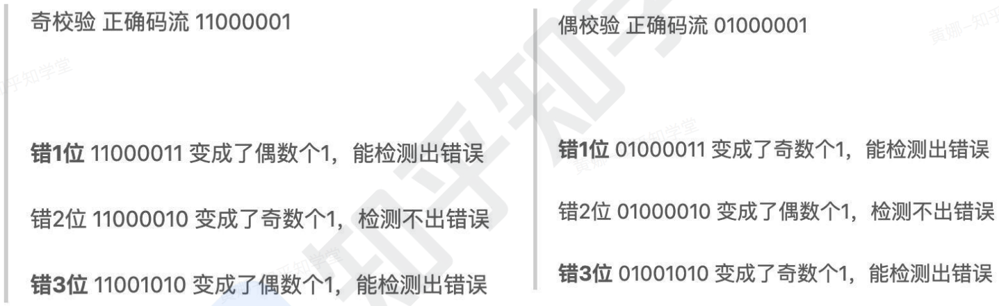

那么使用中是选择奇校验还是偶校验呢？其实都有应用了。

> *奇校验一个重要的特征是产生不了全 0 代码，所以在实际操作过程中选择的时候要考虑到这一点。*

##### CRC 校验码

**CRC 校验码只能检错，不能纠错。**

使用 CRC 校验码，需要先约定一个生成多项式 $G(x)$，生成多项式的最高位和最低位必须是 1。假设原始信息有 $m$ 位，则对应多项式 $M(x)$。**生成校验码思想就是在原始信息位后追加若干校验位，使得追加的信息能被 $G(x)$ 整除。接收方接收到带校验位的信息，然后用 $G(x)$ 整除。余数为 0，则没有错误；反之则发生错误。**

计算过程：假设原始信息串为 10110，CRC 的生成多项式为 $G(x)=x^4+x+1$，求 CRC 校验码。

（1）在原始信息位后面添 0，假设生成多项式的阶为 $r$，则在原始信息位后添加 $r$ 个 0，本题中，$G(x)$ 阶为 4，则在原始信息串后加 4 个 0，得到的新串为 101100000，作为被除数。

（2）由多项式得到除数，多项中 $x$ 的幂指数存在的位置 1，不存在的位置 0。本题中，$x$ 的幂指数为 0，1，4 的变量都存在，而幂指数为 2，3 的不存在，因此得到串 10011。

（3）生成 CRC 校验码，将前两步得出的被除数和除数进行模 2 除法运算（即不进位也不借位的除法运算）。除法过程如下图所示，得到余数 1111。

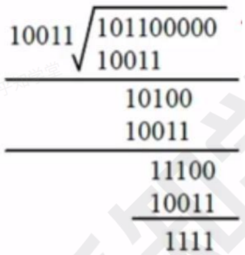

- 注意：**如果余数不足 $r$，则在余数左边用若干个 0 补齐。**如求得余数为 11，$r$ 等于 4，则补两个 0 得到 0011。

（4）生成最终发送信息串，将余数添加到原始信息后。本题中，原始信息为 10110，添加余数 1111 后，结果为 101101111，发送方将此数据发送给接收方。

（5）接收方进行校验。接收方的 CRC 校验过程与生成过程类似，接收方接收了带校验和的帧后，用多项式 $G(x)$ 来除。余数为 0，则表示信息无错；否则要求发送方进行重传。

- 注意：收发信息双方需使用相同的生成多项式。	

> 循环冗余校验码（Cyclic Redundancy Check，CRC）是数据通信领域中最常用的一种差错校验码，该校验方法中，使用多项式除法（模 2 除法）运算后的余数为校验字段。若数据信息为 $n$ 位，则将其左移 $k$ 位后，被长度为 $k+1$ 位的生成多项式相除，所得的 $k$ 位余数即构成 $k$ 个校验位，构成 $n+k$ 位编码。若数据信息为 1100，生成多项式为 $x^3+x+1$（即 1011），则 CRC 编码是（）。
>
> A. 1100010
>
> B. 1011010
>
> C. 1100011
>
> D. 1011110
>
> 【解析】
>
> CRC 循环校验码的编码流程为：
>
> 1. 在原始信息位后加 $k$ 个 0，即 1100000。
>2. 将 1100000 与生成多项式 1011 做模 2 除法，得到余数为 010。
> 3. 将原始信息位与余数连接起来得到 1100010。
> 
> 【答案】A

### 指令系统、存储系统和缓存

#### 指令系统

计算机指令的组成：一条指令由`操作码`和`操作数`两部分组成， 操作码决定要完成的操作，操作数指参加运算的数据及其所在的单元地址。

在计算机中， 操作要求和操作数地址都由二进制数码表示，分别称作`操作码`和`地址码`，整条指令以二进制编码的形式存放在存储器中。

计算机指令执行过程： `取指令 ——> 分析指令 ——> 执行指令`三个步骤。

-  首先，将程序计数器 PC 中的指令地址取出，送入地址总线，CPU 依据指令地址去内存中取出指令内容存入指令寄存器 IR。
- 然后，由指令译码器进行分析，分析指令操作码。
- 最后，执行指令，取出指令执行所需的源操作数。

**指令寻址方式**，即怎么找到下一条指令：

1. `顺序寻址方式`： 当执行一段程序时，根据 PC（程序计数器） 中指令，是一条指令接着一条指令地顺序执行 。
2. `跳跃寻址方式`： 指下一条指令的地址码不是由程序计数器给出，而是由本条指令直接给出。程序跳跃后，按新的指令地址开始顺序执行。因此， 程序计数器的内容也必须相应改变，以便及时跟踪新的指令地址。

**指令操作数的寻址方式**，即怎么找到操作数：

- `立即寻址方式`：指令的地址码字段指出的不是地址， 而是操作数本身。
- `直接寻址方式`：在指令的地址字段中直接指出操作数在主存中的地址。
- `间接寻址方式`：指令地址码字段所指向的存储单元中存储的是操作数的地址。 
- `寄存器寻址方式`：指令中的地址码是寄存器的编号。
- `基址寻址方式`：将基址寄存器的内容加上指令中的形式地址而形成操作数的有效地址，其优点是可以扩大寻址能力。
- `变址寻址方式`：变址寻址方式计算有效地址的方法与基址寻址方式很相似，它是将变址寄存器的内容加上指令中的形式地址而形成操作数的有效地址。

**指令系统的分类：**

- `CISC`：是复杂指令系统，兼容性强，指令繁多、长度可变，由微程序实现。

- `RISC`：是精简指令系统，指令少，使用频率接近，主要依靠硬件实现（通用寄存器 、硬布线逻辑控制）。

- 二者具体区别如下：

  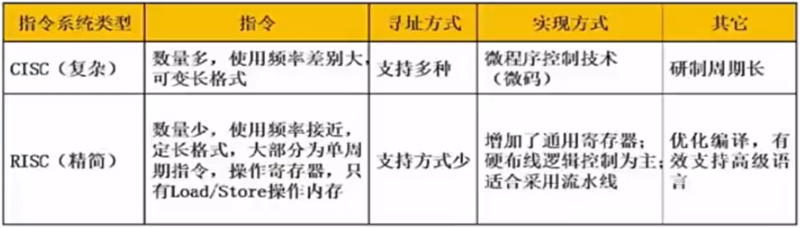

> Flynn 分类法根据计算机在执行程序的过程中（1）的不同组合，将计算机分为 4 类。当前主流的多核计算机属于（2）计算机。
>
> 1、
>
> A. 指令流和数据流
>
> B. 数据流和控制流
>
> C. 指令流和控制流
>
> D. 数据流和总线带宽
>
> 2、
>
> A. SISD
>
> B. SIMD
>
> C. MISD
>
> D. MIMD
>
> 【解析】
>
> 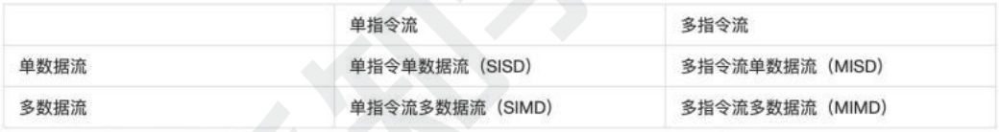
>
> 【答案】A D
>
> 
>
> 以下关于复杂指令集计算机（Complex Instruction Set Computer，CISC） 的叙述中， 正确的是（）。
>
> A. 只设置使用频度高的一些简单指令，不同指令执行时间差别很小。
>
> B. CPU 中设置大量寄存器，利用率低。
>
> C. 常采用执行速度更快的组合逻辑实现控制器。
>
> D. 指令长度不固定，指令格式和寻址方式多变。
>
> 【答案】D

`指令流水线原理`：将指令分成不同段，每段由不同的部分去处理，因此可以产生叠加的效果，所有的部件去处理指令的不同段。

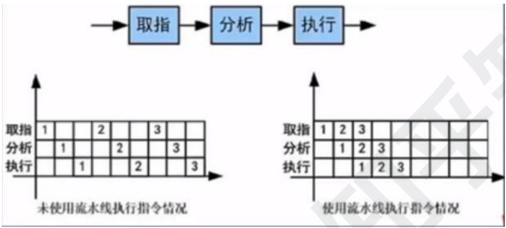

- 对于左图，1，2，3 三条任务，是串行执行每一个指令。
- 对于右图，取指，分析和执行，是并行的。

> *指令流水线，只在 RISC 中才有。*

**RISC 中的流水线技术：**

1. `超流水线 (Super Pipe Line) 技术`：它通过细化流水、增加级数和提高主频，使得在每个机器周期内能完成一个甚至两个浮点操作，**其实质是以时间换取空间**。
2. `超标量 (Super Scalar) 技术`：它通过内装多条流水线来同时执行多个处理，其时钟频率虽然与一般流水接近，却有更小的 CPI，**其实质是以空间换取时间**。
3. `超长指令字 (Very Long InstructionWord，VLIW) 技术`： VLIW 和超标量都是 20 世纪 80 年代出现的概念，其共同点是要同时执行多条指令，其不同在于超标量依靠硬件来实现并行处理的调度，VLIW 则充分发挥软件的作用而使硬件简化，性能提高。

**流水线时间计算：**

1. `流水线周期`：指令分成不同执行段，其中执行时间最长的段为流水线周期。
2. `流水线执行时间`：**`1条指令总执行时间+(总指令条数-1)＊流水线周期`**。
3. `流水线吞吐率计算`：吞吐率即单位时间内执行的指令条数。计算公式：**`指令条数／流水线执行时间`**。
4. `流水线的加速比计算`：加速比即使用流水线后的效率提升度，即比不使用流水线快了多少倍，越高表明流水线效率越高。计算公式：**`不使用流水线执行时间／使用流水线执行时间`**。

> 流水线的吞吐率是指流水线在单位时间里所完成的任务数或输出的结果数。设某流水线有 5 段，有 1 段的时间为 2 ns，另外 4 段的每段时间为 1 ns，利用此流水线完成 100 个任务的吞吐率约为（）个／s。
>
> A. $500*10^6$
>
> B. $490*10^6$
>
> C. $250*10^6$
>
> D. $167*10^6$
>
> 【解析】
>
> 流水线执行 100 个任务需要时间：$(2+1+1+1+1)+(100-1)*2=204ns$
>
> 吞吐率：$(100/204)*10^9=490*10^6$
>
> 注意：$1s=10^9ns$。
>
> 【答案】B
>
> 
>
> 假设磁盘块与缓冲区大小相同，每个盘块读入缓冲区的时间为 15 us，由缓冲区送至用户区的时间是 5 us，在用户区内系统对每块数据的处理时间为 1 us，若用户需要将大小为 10 个磁盘块的 Docl 文件逐块从磁盘读入缓冲区，并送至用户区进行处理，那么采用单缓冲区需要花费的时间为（1）us；采用双缓冲区需要花费的时间为（2）us。
>
> 1、
>
> A. 150
>
> B. 151
>
> C. 156
>
> D. 201
>
> 2、
>
> A. 150
>
> B. 151
>
> C. 156
>
> D. 201
>
> 【解析】
>
> `单缓冲区`：前两段合并，两端流水线，$20+1+20*(10-1)=201$。
>
> - 单缓冲区：盘块读入缓冲区的操作，与缓冲区送至用户区的操作是串行，这两段合并，流水线周期为 20 us。
>
> `双缓冲区`：标准三段流水线，$15+5+1+15*(10-1)=156$。
>
> - 双缓冲区：盘块读入缓冲区的操作，与缓冲区送至用户区的操作是并行，这两段不需要合并，流水线周期为 15 us。
>
> 【答案】D C
>
> 
>
> 流水线技术是通过并行硬件来提高系统性能的常用方法。对于一个 $k$ 段流水线，假设其各段的执行时间均相等（设为 $t$），输入到流水线中的任务是连续的理想情况下，完成 $n$​ 个连续任务需要的总时间为（1）。若某流水线浮点加法运算器分为 5 段，所需要的时间分别是 6 ns、7 ns、8 ns、9 ns 和 6 ns，则其最大加速比为（2）。
>
> 1、
>
> A. $nkt$
>
> B. $(k+n-1)t$
>
> C. $(n-k)kt$
>
> D. $(k+n+1)t$​
>
> 2、
>
> A. 4
>
> B. 5
>
> C. 6
>
> D. 7
>
> 【解析】
>
> 当流水线各段执行时间相等时，公式化简后，完成 $n$ 个连续任务需要的总时间为 $(k+n-1)*t$。
>
> 加速比定义为顺序执行时间与流水线执行时间的比值，根据题干假设，假设一共有 $n$ 条指令，则顺序执行时间为 $(6+7+8+9+6)*n=36n$，该流水线周期为最长的 9 ns，则在流水线中执行的时间为 $36+9*(n-1)=9n+27$，因此加速必为 $36n/(9n+27)$，题目问最大加速比，由这个公式可以知道，当 $n$ 越大时，该公式值越大，因此最大的时间就是 $n$ 趋向于无穷大，此时可以忽略分母 27，也就是 $36n/9n=4$。
>
> 【答案】B A

#### 存储系统

`磁盘结构和参数`：

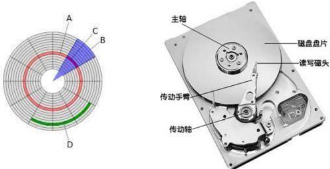

- 磁盘有正反两个盘面，每个盘面有多个同心圆，每个同心圆是一个磁道，每个同心圆又被划分为多个扇区，数据就被存放在一个个扇区中。
- 磁头首先要寻找到对应的磁道，然后等待磁盘进行周期旋转，旋转到指定的扇区，才能读取到对应的数据，因此，会产生寻道时间和等待时间。公式为：`存取时间 = 寻道时间 + 等待时间 (即为平均定位时间 + 转动延迟时间，又称为旋转延迟时间)`。
- **注意：寻道时间是指磁头移动到磁道所需的时间； 等待时间为等待读写的扇区转到磁头下方所用的时间。**

`磁盘调度算法`：之前已经说过，磁盘数据的读取时间分为 "寻道时间＋旋转时间"，也即先找到对应的磁道，而后再旋转到对应的扇区才能读取数据，其中**寻道时间耗时最长**，需要重点调度。分为以下几种调度算法：

- `先来先服务 FCFS`：根据进程请求访问磁盘的先后顺序进行调度。
- `最短寻道时间优先 SSTF`：请求访问的磁道与当前磁道最近的进程优先调度，使得每次的寻道时间最短。可能会产生 "饥饿" 现象，即远处进程可能永远无法访问。
- `扫描算法 SCAN`：又称 "电梯算法"，磁头在磁盘上双向移动，其会选择离磁头当前所在磁道最近的请求访问的磁道，并且与磁头移动方向一致，磁头永远都是从里向外或者从外向里一直移动完才掉头，与电梯类似。
- `单向扫描调度算法 CSCAN`：与 SCAN 不同的是，其只做单向移动，即只能从里向外或者从外向里。

> 假设某磁盘的每个磁道划分成 11 个物理块，每块存放 1 个逻辑记录。逻辑记录 R0，R1，...，R9，R10 存放在同一个磁道上，记录的存放顺序如下表所示：
>
> 
>
> 如果磁盘的旋转周期为 33 ms，磁头当前处在 R0 的开始处。若系统使用单缓冲区顺序处理这些记录，每个记录处理时间为 3 ms，则处理这 11 个记录的最长时间为（1），若对信息存储进行优化分布后，处理 11 个记录的最少时间为（2）。
>
> 1、
>
> A. 33 ms		B. 336 ms
>
> C. 366 ms	    D. 376 ms
>
> 2、
>
> A. 33 ms		B. 66 ms
>
> C. 86 ms		D .93 ms
>
> 【解析】
>
> 一个磁道划分为11个物理块，每块存放一个逻辑记录，而存储的逻辑记录从 R0 到 R10 一共11个，所以正好成为一个回环。如下图所示：
>
> 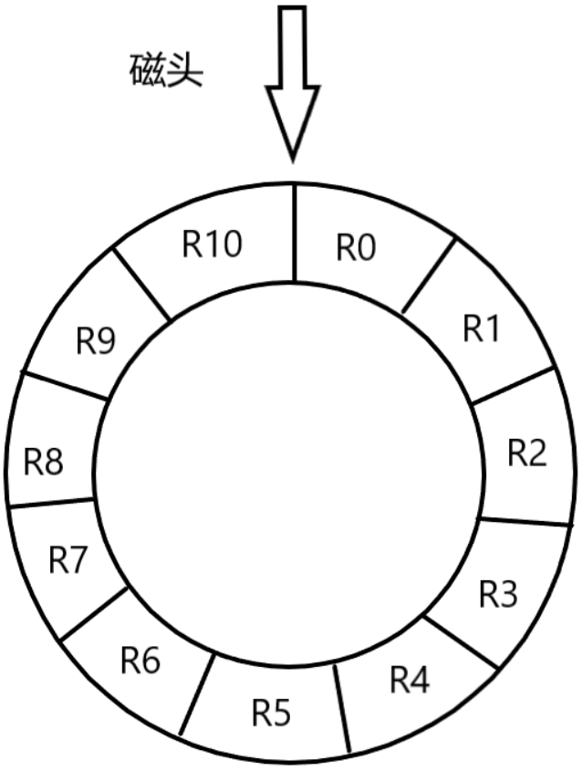
>
> 磁盘旋转是一个不会停下来的匀速旋转的过程，所以周期为 33 ms 时，平均每个物理块的读取时间为 33/11 = 3 ms，这 3 ms 即为**平均定位时间**。
>
> 同时，单缓冲区意味着一次只能处理一个记录，等处理完成释放缓冲区才能进行下一个操作。
>
> 对于第一个题目，处理这 11 个记录的最长时间，不要被 "最长" 这两个字误导，其实就是要你求处理 11 个记录的时间。可以算出来，当读取 R0 时，用时 3 ms，加载到单缓冲区完成处理，用时 3 ms，这时候，磁头的位置应处于 R2 的开始处。但我们需要读取的记录是 R1，因此，我们要等待到磁头旋转到 R1 的位置时才能继续处理记录。也就是说，处理一个记录的时候，磁头需要转一个周期还要多一个物理块才能读到下一个记录。易得出，等待时间为 33 + 3 = 36 ms。由于最后一个的位置特殊，读取完后，不需要等待磁头转到下个记录这部分时间，因而 R10 的处理时间为 "读取的时间 + 处理的事件"，即 3 + 3 = 6 ms。所以处理这 11 个记录的时长为：36 * 10 + 6 = 366 ms。
>
> 对于第二个题目，若对信息存储进行优化分布后，处理 11 个记录的最少时间。做完第一题的时候你就明白了，最理想的信息存储分布就是，当读取完一个记录，执行完后立刻能读取下一个记录这样的布局是最快的。如下图所示：
>
> 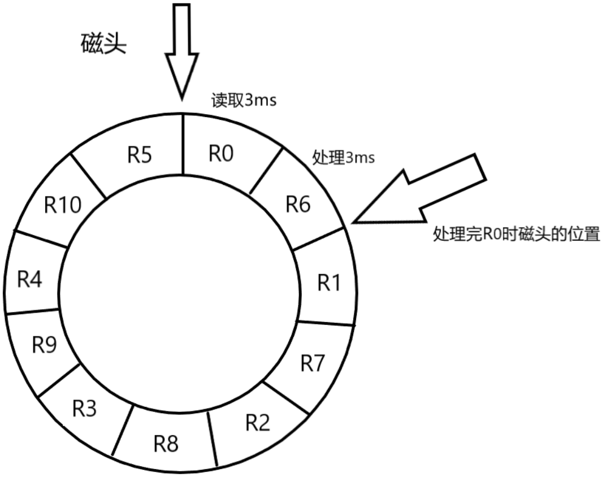
>
> 易得出，处理一个记录的用时仅为 6 ms，一共有 11 条记录，11 * 6 = 66 ms。
>
> 【答案】C B
>
> 
>
> 在磁盘调度管理中，应先进行移臂调度，再进行旋转调度。假设磁盘移动臂位于 21 号柱面上，进程的请求序列如下表所示。如果采用最短移臂调度算法，那么系统的响应序列应为（）。 
>
> 
>
> A. ②⑧③④⑤①⑦⑥⑨
>
> B. ②③⑧④⑥⑨①⑤⑦
>
> C. ①②③④⑤⑥⑦⑧⑨
>
> D. ②⑧③⑤⑦①④⑥⑨
>
> 【解析】
>
> 当进程请求读磁盘时，操作系统先进行移臂调度，再进行旋转调度。由于移动臂位于 21 号柱面上，按照最短寻道时间优先的响应柱面序列为 23 → 17 → 32 → 38。按照旋转调度的原则分析如下：进程在 23 号柱面上的响应序列为 ② → ⑧ → ③，因为进程访问的是不同磁道上的不同编号的扇区，旋转调度总是让首先到达读写磁头位置下的扇区先进行传送操作。进程在 17 号柱面上的响应序列为 ⑤ → ⑦ → ①，或 ⑤ → ① → ⑦。对于 ① 和 ⑦ 可以任选一个进行读写，因为进程访问的是不同磁道上具有相同编号的扇区，旋转调度可以任选一个读写磁头位置下的扇区进行传送操作。进程在 32 号柱面上的响应序列为 ④ → ⑥，由于 ⑨ 在 38 号柱面上，故最后响应。从上面的分析中可以得出按照最短寻道时间优先的响应序列为 ②⑧③⑤⑦①④⑥⑨。
>
> 【答案】D

#### 缓存

计算机采用`分级存储体系`，其主要目的是为了**解决存储容量、成本和速度之间的矛盾问题**。

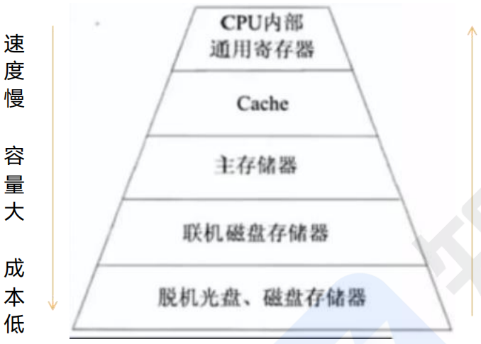

`两级存储`：Cache - 主存、主存 - 辅存（虚拟存储体系）。

对于缓存的处理逻辑，操作系统整体上遵循`局部性原理`，总的来说，在 CPU 运行时，所访问的数据会趋向于一个较小的局部空间地址内，包括下面两个方面：

- `时间局部性原理`：如果一个数据项正在被访问，那么在近期它很可能会被再次访问，即**在相邻的时间里会访问同一个数据项**。
- `空间局部性原理`：在最近的将来会用到的数据的地址和现在正在访问的数据地址很可能是相近的，即**相邻的空间地址会被连续访问**。

`高速缓存 Cache`：用来存储当前最活跃的程序和数据，直接与 CPU 交互，位于 CPU 和主存之间，容量小，速度为内存的 5 ~ 10 倍，由半导体材料构成。其内容是主存内存的副本拷贝，对于程序员来说是透明的。

`Cache 由控制部分和存储器组成`：存储器存储数据，控制部分判断 CPU 要访问的数据是否在 Cache 中，在则命中，不在则依据一定的算法从主存中替换。

`地址映射`： 在 CPU 工作时，送出的是主存单元的地址，而应从 Cache 存储器中读/写信息，这就需要将主存地址转换为 Cache 存储器地址，这种地址的转换称为地址映射，**由硬件自动完成映射**。分为下列三种方法：

- `直接映射`：将 Cache 存储器等分成块，主存也等分成块并编号。主存中的块与 Cache 中的块的对应关系是固定的，也即二者块号相同才能命中。地址变换简单但不灵活，容易造成资源浪费。如图所示：

  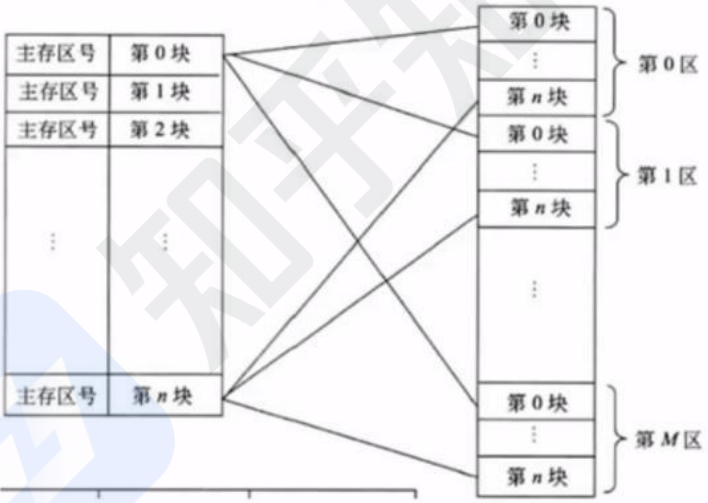

- `全相联映射`：同样都等分成块并编号。主存中任意一块都与 Cache 中任意一块对应，因此可以随意调入 Cache 任意位置，但地址变换复杂，速度较慢。因为主存可以随意调入 Cache 任意块，只有当 Cache 满了才会发生块冲突，**是最不容易发生块冲突的映像方式**。

  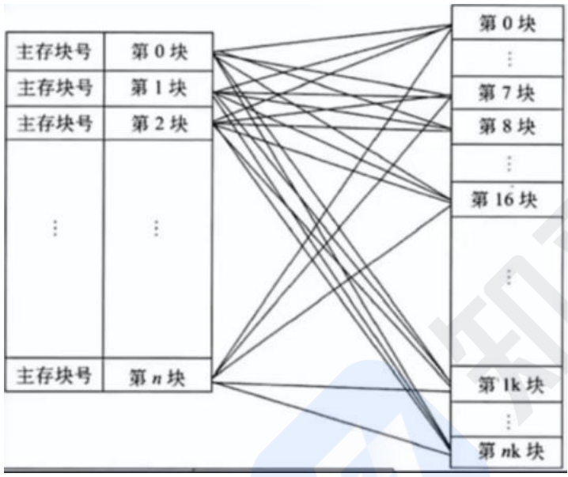

- `组组相连映射`：是前面两种方式的结合，将 Cache 存储器先分块再分组，主存也同样先分块再分组，组间采用直接映像，即主存中组号与 Cache 中组号相同的组才能命中，但是组内全相联映像，也即组号相同的两个组内的所有块可以任意调换。

`替换算法`的目标就是**使 Cache 获得尽可能高的命中率**，常用算法有如下几种：

- `随机替换算法`：就是用随机数发生器产生一个要替换的块号，将该块替换出去。
- `先进先出算法`：就是将最先进入 Cache 的信息块替换出去。
- `近期最少使用算法`：这种方法是将近期最少使用的 Cache 中的信息块替换出去。
- `优化替换算法`：这种方法必须先执行一次程序， 统计 Cache 的替换情况。有了这样的先验信息，在第二次执行该程序时便可以用最有效的方式来替换。

`命中率及平均时间`：

- Cache 有一个命中率的概念，即当 CPU 所访问的数据在 Cache 中时，即为命中，然后直接从 Cache 中读取数据。设读取一次 Cache 时间为 1 ns，若 CPU 访问的数据不在 Cache 中，则需要从内存中读取，设读取一次内存的时间为 1000 ns，若在CPU多次读取数据过程中，有 90％ 命中 Cache， 则 CPU 读取一次的平均时间为**`90% * 1 + 10% * 1000`**ns。

- **随着 Cache 容量的增大，命中率无限趋近于 1。**如下图所示：

  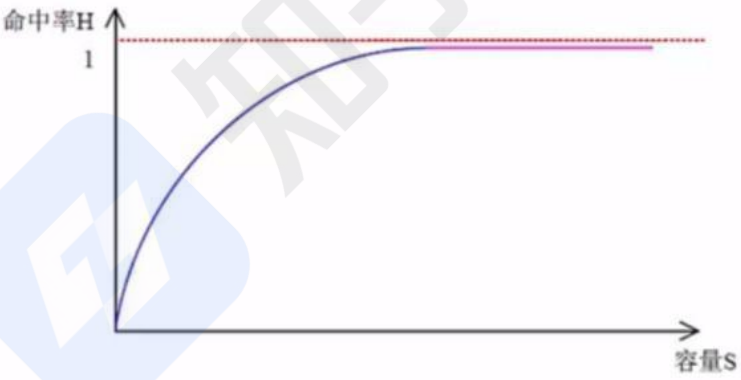

> 按照 Cache 地址映像的块冲突概率，从高到低排列的是（）。
>
> A. 全相联映像 → 直接映像 → 组相联映像
>
> B. 直接映像 → 组相联映像 → 全相联映像
>
> C. 组相联映像 → 全相联映像 → 直接映像
>
> D. 直接映像 → 全相联映像 → 组相联映像
>
> 【答案】B
>
> 
>
> 以下关于 Cache 与主存间地址映射的叙述中，正确的是（）。
>
> A. 操作系统负责管理 Cache 与主存之间的地址映射
>
> B. 程序员需要通过编程来处理 Cache 与主存之间的地址映射
>
> C. 应用软件对 Cache 与主存之间的地址映射进行调度
>
> D. 由硬件自动完成 Cache 与主存之间的地址映射
>
> 【答案】D

### 输入输出系统

**计算机系统中存在多种内存与接口地址的编址方法**， 常见的是下面两种： 

- `内存与接口地址独立编址方法`
  - 内存地址和接口地址是完全独立的两个地址空间，访问数据时所使用的指令也完全不同，用于接口的指令只用于接口的读/写，其余的指令全都是用于内存的。因此，在编程序或读程序时很易使用和辨认。这种编址方法的缺点是**用于接口的指令太少、功能太弱**。

- `内存与接口地址统一编址方法`
  - 内存地址和接口地址统一在一个公共的地址空间里， 即内存单元和接口共用地址空间。优点是原则上用于内存的指令全都可以用于接口，这就大大地增强了对接口的操作功能，而且在指令上也不再区分内存或接口指令。该编址方法的缺点就在于整个地址空间被分成两部分，其中一部分分配给接口使用，剩余的为内存所用，这经常会导致**内存地址不连续**。

**计算机和外设间的数据交互方式**：

- `程序控制 (查询) 方式`：CPU 主动查询外设是否完成数据传输，效率极低。
- `程序中断方式`：外设完成数据传输后，向 CPU 发送中断，等待 CPU 处理数据，效率相对较高。 
  - `中断响应时间`：指的是从发出中断请求到开始进入中断处理程序，中断处理时间指的是从中断处理开始到中断处理结束。中断向量提供中断服务程序的入口地址。多级中断嵌套，使用堆栈来保护断点和现场。
- `DMA 方式 (直接主存存取)`：CPU 只需完成必要的初始化等操作，数据传输的整个过程都由 DMA 控制器来完成，在主存和外设之间建立直接的数据通路，效率很高。

**CPU 响应 DMA 请求开始读取数据，是在一个总线周期结束后；CPU 响应程序中断方式请求，是在一条指令执行结束时。**

>计算机系统中常用的输入/输出控制方式有无条件传送、中断、程序查询和 DMA 方式等。当采用（）方式时，不需要 CPU 执行程序指令来传送数据。
>
>A. 中断
>
>B. 程序查询
>
>C. 无条件传送
>
>D. DMA
>
>【答案】D

### 总线结构

`总线 (Bus)`：是指**计算机设备和设备之间传输信息的公共数据通道**。总线是连接计算机硬件系统内多种设备的通信线路，它的一个重要特征是由总线上的所有设备共享，因此可以将计算机系统内的多种设备连接到总线上。

从广义上讲，任何连接两个以上电子元器件的导线都可以称为总线，通常分为以下三类：

- `内部总线`：内部芯片级别的总线，芯片与处理器之间通信的总线。
- `系统总线`：是板级总线，用于计算机内各部分之间的连接，具体分为数据总线（并行数据传输位数）、地址总线（系统可管理的内存空间的大小）、控制总线（传送控制命令）。代表的有 ISA 总线 、EISA 总线 、PCI 总线。
- `外部总线`： 设备一级的总线，微机和外部设备的总线。代表的有 RS232（串行总线）、SCSI（并行总线）、USB（通用串行总线， 即插即用， 支持热插拔）。

> 以下关于总线的说法中，正确的是（）。
>
> A. 串行总线适合近距离高速数据传输，但线间串扰会导致速率受限
>
> B. 并行总线适合长距离数据传输，易提高通信时钟频率来实现高速数据传输
>
> C. 单总线结构在一个总线上适应不同种类的设备，设计复杂导致性能降低
>
> D. 半双工总线只能在一个方向上传输信息
>
> 【解析】
>
> 根据总线它当中的数据线的多少，可以分为：**串行总线（适合长距离传输）与并行总线（适合短距离连接，不宜过长）。**
>
> **单工**：总线只能实现发送或者接收的功能，叫做单工的总线。
>
> **全双工**：总线如果既能实现发送，又能实现接收的功能，叫做全双工的总线。
>
> **半双工**：总线在线路上，可以轮流的实现发送，和接收的功能，叫做半双工的总线。（同一时间，只能进行一个方向上的数据传输）
>
> 【答案】C

### 操作系统

#### 概述

操作系统的作用：通过资源管理提高计算机系统的效率；改善人机界面向用户提供友好的工作环境。

操作系统的特征：**并发性、共享性、虚拟性、不确定性**。

操作系统的功能：**进程管理、存储管理、文件管理、设备管理**、作业管理。

操作系统的分类：批处理操作系统、分时操作系统（轮流使用 CPU 工作片）、实时操作系统（快速响应）、网络操作系统、分布式操作系统（物理分散的计算机互联系统）、微机操作系统（Windows）、嵌入式操作系统。

计算机启动的基本流程为：BIOS ---> 主引导记录 ---> 操作系统。

##### 微内核操作系统

`微内核`，顾名思义，就是尽可能的将内核做的很小，只将最为核心必要的东西放入内核中，其他能独立的东西都放入用户进程中，这样，系统就被分为了`用户态`和`内核态`，如下图所示：

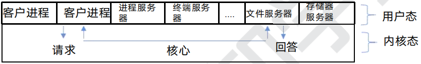

单体内核与微内核对比：

|          | 实质                                                         | 优点                                                         | 缺点                                                         |
| -------- | ------------------------------------------------------------ | ------------------------------------------------------------ | ------------------------------------------------------------ |
| 单体内核 | 将图形、设备驱动及文件系统等功能全部在内核中实现，运行在内核状态和同一地址空间 | 减少进程间通信和状态切换的系统开销，获得较高的运行效率       | 内核庞大，占用资源较多且不易裁剪。系统的稳定性和安全性不好   |
| 微内核   | 只实现基本功能，将图形系统、文件系统、设备驱动及通信功能放在内核之外 | 内核精炼，便于裁剪和移植。系统服务程序运行在用户地址空间，系统的可靠性、稳定性和安全性较高。可用于分布式系统 | 用户状态和内核状态需要频繁切换，从而导致系统效率不如单体内核 |

##### 嵌入式操作系统

嵌入式操作系统特点：**微型化、代码质量高、专业化、实时性强、可裁剪可配置。**

实时嵌入式操作系统的内核服务：异常和中断、计时器、I/O 管理。

常见的嵌入式 RTOS（实时操作系统）：VxWorks、RT-Linux、QNX、pSOS。

嵌入式系统初始化过程按照自底向上、从硬件到软件的次序依次为：芯片级初始化 ---> 板卡级初始化 ---> 系统级初始化。

- **芯片级是微处理器的初始化，板卡级是其他硬件设备初始化，系统级初始化就是软件及操作系统初始化。**

#### 进程管理

进程的组成和状态：

- **进程是计算机中正在运行的程序的实例**，它是操作系统进行资源分配和管理的基本单位，包括代码、数据和执行状态等信息。

- 进程的组成：`进程控制块 PCB (唯一标志)`、`程序 (描述进程要做什么)`、`数据 (存放进程执行时所需数据)`。

- 进程基础的状态是下左图中的`三态图`，这是系统自动控制时只有三种状态，而下右图中的`五态图`，是多了两种状态：静止就绪和静止阻塞，需要人为的操作才会进入对应状态，活跃就绪即就绪，活跃阻塞即等待。从五态图可以看出，当人为干预后，进程将被挂起，进入静止状态，此时，需要人为激活，才能恢到活跃状态，之后的本质还是三态图。

  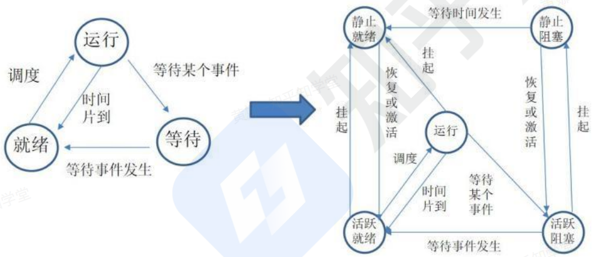

`前趋图`：用来表示哪些任务可以并行执行，哪些任务之间有顺序关系。如下图所示：

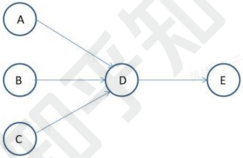

- 从图中可知，ABC 可以并行执行，但是必须 ABC 都执行完后，才能执行 D，这就确定了两点：**任务间的并行和任务间的先后顺序关系。**

`进程资源图`：用来表示进程和资源之间的分配和请求关系。如下图所示：

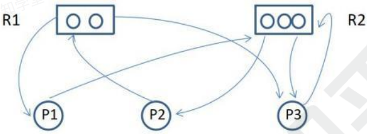

- P 代表进程，R 代表资源，R 方框中有几个圆球就表示有几个这种资源。在图中，R1 指向 P1，表示 R1 有一个资源已经分配给了 P1，P1 指向 R2，表示 P1 还需要请求一个 R2 资源才能执行。

`阻塞节点`：某进程所请求的资源已经全部分配完毕，无法获取所需资源，该进程被阻塞了无法继续。例如上图中的 P2。

`非阻塞节点`：某进程所请求的资源还有剩余，可以分配给该进程继续运行。例如上图中的 P1 和 P3。**当一个进程资源图中的所有进程都是阻塞节点时，即陷入死锁状态。**

>在如下所示的进程资源图中，（1），该进程资源图是（2）。
>
>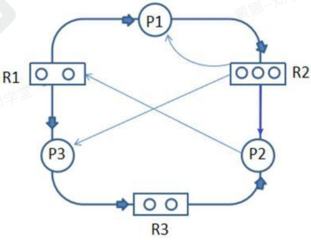
>
>1、
>
>A. P1、P2、P3 都是阻塞节点
>
>B. P1 是阻塞节点、P2、P3 是非阻塞节点
>
>C. P1、P2 是阻塞节点、P3 是非阻塞节点
>
>D. P1、P2 是非阻塞节点、P3 是阻塞节点
>
>2、
>
>A. 可以化简的，其化简顺序为 P1 → P2 → P3
>
>B. 可以化简的，其化简顺序为 P3 → P1 → P2
>
>C. 可以化简的，其化简顺序为 P2 → P1 → P3
>
>D. 不可以化简的，因为 P1、P2、P3 申请的资源都不能得
>
>【解析】
>
>可以化简：没有死锁，从非阻塞的节点开始执行。
>
>【答案】C B

`互斥`：某资源（即临界资源）在同一时间内只能由一个任务单独使用，使用时需要加锁，使用完后解锁才能被其他任务使用。

`同步`：多个任务可以并发执行，只不过有速度上的差异，在一定情况下停下等待，不存在资源是否单独或共享的问题。

`临界资源`：各进程间需要以互斥方式对其进行访问的资源。

`临界区`：指进程中对临界资源实施操作的那段程序，本质是一段程序代码。

`互斥信号量`：对临界资源采用互斥访问，使用互斥信号量后其他进程无法访问，初值为 1。

`同步信号量`：对共享资源的访问控制，初值一般是共享资源的数量。

`信号量`：

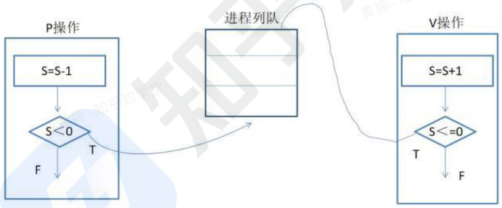

- `P 操作`：**申请资源**，$S=S-1$。此时，若 $S>=0$*（申请了一个资源之后，S 仍大于等于 0，说明有空闲的资源）*，则执行 P 操作的进程可以继续执行；若 $S<0$*（申请了一个资源之后，S 小于 0，说明原本的资源量最大为 0，即没有空闲的资源）*，则置该进程为阻塞状态（因为没有拿到可用资源），并将其插入阻塞队列。
- `V 操作`：**释放资源**，$S=S+1$。此时，若 $S>0$*（释放了一个资源之后，S 大于 0，说明有空闲的资源，没有阻塞的进程在等待资源）*，代表此时资源有空余，没有阻塞的进程，则该进程继续执行；若 $S<=0$*（释放了一个资源之后，S 仍然小于等于 0，说明释放的资源被一个阻塞的进程拿走）*，代表此时线程在被阻塞，所以需要从阻塞状态唤醒一个进程，并将其插入就绪队列（此时因为缺少资源被 P 操作阻塞的进程可以继续执行），然后执行 V 操作的进程继续。

经典问题： 生产者和消费者的问题。

- 三个信号量：互斥信号量 S0（仓库独立使用权），同步信号量 S1（仓库空闲位置），同步信号量 S2（仓库商品个数）。

  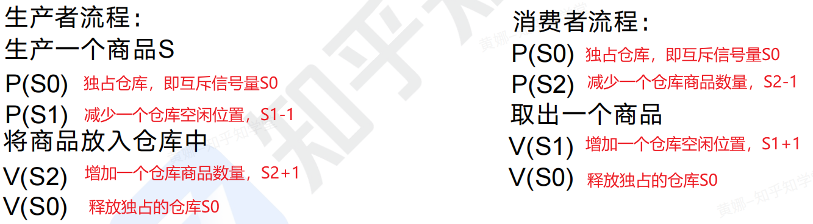

>进程 P1、P2、P3、P4 和 P5 的前趋图如下图所示：
>
>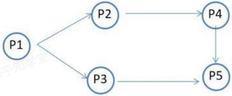
>
>若用 PV 操作控制进程 P1、P2、P3、P4 和 P5 并发执行的过程，则需要设置 5 个信号 S1、S2、S3、S4 和 S5，且信号量 S1～S5 的初值都等于零。下图中 a 和 b 处应分别填（1），c 和 d 处应分别填写（2），e 和 f 处应分别填写（3）。
>
>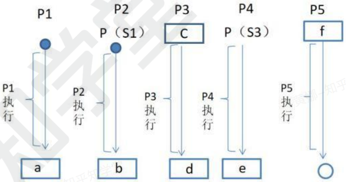
>
>1、
>
>A. V(S1) P(S2) 和 V(S3)
>
>B. P(S1) V(S2) 和 V(S3) 
>
>C. V(S1) V(S2) 和 V(S3)
>
>D. P(S1) P(S2) 和 V(S3)
>
>2、
>
>A. P(S2) 和 P(S4)
>
>B. P(S2) 和 V(S4)
>
>C. V(S2) 和 P(S4)
>
>D. V(S2) 和 V(S4)
>
>3、
>
>A. P(S4) 和 V(S4) V(S5)
>
>B. V(S5) 和 P(S4) P(S5)
>
>C. V(S3) 和 V(S4) V(S5)
>
>D. P(S3) 和 P(S4) V(P5)
>
>【解析】
>
>**线（箭头）代表信号量，先 V 后 P，VP 一对**。
>
>资源图：
>
>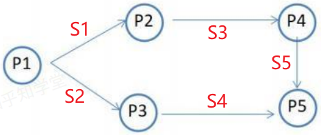
>
>【答案】C B B
>
>
>
>进程 P1、P2、P3、P4、P5 和 P6 的前趋图如下所示，若用 PV 操作控制这 6 个进程的同步与互斥的程序如下，那么程序中的空 ① 和空 ② 处应分别为（1），空 ③ 和空 ④ 处应分别为（2），空 ⑤ 和空 ⑥ 处应分别（3）。
>
>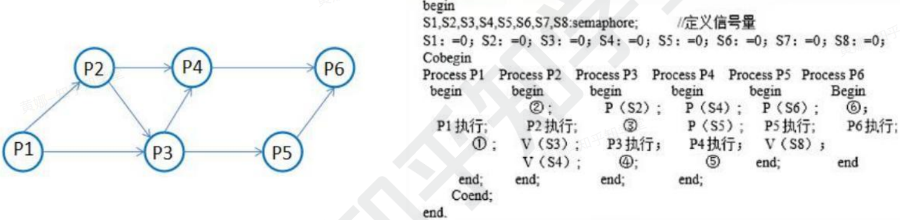
>
>1、
>
>A. V(S1) V(S2) 和 P(S2)
>
>B. P(S1) P(S2) 和 V(S2)
>
>C. V(S1) V(S2) 和 P(S1)
>
>D. P(S1) P(S2) 和 V(S1)
>
>2、
>
>A. V(S3) 和 V(S5) V(S6)
>
>B. P(S3) 和 V(S5) V(S6)
>
>C. V(S3) 和 P(S5) P(S6)
>
>D. P(S3) 和 P(S5) P(S6)
>
>3、
>
>A. P(S6) 和 P(S7) V(S8)
>
>B. V(S6) 和 V(S7) V(S8)
>
>C. P(S6) 和 P(S7) P(S8)
>
>D. V(S7) 和 P(S7) P(S8)
>
>【解析】
>
>资源图：
>
>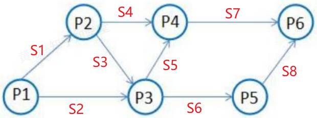
>
>【答案】C B D
>
>
>
>假设某系统采用非抢占式优先级调度算法，若该系统有两个优先级相同的进程 P1 和 P2，各进程的程序段如下所示，若信号量 S1 和 S2 的初值都为 0。进程 P1 和 P2 并发执行后，a、b 和 c 的结果分别为：a=（1），b=（2 ），c=（3）。
>
>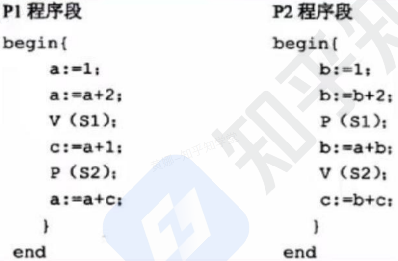
>
>1、
>
>A. 6
>
>B. 7
>
>C. 10
>
>D. 13
>
>2、
>
>A. 4
>
>B. 6
>
>C. 9
>
>D. 10
>
>3、
>
>A. 4
>
>B. 6
>
>C. 10
>
>D. 13
>
>【解析】
>
>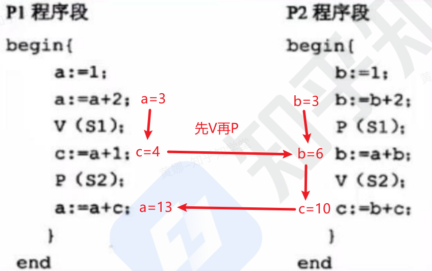
>
>【答案】D B C

`死锁`：当一个进程在等待永远不可能发生的事件时，就会产生死锁，若系统中有多个进程处于死锁状态，就会造成系统死锁。

死锁产生的四个必要条件：

- **资源互斥。**
- **每个进程占有资源并等待其他资源。**
- **系统不能剥夺进程资源。**
- **进程资源图是一个环路。**

死锁产生后，解决措施是打破四大条件，有下列方法：

- `死锁预防`：采用某种策略限制并发进程对于资源的请求，破坏死锁产生的四个条件之一，使系统任何时刻都不满足死锁的条件。
- `死锁避免`：一般采用**银行家算法**来避免，银行家算法，就是提前计算出一条不会死锁的资源分配方法，才分配资源，否则不分配资源，相当于借贷，考虑对方还得起才借钱，提前考虑好以后，就可以避免死锁。
- `死锁检测`：允许死锁产生，但系统定时运行一个检测死锁的程序，若检测到系统中发生死锁，则设法加以解除。
- `死锁解除`：即死锁发生后的解除方法，如强制剥夺资源，撤销进程等。

**死锁计算问题：系统内有 n 个进程，每个进程都需要 R 个资源，那么其发生死锁的`最大资源数`为 $n*(R-1)$ ，其不发生死锁的`最小资源数`为 $n*(R-1)+1$。**

>某系统中有 3 个并发进程竞争资源 R，每个进程都需要 5 个 R，那么至少有（）。
>
>A. 12			B. 13			C. 14			D. 15
>
>【解析】
>
>不能产生死锁。
>
>【答案】B
>
>
>
>银行家算法真题：假设系统中有三类互斥资源 R1、R2 和 R3，可用资源数分别为 10、5 和 3。在 T0 时刻系统中有 P1、P2、P3、P4 和 P5 五个进程，这些进程对资源的最大需求和已分配
>
>资源数如下表所示，此时系统剩余的可用资源数分别为（27），如果进程按（28）序列执行，那么系统状态是安全的。
>
>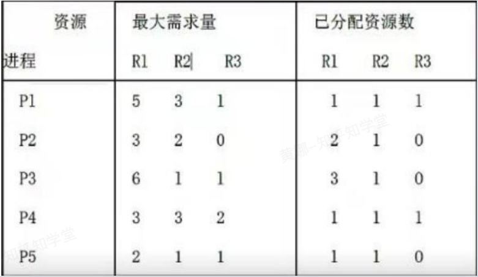
>
>27、
>
>A. 1、1 和 0				B. 1、1 和 1				C. 2、1 和 0				D. 2、0 和 1
>
>28、
>
>A. P1 → P2 → P4 → P5 → P3					    B. P5 → P2 → P4 → P3 → P1
>
>C. P4 → P2 → P1 → P5 → P3					    D. P5 → P1 → P4 → P2 → P3
>
>【解析】
>
>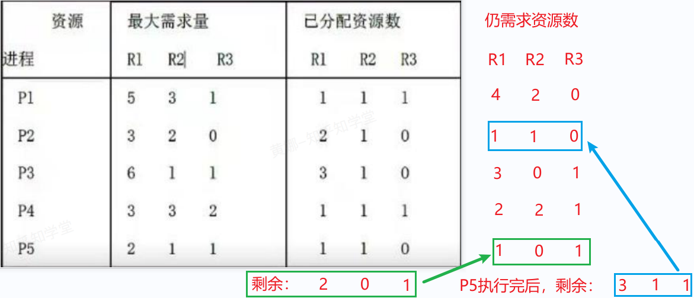
>
>系统安全，表明无死锁，那就在已分配资源的基础上，剩余的需求资源能够充分满足的进程开始执行，这样就可以释放其所占有的资源，此题为 P5 最先执行，然后是 P2。
>
>【答案】D B

传统的进程有两个属性：

- 可拥有资源的独立单位。
- 可独立调度和分配的基本单位。

引入线程后，**线程是独立调度的最小单位，进程是拥有资源的最小单位**，线程可以共享进程的公共数据、全局变量、代码、文件等资源，但不能共享线程独有的资源，如线程的栈指针等标识数据。

#### 存储管理

##### 分区存储

> *略。*

##### 页式存储

`页式存储`是操作系统的一种存储管理方式。

因为我们的程序往往是远远大于内存的，所以程序在执行的时候，是不会一次性把所有内容都装入到内存中，它会把程序分为若干个`页`，每个页固定大小，一般是 4 KB，然后把这些页离散存入到内存中，而内存是按块来划分的，所以就通过`页表`来进行映射程序中的页在内存中的块的存储。

进程（程序）中的地址，我们称之为`逻辑地址 (虚地址)`，而内存中的地址，我们称之为`物理地址 (实地址)`。每个页分为`页号`和`页内地址`，页号用来和块号对应，代表存储的位置，大小可以代表页的数量，页内地址代表的是存储的数据内容，大小可以代表数据大小。

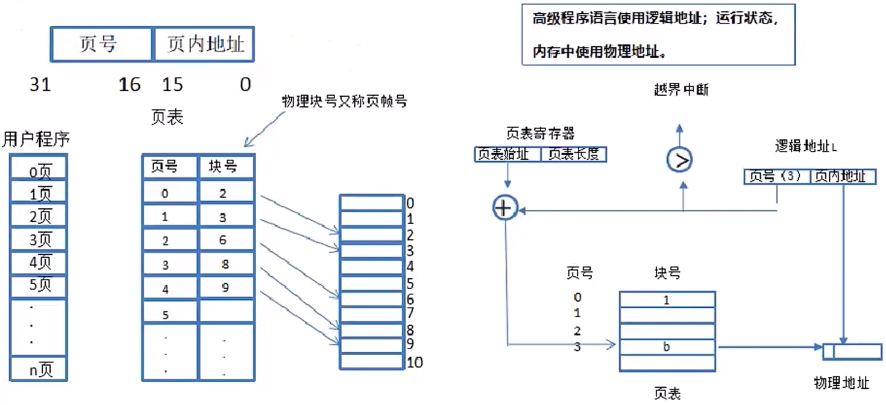

优点：**利用率高、碎片小（只在最后一个页中有）、分配及管理简单。**

缺点：**增加了系统开销，可能产生抖动现象。**

>某计算机系统页面大小为 4 KB，若进程的页面变换表如下所示，逻辑地址为十六进制 2D16H。该地址经过变换后，其物理地址应为十六进制（）。
>
>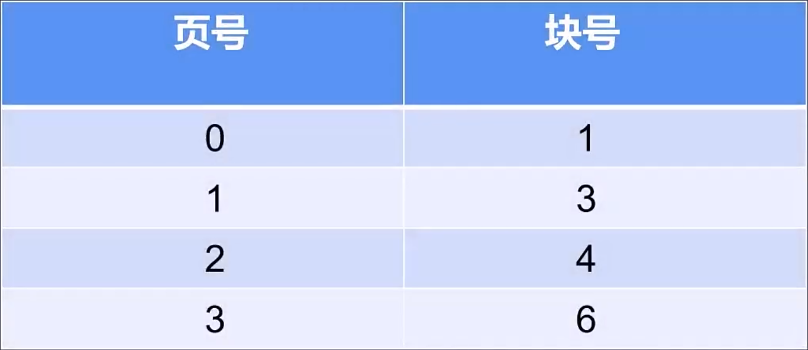
>
>A. 1024H						B. 3D16H						C. 4DI6H						D. 6D16H
>
>【解析】
>
>第一步，先将系统页面大小按字节单位 byte 转化成二进制，那么 $4*1024=4096$。转化成二进制，为：
>
>0001　　0000　　0000　　0000			这里的 4 KB 转化成二进制的 12 个 0，就代表了逻辑地址的后 12 位，是页内偏移量。
>
>第二步：把逻辑地址 2D16**H** 转成二进制。如下：
>
>0010　　1101　　0001　　0110			这里的后 12 位取出来！前 4 位二进制化成的十进制对应页号：0010 对应页号 2，物理块号 4，化成二进制是：0100。
>
>第三步：把上面物理块号二进制作为物理地址的开头二进制，把逻辑地址的后 12 位取出来，作为物理地址的后 12 位。组合如下：
>
>0100　　1101　　0001　　0110			转化成 16 进制的物理地址是：4D16**H**。
>
>【答案】C

`页面置换算法`：有时候，进程空间分为 100 个页面，而系统内存只有 10 个物理块，无法全部满足分配，就需要将马上要执行的页面先分配进去，而后根据算法进行淘汰，使 100 个页面能够按执行顺序调入物理块中执行完。`缺页`表示需要执行的页不在内存物理块中，需要从外部调入内存，会增加执行时间，因此，**缺页数越多，系统效率越低。**

- `最优算法`：OPT，理论上的算法，无法实现，是在进程执行完后进行的最佳效率计算，用来让其他算法比较差距。原理是选择未来最长时间内不被访问的页面置，这样可以保证未来执行的都是马上要访问的。（但是无法确定未来不被访问的页是哪些）
- `先进先出算法`：FIFO，先调入内存的页先被置换淘汰，会产生抖动现象（先前被淘汰的数据，后续需要继续使用，如此往复，形成抖动），即分配的页数越多，缺页率可能越多（即效率越低）。
- `最近最少使用算法`： LRU，在最近的过去，进程执行过程中，过去最少使用的页面被置换淘汰，根据局部性原理，这种方式效率高，且不会产生抖动现象。

>某进程有 4 个页面，页号为 0 ~ 3，页面变换表及状态位、访问位和修改位的含义如下图所示，若系统给该进程分配了 3 个存储块，当访问前页面 1 不在内存时，淘汰表中页号为（）的页面代价最小。
>
>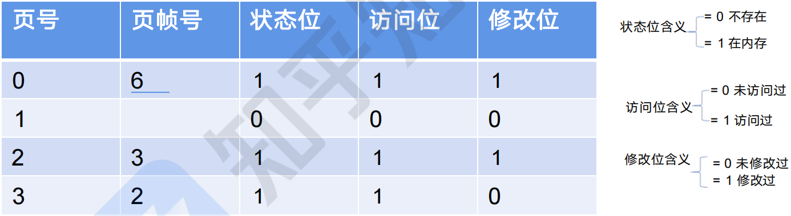
>
>A. 0						B. 1						C. 2						D. 3
>
>【解析】
>
>页号 3 的修改位为 0，表示其最近没有被访问过，淘汰的代价最小。
>
>【答案】D

`快表`：是一块小容量的相联存储器，由快速存储器组成，按内容访问，速度快，并且可以从硬件上保证按内容并行查找，一般用来存放当前访问最频繁的少数活动页面的页号（可以看成是页表的频繁访问数据的副本）。

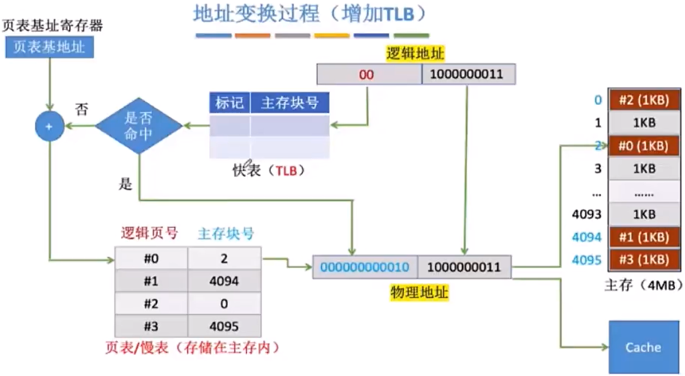

- **快表是将页表存于 Cache 中。**

- **慢表是将页表存于内存上。**

- 慢表需要访问两次内存才能取出数据，而快表是访问一次 Cache 和一次内存，因此更快。

##### 段式存储

将进程空间分为一个个段，每段也有段号和段内地址，与页式存储不同的是，每段物理**大小不同**，分段是根据逻辑整体分段的。

地址表示：`(段号，段内偏移)`，其中段内偏移不能超过该段号对应的段长，否则越界错误，而此地址对应的真正内存地址应该是`段号对应的基地址 + 段内偏移`。

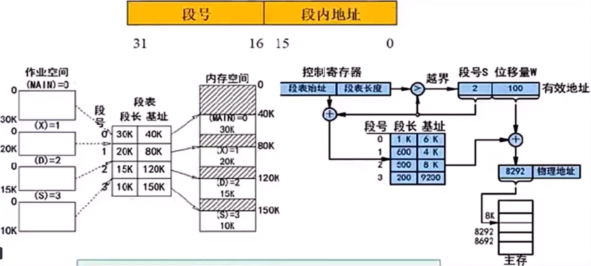

优点：**程序逻辑完整，修改互不影响。**

缺点：**内存碎片浪费大，导致内存利用率低。**

> 设某进程的段表如下所示，逻辑地址（）可以转换为对应的物理位置。
>
> 
>
> A. (0, 1597)、(1, 30) 和 (3, 1390)
>
> B. (0, 128)、(1, 30) 和 (3, 1390)
>
> C. (0, 1597)、(2, 98) 和 (3, 1390)
>
> D. (0, 128)、(2, 98) 和 (4, 1066)
>
> 【答案】B

##### 段页存储

**对进程空间先分段，后分页**，具体原理图和优缺点如下。

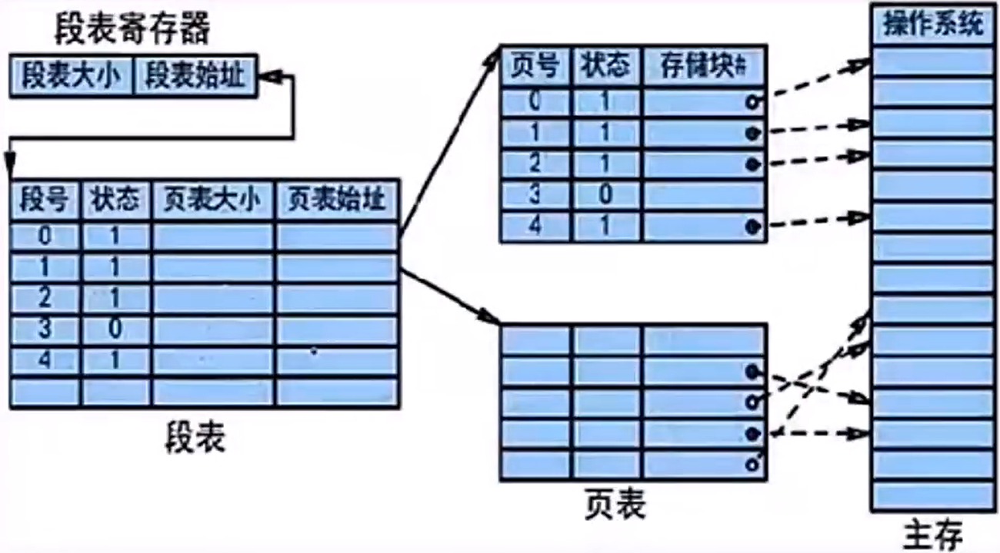

优点：空间浪费小、存储共享容易、能动态连接。（程序逻辑完整， 修改互不影响）

缺点：由于管理软件的增加，复杂性和开销也增加，执行速度下降。（内存利用率低， 内存碎片浪费大）

#### 文件管理

##### 文件结构

计算机系统中采用的索引文件结构如下图所示：

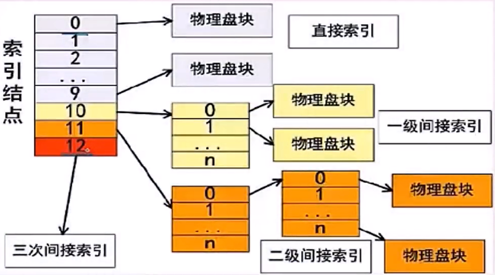

- 系统中有 13 个索引节点，0 ~ 9 为`直接索引`，即每个索引节点存放的是内容，假设每个物理盘块大小为 4 KB，共可存 $4*10=40$ KB 数据。
- 10 号索引节点为`一级间接索引`节点，大小为 4 KB，存放的并非直接数据，而是链接到直接物理盘块的地址，假设每个地址占 4 B（索引大小需要根据实际情况确定），则共有 1024 个地址，对应 1024 个物理盘块，共可存 $1024*4=4096$ KB 数据。
- `二级索引`节点类似，直接盘存放一级地址，一级地址再存放物理盘快地址，而后链接到存放数据的物理盘块，容量又扩大了一个数量级，共可存 $1024*1024*4$ KB 数据。

>设文件索引节点中有 8 个地址项，每个地址项大小为 4 字节，其中 5 个地址项为直接地址索引，2 个地址项是一级间接地址索引，1 个地址项是二级间接地址索引，磁盘索引块和磁盘数据块大小均为 1 KB，若要访问文件的逻辑块号分别为 5 和 518，则系统应分别采用（1），而且可表示的单个文件最大长度是（2）KB。
>
>1、
>
>A. 直接地址索引和一级间接地址索引
>
>B. 直接地址索引和二级间接地址索引
>
>C. 一级间接地址索引和二级间接地址索引
>
>D. 一级间接地址索引和一级间接地址索引
>
>2、
>
>A. 517						B. 1029						C. 16513						D. 66053
>
>【解析】
>
>如果不特别注明，地址项和逻辑块号都是从 0 开始，逻辑块号 5 和 518，分别代表第 6 和 519 块。
>
>直接索引：5 个地址项，对应 5 个地址块。
>
>一级间接索引：2 个地址项，对应 $1024/4*2=512$ 个地址，对应 512 个地址块。
>
>二级间接索引：1 个地址项，对应 $(1024/4)*(1024/4)=65536$ 个地址，对应 65536 个地址块。
>
>因此：逻辑块号 5，采用一级间接索引，逻辑块号 518，采用二级间接索引。单个文件最大长度为：$5*1+512*1+65536*1=66053$ KB。
>
>【答案】C D

##### 树形文件

`相对路径`：是从当前路径开始的路径。

`绝对路径`：是从根目录开始的路径。

**全文件名 = 绝对路径 + 文件名**。要注意，绝对路径和相对路径是不加最后的文件名的，只是单纯的路径序列。

树形结构主要是区分相对路径和绝对路径，如下图所示：

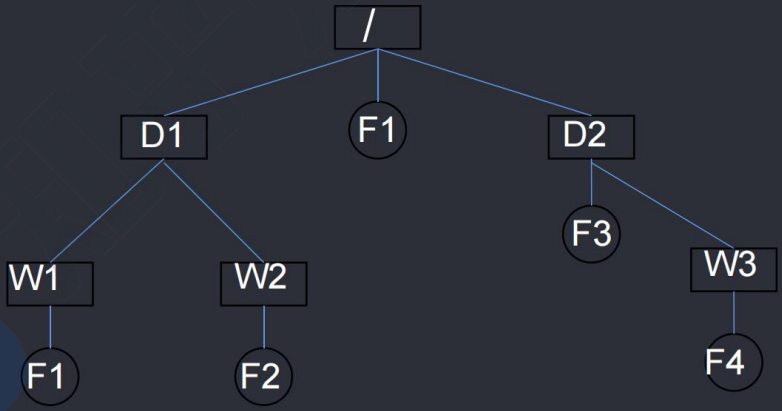

- 文件属性：
  - R：只读文件属性。
  - A：存档属性。
  - S：系统文件。
  - H：隐藏文件。
- 文件名的组成：
  - 驱动器号。
  - 路径。
  - 主文件名。
  - 扩展名。

>若某文件系统的目录结构如下图所示，假设用户要访问文件 Fault.swf，且当前工作目录为 swshare，则该文件的全文件名为（1），相对路径和绝对路径分别为（2）。
>
>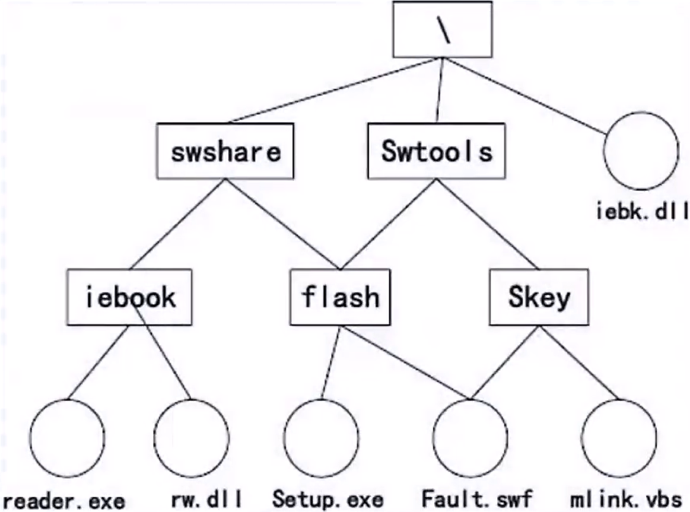
>
>1、
>
>A. fault.swf						B. flash\fault.swf						C. swshare\flash\fault.swf						D. \swshare\flash\fault.swf
>
>2、
>
>A. swshare\flash\ 和 \flash\			B. flash 和 \swshare\flash\			C. \swshare\flash\ 和 flash\			D.\flash\ 和 \swshare\flash\
>
>【答案】D B

##### 空间存储

`空闲区表法`：将所有空闲空间整合成一张表，即空闲文件目录。

`空闲链表法`：将所有空闲空间链接成一个链表，根据需要分配。

`成组链接法`：既分组，每组内又链接成链表，是上述两种方法的综合。

`位示图法`：对每个物理空间用一位标识，为 1 则使用，为 0 则空闲，形成一张位示图。

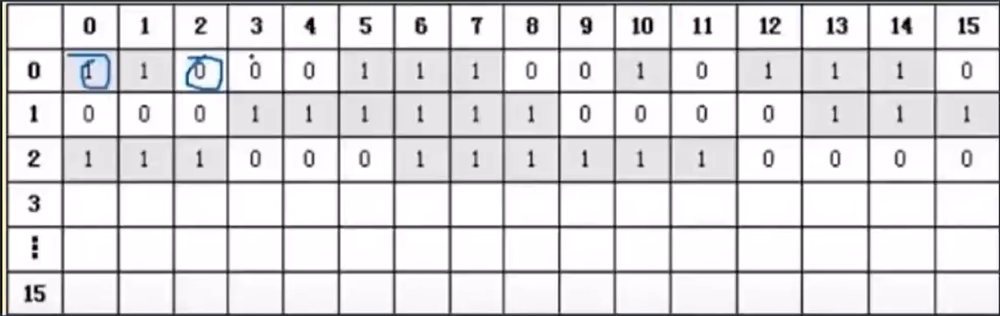

>某文件管理系统在磁盘上建立了位示图（bitmap），记录磁盘的使用情况。若磁盘上的物理块依次编号为：0、1、2、…，系统中字长为 32 位，每一位对应文件存储器上的一个物理块，取值 0 和 1 分别表示空闲和占用，如下图所示。假设将 4195 号物理块分配给某文件，那么该物理块的使用情况在位示图中的第（1）个字中描述，系统应该将（2）。
>
>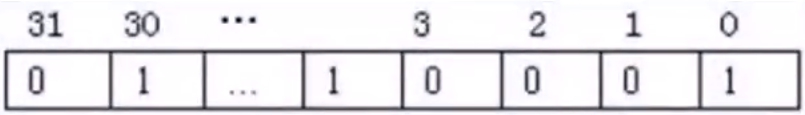
>
>1、
>
>A. 129						B. 130						C. 131						D. 132
>
>2、
>
>A. 该字的第 3 位置 "0"
>
>B. 该字的第 3 位置 "1"
>
>C. 该字的第 4 位置 "0"
>
>D. 该字的第 4 位置 "1"
>
>【解析】
>
>4195 号物理块，是第 4196 个物理块，一个字长 32 位，则第 4196 个物理块，需要 4196 除以 32，等于131 余 4，则4195 号物理块，在位示图的第 132 个字中描述，且该字的第 3 位置置为 "1"。
>
>【答案】D B

#### 设备管理

> *主要见 "输入输出系统" 章节。*

### 计算机网络

#### 网络功能和分类

计算机网络是计算机技术与通信技术相结合的产物，它实现了远程通信、远程信息处理和资源共享。

计算机网络的功能：数据通信、资源共享、管理集中化、实现分布式处理、负载均衡。

网络`性能指标`：速率、带宽（频带宽度或传送线路速率）、吞吐量、时延、往返时间、利用率。

网络`非性能指标`：费用、质量、标准化、可靠性、可扩展性、可升级性、易管理性和可维护性。

计算机网络按分布范围和拓扑结构划分如下图所示：

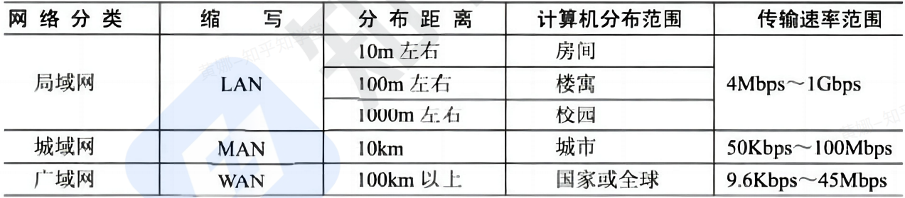

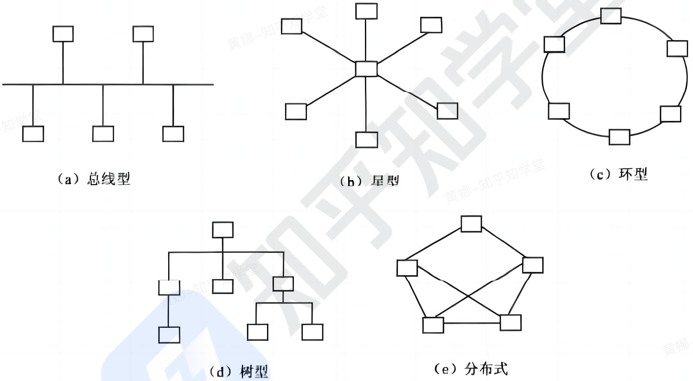

- `总线型拓扑`
  - 特点：采用总线的形式将所有计算机相连，信息只能在一条线路上传输。（所有计算机通过网线连接到交换机的各个端口上，数据只能在这条总线上传输）
  - 优点：成本低，实现简单。
  - 缺点：带宽低，延迟高，任何节点发生故障整条总线瘫痪。
  - 举例：一个简单的以太网线路就是总线型拓扑的一个例子。
- `星型拓扑`
  - 特点：通过一个中心交换机将计算机互联，形成星型网络。（计算机通过网线连接到中心的交换机上，形成星型结构）
  - 优点：容易扩展，集中管理。
  - 缺点：中央交换机单点故障会瘫痪全网。
  - 举例：一个小型办公室的网络就可以采用星型拓扑。
- `环型拓扑`
  - 特点：计算机按环形连接，信息只能前进或后退进行传输。
  - 优点：故障启闭容易诊断。
  - 缺点：数据传输效率低，扩展性差。
- `树型拓扑`
  - 特点：采用分级交换机进行分层管理的方式构建局域网。（计算机先连接到分支交换机上，分支交换机再连接到主干交换机上，实现分级管理）
  - 优点：易于管理和扩展，并行数据传输，性能高。
  - 缺点：增加层次会降低效率。
  - 举例：一个大型的企业网络可能采用树型拓扑。
- `分布式拓扑`
  - 特点：任何节点都能与其他节点互联，不存在集中交换。（网络中的每个节点都是对等的，没有中心机构，任意两个节点都可以直接通信）
  - 优点：无中心，任意节点故障不影响全网。
  - 缺点：管理复杂，成本高。
  - 举例：比特币网络就是一个分布式拓扑的例子。 

#### 通信技术

计算机网络是利用`通信技术`将数据从一个结点传送到另一结点的过程，通信技术是计算机网络的基础。

`信道`可分为**物理信道**和**逻辑信道**。

- `物理信道`由传输介质和设备组成，根据传输介质的不同，分为无线信道和有线信道。

- `逻辑信道`是指在数据发送端和接收端之间存在的一条虚拟线路，可以是有连接的或无连接的。**逻辑信道以物理信道为载体**。

`发信机进行的信号处理`包括信源编码、信道编码、交织、脉冲成形和调制。相反地，收信机进行的信号处理包括解调、采样判决、去交织、信道译码和信源译码。

如果同时传递多路数据就需要**复用技术**和**多址技术**。

- `复用技术`是指在一条信道上同时传输多路数据的技术，如 TDM 时分复用、FDM 频分复用和 CDM 码分复用等。
- `多址技术`是指在一条线上同时传输多个用户数据的技术，在接收端把多个用户的数据分离，如 TDMA 时分多址、FDMA 频分多址和 CDMA 码分多址。

作为新一代的移动通信技术，`5G 特征`体现在以下方面：

1. 基于 OFDM 优化的波形和多址接入。
2. 实现可扩展的 OFDM 间隔参数配直。
3. OFDM 加窗提高多路传输效率。
4. 灵活框架设计。
5. 大规模 MIMO：最多 256 根天线。
6. 毫米波：频率大于 24 GHz 以上的频段。
7. 频谱共享。
8. 先进的信道编码设计。

5G 网络的主要特征：服务化架构、网络切片。

#### OSI 七 层 模 型

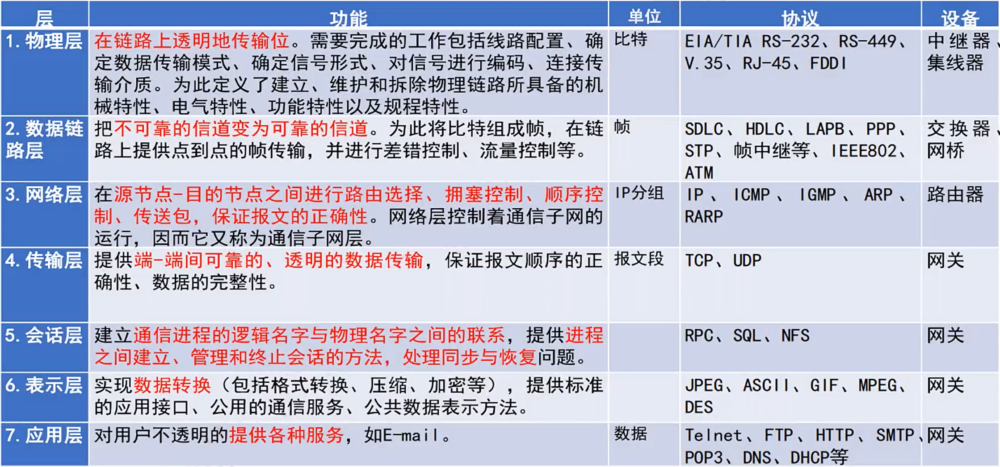

#### 局域网和广域网协议

`以太网`是一种计算机局域网组网技术。

以太网规范`IEEE 802.3`是重要的局域网协议，包括：

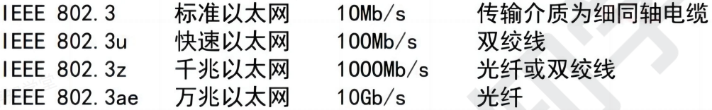

`以太帧`结构：

- 上图依次为：目的 MAC 地址、源 MAC 地址、长度/类型、数据填充、校验。
- 最小帧长：64 字节。

无线局域网 WLAN 技术标准：`IEEE 802.11`。

在 WLAN 中，通常使用的拓扑结构主要有 3 种形式：点对点型、HUB 型和全分布型。

`广域网`相关技术：同步光网络（SONET，利用光纤进行数字化信息通信）、数字数据网（DDN，利用数字信道提供半永久性连接电路以传输数据）、帧中继（FR，数据包交换技术）、异步传输技术（ATM，以信元为基础的面向连接的一种分组交换和复用技术）。

#### 网络协议

`网络协议三要素：语法、语义、时序。`其中语法部分规定传输数据的格式，语义部分规定所要完成的功能，时序部分规定执行各种操作的条件、顺序关系等。

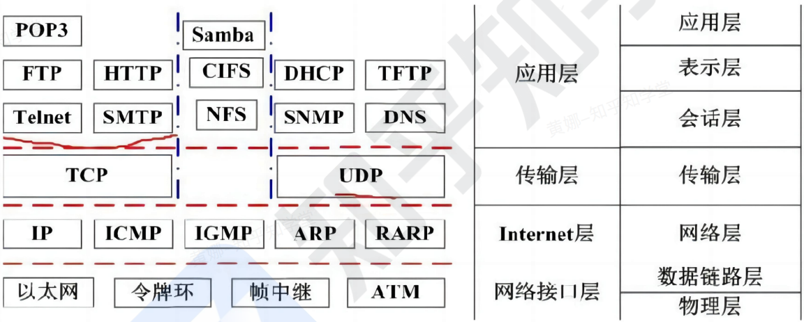

- **网络层协议**
  - `IP`：网络层最重要的核心协议，在源地址和目的地址之间传送数据报，无连接、不可靠。
  - `ICMP`：因特网控制报文协议，用于在 IP 主机、路由器之间传递控制消息。控制消息是指网络通不通、主机是否可达、路由是否可用等网络本身的消息。
  - `ARP`和`RARP`：地址解析协议，ARP 是将 IP 地址转换为物理地址，RARP 是将物理地址转换为 IP 地址。
  - `IGMP`：网络组管理协议，允许因特网中的计算机参加多播，是计算机用做向相邻多目路由器报告多目组成员的协议，支持组播。
- **传输层协议**
  - `TCP`：整个 TCP/IP 协议族中最重要的协议之一，在 IP 协议提供的不可靠数据数据基础上，采用了重发技术，为应用程序提供了一个可靠的、面向连接的、全双工的数据传输服务。一般用于传输数据量比较少，且对可靠性要求高的场合。
  - `UDP`：是一种不可靠、无连接的协议，有助于提高传输速率，一般用于传输数据量大，对可靠性要求不高，但要求速度快的场合。
- **应用层协议**
  - **基于 TCP 的 FTP、HTTP等都是可靠传输，基于 UDP 的 DHCP、DNS 等都是不可靠传输。**
  - `FTP`：可靠的文件传输协议，用于因特网上的控制文件的双向传输。
  - `HTTP`：超文本传输协议，用于从 WWW 服务器传输超文本到本地浏览器的传输协议。使用 SSL 加密后的安全网页协议为 HTTPS。
  - `SMTP`和`POP3`：简单邮件传输协议，是一组用于由源地址到目的地址传送邮件的规则，邮件报文采用 ASCII 格式表示，SMTP 是发送，POP3 是接收。
  - `Telnet`：远程连接协议，是因特网远程登录服务的标准协议和主要方式。
  - `TFTP`：不可靠的、开销不大的小文件传输协议。
  - `SNMP`：简单网络管理协议，它主要用于网络设备与网络管理系统（NMS）之间进行监测与管理，比如路由器和交换机设备通过 SNMP 定期向网络管理系统上报接口流量、CPU 利用率等性能指标。
  - `DHCP`：动态主机配置协议，基于 UDP，基于 C/S 模型，为主机动态分配 IP 地址，有三种方式：固定分配、动态分配、自动分配。
  - `DNS`：域名解析协议，通过域名解析出 IP 地址。

#### 协议端口号对照表

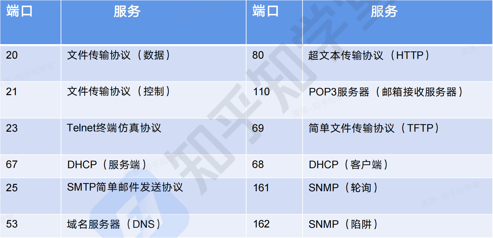

>在 OSI 参考模型中能实现路由选择、拥塞控制与互连功能的层是（）。
>
>A. 传输层					B. 应用层					C. 网络层					D. 物理层
>
>【答案】C
>
>
>
>在 TCP/IP 体系结构中，将 IP 地址转化为 MAC 地址的协议是（）。
>
>A. RARP						B. ARP						C. ICMP						D. TCP
>
>【答案】B
>
>
>
>下列网络互连设备中，属于物理层的是（）。
>
>A. 交换机					B. 中继器					C. 路由器					D. 网桥
>
>【答案】B

#### 交换技术

数据在网络中转发通常离不开`交换机`，人们日常使用的计算机通常就是通过交换机接入网络的。

交换机功能包括：

- `集线功能`：提供大量可供线缆连接的端口达到部署星状拓扑网络的目的。
- `中继功能`：在转发帧时重新产生不失真的电信号。
- `桥接功能`：在内置的端口上使用相同的转发和过滤逻辑。
- `隔离冲突域功能`：将部署好的局域网分为多个冲突域，而每个冲突域都有自己独立的带宽，以提高交换机整体宽带利用效率。

交换机的功能包括：

- `转发路径学习`：根据收到数据帧中的源 MAC 地址，建立该地址同交换机端口的映射写入 MAC 地址表中。
- `数据转发`：如果交换机根据数据帧中的目的 MAC 地址在建立好的MAC地址表中查询到了，就向对应端口进行转发。
- `数据泛洪`：如果数据帧中的目的 MAC 地址不在 MAC 地址表中，则向所有端口转发也就是泛洪。广播帧和组播帧向所有端口（不包括源端口） 进行转发。
- `链路地址更新`：MAC 地址表会每隔一定时间（如 300 s）更新一次。

#### 路由技术

路由功能由`路由器`来提供， 具体包括：

- 异种网络互连，比如具有异种子网协议的网络互连。
- 子网协议转换，不同子网间包括局域网和广域网之间的协议转换。
- 数据路由，即将数据从一个网络依据路由规则转发到另一个网络。
- 速率适配，利用缓存和流控协议进行适配。
- 隔离网络，防止广播风暴，实现防火墙。
- 报文分片和重组，超过接口的 MTU 报文被分片，到达目的地之后的报文被重组。
- 备份、流量控制，如主备线路的切换和复杂流量控制等。

路由器工作在 OSI 七层协议中的第 3 层，即网络层。其主要任务是接收来源于一个网络接口的数据包，通常根据此数据包的目的地址决定待转发的下一个地址（即下一跳地址）。路由器中维持着数据转发所需的路由表，所有数据包的发送或转发都通过查找路由表来实现。这个路由表可以静态配置，也可以通过动态路由协议自动生成。

一般来说，路由协议可分为内部网关协议（IGP）和外部网关协议（EGP）两类。网络建设工程可分为网络规划、网络设计和网络实施三个环节。

#### 传输介质

##### 双绞线

`双绞线`：将多根铜线按规则缠绕在一起，能够减少干扰;分为无屏蔽双绞线UTP和屏蔽双绞线STP，都是由一对铜线簇组成。也即我们常说的网线;双绞线的传输距离在100m以内。

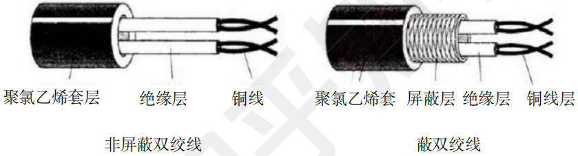

- `无屏蔽双绞线 UTP`：价格低，安装简单，但可靠性相对较低，分为 CAT3（3 类 UTP，速率为 10 Mbps）、CAT4（4 类 UTP，与 3 类差不多，无应用）、CAT5 （5 类 UTP，速率为 100 Mbps，用于快速以太网）、CAT5E（超 5 类 UTP，速率为 1000 Mbps）、CAT6（6 类 UTP，用来替代 CAT5E，速率也是 1000 Mbps）。
- `屏蔽双绞线 STP`：比 UTP 增加了一层屏蔽层，可以有效的提高可靠性，但对应的价格高，安装麻烦，一般用于对传输可靠性要求很高的场合。

`网线`有如下两种安装标准：都是八根不同颜色的网线，按照不同的顺序排序，插入水晶头中，区分在第 **1236** 四根网线的位置不同。

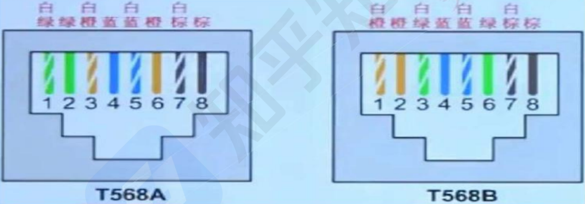

##### 光纤

`光纤`：由纤芯和包层组成，传输的光信号在纤芯中传输，然而从 PC 端出来的信号都是电信号，要经过光纤传输的话，就必须将电信号转换为光信号。

- `多模光纤 MMF`：纤芯半径较大，因此**可以同时传输多种不同的信号**，光信号在光纤中以全反射的形式传输，**采用发光二极管 LED 为光源**，成本低，但是传输的效率和可靠性都较低，**适合于短距离传输**，其传输距离与传输速率相关，速率为 100 Mbps 时为 2 KM，速率为 1000 Mbps 时为 550 m。

  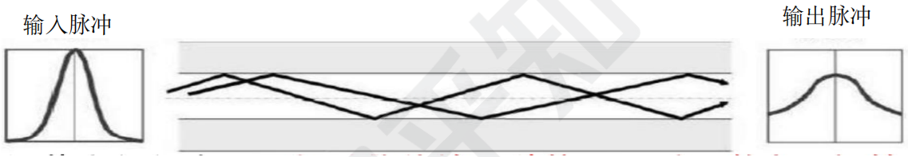

- `单模光纤 SMF`：纤芯半径很小，**一般只能传输一种信号**，**采用激光二极管 LD 作为光源**，并且**只支持激光信号的传播**，同样是以全反射形式传播，只不过反射角很大，看起来像一条直线，成本高，但是**传输距离远**，可靠性高，传输距离可达 5 KM。

  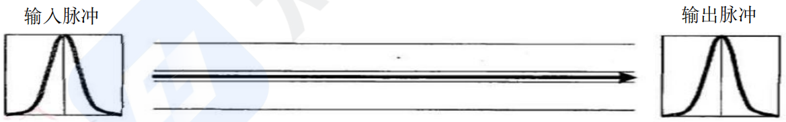

##### 无线信道

`无线信道`：分为无线电波和红外光波。

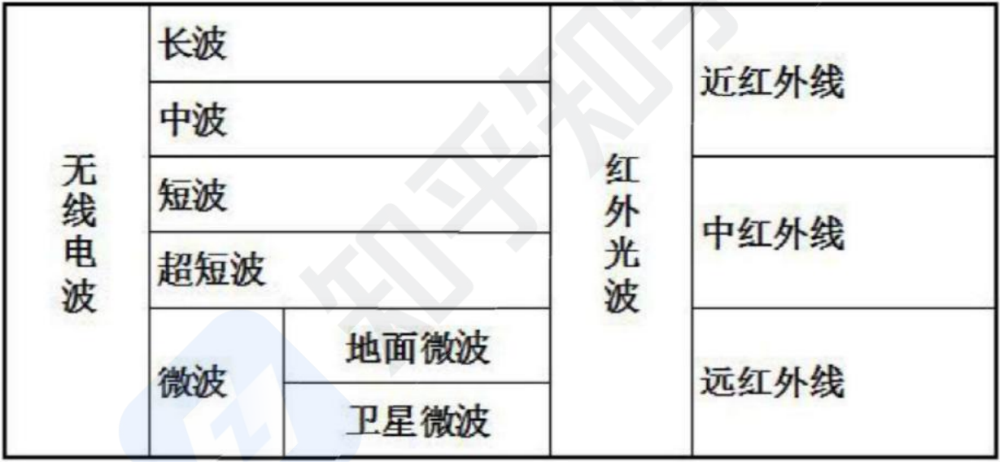

#### 通信方向

`通信方向`：数据通信是指发送方发送数据到接收方。这个传输过程可以分类如下：

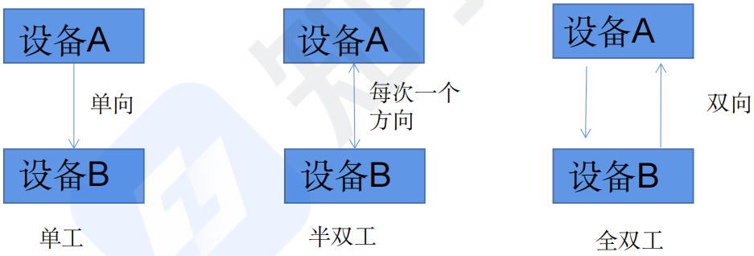

- `单工`：只能由设备 A 发给设备 B，即数据流只能单向流动。
- `半双工`：设备 A 和设备 B 可以互相通信，但是同一时刻数据流只能单向流动。
- `全双工`：设备 A 和设备 B 在任意时刻都能互相通信。

#### 通信方式

根据是否同步：

- `异步传输`：发送方每发送一个字符，需要在字符的起始和结尾处插入标识，当接收方接收到该字符时需要处理开始和结尾处的标识，处理完之后就能识别发送过来的数据，但是这样会造成资源浪费，**传输效率降低**。发送方和接收方并不是同时进行处理数据。
- `同步传输`：以数据块为单位进行传输，当发送方要发送数据时，先发送一个同步帧，接收方收到后做好接收准备，开始接收数据块，结束后又会有结束帧确认，这样一次传输一个数据块，**效率高**。

根据是否并行：

- `串行传输`：**只有一根数据线**，数据只能 1 bit 挨个排队传送，**适合低速设备、远距离的传送**，一般用于广域网中。
- `并行传输`：**有多根数据线**，可以同时传输多个 bit 数据，**适合高速设备的传送**，常用语计算机内部各硬件模块之间。

#### 交换方式

- `电路交换`：通信一方进行呼叫，另一方接收后，在二者之间会**建立一个专用电路**，特点为**面向连接、实时性高、链路利用率低**，一般用于语音视频通信。
- `报文交换`：**以报文为单位**，存储转发模式，接收到数据后先存储，进行差错校验，没有错误则转发，有错误则丢弃，因此会**有延时，但可靠性高，是面向无连接的**。
- `分组交换`：以分组为单位，也是存储转发模式，因为分组的长度比报文小，所以时延小于报文交换。分组交换又可分为三种方式：
  - `数据报`：是现在主流的交换方式，**各个分组携带地址信息，自由的选择不同的路由路径传送到接收方**，接收方接收到分组后再根据地址信息重新组装成原数据，是面向无连接的，但是不可靠的。
  - `虚电路`：发送方发送一个分组，接收方收到后**二者之间就建立了一个虚拟的通信线路**，二者之间的分组数据交互都通过这条线路传送，在空闲的时候这条线路也可以传输其他数据，是面向连接的，可靠的。
  - `信元交换`：异步传输模式 ATM 采用的交换方式，本质是按照虚电路方式进行转发，只不过**信元是固定长度的分组**，共 53 B，其中 5 B 为头部，48 B 为数据域，也是面向连接的，可靠的。

>以下关于光纤的说法中，错误的是（ ）
>
>A. 单模光纤的纤芯直径更细
>
>B. 单模光纤采用 LED 作为光源
>
>C. 多模光纤比单模光纤的传输距离近
>
>D. 多模光纤中光波在光导纤维中以多种模式传播
>
>【答案】B
>
>
>
>数据通信模型按照数据信息在传输链路上的传送方向，可以分为三类。下列选项中，（ ）不属于这三类传输方式。
>
>A. 单工通信：信号只能向一个方向传送
>
>B. 半双工通信：信息的传递可以是双向的
>
>C. 全双工通信：通信的双方可以同时发送和接收信息
>
>D. 全单工通信：信号同时向两个方向传输
>
>【答案】D

#### IP 地址表示

分类 IP 地址：IP 地址分四段，每段八位，共 32 位二进制数组成。在逻辑上，这 32 位 IP 地址分为**网络号（带下划线的）和主机号**，依据网络号位数的不同，可以将 IP 地址分为以下几类：

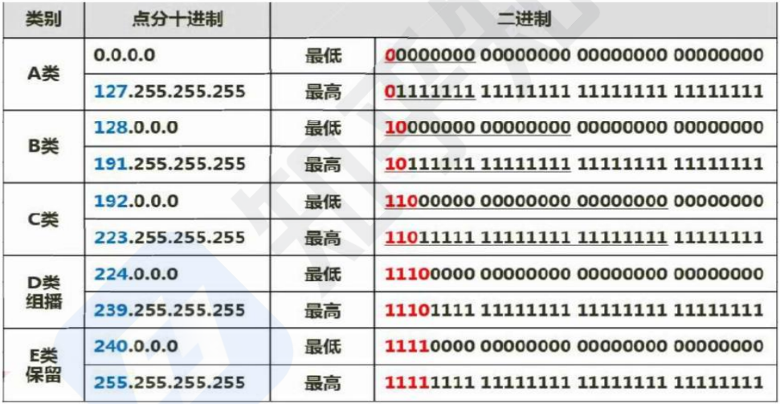

- 按照 A 类来分配 IP 地址，总计可以分配：$2^{24}-2=16777214$。
- B 类的分配数为：$2^{16}-2=65534$。
- C 类的分配数为：$2^8-2=254$。

`无分类编址`：即不按照 ABC 类规则，自动规定网络号。无分类编址格式为：**IP地址/网络号**。示例："128.168.0.11/20" 表示的 IP 地址为 128.168.0.11，其网络号占 20 位，因此主机号占 $32-20=12$ 位，也可以划分子网。

特殊 IP 地址：

- `公有地址`：通过它直接访问因特网，是全网唯一的 IP 地址。

- `私有地址`：属于非注册地址，专门为组织机构内部使用，不能直接访问因特网，下表所示为私有地址范围。

  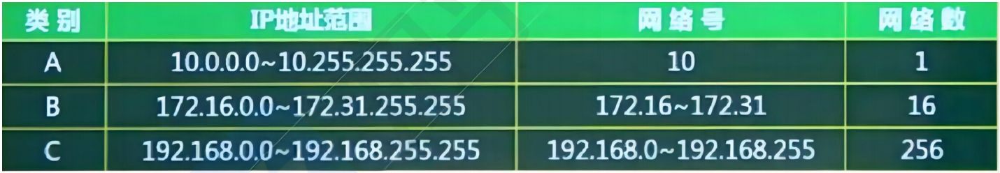

#### 子网划分

`子网划分`：一般公司在申请网络时，会直接获得一个范围很大的网络，如一个 A 类地址，因为主机数之间相差的太大了，不利于分配，我们一般采用子网划分的方法来划分网络，即自定义网络号位数，就能自定义主机号位数，就能根据主机个数来划分出最适合的方案，不会造成资源的浪费。

`子网号`：一般的 IP 地址按标准划分为 ABC 类后可以进行再一步的划分，将主机号多出的几位作为子网号，就可以划分出多个子网。比如只需要为 30 台主机分配 IP 地址，那么，我们会申请 C 类的地址，C 类地址是 $2^8$ 个主机号，远远超过了 30 的需求，于是我们按照 $2^n-2=30$ 来计算，$n=5$ 是最合适的，多余的那 3 位就是用来作为子网号，那么子网就一共可以划分 $2^3=8$ 个，按照 IP 地址组成为：**网络号 + 子网号 + 主机号**来算的话，那么就是网络号 24 + 子网号 3 + 主机号 5。

网络号和子网号都为 1，主机号都为 0，这样的地址为`子网掩码`。如果把上面的例子拿来算，子网掩码的话就是：24 个 1 + 3 个 1 + 5 个 0，得到的就是 255.255.255.224。要注意的是：子网号可以为全 0 和全 1，主机号不能为全 0 或全 1，因此，主机数需要减 2，而子网数不用。

还可以聚合网络为`超网`，就是划分子网的逆过程，将网络号取出几位作为主机号，此时，这个网络内的主机数量就变多了，成为一个更大的网络。

>把网络 117.15.32.0/23 划分为 117.15.32.0/27，得到的子网是（1）个，每个子网中可使用的主机地址是（2）个。
>
>1、
>
>A. 4								B. 8								C. 16								D. 32
>
>2、
>
>A. 30								B. 31								C. 32								D. 34
>
>【解析】
>
>题中将网络号为 23 位的 IP 地址划分为网络号为 27 位的子网，可以分为 $2^{(27-23)}=16$ 个子网，每个子网产生的主机地址是 $2^{(32-27)}-2=30$ 个。
>
>结论：**若要把`***.***.***.0/m`划分为`***.***.***.0/n`（m < n < 32），得到的子网个数为 $2^{(n-m)}$，去掉全 0 和全 1，可用子网个数为 $2^{(n-m)}-2$，每个子网中可使用的主机地址是 $2^{(32-n)}-2$​。**
>
>【答案】C A
>
>
>
>分配给某公司网络的地址块是 220.17.192.0/20，该网络被划分为（1）个 C 类子网，不属于该公司网络的子网地址是（2）。
>
>1、
>
>A. 4								B. 8								C. 16								D. 32
>
>2、
>
>A. 220.17.203.0					B. 220.17.205.0					C. 220.17.207.0					D. 220.17.213.0
>
>【解析】
>
>1、题中给出的子网掩码为 20 位，将其划分成 C 类的子网即子网掩码的长度为 24 位，故用于表示子网号的位数为 4 位，所以被划分的子网数为 16。
>
>2、将地址 220.17.192.0 转换成二进制与子网掩码输入成如下的格式：
>
>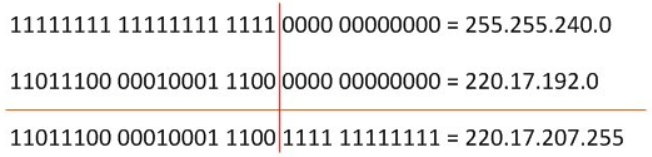
>
>垂直红线的左边是网络位，右边是主机位，由此可以看出 IP 220.17.192.0/20 的地址范围为 220.17.192.0 ~ 220.17.207.255，因此答案 D 是不属于该范围的。
>
>【答案】C D

#### IPv6

IPv6 主要是为了解决 IPv4 地址数不够用的情况而提出的设计方案，IPv6 具有以下特性：

- IPv6 地址长度为 128 位，而 IPv4 地址仅 32 位，空间增大了 $2^{96}$ 倍。
- 灵活的 IP 报文头部格式，使用一系列固定格式的扩展头部取代了 IPv4 中可变长度的选项字段。
- IPv6 简化了报文头部格式，加快报文转发，提高了吞吐量。
- 提高安全性，身份认证和隐私权是 IPv6 的关键特性。
- 支持更多的服务类型。
- 允许协议继续演变，增加新的功能，使之适应未来技术的发展。

IPv4 和 IPv6 的过渡期间，主要采用三种基本技术：

- `双协议栈`：主机同时运行 IPv4 和 IPv6 两套协议栈，同时支持两套协议，一般来说 IPv4 和 IPv6 地址之间存在某种转换关系，如 IPv6 的低 32 位可以直接转换为 IPv4 地址，实现互相通信。
- `隧道技术`：这种机制用来在 IPv4 网络之上建立一条能够传输 IPv6 数据报的隧道，例如可以将 IPv6 数据报当做 IPv4 数据报的数据部分加以封装，只需要加一个 IPv4 的首部，就能在 IPv4 网络中传输 IPv6 报文。
- `翻译技术`：利用一台专门的翻译设备（如转换网关），在纯 IPv4 和纯 IPv6 网络之间转换 IP 报头的地址，同时根据协议不同对分组做相应的语义翻译，从而使纯 IPv4 和纯 IPv6 站点之间能够透明通信。

#### 网络三层模型

`三层模型`将网络划分为核心层、汇聚层和接入层。

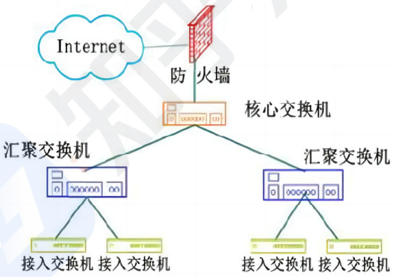

- `核心层`：提供不同区域之间的**最佳路由和高速数据传送**。
- `汇聚层`：将网络业务连接到接入层，并且**实施与安全、流量、负载和路由相关的策略**。
- `接入层`：为用户提供了在本地网段访问应用系统的能力，还要解决相邻用户之间的互访需要，接入层要负责一些**用户信息（例如用户 IP 地址、MAC 地址和访问日志等）的收集工作和用户管理功能（包括认证和计费等）**。

>以下关于层次化局域网模型中核心层的叙述，正确的是（）。
>
>A. 为了保障安全性，对分组要进行有效性检查				B. 将分组从一个区域高速地转发到另一个区域
>
>C. 由多台二、三层交换机组成								  D. 提供多条路径来缓解通信瓶颈
>
>【答案】B

#### 网络规划与设计

`建筑物综合布线系统 PDS`：

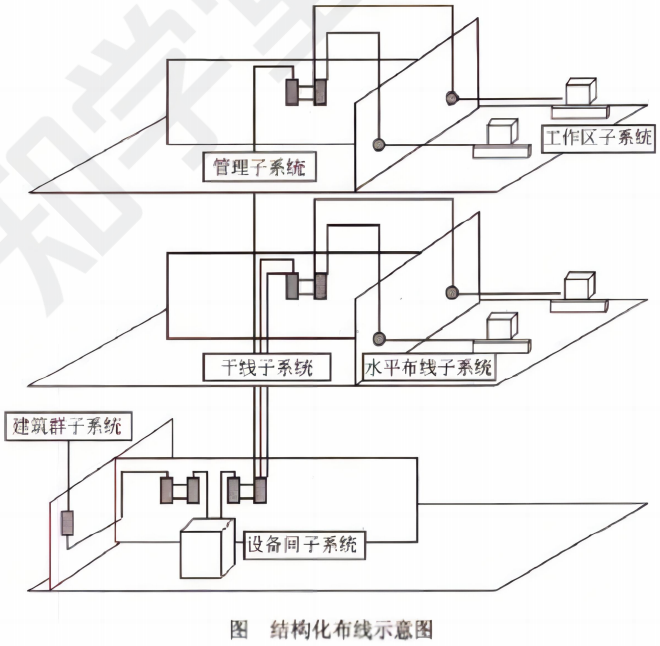

- `工作区子系统`：实现工作区终端设备到水平子系统的信息插座之间的互联。（`终端 <---> 工作区子系统 <---> 水平布线子系统的信息插座`）
- `水平布线子系统`：实现信息插座和管理子系统之间的连接。（`信息插座 <---> 水平布线子系统 <---> 管理子系统`）
- `管理子系统`：连接各楼层水平布线子系统和垂直干缆线，负责连接控制其他子系统，为连接其他子系统提供连接手段。（`水平布线子系统 <---> 管理子系统 <---> 垂直干线子系统`）
- `垂直干线子系统`：实现各楼层设备间子系统之间的互连。
- `设备间子系统`：实现中央主配线架与各种不同设备之间的连接。
- `建筑群子系统`：各个建筑物通信系统之间的互联。

总结：

- 工作区子系统负责**房间内部**各个设备终端的互联。
- 水平和垂直子系统负责**不同楼层和建筑内部**的互联。
- 设备间子系统实现**各种设备与交换机之间**的互联。
- 管理子系统实现**整个综合布线系统**的管理。
- 建筑群子系统实现**不同建筑物之间**的互联。

>结构化布线系统分为六个子系统，其中水平子系统（）。
>
>A. 由各种交叉连接设备以及集线器和交换机等设备组成
>
>B. 连接了干线子系统和工作区子系统
>
>C. 由终端设备到信息插座的整个区域组成
>
>D. 实现各楼层设备间子系统之间的互连
>
>【解析】
>
>A：设备间子系统；C：工作区子系统；D：建筑群子系统。
>
>【答案】B

#### 廉价磁盘冗余阵列

`磁盘冗余阵列技术 (RAID)`，将数据分散存储在不同磁盘中，可并行读取，可冗余存储，提高磁盘访问速度，保障数据安全性。

- `RAID0`：将数据分散的存储在不同磁盘中，磁盘利用率 100%，访问速度最快，但是没有提供冗余和错误修复技术。

  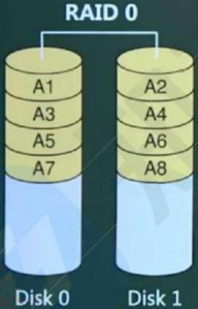

- `RAID1`：在成对的独立磁盘上产生互为备份的数据，增加存储可靠性，可以纠错，但磁盘利用率只有 50%。

  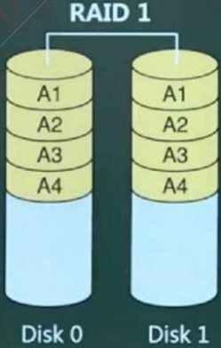

- `RAID2`：将数据条块化的分布于不同硬盘上，并使用海明码校验。

- `RAID3`：使用奇偶校验，并用单块磁盘存储奇偶校验信息，可靠性低于 RAID5。

- `RAID5`：在所有磁盘上交叉的存储数据及奇偶校验信息（所有校验信息存储总量为一个磁盘容量，但分布式存储在不同的磁盘上），读/写指针可同时操作。

  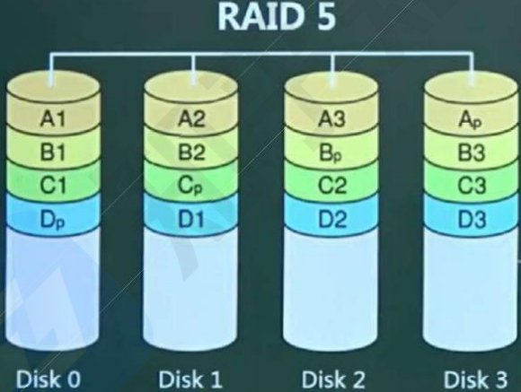

  - 因为无论磁盘有多少，校验信息的存储总量之和都要占据一个磁盘容量，因此磁盘越多，利用率就越高。
  - 如果有某一块磁盘发生异常，可以通过校验码信息还原数据。

- `RAID0+1`：是两个 RAID0，若一个磁盘损坏，则当前 RAID0 无法工作，即有一半的磁盘无法工作。

  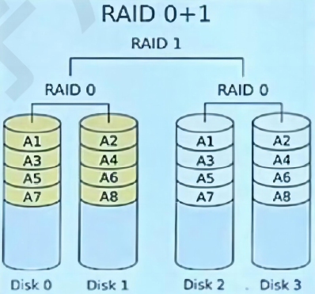

- `RAID1+0`：是两个 RAID1，不允许同一组中的两个磁盘同时损坏，与 RAID1 原理类似，磁盘利用率都只有 50%，但安全性更高。

  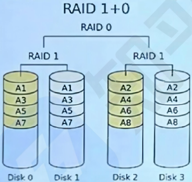

#### 网络存储技术

1. `直接附加存储 (DAS)`：是指将存储设备通过 SCSI 接口直接连接到一台服务器上使用，其本身是硬件的堆叠，存储操作依赖于服务器，不带有任何存储操作系统。存在问题：在传递距离、连接数量、传输速率等方面都受到限制。容量难以扩展升级；数据处理和传输能力降低；服务器异常会波及存储器。

2. `网络附加存储(NAS)`：通过网络接口与网络直接相连，由用户通过网络访问，有独立的存储系统。如下图所示。NAS 存储设备类似于一个专用的文件服务器，去掉了通用服务器大多数计算功能，而仅仅提供文件系统功能。以数据为中心，将存储设备与服务器分离，其存储设备在功能上完全独立于网络中的主服务器。客户机与存储设备之间的数据访问不再需要文件服务器的干预，同时它允许客户机与存储设备之间进行直接的数据访问，所以不仅响应速度快，而且数据传输速率也很高。NAS 的性能特点是进行小文件级的共享存取；支持即插即用；可以很经济的解决存储容量不足的问题，但难以获得满意的性能。

   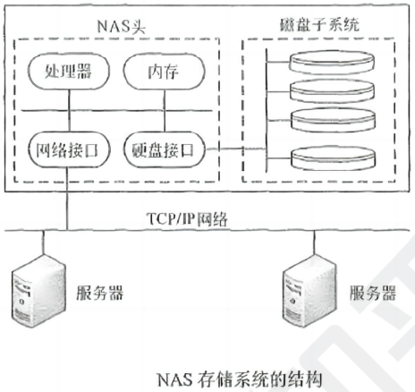

3. `存储区域网(SAN)`：SAN 是通过专用交换机将磁盘阵列与服务器连接起来的高速专用子网。它没有采用文件共享存取方式，而是采用块（block）级别存储。SAN 是通过专用高速网将一个或多个网络存储设备和服务器连接起来的专用存储系统，其最大特点是将存储设备从传统的以太网中分离了出来，成为独立的存储区域网络 SAN 的系统结构。根据数据传输过程采用的协议，其技术划分为 FCSAN（光纤通道）、IP SAN（IP 网络）和 IB SAN（无线带宽）技术。

   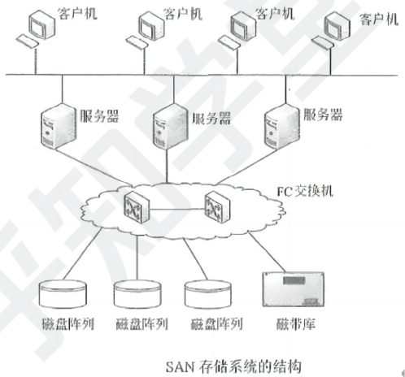

#### 其他

`网络地址翻译 NAT`：公司内有很多电脑，在公司局域网内可以互联通信，但是要访问外部因特网时，只提供固定的少量 IP 地址能够访问因特网，将公司所有电脑这个大的地址集合映射到能够访问因特网的少量 IP 地址集合的过程就称为 NAT。很明显，使用了 NAT 后，一个公司只有少量固定 IP 地址可以上网，大大减少了 IP 地址的使用量。

`默认网关`：一台主机可以有多个网关。默认网关的意思是一台主机如果找不到可用的网关，就把数据包发给默认指定的网关，由这个网关来处理数据包。现在主机使用的网关，一般指的是默认网关。默认网关的 IP 地址必须与本机 IP 地址在同一个网段内，即同网络号。

`虚拟局域网 VLAN`：VLAN 技术可以将局域网内的计算机、服务器等设备按共同的工作需求或业务类型分组。举个例子，一个公司的办公室内有多组部门，开发部、销售部、财务部等等。如果不用 VLAN 技术，它们的计算机就是直接连接在同一个交换机上，对网络来说看不出这些设备属于哪个部门。但是使用 VLAN 技术后，我们就可以为每个部门分别设置一个 VLAN。比如：

- 开发部所有计算机设置为 VLAN 100。
- 销售部所有计算机设置为 VLAN 200。
- 财务部所有计算机设置为 VLAN 300。

这样就具备了如下优点：

1. **隔离**：每个 VLAN 内的计算机可以相互通信，但不同 VLAN 的计算机互不影响。
2. **管理**：可以为每个 VLAN 设置不同的 IP 段、安全规则，方便分类管理。
3. **共享**：设备虽然在不同的 VLAN 内，但仍然共享同一个交换机，节省成本。

VLAN 技术就是通过在交换设备上为每个端口设置 VLAN ID，来划分网络内的计算机到不同的虚拟 LAN 中，这样公司的网络结构就变得更清晰、更有层次了，帮助不同的部门完成私有而独立的工作。

`虚拟专用网 VPN`：是在公用网络上建立专用网络的技术。其之所以称为虚拟网，主要是因为整个 VPN 网络的任意两个节点之间的连接，并没有传统专网所需的端到端的物理链路，而是架构在公用网络服务商所提供的网络平台，如 Internet、ATM（异步传输模式）、Frame Relay（帧中继）等之上的逻辑网络，用户数据在逻辑链路中传输。

`URL(Uniform Resource Locator) `：统一资源定位符，能够对因特网的资源进行定位。

- URL 一般有四部分组成：`<协议>://<主机>:<端口>/<路径>`。
- 现在最常用的 "<协议>" 为 http 协议。
- "<主机>" 是指主机在因特网上的域名，如果要拆开看的话，那么 www 是主机名，后面的就是域名。
- http 协议的默认 "<端口>" 为 80（可以省略）。
- "<路径>" 是指要活的的文件的路径。

### 嵌入式技术

#### 嵌入式微处理体系结构

`冯·诺依曼结构`：传统计算机采用冯·诺依曼（Von Neumann）结构，也称`普林斯顿结构`，**是一种将程序指令存储器和数据存储器合并在一起的存储器结构**。

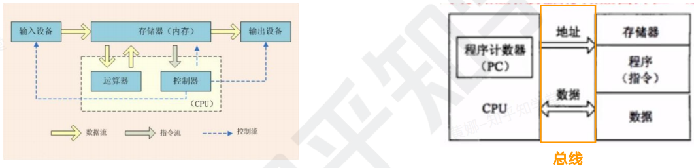

- 冯·诺依曼结构的计算机，**程序和数据共用一个存储空间**，程序指令存储地址和数据存储地址指向**同一个存储器的不同物理位置**。
- **采用单一的地址及数据总线**，程序指令和数据的宽度相同。 
- 处理器执行指令时，**先从储存器中取出指令解码，再取操作数执行运算**，即使单条指令也要耗费几个甚至几十个周期，在高速运算时，在传输通道上**会出现瓶颈效应**。这是一种**串行结构**，相对比较低效。

`哈佛结构`：是一种**并行体系结构**，它的主要特点是将**程序和数据存储在不同的存储空间中**，即程序存储器和数据存储器**是两个相互独立的存储器，每个存储器独立编址、独立访问。**

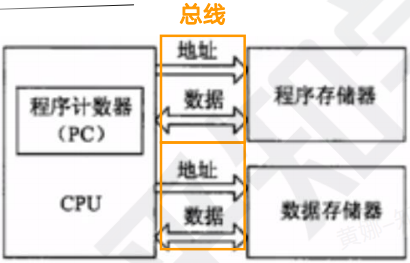

- 与两个存储器相对应的是系统中的**两套独立的地址总线和数据总线**。
- 这种分离的程序总线和数据总线可**允许在一个机器周期内同时获取指令字（来自程序存储器）和操作数（来自数据存储器）**，从而提高了执行速度，使数据的吞吐率提高了 1 倍。

**冯·诺伊曼结构 VS 哈佛结构：**

- 在冯·诺依曼架构中，**指令和数据共享同一个存储器，CPU 只能执行一条指令**，因为它需要等待指令和数据都被读取到 CPU 中。而在哈佛架构中，**指令和数据存储在不同的内存中，CPU 可以同时访问指令和数据内存，因此可以同时执行多条指令**。所以，可以这样理解，**冯诺依曼架构是单车道，而哈佛架构是多车道。**
- 冯·诺依曼架构的好处，就是**简单、易于实现和设计**。哈佛架构的好处，**可以使用不同的技术来优化性能**。
- 冯·诺依曼架构**适用于大多数通用计算机**，因为它能够灵活地处理各种不同的计算任务，同时还可以使用缓存等技术来优化性能。而哈佛架构则**适用于一些特定的应用领域**，例如需要高效地处理大量数据的嵌入式系统，或数字信号处理器等领域。

#### 微处理器分类

如果**根据嵌入式微处理器的字长宽度（同时能够处理数据的字长）分类**，可以分为：4 位、8 位、16 位、32 位和 64 位。一般把 16 位及以下的称为`嵌入式微控制器 (Embedded Micro Controller, MCU)`，32 位及以上的称为`嵌入式微处理器`。

如果**根据系统集成度分类**，可以分为两类：一种是微处理器内部仅包含单纯的中央处理器单元，称为`一般用途型微处理器`，另一种则是将 CPU、ROM、RAM 及 I/O 等部件集成到同一个芯片上，称为`单芯片微控制器 (Single Chip Microcontroller)`。

如果**根据用途分类**，一般分为：`嵌入式微控制器 MCU`、`嵌入式微处理器 MPU`、`嵌入式数字信号处理器 DSP`、`嵌入式片上系统 SOC`等。

##### 嵌入式微控制器 MCU

`嵌入式微控制器 MCU`：**典型代表是单片机**，其片上外设资源比较丰富，适合于控制。MCU 芯片内部集成 ROM/EPROM、RAM、总线、总线逻辑、定时/计数器、看门狗、I/O、串行口、脉宽调制输出、A/D、D/A、Flash RAM、EEPROM 等各种必要功能和外设。和嵌入式微处理器相比，**嵌入式微控制器的最大特点是单片化，体积大大减小，从而使功耗和成本下降、可靠性提高，其片上外设资源一般较丰富，适合于控制，是嵌入式系统工业的主流。**

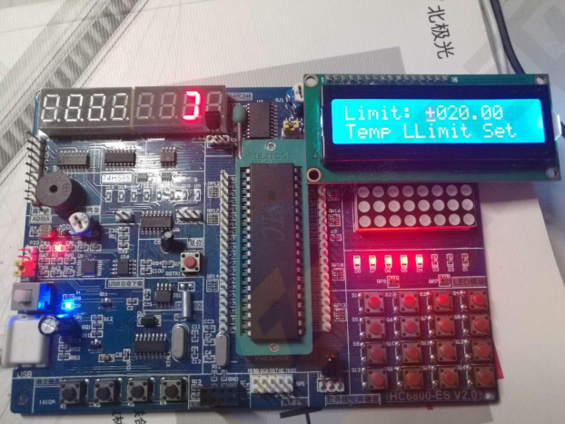

应用示例：遥控器、汽车音响、车载电脑、空调、微波炉、油烟机、电磁炉、电饭煲、电风扇、计算器、智能充电器、POS机、收银机、显示器、打印机、扫描仪、无人机、电控门、考勤机等等等。

##### 嵌入式微处理器 MPU

`嵌入式微处理器 MPU`：**由通用计算机中的 CPU 演变而来**。它的特征是**具有 32 位以上的处理器**，具有较高的性能，当然其价格也相应较高。但与计算机处理器不同的是，在实际嵌入式应用中，**只保留和嵌入式应用紧密相关的功能硬件，去除其他的冗余功能部分，这样就以最低的功耗和资源实现嵌入式应用的特殊要求。**与工业控制计算机相比，嵌入式微处理器具有**体积小、重量轻、成本低、可靠性高**的优点。目前常见的有 ARM、MIPS、POWER PC 等。

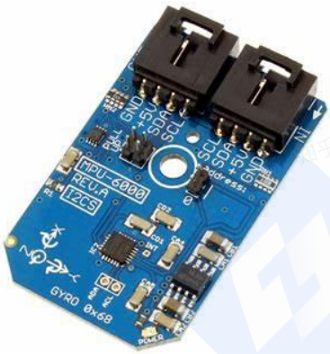

应用示例：

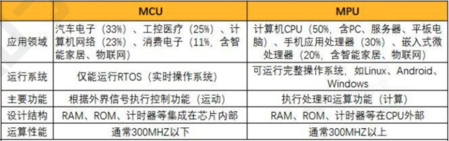

##### 嵌入式数字信号处理器 DSP

`嵌入式数字信号处理器 DSP`：是**专门用于信号处理方面的处理器**，其**在系统结构和指令算法方面进行了特殊设计，具有很高的编译效率和指令的执行速度。采用哈佛结构，流水线处理，其处理速度比最快的 CPU 还快 10 ~ 50 倍。**在数字滤波、FFT、光谱分析等各种仪器上，DSP 获得了大规模的应用。

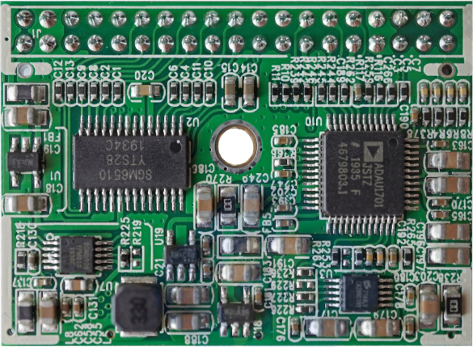

应用示例：

- **通信领域**：DSP 广泛应用于调制解调、信道编解码、信道均衡、自适应滤波等方面。例如，GSM、CDMA、LTE 等通信系统都使用 DSP 技术。
- **音频领域**：DSP 应用于音频编解码、声音增强、降噪、回声抑制、语音识别等方面。例如，现代音频系统、手机、耳机等都使用 DSP 技术。
- **图像处理领域**：DSP 应用于图像压缩、图像滤波、图像增强、边缘检测、图像分割等方面。例如，数字相机、手机摄像头、安防监控、医疗图像等都使用 DSP 技术。
- **雷达和信号处理领域**：DSP 应用于雷达信号处理、目标跟踪、信号分析、故障检测等方面。例如，航空、军事、汽车、火车等领域都使用 DSP 技术。
- **控制领域**：DSP 应用于控制系统、机器人、航天飞行器、汽车控制等方面。例如，自适应控制、PID 控制、预测控制等都使用 DSP 技术。
- **生物医学领域**：DSP 应用于心电信号处理、医学影像处理、脑电信号处理、医学数据分析等方面。例如，心电图机、脑电图机、CT、MRI 等医疗设备都使用 DSP 技术。

##### 嵌入式片上系统 SOC

`嵌入式片上系统SOC`：是**追求产品系统最大包容的集成器件**。SOC 最大的特点是**成功实现了软硬件无缝结合**，直接在处理器片内嵌入操作系统的代码模块。是一个有专用目标的集成电路，其中包含完整系统并有嵌入软件的全部内容。（**集成了软件系统**）

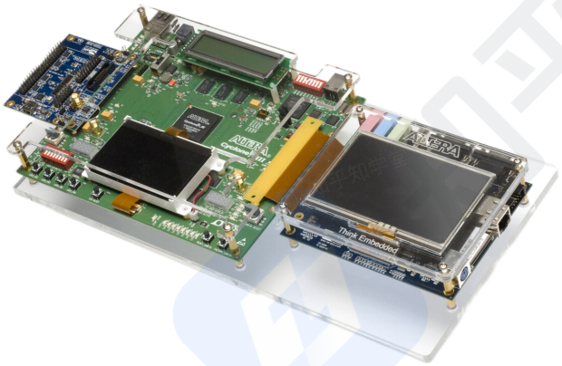

应用示例：

- 高端 SOC 芯片主要集中于**手机、平板电脑、服务器市场**等。
- 次高端 SOC 芯片多应用于**安防、智能音频、物联网**等领域。
- 专用型 SOC 芯片多应用于 **TWS 耳机和智能手表**等。

#### 多核处理器

**多核指多个微处理器内核，是将两个或更多的微处理器封装在一起，集成在一个电路中。**多核处理器是**单枚芯片**，能够直接插入单一的处理器插槽中。多核与多 CPU 相比，**很好的降低了计算机系统的功耗和体积**。在多核技术中，**由操作系统软件进行调度，多进程，多线程并发都可以。**

2 个或多个内核工作协调实现方式：

- `对称多处理技术 SMP`：将 2 个完全一样的处理器封装在一个芯片内，达到双倍或接近双倍的处理性能，节省运算资源。
- `非对称处理技术 AMP`：2 个 处理内核彼此不同，各自处理和执行特定的功能，在软件的协调下分担不同的计算任务。

多核 CPU 的调度（当有多个任务运行时，如何进行 CPU 的分配）：

- 多核 CPU 环境下进程的调度算法一般有**全局队列调度和局部队列调度**两种。
- `全局队列调度`是指操作系统维护一个全局的任务等待队列，当系统中有一个 CPU 空闲时，操作系统就从全局任务等待队列中选取就绪任务开始执行，CPU 核心利用率高。
- `局部队列调度`是操作系统为每个 CPU 内核维护一个局部的任务等待队列，当系统中有一个 CPU 内核空闲时，就从该核心的任务等待队列中选取适当的任务执行，优点是无需在多个 CPU 之间切换。

>嵌入式处理器是嵌入式系统的核心部件，一般可分为嵌入式微处理器（MPU）、微控制器（MCU）、数字信号处理器（DSP）和片上系统（SOC）。以下叙述中，错误的是（）。
>
>A. MPU 在安全性和可靠性等方面进行增强，适用于运算量较大的智能系统
>
>B. MCU 典型代表是单片机，体积小从而使功耗和成本下降
>
>C. DSP 处理器对系统结构和指令进行了特殊设计，适合数字信号处理
>
>D. SOC 是一个有专用目标的集成电路，其中包括完整系统并有嵌入式软件的全部内容
>
>【答案】A
>
>
>
>以下关于多核处理器的说法中，不正确的是（）。
>
>A. 采用多核处理器可以降低计算机系统的功耗和体积
>
>B. SMP、BMP 和 AMP 是多核处理器系统通常采用的三种结构，采用哪种结构与应用场景相关，而无须考虑硬件的组成差异
>
>C. 在多核处理器中，计算机可以同时执行多个进程，而操作系统中的多个线程也可以并行执行
>
>D. 多核处理器是将两个或更多的独立处理器封装在一起，集成在一个电路中
>
>【答案】B

#### 嵌入式软件

`嵌入式软件`：是**指应用在嵌入式计算机系统当中的各种软件**，除了具有通用软件的一般特性，还具有一些与嵌入式系统相关的特点，包括：**规模较小、开发难度大、实时性和可靠性要求高、要求固化存储。**

嵌入式软件分类：

- `系统软件`：**控制和管理嵌入式系统资源**，为嵌入式应用提供支持的各种软件，如设备驱动程序、嵌入式操作系统、嵌入式中间件等。
- `应用软件`：**嵌入式系统中的上层软件**，定义了嵌入式设备的主要功能和用途，并负责与用户交互，一般面向特定的应用领域，如飞行控制软件、手机软件、地图等。
- `支撑软件`：**辅助软件开发的工具软件**，如系统分析设计工具、在线仿真工具、交叉编译器等。

#### 嵌入式系统

`嵌入式系统`的组成：一般嵌入式系统**由嵌入式处理器、相关支撑硬件、嵌入式操作系统、支撑软件以及应用软件组成。**

- `嵌入式处理器`。由于嵌入式系统一般是在恶劣的环境条件下工作，与一般处理器相比，嵌入式处理器应可抵抗恶劣环境的影响，比如高温、寒冷、电磁、加速度等环境因素。为适应恶劣环境，嵌入式处理器芯片除满足**低功耗、体积小**等需求外，根据不同环境需求，其工艺可分为**民用、工业和军用**等三个档次。
- `相关支撑硬件`。是指除嵌入式处理器以外的构成系统的其他硬件，**包括存储器、定时器、总线、I/O 接口以及相关专用硬件。**
- `嵌入式操作系统`。是指运行在嵌入式系统中的**基础软件**，主要用于**管理计算机资源和应用软件**。与通用操作系统不同，嵌入式操作系统应具备**实时性、可剪裁性和安全性**等特征。
- `支撑软件`。是指**为应用软件开发与运行提供公共服务、软件开发、调试能力的软件**，支撑软件的公共服务通常运行在操作系统之上，以库的方式被应用软件所引用。
- `应用软件`。应用软件是指为完成嵌入式系统的某一特定目标所开发的软件。

**嵌入式系统应具备以下特性：**

- **专用性强。**嵌入式系统面向特定应用需求，能够把通用CPU中许多由板卡完成的任务集成在芯片内部，从而有利于嵌入式系统的小型化。
- **技术融合。**嵌入式系统将**先进的计算机技术、通信技术、半导体技术和电子技术与各个行业的具体应用相结合**，是一个**技术密集、资金密集、高度分散、不断创新的知识集成系统**。
- **软硬一体软件为主。**`软件`是嵌入式系统的主体，有 IP 核。嵌入式系统的硬件和软件都可以高效地设计，量体裁衣，去除冗余，可以在同样的硅片面积上实现更高的性能。
- **比通用计算机资源少。**由于嵌入式系统通常只完成少数几个任务。设计时考虑到其经济性，不能使用通用 CPU，这就意味着管理的资源少，成本低，结构更简单。
- **程序代码固化在非易失存储器中。**为了提高执行速度和系统可靠性，嵌入式系统中的软件一般都**固化在存储器芯片或单片机本身中**，而不是存在磁盘中。
- **需专门开发工具和环境。**嵌入式系统本身不具备开发能力，即使设计完成以后，用户通常也不能对其中的程序功能进行修改，必须有一套开发工具和环境才能进行开发。
- **体积小、价格低、工艺先进、性能价格比高、系统配置要求低、实时性强。**
- **对安全性和可靠性的要求高。**

**嵌入式系统分类：**

- 根据**不同用途**可将嵌入式系统划分为`嵌入式实时系统`和`嵌入式非实时系统`两种，而**实时系统又可分为强实时系统和弱实时系统**。
- 如果从**安全性**要求看，嵌入式系统还可分为`安全攸关系统`和`非安全攸关系统`。

嵌入式系统**分为硬件层、抽象层、操作系统层、中间件层和应用层等五层。**

- `硬件层`。硬件层主要是为嵌入式系统提供运行支撑的硬件环境，其核心是微处理器、存储器（ROM、SDRAM、Flash 等）、I/O 接口和通用设备以及总线、电源、时钟等。
- `抽象层`。在硬件层和软件层之间为抽象层，主要实现对硬件层的硬件进行抽象，为上层应用（操作系统）提供虚拟的硬件资源：板级支持包（BSP）是一种硬件驱动软件，它是面向硬件层的硬件芯片或电路进行驱动，为上层操作系统提供对硬件进行管理的支持。
- `操作系统层`。操作系统层主要由嵌入式操作系统、文件系统、图形用户接口、网络系统和通用组件等可配置模块组成。
- `中间件层`。中间件层一般位于操作系统之上，管理计算机资源和网络通信，中间件层是连接两个独立应用的桥梁。
- `应用层`。应用层是指嵌入式系统的具体应用，主要包括不同的应用软件。

#### 板级支持包

`板级支持包 (BSP, board support package)`：是**介于主板硬件和操作系统中驱动层程序之间的一层**，隶属于设备驱动层，一般认为它属于操作系统一部分，主要是实现对操作系统的支持，为上层的驱动程序提供访问硬件设备寄存器的函数包，使之能够更好的运行于硬件主板。

具体功能包括：

- `单板硬件初始化`，主要是 CPU 的初始化，为整个软件系统提供底层硬件支持。
- 为操作系统提供设备驱动程序和系统中断服务程序。
- 定制操作系统的功能，为软件系统提供一个实时多任务的运行环境。
- `初始化操作系统`，为操作系统的正常运行做好准备。

主要具有以下两个特点：

- `硬件相关性`，因为嵌入式实时系统的硬件环境具有应用相关性，而作为上层软件与硬件平台之间的接口，BSP 需为操作系统提供操作和控制具体硬件的方法。
- `操作系统相关性`，不同的操作系统具有各自的软件层次结构，因此不同操作系统具有特定的硬件接口形式。

一般来说，BSP主要包括两个方面的内容，`引导加载程序 BootLoader`和`设备驱动程序`：

- **BootLoader 是嵌入式系统加电后运行的第一段软件代码**，是在操作系统内核运行之前运行的一小段程序，通过这段程序，可以**初始化硬件设备、建立内存空间的映射图，从而将系统的软硬件环境设置到一个合适的状态，以便为最终调用操作系统内核做好准备。**一般包括以下功能：
  - `片级初始化`：主要**完成微处理器的初始化，包括设置微处理器的核心寄存器和控制寄存器、微处理器的核心工作模式及其局部总线模式等。**片级初始化把微处理器从上电时的默认状态逐步设置成系统所要求的工作状态。这是一个**纯硬件的初始化过程**。
  - `板级初始化`：通过**正确地设置各种寄存器的内容来完成微处理器以外的其他硬件设备的初始化**。例如，初始化 LED 显示设备、初始化定时器、设置中断控制寄存器、初始化串口通信、初始化内存控制器、建立内存空间的地址映射等。在此过程中，除了要设置各种硬件寄存器以外，还要设置某些软件的数据结构和参数。因此，这是一个同时包含有软件和硬件在内的初始化过程。
  - `加载内核 (系统级初始化)`：**将操作系统和应用程序的映像从 Flash 存储器复制到系统的内存当中**，然后跳转到系统内核的第一条指令处继续执行。
- 在一个嵌入式系统当中，操作系统是可能有也可能无的，但无论如何，**设备驱动程序是必不可少的**。所谓的设备驱动程序，就是**一组库函数，用来对硬件进行初始化和管理，并向上层软件提供良好的访问接口。**对于不同的硬件设备来说，它们的功能是不一样的，所以它们的设备驱动程序也是不一样的，但是一般来说，大多数的设备驱动程序都会具备以下的一些基本功能：
  - `硬件启动`：在开机上电或系统重启的时候，对硬件进行初始化。
  - `硬件关闭`：将硬件设置为关机状态。
  - `硬件停用`：暂停使用这个硬件。
  - `硬件启用`：重新启用这个硬件。
  - `读操作`：从硬件中读取数据。
  - `写操作`：往硬件中写入数据。

#### 嵌入式数据库系统 EDBMS

**使用环境的特点：**

- `设备随时移动性`。嵌入式数据库主要用在移动信息设备上，设备的位置经常随使用者一起移动。
- `网络频繁断接`。移动设备或移动终端在使用的过程中，位置经常发生变化，同时也受到使用方式、电源、无线通信和网络条件等因素的影响。所以，一般并不持续保持网络连接，而是经常主动或被动地间歇性断接和连接。
- `网络条件多样化`。由于移动信息设备位置的经常变化，导致它们与数据库服务器在不同的时间可能通过不同的网络系统连接，这些网络在带宽、通信代价、网络延迟和 Qos 等方面可能有所差异。
- `通信能力不对称`。由于受到移动设备资源的限制，移动设备与服务器之间的网络通信能力是非对称的。移动设备的发送能力都非常有限，使得数据库服务器到移动设备的下行通信带宽和移动设备到数据库服务器之间的上行带宽相差很大。

**系统组成：**

- 一个完整的 EDBMS 由若干子系统组成，包括**主数据库、同步服务器、嵌入式数据库和连接网络**等几个子系统。

- 嵌入式移动数据库在实际应用中必须解决好**数据的一致性（复制性）、高效的事务处理和数据的安全性**等关键问题。

  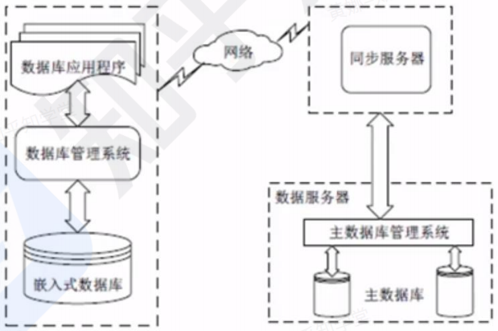

#### 嵌入式操作系统 EOS

嵌入式操作系统 EOS 与通用操作系统相比，EOS 主要有以下特点：

- `微型化`。EOS 的运行平台不是通用计算机，而是嵌入式系统。这类系统一般没有大容量的内存，几乎没有外存，因此，EOS 必须做得小巧，以占用尽量少的系统资源。
- `代码质量高`。在大多数嵌入式应用中，存储空间依然是宝贵的资源，这就要求程序代码的质量要高，代码要尽量精简。
- `专业化`。嵌入式系统的硬件平台多种多样，处理器的更新速度快，每种处理器都是针对不同的应用领域而专门设计的。因此，EOS 要有很好适应性和移植性，还要支持多种开发平台。
- `实时性强`。嵌入式系统广泛应用于过程控制、数据采集、通信、多媒体信息处理等要求实时响应的场合，因此，实时性成为 EOS 的又一特点。
- `可裁减和可配置`。应用的多样性要求 EOS 具有较强的适应能力，能够根据应用的特点和具体要求进行灵活配置和合理裁减，以适应微型化和专业化的要求。

#### 嵌入式实时操作系统

`嵌入式实时系统`是一种完全嵌入受控器件内部，为特定应用而设计的专用计算机系统。在嵌入式实时系统中，要求**系统在投入运行前即具有确定性和可预测性**。

- `确定性`是指系统在给定的初始状态和输入条件下，在确定的时间内给出确定的结果。
- `可预测性`是指系统在运行之前，其功能、响应特性和执行结果是可预测的。

实时操作系统（RTOS）的特点：当外界事件或数据产生时，**能够接受并以足够快的速度予以处理**，其处理的结果又能在规定的时间之内来控制生产过程或对处理系统做出快速响应，并控制所有实时任务协调一致运行。因而，**提供及时响应和高可靠性是其主要特点**。

实时操作系统有`硬实时和软实时`之分，**硬实时要求在规定的时间内必须完成操作**，这是在操作系统设计时保证的；**软实时则只要按照任务的优先级，尽可能快地完成操作即可**。

实时操作系统的特征：

- `高精度计时系统`：计时精度是影响实时性的一个重要因素。在实时应用系统中，经常需要精确确定实时地操作某个设备或执行某个任务，或精确的计算一个时间函数。这些不仅依赖于一些硬件提供的时钟精度，也依赖于实时操作系统实现的高精度计时功能。
- `多级中断机制`：一个实时应用系统通常需要处理多种外部信息或事件，但处理的紧迫程度有轻重缓急之分。有的必须立即作出反应，有的则可以延后处理。因此，需要建立多级中断嵌套处理机制，以确保对紧迫程度较高的实时事件进行及时响应和处理。
- `实时调度机制`：实时操作系统不仅要及时响应实时事件中断，同时也要及时调度运行实时任务。但是，处理机调度并不能随心所欲的进行，因为涉及到两个进程之间的切换，只能在确保 "安全切换" 的时间点上进行，实时调度机制包括两个方面，一是在调度策略和算法上保证优先调度实时任务；二是建立更多 "安全切换" 时间点，保证及时调度实时任务。

>以下关于 RTOS（实时操作系统）的叙述中，不正确的是（）。
>
>A. RTOS 不能针对硬件变化进行结构与功能上的配置及裁剪
>
>B. RTOS 可以根据应用环境的要求对内核进行裁剪和重配
>
>C. RTOS 的首要任务是调度一切可利用的资源来完成实时控制任务
>
>D. RTOS 实质上就是一个计算机资源管理程序，需要及时响应实时事件和中断
>
>【答案】A
>
>
>
>以下描述中，（）不是嵌入式操作系统的特点。
>
>A. 面向应用，可以进行裁剪和移植
>
>B. 用于特定领域，不需要支持多任务
>
>C. 可靠性高，无需人工干预独立运行，并处理各类事件和故障
>
>D. 要求编码体积小，能够在嵌入式系统的有效存储空间内运行
>
>【答案】B

#### 嵌入式软件设计

嵌入式系统要进行低功耗设计，主要技术有：`编译优化技术`、`软硬件协同设计`、`算法优化`。

嵌入式系统软件的特点：**规模较小、开发难度大、实时性和可靠性要求高、要求固化存储。**

一个典型的交叉平台开发环境，包含三个高度集成的部分：

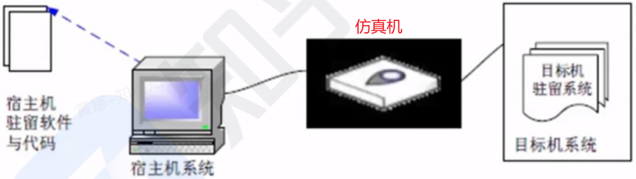

1. 运行在宿主机和目标机上的**强有力的交叉开发工具和实用程序**。
2. 运行在目标机上的**高性能、可裁剪的实时操作系统**。
3. **连接宿主机和目标机的多种通信方式**，例如，以太网、USB、串口等。

嵌入式软件的开发可以分为几个阶段：`编码`、`交叉编译`、`交叉调试`。

- `编辑器`：用于编写嵌入式源代码程序，从理论上来说，任何一个文本编辑器都可以用来编写源代码。各种集成开发环境会提供功能强大的编辑器，如 VS 系列、eclipse、keil、CSS 等。常见的独立编辑器：UE、Source Insight、vim 等。
- `编译器 gcc`：编译阶段的工作是用交叉编译工具处理源代码，生成可执行的目标文件，在嵌入式系统中，由于宿主机和目标机系统不一样，需要使用交叉编译，GNU C/C++（gcc）是目前常用的一种交叉编译器，支持非常多的宿主机/目标机组合。
- `调试器 gdb`： 在开发嵌入式软件时，交叉调试是必不可少的一步。嵌入式软件调试特点：**调试器运行在宿主机上，被调试程序运行在目标机上。**调试器通过某种通信方式与目标机建立联系，如串口、并口、网络、JTAG 等。在目标机上一般有调试器的某种代理，能配合调试器一起完成对目标机上运行程序的调试，可以是软件或支持调试的硬件。gdb 是 GNU 开源组织发布的一个强大的程序调试工具。

`交叉编译`：**嵌入式软件开发所采用的编译为交叉编译，所谓交叉编译就是在一个平台上生成可以在另一个平台上执行的代码。**编译的最主要的工作就在将程序转化成运行该程序的 CPU 所能识别的机器代码，由于不同的体系结构有不同的指令系统。因此，不同的 CPU 需要有相应的编译器，而交叉编译就如同翻译一样，把相同的程序代码翻译成不同 CPU 的对应可执行二进制文件。

> **嵌入式系统的开发需要借助宿主机（通用计算机）来编译出目标机的可执行代码。**

`交叉调试`：嵌入式软件经过编译和链接后即进入调试阶段，调试是软件开发过程中必不可少的一个环节，嵌入式软件开发过程中的交叉调试与通用软件开发过程中的调试方式有很大的差别。在嵌入式软件开发中，调试时采用的是在宿主机和目标机之间进行的交叉调试，调试器仍然运行在宿主机的通用操作系统之上，但被调试的进程却是运行在基于特定硬件平台的嵌入式操作系统中，调试器和被调试进程通过串口或者网络进行通信，调试器可以控制、访问被调试进程，读取被调试进程的当前状态，并能够改变被调试进程的运行状态。

>以下关于嵌入式系统开发的叙述，正确的是（）。
>
>A. 宿主机与目标机之间只需要建立逻辑连接
>
>B. 宿主机与目标机之间只能采用串口通信方式
>
>C. 在宿主机上必须采用交叉编译器来生成目标机的可执行代码
>
>D. 调试器与被调试程序必须安装在同一台机器上
>
>【答案】C

### 其他

#### 计算机语言

`计算机语言`：是指用于人与计算机之间通讯的语言，也被称为编程语言。它是一种被设计用来编写计算机程序的规则和约定，可以用来描述计算机所需执行的操作和计算步骤。

计算机语言**主要由一套指令组成**，而这种指令一般**包括表达式、流程控制和集合三大部分内容。**

计算机语言可以分为不同的类别，包括机器语言、汇编语言和高级语言。

##### 机器语言

机器语言是一种指令集的体系，是计算机的设计者通过计算机的硬件结构赋予计算机的操作功能。

是第一代计算机语言，计算机自身的语言（低级语言），通过二进制代码串操作。指令组成：操作码、操作数的地址、操作结果的存储地址、下条指令的地址。

**机器语言指令必须包括：操作码、操作数的地址、操作结果的存储地址、下条指令的地址。**

指令格式：

- `单地址指令`：这类指令只包括一个操作数地址。操作数被存储在指定地址（A）中，而结果则通常被隐含在特定的寄存器中。为了执行操作，需要使用一个指定的寄存器来存储第二个操作数和操作结果。
- `二地址指令`：这种指令格式只包括一个操作数地址和一个结果地址。第一个地址（A1）确定第一个操作数，而第二个地址（A2）同时确定第二个操作数和结果。这类指令隐含了第二操作数和结果的地址，所以其操作码部分通常较短。
- `三地址指令`：这种指令格式通常包括两个操作数地址和一个结果地址。在三地址指令中，第一个地址（A1）确定第一个操作数，第二个地址（A2）确定第二个操作数，第三个地址（A3）则用于存储执行操作后的结果。执行完指令后，下一条指令的地址通常由程序计数器按顺序给出。
- `四地址指令`：这种指令格式包括四个地址码字段，分别为两个操作数地址和一个结果地址。这种格式的操作码部分通常比较长，可以表示更多的操作类型。四地址指令的第一个地址（A1）确定第一个操作数，第二个地址（A2）确定第二个操作数，第三个地址（A3）和第四个地址（A4）用于存储执行操作后的结果。

##### 汇编语言

`汇编语言`：面向机器的程序设计语言，用于电子计算机、微处理器、微控制器或其他可编程器件。它也被称为符号语言，因为用助记符代替机器指令的操作码，用地址符号或标号代替指令或操作数的地址。

汇编语言有三种语句：指令、伪指令、宏指令。

- `指令`：指令是汇编语言中最基本的语句类型，用于描述计算机要执行的操作。

- `伪指令`：伪指令是用于控制汇编过程的语句，不是真正的机器指令。

- `宏指令`：宏指令是一种特殊的指令，用于定义可重用的代码块。

##### 高级语言

`高级语言`：是一种与特定计算机体系结构无关的程序设计语言，它更接近于自然语言，能够以更简洁、更易读的方式描述计算机程序。与低级语言相比，高级语言具有更好的可读性、可维护性和可移植性。

根据语言的抽象程度，高级语言可以分为面向过程、面向对象和泛型等类型。

- `面向过程的语言`：这种语言遵循 "自上而下" 的程序设计方法，以功能模块化的方式组织程序，将程序分解为一系列的功能模块，每个模块都有特定的功能和作用。C 语言就是一种典型的面向过程的语言。
- `面向对象的语言`：这种语言遵循 "面向对象" 的程序设计方法，将程序看作是一系列对象的集合，每个对象都有自己的属性和方法。Java、C++ 和 C# 就是面向对象语言的典型代表。
- `泛型语言`：这种语言遵循 "泛型程序设计" 的方法，将程序看作是一系列类型的集合，每个类型都有自己的属性和方法。Python 就是一种泛型语言。

##### 建模语言

`建模语言`：一种用于描述、设计和构建计算机系统、软件、网络等的技术，它可以是图形语言或文本语言。

图形语言通常使用图表来表示系统或软件的结构和行为，常用的图形元素包括**概念、连接符号、图形符号**等，这些元素可以用来表示系统的组件、关系、约束等。例如，统一建模语言（UML）是一种常用的图形建模语言，它提供了一系列标准化的图形符号和表达方式，用于帮助软件工程师可视化、构建和记录软件系统的设计。

##### 形式化语言

`形式化语言`：形式化方法是把概念、判断、推理转化成特定的形式符号后，对形式符号表达系统进行研究的方法，是用具有精确语义的形式语言书写的程序功能描述，它是设计和编制程序的出发点，也是验证程序是否正确的依据。

形式化语言通常分为以下几类：

- `形式逻辑语言`：形式逻辑语言是数学基础的一个重要组成部分，它使用一组符号和规则来表示概念、关系和推理，可以用来描述计算机程序或系统的行为和性质。
- `自动机理论语言`：自动机理论语言是一组用来描述自动机（包括计算机程序）行为的数学模型，它可以用来描述程序的流程、操作和行为。
- `程序设计语言`：程序设计语言是一种形式化语言，它用来定义计算机程序，可以包括数据类型、变量、操作符和控制结构等，它可以用来描述程序的语法、语义和行为。
- `描述性语言`：描述性语言是一种用来描述计算机系统结构和行为的自然语言，它通常包括系统需求、系统设计、系统实现等部分，可以用来描述系统的功能、行为和性能等。

#### 多媒体

`媒体`是承载信息的载体，即**信息的表现形式（或者传播形式）**，如文字、声音、图像、动画和视频等。

按照 ITU-T 建议的定义，媒体可分为：感觉媒体、表示媒体、显示媒体、存储媒体和传输媒体。

- `感觉媒体`：指的是用户接触信息的感觉形式，如视觉、听觉和触觉等。
- `表示媒体`：指的是信息的表示形式，如图像、声音、视频等。
- `表现媒体`：也称为显示媒体，指表现和获取信息的物理设备，如键盘、鼠标、扫描仪、话简和摄像机等为输入媒体，显示器、打印机和音箱等为输出媒体。
- `存储媒体`：指用于存储表示媒体的物理介质，如硬盘、软盘、磁盘、光盘、ROM 及 RAM 等。
- `传输媒体`：指传输表示媒体的物理介质，如电缆、光缆和电磁波等。

多媒体有四个重要的特征：

- `多维化`：多维化是指媒体的多样化。它提供了多维化信息空间下的交互能力和获得多维化信息空间的方法，如输入、输出、传输、存储和处理的手段与方法等。
- `集成性`：集成性不仅指多媒体设备集成，而且指多媒体信息集成或表现集成。
- `交互性`：交互性是人们获取和使用信息时变被动为主动的最重要的标志。交互性可向用户提供更有效地控制和使用信息的手段，可增加人们对信息的注意和理解。
- `实时性`：实时性是指多媒体技术中涉及的一些媒体。例如，音频和视频信息具有很强的时间特性，会随着时间的变化而变化。

**多媒体的基本组成：**

**多媒体系统的关键技术：**

- `视音频技术`：视频技术包括视频数字化和视频编码技术两个方面，音频技术包括音频数字化、语音处理、语音合成及语音识别四个方面。
- `通信技术`：多媒体系统中的一项关键技术，是指将信息从一个地点传送到另一个地点所采取的方法和措施。通信技术通常包括了数据传输信道技术和数据传输技术。
- `数据压缩技术`：数据压缩算法分为下面三类。
  - `即时压缩和非即时压缩`：即时/非即时压缩的区别在于，信息在传输过程中被压缩还是信息压缩后再传输。即时压缩一般应用在影像、声音数据的传送中，即时压缩常用到专门的硬件设备，如压缩卡等。
  - `数据压缩和文件压缩`：数据压缩是专指一些具有时间性的数据，这些数据常常是即时采集即时处理或传输的。而文件压缩是指对将要保存在磁盘等物理介质的数据进行压缩。
  - `无损压缩与有损压缩`：无损压缩是利用数据的统计元余进行压缩，通常无损压缩的压缩比比较低，而有损压缩是利用了人类对视觉、听觉对图像、声音中的某些频率成分不敏感的特性，允许压缩的过程中损失一定的信息。
  - `压缩编码格式`：联合图像专家小组标准（JPEG）、动态图像视频编码标准（MPEG）、视频编解码器标准（H.26L）。
- `虚拟现实 (VR) 技术`：VR 是**一种可以创建和体验虚拟世界的计算机仿真系统**，它利用计算机生成一种模拟环境，使用户沉浸到该环境中，让人有种身临其境的感觉。VR 采用计算机技术生成一个**逼真的视觉、听觉、触觉、味觉及嗅觉的感知系统**，用户可以用人的自然技能与这个生成的虚拟实体进行交互操作。其概念包含三层含义：
  - 虚拟实体是用计算机生成的一个逼真的实体。
  - 用户可以通过人的自然技能与该环境交互。
  - 要借助一些三维传感设备来完成交互动作，常用的有头盔立体显示器、数据于套、数据服装和三维鼠标等。

- `增强现实 (AR) 技术`：是指把原本在现实世界的一定时间和空间范围内很难体验到的实体信息（视觉信息、声音、味道和触觉等)，通过模拟仿真后，再叠加到现实世界中被人类感官所感知，从而达到超越现实的感官体验。包括下面技术：
  - `计算机图形图像技术`：增强现实的用户可以戴上透明的护目镜，透过它看到整个世界，连同计算机生成而投射到这一世界表面的图像，从而使物理世界的景象超出用户的日常经验之外。这种增强的信息可以是在真实环境中与之共存的虚拟物体，也可以是实际存在的物体的非几何信息。
  - `空间定位技术`：为了改善效果，增强现实所投射的图像必须在空间定位上与用户相关。当用户转动或移动头部时，视野变动，计算机产生的增强信息随之做相应的变化。
  - `人文智能`：该技术以将处理设备和人的身心能力结合起来为特点，并非仿真人的智能，而是试图发挥传感器、可穿戴计算等技术的优势，使人们能够捕获自己的日常经历、记忆及所见所闻，并与他人进行更有效的交流。

VR 和 AR 技术主要分为：桌面式、分布式、沉浸式、增强式。

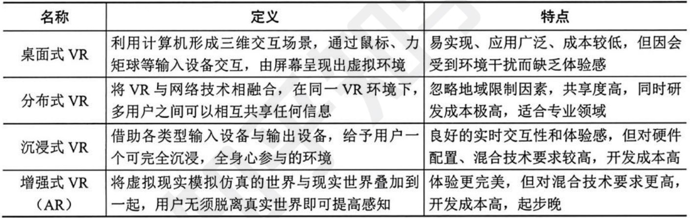

VR/AR 技术发展至今，虽然被广泛应用，其主要关键技术还有待深入研究：

1. **数据采集与优化传输技术**。数据采集主要解决如何获取光照、火焰、动态地形等自然现象的数据问题，通常用 3 种设备获取，即全向相机、高速摄像机和激光设备。优化数据传输技术是要满足低功耗、低延时、高效率等特点，保证数据传输的可靠性。
2. **交互与情形实时再现技术**。交互技术的接触方式可分为力觉反馈和触觉反馈两种。力觉反馈是指借助操作控制杆的反作用力效果将虚拟物体的运动轨迹转换成真实物体的机械运动，触觉反馈是指通过手戴 3D 数据手套获取手掌和手指的形态和温度等信息，来满足用户对虚拟物体的移动、抓取和触摸等操作。情形实时再现包含了跟踪定位技术、高效可靠的渲染技术和逼真的显示技术等。

#### 系统工程

`系统工程`：是利用计算机作为工具，对**系统的结构、元素、信息和反馈等进行分析**，以达到**最优规划、最优设计、最优管理和最优控制**的目的。

`系统之系统 (System of Systems，SoS)`：是一种**复杂系统设计和组织的方式**，其中一个或多个子系统被组合到一起以实现更大的整体系统功能。这些子系统本身也可以被视为独立的系统，具有自己的组件、接口和功能。适用于其系统元素本身也是系统的情况。

`系统工程方法`：是一种现代的科学决策方法，也是一门基本的决策技术。它针对主要问题、主要情况和全过程，运用有效工具进行全面的分析和处理。

- `霍尔的三维结构`：集中体现了系统工程方法的**系统化、综合化、最优化、程序化和标准化**等特点是系统工程方法论的重要基础内容。
  - 霍尔三维结构是将系统工程整个活动过程分为**前后紧密衔接的 7 个阶段和 7 个步骤**，同时还考虑了为完成这些阶段和步骤所需要的各种专业知识和技能。这样，就形成了**由时间维、逻辑维和知识维组成的三维空间结构**。
- `切克兰德方法`：社会经济系统中的问题往往很难和工程技术系统中的问题一样，切克兰德方法的特点是**事先将需求确定清楚，难以按价值系统的评价准则设计出符合这种需求的最优系统方案。**切克兰德方法论的核心不是 "最优化"，而**是 "比较" 与 "探寻"**。从模型和现状的比较中来学习改善现状的途径。切克兰德方法将工作过程分为 7 个步骤：
  1. **认识问题**。收集与问题有关的信息，表达问题现状，寻找构成和影响因素及其关系，以便明确系统问题结构、现存过程及其相互之间的不适应之处，确定有关的行为主体和利益主体。
  2. **根底定义**。初步弄清、改善与现状有关的各种因素及其相互关系。根底定义的目的是弄清系统问题的关键要素以及关联因素，为系统的发展及其研究确立各种基本的看法，并尽可能选择出最合适的基本观点。
  3. **建立概念模型**。在不能建立精确数学模型的情况下，用结构模型或语言模型来描述系统的现状概念模型来自于根底定义，是通过系统化语言对问题抽象描述的结果，其结构及要素必须符合根底定义的思想，并能实现其要求。
  4. **比较及探寻**。将现实问题和概念模型进行对比，找出符合决策者意图且可行的方案或途径。有时通过比较，需要对根底定义的结果进行适当修正。
  5. **选择**。针对比较的结果，考虑有关人员的态度及其他社会、行为等因素，选出现实可行的改善方案。
  6. **设计与实施**。通过详尽和有针对性的设计，形成具有可操作性的方案，并使得有关人员乐于接受和原意为方案的实现竭尽全力。
  7. **评估与反馈**。根据在实施过程中获得的新认识，修正问题描述、根底定义及概念模型等

- `并行工程方法`：是**对产品及其相关过程进行并行、集成化处理的系统方法和综合技术**。它要求产品开发人员从设计开始就**考虑产品生命周期的全过程**，不仅考虑产品的各项性能，如质量、成本和用户要求，还应考虑与产品有关的各工艺过程的质量及服务的质量。并行工程的目标是**提高质量、降低成本、缩短产品开发周期和产品上市时间**。并行工程方法的核心点：
  1. 在产品的设计开发期间，将**概念设计、结构设计、工艺设计、最终需求等结合起来**，保证以最快的速度按要求的质量完成。
  2. 各项工作由与此相关的项目小组完成。进程中**小组成员各自安排自身的工作**， 但可以随时或定期反馈信息，并对出现的问题协调解决。
  3. **依据适当的信息系统工具，反馈与协调整个项目的进行。**利用现代 CIM 技术，在产品的研制与开发期间，辅助项目进程的并行化。
- `综合集成法`：钱学森等首次把处理开放的复杂巨系统的方法命名为从定性到定量的综合集成法。综合集成法是**从整体上考虑并解决问题的方法论**，是现代科学条件下认识方法论上的一次飞跃。
  - 开放的复杂巨系统的一般基本原则与一般系统论的原则相一致：**整体论原则、相互联系原则、有序性原则、动态原则。**
  - 开放的复杂巨系统主要性质：**开放性、复杂性、进化与涌现性、层次性、巨量性。**
  - 综合集成方法的主要特点有：
    - 定性研究与定量研究有机结合，贯穿全过程。
    - 科学理论与经验知识结合，把人们对客观事物的知识综合集成解决问题。
    - 应用系统思想把多种学科结合起来进行综合研究。
    - 根据复杂巨系统的层次结构，把宏观研究与微观研究统一起来。
    - 必须有大型计算机系统支持，不仅有管理信息系统、决策支持系统等功能，而且还要有综合集成的功能。
- `WSR(物理-事理-人理） 系统方法`：WSR 是物理、事理和人理三者如何巧妙配置、有效利用以解决问题的一种系统方法论。**"懂物理、明事理、通人理"** 就是 WSR 方法论的实践准则。
  - WSR 方法论一般工作过程可理解为这样的 7 步：**理解意图、制定目标、调查分析、构造策略、选择方案、协调关系和实现构想。**
  - WSR 系统方法不是一种具体的解决问题的方法，而**是一种问题分析与解决的方法论，可以广泛应用于各种领域和学科。同时，它也强调与具体实践相结合，从实际出发，以解决实际问题为目标，具有很强的实用性。**

系统工程`生命周期 7 阶段`：

1. `探索性研究阶段`：目的是识别利益攸关者的需求，探索创意和技术。
2. `概念阶段`：目的是细化利益攸关者的需求，探索可行概念，提出有望实现的解决方案。
3. `开发阶段`：目的是细化系统需求，创建解决方案的描述，构建系统，验证并确认系统。
4. `生产阶段`：目的是生产系统并进行检验和验证。
5. `使用阶段`：目的是运行系统以满足用户需求。
6. `保障阶段`：目的是提供持续的系统能力。
7. `退役阶段`：目的是存储、归档或退出系统。

`生命周期方法`：

- `计划驱动方法`：特征在于整个过程始终守规定流程的系统化方法。**特别关注文档的完整性、需求的可追溯性以及每种表示的事后验证。**
- `渐进迭代式开发`：允许为项目提供一个初始能力，随之提供连续交付以达到期望的系统。目标在于快速产生价值并提供快速响应能力。**适合需求不清晰，较小的，不太复杂的系统。**
- `精益开发`：精益思想是一种整体性的范式，**聚焦于向客户交付最大价值并使浪费活动最小化是一个动态的、知识驱动的、以客户为中心的过程**，通过这一过程使特定企业的所有人员以创造竹值为目标不断地消除浪费。
- `敏捷开发`：敏捷的关键**目标在于灵活性，当风险可接受时允许从序列中排除选定的事件。**适用于系统工程的敏捷原则如下：
  - 最高的优先级是通过尽早地和持续地交付有价值的软件来满足客户。
  - 欢迎需求变更，即使是在项目开发后期。
  - 敏捷流程利用需求变更帮助客户获得竞争优势。
  - 不断交付可用的软件，周期从几周到几个月不等，且越短越好。
  - 在项目中业务人员与开发人员每天在一起工作，业务人员始终参与到开发工作中。
  - 在开发团队内部和团队之间，传递信息最有效的方法是面对面交谈。
  - 工作软供是进展的主要度量。
  - 对技术的精益求精以及对设计的不断完善将提升敏捷性。
  - 简单性（尽最大可能减少不必要的工作的艺术）是精髓。
  - 最佳的架构、需求和设计出自于自组织的团队。
  - 团队要定期反省如何能够做到更加高效，并相应地调整团队的行为。

`基于模型的系统工程 (MBSE)`：是建模方法的形式化应用，以使建模方法支持系统需求、分析、设计、验证和确认等活动，这些活动从概念性设计阶段开始，持续贯穿到设计开发以及后来的所有生命周期阶段。

系统工程过程的**三个阶段分别产生三种图形**：

1. 在需求分析阶段，产生**需求图、用例图及包图**。
2. 在功能分析与分配阶段，产生**顺序图、活动图及状态机图**。
3. 在设计综合阶段，产生**模块定义图、内部块图及参数图等**。

MBSE 的三大支柱分别是**建模语言、建模工具和建模思路**。

>系统工程利用计算机作为工具，对系统的结构、元素、（18）和反馈等进行分析，以达到最优（19）、最优设计、最优管理和最优控制的目的。霍尔（AD. Hal）于 1969 年提出了系统方法的三维结构体系，通常称为霍尔三维结构，这是系统工程方法论的基础，霍尔三维结构以时间维、（20）维、知识维组成的立体结构概括性地表示出系统工程的各阶段、各步骤以及所涉及的知识范围。其中时间维是系统的工作进程，对于一个具体的工程项目，可以分为 7 个阶段，在（21）阶段会做出研制方案及生产计划。
>
>（18）A. 知识					B. 需求					C. 文档					D. 信息
>
>（19）A. 战略					B. 规划					C. 实现					D. 处理
>
>（20）A. 空间					B. 结构					C. 组织					D. 逻辑
>
>（21）A. 规划					B. 拟定					C. 研制					D. 生产
>
>【答案】D B D C

## 系统工程与信息系统基础

### 性能指标

对`计算机评价`的主要性能指标（以下都要了解掌握）：

- 计算机评价的主要性能指标是用来衡量计算机系统性能的重要标准。
- **时钟频率、运算速度、运算精度、内存的存储容量、存储器的存取周期、数据处理速率 PDR（processingdatarate）、吞吐率、各种响应时间、各种利用率、RASIS 特性（可靠性 Reliability、可用性 Availability、可维护性 Sericeability、完整性 Integraity 和安全性 Security）、平均故障响应时间、兼容性、可扩充性、性能价格比。**

对`路由器评价`的主要性能指标（对核心指标要知道）：

- 路由器性能评价指标的主要作用是帮助评估和描述路由器的性能表现。
- **设备吞吐量、端口吞吐量**、全双工线速转发能力、背靠背帧数、路由表能力、背板能力、**丢包率、时延、时延抖动**、VPN 支持能力、内部时钟精度、队列管理机制、端口硬件队列数、分类业务带宽保证、RSVP、IP DiffServ、CAR 支持、冗余、热插拔组件、路由器冗余协议、网管、基于 web 的管理、网管类型、带外网管支持、网管粒度、计费能力/协议、分组语音支持方式、协议支持、语音压缩能力、端口密度、信令支持。

对`交换机评价`的主要性能指标（了解就可以）：

- 交换机类型、配置、支持的网络类型、最大 ATM 端口数、最大 SONET 端口数、最大 FDDI 端口数、背板吞吐量、缓冲区大小、最大 MAC 地址表大小、最大电源数、支持协议和标准、路由信息协议（RIP）、RIP2、开放式最短路径优先第 2 版、边界网关协议（BGP）、无类域间路由（CIDR）、百联网成组管理协议（IGMP）、距离天量多播路由协议（DVMRP）、开放式最短路径优先多播路由协议（MOSPF）、协议无关的多播协议（PIM）、资源预留协议（RSVP）、802.1p 优先级标记，多队列、路由、支持第3 层交换、支持多层（4 到 7 层）交换、支持多协议路由、支持路由缓存、可支持最大路由表数、VLAN、最大 VLAN 数量、网管、支持网管类型、支持端口镜像、Qos、支持基于策略的第 2 层交换、每端口最大优先级队列数、支持基于策略的第 3 层交换、支持基于策略的应用级 QoS、支持最小/最大带宽分配、几余、热交换组件（管理卡，交换结构，接口模块，电源，冷却系统）、支持端口链路聚集协议、负载均衡。

对`网络评价`主要性能指标（要掌握）：

- **设备级性能指标、网络级性能指标、应用级性能指标、用户级性能指标、吞吐量。**

对`操作系统评价`主要性能指标（要掌握）：

- **系统的可靠性、系统的吞吐率（量）、系统响应时间、系统资源利用率、可移植性。**

对`数据库管理系统评价`的主要性能指标（要掌握）：

- **分为数据库本身和管理系统两部分，数据库的大小、数据库中表的数量、单个表的大小、表中允许的记录（行）数量、单个记录（行）的大小、表上所允许的索引数量、数据库所允许的索引数量、最大并发事务处理能力、负载均衡能力、最大连接数等。**

对`WEB 服务器评价`的主要性能指标有（要掌握）：

- **最大并发连接数、响应延迟、吞吐量。**

>对计算机评价的主要性能指标有时钟频率、（1）、运算精度和内存容量等。对数据库管理系统评价的主要性能指标有（2）、数据库所允许的索引数量和最大并发实物处理能力等。
>
>1、
>
>A. 丢包率					B. 端口吞吐量					C. 可移植性					D. 数据处理速率
>
>2、
>
>A. MIPS					B. 支持协议和标准					C. 最大连接数					D. 时延抖动
>
>【答案】D C
>
>
>
>为了优化系统的性能，有时需要对系统进行调整。对于不同的系统，其调整参数也不尽相同。例如，对于数据库系统，主要包括 CPU/内存使用状况、（1）、进程/线程使用状态、日志文件大小等。对于应用系统，主要包括应用系统的可用性、响应时间、（2）、特定应用资源占用等。
>
>1、
>
>A. 数据丢包率					B. 端口吞吐量					C. 数据处理速率					D. 查询语句性能
>
>2、
>
>A. 并发用户数					B. 支持协议和标准					C. 最大连接数					D. 时延抖动
>
>【答案】D A

### 性能评价方法

性能评测的常用方法：

1. `时钟频率`：一般来讲，主频越高，速度越快。
2. `指令执行速度`：计量单位 KIPS、MIPS。
3. `等效指令速度法`：统计各类指令在程序中所占比例，并进行折算，是一种固定比例法。
4. `数据处理速率法 (Processing Data Rate，PDR)`：采用计算 PDR 值的方法来衡量机器性能，PDR 值越大，机器性能越好。PDR 与每条指令和每个操作数的平均位数，以及每条指令的平均运算速度有关。

`基准程序法 (Benchmark)`：把**应用程序中用得最多最频繁的那部分核心程序作为评价计算机性能的标准程序**，称为基准测试程序（benchmark），是目前被用户一致承认的测试性能的较好方法，有多种多样的基准程序。其中包含：

1. `整数测试程序`：同一家的机器，采用相同的体系结构，用相同的基准程序测试，得到的 MIPS 值越大，一般说明机器速度越快。
2. `浮点测试程序`：指标 MFLOPS（理论峰值浮点速度）。
3. `SPEC基准程序 (SPEC Benchmark)`：重点面向处理器性能的基准程序集将被测计算机的执行时间标准化，即将被测计算机的执行时间除以一个参考处理器的执行时间。
4. `TPC 基准程序`：用于评测计算机在事务处理、数据库处理、企业管理与决策支持系统等方面的性能。其中，**TPC-C 是在线事务处理（On-line Transaction Processing，OLTP）的基准程序，TPC-D 是决策支持的基准程序，TPC-E 是大型企业信息服务的基准程序。**

大多数情况下，为测试新系统的性能，用户必须依靠评价程序来评价机器的性能。下面列出了 4 种评价程序，它们评测的准确程度依次递减：**真实的程序、核心程序、小型基准程序、合成基准程序。**

>把应用程序中应用最频繁的那部分核心程序作为评价计算机性能的标准程序，称为（1）程序，（2）不是对 web 服务器进行性能评估的主要指标。
>
>A. 仿真测试					B. 核心测试					C. 基准测试					D. 标准测试
>
>A. 丢包率					B. 最大并发连接数					C. 响应延迟					D. 吞吐量
>
>【答案】C A

### 阿姆达尔解决方法

`阿姆达尔 (Amdahl) 定律`：**是指计算机系统中对某一部件采用某种更快的执行方式所获得的系统性能改变程度，取决于这种方式被使用的频率，或所占总执行时间的比例，主要用于系统性能改进的计算中。**
$$
加速比=\frac{不使用增强部件时完成整个任务的时间}{使用增强部件时完成整个任务的时间}
$$

$$
新的执行时间=原来的执行时间\times[(1-增强比例)+\frac{增强比例}{增强加速比}]
$$

- $原来的执行时间\times(1-增强比例)$：表示未增强的部分，执行时间未发生变化，仍等于原来的执行时间。
- $原来的执行时间\times\frac{增强比例}{增强加速比}$：表示增强的部分，新的执行时间。

$$
总加速比=\frac{原来的执行时间}{新的执行时间}=\frac{1}{(1-增强比例)+\frac{增强比例}{增强加速比}}
$$

>阿姆达尔（Amdahl）定律量化定义了通过改进系统中某个组件的性能，使系统整体性能提高的程度。假设某一功能的处理时间为整个系统运行时间的 60%，若使该功能的处理速度提高至原来的 5 倍，则根据阿姆达尔定律，整个系统的处理速度可提高至原来的（）倍。
>
>A. 1.333					B. 1.923					C. 1.5					D. 1.829
>
>【解析】
>$$
>总加速比=\frac{原来的执行时间}{新的执行时间}=\frac{1}{(1-增强比例)+\frac{增强比例}{增强加速比}}=\frac{1}{(1-60\%)+\frac{60\%}{5}}=1.923
>$$
>
>
>【答案】B

## 系统架构专业知识

### 信息系统概述

`信息系统`是由计算机硬件、网络和通信设备、计算机软件、信息资源、信息用户和规章制度组成的**以处理信息流为目的的人机一体化系统**。

- 信息系统的五个基本功能：`输入`、`存储`、`处理`、`输出`和`控制`。

- 信息系统的性质影响着系统开发者和系统用户的知识需求。`"以计算机为基础"`要求系统设计者必须具备计算机及其在信息处理中的应用知识，`"人机交互"`要求系统设计者还需要了解人作为系统组成部分的能力以及人作为信息使用者的各种行为。
- 信息系统建设的原则：`高层管理人员介入原则`、`用户参与开发原则`、`自顶向下规划原则`、`工程化原则`、`其他原则 (创新性，整体性，发展性，经济性等)`。

`诺兰模型`：**信息系统进化的阶段模型，将计算机信息系统的发展道路划分为 6 个阶段。**

- **初始阶段**：计算机刚进入企业时只作为办公设备使用，应用非常少，一般仅用于财务部门。
- **传播阶段**：企业对计算机有了一定了解，想利用计算机解决工作中的问题，比如进行更多的数据处理，给管理工作和业务带来便利。会大幅度增加软件投入，盲目投入产生问题，效率低。
- **控制阶段**：从整体上控制计算机信息系统的发展，在客观上要求组织协调、解决数据共享问题。信息系统呈现单点、分散的特点，系统和资源利用率不高。是计算机管理逐渐变为数据管理的关键。
- **集成阶段**：在控制的基础上，企业开始重新进行规划设计，建立基础数据库，并建成统一的信息管理系统。使人、财、物等资源信息能够在企业集成共享，更有效地利用现有的IT系统和资源。
- **数据管理阶段**：企业高层意识到信息战略的重要，信息成为企业的重要资源，企业的信息化建设也真正进入到数据处理阶段。使用统一平台，各部门、各系统基本实现资源整合和信息共享。
- **成熟阶段**：信息系统已经可以满足企业各个层次的需求，从简单的事务处理到支持高效管理的决策。企业真正把IT与管理过程结合起来，将组织内部、外部的资源充分整合和利用。

#### 信息系统的分类

从低级到高级、简单到复杂、局部到全局：

- `业务 (数据) 处理系统 (TPS/DPS)`：随着企业业务需求的增长和技术条件的发展，人们逐步将计算机应用于企业局部业务（数据）的管理，某个领域具有专家水平的大量知识与经验，能够利用人类专家的知识和解决问题的方法来处理财会管理、销售管理、物资管理和生产管理等，即计算机应用发展到对企业的局部事务的管理。
- `管理信息系统 (MIS)`：由人和计算机等组成的，能进行管理信息的收集、传输、存储、加工、维护和使用的系统。形成了对企业全局性的、整体性的计算机应用。能提供企业各级领导从事管理需要的信息，但其收集信息的范围还更多地侧重于企业内部。
- `决策支持系统 (DSS)`：是在管理信息系统基础上发展起来的系统，帮助决策者利用数据和模型去解决半结构化决策问题和非结构化决策问题的交互式系统。服务于高层决策的管理信息系统，按功能可分为专用 DSS、DSS 工具和 DSs 生成器。
- `专家系统 (ES)`：一个智能计算机程序系统，其内部包含某个领域具有专业水平的大量只是和经验。是一种模拟人类专家解决领域问题的计算机程序系统。
- `办公自动化系统 (OAS)`：人机结合的综合性的办公事务管理系统，或称办公事务处理系统。该系统将当代各种先进技术和设备应用于办公室的办公活动中，使办公活动实现科学化、自动化以达到改善工作环境、最大限度地提高办公事务工作质量和工作效率。
- `综合性信息系统`：以上 5 种信息系统是可能同时都存在，也可能同时存在几种，而更高级的是几种信息系统互相融合成一体，目前企业主要使用的信息化系统主要有 ERP 系统（企业资源管理）、WMS 系统（仓储管理系统)、MES 系统（也称之为 SFC，即制造过程管理系统）和产品数据管理系统（PDM）。
  - `ERP 系统`：主要**管理公司的各种资源**，负责处理进销存、供应链、生产计划 MPS、MRP 计算、生产订单、管理会计，是财务数据的强力支撑。
  - `WMS 系统`：主要包括**库房货位管理**，主要有收发料，通过扫码进出库，对库存进行库位、先进先出与盘点；栈板出货管控、库龄管理等内容，主要是立体仓库或大批量仓库数据需求。
  - `MES 系统`：负责**生产过程和生产过程中防呆、自动化设备集成**，是各个客户审核的重点，是生产全流程管控，也有企业称之为 SFC，其实大同小异，但是它是生产过程、生产工艺、生产设备、自动化生产直接的核心。
  - `PDM 系统`：**管理研发阶段的物料、BOM、工程变更数据，负责产品数据为主。**PDM 系统是产品研发全过程管理，主要涉及协同研发等能力。

##### 业务处理系统 TPS

又可称为`电子数据处理系统`（EDP），**最初级形式的信息系统**。针对管理中具体的事务（如财会、销售、库存等）来辅助管理人员将所发生的数据进行记录、传票、记账、统计和分类，并制成报表等活动，为经营决策提供有效信息的基于计算机的信息系统。

由于 TPS 的**主要功能就是对企业管理中日常事务所发生的数据进行输入、处理和输出。**因此，TPS 的数据处理周期由以下几个构成：

- `数据输入`：主要解决如何将企业经营活动中产生的大量原始数据准确、迅速地输入到计算机系统中并存储起来，这是信息系统进行信息处理的 "瓶颈"。因此，数据的输入方式和进度是这个阶段的关键问题。常见的数据输入方式有 3 种，即人工、自动及二者结合。
- `数据处理`：TPS 中常见的数据处理方式有两种，一种是批处理方式（将事务数据积累到一段时间后进行定期处理）；另一种是联机事务处理方式（OLTP，实时处理）。
- `数据维护`：一个组织的数据库通过 TPS 来更新，以确保数据库中的数据能及时、正确地反映当前最新的经营状况，因此数据库的维护是 TPS 的一项主要功能。对数据库的访问形式基本有 4 种：检索、修改、存入和删除。
- `文件报表的产生`：TPS 的输出就是为终端用户提供所需的有关文件和报表，这些文件和报表根据其用途不同可分为行动文件（该文件的接收者持有文件后可进行某项事务处理）、信息文件（类文件向其持有者表明某项业务己发生了）和周转文件（交给接受者之后通常还要返回到发送者手中）。
- `查询处理`：TPS 支持终端用户的批次查询或联机实时查询，典型的查询方式是用户通过屏幕显示获得查询结果。

特点：**TPS 是其他类型信息系统的信息产生器，企业在推进全面信息化的过程中往往是从开发 TPS 入手的。许多 TPS 处于企业系统的边界，它是将企业与外部环境联系起来的 "桥梁"。因此，TPS 性能的好坏将直接影响着组织的整体形象，是提高企业市场竞争力的重要因素。由于 TPS 面对的是结构化程度很高的管理问题，因此可以采用结构化生命周期法来进行开发。**

##### 管理信息系统 MIS

由业务处理系统发展而成的，是在TPS基础上引进大量管理方法对企业整体信息进行处理，并利用信息进行预测、控制、计划、辅助企业全面管理的信息系统。

管理信息系统由四大部件组成：即信息源、信息处理器、信息用户和信息管理者。

根据各部件之间的联系可分为开环（不收集外部信息不反馈）和闭环（不断收集信息反馈调整）。

根据处理的内容及决策的层次来看，我们可以把管理信息系统看成一个金字塔式的结构分为战略计划、管理控制和运行控制 3 层，最下方就是 TPS 进行的业务处理部分。

管理信息系统的功能：职能的完成往往是通过 "过程" 实现，过程是逻辑上相关活动的集合，因而往往把管理信息系统的功能结构表示成功能-过程结构，如下图所示。

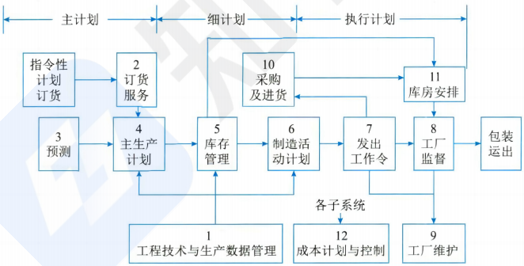

管理信息系统的组成（用功能/层次矩阵表示)**。**

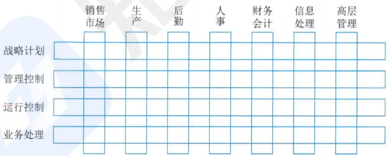

- 总体销售市场子系统。它包括销售和推销，在运行控制方面包括雇用和训练销售人员、销售和推销的日常调度，还包括按区域、产品、顾客销售数量的定期分析等。
- 生产子系统。它包括产品设计、生产设备计划、生产设备的调度和运行、生产人员的雇用和训练、质量控制和检查等。
- 后勤子系统。它包括采购、收货、库存控制和分发。
- 人事子系统。它包括雇用、培训、考核记录、工资和解雇等。
- 财务和会计子系统。财务的目标是保证企业的财务要求，并使其花费尽可能的低;会计则是把财务业务分类、总结，填入标准财务报告，准备预算、成本数据的分析与分类等。
- 信息处理子系统。该系统的作用是保证企业的信息需要。典型的任务是处理请求、收集数据、改变数据和程序的请求、报告硬件和软件的故障及规划建议等。
- 高层管理子系统。为高层领导服务。业务包括查询信息和支持决策，编写文件和信件，向公司其他部门发送指令。

##### 决策支持系统 DSS

DSS 应当是一个交互式的、灵活的、适应性强的基于计算机的信息系统，**能够为解决非结构化管理问题提供支持，以改善决策的质量。**

**DSS 的基本模式反映 DSS 的形式及其与 "真实系统"、人和外部环境的关系，如图所示。其中管理者处于核心地位，运用自己的知识和经验，结合决策支持系统提供的支持，对其管理的 "真实系统" 进行决策。**

DSS 的两种基本结构形式是两库结构和基于知识的结构，实际中的 DSS 由这两种基本结构通过分解或增加某些部件演变而来。两库结构由数据库子系统、模型库子系统和对话子系统形成三角形分布的结构：

**决策支持系统的总体功能是支持各种层次的人们进行决策。**具体可细分为：

- 决策支持系统用来整理和提供本系统与决策问题有关的各种数据。
- 决策支持系统要尽可能地收集、存储和及时提供与决策有关的外部信息。
- 决策支持系统能及时收集和提供有关各项活动的反馈信息。
- 决策支持系统对各种与决策有关的模型具有存储和管理的能力。
- 决策支持系统提供对常用的数学方法、统计方法和运筹方法的存储和管理。
- 决策支持系统能对各种数据、模型、方法进行有效管理，为用户提供查找、变更、增加、删除等操作功能。
- 决策支持系统运用所提供的模型和方法对数据进行加工，并得出有效支持决策的信息。
- 决策支持系统具有人-机对话接口和图形加工、输出功能，不仅用户可以对所需要的数据进行查询，而且可以输出相应的图形。
- 决策支持系统应能支持分布使用方式，提供有效的传输功能，以保证分散在不同地点的用户能共享系统所提供的模型、方法和可共享的数据。

**决策支持系统的特点：**

- 决策支持系统面向决策者。
- 决策支持系统支持对半结构化问题的决策。
- 决策支持系统的作用是辅助决策者、支持决策者。
- 决策支持系统体现决策过程的动态性。
- 决策支持系统提倡交互式处理。

**决策支持系统的组成：**

- `数据的重组和确认`。**与决策支持系统相关的数据库的问题是，获得正确的数据并且可用理想的形式操作这些数据，这个问题可以通过`数据仓库`的概念解决。**
- `数据字典的建立`。**数据仓库是一个与作业层系统分离存在的数据库，通过对数据仓库的存取，管理者可以做出以事实为根据的决策来解决许多业务问题。**
- `数据挖掘和智能体`。**一旦建成数据仓库，管理者们需要运用工具进行数据存取和查询，使用的工具称为`智能体`。**数据挖掘的结果类型包括：
  - **联合**：把各个事件联系在一起的过程。例如购买面包的用户 80% 也会购买牛奶。
  - **定序**：指对数据集中的变量进行排序，挖掘出其间的顺序关系或先后逻辑。例如，分析疫情期间每日确诊病例数量的数据，观察病例数随时间的变化规律。
  - **分类**：根据模式组织数据的过程。例如，将银行客户分成不同信用级别，比如 A 级（信用最好）、B 级、C 级、D 级（信用最差）。
  - **聚类**：推导特定小组与其他小组相区分的判断规则的过程。例如，在网购网站上，根据用户浏览和购买记录，将用户分成爱购买家电的一族、爱买化妆品的一族等，用于个性化推荐，又或者是在音乐 app 上，根据用户听歌习惯，将用户自动分成爱听古典乐的一类、爱听流行乐的一类，以便推荐相应歌曲，又或者是在社交平台上，根据用户兴趣和社交关系，自动将用户聚类为游戏群体、摄影群体、旅游群体等，以匹配同类用户。
- `模型建立`。**针对模型库的处理，根据实际业务场景和需求，选择或构建不同的分析模型，用来进行预测、优化、规划等，以便做出更好的决策，模型管理的目的就是帮助决策者理解与选择有关的现象。建立模型的方法有`穷枚举法算法`、`启发式`和`模拟法`。**比如一个制造业公司，需要决策支持系统帮助生产计划，模型建立步骤可以是：
  - 收集历史生产和销售数据。
  - 建立预测模型，预测未来几个月的产品销量。
  - 建立线性规划模型，确定每个产品的最优生产量。
  - 建立产能规划模型，合理分配生产资源。
  - 将这些模型整合，形成决策支持系统，进行生产计划优化。简单来说，就是根据实际业务需求，选择合适的预测模型、优化模型、仿真模型等，让系统可以对复杂问题进行分析，以提供决策依据。

##### 专家系统 ES

**基于知识的专家系统（Expert System，ES)，是人工智能的一个重要分支。**专家系统的能力来自于它所拥有的专家知识，知识的表示及推理的方法则提供了应用的机理。

我们可以把专家系统想象成一个很聪明的机器人，它可以像专家一样提供专业建议和解决问题。比如一个医生专家系统，病人描述了自己的症状，专家系统就可以根据它存储的医学知识给出诊断意见。一个下棋的专家系统，它学习了大量的棋谱和下棋策略，可以和人类高手对弈。专家系统之所以看起来很智能，是因为它事先向专家学习了大量知识，并根据这些知识模拟专家进行推理。但专家系统只能解决特定领域的问题，不像人类能通用地思考。而且它的知识库需要不断更新，才能给出准确的建议。简单来说，**专家系统就是一个可模拟专家进行推理的智能系统，让普通人也能获得专家级建议。**

**专家系统不同于传统的应用程序和其他类型的人工智能问题求解程序**。主要表现在以下 5 个方面：

- 系统属于人工智能范畴，其求解的问题是**半结构化或非结构化**问题。
- 系统**模拟的是人类专家在问题领域的推理**，而不是模拟问题领域本身。
- 系统由 3 个要素组成：描述问题状态的综合数据库、存放启发式经验知识的知识库和对知识库的知识进行推理的推理机。三要素分别对应数据级、知识库级和控制级三级知识，而传统应用程序只有数据和程序两级结构。
- 系统处理的问题是实际的问题，而不是纯学术的问题。
- 解决手段来看，专家系统专用性强，通用性差。

**专家系统的特点：超越时间限制（不需要休息）、操作成本低廉、易于传递与复制、处理手段一致（不会因人而异）、善于克服难题、适用特定领域。**

**专家系统的组成：**

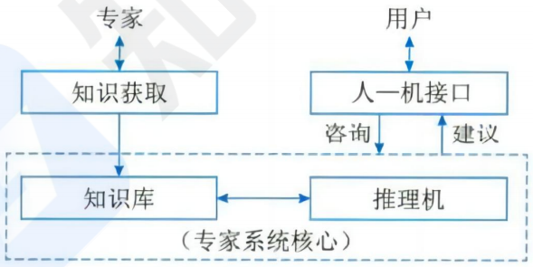

- `知识库`。用来存放系统求解实际问题的领域知识。知识库中的知识可分成两类：一类为事实性知识，另一类是启发性知识。
- `综合数据库`。是专家系统在执行与推理过程中用以存放所需要和产生的各种信息的工作存储器，因此，综合数据库又叫`动态知识库`，其内容在系统运行过程中是不断变化的。相应地把专家系统的知识库称为`静态知识库`，二者一起构成完整知识库。
- `推理机`。推理机和完整知识库一起构成专家系统的核心。推理机也被称为控制结构或规则解释器，通常包括推理机制和控制策略，是一组用来控制系统的运行、执行各种任务、根据知识库进行各种搜索和推理的程序模块。
- `知识获取`。主要有两方面功能：一是知识的编辑和求精，二是知识自学习。
- `解释程序`。是面向用户服务的，负责解答用户提出的各种问题。
- `人机接口`。通常包括两部分：一部分是专家系统与用户的接口，另一部分是专家系统与领域专家和知识工程师的接口。

专家系统是一种人工智能技术，旨在模拟人类专家的知识和推理过程，用于解决复杂的问题。在日常生活中，专家系统可以应用于各种领域。以下是几个日常生活中的应用例子：

- **医疗诊断**：专家系统在医疗领域有广泛的应用。它可以根据患者的症状和病史，进行诊断和建议治疗方案。例如，一个专家系统可以针对常见的感冒症状，询问患者的体温、咳嗽、头痛等情况，并根据这些信息给出可能的疾病诊断和自我治疗建议，比如是否需要去看医生或服用何种药物。
- **金融规划**：专家系统可用于个人财务规划和投资建议。通过收集用户的财务目标、风险承受能力和投资偏好等信息，专家系统可以推荐适合的投资组合和理财计划。例如，根据用户的收入、年龄、家庭状况等，系统可以建议分配资产的比例，包括投资股票、债券、房地产等。
- **故障诊断与维修**：专家系统可以在家电、汽车等设备的故障诊断和维修方面发挥作用。当设备出现故障时，用户可以通过与专家系统的对话，描述问题的细节，例如故障现象、出现的错误代码等。专家系统会根据这些信息，参考预先设定的故障库和修复方案，为用户提供初步的排查指南或建议维修措施。
- **烹饪食谱推荐**：专家系统可以帮助用户根据自己的口味和饮食需求，推荐合适的烹饪食谱。用户可以告诉系统他们的喜好、食物过敏情况、偏好的烹饪方式等，专家系统会据此生成适合的食谱，并提供烹饪步骤和营养信息。

>`人工智能 (AI)`旨在利用机械、电子、光电或生物器件等制造的装置或机器，**模仿人类的智能**。AI 研究的重点放在开发具有智能行为的计算机系统上，智能行为表现出以下 5 个特点:
>
>- **从过去的事件或情形中汲取经验**，并将从经验中得到的知识应用于新的环境和场景。
>- **具有在缺乏重要信息时解决问题的能力**。
>- **具有处理和操纵各种符号、理解形象化图片（图像）的能力**。
>- **想象力和创造力**。
>- 善于启发。
>
>人工智能是一个极为广泛的领域，AI 的主要分支有**专家系统、机器人技术、视觉系统、自然语言处理、学习系统和神经网络**等。

##### 办公自动化系统 OAS

办公自动化就是**办公信息处理手段的自动化**。OAS 要解决的是包括**数据、文字、声音、图像等信息的一体化处理问题**。从本质上讲，办公自动化就是以先进的科学技术为基础，利用有关办公自动化设备协助办公人员管理各项办公信息，主要利用资源以提高办公效率和办公质量。计算机技术、通信技术、系统科学和行为科学是它的 4 大支柱。**其中以行为科学为主导，系统科学为理论基础，结合运用计算机技术和通信技术。**

OAS 的主要功能：

- `事务处理`。完成办公部分内的大量繁琐事情，又称为事务办公系统，分为单机处理系统和多机处理系统（通信、信息共享）。类似于我们前面的 TPS 系统。
- `信息管理`。对信息流的控制管理，主要包括信息的收集、加工、传递、交流、存取、提供、分析、判断、应用和反馈那些办公人员的综合性工作。可称为管理型办公系统，它能将事务型办公系统中各项孤立的事务处理通过信息交换和共享资源联系起来，获得准确、快捷、及时、优质的功效。管理型办公系统是一种分布式的处理系统，具有计算机通信和网络功能。类似于我们前面的 MIS 系统。
- `辅助决策`。可称为决策型办公系统，以经理型办公系统提供的大量信息作为决策工作的基础，建立起能综合分析、预测发展、判断利弊的计算机可运行的决策模型，根据原始数据信息，自动做出比较符合实际的决策方案。类似于我们前面的 DSS 系统。

**办公自动化系统的组成：`计算机设备`、`办公设备`、`数据通信及网络设备`、`软件系统`。**

OAS 的日常使用举例：

- 事务处理
  - 小明要请一天假，没有 OAS 系统前，他需要填写请假条，找到部门主管签字批准，然后送到人事部档案。使用 OAS 系统后，小明可以在系统内提出请假申请，系统自动提醒主管并取得批准，人事部也可以在系统查看，整个流程自动完成。
  - 小花需要采购一批办公用品，传统做法是填表申请，等待多个部门审批，浪费时间。使用 OAS 系统，小花可以在移动 app 上提出申请，系统自动把采购需求发送给采购部，并根据设置的审批流程发送各部门主管，一个星期后办公用品直接送到了小花的办公桌。
  - 所以 OAS 系统通过流程自动化和信息共享，可以优化企业内部的协同工作，提高工作效率，减少重复劳动。
- 信息管理
  - 假设小明是一位自由职业者，他使用某 OAS 系统来管理自己的工作内容。
  - 小明可以在 OAS 系统里建立客户数据库，记录每位客户的姓名、联系方式、服务类型等信息。
  - 在进行设计项目时，小明可以在系统里针对每个项目建立文件夹，上传设计草图、文档等资料。
  - 系统会自动统计每个项目的工作时间，小明可以随时查看每个项目的总消耗时间。
  - 每完成一个项目，小明会在系统里标记项目状态已结单，系统会自动生成项目结单、账单。
- 辅助决策
  - 系统根据历史计费数据，可以生成小明不同服务类型的收入报告。
  - 根据系统生成的收入报告，小明可以分析哪些服务收入较高，从而决定业务发展方向。
  - 小明也可以使用系统的预算管理功能，模拟不同方案的收支情况，辅助其制定合理的财务计划。
  - 系统可以配置时长预警，当某项目时间超过预定范围时，系统提醒小明关注进度。 

##### 企业资源规划 ERP

**`企业资源规划`是指建立在信息技术基础上，以系统化的管理思想，为企业提供决策和运营手段的管理平台。ERP 系统是将企业所有资源进行集成整合，并进行全面、一体化管理的信息系统。**

演变过程：**物料需求计划（物料单系统）---> 制造资源计划（增加库存、分销等）---> 企业资源计划（打通了供应链，加入财务、人力资源、销售管理等）。**

企业有三大资源：`物流 (物流管理)`、`资金流 (财务管理)`、`信息流 (生产控制管理)`、现在一般认为`人力资源 (人力资源管理)`是企业第四大资源。

企业的资源计划可从下面三点来理解：

- `管理思想`：ERP 首先是一种管理思想，将企业资源分类管理，是管理思想的变革。
- `软件产品`：其次，ERP 是个软件产品，为企业用户提供一体化的解决方案，不是买来直接用的，需要个性化的开发和部署。
- `管理系统`：ERP 最后是一个管理系统，存在众多的子系统，这些子系统有统一的规划，是互联互通的，便于事前事中监控。

ERP 中的 11 个模块：

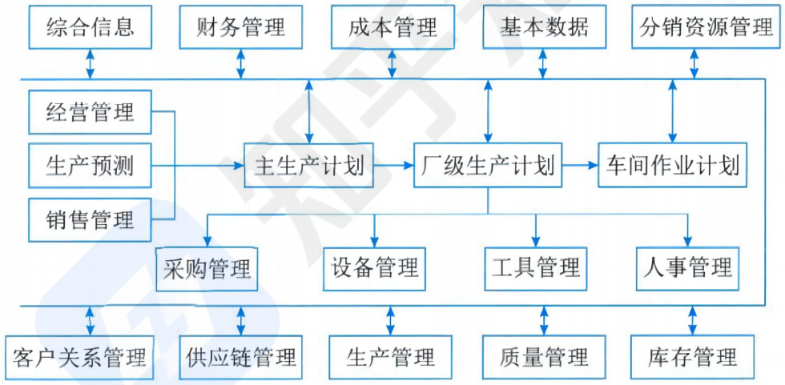

- 生产预测。市场需求是企业生存的基础，在 ERP 中首先需要对市场进行较准确的预测。**预测主要用于计划**，在 ERP 的 5 个层次的计划中，前 3 个层次计划，即经营计划、生产计划大纲和主生产计划的编制都离不开预测。
- 销售管理。销售管理主要是针对企业的销售部门的相关业务进行管理。
- 经营计划（生产计划大纲）。是**根据经营计划的生产目标制定**的，是对企业经营计划的细化，用以**描述企业在可用资源的条件下，在一定时期中的产量计划。**
- 主生产计划。是**对企业生产计划大纲的细化**，说明在一定时期内的下计划：生产什么，生产多少和什么时候交货。主生产计划的编制以生产大纲为准，其汇总结果应当等同于生产计划大纲。
- 物料需求计划。物料需求计划是**对主生产计划的各个项目所需的全部制造件和全部采购件的网络支持计划和时间进度计划**。它根据主生产计划对最终产品的需求数量和交货期，推导出构成产品的零部件及材料的需求数量和需求时期，再导出自制零部件的制作订单下达日期和采购件的采购订单发送日期，并进行需求资源和可用能力之间的进一步平衡。
- 能力需求计划。是**对物料需求计划所需能力进行核算的一种计划管理方法**。旨在**通过分析比较 MRP 的需求和企业现有生产能力**，及早发现能力的瓶颈所在，为实现企业的生产任务而提供能力方面的保障。
- 车间作业计划。是在 MRP 所产生的加工制造订单（即自制零部件生产计划）的基础上，按照交货期的前后和生产优先级选择原则以及车间的生产资源情况（如设备、人员、物料的可用性、加工能力的大小等），**将零部件的生产计划以订单的形式下达给适当的车间**。
- `采购与库存管理`。**采购与库存管理是 ERP 的基本模块**，其中采购管理模块是对采购工作，即**从采购订单产生至货物收到的全过程**进行组织、实施与控制，库存管理模块则是对企业物料的进、出、存进行管理。
- `质量与设备管理`。质量管理贯穿于企业管理的始终。设备管理是指依据企业的生产经营目标，通过一系列的技术、经济和组织措施，**对设备寿命周期内的所有设备物资运动形态和价值运动形态进行的综合管理**。
- `财务管理`。会计工作是企业管理的重要组成部分，是以货币的形式反映和监督企业的日常经济活动，并对这些经济业务的数据进行分类、汇总，以便为企业管理和决策提供必要的信息支持。**企业财务管理是企业会计工作和活动的统称**。
- ERP 有关扩展应用模块。如客户关系管理、分销资源管理、供应链管理和电子商务等，这几个扩展模块本身也是一个独立的系统，在市场上它们常作为独立的软件产品进行出售和实施。

**ERP 的功能：支持决策的功能、为处于不同行业的企业提供有针对性的 IT 解决方案、从企业内部的供应链发展为全行业和跨行业的供应链。**

**案例讲解：**ERP 系统在制造业中的应用。

小明是一家制造业公司的生产主管，负责管理整个生产过程。他的公司使用了一套完善的 ERP 系统，下面将展示 ERP 系统在他日常工作中的应用。

- **第一阶段：前期规划与准备。**
  - 市场预测和销售计划：销售团队提供未来三个月的销售预测数据，小明将这些数据输入 ERP 系统。系统结合历史销售数据和市场趋势，生成销售计划报表。小明可以通过该报表了解未来销售趋势，准确把握市场需求。
  - 订单管理：销售团队将新的客户订单录入 ERP 系统。小明可以在系统中查看订单状态和进度，确保按时交付产品。如果出现订单延迟或问题，他可以及时采取措施，确保客户满意度。
  - 原材料采购计划：ERP 系统根据销售计划和生产计划，自动生成原材料的采购计划。小明可以在系统中查看所需原材料的数量和采购时间，以及当前库存情况，从而提前安排采购订单，确保生产不会因原材料短缺而受阻。
- **第二阶段：生产过程管理。**
  - 生产计划：基于销售计划和原材料采购计划，小明制定生产计划。ERP 系统帮助他进行产能规划和排程，确保生产线的高效运作。他可以在系统中查看生产进度、生产线的产能利用率和产出等信息，实时掌握生产状态。
  - 物料管理：ERP 系统跟踪库存水平，自动触发原材料的补货或采购流程。当库存低于设定阈值时，系统会自动生成采购订单，确保原材料及时送达生产线。
  - 人力资源管理：小明使用 ERP 系统进行人员管理和员工调度。他可以查看员工的工作日历、休假安排和绩效评估等信息，优化人员分配，确保生产线的高效运转。
- **第三阶段：生产监控与改进。**
  - 生产进度追踪：ERP 系统实时记录生产过程中的各个环节，从原材料采购、生产排程到成品入库，都有相应的数据记录。小明通过 ERP 系统追踪生产进度，及时发现和解决生产中的问题，确保生产计划的顺利执行。
- **第四阶段：财务管理。**
  - 财务管理：ERP 系统集成了财务模块，记录生产过程中的成本、销售收入和库存值等数据。小明可以在系统中查看财务报表，了解生产成本和收入情况，为管理决策提供依据。
  - 效率分析和改进：ERP 系统提供各种报表和数据分析工具，小明可以评估生产效率和质量表现。他可以查看生产周期、生产成本、不良品率等数据，找出潜在的生产瓶颈或质量问题，并采取相应的改进措施，提高生产效率和产品质量。

#### 信息系统的生命周期

信息系统的生命周期，分为四个阶段：

- `第一阶段，信息系统的产生阶段`：也是信息系统的概念阶段或者是信息系统的需求分析阶段。这一阶段又分为两个过程，一是概念的产生过程，即根据企业经营管理的需要，提出建设信息系统的初步想法；二是需求分析过程，即对企业信息系统的需求进行深入地调研和分析，并形成需求分析报告。

- `第二阶段，信息系统的开发阶段`：是最重要、最关键的阶段。**包括总体规划、系统分析、系统设计、系统实施和系统验收这五个阶段。**
  1. `总体规划阶段`。信息系统总体规划是系统开发的起始阶段，**它的基础是需求分析**。作用主要有：指明信息系统在企业经营战略中的作用和地位;指导信息系统的开发;优化配置和利用各种资源，包括内部资源和外部资源。总体规划产出包括信息系统的开发目标、信息系统的总体架构、信息系统的组织结构和管理流程、信息系统的实施计划、信息系统的技术规范等。
  2. `系统分析阶段`。**目标是为系统设计阶段提供系统的逻辑模型**。以企业的业务流程分析为基础,规划即将建设的信息系统的基本架构，它是企业的管理流程和信息流程的交汇点。内容主要包括组织结构及功能分析、业务流程分析、数据和数据流程分析、系统初步方案等。
  3. `系统设计阶段`。**根据系统分析的结果，设计出信息系统的实施方案。**主要内容包括系统架构设计、数据库设计、处理流程设计、功能模块设计、安全控制方案设计、系统组织和队伍设计、系统管理流程设计等。
  4. `系统实施阶段`。**将设计阶段的结果在计算机和网络上具体实现，也就是将设计文本变成能在计算机上运行的软件系统。**由于系统实施阶段是对以前的全部工作的检验，因此，系统实施阶段用户的参与特别重要。系统实施阶段以后，用户逐步变为系统的主导地位。
  5. `系统验收阶段`。信息系统实施阶段结束以后，系统就要进入试运行。通过试运行，系统性能的优劣以及是否做到了用户友好等问题都会暴露在用户面前，这时就进入了系统验收阶段。
- `第三阶段，信息系统的运行阶段`：当信息系统通过验收，**正式移交给用户以后，系统就进入了运行阶段。**系统维护包括**排错性维护、适应性维护、完善性维护和预防性维护**。
- `第四阶段，信息系统的消亡阶段`：在**信息系统建设的初期企业就应当注意系统的消亡条件和时机**，以及由此而花费的成本。

#### 信息系统的开发方法

##### 结构化方法

`结构化方法`：结构是指系统内各个组成要素之间的相互联系、相互作用的框架，结构化开发方法就是把软件开发过程划分成若干个阶段和步骤，每个阶段有明确的输入和输出，并采用一定的技术或表示方式来描述各个阶段的工作成果，结构化方法是一种传统的信息系统开发方法，由结构化分析（SA）、结构化设计（SD）和结构化程序设计（SP）三部分有机结合而成，其精髓是`自顶向下、逐步求精和模块化设计`。

**结构化方法的主要阶段：**

- 需求分析阶段：与用户沟通，明确软件需求和业务流程，绘制需求模型图。
- 概要设计阶段：根据需求，设计软件的总体结构和模块，描绘系统结构图。
- 详细设计阶段：对各个模块进行详细的接口设计、数据库设计、业务逻辑设计，画出详细设计图。
- 编码实现阶段：根据详细设计文档，选择编程语言编写程序代码。
- 测试阶段：对编写的代码进行测试，确保软件符合需求。
- 部署阶段：将测试通过的代码安装部署到服务器，推向产品环境。

**结构化方法的主要特点：**

- 开发目标清晰化。结构化方法的系统开发遵循 "用户第一" 的原则。
- 开发工作阶段化。每个阶段工作完成后，要根据阶段工作目标和要求进行审查，这使各阶段工作有条不紊地进行，便于项目管理与控制。
- 开发文档规范化。结构化方法每个阶段工作完成后，要按照要求完成相应的文档，以保证各个工作阶段的衔接与系统维护工作的遍历。
- 设计方法结构化。在系统分析与设计时，从整体和全局考虑，自顶向下地分解；在系统实现时，根据设计的要求，先编写各个具体的功能模块，然后自底向上逐步实现整个系统。

**结构化方法的不足和局限：**

- 开发周期长：按顺序经历各个阶段，直到实施阶段结束后，用户才能使用系统。
- 难以适应需求变化：不适用于需求不明确或经常变更的项目。
- 很少考虑数据结构：结构化方法是一种面向数据流的开发方法，很少考虑数据结构。

**结构化方法一般利用图形表达用户需求，常用工具有`数据流图`、`数据字典`、`结构化语言`、`判定表`以及`判定树`等。**

##### 原型化方法

`原型化方法`：也称为快速原型法，或者简称为原型法。它是一种根据用户初步需求，利用系统开发工具，**快速地建立一个系统模型展示给用户，在此基础上与用户交流**，最终实现用户需求的信息系统快速开发的方法。

**原型化方法的分类和特点：**

- 按是否实现功能分类：分为水平原型（行为原型，功能的导航）、垂直原型（结构化原型，实现了部分功能）。
- 按最终结果分类：分为抛弃式原型、演化式原型。
- 原型化方法可以使**系统开发的周期缩短、成本和风险降低、速度加快，获得较高的综合开发效益。**
- 原型化方法是以用户为中心来开发系统的，用户参与的程度大大提高，开发的系统符合用户的需求，因而**增加了用户的满意度，提高了系统开发的成功率。**
- 由于用户参与了系统开发的全过程，对系统的功能和结构容易理解和接受，有利于系统的移交，有利于系统的运行与维护。
- 原型化方法的不足之处：**开发的环境要求高，管理水平要求高。** 

由以上的分析可以看出，原型化方法的优点主要在于能更有效地确认用户需求。从直观上来看，原型法适用于那些需求不明确的系统开发。事实上，对于分析层面难度大、技术层面难度不大的系统，适合于原型法开发。

##### 面向对象方法

`面向对象方法`：面向对象方法（OO）认为，**客观世界是由各种对象组成的**，任何事物都是对象每一个对象都有自己的运动规律和内部状态，都属于某个对象类，是该对象类的一个元素。复杂的对象可由相对简单的各种对象以某种方式而构成，不同对象的组合及相互作用就构成了系统。

**面向对象方法的特点：**

- 使用 OO 方法构造的**系统具有更好的复用性**，其关键在于建立一个全面、合理、统一的模型。OO 方法也划分阶段，但其中的系统分析、系统设计和系统实现三个阶段之间已经没有 "缝隙"，也就是说，这三个阶段的界限变得不明确，某项工作既可以在前一个阶段完成，也可以在后一个阶段完成;前一个阶段工作做得不够细，在后一个阶段可以补充。
- 面向对象方法可以**普遍适用于各类信息系统的开发**。
- 面向对象方法的不足之处：**必须依靠一定的面向对象技术支持**，在大型项目的开发上具有一定的局限性，不能涉足系统分析以前的开发环节。

当前，一些大型信息系统的开发，**通常是将结构化方法和 OO 方法结合起来**。首先，使用结构化方法进行自顶向下的整体划分；然后，自底向上地采用 OO 方法进行开发。因此，结构化方法和 OO 方法仍是两种在系统开发领域中相互依存的、不可替代的方法。

##### 面向服务的方法

`面向服务的方法`：Service Oriented Architecture，简称 SOA，进一步将接口的定义与实现进行解耦，则催生了服务和面向服务的开发方法

面向服务开发方法，就像我们日常生活中使用的各种服务一样。比如叫外卖，我们可以选择用美团外卖、饿了么等应用，它们都提供了外卖订餐服务。这些外卖应用就是调用了餐馆提供的 "外卖服务"。再比如坐车，我们可以选择用滴滴、微信打车等应用叫车，它们调用了出租车公司提供的 "叫车服务"。可以看到，餐馆和出租车公司将自己的服务以标准接口的形式对外提供，各种应用可以灵活调用这些服务。如果餐馆或者出租车公司要改进服务流程，对外部调用者没有影响，因为服务接口没有变。这就**实现了服务提供者和服务调用者的松耦合**。服务调用者只关心服务接口，不关心服务的内部实现。面向服务开发就是这样一种思想，要把系统分割成不同的服务，每个服务完成一项业务功能，服务之间通过开放接口进行交互，这样可以提高服务的重用性和系统的灵活性。比如新增业务时，可以调用已有服务，无需从头开发。

从应用的角度来看，组织内部、组织之间各种应用系统的互相通信和互操作性直接影响着组织对信息的掌握程度和处理速度。如何使信息系统快速响应需求与环境变化，提高系统可复用性、信息资源共享和系统之间的互操作性，成为影响信息化建设效率的关键问题，而 SOA 的思维方式恰好满足了这种需求。

#### 企业典型信息系统架构模型

`电子政务`实质上是**对现有的、工业时代形成的政府形态的一种改造**，即利用信息技术和其他相关技术，将其管理和服务职能进行集成，在网络上实现政府组织结构和工作流程优化重组，超越时间、空间与部门分隔的制约，实现公务、政务、商务、事务的一体化管理与运行。

电子政务主要包括**三个组成部分**：

- 政府部门内部的电子化和网络化办公。
- 政府部门之间通过计算机网络进行的信息共享和实时通信。
- 政府部门通过网络与居民之间进行的双向信息交流。

电子政务在世界范围内的发展有**两个主要的特征**：

- 第一个特征是，**以互联网为基础设施**，构造和发展电子政务。
- 第二个特征是，就电子政务的内涵而言，**更强调政府服务功能的发挥和完善**，包括政府对企业、对居民的服务以及政府各部门之间的相互服务。

电子政务的发展大致经历了**四个阶段**：起步阶段、政府与用户单向互动、政府与用户双向互动、网上事务处理。

电子政务的**应用领域**：面向社会、政府部门之间、政府部门内部的各类应用系统涉及政府部门内部的各类核心数据的应用系统、政府电子化采购、电子社区。

电子政务互动的体现：**政府到政府（Government-to-Government，G2G）、政府到企业（Government-to-Business，G2B）、政府到公众（Government-to-Citizen，G2C）、企业到政府（Business-to-Government，B2G）和公众到政府（Citizen-to-Government，C2G）。**

- `G2G (政府到政府)`
  - 双边合作协议：两个国家政府之间签署协议，以促进贸易、合作项目、科技研发等领域的合作。例如，两国政府签署的关于环保合作的协议，共同应对气候变化和环境污染。
  - 政府间数据共享：两个政府部门之间共享数据，以加强安全合作、犯罪打击、边境管理等。例如，两国情报部门之间分享情报信息，以便预防跨国恐怖主义活动。
- `G2B (政府到企业)`
  - 政府招标和采购：政府向企业发布招标公告，邀请企业竞标政府项目或服务。例如，政府部门发布建设一所新学校的招标公告，邀请建筑公司投标竞争。
  - 政府发放补贴和奖励：政府向企业提供财政支持，以鼓励特定产业的发展或实现特定目标。例如，政府向可再生能源公司提供津贴，以促进清洁能源的发展。
- `G2C (政府到公众)`
  - 电子政务服务：政府通过互联网平台向公众提供各种在线服务，例如在线申请身份证、驾驶执照或社会福利等。例如，公民可以通过政府网站在线申请护照。
  - 警示和通知：政府向公众发布警示和通知，以提醒市民注意安全或宣传重要信息。例如，政府发布台风预警，提醒市民采取必要的防护措施。
- `B2G (企业到政府)`
  - 税务申报和缴税：企业向政府部门申报税务信息，并缴纳相关税款。例如，企业根据税法规定向税务局报告年度财务状况，并缴纳应纳税款。
  - 合规申报和监管报告：企业根据政府法规和监管要求向相关政府部门提交合规申报和监管报告。例如，某制药公司向药品监管机构提交新药研发和临床试验报告。
- `C2G (公众到政府)`
  - 公众意见和建议：公众向政府表达意见、建议或对政策的看法。例如，市民可以通过公开听证会或信件向政府表达对特定法规的意见。
  - 投诉和申诉：公众向政府部门提出投诉或申诉，寻求问题解决或寻求公平裁决。例如，消费者向市场监管部门投诉某家企业的不当商业行为。

`企业信息化`就是企业利用现代信息技术，通过信息资源的深入开发和广泛利用，实现企业生产过程的自动化、管理方式的网络化、决策支持的智能化和商务运营的电子化，不断提高生产、经营、管理、决策的效率和水平，进而提高企业经济效益和企业竞争力的过程。

企业信息化的具体目标是**优化企业业务流程，使之更加有效**，它的根本目的在于提高企业竞争能力，使得企业具有平稳和有效的运作能力，对紧急情况和机会做出快速反应，为企业内外部用户提供有价值的信息。包括技术创新、管理创新和制度创新。

企业信息化一定要**建立在企业战略规划基础之上**，以企业战略规划为基础建立的企业管理模式是建立企业战略数据模型的依据。

企业信息化就是**技术和业务**的融合。需要从三个层面来实现：

- `企业战略的层面`。必须对企业目前的业务策略和未来的发展方向作深入分析。达到战略上的融合。
- `业务运作层面`。针对企业所确定的业务战略，通过分析获得实现这些目标的关键驱动力和实现这些目标的关键流程。
- `管理运作层面`。虽然这一层面从价值链的角度上来说，是属于辅助流程，但它对企业日常管理的科学性、高效性是非常重要的。除了**提出应用功能的需求**外，还必须**给出相应的信息技术体系**，这些将确保管理模式和组织架构适应信息化的需要。

`企业战略数据模型`分为**数据库模型和数据仓库模型**，数据库模型用来描述日常事务处理中数据及其关系，数据仓库模型则描述企业高层管理决策者所需信息及其关系。

企业信息化方法：

- `业务流程重构方法`。对企业的组织结构和工作方法进行 "彻底的、根本性的" 重新设计。
- `核心业务应用方法`。任何一家企业，要想在市场竞争的环境中生存发展，都必须有自己的核心业务。围绕核心业务应用计算机技术和网络技术是很多企业信息化成功的秘诀。
- `信息系统建设方法`。对大多数企业来说，建设信息系统是企业信息化的重点和关键。因此，信息系统建设成了最具普遍意义的企业信息化方法。
- `主题数据库方法`。主题数据库就是面向企业业务主题的数据库，也就是面向企业的核心业务的数据库。
- `资源管理方法`。目前，流行的企业信息化的资源管理方法有很多，最常见的有企业资源计划（ERP）、供应链管理（SCM）等。
- `人力资本投资方法`。人力资本与人力资源的主要区别是人力资本理论把一部分企业的优秀员工看作是一种资本，能够取得投资收益。人力资本投资方法特别适用于那些依靠智力和知识而生存的企业。

### 信息安全技术

#### 信息安全基础知识

信息安全包括五个基本要素：`机密性`、`完整性`、`可用性`、`可控性`与`可审查性`。

- **机密性：机密性指的是信息只能被授权的人员或实体访问，防止未经授权的人获取敏感信息。**
  - 假设你要通过电子邮件发送包含敏感个人信息的文件给你的朋友。为确保机密性，你可以使用端到端加密的方式发送邮件，这样只有你和你的朋友能够解密和查看邮件的内容，其他人无法获取其中的信息。
- **完整性：确保信息在传输或存储过程中不被篡改或损坏，保持其准确性和完整性。**
  - 假设你是一家互联网银行的客户，你要发送一笔转账请求给银行。为确保请求的完整性，银行使用数字签名来对你的请求进行签名。当银行收到请求后，会验证数字签名的有效性，以确保请求没有被篡改，然后继续处理转账
- **可用性：确保信息和资源在需要时可供访问和使用，避免因服务中断或不可用性导致的损失。**
  - 假设你是一家在线零售商，你的网站每天都有大量访问量。为确保网站的可用性，你可以设置冗余服务器，当一个服务器发生故障时，备用服务器可以接管服务，保持网站在线，避免服务中断。
- **可控性：是指对系统或信息进行管理和控制，确保只有授权的人员可以进行合法的操作。**
  - 假设你是一家大型公司的系统管理员，你要设置员工访问公司内部数据库的权限。根据员工的角色和职责，分配不同级别的访问权限，只有被授权的员工才能访问敏感数据
- **可审查性：指对系统和操作进行监控和审查的能力，记录和跟踪系统中发生的事件，以便追查和解决安全问题。**比如日志。

信息安全的范围包括：`设备安全`、`数据安全`、`内容安全`和`行为安全`。

- 信息安全是信息系统安全的首要问题，是信息系统安全的物质基础，主要涉及到保护计算机系统、网络设备和其他硬件设备免受恶意攻击和未经授权的访问，**设备安全的主要目标是确保这些设备的操作和功能不会被破坏、篡改或滥用。**包括三个方面：**设备的稳定性、可靠性、可用性。**
  - 比如防火墙是一种网络设备，用于监控和控制网络流量，阻止未经授权的访问和恶意攻击。它可以过滤进出网络的数据包，根据事先设定的规则，允许合法的数据包通过，而拒绝潜在的恶意数据包，从而保护网络设备免受攻击
- **数据安全即采取措施确保数据免受未授权的泄露、篡改和毁坏。**包括三个方面：**数据的秘密性、完整性、可用性。**
  - 比如数据库加密技术，为了保护患者隐私和数据安全，你可以使用数据库加密技术，将敏感的病历数据加密存储，只有经过授权的医院员工才能解密和访问这些数据。
- **内容安全是信息安全在政治、法律、道德层次上的要求。**包括三个方面：信息内容政治上健康、符合国家法律法规、符合道德规范。
- **行为安全关注人的行为和习惯，以预防社会工程学攻击和其他利用人为因素的安全威胁。**行为安全措施可能包括培训员工识别垃圾邮件、不受信任的链接和附件，以及避免与陌生人共享敏感信息。行为安全的特性包括：行为的秘密性、完整性、可控性。

信息的存储安全包括`信息使用的安全`、`系统安全监控`、`计算机病毒防治`、`数据的加密`和`防止非法的攻击`等。

- 信息使用的安全。包括用户的标识与验证、用户存取权限限制。
- 系统安全监控。系统必须建立一套安全监控系统，全面监控系统的活动，并随时检查系统的使用情况，一旦有非法入侵者进入系统，能及时发现并采取相应措施，确定和填补安全及保密的漏洞。还应当建立完善的审计系统和日志管理系统，利用日志和审计功能对系统进行安全监控。
- 计算机病毒防治。计算机网络服务器必须加装网络病毒自动检测系统，以保护网络系统的安全，防范计算机病毒的侵袭，并且必须定期更新网络病毒检测系统。

> 数据的加密和防止非法的攻击，见后文专门的章节。

**网络安全：**

- `网络安全漏洞`：物理安全性、软件安全漏洞、不兼容使用安全漏洞、选择合适的安全哲理。
- `网络安全威胁`：非授权的访问、信息泄露或丢失、破坏数据完整性、拒绝服务攻击、利用网络传播病毒。
- `安全措施的目标`：访问控制、认证、完整性、审计、保密。

#### 信息安全系统的组成框架

信息安全系统的组成框架包含三个体系：**技术体系、组织结构体系和管理体系。**

三个体系中，主要看技术体系，从实现技术上来看，信息安全系统涉及以下技术：

- **基础安全设备包括密码芯片、加密卡、身份识别卡等**，此外还涵盖运用到物理安全的物理环境保障技术，建筑物、机房条件及硬件设备条件满足信息系统的机械防护安全，通过对电力供应设备以及信息系统组件的抗电磁干扰和电磁泄漏性能的选择性措施达到相应的安全目的。
- **计算机网络安全指信息在网络传输过程中的安全防范**，用于防止和监控未经授权破坏、更改和盗取数据的行为。通常涉及物理隔离，防火墙及访问控制，加密传输、认证、数字签名、摘要，隧道及 VPN 技术，病毒防范及上网行为管理，安全审计等实现技术。
- **操作系统安全是指操作系统的无错误配置、无漏洞、无后门、无特洛伊木马等**，能防止非法用户对计算机资源的非法存取，一般用来表达对操作系统的安全需求。操作系统的安全机制包括标识与鉴别机制、访问控制机制、最小特权管理、可信通路机制、运行保障机制、存储保护机制、文件保护机制、安全审计机制等。
- **数据库安全可粗略划分为数据库管理系统安全和数据库应用系统安全两个部分**，主要涉及物理数据库的完整性、逻辑数据库的完整性、元素安全性、可审计性、访问控制、身份认证、可用性、推理控制、多级保护以及消除隐通道等相关技术。
- **终端安全设备从电信网终端设备的角度分为电话密码机、传真密码机、异步数据密码机等。**

>在进行软件系统安全性分析时，（1）保证信息不泄露给未授权的用户、实体或过程;完整性保证信息的完整和准确，防止信息被非法修改；（2）保证对信息的传播及内容具有控制的能力，防止为非法者所用。
>
>1、
>
>A. 完整性					B. 不可否认性					C. 可控性					D. 保密性
>
>2、
>
>A. 完整性					B. 安全审计					C. 加密性					D. 可控性
>
>【答案】D D
>
>
>
>完整的信息安全系统至少包含三类措施，即技术方面的安全措施、管理方面的安全措施和相应的（1）。其中，信息安全的技术措施主要有：信息加密、数字签名、身份鉴别、访问控制、网络控制技术、反病毒技术、（2）。
>
>1、
>
>A. 用户需求					B. 政策法律					C. 市场需求					D. 领域需求
>
>2、
>
>A. 数据备份和数据测试			B. 数据迁移和数据备份			C. 数据备份和灾难恢复			D. 数据迁移和数据测试
>
>【答案】B C

#### 加密技术

相关概念：

- 明文：实际传输的真正数据。
- 密文：经过加密之后的数据。
- 解密：将密文转换为明文的过程。
- 加密：将明文转换为密文的过程。
- 加密算法：一般是公开的，包括两大规则，代换（转换成完全不同的其他数据）和置换（打乱明文顺序，进行重新置换）。
- 密钥：加密和解密过程中使用的密码等，是隐藏的。

`对称加密技术`：对数据的加密和解密的密钥（密码）是相同的，也称为共享密钥加密技术，属于**不公开密钥加密算法**。其缺点是加密安全性不高（因为只有一个密钥），且密钥分发困难（因为密钥还需要传输给接收方，也要考虑保密性等问题）。但是其加密速度快，非常适合于大数据的加密。

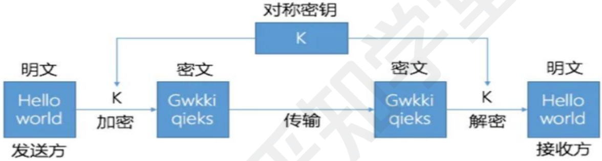

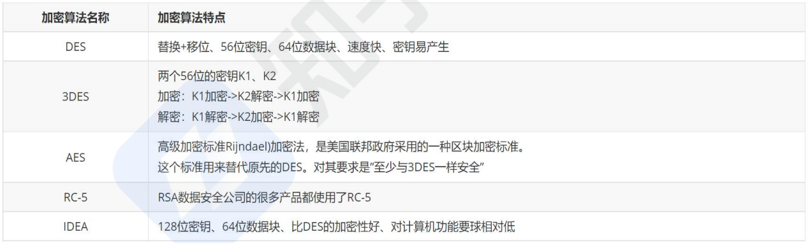

`非对称加密技术`：又称为公开密钥加密技术，各个用户分别有一对密钥，称为公钥和私钥，其中公钥是公开的，所有用户都知道，私钥是保密的，只有自己知道，使用公钥加密，只能对应的私钥能解密，使用私钥加密，同样也只有对应的公钥能解密；非对称加密就是运用了公钥和私钥的原理，其对数据的加密和解密的密钥是不同的，是**公开密钥加密算法**。缺点是加密速度慢（密钥多，计算量大，不适合加密大数据）。

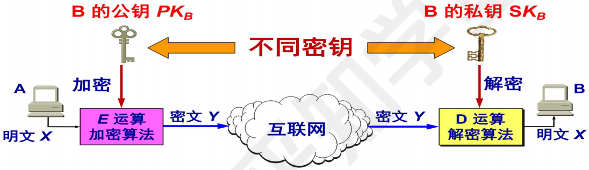

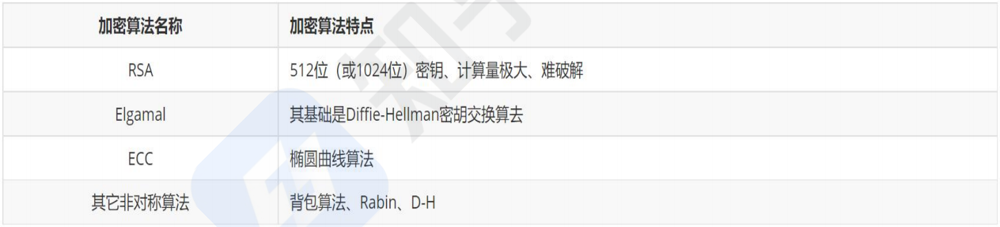

>以下关于三重 DES 加密的叙述中，正确的是（）。
>
>A. 三重 DES 加密使用一个密钥进行三次加密
>
>B. 三重 DES 加密使用两个密钥进行三次加密
>
>C. 三重 DES 加密使用三个密钥进行三次加密
>
>D. 三重 DES 加密的密钥长度是 DES 密钥长度的 3 倍
>
>【答案】B
>
>
>
>下面算法中，不属于公开密钥加密算法的是（）。
>
>A. ECC					B. DSA					C. RSA					D. DES
>
>【答案】D

#### 信息摘要 —— 数据完整性

`信息摘要`：就是一段数据的特征信息，当数据发生了改变，信息摘要也会发生改变，发送方会将数据和信息摘要一起传给接收方，接收方会根据接收到的数据重新生成一个信息摘要，若此摘要和接收到的摘要相同，则说明数据正确。信息摘要是由哈希函数生成的。

**信息摘要的特点**：

- 不算数据多长，都会产生固定长度的信息摘要。
- 任何不同的输入数据，都会产生不同的信息摘要。
- 单向性，即只能由数据生成信息摘要，不能由信息摘要还原数据。

**信息摘要算法**：MD5（产生 128 位的输出）、SHA（安全散列算法，产生 160 位的输出，安全性更高）、SHA1、SHA256。

使用信息摘要可以保证传输数据的完整性，只需要双方比对生成的信息摘要是否相同即可判断数据有没有被**篡改**，但是这样会出现一个问题，就是当发送方发送的数据和信息摘要都被篡改了，那么接收方拿到错误的数据生成的信息摘要也和篡改的信息摘要相同，接受方就无能为力了，这个问题，在后面的数字签名技术会解决。

>下面可用于消息认证的算法是（）。
>
>A. DES					B. PGP					C. MD5					D. KMI
>
>【解析】
>
>**消息认证，也就是信息摘要。**
>
>【答案】C

#### 数字签名 —— 不可抵赖性

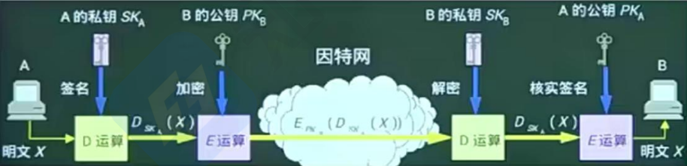

信息摘要技术只保证了数据传输过程的保密性和完整性，但却无法保证发送者是否非法，即在传输过程中，数据被第三方截获，即使他不能解密获取真实数据，但是他可以伪造一段数据，也用加密算法加密后再发送给接收方，那么接收方无法判断发送方是否合法，其只会用发送方告诉他的方法来解密。此时就要用到`数字签名技术`来验证发送方是否合法。

数字签名属于非对称加密体制，主要功能有：`不可否认`、`无法篡改和伪造 (报文鉴别)`、`报文的完整性`。

**数字签名的原理**：若发送方需要发送数据，应该使用发送方的私钥进行数字签名，而其公钥是共享的，任何接收方都可以拿来解密，因此，接收方使用了发送方的公钥解密，就必然知道此数据是由发送方的私钥加密的，而发送的私钥只属于发送方，唯一标识了数据是由谁发送的，这就是数字签名的过程原理。

>下面不属于数字签名作用的是（）。
>
>A. 接收者可验证消息来源的真实性
>
>B. 发送者无法否认发送过该消息
>
>C. 接收者无法伪造或篡改消息
>
>D. 可验证接收者的合法性
>
>【答案】D

#### 数字证书

数字签名的技术都是在原发送方是正确的的情况下所做的加密和认证技术，然而当发送方本身就是伪造的，即发送的公钥本身就是假的，那么后续的加密、数字签名都没有意义了，因此对发送方的公钥进行验证是十分重要的。

`数字证书`又称为数字标识，由用户申请，证书签证机关 CA 对其核实签发的，对用户的公钥的认证。**现在的数字证书版本大多为 x.509**。

**数字证书的原理**：每一个发送方都要先向 CA 申请数字证书，数字证书是经过 CA 数字签名了的，也即 CA 使用私钥加密，当发送方要发送数据时，接收方首先下载 CA 的公钥，去验证数字证书的真伪，如果是真的，就能保证发送方是真的，因为 CA 是官方权威的机构，其合法性毋庸置疑。

数字证书的格式：序列号、版本号、签名算法、发行者 ID、发行者、主体 ID、有效期、公钥。

最安全的过程要验证两步：

1. 在网银系统中，使用网银时，要先下载该银行的数字证书，之后，本地客户机会用 CA 的公钥对数字证书进行解密，解密成功说明是 CA 颁发的，是该银行系统而非黑客冒充。
2. 确认了通信对方无误后，就可以采用上述的一系列加密和认证技术来对通信数据进行加密，确保数据不会在发送过程中被截获篡改。

>用户 B 收到用户 A 带数字签名的消息 M，为了验证 M 的真实性，首先需要从 CA 获取用户 A 的数字证书，并利用（1）验证该证书的真伪，然后利用（2）验证 M 的真实性。
>
>1、
>
>A. CA 的公钥					B. B 的私钥					C. A 的公钥					D. B 的公钥
>
>2、
>
>A. CA 的公钥					B. B 的私钥					C. A 的公钥					D. B 的公钥
>
>【答案】A C

#### PKI 公钥基础设施

`PKI 公钥基础设施`是提供公钥加密和数字签名服务的系统或平台，目的是为了管理密钥和证书。一个机构通过采用 PKI 框架管理密钥和证书可以建立一个安全的网络环境。

PKI 主要包括四个部分：X.509 格式的证书、CA 操作协议、CA 管理协议、CA 政策制定。

PKI 的基础技术包括加密、数字签名、数据完整性机制、数字信封、双重数字签名等。

一个 PKI 应用系统至少应具有以下部分：

- 公钥密码证书管理。
- 黑名单的发布和管理。
- 密钥的备份和恢复。
- 自动更新密钥。
- 自动管理历史密钥。
- 支持交叉认证。

#### 访问控制

`访问控制`：是指主体依据某些控制策略或权限对客体本身或是其资源进行的不同授权访问。

- 访问控制包括三个要素：**主体、客体和控制策略**。
- 访问控制包括三方面的内容：**认证、控制策略实现和审计**。

**访问控制的实现技术：**

- `访问控制矩阵 (ACM)`。是通过矩阵形式表示访问控制规则和授权用户权限的方法。主体作为行，客体作为列。（ACM 表中不可避免地会出现空白项，这种问题通过下面的三种技术可以避免）

  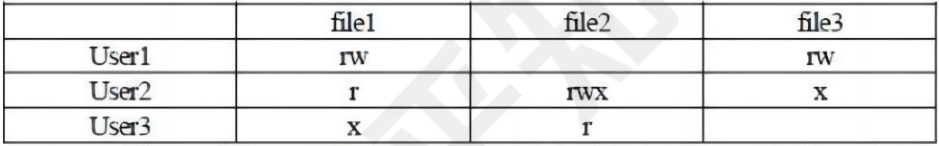

- `访问控制表 (ACL)`。**目前最流行、使用最多的访问控制实现技术。**每个客体有一个访问控制表，是系统中每一个有权访问这个客体的主体的信息。这种实现技术实际上是**按列保存访问控制矩阵**。

  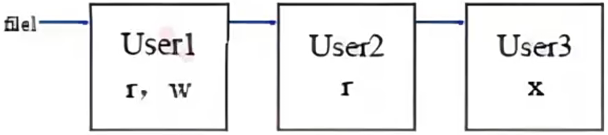

- `能力表`。对应于访问控制表，这种实现技术实际上是**按行保存访问控制矩阵**。每个主体有一个能力表，是该主体对系统中每一个客体的访问权限信息。使用能力表实现的访问控制系统可以很方便地查询某一个主体的所有访问权限。

  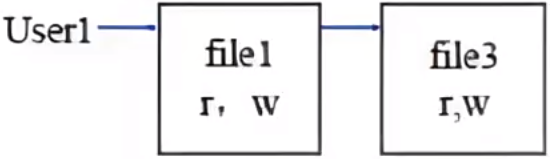

- `授权关系表`。每一行（或者说元组）就是访问矩阵中的一个非空元素，是某一个主体对应于某一个客体的访问权限信息。如果授权关系表按主体排序，查询时就可以得到能力表的效率，如果按客体排序查询时，就可以得到访问控制表的效率。

### 信息安全的抗攻击技术

#### 密钥生成

为对抗攻击者的攻击，`密钥生成`需要考虑三个方面的因素：**增大密钥空间、选择强钥（复杂的）、密钥的随机性（使用随机数）。**

#### DoS 和 DDoS

`拒绝服务攻击 DoS`有许多种，网络的内外部用户都可以发动这种攻击。

- 内部用户可以通过**长时间占用系统的内存、CPU 处理时间**使其他用户不能及时得到这些资源，从而引起拒绝服务攻击。
- 外部黑客也可以通过**占用网络连接**使其他用户得不到网络服务。

- 外部用户针对网络连接发动拒绝服务攻击主要有以下几种模式：**消耗资源、破坏或更改配置信息、物理破坏或改变网络部件、利用服务程序中的处理错误使服务失效。**

`分布式拒绝服务攻击 DDoS`是传统 DoS 攻击的发展，攻击者**首先侵入并控制一些计算机，然后控制这些计算机同时向一个特定的目标发起拒绝服务攻击。****克服了传统 DoS 受网络资源的限制和隐蔽性两大缺点。**

**拒绝服务攻击的防御方式：**

- 加强对数据包的特征识别，攻击者发送的数据包中是有一些特征字符串。通过搜寻这些特征字符串,就可以确定攻击服务器和攻击者的位置。
- 设置防火墙监视本地主机端口的使用情况。如果发现端口处于监听状态，则系统很可能受到攻击。
- 对通信数据量进行统计也可获得有关攻击系统的位置和数量信息。在攻击时，攻击数据的来源地址会发出超出正常极限的数据量。
- 尽可能的修正己经发现的问题和系统漏洞。

#### ARP 欺骗

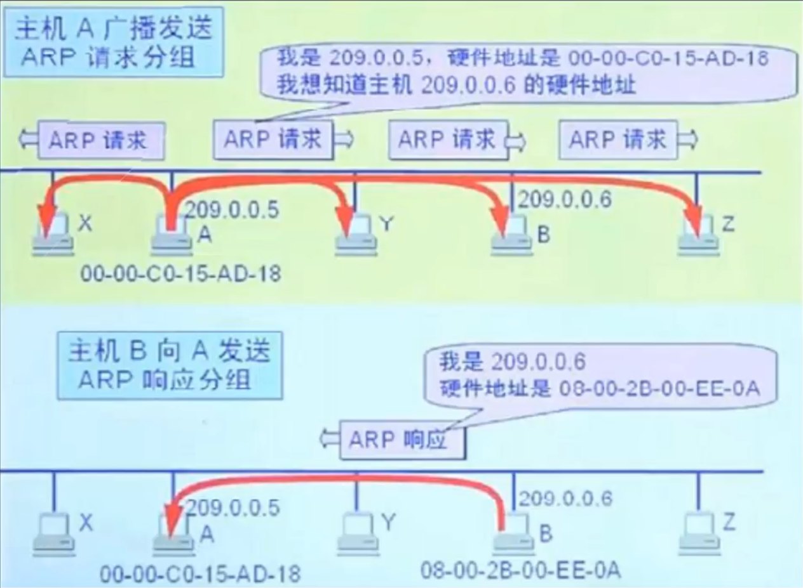

正常 ARP 原理：如图所示，主机 A 想知道局域网内主机 B 的 MAC 地址，那么主机 A 就广播发送 ARP 请求分组，局域网内所有主机都会收到，但只有 B 收到解析后知道是请求自己的 MAC 地址，所以只有 B 会返回单播的响应分组，告诉 A 自己的 MAC 地址。A 收到响应分组后，会建立一个 B 的 IP 地址和 MAC 地址映射，这个映射是动态存在的，如果一定时间 A 和 B 不再通信，那么就会清空这个地址映射，下次如果还要通信，则重复这个过程。

ARP 欺骗原理：上述过程主机 A 是不管其有没有发送过请求广播分组的，而是只要收到了返回的分组信息，就会刷新 IP 地址和 MAC 地址的映射关系，这样就存在安全隐患，假设有主机 C，模拟返回分组格式，构造正确的 IP 地址和自己的 MAC 地址映射，A 收到后也会刷新映射关系，那么当 A 再次向 B 发送信息时，实际就发送到了 C 的 MAC 地址，数据就被 C 监听到了。

ARP欺骗的防范措施：

- 在 winxp 下输入命令：`arp- s gate- way- ip gate- way- mac` 固化 ARP 表，阻止 ARP 欺骗。
- 使用 ARP 服务器。通过该服务器查找自己的 ARP 转换表来响应其他机器的 ARP 广播。注意，需要确保这台 ARP 服务器不被黑。
- 采用双向绑定的方法解决并且防止 ARP 欺骗。
- ARP 防护软件 —— ARPGuard。通过系统底层核心驱动，无须安装其他任何第三方软件（如 WinPcap），以服务及进程并存的形式随系统启动并运行，不占用计算机系统资源。无需对计算机进行 IP 地址及 MAC 地址绑定，从而避免了大量且无效的工作量。也不用担心计算机会在重启后新建 ARP 缓存列表，因为此软件是以服务与进程相结合的形式存在于计算机中，当计算机重启后软件的防护功能也会随操作系统自动启动并工作。

#### DNS 欺骗

`DNS 欺骗`首先是冒充域名服务器，然后把查询的 IP 地址设为攻击者的 IP 地址，这样的话，用户上网就只能看到攻击者的主页，而不是用户想要取得的网站的主页了，这就是 DNS 欺骗的基本原理。也即改掉了域名和 IP 地址的对应关系。黑客是通过冒充 DNS 服务器回复查询 IP 的，如下图所示：

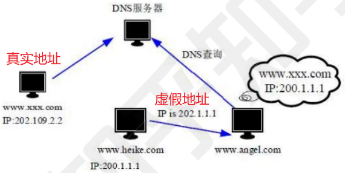

DNS 欺骗的检测：

- 被动监听检测：通过旁路监听的方式，捕获所有 DNS 请求和应答数据包，并为其建立一个请求应答映射表。如果在一定的时间间隔内，一个请求对应两个或两个以上结果不同的应答包，则怀疑受到了 DNS 欺骗攻击。
- 虚假报文探测：采用主动发送探测包的手段来检测网络内是否存在 DNS 欺骗攻击者。如果向一个非 DNS 服务器发送请求包，正常来说不会收到任何应答，如果收到了应答包，则说明受到了攻击。
- 交叉检查查询：在客户端收到 DNS 应答包之后，向 DNS 服务器反向查询应答包中返回的 IP 地址所对应的 DNS 名字，如果二者一致说明没有受到攻击，否则说明被欺骗。

#### IP 欺骗

`IP 欺骗`的原理和流程：

1. 首先使被冒充主机 host B 的网络暂时瘫痪，以免对攻击成干扰；
2. 然后黑客计算机会发起 TCP 连接到目标机 host A 的某个端口，来猜测 ISN 基值和增加规律；
3. 接下来黑客计算机冒充主机 host B 的 IP 地址来向 host A 来发送请求连接；
4. 然后等待目标机 host A 发送响应数据包给已经瘫痪的主机 host B，因为 host B 已经瘫痪，所以无法看到这个包；
5. 最后黑客再次伪装成主机 host B 向目标主机 host A 发送带有预测的目标机的 ISN 的数据包；（可能需要发送多次）
6. 连接建立，发送命令请求。

IP 欺骗的防范：虽然 IP 欺骗攻击有着相当难度，但这种攻击非常广泛，入侵往往由这里开始。预防这种攻击可以删除 UNIX 中所有的 /etc/hosts.equiv、$HOME/.rhosts 文件，修改 /etc/inetd.conf 文件，使得 RPC 机制无法应用。另外，还可以通过设置防火墙过滤来自外部而信源地址却是内部 IP 的报文。

#### 端口扫描

`端口扫描`就是**尝试与目标主机的某些端口建立连接**，如果目标主机该端口有回复（见三次握手中的第二次），则说明该端口开放，即为 "活动端口"。

扫描原理分类：

- `全 TCP 连接`。这种扫描方法使用三次握手，与目标计算机建立标准的 TCP 连接。
- `半打开式扫描 (SYN 扫描)`。在这种扫描技术中，扫描主机自动向目标计算机的指定端口发送 SYN 数据段，表示发送建立连接请求。如果目标计算机的回应 TCP 报文中 SYN=1 ACK=1，则说明该端口是活动的，接着扫描主机传送一个 RST 给目标主机拒绝建立 TCP 连接，从而导致三次握手的过程失败；如果目标计算机的回应是 RST，则表示该端口为 "死端口"，这种情况下，扫描主机不用做任何回应。
- `FIN 扫描`。依靠发送 FIN 来判断目标计算机的指定端口是否是活动的。**发送一个 FIN=1 的 TCP 报文到一个关闭的端口时，该报文会被丢掉，并返回一个 RST 报文。但是，如果当 FIN 报文发送到一个活动的端口时，该报文只是被简单的丢掉，不会返回任何回应。**从 FIN 扫描可以看出，这种扫描没有涉及任何 TCP 连接部分。因此，这种扫描比前两种都安全，可以称之为秘密扫描。
- `第三方扫描`。第三方扫描又称 "代理扫描"，这种扫描是利用第三方主机来代替入侵者进行扫描。这个第三方主机一般是入侵者通过入侵其他计算机而得到的，该第三方主机常被入侵者称之为 "肉鸡"，这些 "肉鸡"一般为安全防御系数极低的个人计算机。

#### 强化 TCP/IP 堆栈

`强化 TCP/IP 堆栈`以抵御拒绝服务攻击：

- `同步包风暴 (SYN Flooding)`：利用 TCP 协议缺陷发送大量伪造的 TCP 连接请求，使得被攻击者资源耗尽。三次握手，进行了两次，不进行第三次握手，连接队列处于等待状态，大量这样的等待，会占满全部队列空间，使得系统挂起。可以通过修改注册表防御 SYN Flooding 攻击。
- `ICMP 攻击`：ICMP 协议本身的特点决定了它非常容易被用于攻击网络上的路由器和主机。比如，前面提到的 "**Ping of Death**" 攻击就是利用操作系统规定的 ICMP 数据包的最大尺寸不超过 64 KB 这一规定，达到使 TCP/IP 堆栈崩溃、主机死机的效果。可以通过修改注册表防御 ICMP 攻击。
- `SNMP 攻击`：SNMP 还能被**用于控制这些设备和产品，重定向通信流，改变通信数据包的优先级，甚至断开通信连接。**总之，入侵者如果具备相应能力，就能**完全接管你的网络**。可以通过修改注册表项防御 SNMP 攻击。系统漏洞扫描指对重要计算机信息系统进行检查，发现其中可能被黑客利用的漏洞，包括基于网络的漏洞扫描（通过网络远程扫描主机）、基于主机的漏洞扫描（在目标系统安装了代理扫描）。

### 信息安全的保证体系和评估方法

**GB17859—999 标准规定了计算机系统安全保护能力的五个等级：**

- 第一级用户自主保护级：实现基本的用户隔离和自主访问控制。比如：个人电脑操作系统，通过账号密码隔离不同用户，用户只能访问自己的文件和进程。
- 第二级系统审计保护级：在第一级基础上实现更细粒度的访问控制和审计。比如：公司内部办公系统，有账号密码登录，对安全相关的登录、文件访问进行日志记录，对不同部门的数据访问设置权限控制。
- 第三级安全标记保护级：在第二级基础上实现安全标记和强制访问控制。比如：政府内部文件系统，对文件设置密级标记，用户的访问权限按照政策与文件标记相匹配判定，进行强制访问控制。
- 第四级结构化保护级：在第三级基础上实现形式化安全策略和对所有资源的访问控制。比如：军方信息系统，有多级安全策略模型，对所有用户身份、存储数据、网络资源等实施严格的强制访问控制。
- 第五级访问验证保护级：实现抗篡改的访问监控器，对单个用户的所有访问进行仲裁。比如：核设施监控系统，通过抗篡改的访问控制器验证每个用户每次访问的权限，拒绝非授权访问。

`安全风险管理`，在风险评估实施前，应该考虑：

- 确定风险评估的范围。
- 确定风险评估的目标。
- 建立适当的组织结构。
- 建立系统性的风险评估方法。
- 获得最高管理者对风险评估策划的批准。

`风险评估`的基本要素为**脆弱性、资产、威胁、风险和安全措施**，与这些要素相关的属性分别为业务战略、资产价值、安全需求、安全事件和残余风险，这些也是风险评估要素的一部分。

`风险计算模型`包含信息资产、弱点/脆弱性、威胁等关键要素。每个要素有各自的属性，信息资产的属性是资产价值，弱点的属性是弱点被威胁利用后对资产带来的影响的严重程度，威胁的属性是威胁发生的可能性。

**风险计算的过程如下：**

- 对信息资产进行识别，并对资产赋值。
- 对威胁进行分析，并对威胁发生的可能性赋值。
- 识别信息资产的脆弱性，并对弱点的严重程度赋值。
- 根据威胁和脆弱性计算安全事件发生的可能性。
- 结合信息资产的重要性和发生安全事件的可能性，计算信息资产的风险值。

## 数据库设计

### 数据库基本概念

#### 数据库系统结构

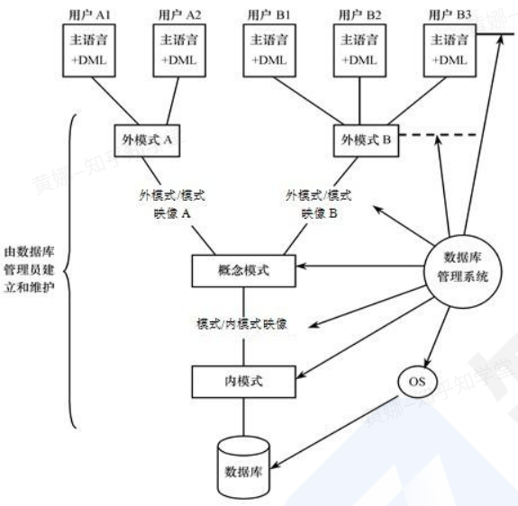

- `内模式`： 内模式也称存储模式，是数据物理结构和存储方式的描述，是数据在数据库内部的表示方式。定义所有的内部记录类型、索引和文件的组织方式，以及数据控制方面的细节。**简单点说就是管理如何存储物理的数据，对应具体物理存储文件。**
- `模式`： 又称为概念模式，是数据库中全部数据的逻辑结构和特征的描述，它由若干个概念记录类型组成，只涉及 "型" 的描述，不涉及具体的值。**简单点说就是我们通常使用的基本表 ，根据应用、需求将物理数据划分成一张张表。**
- `外模式`：外模式也称用户模式或子模式，是用户与数据库系统的接口，是用户需要使用的部分数据的描述。它由若干个外部记录类型组成。**简单点说就是对应数据库中的视图这个级别，将表进行一定的处理后再提供给用户使用。**
- `外模式/概念模式映像`：是表和视图之间的映射，存在于概念级和外部级之间，若表中数据发生了修改，只需要修改此映射，而无需修改应用程序。
- `概念模式/内模式映像`：是表和数据的物理存储之间的映射存在于概念级和内部级之间，若修改了数据存储方式，只需要修改此映射，而不需要去修改应用程序。

`逻辑独立性`：当模式改变时，例如增加新的关系，新的属性，改变属性的数据类型等，由数据库管理员对各个外模式/模式的映像做相应的改变，可以使外模式保持不变。应用程序是依据数据的外模式编写的，从而应用程序不必修改，保证了数据与程序的逻辑独立性，简称数据的逻辑独立性。

`物理独立性`：当数据库的存储结构改变了，由数据库管理员对模式/内模式映像做相应的改变，可以使模式保持不变，从而应用程序也不必改变，保证了数据与程序的物理独立性，简称数据的物理独立性。

#### 数据库设计步骤

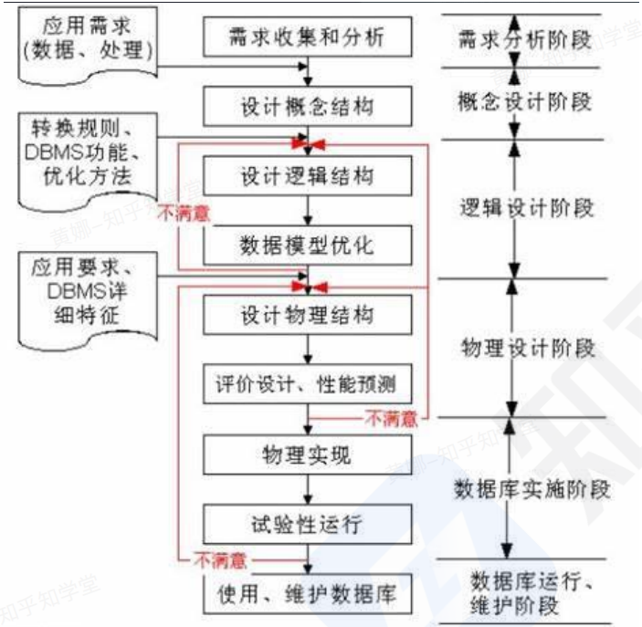

1. `需求分析`：即分析数据存储的要求，**产出物有数据流图、数据字典、需求说明书。**获得用户对系统的三个要求：信息要求、处理要求、系统要求。
2. `概念结构设计`：就是设计 E-R 图，也即实体-联系图。工作步骤包括：选择局部应用、逐一设计分 E-R 图、E-R 图合并。分 E-R 图进行合并时，它们之间存在的冲突主要有以下 3 类：
   - **属性冲突**：同一属性可能会存在于不同的分 E-R 图中。
   - **命名冲突**：相同意义的属性，在不同的分 E-R 图上有着不同的命名，或是名称相同的属性在不同的分 E-R 图中代表着不同的意义。
   - **结构冲突**：同一实体在不同的分 E-R 图中有不同的属性，同一对象在某一分 E-R 图中被抽象为实体，而在另一分 E-R 图中又被抽象为属性。
3. `逻辑结构设计`：将 E-R 图，转换成关系模式。工作步骤包括：确定数据模型、将 E-R 图转换成为指定的数据模型、确定完整性约束和确定用户视图。
4. `物理设计`：步骤包括确定数据分布、存储结构和访问方式。
5. `数据库实施阶段`：根据逻辑设计和物理设计阶段的结果建立数据库，编制与调试应用程序，组织数据入库，并进行试运行。
6. `数据库运行和维护阶段`：数据库应用系统经过试运行即可投入运行，但该阶段需要不断地对系统进行评价、调整与修改。

>在数据库系统中，视图是一个（）。
>
>A. 真实存在的表，并保存了待查询的数据
>
>B. 真实存在的表，只有部分数据来源于基本表 
>
>C. 虚拟表，查询时只能从一个基本表中导出
>
>D. 虚拟表，查询时可以从一个或者多个基本表或视图中导出
>
>【解析】
>
>视图是从一个或几个基本表（或视图）导出的虚拟表，其内容由查询定义。同真实的表一样，视图包含一系列带有名称的列和行数据。但是，视图并不在数据库中以存储的数据值集形式存在。行和列数据来自由定义视图的查询所引用的表，并且在引用视图时动态生成。
>
>【答案】D
>
>
>
>在采用三级模式结构的数据库系统中，如果对数据库中的表 Emp 创建聚簇索引，那么改变的是数据库的（）。
>
>A. 模式					B. 内模式					C. 外模式					D. 用户模式
>
>【解析】
>
>数据库采用三级模式的结构：
>
>1. 概念模式也称模式，是数据库中全部数据的整体逻辑结构的描述。
>2. 外模式也称用户模式或子模式，是用户与数据库系统的接口，是用户用到的那部分数据的描述。
>3. 内模式也称存储模式，是数据库在物理存储方面的描述，定义所有内部记录类型、索引和文件的组织方式，以及数据控制方面的细节。
>
>聚簇索引也叫簇类索引，是一种对磁盘上实际数据重新组织以按指定的一个或多个列的值排序，它改变的是数据库的内模式。
>
>【答案】B
>
>
>
>在数据库系统中，数据库的视图、基本表和存储文件的结构分别与（1）对应；数据的物理独立性和数据的逻辑独立性是分别通过修改（2）来完成的。
>
>A. 模式、外模式、内模式				B. 模式、内模式、外模式				C. 外模式、模式、内模式				D. 外模式、内模式、模式
>
>A. 模式与内模式之间的映像、外模式与模式之间的映像				B. 外模式与内模式之间的映像、外模式与模式之间的映像
>
>C. 外模式与模式之间的映像、模式与内模式之间的映像				D. 外模式与内模式之间的映像、模式与内模式之间的映像
>
>【答案】C A
>
>
>
>在数据库逻辑结构设计阶段， 需要（1）阶段形成的（2）作为设计依据。
>
>A. 需求分析						B. 概念结构设计						C. 物理结构设计						D. 数据库运行和维护
>
>A. 程序文档、数据字典和数据流图		B. 需求说明文档、程序文档和数据流图		C. 需求说明文档、数据字典和数据流图		D. 需求说明文档、数据字典和程序文档
>
>【答案】A C

#### 数据模型

数据模型主要有两大类，分别是`概念数据模型 (实体—联系模型)`和`基本数据模型 (结构数据模型)`。

##### 概念数据模型

概念数据模型是**按照用户的观点来对数据和信息建模，主要用于数据库设计。**概念模型主要用实体-联系方法（Entity-Relationship Approach）表示，所以也称`E-R 模型`。

- **概念模型是从用户的角度进行建模的**，是现实世界到信息世界的第一抽象是真正的实体-联系模型。

- 用 E-R 图来描述概念数据模型 ，世界是由一组称作实体的基本对象和这些对象之间的联系构成的。

- 在 E-R 模型中，使用**椭圆表示属性 ( 一般没有) 、长方形表示实体（强实体）、长方形里两道竖杠表示弱实体、菱形表示联系，联系的两端要填写联系类型**。示例如下图：

  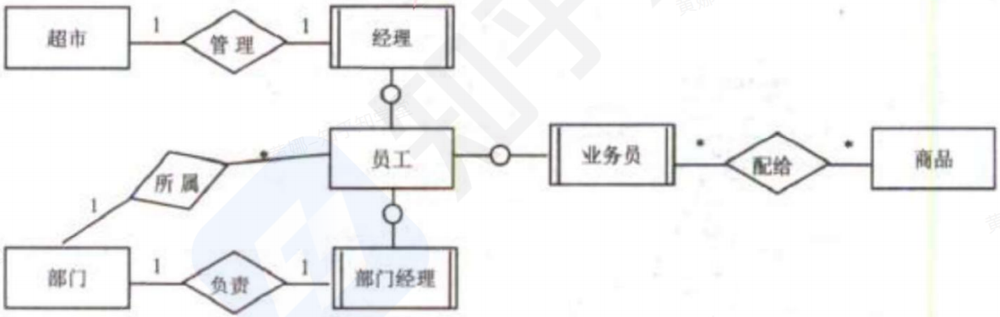

  - `实体`：客观存在并可相互区别的事物，可以是具体的人、事、物或抽象概念。如人、汽车、图书、账户、贷款。
  - `弱实体和强实体`：弱实体依赖于强实体的存在而存在。
  - `实体集`：具有相同类型和共享相同属性的实体的集合。如学生、课程。
  - `属性`：实体所具有的特性。属性分类：简单属性和复合属性；单值属性和多值属性；NULL 属性；派生属性。
  - `域`：属性的取值范围称为该属性的域。
  - `码`：key，唯一标识实体的属性集。
  - `联系`：现实世界中事物内部以及事物之间的联系，在 E-R 图中反映为实体内部的联系和实体之间的联系。
  - `联系类型`：一对一 1:1、一对多 1:N、多对多 M:N。

##### 基本数据类型

基本数据模型是**按照计算机系统的观点来对数据和信息建模，主要用于 DBMS 的实现。**基本数据模型是数据库系统的核心和基础。 常用的基本数据模型有层次模型、网状模型、关系模型和面向对象模型。

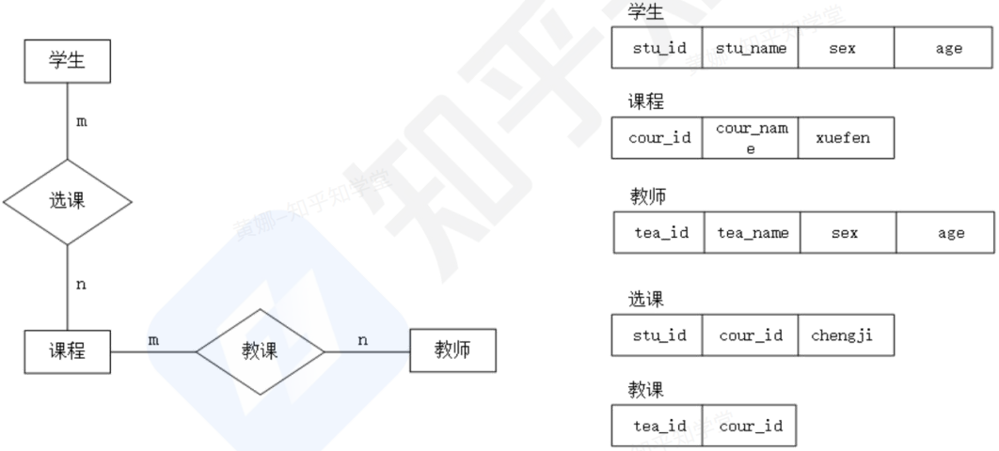

- 网状模型表示实体类型及其实体之间的联系，一个事物和另外几个都有联系形成一张网。
- **关系模型是二维表的形式表示的实体-联系模型**，是将实体-联系模型转换而来的，经过开发人员设计的。
- 面向对象模型是采用面向对象的方法设计数据库，以对象为单位，每个对象包括属性和方法，具有类和继承等特点。

##### 关系模型

关系模型中数据的逻辑结构是一张二维表，由行列组成。用表格结构表达实体集，用外键标识实体间的联系。如下图：

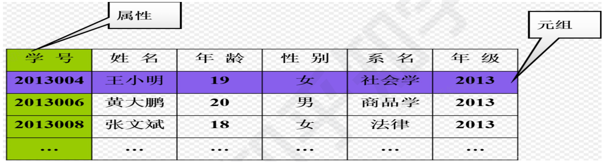

优点：建立在严格的数学概念基础上；概念单一、结构简单、清晰，用户易懂易用； 存取路径对用户透明，从而数据独立性、安全性好，简化数据库开发工作。

缺点：由于存取路径透明，查询效率往往不如非关系数据模型。

关系型数据库相关概念：

- `关系`：可以理解为一张二维表，每个关系都具有一个关系名，就是通常说的表名。
- `元组`：可以理解为二维表中的一行，在数据库中经常被称为记录。
- `属性`：可以理解为二维表中的一列，在数据库中经常被称为字段。
- `域`：属性的取值范围，也就是数据库中某一列的取值限制。
- `关键字`：一组可以唯一标识元组的属性，数据库中常称为主键，由一个或多个列组成。
- `关系模式`：指对关系的描述。其格式为：关系名（属性 1，属性 2，……，属性 N），在数据库中成为表结构。

表、记录、行列的关系：

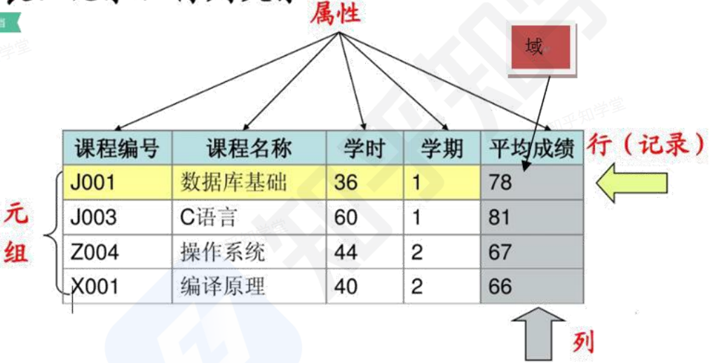

##### 三要素

数据模型三要素：`数据结构`（所研究的对象类型的集合）、`数据操作`（对数据库中各种对象的实例允许执行的操作的集合）、`数据的约束条件`（一组完整性规则的集合）。

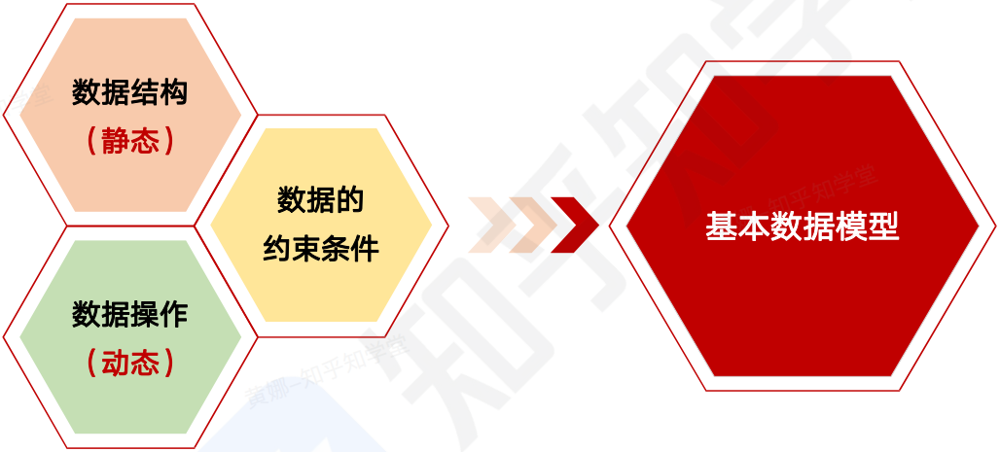

- 数据的约束条件：`实体完整性`。实体完整性是指实体的主属性不能取空值。

  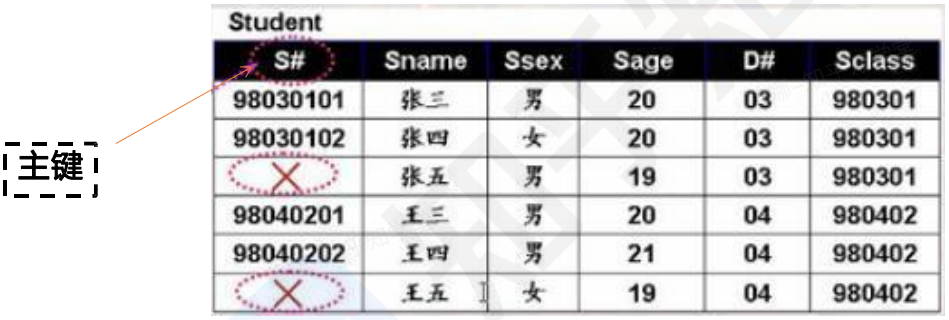

- 数据的约束条件：`参照完整性`。在关系数据库中主要是值的外键参照的完整性。若 A 关系中的某个或者某些属性参照 B 或其他几个关系中的属性，那么在关系 A 中该属性要么为空，要么必须出现 B 或者其他的关系的对应属性中。

  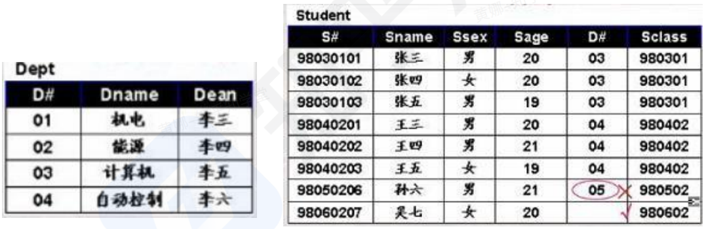

- 数据的约束条件：`用户定义完整性`。用户定义完整性反映的某一个具体应用所对应的数据必须满足一定的约束条件。

  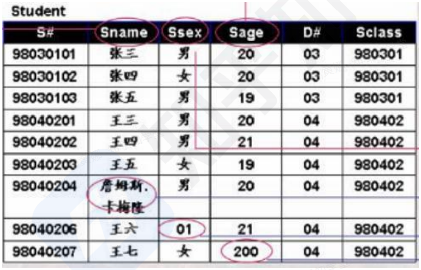

##### 模型转换

E-R 模型转换为关系模型 ：每个实体都对应一个关系模式； 联系分为三种：

- 1:1 的联系中，联系可以放到任意的两端实体中，**作为一个属性**（要保证 1:1 的两端关联），也可以转换为一个单独的关系模式。
- 1:N 的联系中，联系可以单独作为一个关系模式，也可以**在 N 端中加入 1 端实体的主键**。
- M:N 的联系中，**联系必须作为一个单独的关系模式，其主键是 M 和 N 端的联合主键**。

>某本科高校新建教务管理系统，支撑各学院正常的教学教务管理工作。经过初步分析，系统中包含的实体有学院、教师、学生、课程等。考虑需要将本科学生的考试成绩及时通报给学生家长新增家长实体；考虑到夜大、网络教育学生管理方式的不同，需要额外的管理数据，新增进修学生实体：规定一个学生可以选择多门课程，每门课程可以被多名学生选修；一个教师可以教授多门课程，一门课程只能被 一名教师讲授。（1）实体之间为多对多联系 ，（2）属于弱实体对强实体的依赖联系。
>
>A. 学生、学院						B. 教师、学院						C. 学生、课程						D. 教师、课程
>
>A. 家长、学生						B. 学生、教师						C. 学生、学院						D. 教师、学院
>
>【解析】
>
>一个学生可以选择多门课程，每门课程可以被多名学生选修，因此学生和课程是多对多。弱实体依赖于强实体的存在而存在，只有学生存在，其家长信息才会存在，否则单独的家长信息无意义。
>
>【答案】C A
>
>
>
>部门、员工和项目的关系模式及它们之间的 E-R 图如下所示，其中关系模式中带实下划线的属性表示主键属性。
>
>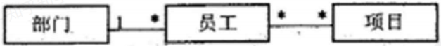
>
>图中：
>
>- 部门 (<u>部门代码</u>，部门名称，电话)
>
>- 员工 (<u>员工代码</u>，姓名，部门代码，联系方式，薪资)
>
>- 项目 (<u>项目编号</u>，项目名称，承担任务)
>
>若部门和员工关系进行自然连接运算，其结果为（1）元关系。由于员工和项目之间的联系类型为（2），所以员工和项目之间的联系需要转换成一个独立的关系模式，该关系模式的主键是（3）。
>
>A. 5								B. 6								C. 7								D. 8
>
>A. 1 对 1							B. 1 对多							C. 多对 1							D. 多对多
>
>A. (项目名称，员工代码)		B. (项目编号，员工代码)		C. (项目名称，部门代码)		D. (项目名称，承担任务)
>
>【答案】C D B

### 关系代数

`集合运算符`：

- `∪`：**并**，关系 R 与 S 的并是由属于 R 或属于 S 的元组构成的集合。
- `-`：**差**，关系 R 与  S的差是由属于 R 但不属于 S 的元组构成的集合。
- `∩`：**交**，关系 R 与 S 的交是由属于 R 同时又属于 S 的元组构成的集合。
- `×`：**笛卡尔积**，两个元组分别为 n 目和 m 目的关系 R 和 S 的笛卡尔积是一个（n + m）列的元组的集合，元组的前 n 列是关系 R 的一个元组，后 m 列是关系 S 的一个元组。

示例：

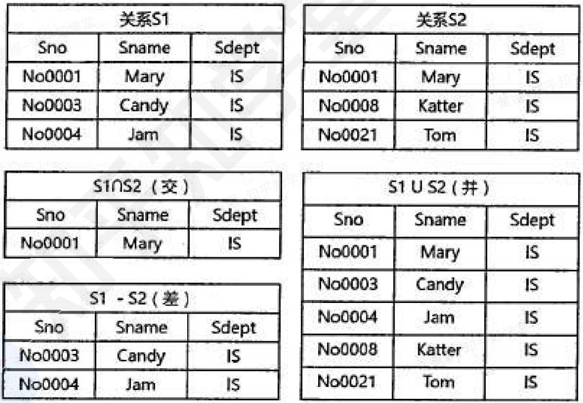

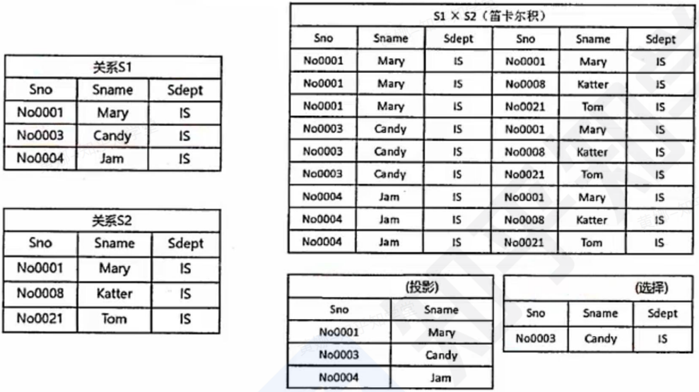

- 并：S1 U S2，结果是两张表中所有记录数合并，相同记录只显示一次。
- 交：S1 ∩ S2，结果是两张表中相同的记录。
- 差：S1 - S2，结果是 S1 表中有而 S2 表中没有的那些记录。
- 笛卡尔积：S1 × S2，产生的结果包括 S1 和 S2 的所有属性列，并且 S1 中每条记录依次和 S2 中所有记录组合成一条记录，最终属性列为 S1 + S2 属性列，记录数为 S1\*S2 记录数。

专门的关系运算符：

- `σ`：**选择**，取得关系 R 中符合条件的行。例如，查询年龄小于 22 岁的学生，表达式为：$σSage<22(student)$​。

  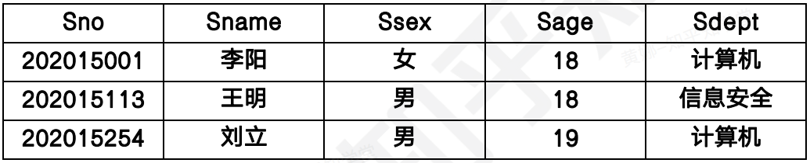

- `π`：**投影**，取得关系 R 中符合条件的列。例如，查询学生的姓名和所在系，表达式为：$πSname,Sdept(Student)$。

  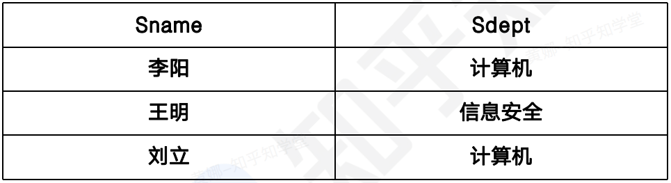

- `⋈`：**连接**。

  - `等值连接`：关系 R、S，取两者笛卡尔积中属性值相等的元组。

  - `自然连接`：一种特殊的等值连接，它要求比较的属性列必须是相同的属性组，并且把结果中重复属性去掉。注意与笛卡尔积的区别，自然连接的结果显示全部的属性列，但是相同属性列只显示一次，显示两个关系模式中属性相同且值相同的记录。设有关系 R、S 如下左图所示，自然连接结果如下右图所示：

    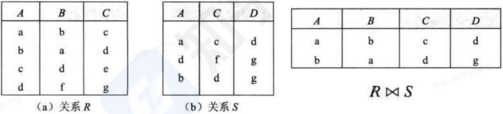

>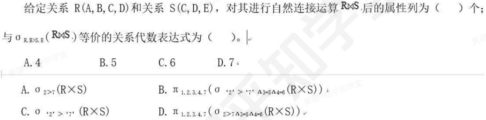
>
>【解析】
>
>对 R 与 S 做自然联接运算时，联接条件为：R.C=S.C and R.D=S.D。运算结果会自动去重复列，所以结果的列为 A、B、C、D、E，一共 5 列。
>
>【答案】B D
>
>
>
>给定关系 R(A,B,C,D,E) 与 S(A,B,C,F,G)，那么与表达式
>
>
>
>等价的 SQL 语句如下：select（1）from R, S where（2）。
>
>A. R.A，R.B，R.E，S.C，G			B. R.A，R.B，D，F，G			C. R.A，R.B，R.D，S.C，F			D. R.A，R.B，R.D，S.C，G
>
>A. R.A=S.A OR R.B=S.B OR R.C=S.C OR R.A<S.F				B. R.A=S.A OR R.B=S.B OR R.C=S.C OR R.A<S.B
>
>C. R.A=S.A AND R.B=S.B AND R.C=S.C AND R.A<S.F			D. R.A=S.A AND R.B=S.B AND R.C=S.C AND R.A<S.B
>
>【解析】
>
>本题考查关系代数运算与 SQL 语言的对应关系。注意本题中 R 与 S 是做自然联接操作，操作时会将 R 与 S 中相同字段名做等值联接，并将结果集去重复。所以 R 与 S 自然联接后的结果包括以下属性：R.A，R.B，R.C，D，E，F，G。关系代数选择条件为 1<6，即 R.A<F。关系代数投影操作条件为 "1,2,4,6,7"，对应的属性为：R.A，R.B，D，F，G。
>
>【答案】B C

### 函数依赖

给定一个 X，能唯一确定一个 Y，例如 Y=X\*X 函数，就称 X 确定 Y，或者说 Y 依赖于 X，记作 X->Y。函数依赖又可扩展以下两种规则：

- `部分函数依赖`：A 可确定 C，(A,B) 也可确定 C，(A,B) 中的一部分（即 A）可以确定 C，称为部分函数依赖。
- `传递函数依赖`：当 A 和 B 不等价时，A 可确定 B，B 可确定 C，则 A 可确定 C，是传递函数依赖；若 A 和 B 等价，则不存在传递，直接就可确定 C。

例如：关系式 Student(Sno,Sdept,Mname,Cno,Grade)，

| 名称         | 定义                                              |
| ------------ | ------------------------------------------------- |
| 完全函数依赖 | (Sno,Cno)→Grade 是完全函数依赖                    |
| 部分函数依赖 | (Sno,Cno)→Sdept 是部分函数依赖                    |
| 传递函数依赖 | Sno→Sdept，Sdept→Mname，则称 Sno 传递依赖于 Mname |

### 范式

`范式`：**符合某一种级别的关系模式的集合。**关系数据库设计的方法之一就是设计满足适当范式的模式，通常可以通过判断分解后的模式达到几范式来评价模式的规范化程度。范式包括：

- 第一范式（1NF）
- 第二范式（2NF）
- 第三范式（3NF）
- BC 范式（BCNF）
- 第四范式（4NF）
- 第五范式（5NF）

#### 第一范式 1NF

关系中的每一个分量必须是一个不可分的数据项。通俗地说，第一范式就是表中不允许有小表的存在。如下图就不属于第一范式：

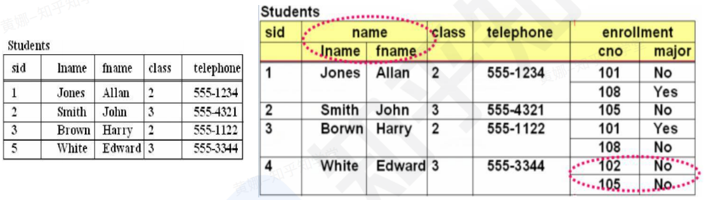

### 模式分解

把**一个关系模式分解成若干个关系模式**的过程，也就是**由低范式转换为高范式**的过程，称为关系模式的分解，简称`模式分解`。

- 模式分解具体是通过**将原关系模式的属性集进行拆分**来实现 ，拆分后的关系模式包含新的属性集，以及新的函数依赖集。
- 为使分解后的模式与原模式等价，一般要求模式分解**具有保持依赖性（函数依赖）与无损连接性（属性）**。

#### 保持依赖性

对于关系模式 R，有依赖集 F，若对 R 进行分解，分解出来的多个关系模式，都有对应的函数依赖集。

`保持依赖性`就是将分解之后的函数依赖集合并起来（令其等于 G），与原来的函数依赖集 F 是保持等价的。

判断函数依赖集等价公式为：**$G^{+}$（函数依赖集 G 的闭包） = $F^{+}$（函数依赖集 F 的闭包）**。

注意：**拆分前后的函数依赖集判断是否等价时，不需要考虑冗余依赖，如传递依赖。**

函数依赖（FD）集的闭包：F 闭包，指由 F 中的所有 FD 可以推导出所有 FD 的集合，记为 F+。例如：对于关系模式 R(ABC)，F＝{A→B,B→C}，求 F+。根据 FD 的定义，可推出 F+={φ→φ,A→φ,A→A,A→B,A→C,A→AB,A→BC,A→ABC,…}，共有 43 个 FD。其中，φ 表示空属性集。

属性集闭包定义 ：对 F，$F^{+}$中所有 X→A 的 A 的集合称为 X 的闭包，记为 $X^{+}$。可以理解为 $X^{+}$​​ 表示所有 X 可以决定的属性，简单点说属性的闭包就是由一个属性直接或间接推导出的所有属性的集合。例如： f={a→b,b→c,a→d,e→f}，由 a 可直接得到 b 和 d，间接得到 c，则 a 的闭包就是 {a,b,c,d}，可以写出 a+={a,b,c,d}。

**完整的判断保持函数依赖的方法：**

1. 先求函数依赖集投影到分解后的 Ri 上的函数依赖子集 Fi。
2. 求分解后关系模式函数依赖集的并集，并令其等于 G。
3. 判断 F 是否包含在 G 的闭包中。（此处不需要判断 G 是否包含在 F 的闭包中，因为 G 中的每个函数依赖都是由 F 根据 Armstrong 公理推导出来的，所以 G 必定包含于 F 闭包）

>有关系模式 R(A,B,C)，F={A→B,B→C}，将其拆分为：R1{A,B}，R2{B,C}，是否保持函数依赖性？
>
>【解析】
>
>R1{A,B}，F1{A→B}
>
>R2{B,C}，F2{B→C}
>
>F1∪F2 与 F 是等价的，所以保持函数依赖性。
>
>
>
>有关系模式 R(A,B,C)，F={A→B,B→C,A→C}，将其拆分为：R1{A,B}，R2{B,C}，是否保持函数依赖性？
>
>【解析】
>
>R1{A,B}，F1{A→B}
>
>R2{B,C}，F2{B→C}
>
>F1 和 F2 可以推导出 A→C，因此 A→C 是冗余函数依赖，不考虑。
>
>F1∪F2 与 F 是等价的，所以保持函数依赖性。
>
>
>
>有关系模式 R(U,F)，其中 U={A,B,C,D}，F={A→B,B→C,C→D,D→A}，将其拆分为：ρ={R1(A,B),R2(B,C),R3(C,D)}，是否保持函数依赖性？
>
>【解析】
>
>① 求函数依赖子集
>
>F1 = πU1(F)=(A→B,B→A);
>
>F2 = πU2(F)=(B→C,C→B);
>
>F3 = πU3(F)=(C→D,D→C);
>
>② 求分解后函数依赖的并集，令其等于 G
>
>G=F1∪F2∪F3={A→B,B→A,B→C,C→B,C→D,D→C};
>
>F={A→B,B→C,C→D,D→A}。
>
>③ 判断 F 是否包含在 G 的闭包中
>
>经过初步观察，F 中的 {D→A} 不包含在 G 中，但是通过求 G 的闭包后，也就是根据 G 中的依赖集 D→C，C→B，B→A，得出 G 中是包含 {D→A} 这个依赖的，所以 F 包含于 G 的闭包中。因此，有 G+=F+，即 ρ 具有函数依赖性。

#### 无损连接性

`TOOD`

## 本文参考

https://www.zhihu.com/education/training/course-detail/1703729527317143552（请支持正版）

## 声明

写作本文初衷是个人学习记录，鉴于本人学识有限，如有侵权或不当之处，请联系 [wdshfut@163.com](mailto:wdshfut@163.com)。