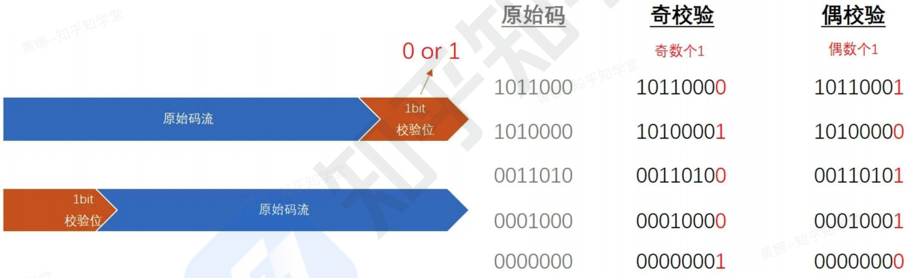
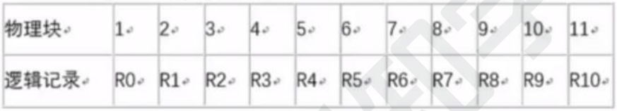
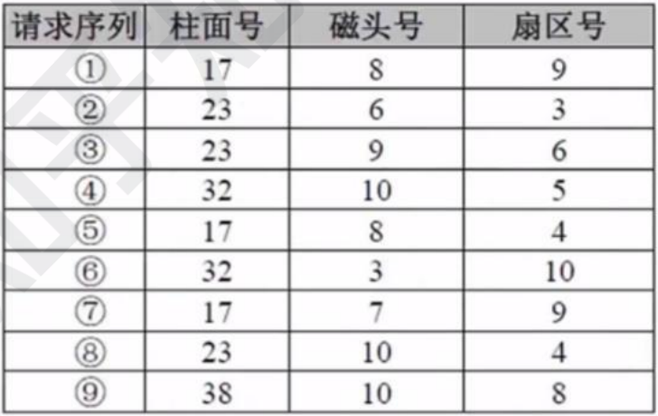
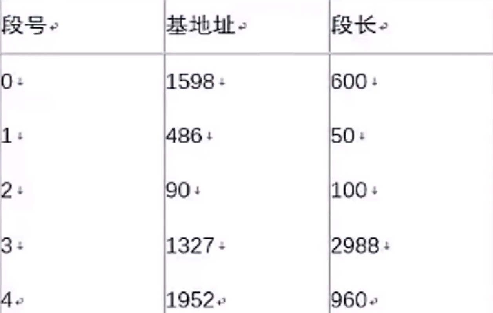

[TOC]

## 计算机基础

### 计算机硬件组成、CPU 和校验码

#### 计算机硬件组成

计算机硬件组成：

- 计算机的基本硬件系统由`运算器`、`控制器`、`存储器`、`输入设备`和`输出设备` 5 大部件组成。
- 运算器、控制器等部件被集成在一起统称为中央处理单元（Central Processing Unit，CPU）。CPU 是硬件系统的核心，用于数据的加工处理，能完成各种算术、逻辑运算及控制功能。
- 存储器是计算机系统中的记忆设备，分为内部存储器和外部存储器。前者速度高、容量小，一般用于临时存放程序、数据及中间结果。而后者容量大、速度慢，可以长期保存程序和数据。
- 输入设备和输出设备合称为外部设备（简称外设），输入设备用于输入原始数据及各种命令，而输出设备则用于输出计算机运行的结果。

#### CPU

CPU 的功能：

- `程序控制`：CPU 通过执行指令来控制程序的执行顺序，这是 CPU 的重要功能。
- `操作控制`：一条指令功能的实现需要若干操作信号配合来完成，CPU 产生每条指令的操作信号并将操作信号送往对应的部件，控制相应的部件按指令的功能要求进行操作。
- `时间控制`：CPU 对各种操作进行时间上的控制，即指令执行过程中操作信号的出现时间、持续时间及出现的时间顺序都需要进行严格控制。
- `数据处理`：CPU 通过对数据进行算术运算及逻辑运算等方式进行加工处理，数据加工处理的结果被人们所利用。所以，**对数据的加工处理也是 CPU 最根本的任务。**
- 此外，CPU 还需要对系统内部和外部的中断或异常做出响应，进行相应的处理。

CPU 的组成：CPU 主要由`运算器`、`控制器`、`寄存器组`和`内部总线`等部件组成。

- **运算器**：执行所有的算术运算，如加减乘除等；执行所有的逻辑运算并进行逻辑测试，如与、或、非、比较等。
  - `算术逻辑单元 ALU`：实现对数据的算术和逻辑运算。
  - `累加寄存器 AC`：运算结果或源操作数的存放区。
  - `数据缓冲寄存器 DR`：暂时存放内存的指令或数据。
  - `状态条件寄存器 PSW`：保存指令运行结果的条件码内容，如溢出标志等。
- **控制器**：控制整个 CPU 的工作，最为重要。
  - `指令寄存器 IR`：暂存 CPU 执行指令。
  - `程序计数器 PC`：存放指令执行地址。
  - `地址寄存器 AR`：保存当前 CPU 所访问的内存地址。
  - `指令译码器 ID`：分析指令操作码。
- CPU 依据指令周期的不同阶段来区分二进制的指令和数据，因为在指令周期的不同阶段，指令会命令 CPU 分别去取指令或者数据。

> CPU 执行算术运算或者逻辑运算时，常将源操作数和结果暂存在（）中。
>
> A. 程序计数器（PC） 
>
> B. 累加器（AC）
>
> C. 指令寄存器（IR） 
>
> D. 地址寄存器（AR）
>
> 【答案】B
>
> 
>
> 执行CPU指令时，在一个指令周期的过程中，首先需从内存读取要执行的指令，此时先要将指令的地址即（）的内容送到地址总线上。
>
> A. 指令寄存器（IR） 
>
> B. 通用寄存器（GR） 
>
> C. 程序计数器（PC）
>
> D. 状态寄存器（PSW）
>
> 【答案】C

#### 校验码

为什么要用校验码：为了应对`突发错误 (BurstError)`，即两个或更多个数据位在码流中出现的错误。

为什么会出现这些数据位错误：对于电子系统通信，它涉及到物理层、链路层、通信介质等，其中物理层主要将原始二进制数据利用一定的编解码原理对其进行调制，然后经由发送电路将调制信号输送至传输介质，接收端利用接收电路进行接收并解调，将信息还原成二进制码流。在这个过程中介质有可能被干扰，接收电路、发送电路、调制电路、解调电路都可能由于某些干扰原因导致工作失效而出现误码。此时，如果没有一个很好的机制去确保数据的正确性，比如一个飞控系统中某些控制命令、车辆系统中 CAN 报文数据，系统直接使用这些错误数据去控制被控对象（比如电机、发动机等），严重的时候就会造成难以估量的生命财产灾难。所以，**对于数据完整性检测的重要性不言而喻**。

`码距`：就单个编码 "A: 00" 而言，其码距为 1，因为其只需要改变一位就变成另一个编码。**在两个编码中，从 A 码到 B 码转换所需要改变的位数称为码距。**如 "A: 00" 要转换为 "B: 11"，码距为 2。一般来说，码距越大，越利于纠错和检错。

##### 奇偶校验码

特点：

- 无论数据位多少位，校验位只有一位。
- 数据位和校验位一共所含的 1 个数为奇数，称为`奇校验`。
- 数据位和校验位一共所含的 1 个数为偶数，称为`偶校验`。

示例：

- 第一条原始码有三个 1，对于奇校验，最后一位补 0，对于偶校验，最后一位补 1。
- 第二条原始码有两个 1，对于奇校验，最后一位补 1，对于偶校验，最后一位补 0。
- 其他以此类推。

奇偶校验码错误检测能力：**只能检测出奇数个错误。**

那么使用中是选择奇校验还是偶校验呢？其实都有应用了。

> *奇校验一个重要的特征是产生不了全 0 代码，所以在实际操作过程中选择的时候要考虑到这一点。*

##### CRC 校验码

**CRC 校验码只能检错，不能纠错。**

使用 CRC 校验码，需要先约定一个生成多项式 $G(x)$，生成多项式的最高位和最低位必须是 1。假设原始信息有 $m$ 位，则对应多项式 $M(x)$。**生成校验码思想就是在原始信息位后追加若干校验位，使得追加的信息能被 $G(x)$ 整除。接收方接收到带校验位的信息，然后用 $G(x)$ 整除。余数为 0，则没有错误；反之则发生错误。**

计算过程：假设原始信息串为 10110，CRC 的生成多项式为 $G(x)=x^4+x+1$，求 CRC 校验码。

（1）在原始信息位后面添 0，假设生成多项式的阶为 $r$，则在原始信息位后添加 $r$ 个 0，本题中，$G(x)$ 阶为 4，则在原始信息串后加 4 个 0，得到的新串为 101100000，作为被除数。

（2）由多项式得到除数，多项中 $x$ 的幂指数存在的位置 1，不存在的位置 0。本题中，$x$ 的幂指数为 0，1，4 的变量都存在，而幂指数为 2，3 的不存在，因此得到串 10011。

（3）生成 CRC 校验码，将前两步得出的被除数和除数进行模 2 除法运算（即不进位也不借位的除法运算）。除法过程如下图所示，得到余数 1111。

- 注意：**如果余数不足 $r$，则在余数左边用若干个 0 补齐。**如求得余数为 11，$r$ 等于 4，则补两个 0 得到 0011。

（4）生成最终发送信息串，将余数添加到原始信息后。本题中，原始信息为 10110，添加余数 1111 后，结果为 101101111，发送方将此数据发送给接收方。

（5）接收方进行校验。接收方的 CRC 校验过程与生成过程类似，接收方接收了带校验和的帧后，用多项式 $G(x)$ 来除。余数为 0，则表示信息无错；否则要求发送方进行重传。

- 注意：收发信息双方需使用相同的生成多项式。	

> 循环冗余校验码（Cyclic Redundancy Check，CRC）是数据通信领域中最常用的一种差错校验码，该校验方法中，使用多项式除法（模 2 除法）运算后的余数为校验字段。若数据信息为 $n$ 位，则将其左移 $k$ 位后，被长度为 $k+1$ 位的生成多项式相除，所得的 $k$ 位余数即构成 $k$ 个校验位，构成 $n+k$ 位编码。若数据信息为 1100，生成多项式为 $x^3+x+1$（即 1011），则 CRC 编码是（）。
>
> A. 1100010
>
> B. 1011010
>
> C. 1100011
>
> D. 1011110
>
> 【解析】
>
> CRC 循环校验码的编码流程为：
>
> 1. 在原始信息位后加 $k$ 个 0，即 1100000。
>2. 将 1100000 与生成多项式 1011 做模 2 除法，得到余数为 010。
> 3. 将原始信息位与余数连接起来得到 1100010。
> 
> 【答案】A

### 指令系统、存储系统和缓存

#### 指令系统

计算机指令的组成：一条指令由`操作码`和`操作数`两部分组成， 操作码决定要完成的操作，操作数指参加运算的数据及其所在的单元地址。

在计算机中， 操作要求和操作数地址都由二进制数码表示，分别称作`操作码`和`地址码`，整条指令以二进制编码的形式存放在存储器中。

计算机指令执行过程： `取指令 ——> 分析指令 ——> 执行指令`三个步骤。

-  首先，将程序计数器 PC 中的指令地址取出，送入地址总线，CPU 依据指令地址去内存中取出指令内容存入指令寄存器 IR。
- 然后，由指令译码器进行分析，分析指令操作码。
- 最后，执行指令，取出指令执行所需的源操作数。

**指令寻址方式**，即怎么找到下一条指令：

1. `顺序寻址方式`： 当执行一段程序时，根据 PC（程序计数器） 中指令，是一条指令接着一条指令地顺序执行 。
2. `跳跃寻址方式`： 指下一条指令的地址码不是由程序计数器给出，而是由本条指令直接给出。程序跳跃后，按新的指令地址开始顺序执行。因此， 程序计数器的内容也必须相应改变，以便及时跟踪新的指令地址。

**指令操作数的寻址方式**，即怎么找到操作数：

- `立即寻址方式`：指令的地址码字段指出的不是地址， 而是操作数本身。
- `直接寻址方式`：在指令的地址字段中直接指出操作数在主存中的地址。
- `间接寻址方式`：指令地址码字段所指向的存储单元中存储的是操作数的地址。 
- `寄存器寻址方式`：指令中的地址码是寄存器的编号。
- `基址寻址方式`：将基址寄存器的内容加上指令中的形式地址而形成操作数的有效地址，其优点是可以扩大寻址能力。
- `变址寻址方式`：变址寻址方式计算有效地址的方法与基址寻址方式很相似，它是将变址寄存器的内容加上指令中的形式地址而形成操作数的有效地址。

**指令系统的分类：**

- `CISC`：是复杂指令系统，兼容性强，指令繁多、长度可变，由微程序实现。

- `RISC`：是精简指令系统，指令少，使用频率接近，主要依靠硬件实现（通用寄存器 、硬布线逻辑控制）。

- 二者具体区别如下：

  

> Flynn 分类法根据计算机在执行程序的过程中（1）的不同组合，将计算机分为 4 类。当前主流的多核计算机属于（2）计算机。
>
> 1、
>
> A. 指令流和数据流
>
> B. 数据流和控制流
>
> C. 指令流和控制流
>
> D. 数据流和总线带宽
>
> 2、
>
> A. SISD
>
> B. SIMD
>
> C. MISD
>
> D. MIMD
>
> 【解析】
>
> 
>
> 【答案】A D
>
> 
>
> 以下关于复杂指令集计算机（Complex Instruction Set Computer，CISC） 的叙述中， 正确的是（）。
>
> A. 只设置使用频度高的一些简单指令，不同指令执行时间差别很小。
>
> B. CPU 中设置大量寄存器，利用率低。
>
> C. 常采用执行速度更快的组合逻辑实现控制器。
>
> D. 指令长度不固定，指令格式和寻址方式多变。
>
> 【答案】D

`指令流水线原理`：将指令分成不同段，每段由不同的部分去处理，因此可以产生叠加的效果，所有的部件去处理指令的不同段。

- 对于左图，1，2，3 三条任务，是串行执行每一个指令。
- 对于右图，取指，分析和执行，是并行的。

> *指令流水线，只在 RISC 中才有。*

**RISC 中的流水线技术：**

1. `超流水线 (Super Pipe Line) 技术`：它通过细化流水、增加级数和提高主频，使得在每个机器周期内能完成一个甚至两个浮点操作，**其实质是以时间换取空间**。
2. `超标量 (Super Scalar) 技术`：它通过内装多条流水线来同时执行多个处理，其时钟频率虽然与一般流水接近，却有更小的 CPI，**其实质是以空间换取时间**。
3. `超长指令字 (Very Long InstructionWord，VLIW) 技术`： VLIW 和超标量都是 20 世纪 80 年代出现的概念，其共同点是要同时执行多条指令，其不同在于超标量依靠硬件来实现并行处理的调度，VLIW 则充分发挥软件的作用而使硬件简化，性能提高。

**流水线时间计算：**

1. `流水线周期`：指令分成不同执行段，其中执行时间最长的段为流水线周期。
2. `流水线执行时间`：**`1条指令总执行时间+(总指令条数-1)＊流水线周期`**。
3. `流水线吞吐率计算`：吞吐率即单位时间内执行的指令条数。计算公式：**`指令条数／流水线执行时间`**。
4. `流水线的加速比计算`：加速比即使用流水线后的效率提升度，即比不使用流水线快了多少倍，越高表明流水线效率越高。计算公式：**`不使用流水线执行时间／使用流水线执行时间`**。

> 流水线的吞吐率是指流水线在单位时间里所完成的任务数或输出的结果数。设某流水线有 5 段，有 1 段的时间为 2 ns，另外 4 段的每段时间为 1 ns，利用此流水线完成 100 个任务的吞吐率约为（）个／s。
>
> A. $500*10^6$
>
> B. $490*10^6$
>
> C. $250*10^6$
>
> D. $167*10^6$
>
> 【解析】
>
> 流水线执行 100 个任务需要时间：$(2+1+1+1+1)+(100-1)*2=204ns$
>
> 吞吐率：$(100/204)*10^9=490*10^6$
>
> 注意：$1s=10^9ns$。
>
> 【答案】B
>
> 
>
> 假设磁盘块与缓冲区大小相同，每个盘块读入缓冲区的时间为 15 us，由缓冲区送至用户区的时间是 5 us，在用户区内系统对每块数据的处理时间为 1 us，若用户需要将大小为 10 个磁盘块的 Docl 文件逐块从磁盘读入缓冲区，并送至用户区进行处理，那么采用单缓冲区需要花费的时间为（1）us；采用双缓冲区需要花费的时间为（2）us。
>
> 1、
>
> A. 150
>
> B. 151
>
> C. 156
>
> D. 201
>
> 2、
>
> A. 150
>
> B. 151
>
> C. 156
>
> D. 201
>
> 【解析】
>
> `单缓冲区`：前两段合并，两端流水线，$20+1+20*(10-1)=201$。
>
> - 单缓冲区：盘块读入缓冲区的操作，与缓冲区送至用户区的操作是串行，这两段合并，流水线周期为 20 us。
>
> `双缓冲区`：标准三段流水线，$15+5+1+15*(10-1)=156$。
>
> - 双缓冲区：盘块读入缓冲区的操作，与缓冲区送至用户区的操作是并行，这两段不需要合并，流水线周期为 15 us。
>
> 【答案】D C
>
> 
>
> 流水线技术是通过并行硬件来提高系统性能的常用方法。对于一个 $k$ 段流水线，假设其各段的执行时间均相等（设为 $t$），输入到流水线中的任务是连续的理想情况下，完成 $n$​ 个连续任务需要的总时间为（1）。若某流水线浮点加法运算器分为 5 段，所需要的时间分别是 6 ns、7 ns、8 ns、9 ns 和 6 ns，则其最大加速比为（2）。
>
> 1、
>
> A. $nkt$
>
> B. $(k+n-1)t$
>
> C. $(n-k)kt$
>
> D. $(k+n+1)t$​
>
> 2、
>
> A. 4
>
> B. 5
>
> C. 6
>
> D. 7
>
> 【解析】
>
> 当流水线各段执行时间相等时，公式化简后，完成 $n$ 个连续任务需要的总时间为 $(k+n-1)*t$。
>
> 加速比定义为顺序执行时间与流水线执行时间的比值，根据题干假设，假设一共有 $n$ 条指令，则顺序执行时间为 $(6+7+8+9+6)*n=36n$，该流水线周期为最长的 9 ns，则在流水线中执行的时间为 $36+9*(n-1)=9n+27$，因此加速必为 $36n/(9n+27)$，题目问最大加速比，由这个公式可以知道，当 $n$ 越大时，该公式值越大，因此最大的时间就是 $n$ 趋向于无穷大，此时可以忽略分母 27，也就是 $36n/9n=4$。
>
> 【答案】B A

#### 存储系统

`磁盘结构和参数`：

- 磁盘有正反两个盘面，每个盘面有多个同心圆，每个同心圆是一个磁道，每个同心圆又被划分为多个扇区，数据就被存放在一个个扇区中。
- 磁头首先要寻找到对应的磁道，然后等待磁盘进行周期旋转，旋转到指定的扇区，才能读取到对应的数据，因此，会产生寻道时间和等待时间。公式为：`存取时间 = 寻道时间 + 等待时间 (即为平均定位时间 + 转动延迟时间，又称为旋转延迟时间)`。
- **注意：寻道时间是指磁头移动到磁道所需的时间； 等待时间为等待读写的扇区转到磁头下方所用的时间。**

`磁盘调度算法`：之前已经说过，磁盘数据的读取时间分为 "寻道时间＋旋转时间"，也即先找到对应的磁道，而后再旋转到对应的扇区才能读取数据，其中**寻道时间耗时最长**，需要重点调度。分为以下几种调度算法：

- `先来先服务 FCFS`：根据进程请求访问磁盘的先后顺序进行调度。
- `最短寻道时间优先 SSTF`：请求访问的磁道与当前磁道最近的进程优先调度，使得每次的寻道时间最短。可能会产生 "饥饿" 现象，即远处进程可能永远无法访问。
- `扫描算法 SCAN`：又称 "电梯算法"，磁头在磁盘上双向移动，其会选择离磁头当前所在磁道最近的请求访问的磁道，并且与磁头移动方向一致，磁头永远都是从里向外或者从外向里一直移动完才掉头，与电梯类似。
- `单向扫描调度算法 CSCAN`：与 SCAN 不同的是，其只做单向移动，即只能从里向外或者从外向里。

> 假设某磁盘的每个磁道划分成 11 个物理块，每块存放 1 个逻辑记录。逻辑记录 R0，R1，...，R9，R10 存放在同一个磁道上，记录的存放顺序如下表所示：
>
> 
>
> 如果磁盘的旋转周期为 33 ms，磁头当前处在 R0 的开始处。若系统使用单缓冲区顺序处理这些记录，每个记录处理时间为 3 ms，则处理这 11 个记录的最长时间为（1），若对信息存储进行优化分布后，处理 11 个记录的最少时间为（2）。
>
> 1、
>
> A. 33 ms		B. 336 ms
>
> C. 366 ms	    D. 376 ms
>
> 2、
>
> A. 33 ms		B. 66 ms
>
> C. 86 ms		D .93 ms
>
> 【解析】
>
> 一个磁道划分为11个物理块，每块存放一个逻辑记录，而存储的逻辑记录从 R0 到 R10 一共11个，所以正好成为一个回环。如下图所示：
>
> 
>
> 磁盘旋转是一个不会停下来的匀速旋转的过程，所以周期为 33 ms 时，平均每个物理块的读取时间为 33/11 = 3 ms，这 3 ms 即为**平均定位时间**。
>
> 同时，单缓冲区意味着一次只能处理一个记录，等处理完成释放缓冲区才能进行下一个操作。
>
> 对于第一个题目，处理这 11 个记录的最长时间，不要被 "最长" 这两个字误导，其实就是要你求处理 11 个记录的时间。可以算出来，当读取 R0 时，用时 3 ms，加载到单缓冲区完成处理，用时 3 ms，这时候，磁头的位置应处于 R2 的开始处。但我们需要读取的记录是 R1，因此，我们要等待到磁头旋转到 R1 的位置时才能继续处理记录。也就是说，处理一个记录的时候，磁头需要转一个周期还要多一个物理块才能读到下一个记录。易得出，等待时间为 33 + 3 = 36 ms。由于最后一个的位置特殊，读取完后，不需要等待磁头转到下个记录这部分时间，因而 R10 的处理时间为 "读取的时间 + 处理的事件"，即 3 + 3 = 6 ms。所以处理这 11 个记录的时长为：36 * 10 + 6 = 366 ms。
>
> 对于第二个题目，若对信息存储进行优化分布后，处理 11 个记录的最少时间。做完第一题的时候你就明白了，最理想的信息存储分布就是，当读取完一个记录，执行完后立刻能读取下一个记录这样的布局是最快的。如下图所示：
>
> 
>
> 易得出，处理一个记录的用时仅为 6 ms，一共有 11 条记录，11 * 6 = 66 ms。
>
> 【答案】C B
>
> 
>
> 在磁盘调度管理中，应先进行移臂调度，再进行旋转调度。假设磁盘移动臂位于 21 号柱面上，进程的请求序列如下表所示。如果采用最短移臂调度算法，那么系统的响应序列应为（）。 
>
> 
>
> A. ②⑧③④⑤①⑦⑥⑨
>
> B. ②③⑧④⑥⑨①⑤⑦
>
> C. ①②③④⑤⑥⑦⑧⑨
>
> D. ②⑧③⑤⑦①④⑥⑨
>
> 【解析】
>
> 当进程请求读磁盘时，操作系统先进行移臂调度，再进行旋转调度。由于移动臂位于 21 号柱面上，按照最短寻道时间优先的响应柱面序列为 23 → 17 → 32 → 38。按照旋转调度的原则分析如下：进程在 23 号柱面上的响应序列为 ② → ⑧ → ③，因为进程访问的是不同磁道上的不同编号的扇区，旋转调度总是让首先到达读写磁头位置下的扇区先进行传送操作。进程在 17 号柱面上的响应序列为 ⑤ → ⑦ → ①，或 ⑤ → ① → ⑦。对于 ① 和 ⑦ 可以任选一个进行读写，因为进程访问的是不同磁道上具有相同编号的扇区，旋转调度可以任选一个读写磁头位置下的扇区进行传送操作。进程在 32 号柱面上的响应序列为 ④ → ⑥，由于 ⑨ 在 38 号柱面上，故最后响应。从上面的分析中可以得出按照最短寻道时间优先的响应序列为 ②⑧③⑤⑦①④⑥⑨。
>
> 【答案】D

#### 缓存

计算机采用`分级存储体系`，其主要目的是为了**解决存储容量、成本和速度之间的矛盾问题**。

`两级存储`：Cache - 主存、主存 - 辅存（虚拟存储体系）。

对于缓存的处理逻辑，操作系统整体上遵循`局部性原理`，总的来说，在 CPU 运行时，所访问的数据会趋向于一个较小的局部空间地址内，包括下面两个方面：

- `时间局部性原理`：如果一个数据项正在被访问，那么在近期它很可能会被再次访问，即**在相邻的时间里会访问同一个数据项**。
- `空间局部性原理`：在最近的将来会用到的数据的地址和现在正在访问的数据地址很可能是相近的，即**相邻的空间地址会被连续访问**。

`高速缓存 Cache`：用来存储当前最活跃的程序和数据，直接与 CPU 交互，位于 CPU 和主存之间，容量小，速度为内存的 5 ~ 10 倍，由半导体材料构成。其内容是主存内存的副本拷贝，对于程序员来说是透明的。

`Cache 由控制部分和存储器组成`：存储器存储数据，控制部分判断 CPU 要访问的数据是否在 Cache 中，在则命中，不在则依据一定的算法从主存中替换。

`地址映射`： 在 CPU 工作时，送出的是主存单元的地址，而应从 Cache 存储器中读/写信息，这就需要将主存地址转换为 Cache 存储器地址，这种地址的转换称为地址映射，**由硬件自动完成映射**。分为下列三种方法：

- `直接映射`：将 Cache 存储器等分成块，主存也等分成块并编号。主存中的块与 Cache 中的块的对应关系是固定的，也即二者块号相同才能命中。地址变换简单但不灵活，容易造成资源浪费。如图所示：

  

- `全相联映射`：同样都等分成块并编号。主存中任意一块都与 Cache 中任意一块对应，因此可以随意调入 Cache 任意位置，但地址变换复杂，速度较慢。因为主存可以随意调入 Cache 任意块，只有当 Cache 满了才会发生块冲突，**是最不容易发生块冲突的映像方式**。

  

- `组组相连映射`：是前面两种方式的结合，将 Cache 存储器先分块再分组，主存也同样先分块再分组，组间采用直接映像，即主存中组号与 Cache 中组号相同的组才能命中，但是组内全相联映像，也即组号相同的两个组内的所有块可以任意调换。

`替换算法`的目标就是**使 Cache 获得尽可能高的命中率**，常用算法有如下几种：

- `随机替换算法`：就是用随机数发生器产生一个要替换的块号，将该块替换出去。
- `先进先出算法`：就是将最先进入 Cache 的信息块替换出去。
- `近期最少使用算法`：这种方法是将近期最少使用的 Cache 中的信息块替换出去。
- `优化替换算法`：这种方法必须先执行一次程序， 统计 Cache 的替换情况。有了这样的先验信息，在第二次执行该程序时便可以用最有效的方式来替换。

`命中率及平均时间`：

- Cache 有一个命中率的概念，即当 CPU 所访问的数据在 Cache 中时，即为命中，然后直接从 Cache 中读取数据。设读取一次 Cache 时间为 1 ns，若 CPU 访问的数据不在 Cache 中，则需要从内存中读取，设读取一次内存的时间为 1000 ns，若在CPU多次读取数据过程中，有 90％ 命中 Cache， 则 CPU 读取一次的平均时间为**`90% * 1 + 10% * 1000`**ns。

- **随着 Cache 容量的增大，命中率无限趋近于 1。**如下图所示：

  

> 按照 Cache 地址映像的块冲突概率，从高到低排列的是（）。
>
> A. 全相联映像 → 直接映像 → 组相联映像
>
> B. 直接映像 → 组相联映像 → 全相联映像
>
> C. 组相联映像 → 全相联映像 → 直接映像
>
> D. 直接映像 → 全相联映像 → 组相联映像
>
> 【答案】B
>
> 
>
> 以下关于 Cache 与主存间地址映射的叙述中，正确的是（）。
>
> A. 操作系统负责管理 Cache 与主存之间的地址映射
>
> B. 程序员需要通过编程来处理 Cache 与主存之间的地址映射
>
> C. 应用软件对 Cache 与主存之间的地址映射进行调度
>
> D. 由硬件自动完成 Cache 与主存之间的地址映射
>
> 【答案】D

### 输入输出系统

**计算机系统中存在多种内存与接口地址的编址方法**， 常见的是下面两种： 

- `内存与接口地址独立编址方法`
  - 内存地址和接口地址是完全独立的两个地址空间，访问数据时所使用的指令也完全不同，用于接口的指令只用于接口的读/写，其余的指令全都是用于内存的。因此，在编程序或读程序时很易使用和辨认。这种编址方法的缺点是**用于接口的指令太少、功能太弱**。

- `内存与接口地址统一编址方法`
  - 内存地址和接口地址统一在一个公共的地址空间里， 即内存单元和接口共用地址空间。优点是原则上用于内存的指令全都可以用于接口，这就大大地增强了对接口的操作功能，而且在指令上也不再区分内存或接口指令。该编址方法的缺点就在于整个地址空间被分成两部分，其中一部分分配给接口使用，剩余的为内存所用，这经常会导致**内存地址不连续**。

**计算机和外设间的数据交互方式**：

- `程序控制 (查询) 方式`：CPU 主动查询外设是否完成数据传输，效率极低。
- `程序中断方式`：外设完成数据传输后，向 CPU 发送中断，等待 CPU 处理数据，效率相对较高。 
  - `中断响应时间`：指的是从发出中断请求到开始进入中断处理程序，中断处理时间指的是从中断处理开始到中断处理结束。中断向量提供中断服务程序的入口地址。多级中断嵌套，使用堆栈来保护断点和现场。
- `DMA 方式 (直接主存存取)`：CPU 只需完成必要的初始化等操作，数据传输的整个过程都由 DMA 控制器来完成，在主存和外设之间建立直接的数据通路，效率很高。

**CPU 响应 DMA 请求开始读取数据，是在一个总线周期结束后；CPU 响应程序中断方式请求，是在一条指令执行结束时。**

>计算机系统中常用的输入/输出控制方式有无条件传送、中断、程序查询和 DMA 方式等。当采用（）方式时，不需要 CPU 执行程序指令来传送数据。
>
>A. 中断
>
>B. 程序查询
>
>C. 无条件传送
>
>D. DMA
>
>【答案】D

### 总线结构

`总线 (Bus)`：是指**计算机设备和设备之间传输信息的公共数据通道**。总线是连接计算机硬件系统内多种设备的通信线路，它的一个重要特征是由总线上的所有设备共享，因此可以将计算机系统内的多种设备连接到总线上。

从广义上讲，任何连接两个以上电子元器件的导线都可以称为总线，通常分为以下三类：

- `内部总线`：内部芯片级别的总线，芯片与处理器之间通信的总线。
- `系统总线`：是板级总线，用于计算机内各部分之间的连接，具体分为数据总线（并行数据传输位数）、地址总线（系统可管理的内存空间的大小）、控制总线（传送控制命令）。代表的有 ISA 总线 、EISA 总线 、PCI 总线。
- `外部总线`： 设备一级的总线，微机和外部设备的总线。代表的有 RS232（串行总线）、SCSI（并行总线）、USB（通用串行总线， 即插即用， 支持热插拔）。

> 以下关于总线的说法中，正确的是（）。
>
> A. 串行总线适合近距离高速数据传输，但线间串扰会导致速率受限
>
> B. 并行总线适合长距离数据传输，易提高通信时钟频率来实现高速数据传输
>
> C. 单总线结构在一个总线上适应不同种类的设备，设计复杂导致性能降低
>
> D. 半双工总线只能在一个方向上传输信息
>
> 【解析】
>
> 根据总线它当中的数据线的多少，可以分为：**串行总线（适合长距离传输）与并行总线（适合短距离连接，不宜过长）。**
>
> **单工**：总线只能实现发送或者接收的功能，叫做单工的总线。
>
> **全双工**：总线如果既能实现发送，又能实现接收的功能，叫做全双工的总线。
>
> **半双工**：总线在线路上，可以轮流的实现发送，和接收的功能，叫做半双工的总线。（同一时间，只能进行一个方向上的数据传输）
>
> 【答案】C

### 操作系统

#### 概述

操作系统的作用：通过资源管理提高计算机系统的效率；改善人机界面向用户提供友好的工作环境。

操作系统的特征：**并发性、共享性、虚拟性、不确定性**。

操作系统的功能：**进程管理、存储管理、文件管理、设备管理**、作业管理。

操作系统的分类：批处理操作系统、分时操作系统（轮流使用 CPU 工作片）、实时操作系统（快速响应）、网络操作系统、分布式操作系统（物理分散的计算机互联系统）、微机操作系统（Windows）、嵌入式操作系统。

计算机启动的基本流程为：BIOS ---> 主引导记录 ---> 操作系统。

##### 微内核操作系统

`微内核`，顾名思义，就是尽可能的将内核做的很小，只将最为核心必要的东西放入内核中，其他能独立的东西都放入用户进程中，这样，系统就被分为了`用户态`和`内核态`，如下图所示：

单体内核与微内核对比：

|          | 实质                                                         | 优点                                                         | 缺点                                                         |
| -------- | ------------------------------------------------------------ | ------------------------------------------------------------ | ------------------------------------------------------------ |
| 单体内核 | 将图形、设备驱动及文件系统等功能全部在内核中实现，运行在内核状态和同一地址空间 | 减少进程间通信和状态切换的系统开销，获得较高的运行效率       | 内核庞大，占用资源较多且不易裁剪。系统的稳定性和安全性不好   |
| 微内核   | 只实现基本功能，将图形系统、文件系统、设备驱动及通信功能放在内核之外 | 内核精炼，便于裁剪和移植。系统服务程序运行在用户地址空间，系统的可靠性、稳定性和安全性较高。可用于分布式系统 | 用户状态和内核状态需要频繁切换，从而导致系统效率不如单体内核 |

##### 嵌入式操作系统

嵌入式操作系统特点：**微型化、代码质量高、专业化、实时性强、可裁剪可配置。**

实时嵌入式操作系统的内核服务：异常和中断、计时器、I/O 管理。

常见的嵌入式 RTOS（实时操作系统）：VxWorks、RT-Linux、QNX、pSOS。

嵌入式系统初始化过程按照自底向上、从硬件到软件的次序依次为：芯片级初始化 ---> 板卡级初始化 ---> 系统级初始化。

- **芯片级是微处理器的初始化，板卡级是其他硬件设备初始化，系统级初始化就是软件及操作系统初始化。**

#### 进程管理

进程的组成和状态：

- **进程是计算机中正在运行的程序的实例**，它是操作系统进行资源分配和管理的基本单位，包括代码、数据和执行状态等信息。

- 进程的组成：`进程控制块 PCB (唯一标志)`、`程序 (描述进程要做什么)`、`数据 (存放进程执行时所需数据)`。

- 进程基础的状态是下左图中的`三态图`，这是系统自动控制时只有三种状态，而下右图中的`五态图`，是多了两种状态：静止就绪和静止阻塞，需要人为的操作才会进入对应状态，活跃就绪即就绪，活跃阻塞即等待。从五态图可以看出，当人为干预后，进程将被挂起，进入静止状态，此时，需要人为激活，才能恢到活跃状态，之后的本质还是三态图。

  

`前趋图`：用来表示哪些任务可以并行执行，哪些任务之间有顺序关系。如下图所示：

- 从图中可知，ABC 可以并行执行，但是必须 ABC 都执行完后，才能执行 D，这就确定了两点：**任务间的并行和任务间的先后顺序关系。**

`进程资源图`：用来表示进程和资源之间的分配和请求关系。如下图所示：

- P 代表进程，R 代表资源，R 方框中有几个圆球就表示有几个这种资源。在图中，R1 指向 P1，表示 R1 有一个资源已经分配给了 P1，P1 指向 R2，表示 P1 还需要请求一个 R2 资源才能执行。

`阻塞节点`：某进程所请求的资源已经全部分配完毕，无法获取所需资源，该进程被阻塞了无法继续。例如上图中的 P2。

`非阻塞节点`：某进程所请求的资源还有剩余，可以分配给该进程继续运行。例如上图中的 P1 和 P3。**当一个进程资源图中的所有进程都是阻塞节点时，即陷入死锁状态。**

>在如下所示的进程资源图中，（1），该进程资源图是（2）。
>
>
>
>1、
>
>A. P1、P2、P3 都是阻塞节点
>
>B. P1 是阻塞节点、P2、P3 是非阻塞节点
>
>C. P1、P2 是阻塞节点、P3 是非阻塞节点
>
>D. P1、P2 是非阻塞节点、P3 是阻塞节点
>
>2、
>
>A. 可以化简的，其化简顺序为 P1 → P2 → P3
>
>B. 可以化简的，其化简顺序为 P3 → P1 → P2
>
>C. 可以化简的，其化简顺序为 P2 → P1 → P3
>
>D. 不可以化简的，因为 P1、P2、P3 申请的资源都不能得
>
>【解析】
>
>可以化简：没有死锁，从非阻塞的节点开始执行。
>
>【答案】C B

`互斥`：某资源（即临界资源）在同一时间内只能由一个任务单独使用，使用时需要加锁，使用完后解锁才能被其他任务使用。

`同步`：多个任务可以并发执行，只不过有速度上的差异，在一定情况下停下等待，不存在资源是否单独或共享的问题。

`临界资源`：各进程间需要以互斥方式对其进行访问的资源。

`临界区`：指进程中对临界资源实施操作的那段程序，本质是一段程序代码。

`互斥信号量`：对临界资源采用互斥访问，使用互斥信号量后其他进程无法访问，初值为 1。

`同步信号量`：对共享资源的访问控制，初值一般是共享资源的数量。

`信号量`：

- `P 操作`：**申请资源**，$S=S-1$。此时，若 $S>=0$*（申请了一个资源之后，S 仍大于等于 0，说明有空闲的资源）*，则执行 P 操作的进程可以继续执行；若 $S<0$*（申请了一个资源之后，S 小于 0，说明原本的资源量最大为 0，即没有空闲的资源）*，则置该进程为阻塞状态（因为没有拿到可用资源），并将其插入阻塞队列。
- `V 操作`：**释放资源**，$S=S+1$。此时，若 $S>0$*（释放了一个资源之后，S 大于 0，说明有空闲的资源，没有阻塞的进程在等待资源）*，代表此时资源有空余，没有阻塞的进程，则该进程继续执行；若 $S<=0$*（释放了一个资源之后，S 仍然小于等于 0，说明释放的资源被一个阻塞的进程拿走）*，代表此时线程在被阻塞，所以需要从阻塞状态唤醒一个进程，并将其插入就绪队列（此时因为缺少资源被 P 操作阻塞的进程可以继续执行），然后执行 V 操作的进程继续。

经典问题： 生产者和消费者的问题。

- 三个信号量：互斥信号量 S0（仓库独立使用权），同步信号量 S1（仓库空闲位置），同步信号量 S2（仓库商品个数）。

  

>进程 P1、P2、P3、P4 和 P5 的前趋图如下图所示：
>
>
>
>若用 PV 操作控制进程 P1、P2、P3、P4 和 P5 并发执行的过程，则需要设置 5 个信号 S1、S2、S3、S4 和 S5，且信号量 S1～S5 的初值都等于零。下图中 a 和 b 处应分别填（1），c 和 d 处应分别填写（2），e 和 f 处应分别填写（3）。
>
>
>
>1、
>
>A. V(S1) P(S2) 和 V(S3)
>
>B. P(S1) V(S2) 和 V(S3) 
>
>C. V(S1) V(S2) 和 V(S3)
>
>D. P(S1) P(S2) 和 V(S3)
>
>2、
>
>A. P(S2) 和 P(S4)
>
>B. P(S2) 和 V(S4)
>
>C. V(S2) 和 P(S4)
>
>D. V(S2) 和 V(S4)
>
>3、
>
>A. P(S4) 和 V(S4) V(S5)
>
>B. V(S5) 和 P(S4) P(S5)
>
>C. V(S3) 和 V(S4) V(S5)
>
>D. P(S3) 和 P(S4) V(P5)
>
>【解析】
>
>**线（箭头）代表信号量，先 V 后 P，VP 一对**。
>
>资源图：
>
>
>
>【答案】C B B
>
>
>
>进程 P1、P2、P3、P4、P5 和 P6 的前趋图如下所示，若用 PV 操作控制这 6 个进程的同步与互斥的程序如下，那么程序中的空 ① 和空 ② 处应分别为（1），空 ③ 和空 ④ 处应分别为（2），空 ⑤ 和空 ⑥ 处应分别（3）。
>
>
>
>1、
>
>A. V(S1) V(S2) 和 P(S2)
>
>B. P(S1) P(S2) 和 V(S2)
>
>C. V(S1) V(S2) 和 P(S1)
>
>D. P(S1) P(S2) 和 V(S1)
>
>2、
>
>A. V(S3) 和 V(S5) V(S6)
>
>B. P(S3) 和 V(S5) V(S6)
>
>C. V(S3) 和 P(S5) P(S6)
>
>D. P(S3) 和 P(S5) P(S6)
>
>3、
>
>A. P(S6) 和 P(S7) V(S8)
>
>B. V(S6) 和 V(S7) V(S8)
>
>C. P(S6) 和 P(S7) P(S8)
>
>D. V(S7) 和 P(S7) P(S8)
>
>【解析】
>
>资源图：
>
>
>
>【答案】C B D
>
>
>
>假设某系统采用非抢占式优先级调度算法，若该系统有两个优先级相同的进程 P1 和 P2，各进程的程序段如下所示，若信号量 S1 和 S2 的初值都为 0。进程 P1 和 P2 并发执行后，a、b 和 c 的结果分别为：a=（1），b=（2 ），c=（3）。
>
>
>
>1、
>
>A. 6
>
>B. 7
>
>C. 10
>
>D. 13
>
>2、
>
>A. 4
>
>B. 6
>
>C. 9
>
>D. 10
>
>3、
>
>A. 4
>
>B. 6
>
>C. 10
>
>D. 13
>
>【解析】
>
>
>
>【答案】D B C

`死锁`：当一个进程在等待永远不可能发生的事件时，就会产生死锁，若系统中有多个进程处于死锁状态，就会造成系统死锁。

死锁产生的四个必要条件：

- **资源互斥。**
- **每个进程占有资源并等待其他资源。**
- **系统不能剥夺进程资源。**
- **进程资源图是一个环路。**

死锁产生后，解决措施是打破四大条件，有下列方法：

- `死锁预防`：采用某种策略限制并发进程对于资源的请求，破坏死锁产生的四个条件之一，使系统任何时刻都不满足死锁的条件。
- `死锁避免`：一般采用**银行家算法**来避免，银行家算法，就是提前计算出一条不会死锁的资源分配方法，才分配资源，否则不分配资源，相当于借贷，考虑对方还得起才借钱，提前考虑好以后，就可以避免死锁。
- `死锁检测`：允许死锁产生，但系统定时运行一个检测死锁的程序，若检测到系统中发生死锁，则设法加以解除。
- `死锁解除`：即死锁发生后的解除方法，如强制剥夺资源，撤销进程等。

**死锁计算问题：系统内有 n 个进程，每个进程都需要 R 个资源，那么其发生死锁的`最大资源数`为 $n*(R-1)$ ，其不发生死锁的`最小资源数`为 $n*(R-1)+1$。**

>某系统中有 3 个并发进程竞争资源 R，每个进程都需要 5 个 R，那么至少有（）。
>
>A. 12			B. 13			C. 14			D. 15
>
>【解析】
>
>不能产生死锁。
>
>【答案】B
>
>
>
>银行家算法真题：假设系统中有三类互斥资源 R1、R2 和 R3，可用资源数分别为 10、5 和 3。在 T0 时刻系统中有 P1、P2、P3、P4 和 P5 五个进程，这些进程对资源的最大需求和已分配
>
>资源数如下表所示，此时系统剩余的可用资源数分别为（27），如果进程按（28）序列执行，那么系统状态是安全的。
>
>
>
>27、
>
>A. 1、1 和 0				B. 1、1 和 1				C. 2、1 和 0				D. 2、0 和 1
>
>28、
>
>A. P1 → P2 → P4 → P5 → P3					    B. P5 → P2 → P4 → P3 → P1
>
>C. P4 → P2 → P1 → P5 → P3					    D. P5 → P1 → P4 → P2 → P3
>
>【解析】
>
>
>
>系统安全，表明无死锁，那就在已分配资源的基础上，剩余的需求资源能够充分满足的进程开始执行，这样就可以释放其所占有的资源，此题为 P5 最先执行，然后是 P2。
>
>【答案】D B

传统的进程有两个属性：

- 可拥有资源的独立单位。
- 可独立调度和分配的基本单位。

引入线程后，**线程是独立调度的最小单位，进程是拥有资源的最小单位**，线程可以共享进程的公共数据、全局变量、代码、文件等资源，但不能共享线程独有的资源，如线程的栈指针等标识数据。

#### 存储管理

##### 分区存储

> *略。*

##### 页式存储

`页式存储`是操作系统的一种存储管理方式。

因为我们的程序往往是远远大于内存的，所以程序在执行的时候，是不会一次性把所有内容都装入到内存中，它会把程序分为若干个`页`，每个页固定大小，一般是 4 KB，然后把这些页离散存入到内存中，而内存是按块来划分的，所以就通过`页表`来进行映射程序中的页在内存中的块的存储。

进程（程序）中的地址，我们称之为`逻辑地址 (虚地址)`，而内存中的地址，我们称之为`物理地址 (实地址)`。每个页分为`页号`和`页内地址`，页号用来和块号对应，代表存储的位置，大小可以代表页的数量，页内地址代表的是存储的数据内容，大小可以代表数据大小。

优点：**利用率高、碎片小（只在最后一个页中有）、分配及管理简单。**

缺点：**增加了系统开销，可能产生抖动现象。**

>某计算机系统页面大小为 4 KB，若进程的页面变换表如下所示，逻辑地址为十六进制 2D16H。该地址经过变换后，其物理地址应为十六进制（）。
>
>
>
>A. 1024H						B. 3D16H						C. 4DI6H						D. 6D16H
>
>【解析】
>
>第一步，先将系统页面大小按字节单位 byte 转化成二进制，那么 $4*1024=4096$。转化成二进制，为：
>
>0001　　0000　　0000　　0000			这里的 4 KB 转化成二进制的 12 个 0，就代表了逻辑地址的后 12 位，是页内偏移量。
>
>第二步：把逻辑地址 2D16**H** 转成二进制。如下：
>
>0010　　1101　　0001　　0110			这里的后 12 位取出来！前 4 位二进制化成的十进制对应页号：0010 对应页号 2，物理块号 4，化成二进制是：0100。
>
>第三步：把上面物理块号二进制作为物理地址的开头二进制，把逻辑地址的后 12 位取出来，作为物理地址的后 12 位。组合如下：
>
>0100　　1101　　0001　　0110			转化成 16 进制的物理地址是：4D16**H**。
>
>【答案】C

`页面置换算法`：有时候，进程空间分为 100 个页面，而系统内存只有 10 个物理块，无法全部满足分配，就需要将马上要执行的页面先分配进去，而后根据算法进行淘汰，使 100 个页面能够按执行顺序调入物理块中执行完。`缺页`表示需要执行的页不在内存物理块中，需要从外部调入内存，会增加执行时间，因此，**缺页数越多，系统效率越低。**

- `最优算法`：OPT，理论上的算法，无法实现，是在进程执行完后进行的最佳效率计算，用来让其他算法比较差距。原理是选择未来最长时间内不被访问的页面置，这样可以保证未来执行的都是马上要访问的。（但是无法确定未来不被访问的页是哪些）
- `先进先出算法`：FIFO，先调入内存的页先被置换淘汰，会产生抖动现象（先前被淘汰的数据，后续需要继续使用，如此往复，形成抖动），即分配的页数越多，缺页率可能越多（即效率越低）。
- `最近最少使用算法`： LRU，在最近的过去，进程执行过程中，过去最少使用的页面被置换淘汰，根据局部性原理，这种方式效率高，且不会产生抖动现象。

>某进程有 4 个页面，页号为 0 ~ 3，页面变换表及状态位、访问位和修改位的含义如下图所示，若系统给该进程分配了 3 个存储块，当访问前页面 1 不在内存时，淘汰表中页号为（）的页面代价最小。
>
>
>
>A. 0						B. 1						C. 2						D. 3
>
>【解析】
>
>页号 3 的修改位为 0，表示其最近没有被访问过，淘汰的代价最小。
>
>【答案】D

`快表`：是一块小容量的相联存储器，由快速存储器组成，按内容访问，速度快，并且可以从硬件上保证按内容并行查找，一般用来存放当前访问最频繁的少数活动页面的页号（可以看成是页表的频繁访问数据的副本）。

- **快表是将页表存于 Cache 中。**

- **慢表是将页表存于内存上。**

- 慢表需要访问两次内存才能取出数据，而快表是访问一次 Cache 和一次内存，因此更快。

##### 段式存储

将进程空间分为一个个段，每段也有段号和段内地址，与页式存储不同的是，每段物理**大小不同**，分段是根据逻辑整体分段的。

地址表示：`(段号，段内偏移)`，其中段内偏移不能超过该段号对应的段长，否则越界错误，而此地址对应的真正内存地址应该是`段号对应的基地址 + 段内偏移`。

优点：**程序逻辑完整，修改互不影响。**

缺点：**内存碎片浪费大，导致内存利用率低。**

> 设某进程的段表如下所示，逻辑地址（）可以转换为对应的物理位置。
>
> 
>
> A. (0, 1597)、(1, 30) 和 (3, 1390)
>
> B. (0, 128)、(1, 30) 和 (3, 1390)
>
> C. (0, 1597)、(2, 98) 和 (3, 1390)
>
> D. (0, 128)、(2, 98) 和 (4, 1066)
>
> 【答案】B

##### 段页存储

**对进程空间先分段，后分页**，具体原理图和优缺点如下。

优点：空间浪费小、存储共享容易、能动态连接。（程序逻辑完整， 修改互不影响）

缺点：由于管理软件的增加，复杂性和开销也增加，执行速度下降。（内存利用率低， 内存碎片浪费大）

#### 文件管理

##### 文件结构

计算机系统中采用的索引文件结构如下图所示：

- 系统中有 13 个索引节点，0 ~ 9 为`直接索引`，即每个索引节点存放的是内容，假设每个物理盘块大小为 4 KB，共可存 $4*10=40$ KB 数据。
- 10 号索引节点为`一级间接索引`节点，大小为 4 KB，存放的并非直接数据，而是链接到直接物理盘块的地址，假设每个地址占 4 B（索引大小需要根据实际情况确定），则共有 1024 个地址，对应 1024 个物理盘块，共可存 $1024*4=4096$ KB 数据。
- `二级索引`节点类似，直接盘存放一级地址，一级地址再存放物理盘快地址，而后链接到存放数据的物理盘块，容量又扩大了一个数量级，共可存 $1024*1024*4$ KB 数据。

>设文件索引节点中有 8 个地址项，每个地址项大小为 4 字节，其中 5 个地址项为直接地址索引，2 个地址项是一级间接地址索引，1 个地址项是二级间接地址索引，磁盘索引块和磁盘数据块大小均为 1 KB，若要访问文件的逻辑块号分别为 5 和 518，则系统应分别采用（1），而且可表示的单个文件最大长度是（2）KB。
>
>1、
>
>A. 直接地址索引和一级间接地址索引
>
>B. 直接地址索引和二级间接地址索引
>
>C. 一级间接地址索引和二级间接地址索引
>
>D. 一级间接地址索引和一级间接地址索引
>
>2、
>
>A. 517						B. 1029						C. 16513						D. 66053
>
>【解析】
>
>如果不特别注明，地址项和逻辑块号都是从 0 开始，逻辑块号 5 和 518，分别代表第 6 和 519 块。
>
>直接索引：5 个地址项，对应 5 个地址块。
>
>一级间接索引：2 个地址项，对应 $1024/4*2=512$ 个地址，对应 512 个地址块。
>
>二级间接索引：1 个地址项，对应 $(1024/4)*(1024/4)=65536$ 个地址，对应 65536 个地址块。
>
>因此：逻辑块号 5，采用一级间接索引，逻辑块号 518，采用二级间接索引。单个文件最大长度为：$5*1+512*1+65536*1=66053$ KB。
>
>【答案】C D

##### 树形文件

`相对路径`：是从当前路径开始的路径。

`绝对路径`：是从根目录开始的路径。

**全文件名 = 绝对路径 + 文件名**。要注意，绝对路径和相对路径是不加最后的文件名的，只是单纯的路径序列。

树形结构主要是区分相对路径和绝对路径，如下图所示：

- 文件属性：
  - R：只读文件属性。
  - A：存档属性。
  - S：系统文件。
  - H：隐藏文件。
- 文件名的组成：
  - 驱动器号。
  - 路径。
  - 主文件名。
  - 扩展名。

>若某文件系统的目录结构如下图所示，假设用户要访问文件 Fault.swf，且当前工作目录为 swshare，则该文件的全文件名为（1），相对路径和绝对路径分别为（2）。
>
>
>
>1、
>
>A. fault.swf						B. flash\fault.swf						C. swshare\flash\fault.swf						D. \swshare\flash\fault.swf
>
>2、
>
>A. swshare\flash\ 和 \flash\			B. flash 和 \swshare\flash\			C. \swshare\flash\ 和 flash\			D.\flash\ 和 \swshare\flash\
>
>【答案】D B

##### 空间存储

`空闲区表法`：将所有空闲空间整合成一张表，即空闲文件目录。

`空闲链表法`：将所有空闲空间链接成一个链表，根据需要分配。

`成组链接法`：既分组，每组内又链接成链表，是上述两种方法的综合。

`位示图法`：对每个物理空间用一位标识，为 1 则使用，为 0 则空闲，形成一张位示图。

>某文件管理系统在磁盘上建立了位示图（bitmap），记录磁盘的使用情况。若磁盘上的物理块依次编号为：0、1、2、…，系统中字长为 32 位，每一位对应文件存储器上的一个物理块，取值 0 和 1 分别表示空闲和占用，如下图所示。假设将 4195 号物理块分配给某文件，那么该物理块的使用情况在位示图中的第（1）个字中描述，系统应该将（2）。
>
>
>
>1、
>
>A. 129						B. 130						C. 131						D. 132
>
>2、
>
>A. 该字的第 3 位置 "0"
>
>B. 该字的第 3 位置 "1"
>
>C. 该字的第 4 位置 "0"
>
>D. 该字的第 4 位置 "1"
>
>【解析】
>
>4195 号物理块，是第 4196 个物理块，一个字长 32 位，则第 4196 个物理块，需要 4196 除以 32，等于131 余 4，则4195 号物理块，在位示图的第 132 个字中描述，且该字的第 3 位置置为 "1"。
>
>【答案】D B

#### 设备管理

> *主要见 "输入输出系统" 章节。*

### 计算机网络

#### 网络功能和分类

计算机网络是计算机技术与通信技术相结合的产物，它实现了远程通信、远程信息处理和资源共享。

计算机网络的功能：数据通信、资源共享、管理集中化、实现分布式处理、负载均衡。

网络`性能指标`：速率、带宽（频带宽度或传送线路速率）、吞吐量、时延、往返时间、利用率。

网络`非性能指标`：费用、质量、标准化、可靠性、可扩展性、可升级性、易管理性和可维护性。

计算机网络按分布范围和拓扑结构划分如下图所示：

- `总线型拓扑`
  - 特点：采用总线的形式将所有计算机相连，信息只能在一条线路上传输。（所有计算机通过网线连接到交换机的各个端口上，数据只能在这条总线上传输）
  - 优点：成本低，实现简单。
  - 缺点：带宽低，延迟高，任何节点发生故障整条总线瘫痪。
  - 举例：一个简单的以太网线路就是总线型拓扑的一个例子。
- `星型拓扑`
  - 特点：通过一个中心交换机将计算机互联，形成星型网络。（计算机通过网线连接到中心的交换机上，形成星型结构）
  - 优点：容易扩展，集中管理。
  - 缺点：中央交换机单点故障会瘫痪全网。
  - 举例：一个小型办公室的网络就可以采用星型拓扑。
- `环型拓扑`
  - 特点：计算机按环形连接，信息只能前进或后退进行传输。
  - 优点：故障启闭容易诊断。
  - 缺点：数据传输效率低，扩展性差。
- `树型拓扑`
  - 特点：采用分级交换机进行分层管理的方式构建局域网。（计算机先连接到分支交换机上，分支交换机再连接到主干交换机上，实现分级管理）
  - 优点：易于管理和扩展，并行数据传输，性能高。
  - 缺点：增加层次会降低效率。
  - 举例：一个大型的企业网络可能采用树型拓扑。
- `分布式拓扑`
  - 特点：任何节点都能与其他节点互联，不存在集中交换。（网络中的每个节点都是对等的，没有中心机构，任意两个节点都可以直接通信）
  - 优点：无中心，任意节点故障不影响全网。
  - 缺点：管理复杂，成本高。
  - 举例：比特币网络就是一个分布式拓扑的例子。 

#### 通信技术

计算机网络是利用`通信技术`将数据从一个结点传送到另一结点的过程，通信技术是计算机网络的基础。

`信道`可分为**物理信道**和**逻辑信道**。

- `物理信道`由传输介质和设备组成，根据传输介质的不同，分为无线信道和有线信道。

- `逻辑信道`是指在数据发送端和接收端之间存在的一条虚拟线路，可以是有连接的或无连接的。**逻辑信道以物理信道为载体**。

`发信机进行的信号处理`包括信源编码、信道编码、交织、脉冲成形和调制。相反地，收信机进行的信号处理包括解调、采样判决、去交织、信道译码和信源译码。

如果同时传递多路数据就需要**复用技术**和**多址技术**。

- `复用技术`是指在一条信道上同时传输多路数据的技术，如 TDM 时分复用、FDM 频分复用和 CDM 码分复用等。
- `多址技术`是指在一条线上同时传输多个用户数据的技术，在接收端把多个用户的数据分离，如 TDMA 时分多址、FDMA 频分多址和 CDMA 码分多址。

作为新一代的移动通信技术，`5G 特征`体现在以下方面：

1. 基于 OFDM 优化的波形和多址接入。
2. 实现可扩展的 OFDM 间隔参数配直。
3. OFDM 加窗提高多路传输效率。
4. 灵活框架设计。
5. 大规模 MIMO：最多 256 根天线。
6. 毫米波：频率大于 24 GHz 以上的频段。
7. 频谱共享。
8. 先进的信道编码设计。

5G 网络的主要特征：服务化架构、网络切片。

#### OSI 七 层 模 型

#### 局域网和广域网协议

`以太网`是一种计算机局域网组网技术。

以太网规范`IEEE 802.3`是重要的局域网协议，包括：

`以太帧`结构：

- 上图依次为：目的 MAC 地址、源 MAC 地址、长度/类型、数据填充、校验。
- 最小帧长：64 字节。

无线局域网 WLAN 技术标准：`IEEE 802.11`。

在 WLAN 中，通常使用的拓扑结构主要有 3 种形式：点对点型、HUB 型和全分布型。

`广域网`相关技术：同步光网络（SONET，利用光纤进行数字化信息通信）、数字数据网（DDN，利用数字信道提供半永久性连接电路以传输数据）、帧中继（FR，数据包交换技术）、异步传输技术（ATM，以信元为基础的面向连接的一种分组交换和复用技术）。

#### 网络协议

`网络协议三要素：语法、语义、时序。`其中语法部分规定传输数据的格式，语义部分规定所要完成的功能，时序部分规定执行各种操作的条件、顺序关系等。

- **网络层协议**
  - `IP`：网络层最重要的核心协议，在源地址和目的地址之间传送数据报，无连接、不可靠。
  - `ICMP`：因特网控制报文协议，用于在 IP 主机、路由器之间传递控制消息。控制消息是指网络通不通、主机是否可达、路由是否可用等网络本身的消息。
  - `ARP`和`RARP`：地址解析协议，ARP 是将 IP 地址转换为物理地址，RARP 是将物理地址转换为 IP 地址。
  - `IGMP`：网络组管理协议，允许因特网中的计算机参加多播，是计算机用做向相邻多目路由器报告多目组成员的协议，支持组播。
- **传输层协议**
  - `TCP`：整个 TCP/IP 协议族中最重要的协议之一，在 IP 协议提供的不可靠数据数据基础上，采用了重发技术，为应用程序提供了一个可靠的、面向连接的、全双工的数据传输服务。一般用于传输数据量比较少，且对可靠性要求高的场合。
  - `UDP`：是一种不可靠、无连接的协议，有助于提高传输速率，一般用于传输数据量大，对可靠性要求不高，但要求速度快的场合。
- **应用层协议**
  - **基于 TCP 的 FTP、HTTP等都是可靠传输，基于 UDP 的 DHCP、DNS 等都是不可靠传输。**
  - `FTP`：可靠的文件传输协议，用于因特网上的控制文件的双向传输。
  - `HTTP`：超文本传输协议，用于从 WWW 服务器传输超文本到本地浏览器的传输协议。使用 SSL 加密后的安全网页协议为 HTTPS。
  - `SMTP`和`POP3`：简单邮件传输协议，是一组用于由源地址到目的地址传送邮件的规则，邮件报文采用 ASCII 格式表示，SMTP 是发送，POP3 是接收。
  - `Telnet`：远程连接协议，是因特网远程登录服务的标准协议和主要方式。
  - `TFTP`：不可靠的、开销不大的小文件传输协议。
  - `SNMP`：简单网络管理协议，它主要用于网络设备与网络管理系统（NMS）之间进行监测与管理，比如路由器和交换机设备通过 SNMP 定期向网络管理系统上报接口流量、CPU 利用率等性能指标。
  - `DHCP`：动态主机配置协议，基于 UDP，基于 C/S 模型，为主机动态分配 IP 地址，有三种方式：固定分配、动态分配、自动分配。
  - `DNS`：域名解析协议，通过域名解析出 IP 地址。

#### 协议端口号对照表

>在 OSI 参考模型中能实现路由选择、拥塞控制与互连功能的层是（）。
>
>A. 传输层					B. 应用层					C. 网络层					D. 物理层
>
>【答案】C
>
>
>
>在 TCP/IP 体系结构中，将 IP 地址转化为 MAC 地址的协议是（）。
>
>A. RARP						B. ARP						C. ICMP						D. TCP
>
>【答案】B
>
>
>
>下列网络互连设备中，属于物理层的是（）。
>
>A. 交换机					B. 中继器					C. 路由器					D. 网桥
>
>【答案】B

#### 交换技术

数据在网络中转发通常离不开`交换机`，人们日常使用的计算机通常就是通过交换机接入网络的。

交换机功能包括：

- `集线功能`：提供大量可供线缆连接的端口达到部署星状拓扑网络的目的。
- `中继功能`：在转发帧时重新产生不失真的电信号。
- `桥接功能`：在内置的端口上使用相同的转发和过滤逻辑。
- `隔离冲突域功能`：将部署好的局域网分为多个冲突域，而每个冲突域都有自己独立的带宽，以提高交换机整体宽带利用效率。

交换机的功能包括：

- `转发路径学习`：根据收到数据帧中的源 MAC 地址，建立该地址同交换机端口的映射写入 MAC 地址表中。
- `数据转发`：如果交换机根据数据帧中的目的 MAC 地址在建立好的MAC地址表中查询到了，就向对应端口进行转发。
- `数据泛洪`：如果数据帧中的目的 MAC 地址不在 MAC 地址表中，则向所有端口转发也就是泛洪。广播帧和组播帧向所有端口（不包括源端口） 进行转发。
- `链路地址更新`：MAC 地址表会每隔一定时间（如 300 s）更新一次。

#### 路由技术

路由功能由`路由器`来提供， 具体包括：

- 异种网络互连，比如具有异种子网协议的网络互连。
- 子网协议转换，不同子网间包括局域网和广域网之间的协议转换。
- 数据路由，即将数据从一个网络依据路由规则转发到另一个网络。
- 速率适配，利用缓存和流控协议进行适配。
- 隔离网络，防止广播风暴，实现防火墙。
- 报文分片和重组，超过接口的 MTU 报文被分片，到达目的地之后的报文被重组。
- 备份、流量控制，如主备线路的切换和复杂流量控制等。

路由器工作在 OSI 七层协议中的第 3 层，即网络层。其主要任务是接收来源于一个网络接口的数据包，通常根据此数据包的目的地址决定待转发的下一个地址（即下一跳地址）。路由器中维持着数据转发所需的路由表，所有数据包的发送或转发都通过查找路由表来实现。这个路由表可以静态配置，也可以通过动态路由协议自动生成。

一般来说，路由协议可分为内部网关协议（IGP）和外部网关协议（EGP）两类。网络建设工程可分为网络规划、网络设计和网络实施三个环节。

#### 传输介质

##### 双绞线

`双绞线`：将多根铜线按规则缠绕在一起，能够减少干扰;分为无屏蔽双绞线UTP和屏蔽双绞线STP，都是由一对铜线簇组成。也即我们常说的网线;双绞线的传输距离在100m以内。

- `无屏蔽双绞线 UTP`：价格低，安装简单，但可靠性相对较低，分为 CAT3（3 类 UTP，速率为 10 Mbps）、CAT4（4 类 UTP，与 3 类差不多，无应用）、CAT5 （5 类 UTP，速率为 100 Mbps，用于快速以太网）、CAT5E（超 5 类 UTP，速率为 1000 Mbps）、CAT6（6 类 UTP，用来替代 CAT5E，速率也是 1000 Mbps）。
- `屏蔽双绞线 STP`：比 UTP 增加了一层屏蔽层，可以有效的提高可靠性，但对应的价格高，安装麻烦，一般用于对传输可靠性要求很高的场合。

`网线`有如下两种安装标准：都是八根不同颜色的网线，按照不同的顺序排序，插入水晶头中，区分在第 **1236** 四根网线的位置不同。

##### 光纤

`光纤`：由纤芯和包层组成，传输的光信号在纤芯中传输，然而从 PC 端出来的信号都是电信号，要经过光纤传输的话，就必须将电信号转换为光信号。

- `多模光纤 MMF`：纤芯半径较大，因此**可以同时传输多种不同的信号**，光信号在光纤中以全反射的形式传输，**采用发光二极管 LED 为光源**，成本低，但是传输的效率和可靠性都较低，**适合于短距离传输**，其传输距离与传输速率相关，速率为 100 Mbps 时为 2 KM，速率为 1000 Mbps 时为 550 m。

  

- `单模光纤 SMF`：纤芯半径很小，**一般只能传输一种信号**，**采用激光二极管 LD 作为光源**，并且**只支持激光信号的传播**，同样是以全反射形式传播，只不过反射角很大，看起来像一条直线，成本高，但是**传输距离远**，可靠性高，传输距离可达 5 KM。

  

##### 无线信道

`无线信道`：分为无线电波和红外光波。

#### 通信方向

`通信方向`：数据通信是指发送方发送数据到接收方。这个传输过程可以分类如下：

- `单工`：只能由设备 A 发给设备 B，即数据流只能单向流动。
- `半双工`：设备 A 和设备 B 可以互相通信，但是同一时刻数据流只能单向流动。
- `全双工`：设备 A 和设备 B 在任意时刻都能互相通信。

#### 通信方式

根据是否同步：

- `异步传输`：发送方每发送一个字符，需要在字符的起始和结尾处插入标识，当接收方接收到该字符时需要处理开始和结尾处的标识，处理完之后就能识别发送过来的数据，但是这样会造成资源浪费，**传输效率降低**。发送方和接收方并不是同时进行处理数据。
- `同步传输`：以数据块为单位进行传输，当发送方要发送数据时，先发送一个同步帧，接收方收到后做好接收准备，开始接收数据块，结束后又会有结束帧确认，这样一次传输一个数据块，**效率高**。

根据是否并行：

- `串行传输`：**只有一根数据线**，数据只能 1 bit 挨个排队传送，**适合低速设备、远距离的传送**，一般用于广域网中。
- `并行传输`：**有多根数据线**，可以同时传输多个 bit 数据，**适合高速设备的传送**，常用语计算机内部各硬件模块之间。

#### 交换方式

- `电路交换`：通信一方进行呼叫，另一方接收后，在二者之间会**建立一个专用电路**，特点为**面向连接、实时性高、链路利用率低**，一般用于语音视频通信。
- `报文交换`：**以报文为单位**，存储转发模式，接收到数据后先存储，进行差错校验，没有错误则转发，有错误则丢弃，因此会**有延时，但可靠性高，是面向无连接的**。
- `分组交换`：以分组为单位，也是存储转发模式，因为分组的长度比报文小，所以时延小于报文交换。分组交换又可分为三种方式：
  - `数据报`：是现在主流的交换方式，**各个分组携带地址信息，自由的选择不同的路由路径传送到接收方**，接收方接收到分组后再根据地址信息重新组装成原数据，是面向无连接的，但是不可靠的。
  - `虚电路`：发送方发送一个分组，接收方收到后**二者之间就建立了一个虚拟的通信线路**，二者之间的分组数据交互都通过这条线路传送，在空闲的时候这条线路也可以传输其他数据，是面向连接的，可靠的。
  - `信元交换`：异步传输模式 ATM 采用的交换方式，本质是按照虚电路方式进行转发，只不过**信元是固定长度的分组**，共 53 B，其中 5 B 为头部，48 B 为数据域，也是面向连接的，可靠的。

>以下关于光纤的说法中，错误的是（ ）
>
>A. 单模光纤的纤芯直径更细
>
>B. 单模光纤采用 LED 作为光源
>
>C. 多模光纤比单模光纤的传输距离近
>
>D. 多模光纤中光波在光导纤维中以多种模式传播
>
>【答案】B
>
>
>
>数据通信模型按照数据信息在传输链路上的传送方向，可以分为三类。下列选项中，（ ）不属于这三类传输方式。
>
>A. 单工通信：信号只能向一个方向传送
>
>B. 半双工通信：信息的传递可以是双向的
>
>C. 全双工通信：通信的双方可以同时发送和接收信息
>
>D. 全单工通信：信号同时向两个方向传输
>
>【答案】D

#### IP 地址表示

分类 IP 地址：IP 地址分四段，每段八位，共 32 位二进制数组成。在逻辑上，这 32 位 IP 地址分为**网络号（带下划线的）和主机号**，依据网络号位数的不同，可以将 IP 地址分为以下几类：

- 按照 A 类来分配 IP 地址，总计可以分配：$2^{24}-2=16777214$。
- B 类的分配数为：$2^{16}-2=65534$。
- C 类的分配数为：$2^8-2=254$。

`无分类编址`：即不按照 ABC 类规则，自动规定网络号。无分类编址格式为：**IP地址/网络号**。示例："128.168.0.11/20" 表示的 IP 地址为 128.168.0.11，其网络号占 20 位，因此主机号占 $32-20=12$ 位，也可以划分子网。

特殊 IP 地址：

- `公有地址`：通过它直接访问因特网，是全网唯一的 IP 地址。

- `私有地址`：属于非注册地址，专门为组织机构内部使用，不能直接访问因特网，下表所示为私有地址范围。

  

#### 子网划分

`子网划分`：一般公司在申请网络时，会直接获得一个范围很大的网络，如一个 A 类地址，因为主机数之间相差的太大了，不利于分配，我们一般采用子网划分的方法来划分网络，即自定义网络号位数，就能自定义主机号位数，就能根据主机个数来划分出最适合的方案，不会造成资源的浪费。

`子网号`：一般的 IP 地址按标准划分为 ABC 类后可以进行再一步的划分，将主机号多出的几位作为子网号，就可以划分出多个子网。比如只需要为 30 台主机分配 IP 地址，那么，我们会申请 C 类的地址，C 类地址是 $2^8$ 个主机号，远远超过了 30 的需求，于是我们按照 $2^n-2=30$ 来计算，$n=5$ 是最合适的，多余的那 3 位就是用来作为子网号，那么子网就一共可以划分 $2^3=8$ 个，按照 IP 地址组成为：**网络号 + 子网号 + 主机号**来算的话，那么就是网络号 24 + 子网号 3 + 主机号 5。

网络号和子网号都为 1，主机号都为 0，这样的地址为`子网掩码`。如果把上面的例子拿来算，子网掩码的话就是：24 个 1 + 3 个 1 + 5 个 0，得到的就是 255.255.255.224。要注意的是：子网号可以为全 0 和全 1，主机号不能为全 0 或全 1，因此，主机数需要减 2，而子网数不用。

还可以聚合网络为`超网`，就是划分子网的逆过程，将网络号取出几位作为主机号，此时，这个网络内的主机数量就变多了，成为一个更大的网络。

>把网络 117.15.32.0/23 划分为 117.15.32.0/27，得到的子网是（1）个，每个子网中可使用的主机地址是（2）个。
>
>1、
>
>A. 4								B. 8								C. 16								D. 32
>
>2、
>
>A. 30								B. 31								C. 32								D. 34
>
>【解析】
>
>题中将网络号为 23 位的 IP 地址划分为网络号为 27 位的子网，可以分为 $2^{(27-23)}=16$ 个子网，每个子网产生的主机地址是 $2^{(32-27)}-2=30$ 个。
>
>结论：**若要把`***.***.***.0/m`划分为`***.***.***.0/n`（m < n < 32），得到的子网个数为 $2^{(n-m)}$，去掉全 0 和全 1，可用子网个数为 $2^{(n-m)}-2$，每个子网中可使用的主机地址是 $2^{(32-n)}-2$​。**
>
>【答案】C A
>
>
>
>分配给某公司网络的地址块是 220.17.192.0/20，该网络被划分为（1）个 C 类子网，不属于该公司网络的子网地址是（2）。
>
>1、
>
>A. 4								B. 8								C. 16								D. 32
>
>2、
>
>A. 220.17.203.0					B. 220.17.205.0					C. 220.17.207.0					D. 220.17.213.0
>
>【解析】
>
>1、题中给出的子网掩码为 20 位，将其划分成 C 类的子网即子网掩码的长度为 24 位，故用于表示子网号的位数为 4 位，所以被划分的子网数为 16。
>
>2、将地址 220.17.192.0 转换成二进制与子网掩码输入成如下的格式：
>
>
>
>垂直红线的左边是网络位，右边是主机位，由此可以看出 IP 220.17.192.0/20 的地址范围为 220.17.192.0 ~ 220.17.207.255，因此答案 D 是不属于该范围的。
>
>【答案】C D

#### IPv6

IPv6 主要是为了解决 IPv4 地址数不够用的情况而提出的设计方案，IPv6 具有以下特性：

- IPv6 地址长度为 128 位，而 IPv4 地址仅 32 位，空间增大了 $2^{96}$ 倍。
- 灵活的 IP 报文头部格式，使用一系列固定格式的扩展头部取代了 IPv4 中可变长度的选项字段。
- IPv6 简化了报文头部格式，加快报文转发，提高了吞吐量。
- 提高安全性，身份认证和隐私权是 IPv6 的关键特性。
- 支持更多的服务类型。
- 允许协议继续演变，增加新的功能，使之适应未来技术的发展。

IPv4 和 IPv6 的过渡期间，主要采用三种基本技术：

- `双协议栈`：主机同时运行 IPv4 和 IPv6 两套协议栈，同时支持两套协议，一般来说 IPv4 和 IPv6 地址之间存在某种转换关系，如 IPv6 的低 32 位可以直接转换为 IPv4 地址，实现互相通信。
- `隧道技术`：这种机制用来在 IPv4 网络之上建立一条能够传输 IPv6 数据报的隧道，例如可以将 IPv6 数据报当做 IPv4 数据报的数据部分加以封装，只需要加一个 IPv4 的首部，就能在 IPv4 网络中传输 IPv6 报文。
- `翻译技术`：利用一台专门的翻译设备（如转换网关），在纯 IPv4 和纯 IPv6 网络之间转换 IP 报头的地址，同时根据协议不同对分组做相应的语义翻译，从而使纯 IPv4 和纯 IPv6 站点之间能够透明通信。

#### 网络三层模型

## 本文参考

https://www.zhihu.com/education/training/course-detail/1703729527317143552（正版已购买）

## 声明

写作本文初衷是个人学习记录，鉴于本人学识有限，如有侵权或不当之处，请联系 [wdshfut@163.com](mailto:wdshfut@163.com)。