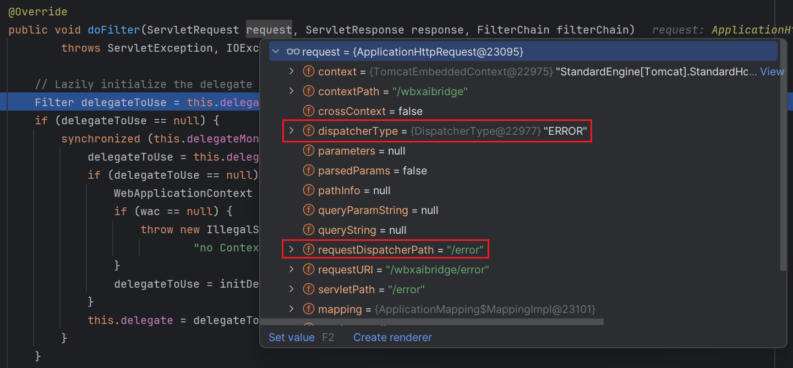
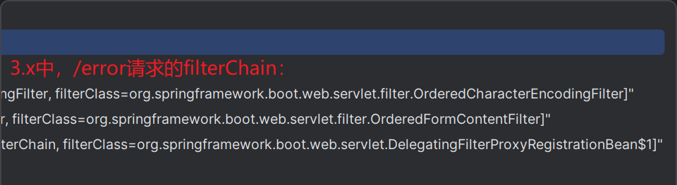
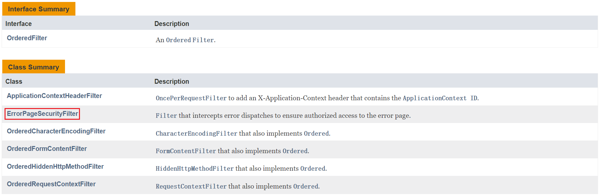
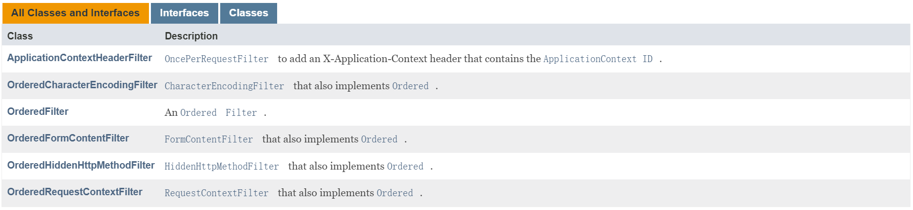
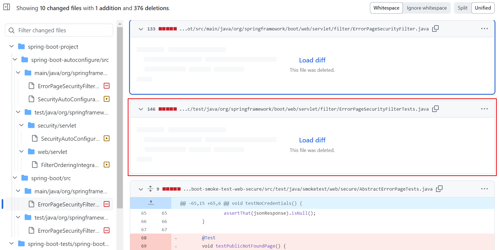
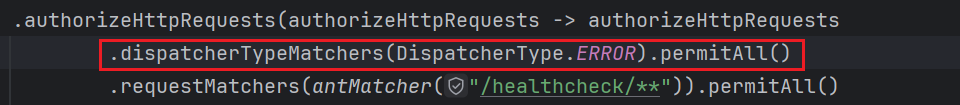
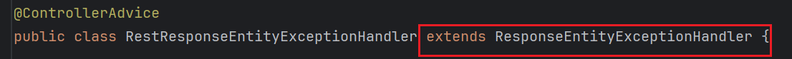
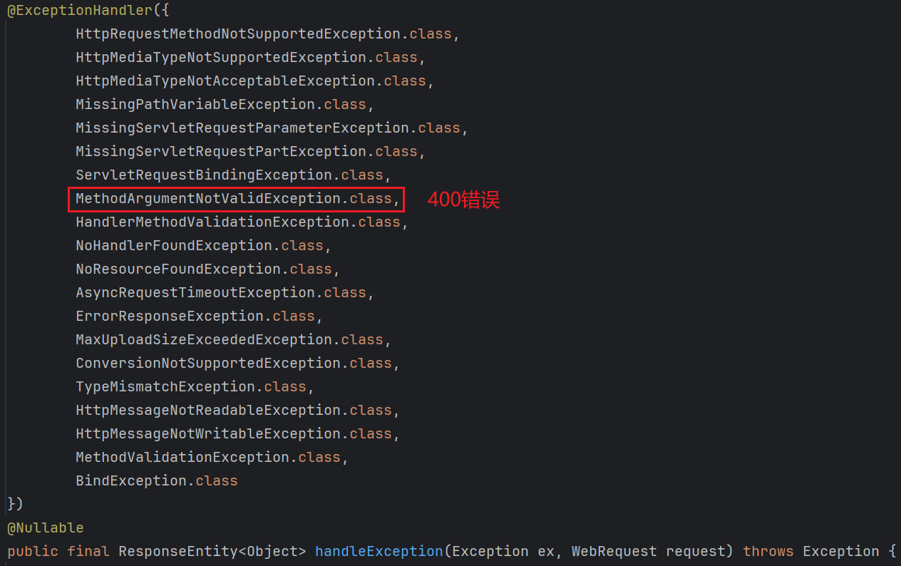

*`Author: ACatSmiling`*

*`Since: 2024-06-01`*

## 概要

写作本文的目的，是记录一次 Spring Boot 从 2.7.15 升级到 3.2.4 的过程，以及遇到的问题。

## 迁移指南

在升级之前，首先查看官方版本[迁移指南](https://github.com/spring-projects/spring-boot/wiki/Spring-Boot-3.0-Migration-Guide)，明确版本发生的变动，如果变动涉及的技术层面，在项目中得到了使用，需要按照指南进行对应的处理更新。

## 代码变动

升级前 WebSecurityConfig.java：

```java
package cn.zero.cloud.platform.config;

import org.springframework.beans.factory.annotation.Autowired;
import org.springframework.boot.web.servlet.FilterRegistrationBean;
import org.springframework.context.annotation.Bean;
import org.springframework.context.annotation.Configuration;
import org.springframework.core.Ordered;
import org.springframework.core.annotation.Order;
import org.springframework.security.config.annotation.web.configuration.EnableWebSecurity;

import java.util.List;

/**
 * @author Xisun Wang
 * @since 5/28/2024 10:13
 */
@Configuration()
@Order(Ordered.LOWEST_PRECEDENCE - 3)
@EnableWebSecurity
public class WbsSecurityConfig  {

    @Autowired
    WbsAppConfig wbsAppConfig;

    public static final List<String> IGNORED_URLS = List.of(
            "/css/**", "/html/**", "/img/**",
            "/js/**", "/libs/**", "/version.txt"
    );

    @Bean
    public FilterRegistrationBean<TrackingIdFilter> trackingIDFilterRegister() {
        FilterRegistrationBean<TrackingIdFilter> registration = new FilterRegistrationBean<>();
        registration.setFilter(new TrackingIdFilter());
        registration.setOrder(Ordered.HIGHEST_PRECEDENCE);
        registration.addUrlPatterns("/*");
        return registration;
    }

    @Bean
    public FilterRegistrationBean<AIIntegrationFilter> aiIntegrationFilterRegister(CiTokenServiceImpl ciTokenService) {
        FilterRegistrationBean<AIIntegrationFilter> registration = new FilterRegistrationBean<>();
        registration.setFilter(new AIIntegrationFilter(ciTokenService));
        registration.setOrder(Ordered.HIGHEST_PRECEDENCE + 100);
        registration.addUrlPatterns("/chapters/*", "/actionitems/*", "/notes/*",  "/feedbacks/*", "/summaries/*", "/summarytranscripts/*", "/imsummaries/*", "/v1/aicontent/*");
        return registration;
    }

    @Bean
    public WbxAuthenticationProvider wbxAuthenticationProvider() {
        return new WbxAuthenticationProvider();
    }
    
    @Bean
    public CiTokenAuthenticationFilter ciTokenAuthenticationFilter() {
        return new CiTokenAuthenticationFilter();
    }

    @Bean
    public WbxAppTokenAuthenticationFilter wbxAppTokenAuthenticationFilter() {
        return new WbxAppTokenAuthenticationFilter();
    }

    /*@Bean
    public PrivilegeWebSecurityExpressionHandler webExpressionHandler() {
        return new PrivilegeWebSecurityExpressionHandler();
    }*/

    @Bean
    public PrivilegeHttpSecurityExpressionHandler httpExpressionHandler() {
        return new PrivilegeHttpSecurityExpressionHandler();
    }

    @Bean
    public WebSecurityCustomizer configure() {
        // Define public access resources white list
        return web -> {
            web.ignoring().requestMatchers(toAntPathRequestMatchers(IGNORED_URLS));
            if (wbsAppConfig.isDebug()) {
                web.ignoring().requestMatchers("/actuator/**") //For run monitor
                        .requestMatchers(antMatcher("/swagger-ui.html")) //For doc
                        .requestMatchers(antMatcher("/webjars/springfox-swagger-ui/**"))
                        .requestMatchers(antMatcher("/swagger-resources/**"))
                        .requestMatchers(antMatcher("/v2/api-docs/**"));
            }
        };
    }

    @Bean
    protected SecurityFilterChain filterChain(HttpSecurity http) throws Exception {
        http.authenticationProvider(wbxAuthenticationProvider());
        //Filter
        //RateLimiter -> CIToken -> AppToken -> SessionTicket -> TrackingIdFilter

        //In order to remove duplicate Ci token validation, we need to change filter management from SecurityConfig to SecurityMVC.
        //If not, Ci validation will proceed for two times. One is securityConfig validation, the other one is SecurityMVC.
        var authorizationManager = new WebExpressionAuthorizationManager("isLoggedIn()");
        authorizationManager.setExpressionHandler(httpExpressionHandler());

        http
                .sessionManagement(sessionManagement -> sessionManagement.sessionCreationPolicy(SessionCreationPolicy.STATELESS))
                .csrf(AbstractHttpConfigurer::disable)
//                .addFilterBefore(wbxSessionTicketAuthenticationFilter(), AbstractPreAuthenticatedProcessingFilter.class)
                .addFilterBefore(wbxAppTokenAuthenticationFilter(), AbstractPreAuthenticatedProcessingFilter.class)
//                .addFilterBefore(ciTokenAuthenticationFilter(), WbxAppTokenAuthenticationFilter.class)
                .addFilterBefore(new RateLimitFilter(wbsAppConfig), WbxAppTokenAuthenticationFilter.class)
                .authorizeHttpRequests(authorizeHttpRequests -> authorizeHttpRequests
                        .requestMatchers(antMatcher("/healthcheck/**")).permitAll()
                        .requestMatchers(antMatcher("/summaries/**")).permitAll()
                        .requestMatchers(antMatcher("/imsummaries/**")).permitAll()
                        .requestMatchers(antMatcher("/summarytranscripts/**")).permitAll()
                        .requestMatchers(antMatcher("/suiteRecordingSummaries/**")).permitAll()
                        .requestMatchers(antMatcher("/v1/aicontent/**")).permitAll()
                        .requestMatchers(antMatcher("/**")).access(authorizationManager)
                );

        return http.build();
    }
    private AntPathRequestMatcher[] toAntPathRequestMatchers(HttpMethod method, List<String> antPatternList) {
        return antPatternList.stream().map(pattern -> AntPathRequestMatcher.antMatcher(method, pattern)).toList().toArray(new AntPathRequestMatcher[0]);
    }

    private AntPathRequestMatcher[] toAntPathRequestMatchers(List<String> antPatternList) {
        return antPatternList.stream().map(AntPathRequestMatcher::antMatcher).toList().toArray(new AntPathRequestMatcher[0]);
    }
}
```

升级后 WebSecurityConfig.java：

```java
package cn.zero.cloud.platform.config;

import org.springframework.beans.factory.annotation.Autowired;
import org.springframework.boot.web.servlet.FilterRegistrationBean;
import org.springframework.context.annotation.Bean;
import org.springframework.context.annotation.Configuration;
import org.springframework.core.Ordered;
import org.springframework.core.annotation.Order;
import org.springframework.http.HttpMethod;
import org.springframework.security.config.annotation.web.builders.HttpSecurity;
import org.springframework.security.config.annotation.web.configuration.EnableWebSecurity;
import org.springframework.security.config.annotation.web.configuration.WebSecurityCustomizer;
import org.springframework.security.config.annotation.web.configurers.AbstractHttpConfigurer;
import org.springframework.security.config.http.SessionCreationPolicy;
import org.springframework.security.web.SecurityFilterChain;
import org.springframework.security.web.access.expression.WebExpressionAuthorizationManager;
import org.springframework.security.web.authentication.preauth.AbstractPreAuthenticatedProcessingFilter;
import org.springframework.security.web.util.matcher.AntPathRequestMatcher;

import java.util.List;

import static org.springframework.security.web.util.matcher.AntPathRequestMatcher.antMatcher;

/**
 * @author Xisun Wang
 * @since 5/27/2024 17:15
 */
@Configuration()
@Order(Ordered.LOWEST_PRECEDENCE - 3)
@EnableWebSecurity
public class WebSecurityConfig {
    @Autowired
    WbsAppConfig wbsAppConfig;


    public static final List<String> IGNORED_URLS = List.of(
            "/css/**", "/html/**", "/img/**",
            "/js/**", "/libs/**", "/version.txt"
    );

    @Bean
    public FilterRegistrationBean<TrackingIdFilter> trackingIDFilterRegister() {
        FilterRegistrationBean<TrackingIdFilter> registration = new FilterRegistrationBean<>();
        registration.setFilter(new TrackingIdFilter());
        registration.setOrder(Ordered.HIGHEST_PRECEDENCE);
        registration.addUrlPatterns("/*");
        return registration;
    }

    @Bean
    public FilterRegistrationBean<AIIntegrationFilter> aiIntegrationFilterRegister(CiTokenServiceImpl ciTokenService) {
        FilterRegistrationBean<AIIntegrationFilter> registration = new FilterRegistrationBean<>();
        registration.setFilter(new AIIntegrationFilter(ciTokenService));
        registration.setOrder(Ordered.HIGHEST_PRECEDENCE + 100);
        registration.addUrlPatterns("/chapters/*", "/actionitems/*", "/notes/*", "/feedbacks/*", "/summaries/*", "/summarytranscripts/*", "/imsummaries/*", "/v1/aicontent/*");
        return registration;
    }

    @Bean
    public WbxAuthenticationProvider wbxAuthenticationProvider() {
        return new WbxAuthenticationProvider();
    }

    @Bean
    public CiTokenAuthenticationFilter ciTokenAuthenticationFilter() {
        return new CiTokenAuthenticationFilter();
    }

    @Bean
    public WbxAppTokenAuthenticationFilter wbxAppTokenAuthenticationFilter() {
        return new WbxAppTokenAuthenticationFilter();
    }

    /*@Bean
    public PrivilegeWebSecurityExpressionHandler webExpressionHandler() {
        return new PrivilegeWebSecurityExpressionHandler();
    }*/

    @Bean
    public PrivilegeHttpSecurityExpressionHandler httpExpressionHandler() {
        return new PrivilegeHttpSecurityExpressionHandler();
    }


    @Bean
    public WebSecurityCustomizer configure() {
        // Define public access resources white list
        return web -> {
            web.ignoring().requestMatchers(toAntPathRequestMatchers(IGNORED_URLS));
            if (wbsAppConfig.isDebug()) {
                web.ignoring().requestMatchers("/actuator/**") //For run monitor
                        .requestMatchers(antMatcher("/swagger-ui.html")) //For doc
                        .requestMatchers(antMatcher("/webjars/springfox-swagger-ui/**"))
                        .requestMatchers(antMatcher("/swagger-resources/**"))
                        .requestMatchers(antMatcher("/v2/api-docs/**"));
            }
        };
    }

    @Bean
    protected SecurityFilterChain filterChain(HttpSecurity http) throws Exception {
        http.authenticationProvider(wbxAuthenticationProvider());
        //Filter
        //RateLimiter -> CIToken -> AppToken -> SessionTicket -> TrackingIdFilter

        //In order to remove duplicate Ci token validation, we need to change filter management from SecurityConfig to SecurityMVC.
        //If not, Ci validation will proceed for two times. One is securityConfig validation, the other one is SecurityMVC.
        var authorizationManager = new WebExpressionAuthorizationManager("isLoggedIn()");
        authorizationManager.setExpressionHandler(httpExpressionHandler());

        http
                .sessionManagement(sessionManagement -> sessionManagement.sessionCreationPolicy(SessionCreationPolicy.STATELESS))
                .csrf(AbstractHttpConfigurer::disable)
//                .addFilterBefore(wbxSessionTicketAuthenticationFilter(), AbstractPreAuthenticatedProcessingFilter.class)
                .addFilterBefore(wbxAppTokenAuthenticationFilter(), AbstractPreAuthenticatedProcessingFilter.class)
//                .addFilterBefore(ciTokenAuthenticationFilter(), WbxAppTokenAuthenticationFilter.class)
                .addFilterBefore(new RateLimitFilter(wbsAppConfig), WbxAppTokenAuthenticationFilter.class)
                .authorizeHttpRequests(authorizeHttpRequests -> authorizeHttpRequests
                        .requestMatchers(antMatcher("/healthcheck/**")).permitAll()
                        .requestMatchers(antMatcher("/summaries/**")).permitAll()
                        .requestMatchers(antMatcher("/imsummaries/**")).permitAll()
                        .requestMatchers(antMatcher("/summarytranscripts/**")).permitAll()
                        .requestMatchers(antMatcher("/suiteRecordingSummaries/**")).permitAll()
                        .requestMatchers(antMatcher("/v1/aicontent/**")).permitAll()
                        .requestMatchers(antMatcher("/**")).access(authorizationManager)
                );

        return http.build();
    }

    private AntPathRequestMatcher[] toAntPathRequestMatchers(HttpMethod method, List<String> antPatternList) {
        return antPatternList.stream().map(pattern -> AntPathRequestMatcher.antMatcher(method, pattern)).toList().toArray(new AntPathRequestMatcher[0]);
    }

    private AntPathRequestMatcher[] toAntPathRequestMatchers(List<String> antPatternList) {
        return antPatternList.stream().map(AntPathRequestMatcher::antMatcher).toList().toArray(new AntPathRequestMatcher[0]);
    }
}
```

## 问题

### /error

#### 问题描述

进行请求测试时，发现部分本应该报 400 错误的请求，却返回了 403。

#### 请求过程

当一个 HTTP 请求到达 Spring Boot 应用时，处理顺序如下：

1. Servlet 容器（如 Tomcat）首先接收到请求。
2. Spring Security 的 FilterChain：在请求到达 DispatcherServlet 之前，它首先会被 Spring Security 的过滤器链处理。这是因为在 Servlet 容器中，过滤器（Filter）是在 Servlet 之前被调用的。Spring Security 利用这个特性来拦截请求并执行各种安全检查（如认证和授权），还可以处理跨站请求伪造（CSRF）保护、CORS、Header 写入等。
3. DispatcherServlet：如果请求通过了 Spring Security 的过滤器链（即，用户已经被成功认证且授权），请求接着会被分发到 DispatcherServlet。DispatcherServlet 作为 Spring MVC 的前端控制器，负责将请求路由到相应的控制器（Controller）。
4. 控制器（Controller）：控制器处理请求并返回响应，可能是一个视图名称、模型和视图对象或直接写回响应体。
5. 视图解析（如果需要的话）：如果控制器返回的是视图名称，那么 DispatcherServlet 会使用视图解析器（ViewResolver）来解析对应的视图。
6. 渲染视图（如果需要的话）：解析得到的视图最终会被渲染，响应返回给客户端。

通过这个顺序，可以看出 Spring Security 的过滤器链是在 DispatcherServlet 处理请求之前执行的。这种设计允许 Spring Security 在控制器逻辑执行之前执行安全检查，如果安全检查失败，就可以阻止请求进一步处理，并直接返回一个错误响应，例如，一个 401 未授权或 403 禁止访问。

当一个 HTTP 请求到达 Spring 应用程序时，它首先经过由 Servlet 容器（如 Tomcat）管理的一系列过滤器。如果想要在第一时间监控或 debug Spring Security 的过滤器链，可以在以下几个地方设置断点：

1. `DelegatingFilterProxy`：Spring Security 是通过一个名为 DelegatingFilterProxy 的特殊过滤器与 Spring 容器集成的。这个过滤器实际上不执行任何安全逻辑，而是将请求委托给 Spring 容器中定义的过滤器链。你可以在 DelegatingFilterProxy 的 doFilter 方法中设置断点。
2. `FilterChainProxy`：DelegatingFilterProxy 通常会委托给一个名为 FilterChainProxy 的 Spring 管理的 bean。这个 FilterChainProxy 实际上管理着多个安全过滤器链。它会根据请求的 URL 选择合适的过滤器链来处理请求。设置断点在 FilterChainProxy 的 doFilter 方法可以让你看到整个过滤器链如何被调用。
3. `SecurityFilterChain`：在 FilterChainProxy 内部，可能会有多个 SecurityFilterChain 实例，每个实例都有自己的过滤器列表。这些过滤器链对应于不同的 URL 模式和安全配置。你可以设置断点在 FilterChainProxy 中选择 SecurityFilterChain 的逻辑上，这样你就可以监控到特定的安全过滤器链何时被触发。
4. 具体的安全过滤器：如果你想要监控特定的安全检查或处理，比如认证（UsernamePasswordAuthenticationFilter）、授权（FilterSecurityInterceptor）、JWT Token 验证等，你可以直接在这些过滤器的 doFilter 方法中设置断点。

#### root cause

通过监控 DelegatingFilterProxy，当一个 400 类请求到达时，返回 /error，但是代码中 Spring Security 的配置，没有对 /error 放行（官方推荐应该放行）：



在 Spring Boot 2.x 版本，有一个默认的 ErrorPageSecurityFilter，会过滤 /error 请求，然后指定到对应的 Controller 进行处理，并正常返回错误响应：


但是，在 Spring Boot 3.x 版本，ErrorPageSecurityFilter 被删除，导致 /error 请求未被拦截处理：



因为 Spring Security 配置文件没有对 /error 请求放行，同时，默认的 ErrorPageSecurityFilter 也被删除，导致 /error 请求，被当作了普通的 HTTP 请求，并被后续业务上的鉴权过滤器拦截，并且鉴权不通过。因此，最终返回了 403 而不是 400 错误响应。

> ErrorPageSecurityFilter.java 文件，在 Spring Boot 2.7.15 [存在](https://docs.spring.io/spring-boot/docs/2.7.15/api/org/springframework/boot/web/servlet/filter/ErrorPageSecurityFilter.html)：
>
> 
>
> 但是 Spring Boot 3.0.4 [被删除](https://docs.spring.io/spring-boot/docs/3.0.4/api/org/springframework/boot/web/servlet/filter/package-summary.html)：
>
> 
>
> 从 GitHub 上 Spring Boot 的 commit 记录，也可以[验证](https://github.com/spring-projects/spring-boot/commit/cedd553b836d97a04d769322771bc1a8499e7282#diff-a12b56ffe1b71fd7fc8fc13c27f031b00797d0dd4a4df661fd064bae4cff9ffa)：
>
> 
>
> 官方升级指南没有对此进行说明，查找到两个相关的 [issue](https://github.com/spring-projects/spring-boot/issues/29820)：
>
> 1. [Investigate options for removing Spring Boot's ErrorPageSecurityFilter #10919](https://github.com/spring-projects/spring-security/issues/10919)
> 2. [Alternatives to WebInvocationPrivilegeEvaluator in ErrorPageSecurityFilter #29820](https://github.com/spring-projects/spring-boot/issues/29820)
>
> 通过这两个 issue，可以比较明确，ErrorPageSecurityFilter.java 文件，在 Spring Boot 3.0.x 版本之后被移除。

#### 解决办法

方法一：在 Spring Security 的配置中，添加 /error 请求的放行。



方法二：本地全局异常处理器，继承 ResponseEntityExceptionHandler 类。



>ResponseEntityExceptionHandler 类中，添加了对 400 错误的处理器：
>
>

## 本文参考

https://github.com/spring-projects/spring-boot/wiki/Spring-Boot-3.0-Migration-Guide

https://docs.spring.io/spring-boot/reference/web/servlet.html#web.servlet.spring-mvc.error-handling

https://docs.spring.io/spring-boot/reference/web/spring-security.html

## 声明

写作本文初衷是个人学习记录，鉴于本人学识有限，如有侵权或不当之处，请联系 [wdshfut@163.com](mailto:wdshfut@163.com)。

