*date: 2021-06-12*

## Spring Boot 简介

官网：https://spring.io/projects/spring-boot

文档：https://spring.io/projects/spring-boot#learn

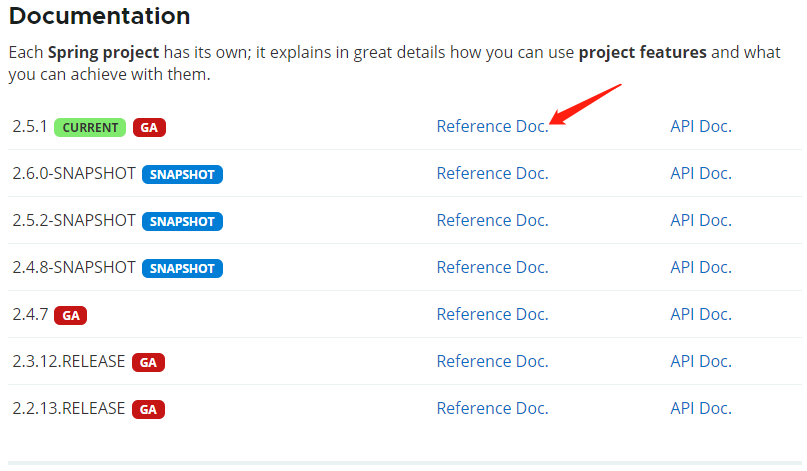

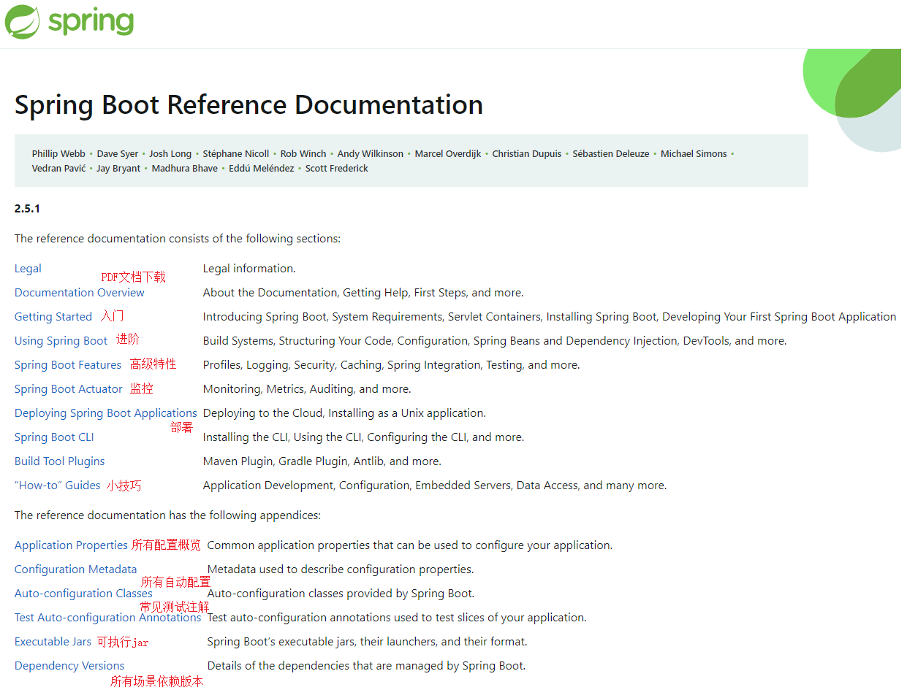

查看各版本的新特性：https://github.com/spring-projects/spring-boot/wiki#release-notes

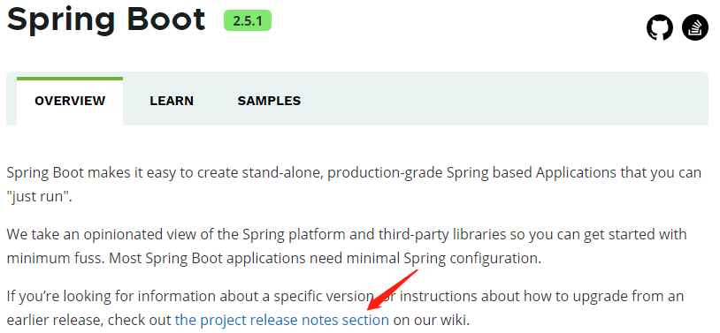

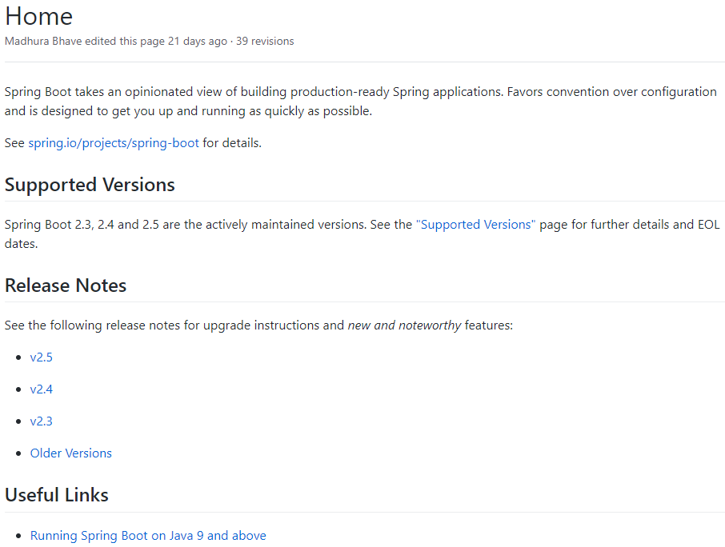

## Spring Boot 的作用

> Spring Boot makes it easy to create stand-alone, production-grade Spring based Applications that you can "just run".

Spring Boot 能快速创建出生产级别的 Spring 应用。

## Spring Boot 的优点

- Create stand-alone Spring applications

  - 创建独立的 Spring 应用。

- Embed Tomcat, Jetty or Undertow directly (no need to deploy WAR files)

  - 内嵌 web 服务器。

- Provide opinionated 'starter' dependencies to simplify your build configuration

  - 自动 starter 依赖，简化构建配置。

- Automatically configure Spring and 3rd party libraries whenever possible

  - 自动配置 Spring 以及第三方功能。

- Provide production-ready features such as metrics, health checks, and externalized configuration

  - 提供生产级别的监控、健康检查及外部化配置。

- Absolutely no code generation and no requirement for XML configuration

  - 无代码生成、无需编写 XML。

## Spring Boot 的缺点

- 人称版本帝，迭代快，需要时刻关注变化。
- 封装太深，内部原理复杂，不容易精通。

## Spring Boot 2 入门

### 系统要求

Java 8 +：

```powershell
PS C:\Users\XiSun> java -version
openjdk version "1.8.0_222"
OpenJDK Runtime Environment (AdoptOpenJDK)(build 1.8.0_222-b10)
OpenJDK 64-Bit Server VM (AdoptOpenJDK)(build 25.222-b10, mixed mode)
```

Maven 3.5 +：

```powershell
PS C:\Users\XiSun> mvn -v
Apache Maven 3.6.3 (cecedd343002696d0abb50b32b541b8a6ba2883f)
Maven home: D:\Program Files\Maven\apache-maven-3.6.3\bin\..
Java version: 1.8.0_222, vendor: AdoptOpenJDK, runtime: D:\Program Files\AdoptOpenJDK\jdk-8.0.222.10-hotspot\jre
Default locale: zh_CN, platform encoding: GBK
OS name: "windows 10", version: "10.0", arch: "amd64", family: "windows"
```

Maven setting.xml 的设置：

```xml
<mirrors>
    <mirror>
        <id>nexus-aliyun</id>
        <mirrorOf>central</mirrorOf>
        <name>Nexus aliyun</name>
        <url>http://maven.aliyun.com/nexus/content/groups/public</url>
    </mirror>
</mirrors>
 
<profiles>
    <profile>
        <id>jdk-1.8</id>
        <activation>
            <activeByDefault>true</activeByDefault>
            <jdk>1.8</jdk>
        </activation>
        <properties>
            <maven.compiler.source>1.8</maven.compiler.source>
            <maven.compiler.target>1.8</maven.compiler.target>
            <maven.compiler.compilerVersion>1.8</maven.compiler.compilerVersion>
        </properties>
    </profile>
</profiles>
```

说明：添加上面的配置后，项目中每次 Maven 更新依赖时，不会改变 Compiler 的版本。如果针对单个项目配置，则在该项目的 pom.xml 文件中添加：

```xml
<properties>
        <app.main.class>cn.matgene.reaction.extractor.FlinkKafkaJob</app.main.class>
        <project.build.sourceEncoding>UTF-8</project.build.sourceEncoding>
        <java.version>1.8</java.version>
        <maven.compiler.version>3.6.1</maven.compiler.version>
        <maven.compiler.source>${java.version}</maven.compiler.source>
        <maven.compiler.target>${java.version}</maven.compiler.target>
    </properties>

<build>
    <plugins>
        <plugin>
            <groupId>org.apache.maven.plugins</groupId>
            <artifactId>maven-compiler-plugin</artifactId>
            <version>${maven.compiler.version}</version>
            <configuration>
                <source>${maven.compiler.source}</source>
                <target>${maven.compiler.target}</target>
            </configuration>
        </plugin>
    <plugins>
</build>
```

### HelloWorld

需求：浏览器发送`/hello`请求，服务器响应`Hello, Spring Boot 2!`。

参考：https://docs.spring.io/spring-boot/docs/current/reference/html/getting-started.html#getting-started.first-application

第一步，创建 Maven 工程，并添加 parent 依赖：

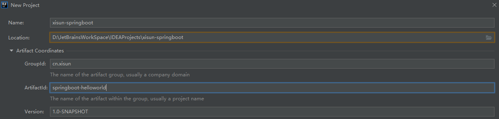

```xml
<?xml version="1.0" encoding="UTF-8"?>
<project xmlns="http://maven.apache.org/POM/4.0.0"
         xmlns:xsi="http://www.w3.org/2001/XMLSchema-instance"
         xsi:schemaLocation="http://maven.apache.org/POM/4.0.0 http://maven.apache.org/xsd/maven-4.0.0.xsd">
    <modelVersion>4.0.0</modelVersion>

    <groupId>cn.xisun</groupId>
    <artifactId>springboot-helloworld</artifactId>
    <version>1.0-SNAPSHOT</version>

    <parent>
        <groupId>org.springframework.boot</groupId>
        <artifactId>spring-boot-starter-parent</artifactId>
        <version>2.5.1</version>
    </parent>

</project>
```

> parent 节点为手动添加。

第二步，引入 web 相关依赖：

```xml
<dependency>
    <groupId>org.springframework.boot</groupId>
    <artifactId>spring-boot-starter-web</artifactId>
</dependency>
```

第三步，创建主程序：

```java
/**
 * @Author XiSun
 * @Date 2021/6/20 15:03
 * @Description 主程序类
 */
@SpringBootApplication
public class MainApplication {
    public static void main(String[] args) {
        SpringApplication.run(MainApplication.class, args);
    }
}
```

第四步，业务层：

```java
/**
 * @Author XiSun
 * @Date 2021/6/20 15:17
 */
@Controller
public class HelloController {
    @RequestMapping("/hello")
    @ResponseBody
    public String hello() {
        return "Hello, Spring Boot 2!";
    }
}
```

第五步，运行 MainApplication.class 的 main 方法，启动程序，在浏览器输入地址 `http://localhost:8080/hello`，查看结果：

```java
  .   ____          _            __ _ _
 /\\ / ___'_ __ _ _(_)_ __  __ _ \ \ \ \
( ( )\___ | '_ | '_| | '_ \/ _` | \ \ \ \
 \\/  ___)| |_)| | | | | || (_| |  ) ) ) )
  '  |____| .__|_| |_|_| |_\__, | / / / /
 =========|_|==============|___/=/_/_/_/
 :: Spring Boot ::                (v2.5.1)

2021-06-20 15:37:47.623  INFO 14268 --- [           main] cn.xisun.web.MainApplication             : Starting MainApplication using Java 1.8.0_222 on DESKTOP-OJKMETJ with PID 14268 (D:\JetBrainsWorkSpace\IDEAProjects\xisun-springboot\target\classes started by XiSun in D:\JetBrainsWorkSpace\IDEAProjects\xisun-springboot)
2021-06-20 15:37:47.627  INFO 14268 --- [           main] cn.xisun.web.MainApplication             : No active profile set, falling back to default profiles: default
2021-06-20 15:37:48.380  INFO 14268 --- [           main] o.s.b.w.embedded.tomcat.TomcatWebServer  : Tomcat initialized with port(s): 8080 (http)
2021-06-20 15:37:48.386  INFO 14268 --- [           main] o.apache.catalina.core.StandardService   : Starting service [Tomcat]
2021-06-20 15:37:48.386  INFO 14268 --- [           main] org.apache.catalina.core.StandardEngine  : Starting Servlet engine: [Apache Tomcat/9.0.46]
2021-06-20 15:37:48.438  INFO 14268 --- [           main] o.a.c.c.C.[Tomcat].[localhost].[/]       : Initializing Spring embedded WebApplicationContext
2021-06-20 15:37:48.439  INFO 14268 --- [           main] w.s.c.ServletWebServerApplicationContext : Root WebApplicationContext: initialization completed in 760 ms
2021-06-20 15:37:48.674  INFO 14268 --- [           main] o.s.b.w.embedded.tomcat.TomcatWebServer  : Tomcat started on port(s): 8080 (http) with context path ''
2021-06-20 15:37:48.681  INFO 14268 --- [           main] cn.xisun.web.MainApplication             : Started MainApplication in 1.374 seconds (JVM running for 2.301)
2021-06-20 15:37:59.504  INFO 14268 --- [nio-8080-exec-1] o.a.c.c.C.[Tomcat].[localhost].[/]       : Initializing Spring DispatcherServlet 'dispatcherServlet'
2021-06-20 15:37:59.504  INFO 14268 --- [nio-8080-exec-1] o.s.web.servlet.DispatcherServlet        : Initializing Servlet 'dispatcherServlet'
2021-06-20 15:37:59.504  INFO 14268 --- [nio-8080-exec-1] o.s.web.servlet.DispatcherServlet        : Completed initialization in 0 ms
```


简化配置：

- 参考：https://docs.spring.io/spring-boot/docs/current/reference/html/application-properties.html#application-properties

- 在 resources 目录下新建 application.properties 文件，项目中的一些配置可在此文件中进行修改。

- 如，修改 tomcat 端口：

  ```properties
  server.port=8888
  ```

简化部署：

- **添加 `spring-boot-maven-plugin`：**

  ```xml
  <build>
      <plugins>
          <plugin>
              <groupId>org.springframework.boot</groupId>
              <artifactId>spring-boot-maven-plugin</artifactId>
          </plugin>
      </plugins>
  </build>
  ```

- 打包：

  ```java
  D:\JetBrainsWorkSpace\IDEAProjects\xisun-springboot>mvn clean package -DskipTests
  [INFO] Scanning for projects...
  [INFO]
  [INFO] -------------------< cn.xisun:springboot-helloworld >-------------------
  [INFO] Building springboot-helloworld 1.0-SNAPSHOT
  [INFO] --------------------------------[ jar ]---------------------------------
  [INFO]
  [INFO] --- maven-clean-plugin:3.1.0:clean (default-clean) @ springboot-helloworld ---
  [INFO] Deleting D:\JetBrainsWorkSpace\IDEAProjects\xisun-springboot\target
  [INFO]
  [INFO] --- maven-resources-plugin:3.2.0:resources (default-resources) @ springboot-helloworld ---
  [INFO] Using 'UTF-8' encoding to copy filtered resources.
  [INFO] Using 'UTF-8' encoding to copy filtered properties files.
  [INFO] Copying 1 resource
  [INFO] Copying 0 resource
  [INFO]
  [INFO] --- maven-compiler-plugin:3.8.1:compile (default-compile) @ springboot-helloworld ---
  [INFO] Changes detected - recompiling the module!
  [INFO] Compiling 2 source files to D:\JetBrainsWorkSpace\IDEAProjects\xisun-springboot\target\classes
  [INFO]
  [INFO] --- maven-resources-plugin:3.2.0:testResources (default-testResources) @ springboot-helloworld ---
  [INFO] Using 'UTF-8' encoding to copy filtered resources.
  [INFO] Using 'UTF-8' encoding to copy filtered properties files.
  [INFO] skip non existing resourceDirectory D:\JetBrainsWorkSpace\IDEAProjects\xisun-springboot\src\test\resources
  [INFO]
  [INFO] --- maven-compiler-plugin:3.8.1:testCompile (default-testCompile) @ springboot-helloworld ---
  [INFO] Changes detected - recompiling the module!
  [INFO]
  [INFO] --- maven-surefire-plugin:2.22.2:test (default-test) @ springboot-helloworld ---
  [INFO] Tests are skipped.
  [INFO]
  [INFO] --- maven-jar-plugin:3.2.0:jar (default-jar) @ springboot-helloworld ---
  [INFO] Building jar: D:\JetBrainsWorkSpace\IDEAProjects\xisun-springboot\target\springboot-helloworld-1.0-SNAPSHOT.jar
  [INFO]
  [INFO] --- spring-boot-maven-plugin:2.5.1:repackage (repackage) @ springboot-helloworld ---
  [INFO] Replacing main artifact with repackaged archive
  [INFO] ------------------------------------------------------------------------
  [INFO] BUILD SUCCESS
  [INFO] ------------------------------------------------------------------------
  [INFO] Total time:  1.890 s
  [INFO] Finished at: 2021-06-20T16:47:43+08:00
  [INFO] ------------------------------------------------------------------------
  ```

## Spring Boot 的特点

### 依赖管理

#### parent 依赖

Spring Boot 项目，都会添加一个 parent 依赖`spring-boot-starter-parent`：

```xml
<parent>
    <groupId>org.springframework.boot</groupId>
    <artifactId>spring-boot-starter-parent</artifactId>
    <version>2.5.1</version>
</parent>
```

- 父项目一般都是做依赖管理的，后续在项目中添加的依赖，其版本号和父项目 version 一致，不需要再单独指定。

- `spring-boot-starter-parent`有自己的父项目`spring-boot-dependencies`，在该项目中几乎声明了所有开发中常用的依赖的版本号，这个版本号一般适应当前项目对应的版本，即**自动版本仲裁机制**。

  ```xml
  <parent>
    <groupId>org.springframework.boot</groupId>
    <artifactId>spring-boot-dependencies</artifactId>
    <version>2.5.1</version>
  </parent>
  ```

  ```xml
  <properties>
    <activemq.version>5.16.2</activemq.version>
    <antlr2.version>2.7.7</antlr2.version>
    <appengine-sdk.version>1.9.89</appengine-sdk.version>
    <artemis.version>2.17.0</artemis.version>
    <aspectj.version>1.9.6</aspectj.version>
    <assertj.version>3.19.0</assertj.version>
    <atomikos.version>4.0.6</atomikos.version>
    <awaitility.version>4.0.3</awaitility.version>
    <build-helper-maven-plugin.version>3.2.0</build-helper-maven-plugin.version>
    <byte-buddy.version>1.10.22</byte-buddy.version>
    <caffeine.version>2.9.1</caffeine.version>
    <cassandra-driver.version>4.11.1</cassandra-driver.version>
    <classmate.version>1.5.1</classmate.version>
    <commons-codec.version>1.15</commons-codec.version>
    <commons-dbcp2.version>2.8.0</commons-dbcp2.version>
    <commons-lang3.version>3.12.0</commons-lang3.version>
    <commons-pool.version>1.6</commons-pool.version>
    <commons-pool2.version>2.9.0</commons-pool2.version>
    <couchbase-client.version>3.1.6</couchbase-client.version>
    <db2-jdbc.version>11.5.5.0</db2-jdbc.version>
    <dependency-management-plugin.version>1.0.11.RELEASE</dependency-management-plugin.version>
    <derby.version>10.14.2.0</derby.version>
    <dropwizard-metrics.version>4.1.22</dropwizard-metrics.version>
    <ehcache.version>2.10.9.2</ehcache.version>
    <ehcache3.version>3.9.4</ehcache3.version>
    <elasticsearch.version>7.12.1</elasticsearch.version>
    <embedded-mongo.version>3.0.0</embedded-mongo.version>
    <flyway.version>7.7.3</flyway.version>
    <freemarker.version>2.3.31</freemarker.version>
    <git-commit-id-plugin.version>4.0.5</git-commit-id-plugin.version>
    <glassfish-el.version>3.0.3</glassfish-el.version>
    <glassfish-jaxb.version>2.3.4</glassfish-jaxb.version>
    <groovy.version>3.0.8</groovy.version>
    <gson.version>2.8.7</gson.version>
    <h2.version>1.4.200</h2.version>
    <hamcrest.version>2.2</hamcrest.version>
    <hazelcast.version>4.1.3</hazelcast.version>
    <hazelcast-hibernate5.version>2.2.0</hazelcast-hibernate5.version>
    <hibernate.version>5.4.32.Final</hibernate.version>
    <hibernate-validator.version>6.2.0.Final</hibernate-validator.version>
    <hikaricp.version>4.0.3</hikaricp.version>
    <hsqldb.version>2.5.2</hsqldb.version>
    <htmlunit.version>2.49.1</htmlunit.version>
    <httpasyncclient.version>4.1.4</httpasyncclient.version>
    <httpclient.version>4.5.13</httpclient.version>
    <httpclient5.version>5.0.4</httpclient5.version>
    <httpcore.version>4.4.14</httpcore.version>
    <httpcore5.version>5.1.1</httpcore5.version>
    <infinispan.version>12.1.4.Final</infinispan.version>
    <influxdb-java.version>2.21</influxdb-java.version>
    <jackson-bom.version>2.12.3</jackson-bom.version>
    <jakarta-activation.version>1.2.2</jakarta-activation.version>
    <jakarta-annotation.version>1.3.5</jakarta-annotation.version>
    <jakarta-jms.version>2.0.3</jakarta-jms.version>
    <jakarta-json.version>1.1.6</jakarta-json.version>
    <jakarta-json-bind.version>1.0.2</jakarta-json-bind.version>
    <jakarta-mail.version>1.6.7</jakarta-mail.version>
    <jakarta-persistence.version>2.2.3</jakarta-persistence.version>
    <jakarta-servlet.version>4.0.4</jakarta-servlet.version>
    <jakarta-servlet-jsp-jstl.version>1.2.7</jakarta-servlet-jsp-jstl.version>
    <jakarta-transaction.version>1.3.3</jakarta-transaction.version>
    <jakarta-validation.version>2.0.2</jakarta-validation.version>
    <jakarta-websocket.version>1.1.2</jakarta-websocket.version>
    <jakarta-ws-rs.version>2.1.6</jakarta-ws-rs.version>
    <jakarta-xml-bind.version>2.3.3</jakarta-xml-bind.version>
    <jakarta-xml-soap.version>1.4.2</jakarta-xml-soap.version>
    <jakarta-xml-ws.version>2.3.3</jakarta-xml-ws.version>
    <janino.version>3.1.4</janino.version>
    <javax-activation.version>1.2.0</javax-activation.version>
    <javax-annotation.version>1.3.2</javax-annotation.version>
    <javax-cache.version>1.1.1</javax-cache.version>
    <javax-jaxb.version>2.3.1</javax-jaxb.version>
    <javax-jaxws.version>2.3.1</javax-jaxws.version>
    <javax-jms.version>2.0.1</javax-jms.version>
    <javax-json.version>1.1.4</javax-json.version>
    <javax-jsonb.version>1.0</javax-jsonb.version>
    <javax-mail.version>1.6.2</javax-mail.version>
    <javax-money.version>1.1</javax-money.version>
    <javax-persistence.version>2.2</javax-persistence.version>
    <javax-transaction.version>1.3</javax-transaction.version>
    <javax-validation.version>2.0.1.Final</javax-validation.version>
    <javax-websocket.version>1.1</javax-websocket.version>
    <jaxen.version>1.2.0</jaxen.version>
    <jaybird.version>4.0.3.java8</jaybird.version>
    <jboss-logging.version>3.4.2.Final</jboss-logging.version>
    <jboss-transaction-spi.version>7.6.1.Final</jboss-transaction-spi.version>
    <jdom2.version>2.0.6</jdom2.version>
    <jedis.version>3.6.0</jedis.version>
    <jersey.version>2.33</jersey.version>
    <jetty-el.version>9.0.29</jetty-el.version>
    <jetty-jsp.version>2.2.0.v201112011158</jetty-jsp.version>
    <jetty-reactive-httpclient.version>1.1.9</jetty-reactive-httpclient.version>
    <jetty.version>9.4.42.v20210604</jetty.version>
    <jmustache.version>1.15</jmustache.version>
    <johnzon.version>1.2.13</johnzon.version>
    <jolokia.version>1.6.2</jolokia.version>
    <jooq.version>3.14.11</jooq.version>
    <json-path.version>2.5.0</json-path.version>
    <json-smart.version>2.4.7</json-smart.version>
    <jsonassert.version>1.5.0</jsonassert.version>
    <jstl.version>1.2</jstl.version>
    <jtds.version>1.3.1</jtds.version>
    <junit.version>4.13.2</junit.version>
    <junit-jupiter.version>5.7.2</junit-jupiter.version>
    <kafka.version>2.7.1</kafka.version>
    <kotlin.version>1.5.10</kotlin.version>
    <kotlin-coroutines.version>1.5.0</kotlin-coroutines.version>
    <lettuce.version>6.1.2.RELEASE</lettuce.version>
    <liquibase.version>4.3.5</liquibase.version>
    <log4j2.version>2.14.1</log4j2.version>
    <logback.version>1.2.3</logback.version>
    <lombok.version>1.18.20</lombok.version>
    <mariadb.version>2.7.3</mariadb.version>
    <maven-antrun-plugin.version>1.8</maven-antrun-plugin.version>
    <maven-assembly-plugin.version>3.3.0</maven-assembly-plugin.version>
    <maven-clean-plugin.version>3.1.0</maven-clean-plugin.version>
    <maven-compiler-plugin.version>3.8.1</maven-compiler-plugin.version>
    <maven-dependency-plugin.version>3.1.2</maven-dependency-plugin.version>
    <maven-deploy-plugin.version>2.8.2</maven-deploy-plugin.version>
    <maven-enforcer-plugin.version>3.0.0-M3</maven-enforcer-plugin.version>
    <maven-failsafe-plugin.version>2.22.2</maven-failsafe-plugin.version>
    <maven-help-plugin.version>3.2.0</maven-help-plugin.version>
    <maven-install-plugin.version>2.5.2</maven-install-plugin.version>
    <maven-invoker-plugin.version>3.2.2</maven-invoker-plugin.version>
    <maven-jar-plugin.version>3.2.0</maven-jar-plugin.version>
    <maven-javadoc-plugin.version>3.2.0</maven-javadoc-plugin.version>
    <maven-resources-plugin.version>3.2.0</maven-resources-plugin.version>
    <maven-shade-plugin.version>3.2.4</maven-shade-plugin.version>
    <maven-source-plugin.version>3.2.1</maven-source-plugin.version>
    <maven-surefire-plugin.version>2.22.2</maven-surefire-plugin.version>
    <maven-war-plugin.version>3.3.1</maven-war-plugin.version>
    <micrometer.version>1.7.0</micrometer.version>
    <mimepull.version>1.9.14</mimepull.version>
    <mockito.version>3.9.0</mockito.version>
    <mongodb.version>4.2.3</mongodb.version>
    <mssql-jdbc.version>9.2.1.jre8</mssql-jdbc.version>
    <mysql.version>8.0.25</mysql.version>
    <nekohtml.version>1.9.22</nekohtml.version>
    <neo4j-java-driver.version>4.2.6</neo4j-java-driver.version>
    <netty.version>4.1.65.Final</netty.version>
    <netty-tcnative.version>2.0.39.Final</netty-tcnative.version>
    <oauth2-oidc-sdk.version>9.3.3</oauth2-oidc-sdk.version>
    <nimbus-jose-jwt.version>9.8.1</nimbus-jose-jwt.version>
    <ojdbc.version>19.3.0.0</ojdbc.version>
    <okhttp3.version>3.14.9</okhttp3.version>
    <oracle-database.version>21.1.0.0</oracle-database.version>
    <pooled-jms.version>1.2.2</pooled-jms.version>
    <postgresql.version>42.2.20</postgresql.version>
    <prometheus-pushgateway.version>0.10.0</prometheus-pushgateway.version>
    <quartz.version>2.3.2</quartz.version>
    <querydsl.version>4.4.0</querydsl.version>
    <r2dbc-bom.version>Arabba-SR10</r2dbc-bom.version>
    <rabbit-amqp-client.version>5.12.0</rabbit-amqp-client.version>
    <reactive-streams.version>1.0.3</reactive-streams.version>
    <reactor-bom.version>2020.0.7</reactor-bom.version>
    <rest-assured.version>4.3.3</rest-assured.version>
    <rsocket.version>1.1.1</rsocket.version>
    <rxjava.version>1.3.8</rxjava.version>
    <rxjava-adapter.version>1.2.1</rxjava-adapter.version>
    <rxjava2.version>2.2.21</rxjava2.version>
    <saaj-impl.version>1.5.3</saaj-impl.version>
    <selenium.version>3.141.59</selenium.version>
    <selenium-htmlunit.version>2.49.1</selenium-htmlunit.version>
    <sendgrid.version>4.7.2</sendgrid.version>
    <servlet-api.version>4.0.1</servlet-api.version>
    <slf4j.version>1.7.30</slf4j.version>
    <snakeyaml.version>1.28</snakeyaml.version>
    <solr.version>8.8.2</solr.version>
    <spring-amqp.version>2.3.8</spring-amqp.version>
    <spring-batch.version>4.3.3</spring-batch.version>
    <spring-data-bom.version>2021.0.1</spring-data-bom.version>
    <spring-framework.version>5.3.8</spring-framework.version>
    <spring-hateoas.version>1.3.1</spring-hateoas.version>
    <spring-integration.version>5.5.0</spring-integration.version>
    <spring-kafka.version>2.7.2</spring-kafka.version>
    <spring-ldap.version>2.3.4.RELEASE</spring-ldap.version>
    <spring-restdocs.version>2.0.5.RELEASE</spring-restdocs.version>
    <spring-retry.version>1.3.1</spring-retry.version>
    <spring-security.version>5.5.0</spring-security.version>
    <spring-session-bom.version>2021.0.0</spring-session-bom.version>
    <spring-ws.version>3.1.1</spring-ws.version>
    <sqlite-jdbc.version>3.34.0</sqlite-jdbc.version>
    <sun-mail.version>1.6.7</sun-mail.version>
    <thymeleaf.version>3.0.12.RELEASE</thymeleaf.version>
    <thymeleaf-extras-data-attribute.version>2.0.1</thymeleaf-extras-data-attribute.version>
    <thymeleaf-extras-java8time.version>3.0.4.RELEASE</thymeleaf-extras-java8time.version>
    <thymeleaf-extras-springsecurity.version>3.0.4.RELEASE</thymeleaf-extras-springsecurity.version>
    <thymeleaf-layout-dialect.version>2.5.3</thymeleaf-layout-dialect.version>
    <tomcat.version>9.0.46</tomcat.version>
    <unboundid-ldapsdk.version>4.0.14</unboundid-ldapsdk.version>
    <undertow.version>2.2.8.Final</undertow.version>
    <versions-maven-plugin.version>2.8.1</versions-maven-plugin.version>
    <webjars-hal-browser.version>3325375</webjars-hal-browser.version>
    <webjars-locator-core.version>0.46</webjars-locator-core.version>
    <wsdl4j.version>1.6.3</wsdl4j.version>
    <xml-maven-plugin.version>1.0.2</xml-maven-plugin.version>
    <xmlunit2.version>2.8.2</xmlunit2.version>
  </properties>
  ```

  > 通过`spring-boot-dependencies`，可以查看适应当前版本的其他依赖的 version。

#### 场景启动器

参考：https://docs.spring.io/spring-boot/docs/current/reference/html/using.html#using.build-systems.starters

场景启动器表示的是实现某种功能时，所需要的一组常规的依赖，当引入这个启动器后，会自动添加这一组依赖。比如`spring-boot-start-web`：

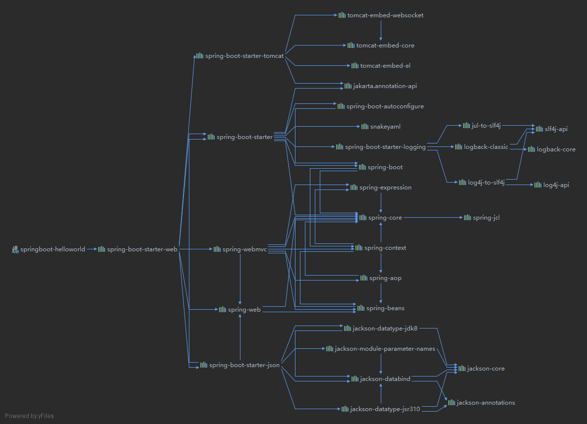

Spring 官方的启动器命名规则为`spring-boot-start-*`，* 代表的就是某种场景。

自定义的第三方启动器，命名规则一般为`thirdpartyproject-spring-boot-starter`。

所有场景启动器最底层的依赖：

```xml
<dependency>
  <groupId>org.springframework.boot</groupId>
  <artifactId>spring-boot-starter</artifactId>
  <version>2.5.1</version>
  <scope>compile</scope>
</dependency>
```

### 自动配置

比如，引入`spring-boot-start-web`启动器时，会自动引入 Tomcat、SpringMVC 的相关依赖，并配置好。也会自动配好 Web 的常见功能，如：字符编码问题。

默认的包结构：

- 默认情况下，**主程序所在包及其下面的所有子包**里面的组件都会被扫描进来，无需自行设置包扫描。

  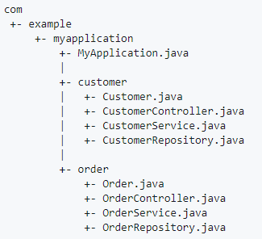

- 如果想要改变扫描路径，使用**`@SpringBootApplication(scanBasePackages="cn.xisun")`**。

  ```java
  @SpringBootApplication(scanBasePackages = "cn.xisun")
  public class MainApplication {
      public static void main(String[] args) {
          SpringApplication.run(MainApplication.class, args);
      }
  }
  ```

  - `@SpringBootApplication`注解等同于`@SpringBootConfiguration`，`@EnableAutoConfiguration`和`@ComponentScan`，复写此三个注解，然后使用`@ComponentScan`也可以重新指定扫码路径。

    ```java
    @SpringBootConfiguration
    @EnableAutoConfiguration
    @ComponentScan("cn.xisun")
    public class MainApplication {
        public static void main(String[] args) {
            SpringApplication.run(MainApplication.class, args);
        }
    }
    ```

各种配置拥有默认值：

- 默认配置最终都是映射到某个类上，如：MultipartProperties。
- 配置文件的值最终会绑定每个类上，这个类会在容器中会创建对象。
- 在 application.properties 文件内可以修改各种配置的默认值。

按需加载所有自动配置项：

- 引入了一个场景启动器后，这个场景的自动配置才会开启。
- Spring Boot 所有的自动配置功能，都在 spring-boot-autoconfigure 包里面。

## Spring Boot 的容器功能

### 添加组件

新建 User 类和 Pet 类，用于测试：

```java
package cn.xisun.web.bean;

/**
 * @Author XiSun
 * @Date 2021/6/23 16:28
 */
public class Pet {
    private String name;

    public Pet() {
    }

    public Pet(String name) {
        this.name = name;
    }

    public String getName() {
        return name;
    }

    public void setName(String name) {
        this.name = name;
    }

    @Override
    public String toString() {
        return "Pet{" +
                "name='" + name + '\'' +
                '}';
    }
}
```

```java
package cn.xisun.web.bean;

/**
 * @Author XiSun
 * @Date 2021/6/23 15:23
 */
public class User {
    private String name;
    
    private int age;
    
    private Pet pet;

    public User() {
    }

    public User(String name, int age) {
        this.name = name;
        this.age = age;
    }

    public String getName() {
        return name;
    }

    public void setName(String name) {
        this.name = name;
    }

    public int getAge() {
        return age;
    }

    public void setAge(int age) {
        this.age = age;
    }

    public Pet getPet() {
        return pet;
    }

    public void setPet(Pet pet) {
        this.pet = pet;
    }

    @Override
    public String toString() {
        return "User{" +
                "name='" + name + '\'' +
                ", age=" + age +
                ", pet=" + pet +
                '}';
    }
}
```

- **`@Configuration`**

  ```java
  /**
   * @Author XiSun
   * @Date 2021/6/23 15:24
   * @Description 1.@Configuration注解标识当前类是一个配置类，作用等同于Spring的配置文件
   * 2.@Configuration注解标识的配置类本身也是一个组件
   * 3.配置类里可以使用@Bean注解，标注在方法上给容器注册组件，组件是单实例的
   * 4.@Configuration注解有一个proxyBeanMethods属性，表示是否代理配置类中Bean的方法，默认为true，即代理
   */
  @Configuration(proxyBeanMethods = false)
  public class MyConfig {
      /**
       * 使用@Bean注解给容器中注册组件
       *
       * @return 以方法名作为组件的id，返回类型就是组件的类型，返回的值，就是组件在容器中的实例
       */
      @Bean
      public User user01() {
          User zhangsan = new User("zhangsan", 18);
          /*
           * user01组件依赖了tom组件：
           *      如果proxyBeanMethods = true，user01组件依赖的tom组件，就是容器中注册的那个
           *      如果proxyBeanMethods = false，user01组件依赖的tom组件，是新建的，与容器中注册的那个无关
           */
          zhangsan.setPet(tomcatPet());
          return zhangsan;
      }
  
      /**
       * @return 可以重新指定组件的id
       */
      @Bean("lisi")
      public User user02() {
          return new User("lisi", 19);
      }
  
      @Bean("tom")
      public Pet tomcatPet() {
          return new Pet("tomcat");
      }
      
      /**
       * 使用@Scope("prototype")注解，指定注册的组件是多实例的，默认情况是单实例
       *
       * @return 每次从容器中获得的tom1组件，都不相同
       */
      @Bean("tom1")
      @Scope("prototype")
      public Pet tomcatPet1() {
          return new Pet("tomcat2");
      }
  }
  ```

  ```java
  /**
   * @Author XiSun
   * @Date 2021/6/20 15:03
   * @Description 主程序类
   */
  @SpringBootApplication
  public class MainApplication {
      public static void main(String[] args) {
          // 1.返回IOC容器
          ConfigurableApplicationContext run = SpringApplication.run(MainApplication.class, args);
  
          // 2.查看容器内的所有组件
          String[] beanDefinitionNames = run.getBeanDefinitionNames();
          for (String beanDefinitionName : beanDefinitionNames) {
              System.out.println(beanDefinitionName);
          }
  
          // 3.从容器中获取配置类本身的组件
          MyConfig myConfig = run.getBean(MyConfig.class);
          System.out.println(myConfig);
  
          // 4.从容器中获取配置类中注册的组件，每次获取的实例都相同
          User user01 = run.getBean("user01", User.class);
          User user011 = run.getBean("user01", User.class);
          System.out.println(user01);
          System.out.println("单例? " + (user01 == user011));
          User lisi = run.getBean("lisi", User.class);
          System.out.println(lisi);
  
          /*
           * 5.通过配置类的方法获取实例
           * @Configuration(proxyBeanMethods = true)：
           *      此时，配置类是一个MyConfig$$EnhancerBySpringCGLIB$$70400c34@1517f633对象(CGLIB代理对象)
           *      在执行方法前，SpringBoot总会检查要获取的组件是否在容器中已存在，若存在，直接返回该组件---保持容器中组件单实例
           *      Full模式：外部无论对配置类中的这个组件的注册方法调用多少次，获取的都是之前已经注册在容器中的单实例对象，即user和user1总是相等
           *		组件依赖必须使用Full模式
           * @Configuration(proxyBeanMethods = false)：
           *      此时，配置类是一个MyConfig@644abb8f对象(普通对象)
           *      在执行方法前，SpringBoot不会检查要获取的组件是否在容器中已存在
           *      Lite模式：外部对配置类中的这个组件的注册方法的每一次调用，都会获得一个新的实例，即user和user1总是不等
           */
          User user = myConfig.user01();
          User user1 = myConfig.user01();
          System.out.println(user == user1);
          
          // 根据proxyBeanMethods的属性为true或false，可以看出user01的pet属性，与容器中的tom组件是否相同
          Pet tom = run.getBean("tom", Pet.class);
          System.out.println("用户的宠物：" + (user01.getPet() == tom));
          
          // tom1组件是多实例的，tom1对象和tom2对象不相同
          Pet tom1 = run.getBean("tom1", Pet.class);
          Pet tom2 = run.getBean("tom1", Pet.class);
          System.out.println(tom1 == tom2);
      }
  }
  ```

  - `@Configuration` 标注在类上，表明该类是一个配置类，作用等同于 Spring 的 xml 配置文件中的 \<beans> 标签，如下所示：

    ```xml
    <?xml version="1.0" encoding="UTF-8"?>
    <beans xmlns="http://www.springframework.org/schema/beans"
           xmlns:xsi="http://www.w3.org/2001/XMLSchema-instance"
           xsi:schemaLocation="http://www.springframework.org/schema/beans http://www.springframework.org/schema/beans/spring-beans.xsd">
        <bean id="user01" class="cn.xisun.web.bean.User">
            <property name="name" value="zhangsan"/>
            <property name="age" value="18"/>
            <property name="pet" ref="tom"/>
        </bean>
    
        <bean id="lisi" class="cn.xisun.web.bean.User">
            <property name="name" value="lisi"/>
            <property name="age" value="19"/>
        </bean>
    
        <bean id="tom" class="cn.xisun.web.bean.Pet">
            <property name="name" value="tomcat"/>
        </bean>
    </beans>
    ```

  - 根据 `@Configuration` 注解的 proxyBeanMethods 属性值：

    - false：Lite 模式。当配置类组件之间无依赖关系时，用 Lite 模式可以减少判断，加速容器启动过程。
    - true：Full 模式。当配置类组件之间有依赖关系时，配置类里的 Bean 方法会被调用，为了得到之前容器中注册的单实例组件，需要使用 Full 模式。
      - 组件依赖必须使用 Full 模式。

- `@ComponentScan`：指定扫描的包，默认扫码主程序所在包及其下面的所有子包。

- `@Import`：给容器中自动创建出指定类型的组件，并且，默认组件的名字是全类名。

  ```java
  @Configuration
  @Import({User.class, ThrowableToStringArray.class})
  public class MyConfig {
      @Bean
      public User user01() {
          return new User("zhangsan", 18);
      }
  
      @Bean("lisi")
      public User user02() {
          return new User("lisi", 19);
      }
  }
  ```

  ```java
  @SpringBootApplication
  public class MainApplication {
      public static void main(String[] args) {
          // 1.返回IOC容器
          ConfigurableApplicationContext run = SpringApplication.run(MainApplication.class, args);
  
          // 2.按User类型获取容器中注册的实例
          String[] beanNamesForType = run.getBeanNamesForType(User.class);
          for (String bean : beanNamesForType) {
              System.out.println(bean);
          }
  
          ThrowableToStringArray bean = run.getBean(ThrowableToStringArray.class);
          System.out.println(bean);
      }
  }
  
  输出结果：
      cn.xisun.web.bean.User											// 全类名
  	user01															// 容器中注册的
  	lisi															// 容器中注册的
  	ch.qos.logback.core.helpers.ThrowableToStringArray@312afbc7		// 全类名
  ```

- `@Bean`、`@Component`、`@Controller`、`@Service`、`@Repository`。

- `@Conditional`：条件装配，当满足`@Conditional` 指定的条件时，则进行组件注入。

  - `@Conditional`注解有多个派生注解，每一个派生注解都代表一种条件。

    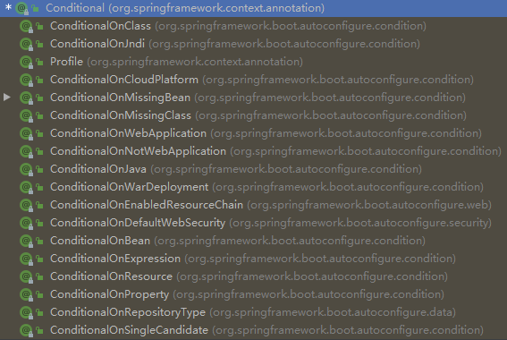

    - `@ConditionalOnBean`：当容器中存在指定的 Bean 时。
    - `@ConditionalOnMissingBean`：当容器中不存在指定的 Bean 时。
    - `@ConditionalOnClass`：当容器中存在指定的类时。
    - `@ConditionalOnMissingClass`：当容器中不存在指定的类时。
    - `@ConditionalOnJava`：当指定的 Java 版本时。
    - `@ConditionalOnResource`：当指定资源存在时。

  - 注意：配置类中定义的组件，是按照从上到下的顺序依次注册的，在使用类似 `@ConditionalOnBean` 这样的条件装配注解时，需要注意组件的定义顺序。在这样的情况下，在配置类上使用条件装配注解时，需要额外注意。

    - tom 组件在 user01 组件上面定义：

      ```java
      @Configuration
      public class MyConfig {
          @Bean("tom")
          public Pet tomcatPet() {
              return new Pet("tomcat");
          }
      
          @Bean
          @ConditionalOnBean(name = "tom")
          public User user01() {
              User zhangsan = new User("zhangsan", 18);
              zhangsan.setPet(tomcatPet());
              return zhangsan;
          }
      }
      ```

      ```java
      @SpringBootApplication
      public class MainApplication {
          public static void main(String[] args) {
              ConfigurableApplicationContext run = SpringApplication.run(MainApplication.class, args);
              boolean tom = run.containsBean("tom");
              boolean user01 = run.containsBean("user01");
              System.out.println("容器中存在tom？" + tom);
              System.out.println("容器中存在user01？" + user01);
          }
      }
      
      输出结果：
          容器中存在tom？true
      	容器中存在user01？true
      ```

    - tom 组件在 user01 组件下面定义：

      ```java
      @Configuration
      public class MyConfig {
          @Bean
          @ConditionalOnBean(name = "tom")
          public User user01() {
              User zhangsan = new User("zhangsan", 18);
              zhangsan.setPet(tomcatPet());
              return zhangsan;
          }
      
          @Bean("tom")
          public Pet tomcatPet() {
              return new Pet("tomcat");
          }
      }
      ```

      ```java
      @SpringBootApplication
      public class MainApplication {
          public static void main(String[] args) {
              ConfigurableApplicationContext run = SpringApplication.run(MainApplication.class, args);
              boolean tom = run.containsBean("tom");
              boolean user01 = run.containsBean("user01");
              System.out.println("容器中存在tom？" + tom);
              System.out.println("容器中存在user01？" + user01);
          }
      }
      
      输出结果：
          容器中存在tom？true
      	容器中存在user01？false
      ```


### 原生配置文件引入

- `@ImportResource`：导入 Spring 的配置文件，使用在主类上，或者任一配置类上。当旧项目更新，并存在很多配置文件时，会很有用处。

  - oldBeans.xml：

    ```xml
    <?xml version="1.0" encoding="UTF-8"?>
    <beans xmlns="http://www.springframework.org/schema/beans"
           xmlns:xsi="http://www.w3.org/2001/XMLSchema-instance"
           xsi:schemaLocation="http://www.springframework.org/schema/beans http://www.springframework.org/schema/beans/spring-beans.xsd">
        <bean id="wangwu" class="cn.xisun.web.bean.User">
            <property name="name" value="wangwu"/>
            <property name="age" value="20"/>
            <property name="pet" ref="jerry"/>
        </bean>
    
        <bean id="jerry" class="cn.xisun.web.bean.Pet">
            <property name="name" value="jerry"/>
        </bean>
    </beans>
    ```

  - MainApplication.java：

    ```java
    @SpringBootApplication
    @ImportResource("classpath:oldBeans.xml")
    public class MainApplication {
        public static void main(String[] args) {
            ConfigurableApplicationContext run = SpringApplication.run(MainApplication.class, args);
            boolean wangwu = run.containsBean("wangwu");
            boolean jerry = run.containsBean("jerry");
            System.out.println("容器中存在jerry？" + jerry);
            System.out.println("容器中存在wangwu？" + wangwu);
        }
    }
    
    输出结果：
        容器中存在jerry？true
    	容器中存在wangwu？true
    ```

### 配置绑定

- application.properties 文件：

  ```properties
  server.port=8080
  mycar.brand=BMW
  mycar.price=200000.0
  ```

- 待封装的 JavaBean：

  ```java
  public class Car {
      private String brand;
      
      private Double price;
  
      public String getBrand() {
          return brand;
      }
  
      public void setBrand(String brand) {
          this.brand = brand;
      }
  
      public Double getPrice() {
          return price;
      }
  
      public void setPrice(Double price) {
          this.price = price;
      }
  
      @Override
      public String toString() {
          return "Car{" +
                  "brand='" + brand + '\'' +
                  ", price=" + price +
                  '}';
      }
  }
  ```

  - 自定义的类和配置文件绑定一般没有提示，Car 类上会出现以下提示，需要添加 `spring-boot-configuration-processo` 依赖：

    

    ```xml
    <dependency>
        <groupId>org.springframework.boot</groupId>
        <artifactId>spring-boot-configuration-processor</artifactId>
        <optional>true</optional>
    </dependency>
    ```

  - 该依赖只在开发时提供帮助，因此在打包 jar 包时，应该排除：

    ```xml
    <!-- 打包插件 -->
    <build>
        <plugins>
            <plugin>
                <groupId>org.springframework.boot</groupId>
                <artifactId>spring-boot-maven-plugin</artifactId>
                <!-- 打包时排除依赖 -->
                <configuration>
                    <excludes>
                        <exclude>
                            <groupId>org.springframework.boot</groupId>
                            <artifactId>spring-boot-configuration-processor</artifactId>
                        </exclude>
                    </excludes>
                </configuration>
            </plugin>
        </plugins>
    </build>
    ```

- 从 application.properties 文件中读取内容，并且把它封装到 JavaBean 中的普通写法：

  ```java
  public static void getProperties() throws IOException {
      Properties properties = new Properties();
      InputStream is = ClassLoader.getSystemClassLoader().getResourceAsStream("application.properties");
      properties.load(is);
      // 得到配置文件中的值
      Enumeration<?> enumeration = properties.propertyNames();
      while (enumeration.hasMoreElements()) {
          String strKey = (String) enumeration.nextElement();
          String strValue = properties.getProperty(strKey);
          System.out.println(strKey + "=" + strValue);
          // 封装到JavaBean的操作
      }
  }
  ```

- 方式一：在需绑定的 JavaBean 上，添加 `@Component` 和 `@ConfigurationProperties` 注解。

  ```java
  /**
   * @Author XiSun
   * @Date 2021/7/9 21:58
   * 1.使用@Component注解将JavaBean注册到容器中，只有容器中的组件才能
   * 拥有SpringBoot提供的功能，这是前提；
   * 2.使用@ConfigurationProperties注解，将配置文件和JavaBean绑定，
   * prefix属性指定配置文件中需绑定的值的前缀；
   * 3.JavaBean的属性名，需和配置文件中对应值前缀后的值相同。
   */
  @Component
  @ConfigurationProperties(prefix = "mycar")
  public class Car {
      private String brand;
  
      private Double price;
  
      public String getBrand() {
          return brand;
      }
  
      public void setBrand(String brand) {
          this.brand = brand;
      }
  
      public Double getPrice() {
          return price;
      }
  
      public void setPrice(Double price) {
          this.price = price;
      }
  
      @Override
      public String toString() {
          return "Car{" +
                  "brand='" + brand + '\'' +
                  ", price=" + price +
                  '}';
      }
  }
  ```

- 方式二：在需绑定的 JavaBean 上，添加 `@ConfigurationProperties` 注解，在配置类上添加 `@EnableConfigurationProperties` 注解。

  ```java
  /**
   * @Author XiSun
   * @Date 2021/7/9 21:58
   * 1.使用@ConfigurationProperties注解，将配置文件和JavaBean绑定，
   * prefix属性指定配置文件中需绑定的值的前缀；
   * 2.JavaBean的属性名，需和配置文件中对应值前缀后的值相同。
   */
  @ConfigurationProperties(prefix = "mycar")
  public class Car {
      private String brand;
  
      private Double price;
  
      public String getBrand() {
          return brand;
      }
  
      public void setBrand(String brand) {
          this.brand = brand;
      }
  
      public Double getPrice() {
          return price;
      }
  
      public void setPrice(Double price) {
          this.price = price;
      }
  
      @Override
      public String toString() {
          return "Car{" +
                  "brand='" + brand + '\'' +
                  ", price=" + price +
                  '}';
      }
  }
  ```

  ```java
  /**
   * 1.使用@EnableConfigurationProperties注解，开启待装配的JavaBean的配置绑定功能，
   * 同时，将该JavaBean这个组件自动注入到容器中；
   * 2.JavaBean上不需要使用@Component注解，某些时候，比如JavaBean是第三方依赖包中的
   * 类，这个特点会很重要。
   */
  @Configuration
  @EnableConfigurationProperties({Car.class})
  public class MyConfig {
      @Bean
      public User user01() {
          User zhangsan = new User("zhangsan", 18);
          zhangsan.setPet(tomcatPet());
          return zhangsan;
      }
  
      @Bean("tom")
      public Pet tomcatPet() {
          return new Pet("tomcat");
      }
  }
  ```

- 主类测试：

  ```java
  /**
   * @Author XiSun
   * @Date 2021/6/20 15:03
   * @Description 主程序类
   */
  @SpringBootApplication
  public class MainApplication {
      public static void main(String[] args) {
          ConfigurableApplicationContext run = SpringApplication.run(MainApplication.class, args);
  
          // 获取容器中的Car类型的组件
          String[] beanNamesForType = run.getBeanNamesForType(Car.class);
          for (String beanName : beanNamesForType) {
              System.out.println(beanName);
          }
  
          Car car = run.getBean("car", Car.class);
          System.out.println(car);
      }
  }
  
  方式一输出结果：
      car
  	Car{brand='BMW', price=200000.0}
  
  方式二输出结果：
      mycar-cn.xisun.web.bean.Car
  	Car{brand='BMW', price=200000.0}
  ```

  >对于方式一，注册到容器中的组件名，就是 JavaBean 类名的首字母小写。
  >
  >对于方式二，注册到容器中的组件名，有所不同，为前缀加 JavaBean 全类名。

- Controller 中获取：

  ```java
  /**
   * @Author XiSun
   * @Date 2021/6/20 15:17
   */
  @Controller
  public class HelloController {
      @Autowired
      private Car car;
  
      @RequestMapping("/car")
      @ResponseBody
      public Car car() {
          return car;
      }
  
      @RequestMapping("/hello")
      @ResponseBody
      public String hello() {
          return "Hello, Spring Boot 2!";
      }
  }
  ```

  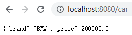

## Spring Boot 的自动配置原理入门

### 引导加载自动配置类

- 主类：

  ```java
  @SpringBootApplication
  public class MainApplication {
      public static void main(String[] args) {
          SpringApplication.run(MainApplication.class, args);
      }
  }
  ```

- **`@SpringBootApplication`：**

  ```java
  @Target(ElementType.TYPE)
  @Retention(RetentionPolicy.RUNTIME)
  @Documented
  @Inherited
  @SpringBootConfiguration
  @EnableAutoConfiguration
  @ComponentScan(excludeFilters = { @Filter(type = FilterType.CUSTOM, classes = TypeExcludeFilter.class),
        @Filter(type = FilterType.CUSTOM, classes = AutoConfigurationExcludeFilter.class) })
  public @interface SpringBootApplication {}
  ```

  - `@SpringBootConfiguration`：是 `@Configuration` 的派生注解，表明当前主类实际上也是一个配置类。

  - `@ComponentScan`：指定扫描的包，默认为当前主类所在包及其子包。

  - **`@EnableAutoConfiguration`：**

    ```java
    @Target(ElementType.TYPE)
    @Retention(RetentionPolicy.RUNTIME)
    @Documented
    @Inherited
    @AutoConfigurationPackage
    @Import(AutoConfigurationImportSelector.class)
    public @interface EnableAutoConfiguration {}
    ```

    - **`@AutoConfigurationPackage`：**

      ```java
      @Target(ElementType.TYPE)
      @Retention(RetentionPolicy.RUNTIME)
      @Documented
      @Inherited
      @Import(AutoConfigurationPackages.Registrar.class)
      public @interface AutoConfigurationPackage {}
      ```

      - `@Import(AutoConfigurationPackages.Registrar.class)`：向容器中注册了一个 AutoConfigurationPackages.Registrar.class 组件。

        ```java
        /**
         * {@link ImportBeanDefinitionRegistrar} to store the base package from the importing
         * configuration.
         */
        static class Registrar implements ImportBeanDefinitionRegistrar, DeterminableImports {
        
           @Override
           public void registerBeanDefinitions(AnnotationMetadata metadata, BeanDefinitionRegistry registry) {
              register(registry, new PackageImports(metadata).getPackageNames().toArray(new String[0]));
           }
        
           @Override
           public Set<Object> determineImports(AnnotationMetadata metadata) {
              return Collections.singleton(new PackageImports(metadata));
           }
        
        }
        ```

        - `new PackageImports(metadata).getPackageNames()`：拿到元注解所包含的包信息，实际上就是主类所在的包，如 `cn.xisun.web`。
        - `register()` 的功能，也就是将主类所在包下的所有组件，批量注册到容器中。这也就是默认包路径为主类所在包的原因。

    - **`@Import(AutoConfigurationImportSelector.class)`：**向容器中注册了一个 AutoConfigurationImportSelector.class 组件，执行如下方法。

      ```java
      @Override
      public String[] selectImports(AnnotationMetadata annotationMetadata) {
         if (!isEnabled(annotationMetadata)) {
            return NO_IMPORTS;
         }
         AutoConfigurationEntry autoConfigurationEntry = getAutoConfigurationEntry(annotationMetadata);
         return StringUtils.toStringArray(autoConfigurationEntry.getConfigurations());
      }
      ```

      - `getAutoConfigurationEntry(annotationMetadata)`：向容器中批量注册一些组件。

        ```java
        protected AutoConfigurationEntry getAutoConfigurationEntry(AnnotationMetadata annotationMetadata) {
           if (!isEnabled(annotationMetadata)) {
              return EMPTY_ENTRY;
           }
           AnnotationAttributes attributes = getAttributes(annotationMetadata);
           List<String> configurations = getCandidateConfigurations(annotationMetadata, attributes);
           configurations = removeDuplicates(configurations);
           Set<String> exclusions = getExclusions(annotationMetadata, attributes);
           checkExcludedClasses(configurations, exclusions);
           configurations.removeAll(exclusions);
           configurations = getConfigurationClassFilter().filter(configurations);
           fireAutoConfigurationImportEvents(configurations, exclusions);
           return new AutoConfigurationEntry(configurations, exclusions);
        }
        ```

        - `getCandidateConfigurations(annotationMetadata, attributes);`：获取所有待批量注册的组件。

          ```java
          protected List<String> getCandidateConfigurations(AnnotationMetadata metadata, AnnotationAttributes attributes) {
             List<String> configurations = SpringFactoriesLoader.loadFactoryNames(getSpringFactoriesLoaderFactoryClass(),
                   getBeanClassLoader());
             Assert.notEmpty(configurations, "No auto configuration classes found in META-INF/spring.factories. If you "
                   + "are using a custom packaging, make sure that file is correct.");
             return configurations;
          }
          ```

          - `SpringFactoriesLoader.loadFactoryNames(getSpringFactoriesLoaderFactoryClass(), getBeanClassLoader());`：具体通过 SpringFactoriesLoader 工厂加载所有的组件。

            ```java
            /**
              * The location to look for factories.
              * <p>Can be present in multiple JAR files.
              */
            public static final String FACTORIES_RESOURCE_LOCATION = "META-INF/spring.factories";
            
            public static List<String> loadFactoryNames(Class<?> factoryType, @Nullable ClassLoader classLoader) {
               ClassLoader classLoaderToUse = classLoader;
               if (classLoaderToUse == null) {
                  classLoaderToUse = SpringFactoriesLoader.class.getClassLoader();
               }
               String factoryTypeName = factoryType.getName();
               return loadSpringFactories(classLoaderToUse).getOrDefault(factoryTypeName, Collections.emptyList());
            }
            
            private static Map<String, List<String>> loadSpringFactories(ClassLoader classLoader) {
               Map<String, List<String>> result = cache.get(classLoader);
               if (result != null) {
                  return result;
               }
            
               result = new HashMap<>();
               try {
                  // 在此处，加载项目里
                  Enumeration<URL> urls = classLoader.getResources(FACTORIES_RESOURCE_LOCATION);
                  while (urls.hasMoreElements()) {
                     URL url = urls.nextElement();
                     UrlResource resource = new UrlResource(url);
                     Properties properties = PropertiesLoaderUtils.loadProperties(resource);
                     for (Map.Entry<?, ?> entry : properties.entrySet()) {
                        String factoryTypeName = ((String) entry.getKey()).trim();
                        String[] factoryImplementationNames =
                              StringUtils.commaDelimitedListToStringArray((String) entry.getValue());
                        for (String factoryImplementationName : factoryImplementationNames) {
                           result.computeIfAbsent(factoryTypeName, key -> new ArrayList<>())
                                 .add(factoryImplementationName.trim());
                        }
                     }
                  }
            
                  // Replace all lists with unmodifiable lists containing unique elements
                  result.replaceAll((factoryType, implementations) -> implementations.stream().distinct()
                        .collect(Collectors.collectingAndThen(Collectors.toList(), Collections::unmodifiableList)));
                  cache.put(classLoader, result);
               }
               catch (IOException ex) {
                  throw new IllegalArgumentException("Unable to load factories from location [" +
                        FACTORIES_RESOURCE_LOCATION + "]", ex);
               }
               return result;
            }
            ```

            - `classLoader.getResources(FACTORIES_RESOURCE_LOCATION);`：此方法扫描项目内各 jar 包的 `META-INF/spring.factories` 路径内声明的资源。主要看 `spring-boot-autoconfigure-2.5.1.jar` 包下的 spring.factories 文件，该文件内声明了 131 个需要自动注册的组件，当 Spring Boot 启动时，就会向容器中注册这些声明的组件：

              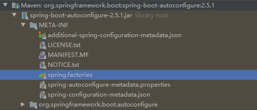

              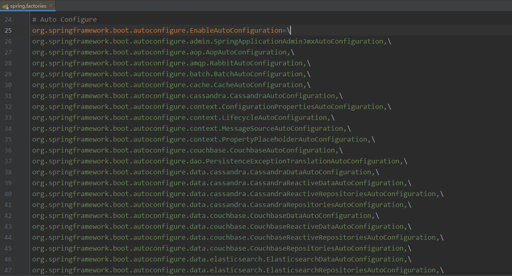

              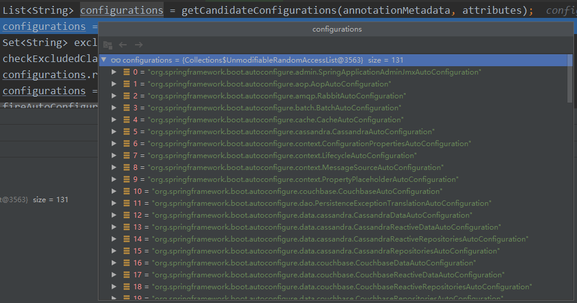


### 按需开启自动配置项

- 在上面的分析中，Spring Boot 在启动时，默认会加载 131 个自动配置的组件。但在实际启动时，各 xxxxAutoConfiguration 组件，会根据 `@Conditional` 注解，即按照条件装配规则，实现按需配置。

- 例如，`org.springframework.boot.autoconfigure.aop.AopAutoConfiguration`：

  ```java
  @Configuration(proxyBeanMethods = false)
  @ConditionalOnProperty(prefix = "spring.aop", name = "auto", havingValue = "true", matchIfMissing = true)
  public class AopAutoConfiguration {
  
     /**
       * 当org.aspectj.weaver.Advice.class文件存在时，AspectJAutoProxyingConfiguration生效
       */
     @Configuration(proxyBeanMethods = false)
     @ConditionalOnClass(Advice.class)
     static class AspectJAutoProxyingConfiguration {
  
        @Configuration(proxyBeanMethods = false)
        @EnableAspectJAutoProxy(proxyTargetClass = false)
        @ConditionalOnProperty(prefix = "spring.aop", name = "proxy-target-class", havingValue = "false")
        static class JdkDynamicAutoProxyConfiguration {
  
        }
  
        @Configuration(proxyBeanMethods = false)
        @EnableAspectJAutoProxy(proxyTargetClass = true)
        @ConditionalOnProperty(prefix = "spring.aop", name = "proxy-target-class", havingValue = "true",
              matchIfMissing = true)
        static class CglibAutoProxyConfiguration {
  
        }
     }
  
     /**
       * 当org.aspectj.weaver.Advice.class文件不存在，且配置文件中spring.aop.proxy-target-class属性值为true(默认为true)时，
       * ClassProxyingConfiguration生效
       */
     @Configuration(proxyBeanMethods = false)
     @ConditionalOnMissingClass("org.aspectj.weaver.Advice")
     @ConditionalOnProperty(prefix = "spring.aop", name = "proxy-target-class", havingValue = "true",
           matchIfMissing = true)
     static class ClassProxyingConfiguration {
        @Bean
        static BeanFactoryPostProcessor forceAutoProxyCreatorToUseClassProxying() {
           return (beanFactory) -> {
              if (beanFactory instanceof BeanDefinitionRegistry) {
                 BeanDefinitionRegistry registry = (BeanDefinitionRegistry) beanFactory;
                 AopConfigUtils.registerAutoProxyCreatorIfNecessary(registry);
                 AopConfigUtils.forceAutoProxyCreatorToUseClassProxying(registry);
              }
           };
        }
     }
  }
  ```

  - `@ConditionalOnProperty(prefix = "spring.aop", name = "auto", havingValue = "true", matchIfMissing = true)`：当配置文件中配置了 `spring.aop.auto` 属性，且值为 true 时，AopAutoConfiguration 生效。默认情况下，即使没有配置此属性，也认为其生效。
  - 可以看出，当导入 aop 依赖时，会注册 AspectJAutoProxyingConfiguration 配置类，否则，注册 ClassProxyingConfiguration 配置类，且后者是 Spring Boot 默认开启的一个简单的 aop 功能。

- 例如，`org.springframework.boot.autoconfigure.web.servlet.DispatcherServletAutoConfiguration`：

  ```java
  @AutoConfigureOrder(Ordered.HIGHEST_PRECEDENCE)// 当前配置类的配置顺序
  @Configuration(proxyBeanMethods = false)
  @ConditionalOnWebApplication(type = Type.SERVLET)// 当项目是一个原生的Web Servlet应用时
  @ConditionalOnClass(DispatcherServlet.class)// 当容器中存在DispatcherServlet.class时
  @AutoConfigureAfter(ServletWebServerFactoryAutoConfiguration.class)// 在ServletWebServerFactoryAutoConfiguration后配置
  public class DispatcherServletAutoConfiguration {
  
     /**
      * The bean name for a DispatcherServlet that will be mapped to the root URL "/".
      */
     public static final String DEFAULT_DISPATCHER_SERVLET_BEAN_NAME = "dispatcherServlet";
  
     /**
      * The bean name for a ServletRegistrationBean for the DispatcherServlet "/".
      */
     public static final String DEFAULT_DISPATCHER_SERVLET_REGISTRATION_BEAN_NAME = "dispatcherServletRegistration";
  
     @Configuration(proxyBeanMethods = false)
     @Conditional(DefaultDispatcherServletCondition.class)
     @ConditionalOnClass(ServletRegistration.class)// 当容器中存在ServletRegistration.class时
     @EnableConfigurationProperties(WebMvcProperties.class)// 开启WebMvcProperties类的配置绑定功能，并注册到容器中
     protected static class DispatcherServletConfiguration {
  
        @Bean(name = DEFAULT_DISPATCHER_SERVLET_BEAN_NAME)// 注册DispatcherServlet组件到容器中，名字为dispatcherServlet
        public DispatcherServlet dispatcherServlet(WebMvcProperties webMvcProperties) {
           DispatcherServlet dispatcherServlet = new DispatcherServlet();// 新建了一个DispatcherServlet对象
           dispatcherServlet.setDispatchOptionsRequest(webMvcProperties.isDispatchOptionsRequest());
           dispatcherServlet.setDispatchTraceRequest(webMvcProperties.isDispatchTraceRequest());
           dispatcherServlet.setThrowExceptionIfNoHandlerFound(webMvcProperties.isThrowExceptionIfNoHandlerFound());
           dispatcherServlet.setPublishEvents(webMvcProperties.isPublishRequestHandledEvents());
           dispatcherServlet.setEnableLoggingRequestDetails(webMvcProperties.isLogRequestDetails());
           return dispatcherServlet;
        }
  
        @Bean// 注册MultipartResolver组件到容器中，即文件上传解析器
        @ConditionalOnBean(MultipartResolver.class)// 当容器中存在MultipartResolver.class时
        // 当容器中没有name为multipartResolver的MultipartResolver对象时
        @ConditionalOnMissingBean(name = DispatcherServlet.MULTIPART_RESOLVER_BEAN_NAME)
        // 用@Bean标注的方法传入的对象参数，会从容器中找一个该参数所属类型的对象，并赋值
        public MultipartResolver multipartResolver(MultipartResolver resolver) {
           // 因为容器中有MultipartResolver的对象，所以resolver参数会自动绑定该对象
           // 此方法的作用是，防止有些用户配置的文件上传解析器不符合规范：
           // 将用户自己配置的文件上传解析器重新注册给容器，并重命名为multipartResolver(方法名)
           // (Spring Boot种的文件上传解析器的名字，就叫multipartResolver)
           // Detect if the user has created a MultipartResolver but named it incorrectly
           return resolver;
        }
  
     }
  
     @Configuration(proxyBeanMethods = false)
     @Conditional(DispatcherServletRegistrationCondition.class)
     @ConditionalOnClass(ServletRegistration.class)
     @EnableConfigurationProperties(WebMvcProperties.class)
     @Import(DispatcherServletConfiguration.class)
     protected static class DispatcherServletRegistrationConfiguration {
  
        @Bean(name = DEFAULT_DISPATCHER_SERVLET_REGISTRATION_BEAN_NAME)
        @ConditionalOnBean(value = DispatcherServlet.class, name = DEFAULT_DISPATCHER_SERVLET_BEAN_NAME)
        public DispatcherServletRegistrationBean dispatcherServletRegistration(DispatcherServlet dispatcherServlet,
              WebMvcProperties webMvcProperties, ObjectProvider<MultipartConfigElement> multipartConfig) {
           DispatcherServletRegistrationBean registration = new DispatcherServletRegistrationBean(dispatcherServlet,
                 webMvcProperties.getServlet().getPath());
           registration.setName(DEFAULT_DISPATCHER_SERVLET_BEAN_NAME);
           registration.setLoadOnStartup(webMvcProperties.getServlet().getLoadOnStartup());
           multipartConfig.ifAvailable(registration::setMultipartConfig);
           return registration;
        }
  
     }
  
     @Order(Ordered.LOWEST_PRECEDENCE - 10)
     private static class DefaultDispatcherServletCondition extends SpringBootCondition {
  
        @Override
        public ConditionOutcome getMatchOutcome(ConditionContext context, AnnotatedTypeMetadata metadata) {
           ConditionMessage.Builder message = ConditionMessage.forCondition("Default DispatcherServlet");
           ConfigurableListableBeanFactory beanFactory = context.getBeanFactory();
           List<String> dispatchServletBeans = Arrays
                 .asList(beanFactory.getBeanNamesForType(DispatcherServlet.class, false, false));
           if (dispatchServletBeans.contains(DEFAULT_DISPATCHER_SERVLET_BEAN_NAME)) {
              return ConditionOutcome
                    .noMatch(message.found("dispatcher servlet bean").items(DEFAULT_DISPATCHER_SERVLET_BEAN_NAME));
           }
           if (beanFactory.containsBean(DEFAULT_DISPATCHER_SERVLET_BEAN_NAME)) {
              return ConditionOutcome.noMatch(
                    message.found("non dispatcher servlet bean").items(DEFAULT_DISPATCHER_SERVLET_BEAN_NAME));
           }
           if (dispatchServletBeans.isEmpty()) {
              return ConditionOutcome.match(message.didNotFind("dispatcher servlet beans").atAll());
           }
           return ConditionOutcome.match(message.found("dispatcher servlet bean", "dispatcher servlet beans")
                 .items(Style.QUOTE, dispatchServletBeans)
                 .append("and none is named " + DEFAULT_DISPATCHER_SERVLET_BEAN_NAME));
        }
  
     }
  
     @Order(Ordered.LOWEST_PRECEDENCE - 10)
     private static class DispatcherServletRegistrationCondition extends SpringBootCondition {
  
        @Override
        public ConditionOutcome getMatchOutcome(ConditionContext context, AnnotatedTypeMetadata metadata) {
           ConfigurableListableBeanFactory beanFactory = context.getBeanFactory();
           ConditionOutcome outcome = checkDefaultDispatcherName(beanFactory);
           if (!outcome.isMatch()) {
              return outcome;
           }
           return checkServletRegistration(beanFactory);
        }
  
        private ConditionOutcome checkDefaultDispatcherName(ConfigurableListableBeanFactory beanFactory) {
           boolean containsDispatcherBean = beanFactory.containsBean(DEFAULT_DISPATCHER_SERVLET_BEAN_NAME);
           if (!containsDispatcherBean) {
              return ConditionOutcome.match();
           }
           List<String> servlets = Arrays
                 .asList(beanFactory.getBeanNamesForType(DispatcherServlet.class, false, false));
           if (!servlets.contains(DEFAULT_DISPATCHER_SERVLET_BEAN_NAME)) {
              return ConditionOutcome.noMatch(
                    startMessage().found("non dispatcher servlet").items(DEFAULT_DISPATCHER_SERVLET_BEAN_NAME));
           }
           return ConditionOutcome.match();
        }
  
        private ConditionOutcome checkServletRegistration(ConfigurableListableBeanFactory beanFactory) {
           ConditionMessage.Builder message = startMessage();
           List<String> registrations = Arrays
                 .asList(beanFactory.getBeanNamesForType(ServletRegistrationBean.class, false, false));
           boolean containsDispatcherRegistrationBean = beanFactory
                 .containsBean(DEFAULT_DISPATCHER_SERVLET_REGISTRATION_BEAN_NAME);
           if (registrations.isEmpty()) {
              if (containsDispatcherRegistrationBean) {
                 return ConditionOutcome.noMatch(message.found("non servlet registration bean")
                       .items(DEFAULT_DISPATCHER_SERVLET_REGISTRATION_BEAN_NAME));
              }
              return ConditionOutcome.match(message.didNotFind("servlet registration bean").atAll());
           }
           if (registrations.contains(DEFAULT_DISPATCHER_SERVLET_REGISTRATION_BEAN_NAME)) {
              return ConditionOutcome.noMatch(message.found("servlet registration bean")
                    .items(DEFAULT_DISPATCHER_SERVLET_REGISTRATION_BEAN_NAME));
           }
           if (containsDispatcherRegistrationBean) {
              return ConditionOutcome.noMatch(message.found("non servlet registration bean")
                    .items(DEFAULT_DISPATCHER_SERVLET_REGISTRATION_BEAN_NAME));
           }
           return ConditionOutcome.match(message.found("servlet registration beans").items(Style.QUOTE, registrations)
                 .append("and none is named " + DEFAULT_DISPATCHER_SERVLET_REGISTRATION_BEAN_NAME));
        }
  
        private ConditionMessage.Builder startMessage() {
           return ConditionMessage.forCondition("DispatcherServlet Registration");
        }
  
     }
  
  }
  ```

  - `@ConditionalOnWebApplication(type = Type.SERVLET)`：Spring Boot 支持两种类型的 Web 应用开发，一种是响应式，一种是原生 Servlet。响应式 Web 开发导入 `spring-boot-starter-webflux` 依赖，原生 Servlet Web 开发导入 `spring-boot-starter-web` 依赖。

  - `@ConditionalOnClass(DispatcherServlet.class)`：在主类中可以验证项目中存在 DispatcherServlet 类。

    ```java
    @SpringBootApplication
    public class MainApplication {
        public static void main(String[] args) {
            ConfigurableApplicationContext run = SpringApplication.run(MainApplication.class, args);
    
            String[] beanNamesForType = run.getBeanNamesForType(DispatcherServlet.class);
            System.out.println(beanNamesForType.length);// 1
        }
    }
    ```

- 例如，`org.springframework.boot.autoconfigure.web.servlet.HttpEncodingAutoConfiguration`：

  ```java
  @Configuration(proxyBeanMethods = false)
  @EnableConfigurationProperties(ServerProperties.class)// 开启ServerProperties类的配置绑定功能，并注册到容器中
  @ConditionalOnWebApplication(type = ConditionalOnWebApplication.Type.SERVLET)// 当项目是一个原生的Web Servlet应用时
  @ConditionalOnClass(CharacterEncodingFilter.class)// 当容器中存在CharacterEncodingFilter.class时
  // 当配置文件中server.servlet.encoding属性值为enabled(默认为true)时
  @ConditionalOnProperty(prefix = "server.servlet.encoding", value = "enabled", matchIfMissing = true)
  public class HttpEncodingAutoConfiguration {
  
     private final Encoding properties;
  
     public HttpEncodingAutoConfiguration(ServerProperties properties) {
        this.properties = properties.getServlet().getEncoding();
     }
  
     /**
       * 向容器中注册一个CharacterEncodingFilter组件，此组件就是解决Spring Boot收到的请求出现乱码的问题
       */
     @Bean
     @ConditionalOnMissingBean// 当容器中没有这个Bean时才配置，即用户未配置时，Spring Boot才主动配置一个
     public CharacterEncodingFilter characterEncodingFilter() {
        CharacterEncodingFilter filter = new OrderedCharacterEncodingFilter();
        filter.setEncoding(this.properties.getCharset().name());
        filter.setForceRequestEncoding(this.properties.shouldForce(Encoding.Type.REQUEST));
        filter.setForceResponseEncoding(this.properties.shouldForce(Encoding.Type.RESPONSE));
        return filter;
     }
  
     @Bean
     public LocaleCharsetMappingsCustomizer localeCharsetMappingsCustomizer() {
        return new LocaleCharsetMappingsCustomizer(this.properties);
     }
  
     static class LocaleCharsetMappingsCustomizer
           implements WebServerFactoryCustomizer<ConfigurableServletWebServerFactory>, Ordered {
  
        private final Encoding properties;
  
        LocaleCharsetMappingsCustomizer(Encoding properties) {
           this.properties = properties;
        }
  
        @Override
        public void customize(ConfigurableServletWebServerFactory factory) {
           if (this.properties.getMapping() != null) {
              factory.setLocaleCharsetMappings(this.properties.getMapping());
           }
        }
  
        @Override
        public int getOrder() {
           return 0;
        }
  
     }
  
  }
  ```

  - HttpEncodingAutoConfiguration 配置类会防止 Spring Boot 乱码。

  - 测试：

    ```java
    @Controller
    public class HelloController {
        @RequestMapping("/helloWho")
        @ResponseBody
        public String helloWho(@RequestParam("name") String name) {
            return "Hello, " + name + "!";
        }
    }
    ```

    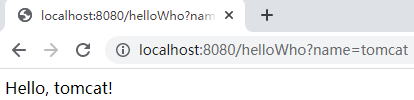

    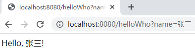

### 修改默认配置

- 一般来说，Spring Boot 默认会在底层配好所有需要的组件，但是如果用户自己配置了，就会以用户配置的优先。

- 以 CharacterEncodingFilter 为例，如果用户希望按自己的需求进行配置，可以在配置类中自行添加：

  ```java
  @Configuration
  public class MyConfig {
      @Bean
      public CharacterEncodingFilter characterEncodingFilter() {
          // filter的实现代码
          return null;
      }
  }
  ```

- 从前面对 CharacterEncodingFilter 的分析可以看出，当用户自己配置了 CharacterEncodingFilter 的实例时，Spring Boot 就不会再配置。

### 总结

- Spring Boot 先加载所有的自动配置类，即 xxxxxAutoConfiguration.class。

- 每个自动配置类按照条件进行生效。xxxxxAutoConfiguration.class 在配置时，会从对应的 xxxxxProperties.class 中取值，而 xxxxxProperties.class 会和配置文件中对应的值进行绑定。比如：

  ```java
  @Configuration(proxyBeanMethods = false)
  @Conditional(DefaultDispatcherServletCondition.class)
  @ConditionalOnClass(ServletRegistration.class)
  @EnableConfigurationProperties(WebMvcProperties.class)// WebMvcProperties.class与配置文件绑定
  protected static class DispatcherServletConfiguration {
  
     @Bean(name = DEFAULT_DISPATCHER_SERVLET_BEAN_NAME)
     public DispatcherServlet dispatcherServlet(WebMvcProperties webMvcProperties) {// 从容器中的webMvcProperties组件取值
        DispatcherServlet dispatcherServlet = new DispatcherServlet();
        dispatcherServlet.setDispatchOptionsRequest(webMvcProperties.isDispatchOptionsRequest());
        dispatcherServlet.setDispatchTraceRequest(webMvcProperties.isDispatchTraceRequest());
        dispatcherServlet.setThrowExceptionIfNoHandlerFound(webMvcProperties.isThrowExceptionIfNoHandlerFound());
        dispatcherServlet.setPublishEvents(webMvcProperties.isPublishRequestHandledEvents());
        dispatcherServlet.setEnableLoggingRequestDetails(webMvcProperties.isLogRequestDetails());
        return dispatcherServlet;
     }
  }
  ```

- 生效的配置类，会给容器中装配很多不同功能的组件；
- 这些组件装配到容器中后，项目就具有了该组件所具有的功能；
- 如果用户自行配置了某一个组件，则以用户配置的优先。
- 若想实现定制化配置，有两种方法：
  - 方法一：用户自行配置组件，添加 `@Bean` 注解，用以替换 Spring Boot 底层的默认组件。
  - 方法二：用户查看该组件从配置文件种获取的是什么属性的值，然后按需求自行修改对应的属性值。比如 HttpEncodingAutoConfiguration 对应的就是配置文件中的 `server.servlet.encoding` 属性。
    - 参考：https://docs.spring.io/spring-boot/docs/current/reference/html/application-properties.html#application-properties
- 过程：**xxxxxAutoConfiguration.class ---> 注册组件 ---> 从 xxxxxProperties.class 里面拿值 ----> 绑定 application.properties 文件**。
  - 可以看出，一般通过修改 application.properties 文件中相应的配置，就可完成 Spring Boot 功能的修改。

### 最佳实践

- 第一步：引入相应的场景依赖。

  - 参考：https://docs.spring.io/spring-boot/docs/current/reference/html/using.html#using.build-systems.starters

- 第二步：查看 Spring Boot 做了哪些自动配置。

  - 自己查看底层源码，找出对应配置的参数。一般来说，引入一个场景后，该场景对应的自动配置都会生效。

  - 配置文件中添加 `debug=true`，开启自动配置的报告。启动主程序后，即可在控制台查看所有生效和未生效的配置 --- Positive (生效) / Negative (未生效)：

    ```properties
    debug=true
    ```

    ```java
    @SpringBootApplication
    public class MainApplication {
        public static void main(String[] args) {
            SpringApplication.run(MainApplication.class, args);
        }
    }
    ```

    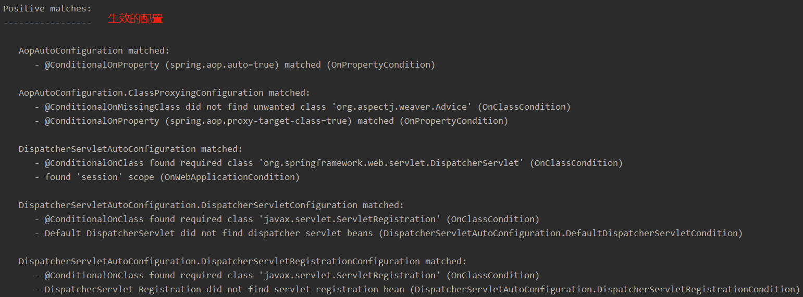

    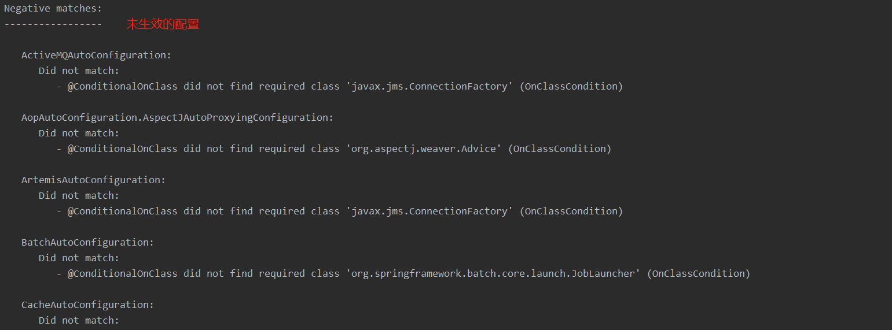

- 第三步：按照需求，确定是否需要修改默写配置。

  - 参照文档修改配置项

    - 参考：https://docs.spring.io/spring-boot/docs/current/reference/html/application-properties.html#application-properties

    - 自己查看底层源码，分析 xxxxxProperties.class 绑定了配置文件的哪些属性。

    - 比如，修改 Spring Boot 启动时的 banner 图：

      - 原图：

        | [`spring.banner.image.location`](https://docs.spring.io/spring-boot/docs/current/reference/html/application-properties.html#application-properties.core.spring.banner.image.location) | Banner image file location (jpg or png can also be used). | `classpath:banner.gif` |
        | ------------------------------------------------------------ | --------------------------------------------------------- | ---------------------- |
        |                                                              |                                                           |                        |

        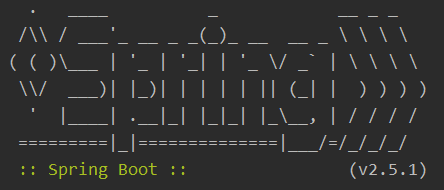

      - 添加配置到配置文件中，或者将 classpath 路径下的 spring.jpg 重命名为 banner.jpg (Spring Boot 默认查找 classpath 下的 banner 图片)：

        ```properties
        spring.banner.image.location=classpath:spring.jpg
        ```

        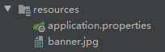

      - 新图：

        

  - 自定义加入或者替换组件。

    - `@Bean`、`@Component` 等。

  - 自定义器 **xxxxxCustomizer**；

- 第四步：实现自己所需功能的业务逻辑。

## Spring Boot 的开发工具

### dev-tools

- Maven 添加依赖：

  ```xml
  <dependency>
      <groupId>org.springframework.boot</groupId>
      <artifactId>spring-boot-devtools</artifactId>
      <optional>true</optional>
  </dependency>
  ```

- 重新启动项目，在后续开发时，如果对项目有改动，使用 `ctrl + F9` 快捷键，即可刷新项目，实现简单的热更新，其本质上是自动重启项目。

- 如果项目做了某些改动，`ctrl + F9` 之后，控制台会打印重启信息。

### Spring Initailizr

- 项目初始化向导，能够快速的创建 Spring Boot 的项目。

- New Project 时，选择需要的开发场景，Spring Boot 会自动添加所需要的依赖，并创建好主类：

  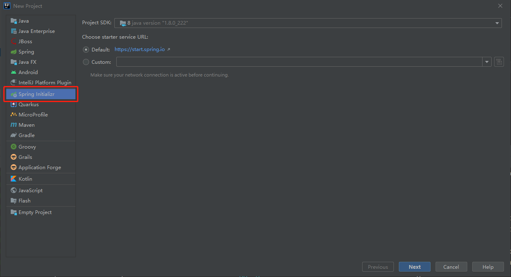

  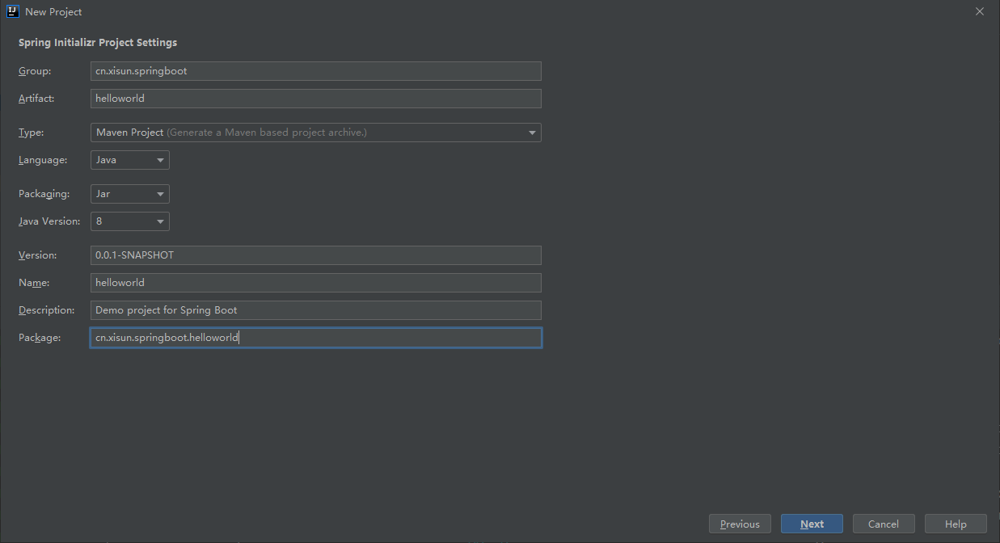

  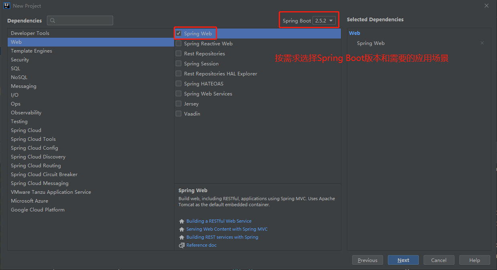

  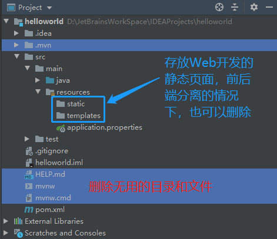

  > static：静态资源，如 css，js 等；templates：Web 页面。

  ```xml
  <?xml version="1.0" encoding="UTF-8"?>
  <project xmlns="http://maven.apache.org/POM/4.0.0" xmlns:xsi="http://www.w3.org/2001/XMLSchema-instance"
           xsi:schemaLocation="http://maven.apache.org/POM/4.0.0 https://maven.apache.org/xsd/maven-4.0.0.xsd">
      <modelVersion>4.0.0</modelVersion>
  
      <!-- 自动添加parent -->
      <parent>
          <groupId>org.springframework.boot</groupId>
          <artifactId>spring-boot-starter-parent</artifactId>
          <version>2.5.2</version>
          <relativePath/> <!-- lookup parent from repository -->
      </parent>
  
      <groupId>cn.xisun.springboot</groupId>
      <artifactId>helloworld</artifactId>
      <version>0.0.1-SNAPSHOT</version>
      <name>helloworld</name>
      <description>Demo project for Spring Boot</description>
      <properties>
          <java.version>1.8</java.version>
      </properties>
  
      <!-- 自动添加相关依赖 -->
      <dependencies>
          <!-- Web开发 -->
          <dependency>
              <groupId>org.springframework.boot</groupId>
              <artifactId>spring-boot-starter-web</artifactId>
          </dependency>
  
          <!-- 单元测试 -->
          <dependency>
              <groupId>org.springframework.boot</groupId>
              <artifactId>spring-boot-starter-test</artifactId>
              <scope>test</scope>
          </dependency>
      </dependencies>
  
      <!-- 自动添加打包插件 -->
      <build>
          <plugins>
              <plugin>
                  <groupId>org.springframework.boot</groupId>
                  <artifactId>spring-boot-maven-plugin</artifactId>
              </plugin>
          </plugins>
      </build>
  
  </project>
  ```

## Spring Boot 2 核心功能

### 配置文件

#### 文件类型

- properties：同前面 application.properties 配置文件的写法。

- yaml：

  - YAML 是 "YAML Ain't Markup Language" (YAML 不是一种标记语言 ) 的递归缩写。在开发这种语言时，YAML 的意思其实是："Yet Another Markup Language" (仍是一种标记语言)。 

  - yarm 非常适合用来做以数据为中心的配置文件。

  - 基本语法：

    - 书写格式：`key: value`，key 和 value 之间有空格；
    - 大小写敏感；

    - 使用缩进表示层级关系；
    - 缩进不允许使用 tab，只允许使用空格；

    - 缩进的空格数不重要，只要相同层级的元素左对齐即可；
    - \# 表示注释；

    - 文件中的字符串无需加引号，如果要加，' ' 内的字符串内容会被转义，" " 内的字符串内容不会被转义。

      - 单引号：

        ```yaml
        person:
          userName: 'zhangsan \n 李四'
        ```

        ```java
        @SpringBootApplication
        public class HelloworldApplication {
            public static void main(String[] args) {
                ConfigurableApplicationContext run = SpringApplication.run(HelloworldApplication.class, args);
                Person person = run.getBean("person", Person.class);
                System.out.println(person.getUserName());
            }
        }
        
        输出结果：
            zhangsan \n 李四
        ```

        > 单引号内的 \n，没有表现出换行的本意，而是被转义为了 \n 字符串 --- 单引号内的字符串内容会被转义。

      - 双引号：

        ```yaml
        person:
          userName: "zhangsan \n 李四"
        ```

        ```java
        @SpringBootApplication
        public class HelloworldApplication {
            public static void main(String[] args) {
                ConfigurableApplicationContext run = SpringApplication.run(HelloworldApplication.class, args);
                Person person = run.getBean("person", Person.class);
                System.out.println(person.getUserName());
            }
        }
        
        输出结果：
            zhangsan 
         	 李四
        ```

        >双引号内的 \n，表现出换行的本意，没有被转义为 \n 字符串 --- 双引号内的字符串内容不会被转义。

  - 数据类型：

    - 字面量：单个的、不可再分的值。如 date、boolean、string、number、null。

      ```yaml
      key: value
      ```

    - 对象：键值对的集合。如 map、hash、set、object。

      ```yaml
      # 行内写法
      key: {key1:value1, key2:value2, key3:value3}
      
      # 缩进写法
      key:
      	key1: value1
      	key2: value2
      	key3: value3
      ```

    - 数组：一组按次序排列的值。如 array、list、queue。

      ```yaml
      # 行内写法
      key: {value1, value2, value3}
      
      # 缩进写法，一个-代表一个元素
      key:
      	- value1
      	- value2
      	- value3
      ```

  - 示例：

    - Person 和 Pet 类：

      ```java
      @Setter
      @Getter
      @NoArgsConstructor
      @AllArgsConstructor
      @ToString
      @Component
      @ConfigurationProperties(prefix = "person")
      public class Person {
          private String userName;
      
          private Boolean boss;
      
          private Date birth;
      
          private Integer age;
      
          private Pet pet;
      
          private String[] interests;
      
          private List<String> animal;
      
          private Map<String, Object> score;
      
          private Set<Double> salarys;
      
          private Map<String, List<Pet>> allPets;
      }
      ```

      ```java
      @Setter
      @Getter
      @NoArgsConstructor
      @AllArgsConstructor
      @ToString
      @Component
      @ConfigurationProperties(prefix = "pet")
      public class Pet {
          private String name;
      
          private Double weight;
      }
      ```

    - application.yaml 配置文件 (也可以命名为 application.yml)：

      ```yaml
      person:
        userName: zhangsan
        boss: false
        birth: 2019/12/12 20:12:33
        age: 18
        pet:
          name: tomcat
          weight: 23.4
        interests: [篮球, 游泳]
        animal:
          - jerry
          - tom
        score:
          english:
            first: 30
            second: 40
            third: 50
          math: [131, 140, 148]
          chinese: {first: 128, second: 136}
        salarys: [3999, 4999.98, 5999.99]
        allPets:
          sick:
            - {name: tom1, weight: 33}
            - {name: jerry1, weight: 47}
          healthy: [{name: tom2, weight: 33}, {name: jerry2, weight: 47}]
      ```

      > 在实际开发时，配置文件的写法方式，应该统一为行内写法，或者缩进写法，不要混写。

    - Controller 测试：

      ```java
      @Controller
      public class HelloController {
          @Autowired
          private Person person;
      
          @RequestMapping("/person")
          @ResponseBody
          public Person person() {
              return person;
          }
      }
      ```

      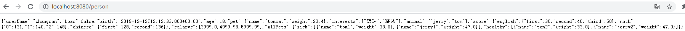

      > 可以看出，容器中的 Person 组件，就是按照 application.yaml 配置文件进行属性配置的。

- Spring Boot 项目，可以同时存在 properties 和 yaml 两种配置文件，当二者包含相同属性的配置时，propertire 配置文件会覆盖 yaml 配置文件。

  - application.properties：

    ```properties
    person.user-name=wangwu
    ```

  - application.yaml：

    ```yaml
    person:
      userName: zhangsan
    ```

  - 主类：

    ```java
    @SpringBootApplication
    public class HelloworldApplication {
        public static void main(String[] args) {
            ConfigurableApplicationContext run = SpringApplication.run(HelloworldApplication.class, args);
            Person person = run.getBean("person", Person.class);
            System.out.println(person.getUserName());
        }
    }
    
    输出结果：
        wangwu
    ```

#### 配置提示

- 自定义的类和配置文件绑定一般没有提示，需要添加 `spring-boot-configuration-processor` 依赖，这样在配置文件书写时，会进行提示：

  ```xml
  <dependency>
      <groupId>org.springframework.boot</groupId>
      <artifactId>spring-boot-configuration-processor</artifactId>
      <optional>true</optional>
  </dependency>
  ```

  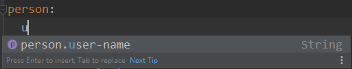

  >user-name 与 userName 效果等同。

- 因为 `spring-boot-configuration-processor` 依赖是开发过程中提供帮助，在打包程序时，应将其排除，不打包：

  ```xml
  <!-- 打包插件 -->
  <build>
      <plugins>
          <plugin>
              <groupId>org.springframework.boot</groupId>
              <artifactId>spring-boot-maven-plugin</artifactId>
      		<!-- 打包时排除依赖 -->
              <configuration>
                  <excludes>
                      <exclude>
                          <groupId>org.springframework.boot</groupId>
                          <artifactId>spring-boot-configuration-processor</artifactId>
                      </exclude>
                  </excludes>
              </configuration>
          </plugin>
      </plugins>
  </build>
  ```

### Web 开发

- 参考：https://docs.spring.io/spring-boot/docs/current/reference/html/features.html#features.developing-web-applications

#### Spring MVC 自动配置概览

- Spring Boot provides auto-configuration for Spring MVC that **works well with most applications.**

  - 大多场景都无需自定义配置。

- The auto-configuration adds the following features on top of Spring’s defaults:

  - Inclusion of `ContentNegotiatingViewResolver` and `BeanNameViewResolver` beans.
    - 内容协商视图解析器和 BeanName 视图解析器。

  - Support for serving static resources, including support for WebJars (covered [later in this document](https://docs.spring.io/spring-boot/docs/current/reference/html/spring-boot-features.html#boot-features-spring-mvc-static-content))).
    - 静态资源 (包括 WebJars)。

  - Automatic registration of `Converter`, `GenericConverter`, and `Formatter` beans.
    - 自动注册 `Converter`， `GenericConverter` 和 `Formatter`。

  - Support for `HttpMessageConverters` (covered [later in this document](https://docs.spring.io/spring-boot/docs/current/reference/html/spring-boot-features.html#boot-features-spring-mvc-message-converters)).
    - 支持 `HttpMessageConverters`  (配合内容协商章节理解原理)。

  - Automatic registration of `MessageCodesResolver` (covered [later in this document](https://docs.spring.io/spring-boot/docs/current/reference/html/spring-boot-features.html#boot-features-spring-message-codes)).
    - 自动注册 `MessageCodesResolver` (国际化用)。

  - Static `index.html` support.
    - 静态 index.html 页支持。

  - Custom `Favicon` support (covered [later in this document](https://docs.spring.io/spring-boot/docs/current/reference/html/spring-boot-features.html#boot-features-spring-mvc-favicon)).
    - 自定义 `Favicon`。

  - Automatic use of a `ConfigurableWebBindingInitializer` bean (covered [later in this document](https://docs.spring.io/spring-boot/docs/current/reference/html/spring-boot-features.html#boot-features-spring-mvc-web-binding-initializer)).
    - 自动使用 `ConfigurableWebBindingInitializer`，(DataBinder 负责将请求数据绑定到 JavaBean 上)。


- If you want to keep those Spring Boot MVC customizations and make more [MVC customizations](https://docs.spring.io/spring/docs/5.2.9.RELEASE/spring-framework-reference/web.html#mvc) (interceptors, formatters, view controllers, and other features), you can add your own `@Configuration` class of type `WebMvcConfigurer` but **without** `@EnableWebMvc`.
  - 不用 `@EnableWebMvc` 注解，使用 `@Configuration` + WebMvcConfigurer 自定义规则。

- If you want to provide custom instances of `RequestMappingHandlerMapping`, `RequestMappingHandlerAdapter`, or `ExceptionHandlerExceptionResolver`, and still keep the Spring Boot MVC customizations, you can declare a bean of type `WebMvcRegistrations` and use it to provide custom instances of those components.
  - 声明 WebMvcRegistrations 改变默认底层组件。

- If you want to take complete control of Spring MVC, you can add your own `@Configuration` annotated with `@EnableWebMvc`, or alternatively add your own `@Configuration`-annotated `DelegatingWebMvcConfiguration` as described in the Javadoc of `@EnableWebMvc`.
  - 使用 `@EnableWebMvc` + `@Configuration` + DelegatingWebMvcConfiguration 全面接管 Spring MVC。

#### Spring MVC 静态资源访问及原理

##### 静态资源访问

- 静态资源目录

  - 只要静态资源放在类路径下的 `/static` 或者 `/public` 或者 `/resources` 或者 `/META-INF/resources`，都可以访问。

    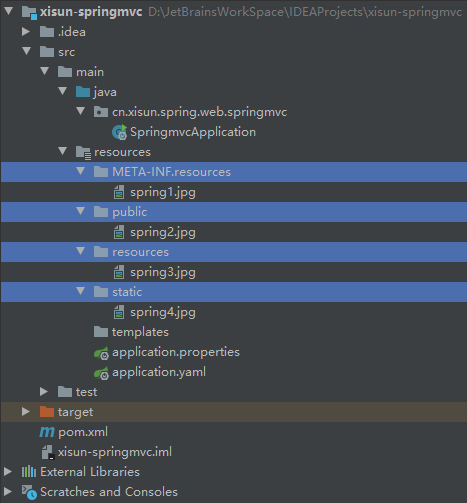

  - 访问方式：`当前项目根路径 / + 静态资源名`。例如：`http://localhost:8080/spring1.jpg`。

  - 原理：Spring Boot 静态资源访问映射 `/**`，即拦截所有的请求。当一个请求进来时，先去找 Controller 看能不能处理，不能处理的所有请求，都会交给静态资源处理器。如果静态资源也找不到，则响应 404 页面。

    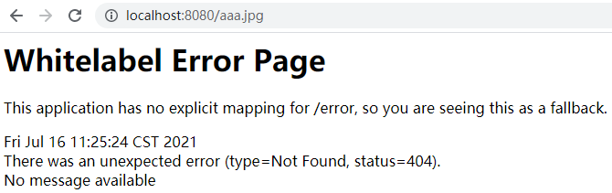

  - 改变静态资源默认的存储路径：

    ```yaml
    # 单个路径
    spring:
      web:
        resources:
          static-locations: classpath:images
    ```

    ```yaml
    # 多个路径
    spring:
      web:
        resources:
          static-locations: [classpath:images, classpath:statics]
    ```

    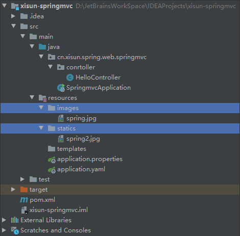

    > 静态资源都需要放在 application.yaml 配置文件里标明的路径下 (有时可能不生效，更改一下路径名，刷新几次)。
    >
    > 默认的那几个路径不再生效，默认路径如下：
    >
    > ```java
    > private static final String[] CLASSPATH_RESOURCE_LOCATIONS = new String[]{"classpath:/META-INF/resources/", "classpath:/resources/", "classpath:/static/", "classpath:/public/"};
    > ```

- 静态资源访问前缀

  - 静态资源访问时，默认没有前缀。

  - 改变静态资源的访问前缀：

    ```yaml
    spring:
      mvc:
        static-path-pattern: /res/**
    ```

  - 再次访问静态资源时，都需要添加前缀。比如：`http://localhost:8080/res/spring.jpg`。

- webjar (了解)

  - Spring 把常用的一些 js 打包成 jar 包，添加引用后即可使用。官方地址：https://www.webjars.org/

    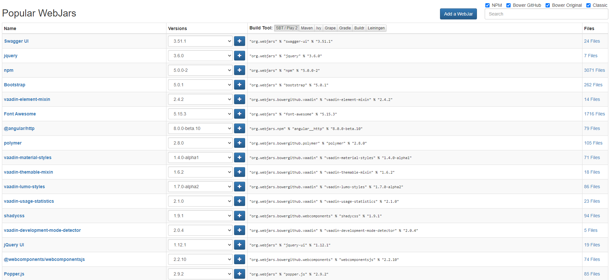

  - 例如，使用 jquery，Maven 引入依赖：

    ```xml
    <dependency>
        <groupId>org.webjars</groupId>
        <artifactId>jquery</artifactId>
        <version>3.6.0</version>
    </dependency>
    ```

    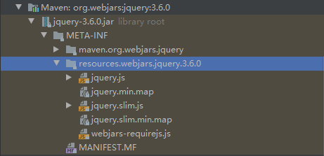

  - 访问时，根据添加的 jquery 依赖的资源结构，确定访问地址：`http://localhost:8080/webjars/jquery/3.6.0/jquery.js`。

    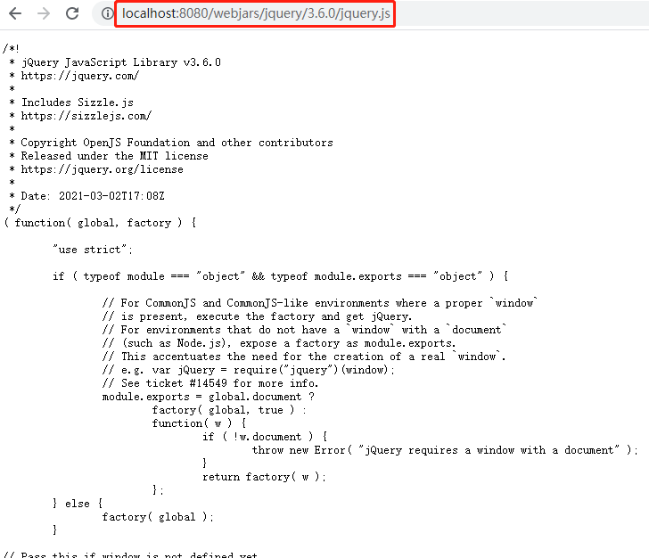

    > 不同的 webjars，其访问地址可能不同，需要按照相应依赖里面的资源包路径确定。

##### 欢迎页支持

- Spring Boot supports both static and templated welcome pages. It first looks for an `index.html` file in the configured static content locations. If one is not found, it then looks for an `index` template. If either is found, it is automatically used as the welcome page of the application.

  - Spring Boot 支持两种方式的欢迎页，一种是存放在静态资源存储路径下的 index.html，另一种是能处理动态请求 `/index` 的 Controller。

  - 静态欢迎页：

    ```yaml
    spring:
      # 配置静态资源路径，会导致welcome page失效
      #  mvc:
      #    static-path-pattern: /res/**
    
      web:
        resources:
          static-locations: [classpath:images, classpath:statics]
    ```

    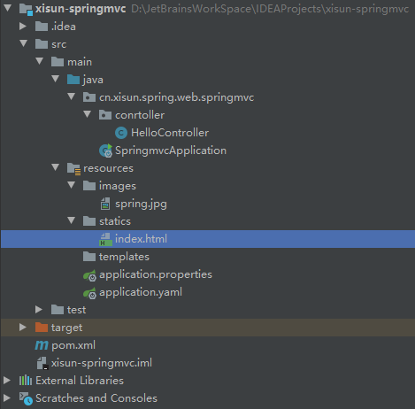

    ```html
    <!DOCTYPE html>
    <html lang="en">
    <head>
        <meta charset="UTF-8">
        <title>Title</title>
    </head>
    <body>
    <h1>Hello, Xisun!</h1>
    </body>
    </html>
    ```

    

  - 动态请求：`/index`，交由相应的 Controller 处理。

##### 静态资源配置原理

- Spring Boot 在启动时，默认加载 xxxxxAutoConfiguration.class，即各种自动配置类。

  - 分析 Spring Boot 的某一项功能时，应该先查找其对应的自动配置类，从底层源码开始。

- 与 Spring MVC 相关的自动配置类，是 `org.springframework.boot.autoconfigure.web.servlet.WebMvcAutoConfiguration`：

  ```java
  @Configuration(proxyBeanMethods = false)
  @ConditionalOnWebApplication(type = Type.SERVLET)
  @ConditionalOnClass({ Servlet.class, DispatcherServlet.class, WebMvcConfigurer.class })
  @ConditionalOnMissingBean(WebMvcConfigurationSupport.class)
  @AutoConfigureOrder(Ordered.HIGHEST_PRECEDENCE + 10)
  @AutoConfigureAfter({ DispatcherServletAutoConfiguration.class, TaskExecutionAutoConfiguration.class,
        ValidationAutoConfiguration.class })
  public class WebMvcAutoConfiguration {}
  ```

  - WebMvcAutoConfiguration 配置类中的 WebMvcAutoConfigurationAdapter 组件，对应了静态资源路径和访问前缀有关的规则：

    ```java
    @Configuration(proxyBeanMethods = false)
    @Import(EnableWebMvcConfiguration.class)
    // 开启WebMvcProperties、ResourceProperties和WebProperties类配置绑定功能，并注册到容器中
    // 1.WebMvcProperties.class: spring.mvc
    // 2.ResourceProperties.class: spring.resources
    // 3.WebProperties.class: spring.web
    @EnableConfigurationProperties({ WebMvcProperties.class,
          org.springframework.boot.autoconfigure.web.ResourceProperties.class, WebProperties.class })
    @Order(0)
    public static class WebMvcAutoConfigurationAdapter implements WebMvcConfigurer, ServletContextAware {
        
       /**
        * WebMvcAutoConfigurationAdapter配置类只有一个有参构造器
        * 有参构造器所有参数的值都会从容器中确定
        * resourceProperties: 获取和spring.resources属性的所有值绑定的对象
        * webProperties: 获取和spring.web属性的所有值绑定的对象;
        * mvcProperties: 获取和spring.mvc属性的所有值绑定的对象;
        * beanFactory: Spring的beanFactory;
        * messageConvertersProvider: 找到所有的HttpMessageConverters;
        * resourceHandlerRegistrationCustomizerProvider: 找到资源处理器的自定义器
        * dispatcherServletPath: 
        * servletRegistrations: 给应用注册Servlet、Filter....
        */
       public WebMvcAutoConfigurationAdapter(
             org.springframework.boot.autoconfigure.web.ResourceProperties resourceProperties,
             WebProperties webProperties, WebMvcProperties mvcProperties, ListableBeanFactory beanFactory,
             ObjectProvider<HttpMessageConverters> messageConvertersProvider,
             ObjectProvider<ResourceHandlerRegistrationCustomizer> resourceHandlerRegistrationCustomizerProvider,
             ObjectProvider<DispatcherServletPath> dispatcherServletPath,
             ObjectProvider<ServletRegistrationBean<?>> servletRegistrations) {
          this.resourceProperties = resourceProperties.hasBeenCustomized() ? resourceProperties
                : webProperties.getResources();
          this.mvcProperties = mvcProperties;
          this.beanFactory = beanFactory;
          this.messageConvertersProvider = messageConvertersProvider;
          this.resourceHandlerRegistrationCustomizer = resourceHandlerRegistrationCustomizerProvider.getIfAvailable();
          this.dispatcherServletPath = dispatcherServletPath;
          this.servletRegistrations = servletRegistrations;
          this.mvcProperties.checkConfiguration();
       }
    
       /**
        * webjars资源处理的默认规则
        */
       @Override
       public void addResourceHandlers(ResourceHandlerRegistry registry) {
          if (!this.resourceProperties.isAddMappings()) {
             logger.debug("Default resource handling disabled");
             return;
          }
          // webjars: 映射规则是/webjars/**,资源路径是各jar包下的classpath:/META-INF/resources/webjars/
          addResourceHandler(registry, "/webjars/**", "classpath:/META-INF/resources/webjars/");
          // this.mvcProperties.getStaticPathPattern(): 静态资源默认映射是/**
          addResourceHandler(registry, this.mvcProperties.getStaticPathPattern(), (registration) -> {
             registration.addResourceLocations(this.resourceProperties.getStaticLocations());
             if (this.servletContext != null) {
                ServletContextResource resource = new ServletContextResource(this.servletContext, SERVLET_LOCATION);
                registration.addResourceLocations(resource);
             }
          });
       }
    
    }
    ```

    ```java
    @ConfigurationProperties("spring.web")
    public class WebProperties {
    
       public static class Resources {
          // 静态资源默认存储路径
          private static final String[] CLASSPATH_RESOURCE_LOCATIONS = { "classpath:/META-INF/resources/",
                "classpath:/resources/", "classpath:/static/", "classpath:/public/" };
           
          /**
    		* Whether to enable default resource handling.
    		* 通过设置spring.web.add-mappings: false, 能够禁用所有静态资源的规则, 
    		* 也就是说无论静态资源存放在哪，都无法访问，默认为true
    		*/
    	  private boolean addMappings = true;
       }
    }
    ```

  - WebMvcAutoConfiguration 配置类中的 EnableWebMvcConfiguration 组件，对应了欢迎页的处理规则：

    ```java
    @Configuration(proxyBeanMethods = false)
    @EnableConfigurationProperties(WebProperties.class)
    public static class EnableWebMvcConfiguration extends DelegatingWebMvcConfiguration implements ResourceLoaderAware {
    
       // HandlerMapping: 处理器映射,保存了每一个Handler能处理哪些请求.
       @Bean
       public WelcomePageHandlerMapping welcomePageHandlerMapping(ApplicationContext applicationContext,
             FormattingConversionService mvcConversionService, ResourceUrlProvider mvcResourceUrlProvider) {
          WelcomePageHandlerMapping welcomePageHandlerMapping = new WelcomePageHandlerMapping(
                new TemplateAvailabilityProviders(applicationContext), applicationContext, getWelcomePage(),
                this.mvcProperties.getStaticPathPattern());
          welcomePageHandlerMapping.setInterceptors(getInterceptors(mvcConversionService, mvcResourceUrlProvider));
          welcomePageHandlerMapping.setCorsConfigurations(getCorsConfigurations());
          return welcomePageHandlerMapping;
       }
    
    }
    ```

    ```java
    final class WelcomePageHandlerMapping extends AbstractUrlHandlerMapping {
    
       WelcomePageHandlerMapping(TemplateAvailabilityProviders templateAvailabilityProviders,
             ApplicationContext applicationContext, Resource welcomePage, String staticPathPattern) {
          // 如果使用欢迎页功能,默认映射是/**,访问index.html
          if (welcomePage != null && "/**".equals(staticPathPattern)) {
             logger.info("Adding welcome page: " + welcomePage);
             setRootViewName("forward:index.html");
          }
          // 如果上面的条件不满足,转为发送/index请求,查看Controller是否能匹配并处理
          else if (welcomeTemplateExists(templateAvailabilityProviders, applicationContext)) {
             logger.info("Adding welcome page template: index");
             setRootViewName("index");
          }
       }
    }
    ```

#### Spring MVC 请求参数的处理

##### 请求映射

- 请求映射的方式

  - 常使用 `@RequestMapping` 注解声明请求映射。比如：

    ```java
    @Target({ElementType.TYPE, ElementType.METHOD})
    @Retention(RetentionPolicy.RUNTIME)
    @Documented
    @Mapping
    public @interface RequestMapping {
        String name() default "";
    
        @AliasFor("path")
        String[] value() default {};
    
        @AliasFor("value")
        String[] path() default {};
    
        RequestMethod[] method() default {};
    
        String[] params() default {};
    
        String[] headers() default {};
    
        String[] consumes() default {};
    
        String[] produces() default {};
    }
    ```

    ```java
    @RestController
    public class HelloController {
        @RequestMapping("/hello")
        public String hello() {
            return "HellO, Spring Boot!";
        }
    }
    ```

  - Rest 风格支持：使用 HTTP 请求方式的动词来表示对资源的操作。
    - 以前：`/getUser` 表示获取用户请求，`/saveUser` 表示保存用户请求，`/editUser` 表示修改用户请求，`/deleteUser` 表示删除用户请求。
    
    - 现在： `/user` 表示所有与 User 相关的请求，GET 请求表示获取用户，POST 请求表示保存用户，PUT 请求表示修改用户，DELETE 请求表示删除用户。
    
    - 默认情况下，浏览器只发送 GET 和 POST 请求，不支持 PUT 和 DELETE 请求。如果要完成 Rest 风格的请求，需要在容器中配置一个 HiddenHttpMethodFilter 的组件。
    
      ```java
      public class HiddenHttpMethodFilter extends OncePerRequestFilter {
      
         private static final List<String> ALLOWED_METHODS =
               Collections.unmodifiableList(Arrays.asList(HttpMethod.PUT.name(),
                     HttpMethod.DELETE.name(), HttpMethod.PATCH.name()));
      
         // 表单提交时,添加一个隐藏的_method参数,该参数的值,作为最终的实际请求
         /** Default method parameter: {@code _method}. */
         public static final String DEFAULT_METHOD_PARAM = "_method";
      
         private String methodParam = DEFAULT_METHOD_PARAM;
      
      
         /**
          * Set the parameter name to look for HTTP methods.
          * @see #DEFAULT_METHOD_PARAM
          */
         public void setMethodParam(String methodParam) {
            Assert.hasText(methodParam, "'methodParam' must not be empty");
            this.methodParam = methodParam;
         }
      
         @Override
         protected void doFilterInternal(HttpServletRequest request, HttpServletResponse response, FilterChain filterChain)
               throws ServletException, IOException {
      
            // 原生Request(POST请求)
            HttpServletRequest requestToUse = request;
      
            // 原理: 发送的请求没有异常,且是POST请求时,会获取请求中的_method参数的值,并根据该值发送实际的请求
            if ("POST".equals(request.getMethod()) && request.getAttribute(WebUtils.ERROR_EXCEPTION_ATTRIBUTE) == null) {
               String paramValue = request.getParameter(this.methodParam);
               if (StringUtils.hasLength(paramValue)) {
                  String method = paramValue.toUpperCase(Locale.ENGLISH);
                  // ALLOWED_METHODS: 兼容PUT、DELETE和PATCH请求
                  if (ALLOWED_METHODS.contains(method)) {
                     // 创建了一个新的请求,作为最终实际的请求
                     // 包装Request(根据_method参数的值,作为实际请求)
                     requestToUse = new HttpMethodRequestWrapper(request, method);
                  }
               }
            }
      
            filterChain.doFilter(requestToUse, response);
         }
      
      
         /**
          * Simple {@link HttpServletRequest} wrapper that returns the supplied method for
          * {@link HttpServletRequest#getMethod()}.
          */
         private static class HttpMethodRequestWrapper extends HttpServletRequestWrapper {
      
            private final String method;
      
            public HttpMethodRequestWrapper(HttpServletRequest request, String method) {
               super(request);
               this.method = method;
            }
      
            @Override
            public String getMethod() {
               return this.method;
            }
         }
      
      }
      ```
    
      - HiddenHttpMethodFilter 会拦截 POST 请求，并根据请求中的 _method 参数的值，发送实际的请求。
    
      - HiddenHttpMethodFilter 兼容 PUT、DELETE 和 PATCH 请求，也就是说，除了 GET 和 POST 请求，Rest 风格支持上述的三种请求。
    
      - Spring Boot 自动配置的 WebMvcAutoConfiguration 中，默认提供了一个 OrderedHiddenHttpMethodFilter，但 `spring.mvc.hiddenmethod.filter` 值默认为 false，也就是说，Spring Boot 默认不开启 Rest 风格支持。
    
        ```java
        @Configuration(proxyBeanMethods = false)
        @ConditionalOnWebApplication(type = Type.SERVLET)
        @ConditionalOnClass({ Servlet.class, DispatcherServlet.class, WebMvcConfigurer.class })
        @ConditionalOnMissingBean(WebMvcConfigurationSupport.class)
        @AutoConfigureOrder(Ordered.HIGHEST_PRECEDENCE + 10)
        @AutoConfigureAfter({ DispatcherServletAutoConfiguration.class, TaskExecutionAutoConfiguration.class,
              ValidationAutoConfiguration.class })
        public class WebMvcAutoConfiguration {
           @Bean
           @ConditionalOnMissingBean(HiddenHttpMethodFilter.class)
           @ConditionalOnProperty(prefix = "spring.mvc.hiddenmethod.filter", name = "enabled")
           public OrderedHiddenHttpMethodFilter hiddenHttpMethodFilter() {
              return new OrderedHiddenHttpMethodFilter();
           }
        }
        ```
    
        ```java
        public class OrderedHiddenHttpMethodFilter extends HiddenHttpMethodFilter implements OrderedFilter {}
        ```
    
  - 配置类中手动开启 Rest 风格支持：

    ```yaml
    spring:
      mvc:
        hiddenmethod:
          filter:
            enabled: true
    ```

  - 用法：表单 method 设置为 POST，添加隐藏域 _method，值按需求设置为 PUT 和 DELETE。如果本意是发送 POST 请求，则不需要 _method 属性。

    ```html
    <!DOCTYPE html>
    <html lang="en">
    <head>
        <meta charset="UTF-8">
        <title>Title</title>
    </head>
    <body>
    <h1>Hello, Xisun!</h1>
    <form action="/user" method="get">
        <input value="RESET-GET 提交" type="submit">
    </form>
    
    <form action="/user" method="post">
        <input value="RESET-POST 提交" type="submit">
    </form>
    
    <form action="/user" method="post">
        <input name="_method" value="PUT" type="hidden">
        <input value="RESET-PUT 提交" type="submit">
    </form>
    
    <form action="/user" method="post">
        <input name="_method" value="DELETE" type="hidden">
        <input value="RESET-DELETE 提交" type="submit">
    </form>
    </body>
    </html>
    ```

    ```java
    @RestController
    public class HelloController {
        // @RequestMapping(value = "/user", method = RequestMethod.GET)
        @GetMapping("/user")
        public String getUser() {
            return "GET-张三";
        }
    
        // @RequestMapping(value = "/user", method = RequestMethod.POST)
        @PostMapping("/user")
        public String saveUser() {
            return "POST-张三";
        }
    
        // @RequestMapping(value = "/user", method = RequestMethod.PUT)
        @PutMapping("/user")
        public String putUser() {
            return "PUT-张三";
        }
    
        // @RequestMapping(value = "/user", method = RequestMethod.DELETE)
        @DeleteMapping("/user")
        public String deleteUser() {
            return "DELETE-张三";
        }
    }
    ```

    >`@GetMapping`、`@PostMapping`、`@PutMapping` 和 `@DeleteMapping` 四个派生注解，效果等同上面的写法。

  - 原理 (表单提交时的情况)：

    - 表单提交时，只有 GET 请求和 POST 请求两种方式。
    - 表单提交会带上 \_method 参数，比如 `_method=PUT`。
    - 请求过来时，会被 HiddenHttpMethodFilter 拦截：
      - 判断请求是正常的，并且是 POST 请求；
      - 获取到 \_method 参数的值。
        - 兼容以下请求：PUT、DELETE 和 PATCH。
      - 将原生 Request (post 请求)，使用包装模式 requesWrapper，重写 `getMethod()`，返回传入的 \_method 的值。
      - 过滤器链放行的时候用 requesWrapper。后续的方法调用 `getMethod()` 时，调用的是 requesWrapper 重写后的方法。
      - 经过以上过程，实现了表单提交时的 Rest 风格。
    - 如果使用客户端工具，比如 PostMan，会直接发送 PUT、DELETE 等方式的请求，无需使用 HiddenHttpMethodFilter。

  - 扩展：修改默认的 \_method 参数名。

    ```java
    @Bean
    @ConditionalOnMissingBean(HiddenHttpMethodFilter.class)
    @ConditionalOnProperty(prefix = "spring.mvc.hiddenmethod.filter", name = "enabled")
    public OrderedHiddenHttpMethodFilter hiddenHttpMethodFilter() {
       return new OrderedHiddenHttpMethodFilter();
    }
    ```

    - 根据 OrderedHiddenHttpMethodFilter 的条件性注解，可以看出，当容器内没有 HiddenHttpMethodFilter 组件时，会默认注册一个 OrderedHiddenHttpMethodFilter 组件，而 OrderedHiddenHttpMethodFilter 组件默认使用 _method 参数。因此，如果希望修改 _method 参数，可以自己自定义注册一个 HiddenHttpMethodFilter 组件。

      ```java
      @Configuration(proxyBeanMethods = false)
      public class WebMvcConfig {
          @Bean
          public HiddenHttpMethodFilter hiddenHttpMethodFilter() {
              HiddenHttpMethodFilter hiddenHttpMethodFilter = new HiddenHttpMethodFilter();
              // 修改默认的_method参数
              hiddenHttpMethodFilter.setMethodParam("_real");
              return hiddenHttpMethodFilter;
          }
      }
      ```

- 请求映射的原理

  - 处理 Web 请求时，Spring Boot 底层使用的是 Spring MVC，当请求到达时，都会先经过 DispatcherServlet，这是 Web 请求的开始。

  - DispatcherServlet 的继承树结构 (`ctrl + H`)：

    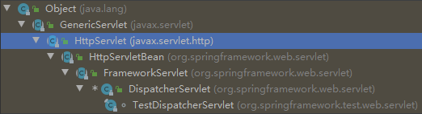

    - HttpServletBean：没有重写 HttpServlet 的 `doGet()` 和 `doPost()`，查看其子类。

    - FrameworkServlet：重写了 HttpServlet 的 `doGet()` 和 `doPost()`，以及其他方法。可以看出，都调用了 `processRequest()`，最终执行 `doService()`，这个方法在 FrameworkServlet 类中没有实现，查看其子类。

      ```java
      @Override
      protected final void doGet(HttpServletRequest request, HttpServletResponse response)
            throws ServletException, IOException {
      
         processRequest(request, response);
      }
      
      /**
       * Delegate POST requests to {@link #processRequest}.
       * @see #doService
       */
      @Override
      protected final void doPost(HttpServletRequest request, HttpServletResponse response)
            throws ServletException, IOException {
      
         processRequest(request, response);
      }
      
      /**
       * Delegate PUT requests to {@link #processRequest}.
       * @see #doService
       */
      @Override
      protected final void doPut(HttpServletRequest request, HttpServletResponse response)
            throws ServletException, IOException {
      
         processRequest(request, response);
      }
      
      /**
       * Delegate DELETE requests to {@link #processRequest}.
       * @see #doService
       */
      @Override
      protected final void doDelete(HttpServletRequest request, HttpServletResponse response)
            throws ServletException, IOException {
      
         processRequest(request, response);
      }
      ```

      ```java
      protected final void processRequest(HttpServletRequest request, HttpServletResponse response)
            throws ServletException, IOException {
      
         long startTime = System.currentTimeMillis();
         Throwable failureCause = null;
      
         LocaleContext previousLocaleContext = LocaleContextHolder.getLocaleContext();
         LocaleContext localeContext = buildLocaleContext(request);
      
         RequestAttributes previousAttributes = RequestContextHolder.getRequestAttributes();
         ServletRequestAttributes requestAttributes = buildRequestAttributes(request, response, previousAttributes);
      
         WebAsyncManager asyncManager = WebAsyncUtils.getAsyncManager(request);
         asyncManager.registerCallableInterceptor(FrameworkServlet.class.getName(), new RequestBindingInterceptor());
      
         initContextHolders(request, localeContext, requestAttributes);
      
         try {
            // 最终执行的方法
            doService(request, response);
         }
         catch (ServletException | IOException ex) {
            failureCause = ex;
            throw ex;
         }
         catch (Throwable ex) {
            failureCause = ex;
            throw new NestedServletException("Request processing failed", ex);
         }
      
         finally {
            resetContextHolders(request, previousLocaleContext, previousAttributes);
            if (requestAttributes != null) {
               requestAttributes.requestCompleted();
            }
            logResult(request, response, failureCause, asyncManager);
            publishRequestHandledEvent(request, response, startTime, failureCause);
         }
      }
      ```

      ```java
      // FrameworkServlet中没有实现doService(),查看其子类的实现
      protected abstract void doService(HttpServletRequest request, HttpServletResponse response)
            throws Exception;
      ```

    - DispatcherServlet：重写了 `doService()`，核心方法在于调用 `doDispatch()`，这个方法是处理 Web 请求的最终方法。

      ```java
      @Override
      protected void doService(HttpServletRequest request, HttpServletResponse response) throws Exception {
         logRequest(request);
      
         // Keep a snapshot of the request attributes in case of an include,
         // to be able to restore the original attributes after the include.
         Map<String, Object> attributesSnapshot = null;
         if (WebUtils.isIncludeRequest(request)) {
            attributesSnapshot = new HashMap<>();
            Enumeration<?> attrNames = request.getAttributeNames();
            while (attrNames.hasMoreElements()) {
               String attrName = (String) attrNames.nextElement();
               if (this.cleanupAfterInclude || attrName.startsWith(DEFAULT_STRATEGIES_PREFIX)) {
                  attributesSnapshot.put(attrName, request.getAttribute(attrName));
               }
            }
         }
      
         // Make framework objects available to handlers and view objects.
         request.setAttribute(WEB_APPLICATION_CONTEXT_ATTRIBUTE, getWebApplicationContext());
         request.setAttribute(LOCALE_RESOLVER_ATTRIBUTE, this.localeResolver);
         request.setAttribute(THEME_RESOLVER_ATTRIBUTE, this.themeResolver);
         request.setAttribute(THEME_SOURCE_ATTRIBUTE, getThemeSource());
      
         if (this.flashMapManager != null) {
            FlashMap inputFlashMap = this.flashMapManager.retrieveAndUpdate(request, response);
            if (inputFlashMap != null) {
               request.setAttribute(INPUT_FLASH_MAP_ATTRIBUTE, Collections.unmodifiableMap(inputFlashMap));
            }
            request.setAttribute(OUTPUT_FLASH_MAP_ATTRIBUTE, new FlashMap());
            request.setAttribute(FLASH_MAP_MANAGER_ATTRIBUTE, this.flashMapManager);
         }
      
         RequestPath previousRequestPath = null;
         if (this.parseRequestPath) {
            previousRequestPath = (RequestPath) request.getAttribute(ServletRequestPathUtils.PATH_ATTRIBUTE);
            ServletRequestPathUtils.parseAndCache(request);
         }
      
         try {
            // 核心方法
            doDispatch(request, response);
         }
         finally {
            if (!WebAsyncUtils.getAsyncManager(request).isConcurrentHandlingStarted()) {
               // Restore the original attribute snapshot, in case of an include.
               if (attributesSnapshot != null) {
                  restoreAttributesAfterInclude(request, attributesSnapshot);
               }
            }
            if (this.parseRequestPath) {
               ServletRequestPathUtils.setParsedRequestPath(previousRequestPath, request);
            }
         }
      }
      ```

      ```java
      protected void doDispatch(HttpServletRequest request, HttpServletResponse response) throws Exception {
         HttpServletRequest processedRequest = request;
         HandlerExecutionChain mappedHandler = null;
         boolean multipartRequestParsed = false;
      
         WebAsyncManager asyncManager = WebAsyncUtils.getAsyncManager(request);
      
         try {
            ModelAndView mv = null;
            Exception dispatchException = null;
      
            try {
               processedRequest = checkMultipart(request);
               multipartRequestParsed = (processedRequest != request);
      
               // Determine handler for the current request.
               // 找出当前请求使用哪个Handler处理,也就是Controller里的哪个方法
               mappedHandler = getHandler(processedRequest);
               if (mappedHandler == null) {
                  noHandlerFound(processedRequest, response);
                  return;
               }
      
               // Determine handler adapter for the current request.
               HandlerAdapter ha = getHandlerAdapter(mappedHandler.getHandler());
      
               // Process last-modified header, if supported by the handler.
               String method = request.getMethod();
               boolean isGet = HttpMethod.GET.matches(method);
               if (isGet || HttpMethod.HEAD.matches(method)) {
                  long lastModified = ha.getLastModified(request, mappedHandler.getHandler());
                  if (new ServletWebRequest(request, response).checkNotModified(lastModified) && isGet) {
                     return;
                  }
               }
      
               if (!mappedHandler.applyPreHandle(processedRequest, response)) {
                  return;
               }
      
               // Actually invoke the handler.
               mv = ha.handle(processedRequest, response, mappedHandler.getHandler());
      
               if (asyncManager.isConcurrentHandlingStarted()) {
                  return;
               }
      
               applyDefaultViewName(processedRequest, mv);
               mappedHandler.applyPostHandle(processedRequest, response, mv);
            }
            catch (Exception ex) {
               dispatchException = ex;
            }
            catch (Throwable err) {
               // As of 4.3, we're processing Errors thrown from handler methods as well,
               // making them available for @ExceptionHandler methods and other scenarios.
               dispatchException = new NestedServletException("Handler dispatch failed", err);
            }
            processDispatchResult(processedRequest, response, mappedHandler, mv, dispatchException);
         }
         catch (Exception ex) {
            triggerAfterCompletion(processedRequest, response, mappedHandler, ex);
         }
         catch (Throwable err) {
            triggerAfterCompletion(processedRequest, response, mappedHandler,
                  new NestedServletException("Handler processing failed", err));
         }
         finally {
            if (asyncManager.isConcurrentHandlingStarted()) {
               // Instead of postHandle and afterCompletion
               if (mappedHandler != null) {
                  mappedHandler.applyAfterConcurrentHandlingStarted(processedRequest, response);
               }
            }
            else {
               // Clean up any resources used by a multipart request.
               if (multipartRequestParsed) {
                  cleanupMultipart(processedRequest);
               }
            }
         }
      }
      ```
  
      - `mappedHandler = getHandler(processedRequest);`：找出当前请求使用哪个 Handler 处理，也就是 Controller 里的哪个方法。
  
        ```java
        @Nullable
        protected HandlerExecutionChain getHandler(HttpServletRequest request) throws Exception {
           if (this.handlerMappings != null) {
              // 对每一个handlerMapping映射规则循环,以找到符合当前请求的映射
              for (HandlerMapping mapping : this.handlerMappings) {
                 HandlerExecutionChain handler = mapping.getHandler(request);
                 if (handler != null) {
                    return handler;
                 }
              }
           }
           return null;
        }
        ```
  
        - processedRequest：当前的请求，包含了请求的路径。
  
          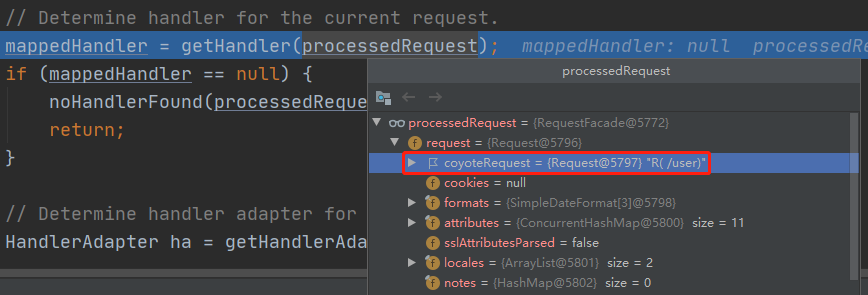
  
        - handlerMappings：处理器映射器，是对请求的处理规则。
  
          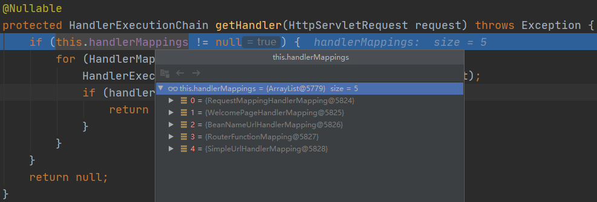
  
          - 不同的 HandlerMapping 会处理不同的请求，上图中的五个 HandlerMapping，对应不同的功能。
  
            - 此处先着重说明 RequestMappingHandlerMapping 和 WelcomePageHandlerMapping。
  
          - 请求进来时，会遍历尝试所有的 HandlerMapping，看其是否有符合的请求信息。
  
            - 如果有，就找到这个请求对应的 handler；
            - 如果没有，就继续遍历下一个 HandlerMapping 查找。
  
          - **RequestMappingHandlerMapping**：
  
            - 保存了所有 `@RequestMapping` 注解对应的 handler 的映射规则。
  
            - 在 Spring Boot 启动时，就会扫描所有包内 Controller 中的 `@RequestMapping` 注解，然后保存每一个注解中的规则。
  
              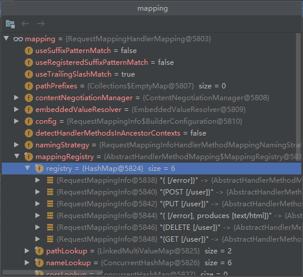
  
            - 每一个映射规则，都有其所在的 Controller 和对应的方法：
  
              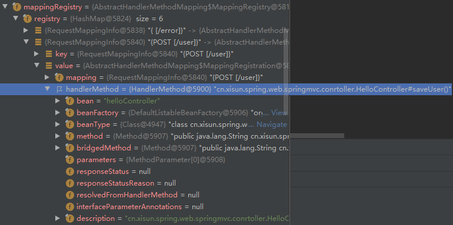
  
            - RequestMappingHandlerMapping 的依赖树：
  
              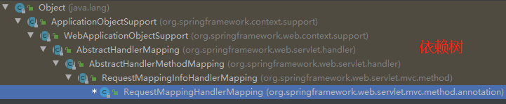
  
            - RequestMappingHandlerMapping 的 `getHandler()`：(Debug 模式下，F7 进入方法内部，查看方法的具体执行方，F8 则跳过当前方法，不查看细节)
  
              ```java
              public abstract class AbstractHandlerMapping extends WebApplicationObjectSupport
              		implements HandlerMapping, Ordered, BeanNameAware {
                  @Override
                  @Nullable
                  public final HandlerExecutionChain getHandler(HttpServletRequest request) throws Exception {
                     // 获取当前请求对应的handler!!!F7进入方法内部
                     Object handler = getHandlerInternal(request);
                      
                     // 找到了handler之后,即可进行之后的业务功能、逻辑处理等操作
                     if (handler == null) {
                        handler = getDefaultHandler();
                     }
                     if (handler == null) {
                        return null;
                     }
                     // Bean name or resolved handler?
                     if (handler instanceof String) {
                        String handlerName = (String) handler;
                        handler = obtainApplicationContext().getBean(handlerName);
                     }
              
                     // Ensure presence of cached lookupPath for interceptors and others
                     if (!ServletRequestPathUtils.hasCachedPath(request)) {
                        initLookupPath(request);
                     }
              
                     HandlerExecutionChain executionChain = getHandlerExecutionChain(handler, request);
              
                     if (logger.isTraceEnabled()) {
                        logger.trace("Mapped to " + handler);
                     }
                     else if (logger.isDebugEnabled() && !DispatcherType.ASYNC.equals(request.getDispatcherType())) {
                        logger.debug("Mapped to " + executionChain.getHandler());
                     }
              
                     if (hasCorsConfigurationSource(handler) || CorsUtils.isPreFlightRequest(request)) {
                        CorsConfiguration config = getCorsConfiguration(handler, request);
                        if (getCorsConfigurationSource() != null) {
                           CorsConfiguration globalConfig = getCorsConfigurationSource().getCorsConfiguration(request);
                           config = (globalConfig != null ? globalConfig.combine(config) : config);
                        }
                        if (config != null) {
                           config.validateAllowCredentials();
                        }
                        executionChain = getCorsHandlerExecutionChain(request, executionChain, config);
                     }
              
                     return executionChain;
                  }
              }
              ```
  
              ```java
              public abstract class RequestMappingInfoHandlerMapping extends AbstractHandlerMethodMapping<RequestMappingInfo> {
                  @Override
                  @Nullable
                  protected HandlerMethod getHandlerInternal(HttpServletRequest request) throws Exception {
                     request.removeAttribute(PRODUCIBLE_MEDIA_TYPES_ATTRIBUTE);
                     try {
                        // 具体调用!!!F7进入方法内部
                        return super.getHandlerInternal(request);
                     }
                     finally {
                        ProducesRequestCondition.clearMediaTypesAttribute(request);
                     }
                  }
              }
              ```
  
              ```java
              public abstract class AbstractHandlerMethodMapping<T> extends AbstractHandlerMapping implements InitializingBean {
                 // Handler method lookup
              
                 /**
                  * Look up a handler method for the given request.
                  */
                 @Override
                 @Nullable
                 protected HandlerMethod getHandlerInternal(HttpServletRequest request) throws Exception {
                    // 当前请求的路径,例如: /user
                    String lookupPath = initLookupPath(request);
                    // 加锁
                    this.mappingRegistry.acquireReadLock();
                    try {
                       // 查找当前请求的lookupPath路径,应该由哪个Handler处理!!!F7进入方法内部
                       HandlerMethod handlerMethod = lookupHandlerMethod(lookupPath, request);
                       return (handlerMethod != null ? handlerMethod.createWithResolvedBean() : null);
                    }
                    finally {
                       this.mappingRegistry.releaseReadLock();
                    }
                 }
              }
              ```
  
              ```java
              @Nullable
              protected HandlerMethod lookupHandlerMethod(String lookupPath, HttpServletRequest request) throws Exception {
                 List<Match> matches = new ArrayList<>();
                 // 查找RequestMappingHandlerMapping中注册的所有能够处理lookupPath请求的Mapping,可能有多个
                 List<T> directPathMatches = this.mappingRegistry.getMappingsByDirectPath(lookupPath);
                 if (directPathMatches != null) {
                    // 找到的Mapping,经过验证,找到最佳匹配的Mapping,然后添加到matches集合中
                    addMatchingMappings(directPathMatches, matches, request);
                 }
                 if (matches.isEmpty()) {
                    // 如果没找到,做一些空值处理
                    addMatchingMappings(this.mappingRegistry.getRegistrations().keySet(), matches, request);
                 }
                 if (!matches.isEmpty()) {
                    // 得到的最佳匹配的Mapping,正常情况下只能有一个
                    Match bestMatch = matches.get(0);
                    // 同一个请求,如果有多个Mapping,会抛出异常
                    if (matches.size() > 1) {
                       Comparator<Match> comparator = new MatchComparator(getMappingComparator(request));
                       matches.sort(comparator);
                       bestMatch = matches.get(0);
                       if (logger.isTraceEnabled()) {
                          logger.trace(matches.size() + " matching mappings: " + matches);
                       }
                       if (CorsUtils.isPreFlightRequest(request)) {
                          for (Match match : matches) {
                             if (match.hasCorsConfig()) {
                                return PREFLIGHT_AMBIGUOUS_MATCH;
                             }
                          }
                       }
                       else {
                          Match secondBestMatch = matches.get(1);
                          if (comparator.compare(bestMatch, secondBestMatch) == 0) {
                             Method m1 = bestMatch.getHandlerMethod().getMethod();
                             Method m2 = secondBestMatch.getHandlerMethod().getMethod();
                             String uri = request.getRequestURI();
                             throw new IllegalStateException(
                                   "Ambiguous handler methods mapped for '" + uri + "': {" + m1 + ", " + m2 + "}");
                          }
                       }
                    }
                    request.setAttribute(BEST_MATCHING_HANDLER_ATTRIBUTE, bestMatch.getHandlerMethod());
                    handleMatch(bestMatch.mapping, lookupPath, request);
                    // 返回最佳匹配的结果,如下图所示,这个结果就是此次请求所对应的Mapping,以及所在的Controller和方法
                    return bestMatch.getHandlerMethod();
                 }
                 else {
                    return handleNoMatch(this.mappingRegistry.getRegistrations().keySet(), lookupPath, request);
                 }
              }
              ```
  
              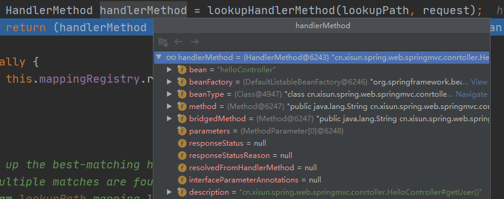
  
          - WelcomePageHandlerMapping：处理欢迎页的映射规则，访问 `/` 能访问到 index.html。
  
            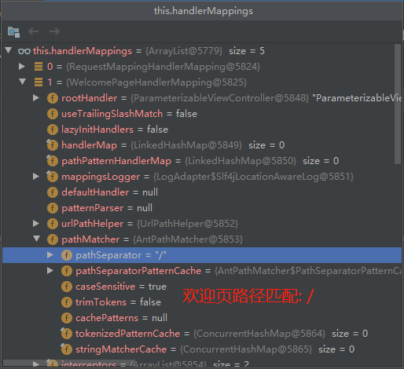
  
            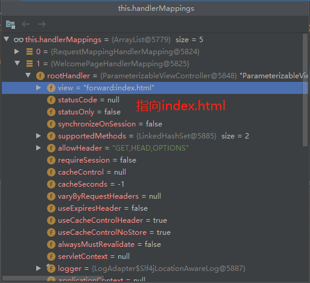
  
          - Spring Boot 在启动时，会在 WebMvcAutoConfiguration 配置类中注册 HandlerMapping：
  
            ```java
            @Configuration(proxyBeanMethods = false)
            @ConditionalOnWebApplication(type = Type.SERVLET)
            @ConditionalOnClass({ Servlet.class, DispatcherServlet.class, WebMvcConfigurer.class })
            @ConditionalOnMissingBean(WebMvcConfigurationSupport.class)
            @AutoConfigureOrder(Ordered.HIGHEST_PRECEDENCE + 10)
            @AutoConfigureAfter({ DispatcherServletAutoConfiguration.class, TaskExecutionAutoConfiguration.class,
                  ValidationAutoConfiguration.class })
            public class WebMvcAutoConfiguration {
                @Configuration(proxyBeanMethods = false)
            	@EnableConfigurationProperties(WebProperties.class)
            	public static class EnableWebMvcConfiguration extends DelegatingWebMvcConfiguration implements ResourceLoaderAware {
                    // RequestMappingHandlerMapping!!!
            		@Bean
            		@Primary
            		@Override
            		public RequestMappingHandlerMapping requestMappingHandlerMapping(
            				@Qualifier("mvcContentNegotiationManager") ContentNegotiationManager contentNegotiationManager,
            				@Qualifier("mvcConversionService") FormattingConversionService conversionService,
            				@Qualifier("mvcResourceUrlProvider") ResourceUrlProvider resourceUrlProvider) {
            			// Must be @Primary for MvcUriComponentsBuilder to work
            			return super.requestMappingHandlerMapping(contentNegotiationManager, conversionService,
            					resourceUrlProvider);
            		}
            
                    // WelcomePageHandlerMapping!!!
            		@Bean
            		public WelcomePageHandlerMapping welcomePageHandlerMapping(ApplicationContext applicationContext,
            				FormattingConversionService mvcConversionService, ResourceUrlProvider mvcResourceUrlProvider) {
            			WelcomePageHandlerMapping welcomePageHandlerMapping = new WelcomePageHandlerMapping(
            					new TemplateAvailabilityProviders(applicationContext), applicationContext, getWelcomePage(),
            					this.mvcProperties.getStaticPathPattern());
            			welcomePageHandlerMapping.setInterceptors(getInterceptors(mvcConversionService, mvcResourceUrlProvider));
            			welcomePageHandlerMapping.setCorsConfigurations(getCorsConfigurations());
            			return welcomePageHandlerMapping;
            		}
            	}
            }
            ```
  
          - 如果需要一些自定义的映射处理，我们也可以自己向容器中注册 HandlerMapping。
  
            - 自定义 HandlerMapping 的场合，比如：项目内包含一个系统的两个版本，v1 和 v2 版本调用不同的映射。
  

##### 普通参数与基本注解

- 注解：

  - `@PathVariable`，`@RequestHeader`，`@RequestParam`，`@CookieValue`

    - Controller：

      ```java
      @RestController
      public class ParameterController {
          /**
           * 假设访问路径为: localhost:8080/car/3/owner/lisi?age=18&interests=basketball&interests=football
           * <p>
           * 说明: 3这个位置为id,lisi这个位置为userName,?age=18&interests=basketball&interests=football为请求参数
           * <p>
           * 使用@PathVariable注解:
           * 1.指定变量名时,可以获取访问路径中对应的变量值
           * 2.不指定变量名时,可以获取访问路径中所有的变量值,但必须是Map<String, String>格式
           * <p>
           * 使用@RequestHeader注解:
           * 1.指定变量名时,可以获取请求头中指定的变量值
           * 2.不指定变量名时,可以获取请求头中所有的变量值,但必须是Map<String, String>格式
           * <p>
           * 使用@RequestParam注解:
           * 1.指定变量名时,可以获取请求参数中指定的变量值
           * 2.不指定变量名时,可以获取请求参数中所有的变量值,但必须是Map<String, String>格式
           * <p>
           * 使用@CookieValue注解:
           * 1.指定变量名时,可以获取Cookie中指定的变量值,也可以直接转换为Cookie对象
           * 2.注意: 如果请求中没有Cookie,使用@CookieValue注解会报错
           */
          @GetMapping("/car/{id}/owner/{userName}")
          public Map<String, Object> getCar(@PathVariable("id") Integer id,
                                            @PathVariable("userName") String userName,
                                            @PathVariable Map<String, String> paths,
                                            @RequestHeader("User-Agent") String userAgent,
                                            @RequestHeader Map<String, String> headers,
                                            @RequestParam("age") Integer age,
                                            @RequestParam("interests") List<String> interests,
                                            @RequestParam Map<String, String> params
                                            /*@CookieValue("_ga") String ga,
                                            @CookieValue("_ga") Cookie cookie*/) {
              Map<String, Object> map = new HashMap<>();
              
              // 存放请求中路径变量的值
              map.put("id", id);
              map.put("userName", userName);
              map.put("paths", paths);
      
              // 存放请求头中的值
              map.put("userAgent", userAgent);
              map.put("headers", headers);
      
              // 存放请求参数中的值
              map.put("age", age);
              map.put("interests", interests);
              map.put("params", params);
      
              // 存放Cookie中的值
              /*map.put("_ga", ga);
              System.out.println("打印Cookie对象: " + cookie);
              System.out.println(cookie.getName() + " ------> " + cookie.getValue());*/
              return map;
          }
      }
      ```

    - 测试：

      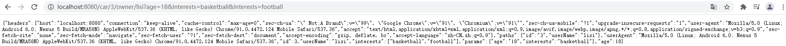

      - 细节：

      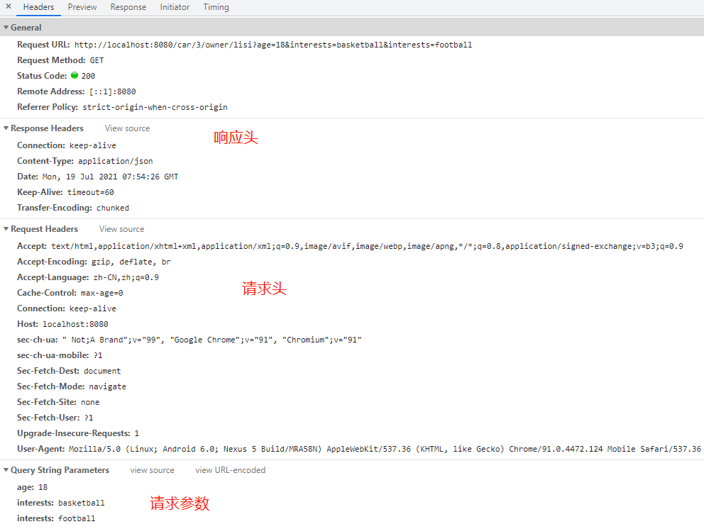

      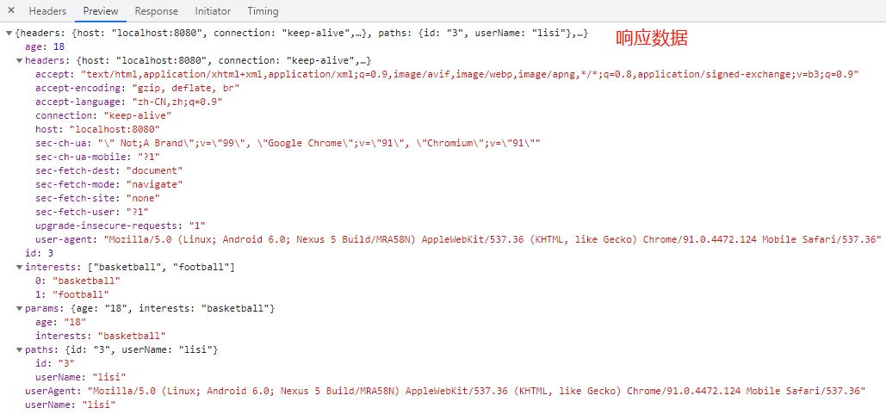

  - `@RequestBody`

    - index.html：

      ```html
      <!DOCTYPE html>
      <html lang="en">
      <head>
          <meta charset="UTF-8">
          <title>Title</title>
      </head>
      <body>
      <h1>Hello, Xisun!</h1>
      <form action="/save" method="post">
          用户名: <input name="userName">
          邮箱:<input name="email">
          <input type="submit" value="提交">
      </form>
      </body>
      </html>
      ```

    - Controller：

      ```java
      @RestController
      public class ParameterController {
          /**
           * 对于POST请求,可以使用@RequestBody注解,获取表单提交中的参数
           */
          @PostMapping("/save")
          public Map<String, Object> postMethod(@RequestBody String content) {
              Map<String, Object> map = new HashMap<>();
              map.put("content", content);
              return map;
          }
      }
      ```

    - 测试：

      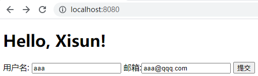

      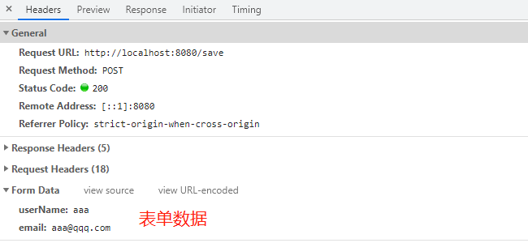

      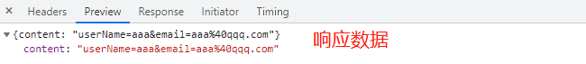

  - `@RequestAttribute`

    - Controller：

      ```java
      @Controller
      public class RequestController {
          @GetMapping("/goto")
          public String goToPage(HttpServletRequest request) {
              // 收到/goto请求时,在请求中添加一个或多个属性,然后转发到/success请求
              request.setAttribute("msg", "go to success");
              request.setAttribute("code", 200);
              return "forward:/success";// return "/success";  这种方式也可以正常转发
          }
      
          /**
           * 有两种方式获得Request中的属性值:
           * 方式一: 使用@RequestAttribute注解,并指定需要获取的属性名
           * 方式二: 直接从Request对象中获得属性值
           * 注意: 直接访问/success请求会出异常,因为该请求中没有msg和code这两个属性
           */
          @ResponseBody
          @GetMapping("/success")
          public Map<String, Object> success(@RequestAttribute("msg") String msg,
                                             @RequestAttribute("code") Integer code,
                                             HttpServletRequest request) {
              Map<String, Object> map = new HashMap<>();
      
              // 方式一: 使用@RequestAttribute注解获取的Request中的属性值
              map.put("annotationMsg", msg);
              map.put("annotationCode", code);
      
              // 方式二: 直接从Request对象中获得属性值
              String reqMsg = (String) request.getAttribute("msg");
              map.put("requestMsg", reqMsg);
              Integer reqCode = (Integer) request.getAttribute("code");
              map.put("requestCode", reqCode);
              return map;
          }
      }
      ```

    - 测试：

      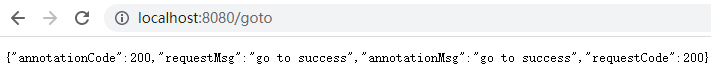

      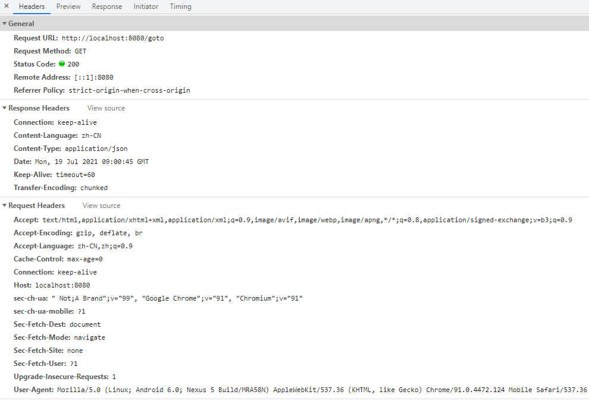

      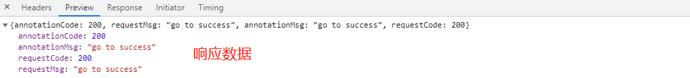

  - `@MatrixVariable`：矩阵变量注解，此处省略不谈。

  - `@ModelAttribute`：此处省略不谈。

- `// TODO`

### 数据访问

`// TODO`

### 单元测试

`// TODO`

### 指标监控

`// TODO`

### 原理解析

`// TODO`

## 本文参考

https://www.bilibili.com/video/BV19K4y1L7MT

https://www.yuque.com/atguigu/springboot

## 声明

写作本文初衷是个人学习记录，鉴于本人学识有限，如有侵权或不当之处，请联系 [wdshfut@163.com](mailto:wdshfut@163.com)。
