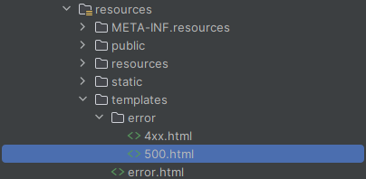

*date: 2021-06-12*


[TOC]

## Spring Boot 简介

官网：https://spring.io/projects/spring-boot

文档：https://spring.io/projects/spring-boot#learn

Spring Boot makes it easy to create stand-alone, production-grade Spring based Applications that you can "just run".

We take an opinionated view of the Spring platform and third-party libraries so you can get started with minimum fuss. Most Spring Boot applications need minimal Spring configuration.

If you’re looking for information about a specific version, or instructions about how to upgrade from an earlier release, check out [the project release notes section](https://github.com/spring-projects/spring-boot/wiki#release-notes) on our wiki.

### 2.5.1


查看各版本的新特性：https://github.com/spring-projects/spring-boot/wiki#release-notes


### 3.1.4


**系统要求：**

Spring Boot 3.1.4 requires [Java 17](https://www.java.com/) and is compatible up to and including Java 20. [Spring Framework 6.0.12](https://docs.spring.io/spring-framework/docs/6.0.12/reference/html/) or above is also required.

Explicit build support is provided for the following build tools:

| Build Tool | Version                    |
| :--------- | :------------------------- |
| Maven      | 3.6.3 or later             |
| Gradle     | 7.x (7.5 or later) and 8.x |

**Servlet Containers：**

Spring Boot supports the following embedded servlet containers:

| Name         | Servlet Version |
| :----------- | :-------------- |
| Tomcat 10.1  | 6.0             |
| Jetty 11.0   | 5.0             |
| Undertow 2.3 | 6.0             |

You can also deploy Spring Boot applications to any servlet 5.0+ compatible container.

**GraalVM Native Images：**

Spring Boot applications can be [converted into a Native Image](https://docs.spring.io/spring-boot/docs/current/reference/html/native-image.html#native-image.introducing-graalvm-native-images) using GraalVM 22.3 or above.

Images can be created using the [native build tools](https://github.com/graalvm/native-build-tools) Gradle/Maven plugins or `native-image` tool provided by GraalVM. You can also create native images using the [native-image Paketo buildpack](https://github.com/paketo-buildpacks/native-image).

The following versions are supported:

| Name               | Version |
| :----------------- | :------ |
| GraalVM Community  | 22.3    |
| Native Build Tools | 0.9.27  |

## Spring Boot 的作用

> Spring Boot makes it easy to create stand-alone, production-grade Spring based Applications that you can "just run".

Spring Boot 能快速创建出生产级别的 Spring 应用（**Spring Boot 的底层是 Spring**）。

## Spring Boot 的优点

- Create stand-alone Spring applications

  - 创建独立的 Spring 应用。

- Embed Tomcat, Jetty or Undertow directly (no need to deploy WAR files)

  - 内嵌 web 服务器。

- Provide opinionated 'starter' dependencies to simplify your build configuration

  - 自动 starter 依赖，简化构建配置。

- Automatically configure Spring and 3rd party libraries whenever possible

  - 自动配置 Spring 以及第三方功能。

- Provide production-ready features such as metrics, health checks, and externalized configuration

  - 提供生产级别的监控、健康检查及外部化配置。

- Absolutely no code generation and no requirement for XML configuration

  - 无代码生成、无需编写 XML。

## Spring Boot 的缺点

- 人称版本帝，迭代快，需要时刻关注变化。
- 封装太深，内部原理复杂，不容易精通。

## Spring Boot 2 入门案例

### 系统要求

Java 8 +：

```powershell
PS C:\Users\XiSun> java -version
openjdk version "1.8.0_222"
OpenJDK Runtime Environment (AdoptOpenJDK)(build 1.8.0_222-b10)
OpenJDK 64-Bit Server VM (AdoptOpenJDK)(build 25.222-b10, mixed mode)
```

Maven 3.5 +：

```powershell
PS C:\Users\XiSun> mvn -v
Apache Maven 3.6.3 (cecedd343002696d0abb50b32b541b8a6ba2883f)
Maven home: D:\Program Files\Maven\apache-maven-3.6.3\bin\..
Java version: 1.8.0_222, vendor: AdoptOpenJDK, runtime: D:\Program Files\AdoptOpenJDK\jdk-8.0.222.10-hotspot\jre
Default locale: zh_CN, platform encoding: GBK
OS name: "windows 10", version: "10.0", arch: "amd64", family: "windows"
```

Maven setting.xml 的设置：

```xml
<mirrors>
    <mirror>
        <id>nexus-aliyun</id>
        <mirrorOf>central</mirrorOf>
        <name>Nexus aliyun</name>
        <url>http://maven.aliyun.com/nexus/content/groups/public</url>
    </mirror>
</mirrors>
 
<profiles>
    <profile>
        <id>jdk-1.8</id>
        <activation>
            <activeByDefault>true</activeByDefault>
            <jdk>1.8</jdk>
        </activation>
        <properties>
            <maven.compiler.source>1.8</maven.compiler.source>
            <maven.compiler.target>1.8</maven.compiler.target>
            <maven.compiler.compilerVersion>1.8</maven.compiler.compilerVersion>
        </properties>
    </profile>
</profiles>
```

说明：添加上面的配置后，项目中每次 Maven 更新依赖时，不会改变 Compiler 的版本。如果针对单个项目配置，则在该项目的 pom.xml 文件中添加：

```xml
<properties>
        <app.main.class>cn.matgene.reaction.extractor.FlinkKafkaJob</app.main.class>
        <project.build.sourceEncoding>UTF-8</project.build.sourceEncoding>
        <java.version>1.8</java.version>
        <maven.compiler.version>3.6.1</maven.compiler.version>
        <maven.compiler.source>${java.version}</maven.compiler.source>
        <maven.compiler.target>${java.version}</maven.compiler.target>
    </properties>

<build>
    <plugins>
        <plugin>
            <groupId>org.apache.maven.plugins</groupId>
            <artifactId>maven-compiler-plugin</artifactId>
            <version>${maven.compiler.version}</version>
            <configuration>
                <source>${maven.compiler.source}</source>
                <target>${maven.compiler.target}</target>
            </configuration>
        </plugin>
    <plugins>
</build>
```

### HelloWorld

参考：https://docs.spring.io/spring-boot/docs/current/reference/html/getting-started.html#getting-started.first-application

需求：浏览器发送`/hello`请求，服务器响应`Hello, Spring Boot 2!`。

第一步，创建 Maven 工程，并添加 parent 依赖：


```xml
<?xml version="1.0" encoding="UTF-8"?>
<project xmlns="http://maven.apache.org/POM/4.0.0"
         xmlns:xsi="http://www.w3.org/2001/XMLSchema-instance"
         xsi:schemaLocation="http://maven.apache.org/POM/4.0.0 http://maven.apache.org/xsd/maven-4.0.0.xsd">
    <modelVersion>4.0.0</modelVersion>

    <groupId>cn.xisun</groupId>
    <artifactId>springboot-helloworld</artifactId>
    <version>1.0-SNAPSHOT</version>

    <parent>
        <groupId>org.springframework.boot</groupId>
        <artifactId>spring-boot-starter-parent</artifactId>
        <version>2.5.1</version>
    </parent>

</project>
```

> parent 节点为手动添加。

第二步，引入 web 相关依赖：

```xml
<dependency>
    <groupId>org.springframework.boot</groupId>
    <artifactId>spring-boot-starter-web</artifactId>
</dependency>
```

第三步，创建主程序：

```java
/**
 * @Author XiSun
 * @Date 2021/6/20 15:03
 * @Description 主程序类
 */
@SpringBootApplication
public class MainApplication {
    public static void main(String[] args) {
        SpringApplication.run(MainApplication.class, args);
    }
}
```

第四步，业务层：

```java
/**
 * @Author XiSun
 * @Date 2021/6/20 15:17
 */
@Controller
public class HelloController {
    @RequestMapping("/hello")
    @ResponseBody
    public String hello() {
        return "Hello, Spring Boot 2!";
    }
}
```

第五步，运行 MainApplication.class 的 main 方法，启动程序，在浏览器输入地址`http://localhost:8080/hello`，查看结果：

```java
  .   ____          _            __ _ _
 /\\ / ___'_ __ _ _(_)_ __  __ _ \ \ \ \
( ( )\___ | '_ | '_| | '_ \/ _` | \ \ \ \
 \\/  ___)| |_)| | | | | || (_| |  ) ) ) )
  '  |____| .__|_| |_|_| |_\__, | / / / /
 =========|_|==============|___/=/_/_/_/
 :: Spring Boot ::                (v2.5.1)

2021-06-20 15:37:47.623  INFO 14268 --- [           main] cn.xisun.web.MainApplication             : Starting MainApplication using Java 1.8.0_222 on DESKTOP-OJKMETJ with PID 14268 (D:\JetBrainsWorkSpace\IDEAProjects\xisun-springboot\target\classes started by XiSun in D:\JetBrainsWorkSpace\IDEAProjects\xisun-springboot)
2021-06-20 15:37:47.627  INFO 14268 --- [           main] cn.xisun.web.MainApplication             : No active profile set, falling back to default profiles: default
2021-06-20 15:37:48.380  INFO 14268 --- [           main] o.s.b.w.embedded.tomcat.TomcatWebServer  : Tomcat initialized with port(s): 8080 (http)
2021-06-20 15:37:48.386  INFO 14268 --- [           main] o.apache.catalina.core.StandardService   : Starting service [Tomcat]
2021-06-20 15:37:48.386  INFO 14268 --- [           main] org.apache.catalina.core.StandardEngine  : Starting Servlet engine: [Apache Tomcat/9.0.46]
2021-06-20 15:37:48.438  INFO 14268 --- [           main] o.a.c.c.C.[Tomcat].[localhost].[/]       : Initializing Spring embedded WebApplicationContext
2021-06-20 15:37:48.439  INFO 14268 --- [           main] w.s.c.ServletWebServerApplicationContext : Root WebApplicationContext: initialization completed in 760 ms
2021-06-20 15:37:48.674  INFO 14268 --- [           main] o.s.b.w.embedded.tomcat.TomcatWebServer  : Tomcat started on port(s): 8080 (http) with context path ''
2021-06-20 15:37:48.681  INFO 14268 --- [           main] cn.xisun.web.MainApplication             : Started MainApplication in 1.374 seconds (JVM running for 2.301)
2021-06-20 15:37:59.504  INFO 14268 --- [nio-8080-exec-1] o.a.c.c.C.[Tomcat].[localhost].[/]       : Initializing Spring DispatcherServlet 'dispatcherServlet'
2021-06-20 15:37:59.504  INFO 14268 --- [nio-8080-exec-1] o.s.web.servlet.DispatcherServlet        : Initializing Servlet 'dispatcherServlet'
2021-06-20 15:37:59.504  INFO 14268 --- [nio-8080-exec-1] o.s.web.servlet.DispatcherServlet        : Completed initialization in 0 ms
```


### 简化配置

参考：https://docs.spring.io/spring-boot/docs/current/reference/html/application-properties.html#application-properties

在 resources 目录下新建 application.properties 文件，项目中的一些配置可在此文件中进行修改。如，修改 tomcat 端口：

```properties
server.port=8888
```

### 简化部署

Maven 添加**`spring-boot-maven-plugin`**：

```xml
<build>
    <plugins>
        <plugin>
            <groupId>org.springframework.boot</groupId>
            <artifactId>spring-boot-maven-plugin</artifactId>
        </plugin>
    </plugins>
</build>
```

打包：

```bash
D:\JetBrainsWorkSpace\IDEAProjects\xisun-springboot>mvn clean package -DskipTests
[INFO] Scanning for projects...
[INFO]
[INFO] -------------------< cn.xisun:springboot-helloworld >-------------------
[INFO] Building springboot-helloworld 1.0-SNAPSHOT
[INFO] --------------------------------[ jar ]---------------------------------
[INFO]
[INFO] --- maven-clean-plugin:3.1.0:clean (default-clean) @ springboot-helloworld ---
[INFO] Deleting D:\JetBrainsWorkSpace\IDEAProjects\xisun-springboot\target
[INFO]
[INFO] --- maven-resources-plugin:3.2.0:resources (default-resources) @ springboot-helloworld ---
[INFO] Using 'UTF-8' encoding to copy filtered resources.
[INFO] Using 'UTF-8' encoding to copy filtered properties files.
[INFO] Copying 1 resource
[INFO] Copying 0 resource
[INFO]
[INFO] --- maven-compiler-plugin:3.8.1:compile (default-compile) @ springboot-helloworld ---
[INFO] Changes detected - recompiling the module!
[INFO] Compiling 2 source files to D:\JetBrainsWorkSpace\IDEAProjects\xisun-springboot\target\classes
[INFO]
[INFO] --- maven-resources-plugin:3.2.0:testResources (default-testResources) @ springboot-helloworld ---
[INFO] Using 'UTF-8' encoding to copy filtered resources.
[INFO] Using 'UTF-8' encoding to copy filtered properties files.
[INFO] skip non existing resourceDirectory D:\JetBrainsWorkSpace\IDEAProjects\xisun-springboot\src\test\resources
[INFO]
[INFO] --- maven-compiler-plugin:3.8.1:testCompile (default-testCompile) @ springboot-helloworld ---
[INFO] Changes detected - recompiling the module!
[INFO]
[INFO] --- maven-surefire-plugin:2.22.2:test (default-test) @ springboot-helloworld ---
[INFO] Tests are skipped.
[INFO]
[INFO] --- maven-jar-plugin:3.2.0:jar (default-jar) @ springboot-helloworld ---
[INFO] Building jar: D:\JetBrainsWorkSpace\IDEAProjects\xisun-springboot\target\springboot-helloworld-1.0-SNAPSHOT.jar
[INFO]
[INFO] --- spring-boot-maven-plugin:2.5.1:repackage (repackage) @ springboot-helloworld ---
[INFO] Replacing main artifact with repackaged archive
[INFO] ------------------------------------------------------------------------
[INFO] BUILD SUCCESS
[INFO] ------------------------------------------------------------------------
[INFO] Total time:  1.890 s
[INFO] Finished at: 2021-06-20T16:47:43+08:00
[INFO] ------------------------------------------------------------------------
```

## Spring Boot 3 入门案例

pom.xml：

```xml
<?xml version="1.0" encoding="UTF-8"?>
<project xmlns="http://maven.apache.org/POM/4.0.0"
         xmlns:xsi="http://www.w3.org/2001/XMLSchema-instance"
         xsi:schemaLocation="http://maven.apache.org/POM/4.0.0 http://maven.apache.org/xsd/maven-4.0.0.xsd">
    <modelVersion>4.0.0</modelVersion>

    <groupId>cn.xisun.spring-boot</groupId>
    <artifactId>xisun-spring-boot-3</artifactId>
    <version>1.0-SNAPSHOT</version>

    <!-- 所有SpringBoot项目都必须继承自 spring-boot-starter-parent -->
    <parent>
        <groupId>org.springframework.boot</groupId>
        <artifactId>spring-boot-starter-parent</artifactId>
        <version>3.1.4</version>
    </parent>

    <properties>
        <maven.compiler.source>8</maven.compiler.source>
        <maven.compiler.target>8</maven.compiler.target>
        <project.build.sourceEncoding>UTF-8</project.build.sourceEncoding>
    </properties>

    <dependencies>
        <!-- Web开发的场景启动器 -->
        <dependency>
            <groupId>org.springframework.boot</groupId>
            <artifactId>spring-boot-starter-web</artifactId>
        </dependency>

        <!--
            SpringBoot中snakeyaml:1.33是一个脆弱的传递依赖，手动添加高版本的snakeyaml，去除警告：
            Provides transitive vulnerable dependency maven:org.yaml:snakeyaml:1.33
        -->
        <dependency>
            <groupId>org.yaml</groupId>
            <artifactId>snakeyaml</artifactId>
            <version>2.2</version>
        </dependency>
    </dependencies>

    <!-- SpringBoot应用打包插件-->
    <build>
        <plugins>
            <plugin>
                <groupId>org.springframework.boot</groupId>
                <artifactId>spring-boot-maven-plugin</artifactId>
            </plugin>
        </plugins>
    </build>

</project>
```

主程序：

```java
package cn.xisun.springboot3;

import org.springframework.boot.SpringApplication;
import org.springframework.boot.autoconfigure.SpringBootApplication;

/**
 * @author XiSun
 * @since 2023/9/28 09:12
 */
@SpringBootApplication
public class SpringBoot3Application {
    public static void main(String[] args) {
        SpringApplication.run(SpringBoot3Application.class, args);
    }
}
```

业务层：

```java
package cn.xisun.springboot3.controllers;

import org.springframework.web.bind.annotation.GetMapping;
import org.springframework.web.bind.annotation.RestController;

/**
 * @author XiSun
 * @since 2023/9/28 09:15
 */
@RestController
public class HelloController {

    @GetMapping("/hello")
    public String hello() {
        return "Hello, Spring Boot 3!";
    }

}
```

## Spring Boot 的特点

### 依赖管理

#### parent 依赖

Spring Boot 项目，都会添加一个 parent 依赖`spring-boot-starter-parent`：

```xml
<parent>
    <groupId>org.springframework.boot</groupId>
    <artifactId>spring-boot-starter-parent</artifactId>
    <version>2.5.1</version>
</parent>
```

- 父项目一般都是做`依赖管理`的，后续在项目中添加的依赖，其版本号和父项目 version 一致，不需要再单独指定。

- `spring-boot-starter-parent`有自己的父项目`spring-boot-dependencies`，在该项目中几乎声明了所有开发中常用的依赖的版本号，这个版本号一般适应当前项目对应的版本，即**自动版本仲裁机制**。

  ```xml
  <parent>
    <groupId>org.springframework.boot</groupId>
    <artifactId>spring-boot-dependencies</artifactId>
    <version>2.5.1</version>
  </parent>
  ```

  ```xml
  <properties>
    <activemq.version>5.16.2</activemq.version>
    <antlr2.version>2.7.7</antlr2.version>
    <appengine-sdk.version>1.9.89</appengine-sdk.version>
    <artemis.version>2.17.0</artemis.version>
    <aspectj.version>1.9.6</aspectj.version>
    <assertj.version>3.19.0</assertj.version>
    <atomikos.version>4.0.6</atomikos.version>
    <awaitility.version>4.0.3</awaitility.version>
    <build-helper-maven-plugin.version>3.2.0</build-helper-maven-plugin.version>
    <byte-buddy.version>1.10.22</byte-buddy.version>
    <caffeine.version>2.9.1</caffeine.version>
    <cassandra-driver.version>4.11.1</cassandra-driver.version>
    <classmate.version>1.5.1</classmate.version>
    <commons-codec.version>1.15</commons-codec.version>
    <commons-dbcp2.version>2.8.0</commons-dbcp2.version>
    <commons-lang3.version>3.12.0</commons-lang3.version>
    <commons-pool.version>1.6</commons-pool.version>
    <commons-pool2.version>2.9.0</commons-pool2.version>
    <couchbase-client.version>3.1.6</couchbase-client.version>
    <db2-jdbc.version>11.5.5.0</db2-jdbc.version>
    <dependency-management-plugin.version>1.0.11.RELEASE</dependency-management-plugin.version>
    <derby.version>10.14.2.0</derby.version>
    <dropwizard-metrics.version>4.1.22</dropwizard-metrics.version>
    <ehcache.version>2.10.9.2</ehcache.version>
    <ehcache3.version>3.9.4</ehcache3.version>
    <elasticsearch.version>7.12.1</elasticsearch.version>
    <embedded-mongo.version>3.0.0</embedded-mongo.version>
    <flyway.version>7.7.3</flyway.version>
    <freemarker.version>2.3.31</freemarker.version>
    <git-commit-id-plugin.version>4.0.5</git-commit-id-plugin.version>
    <glassfish-el.version>3.0.3</glassfish-el.version>
    <glassfish-jaxb.version>2.3.4</glassfish-jaxb.version>
    <groovy.version>3.0.8</groovy.version>
    <gson.version>2.8.7</gson.version>
    <h2.version>1.4.200</h2.version>
    <hamcrest.version>2.2</hamcrest.version>
    <hazelcast.version>4.1.3</hazelcast.version>
    <hazelcast-hibernate5.version>2.2.0</hazelcast-hibernate5.version>
    <hibernate.version>5.4.32.Final</hibernate.version>
    <hibernate-validator.version>6.2.0.Final</hibernate-validator.version>
    <hikaricp.version>4.0.3</hikaricp.version>
    <hsqldb.version>2.5.2</hsqldb.version>
    <htmlunit.version>2.49.1</htmlunit.version>
    <httpasyncclient.version>4.1.4</httpasyncclient.version>
    <httpclient.version>4.5.13</httpclient.version>
    <httpclient5.version>5.0.4</httpclient5.version>
    <httpcore.version>4.4.14</httpcore.version>
    <httpcore5.version>5.1.1</httpcore5.version>
    <infinispan.version>12.1.4.Final</infinispan.version>
    <influxdb-java.version>2.21</influxdb-java.version>
    <jackson-bom.version>2.12.3</jackson-bom.version>
    <jakarta-activation.version>1.2.2</jakarta-activation.version>
    <jakarta-annotation.version>1.3.5</jakarta-annotation.version>
    <jakarta-jms.version>2.0.3</jakarta-jms.version>
    <jakarta-json.version>1.1.6</jakarta-json.version>
    <jakarta-json-bind.version>1.0.2</jakarta-json-bind.version>
    <jakarta-mail.version>1.6.7</jakarta-mail.version>
    <jakarta-persistence.version>2.2.3</jakarta-persistence.version>
    <jakarta-servlet.version>4.0.4</jakarta-servlet.version>
    <jakarta-servlet-jsp-jstl.version>1.2.7</jakarta-servlet-jsp-jstl.version>
    <jakarta-transaction.version>1.3.3</jakarta-transaction.version>
    <jakarta-validation.version>2.0.2</jakarta-validation.version>
    <jakarta-websocket.version>1.1.2</jakarta-websocket.version>
    <jakarta-ws-rs.version>2.1.6</jakarta-ws-rs.version>
    <jakarta-xml-bind.version>2.3.3</jakarta-xml-bind.version>
    <jakarta-xml-soap.version>1.4.2</jakarta-xml-soap.version>
    <jakarta-xml-ws.version>2.3.3</jakarta-xml-ws.version>
    <janino.version>3.1.4</janino.version>
    <javax-activation.version>1.2.0</javax-activation.version>
    <javax-annotation.version>1.3.2</javax-annotation.version>
    <javax-cache.version>1.1.1</javax-cache.version>
    <javax-jaxb.version>2.3.1</javax-jaxb.version>
    <javax-jaxws.version>2.3.1</javax-jaxws.version>
    <javax-jms.version>2.0.1</javax-jms.version>
    <javax-json.version>1.1.4</javax-json.version>
    <javax-jsonb.version>1.0</javax-jsonb.version>
    <javax-mail.version>1.6.2</javax-mail.version>
    <javax-money.version>1.1</javax-money.version>
    <javax-persistence.version>2.2</javax-persistence.version>
    <javax-transaction.version>1.3</javax-transaction.version>
    <javax-validation.version>2.0.1.Final</javax-validation.version>
    <javax-websocket.version>1.1</javax-websocket.version>
    <jaxen.version>1.2.0</jaxen.version>
    <jaybird.version>4.0.3.java8</jaybird.version>
    <jboss-logging.version>3.4.2.Final</jboss-logging.version>
    <jboss-transaction-spi.version>7.6.1.Final</jboss-transaction-spi.version>
    <jdom2.version>2.0.6</jdom2.version>
    <jedis.version>3.6.0</jedis.version>
    <jersey.version>2.33</jersey.version>
    <jetty-el.version>9.0.29</jetty-el.version>
    <jetty-jsp.version>2.2.0.v201112011158</jetty-jsp.version>
    <jetty-reactive-httpclient.version>1.1.9</jetty-reactive-httpclient.version>
    <jetty.version>9.4.42.v20210604</jetty.version>
    <jmustache.version>1.15</jmustache.version>
    <johnzon.version>1.2.13</johnzon.version>
    <jolokia.version>1.6.2</jolokia.version>
    <jooq.version>3.14.11</jooq.version>
    <json-path.version>2.5.0</json-path.version>
    <json-smart.version>2.4.7</json-smart.version>
    <jsonassert.version>1.5.0</jsonassert.version>
    <jstl.version>1.2</jstl.version>
    <jtds.version>1.3.1</jtds.version>
    <junit.version>4.13.2</junit.version>
    <junit-jupiter.version>5.7.2</junit-jupiter.version>
    <kafka.version>2.7.1</kafka.version>
    <kotlin.version>1.5.10</kotlin.version>
    <kotlin-coroutines.version>1.5.0</kotlin-coroutines.version>
    <lettuce.version>6.1.2.RELEASE</lettuce.version>
    <liquibase.version>4.3.5</liquibase.version>
    <log4j2.version>2.14.1</log4j2.version>
    <logback.version>1.2.3</logback.version>
    <lombok.version>1.18.20</lombok.version>
    <mariadb.version>2.7.3</mariadb.version>
    <maven-antrun-plugin.version>1.8</maven-antrun-plugin.version>
    <maven-assembly-plugin.version>3.3.0</maven-assembly-plugin.version>
    <maven-clean-plugin.version>3.1.0</maven-clean-plugin.version>
    <maven-compiler-plugin.version>3.8.1</maven-compiler-plugin.version>
    <maven-dependency-plugin.version>3.1.2</maven-dependency-plugin.version>
    <maven-deploy-plugin.version>2.8.2</maven-deploy-plugin.version>
    <maven-enforcer-plugin.version>3.0.0-M3</maven-enforcer-plugin.version>
    <maven-failsafe-plugin.version>2.22.2</maven-failsafe-plugin.version>
    <maven-help-plugin.version>3.2.0</maven-help-plugin.version>
    <maven-install-plugin.version>2.5.2</maven-install-plugin.version>
    <maven-invoker-plugin.version>3.2.2</maven-invoker-plugin.version>
    <maven-jar-plugin.version>3.2.0</maven-jar-plugin.version>
    <maven-javadoc-plugin.version>3.2.0</maven-javadoc-plugin.version>
    <maven-resources-plugin.version>3.2.0</maven-resources-plugin.version>
    <maven-shade-plugin.version>3.2.4</maven-shade-plugin.version>
    <maven-source-plugin.version>3.2.1</maven-source-plugin.version>
    <maven-surefire-plugin.version>2.22.2</maven-surefire-plugin.version>
    <maven-war-plugin.version>3.3.1</maven-war-plugin.version>
    <micrometer.version>1.7.0</micrometer.version>
    <mimepull.version>1.9.14</mimepull.version>
    <mockito.version>3.9.0</mockito.version>
    <mongodb.version>4.2.3</mongodb.version>
    <mssql-jdbc.version>9.2.1.jre8</mssql-jdbc.version>
    <mysql.version>8.0.25</mysql.version>
    <nekohtml.version>1.9.22</nekohtml.version>
    <neo4j-java-driver.version>4.2.6</neo4j-java-driver.version>
    <netty.version>4.1.65.Final</netty.version>
    <netty-tcnative.version>2.0.39.Final</netty-tcnative.version>
    <oauth2-oidc-sdk.version>9.3.3</oauth2-oidc-sdk.version>
    <nimbus-jose-jwt.version>9.8.1</nimbus-jose-jwt.version>
    <ojdbc.version>19.3.0.0</ojdbc.version>
    <okhttp3.version>3.14.9</okhttp3.version>
    <oracle-database.version>21.1.0.0</oracle-database.version>
    <pooled-jms.version>1.2.2</pooled-jms.version>
    <postgresql.version>42.2.20</postgresql.version>
    <prometheus-pushgateway.version>0.10.0</prometheus-pushgateway.version>
    <quartz.version>2.3.2</quartz.version>
    <querydsl.version>4.4.0</querydsl.version>
    <r2dbc-bom.version>Arabba-SR10</r2dbc-bom.version>
    <rabbit-amqp-client.version>5.12.0</rabbit-amqp-client.version>
    <reactive-streams.version>1.0.3</reactive-streams.version>
    <reactor-bom.version>2020.0.7</reactor-bom.version>
    <rest-assured.version>4.3.3</rest-assured.version>
    <rsocket.version>1.1.1</rsocket.version>
    <rxjava.version>1.3.8</rxjava.version>
    <rxjava-adapter.version>1.2.1</rxjava-adapter.version>
    <rxjava2.version>2.2.21</rxjava2.version>
    <saaj-impl.version>1.5.3</saaj-impl.version>
    <selenium.version>3.141.59</selenium.version>
    <selenium-htmlunit.version>2.49.1</selenium-htmlunit.version>
    <sendgrid.version>4.7.2</sendgrid.version>
    <servlet-api.version>4.0.1</servlet-api.version>
    <slf4j.version>1.7.30</slf4j.version>
    <snakeyaml.version>1.28</snakeyaml.version>
    <solr.version>8.8.2</solr.version>
    <spring-amqp.version>2.3.8</spring-amqp.version>
    <spring-batch.version>4.3.3</spring-batch.version>
    <spring-data-bom.version>2021.0.1</spring-data-bom.version>
    <spring-framework.version>5.3.8</spring-framework.version>
    <spring-hateoas.version>1.3.1</spring-hateoas.version>
    <spring-integration.version>5.5.0</spring-integration.version>
    <spring-kafka.version>2.7.2</spring-kafka.version>
    <spring-ldap.version>2.3.4.RELEASE</spring-ldap.version>
    <spring-restdocs.version>2.0.5.RELEASE</spring-restdocs.version>
    <spring-retry.version>1.3.1</spring-retry.version>
    <spring-security.version>5.5.0</spring-security.version>
    <spring-session-bom.version>2021.0.0</spring-session-bom.version>
    <spring-ws.version>3.1.1</spring-ws.version>
    <sqlite-jdbc.version>3.34.0</sqlite-jdbc.version>
    <sun-mail.version>1.6.7</sun-mail.version>
    <thymeleaf.version>3.0.12.RELEASE</thymeleaf.version>
    <thymeleaf-extras-data-attribute.version>2.0.1</thymeleaf-extras-data-attribute.version>
    <thymeleaf-extras-java8time.version>3.0.4.RELEASE</thymeleaf-extras-java8time.version>
    <thymeleaf-extras-springsecurity.version>3.0.4.RELEASE</thymeleaf-extras-springsecurity.version>
    <thymeleaf-layout-dialect.version>2.5.3</thymeleaf-layout-dialect.version>
    <tomcat.version>9.0.46</tomcat.version>
    <unboundid-ldapsdk.version>4.0.14</unboundid-ldapsdk.version>
    <undertow.version>2.2.8.Final</undertow.version>
    <versions-maven-plugin.version>2.8.1</versions-maven-plugin.version>
    <webjars-hal-browser.version>3325375</webjars-hal-browser.version>
    <webjars-locator-core.version>0.46</webjars-locator-core.version>
    <wsdl4j.version>1.6.3</wsdl4j.version>
    <xml-maven-plugin.version>1.0.2</xml-maven-plugin.version>
    <xmlunit2.version>2.8.2</xmlunit2.version>
  </properties>
  ```

  > 通过`spring-boot-dependencies`，可以查看适应当前版本的其他依赖的 version。

#### 场景启动器

参考：https://docs.spring.io/spring-boot/docs/current/reference/html/using.html#using.build-systems.starters

Starters are a set of convenient dependency descriptors that you can include in your application. You get a one-stop shop for all the Spring and related technologies that you need without having to hunt through sample code and copy-paste loads of dependency descriptors. For example, if you want to get started using Spring and JPA for database access, include the `spring-boot-starter-data-jpa` dependency in your project.

The starters contain a lot of the dependencies that you need to get a project up and running quickly and with a consistent, supported set of managed transitive dependencies.

场景启动器表示的是实现某种功能时，所需要的一组常规的依赖，当引入这个启动器后，会自动添加这一组依赖。比如`spring-boot-start-web`：


All **official** starters follow a similar naming pattern; `spring-boot-starter-*`, where `*` is a particular type of application. This naming structure is intended to help when you need to find a starter. The Maven integration in many IDEs lets you search dependencies by name. For example, with the appropriate Eclipse or Spring Tools plugin installed, you can press `ctrl-space` in the POM editor and type “spring-boot-starter” for a complete list.

As explained in the “[Creating Your Own Starter](https://docs.spring.io/spring-boot/docs/current/reference/html/features.html#features.developing-auto-configuration.custom-starter)” section, third party starters should not start with `spring-boot`, as it is reserved for official Spring Boot artifacts. Rather, a third-party starter typically starts with the name of the project. For example, a third-party starter project called `thirdpartyproject` would typically be named `thirdpartyproject-spring-boot-starter`.

- Spring 官方的启动器命名规则为`spring-boot-start-*`，* 代表的就是某种场景。

- 自定义的第三方启动器，命名规则一般为`thirdpartyproject-spring-boot-starter`。


所有场景启动器最底层的依赖：

```xml
<dependency>
  <groupId>org.springframework.boot</groupId>
  <artifactId>spring-boot-starter</artifactId>
  <version>2.5.1</version>
  <scope>compile</scope>
</dependency>
```

### 自动配置

比如，引入`spring-boot-start-web`启动器时，会自动引入 Tomcat、SpringMVC 的相关依赖，并配置好。也会自动配好 Web 的常见功能，如：字符编码问题。

**一、默认的包结构：**

- 默认情况下，**主程序所在包及其下面的所有子包**里面的组件都会被扫描进来，无需自行设置包扫描。

  

- 如果想要改变扫描路径，使用**`@SpringBootApplication(scanBasePackages="cn.xisun")`**。

  ```java
  @SpringBootApplication(scanBasePackages = "cn.xisun")
  public class MainApplication {
      public static void main(String[] args) {
          SpringApplication.run(MainApplication.class, args);
      }
  }
  ```

  - `@SpringBootApplication`注解等同于`@SpringBootConfiguration`，`@EnableAutoConfiguration`和`@ComponentScan`，复写此三个注解，然后使用`@ComponentScan`也可以重新指定扫码路径。

    ```java
    @SpringBootConfiguration
    @EnableAutoConfiguration
    @ComponentScan("cn.xisun")
    public class MainApplication {
        public static void main(String[] args) {
            SpringApplication.run(MainApplication.class, args);
        }
    }
    ```

**二、各种配置拥有默认值：**

- 默认配置最终都是映射到某个类上，如：MultipartProperties。
- 配置文件的值最终会绑定每个类上，这个类会在容器中会创建对象。
- 在 application.properties 文件内可以修改各种配置的默认值。

**三、按需加载所有自动配置项：**

- 引入了一个场景启动器后，这个场景的自动配置才会开启。
- Spring Boot 所有的自动配置功能，都在 spring-boot-autoconfigure 包里面。

## Spring Boot 的容器功能

### 添加组件

新建 User 类和 Pet 类，用于测试：

```java
package cn.xisun.web.bean;

/**
 * @Author XiSun
 * @Date 2021/6/23 16:28
 */
public class Pet {
    private String name;

    public Pet() {
    }

    public Pet(String name) {
        this.name = name;
    }

    public String getName() {
        return name;
    }

    public void setName(String name) {
        this.name = name;
    }

    @Override
    public String toString() {
        return "Pet{" +
                "name='" + name + '\'' +
                '}';
    }
}
```

```java
package cn.xisun.web.bean;

/**
 * @Author XiSun
 * @Date 2021/6/23 15:23
 */
public class User {
    private String name;
    
    private int age;
    
    private Pet pet;

    public User() {
    }

    public User(String name, int age) {
        this.name = name;
        this.age = age;
    }

    public String getName() {
        return name;
    }

    public void setName(String name) {
        this.name = name;
    }

    public int getAge() {
        return age;
    }

    public void setAge(int age) {
        this.age = age;
    }

    public Pet getPet() {
        return pet;
    }

    public void setPet(Pet pet) {
        this.pet = pet;
    }

    @Override
    public String toString() {
        return "User{" +
                "name='" + name + '\'' +
                ", age=" + age +
                ", pet=" + pet +
                '}';
    }
}
```

#### @Configuration

```java
/**
 * @Author XiSun
 * @Date 2021/6/23 15:24
 * @Description 
 * 1.@Configuration注解标识当前类是一个配置类，作用等同于Spring的配置文件
 * 2.@Configuration注解标识的配置类本身也是一个组件
 * 3.配置类里可以使用@Bean注解，标注在方法上给容器注册组件，组件是单实例的
 * 4.@Configuration注解有一个proxyBeanMethods属性，表示是否代理配置类中Bean的方法，默认为true，即代理
 */
@Configuration(proxyBeanMethods = false)
public class MyConfig {
    /**
     * 使用@Bean注解给容器中注册组件
     *
     * @return 以方法名作为组件的id，返回类型就是组件的类型，返回的值，就是组件在容器中的实例
     */
    @Bean
    public User user01() {
        User zhangsan = new User("zhangsan", 18);
        /*
         * user01组件依赖了tom组件：
         *      如果proxyBeanMethods = true，user01组件依赖的tom组件，就是容器中注册的那个
         *      如果proxyBeanMethods = false，user01组件依赖的tom组件，是新建的，与容器中注册的那个无关
         */
        zhangsan.setPet(tomcatPet());
        return zhangsan;
    }

    /**
     * @return 可以重新指定组件的id
     */
    @Bean("lisi")
    public User user02() {
        return new User("lisi", 19);
    }

    @Bean("tom")
    public Pet tomcatPet() {
        return new Pet("tomcat");
    }
    
    /**
     * 使用@Scope("prototype")注解，指定注册的组件是多实例的，默认情况是单实例
     *
     * @return 每次从容器中获得的tom1组件，都不相同
     */
    @Bean("tom1")
    @Scope("prototype")
    public Pet tomcatPet1() {
        return new Pet("tomcat2");
    }
}
```

```java
/**
 * @Author XiSun
 * @Date 2021/6/20 15:03
 * @Description 主程序类
 */
@SpringBootApplication
public class MainApplication {
    public static void main(String[] args) {
        // 1.返回IOC容器
        ConfigurableApplicationContext run = SpringApplication.run(MainApplication.class, args);

        // 2.查看容器内的所有组件
        String[] beanDefinitionNames = run.getBeanDefinitionNames();
        for (String beanDefinitionName : beanDefinitionNames) {
            System.out.println(beanDefinitionName);
        }

        // 3.从容器中获取配置类本身的组件
        MyConfig myConfig = run.getBean(MyConfig.class);
        System.out.println(myConfig);

        // 4.从容器中获取配置类中注册的组件，每次获取的实例都相同
        User user01 = run.getBean("user01", User.class);
        User user011 = run.getBean("user01", User.class);
        System.out.println(user01);
        System.out.println("单例? " + (user01 == user011));
        User lisi = run.getBean("lisi", User.class);
        System.out.println(lisi);

        /*
         * 5.通过配置类的方法获取实例
         * @Configuration(proxyBeanMethods = true)：
         *      此时，配置类是一个MyConfig$$EnhancerBySpringCGLIB$$70400c34@1517f633对象(CGLIB代理对象)
         *      在执行方法前，SpringBoot总会检查要获取的组件是否在容器中已存在，若存在，直接返回该组件---保持容器中组件单实例
         *      Full模式：外部无论对配置类中的这个组件的注册方法调用多少次，获取的都是之前已经注册在容器中的单实例对象，即user和user1总是相等
         *		组件依赖必须使用Full模式
         * @Configuration(proxyBeanMethods = false)：
         *      此时，配置类是一个MyConfig@644abb8f对象(普通对象)
         *      在执行方法前，SpringBoot不会检查要获取的组件是否在容器中已存在
         *      Lite模式：外部对配置类中的这个组件的注册方法的每一次调用，都会获得一个新的实例，即user和user1总是不等
         */
        User user = myConfig.user01();
        User user1 = myConfig.user01();
        System.out.println(user == user1);
        
        // 根据proxyBeanMethods的属性为true或false，可以看出user01的pet属性，与容器中的tom组件是否相同
        Pet tom = run.getBean("tom", Pet.class);
        System.out.println("用户的宠物：" + (user01.getPet() == tom));
        
        // tom1组件是多实例的，tom1对象和tom2对象不相同
        Pet tom1 = run.getBean("tom1", Pet.class);
        Pet tom2 = run.getBean("tom1", Pet.class);
        System.out.println(tom1 == tom2);
    }
}
```

- `@Configuration` 标注在类上，表明该类是一个配置类，作用等同于 Spring 的 xml 配置文件中的 \<beans> 标签，如下所示：

  ```xml
  <?xml version="1.0" encoding="UTF-8"?>
  <beans xmlns="http://www.springframework.org/schema/beans"
         xmlns:xsi="http://www.w3.org/2001/XMLSchema-instance"
         xsi:schemaLocation="http://www.springframework.org/schema/beans http://www.springframework.org/schema/beans/spring-beans.xsd">
      <bean id="user01" class="cn.xisun.web.bean.User">
          <property name="name" value="zhangsan"/>
          <property name="age" value="18"/>
          <property name="pet" ref="tom"/>
      </bean>
  
      <bean id="lisi" class="cn.xisun.web.bean.User">
          <property name="name" value="lisi"/>
          <property name="age" value="19"/>
      </bean>
  
      <bean id="tom" class="cn.xisun.web.bean.Pet">
          <property name="name" value="tomcat"/>
      </bean>
  </beans>
  ```

- 根据`@Configuration`注解的 proxyBeanMethods 属性值：

  - false：Lite 模式。当配置类组件之间无依赖关系时，用 Lite 模式可以减少判断，加速容器启动过程。
  - true：Full 模式。当配置类组件之间有依赖关系时，配置类里的 Bean 方法会被调用，为了得到之前容器中注册的单实例组件，需要使用 Full 模式。
    - 组件依赖必须使用 Full 模式。

#### @ComponentScan

`@ComponentScan`：指定扫描的包，默认扫码主程序所在包及其下面的所有子包。

#### @Import

`@Import`：给容器中自动创建出指定类型的组件，并且，默认组件的名字是全类名。

```java
@Configuration
@Import({User.class, ThrowableToStringArray.class})
public class MyConfig {
    @Bean
    public User user01() {
        return new User("zhangsan", 18);
    }

    @Bean("lisi")
    public User user02() {
        return new User("lisi", 19);
    }
}
```

```java
@SpringBootApplication
public class MainApplication {
    public static void main(String[] args) {
        // 1.返回IOC容器
        ConfigurableApplicationContext run = SpringApplication.run(MainApplication.class, args);

        // 2.按User类型获取容器中注册的实例
        String[] beanNamesForType = run.getBeanNamesForType(User.class);
        for (String bean : beanNamesForType) {
            System.out.println(bean);
        }

        ThrowableToStringArray bean = run.getBean(ThrowableToStringArray.class);
        System.out.println(bean);
    }
}

输出结果：
    cn.xisun.web.bean.User											// 全类名
	user01															// 容器中注册的
	lisi															// 容器中注册的
	ch.qos.logback.core.helpers.ThrowableToStringArray@312afbc7		// 全类名
```

#### @Bean、@Component、@Controller、@Service、@Repository

详见 Spring。

#### @Conditional

`@Conditional`：条件装配，当满足`@Conditional` 指定的条件时，则进行组件注入。

- `@Conditional`注解有多个派生注解，每一个派生注解都代表一种条件。

  

  - `@ConditionalOnBean`：当容器中存在指定的 Bean 时。
  - `@ConditionalOnMissingBean`：当容器中不存在指定的 Bean 时。
  - `@ConditionalOnClass`：当容器中存在指定的类时。
  - `@ConditionalOnMissingClass`：当容器中不存在指定的类时。
  - `@ConditionalOnJava`：当指定的 Java 版本时。
  - `@ConditionalOnResource`：当指定资源存在时。

- 注意：配置类中定义的组件，是按照从上到下的顺序依次注册的，在使用类似`@ConditionalOnBean`这样的条件装配注解时，需要注意组件的定义顺序。在这样的情况下，在配置类上使用条件装配注解时，需要额外注意。

  - tom 组件在 user01 组件上面定义：

    ```java
    @Configuration
    public class MyConfig {
        @Bean("tom")
        public Pet tomcatPet() {
            return new Pet("tomcat");
        }
    
        @Bean
        @ConditionalOnBean(name = "tom")
        public User user01() {
            User zhangsan = new User("zhangsan", 18);
            zhangsan.setPet(tomcatPet());
            return zhangsan;
        }
    }
    ```

    ```java
    @SpringBootApplication
    public class MainApplication {
        public static void main(String[] args) {
            ConfigurableApplicationContext run = SpringApplication.run(MainApplication.class, args);
            boolean tom = run.containsBean("tom");
            boolean user01 = run.containsBean("user01");
            System.out.println("容器中存在tom？" + tom);
            System.out.println("容器中存在user01？" + user01);
        }
    }
    
    输出结果：
        容器中存在tom？true
    	容器中存在user01？true
    ```

  - tom 组件在 user01 组件下面定义：

    ```java
    @Configuration
    public class MyConfig {
        @Bean
        @ConditionalOnBean(name = "tom")
        public User user01() {
            User zhangsan = new User("zhangsan", 18);
            zhangsan.setPet(tomcatPet());
            return zhangsan;
        }
    
        @Bean("tom")
        public Pet tomcatPet() {
            return new Pet("tomcat");
        }
    }
    ```

    ```java
    @SpringBootApplication
    public class MainApplication {
        public static void main(String[] args) {
            ConfigurableApplicationContext run = SpringApplication.run(MainApplication.class, args);
            boolean tom = run.containsBean("tom");
            boolean user01 = run.containsBean("user01");
            System.out.println("容器中存在tom？" + tom);
            System.out.println("容器中存在user01？" + user01);
        }
    }
    
    输出结果：
        容器中存在tom？true
    	容器中存在user01？false
    ```

### 原生配置文件引入

#### @ImportResource

`@ImportResource`：导入 Spring 的配置文件，使用在主类上，或者任一配置类上。当旧项目更新，并存在很多配置文件时，会很有用处。

- oldBeans.xml：

  ```xml
  <?xml version="1.0" encoding="UTF-8"?>
  <beans xmlns="http://www.springframework.org/schema/beans"
         xmlns:xsi="http://www.w3.org/2001/XMLSchema-instance"
         xsi:schemaLocation="http://www.springframework.org/schema/beans http://www.springframework.org/schema/beans/spring-beans.xsd">
      <bean id="wangwu" class="cn.xisun.web.bean.User">
          <property name="name" value="wangwu"/>
          <property name="age" value="20"/>
          <property name="pet" ref="jerry"/>
      </bean>
  
      <bean id="jerry" class="cn.xisun.web.bean.Pet">
          <property name="name" value="jerry"/>
      </bean>
  </beans>
  ```

- MainApplication.java：

  ```java
  @SpringBootApplication
  @ImportResource("classpath:oldBeans.xml")
  public class MainApplication {
      public static void main(String[] args) {
          ConfigurableApplicationContext run = SpringApplication.run(MainApplication.class, args);
          boolean wangwu = run.containsBean("wangwu");
          boolean jerry = run.containsBean("jerry");
          System.out.println("容器中存在jerry？" + jerry);
          System.out.println("容器中存在wangwu？" + wangwu);
      }
  }
  
  输出结果：
      容器中存在jerry？true
  	容器中存在wangwu？true
  ```

### 配置文件属性绑定

application.properties 文件：

```properties
server.port=8080
mycar.brand=BMW
mycar.price=200000.0
```

待封装的 JavaBean：

```java
public class Car {
    private String brand;
    
    private Double price;

    public String getBrand() {
        return brand;
    }

    public void setBrand(String brand) {
        this.brand = brand;
    }

    public Double getPrice() {
        return price;
    }

    public void setPrice(Double price) {
        this.price = price;
    }

    @Override
    public String toString() {
        return "Car{" +
                "brand='" + brand + '\'' +
                ", price=" + price +
                '}';
    }
}
```

自定义的类和配置文件绑定一般没有提示，Car 类上会出现以下提示，需要添加`spring-boot-configuration-processo`依赖：


```xml
<dependency>
    <groupId>org.springframework.boot</groupId>
    <artifactId>spring-boot-configuration-processor</artifactId>
    <optional>true</optional>
</dependency>
```

该依赖只在开发时提供帮助，因此在打包 jar 包时，应该排除：

```xml
<!-- 打包插件 -->
<build>
    <plugins>
        <plugin>
            <groupId>org.springframework.boot</groupId>
            <artifactId>spring-boot-maven-plugin</artifactId>
            <!-- 打包时排除依赖 -->
            <configuration>
                <excludes>
                    <exclude>
                        <groupId>org.springframework.boot</groupId>
                        <artifactId>spring-boot-configuration-processor</artifactId>
                    </exclude>
                </excludes>
            </configuration>
        </plugin>
    </plugins>
</build>
```

从 application.properties 文件中读取内容，并且把它封装到 JavaBean 中的普通写法：

```java
public static void getProperties() throws IOException {
    Properties properties = new Properties();
    InputStream is = ClassLoader.getSystemClassLoader().getResourceAsStream("application.properties");
    properties.load(is);
    // 得到配置文件中的值
    Enumeration<?> enumeration = properties.propertyNames();
    while (enumeration.hasMoreElements()) {
        String strKey = (String) enumeration.nextElement();
        String strValue = properties.getProperty(strKey);
        System.out.println(strKey + "=" + strValue);
        // 封装到JavaBean的操作
    }
}
```

#### @ConfigurationProperties + @Component

方式一：在需绑定的 JavaBean 上，添加`@Component`和`@ConfigurationProperties`注解。

```java
/**
 * @Author XiSun
 * @Date 2021/7/9 21:58
 * 1.使用@Component注解将JavaBean注册到容器中，只有容器中的组件才能拥有SpringBoot提供的功能，这是前提；
 * 2.使用@ConfigurationProperties注解，将配置文件和JavaBean绑定，prefix属性指定配置文件中需绑定的值的前缀；
 * 3.JavaBean的属性名，需和配置文件中对应值前缀后的值相同。
 */
@Component
@ConfigurationProperties(prefix = "mycar")
public class Car {
    private String brand;

    private Double price;

    public String getBrand() {
        return brand;
    }

    public void setBrand(String brand) {
        this.brand = brand;
    }

    public Double getPrice() {
        return price;
    }

    public void setPrice(Double price) {
        this.price = price;
    }

    @Override
    public String toString() {
        return "Car{" +
                "brand='" + brand + '\'' +
                ", price=" + price +
                '}';
    }
}
```

#### @ConfigurationProperties + @EnableConfigurationProperties

方式二：在需绑定的 JavaBean 上，添加`@ConfigurationProperties`注解，在配置类上添加`@EnableConfigurationProperties`注解。

```java
/**
 * @Author XiSun
 * @Date 2021/7/9 21:58
 * 1.使用@ConfigurationProperties注解，将配置文件和JavaBean绑定，prefix属性指定配置文件中需绑定的值的前缀；
 * 2.JavaBean的属性名，需和配置文件中对应值前缀后的值相同。
 */
@ConfigurationProperties(prefix = "mycar")
public class Car {
    private String brand;

    private Double price;

    public String getBrand() {
        return brand;
    }

    public void setBrand(String brand) {
        this.brand = brand;
    }

    public Double getPrice() {
        return price;
    }

    public void setPrice(Double price) {
        this.price = price;
    }

    @Override
    public String toString() {
        return "Car{" +
                "brand='" + brand + '\'' +
                ", price=" + price +
                '}';
    }
}
```

```java
/**
 * 1.使用@EnableConfigurationProperties注解，开启待装配的JavaBean的配置绑定功能，同时，将该JavaBean这个组件自动注入到容器中；
 * 2.JavaBean上不需要使用@Component注解，某些时候，比如JavaBean是第三方依赖包中的类，这个特点会很重要。
 */
@Configuration
@EnableConfigurationProperties({Car.class})
public class MyConfig {
    @Bean
    public User user01() {
        User zhangsan = new User("zhangsan", 18);
        zhangsan.setPet(tomcatPet());
        return zhangsan;
    }

    @Bean("tom")
    public Pet tomcatPet() {
        return new Pet("tomcat");
    }
}
```

>Spring Boot 默认扫描当前项目的主程序包及其子包，如果需要加载第三方组件，而该组件添加了 @ConfigurationProperties 注解，此时，就可以使用 @EnableConfigurationProperties 注解将该组件注入容器中。

#### 获取 Bean

主类测试：

```java
/**
 * @Author XiSun
 * @Date 2021/6/20 15:03
 * @Description 主程序类
 */
@SpringBootApplication
public class MainApplication {
    public static void main(String[] args) {
        ConfigurableApplicationContext run = SpringApplication.run(MainApplication.class, args);

        // 获取容器中的Car类型的组件
        String[] beanNamesForType = run.getBeanNamesForType(Car.class);
        for (String beanName : beanNamesForType) {
            System.out.println(beanName);
        }

        Car car = run.getBean("car", Car.class);
        System.out.println(car);
    }
}

方式一输出结果：
    car
	Car{brand='BMW', price=200000.0}

方式二输出结果：
    mycar-cn.xisun.web.bean.Car
	Car{brand='BMW', price=200000.0}
```

>对于方式一，注册到容器中的组件名，就是 JavaBean 类名的首字母小写。
>
>对于方式二，注册到容器中的组件名，有所不同，为前缀加 JavaBean 全类名。

Controller 中获取：

```java
/**
 * @Author XiSun
 * @Date 2021/6/20 15:17
 */
@Controller
public class HelloController {
    @Autowired
    private Car car;

    @RequestMapping("/car")
    @ResponseBody
    public Car car() {
        return car;
    }

    @RequestMapping("/hello")
    @ResponseBody
    public String hello() {
        return "Hello, Spring Boot 2!";
    }
}
```


## Spring Boot 的自动配置原理

### 核心场景启动器

Spring Boot 的每个场景启动器都引入了一个**`spring-boot-starter`**，这是 Spring Boot 的核心场景启动器。

```xml
<dependency>
  <groupId>org.springframework.boot</groupId>
  <artifactId>spring-boot-starter</artifactId>
  <version>2.5.1</version>
  <scope>compile</scope>
</dependency>
```

在 spring-boot-starter 中，又引入了**`spring-boot-autoconfigure`**包，spring-boot-autoconfigure 里面事先定义了所有场景的所有配置，只要这个包下的所有类都能生效，那么相当于 Spring Boot 官方写好的整合功能就生效了。

```xml
<dependency>
  <groupId>org.springframework.boot</groupId>
  <artifactId>spring-boot-autoconfigure</artifactId>
  <version>2.5.1</version>
  <scope>compile</scope>
</dependency>
```

但是 Spring Boot 默认只扫描主程序所在的包，因此扫描不到 spring-boot-autoconfigure 下定义好的所有配置类，这部分的工作，是由**`@EnableAutoConfiguration`**注解完成的。

### 引导加载自动配置类

主程序：

```java
@SpringBootApplication
public class MainApplication {
    public static void main(String[] args) {
        SpringApplication.run(MainApplication.class, args);
    }
}
```

#### @SpringBootApplication

**`@SpringBootApplication`**：

```java
@Target(ElementType.TYPE)
@Retention(RetentionPolicy.RUNTIME)
@Documented
@Inherited
@SpringBootConfiguration
@EnableAutoConfiguration
@ComponentScan(excludeFilters = { @Filter(type = FilterType.CUSTOM, classes = TypeExcludeFilter.class),
      @Filter(type = FilterType.CUSTOM, classes = AutoConfigurationExcludeFilter.class) })
public @interface SpringBootApplication {}
```

##### @SpringBootConfiguration

`@SpringBootConfiguration`：是`@Configuration`的派生注解，表明当前主类实际上也是一个配置类。

##### @ComponentScan

`@ComponentScan`：指定扫描的包，默认为当前主类所在包及其子包。

##### @EnableAutoConfiguration

**`@EnableAutoConfiguration`**：

```java
@Target(ElementType.TYPE)
@Retention(RetentionPolicy.RUNTIME)
@Documented
@Inherited
@AutoConfigurationPackage
@Import(AutoConfigurationImportSelector.class)
public @interface EnableAutoConfiguration {}
```

###### @AutoConfigurationPackage

**`@AutoConfigurationPackage`：**

```java
@Target(ElementType.TYPE)
@Retention(RetentionPolicy.RUNTIME)
@Documented
@Inherited
@Import(AutoConfigurationPackages.Registrar.class)
public @interface AutoConfigurationPackage {}
```

- `@Import(AutoConfigurationPackages.Registrar.class)`：向容器中注册了一个 AutoConfigurationPackages.Registrar.class 组件。

  ```java
  /**
   * {@link ImportBeanDefinitionRegistrar} to store the base package from the importing
   * configuration.
   */
  static class Registrar implements ImportBeanDefinitionRegistrar, DeterminableImports {
  
     @Override
     public void registerBeanDefinitions(AnnotationMetadata metadata, BeanDefinitionRegistry registry) {
        register(registry, new PackageImports(metadata).getPackageNames().toArray(new String[0]));
     }
  
     @Override
     public Set<Object> determineImports(AnnotationMetadata metadata) {
        return Collections.singleton(new PackageImports(metadata));
     }
  
  }
  ```

  - `new PackageImports(metadata).getPackageNames()`：拿到元注解所包含的包信息，实际上就是主类所在的包，如`cn.xisun.web`。
  - `register()`的功能，也就是将主类所在包下的所有组件，批量注册到容器中。这也就是默认包路径为主类所在包的原因。
  - AutoConfigurationPackages.Registrar.class 组件的全路径是`org.springframework.boot.autoconfigure.AutoConfigurationImportSelector`。

###### @Import(AutoConfigurationImportSelector.class)

**`@Import(AutoConfigurationImportSelector.class)`：**向容器中注册了一个 AutoConfigurationImportSelector.class 组件，执行如下方法。

```java
@Override
public String[] selectImports(AnnotationMetadata annotationMetadata) {
   if (!isEnabled(annotationMetadata)) {
      return NO_IMPORTS;
   }
   AutoConfigurationEntry autoConfigurationEntry = getAutoConfigurationEntry(annotationMetadata);
   return StringUtils.toStringArray(autoConfigurationEntry.getConfigurations());
}
```

- `getAutoConfigurationEntry(annotationMetadata)`：向容器中批量注册一些组件。

  ```java
  protected AutoConfigurationEntry getAutoConfigurationEntry(AnnotationMetadata annotationMetadata) {
     if (!isEnabled(annotationMetadata)) {
        return EMPTY_ENTRY;
     }
     AnnotationAttributes attributes = getAttributes(annotationMetadata);
     List<String> configurations = getCandidateConfigurations(annotationMetadata, attributes);
     configurations = removeDuplicates(configurations);
     Set<String> exclusions = getExclusions(annotationMetadata, attributes);
     checkExcludedClasses(configurations, exclusions);
     configurations.removeAll(exclusions);
     configurations = getConfigurationClassFilter().filter(configurations);
     fireAutoConfigurationImportEvents(configurations, exclusions);
     return new AutoConfigurationEntry(configurations, exclusions);
  }
  ```

  - `getCandidateConfigurations(annotationMetadata, attributes)`：获取所有待批量注册的组件（配置类）。

    ```java
    protected List<String> getCandidateConfigurations(AnnotationMetadata metadata, AnnotationAttributes attributes) {
       List<String> configurations = SpringFactoriesLoader.loadFactoryNames(getSpringFactoriesLoaderFactoryClass(),
             getBeanClassLoader());
       Assert.notEmpty(configurations, "No auto configuration classes found in META-INF/spring.factories. If you "
             + "are using a custom packaging, make sure that file is correct.");
       return configurations;
    }
    ```

    - Spring Boot 3 中此方法进行了修改，事先定义的组件位于`META-INF/spring/org.springframework.boot.autoconfigure.AutoConfiguration.imports`。

      ```java
      /**
       * Return the auto-configuration class names that should be considered. By default,
       * this method will load candidates using {@link ImportCandidates}.
       * @param metadata the source metadata
       * @param attributes the {@link #getAttributes(AnnotationMetadata) annotation
       * attributes}
       * @return a list of candidate configurations
       */
      protected List<String> getCandidateConfigurations(AnnotationMetadata metadata, AnnotationAttributes attributes) {
          List<String> configurations = ImportCandidates.load(AutoConfiguration.class, getBeanClassLoader())
              .getCandidates();
          Assert.notEmpty(configurations,
                  "No auto configuration classes found in "
                          + "META-INF/spring/org.springframework.boot.autoconfigure.AutoConfiguration.imports. If you "
                          + "are using a custom packaging, make sure that file is correct.");
          return configurations;
      }
      ```
      
      
      
    - `SpringFactoriesLoader.loadFactoryNames(getSpringFactoriesLoaderFactoryClass(), getBeanClassLoader())`：具体通过 SpringFactoriesLoader 工厂加载所有的组件。
    
      ```java
      /**
        * The location to look for factories.
        * <p>Can be present in multiple JAR files.
        */
      public static final String FACTORIES_RESOURCE_LOCATION = "META-INF/spring.factories";
      
      public static List<String> loadFactoryNames(Class<?> factoryType, @Nullable ClassLoader classLoader) {
         ClassLoader classLoaderToUse = classLoader;
         if (classLoaderToUse == null) {
            classLoaderToUse = SpringFactoriesLoader.class.getClassLoader();
         }
         String factoryTypeName = factoryType.getName();
         return loadSpringFactories(classLoaderToUse).getOrDefault(factoryTypeName, Collections.emptyList());
      }
      
      private static Map<String, List<String>> loadSpringFactories(ClassLoader classLoader) {
         Map<String, List<String>> result = cache.get(classLoader);
         if (result != null) {
            return result;
         }
      
         result = new HashMap<>();
         try {
            // 最终是在此处，加载jar包里META-INF/spring.factories路径内声明的资源
            Enumeration<URL> urls = classLoader.getResources(FACTORIES_RESOURCE_LOCATION);
            while (urls.hasMoreElements()) {
               URL url = urls.nextElement();
               UrlResource resource = new UrlResource(url);
               Properties properties = PropertiesLoaderUtils.loadProperties(resource);
               for (Map.Entry<?, ?> entry : properties.entrySet()) {
                  String factoryTypeName = ((String) entry.getKey()).trim();
                  String[] factoryImplementationNames =
                        StringUtils.commaDelimitedListToStringArray((String) entry.getValue());
                  for (String factoryImplementationName : factoryImplementationNames) {
                     result.computeIfAbsent(factoryTypeName, key -> new ArrayList<>())
                           .add(factoryImplementationName.trim());
                  }
               }
            }
      
            // Replace all lists with unmodifiable lists containing unique elements
            result.replaceAll((factoryType, implementations) -> implementations.stream().distinct()
                  .collect(Collectors.collectingAndThen(Collectors.toList(), Collections::unmodifiableList)));
            cache.put(classLoader, result);
         }
         catch (IOException ex) {
            throw new IllegalArgumentException("Unable to load factories from location [" +
                  FACTORIES_RESOURCE_LOCATION + "]", ex);
         }
         return result;
      }
      ```
    
      - `classLoader.getResources(FACTORIES_RESOURCE_LOCATION)`：此方法扫描项目内**各 jar 包**的`META-INF/spring.factories`路径内声明的资源。主要看`spring-boot-autoconfigure-2.5.1.jar`包下的 spring.factories 文件，该文件内声明了 131 个需要自动注册的组件，当 Spring Boot 启动时，就会向容器中注册这些声明的组件（配置类）：
    
        
    
        
    
        
        
      - `spring-boot-autoconfigure-2.5.1.jar`包下的 spring.factories 文件中，声明的 131 个组件：
      
        ```factories
        # Initializers
        org.springframework.context.ApplicationContextInitializer=\
        org.springframework.boot.autoconfigure.SharedMetadataReaderFactoryContextInitializer,\
        org.springframework.boot.autoconfigure.logging.ConditionEvaluationReportLoggingListener
        
        # Application Listeners
        org.springframework.context.ApplicationListener=\
        org.springframework.boot.autoconfigure.BackgroundPreinitializer
        
        # Environment Post Processors
        org.springframework.boot.env.EnvironmentPostProcessor=\
        org.springframework.boot.autoconfigure.integration.IntegrationPropertiesEnvironmentPostProcessor
        
        # Auto Configuration Import Listeners
        org.springframework.boot.autoconfigure.AutoConfigurationImportListener=\
        org.springframework.boot.autoconfigure.condition.ConditionEvaluationReportAutoConfigurationImportListener
        
        # Auto Configuration Import Filters
        org.springframework.boot.autoconfigure.AutoConfigurationImportFilter=\
        org.springframework.boot.autoconfigure.condition.OnBeanCondition,\
        org.springframework.boot.autoconfigure.condition.OnClassCondition,\
        org.springframework.boot.autoconfigure.condition.OnWebApplicationCondition
        
        # Auto Configure
        org.springframework.boot.autoconfigure.EnableAutoConfiguration=\
        org.springframework.boot.autoconfigure.admin.SpringApplicationAdminJmxAutoConfiguration,\
        org.springframework.boot.autoconfigure.aop.AopAutoConfiguration,\
        org.springframework.boot.autoconfigure.amqp.RabbitAutoConfiguration,\
        org.springframework.boot.autoconfigure.batch.BatchAutoConfiguration,\
        org.springframework.boot.autoconfigure.cache.CacheAutoConfiguration,\
        org.springframework.boot.autoconfigure.cassandra.CassandraAutoConfiguration,\
        org.springframework.boot.autoconfigure.context.ConfigurationPropertiesAutoConfiguration,\
        org.springframework.boot.autoconfigure.context.LifecycleAutoConfiguration,\
        org.springframework.boot.autoconfigure.context.MessageSourceAutoConfiguration,\
        org.springframework.boot.autoconfigure.context.PropertyPlaceholderAutoConfiguration,\
        org.springframework.boot.autoconfigure.couchbase.CouchbaseAutoConfiguration,\
        org.springframework.boot.autoconfigure.dao.PersistenceExceptionTranslationAutoConfiguration,\
        org.springframework.boot.autoconfigure.data.cassandra.CassandraDataAutoConfiguration,\
        org.springframework.boot.autoconfigure.data.cassandra.CassandraReactiveDataAutoConfiguration,\
        org.springframework.boot.autoconfigure.data.cassandra.CassandraReactiveRepositoriesAutoConfiguration,\
        org.springframework.boot.autoconfigure.data.cassandra.CassandraRepositoriesAutoConfiguration,\
        org.springframework.boot.autoconfigure.data.couchbase.CouchbaseDataAutoConfiguration,\
        org.springframework.boot.autoconfigure.data.couchbase.CouchbaseReactiveDataAutoConfiguration,\
        org.springframework.boot.autoconfigure.data.couchbase.CouchbaseReactiveRepositoriesAutoConfiguration,\
        org.springframework.boot.autoconfigure.data.couchbase.CouchbaseRepositoriesAutoConfiguration,\
        org.springframework.boot.autoconfigure.data.elasticsearch.ElasticsearchDataAutoConfiguration,\
        org.springframework.boot.autoconfigure.data.elasticsearch.ElasticsearchRepositoriesAutoConfiguration,\
        org.springframework.boot.autoconfigure.data.elasticsearch.ReactiveElasticsearchRepositoriesAutoConfiguration,\
        org.springframework.boot.autoconfigure.data.elasticsearch.ReactiveElasticsearchRestClientAutoConfiguration,\
        org.springframework.boot.autoconfigure.data.jdbc.JdbcRepositoriesAutoConfiguration,\
        org.springframework.boot.autoconfigure.data.jpa.JpaRepositoriesAutoConfiguration,\
        org.springframework.boot.autoconfigure.data.ldap.LdapRepositoriesAutoConfiguration,\
        org.springframework.boot.autoconfigure.data.mongo.MongoDataAutoConfiguration,\
        org.springframework.boot.autoconfigure.data.mongo.MongoReactiveDataAutoConfiguration,\
        org.springframework.boot.autoconfigure.data.mongo.MongoReactiveRepositoriesAutoConfiguration,\
        org.springframework.boot.autoconfigure.data.mongo.MongoRepositoriesAutoConfiguration,\
        org.springframework.boot.autoconfigure.data.neo4j.Neo4jDataAutoConfiguration,\
        org.springframework.boot.autoconfigure.data.neo4j.Neo4jReactiveDataAutoConfiguration,\
        org.springframework.boot.autoconfigure.data.neo4j.Neo4jReactiveRepositoriesAutoConfiguration,\
        org.springframework.boot.autoconfigure.data.neo4j.Neo4jRepositoriesAutoConfiguration,\
        org.springframework.boot.autoconfigure.data.r2dbc.R2dbcDataAutoConfiguration,\
        org.springframework.boot.autoconfigure.data.r2dbc.R2dbcRepositoriesAutoConfiguration,\
        org.springframework.boot.autoconfigure.data.redis.RedisAutoConfiguration,\
        org.springframework.boot.autoconfigure.data.redis.RedisReactiveAutoConfiguration,\
        org.springframework.boot.autoconfigure.data.redis.RedisRepositoriesAutoConfiguration,\
        org.springframework.boot.autoconfigure.data.rest.RepositoryRestMvcAutoConfiguration,\
        org.springframework.boot.autoconfigure.data.web.SpringDataWebAutoConfiguration,\
        org.springframework.boot.autoconfigure.elasticsearch.ElasticsearchRestClientAutoConfiguration,\
        org.springframework.boot.autoconfigure.flyway.FlywayAutoConfiguration,\
        org.springframework.boot.autoconfigure.freemarker.FreeMarkerAutoConfiguration,\
        org.springframework.boot.autoconfigure.groovy.template.GroovyTemplateAutoConfiguration,\
        org.springframework.boot.autoconfigure.gson.GsonAutoConfiguration,\
        org.springframework.boot.autoconfigure.h2.H2ConsoleAutoConfiguration,\
        org.springframework.boot.autoconfigure.hateoas.HypermediaAutoConfiguration,\
        org.springframework.boot.autoconfigure.hazelcast.HazelcastAutoConfiguration,\
        org.springframework.boot.autoconfigure.hazelcast.HazelcastJpaDependencyAutoConfiguration,\
        org.springframework.boot.autoconfigure.http.HttpMessageConvertersAutoConfiguration,\
        org.springframework.boot.autoconfigure.http.codec.CodecsAutoConfiguration,\
        org.springframework.boot.autoconfigure.influx.InfluxDbAutoConfiguration,\
        org.springframework.boot.autoconfigure.info.ProjectInfoAutoConfiguration,\
        org.springframework.boot.autoconfigure.integration.IntegrationAutoConfiguration,\
        org.springframework.boot.autoconfigure.jackson.JacksonAutoConfiguration,\
        org.springframework.boot.autoconfigure.jdbc.DataSourceAutoConfiguration,\
        org.springframework.boot.autoconfigure.jdbc.JdbcTemplateAutoConfiguration,\
        org.springframework.boot.autoconfigure.jdbc.JndiDataSourceAutoConfiguration,\
        org.springframework.boot.autoconfigure.jdbc.XADataSourceAutoConfiguration,\
        org.springframework.boot.autoconfigure.jdbc.DataSourceTransactionManagerAutoConfiguration,\
        org.springframework.boot.autoconfigure.jms.JmsAutoConfiguration,\
        org.springframework.boot.autoconfigure.jmx.JmxAutoConfiguration,\
        org.springframework.boot.autoconfigure.jms.JndiConnectionFactoryAutoConfiguration,\
        org.springframework.boot.autoconfigure.jms.activemq.ActiveMQAutoConfiguration,\
        org.springframework.boot.autoconfigure.jms.artemis.ArtemisAutoConfiguration,\
        org.springframework.boot.autoconfigure.jersey.JerseyAutoConfiguration,\
        org.springframework.boot.autoconfigure.jooq.JooqAutoConfiguration,\
        org.springframework.boot.autoconfigure.jsonb.JsonbAutoConfiguration,\
        org.springframework.boot.autoconfigure.kafka.KafkaAutoConfiguration,\
        org.springframework.boot.autoconfigure.availability.ApplicationAvailabilityAutoConfiguration,\
        org.springframework.boot.autoconfigure.ldap.embedded.EmbeddedLdapAutoConfiguration,\
        org.springframework.boot.autoconfigure.ldap.LdapAutoConfiguration,\
        org.springframework.boot.autoconfigure.liquibase.LiquibaseAutoConfiguration,\
        org.springframework.boot.autoconfigure.mail.MailSenderAutoConfiguration,\
        org.springframework.boot.autoconfigure.mail.MailSenderValidatorAutoConfiguration,\
        org.springframework.boot.autoconfigure.mongo.embedded.EmbeddedMongoAutoConfiguration,\
        org.springframework.boot.autoconfigure.mongo.MongoAutoConfiguration,\
        org.springframework.boot.autoconfigure.mongo.MongoReactiveAutoConfiguration,\
        org.springframework.boot.autoconfigure.mustache.MustacheAutoConfiguration,\
        org.springframework.boot.autoconfigure.neo4j.Neo4jAutoConfiguration,\
        org.springframework.boot.autoconfigure.netty.NettyAutoConfiguration,\
        org.springframework.boot.autoconfigure.orm.jpa.HibernateJpaAutoConfiguration,\
        org.springframework.boot.autoconfigure.quartz.QuartzAutoConfiguration,\
        org.springframework.boot.autoconfigure.r2dbc.R2dbcAutoConfiguration,\
        org.springframework.boot.autoconfigure.r2dbc.R2dbcTransactionManagerAutoConfiguration,\
        org.springframework.boot.autoconfigure.rsocket.RSocketMessagingAutoConfiguration,\
        org.springframework.boot.autoconfigure.rsocket.RSocketRequesterAutoConfiguration,\
        org.springframework.boot.autoconfigure.rsocket.RSocketServerAutoConfiguration,\
        org.springframework.boot.autoconfigure.rsocket.RSocketStrategiesAutoConfiguration,\
        org.springframework.boot.autoconfigure.security.servlet.SecurityAutoConfiguration,\
        org.springframework.boot.autoconfigure.security.servlet.UserDetailsServiceAutoConfiguration,\
        org.springframework.boot.autoconfigure.security.servlet.SecurityFilterAutoConfiguration,\
        org.springframework.boot.autoconfigure.security.reactive.ReactiveSecurityAutoConfiguration,\
        org.springframework.boot.autoconfigure.security.reactive.ReactiveUserDetailsServiceAutoConfiguration,\
        org.springframework.boot.autoconfigure.security.rsocket.RSocketSecurityAutoConfiguration,\
        org.springframework.boot.autoconfigure.security.saml2.Saml2RelyingPartyAutoConfiguration,\
        org.springframework.boot.autoconfigure.sendgrid.SendGridAutoConfiguration,\
        org.springframework.boot.autoconfigure.session.SessionAutoConfiguration,\
        org.springframework.boot.autoconfigure.security.oauth2.client.servlet.OAuth2ClientAutoConfiguration,\
        org.springframework.boot.autoconfigure.security.oauth2.client.reactive.ReactiveOAuth2ClientAutoConfiguration,\
        org.springframework.boot.autoconfigure.security.oauth2.resource.servlet.OAuth2ResourceServerAutoConfiguration,\
        org.springframework.boot.autoconfigure.security.oauth2.resource.reactive.ReactiveOAuth2ResourceServerAutoConfiguration,\
        org.springframework.boot.autoconfigure.solr.SolrAutoConfiguration,\
        org.springframework.boot.autoconfigure.sql.init.SqlInitializationAutoConfiguration,\
        org.springframework.boot.autoconfigure.task.TaskExecutionAutoConfiguration,\
        org.springframework.boot.autoconfigure.task.TaskSchedulingAutoConfiguration,\
        org.springframework.boot.autoconfigure.thymeleaf.ThymeleafAutoConfiguration,\
        org.springframework.boot.autoconfigure.transaction.TransactionAutoConfiguration,\
        org.springframework.boot.autoconfigure.transaction.jta.JtaAutoConfiguration,\
        org.springframework.boot.autoconfigure.validation.ValidationAutoConfiguration,\
        org.springframework.boot.autoconfigure.web.client.RestTemplateAutoConfiguration,\
        org.springframework.boot.autoconfigure.web.embedded.EmbeddedWebServerFactoryCustomizerAutoConfiguration,\
        org.springframework.boot.autoconfigure.web.reactive.HttpHandlerAutoConfiguration,\
        org.springframework.boot.autoconfigure.web.reactive.ReactiveWebServerFactoryAutoConfiguration,\
        org.springframework.boot.autoconfigure.web.reactive.WebFluxAutoConfiguration,\
        org.springframework.boot.autoconfigure.web.reactive.error.ErrorWebFluxAutoConfiguration,\
        org.springframework.boot.autoconfigure.web.reactive.function.client.ClientHttpConnectorAutoConfiguration,\
        org.springframework.boot.autoconfigure.web.reactive.function.client.WebClientAutoConfiguration,\
        org.springframework.boot.autoconfigure.web.servlet.DispatcherServletAutoConfiguration,\
        org.springframework.boot.autoconfigure.web.servlet.ServletWebServerFactoryAutoConfiguration,\
        org.springframework.boot.autoconfigure.web.servlet.error.ErrorMvcAutoConfiguration,\
        org.springframework.boot.autoconfigure.web.servlet.HttpEncodingAutoConfiguration,\
        org.springframework.boot.autoconfigure.web.servlet.MultipartAutoConfiguration,\
        org.springframework.boot.autoconfigure.web.servlet.WebMvcAutoConfiguration,\
        org.springframework.boot.autoconfigure.websocket.reactive.WebSocketReactiveAutoConfiguration,\
        org.springframework.boot.autoconfigure.websocket.servlet.WebSocketServletAutoConfiguration,\
        org.springframework.boot.autoconfigure.websocket.servlet.WebSocketMessagingAutoConfiguration,\
        org.springframework.boot.autoconfigure.webservices.WebServicesAutoConfiguration,\
        org.springframework.boot.autoconfigure.webservices.client.WebServiceTemplateAutoConfiguration
        
        # Failure analyzers
        org.springframework.boot.diagnostics.FailureAnalyzer=\
        org.springframework.boot.autoconfigure.data.redis.RedisUrlSyntaxFailureAnalyzer,\
        org.springframework.boot.autoconfigure.diagnostics.analyzer.NoSuchBeanDefinitionFailureAnalyzer,\
        org.springframework.boot.autoconfigure.flyway.FlywayMigrationScriptMissingFailureAnalyzer,\
        org.springframework.boot.autoconfigure.jdbc.DataSourceBeanCreationFailureAnalyzer,\
        org.springframework.boot.autoconfigure.jdbc.HikariDriverConfigurationFailureAnalyzer,\
        org.springframework.boot.autoconfigure.r2dbc.ConnectionFactoryBeanCreationFailureAnalyzer,\
        org.springframework.boot.autoconfigure.session.NonUniqueSessionRepositoryFailureAnalyzer
        
        # Template availability providers
        org.springframework.boot.autoconfigure.template.TemplateAvailabilityProvider=\
        org.springframework.boot.autoconfigure.freemarker.FreeMarkerTemplateAvailabilityProvider,\
        org.springframework.boot.autoconfigure.mustache.MustacheTemplateAvailabilityProvider,\
        org.springframework.boot.autoconfigure.groovy.template.GroovyTemplateAvailabilityProvider,\
        org.springframework.boot.autoconfigure.thymeleaf.ThymeleafTemplateAvailabilityProvider,\
        org.springframework.boot.autoconfigure.web.servlet.JspTemplateAvailabilityProvider
        
        # DataSource initializer detectors
        org.springframework.boot.sql.init.dependency.DatabaseInitializerDetector=\
        org.springframework.boot.autoconfigure.flyway.FlywayMigrationInitializerDatabaseInitializerDetector
        ```


### 按需开启自动配置项

在上面的分析中，Spring Boot 在启动时，默认会加载 131 个自动配置的组件。但在实际启动时，各 xxxxAutoConfiguration 组件，会根据`@Conditional`注解，即按照条件装配规则，实现按需配置。

#### AopAutoConfiguration

例如，`org.springframework.boot.autoconfigure.aop.AopAutoConfiguration`，是默认加载的 131 个组件之一，其装配规则如下：

```java
@Configuration(proxyBeanMethods = false)
@ConditionalOnProperty(prefix = "spring.aop", name = "auto", havingValue = "true", matchIfMissing = true)
public class AopAutoConfiguration {

   // 当org.aspectj.weaver.Advice.class文件存在时，AspectJAutoProxyingConfiguration才生效
   @Configuration(proxyBeanMethods = false)
   @ConditionalOnClass(Advice.class)
   static class AspectJAutoProxyingConfiguration {

      @Configuration(proxyBeanMethods = false)
      @EnableAspectJAutoProxy(proxyTargetClass = false)
      @ConditionalOnProperty(prefix = "spring.aop", name = "proxy-target-class", havingValue = "false")
      static class JdkDynamicAutoProxyConfiguration {

      }

      @Configuration(proxyBeanMethods = false)
      @EnableAspectJAutoProxy(proxyTargetClass = true)
      @ConditionalOnProperty(prefix = "spring.aop", name = "proxy-target-class", havingValue = "true",
            matchIfMissing = true)
      static class CglibAutoProxyConfiguration {

      }
   }

   //  当org.aspectj.weaver.Advice.class文件不存在，且配置文件中spring.aop.proxy-target-class属性值为true(默认为true)时，ClassProxyingConfiguration生效
   @Configuration(proxyBeanMethods = false)
   @ConditionalOnMissingClass("org.aspectj.weaver.Advice")
   @ConditionalOnProperty(prefix = "spring.aop", name = "proxy-target-class", havingValue = "true",
         matchIfMissing = true)
   static class ClassProxyingConfiguration {
      @Bean
      static BeanFactoryPostProcessor forceAutoProxyCreatorToUseClassProxying() {
         return (beanFactory) -> {
            if (beanFactory instanceof BeanDefinitionRegistry) {
               BeanDefinitionRegistry registry = (BeanDefinitionRegistry) beanFactory;
               AopConfigUtils.registerAutoProxyCreatorIfNecessary(registry);
               AopConfigUtils.forceAutoProxyCreatorToUseClassProxying(registry);
            }
         };
      }
   }
}
```

- `@ConditionalOnProperty(prefix = "spring.aop", name = "auto", havingValue = "true", matchIfMissing = true)`：当配置文件中配置了`spring.aop.auto`属性，且值为 true 时，AopAutoConfiguration 生效。默认情况下，即使没有配置此属性，也认为其生效。
- 可以看出，当导入 aop 依赖时，会注册 AspectJAutoProxyingConfiguration 配置类，否则，注册 ClassProxyingConfiguration 配置类，且后者是 Spring Boot 默认开启的一个简单的 aop 功能。

#### DispatcherServletAutoConfiguration

例如，`org.springframework.boot.autoconfigure.web.servlet.DispatcherServletAutoConfiguration`，是默认加载的 131 个组件之一，其装配规则如下：

```java
@AutoConfigureOrder(Ordered.HIGHEST_PRECEDENCE)// 当前配置类的配置顺序
@Configuration(proxyBeanMethods = false)
@ConditionalOnWebApplication(type = Type.SERVLET)// 当项目是一个原生的Web Servlet应用时
@ConditionalOnClass(DispatcherServlet.class)// 当容器中存在DispatcherServlet.class时
@AutoConfigureAfter(ServletWebServerFactoryAutoConfiguration.class)// 在ServletWebServerFactoryAutoConfiguration后配置
public class DispatcherServletAutoConfiguration {

   /**
    * The bean name for a DispatcherServlet that will be mapped to the root URL "/".
    */
   public static final String DEFAULT_DISPATCHER_SERVLET_BEAN_NAME = "dispatcherServlet";

   /**
    * The bean name for a ServletRegistrationBean for the DispatcherServlet "/".
    */
   public static final String DEFAULT_DISPATCHER_SERVLET_REGISTRATION_BEAN_NAME = "dispatcherServletRegistration";

   @Configuration(proxyBeanMethods = false)
   @Conditional(DefaultDispatcherServletCondition.class)
   @ConditionalOnClass(ServletRegistration.class)// 当容器中存在ServletRegistration.class时
   @EnableConfigurationProperties(WebMvcProperties.class)// 开启WebMvcProperties类的配置绑定功能，并注册到容器中
   protected static class DispatcherServletConfiguration {

      @Bean(name = DEFAULT_DISPATCHER_SERVLET_BEAN_NAME)// 注册DispatcherServlet组件到容器中，名字为dispatcherServlet
      public DispatcherServlet dispatcherServlet(WebMvcProperties webMvcProperties) {
         DispatcherServlet dispatcherServlet = new DispatcherServlet();// 新建了一个DispatcherServlet对象
         dispatcherServlet.setDispatchOptionsRequest(webMvcProperties.isDispatchOptionsRequest());
         dispatcherServlet.setDispatchTraceRequest(webMvcProperties.isDispatchTraceRequest());
         dispatcherServlet.setThrowExceptionIfNoHandlerFound(webMvcProperties.isThrowExceptionIfNoHandlerFound());
         dispatcherServlet.setPublishEvents(webMvcProperties.isPublishRequestHandledEvents());
         dispatcherServlet.setEnableLoggingRequestDetails(webMvcProperties.isLogRequestDetails());
         return dispatcherServlet;
      }

      @Bean// 注册MultipartResolver组件到容器中，即文件上传解析器
      @ConditionalOnBean(MultipartResolver.class)// 当容器中存在MultipartResolver.class时
      // 当容器中没有name为multipartResolver的MultipartResolver对象时
      @ConditionalOnMissingBean(name = DispatcherServlet.MULTIPART_RESOLVER_BEAN_NAME)
      // 用@Bean标注的方法传入的对象参数，会从容器中找一个该参数所属类型的对象，并赋值
      public MultipartResolver multipartResolver(MultipartResolver resolver) {
         // 因为容器中有MultipartResolver的对象，所以resolver参数会自动绑定该对象
         // 此方法的作用是，防止有些用户配置的文件上传解析器不符合规范：
         // 将用户自己配置的文件上传解析器重新注册给容器，并重命名为multipartResolver(方法名)
         // (Spring Boot中的文件上传解析器的名字，就叫multipartResolver)
         // Detect if the user has created a MultipartResolver but named it incorrectly
         return resolver;
      }

   }

   @Configuration(proxyBeanMethods = false)
   @Conditional(DispatcherServletRegistrationCondition.class)
   @ConditionalOnClass(ServletRegistration.class)
   @EnableConfigurationProperties(WebMvcProperties.class)
   @Import(DispatcherServletConfiguration.class)
   protected static class DispatcherServletRegistrationConfiguration {

      @Bean(name = DEFAULT_DISPATCHER_SERVLET_REGISTRATION_BEAN_NAME)
      @ConditionalOnBean(value = DispatcherServlet.class, name = DEFAULT_DISPATCHER_SERVLET_BEAN_NAME)
      public DispatcherServletRegistrationBean dispatcherServletRegistration(DispatcherServlet dispatcherServlet,
            WebMvcProperties webMvcProperties, ObjectProvider<MultipartConfigElement> multipartConfig) {
         DispatcherServletRegistrationBean registration = new DispatcherServletRegistrationBean(dispatcherServlet,
               webMvcProperties.getServlet().getPath());
         registration.setName(DEFAULT_DISPATCHER_SERVLET_BEAN_NAME);
         registration.setLoadOnStartup(webMvcProperties.getServlet().getLoadOnStartup());
         multipartConfig.ifAvailable(registration::setMultipartConfig);
         return registration;
      }

   }

   @Order(Ordered.LOWEST_PRECEDENCE - 10)
   private static class DefaultDispatcherServletCondition extends SpringBootCondition {

      @Override
      public ConditionOutcome getMatchOutcome(ConditionContext context, AnnotatedTypeMetadata metadata) {
         ConditionMessage.Builder message = ConditionMessage.forCondition("Default DispatcherServlet");
         ConfigurableListableBeanFactory beanFactory = context.getBeanFactory();
         List<String> dispatchServletBeans = Arrays
               .asList(beanFactory.getBeanNamesForType(DispatcherServlet.class, false, false));
         if (dispatchServletBeans.contains(DEFAULT_DISPATCHER_SERVLET_BEAN_NAME)) {
            return ConditionOutcome
                  .noMatch(message.found("dispatcher servlet bean").items(DEFAULT_DISPATCHER_SERVLET_BEAN_NAME));
         }
         if (beanFactory.containsBean(DEFAULT_DISPATCHER_SERVLET_BEAN_NAME)) {
            return ConditionOutcome.noMatch(
                  message.found("non dispatcher servlet bean").items(DEFAULT_DISPATCHER_SERVLET_BEAN_NAME));
         }
         if (dispatchServletBeans.isEmpty()) {
            return ConditionOutcome.match(message.didNotFind("dispatcher servlet beans").atAll());
         }
         return ConditionOutcome.match(message.found("dispatcher servlet bean", "dispatcher servlet beans")
               .items(Style.QUOTE, dispatchServletBeans)
               .append("and none is named " + DEFAULT_DISPATCHER_SERVLET_BEAN_NAME));
      }

   }

   @Order(Ordered.LOWEST_PRECEDENCE - 10)
   private static class DispatcherServletRegistrationCondition extends SpringBootCondition {

      @Override
      public ConditionOutcome getMatchOutcome(ConditionContext context, AnnotatedTypeMetadata metadata) {
         ConfigurableListableBeanFactory beanFactory = context.getBeanFactory();
         ConditionOutcome outcome = checkDefaultDispatcherName(beanFactory);
         if (!outcome.isMatch()) {
            return outcome;
         }
         return checkServletRegistration(beanFactory);
      }

      private ConditionOutcome checkDefaultDispatcherName(ConfigurableListableBeanFactory beanFactory) {
         boolean containsDispatcherBean = beanFactory.containsBean(DEFAULT_DISPATCHER_SERVLET_BEAN_NAME);
         if (!containsDispatcherBean) {
            return ConditionOutcome.match();
         }
         List<String> servlets = Arrays
               .asList(beanFactory.getBeanNamesForType(DispatcherServlet.class, false, false));
         if (!servlets.contains(DEFAULT_DISPATCHER_SERVLET_BEAN_NAME)) {
            return ConditionOutcome.noMatch(
                  startMessage().found("non dispatcher servlet").items(DEFAULT_DISPATCHER_SERVLET_BEAN_NAME));
         }
         return ConditionOutcome.match();
      }

      private ConditionOutcome checkServletRegistration(ConfigurableListableBeanFactory beanFactory) {
         ConditionMessage.Builder message = startMessage();
         List<String> registrations = Arrays
               .asList(beanFactory.getBeanNamesForType(ServletRegistrationBean.class, false, false));
         boolean containsDispatcherRegistrationBean = beanFactory
               .containsBean(DEFAULT_DISPATCHER_SERVLET_REGISTRATION_BEAN_NAME);
         if (registrations.isEmpty()) {
            if (containsDispatcherRegistrationBean) {
               return ConditionOutcome.noMatch(message.found("non servlet registration bean")
                     .items(DEFAULT_DISPATCHER_SERVLET_REGISTRATION_BEAN_NAME));
            }
            return ConditionOutcome.match(message.didNotFind("servlet registration bean").atAll());
         }
         if (registrations.contains(DEFAULT_DISPATCHER_SERVLET_REGISTRATION_BEAN_NAME)) {
            return ConditionOutcome.noMatch(message.found("servlet registration bean")
                  .items(DEFAULT_DISPATCHER_SERVLET_REGISTRATION_BEAN_NAME));
         }
         if (containsDispatcherRegistrationBean) {
            return ConditionOutcome.noMatch(message.found("non servlet registration bean")
                  .items(DEFAULT_DISPATCHER_SERVLET_REGISTRATION_BEAN_NAME));
         }
         return ConditionOutcome.match(message.found("servlet registration beans").items(Style.QUOTE, registrations)
               .append("and none is named " + DEFAULT_DISPATCHER_SERVLET_REGISTRATION_BEAN_NAME));
      }

      private ConditionMessage.Builder startMessage() {
         return ConditionMessage.forCondition("DispatcherServlet Registration");
      }

   }

}
```

- `@ConditionalOnWebApplication(type = Type.SERVLET)`：Spring Boot 支持两种类型的 Web 应用开发，一种是响应式，一种是原生 Servlet。响应式 Web 开发导入`spring-boot-starter-webflux`依赖，原生 Servlet Web 开发导入`spring-boot-starter-web`依赖。

- `@ConditionalOnClass(DispatcherServlet.class)`：在主类中可以验证项目中存在 DispatcherServlet 类。

  ```java
  @SpringBootApplication
  public class MainApplication {
      public static void main(String[] args) {
          ConfigurableApplicationContext run = SpringApplication.run(MainApplication.class, args);
  
          String[] beanNamesForType = run.getBeanNamesForType(DispatcherServlet.class);
          System.out.println(beanNamesForType.length);// 1
      }
  }
  ```

#### HttpEncodingAutoConfiguration

例如，`org.springframework.boot.autoconfigure.web.servlet.HttpEncodingAutoConfiguration`，是默认加载的 131 个组件之一，其装配规则如下：

```java
@Configuration(proxyBeanMethods = false)
@EnableConfigurationProperties(ServerProperties.class)// 开启ServerProperties类的配置绑定功能，并注册到容器中
@ConditionalOnWebApplication(type = ConditionalOnWebApplication.Type.SERVLET)// 当项目是一个原生的Web Servlet应用时
@ConditionalOnClass(CharacterEncodingFilter.class)// 当容器中存在CharacterEncodingFilter.class时
// 当配置文件中server.servlet.encoding属性值为enabled(默认为true)时
@ConditionalOnProperty(prefix = "server.servlet.encoding", value = "enabled", matchIfMissing = true)
public class HttpEncodingAutoConfiguration {

   private final Encoding properties;

   public HttpEncodingAutoConfiguration(ServerProperties properties) {
      this.properties = properties.getServlet().getEncoding();
   }

   /**
     * 向容器中注册一个CharacterEncodingFilter组件，此组件就是解决Spring Boot收到的请求出现乱码的问题
     */
   @Bean
   @ConditionalOnMissingBean// 当容器中没有这个Bean时才配置，即用户未配置时，Spring Boot才主动配置一个
   public CharacterEncodingFilter characterEncodingFilter() {
      CharacterEncodingFilter filter = new OrderedCharacterEncodingFilter();
      filter.setEncoding(this.properties.getCharset().name());
      filter.setForceRequestEncoding(this.properties.shouldForce(Encoding.Type.REQUEST));
      filter.setForceResponseEncoding(this.properties.shouldForce(Encoding.Type.RESPONSE));
      return filter;
   }

   @Bean
   public LocaleCharsetMappingsCustomizer localeCharsetMappingsCustomizer() {
      return new LocaleCharsetMappingsCustomizer(this.properties);
   }

   static class LocaleCharsetMappingsCustomizer
         implements WebServerFactoryCustomizer<ConfigurableServletWebServerFactory>, Ordered {

      private final Encoding properties;

      LocaleCharsetMappingsCustomizer(Encoding properties) {
         this.properties = properties;
      }

      @Override
      public void customize(ConfigurableServletWebServerFactory factory) {
         if (this.properties.getMapping() != null) {
            factory.setLocaleCharsetMappings(this.properties.getMapping());
         }
      }

      @Override
      public int getOrder() {
         return 0;
      }

   }

}
```

- HttpEncodingAutoConfiguration 配置类会防止 Spring Boot 乱码。

- 测试：

  ```java
  @Controller
  public class HelloController {
      @RequestMapping("/helloWho")
      @ResponseBody
      public String helloWho(@RequestParam("name") String name) {
          return "Hello, " + name + "!";
      }
  }
  ```

  

  

### 修改默认配置

一般来说，Spring Boot 默认会在底层配好所有需要的组件，但是**如果用户自己配置了，就会以用户配置的优先。**

以 CharacterEncodingFilter 为例，如果用户希望按自己的需求进行配置，可以在配置类中自行添加：

```java
@Configuration
public class MyConfig {
    @Bean
    public CharacterEncodingFilter characterEncodingFilter() {
        // filter的实现代码
    }
}
```

从前面对 CharacterEncodingFilter 的分析可以看出，当用户自己配置了 CharacterEncodingFilter 的实例时，Spring Boot 就不会再配置。

也可以根据组件 @ConfigurationProperties 注解绑定的属性，按需做相应的修改。

### 总结

Spring Boot 先加载所有默认的自动配置类，即 xxxxxAutoConfiguration.class，每个自动配置类按照条件进行生效。xxxxxAutoConfiguration.class 在配置时，会从对应的 xxxxxProperties.class 中取值，而 xxxxxProperties.class 会和配置文件中对应的值进行绑定（@EnableConfigurationProperties 注解）。比如：

```java
@Configuration(proxyBeanMethods = false)
@Conditional(DefaultDispatcherServletCondition.class)
@ConditionalOnClass(ServletRegistration.class)
@EnableConfigurationProperties(WebMvcProperties.class)// WebMvcProperties.class与配置文件绑定
protected static class DispatcherServletConfiguration {

   @Bean(name = DEFAULT_DISPATCHER_SERVLET_BEAN_NAME)
   public DispatcherServlet dispatcherServlet(WebMvcProperties webMvcProperties) {// 从容器中的webMvcProperties组件取值
      DispatcherServlet dispatcherServlet = new DispatcherServlet();
      dispatcherServlet.setDispatchOptionsRequest(webMvcProperties.isDispatchOptionsRequest());
      dispatcherServlet.setDispatchTraceRequest(webMvcProperties.isDispatchTraceRequest());
      dispatcherServlet.setThrowExceptionIfNoHandlerFound(webMvcProperties.isThrowExceptionIfNoHandlerFound());
      dispatcherServlet.setPublishEvents(webMvcProperties.isPublishRequestHandledEvents());
      dispatcherServlet.setEnableLoggingRequestDetails(webMvcProperties.isLogRequestDetails());
      return dispatcherServlet;
   }
}
```

- 生效的配置类，会给容器中装配很多不同功能的组件；
- 这些组件装配到容器中后，项目就具有了该组件所具有的功能；
- 如果用户自行配置了某一个组件，则以用户配置的优先。

若想实现定制化配置，有两种方法：
  - 方法一：用户自行配置组件，添加`@Bean`注解，用以替换 Spring Boot 底层的默认组件。
  - 方法二：用户查看该组件从配置文件种获取的是什么属性的值，然后按需求自行修改对应的属性值。比如 HttpEncodingAutoConfiguration 对应的就是配置文件中的`server.servlet.encoding`属性。
    - 参考：https://docs.spring.io/spring-boot/docs/current/reference/html/application-properties.html#application-properties
- 过程：**xxxxxAutoConfiguration.class ---> 注册组件 ---> 从 xxxxxProperties.class 里面拿值 ----> 绑定 application.properties 文件**。
  - 可以看出，一般通过修改 application.properties 文件中相应的配置，就可完成 Spring Boot 功能的修改。

### 最佳实践

第一步：引入相应的场景依赖。

- 参考：https://docs.spring.io/spring-boot/docs/current/reference/html/using.html#using.build-systems.starters

第二步：查看 Spring Boot 做了哪些自动配置。

- 自己查看底层源码，找出对应配置的参数。一般来说，引入一个场景后，该场景对应的自动配置都会生效。

- 配置文件（application.properties 或 application.yaml）中添加`debug=true`，开启自动配置的报告。启动主程序后，即可在控制台查看所有生效和未生效的配置 ---> Positive（生效）和 Negative（未生效）：

  ```properties
  debug=true
  ```

  ```java
  @SpringBootApplication
  public class MainApplication {
      public static void main(String[] args) {
          SpringApplication.run(MainApplication.class, args);
      }
  }
  ```

  

  

第三步：按照需求，确定是否需要修改默写配置。

- 参照文档修改配置项

  - 参考：https://docs.spring.io/spring-boot/docs/current/reference/html/application-properties.html#application-properties

  - 自己查看底层源码，分析 xxxxxProperties.class 绑定了配置文件的哪些属性。

  - 比如，修改 Spring Boot 启动时的 banner 图：

    - 原图：

      | [`spring.banner.image.location`](https://docs.spring.io/spring-boot/docs/current/reference/html/application-properties.html#application-properties.core.spring.banner.image.location) | Banner image file location (jpg or png can also be used). | `classpath:banner.gif` |
      | ------------------------------------------------------------ | --------------------------------------------------------- | ---------------------- |
      |                                                              |                                                           |                        |

      

    - 添加配置到配置文件中，或者将 classpath 路径下的 spring.jpg 重命名为 banner.jpg（Spring Boot 默认查找 classpath 下的 banner 图片）：

      ```properties
      spring.banner.image.location=classpath:spring.jpg
      ```

      

    - 新图：

      

- 自定义加入或者替换组件。

  - `@Bean`、`@Component`等。

- 自定义器 **xxxxxCustomizer**；

第四步：实现自己所需功能的业务逻辑。

## Spring Boot 的开发工具

### dev-tools

Maven 添加依赖：

```xml
<dependency>
    <groupId>org.springframework.boot</groupId>
    <artifactId>spring-boot-devtools</artifactId>
    <optional>true</optional>
</dependency>
```

- 重新启动项目，在后续开发时，如果对项目有改动，使用`ctrl + F9`快捷键，即可刷新项目，实现简单的热更新，其本质上是自动重启项目。

- 如果项目做了某些改动，`ctrl + F9`之后，控制台会打印重启信息。

### Spring Initailizr

`Spring Initailizr`是项目初始化向导，能够快速的创建 Spring Boot 的项目。

New Project 时，选择需要的开发场景，Spring Boot 会自动添加所需要的依赖，并创建好主类：


> static：静态资源，如 css，js 等；templates：Web 页面。

```xml
<?xml version="1.0" encoding="UTF-8"?>
<project xmlns="http://maven.apache.org/POM/4.0.0" xmlns:xsi="http://www.w3.org/2001/XMLSchema-instance"
         xsi:schemaLocation="http://maven.apache.org/POM/4.0.0 https://maven.apache.org/xsd/maven-4.0.0.xsd">
    <modelVersion>4.0.0</modelVersion>

    <!-- 自动添加parent -->
    <parent>
        <groupId>org.springframework.boot</groupId>
        <artifactId>spring-boot-starter-parent</artifactId>
        <version>2.5.2</version>
        <relativePath/> <!-- lookup parent from repository -->
    </parent>

    <groupId>cn.xisun.springboot</groupId>
    <artifactId>helloworld</artifactId>
    <version>0.0.1-SNAPSHOT</version>
    <name>helloworld</name>
    <description>Demo project for Spring Boot</description>
    <properties>
        <java.version>1.8</java.version>
    </properties>

    <!-- 自动添加相关依赖 -->
    <dependencies>
        <!-- Web开发 -->
        <dependency>
            <groupId>org.springframework.boot</groupId>
            <artifactId>spring-boot-starter-web</artifactId>
        </dependency>

        <!-- 单元测试 -->
        <dependency>
            <groupId>org.springframework.boot</groupId>
            <artifactId>spring-boot-starter-test</artifactId>
            <scope>test</scope>
        </dependency>
    </dependencies>

    <!-- 自动添加打包插件 -->
    <build>
        <plugins>
            <plugin>
                <groupId>org.springframework.boot</groupId>
                <artifactId>spring-boot-maven-plugin</artifactId>
            </plugin>
        </plugins>
    </build>

</project>
```

## Spring Boot 核心功能

### 配置文件

#### 文件类型

Spring Boot 配置文件类型，包含两种：`.properties`和`.yaml`。

- properties：同前面 application.properties 配置文件的写法。

- yaml：

  - YAML 是 "YAML Ain't Markup Language"（YAML 不是一种标记语言 ）的递归缩写。在开发这种语言时，YAML 的意思其实是："Yet Another Markup Language"（仍是一种标记语言）。 

  - yarm 非常适合用来做以数据为中心的配置文件。

  - 基本语法：

    - 书写格式：`key: value`，key 和 value 之间有空格。
    - 大小写敏感。

    - 使用缩进表示层级关系。
    - 缩进不允许使用 tab，只允许使用空格。

    - 缩进的空格数不重要，只要相同层级的元素左对齐即可。
    - \# 表示注释。

    - 文件中的字符串无需加引号，如果要加，' ' 内的字符串内容会被转义，" " 内的字符串内容不会被转义。

      - 单引号：

        ```yaml
        person:
          userName: 'zhangsan \n 李四'
        ```

        ```java
        @SpringBootApplication
        public class HelloworldApplication {
            public static void main(String[] args) {
                ConfigurableApplicationContext run = SpringApplication.run(HelloworldApplication.class, args);
                Person person = run.getBean("person", Person.class);
                System.out.println(person.getUserName());
            }
        }
        
        输出结果：
            zhangsan \n 李四
        ```

        > 单引号内的 \n，没有表现出换行的本意，而是被转义为了 \n 字符串 --- 单引号内的字符串内容会被转义。

      - 双引号：

        ```yaml
        person:
          userName: "zhangsan \n 李四"
        ```

        ```java
        @SpringBootApplication
        public class HelloworldApplication {
            public static void main(String[] args) {
                ConfigurableApplicationContext run = SpringApplication.run(HelloworldApplication.class, args);
                Person person = run.getBean("person", Person.class);
                System.out.println(person.getUserName());
            }
        }
        
        输出结果：
            zhangsan 
         	 李四
        ```

        >双引号内的 \n，表现出换行的本意，没有被转义为 \n 字符串 --- 双引号内的字符串内容不会被转义。

  - 数据类型：

    - 字面量：单个的、不可再分的值。如 date、boolean、string、number、null。

      ```yaml
      key: value
      ```

    - 对象：键值对的集合。如 map、hash、set、object。

      ```yaml
      # 行内写法
      key: {key1: value1, key2: value2, key3: value3}
      
      # 缩进写法
      key:
      	key1: value1
      	key2: value2
      	key3: value3
      ```

    - 数组：一组按次序排列的值。如 array、list、queue。

      ```yaml
      # 行内写法
      key: {value1, value2, value3}
      
      # 缩进写法，一个-代表一个元素
      key:
      	- value1
      	- value2
      	- value3
      ```


示例：

  - Person 和 Pet 类：

    ```java
    @Setter
    @Getter
    @NoArgsConstructor
    @AllArgsConstructor
    @ToString
    @Component
    @ConfigurationProperties(prefix = "person")
    public class Person {
        private String userName;
    
        private Boolean boss;
    
        private Date birth;
    
        private Integer age;
    
        private Pet pet;
    
        private String[] interests;
    
        private List<String> animal;
    
        private Map<String, Object> score;
    
        private Set<Double> salarys;
    
        private Map<String, List<Pet>> allPets;
    }
    ```

    ```java
    @Setter
    @Getter
    @NoArgsConstructor
    @AllArgsConstructor
    @ToString
    @Component
    @ConfigurationProperties(prefix = "pet")
    public class Pet {
        private String name;
    
        private Double weight;
    }
    ```

  - application.yaml 配置文件（也可以命名为 application.yml）：

    ```yaml
    person:
      userName: zhangsan
      boss: false
      birth: 2019/12/12 20:12:33
      age: 18
      pet:
        name: tomcat
        weight: 23.4
      interests: [篮球, 游泳]
      animal:
        - jerry
        - tom
      score:
        english:
          first: 30
          second: 40
          third: 50
        math: [131, 140, 148]
        chinese: {first: 128, second: 136}
      salarys: [3999, 4999.98, 5999.99]
      allPets:
        sick:
          - {name: tom1, weight: 33}
          - {name: jerry1, weight: 47}
        healthy: [{name: tom2, weight: 33}, {name: jerry2, weight: 47}]
    ```

    > 在实际开发时，配置文件的写法方式，应该统一为行内写法，或者缩进写法，不要混写。

  - Controller 测试：

    ```java
    @Controller
    public class HelloController {
        @Autowired
        private Person person;
    
        @RequestMapping("/person")
        @ResponseBody
        public Person person() {
            return person;
        }
    }
    ```

    

    > 可以看出，容器中的 Person 组件，就是按照 application.yaml 配置文件进行属性配置的。

Spring Boot 项目，可以同时存在 properties 和 yaml 两种配置文件，当二者包含相同属性的配置时，**propertire 配置文件会覆盖 yaml 配置文件**。

  - application.properties：

    ```properties
    person.user-name=wangwu
    ```

  - application.yaml：

    ```yaml
    person:
      userName: zhangsan
    ```

  - 主类：

    ```java
    @SpringBootApplication
    public class HelloworldApplication {
        public static void main(String[] args) {
            ConfigurableApplicationContext run = SpringApplication.run(HelloworldApplication.class, args);
            Person person = run.getBean("person", Person.class);
            System.out.println(person.getUserName());
        }
    }
    
    输出结果：
        wangwu
    ```

#### 配置提示

自定义的类和配置文件绑定一般没有提示，需要添加`spring-boot-configuration-processor`依赖，这样在配置文件书写时，会进行提示：

```xml
<dependency>
    <groupId>org.springframework.boot</groupId>
    <artifactId>spring-boot-configuration-processor</artifactId>
    <optional>true</optional>
</dependency>
```


>user-name 与 userName 效果等同。

因为`spring-boot-configuration-processor`依赖是开发过程中提供帮助，在打包程序时，应将其排除，不打包：

```xml
<!-- 打包插件 -->
<build>
    <plugins>
        <plugin>
            <groupId>org.springframework.boot</groupId>
            <artifactId>spring-boot-maven-plugin</artifactId>
    		<!-- 打包时排除依赖 -->
            <configuration>
                <excludes>
                    <exclude>
                        <groupId>org.springframework.boot</groupId>
                        <artifactId>spring-boot-configuration-processor</artifactId>
                    </exclude>
                </excludes>
            </configuration>
        </plugin>
    </plugins>
</build>
```

### Web 开发

参考：https://docs.spring.io/spring-boot/docs/current/reference/html/web.html#web

Spring Boot is well suited for web application development. You can create a self-contained HTTP server by using embedded Tomcat, Jetty, Undertow, or Netty. Most web applications use the `spring-boot-starter-web` module to get up and running quickly. You can also choose to build reactive web applications by using the `spring-boot-starter-webflux` module.

If you have not yet developed a Spring Boot web application, you can follow the "Hello World!" example in the *[Getting started](https://docs.spring.io/spring-boot/docs/current/reference/html/getting-started.html#getting-started.first-application)* section.

#### Spring MVC 自动配置默认效果

Spring Boot provides auto-configuration for Spring MVC that works well with most applications. It replaces the need for `@EnableWebMvc` and the two cannot be used together. In addition to Spring MVC’s defaults, the auto-configuration provides the following features:

- Inclusion of `ContentNegotiatingViewResolver` and `BeanNameViewResolver` beans.
- Support for serving static resources, including support for WebJars (covered [later in this document](https://docs.spring.io/spring-boot/docs/current/reference/html/features.html#web.servlet.spring-mvc.static-content)).
- Automatic registration of `Converter`, `GenericConverter`, and `Formatter` beans.
- Support for `HttpMessageConverters` (covered [later in this document](https://docs.spring.io/spring-boot/docs/current/reference/html/features.html#web.servlet.spring-mvc.message-converters)).
- Automatic registration of `MessageCodesResolver` (covered [later in this document](https://docs.spring.io/spring-boot/docs/current/reference/html/features.html#web.servlet.spring-mvc.message-codes)).
- Static `index.html` support.
- Automatic use of a `ConfigurableWebBindingInitializer` bean (covered [later in this document](https://docs.spring.io/spring-boot/docs/current/reference/html/features.html#web.servlet.spring-mvc.binding-initializer)).

If you want to keep those Spring Boot MVC customizations and make more [MVC customizations](https://docs.spring.io/spring-framework/docs/6.0.12/reference/html/web.html#mvc) (interceptors, formatters, view controllers, and other features), you can add your own `@Configuration` class of type `WebMvcConfigurer` but **without** `@EnableWebMvc`.

If you want to provide custom instances of `RequestMappingHandlerMapping`, `RequestMappingHandlerAdapter`, or `ExceptionHandlerExceptionResolver`, and still keep the Spring Boot MVC customizations, you can declare a bean of type `WebMvcRegistrations` and use it to provide custom instances of those components.

If you do not want to use the auto-configuration and want to take complete control of Spring MVC, add your own `@Configuration` annotated with `@EnableWebMvc`. Alternatively, add your own `@Configuration`-annotated `DelegatingWebMvcConfiguration` as described in the Javadoc of `@EnableWebMvc`.

Spring Boot 为 Spring MVC 提供了自动配置功能，可与大多数应用程序配合使用。它取代了 @EnableWebMvc 的需要，但两者不能同时使用。除了 Spring MVC 的默认设置外，自动配置还提供以下功能：

- 包含了 ContentNegotiatingViewResolver 和 BeanNameViewResolver 组件，**方便视图解析**。
- **默认的静态资源处理机制**： 静态资源放在 static 文件夹下即可直接访问。
- **自动注册**了 **Converter**，GenericConverter，**Formatter** 组件，适配常见**数据类型转换**和**格式化需求**。
- **支持 HttpMessageConverters**，可以方便返回 JSON 等数据类型。
- 注册 MessageCodesResolver，方便国际化及错误消息处理。
- 支持静态 index.html。
- **自动使用** ConfigurableWebBindingInitializer，实现消息处理、数据绑定、类型转化、数据校验等功能。

如果想保持 Spring Boot MVC 的默认配置，并且自定义更多的 MVC 配置，如：interceptors，formatters，view controllers 等。可以使用 @Configuration 注解添加一个 WebMvcConfigurer 类型的配置类，并且不要标注 @EnableWebMvc。

如果想保持 Spring Boot MVC 的默认配置，但是自定义核心组件，比如 RequestMappingHandlerMapping，RequestMappingHandlerAdapter，或者 ExceptionHandlerExceptionResolver，给容器中放一个 WebMvcRegistrations 组件即可。

如果想全面接管 Spring MVC，用 @Configuration 标注一个配置类，实现 WebMvcConfigurer 接口，并加上 @EnableWebMvc 注解。

##### 三种使用方式

| 方式           | 用法                                                         | 效果                                                         |
| -------------- | ------------------------------------------------------------ | ------------------------------------------------------------ |
| **全自动**     | 直接编写控制器逻辑。                                         | 全部使用**自动配置的默认效果**。                             |
| **`手自一体`** | `@Configuration`注解 + 配置`WebMvcConfigurer`组件 + 配置`WebMvcRegistrations`组件，不添加`@EnableWebMvc`注解。 | **保留自动配置的效果，并增加手动设置部分功能**，可以自定义 Spring MVC 的底层组件。 |
| **全手动**     | `@Configuration`注解 + 配置`WebMvcConfigurer`组件，并添加`@EnableWebMvc`注解。 | **禁用自动配置的效果，全部全手动设置**。                     |

>使用`@Configuration`注解，给容器中注入一个配置类，实现`WebMvcConfigurer`接口，但是不要标注`@EnableWebMvc`注解，即可实现手自一体的效果。
>
>`WebMvcRegistrations`接口，是 Spring MVC 的三个核心组件：
>
>```java
>/**
> * Interface to register key components of the {@link WebMvcConfigurationSupport} in place
> * of the default ones provided by Spring MVC.
> * <p>
> * All custom instances are later processed by Boot and Spring MVC configurations. A
> * single instance of this component should be registered, otherwise making it impossible
> * to choose from redundant MVC components.
> *
> * @author Brian Clozel
> * @since 2.0.0
> * @see org.springframework.boot.autoconfigure.web.servlet.WebMvcAutoConfiguration.EnableWebMvcConfiguration
> */
>public interface WebMvcRegistrations {
>
>    /**
>     * Return the custom {@link RequestMappingHandlerMapping} that should be used and
>     * processed by the MVC configuration.
>     * @return the custom {@link RequestMappingHandlerMapping} instance
>     */
>    default RequestMappingHandlerMapping getRequestMappingHandlerMapping() {
>       return null;
>    }
>
>    /**
>     * Return the custom {@link RequestMappingHandlerAdapter} that should be used and
>     * processed by the MVC configuration.
>     * @return the custom {@link RequestMappingHandlerAdapter} instance
>     */
>    default RequestMappingHandlerAdapter getRequestMappingHandlerAdapter() {
>       return null;
>    }
>
>    /**
>     * Return the custom {@link ExceptionHandlerExceptionResolver} that should be used and
>     * processed by the MVC configuration.
>     * @return the custom {@link ExceptionHandlerExceptionResolver} instance
>     */
>    default ExceptionHandlerExceptionResolver getExceptionHandlerExceptionResolver() {
>       return null;
>    }
>
>}
>```

##### 两种使用模式

- `前后端分离模式`： `@RestController `注解，可以直接响应 JSON 格式的数据。

- `前后端不分离模式`：`@Controller`注解 + `Thymeleaf 模板引擎`。

#### 引入场景启动器

```xml
<!-- Web开发的场景启动器 -->
<dependency>
    <groupId>org.springframework.boot</groupId>
    <artifactId>spring-boot-starter-web</artifactId>
</dependency>
```

#### Web 开发的自动配置项

在 org.springframework.boot.autoconfigure 包 META-INF/spring/org.springframework.boot.autoconfigure.AutoConfiguration.imports 文件中，**与 Web 开发对应的自动配置项为**：

```imports
org.springframework.boot.autoconfigure.web.client.RestTemplateAutoConfiguration
org.springframework.boot.autoconfigure.web.embedded.EmbeddedWebServerFactoryCustomizerAutoConfiguration
===== 以下是响应式Web开发应用场景，暂不考虑 =======
org.springframework.boot.autoconfigure.web.reactive.HttpHandlerAutoConfiguration
org.springframework.boot.autoconfigure.web.reactive.ReactiveMultipartAutoConfiguration
org.springframework.boot.autoconfigure.web.reactive.ReactiveWebServerFactoryAutoConfiguration
org.springframework.boot.autoconfigure.web.reactive.WebFluxAutoConfiguration
org.springframework.boot.autoconfigure.web.reactive.WebSessionIdResolverAutoConfiguration
org.springframework.boot.autoconfigure.web.reactive.error.ErrorWebFluxAutoConfiguration
org.springframework.boot.autoconfigure.web.reactive.function.client.ClientHttpConnectorAutoConfiguration
org.springframework.boot.autoconfigure.web.reactive.function.client.WebClientAutoConfiguration
===== 以上是响应式Web开发应用场景，暂不考虑 =======
org.springframework.boot.autoconfigure.web.servlet.DispatcherServletAutoConfiguration
org.springframework.boot.autoconfigure.web.servlet.ServletWebServerFactoryAutoConfiguration
org.springframework.boot.autoconfigure.web.servlet.error.ErrorMvcAutoConfiguration
org.springframework.boot.autoconfigure.web.servlet.HttpEncodingAutoConfiguration
org.springframework.boot.autoconfigure.web.servlet.MultipartAutoConfiguration
org.springframework.boot.autoconfigure.web.servlet.WebMvcAutoConfiguration
```

对应 org.springframework.boot.autoconfigure 包下的各类为：


##### RestTemplateAutoConfiguration

```java
/**
 * {@link EnableAutoConfiguration Auto-configuration} for {@link RestTemplate}.
 *
 * @author Stephane Nicoll
 * @author Phillip Webb
 * @since 1.4.0
 */
@AutoConfiguration(after = HttpMessageConvertersAutoConfiguration.class)
@ConditionalOnClass(RestTemplate.class)
@Conditional(NotReactiveWebApplicationCondition.class)
public class RestTemplateAutoConfiguration {
}
```

##### EmbeddedWebServerFactoryCustomizerAutoConfiguration

```java
/**
 * {@link EnableAutoConfiguration Auto-configuration} for embedded servlet and reactive
 * web servers customizations.
 *
 * @author Phillip Webb
 * @since 2.0.0
 */
@AutoConfiguration
@ConditionalOnNotWarDeployment
@ConditionalOnWebApplication
@EnableConfigurationProperties(ServerProperties.class)
public class EmbeddedWebServerFactoryCustomizerAutoConfiguration {
}
```

- @EnableConfigurationProperties(ServerProperties.class)，绑定`server`配置，服务器的相关配置，比如编码方式。

  ```java
  /**
   * {@link ConfigurationProperties @ConfigurationProperties} for a web server (e.g. port
   * and path settings).
   *
   * @author Dave Syer
   * @author Stephane Nicoll
   * @author Andy Wilkinson
   * @author Ivan Sopov
   * @author Marcos Barbero
   * @author Eddú Meléndez
   * @author Quinten De Swaef
   * @author Venil Noronha
   * @author Aurélien Leboulanger
   * @author Brian Clozel
   * @author Olivier Lamy
   * @author Chentao Qu
   * @author Artsiom Yudovin
   * @author Andrew McGhie
   * @author Rafiullah Hamedy
   * @author Dirk Deyne
   * @author HaiTao Zhang
   * @author Victor Mandujano
   * @author Chris Bono
   * @author Parviz Rozikov
   * @author Florian Storz
   * @author Michael Weidmann
   * @since 1.0.0
   */
  @ConfigurationProperties(prefix = "server", ignoreUnknownFields = true)
  public class ServerProperties {
  }
  ```

##### DispatcherServletAutoConfiguration

```java
/**
 * {@link EnableAutoConfiguration Auto-configuration} for the Spring
 * {@link DispatcherServlet}. Should work for a standalone application where an embedded
 * web server is already present and also for a deployable application using
 * {@link SpringBootServletInitializer}.
 *
 * @author Phillip Webb
 * @author Dave Syer
 * @author Stephane Nicoll
 * @author Brian Clozel
 * @since 2.0.0
 */
@AutoConfigureOrder(Ordered.HIGHEST_PRECEDENCE)
@AutoConfiguration(after = ServletWebServerFactoryAutoConfiguration.class)
@ConditionalOnWebApplication(type = Type.SERVLET)
@ConditionalOnClass(DispatcherServlet.class)
public class DispatcherServletAutoConfiguration {
}
```

##### ServletWebServerFactoryAutoConfiguration

```java
@AutoConfiguration(after = SslAutoConfiguration.class)
@AutoConfigureOrder(Ordered.HIGHEST_PRECEDENCE)
@ConditionalOnClass(ServletRequest.class)
@ConditionalOnWebApplication(type = Type.SERVLET)
@EnableConfigurationProperties(ServerProperties.class)
@Import({ ServletWebServerFactoryAutoConfiguration.BeanPostProcessorsRegistrar.class,
		ServletWebServerFactoryConfiguration.EmbeddedTomcat.class,
		ServletWebServerFactoryConfiguration.EmbeddedJetty.class,
		ServletWebServerFactoryConfiguration.EmbeddedUndertow.class })
public class ServletWebServerFactoryAutoConfiguration {
}
```

##### ErrorMvcAutoConfiguration

```java
/**
 * {@link EnableAutoConfiguration Auto-configuration} to render errors through an MVC
 * error controller.
 *
 * @author Dave Syer
 * @author Andy Wilkinson
 * @author Stephane Nicoll
 * @author Brian Clozel
 * @author Scott Frederick
 * @since 1.0.0
 */
// Load before the main WebMvcAutoConfiguration so that the error View is available
@AutoConfiguration(before = WebMvcAutoConfiguration.class)
@ConditionalOnWebApplication(type = Type.SERVLET)
@ConditionalOnClass({ Servlet.class, DispatcherServlet.class })
@EnableConfigurationProperties({ ServerProperties.class, WebMvcProperties.class })
public class ErrorMvcAutoConfiguration {
}
```

- @EnableConfigurationProperties({ ServerProperties.class, WebMvcProperties.class })，绑定`spring.mvc`配置，Spring MVC 的所有配置。

  ```java
  /**
   * {@link ConfigurationProperties properties} for Spring MVC.
   *
   * @author Phillip Webb
   * @author Sébastien Deleuze
   * @author Stephane Nicoll
   * @author Eddú Meléndez
   * @author Brian Clozel
   * @author Vedran Pavic
   * @since 2.0.0
   */
  @ConfigurationProperties(prefix = "spring.mvc")
  public class WebMvcProperties {
  }
  ```

##### HttpEncodingAutoConfiguration

```java
@AutoConfiguration
@EnableConfigurationProperties(ServerProperties.class)
@ConditionalOnWebApplication(type = ConditionalOnWebApplication.Type.SERVLET)
@ConditionalOnClass(CharacterEncodingFilter.class)
@ConditionalOnProperty(prefix = "server.servlet.encoding", value = "enabled", matchIfMissing = true)
public class HttpEncodingAutoConfiguration {
}
```

##### MultipartAutoConfiguration

```java
/**
 * {@link EnableAutoConfiguration Auto-configuration} for multipart uploads. Adds a
 * {@link StandardServletMultipartResolver} if none is present, and adds a
 * {@link jakarta.servlet.MultipartConfigElement multipartConfigElement} if none is
 * otherwise defined. The {@link ServletWebServerApplicationContext} will associate the
 * {@link MultipartConfigElement} bean to any {@link Servlet} beans.
 * <p>
 * The {@link jakarta.servlet.MultipartConfigElement} is a Servlet API that's used to
 * configure how the server handles file uploads.
 *
 * @author Greg Turnquist
 * @author Josh Long
 * @author Toshiaki Maki
 * @since 2.0.0
 */
@AutoConfiguration
@ConditionalOnClass({ Servlet.class, StandardServletMultipartResolver.class, MultipartConfigElement.class })
@ConditionalOnProperty(prefix = "spring.servlet.multipart", name = "enabled", matchIfMissing = true)
@ConditionalOnWebApplication(type = Type.SERVLET)
@EnableConfigurationProperties(MultipartProperties.class)
public class MultipartAutoConfiguration {
}
```

- @EnableConfigurationProperties(MultipartProperties.class)，绑定`spring.servlet.multipart`配置，文件上传相关配置。

  ```java
  /**
   * Properties to be used in configuring a {@link MultipartConfigElement}.
   * <ul>
   * <li>{@link #getLocation() location} specifies the directory where uploaded files will
   * be stored. When not specified, a temporary directory will be used.</li>
   * <li>{@link #getMaxFileSize() max-file-size} specifies the maximum size permitted for
   * uploaded files. The default is 1MB</li>
   * <li>{@link #getMaxRequestSize() max-request-size} specifies the maximum size allowed
   * for {@literal multipart/form-data} requests. The default is 10MB.</li>
   * <li>{@link #getFileSizeThreshold() file-size-threshold} specifies the size threshold
   * after which files will be written to disk. The default is 0.</li>
   * </ul>
   * <p>
   * These properties are ultimately passed to {@link MultipartConfigFactory} which means
   * you may specify numeric values using {@literal long} values or using more readable
   * {@link DataSize} variants.
   *
   * @author Josh Long
   * @author Toshiaki Maki
   * @author Stephane Nicoll
   * @since 2.0.0
   */
  @ConfigurationProperties(prefix = "spring.servlet.multipart", ignoreUnknownFields = false)
  public class MultipartProperties {
  }
  ```

##### WebMvcAutoConfiguration

```java
/**
 * {@link EnableAutoConfiguration Auto-configuration} for {@link EnableWebMvc Web MVC}.
 *
 * @author Phillip Webb
 * @author Dave Syer
 * @author Andy Wilkinson
 * @author Sébastien Deleuze
 * @author Eddú Meléndez
 * @author Stephane Nicoll
 * @author Kristine Jetzke
 * @author Bruce Brouwer
 * @author Artsiom Yudovin
 * @author Scott Frederick
 * @since 2.0.0
 */
@AutoConfiguration(after = { DispatcherServletAutoConfiguration.class, TaskExecutionAutoConfiguration.class,
		ValidationAutoConfiguration.class })
@ConditionalOnWebApplication(type = Type.SERVLET)
@ConditionalOnClass({ Servlet.class, DispatcherServlet.class, WebMvcConfigurer.class })
@ConditionalOnMissingBean(WebMvcConfigurationSupport.class)
@AutoConfigureOrder(Ordered.HIGHEST_PRECEDENCE + 10)
@ImportRuntimeHints(WebResourcesRuntimeHints.class)
public class WebMvcAutoConfiguration {
}
```

#### WebMvcAutoConfiguration 组件的原理

类结构：


##### 生效的条件

```java
@AutoConfiguration(after = { DispatcherServletAutoConfiguration.class, TaskExecutionAutoConfiguration.class,
		ValidationAutoConfiguration.class })
@ConditionalOnWebApplication(type = Type.SERVLET)
@ConditionalOnClass({ Servlet.class, DispatcherServlet.class, WebMvcConfigurer.class })
@ConditionalOnMissingBean(WebMvcConfigurationSupport.class)
@AutoConfigureOrder(Ordered.HIGHEST_PRECEDENCE + 10)
@ImportRuntimeHints(WebResourcesRuntimeHints.class)
public class WebMvcAutoConfiguration {
}
```

- **@AutoConfiguration(after = { DispatcherServletAutoConfiguration.class, TaskExecutionAutoConfiguration.class, ValidationAutoConfiguration.class })**：在 DispatcherServletAutoConfiguration，TaskExecutionAutoConfiguration 和 ValidationAutoConfiguration 配置之后才配置。

- **@ConditionalOnWebApplication(type = Type.SERVLET)**：只对`基于 Servlet 的 Web 应用`才生效。

  ```java
  /**
   * {@link Conditional @Conditional} that matches when the application is a web
   * application. By default, any web application will match but it can be narrowed using
   * the {@link #type()} attribute.
   *
   * @author Dave Syer
   * @author Stephane Nicoll
   * @since 1.0.0
   */
  @Target({ ElementType.TYPE, ElementType.METHOD })
  @Retention(RetentionPolicy.RUNTIME)
  @Documented
  @Conditional(OnWebApplicationCondition.class)
  public @interface ConditionalOnWebApplication {
  
  	/**
  	 * The required type of the web application.
  	 * @return the required web application type
  	 */
  	Type type() default Type.ANY;
  
  	/**
  	 * Available application types.
  	 */
  	enum Type {
  
  		/**
  		 * Any web application will match.
  		 */
  		ANY,
  
  		/**
  		 * Only servlet-based web application will match.
  		 */
  		SERVLET,
  
  		/**
  		 * Only reactive-based web application will match.
  		 */
  		REACTIVE
  
  	}
  
  }
  ```

- **@ConditionalOnClass({ Servlet.class, DispatcherServlet.class, WebMvcConfigurer.class })**：容器中有 Servlet，DispatcherServlet 和 WebMvcConfigurer 时才生效。

- **@ConditionalOnMissingBean(WebMvcConfigurationSupport.class)**：容器中没有 WebMvcConfigurationSupport 时才生效，默认没有。

- **@AutoConfigureOrder(Ordered.HIGHEST_PRECEDENCE + 10)**：优先级。

##### OrderedHiddenHttpMethodFilter 和 OrderedFormContentFilter

WebMvcAutoConfiguration 给容器中放入了`两个 Filter`：

```java
@Bean
@ConditionalOnMissingBean(HiddenHttpMethodFilter.class)
@ConditionalOnProperty(prefix = "spring.mvc.hiddenmethod.filter", name = "enabled")
public OrderedHiddenHttpMethodFilter hiddenHttpMethodFilter() {
    return new OrderedHiddenHttpMethodFilter();
}

@Bean
@ConditionalOnMissingBean(FormContentFilter.class)
@ConditionalOnProperty(prefix = "spring.mvc.formcontent.filter", name = "enabled", matchIfMissing = true)
public OrderedFormContentFilter formContentFilter() {
    return new OrderedFormContentFilter();
}
```

- OrderedHiddenHttpMethodFilter：**浏览器默认只支持 GET 和 POST 请求，`HiddenHttpMethodFilter`允许浏览器提交 REST 请求，即 PUT，DELETE 和 PATCH。**

  ```java
  /**
   * {@link HiddenHttpMethodFilter} that also implements {@link Ordered}.
   *
   * @author Phillip Webb
   * @since 2.0.0
   */
  public class OrderedHiddenHttpMethodFilter extends HiddenHttpMethodFilter implements OrderedFilter {
  }
  ```

  ```java
  /**
   * {@link jakarta.servlet.Filter} that converts posted method parameters into HTTP methods,
   * retrievable via {@link HttpServletRequest#getMethod()}. Since browsers currently only
   * support GET and POST, a common technique - used by the Prototype library, for instance -
   * is to use a normal POST with an additional hidden form field ({@code _method})
   * to pass the "real" HTTP method along. This filter reads that parameter and changes
   * the {@link HttpServletRequestWrapper#getMethod()} return value accordingly.
   * Only {@code "PUT"}, {@code "DELETE"} and {@code "PATCH"} HTTP methods are allowed.
   *
   * <p>The name of the request parameter defaults to {@code _method}, but can be
   * adapted via the {@link #setMethodParam(String) methodParam} property.
   *
   * <p><b>NOTE: This filter needs to run after multipart processing in case of a multipart
   * POST request, due to its inherent need for checking a POST body parameter.</b>
   * So typically, put a Spring {@link org.springframework.web.multipart.support.MultipartFilter}
   * <i>before</i> this HiddenHttpMethodFilter in your {@code web.xml} filter chain.
   *
   * @author Arjen Poutsma
   * @author Juergen Hoeller
   * @since 3.0
   */
  public class HiddenHttpMethodFilter extends OncePerRequestFilter {
  }
  ```

- OrderedFormContentFilter：**默认情况下，GET（数据放在 URL 后面）和 POST（数据放在请求体）请求可以携带数据，而 PUT，DELETE 和 PATCH 的请求体数据会被忽略，`FormContentFilter`可以解决此问题。**

  ```java
  /**
   * {@link FormContentFilter} that also implements {@link Ordered}.
   *
   * @author Joao Pedro Evangelista
   * @author Brian Clozel
   * @since 2.1.0
   */
  public class OrderedFormContentFilter extends FormContentFilter implements OrderedFilter {
  }
  ```

  ```java
  /**
   * {@code Filter} that parses form data for HTTP PUT, PATCH, and DELETE requests
   * and exposes it as Servlet request parameters. By default the Servlet spec
   * only requires this for HTTP POST.
   *
   * @author Rossen Stoyanchev
   * @since 5.1
   */
  public class FormContentFilter extends OncePerRequestFilter {
  }
  ```

>详见本章节最后的 "Spring MVC 请求参数的处理（补充）" 部分。

##### WebMvcAutoConfigurationAdapter

```java
// Defined as a nested config to ensure WebMvcConfigurer is not read when not
// on the classpath
@Configuration(proxyBeanMethods = false)
@Import(EnableWebMvcConfiguration.class)
@EnableConfigurationProperties({ WebMvcProperties.class, WebProperties.class })
@Order(0)
public static class WebMvcAutoConfigurationAdapter implements WebMvcConfigurer, ServletContextAware {
}
```

- **@Import(EnableWebMvcConfiguration.class)**：额外导入了其他配置。
- **@EnableConfigurationProperties({ WebMvcProperties.class, WebProperties.class })**：绑定`spring.mvc`和`spring.web`配置，所有的功能最终会和配置文件进行绑定。
- WebMvcAutoConfiguration 给容器中放了**`WebMvcConfigurer`**组件，它能够给 Spring MVC 添加各种定制功能。

###### WebMvcConfigurer 接口

WebMvcConfigurer 接口**提供了配置 Spring MVC 底层的所有组件入口**：


| 提供方法                           | 核心参数                              | 功能                                                         | 默认                                                         |
| ---------------------------------- | ------------------------------------- | ------------------------------------------------------------ | ------------------------------------------------------------ |
| addArgumentResolvers               | List<HandlerMethodArgumentResolver>   | **添加参数解析器**                                           | Spring MVC 默认提供                                          |
| addCorsMappings                    | CorsRegistry                          | **添加跨域处理**                                             | 无                                                           |
| addFormatters                      | FormatterRegistry                     | **添加格式化器**：支持属性上 @NumberFormat 和 @DatetimeFormat 的数据类型转换。 | GenericConversionService                                     |
| addInterceptors                    | InterceptorRegistry                   | **添加拦截器**：拦截收到的所有请求。                         | 无                                                           |
| addResourceHandlers                | ResourceHandlerRegistry               | **添加静态资源处理**：静态资源路径映射、缓存控制等。         | ResourceHandlerRegistry                                      |
| addReturnValueHandlers             | List<HandlerMethodReturnValueHandler> | **添加返回值解析器**                                         | Spring MVC 默认提供                                          |
| addViewControllers                 | ViewControllerRegistry                | **添加视图映射**：直接将请求路径与物理视图映射，用于无 Java 业务逻辑的直接视图页渲染。 | 无，其功能等同于 Spring MVC 的 <mvc:view-controller> 标签。  |
| configureAsyncSupport              | AsyncSupportConfigurer                | **配置异步支持**                                             | TaskExecutionAutoConfiguration                               |
| configureContentNegotiation        | ContentNegotiationConfigurer          | **配置内容协商**：支持多种数据格式返回，如果需要返回 JSON 格式以外的格式吗，需要配置支持该类型的 HttpMessageConverter。 | 只支持 JSON                                                  |
| configureDefaultServletHandling    | DefaultServletHandlerConfigurer       | **配置默认 Servlet**：可以覆盖 Tomcat 的 DefaultServlet，默认让 DispatcherServlet 拦截 / 请求。 | 无                                                           |
| configureHandlerExceptionResolvers | List<HandlerExceptionResolver>        | **配置异常处理器**                                           | 默认 3 个：ExceptionHandlerExceptionResolver，ResponseStatusExceptionResolver，DefaultHandlerExceptionResolver。 |
| configureMessageConverters         | List<HttpMessageConverter<?>>         | **配置消息转换器**：标注 @ResponseBody 的返回值，会利用 MessageConverter 直接写出去。 | 8 个，支持 Byte，String，Multipart，Resource，JSON。         |
| configurePathMatch                 | PathMatchConfigurer                   | **配置路径匹配**：自定义 URL 路径匹配，可以自动为所有路径加上指定前缀，比如 /api。 | 无                                                           |
| configureViewResolvers             | ViewResolverRegistry                  | **配置视图解析器**：可以将逻辑视图转为物理视图。             | ViewResolverComposite                                        |
| getMessageCodesResolver            | 无                                    | **获取消息码解析器**：国际化使用。                           | 无                                                           |
| getValidator                       | 无                                    | **获取数据校验**：校验 Controller 上使用 @Valid 注解标注的参数的合法性，需要导入 starter-validator 依赖。 | 无                                                           |

```java
/**
 * Defines callback methods to customize the Java-based configuration for
 * Spring MVC enabled via {@code @EnableWebMvc}.
 *
 * <p>{@code @EnableWebMvc}-annotated configuration classes may implement
 * this interface to be called back and given a chance to customize the
 * default configuration.
 *
 * @author Rossen Stoyanchev
 * @author Keith Donald
 * @author David Syer
 * @since 3.1
 */
public interface WebMvcConfigurer {

	/**
	 * Help with configuring {@link HandlerMapping} path matching options such as
	 * whether to use parsed {@code PathPatterns} or String pattern matching
	 * with {@code PathMatcher}, whether to match trailing slashes, and more.
	 * @since 4.0.3
	 * @see PathMatchConfigurer
	 */
	default void configurePathMatch(PathMatchConfigurer configurer) {
	}

	/**
	 * Configure content negotiation options.
	 */
	default void configureContentNegotiation(ContentNegotiationConfigurer configurer) {
	}

	/**
	 * Configure asynchronous request handling options.
	 */
	default void configureAsyncSupport(AsyncSupportConfigurer configurer) {
	}

	/**
	 * Configure a handler to delegate unhandled requests by forwarding to the
	 * Servlet container's "default" servlet. A common use case for this is when
	 * the {@link DispatcherServlet} is mapped to "/" thus overriding the
	 * Servlet container's default handling of static resources.
	 */
	default void configureDefaultServletHandling(DefaultServletHandlerConfigurer configurer) {
	}

	/**
	 * Add {@link Converter Converters} and {@link Formatter Formatters} in addition to the ones
	 * registered by default.
	 */
	default void addFormatters(FormatterRegistry registry) {
	}

	/**
	 * Add Spring MVC lifecycle interceptors for pre- and post-processing of
	 * controller method invocations and resource handler requests.
	 * Interceptors can be registered to apply to all requests or be limited
	 * to a subset of URL patterns.
	 */
	default void addInterceptors(InterceptorRegistry registry) {
	}

	/**
	 * Add handlers to serve static resources such as images, js, and, css
	 * files from specific locations under web application root, the classpath,
	 * and others.
	 * @see ResourceHandlerRegistry
	 */
	default void addResourceHandlers(ResourceHandlerRegistry registry) {
	}

	/**
	 * Configure "global" cross-origin request processing. The configured CORS
	 * mappings apply to annotated controllers, functional endpoints, and static
	 * resources.
	 * <p>Annotated controllers can further declare more fine-grained config via
	 * {@link org.springframework.web.bind.annotation.CrossOrigin @CrossOrigin}.
	 * In such cases "global" CORS configuration declared here is
	 * {@link org.springframework.web.cors.CorsConfiguration#combine(CorsConfiguration) combined}
	 * with local CORS configuration defined on a controller method.
	 * @since 4.2
	 * @see CorsRegistry
	 * @see CorsConfiguration#combine(CorsConfiguration)
	 */
	default void addCorsMappings(CorsRegistry registry) {
	}

	/**
	 * Configure simple automated controllers pre-configured with the response
	 * status code and/or a view to render the response body. This is useful in
	 * cases where there is no need for custom controller logic -- e.g. render a
	 * home page, perform simple site URL redirects, return a 404 status with
	 * HTML content, a 204 with no content, and more.
	 * @see ViewControllerRegistry
	 */
	default void addViewControllers(ViewControllerRegistry registry) {
	}

	/**
	 * Configure view resolvers to translate String-based view names returned from
	 * controllers into concrete {@link org.springframework.web.servlet.View}
	 * implementations to perform rendering with.
	 * @since 4.1
	 */
	default void configureViewResolvers(ViewResolverRegistry registry) {
	}

	/**
	 * Add resolvers to support custom controller method argument types.
	 * <p>This does not override the built-in support for resolving handler
	 * method arguments. To customize the built-in support for argument
	 * resolution, configure {@link RequestMappingHandlerAdapter} directly.
	 * @param resolvers initially an empty list
	 */
	default void addArgumentResolvers(List<HandlerMethodArgumentResolver> resolvers) {
	}

	/**
	 * Add handlers to support custom controller method return value types.
	 * <p>Using this option does not override the built-in support for handling
	 * return values. To customize the built-in support for handling return
	 * values, configure RequestMappingHandlerAdapter directly.
	 * @param handlers initially an empty list
	 */
	default void addReturnValueHandlers(List<HandlerMethodReturnValueHandler> handlers) {
	}

	/**
	 * Configure the {@link HttpMessageConverter HttpMessageConverter}s for
	 * reading from the request body and for writing to the response body.
	 * <p>By default, all built-in converters are configured as long as the
	 * corresponding 3rd party libraries such Jackson JSON, JAXB2, and others
	 * are present on the classpath.
	 * <p>Note that use of this method turns off default converter
	 * registration. However, in a Spring Boot application the
	 * {@code WebMvcAutoConfiguration} adds any {@code HttpMessageConverter}
	 * beans as well as default converters. Hence, in a Boot application use
	 * <a href="https://docs.spring.io/spring-boot/docs/current/reference/html/web.html#web.servlet.spring-mvc.message-converters">HttpMessageConverters</a>.
	 * Alternatively, for any scenario, use
	 * {@link #extendMessageConverters(java.util.List)} to modify the configured
	 * list of message converters.
	 * @param converters initially an empty list of converters
	 */
	default void configureMessageConverters(List<HttpMessageConverter<?>> converters) {
	}

	/**
	 * Extend or modify the list of converters after it has been, either
	 * {@link #configureMessageConverters(List) configured} or initialized with
	 * a default list.
	 * <p>Note that the order of converter registration is important. Especially
	 * in cases where clients accept {@link org.springframework.http.MediaType#ALL}
	 * the converters configured earlier will be preferred.
	 * @param converters the list of configured converters to be extended
	 * @since 4.1.3
	 */
	default void extendMessageConverters(List<HttpMessageConverter<?>> converters) {
	}

	/**
	 * Configure exception resolvers.
	 * <p>The given list starts out empty. If it is left empty, the framework
	 * configures a default set of resolvers, see
	 * {@link WebMvcConfigurationSupport#addDefaultHandlerExceptionResolvers(List, org.springframework.web.accept.ContentNegotiationManager)}.
	 * Or if any exception resolvers are added to the list, then the application
	 * effectively takes over and must provide, fully initialized, exception
	 * resolvers.
	 * <p>Alternatively you can use
	 * {@link #extendHandlerExceptionResolvers(List)} which allows you to extend
	 * or modify the list of exception resolvers configured by default.
	 * @param resolvers initially an empty list
	 * @see #extendHandlerExceptionResolvers(List)
	 * @see WebMvcConfigurationSupport#addDefaultHandlerExceptionResolvers(List, org.springframework.web.accept.ContentNegotiationManager)
	 */
	default void configureHandlerExceptionResolvers(List<HandlerExceptionResolver> resolvers) {
	}

	/**
	 * Extending or modify the list of exception resolvers configured by default.
	 * This can be useful for inserting a custom exception resolver without
	 * interfering with default ones.
	 * @param resolvers the list of configured resolvers to extend
	 * @since 4.3
	 * @see WebMvcConfigurationSupport#addDefaultHandlerExceptionResolvers(List, org.springframework.web.accept.ContentNegotiationManager)
	 */
	default void extendHandlerExceptionResolvers(List<HandlerExceptionResolver> resolvers) {
	}

	/**
	 * Provide a custom {@link Validator} instead of the one created by default.
	 * The default implementation, assuming JSR-303 is on the classpath, is:
	 * {@link org.springframework.validation.beanvalidation.OptionalValidatorFactoryBean}.
	 * Leave the return value as {@code null} to keep the default.
	 */
	@Nullable
	default Validator getValidator() {
		return null;
	}

	/**
	 * Provide a custom {@link MessageCodesResolver} for building message codes
	 * from data binding and validation error codes. Leave the return value as
	 * {@code null} to keep the default.
	 */
	@Nullable
	default MessageCodesResolver getMessageCodesResolver() {
		return null;
	}

}
```

###### WebMvcConfigurer 配置底层行为的原理

- WebMvcAutoConfiguration 是一个自动配置类，它里面有一个`EnableWebMvcConfiguration`。

- EnableWebMvcConfiguration 继承`DelegatingWebMvcConfiguration`，这两个都生效

  ```java
  @Configuration(proxyBeanMethods = false)
  @EnableConfigurationProperties(WebProperties.class)
  public static class EnableWebMvcConfiguration extends DelegatingWebMvcConfiguration implements ResourceLoaderAware {
  }
  ```

- DelegatingWebMvcConfiguration 利用 DI 把容器中所有的 WebMvcConfigurer 都注入进来。

  ```java
  /**
   * A subclass of {@code WebMvcConfigurationSupport} that detects and delegates
   * to all beans of type {@link WebMvcConfigurer} allowing them to customize the
   * configuration provided by {@code WebMvcConfigurationSupport}. This is the
   * class actually imported by {@link EnableWebMvc @EnableWebMvc}.
   *
   * @author Rossen Stoyanchev
   * @since 3.1
   */
  @Configuration(proxyBeanMethods = false)
  public class DelegatingWebMvcConfiguration extends WebMvcConfigurationSupport {
  
  	private final WebMvcConfigurerComposite configurers = new WebMvcConfigurerComposite();
  
  
  	@Autowired(required = false)
  	public void setConfigurers(List<WebMvcConfigurer> configurers) {
  		if (!CollectionUtils.isEmpty(configurers)) {
  			this.configurers.addWebMvcConfigurers(configurers);
  		}
  	}
  }
  ```

- 当调用 DelegatingWebMvcConfiguration 的方法配置底层规则时，它实际会调用所有的 WebMvcConfigurer 的配置底层方法。（WebMvcConfigurerComposite 实现了 WebMvcConfigurer 接口）

  ```java
  /**
   * A {@link WebMvcConfigurer} that delegates to one or more others.
   *
   * @author Rossen Stoyanchev
   * @since 3.1
   */
  class WebMvcConfigurerComposite implements WebMvcConfigurer {
  }
  ```

  

  ```java
  @Override
  protected void configurePathMatch(PathMatchConfigurer configurer) {
      this.configurers.configurePathMatch(configurer);
  }
  ```

  ```java
  @Override
  public void configurePathMatch(PathMatchConfigurer configurer) {
      for (WebMvcConfigurer delegate : this.delegates) {
          delegate.configurePathMatch(configurer);
      }
  }
  ```

- 因此，当容器中放一个 WebMvcConfigurer，就能配置底层行为。

###### 静态资源规则

```java
@Override
public void addResourceHandlers(ResourceHandlerRegistry registry) {
    if (!this.resourceProperties.isAddMappings()) {
        logger.debug("Default resource handling disabled");
        return;
    }
    addResourceHandler(registry, this.mvcProperties.getWebjarsPathPattern(),
            "classpath:/META-INF/resources/webjars/");
    addResourceHandler(registry, this.mvcProperties.getStaticPathPattern(), (registration) -> {
        registration.addResourceLocations(this.resourceProperties.getStaticLocations());
        if (this.servletContext != null) {
            ServletContextResource resource = new ServletContextResource(this.servletContext, SERVLET_LOCATION);
            registration.addResourceLocations(resource);
        }
    });
}
```

- 规则一：访问`/webjars/**`路径就去`classpath:/META-INF/resources/webjars/`下找资源。

  ```java
  addResourceHandler(registry, this.mvcProperties.getWebjarsPathPattern(), "classpath:/META-INF/resources/webjars/");
  ```

  - 首先，到 https://www.webjars.org/ 查找需要的依赖，通过 Maven 导入：

    

    ```xml
    <dependency>
        <groupId>org.webjars.npm</groupId>
        <artifactId>github-com-vueComponent-pro-layout</artifactId>
        <version>1.0.8</version>
    </dependency>
    ```

  - 然后，访问类路径里 META-INF/resources/webjars/ 下的相关资源：

    

    

- 规则二：访问`/**`路径就去静态资源默认的四个位置找资源，即`classpath:/META-INF/resources/`，`classpath:/resources/`，`classpath:/static/`，`classpath:/public/`。

  ```java
  registration.addResourceLocations(this.resourceProperties.getStaticLocations());
  ```

  ```java
  private static final String[] CLASSPATH_RESOURCE_LOCATIONS = { "classpath:/META-INF/resources/",
  				"classpath:/resources/", "classpath:/static/", "classpath:/public/" };
  ```

  

  - Spring Boot 静态资源访问映射`/**`，即拦截所有的请求。当一个请求进来时，先去找 Controller 看能不能处理，不能处理的所有请求，都会交给静态资源处理器。如果静态资源也找不到，则响应 404 页面。

- 规则三：静态资源默认都有`缓存规则`的设置，默认未设置。

  ```java
  private void addResourceHandler(ResourceHandlerRegistry registry, String pattern,
  				Consumer<ResourceHandlerRegistration> customizer) {
      if (registry.hasMappingForPattern(pattern)) {
          return;
      }
      ResourceHandlerRegistration registration = registry.addResourceHandler(pattern);
      customizer.accept(registration);
      registration.setCachePeriod(getSeconds(this.resourceProperties.getCache().getPeriod()));
      registration.setCacheControl(this.resourceProperties.getCache().getCachecontrol().toHttpCacheControl());
      registration.setUseLastModified(this.resourceProperties.getCache().isUseLastModified());
      customizeResourceHandlerRegistration(registration);
  }
  ```

  - 所有缓存的设置，直接通过配置文件`spring.web`配置。
  - **cachePeriod**： 缓存周期，多久不用找服务器要新的。默认为 0，以秒为单位。
  - **cacheControl**： HTTP 缓存控制，默认无。参考 [https://developer.mozilla.org/zh-CN/docs/Web/HTTP/Caching](https://developer.mozilla.org/zh-CN/docs/Web/HTTP/Caching#概览)。
  - **useLastModified**：是否使用 lastModified 头，默认 false。（是否使用最后一次修改时间，配合 HTTP Cache 规则）

###### 自定义静态资源规则

**配置文件方式：**

```yaml
server:
  port: 8080

# spring.web：
# 1.配置国际化的区域信息
# 2.静态资源策略：开启、处理链、缓存等

spring:
  web:
    resources:
      add-mappings: true # 开启静态资源映射规则，默认true
      static-locations: # 自定义静态资源文件夹位置，默认是四个路径
        - classpath:/a/
        - classpath:/b/
        - classpath:/static/
      cache:
        period: 3600 # 缓存周期，默认0秒
        cachecontrol:
          max-age: 7200 # 缓存详细合并项控制，会覆盖period配置，浏览器第一次请求服务器，服务器告诉浏览器此资源缓存7200秒，7200秒以内的所有此资源访问不用发给服务器请求，7200秒以后发请求给服务器
          cache-public: true # 共享缓存
        use-last-modified: true # 开启使用资源last-modified时间，来对比服务器和浏览器的资源是否相同没有变化，相同返回304，默认true
  mvc:
    static-path-pattern: /static/** # 静态资源访问路径前缀，默认/**
    webjars-path-pattern: /wj/** # 自定义webjars访问路径前缀，默认/webjars/**
```

- 各项配置，均可以从对应的类中获取参数信息，例如：

  ```java
  /**
   * {@link ConfigurationProperties Configuration properties} for general web concerns.
   *
   * @author Andy Wilkinson
   * @since 2.4.0
   */
  @ConfigurationProperties("spring.web")
  public class WebProperties {
      public static class Resources {
  
  		private static final String[] CLASSPATH_RESOURCE_LOCATIONS = { "classpath:/META-INF/resources/",
  				"classpath:/resources/", "classpath:/static/", "classpath:/public/" };
  
  		/**
  		 * Locations of static resources. Defaults to classpath:[/META-INF/resources/,
  		 * /resources/, /static/, /public/].
  		 */
  		private String[] staticLocations = CLASSPATH_RESOURCE_LOCATIONS;
  
  		/**
  		 * Whether to enable default resource handling.
  		 */
  		private boolean addMappings = true;
  
  		private boolean customized = false;
      }
  }
  ```

  ```java
  /**
   * {@link ConfigurationProperties properties} for Spring MVC.
   *
   * @author Phillip Webb
   * @author Sébastien Deleuze
   * @author Stephane Nicoll
   * @author Eddú Meléndez
   * @author Brian Clozel
   * @author Vedran Pavic
   * @since 2.0.0
   */
  @ConfigurationProperties(prefix = "spring.mvc")
  public class WebMvcProperties {
  
  	/**
  	 * Formatting strategy for message codes. For instance, 'PREFIX_ERROR_CODE'.
  	 */
  	private DefaultMessageCodesResolver.Format messageCodesResolverFormat;
  
  	private final Format format = new Format();
  
  	/**
  	 * Whether to dispatch TRACE requests to the FrameworkServlet doService method.
  	 */
  	private boolean dispatchTraceRequest = false;
  
  	/**
  	 * Whether to dispatch OPTIONS requests to the FrameworkServlet doService method.
  	 */
  	private boolean dispatchOptionsRequest = true;
  
  	/**
  	 * Whether the content of the "default" model should be ignored during redirect
  	 * scenarios.
  	 */
  	private boolean ignoreDefaultModelOnRedirect = true;
  
  	/**
  	 * Whether to publish a ServletRequestHandledEvent at the end of each request.
  	 */
  	private boolean publishRequestHandledEvents = true;
  
  	/**
  	 * Whether a "NoHandlerFoundException" should be thrown if no Handler was found to
  	 * process a request.
  	 */
  	private boolean throwExceptionIfNoHandlerFound = false;
  
  	/**
  	 * Whether logging of (potentially sensitive) request details at DEBUG and TRACE level
  	 * is allowed.
  	 */
  	private boolean logRequestDetails;
  
  	/**
  	 * Whether to enable warn logging of exceptions resolved by a
  	 * "HandlerExceptionResolver", except for "DefaultHandlerExceptionResolver".
  	 */
  	private boolean logResolvedException = false;
  
  	/**
  	 * Path pattern used for static resources.
  	 */
  	private String staticPathPattern = "/**";
  
  	/**
  	 * Path pattern used for WebJar assets.
  	 */
  	private String webjarsPathPattern = "/webjars/**";
  }
  ```

**代码方式：**

写法一和写法二效果相同，其原理是**只要容器中有一个 WebMvcConfigurer 组件，配置的底层行为都会生效。**注意`@EnableWebMvc`注解会禁用 Spring Boot 的默认配置。

```java
/**
 * @author XiSun
 * @since 2023/10/4 15:10
 * 写法一
 */
@Configuration
public class MyWebMvcConfigurer implements WebMvcConfigurer {
    @Override
    public void addResourceHandlers(ResourceHandlerRegistry registry) {
        // 保留默认的规则
        WebMvcConfigurer.super.addResourceHandlers(registry);

        // 自定义的规则
        registry.addResourceHandler("/static/**")
                .addResourceLocations("classpath:/c/", "classpath:/d/")
                .setCacheControl(CacheControl.maxAge(1180, TimeUnit.SECONDS));
    }
}
```

```java
/**
 * @author XiSun
 * @since 2023/10/4 15:10
 * 写法二
 */
@Configuration
public class MyWebMvcConfigurer {
    
    @Bean
    public WebMvcConfigurer webMvcConfigurer() {
        return new WebMvcConfigurer() {
            @Override
            public void addResourceHandlers(ResourceHandlerRegistry registry) {
                registry.addResourceHandler("/static/**")
                        .addResourceLocations("classpath:/a/", "classpath:/b/")
                        .setCacheControl(CacheControl.maxAge(1180, TimeUnit.SECONDS));
            }
        };
    }
}
```

- 访问静态资源：

  

###### 路径匹配

```java
@Override
public void configurePathMatch(PathMatchConfigurer configurer) {
    if (this.mvcProperties.getPathmatch()
       .getMatchingStrategy() == WebMvcProperties.MatchingStrategy.ANT_PATH_MATCHER) {
       configurer.setPathMatcher(new AntPathMatcher());
       this.dispatcherServletPath.ifAvailable((dispatcherPath) -> {
          String servletUrlMapping = dispatcherPath.getServletUrlMapping();
          if (servletUrlMapping.equals("/") && singleDispatcherServlet()) {
             UrlPathHelper urlPathHelper = new UrlPathHelper();
             urlPathHelper.setAlwaysUseFullPath(true);
             configurer.setUrlPathHelper(urlPathHelper);
          }
       });
    }
}
```

Spring 5.3 之后加入了更多的请求路径匹配的实现策略，以前只支持`AntPathMatcher`策略，现在提供了`PathPatternParser`策略，并且可以指定到底使用那种策略。

- 默认使用 PathPatternParser 策略：

  ```java
  public static class Pathmatch {
  
      /**
       * Choice of strategy for matching request paths against registered mappings.
       */
      private MatchingStrategy matchingStrategy = MatchingStrategy.PATH_PATTERN_PARSER;
  
      public MatchingStrategy getMatchingStrategy() {
          return this.matchingStrategy;
      }
  
      public void setMatchingStrategy(MatchingStrategy matchingStrategy) {
          this.matchingStrategy = matchingStrategy;
      }
  
  }
  ```

  ```java
  /**
   * Matching strategy options.
   *
   * @since 2.4.0
   */
  public enum MatchingStrategy {
  
      /**
       * Use the {@code AntPathMatcher} implementation.
       */
      ANT_PATH_MATCHER,
  
      /**
       * Use the {@code PathPatternParser} implementation.
       */
      PATH_PATTERN_PARSER
  
  }
  ```

- 如果路径中间需要有 **，替换成 AntPathMatcher 风格路径：

  ```yaml
  spring:
    mvc:
      pathmatch:
        matching-strategy: ant_path_matcher # ant_path_matcher是老版策略，path_pattern_parser是新版策略
  ```

  ```java
  @GetMapping("/a*/b?/{p1:[a-f]+}")
  public String hello(HttpServletRequest request, @PathVariable("p1") String path) {
      // 获取请求路径
      return request.getRequestURI();
  }
  ```

  

AntPathMatcher 与 PathPatternParser 对比：

- PathPatternParser 在 jmh 基准测试下，有 6 ~ 8 倍吞吐量提升，降低 30% ~ 40% 空间分配率。

- PathPatternParser 兼容 AntPathMatcher 语法，并支持更多类型的路径模式。

- PathPatternParser  语法，** 多段匹配的支持仅允许在模式末尾使用，AntPathMatcher 可以在模式中间使用。

  ```java
  @GetMapping("/a*/b?/**/{p1:[a-f]+}")
  public String hello(HttpServletRequest request, @PathVariable("p1") String path) {
      // 获取请求路径
      return request.getRequestURI();
  }
  ```

  

>Ant 风格的路径模式语法具有以下规则：
>
>- `*`：表示**任意数量**的字符。
>- `?`：表示任意**一个字符**。
>- `**`：表示**任意数量的目录**。
>- `{}`：表示一个命名的模式**占位符**。
>- `[]`：表示**字符集合**，例如 [a-z] 表示小写字母。
>
>例如：
>
>- `*.html`：匹配任意名称，扩展名为.html的文件。
>- `/folder1/*/*.java`：匹配在 folder1 目录下的任意两级目录下的 .java 文件。
>- `/folder2/**/*.jsp`：匹配在 folder2 目录下任意目录深度的 .jsp 文件。
>- `/{type}/{id}.html`：匹配任意文件名为 {id}.html，在任意命名的 {type} 目录下的文件。
>
>注意，Ant 风格的路径模式语法中的特殊字符需要转义，如：
>
>- 要匹配文件路径中的星号，则需要转义为`\\*`。
>- 要匹配文件路径中的问号，则需要转义为`\\?`。

##### EnableWebMvcConfiguration

```java
/**
 * Configuration equivalent to {@code @EnableWebMvc}.
 */
@Configuration(proxyBeanMethods = false)
@EnableConfigurationProperties(WebProperties.class)
public static class EnableWebMvcConfiguration extends DelegatingWebMvcConfiguration implements ResourceLoaderAware {
}
```

```java
/**
 * A subclass of {@code WebMvcConfigurationSupport} that detects and delegates
 * to all beans of type {@link WebMvcConfigurer} allowing them to customize the
 * configuration provided by {@code WebMvcConfigurationSupport}. This is the
 * class actually imported by {@link EnableWebMvc @EnableWebMvc}.
 *
 * @author Rossen Stoyanchev
 * @since 3.1
 */
@Configuration(proxyBeanMethods = false)
public class DelegatingWebMvcConfiguration extends WebMvcConfigurationSupport {
}
```

- EnableWebMvcConfiguration 给容器中放了`WebMvcConfigurationSupport`组件。如果自定义了 WebMvcConfigurationSupport 组件，Spring Boot 默认的 WebMvcAutoConfiguration 组件会失效。
- WebMvcAutoConfiguration 生效条件之一是，要求容器中没有 WebMvcConfigurationSupport 组件，此处的 WebMvcConfigurationSupport 是在 WebMvcAutoConfiguration 内部定义的，不会影响其生效。

###### 欢迎页

Spring Boot supports both static and templated welcome pages. It first looks for an `index.html` file in the configured static content locations. If one is not found, it then looks for an `index` template. If either is found, it is automatically used as the welcome page of the application.

```java
@Bean
public WelcomePageHandlerMapping welcomePageHandlerMapping(ApplicationContext applicationContext,
        FormattingConversionService mvcConversionService, ResourceUrlProvider mvcResourceUrlProvider) {
    return createWelcomePageHandlerMapping(applicationContext, mvcConversionService, mvcResourceUrlProvider,
            WelcomePageHandlerMapping::new);
}

@Bean
public WelcomePageNotAcceptableHandlerMapping welcomePageNotAcceptableHandlerMapping(
        ApplicationContext applicationContext, FormattingConversionService mvcConversionService,
        ResourceUrlProvider mvcResourceUrlProvider) {
    return createWelcomePageHandlerMapping(applicationContext, mvcConversionService, mvcResourceUrlProvider,
            WelcomePageNotAcceptableHandlerMapping::new);
}

private <T extends AbstractUrlHandlerMapping> T createWelcomePageHandlerMapping(
        ApplicationContext applicationContext, FormattingConversionService mvcConversionService,
        ResourceUrlProvider mvcResourceUrlProvider, WelcomePageHandlerMappingFactory<T> factory) {
    TemplateAvailabilityProviders templateAvailabilityProviders = new TemplateAvailabilityProviders(
            applicationContext);
    String staticPathPattern = this.mvcProperties.getStaticPathPattern();
    // 创建欢迎页HandlerMapping
    T handlerMapping = factory.create(templateAvailabilityProviders, applicationContext, getIndexHtmlResource(),
            staticPathPattern);
    handlerMapping.setInterceptors(getInterceptors(mvcConversionService, mvcResourceUrlProvider));
    handlerMapping.setCorsConfigurations(getCorsConfigurations());
    return handlerMapping;
}
```

- **String staticPathPattern = this.mvcProperties.getStaticPathPattern()**：/**。

- **getIndexHtmlResource()**：遍历 classpath:/META-INF/resources/，classpath:/resources/，classpath:/static/，classpath:/public/ 这四个资源路径，查找 index.html 页面。

  ```java
  private Resource getIndexHtmlResource() {
      for (String location : this.resourceProperties.getStaticLocations()) {
          Resource indexHtml = getIndexHtmlResource(location);
          if (indexHtml != null) {
              return indexHtml;
          }
      }
      ServletContext servletContext = getServletContext();
      if (servletContext != null) {
          return getIndexHtmlResource(new ServletContextResource(servletContext, SERVLET_LOCATION));
      }
      return null;
  }
  ```

- 访问`/**`路径下的所有请求，都在四个静态资源路径下找，欢迎页也一样，只要静态资源的位置有一个 index.html 页面，项目启动默认访问该页面，如果没有，则在 templates 下找 index 模板页。

  

>Spring Boot 支持两种方式的欢迎页，一种是存放在静态资源存储路径下的 index.html，另一种是能处理动态请求`/index`的 Controller。

###### Favicon

As with other static resources, Spring Boot checks for a `favicon.ico` in the configured static content locations. If such a file is present, it is automatically used as the favicon of the application.

Spring Boot 启动时，会在静态资源目录下找 favicon.ico，如果找到之后，会自动将其作为服务的图标。

##### 内容协商


###### 多端内容适配

默认规则如下：

- 基于**请求头**内容协商：（默认开启）
  - 客户端向服务端发送请求，携带 HTTP 标准的 **Accept 请求头**。
    - **Accept**: `application/json`，`text/xml`或`text/yaml`。
    - 服务端根据客户端**请求头期望的数据类型**进行**动态返回**。
- 基于**请求参数**内容协商：（需要开启）
  - 发送请求 GET /projects/spring-boot?format=json。
    - 匹配到 @GetMapping("/projects/spring-boot") 。
    - 根据**参数协商**，优先返回 JSON 类型数据【**需要开启参数匹配设置**】。
  - 发送请求 GET /projects/spring-boot?format=xml，则优先返回 xml 类型数据。

效果演示：请求同一个接口，可以返回 JSON 和 xml 两种不同格式的数据。

- Maven 引入依赖：

  ```xml
  <!-- 内容协商，xml格式依赖 -->
  <dependency>
      <groupId>com.fasterxml.jackson.dataformat</groupId>
      <artifactId>jackson-dataformat-xml</artifactId>
  </dependency>
  ```

- 添加`@JacksonXmlRootElement`注解：

  ```java
  /**
   * @author XiSun
   * @since 2023/10/6 14:35
   */
  @JacksonXmlRootElement
  @Data
  @NoArgsConstructor
  @AllArgsConstructor
  public class Person {
  
      private Long id;
  
      private String userName;
  
      private String email;
  
      private Integer age;
  
  }
  ```

- 开启基于请求参数的内容协商：

  ```yaml
  spring:
    mvc:
      contentnegotiation:
        favor-parameter: true # 开启基于请求参数的内容协商功能，默认false，此功能不开启
        parameter-name: type # 默认参数名format
  ```

- Controller：

  ```java
  /**
   * @author XiSun
   * @since 2023/10/6 15:36
   */
  @RestController
  public class PersonController {
  
      @GetMapping("/person")
      public Person getPerson() {
          return new Person(1L, "张三", "123@qq.com", 18);
      }
  }
  ```

- 访问`http://localhost:8080/person`，默认返回的是 xml 格式，效果等同于`http://localhost:8080/person?type=xml`：

  

- 访问`http://localhost:8080/person?type=json`，返回 JSON 格式的数据：

  

###### 自定义返回内容

Maven 引入依赖：

```xml
<!-- 内容协商，yaml格式依赖 -->
<dependency>
    <groupId>com.fasterxml.jackson.dataformat</groupId>
    <artifactId>jackson-dataformat-yaml</artifactId>
</dependency>
```

增加`HttpMessageConverter`组件，专门负责把对象写出为 yaml 格式：

```java
/**
 * @author XiSun
 * @since 2023/10/4 15:10
 */
@Configuration
public class MyWebMvcConfigurer implements WebMvcConfigurer {

    // 写法一：配置一个能把对象转为yaml的MessageConverter
    @Override
    public void configureMessageConverters(List<HttpMessageConverter<?>> converters) {
        WebMvcConfigurer.super.configureMessageConverters(converters);
        converters.add(new MyYamlHttpMessageConverter());
    }

    /*@Bean
    public WebMvcConfigurer webMvcConfigurer() {
        return new WebMvcConfigurer() {
            @Override // 写法二：配置一个能把对象转为yaml的messageConverter
            public void configureMessageConverters(List<HttpMessageConverter<?>> converters) {
                converters.add(new MyYamlHttpMessageConverter());
            }
        };
    }*/
}
```

```java
/**
 * @author XiSun
 * @since 2023/10/6 15:53
 */
public class MyYamlHttpMessageConverter extends AbstractHttpMessageConverter<Object> {
    private ObjectMapper objectMapper = null; // 把对象转成yaml

    public MyYamlHttpMessageConverter() {
        // 告诉SpringBoot这个MessageConverter支持哪种媒体类型
        super(new MediaType("text", "yaml", Charset.forName("UTF-8")));
        YAMLFactory factory = new YAMLFactory().disable(YAMLGenerator.Feature.WRITE_DOC_START_MARKER);
        this.objectMapper = new ObjectMapper(factory);
    }

    @Override
    protected boolean supports(Class<?> clazz) {
        // 只要是对象类型，不是基本类型
        return true;
    }

    @Override  //@RequestBody
    protected Object readInternal(Class<?> clazz, HttpInputMessage inputMessage) throws IOException, HttpMessageNotReadableException {
        return null;
    }

    @Override //@ResponseBody 把对象怎么写出去
    protected void writeInternal(Object methodReturnValue, HttpOutputMessage outputMessage) throws IOException, HttpMessageNotWritableException {
        // try-with写法，自动关流
        try (OutputStream os = outputMessage.getBody()) {
            this.objectMapper.writeValue(os, methodReturnValue);
        }
    }
}
```

编写配置文件，新增一种媒体类型：

```yaml
spring:
  mvc:
    contentnegotiation:
      favor-parameter: true # 开启基于请求参数的内容协商功能，默认此功能不开启
      parameter-name: type # 默认参数名format
      media-types:
        yaml: text/yaml # 新增一种媒体类型
```

###### 原理：HttpMessageConverter

`// TODO`

#### 模板引擎

`// TODO`

#### 国际化

`// TODO`

#### 错误处理

##### Spring MVC 错误处理机制

```java
/**
 * @author XiSun
 * @since 2023/10/4 21:15
 */
@RestController
public class DemoController {

    @GetMapping("/test_exception")
    public String testException() {
        int i = 1 / 0;
        return "无异常";
    }
}
```

访问请求：


添加错误处理机制：

```java
/**
 * @author XiSun
 * @since 2023/10/4 21:15
 */
@RestController
public class DemoController {

    @GetMapping("/test_exception")
    public String testException() {
        int i = 1 / 0;
        return "无异常";
    }

    /**
     * @ExceptionHandler 标识一个方法处理错误，默认只能处理这个类发生的指定错误
     * @ControllerAdvice 统一处理所有错误
     */
    @ResponseBody
    @ExceptionHandler
    public String handleException(Exception e) {
        return "异常原因：" + e.getMessage();
    }
}
```

再次访问请求：


全局处理所有 @Controller 发生的错误，使用`@ControllerAdvice`注解：

```java
/**
 * @author XiSun
 * @since 2023/10/9 9:19
 */
@ControllerAdvice // @ControllerAdvice标识的类，集中处理所有@Controller发生的错误
public class GlobalExceptionHandler {
    @ResponseBody
    @ExceptionHandler
    public String handleException(Exception e) {
        return "异常原因：" + e.getMessage();
    }
}
```

##### Spring Boot 错误处理机制

Spring Boot 的错误处理的自动配置都在 spring-boot-autoconfigure 包的`ErrorMvcAutoConfiguration`中：

```java
/**
 * {@link EnableAutoConfiguration Auto-configuration} to render errors through an MVC
 * error controller.
 *
 * @author Dave Syer
 * @author Andy Wilkinson
 * @author Stephane Nicoll
 * @author Brian Clozel
 * @author Scott Frederick
 * @since 1.0.0
 */
// Load before the main WebMvcAutoConfiguration so that the error View is available
@AutoConfiguration(before = WebMvcAutoConfiguration.class)
@ConditionalOnWebApplication(type = Type.SERVLET)
@ConditionalOnClass({ Servlet.class, DispatcherServlet.class })
@EnableConfigurationProperties({ ServerProperties.class, WebMvcProperties.class })
public class ErrorMvcAutoConfiguration {
}
```

整体流程图可归纳如下：


###### 两大核心机制

从上面的流程图中，可以得到 Spring Boot 错误处理的两大核心机制：

- Spring MVC的错误处理机制依然保留，Spring MVC 处理不了的，才会**交给 Spring Boot进行处理（转发给 /error 这个请求处理）。**

- Spring Boot 会自适应处理错误（内容协商），**对 Web 响应页面**或**对客户端响应 JSON 数据**。

  

  

###### /error 请求

ErrorMvcAutoConfiguration 中，给容器注入了以下 Bean：

```java
@Bean
@ConditionalOnMissingBean(value = ErrorController.class, search = SearchStrategy.CURRENT)
public BasicErrorController basicErrorController(ErrorAttributes errorAttributes,
       ObjectProvider<ErrorViewResolver> errorViewResolvers) {
    return new BasicErrorController(errorAttributes, this.serverProperties.getError(),
          errorViewResolvers.orderedStream().toList());
}
```

```java
/**
 * Basic global error {@link Controller @Controller}, rendering {@link ErrorAttributes}.
 * More specific errors can be handled either using Spring MVC abstractions (e.g.
 * {@code @ExceptionHandler}) or by adding servlet
 * {@link AbstractServletWebServerFactory#setErrorPages server error pages}.
 *
 * @author Dave Syer
 * @author Phillip Webb
 * @author Michael Stummvoll
 * @author Stephane Nicoll
 * @author Scott Frederick
 * @since 1.0.0
 * @see ErrorAttributes
 * @see ErrorProperties
 */
@Controller
@RequestMapping("${server.error.path:${error.path:/error}}")
public class BasicErrorController extends AbstractErrorController {
}
```

在`BasicErrorController`中，可以看到默认的请求路径是`/error`，可以通过`server.error.path`修改配置：

```yaml
server:
  port: 8080
  error:
    path: /error # 默认错误的请求路径
```

BasicErrorController 中，对于不同的需求，会输出不同的内容（内容协商）：

```java
// 返回HTML
@RequestMapping(produces = MediaType.TEXT_HTML_VALUE)
public ModelAndView errorHtml(HttpServletRequest request, HttpServletResponse response) {
    // 状态码
    HttpStatus status = getStatus(request);
    Map<String, Object> model = Collections
       .unmodifiableMap(getErrorAttributes(request, getErrorAttributeOptions(request, MediaType.TEXT_HTML)));
    response.setStatus(status.value());
    ModelAndView modelAndView = resolveErrorView(request, response, status, model);
    return (modelAndView != null) ? modelAndView : new ModelAndView("error", model);
}

// 返回ResponseEntity，即JSON数据
@RequestMapping
public ResponseEntity<Map<String, Object>> error(HttpServletRequest request) {
    HttpStatus status = getStatus(request);
    if (status == HttpStatus.NO_CONTENT) {
       return new ResponseEntity<>(status);
    }
    Map<String, Object> body = getErrorAttributes(request, getErrorAttributeOptions(request, MediaType.ALL));
    return new ResponseEntity<>(body, status);
}
```

**`错误页面解析过程`**：

```java
// 第一步：解析错误的自定义视图地址
ModelAndView modelAndView = resolveErrorView(request, response, status, model);
// 第二步：如果解析不到错误页面的地址，默认的错误页就是error
return (modelAndView != null) ? modelAndView : new ModelAndView("error", model);
```

- **第一步：解析错误的自定义视图地址。**resolveErrorView(request, response, status, model) 方法：

  ```java
  /**
   * Resolve any specific error views. By default this method delegates to
   * {@link ErrorViewResolver ErrorViewResolvers}.
   * @param request the request
   * @param response the response
   * @param status the HTTP status
   * @param model the suggested model
   * @return a specific {@link ModelAndView} or {@code null} if the default should be
   * used
   * @since 1.4.0
   */
  protected ModelAndView resolveErrorView(HttpServletRequest request, HttpServletResponse response, HttpStatus status,
          Map<String, Object> model) {
      for (ErrorViewResolver resolver : this.errorViewResolvers) {
          ModelAndView modelAndView = resolver.resolveErrorView(request, status, model);
          if (modelAndView != null) {
              return modelAndView;
          }
      }
      return null;
  }
  ```

  - **this.errorViewResolvers**：`错误视图解析器`。resolver.resolveErrorView(request, status, model) 方法，指向`DefaultErrorViewResolver`：

    ```java
    @Override
    public ModelAndView resolveErrorView(HttpServletRequest request, HttpStatus status, Map<String, Object> model) {
        ModelAndView modelAndView = resolve(String.valueOf(status.value()), model);
        if (modelAndView == null && SERIES_VIEWS.containsKey(status.series())) {
            modelAndView = resolve(SERIES_VIEWS.get(status.series()), model);
        }
        return modelAndView;
    }
    ```

  - DefaultErrorViewResolver 这个错误视图解析器，是在 ErrorMvcAutoConfiguration 中注入的：

    ```java
    @Configuration(proxyBeanMethods = false)
    @EnableConfigurationProperties({ WebProperties.class, WebMvcProperties.class })
    static class DefaultErrorViewResolverConfiguration {
    
        private final ApplicationContext applicationContext;
    
        private final Resources resources;
    
        DefaultErrorViewResolverConfiguration(ApplicationContext applicationContext, WebProperties webProperties) {
            this.applicationContext = applicationContext;
            this.resources = webProperties.getResources();
        }
    
        @Bean
        @ConditionalOnBean(DispatcherServlet.class)
        @ConditionalOnMissingBean(ErrorViewResolver.class)
        DefaultErrorViewResolver conventionErrorViewResolver() {
            return new DefaultErrorViewResolver(this.applicationContext, this.resources);
        }
    
    }
    ```

  - 继续跟踪 DefaultErrorViewResolver 的错误解析方法：

    ```java
    @Override
    public ModelAndView resolveErrorView(HttpServletRequest request, HttpStatus status, Map<String, Object> model) {
        // String.valueOf(status.value()：精确的错误状态码
        ModelAndView modelAndView = resolve(String.valueOf(status.value()), model);
        if (modelAndView == null && SERIES_VIEWS.containsKey(status.series())) {
            // 如果modelAndView为null，表明根据精确的错误状态码查找不到错误页，则从SERIES_VIEWS中找
            modelAndView = resolve(SERIES_VIEWS.get(status.series()), model);
        }
        return modelAndView;
    }
    
    private ModelAndView resolve(String viewName, Map<String, Object> model) {
        String errorViewName = "error/" + viewName;
        // 查找模板引擎中对应的精确的错误状态码命名的html文件
        TemplateAvailabilityProvider provider = this.templateAvailabilityProviders.getProvider(errorViewName,
                this.applicationContext);
        if (provider != null) {
            // 如果存在，则返回该模板引擎中的html文件
            return new ModelAndView(errorViewName, model);
        }
        // 如果不存在
        return resolveResource(errorViewName, model);
    }
    
    private ModelAndView resolveResource(String viewName, Map<String, Object> model) {
        // this.resources.getStaticLocations()：静态资源路径
        for (String location : this.resources.getStaticLocations()) {
            try {
                Resource resource = this.applicationContext.getResource(location);
                // 查找静态资源路径下，精确的错误状态码命名的html文件
                resource = resource.createRelative(viewName + ".html");
                if (resource.exists()) {
                    return new ModelAndView(new HtmlResourceView(resource), model);
                }
            }
            catch (Exception ex) {
            }
        }
        return null;
    }
    ```

    - 如果发生了 500、404、503、403 等这些错误：

      - 如果**有模板引擎**，默认查找`classpath:/templates/error/精确码.html`这个页面。

        

        ```html
        <!DOCTYPE html>
        <html lang="en">
        <head>
            <meta charset="UTF-8">
            <title>Title</title>
        </head>
        <body>
        500精确码错误页面
        </body>
        </html>
        ```

        

      - 如果**没有模板引擎**，则在静态资源文件夹下找`精确码.html`这个页面。

    - 如果匹配不到`精确码.html`这些精确的错误页，就去找`5xx.html`，`4xx.html`模糊匹配的页面：

      ```java
      static {
          Map<Series, String> views = new EnumMap<>(Series.class);
          views.put(Series.CLIENT_ERROR, "4xx");
          views.put(Series.SERVER_ERROR, "5xx");
          SERIES_VIEWS = Collections.unmodifiableMap(views);
      }
      ```

      - 如果**有模板引擎**，默认查找`classpath:/templates/error/4xx.html`或`classpath:/templates/error/5xx.html`这个页面。

        

        ```html
        <!DOCTYPE html>
        <html lang="en">
        <head>
            <meta charset="UTF-8">
            <title>Title</title>
        </head>
        <body>
        4xx模糊码错误页面
        </body>
        </html>
        ```

        

      - 如果**没有模板引擎**，则在静态资源文件夹下找`4xx.html`或`5xx.html`这个页面。

- **第二步：如果解析不到错误页面的地址，默认的错误页就是 error。**

  - 如果模板引擎路径`templates`下有`error.html`页面，就直接渲染：

    

    ```html
    <!DOCTYPE html>
    <html lang="en">
    <head>
        <meta charset="UTF-8">
        <title>Title</title>
    </head>
    <body>
    模板引擎：error页
    </body>
    </html>
    ```

    

  - 如果没有 error.html 页面，ErrorMvcAutoConfiguration 中定义了默认的 error 页面，这个默认的页面，就是`白页`（Whitelabel Error Page）：

    ```java
    @Bean(name = "error")
    @ConditionalOnMissingBean(name = "error")
    public View defaultErrorView() {
        return this.defaultErrorView;
    }
    ```

    ```java
    /**
     * Simple {@link View} implementation that writes a default HTML error page.
     */
    private static class StaticView implements View {
    
        private static final MediaType TEXT_HTML_UTF8 = new MediaType("text", "html", StandardCharsets.UTF_8);
    
        private static final Log logger = LogFactory.getLog(StaticView.class);
    
        @Override
        public void render(Map<String, ?> model, HttpServletRequest request, HttpServletResponse response)
              throws Exception {
           if (response.isCommitted()) {
              String message = getMessage(model);
              logger.error(message);
              return;
           }
           response.setContentType(TEXT_HTML_UTF8.toString());
           StringBuilder builder = new StringBuilder();
           Object timestamp = model.get("timestamp");
           Object message = model.get("message");
           Object trace = model.get("trace");
           if (response.getContentType() == null) {
              response.setContentType(getContentType());
           }
           builder.append("<html><body><h1>Whitelabel Error Page</h1>")
              .append("<p>This application has no explicit mapping for /error, so you are seeing this as a fallback.</p>")
              .append("<div id='created'>")
              .append(timestamp)
              .append("</div>")
              .append("<div>There was an unexpected error (type=")
              .append(htmlEscape(model.get("error")))
              .append(", status=")
              .append(htmlEscape(model.get("status")))
              .append(").</div>");
           if (message != null) {
              builder.append("<div>").append(htmlEscape(message)).append("</div>");
           }
           if (trace != null) {
              builder.append("<div style='white-space:pre-wrap;'>").append(htmlEscape(trace)).append("</div>");
           }
           builder.append("</body></html>");
           response.getWriter().append(builder.toString());
        }
    
        private String htmlEscape(Object input) {
           return (input != null) ? HtmlUtils.htmlEscape(input.toString()) : null;
        }
    
        private String getMessage(Map<String, ?> model) {
           Object path = model.get("path");
           String message = "Cannot render error page for request [" + path + "]";
           if (model.get("message") != null) {
              message += " and exception [" + model.get("message") + "]";
           }
           message += " as the response has already been committed.";
           message += " As a result, the response may have the wrong status code.";
           return message;
        }
    
        @Override
        public String getContentType() {
           return "text/html";
        }
    
    }
    ```

>JSON 格式的数据响应，同 HTML 页面的分析，默认的数据为：
>
>```java
>@Bean
>@ConditionalOnMissingBean(value = ErrorAttributes.class, search = SearchStrategy.CURRENT)
>public DefaultErrorAttributes errorAttributes() {
>    return new DefaultErrorAttributes();
>}
>```

##### 自定义错误响应

###### 自定义 HTML 页面响应

根据 Spring Boot 的错误页面规则，在相应目录下，自定义错误页面模板。

###### 自定义 JSON 响应

使用`@ControllerAdvice`注解和`@ExceptionHandler`注解，进行统一的异常处理。

##### 最佳实践

###### 前后端分离

后台发生的所有错误，使用`@ControllerAdvice`注解和`@ExceptionHandler`注解，进行统一的异常处理。

###### 服务端页面渲染

不可预知的一些，HTTP 码表示的服务器或客户端错误：

- 在`classpath:/templates/error/`路径，放常用精确的错误码页面，例如`404.html`，`500.html`。
- 在`classpath:/templates/error/`路径，放通用模糊匹配的错误码页面，例如`4xx.html`，`5xx.html`。

发生业务错误：

- **核心业务**，每一种错误，都应该代码控制（try...catch...），**跳转到自己定制的错误页**。
- **通用业务**，在`classpath:/templates/error.html`页面，**显示错误信息**。

无论是页面，还是 JSON 数据，最终响应到页面时，其`可用的 Model 数据`如下：


#### 嵌入式容器

**`Servlet 容器`**：管理、运行 **Servlet 组件**（Servlet、Filter、Listener）的环境，一般指**服务器**。

##### 自动配置原理

Spring Boot 默认嵌入 Tomcat 作为 Servlet 容器。**自动配置类**是`ServletWebServerFactoryAutoConfiguration`，`EmbeddedWebServerFactoryCustomizerAutoConfiguration`。

###### ServletWebServerFactoryAutoConfiguration

```java
/**
 * {@link EnableAutoConfiguration Auto-configuration} for servlet web servers.
 *
 * @author Phillip Webb
 * @author Dave Syer
 * @author Ivan Sopov
 * @author Brian Clozel
 * @author Stephane Nicoll
 * @author Scott Frederick
 * @since 2.0.0
 */
@AutoConfiguration(after = SslAutoConfiguration.class)
@AutoConfigureOrder(Ordered.HIGHEST_PRECEDENCE)
@ConditionalOnClass(ServletRequest.class)
@ConditionalOnWebApplication(type = Type.SERVLET)
@EnableConfigurationProperties(ServerProperties.class)
@Import({ ServletWebServerFactoryAutoConfiguration.BeanPostProcessorsRegistrar.class,
       ServletWebServerFactoryConfiguration.EmbeddedTomcat.class,
       ServletWebServerFactoryConfiguration.EmbeddedJetty.class,
       ServletWebServerFactoryConfiguration.EmbeddedUndertow.class })
public class ServletWebServerFactoryAutoConfiguration {
}
```

- `ServletWebServerFactoryAutoConfiguration`自动配置了嵌入式容器场景。

- 绑定了`ServerProperties`配置类，所有和服务器有关的配置，都可以通过`server`配置文件修改。

- ServletWebServerFactoryAutoConfiguration 导入了 嵌入式的三大服务器`Tomcat`、`Jetty`、`Undertow`。

  ```java
  @Import({ ServletWebServerFactoryAutoConfiguration.BeanPostProcessorsRegistrar.class,
         ServletWebServerFactoryConfiguration.EmbeddedTomcat.class,
         ServletWebServerFactoryConfiguration.EmbeddedJetty.class,
         ServletWebServerFactoryConfiguration.EmbeddedUndertow.class })
  ```

  - 导入`Tomcat`、`Jetty`、`Undertow`都有条件注解，系统中有对应的类才行（也就是需要先导入对应的包）。

    ```java
    /**
     * Configuration classes for servlet web servers
     * <p>
     * Those should be {@code @Import} in a regular auto-configuration class to guarantee
     * their order of execution.
     *
     * @author Phillip Webb
     * @author Dave Syer
     * @author Ivan Sopov
     * @author Brian Clozel
     * @author Stephane Nicoll
     * @author Raheela Asalm
     * @author Sergey Serdyuk
     */
    @Configuration(proxyBeanMethods = false)
    class ServletWebServerFactoryConfiguration {
    
    	@Configuration(proxyBeanMethods = false)
    	@ConditionalOnClass({ Servlet.class, Tomcat.class, UpgradeProtocol.class })// 容器中需要存在Tomcat相关的类
    	@ConditionalOnMissingBean(value = ServletWebServerFactory.class, search = SearchStrategy.CURRENT)
    	static class EmbeddedTomcat {
    
    		@Bean
    		TomcatServletWebServerFactory tomcatServletWebServerFactory(
    				ObjectProvider<TomcatConnectorCustomizer> connectorCustomizers,
    				ObjectProvider<TomcatContextCustomizer> contextCustomizers,
    				ObjectProvider<TomcatProtocolHandlerCustomizer<?>> protocolHandlerCustomizers) {
    			TomcatServletWebServerFactory factory = new TomcatServletWebServerFactory();
    			factory.getTomcatConnectorCustomizers().addAll(connectorCustomizers.orderedStream().toList());
    			factory.getTomcatContextCustomizers().addAll(contextCustomizers.orderedStream().toList());
    			factory.getTomcatProtocolHandlerCustomizers().addAll(protocolHandlerCustomizers.orderedStream().toList());
    			return factory;
    		}
    
    	}
    
    	/**
    	 * Nested configuration if Jetty is being used.
    	 */
    	@Configuration(proxyBeanMethods = false)
    	@ConditionalOnClass({ Servlet.class, Server.class, Loader.class, WebAppContext.class })// 容器中需要存在Jetty相关的类
    	@ConditionalOnMissingBean(value = ServletWebServerFactory.class, search = SearchStrategy.CURRENT)
    	static class EmbeddedJetty {
    
    		@Bean
    		JettyServletWebServerFactory jettyServletWebServerFactory(
    				ObjectProvider<JettyServerCustomizer> serverCustomizers) {
    			JettyServletWebServerFactory factory = new JettyServletWebServerFactory();
    			factory.getServerCustomizers().addAll(serverCustomizers.orderedStream().toList());
    			return factory;
    		}
    
    	}
    
    	/**
    	 * Nested configuration if Undertow is being used.
    	 */
    	@Configuration(proxyBeanMethods = false)
    	@ConditionalOnClass({ Servlet.class, Undertow.class, SslClientAuthMode.class })// 容器中需要存在Undertow相关的类
    	@ConditionalOnMissingBean(value = ServletWebServerFactory.class, search = SearchStrategy.CURRENT)
    	static class EmbeddedUndertow {
    
    		@Bean
    		UndertowServletWebServerFactory undertowServletWebServerFactory(
    				ObjectProvider<UndertowDeploymentInfoCustomizer> deploymentInfoCustomizers,
    				ObjectProvider<UndertowBuilderCustomizer> builderCustomizers) {
    			UndertowServletWebServerFactory factory = new UndertowServletWebServerFactory();
    			factory.getDeploymentInfoCustomizers().addAll(deploymentInfoCustomizers.orderedStream().toList());
    			factory.getBuilderCustomizers().addAll(builderCustomizers.orderedStream().toList());
    			return factory;
    		}
    
    		@Bean
    		UndertowServletWebServerFactoryCustomizer undertowServletWebServerFactoryCustomizer(
    				ServerProperties serverProperties) {
    			return new UndertowServletWebServerFactoryCustomizer(serverProperties);
    		}
    
    	}
    
    }
    ```

  - TomcatServletWebServerFactory，JettyServletWebServerFactory，UndertowServletWebServerFactory，三者都继承至`ServletWebServerFactory`，也就是都给容器中放入了一个  **Web 服务器工厂（造 Web 服务器的工厂）**。

  - Web 服务器工厂都有一个功能，`getWebServer()`，其作用是获取 Web 服务器：

    ```java
    /**
     * Factory interface that can be used to create a {@link WebServer}.
     *
     * @author Phillip Webb
     * @since 2.0.0
     * @see WebServer
     */
    @FunctionalInterface
    public interface ServletWebServerFactory extends WebServerFactory {
    
    	/**
    	 * Gets a new fully configured but paused {@link WebServer} instance. Clients should
    	 * not be able to connect to the returned server until {@link WebServer#start()} is
    	 * called (which happens when the {@code ApplicationContext} has been fully
    	 * refreshed).
    	 * @param initializers {@link ServletContextInitializer}s that should be applied as
    	 * the server starts
    	 * @return a fully configured and started {@link WebServer}
    	 * @see WebServer#stop()
    	 */
    	WebServer getWebServer(ServletContextInitializer... initializers);
    
    }
    ```

  - Spring Boot 的 Web 启动器，默认导入了 Tomcat 的依赖，也就是默认 Tomcat 配置生效，给容器中放入了`TomcatServletWebServerFactory`。

    ```xml
    <dependency>
      <groupId>org.springframework.boot</groupId>
      <artifactId>spring-boot-starter-tomcat</artifactId>
      <version>3.1.4</version>
      <scope>compile</scope>
    </dependency>
    ```

  - TomcatServletWebServerFactory 中，创建了 Tomcat 服务器：

    ```java
    @Override
    public WebServer getWebServer(ServletContextInitializer... initializers) {
        if (this.disableMBeanRegistry) {
            Registry.disableRegistry();
        }
        Tomcat tomcat = new Tomcat();// 创建Tomcat服务器
        File baseDir = (this.baseDirectory != null) ? this.baseDirectory : createTempDir("tomcat");
        tomcat.setBaseDir(baseDir.getAbsolutePath());
        for (LifecycleListener listener : this.serverLifecycleListeners) {
            tomcat.getServer().addLifecycleListener(listener);
        }
        Connector connector = new Connector(this.protocol);
        connector.setThrowOnFailure(true);
        tomcat.getService().addConnector(connector);
        customizeConnector(connector);
        tomcat.setConnector(connector);
        tomcat.getHost().setAutoDeploy(false);
        configureEngine(tomcat.getEngine());
        for (Connector additionalConnector : this.additionalTomcatConnectors) {
            tomcat.getService().addConnector(additionalConnector);
        }
        prepareContext(tomcat.getHost(), initializers);
        return getTomcatWebServer(tomcat);
    }
    ```

- ServletWebServerFactory 什么时候会创建 webServer 出来：

  

  ```java
  /**
   * A {@link WebApplicationContext} that can be used to bootstrap itself from a contained
   * {@link ServletWebServerFactory} bean.
   * <p>
   * This context will create, initialize and run an {@link WebServer} by searching for a
   * single {@link ServletWebServerFactory} bean within the {@link ApplicationContext}
   * itself. The {@link ServletWebServerFactory} is free to use standard Spring concepts
   * (such as dependency injection, lifecycle callbacks and property placeholder variables).
   * <p>
   * In addition, any {@link Servlet} or {@link Filter} beans defined in the context will be
   * automatically registered with the web server. In the case of a single Servlet bean, the
   * '/' mapping will be used. If multiple Servlet beans are found then the lowercase bean
   * name will be used as a mapping prefix. Any Servlet named 'dispatcherServlet' will
   * always be mapped to '/'. Filter beans will be mapped to all URLs ('/*').
   * <p>
   * For more advanced configuration, the context can instead define beans that implement
   * the {@link ServletContextInitializer} interface (most often
   * {@link ServletRegistrationBean}s and/or {@link FilterRegistrationBean}s). To prevent
   * double registration, the use of {@link ServletContextInitializer} beans will disable
   * automatic Servlet and Filter bean registration.
   * <p>
   * Although this context can be used directly, most developers should consider using the
   * {@link AnnotationConfigServletWebServerApplicationContext} or
   * {@link XmlServletWebServerApplicationContext} variants.
   *
   * @author Phillip Webb
   * @author Dave Syer
   * @author Scott Frederick
   * @since 2.0.0
   * @see AnnotationConfigServletWebServerApplicationContext
   * @see XmlServletWebServerApplicationContext
   * @see ServletWebServerFactory
   */
  public class ServletWebServerApplicationContext extends GenericWebApplicationContext
  		implements ConfigurableWebServerApplicationContext {
      
      private void createWebServer() {
  		WebServer webServer = this.webServer;
  		ServletContext servletContext = getServletContext();
  		if (webServer == null && servletContext == null) {
  			StartupStep createWebServer = getApplicationStartup().start("spring.boot.webserver.create");
  			ServletWebServerFactory factory = getWebServerFactory();
  			createWebServer.tag("factory", factory.getClass().toString());
  			this.webServer = factory.getWebServer(getSelfInitializer());
  			createWebServer.end();
  			getBeanFactory().registerSingleton("webServerGracefulShutdown",
  					new WebServerGracefulShutdownLifecycle(this.webServer));
  			getBeanFactory().registerSingleton("webServerStartStop",
  					new WebServerStartStopLifecycle(this, this.webServer));
  		}
  		else if (servletContext != null) {
  			try {
  				getSelfInitializer().onStartup(servletContext);
  			}
  			catch (ServletException ex) {
  				throw new ApplicationContextException("Cannot initialize servlet context", ex);
  			}
  		}
  		initPropertySources();
  	}
      
  }
  ```

  - `ServletWebServerApplicationContext`是 IoC 容器，也就是在服务启动的时候，会调用并创建 Web 服务器。

  - 进一步，`createWebServer()`方法，在`onRefresh()`方法调用，这个方法是 Spring 容器刷新（启动）的时候，会预留一个时机，刷新子容器。

    ```java
    @Override
    protected void onRefresh() {
        super.onRefresh();
        try {
            createWebServer();
        }
        catch (Throwable ex) {
            throw new ApplicationContextException("Unable to start web server", ex);
        }
    }
    ```

>`onRefresh()`方法在 AbstractApplicationContext 类的`refresh()`方法中调用，也就是容器刷新`十二大步`的刷新子容器会调用：
>
>```java
>@Override
>public void refresh() throws BeansException, IllegalStateException {
>    synchronized (this.startupShutdownMonitor) {
>       StartupStep contextRefresh = this.applicationStartup.start("spring.context.refresh");
>
>       // Prepare this context for refreshing.
>       prepareRefresh();// 第一步
>
>       // Tell the subclass to refresh the internal bean factory.
>       ConfigurableListableBeanFactory beanFactory = obtainFreshBeanFactory();// 第二步
>
>       // Prepare the bean factory for use in this context.
>       prepareBeanFactory(beanFactory);// 第三步
>
>       try {
>          // Allows post-processing of the bean factory in context subclasses.
>          postProcessBeanFactory(beanFactory);// 第四步
>
>          StartupStep beanPostProcess = this.applicationStartup.start("spring.context.beans.post-process");
>          // Invoke factory processors registered as beans in the context.
>          invokeBeanFactoryPostProcessors(beanFactory);// 第五步
>
>          // Register bean processors that intercept bean creation.
>          registerBeanPostProcessors(beanFactory);
>          beanPostProcess.end();// 第六步
>
>          // Initialize message source for this context.
>          initMessageSource();// 第七步
>
>          // Initialize event multicaster for this context.
>          initApplicationEventMulticaster();// 第八步
>
>          // Initialize other special beans in specific context subclasses.
>          onRefresh();// 第九步
>
>          // Check for listener beans and register them.
>          registerListeners();// 第十步
>
>          // Instantiate all remaining (non-lazy-init) singletons.
>          finishBeanFactoryInitialization(beanFactory);// 第十一步
>
>          // Last step: publish corresponding event.
>          finishRefresh();// 第十二步
>       }
>
>       catch (BeansException ex) {
>          if (logger.isWarnEnabled()) {
>             logger.warn("Exception encountered during context initialization - " +
>                   "cancelling refresh attempt: " + ex);
>          }
>
>          // Destroy already created singletons to avoid dangling resources.
>          destroyBeans();
>
>          // Reset 'active' flag.
>          cancelRefresh(ex);
>
>          // Propagate exception to caller.
>          throw ex;
>       }
>
>       finally {
>          // Reset common introspection caches in Spring's core, since we
>          // might not ever need metadata for singleton beans anymore...
>          resetCommonCaches();
>          contextRefresh.end();
>       }
>    }
>}
>```

###### 总结

**Web 场景的 Spring 容器启动，在 onRefresh 的时候，会调用创建 Web 服务器的方法。Web 服务器的创建是通过 WebServerFactory 完成的，容器中会根据导入了什么包的条件注解，启动相关的服务器配置，默认是 EmbeddedTomcat，会给容器中放一个 TomcatServletWebServerFactory，这就使得项目启动时，自动创建出 Tomcat 服务器。**

##### 切换容器

Spring Boot 配置中添加了 Tomcat，Jetty，Undertow 这三种服务器：


- 默认使用的是 Tomcat 服务器。

- 如果想切换其他服务器，按如下方式引入依赖：

  ```xml
  <properties>
      <servlet-api.version>3.1.0</servlet-api.version>
  </properties>
  
  <dependencies>
      <dependency>
          <groupId>org.springframework.boot</groupId>
          <artifactId>spring-boot-starter-web</artifactId>
          <exclusions>
              <!-- Exclude the Tomcat dependency -->
              <exclusion>
                  <groupId>org.springframework.boot</groupId>
                  <artifactId>spring-boot-starter-tomcat</artifactId>
              </exclusion>
          </exclusions>
      </dependency>
  
      <!-- Use Jetty instead -->
      <dependency>
          <groupId>org.springframework.boot</groupId>
          <artifactId>spring-boot-starter-jetty</artifactId>
      </dependency>
  </dependencies>
  ```

##### 最佳实践

- 在配置文件中，修改`server`下的相关配置，就可以修改**服务器参数**。

- 通过前面的分析，可以看到，Spring Boot 给容器中注入 TomcatServletWebServerFactory、JettyServletWebServerFactory 和 UndertowServletWebServerFactory 的前提是，容器中没有`ServletWebServerFactory`，如果给容器中自定义放入一个 ServletWebServerFactory，就可以禁用掉 Spring Boot 默认注入的服务器工厂，从而实现`自定义嵌入任意服务器`。

  ```java
  @ConditionalOnMissingBean(value = ServletWebServerFactory.class, search = SearchStrategy.CURRENT)
  ```

#### 全面接管 Spring MVC

Spring Boot 默认配置好了 Spring MVC 的所有常用特性，如果我们需要全面接管 Spring MVC 的所有配置并**禁用默认配置**（全手动模式），仅需要编写一个`WebMvcConfigurer`配置类，并标注`@EnableWebMvc`即可：

- **`@EnableWebMvc 注解`**：禁用默认配置。
- **`WebMvcConfigurer 组件`**：定义 Spring MVC 的底层行为。

##### WebMvcAutoConfiguration 自动配置了哪些规则

Spring MVC 自动配置场景配置了如下所有**默认行为**：

- 支持 RESTful 的 filter：`HiddenHttpMethodFilter`。

  ```java
  @Bean
  @ConditionalOnMissingBean(HiddenHttpMethodFilter.class)
  @ConditionalOnProperty(prefix = "spring.mvc.hiddenmethod.filter", name = "enabled")
  public OrderedHiddenHttpMethodFilter hiddenHttpMethodFilter() {
      return new OrderedHiddenHttpMethodFilter();
  }
  ```

- 支持非 POST 请求的请求体携带数据：`FormContentFilter`。

  ```java
  @Bean
  @ConditionalOnMissingBean(FormContentFilter.class)
  @ConditionalOnProperty(prefix = "spring.mvc.formcontent.filter", name = "enabled", matchIfMissing = true)
  public OrderedFormContentFilter formContentFilter() {
      return new OrderedFormContentFilter();
  }
  ```

- 注入`WebMvcAutoConfigurationAdapter`组件：

  ```java
  // Defined as a nested config to ensure WebMvcConfigurer is not read when not
  // on the classpath
  @Configuration(proxyBeanMethods = false)
  @Import(EnableWebMvcConfiguration.class)
  @EnableConfigurationProperties({ WebMvcProperties.class, WebProperties.class })
  @Order(0)
  public static class WebMvcAutoConfigurationAdapter implements WebMvcConfigurer, ServletContextAware {
  }
  ```

  - WebMvcAutoConfigurationAdapter 是一个 WebMvcConfigurer，定义了 Spring MVC 的底层组件。

  - WebMvcAutoConfigurationAdapter 实现了 WebMvcConfigurer 底层组件的默认功能，所有功能详见之前的分析。

  - 视图解析器：`InternalResourceViewResolver`。

    ```java
    @Bean
    @ConditionalOnMissingBean
    public InternalResourceViewResolver defaultViewResolver() {
        InternalResourceViewResolver resolver = new InternalResourceViewResolver();
        resolver.setPrefix(this.mvcProperties.getView().getPrefix());
        resolver.setSuffix(this.mvcProperties.getView().getSuffix());
        return resolver;
    }
    ```

  - 视图解析器：`BeanNameViewResolver`，定义了**视图名（Controller 方法的返回值字符串）就是组件名**。

    ```java
    @Bean
    @ConditionalOnBean(View.class)
    @ConditionalOnMissingBean
    public BeanNameViewResolver beanNameViewResolver() {
        BeanNameViewResolver resolver = new BeanNameViewResolver();
        resolver.setOrder(Ordered.LOWEST_PRECEDENCE - 10);
        return resolver;
    }
    ```

  - 内容协商解析器：`ContentNegotiatingViewResolver`。

    ```java
    @Bean
    @ConditionalOnBean(ViewResolver.class)
    @ConditionalOnMissingBean(name = "viewResolver", value = ContentNegotiatingViewResolver.class)
    public ContentNegotiatingViewResolver viewResolver(BeanFactory beanFactory) {
        ContentNegotiatingViewResolver resolver = new ContentNegotiatingViewResolver();
        resolver.setContentNegotiationManager(beanFactory.getBean(ContentNegotiationManager.class));
        // ContentNegotiatingViewResolver uses all the other view resolvers to locate
        // a view so it should have a high precedence
        resolver.setOrder(Ordered.HIGHEST_PRECEDENCE);
        return resolver;
    }
    ```

  - 请求上下文过滤器：`RequestContextFilter`，能够在**任意位置**直接获取当前请求。

    ```java
    @Bean
    @ConditionalOnMissingBean({ RequestContextListener.class, RequestContextFilter.class })
    @ConditionalOnMissingFilterBean(RequestContextFilter.class)
    public static RequestContextFilter requestContextFilter() {
        return new OrderedRequestContextFilter();
    }
    ```

    - RequestContextFilter 中，一个请求到达时，会先保存起来。

      ```java
      @Override
      protected void doFilterInternal(
              HttpServletRequest request, HttpServletResponse response, FilterChain filterChain)
              throws ServletException, IOException {
      
          ServletRequestAttributes attributes = new ServletRequestAttributes(request, response);
          initContextHolders(request, attributes);// 保存请求
      
          try {
              filterChain.doFilter(request, response);
          }
          finally {
              resetContextHolders();
              if (logger.isTraceEnabled()) {
                  logger.trace("Cleared thread-bound request context: " + request);
              }
              attributes.requestCompleted();
          }
      }
      
      private void initContextHolders(HttpServletRequest request, ServletRequestAttributes requestAttributes) {
          LocaleContextHolder.setLocale(request.getLocale(), this.threadContextInheritable);
          RequestContextHolder.setRequestAttributes(requestAttributes, this.threadContextInheritable);// 请求被保存到RequestContextHolder中
          if (logger.isTraceEnabled()) {
              logger.trace("Bound request context to thread: " + request);
          }
      }
      ```

    - 如果想在其他任意位置获取该请求，有两种方式：

      ```java
      /**
       * @author XiSun
       * @since 2023/10/4 21:15
       */
      @RestController
      public class DemoController {
          // 方式一，在请求中加入HttpServletRequest参数，就是当前请求，HttpServletRequest可以作为参数，传给任意Service
          @GetMapping("/test")
          public String test(HttpServletRequest request) {
              
              return "...";
          }
      }
      ```

      ```java
      // 方式二，在Service中获取，Controller中调用该方法
      /**
       * @author XiSun
       * @since 2023/10/4 21:15
       */
      @RestController
      public class DemoController {
      
          @Resource
          private TestService testService;
      
          @GetMapping("/test")
          public String test() {
              testService.test();
              return "...";
          }
      
      }
      
      /**
       * @author XiSun
       * @since 2023/10/10 22:38
       */
      @Service
      public class TestService {
      
          public void test() {
              // 在任意位置，随时可以通过RequestContextHolder获取到当前请求和响应的信息
              ServletRequestAttributes attributes = (ServletRequestAttributes) RequestContextHolder.getRequestAttributes();
      
              assert attributes != null;
      
              // 当前请求
              HttpServletRequest request = attributes.getRequest();
              // 当前响应
              HttpServletResponse response = attributes.getResponse();
      
              // 当前请求的路径
              String requestURI = request.getRequestURI();
          }
      }
      ```

- 注入`EnableWebMvcConfiguration`组件：

  ```java
  /**
   * Configuration equivalent to {@code @EnableWebMvc}.
   */
  @Configuration(proxyBeanMethods = false)
  @EnableConfigurationProperties(WebProperties.class)
  public static class EnableWebMvcConfiguration extends DelegatingWebMvcConfiguration implements ResourceLoaderAware {
  }
  ```

  - Handler 适配器`RequestMappingHandlerAdapter`。

    ```java
    @Bean
    @Override
    public RequestMappingHandlerAdapter requestMappingHandlerAdapter(
            @Qualifier("mvcContentNegotiationManager") ContentNegotiationManager contentNegotiationManager,
            @Qualifier("mvcConversionService") FormattingConversionService conversionService,
            @Qualifier("mvcValidator") Validator validator) {
        RequestMappingHandlerAdapter adapter = super.requestMappingHandlerAdapter(contentNegotiationManager,
                conversionService, validator);
        setIgnoreDefaultModelOnRedirect(adapter);
        return adapter;
    }
    ```

  - 欢迎页功能支持：`WelcomePageHandlerMapping`。

    ```java
    @Bean
    public WelcomePageHandlerMapping welcomePageHandlerMapping(ApplicationContext applicationContext,
            FormattingConversionService mvcConversionService, ResourceUrlProvider mvcResourceUrlProvider) {
        return createWelcomePageHandlerMapping(applicationContext, mvcConversionService, mvcResourceUrlProvider,
                WelcomePageHandlerMapping::new);
    }
    
    @Bean
    public WelcomePageNotAcceptableHandlerMapping welcomePageNotAcceptableHandlerMapping(
            ApplicationContext applicationContext, FormattingConversionService mvcConversionService,
            ResourceUrlProvider mvcResourceUrlProvider) {
        return createWelcomePageHandlerMapping(applicationContext, mvcConversionService, mvcResourceUrlProvider,
                WelcomePageNotAcceptableHandlerMapping::new);
    }
    ```

  - 找每个请求由谁处理的映射关系：`RequestMappingHandlerMapping`。

    ```java
    @Override
    protected RequestMappingHandlerMapping createRequestMappingHandlerMapping() {
        if (this.mvcRegistrations != null) {
            RequestMappingHandlerMapping mapping = this.mvcRegistrations.getRequestMappingHandlerMapping();
            if (mapping != null) {
                return mapping;
            }
        }
        return super.createRequestMappingHandlerMapping();
    }
    ```

  - 默认的异常解析器：`ExceptionHandlerExceptionResolver`。

    ```java
    @Override
    protected ExceptionHandlerExceptionResolver createExceptionHandlerExceptionResolver() {
        if (this.mvcRegistrations != null) {
           ExceptionHandlerExceptionResolver resolver = this.mvcRegistrations
              .getExceptionHandlerExceptionResolver();
           if (resolver != null) {
              return resolver;
           }
        }
        return super.createExceptionHandlerExceptionResolver();
    }
    ```

  - 国际化解析器：`LocaleResolver`。

    ```java
    @Override
    @Bean
    @ConditionalOnMissingBean(name = DispatcherServlet.LOCALE_RESOLVER_BEAN_NAME)
    public LocaleResolver localeResolver() {
        if (this.webProperties.getLocaleResolver() == WebProperties.LocaleResolver.FIXED) {
            return new FixedLocaleResolver(this.webProperties.getLocale());
        }
        AcceptHeaderLocaleResolver localeResolver = new AcceptHeaderLocaleResolver();
        localeResolver.setDefaultLocale(this.webProperties.getLocale());
        return localeResolver;
    }
    ```

  - 主题解析器：`ThemeResolver`。

    ```java
    @Override
    @Bean
    @ConditionalOnMissingBean(name = DispatcherServlet.THEME_RESOLVER_BEAN_NAME)
    @Deprecated(since = "3.0.0", forRemoval = false)
    @SuppressWarnings("deprecation")
    public org.springframework.web.servlet.ThemeResolver themeResolver() {
        return super.themeResolver();
    }
    ```

  - 临时数据共享：`FlashMapManager`。

    ```java
    @Override
    @Bean
    @ConditionalOnMissingBean(name = DispatcherServlet.FLASH_MAP_MANAGER_BEAN_NAME)
    public FlashMapManager flashMapManager() {
        return super.flashMapManager();
    }
    ```

  - 数据格式化 、类型转换：`FormattingConversionService`。

    ```java
    @Bean
    @Override
    public FormattingConversionService mvcConversionService() {
        Format format = this.mvcProperties.getFormat();
        WebConversionService conversionService = new WebConversionService(
                new DateTimeFormatters().dateFormat(format.getDate())
                    .timeFormat(format.getTime())
                    .dateTimeFormat(format.getDateTime()));
        addFormatters(conversionService);
        return conversionService;
    }
    ```

    - 如果想修改日期的格式，在配置文件中修改：

      ```yaml
      spring:
        mvc:
          format:
            date: yyyy-MM-dd # 自定义日期格式
            time: HH:mm:ss
      ```

  - 数据校验：`Validator`。

    ```java
    @Bean
    @Override
    public Validator mvcValidator() {
        if (!ClassUtils.isPresent("jakarta.validation.Validator", getClass().getClassLoader())) {// JSR303提供的数据校验功能
            return super.mvcValidator();
        }
        return ValidatorAdapter.get(getApplicationContext(), getValidator());
    }
    ```

  - 请求参数的封装与绑定：`WebBindingInitializer`。

    ```java
    @Override
    protected ConfigurableWebBindingInitializer getConfigurableWebBindingInitializer(
            FormattingConversionService mvcConversionService, Validator mvcValidator) {
        try {
            return this.beanFactory.getBean(ConfigurableWebBindingInitializer.class);
        }
        catch (NoSuchBeanDefinitionException ex) {
            return super.getConfigurableWebBindingInitializer(mvcConversionService, mvcValidator);
        }
    }
    ```

  - 内容协商管理器：`ContentNegotiationManager`。

    ```java
    @Bean
    @Override
    @SuppressWarnings("deprecation")
    public ContentNegotiationManager mvcContentNegotiationManager() {
        ContentNegotiationManager manager = super.mvcContentNegotiationManager();
        List<ContentNegotiationStrategy> strategies = manager.getStrategies();
        ListIterator<ContentNegotiationStrategy> iterator = strategies.listIterator();
        while (iterator.hasNext()) {
           ContentNegotiationStrategy strategy = iterator.next();
           if (strategy instanceof org.springframework.web.accept.PathExtensionContentNegotiationStrategy) {
              iterator.set(new OptionalPathExtensionContentNegotiationStrategy(strategy));
           }
        }
        return manager;
    }
    ```

- 静态资源链规则：`ResourceChainCustomizerConfiguration`。

  ```java
  @Configuration(proxyBeanMethods = false)
  @ConditionalOnEnabledResourceChain
  static class ResourceChainCustomizerConfiguration {
  
      @Bean
      ResourceChainResourceHandlerRegistrationCustomizer resourceHandlerRegistrationCustomizer(
            WebProperties webProperties) {
         return new ResourceChainResourceHandlerRegistrationCustomizer(webProperties.getResources());
      }
  
  }
  ```

- 错误详情处理：`ProblemDetailsExceptionHandler`，此处默认只处理 Spring MVC 内部场景的错误异常。

  ```java
  @Configuration(proxyBeanMethods = false)
  @ConditionalOnProperty(prefix = "spring.mvc.problemdetails", name = "enabled", havingValue = "true")
  static class ProblemDetailsErrorHandlingConfiguration {
  
      @Bean
      @ConditionalOnMissingBean(ResponseEntityExceptionHandler.class)
      ProblemDetailsExceptionHandler problemDetailsExceptionHandler() {
          return new ProblemDetailsExceptionHandler();
      }
  
  }
  ```

  ```java
  /**
   * {@code @ControllerAdvice} annotated {@link ResponseEntityExceptionHandler} that is
   * auto-configured for problem details support.
   *
   * @author Brian Clozel
   */
  @ControllerAdvice// 全局处理异常
  class ProblemDetailsExceptionHandler extends ResponseEntityExceptionHandler {
  
  }
  ```

  ```java
  /**
   * A class with an {@code @ExceptionHandler} method that handles all Spring MVC
   * raised exceptions by returning a {@link ResponseEntity} with RFC 7807
   * formatted error details in the body.
   *
   * <p>Convenient as a base class of an {@link ControllerAdvice @ControllerAdvice}
   * for global exception handling in an application. Subclasses can override
   * individual methods that handle a specific exception, override
   * {@link #handleExceptionInternal} to override common handling of all exceptions,
   * or override {@link #createResponseEntity} to intercept the final step of creating
   * the {@link ResponseEntity} from the selected HTTP status code, headers, and body.
   *
   * @author Rossen Stoyanchev
   * @since 3.2
   */
  public abstract class ResponseEntityExceptionHandler implements MessageSourceAware {
      
      	/**
  	 * Handle all exceptions raised within Spring MVC handling of the request.
  	 * @param ex the exception to handle
  	 * @param request the current request
  	 */
  	@ExceptionHandler({// 默认只处理Spring MVC内部场景的错误异常
          HttpRequestMethodNotSupportedException.class,
          HttpMediaTypeNotSupportedException.class,
          HttpMediaTypeNotAcceptableException.class,
          MissingPathVariableException.class,
          MissingServletRequestParameterException.class,
          MissingServletRequestPartException.class,
          ServletRequestBindingException.class,
          MethodArgumentNotValidException.class,
          NoHandlerFoundException.class,
          AsyncRequestTimeoutException.class,
          ErrorResponseException.class,
          ConversionNotSupportedException.class,
          TypeMismatchException.class,
          HttpMessageNotReadableException.class,
          HttpMessageNotWritableException.class,
          BindException.class
      })
      
  }
  ```

##### @EnableWebMvc 禁用默认配置

```java
/**
 * Adding this annotation to an {@code @Configuration} class imports the Spring MVC
 * configuration from {@link WebMvcConfigurationSupport}, e.g.:
 *
 * <pre class="code">
 * &#064;Configuration
 * &#064;EnableWebMvc
 * &#064;ComponentScan(basePackageClasses = MyConfiguration.class)
 * public class MyConfiguration {
 * }
 * </pre>
 *
 * <p>To customize the imported configuration, implement the interface
 * {@link WebMvcConfigurer} and override individual methods, e.g.:
 *
 * <pre class="code">
 * &#064;Configuration
 * &#064;EnableWebMvc
 * &#064;ComponentScan(basePackageClasses = MyConfiguration.class)
 * public class MyConfiguration implements WebMvcConfigurer {
 *
 *     &#064;Override
 *     public void addFormatters(FormatterRegistry formatterRegistry) {
 *         formatterRegistry.addConverter(new MyConverter());
 *     }
 *
 *     &#064;Override
 *     public void configureMessageConverters(List&lt;HttpMessageConverter&lt;?&gt;&gt; converters) {
 *         converters.add(new MyHttpMessageConverter());
 *     }
 *
 * }
 * </pre>
 *
 * <p><strong>Note:</strong> only one {@code @Configuration} class may have the
 * {@code @EnableWebMvc} annotation to import the Spring Web MVC
 * configuration. There can however be multiple {@code @Configuration} classes
 * implementing {@code WebMvcConfigurer} in order to customize the provided
 * configuration.
 *
 * <p>If {@link WebMvcConfigurer} does not expose some more advanced setting that
 * needs to be configured, consider removing the {@code @EnableWebMvc}
 * annotation and extending directly from {@link WebMvcConfigurationSupport}
 * or {@link DelegatingWebMvcConfiguration}, e.g.:
 *
 * <pre class="code">
 * &#064;Configuration
 * &#064;ComponentScan(basePackageClasses = { MyConfiguration.class })
 * public class MyConfiguration extends WebMvcConfigurationSupport {
 *
 *     &#064;Override
 *     public void addFormatters(FormatterRegistry formatterRegistry) {
 *         formatterRegistry.addConverter(new MyConverter());
 *     }
 *
 *     &#064;Bean
 *     public RequestMappingHandlerAdapter requestMappingHandlerAdapter() {
 *         // Create or delegate to "super" to create and
 *         // customize properties of RequestMappingHandlerAdapter
 *     }
 * }
 * </pre>
 *
 * @author Dave Syer
 * @author Rossen Stoyanchev
 * @since 3.1
 * @see org.springframework.web.servlet.config.annotation.WebMvcConfigurer
 * @see org.springframework.web.servlet.config.annotation.WebMvcConfigurationSupport
 * @see org.springframework.web.servlet.config.annotation.DelegatingWebMvcConfiguration
 */
@Retention(RetentionPolicy.RUNTIME)
@Target(ElementType.TYPE)
@Documented
@Import(DelegatingWebMvcConfiguration.class)
public @interface EnableWebMvc {
}
```

- `@EnableWebMvc`给容器中注入`DelegatingWebMvcConfiguration`组件，这是一个`WebMvcConfigurationSupport`类型的组件。

- 而`WebMvcAutoConfiguration`有一个核心的条件注解：`@ConditionalOnMissingBean(WebMvcConfigurationSupport.class)`，即容器中没有 WebMvcConfigurationSupport 组件时，WebMvcAutoConfiguration 才会生效。

  ```java
  @AutoConfiguration(after = { DispatcherServletAutoConfiguration.class, TaskExecutionAutoConfiguration.class,
  		ValidationAutoConfiguration.class })
  @ConditionalOnWebApplication(type = Type.SERVLET)
  @ConditionalOnClass({ Servlet.class, DispatcherServlet.class, WebMvcConfigurer.class })
  @ConditionalOnMissingBean(WebMvcConfigurationSupport.class)
  @AutoConfigureOrder(Ordered.HIGHEST_PRECEDENCE + 10)
  @ImportRuntimeHints(WebResourcesRuntimeHints.class)
  public class WebMvcAutoConfiguration {
  }
  ```

- 因此，@EnableWebMvc 注解注入 WebMvcConfigurationSupport 后，会导致 WebMvcAutoConfiguration 失效，也就禁用了默认行为。

#### Web 开发新特性

##### Problemdetails

[RFC 7807](https://www.rfc-editor.org/rfc/rfc7807) 中，定义了**错误信息**返回一种新格式：`application/problem+json`。


在 WebMvcAutoConfiguration 中，添加了以下配置，该配置绑定`spring.mvc.problemdetails.ebabled`参数：

```java
@Configuration(proxyBeanMethods = false)
@ConditionalOnProperty(prefix = "spring.mvc.problemdetails", name = "enabled", havingValue = "true")
static class ProblemDetailsErrorHandlingConfiguration {

    @Bean
    @ConditionalOnMissingBean(ResponseEntityExceptionHandler.class)
    ProblemDetailsExceptionHandler problemDetailsExceptionHandler() {
       return new ProblemDetailsExceptionHandler();
    }

}
```

- `ProblemDetailsExceptionHandler `是一个`@ControllerAdvice`注解标注的类，表明其集中处理系统异常：

  ```java
  /**
   * {@code @ControllerAdvice} annotated {@link ResponseEntityExceptionHandler} that is
   * auto-configured for problem details support.
   *
   * @author Brian Clozel
   */
  @ControllerAdvice
  class ProblemDetailsExceptionHandler extends ResponseEntityExceptionHandler {
  
  }
  ```

- 如前分析，@ControllerAdvice 注解默认只处理以下常见异常。当系统出现以下异常时，Spring Boot 能够支持以`RFC 7807`规范方式返回错误数据。

  ```java
  /**
   * Handle all exceptions raised within Spring MVC handling of the request.
   * @param ex the exception to handle
   * @param request the current request
   */
  @ExceptionHandler({
          HttpRequestMethodNotSupportedException.class,// 请求方法不支持异常
          HttpMediaTypeNotSupportedException.class,
          HttpMediaTypeNotAcceptableException.class,
          MissingPathVariableException.class,
          MissingServletRequestParameterException.class,
          MissingServletRequestPartException.class,
          ServletRequestBindingException.class,
          MethodArgumentNotValidException.class,
          NoHandlerFoundException.class,
          AsyncRequestTimeoutException.class,
          ErrorResponseException.class,
          ConversionNotSupportedException.class,
          TypeMismatchException.class,
          HttpMessageNotReadableException.class,
          HttpMessageNotWritableException.class,
          BindException.class
      })
  ```

- 默认情况下，spring.mvc.problemdetails.ebabled 不生效，需要在配置文件中将其开启：

  ```yaml
  spring:
    mvc:
      problemdetails:
        enabled: true # 默认关闭
  ```

  - 不生效的情况下，测试 HttpRequestMethodNotSupportedException 异常，使用 POST 方式访问 GET 请求 http://localhost:8080/person：

    

    

    

  - 生效的情况下，测试 HttpRequestMethodNotSupportedException 异常，使用 POST 方式访问 GET 请求 http://localhost:8080/person：

    

    

    

##### 函数式 Web

Spring MVC 5.2 以后，允许使用`函数式`的方式，定义 Web 的请求处理流程。

Web 请求处理的两种方式：

1. `@Controller + @RequestMapping`：**耦合式**，路由和业务耦合。
2. `函数式 Web`：**分离式**，路由和业务分离。

场景：使用 RESTful 的方式，实现 Person 的 CRUD。

- GET /user/1：获取 1 号用户。
- GET /users： 获取所有用户。
- POST /user：请求体携带 JSON，新增一个用户。
- PUT /user/1：请求体携带 JSON，修改 1 号用户。
- DELETE /user/1：删除 1 号用户 。

**函数式 Web 的核心类：**

- `RouterFunction`：定义路由信息，即发送的什么请求，由对应的谁来处理。
- `RequestPredicate`：请求谓语，定义请求的方式（GET、POST 等）、请求参数等。
- `ServerRequest`：封装请求的完整数据。
- `ServerResponse`：封装响应的完整数据。

示例代码：

```java
/**
 * @author XiSun
 * @since 2023/10/11 10:30
 */
@Configuration
public class WebFunctionConfig {

    /**
     * 函数式Web：
     * 1 给容器中诸如一个Bean，类型是RouterFunction<ServerResponse>
     * 2 每个业务准备一个自己的Handler
     *
     * @return
     */
    @Bean
    public RouterFunction<ServerResponse> personRouter(PersonBizHandler personBizHandler) {// @Bean注解的方法参数，会被自动注入进来
        return RouterFunctions.route()
            	// 请求中必须要有一个值为b的a参数
                .GET("/user/{id}", RequestPredicates.accept(MediaType.ALL).and(RequestPredicates.param("a", "b")), personBizHandler::getPerson)
                .GET("/users", personBizHandler::getPersons)
                .POST("/user", RequestPredicates.accept(MediaType.APPLICATION_JSON), personBizHandler::savePerson)
                .PUT("/user/{id}", RequestPredicates.accept(MediaType.APPLICATION_JSON), personBizHandler::updatePerson)
                .DELETE("/user/{id}", personBizHandler::deletePerson)
                .build();//开始定义路由信息
    }

}
```

```java
/**
 * @author XiSun
 * @since 2023/10/11 10:52
 */
@Slf4j
@Service
public class PersonBizHandler {

    /**
     * 查询指定id的用户
     *
     * @param request
     * @return
     */
    public ServerResponse getPerson(ServerRequest request) throws Exception {
        String id = request.pathVariable("id");
        log.info("查询 【{}】 用户信息，数据库正在检索", id);
        // 业务处理
        Person person = new Person(1L, "哈哈", "aa@qq.com", 18);
        // 构造响应
        return ServerResponse.ok().contentType(MediaType.APPLICATION_JSON).body(person);
    }


    /**
     * 获取所有用户
     *
     * @param request
     * @return
     * @throws Exception
     */
    public ServerResponse getPersons(ServerRequest request) throws Exception {
        log.info("查询所有用户信息完成");
        // 业务处理
        List<Person> list = Arrays.asList(new Person(1L, "哈哈", "aa@qq.com", 18),
                new Person(2L, "哈哈2", "aa2@qq.com", 12));

        // 构造响应
        return ServerResponse.ok().body(list); // 凡是body中的对象，就是以前@ResponseBody原理，利用HttpMessageConverter写出为JSON
    }


    /**
     * 保存用户
     *
     * @param request
     * @return
     */
    public ServerResponse savePerson(ServerRequest request) throws ServletException, IOException {
        // 提取请求体
        Person body = request.body(Person.class);
        log.info("保存用户信息：{}", body);
        return ServerResponse.ok().build();
    }

    /**
     * 更新用户
     *
     * @param request
     * @return
     */
    public ServerResponse updatePerson(ServerRequest request) throws ServletException, IOException {
        Person body = request.body(Person.class);
        log.info("保存用户信息更新: {}", body);
        return ServerResponse.ok().build();
    }

    /**
     * 删除用户
     *
     * @param request
     * @return
     */
    public ServerResponse deletePerson(ServerRequest request) {
        String id = request.pathVariable("id");
        log.info("删除【{}】用户信息", id);
        return ServerResponse.ok().build();
    }
}
```

#### Spring MVC 请求参数的处理（补充）

> 本章节的源码，基于 Spring Boot 2.0 代码。

##### 请求映射的方式

###### @RequestMapping

常使用`@RequestMapping`注解声明请求映射。比如：

```java
@Target({ElementType.TYPE, ElementType.METHOD})
@Retention(RetentionPolicy.RUNTIME)
@Documented
@Mapping
public @interface RequestMapping {
    String name() default "";

    @AliasFor("path")
    String[] value() default {};

    @AliasFor("value")
    String[] path() default {};

    RequestMethod[] method() default {};

    String[] params() default {};

    String[] headers() default {};

    String[] consumes() default {};

    String[] produces() default {};
}
```

```java
@RestController
public class HelloController {
    @RequestMapping("/hello")
    public String hello() {
        return "HellO, Spring Boot!";
    }
}
```

###### REST 风格支持

REST 风格支持：使用 HTTP 请求方式的动词来表示对资源的操作。

- 以前：`/getUser`表示获取用户请求，`/saveUser`表示保存用户请求，`/editUser`表示修改用户请求，`/deleteUser`表示删除用户请求。

- 现在： `/user`表示所有与 User 相关的请求，GET 请求表示获取用户，POST 请求表示保存用户，PUT 请求表示修改用户，DELETE 请求表示删除用户。

默认情况下，浏览器只发送 GET 和 POST 请求，不支持 PUT 和 DELETE 请求。如果要完成 REST 风格的请求，需要在容器中配置一个`HiddenHttpMethodFilter`的组件。

```java
public class HiddenHttpMethodFilter extends OncePerRequestFilter {

   private static final List<String> ALLOWED_METHODS =
         Collections.unmodifiableList(Arrays.asList(HttpMethod.PUT.name(),
               HttpMethod.DELETE.name(), HttpMethod.PATCH.name()));

   // 表单提交时,添加一个隐藏的_method参数,该参数的值,作为最终的实际请求
   /** Default method parameter: {@code _method}. */
   public static final String DEFAULT_METHOD_PARAM = "_method";

   private String methodParam = DEFAULT_METHOD_PARAM;


   /**
    * Set the parameter name to look for HTTP methods.
    * @see #DEFAULT_METHOD_PARAM
    */
   public void setMethodParam(String methodParam) {
      Assert.hasText(methodParam, "'methodParam' must not be empty");
      this.methodParam = methodParam;
   }

   @Override
   protected void doFilterInternal(HttpServletRequest request, HttpServletResponse response, FilterChain filterChain)
         throws ServletException, IOException {

      // 原生Request(POST请求)
      HttpServletRequest requestToUse = request;

      // 原理: 发送的请求没有异常,且是POST请求时,会获取请求中的_method参数的值,并根据该值发送实际的请求
      if ("POST".equals(request.getMethod()) && request.getAttribute(WebUtils.ERROR_EXCEPTION_ATTRIBUTE) == null) {
         String paramValue = request.getParameter(this.methodParam);
         if (StringUtils.hasLength(paramValue)) {
            String method = paramValue.toUpperCase(Locale.ENGLISH);
            // ALLOWED_METHODS: 兼容PUT、DELETE和PATCH请求
            if (ALLOWED_METHODS.contains(method)) {
               // 创建了一个新的请求,作为最终实际的请求
               // 包装Request(根据_method参数的值,作为实际请求)
               requestToUse = new HttpMethodRequestWrapper(request, method);
            }
         }
      }

      filterChain.doFilter(requestToUse, response);
   }


   /**
    * Simple {@link HttpServletRequest} wrapper that returns the supplied method for
    * {@link HttpServletRequest#getMethod()}.
    */
   private static class HttpMethodRequestWrapper extends HttpServletRequestWrapper {

      private final String method;

      public HttpMethodRequestWrapper(HttpServletRequest request, String method) {
         super(request);
         this.method = method;
      }

      @Override
      public String getMethod() {
         return this.method;
      }
   }

}
```

- HiddenHttpMethodFilter 会拦截 POST 请求，并根据请求中的 _method 参数的值，发送实际的请求。

- HiddenHttpMethodFilter 兼容 PUT、DELETE 和 PATCH 请求，也就是说，除了 GET 和 POST 请求，Rest 风格支持上述的三种请求。

- Spring Boot 自动配置的 WebMvcAutoConfiguration 中，默认提供了一个`OrderedHiddenHttpMethodFilter`，但`spring.mvc.hiddenmethod.filter`值默认为 false，也就是说，**Spring Boot 默认不开启 REST 风格支持。**

  ```java
  @Configuration(proxyBeanMethods = false)
  @ConditionalOnWebApplication(type = Type.SERVLET)
  @ConditionalOnClass({ Servlet.class, DispatcherServlet.class, WebMvcConfigurer.class })
  @ConditionalOnMissingBean(WebMvcConfigurationSupport.class)
  @AutoConfigureOrder(Ordered.HIGHEST_PRECEDENCE + 10)
  @AutoConfigureAfter({ DispatcherServletAutoConfiguration.class, TaskExecutionAutoConfiguration.class,
        ValidationAutoConfiguration.class })
  public class WebMvcAutoConfiguration {
     @Bean
     @ConditionalOnMissingBean(HiddenHttpMethodFilter.class)
     @ConditionalOnProperty(prefix = "spring.mvc.hiddenmethod.filter", name = "enabled")
     public OrderedHiddenHttpMethodFilter hiddenHttpMethodFilter() {
        return new OrderedHiddenHttpMethodFilter();
     }
  }
  ```

  ```java
  public class OrderedHiddenHttpMethodFilter extends HiddenHttpMethodFilter implements OrderedFilter {}
  ```

- 配置类中手动开启 REST 风格支持：

  ```yaml
  spring:
    mvc:
      hiddenmethod:
        filter:
          enabled: true
  ```

- 用法：表单 method 设置为 POST，添加隐藏域 _method，值按需求设置为 PUT 和 DELETE。如果本意是发送 POST 请求，则不需要 _method 属性。

  ```html
  <!DOCTYPE html>
  <html lang="en">
  <head>
      <meta charset="UTF-8">
      <title>Title</title>
  </head>
  <body>
  <h1>Hello, Xisun!</h1>
  <form action="/user" method="get">
      <input value="RESET-GET 提交" type="submit">
  </form>
  
  <form action="/user" method="post">
      <input value="RESET-POST 提交" type="submit">
  </form>
  
  <form action="/user" method="post">
      <input name="_method" value="PUT" type="hidden">
      <input value="RESET-PUT 提交" type="submit">
  </form>
  
  <form action="/user" method="post">
      <input name="_method" value="DELETE" type="hidden">
      <input value="RESET-DELETE 提交" type="submit">
  </form>
  </body>
  </html>
  ```

  ```java
  @RestController
  public class HelloController {
      // @RequestMapping(value = "/user", method = RequestMethod.GET)
      @GetMapping("/user")
      public String getUser() {
          return "GET-张三";
      }
  
      // @RequestMapping(value = "/user", method = RequestMethod.POST)
      @PostMapping("/user")
      public String saveUser() {
          return "POST-张三";
      }
  
      // @RequestMapping(value = "/user", method = RequestMethod.PUT)
      @PutMapping("/user")
      public String putUser() {
          return "PUT-张三";
      }
  
      // @RequestMapping(value = "/user", method = RequestMethod.DELETE)
      @DeleteMapping("/user")
      public String deleteUser() {
          return "DELETE-张三";
      }
  }
  ```

  >`@GetMapping`、`@PostMapping`、`@PutMapping`和`@DeleteMapping`四个派生注解，效果等同上面的写法。

- 原理（表单提交时的情况）：

  - 表单提交时，只有 GET 请求和 POST 请求两种方式。
  - 表单提交会带上 \_method 参数，比如`_method=PUT`。
  - 请求过来时，会被 HiddenHttpMethodFilter 拦截：
    - 判断请求是正常的，并且是 POST 请求；
    - 获取到 \_method 参数的值。
      - 兼容以下请求：PUT、DELETE 和 PATCH。
    - 将原生 Request (post 请求)，使用包装模式 requesWrapper，重写`getMethod()`，返回传入的 \_method 的值。
    - 过滤器链放行的时候用 requesWrapper。后续的方法调用`getMethod()`时，调用的是 requesWrapper 重写后的方法。
    - 经过以上过程，实现了表单提交时的 Rest 风格。
  - 如果使用客户端工具，比如 PostMan，会直接发送 PUT、DELETE 等方式的请求，无需使用 HiddenHttpMethodFilter。

- 扩展：修改默认的 \_method 参数名。

  ```java
  @Bean
  @ConditionalOnMissingBean(HiddenHttpMethodFilter.class)
  @ConditionalOnProperty(prefix = "spring.mvc.hiddenmethod.filter", name = "enabled")
  public OrderedHiddenHttpMethodFilter hiddenHttpMethodFilter() {
     return new OrderedHiddenHttpMethodFilter();
  }
  ```

  - 根据 OrderedHiddenHttpMethodFilter 的条件性注解，可以看出，当容器内没有 HiddenHttpMethodFilter 组件时，会默认注册一个 OrderedHiddenHttpMethodFilter 组件，而 OrderedHiddenHttpMethodFilter 组件默认使用 _method 参数。因此，如果希望修改 _method 参数，可以自己自定义注册一个 HiddenHttpMethodFilter 组件。

    ```java
    @Configuration(proxyBeanMethods = false)
    public class WebMvcConfig {
        @Bean
        public HiddenHttpMethodFilter hiddenHttpMethodFilter() {
            HiddenHttpMethodFilter hiddenHttpMethodFilter = new HiddenHttpMethodFilter();
            // 修改默认的_method参数
            hiddenHttpMethodFilter.setMethodParam("_real");
            return hiddenHttpMethodFilter;
        }
    }
    ```

##### 请求映射的原理

处理 Web 请求时，Spring Boot 底层使用的是 Spring MVC，当请求到达时，都会先经过`DispatcherServlet`，这是 Web 请求的开始。

DispatcherServlet 的继承树结构（ctrl + H）：


- `HttpServletBean`：没有重写 HttpServlet 的 doGet() 和 doPost()，查看其子类。

- `FrameworkServlet`：重写了 HttpServlet 的 doGet() 和 doPost()，以及其他方法。可以看出，都调用了 processRequest()，最终执行 doService()，这个方法在 FrameworkServlet 类中没有实现，查看其子类。

  ```java
  @Override
  protected final void doGet(HttpServletRequest request, HttpServletResponse response)
        throws ServletException, IOException {
  
     processRequest(request, response);
  }
  
  /**
   * Delegate POST requests to {@link #processRequest}.
   * @see #doService
   */
  @Override
  protected final void doPost(HttpServletRequest request, HttpServletResponse response)
        throws ServletException, IOException {
  
     processRequest(request, response);
  }
  
  /**
   * Delegate PUT requests to {@link #processRequest}.
   * @see #doService
   */
  @Override
  protected final void doPut(HttpServletRequest request, HttpServletResponse response)
        throws ServletException, IOException {
  
     processRequest(request, response);
  }
  
  /**
   * Delegate DELETE requests to {@link #processRequest}.
   * @see #doService
   */
  @Override
  protected final void doDelete(HttpServletRequest request, HttpServletResponse response)
        throws ServletException, IOException {
  
     processRequest(request, response);
  }
  ```

  ```java
  protected final void processRequest(HttpServletRequest request, HttpServletResponse response)
        throws ServletException, IOException {
  
     long startTime = System.currentTimeMillis();
     Throwable failureCause = null;
  
     LocaleContext previousLocaleContext = LocaleContextHolder.getLocaleContext();
     LocaleContext localeContext = buildLocaleContext(request);
  
     RequestAttributes previousAttributes = RequestContextHolder.getRequestAttributes();
     ServletRequestAttributes requestAttributes = buildRequestAttributes(request, response, previousAttributes);
  
     WebAsyncManager asyncManager = WebAsyncUtils.getAsyncManager(request);
     asyncManager.registerCallableInterceptor(FrameworkServlet.class.getName(), new RequestBindingInterceptor());
  
     initContextHolders(request, localeContext, requestAttributes);
  
     try {
        // 最终执行的方法
        doService(request, response);
     }
     catch (ServletException | IOException ex) {
        failureCause = ex;
        throw ex;
     }
     catch (Throwable ex) {
        failureCause = ex;
        throw new NestedServletException("Request processing failed", ex);
     }
  
     finally {
        resetContextHolders(request, previousLocaleContext, previousAttributes);
        if (requestAttributes != null) {
           requestAttributes.requestCompleted();
        }
        logResult(request, response, failureCause, asyncManager);
        publishRequestHandledEvent(request, response, startTime, failureCause);
     }
  }
  ```

  ```java
  // FrameworkServlet中没有实现doService(),查看其子类的实现
  protected abstract void doService(HttpServletRequest request, HttpServletResponse response)
        throws Exception;
  ```

- **`DispatcherServlet`**：重写了 doService()，核心方法在于调用 doDispatch()，**这个方法是处理 Web 请求的最终方法。**

  ```java
  @Override
  protected void doService(HttpServletRequest request, HttpServletResponse response) throws Exception {
     logRequest(request);
  
     // Keep a snapshot of the request attributes in case of an include,
     // to be able to restore the original attributes after the include.
     Map<String, Object> attributesSnapshot = null;
     if (WebUtils.isIncludeRequest(request)) {
        attributesSnapshot = new HashMap<>();
        Enumeration<?> attrNames = request.getAttributeNames();
        while (attrNames.hasMoreElements()) {
           String attrName = (String) attrNames.nextElement();
           if (this.cleanupAfterInclude || attrName.startsWith(DEFAULT_STRATEGIES_PREFIX)) {
              attributesSnapshot.put(attrName, request.getAttribute(attrName));
           }
        }
     }
  
     // Make framework objects available to handlers and view objects.
     request.setAttribute(WEB_APPLICATION_CONTEXT_ATTRIBUTE, getWebApplicationContext());
     request.setAttribute(LOCALE_RESOLVER_ATTRIBUTE, this.localeResolver);
     request.setAttribute(THEME_RESOLVER_ATTRIBUTE, this.themeResolver);
     request.setAttribute(THEME_SOURCE_ATTRIBUTE, getThemeSource());
  
     if (this.flashMapManager != null) {
        FlashMap inputFlashMap = this.flashMapManager.retrieveAndUpdate(request, response);
        if (inputFlashMap != null) {
           request.setAttribute(INPUT_FLASH_MAP_ATTRIBUTE, Collections.unmodifiableMap(inputFlashMap));
        }
        request.setAttribute(OUTPUT_FLASH_MAP_ATTRIBUTE, new FlashMap());
        request.setAttribute(FLASH_MAP_MANAGER_ATTRIBUTE, this.flashMapManager);
     }
  
     RequestPath previousRequestPath = null;
     if (this.parseRequestPath) {
        previousRequestPath = (RequestPath) request.getAttribute(ServletRequestPathUtils.PATH_ATTRIBUTE);
        ServletRequestPathUtils.parseAndCache(request);
     }
  
     try {
        // 核心方法
        doDispatch(request, response);
     }
     finally {
        if (!WebAsyncUtils.getAsyncManager(request).isConcurrentHandlingStarted()) {
           // Restore the original attribute snapshot, in case of an include.
           if (attributesSnapshot != null) {
              restoreAttributesAfterInclude(request, attributesSnapshot);
           }
        }
        if (this.parseRequestPath) {
           ServletRequestPathUtils.setParsedRequestPath(previousRequestPath, request);
        }
     }
  }
  ```

  ```java
  protected void doDispatch(HttpServletRequest request, HttpServletResponse response) throws Exception {
     HttpServletRequest processedRequest = request;
     HandlerExecutionChain mappedHandler = null;
     boolean multipartRequestParsed = false;
  
     WebAsyncManager asyncManager = WebAsyncUtils.getAsyncManager(request);
  
     try {
        ModelAndView mv = null;
        Exception dispatchException = null;
  
        try {
           processedRequest = checkMultipart(request);
           multipartRequestParsed = (processedRequest != request);
  
           // Determine handler for the current request.
           // 找出当前请求使用哪个Handler处理,也就是Controller里的哪个方法
           mappedHandler = getHandler(processedRequest);
           if (mappedHandler == null) {
              noHandlerFound(processedRequest, response);
              return;
           }
  
           // Determine handler adapter for the current request.
           HandlerAdapter ha = getHandlerAdapter(mappedHandler.getHandler());
  
           // Process last-modified header, if supported by the handler.
           String method = request.getMethod();
           boolean isGet = HttpMethod.GET.matches(method);
           if (isGet || HttpMethod.HEAD.matches(method)) {
              long lastModified = ha.getLastModified(request, mappedHandler.getHandler());
              if (new ServletWebRequest(request, response).checkNotModified(lastModified) && isGet) {
                 return;
              }
           }
  
           if (!mappedHandler.applyPreHandle(processedRequest, response)) {
              return;
           }
  
           // Actually invoke the handler.
           mv = ha.handle(processedRequest, response, mappedHandler.getHandler());
  
           if (asyncManager.isConcurrentHandlingStarted()) {
              return;
           }
  
           applyDefaultViewName(processedRequest, mv);
           mappedHandler.applyPostHandle(processedRequest, response, mv);
        }
        catch (Exception ex) {
           dispatchException = ex;
        }
        catch (Throwable err) {
           // As of 4.3, we're processing Errors thrown from handler methods as well,
           // making them available for @ExceptionHandler methods and other scenarios.
           dispatchException = new NestedServletException("Handler dispatch failed", err);
        }
        processDispatchResult(processedRequest, response, mappedHandler, mv, dispatchException);
     }
     catch (Exception ex) {
        triggerAfterCompletion(processedRequest, response, mappedHandler, ex);
     }
     catch (Throwable err) {
        triggerAfterCompletion(processedRequest, response, mappedHandler,
              new NestedServletException("Handler processing failed", err));
     }
     finally {
        if (asyncManager.isConcurrentHandlingStarted()) {
           // Instead of postHandle and afterCompletion
           if (mappedHandler != null) {
              mappedHandler.applyAfterConcurrentHandlingStarted(processedRequest, response);
           }
        }
        else {
           // Clean up any resources used by a multipart request.
           if (multipartRequestParsed) {
              cleanupMultipart(processedRequest);
           }
        }
     }
  }
  ```

  - `mappedHandler = getHandler(processedRequest);`：找出当前请求使用哪个 Handler 处理，也就是 Controller 里的哪个方法。

    ```java
    @Nullable
    protected HandlerExecutionChain getHandler(HttpServletRequest request) throws Exception {
       if (this.handlerMappings != null) {
          // 对每一个handlerMapping映射规则循环,以找到符合当前请求的映射
          for (HandlerMapping mapping : this.handlerMappings) {
             HandlerExecutionChain handler = mapping.getHandler(request);
             if (handler != null) {
                return handler;
             }
          }
       }
       return null;
    }
    ```

    - processedRequest：当前的请求，包含了请求的路径。

      

    - handlerMappings：处理器映射器，是对请求的处理规则。

      

      - 不同的 HandlerMapping 会处理不同的请求，上图中的五个 HandlerMapping，对应不同的功能。

        - 此处先着重说明 RequestMappingHandlerMapping 和 WelcomePageHandlerMapping。

      - 请求进来时，会遍历尝试所有的 HandlerMapping，看其是否有符合的请求信息。

        - 如果有，就找到这个请求对应的 handler；
        - 如果没有，就继续遍历下一个 HandlerMapping 查找。

      - **RequestMappingHandlerMapping**：

        - 保存了所有 @RequestMapping 注解对应的 handler 的映射规则。

        - 在 Spring Boot 启动时，就会扫描所有包内 Controller 中的 @RequestMapping 注解，然后保存每一个注解中的规则。

          

        - 每一个映射规则，都有其所在的 Controller 和对应的方法：

          

        - RequestMappingHandlerMapping 的依赖树：

          

        - RequestMappingHandlerMapping 的`getHandler()`：（Debug 模式下，F7 进入方法内部，查看方法的具体执行方，F8 则跳过当前方法，不查看细节）

          ```java
          public abstract class AbstractHandlerMapping extends WebApplicationObjectSupport
          		implements HandlerMapping, Ordered, BeanNameAware {
              @Override
              @Nullable
              public final HandlerExecutionChain getHandler(HttpServletRequest request) throws Exception {
                 // 获取当前请求对应的handler!!!F7进入方法内部
                 Object handler = getHandlerInternal(request);
                  
                 // 找到了handler之后,即可进行之后的业务功能、逻辑处理等操作
                 if (handler == null) {
                    handler = getDefaultHandler();
                 }
                 if (handler == null) {
                    return null;
                 }
                 // Bean name or resolved handler?
                 if (handler instanceof String) {
                    String handlerName = (String) handler;
                    handler = obtainApplicationContext().getBean(handlerName);
                 }
          
                 // Ensure presence of cached lookupPath for interceptors and others
                 if (!ServletRequestPathUtils.hasCachedPath(request)) {
                    initLookupPath(request);
                 }
          
                 HandlerExecutionChain executionChain = getHandlerExecutionChain(handler, request);
          
                 if (logger.isTraceEnabled()) {
                    logger.trace("Mapped to " + handler);
                 }
                 else if (logger.isDebugEnabled() && !DispatcherType.ASYNC.equals(request.getDispatcherType())) {
                    logger.debug("Mapped to " + executionChain.getHandler());
                 }
          
                 if (hasCorsConfigurationSource(handler) || CorsUtils.isPreFlightRequest(request)) {
                    CorsConfiguration config = getCorsConfiguration(handler, request);
                    if (getCorsConfigurationSource() != null) {
                       CorsConfiguration globalConfig = getCorsConfigurationSource().getCorsConfiguration(request);
                       config = (globalConfig != null ? globalConfig.combine(config) : config);
                    }
                    if (config != null) {
                       config.validateAllowCredentials();
                    }
                    executionChain = getCorsHandlerExecutionChain(request, executionChain, config);
                 }
          
                 return executionChain;
              }
          }
          ```

          ```java
          public abstract class RequestMappingInfoHandlerMapping extends AbstractHandlerMethodMapping<RequestMappingInfo> {
              @Override
              @Nullable
              protected HandlerMethod getHandlerInternal(HttpServletRequest request) throws Exception {
                 request.removeAttribute(PRODUCIBLE_MEDIA_TYPES_ATTRIBUTE);
                 try {
                    // 具体调用!!!F7进入方法内部
                    return super.getHandlerInternal(request);
                 }
                 finally {
                    ProducesRequestCondition.clearMediaTypesAttribute(request);
                 }
              }
          }
          ```

          ```java
          public abstract class AbstractHandlerMethodMapping<T> extends AbstractHandlerMapping implements InitializingBean {
             // Handler method lookup
          
             /**
              * Look up a handler method for the given request.
              */
             @Override
             @Nullable
             protected HandlerMethod getHandlerInternal(HttpServletRequest request) throws Exception {
                // 当前请求的路径,例如: /user
                String lookupPath = initLookupPath(request);
                // 加锁
                this.mappingRegistry.acquireReadLock();
                try {
                   // 查找当前请求的lookupPath路径,应该由哪个Handler处理!!!F7进入方法内部
                   HandlerMethod handlerMethod = lookupHandlerMethod(lookupPath, request);
                   return (handlerMethod != null ? handlerMethod.createWithResolvedBean() : null);
                }
                finally {
                   this.mappingRegistry.releaseReadLock();
                }
             }
          }
          ```

          ```java
          @Nullable
          protected HandlerMethod lookupHandlerMethod(String lookupPath, HttpServletRequest request) throws Exception {
             List<Match> matches = new ArrayList<>();
             // 查找RequestMappingHandlerMapping中注册的所有能够处理lookupPath请求的Mapping,可能有多个
             List<T> directPathMatches = this.mappingRegistry.getMappingsByDirectPath(lookupPath);
             if (directPathMatches != null) {
                // 找到的Mapping,经过验证,找到最佳匹配的Mapping,然后添加到matches集合中
                addMatchingMappings(directPathMatches, matches, request);
             }
             if (matches.isEmpty()) {
                // 如果没找到,做一些空值处理
                addMatchingMappings(this.mappingRegistry.getRegistrations().keySet(), matches, request);
             }
             if (!matches.isEmpty()) {
                // 得到的最佳匹配的Mapping,正常情况下只能有一个
                Match bestMatch = matches.get(0);
                // 同一个请求,如果有多个Mapping,会抛出异常
                if (matches.size() > 1) {
                   Comparator<Match> comparator = new MatchComparator(getMappingComparator(request));
                   matches.sort(comparator);
                   bestMatch = matches.get(0);
                   if (logger.isTraceEnabled()) {
                      logger.trace(matches.size() + " matching mappings: " + matches);
                   }
                   if (CorsUtils.isPreFlightRequest(request)) {
                      for (Match match : matches) {
                         if (match.hasCorsConfig()) {
                            return PREFLIGHT_AMBIGUOUS_MATCH;
                         }
                      }
                   }
                   else {
                      Match secondBestMatch = matches.get(1);
                      if (comparator.compare(bestMatch, secondBestMatch) == 0) {
                         Method m1 = bestMatch.getHandlerMethod().getMethod();
                         Method m2 = secondBestMatch.getHandlerMethod().getMethod();
                         String uri = request.getRequestURI();
                         throw new IllegalStateException(
                               "Ambiguous handler methods mapped for '" + uri + "': {" + m1 + ", " + m2 + "}");
                      }
                   }
                }
                request.setAttribute(BEST_MATCHING_HANDLER_ATTRIBUTE, bestMatch.getHandlerMethod());
                handleMatch(bestMatch.mapping, lookupPath, request);
                // 返回最佳匹配的结果,如下图所示,这个结果就是此次请求所对应的Mapping,以及所在的Controller和方法
                return bestMatch.getHandlerMethod();
             }
             else {
                return handleNoMatch(this.mappingRegistry.getRegistrations().keySet(), lookupPath, request);
             }
          }
          ```

          

      - WelcomePageHandlerMapping：处理欢迎页的映射规则，访问 / 能访问到 index.html。

        

        

      - Spring Boot 在启动时，会在 WebMvcAutoConfiguration 配置类中注册 HandlerMapping：

        ```java
        @Configuration(proxyBeanMethods = false)
        @ConditionalOnWebApplication(type = Type.SERVLET)
        @ConditionalOnClass({ Servlet.class, DispatcherServlet.class, WebMvcConfigurer.class })
        @ConditionalOnMissingBean(WebMvcConfigurationSupport.class)
        @AutoConfigureOrder(Ordered.HIGHEST_PRECEDENCE + 10)
        @AutoConfigureAfter({ DispatcherServletAutoConfiguration.class, TaskExecutionAutoConfiguration.class,
              ValidationAutoConfiguration.class })
        public class WebMvcAutoConfiguration {
            @Configuration(proxyBeanMethods = false)
        	@EnableConfigurationProperties(WebProperties.class)
        	public static class EnableWebMvcConfiguration extends DelegatingWebMvcConfiguration implements ResourceLoaderAware {
                // RequestMappingHandlerMapping!!!
        		@Bean
        		@Primary
        		@Override
        		public RequestMappingHandlerMapping requestMappingHandlerMapping(
        				@Qualifier("mvcContentNegotiationManager") ContentNegotiationManager contentNegotiationManager,
        				@Qualifier("mvcConversionService") FormattingConversionService conversionService,
        				@Qualifier("mvcResourceUrlProvider") ResourceUrlProvider resourceUrlProvider) {
        			// Must be @Primary for MvcUriComponentsBuilder to work
        			return super.requestMappingHandlerMapping(contentNegotiationManager, conversionService,
        					resourceUrlProvider);
        		}
        
                // WelcomePageHandlerMapping!!!
        		@Bean
        		public WelcomePageHandlerMapping welcomePageHandlerMapping(ApplicationContext applicationContext,
        				FormattingConversionService mvcConversionService, ResourceUrlProvider mvcResourceUrlProvider) {
        			WelcomePageHandlerMapping welcomePageHandlerMapping = new WelcomePageHandlerMapping(
        					new TemplateAvailabilityProviders(applicationContext), applicationContext, getWelcomePage(),
        					this.mvcProperties.getStaticPathPattern());
        			welcomePageHandlerMapping.setInterceptors(getInterceptors(mvcConversionService, mvcResourceUrlProvider));
        			welcomePageHandlerMapping.setCorsConfigurations(getCorsConfigurations());
        			return welcomePageHandlerMapping;
        		}
        	}
        }
        ```

      - 如果需要一些自定义的映射处理，我们也可以自己向容器中注册 HandlerMapping。

        - 自定义 HandlerMapping 的场合，比如：项目内包含一个系统的两个版本，v1 和 v2 版本调用不同的映射。

##### 普通参数与基本注解

###### @PathVariable，@RequestHeader，@RequestParam，@CookieValue

Controller：

```java
@RestController
public class ParameterController {
    /**
     * 假设访问路径为: localhost:8080/car/3/owner/lisi?age=18&interests=basketball&interests=football
     * <p>
     * 说明: 3这个位置为id,lisi这个位置为userName,?age=18&interests=basketball&interests=football为请求参数
     * <p>
     * 使用@PathVariable注解:
     * 1.指定变量名时,可以获取访问路径中对应的变量值
     * 2.不指定变量名时,可以获取访问路径中所有的变量值,但必须是Map<String, String>格式
     * <p>
     * 使用@RequestHeader注解:
     * 1.指定变量名时,可以获取请求头中指定的变量值
     * 2.不指定变量名时,可以获取请求头中所有的变量值,但必须是Map<String, String>格式
     * <p>
     * 使用@RequestParam注解:
     * 1.指定变量名时,可以获取请求参数中指定的变量值
     * 2.不指定变量名时,可以获取请求参数中所有的变量值,但必须是Map<String, String>格式
     * <p>
     * 使用@CookieValue注解:
     * 1.指定变量名时,可以获取Cookie中指定的变量值,也可以直接转换为Cookie对象
     * 2.注意: 如果请求中没有Cookie,使用@CookieValue注解会报错
     */
    @GetMapping("/car/{id}/owner/{userName}")
    public Map<String, Object> getCar(@PathVariable("id") Integer id,
                                      @PathVariable("userName") String userName,
                                      @PathVariable Map<String, String> paths,
                                      @RequestHeader("User-Agent") String userAgent,
                                      @RequestHeader Map<String, String> headers,
                                      @RequestParam("age") Integer age,
                                      @RequestParam("interests") List<String> interests,
                                      @RequestParam Map<String, String> params
                                      /*@CookieValue("_ga") String ga,
                                      @CookieValue("_ga") Cookie cookie*/) {
        Map<String, Object> map = new HashMap<>();
        
        // 存放请求中路径变量的值
        map.put("id", id);
        map.put("userName", userName);
        map.put("paths", paths);

        // 存放请求头中的值
        map.put("userAgent", userAgent);
        map.put("headers", headers);

        // 存放请求参数中的值
        map.put("age", age);
        map.put("interests", interests);
        map.put("params", params);

        // 存放Cookie中的值
        /*map.put("_ga", ga);
        System.out.println("打印Cookie对象: " + cookie);
        System.out.println(cookie.getName() + " ------> " + cookie.getValue());*/
        return map;
    }
}
```

测试：


细节：


###### @RequestBody

index.html：

```html
<!DOCTYPE html>
<html lang="en">
<head>
    <meta charset="UTF-8">
    <title>Title</title>
</head>
<body>
<h1>Hello, Xisun!</h1>
<form action="/save" method="post">
    用户名: <input name="userName">
    邮箱:<input name="email">
    <input type="submit" value="提交">
</form>
</body>
</html>
```

Controller：

```java
@RestController
public class ParameterController {
    /**
     * 对于POST请求,可以使用@RequestBody注解,获取表单提交中的参数
     */
    @PostMapping("/save")
    public Map<String, Object> postMethod(@RequestBody String content) {
        Map<String, Object> map = new HashMap<>();
        map.put("content", content);
        return map;
    }
}
```

测试：


###### @RequestAttribute

Controller：

```java
@Controller
public class RequestController {
    @GetMapping("/goto")
    public String goToPage(HttpServletRequest request) {
        // 收到/goto请求时,在请求中添加一个或多个属性,然后转发到/success请求
        request.setAttribute("msg", "go to success");
        request.setAttribute("code", 200);
        return "forward:/success";// return "/success";  这种方式也可以正常转发
    }

    /**
     * 有两种方式获得Request中的属性值:
     * 方式一: 使用@RequestAttribute注解,并指定需要获取的属性名
     * 方式二: 直接从Request对象中获得属性值
     * 注意: 直接访问/success请求会出异常,因为该请求中没有msg和code这两个属性
     */
    @ResponseBody
    @GetMapping("/success")
    public Map<String, Object> success(@RequestAttribute("msg") String msg,
                                       @RequestAttribute("code") Integer code,
                                       HttpServletRequest request) {
        Map<String, Object> map = new HashMap<>();

        // 方式一: 使用@RequestAttribute注解获取的Request中的属性值
        map.put("annotationMsg", msg);
        map.put("annotationCode", code);

        // 方式二: 直接从Request对象中获得属性值
        String reqMsg = (String) request.getAttribute("msg");
        map.put("requestMsg", reqMsg);
        Integer reqCode = (Integer) request.getAttribute("code");
        map.put("requestCode", reqCode);
        return map;
    }
}
```

测试：


### 数据整合

场景：Spring Boot 整合`Spring`、`SpringMVC`、`MyBatis`进行**数据访问场景**开发。

#### 基本操作

##### Maven 引入依赖

```xml
<!-- Web开发的场景启动器 -->
<dependency>
    <groupId>org.springframework.boot</groupId>
    <artifactId>spring-boot-starter-web</artifactId>
</dependency>

<!-- MyBatis的场景启动器 -->
<!-- https://mvnrepository.com/artifact/org.mybatis.spring.boot/mybatis-spring-boot-starter -->
<dependency>
    <groupId>org.mybatis.spring.boot</groupId>
    <artifactId>mybatis-spring-boot-starter</artifactId>
    <version>3.0.1</version>
</dependency>

<dependency>
    <groupId>mysql</groupId>
    <artifactId>mysql-connector-java</artifactId>
    <scope>runtime</scope>
</dependency>
```

##### 配置数据源

```properties
spring.datasource.url=jdbc:mysql://192.168.200.100:3306/demo
spring.datasource.driver-class-name=com.mysql.cj.jdbc.Driver
spring.datasource.username=root
spring.datasource.password=123456
spring.datasource.type=com.zaxxer.hikari.HikariDataSource
```

##### 配置 MyBatis

```properties
# 指定mapper映射文件位置
mybatis.mapper-locations=classpath:/mapper/*.xml
# 参数项调整
mybatis.configuration.map-underscore-to-camel-case=true
```

##### CRUD 编写

- 编写 Bean。
- 编写 Mapper。
- 使用`mybatisx`插件，快速生成 MapperXML。
- 测试 CRUD。

#### 自动配置原理

##### JDBC 场景的自动配置

`mybatis-spring-boot-starter`导入了`spring-boot-starter-jdbc`，JDBC 是操作数据库的场景。

在 org.springframework.boot.autoconfigure 包 META-INF/spring/org.springframework.boot.autoconfigure.AutoConfiguration.imports 文件中，**与 JDBC 对应的自动配置项为**：

```imports
org.springframework.boot.autoconfigure.jdbc.DataSourceAutoConfiguration
org.springframework.boot.autoconfigure.jdbc.JdbcTemplateAutoConfiguration
org.springframework.boot.autoconfigure.jdbc.JndiDataSourceAutoConfiguration
org.springframework.boot.autoconfigure.jdbc.XADataSourceAutoConfiguration
org.springframework.boot.autoconfigure.jdbc.DataSourceTransactionManagerAutoConfiguration
```

- `DataSourceAutoConfiguration`：

  ```java
  /**
   * {@link EnableAutoConfiguration Auto-configuration} for {@link DataSource}.
   *
   * @author Dave Syer
   * @author Phillip Webb
   * @author Stephane Nicoll
   * @author Kazuki Shimizu
   * @since 1.0.0
   */
  @AutoConfiguration(before = SqlInitializationAutoConfiguration.class)
  @ConditionalOnClass({ DataSource.class, EmbeddedDatabaseType.class })
  @ConditionalOnMissingBean(type = "io.r2dbc.spi.ConnectionFactory")
  @EnableConfigurationProperties(DataSourceProperties.class)
  @Import(DataSourcePoolMetadataProvidersConfiguration.class)
  public class DataSourceAutoConfiguration {
  }
  ```

  - **数据源的自动配置**。

  - 所有和数据源有关的配置都绑定在`DataSourceProperties`（spring.datasource）。

  - DataSourceAutoConfiguration 中配置了多种数据源，默认使用`HikariDataSource`数据源（其他数据源需要导入对应的依赖）。

    ```java
    @Configuration(proxyBeanMethods = false)
    @Conditional(PooledDataSourceCondition.class)
    @ConditionalOnMissingBean({ DataSource.class, XADataSource.class })
    @Import({ DataSourceConfiguration.Hikari.class, DataSourceConfiguration.Tomcat.class,
            DataSourceConfiguration.Dbcp2.class, DataSourceConfiguration.OracleUcp.class,
            DataSourceConfiguration.Generic.class, DataSourceJmxConfiguration.class })
    protected static class PooledDataSourceConfiguration {
    }
    ```

- `JdbcTemplateAutoConfiguration`：

  ```java
  /**
   * {@link EnableAutoConfiguration Auto-configuration} for {@link JdbcTemplate} and
   * {@link NamedParameterJdbcTemplate}.
   *
   * @author Dave Syer
   * @author Phillip Webb
   * @author Stephane Nicoll
   * @author Kazuki Shimizu
   * @since 1.4.0
   */
  @AutoConfiguration(after = DataSourceAutoConfiguration.class)
  @ConditionalOnClass({ DataSource.class, JdbcTemplate.class })
  @ConditionalOnSingleCandidate(DataSource.class)
  @EnableConfigurationProperties(JdbcProperties.class)
  @Import({ DatabaseInitializationDependencyConfigurer.class, JdbcTemplateConfiguration.class,
         NamedParameterJdbcTemplateConfiguration.class })
  public class JdbcTemplateAutoConfiguration {
  }
  ```

  - 给容器中注入了`JdbcTemplate`，用来操作数据库。（实际基本不用这个工具）

- `JndiDataSourceAutoConfiguration`：

  ```java
  /**
   * {@link EnableAutoConfiguration Auto-configuration} for a JNDI located
   * {@link DataSource}.
   *
   * @author Phillip Webb
   * @author Andy Wilkinson
   * @since 1.2.0
   */
  @AutoConfiguration(before = { XADataSourceAutoConfiguration.class, DataSourceAutoConfiguration.class })
  @ConditionalOnClass({ DataSource.class, EmbeddedDatabaseType.class })
  @ConditionalOnProperty(prefix = "spring.datasource", name = "jndi-name")
  @EnableConfigurationProperties(DataSourceProperties.class)
  public class JndiDataSourceAutoConfiguration {
  }
  ```

- `XADataSourceAutoConfiguration`：

  ```java
  /**
   * {@link EnableAutoConfiguration Auto-configuration} for {@link DataSource} with XA.
   *
   * @author Phillip Webb
   * @author Josh Long
   * @author Madhura Bhave
   * @author Moritz Halbritter
   * @author Andy Wilkinson
   * @since 1.2.0
   */
  @AutoConfiguration(before = DataSourceAutoConfiguration.class)
  @EnableConfigurationProperties(DataSourceProperties.class)
  @ConditionalOnClass({ DataSource.class, TransactionManager.class, EmbeddedDatabaseType.class })
  @ConditionalOnBean(XADataSourceWrapper.class)
  @ConditionalOnMissingBean(DataSource.class)
  public class XADataSourceAutoConfiguration implements BeanClassLoaderAware {
  }
  ```

  - **基于 XA 二阶提交协议的分布式事务数据源**，需要导入对应的依赖才生效。

- `DataSourceTransactionManagerAutoConfiguration`：

  ```java
  /**
   * {@link EnableAutoConfiguration Auto-configuration} for {@link JdbcTransactionManager}.
   *
   * @author Dave Syer
   * @author Stephane Nicoll
   * @author Andy Wilkinson
   * @author Kazuki Shimizu
   * @since 1.0.0
   */
  @AutoConfiguration(before = TransactionAutoConfiguration.class)
  @ConditionalOnClass({ JdbcTemplate.class, TransactionManager.class })
  @AutoConfigureOrder(Ordered.LOWEST_PRECEDENCE)
  @EnableConfigurationProperties(DataSourceProperties.class)
  public class DataSourceTransactionManagerAutoConfiguration {
  }
  ```

  - 给容器中注入了一个事务管理器，用来**支持事务**。

##### MyBatis 场景的自动配置

mybatis-spring-boot-starter 中，导入了 MyBatis 的自动配置包`mybatis-spring-boot-autoconfigure`：

```xml
<dependency>
  <groupId>org.mybatis.spring.boot</groupId>
  <artifactId>mybatis-spring-boot-autoconfigure</artifactId>
</dependency>
```

在 mybatis-spring-boot-autoconfigure 包中，默认加载两个自动配置类：


```imports
org.mybatis.spring.boot.autoconfigure.MybatisLanguageDriverAutoConfiguration
org.mybatis.spring.boot.autoconfigure.MybatisAutoConfiguration
```

- `MybatisLanguageDriverAutoConfiguration`：配置了 MyBatis 支持的语言驱动。 

- `MyBatisAutoConfiguration`：配置了 MyBatis 的整合流程。

  ```java
  /**
   * {@link EnableAutoConfiguration Auto-Configuration} for Mybatis. Contributes a {@link SqlSessionFactory} and a
   * {@link SqlSessionTemplate}. If {@link org.mybatis.spring.annotation.MapperScan} is used, or a configuration file is
   * specified as a property, those will be considered, otherwise this auto-configuration will attempt to register mappers
   * based on the interface definitions in or under the root auto-configuration package.
   *
   * @author Eddú Meléndez
   * @author Josh Long
   * @author Kazuki Shimizu
   * @author Eduardo Macarrón
   */
  @org.springframework.context.annotation.Configuration(proxyBeanMethods = false)
  @ConditionalOnClass({ SqlSessionFactory.class, SqlSessionFactoryBean.class })
  @ConditionalOnSingleCandidate(DataSource.class)
  @EnableConfigurationProperties(MybatisProperties.class)
  @AutoConfigureAfter({ DataSourceAutoConfiguration.class, MybatisLanguageDriverAutoConfiguration.class })
  public class MybatisAutoConfiguration implements InitializingBean {
  }
  ```

  - `@ConditionalOnSingleCandidate(DataSource.class)`：容器中只能有一个数据源。
  - `@AutoConfigureAfter({ DataSourceAutoConfiguration.class, MybatisLanguageDriverAutoConfiguration.class })`：在数据源和 MyBatis 语言驱动配置完成之后，MyBatis 的自动配置才会进行。
  - `@EnableConfigurationProperties(MybatisProperties.class)`：MyBatis 的所有配置绑定 MybatisProperties，即`mybatis`。

###### SqlSessionFactory

MyBatisAutoConfiguration 中，给容器注入了`SqlSessionFactory`（MyBatis 核心组件），其作用是**创建和数据库的一次会话**。

```java
@Bean
@ConditionalOnMissingBean
public SqlSessionFactory sqlSessionFactory(DataSource dataSource) throws Exception {
}
```

###### SqlSessionTemplate

MyBatisAutoConfiguration 中，给容器注入了`SqlSessionTemplate`（MyBatis 核心组件），其作用是**操作数据库**。

```java
@Bean
@ConditionalOnMissingBean
public SqlSessionTemplate sqlSessionTemplate(SqlSessionFactory sqlSessionFactory) {
}
```

##### @MapperScan

每个 **Mapper 接口的代理对象**是怎么创建放到容器中的，详见`@MapperScan`原理：

```java
/**
 * Use this annotation to register MyBatis mapper interfaces when using Java Config. It performs when same work as
 * {@link MapperScannerConfigurer} via {@link MapperScannerRegistrar}.
 * <p>
 * Either {@link #basePackageClasses} or {@link #basePackages} (or its alias {@link #value}) may be specified to define
 * specific packages to scan. Since 2.0.4, If specific packages are not defined, scanning will occur from the package of
 * the class that declares this annotation.
 * <p>
 * Configuration example:
 * </p>
 *
 * <pre class="code">
 * &#064;Configuration
 * &#064;MapperScan("org.mybatis.spring.sample.mapper")
 * public class AppConfig {
 *
 *   &#064;Bean
 *   public DataSource dataSource() {
 *     return new EmbeddedDatabaseBuilder().addScript("schema.sql").build();
 *   }
 *
 *   &#064;Bean
 *   public DataSourceTransactionManager transactionManager() {
 *     return new DataSourceTransactionManager(dataSource());
 *   }
 *
 *   &#064;Bean
 *   public SqlSessionFactory sqlSessionFactory() throws Exception {
 *     SqlSessionFactoryBean sessionFactory = new SqlSessionFactoryBean();
 *     sessionFactory.setDataSource(dataSource());
 *     return sessionFactory.getObject();
 *   }
 * }
 * </pre>
 *
 * @author Michael Lanyon
 * @author Eduardo Macarron
 * @author Qimiao Chen
 *
 * @since 1.2.0
 *
 * @see MapperScannerRegistrar
 * @see MapperFactoryBean
 */
@Retention(RetentionPolicy.RUNTIME)
@Target(ElementType.TYPE)
@Documented
@Import(MapperScannerRegistrar.class)
@Repeatable(MapperScans.class)
public @interface MapperScan {
}
```

- `@Import(MapperScannerRegistrar.class)`：**批量给容器中注册组件。**解析指定的包路径里面的每一个类，为每一个 Mapper 接口类，创建 BeanDefinitions，并注册到容器中。

  ```java
  /**
   * Register bean definitions as necessary based on the given annotation metadata of the importing @Configuration class.
   * Note that BeanDefinitionRegistryPostProcessor types may not be registered here, due to lifecycle constraints related to @Configuration class processing.
   * The default implementation is empty.
   */
  @Override
  public void registerBeanDefinitions(AnnotationMetadata importingClassMetadata, BeanDefinitionRegistry registry) {
    AnnotationAttributes mapperScanAttrs = AnnotationAttributes
        .fromMap(importingClassMetadata.getAnnotationAttributes(MapperScan.class.getName()));// 批量注册标注了@MapperScan注解的组件
    if (mapperScanAttrs != null) {
      registerBeanDefinitions(importingClassMetadata, mapperScanAttrs, registry,
          generateBaseBeanName(importingClassMetadata, 0));
    }
  }
  ```

#### 扩展：整合其他数据源

##### Druid 数据源

如果想整合其他数据源，其流程如下：

- 引入该数据源的场景启动器。
- 分析自动配置了哪些东西，该怎么用。
- 按照自动配置规范，做对应的属性配置。

> Druid官网：https://github.com/alibaba/druid
>
> Spring Boot 2.0 对 Druid 的支持和使用：https://github.com/alibaba/druid/tree/master/druid-spring-boot-starter
>
> Spring Boot 3.0 对 Druid 的支持和使用：https://github.com/alibaba/druid/tree/master/druid-spring-boot-3-starter
>
> - Druid 暂不明确是否支持 Spring Boot 3.0，有 ISSUE 说 1.2.20 版本已经支持，未验证。
>
>   

#### 场景自动配置分析过程

如何分析哪个场景导入以后，开启了哪些自动配置类：

- 找该场景`classpath:/META-INF/spring/org.springframework.boot.autoconfigure.AutoConfiguration.imports`文件中配置的所有值，就是要开启的自动配置类，但是每个类可能有条件注解，需要基于条件注解判断哪个自动配置类生效了。

- 开启 DEBUG 模式：

  ```properties
  # 开启调试模式，服务启动时，详细打印开启了哪些自动配置，Positive（生效的自动配置）  Negative（不生效的自动配置）
  debug=true
  ```

### 基础特性

#### SpringApplication

##### 自定义 banner

在类路径添加`banner.txt`或设置`spring.banner.location`就可以定制 banner。

默认 banner：


banner 自定义网站：https://www.bootschool.net/ascii

##### 自定义 SpringApplication

```java
import org.springframework.boot.Banner;
import org.springframework.boot.SpringApplication;
import org.springframework.boot.autoconfigure.SpringBootApplication;

@SpringBootApplication
public class MyApplication {

    public static void main(String[] args) {
        SpringApplication application = new SpringApplication(MyApplication.class);
        // 可以自定义SpringApplication的一些属性
        application.setBannerMode(Banner.Mode.OFF);
        application.run(args);
    }

}
```

##### FluentBuilder API

```java
new SpringApplicationBuilder()
        .sources(Parent.class)
        .child(Application.class)
        .bannerMode(Banner.Mode.OFF)
        .run(args);
```

#### Profiles

`Profiles`的作用是**环境隔离能力**，能够快速切换开发、测试、生产环境。

步骤：

1. **标识环境**：指定哪些组件、配置在哪个环境生效。
2. **切换环境**：这个环境对应的所有组件和配置就应该生效。

##### 基本使用

###### 指定环境

Spring Profiles 提供一种**隔离配置**的方式，使其仅在**特定环境**生效；任何@Component, @Configuration 或 @ConfigurationProperties 可以使用 @Profile 标记，来指定何时被加载。【**容器中的组件**都可以被 `@Profile`标记】

## 本文参考

https://www.bilibili.com/video/BV19K4y1L7MT

https://www.yuque.com/atguigu/springboot

https://www.bilibili.com/video/BV1Es4y1q7Bf

https://www.yuque.com/leifengyang/springboot3

https://gitee.com/leifengyang/spring-boot-3

## 声明

写作本文初衷是个人学习记录，鉴于本人学识有限，如有侵权或不当之处，请联系 [wdshfut@163.com](mailto:wdshfut@163.com)。
