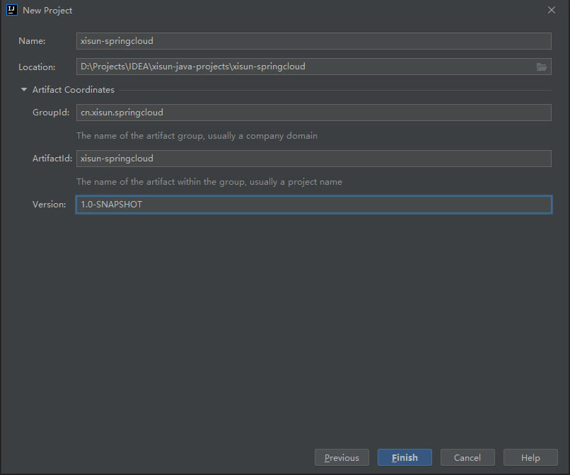
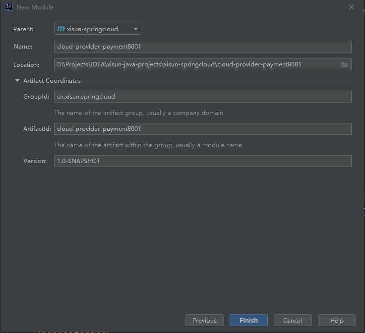

*date: 2022-06-22*

## 微服务架构概述

>In short, the microservice architectural style is an approach to developing a single application as a suite of small services, each running in its own process and communicating with lightweight mechanisms, often an HTTP resource API.
>
>These services are built around business capabilities and independently deployable by fully automated deployment machinery. There is a bare minimum of centralized management of these services, which may be written in different programming languages and use different data storage technologies.
>
>​																																																																									-- James Lewis and Martin Fowler

`微服务架构`是一种架构模式，它提倡`将单一应用程序划分成一组小的服务`，服务之间互相协调、互相匹配和，为用户提供最终价值。每个服务运行在其独立的进程中，服务与服务间采用`轻量级的通信机制`互相协作（通常是基于 HTTP 协议的 RESTful API）。每个服务都围绕着具体业务进行构建，并且能够被独立的部署到生产环境、类生产环境等。另外，应当尽量避免统一的、集中式的服务管理机制，对具体的一个服务而言，应根据业务上下文，选择合适的语言、工具对其进行构建。

分布式微服务架构体系：


如果想完成以上所有模块的搭建使用，也只有 SpringCloud 能够全部胜任，而 SpringCloud 俨然已经成为微服务开发的主流技术栈。

那么，SpringCloud 是什么呢？

> **SpringCloud = 分布式微服务架构的一站式解决方案，是多种微服务架构落地技术的集合体，俗称`微服务全家桶`。**

针对微服务架构体系中各种不同的服务，很难做到面面俱到，现针对最主要的部分，功能与对应的技术栈，说明如下：


> 随着技术的发展，上图中使用的技术，可能出现了更好的替代品，详见后文。

## 版本选择

### SpringBoot 版本

GitHub 源码地址：https://github.com/spring-projects/spring-boot/releases/

官网：https://spring.io/projects/spring-boot

SpringBoot 官方，强烈建议使用 SpringBoot 2.0 版本以上：

>Since this is a major release of Spring Boot, upgrading existing applications can be a little more involved that usual. We’ve put together a [dedicated migration guide](https://github.com/spring-projects/spring-boot/wiki/Spring-Boot-2.0-Migration-Guide) to help you upgrade your existing Spring Boot 1.5 applications.
>
>If you’re currently running with an earlier version of Spring Boot, we strongly recommend that you [upgrade to Spring Boot 1.5](https://github.com/spring-projects/spring-boot/wiki/Spring-Boot-1.5-Release-Notes) before migrating to Spring Boot 2.0.

当前预发布最新版本：


当前稳定版最新版本：


### SpringCloud 版本

GitHub 源码地址：https://github.com/spring-projects/spring-cloud（目前，SpringCloud GitHub 已不再维护，直接查看官网。）

官网：https://spring.io/projects/spring-cloud

中文文档：https://www.bookstack.cn/read/spring-cloud-docs/docs-index.md

在官网可以看到，SpringCloud 的版本与 SpringBoot 是有依赖关系的，如下：

| Release Train                                                | Boot Version                          |
| :----------------------------------------------------------- | :------------------------------------ |
| [2021.0.x](https://github.com/spring-cloud/spring-cloud-release/wiki/Spring-Cloud-2021.0-Release-Notes) aka Jubilee | 2.6.x                                 |
| [2020.0.x](https://github.com/spring-cloud/spring-cloud-release/wiki/Spring-Cloud-2020.0-Release-Notes) aka Ilford | 2.4.x, 2.5.x (Starting with 2020.0.3) |
| [Hoxton](https://github.com/spring-cloud/spring-cloud-release/wiki/Spring-Cloud-Hoxton-Release-Notes) | 2.2.x, 2.3.x (Starting with SR5)      |
| [Greenwich](https://github.com/spring-projects/spring-cloud/wiki/Spring-Cloud-Greenwich-Release-Notes) | 2.1.x                                 |
| [Finchley](https://github.com/spring-projects/spring-cloud/wiki/Spring-Cloud-Finchley-Release-Notes) | 2.0.x                                 |
| [Edgware](https://github.com/spring-projects/spring-cloud/wiki/Spring-Cloud-Edgware-Release-Notes) | 1.5.x                                 |
| [Dalston](https://github.com/spring-projects/spring-cloud/wiki/Spring-Cloud-Dalston-Release-Notes) | 1.5.x                                 |

>Spring Cloud Dalston, Edgware, Finchley, and Greenwich have all reached end of life status and are no longer supported.

在以下网址：https://start.spring.io/actuator/info，可以查看 SpringCloud 不同版本，能够支持的 SpringBoot 版本范围：


查看 SpringCloud 当前最新版本：


点击 Reference Doc.，可以看到 SpringCloud 适用版本官方推荐的 SpringBoot 版本，建议遵循官方建议使用，以免出现不必要的问题：

>Release Train Version: **2021.0.3**
>
>Supported Boot Version: **2.6.8**

### 版本确定

| 技术                | 版本                        |
| ------------------- | --------------------------- |
| SpringCloud         | 2021.0.3                    |
| SpringBoot          | 2.6.8                       |
| SpringCloud Alibaba |                             |
| JDK                 | openjdk version "1.8.0_222" |
| Maven               | Apache Maven 3.8.5          |
| MySQL               |                             |

参考资料：

SpringCloud 2021.0.3：https://docs.spring.io/spring-cloud/docs/2021.0.3/reference/html/

SpringBoot 2.6.8：https://docs.spring.io/spring-boot/docs/2.6.8/reference/html/

## Cloud 组件升级与替换


## 微服务架构搭建

### 构建父工程

第一步，创建父工程 Project：



第二步，保留 pom.xml 文件，删除 src 目录。

第三步，修改父工程 pom.xml 文件，特别注意 packaging 方式：

```xml
<!-- parent必须使用pom格式打包并上传到仓库 -->
<packaging>pom</packaging>
```

### 构建子模块



