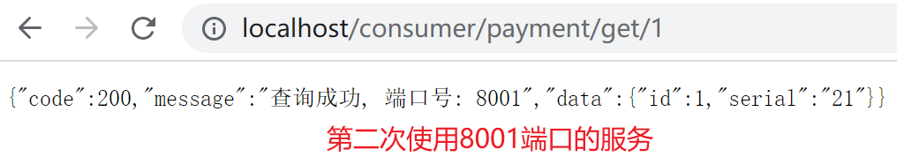
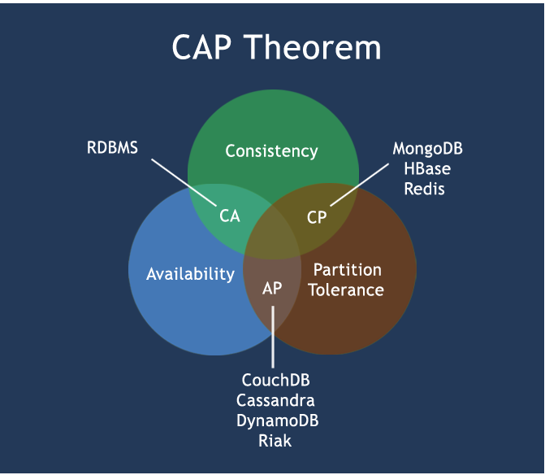

*date: 2022-06-22*


[TOC]

## 微服务架构概述

>In short, the microservice architectural style is an approach to developing a single application as a suite of small services, each running in its own process and communicating with lightweight mechanisms, often an HTTP resource API.
>
>These services are built around business capabilities and independently deployable by fully automated deployment machinery. There is a bare minimum of centralized management of these services, which may be written in different programming languages and use different data storage technologies.
>
>​																																																																									-- James Lewis and Martin Fowler

**`微服务架构`**是一种架构模式，它提倡`将单一应用程序划分成一组小的服务`，服务之间互相协调、互相配合，为用户提供最终价值。每个服务运行在其独立的进程中，服务与服务间采用`轻量级的通信机制`互相协作（通常是基于 HTTP 协议的 RESTful API）。每个服务都围绕着具体业务进行构建，并且能够被独立的部署到生产环境、类生产环境等。另外，应当尽量避免统一的、集中式的服务管理机制，对具体的一个服务而言，应根据业务上下文，选择合适的语言、工具对其进行构建。

**分布式微服务架构体系：**


- 如果想完成以上所有模块的搭建使用，也只有 Spring Cloud 能够全部胜任，而 Spring Cloud 俨然已经成为微服务开发的主流技术栈。


那么，Spring Cloud 是什么呢？

> **Spring Cloud = 分布式微服务架构的一站式解决方案，是多种微服务架构落地技术的集合体，俗称`微服务全家桶`。**

Spring Cloud 集成的技术体系：


针对微服务架构体系中各种不同的服务，很难做到面面俱到，现针对最主要的部分，功能与对应的技术栈，说明如下：


> 随着技术的发展，上图中使用的技术，可能出现了更好的替代品，详见后文。

## 版本选择

### Spring Boot 版本

GitHub：https://github.com/spring-projects/spring-boot/releases/

官网：https://spring.io/projects/spring-boot

Spring Boot 官方，强烈建议使用 Spring Boot 2.0 版本以上：

>Since this is a major release of Spring Boot, upgrading existing applications can be a little more involved that usual. We’ve put together a [dedicated migration guide](https://github.com/spring-projects/spring-boot/wiki/Spring-Boot-2.0-Migration-Guide) to help you upgrade your existing Spring Boot 1.5 applications.
>
>If you’re currently running with an earlier version of Spring Boot, we strongly recommend that you [upgrade to Spring Boot 1.5](https://github.com/spring-projects/spring-boot/wiki/Spring-Boot-1.5-Release-Notes) before migrating to Spring Boot 2.0.

当前预发布最新版本：


当前稳定版最新版本：


### Spring Cloud 版本

GitHub：https://github.com/spring-projects/spring-cloud

- 目前，Spring Cloud GitHub 已不再维护，直接查看官网。

官网：https://spring.io/projects/spring-cloud

中文文档：https://www.bookstack.cn/read/spring-cloud-docs/docs-index.md

在官网可以看到，Spring Cloud 的版本与 Spring Boot 是有依赖关系的，如下：

| Release Train                                                | Boot Version                          |
| :----------------------------------------------------------- | :------------------------------------ |
| [2022.0.x](https://github.com/spring-cloud/spring-cloud-release/wiki/Spring-Cloud-2022.0-Release-Notes) aka Kilburn | 3.0.x                                 |
| [2021.0.x](https://github.com/spring-cloud/spring-cloud-release/wiki/Spring-Cloud-2021.0-Release-Notes) aka Jubilee | 2.6.x, 2.7.x (Starting with 2021.0.3) |
| [2020.0.x](https://github.com/spring-cloud/spring-cloud-release/wiki/Spring-Cloud-2020.0-Release-Notes) aka Ilford | 2.4.x, 2.5.x (Starting with 2020.0.3) |
| [Hoxton](https://github.com/spring-cloud/spring-cloud-release/wiki/Spring-Cloud-Hoxton-Release-Notes) | 2.2.x, 2.3.x (Starting with SR5)      |
| [Greenwich](https://github.com/spring-projects/spring-cloud/wiki/Spring-Cloud-Greenwich-Release-Notes) | 2.1.x                                 |
| [Finchley](https://github.com/spring-projects/spring-cloud/wiki/Spring-Cloud-Finchley-Release-Notes) | 2.0.x                                 |
| [Edgware](https://github.com/spring-projects/spring-cloud/wiki/Spring-Cloud-Edgware-Release-Notes) | 1.5.x                                 |
| [Dalston](https://github.com/spring-projects/spring-cloud/wiki/Spring-Cloud-Dalston-Release-Notes) | 1.5.x                                 |

>Spring Cloud Dalston, Edgware, Finchley, and Greenwich have all reached end of life status and are no longer supported.

在以下网址：https://start.spring.io/actuator/info，可以查看 Spring Cloud 不同版本，能够支持的 Spring Boot 版本范围：


查看 Spring Cloud 当前最新版本：


点击 Reference Doc.，可以看到 Spring Cloud 适用版本官方推荐的 Spring Boot 版本，建议遵循官方建议使用，以免出现不必要的问题：

>Release Train Version: **2021.0.3**
>
>Supported Boot Version: **2.6.8**

### 版本确定

| 技术                 | 版本                     |
| -------------------- | ------------------------ |
| Spring Cloud         | 2021.0.3                 |
| Spring Boot          | 2.6.8                    |
| Spring Cloud Alibaba | 2021.0.1.0               |
| JDK                  | java version "1.8.0_201" |
| Maven                | Apache Maven 3.8.5       |
| MySQL                | 8.0.29                   |

参考资料：

Spring Cloud 2021.0.3：https://docs.spring.io/spring-cloud/docs/2021.0.3/reference/html/

Spring Boot 2.6.8：https://docs.spring.io/spring-boot/docs/2.6.8/reference/html/

## Cloud 组件升级与替换


## 微服务架构搭建

### Sql 脚本

```sql
-- MySQL dump 10.13  Distrib 8.0.29, for Linux (x86_64)
--
-- Host: localhost    Database: cloud_demo
-- ------------------------------------------------------
-- Server version	8.0.29

/*!40101 SET @OLD_CHARACTER_SET_CLIENT=@@CHARACTER_SET_CLIENT */;
/*!40101 SET @OLD_CHARACTER_SET_RESULTS=@@CHARACTER_SET_RESULTS */;
/*!40101 SET @OLD_COLLATION_CONNECTION=@@COLLATION_CONNECTION */;
/*!50503 SET NAMES utf8mb4 */;
/*!40103 SET @OLD_TIME_ZONE=@@TIME_ZONE */;
/*!40103 SET TIME_ZONE='+00:00' */;
/*!40014 SET @OLD_UNIQUE_CHECKS=@@UNIQUE_CHECKS, UNIQUE_CHECKS=0 */;
/*!40014 SET @OLD_FOREIGN_KEY_CHECKS=@@FOREIGN_KEY_CHECKS, FOREIGN_KEY_CHECKS=0 */;
/*!40101 SET @OLD_SQL_MODE=@@SQL_MODE, SQL_MODE='NO_AUTO_VALUE_ON_ZERO' */;
/*!40111 SET @OLD_SQL_NOTES=@@SQL_NOTES, SQL_NOTES=0 */;

--
-- Current Database: `cloud_demo`
--

CREATE DATABASE /*!32312 IF NOT EXISTS*/ `cloud_demo` /*!40100 DEFAULT CHARACTER SET utf8mb4 COLLATE utf8mb4_0900_ai_ci */ /*!80016 DEFAULT ENCRYPTION='N' */;

USE `cloud_demo`;

--
-- Table structure for table `payment`
--

DROP TABLE IF EXISTS `payment`;
/*!40101 SET @saved_cs_client     = @@character_set_client */;
/*!50503 SET character_set_client = utf8mb4 */;
CREATE TABLE `payment` (
  `id` bigint NOT NULL AUTO_INCREMENT COMMENT '主键',
  `serial` varchar(200) DEFAULT '' COMMENT '流水号',
  PRIMARY KEY (`id`)
) ENGINE=InnoDB AUTO_INCREMENT=1624448361138589698 DEFAULT CHARSET=utf8mb4 COLLATE=utf8mb4_0900_ai_ci ROW_FORMAT=DYNAMIC;
/*!40101 SET character_set_client = @saved_cs_client */;

--
-- Dumping data for table `payment`
--

LOCK TABLES `payment` WRITE;
/*!40000 ALTER TABLE `payment` DISABLE KEYS */;
INSERT INTO `payment` VALUES (1,'21'),(1624436329609744386,''),(1624436415483924481,'39'),(1624445941411012609,'42'),(1624448361138589697,'66');
/*!40000 ALTER TABLE `payment` ENABLE KEYS */;
UNLOCK TABLES;
/*!40103 SET TIME_ZONE=@OLD_TIME_ZONE */;

/*!40101 SET SQL_MODE=@OLD_SQL_MODE */;
/*!40014 SET FOREIGN_KEY_CHECKS=@OLD_FOREIGN_KEY_CHECKS */;
/*!40014 SET UNIQUE_CHECKS=@OLD_UNIQUE_CHECKS */;
/*!40101 SET CHARACTER_SET_CLIENT=@OLD_CHARACTER_SET_CLIENT */;
/*!40101 SET CHARACTER_SET_RESULTS=@OLD_CHARACTER_SET_RESULTS */;
/*!40101 SET COLLATION_CONNECTION=@OLD_COLLATION_CONNECTION */;
/*!40111 SET SQL_NOTES=@OLD_SQL_NOTES */;

-- Dump completed on 2023-03-15  0:53:12
```

### 构建父工程

第一步，创建父工程 Project：


第二步，字符编码设置：


第三步，注解激活生效：


第四步，选择 Java 版本：


第五步，保留 pom.xml 文件，删除 src 目录。

第六步，修改父工程 pom.xml 文件，特别注意 packaging 方式：

```xml
<?xml version="1.0" encoding="UTF-8"?>
<project xmlns="http://maven.apache.org/POM/4.0.0"
         xmlns:xsi="http://www.w3.org/2001/XMLSchema-instance"
         xsi:schemaLocation="http://maven.apache.org/POM/4.0.0 http://maven.apache.org/xsd/maven-4.0.0.xsd">
    <modelVersion>4.0.0</modelVersion>

    <parent>
        <groupId>org.springframework.boot</groupId>
        <artifactId>spring-boot-starter-parent</artifactId>
        <version>2.6.8</version>
    </parent>

    <groupId>cn.xisun.spring.cloud</groupId>
    <artifactId>xisun-spring-cloud</artifactId>
    <version>1.0.0</version>
    <!-- parent必须使用pom格式打包并上传到仓库 -->
    <packaging>pom</packaging>
    <modules>
        <module>cloud-provider-payment-8001</module>
        <module>cloud-consumer-order-80</module>
        <module>cloud-api-commons</module>
        <module>cloud-eureka-server-7001</module>
    </modules>

    <!-- 统一管理jar包版本 -->
    <properties>
        <project.build.sourceEncoding>UTF-8</project.build.sourceEncoding>
        <maven.compiler.source>1.8</maven.compiler.source>
        <maven.compiler.target>1.8</maven.compiler.target>

        <skipTests>true</skipTests>

        <spring-boot.version>2.6.8</spring-boot.version>
        <spring-cloud.version>2021.0.3</spring-cloud.version>
        <spring-cloud-alibaba.version>2021.0.1.0</spring-cloud-alibaba.version>

        <junit.version>4.13.1</junit.version>
        <log4j.version>1.2.17</log4j.version>
        <lombok.version>1.18.24</lombok.version>

        <mysql.version>8.0.29</mysql.version>
        <druid.version>1.2.9</druid.version>
        <mybatis.spring.boot.version>1.3.0</mybatis.spring.boot.version>
        <mybatis-plus.version>3.5.1</mybatis-plus.version>
    </properties>

    <!-- 子模块继承之后，提供作用：锁定版本+子modlue不用写groupId和version  -->
    <dependencyManagement>
        <dependencies>
            <dependency>
                <groupId>junit</groupId>
                <artifactId>junit</artifactId>
                <version>${junit.version}</version>
                <scope>test</scope>
            </dependency>

            <dependency>
                <groupId>log4j</groupId>
                <artifactId>log4j</artifactId>
                <version>${log4j.version}</version>
            </dependency>

            <dependency>
                <groupId>org.projectlombok</groupId>
                <artifactId>lombok</artifactId>
                <version>${lombok.version}</version>
                <optional>true</optional>
            </dependency>

            <dependency>
                <groupId>org.springframework.cloud</groupId>
                <artifactId>spring-cloud-dependencies</artifactId>
                <version>${spring-cloud.version}</version>
                <type>pom</type>
                <scope>import</scope>
            </dependency>

            <dependency>
                <groupId>com.alibaba.cloud</groupId>
                <artifactId>spring-cloud-alibaba-dependencies</artifactId>
                <version>${spring-cloud-alibaba.version}</version>
                <type>pom</type>
                <scope>import</scope>
            </dependency>

            <dependency>
                <groupId>mysql</groupId>
                <artifactId>mysql-connector-java</artifactId>
                <version>${mysql.version}</version>
            </dependency>

            <dependency>
                <groupId>com.alibaba</groupId>
                <artifactId>druid-spring-boot-starter</artifactId>
                <version>${druid.version}</version>
            </dependency>

            <dependency>
                <groupId>com.baomidou</groupId>
                <artifactId>mybatis-plus-boot-starter</artifactId>
                <version>${mybatis-plus.version}</version>
            </dependency>
        </dependencies>
    </dependencyManagement>

    <build>
        <plugins>
            <plugin>
                <groupId>org.springframework.boot</groupId>
                <artifactId>spring-boot-maven-plugin</artifactId>
                <configuration>
                    <fork>true</fork>
                    <addResources>true</addResources>
                    <skip>true</skip>
                </configuration>
            </plugin>
        </plugins>
    </build>

</project>
```

第七步，Maven 跳过单元测试：


第八步，父工程创建完成后，执行`mvn:clean install`，将父工程发布到仓库以便子工程继承。


### 构建子模块

#### 支付服务提供者：cloud-payment-service

新建 module：


项目结构：


pom.xml：

```xml
<?xml version="1.0" encoding="UTF-8"?>
<project xmlns="http://maven.apache.org/POM/4.0.0"
         xmlns:xsi="http://www.w3.org/2001/XMLSchema-instance"
         xsi:schemaLocation="http://maven.apache.org/POM/4.0.0 http://maven.apache.org/xsd/maven-4.0.0.xsd">
    <modelVersion>4.0.0</modelVersion>
    <parent>
        <groupId>cn.xisun.spring.cloud</groupId>
        <artifactId>xisun-spring-cloud</artifactId>
        <version>1.0.0</version>
    </parent>

    <artifactId>cloud-provider-payment-8001</artifactId>
    <version>1.0.0</version>
    <name>cloud-provider-payment-8001</name>
    <description>cloud-provider-payment-8001</description>

    <properties>
        <maven.compiler.source>8</maven.compiler.source>
        <maven.compiler.target>8</maven.compiler.target>
        <project.build.sourceEncoding>UTF-8</project.build.sourceEncoding>
    </properties>

    <dependencies>
        <dependency>
            <groupId>cn.xisun.spring.cloud</groupId>
            <artifactId>cloud-api-commons</artifactId>
            <version>1.0.0</version>
        </dependency>

        <dependency>
            <groupId>junit</groupId>
            <artifactId>junit</artifactId>
            <scope>test</scope>
        </dependency>

        <dependency>
            <groupId>log4j</groupId>
            <artifactId>log4j</artifactId>
        </dependency>

        <dependency>
            <groupId>org.projectlombok</groupId>
            <artifactId>lombok</artifactId>
        </dependency>

        <dependency>
            <groupId>org.springframework.boot</groupId>
            <artifactId>spring-boot-starter-web</artifactId>
        </dependency>

        <dependency>
            <groupId>org.springframework.boot</groupId>
            <artifactId>spring-boot-starter-actuator</artifactId>
        </dependency>

        <dependency>
            <groupId>org.springframework.boot</groupId>
            <artifactId>spring-boot-starter-test</artifactId>
            <scope>test</scope>
        </dependency>

        <dependency>
            <groupId>mysql</groupId>
            <artifactId>mysql-connector-java</artifactId>
        </dependency>

        <dependency>
            <groupId>com.baomidou</groupId>
            <artifactId>mybatis-plus-boot-starter</artifactId>
        </dependency>
    </dependencies>

</project>
```

application.yml：

```yaml
server:
  port: 8001

spring:
  application:
    name: cloud-payment-service
  datasource:
    type: com.zaxxer.hikari.HikariDataSource
    driver-class-name: com.mysql.cj.jdbc.Driver
    url: jdbc:mysql://192.168.10.100:3306/cloud_demo?useSSL=false&characterEncoding=utf8&serverTimezone=GMT%2B8&allowPublicKeyRetrieval=true
    username: "root"
    password: "root"

mybatis-plus:
  configuration:
    log-impl: org.apache.ibatis.logging.stdout.StdOutImpl #开启日志
  global-config:
    db-config:
      logic-delete-field: isDeleted # 全局逻辑删除的实体字段名(since 3.3.0,配置后可以忽略不配置步骤2)
      logic-delete-value: 1 # 逻辑已删除值(默认为 1)
      logic-not-delete-value: 0 # 逻辑未删除值(默认为 0)
  mapper-locations: classpath:mapper/*.xml
mybatis:
  mapper-locations: classpath:mapper/*.xml
```

PaymentController.java：

```java
package cn.xisun.spring.cloud.controller;

import cn.xisun.spring.cloud.entities.CommonResult;
import cn.xisun.spring.cloud.entities.Payment;
import cn.xisun.spring.cloud.service.PaymentService;
import lombok.extern.slf4j.Slf4j;
import org.springframework.beans.factory.annotation.Autowired;
import org.springframework.web.bind.annotation.*;

/**
 * @author XiSun
 * @version 1.0
 * @date 2023/2/11 23:31
 * @description
 */
@Slf4j
@RestController
public class PaymentController {
    @Autowired
    private PaymentService paymentService;

    @PostMapping(value = "/payment/create")
    public CommonResult create(@RequestBody Payment payment) {
        boolean save = paymentService.save(payment);
        log.info("*****插入结果：" + save);

        if (save) {
            return new CommonResult(200, "插入数据库成功", save);
        } else {
            return new CommonResult(444, "插入数据库失败", null);
        }
    }

    @GetMapping(value = "/payment/get/{id}")
    public CommonResult<Payment> getPaymentById(@PathVariable("id") Long id) {
        Payment payment = paymentService.getById(id);

        if (payment != null) {
            return new CommonResult(200, "查询成功", payment);
        } else {
            return new CommonResult(444, "没有对应记录, 查询ID: " + id, null);
        }
    }
}
```

#### 支付服务消费者：cloud-order-service

新建 module：


项目结构：


pom.xml：

```xml
<?xml version="1.0" encoding="UTF-8"?>
<project xmlns="http://maven.apache.org/POM/4.0.0"
         xmlns:xsi="http://www.w3.org/2001/XMLSchema-instance"
         xsi:schemaLocation="http://maven.apache.org/POM/4.0.0 http://maven.apache.org/xsd/maven-4.0.0.xsd">
    <modelVersion>4.0.0</modelVersion>
    <parent>
        <groupId>cn.xisun.spring.cloud</groupId>
        <artifactId>xisun-spring-cloud</artifactId>
        <version>1.0.0</version>
    </parent>

    <artifactId>cloud-consumer-order-80</artifactId>
    <version>1.0.0</version>
    <name>cloud-consumer-order-80</name>
    <description>cloud-consumer-order-80</description>

    <properties>
        <maven.compiler.source>8</maven.compiler.source>
        <maven.compiler.target>8</maven.compiler.target>
        <project.build.sourceEncoding>UTF-8</project.build.sourceEncoding>
    </properties>

    <dependencies>
        <dependency>
            <groupId>cn.xisun.spring.cloud</groupId>
            <artifactId>cloud-api-commons</artifactId>
            <version>1.0.0</version>
        </dependency>

        <dependency>
            <groupId>junit</groupId>
            <artifactId>junit</artifactId>
            <scope>test</scope>
        </dependency>

        <dependency>
            <groupId>log4j</groupId>
            <artifactId>log4j</artifactId>
        </dependency>

        <dependency>
            <groupId>org.projectlombok</groupId>
            <artifactId>lombok</artifactId>
        </dependency>

        <dependency>
            <groupId>org.springframework.boot</groupId>
            <artifactId>spring-boot-starter-web</artifactId>
        </dependency>

        <dependency>
            <groupId>org.springframework.boot</groupId>
            <artifactId>spring-boot-starter-actuator</artifactId>
        </dependency>

        <dependency>
            <groupId>org.springframework.boot</groupId>
            <artifactId>spring-boot-starter-test</artifactId>
            <scope>test</scope>
        </dependency>
    </dependencies>

</project>
```

application.yml：

```yaml
server:
  port: 80

spring:
  application:
    name: cloud-order-service
```

RestTemplateConfig：

```java
package cn.xisun.spring.cloud.config;

import org.springframework.context.annotation.Bean;
import org.springframework.context.annotation.Configuration;
import org.springframework.web.client.RestTemplate;

/**
 * @author XiSun
 * @version 1.0
 * @date 2023/2/11 23:48
 * @description
 */
@Configuration
public class RestTemplateConfig {
    @Bean
    public RestTemplate getRestTemplate() {
        return new RestTemplate();
    }
}
```

OrderController.java：

```java
package cn.xisun.spring.cloud.controller;

import cn.xisun.spring.cloud.entities.CommonResult;
import cn.xisun.spring.cloud.entities.Payment;
import lombok.extern.slf4j.Slf4j;
import org.springframework.beans.factory.annotation.Autowired;
import org.springframework.web.bind.annotation.*;
import org.springframework.web.client.RestTemplate;

/**
 * @author XiSun
 * @version 1.0
 * @date 2023/2/11 23:31
 * @description
 */
@Slf4j
@RestController
public class OrderController {
    public static final String PAYMENT_URL = "http://localhost:8001";

    @Autowired
    private RestTemplate restTemplate;

    @GetMapping("/consumer/payment/create")
    public CommonResult<Payment> create(Payment payment) {
        return restTemplate.postForObject(PAYMENT_URL + "/payment/create", payment, CommonResult.class);
    }

    @GetMapping("/consumer/payment/get/{id}")
    public CommonResult<Payment> getPayment(@PathVariable("id") Long id) {
        return restTemplate.getForObject(PAYMENT_URL + "/payment/get/" + id, CommonResult.class);
    }
}
```

#### 公共模块抽取

新建 module：


项目结构：


- 删除支付服务提供者和支付服务消费者两个 module 中的实体类，并添加对公共模块的依赖，重新构建项目。

pom.xml：

```xml
<?xml version="1.0" encoding="UTF-8"?>
<project xmlns="http://maven.apache.org/POM/4.0.0"
         xmlns:xsi="http://www.w3.org/2001/XMLSchema-instance"
         xsi:schemaLocation="http://maven.apache.org/POM/4.0.0 http://maven.apache.org/xsd/maven-4.0.0.xsd">
    <modelVersion>4.0.0</modelVersion>
    <parent>
        <groupId>cn.xisun.spring.cloud</groupId>
        <artifactId>xisun-spring-cloud</artifactId>
        <version>1.0.0</version>
    </parent>

    <artifactId>cloud-api-commons</artifactId>
    <version>1.0.0</version>
    <name>common</name>
    <description>common</description>

    <properties>
        <maven.compiler.source>8</maven.compiler.source>
        <maven.compiler.target>8</maven.compiler.target>
        <project.build.sourceEncoding>UTF-8</project.build.sourceEncoding>
    </properties>

    <dependencies>
        <dependency>
            <groupId>junit</groupId>
            <artifactId>junit</artifactId>
            <scope>test</scope>
        </dependency>

        <dependency>
            <groupId>log4j</groupId>
            <artifactId>log4j</artifactId>
        </dependency>

        <dependency>
            <groupId>org.projectlombok</groupId>
            <artifactId>lombok</artifactId>
        </dependency>

        <dependency>
            <groupId>org.springframework.boot</groupId>
            <artifactId>spring-boot-starter-web</artifactId>
        </dependency>

        <dependency>
            <groupId>org.springframework.boot</groupId>
            <artifactId>spring-boot-starter-actuator</artifactId>
        </dependency>

        <dependency>
            <groupId>org.springframework.boot</groupId>
            <artifactId>spring-boot-starter-test</artifactId>
            <scope>test</scope>
        </dependency>
    </dependencies>

</project>
```

#### 测试

启动支付服务提供者和支付服务消费者两个微服务，通过浏览器调用支付服务消费者的方法，进行测试：

- 查询：

  

- 新增：

  

#### 扩展：RestTemplate

官网：https://docs.spring.io/spring-framework/docs/5.2.2.RELEASE/javadoc-api/org/springframework/web/client/RestTemplate.html

- `getForObject()`：返回对象为响应体中数据转化成的对象，基本上可以理解为 Json。

  

- `getForEntity()`：返回对象为 ResponseEntity 对象，包含了响应中的一些重要信息，比如响应头、响应状态码、响应体等。

  

- `postForObject()`和`postForEntity()`：

  

## Eureka 服务注册与发现

### 简介

#### 什么是服务治理

在传统的 RPC 远程调用框架中，每个服务与服务之间的依赖关系比较复杂，管理起来难度大，因此需要使用服务治理，来管理服务与服务之间的依赖关系。**服务治理可以实现服务发现与注册、服务调用、负载均衡、容错等目的。**

**Spring Cloud 封装了 Netflix 公司开发的 Eureka 模块来实现服务治理。**

#### 什么是服务注册与发现

下左图是 Eureka 系统架构，右图是 Dubbo 系统架构：


`在服务注册与发现中，有一个注册中心。`当服务器启动的时候，会把当前自己服务器的信息，比如服务地址、通讯地址等以别名方式注册到注册中心上。另一方（消费者|服务提供者），以该别名的方式去注册中心上获取到实际的服务通讯地址，然后再实现本地 RPC 调用，RPC 远程调用框架核心设计思想在于注册中心，其使用注册中心管理每个服务与服务之间的依赖关系（服务治理概念）。在任何 RPC 远程框架中，都会有一个注册中心，存放服务地址相关信息，如接口地址等。

Eureka 采用了 CS 的设计架构，Eureka Server 作为服务注册功能的服务器，它是服务注册中心。而系统中的其他微服务，使用 Eureka 的客户端连接到 Eureka Server 并维持心跳连接。这样系统的维护人员就可以通过 Eureka Server 来监控系统中各个微服务是否正常运行。

#### Eureka 的两个组件

##### Eureka Server

**`Eureka Server：提供服务注册服务。`**

各个微服务节点通过配置启动后，会在 Eureka Server 中进行注册，这样 Eureka Server 中的服务注册表中将会存储所有可用服务节点的信息，服务节点的信息可以在界面中直观看到。

##### Eureka Client

**`Eureka Client`**是一个Java 客户端，用于简化 Eureka Server 的交互，客户端同时也具备一个内置的、使用轮询（round-robin）负载算法的负载均衡器。在应用启动后，将会向 Eureka Server 发送心跳（默认周期为 30 秒）。如果 Eureka Server 在多个心跳周期内没有接收到某个节点的心跳，Eureka Server 将会从服务注册表中把这个服务节点移除（默认为 90 秒）。

### 单机 Eureka 构建

#### 服务搭建

新建 module：


项目结构：


pom.xml：

```xml
<?xml version="1.0" encoding="UTF-8"?>
<project xmlns="http://maven.apache.org/POM/4.0.0"
         xmlns:xsi="http://www.w3.org/2001/XMLSchema-instance"
         xsi:schemaLocation="http://maven.apache.org/POM/4.0.0 http://maven.apache.org/xsd/maven-4.0.0.xsd">
    <modelVersion>4.0.0</modelVersion>
    <parent>
        <groupId>cn.xisun.spring.cloud</groupId>
        <artifactId>xisun-spring-cloud</artifactId>
        <version>1.0.0</version>
    </parent>

    <artifactId>cloud-eureka-server-7001</artifactId>
    <version>1.0.0</version>
    <name>cloud-eureka-server-7001</name>
    <description>cloud-eureka-server-7001</description>

    <properties>
        <maven.compiler.source>8</maven.compiler.source>
        <maven.compiler.target>8</maven.compiler.target>
        <project.build.sourceEncoding>UTF-8</project.build.sourceEncoding>
    </properties>

    <dependencies>
        <dependency>
            <groupId>junit</groupId>
            <artifactId>junit</artifactId>
            <scope>test</scope>
        </dependency>

        <dependency>
            <groupId>log4j</groupId>
            <artifactId>log4j</artifactId>
        </dependency>

        <dependency>
            <groupId>org.projectlombok</groupId>
            <artifactId>lombok</artifactId>
        </dependency>

        <dependency>
            <groupId>org.springframework.boot</groupId>
            <artifactId>spring-boot-starter-web</artifactId>
        </dependency>

        <dependency>
            <groupId>org.springframework.boot</groupId>
            <artifactId>spring-boot-starter-actuator</artifactId>
        </dependency>

        <dependency>
            <groupId>org.springframework.boot</groupId>
            <artifactId>spring-boot-starter-test</artifactId>
            <scope>test</scope>
        </dependency>

        <!-- eureka-server -->
        <dependency>
            <groupId>org.springframework.cloud</groupId>
            <artifactId>spring-cloud-starter-netflix-eureka-server</artifactId>
        </dependency>
    </dependencies>

</project>
```

application.yml：

```yaml
server:
  port: 7001

eureka:
  instance:
    hostname: localhost # eureka服务端的实例名称
  client:
    register-with-eureka: false # false表示不向注册中心注册自己
    fetch-registry: false # false表示自己端就是注册中心，我的职责就是维护服务实例，并不需要去检索服务
    service-url:
      # 设置与Eureka Server交互的地址，查询服务和注册服务都需要依赖这个地址
      defaultZone: http://${eureka.instance.hostname}:${server.port}/eureka/
```

主启动类，添加`@EnableEurekaServer`注解：

```java
package cn.xisun.spring.cloud;

import org.springframework.boot.SpringApplication;
import org.springframework.boot.autoconfigure.SpringBootApplication;
import org.springframework.cloud.netflix.eureka.server.EnableEurekaServer;

/**
 * @author XiSun
 * @version 1.0
 * @date 2023/2/12 18:28
 * @description
 */
@SpringBootApplication
@EnableEurekaServer
public class EurekaApplication7001 {
    public static void main(String[] args) {
        SpringApplication.run(EurekaApplication7001.class, args);
    }
}
```

- `@EnableEurekaServer`注解启动 Eureka 的过程，如下图所示：

  

启动服务，浏览器输入`localhost:7001`：


- 可以看到，此时还没有服务注册。

#### 服务注册

##### cloud-payment-service 服务

添加 Maven 依赖：

```xml
<!-- eureka-client -->
<dependency>
    <groupId>org.springframework.cloud</groupId>
    <artifactId>spring-cloud-starter-netflix-eureka-client</artifactId>
</dependency>
```

增加 application.yml 配置：

```yaml
eureka:
  client:
    # 表示是否将自己注册进Eureka Server，默认为true
    register-with-eureka: true
    # 是否从Eureka Server抓取已有的注册信息，默认为true。单节点无所谓，集群必须设置为true，才能配合ribbon使用负载均衡
    fetch-registry: true
    service-url:
      defaultZone: http://localhost:7001/eureka
```

主启动类，添加`@EnableEurekaClient`注解：

```java
package cn.xisun.spring.cloud;

import org.mybatis.spring.annotation.MapperScan;
import org.springframework.boot.SpringApplication;
import org.springframework.boot.autoconfigure.SpringBootApplication;
import org.springframework.cloud.netflix.eureka.EnableEurekaClient;

/**
 * @author XiSun
 * @version 1.0
 * @date 2023/2/11 21:54
 * @description
 */
@SpringBootApplication
@MapperScan("cn.xisun.spring.cloud.mapper")
@EnableEurekaClient
public class PaymentApplication8001 {
    public static void main(String[] args) {
        SpringApplication.run(PaymentApplication8001.class, args);
    }
}
```

重新启动服务，在 Eureka 注册中心，即可看到 cloud-payment-service 服务注册成功：


##### cloud-order-service 服务

添加 Maven 依赖：

```xml
<!-- eureka-client -->
<dependency>
    <groupId>org.springframework.cloud</groupId>
    <artifactId>spring-cloud-starter-netflix-eureka-client</artifactId>
</dependency>
```

增加 application.yml 配置：

```yaml
eureka:
  client:
    # 表示是否将自己注册进Eureka Server，默认为true
    register-with-eureka: true
    # 是否从Eureka Server抓取已有的注册信息，默认为true。单节点无所谓，集群必须设置为true，才能配合ribbon使用负载均衡
    fetch-registry: true
    service-url:
      defaultZone: http://localhost:7001/eureka
```

主启动类，添加`@EnableEurekaClient`注解：

```java
package cn.xisun.spring.cloud;

import org.springframework.boot.SpringApplication;
import org.springframework.boot.autoconfigure.SpringBootApplication;
import org.springframework.cloud.netflix.eureka.EnableEurekaClient;

/**
 * @author XiSun
 * @version 1.0
 * @date 2023/2/11 22:01
 * @description
 */
@SpringBootApplication
@EnableEurekaClient
public class OrderApplication80 {
    public static void main(String[] args) {
        SpringApplication.run(OrderApplication80.class, args);
    }
}
```

重新启动服务，在 Eureka 注册中心，即可看到 cloud-order-service 服务也注册成功：


### 集群 Eureka 构建

#### 集群原理

`Eureka 注册中心工作原理`：


**微服务 RPC 远程服务调用最核心的是高可用**，如果注册中心只有一个，假如它出故障了，那就会导致整个微服务环境不可用，解决办法：**搭建 Eureka 注册中心集群 ，实现负载均衡和故障容错。**

**`Eureka 集群原理：互相注册，相互守望，对外暴露为一个整体。`**

#### 集群搭建

> 参考 cloud-eureka-server-7001，新建 cloud-eureka-server-7002。

新建 module：


pom.xml：

```xml
<?xml version="1.0" encoding="UTF-8"?>
<project xmlns="http://maven.apache.org/POM/4.0.0"
         xmlns:xsi="http://www.w3.org/2001/XMLSchema-instance"
         xsi:schemaLocation="http://maven.apache.org/POM/4.0.0 http://maven.apache.org/xsd/maven-4.0.0.xsd">
    <modelVersion>4.0.0</modelVersion>
    <parent>
        <groupId>cn.xisun.spring.cloud</groupId>
        <artifactId>xisun-spring-cloud</artifactId>
        <version>1.0.0</version>
    </parent>

    <artifactId>cloud-eureka-server-7002</artifactId>
    <version>1.0.0</version>
    <name>cloud-eureka-server-7002</name>
    <description>cloud-eureka-server-7002</description>

    <properties>
        <maven.compiler.source>8</maven.compiler.source>
        <maven.compiler.target>8</maven.compiler.target>
        <project.build.sourceEncoding>UTF-8</project.build.sourceEncoding>
    </properties>

    <dependencies>
        <dependency>
            <groupId>junit</groupId>
            <artifactId>junit</artifactId>
            <scope>test</scope>
        </dependency>

        <dependency>
            <groupId>log4j</groupId>
            <artifactId>log4j</artifactId>
        </dependency>

        <dependency>
            <groupId>org.projectlombok</groupId>
            <artifactId>lombok</artifactId>
        </dependency>

        <dependency>
            <groupId>org.springframework.boot</groupId>
            <artifactId>spring-boot-starter-web</artifactId>
        </dependency>

        <dependency>
            <groupId>org.springframework.boot</groupId>
            <artifactId>spring-boot-starter-actuator</artifactId>
        </dependency>

        <dependency>
            <groupId>org.springframework.boot</groupId>
            <artifactId>spring-boot-starter-test</artifactId>
            <scope>test</scope>
        </dependency>

        <!-- eureka-server -->
        <dependency>
            <groupId>org.springframework.cloud</groupId>
            <artifactId>spring-cloud-starter-netflix-eureka-server</artifactId>
        </dependency>
    </dependencies>

</project>
```

application.yml：

```yaml
server:
  port: 7002

eureka:
  instance:
    hostname: eureka7002.com # eureka服务端的实例名称
  client:
    register-with-eureka: false # false表示不向注册中心注册自己
    fetch-registry: false # false表示自己端就是注册中心，我的职责就是维护服务实例，并不需要去检索服务
    service-url:
      # 设置与Eureka Server交互的地址，查询服务和注册服务都需要依赖这个地址
      # 集群指向其它eureka
      defaultZone: http://eureka7001.com:7001/eureka/
      # 单机就是7001自己
      # defaultZone: http://${eureka.instance.hostname}:${server.port}/eureka/
```

>service-url 指向集群上的其他 Eureka 服务，此处为 cloud-eureka-server-7001。

主启动类：

```java
package cn.xisun.spring.cloud;

import org.springframework.boot.SpringApplication;
import org.springframework.boot.autoconfigure.SpringBootApplication;
import org.springframework.cloud.netflix.eureka.EnableEurekaClient;
import org.springframework.cloud.netflix.eureka.server.EnableEurekaServer;

/**
 * @author XiSun
 * @version 1.0
 * @date 2023/2/12 22:27
 * @description
 */
@SpringBootApplication
@EnableEurekaServer
public class EurekaApplication7002 {
    public static void main(String[] args) {
        SpringApplication.run(EurekaApplication7002.class, args);
    }
}
```

修改 cloud-eureka-server-7001 的 application.yml：

```yaml
server:
  port: 7001

eureka:
  instance:
    hostname: eureka7001.com # eureka服务端的实例名称
  client:
    register-with-eureka: false # false表示不向注册中心注册自己
    fetch-registry: false # false表示自己端就是注册中心，我的职责就是维护服务实例，并不需要去检索服务
    service-url:
      # 设置与Eureka Server交互的地址，查询服务和注册服务都需要依赖这个地址
      # 集群指向其它eureka
      defaultZone: http://eureka7002.com:7002/eureka/
      # 单机就是7001自己
      # defaultZone: http://${eureka.instance.hostname}:${server.port}/eureka/
```

> service-url 指向集群上的其他 Eureka 服务，此处为 cloud-eureka-server-7002。

注意，本机需要添加 Host 解析：


> 此处，因为 cloud-eureka-server-7001 和 cloud-eureka-server-7002 都在本机，每个 Eureka 服务的 hostname 直接使用 localhost 也可以，但实际应用时，集群上的每个 Eureka 服务，应是在不同的服务器上。

分别启动两个 Eureka 服务，浏览器查看：


> 可以看到，cloud-eureka-server-7001 的 Eureka 服务，注册了 cloud-eureka-server-7002 的 Eureka 服务，相同的，cloud-eureka-server-7002 的 Eureka 服务，注册了 cloud-eureka-server-7001 的 Eureka 服务，二者形成了一个 Eureka 集群。

#### 服务注册

##### cloud-payment-service 服务

修改 application.yml：

```yaml
server:
  port: 8001

spring:
  application:
    name: cloud-payment-service
  datasource:
    type: com.zaxxer.hikari.HikariDataSource
    driver-class-name: com.mysql.cj.jdbc.Driver
    url: jdbc:mysql://192.168.10.100:3306/cloud_demo?useSSL=false&characterEncoding=utf8&serverTimezone=GMT%2B8&allowPublicKeyRetrieval=true
    username: "root"
    password: "root"

mybatis-plus:
  configuration:
    log-impl: org.apache.ibatis.logging.stdout.StdOutImpl #开启日志
  global-config:
    db-config:
      logic-delete-field: isDeleted # 全局逻辑删除的实体字段名(since 3.3.0,配置后可以忽略不配置步骤2)
      logic-delete-value: 1 # 逻辑已删除值(默认为 1)
      logic-not-delete-value: 0 # 逻辑未删除值(默认为 0)
  mapper-locations: classpath:mapper/*.xml
mybatis:
  mapper-locations: classpath:mapper/*.xml

eureka:
  client:
    # 表示是否将自己注册进Eureka Server，默认为true
    register-with-eureka: true
    # 是否从Eureka Server抓取已有的注册信息，默认为true。单节点无所谓，集群必须设置为true，才能配合ribbon使用负载均衡
    fetch-registry: true
    service-url:
      # 单机
      # defaultZone: http://localhost:7001/eureka
      # 集群
      defaultZone: http://eureka7001.com:7001/eureka/,http://eureka7002.com:7002/eureka/
```

重新启动服务，分别在两个 Eureka 注册中心，即可看到 cloud-payment-service 服务均注册成功：


##### cloud-order-service 服务

修改 application.yml：

```yml
server:
  port: 80

spring:
  application:
    name: cloud-order-service

eureka:
  client:
    # 表示是否将自己注册进Eureka Server，默认为true
    register-with-eureka: true
    # 是否从Eureka Server抓取已有的注册信息，默认为true。单节点无所谓，集群必须设置为true，才能配合ribbon使用负载均衡
    fetch-registry: true
    service-url:
      # 单机
      # defaultZone: http://localhost:7001/eureka
      # 集群
      defaultZone: http://eureka7001.com:7001/eureka/,http://eureka7002.com:7002/eureka/
```

重新启动服务，分别在两个 Eureka 注册中心，即可看到 cloud-order-service 服务均注册成功：


#### 支付服务提供者集群搭建

> 参考 cloud-provider-payment-8001，新建 cloud-provider-payment-8002，后者的业务类，直接拷贝前者，需要修改的主要是 application.yml 的端口号。

新建 module：


pom.xml：

```xml
<?xml version="1.0" encoding="UTF-8"?>
<project xmlns="http://maven.apache.org/POM/4.0.0"
         xmlns:xsi="http://www.w3.org/2001/XMLSchema-instance"
         xsi:schemaLocation="http://maven.apache.org/POM/4.0.0 http://maven.apache.org/xsd/maven-4.0.0.xsd">
    <modelVersion>4.0.0</modelVersion>
    <parent>
        <groupId>cn.xisun.spring.cloud</groupId>
        <artifactId>xisun-spring-cloud</artifactId>
        <version>1.0.0</version>
    </parent>

    <artifactId>cloud-provider-payment-8002</artifactId>
    <version>1.0.0</version>
    <name>cloud-provider-payment-8002</name>
    <description>cloud-provider-payment-8002</description>

    <properties>
        <maven.compiler.source>8</maven.compiler.source>
        <maven.compiler.target>8</maven.compiler.target>
        <project.build.sourceEncoding>UTF-8</project.build.sourceEncoding>
    </properties>

    <dependencies>
        <dependency>
            <groupId>cn.xisun.spring.cloud</groupId>
            <artifactId>cloud-api-commons</artifactId>
            <version>1.0.0</version>
        </dependency>

        <dependency>
            <groupId>junit</groupId>
            <artifactId>junit</artifactId>
            <scope>test</scope>
        </dependency>

        <dependency>
            <groupId>log4j</groupId>
            <artifactId>log4j</artifactId>
        </dependency>

        <dependency>
            <groupId>org.projectlombok</groupId>
            <artifactId>lombok</artifactId>
        </dependency>

        <dependency>
            <groupId>org.springframework.boot</groupId>
            <artifactId>spring-boot-starter-web</artifactId>
        </dependency>

        <dependency>
            <groupId>org.springframework.boot</groupId>
            <artifactId>spring-boot-starter-actuator</artifactId>
        </dependency>

        <dependency>
            <groupId>org.springframework.boot</groupId>
            <artifactId>spring-boot-starter-test</artifactId>
            <scope>test</scope>
        </dependency>

        <dependency>
            <groupId>mysql</groupId>
            <artifactId>mysql-connector-java</artifactId>
        </dependency>

        <dependency>
            <groupId>com.baomidou</groupId>
            <artifactId>mybatis-plus-boot-starter</artifactId>
        </dependency>

        <!-- eureka-client -->
        <dependency>
            <groupId>org.springframework.cloud</groupId>
            <artifactId>spring-cloud-starter-netflix-eureka-client</artifactId>
        </dependency>
    </dependencies>

</project>
```

application.yml：

```yaml
server:
  port: 8002

spring:
  application:
    name: cloud-payment-service
  datasource:
    type: com.zaxxer.hikari.HikariDataSource
    driver-class-name: com.mysql.cj.jdbc.Driver
    url: jdbc:mysql://192.168.10.100:3306/cloud_demo?useSSL=false&characterEncoding=utf8&serverTimezone=GMT%2B8&allowPublicKeyRetrieval=true
    username: "root"
    password: "root"

mybatis-plus:
  configuration:
    log-impl: org.apache.ibatis.logging.stdout.StdOutImpl #开启日志
  global-config:
    db-config:
      logic-delete-field: isDeleted # 全局逻辑删除的实体字段名(since 3.3.0,配置后可以忽略不配置步骤2)
      logic-delete-value: 1 # 逻辑已删除值(默认为 1)
      logic-not-delete-value: 0 # 逻辑未删除值(默认为 0)
  mapper-locations: classpath:mapper/*.xml
mybatis:
  mapper-locations: classpath:mapper/*.xml

eureka:
  client:
    # 表示是否将自己注册进Eureka Server，默认为true
    register-with-eureka: true
    # 是否从Eureka Server抓取已有的注册信息，默认为true。单节点无所谓，集群必须设置为true，才能配合ribbon使用负载均衡
    fetch-registry: true
    service-url:
      # 单机
      # defaultZone: http://localhost:7001/eureka
      # 集群
      defaultZone: http://eureka7001.com:7001/eureka/,http://eureka7002.com:7002/eureka/
```

> 除了端口号，其他与 cloud-provider-payment-8001 相同，两个微服务的别名，都叫 cloud-payment-service。

为了便于区分，修改两个微服务的 PaymentController.java，添加端口信息：

```java
package cn.xisun.spring.cloud.controller;

import cn.xisun.spring.cloud.entities.CommonResult;
import cn.xisun.spring.cloud.entities.Payment;
import cn.xisun.spring.cloud.service.PaymentService;
import lombok.extern.slf4j.Slf4j;
import org.springframework.beans.factory.annotation.Autowired;
import org.springframework.beans.factory.annotation.Value;
import org.springframework.web.bind.annotation.*;

/**
 * @author XiSun
 * @version 1.0
 * @date 2023/2/11 23:31
 * @description
 */
@Slf4j
@RestController
public class PaymentController {
    @Autowired
    private PaymentService paymentService;

    @Value("${server.port}")
    private String serverPort;

    @PostMapping(value = "/payment/create")
    public CommonResult create(@RequestBody Payment payment) {
        boolean save = paymentService.save(payment);
        log.info("*****插入结果：" + save);

        if (save) {
            return new CommonResult(200, "插入数据库成功, 端口号: " + serverPort, save);
        } else {
            return new CommonResult(444, "插入数据库失败, 端口号: " + serverPort, null);
        }
    }

    @GetMapping(value = "/payment/get/{id}")
    public CommonResult<Payment> getPaymentById(@PathVariable("id") Long id) {
        Payment payment = paymentService.getById(id);

        if (payment != null) {
            return new CommonResult(200, "查询成功, 端口号: " + serverPort, payment);
        } else {
            return new CommonResult(444, "没有对应记录, 查询ID: " + id + ", 端口号: " + serverPort, null);
        }
    }
}
```

然后，需要修改支付服务消费者 cloud-consumer-order-80 的 OrderController.java：

```java
package cn.xisun.spring.cloud.controller;

import cn.xisun.spring.cloud.entities.CommonResult;
import cn.xisun.spring.cloud.entities.Payment;
import lombok.extern.slf4j.Slf4j;
import org.springframework.beans.factory.annotation.Autowired;
import org.springframework.web.bind.annotation.*;
import org.springframework.web.client.RestTemplate;

/**
 * @author XiSun
 * @version 1.0
 * @date 2023/2/11 23:31
 * @description
 */
@Slf4j
@RestController
public class OrderController {
    // public static final String PAYMENT_URL = "http://localhost:8001";

    // 填写支付服务提供者的别名
    public static final String PAYMENT_URL = "http://CLOUD-PAYMENT-SERVICE";

    @Autowired
    private RestTemplate restTemplate;

    @GetMapping("/consumer/payment/create")
    public CommonResult<Payment> create(Payment payment) {
        return restTemplate.postForObject(PAYMENT_URL + "/payment/create", payment, CommonResult.class);
    }

    @GetMapping("/consumer/payment/get/{id}")
    public CommonResult<Payment> getPayment(@PathVariable("id") Long id) {
        return restTemplate.getForObject(PAYMENT_URL + "/payment/get/" + id, CommonResult.class);
    }
}
```

同时，RestTemplateConfig.java 配置类添加**`@LoadBalanced`**注解：

```java
package cn.xisun.spring.cloud.config;

import org.springframework.cloud.client.loadbalancer.LoadBalanced;
import org.springframework.context.annotation.Bean;
import org.springframework.context.annotation.Configuration;
import org.springframework.web.client.RestTemplate;

/**
 * @author XiSun
 * @version 1.0
 * @date 2023/2/11 23:48
 * @description
 */
@Configuration
public class RestTemplateConfig {
    @Bean
    @LoadBalanced
    public RestTemplate getRestTemplate() {
        return new RestTemplate();
    }
}
```

> `@LoadBalanced`注解，可以赋予 RestTemplate 负载均衡的能力，否则支付服务消费者查找的是 CLOUD-PAYMENT-SERVICE 服务（java.net.UnknownHostException: CLOUD-PAYMENT-SERVICE），该名称的服务下面可能有多个支付服务提供者，不添加负载均衡策略，支付服务消费者无法确定是使用哪个支付服务提供者。（该注解的负载均衡策略，默认使用`轮询`）

重启全部服务：




>通过测试，可以看到，8001 和 8002 端口交替出现，负载均衡效果达到。
>
>Eureka 和 Ribbon 整合后，Consumer 可以直接调用服务而不用再关心地址和端口号，且该服务还有负载均衡功能（Ribbon 默认使用轮询）。

#### actuator 微服务信息完善

修改 cloud-provider-payment-8001 和 cloud-provider-payment-8002 两个微服务的 application.yml：

```yaml
server:
  port: 8001

spring:
  application:
    name: cloud-payment-service
  datasource:
    type: com.zaxxer.hikari.HikariDataSource
    driver-class-name: com.mysql.cj.jdbc.Driver
    url: jdbc:mysql://192.168.10.100:3306/cloud_demo?useSSL=false&characterEncoding=utf8&serverTimezone=GMT%2B8&allowPublicKeyRetrieval=true
    username: "root"
    password: "root"

mybatis-plus:
  configuration:
    log-impl: org.apache.ibatis.logging.stdout.StdOutImpl #开启日志
  global-config:
    db-config:
      logic-delete-field: isDeleted # 全局逻辑删除的实体字段名(since 3.3.0,配置后可以忽略不配置步骤2)
      logic-delete-value: 1 # 逻辑已删除值(默认为 1)
      logic-not-delete-value: 0 # 逻辑未删除值(默认为 0)
  mapper-locations: classpath:mapper/*.xml
mybatis:
  mapper-locations: classpath:mapper/*.xml

eureka:
  client:
    # 表示是否将自己注册进Eureka Server，默认为true
    register-with-eureka: true
    # 是否从Eureka Server抓取已有的注册信息，默认为true。单节点无所谓，集群必须设置为true，才能配合ribbon使用负载均衡
    fetch-registry: true
    service-url:
      # 单机
      # defaultZone: http://localhost:7001/eureka
      # 集群
      defaultZone: http://eureka7001.com:7001/eureka/,http://eureka7002.com:7002/eureka/
  instance:
    instance-id: payment8001
    prefer-ip-address: true # 访问路径可以显示IP地址
```

```yaml
server:
  port: 8002

spring:
  application:
    name: cloud-payment-service
  datasource:
    type: com.zaxxer.hikari.HikariDataSource
    driver-class-name: com.mysql.cj.jdbc.Driver
    url: jdbc:mysql://192.168.10.100:3306/cloud_demo?useSSL=false&characterEncoding=utf8&serverTimezone=GMT%2B8&allowPublicKeyRetrieval=true
    username: "root"
    password: "root"

mybatis-plus:
  configuration:
    log-impl: org.apache.ibatis.logging.stdout.StdOutImpl #开启日志
  global-config:
    db-config:
      logic-delete-field: isDeleted # 全局逻辑删除的实体字段名(since 3.3.0,配置后可以忽略不配置步骤2)
      logic-delete-value: 1 # 逻辑已删除值(默认为 1)
      logic-not-delete-value: 0 # 逻辑未删除值(默认为 0)
  mapper-locations: classpath:mapper/*.xml
mybatis:
  mapper-locations: classpath:mapper/*.xml

eureka:
  client:
    # 表示是否将自己注册进Eureka Server，默认为true
    register-with-eureka: true
    # 是否从Eureka Server抓取已有的注册信息，默认为true。单节点无所谓，集群必须设置为true，才能配合ribbon使用负载均衡
    fetch-registry: true
    service-url:
      # 单机
      # defaultZone: http://localhost:7001/eureka
      # 集群
      defaultZone: http://eureka7001.com:7001/eureka/,http://eureka7002.com:7002/eureka/
  instance:
    instance-id: payment8002
    prefer-ip-address: true # 访问路径可以显示IP地址
```

查看 Eureka 注册中心：


#### 服务发现 Discovery

**对于注册进 Eureka 里面的微服务，可以通过服务发现来获得该服务的信息。**

修改 cloud-provider-payment-8001 微服务，主启动类，添加**`@EnableDiscoveryClient`**注解：

```java
package cn.xisun.spring.cloud;

import org.mybatis.spring.annotation.MapperScan;
import org.springframework.boot.SpringApplication;
import org.springframework.boot.autoconfigure.SpringBootApplication;
import org.springframework.cloud.client.discovery.EnableDiscoveryClient;
import org.springframework.cloud.netflix.eureka.EnableEurekaClient;

/**
 * @author XiSun
 * @version 1.0
 * @date 2023/2/11 21:54
 * @description
 */
@SpringBootApplication
@MapperScan("cn.xisun.spring.cloud.mapper")
@EnableEurekaClient
@EnableDiscoveryClient
public class PaymentApplication8001 {
    public static void main(String[] args) {
        SpringApplication.run(PaymentApplication8001.class, args);
    }
}
```

PaymentController.controller 添加 Discovery 相关代码：

```java
@Autowired
private DiscoveryClient discoveryClient;

@GetMapping(value = "/payment/discovery")
public Object discovery() {
    List<String> services = discoveryClient.getServices();
    for (String service : services) {
        log.info("*****service: {}", service);
    }

    List<ServiceInstance> instances = discoveryClient.getInstances("CLOUD-PAYMENT-SERVICE");
    for (ServiceInstance instance : instances) {
        log.info("{}\t{}\t{}\t{}", instance.getServiceId(), instance.getHost(), instance.getPort(), instance.getUri());

    }
    return this.discoveryClient;
}
```

重启服务，即可发现 Eureka 上注册的服务信息：


>cloud-provider-payment-8002 和 cloud-order-service-80 两个微服务，做相同的更改。

#### Eureka 自我保护机制

##### 背景

为什么会产生`Eureka 自我保护机制`：

- 为了防止出现 Eureka Client 可以正常运行，但是与 Eureka Server 网络不通的情况，此时，Eureka Server 不会立刻将 Eureka Client 服务剔除。

什么是`自我保护模式`：


- 默认情况下，如果 Eureka Server 在一定时间内没有接收到某个微服务实例的心跳，Eureka Server 将会注销该实例（**默认 90 秒**）。但是当网络分区故障发生（延时、卡顿、拥挤）时，微服务与 Eureka Server 之间无法正常通信，以上行为可能变得非常危险了——因为微服务本身其实是健康的，此时 Eureka Server 也不应该注销这个微服务。Eureka 通过自我保护模式来解决这个问题——**当 Eureka Server 节点在短时间内丢失过多客户端时（可能发生了网络分区故障），那么这个节点就会进入自我保护模式。**
- 在自我保护模式中，Eureka Server 会保护服务注册表中的信息，不再注销任何服务实例。**它的设计哲学就是宁可保留错误的服务注册信息，也不盲目注销任何可能健康的服务实例。**
- 综上，`自我保护模式是一种应对网络异常的安全保护措施`。它的架构哲学是宁可同时保留所有微服务（健康的微服务和不健康的微服务都会保留），也不盲目注销任何可能健康的微服务。使用自我保护模式，可以让 Eureka 集群更加的健壮、稳定。

##### 现象

如果在 Eureka Server 的首页看到以下这段提示，则说明 Eureka 进入了保护模式：


**保护模式主要用于一组客户端和 Eureka Server 之间存在网络分区场景下的保护。一旦进入保护模式，Eureka Server 将会尝试保护其服务注册表中的信息，不再删除服务注册表中的数据，也就是不会注销任何微服务。**

##### 原因

一句话：某时刻某一个微服务不可用了，Eureka 不会立刻清理，依旧会对该微服务的信息进行保存。

> 属于 CAP 里面的 AP 分支思想。

##### 禁用

Eureka 的自我保护机制，默认为 true，即开启：


修改 cloud-eureka-server-7001 的 application.yml：

```yaml
server:
  port: 7001

eureka:
  instance:
    hostname: eureka7001.com # eureka服务端的实例名称
  client:
    register-with-eureka: false # false表示不向注册中心注册自己
    fetch-registry: false # false表示自己端就是注册中心，我的职责就是维护服务实例，并不需要去检索服务
    service-url:
      # 设置与Eureka Server交互的地址，查询服务和注册服务都需要依赖这个地址
      # 集群指向其它eureka
      defaultZone: http://eureka7002.com:7002/eureka/
      # 单机就是7001自己
      # defaultZone: http://${eureka.instance.hostname}:${server.port}/eureka/
  server:
    # 关闭自我保护机制，保证不可用服务被及时踢除
    enable-self-preservation: false
    eviction-interval-timer-in-ms: 2000
```

重启服务，可以看到自我保护机制已关闭：


修改 cloud-provider-payment-8001 的 application.yml，减小 Eureka 剔除服务的默认时间：

```yaml
server:
  port: 8001

spring:
  application:
    name: cloud-payment-service
  datasource:
    type: com.zaxxer.hikari.HikariDataSource
    driver-class-name: com.mysql.cj.jdbc.Driver
    url: jdbc:mysql://192.168.10.100:3306/cloud_demo?useSSL=false&characterEncoding=utf8&serverTimezone=GMT%2B8&allowPublicKeyRetrieval=true
    username: "root"
    password: "root"

mybatis-plus:
  configuration:
    log-impl: org.apache.ibatis.logging.stdout.StdOutImpl #开启日志
  global-config:
    db-config:
      logic-delete-field: isDeleted # 全局逻辑删除的实体字段名(since 3.3.0,配置后可以忽略不配置步骤2)
      logic-delete-value: 1 # 逻辑已删除值(默认为 1)
      logic-not-delete-value: 0 # 逻辑未删除值(默认为 0)
  mapper-locations: classpath:mapper/*.xml
mybatis:
  mapper-locations: classpath:mapper/*.xml

eureka:
  client:
    # 表示是否将自己注册进Eureka Server，默认为true
    register-with-eureka: true
    # 是否从Eureka Server抓取已有的注册信息，默认为true。单节点无所谓，集群必须设置为true，才能配合ribbon使用负载均衡
    fetch-registry: true
    service-url:
      # 单机
      # defaultZone: http://localhost:7001/eureka
      # 集群
      defaultZone: http://eureka7001.com:7001/eureka/,http://eureka7002.com:7002/eureka/
  instance:
    instance-id: payment8001
    prefer-ip-address: true # 访问路径可以显示IP地址
    # 心跳检测与续约时间
    # 开发时设置小些，保证服务关闭后注册中心能即使剔除服务
    # Eureka客户端向服务端发送心跳的时间间隔，单位为秒(默认是30秒)
    lease-renewal-interval-in-seconds: 1
    # Eureka服务端在收到最后一次心跳后等待时间上限，单位为秒(默认是90秒)，超时将剔除服务
    lease-expiration-duration-in-seconds: 2
```

### 停更说明


- Eureka 2.0 已停更，1.0 还可以继续使用。

## Zookeeper 服务注册与发现

>略。

## Consul 服务注册与发现

### 简介

官网：https://www.consul.io/intro/index.html

中文翻译：https://www.springcloud.cc/spring-cloud-consul.html


Consul 是一套开源的分布式服务发现和配置管理系统，由 HashiCorp 公司用 Go 语言开发。

Consul 提供了微服务系统中的服务治理、配置中心、控制总线等功能。这些功能中的每一个都可以根据需要单独使用，也可以一起使用以构建全方位的服务网格，总之，Consul 提供了一种完整的服务网格解决方案。

Consul 具有很多优点，包括： 基于 raft 协议，比较简洁；支持健康检查，同时支持 HTTP 和 DNS 协议；支持跨数据中心的 WAN 集群；提供图形界面；跨平台，支持 Linux、Mac、Windows 等。

Consul 的功能：

- 服务发现：提供 HTTP 和 DNS 两种发现方式。
- 监控监测：支持多种方式，HTTP、TCP、Docker、Shell 脚本定制化监控。
- KV 存储：Key、Value 的存储方式。
- 支持多数据中心。
- 可视化 Web 界面。

### 安装


```bash
# 此命令执行完成后，控制台会乱码
root@xisun-develop:~# wget -O- https://apt.releases.hashicorp.com/gpg | gpg --dearmor | sudo tee /usr/share/keyrings/hashicorp-archive-keyring.gpg

root@xisun-develop:~# echo "deb [signed-by=/usr/share/keyrings/hashicorp-archive-keyring.gpg] https://apt.releases.hashicorp.com $(lsb_release -cs) main" | tee /etc/apt/sources.list.d/hashicorp.list

root@xisun-develop:~# apt update && apt install consul
```

>Linux 系统可能会不识别 apt.releases.hashicorp.com，修改 /etc/resolv.conf 文件，添加 DNS 解析`nameserver 8.8.8.8`到首行。

查看：

```bash
root@xisun-develop:~# consul version
Consul v1.14.4
Revision dae670fe
Build Date 2023-01-26T15:47:10Z
Protocol 2 spoken by default, understands 2 to 3 (agent will automatically use protocol >2 when speaking to compatible agents)
```

### 启动

配置方式一：

```bash
$ consul agent -dev -clinet 0.0.0.0
```

- Sever 模式，快捷配置，一般用于调试模式，不建议使用。
- 需要加上`-clinet 0.0.0.0`，否则访问不了 UI 页面。

配置方式二：

```bash
$ consul agent -server -bootstrap-expect=1 -data-dir=/tmp/consul -ui -config-dir=/etc/consul.d -bind=192.168.10.100 -client 0.0.0.0
```

- Sever 模式。

配置方式三：

```bash
$ consul agent -data-dir=/tmp/consul -node=xisun-consul -bind=192.168.10.100 -client 0.0.0.0
```

- Client 模式。（未验证）

参数说明：

- -server：Server 模式，不配置为 Client 模式，数量一般为 3 ~ 5 个。
- -bootstrap-expect：Server 数量。
- -data-dir：数据目录。
- -ui-dir：UI 目录。
- -node：Node 名称。
- -bind：集群通讯地址。

访问：


### 服务提供者

新建 module：


项目结构：


pom.xml：

```xml
<?xml version="1.0" encoding="UTF-8"?>
<project xmlns="http://maven.apache.org/POM/4.0.0"
         xmlns:xsi="http://www.w3.org/2001/XMLSchema-instance"
         xsi:schemaLocation="http://maven.apache.org/POM/4.0.0 http://maven.apache.org/xsd/maven-4.0.0.xsd">
    <modelVersion>4.0.0</modelVersion>
    <parent>
        <groupId>cn.xisun.spring.cloud</groupId>
        <artifactId>xisun-spring-cloud</artifactId>
        <version>1.0.0</version>
    </parent>

    <artifactId>cloud-provider-payment-consul-8006</artifactId>
    <version>1.0.0</version>
    <name>cloud-provider-payment-consul-8006</name>
    <description>cloud-provider-payment-consul-8006</description>

    <properties>
        <maven.compiler.source>8</maven.compiler.source>
        <maven.compiler.target>8</maven.compiler.target>
        <project.build.sourceEncoding>UTF-8</project.build.sourceEncoding>
    </properties>

    <dependencies>
        <dependency>
            <groupId>cn.xisun.spring.cloud</groupId>
            <artifactId>cloud-api-commons</artifactId>
            <version>1.0.0</version>
        </dependency>

        <dependency>
            <groupId>junit</groupId>
            <artifactId>junit</artifactId>
            <scope>test</scope>
        </dependency>

        <dependency>
            <groupId>log4j</groupId>
            <artifactId>log4j</artifactId>
        </dependency>

        <dependency>
            <groupId>org.projectlombok</groupId>
            <artifactId>lombok</artifactId>
        </dependency>

        <dependency>
            <groupId>org.springframework.boot</groupId>
            <artifactId>spring-boot-starter-web</artifactId>
        </dependency>

        <dependency>
            <groupId>org.springframework.boot</groupId>
            <artifactId>spring-boot-starter-actuator</artifactId>
        </dependency>

        <dependency>
            <groupId>org.springframework.boot</groupId>
            <artifactId>spring-boot-starter-test</artifactId>
            <scope>test</scope>
        </dependency>

        <!-- SpringCloud consul-server -->
        <dependency>
            <groupId>org.springframework.cloud</groupId>
            <artifactId>spring-cloud-starter-consul-discovery</artifactId>
        </dependency>
    </dependencies>

</project>
```

application.yml：

```yaml
server:
  port: 8006

spring:
  application:
    name: consul-provider-payment
  # consul注册中心地址
  cloud:
    consul:
      host: 192.168.10.100
      port: 8500
      discovery:
        # 对外暴露的consul服务名称
        service-name: ${spring.application.name}
```

PaymentController.java：

```java
package cn.xisun.spring.cloud.controller;

import lombok.extern.slf4j.Slf4j;
import org.springframework.beans.factory.annotation.Value;
import org.springframework.web.bind.annotation.RequestMapping;
import org.springframework.web.bind.annotation.RestController;

import java.util.UUID;

/**
 * @author XiSun
 * @version 1.0
 * @date 2023/2/13 23:37
 * @description
 */
@RestController
@Slf4j
public class PaymentController {
    @Value("${server.port}")
    private String serverPort;

    @RequestMapping(value = "/payment/consul")
    public String paymentConsul() {
        return "spring cloud with consul, port: " + serverPort + ", uuid: " + UUID.randomUUID().toString();
    }
}
```

主启动类：

```java
package cn.xisun.spring.cloud;

import org.springframework.boot.SpringApplication;
import org.springframework.boot.autoconfigure.SpringBootApplication;
import org.springframework.cloud.client.discovery.EnableDiscoveryClient;

/**
 * @author XiSun
 * @version 1.0
 * @date 2023/2/13 23:36
 * @description
 */
@SpringBootApplication
@EnableDiscoveryClient
public class PaymentApplication8006 {
    public static void main(String[] args) {
        SpringApplication.run(PaymentApplication8006.class, args);
    }
}
```

启动服务，可以发现，consul-provider-payment 服务已注册到 consul 上：


访问：


### 服务消费者

新建 module：


项目结构：


pom.xml：

```xml
<?xml version="1.0" encoding="UTF-8"?>
<project xmlns="http://maven.apache.org/POM/4.0.0"
         xmlns:xsi="http://www.w3.org/2001/XMLSchema-instance"
         xsi:schemaLocation="http://maven.apache.org/POM/4.0.0 http://maven.apache.org/xsd/maven-4.0.0.xsd">
    <modelVersion>4.0.0</modelVersion>
    <parent>
        <groupId>cn.xisun.spring.cloud</groupId>
        <artifactId>xisun-spring-cloud</artifactId>
        <version>1.0.0</version>
    </parent>

    <artifactId>cloud-consumer-order-consul-80</artifactId>
    <version>1.0.0</version>
    <name>cloud-consumer-order-consul-80</name>
    <description>cloud-consumer-order-consul-80</description>

    <properties>
        <maven.compiler.source>8</maven.compiler.source>
        <maven.compiler.target>8</maven.compiler.target>
        <project.build.sourceEncoding>UTF-8</project.build.sourceEncoding>
    </properties>

    <dependencies>
        <dependency>
            <groupId>cn.xisun.spring.cloud</groupId>
            <artifactId>cloud-api-commons</artifactId>
            <version>1.0.0</version>
        </dependency>

        <dependency>
            <groupId>junit</groupId>
            <artifactId>junit</artifactId>
            <scope>test</scope>
        </dependency>

        <dependency>
            <groupId>log4j</groupId>
            <artifactId>log4j</artifactId>
        </dependency>

        <dependency>
            <groupId>org.projectlombok</groupId>
            <artifactId>lombok</artifactId>
        </dependency>

        <dependency>
            <groupId>org.springframework.boot</groupId>
            <artifactId>spring-boot-starter-web</artifactId>
        </dependency>

        <dependency>
            <groupId>org.springframework.boot</groupId>
            <artifactId>spring-boot-starter-actuator</artifactId>
        </dependency>

        <dependency>
            <groupId>org.springframework.boot</groupId>
            <artifactId>spring-boot-starter-test</artifactId>
            <scope>test</scope>
        </dependency>

        <!-- SpringCloud consul-server -->
        <dependency>
            <groupId>org.springframework.cloud</groupId>
            <artifactId>spring-cloud-starter-consul-discovery</artifactId>
        </dependency>
    </dependencies>

</project>
```

application.yml：

```yaml
server:
  port: 80

spring:
  application:
    name: cloud-consumer-order
  # consul注册中心地址
  cloud:
    consul:
      host: 192.168.10.100
      port: 8500
      discovery:
        # 对外暴露的consul服务名称
        service-name: ${spring.application.name}
```

OrderController.java：

```java
package cn.xisun.spring.cloud.controller;

import cn.xisun.spring.cloud.entities.CommonResult;
import cn.xisun.spring.cloud.entities.Payment;
import lombok.extern.slf4j.Slf4j;
import org.springframework.beans.factory.annotation.Autowired;
import org.springframework.cloud.client.ServiceInstance;
import org.springframework.cloud.client.discovery.DiscoveryClient;
import org.springframework.web.bind.annotation.GetMapping;
import org.springframework.web.bind.annotation.PathVariable;
import org.springframework.web.bind.annotation.RestController;
import org.springframework.web.client.RestTemplate;

import java.util.List;

/**
 * @author XiSun
 * @version 1.0
 * @date 2023/2/11 23:31
 * @description
 */
@Slf4j
@RestController
public class OrderController {
    public static final String INVOKE_URL = "http://consul-provider-payment";

    @Autowired
    private RestTemplate restTemplate;

    @GetMapping(value = "/consumer/payment/consul")
    public String paymentInfo() {
        return restTemplate.getForObject(INVOKE_URL + "/payment/consul", String.class);
    }
}
```

主启动类：

```java
package cn.xisun.spring.cloud;

import org.springframework.boot.SpringApplication;
import org.springframework.boot.autoconfigure.SpringBootApplication;
import org.springframework.cloud.client.discovery.EnableDiscoveryClient;

/**
 * @author XiSun
 * @version 1.0
 * @date 2023/2/14 12:16
 * @description
 */
@SpringBootApplication
@EnableDiscoveryClient
public class OrderConsulApplication80 {
    public static void main(String[] args) {
        SpringApplication.run(OrderConsulApplication80.class, args);
    }
}
```

启动服务，可以发现，cloud-consumer-order 服务已注册到 consul 上：


访问：


## Eureka、Zookeeper 和 Consul 的异同

| 组件名    | 语言 | CAP  | 服务健康检查 | 对外暴露接口 | Spring Cloud 集成 |
| --------- | ---- | ---- | ------------ | ------------ | ----------------- |
| Eureka    | Java | AP   | 可配支持     | HTTP         | 已集成            |
| Zookeeper | Java | CP   | 支持         | 客户端       | 已集成            |
| Consul    | Go   | CP   | 支持         | HTTP/DNS     | 已集成            |

### CAP 理论



**CAP 理论关注粒度是数据，而不是整体系统设计的策略。**

- **`C：Consistency，强一致性。`**
- **`A：Availability，可用性。`**
- **`P：Partition tolerance，分区容错性。`**

CAP 理论的核心是：一个分布式系统不可能同时很好的满足一致性，可用性和分区容错性这三个需求，因此，根据 CAP 原理将 NoSQL 数据库分成了满足 CA 原则、满足 CP 原则和满足 AP 原则三大类：

- `CA`：单点集群，满足一致性，可用性的系统，通常在可扩展性上不太强大。
- `CP`：满足一致性，分区容错性的系统，通常性能不是特别高。Zookeeper 和 Consul 即为 CP 架构。
- `AP`：满足可用性，分区容错性的系统，通常可能对一致性要求低一些。Eureka 即为 AP 架构。
- 最多只能同时较好的满足两个。

#### CP 架构


- 当网络分区出现后，为了保证一致性，就必须拒接请求，否则无法保证一致性。

结论：违背了可用性 A 的要求，只满足一致性和分区容错，即 CP。

#### AP 架构


- 当网络分区出现后，为了保证可用性，系统 B 可以返回旧值，保证系统的可用性。

结论：违背了一致性 C 的要求，只满足可用性和分区容错，即 AP。

## Ribbon 负载均衡

### 简介

Github：https://github.com/Netflix/ribbon

官网：https://github.com/Netflix/ribbon/wiki/Getting-Started

`Spring Cloud Ribbon 是基于 Netflix Ribbon 实现的一套客户端负载均衡的工具。`

简单的说，Ribbon 是 Netflix 发布的开源项目，主要功能是提供客户端的软件负载均衡算法和服务调用。Ribbon 客户端组件提供一系列完善的配置项如连接超时、重试等。简单的说，就是在配置文件中列出 Load Balancer（简称 LB）后面所有的机器，Ribbon 会自动的帮助你基于某种规则（如简单轮询、随机连接等）去连接这些机器。因此，我们很容易使用 Ribbon 实现自定义的负载均衡算法。

Ribbon 目前处于维护模式：


#### LB 负载均衡

**Load Balance，简单的说就是将用户的请求平摊的分配到多个服务上，从而达到系统的 HA（高可用）。**常见的负载均衡有软件 Nginx，LVS，硬件 F5 等。

##### 进程内 LB

将 LB 逻辑集成到消费方，消费方从服务注册中心获知有哪些地址可用，然后自己再从这些地址中选择出一个合适的服务器。

Ribbon 就属于进程内 LB，它只是一个类库，集成于消费方进程，消费方通过它来获取到服务提供方的地址。

##### 集中式 LB

即在服务的消费方和提供方之间使用独立的 LB 设施（可以是硬件，如 F5，也可以是软件，如 Nginx），由该设施负责把访问请求通过某种策略转发至服务的提供方。

##### Ribbon 与 Nginx 的区别

Ribbon 本地负载均衡客户端与 Nginx 服务端负载均衡区别：

- **`Ribbon 是本地负载均衡`**，在调用微服务接口时候，会在注册中心上获取注册信息服务列表之后，缓存到 JVM 本地，从而在本地实现 RPC 远程服务调用。
- **`Nginx 是服务器负载均衡`**，客户端所有请求都会交给 Nginx，然后由 Nginx 实现转发请求，即负载均衡是由服务端实现的。

> 简而言之，Ribbon 相当于：负载均衡 + RestTemplate 调用。

### Ribbon 与 Eureka 结合

Ribbon 实际上是一个软负载均衡的客户端组件，它可以和其他所需请求的客户端结合使用，和 Eureka 结合只是其中的一个实例。


Ribbon 在工作时分成两步：

- 第一步，先选择 Eureka Server，它优先选择在同一个区域内负载较少的 Eureka Server。
- 第二步，再根据用户指定的策略，在从 Eureka Server 取到的服务注册列表中选择一个地址。
- 其中 Ribbon 提供了多种策略：比如轮询、随机和根据响应时间加权。

Ribbon 的依赖，在 spring-cloud-starter-netflix-eureka-client 中有引入：


- 高版本的 spring-cloud-starter-netflix-eureka-client 中，引入的是 spring-cloud-starter-loadbalancer：

  

### Ribbon 的核心组件 IRule

IRule：根据特定算法，从服务列表中选取一个要访问的服务。


- com.netflix.loadbalancer.RoundRobinRule：轮询。
- com.netflix.loadbalancer.RandomRule：随机。
- com.netflix.loadbalancer.RetryRule：先按照 RoundRobinRule 的策略获取服务，如果获取服务失败，则在指定时间内会进行重试，获取可用的服务。
- WeightedResponseTimeRule：对 RoundRobinRule 的扩展，响应速度越快的实例选择权重越大，越容易被选择。
- BestAvailableRule：会先过滤掉由于多次访问故障而处于断路器跳闸状态的服务，然后选择一个并发量最小的服务。
- AvailabilityFilteringRule：先过滤掉故障实例，再选择并发较小的实例。
- ZoneAvoidanceRule：默认规则，复合判断 server 所在区域的性能和 server 的可用性来选择服务器。

#### 替换默认规则

自定义规则配置类：

```java
package com.xisun.ribbon.rule;// 放在非Spring Boot主启动类所在的包及其子包所在的路径下

import com.netflix.loadbalancer.IRule;
import com.netflix.loadbalancer.RandomRule;
import org.springframework.context.annotation.Bean;
import org.springframework.context.annotation.Configuration;

@Configuration
public class MySelfRule {
    @Bean
    public IRule myRule() {
        // 定义为随机
        return new RandomRule();
    }
}
```

>注意，官方文档明确给出了警告：这个自定义配置类不能放在`@ComponentScan`所扫描的当前包下以及子包下（即不能放在 Spring Boot 主启动类所在的包及其子包下），否则我们自定义的这个配置类就会被所有的 Ribbon 客户端所共享，达不到特殊化定制的目的。
>
>

主启动类，添加`@RibbonClient`注解：

```java
package com.xisun.spring.cloud;

import com.xisun.ribbon.rule.MySelfRule;
import org.springframework.boot.SpringApplication;
import org.springframework.boot.autoconfigure.SpringBootApplication;
import org.springframework.cloud.netflix.eureka.EnableEurekaClient;
import org.springframework.cloud.netflix.ribbon.RibbonClient;

/**
 * 在启动该微服务的时候就能去加载我们的自定义Ribbon配置类，从而使配置生效，形如：
 */
@SpringBootApplication
@EnableEurekaClient
@RibbonClient(name = "CLOUD-PAYMENT-SERVICE", configuration=MySelfRule.class)
public class OrderMain80 {
    public static void main(String[] args) {
        SpringApplication.run(OrderMain80.class,args);
    }
}
```

### Ribbon 的轮询负载均衡算法原理

轮询负载均衡算法：`rest 接口第几次请求数 % 服务器集群总数量 = 实际调用服务器位置下标`。

>每次服务重启后，rest 接口计数从 1 开始。

通过`List<ServiceInstance> instances = discoveryClient.getInstances("CLOUD-PAYMENT-SERVICE");`可以获取服务器集群总数量，如：

```java
List [0] instances = 127.0.0.1:8002
List [1] instances = 127.0.0.1:8001
```

即：8001 + 8002 组合成为集群，它们共计 2 台机器，集群总数为 2，按照轮询算法原理：

- 当总请求数为 1 时： 1 % 2 = 1，对应下标位置为 1 ，则获得服务地址为 127.0.0.1:8001。
- 当总请求数位 2 时： 2 % 2 = 0，对应下标位置为 0 ，则获得服务地址为 127.0.0.1:8002。
- 当总请求数位 3 时： 3 % 2 = 1，对应下标位置为 1 ，则获得服务地址为 127.0.0.1:8001。
- 当总请求数位 4 时： 4 % 2 = 0，对应下标位置为 0 ，则获得服务地址为 127.0.0.1:8002。
- 以此类推...

### RoundRobinRule 源码分析

> 略。

### 手写本地负载均衡器

> 略。

## OpenFeign 服务接口调用

### 简介

Github：https://github.com/OpenFeign/feign

官网：https://spring.io/projects/spring-cloud-openfeign

Feign 是一个声明式 Web Service 客户端，使用 Feign 能让编写 Web Service 客户端更加简单，它的使用方法是`定义一个服务接口然后在上面添加注解`。

>[Feign](https://github.com/OpenFeign/feign) is a declarative web service client. It makes writing web service clients easier. To use Feign create an interface and annotate it. It has pluggable annotation support including Feign annotations and JAX-RS annotations. Feign also supports pluggable encoders and decoders. Spring Cloud adds support for Spring MVC annotations and for using the same `HttpMessageConverters` used by default in Spring Web. Spring Cloud integrates Eureka, Spring Cloud CircuitBreaker, as well as Spring Cloud LoadBalancer to provide a load-balanced http client when using Feign.

### 使用

新建 module：


项目结构：


pom.xml：

```xml
<?xml version="1.0" encoding="UTF-8"?>
<project xmlns="http://maven.apache.org/POM/4.0.0"
         xmlns:xsi="http://www.w3.org/2001/XMLSchema-instance"
         xsi:schemaLocation="http://maven.apache.org/POM/4.0.0 http://maven.apache.org/xsd/maven-4.0.0.xsd">
    <modelVersion>4.0.0</modelVersion>
    <parent>
        <groupId>cn.xisun.spring.cloud</groupId>
        <artifactId>xisun-spring-cloud</artifactId>
        <version>1.0.0</version>
    </parent>

    <artifactId>cloud-consumer-order-feign-80</artifactId>
    <version>1.0.0</version>
    <name>cloud-consumer-order-feign-80</name>
    <description>cloud-consumer-order-feign-80</description>

    <properties>
        <maven.compiler.source>8</maven.compiler.source>
        <maven.compiler.target>8</maven.compiler.target>
        <project.build.sourceEncoding>UTF-8</project.build.sourceEncoding>
    </properties>

    <dependencies>
        <dependency>
            <groupId>cn.xisun.spring.cloud</groupId>
            <artifactId>cloud-api-commons</artifactId>
            <version>1.0.0</version>
        </dependency>

        <dependency>
            <groupId>junit</groupId>
            <artifactId>junit</artifactId>
            <scope>test</scope>
        </dependency>

        <dependency>
            <groupId>log4j</groupId>
            <artifactId>log4j</artifactId>
        </dependency>

        <dependency>
            <groupId>org.projectlombok</groupId>
            <artifactId>lombok</artifactId>
        </dependency>

        <dependency>
            <groupId>org.springframework.boot</groupId>
            <artifactId>spring-boot-starter-web</artifactId>
        </dependency>

        <dependency>
            <groupId>org.springframework.boot</groupId>
            <artifactId>spring-boot-starter-actuator</artifactId>
        </dependency>

        <dependency>
            <groupId>org.springframework.boot</groupId>
            <artifactId>spring-boot-starter-test</artifactId>
            <scope>test</scope>
        </dependency>

        <!-- Spring Cloud eureka-client -->
        <dependency>
            <groupId>org.springframework.cloud</groupId>
            <artifactId>spring-cloud-starter-netflix-eureka-client</artifactId>
        </dependency>

        <!-- Spring Cloud openfeign -->
        <dependency>
            <groupId>org.springframework.cloud</groupId>
            <artifactId>spring-cloud-starter-openfeign</artifactId>
        </dependency>
    </dependencies>

</project>
```

application.yml：

```yaml
server:
  port: 80

spring:
  application:
    name: cloud-order-service

eureka:
  client:
    # 表示是否将自己注册进Eureka Server，默认为true
    register-with-eureka: true
    # 是否从Eureka Server抓取已有的注册信息，默认为true。单节点无所谓，集群必须设置为true，才能配合ribbon使用负载均衡
    fetch-registry: true
    service-url:
      # 单机
      # defaultZone: http://localhost:7001/eureka
      # 集群
      defaultZone: http://eureka7001.com:7001/eureka/,http://eureka7002.com:7002/eureka/
```

OrderController.java：

```java
package cn.xisun.spring.cloud.controller;

import cn.xisun.spring.cloud.entities.CommonResult;
import cn.xisun.spring.cloud.entities.Payment;
import cn.xisun.spring.cloud.service.PaymentService;
import lombok.extern.slf4j.Slf4j;
import org.springframework.beans.factory.annotation.Autowired;
import org.springframework.web.bind.annotation.GetMapping;
import org.springframework.web.bind.annotation.PathVariable;
import org.springframework.web.bind.annotation.RestController;

/**
 * @author XiSun
 * @version 1.0
 * @date 2023/3/12 1:11
 * @description
 */
@Slf4j
@RestController
public class OrderController {
    @Autowired
    private PaymentService paymentService;

    @GetMapping(value = "/consumer/payment/get/{id}")
    public CommonResult<Payment> getPaymentById(@PathVariable("id") Long id) {
        return paymentService.getPaymentById(id);
    }
}
```

PaymentService.java，添加**`@FeignClient(value = "CLOUD-PAYMENT-SERVICE")`**注解，value 值为调用服务的服务名：

```java
package cn.xisun.spring.cloud.service;

import cn.xisun.spring.cloud.entities.CommonResult;
import cn.xisun.spring.cloud.entities.Payment;
import org.springframework.cloud.openfeign.FeignClient;
import org.springframework.web.bind.annotation.GetMapping;
import org.springframework.web.bind.annotation.PathVariable;

/**
 * @author XiSun
 * @version 1.0
 * @date 2023/3/12 1:12
 * @description
 */
@FeignClient(value = "CLOUD-PAYMENT-SERVICE")
public interface PaymentService {
    @GetMapping(value = "/payment/feign/get/{id}")
    CommonResult<Payment> getPaymentById(@PathVariable("id") Long id);
}
```

>PaymentService 接口中定义的方法，与调用 CLOUD-PAYMENT-SERVICE 服务对应的方法，保持一致。

主启动类，添加**`@EnableFeignClients`**注解：

```java
package cn.xisun.spring.cloud;

import org.springframework.boot.SpringApplication;
import org.springframework.boot.autoconfigure.SpringBootApplication;
import org.springframework.cloud.openfeign.EnableFeignClients;

/**
 * @author XiSun
 * @version 1.0
 * @date 2023/3/12 1:09
 * @description
 */
@SpringBootApplication
@EnableFeignClients
public class OrderFeignApplication80 {
    public static void main(String[] args) {
        SpringApplication.run(OrderFeignApplication80.class, args);
    }
}
```

启动 cloud-eureka-server-7001，cloud-eureka-server-7002，cloud-provider-payment-8001，cloud-provider-payment-8002 和 cloud-consumer-order-feign-80，浏览器访问 http://localhost/consumer/payment/feign/get/1：


> Open Feign 自带负载均衡配置项。

### 超时控制

cloud-provider-payment-8001 和 cloud-provider-payment-8002 增加模拟超时接口，PaymentController.java：

```java
@GetMapping(value = "/payment/feign/timeout")
public String paymentFeignTimeOut() {
    System.out.println("payment feign timeout from port: " + serverPort);
    // 暂停几秒钟线程，模拟超时
    try {
        TimeUnit.SECONDS.sleep(61);
    } catch (InterruptedException e) {
        e.printStackTrace();
    }
    return serverPort;
}
```

cloud-consumer-order-feign-80 增加超时接口，PaymentService.java：

```java
@GetMapping(value = "/payment/feign/timeout")
CommonResult<String> paymentFeignTimeOut();
```

cloud-consumer-order-feign-80 增加超时方法，OrderController.java：

```java
@GetMapping(value = "/consumer/payment/feign/timeout")
public CommonResult<String> paymentFeignTimeOut() {
    return paymentService.paymentFeignTimeOut();
}
```

启动 cloud-eureka-server-7001，cloud-eureka-server-7002，cloud-provider-payment-8001，cloud-provider-payment-8002 和 cloud-consumer-order-feign-80，浏览器访问 http://localhost/consumer/payment/feign/timeout，等待 61 秒后，访问异常，服务报错：


重新设置接口超时时间为 60 秒，重启服务，浏览器访问 http://localhost/consumer/payment/feign/timeout，等待 60 秒后，可以正常访问，后台不会报错。


查看 Feign 源码，可以看到，**Feign 设置访问默认连接超时时间为 10 秒，读超时时间为 60 秒**：

```java
public class OptionsFactoryBean implements FactoryBean<Request.Options>, ApplicationContextAware {
    @Override
	public Request.Options getObject() throws Exception {
		if (options != null) {
			return options;
		}

		options = new Request.Options();
		FeignClientProperties properties = applicationContext.getBean(FeignClientProperties.class);
		options = createOptionsWithApplicableValues(properties.getConfig().get(properties.getDefaultConfig()), options);
		options = createOptionsWithApplicableValues(properties.getConfig().get(contextId), options);
		return options;
	}
}
```

```java
/**
 * An immutable request to an http server.
 */
public final class Request implements Serializable {
  /**
   * Controls the per-request settings currently required to be implemented by all {@link Client
   * clients}
   */
  public static class Options {
    /**
     * Creates the new Options instance using the following defaults:
     * <ul>
     * <li>Connect Timeout: 10 seconds</li>
     * <li>Read Timeout: 60 seconds</li>
     * <li>Follow all 3xx redirects</li>
     * </ul>
     */
    public Options() {
      this(10, TimeUnit.SECONDS, 60, TimeUnit.SECONDS, true);
    }
  }
}
```

修改 application.yml，改变访问的超时时间：

```yaml
feign:
  client:
    config:
      default:
      	# 单位：毫秒
        connectTimeout: 1000
        readTimeout: 1000
```

>以上配置的是`全局超时时间`，对于单服务设置超时时间，参考 https://cloud.tencent.com/developer/article/1866274。

### 日志功能

Feign 提供了日志打印功能，可以通过配置来调整日志级别，从而了解 Feign 中 Http 请求的细节，即对 Feign 接口的调用情况进行监控和输出。

Feign 可以设置的日志级别：

- `NONE`：默认的，不显示任何日志。
- `BASIC`：仅记录请求方法、URL、响应状态码及执行时间。
- `HEADERS`：除了 BASIC 中定义的信息之外，还有请求和响应的头信息。
- `FULL`：除了 HEADERS 中定义的信息之外，还有请求和响应的正文及元数据。

application.yml 配置方式：

```yaml
feign:
  client:
    config:
      default:
        loggerLevel: full
```

> bean 配置方式：
>
> ```java
> @Configuration
> public class FeignConfiguration {
>     @Bean
>     Logger.Level feignLoggerLevel() {
>         return Logger.Level.FULL;
>     }
> }
> ```

开启 PaymentService 的日志记录，`Feign 只响应 DEBUG 级别日志`：

```yaml
logging:
  level:
    cn.xisun.spring.cloud.service.PaymentService: debug
```

浏览器访问，控制台即可看到访问请求的日志记录：

```java
2023-03-18 18:07:27.611 DEBUG 3148 --- [p-nio-80-exec-1] c.x.spring.cloud.service.PaymentService  : [PaymentService#paymentFeignTimeOut] ---> GET http://CLOUD-PAYMENT-SERVICE/payment/feign/timeout HTTP/1.1
2023-03-18 18:07:27.611 DEBUG 3148 --- [p-nio-80-exec-1] c.x.spring.cloud.service.PaymentService  : [PaymentService#paymentFeignTimeOut] ---> END HTTP (0-byte body)
2023-03-18 18:07:32.808 DEBUG 3148 --- [p-nio-80-exec-1] c.x.spring.cloud.service.PaymentService  : [PaymentService#paymentFeignTimeOut] <--- HTTP/1.1 200 (5193ms)
2023-03-18 18:07:32.808 DEBUG 3148 --- [p-nio-80-exec-1] c.x.spring.cloud.service.PaymentService  : [PaymentService#paymentFeignTimeOut] connection: keep-alive
2023-03-18 18:07:32.808 DEBUG 3148 --- [p-nio-80-exec-1] c.x.spring.cloud.service.PaymentService  : [PaymentService#paymentFeignTimeOut] content-length: 4
2023-03-18 18:07:32.808 DEBUG 3148 --- [p-nio-80-exec-1] c.x.spring.cloud.service.PaymentService  : [PaymentService#paymentFeignTimeOut] content-type: text/plain;charset=UTF-8
2023-03-18 18:07:32.808 DEBUG 3148 --- [p-nio-80-exec-1] c.x.spring.cloud.service.PaymentService  : [PaymentService#paymentFeignTimeOut] date: Sat, 18 Mar 2023 10:07:32 GMT
2023-03-18 18:07:32.809 DEBUG 3148 --- [p-nio-80-exec-1] c.x.spring.cloud.service.PaymentService  : [PaymentService#paymentFeignTimeOut] keep-alive: timeout=60
2023-03-18 18:07:32.809 DEBUG 3148 --- [p-nio-80-exec-1] c.x.spring.cloud.service.PaymentService  : [PaymentService#paymentFeignTimeOut] 
2023-03-18 18:07:32.810 DEBUG 3148 --- [p-nio-80-exec-1] c.x.spring.cloud.service.PaymentService  : [PaymentService#paymentFeignTimeOut] 8001
2023-03-18 18:07:32.810 DEBUG 3148 --- [p-nio-80-exec-1] c.x.spring.cloud.service.PaymentService  : [PaymentService#paymentFeignTimeOut] <--- END HTTP (4-byte body)
```

## Hystrix 断路器


## Zuul 路由网关

> 略。

## Gateway 新一代网关

### 简介

官网：https://spring.io/projects/spring-cloud-gateway

Spring Cloud Gateway 是 Spring Cloud 的一个全新项目，基于 Spring 5.0 + Spring Boot 2.0 和 Project Reactor 等技术开发的网关，它旨在为微服务架构提供一种简单有效的统一的 API 路由管理方式。

Spring Cloud Gateway 作为 Spring Cloud 生态系统中的网关，目标是替代 Zuul，在 Spring Cloud 2.0 以上版本中，没有对新版本的 Zuul 2.0 以上最新高性能版本进行集成，仍然还是使用的 Zuul 1.x 非 Reactor 模式的老版本。**为了提升网关的性能，Spring Cloud Gateway 是基于 WebFlux 框架实现的，而 WebFlux 框架底层则使用了高性能的 Reactor 模式通信框架 Netty。**


Spring Cloud Gateway 的目标是提供统一的路由方式，且基于 Filter 链的方式提供了网关基本的功能，例如：安全，监控/指标，限流。

>Spring Cloud 全家桶中有个很重要的组件就是网关，在 1.x 版本中都是采用的 Zuul 网关；但在 2.x 版本中，由于 Zuul 的升级一直跳票，Spring Cloud 最后自己研发了一个网关替代 Zuul，这就是 Spring Cloud Gateway。
>
>一句话：Gateway 是原 Zuul 1.x 版的替代。
>
>
>
>微服务中的网关所处的位置：
>
>

#### Gateway 的特性

- 基于 Spring Framework 5，Project Reactor 和 Spring Boot 2.0 进行构建。
- 动态路由：能够匹配任何请求属性。
- 可以对路由指定 Predicate（断言）和 Filter（过滤器）。
- 集成 Hystrix 的断路器功能。
- 集成 Spring Cloud 服务发现功能。
- 易于编写的 Predicate（断言）和 Filter（过滤器）。
- 请求限流功能。
- 支持路径重写。

#### Gateway 与 Zuul 的区别

- Zuul 1.x，是一个基于阻塞 I/O 的 API Gateway。
- Zuul 1.x 基于 Servlet 2. 5，使用阻塞架构，它不支持任何长连接（如 WebSocket），Zuul 的设计模式和 Nginx 较像，每次 I/O 操作都是从工作线程中选择一个执行，请求线程被阻塞到工作线程完成，但是差别是 Nginx 用 C++ 实现，Zuul 用 Java 实现，而 JVM 本身会有第一次加载较慢的情况，使得 Zuul 的性能相对较差。
- Zuul 2.x 理念更先进，想基于 Netty 非阻塞和支持长连接，但 Spring Cloud 目前还没有整合。 Zuul 2.x 的性能较 Zuul 1.x 有较大提升。在性能方面，根据官方提供的基准测试， Spring Cloud Gateway 的 RPS（每秒请求数）是 Zuul 的 1. 6 倍。
- Spring Cloud Gateway 建立在 Spring Framework 5、 Project Reactor 和 Spring Boot 2 之上，使用非阻塞 API。
- Spring Cloud Gateway 还支持 WebSocket，并且与 Spring 紧密集成拥有更好的开发体验。

### Gateway 的三大核心概念

模型：


Web 请求，通过一些匹配条件，定位到真正的服务节点。并在这个转发过程的前后，进行一些精细化控制。Predicate 就是匹配条件，Filter 可以理解为一个无所不能的拦截器，有了这两个元素，再加上目标 URI，就可以实现一个具体的路由了。

#### Route（路由）

路由是构建网关的基本模块，它`由 ID、目标 URI、一系列的断言和过滤器组成`，如果`断言为 true 则匹配该路由`。

#### Predicate（断言）

参考的是 Java 8 的 java.util.function.Predicate，开发人员`可以匹配 HTTP 请求中的所有内容`（例如请求头或请求参数），如果`请求与断言相匹配则进行路由`。

#### Filter（过滤）

指的是 Spring 框架中 GatewayFilter 的实例，使用过滤器，可以`在请求被路由前或者之后对请求进行修改`。

### Gateway 的工作流程

核心逻辑：**`路由转发 + 执行过滤器链`**。


- 客户端向 Spring Cloud Gateway 发出请求，然后`在 Gateway Handler Mapping 中找到与请求相匹配的路由`，将其发送到 Gateway Web Handler。
- Gateway Web Handler 再通过指定的`过滤器链`，将请求发送到实际的服务执行业务逻辑，然后返回。过滤器之间用虚线分开是因为过滤器可能会`在发送代理请求之前（pre）或之后（post）`执行业务逻辑。
- Filter 在 pre 类型的过滤器中可以做参数校验、权限校验、流量监控、日志输出、协议转换等，在 post 类型的过滤器中可以做响应内容、响应头的修改，日志的输出，流量监控等，有着非常重要的作用。

### Gateway 的入门配置

新建 module：


项目结构：


pom.xml：

```xml
<?xml version="1.0" encoding="UTF-8"?>
<project xmlns="http://maven.apache.org/POM/4.0.0"
         xmlns:xsi="http://www.w3.org/2001/XMLSchema-instance"
         xsi:schemaLocation="http://maven.apache.org/POM/4.0.0 http://maven.apache.org/xsd/maven-4.0.0.xsd">
    <modelVersion>4.0.0</modelVersion>
    <parent>
        <groupId>cn.xisun.spring.cloud</groupId>
        <artifactId>xisun-spring-cloud</artifactId>
        <version>1.0.0</version>
    </parent>

    <artifactId>cloud-gateway-9527</artifactId>
    <version>1.0.0</version>
    <name>cloud-gateway-9527</name>
    <description>cloud-gateway-9527</description>

    <properties>
        <maven.compiler.source>8</maven.compiler.source>
        <maven.compiler.target>8</maven.compiler.target>
        <project.build.sourceEncoding>UTF-8</project.build.sourceEncoding>
    </properties>

    <dependencies>
        <dependency>
            <groupId>junit</groupId>
            <artifactId>junit</artifactId>
            <scope>test</scope>
        </dependency>

        <dependency>
            <groupId>log4j</groupId>
            <artifactId>log4j</artifactId>
        </dependency>

        <dependency>
            <groupId>org.projectlombok</groupId>
            <artifactId>lombok</artifactId>
        </dependency>

        <dependency>
            <groupId>org.springframework.boot</groupId>
            <artifactId>spring-boot-starter-test</artifactId>
            <scope>test</scope>
        </dependency>

        <!-- gateway -->
        <dependency>
            <groupId>org.springframework.cloud</groupId>
            <artifactId>spring-cloud-starter-gateway</artifactId>
        </dependency>

        <!-- eureka-client -->
        <dependency>
            <groupId>org.springframework.cloud</groupId>
            <artifactId>spring-cloud-starter-netflix-eureka-client</artifactId>
        </dependency>
    </dependencies>

</project>
```

> **Gateway 不需要 spring-boot-starter-web 和 spring-boot-starter-actuator 这两个依赖，否则启动报错：**
>
> 

application.yml：

```yaml
server:
  port: 9527

spring:
  application:
    name: cloud-gateway

eureka:
  instance:
    hostname: cloud-gateway-service
  client:
    service-url:
      register-with-eureka: true
      fetch-registry: true
      defaultZone: http://eureka7001.com:7001/eureka
```

主启动类：

```java
package cn.xisun.spring.cloud;

import org.springframework.boot.SpringApplication;
import org.springframework.boot.autoconfigure.SpringBootApplication;
import org.springframework.cloud.client.discovery.EnableDiscoveryClient;

/**
 * @author XiSun
 * @version 1.0
 * @date 2023/2/15 22:48
 * @description
 */
@SpringBootApplication
@EnableDiscoveryClient
public class GatewayApplication9527 {
    public static void main(String[] args) {
        SpringApplication.run(GatewayApplication9527.class, args);
    }
}
```

#### 需求：8001 端口外套一层 9527 端口

application.yml 添加网关配置：

```yaml
spring:
  application:
    name: cloud-gateway
  cloud:
    gateway:
      routes:
        - id: payment_route_get # 路由的ID，没有固定规则但要求唯一，建议配合服务名
          uri: http://localhost:8001 # 匹配后提供服务的路由地址(真实访问地址)
          predicates:
            - Path=/payment/get/** # 断言，路径相匹配的进行路由

        - id: payment_route_lb # 路由的ID，没有固定规则但要求唯一，建议配合服务名
          uri: http://localhost:8001 # 匹配后提供服务的路由地址(真实访问地址)
          predicates:
            - Path=/payment/lb/** # 断言，路径相匹配的进行路由
```

启动 cloud-eureka-server-7001、cloud-eureka-server-7002、cloud-provider-payment-8001 和 cloud-gateway-9527 四个微服务。


通常情况下，直接通过 8001 端口，访问 cloud-provider-payment-8001 的服务：


添加了 Gateway 之后，可以在不暴露 8001 端口的情况下，访问  cloud-provider-payment-8001 的服务：


#### Gateway 网关路由的两种配置方式

配置方式一，**通过 application.yml 的方式配置**。

配置方式二，**代码中注入 RouteLocator 的 Bean**。


cloud-gateway-9527 添加配置类：

```java
package cn.xisun.spring.cloud.config;

import org.springframework.cloud.gateway.route.RouteLocator;
import org.springframework.cloud.gateway.route.builder.RouteLocatorBuilder;
import org.springframework.context.annotation.Bean;
import org.springframework.context.annotation.Configuration;

/**
 * @author XiSun
 * @version 1.0
 * @date 2023/2/16 0:08
 * @description
 */
@Configuration
public class GatewayConfig {
    /**
     * 配置了一个id为path_route_baidu的路由规则:
     * 当访问地址 http://localhost:9527/baidu 时, 会自动转发到地址：https://www.baidu.com/
     *
     * @param builder
     * @return
     */
    @Bean
    public RouteLocator customRouteLocator(RouteLocatorBuilder builder) {
        return builder.routes()
                .route("path_route_baidu", r -> r.path("/baidu").uri("https://www.baidu.com/"))
                .route("path_route_baidu_news", r -> r.path("/baidu_news").uri("https://news.baidu.com/"))
                .build();
    }
}
```

> 未实现效果。

### Gateway 实现动态路由

默认情况下，Gateway 会根据注册中心注册的服务列表，以注册中心上微服务名为路径创建动态路由进行转发，从而实现`动态路由`的功能。

修改 cloud-gateway-9527 的 application.yml：

```yaml
spring:
  application:
    name: cloud-gateway
  cloud:
    gateway:
      discovery:
        locator:
          enabled: true # 开启从注册中心动态创建路由的功能，利用微服务名进行路由
      routes:
        - id: payment_route_get # 路由的ID，没有固定规则但要求唯一，建议配合服务名
          # uri: http://localhost:8001 # 匹配后提供服务的路由地址(真实访问地址)
          uri: lb://cloud-payment-service # 匹配后提供服务的路由地址
          predicates:
            - Path=/payment/get/** # 断言，路径相匹配的进行路由

        - id: payment_route_lb # 路由的ID，没有固定规则但要求唯一，建议配合服务名
          # uri: http://localhost:8001 # 匹配后提供服务的路由地址(真实访问地址)
          uri: lb://cloud-payment-service # 匹配后提供服务的路由地址
          predicates:
            - Path=/payment/lb/** # 断言，路径相匹配的进行路由
```

> 需要注意的是 uri 的`协议为 lb`，表示启用 Gateway 的负载均衡功能。
>
> `lb://serviceName`是 Spring Cloud Gateway 在微服务中自动创建的负载均衡 uri。

启动 cloud-eureka-server-7001、cloud-eureka-server-7002、cloud-provider-payment-8001、cloud-provider-payment-8002 和 cloud-gateway-9527 五个微服务。

浏览器访问`localhost:9526/payment/get/1`，可以发现调用的服务端口在 8001 和 8002 之间轮询切换：


### Gateway 中 Predicate 的使用

>Spring Cloud Gateway matches routes as part of the Spring WebFlux `HandlerMapping` infrastructure. Spring Cloud Gateway includes many built-in route predicate factories. All of these predicates match on different attributes of the HTTP request. You can combine multiple route predicate factories with logical `and` statements.

官网提供了以下几种类型的 Predicate：


cloud-gateway-9527 服务在启动时，控制台的日志可以看到：

```java
2023-02-17 10:00:05.941  INFO 18532 --- [           main] o.s.c.g.r.RouteDefinitionRouteLocator    : Loaded RoutePredicateFactory [After]
2023-02-17 10:00:05.941  INFO 18532 --- [           main] o.s.c.g.r.RouteDefinitionRouteLocator    : Loaded RoutePredicateFactory [Before]
2023-02-17 10:00:05.941  INFO 18532 --- [           main] o.s.c.g.r.RouteDefinitionRouteLocator    : Loaded RoutePredicateFactory [Between]
2023-02-17 10:00:05.942  INFO 18532 --- [           main] o.s.c.g.r.RouteDefinitionRouteLocator    : Loaded RoutePredicateFactory [Cookie]
2023-02-17 10:00:05.942  INFO 18532 --- [           main] o.s.c.g.r.RouteDefinitionRouteLocator    : Loaded RoutePredicateFactory [Header]
2023-02-17 10:00:05.942  INFO 18532 --- [           main] o.s.c.g.r.RouteDefinitionRouteLocator    : Loaded RoutePredicateFactory [Host]
2023-02-17 10:00:05.942  INFO 18532 --- [           main] o.s.c.g.r.RouteDefinitionRouteLocator    : Loaded RoutePredicateFactory [Method]
2023-02-17 10:00:05.942  INFO 18532 --- [           main] o.s.c.g.r.RouteDefinitionRouteLocator    : Loaded RoutePredicateFactory [Path]
2023-02-17 10:00:05.942  INFO 18532 --- [           main] o.s.c.g.r.RouteDefinitionRouteLocator    : Loaded RoutePredicateFactory [Query]
2023-02-17 10:00:05.942  INFO 18532 --- [           main] o.s.c.g.r.RouteDefinitionRouteLocator    : Loaded RoutePredicateFactory [ReadBody]
2023-02-17 10:00:05.942  INFO 18532 --- [           main] o.s.c.g.r.RouteDefinitionRouteLocator    : Loaded RoutePredicateFactory [RemoteAddr]
2023-02-17 10:00:05.942  INFO 18532 --- [           main] o.s.c.g.r.RouteDefinitionRouteLocator    : Loaded RoutePredicateFactory [XForwardedRemoteAddr]
2023-02-17 10:00:05.942  INFO 18532 --- [           main] o.s.c.g.r.RouteDefinitionRouteLocator    : Loaded RoutePredicateFactory [Weight]
2023-02-17 10:00:05.942  INFO 18532 --- [           main] o.s.c.g.r.RouteDefinitionRouteLocator    : Loaded RoutePredicateFactory [CloudFoundryRouteService]
```

不同的 Predicate，官网对应提供了配置示例，详情参考官网。

- 时间获取：

  ```java
  package cn.xisun.spring.cloud;
  
  import java.time.ZoneId;
  import java.time.ZonedDateTime;
  
  /**
   * @author XiSun
   * @version 1.0
   * @date 2023/2/17 15:19
   * @description
   */
  public class Test {
      public static void main(String[] args) {
          // 默认时区
          ZonedDateTime zbj = ZonedDateTime.now();
          System.out.println(zbj);
          // 用指定时区获取当前时间
          ZonedDateTime zny = ZonedDateTime.now(ZoneId.of("America/New_York"));
          System.out.println(zny);
      }
  }
  输出结果：
  2023-02-17T15:20:35.422+08:00[Asia/Shanghai]
  2023-02-17T02:20:35.425-05:00[America/New_York]
  ```

- curl 模拟访问：

  ```bash
  # 不带cookies访问
  $ curl http://localhost:9527/payment/lb
  
  # 带cookies访问
  $ curl http://localhost:9527/payment/lb --cookie "username=xisun"
  ```

### Gateway 中 Filter 的使用

#### 生命周期

Filter 的生命周期有两种：

- `pre`。
- `post`。

#### Gateway Filter 

>Route filters allow the modification of the incoming HTTP request or outgoing HTTP response in some manner. Route filters are scoped to a particular route. Spring Cloud Gateway includes many built-in GatewayFilter Factories.

官网提供了三十多种 Gateway Filter：


#### Global Filter

>The `GlobalFilter` interface has the same signature as `GatewayFilter`. These are special filters that are conditionally applied to all routes.

官网提供了以下几种类型的 Global Filter：


#### 自定义过滤器

作用：

- 全局日志记录。
- 统一网关鉴权等。

Filter：

```java
package cn.xisun.spring.cloud.filter;

import org.springframework.cloud.gateway.filter.GatewayFilterChain;
import org.springframework.cloud.gateway.filter.GlobalFilter;
import org.springframework.core.Ordered;
import org.springframework.http.HttpStatus;
import org.springframework.stereotype.Component;
import org.springframework.web.server.ServerWebExchange;
import reactor.core.publisher.Mono;

import java.util.Date;

/**
 * @author XiSun
 * @version 1.0
 * @date 2023/2/17 15:56
 * @description
 */
@Component
public class MyLogGateWayFilter implements GlobalFilter, Ordered {
    @Override
    public Mono<Void> filter(ServerWebExchange exchange, GatewayFilterChain chain) {
        System.out.println("time: " + new Date() + ", 执行了自定义的全局过滤器: " + "MyLogGateWayFilter, hello!");
        String uname = exchange.getRequest().getQueryParams().getFirst("uname");
        if (uname == null) {
            System.out.println("****用户名为null，无法登录");
            exchange.getResponse().setStatusCode(HttpStatus.NOT_ACCEPTABLE);
            return exchange.getResponse().setComplete();
        }
        return chain.filter(exchange);
    }

    @Override
    public int getOrder() {
        return 0;
    }
}
```

访问：


控制台日志：

```java
time: Fri Feb 17 16:09:53 CST 2023, 执行了自定义的全局过滤器: MyLogGateWayFilter, hello!
****用户名为null，无法登录
```

## Spring Cloud Alibaba

### 背景

Spring Cloud Netflix 项目进入维护模式：


>Placing a module in maintenance mode means that the Spring Cloud team will no longer be adding new features to the module. We will fix blocker bugs and security issues, and we will also consider and review small pull requests from the community.

官方推荐的替代品：


### 功能

GitHub：https://github.com/alibaba/spring-cloud-alibaba

官网：https://spring.io/projects/spring-cloud-alibaba#overview

2018 年 10 月 31，Spring Cloud Alibaba 正式入驻了 Spring Cloud 官方孵化器，并在 Maven 中央库发布了第一个版本。

Spring Cloud Alibaba 的主要功能：

- **服务限流降级**：默认支持 WebServlet、WebFlux、OpenFeign、RestTemplate、Spring Cloud Gateway、Zuul、Dubbo 和 RocketMQ 限流降级功能的接入，可以在运行时通过控制台实时修改限流降级规则，还支持查看限流降级 Metrics 监控。
- **服务注册与发现**：适配 Spring Cloud 服务注册与发现标准，默认集成了 Ribbon 的支持。
- **分布式配置管理**：支持分布式系统中的外部化配置，配置更改时自动刷新。
- **消息驱动能力**：基于 Spring Cloud Stream 为微服务应用构建消息驱动能力。
- **分布式事务**：使用 @GlobalTransactional 注解， 高效并且对业务零侵入地解决分布式事务问题。
- **阿里云对象存储**：阿里云提供的海量、安全、低成本、高可靠的云存储服务。支持在任何应用、任何时间、任何地点存储和访问任意类型的数据。
- **分布式任务调度**：提供秒级、精准、高可靠、高可用的定时（基于 Cron 表达式）任务调度服务。同时提供分布式的任务执行模型，如网格任务。网格任务支持海量子任务均匀分配到所有 Worker（schedulerx-client）上执行。
- **阿里云短信服务**：覆盖全球的短信服务，友好、高效、智能的互联化通讯能力，帮助企业迅速搭建客户触达通道。

### 组件

Spring Cloud Alibaba 的组件：

- **[Nacos](https://github.com/alibaba/Nacos)**：一个更易于构建云原生应用的动态服务发现、配置管理和服务管理平台。
- **[Sentinel](https://github.com/alibaba/Sentinel)**：把流量作为切入点，从流量控制、熔断降级、系统负载保护等多个维度保护服务的稳定性。
- **[Seata](https://github.com/seata/seata)**：阿里巴巴开源产品，一个易于使用的高性能微服务分布式事务解决方案。
- **[RocketMQ](https://rocketmq.apache.org/)**：一款开源的分布式消息系统，基于高可用分布式集群技术，提供低延时的、高可靠的消息发布与订阅服务。
- **[Alibaba Cloud OSS](https://www.aliyun.com/product/oss)**：阿里云对象存储服务（Object Storage Service，简称 OSS），是阿里云提供的海量、安全、低成本、高可靠的云存储服务。您可以在任何应用、任何时间、任何地点存储和访问任意类型的数据。
- **[Alibaba Cloud SchedulerX](https://cn.aliyun.com/aliware/schedulerx)**：阿里中间件团队开发的一款分布式任务调度产品，提供秒级、精准、高可靠、高可用的定时（基于 Cron 表达式）任务调度服务。
- **[Alibaba Cloud SMS](https://www.aliyun.com/product/sms)**：覆盖全球的短信服务，友好、高效、智能的互联化通讯能力，帮助企业迅速搭建客户触达通道。

### 使用

父 pom.xml 文件：

```xml
<dependencyManagement>
	<dependency>
        <groupId>com.alibaba.cloud</groupId>
        <artifactId>spring-cloud-alibaba-dependencies</artifactId>
        <version>${spring-cloud-alibaba.version}</version>
        <type>pom</type>
        <scope>import</scope>
    </dependency>
</dependencyManagement>
```

版本关系：

- 2022.x 分支对应的是 Spring Cloud 2022 与 Spring Boot 3.0.x，最低支持 JDK 17。
- 2021.x 分支对应的是 Spring Cloud 2021 与 Spring Boot 2.6.x，最低支持 JDK 1.8。
- 2020.0 分支对应的是 Spring Cloud 2020 与 Spring Boot 2.4.x，最低支持 JDK 1.8。
- 2.2.x 分支对应的是 Spring Cloud Hoxton 与 Spring Boot 2.2.x，最低支持 JDK 1.8。
- greenwich 分支对应的是 Spring Cloud Greenwich 与 Spring Boot 2.1.x，最低支持 JDK 1.8。
- finchley 分支对应的是 Spring Cloud Finchley 与 Spring Boot 2.0.x，最低支持 JDK 1.8。
- 1.x 分支对应的是 Spring Cloud Edgware 与 Spring Boot 1.x，最低支持 JDK 1.7。

## Nacos 服务注册和配置中心

### 简介

GitHub：https://github.com/alibaba/nacos/

官网：https://nacos.io/zh-cn/

**`Nacos`**：Dynamic Naming and Configuration Service，一个更易于构建云原生应用的动态服务发现、配置管理和服务管理平台。

> 实际上，Nacos 就是注册中心 + 配置中心的组合，替代了 Eureka 做服务注册中心，替代了 Config 做服务配置中心。
>
> `Nacos = Eureka + Config + Bus`

各服务注册中心简单比较：

| 服务注册与发现框架 | CAP 模型 | 控制台管理 | 社区活跃度         |
| ------------------ | -------- | ---------- | ------------------ |
| Eureka             | AP       | 支持       | 低（2.x 版本闭源） |
| Zookeeper          | CP       | 不支持     | 中                 |
| Consul             | CP       | 支持       | 高                 |
| Nacos              | AP       | 支持       | 高                 |

各服务注册中心特性比较：

|                   | Nacos                      | Eureka      | Consul            | CoreDNS | Zookeeper   |
| ----------------- | -------------------------- | ----------- | ----------------- | ------- | ----------- |
| 一致性协议        | CP + AP                    | AP          | CP                | /       | CP          |
| 健康检查          | TCP/HTTP/MySQL/Client Beat | Client Beat | TCP/HTTP/gRPC/Cmd | /       | Client Beat |
| 负载均衡          | 权重/DSL/metadata/CMDB     | Ribbon      | Fabio             | RR      | /           |
| 雪崩保护          | 支持                       | 支持        | 不支持            | 不支持  | 不支持      |
| 自动注销实例      | 支持                       | 支持        | 不支持            | 不支持  | 支持        |
| 访问协议          | HTTP/DNS/UDP               | HTTP        | HTTP/DNS          | DNS     | TCP         |
| 监听支持          | 支持                       | 支持        | 支持              | 不支持  | 支持        |
| 多数据中心        | 支持                       | 支持        | 支持              | 不支持  | 不支持      |
| 跨注册中心        | 支持                       | 不支持      | 支持              | 不支持  | 不支持      |
| Spring Cloud 集成 | 支持                       | 支持        | 支持              | 不支持  | 不支持      |
| Dubbo 集成        | 支持                       | 不支持      | 不支持            | 不支持  | 支持        |
| K8s 集成          | 支持                       | 不支持      | 支持              | 支持    | 不支持      |

>`Nacos 支持 CP 和 AP 模式的切换。`
>
>一般来说，如果不需要存储服务级别的信息，且服务实例是通过 Nacos Client 注册，并能够保持心跳上报，那么就可以选择 AP 模式。当前主流的服务如 Spring Cloud 和 Dubbo 服务，都适用于 AP 模式，AP 模式为了服务的可能性而减弱了一致性，因此 AP 模式下只支持注册临时实例。
>
>如果需要在服务级别编辑或者存储配置信息，那么 CP 是必须，K8s 服务和 DNS 服务则适用于 CP 模式。CP 模式下则支持注册持久化实例，此时则是以 Raft 协议为集群运行模式，该模式下注册实例之前必须先注册服务，如果服务不存在，则会返回错误。

### 安装

以 Docker 方式启动：https://nacos.io/zh-cn/docs/v2/quickstart/quick-start-docker.html

```bash
# Clone项目
$ git clone https://github.com/nacos-group/nacos-docker.git
$ cd nacos-docker

# 单机模式Derby
$ docker-compose -f example/standalone-derby.yaml up
```

### 访问

浏览器输入地址：http://192.168.10.100:8848/nacos/index.html


> 默认账号：nacos/nacos。

### Nacos 的服务注册中心

#### 基于 Nacos 的服务提供者

新建 module：


项目结构：


pom.xml：

```xml
<?xml version="1.0" encoding="UTF-8"?>
<project xmlns="http://maven.apache.org/POM/4.0.0"
         xmlns:xsi="http://www.w3.org/2001/XMLSchema-instance"
         xsi:schemaLocation="http://maven.apache.org/POM/4.0.0 http://maven.apache.org/xsd/maven-4.0.0.xsd">
    <modelVersion>4.0.0</modelVersion>
    <parent>
        <groupId>cn.xisun.spring.cloud</groupId>
        <artifactId>xisun-spring-cloud</artifactId>
        <version>1.0.0</version>
    </parent>

    <artifactId>cloud-alibaba-provider-payment-nacos-9001</artifactId>
    <version>1.0.0</version>
    <name>cloud-alibaba-provider-payment-nacos-9001</name>
    <description>cloud-alibaba-provider-payment-nacos-9001</description>

    <properties>
        <maven.compiler.source>8</maven.compiler.source>
        <maven.compiler.target>8</maven.compiler.target>
        <project.build.sourceEncoding>UTF-8</project.build.sourceEncoding>
    </properties>

    <dependencies>
        <dependency>
            <groupId>cn.xisun.spring.cloud</groupId>
            <artifactId>cloud-api-commons</artifactId>
            <version>1.0.0</version>
        </dependency>

        <dependency>
            <groupId>junit</groupId>
            <artifactId>junit</artifactId>
            <scope>test</scope>
        </dependency>

        <dependency>
            <groupId>log4j</groupId>
            <artifactId>log4j</artifactId>
        </dependency>

        <dependency>
            <groupId>org.projectlombok</groupId>
            <artifactId>lombok</artifactId>
        </dependency>

        <dependency>
            <groupId>org.springframework.boot</groupId>
            <artifactId>spring-boot-starter-web</artifactId>
        </dependency>

        <dependency>
            <groupId>org.springframework.boot</groupId>
            <artifactId>spring-boot-starter-actuator</artifactId>
        </dependency>

        <dependency>
            <groupId>org.springframework.boot</groupId>
            <artifactId>spring-boot-starter-test</artifactId>
            <scope>test</scope>
        </dependency>

        <!-- SpringCloud Ailibaba Nacos Discovery -->
        <dependency>
            <groupId>com.alibaba.cloud</groupId>
            <artifactId>spring-cloud-starter-alibaba-nacos-discovery</artifactId>
        </dependency>
    </dependencies>

</project>
```

application.yml：

```yaml
server:
  port: 9001

spring:
  application:
    name: nacos-payment-provider
  cloud:
    nacos:
      discovery:
        server-addr: 192.168.10.100:8848 # 配置Nacos地址

management:
  endpoints:
    web:
      exposure:
        include: '*'
```

PaymentController.java：

```java
package cn.xisun.spring.cloud.controller;

import lombok.extern.slf4j.Slf4j;
import org.springframework.beans.factory.annotation.Value;
import org.springframework.web.bind.annotation.GetMapping;
import org.springframework.web.bind.annotation.PathVariable;
import org.springframework.web.bind.annotation.RestController;

/**
 * @author XiSun
 * @version 1.0
 * @date 2023/2/26 14:22
 * @description
 */
@RestController
@Slf4j
public class PaymentController {
    @Value("${server.port}")
    private String serverPort;

    @GetMapping(value = "/payment/nacos/{id}")
    public String getPayment(@PathVariable("id") Integer id) {
        return "nacos registry, serverPort: " + serverPort + ", id: " + id;
    }
}
```

主启动类：

```java
package cn.xisun.spring.cloud;

import org.springframework.boot.SpringApplication;
import org.springframework.boot.autoconfigure.SpringBootApplication;
import org.springframework.cloud.client.discovery.EnableDiscoveryClient;

/**
 * @author XiSun
 * @version 1.0
 * @date 2023/2/26 14:20
 * @description
 */
@SpringBootApplication
@EnableDiscoveryClient
public class NacosPaymentApplication9001 {
    public static void main(String[] args) {
        SpringApplication.run(NacosPaymentApplication9001.class, args);
    }
}
```

启动服务，Nacos 控制台可以看到服务已注册：


访问服务：


> 依照 cloud-alibaba-provider-payment-nacos-9001，新建 cloud-alibaba-provider-payment-nacos-9002。

#### 基于 Nacos 的服务消费者

新建 module：


pom.xml：

```xml
<?xml version="1.0" encoding="UTF-8"?>
<project xmlns="http://maven.apache.org/POM/4.0.0"
         xmlns:xsi="http://www.w3.org/2001/XMLSchema-instance"
         xsi:schemaLocation="http://maven.apache.org/POM/4.0.0 http://maven.apache.org/xsd/maven-4.0.0.xsd">
    <modelVersion>4.0.0</modelVersion>
    <parent>
        <groupId>cn.xisun.spring.cloud</groupId>
        <artifactId>xisun-spring-cloud</artifactId>
        <version>1.0.0</version>
    </parent>

    <artifactId>cloud-alibaba-consumer-order-nacos-83</artifactId>
    <version>1.0.0</version>
    <name>cloud-alibaba-consumer-order-nacos-83</name>
    <description>cloud-alibaba-consumer-order-nacos-83</description>

    <properties>
        <maven.compiler.source>8</maven.compiler.source>
        <maven.compiler.target>8</maven.compiler.target>
        <project.build.sourceEncoding>UTF-8</project.build.sourceEncoding>
    </properties>

    <dependencies>
        <dependency>
            <groupId>cn.xisun.spring.cloud</groupId>
            <artifactId>cloud-api-commons</artifactId>
            <version>1.0.0</version>
        </dependency>

        <dependency>
            <groupId>junit</groupId>
            <artifactId>junit</artifactId>
            <scope>test</scope>
        </dependency>

        <dependency>
            <groupId>log4j</groupId>
            <artifactId>log4j</artifactId>
        </dependency>

        <dependency>
            <groupId>org.projectlombok</groupId>
            <artifactId>lombok</artifactId>
        </dependency>

        <dependency>
            <groupId>org.springframework.boot</groupId>
            <artifactId>spring-boot-starter-web</artifactId>
        </dependency>

        <dependency>
            <groupId>org.springframework.boot</groupId>
            <artifactId>spring-boot-starter-actuator</artifactId>
        </dependency>

        <dependency>
            <groupId>org.springframework.boot</groupId>
            <artifactId>spring-boot-starter-test</artifactId>
            <scope>test</scope>
        </dependency>

        <!-- SpringCloud Ailibaba Nacos Discovery -->
        <dependency>
            <groupId>com.alibaba.cloud</groupId>
            <artifactId>spring-cloud-starter-alibaba-nacos-discovery</artifactId>
        </dependency>

        <dependency>
            <groupId>org.springframework.cloud</groupId>
            <artifactId>spring-cloud-starter-loadbalancer</artifactId>
        </dependency>
    </dependencies>

</project>
```

>注意添加依赖：spring-cloud-starter-loadbalancer。

application.yml：

```yaml
server:
  port: 83

spring:
  application:
    name: nacos-order-consumer
  cloud:
    nacos:
      discovery:
        server-addr: 192.168.10.100:8848 # 配置Nacos地址

# 消费者将要去访问的微服务名称(注册成功进nacos的微服务提供者)
service-url:
  nacos-user-service: http://nacos-payment-provider
```

OrderController.java：

```java
package cn.xisun.spring.cloud.controller;

import lombok.extern.slf4j.Slf4j;
import org.springframework.beans.factory.annotation.Autowired;
import org.springframework.beans.factory.annotation.Value;
import org.springframework.web.bind.annotation.GetMapping;
import org.springframework.web.bind.annotation.PathVariable;
import org.springframework.web.bind.annotation.RestController;
import org.springframework.web.client.RestTemplate;

/**
 * @author XiSun
 * @version 1.0
 * @date 2023/2/26 21:01
 * @description
 */
@Slf4j
@RestController
public class OrderController {
    @Autowired
    private RestTemplate restTemplate;

    @Value("${service-url.nacos-user-service}")
    private String serverURL;

    @GetMapping("/consumer/payment/nacos/{id}")
    public String paymentInfo(@PathVariable("id") Long id) {
        return restTemplate.getForObject(serverURL + "/payment/nacos/" + id, String.class);
    }
}
```

主启动类：

```java
package cn.xisun.spring.cloud;

import org.springframework.boot.SpringApplication;
import org.springframework.boot.autoconfigure.SpringBootApplication;
import org.springframework.cloud.client.discovery.EnableDiscoveryClient;

/**
 * @author XiSun
 * @version 1.0
 * @date 2023/2/26 21:00
 * @description
 */
@SpringBootApplication
@EnableDiscoveryClient
public class NacosOrderApplication83 {
    public static void main(String[] args) {
        SpringApplication.run(NacosOrderApplication83.class, args);
    }
}
```

启动 cloud-alibaba-provider-payment-nacos-9001，cloud-alibaba-provider-payment-nacos-9002 和 cloud-alibaba-consumer-order-nacos-83：


访问：


> 9001 和 9002 服务轮询调用。

### Nacos 的服务配置中心

#### 基础配置

新建 module：


项目结构：


pom.xml：

```xml
<?xml version="1.0" encoding="UTF-8"?>
<project xmlns="http://maven.apache.org/POM/4.0.0"
         xmlns:xsi="http://www.w3.org/2001/XMLSchema-instance"
         xsi:schemaLocation="http://maven.apache.org/POM/4.0.0 http://maven.apache.org/xsd/maven-4.0.0.xsd">
    <modelVersion>4.0.0</modelVersion>
    <parent>
        <groupId>cn.xisun.spring.cloud</groupId>
        <artifactId>xisun-spring-cloud</artifactId>
        <version>1.0.0</version>
    </parent>

    <artifactId>cloud-alibaba-config-nacos-client-3377</artifactId>
    <version>1.0.0</version>
    <name>cloud-alibaba-config-nacos-client-3377</name>
    <description>cloud-alibaba-config-nacos-client-3377</description>

    <properties>
        <maven.compiler.source>8</maven.compiler.source>
        <maven.compiler.target>8</maven.compiler.target>
        <project.build.sourceEncoding>UTF-8</project.build.sourceEncoding>
    </properties>

    <dependencies>
        <dependency>
            <groupId>cn.xisun.spring.cloud</groupId>
            <artifactId>cloud-api-commons</artifactId>
            <version>1.0.0</version>
        </dependency>

        <dependency>
            <groupId>junit</groupId>
            <artifactId>junit</artifactId>
            <scope>test</scope>
        </dependency>

        <dependency>
            <groupId>log4j</groupId>
            <artifactId>log4j</artifactId>
        </dependency>

        <dependency>
            <groupId>org.projectlombok</groupId>
            <artifactId>lombok</artifactId>
        </dependency>

        <dependency>
            <groupId>org.springframework.boot</groupId>
            <artifactId>spring-boot-starter-web</artifactId>
        </dependency>

        <dependency>
            <groupId>org.springframework.boot</groupId>
            <artifactId>spring-boot-starter-actuator</artifactId>
        </dependency>

        <dependency>
            <groupId>org.springframework.boot</groupId>
            <artifactId>spring-boot-starter-test</artifactId>
            <scope>test</scope>
        </dependency>

        <!-- SpringCloud Ailibaba Nacos Discovery -->
        <dependency>
            <groupId>com.alibaba.cloud</groupId>
            <artifactId>spring-cloud-starter-alibaba-nacos-discovery</artifactId>
        </dependency>

        <dependency>
            <groupId>org.springframework.cloud</groupId>
            <artifactId>spring-cloud-starter-loadbalancer</artifactId>
        </dependency>

        <!-- SpringCloud Ailibaba Nacos Config -->
        <dependency>
            <groupId>com.alibaba.cloud</groupId>
            <artifactId>spring-cloud-starter-alibaba-nacos-config</artifactId>
        </dependency>
        
        <!-- Spring Boot 2.4.x之后默认不加载bootstrap.yml文件，需要在pom里加上依赖 -->
        <dependency>
            <groupId>org.springframework.cloud</groupId>
            <artifactId>spring-cloud-starter-bootstrap</artifactId>
        </dependency>
    </dependencies>

</project>
```

>Spring Boot 2.4.x 之后，默认不加载 bootstrap.yml 文件，需要在 pom 里加上依赖。
>
>```java
>public static boolean bootstrapEnabled(Environment environment) {
>    	return (Boolean)environment.getProperty("spring.cloud.bootstrap.enabled", Boolean.class, false) || MARKER_CLASS_EXISTS;
>}
>```

application.yml：

```yaml
spring:
  profiles:
    active: dev # 表示开发环境
```

bootstrap.yml：

```yaml
server:
  port: 3377

spring:
  application:
    name: nacos-config-client
  cloud:
    nacos:
      discovery:
        server-addr: 192.168.10.100:8848 # Nacos服务注册中心地址
      config:
        server-addr: 192.168.10.100:8848 # Nacos作为配置中心地址
        file-extension: yaml # 指定yaml格式的配置
```

>配置文件对应的 Data Id 为：nacos-config-client-dev.yaml。
>
>Nacos Spring Cloud 中，Data Id 的完整格式如下：
>
>**`${prefix}-${spring.profiles.active}.${file-extension}`**
>
>- prefix 默认为 spring.application.name 的值，也可以通过配置项 spring.cloud.nacos.config.prefix 来配置。
>- spring.profiles.active 即为当前环境对应的 profile，详情可以参考 [Spring Boot文档](https://docs.spring.io/spring-boot/docs/current/reference/html/boot-features-profiles.html#boot-features-profiles)。 注意：当 spring.profiles.active 为空时，对应的连接符 - 也将不存在，DataId 的拼接格式变成 \${prefix}.${file-extension}。（一般不建议 spring.profiles.active 配置为空）
>- file-exetension 为配置内容的数据格式，可以通过配置项 spring.cloud.nacos.config.file-extension 来配置，目前只支持 `properties` 和 `yaml` 类型。

ConfigClientController.java：

```java
package cn.xisun.spring.cloud.controller;

import org.springframework.beans.factory.annotation.Value;
import org.springframework.cloud.context.config.annotation.RefreshScope;
import org.springframework.web.bind.annotation.GetMapping;
import org.springframework.web.bind.annotation.RestController;

/**
 * @author XiSun
 * @version 1.0
 * @date 2023/3/2 22:32
 * @description
 */
// @RefreshScope注解使当前类下的配置支持Nacos的动态刷新功能
@RefreshScope
@RestController
public class ConfigClientController {
    @Value("${config.info}")
    private String configInfo;

    @GetMapping("/config/info")
    public String getConfigInfo() {
        return configInfo;
    }
}
```

主启动类：

```java
package cn.xisun.spring.cloud;

import org.springframework.boot.SpringApplication;
import org.springframework.boot.autoconfigure.SpringBootApplication;
import org.springframework.cloud.client.discovery.EnableDiscoveryClient;

/**
 * @author XiSun
 * @version 1.0
 * @date 2023/3/2 22:31
 * @description
 */
@SpringBootApplication
@EnableDiscoveryClient
public class NacosConfigClientApplication3377 {
    public static void main(String[] args) {
        SpringApplication.run(NacosConfigClientApplication3377.class, args);
    }
}
```

Nacos 配置：


启动服务，浏览器访问`localhost:3377/config/info`：


> 改变 config.info 的值，不重启服务，直接刷新浏览器，可以看到页面的值发生改变，此即为 @RefreshScope 注解的作用。

服务的启动日志：

```java
  .   ____          _            __ _ _
 /\\ / ___'_ __ _ _(_)_ __  __ _ \ \ \ \
( ( )\___ | '_ | '_| | '_ \/ _` | \ \ \ \
 \\/  ___)| |_)| | | | | || (_| |  ) ) ) )
  '  |____| .__|_| |_|_| |_\__, | / / / /
 =========|_|==============|___/=/_/_/_/
 :: Spring Boot ::                (v2.6.8)

2023-03-02 23:43:28.262  WARN 21692 --- [           main] c.a.c.n.c.NacosPropertySourceBuilder     : Ignore the empty nacos configuration and get it based on dataId[nacos-config-client] & group[DEFAULT_GROUP]
2023-03-02 23:43:28.268  WARN 21692 --- [           main] c.a.c.n.c.NacosPropertySourceBuilder     : Ignore the empty nacos configuration and get it based on dataId[nacos-config-client.yaml] & group[DEFAULT_GROUP]
2023-03-02 23:43:28.278  INFO 21692 --- [           main] b.c.PropertySourceBootstrapConfiguration : Located property source: [BootstrapPropertySource {name='bootstrapProperties-nacos-config-client-dev.yaml,DEFAULT_GROUP'}, BootstrapPropertySource {name='bootstrapProperties-nacos-config-client.yaml,DEFAULT_GROUP'}, BootstrapPropertySource {name='bootstrapProperties-nacos-config-client,DEFAULT_GROUP'}]
2023-03-02 23:43:28.282  INFO 21692 --- [           main] c.x.s.c.NacosConfigClientApplication3377 : The following 1 profile is active: "dev"
2023-03-02 23:43:28.851  INFO 21692 --- [           main] o.s.cloud.context.scope.GenericScope     : BeanFactory id=36c171b1-0905-3b35-ae56-261f3f85416a
2023-03-02 23:43:29.046  INFO 21692 --- [           main] o.s.b.w.embedded.tomcat.TomcatWebServer  : Tomcat initialized with port(s): 3377 (http)
2023-03-02 23:43:29.055  INFO 21692 --- [           main] o.apache.catalina.core.StandardService   : Starting service [Tomcat]
2023-03-02 23:43:29.055  INFO 21692 --- [           main] org.apache.catalina.core.StandardEngine  : Starting Servlet engine: [Apache Tomcat/9.0.63]
2023-03-02 23:43:29.198  INFO 21692 --- [           main] o.a.c.c.C.[Tomcat].[localhost].[/]       : Initializing Spring embedded WebApplicationContext
2023-03-02 23:43:29.198  INFO 21692 --- [           main] w.s.c.ServletWebServerApplicationContext : Root WebApplicationContext: initialization completed in 902 ms
2023-03-02 23:43:30.561  WARN 21692 --- [           main] iguration$LoadBalancerCaffeineWarnLogger : Spring Cloud LoadBalancer is currently working with the default cache. While this cache implementation is useful for development and tests, it's recommended to use Caffeine cache in production.You can switch to using Caffeine cache, by adding it and org.springframework.cache.caffeine.CaffeineCacheManager to the classpath.
2023-03-02 23:43:30.566  INFO 21692 --- [           main] o.s.b.a.e.web.EndpointLinksResolver      : Exposing 1 endpoint(s) beneath base path '/actuator'
2023-03-02 23:43:30.701  INFO 21692 --- [           main] o.s.b.w.embedded.tomcat.TomcatWebServer  : Tomcat started on port(s): 3377 (http) with context path ''
2023-03-02 23:43:30.710  INFO 21692 --- [           main] c.a.c.n.registry.NacosServiceRegistry    : nacos registry, DEFAULT_GROUP nacos-config-client 10.124.3.115:3377 register finished
2023-03-02 23:43:31.087  INFO 21692 --- [           main] c.x.s.c.NacosConfigClientApplication3377 : Started NacosConfigClientApplication3377 in 6.578 seconds (JVM running for 7.416)
2023-03-02 23:43:31.094  INFO 21692 --- [           main] c.a.c.n.refresh.NacosContextRefresher    : listening config: dataId=nacos-config-client-dev.yaml, group=DEFAULT_GROUP
2023-03-02 23:43:31.094  INFO 21692 --- [           main] c.a.c.n.refresh.NacosContextRefresher    : listening config: dataId=nacos-config-client, group=DEFAULT_GROUP
2023-03-02 23:43:31.094  INFO 21692 --- [           main] c.a.c.n.refresh.NacosContextRefresher    : listening config: dataId=nacos-config-client.yaml, group=DEFAULT_GROUP
2023-03-02 23:43:31.493  INFO 21692 --- [)-192.168.125.3] o.a.c.c.C.[Tomcat].[localhost].[/]       : Initializing Spring DispatcherServlet 'dispatcherServlet'
2023-03-02 23:43:31.493  INFO 21692 --- [)-192.168.125.3] o.s.web.servlet.DispatcherServlet        : Initializing Servlet 'dispatcherServlet'
2023-03-02 23:43:31.495  INFO 21692 --- [)-192.168.125.3] o.s.web.servlet.DispatcherServlet        : Completed initialization in 2 ms
```

#### 分类配置

##### 多环境多项目管理

问题 1：

- 实际开发中，通常一个系统会准备 dev 开发环境、test 测试环境和 prod 生产环境等。
- 如何保证指定环境启动时，服务能正确读取到 Nacos 上相应环境的配置文件呢？

问题2：

- 一个大型分布式微服务系统会有很多微服务子项目，每个微服务项目又都会有相应的开发环境、测试环境、预发布环境、正式环境......

##### Namespace + Group + Data ID三者关系


三者的关系，类似 Java 里面的 package 名和类名，最外层的 NameSpace 是可以用于区分部署环境的，Group 和 Data ID 逻辑上区分两个目标对象。

`默认情况：Namespace=public，Group=DEFAULT_GROUP，Cluster=DEFAULT。`

- Namespace 主要用来实现隔离，默认的 Namespace 是 public。比方说现在有三个环境：开发、测试、生产环境， 就可以创建三个 Namespace，不同的 Namespace 之间是隔离的。


- Group 可以把不同的微服务划分到同一个分组里面去，默认的 Group 是 DEFAULT_GROUP。


- Service 就是微服务。一个 Service 可以包含多个 Cluster（集群），Nacos 默认的 Cluster 是 DEFAULT，Cluster 是对指定微服务的一个虚拟划分。比方说为了容灾，将 Service 微服务分别部署在了杭州机房和广州机房，这时就可以给杭州机房的 Service 微服务起一个集群名称（HZ），给广州机房的 Service 微服务起一个集群名称（GZ），还可以尽量让同一个机房的微服务互相调用，以提升性能。

- Instance 就是微服务的实例。

##### Data ID 方案加载配置

> 使用默认的 NameSpace 和 Group，新建一个 Data ID。

新建 Nacos 配置：


修改 cloud-alibaba-config-nacos-client-3377 服务的 application.yml：

```yaml
spring:
  profiles:
    # active: dev # 表示开发环境
    active: test # 表示测试环境
```

重启服务，浏览器访问`localhost:3377/config/info`：


##### Group 方案加载配置

> 使用相同的 Data ID，新建一个 Group。

新建 Nacos 配置：


修改 cloud-alibaba-config-nacos-client-3377 服务的 bootstrap.yml，增加 Group 的配置：

```yaml
server:
  port: 3377

spring:
  application:
    name: nacos-config-client
  cloud:
    nacos:
      discovery:
        server-addr: 192.168.10.100:8848 # Nacos服务注册中心地址
      config:
        server-addr: 192.168.10.100:8848 # Nacos作为配置中心地址
        file-extension: yaml # 指定yaml格式的配置
        group: DEV_GROUP # 指定Group，不配置时默认为DEFAULT_GROUP
```

application.yaml 切换为 dev：

```yaml
spring:
  profiles:
    active: dev # 表示开发环境
    # active: test # 表示测试环境
```

重启服务，浏览器访问`localhost:3377/config/info`：


##### NameSpace 方案加载配置

新建 dev 和 test 两个 NameSpace：


新建 Nacos 配置：


修改 cloud-alibaba-config-nacos-client-3377 服务的 bootstrap.yml，增加 NameSpace 的配置：

```yaml
server:
  port: 3377

spring:
  application:
    name: nacos-config-client
  cloud:
    nacos:
      discovery:
        server-addr: 192.168.10.100:8848 # Nacos服务注册中心地址
      config:
        server-addr: 192.168.10.100:8848 # Nacos作为配置中心地址
        file-extension: yaml # 指定yaml格式的配置
        group: DEV_GROUP # 指定Group，不配置时默认为DEFAULT_GROUP
        namespace: 475185a5-1d58-4d11-90ab-e5b01e623852 # 指定对应NameSpace的ID
```

重启服务，浏览器访问`localhost:3377/config/info`：


##### 配置的查找顺序


### Nacos 的持久化和集群

#### Nacos 持久化

**Nacos 默认使用嵌入式数据库 derby 实现数据的存储。**所以，如果启动多个默认配置下的 Nacos 节点，数据存储是存在一致性问题的。为了解决这个问题，Nacos 采用了集中式存储的方式来支持集群化部署，目前只支持 MySQL 的存储。

## Sentinel 实现熔断与限流

### 简介

Spring Cloud Alibaba：https://spring.io/projects/spring-cloud-alibaba

Github：https://github.com/alibaba/Sentinel/

官网：https://sentinelguard.io/zh-cn/

随着微服务的流行，服务和服务之间的稳定性变得越来越重要。Sentinel 是面向分布式、多语言异构化服务架构的流量治理组件，主要以流量为切入点，从流量路由、流量控制、流量整形、熔断降级、系统自适应过载保护、热点流量防护等多个维度来帮助开发者保障微服务的稳定性。

### 基本概念

#### 资源

`资源是 Sentinel 的关键概念。`资源可以是 Java 应用程序中的任何内容，例如，由应用程序提供的服务，或由应用程序调用的其它应用提供的服务，甚至可以是一段代码。只要通过 Sentinel API 定义的代码，就是资源，能够被 Sentinel 保护起来。大部分情况下，可以使用方法签名，URL，甚至服务名称作为资源名来标示资源。

#### 规则

围绕资源的实时状态设定的规则，可以包括流量控制规则、熔断降级规则以及系统保护规则。所有规则可以动态实时调整。

### 启动控制台

下载 jar 包：https://github.com/alibaba/Sentinel/releases


到 jar 包下载目录下，启动控制台：

```bash
D:\XiSunProjects>java -Dserver.port=8080 -Dcsp.sentinel.dashboard.server=localhost:8080 -Dproject.name=sentinel-dashboard -jar sentinel-dashboard-1.8.6.jar
```

>启动 Sentinel 控制台需要 JDK 1.8 及以上版本。

浏览器访问 http://localhost:8080：


> 默认登陆账号密码：sentinel/sentinel。


## Seata 处理分布式事务


## 本文参考

https://www.bilibili.com/video/BV18E411x7eT

## 声明

写作本文初衷是个人学习记录，鉴于本人学识有限，如有侵权或不当之处，请联系 [wdshfut@163.com](mailto:wdshfut@163.com)。
