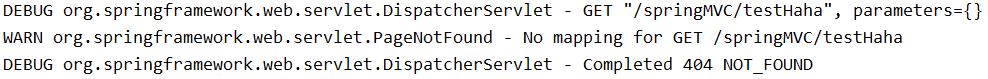
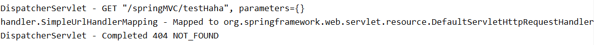

*date: 2023-10-05*


[TOC]

## Spring MVC简介

### 什么是 MVC

MVC 是一种软件架构的思想，将软件按照模型、视图、控制器来划分。

- M：Model，`模型层`，指工程中的 JavaBean，作用是处理数据。


- V：View，`视图层`，指工程中的 HTML 或 JSP 等页面，作用是与用户进行交互，展示数据。


- C：Controller，`控制层`，指工程中的 Servlet，作用是接收请求和响应浏览器。


MVC 的工作流程：**用户通过视图层发送请求到服务器，在服务器中请求被 Controller 接收，Controller 调用相应的 Model 层处理请求，处理完毕将结果返回到 Controller，Controller 再根据请求处理的结果找到相应的 View 视图，渲染数据后最终响应给浏览器。**

>JavaBean 分为两类：
>
>- 一类称为实体类 Bean：专门存储业务数据的，如 Student、User 等。
>- 一类称为业务处理 Bean：指 Service 或 Dao 对象，专门用于处理业务逻辑和数据访问。

### 什么是 Spring MVC

Spring MVC 是 Spring 的一个后续产品，是 Spring 的一个子项目。Spring MVC 是 Spring 为表述层开发提供的一整套完备的解决方案。在表述层框架历经 Struts、WebWork、Struts2 等诸多产品的历代更迭之后，目前业界普遍选择了 Spring MVC 作为 Java EE 项目表述层开发的**首选方案**。

> 三层架构分为表述层（或表示层）、业务逻辑层、数据访问层，表述层表示前台页面和后台 Servlet。

### Spring MVC 的特点

- **Spring 家族原生产品**，与 IoC 容器等基础设施无缝对接。
- **基于原生的 Servlet**，通过功能强大的**`前端控制器 DispatcherServlet`**，对请求和响应进行统一处理。
- 表述层各细分领域需要解决的问题**全方位覆盖**，提供**全面解决方案**。
- **代码清新简洁**，大幅度提升开发效率。
- 内部组件化程度高，可插拔式组件**即插即用**，想要什么功能配置相应组件即可。
- **性能卓著**，尤其适合现代大型、超大型互联网项目要求。

## HelloWorld

### Maven 引入依赖

```xml
<dependencies>
    <!-- Spring MVC -->
    <dependency>
        <groupId>org.springframework</groupId>
        <artifactId>spring-webmvc</artifactId>
        <version>5.3.1</version>
    </dependency>

    <!-- 日志 -->
    <dependency>
        <groupId>ch.qos.logback</groupId>
        <artifactId>logback-classic</artifactId>
        <version>1.2.3</version>
    </dependency>

    <!-- ServletAPI -->
    <dependency>
        <groupId>javax.servlet</groupId>
        <artifactId>javax.servlet-api</artifactId>
        <version>3.1.0</version>
        <scope>provided</scope>
    </dependency>

    <!-- Spring5和Thymeleaf整合包 -->
    <dependency>
        <groupId>org.thymeleaf</groupId>
        <artifactId>thymeleaf-spring5</artifactId>
        <version>3.0.12.RELEASE</version>
    </dependency>
</dependencies>
```

注：由于 Maven 的传递性，我们不必将所有需要的包全部配置依赖，而是配置最顶端的依赖，其他靠传递性导入。


### 配置 web.xml

注册 Spring MVC 的前端控制器 DispatcherServlet。

#### 默认配置方式

此配置作用下，Spring MVC 的配置文件默认位于 WEB-INF 的下，默认名称为`<servlet-name>-servlet.xml`。例如，以下配置所对应 Spring MVC 的配置文件位于 WEB-INF 下，文件名为 springMVC-servlet.xml：

```xml
<!-- 配置Spring MVC的前端控制器，对浏览器发送的请求统一进行处理 -->
<servlet>
    <servlet-name>springMVC</servlet-name>
    <servlet-class>org.springframework.web.servlet.DispatcherServlet</servlet-class>
</servlet>
<servlet-mapping>
    <servlet-name>springMVC</servlet-name>
    <!--
        设置springMVC的核心控制器所能处理的请求的请求路径，
        /所匹配的请求可以是/login或.html或.js或.css方式的请求路径，但是/不能匹配.jsp请求路径的请求
    -->
    <url-pattern>/</url-pattern>
</servlet-mapping>
```

#### 扩展配置方式

可通过`init-param`标签设置 Spring MVC 配置文件的位置和名称，通过`load-on-startup`标签设置 Spring MVC 前端控制器 DispatcherServlet 的初始化时间。

```xml
<!-- 配置Spring MVC的前端控制器，对浏览器发送的请求统一进行处理 -->
<servlet>
    <servlet-name>springMVC</servlet-name>
    <servlet-class>org.springframework.web.servlet.DispatcherServlet</servlet-class>
    <!-- 通过初始化参数指定Spring MVC配置文件的位置和名称 -->
    <init-param>
        <!-- contextConfigLocation为固定值 -->
        <param-name>contextConfigLocation</param-name>
        <!-- 使用classpath:表示从类路径查找配置文件，例如maven工程中的src/main/resources -->
        <param-value>classpath:springMVC.xml</param-value>
    </init-param>
    <!-- 
 		作为框架的核心组件，在启动过程中有大量的初始化操作要做，而这些操作放在第一次请求时才执行会严重影响访问速度，
		因此需要通过此标签将启动控制DispatcherServlet的初始化时间提前到服务器启动时
	-->
    <load-on-startup>1</load-on-startup>
</servlet>
<servlet-mapping>
    <servlet-name>springMVC</servlet-name>
    <!--
        设置springMVC的核心控制器所能处理的请求的请求路径，
        /所匹配的请求可以是/login或.html或.js或.css方式的请求路径，但是/不能匹配.jsp请求路径的请求
    -->
    <url-pattern>/</url-pattern>
</servlet-mapping>
```

> \<url-pattern>标签中使用 / 和 /* 的区别：
>
> - / 所匹配的请求可以是 /login 或 .html 或 .js 或 .css 方式的请求路径，但是 / 不能匹配 .jsp 请求路径的请求，因此就可以避免在访问 jsp 页面时，该请求被 DispatcherServlet 处理，从而找不到相应的页面。
>- /* 则能够匹配所有请求，例如在使用过滤器时，若需要对所有请求进行过滤，就需要使用 /\* 的写法。

### 创建请求控制器

由于前端控制器对浏览器发送的请求进行了统一的处理，但是具体的请求有不同的处理过程，因此需要创建处理具体请求的类，即`请求控制器`，请求控制器中每一个处理请求的方法成为控制器方法。因为 Spring MVC 的控制器由一个 POJO（普通的 Java 类）担任，因此需要通过`@Controller`注解将其标识为一个控制层组件，交给 Spring 的 IoC 容器管理，此时 Spring MVC才 能够识别控制器的存在

```java
@Controller
public class HelloController {
    
}
```

### 创建 Spring MVC 的配置文件

```xml
<!-- 自动扫描包 -->
<context:component-scan base-package="com.atguigu.mvc.controller"/>

<!-- 配置Thymeleaf视图解析器 -->
<bean id="viewResolver" class="org.thymeleaf.spring5.view.ThymeleafViewResolver">
    <property name="order" value="1"/>
    <property name="characterEncoding" value="UTF-8"/>
    <property name="templateEngine">
        <bean class="org.thymeleaf.spring5.SpringTemplateEngine">
            <property name="templateResolver">
                <bean class="org.thymeleaf.spring5.templateresolver.SpringResourceTemplateResolver">
    
                    <!-- 视图前缀 -->
                    <property name="prefix" value="/WEB-INF/templates/"/>
    
                    <!-- 视图后缀 -->
                    <property name="suffix" value=".html"/>
                    <property name="templateMode" value="HTML5"/>
                    <property name="characterEncoding" value="UTF-8" />
                </bean>
            </property>
        </bean>
    </property>
</bean>

<!-- 
    处理静态资源，例如html、js、css、jpg，若只设置该标签，则只能访问静态资源，其他请求则无法访问，
	此时必须设置<mvc:annotation-driven/>解决问题
 -->
<mvc:default-servlet-handler/>

<!-- 开启mvc注解驱动 -->
<mvc:annotation-driven>
    <mvc:message-converters>
        <!-- 处理响应中文内容乱码 -->
        <bean class="org.springframework.http.converter.StringHttpMessageConverter">
            <property name="defaultCharset" value="UTF-8" />
            <property name="supportedMediaTypes">
                <list>
                    <value>text/html</value>
                    <value>application/json</value>
                </list>
            </property>
        </bean>
    </mvc:message-converters>
</mvc:annotation-driven>
```

### 测试

#### 实现对首页的访问

在请求控制器中创建处理请求的方法：

```java
// @RequestMapping注解：处理请求和控制器方法之间的映射关系
// @RequestMapping注解的value属性可以通过请求地址匹配请求，/表示的当前工程的上下文路径
// localhost:8080/springMVC/
@RequestMapping("/")
public String index() {
    // 设置视图名称
    return "index";
}
```

#### 通过超链接跳转到指定页面

在主页 index.html 中设置超链接：

```html
<!DOCTYPE html>
<html lang="en" xmlns:th="http://www.thymeleaf.org">
<head>
    <meta charset="UTF-8">
    <title>首页</title>
</head>
<body>
    <h1>首页</h1>
    <a th:href="@{/hello}">HelloWorld</a><br/>
</body>
</html>
```

在请求控制器中创建处理请求的方法：

```java
@RequestMapping("/hello")
public String HelloWorld() {
    return "target";
}
```

### 总结

**浏览器发送请求，若请求地址符合前端控制器的 url-pattern，该请求就会被前端控制器 DispatcherServlet 处理。前端控制器会读取 Spring MVC 的核心配置文件，通过扫描组件找到控制器，将请求地址和控制器中 @RequestMapping 注解的 value 属性值进行匹配，若匹配成功，该注解所标识的控制器方法就是处理请求的方法。处理请求的方法需要返回一个字符串类型的视图名称，该视图名称会被视图解析器解析，加上前缀和后缀组成视图的路径，通过 Thymeleaf 对视图进行渲染，最终转发到视图所对应页面。**

## @RequestMapping

### @RequestMapping 的功能

从注解名称上可以看到，@RequestMapping 注解的作用就是将请求和处理请求的控制器方法关联起来，建立映射关系。

Spring MVC 接收到指定的请求，就会来找到在映射关系中对应的控制器方法来处理这个请求。

### @RequestMapping 的位置

@RequestMapping 注解标识一个类：设置映射请求的请求路径的`初始信息`。

@RequestMapping 注解标识一个方法：设置映射请求的请求路径的`具体信息`。

```java
@Controller
@RequestMapping("/test")
public class RequestMappingController {

	// 此时请求映射所映射的请求的请求路径为：/test/testRequestMapping
    @RequestMapping("/testRequestMapping")
    public String testRequestMapping(){
        return "success";
    }

}
```

### @RequestMapping 的 value 属性

@RequestMapping 注解的 value 属性`通过请求的请求地址匹配请求映射`。

@RequestMapping 注解的 value 属性`是一个字符串类型的数组`，表示该请求映射能够匹配多个请求地址所对应的请求。

@RequestMapping 注解的 value 属性`必须设置`，至少通过请求地址匹配请求映射。

```html
<a th:href="@{/testRequestMapping}">测试@RequestMapping的value属性-->/testRequestMapping</a><br>
<a th:href="@{/test}">测试@RequestMapping的value属性-->/test</a><br>
```

```java
@RequestMapping(
        value = {"/testRequestMapping", "/test"}
)
public String testRequestMapping(){
    return "success";
}
```

### @RequestMapping 的 method 属性

@RequestMapping 注解的 method 属性`通过请求的请求方式（GET 或 POST）匹配请求映射`。

@RequestMapping 注解的 method 属性`是一个 RequestMethod 类型的数组`，表示该请求映射能够匹配多种请求方式的请求。

```html
<a th:href="@{/test}">测试@RequestMapping的value属性-->/test</a><br>
<form th:action="@{/test}" method="post">
    <input type="submit">
</form>
```

```java
@RequestMapping(
        value = {"/testRequestMapping", "/test"},
        method = {RequestMethod.GET, RequestMethod.POST}
)
public String testRequestMapping(){
    return "success";
}
```

> 若当前请求的请求地址满足请求映射的 value 属性，但是请求方式不满足 method 属性，则浏览器报错 "405：Request method 'POST' not supported"。

>1、对于处理指定请求方式的控制器方法，Spring MVC 中提供了 @RequestMapping 的派生注解：
>
>- 处理 GET 请求的映射：`@GetMapping`。
>
>- 处理 POST 请求的映射：`@PostMapping`。
>
>- 处理 PUT 请求的映射：`@PutMapping`。
>
>- 处理 DELETE 请求的映射：`@DeleteMapping`。
>
>2、常用的请求方式有 GET，POST，PUT 和 DELETE，但是目前浏览器只支持 GET 和 POST，若在 Form 表单提交时，为 method 设置了其他请求方式的字符串（PUT 或 DELETE），则按照默认的请求方式 GET 处理，若要发送 PUT 和 DELETE 请求，则需要通过 Spring 提供的过滤器`HiddenHttpMethodFilter`，详见后面 RESTful 部分。

### @RequestMapping 的 params 属性（了解）

@RequestMapping 注解的 params 属性`通过请求的请求参数匹配请求映射`。

@RequestMapping 注解的 params 属性`是一个字符串类型的数组`，可以通过四种表达式设置请求参数和请求映射的匹配关系。

- **"param"**：要求请求映射所匹配的请求必须携带 param 请求参数。
- **"!param"**：要求请求映射所匹配的请求必须不能携带 param 请求参数。
- **"param=value"**：要求请求映射所匹配的请求必须携带 param 请求参数且 param=value。
- **"param!=value"**：要求请求映射所匹配的请求必须携带 param 请求参数且 param!=value。

```html
<a th:href="@{/test(username='admin',password=123456)">测试@RequestMapping的params属性-->/test</a><br>
```

```java
@RequestMapping(
        value = {"/testRequestMapping", "/test"}
        ,method = {RequestMethod.GET, RequestMethod.POST}
        ,params = {"username","password!=123456"}
)
public String testRequestMapping(){
    return "success";
}
```

> 若当前请求满足 @RequestMapping 注解的 value 和 method 属性，但是不满足 params 属性，此时页面回报错 "400：Parameter conditions "username, password!=123456" not met for actual request parameters: username={admin}, password={123456}"。
>

### @RequestMapping 的 headers 属性（了解）

@RequestMapping 注解的 headers 属性`通过请求的请求头信息匹配请求映射`。

@RequestMapping 注解的 headers 属性`是一个字符串类型的数组`，可以通过四种表达式设置请求头信息和请求映射的匹配关系。

- **"header"**：要求请求映射所匹配的请求必须携带 header 请求头信息。
- **"!header"**：要求请求映射所匹配的请求必须不能携带 header 请求头信息。
- **"header=value"**：要求请求映射所匹配的请求必须携带 header 请求头信息且 header=value。
- **"header!=value"**：要求请求映射所匹配的请求必须携带 header 请求头信息且 header!=value。

> 若当前请求满足 @RequestMapping 注解的 value 和 method 属性，但是不满足 headers 属性，此时页面显示 404 错误，即资源未找到。

### Spring MVC支持 Ant 风格的路径

`?`：表示任意的单个字符。

`*`：表示任意的 0 个或多个字符。

`**`：表示任意的一层或多层目录。

> 在使用 \** 时，只能使用 /**/xxx 的方式。

### Spring MVC 支持路径中的占位符（重点）

原始方式：/deleteUser?id=1。

REST 方式：/deleteUser/1。

Spring MVC 路径中的占位符常用于 RESTful 风格中，当请求路径中将某些数据通过路径的方式传输到服务器中，就可以在相应的 @RequestMapping 注解的 value 属性中通过`占位符 {xxx}`表示传输的数据，在通过`@PathVariable 注解`，将占位符所表示的数据赋值给控制器方法的形参。

```html
<a th:href="@{/testRest/1/admin}">测试路径中的占位符-->/testRest</a><br>
```

```java
@RequestMapping("/testRest/{id}/{username}")
public String testRest(@PathVariable("id") String id, @PathVariable("username") String username){
    System.out.println("id: " + id + ", username: " + username);
    return "success";
}
// 最终输出的内容为 ---> id: 1, username: admin
```

## Spring MVC 获取请求参数

### 通过 ServletAPI 获取

将`HttpServletRequest`作为控制器方法的形参，此时 HttpServletRequest 类型的参数，表示封装了当前请求的请求报文的对象。

```java
@RequestMapping("/testParam")
public String testParam(HttpServletRequest request){
    String username = request.getParameter("username");
    String password = request.getParameter("password");
    System.out.println("username: " + username + ", password: " + password);
    return "success";
}
```

### 通过控制器方法的形参获取请求参数

在控制器方法的形参位置，设置`和请求参数同名的形参`，当浏览器发送请求，匹配到请求映射时，在 DispatcherServlet 中就会将请求参数赋值给相应的形参。

```html
<a th:href="@{/testParam(username='admin',password=123456)}">测试获取请求参数-->/testParam</a><br>
```

```java
@RequestMapping("/testParam")
public String testParam(String username, String password){
    System.out.println("username: " + username + ", password: " + password);
    return "success";
}
```

> 若请求所传输的请求参数中有`多个同名`的请求参数，此时可以在控制器方法的形参中设置`字符串数组或者字符串类型`的形参接收此请求参数：
>
> - 若使用字符串数组类型的形参，此参数的数组中包含了每一个数据。
>
> 
>- 若使用字符串类型的形参，此参数的值为每个数据中间使用逗号拼接的结果。

### @RequestParam

@RequestParam 注解是将`请求参数`和控制器方法的形参创建映射关系。

@RequestParam 注解一共有三个属性：

- value：指定为形参赋值的请求参数的参数名。


- required：设置是否必须传输此请求参数，默认值为 true。若设置为 true 时，则当前请求必须传输 value 所指定的请求参数，若没有传输该请求参数，且没有设置 defaultValue 属性，则页面报错 "400：Required String parameter 'xxx' is not present;"，若设置为 false，则当前请求不是必须传输 value 所指定的请求参数，若没有传输，则注解所标识的形参的值为 null。


- defaultValue：不管 required 属性值为 true 或 false，当 value 所指定的请求参数没有传输或传输的值为 "" 时，则使用默认值为形参赋值。 


### @RequestHeader

@RequestHeader 注解是将`请求头信息`和控制器方法的形参创建映射关系。

@RequestHeader 注解一共有三个属性：value、required、defaultValue，用法同 @RequestParam。

### @CookieValue

@CookieValue 注解是将`cookie 数据`和控制器方法的形参创建映射关系。

@CookieValue 注解一共有三个属性：value、required、defaultValue，用法同 @RequestParam。

### 通过 POJO 获取请求参数

可以在控制器方法的形参位置设置一个`实体类类型的形参`，此时若浏览器传输的请求参数的参数名和实体类中的属性名一致，那么请求参数就会为此属性赋值。

```html
<form th:action="@{/testpojo}" method="post">
    用户名：<input type="text" name="username"><br>
    密码：<input type="password" name="password"><br>
    性别：<input type="radio" name="sex" value="男">男<input type="radio" name="sex" value="女">女<br>
    年龄：<input type="text" name="age"><br>
    邮箱：<input type="text" name="email"><br>
    <input type="submit">
</form>
```

```java
@RequestMapping("/testpojo")
public String testPOJO(User user){
    System.out.println(user);
    return "success";
}
// 最终结果 ---> User{id=null, username='张三', password='123', age=23, sex='男', email='123@qq.com'}
```

### 解决获取请求参数的乱码问题

解决获取请求参数的乱码问题，可以使用 Spring MVC 提供的编码过滤器`CharacterEncodingFilter`，但是必须在 web.xml 中进行注册。

```xml
<!--配置springMVC的编码过滤器-->
<filter>
    <filter-name>CharacterEncodingFilter</filter-name>
    <filter-class>org.springframework.web.filter.CharacterEncodingFilter</filter-class>
    <init-param>
        <param-name>encoding</param-name>
        <param-value>UTF-8</param-value>
    </init-param>
    <init-param>
        <param-name>forceResponseEncoding</param-name>
        <param-value>true</param-value>
    </init-param>
</filter>
<filter-mapping>
    <filter-name>CharacterEncodingFilter</filter-name>
    <url-pattern>/*</url-pattern>
</filter-mapping>
```

> Spring MVC 中**处理编码的过滤器一定要配置到其他过滤器之前**，否则无效。
>

## 域对象共享数据

### 使用 ServletAPI 向 Request 域对象共享数据

```java
@RequestMapping("/testServletAPI")
public String testServletAPI(HttpServletRequest request){
    request.setAttribute("testScope", "hello,servletAPI");
    return "success";
}
```

### 使用 ModelAndView 向 Request 域对象共享数据

```java
@RequestMapping("/testModelAndView")
public ModelAndView testModelAndView(){
    /**
     * ModelAndView有Model和View的功能
     * Model主要用于向请求域共享数据
     * View主要用于设置视图，实现页面跳转
     */
    ModelAndView mav = new ModelAndView();
    // 向请求域共享数据
    mav.addObject("testScope", "hello, ModelAndView");
    // 设置视图，实现页面跳转
    mav.setViewName("success");
    return mav;
}
```

### 使用 Model 向 Request 域对象共享数据

```java
@RequestMapping("/testModel")
public String testModel(Model model){
    model.addAttribute("testScope", "hello, Model");
    return "success";
}
```

### 使用 Map 向 Request 域对象共享数据

```java
@RequestMapping("/testMap")
public String testMap(Map<String, Object> map){
    map.put("testScope", "hello, Map");
    return "success";
}
```

### 使用 ModelMap 向 Request 域对象共享数据

```java
@RequestMapping("/testModelMap")
public String testModelMap(ModelMap modelMap){
    modelMap.addAttribute("testScope", "hello, ModelMap");
    return "success";
}
```

### Model、ModelMap、Map 的关系

Model、ModelMap、Map 类型的参数其实本质上都是`BindingAwareModelMap`类型。

```java
public interface Model{}

public class ModelMap extends LinkedHashMap<String, Object> {}

public class ExtendedModelMap extends ModelMap implements Model {}

public class BindingAwareModelMap extends ExtendedModelMap {}
```

### 向 Session 域共享数据

```java
@RequestMapping("/testSession")
public String testSession(HttpSession session){
    session.setAttribute("testSessionScope", "hello, session");
    return "success";
}
```

### 向 Application 域共享数据

```java
@RequestMapping("/testApplication")
public String testApplication(HttpSession session){
	ServletContext application = session.getServletContext();
    application.setAttribute("testApplicationScope", "hello, application");
    return "success";
}
```

## Spring MVC 的视图

Spring MVC 中的视图是 View 接口，视图的作用渲染数据，将模型 Model 中的数据展示给用户。

Spring MVC 视图的种类很多，默认有`转发视图`和`重定向视图`。

当工程引入 jstl 的依赖，转发视图会自动转换为 JstlView。若使用的视图技术为 Thymeleaf，在 Spring MVC 的配置文件中配置了 Thymeleaf 的视图解析器，由此视图解析器解析之后所得到的是 ThymeleafView。

### ThymeleafView

当控制器方法中所设置的视图名称没有任何前缀时，此时的视图名称会被 Spring MVC 配置文件中所配置的视图解析器解析，视图名称拼接视图前缀和视图后缀所得到的最终路径，会通过转发的方式实现跳转。

```java
@RequestMapping("/testHello")
public String testHello(){
    return "hello";
}
```


### 转发视图

Spring MVC 中默认的转发视图是`InternalResourceView`。

Spring MVC 中创建转发视图的情况：当控制器方法中所设置的视图名称以`"forward:"`为前缀时，创建 InternalResourceView 视图，此时的视图名称不会被 Spring MVC 配置文件中所配置的视图解析器解析，而是会将前缀 "forward:" 去掉，剩余部分作为最终路径通过转发的方式实现跳转。例如 "forward:/"，"forward:/employee"。

```java
@RequestMapping("/testForward")
public String testForward(){
    return "forward:/testHello";
}
```


### 重定向视图

Spring MVC 中默认的重定向视图是`RedirectView`。

Spring MVC 中创建重定向视图的情况：当控制器方法中所设置的视图名称以`"redirect:"`为前缀时，创建 RedirectView 视图，此时的视图名称不会被 Spring MVC 配置文件中所配置的视图解析器解析，而是会将前缀 "redirect:" 去掉，剩余部分作为最终路径通过重定向的方式实现跳转。例如 "redirect:/"，"redirect:/employee"。

```java
@RequestMapping("/testRedirect")
public String testRedirect(){
    return "redirect:/testHello";
}
```


> 重定向视图在解析时，会先将 "redirect:" 前缀去掉，然后会判断剩余部分是否以 / 开头，若是则会自动拼接上下文路径。
>

### 视图控制器 view-controller

当控制器方法中，仅仅用来实现页面跳转，即只需要设置视图名称时，可以将处理器方法使用 view-controller 标签进行表示。

```xml
<!--
	path：设置处理的请求地址
	view-name：设置请求地址所对应的视图名称
-->
<mvc:view-controller path="/testView" view-name="success"></mvc:view-controller>
```

> 当 Spring MVC 中设置任何一个 view-controller 时，其他控制器中的请求映射将全部失效，此时需要在 Spring MVC 的核心配置文件中设置开启 mvc 注解驱动的标签：`<mvc:annotation-driven />`。
>

## RESTful

### RESTful 简介

REST：**Re**presentational **S**tate **T**ransfer，`表现层资源状态转移`。

#### 资源

资源是一种看待服务器的方式，即，将服务器看作是由很多离散的资源组成。每个资源是服务器上一个可命名的抽象概念。因为资源是一个抽象的概念，所以它不仅仅能代表服务器文件系统中的一个文件、数据库中的一张表等等具体的东西，可以将资源设计的要多抽象有多抽象，只要想象力允许而且客户端应用开发者能够理解。与面向对象设计类似，资源是以名词为核心来组织的，首先关注的是名词。一个资源可以由一个或多个 URI 来标识。URI 既是资源的名称，也是资源在 Web 上的地址。对某个资源感兴趣的客户端应用，可以通过资源的 URI 与其进行交互。

#### 资源的表述

资源的表述是一段对于资源在某个特定时刻的状态的描述。可以在客户端 - 服务器端之间转移（交换）。资源的表述可以有多种格式，例如 HTML / XML / JSON / 纯文本 / 图片 / 视频 / 音频等等。资源的表述格式可以通过协商机制来确定。请求 - 响应方向的表述通常使用不同的格式。

#### 状态转移

状态转移说的是：在客户端和服务器端之间转移（transfer）代表资源状态的表述。通过转移和操作资源的表述，来间接实现操作资源的目的。

### RESTful 的实现

具体说，就是 HTTP 协议里面，四个表示操作方式的动词：GET、POST、PUT、DELETE。

它们分别对应四种基本操作：GET 用来获取资源，POST 用来新建资源，PUT 用来更新资源，DELETE 用来删除资源。

REST 风格提倡 URL 地址使用统一的风格设计，从前到后各个单词使用斜杠分开，不使用问号键值对方式携带请求参数，而是将要发送给服务器的数据作为 URL 地址的一部分，以保证整体风格的一致性。

| 操作     | 传统方式         | REST 风格                   |
| -------- | ---------------- | --------------------------- |
| 查询操作 | getUserById?id=1 | user/1 ---> GET 请求方式    |
| 保存操作 | saveUser         | user ---> POST 请求方式     |
| 删除操作 | deleteUser?id=1  | user/1 ---> DELETE 请求方式 |
| 更新操作 | updateUser       | user ---> PUT 请求方式      |

### HiddenHttpMethodFilter

由于浏览器只支持发送 GET 和 POST 方式的请求，那么该如何发送 PUT 和 DELETE 请求呢？

Spring MVC 提供了**`HiddenHttpMethodFilter`**帮助我们**将 POST 请求转换为 DELETE 或 PUT 请求**。

HiddenHttpMethodFilter 处理 PUT 和 DELETE 请求的条件：

- 当前请求的请求方式必须为 POST。


- 当前请求必须传输请求参数`_method`。


满足以上条件，HiddenHttpMethodFilter 过滤器就会将当前请求的请求方式转换为请求参数 _method 的值，因此`请求参数 _method 的值才是最终的请求方式`。

在 web.xml 中注册 HiddenHttpMethodFilter：

```xml
<filter>
    <filter-name>HiddenHttpMethodFilter</filter-name>
    <filter-class>org.springframework.web.filter.HiddenHttpMethodFilter</filter-class>
</filter>
<filter-mapping>
    <filter-name>HiddenHttpMethodFilter</filter-name>
    <url-pattern>/*</url-pattern>
</filter-mapping>
```

> 目前为止，Spring MVC 中提供了两个过滤器：CharacterEncodingFilter 和 HiddenHttpMethodFilter。在 web.xml 中注册时，必须先注册 CharacterEncodingFilter，再注册 HiddenHttpMethodFilter。
>
> 原因：
>
> - 在 CharacterEncodingFilter 中是通过 request.setCharacterEncoding(encoding) 方法设置字符集的。
>
> - request.setCharacterEncoding(encoding) 方法要求前面不能有任何获取请求参数的操作。
>
> - 而 HiddenHttpMethodFilter 恰恰有一个获取请求方式的操作：
>
>   ```java
>    String paramValue = request.getParameter(this.methodParam);
>   ```

## RESTful 案例

### 准备工作

和传统 CRUD 一样，实现对员工信息的增删改查。

实体类：

```java
package com.atguigu.mvc.bean;

public class Employee {

   private Integer id;
   private String lastName;

   private String email;
   // 1 male, 0 female
   private Integer gender;
   
   public Integer getId() {
      return id;
   }

   public void setId(Integer id) {
      this.id = id;
   }

   public String getLastName() {
      return lastName;
   }

   public void setLastName(String lastName) {
      this.lastName = lastName;
   }

   public String getEmail() {
      return email;
   }

   public void setEmail(String email) {
      this.email = email;
   }

   public Integer getGender() {
      return gender;
   }

   public void setGender(Integer gender) {
      this.gender = gender;
   }

   public Employee(Integer id, String lastName, String email, Integer gender) {
      super();
      this.id = id;
      this.lastName = lastName;
      this.email = email;
      this.gender = gender;
   }

   public Employee() {
   }
}
```

准备 dao 模拟数据：

```java
package com.atguigu.mvc.dao;

import java.util.Collection;
import java.util.HashMap;
import java.util.Map;

import com.atguigu.mvc.bean.Employee;
import org.springframework.stereotype.Repository;


@Repository
public class EmployeeDao {

   private static Map<Integer, Employee> employees = null;
   
   static{
      employees = new HashMap<Integer, Employee>();

      employees.put(1001, new Employee(1001, "E-AA", "aa@163.com", 1));
      employees.put(1002, new Employee(1002, "E-BB", "bb@163.com", 1));
      employees.put(1003, new Employee(1003, "E-CC", "cc@163.com", 0));
      employees.put(1004, new Employee(1004, "E-DD", "dd@163.com", 0));
      employees.put(1005, new Employee(1005, "E-EE", "ee@163.com", 1));
   }
   
   private static Integer initId = 1006;
   
   public void save(Employee employee){
      if(employee.getId() == null){
         employee.setId(initId++);
      }
      employees.put(employee.getId(), employee);
   }
   
   public Collection<Employee> getAll(){
      return employees.values();
   }
   
   public Employee get(Integer id){
      return employees.get(id);
   }
   
   public void delete(Integer id){
      employees.remove(id);
   }
}
```

### 功能清单

| 功能                | URL 地址    | 请求方式 |
| ------------------- | ----------- | -------- |
| 访问首页√           | /           | GET      |
| 查询全部数据√       | /employee   | GET      |
| 删除√               | /employee/2 | DELETE   |
| 跳转到添加数据页面√ | /toAdd      | GET      |
| 执行保存√           | /employee   | POST     |
| 跳转到更新数据页面√ | /employee/2 | GET      |
| 执行更新√           | /employee   | PUT      |

### 具体功能：访问首页

配置 view-controller：

```xml
<mvc:view-controller path="/" view-name="index"/>
```

创建页面：

```html
<!DOCTYPE html>
<html lang="en" xmlns:th="http://www.thymeleaf.org">
<head>
    <meta charset="UTF-8" >
    <title>Title</title>
</head>
<body>
<h1>首页</h1>
<a th:href="@{/employee}">访问员工信息</a>
</body>
</html>
```

### 具体功能：查询所有员工数据

控制器方法：

```java
@RequestMapping(value = "/employee", method = RequestMethod.GET)
public String getEmployeeList(Model model){
    Collection<Employee> employeeList = employeeDao.getAll();
    model.addAttribute("employeeList", employeeList);
    return "employee_list";
}
```

创建 employee_list.html：

```html
<!DOCTYPE html>
<html lang="en" xmlns:th="http://www.thymeleaf.org">
<head>
    <meta charset="UTF-8">
    <title>Employee Info</title>
    <script type="text/javascript" th:src="@{/static/js/vue.js}"></script>
</head>
<body>

    <table border="1" cellpadding="0" cellspacing="0" style="text-align: center;" id="dataTable">
        <tr>
            <th colspan="5">Employee Info</th>
        </tr>
        <tr>
            <th>id</th>
            <th>lastName</th>
            <th>email</th>
            <th>gender</th>
            <th>options(<a th:href="@{/toAdd}">add</a>)</th>
        </tr>
        <tr th:each="employee : ${employeeList}">
            <td th:text="${employee.id}"></td>
            <td th:text="${employee.lastName}"></td>
            <td th:text="${employee.email}"></td>
            <td th:text="${employee.gender}"></td>
            <td>
                <a class="deleteA" @click="deleteEmployee" th:href="@{'/employee/'+${employee.id}}">delete</a>
                <a th:href="@{'/employee/'+${employee.id}}">update</a>
            </td>
        </tr>
    </table>
</body>
</html>
```

### 具体功能：删除

创建处理 DELETE 请求方式的表单：

```html
<!-- 作用：通过超链接控制表单的提交，将post请求转换为delete请求 -->
<form id="delete_form" method="post">
    <!-- HiddenHttpMethodFilter要求：必须传输_method请求参数，并且值为最终的请求方式 -->
    <input type="hidden" name="_method" value="delete"/>
</form>
```

删除超链接绑定点击事件：

- 引入 vue.js

  ```html
  <script type="text/javascript" th:src="@{/static/js/vue.js}"></script>
  ```

- 删除超链接：

  ```html
  <a class="deleteA" @click="deleteEmployee" th:href="@{'/employee/'+${employee.id}}">delete</a>
  ```

- 通过 Vue 处理点击事件：

  ```html
  <script type="text/javascript">
      var vue = new Vue({
          el:"#dataTable",
          methods:{
              // event表示当前事件
              deleteEmployee:function (event) {
                  // 通过id获取表单标签
                  var delete_form = document.getElementById("delete_form");
                  // 将触发事件的超链接的href属性为表单的action属性赋值
                  delete_form.action = event.target.href;
                  // 提交表单
                  delete_form.submit();
                  // 阻止超链接的默认跳转行为
                  event.preventDefault();
              }
          }
      });
  </script>
  ```

控制器方法：

```java
@RequestMapping(value = "/employee/{id}", method = RequestMethod.DELETE)
public String deleteEmployee(@PathVariable("id") Integer id){
    employeeDao.delete(id);
    return "redirect:/employee";
}
```

### 具体功能：跳转到添加数据页面

配置 view-controller：

```xml
<mvc:view-controller path="/toAdd" view-name="employee_add"></mvc:view-controller>
```

创建 employee_add.html：

```html
<!DOCTYPE html>
<html lang="en" xmlns:th="http://www.thymeleaf.org">
<head>
    <meta charset="UTF-8">
    <title>Add Employee</title>
</head>
<body>

<form th:action="@{/employee}" method="post">
    lastName:<input type="text" name="lastName"><br>
    email:<input type="text" name="email"><br>
    gender:<input type="radio" name="gender" value="1">male
    <input type="radio" name="gender" value="0">female<br>
    <input type="submit" value="add"><br>
</form>

</body>
</html>
```

### 具体功能：执行保存

控制器方法：

```java
@RequestMapping(value = "/employee", method = RequestMethod.POST)
public String addEmployee(Employee employee){
    employeeDao.save(employee);
    return "redirect:/employee";
}
```

### 具体功能：跳转到更新数据页面

修改超链接：

```html
<a th:href="@{'/employee/'+${employee.id}}">update</a>
```

控制器方法：

```java
@RequestMapping(value = "/employee/{id}", method = RequestMethod.GET)
public String getEmployeeById(@PathVariable("id") Integer id, Model model){
    Employee employee = employeeDao.get(id);
    model.addAttribute("employee", employee);
    return "employee_update";
}
```

创建 employee_update.html：

```html
<!DOCTYPE html>
<html lang="en" xmlns:th="http://www.thymeleaf.org">
<head>
    <meta charset="UTF-8">
    <title>Update Employee</title>
</head>
<body>

<form th:action="@{/employee}" method="post">
    <input type="hidden" name="_method" value="put">
    <input type="hidden" name="id" th:value="${employee.id}">
    lastName:<input type="text" name="lastName" th:value="${employee.lastName}"><br>
    email:<input type="text" name="email" th:value="${employee.email}"><br>
    <!--
        th:field="${employee.gender}"可用于单选框或复选框的回显
        若单选框的value和employee.gender的值一致，则添加checked="checked"属性
    -->
    gender:<input type="radio" name="gender" value="1" th:field="${employee.gender}">male
    <input type="radio" name="gender" value="0" th:field="${employee.gender}">female<br>
    <input type="submit" value="update"><br>
</form>

</body>
</html>
```

### 具体功能：执行更新

控制器方法：

```java
@RequestMapping(value = "/employee", method = RequestMethod.PUT)
public String updateEmployee(Employee employee){
    employeeDao.save(employee);
    return "redirect:/employee";
}
```

## HttpMessageConverter

`HttpMessageConverter`，报文信息转换器，将请求报文转换为 Java 对象，或将 Java 对象转换为响应报文。

HttpMessageConverter 提供了两个注解和两个类型：@RequestBody，@ResponseBody，RequestEntity，ResponseEntity。

### @RequestBody

`@RequestBody`注解可以获取请求体，需要在控制器方法设置一个形参，使用 @RequestBody 进行标识，当前请求的请求体就会为当前注解所标识的形参赋值。

```html
<form th:action="@{/testRequestBody}" method="post">
    用户名：<input type="text" name="username"><br>
    密码：<input type="password" name="password"><br>
    <input type="submit">
</form>
```

```java
@RequestMapping("/testRequestBody")
public String testRequestBody(@RequestBody String requestBody){
    System.out.println("requestBody: "+requestBody);
    return "success";
}
```

输出结果：

```java
requestBody: username=admin&password=123456
```

### RequestEntity

`RequestEntity`封装请求报文的一种类型，需要在控制器方法的形参中设置该类型的形参，当前请求的请求报文就会赋值给该形参，可以通过`getHeaders()`获取请求头信息，通过`getBody()`获取请求体信息。

```java
@RequestMapping("/testRequestEntity")
public String testRequestEntity(RequestEntity<String> requestEntity){
    System.out.println("requestHeader: " + requestEntity.getHeaders());
    System.out.println("requestBody: " + requestEntity.getBody());
    return "success";
}
```

输出结果：
```java
requestHeader: [host:"localhost:8080", connection:"keep-alive", content-length:"27", cache-control:"max-age=0", sec-ch-ua:"" Not A;Brand";v="99", "Chromium";v="90", "Google Chrome";v="90"", sec-ch-ua-mobile:"?0", upgrade-insecure-requests:"1", origin:"http://localhost:8080", user-agent:"Mozilla/5.0 (Windows NT 10.0; Win64; x64) AppleWebKit/537.36 (KHTML, like Gecko) Chrome/90.0.4430.93 Safari/537.36"]
requestBody: username=admin&password=123
```

### @ResponseBody

`@ResponseBody`注解用于标识一个控制器方法，可以将该方法的返回值直接作为响应报文的响应体响应到浏览器。

```java
@RequestMapping("/testResponseBody")
@ResponseBody
public String testResponseBody(){
    return "success";
}
```

浏览器的页面中展示的结果：

```html
success
```

### ResponseEntity

`ResponseEntity`用于控制器方法的返回值类型，该控制器方法的返回值就是响应到浏览器的响应报文。

### @RestController

`@RestController`注解是 Spring MVC 提供的一个复合注解，标识在控制器的类上，就相当于为类添加了 @Controller 注解，并且为其中的每个方法添加了 @ResponseBody 注解。

### Spring MVC 处理 Json

@ResponseBody 处理 Json 的步骤：

- 导入 jackson 依赖

  ```xml
  <dependency>
      <groupId>com.fasterxml.jackson.core</groupId>
      <artifactId>jackson-databind</artifactId>
      <version>2.12.1</version>
  </dependency>
  ```

- 在 Spring MVC 的核心配置文件中开启 mvc 的注解驱动，此时在 HandlerAdaptor 中会自动装配一个消息转换器：MappingJackson2HttpMessageConverter，可以将响应到浏览器的 Java 对象转换为 Json 格式的字符串。

  ```xml
  <mvc:annotation-driven />
  ```

- 在处理器方法上使用 @ResponseBody 注解进行标识。


- 将 Java 对象直接作为控制器方法的返回值返回，就会自动转换为 Json 格式的字符串。

  ```java
  @RequestMapping("/testResponseUser")
  @ResponseBody
  public User testResponseUser(){
      return new User(1001, "admin", "123456", 23, "男");
  }
  ```

浏览器的页面中展示的结果：

```html
{"id":1001,"username":"admin","password":"123456","age":23,"sex":"男"}
```

### Spring MVC 处理 ajax

请求超链接：

```html
<div id="app">
	<a th:href="@{/testAjax}" @click="testAjax">testAjax</a><br>
</div>
```

通过 Vue 和 axios 处理点击事件：

```html
<script type="text/javascript" th:src="@{/static/js/vue.js}"></script>
<script type="text/javascript" th:src="@{/static/js/axios.min.js}"></script>
<script type="text/javascript">
    var vue = new Vue({
        el:"#app",
        methods:{
            testAjax:function (event) {
                axios({
                    method:"post",
                    url:event.target.href,
                    params:{
                        username:"admin",
                        password:"123456"
                    }
                }).then(function (response) {
                    alert(response.data);
                });
                event.preventDefault();
            }
        }
    });
</script>
```

控制器方法：

```java
@RequestMapping("/testAjax")
@ResponseBody
public String testAjax(String username, String password){
    System.out.println("username: " + username + ", password: " + password);
    return "hello,ajax";
}
```

## 文件上传和下载

### 文件下载

使用 ResponseEntity 实现下载文件的功能

```java
@RequestMapping("/testDown")
public ResponseEntity<byte[]> testResponseEntity(HttpSession session) throws IOException {
    // 获取ServletContext对象
    ServletContext servletContext = session.getServletContext();
    // 获取服务器中文件的真实路径
    String realPath = servletContext.getRealPath("/static/img/1.jpg");
    // 创建输入流
    InputStream is = new FileInputStream(realPath);
    // 创建字节数组
    byte[] bytes = new byte[is.available()];
    // 将流读到字节数组中
    is.read(bytes);
    // 创建HttpHeaders对象设置响应头信息
    MultiValueMap<String, String> headers = new HttpHeaders();
    // 设置要下载方式以及下载文件的名字
    headers.add("Content-Disposition", "attachment;filename=1.jpg");
    // 设置响应状态码
    HttpStatus statusCode = HttpStatus.OK;
    // 创建ResponseEntity对象
    ResponseEntity<byte[]> responseEntity = new ResponseEntity<>(bytes, headers, statusCode);
    // 关闭输入流
    is.close();
    return responseEntity;
}
```

### 文件上传

文件上传要求 Form 表单的`请求方式必须为 POST`，并且添加属性`enctype="multipart/form-data"`。

Spring MVC 中将上传的文件封装到 MultipartFile 对象中，通过此对象可以获取文件相关信息。

第一步，Maven 添加依赖：

```xml
<!-- https://mvnrepository.com/artifact/commons-fileupload/commons-fileupload -->
<dependency>
    <groupId>commons-fileupload</groupId>
    <artifactId>commons-fileupload</artifactId>
    <version>1.3.1</version>
</dependency>
```

第二步，在 Spring MVC 的配置文件中添加配置：

```xml
<!-- 必须通过文件解析器的解析才能将文件转换为MultipartFile对象 -->
<bean id="multipartResolver" class="org.springframework.web.multipart.commons.CommonsMultipartResolver"></bean>
```

第三步，控制器方法：

```java
@RequestMapping("/testUp")
public String testUp(MultipartFile photo, HttpSession session) throws IOException {
    // 获取上传的文件的文件名
    String fileName = photo.getOriginalFilename();
    // 处理文件重名问题
    String hzName = fileName.substring(fileName.lastIndexOf("."));
    fileName = UUID.randomUUID().toString() + hzName;
    // 获取服务器中photo目录的路径
    ServletContext servletContext = session.getServletContext();
    String photoPath = servletContext.getRealPath("photo");
    File file = new File(photoPath);
    if(!file.exists()){
        file.mkdir();
    }
    String finalPath = photoPath + File.separator + fileName;
    // 实现上传功能
    photo.transferTo(new File(finalPath));
    return "success";
}
```

## 拦截器

### 拦截器的配置

**`Spring MVC 中的拦截器用于拦截控制器方法的执行。`**

Spring MVC 中的拦截器需要实现`HandlerInterceptor`。

Spring MVC 的拦截器必须在 Spring MVC 的配置文件中进行配置：

```xml
<bean class="com.atguigu.interceptor.FirstInterceptor"></bean>
<ref bean="firstInterceptor"></ref>
<!-- 以上两种配置方式都是对DispatcherServlet所处理的所有的请求进行拦截 -->
<mvc:interceptor>
    <mvc:mapping path="/**"/>
    <mvc:exclude-mapping path="/testRequestEntity"/>
    <ref bean="firstInterceptor"></ref>
</mvc:interceptor>
<!-- 
	以上配置方式可以通过ref或bean标签设置拦截器，通过mvc:mapping设置需要拦截的请求，通过mvc:exclude-mapping设置需要排除的请求，即不需要拦截的请求
-->
```

### 拦截器的三个抽象方法

Spring MVC 中的拦截器有三个抽象方法：

- `preHandle()`：控制器方法执行之前执行 preHandle()，其 boolean 类型的返回值表示是否拦截或放行，返回 true 为放行，即调用控制器方法；返回 false 表示拦截，即不调用控制器方法。

- `postHandle()`：控制器方法执行之后执行 postHandle()。

- `afterComplation()`：处理完视图和模型数据，渲染视图完毕之后执行 afterComplation()。

### 多个拦截器的执行顺序

- 若每个拦截器的 preHandle() 都返回 true：
  - 此时多个拦截器的执行顺序，和拦截器在 Spring MVC 的配置文件的配置顺序有关：`preHandle() 会按照配置的顺序执行，而 postHandle() 和 afterComplation() 会按照配置的反序执行。`

- 若某个拦截器的 preHandle() 返回了 false：
  - `preHandle() 返回 false 和它之前的拦截器的 preHandle() 都会执行，postHandle() 都不执行，返回 false 的拦截器之前的拦截器的 afterComplation() 会执行。`

## 异常处理器

### 基于配置的异常处理

Spring MVC 提供了一个处理控制器方法执行过程中所出现的异常的接口：`HandlerExceptionResolver`。

HandlerExceptionResolver 接口的实现类有：DefaultHandlerExceptionResolver 和 SimpleMappingExceptionResolver。

Spring MVC 提供了自定义的异常处理器 SimpleMappingExceptionResolver，使用方式：

```xml
<bean class="org.springframework.web.servlet.handler.SimpleMappingExceptionResolver">
    <property name="exceptionMappings">
        <props>
        	<!--
        		properties的键表示处理器方法执行过程中出现的异常
        		properties的值表示若出现指定异常时，设置一个新的视图名称，跳转到指定页面
        	-->
            <prop key="java.lang.ArithmeticException">error</prop>
        </props>
    </property>
    <!--
    	exceptionAttribute属性设置一个属性名，将出现的异常信息在请求域中进行共享
    -->
    <property name="exceptionAttribute" value="ex"></property>
</bean>
```

### 基于注解的异常处理

```java
// @ControllerAdvice将当前类标识为异常处理的组件
@ControllerAdvice
public class ExceptionController {

    // @ExceptionHandler用于设置所标识方法处理的异常
    @ExceptionHandler(ArithmeticException.class)
    // ex表示当前请求处理中出现的异常对象
    public String handleArithmeticException(Exception ex, Model model){
        model.addAttribute("ex", ex);
        return "error";
    }

}
```

## 注解配置 Spring MVC

使用配置类和注解代替 web.xml 和 Spring MVC 配置文件的功能。

### 创建初始化类，代替 web.xml

在 Servlet 3.0 环境中，容器会在类路径中查找实现 javax.servlet.ServletContainerInitializer 接口的类，如果找到的话就用它来配置 Servlet 容器。

Spring 提供了这个接口的实现，名为 SpringServletContainerInitializer，这个类反过来又会查找实现 WebApplicationInitializer 的类并将配置的任务交给它们来完成。Spring 3.2 引入了一个便利的 WebApplicationInitializer 基础实现，名为 AbstractAnnotationConfigDispatcherServletInitializer，当我们的类扩展了`AbstractAnnotationConfigDispatcherServletInitializer`，并将其部署到 Servlet 3.0 容器的时候，容器会自动发现它，并用它来配置 Servlet 上下文。

```java
public class WebInit extends AbstractAnnotationConfigDispatcherServletInitializer {

    /**
     * 指定spring的配置类
     * @return
     */
    @Override
    protected Class<?>[] getRootConfigClasses() {
        return new Class[]{SpringConfig.class};
    }

    /**
     * 指定SpringMVC的配置类
     * @return
     */
    @Override
    protected Class<?>[] getServletConfigClasses() {
        return new Class[]{WebConfig.class};
    }

    /**
     * 指定DispatcherServlet的映射规则，即url-pattern
     * @return
     */
    @Override
    protected String[] getServletMappings() {
        return new String[]{"/"};
    }

    /**
     * 添加过滤器
     * @return
     */
    @Override
    protected Filter[] getServletFilters() {
        CharacterEncodingFilter encodingFilter = new CharacterEncodingFilter();
        encodingFilter.setEncoding("UTF-8");
        encodingFilter.setForceRequestEncoding(true);
        HiddenHttpMethodFilter hiddenHttpMethodFilter = new HiddenHttpMethodFilter();
        return new Filter[]{encodingFilter, hiddenHttpMethodFilter};
    }
}
```

### 创建 SpringConfig 配置类，代替 Spring 的配置文件

```java
@Configuration
public class SpringConfig {
	// ssm整合之后，spring的配置信息写在此类中
}
```

### 创建 WebConfig 配置类，代替 Spring MVC 的配置文件

```java
@Configuration
// 扫描组件
@ComponentScan("com.atguigu.mvc.controller")
// 开启MVC注解驱动
@EnableWebMvc
public class WebConfig implements WebMvcConfigurer {

    // 使用默认的Servlet处理静态资源
    @Override
    public void configureDefaultServletHandling(DefaultServletHandlerConfigurer configurer) {
        configurer.enable();
    }

    // 配置文件上传解析器
    @Bean
    public CommonsMultipartResolver multipartResolver(){
        return new CommonsMultipartResolver();
    }

    // 配置拦截器
    @Override
    public void addInterceptors(InterceptorRegistry registry) {
        FirstInterceptor firstInterceptor = new FirstInterceptor();
        registry.addInterceptor(firstInterceptor).addPathPatterns("/**");
    }
    
    // 配置视图控制
    /*@Override
    public void addViewControllers(ViewControllerRegistry registry) {
        registry.addViewController("/").setViewName("index");
    }*/
    
    // 配置异常映射
    /*@Override
    public void configureHandlerExceptionResolvers(List<HandlerExceptionResolver> resolvers) {
        SimpleMappingExceptionResolver exceptionResolver = new SimpleMappingExceptionResolver();
        Properties prop = new Properties();
        prop.setProperty("java.lang.ArithmeticException", "error");
        // 设置异常映射
        exceptionResolver.setExceptionMappings(prop);
        // 设置共享异常信息的键
        exceptionResolver.setExceptionAttribute("ex");
        resolvers.add(exceptionResolver);
    }*/

    // 配置生成模板解析器
    @Bean
    public ITemplateResolver templateResolver() {
        WebApplicationContext webApplicationContext = ContextLoader.getCurrentWebApplicationContext();
        // ServletContextTemplateResolver需要一个ServletContext作为构造参数，可通过WebApplicationContext 的方法获得
        ServletContextTemplateResolver templateResolver = new ServletContextTemplateResolver(
                webApplicationContext.getServletContext());
        templateResolver.setPrefix("/WEB-INF/templates/");
        templateResolver.setSuffix(".html");
        templateResolver.setCharacterEncoding("UTF-8");
        templateResolver.setTemplateMode(TemplateMode.HTML);
        return templateResolver;
    }

    // 生成模板引擎并为模板引擎注入模板解析器
    @Bean
    public SpringTemplateEngine templateEngine(ITemplateResolver templateResolver) {
        SpringTemplateEngine templateEngine = new SpringTemplateEngine();
        templateEngine.setTemplateResolver(templateResolver);
        return templateEngine;
    }

    // 生成视图解析器并未解析器注入模板引擎
    @Bean
    public ViewResolver viewResolver(SpringTemplateEngine templateEngine) {
        ThymeleafViewResolver viewResolver = new ThymeleafViewResolver();
        viewResolver.setCharacterEncoding("UTF-8");
        viewResolver.setTemplateEngine(templateEngine);
        return viewResolver;
    }

}
```

### 测试功能

```java
@RequestMapping("/")
public String index(){
    return "index";
}
```

## Spring MVC 执行流程

### Spring MVC 常用组件

`DispatcherServlet`：**前端控制器**，不需要工程师开发，由框架提供。

- 作用：统一处理请求和响应，整个流程控制的中心，由它调用其它组件处理用户的请求。

`HandlerMapping`：**处理器映射器**，不需要工程师开发，由框架提供。

- 作用：根据请求的 url、method 等信息查找 Handler，即控制器方法。

`Handler`：**处理器**，需要工程师开发。

- 作用：在 DispatcherServlet 的控制下 Handler 对具体的用户请求进行处理。

`HandlerAdapter`：**处理器适配器**，不需要工程师开发，由框架提供。

- 作用：通过 HandlerAdapter 对处理器（控制器方法）进行执行。

`ViewResolver`：**视图解析器**，不需要工程师开发，由框架提供。

- 作用：进行视图解析，得到相应的视图，例如：ThymeleafView、InternalResourceView、RedirectView。

`View`：**视图**。

- 作用：将模型数据通过页面展示给用户。


### DispatcherServlet 初始化过程

DispatcherServlet 本质上是一个 Servlet，天然的遵循 Servlet 的生命周期。所以宏观上是 Servlet 生命周期来进行调度。


#### 初始化 WebApplicationContext

所在类：org.springframework.web.servlet.FrameworkServlet。

```java
protected WebApplicationContext initWebApplicationContext() {
    WebApplicationContext rootContext =
        WebApplicationContextUtils.getWebApplicationContext(getServletContext());
    WebApplicationContext wac = null;

    if (this.webApplicationContext != null) {
        // A context instance was injected at construction time -> use it
        wac = this.webApplicationContext;
        if (wac instanceof ConfigurableWebApplicationContext) {
            ConfigurableWebApplicationContext cwac = (ConfigurableWebApplicationContext) wac;
            if (!cwac.isActive()) {
                // The context has not yet been refreshed -> provide services such as
                // setting the parent context, setting the application context id, etc
                if (cwac.getParent() == null) {
                    // The context instance was injected without an explicit parent -> set
                    // the root application context (if any; may be null) as the parent
                    cwac.setParent(rootContext);
                }
                configureAndRefreshWebApplicationContext(cwac);
            }
        }
    }
    if (wac == null) {
        // No context instance was injected at construction time -> see if one
        // has been registered in the servlet context. If one exists, it is assumed
        // that the parent context (if any) has already been set and that the
        // user has performed any initialization such as setting the context id
        wac = findWebApplicationContext();
    }
    if (wac == null) {
        // No context instance is defined for this servlet -> create a local one
        // 创建WebApplicationContext
        wac = createWebApplicationContext(rootContext);
    }

    if (!this.refreshEventReceived) {
        // Either the context is not a ConfigurableApplicationContext with refresh
        // support or the context injected at construction time had already been
        // refreshed -> trigger initial onRefresh manually here.
        synchronized (this.onRefreshMonitor) {
            // 刷新WebApplicationContext
            onRefresh(wac);
        }
    }

    if (this.publishContext) {
        // Publish the context as a servlet context attribute.
        // 将IOC容器在应用域共享
        String attrName = getServletContextAttributeName();
        getServletContext().setAttribute(attrName, wac);
    }

    return wac;
}
```

#### 创建 WebApplicationContext

所在类：org.springframework.web.servlet.FrameworkServlet。

```java
protected WebApplicationContext createWebApplicationContext(@Nullable ApplicationContext parent) {
    Class<?> contextClass = getContextClass();
    if (!ConfigurableWebApplicationContext.class.isAssignableFrom(contextClass)) {
        throw new ApplicationContextException(
            "Fatal initialization error in servlet with name '" + getServletName() +
            "': custom WebApplicationContext class [" + contextClass.getName() +
            "] is not of type ConfigurableWebApplicationContext");
    }
    // 通过反射创建IoC容器对象
    ConfigurableWebApplicationContext wac =
        (ConfigurableWebApplicationContext) BeanUtils.instantiateClass(contextClass);

    wac.setEnvironment(getEnvironment());
    // 设置父容器
    wac.setParent(parent);
    String configLocation = getContextConfigLocation();
    if (configLocation != null) {
        wac.setConfigLocation(configLocation);
    }
    configureAndRefreshWebApplicationContext(wac);

    return wac;
}
```

#### DispatcherServlet 初始化策略

FrameworkServlet 创建 WebApplicationContext 后，刷新容器，调用 onRefresh(wac)，此方法在 DispatcherServlet 中进行了重写，调用了 initStrategies(context) 方法，初始化策略，即初始化 DispatcherServlet 的各个组件。

所在类：org.springframework.web.servlet.DispatcherServlet。

```java
protected void initStrategies(ApplicationContext context) {
   initMultipartResolver(context);
   initLocaleResolver(context);
   initThemeResolver(context);
   initHandlerMappings(context);
   initHandlerAdapters(context);
   initHandlerExceptionResolvers(context);
   initRequestToViewNameTranslator(context);
   initViewResolvers(context);
   initFlashMapManager(context);
}
```

### DispatcherServlet 调用组件处理请求

#### processRequest()

FrameworkServlet 重写 HttpServlet 中的 service() 和 doXxx()，这些方法中调用了 processRequest(request, response)。

所在类：org.springframework.web.servlet.FrameworkServlet。

```java
protected final void processRequest(HttpServletRequest request, HttpServletResponse response)
    throws ServletException, IOException {

    long startTime = System.currentTimeMillis();
    Throwable failureCause = null;

    LocaleContext previousLocaleContext = LocaleContextHolder.getLocaleContext();
    LocaleContext localeContext = buildLocaleContext(request);

    RequestAttributes previousAttributes = RequestContextHolder.getRequestAttributes();
    ServletRequestAttributes requestAttributes = buildRequestAttributes(request, response, previousAttributes);

    WebAsyncManager asyncManager = WebAsyncUtils.getAsyncManager(request);
    asyncManager.registerCallableInterceptor(FrameworkServlet.class.getName(), new RequestBindingInterceptor());

    initContextHolders(request, localeContext, requestAttributes);

    try {
		// 执行服务，doService()是一个抽象方法，在DispatcherServlet中进行了重写
        doService(request, response);
    }
    catch (ServletException | IOException ex) {
        failureCause = ex;
        throw ex;
    }
    catch (Throwable ex) {
        failureCause = ex;
        throw new NestedServletException("Request processing failed", ex);
    }

    finally {
        resetContextHolders(request, previousLocaleContext, previousAttributes);
        if (requestAttributes != null) {
            requestAttributes.requestCompleted();
        }
        logResult(request, response, failureCause, asyncManager);
        publishRequestHandledEvent(request, response, startTime, failureCause);
    }
}
```

#### doService()

所在类：org.springframework.web.servlet.DispatcherServlet。

```java
@Override
protected void doService(HttpServletRequest request, HttpServletResponse response) throws Exception {
    logRequest(request);

    // Keep a snapshot of the request attributes in case of an include,
    // to be able to restore the original attributes after the include.
    Map<String, Object> attributesSnapshot = null;
    if (WebUtils.isIncludeRequest(request)) {
        attributesSnapshot = new HashMap<>();
        Enumeration<?> attrNames = request.getAttributeNames();
        while (attrNames.hasMoreElements()) {
            String attrName = (String) attrNames.nextElement();
            if (this.cleanupAfterInclude || attrName.startsWith(DEFAULT_STRATEGIES_PREFIX)) {
                attributesSnapshot.put(attrName, request.getAttribute(attrName));
            }
        }
    }

    // Make framework objects available to handlers and view objects.
    request.setAttribute(WEB_APPLICATION_CONTEXT_ATTRIBUTE, getWebApplicationContext());
    request.setAttribute(LOCALE_RESOLVER_ATTRIBUTE, this.localeResolver);
    request.setAttribute(THEME_RESOLVER_ATTRIBUTE, this.themeResolver);
    request.setAttribute(THEME_SOURCE_ATTRIBUTE, getThemeSource());

    if (this.flashMapManager != null) {
        FlashMap inputFlashMap = this.flashMapManager.retrieveAndUpdate(request, response);
        if (inputFlashMap != null) {
            request.setAttribute(INPUT_FLASH_MAP_ATTRIBUTE, Collections.unmodifiableMap(inputFlashMap));
        }
        request.setAttribute(OUTPUT_FLASH_MAP_ATTRIBUTE, new FlashMap());
        request.setAttribute(FLASH_MAP_MANAGER_ATTRIBUTE, this.flashMapManager);
    }

    RequestPath requestPath = null;
    if (this.parseRequestPath && !ServletRequestPathUtils.hasParsedRequestPath(request)) {
        requestPath = ServletRequestPathUtils.parseAndCache(request);
    }

    try {
        // 处理请求和响应
        doDispatch(request, response);
    }
    finally {
        if (!WebAsyncUtils.getAsyncManager(request).isConcurrentHandlingStarted()) {
            // Restore the original attribute snapshot, in case of an include.
            if (attributesSnapshot != null) {
                restoreAttributesAfterInclude(request, attributesSnapshot);
            }
        }
        if (requestPath != null) {
            ServletRequestPathUtils.clearParsedRequestPath(request);
        }
    }
}
```

#### doDispatch()

所在类：org.springframework.web.servlet.DispatcherServlet。

```java
protected void doDispatch(HttpServletRequest request, HttpServletResponse response) throws Exception {
    HttpServletRequest processedRequest = request;
    HandlerExecutionChain mappedHandler = null;
    boolean multipartRequestParsed = false;

    WebAsyncManager asyncManager = WebAsyncUtils.getAsyncManager(request);

    try {
        ModelAndView mv = null;
        Exception dispatchException = null;

        try {
            processedRequest = checkMultipart(request);
            multipartRequestParsed = (processedRequest != request);

            // Determine handler for the current request.
            /*
            	mappedHandler：调用链
                包含handler、interceptorList、interceptorIndex
            	handler：浏览器发送的请求所匹配的控制器方法
            	interceptorList：处理控制器方法的所有拦截器集合
            	interceptorIndex：拦截器索引，控制拦截器afterCompletion()的执行
            */
            mappedHandler = getHandler(processedRequest);
            if (mappedHandler == null) {
                noHandlerFound(processedRequest, response);
                return;
            }

            // Determine handler adapter for the current request.
           	// 通过控制器方法创建相应的处理器适配器，调用所对应的控制器方法
            HandlerAdapter ha = getHandlerAdapter(mappedHandler.getHandler());

            // Process last-modified header, if supported by the handler.
            String method = request.getMethod();
            boolean isGet = "GET".equals(method);
            if (isGet || "HEAD".equals(method)) {
                long lastModified = ha.getLastModified(request, mappedHandler.getHandler());
                if (new ServletWebRequest(request, response).checkNotModified(lastModified) && isGet) {
                    return;
                }
            }
			
            // 调用拦截器的preHandle()
            if (!mappedHandler.applyPreHandle(processedRequest, response)) {
                return;
            }

            // Actually invoke the handler.
            // 由处理器适配器调用具体的控制器方法，最终获得ModelAndView对象
            mv = ha.handle(processedRequest, response, mappedHandler.getHandler());

            if (asyncManager.isConcurrentHandlingStarted()) {
                return;
            }

            applyDefaultViewName(processedRequest, mv);
            // 调用拦截器的postHandle()
            mappedHandler.applyPostHandle(processedRequest, response, mv);
        }
        catch (Exception ex) {
            dispatchException = ex;
        }
        catch (Throwable err) {
            // As of 4.3, we're processing Errors thrown from handler methods as well,
            // making them available for @ExceptionHandler methods and other scenarios.
            dispatchException = new NestedServletException("Handler dispatch failed", err);
        }
        // 后续处理：处理模型数据和渲染视图
        processDispatchResult(processedRequest, response, mappedHandler, mv, dispatchException);
    }
    catch (Exception ex) {
        triggerAfterCompletion(processedRequest, response, mappedHandler, ex);
    }
    catch (Throwable err) {
        triggerAfterCompletion(processedRequest, response, mappedHandler,
                               new NestedServletException("Handler processing failed", err));
    }
    finally {
        if (asyncManager.isConcurrentHandlingStarted()) {
            // Instead of postHandle and afterCompletion
            if (mappedHandler != null) {
                mappedHandler.applyAfterConcurrentHandlingStarted(processedRequest, response);
            }
        }
        else {
            // Clean up any resources used by a multipart request.
            if (multipartRequestParsed) {
                cleanupMultipart(processedRequest);
            }
        }
    }
}
```

#### processDispatchResult()

```java
private void processDispatchResult(HttpServletRequest request, HttpServletResponse response,
                                   @Nullable HandlerExecutionChain mappedHandler, @Nullable ModelAndView mv,
                                   @Nullable Exception exception) throws Exception {

    boolean errorView = false;

    if (exception != null) {
        if (exception instanceof ModelAndViewDefiningException) {
            logger.debug("ModelAndViewDefiningException encountered", exception);
            mv = ((ModelAndViewDefiningException) exception).getModelAndView();
        }
        else {
            Object handler = (mappedHandler != null ? mappedHandler.getHandler() : null);
            mv = processHandlerException(request, response, handler, exception);
            errorView = (mv != null);
        }
    }

    // Did the handler return a view to render?
    if (mv != null && !mv.wasCleared()) {
        // 处理模型数据和渲染视图
        render(mv, request, response);
        if (errorView) {
            WebUtils.clearErrorRequestAttributes(request);
        }
    }
    else {
        if (logger.isTraceEnabled()) {
            logger.trace("No view rendering, null ModelAndView returned.");
        }
    }

    if (WebAsyncUtils.getAsyncManager(request).isConcurrentHandlingStarted()) {
        // Concurrent handling started during a forward
        return;
    }

    if (mappedHandler != null) {
        // Exception (if any) is already handled..
        // 调用拦截器的afterCompletion()
        mappedHandler.triggerAfterCompletion(request, response, null);
    }
}
```

### Spring MVC 的执行流程


1. 用户向服务器发送请求，请求被 Spring MVC 的前端控制器 DispatcherServlet 捕获。

2. DispatcherServlet 对请求 URL 进行解析，得到请求资源标识符（URI），然后判断请求 URI 对应的映射。

3. 如果映射不存在，再判断是否配置了 mvc:default-servlet-handler。

   - 如果没配置，则控制台报映射查找不到，客户端展示 404 错误。

     、

     

   - 如果有配置，则访问目标资源（一般为静态资源，如：JS，CSS，HTML），找不到客户端也会展示 404 错误。

     

     

4. 如果映射存在，则执行下面的流程。

5. 根据该 URI，调用 HandlerMapping 获得其对应的 Handler 配置的所有相关的对象（包括 Handler 对象以及 Handler 对象对应的拦截器），最后以 HandlerExecutionChain 执行链对象的形式返回。

6. DispatcherServlet 根据获得的 Handler，选择一个合适的 HandlerAdapter。

7. 如果成功获得 HandlerAdapter，此时将开始执行拦截器的 preHandler()方法【正向逐一执行】。

8. 提取 Request 中的模型数据，填充 Handler 入参，开始执行 Handler（Controller）方法，处理请求。在填充 Handler 的入参过程中，根据你的配置，Spring 将帮你做一些额外的工作：

   - HttpMessageConveter： 将请求消息（如 Json、xml 等数据）转换成一个对象，将对象转换为指定的响应信息。
   - 数据转换：对请求消息进行数据转换，如 String 转换成 Integer、Double 等。
   - 数据格式化：对请求消息进行数据格式化，如将字符串转换成格式化数字或格式化日期等。
   - 数据验证： 验证数据的有效性（长度、格式等），验证结果存储到 BindingResult 或 Error 中。

9. Handler 执行完成后，向 DispatcherServlet 返回一个 ModelAndView 对象。

10. 此时将开始执行拦截器的 postHandle()方法【逆向逐一执行】。

11. 根据返回的 ModelAndView（此时会判断是否存在异常：如果存在异常，则执行 HandlerExceptionResolver 进行异常处理），选择一个适合的 ViewResolver 进行视图解析，根据 Model 和 View，来渲染视图。

12. 渲染视图完毕执行拦截器的 afterCompletion() 方法【逆向逐一执行】。

13. 将渲染结果返回给客户端。

## 本文参考

https://www.bilibili.com/video/BV1Ry4y1574R

## 声明

写作本文初衷是个人学习记录，鉴于本人学识有限，如有侵权或不当之处，请联系 [wdshfut@163.com](mailto:wdshfut@163.com)。