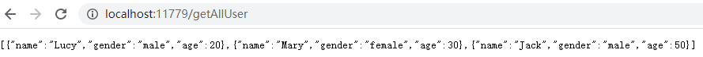

*date: 2021-04-23*

## Spring WebFlux 介绍

- 官方文档：https://docs.spring.io/spring-framework/docs/5.2.7.RELEASE/spring-framework-reference/web-reactive.html#spring-webflux

- Spring WebFlux 是 Spring5 添加的新模块，用于 Web 开发，功能和 Spring MVC 类似的，底层实现不同。

- Spring WebFlux 是契合使用**响应式编程**而出现的框架。

- 传统的 Web 框架，比如 Spring MVC、Struts2 等，是基于 Servlet 容器运行的。**Spring WebFlux 是一种异步非阻塞的框架，异步非阻塞的框架在 Servlet3.1 以后才支持，其核心是基于 Reactor 的相关 API 实现的。**

- 异步非阻塞：

  - 异步和同步针对调用者：调用者发送请求，如果等着对方回应之后才去做其他事情就是同步，如果发送请求之后不等着对方回应就去做其他事情就是异步。
  - 阻塞和非阻塞针对被调用者：被调用者收到请求时，如果做完请求任务之后才给出反馈就是阻塞，如果收到请求之后马上给出反馈，然后再去做任务就是非阻塞。
    - 阻塞需要等待，非阻塞不需要等待。

- Spring WebFlux 的特点：

  - 非阻塞式：能够在有限的资源下，提高系统的吞吐量和伸缩性，从而处理更多的请求。Spring WebFlux 是以 Reactor 为基础来实现的响应式编程框架。
  - 函数式编程：Spring5 框架基于 Java8，Spring Webflux 能够使用 Java8 的函数式编程方式来实现路由请求。

- Spring WebFlux 和  Spring MVC 的对比：

  

  - 两个框架都可以使用注解方式操作，也都可以运行在 Tomcat 等容器中。
  - Spring MVC 采用命令式编程，Spring WebFlux 采用异步响应式编程。

## 响应式编程概述

- 响应式编程是一种面向数据流和变化传播的编程范式。这意味着可以在编程语言中很方便地表达静态或动态的数据流，而相关的计算模型会自动将变化的值通过数据流进行传播。

  - 例如，对于 a = b + c 这个表达式的处理，在命令式编程中，会先计算 b + c 的结果，再把此结果赋值给变量 a，因此 b，c 两值的变化不会对变量 a 产生影响。但在响应式编程中，变量 a 的值会随时跟随 b，c 的变化而变化。
  - 电子表格程序就是响应式编程的一个例子。单元格可以包含字面值或类似 "= B1 + C1" 的公式，而包含公式的单元格的值会依据其他单元格的值的变化而变化。

- Java8 及其之前版本的实现方式：

  - 本质上使用的是观察者设计模式。

  - Java8 提供的观察者模式的两个类 **Observer 和 Observable**：

    ```java
    public class ObserverDemo extends Observable {
        public static void main(String[] args) {
            ObserverDemo observer = new ObserverDemo();
            // 添加观察者
            observer.addObserver(new Observer() {
                @Override
                public void update(Observable o, Object arg) {
                    System.out.println("发生了变化");
                }
            });
    
            observer.addObserver(new Observer() {
                @Override
                public void update(Observable o, Object arg) {
                    System.out.println("收到被观察者通知，准备改变");
                }
            });
    
            observer.setChanged();// 监控数据是否发生变化
            observer.notifyObservers();// 通知
        }
    }
    ```

- Java9 及之后的版本，使用 **Flow** 类替换了 Observer 和 Observable。

  ```java
  public class Test {
      public static void main(String[] args) {
          Flow.Publisher<String> publisher = subscriber -> {
              subscriber.onNext("1");// 1
              subscriber.onNext("2");
              subscriber.onError(new RuntimeException("出错"));// 2
              //  subscriber.onComplete();
          };
  
          publisher.subscribe(new Flow.Subscriber<>() {
              @Override
              public void onSubscribe(Flow.Subscription subscription) {
                  subscription.cancel();
              }
  
              @Override
              public void onNext(String item) {
                  System.out.println(item);
              }
  
              @Override
              public void onError(Throwable throwable) {
                  System.out.println("出错了");
              }
  
              @Override
              public void onComplete() {
                  System.out.println("publish complete");
              }
          });
      }
  }
  ```

- **Reactor** 实现。

  - 响应式编程操作中，都需要满足 Reactive 规范，Reactor 即为这样的一个框架，WebFlux 的核心即是使用 Reactor 实现的。

  - Reactor 有两个核心类，Mono 和 Flux ，这两个类都实现了 Publisher 接口，提供了丰富的操作符。

    - **Flux 对象实现发布者时，返回 N 个元素；Mono 实现发布者时，返回 0 或者 1 个元素。**

  - **Flux 和 Mono 都是数据流的发布者，使用 Flux 和 Mono 都可以发出三种数据信号：元素值、错误信号、完成信号。**

    - **错误信号和完成信号都代表终止信号，终止信号用于告诉订阅者数据流结束了。**
    - **错误信号在终止数据流的同时，会把错误信息传递给订阅者。**
    - **错误信号和完成信号不能共存。**
    - **如果没有发送任何元素值，而是直接发送错误信号或者完成信号，表示是空数据流。**
    - **如果既没有错误信号，也没有完成信号，表示是无限数据流。**

  - 代码演示 Flux 和 和 Mono：

    - 第一步：引入依赖。

      ```xml
      <dependency>
          <groupId>io.projectreactor</groupId>
          <artifactId>reactor-core</artifactId>
          <version>3.3.9.RELEASE</version>
      </dependency>
      ```

    - 第二步：声明数据流，有以下几种方式。

      ```java
      public class Test {
          public static void main(String[] args) {
              // just方法直接声明数据流，此时没有订阅，数据是不会输出的
              Flux.just(1, 2, 3, 4, 5);
      
              Mono.just(1);
      
              // 其他方法声明数据流
              Integer[] arr = {1, 2, 3, 4, 5};
              Flux.fromArray(arr);// 来自数组
      
              List<Integer> list = new ArrayList<Integer>(5);
              Flux.fromIterable(list);// 来自集合
      
              Stream<Integer> stream = list.stream();
              Flux.fromStream(stream);// 来自流
          }
      }
      ```

    - 第三步：订阅。**调用 `just()` 或者其他方法只是声明数据流，数据流并没有发出，只有进行订阅之后才会触发数据流，不订阅什么都不会发生。**

      ```java
      public class Test {
          public static void main(String[] args) {
              List<Integer> list = new ArrayList<>(5);
              list.add(1);
              list.add(2);
              list.add(3);
              list.add(4);
              list.add(5);
              Flux.fromIterable(list).subscribe(System.out::print);
          }
      }
      ```

- 常用操作符：

  - 对数据流进行一道道操作，称为操作符，比如工厂流水线。

  - **`map()`**：将数据流中的每一个元素，按一定的规则映射为新元素。

    

  - **`flatmap()`**：将数据流中的每一个元素，按一定的规则转换成流，然后再把所有的流合并为一个整体的流。

    

  - **`filter()`**：将数据流中的元素，按一定的规则进行筛选。

    

  - **`zip()`**：将数据流中的元素，按一定的规则进行压缩。

    

## Spring WebFlux 的执行流程和核心 API

- Spring WebFlux 基于 Reactor，默认使用的容器是 Netty，Netty 是一个高性能的异步非阻塞的 NIO 框架。

  - BIO：阻塞方式。

    

  - NIO：非阻塞方式。

    

    - Channel：通道；Register：注册；Selector：选择器。

- Spring WebFlux 执行过程和 Spring MVC 相似。

  - Spring MVC 的核心控制器是 DispatcherServlet，Spring WebFlux 的核心控制器是 DispatcherHandler，DispatcherHandler 实现了 WebHandler 接口，重写了 `handle()`：

    ```java
    public interface WebHandler {
    
       /**
        * Handle the web server exchange.
        * @param exchange the current server exchange
        * @return {@code Mono<Void>} to indicate when request handling is complete
        */
       Mono<Void> handle(ServerWebExchange exchange);
    
    }
    ```

    ```java
    @Override
    public Mono<Void> handle(ServerWebExchange exchange) {
       if (this.handlerMappings == null) {
          return createNotFoundError();
       }
       return Flux.fromIterable(this.handlerMappings)
             .concatMap(mapping -> mapping.getHandler(exchange))
             .next()
             .switchIfEmpty(createNotFoundError())
             .flatMap(handler -> invokeHandler(exchange, handler))
             .flatMap(result -> handleResult(exchange, result));
    }
    ```

    - exchange：放 http 请求响应的信息。
    - `mapping.getHandler(exchange)`：根据 http 请求地址获得其对应的 handlerMapping。
    - `invokeHandler(exchange, handler)`：调用具体的业务方法处理 http 请求。
    - `handleResult(exchange, result))`：返回处理的结果。

  - Spring WebFlux 除了 DispatcherHandler 组件外，还有其他几个重要的组件：

    - DispatcherHandler：负责请求的处理。
    - HandlerMapping：负责查询请求对应的处理的方法。
    - HandlerAdapter：负责请求处理的实际的业务。
    - HandlerResultHandler：负责响应结果的处理。

- Spring WebFlux 实现函数式编程，依赖于两个接口：RouterFunction (负责路由处理) 和 HandlerFunction (负责处理函数)。

## Spring WebFlux 实现

- Spring MVC 方式实现，是同步阻塞的方式，基于 Spring MVC + Servlet + Tomcat。
- Spring WebFlux 方式实现，是异步非阻塞的方式，基于 Spring WebFlux + Reactor + Netty。

- **基于注解编程模型**

  - 第一步：创建 Spring Boot 工程，引入 Spring WebFlux 依赖。

    ```xml
    <?xml version="1.0" encoding="UTF-8"?>
    <project xmlns="http://maven.apache.org/POM/4.0.0" xmlns:xsi="http://www.w3.org/2001/XMLSchema-instance"
             xsi:schemaLocation="http://maven.apache.org/POM/4.0.0 https://maven.apache.org/xsd/maven-4.0.0.xsd">
        <modelVersion>4.0.0</modelVersion>
        <parent>
            <groupId>org.springframework.boot</groupId>
            <artifactId>spring-boot-starter-parent</artifactId>
            <version>2.4.5</version>
            <relativePath/> <!-- lookup parent from repository -->
        </parent>
        <groupId>cn.xisun.spring.webflux</groupId>
        <artifactId>xisun-webflux</artifactId>
        <version>0.0.1-SNAPSHOT</version>
        <name>xisun-webflux</name>
        <description>Demo project for Spring Boot</description>
        <properties>
            <java.version>1.8</java.version>
        </properties>
        <dependencies>
            <dependency>
                <groupId>org.springframework.boot</groupId>
                <artifactId>spring-boot-starter-webflux</artifactId>
                <version>2.2.5.RELEASE</version>
            </dependency>
    
            <dependency>
                <groupId>org.springframework.boot</groupId>
                <artifactId>spring-boot-starter-test</artifactId>
                <scope>test</scope>
            </dependency>
        </dependencies>
    
        <build>
            <plugins>
                <plugin>
                    <groupId>org.springframework.boot</groupId>
                    <artifactId>spring-boot-maven-plugin</artifactId>
                </plugin>
            </plugins>
        </build>
    
    </project>
    ```

  - 第二步：打开 application.properties 配置文件，配置启动端口号。

    ```properties
    server.port=8081
    ```

  - 第三步：创建包和相关类。

    - entity 层：

      ```java
      /**
       * @Author XiSun
       * @Date 2021/4/24 10:58
       */
      public class User {
          private String name;
          private String gender;
          private Integer age;
      
          public User() {
          }
      
          public User(String name, String gender, Integer age) {
              this.name = name;
              this.gender = gender;
              this.age = age;
          }
      
          public String getName() {
              return name;
          }
      
          public void setName(String name) {
              this.name = name;
          }
      
          public String getGender() {
              return gender;
          }
      
          public void setGender(String gender) {
              this.gender = gender;
          }
      
          public Integer getAge() {
              return age;
          }
      
          public void setAge(Integer age) {
              this.age = age;
          }
      
          @Override
          public boolean equals(Object o) {
              if (this == o) {
                  return true;
              }
              if (o == null || getClass() != o.getClass()) {
                  return false;
              }
      
              User user = (User) o;
      
              if (!Objects.equals(name, user.name)) {
                  return false;
              }
              if (!Objects.equals(gender, user.gender)) {
                  return false;
              }
              return Objects.equals(age, user.age);
          }
      
          @Override
          public int hashCode() {
              int result = name != null ? name.hashCode() : 0;
              result = 31 * result + (gender != null ? gender.hashCode() : 0);
              result = 31 * result + (age != null ? age.hashCode() : 0);
              return result;
          }
      
          @Override
          public String toString() {
              return "User{" +
                      "name='" + name + '\'' +
                      ", gender='" + gender + '\'' +
                      ", age=" + age +
                      '}';
          }
      }
      ```

    - dao 层：

      ```java
      public interface UserDao {
          // 根据id查询用户
          User getUserById(int id);
      
          // 查询所有用户
          List<User> getAllUser();
      
          // 添加用户
          String saveUser(User user);
      }
      ```

      ```java
      @Repository
      public class UserDaoImpl implements UserDao {
          // 创建map集合存储数据，代替从数据库查询
          private final Map<Integer, User> users = new HashMap<>();
      
          {
              this.users.put(1, new User("Lucy", "male", 20));
              this.users.put(2, new User("Mary", "female", 30));
              this.users.put(3, new User("Jack", "male", 50));
          }
      
          @Override
          public User getUserById(int id) {
              System.out.println("dao: " + id);
              return this.users.get(id);
          }
      
          @Override
          public List<User> getAllUser() {
              List<User> userList = new ArrayList<>(5);
              Collection<User> values = this.users.values();
              userList.addAll(values);
              return userList;
          }
      
          @Override
          public String saveUser(User user) {
              int id = this.users.size() + 1;
              this.users.put(id, user);
              System.out.println(this.users);
              return "success";
          }
      }
      ```

    - service 层：

      ```java
      public interface UserService {
          // 根据id查询用户
          Mono<User> getUserById(int id);
      
          // 查询所有用户
          Flux<User> getAllUser();
      
          // 添加用户
          Mono<String> saveUser(Mono<User> user);
      }
      ```

      ```java
      @Service
      public class UserServiceImpl implements UserService {
          @Autowired
          private UserDao userDao;
      
          @Override
          public Mono<User> getUserById(int id) {
              System.out.println("service: " + id);
              User user = userDao.getUserById(id);
              return Mono.just(user);
          }
      
          @Override
          public Flux<User> getAllUser() {
              List<User> allUser = userDao.getAllUser();
              return Flux.fromIterable(allUser);
          }
      
          @Override
          public Mono<String> saveUser(Mono<User> userMono) {
              // return userMono.doOnNext(person -> userDao.saveUser(person)).thenEmpty(Mono.empty());// 返回 Mono<Void>
              return userMono.map(user -> userDao.saveUser(user));
          }
      }
      ```

    - controller 层：

      ```java
      @RestController
      public class UserController {
          @Autowired
          private UserService userService;
      
          // 根据id查询用户
          @GetMapping("/getUserById/{id}")
          public Mono<User> getUserById(@PathVariable int id) {
              System.out.println("controller: " + id);
              return userService.getUserById(id);
          }
      
          // 查询所有用户
          @GetMapping("/getAllUser")
          public Flux<User> getAllUser() {
              return userService.getAllUser();
          }
      
          // 添加用户
          @PostMapping("/saveUserMessage")
          public Mono<String> saveUser(@RequestBody User user) {
              System.out.println("save user: " + user);
              return userService.saveUser(Mono.just(user));
          }
      }
      ```

    - main 方法：

      ```java
      @SpringBootApplication
      public class XisunWebfluxApplication {
          public static void main(String[] args) {
              SpringApplication.run(XisunWebfluxApplication.class, args);
          }
      }
      ```

    - 整体结构：

      

    - 测试：

      ```java
      
        .   ____          _            __ _ _
       /\\ / ___'_ __ _ _(_)_ __  __ _ \ \ \ \
      ( ( )\___ | '_ | '_| | '_ \/ _` | \ \ \ \
       \\/  ___)| |_)| | | | | || (_| |  ) ) ) )
        '  |____| .__|_| |_|_| |_\__, | / / / /
       =========|_|==============|___/=/_/_/_/
       :: Spring Boot ::                (v2.4.5)
      
      2021-04-24 18:54:21.418  INFO 4836 --- [           main] c.x.s.w.x.XisunWebfluxApplication        : Starting XisunWebfluxApplication using Java 1.8.0_222 on DESKTOP-OM8IACS with PID 4836 (D:\JetBrainsWorkSpace\IDEAProjects\xisun-webflux\target\classes started by Ziyoo in D:\JetBrainsWorkSpace\IDEAProjects\xisun-webflux)
      2021-04-24 18:54:21.423  INFO 4836 --- [           main] c.x.s.w.x.XisunWebfluxApplication        : No active profile set, falling back to default profiles: default
      2021-04-24 18:54:22.719  INFO 4836 --- [           main] o.s.b.web.embedded.netty.NettyWebServer  : Netty started on port 8081
      2021-04-24 18:54:22.730  INFO 4836 --- [           main] c.x.s.w.x.XisunWebfluxApplication        : Started XisunWebfluxApplication in 2.007 seconds (JVM running for 3.003)
      ```

      

- **基于函数式编程模型**

  - 在使用函数式编程模型操作的时候，需要自己初始化服务器。

  - 基于函数式编程模型操作的时候，有两个核心接口：**RouterFunction (实现路由功能，将请求转发给对应的 handler) 和 HandlerFunction (处理请求并生成响应的函数)。基于函数式编程模型的核心任务就是定义这两个函数式接口的实现，并且启动需要的服务器。**

  - Spring WebFlux 请求和响应不再是 ServletRequest 和 ServletResponse，而是 ServerRequest 和 ServerResponse。

  - 第一步：创建 Spring Boot 工程，引入 Spring WebFlux 依赖。

  - 第二步：打开 application.properties 配置文件，配置启动端口号。

  - 第三步：创建包和相关类。

    - entity 层：

      ```java
      public class User {
          private String name;
          private String gender;
          private Integer age;
      
          public User() {
          }
      
          public User(String name, String gender, Integer age) {
              this.name = name;
              this.gender = gender;
              this.age = age;
          }
      
          public String getName() {
              return name;
          }
      
          public void setName(String name) {
              this.name = name;
          }
      
          public String getGender() {
              return gender;
          }
      
          public void setGender(String gender) {
              this.gender = gender;
          }
      
          public Integer getAge() {
              return age;
          }
      
          public void setAge(Integer age) {
              this.age = age;
          }
      
          @Override
          public boolean equals(Object o) {
              if (this == o) {
                  return true;
              }
              if (o == null || getClass() != o.getClass()) {
                  return false;
              }
      
              User user = (User) o;
      
              if (!Objects.equals(name, user.name)) {
                  return false;
              }
              if (!Objects.equals(gender, user.gender)) {
                  return false;
              }
              return Objects.equals(age, user.age);
          }
      
          @Override
          public int hashCode() {
              int result = name != null ? name.hashCode() : 0;
              result = 31 * result + (gender != null ? gender.hashCode() : 0);
              result = 31 * result + (age != null ? age.hashCode() : 0);
              return result;
          }
      
          @Override
          public String toString() {
              return "User{" +
                      "name='" + name + '\'' +
                      ", gender='" + gender + '\'' +
                      ", age=" + age +
                      '}';
          }
      }
      ```

    - dao 层：

      ```java
      public interface UserDao {
          User getUserById(int id);
      
          List<User> getAllUser();
      
          String saveUser(User user);
      }
      ```

      ```java
      public class UserDaoImpl implements UserDao {
          // 创建map集合存储数据，代替从数据库查询
          private final Map<Integer, User> users = new HashMap<>();
      
          {
              this.users.put(1, new User("Lucy", "male", 20));
              this.users.put(2, new User("Mary", "female", 30));
              this.users.put(3, new User("Jack", "male", 50));
          }
      
          @Override
          public User getUserById(int id) {
              System.out.println("dao: " + id);
              return this.users.get(id);
          }
      
          @Override
          public List<User> getAllUser() {
              List<User> userList = new ArrayList<>(5);
              Collection<User> values = this.users.values();
              userList.addAll(values);
              return userList;
          }
      
          @Override
          public String saveUser(User user) {
              int id = this.users.size() + 1;
              this.users.put(id, user);
              System.out.println(this.users);
              return "success";
          }
      }
      ```

    - service 层：

      ```java
      public interface UserService {
          // 根据id查询用户
          Mono<User> getUserById(int id);
      
          // 查询所有用户
          Flux<User> getAllUser();
      
          // 添加用户
          Mono<Void> saveUser(Mono<User> user);
      }
      ```

      ```java
      public class UserServiceImpl implements UserService {
          private UserDao userDao;
          
          public UserServiceImpl() {
          }
      
          public UserServiceImpl(UserDao userDao) {
              this.userDao = userDao;
          }
      
          @Override
          public Mono<User> getUserById(int id) {
              System.out.println("service: " + id);
              User user = userDao.getUserById(id);
              return Mono.just(user);
          }
      
          @Override
          public Flux<User> getAllUser() {
              List<User> allUser = userDao.getAllUser();
              return Flux.fromIterable(allUser);
          }
      
          @Override
          public Mono<Void> saveUser(Mono<User> userMono) {
              // return userMono.map(user -> userDao.saveUser(user));
              return userMono.doOnNext(person -> userDao.saveUser(person)).thenEmpty(Mono.empty());// 返回 Mono<Void>
          }
      }
      ```

    - 创建 Handler (具体实现方法)：

      ```java
      public class UserHandler {
          private final UserService userService;
      
          public UserHandle(UserService userService) {
              this.userService = userService;
          }
      
          // 根据id查询用户
          public Mono<ServerResponse> getUserById(ServerRequest request) {
              // 获取路径中的id值，返回的是String
              int userId = Integer.parseInt(request.pathVariable("id"));
              // 可能查询不到用户，进行空值处理
              Mono<ServerResponse> notFound = ServerResponse.notFound().build();
              // 调用userService的方法查询用户
              Mono<User> userMono = userService.getUserById(userId);
              // 把userMono进行转换，返回Mono<ServerResponse>
              return userMono.flatMap(user ->
                      ServerResponse
                              .ok()
                              .contentType(MediaType.APPLICATION_JSON)
                              .body(BodyInserters.fromObject(user))
                              .switchIfEmpty(notFound));
          }
      
          // 查询所有用户，ServerRequest参数即使不用，也要添加，否则在Server中会找不到这个方法
          public Mono<ServerResponse> getAllUsers(ServerRequest request) {
              // 调用userService的方法查询所有用户
              Flux<User> userFlux = userService.getAllUser();
              return ServerResponse
                      .ok()
                      .contentType(MediaType.APPLICATION_JSON)
                      .body(userFlux, User.class);
          }
      
          // 添加用户
          public Mono<ServerResponse> saveUser(ServerRequest request) {
              // 从请求中拿到user对象
              Mono<User> userMono = request.bodyToMono(User.class);
              return ServerResponse
                      .ok()
                      .build(userService.saveUser(userMono));
          }
      }
      ```

  - 第四步：初始化服务器，编写 Router。

    - 创建路由，创建服务器完成适配。

      ```java
      public class Server {
          // 1.创建Router路由
          public RouterFunction<ServerResponse> routingFunction() {
              // 创建hanler对象(@Repository这些注解无效，需手动注入dao和service，是否有其他方法？)
              UserDaoImpl userDao = new UserDaoImpl();
              UserService userService = new UserServiceImpl(userDao);
              UserHandler handler = new UserHandler(userService);
      
              // 设置路由
              return RouterFunctions
                      .route(RequestPredicates.GET("/getUserById/{id}")
                              .and(RequestPredicates.accept(MediaType.APPLICATION_JSON)), handler::getUserById)
                      .andRoute(RequestPredicates.GET("/getAllUser")
                              .and(RequestPredicates.accept(MediaType.APPLICATION_JSON)), handler::getAllUser)
                      .andRoute(RequestPredicates.POST("/saveUserMessage")
                              .and(RequestPredicates.accept(MediaType.APPLICATION_JSON)), handler::saveUser);
          }
      
          // 2.创建服务器完成适配
          public void createReactorServer() {
              // 路由和handler适配
              RouterFunction<ServerResponse> route = routingFunction();
              HttpHandler httpHandler = RouterFunctions.toHttpHandler(route);
              ReactorHttpHandlerAdapter adapter = new ReactorHttpHandlerAdapter(httpHandler);
              // 创建服务器
              HttpServer httpServer = HttpServer.create();
              httpServer.handle(adapter).bindNow();
          }
      
          // 3.最终调用
          public static void main(String[] args) throws Exception {
              Server server = new Server();
              server.createReactorServer();
              System.out.println("enter to exit");
              System.in.read();
          }
      
      ```

    - 最终调用：启动 main 方法，并在网页上输入地址进行测试。

      ```java
      09:45:43.306 [main] DEBUG reactor.util.Loggers - Using Slf4j logging framework
      09:45:43.726 [main] DEBUG org.springframework.web.server.adapter.HttpWebHandlerAdapter - enableLoggingRequestDetails='false': form data and headers will be masked to prevent unsafe logging of potentially sensitive data
      09:45:43.785 [main] DEBUG io.netty.util.internal.logging.InternalLoggerFactory - Using SLF4J as the default logging framework
      09:45:43.786 [main] DEBUG io.netty.util.internal.PlatformDependent - Platform: Windows
      09:45:43.792 [main] DEBUG io.netty.util.internal.PlatformDependent0 - -Dio.netty.noUnsafe: false
      09:45:43.792 [main] DEBUG io.netty.util.internal.PlatformDependent0 - Java version: 8
      09:45:43.794 [main] DEBUG io.netty.util.internal.PlatformDependent0 - sun.misc.Unsafe.theUnsafe: available
      09:45:43.796 [main] DEBUG io.netty.util.internal.PlatformDependent0 - sun.misc.Unsafe.copyMemory: available
      09:45:43.799 [main] DEBUG io.netty.util.internal.PlatformDependent0 - java.nio.Buffer.address: available
      09:45:43.800 [main] DEBUG io.netty.util.internal.PlatformDependent0 - direct buffer constructor: available
      09:45:43.802 [main] DEBUG io.netty.util.internal.PlatformDependent0 - java.nio.Bits.unaligned: available, true
      09:45:43.802 [main] DEBUG io.netty.util.internal.PlatformDependent0 - jdk.internal.misc.Unsafe.allocateUninitializedArray(int): unavailable prior to Java9
      09:45:43.802 [main] DEBUG io.netty.util.internal.PlatformDependent0 - java.nio.DirectByteBuffer.<init>(long, int): available
      09:45:43.802 [main] DEBUG io.netty.util.internal.PlatformDependent - sun.misc.Unsafe: available
      09:45:43.804 [main] DEBUG io.netty.util.internal.PlatformDependent - -Dio.netty.tmpdir: C:\Users\Ziyoo\AppData\Local\Temp (java.io.tmpdir)
      09:45:43.805 [main] DEBUG io.netty.util.internal.PlatformDependent - -Dio.netty.bitMode: 64 (sun.arch.data.model)
      09:45:43.808 [main] DEBUG io.netty.util.internal.PlatformDependent - -Dio.netty.maxDirectMemory: 1653604352 bytes
      09:45:43.809 [main] DEBUG io.netty.util.internal.PlatformDependent - -Dio.netty.uninitializedArrayAllocationThreshold: -1
      09:45:43.810 [main] DEBUG io.netty.util.internal.CleanerJava6 - java.nio.ByteBuffer.cleaner(): available
      09:45:43.811 [main] DEBUG io.netty.util.internal.PlatformDependent - -Dio.netty.noPreferDirect: false
      09:45:43.873 [main] DEBUG io.netty.util.ResourceLeakDetector - -Dio.netty.leakDetection.level: simple
      09:45:43.873 [main] DEBUG io.netty.util.ResourceLeakDetector - -Dio.netty.leakDetection.targetRecords: 4
      09:45:43.911 [main] DEBUG reactor.netty.tcp.TcpResources - [http] resources will use the default LoopResources: DefaultLoopResources {prefix=reactor-http, daemon=true, selectCount=8, workerCount=8}
      09:45:43.911 [main] DEBUG reactor.netty.tcp.TcpResources - [http] resources will use the default ConnectionProvider: reactor.netty.resources.DefaultPooledConnectionProvider@5552768b
      09:45:43.913 [main] DEBUG reactor.netty.resources.DefaultLoopIOUring - Default io_uring support : false
      09:45:44.117 [main] DEBUG reactor.netty.resources.DefaultLoopEpoll - Default Epoll support : false
      09:45:44.118 [main] DEBUG reactor.netty.resources.DefaultLoopKQueue - Default KQueue support : false
      09:45:44.125 [main] DEBUG io.netty.channel.MultithreadEventLoopGroup - -Dio.netty.eventLoopThreads: 16
      09:45:44.154 [main] DEBUG io.netty.util.internal.InternalThreadLocalMap - -Dio.netty.threadLocalMap.stringBuilder.initialSize: 1024
      09:45:44.154 [main] DEBUG io.netty.util.internal.InternalThreadLocalMap - -Dio.netty.threadLocalMap.stringBuilder.maxSize: 4096
      09:45:44.161 [main] DEBUG io.netty.channel.nio.NioEventLoop - -Dio.netty.noKeySetOptimization: false
      09:45:44.161 [main] DEBUG io.netty.channel.nio.NioEventLoop - -Dio.netty.selectorAutoRebuildThreshold: 512
      09:45:44.170 [main] DEBUG io.netty.util.internal.PlatformDependent - org.jctools-core.MpscChunkedArrayQueue: available
      09:45:44.218 [main] DEBUG io.netty.channel.DefaultChannelId - -Dio.netty.processId: 7052 (auto-detected)
      09:45:44.221 [main] DEBUG io.netty.util.NetUtil - -Djava.net.preferIPv4Stack: false
      09:45:44.221 [main] DEBUG io.netty.util.NetUtil - -Djava.net.preferIPv6Addresses: false
      09:45:44.317 [main] DEBUG io.netty.util.NetUtilInitializations - Loopback interface: lo (Software Loopback Interface 1, 127.0.0.1)
      09:45:44.318 [main] DEBUG io.netty.util.NetUtil - Failed to get SOMAXCONN from sysctl and file \proc\sys\net\core\somaxconn. Default: 200
      09:45:44.432 [main] DEBUG io.netty.channel.DefaultChannelId - -Dio.netty.machineId: 00:50:56:ff:fe:c0:00:08 (auto-detected)
      09:45:44.457 [main] DEBUG io.netty.buffer.PooledByteBufAllocator - -Dio.netty.allocator.numHeapArenas: 16
      09:45:44.457 [main] DEBUG io.netty.buffer.PooledByteBufAllocator - -Dio.netty.allocator.numDirectArenas: 16
      09:45:44.457 [main] DEBUG io.netty.buffer.PooledByteBufAllocator - -Dio.netty.allocator.pageSize: 8192
      09:45:44.457 [main] DEBUG io.netty.buffer.PooledByteBufAllocator - -Dio.netty.allocator.maxOrder: 11
      09:45:44.457 [main] DEBUG io.netty.buffer.PooledByteBufAllocator - -Dio.netty.allocator.chunkSize: 16777216
      09:45:44.457 [main] DEBUG io.netty.buffer.PooledByteBufAllocator - -Dio.netty.allocator.smallCacheSize: 256
      09:45:44.457 [main] DEBUG io.netty.buffer.PooledByteBufAllocator - -Dio.netty.allocator.normalCacheSize: 64
      09:45:44.457 [main] DEBUG io.netty.buffer.PooledByteBufAllocator - -Dio.netty.allocator.maxCachedBufferCapacity: 32768
      09:45:44.457 [main] DEBUG io.netty.buffer.PooledByteBufAllocator - -Dio.netty.allocator.cacheTrimInterval: 8192
      09:45:44.457 [main] DEBUG io.netty.buffer.PooledByteBufAllocator - -Dio.netty.allocator.cacheTrimIntervalMillis: 0
      09:45:44.457 [main] DEBUG io.netty.buffer.PooledByteBufAllocator - -Dio.netty.allocator.useCacheForAllThreads: true
      09:45:44.457 [main] DEBUG io.netty.buffer.PooledByteBufAllocator - -Dio.netty.allocator.maxCachedByteBuffersPerChunk: 1023
      09:45:44.466 [main] DEBUG io.netty.buffer.ByteBufUtil - -Dio.netty.allocator.type: pooled
      09:45:44.466 [main] DEBUG io.netty.buffer.ByteBufUtil - -Dio.netty.threadLocalDirectBufferSize: 0
      09:45:44.466 [main] DEBUG io.netty.buffer.ByteBufUtil - -Dio.netty.maxThreadLocalCharBufferSize: 16384
      09:45:44.589 [reactor-http-nio-1] DEBUG reactor.netty.transport.ServerTransport - [id:ae5a7227, L:/0:0:0:0:0:0:0:0:11779] Bound new server
      enter to exit
      ```
      
  
  
  
- 除了上面的调用方式，也可以使用 WebClient 调用，这个不需要在浏览器中输入地址，可以直接在本地进行模拟测试：
  
  ```java
    public class Client {
        public static void main(String[] args) {
            // 先启动Server，查看端口，然后调用服务器的地址
            WebClient webClient = WebClient.create("http://127.0.0.1:12009");
    
            // 根据id查询
            String id = "1";
            User user = webClient.get().uri("/getUserById/{id}", id)
                    .accept(MediaType.APPLICATION_JSON).retrieve().bodyToMono(User.class).block();
            System.out.println(user);
    
            // 查询所有
            Flux<User> users = webClient.get().uri("/getAllUser")
                    .accept(MediaType.APPLICATION_JSON).retrieve().bodyToFlux(User.class);
            // 打印每一个User的名字
            users.map(User::getName).buffer().doOnNext(System.out::println).blockFirst();
        }
    }
  ```
  
  > 说明：需要先启动 Server，然后查询端口号，设置 WebClient 的地址，然后启动 Client，即可在控制台查询相应操作的输出结果。

## 本文参考

https://www.bilibili.com/video/BV1Vf4y127N5

## 声明

写作本文初衷是个人学习记录，鉴于本人学识有限，如有侵权或不当之处，请联系 [wdshfut@163.com](mailto:wdshfut@163.com)。