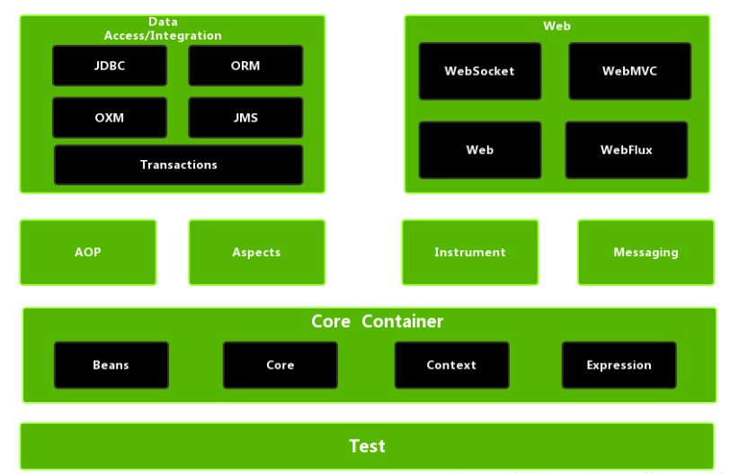

*date: 2021-04-13*

## Spring 框架概述

Spring 官网：https://spring.io/

Spring 各版本源码下载地址：https://repo.spring.io/release/org/springframework/spring/

Spring 官方文档：

- 全部版本：https://docs.spring.io/spring-framework/docs/
- 5.2.7.RELEASE：https://docs.spring.io/spring-framework/docs/5.2.7.RELEASE/spring-framework-reference/
- Spring Framework 5 中文文档：https://cntofu.com/book/95/index.html

Spring 是轻量级的开源的 JavaEE 框架。

Spring 可以解决企业应用开发的复杂性。

**Spring 两个核心部分：`IOC`和`AOP`。**

- **IOC：Inversion of Control，即`控制反转`。是面向对象编程中的一种设计原则，可以用来降低计算机代码之间的耦合度，其中最常见的方式叫做`依赖注入 (Dependency Injection，简称 DI)`。Spring 就是采用依赖注入的方式，来管理容器中的 Bean 实例对象。**
- **AOP：Aspect Oriented Programming，即`面向切面`。可以在不修改源代码的前提下，通过`预编译方式`和`运行期间动态代理方式`实现对原有代码的增强（添加新功能）。**

Spring 特点：

- 方便解耦，简化开发。
- AOP 编程支持。
- 方便程序测试。
- 方便和其他框架进行整合。
- 方便进行事务操作。
- 降低 API 开发难度。

Spring 模块：



## Spring 入门案例

第一步，创建一个 Maven 工程。

第二步，Maven 引入依赖：`spring-beans`、`spring-context`、`spring-core`、`spring-expression`，另外，Spring 还需依赖`commons-logging`实现日志功能。

```xml
<dependencies>
    <!-- Spring核心依赖 -->
    <dependency>
        <groupId>org.springframework</groupId>
        <artifactId>spring-context</artifactId>
        <version>5.2.7.RELEASE</version>
    </dependency>

    <!-- 这个依赖好像不需要 -->
    <dependency>
        <groupId>commons-logging</groupId>
        <artifactId>commons-logging</artifactId>
        <version>1.2</version>
    </dependency>
</dependencies>
```

- 引入`spring-context`依赖时，会一并将其他几个依赖引入：

  

第三步，创建 Bean 类：

```java
public class Student {
    private Integer studentId;
    
    private String studentName;

    public Student() {
    }

    public Student(Integer studentId, String studentName) {
        this.studentId = studentId;
        this.studentName = studentName;
    }

    public Integer getStudentId() {
        return studentId;
    }

    public void setStudentId(Integer studentId) {
        this.studentId = studentId;
    }

    public String getStudentName() {
        return studentName;
    }

    public void setStudentName(String studentName) {
        this.studentName = studentName;
    }

    @Override
    public String toString() {
        return "Student{" +
                "studentId=" + studentId +
                ", studentName='" + studentName + '\'' +
                '}';
    }
}
```

第四步，编写 Spring 配置文件：`Spring 配置文件使用 xml 格式`。

- 在 resources 包下点击鼠标右键，选择`New ---> XML Configuration File ---> Spring Config`，输入配置文件名（自定义）创建。注：resource 包下的配置文件在执行时会被拷贝至类路径的根目录。

  

- 在配置文件中添加如下配置：使用`<bean>`标签创建 Student 对象的实例，并注入属性的默认值。

  ```xml
  <?xml version="1.0" encoding="UTF-8"?>
  <beans xmlns="http://www.springframework.org/schema/beans"
         xmlns:xsi="http://www.w3.org/2001/XMLSchema-instance"
         xsi:schemaLocation="http://www.springframework.org/schema/beans
                             http://www.springframework.org/schema/beans/spring-beans.xsd">
  
      <!-- 使用bean元素定义一个由IOC容器创建的对象 --> 
      <!-- id属性指定用于引用bean实例的标识 -->
      <!-- class属性指定用于创建bean的全类名 -->
      <bean id="student" class="cn.xisun.spring.bean.Student">
          <!-- 使用property子元素为bean的属性赋值 -->
          <property name="studentId" value="007"/>
          <property name="studentName" value="Tom"/>
      </bean>
  </beans>
  ```

第五步，编写测试代码：

```java
public class SpringTest {
    public static void main(String[] args) {
        // 1.加载Spring配置文件，创建IOC容器对象
        ApplicationContext iocContainer = new ClassPathXmlApplicationContext("spring.xml");

        // 2.根据id值获取配置文件中的bean实例对象
        Student student = iocContainer.getBean("student", Student.class);

        // 3.打印bean
        System.out.println(student);
    }
}

```

- 输出结果：

  

> 测试说明：`Spring 在创建 IOC 容器时，就已经完成了 Bean 的创建和属性的赋值。`

## Spring 基本语法

### SqEL 表达式语言

`SpEL`的全称是 Spring Expression Language，即 Spring 表达式语言，简称 SpEL，支持运行时查询并可以操作对象图，和 JSP 页面上的 EL 表达式、Struts2 中用到的 OGNL 表达式一样，SpEL 根据 JavaBean 风格的`getXxx()`、`setXxx()`方法定义的属性访问对象图，完全符合我们熟悉的操作习惯。

基本语法：

- SpEL 使用`#{…}`作为定界符，所有在大框号中的字符都将被认为是 SpEL 表达式。

字面量：

- 整数：`<property name="count" value="#{5}"/>`
- 小数：`<property name="frequency" value="#{89.7}"/>`
- 科学计数法：`<property name="capacity" value="#{1e4}"/>`
- String 类型的字面量可以使用单引号或者双引号作为字符串的定界符号：
  - `<property name="name" value="#{'xisun'}"/>`
  - `<property name='name' value='#{"xisun"}'/>`
- Boolean：`<property name="enabled" value="#{false}"/>`

引用其他 Bean：

- 在 \<bean> 标签的 value 属性中通过`#{对象名}`引用其他 Bean，注意：不能使用 ref 属性。

  ```xml
  <!-- 引用其他Bean -->
  <bean id="student" class="cn.xisun.spring.bean.Student">
      <property name="studentId" value="233"/>
      <property name="studentName" value="Tom"/>
      <property name="computer" value="#{computer}"/>
  </bean>
  
  <bean id="computer" class="cn.xisun.spring.bean.Computer">
      <property name="computerId" value="666"/>
      <property name="computerName" value="HP"/>
  </bean>
  ```

引用其他 Bean 的属性:

- 在 \<property> 标签中通过`#{对象名.属性名}`引用其他 Bean 的属性。

  ```xml
  <!-- 引用其他Bean的属性 -->
  <bean id="student" class="cn.xisun.spring.bean.Student">
      <property name="studentId" value="233"/>
      <property name="studentName" value="Tom"/>
      <property name="computer" >
          <bean class="cn.xisun.spring.bean.Computer">
              <property name="computerId" value="#{computer.computerId}"/>
              <property name="computerName" value="#{computer.computerName}"/>
          </bean>
      </property>
  </bean>
  
  <bean id="computer" class="cn.xisun.spring.bean.Computer">
      <property name="computerId" value="666"/>
      <property name="computerName" value="HP"/>
  </bean>
  ```

调用非静态方法：

- 通过`#{对象名.方法名}`调用对象的非静态方法。

  ```xml
  <!-- 调用非静态方法 -->
  <bean id="student" class="cn.xisun.spring.bean.Student">
      <property name="studentId" value="233"/>
      <property name="studentName" value="Oneby"/>
      <property name="computer">
          <bean class="cn.xisun.spring.bean.Computer">
              <property name="computerId" value="#{computer.getComputerId()}"/>
              <property name="computerName" value="#{computer.getComputerName()}"/>
          </bean>
      </property>
  </bean>
  
  <bean id="computer" class="cn.xisun.spring.bean.Computer">
      <property name="computerId" value="666"/>
      <property name="computerName" value="HP"/>
  </bean>
  ```

调用静态方法：

- 通过`T(静态类路径).方法名`调用静态方法。举例：定义获取随机整数的方法，随机整数的范围为 [start, end]。

  ```java
  public class MathUtil {
      public static int getRandomInt(int start, int end) {
          return (int) (Math.random() * (end - start + 1) + start);
      }
  }
  ```

  ```xml
  <!-- 调用静态方法 -->
  <bean id="student" class="cn.xisun.spring.entity.Student">
      <property name="studentId" value="#{T(cn.xisun.spring.util.MathUtil).getRandomInt(0, 255)}"/>
      <property name="studentName" value="Tom"/>
  </bean>
  ```

### Spring 中多个配置文件的整合

Spring 允许通过`<import>`标签将多个配置文件引入到一个文件中，进行配置文件的集成。这样在启动 Spring 容器时，仅需要指定这个合并好的配置文件就可以。

- \<import> 标签的 resource 属性支持 Spring 的标准的路径资源：

  

### Application context not configured for this file

IDEA 中，对于 Spring 的配置类或配置文件，可能会提示`Application context not configured for this file`，大概意思就是没有将该配置类或配置文件配置到项目中。

解决办法：


## Spring 中的 Bean

### Spring 中 Bean 的类型

**Spring 内置了两种类型的 Bean ，一种是`普通 Bean`，另外一种是`工厂 Bean (FactoryBean)`。**

#### 普通 Bean

在配置文件中定义的 Bean 类型与返回类型一致。这种最常见。

```xml
<bean id="myBook" class="cn.xisun.spring.bean.Book">
    <property name="name" value="三体"/>
</bean>
```

```java
public class SpringTest {
    public static void main(String[] args) {
        // 1.加载Spring配置文件，创建IOC容器对象
        ApplicationContext iocContainer = new ClassPathXmlApplicationContext("spring.xml");

        // 2.根据id值获取配置文件中的bean实例对象，要求使用返回的bean的类型
        Book book = iocContainer.getBean("myBook", Book.class);

        // 3.打印bean
        System.out.println(book);
    }
}
```

>配置文件中定义的 Bean 类型是 Book，实际返回的类型也是 Book。

#### 工厂 Bean

在配置文件中定义的 Bean 类型可以和返回类型不一样。

第一步：创建类，实现 FactoryBean 接口，让这个类作为工厂 Bean。FactoryBean 接口中有如下三个方法：`getObject()`负责将创建好的 Bean 实例返回给 IOC 容器；`getObjectType()`负责返回工厂生产的 Bean 类型；`isSingleton()`用于指示该 Bean 实例是否为单例，默认是单例 Bean。

```java
public interface FactoryBean<T> {
    String OBJECT_TYPE_ATTRIBUTE = "factoryBeanObjectType";

    @Nullable
    T getObject() throws Exception;

    @Nullable
    Class<?> getObjectType();

    default boolean isSingleton() {
        return true;
    }
}
```

第二步：实现接口里面的方法，在实现的方法中定义返回的 Bean 类型。

```java
public class Book {
    private String name;
    
    private String author;

    public void setName(String name) {
        this.name = name;
    }

    public void setAuthor(String author) {
        this.author = author;
    }

    @Override
    public String toString() {
        return "Book{" +
                "name='" + name + '\'' +
                ", author='" + author + '\'' +
                '}';
    }
}
```

```java
public class MyFactoryBean implements FactoryBean<Book> {
    // 在getObject()方法中定义返回的Bean
    @Override
    public Book getObject() throws Exception {
        Book book = new Book();
        book.setName("三体");
        return book;
    }

    @Override
    public Class<?> getObjectType() {
        return Book.class;
    }

    @Override
    public boolean isSingleton() {
        return false;
    }
}
```

第三步：在 Spring 配置文件中进行配置并测试，注意获取 Bean 的时候要使用工厂 Bean 返回的那个 Bean 的类型。

```xml
<bean id="myBean" class="cn.xisun.spring.factory.MyFactoryBean"></bean>
```

```java
public class SpringTest {
    public static void main(String[] args) {
        // 1.加载Spring配置文件，创建IOC容器对象
        ApplicationContext iocContainer = new ClassPathXmlApplicationContext("spring.xml");

        // 2.根据id值获取配置文件中的bean实例对象，要求使用返回的bean的类型
        Book book = iocContainer.getBean("myBean", Book.class);

        // 3.打印bean
        System.out.println(book);
    }
}
```

> 配置文件中定义的 Bean 类型是 MyFactoryBean，但实际返回的类型是 Book。

### Spring 中 Bean 的作用域

默认情况下，Spring 只为每个在 IOC 容器里声明的 Bean 创建唯一一个实例（单例对象），整个 IOC 容器范围内都能共享该实例：所有后续的`getBean()`调用和 Bean 引用都将返回这个唯一的 Bean 实例。**该作用域被称为`singleton`，它是所有 Bean 的默认作用域。**

在 Spring 中，可以在 \<bean> 标签的 scope 属性里设置 Bean 的作用域，以决定这个 Bean 是单实例的还是多实例的。scope 属性值有四个：

- **`singleton`**：在 Spring IOC 容器中仅存在一个 Bean 实例，Bean 以**单实例**的方式存在。默认值。

  ```xml
  <bean id="book" class="cn.xisun.spring.bean.Book">
      <property name="name" value="平凡的世界"/>
      <property name="author" value="路遥"/>
  </bean>
  ```

  ```java
  public class SpringTest {
      public static void main(String[] args) {
          // 1.加载Spring配置文件，创建IOC容器对象
          ApplicationContext iocContainer = new ClassPathXmlApplicationContext("spring.xml");
  
          // 2.根据id值获取配置文件中的bean实例对象，要求使用返回的bean的类型
          Book book = iocContainer.getBean("book", Book.class);
          Book book1 = iocContainer.getBean("book", Book.class);
  
          // 3.打印bean
          System.out.println(book == book1);
      }
  }
  ```

  >输出结果是 true，说明 book 和 book1 的地址一样，二者指向同一个对象。

- **`prototype`**：每次调用`getBean()`时都会返回一个新的实例，Bean 以**多实例**的方式存在。

  ```xml
  <bean id="book" class="cn.xisun.spring.bean.Book" scope="prototype">
      <property name="name" value="平凡的世界"/>
      <property name="author" value="路遥"/>
  </bean>
  ```

  ```java
  public class SpringTest {
      public static void main(String[] args) {
          // 1.加载Spring配置文件，创建IOC容器对象
          ApplicationContext iocContainer = new ClassPathXmlApplicationContext("spring.xml");
  
          // 2.根据id值获取配置文件中的Bean实例对象，要求使用返回的Bean的类型
          Book book = iocContainer.getBean("book", Book.class);
          Book book1 = iocContainer.getBean("book", Book.class);
  
          // 3.打印bean
          System.out.println(book == book1);
      }
  }
  ```

  > 输出结果是 false，说明 book 和 book1 的地址不一样，二者指向不同的对象。

- **设置 scope 值是 singleton 时候，加载 Spring 配置文件时候就会创建单实例对象；设置 scope 值是 prototype 时候，不是在加载 Spring 配置文件的时候创建对象，而是在调用`getBean()`时创建多实例对象。**

- request 和 session 不常用。

### Spring 中 Bean 的生命周期

生命周期：一个对象从创建到销毁的过程，是这个对象的生命周期。

Spring IOC 容器可以管理 Bean 的生命周期，Spring 允许在 Bean 生命周期内特定的时间点执行指定的任务。Spring IOC 容器对 Bean 的生命周期进行管理的过程：

1. **通过构造器或工厂方法创建 Bean 实例。**

2. **为 Bean 的属性设置值和对其他 Bean 的引用。**

3. **调用 Bean 的初始化方法（需要创建和配置初始化的方法）。**

4. **获取 Bean 实例并使用。**

5. **当容器关闭时，调用 Bean 的销毁方法（需要创建和配置销毁的方法）。**

6. 代码演示：

   ```java
   public class Book {
       private String name;
   
       public Book() {
           System.out.println("第一步：执行无参数构造方法创建bean实例");
       }
   
       public void setName(String name) {
           System.out.println("第二步：调用setter方法设置属性值");
           this.name = name;
       }
   
       // 创建执行的初始化的方法
       public void initMethod(){
           System.out.println("第三步：执行初始化的方法");
       }
   
       // 创建执行的销毁的方法
       public void destroyMethod(){
           System.out.println("第五步：执行销毁的方法");
       }
   
       @Override
       public String toString() {
           return "Book{" +
                   "name='" + name + '\'' +
                   '}';
       }
   }
   ```

   ```xml
   <!-- 在<bean>标签中指定book实例的init-method属性(初始化方法)和destroy-method属性(销毁方法) -->
   <bean id="book" class="cn.xisun.spring.bean.Book" init-method="initMethod" destroy-method="destroyMethod">
       <property name="name" value="平凡的世界"/>
   </bean>
   ```

   ```java\
   public class SpringTest {
       public static void main(String[] args) {
           // 1.加载Spring配置文件，创建IOC容器对象
           ApplicationContext iocContainer = new ClassPathXmlApplicationContext("spring.xml");
   
           // 2.根据id值获取配置文件中的bean实例对象，要求使用返回的bean的类型
           S                          ystem.out.println("第四步：获取创建的bean实例对象");
           Book book = iocContainer.getBean("book", Book.class);                 
   
           // 3.打印bean
           System.out.println(book);
   
           // 手动销毁bean的实例，会调用Book中定义的destroyMethod()，前提：在Spring配置文件中bean标签配置了destroy-method
           // ApplicationContext接口没有close()，需要它的子接口或实现类才能调用
           ((ClassPathXmlApplicationContext)iocContainer).close();
       }
   }
   输出结果：
   第一步：执行无参数构造方法创建bean实例
   第二步：调用setter方法设置属性值
   第三步：执行初始化的方法
   第四步：获取创建的bean实例对象
   Book{name='平凡的世界'}
   第五步：执行销毁的方法
   ```

   >注意：要手动关闭 IOC 容器才会执行 destroy-method 指定的方法。

Spring 中可以设置`Bean 后置处理器`：

- Bean 后置处理器允许在调用初始化方法前后对 Bean 进行额外的处理。
- Bean 后置处理器对 IOC 容器里的所有 Bean 实例逐一处理，而非单一实例。其典型应用是：检查 Bean 属性的正确性或根据特定的标准更改 Bean 的属性。
- 定义 Bean 后置处理器时需要实现接口：`org.springframework.beans.factory.config.BeanPostProcessor`。在 Bean 的初始化方法被调用前后，Spring 将把每个 Bean 实例分别传递给上述接口的以下两个方法：
  - `postProcessBeforeInitialization(Object, String)`
  - `postProcessAfterInitialization(Object, String)`

Bean 添加后置处理器后的生命周期：

1. **通过构造器或工厂方法创建 Bean 实例。**

2. **为 Bean 的属性设置值和对其他 Bean 的引用。**

3. **将 Bean 实例传递给 Bean 后置处理器的`postProcessBeforeInitialization()`。**

4. **调用 Bean 的初始化方法（需要创建和配置初始化的方法）。**

5. **将 Bean 实例传递给 Bean 后置处理器的`postProcessAfterInitialization()`。**

6. **获取 Bean 实例并使用。**

7. **当容器关闭时，调用 Bean 的销毁方法（需要创建和配置销毁的方法）。**

8. 代码演示：

  ```java
  /**
   * 自定义bean后置处理器
   */
  public class MyBeanPostProcessor implements BeanPostProcessor {
      @Override
      public Object postProcessBeforeInitialization(Object bean, String beanName) throws BeansException {
          System.out.println("第三步：执行初始化方法之前，执行postProcessBeforeInitialization方法");
          return bean;
      }
  
      @Override
      public Object postProcessAfterInitialization(Object bean, String beanName) throws BeansException {
          System.out.println("第五步：执行初始化方法之后，执行postProcessAfterInitialization方法");
          return bean;
      }
  }
  ```

  ```java
  public class Book {
      private String name;
  
      public Book() {
          System.out.println("第一步：执行无参数构造方法创建bean实例");
      }
  
      public void setName(String name) {
          System.out.println("第二步：调用setter方法设置属性值");
          this.name = name;
      }
  
      // 创建执行的初始化的方法
      public void initMethod(){
          System.out.println("第四步：执行初始化的方法");
      }
  
      // 创建执行的销毁的方法
      public void destroyMethod(){
          System.out.println("第七步：执行销毁的方法");
      }
  
      @Override
      public String toString() {
          return "Book{" +
                  "name='" + name + '\'' +
                  '}';
      }
  }
  ```

  ```xml
  <!-- 配置后置处理器，适用于配置的所有的bean -->
  <bean id="myBeanPostProcessor" class="cn.xisun.spring.processor.MyBeanPostProcessor"/>
  
  <bean id="book" class="cn.xisun.spring.bean.Book" init-method="initMethod" destroy-method="destroyMethod">
      <property name="name" value="平凡的世界"/>
  </bean>
  ```

  ```java
  public class SpringTest {
      public static void main(String[] args) {
          // 1.加载Spring配置文件，创建IOC容器对象
          ApplicationContext iocContainer = new ClassPathXmlApplicationContext("spring.xml");
  
          // 2.根据id值获取配置文件中的bean实例对象，要求使用返回的bean的类型
          System.out.println("第六步：获取创建的bean实例对象");
          Book book = iocContainer.getBean("book", Book.class);
  
          // 3.打印bean
          System.out.println(book);
  
          // 手动销毁bean的实例，会调用Book中定义的destroyMethod()，前提：在Spring配置文件中bean标签配置了destroy-method
          // ApplicationContext接口没有close()，需要它的子接口或实现类才能调用
          ((ClassPathXmlApplicationContext)iocContainer).close();
      }
  }
  输出结果：
  第一步：执行无参数构造方法创建bean实例
  第二步：调用setter方法设置属性值
  第三步：执行初始化方法之前，执行postProcessBeforeInitialization方法
  第四步：执行初始化的方法
  第五步：执行初始化方法之后，执行postProcessAfterInitialization方法
  第六步：获取创建的bean实例对象
  Book{name='平凡的世界'}
  第七步：执行销毁的方法
  ```

### Spring 中 Bean 的自动装配

`手动装配`：在配置文件中，使用 \<bean> 标签，以 value 或 ref 的方式明确指定属性值的方式，都是手动装配。

`自动装配`：根据指定的装配规则（属性名称或者属性类型），不需要明确指定，Spring 自动将匹配的属性值注入 Bean 中。

自动装配的装配模式：

- `根据类型自动装配 (byType)`：将类型匹配的 Bean 作为属性注入到另一个 Bean 中。若 IOC 容器中有多个与目标 Bean 类型一致的 Bean，Spring 将无法判定哪个 Bean 最合适该属性，继而不能执行自动装配。

  ```xml
  <bean id="department" class="cn.xisun.spring.bean.Department">
      <property name="name" value="IT"/>
  </bean>
  <!-- 不能出现两个Department类型的bean -->
  <!--<bean id="department1" class="cn.xisun.spring.bean.Department">
      <property name="name" value="IT"/>
  </bean>-->
  
  <!--
      通过bean标签属性autowire，实现自动装配。
      autowire 属性常用两个值：
          byName：根据属性名称注入，要求注入值bean的id值和类对应的属性名称一样。
          byType：根据属性类型注入，要求配置文件中只能有一个与目标bean类型一致的bean。
  -->
  <bean id="employee" class="cn.xisun.spring.bean.Employee" autowire="byType"/>
  ```

- `根据名称自动装配 (byName)`：必须将目标 Bean 的名称和属性名设置的完全相同。

  ```xml
  <bean id="department" class="cn.xisun.spring.bean.Department">
      <property name="name" value="IT"/>
  </bean>
  
  <!--
      通过bean标签属性autowire，实现自动装配。
      autowire 属性常用两个值：
          byName：根据属性名称注入，要求注入值bean的id值和类对应的属性名称一样。
          byType：根据属性类型注入，要求配置文件中只能有一个与目标bean类型一致的bean。
  -->
  <bean id="employee" class="cn.xisun.spring.bean.Employee" autowire="byName"/>
  ```

- `根据构造器自动装配 (constructor)`：当 Bean 中存在多个构造器时，此种自动装配方式将会很复杂。不推荐使用。

> 相对于使用注解的方式实现的自动装配，在 xml 配置文件中进行的自动装配略显笨拙，在项目中更多的是使用注解的方式实现。

代码演示：

```java
public class Department {
    private String name;

    public void setName(String name) {
        this.name = name;
    }

    @Override
    public String toString() {
        return "Department{" +
                "name='" + name + '\'' +
                '}';
    }
}
```

```java
public class Employee {
    private String name;
    
    private Department department;

    public void setName(String name) {
        this.name = name;
    }

    public void setDepartment(Department department) {
        this.department = department;
    }

    @Override
    public String toString() {
        return "Employee{" +
                "name='" + name + '\'' +
                ", department=" + department +
                '}';
    }
}
```

```java
public class SpringTest {
    public static void main(String[] args) {
        // 1.加载Spring配置文件，创建IOC容器对象
        ApplicationContext iocContainer = new ClassPathXmlApplicationContext("spring.xml");

        // 2.根据id值获取配置文件中的bean实例对象，要求使用返回的bean的类型
        Employee employee = iocContainer.getBean("employee", Employee.class);

        // 3.打印bean
        System.out.println(employee);
    }
}
输出结果：
Employee{name='null', department=Department{name='IT'}}
```

### Spring 中 Bean 的配置信息的继承

Spring 允许继承 Bean 的配置，被继承的 Bean 称为父 Bean，继承这个父 Bean 的 Bean 称为子 Bean。子 Bean 可以从父 Bean 中继承配置，包括 Bean 的属性配置，子 Bean 也可以覆盖从父 Bean 继承过来的配置。

父 Bean 可以作为配置模板，也可以作为 Bean 实例。若只想把父 Bean 作为模板，可以设置 \<bean> 标签的 abstract 属性为 true，这样 Spring 将不会实例化这个 Bean。

创建实体类：

```java
public class Book {
    private String name;
    
    private String author;
    
    private String era;

    public void setName(String name) {
        this.name = name;
    }

    public void setAuthor(String author) {
      this.author = author;
    }

    public void setEra(String era) {
        this.era = era;
    }

    @Override
    public String toString() {
        return "Book{" +
                "name='" + name + '\'' +
                ", author='" + author + '\'' +
              ", era='" + era + '\'' +
                '}';
  }
}
```

不使用继承配置 Bean：

```xml
<bean id="book1" class="cn.xisun.spring.bean.Book">
    <property name="name" value="论语"/>
    <!-- 以下都是重复的属性 -->
    <property name="author" value="孔子"/>
    <property name="era" value="春秋末期"/>
</bean>

<bean id="book2" class="cn.xisun.spring.bean.Book">
    <property name="name" value="春秋"/>
    <!-- 以下都是重复的属性 -->
    <property name="author" value="孔子"/>
    <property name="era" value="春秋末期"/>
</bean>
```

> book1 和 book2 两个 Bean 的 author 和 era 两个属性的值相同，像上面的配置会有点冗余。

使用配置信息的继承配置 Bean：

```xml
<bean id="book1" class="cn.xisun.spring.bean.Book">
    <property name="name" value="论语"/>
    <!-- 以下都是重复的属性 -->
    <property name="author" value="孔子"/>
    <property name="era" value="春秋末期"/>
</bean>

<bean id="book2" parent="book1">
    <!-- 重写不同值的属性即可 -->
    <property name="name" value="春秋"/>
</bean>
```

代码演示：

```java
public class SpringTest {
    public static void main(String[] args) {
        // 1.加载Spring配置文件，创建IOC容器对象
        ApplicationContext iocContainer = new ClassPathXmlApplicationContext("spring.xml");

        // 2.根据id值获取配置文件中的bean实例对象，要求使用返回的bean的类型
        Book book1 = iocContainer.getBean("book1", Book.class);
        Book book2 = iocContainer.getBean("book2", Book.class);

        // 3.打印bean
        System.out.println(book1);
        System.out.println(book2);
    }
}
输出结果：
Book{name='论语', author='孔子', era='春秋末期'}
Book{name='春秋', author='孔子', era='春秋末期'}
```

### Spring 中 Bean 之间的依赖

有的时候创建一个 Bean 的时候，需要保证另外一个 Bean 也被创建，这时我们称前面的 Bean 对后面的 Bean 有依赖。例如：要求创建 Student 对象的时候必须创建 Book。这里需要注意的是依赖关系不等于引用关系，Student 即使依赖 Book 也可以不引用它。

```xml
<!-- 一定要创建一个book对象，否则student对象无法创建 -->
<bean id="student" class="cn.xisun.spring.pojo.Student" depends-on="book">
    <property name="name" value="论语"/>
</bean>

<bean id="book" class="cn.xisun.spring.pojo.Book">
    <property name="name" value="论语"/>
    <property name="author" value="孔子"/>
    <property name="era" value="春秋末期"/>
</bean>
```

### Spring 引入外部 Properties 文件

当 Bean 的配置信息逐渐增多时，查找和修改一些 Bean 的配置信息就变得愈加困难。这时可以将一部分信息提取到 Bean 配置文件的外部，以 properties 格式的属性文件保存起来，同时在 Bean 的配置文件中引用 properties 属性文件中的内容，从而实现一部分属性值在发生变化时仅修改 properties 属性文件即可。**这种技术多用于连接数据库的基本信息的配置。**

引入`druid`依赖和`mysql-connector-java`驱动依赖：

```xml
<!-- druid连接池 -->
<dependency>
    <groupId>com.alibaba</groupId>
    <artifactId>druid</artifactId>
    <version>1.1.20</version>
</dependency>

<!-- mysql驱动 -->
<dependency>
    <groupId>mysql</groupId>
    <artifactId>mysql-connector-java</artifactId>
    <version>8.0.19</version>
</dependency>
```

在 Spring 配置文件中**直接配置**数据库连接信息：

```xml
<!-- 直接配置数据库连接池 -->
<bean id="dataSource" class="com.alibaba.druid.pool.DruidDataSource">
    <property name="driverClassName" value="com.mysql.cj.jdbc.Driver"/>
    <property name="url" value="jdbc:mysql://localhost:3306/userDb"/>
    <property name="username" value="root"/>
    <property name="password" value="root"/>
</bean>
```

在 Spring 配置文件中**引入外部 properties 文件**中单独存放的数据库连接信息：

- 在类路径下创建 jdbc.properties 数据库配置文件： 

  ```properties
  prop.driverClass=com.mysql.cj.jdbc.Driver
  prop.url=jdbc:mysql://localhost:3306/userDb
  prop.userName=root
  prop.password=root
  ```

- 在 Spring 配置文件中引入 context 名称空间：

  ```xml
  <beans xmlns="http://www.springframework.org/schema/beans"
         xmlns:xsi="http://www.w3.org/2001/XMLSchema-instance"
         xmlns:context="http://www.springframework.org/schema/context"
         xsi:schemaLocation="http://www.springframework.org/schema/beans 
                             http://www.springframework.org/schema/beans/spring-beans.xsd
                             http://www.springframework.org/schema/context 
                             http://www.springframework.org/schema/context/spring-context.xsd">
  ```

  

- 通过`<context:property-placeholder>`标签中的 location 属性来制定配置文件的路径，`classpath:`表示该配置文件位于类路径下，并通过 SpEL 表达式语言如`${prop.userName}`的方式来取出配置文件中的属性值。

  ```xml
  <!-- 引用外部属性文件来配置数据库连接池 -->
  <!-- 指定properties属性文件的位置，classpath:xxx表示属性文件位于类路径下 -->
  <context:property-placeholder location="classpath:jdbc.properties"/>
  <!-- 从properties属性文件中引入属性值 -->
  <bean id="dataSource" class="com.alibaba.druid.pool.DruidDataSource">
      <property name="driverClassName" value="${prop.driverClass}"/>
      <property name="url" value="${prop.url}"/>
      <property name="username" value="${prop.userName}"/>
      <property name="password" value="${prop.password}"/>
  </bean>
  ```

代码演示：

  ```java
  public class SpringTest {
      public static void main(String[] args) {
          // 1.加载Spring配置文件，创建IOC容器对象
          ApplicationContext iocContainer = new ClassPathXmlApplicationContext("spring.xml");
  
          // 2.根据id值获取配置文件中的bean实例对象，要求使用返回的bean的类型
          DataSource dataSource = iocContainer.getBean("dataSource", DataSource.class);
  
          // 3.打印bean
          System.out.println(dataSource);
      }
  }
  输出结果：
  {
  	CreateTime:"2021-04-15 15:36:05",
  	ActiveCount:0,
  	PoolingCount:0,
  	CreateCount:0,
  	DestroyCount:0,
  	CloseCount:0,
  	ConnectCount:0,
  	Connections:[
  	]
  }
  ```

## IOC

### IOC 思想的底层原理

IOC 控制反转的思想：

- 在应用程序中的组件需要获取资源时，传统的方式是组件主动的从容器中获取所需要的资源，在这样的模式下，开发人员往往需要知道在具体容器中特定资源的获取方式。比如 ClassA 中需要用到 ClassB 的对象，一般情况下，需要在 ClassA 的代码中显式的 new 一个 ClassB 的对象。
- **控制反转的思想完全颠覆了应用程序组件获取资源的传统方式：反转了资源的获取方向 ---> 改由容器主动的将资源推送给需要的组件，开发人员不需要知道容器是如何创建资源对象的，只需要提供接收资源的方式即可。**采用依赖注入技术之后，ClassA 的代码只需要定义一个私有的 ClassB 对象属性，不需要直接 new 来获得这个对象，而是通过相关的容器控制程序来将 ClassB 对象在外部 new 出来并注入到 ClassA 类里的引用中。而具体获取的方法、对象被获取时的状态由配置文件（如 XML）来指定。

DI 依赖注入：可以将 DI 看作是 IOC 的一种实现方式 ---> **即组件以一些预先定义好的方式（例如 setter 方法）接受来自于容器的资源注入。**相对于 IOC 而言，这种表述更直接：**IOC 容器在 Spring 中的实现。**

**IOC 底层原理：`xml 解析`+`工厂模式`+`反射`。**

- 图解：

  

- 代码演示：

  - 原始方式：自己 new 对象，再通过 setter 方法注入属性值。---> 代码耦合度极高。

    ```java
    Student student = new Student();
    student.setStudentId(7);
    student.setStudentName("Tom");
    ```

  - 进阶方式：通过工厂创建对象。---> 可以降低代码的耦合度，不需要自己 new 对象，但仍需要手动去获取和管理 Bean。

    ```xml
    <!-- 1.先通过xml配置文件配置bean的属性 -->
    <bean id="student" class="cn.xisun.spring.xisun.Student">
        <property name="studentId" value="007"/>
        <property name="studentName" value="Tom"/>
    </bean>
    ```

    ```java
    // 2.再通过工厂模式 + 反射的方法创建该对象的实例，并注入属性值
    public class StudentFactory {
        public static Student getStudent(){
            String className = ...;// 通过xml解析获取全类名
            String[] fieldNames = ..;// 通过xml解析获取字段名
            String[] fieldValues = ...;// 通过xml解析获取字段值
            Class clazz = Class.forName(className);// 通过反射创建对象实例
            for (int i = 0; i < fieldNames.length; i++) {
                // 依次为字段赋值
            }
            return clazz;// 返回创建的实例对象
        }
    }
    ```

  - 最终方式：通过 Spring IOC 管理 Bean。---> Bean 的创建与它们之间的依赖关系完全交给 Spring IOC 容器去管理，代码耦合程度极大降低。

    ```xml
    <!-- 1.先通过xml配置文件配置bean的属性 -->
    <bean id="student" class="cn.xisun.spring.bean.Student">
        <property name="studentId" value="007"/>
        <property name="studentName" value="Tom"/>
    </bean>
    ```

    ```java
    // 2.再通过iocContainer.getbean("beanId", 类.class)方法或者@Autowire方式获取bean
    Student student = iocContainer.getBean("student", Student.class);
    ```

- **IOC 思想基于 IOC 容器完成，IOC 容器底层就是对象工厂。**

### IOC 容器的实现方式

Spring 在通过 IOC 容器读取 Bean 的实例之前，需要先将 IOC 容器本身实例化。

Spring 为 IOC 容器提供的两种实现方式，即两个接口：`BeanFactory`和`ApplicationContext`。

#### BeanFactory 接口

IOC 容器的基本实现，是 Spring 内部的使用接口。`面向 Spring 本身`，不提供给开发人员使用。

BeanFactory 在加载配置文件的时候，不会创建对象，而是`在使用对象的时候才去创建`。

BeanFactory 接口的实现类：


#### ApplicationContext 接口

**BeanFactory 的子接口 ，`面向 Spring 的使用者`，提供了更多功能，一般由开发人员进行使用。几乎所有场合都使用 ApplicationContext 而不是底层的 BeanFactory。**

**`ApplicationContext 在加载配置文件的时候，就会把配置文件中配置的对象进行创建。`**（在服务启动的时候，就把加载对象等耗时的工作全部完成，而不是在用到的时候才创建，这对于 web 项目等的使用者，会有比较好的效果，因为一般项目部署到服务器启动后，都尽量不再关闭。)

ApplicationContext 接口的重要子接口和实现类：

- ConfigurableApplicationContext 子接口：扩展了一些方法，如`refresh()`和`close()`，这些方法能够让 ApplicationContext 具有启动、关闭和刷新上下文的能力。

  ```java
  public interface ConfigurableApplicationContext extends ApplicationContext, Lifecycle, Closeable {
     /**
      * Load or refresh the persistent representation of the configuration,
      * which might an XML file, properties file, or relational database schema.
      * <p>As this is a startup method, it should destroy already created singletons
      * if it fails, to avoid dangling resources. In other words, after invocation
      * of that method, either all or no singletons at all should be instantiated.
      * @throws BeansException if the bean factory could not be initialized
      * @throws IllegalStateException if already initialized and multiple refresh
      * attempts are not supported
      */
     void refresh() throws BeansException, IllegalStateException;
  
     /**
      * Close this application context, releasing all resources and locks that the
      * implementation mig ht hold. This includes destroying all cached singleton beans.
      * <p>Note: Does <i>not</i> invoke {@code close} on a parent context;
      * parent contexts have their own, independent lifecycle.
      * <p>This method can be called multiple times without side effects: Subsequent
      * {@code close} calls on an already closed context will be ignored.
      */
     @Override
     void close();
  
      ...
  }
  ```

- FileSystemXmlApplicationContext：对应文件系统中的 xml 格式的配置文件。（xml 配置文件的绝对路径）

  ```java
  ApplicationContext iocContainer = new FileSystemXmlApplicationContext(
          "D:\\JetBrainsWorkSpace\\IDEAProjects\\xisun-projects\\xisun-spring\\src\\main\\resources\\spring.xml");
  ```

- **`ClassPathXmlApplicationContext`：对应类路径下的 xml 格式的配置文件。（xml 配置文件的相对路径，常用）**

  ```java
  ApplicationContext iocContainer = new ClassPathXmlApplicationContext("spring.xml");
  ```

- **`WebApplicationContext`子接口：扩展了 ApplicationContext，是专门为 Web 应用准备的，它允许从相对于 Web 根目录的路径中装载配置文件完成初始化。**

  
  - 需要额外引入`spring-web`依赖：

    ```xml
    <!-- Spring Web依赖 -->
    <dependency>
        <groupId>org.springframework</groupId>
        <artifactId>spring-web</artifactId>
        <version>5.2.7.RELEASE</version>
    </dependency>
    ```

### IOC 管理 Bean 的方式

Bean 管理指的是两个操作：

- Spring 创建对象。---> 实例化
- Spirng 注入属性。---> 初始化

Bean 管理操作有两种方式：

- 基于 xml 配置文件方式实现（基础）。
- **基于注解方式实现。**

Bean 对象的三种获取方式（定义在 beanFactory 接口中）：

- `Object getbean(String name) throws beansException;`：通过 Bean 的 name 获取 Bean 实例。

  ```java
  Student student = (Student) iocContainer.getBean("student");
  ```

- `<T> T getBean(Class<T> requiredType) throws BeansException;`：通过 Bean 的 class 获取 Bean 实例。

  ```java
  Student student = iocContainer.getBean(Student.class);
  ```

- **`<T> T getBean(String name, Class<T> requiredType) throws BeansException;`：通过 Bean 的 name 和 Bean 的 class 获取 Bean 实例。**

  ```java
  Student student = iocContainer.getBean("student", Student.class);
  ```

#### 基于 xml 配置文件方式实现

第一步：基于 xml 方式创建对象。

```xml
<!-- 配置Student对象 -->
<bean id="student" class="cn.xisun.spring.bean.Student"></bean>
```

- 在 Spring 配置文件中，使用 \<bean> 标签，标签里面添加对应属性，就可以实现对象创建。
- \<bean> 标签中有很多属性，常用的属性：
  * id 属性：bean 实例的唯一标识。
  * class 属性：bean 的全类名。
- **`创建对象时候，默认执行无参数构造方法完成对象创建。`**

第二步：基于 xml 方式注入对象的属性。

- DI：依赖注入，就是注入属性。

- **第一种注入方式：通过 Bean 的 setter 方法注入属性值。**

  - 创建类，定义属性，创建属性对应的 setter 方法。

    ```java
    public class Book {
        private String bookName;
        
        private String bookAuthor;
    
        public void setBookName(String bookName) {
            this.bookName = bookName;
        }
    
        public void setBookAuthor(String bookAuthor) {
            this.bookAuthor = bookAuthor;
        }
    }
    ```

  - 在 Spring 配置文件配置对象创建，配置属性注入。

    ```xml
    <!-- 配置Book对象 -->
    <bean id="book" class="cn.xisun.spring.bean.Book">
        <!-- 使用property完成属性注入：
                name：类里面属性名称
                value：向属性注入的值
        -->
        <property name="bookName" value="论语"/>
        <property name="bookAuthor" value="孔子"/>
    </bean>
    ```

    >通过 \<property> 标签指定属性名，Spring 会帮我们找到该属性对应的 setter 方法，并注入其属性值。

- 第二种注入方式：通过 Bean 的有参数构造方法注入属性值。

  - 创建类，定义属性，创建属性对应的有参数构造方法。

    ```java
    public class Orders {
        private String orderName;
        
        private String address;
    
        public Orders(String orderName, String address) {
            this.orderName = orderName;
            this.address = address;
        }
    }
    ```

  - 在 Spring 配置文件配置对象创建，配置属性注入。

    ```xml
    <!-- 配置Orders对象 -->
    <bean id="orders" class="cn.xisun.spring.bean.Orders">
        <constructor-arg name="orderName" value="computer"/>
        <constructor-arg name="address" value="China"/>
    </bean>
    ```

    >通过 \<constructor-arg> 标签为对象的属性赋值，name 指定属性名，value 指定属性值。

- 第三种注入方式：通过 p 名称空间注入属性值。

  - 为了简化 xml 文件的配置，越来越多的 xml 文件采用属性而非子元素配置信息。Spring 从 2.5 版本开始引入了一个新的 p 命名空间，可以通过 \<bean> 标签属性的方式配置 Bean 的属性。使用 p 命名空间后，基于 xml 的配置方式将进一步简化。

  - 添加 p 名称空间在配置文件中。

    ```xml
    <beans xmlns="http://www.springframework.org/schema/beans"
           xmlns:xsi="http://www.w3.org/2001/XMLSchema-instance"
           xmlns:p="http://www.springframework.org/schema/p"
           xsi:schemaLocation="http://www.springframework.org/schema/beans 
                               http://www.springframework.org/schema/beans/spring-beans.xsd">
    ```
  
  
  
  - 通过 p 名称空间注入属性值，也是调用 Bean 的 setter 方法设置属性值的。
  
      ```xml
      <!-- 配置Book对象 -->
      <bean id="book" class="cn.xisun.spring.bean.Book" p:bookName="论语" p:bookAuthor="孔子"/>
      ```

- 基于 xml 方式注入其他类型的属性。

    - 第一种：字面量

      - null 值。

        ```xml
        <bean id="book" class="cn.xisun.spring.bean.Book">
            <property name="bookName" value="无名"/>
            <!-- null值-->
            <property name="bookAuthor">
                <null/>
            </property>
        </bean>
        ```

        > 效果：Book{bookName='无名', bookAuthor='null'}

      - 属性值包含特殊符号。

        ```xml
        <bean id="book" class="cn.xisun.spring.bean.Book">
            <property name="bookName" value="春秋"/>
            <property name="bookAuthor">
                <!-- 方式一：将特殊字符进行转义，比如：<>转义为&lt; &gt; -->
                <!--<value>&lt;相传是孔子&gt;</value>-->
                
                <!-- 方式二：把带特殊符号内容写到CDATA中 -->
                <value><![CDATA[<相传是孔子>]]></value>
            </property>
        </bean>
        ```

        > 效果：Book{bookName='春秋', bookAuthor='<相传是孔子>'}

    - 第二种：外部 Bean。

      - 创建两个类。

        ```java
        public class UserDao {
            public void update(){
                
            }
        }
        ```
        
        ```java
        public class UserService {
            private UserDao userDao;
        
            public void setUserDao(UserDao userDao) {
                this.userDao = userDao;
            }
        
            public void add() {
                System.out.println("service add...............");
                userDao.update();
            }
        }
        ```
        
      - 在 Spring 配置文件中进行配置。
      
        ```xml
        <bean id="userService" class="cn.xisun.spring.service.UserService">
            <!-- 注入userDao对象：
                    name属性：类里面属性名称
                    ref属性：配置userDao对象的bean标签的id值
            -->
            <property name="userDao" ref="userDao"/>
        </bean>
        
        <!-- 外部Bean -->
        <bean id="userDao" class="cn.xisun.spring.bean.UserDao"/>
        ```
      
    - 第三种：内部 Bean。

      - 当 Bean 实例仅仅给一个特定的属性使用时，可以将其声明为内部 Bean。内部 Bean 声明直接包含在 \<property> 或 \<constructor-arg> 标签里，不需要设置任何 id 或 name 属性，**内部 Bean 不能使用在任何其他地方。**

      - 一对多关系：部门和员工，一个部门有多个员工，一个员工属于一个部门，部门是一，员工是多。

        ```java
        public class Department {
            private String depName;
        
            public void setDepName(String depName) {
                this.depName = depName;
            }
        
            @Override
            public String toString() {
                return "Department{" +
                        "depName='" + depName + '\'' +
                        '}';
            }
        }
        ```

        ```java
        public class Employee {
            private String name;
            
            private String gender;
            
            private Department dep;
        
            public void setName(String name) {
                this.name = name;
            }
        
            public void setGender(String gender) {
                this.gender = gender;
            }
        
            public void setDep(Department dep) {
                this.dep = dep;
            }
        
            @Override
            public String toString() {
                return "Employee{" +
                        "name='" + name + '\'' +
                        ", gender='" + gender + '\'' +
                        ", dep=" + dep +
                        '}';
            }
        }
        ```

      - 在 spring 配置文件中进行配置。

        ```xml
        <bean id="employee" class="cn.xisun.spring.pojo.Employee">
            <property name="name" value="Tom"/>
            <property name="gender" value="male"/>
            <property name="dep">
                <!-- 内部Bean -->
                <bean id="department" class="cn.xisun.spring.pojo.Department">
                    <property name="depName" value="IT"/>
                </bean>
            </property>
        </bean>
        ```

    - 第四种：级联赋值。

      - 写法一：

        ```xml
        <bean id="employee" class="cn.xisun.spring.bean.Employee">
            <property name="name" value="Tom"/>
            <property name="gender" value="male"/>
            <!-- 级联赋值写法一 -->
            <property name="dep" ref="department"/>
        </bean>
        
        <bean id="department" class="cn.xisun.spring.bean.Department">
            <property name="depName" value="IT"/>
        </bean>
        ```

      - 写法二：注意，必须要在 Employee 类中添加 dep 属性的 getter 方法，否则会报错。

        ```xml
        <bean id="employee" class="cn.xisun.spring.bean.Employee">
            <property name="name" value="Tom"/>
            <property name="gender" value="male"/>
            <!-- 级联赋值写法二 -->
            <property name="dep" ref="department"/>
            <property name="dep.depName" value="editorial"/>
        </bean>
        
        <bean id="department" class="cn.xisun.spring.pojo.Department">
            <property name="depName" value="IT"/>
        </bean>
        ```

  - 基于 xml 方式注入集合属性：数组类型、List 类型、Map 类型、Set 类型。

    - 在 Spring 中可以通过一组内置的 xml 标签来配置集合属性，比如：\<array>、\<list>、\<map>、\<set>、\<props>，并且可以用过引入 util 名称空间来提取集合类型的 Bean。

    - 第一种：集合中元素是基本数据类型。

      - 创建类，定义数组、List、Map、Set 类型属性，并生成对应的 setter 方法。

        ```java
        public class CollectionExample {
            private String[] array;
            
            private List<String> list;
            
            private Map<String, String> map;
            
            private Set<String> set;
            
            private Properties properties;
        
            public void setArray(String[] array) {
                this.array = array;
            }
        
            public void setList(List<String> list) {
                this.list = list;
            }
        
            public void setMap(Map<String, String> map) {
                this.map = map;
            }
        
            public void setSet(Set<String> set) {
                this.set = set;
            }
        
            public void setProperties(Properties properties) {
                this.properties = properties;
            }
        }
        ```

      - 在 Spring 配置文件进行配置。

        ```xml
        <bean id="collectionExample" class="cn.xisun.spring.bean.CollectionExample">
            <!-- 数组类型属性注入 -->
            <property name="array">
                <array value-type="java.lang.String">
                    <value>Java</value>
                    <value>数据库</value>
                </array>
            </property>
        
            <!-- List类型属性注入 -->
            <property name="list">
                <list value-type="java.lang.String">
                    <value>张三</value>
                    <value>李四</value>
                </list>
            </property>
        
            <!-- Map类型属性注入 -->
            <property name="map">
                <map key-type="java.lang.String" value-type="java.lang.String">
                    <entry key="JAVA" value="java"/>
                    <entry key="PYTHON" value="python"/>
                </map>
            </property>
        
            <!-- Set类型属性注入 -->
            <property name="set">
                <list value-type="java.lang.String">
                    <value>MySQL</value>
                    <value>Redis</value>
                </list>
            </property>
        
            <!-- Properties类型属性注入 -->
            <property name="properties">
                <props value-type="java.lang.String">
                    <prop key="SPRING">spring</prop>
                    <prop key="JVM">jvm</prop>
                </props>
            </property>
        </bean>
        ```

    - 第二种：集合中元素是对象类型值。

      - 创建两个类。

        ```java
        public class Course {
            private String name;
        
            public void setName(String name) {
                this.name = name;
            }
        }
        ```

        ```java
        public class Student {
            private List<Course> coursesist;
        
            public void setCoursesist(List<Course> coursesist) {
                this.coursesist = coursesist;
            }
        }
        ```

      - 在 Spring 配置文件进行配置。

        ```xml
        <!-- 1.创建多个Course对象 -->
        <bean id="course1" class="cn.xisun.spring.bean.Course">
            <property name="name" value="Spring"/>
        </bean>
        <bean id="course2" class="cn.xisun.spring.bean.Course">
            <property name="name" value="SpringMVC"/>
        </bean>
        
        <!-- 2.注入list集合类型，值是Course对象 -->
        <bean id="stu" class="cn.xisun.spring.bean.Student">
            <property name="coursesist">
                <list>
                    <ref bean="course1"/>
                    <ref bean="course2"/>
                </list>
            </property>
        </bean>
        ```

    - 把集合注入部分提取出来作为公共部分。

      - 创建一个类：
      
        ```java
        public class Book {
            private List<String> bookList;
        
            public void setBookList(List<String> bookList) {
                this.bookList = bookList;
            }
        
            @Override
            public String toString() {
                return "Book{" +
                        "bookList=" + bookList +
                        '}';
            }
        }
        ```

      - 在 Spring 配置文件中引入名称空间 util。
      
        ```xml
        <beans xmlns="http://www.springframework.org/schema/beans"
               xmlns:xsi="http://www.w3.org/2001/XMLSchema-instance"
               xmlns:util="http://www.springframework.org/schema/util"
               xsi:schemaLocation="http://www.springframework.org/schema/beans 
                                   http://www.springframework.org/schema/beans/spring-beans.xsd
                                   http://www.springframework.org/schema/util 
                                   http://www.springframework.org/schema/util/spring-util.xsd">
        ```

        
      
      - 使用 util 标签完成 list 集合注入提取。
      
        ```xml
        <!-- 1.提取list集合类型属性注入 -->
        <util:list id="bookList">
            <value>论语</value>
            <value>孟子</value>
            <value>大学</value>
        </util:list>
        
        <!-- 2.注入list集合类型，值是对象 -->
        <bean id="book" class="cn.xisun.spring.pojo.Book">
            <property name="bookList" ref="bookList"/>
        </bean>
        ```
      
        > Map 和 Set 参考 List 的写法。

#### 基于注解方式实现

什么是注解：
- 注解是代码特殊标记，格式：`@注解名称(属性名称=属性值, 属性名称=属性值...)`。
- 使用注解的时候，注解作用在类上面、方法上面、属性上面。
- 相对于 xml 方式而言，通过注解的方式配置 bean 更加简洁和优雅，而且和 MVC 组件化开发的理念十分契合，是开发中常用的使用方式。

Spring 中用于标识 Bean 的四个注解：

- **`@Component`：**普通组件，用于标识一个受 Spring IOC 容器管理的组件。
- **`@Respository`：**持久化层组件，用于标识一个受 Spring IOC 容器管理的持久化层组件。
- **`@Service`：**业务逻辑层组件，用于标识一个受 Spring IOC 容器管理的业务逻辑层组件。
- **`@Controller`：**表述层控制器组件，用于标识一个受 Spring IOC 容器管理的表述层控制器组件。
- 事实上 Spring 并没有能力识别一个组件到底是不是它所标记的类型，即使将`@Respository`注解用在一个非持久化层组件上面，也不会产生任何错误，所以`@Respository`、`@Service`、`@Controller`这几个注解仅仅是为了让开发人员自己明确当前的组件扮演的角色。

组件命名规则：

- **默认情况：使用组件的简单类名首字母小写后得到的字符串作为 Bean 的 id。**
- 也可以使用四个组件注解的 value 属性指定 Bean 的 id。

##### 开启 Spring 注解方式的整体流程

第一步：引入`spring-aop`依赖。

```xml
<dependency>
    <groupId>org.springframework</groupId>
    <artifactId>spring-aop</artifactId>
    <version>5.2.7.RELEASE</version>
</dependency>
```

第二步：在配置文件中引入 context 名称空间。

```xml
<beans xmlns="http://www.springframework.org/schema/beans"
       xmlns:xsi="http://www.w3.org/2001/XMLSchema-instance"
       xmlns:context="http://www.springframework.org/schema/context"
       xsi:schemaLocation="http://www.springframework.org/schema/beans 
                           http://www.springframework.org/schema/beans/spring-beans.xsd
                           http://www.springframework.org/schema/context 
                           http://www.springframework.org/schema/context/spring-context.xsd">
```

第三步：在配置文件中开启组件扫描。

```xml
<!--
    开启组件扫描：
        1.如果扫描多个包，多个包间使用逗号隔开。
        2.扫描包的上层目录。
-->
<context:component-scan base-package="cn.xisun.spring"/>
```

第四步：创建类，在类上面添加创建对象注解。

```java
package cn.xisun.spring.service;

import org.springframework.stereotype.Service;

@Service
public class UserService {
    public void add() {
        System.out.println("user service add ......");
    }
}
```

第五步：获取和使用 Bean。

```java
public class SpringTest {
    public static void main(String[] args) {
        // 1.加载Spring配置文件，创建IOC容器对象
        ApplicationContext iocContainer = new ClassPathXmlApplicationContext("spring.xml");

        // 2.根据id值获取配置文件中的bean实例对象，要求使用返回的bean的类型
        UserService userService = iocContainer.getBean("userService", UserService.class);

        // 3.打印bean
        System.out.println(userService);
        userService.add();
    }
}
输出结果：
cn.xisun.spring.service.UserService@8e0379d
user service add ......
```

开启组件扫描的注意事项：

- base-package 属性指定一个需要扫描的基类包，Spring 容器将会扫描这个基类包及其子包中的所有类。

- 当需要扫描多个包时可以使用逗号分隔，或者指定这多个包的上层包。

- 如果仅希望扫描特定的类而非基包下的所有类，可使用 resource-pattern 属性过滤特定的类，示例：

  ```xml
  <!-- resource-pattern：只扫描cn.xisun.spring包下的dao子包下的所有类。 -->
  <context:component-scan base-package="cn.xisun.spring" resource-pattern="dao/*.class"/>
  ```

  >使用 resource-pattern 属性并不能提供完善的功能，所有我们得使用**过滤子元素**的方法。

- **`<context:include-filter>`**：表示要包含的目标类。

  ```xml
  <!-- 示例1：
          use-default-filters="false"：表示现在不使用默认filter，而是使用自己配置filter。
          context:include-filter：用于设置需要扫描哪些内容(这里配置扫描Repository、Service和Controller注解)
  -->
     <context:component-scan base-package="cn.xisun.spring" use-default-filters="false">
         <context:include-filter type="annotation" expression="org.springframework.stereotype.Repository"/>
         <context:include-filter type="annotation" expression="org.springframework.stereotype.Service"/>
         <context:include-filter type="annotation" expression="org.springframework.stereotype.Controller"/>
     </context:component-scan>
  ```

  >通常需要与 use-default-filters 属性配合使用才能够达到  "仅包含某些组件" 这样的效果。即：通过将 use-default-filters 属性设置为 false，禁用默认过滤器，然后扫描的就只是 \<context:include-filter> 标签中的规则指定的组件了。

- **`<context:exclude-filter>`**：表示要排除在外的目标类。

  ```xml
  <!-- 示例2：下面配置扫描包所有内容context:exclude-filter，设置哪些内容不进行扫描(这里排除Controller注解) -->
  <context:component-scan base-package="cn.xisun.spring">
     <context:exclude-filter type="annotation" expression="org.springframework.stereotype.Controller"/>
  </context:component-scan>
  ```

- 一个 \<context:component-scan> 标签下可以有多个 \<context:include-filter> 和 \<context:exclude-filter>。

- \<context:include-filter> 和 \<context:exclude-filter> 的 type 属性所支持的类型如下表：

  

  >在这些类型当中，除了 custom 外，aspectj 的过滤功能最强大，它能轻易的实现其他类别的过滤规则。

##### 基于注解方式实现属性注入

项目中组件装配时，Controller 组件中往往需要用到 Service 组件的实例，Service 组件中往往需要用到 Repository 组件的实例。Spring 可以通过注解的方式帮我们实现属性的装配。

**在指定要扫描的包时，`<context:component-scan>`标签会自动注册一个 Bean 的后置处理器`AutowiredAnnotationBeanPostProcessor`的实例。该后置处理器可以自动装配标记了`@Autowired`、`@Resource`或`@Inject`注解的属性。这就是组件扫描的原理。**

###### @Autowired

**根据`属性类型`实现自动装配。**

构造器、普通字段（即使是非 public）、一切具有参数的方法都可以应用`@Autowired`注解。

默认情况下，所有使用`@Autowired`注解的属性都需要被设置。当 Spring 找不到匹配的 Bean 装配属性时，会抛出异常。

若某一属性允许不被设置，可以设置`@Autowired`注解的 required 属性为 false。

默认情况下，当 IOC 容器里存在多个类型兼容的 Bean 时，Spring 会尝试匹配 Bean 的 id 值是否与变量名相同，如果相同则进行装配。如果 Bean 的 id 值不相同，通过类型的自动装配将无法工作。此时可以在`@Qualifier`注解里提供 Bean 的名称。Spring 甚至允许在方法的形参上标注`@Qualifiter`注解以指定注入 Bean 的名称。

`@Autowired`注解也可以应用在数组类型的属性上，此时 Spring 将会把所有匹配的 Bean 进行自动装配。

`@Autowired`注解也可以应用在集合属性上，此时 Spring 读取该集合的类型信息，然后自动装配所有与之兼容的 Bean。

`@Autowired`注解用在`java.util.Map`上时，若该 Map 的键值为 String，那么 Spring 将自动装配与值类型兼容的 Bean 作为值，并以 Bean 的 id 值作为键。

`@Autowired`注解使用过程：

```java
public interface UserDao {
    public void add();
}
```

```java
@Repository
public class UserDaoImpl implements UserDao {
    @Override
    public void add() {
        System.out.println("dao add ......");
    }
}
```

```java
@Service
public class UserService {
    // 定义dao类型属性，添加注入属性注解，不需要添加setter方法
    @Autowired
    private UserDao userDao;

    public void add() {
        System.out.println("user service add ......");
        userDao.add();
    }
}
```

```java
public class SpringTest {
    public static void main(String[] args) {
        // 1.加载Spring配置文件，创建IOC容器对象
        ApplicationContext iocContainer = new ClassPathXmlApplicationContext("spring.xml");

        // 2.根据id值获取配置文件中的bean实例对象，要求使用返回的bean的类型
        UserService userService = iocContainer.getBean("userService", UserService.class);

        // 3.打印bean
        System.out.println(userService);
        userService.add();
    }
}
输出结果：
cn.xisun.spring.service.UserService@161b062a
user service add ......
dao add ......
```

###### @Qualifier

**根据`属性名称`实现自动装配。**

**`@Qualifier`注解需要和上面`@Autowired`注解一起使用。**

如果存在多个类型相同的 Bean，可以为每个 Bean 单独命名，然后根据名称使用`@Qualifier`注解指定需要注入的 Bean。

`@Qualifier`注解使用过程：

```java
public interface UserDao {
    public void add();
}
```

```java
// value自定义bean的名称
@Repository(value = "userDaoImpl1")
public class UserDaoImpl implements UserDao {
    @Override
    public void add() {
        System.out.println("dao add ......");
    }
}
```

```java
@Service
public class UserService {
    @Autowired
    @Qualifier(value = "userDaoImpl1")// 需要与指定的bean的value相同，否则会找不到
    private UserDao userDao;

    public void add() {
        System.out.println("user service add ......");
        userDao.add();
    }
}
```

```java
public class SpringTest {
    public static void main(String[] args) {
        // 1.加载Spring配置文件，创建IOC容器对象
        ApplicationContext iocContainer = new ClassPathXmlApplicationContext("spring.xml");

        // 2.根据id值获取配置文件中的bean实例对象，要求使用返回的bean的类型
        UserService userService = iocContainer.getBean("userService", UserService.class);

        // 3.打印bean
        System.out.println(userService);
        userService.add();
    }
}
输出结果：
cn.xisun.spring.service.UserService@3ee0fea4
user service add ......
dao add ......
```

###### @Resource

可以根据类型注入，也可以根据名称注入。`@Resource`注解要求提供一个 Bean 名称的属性，若该属性为空，则自动采用标注处的变量或方法名作为 Bean 的名称。

`@Resource`是 JDK 提供的注解，不建议使用，开发中应该尽量使用 Spring 提供的注解。

`@Resource`注解使用说明：

```java
// @Resource // 根据类型进行注入
@Resource(name = "userDaoImpl1") // 根据Bean名称进行注入 
private UserDao userDao;
```

###### @Value

注入普通属性的值。

`@Value`注解使用说明：

```java
@Service
public class UserService {
    @Autowired
    @Qualifier(value = "userDaoImpl1")
    private UserDao userDao;

    @Value(value = "Tom")
    private String name;// @Value注解为name属性注入了一个值Tom

    public void add() {
        System.out.println("name is: " + this.name);// name is: Tom
        System.out.println("user service add ......");
        userDao.add();
    }
}
```

#### 进阶：完全注解开发

第一步：创建 SpringConfig 配置类，代替之前的 xml 配置文件。

```java
/**
 * 1.配置类本身也是一个组件
 * 2.配置类里使用@Bean注解，标注在方法上给容器注册组件，默认是单实例的
 */
@Configuration
@ComponentScan("cn.xisun.spring")
public class SpringConfig {
    // 给容器中添加组件。以方法名作为组件的id，返回类型就是组件的类型，返回的值，就是组件在容器中的实例
    @Bean
    public Student student01() {
        return new Student(1000, "Jerry");
    }

    // 可以使用value属性重新指定组件的id
    @Bean(value = "Tom")
    public Student student02() {
        return new Student(1001, "Tom");
    }
}
```

- **`@Configuration`：标识这是一个配置类。**

- **`@ComponentScan(basePackages = {"cn.xisun.spring"})`：配置组件扫描路径。**

- 在 Spring 配置文件中，以 \<bean> 标签注册的对象，均可在此配置类中实现。

- 如果需要注册一些特殊的对象，比如 Student 类的特定实例，需要在此配置类中以 @Bean 注解配置。而诸如以 @Repository 等注解标注的类，已经在 IOC 容器中注册，不需要在此配置。如：

  ```java
  @Repository
  public class UserDao {
  }
  ```

第二步：编写测试类，通过 new 一个`AnnotationConfigApplicationContext`对象创建 IOC 容器对象。其他与前面的相同。

```java
public class SpringTest {
    public static void main(String[] args) {
        // 1.加载Spring配置类，创建IOC容器对象
        ApplicationContext iocContainer = new AnnotationConfigApplicationContext(SpringConfig.class);

        // 2.根据id值获取配置类中的Bean实例对象和容器中注册的组件，要求使用返回的Bean的类型
        Student student01 = context.getBean("student01", Student.class);// 指向SpringConfig类中的第一个Bean
        Student student = context.getBean("Tom", Student.class);// 指向SpringConfig类中的第二个Bean
        UserDao userDao = context.getBean("userDao", UserDao.class);// 指向@Repository注解标注的UserDao

        // 3.打印Bean
        System.out.println(student01);
        System.out.println(student);
        System.out.println(userDao);
    }
}
输出结果：
Student{studentId=1000, studentName='Jerry'}
Student{studentId=1001, studentName='Tom'}
cn.xisun.spring.dao.UserDao@55a1c291
```


## AOP

`AOP (Aspect-Oriented Programming，面向切面编程)`：是一种新的方法论，是对传统 OOP（Object-Oriented Programming，面向对象编程）的补充。

AOP 编程操作的主要对象是`切面 (aspect)`，而切面模块化横切关注点。

在应用 AOP 编程时，仍然需要定义公共功能，但可以明确的定义这个功能应用在哪里，以什么方式应用，并且不必修改受影响的类。这样一来横切关注点就被模块化到特殊的类里 --- 这样的类我们通常称之为`切面`。

AOP 的好处：每个事物逻辑位于一个位置，代码不分散，便于维护和升级；业务模块更简洁，只包含核心业务代码。

以计算器案例说明：


**通俗的说：AOP 是面向切面（方面）编程，利用 AOP 可以对业务逻辑的各个部分进行隔离，从而使得业务逻辑各部分之间的耦合度降低，提高程序的可重用性，同时提高了开发的效率。即：可在不通过修改源代码方式，在主干功能里面添加新功能。**

### AOP 底层原理

> **AOP 底层使用`动态代理`。**

#### 第一种：有接口的情况

**`使用 JDK 动态代理。`**

- **创建接口实现类代理对象，增强类的方法。**

数学计算器要求：① 执行加减乘除运算；② 日志增强：在程序执行期间追踪正在发生的活动；③ 验证增强：希望计算器只能处理正数的运算。

数学计算器的常规实现代码（这里为了简便形参类型设置为 int）：

```java
/**
 * 计算器接口
 */
public interface ArithmeticCalculator {
    Integer add(int i, int j);

    Integer subtract(int i, int j);

    Integer multiply(int i, int j);

    Integer div(int i, int j);
}
```

```java
/**
 * 常规方法实现类
 */
public class ArithmeticCalculatorImpl implements ArithmeticCalculator {
    @Override
    public Integer add(int i, int j) {
        if (i <= 0) {
            throw new IllegalArgumentException("positive numbers only: " + i);
        }
        if (j <= 0) {
            throw new IllegalArgumentException("positive numbers only: " + j);
        }
        
        System.out.println("The method add() begins with [" + i + ", " + j + "]");
        int result = i + j;
        System.out.println("The method add() ends with [" + result + "]");
        return result;
    }

    @Override
    public Integer subtract(int i, int j) {
        if (i <= 0) {
            throw new IllegalArgumentException("positive numbers only: " + i);
        }
        if (j <= 0) {
            throw new IllegalArgumentException("positive numbers only: " + j);
        }
        
        System.out.println("The method subtract() begins with [" + i + ", " + j + "]");
        int result = i - j;
        System.out.println("The method subtract() ends with [" + result + "]");
        return result;
    }

    @Override
    public Integer multiply(int i, int j) {
        if (i <= 0) {
            throw new IllegalArgumentException("positive numbers only: " + i);
        }
        if (j <= 0) {
            throw new IllegalArgumentException("positive numbers only: " + j);
        }
        
        System.out.println("The method multiply() begins with [" + i + ", " + j + "]");
        int result = i * j;
        System.out.println("The method multiply() ends with [" + result + "]");
        return result;
    }

    @Override
    public Integer div(int i, int j) {
        if (i <= 0) {
            throw new IllegalArgumentException("positive numbers only: " + i);
        }
        if (j <= 0) {
            throw new IllegalArgumentException("positive numbers only: " + j);
        }
        
        System.out.println("The method div() begins with [" + i + ", " + j + "]");
        int result = i / j;
        System.out.println("The method div() ends with [" + result + "]");
        return result;
    }
}
```

- 存在的问题一：**代码混乱**。越来越多的非业务需求 (日志和验证等) 加入后，原有的业务方法急剧膨胀。每个方法在处理核心逻辑的同时还必须兼顾其他多个关注点。

- 存在的问题二：**代码分散**。以日志需求为例，只是为了满足这个单一需求，就不得不在多个模块 (方法) 里多次重复相同的日志代码。如果日志需求发生变化，必须修改所有模块。

使用 JDK 动态代理改进：


```java
/**
 * 计算器接口
 */
public interface ArithmeticCalculator {
    Integer add(int i, int j);

    Integer subtract(int i, int j);

    Integer multiply(int i, int j);

    Integer div(int i, int j);
}
```

```java
/**
 * ArithmeticCalculator实现类，只做计算的核心功能
 */
public class ArithmeticCalculatorImpl implements ArithmeticCalculator {
    @Override
    public Integer add(int i, int j) {
        System.out.println("add 核心方法");
        return i + j;
    }

    @Override
    public Integer subtract(int i, int j) {
        System.out.println("subtract 核心方法");
        return i - j;
    }

    @Override
    public Integer multiply(int i, int j) {
        System.out.println("multiply 核心方法");
        return i * j;
    }

    @Override
    public Integer div(int i, int j) {
        System.out.println("div 核心方法");
        return i / j;
    }
}
```

```java
/**
 * 日志处理器：在计算的过程中添加日志记录
 */
public class ArithmeticCalculatorLoggingHandler implements InvocationHandler {
    private Object obj;

    public ArithmeticCalculatorLoggingHandler(Object obj) {
        this.obj = obj;
    }

    // 重写invoke()，增加日志处理
    @Override
    public Object invoke(Object proxy, Method method, Object[] args) throws Throwable {
        System.out.println("The method " + method.getName() + "() begins with " + Arrays.toString(args));
        Object result = method.invoke(obj, args);
        System.out.println("The method " + method.getName() + "() ends with [" + result + "]");
        return result;
    }

    // 创建当前代理的代理对象
    public static Object createProxy(Object obj) {
        ArithmeticCalculatorLoggingHandler handler = new ArithmeticCalculatorLoggingHandler(obj);
        return Proxy.newProxyInstance(obj.getClass().getClassLoader(), obj.getClass().getInterfaces(), handler);
    }
}
```

```java
/**
 * 验证处理器：在计算之前对参数进行验证
 */
public class ArithmeticCalculatorValidationHandler implements InvocationHandler {
    private Object obj;

    public ArithmeticCalculatorValidationHandler(Object obj) {
        this.obj = obj;
    }
    
    private void validate(int number) {
        if (number <= 0) {
            throw new IllegalArgumentException("positive numbers only: " + number);
        }
    }

    // 重写invoke()，增加验证处理
    @Override
    public Object invoke(Object proxy, Method method, Object[] args) throws Throwable {
        for (Object arg : args) {
            validate((int) arg);
        }
        return method.invoke(obj, args);
    }

    // 创建当前代理的代理对象
    public static Object createProxy(Object obj) {
        ArithmeticCalculatorValidationHandler handler = new ArithmeticCalculatorValidationHandler(obj);
        return Proxy.newProxyInstance(obj.getClass().getClassLoader(), obj.getClass().getInterfaces(), handler);
    }
}
```

```java
// 测试方法
public class SpringTest {
    public static void main(String[] args) {
        // 两级增强：普通计算 ---> 日志增强 ---> 验证增强
        ArithmeticCalculator calculator = (ArithmeticCalculator) ArithmeticCalculatorValidationHandler.createProxy(
                ArithmeticCalculatorLoggingHandler.createProxy(new ArithmeticCalculatorImpl()));
        int addResult = calculator.add(-1, 2);
        System.out.println("result: " + addResult);
    }
}
```

#### 第二种：没有接口的情况

**`使用 CGLIB 动态代理。`**

- **创建子类的代理对象，增强类的方法。**

数学计算器要求：① 执行加减乘除运算；② 日志增强：在程序执行期间追踪正在发生的活动；③ 验证增强：希望计算器只能处理正数的运算。

数学计算器的常规实现代码（这里为了简便形参类型设置为 int）：

```java
/**
 * 常规方法实现类
 */
public class ArithmeticCalculator {
    public Integer add(int i, int j) {
        if (i <= 0) {
            throw new IllegalArgumentException("positive numbers only: " + i);
        }
        if (j <= 0) {
            throw new IllegalArgumentException("positive numbers only: " + j);
        }

        System.out.println("The method add() begins with [" + i + ", " + j + "]");
        int result = i + j;
        System.out.println("The method add() ends with [" + result + "]");
        return result;
    }

    public Integer subtract(int i, int j) {
        if (i <= 0) {
            throw new IllegalArgumentException("positive numbers only: " + i);
        }
        if (j <= 0) {
            throw new IllegalArgumentException("positive numbers only: " + j);
        }

        System.out.println("The method subtract() begins with [" + i + ", " + j + "]");
        int result = i - j;
        System.out.println("The method subtract() ends with [" + result + "]");
        return result;
    }

    public Integer multiply(int i, int j) {
        if (i <= 0) {
            throw new IllegalArgumentException("positive numbers only: " + i);
        }
        if (j <= 0) {
            throw new IllegalArgumentException("positive numbers only: " + j);
        }

        System.out.println("The method multiply() begins with [" + i + ", " + j + "]");
        int result = i * j;
        System.out.println("The method multiply() ends with [" + result + "]");
        return result;
    }

    public Integer div(int i, int j) {
        if (i <= 0) {
            throw new IllegalArgumentException("positive numbers only: " + i);
        }
        if (j <= 0) {
            throw new IllegalArgumentException("positive numbers only: " + j);
        }

        System.out.println("The method div() begins with [" + i + ", " + j + "]");
        int result = i / j;
        System.out.println("The method div() ends with [" + result + "]");
        return result;
    }
}
```

使用 CGLIB 动态代理改进：

```java
public class ArithmeticCalculator {
    public Integer add(int i, int j) {
        System.out.println("add 核心方法");
        return i + j;
    }

    public Integer subtract(int i, int j) {
        System.out.println("subtract 核心方法");
        return i - j;
    }

    public Integer multiply(int i, int j) {
        System.out.println("multiply 核心方法");
        return i * j;
    }

    public Integer div(int i, int j) {
        System.out.println("div 核心方法");
        return i / j;
    }
}
```

```java
/**
 * 日志拦截器：在计算的过程中添加日志记录
 */
public class ArithmeticCalculatorLoggingInterceptor implements MethodInterceptor {
    @Override
    public Object intercept(Object obj, Method method, Object[] args, MethodProxy methodProxy) throws Throwable {
        System.out.println("The method " + method.getName() + "() begins with " + Arrays.toString(args));
        Object result = methodProxy.invokeSuper(obj, args);
        System.out.println("The method " + method.getName() + "() ends with [" + result + "]");
        return result;
    }

    public static Object createProxy(Object obj) {
        Enhancer enhancer = new Enhancer();
        enhancer.setClassLoader(obj.getClass().getClassLoader());
        enhancer.setSuperclass(obj.getClass());
        enhancer.setCallback(new ArithmeticCalculatorLoggingInterceptor());
        return enhancer.create();
    }
}
```

```java
/**
 * 验证处理器：在计算之前对参数进行验证
 */
public class ArithmeticCalculatorValidationInterceptor implements MethodInterceptor {
    @Override
    public Object intercept(Object obj, Method method, Object[] args, MethodProxy methodProxy) throws Throwable {
        for (Object arg : args) {
            validate((int) arg);
        }
        return methodProxy.invokeSuper(obj, args);
    }

    private void validate(int number) {
        if (number <= 0) {
            throw new IllegalArgumentException("positive numbers only: " + number);
        }
    }

    public static Object createProxy(Object obj) {
        Enhancer enhancer = new Enhancer();
        enhancer.setClassLoader(obj.getClass().getClassLoader());
        enhancer.setSuperclass(obj.getClass());
        enhancer.setCallback(new ArithmeticCalculatorValidationInterceptor());
        return enhancer.create();
    }
}
```

```java
// 测试方法
public class SpringTest {
    public static void main(String[] args) {
        // 日志增强
        ArithmeticCalculator arithmeticCalculator = (ArithmeticCalculator) ArithmeticCalculatorLoggingInterceptor
                .createProxy(new ArithmeticCalculator());
        Integer addResult = arithmeticCalculator.add(-1, 2);
        System.out.println(addResult);
    }
}
```

> CGLIB 不支持类嵌套增强，如果需要多个嵌套增强，需要其他方法实现，此处不涉及。

### 切入点表达式

AOP 相关术语：

- **`连接点 (JoinPoint)`**：**类里面可以被增强的方法被称为连接点。**就是 Spring 允许使用通知的地方，基本每个方法的前、后（两者都有也行），或抛出异常时都可以是连接点，Spring 只支持方法连接点。
- **`切入点 (Pointcut)`**：**实际被真正增强的方法，称为切入点。**在上面说的连接点的基础上，来定义切入点，假设一个类里，有 15 个方法，那就可能有几十个连接点，但不一定需要在所有方法附近都使用通知，而是只想让其中的几个方法使用通知。则在调用这几个方法之前，之后或者抛出异常时，利用切入点来定义这几个方法，让切入点来筛选连接点，选中那几个需要使用通知的方法。
- **`通知 (Advice)`**：**实际增强的逻辑部分，也就是想要的功能，比如上面说的日志处理、验证处理等。**事先定义好，然后在想用的地方用一下。通知的类型：前置通知、后置通知、异常通知、环绕通知、最终通知。
  - `前置通知 (Before Advice)`：在切入点选择的连接点处的方法之前执行的通知，该通知不影响正常程序执行流程（除非该通知抛出异常，该异常将中断当前方法链的执行而返回）。
  - `后置通知 (After returning Advice)`：在切入点选择的连接点处的方法正常执行完毕时执行的通知，必须是连接点处的方法没抛出任何异常正常返回时才调用。
  - `异常通知 (After throwing Advice)`：在切入点选择的连接点处的方法抛出异常返回时执行的通知，必须是连接点处的方法抛出任何异常返回时才调用异常通知。
  - `环绕通知 (Around Advices)`：环绕着在切入点选择的连接点处的方法所执行的通知，环绕通知可以在方法调用之前和之后自定义任何行为，并且可以决定是否执行连接点处的方法、替换返回值、抛出异常等等。
  - `最终通知 (After Advice)`：在切入点选择的连接点处的方法之后执行的通知（无论方法执行是否成功都会被调用）。
- **`切面 (Aspect)`**：**把通知应用到切入点的过程（是动作）。**切面是通知和切入点的结合，也就是说，没连接点什么事情，连接点是为了好理解切入点而提出来的概念。
- **`引入 (introduction)`**：允许我们向现有的类添加新方法属性，也就是把切面（即新方法属性：通知定义的）用到目标类中。
- **`目标 (target)`**：引入中所提到的目标类，也就是要被通知的对象，即真正的业务逻辑，他可以在毫不知情的情况下，被织入切面。而自己专注于业务本身的逻辑。
- **`代理 (proxy)`**：怎么实现整套 AOP 机制的，都是通过代理。
- **`织入 (weaving)`**：把切面应用到目标对象来创建新的代理对象的过程。有 3 种方式，Spring 采用的是运行时。

**切入点表达式：**

- 切入点表达式作用：表明对哪个类里面的哪个方法进行增强。
- **语法结构：`execution([权限修饰符] [返回类型] [类全类名] \[方法名称]([参数列表]) )`。**
  - 权限修饰符一般使用 * 替代；返回类型可以省略；参数列表使用 .. 代替。
- 举例 1：对`cn.xisun.spring.dao.UserDao`类里面的 add() 进行增强。
  - **`execution(* cn.xisun.spring.dao.UserDao.add(..))`**
- 举例 2：对`cn.xisun.spring.dao.UserDao`类里面的所有的方法进行增强。
  - **`execution(* cn.xisun.spring.dao.UserDao.*(..))`**
- 举例 3：对`cn.xisun.spring.dao`包里面所有类，类里面所有方法进行增强。
  - **`execution(* cn.xisun.spring.dao.*.*(..))`**
- 举例 4：对`cn.xisun.spring.dao.UserDao`类里面返回 double 类型的方法进行增强。
  - **`execution(* double cn.xisun.spring.dao.UserDao.*(..))`**
- 举例 5：对`cn.xisun.spring.dao.UserDao`类里面第一个参数为 double 类型的方法进行增强。
  - **`execution(* cn.xisun.spring.dao.UserDao.*(double, ..))`**
- 举例 6：对`cn.xisun.spring.dao.UserDao`类里面里面的`add()`或`div()`进行增强。
  - **`execution(* cn.xisun.spring.dao.UserDao.add(..)) || execution(* cn.xisun.spring.dao.UserDap.div(..))`**
  - 在 AspectJ 中，切入点表达式可以通过 &&、||、! 等操作符结合起来。

### 实现 AOP 操作的方式

**实现 AOP 操作的准备工作：**

- **Spring 框架一般都是基于`AspectJ`实现 AOP 操作：**

  - AspectJ 不是 Spring 组成部分，它是 Java 社区里最完整最流行的 AOP 框架。在 Spring 2.0 以上版本中，可以使用基于 AspectJ 注解或基于 xml 配置的 AOP。

- 基于 AspectJ 实现 AOP 操作：

  - **基于注解方式实现（常用）。**
  - 基于 xml 配置文件实现。

- 引入 AOP 和 AspectJ 的相关依赖：

  ```xml
  <!-- Spring AOP和AspectJ相关依赖-->
  <dependency>
      <groupId>org.springframework</groupId>
      <artifactId>spring-aop</artifactId>
      <version>5.2.7.RELEASE</version>
  </dependency>
  
  <dependency>
      <groupId>org.springframework</groupId>
      <artifactId>spring-aspects</artifactId>
      <version>5.1.10.RELEASE</version>
  </dependency>
  
  <dependency>
      <groupId>org.aspectj</groupId>
      <artifactId>aspectjweaver</artifactId>
      <version>1.9.5</version>
  </dependency>
  
  <dependency>
      <groupId>aopalliance</groupId>
      <artifactId>aopalliance</artifactId>
      <version>1.0</version>
  </dependency>
  
  <dependency>
      <groupId>net.sourceforge.cglib</groupId>
      <artifactId>com.springsource.net.sf.cglib</artifactId>
      <version>2.2.0</version>
  </dependency>
  ```

#### 基于注解方式实现

第一步：编写 Spring 配置文件，引入 context 和 aop 名称空间，并开启组件扫描，指明包路径，以及开启自动代理功能。

```xml
<?xml version="1.0" encoding="UTF-8"?>
<beans xmlns="http://www.springframework.org/schema/beans"
       xmlns:xsi="http://www.w3.org/2001/XMLSchema-instance"
       xmlns:context="http://www.springframework.org/schema/context"
       xmlns:aop="http://www.springframework.org/schema/aop"
       xsi:schemaLocation="http://www.springframework.org/schema/beans 
                           http://www.springframework.org/schema/beans/spring-beans.xsd

                           http://www.springframework.org/schema/context 
                           http://www.springframework.org/schema/context/spring-context.xsd

                           http://www.springframework.org/schema/aop 
                           http://www.springframework.org/schema/aop/spring-aop.xsd">

    <!-- 开启注解扫描 -->
    <context:component-scan base-package="cn.xisun.spring.aop"/>

    <!-- 开启Aspect生成代理对象-->
    <!-- 被增强类有接口，需指定proxy-target-class为true，如果没有接口，不需要指定这个参数 -->
    <aop:aspectj-autoproxy  proxy-target-class="true"/>
</beans>
```

第二步：被增强类（目标类）的定义。**添加`@Component`注解。**

```java
public interface ArithmeticCalculator {
    int add(int i, int j);

    int subtract(int i, int j);

    int multiply(int i, int j);

    int div(int i, int j);
}
```

```java
/**
 * 需要被增强的类
 */
@Component
public class ArithmeticCalculatorImpl implements ArithmeticCalculator {
    @Override
    public Integer add(int i, int j) {
        System.out.println("add 核心方法");
        return i + j;
    }

    @Override
    public Integer subtract(int i, int j) {
        System.out.println("subtract 核心方法");
        return i - j;
    }

    @Override
    public Integer multiply(int i, int j) {
        System.out.println("multiply 核心方法");
        return i * j;
    }

    @Override
    public Integer div(int i, int j) {
        System.out.println("div 核心方法");
        return i / j;
    }
}
```

第三步：增强类（切面类）的定义。**在增强类上添加`@Component`和`@Aspect`注解；在增强类里面，在作为通知的方法上面添加对应的通知类型注解，并使用切入点表达式配置需要增强的方法。**

```java
/**
 * 日志增强
 */
@Component
@Aspect
@Order(1)
public class ArithmeticCalculatorLoggingAspect {
    // 相同的切入点抽取
    @Pointcut(value = "execution(* cn.xisun.spring.aop.ArithmeticCalculatorImpl.*(..))")
    public void pointSame() {

    }

    @Before(value = "pointSame()")
    public void before() {
        System.out.println("@Before 前置通知");
    }

    @AfterReturning(value = "pointSame()")
    public void afterReturning() {
        System.out.println("@AfterReturning 后置通知");
    }

    @After(value = "pointSame()")
    public void after() {
        System.out.println("@After 最终通知");
    }

    @AfterThrowing(value = "pointSame()")
    public void afterThrowing() {
        System.out.println("@AfterThrowing 异常通知");
    }

    @Around(value = "execution(* cn.xisun.spring.aop.ArithmeticCalculatorImpl.add(..))")
    public Object around(ProceedingJoinPoint proceedingJoinPoint) {
        System.out.println("@Around 环绕通知之前");
        // 被增强的方法执行，proceed是该方法的返回结果，如果原方法为void，则proceed为null
        Object proceed = null;
        try {
            proceed = proceedingJoinPoint.proceed();
        } catch (Throwable throwable) {
            throwable.printStackTrace();
        }
        System.out.println("@Around 环绕通知之后");
        return proceed;
    }
}
```

> 前置通知、后置通知、异常通知和最终通知，可以额外接受一个 JoinPoint 参数，用来获取目标对象和目标方法相关信息，但是一定要保证这个参数是第一个参数。在环绕通知中必须显式的通过调用 ProceedingJoinPoint 来执行目标方法，否则目标方法不会执行。

```java
/**
 * 验证增强
 */
@Component
@Aspect
@Order(0)
public class ArithmeticCalculatorValidationAspect {
    @Before(value = "execution(* cn.xisun.spring.aop.ArithmeticCalculatorImpl.*(..))")
    public void before(JoinPoint joinPoint) {
        System.out.println("验证方法开始执行");
        Class<?> clazz = joinPoint.getTarget().getClass();// 当前执行的方法所属的类
        String name = joinPoint.getSignature().getName();// 当前执行的方法名
        Object[] args = joinPoint.getArgs();// 当前执行的方法的参数
        for (Object arg : args) {
            validate((int) arg);
        }
    }

    private void validate(int number) {
        if (number <= 0) {
            throw new IllegalArgumentException("positive numbers only: " + number);
        }
    }
}
```

第四步：测试方法。

```java
public class SpringTest {
    public static void main(String[] args) {
        System.out.println("Spring 测试版本：" + SpringVersion.getVersion());
        ApplicationContext context = new ClassPathXmlApplicationContext("spring.xml");
        ArithmeticCalculator arithmeticCalculatorImpl = context.getBean("arithmeticCalculatorImpl", ArithmeticCalculatorImpl.class);
        Integer addResult = arithmeticCalculatorImpl.add(1, 2);
        System.out.println("计算结果：" + addResult);
    }
}
输出结果：
Spring 测试版本：5.2.7.RELEASE
验证方法开始执行
@Around 环绕通知之前
@Before 前置通知
add 核心方法
@AfterReturning 后置通知
@After 最终通知
@Around 环绕通知之后
计算结果：3
```

进阶操作：

**1. 相同的切入点抽取：**

  - 在编写 AspectJ 切面时，可以直接在通知注解中书写切入点表达式。但同一个切点表达式可能会在多个通知中重复出现。此时，**在 AspectJ 切面中，可以通过`@Pointcut`注解将一个重复的切入点声明成简单的方法，该切入点的方法体通常是空的。**

    

  - 切入点方法的访问权限控制符同时也控制着这个切入点的可见性。如果切入点要在多个切面中共用，最好将它们集中在一个公共的类中。在这种情况下，它们必须被声明为 public。在引入这个切入点时，必须将类名也包括在内。如果类没有与这个切面放在同一个包中，还必须包含包名。

  - 比如，前面的日志增强类，各个通知的切入点表达式主要是`execution(* cn.xisun.spring.dao.ArithmeticCalculatorImpl.*(..))`，可以把它单独抽取出来：

    ```java
    /**
     * 日志增强
     */
    @Component
    @Aspect
    public class LoggingAspect implements CutAspect {
        // 相同的切入点抽取
        @Pointcut(value = "execution(* cn.xisun.spring.dao.ArithmeticCalculatorImpl.*(..))")
        public void pointSame() {
    
        }
    
        @Override
        @Before(value = "pointSame()")
        public void before() {
            System.out.println("@Before 前置通知");
        }
    
        @Override
        @AfterReturning(value = "pointSame()")
        public void afterReturning() {
            System.out.println("@AfterReturning 后置通知");
        }
    
        @Override
        @After(value = "pointSame()")
        public void after() {
            System.out.println("@After 最终通知");
        }
    
        @Override
        @AfterThrowing(value = "pointSame()")
        public void afterThrowing() {
            System.out.println("@AfterThrowing 异常通知");
        }
    
        @Override
        @Around(value = "execution(* cn.xisun.spring.dao.ArithmeticCalculatorImpl.add(..))")
        public Object around(ProceedingJoinPoint proceedingJoinPoint) {
            System.out.println("proceedingJoinPoint: " + proceedingJoinPoint);
            System.out.println("@Around 环绕通知之前");
            // 被增强的方法执行，proceed是该方法的返回结果，如果原方法为void，则proceed为null
            Object proceed = null;
            try {
                proceed = proceedingJoinPoint.proceed();
            } catch (Throwable throwable) {
                throwable.printStackTrace();
            }
            System.out.println("@Around 环绕通知之后");
            return proceed;
        }
    }
    ```

**2. 指定切面的优先级：**

  - **在同一个连接点上应用不止一个切面时，除非明确指定，否则它们的优先级是不确定的。切面的优先级可以通过实现`Ordered`接口或利用`@Order(数值类型值)`注解指定。**

  - 若是实现 Ordered 接口，`getOrder()`方法的返回值越小，优先级越高。

  - 若是使用`@Order(数值类型值)`注解，数字类型值越小，优先级越高。

    ```java
    @Component
    @Aspect
    @Order(1)
    public class ArithmeticCalculatorLoggingAspect implements CutAspect {}
        
    @Component
    @Aspect
    @Order(0)
    public class ArithmeticCalculatorValidationAspect implements CutAspect {}
    ```

#### 完全使用注解方式实现

第一步：创建配置类，替代 xml 配置文件。其他操作，与基于注解方式实现 AOP 操作相同。

```java
@Configuration
@ComponentScan(basePackages = {"cn.xisun.spring.aop"})
@EnableAspectJAutoProxy(proxyTargetClass = true)
public class SpringAopConfig {
}
```

- `@Configuration`：表示这是一个配置类。
- `@ComponentScan(basePackages = {"cn.xisun.spring.aop"})`：配置包扫描路径为`cn.xisun.spring.aop`。
- `@EnableAspectJAutoProxy(proxyTargetClass = true)`：表示开启 AOP 自动代理。如果被增强类有接口，需指定 proxy-target-class 为 true，如果被增强类没有接口，不需要指定这个参数。

第二步：编写测试代码。

```java
public class SpringTest {
    public static void main(String[] args) {
        System.out.println("Spring 测试版本：" + SpringVersion.getVersion());
        ApplicationContext context = new AnnotationConfigApplicationContext(SpringAopConfig.class);
        ArithmeticCalculator arithmeticCalculatorImpl = context.getBean("arithmeticCalculatorImpl", ArithmeticCalculatorImpl.class);
        Integer addResult = arithmeticCalculatorImpl.add(1, 2);
        System.out.println("计算结果：" + addResult);
    }
}
输出结果：
Spring 测试版本：5.2.7.RELEASE
验证方法开始执行
@Around 环绕通知之前
@Before 前置通知
add 核心方法
@AfterReturning 后置通知
@After 最终通知
@Around 环绕通知之后
计算结果：3
```

#### 基于 xml 配置文件实现

> 了解，不建议深究。

除了使用 AspectJ 注解声明切面，Spring 也支持在 bean 配置文件中声明切面。这种声明是通过 AOP 名称空间中的 xml 元素完成的。

**正常情况下，基于注解的声明要优先于基于 xml 的声明，尽可能不使用基于 xml 的声明。**通过 AspectJ 注解，切面可以与 AspectJ 兼容，而基于 xml 的配置则是 Spring 专有的。由于 AspectJ 得到越来越多的 AOP 框架支持，因此以注解风格编写的切面将会有更多重用的机会。

第一步：编写 Spring 配置文件，引入 aop 名称空间，并开启自动代理功能。

```xml
<?xml version="1.0" encoding="UTF-8"?>
<beans xmlns="http://www.springframework.org/schema/beans"
       xmlns:xsi="http://www.w3.org/2001/XMLSchema-instance"
       xmlns:aop="http://www.springframework.org/schema/aop"
       xsi:schemaLocation="http://www.springframework.org/schema/beans 
                           http://www.springframework.org/schema/beans/spring-beans.xsd
                           http://www.springframework.org/schema/aop 
                           http://www.springframework.org/schema/aop/spring-aop.xsd">

    <!-- 开启Aspect生成代理对象-->
    <aop:aspectj-autoproxy proxy-target-class="true"/>
</beans>
```

第二步：定义增强类和被增强类。

```java
public interface ArithmeticCalculator {
    Integer add(int i, int j);

    Integer subtract(int i, int j);

    Integer multiply(int i, int j);

    Integer div(int i, int j);
}
```

```java
/**
 * 需要被增强的类
 */
public class ArithmeticCalculatorImpl implements ArithmeticCalculator {
    @Override
    public Integer add(int i, int j) {
        System.out.println("add 核心方法");
        return i + j;
    }

    @Override
    public Integer subtract(int i, int j) {
        System.out.println("subtract 核心方法");
        return i - j;
    }

    @Override
    public Integer multiply(int i, int j) {
        System.out.println("multiply 核心方法");
        return i * j;
    }

    @Override
    public Integer div(int i, int j) {
        System.out.println("div 核心方法");
        return i / j;
    }
}
```

```java
public interface CutAspect {
    /**
     * 前置通知：在方法执行前执行
     */
    default void before() {
    }

    default void before(JoinPoint joinPoint) {
    }

    /**
     * 后置通知
     */
    default void afterReturning() {
    }

    default void afterReturning(JoinPoint joinPoint) {
    }

    /**
     * 异常通知
     */
    default void afterThrowing() {
    }

    default void afterThrowing(JoinPoint joinPoint) {
    }

    /**
     * 环绕通知
     */
    default Object around(ProceedingJoinPoint proceedingJoinPoint) throws Throwable {
        return proceedingJoinPoint.proceed();
    }

    /**
     * 最终通知
     */
    default void after() {
    }

    default void after(JoinPoint joinPoint) {
    }
}
```

```java
/**
 * 日志增强
 */
public class LoggingAspect implements CutAspect {
    @Override
    public void before() {
        System.out.println("@Before 前置通知");
    }

    @Override
    public void afterReturning() {
        System.out.println("@AfterReturning 后置通知");
    }

    @Override
    public void after() {
        System.out.println("@After 最终通知");
    }

    @Override
    public void afterThrowing() {
        System.out.println("@AfterThrowing 异常通知");
    }

    @Override
    public Object around(ProceedingJoinPoint proceedingJoinPoint) {
        System.out.println("@Around 环绕通知之前");
        // 被增强的方法执行，proceed是该方法的返回结果，如果原方法为void，则proceed为null
        Object proceed = null;
        try {
            proceed = proceedingJoinPoint.proceed();
        } catch (Throwable throwable) {
            throwable.printStackTrace();
        }
        System.out.println("@Around 环绕通知之后");
        return proceed;
    }
}
```

```java
/**
 * 验证增强
 */
public class ArithmeticCalculatorValidationAspect implements CutAspect {
    @Override
    public void before(JoinPoint joinPoint) {
        System.out.println("验证方法开始执行");
        Class<?> clazz = joinPoint.getTarget().getClass();// 当前执行的方法所属的类
        String name = joinPoint.getSignature().getName();// 当前执行的方法名
        Object[] args = joinPoint.getArgs();// 当前执行的方法的参数
        for (Object arg : args) {
            validate((int) arg);
        }
    }

    private void validate(int number) {
        if (number <= 0) {
            throw new IllegalArgumentException("positive numbers only: " + number);
        }
    }
}
```

第三步：在 Spring 配置文件中配置两个类的对象。

```xml
<!-- 配置增强类LoggingAspect和被增强类ArithmeticCalculatorImpl的对象 -->
<bean id="arithmeticCalculatorImpl" class="cn.xisun.spring.dao.ArithmeticCalculatorImpl"/>
<bean id="loggingAspect" class="cn.xisun.spring.dao.LoggingAspect"/>
```

第四步：配置切入点和切面。

```xml
<!-- 配置aop切入点 -->
<aop:config>
    <!-- 配置切入点表达式 -->
    <aop:pointcut id="add" expression="execution(* cn.xisun.spring.dao.ArithmeticCalculatorImpl.add(..))"/>
    <aop:pointcut id="all" expression="execution(* cn.xisun.spring.dao.ArithmeticCalculatorImpl.*(..))"/>
    
    <!-- 配置切面 -->
    <aop:aspect ref="loggingAspect">
        <!-- 配置通知的类型，以及对应的切入点 -->
        <aop:before method="before" pointcut-ref="all"/>
        <aop:after method="after" pointcut-ref="all"/>
        <aop:after-returning method="afterReturning" pointcut-ref="all"/>
        <aop:after-throwing method="afterThrowing" pointcut-ref="all"/>
        <aop:around method="around" pointcut-ref="add"/>
    </aop:aspect>
</aop:config>
```

- 在 bean 配置文件中，所有的 Spring AOP 配置都必须定义在`<aop:config>`元素内部。对于每个切面而言，都要创建一个`<aop:aspect>`元素来为具体的切面实现引用后端 bean 实例。切面 bean 必须有一个标识符，供`<aop:aspect>`元素引用。
- 切入点：
  - 切入点使用`<aop:pointcut>`元素声明。
  - 切入点必须定义在`<aop:aspect>`元素下，或者直接定义在`<aop:config>`元素下。
  - 切入点定义在`<aop:aspect>`元素下时：只对当前切面有效。
  - 切入点定义在`<aop:config>`元素下：对所有切面都有效。
  - 基于 xml 的 AOP 配置不允许在切入点表达式中用名称引用其他切入点。
- 通知：
  - 在 aop 名称空间中，每种通知类型都对应一个特定的 xml 元素。
  - 通知元素需要使用`<pointcut-ref>`来引用切入点，或用`<pointcut>`直接嵌入切入点表达式。
  - method 属性指定切面类中通知方法的名称。
- xml 在配置带参数的通知时，有部分细节未搞清楚，ArithmeticCalculatorValidationAspect 配置不成功，不做探讨了。

第五步：测试方法。

```java
public class SpringTest {
    public static void main(String[] args) {
        System.out.println("Spring 测试版本：" + SpringVersion.getVersion());
        ApplicationContext context = new ClassPathXmlApplicationContext("spring.xml");
        ArithmeticCalculator arithmeticCalculatorImpl = context.getBean("arithmeticCalculatorImpl", ArithmeticCalculatorImpl.class);
        Integer add = arithmeticCalculatorImpl.add(7, 2);
        System.out.println("计算结果：" + add);
    }
}
```

## JdbcTemplate

为了使 JDBC 更加易于使用，Spring 在 JDBC API 上定义了一个抽象层，以此建立一个 JDBC 存取框架。

作为 Spring JDBC 框架的核心，JDBC 模板的设计目的是为不同类型的 JDBC 操作提供模板方法，通过这种方式，可以在尽可能保留灵活性的情况下，将数据库存取的工作量降到最低。

可以将 Spring 的 JdbcTemplate 看作是一个小型的轻量级持久化层框架，和我们之前使用过的 DBUtils 风格非常接近。

第一步：引入 JDBC 和 MySQL 的相关依赖。

```xml
<!-- Spring jdbc相关依赖-->
<!-- spring-jdbc -->
<dependency>
    <groupId>org.springframework</groupId>
    <artifactId>spring-jdbc</artifactId>
    <version>5.2.7.RELEASE</version>
</dependency>

<!-- spring-tx: 事务相关 -->
<dependency>
    <groupId>org.springframework</groupId>
    <artifactId>spring-tx</artifactId>
    <version>5.2.7.RELEASE</version>
</dependency>

<!-- spring-orm: 整合Mybatis等框架需要 -->
<dependency>
    <groupId>org.springframework</groupId>
    <artifactId>spring-orm</artifactId>
    <version>5.2.7.RELEASE</version>
</dependency>

<!-- druid连接池 -->
<dependency>
    <groupId>com.alibaba</groupId>
    <artifactId>druid</artifactId>
    <version>1.1.20</version>
</dependency>

<!-- mysql驱动 -->
<dependency>
    <groupId>mysql</groupId>
    <artifactId>mysql-connector-java</artifactId>
    <version>8.0.19</version>
</dependency>
```

第二步：开启组件扫描。

```xml
<!-- 开启组件扫描 -->
<context:component-scan base-package="cn.xisun.spring"/>
```

第三步：配置数据库连接池。

```xml
<!-- 配置数据库连接池 -->
<context:property-placeholder location="classpath:jdbc.properties"/>
<bean id="dataSource" class="com.alibaba.druid.pool.DruidDataSource">
    <property name="driverClassName" value="${prop.driverClass}"/>
    <property name="url" value="${prop.url}"/>
    <property name="username" value="${prop.userName}"/>
    <property name="password" value="${prop.password}"/>
</bean>
```

```properties
prop.driverClass=com.mysql.cj.jdbc.Driver
prop.url=jdbc:mysql://localhost:3306/userDb
prop.userName=root
prop.password=root
```

第四步：配置 JdbcTemplate 对象，注入 DataSource。

```xml
<!-- 配置JdbcTemplate对象 -->
<bean id="jdbcTemplate" class="org.springframework.jdbc.core.JdbcTemplate">
    <!-- 注入数据源dataSource -->
    <property name="dataSource" ref="dataSource"/>
</bean>
```

第五步：创建 dao 类，在 dao 注入 jdbcTemplate 对象；创建 service 类，在 service 类注入 dao 对象。

```java
public interface UserDao {
}
```

```java
/**
 * dao类
 */
@Repository
public class UserDaoImpl implements UserDao {
    @Autowired
    private JdbcTemplate jdbcTemplate;// 注入JdbcTemplate
}
```

```java
/**
 * service类
 */
@Service
public class UserService {
    @Autowired
    private UserDao userDao;// 注入dao
}
```

JdbcTemplate 操作数据库 --- **添加、修改、删除**。

- 创建对应数据库表的实体类。

  ```java
  public class User {
      private String userId;
      private String userName;
      private String userStatus;
  
      public User() {
      }
  
      public User(String userId, String userName, String userStatus) {
          this.userId = userId;
          this.userName = userName;
          this.userStatus = userStatus;
      }
  
      public String getUserId() {
          return userId;
      }
  
      public void setUserId(String userId) {
          this.userId = userId;
      }
  
      public String getUserName() {
          return userName;
      }
  
      public void setUserName(String userName) {
          this.userName = userName;
      }
  
      public String getUserStatus() {
          return userStatus;
      }
  
      public void setUserStatus(String userStatus) {
          this.userStatus = userStatus;
      }
  
      @Override
      public boolean equals(Object o) {
          if (this == o) {
              return true;
          }
          if (o == null || getClass() != o.getClass()) {
              return false;
          }
  
          User user = (User) o;
  
          if (!Objects.equals(userId, user.userId)) {
              return false;
          }
          if (!Objects.equals(userName, user.userName)) {
              return false;
          }
          return Objects.equals(userStatus, user.userStatus);
      }
  
      @Override
      public int hashCode() {
          int result = userId != null ? userId.hashCode() : 0;
          result = 31 * result + (userName != null ? userName.hashCode() : 0);
          result = 31 * result + (userStatus != null ? userStatus.hashCode() : 0);
          return result;
      }
  
      @Override
      public String toString() {
          return "User{" +
                  "userId='" + userId + '\'' +
                  ", userName='" + userName + '\'' +
                  ", userStatus='" + userStatus + '\'' +
                  '}';
      }
  }
  ```

- 在 dao 中调用 JdbcTemplate 对象里面的**`update()`**进行数据库添加、修改和删除操作。

  ```java
  public interface UserDao {
      void add(User user);
      
      void update(User user);
  
      void delete(String userId);
  }
  ```

  ```java
  @Repository
  public class UserDaoImpl implements UserDao {
      @Autowired
      private JdbcTemplate jdbcTemplate;
  
      @Override
      public void add(User user) {
          // 1.创建sql语句
          String sql = "insert into t_user values(?, ?, ?)";
          // 2.设置参数
          Object[] args = {user.getUserId(), user.getUserName(), user.getUserStatus()};
          // 3.调用方法实现
          int update = jdbcTemplate.update(sql, args);
          System.out.println(update);
      }
      
      @Override
      public void update(User user) {
          String sql = "update t_user set user_name = ?, user_status = ? where user_id = ?";
          Object[] args = {user.getUserName(), user.getUserStatus(), user.getUserId()};
          int update = jdbcTemplate.update(sql, args);
          System.out.println(update);
      }
  
      @Override
      public void delete(String userId) {
          String sql = "delete from t_user where user_id = ?";
          int update = jdbcTemplate.update(sql, userId);
          System.out.println(update);
      }
  }
  ```

  ```java
  @Service
  public class UserService {
      @Autowired
      private UserDao userDao;
  
      public void addUser(User user) {
          userDao.add(user);
      }
      
      public void updateUser(User user) {
          userDao.update(user);
      }
  
      public void deleteUser(String userId) {
          userDao.delete(userId);
      }
  }
  ```

- 测试方法，执行 service 类相应方法实现添加、修改和删除操作。

  ```java
  public class SpringTest {
      public static void main(String[] args) {
          System.out.println("Spring 测试版本：" + SpringVersion.getVersion());
          ApplicationContext context = new ClassPathXmlApplicationContext("spring.xml");
          UserService userService = context.getBean("userService", UserService.class);
          
          User user = new User();
          user.setUserId("1000");
          user.setUserName("Tom");
          user.setUserStatus("ok");
          
          // 添加
          userService.addUser(user);
          // 修改
          user.setUserStatus("ng");
          userService.updateUser(user);
          // 删除
          userService.deleteUser("1000");
      }
  }
  ```

- JdbcTemplate 操作数据库 --- **查询返回某个值、查询返回对象、查询返回集合**。

  - 在 dao 中调用 JdbcTemplate 对象里面的**`query()`**和**`queryForObject()`**进行数据库相应查询操作。

    ```java
    public interface UserDao {
    
        Integer selectCount();
    
        User findUser(String userId);
    
        List<User> findAllUser();
    }
    ```

    ```java
    @Repository
    public class UserDaoImpl implements UserDao {
        @Autowired
        private JdbcTemplate jdbcTemplate;
    
        @Override
        public Integer selectCount() {
            String sql = "select count(*) from t_user";
            return jdbcTemplate.queryForObject(sql, Integer.class);
        }
    
        @Override
        public User findUser(String userId) {
            String sql = "select * from t_user where user_id = ?";
            return jdbcTemplate.queryForObject(sql, new BeanPropertyRowMapper<>(User.class), userId);
        }
    
        @Override
        public List<User> findAllUser() {
            String sql = "select * from t_user";
            return jdbcTemplate.query(sql, new BeanPropertyRowMapper<>(User.class));
        }
    }
    ```

    >RowMapper 是一个函数式接口，其中只有一个方法：`T mapRow(ResultSet rs, int rowNum) throws SQLException`，该方法的具体作用是将查询得到的每行数据映射到 ResultSet 中。
    >
    >BeanPropertyRowMapper 类实现了 RowMapper 接口，其功能是：将查询得到的结果集的值，注入到对象属性中。

    ```java
    @Service
    public class UserService {
        @Autowired
        private UserDao userDao;
    
        public Integer selectCount() {
            return userDao.selectCount();
        }
    
        public User findUser(String userId) {
            return userDao.findUser(userId);
        }
    
        public List<User> findAllUser() {
            return userDao.findAllUser();
        }
    }
    ```

  - 测试方法，执行 service 类相应方法实现查询返回某个值、查询返回对象和查询返回集合操作。

    ```java
    public class SpringTest {
        public static void main(String[] args) {
            System.out.println("Spring 测试版本：" + SpringVersion.getVersion());
            ApplicationContext context = new ClassPathXmlApplicationContext("spring.xml");
            UserService userService = context.getBean("userService", UserService.class);
    
            // 查询返回某个值
            Integer number = userService.selectCount();
            System.out.println(number);
    
            // 查询返回对象
            User user = userService.findUser("1001");
            System.out.println(user);
    
            // 查询返回集合
            List<User> allUser = userService.findAllUser();
            System.out.println(allUser);
        }
    }
    ```

- JdbcTemplate 操作数据库 --- **批量添加、修改和删除操作**。

  - 在 dao 中调用 JdbcTemplate 对象里面的**`batchUpdate()`**进行数据库批量添加、修改和删除操作。

    ```java
    public interface UserDao {
    
        void batchAddUser(List<Object[]> batchArgs);
    
        void batchUpdateUser(List<Object[]> batchArgs);
    
        void batchDeleteUser(List<Object[]> batchArgs);
    }
    ```

    ```java
    @Repository
    public class UserDaoImpl implements UserDao {
        @Autowired
        private JdbcTemplate jdbcTemplate;
    
        @Override
        public void batchAddUser(List<Object[]> batchArgs) {
            String sql = "insert into t_user values(?, ?, ?)";
            int[] ints = jdbcTemplate.batchUpdate(sql, batchArgs);
            System.out.println(Arrays.toString(ints));
        }
    
        @Override
        public void batchUpdateUser(List<Object[]> batchArgs) {
            String sql = "update t_user set user_name = ?, user_status = ? where user_id = ?";
            int[] ints = jdbcTemplate.batchUpdate(sql, batchArgs);
            System.out.println(Arrays.toString(ints));
        }
    
        @Override
        public void batchDeleteUser(List<Object[]> batchArgs) {
            String sql = "delete from t_user where user_id = ?";
            int[] ints = jdbcTemplate.batchUpdate(sql, batchArgs);
            System.out.println(Arrays.toString(ints));
        }
    }
    ```

    ```java
    @Service
    public class UserService {
        @Autowired
        private UserDao userDao;
    
        public void batchAddUser(List<Object[]> batchArgs) {
            userDao.batchAddUser(batchArgs);
        }
    
        public void batchUpdateUser(List<Object[]> batchArgs) {
            userDao.batchUpdateUser(batchArgs);
        }
    
        public void batchDeleteUser(List<Object[]> batchArgs) {
            userDao.batchDeleteUser(batchArgs);
        }
    }
    ```

  - 测试方法，执行 service 类相应方法实现批量添加、修改和删除操作。

    ```java
    public class SpringTest {
        public static void main(String[] args) {
            System.out.println("Spring 测试版本：" + SpringVersion.getVersion());
            ApplicationContext context = new ClassPathXmlApplicationContext("spring.xml");
            UserService userService = context.getBean("userService", UserService.class);
    
            // 批量添加
            List<Object[]> batchArgs = new ArrayList<>();
            // 方式一
            List<User> list = new ArrayList<>(10);
            list.add(new User("1001", "Tom", "ok"));
            list.add(new User("1002", "Jerry", "ok"));
            list.add(new User("1003", "Mike", "ok"));
            for (User user : list) {
                batchArgs.add(new Object[]{user.getUserId(), user.getUserName(), user.getUserStatus()});
            }
            // 方式二
            /*Object[] o1 = {"1001", "Tom", "ok"};
            Object[] o2 = {"1002", "Jerry", "ok"};
            Object[] o3 = {"1003", "Mike", "ok"};
            batchArgs.add(o1);
            batchArgs.add(o2);
            batchArgs.add(o3);*/
            userService.batchAddUser(batchArgs);
    
            // 批量修改
            List<Object[]> batchArgs1 = new ArrayList<>();
            Object[] o4 = {"1001", "Tom", "ng"};
            Object[] o5 = {"1002", "Jerry", "ng"};
            Object[] o6 = {"1003", "Mike", "ng"};
            batchArgs1.add(o4);
            batchArgs1.add(o5);
            batchArgs1.add(o6);
            userService.batchUpdateUser(batchArgs1);
    
            // 批量删除
            List<Object[]> batchArgs2 = new ArrayList<>();
            Object[] o7 = {"1002"};
            Object[] o8 = {"1003"};
            batchArgs2.add(o7);
            batchArgs2.add(o8);
            userService.batchDeleteUser(batchArgs2);
        }
    }
    ```

## 事务操作

事务是数据库操作的最基本单元，是一组由于逻辑上紧密关联而合并成一个整体（工作单元）的多个数据库操作，这些操作要么都执行成功，如果有一个失败所有操作都失败。典型应用场景：银行转账。

### 事务的四个特性（ACID）

**`原子性 (atomicity)`**：原子的本意是不可再分，事务的原子性表现为一个事务中涉及到的多个操作在逻辑上缺一不可。**事务的原子性要求事务中的所有操作要么都执行，要么都不执行。**

**`一致性 (consistency)`**：一致指的是数据的一致，具体是指：所有数据都处于满足业务规则的一致性状态。**一致性原则要求：一个事务中不管涉及到多少个操作，都必须保证事务执行之前数据是正确的，事务执行之后数据仍然是正确的。**如果一个事务在执行的过程中，其中某一个或某几个操作失败了，则必须将其他所有操作撤销，将数据恢复到事务执行之前的状态，这就是**回滚**。

**`隔离性 (isolation)`**：在应用程序实际运行过程中，事务往往是并发执行的，所以很有可能有许多事务同时处理相同的数据，因此每个事务都应该与其他事务隔离开来，防止数据损坏。**隔离性原则要求多个事务在并发执行过程中不会互相干扰。**

**`持久性 (durability)`**：持久性原则要求事务执行完成后，对数据的修改永久的保存下来，不会因各种系统错误或其他意外情况而受到影响。通常情况下，事务对数据的修改应该被写入到持久化存储器中。

事务管理一般添加到 JavaEE 三层结构里面的 Service 层 (业务逻辑层)。

### Spring 的事务管理器

**Spring 的核心事务管理抽象是`PlatformTransactionManager`。**它为事务管理封装了一组独立于技术的方法。无论使用 Spring 的哪种事务管理策略（编程式或声明式)），事务管理器都是必须的。


- **DataSourceTransactionManager**：在应用程序中只需要处理一个数据源，而且通过 JDBC 存取。
- **JtaTransactionManager**：在 JavaEE 应用服务器上用 JTA (Java Transaction API) 进行事务管理。
- **HibernateTransactionManager**：用 Hibernate 框架存取数据库。

事务管理器可以以普通的 bean 的形式声明在 Spring IOC 容器中。

### Spring 事务管理操作的两种方式

#### 编程式事务管理

执行步骤 --- 使用原生的 JDBC API 进行事务管理：
- 获取数据库连接 Connection 对象
- 取消事务的自动提交
- 执行操作
- 正常完成操作时手动提交事务
- 执行失败时回滚事务
- 关闭相关资源

`使用原生的 JDBC API 实现事务管理是所有事务管理方式的基石，同时也是最典型的编程式事务管理。`编程式事务管理需要将事务管理代码嵌入到业务方法中来控制事务的提交和回滚。在使用编程的方式管理事务时，必须在每个事务操作中包含额外的事务管理代码。相对于核心业务而言，事务管理的代码显然属于非核心业务，如果多个模块都使用同样模式的代码进行事务管理，显然会造成较大程度的代码冗余。

#### 声明式事务管理

大多数情况下声明式事务比编程式事务管理更好：它将事务管理代码从业务方法中分离出来，以声明的方式来实现事务管理。事务管理代码的固定模式作为一种横切关注点，可以通过 AOP 方法模块化，进而借助 Spring AOP 框架实现声明式事务管理。

> **Spring 既支持编程式事务管理，也支持声明式事务管理。**

**Spring 进行声明式事务管理，底层使用 AOP 原理。**

Spring 在不同的事务管理 API 之上定义了一个抽象层，通过配置的方式使其生效，从而让应用程序开发人员不必了解事务管理 API 的底层实现细节，就可以使用 Spring 的事务管理机制。

### Spring 声明式事务管理的两种实现方式

- 基于 xml 配置文件方式
- **基于注解方式（常用）**

##### Spring 基于注解实现声明式事务管理

- 第一步：引入 jdbc 和 mysql 的相关依赖、开启组件扫描、配置数据库连接池、配置 JdbcTemplate 对象，注入 DataSource。具体操作见 JdbcTemplate。

- 第二步：在 Spring 配置文件中，配置事务管理器并注入数据源。

  ```xml
  <!-- 配置事务管理器 -->
  <bean id="transactionManager" class="org.springframework.jdbc.datasource.DataSourceTransactionManager">
      <!-- 注入数据源dataSource -->
      <property name="dataSource" ref="dataSource"/>
  </bean>
  ```

  >事务管理器的名字一定要叫 transactionManager，不然会抛异常。

- 第三步：在 Spring 配置文件中，引入 tx 名称空间并开启事务注解。

  ```xml
  <?xml version="1.0" encoding="UTF-8"?>
  <beans xmlns="http://www.springframework.org/schema/beans"
         xmlns:xsi="http://www.w3.org/2001/XMLSchema-instance"
         xmlns:context="http://www.springframework.org/schema/context"
         xmlns:tx="http://www.springframework.org/schema/tx"
         xsi:schemaLocation="http://www.springframework.org/schema/beans 
                             http://www.springframework.org/schema/beans/spring-beans.xsd
                             http://www.springframework.org/schema/context 
                             http://www.springframework.org/schema/context/spring-context.xsd
                             http://www.springframework.org/schema/tx 
                             http://www.springframework.org/schema/tx/spring-tx.xsd">
  </beans>
  ```

  ```xml
  <!-- 开启事务注解 -->
  <tx:annotation-driven transaction-manager="transactionManager"/>
  ```

- 第四步：创建 dao 类，在 dao 注入 jdbcTemplate 对象；创建 service 类，在 service 类注入 dao 对象。具体操作见 JdbcTemplate。

- 第五步：在需要进行事务控制的方法或类上添加 `@Transactional` 注解。

  - 如果把 `@Transactional` 注解添加类上面，则这个类里面所有的方法都添加事务。
  - 如果把 `@Transactional` 注解添加方法上面，则为这个方法添加事务。

- 代码一览：

  ```xml
  <?xml version="1.0" encoding="UTF-8"?>
  <beans xmlns="http://www.springframework.org/schema/beans"
         xmlns:xsi="http://www.w3.org/2001/XMLSchema-instance"
         xmlns:context="http://www.springframework.org/schema/context"
         xmlns:tx="http://www.springframework.org/schema/tx"
         xsi:schemaLocation="http://www.springframework.org/schema/beans 
                             http://www.springframework.org/schema/beans/spring-beans.xsd
                             http://www.springframework.org/schema/context 
                             http://www.springframework.org/schema/context/spring-context.xsd
                             http://www.springframework.org/schema/tx 
                             http://www.springframework.org/schema/tx/spring-tx.xsd">
  
      <!-- 开启组件扫描 -->
      <context:component-scan base-package="cn.xisun.spring.dao,cn.xisun.spring.service"/>
  
      <!-- 配置数据库连接池 -->
      <context:property-placeholder location="classpath:jdbc.properties"/>
      <bean id="dataSource" class="com.alibaba.druid.pool.DruidDataSource">
          <property name="driverClassName" value="${prop.driverClass}"/>
          <property name="url" value="${prop.url}"/>
          <property name="username" value="${prop.userName}"/>
          <property name="password" value="${prop.password}"/>
      </bean>
  
      <!-- 配置JdbcTemplate对象 -->
      <bean id="jdbcTemplate" class="org.springframework.jdbc.core.JdbcTemplate">
          <!-- 注入数据源dataSource -->
          <property name="dataSource" ref="dataSource"/>
      </bean>
  
      <!-- 配置事务管理器 -->
      <bean id="transactionManager" class="org.springframework.jdbc.datasource.DataSourceTransactionManager">
          <!-- 注入数据源dataSource -->
          <property name="dataSource" ref="dataSource"/>
      </bean>
  
      <!-- 开启事务注解 -->
      <tx:annotation-driven transaction-manager="transactionManager"/>
  </beans>
  ```

  ```java
  public class Account {
      private Integer accountId;
      private String accountName;
      private Integer accountBalance;
  
      public Account() {
      }
  
      public Account(Integer accountId, String accountName, Integer accountBalance) {
          this.accountId = accountId;
          this.accountName = accountName;
          this.accountBalance = accountBalance;
      }
  
      public Integer getAccountId() {
          return accountId;
      }
  
      public void setAccountId(Integer accountId) {
          this.accountId = accountId;
      }
  
      public String getAccountName() {
          return accountName;
      }
  
      public void setAccountName(String accountName) {
          this.accountName = accountName;
      }
  
      public Integer getAccountBalance() {
          return accountBalance;
      }
  
      public void setAccountBalance(Integer accountBalance) {
          this.accountBalance = accountBalance;
      }
  
      @Override
      public boolean equals(Object o) {
          if (this == o) {
              return true;
          }
          if (o == null || getClass() != o.getClass()) {
              return false;
          }
  
          Account account = (Account) o;
  
          if (!Objects.equals(accountId, account.accountId)) {
              return false;
          }
          if (!Objects.equals(accountName, account.accountName)) {
              return false;
          }
          return Objects.equals(accountBalance, account.accountBalance);
      }
  
      @Override
      public int hashCode() {
          int result = accountId != null ? accountId.hashCode() : 0;
          result = 31 * result + (accountName != null ? accountName.hashCode() : 0);
          result = 31 * result + (accountBalance != null ? accountBalance.hashCode() : 0);
          return result;
      }
  
      @Override
      public String toString() {
          return "Account{" +
                  "accountId=" + accountId +
                  ", accountName='" + accountName + '\'' +
                  ", accountBalance=" + accountBalance +
                  '}';
      }
  }
  ```

  ```java
  public interface AccountDao {
  
      void reduceMoney();
  
      void addMoney();
  
      // 上面两个方法可以合并
      int tranfer(String accountName, int money);
  }
  ```

  ```java
  @Repository
  public class AccountDaoImpl implements AccountDao {
      @Autowired
      private JdbcTemplate jdbcTemplate;
  
      // lucy少钱
      @Override
      public void reduceMoney() {
          String sql = "update t_account set account_balance = account_balance - ? where account_name = ?";
          jdbcTemplate.update(sql, 100, "lucy");
      }
  
      // mary多钱
      @Override
      public void addMoney() {
          String sql = "update t_account set account_balance = account_balance + ? where account_name = ?";
          jdbcTemplate.update(sql, 100, "mary");
      }
  
      // 上面两个方法可以合并
      @Override
      public int tranfer(String accountName, int money) {
          // 创建 SQL 语句
          String sql = "update t_account set account_balance = account_balance - ? where account_name = ?";
  
          // SQL 语句参数
          Object[] args = {money, accountName};
  
          // 执行 SQL 语句
          int insertRows = jdbcTemplate.update(sql, args);
          return insertRows;
      }
  }
  ```

  ```java
  @Service
  @Transactional
  public class AccountService {
      @Autowired
      private AccountDao accountDao;
  
      // 转账的方法一
      public void accountMoney() {
          // lucy 少 100
          accountDao.reduceMoney();
          // mary 多 100
          accountDao.addMoney();
      }
  
      // 转账的方法二
      public void transfer(String srcAccountName, String destAccountName, int money) {
          accountDao.tranfer(srcAccountName, money);
          accountDao.tranfer(destAccountName, -money);
          System.out.println(srcAccountName + " 向 " + destAccountName + " 转账 " + money + " 元");
      }
  }
  ```

  ```java
  public class SpringTest {
      public static void main(String[] args) {
          System.out.println("Spring 测试版本：" + SpringVersion.getVersion());
          ApplicationContext context = new ClassPathXmlApplicationContext("spring.xml");
          AccountService accountService = context.getBean("accountService", AccountService.class);
  
          // 测试方法一
          accountService.accountMoney();
  
          // 测试方法二
          accountService.transfer("lucy", "mary", 100);
      }
  }
  ```

- Spring 声明式事务管理参数配置：

  - `@Transactional` 注解里面可以配置事务的相关参数。

    ```java
    @Target({ElementType.TYPE, ElementType.METHOD})
    @Retention(RetentionPolicy.RUNTIME)
    @Inherited
    @Documented
    public @interface Transactional {
        @AliasFor("transactionManager")
        String value() default "";
    
        @AliasFor("value")
        String transactionManager() default "";
    
        Propagation propagation() default Propagation.REQUIRED;
    
        Isolation isolation() default Isolation.DEFAULT;
    
        int timeout() default -1;
    
        boolean readOnly() default false;
    
        Class<? extends Throwable>[] rollbackFor() default {};
    
        String[] rollbackForClassName() default {};
    
        Class<? extends Throwable>[] noRollbackFor() default {};
    
        String[] noRollbackForClassName() default {};
    }
    ```

  - **propagation：事务传播行为。**

    - 对数据库表数据进行变化的操作叫事务方法。**当一个事务方法被另一个事务方法调用时，必须指定事务应该如何传播。**

    - 事务的传播行为可以由传播属性指定，Spring 中定义了 7 种传播行为：

      

    - REQUIRED 和 REQUIRED_NEW 是常用的两种事务传播行为。**REQUIRED 是默认的事务传播行为。**

    - REQUIRED 和 REQUIRED_NEW 的区别示例如下：

      

    - Spring 中，可以通过指定 `@Transactional` 注解的 propagation 属性的值，或者在 xml 文件中通过 `<tx:method>` 元素的 propagation 属性值，设置事务传播行为：

      ```java
      @Transactional(propagation = Propagation.REQUIRES_NEW)
      ```

      ```xml
      <tx:advice id="accountService" transaction-manager="transactionManager">
          <tx:attributes>
              <tx:method name="accountMoney" propagation="REQUIRES_NEW"/>
          </tx:attributes>
      </tx:advice>
      ```

  - **isolation：事务隔离级别。**

    - 事务的特性之一是隔离性，能够使得多事务在执行过程中，不会互相干扰。

    - 但是，如果不考虑事务的隔离性，会产生三个读的问题：**脏读、不可重复读、幻 (虚) 读。**
      - 脏读：一个未提交的事务读取到另一个事务未提交的数据。通俗点说：事务 A 更新了数据，但事务 A 还未提交，数据就被事务 B 读取了。
      - 不可重复读：一个未提交的事务读取到另一个已提交事务修改的数据。通俗点说：一个事务中多次读取一个数据的结果不一致。
      - 幻 (虚) 读：一个未提交的事务读取到另一个已提交事务新增的数据。通俗点说：一个事务多次读取同一个条件的数据时，数据的总条目不一致。

    - 举例说明，假设现在有两个事务：Transaction01 和 Transaction02 并发执行。
      - ① 脏读：
        - [1] Transaction01 将某条记录的 AGE 值从 20 修改为 30，但还未提交。
        - [2] Transaction02 读取了 Transaction01 更新后的值：30。
        - [3] Transaction01 回滚，AGE 值恢复到了 20。
        - [4] Transaction02 读取到的 30 就是一个无效的值。
      - ② 不可重复读：
        - [1] Transaction01 读取了 AGE 值为 20。
        - [2] Transaction02 将 AGE 值修改为 30 并提交。
        - [3] Transaction01 再次读取 AGE 值为 30，和第一次读取不一致。
      - ③ 幻 (虚) 读：
        - [1] Transaction01 读取了 STUDENT 表中的一部分数据。
        - [2] Transaction02 向 STUDENT 表中插入了新的行。
        - [3] Transaction01 同一条件下再次读取 STUDENT 表时，多出了一些行。
      
    - 通过设置事务隔离级别，解决读问题：
      - 数据库系统必须具有隔离并发运行各个事务的能力，使它们不会相互影响，避免各种并发问题。一个事务与其他事务隔离的程度称为隔离级别。SQL标准中规定了多种事务隔离级别，不同隔离级别对应不同的干扰程度，隔离级别越高，数据一致性就越好，但并发性越弱。
      
      - **各个隔离级别解决并发问题的能力：**
      
        |          隔离级别           | 脏读 | 不可重复读 | 幻 (虚) 读 |
        | :-------------------------: | :--: | :--------: | :--------: |
        | READ UNCOMMITTED (读未提交) |  有  |     有     |     有     |
        |  READ COMMITTED (读已提交)  |  无  |     有     |     有     |
        | REPEATABLE READ (可重复读)  |  无  |     无     |     有     |
        |    SERIALIZABLE (串行化)    |  无  |     无     |     无     |
      
      - **各种数据库产品对事务隔离级别的支持程度：**
      
        |     隔离级别     | Oracle |  MySQL   |
        | :--------------: | :----: | :------: |
        | READ UNCOMMITTED |   ×    |    √     |
        |  READ COMMITTED  |   √    |    √     |
        | REPEATABLE READ  |   ×    | √ (默认) |
        |   SERIALIZABLE   |   √    |    √     |
      
    - Spring 中，可以通过指定 `@Transactional` 注解的 isolation 属性的值，或者在 xml 文件中通过 `<tx:method>` 元素的 isolation 属性值，设置事务隔离级别：

      ```java
      @Transactional(isolation = Isolation.REPEATABLE_READ)
      ```

      ```xml
      <tx:advice id="accountService" transaction-manager="transactionManager">
          <tx:attributes>
              <tx:method name="accountMoney" isolation="REPEATABLE_READ"/>
          </tx:attributes>
      </tx:advice>
      ```

  - **timeout：事务超时时间。**

    - 事务需要在一定时间内进行提交，如果不提交则进行回滚。

    - 默认值是 -1，设置时间以秒为单位。

    - Spring 中，可以通过指定 `@Transactional` 注解的 timeout 属性的值，或者在 xml 文件中通过 `<tx:method>` 元素的 timeout 属性值，设置事务超时时间：

      ```java
      @Transactional(timeout = 20)
      ```

      ```xml
      <tx:advice id="accountService" transaction-manager="transactionManager">
          <tx:attributes>
              <tx:method name="accountMoney" timeout="20"/>
          </tx:attributes>
      </tx:advice>
      ```

  - **readOnly：事务是否只读。**

    - 读：查询操作，写：添加、修改、删除操作。

    - 由于事务可以在行和表上获得锁，因此长事务会占用资源，并对整体性能产生影响。如果一个事物只读取数据但不做修改，数据库引擎可以对这个事务进行优化。

    - readOnly 默认值为 false，表示可以查询，也可以添加、修改和删除。

    - 若设置 readOnly 值是 true，表示这个事务只读取数据但不更新数据, 这样可以帮助数据库引擎优化事务。

    - Spring 中，可以通过指定 `@Transactional` 注解的 readOnly 属性的值，或者在 xml 文件中通过 `<tx:method>` 元素的 read-only 属性值，设置事务超时时间：

      ```java
      @Transactional(readOnly = true)
      ```

      ```xml
      <tx:advice id="accountService" transaction-manager="transactionManager">
          <tx:attributes>
              <tx:method name="accountMoney" read-only="true"/>
          </tx:attributes>
      </tx:advice>
      ```

  - **rollbackFor：事务回滚触发条件。**

    - 设置出现哪些异常时，必须进行事务回滚，可以为多个。

    - Spring 中，可以通过指定 `@Transactional` 注解的 rollbackFor 属性的值，或者在 xml 文件中通过 `<tx:method>` 元素的 rollback-for 属性值，设置事务超时时间：

      ```java
      @Transactional(rollbackFor = {IOException.class, SQLException.class})
      ```

      ```xml
      <tx:advice id="accountService" transaction-manager="transactionManager">
          <tx:attributes>
              <tx:method name="accountMoney" rollback-for="java.io.IOException, java.sql.SQLException"/>
          </tx:attributes>
      </tx:advice>
      ```

  - **noRollbackFor：事务不回滚触发条件。**

    - 设置出现哪些异常时，不进行事务回滚，可以为多个。

    - Spring 中，可以通过指定 `@Transactional` 注解的 noRollbackFor 属性的值，或者在 xml 文件中通过 `<tx:method>` 元素的 no-rollback-for 属性值，设置事务超时时间：

      ```java
      @Transactional(noRollbackFor = {ArithmeticException.class})
      ```

      ```xml
      <tx:advice id="accountService" transaction-manager="transactionManager">
          <tx:attributes>
              <tx:method name="accountMoney" no-rollback-for="java.lang.ArithmeticException"/>
          </tx:attributes>
      </tx:advice>
      ```

- Spring 基于 xml 配置文件实现声明式事务管理 (了解)：

  ```xml
  <?xml version="1.0" encoding="UTF-8"?>
  <beans xmlns="http://www.springframework.org/schema/beans"
         xmlns:xsi="http://www.w3.org/2001/XMLSchema-instance"
         xmlns:context="http://www.springframework.org/schema/context"
         xmlns:tx="http://www.springframework.org/schema/tx"
         xmlns:aop="http://www.springframework.org/schema/aop"
         xsi:schemaLocation="http://www.springframework.org/schema/beans 
                             http://www.springframework.org/schema/beans/spring-beans.xsd
                             http://www.springframework.org/schema/context 
                             http://www.springframework.org/schema/context/spring-context.xsd
                             http://www.springframework.org/schema/tx 
                             http://www.springframework.org/schema/tx/spring-tx.xsd
                             http://www.springframework.org/schema/aop 
                             http://www.springframework.org/schema/aop/spring-aop.xsd">
      
      <!-- 配置数据库连接池 -->
      <context:property-placeholder location="classpath:jdbc.properties"/>
      <bean id="dataSource" class="com.alibaba.druid.pool.DruidDataSource">
          <property name="driverClassName" value="${prop.driverClass}"/>
          <property name="url" value="${prop.url}"/>
          <property name="username" value="${prop.userName}"/>
          <property name="password" value="${prop.password}"/>
      </bean>
  
      <!-- 配置JdbcTemplate对象 -->
      <bean id="jdbcTemplate" class="org.springframework.jdbc.core.JdbcTemplate">
          <!-- 注入数据源dataSource -->
          <property name="dataSource" ref="dataSource"/>
      </bean>
  
      <!-- 配置事务管理器 -->
      <bean id="transactionManager" class="org.springframework.jdbc.datasource.DataSourceTransactionManager">
          <!-- 注入数据源dataSource -->
          <property name="dataSource" ref="dataSource"/>
      </bean>
  
      <!-- 配置通知 -->
      <tx:advice id="accountService" transaction-manager="transactionManager">
          <!-- 配置事务参数 -->
          <tx:attributes>
              <!-- 指定哪种规则的方法上面添加事务 -->
              <tx:method name="accountMoney" propagation="REQUIRED" no-rollback-for="java.lang.ArithmeticException"/>
              <!-- 下面的配置含义是account开头的方法 -->
              <!--<tx:method name="account*"/>-->
          </tx:attributes>
      </tx:advice>
  
      <!-- 配置切入点和切面 -->
      <aop:config>
          <!-- 配置切入点 -->
          <aop:pointcut id="pt" expression="execution(* cn.xisun.spring.service.AccountService.*(..))"/>
          <!-- 配置切面 -->
          <aop:advisor advice-ref="accountService" pointcut-ref="pt"/>
      </aop:config>
  </beans>
  ```

- **Spring 基于完全注解实现声明式事务管理：**

  - 方式一：

    ```java
    @Configuration
    @ComponentScan(basePackages = {"cn.xisun.spring"})
    @EnableTransactionManagement
    public class SpringConfig {
        /**
         * 创建数据库连接池
         *      从jdbc.properties配置文件中获取数据库连接信息
         *
         * Bean注解：该注解只能写在方法上，表明使用此方法创建一个对象，并且放入Spring容器。
         * name属性：给当前@Bean注解方法创建的对象指定一个名称(即bean的id)，默认bean的名称就是其方法名。
         *
         * @return 向IOC容器注入一个name为dataSource的bean
         */
        @Bean(name = "dataSource")
        public DataSource createDataSource() {
            Properties pros = new Properties();
            try (InputStream resource = this.getClass().getClassLoader().getResourceAsStream("jdbc.properties")) {
                pros.load(resource);
            } catch (IOException exception) {
                exception.printStackTrace();
            }
            DruidDataSource dataSource = new DruidDataSource();
            dataSource.setDriverClassName(pros.getProperty("prop.driverClass"));
            dataSource.setUrl(pros.getProperty("prop.url"));
            dataSource.setUsername(pros.getProperty("prop.userName"));
            dataSource.setPassword(pros.getProperty("prop.password"));
            return dataSource;
        }
    
        /**
         * 创建JdbcTemplate对象
         *
         * @param dataSource 根据类型匹配从IOC容器中找到DataSource的对象，也就是createDataSource()返回的对象
         * @return 向IOC容器注入一个name为jdbcTemplate的bean
         */
        @Bean(name = "jdbcTemplate")
        public JdbcTemplate createJdbcTemplate(DataSource dataSource) {
            JdbcTemplate jdbcTemplate = new JdbcTemplate();
            jdbcTemplate.setDataSource(dataSource);
            return jdbcTemplate;
        }
    
        /**
         * 创建事务管理器
         *
         * @param dataSource 根据类型匹配从IOC容器中找到DataSource的对象，也就是createDataSource()返回的对象
         * @return 向IOC容器注入一个name为dataSourceTransactionManager的bean
         */
        @Bean(name = "dataSourceTransactionManager")
        public DataSourceTransactionManager createDataSourceTransactionManager(DataSource dataSource) {
            DataSourceTransactionManager dataSourceTransactionManager = new DataSourceTransactionManager();
            dataSourceTransactionManager.setDataSource(dataSource);
            return dataSourceTransactionManager;
        }
    }
    ```

- `@Configuration`：标识这是一个配置类。
    - `@ComponentScan(basePackages = "cn.xisun.spring")`：配置包扫描路径。
    - `@EnableTransactionManagement`：开启注解事务管理。

- 方式二：

  ```java
    public class JdbcConfig {
        /**
         * 创建数据库连接池
         *      从jdbc.properties配置文件中获取数据库连接信息
         *
         * Bean注解：该注解只能写在方法上，表明使用此方法创建一个对象，并且放入Spring容器。
         * name属性：给当前@Bean注解方法创建的对象指定一个名称(即bean的id)，默认bean的名称就是其方法名。
         *
         * @return 向IOC容器注入一个name为dataSource的bean
         */
        @Bean(name = "dataSource")
        public DataSource createDataSource() {
            Properties pros = new Properties();
            try (InputStream resource = this.getClass().getClassLoader().getResourceAsStream("jdbc.properties")) {
                pros.load(resource);
            } catch (IOException exception) {
                exception.printStackTrace();
            }
            DruidDataSource dataSource = new DruidDataSource();
            dataSource.setDriverClassName(pros.getProperty("prop.driverClass"));
            dataSource.setUrl(pros.getProperty("prop.url"));
            dataSource.setUsername(pros.getProperty("prop.userName"));
            dataSource.setPassword(pros.getProperty("prop.password"));
            return dataSource;
        }
    
        /**
         * 创建JdbcTemplate对象
         *
         * @param dataSource 根据类型匹配从IOC容器中找到DataSource的对象，也就是createDataSource()返回的对象
         * @return 向IOC容器注入一个name为jdbcTemplate的bean
         */
        @Bean(name = "jdbcTemplate")
        public JdbcTemplate createJdbcTemplate(DataSource dataSource) {
            JdbcTemplate jdbcTemplate = new JdbcTemplate();
            jdbcTemplate.setDataSource(dataSource);
            return jdbcTemplate;
        }
    
        /**
         * 创建事务管理器
         *
         * @param dataSource 根据类型匹配从IOC容器中找到DataSource的对象，也就是createDataSource()返回的对象
         * @return 向IOC容器注入一个name为dataSourceTransactionManager的bean
         */
        @Bean(name = "dataSourceTransactionManager")
        public DataSourceTransactionManager createDataSourceTransactionManager(DataSource dataSource) {
            DataSourceTransactionManager dataSourceTransactionManager = new DataSourceTransactionManager();
            dataSourceTransactionManager.setDataSource(dataSource);
            return dataSourceTransactionManager;
        }
    }
  ```

  ```java
  @Configuration
    @ComponentScan(basePackages = {"cn.xisun.spring"})
    @EnableTransactionManagement
    @Import(JdbcConfig.class)
    public class SpringConfig {
    
    }
  ```

  - `@Import(JdbcConfig.class)`：引入 JdbcConfig.class 配置文件。

  - 方式三：

    ```java
    @Configuration
    @ComponentScan(basePackages = {"cn.xisun.spring"})
    @EnableTransactionManagement
    @PropertySource(value = "classpath:jdbc.properties")
    public class SpringConfig {
    
        @Value("${prop.driverClass}")
        private String driverClass;
    
        @Value("${prop.url}")
        private String url;
    
        @Value("${prop.userName}")
        private String userName;
    
        @Value("${prop.password}")
        private String password;
    
        /**
         * 创建数据库连接池
         *      从jdbc.properties配置文件中获取数据库连接信息
         *
         * Bean注解：该注解只能写在方法上，表明使用此方法创建一个对象，并且放入Spring容器。
         * name属性：给当前@Bean注解方法创建的对象指定一个名称(即bean的id)，默认bean的名称就是其方法名。
         *
         * @return 向IOC容器注入一个name为dataSource的bean
         */
        @Bean(name = "dataSource")
        public DataSource createDataSource() {
            DruidDataSource dataSource = new DruidDataSource();
            dataSource.setDriverClassName(driverClass);
            dataSource.setUrl(url);
            dataSource.setUsername(userName);
            dataSource.setPassword(password);
            return dataSource;
        }
    
    
        /**
         * 创建JdbcTemplate对象
         *
         * @param dataSource 根据类型匹配从IOC容器中找到DataSource的对象，也就是createDataSource()返回的对象
         * @return 向IOC容器注入一个name为jdbcTemplate的bean
         */
        @Bean(name = "jdbcTemplate")
        public JdbcTemplate createJdbcTemplate(DataSource dataSource) {
            JdbcTemplate jdbcTemplate = new JdbcTemplate();
            jdbcTemplate.setDataSource(dataSource);
            return jdbcTemplate;
        }
    
        /**
         * 创建事务管理器
         *
         * @param dataSource 根据类型匹配从IOC容器中找到DataSource的对象，也就是createDataSource()返回的对象
         * @return 向IOC容器注入一个name为dataSourceTransactionManager的bean
         */
        @Bean(name = "dataSourceTransactionManager")
        public DataSourceTransactionManager createDataSourceTransactionManager(DataSource dataSource) {
            DataSourceTransactionManager dataSourceTransactionManager = new DataSourceTransactionManager();
            dataSourceTransactionManager.setDataSource(dataSource);
            return dataSourceTransactionManager;
        }
    }
    ```

    - `@PropertySource(value = "classpath:jdbc.properties")`：标识 properties 配置文件的路径。
  -  `@Value`：给当前属性赋值，取值来源于读取的 jdbc.properties 配置文件中的内容。

  - 测试方法：

    ```java
    public class SpringTest {
        public static void main(String[] args) {
            System.out.println("Spring 测试版本：" + SpringVersion.getVersion());
            ApplicationContext context = new AnnotationConfigApplicationContext(SpringConfig.class);
            AccountService accountService = context.getBean("accountService", AccountService.class);
    
            // 测试方法一
            accountService.accountMoney();
    
            // 测试方法二
            accountService.transfer("lucy", "mary", 100);
        }
    }
    ```

## Spring5 框架部分新功能

- 整个 Spring5 框架的代码基于 JDK 8，运行时兼容 JDK 9，许多不建议使用的类和方法在代码库中被删除。

- Spring5 框架自带了通用的日志封装。

  - Spring5 已经移除 Log4jConfigListener，官方建议使用 Log4j2。

  - Spring5 框架整合 Log4j2：

    - 第一步：引入 jar 包。

      

    - 第二步：创建 log4j2.xml 配置文件，名称只能是这个。

      ```xml
      <?xml version="1.0" encoding="UTF-8"?>
      <!-- 日志级别以及优先级排序: OFF > FATAL > ERROR > WARN > INFO > DEBUG > TRACE > ALL -->
      <!-- Configuration后面的status用于设置log4j2自身内部的信息输出，可以不设置，当设置成trace时，可以看到log4j2内部各种详细输出 -->
      <configuration status="INFO">
          <!-- 先定义所有的appender -->
          <appenders>
              <!-- 输出日志信息到控制台 -->
              <console name="Console" target="SYSTEM_OUT">
                  <!-- 控制日志输出的格式 -->
                  <PatternLayout pattern="%d{yyyy-MM-dd HH:mm:ss.SSS} [%t] %-5level %logger{36} - %msg%n"/>
              </console>
          </appenders>
          <!-- 然后定义logger，只有定义了logger并引入的appender，appender才会生效 -->
          <!-- root：用于指定项目的根日志，如果没有单独指定Logger，则会使用root作为默认的日志输出 -->
          <loggers>
              <root level="info">
                  <appender-ref ref="Console"/>
              </root>
          </loggers>
      </configuration>
      ```

- Spring5 框架核心容器支持 `@Nullable` 注解。

  - `@Nullable` 注解可以使用在方法上面，属性上面，参数上面，表示方法返回值可以为空，属性值可以为空，参数值可以为空。

    ```java
    // 使用在方法上面，表示方法返回值可以为空
    @Nullable
    String getId();
    ```

    ```java
    // 使用在属性上面，表示属性值可以为空
    @Nullable
    private String bookName;
    ```

    ```java
    // 使用在参数上面，表示参数值可以为空
    public <T> void registerBean(@Nullable String beanName, Class<T> beanClass, @Nullable Supplier<T> supplier, BeanDefinitionCustomizer... customizers) {
        this.reader.registerBean(beanClass, beanName, supplier, customizers);
    }
    ```

- Spring5 核心容器支持函数式风格 GenericApplicationContext。

  ```java
  public class SpringTest {
      public static void main(String[] args) {
          // 1.创建GenericApplicationContext对象
          GenericApplicationContext context = new GenericApplicationContext();
          // 2.调用context的方法注册对象
          context.refresh();// 清空context中的内容
          // context.registerBean(Account.class, Account::new);// 方式一：注册bean
          context.registerBean("account", Account.class, Account::new);// 方式二：注册bean
          // 3.获取在Spring中注册的对象
          // Account account = (Account) context.getBean("cn.xisun.spring.entity.Account");// 方式一：获取bean
          Account account = (Account) context.getBean("account");// 方式二：获取bean
          System.out.println(account);
      }
  }
  ```

- Spring5 支持整合 JUnit5。

  - Spring5 整合 JUnit4。

    - 第一步：引入 Spring 相关针对测试依赖。

      

    - 第二步：创建测试类，使用注解方式完成。

      ```java
      @RunWith(SpringJUnit4ClassRunner. class) //单元测试框架
      @ContextConfiguration( "classpath:bean1.xml") //加载配置文件
      public class JTest4 {
          @Autowired
          private UserService userService;
          
          @Test
          public void test1() {
          	userService.accountMoney();
          }
      }
      ```

  - Spring5 整合 JUnit5。

    - 第一步：引入 JUnit5 的依赖。

      ```xml
      <dependency>
          <groupId>org.junit.jupiter</groupId>
          <artifactId>junit-jupiter</artifactId>
          <version>5.6.2</version>
          <scope>test</scope>
      </dependency>
      
      <dependency>
          <groupId>org.springframework</groupId>
          <artifactId>spring-test</artifactId>
          <version>5.2.7.RELEASE</version>
          <scope>test</scope>
      </dependency>
      ```

    - 第二步：创建测试类，使用注解 `@ExtendWith` 和 `@ContextConfiguration` 完成。

      ```java
      package cn.xisun.spring.entity;
      
      import cn.xisun.spring.service.AccountService;
      import org.junit.jupiter.api.Test;
      import org.junit.jupiter.api.extension.ExtendWith;
      import org.springframework.beans.factory.annotation.Autowired;
      import org.springframework.test.context.ContextConfiguration;
      import org.springframework.test.context.junit.jupiter.SpringExtension;
      
      import static org.junit.jupiter.api.Assertions.*;
      
      /**
       * @author XiSun
       * @Date 2021/4/23 14:03
       */
      @ExtendWith(SpringExtension.class)
      @ContextConfiguration("classpath:spring.xml")
      class AccountTest {
          @Autowired
          private AccountService accountService;
      
          @Test
          void test() {
              accountService.transfer("Tom", "Jerry", 100);
          }
      }
      ```

    - 第三步：使用一个复合注解 `@SpringJUnitConfig` 替代上面两个注解完成整合。

      ```java
      package cn.xisun.spring.entity;
      
      import cn.xisun.spring.service.AccountService;
      import org.junit.jupiter.api.Test;
      import org.springframework.beans.factory.annotation.Autowired;
      import org.springframework.test.context.junit.jupiter.SpringJUnitConfig;
      
      import static org.junit.jupiter.api.Assertions.*;
      
      /**
       * @author XiSun
       * @Date 2021/4/23 14:03
       */
      @SpringJUnitConfig(locations = "classpath:spring.xml")
      class AccountTest {
          @Autowired
          private AccountService accountService;
      
          @Test
          void test() {
              accountService.transfer("Tom", "Jerry", 100);
          }
      }
      ```

## 本文参考

https://www.bilibili.com/video/BV1Vf4y127N5

https://blog.csdn.net/oneby1314/article/details/114259893

## 声明

写作本文初衷是个人学习记录，鉴于本人学识有限，如有侵权或不当之处，请联系 [wdshfut@163.com](mailto:wdshfut@163.com)。