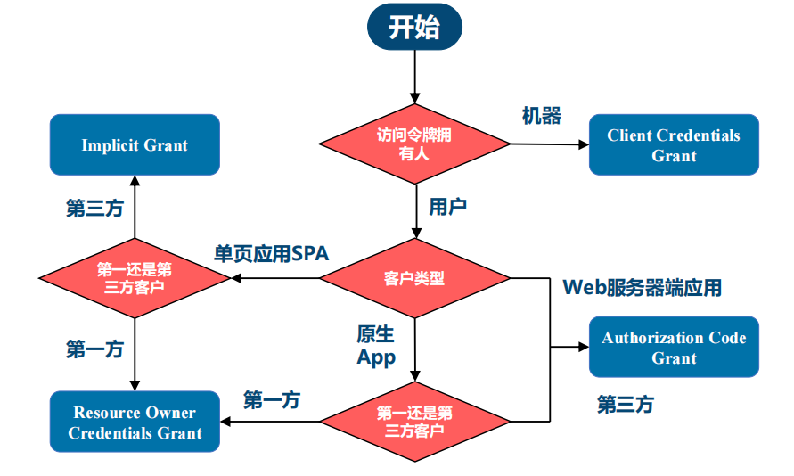

>**$\textcolor{RubineRed}{Author: ACatSmiling}$**
>
>**$\color{RubineRed}{Since: 2024-07-04}$**

## 概述

> 官网：https://spring.io/projects/spring-security
>
> 官方文档：https://docs.spring.io/spring-security/reference/index.html

Spring Security is a framework that provides [authentication](https://docs.spring.io/spring-security/reference/features/authentication/index.html), [authorization](https://docs.spring.io/spring-security/reference/features/authorization/index.html), and [protection against common attacks](https://docs.spring.io/spring-security/reference/features/exploits/index.html). With first class support for securing both [imperative](https://docs.spring.io/spring-security/reference/servlet/index.html) and [reactive](https://docs.spring.io/spring-security/reference/reactive/index.html) applications, it is the de-facto standard for securing Spring-based applications.

For a complete list of features, see the [Features](https://docs.spring.io/spring-security/reference/features/index.html) section of the reference.

If you are ready to start securing an application see the Getting Started sections for [servlet](https://docs.spring.io/spring-security/reference/servlet/getting-started.html) and [reactive](https://docs.spring.io/spring-security/reference/reactive/getting-started.html). These sections will walk you through creating your first Spring Security applications.

If you want to understand how Spring Security works, you can refer to the [Architecture](https://docs.spring.io/spring-security/reference/servlet/architecture.html) section.

If you have any questions, there is a wonderful [community](https://docs.spring.io/spring-security/reference/community.html) that would love to help you!

从以上简介，可以发现，Spring Security 的主要功能是：

- **`身份认证（authentication）`**：**身份认证是验证谁正在访问系统资源，判断用户是否为合法用户。**认证用户的常见方式是要求用户输入用户名和密码。
- **`授权（authorization）`**：**用户进行身份认证后，系统会控制谁能访问哪些资源，这个过程叫做授权。**用户无法访问没有权限的资源。
- **`防御常见攻击（protection against common attacks）`**
  - **CSRF**
  - **HTTP Headers**
  - **HTTP Requests**


>截至当前，Spring Security 的最新版本为 6.3.1。

## 入门案例

> 官方文档：https://docs.spring.io/spring-security/reference/servlet/getting-started.html

创建一个普通的 Spring Boot Web 项目，先不引入 Spring Security 依赖，查看引入前后的变化。

pom.xml：

```xml
<?xml version="1.0" encoding="UTF-8"?>
<project xmlns="http://maven.apache.org/POM/4.0.0"
         xmlns:xsi="http://www.w3.org/2001/XMLSchema-instance"
         xsi:schemaLocation="http://maven.apache.org/POM/4.0.0 http://maven.apache.org/xsd/maven-4.0.0.xsd">
    <modelVersion>4.0.0</modelVersion>
    <parent>
        <groupId>cn.zero.cloud</groupId>
        <artifactId>zeloud-self-studies</artifactId>
        <version>1.0.0-SNAPSHOT</version>
    </parent>

    <artifactId>zeloud-self-study-spring-security</artifactId>
    <packaging>jar</packaging>

    <properties>
        <java.version>17</java.version>
        <maven.compiler.source>17</maven.compiler.source>
        <maven.compiler.target>17</maven.compiler.target>
        <project.build.sourceEncoding>UTF-8</project.build.sourceEncoding>
    </properties>

    <dependencies>
        <dependency>
            <groupId>org.projectlombok</groupId>
            <artifactId>lombok</artifactId>
            <optional>true</optional>
        </dependency>

        <dependency>
            <groupId>org.springframework.boot</groupId>
            <artifactId>spring-boot-starter-web</artifactId>
        </dependency>
    </dependencies>

</project>
```

application.yaml：

```yaml
spring:
  application:
    name: zeloud-self-study-spring-security
  profiles:
    default: dev

server:
  port: 4213
  servlet:
    context-path: /zeloud/security
```

IndexController.java：

```java
package cn.zero.cloud.security.controller;

import org.springframework.http.HttpStatus;
import org.springframework.http.MediaType;
import org.springframework.web.bind.annotation.GetMapping;
import org.springframework.web.bind.annotation.RequestMapping;
import org.springframework.web.bind.annotation.ResponseStatus;
import org.springframework.web.bind.annotation.RestController;

/**
 * @author Xisun Wang
 * @since 7/4/2024 13:42
 */
@RestController
@RequestMapping(value = "/index")
public class IndexController {
    @GetMapping(value = "", produces = MediaType.APPLICATION_JSON_VALUE)
    @ResponseStatus(HttpStatus.OK)
    public String index() {
        return "index";
    }
}
```

以上配置，启动项目后，访问 http://locaolhost:4213/zeloud/security/index，可以直接获取响应：


现在，引入 Spring Security 依赖`spring-boot-starter-security`，重新启动项目，刷新页面，可以看到，会自动跳转到一个登录页面：


这个登录页面，是 Spring Security 依赖添加后出现的默认行为，在项目启动日志中，可以获取默认的用户密码（默认的用户名称为 user）：

```java
2024-07-05 11:24:10.082 [main] WARN  o.s.b.a.s.s.UserDetailsServiceAutoConfiguration - 

Using generated security password: 92b077ed-133f-4e51-b763-b1392e909c9b

This generated password is for development use only. Your security configuration must be updated before running your application in production.
```

使用默认的用户名和密码，即可登录系统。同时，Spring Security 也提供了一个默认的 logout 接口：


From here, you can:

- Better understand [what Spring Boot enables in Spring Security by default](https://docs.spring.io/spring-security/reference/servlet/getting-started.html#servlet-hello-auto-configuration)
- Read about [common use cases](https://docs.spring.io/spring-security/reference/servlet/getting-started.html#security-use-cases) that Spring Security helps with
- Start configuring [authentication](https://docs.spring.io/spring-security/reference/servlet/authentication/index.html)

### 基础功能

The default arrangement of Spring Boot and Spring Security affords the following behaviors at runtime:

- Requires an authenticated user [for any endpoint](https://docs.spring.io/spring-security/reference/servlet/authorization/authorize-http-requests.html) (including Boot’s `/error` endpoint).
- [Registers a default user](https://docs.spring.io/spring-security/reference/servlet/authentication/passwords/user-details-service.html) with a generated password at startup (the password is logged to the console; in the preceding example, the password is `8e557245-73e2-4286-969a-ff57fe326336`).
- Protects [password storage with BCrypt](https://docs.spring.io/spring-security/reference/servlet/authentication/passwords/password-encoder.html) as well as others.
- Provides form-based [login](https://docs.spring.io/spring-security/reference/servlet/authentication/passwords/form.html) and [logout](https://docs.spring.io/spring-security/reference/servlet/authentication/logout.html) flows.
- Authenticates [form-based login](https://docs.spring.io/spring-security/reference/servlet/authentication/passwords/form.html) as well as [HTTP Basic](https://docs.spring.io/spring-security/reference/servlet/authentication/passwords/basic.html).
- Provides content negotiation; for web requests, redirects to the login page; for service requests, returns a `401 Unauthorized`.
- [Mitigates CSRF](https://docs.spring.io/spring-security/reference/servlet/exploits/csrf.html) attacks.
- [Mitigates Session Fixation](https://docs.spring.io/spring-security/reference/servlet/authentication/session-management.html#ns-session-fixation) attacks.
- Writes [Strict-Transport-Security](https://docs.spring.io/spring-security/reference/servlet/exploits/headers.html#servlet-headers-hsts) to [ensure HTTPS](https://en.wikipedia.org/wiki/HTTP_Strict_Transport_Security).
- Writes [X-Content-Type-Options](https://docs.spring.io/spring-security/reference/servlet/exploits/headers.html#servlet-headers-content-type-options) to mitigate [sniffing attacks](https://cheatsheetseries.owasp.org/cheatsheets/HTTP_Headers_Cheat_Sheet.html#x-content-type-options).
- Writes [Cache Control headers](https://docs.spring.io/spring-security/reference/servlet/exploits/headers.html#servlet-headers-cache-control) that protect authenticated resources.
- Writes [X-Frame-Options](https://docs.spring.io/spring-security/reference/servlet/exploits/headers.html#servlet-headers-frame-options) to mitigate [Clickjacking](https://cheatsheetseries.owasp.org/cheatsheets/HTTP_Headers_Cheat_Sheet.html#x-frame-options).
- Integrates with [`HttpServletRequest`'s authentication methods](https://docs.spring.io/spring-security/reference/servlet/integrations/servlet-api.html).
- Publishes [authentication success and failure events](https://docs.spring.io/spring-security/reference/servlet/authentication/events.html).

**Spring Security 启动时，默认实现了以下功能：**

- 保护应用程序 URL，要求对应用程序的任何交互进行身份验证。
- 程序启动时生成一个默认用户 user。
- 生成一个默认的随机密码，并将此密码记录在控制台上。
- 生成默认的登录表单和注销页面。
- 提供基于表单的登录和注销流程。
- 对于 Web 请求，重定向到登录页面。
- 对于服务请求，返回 401 未经授权。
- 处理跨站请求伪造（CSRF）攻击。
- 处理会话劫持攻击。
- 写入 Strict-Transport-Security 以确保 HTTPS。
- 写入 X-Content-Type-Options 以处理嗅探攻击。
- 写入 Cache Control 头来保护经过身份验证的资源。
- 写入 X-Frame-Options 以处理点击劫持攻击。

### 自动配置

It can be helpful to understand how Spring Boot is coordinating with Spring Security to achieve this. Taking a look at [Boot’s security auto configuration](https://docs.spring.io/spring-boot/docs/3.1.1/api/org/springframework/boot/autoconfigure/security/servlet/SecurityAutoConfiguration.html), it does the following (simplified for illustration):

```java
@EnableWebSecurity 
@Configuration
public class DefaultSecurityConfig {
    @Bean
    @ConditionalOnMissingBean(UserDetailsService.class)
    InMemoryUserDetailsManager inMemoryUserDetailsManager() { 
        String generatedPassword = // ...;
        return new InMemoryUserDetailsManager(User.withUsername("user")
                .password(generatedPassword).roles("USER").build());
    }

    @Bean
    @ConditionalOnMissingBean(AuthenticationEventPublisher.class)
    DefaultAuthenticationEventPublisher defaultAuthenticationEventPublisher(ApplicationEventPublisher delegate) { 
        return new DefaultAuthenticationEventPublisher(delegate);
    }
}
```

1. Adds the `@EnableWebSecurity` annotation. (Among other things, this publishes [Spring Security’s default `Filter` chain](https://docs.spring.io/spring-security/reference/servlet/architecture.html#servlet-securityfilterchain) as a `@Bean`).（添加 @EnableWebSecurity 注解，启用 Spring Security 的 Web 安全配置）
2. Publishes a [`UserDetailsService`](https://docs.spring.io/spring-security/reference/servlet/authentication/passwords/user-details-service.html) `@Bean` with a username of `user` and a randomly generated password that is logged to the console.（生成一个 UserDetailsService Bean，用户名为 user，用户密码为一个随机的 UUID）
3. Publishes an [`AuthenticationEventPublisher`](https://docs.spring.io/spring-security/reference/servlet/authentication/events.html) `@Bean` for publishing authentication events.（生成一个用于发布身份验证事件的 AuthenticationEventPublisher @Bean）

> Spring Boot adds any Filter published as a @Bean to the application’s filter chain. This means that using `@EnableWebSecurity` in conjunction with Spring Boot automatically registers Spring Security’s filter chain for every request.
>
> Spring Boot 默认添加了一些 Filter，详见后文。

#### DefaultSecurityFilterChain

程序启动后，通过控制台输出，能够看到在 DefaultSecurityFilterChain 中输出的 Spring Security 默认加载的 SecurityFilter 信息。除此之外，也可以在 DefaultSecurityFilterChain 类中设置断点，然后查看默认的 16 个 Filter：

```java
public DefaultSecurityFilterChain(RequestMatcher requestMatcher, List<Filter> filters) {
    if (filters.isEmpty()) {
       logger.info(LogMessage.format("Will not secure %s", requestMatcher));
    }
    else {
       logger.info(LogMessage.format("Will secure %s with %s", requestMatcher, filters));
    }
    this.requestMatcher = requestMatcher;
    this.filters = new ArrayList<>(filters);
}
```


#### SecurityProperties

Spring Boot 自动配置时，会将`spring.security`相关的属性，绑定到 SecurityProperties 类。这个类中有一个静态内部类 User，配置了默认的用户名（name = "user"）和密码（password = uuid）：

```java
/*
 * Copyright 2012-2023 the original author or authors.
 *
 * Licensed under the Apache License, Version 2.0 (the "License");
 * you may not use this file except in compliance with the License.
 * You may obtain a copy of the License at
 *
 *      https://www.apache.org/licenses/LICENSE-2.0
 *
 * Unless required by applicable law or agreed to in writing, software
 * distributed under the License is distributed on an "AS IS" BASIS,
 * WITHOUT WARRANTIES OR CONDITIONS OF ANY KIND, either express or implied.
 * See the License for the specific language governing permissions and
 * limitations under the License.
 */

package org.springframework.boot.autoconfigure.security;

import java.util.ArrayList;
import java.util.EnumSet;
import java.util.List;
import java.util.Set;
import java.util.UUID;

import org.springframework.boot.context.properties.ConfigurationProperties;
import org.springframework.boot.web.servlet.DispatcherType;
import org.springframework.boot.web.servlet.filter.OrderedFilter;
import org.springframework.core.Ordered;
import org.springframework.util.StringUtils;

/**
 * Configuration properties for Spring Security.
 *
 * @author Dave Syer
 * @author Andy Wilkinson
 * @author Madhura Bhave
 * @since 1.0.0
 */
@ConfigurationProperties(prefix = "spring.security")
public class SecurityProperties {

    /**
     * Order applied to the {@code SecurityFilterChain} that is used to configure basic
     * authentication for application endpoints. Create your own
     * {@code SecurityFilterChain} if you want to add your own authentication for all or
     * some of those endpoints.
     */
    public static final int BASIC_AUTH_ORDER = Ordered.LOWEST_PRECEDENCE - 5;

    /**
     * Order applied to the {@code WebSecurityCustomizer} that ignores standard static
     * resource paths.
     */
    public static final int IGNORED_ORDER = Ordered.HIGHEST_PRECEDENCE;

    /**
     * Default order of Spring Security's Filter in the servlet container (i.e. amongst
     * other filters registered with the container). There is no connection between this
     * and the {@code @Order} on a {@code SecurityFilterChain}.
     */
    public static final int DEFAULT_FILTER_ORDER = OrderedFilter.REQUEST_WRAPPER_FILTER_MAX_ORDER - 100;

    private final Filter filter = new Filter();

    private final User user = new User();

    public User getUser() {
       return this.user;
    }

    public Filter getFilter() {
       return this.filter;
    }

    public static class Filter {

       /**
        * Security filter chain order for Servlet-based web applications.
        */
       private int order = DEFAULT_FILTER_ORDER;

       /**
        * Security filter chain dispatcher types for Servlet-based web applications.
        */
       private Set<DispatcherType> dispatcherTypes = EnumSet.allOf(DispatcherType.class);

       public int getOrder() {
          return this.order;
       }

       public void setOrder(int order) {
          this.order = order;
       }

       public Set<DispatcherType> getDispatcherTypes() {
          return this.dispatcherTypes;
       }

       public void setDispatcherTypes(Set<DispatcherType> dispatcherTypes) {
          this.dispatcherTypes = dispatcherTypes;
       }

    }

    public static class User {

       /**
        * Default user name.
        */
       private String name = "user";

       /**
        * Password for the default user name.
        */
       private String password = UUID.randomUUID().toString();

       /**
        * Granted roles for the default user name.
        */
       private List<String> roles = new ArrayList<>();

       private boolean passwordGenerated = true;

       public String getName() {
          return this.name;
       }

       public void setName(String name) {
          this.name = name;
       }

       public String getPassword() {
          return this.password;
       }

       public void setPassword(String password) {
          if (!StringUtils.hasLength(password)) {
             return;
          }
          this.passwordGenerated = false;
          this.password = password;
       }

       public List<String> getRoles() {
          return this.roles;
       }

       public void setRoles(List<String> roles) {
          this.roles = new ArrayList<>(roles);
       }

       public boolean isPasswordGenerated() {
          return this.passwordGenerated;
       }

    }

}
```

通过修改 Spring Boot 的配置文件，可以自定义用户名和密码（此时，默认的 user 和随机生成的 UUID 密码会失效）：

```properties
# modify the default login user and password
spring.security.user.name=admin
spring.security.user.password=admin
```

## Architecture（系统架构）

> 官方文档：https://docs.spring.io/spring-security/reference/servlet/architecture.html

This section discusses Spring Security’s high-level architecture within Servlet based applications. We build on this high-level understanding within the [Authentication](https://docs.spring.io/spring-security/reference/servlet/authentication/index.html#servlet-authentication), [Authorization](https://docs.spring.io/spring-security/reference/servlet/authorization/index.html#servlet-authorization), and [Protection Against Exploits](https://docs.spring.io/spring-security/reference/servlet/exploits/index.html#servlet-exploits) sections of the reference.

本节是基于 Servlet 的应用程序中 Spring Security 的架构描述，在 Authentication，Authorization 和 Protection Against Exploits 三个章节中，有对架构的具体实现。

### Filter

Spring Security’s Servlet support is based on Servlet Filters, so it is helpful to look at the role of Filters generally first. The following image shows the typical layering of the handlers for a single HTTP request.

Spring Security 之所以默认帮助我们做了那么多事情，它的**`底层原理是传统的 Servlet 过滤器`**。下图展示了处理一个 Http 请求时，过滤器和 Servlet 的工作流程：


FilterChain, which contains the Filter instances and Servlet that should process the HttpServletRequest, based on the path of the request URI. In a Spring MVC application, the Servlet is an instance of [DispatcherServlet](https://docs.spring.io/spring-framework/docs/6.1.9/reference/html/web.html#mvc-servlet). At most, one Servlet can handle a single HttpServletRequest and HttpServletResponse. However, more than one Filter can be used to:

- Prevent downstream Filter instances or the Servlet from being invoked. In this case, the Filter typically writes the HttpServletResponse.
- Modify the HttpServletRequest or HttpServletResponse used by the downstream Filter instances and the Servlet.

The power of the Filter comes from the FilterChain that is passed into it.

在 Spring MVC 应用程序中，Servlet 是 DispatcherServlet 的一个实例。对于一个 Servlet，最多只能处理一个 HttpServletRequest 和 HttpServletResponse。但是，**我们可以在过滤器中对请求进行修改或增强，一个包含多个 Filter 的 FilterChain 可以实现很多功能。**

一个典型的 FilterChain 示例如下：

```java
public void doFilter(ServletRequest request, ServletResponse response, FilterChain chain) {
	// do something before the rest of the application
    chain.doFilter(request, response); // invoke the rest of the application
    // do something after the rest of the application
}
```

> 由于过滤器只影响下游过滤器实例和 Servlet，因此，调用每个过滤器的顺序极为重要。

### DelegatingFilterProxy

Spring provides a Filter implementation named [DelegatingFilterProxy](https://docs.spring.io/spring-framework/docs/6.1.9/javadoc-api/org/springframework/web/filter/DelegatingFilterProxy.html) that allows bridging between the Servlet container’s lifecycle and Spring’s ApplicationContext. The Servlet container allows registering Filter instances by using its own standards, but it is not aware of Spring-defined Beans. You can register DelegatingFilterProxy through the standard Servlet container mechanisms but delegate all the work to a Spring Bean that implements Filter.

Here is a picture of how DelegatingFilterProxy fits into the [Filter instances and the FilterChain](https://docs.spring.io/spring-security/reference/servlet/architecture.html#servlet-filters-review).

**`DelegatingFilterProxy`是 Spring Security 提供的一个 Filter 实现，可以在 Servlet 容器和 Spring 容器之间建立桥梁。通过使用 DelegatingFilterProxy，就可以将 Servlet 容器中的 Filter 实例放在 Spring 容器中管理。**

下图展示了 DelegatingFilterProxy 是如何与过滤器实例和 FilterChain 相结合的：


- DelegatingFilterProxy 从 Spring 的 ApplicationContext 中查找 Bean Filter~0~，然后调用 Bean Filter~0~。

下面是 DelegatingFilterProxy  的伪代码：

```java
public void doFilter(ServletRequest request, ServletResponse response, FilterChain chain) {
	Filter delegate = getFilterBean(someBeanName); 
	delegate.doFilter(request, response); 
}
```

Another benefit of DelegatingFilterProxy is that it allows delaying looking up Filter bean instances. This is important because the container needs to register the Filter instances before the container can start up. However, Spring typically uses a ContextLoaderListener to load the Spring Beans, which is not done until after the Filter instances need to be registered.

**DelegatingFilterProxy 的另一个好处是可以延迟查找过滤器 bean 实例。**这一点很重要，因为容器需要在启动之前注册过滤器实例。不过，Spring 通常使用 ContextLoaderListener 来加载 Spring Beans，而这要等到需要注册过滤器实例之后才能完成。

### FilterChainProxy

Spring Security’s Servlet support is contained within FilterChainProxy. FilterChainProxy is a special Filter provided by Spring Security that allows delegating to many Filter instances through [SecurityFilterChain](https://docs.spring.io/spring-security/reference/servlet/architecture.html#servlet-securityfilterchain). Since FilterChainProxy is a Bean, it is typically wrapped in a [DelegatingFilterProxy](https://docs.spring.io/spring-security/reference/servlet/architecture.html#servlet-delegatingfilterproxy).

Spring Security 的 Servlet 支持包含在 FilterChainProxy 中。**`FilterChainProxy`是 Spring Security 提供的一种特殊过滤器，允许通过 SecurityFilterChain 委托多个过滤器实例。**

> FilterChainProxy 是一个 Bean，它通常也会被封装在 DelegatingFilterProxy 中。

下图展示了 FilterChainProxy 的作用：


### SecurityFilterChain

[SecurityFilterChain](https://docs.spring.io/spring-security/site/docs/6.3.1/api/org/springframework/security/web/SecurityFilterChain.html) is used by [FilterChainProxy](https://docs.spring.io/spring-security/reference/servlet/architecture.html#servlet-filterchainproxy) to determine which Spring Security Filter instances should be invoked for the current request.

**`SecurityFilterChain`**被 FilterChainProxy 使用，负责查找当前的请求需要执行的 Security Filter 列表。

下图展示了 SecurityFilterChain 的作用：


The [Security Filters](https://docs.spring.io/spring-security/reference/servlet/architecture.html#servlet-security-filters) in SecurityFilterChain are typically Beans, but they are registered with FilterChainProxy instead of [DelegatingFilterProxy](https://docs.spring.io/spring-security/reference/servlet/architecture.html#servlet-delegatingfilterproxy). FilterChainProxy provides a number of advantages to registering directly with the Servlet container or [DelegatingFilterProxy](https://docs.spring.io/spring-security/reference/servlet/architecture.html#servlet-delegatingfilterproxy). 

SecurityFilterChain 中的安全过滤器通常是 Bean，但它们是通过 FilterChainProxy 而不是 DelegatingFilterProxy 注册的。与直接向 Servlet 容器或 DelegatingFilterProxy 注册相比，FilterChainProxy 有许多优点。

First, it provides a starting point for all of Spring Security’s Servlet support. For that reason, if you try to troubleshoot Spring Security’s Servlet support, adding a debug point in FilterChainProxy is a great place to start.

**首先，它为 Spring Security 的所有 Servlet 支持提供了一个起点。**因此，如果你想检查 Spring Security Servlet 支持的故障，在 FilterChainProxy 中添加调试点是一个很好的开始。

Second, since FilterChainProxy is central to Spring Security usage, it can perform tasks that are not viewed as optional. For example, it clears out the SecurityContext to avoid memory leaks. It also applies Spring Security’s [HttpFirewall](https://docs.spring.io/spring-security/reference/servlet/exploits/firewall.html#servlet-httpfirewall) to protect applications against certain types of attacks.

**其次，由于 FilterChainProxy 是 Spring Security 使用的核心，因此它可以执行一些不被视为可选的任务。**例如，它会清除 SecurityContext 以避免内存泄漏。它还会应用 Spring Security 的 HttpFirewall 来保护应用程序免受某些类型的攻击。

In addition, it provides more flexibility in determining when a SecurityFilterChain should be invoked. In a Servlet container, Filter instances are invoked based upon the URL alone. However, FilterChainProxy can determine invocation based upon anything in the HttpServletRequest by using the RequestMatcher interface.

**此外，它还能更灵活地确定何时调用 SecurityFilterChain。**在 Servlet 容器中，过滤器实例仅根据 URL 调用。但是，FilterChainProxy 可以通过使用 RequestMatcher 接口，根据 HttpServletRequest 中的任何内容确定调用。

### Multiple SecurityFilterChain

The following image shows multiple SecurityFilterChain instances:


In the [Multiple SecurityFilterChain](https://docs.spring.io/spring-security/reference/servlet/architecture.html#servlet-multi-securityfilterchain-figure) figure, FilterChainProxy decides which SecurityFilterChain should be used. Only the first SecurityFilterChain that matches is invoked. If a URL of `/api/messages/` is requested, it first matches on the SecurityFilterChain~0~ pattern of `/api/**`, so only SecurityFilterChain~0~ is invoked, even though it also matches on SecurityFilterChain~n~. If a URL of `/messages/` is requested, it does not match on the SecurityFilterChain~0~ pattern of `/api/**`, so FilterChainProxy continues trying each SecurityFilterChain. Assuming that no other SecurityFilterChain instances match, SecurityFilterChainn is invoked.

在上面的**`Multiple SecurityFilterChain`**图中，FilterChainProxy 决定使用哪个 SecurityFilterChain。**只有第一个匹配的 SecurityFilterChain 才会被调用。**

- 如果请求的 URL 是 `/api/messages/`，它首先与 `/api/**` 的 SecurityFilterChain~0~ 模式匹配，因此只调用 SecurityFilterChain~0~，尽管它也与 SecurityFilterChain~n~ 匹配。
- 如果请求的 URL 是 `/messages/`，则它与 `/api/**` 的 SecurityFilterChain~0~ 模式不匹配，因此 FilterChainProxy 会继续尝试每个 SecurityFilterChain。如果没有其他 SecurityFilterChain 实例能够匹配，则调用 SecurityFilterChain~n~。

Notice that SecurityFilterChain~0~ has only three security Filter instances configured. However, SecurityFilterChain~n~ has four security Filter instances configured. It is important to note that each SecurityFilterChain can be unique and can be configured in isolation. In fact, a SecurityFilterChain might have zero security Filter instances if the application wants Spring Security to ignore certain requests.

请注意，上图中，SecurityFilterChain~0~ 只配置了三个安全过滤器实例。但是，SecurityFilterChain~n~ 配置了四个安全过滤器实例。值得注意的是，每个 SecurityFilterChain 都可以是唯一的，并且可以单独配置。事实上，**如果应用程序希望 Spring Security 忽略某些请求，SecurityFilterChain 可能拥有零安全过滤器实例。**

### Security Filters

The Security Filters are inserted into the [FilterChainProxy](https://docs.spring.io/spring-security/reference/servlet/architecture.html#servlet-filterchainproxy) with the [SecurityFilterChain](https://docs.spring.io/spring-security/reference/servlet/architecture.html#servlet-securityfilterchain) API. Those filters can be used for a number of different purposes, like [authentication](https://docs.spring.io/spring-security/reference/servlet/authentication/index.html), [authorization](https://docs.spring.io/spring-security/reference/servlet/authorization/index.html), [exploit protection](https://docs.spring.io/spring-security/reference/servlet/exploits/index.html), and more. The filters are executed in a specific order to guarantee that they are invoked at the right time, for example, the Filter that performs authentication should be invoked before the Filter that performs authorization. It is typically not necessary to know the ordering of Spring Security’s Filters. However, there are times that it is beneficial to know the ordering, if you want to know them, you can check the [FilterOrderRegistration code](https://github.com/spring-projects/spring-security/tree/6.3.1/config/src/main/java/org/springframework/security/config/annotation/web/builders/FilterOrderRegistration.java).

**`Security Filters`通过 SecurityFilterChain API 插入到 FilterChainProxy 中。这些过滤器可用于多种不同目的，如身份验证、授权、漏洞保护等。`过滤器按特定顺序执行`，以确保在正确的时间调用。**例如，执行身份验证的过滤器应在执行授权的过滤器之前调用。通常情况下，没有必要知道 Spring Security 过滤器的顺序。不过，有时知道排序是有好处的，如果你想知道，可以查看 FilterOrderRegistration 代码。

假设有以下配置：

```java
@Configuration
@EnableWebSecurity
public class SecurityConfig {

    @Bean
    public SecurityFilterChain filterChain(HttpSecurity http) throws Exception {
        http
            .csrf(Customizer.withDefaults())
            .authorizeHttpRequests(authorize -> authorize
                .anyRequest().authenticated()
            )
            .httpBasic(Customizer.withDefaults())
            .formLogin(Customizer.withDefaults());
        return http.build();
    }

}
```

上述配置将导致以下过滤器排序：

| Filter                                                       | Added by                             |
| :----------------------------------------------------------- | :----------------------------------- |
| [CsrfFilter](https://docs.spring.io/spring-security/reference/servlet/exploits/csrf.html) | `HttpSecurity#csrf`                  |
| [UsernamePasswordAuthenticationFilter](https://docs.spring.io/spring-security/reference/servlet/authentication/passwords/form.html#servlet-authentication-form) | `HttpSecurity#formLogin`             |
| [BasicAuthenticationFilter](https://docs.spring.io/spring-security/reference/servlet/authentication/passwords/basic.html) | `HttpSecurity#httpBasic`             |
| [AuthorizationFilter](https://docs.spring.io/spring-security/reference/servlet/authorization/authorize-http-requests.html) | `HttpSecurity#authorizeHttpRequests` |

- First, the CsrfFilter is invoked to protect against [CSRF attacks](https://docs.spring.io/spring-security/reference/servlet/exploits/csrf.html).
- Second, the authentication filters are invoked to authenticate the request.
- Third, the AuthorizationFilter is invoked to authorize the request.

> There might be other Filter instances that are not listed above. If you want to see the list of filters invoked for a particular request, you can print them. 

#### Printing the Security Filters

Often times, it is useful to see the list of security Filters that are invoked for a particular request. For example, you want to make sure that the [filter you have added](https://docs.spring.io/spring-security/reference/servlet/architecture.html#adding-custom-filter) is in the list of the security filters.

The list of filters is printed at INFO level on the application startup, so you can see something like the following on the console output for example:（**过滤器列表会在应用程序启动时以 INFO 级别打印**，因此可以在控制台输出中看到如下内容）

```java
2024-07-05 11:24:10.196 [main] INFO  o.s.security.web.DefaultSecurityFilterChain - Will secure any request with [org.springframework.security.web.session.DisableEncodeUrlFilter@54af3cb9, org.springframework.security.web.context.request.async.WebAsyncManagerIntegrationFilter@236fdf, org.springframework.security.web.context.SecurityContextHolderFilter@7634f2b, org.springframework.security.web.header.HeaderWriterFilter@1c30cb85, org.springframework.web.filter.CorsFilter@16e99306, org.springframework.security.web.csrf.CsrfFilter@27585351, org.springframework.security.web.authentication.logout.LogoutFilter@19b07407, org.springframework.security.web.authentication.UsernamePasswordAuthenticationFilter@310a7859, org.springframework.security.web.authentication.ui.DefaultLoginPageGeneratingFilter@4d98e41b, org.springframework.security.web.authentication.ui.DefaultLogoutPageGeneratingFilter@653fb8d1, org.springframework.security.web.authentication.www.BasicAuthenticationFilter@4c531172, org.springframework.security.web.savedrequest.RequestCacheAwareFilter@15639d09, org.springframework.security.web.servletapi.SecurityContextHolderAwareRequestFilter@4fba8eec, org.springframework.security.web.authentication.AnonymousAuthenticationFilter@48581a3b, org.springframework.security.web.access.ExceptionTranslationFilter@624b523, org.springframework.security.web.access.intercept.AuthorizationFilter@4a89ef44]
```

And that will give a pretty good idea of the security filters that are configured for [each filter chain](https://docs.spring.io/spring-security/reference/servlet/architecture.html#servlet-securityfilterchain).

But that is not all, you can also configure your application to print the invocation of each individual filter for each request. That is helpful to see if the filter you have added is invoked for a particular request or to check where an exception is coming from. To do that, you can configure your application to [log the security events](https://docs.spring.io/spring-security/reference/servlet/architecture.html#servlet-logging).

但这还不是全部，也可以配置应用程序，打印每个请求调用每个过滤器的情况。这有助于查看添加的过滤器是否被某个请求调用，或检查异常来自何处。为此，可以对应用程序进行配置，以记录安全事件。

#### Adding a Custom Filter to the Filter Chain

Most of the time, the default security filters are enough to provide security to your application. However, there might be times that you want to add a custom Filter to the security filter chain.

For example, let’s say that you want to add a Filter that gets a tenant id header and check if the current user has access to that tenant. The previous description already gives us a clue on where to add the filter, since we need to know the current user, we need to add it after the authentication filters.

大多数情况下，默认的安全过滤器足以为应用程序提供安全保障，但有时可能需要在安全过滤器链中**添加一个自定义过滤器**。例如，需要添加一个过滤器，获取租户 id 头信息并检查当前用户是否有访问该租户的权限。 

First, let’s create the Filter:

```java
public class TenantFilter implements Filter {

    @Override
    public void doFilter(ServletRequest servletRequest, ServletResponse servletResponse, FilterChain filterChain) throws IOException, ServletException {
        HttpServletRequest request = (HttpServletRequest) servletRequest;
        HttpServletResponse response = (HttpServletResponse) servletResponse;

        String tenantId = request.getHeader("X-Tenant-Id"); 
        boolean hasAccess = isUserAllowed(tenantId); 
        if (hasAccess) {
            filterChain.doFilter(request, response); 
            return;
        }
        throw new AccessDeniedException("Access denied"); 
    }

}
```

The sample code above does the following:

1. Get the tenant id from the request header.
2. Check if the current user has access to the tenant id.
3. If the user has access, then invoke the rest of the filters in the chain.
4. If the user does not have access, then throw an AccessDeniedException.

>Instead of implementing Filter, you can extend from [OncePerRequestFilter](https://docs.spring.io/spring-framework/docs/6.1.9/javadoc-api/org/springframework/web/filter/OncePerRequestFilter.html) which is a base class for filters that are only invoked once per request and provides a doFilterInternal method with the HttpServletRequest and HttpServletResponse parameters.
>
>除了实现 Filter，也可以从**`OncePerRequestFilter`**扩展，它是每个请求只调用一次的过滤器的基类，并提供一个带有 HttpServletRequest 和 HttpServletResponse 参数的 doFilterInternal 方法。

Now, we need to add the filter to the security filter chain.

```java
@Bean
SecurityFilterChain filterChain(HttpSecurity http) throws Exception {
    http
        // ...
        .addFilterBefore(new TenantFilter(), AuthorizationFilter.class); 
    return http.build();
}
```

- Use HttpSecurity#addFilterBefore to add the TenantFilter before the AuthorizationFilter.

By adding the filter before the AuthorizationFilter we are making sure that the TenantFilter is invoked after the authentication filters. You can also use HttpSecurity#addFilterAfter to add the filter after a particular filter or HttpSecurity#addFilterAt to add the filter at a particular filter position in the filter chain.

And that’s it, now the TenantFilter will be invoked in the filter chain and will check if the current user has access to the tenant id.

通过使用**`HttpSecurity#addFilterBefore`**，在授权过滤器（AuthorizationFilter）之前添加过滤器，我们可以确保在身份验证过滤器之后调用租户过滤器（TenantFilter）。也可以使用**`HttpSecurity#addFilterAfter`**在特定过滤器之后添加过滤器，或者使用**`HttpSecurity#addFilterAt`**在过滤器链中的特定过滤器位置添加过滤器。

就这样，现在 TenantFilter 将在过滤器链中被调用，并检查当前用户是否拥有租户 ID 的访问权限。

Be careful when you declare your filter as a Spring bean, either by annotating it with @Component or by declaring it as a bean in your configuration, because Spring Boot will automatically [register it with the embedded container](https://docs.spring.io/spring-boot/docs/3.1.1/reference/html/web.html#web.servlet.embedded-container.servlets-filters-listeners.beans). That may cause the filter to be invoked twice, once by the container and once by Spring Security and in a different order.

**值得注意的是，当将过滤器声明为 Spring Bean 时，无论是使用 @Component 注解，还是在配置中将其声明为 Bean，因为 Spring Boot 会自动将其注册到嵌入式容器中，这可能会导致过滤器被调用两次，一次由容器调用，一次由 Spring Security 调用，而且调用顺序不同。**

If you still want to declare your filter as a Spring bean to take advantage of dependency injection for example, and avoid the duplicate invocation, you can tell Spring Boot to not register it with the container by declaring a FilterRegistrationBean bean and setting its enabled property to false。

如果仍想将过滤器声明为 Spring Bean 以利用依赖注入等功能，并避免重复调用，可以通过**声明一个 FilterRegistrationBean Bean，并将其启用属性设置为 false，从而告诉 Spring Boot 不要将其注册到容器中。**

```java
@Bean
public FilterRegistrationBean<TenantFilter> tenantFilterRegistration(TenantFilter filter) {
    FilterRegistrationBean<TenantFilter> registration = new FilterRegistrationBean<>(filter);
    registration.setEnabled(false);
    return registration;
}
```

>**Spring Security 的过滤器可能会被调用两次，一次由 Servlet 容器调用，一次由 Spring Security 调用，这指的是在同一请求处理过程中，一个自定义的过滤器执行了两次**。
>
>在应用部署时，通常会有一个名为 web.xml 的文件或者使用 Java 基于配置的方式来注册和管理 Filter。对于 Spring Security 来说，它同样拥有自己的一套过滤器链，用于处理认证、授权等安全相关的操作。当开发者在 Spring Security 中自定义一个过滤器并试图将其加入到安全过滤器链时，如果配置不当，就有可能出现过滤器被调用两次的情况。
>
>关于这个问题的进一步探讨，可以从以下几个方面展开：
>
>1. **Filter 的双重注册问题**
>   - `Servlet 容器注册`：当 Filter 实现类上使用了 @Bean 注解或在 Servlet 容器的配置文件中声明后，Servlet 容器会自动将其加入到执行链中。
>   - `Spring Security 注册`：同时如果在 Spring Security 的配置中又将该 Filter 加入到安全过滤器链，那么在请求处理流程中，这个 Filter 就会被执行两次。一次是作为普通的 Servlet Filter，另一次是作为安全过滤器链的一部分。
>2. Spring Security 过滤器链工作机制
>   - 过滤器链的顺序执行：Spring Security 将一系列的安全相关过滤器组成一个链，每个过滤器按顺序处理请求的不同方面，如身份验证、权限校验等。
>   - OncePerRequestFilter 的作用：为了确保每个请求只被过滤一次，Spring Security 专门提供了一个 OncePerRequestFilter 基类。自定义过滤器可以继承此基类以避免重复执行。
>3. 引发问题的常见原因
>   - 多次添加过滤器：在 Spring Security 的配置文件中，如果不小心将同一个过滤器添加多次，或者在不同位置添加了过滤器，会导致重复执行的问题。
>   - FilterBean 的自动注册：在 Spring 容器管理的 FilterBean 会被自动注册到 Servlet 的过滤器链中，如果再显式添加到 Spring Security 的链中，就会重复执行。
>4. 可能引发的相关问题
>   - 性能影响：过滤器被重复执行，会增加请求处理的时间和资源消耗，对系统性能产生不良影响。
>   - 逻辑错误：如果过滤器中包含有状态改变的逻辑，重复执行可能导致预期外的状态变化，从而引发逻辑错误和数据一致性问题。
>5. **解决方案及其应用**
>   - `移除重复注册`：检查并确保过滤器只在 Spring Security 的配置中注册一次，避免在 Servlet 容器和 Spring Security 中双重注册。
>   - `使用 FilterRegistrationBean`：利用 Spring 提供的 FilterRegistrationBean 来管理自定义过滤器的注册，它可以更清晰地控制过滤器的注册位置和条件。
>   - `添加已执行标记`：在过滤器执行时，通过设置请求属性或其他方式来标记过滤器是否已执行，从而避免重复执行的逻辑。
>
>综上所述，可以更好地理解和解决 Spring Security 中自定义过滤器被调用两次的问题。确保过滤器的正确配置和注册，有助于提高应用程序的性能和稳定性。在开发过程中，开发者应当仔细检查他们的配置，并测试过滤器的执行是否符合预期，以保障整个应用的安全性和高效性。

### Handling Security Exceptions

The [ExceptionTranslationFilter](https://docs.spring.io/spring-security/site/docs/6.3.1/api/org/springframework/security/web/access/ExceptionTranslationFilter.html) allows translation of [AccessDeniedException](https://docs.spring.io/spring-security/site/docs/6.3.1/api/org/springframework/security/access/AccessDeniedException.html) and [AuthenticationException](https://docs.spring.io/spring-security/site/docs/6.3.1/api//org/springframework/security/core/AuthenticationException.html) into HTTP responses.

ExceptionTranslationFilter is inserted into the [FilterChainProxy](https://docs.spring.io/spring-security/reference/servlet/architecture.html#servlet-filterchainproxy) as one of the [Security Filters](https://docs.spring.io/spring-security/reference/servlet/architecture.html#servlet-security-filters).

**`ExceptionTranslationFilter`作为 FilterChainProxy 之一插入到过滤器链代理中，它可以将`AccessDeniedException`和`AuthenticationException`转换为 HTTP 响应。**

The following image shows the relationship of ExceptionTranslationFilter to other components:


1. First, the ExceptionTranslationFilter invokes FilterChain.doFilter(request, response) to invoke the rest of the application.
2. If the user is not authenticated or it is an AuthenticationException, then *Start Authentication*.（如果用户未通过身份验证或出现 AuthenticationException，则启动身份验证。）
   - The [SecurityContextHolder](https://docs.spring.io/spring-security/reference/servlet/authentication/architecture.html#servlet-authentication-securitycontextholder) is cleared out.
   - The HttpServletRequest is [saved](https://docs.spring.io/spring-security/reference/servlet/architecture.html#savedrequests) so that it can be used to replay the original request once authentication is successful.
   - The AuthenticationEntryPoint is used to request credentials from the client. For example, it might redirect to a log in page or send a WWW-Authenticate header.
3. Otherwise, if it is an AccessDeniedException, then *Access Denied*. The AccessDeniedHandler is invoked to handle access denied.（如果是 AccessDeniedException，则表示拒绝访问。 调用 AccessDeniedHandler 来处理拒绝访问。）

> If the application does not throw an AccessDeniedException or an AuthenticationException, then ExceptionTranslationFilter does not do anything.
>
> **如果应用程序没有抛出 AccessDeniedException 或 AuthenticationException，则 ExceptionTranslationFilter 不会执行任何操作。**

ExceptionTranslationFilter 的伪代码示例：

```java
try {
	filterChain.doFilter(request, response); 
} catch (AccessDeniedException | AuthenticationException ex) {
	if (!authenticated || ex instanceof AuthenticationException) {
		startAuthentication(); 
	} else {
		accessDenied(); 
	}
}
```

1. As described in [A Review of Filters](https://docs.spring.io/spring-security/reference/servlet/architecture.html#servlet-filters-review), invoking FilterChain.doFilter(request, response) is the equivalent of invoking the rest of the application. This means that if another part of the application, ([FilterSecurityInterceptor](https://docs.spring.io/spring-security/reference/servlet/architecture.html#servlet-authorization-filtersecurityinterceptor) or method security) throws an AuthenticationException or AccessDeniedException it is caught and handled here.
2. If the user is not authenticated or it is an AuthenticationException, *Start Authentication*.
3. Otherwise, *Access Denied*.

### Saving Requests Between Authentication

As illustrated in [Handling Security Exceptions](https://docs.spring.io/spring-security/reference/servlet/architecture.html#servlet-exceptiontranslationfilter), when a request has no authentication and is for a resource that requires authentication, there is a need to save the request for the authenticated resource to re-request after authentication is successful. In Spring Security this is done by saving the HttpServletRequest using a [RequestCache](https://docs.spring.io/spring-security/reference/servlet/architecture.html#requestcache) implementation.

如 Handling Security Exceptions 章节所示，当请求没有经过身份验证，但请求的资源需要身份验证时，就需要保存身份验证资源的请求，以便在身份验证成功后重新请求。 在 Spring Security 中，这是通过使用 RequestCache 保存 HttpServletRequest 来实现的。

#### RequestCache

The HttpServletRequest is saved in the [RequestCache](https://docs.spring.io/spring-security/site/docs/6.3.1/api/org/springframework/security/web/savedrequest/RequestCache.html). When the user successfully authenticates, the RequestCache is used to replay the original request. The [RequestCacheAwareFilter](https://docs.spring.io/spring-security/reference/servlet/architecture.html#requestcacheawarefilter) uses the RequestCache to get the saved HttpServletRequest after the user authenticates, while the ExceptionTranslationFilter uses the RequestCache to save the HttpServletRequest after it detects AuthenticationException, before redirecting the user to the login endpoint.

**HttpServletRequest 保存在`RequestCache`中，当用户成功通过身份验证后，RequestCache 将用于重放原始请求。**RequestCacheAwareFilter 会在用户通过身份验证后使用 RequestCache 获取已保存的 HttpServletRequest，而 ExceptionTranslationFilter 会在检测到 AuthenticationException 后使用 RequestCache 保存 HttpServletRequest，然后再将用户重定向到登录端点。

By default, an HttpSessionRequestCache is used. The code below demonstrates how to customize the RequestCache implementation that is used to check the HttpSession for a saved request if the parameter named continue is present.

**默认情况下，使用的是`HttpSessionRequestCache`。**下面的代码演示了如何自定义 RequestCache 的实现，该实现用于在名为 continue 的参数存在时检查 HttpSession 是否存在已保存的请求。

```java
@Bean
DefaultSecurityFilterChain springSecurity(HttpSecurity http) throws Exception {
	HttpSessionRequestCache requestCache = new HttpSessionRequestCache();
	requestCache.setMatchingRequestParameterName("continue");
	http
		// ...
		.requestCache((cache) -> cache
			.requestCache(requestCache)
		);
	return http.build();
}
```

- RequestCache Only Checks for Saved Requests if continue Parameter Present.（**RequestCache 仅在存在 continue 参数时检查保存的请求**）

##### Prevent the Request From Being Saved

There are a number of reasons you may want to not store the user’s unauthenticated request in the session. You may want to offload that storage onto the user’s browser or store it in a database. Or you may want to shut off this feature since you always want to redirect the user to the home page instead of the page they tried to visit before login.

To do that, you can use [the NullRequestCache implementation](https://docs.spring.io/spring-security/site/docs/6.3.1/api/org/springframework/security/web/savedrequest/NullRequestCache.html).

某些时候，可能并不希望在 session 中存储用户未经身份验证的请求，此时，可以使用 NullRequestCache 实现：

```java
@Bean
SecurityFilterChain springSecurity(HttpSecurity http) throws Exception {
    RequestCache nullRequestCache = new NullRequestCache();
    http
        // ...
        .requestCache((cache) -> cache
            .requestCache(nullRequestCache)
        );
    return http.build();
}
```

#### RequestCacheAwareFilter

The [RequestCacheAwareFilter](https://docs.spring.io/spring-security/site/docs/6.3.1/api/org/springframework/security/web/savedrequest/RequestCacheAwareFilter.html) uses the [RequestCache](https://docs.spring.io/spring-security/reference/servlet/architecture.html#requestcache) to replay the original request.

### Logging

Spring Security provides comprehensive logging of all security related events at the DEBUG and TRACE level. This can be very useful when debugging your application because for security measures Spring Security does not add any detail of why a request has been rejected to the response body. If you come across a 401 or 403 error, it is very likely that you will find a log message that will help you understand what is going on.

Let’s consider an example where a user tries to make a POST request to a resource that has [CSRF protection](https://docs.spring.io/spring-security/reference/servlet/exploits/csrf.html) enabled without the CSRF token. With no logs, the user will see a 403 error with no explanation of why the request was rejected. However, if you enable logging for Spring Security, you will see a log message like this:

```java
2023-06-14T09:44:25.797-03:00 DEBUG 76975 --- [nio-8080-exec-1] o.s.security.web.FilterChainProxy        : Securing POST /hello
2023-06-14T09:44:25.797-03:00 TRACE 76975 --- [nio-8080-exec-1] o.s.security.web.FilterChainProxy        : Invoking DisableEncodeUrlFilter (1/15)
2023-06-14T09:44:25.798-03:00 TRACE 76975 --- [nio-8080-exec-1] o.s.security.web.FilterChainProxy        : Invoking WebAsyncManagerIntegrationFilter (2/15)
2023-06-14T09:44:25.800-03:00 TRACE 76975 --- [nio-8080-exec-1] o.s.security.web.FilterChainProxy        : Invoking SecurityContextHolderFilter (3/15)
2023-06-14T09:44:25.801-03:00 TRACE 76975 --- [nio-8080-exec-1] o.s.security.web.FilterChainProxy        : Invoking HeaderWriterFilter (4/15)
2023-06-14T09:44:25.802-03:00 TRACE 76975 --- [nio-8080-exec-1] o.s.security.web.FilterChainProxy        : Invoking CsrfFilter (5/15)
2023-06-14T09:44:25.814-03:00 DEBUG 76975 --- [nio-8080-exec-1] o.s.security.web.csrf.CsrfFilter         : Invalid CSRF token found for http://localhost:8080/hello
2023-06-14T09:44:25.814-03:00 DEBUG 76975 --- [nio-8080-exec-1] o.s.s.w.access.AccessDeniedHandlerImpl   : Responding with 403 status code
2023-06-14T09:44:25.814-03:00 TRACE 76975 --- [nio-8080-exec-1] o.s.s.w.header.writers.HstsHeaderWriter  : Not injecting HSTS header since it did not match request to [Is Secure]
```

It becomes clear that the CSRF token is missing and that is why the request is being denied.

To configure your application to log all the security events, you can add the following to your application:

- application.properties：

  ```properties
  logging.level.org.springframework.security=TRACE
  ```

- logback.xml：

  ```xml
  <configuration>
      <appender name="STDOUT" class="ch.qos.logback.core.ConsoleAppender">
          <!-- ... -->
      </appender>
      
      <!-- ... -->
      <logger name="org.springframework.security" level="trace" additivity="false">
          <appender-ref ref="Console" />
      </logger>
  </configuration>
  ```

## Authentication（身份认证）

### Servlet Authentication Architecture

> 官方文档：https://docs.spring.io/spring-security/reference/servlet/authentication/architecture.html

This discussion expands on [Servlet Security: The Big Picture](https://docs.spring.io/spring-security/reference/servlet/architecture.html#servlet-architecture) to describe the main architectural components of Spring Security’s used in Servlet authentication. If you need concrete flows that explain how these pieces fit together, look at the [Authentication Mechanism](https://docs.spring.io/spring-security/reference/servlet/authentication/index.html#servlet-authentication-mechanisms) specific sections.

- [SecurityContextHolder](https://docs.spring.io/spring-security/reference/servlet/authentication/architecture.html#servlet-authentication-securitycontextholder) - The SecurityContextHolder is where Spring Security stores the details of who is [authenticated](https://docs.spring.io/spring-security/reference/features/authentication/index.html#authentication).
- [SecurityContext](https://docs.spring.io/spring-security/reference/servlet/authentication/architecture.html#servlet-authentication-securitycontext) - is obtained from the SecurityContextHolder and contains the Authentication of the currently authenticated user.
- [Authentication](https://docs.spring.io/spring-security/reference/servlet/authentication/architecture.html#servlet-authentication-authentication) - Can be the input to AuthenticationManager to provide the credentials a user has provided to authenticate or the current user from the SecurityContext.
- [GrantedAuthority](https://docs.spring.io/spring-security/reference/servlet/authentication/architecture.html#servlet-authentication-granted-authority) - An authority that is granted to the principal on the Authentication (i.e. roles, scopes, etc.)
- [AuthenticationManager](https://docs.spring.io/spring-security/reference/servlet/authentication/architecture.html#servlet-authentication-authenticationmanager) - the API that defines how Spring Security’s Filters perform [authentication](https://docs.spring.io/spring-security/reference/features/authentication/index.html#authentication).
- [ProviderManager](https://docs.spring.io/spring-security/reference/servlet/authentication/architecture.html#servlet-authentication-providermanager) - the most common implementation of AuthenticationManager.
- [AuthenticationProvider](https://docs.spring.io/spring-security/reference/servlet/authentication/architecture.html#servlet-authentication-authenticationprovider) - used by ProviderManager to perform a specific type of authentication.
- [Request Credentials with AuthenticationEntryPoint](https://docs.spring.io/spring-security/reference/servlet/authentication/architecture.html#servlet-authentication-authenticationentrypoint) - used for requesting credentials from a client (i.e. redirecting to a log in page, sending a WWW-Authenticate response, etc.)
- [AbstractAuthenticationProcessingFilter](https://docs.spring.io/spring-security/reference/servlet/authentication/architecture.html#servlet-authentication-abstractprocessingfilter) - a base Filter used for authentication. This also gives a good idea of the high level flow of authentication and how pieces work together.

本章节对 Spring Security 用于 Servlet 身份验证的主要架构组件进行了阐述。如果你需要具体的流程来解释这些组件是如何组合在一起的，请查看身份验证机制的具体章节。Spring Security 用于 Servlet 的身份认证的主要架构组件包括：

- `SecurityContextHolder`：Spring Security 存储身份验证详细信息的地方。
- `SecurityContext`：从 SecurityContextHolder 中获取，包含当前已通过身份验证用户的 Authentication 信息。
- `Authentication`：保持用户提供的认证凭据或 SecurityContext 中的当前用户，它包含了用户的Principal、Credential和Authority信息。
  - `Principal`：表示用户的身份标识。它通常是一个表示用户的实体对象，例如用户名。Principal 可以通过 Authentication 对象的 getPrincipal() 方法获取。
  - `Credentials`：表示用户的凭证信息。例如密码、证书或其他认证凭据。Credential 可以通过 Authentication 对象的 getCredentials() 方法获取。
  - `Authorities`：GrantedAuthority 的实例，是用户被授予的高级权限，**角色和作用域**就是两个例子。Authorities 可以通过 Authentication 对象的 getAuthorities() 方法获取。
- `GrantedAuthority`：表示用户被授予的权限等，例如角色和作用域。
- `AuthenticationManager`：定义 Spring Security 过滤器如何执行身份验证的 API。
- `ProviderManager`：AuthenticationManager 的最常见实现。
- `AuthenticationProvider`：由 ProviderManager 用来执行特定类型的 Authentication。
- Request Credentials with AuthenticationEntryPoint：用于向客户端请求凭证。
- `AbstractAuthenticationProcessingFilter`：验证用户凭据的基本过滤器。

**总结起来：SecurityContextHolder 用于管理当前线程的安全上下文，存储已认证用户的详细信息，其中包含了 SecurityContext 对象，该对象包含了 Authentication 对象，后者表示用户的身份验证信息，包括 Principal（用户的身份标识）、 Credential（用户的凭证信息）和 Authorities（用户的权限，如角色和作用域）。**

#### SecurityContextHolder

At the heart of Spring Security’s authentication model is the SecurityContextHolder. It contains the [SecurityContext](https://docs.spring.io/spring-security/reference/servlet/authentication/architecture.html#servlet-authentication-securitycontext).


The SecurityContextHolder is where Spring Security stores the details of who is [authenticated](https://docs.spring.io/spring-security/reference/features/authentication/index.html#authentication). Spring Security does not care how the SecurityContextHolder is populated. If it contains a value, it is used as the currently authenticated user.

The simplest way to indicate a user is authenticated is to set the SecurityContextHolder directly.

**`SecurityContextHolder`**是**存储 Spring Security 存储身份验证详细信息的地方**，Spring Security 并不关心 SecurityContextHolder 是如何填充的，如果它包含一个值，就会被用作当前通过验证的用户。

表明用户已通过身份验证的最简单方法，是直接设置 SecurityContextHolder：

```java
// 1. 创建一个空的 SecurityContext
SecurityContext context = SecurityContextHolder.createEmptyContext(); 
// 2. 创建一个已验证信息的 Authentication
Authentication authentication =
    new TestingAuthenticationToken("username", "password", "ROLE_USER"); 
context.setAuthentication(authentication);
// 3. 设置 SecurityContextHolder
SecurityContextHolder.setContext(context); 
```

1. We start by creating an empty SecurityContext. You should create a new SecurityContext instance instead of using SecurityContextHolder.getContext().setAuthentication(authentication) to avoid race conditions across multiple threads.
   - 首先，为了避免多线程竞争，应该创建一个新的 SecurityContext 实例，而不是使用 SecurityContextHolder.getContext().setAuthentication(authentication) 方法。
2. Next, we create a new [Authentication](https://docs.spring.io/spring-security/reference/servlet/authentication/architecture.html#servlet-authentication-authentication) object. Spring Security does not care what type of Authentication implementation is set on the SecurityContext. Here, we use TestingAuthenticationToken, because it is very simple. A more common production scenario is UsernamePasswordAuthenticationToken(userDetails, password, authorities).
   - 其次，我们创建一个新的身份验证对象。Spring Security 并不关心在 SecurityContext 上设置了哪种类型的身份验证实现。此处使用了 TestingAuthenticationToken，因为它非常简单，更常见的生产场景是使用 UsernamePasswordAuthenticationToken(userDetails、password、authorities)。
3. Finally, we set the SecurityContext on the SecurityContextHolder. Spring Security uses this information for [authorization](https://docs.spring.io/spring-security/reference/servlet/authorization/index.html#servlet-authorization).
   - 最后，在 SecurityContextHolder 上设置 SecurityContext，Spring Security 会将此信息用于授权。

To obtain information about the authenticated principal, access the SecurityContextHolder：

```java
// 
SecurityContext context = SecurityContextHolder.getContext();
Authentication authentication = context.getAuthentication();
String username = authentication.getName();
Object principal = authentication.getPrincipal();
Collection<? extends GrantedAuthority> authorities = authentication.getAuthorities();
```

By default, SecurityContextHolder uses a ThreadLocal to store these details, which means that the SecurityContext is always available to methods in the same thread, even if the SecurityContext is not explicitly passed around as an argument to those methods. Using a ThreadLocal in this way is quite safe if you take care to clear the thread after the present principal’s request is processed. Spring Security’s [FilterChainProxy](https://docs.spring.io/spring-security/reference/servlet/architecture.html#servlet-filterchainproxy) ensures that the SecurityContext is always cleared.

**默认情况下，SecurityContextHolder 使用 ThreadLocal 来存储这些详细信息，这意味着同一线程中的方法总是可以使用 SecurityContext，即使 SecurityContext 没有明确地作为参数传递给这些方法。如果注意在处理完当前委托人的请求后清除线程，那么以这种方式使用 ThreadLocal 是非常安全的。Spring Security 的 FilterChainProxy 可确保 SecurityContext 始终被清除。**

Some applications are not entirely suitable for using a ThreadLocal, because of the specific way they work with threads. For example, a Swing client might want all threads in a Java Virtual Machine to use the same security context. You can configure SecurityContextHolder with a strategy on startup to specify how you would like the context to be stored. For a standalone application, you would use the SecurityContextHolder.MODE_GLOBAL strategy. Other applications might want to have threads spawned by the secure thread also assume the same security identity. You can achieve this by using SecurityContextHolder.MODE_INHERITABLETHREADLOCAL. You can change the mode from the default SecurityContextHolder.MODE_THREADLOCAL in two ways. The first is to set a system property. The second is to call a static method on SecurityContextHolder. Most applications need not change from the default. However, if you do, take a look at the JavaDoc for SecurityContextHolder to learn more.

但是，有些应用程序并不完全适合使用 ThreadLocal，因为它们处理线程的方式比较特殊。例如，Swing 客户端可能希望 Java 虚拟机中的所有线程都使用相同的安全上下文。**在应用启动时，可以为 SecurityContextHolder 配置一个策略，以指定如何存储上下文。**例如：

- 对于独立应用程序，可以使用 SecurityContextHolder.MODE_GLOBAL 策略。
- 对于希望由安全线程生成的线程也具有相同的安全身份，可以使用 SecurityContextHolder.MODE_INHERITABLETHREADLOCAL 策略。

**SecurityContextHolder 默认的存储策略是 SecurityContextHolder.MODE_THREADLOCAL**，可以使用两种方式来修改存储策略（大多数应用程序无需更改默认值，如果需要更改，请查看 SecurityContextHolder 的 JavaDoc 以了解更多信息）：

1. 第一种是设置系统属性。
2. 第二种是调用 SecurityContextHolder 上的静态方法。

#### SecurityContext

The [SecurityContext](https://docs.spring.io/spring-security/site/docs/6.3.1/api/org/springframework/security/core/context/SecurityContext.html) is obtained from the [SecurityContextHolder](https://docs.spring.io/spring-security/reference/servlet/authentication/architecture.html#servlet-authentication-securitycontextholder). The SecurityContext contains an [Authentication](https://docs.spring.io/spring-security/reference/servlet/authentication/architecture.html#servlet-authentication-authentication) object.

#### Authentication

The [Authentication](https://docs.spring.io/spring-security/site/docs/6.3.1/api/org/springframework/security/core/Authentication.html) interface serves two main purposes within Spring Security:

- An input to [AuthenticationManager](https://docs.spring.io/spring-security/reference/servlet/authentication/architecture.html#servlet-authentication-authenticationmanager) to provide the credentials a user has provided to authenticate. When used in this scenario, isAuthenticated() returns false.
- Represent the currently authenticated user. You can obtain the current Authentication from the [SecurityContext](https://docs.spring.io/spring-security/reference/servlet/authentication/architecture.html#servlet-authentication-securitycontext).

在 Spring Security 中，**`Authentication`**接口有两个主要用途：

1. **作为 AuthenticationManager 的输入，提供用户为进行身份验证而提供的凭证，在这种情况下使用时，isAuthenticated() 返回 false。（即未验证的用户信息）**
2. **表示当前通过身份验证的用户，可以从 SecurityContext 获取当前的身份验证。（即已验证的用户信息）**

The Authentication contains:

- principal: Identifies the user. When authenticating with a username/password this is often an instance of [UserDetails](https://docs.spring.io/spring-security/reference/servlet/authentication/passwords/user-details.html#servlet-authentication-userdetails).
- credentials: Often a password. In many cases, this is cleared after the user is authenticated, to ensure that it is not leaked.
- authorities: The [GrantedAuthority](https://docs.spring.io/spring-security/reference/servlet/authentication/architecture.html#servlet-authentication-granted-authority) instances are high-level permissions the user is granted. Two examples are roles and scopes.

Authentication 包括：

- **`principal`**：**用户标识**。当使用用户名/密码进行身份验证时，这通常是`UserDetails`的一个实例。
- **`credentials`**：通常是**密码**。在许多情况下，用户通过身份验证后，密码就会被清除，以确保不会泄露。
- **`authorities`**：GrantedAuthority 实例，是用户被授予的高级权限，**角色和作用域**就是两个例子。

#### GrantedAuthority

[GrantedAuthority](https://docs.spring.io/spring-security/site/docs/6.3.1/api/org/springframework/security/core/GrantedAuthority.html) instances are high-level permissions that the user is granted. Two examples are roles and scopes.

You can obtain GrantedAuthority instances from the [Authentication.getAuthorities()](https://docs.spring.io/spring-security/reference/servlet/authentication/architecture.html#servlet-authentication-authentication) method. This method provides a Collection of GrantedAuthority objects. A GrantedAuthority is, not surprisingly, an authority that is granted to the principal. Such authorities are usually “roles”, such as ROLE_ADMINISTRATOR or ROLE_HR_SUPERVISOR. These roles are later configured for web authorization, method authorization, and domain object authorization. Other parts of Spring Security interpret these authorities and expect them to be present. When using username/password based authentication GrantedAuthority instances are usually loaded by the [UserDetailsService](https://docs.spring.io/spring-security/reference/servlet/authentication/passwords/user-details-service.html#servlet-authentication-userdetailsservice).

Usually, the GrantedAuthority objects are application-wide permissions. They are not specific to a given domain object. Thus, you would not likely have a GrantedAuthority to represent a permission to Employee object number 54, because if there are thousands of such authorities you would quickly run out of memory (or, at the very least, cause the application to take a long time to authenticate a user). Of course, Spring Security is expressly designed to handle this common requirement, but you should instead use the project’s domain object security capabilities for this purpose.

`GrantedAuthority`实例是用户被授予的高级权限，角色和作用域就是两个例子。

**通过 Authentication.getAuthorities() 方法，可以获取 GrantedAuthority 实例，该方法提供了一个 GrantedAuthority 对象的集合。**不难理解，GrantedAuthority 就是授予委托人的权限。这种授权通常是 "角色"，如 ROLE_ADMINISTRATOR 或 ROLE_HR_SUPERVISOR。这些角色随后会被配置为 Web 授权、方法授权和域对象授权。Spring Security 的其他部分会解释这些授权，并希望它们存在。**当使用基于用户名/密码的身份验证时，GrantantedAuthority 实例通常由 UserDetailsService 加载。**

通常，GrantantedAuthority 对象是应用程序范围内的权限。 它们并非特定于某个域对象。因此，不可能用 GrantedAuthority 来表示雇员对象 54 的权限，因为如果有成千上万个这样的权限，内存很快就会用完（或者，至少会导致应用程序花费很长时间来验证用户）。当然，Spring Security 是专门为处理这种常见需求而设计的，但应该使用项目的域对象安全功能来实现这一目的。

#### AuthenticationManager

[AuthenticationManager](https://docs.spring.io/spring-security/site/docs/6.3.1/api/org/springframework/security/authentication/AuthenticationManager.html) is the API that defines how Spring Security’s Filters perform [authentication](https://docs.spring.io/spring-security/reference/features/authentication/index.html#authentication). The [Authentication](https://docs.spring.io/spring-security/reference/servlet/authentication/architecture.html#servlet-authentication-authentication) that is returned is then set on the [SecurityContextHolder](https://docs.spring.io/spring-security/reference/servlet/authentication/architecture.html#servlet-authentication-securitycontextholder) by the controller (that is, by [Spring Security’s Filters instances](https://docs.spring.io/spring-security/reference/servlet/architecture.html#servlet-security-filters)) that invoked the AuthenticationManager. If you are not integrating with Spring Security’s Filters instances, you can set the SecurityContextHolder directly and are not required to use an AuthenticationManager.

While the implementation of AuthenticationManager could be anything, the most common implementation is [ProviderManager](https://docs.spring.io/spring-security/reference/servlet/authentication/architecture.html#servlet-authentication-providermanager).

**`AuthenticationManager`是定义 Spring Security 过滤器如何执行身份验证的 API。**然后，调用 AuthenticationManager 的控制器（即 Spring Security 的过滤器实例），会在 SecurityContextHolder 上设置返回的 Authentication。如果不与 Spring Security 的过滤器实例集成，则可以直接设置 SecurityContextHolder，而无需使用 AuthenticationManager。

**AuthenticationManager 的实现可以是任何东西，但最常见的实现是 ProviderManager。**

#### ProviderManager

[ProviderManager](https://docs.spring.io/spring-security/site/docs/6.3.1/api/org/springframework/security/authentication/ProviderManager.html) is the most commonly used implementation of [AuthenticationManager](https://docs.spring.io/spring-security/reference/servlet/authentication/architecture.html#servlet-authentication-authenticationmanager). ProviderManager delegates to a List of [AuthenticationProvider](https://docs.spring.io/spring-security/reference/servlet/authentication/architecture.html#servlet-authentication-authenticationprovider) instances. Each AuthenticationProvider has an opportunity to indicate that authentication should be successful, fail, or indicate it cannot make a decision and allow a downstream AuthenticationProvider to decide. If none of the configured AuthenticationProvider instances can authenticate, authentication fails with a ProviderNotFoundException, which is a special AuthenticationException that indicates that the ProviderManager was not configured to support the type of Authentication that was passed into it.

**`ProviderManager`是 AuthenticationManager 最常用的实现，ProviderManager 委托给一个 AuthenticationProvider 实例的列表。**每个 AuthenticationProvider 都可以表明 Authentication 应该成功、失败，或表明自己无法做出决定，并允许下游 AuthenticationProvider 做出决定。如果所配置的 AuthenticationProvider 实例都无法进行身份验证，那么 Authentication 会抛出 ProviderNotFoundException 异常，这是一种特殊的 AuthenticationException 异常，表示 ProviderManager 未配置为支持传入的身份验证类型。


In practice each AuthenticationProvider knows how to perform a specific type of authentication. For example, one AuthenticationProvider might be able to validate a username/password, while another might be able to authenticate a SAML assertion. This lets each AuthenticationProvider do a very specific type of authentication while supporting multiple types of authentication and expose only a single AuthenticationManager bean.

ProviderManager also allows configuring an optional parent AuthenticationManager, which is consulted in the event that no AuthenticationProvider can perform authentication. The parent can be any type of AuthenticationManager, but it is often an instance of ProviderManager.

**每个 AuthenticationProvider 都是一种特定类型的身份验证**，例如，一个 AuthenticationProvider 可以验证用户名/密码，而另一个 AuthenticationProvider 则可以验证 SAML 断言。这样，**每个 AuthenticationProvider 都可以进行一个特定类型的身份验证，继而支持多种类型的身份验证，并且，对外只暴露一个 AuthenticationManager Bean。**

ProviderManager 还允许配置一个可选的父 AuthenticationManager，在没有 AuthenticationProvider 可以执行身份验证时，可以咨询父 AuthenticationManager。父级 AuthenticationManager 可以是任何类型的 AuthenticationManager，但通常是 ProviderManager 的实例。


In fact, multiple ProviderManager instances might share the same parent AuthenticationManager. This is somewhat common in scenarios where there are multiple [SecurityFilterChain](https://docs.spring.io/spring-security/reference/servlet/architecture.html#servlet-securityfilterchain) instances that have some authentication in common (the shared parent AuthenticationManager), but also different authentication mechanisms (the different ProviderManager instances).

多个 ProviderManager 实例可能共享同一个父 AuthenticationManager，这种情况在有多个 SecurityFilterChain 实例的情况下比较常见，这些实例有一些共同的身份验证（共享父 AuthenticationManager），但也有不同的身份验证机制（不同的 ProviderManager 实例）。


By default, ProviderManager tries to clear any sensitive credentials information from the Authentication object that is returned by a successful authentication request. This prevents information, such as passwords, being retained longer than necessary in the HttpSession.

This may cause issues when you use a cache of user objects, for example, to improve performance in a stateless application. If the Authentication contains a reference to an object in the cache (such as a UserDetails instance) and this has its credentials removed, it is no longer possible to authenticate against the cached value. You need to take this into account if you use a cache. An obvious solution is to first make a copy of the object, either in the cache implementation or in the AuthenticationProvider that creates the returned Authentication object. Alternatively, you can disable the eraseCredentialsAfterAuthentication property on ProviderManager. See the Javadoc for the [ProviderManager](https://docs.spring.io/spring-security/site/docs/6.3.1/api/org/springframework/security/authentication/ProviderManager.html) class.attemptAuthentication

默认情况下，ProviderManager 会尝试清除认证请求成功后返回的认证对象中的任何敏感凭证信息，这样可以防止密码等信息在 HttpSession 中保留时间过长，超过其必须存在的期限。

这可能会导致在使用用户对象缓存（例如在无状态应用程序中提高性能）时，出现问题。 如果 Authentication 包含对缓存中对象（如 UserDetails 实例）的引用，而该对象的凭据已被删除，则无法再根据缓存值进行身份验证。如果使用缓存，就必须考虑到这一点。一个明显的解决方案是首先复制该对象，可以在缓存实现中，也可以在创建返回的 Authentication 对象的 AuthenticationProvider 中。或者，也可以禁用 ProviderManager 上的 eraseCredentialsAfterAuthentication 属性。详情参阅 ProviderManager 类的 Javadoc。

#### AuthenticationProvider

You can inject multiple [AuthenticationProvider](https://docs.spring.io/spring-security/site/docs/6.3.1/api/org/springframework/security/authentication/AuthenticationProvider.html) instances into [ProviderManager](https://docs.spring.io/spring-security/reference/servlet/authentication/architecture.html#servlet-authentication-providermanager). Each AuthenticationProvider performs a specific type of authentication. For example, [DaoAuthenticationProvider](https://docs.spring.io/spring-security/reference/servlet/authentication/passwords/dao-authentication-provider.html#servlet-authentication-daoauthenticationprovider) supports username/password-based authentication, while JwtAuthenticationProvider supports authenticating a JWT token.

**可以向 ProviderManager 注入多个`AuthenticationProvider`实例，每个 AuthenticationProvider 都执行特定类型的身份验证。**例如，DaoAuthenticationProvider 支持基于用户名/密码的身份验证，而 JwtAuthenticationProvider 则支持 JWT 令牌的身份验证。

#### Request Credentials with AuthenticationEntryPoint

[AuthenticationEntryPoint](https://docs.spring.io/spring-security/site/docs/6.3.1/api/org/springframework/security/web/AuthenticationEntryPoint.html) is used to send an HTTP response that requests credentials from a client.

Sometimes, a client proactively includes credentials (such as a username and password) to request a resource. In these cases, Spring Security does not need to provide an HTTP response that requests credentials from the client, since they are already included.

In other cases, a client makes an unauthenticated request to a resource that they are not authorized to access. In this case, an implementation of AuthenticationEntryPoint is used to request credentials from the client. The AuthenticationEntryPoint implementation might perform a [redirect to a log in page](https://docs.spring.io/spring-security/reference/servlet/authentication/passwords/form.html#servlet-authentication-form), respond with an [WWW-Authenticate](https://docs.spring.io/spring-security/reference/servlet/authentication/passwords/basic.html#servlet-authentication-basic) header, or take other action.

**AuthenticationEntryPoint 用于发送请求客户端凭据的 HTTP 响应。**

有时，客户端会主动包含凭据（例如用户名和密码）以请求资源。在这些情况下，Spring Security 不需要提供请求客户端凭据的 HTTP 响应，因为它们已经包含在内。

在其他情况下，客户端向无权访问的资源发出未经身份验证的请求。在这种情况下，AuthenticationEntryPoint 的实现用于从客户端请求凭据。AuthenticationEntryPoint 实现可能会执行到登录页面的重定向、使用 WWW-Authenticate 标头进行响应或采取其他操作。

#### AbstractAuthenticationProcessingFilter

[AbstractAuthenticationProcessingFilter](https://docs.spring.io/spring-security/site/docs/6.3.1/api/org/springframework/security/web/authentication/AbstractAuthenticationProcessingFilter.html) is used as a base Filter for authenticating a user’s credentials. Before the credentials can be authenticated, Spring Security typically requests the credentials by using [AuthenticationEntryPoint](https://docs.spring.io/spring-security/reference/servlet/authentication/architecture.html#servlet-authentication-authenticationentrypoint).

Next, the AbstractAuthenticationProcessingFilter can authenticate any authentication requests that are submitted to it.

`AbstractAuthenticationProcessingFilter`用作验证用户凭据的基本过滤器。在验证凭据之前，Spring Security 通常使用 AuthenticationEntryPoint 请求凭据。

接下来，AbstractAuthenticationProcessingFilter 可以验证提交给它的任何身份验证请求。


1. When the user submits their credentials, the AbstractAuthenticationProcessingFilter creates an [Authentication](https://docs.spring.io/spring-security/reference/servlet/authentication/architecture.html#servlet-authentication-authentication) from the HttpServletRequest to be authenticated. The type of Authentication created depends on the subclass of AbstractAuthenticationProcessingFilter. For example, [UsernamePasswordAuthenticationFilter](https://docs.spring.io/spring-security/reference/servlet/authentication/passwords/form.html#servlet-authentication-usernamepasswordauthenticationfilter) creates a UsernamePasswordAuthenticationToken from a *username* and *password* that are submitted in the HttpServletRequest.
   - 当用户提交其凭证时，AbstractAuthenticationProcessingFilter 会根据要进行身份验证的 HttpServletRequest 创建 Authentication，创建的 Authentication 类型取决于 AbstractAuthenticationProcessingFilter 的子类。例如，UsernamePasswordAuthenticationFilter 会根据在 HttpServletRequest 中提交的用户名和密码创建 UsernamePasswordAuthenticationToken。
2. Next, the [Authentication](https://docs.spring.io/spring-security/reference/servlet/authentication/architecture.html#servlet-authentication-authentication) is passed into the [AuthenticationManager](https://docs.spring.io/spring-security/reference/servlet/authentication/architecture.html#servlet-authentication-authenticationmanager) to be authenticated.
   - 然后，将 Authentication 传递进 AuthenticationManager 进行身份验证。
3. If authentication fails, then *Failure*.
   - The [SecurityContextHolder](https://docs.spring.io/spring-security/reference/servlet/authentication/architecture.html#servlet-authentication-securitycontextholder) is cleared out.（清空 SecurityContextHolder）
   - RememberMeServices.loginFail is invoked. If remember me is not configured, this is a no-op. See the [rememberme](https://docs.spring.io/spring-security/site/docs/6.3.1/api/org/springframework/security/web/authentication/rememberme/package-frame.html) package.（调用 RememberMeServices.loginFail，如果未配置 remember me，则此操作无效，详情参阅 Rememberme 包）
   - AuthenticationFailureHandler is invoked. See the [AuthenticationFailureHandler](https://docs.spring.io/spring-security/site/docs/6.3.1/api/org/springframework/security/web/authentication/AuthenticationFailureHandler.html) interface.（调用 AuthenticationFailureHandler。详情参阅 AuthenticationFailureHandler 接口）
4. If authentication is successful, then *Success*.
   - SessionAuthenticationStrategy is notified of a new login. See the [SessionAuthenticationStrategy](https://docs.spring.io/spring-security/site/docs/6.3.1/api/org/springframework/security/web/authentication/session/SessionAuthenticationStrategy.html) interface.（SessionAuthenticationStrategy 收到新登录通知。详情参阅 SessionAuthenticationStrategy 接口）
   - The [Authentication](https://docs.spring.io/spring-security/reference/servlet/authentication/architecture.html#servlet-authentication-authentication) is set on the [SecurityContextHolder](https://docs.spring.io/spring-security/reference/servlet/authentication/architecture.html#servlet-authentication-securitycontextholder). Later, if you need to save the SecurityContext so that it can be automatically set on future requests, SecurityContextRepository#saveContext must be explicitly invoked. See the [SecurityContextHolderFilter](https://docs.spring.io/spring-security/site/docs/6.3.1/api/org/springframework/security/web/context/SecurityContextHolderFilter.html) class.（在 SecurityContextHolder 上设置身份验证，稍后，如果需要保存 SecurityContext 以便在将来的请求中自动设置，则必须明确调用 SecurityContextRepository#saveContext。详情参阅 SecurityContextHolderFilter 类）
   - RememberMeServices.loginSuccess is invoked. If remember me is not configured, this is a no-op. See the [rememberme](https://docs.spring.io/spring-security/site/docs/6.3.1/api/org/springframework/security/web/authentication/rememberme/package-frame.html) package.（调用 RememberMeServices.loginSuccess，如果未配置 remember me，则此操作无效。详情参阅 Rememberme 包）
   - ApplicationEventPublisher publishes an InteractiveAuthenticationSuccessEvent.（ApplicationEventPublisher 发布 InteractiveAuthenticationSuccessEvent）
   - AuthenticationSuccessHandler is invoked. See the [AuthenticationSuccessHandler](https://docs.spring.io/spring-security/site/docs/6.3.1/api/org/springframework/security/web/authentication/AuthenticationSuccessHandler.html) interface.（调用 AuthenticationSuccessHandler。详情参阅 AuthenticationSuccessHandler 接口）

### Servlet Authentication Mechanisms

> 官方文档：https://docs.spring.io/spring-security/reference/servlet/authentication/index.html#servlet-authentication-mechanisms

认证机制包括：

- [Username and Password](https://docs.spring.io/spring-security/reference/servlet/authentication/passwords/index.html#servlet-authentication-unpwd) - how to authenticate with a username/password.
- [OAuth 2.0 Login](https://docs.spring.io/spring-security/reference/servlet/oauth2/login/index.html#oauth2login) - OAuth 2.0 Log In with OpenID Connect and non-standard OAuth 2.0 Login (i.e. GitHub).
- [SAML 2.0 Login](https://docs.spring.io/spring-security/reference/servlet/saml2/index.html#servlet-saml2) - SAML 2.0 Log In.
- [Central Authentication Server (CAS)](https://docs.spring.io/spring-security/reference/servlet/authentication/cas.html#servlet-cas) - Central Authentication Server (CAS) Support.
- [Remember Me](https://docs.spring.io/spring-security/reference/servlet/authentication/rememberme.html#servlet-rememberme) - how to remember a user past session expiration.
- [JAAS Authentication](https://docs.spring.io/spring-security/reference/servlet/authentication/jaas.html#servlet-jaas) - authenticate with JAAS.
- [Pre-Authentication Scenarios](https://docs.spring.io/spring-security/reference/servlet/authentication/preauth.html#servlet-preauth) - authenticate with an external mechanism such as [SiteMinder](https://www.siteminder.com/) or Java EE security but still use Spring Security for authorization and protection against common exploits.
- [X509 Authentication](https://docs.spring.io/spring-security/reference/servlet/authentication/x509.html#servlet-x509) - X509 Authentication.

## Authorization（授权）

> 官方文档：https://docs.spring.io/spring-security/reference/features/authorization/index.html

Spring Security provides comprehensive support for [Authorization](https://en.wikipedia.org/wiki/Authorization). Authorization is determining who is allowed to access a particular resource. Spring Security provides [defense in depth](https://en.wikipedia.org/wiki/Defense_in_depth_(computing)) by allowing for request based authorization and method based authorization.

Spring Security 为 Authorization 提供全面支持，Authorization 决定谁可以访问特定资源，Spring Security 通过允许**`基于请求的授权`**和**`基于方法的授权`**来提供纵深防御。

### Request Based Authorization

> Spring Security provides authorization based upon the request for both [Servlet](https://docs.spring.io/spring-security/reference/servlet/authorization/authorize-http-requests.html) and [WebFlux](https://docs.spring.io/spring-security/reference/reactive/authorization/authorize-http-requests.html) environments.
>
> 下面是基于 Servlet 的 authorization。

Spring Security allows you to [model your authorization](https://docs.spring.io/spring-security/reference/servlet/authorization/index.html) at the request level. For example, with Spring Security you can say that all pages under `/admin` require one authority while all other pages simply require authentication.

By default, Spring Security requires that every request be authenticated. That said, any time you use [an HttpSecurity instance](https://docs.spring.io/spring-security/reference/servlet/configuration/java.html#jc-httpsecurity), it’s necessary to declare your authorization rules.

Spring Security 允许在 Request 级别建模授权。例如，使用 Spring Security，你可以说`/admin`下的所有页面都需要一个权限，而所有其他页面只需要身份验证。

**默认情况下，Spring Security 要求每个请求都经过身份验证。**也就是说，每当使用 HttpSecurity 实例时，都需要声明授权规则。

Whenever you have an HttpSecurity instance, you should at least do:

```java
http
    .authorizeHttpRequests((authorize) -> authorize
        .anyRequest().authenticated()
    )
```

This tells Spring Security that any endpoint in your application requires that the security context at a minimum be authenticated in order to allow it.

以上配置是告诉 Spring Security，应用程序中的任何端点都要求至少对安全上下文进行身份验证才能允许它。

In many cases, your authorization rules will be more sophisticated than that, so please consider the following use cases:

- I have an app that uses authorizeRequests and I want to [migrate it to authorizeHttpRequests](https://docs.spring.io/spring-security/reference/servlet/authorization/authorize-http-requests.html#migrate-authorize-requests)
- I want to [understand how the AuthorizationFilter components work](https://docs.spring.io/spring-security/reference/servlet/authorization/authorize-http-requests.html#request-authorization-architecture)
- I want to [match requests](https://docs.spring.io/spring-security/reference/servlet/authorization/authorize-http-requests.html#match-requests) based on a pattern; specifically [regex](https://docs.spring.io/spring-security/reference/servlet/authorization/authorize-http-requests.html#match-by-regex)
- I want to match request, and I map Spring MVC to [something other than the default servlet](https://docs.spring.io/spring-security/reference/servlet/authorization/authorize-http-requests.html#mvc-not-default-servlet)
- I want to [authorize requests](https://docs.spring.io/spring-security/reference/servlet/authorization/authorize-http-requests.html#authorize-requests)
- I want to [match a request programmatically](https://docs.spring.io/spring-security/reference/servlet/authorization/authorize-http-requests.html#match-by-custom)
- I want to [authorize a request programmatically](https://docs.spring.io/spring-security/reference/servlet/authorization/authorize-http-requests.html#authorize-requests)
- I want to [delegate request authorization](https://docs.spring.io/spring-security/reference/servlet/authorization/authorize-http-requests.html#remote-authorization-manager) to a policy agent

#### Understanding How Request Authorization Components Work

>This section builds on [Servlet Architecture and Implementation](https://docs.spring.io/spring-security/reference/servlet/architecture.html#servlet-architecture) by digging deeper into how [authorization](https://docs.spring.io/spring-security/reference/servlet/authorization/index.html#servlet-authorization) works at the request level in Servlet-based applications.


1. First, the `AuthorizationFilter` constructs a Supplier that retrieves an [Authentication](https://docs.spring.io/spring-security/reference/servlet/authentication/architecture.html#servlet-authentication-authentication) from the [SecurityContextHolder](https://docs.spring.io/spring-security/reference/servlet/authentication/architecture.html#servlet-authentication-securitycontextholder).
2. Second, it passes the Supplier<Authentication> and the HttpServletRequest to the [`AuthorizationManager`](https://docs.spring.io/spring-security/reference/servlet/architecture.html#authz-authorization-manager). The AuthorizationManager matches the request to the patterns in authorizeHttpRequests, and runs the corresponding rule.
   - If authorization is denied, [an `AuthorizationDeniedEvent` is published](https://docs.spring.io/spring-security/reference/servlet/authorization/events.html), and an AccessDeniedException is thrown. In this case the [`ExceptionTranslationFilter`](https://docs.spring.io/spring-security/reference/servlet/architecture.html#servlet-exceptiontranslationfilter) handles the AccessDeniedException.
   - If access is granted, [an `AuthorizationGrantedEvent` is published](https://docs.spring.io/spring-security/reference/servlet/authorization/events.html) and AuthorizationFilter continues with the [FilterChain](https://docs.spring.io/spring-security/reference/servlet/architecture.html#servlet-filters-review) which allows the application to process normally.

##### AuthorizationFilter Is Last By Default

The AuthorizationFilter is last in [the Spring Security filter chain](https://docs.spring.io/spring-security/reference/servlet/architecture.html#servlet-filterchain-figure) by default. This means that Spring Security’s [authentication filters](https://docs.spring.io/spring-security/reference/servlet/authentication/index.html), [exploit protections](https://docs.spring.io/spring-security/reference/servlet/exploits/index.html), and other filter integrations do not require authorization. If you add filters of your own before the AuthorizationFilter, they will also not require authorization; otherwise, they will.

A place where this typically becomes important is when you are adding [Spring MVC](https://docs.spring.io/spring-framework/docs/6.1.9/reference/html/web.html#spring-web) endpoints. Because they are executed by the [DispatcherServlet](https://docs.spring.io/spring-framework/docs/6.1.9/reference/html/web.html#mvc-servlet) and this comes after the AuthorizationFilter, your endpoints need to be [included in authorizeHttpRequests to be permitted](https://docs.spring.io/spring-security/reference/servlet/authorization/authorize-http-requests.html#authorizing-endpoints).

**`AuthorizationFilter`默认位于 Spring Security 过滤器链的最后。**这意味着 Spring Security 的身份验证过滤器、漏洞保护和其他过滤器集成不需要授权。如果在 AuthorizationFilter 之前添加自己的过滤器，它们也不需要授权；否则，它们会需要授权。

当在添加 Spring MVC 端点时，这会变的很重要。因为它们是由 DispatcherServlet 执行的，并且位于 AuthorizationFilter 之后，所以添加的端点需要包含在 authorizeHttpRequests 中才能获得许可。

##### All Dispatches Are Authorized

The AuthorizationFilter runs not just on every request, but on every dispatch. This means that the REQUEST dispatch needs authorization, but also FORWARDs, ERRORs, and INCLUDEs.

**AuthorizationFilter 不仅作用于每个 request，也作用于每个 dispatch，这意味着不仅 REQUEST 调度需要授权，FORWARD、ERROR 和 INCLUDE 也需要授权。**

For example, [Spring MVC](https://docs.spring.io/spring-framework/docs/6.1.9/reference/html/web.html#spring-web) can FORWARD the request to a view resolver that renders a Thymeleaf template, like so:

```java
@Controller
public class MyController {
    @GetMapping("/endpoint")
    public String endpoint() {
        return "endpoint";
    }
}
```

In this case, authorization happens twice; once for authorizing `/endpoint` and once for forwarding to Thymeleaf to render the "endpoint" template.

For that reason, you may want to [`permit all FORWARD dispatches`](https://docs.spring.io/spring-security/reference/servlet/authorization/authorize-http-requests.html#match-by-dispatcher-type).

Another example of this principle is [how Spring Boot handles errors](https://docs.spring.io/spring-boot/docs/3.1.1/reference/html/web.html#web.servlet.spring-mvc.error-handling). If the container catches an exception, say like the following:

```java
@Controller
public class MyController {
    @GetMapping("/endpoint")
    public String endpoint() {
        throw new UnsupportedOperationException("unsupported");
    }
}
```

then Boot will dispatch it to the ERROR dispatch.

In that case, authorization also happens twice; once for authorizing `/endpoint` and once for dispatching the error.

For that reason, you may want to [`permit all ERROR dispatches`](https://docs.spring.io/spring-security/reference/servlet/authorization/authorize-http-requests.html#match-by-dispatcher-type).

##### Authentication Lookup is Deferred

Remember that [the AuthorizationManager API uses a Supplier](https://docs.spring.io/spring-security/reference/servlet/authorization/architecture.html#_the_authorizationmanager).

This matters with authorizeHttpRequests when requests are [always permitted or always denied](https://docs.spring.io/spring-security/reference/servlet/authorization/authorize-http-requests.html#authorize-requests). In those cases, [the Authentication](https://docs.spring.io/spring-security/reference/servlet/authentication/architecture.html#servlet-authentication-authentication) is not queried, making for a faster request.

#### Authorizing an Endpoint

You can configure Spring Security to have different rules by adding more rules in order of precedence.

If you want to require that `/endpoint` only be accessible by end users with the `USER` authority, then you can do:

```java
@Bean
public SecurityFilterChain web(HttpSecurity http) throws Exception {
    http
        .authorizeHttpRequests((authorize) -> authorize
	    .requestMatchers("/endpoint").hasAuthority("USER") // USER权限的用户，才可以访问/endpoint
            .anyRequest().authenticated()
        )
        // ...

    return http.build();
}
```

As you can see, the declaration can be broken up in to pattern/rule pairs.

AuthorizationFilter processes these pairs in the order listed, applying only the first match to the request. This means that even though `/**` would also match for `/endpoint` the above rules are not a problem. The way to read the above rules is "if the request is `/endpoint`, then require the USER authority; else, only require authentication".

Spring Security supports several patterns and several rules; you can also programmatically create your own of each.

Once authorized, you can test it using [Security’s test support](https://docs.spring.io/spring-security/reference/servlet/test/method.html#test-method-withmockuser) in the following way:

```java
@WithMockUser(authorities="USER")
@Test
void endpointWhenUserAuthorityThenAuthorized() {
    this.mvc.perform(get("/endpoint"))
        .andExpect(status().isOk());
}

@WithMockUser
@Test
void endpointWhenNotUserAuthorityThenForbidden() {
    this.mvc.perform(get("/endpoint"))
        .andExpect(status().isForbidden());
}

@Test
void anyWhenUnauthenticatedThenUnauthorized() {
    this.mvc.perform(get("/any"))
        .andExpect(status().isUnauthorized());
}
```

#### Matching Requests


#### Authorizing Requests


#### Expressing Authorization with SpEL


#### Migrating from authorizeRequests


#### Security Matchers


#### Further Reading


### Method Based Authorization

> Spring Security provides authorization based on the method invocation for both [Servlet](https://docs.spring.io/spring-security/reference/servlet/authorization/method-security.html) and [WebFlux](https://docs.spring.io/spring-security/reference/reactive/authorization/method.html) environments.
>
> 下面是基于 Servlet 的 authorization。


## 防御常见攻击 (protection against common attacks)

Spring Security provides protection against common exploits. Whenever possible, the protection is enabled by default. This section describes the various exploits that Spring Security protects against.

官方文档：https://docs.spring.io/spring-security/reference/features/exploits/index.html


## 会话超时管理

在Spring Security中，用户登录后的会话(session)确实有时效性。这种时效性通常由两个方面控制：
1. 会话超时（Session Timeout）：
默认情况下，HTTP会话（session）有一个固定的超时时间。在Java的Servlet容器中，例如Tomcat，这个默认值通常设置为30分钟。这意味着如果用户在一段时间内没有与服务器进行任何交互（即"非活动状态"），那么他们的会话将被认为是过期的，并且用户必须重新登录。这个时间可以通过Web服务器的设置或Spring Security的配置来调整。在Spring Security中，你可以通过以下方式自定义会话超时：@Override
protected void configure(HttpSecurity http) throws Exception {
    http
        // ... 其他配置 ...
        .sessionManagement()
            .invalidSessionUrl("/login?invalid-session=true") // 设置会话失效后的跳转URL
            .maximumSessions(1) // 指定同一账号的最大并发登录数量
            .maxSessionsPreventsLogin(true) // 当达到最大会话数时阻止新会话登录
            .expiredUrl("/login?expired=true"); // 设置会话过期后的跳转URL
}
2. 安全令牌（Security Token）过期：
对于使用像JWT（JSON Web Tokens）这样的无状态认证机制的应用程序，通常有一个令牌过期机制。令牌过期时间是在令牌被创建时定义的，并且一旦过期，用户就需要获取一个新的令牌来继续访问资源。对于传统的基于会话的认证，Spring Security提供了一些钩子（hooks），允许你在认证成功后创建和管理一个安全令牌，并在需要时刷新该令牌。
注意：除了会话超时外，Spring Security还提供了其他的安全特性，比如"记住我"（Remember-Me）功能，它允许用户在关闭浏览器后再次打开时无需重新登录，只要他们在之前的会话中选择了"记住我"。尽管这种方法可以提供额外的便利性，但它也延长了用户登录状态的持续时间，并且需要仔细管理以确保安全。
总的来说，会话的时效性是一个重要的安全特性，因为它有助于减少用户账号被未经授权访问的风险。Spring Security提供了灵活的配置选项，让开发人员可以根据具体的应用需求设置合适的会话超时策略。


在Spring Security中，sessionManagement()方法允许你定制会话管理相关的安全设置。特别地，.sessionCreationPolicy(SessionCreationPolicy.STATELESS)表示你正在指定应用程序的会话创建策略为“无状态（STATELESS）”。
SessionCreationPolicy.STATELESS的含义是Spring Security将不会创建也不会使用HTTP session来存储用户的安全上下文。这通常用于REST API和微服务应用程序，其中安全上下文在每个请求中都是通过令牌（如JWT）来传递的，而不依赖于传统的HTTP session。
当你设置会话策略为STATELESS时，这意味着：
Spring Security不会使用HttpSession来获取或存储安全上下文。
任何由Spring Security创建的SecurityContext将仅在当前请求的生命周期内存在。
由于不使用HttpSession，Spring Security不会管理会话超时，也不会在用户之间保持会话状态。
此配置适用于那些不希望使用Cookies或其他会话持久化机制的应用程序。
在使用SessionCreationPolicy.STATELESS时，通常会搭配使用无状态认证机制（比如JWT）。在每次请求中，客户端需要在HTTP头中发送令牌，服务器将验证该令牌以确定用户的身份和权限。
这是一个例子，展示了如何在Spring Security配置类中设置会话创建策略为无状态：

```java
@Override
protected void configure(HttpSecurity http) throws Exception {
    http
        // ... 其他的配置 ...
        .sessionManagement(sessionManagement ->
            sessionManagement.sessionCreationPolicy(SessionCreationPolicy.STATELESS)
        )
        // ... 其他的配置 ...
        ;
}
```

这段配置是Java配置的一种风格，使用了Lambda表达式来配置sessionManagement，这使得代码更简洁。你也可以使用传统的配置风格来达到相同的效果：

```java
@Override
protected void configure(HttpSecurity http) throws Exception {
    http
        // ... 其他的配置 ...
        .sessionManagement()
            .sessionCreationPolicy(SessionCreationPolicy.STATELESS)
        // ... 其他的配置 ...
        ;
}
```

无论使用哪种风格，目的都是告诉Spring Security该应用程序是无状态的，且不应依赖于HTTP session。


在Spring Security中使用JWT（JSON Web Token）验证机制通常涉及以下步骤：
1. 引入依赖：
    对于一个基于Spring Boot的项目，你需要在pom.xml（Maven）或build.gradle（Gradle）中添加JWT库的依赖。一个常用的库是java-jwt，由Auth0提供。Maven依赖示例：

  ```xml
  <dependency>
      <groupId>com.auth0</groupId>
      <artifactId>java-jwt</artifactId>
      <version>YOUR_JAVA_JWT_VERSION</version>
  </dependency>
  ```

2. 配置JWT解析和验证：
    创建一个工具类或服务来处理JWT的解析、验证和生成。这通常包括验证签名、检查令牌是否过期，以及可能的一些其他检查，如受众（audience）和发行者（issuer）。

3. 定义JWT入口点：
    创建一个实现OncePerRequestFilter的自定义过滤器，以便在Spring Security过滤器链中拦截请求。在这个过滤器中，你需要提取、解析和验证JWT。示例代码：

  ```xml
  public class JwtTokenFilter extends OncePerRequestFilter {
      @Override
      protected void doFilterInternal(HttpServletRequest request, HttpServletResponse response, FilterChain chain)
              throws ServletException, IOException {
          // 提取JWT（例如从HTTP头的Authorization字段）
          // 验证JWT
          // 如果JWT有效，设置认证信息到SecurityContext
          chain.doFilter(request, response);
      }
  }
  ```

4. 配置Spring Security：
    在Spring Security配置类中配置JWT过滤器和其他相关的安全设置。示例代码

5. 编写认证端点：
    创建一个用于用户登录的端点（例如/login），在用户成功登录后生成JWT并返回。

  ```java
  @EnableWebSecurity
  public class SecurityConfig extends WebSecurityConfigurerAdapter {
  
      @Override
      protected void configure(HttpSecurity http) throws Exception {
          http
              // 禁用CSRF保护，因为我们不使用session
              .csrf().disable()
              // 设置会话管理为无状态
              .sessionManagement().sessionCreationPolicy(SessionCreationPolicy.STATELESS)
              .and()
              // 添加我们自定义的JWT过滤器
              .addFilterBefore(new JwtTokenFilter(), UsernamePasswordAuthenticationFilter.class)
              // 配置其他安全规则
              // ...
              ;
      }
  }
  ```

6. 处理认证失败和成功的事件：
    可以通过定制AuthenticationFailureHandler和AuthenticationSuccessHandler来处理认证失败和成功的事件，以发送适当的HTTP响应。

记得，JWT的处理需要非常小心，特别是在处理安全敏感的操作时。要确保采用合适的算法签名你的JWT，并且永远不要在JWT中暴露敏感信息。

## 自定义身份认证

官方文档：https://docs.spring.io/spring-security/reference/servlet/configuration/java.html


### 基于内存的身份认证

创建 Spring Security 配置文件：

```java
package cn.zero.cloud.security.config;

import org.springframework.context.annotation.Bean;
import org.springframework.context.annotation.Configuration;
import org.springframework.context.annotation.Primary;
import org.springframework.security.config.annotation.web.configuration.EnableWebSecurity;
import org.springframework.security.core.userdetails.User;
import org.springframework.security.core.userdetails.UserDetailsService;
import org.springframework.security.crypto.factory.PasswordEncoderFactories;
import org.springframework.security.crypto.password.PasswordEncoder;
import org.springframework.security.provisioning.InMemoryUserDetailsManager;

/**
 * @author Xisun Wang
 * @since 7/4/2024 15:29
 */
@Configuration
@EnableWebSecurity // 启用 Spring Security 的 Web 安全配置，Spring Boot 项目可以省略，默认在 AutoConfiguration 时已添加
public class WebSecurityConfig {
    @Bean
    @Primary
    public PasswordEncoder passwordEncoder() {
        return PasswordEncoderFactories.createDelegatingPasswordEncoder();
    }

    /**
     * 基于内存的身份认证 Authentication
     *
     * @return UserDetailsService
     */
    @Bean
    public UserDetailsService userDetailsService(PasswordEncoder passwordEncoder) {
        // 创建基于内存的用户信息管理器
        InMemoryUserDetailsManager manager = new InMemoryUserDetailsManager();

        // 使用 manager 管理 UserDetails
        manager.createUser(
                // 创建 UserDetails，用于管理用户名称、用户密码、用户角色、用户权限等，此账号密码，会替换掉配置文件中默认的用户名称和密码
                // withDefaultPasswordEncoder() 已 Deprecated，新方法要注入一个 PasswordEncoder
                // User.withDefaultPasswordEncoder().username("user").password("abcde").roles("USER").build()
                User.withUsername("user").password(passwordEncoder.encode("abcde")).authorities("USER").build()
        );

        return manager;
    }
}
```

> `UserDetailsService`用来管理用户信息，**InMemoryUserDetailsManager 是 UserDetailsService 的一个实现，用来管理基于内存的用户信息。**

启动项目，使用 user/abcde 登录测试。

身份认证流程：

- 程序启动时：
  - 创建 InMemoryUserDetailsManager 对象。
  - 创建 User 对象，封装用户名密码。
  - 使用 InMemoryUserDetailsManager 将 User 存入内存。
- 校验用户时：
  - 在`UsernamePasswordAuthenticationFilter`过滤器中的`attemptAuthentication`方法中将用户输入的用户名密码和从内存中获取到的用户信息进行比较，进行身份认证。
  - SpringSecurity自动使用`InMemoryUserDetailsManager`的`loadUserByUsername`方法从`内存中`获取User对象
  - 


## 自定义配置

## 1、基于内存的用户认证

### 1.1、创建自定义配置

实际开发的过程中，我们需要应用程序更加灵活，可以在SpringSecurity中创建自定义配置文件

**官方文档：**[Java自定义配置](https://docs.spring.io/spring-security/reference/servlet/configuration/java.html)

**UserDetailsService**用来管理用户信息，**InMemoryUserDetailsManager**是UserDetailsService的一个实现，用来管理基于内存的用户信息。


创建一个WebSecurityConfig文件：

定义一个@Bean，类型是UserDetailsService，实现是InMemoryUserDetailsManager

```java
package com.atguigu.securitydemo.config;

@Configuration
@EnableWebSecurity//Spring项目总需要添加此注解，SpringBoot项目中不需要
public class WebSecurityConfig {

    @Bean
    public UserDetailsService userDetailsService() {
        InMemoryUserDetailsManager manager = new InMemoryUserDetailsManager();
        manager.createUser( //此行设置断点可以查看创建的user对象
            User
            .withDefaultPasswordEncoder()
            .username("huan") //自定义用户名
            .password("password") //自定义密码
            .roles("USER") //自定义角色
            .build()
        );
        return manager;
    }
}
```


**测试：**使用用户名huan，密码password登录


### 1.2、基于内存的用户认证流程

- 


## 2、基于数据库的数据源

### 2.1、SQL

创建三个数据库表并插入测试数据

```sql
-- 创建数据库
CREATE DATABASE `security-demo`;
USE `security-demo`;

-- 创建用户表
CREATE TABLE `user`(
	`id` INT NOT NULL AUTO_INCREMENT PRIMARY KEY,
	`username` VARCHAR(50) DEFAULT NULL ,
	`password` VARCHAR(500) DEFAULT NULL,
	`enabled` BOOLEAN NOT NULL
);
-- 唯一索引
CREATE UNIQUE INDEX `user_username_uindex` ON `user`(`username`); 

-- 插入用户数据(密码是 "abc" )
INSERT INTO `user` (`username`, `password`, `enabled`) VALUES
('admin', '{bcrypt}$2a$10$GRLdNijSQMUvl/au9ofL.eDwmoohzzS7.rmNSJZ.0FxO/BTk76klW', TRUE),
('Helen', '{bcrypt}$2a$10$GRLdNijSQMUvl/au9ofL.eDwmoohzzS7.rmNSJZ.0FxO/BTk76klW', TRUE),
('Tom', '{bcrypt}$2a$10$GRLdNijSQMUvl/au9ofL.eDwmoohzzS7.rmNSJZ.0FxO/BTk76klW', TRUE);
```


### 2.2、引入依赖

```xml
<dependency>
    <groupId>mysql</groupId>
    <artifactId>mysql-connector-java</artifactId>
    <version>8.0.30</version>
</dependency>

<dependency>
    <groupId>com.baomidou</groupId>
    <artifactId>mybatis-plus-boot-starter</artifactId>
    <version>3.5.4.1</version>
    <exclusions>
        <exclusion>
            <groupId>org.mybatis</groupId>
            <artifactId>mybatis-spring</artifactId>
        </exclusion>
    </exclusions>
</dependency>

<dependency>
    <groupId>org.mybatis</groupId>
    <artifactId>mybatis-spring</artifactId>
    <version>3.0.3</version>
</dependency>

<dependency>
    <groupId>org.projectlombok</groupId>
    <artifactId>lombok</artifactId>
</dependency>
```


### 2.3、配置数据源

```properties
#MySQL数据源
spring.datasource.driver-class-name=com.mysql.cj.jdbc.Driver
spring.datasource.url=jdbc:mysql://localhost:3306/security-demo
spring.datasource.username=root
spring.datasource.password=123456
#SQL日志
mybatis-plus.configuration.log-impl=org.apache.ibatis.logging.stdout.StdOutImpl
```


### 2.4、实体类

```java
package com.atguigu.securitydemo.entity;

@Data
public class User {

    @TableId(value = "id", type = IdType.AUTO)
    private Integer id;

    private String username;

    private String password;

    private Boolean enabled;

}
```


### 2.5、Mapper

接口

```java
package com.atguigu.securitydemo.mapper;

@Mapper
public interface UserMapper extends BaseMapper<User> {
}
```


xml

resources/mapper/UserMapper.xml

```xml
<?xml version="1.0" encoding="UTF-8"?>
<!DOCTYPE mapper PUBLIC "-//mybatis.org//DTD Mapper 3.0//EN" "http://mybatis.org/dtd/mybatis-3-mapper.dtd">
<mapper namespace="com.atguigu.securitydemo.mapper.UserMapper">

</mapper>
```


### 2.6、Service

接口

```java
package com.atguigu.securitydemo.service;

public interface UserService extends IService<User> {
}
```

实现

```java
package com.atguigu.securitydemo.service.impl;

@Service
public class UserServiceImpl extends ServiceImpl<UserMapper, User> implements UserService {
}
```


### 2.7、Controller

```java
package com.atguigu.securitydemo.controller;

@RestController
@RequestMapping("/user")
public class UserController {

    @Resource
    public UserService userService;

    @GetMapping("/list")
    public List<User> getList(){
        return userService.list();
    }
}
```


**测试：**[localhost:8080/demo/user/list](http://localhost:8080/demo/user/list)


## 3、基于数据库的用户认证

### 3.1、基于数据库的用户认证流程

- 程序启动时：
  - 创建`DBUserDetailsManager`类，实现接口 UserDetailsManager, UserDetailsPasswordService
  - 在应用程序中初始化这个类的对象
- 校验用户时：
  - SpringSecurity自动使用`DBUserDetailsManager`的`loadUserByUsername`方法从`数据库中`获取User对象
  - 在`UsernamePasswordAuthenticationFilter`过滤器中的`attemptAuthentication`方法中将用户输入的用户名密码和从数据库中获取到的用户信息进行比较，进行用户认证


### 3.2、定义DBUserDetailsManager

```java
package com.atguigu.securitydemo.config;

public class DBUserDetailsManager implements UserDetailsManager, UserDetailsPasswordService {
    
    @Resource
    private UserMapper userMapper;

    @Override
    public UserDetails loadUserByUsername(String username) throws UsernameNotFoundException {

        QueryWrapper<User> queryWrapper = new QueryWrapper<>();
        queryWrapper.eq("username", username);
        User user = userMapper.selectOne(queryWrapper);
        if (user == null) {
            throw new UsernameNotFoundException(username);
        } else {
            Collection<GrantedAuthority> authorities = new ArrayList<>();
            return new org.springframework.security.core.userdetails.User(
                    user.getUsername(),
                    user.getPassword(),
                    user.getEnabled(),
                    true, //用户账号是否过期
                    true, //用户凭证是否过期
                    true, //用户是否未被锁定
                    authorities); //权限列表
        }
    }

    @Override
    public UserDetails updatePassword(UserDetails user, String newPassword) {
        return null;
    }

    @Override
    public void createUser(UserDetails user) {

    }

    @Override
    public void updateUser(UserDetails user) {

    }

    @Override
    public void deleteUser(String username) {

    }

    @Override
    public void changePassword(String oldPassword, String newPassword) {

    }

    @Override
    public boolean userExists(String username) {
        return false;
    }
}

```


### 3.3、初始化UserDetailsService

修改WebSecurityConfig中的userDetailsService方法如下

```java
@Bean
public UserDetailsService userDetailsService() {
    DBUserDetailsManager manager = new DBUserDetailsManager();
    return manager;
}
```

**或者直接在DBUserDetailsManager类上添加@Component注解**


**测试：**使用数据库中配置的用户名和密码进行登录


## 4、SpringSecurity的默认配置

在WebSecurityConfig中添加如下配置

```java
@Bean
public SecurityFilterChain filterChain(HttpSecurity http) throws Exception {
    //authorizeRequests()：开启授权保护
    //anyRequest()：对所有请求开启授权保护
    //authenticated()：已认证请求会自动被授权
    http
        .authorizeRequests(authorize -> authorize.anyRequest().authenticated())
        .formLogin(withDefaults())//表单授权方式
        .httpBasic(withDefaults());//基本授权方式

    return http.build();
}
```


## 5、添加用户功能

### 5.1、Controller

UserController中添加方法

```java
@PostMapping("/add")
public void add(@RequestBody User user){
    userService.saveUserDetails(user);
}
```


### 5.2、Service

UserService接口中添加方法

```java
void saveUserDetails(User user);
```

UserServiceImpl实现中添加方法

```java
@Resource
private DBUserDetailsManager dbUserDetailsManager;

@Override
public void saveUserDetails(User user) {

    UserDetails userDetails = org.springframework.security.core.userdetails.User
            .withDefaultPasswordEncoder()
            .username(user.getUsername()) //自定义用户名
            .password(user.getPassword()) //自定义密码
            .build();
    dbUserDetailsManager.createUser(userDetails);

}
```


### 5.3、修改配置

DBUserDetailsManager中添加方法

```java
@Override
public void createUser(UserDetails userDetails) {

    User user = new User();
    user.setUsername(userDetails.getUsername());
    user.setPassword(userDetails.getPassword());
    user.setEnabled(true);
    userMapper.insert(user);
}
```


### 5.4、使用Swagger测试

pom中添加配置用于测试

```xml
<!--swagger测试-->
<dependency>
    <groupId>com.github.xiaoymin</groupId>
    <artifactId>knife4j-openapi3-jakarta-spring-boot-starter</artifactId>
    <version>4.1.0</version>
</dependency>
```


**Swagger测试地址：**http://localhost:8080/demo/doc.html


### 5.5、关闭csrf攻击防御

默认情况下SpringSecurity开启了csrf攻击防御的功能，这要求请求参数中必须有一个隐藏的**_csrf**字段，如下：


在filterChain方法中添加如下代码，关闭csrf攻击防御

```java
//关闭csrf攻击防御
http.csrf((csrf) -> {
    csrf.disable();
});
```


## 6、密码加密算法

**参考文档：**[Password Storage :: Spring Security](https://docs.spring.io/spring-security/reference/features/authentication/password-storage.html)


### 6.1、密码加密方式

**明文密码：**

最初，密码以明文形式存储在数据库中。但是恶意用户可能会通过SQL注入等手段获取到明文密码，或者程序员将数据库数据泄露的情况也可能发生。


**Hash算法：**

Spring Security的`PasswordEncoder`接口用于对密码进行`单向转换`，从而将密码安全地存储。对密码单向转换需要用到`哈希算法`，例如MD5、SHA-256、SHA-512等，哈希算法是单向的，`只能加密，不能解密`。

因此，`数据库中存储的是单向转换后的密码`，Spring Security在进行用户身份验证时需要将用户输入的密码进行单向转换，然后与数据库的密码进行比较。

因此，如果发生数据泄露，只有密码的单向哈希会被暴露。由于哈希是单向的，并且在给定哈希的情况下只能通过`暴力破解的方式猜测密码`。


**彩虹表：**

恶意用户创建称为`彩虹表`的查找表。

```
彩虹表就是一个庞大的、针对各种可能的字母组合预先生成的哈希值集合，有了它可以快速破解各类密码。越是复杂的密码，需要的彩虹表就越大，主流的彩虹表都是100G以上，目前主要的算法有LM, NTLM, MD5, SHA1, MYSQLSHA1, HALFLMCHALL, NTLMCHALL, ORACLE-SYSTEM, MD5-HALF。
```


**加盐密码：**

为了减轻彩虹表的效果，开发人员开始使用加盐密码。不再只使用密码作为哈希函数的输入，而是为每个用户的密码生成随机字节（称为盐）。盐和用户的密码将一起经过哈希函数运算，生成一个唯一的哈希。盐将以明文形式与用户的密码一起存储。然后，当用户尝试进行身份验证时，盐和用户输入的密码一起经过哈希函数运算，再与存储的密码进行比较。唯一的盐意味着彩虹表不再有效，因为对于每个盐和密码的组合，哈希都是不同的。


**自适应单向函数：**

随着硬件的不断发展，加盐哈希也不再安全。原因是，计算机可以每秒执行数十亿次哈希计算。这意味着我们可以轻松地破解每个密码。

现在，开发人员开始使用自适应单向函数来存储密码。使用自适应单向函数验证密码时，`故意占用资源（故意使用大量的CPU、内存或其他资源）`。自适应单向函数允许配置一个`“工作因子”`，随着硬件的改进而增加。我们建议将“工作因子”调整到系统中验证密码需要约一秒钟的时间。这种权衡是为了`让攻击者难以破解密码`。

自适应单向函数包括`bcrypt、PBKDF2、scrypt和argon2`。


### 6.2、PasswordEncoder

**BCryptPasswordEncoder**

使用广泛支持的bcrypt算法来对密码进行哈希。为了增加对密码破解的抵抗力，bcrypt故意设计得较慢。和其他自适应单向函数一样，应该调整其参数，使其在您的系统上验证一个密码大约需要1秒的时间。BCryptPasswordEncoder的默认实现使用强度10。建议您在自己的系统上调整和测试强度参数，以便验证密码时大约需要1秒的时间。


**Argon2PasswordEncoder**

使用Argon2算法对密码进行哈希处理。Argon2是密码哈希比赛的获胜者。为了防止在自定义硬件上进行密码破解，Argon2是一种故意缓慢的算法，需要大量内存。与其他自适应单向函数一样，它应该在您的系统上调整为大约1秒来验证一个密码。当前的Argon2PasswordEncoder实现需要使用BouncyCastle库。


**Pbkdf2PasswordEncoder**

使用PBKDF2算法对密码进行哈希处理。为了防止密码破解，PBKDF2是一种故意缓慢的算法。与其他自适应单向函数一样，它应该在您的系统上调整为大约1秒来验证一个密码。当需要FIPS认证时，这种算法是一个很好的选择。


**SCryptPasswordEncoder** 

使用scrypt算法对密码进行哈希处理。为了防止在自定义硬件上进行密码破解，scrypt是一种故意缓慢的算法，需要大量内存。与其他自适应单向函数一样，它应该在您的系统上调整为大约1秒来验证一个密码。


### 6.3、密码加密测试

在测试类中编写一个测试方法

```java
@Test
void testPassword() {

    // 工作因子，默认值是10，最小值是4，最大值是31，值越大运算速度越慢
    PasswordEncoder encoder = new BCryptPasswordEncoder(4);
    //明文："password"
    //密文：result，即使明文密码相同，每次生成的密文也不一致
    String result = encoder.encode("password");
    System.out.println(result);

    //密码校验
    Assert.isTrue(encoder.matches("password", result), "密码不一致");
}
```


### 6.4、DelegatingPasswordEncoder

- 表中存储的密码形式：`{bcrypt}`$2a$10$GRLdNijSQMUvl/au9ofL.eDwmoohzzS7.rmNSJZ.0FxO/BTk76klW
- 通过如下源码可以知道：可以通过`{bcrypt}`前缀动态获取和密码的形式类型一致的PasswordEncoder对象
- 目的：方便随时做密码策略的升级，兼容数据库中的老版本密码策略生成的密码


## 7、自定义登录页面

### 7.1、创建登录Controller

```java
package com.atguigu.securitydemo.controller;

@Controller
public class LoginController {

    @GetMapping("/login")
    public String login() {
        return "login";
    }
}
```


### 7.2、创建登录页面

resources/templates/login.html

```html
<!DOCTYPE html>
<html xmlns:th="https://www.thymeleaf.org">
<head>
    <title>登录</title>
</head>
<body>
<h1>登录</h1>
<div th:if="${param.error}">
    错误的用户名和密码.</div>

<!--method必须为"post"-->
<!--th:action="@{/login}" ，
使用动态参数，表单中会自动生成_csrf隐藏字段，用于防止csrf攻击
login: 和登录页面保持一致即可，SpringSecurity自动进行登录认证-->
<form th:action="@{/login}" method="post">
    <div>
        <!--name必须为"username"-->
        <input type="text" name="username" placeholder="用户名"/>
    </div>
    <div>
        <!--name必须为"password"-->
        <input type="password" name="password" placeholder="密码"/>
    </div>
    <input type="submit" value="登录" />
</form>
</body>
</html>
```


### 7.3、配置SecurityFilterChain

SecurityConfiguration：

```java
.formLogin( form -> {
    form
        .loginPage("/login").permitAll() //登录页面无需授权即可访问
        .usernameParameter("username") //自定义表单用户名参数，默认是username
        .passwordParameter("password") //自定义表单密码参数，默认是password
        .failureUrl("/login?error") //登录失败的返回地址
        ;
}); //使用表单授权方式
```


# 第三章 前后端分离

## 1、用户认证流程

- 登录成功后调用：AuthenticationSuccessHandler
- 登录失败后调用：AuthenticationFailureHandler


## 2、引入fastjson

```xml
<dependency>
    <groupId>com.alibaba.fastjson2</groupId>
    <artifactId>fastjson2</artifactId>
    <version>2.0.37</version>
</dependency>
```


## 3、认证成功的响应

### 3.1、成功结果处理

```java
package com.atguigu.securitydemo.config;

public class MyAuthenticationSuccessHandler implements AuthenticationSuccessHandler {
    @Override
    public void onAuthenticationSuccess(HttpServletRequest request, HttpServletResponse response, Authentication authentication) throws IOException, ServletException {

        //获取用户身份信息
        Object principal = authentication.getPrincipal();

        //创建结果对象
        HashMap result = new HashMap();
        result.put("code", 0);
        result.put("message", "登录成功");
        result.put("data", principal);

        //转换成json字符串
        String json = JSON.toJSONString(result);

        //返回响应
        response.setContentType("application/json;charset=UTF-8");
        response.getWriter().println(json);
    }
}
```

### 3.2、SecurityFilterChain配置

```java
form.successHandler(new MyAuthenticationSuccessHandler()) //认证成功时的处理
```


## 4、认证失败响应

### 4.1、失败结果处理

```java
package com.atguigu.securitydemo.config;

public class MyAuthenticationFailureHandler implements AuthenticationFailureHandler {

    @Override
    public void onAuthenticationFailure(HttpServletRequest request, HttpServletResponse response, AuthenticationException exception) throws IOException, ServletException {

        //获取错误信息
        String localizedMessage = exception.getLocalizedMessage();

        //创建结果对象
        HashMap result = new HashMap();
        result.put("code", -1);
        result.put("message", localizedMessage);

        //转换成json字符串
        String json = JSON.toJSONString(result);

        //返回响应
        response.setContentType("application/json;charset=UTF-8");
        response.getWriter().println(json);
    }
}
```

### 4.2SecurityFilterChain配置

```java
form.failureHandler(new MyAuthenticationFailureHandler()) //认证失败时的处理
```


## 5、注销响应

### 5.1、注销结果处理

```java
package com.atguigu.securitydemo.config;

public class MyLogoutSuccessHandler implements LogoutSuccessHandler {

    @Override
    public void onLogoutSuccess(HttpServletRequest request, HttpServletResponse response, Authentication authentication) throws IOException, ServletException {

        //创建结果对象
        HashMap result = new HashMap();
        result.put("code", 0);
        result.put("message", "注销成功");

        //转换成json字符串
        String json = JSON.toJSONString(result);

        //返回响应
        response.setContentType("application/json;charset=UTF-8");
        response.getWriter().println(json);
    }
}
```


### 5.2、SecurityFilterChain配置

```java
http.logout(logout -> {
    logout.logoutSuccessHandler(new MyLogoutSuccessHandler()); //注销成功时的处理
});
```


## 6、请求未认证的接口

### 6.1、实现AuthenticationEntryPoint接口

[Servlet Authentication Architecture :: Spring Security](https://docs.spring.io/spring-security/reference/servlet/authentication/architecture.html)

当访问一个需要认证之后才能访问的接口的时候，Spring Security会使用`AuthenticationEntryPoint`将用户请求跳转到登录页面，要求用户提供登录凭证。

这里我们也希望系统`返回json结果`，因此我们定义类`实现AuthenticationEntryPoint接口`

```java
package com.atguigu.securitydemo.config;

public class MyAuthenticationEntryPoint implements AuthenticationEntryPoint {
    @Override
    public void commence(HttpServletRequest request, HttpServletResponse response, AuthenticationException authException) throws IOException, ServletException {

        //获取错误信息
        //String localizedMessage = authException.getLocalizedMessage();

        //创建结果对象
        HashMap result = new HashMap();
        result.put("code", -1);
        result.put("message", "需要登录");

        //转换成json字符串
        String json = JSON.toJSONString(result);

        //返回响应
        response.setContentType("application/json;charset=UTF-8");
        response.getWriter().println(json);
    }
}
```


### 6.2、SecurityFilterChain配置

```java
//错误处理
http.exceptionHandling(exception  -> {
    exception.authenticationEntryPoint(new MyAuthenticationEntryPoint());//请求未认证的接口
});
```


## 7、跨域

跨域全称是跨域资源共享(Cross-Origin Resources Sharing,CORS)，它是浏览器的保护机制，只允许网页请求统一域名下的服务，同一域名指=>协议、域名、端口号都要保持一致，如果有一项不同，那么就是跨域请求。在前后端分离的项目中，需要解决跨域的问题。


在SpringSecurity中解决跨域很简单，在配置文件中添加如下配置即可

```java
//跨域
http.cors(withDefaults());
```


# 第四章 身份认证

## 1、用户认证信息

### 1.1、基本概念


在Spring Security框架中，SecurityContextHolder、SecurityContext、Authentication、Principal和Credential是一些与身份验证和授权相关的重要概念。它们之间的关系如下：


1. SecurityContextHolder：SecurityContextHolder 是 Spring Security 存储已认证用户详细信息的地方。
2. SecurityContext：SecurityContext 是从 SecurityContextHolder 获取的内容，包含当前已认证用户的 Authentication 信息。
3. Authentication：Authentication 表示用户的身份认证信息。它包含了用户的Principal、Credential和Authority信息。
4. Principal：表示用户的身份标识。它通常是一个表示用户的实体对象，例如用户名。Principal可以通过Authentication对象的getPrincipal()方法获取。
5. Credentials：表示用户的凭证信息，例如密码、证书或其他认证凭据。Credential可以通过Authentication对象的getCredentials()方法获取。
6. GrantedAuthority：表示用户被授予的权限

总结起来，SecurityContextHolder用于管理当前线程的安全上下文，存储已认证用户的详细信息，其中包含了SecurityContext对象，该对象包含了Authentication对象，后者表示用户的身份验证信息，包括Principal（用户的身份标识）和Credential（用户的凭证信息）。


### 1.2、在Controller中获取用户信息

IndexController：

```java
package com.atguigu.securitydemo.controller;

@RestController
public class IndexController {

    @GetMapping("/")
    public Map index(){

        System.out.println("index controller");

        SecurityContext context = SecurityContextHolder.getContext();//存储认证对象的上下文
        Authentication authentication = context.getAuthentication();//认证对象
        String username = authentication.getName();//用户名
        Object principal =authentication.getPrincipal();//身份
        Object credentials = authentication.getCredentials();//凭证(脱敏)
        Collection<? extends GrantedAuthority> authorities = authentication.getAuthorities();//权限

        System.out.println(username);
        System.out.println(principal);
        System.out.println(credentials);
        System.out.println(authorities);

        //创建结果对象
        HashMap result = new HashMap();
        result.put("code", 0);
        result.put("data", username);

        return result;
    }
}
```


## 2、会话并发处理

后登录的账号会使先登录的账号失效

### 2.1、实现处理器接口

实现接口SessionInformationExpiredStrategy

```java
package com.atguigu.securitydemo.config;

public class MySessionInformationExpiredStrategy implements SessionInformationExpiredStrategy {
    @Override
    public void onExpiredSessionDetected(SessionInformationExpiredEvent event) throws IOException, ServletException {

        //创建结果对象
        HashMap result = new HashMap();
        result.put("code", -1);
        result.put("message", "该账号已从其他设备登录");

        //转换成json字符串
        String json = JSON.toJSONString(result);

        HttpServletResponse response = event.getResponse();
        //返回响应
        response.setContentType("application/json;charset=UTF-8");
        response.getWriter().println(json);
    }
}
```


### 2.2、SecurityFilterChain配置

```java
//会话管理
http.sessionManagement(session -> {
    session
        .maximumSessions(1)
        .expiredSessionStrategy(new MySessionInformationExpiredStrategy());
});
```


# 第五章 授权

授权管理的实现在SpringSecurity中非常灵活，可以帮助应用程序实现以下两种常见的授权需求：

- 用户-权限-资源：例如张三的权限是添加用户、查看用户列表，李四的权限是查看用户列表

- 用户-角色-权限-资源：例如 张三是角色是管理员、李四的角色是普通用户，管理员能做所有操作，普通用户只能查看信息

  

## 1、基于request的授权

### 1.1、用户-权限-资源

**需求：**

- 具有USER_LIST权限的用户可以访问/user/list接口
- 具有USER_ADD权限的用户可以访问/user/add接口

#### 配置权限

SecurityFilterChain

```java
//开启授权保护
http.authorizeRequests(
        authorize -> authorize
    			//具有USER_LIST权限的用户可以访问/user/list
                .requestMatchers("/user/list").hasAuthority("USER_LIST")
    			//具有USER_ADD权限的用户可以访问/user/add
    			.requestMatchers("/user/add").hasAuthority("USER_ADD")
                //对所有请求开启授权保护
                .anyRequest()
                //已认证的请求会被自动授权
                .authenticated()
        );
```

#### 授予权限

DBUserDetailsManager中的loadUserByUsername方法：

```java
Collection<GrantedAuthority> authorities = new ArrayList<>();
authorities.add(()->"USER_LIST");
authorities.add(()->"USER_ADD");

/*authorities.add(new GrantedAuthority() {
    @Override
    public String getAuthority() {
        return "USER_LIST";
    }
});
authorities.add(new GrantedAuthority() {
    @Override
    public String getAuthority() {
        return "USER_ADD";
    }
});*/
```

#### 请求未授权的接口

SecurityFilterChain

```java
//错误处理
http.exceptionHandling(exception  -> {
    exception.authenticationEntryPoint(new MyAuthenticationEntryPoint());//请求未认证的接口
    exception.accessDeniedHandler((request, response, e)->{ //请求未授权的接口

        //创建结果对象
        HashMap result = new HashMap();
        result.put("code", -1);
        result.put("message", "没有权限");

        //转换成json字符串
        String json = JSON.toJSONString(result);

        //返回响应
        response.setContentType("application/json;charset=UTF-8");
        response.getWriter().println(json);
    });
});
```


**更多的例子：**[Authorize HttpServletRequests :: Spring Security](https://docs.spring.io/spring-security/reference/servlet/authorization/authorize-http-requests.html)


### 1.2、用户-角色-资源

**需求：**角色为ADMIN的用户才可以访问/user/**路径下的资源

#### 配置角色

SecurityFilterChain

```java
//开启授权保护
http.authorizeRequests(
        authorize -> authorize
                //具有管理员角色的用户可以访问/user/**
                .requestMatchers("/user/**").hasRole("ADMIN")
                //对所有请求开启授权保护
                .anyRequest()
                //已认证的请求会被自动授权
                .authenticated()
);
```

#### 授予角色

DBUserDetailsManager中的loadUserByUsername方法：

```java
return org.springframework.security.core.userdetails.User
        .withUsername(user.getUsername())
        .password(user.getPassword())
        .roles("ADMIN")
        .build();
```


### 1.3、用户-角色-权限-资源

RBAC（Role-Based Access Control，基于角色的访问控制）是一种常用的数据库设计方案，它将用户的权限分配和管理与角色相关联。以下是一个基本的RBAC数据库设计方案的示例：

1. 用户表（User table）：包含用户的基本信息，例如用户名、密码和其他身份验证信息。

| 列名     | 数据类型 | 描述         |
| -------- | -------- | ------------ |
| user_id  | int      | 用户ID       |
| username | varchar  | 用户名       |
| password | varchar  | 密码         |
| email    | varchar  | 电子邮件地址 |
| ...      | ...      | ...          |

2. 角色表（Role table）：存储所有可能的角色及其描述。

| 列名        | 数据类型 | 描述     |
| ----------- | -------- | -------- |
| role_id     | int      | 角色ID   |
| role_name   | varchar  | 角色名称 |
| description | varchar  | 角色描述 |
| ...         | ...      | ...      |

3. 权限表（Permission table）：定义系统中所有可能的权限。

| 列名            | 数据类型 | 描述     |
| --------------- | -------- | -------- |
| permission_id   | int      | 权限ID   |
| permission_name | varchar  | 权限名称 |
| description     | varchar  | 权限描述 |
| ...             | ...      | ...      |

4. 用户角色关联表（User-Role table）：将用户与角色关联起来。

| 列名         | 数据类型 | 描述           |
| ------------ | -------- | -------------- |
| user_role_id | int      | 用户角色关联ID |
| user_id      | int      | 用户ID         |
| role_id      | int      | 角色ID         |
| ...          | ...      | ...            |

5. 角色权限关联表（Role-Permission table）：将角色与权限关联起来。

| 列名               | 数据类型 | 描述           |
| ------------------ | -------- | -------------- |
| role_permission_id | int      | 角色权限关联ID |
| role_id            | int      | 角色ID         |
| permission_id      | int      | 权限ID         |
| ...                | ...      | ...            |

在这个设计方案中，用户可以被分配一个或多个角色，而每个角色又可以具有一个或多个权限。通过对用户角色关联和角色权限关联表进行操作，可以实现灵活的权限管理和访问控制。

当用户尝试访问系统资源时，系统可以根据用户的角色和权限决定是否允许访问。这样的设计方案使得权限管理更加简单和可维护，因为只需调整角色和权限的分配即可，而不需要针对每个用户进行单独的设置。


## 2、基于方法的授权

### 2.1、开启方法授权

在配置文件中添加如下注解

```java
@EnableMethodSecurity
```


### 2.2、给用户授予角色和权限

DBUserDetailsManager中的loadUserByUsername方法：

```java
return org.springframework.security.core.userdetails.User
        .withUsername(user.getUsername())
        .password(user.getPassword())
        .roles("ADMIN")
        .authorities("USER_ADD", "USER_UPDATE")
        .build();
```


### 2.2、常用授权注解

```java
//用户必须有 ADMIN 角色 并且 用户名是 admin 才能访问此方法
@PreAuthorize("hasRole('ADMIN') and authentication.name == 'admim'")
@GetMapping("/list")
public List<User> getList(){
    return userService.list();
}

//用户必须有 USER_ADD 权限 才能访问此方法
@PreAuthorize("hasAuthority('USER_ADD')")
@PostMapping("/add")
public void add(@RequestBody User user){
    userService.saveUserDetails(user);
}
```


**更多的例子：**[Method Security :: Spring Security](https://docs.spring.io/spring-security/reference/servlet/authorization/method-security.html)


# 第六章 OAuth2

## 1、OAuth2简介

### 1.1、OAuth2是什么

“Auth” 表示 “授权” Authorization

 “O” 是 Open 的简称，表示 “开放”

连在一起就表示 **“开放授权”**，OAuth2是一种开放授权协议。


**OAuth2最简向导：**[The Simplest Guide To OAuth 2.0](https://darutk.medium.com/the-simplest-guide-to-oauth-2-0-8c71bd9a15bb)


### 1.2、OAuth2的角色

OAuth 2协议包含以下角色：

1. 资源所有者（Resource Owner）：即用户，资源的拥有人，想要通过客户应用访问资源服务器上的资源。
2. 客户应用（Client）：通常是一个Web或者无线应用，它需要访问用户的受保护资源。
3. 资源服务器（Resource Server）：存储受保护资源的服务器或定义了可以访问到资源的API，接收并验证客户端的访问令牌，以决定是否授权访问资源。
4. 授权服务器（Authorization Server）：负责验证资源所有者的身份并向客户端颁发访问令牌。


### 1.3、OAuth2的使用场景

#### 开放系统间授权

##### 社交登录

在传统的身份验证中，用户需要提供用户名和密码，还有很多网站登录时，允许使用第三方网站的身份，这称为"第三方登录"。所谓第三方登录，实质就是 OAuth 授权。用户想要登录 A 网站，A 网站让用户提供第三方网站的数据，证明自己的身份。获取第三方网站的身份数据，就需要 OAuth 授权。


##### 开放API

例如云冲印服务的实现


#### 现代微服务安全

##### 单块应用安全


##### 微服务安全


#### 企业内部应用认证授权

- SSO：Single Sign On 单点登录

- IAM：Identity and Access Management 身份识别与访问管理


### 1.4、OAuth2的四种授权模式

RFC6749：

[RFC 6749 - The OAuth 2.0 Authorization Framework (ietf.org)](https://datatracker.ietf.org/doc/html/rfc6749)

阮一峰：

[OAuth 2.0 的四种方式 - 阮一峰的网络日志 (ruanyifeng.com)](https://www.ruanyifeng.com/blog/2019/04/oauth-grant-types.html)


四种模式：

- 授权码（authorization-code）
- 隐藏式（implicit）
- 密码式（password）
- 客户端凭证（client credentials）


#### 第一种方式：授权码

**授权码（authorization code），指的是第三方应用先申请一个授权码，然后再用该码获取令牌。**

这种方式是最常用，最复杂，也是最安全的，它适用于那些有后端的 Web 应用。授权码通过前端传送，令牌则是储存在后端，而且所有与资源服务器的通信都在后端完成。这样的前后端分离，可以避免令牌泄漏。


- 注册客户应用：客户应用如果想要访问资源服务器需要有凭证，需要在授权服务器上注册客户应用。注册后会**获取到一个ClientID和ClientSecrets**


#### 第二种方式：隐藏式

**隐藏式（implicit），也叫简化模式，有些 Web 应用是纯前端应用，没有后端。这时就不能用上面的方式了，必须将令牌储存在前端。**

RFC 6749 规定了这种方式，允许直接向前端颁发令牌。这种方式没有授权码这个中间步骤，所以称为隐藏式。这种方式把令牌直接传给前端，是很不安全的。因此，只能用于一些安全要求不高的场景，并且令牌的有效期必须非常短，通常就是会话期间（session）有效，浏览器关掉，令牌就失效了。

​								


```
https://a.com/callback#token=ACCESS_TOKEN
将访问令牌包含在URL锚点中的好处：锚点在HTTP请求中不会发送到服务器，减少了泄漏令牌的风险。
```


#### 第三种方式：密码式

**密码式（Resource Owner Password Credentials）：如果你高度信任某个应用，RFC 6749 也允许用户把用户名和密码，直接告诉该应用。该应用就使用你的密码，申请令牌。**

这种方式需要用户给出自己的用户名/密码，显然风险很大，因此只适用于其他授权方式都无法采用的情况，而且必须是用户高度信任的应用。


#### 第四种方式：凭证式

**凭证式（client credentials）：也叫客户端模式，适用于没有前端的命令行应用，即在命令行下请求令牌。**

这种方式给出的令牌，是针对第三方应用的，而不是针对用户的，即有可能多个用户共享同一个令牌。


### 1.5、授权类型的选择




## 2、Spring中的OAuth2

### 2.1、相关角色

**回顾：**OAuth 2中的角色

1. 资源所有者（Resource Owner）
2. 客户应用（Client）
3. 资源服务器（Resource Server）
4. 授权服务器（Authorization Server）


### 2.2、Spring中的实现

[OAuth2 :: Spring Security](https://docs.spring.io/spring-security/reference/servlet/oauth2/index.html)

**Spring Security**

- 客户应用（OAuth2 Client）：OAuth2客户端功能中包含OAuth2 Login
- 资源服务器（OAuth2 Resource Server）

**Spring**

- 授权服务器（Spring Authorization Server）：它是在Spring Security之上的一个单独的项目。


### 2.3、相关依赖

```xml
<!-- 资源服务器 -->
<dependency>
	<groupId>org.springframework.boot</groupId>
	<artifactId>spring-boot-starter-oauth2-resource-server</artifactId>
</dependency>

<!-- 客户应用 -->
<dependency>
	<groupId>org.springframework.boot</groupId>
	<artifactId>spring-boot-starter-oauth2-client</artifactId>
</dependency>

<!-- 授权服务器 -->
<dependency>
    <groupId>org.springframework.boot</groupId>
    <artifactId>spring-boot-starter-oauth2-authorization-server</artifactId>
</dependency>
```


### 2.4、授权登录的实现思路

使用OAuth2 Login


## 3、GiuHub社交登录案例

### 3.1、创建应用

**注册客户应用：**

登录GitHub，在开发者设置中找到OAuth Apps，创建一个application，为客户应用创建访问GitHub的凭据：


填写应用信息：`默认的重定向URI模板为{baseUrl}/login/oauth2/code/{registrationId}`。registrationId是ClientRegistration的唯一标识符。


获取应用程序id，生成应用程序密钥：


### 3.2、创建测试项目

创建一个springboot项目oauth2-login-demo，创建时引入如下依赖


示例代码参考：[spring-security-samples/servlet/spring-boot/java/oauth2/login at 6.2.x · spring-projects/spring-security-samples (github.com)](https://github.com/spring-projects/spring-security-samples/tree/6.2.x/servlet/spring-boot/java/oauth2/login)


### 3.3、配置OAuth客户端属性

application.yml：

```properties
spring:
  security:
    oauth2:
      client:
        registration:
          github:
            client-id: 7807cc3bb1534abce9f2
            client-secret: 008dc141879134433f4db7f62b693c4a5361771b
#            redirectUri: http://localhost:8200/login/oauth2/code/github
```


### 3.4、创建Controller

```java
package com.atguigu.oauthdemo.controller;

@Controller
public class IndexController {

    @GetMapping("/")
    public String index(
            Model model,
            @RegisteredOAuth2AuthorizedClient OAuth2AuthorizedClient authorizedClient,
            @AuthenticationPrincipal OAuth2User oauth2User) {
        model.addAttribute("userName", oauth2User.getName());
        model.addAttribute("clientName", authorizedClient.getClientRegistration().getClientName());
        model.addAttribute("userAttributes", oauth2User.getAttributes());
        return "index";
    }
}
```


### 3.5、创建html页面

resources/templates/index.html

```html
<!DOCTYPE html>
<html xmlns="http://www.w3.org/1999/xhtml" xmlns:th="https://www.thymeleaf.org" xmlns:sec="https://www.thymeleaf.org/thymeleaf-extras-springsecurity5">
<head>
    <title>Spring Security - OAuth 2.0 Login</title>
    <meta charset="utf-8" />
</head>
<body>
<div style="float: right" th:fragment="logout" sec:authorize="isAuthenticated()">
    <div style="float:left">
        <span style="font-weight:bold">User: </span><span sec:authentication="name"></span>
    </div>
    <div style="float:none">&nbsp;</div>
    <div style="float:right">
        <form action="#" th:action="@{/logout}" method="post">
            <input type="submit" value="Logout" />
        </form>
    </div>
</div>
<h1>OAuth 2.0 Login with Spring Security</h1>
<div>
    You are successfully logged in <span style="font-weight:bold" th:text="${userName}"></span>
    via the OAuth 2.0 Client <span style="font-weight:bold" th:text="${clientName}"></span>
</div>
<div>&nbsp;</div>
<div>
    <span style="font-weight:bold">User Attributes:</span>
    <ul>
        <li th:each="userAttribute : ${userAttributes}">
            <span style="font-weight:bold" th:text="${userAttribute.key}"></span>: <span th:text="${userAttribute.value}"></span>
        </li>
    </ul>
</div>
</body>
</html>
```


### 3.6、启动应用程序

- 启动程序并访问localhost:8080。浏览器将被重定向到默认的自动生成的登录页面，该页面显示了一个用于GitHub登录的链接。
- 点击GitHub链接，浏览器将被重定向到GitHub进行身份验证。
- 使用GitHub账户凭据进行身份验证后，用户会看到授权页面，询问用户是否允许或拒绝客户应用访问GitHub上的用户数据。点击允许以授权OAuth客户端访问用户的基本个人资料信息。
- 此时，OAuth客户端访问GitHub的获取用户信息的接口获取基本个人资料信息，并建立一个已认证的会话。


## 4、案例分析

### 4.1、登录流程

1. **A 网站让用户跳转到 GitHub，并携带参数ClientID 以及 Redirection URI。**
2. GitHub 要求用户登录，然后询问用户"A 网站要求获取用户信息的权限，你是否同意？"
3. 用户同意，GitHub 就会重定向回 A 网站，同时发回一个授权码。
4. **A 网站使用授权码，向 GitHub 请求令牌。**
5. GitHub 返回令牌.
6. **A 网站使用令牌，向 GitHub 请求用户数据。**
7. GitHub返回用户数据
8. **A 网站使用 GitHub用户数据登录**


### 4.2、CommonOAuth2Provider

CommonOAuth2Provider是一个预定义的通用OAuth2Provider，为一些知名资源服务API提供商（如Google、GitHub、Facebook）预定义了一组默认的属性。

例如，**授权URI、令牌URI和用户信息URI**通常不经常变化。因此，提供默认值以减少所需的配置。

因此，当我们配置GitHub客户端时，只需要提供client-id和client-secret属性。

```java
GITHUB {
    public ClientRegistration.Builder getBuilder(String registrationId) {
        ClientRegistration.Builder builder = this.getBuilder(
        registrationId, 
        ClientAuthenticationMethod.CLIENT_SECRET_BASIC, 
        
        //授权回调地址(GitHub向客户应用发送回调请求，并携带授权码)   
		"{baseUrl}/{action}/oauth2/code/{registrationId}");
        builder.scope(new String[]{"read:user"});
        //授权页面
        builder.authorizationUri("https://github.com/login/oauth/authorize");
        //客户应用使用授权码，向 GitHub 请求令牌
        builder.tokenUri("https://github.com/login/oauth/access_token");
        //客户应用使用令牌向GitHub请求用户数据
        builder.userInfoUri("https://api.github.com/user");
        //username属性显示GitHub中获取的哪个属性的信息
        builder.userNameAttributeName("id");
        //登录页面超链接的文本
        builder.clientName("GitHub");
        return builder;
    }
},
```

## 本文参考

https://www.bilibili.com/video/BV14b4y1A7Wz

## 声明

写作本文初衷是个人学习记录，鉴于本人学识有限，如有侵权或不当之处，请联系 [wdshfut@163.com](mailto:wdshfut@163.com)。