## 时序数据的基本概念

### 时序数据的定义

`时间序列数据（Time Series Data，TSD）`：从定义上来说，就是一串按时间维度索引的数据。简单的说，就是这类数据描述了某个被测量的主体在一个时间范围内的每个时间点上的测量值。时序数据普遍存在于 IT 基础设施、运维监控系统和物联网中。

对时序数据进行建模的话，会包含三个重要部分，分别是：`主体，时间点和测量值`。套用这套模型，你会发现你在日常工作生活中，无时无刻不在接触着这类数据：

- 如果你是一个股民，某只股票的股价就是一类时序数据，其记录着每个时间点该股票的股价。

- 如果你是一个运维人员，监控数据就是一类时序数据，例如对于机器的 CPU 的监控数据，就是记录着每个时间点机器上 CPU 的实际消耗值。

时序数据从时间维度上将孤立的观测值连成一条线，从而揭示软硬件系统等主体的状态变化。孤立的观测值不能叫时序数据，但如果把大量的观测值用时间线串起来，我们就可以研究和分析观测值的趋势及规律。

### 时序数据的特点

`数据模式`：时序数据随时间增长，相同维度重复取值，指标平滑变化。

`写入`： 持续高并发写入，无更新操作。时序数据库面对的往往是百万甚至千万数量级终端设备的实时数据写入，但数据大多表征设备状态，写入后不会更新。

`查询`： 按不同维度对指标进行统计分析，且存在明显的冷热数据，一般只会频繁查询近期数据。

### 时序数据的数学模型

数据的存储要考虑其数学模型和特点，时序数据也不例外。

下图为一段时序数据，记录了一段时间内的某个集群里各机器上各端口的出入流量，每半小时记录一个观测值。这里以图中的数据为例，介绍下时序数据的数学模型（不同的时序数据库中，基本概念的称谓有可能不同，这里以腾讯 CTSDB 为准）：

- `measurement`：度量的数据集，类似于关系型数据库中的 table；

- `point`：一个数据点，类似于关系型数据库中的 row；

- `timestamp`：时间戳，表征采集到数据的时间点；

- `tag`：维度列，代表数据的归属、属性，表明是哪个设备/模块产生的，一般不随着时间变化，供查询使用；
- `field`：指标列，代表数据的测量值，随时间平滑波动，不需要查询。

示例：

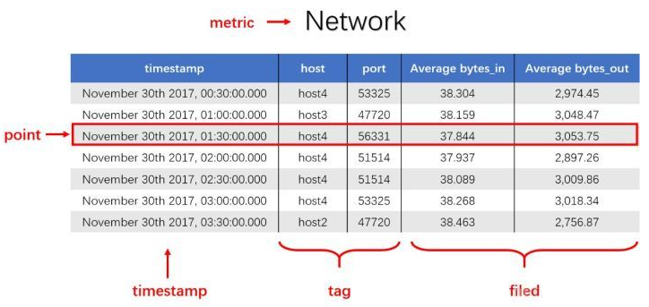


如上图所示，这组数据的 measurement 为 Network，每个 point 由以下部分组成：

- timestamp：时间戳。
- 两个 tag：host 和 port，代表每个 point 归属于哪台机器的哪个端口。

- 两个 filed：bytes_in 和 bytes_out，代表每个 piont 的测量值，即半小时内出入流量的平均值。

### 时序数据的存储难点

时序数据往往由百万级甚至千万级终端设备产生的，写入并发量比较高，属于海量数据场景。传统关系型数据库在时序数据的存储和分析上存在不足和缺陷，主要体现在`写入`、`查询`和`存储`三个方面。

时序数据库针对时序数据的特点，对写入、查询和存储等流程进行了优化：

- `高并发写入`
  - 批量写入数据，降低网络开销；
  - 数据先写入内存，再周期性的 dump 为不可变的文件存储。
- `查询低延时、高并发`
  - 优化常见的查询模式，通过索引等技术降低查询延时；
  - 通过缓存、routing 等技术提高查询并发。
- `存储成本`
  - 利用时间递增、维度重复、指标平滑变化的特性，合理选择编码压缩算法，提高数据压缩比；
  - 通过预降精度，对历史数据做聚合，节省存储空间。

### 时序数据的存储原理

#### 磁盘

`磁盘（disk）`：指利用磁记录技术存储数据的存储器。磁盘是计算机主要的存储介质，可以存储大量的二进制数据，并且断电后也能保持数据不丢失。早期计算机使用的磁盘是软磁盘（Floppy Disk，简称软盘），如今常用的磁盘是硬磁盘（Hard disk，简称硬盘）。

从存储数据的介质上来区分，硬盘可分为机械硬盘（Hard Disk Drive, HDD）和固态硬盘（Solid State Disk, SSD），机械硬盘采用`磁性碟片`来存储数据，而固态硬盘常通过`闪存颗粒`来存储数据。

##### 机械硬盘（HDD）

机械硬盘主要由磁盘盘片、磁头、主轴与传动轴等组成，数据就存放在磁盘盘片中，其物理结构如下：


机械硬盘每个磁盘盘片有上下两个磁头，磁盘盘片在两个磁头中间高速旋转，类似下图：

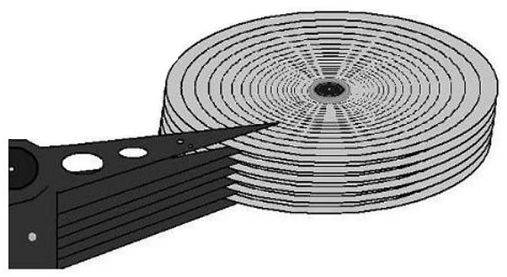

也就是说，机械硬盘是上下盘面同时进数据读取的。目前机械硬盘的常见转速是`7200 r/min`，所以机械硬盘在读取或写入数据时，非常害怕晃动和磕碰。另外，因为机械硬盘的超高转速，如果内部有灰尘，则会造成磁头或盘片的损坏，所以机械硬盘内部是封闭的，如果不是在无尘环境下，则禁止拆开机械硬盘。

机械硬盘的逻辑结构主要分为`磁道`、`扇区`和`柱面`：

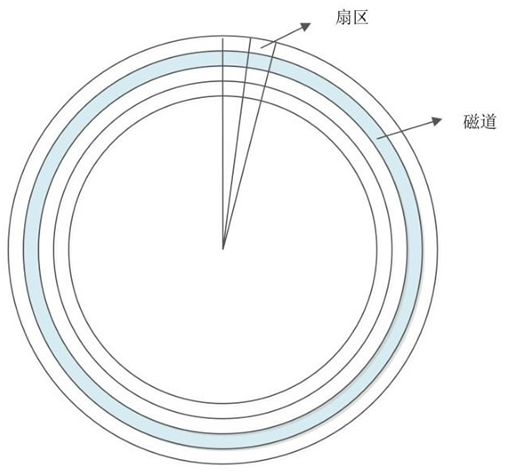

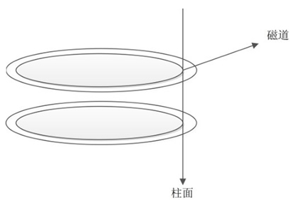

- `磁道`：每个盘片都在逻辑上有很多的同心圆，最外面的同心圆就是 0 磁道。我们将每个同心圆称作磁道（注意，磁道只是逻辑结构，在盘面上并没有真正的同心圆）。硬盘的磁道密度非常高，通常一面上就有上千个磁道。但是相邻的磁道之间并不是紧挨着的，这是因为磁化单元相隔太近会相互产生影响。

- `扇区`：在磁盘上每个同心圆是磁道，从圆心向外呈放射状地产生分割线（类似折扇的扇骨），将每个磁道等分为若干弧段，每个弧段就是一个扇区。每个扇区的大小一般是固定的，为  512 Byte。扇区也是磁盘的最小存储单位。

- `柱面`：如果硬盘是由多个盘片组成的，每个盘面都被划分为数目相等的磁道，那么所有盘片都会从外向内进行磁道编号，最外侧的就是 0 磁道。具有相同编号的磁道会形成一个圆柱，这个圆柱就被称作磁盘的柱面。

机械硬盘的大小计算公式：`磁头数 x 柱面数 x 扇区数 x 每个扇区的大小`。其中，磁头数（Heads）表示硬盘共有几个磁头，也可以理解为硬盘有几个盘面，然后乘以 2（每个盘面有上下两个磁头）；柱面数（Cylinders）表示硬盘每面盘片有几条磁道；扇区数（Sectors）表示每条磁道上有几个扇区；每个扇区的大小一般是  512 Byte。

机械硬盘通过接口与计算机主板进行连接，硬盘的读取和写入速度与接口有很大关系，如果接口的性能很差，则会影响机械硬盘的性能。目前，常见的机械硬盘接口有以下几种：

- `IDE 硬盘接口`：Integrated Drive Eectronics，并口，即电子集成驱动器，也称作 "ATA 硬盘" 或 "PATA 硬盘"，是早期机械硬盘的主要接口，ATA133 硬盘的理论速度可以达到 133 MB/s（此速度为理论平均值）。

  

- `SATA 接口`：Serial ATA，串口，是速度更高的硬盘标准，具备了更高的传输速度，并具备了更强的纠错能力。目前已经是 SATA 三代，理论传输速度达到 600 MB/s（此速度为理论平均值）。

  

- `SCSI 接口`：Small Computer System Interface，小型计算机系统接口，广泛应用在服务器上，具有应用范围广、多任务、带宽大、CPU 占用率低及热插拔等优点，理论传输速度达到 320 MB/s（此速度为理论平均值）。

  

##### 固态硬盘（SSD）

固态硬盘和传统的机械硬盘最大的区别就是不再采用盘片进行数据存储，而是采用`存储芯片`进行数据存储。固态硬盘的存储芯片主要分为两种：一种是采用`闪存`作为存储介质的；另一种是采用`DRAM`作为存储介质的。目前使用较多的主要是采用闪存作为存储介质的固态硬盘。


固态硬盘和机械硬盘对比，主要有以下一些特点：

| 对比项目  | 固态硬盘          | 机械硬盘 |
| --------- | ----------------- | -------- |
| 容量      | 较小              | 大       |
| 读/写速度 | 极快              | —般      |
| 写入次数  | 5000 〜 100000 次 | 没有限制 |
| 工作噪声  | 极低              | 有       |
| 工作温度  | 极低              | 较高V    |
| 防震      | 很好              | 怕震动   |
| 重量      | 低                | 高       |
| 价格      | 高                | 低       |

可以看到，固态硬盘因为丟弃了机械硬盘的物理结构，所以相比机械硬盘，具有低能耗、无噪声、抗震动、低散热、体积小和速度快的优势，不过价格相比机械硬盘更高，而且使用寿命有限。

##### 随机读写和顺序读写

磁盘如果使用得当，磁盘的速度可以匹配上网络的数据传输速度。目前的高性能磁盘，顺序写速度可以达到 600 MB/s， 超过了一般网卡的传输速度。但是磁盘随机写的速度只有大概 100 KB/s，和顺序写的性能相差 6000 倍！


顺序读写 ：指的是本次 I/O 给出的初始扇区地址和上一次 I/O 的结束扇区地址是完全连续或者相隔不多的。反之，如果相差很大，则算作一次随机读写。发生随机读写可能是因为磁盘碎片导致磁盘空间不连续，或者当前 block 空间小于文件大小导致的。

顺序读写比随机读写效率高的原因是：在做连续 I/O 的时候，磁头几乎不用换道，或者换道的时间很短；而对于随机读写，如果这个 I/O 很多的话，会导致磁头不停地换道，造成效率的极大降低。

因此，为了避免磁头的反复移动而导致的时间损失，程序设计的时候都是`尽量避免发生随机读写`。

注意，无论在机械硬盘上写还是在固态硬盘上写，尽管结论都是顺序写比随机写快，但是原因却是不一样的。

首先说机械硬盘，处理读取和写入请求时：

1. 首先根据请求的开始地址算出要处理的数据在磁盘上的位置；
2. 磁头沿半径方向移动，直至移动到数据所在的柱面；
3. 盘片高速旋转，使磁头到达数据的起始位置；
4. 磁头沿磁道从磁盘读取或写入数据；
5. 步骤 1 和 2 带来的开销是无法避免的，所以当一次读取的数据量很少的时候，随机写相对于顺序写会有巨大的性能劣势。因为在顺序写的时候，步骤 1 和 2 只需要执行一次，剩下的全是数据传输所需要的固有开销；而随机写的时候，每次步骤 1 和 2 都需要执行，带来了极大的额外开销。

其次说固态硬盘。理论上来说，固态硬盘不应该存在明显的随机写与顺序写的速度差异，因为它就是一块支持随机寻址的存储芯片，没有寻道和旋转盘片的开销，但是随机写实际上还是比顺序写要慢。这是由于其存储介质闪存的一些特性导致的，简单来说：

1. 闪存不支持 in-place update：更新一个数据时，不可以直接在原有数据上改，而是要写到新的空白的地方，并把原有数据标记为失效。
2. 标记失效的数据可以将其清除，但是闪存上清除操作的最小单位是一个大块，大约 128 K ~ 256 K 的大小。一次清除可能会影响到还未标记失效的有用的数据，要先把它们移走。因此，随机写显然比顺序写带来更大的碎片化，从而带来更多的垃圾回收开销、数据迁移开销，自然就比顺序写要慢了。
3. 固态硬盘里实现了垃圾回收算法，用来更好地利用存储空间，同时减少数据迁移，保护闪存寿命。

#### WAL

##### WAL 的概念

>In computer science, write-ahead logging (WAL) is a family of techniques for providing atomicity and durability (two of the ACID properties) in database systems.

在计算机领域，`WAL（Write-ahead logging，预写式日志）`是数据库系统提供原子性和持久化的一系列技术。

`在使用 WAL 的系统中，所有的修改在提交之前，都要先写入到 log 日志中。`假设一个程序在执行某些操作的过程中机器掉电了，在重新启动时，程序可能需要知道当时执行的操作是成功了，还是部分成功，或者是失败了。如果使用了 WAL，程序就可以检查 log 日志，并对突然掉电时计划执行的操作内容跟实际上执行的操作内容进行比较，在这个比较的基础上，程序就可以决定是撤销已做的操作还是继续完成已做的操作，或者是保持原样。

数据库的最大性能挑战就是磁盘的读写，许多先辈在提高数据存储性能上绞尽脑汁，提出和实验了一套又一套方法，这些方案最终总结出来大致分为三种：`随机读写改顺序读写`、`缓冲单条读写改批量读写`、`单线程读写改并发读写`。WAL 其实也是这几种思路的一种实现，一方面 WAL 中记录事务的更新内容，通过 WAL 将随机的脏页写入变成顺序的日志刷盘；另一方面，WAL 通过 buffer 的方式改单条磁盘刷入为缓冲批量刷盘；再者，从 WAL 数据到最终数据的同步过程中可以采用并发同步的方式，这样极大提升数据库写入性能，因此，WAL 的写入能力决定了数据库整体性能的上限，尤其是在高并发时。

使用 WAL 的数据库系统不会再每新增一条 WAL 日志就将其刷入数据库文件中，一般会积累一定的量然后批量写入，通常使用`页`为单位，这是磁盘的写入单位。`同步 WAL 文件和数据库文件的行为被称为 checkpoint（检查点）`。checkpoint 一般发生在 WAL 文件积累到一定页数修改的时候，当然，有些系统也可以手动执行 checkpoint。执行 checkpoint 之后，WAL 文件可以被清空，这样可以保证 WAL 文件不会因为太大而性能下降。

有些数据库系统读取请求也可以使用 WAL，通过读取 WAL 最新日志就可以获取到数据的最新状态。

##### WAL 的具体实现

常见的数据库一般都会用到 WAL 机制，只是不同的系统说法和实现可能有所差异。MySQL、SQLite、PostgreSQL、etcd、Hbase、Zookeeper、Elasticsearch  等等都有自己的实现。

**MySQL:**

MySQL 通过 redo、undo 日志实现 WAL。MySQL 用 redo log 来保证在系统 Crash 重启之类的情况时修复数据（事务的持久性），用 undo log 来保证事务的原子性。

- `redo log`：重做日志，每当有操作时，在数据变更之前将操作写入 redo log，这样当发生掉电之类的情况时，系统可以在重启后继续操作。

- `undo log`：撤销日志，当一些变更执行到一半无法完成时，可以根据撤销日志恢复到变更之间的状态。

**etcd：**

etcd 的数据目录下有两个子目录`wal`和`snap`，它们的作用就是用来实现 WAL 机制。

- wal：存放预写式日志，最大的作用是记录了整个数据变化的全部历程。在 etcd 中，所有数据的修改在提交前，都要先写入到 WAL 中。

- snap：存放快照数据，etcd 防止 WAL 文件过多而设置的快照，存储 etcd 数据状态。

WAL 机制使得 etcd 具备了以下两个功能：

- 故障快速恢复：当你的数据遭到破坏时，就可以通过执行所有 WAL 中记录的修改操作，快速从最原始的数据恢复到数据损坏前的状态。
- 数据回滚（undo）/重做（redo）：因为所有的修改操作都被记录在 WAL 中，需要回滚或重做，只需要反向或正向执行日志中的操作即可。

#### LSM

传统数据库存储常采用`B+ tree`，原因是查询和顺序插入时有利于减少磁头寻道次数。然而对于 90% 以上场景都是写入的时序数据库，使用`LSM tree（Log Structured Merge Tree）`更合适。

##### LSM 产生的背景

对于写操作，影响吞吐量的主要原因是`磁盘的随机操作慢，顺序读写快`，解决办法是将文件的随机存储改为顺序存储，因为完全是顺序的，可以提升写操作性能，比如日志文件就是顺序写入。

- 对于顺序写入的日志文件，在读取一些数据的时候需要全文扫描，但这一操作耗费时长取决于需要读取的数据在日志文件中的位置，所以其使用场景有限，适用于数据被整体的访问的情况下，像大部分数据的 WAL。

对于读操作，可以通过记录更多的内容比如 key、range 来提高性能，比较常用的方法有：

- 二分查找：将文件数据有序保存，使用二分查找来完成特定 key 的查找。
- 哈希：用哈希将数据分为不同的 bucket。
- B+ tree：使用 B+ tree，减少外部文件的存取。
  - 参考：https://zhuanlan.zhihu.com/p/27700617
- 以上的方案都是将数据按照特定的方式存储，对于读操作友好，但写操作的性能必然下降，主要原因是这种存储数据产生的是磁盘的随机读写，因此并不适用于时序数据库 90% 都是写入的场景。

##### LSM 算法实现原理

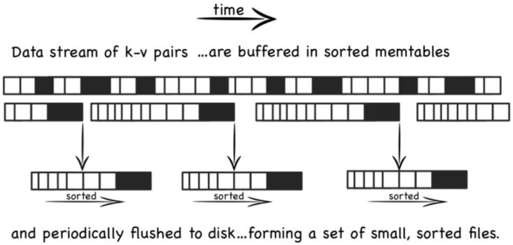

LSM 是将之前使用的一个大的查找结构（造成随机读写，影响写性能的结构，比如 B+ 树），变换为将写操作顺序的保存到有序文件中，且每个文件只保存短时间内的改动。**文件是有序的，所以读取的时候，查找会非常快** 。且文件不可修改，新的更新操作只会写入到新的文件中。读操作检查有序的文件。然后周期性的合并文件来减少文件的个数。

- `写入操作`：数据先在内存中缓存（memtable) ，memtable 使用树的结构来保持 key 是有序的，同时使用 WAL 的方式备份数据到磁盘。当 memtable 中数据达到一定规模后会刷新数据到磁盘生成文件。
- `更新写入操作`：文件不允许被编辑，所以新的内容或修改操作只是简单的生成新的文件。当越多的数据存储到系统中，就会有越多的不可修改、顺序的有序文件被创建。但比较旧的文件不会被更新，重复的激流只会通过创建新的记录来达到覆盖的目的，但这就产生了冗余的数据。**系统会周期性的执行合并的操作，合并操作用于移除重复的更新或者删除记录，同时还能够减少文件个数的增加，保证读操作的性能。**
- `读取操作`：查询的时候首先检查内存数据（memtable)，如果没有找到这个 key，就会逆序的一个个的检查磁盘上的文件，**但读操作耗时会随着磁盘上文件个数的增加而增加**。时间复杂度 O 为 `KlogN`，K 为文件个数， N 为文件平均大小。可以使用如下策略减少耗时：
  - 将文件按照 LRU 算法缓存到内存中。
  - 周期性的合并文件，减少文件的个数。
  - 使用 bloom 过滤器避免大量的读文件操作（如果 bloom 过滤器说一个 key 不存在，就一定不存在，而当 bloom 过滤器说一个文件存在时，可能是不存在的，只是通过概率来保证）。

### 时序数据的存储设计

#### 单机上的存储

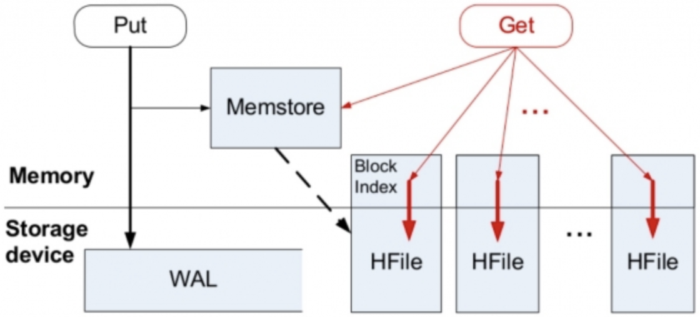

以 HBase LSM tree 结构为例，其核心就是通过内存写和后序磁盘的顺序写入获取更高的写入性能，避免随机写入，但同时也牺牲了读取性能。

#### 分布式存储

分布式存储需要考虑如何将数据分布到多台机器上面，即`分片（sharding）`的问题。分片问题包括分片方法的选择和分片设计的选择。

##### 分片方法

- 哈希分片： 均衡性较好，但集群不易扩展。
- 执行哈希：均衡性好，集群扩展易，但实现复杂。
- 范围划分：复杂度在于合并和分裂，全局有序。

##### 分片设计

- 分片设计会直接影响到写入的性能，结合时序数据库的特点，根据`metric + tags` 分片是比较好的方式。查询大都是按照一个时间范围进行的，这样形同的 metric + tags 数据会被分配到一台机器上连续存放，顺序的磁盘读取是很快的。
- 在时间范围很长的情况下，可以根据`时间`访问再进行分段，分别存储到不同的机器上，这样大范围的数据就可以支持并发查询，优化查询速度。

如下图，第一行和第三行都是同样的 tag（sensor=95D8-7913; city=上海），所以分配到同样的分片，而第五行虽然也是同样的 tag，但是间隔时间较长，根据时间范围再次分段，被分到了不同的分片。第二、四、六行这几个同样的 tag（sensor=F3CC-20F3; city=北京），也是一样的道理。

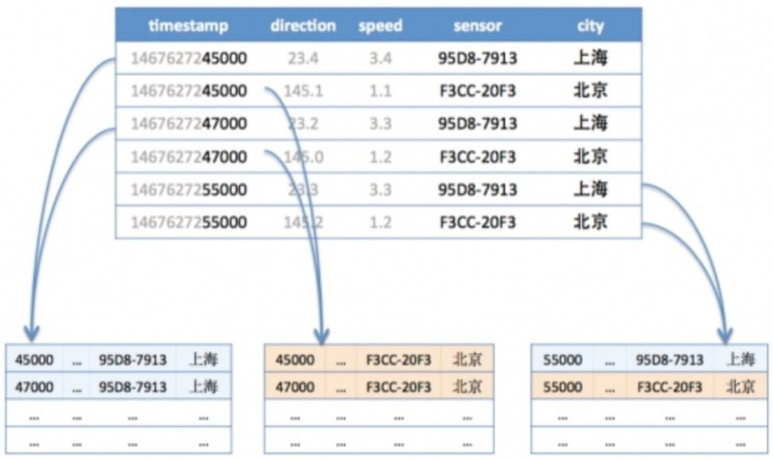

## InfluxDB 的搭建和初步使用

### 基本概念

`Database`：InfluxDB 可以创建数据库，一个数据库可以包含多个 user、保存策略、schemaless ，支持随时灵活创建 mersurement。

`Measurement`：相当于关系型数据库中表的概念。

`Tags`：是一些 kv 的结构，标签会被用来建立索引。

`Fields`：是保存真实数据的结构，也是 kv 结构，但是不会被用来建立索引。

`Point`： 代表了一条记录，可以理解为关系型数据库中的一条记录。

`Timestamp`：时间戳，每条记录必须要有一个时间戳。

`Series`：由 Measurement + Tags 组成。

### Docker 启动

创建一个本地目录，作为容器卷，挂在到 InfluxDB 容器上：

```powershell
root@DESKTOP-OJKMETJ:/home/xisun/influxdb# mkdir -p /home/xisun/influxdb/data && cd $_
root@DESKTOP-OJKMETJ:/home/xisun/influxdb/data# pwd
/home/xisun/influxdb/data
```

在刚创建的目录下，Docker 启动一个 InfluxDB 容器：

```powershell
root@DESKTOP-OJKMETJ:/home/xisun/influxdb/data# docker run -d --name influxdb -p 8086:8086 --volume $PWD:/var/lib/influxdb2 influxdb:2.1.1
bd5743438ed7bc4bb075b0690827f760a100f1aed183c0e9ff7c75f9561629fd
root@DESKTOP-OJKMETJ:/home/xisun/influxdb/data# docker ps
CONTAINER ID   IMAGE            COMMAND                  CREATED              STATUS              PORTS
                      NAMES
bd5743438ed7   influxdb:2.1.1   "/entrypoint.sh infl…"   About a minute ago   Up About a minute   0.0.0.0:8086->8086/tcp, :::8086->8086/tcp   influxdb
root@DESKTOP-OJKMETJ:/home/xisun/influxdb/data# ll
total 96
drwx------ 3 xisun root   4096 Mar 29 10:35 ./
drwxr-xr-x 3 xisun xisun  4096 Mar 29 10:20 ../
drwx------ 3 xisun root   4096 Mar 29 10:35 engine/
-rw------- 1 xisun xisun 65536 Mar 29 10:36 influxd.bolt
-rw-r--r-- 1 xisun xisun 53248 Mar 29 10:35 influxd.sqlite
```

- InfluxDB 容器版本为`2.1.1`，后文内容都建立在此基础上；
- InfluxDB 容器后台启动；
- InfluxDB 容器默认映射`8086 端口`；
- 容器内数据位于`/var/lib/influxdb2`路径，容器外数据位于`/home/xisun/influxdb/data`。

- 此处启动的 InfluxDB 容器，没有用户信息，使用 UI 界面操作或者命令行操作时，需要自行设置。

如果需要自定义配置文件启动 InfluxDB 容器，可以按如下步骤拿到默认的配置文件：

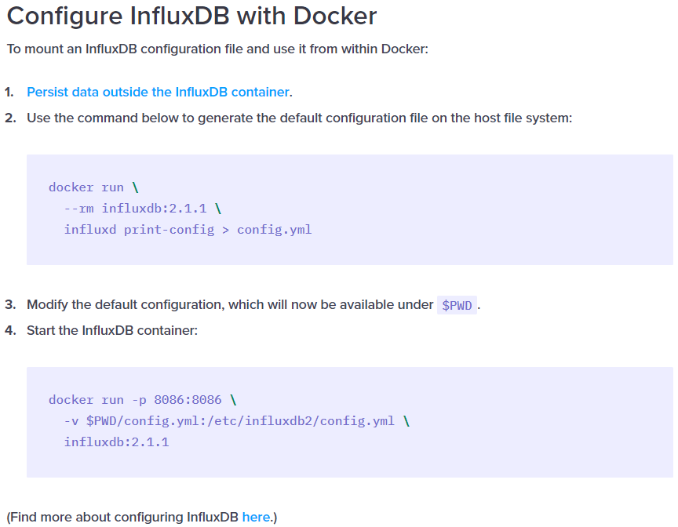

默认的配置文件内容如下：

```yaml
assets-path: ""
bolt-path: /var/lib/influxdb2/influxd.bolt
e2e-testing: false
engine-path: /var/lib/influxdb2/engine
feature-flags: {}
flux-log-enabled: false
http-bind-address: :8086
http-idle-timeout: 3m0s
http-read-header-timeout: 10s
http-read-timeout: 0s
http-write-timeout: 0s
influxql-max-select-buckets: 0
influxql-max-select-point: 0
influxql-max-select-series: 0
key-name: ""
log-level: info
metrics-disabled: false
nats-max-payload-bytes: 1048576
nats-port: 4222
no-tasks: false
pprof-disabled: false
query-concurrency: 1024
query-initial-memory-bytes: 0
query-max-memory-bytes: 0
query-memory-bytes: 9223372036854775807
query-queue-size: 1024
reporting-disabled: false
secret-store: bolt
session-length: 60
session-renew-disabled: false
sqlite-path: ""
storage-cache-max-memory-size: 1073741824
storage-cache-snapshot-memory-size: 26214400
storage-cache-snapshot-write-cold-duration: 10m0s
storage-compact-full-write-cold-duration: 4h0m0s
storage-compact-throughput-burst: 50331648
storage-max-concurrent-compactions: 0
storage-max-index-log-file-size: 1048576
storage-no-validate-field-size: false
storage-retention-check-interval: 30m0s
storage-series-file-max-concurrent-snapshot-compactions: 0
storage-series-id-set-cache-size: 0
storage-shard-precreator-advance-period: 30m0s
storage-shard-precreator-check-interval: 10m0s
storage-tsm-use-madv-willneed: false
storage-validate-keys: false
storage-wal-fsync-delay: 0s
storage-wal-max-concurrent-writes: 0
storage-wal-max-write-delay: 10m0s
storage-write-timeout: 10s
store: disk
testing-always-allow-setup: false
tls-cert: ""
tls-key: ""
tls-min-version: "1.2"
tls-strict-ciphers: false
tracing-type: ""
ui-disabled: false
vault-addr: ""
vault-cacert: ""
vault-capath: ""
vault-client-cert: ""
vault-client-key: ""
vault-client-timeout: 0s
vault-max-retries: 0
vault-skip-verify: false
vault-tls-server-name: ""
vault-token: ""
```

配置文件详解：

https://archive.docs.influxdata.com/influxdb/v1.2/administration/config/#max-connection-limit-0

https://www.cnblogs.com/guyeshanrenshiwoshifu/p/9188368.html

### UI 界面操作

浏览器访问`localhost:8086`：

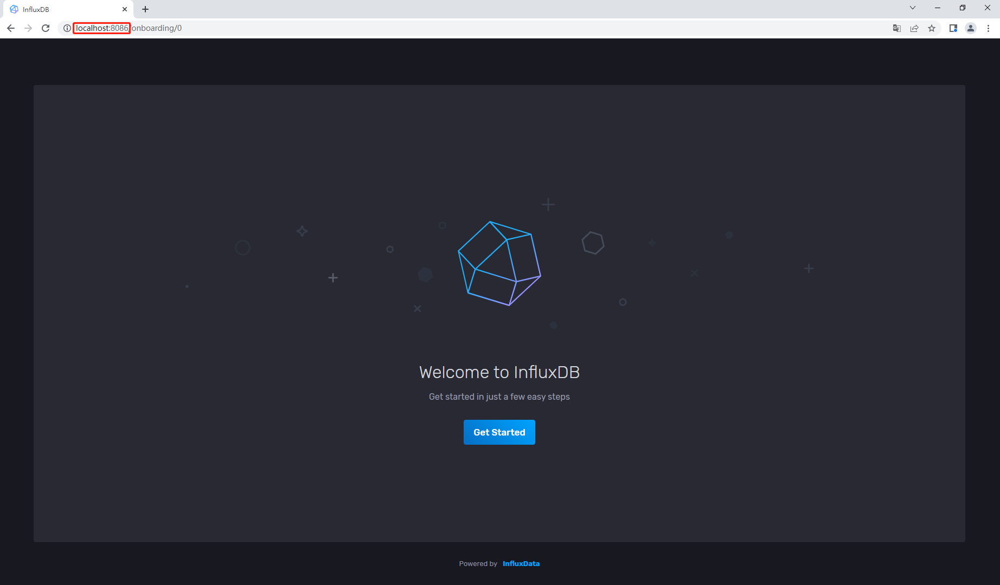

初次登陆时，需要初始化用户信息：

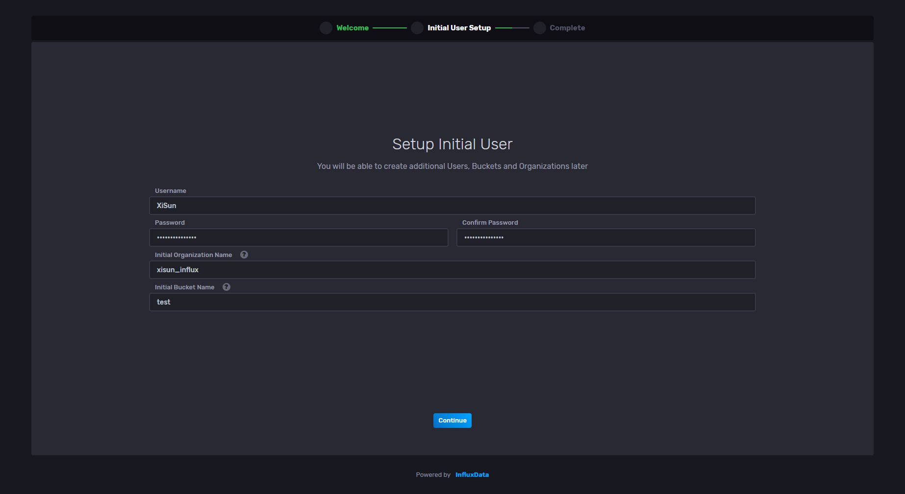

- UI 界面和命令行都可以初始化用户信息，如果使用 UI 界面初始化，则命令行操作时需要配置用户的 token 信息，如果使用命令行初始化，则 UI 界面操作时直接用户名密码登录即可。

点击 Quick Start，开启 InfluxDB 探索之旅：

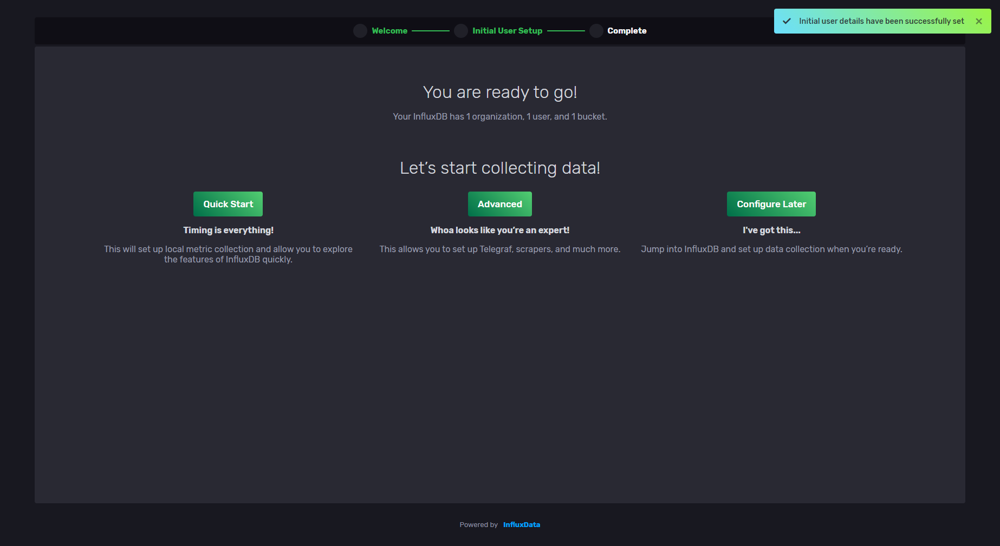

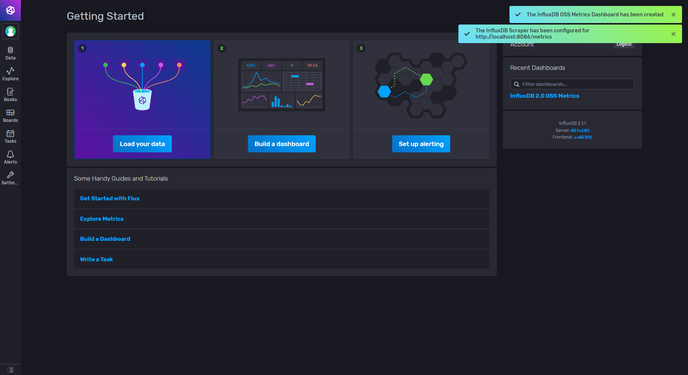

查看用户信息：

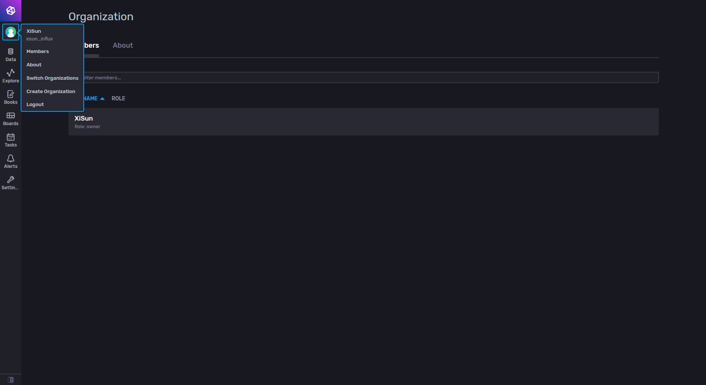

查看所有的 bucket：

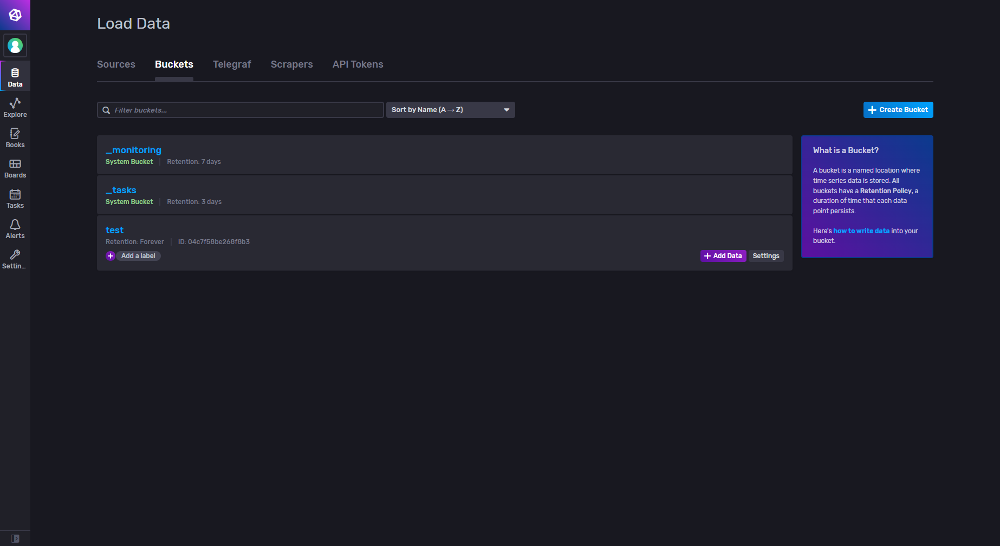

查看当前用户的 token，如果在命令行中操作，需要添加对应用户的 token 信息验证：

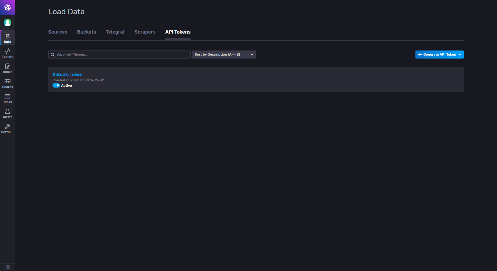

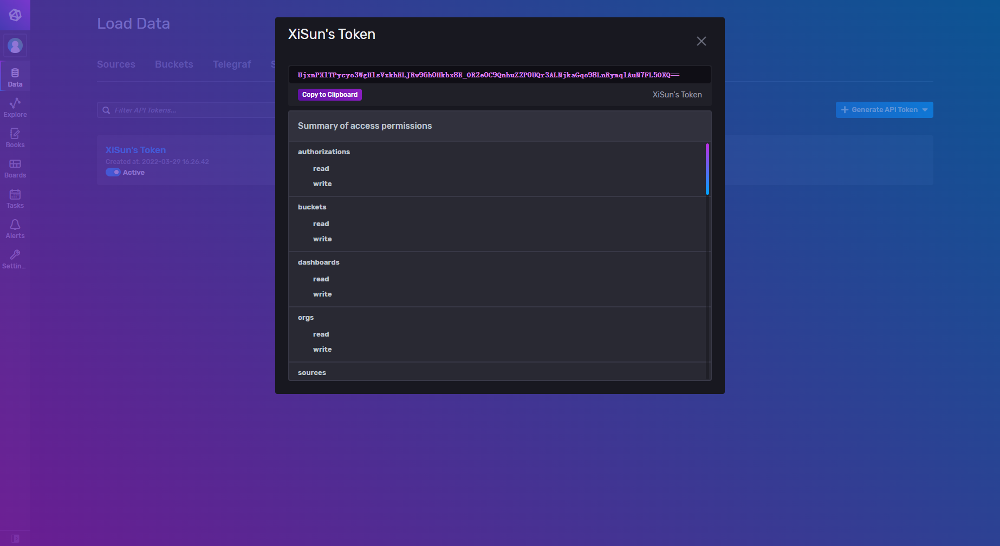

向 bucket 中添加数据：


按条件查询数据：

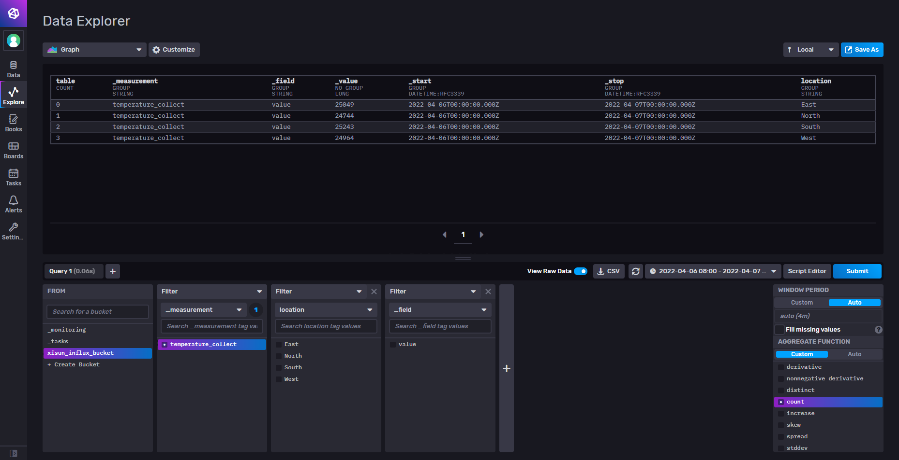

其他操作不再赘述，使用时自行查看。

### 命令行操作

命令行操作时，首先需要进入容器内部：

```powershell
root@DESKTOP-OJKMETJ:/home/xisun/influxdb# docker ps
CONTAINER ID   IMAGE            COMMAND                  CREATED        STATUS         PORTS
           NAMES
861e71bc7f69   influxdb:2.1.1   "/entrypoint.sh infl…"   17 hours ago   Up 3 seconds   0.0.0.0:8086->8086/tcp, :::8086->8086/tcp   influxdb
root@DESKTOP-OJKMETJ:/home/xisun/influxdb# docker exec -it 861e71bc7f69 /bin/bash
root@861e71bc7f69:/#
```

InfluxDB 命令格式为`influx command`，各命令功能如下：

```powershell
root@d1c692c2abb9:/# influx --help
NAME:
   influx - Influx Client

USAGE:
   influx [command]

COMMANDS:
   version              Print the influx CLI version
   ping                 Check the InfluxDB /health endpoint
   setup                Setup instance with initial user, org, bucket
   write                Write points to InfluxDB
   bucket               Bucket management commands
   completion           Generates completion scripts
   bucket-schema        Bucket schema management commands
   query                Execute a Flux query
   config               Config management commands
   org, organization    Organization management commands
   delete               Delete points from InfluxDB
   user                 User management commands
   task                 Task management commands
   backup               Backup database
   restore              Restores a backup directory to InfluxDB
   telegrafs            List Telegraf configuration(s). Subcommands manage Telegraf configurations.
   dashboards           List Dashboard(s).
   export               Export existing resources as a template
   secret               Secret management commands
   v1                   InfluxDB v1 management commands
   auth, authorization  Authorization management commands
   apply                Apply a template to manage resources
   stacks               List stack(s) and associated templates. Subcommands manage stacks.
   template             Summarize the provided template
   help, h              Shows a list of commands or help for one command

GLOBAL OPTIONS:
   --help, -h  show help
```

#### 版本查看

```powershell
root@d1c692c2abb9:/# influx version
Influx CLI 2.2.1 (git: 31ac783) build_date: 2021-11-09T21:24:22Z
```

#### 初始化管理

```powershell
root@d1c692c2abb9:/# influx setup --help
NAME:
    setup - Setup instance with initial user, org, bucket

USAGE:
    setup [command options] [arguments...]

COMMON OPTIONS:
   --host value                     HTTP address of InfluxDB [$INFLUX_HOST]
   --skip-verify                    Skip TLS certificate chain and host name verification [$INFLUX_SKIP_VERIFY]
   --configs-path value             Path to the influx CLI configurations [$INFLUX_CONFIGS_PATH]
   --active-config value, -c value  Config name to use for command [$INFLUX_ACTIVE_CONFIG]
   --http-debug
   --json                           Output data as JSON [$INFLUX_OUTPUT_JSON]
   --hide-headers                   Hide the table headers in output data [$INFLUX_HIDE_HEADERS]

OPTIONS:
   --username value, -u value   Name of initial user to create
   --password value, -p value   Password to set on initial user
   --token value, -t value      Auth token to set on the initial user [$INFLUX_TOKEN]
   --org value, -o value        Name of initial organization to create
   --bucket value, -b value     Name of initial bucket to create
   --retention value, -r value  Duration initial bucket will retain data, or 0 for infinite
   --force, -f                  Skip confirmation prompt
   --name value, -n value       Name to set on CLI config generated for the InfluxDB instance, required if other configs exist
```

- 初始化 InfluxDB 的基础信息：

  ```powershell
  root@d1c692c2abb9:/# influx setup
  > Welcome to InfluxDB 2.0!
  ? Please type your primary username xisun
  ? Please type your password ***************
  ? Please type your password again ***************
  ? Please type your primary organization name xisun_influx
  ? Please type your primary bucket name xisun_bucket
  ? Please type your retention period in hours, or 0 for infinite 168
  ? Setup with these parameters?
    Username:          xisun
    Organization:      xisun_influx
    Bucket:            xisun_bucket
    Retention Period:  168h0m0s
   Yes
  User    Organization    Bucket
  xisun   xisun_influx    xisun_bucket
  root@d1c692c2abb9:/# influx user list
  ID                      Name
  0923b6b20fdd3000        xisun
  ```

#### token 管理

```powershell
root@d1c692c2abb9:/# influx auth --help
NAME:
   influx auth - Authorization management commands

USAGE:
   influx auth command [command options] [arguments...]

COMMANDS:
   create          Create authorization
   delete          Delete authorization
   list, find, ls  List authorizations
   active          Active authorization
   inactive        Inactive authorization

OPTIONS:
   --help, -h  show help
```

- 查看用户的 token 验证信息：

  ```powershell
  root@d1c692c2abb9:/# influx auth list
  ID                      Description     Token                                                                                           User Name       User ID                 Permissions
  0923b6b226dd3000        xisun's Token   4tZsPO2B7aC70yDZY_k2o5yBGxpXGwekJ8ZMfb99Y1oaEdDPDzELVjcxfM78oYMgxXy0Cbr75SSa1LQhsyALIQ==        xisun           0923b6b20fdd3000        [read:/authorizations write:/authorizations read:/buckets write:/buckets read:/dashboards write:/dashboards read:/orgs write:/orgs read:/sources write:/sources read:/tasks write:/tasks read:/telegrafs write:/telegrafs read:/users write:/users read:/variables write:/variables read:/scrapers write:/scrapers read:/secrets write:/secrets read:/labels write:/labels read:/views write:/views read:/documents write:/documents read:/notificationRules write:/notificationRules read:/notificationEndpoints write:/notificationEndpoints read:/checks write:/checks read:/dbrp write:/dbrp read:/notebooks write:/notebooks read:/annotations write:/annotations]
  ```

- 配置用户的 token 验证信息：

  ```powershell
  root@861e71bc7f69:/# influx config ls
  Active  Name    URL     Org
  root@861e71bc7f69:/# influx config create -n default -u http://localhost:8086 -o xisun_influx -t UjxmPXlTPycyo3WgH1sVzkhELJRw96h0Hkbx8E_OR2e0C9QnhuZ2P0UQr3ALNjkaGqo98LnRymqlAuN7FL5OXQ== -a
  Active  Name    URL                     Org
  *       default http://localhost:8086   xisun_influx
  root@861e71bc7f69:/# influx config ls
  Active  Name    URL                     Org
  *       default http://localhost:8086   xisun_influx
  ```

  - 对于 UI 界面创建的用户，可以在命令行配置一下 token 验证信息，这样就不需要每次执行命令都添加一下 token 验证信息。

#### user 管理

```powershell
root@861e71bc7f69:/# influx user --help
NAME:
   influx user - User management commands

USAGE:
   influx user command [command options] [arguments...]

COMMANDS:
   create          Create user
   delete          Delete user
   list, find, ls  List users
   update
   password

OPTIONS:
   --help, -h  show help
```

- 查看所有的 user：

  ```powershell
  root@d1c692c2abb9:/# influx user list
  ID                      Name
  0923b6b20fdd3000        xisun
  ```

#### organization 管理

```powershell
root@861e71bc7f69:/# influx org --help
NAME:
   influx org - Organization management commands

USAGE:
   influx org command [command options] [arguments...]

COMMANDS:
   create          Create organization
   delete          Delete organization
   list, find, ls  List organizations
   members         Organization membership commands
   update          Update organization

OPTIONS:
   --help, -h  show help
```

- 查看所有的 organization：

  ```powershell
  root@d1c692c2abb9:/# influx org list
  ID                      Name
  fb7fe3460c56ab3c        xisun_influx
  ```

#### bucket 管理

```powershell
root@861e71bc7f69:/# influx bucket --help
NAME:
   influx bucket - Bucket management commands

USAGE:
   influx bucket command [command options] [arguments...]

COMMANDS:
   create            Create bucket
   delete            Delete bucket
   list, find, ls    List buckets
   update, find, ls  Update bucket

OPTIONS:
   --help, -h  show help
```

- 查看所有的 bucket：

  ```powershell
  root@d1c692c2abb9:/# influx bucket list
  ID                      Name            Retention       Shard group duration    Organization ID         Schema Type
  58ddf440332b69d1        _monitoring     168h0m0s        24h0m0s                 fb7fe3460c56ab3c        implicit
  0cbaa3dd7c41f12a        _tasks          72h0m0s         24h0m0s                 fb7fe3460c56ab3c        implicit
  dd10ded92b57aca5        xisun_bucket    168h0m0s        24h0m0s                 fb7fe3460c56ab3c        implicit
  ```

  - _monitoring 和 _tasks 是系统自带的，xisun_bucket 是自行创建的。
  - xisun_bucket 创建时 Retention 为 168 h，如果设置为 0，则为 infinite。

#### 写入数据

```powershell
root@2530a88ab12c:/# influx write --help
NAME:
   influx write - Write data to InfluxDB via stdin, or add an entire file specified with the -f flag

USAGE:
   influx write command [command options] [arguments...]

COMMANDS:
   dryrun  Write to stdout instead of InfluxDB

OPTIONS:
   --host value                     HTTP address of InfluxDB [$INFLUX_HOST]
   --skip-verify                    Skip TLS certificate chain and host name verification [$INFLUX_SKIP_VERIFY]
   --configs-path value             Path to the influx CLI configurations [$INFLUX_CONFIGS_PATH]
   --active-config value, -c value  Config name to use for command [$INFLUX_ACTIVE_CONFIG]
   --http-debug
   --token value, -t value          Token to authenticate request [$INFLUX_TOKEN]
   --bucket-id value                The ID of destination bucket [$INFLUX_BUCKET_ID]
   --bucket value, -b value         The name of destination bucket [$INFLUX_BUCKET_NAME]
   --org-id value                   The ID of the organization [$INFLUX_ORG_ID]
   --org value, -o value            The name of the organization [$INFLUX_ORG]
   --precision value, -p value      Precision of the timestamps of the lines (default: ns) [$INFLUX_PRECISION]
   --format value                   Input format, either 'lp' (Line Protocol) or 'csv' (Comma Separated Values)
   --header value                   Header prepends lines to input data
   --file value, -f value           The path to the file to import
   --url value, -u value            The URL to import data from
   --debug                          Log CSV columns to stderr before reading data rows
   --skipRowOnError                 Log CSV data errors to stderr and continue with CSV processing
   --skipHeader value               Skip the first <n> rows from input data (default: 0)
   --max-line-length value          Specifies the maximum number of bytes that can be read for a single line (default: 16000000)
   --encoding value                 Character encoding of input files or stdin (default: "UTF-8")
   --errors-file value              The path to the file to write rejected rows to
   --rate-limit value               Throttles write, examples: "5 MB / 5 min" , "17kBs" (default: 0E+00)
   --compression value              Input compression, either 'none' or 'gzip'
   --help, -h                       show help
```

- 写入一条 Line Protocol：

  ```powershell
  influx write \
    -b bucketName \
    -o orgName \
    -p s \
    'myMeasurement,host=myHost testField="testData" 1556896326'
  ```

- 写入 Line Protocol 的文件：

  ```powershell
  influx write \
    -b bucketName \
    -o orgName \
    -p s \
    --format=lp
    -f /path/to/line-protocol.txt
  ```

- 写入 CSV 文件：

  ```powershell
  influx write \
    -b bucketName \
    -o orgName \
    -p s \
    --format=csv
    -f /path/to/data.csv
  ```

#### 查询数据

```powershell
root@2530a88ab12c:/# influx query --help
NAME:
    query - Execute a Flux query

USAGE:
    query [command options] [query literal or '-' for stdin]

DESCRIPTION:
   Execute a Flux query provided via the first argument, a file, or stdin

COMMON OPTIONS:
   --host value                     HTTP address of InfluxDB [$INFLUX_HOST]
   --skip-verify                    Skip TLS certificate chain and host name verification [$INFLUX_SKIP_VERIFY]
   --configs-path value             Path to the influx CLI configurations [$INFLUX_CONFIGS_PATH]
   --active-config value, -c value  Config name to use for command [$INFLUX_ACTIVE_CONFIG]
   --http-debug
   --token value, -t value          Token to authenticate request [$INFLUX_TOKEN]

OPTIONS:
   --org-id value               The ID of the organization [$INFLUX_ORG_ID]
   --org value, -o value        The name of the organization [$INFLUX_ORG]
   --file value, -f value       Path to Flux query file
   --raw, -r                    Display raw query results
   --profilers value, -p value  Names of Flux profilers to enable
```

- 输入`influx query`命令，进入查询交互窗口，然后输入查询条件，`Ctrl + D`提交查询条件，并获得查询结果：

  ```powershell
  root@2530a88ab12c:/# influx query
  data = from(bucket: "xisun_influx_bucket") |> range(start: -100d) |> count(column: "_value") |> yield()Result: _result
  Table: keys: [_start, _stop, _field, _measurement, location]
                     _start:time                      _stop:time           _field:string     _measurement:string         location:string                  _value:int
  ------------------------------  ------------------------------  ----------------------  ----------------------  ----------------------  --------------------------
  2021-12-27T11:04:27.837417638Z  2022-04-06T11:04:27.837417638Z                   value     temperature_collect                    East                       25049
  Table: keys: [_start, _stop, _field, _measurement, location]
                     _start:time                      _stop:time           _field:string     _measurement:string         location:string                  _value:int
  ------------------------------  ------------------------------  ----------------------  ----------------------  ----------------------  --------------------------
  2021-12-27T11:04:27.837417638Z  2022-04-06T11:04:27.837417638Z                   value     temperature_collect                   North                       24744
  Table: keys: [_start, _stop, _field, _measurement, location]
                     _start:time                      _stop:time           _field:string     _measurement:string         location:string                  _value:int
  ------------------------------  ------------------------------  ----------------------  ----------------------  ----------------------  --------------------------
  2021-12-27T11:04:27.837417638Z  2022-04-06T11:04:27.837417638Z                   value     temperature_collect                   South                       25243
  Table: keys: [_start, _stop, _field, _measurement, location]
                     _start:time                      _stop:time           _field:string     _measurement:string         location:string                  _value:int
  ------------------------------  ------------------------------  ----------------------  ----------------------  ----------------------  --------------------------
  2021-12-27T11:04:27.837417638Z  2022-04-06T11:04:27.837417638Z                   value     temperature_collect                    West                       24964
  ```

#### 删除数据

```powershell
root@2530a88ab12c:/# influx delete --help
NAME:
    delete - Delete points from InfluxDB

USAGE:
    delete [command options] [arguments...]

DESCRIPTION:
   Delete points from InfluxDB, by specify start, end time and a sql like predicate string

COMMON OPTIONS:
   --host value                     HTTP address of InfluxDB [$INFLUX_HOST]
   --skip-verify                    Skip TLS certificate chain and host name verification [$INFLUX_SKIP_VERIFY]
   --configs-path value             Path to the influx CLI configurations [$INFLUX_CONFIGS_PATH]
   --active-config value, -c value  Config name to use for command [$INFLUX_ACTIVE_CONFIG]
   --http-debug
   --token value, -t value          Token to authenticate request [$INFLUX_TOKEN]

OPTIONS:
   --org-id value               The ID of the organization that owns the bucket [$INFLUX_ORG_ID]
   --org value, -o value        The name of the organization that owns the bucket [$INFLUX_ORG]
   --bucket-id value            The ID of the bucket to delete from [$INFLUX_BUCKET_ID]
   --bucket value, -b value     The name of the bucket to delete from [$INFLUX_BUCKET_NAME]
   --start value                The start time in RFC3339Nano format (ex: '2009-01-02T23:00:00Z')
   --stop value                 The stop time in RFC3339Nano format (ex: '2009-01-02T23:00:00Z')
   --predicate value, -p value  sql like predicate string (ex: 'tag1="v1" and (tag2=123)')
```

- 删除指定 bucket 指定时间范围的数据：

  ```powershell
  root@2530a88ab12c:/# influx delete --bucket xisun_influx_bucket --start 2018-01-01T00:00:00Z --stop 2022-04-07T00:00:00Z
  ```

## InfluDB 的 Java 客户端

### Maven 添加依赖

```xml
<dependency>
    <groupId>com.influxdb</groupId>
    <artifactId>influxdb-client-java</artifactId>
    <version>5.0.0</version>
</dependency>
```

### 数据库连接信息

```properties
influxdb.url=http://localhost:8086
influxdb.token=duHdNDj7jLm_ocakFjFtHK_JGv_K1DSH-avtJ0DVGQ4Gl7xfVUrv6WndXWRuK-3Rm4_71t4vR444-1_q2gs4uw==
influxdb.org=xisun_influx_org
influxdb.bucket=xisun_influx_bucket
```

### InfluxDBClient

```java
public class InfluxDBClientUtil {
    private static volatile InfluxDBClient influxDBClient = null;

    private InfluxDBClientUtil() {

    }

    public static InfluxDBClient getInfluxDBClient() {
        if (influxDBClient == null) {
            synchronized (InfluxDBClientUtil.class) {
                if (influxDBClient == null) {
                    try {
                        // 1.加载配置文件
                        InputStream is = InfluxDBClientUtil.class.getClassLoader().getResourceAsStream("influxdb.properties");
                        Properties pros = new Properties();
                        pros.load(is);

                        // 2.读取配置信息
                        String url = pros.getProperty("influxdb.url");
                        String token = pros.getProperty("influxdb.token");
                        String org = pros.getProperty("influxdb.org");
                        String bucket = pros.getProperty("influxdb.bucket");

                        // 3.创建客户端对象实例
                        influxDBClient = InfluxDBClientFactory.create(url, token.toCharArray(), org, bucket);
                    } catch (IOException e) {
                        e.printStackTrace();
                    }
                }
            }
        }
        return influxDBClient;
    }
}
```

#### 源码分析

通过`InfluxDBClientFactory`，可以根据不同的配置信息，创建 InfluxDBClient 实例对象，以上面的代码为例：

```java
/**
 * Create an instance of the InfluxDB 2.0 client.
 *
 * @param url    the url to connect to the InfluxDB
 * @param token  the token to use for the authorization
 * @param org    the name of an organization
 * @param bucket the name of a bucket
 * @return client
 * @see InfluxDBClientOptions.Builder#url(String)
 */
@Nonnull
public static InfluxDBClient create(@Nonnull final String url,
                                    @Nonnull final char[] token,
                                    @Nullable final String org,
                                    @Nullable final String bucket) {

    InfluxDBClientOptions options = InfluxDBClientOptions.builder()
            .url(url)
            .authenticateToken(token)
            .org(org)
            .bucket(bucket)
            .build();

    return create(options);
}
```

将配置信息封装为一个 InfluxDBClientOptions 对象后，调用`create()`创建对象：

```java
/**
 * Create an instance of the InfluxDB 2.0 client.
 *
 * @param options the connection configuration
 * @return client
 */
@Nonnull
public static InfluxDBClient create(@Nonnull final InfluxDBClientOptions options) {

    Arguments.checkNotNull(options, "InfluxDBClientOptions");

    return new InfluxDBClientImpl(options);
}
```

创建的对象是`InfluxDBClientImpl`实例：

```java
/**
 * @author Jakub Bednar (bednar@github) (11/10/2018 09:36)
 */
public final class InfluxDBClientImpl extends AbstractInfluxDBClient implements InfluxDBClient {

    private final SetupService setupService;
    private final ReadyService readyService;

    public InfluxDBClientImpl(@Nonnull final InfluxDBClientOptions options) {

        super(options, "java", Collections.singletonList(RxJava2CallAdapterFactory.create()));

        setupService = retrofit.create(SetupService.class);
        readyService = retrofit.create(ReadyService.class);
    }
}
```

查看 InfluxDBClientImpl 类图：

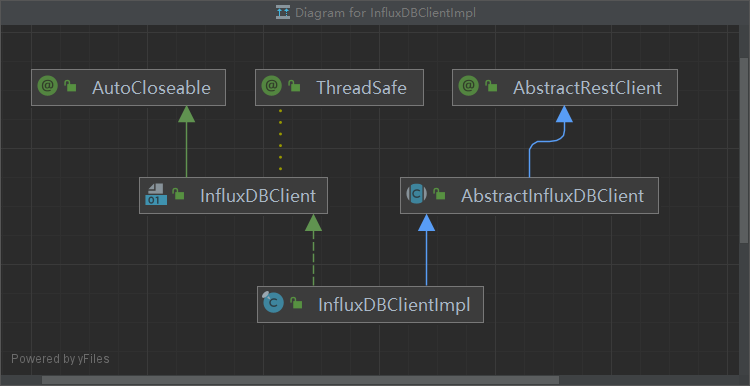

- `AutoCloseable 接口`：使用`try-with-resources`语法安全释放资源。

- `ThreadSafe 接口`：线程安全。

- `AbstractRestClient 抽象类`：定义了发送请求后的响应码和响应规则，发送请求的方法为`execute()`。

  ```java
  protected <T> T execute(@Nonnull final Call<T> call) throws InfluxException {
      Arguments.checkNotNull(call, "call");
  
      try {
          Response<T> response = call.execute();
          if (response.isSuccessful()) {
              return response.body();
          } else {
              throw responseToError(response);
          }
      } catch (IOException e) {
          throw new InfluxException(e);
      }
  }
  ```

  - `Arguments.checkNotNull(call, "call");`使用了 Java 8 中 Objects 的新特性，检查参数不为 null。

    ```java
    Objects.requireNonNull(obj, () -> "Expecting a not null reference for " + name);
    ```

  - 通过`call.execute()`发送请求，底层使用`retrofit`网络请求框架。

    - 关于 retrofit，简单参考：https://juejin.cn/post/6978777076073660429，未深入了解。

- `AbstractInfluxDBClient 抽象类`：定义了资源关闭方法`close()`和健康检查方法`health()`，构造方法中对一些属性进行了初始化，具体属性的含义，后面碰上时探究。其主要的属性和构造方法如下：

  ```java
  /**
   * @author Jakub Bednar (bednar@github) (20/11/2018 07:13)
   */
  public abstract class AbstractInfluxDBClient extends AbstractRestClient {
      public static final Dialect DEFAULT_DIALECT = new Dialect().header(true)
              .delimiter(",")
              .commentPrefix("#")
              .addAnnotationsItem(Dialect.AnnotationsEnum.DATATYPE)
              .addAnnotationsItem(Dialect.AnnotationsEnum.GROUP).addAnnotationsItem(Dialect.AnnotationsEnum.DEFAULT);
  
      public final HealthService healthService;
      public final PingService pingService;
  
      protected final Retrofit retrofit;
      protected final InfluxDBClientOptions options;
  
      protected final HttpLoggingInterceptor loggingInterceptor;
      protected final GzipInterceptor gzipInterceptor;
      private final AuthenticateInterceptor authenticateInterceptor;
      private final OkHttpClient okHttpClient;
      protected final Collection<AutoCloseable> autoCloseables = new CopyOnWriteArrayList<>();
  
      public AbstractInfluxDBClient(@Nonnull final InfluxDBClientOptions options, @Nonnull final String clientType) {
          this(options, clientType, Collections.emptyList());
      }
  
      public AbstractInfluxDBClient(@Nonnull final InfluxDBClientOptions options,
                                    @Nonnull final String clientType,
                                    @Nonnull final Collection<CallAdapter.Factory> factories) {
  
          Arguments.checkNotNull(options, "InfluxDBClientOptions");
          Arguments.checkNotNull(factories, "factories");
          Arguments.checkNonEmpty(clientType, "clientType");
  
          this.options = options;
          this.loggingInterceptor = new HttpLoggingInterceptor();
          setLogLevel(loggingInterceptor, options.getLogLevel());
          this.authenticateInterceptor = new AuthenticateInterceptor(options);
          this.gzipInterceptor = new GzipInterceptor();
  
          this.okHttpClient = options.getOkHttpClient()
                  // Connection errors are handled by RetryAttempt in AbstractWriteClient.
                  .retryOnConnectionFailure(false)
                  .addInterceptor(new UserAgentInterceptor(clientType))
                  .addInterceptor(this.loggingInterceptor)
                  .addInterceptor(this.authenticateInterceptor)
                  .addInterceptor(this.gzipInterceptor)
                  .build();
  
          this.authenticateInterceptor.initToken(okHttpClient);
  
          Retrofit.Builder retrofitBuilder = new Retrofit.Builder()
                  .baseUrl(options.getUrl())
                  .client(okHttpClient)
                  .addConverterFactory(ScalarsConverterFactory.create())
                  .addConverterFactory(GsonConverterFactory.create(new JSON().getGson()));
  
          for (CallAdapter.Factory factory : factories) {
              retrofitBuilder.addCallAdapterFactory(factory);
          }
  
          this.retrofit = retrofitBuilder.build();
  
          this.healthService = retrofit.create(HealthService.class);
          this.pingService = retrofit.create(PingService.class);
      }
  }
  ```

- `InfluxDBClient 接口`：InfluxDB 2.0 的客户端接口，获取写、查询、删除等 Api 的方法都定义在此处，举例如下：

  ```java
  /**
   * The client of theInfluxDB 2.0for Time Series that implements HTTP API defined by
   * <a href="https://github.com/influxdata/influxdb/blob/master/http/swagger.yml">Influx API Service swagger.yml</a>.
   *
   * @author Jakub Bednar (bednar@github) (11/10/2018 08:56)
   */
  @ThreadSafe
  public interface InfluxDBClient extends AutoCloseable { 
     /**
       * Create a new Query client.
       *
       * @return the new client instance for the Query API
       */
      @Nonnull
      QueryApi getQueryApi();
      
     /**
       * Create a new asynchronous non-blocking Write client.
       *
       * <p>
       * The {@link WriteApi} uses background thread to ingesting data into InfluxDB and is suppose to run as a singleton.
       * <b>Don't create new instance for every write.</b>
       * </p>
       *
       * @return the new client instance for the Write API
       */
      @Nonnull
      WriteApi makeWriteApi();
      
     /**
       * Create a new synchronous blocking Write client.
       *
       * @return the new client instance for the Write API
       */
      @Nonnull
      WriteApiBlocking getWriteApiBlocking();
      
     /**
       * Create a new Delete client.
       *
       * @return the new client instance for the Delete API
       */
      @Nonnull
      DeleteApi getDeleteApi();
  }
  ```

回到 InfluxDBClientImpl 自身上来，这个是 InfluxDB 2.0 客户端实际上的实现类，线程安全，支持 try-with-resources 语法，在使用时，应创建一个`单例对象`，使用完后，需要及时的关闭数据库连接的资源。

- 私有属性：

  ```java
  private final SetupService setupService;
  private final ReadyService readyService;
  ```

- 构造方法：

  ```java
  public InfluxDBClientImpl(@Nonnull final InfluxDBClientOptions options) {
      // 调用父类AbstractInfluxDBClient的构造方法，
      super(options, "java", Collections.singletonList(RxJava2CallAdapterFactory.create()));
      // 使用retrofit创建了两个网络连接的服务
      setupService = retrofit.create(SetupService.class);
      readyService = retrofit.create(ReadyService.class);
  }
  ```

- 获取 Write Api，最终获得一个`WriteApiBlockingImpl`或`WriteApiImpl`实例对象：

  ```java
  // 获取的是同步写Api
  @Nonnull
  @Override
  public WriteApiBlocking getWriteApiBlocking() {
      return new WriteApiBlockingImpl(retrofit.create(WriteService.class), options);
  }
  
  // 获取的是异步写Api
  @Nonnull
  @Override
  public WriteApi makeWriteApi() {
      return makeWriteApi(WriteOptions.DEFAULTS);
  }
  
  @Nonnull
  @Override
  @SuppressWarnings("MagicNumber")
  public WriteApi makeWriteApi(@Nonnull final WriteOptions writeOptions) {
      Arguments.checkNotNull(writeOptions, "WriteOptions");
  
      if (autoCloseables.size() >= 10) {
          String format = "There is already created %d instances of 'WriteApi'. "
                  + "The 'WriteApi' is suppose to run as a singleton and should be reused across threads. "
                  + "Use 'WriteApiBlocking` if you would like to use one-time ingesting.";
          LOG.warning(String.format(format, autoCloseables.size()));
      }
  
      return new WriteApiImpl(writeOptions, retrofit.create(WriteService.class), options, autoCloseables);
  }
  ```

- 获取 Query Api，最终获得一个`QueryApiImpl`实例对象：

  ```java
  @Nonnull
  @Override
  public QueryApi getQueryApi() {
      return new QueryApiImpl(retrofit.create(QueryService.class), options);
  }
  ```

- 获取 Delete Api，最终获得一个`DeleteApiImpl`实例对象：

  ```java
  @Nonnull
  @Override
  public DeleteApi getDeleteApi() {
      return new DeleteApiImpl(retrofit.create(DeleteService.class));
  }
  ```

### Write Api

`// TODO`

### Query Api

#### 源码分析

通过前面对 InfluxDBClient 的分析，可以看出，InfluxDB 2.0 实际上通过`QueryApiImpl`实现查询操作，QueryApiImpl 实例对象的创建方式如下所示：

```java
new QueryApiImpl(retrofit.create(QueryService.class), options)
```

在构造方法中，传入了一个`QueryService`的对象实例，QueryService 接口中的全部方法如下：

```java
public interface QueryService {
  /**
   * Retrieve query suggestions
   * 
   * @param zapTraceSpan OpenTracing span context (optional)
   * @return Call&lt;FluxSuggestions&gt;
   */
  @GET("api/v2/query/suggestions")
  Call<FluxSuggestions> getQuerySuggestions(
    @retrofit2.http.Header("Zap-Trace-Span") String zapTraceSpan
  );

  /**
   * Retrieve query suggestions for a branching suggestion
   * 
   * @param name The name of the branching suggestion. (required)
   * @param zapTraceSpan OpenTracing span context (optional)
   * @return Call&lt;FluxSuggestion&gt;
   */
  @GET("api/v2/query/suggestions/{name}")
  Call<FluxSuggestion> getQuerySuggestionsName(
    @retrofit2.http.Path("name") String name, @retrofit2.http.Header("Zap-Trace-Span") String zapTraceSpan
  );

  /**
   * Query data
   * Retrieves data from InfluxDB buckets.  To query data, you need the following: - **organization** – _See [View organizations](https://docs.influxdata.com/influxdb/v2.1/organizations/view-orgs/#view-your-organization-id) for instructions on viewing your organization ID._ - **API token** – _See [View tokens](https://docs.influxdata.com/influxdb/v2.1/security/tokens/view-tokens/)  for instructions on viewing your API token._ - **InfluxDB URL** – _See [InfluxDB URLs](https://docs.influxdata.com/influxdb/v2.1/reference/urls/)_. - **Flux query** – _See [Flux](https://docs.influxdata.com/flux/v0.x/)._  For more information and examples, see [Query with the InfluxDB API](https://docs.influxdata.com/influxdb/v2.1/query-data/execute-queries/influx-api/).
   * @param zapTraceSpan OpenTracing span context (optional)
   * @param acceptEncoding Indicates the content encoding (usually a compression algorithm) that the client can understand. (optional, default to identity)
   * @param contentType  (optional)
   * @param org Specifies the name of the organization executing the query. Takes either the ID or Name. If both &#x60;orgID&#x60; and &#x60;org&#x60; are specified, &#x60;org&#x60; takes precedence. (optional)
   * @param orgID Specifies the ID of the organization executing the query. If both &#x60;orgID&#x60; and &#x60;org&#x60; are specified, &#x60;org&#x60; takes precedence. (optional)
   * @param query Flux query or specification to execute (optional)
   * @return Call&lt;String&gt;
   */
  @Headers({
    "Content-Type:application/json"
  })
  @POST("api/v2/query")
  Call<String> postQuery(
    @retrofit2.http.Header("Zap-Trace-Span") String zapTraceSpan, @retrofit2.http.Header("Accept-Encoding") String acceptEncoding, @retrofit2.http.Header("Content-Type") String contentType, @retrofit2.http.Query("org") String org, @retrofit2.http.Query("orgID") String orgID, @retrofit2.http.Body Query query
  );

  /**
   * Query data
   * Retrieves data from InfluxDB buckets.  To query data, you need the following: - **organization** – _See [View organizations](https://docs.influxdata.com/influxdb/v2.1/organizations/view-orgs/#view-your-organization-id) for instructions on viewing your organization ID._ - **API token** – _See [View tokens](https://docs.influxdata.com/influxdb/v2.1/security/tokens/view-tokens/)  for instructions on viewing your API token._ - **InfluxDB URL** – _See [InfluxDB URLs](https://docs.influxdata.com/influxdb/v2.1/reference/urls/)_. - **Flux query** – _See [Flux](https://docs.influxdata.com/flux/v0.x/)._  For more information and examples, see [Query with the InfluxDB API](https://docs.influxdata.com/influxdb/v2.1/query-data/execute-queries/influx-api/).
   * @param zapTraceSpan OpenTracing span context (optional)
   * @param acceptEncoding Indicates the content encoding (usually a compression algorithm) that the client can understand. (optional, default to identity)
   * @param contentType  (optional)
   * @param org Specifies the name of the organization executing the query. Takes either the ID or Name. If both &#x60;orgID&#x60; and &#x60;org&#x60; are specified, &#x60;org&#x60; takes precedence. (optional)
   * @param orgID Specifies the ID of the organization executing the query. If both &#x60;orgID&#x60; and &#x60;org&#x60; are specified, &#x60;org&#x60; takes precedence. (optional)
   * @param query Flux query or specification to execute (optional)
   * @return Call&lt;ResponseBody&gt;
   */
  @POST("api/v2/query")
  @Streaming
  Call<ResponseBody> postQueryResponseBody(
    @retrofit2.http.Header("Zap-Trace-Span") String zapTraceSpan, @retrofit2.http.Header("Accept-Encoding") String acceptEncoding, @retrofit2.http.Header("Content-Type") String contentType, @retrofit2.http.Query("org") String org, @retrofit2.http.Query("orgID") String orgID, @retrofit2.http.Body Query query
  );

  /**
   * Query data
   * Retrieves data from InfluxDB buckets.  To query data, you need the following: - **organization** – _See [View organizations](https://docs.influxdata.com/influxdb/v2.1/organizations/view-orgs/#view-your-organization-id) for instructions on viewing your organization ID._ - **API token** – _See [View tokens](https://docs.influxdata.com/influxdb/v2.1/security/tokens/view-tokens/)  for instructions on viewing your API token._ - **InfluxDB URL** – _See [InfluxDB URLs](https://docs.influxdata.com/influxdb/v2.1/reference/urls/)_. - **Flux query** – _See [Flux](https://docs.influxdata.com/flux/v0.x/)._  For more information and examples, see [Query with the InfluxDB API](https://docs.influxdata.com/influxdb/v2.1/query-data/execute-queries/influx-api/).
   * @param zapTraceSpan OpenTracing span context (optional)
   * @param acceptEncoding Indicates the content encoding (usually a compression algorithm) that the client can understand. (optional, default to identity)
   * @param contentType  (optional)
   * @param org Specifies the name of the organization executing the query. Takes either the ID or Name. If both &#x60;orgID&#x60; and &#x60;org&#x60; are specified, &#x60;org&#x60; takes precedence. (optional)
   * @param orgID Specifies the ID of the organization executing the query. If both &#x60;orgID&#x60; and &#x60;org&#x60; are specified, &#x60;org&#x60; takes precedence. (optional)
   * @param query Flux query or specification to execute (optional)
   * @return Call&lt;String&gt;
   */
  @POST("api/v2/query")
  Call<String> postQueryString(
    @retrofit2.http.Header("Zap-Trace-Span") String zapTraceSpan, @retrofit2.http.Header("Accept-Encoding") String acceptEncoding, @retrofit2.http.Header("Content-Type") String contentType, @retrofit2.http.Query("org") String org, @retrofit2.http.Query("orgID") String orgID, @retrofit2.http.Body Query query
  );

  /**
   * Analyze a Flux query
   * 
   * @param zapTraceSpan OpenTracing span context (optional)
   * @param contentType  (optional)
   * @param query Flux query to analyze (optional)
   * @return Call&lt;AnalyzeQueryResponse&gt;
   */
  @Headers({
    "Content-Type:application/json"
  })
  @POST("api/v2/query/analyze")
  Call<AnalyzeQueryResponse> postQueryAnalyze(
    @retrofit2.http.Header("Zap-Trace-Span") String zapTraceSpan, @retrofit2.http.Header("Content-Type") String contentType, @retrofit2.http.Body Query query
  );

  /**
   * Generate an Abstract Syntax Tree (AST) from a query
   * Analyzes flux query and generates a query specification.
   * @param zapTraceSpan OpenTracing span context (optional)
   * @param contentType  (optional)
   * @param languageRequest Analyzed Flux query to generate abstract syntax tree. (optional)
   * @return Call&lt;ASTResponse&gt;
   */
  @Headers({
    "Content-Type:application/json"
  })
  @POST("api/v2/query/ast")
  Call<ASTResponse> postQueryAst(
    @retrofit2.http.Header("Zap-Trace-Span") String zapTraceSpan, @retrofit2.http.Header("Content-Type") String contentType, @retrofit2.http.Body LanguageRequest languageRequest
  );
}
```

至此，我们知道，此 InfluxDB 的 Java 客户端，在查询操作时，实际上应该是`发送了一个 Http 请求`，访问安装在服务器上的 InfluxDB 数据库所暴露出来的接口。那么，当我们写一个查询条件时，是先从数据库拿出原数据然后在客户端分析计算，还是数据库直接根据查询条件返回最终的结果呢？对于这个问题，常理分析应该是后者。

Ok，再回到 QueryApiImpl 上来，其类图关系如下：

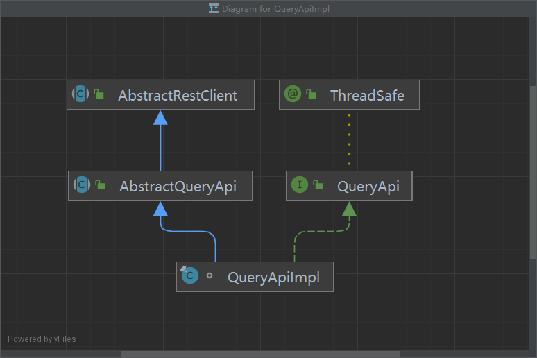

- `AbstractRestClient 抽象类`和`ThreadSafe 接口`：同 InfluxDBClientImpl。
- `AbstractQueryApi 抽象类`：定义了封装查询请求，以及对请求返回结果封装处理的一些方法。
- `QueryApi 接口`：InfluxDB 2.0 的查询 Api 接口，查询操作的方法都定义在此接口中。

查看 QueryApiImpl 构造方法，只是简单的对两个属性赋值：

```java
final class QueryApiImpl extends AbstractQueryApi implements QueryApi {
    // 查询服务
    private final QueryService service;
    // 数据库连接参数
    private final InfluxDBClientOptions options;

    QueryApiImpl(@Nonnull final QueryService service, @Nonnull final InfluxDBClientOptions options) {

        Arguments.checkNotNull(service, "service");
        Arguments.checkNotNull(options, "options");

        this.service = service;
        this.options = options;
    }
}
```

再看其方法，QueryApiImpl 除了实现 QueryApi 接口中定义的所有方法以外，多了两个私有方法，而其他各方法执行到最后，实际执行的都是这两个私有方法，如下所示：

```java
// 方法一
private void query(@Nonnull final Query query,
                   @Nonnull final String org,
                   @Nonnull final FluxCsvParser.FluxResponseConsumer responseConsumer,
                   @Nonnull final Consumer<? super Throwable> onError,
                   @Nonnull final Runnable onComplete,
                   @Nonnull final Boolean asynchronously) {

    Call<ResponseBody> queryCall = service
        .postQueryResponseBody(null, null, null, org, null, query.dialect(AbstractInfluxDBClient.DEFAULT_DIALECT));


    LOG.log(Level.FINEST, "Prepare query \"{0}\" with dialect \"{1}\" on organization \"{2}\".",
            new Object[]{query, query.getDialect(), org});

    query(queryCall, responseConsumer, onError, onComplete, asynchronously);
}

// 方法二
private void queryRaw(@Nonnull final Query query,
                      @Nonnull final String org,
                      @Nonnull final BiConsumer<Cancellable, String> onResponse,
                      @Nonnull final Consumer<? super Throwable> onError,
                      @Nonnull final Runnable onComplete,
                      @Nonnull final Boolean asynchronously) {

    Call<ResponseBody> queryCall = service
        .postQueryResponseBody(null, null, null, org, null, query);

    LOG.log(Level.FINEST, "Prepare raw query \"{0}\" with dialect \"{1}\" on organization \"{2}\".",
            new Object[]{query, query.getDialect(), org});

    queryRaw(queryCall, onResponse, onError, onComplete, asynchronously);
}
```

可以看出，两个方法都通过 QueryService 发送了一个 Post 请求，这个请求具体创建方法也是相同的，如下所示：

```java
@POST("api/v2/query")
@Streaming
Call<ResponseBody> postQueryResponseBody(
  @retrofit2.http.Header("Zap-Trace-Span") String zapTraceSpan, @retrofit2.http.Header("Accept-Encoding") String acceptEncoding, @retrofit2.http.Header("Content-Type") String contentType, @retrofit2.http.Query("org") String org, @retrofit2.http.Query("orgID") String orgID, @retrofit2.http.Body Query query
);
```

进一步的，QueryApiImpl 的两个私有方法，都指向了 AbstractQueryApi 抽象类的以下方法：

```java
private void query(@Nonnull final Call<ResponseBody> query,
                   @Nonnull final Consumer<ResponseBody> consumer,
                   @Nonnull final Consumer<? super Throwable> onError,
                   @Nonnull final Runnable onComplete,
                   @Nonnull final Boolean asynchronously) {

    Arguments.checkNotNull(query, "query");
    Arguments.checkNotNull(consumer, "consumer");
    Arguments.checkNotNull(onError, "onError");
    Arguments.checkNotNull(onComplete, "onComplete");
    Arguments.checkNotNull(asynchronously, "asynchronously");

    Callback<ResponseBody> callback = new Callback<ResponseBody>() {
        @Override
        public void onResponse(@Nonnull final Call<ResponseBody> call,
                               @Nonnull final Response<ResponseBody> response) {

            if (!response.isSuccessful()) {
                onError.accept(responseToError(response));
                return;
            }

            ResponseBody body = response.body();
            if (body == null) {
                return;
            }

            consumer.accept(body);
        }

        @Override
        public void onFailure(@Nonnull final Call<ResponseBody> call, @Nonnull final Throwable throwable) {
            onError.accept(throwable);
        }
    };

    LOG.log(Level.FINEST, "Prepared query {0}, asynchronously {1}", new Object[]{query, asynchronously});

    if (asynchronously) {
        query.enqueue(callback);
    } else {

        Response<ResponseBody> response;
        try {
            response = query.execute();
            callback.onResponse(query, response);
        } catch (IOException e) {
            catchOrPropagateException(e, onError);
        }
    }
}
```

从这个方法，也可以看出，并没有对数据的分析计算等操作。

至此，我们可以得出结论：**InfluxDB 的 Java 客户端，不存在数据的分析计算等操作，当我们写好一个查询条件时，客户端只是对其进行必要的封装，然后发送  Http 请求，然后数据库接受请求后，根据查询条件获得结果，然后返回给客户端。**

对于 InfluxDB 数据库内部的存储结构，以及如何实现高效的查询操作，是无法通过此 Java 客户端得知的，这个就需要进一步分析 InfluxDB 源码，才能得到答案。

#### 查询语法

在 QueryApi 接口中，定义了六十多种查询的方法，举例如下：

```java
/**
 * The client of the InfluxDB 2.0 that implement Query HTTP API endpoint.
 *
 * @author Jakub Bednar (bednar@github) (01/10/2018 12:17)
 */
@ThreadSafe
public interface QueryApi {
   /**
     * Executes the Flux query against the InfluxDB 2.0 and synchronously map whole response
     * to {@code List<FluxTable>}.
     * <p>
     * NOTE: This method is not intended for large query results.
     * Use {@link QueryApi#query(String, String, BiConsumer, Consumer, Runnable)} for large data streaming.
     *
     * <p>The {@link InfluxDBClientOptions#getOrg()} will be used as source organization.</p>
     *
     * @param query the flux query to execute
     * @return {@code List<FluxTable>} which are matched the query
     */
    @Nonnull
    List<FluxTable> query(@Nonnull final String query);
    
   /**
     * Executes the Parameterized Flux query against the InfluxDB 2.0 and synchronously map whole response
     * to {@code List<FluxTable>}. Query parameters currently are supported only in InfluxDB Cloud.
     * <p>
     * NOTE: This method is not intended for large query results.
     * Use {@link QueryApi#query(String, String, BiConsumer, Consumer, Runnable, Map)} for large data streaming.
     * </p>
     * Parameterized Flux queries support int, float, and string data types.
     * To convert the supported data types into other Flux basic data types, use Flux type conversion functions.
     * <p>
     *
     * Example:
     * </p>
     * <blockquote>
     * <pre>{@code
     * Instant yesterday = Instant.now().minus(Period.ofDays(1));
     * QueryApi queryApi = client.getQueryApi();
     * Map<String, Object> params = new HashMap<>();
     * params.put("bucketParam", bucket);
     * params.put("startParam", yesterday.toString());
     * String parametrizedQuery = "from(bucket: params.bucketParam) |> range(start: time(v: params.startParam))";
     * List<FluxTable> query = queryApi.query(parametrizedQuery, org, params);
     * }
     * </pre>
     * </blockquote>
     *
     * @param query the flux query to execute
     * @param org   specifies the source organization
     * @param params the map of query parameters.
     *
     * @return {@code List<FluxTable>} which are matched the query
     *
     * @see <a href="https://docs.influxdata.com/influxdb/cloud/query-data/parameterized-queries/">InfluxDB Cloud
     * Parametrized Queries</a>
     */
    List<FluxTable> query(@Nonnull final String query, @Nonnull final String org,
                          @Nullable Map<String, Object> params);
    
   /**
     * Executes the Flux query against the InfluxDB 2.0 and synchronously map whole response
     * to {@code List<FluxTable>}.
     * <p>
     * NOTE: This method is not intended for large query results.
     * Use {@link QueryApi#query(String, String, BiConsumer, Consumer, Runnable)} for large data streaming.
     *
     * <p>The {@link InfluxDBClientOptions#getOrg()} will be used as source organization.</p>
     *
     * @param query the flux query to execute
     * @return {@code List<FluxTable>} which are matched the query
     */
    @Nonnull
    List<FluxTable> query(@Nonnull final Query query);
    
   /**
     * Executes the Flux query against the InfluxDB 2.0 and asynchronously stream {@link FluxRecord}s
     * to {@code onNext} consumer.
     *
     * <p>The {@link InfluxDBClientOptions#getOrg()} will be used as source organization.</p>
     *
     * @param query      the flux query to execute
     * @param onNext     the callback to consume FluxRecord result with capability to discontinue a streaming query
     * @param onError    the callback to consume any error notification
     * @param onComplete the callback to consume a notification about successfully end of stream
     */
    void query(@Nonnull final String query,
               @Nonnull final BiConsumer<Cancellable, FluxRecord> onNext,
               @Nonnull final Consumer<? super Throwable> onError,
               @Nonnull final Runnable onComplete);
    
   /**
     * Executes the Flux query against the InfluxDB 2.0 and asynchronously stream {@link FluxRecord}s
     * to {@code onNext} consumer.
     *
     * <p>The {@link InfluxDBClientOptions#getOrg()} will be used as source organization.</p>
     *
     * @param query      the flux query to execute
     * @param onNext     the callback to consume FluxRecord result with capability to discontinue a streaming query
     * @param onError    the callback to consume any error notification
     * @param onComplete the callback to consume a notification about successfully end of stream
     */
    void query(@Nonnull final Query query,
               @Nonnull final BiConsumer<Cancellable, FluxRecord> onNext,
               @Nonnull final Consumer<? super Throwable> onError,
               @Nonnull final Runnable onComplete);
}
```

QueryApi 的查询参数分为两种类型：

- `String query`：query 字符串需要符合 Flux 语法，参考如下

  ```java
  String baseMessage = "from(bucket: \"xisun_influx_bucket\")\n" +
                  " |> range(start: -1d)\n" +
                  " |> filter(fn: (r) => r[\"_measurement\"] == \"temperature_collect\")";
  
  // 统计
  String flux_count = " |> count(column: \"_value\")";
  
  // 排序，根据tags和field
  String flux_sort = " |> sort(columns: [\"location\", \"_value\"])";
  
  // 分页
  String flux_limit = " |> limit(n:10)";
  ```

  - `from(bucket: "bucket_name")`：数据源，必需
  - `range(start: -1d)`：时间范围，必需
  - `filter(fn: (r) => r["_measurement"] == "measurement_name")`：过滤条件，必需
  - `count(column: "_value")`：对查询的结果统计
  - `sort(columns: ["_tag", "_value"])`：对查询的结果排序
  - `limit(n:10)`：对查询的结果分页

- `Query query`：实际上就是将查询参数封装成一个对象，即使传入的是 query 字符串，最终也是通过`new Query().query(query)`，封装为 Query 对象。

### Delete Api

`// TODO`

## InfluxDB 的 源码分析


中文文档：https://jasper-zhang1.gitbooks.io/influxdb/content/Introduction/installation.html


https://www.cnblogs.com/pxza/p/15994917.html

https://www.cnblogs.com/takemybreathaway/articles/10774787.html

http://blog.zollty.com/b/archive/getting-start-of-incluxdb.html

https://blog.csdn.net/u010597230/article/details/108419717


https://www.jianshu.com/p/268fca65f10e

https://blog.csdn.net/gaowenhui2008/article/details/122817613

https://www.sunzhongwei.com/influxdb-20-data-query-syntax

https://blog.csdn.net/xz_studying/article/details/105176086


监控：

https://blog.51cto.com/u_15076224/4120553

https://blog.csdn.net/lulongji2035/article/details/109029677

https://www.cnblogs.com/runzhao/p/15735670.html

https://blog.csdn.net/lijiaze_csdn/article/details/49894793


## 本文参考

http://c.biancheng.net/view/879.html

https://www.cnblogs.com/huangjianping/p/15044759.html

https://www.cnblogs.com/jpfss/p/12183214.html

https://www.cnblogs.com/xuwc/p/14037750.html

## 声明

写作本文初衷是个人学习记录，鉴于本人学识有限，如有侵权或不当之处，请联系 [wdshfut@163.com](mailto:wdshfut@163.com)。
