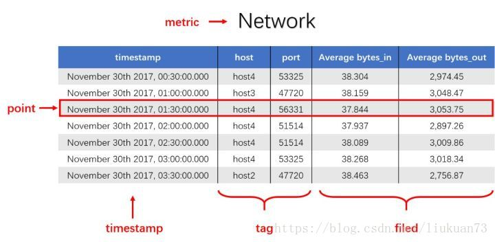

时序数据初识2022.3.23

## 时序数据的基本概念

### 时序数据的定义

`时间序列数据`：Time Series Data，TSD，从定义上来说，就是一串按时间维度索引的数据。用描述性的语言来解释什么是时序数据，简单的说，就是这类数据描述了某个被测量的主体在一个时间范围内的每个时间点上的测量值。它普遍存在于 IT 基础设施、运维监控系统和物联网中。

对时序数据进行建模的话，会包含三个重要部分，分别是：`主体，时间点和测量值`。套用这套模型，你会发现你在日常工作生活中，无时无刻不在接触着这类数据：

- 如果你是一个股民，某只股票的股价就是一类时序数据，其记录着每个时间点该股票的股价。

- 如果你是一个运维人员，监控数据就是一类时序数据，例如对于机器的 CPU 的监控数据，就是记录着每个时间点机器上 CPU 的实际消耗值。

时序数据从时间维度上将孤立的观测值连成一条线，从而揭示软硬件系统等主体的状态变化。孤立的观测值不能叫时序数据，但如果把大量的观测值用时间线串起来，我们就可以研究和分析观测值的趋势及规律。

### 时序数据的特点

`数据模式`：时序数据随时间增长，相同维度重复取值，指标平滑变化。

`写入`： 持续高并发写入，无更新操作。时序数据库面对的往往是百万甚至千万数量级终端设备的实时数据写入，但数据大多表征设备状态，写入后不会更新。

`查询`： 按不同维度对指标进行统计分析，且存在明显的冷热数据，一般只会频繁查询近期数据。

### 时序数据的数学模型

数据的存储要考虑其数学模型和特点，时序数据也不例外。

下图为一段时序数据，记录了一段时间内的某个集群里各机器上各端口的出入流量，每半小时记录一个观测值。这里以图中的数据为例，介绍下时序数据的数学模型（不同的时序数据库中，基本概念的称谓有可能不同，这里以腾讯CTSDB为准）：

measurement： 度量的数据集，类似于关系型数据库中的 table；

point： 一个数据点，类似于关系型数据库中的 row；

timestamp： 时间戳，表征采集到数据的时间点；

tag： 维度列，代表数据的归属、属性，表明是哪个设备/模块产生的，一般不随着时间变化，供查询使用；

field： 指标列，代表数据的测量值，随时间平滑波动，不需要查询。

### 时序数据的存储

## 时序数据库

