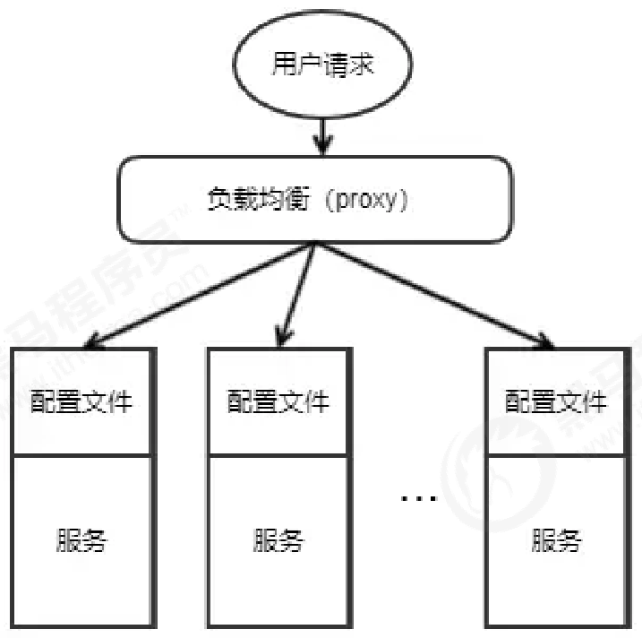
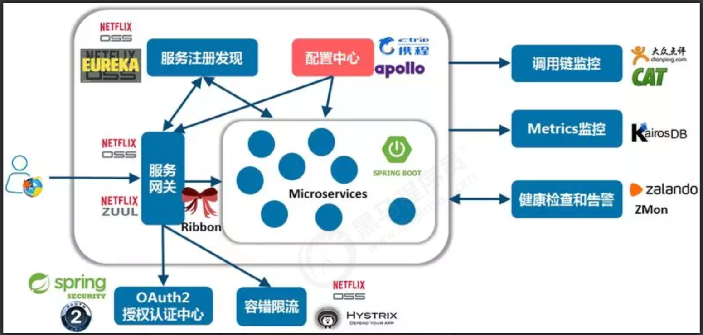

*date: 2022-07-30*

## 概览

### 什么是配置

应用程序在启动和运行的时候往往需要读取一些配置信息，配置基本上伴随着应用程序的整个生命周期，比如：数
据库连接参数、启动参数等。

配置主要有以下几个特点：

- 配置是独立于程序的只读变量
  - 配置首先是独立于程序的，同一份程序在不同的配置下会有不同的行为。
  - 其次，配置对于程序是只读的，程序通过读取配置来改变自己的行为，但是程序不应该去改变配置。

- 配置伴随应用的整个生命周期
  - 配置贯穿于应用的整个生命周期，应用在启动时通过读取配置来初始化，在运行时根据配置调整行为。
  - 比如：启动时需要读取服务的端口号、系统在运行过程中需要读取定时策略执行定时任务等。

- 配置可以有多种加载方式
  - 常见的有程序内部硬编码，配置文件，环境变量，启动参数，基于数据库等。

- 配置需要治理
  - 权限控制：由于配置能改变程序的行为，不正确的配置甚至能引起灾难，所以对配置的修改必须有比较完善的权限控制
  - 不同环境、集群配置管理：同一份程序在不同的环境（开发，测试，生产）、不同的集群（如不同的数据中心）经常需要有不同的配置，所以需要有完善的环境、集群配置管理。

### 什么是配置中心

传统单体应用存在一些潜在缺陷，如随着规模的扩大，部署效率降低，团队协作效率差，系统可靠性变差，维护困
难，新功能上线周期长等，所以迫切需要一种新的架构去解决这些问题，而微服务（MicroServices）架构正是当
下一种流行的解法。

不过，解决一个问题的同时，往往会诞生出很多新的问题，所以微服务化的过程中伴随着很多的挑战，其中一个挑
战就是有关服务（应用）配置的。当系统从一个单体应用，被拆分成分布式系统上一个个服务节点后，配置文件也
必须跟着迁移（分割），这样配置就分散了，不仅如此，分散中还包含着冗余，如下图：

配置中心将配置从应用中剥离出来，统一管理，优雅的解决了配置的动态变更、持久化、运维成本等问题。

应用自身既不需要去添加管理配置接口，也不需要自己去实现配置的持久化，更不需要引入 "定时任务" 以便降低运维成本。

总得来说，`配置中心就是一种统一管理各种应用配置的基础服务组件`。

在系统架构中，配置中心是整个微服务基础架构体系中的一个组件，如下图，它的功能看上去并不起眼，无非就是
配置的管理和存取，但它是整个微服务架构中不可或缺的一环。

集中管理配置，那么就要将应用的配置作为一个单独的服务抽离出来了，同理也需要解决新的问题，比如：版本管
理（为了支持回滚），权限管理等。

总结一下，在传统巨型单体应用纷纷转向细粒度微服务架构的历史进程中，配置中心是微服务化不可缺少的一个系
统组件，在这种背景下中心化的配置服务即配置中心应运而生，一个合格的配置中心需要满足：

- 配置项容易读取和修改
- 添加新配置简单直接
- 支持对配置的修改的检视以把控风险
- 可以查看配置修改的历史记录
- 不同部署环境支持隔离

## 简介

### 主流配置中心

按开源时间排序，目前市面上用的比较多的配置中心有：

- Disconf
  - 2014 年 7 月，百度开源的配置管理中心，专注于各种「分布式系统配置管理」的「通用组件」和「通用平台」，提供统一的「配置管理服务」。目前已经不再维护更新。
  - https://github.com/knightliao/disconf
- Spring Cloud Config
  - 2014 年 9 月开源，Spring Cloud 生态组件，可以和 Spring Cloud 体系无缝整合。
  - https://github.com/spring-cloud/spring-cloud-config
- Apollo
  - 2016 年 5 月，携程开源的配置管理中心，能够集中化管理应用不同环境、不同集群的配置，配置修改后能够实时推送到应用端，并且具备规范的权限、流程治理等特性，适用于微服务配置管理场景。
  - https://github.com/ctripcorp/apollo
- Nacos
  - 2018 年 6 月，阿里开源的配置中心，也可以做 DNS 和 RPC 的服务发现。
  - https://github.com/alibaba/nacos

### 功能特性对比

由于 Disconf 不再维护，下面主要对比一下 Spring Cloud Config、Apollo 和 Nacos。

| 功能点          | Spring Cloud Config     | Apollp                     | Nacos                      |
| --------------- | ----------------------- | -------------------------- | -------------------------- |
| 配置实时推送    | 支持（Spring Cloud Bus) | 支持（HTTP 长轮询 1 s 内） | 支持（HTTP 长轮询 1 s 内） |
| 版本管理        | 支持（Git）             | 支持                       | 支持                       |
| 配置回滚        | 支持（Git）             | 支持                       | 支持                       |
| 灰度发布        | 支持                    | 支持                       | 不支持                     |
| 权限管理        | 支持（依赖 Git）        | 支持                       | 不支持                     |
| 多集群          | 支持                    | 支持                       | 支持                       |
| 多环境          | 支持                    | 支持                       | 支持                       |
| 监听查询        | 支持                    | 支持                       | 支持                       |
| 多语言          | 只支持 Java             | 主流语言，提供了 Open API  | 主流语言，提供了 Open API  |
| 配置格式校验    | 不支持                  | 支持                       | 支持                       |
| 单机读（QPS）   | 7（限流所致）           | 9000                       | 15000                      |
| 单机写（QPS）   | 5（限流所致）           | 1100                       | 1800                       |
| 3 节点读（QPS） | 21（限流所致）          | 27000                      | 45000                      |
| 3 节点写（QPS） | 5（限流所致）           | 3300                       | 5600                       |

总的来看，Apollo 和 Nacos 相对于 Spring Cloud Config 的生态支持更广，在配置管理流程上做的更好。Apollo 相对
于 Nacos 在配置管理做的更加全面，Nacos 则使用起来相对比较简洁，在对性能要求比较高的大规模场景更适合。

### Apollo

GitHub：https://github.com/apolloconfig/apollo

Apollo（阿波罗）是携程框架部门研发的分布式配置中心，能够集中化管理应用的不同环境、不同集群的配置，配置修改后能够实时推送到应用端，并且具备规范的权限、流程治理等特性，适用于微服务配置管理场景。

Apollo 包括`服务端`和`客户端`两部分：

- 服务端基于 Spring Boot 和 Spring Cloud 开发，打包后可以直接运行，不需要额外安装 Tomcat 等应用容器。
- Java 客户端不依赖任何框架，能够运行于所有 Java 运行时环境，同时对 Spring/Spring Boot 环境也有较好的支持。

基于配置的特殊性，所以 Apollo 从设计之初就立志于成为一个有治理能力的配置发布平台，目前提供了以下的特
性：

- 统一管理不同环境、不同集群的配置
  - Apollo 提供了一个统一界面集中式管理不同环境（environment）、不同集群（cluster）、不同命名空间（namespace）的配置。
  - 同一份代码部署在不同的集群，可以有不同的配置，比如 zookeeper 的地址等。
  - 通过命名空间（namespace），可以很方便地支持多个不同应用共享同一份配置，同时还允许应用对共享的配置进行覆盖。
- 配置修改实时生效（热发布）
  - 用户在 Apollo 修改完配置并发布后，客户端能实时（1 秒）接收到最新的配置，并通知到应用程序。
- 版本发布管理
  - 所有的配置发布都有版本概念，从而可以方便地支持配置的回滚。
- 灰度发布
  - 支持配置的灰度发布，比如点了发布后，只对部分应用实例生效，等观察一段时间没问题后再推给所有应用实例。
- 权限管理、发布审核、操作审计
  - 应用和配置的管理都有完善的权限管理机制，对配置的管理还分为了编辑和发布两个环节，从而减少人为的错误。
  - 所有的操作都有审计日志，可以方便地追踪问题。
- 客户端配置信息监控
  - 可以在界面上方便地看到配置在被哪些实例使用。
- 提供 Java 和 .Net 原生客户端
  - 提供了 Java 和 .Net 的原生客户端，方便应用集成。
  - 支持 Spring Placeholder，Annotation 和 Spring Boot 的 ConfigurationProperties，方便应用使用（需要
    Spring 3.1.1+）。
  - 同时提供了 Http 接口，非 Java 和 .Net 应用也可以方便地使用。
- 提供开放平台 API
  - Apollo 自身提供了比较完善的统一配置管理界面，支持多环境、多数据中心配置管理、权限、流程治理等特性。不过 Apollo 出于通用性考虑，不会对配置的修改做过多限制，只要符合基本的格式就能保存，不会针对不同的配置值进行针对性的校验，如数据库用户名、密码，Redis 服务地址等。
  - 对于这类应用配置，Apollo 支持应用方通过开放平台 API 在 Apollo 进行配置的修改和发布，并且具备完善的授权和权限控制。

## quick start

