## CentOS  安装 Ceph

### 节点规划

- 各节点规划：

  | 主机名    | ip             | 磁盘                       | 角色                                      |
  | --------- | -------------- | -------------------------- | ----------------------------------------- |
  | hadoop102 | 192.168.10.102 | 系统盘：sda<br/>osd盘：sdb | cephadm，monitor，mgr，rgw，mds，osd，nfs |
  | hadoop103 | 192.168.10.103 | 系统盘：sda<br/>osd盘：sdb | monitor，mgr，rgw，mds，osd，nfs          |
  | hadoop104 | 192.168.10.104 | 系统盘：sda<br/>osd盘：sdb | monitor，mgr，rgw，mds，osd，nfs          |

- 各节点内核版本：

  ```shell
  [root@hadoop102 opt]# uname -r
  3.10.0-1160.49.1.el7.x86_64
  ```

- 各节点操作系统版本：

  ```shell
  [root@hadoop102 opt]# cat /etc/redhat-release
  CentOS Linux release 7.9.2009 (Core)
  ```

- 各节点配置 CentOS 7 yum 阿里云镜像源：

  ```shell
  [root@hadoop102 opt]# curl -o /etc/yum.repos.d/CentOS-Base.repo http://mirrors.aliyun.com/repo/Centos-7.repo
  # 清空缓存
  [root@hadoop102 opt]# yum clean cache
  # 生成缓存
  [root@hadoop102 opt]# yum makecache
  ```

  - 执行命令 `curl -o /etc/yum.repos.d/CentOS-Base.repo http://mirrors.aliyun.com/repo/Centos-7.repo`，会把 Centos-7.repo 下载到 `/etc/yum.repos.d/` 目录下，如果该目录下有 CentOS-Base.repo，则会自动覆盖。

    ```shell
    [root@hadoop102 opt]# ll /etc/yum.repos.d/
    总用量 56
    -rw-r--r--. 1 root root 2523 12月 21 14:16 CentOS-Base.repo						# yum源
    -rw-r--r--. 1 root root 1309 11月 23 2020 CentOS-CR.repo
    -rw-r--r--. 1 root root  649 11月 23 2020 CentOS-Debuginfo.repo
    -rw-r--r--. 1 root root  314 11月 23 2020 CentOS-fasttrack.repo
    -rw-r--r--. 1 root root  630 11月 23 2020 CentOS-Media.repo
    -rw-r--r--. 1 root root 1331 11月 23 2020 CentOS-Sources.repo
    -rw-r--r--. 1 root root 8515 11月 23 2020 CentOS-Vault.repo
    -rw-r--r--. 1 root root  616 11月 23 2020 CentOS-x86_64-kernel.repo
    -rw-r--r--. 1 root root  477 12月 21 15:38 ceph.repo								# ceph源
    -rw-r--r--. 1 root root 2081 12月 20 12:37 docker-ce.repo						# docker源
    -rw-r--r--. 1 root root 1358 9月   5 01:37 epel.repo
    -rw-r--r--. 1 root root 1457 9月   5 01:37 epel-testing.repo
    ```

- 各节点更新 yum 包（生产环境中此步操作需慎重，看自己情况，学习的话随便搞，这个命令不是必须执行的）：

  ```shell
  [root@hadoop102 opt]# yum -y update
  [root@hadoop102 opt]# yum -y upgrade
  ```

  - `yum -y update`：升级所有包，也升级软件和系统内核。
  - `yum -y upgrade`：升级所有包，但不升级软件和系统内核。

- 各节点配置主机名：

  ```shell
  [root@hadoop102 opt]# vim /etc/hostname
  [root@hadoop102 opt]# cat /etc/hostname
  hadoop102
  ```

- 各节点配置 host 解析：

  ```shell
  [root@hadoop102 opt]# vim /etc/hosts
  [root@hadoop102 opt]# cat /etc/hosts
  127.0.0.1   localhost localhost.localdomain localhost4 localhost4.localdomain4
  ::1         localhost localhost.localdomain localhost6 localhost6.localdomain6
  
  192.168.10.99 centos7
  192.168.10.100 hadoop100
  192.168.10.101 hadoop101
  192.168.10.102 hadoop102
  192.168.10.103 hadoop103
  192.168.10.104 hadoop104
  192.168.10.105 hadoop105
  192.168.10.106 hadoop106
  192.168.10.107 hadoop107
  192.168.10.108 hadoop108
  ```


### 关闭防火墙

- 关闭防火墙：

  ```shell
  [root@hadoop102 xisun]# systemctl stop firewalld.service
  [root@hadoop102 xisun]# firewall-cmd --state
  not running
  ```

- 关闭防火墙开机自启：

  ```shell
  [root@hadoop102 xisun]# systemctl disable firewalld.service 
  Removed symlink /etc/systemd/system/multi-user.target.wants/firewalld.service.
  Removed symlink /etc/systemd/system/dbus-org.fedoraproject.FirewallD1.service.
  # 查看防火墙是否开机自启
  [root@hadoop102 opt]#  systemctl list-unit-files | grep firewalld.service 
  firewalld.service                             disabled
  ```

### SSH 免密登录


### 服务器时间同步

- 在 Linux 系统中，可以通过 ntpdate 和 ntpd 两种方式实现 NTP 时间同步，ntpdate 为断点更新，ntpd 为步进式地逐渐调整时间。对于新服务器，可以使用 ntpdate 同步时间，对于已经承载有运行中业务的服务器，建议使用 ntpd 同步时间。
- 直接同步：使用 ntpdate 命令进行同步，直接进行时间变更。如果服务器上存在一个 12 点运行的任务，当前服务器时间是 13 点，但标准时间时 11 点，使用此命令可能会造成任务重复执行。因此使用 ntpdate 同步可能会引发风险，该命令也多用于配置时钟同步服务时第一次同步时间时使用。
- 平滑同步：使用 ntpd 进行时钟同步，可以保证一个时间不经历两次，它每次同步时间的偏移量不会太陡，是慢慢来的，这正因为这样，ntpd 平滑同步可能耗费的时间比较长。

#### NTP 服务器配置

- 寻找 NTP Server，https://www.ntppool.org/ 是 NTP 的官方网站，在这上面我们可以找到离我们城市最近的 NTP Server。NTP 建议我们为了保障时间的准确性，最少找两个 NTP Server。我们找到对应的中国 NTP Server：

  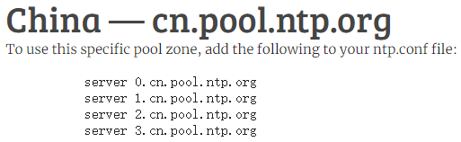

- 也可以在 http://www.ntp.org.cn/ 网站查找 NTP Server，推荐使用域名，而非 IP 地址。后面的 NTP 服务器配置，以下图为准：

  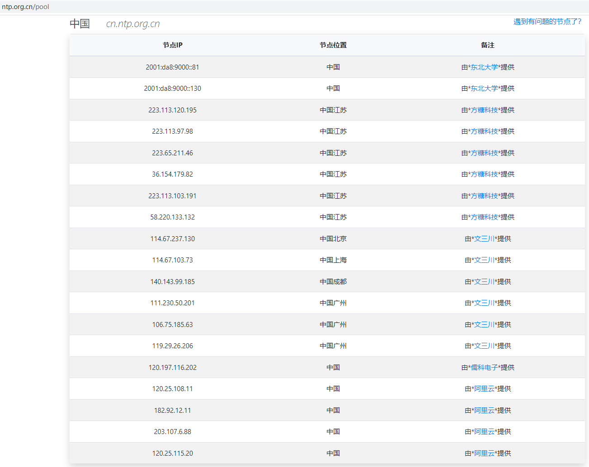

- 设置时区：

  ```shell
  # 设置东八区
  [root@hadoop102 opt]# timedatectl set-timezone Asia/Shanghai
  # 查看时区
  [root@hadoop102 opt]# timedatectl status | grep 'Time zone'
         Time zone: Asia/Shanghai (CST, +0800)
  ```

- 检查系统是否安装了 NTP 服务：

  ```shell
  [root@hadoop102 opt]# rpm -qa | grep ntp
  python-ntplib-0.3.2-1.el7.noarch
  ntpdate-4.2.6p5-29.el7.centos.2.x86_64
  ntp-4.2.6p5-29.el7.centos.2.x86_64
  fontpackages-filesystem-1.44-8.el7.noarch
  ```

- 如果没有安装，使用下面的命令安装 ntp 和 ntpdate：

  ```shell
  [root@hadoop102 opt]# yum -y install ntp ntpdate
  ```

- 根据 NTP 的设置，如果你的系统时间比正确时间快，那么 NTP 是不会帮你调整的，所以要么你把时间设置回去，要么先做一个手动同步，使用下面的命令：

  ```shell
  [root@hadoop102 opt]# ntpdate cn.ntp.org.cn
  22 Dec 15:09:33 ntpdate[5303]: adjust time server 114.67.237.130 offset -0.010511 sec
  ```

- 配置 NTP 服务器（设定 hadoop102 为 NTP 服务器），NTP 服务器主配置文件 `/etc/ntp.conf`，配置前做好备份：

  ```shell
  [root@hadoop102 opt]# mkdir /home/backup
  [root@hadoop102 opt]# cp /etc/ntp.conf /home/backup/
  [root@hadoop102 opt]# mv /home/backup/ntp.conf /home/backup/ntp.conf.bak
  ```

- 配置 NTP 服务器端配置文件：

  ```shell
  [root@hadoop102 opt]# vim /etc/ntp.conf
  ```

  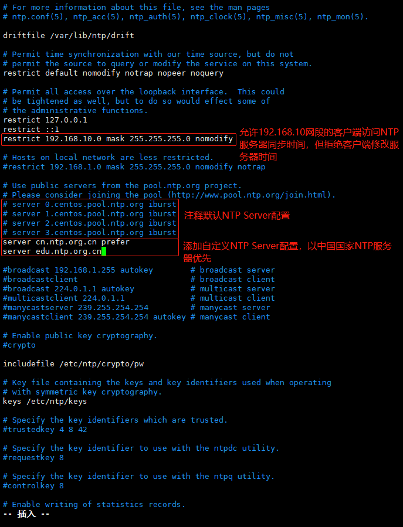

  - restrict 语法说明：

    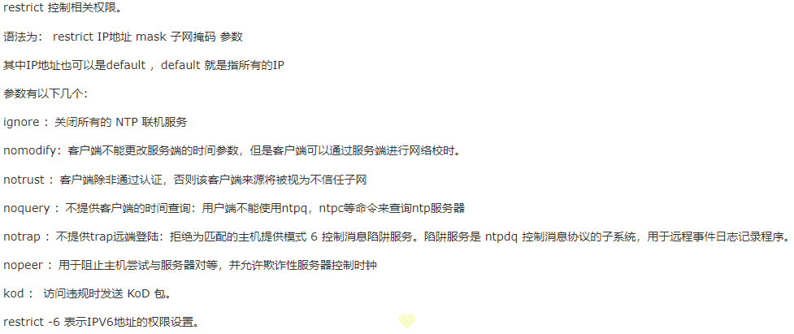

  - 如果服务器是内网，不能连接外网，则无法使用网络 NTP Server，此时可以将本机作为 NTP Server，按如下方法配置：

    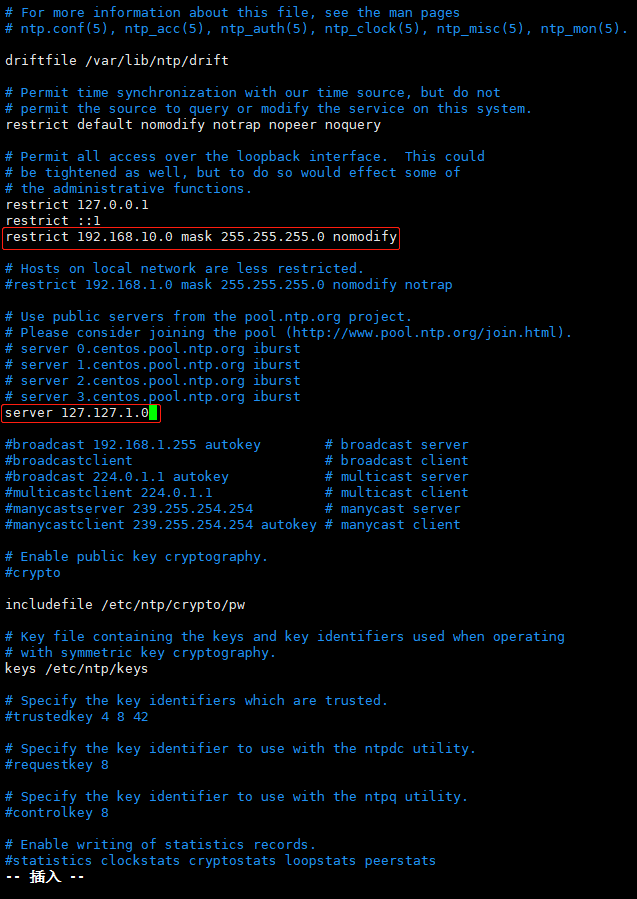

- ntp 服务，默认只会同步系统时间。如果想要让 ntp 同时同步硬件时间，可以在 `/etc/sysconfig/ntpd` 文件中，添加 `SYNC_HWCLOCK=yes`，这样，就可以让硬件时间与系统时间一起同步：

  ```shell
  [root@hadoop102 opt]# vim /etc/sysconfig/ntpd
  ```
  
  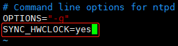
  
- 启动 NTP 服务并设置开机自动启动。(Linux 防火墙需要关闭，否则会阻止 NTP 服务端口，NTP 服务默认端口 123)

  ```shell
  # 启动ntp服务
  [root@hadoop102 opt]# systemctl start ntpd
  # 查看ntp服务是否启动
  [root@hadoop102 opt]# systemctl status ntpd
  ● ntpd.service - Network Time Service
     Loaded: loaded (/usr/lib/systemd/system/ntpd.service; disabled; vendor preset: disabled)
     Active: active (running) since 三 2021-12-22 16:00:12 CST; 1min 27s ago
    Process: 5883 ExecStart=/usr/sbin/ntpd -u ntp:ntp $OPTIONS (code=exited, status=0/SUCCESS)
   Main PID: 5884 (ntpd)
      Tasks: 1
     CGroup: /system.slice/ntpd.service
             └─5884 /usr/sbin/ntpd -u ntp:ntp -g
  
  12月 22 16:00:13 hadoop102 ntpd[5884]: Listen and drop on 1 v6wildcard :: UDP 123
  12月 22 16:00:13 hadoop102 ntpd[5884]: Listen normally on 2 lo 127.0.0.1 UDP 123
  12月 22 16:00:13 hadoop102 ntpd[5884]: Listen normally on 3 ens33 192.168.10.102 UDP 123
  12月 22 16:00:13 hadoop102 ntpd[5884]: Listen normally on 4 virbr0 192.168.122.1 UDP 123
  12月 22 16:00:13 hadoop102 ntpd[5884]: Listen normally on 5 lo ::1 UDP 123
  12月 22 16:00:13 hadoop102 ntpd[5884]: Listen normally on 6 ens33 fe80::ac1e:7fe1:a566:2670 UDP 123
  12月 22 16:00:13 hadoop102 ntpd[5884]: Listening on routing socket on fd #23 for interface updates
  12月 22 16:00:13 hadoop102 ntpd[5884]: 0.0.0.0 c016 06 restart
  12月 22 16:00:13 hadoop102 ntpd[5884]: 0.0.0.0 c012 02 freq_set kernel 0.000 PPM
  12月 22 16:00:13 hadoop102 ntpd[5884]: 0.0.0.0 c011 01 freq_not_set
  # 查看ntpd端口
  [root@hadoop102 opt]# netstat -ln | grep 123
  udp        0      0 192.168.122.1:123       0.0.0.0:*                          
  udp        0      0 192.168.10.102:123      0.0.0.0:*                          
  udp        0      0 127.0.0.1:123           0.0.0.0:*                          
  udp        0      0 0.0.0.0:123             0.0.0.0:*                          
  udp6       0      0 fe80::ac1e:7fe1:a56:123 :::*                               
  udp6       0      0 ::1:123                 :::*                               
  udp6       0      0 :::123                  :::*
  ```

  ```shell
  # 查看ntp服务是否开机启动
  [root@hadoop102 opt]# systemctl list-unit-files | grep ntpd
  ntpd.service                                  disabled
  ntpdate.service                               disabled
  # 设置开机启动ntp服务
  [root@hadoop102 opt]# systemctl enable ntpd
  Created symlink from /etc/systemd/system/multi-user.target.wants/ntpd.service to /usr/lib/systemd/system/ntpd.service.
  # 确认ntp服务开机启动设置成功
  [root@hadoop102 opt]# systemctl list-unit-files | grep ntpd
  ntpd.service                                  enabled 
  ntpdate.service                               disabled
  ```

  - 如果是重启 ntpd 服务，使用下面的命令：

    ```shell
    [root@hadoop102 opt]# systemctl restart ntpd
    ```

- 查看 NTP 服务器与外部 NTP 服务器同步情况：

  ```shell
  # 静态查看
  [root@hadoop102 opt]# ntpq -p
       remote           refid      st t when poll reach   delay   offset  jitter
  ==============================================================================
   2001:da8:9000:: .STEP.          16 -    -  512    0    0.000    0.000   0.000
  *202.118.1.130   .PTP.            1 u   14   64  277   39.772  -39.060   5.282
  
  # 动态查看，一般ntp启动后，需要等5~10分钟左右，NTP服务器才会与外部NTP服务器同步
  [root@hadoop102 opt]# watch ntpq  -p
  ```

  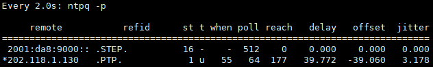

  - remote：即网络 NTP 服务器的 IP 或主机名称。注意最左边的符号，如果有 `+`，则代表目前正在作用中的上层 NTP 服务器；如果是 `*`，则表示也有连上线，不过是作为次要联机的 NTP 服务器。
  - refid：参考的上一层 NTP 服务器的地址。
  - st：即 stratum 阶层，值越小表示 NTP Server 的精准度越高。
  - when：几秒前曾做过时间同步更新的操作。
  - poll：每隔多少毫秒与 NTP Server 同步一次。
  - reach：已经向上层 NTP 服务器要求更新的次数。
  - delay：网络传输过程中延迟的时间。
  - offset：时间补偿的结果。
  - jitter：Linux 系统时间与 BIOS 硬件时间的差异时间。

- 查看系统时间和硬件时间：

  ```shell
  # 系统时间
  [root@hadoop102 opt]# date
  2021年 12月 23日 星期四 16:28:10 CST
  # 硬件时间
  [root@hadoop102 opt]# hwclock --show
  2021年12月23日 星期四 16时28分15秒  -0.631618 秒
  ```

#### 客户端配置

- 设置时区：

  ```shell
  # 设置东八区
  [root@hadoop103 opt]# timedatectl set-timezone Asia/Shanghai
  # 查看时区
  [root@hadoop103 opt]# timedatectl status | grep 'Time zone'
         Time zone: Asia/Shanghai (CST, +0800)
  ```
  
- 客户端向 NTP 服务器（192.168.10.102）更新时间时，客户端不需要开启 NTP 服务：

  ```shell
  [root@hadoop103 opt]# systemctl stop ntpd
  [root@hadoop103 opt]# systemctl status ntpd
  ● ntpd.service - Network Time Service
     Loaded: loaded (/usr/lib/systemd/system/ntpd.service; disabled; vendor preset: disabled)
     Active: inactive (dead)
  
  12月 23 11:11:08 hadoop103 ntpd[18278]: Listening on routing socket on fd #24 for interface updates
  12月 23 11:11:10 hadoop103 ntpd[18278]: 0.0.0.0 c016 06 restart
  12月 23 11:11:10 hadoop103 ntpd[18278]: 0.0.0.0 c012 02 freq_set kernel 0.000 PPM
  12月 23 11:11:10 hadoop103 ntpd[18278]: 0.0.0.0 c011 01 freq_not_set
  12月 23 11:11:16 hadoop103 ntpd[18278]: 0.0.0.0 c61c 0c clock_step -3.147226 s
  12月 23 11:11:13 hadoop103 ntpd[18278]: 0.0.0.0 c614 04 freq_mode
  12月 23 11:11:14 hadoop103 ntpd[18278]: 0.0.0.0 c618 08 no_sys_peer
  12月 23 11:16:42 hadoop103 ntpd[18278]: ntpd exiting on signal 15
  12月 23 11:16:42 hadoop103 systemd[1]: Stopping Network Time Service...
  12月 23 11:16:42 hadoop103 systemd[1]: Stopped Network Time Service.
  ```

- 客户端向 NTP 服务器（192.168.10.102）进行时间同步：

  ```shell
  [root@hadoop103 opt]# ntpdate -u 192.168.10.102
  23 Dec 11:16:57 ntpdate[18349]: adjust time server 192.168.10.102 offset -0.003982 sec
  ```

- 设置 ntpdate 每次同步系统时间之后，也一并同步硬件时间：

  ```shell
  [root@hadoop103 opt]# vim /etc/sysconfig/ntpdate
  ```

  - 修改 ntpdate 文件最后一行 `SYNC_HWCLOCK=no` 为 `SYNC_HWCLOCK=yes`：

    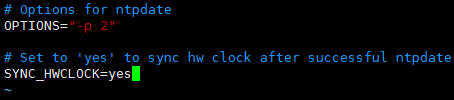

- 设置客户端定时向 NTP 服务器（192.168.10.102）进行时间同步：

  ```shell
  [root@hadoop103 opt]# vim /etc/crontab
  ```

  - 向 crontab 文件中添加配置，每天早晨 6 点同步一次时间：

    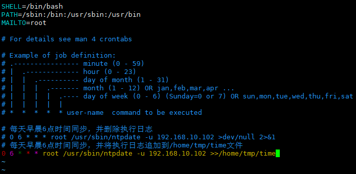

- 重启 crond 服务：

  ```shell
  [root@hadoop103 opt]# systemctl restart crond.service
  ```

- 查看 crond 服务执行情况：

  ```shell
  [root@hadoop103 opt]# systemctl status crond.service 
  ● crond.service - Command Scheduler
     Loaded: loaded (/usr/lib/systemd/system/crond.service; enabled; vendor preset: enabled)
     Active: active (running) since 四 2021-12-23 13:41:42 CST; 4min 33s ago
   Main PID: 20442 (crond)
      Tasks: 1
     Memory: 644.0K
     CGroup: /system.slice/crond.service
             └─20442 /usr/sbin/crond -n
  
  12月 23 13:41:42 hadoop103 systemd[1]: Started Command Scheduler.
  12月 23 13:41:42 hadoop103 crond[20442]: (CRON) INFO (RANDOM_DELAY will be scaled with factor 33% if used.)
  12月 23 13:41:43 hadoop103 crond[20442]: (CRON) INFO (running with inotify support)
  12月 23 13:41:43 hadoop103 crond[20442]: (CRON) INFO (@reboot jobs will be run at computer's startup.)
  ```

- 查看系统时间和硬件时间：

  ```shell
  # 系统时间
  [root@hadoop103 opt]# date 
  2021年 12月 23日 星期四 16:30:22 CST
  # 硬件时间
  [root@hadoop103 opt]# hwclock 
  2021年12月23日 星期四 16时30分29秒  -1.020610 秒
  ```

#### 参考

- https://developer.aliyun.com/article/5615
- https://www.jianshu.com/p/aa2bb27debd9
- https://www.cnblogs.com/zoulongbin/p/6198186.html
- https://www.jianshu.com/p/16e68204b3dc

### 安装 Python3

- Ceph 的 Octopus 版本需要 Python3 支持。

- 各节点检查是否有 GCC：

  ```shell
  # 查看gcc版本
  [root@hadoop101 software]# gcc --version
  bash: gcc: 未找到命令...
  # 安装gcc
  [root@hadoop101 software]# yum -y install gcc
  已加载插件：fastestmirror, langpacks
  Loading mirror speeds from cached hostfile
  Could not get metalink https://mirrors.fedoraproject.org/metalink?repo=epel-7&arch=x86_64&infra=stock&content=centos error was
  14: curl#7 - "Failed to connect to 2406:da18:39f:a01:35a2:d9e9:8164:a209: 网络不可达"
   * base: mirrors.aliyun.com
   * epel: mirror.sjtu.edu.cn
   * extras: mirrors.aliyun.com
   * updates: mirrors.aliyun.com
  正在解决依赖关系
  --> 正在检查事务
  ---> 软件包 gcc.x86_64.0.4.8.5-44.el7 将被 安装
  --> 正在处理依赖关系 cpp = 4.8.5-44.el7，它被软件包 gcc-4.8.5-44.el7.x86_64 需要
  --> 正在处理依赖关系 glibc-devel >= 2.2.90-12，它被软件包 gcc-4.8.5-44.el7.x86_64 需要
  --> 正在检查事务
  ---> 软件包 cpp.x86_64.0.4.8.5-44.el7 将被 安装
  ---> 软件包 glibc-devel.x86_64.0.2.17-325.el7_9 将被 安装
  --> 正在处理依赖关系 glibc-headers = 2.17-325.el7_9，它被软件包 glibc-devel-2.17-325.el7_9.x86_64 需要
  --> 正在处理依赖关系 glibc-headers，它被软件包 glibc-devel-2.17-325.el7_9.x86_64 需要
  --> 正在检查事务
  ---> 软件包 glibc-headers.x86_64.0.2.17-325.el7_9 将被 安装
  --> 正在处理依赖关系 kernel-headers >= 2.2.1，它被软件包 glibc-headers-2.17-325.el7_9.x86_64 需要
  --> 正在处理依赖关系 kernel-headers，它被软件包 glibc-headers-2.17-325.el7_9.x86_64 需要
  --> 正在检查事务
  ---> 软件包 kernel-headers.x86_64.0.3.10.0-1160.49.1.el7 将被 安装
  --> 解决依赖关系完成
  
  依赖关系解决
  
  ========================================================================================================================================================================================================
   Package                                           架构                                      版本                                                      源                                          大小
  ========================================================================================================================================================================================================
  正在安装:
   gcc                                               x86_64                                    4.8.5-44.el7                                              base                                        16 M
  为依赖而安装:
   cpp                                               x86_64                                    4.8.5-44.el7                                              base                                       5.9 M
   glibc-devel                                       x86_64                                    2.17-325.el7_9                                            updates                                    1.1 M
   glibc-headers                                     x86_64                                    2.17-325.el7_9                                            updates                                    691 k
   kernel-headers                                    x86_64                                    3.10.0-1160.49.1.el7                                      updates                                    9.0 M
  
  事务概要
  ========================================================================================================================================================================================================
  安装  1 软件包 (+4 依赖软件包)
  
  总计：33 M
  总下载量：1.1 M
  安装大小：59 M
  Downloading packages:
  No Presto metadata available for updates
  glibc-devel-2.17-325.el7_9.x86_64.rpm                                                                                                                                            | 1.1 MB  00:00:00     
  Running transaction check
  Running transaction test
  Transaction test succeeded
  Running transaction
    正在安装    : cpp-4.8.5-44.el7.x86_64                                                                                                                                                             1/5 
    正在安装    : kernel-headers-3.10.0-1160.49.1.el7.x86_64                                                                                                                                          2/5 
    正在安装    : glibc-headers-2.17-325.el7_9.x86_64                                                                                                                                                 3/5 
    正在安装    : glibc-devel-2.17-325.el7_9.x86_64                                                                                                                                                   4/5 
    正在安装    : gcc-4.8.5-44.el7.x86_64                                                                                                                                                             5/5 
    验证中      : gcc-4.8.5-44.el7.x86_64                                                                                                                                                             1/5 
    验证中      : glibc-headers-2.17-325.el7_9.x86_64                                                                                                                                                 2/5 
    验证中      : kernel-headers-3.10.0-1160.49.1.el7.x86_64                                                                                                                                          3/5 
    验证中      : glibc-devel-2.17-325.el7_9.x86_64                                                                                                                                                   4/5 
    验证中      : cpp-4.8.5-44.el7.x86_64                                                                                                                                                             5/5 
  
  已安装:
    gcc.x86_64 0:4.8.5-44.el7                                                                                                                                                                             
  
  作为依赖被安装:
    cpp.x86_64 0:4.8.5-44.el7              glibc-devel.x86_64 0:2.17-325.el7_9              glibc-headers.x86_64 0:2.17-325.el7_9              kernel-headers.x86_64 0:3.10.0-1160.49.1.el7             
  
  完毕！
  [root@hadoop102 software]# gcc --version
  gcc (GCC) 4.8.5 20150623 (Red Hat 4.8.5-44)
  Copyright © 2015 Free Software Foundation, Inc.
  本程序是自由软件；请参看源代码的版权声明。本软件没有任何担保；
  包括没有适销性和某一专用目的下的适用性担保。
  ```

- 各节点下载相应版本的 Python 包：

  ```shell
  [root@hadoop101 software]# wget https://www.python.org/ftp/python/3.9.9/Python-3.9.9.tar.xz
  --2021-12-24 10:16:02--  https://www.python.org/ftp/python/3.9.9/Python-3.9.9.tar.xz
  正在解析主机 www.python.org (www.python.org)... 151.101.72.223
  正在连接 www.python.org (www.python.org)|151.101.72.223|:443... 已连接。
  已发出 HTTP 请求，正在等待回应... 200 OK
  长度：19144372 (18M) [application/octet-stream]
  正在保存至: “Python-3.9.9.tar.xz”
  
  100%[==============================================================================================================================================================>] 19,144,372  7.20MB/s 用时 2.5s   
  
  2021-12-24 10:16:05 (7.20 MB/s) - 已保存 “Python-3.9.9.tar.xz” [19144372/19144372])
  
  [root@hadoop101 software]# ls -l
  总用量 18696
  -rw-r--r--. 1 root root 19144372 11月 16 02:49 Python-3.9.9.tar.xz
  ```

- 解压到指定目录：

  ```shell
  [root@hadoop101 software]# tar -xvJf Python-3.9.9.tar.xz -C /opt/module/
  [root@hadoop101 software]# ls -l /opt/module/
  总用量 2
  drwxrwxr-x. 16 xisun xisun 4096 11月 16 02:05 Python-3.9.9
  ```

- 各节点安装依赖，否则会报错：

  ```shell
  [root@hadoop101 software]# yum -y install zlib-devel bzip2-devel openssl-devel ncurses-devel sqlite-devel readline-devel tk-devel gdbm-devel db4-devel libpcap-devel xz-devel
  ...
  已安装:
    bzip2-devel.x86_64 0:1.0.6-13.el7      gdbm-devel.x86_64 0:1.10-8.el7     libdb4-devel.x86_64 0:4.8.30-13.el7    libpcap-devel.x86_64 14:1.5.3-12.el7 ncurses-devel.x86_64 0:5.9-14.20130511.el7_4
    openssl-devel.x86_64 1:1.0.2k-22.el7_9 readline-devel.x86_64 0:6.2-11.el7 sqlite-devel.x86_64 0:3.7.17-8.el7_7.1 tk-devel.x86_64 1:8.5.13-6.el7       xz-devel.x86_64 0:5.2.2-1.el7               
    zlib-devel.x86_64 0:1.2.7-19.el7_9    
  
  作为依赖被安装:
    expat-devel.x86_64 0:2.1.0-12.el7    fontconfig-devel.x86_64 0:2.13.0-4.3.el7 freetype-devel.x86_64 0:2.8-14.el7_9.1   keyutils-libs-devel.x86_64 0:1.5.8-3.el7 krb5-devel.x86_64 0:1.15.1-51.el7_9
    libXft-devel.x86_64 0:2.3.2-2.el7    libXrender-devel.x86_64 0:0.9.10-1.el7   libcom_err-devel.x86_64 0:1.42.9-19.el7  libdb4.x86_64 0:4.8.30-13.el7            libpng-devel.x86_64 2:1.5.13-8.el7 
    libselinux-devel.x86_64 0:2.5-15.el7 libsepol-devel.x86_64 0:2.5-10.el7       libuuid-devel.x86_64 0:2.23.2-65.el7_9.1 libverto-devel.x86_64 0:0.2.5-4.el7      pcre-devel.x86_64 0:8.32-17.el7
  ```

- 各节点安装 Python3：

  ```shell
  # 指定安装的路径，不指定的话，安装过程中可能软件所需要的文件复制到其他不同目录，删除软件很不方便，复制软件也不方便
  [root@hadoop101 software]# mkdir /usr/local/python3
  [root@hadoop101 software]# cd /opt/module/Python-3.9.9/
  # 配置，指定安装目录
  [root@hadoop101 Python-3.9.9]# ./configure --prefix=/usr/local/python3
  # 编译安装
  [root@hadoop101 Python-3.9.9]# make && make install
  ```

  - 在安装过程中，如果出现错误，在重新安装之前先执行下面的命令，清空缓存：

    ```shell
    [root@hadoop101 Python-3.9.9]# make clean
    ```

- 各节点添加软链接：

  ```shell
  [root@hadoop102 Python-3.9.9]# ln -s /usr/local/python3/bin/python3 /usr/bin/python3
  [root@hadoop102 Python-3.9.9]# ln -s /usr/local/python3/bin/pip3 /usr/bin/pip3
  ```

  - 软链接位置定为 `/usr/bin/python3` 和 `/usr/bin/pip3`。

- 各节点查看版本：

  ```shell
  [root@hadoop102 Python-3.9.9]# python3 --version
  Python 3.9.9
  [root@hadoop102 Python-3.9.9]# pip3 --version
  pip 21.2.4 from /usr/local/python3/lib/python3.9/site-packages/pip (python 3.9)
  ```

### 安装 Docker

- Cephadm 基于容器运行所有 Ceph 组件，各节点需要安装 Docker 或 Podman，此处安装 Docker。

- 各节点卸载旧版本 Docker（如果之前有安装过）：

  ```shell
  [root@hadoop102 opt]# yum remove docker docker-client docker-client-latest docker-common docker-latest docker-latest-logrotate docker-logrotate docker-engine
  ```

- 各节点安装需要的软件包，yum-util 提供 yum-config-manager 功能：

  ```shell
  [root@hadoop102 opt]# yum install -y yum-utils
  ```

- 各节点设置 yum 的 Docker 源（下面两个都可以用）：

  ```shell
  # 中央仓库
  [root@hadoop102 opt]# yum-config-manager --add-repo http://download.docker.com/linux/centos/docker-ce.repo
  
  # 阿里仓库
  [root@hadoop102 opt]# yum-config-manager --add-repo http://mirrors.aliyun.com/docker-ce/linux/centos/docker-ce.repo
  ```

- 各节点安装最新版本 Docker：

  ```shell
  [root@hadoop102 opt]# yum install docker-ce docker-ce-cli containerd.io
  ```

  - 安装特定版本：

    ```shell
    # 查看不同版本
    [root@hadoop102 opt]# yum list docker-ce --showduplicates | sort -r
    
    # 安装特定版本
    [root@hadoop102 opt]# yum install docker-ce-<VERSION_STRING> docker-ce-cli-<VERSION_STRING> containerd.io
    ```

- 各节点启动 Docker，并设置开机启动：

  ```shell
  # 启动
  [root@hadoop102 opt]# systemctl start docker
  # 查看docker版本
  [root@hadoop102 opt]# docker --version
  Docker version 20.10.12, build e91ed57
  # 开机启动
  [root@hadoop102 opt]# systemctl enable docker
  Created symlink from /etc/systemd/system/multi-user.target.wants/docker.service to /usr/lib/systemd/system/docker.service.
  # 查看docker是否开机启动
  [root@hadoop102 opt]# systemctl list-unit-files | grep docker
  docker.service                                enabled 
  docker.socket                                 disabled
  ```

- 各节点测试：

  ```shell
  [root@hadoop102 opt]# docker run hello-world
  
  Hello from Docker!
  This message shows that your installation appears to be working correctly.
  
  To generate this message, Docker took the following steps:
   1. The Docker client contacted the Docker daemon.
   2. The Docker daemon pulled the "hello-world" image from the Docker Hub.
      (amd64)
   3. The Docker daemon created a new container from that image which runs the
      executable that produces the output you are currently reading.
   4. The Docker daemon streamed that output to the Docker client, which sent it
      to your terminal.
  
  To try something more ambitious, you can run an Ubuntu container with:
   $ docker run -it ubuntu bash
  
  Share images, automate workflows, and more with a free Docker ID:
   https://hub.docker.com/
  
  For more examples and ideas, visit:
   https://docs.docker.com/get-started/
  ```

- 参考：https://docs.docker.com/engine/install/centos/

### 安装 Cephadm

- 各节点使用 curl 获取 Cephadm 独立脚本的最新版本：

  ```shell
  # 下载
  [root@hadoop102 opt]# curl --remote-name --location https://github.com/ceph/ceph/raw/octopus/src/cephadm/cephadm
    % Total    % Received % Xferd  Average Speed   Time    Time     Time  Current
                                   Dload  Upload   Total   Spent    Left  Speed
  100   137  100   137    0     0     15      0  0:00:09  0:00:09 --:--:--    18
  100  218k  100  218k    0     0  17210      0  0:00:12  0:00:12 --:--:-- 93775
  [root@hadoop102 opt]# ll
  总用量 220
  -rw-r--r--. 1 root  root  223468 12月 26 15:42 cephadm
  drwx--x--x. 4 root  root      28 12月 21 14:56 containerd
  drwxr-xr-x. 4 xisun xisun     46 12月 24 10:32 module
  drwxr-xr-x. 2 xisun xisun     33 12月 24 10:30 software
  # 赋权可执行
  [root@hadoop102 opt]# chmod +x cephadm
  [root@hadoop102 opt]# ll
  总用量 220
  -rwxr-xr-x. 1 root  root  223468 12月 26 15:42 cephadm
  drwx--x--x. 4 root  root      28 12月 21 14:56 containerd
  drwxr-xr-x. 4 xisun xisun     46 12月 24 10:32 module
  drwxr-xr-x. 2 xisun xisun     33 12月 24 10:30 software
  ```

  - 下载可能需要执行多次。

- 各节点添加源信息，指定为 Octopus 版本：

  ```shell
  # 添加Ceph源，这个是官方源
  [root@hadoop102 opt]# ./cephadm add-repo --release octopus
  Writing repo to /etc/yum.repos.d/ceph.repo...
  Enabling EPEL...
  # 查看Ceph源信息
  [root@hadoop102 opt]# ll /etc/yum.repos.d/
  总用量 56
  -rw-r--r--. 1 root root 2523 12月 21 14:16 CentOS-Base.repo
  -rw-r--r--. 1 root root 1309 11月 23 2020 CentOS-CR.repo
  -rw-r--r--. 1 root root  649 11月 23 2020 CentOS-Debuginfo.repo
  -rw-r--r--. 1 root root  314 11月 23 2020 CentOS-fasttrack.repo
  -rw-r--r--. 1 root root  630 11月 23 2020 CentOS-Media.repo
  -rw-r--r--. 1 root root 1331 11月 23 2020 CentOS-Sources.repo
  -rw-r--r--. 1 root root 8515 11月 23 2020 CentOS-Vault.repo
  -rw-r--r--. 1 root root  616 11月 23 2020 CentOS-x86_64-kernel.repo
  -rw-r--r--. 1 root root  477 12月 26 15:49 ceph.repo						# Ceph源
  -rw-r--r--. 1 root root 2081 12月 21 12:38 docker-ce.repo
  -rw-r--r--. 1 root root 1358 9月   5 01:37 epel.repo
  -rw-r--r--. 1 root root 1457 9月   5 01:37 epel-testing.repo
  [root@hadoop102 opt]# cat /etc/yum.repos.d/ceph.repo 
  [Ceph]
  name=Ceph $basearch
  baseurl=https://download.ceph.com/rpm-octopus/el7/$basearch
  enabled=1
  gpgcheck=1
  gpgkey=https://download.ceph.com/keys/release.asc
  
  [Ceph-noarch]
  name=Ceph noarch
  baseurl=https://download.ceph.com/rpm-octopus/el7/noarch
  enabled=1
  gpgcheck=1
  gpgkey=https://download.ceph.com/keys/release.asc
  
  [Ceph-source]
  name=Ceph SRPMS
  baseurl=https://download.ceph.com/rpm-octopus/el7/SRPMS
  enabled=1
  gpgcheck=1
  gpgkey=https://download.ceph.com/keys/release.asc
  ```

  - 添加 Ceph 源可能需要执行多次，或重启。

  - 如果官方源下载较慢，可以使用阿里云 Ceph 源：

    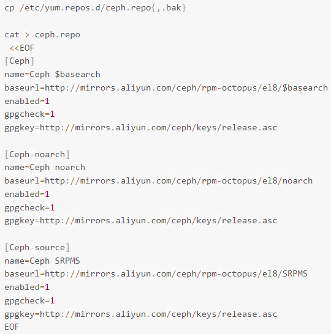

- 各节点安装 Cephadm：

  ```shell
  [root@hadoop102 opt]# ./cephadm install
  Installing packages ['cephadm']...
  ```

- 各节点验证 Cephadm 安装完成：

  ```shell
  [root@hadoop102 opt]# which cephadm
  /usr/sbin/cephadm
  [root@hadoop102 opt]# cephadm version
  Using recent ceph image quay.io/ceph/ceph@sha256:a2c23b6942f7fbc1e15d8cfacd6655a681fe0e44f288e4a158db22030b8d58e3
  ceph version 15.2.15 (2dfb18841cfecc2f7eb7eb2afd65986ca4d95985) octopus (stable)
  [root@hadoop102 opt]# cephadm --help
  usage: cephadm [-h] [--image IMAGE] [--docker] [--data-dir DATA_DIR] [--log-dir LOG_DIR] [--logrotate-dir LOGROTATE_DIR] [--unit-dir UNIT_DIR] [--verbose] [--timeout TIMEOUT] [--retry RETRY]
                 [--env ENV] [--no-container-init]
                 {version,pull,inspect-image,ls,list-networks,adopt,rm-daemon,rm-cluster,run,shell,enter,ceph-volume,unit,logs,bootstrap,deploy,check-host,prepare-host,add-repo,rm-repo,install,registry-login,gather-facts}
                 ...
  
  Bootstrap Ceph daemons with systemd and containers.
  
  positional arguments:
    {version,pull,inspect-image,ls,list-networks,adopt,rm-daemon,rm-cluster,run,shell,enter,ceph-volume,unit,logs,bootstrap,deploy,check-host,prepare-host,add-repo,rm-repo,install,registry-login,gather-facts}
                          sub-command
      version             get ceph version from container
      pull                pull latest image version
      inspect-image       inspect local container image
      ls                  list daemon instances on this host
      list-networks       list IP networks
      adopt               adopt daemon deployed with a different tool
      rm-daemon           remove daemon instance
      rm-cluster          remove all daemons for a cluster
      run                 run a ceph daemon, in a container, in the foreground
      shell               run an interactive shell inside a daemon container
      enter               run an interactive shell inside a running daemon container
      ceph-volume         run ceph-volume inside a container
      unit                operate on the daemon's systemd unit
      logs                print journald logs for a daemon container
      bootstrap           bootstrap a cluster (mon + mgr daemons)
      deploy              deploy a daemon
      check-host          check host configuration
      prepare-host        prepare a host for cephadm use
      add-repo            configure package repository
      rm-repo             remove package repository configuration
      install             install ceph package(s)
      registry-login      log host into authenticated registry
      gather-facts        gather and return host related information (JSON format)
  
  optional arguments:
    -h, --help            show this help message and exit
    --image IMAGE         container image. Can also be set via the "CEPHADM_IMAGE" env var (default: None)
    --docker              use docker instead of podman (default: False)
    --data-dir DATA_DIR   base directory for daemon data (default: /var/lib/ceph)
    --log-dir LOG_DIR     base directory for daemon logs (default: /var/log/ceph)
    --logrotate-dir LOGROTATE_DIR
                          location of logrotate configuration files (default: /etc/logrotate.d)
    --unit-dir UNIT_DIR   base directory for systemd units (default: /etc/systemd/system)
    --verbose, -v         Show debug-level log messages (default: False)
    --timeout TIMEOUT     timeout in seconds (default: None)
    --retry RETRY         max number of retries (default: 10)
    --env ENV, -e ENV     set environment variable (default: [])
    --no-container-init   Do not run podman/docker with `--init` (default: True)
  ```

- 为方便后续使用，各节点安装 ceph-common 包，里面包含了所有的 ceph 命令，其中包括 ceph，rbd，mount.ceph（用于安装 CephFS 文件系统）等：

  ```shell
  # 安装
  [root@hadoop102 opt]# cephadm install ceph-common
  Installing packages ['ceph-common']...
  # 确认可以使用
  [root@hadoop102 opt]# ceph -v
  ceph version 15.2.15 (2dfb18841cfecc2f7eb7eb2afd65986ca4d95985) octopus (stable)
  ```

### 创建 Ceph 新集群

- 在 hadoop102 上创建一个可以被任何访问 Ceph 集群的主机访问的网络，指定 mon-ip，并将生成的配置文件写进 `/etc/ceph` 目录里：

  ```shell
  [root@hadoop102 opt]# cephadm bootstrap --mon-ip 192.168.10.102
  Verifying podman|docker is present...
  Verifying lvm2 is present...
  Verifying time synchronization is in place...
  Unit ntpd.service is enabled and running
  Repeating the final host check...
  podman|docker (/usr/bin/docker) is present
  systemctl is present
  lvcreate is present
  Unit ntpd.service is enabled and running
  Host looks OK
  Cluster fsid: 81b469b6-662d-11ec-b2eb-000c29c51d96
  Verifying IP 192.168.10.102 port 3300 ...
  Verifying IP 192.168.10.102 port 6789 ...
  Mon IP 192.168.10.102 is in CIDR network 192.168.10.0/24
  Pulling container image quay.io/ceph/ceph:v15...
  Extracting ceph user uid/gid from container image...
  Creating initial keys...
  Creating initial monmap...
  Creating mon...
  Waiting for mon to start...
  Waiting for mon...
  mon is available
  Assimilating anything we can from ceph.conf...
  Generating new minimal ceph.conf...
  Restarting the monitor...
  Setting mon public_network...
  Creating mgr...
  Verifying port 9283 ...
  Wrote keyring to /etc/ceph/ceph.client.admin.keyring
  Wrote config to /etc/ceph/ceph.conf
  Waiting for mgr to start...
  Waiting for mgr...
  mgr not available, waiting (1/10)...
  mgr not available, waiting (2/10)...
  mgr not available, waiting (3/10)...
  mgr not available, waiting (4/10)...
  mgr not available, waiting (5/10)...
  mgr is available
  Enabling cephadm module...
  Waiting for the mgr to restart...
  Waiting for Mgr epoch 5...
  Mgr epoch 5 is available
  Setting orchestrator backend to cephadm...
  Generating ssh key...
  Wrote public SSH key to to /etc/ceph/ceph.pub
  Adding key to root@localhost's authorized_keys...
  Adding host hadoop102...
  Deploying mon service with default placement...
  Deploying mgr service with default placement...
  Deploying crash service with default placement...
  Enabling mgr prometheus module...
  Deploying prometheus service with default placement...
  Deploying grafana service with default placement...
  Deploying node-exporter service with default placement...
  Deploying alertmanager service with default placement...
  Enabling the dashboard module...
  Waiting for the mgr to restart...
  Waiting for Mgr epoch 13...
  Mgr epoch 13 is available
  Generating a dashboard self-signed certificate...
  Creating initial admin user...
  Fetching dashboard port number...
  Ceph Dashboard is now available at:
  
  	     URL: https://hadoop102:8443/
  	    User: admin
  	Password: v5b0064nc4
  
  You can access the Ceph CLI with:
  
  	sudo /usr/sbin/cephadm shell --fsid 81b469b6-662d-11ec-b2eb-000c29c51d96 -c /etc/ceph/ceph.conf -k /etc/ceph/ceph.client.admin.keyring
  
  Please consider enabling telemetry to help improve Ceph:
  
  	ceph telemetry on
  
  For more information see:
  
  	https://docs.ceph.com/docs/master/mgr/telemetry/
  
  Bootstrap complete.
  ```

  - 该命令执行如下操作：

    - 在本地主机上为新集群创建 monitor  和 manager daemon 守护程序。

    - 为 Ceph 集群生成一个新的 SSH 密钥，并将其添加到 root 用户的 `/root/.ssh/authorized_keys` 文件中。

      ```shell
      [root@hadoop102 opt]# cat /root/.ssh/authorized_keys 
      ssh-rsa AAAAB3NzaC1yc2EAAAADAQABAAABAQDkEXI7QySiz2VlLNrYW7OypfS9ZtMXS2h725W+pTpv71e4z6YjjxIpt6DvggtuD/UhktL1HxIvAREYKQ5vNYhGuV9jHI4VU+y4evpPEMR8GJ8OTlhfwhwovsik4TfYW0SmHUw01bxBpH2BjX4u/dSpyN9KG9710WXTIGJQ6zbHjxPg0JQX4C1KLuaD1WMVo1z6xscRGs7RAZ7sYAIQdf8LOI4IYVzO1n66NJNY4vpAJx1wCLajoGN0689Do42jX6t0/Qn6RGddXermTbbPW+hcD20pRIHO4f9VCQwqSNdcEVDUS74VMJRuOxd+N0uAxvHz8lTdCSfUnfPeKEvEH+cr root@hadoop102
      ssh-rsa AAAAB3NzaC1yc2EAAAADAQABAAABAQC9lRXTDUhUKdfu5PznYhoFsJFw1n6qXKJXCgFmuFCBB3T75na5xSgGbUEcQ5HYIWk8ywjynGjzCQMlyG+DTaQVvxOcpNNyKv57sm2quegFzu+c86Q726npspidr8Knl7dJALXF3q8k3eQrscWrRyJEA6vh1PikrNtDwzdB92WoYkAH5dJj3MxuHPJXoX+UbOZ8jWV7dARBT2LXFiS09bJy+7P2QZSa5BVirWFzoRjAD4JlEeaW2OPcujHTe+IjHXale4fjNh0tUDtteMRcwLnfMpTl6M7qgpUXm/IrlJHfAqtPmYPQUiDCVFQ9wntTeF5ph6WM9qk/2BJni5BX44VH root@hadoop103
      ssh-rsa AAAAB3NzaC1yc2EAAAADAQABAAABAQDsgI3CnXcTkQkSHxvhGvBGY1Fh7gaIXqhI5n7rtEM3fmJ2k8/VoWjLwxE1xqSm7tsGufabIhpLdUJBfj4cpqa+PazgSVF59cPlYArp115YFOCGWv2z9tZ5Cq70i9EEfNCyhWNhNUEd9cqiei/G1by4yQzOwvpiuDhiGlDtQk3pRGvvdjGQV3YVDVjDv6JG3QQkxPY+oYQFjDBy+usGEvcuIFDJXmS4hlB8xDMZCw8R0gcvBEnA9RxIIb0N0jLf0uZt0varFZqlguwJJdT6nBCWJ+NYxu5aggX7PGgHB+F97gCoIRusqjT/scoS+jSK8yx4WzJ6ZfCp1wQEXJ+XgrbX root@hadoop104
      ssh-rsa AAAAB3NzaC1yc2EAAAADAQABAAABgQDCfFd837abQYj+trazR8y5OSOc7ET+vzn0o6pR+JF3N1knD5JGKXyB0umMsYehwcU55XkMARHRS+jothz0PAqWUpdV73pVZyy+Nxhu/5rySf+NiaoYd8IYAtcgbw174E5deudPF5Ac7IIUxJAgPxEb/NnrpYEPFLHg31ZCKUvzHkEbP9I1iMgM9LtKN3M/aAbaHY2Pd046joVhOo7DsIlYyd147X1MgFhwTeVThpu+zdjPwNoenQGIhrH1J46thBL8TyTC0Wjui5YVwim9Nxoet7E46BiuqrAS6TBvLOTAZlD/g2UB+6NbGYdQKpOs8k2XQqrEBtPB4Wo/hZ0efg8gvCs4AaOqICaMOUt52lfJHInnsycB99nxh95sLDhkHfQIlqTEvGPQDiJVU8tPS5mo7+oeqpCTsvnIINQTMlCtA6eR6kmNumCdSpwbCMkuwVxHjGgNxMy3ykBRItU0vH9mAv/5OxyfjKQutELHQn+5fb5v0lrDq/WZ60jMJYGpTh8= ceph-81b469b6-662d-11ec-b2eb-000c29c51d96
      ```

    - 将与新群集进行通信所需的最小配置文件保存到 `/etc/ceph/ceph.conf`。

    - 向 `/etc/ceph/ceph.client.admin.keyring` 写入 `client.admin` 管理 secret key 的副本（特权！）。

    - 将 public key 的副本写入 `/etc/ceph/ceph.pub`。

  - 查看当前配置文件：

    ```shell
    [root@hadoop102 opt]# ll /etc/ceph/
    总用量 12
    -rw-------. 1 root root  63 12月 26 17:23 ceph.client.admin.keyring
    -rw-r--r--. 1 root root 179 12月 26 17:23 ceph.conf
    -rw-r--r--. 1 root root 595 12月 26 17:24 ceph.pub
    [root@hadoop102 opt]# cat /etc/ceph/ceph.conf 
    # minimal ceph.conf for 81b469b6-662d-11ec-b2eb-000c29c51d96
    [global]
    	fsid = 81b469b6-662d-11ec-b2eb-000c29c51d96
    	mon_host = [v2:192.168.10.102:3300/0,v1:192.168.10.102:6789/0]
    ```

  - 查看拉取的镜像和启动的容器：

    ```shell
    # 安装之前
    [root@hadoop104 opt]# docker images
    REPOSITORY          TAG       IMAGE ID       CREATED        SIZE
    hello-world         latest    feb5d9fea6a5   3 months ago   13.3kB
    [root@hadoop104 opt]# docker ps -a
    CONTAINER ID   IMAGE         COMMAND    CREATED        STATUS                  PORTS     NAMES
    72c655a613fc   hello-world   "/hello"   41 hours ago   Created                           gallant_cohen
    de6240f04135   hello-world   "/hello"   5 days ago     Exited (0) 5 days ago             priceless_nash
    
    # 安装之后
    [root@hadoop102 opt]# docker images
    REPOSITORY                         TAG       IMAGE ID       CREATED         SIZE
    quay.io/ceph/ceph                  v15       3437f7bed968   2 months ago    1.08GB		# Ceph组件
    hello-world                        latest    feb5d9fea6a5   3 months ago    13.3kB
    quay.io/ceph/ceph-grafana          6.7.4     557c83e11646   4 months ago    486MB		# Ceph组件
    quay.io/prometheus/prometheus      v2.18.1   de242295e225   19 months ago   140MB		# Ceph组件
    quay.io/prometheus/alertmanager    v0.20.0   0881eb8f169f   2 years ago     52.1MB		# Ceph组件
    quay.io/prometheus/node-exporter   v0.18.1   e5a616e4b9cf   2 years ago     22.9MB		# Ceph组件
    [root@hadoop102 opt]# docker ps -a
    CONTAINER ID   IMAGE                                      COMMAND                  CREATED          STATUS                    PORTS     NAMES
    5e62fe89c60f   quay.io/ceph/ceph-grafana:6.7.4            "/bin/sh -c 'grafana…"   45 minutes ago   Up 45 minutes                       ceph-81b469b6-662d-11ec-b2eb-000c29c51d96-grafana.hadoop102				# Ceph组件
    fcf1abbde49f   quay.io/prometheus/alertmanager:v0.20.0    "/bin/alertmanager -…"   45 minutes ago   Up 45 minutes                       ceph-81b469b6-662d-11ec-b2eb-000c29c51d96-alertmanager.hadoop102		# Ceph组件
    ee65841914dd   quay.io/prometheus/prometheus:v2.18.1      "/bin/prometheus --c…"   45 minutes ago   Up 45 minutes                       ceph-81b469b6-662d-11ec-b2eb-000c29c51d96-prometheus.hadoop102			# Ceph组件
    b248a474c78e   quay.io/prometheus/node-exporter:v0.18.1   "/bin/node_exporter …"   46 minutes ago   Up 46 minutes                       ceph-81b469b6-662d-11ec-b2eb-000c29c51d96-node-exporter.hadoop102		# Ceph组件
    31dd5f2a7479   quay.io/ceph/ceph:v15                      "/usr/bin/ceph-crash…"   50 minutes ago   Up 50 minutes                       ceph-81b469b6-662d-11ec-b2eb-000c29c51d96-crash.hadoop102				# Ceph组件
    443c33b517e0   quay.io/ceph/ceph:v15                      "/usr/bin/ceph-mgr -…"   52 minutes ago   Up 52 minutes                       ceph-81b469b6-662d-11ec-b2eb-000c29c51d96-mgr.hadoop102.kwrjaw			# Ceph组件
    895542296c01   quay.io/ceph/ceph:v15                      "/usr/bin/ceph-mon -…"   52 minutes ago   Up 52 minutes                       ceph-81b469b6-662d-11ec-b2eb-000c29c51d96-mon.hadoop102					# Ceph组件
    7213f1a0510a   hello-world                                "/hello"                 27 hours ago     Exited (0) 27 hours ago             hungry_driscoll
    ad4e221a918b   hello-world                                "/hello"                 5 days ago       Exited (0) 5 days ago               kind_elbakyan
    ```

    - 此时已经运行了以下组件：
      - ceph-mgr：Ceph 管理程序。
      - ceph-monitor：Ceph 监视器。
      - ceph-crash：崩溃数据收集模块。
      - prometheus：prometheus 监控组件。
      - grafana：监控数据展示 dashboard。
      - alertmanager：prometheus 告警组件。
      - node_exporter：prometheus 节点数据收集组件。

  - 参阅下面的一些对某些用户可能有用的选项，或者运行 `cephadm bootstrap -h` 命令查看所有可用选项：

    - 为了方便起见，Bootstrap 会将访问新集群所需的文件写入 `/etc/ceph`，以便主机上安装的任何 Ceph 软件包（例如，访问命令行界面）都可以轻松找到它们。
    - 但是使用 cephadm 部署的 daemon 容器根本不需要 `/etc/ceph`。避免与同一主机上的现有 Ceph 配置（cephadm 或其他方式）存在潜在冲突，可以使用 --output-dir 选项将它们放置在不同的目录中。
    - 可以使用 --config 选项将任何初始 Ceph 配置选项传递到新集群，方法是将它们放在标准 ini 样式的配置文件中。

  - 查看容器状态：

    ```shell
    [root@hadoop102 opt]# cephadm ls
    [
        {
            "style": "cephadm:v1",
            "name": "mon.hadoop102",
            "fsid": "81b469b6-662d-11ec-b2eb-000c29c51d96",
            "systemd_unit": "ceph-81b469b6-662d-11ec-b2eb-000c29c51d96@mon.hadoop102",
            "enabled": true,
            "state": "running",
            "container_id": "db378568f82337811eff2c7c44ad1a713d955a5b04fcde47c18674671e735704",
            "container_image_name": "quay.io/ceph/ceph:v15",
            "container_image_id": "3437f7bed9688a799444b439e1947a6f00d1f9b1fc986e843aec7e3ac8acd12b",
            "version": "15.2.15",
            "started": "2021-12-27T09:11:27.486408Z",
            "created": "2021-12-26T09:23:53.780886Z",
            "deployed": "2021-12-26T09:23:52.866923Z",
            "configured": "2021-12-26T09:30:45.494492Z"
        },
        {
            "style": "cephadm:v1",
            "name": "mgr.hadoop102.kwrjaw",
            "fsid": "81b469b6-662d-11ec-b2eb-000c29c51d96",
            "systemd_unit": "ceph-81b469b6-662d-11ec-b2eb-000c29c51d96@mgr.hadoop102.kwrjaw",
            "enabled": true,
            "state": "running",
            "container_id": "32e7e6a303b2af413b90739fde7e1f3b60c26214a1a5fe8d34d36133f733ea61",
            "container_image_name": "quay.io/ceph/ceph:v15",
            "container_image_id": "3437f7bed9688a799444b439e1947a6f00d1f9b1fc986e843aec7e3ac8acd12b",
            "version": "15.2.15",
            "started": "2021-12-27T09:11:24.388823Z",
            "created": "2021-12-26T09:23:57.956720Z",
            "deployed": "2021-12-26T09:23:57.302746Z",
            "configured": "2021-12-26T09:30:46.551456Z"
        },
        {
            "style": "cephadm:v1",
            "name": "alertmanager.hadoop102",
            "fsid": "81b469b6-662d-11ec-b2eb-000c29c51d96",
            "systemd_unit": "ceph-81b469b6-662d-11ec-b2eb-000c29c51d96@alertmanager.hadoop102",
            "enabled": true,
            "state": "running",
            "container_id": "843d8e781d923fa302322c78e5251ab1fa4b7b3d5a5998906ee30e089cc2e506",
            "container_image_name": "quay.io/prometheus/alertmanager:v0.20.0",
            "container_image_id": "0881eb8f169f5556a292b4e2c01d683172b12830a62a9225a98a8e206bb734f0",
            "version": "0.20.0",
            "started": "2021-12-27T09:11:30.498509Z",
            "created": "2021-12-26T09:25:51.990176Z",
            "deployed": "2021-12-26T09:25:51.485197Z",
            "configured": "2021-12-26T09:30:48.260398Z"
        },
        {
            "style": "cephadm:v1",
            "name": "crash.hadoop102",
            "fsid": "81b469b6-662d-11ec-b2eb-000c29c51d96",
            "systemd_unit": "ceph-81b469b6-662d-11ec-b2eb-000c29c51d96@crash.hadoop102",
            "enabled": true,
            "state": "running",
            "container_id": "2d08d2614605c2a4350c56cf1733f85cd5916afc03a899ce65c600a437c36184",
            "container_image_name": "quay.io/ceph/ceph:v15",
            "container_image_id": "3437f7bed9688a799444b439e1947a6f00d1f9b1fc986e843aec7e3ac8acd12b",
            "version": "15.2.15",
            "started": "2021-12-27T09:11:28.253480Z",
            "created": "2021-12-26T09:25:54.341083Z",
            "deployed": "2021-12-26T09:25:53.839103Z",
            "configured": "2021-12-26T09:25:54.341083Z"
        },
        {
            "style": "cephadm:v1",
            "name": "grafana.hadoop102",
            "fsid": "81b469b6-662d-11ec-b2eb-000c29c51d96",
            "systemd_unit": "ceph-81b469b6-662d-11ec-b2eb-000c29c51d96@grafana.hadoop102",
            "enabled": true,
            "state": "running",
            "container_id": "cbb4a8a923e2f3205e02e9dd026d3fdcf1a07c55a3eda6b9de13408dadc0465a",
            "container_image_name": "quay.io/ceph/ceph-grafana:6.7.4",
            "container_image_id": "557c83e11646f123a27b5e4b62ac6c45e7bb8b2e90d6044034d0db5b7019415c",
            "version": "6.7.4",
            "started": "2021-12-27T09:11:27.676553Z",
            "created": "2021-12-26T09:29:44.175925Z",
            "deployed": "2021-12-26T09:29:42.555990Z",
            "configured": "2021-12-26T09:30:51.194299Z"
        },
        {
            "style": "cephadm:v1",
            "name": "node-exporter.hadoop102",
            "fsid": "81b469b6-662d-11ec-b2eb-000c29c51d96",
            "systemd_unit": "ceph-81b469b6-662d-11ec-b2eb-000c29c51d96@node-exporter.hadoop102",
            "enabled": true,
            "state": "running",
            "container_id": "ee29b873a834252d1d55c20c67ecfbff9a3b6acf8621063efd9070a79cb1cba5",
            "container_image_name": "quay.io/prometheus/node-exporter:v0.18.1",
            "container_image_id": "e5a616e4b9cf68dfcad7782b78e118be4310022e874d52da85c55923fb615f87",
            "version": "0.18.1",
            "started": "2021-12-27T09:11:21.758252Z",
            "created": "2021-12-26T09:29:47.899777Z",
            "deployed": "2021-12-26T09:29:47.307801Z",
            "configured": "2021-12-26T09:29:47.899777Z"
        },
        {
            "style": "cephadm:v1",
            "name": "prometheus.hadoop102",
            "fsid": "81b469b6-662d-11ec-b2eb-000c29c51d96",
            "systemd_unit": "ceph-81b469b6-662d-11ec-b2eb-000c29c51d96@prometheus.hadoop102",
            "enabled": true,
            "state": "running",
            "container_id": "f236295847bf07d2db2b3c79d3a209f5db369cf2a61ae7bb7d2ef7597982eb23",
            "container_image_name": "quay.io/prometheus/prometheus:v2.18.1",
            "container_image_id": "de242295e2257c37c8cadfd962369228f8f10b2d48a44259b65fef44ad4f6490",
            "version": "2.18.1",
            "started": "2021-12-27T09:11:25.545626Z",
            "created": "2021-12-26T09:30:36.125856Z",
            "deployed": "2021-12-26T09:30:35.546879Z",
            "configured": "2021-12-26T09:30:36.125856Z"
        }
    ]
    ```

  - 根据初始化完成的提示使用浏览器访问 dashboard：

    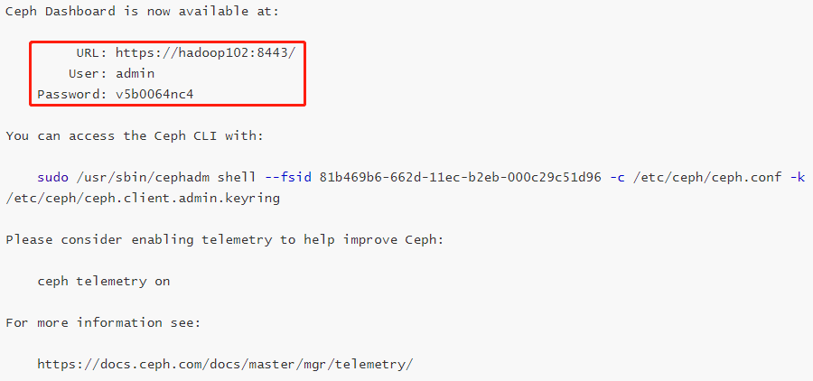

    - 使用虚拟机自带的火狐浏览器登陆 dashboard，初次登陆需要修改密码（admin，xisun_ceph001）：

      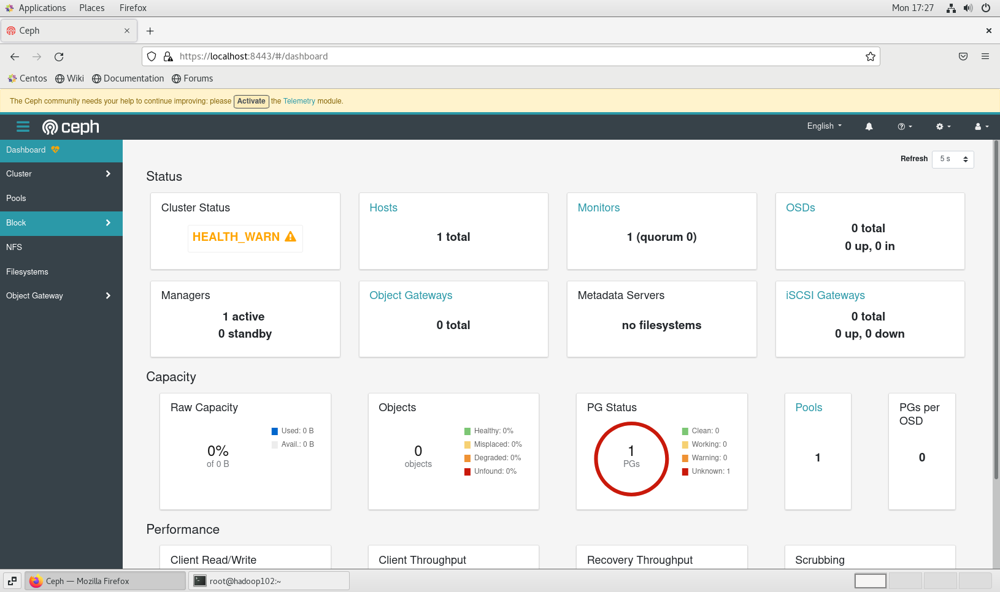
    
  - 如果上述引导集群的命令执行过程发生了异常，需要删除已经添加的配置文件，并关闭已经启动的 Ceph 组件进程，然后重新执行命令：
  
    ```shell
    # 查看已经添加的配置文件
    [root@hadoop102 opt]# ll /etc/ceph/
    总用量 12
    -rw-------. 1 root root  63 12月 26 17:23 ceph.client.admin.keyring
    -rw-r--r--. 1 root root 179 12月 26 17:23 ceph.conf
    -rw-r--r--. 1 root root 595 12月 26 17:24 ceph.pub
    # 删除已经添加的配置文件，或者重新执行命令时，添加--allow-overwrite参数
    [root@hadoop102 opt]# rm /etc/ceph/*
    
    # 查看已经启动的Ceph组件所占用的端口
    [root@hadoop102 opt]# netstat -ntlp
    Active Internet connections (only servers)
    Proto Recv-Q Send-Q Local Address           Foreign Address         State       PID/Program name    
    tcp        0      0 0.0.0.0:111             0.0.0.0:*               LISTEN      713/rpcbind         
    tcp        0      0 0.0.0.0:6800            0.0.0.0:*               LISTEN      2864/ceph-mgr       # 删除
    tcp        0      0 0.0.0.0:6801            0.0.0.0:*               LISTEN      2864/ceph-mgr       # 删除
    tcp        0      0 192.168.122.1:53        0.0.0.0:*               LISTEN      1467/dnsmasq        
    tcp        0      0 0.0.0.0:22              0.0.0.0:*               LISTEN      1041/sshd           
    tcp        0      0 127.0.0.1:631           0.0.0.0:*               LISTEN      1044/cupsd          
    tcp        0      0 127.0.0.1:25            0.0.0.0:*               LISTEN      1234/master         
    tcp        0      0 127.0.0.1:6010          0.0.0.0:*               LISTEN      2131/sshd: xisun@pt 
    tcp        0      0 192.168.10.102:3300     0.0.0.0:*               LISTEN      3026/ceph-mon       # 删除
    tcp        0      0 192.168.10.102:6789     0.0.0.0:*               LISTEN      3026/ceph-mon       # 删除
    tcp6       0      0 :::111                  :::*                    LISTEN      713/rpcbind         
    tcp6       0      0 :::22                   :::*                    LISTEN      1041/sshd           
    tcp6       0      0 ::1:631                 :::*                    LISTEN      1044/cupsd          
    tcp6       0      0 ::1:25                  :::*                    LISTEN      1234/master         
    tcp6       0      0 ::1:6010                :::*                    LISTEN      2131/sshd: xisun@pt 
    # 同时删除ceph-mgr和ceph-mon这两个进程
    [root@hadoop102 opt]# kill -9 2864 3026
    ```

### 启用 Ceph 命令

- Cephadm 不需要在主机上安装任何 Ceph 包。但是，建议启用对 Ceph 命令的简单访问。

- `cephadm shell` 命令在安装了所有 Ceph 包的容器中启动一个 bash shell。默认情况下，如果在主机上的 `/etc/ceph` 路径中找到配置和 keyring 文件，则会将它们传递到容器环境中，这样 shell 就可以完全正常工作。注意，在 MON 主机上执行时，`cephadm shell` 将从 MON 容器推断配置，而不是使用默认配置。如果给定 --mount，则主机（文件或目录）将显示在容器中的 `/mnt` 下。在 hadoop102 上执行下面的命令：

  ```shell
  # 启动一个bash shell
  [root@hadoop102 opt]# cephadm shell
  Inferring fsid 81b469b6-662d-11ec-b2eb-000c29c51d96
  Inferring config /var/lib/ceph/81b469b6-662d-11ec-b2eb-000c29c51d96/mon.hadoop102/config
  Using recent ceph image quay.io/ceph/ceph@sha256:a2c23b6942f7fbc1e15d8cfacd6655a681fe0e44f288e4a158db22030b8d58e3
  # 创建别名
  [ceph: root@hadoop102 /]# alias ceph='cephadm shell -- ceph'
  # 退出
  [ceph: root@hadoop102 /]# exit
  exit
  # 查看集群状态，使用ceph -s 或者 ceph status命令
  [root@hadoop102 opt]# ceph -s
    cluster:
      id:     81b469b6-662d-11ec-b2eb-000c29c51d96
      health: HEALTH_WARN
              Reduced data availability: 1 pg inactive
              OSD count 0 < osd_pool_default_size 3
   
    services:
      mon: 1 daemons, quorum hadoop102 (age 17m)
      mgr: hadoop102.kwrjaw(active, since 15m)
      osd: 0 osds: 0 up, 0 in
   
    data:
      pools:   1 pools, 1 pgs
      objects: 0 objects, 0 B
      usage:   0 B used, 0 B / 0 B avail
      pgs:     100.000% pgs unknown
               1 unknown
   
  [root@hadoop102 opt]# ceph status
    cluster:
      id:     81b469b6-662d-11ec-b2eb-000c29c51d96
      health: HEALTH_WARN
              Reduced data availability: 1 pg inactive
              OSD count 0 < osd_pool_default_size 3
   
    services:
      mon: 1 daemons, quorum hadoop102 (age 17m)
      mgr: hadoop102.kwrjaw(active, since 15m)
      osd: 0 osds: 0 up, 0 in
   
    data:
      pools:   1 pools, 1 pgs
      objects: 0 objects, 0 B
      usage:   0 B used, 0 B / 0 B avail
      pgs:     100.000% pgs unknown
               1 unknown
   
  [root@hadoop102 opt]# ceph health
  HEALTH_WARN Reduced data availability: 1 pg inactive; OSD count 0 < osd_pool_default_size 3
  ```

  - 在执行过程中发生了异常，解决如下：

    ```shell
    [root@hadoop102 ceph]# ceph shell
    2021-12-27T14:45:22.661+0800 7faad8e1c700 -1 monclient(hunting): handle_auth_bad_method server allowed_methods [2] but i only support [2,1]
    [errno 13] RADOS permission denied (error connecting to the cluster)
    # 查看所有的集群数据文件夹
    [root@hadoop102 ceph]# ll /var/lib/ceph
    总用量 0
    drwx------.  5 ceph           ceph   68 12月 26 16:42 6f08de88-6627-11ec-ad8e-000c29c51d96
    drwx------. 10 libstoragemgmt cgred 205 12月 26 17:30 81b469b6-662d-11ec-b2eb-000c29c51d96
    # 查看配置中的集群数据文件夹
    [root@hadoop102 ceph]# cat /etc/ceph/ceph.conf 
    # minimal ceph.conf for 81b469b6-662d-11ec-b2eb-000c29c51d96
    [global]
    	fsid = 81b469b6-662d-11ec-b2eb-000c29c51d96
    	mon_host = [v2:192.168.10.102:3300/0,v1:192.168.10.102:6789/0]
    # 删除旧的集群数据文件夹，然后重新执行命令
    [root@hadoop102 ceph]# rm -rf /var/lib/ceph/6f08de88-6627-11ec-ad8e-000c29c51d96/
    ```

### 添加新主机到集群中

- 第一步，在 hadoop102 上执行命令，将集群的公共 SSH 密钥添加到新主机的根用户 authorized_keys 文件中：

  ```shell
  [root@hadoop102 opt]# ssh-copy-id -f -i /etc/ceph/ceph.pub root@hadoop103
  /usr/bin/ssh-copy-id: INFO: Source of key(s) to be installed: "/etc/ceph/ceph.pub"
  
  Number of key(s) added: 1
  
  Now try logging into the machine, with:   "ssh 'root@hadoop103'"
  and check to make sure that only the key(s) you wanted were added.
  
  [root@hadoop102 opt]# ssh-copy-id -f -i /etc/ceph/ceph.pub root@hadoop104
  /usr/bin/ssh-copy-id: INFO: Source of key(s) to be installed: "/etc/ceph/ceph.pub"
  
  Number of key(s) added: 1
  
  Now try logging into the machine, with:   "ssh 'root@hadoop104'"
  and check to make sure that only the key(s) you wanted were added.
  [root@hadoop102 opt]# cat /root/.ssh/authorized_keys 
  ssh-rsa AAAAB3NzaC1yc2EAAAADAQABAAABAQDkEXI7QySiz2VlLNrYW7OypfS9ZtMXS2h725W+pTpv71e4z6YjjxIpt6DvggtuD/UhktL1HxIvAREYKQ5vNYhGuV9jHI4VU+y4evpPEMR8GJ8OTlhfwhwovsik4TfYW0SmHUw01bxBpH2BjX4u/dSpyN9KG9710WXTIGJQ6zbHjxPg0JQX4C1KLuaD1WMVo1z6xscRGs7RAZ7sYAIQdf8LOI4IYVzO1n66NJNY4vpAJx1wCLajoGN0689Do42jX6t0/Qn6RGddXermTbbPW+hcD20pRIHO4f9VCQwqSNdcEVDUS74VMJRuOxd+N0uAxvHz8lTdCSfUnfPeKEvEH+cr root@hadoop102
  ssh-rsa AAAAB3NzaC1yc2EAAAADAQABAAABAQC9lRXTDUhUKdfu5PznYhoFsJFw1n6qXKJXCgFmuFCBB3T75na5xSgGbUEcQ5HYIWk8ywjynGjzCQMlyG+DTaQVvxOcpNNyKv57sm2quegFzu+c86Q726npspidr8Knl7dJALXF3q8k3eQrscWrRyJEA6vh1PikrNtDwzdB92WoYkAH5dJj3MxuHPJXoX+UbOZ8jWV7dARBT2LXFiS09bJy+7P2QZSa5BVirWFzoRjAD4JlEeaW2OPcujHTe+IjHXale4fjNh0tUDtteMRcwLnfMpTl6M7qgpUXm/IrlJHfAqtPmYPQUiDCVFQ9wntTeF5ph6WM9qk/2BJni5BX44VH root@hadoop103
  ssh-rsa AAAAB3NzaC1yc2EAAAADAQABAAABAQDsgI3CnXcTkQkSHxvhGvBGY1Fh7gaIXqhI5n7rtEM3fmJ2k8/VoWjLwxE1xqSm7tsGufabIhpLdUJBfj4cpqa+PazgSVF59cPlYArp115YFOCGWv2z9tZ5Cq70i9EEfNCyhWNhNUEd9cqiei/G1by4yQzOwvpiuDhiGlDtQk3pRGvvdjGQV3YVDVjDv6JG3QQkxPY+oYQFjDBy+usGEvcuIFDJXmS4hlB8xDMZCw8R0gcvBEnA9RxIIb0N0jLf0uZt0varFZqlguwJJdT6nBCWJ+NYxu5aggX7PGgHB+F97gCoIRusqjT/scoS+jSK8yx4WzJ6ZfCp1wQEXJ+XgrbX root@hadoop104
  ssh-rsa AAAAB3NzaC1yc2EAAAADAQABAAABgQDCfFd837abQYj+trazR8y5OSOc7ET+vzn0o6pR+JF3N1knD5JGKXyB0umMsYehwcU55XkMARHRS+jothz0PAqWUpdV73pVZyy+Nxhu/5rySf+NiaoYd8IYAtcgbw174E5deudPF5Ac7IIUxJAgPxEb/NnrpYEPFLHg31ZCKUvzHkEbP9I1iMgM9LtKN3M/aAbaHY2Pd046joVhOo7DsIlYyd147X1MgFhwTeVThpu+zdjPwNoenQGIhrH1J46thBL8TyTC0Wjui5YVwim9Nxoet7E46BiuqrAS6TBvLOTAZlD/g2UB+6NbGYdQKpOs8k2XQqrEBtPB4Wo/hZ0efg8gvCs4AaOqICaMOUt52lfJHInnsycB99nxh95sLDhkHfQIlqTEvGPQDiJVU8tPS5mo7+oeqpCTsvnIINQTMlCtA6eR6kmNumCdSpwbCMkuwVxHjGgNxMy3ykBRItU0vH9mAv/5OxyfjKQutELHQn+5fb5v0lrDq/WZ60jMJYGpTh8= ceph-81b469b6-662d-11ec-b2eb-000c29c51d96
  ```

- 在新结点上查看密钥是否添加成功：

  ```shell
  [root@hadoop103 opt]# cat /root/.ssh/authorized_keys 
  ssh-rsa AAAAB3NzaC1yc2EAAAADAQABAAABAQDkEXI7QySiz2VlLNrYW7OypfS9ZtMXS2h725W+pTpv71e4z6YjjxIpt6DvggtuD/UhktL1HxIvAREYKQ5vNYhGuV9jHI4VU+y4evpPEMR8GJ8OTlhfwhwovsik4TfYW0SmHUw01bxBpH2BjX4u/dSpyN9KG9710WXTIGJQ6zbHjxPg0JQX4C1KLuaD1WMVo1z6xscRGs7RAZ7sYAIQdf8LOI4IYVzO1n66NJNY4vpAJx1wCLajoGN0689Do42jX6t0/Qn6RGddXermTbbPW+hcD20pRIHO4f9VCQwqSNdcEVDUS74VMJRuOxd+N0uAxvHz8lTdCSfUnfPeKEvEH+cr root@hadoop102
  ssh-rsa AAAAB3NzaC1yc2EAAAADAQABAAABAQC9lRXTDUhUKdfu5PznYhoFsJFw1n6qXKJXCgFmuFCBB3T75na5xSgGbUEcQ5HYIWk8ywjynGjzCQMlyG+DTaQVvxOcpNNyKv57sm2quegFzu+c86Q726npspidr8Knl7dJALXF3q8k3eQrscWrRyJEA6vh1PikrNtDwzdB92WoYkAH5dJj3MxuHPJXoX+UbOZ8jWV7dARBT2LXFiS09bJy+7P2QZSa5BVirWFzoRjAD4JlEeaW2OPcujHTe+IjHXale4fjNh0tUDtteMRcwLnfMpTl6M7qgpUXm/IrlJHfAqtPmYPQUiDCVFQ9wntTeF5ph6WM9qk/2BJni5BX44VH root@hadoop103
  ssh-rsa AAAAB3NzaC1yc2EAAAADAQABAAABAQDsgI3CnXcTkQkSHxvhGvBGY1Fh7gaIXqhI5n7rtEM3fmJ2k8/VoWjLwxE1xqSm7tsGufabIhpLdUJBfj4cpqa+PazgSVF59cPlYArp115YFOCGWv2z9tZ5Cq70i9EEfNCyhWNhNUEd9cqiei/G1by4yQzOwvpiuDhiGlDtQk3pRGvvdjGQV3YVDVjDv6JG3QQkxPY+oYQFjDBy+usGEvcuIFDJXmS4hlB8xDMZCw8R0gcvBEnA9RxIIb0N0jLf0uZt0varFZqlguwJJdT6nBCWJ+NYxu5aggX7PGgHB+F97gCoIRusqjT/scoS+jSK8yx4WzJ6ZfCp1wQEXJ+XgrbX root@hadoop104
  ssh-rsa AAAAB3NzaC1yc2EAAAADAQABAAABgQDCfFd837abQYj+trazR8y5OSOc7ET+vzn0o6pR+JF3N1knD5JGKXyB0umMsYehwcU55XkMARHRS+jothz0PAqWUpdV73pVZyy+Nxhu/5rySf+NiaoYd8IYAtcgbw174E5deudPF5Ac7IIUxJAgPxEb/NnrpYEPFLHg31ZCKUvzHkEbP9I1iMgM9LtKN3M/aAbaHY2Pd046joVhOo7DsIlYyd147X1MgFhwTeVThpu+zdjPwNoenQGIhrH1J46thBL8TyTC0Wjui5YVwim9Nxoet7E46BiuqrAS6TBvLOTAZlD/g2UB+6NbGYdQKpOs8k2XQqrEBtPB4Wo/hZ0efg8gvCs4AaOqICaMOUt52lfJHInnsycB99nxh95sLDhkHfQIlqTEvGPQDiJVU8tPS5mo7+oeqpCTsvnIINQTMlCtA6eR6kmNumCdSpwbCMkuwVxHjGgNxMy3ykBRItU0vH9mAv/5OxyfjKQutELHQn+5fb5v0lrDq/WZ60jMJYGpTh8= ceph-81b469b6-662d-11ec-b2eb-000c29c51d96			# 公共SSH密钥
  ```

  ```shell
  [root@hadoop104 opt]# cat /root/.ssh/authorized_keys 
  ssh-rsa AAAAB3NzaC1yc2EAAAADAQABAAABAQDkEXI7QySiz2VlLNrYW7OypfS9ZtMXS2h725W+pTpv71e4z6YjjxIpt6DvggtuD/UhktL1HxIvAREYKQ5vNYhGuV9jHI4VU+y4evpPEMR8GJ8OTlhfwhwovsik4TfYW0SmHUw01bxBpH2BjX4u/dSpyN9KG9710WXTIGJQ6zbHjxPg0JQX4C1KLuaD1WMVo1z6xscRGs7RAZ7sYAIQdf8LOI4IYVzO1n66NJNY4vpAJx1wCLajoGN0689Do42jX6t0/Qn6RGddXermTbbPW+hcD20pRIHO4f9VCQwqSNdcEVDUS74VMJRuOxd+N0uAxvHz8lTdCSfUnfPeKEvEH+cr root@hadoop102
  ssh-rsa AAAAB3NzaC1yc2EAAAADAQABAAABAQC9lRXTDUhUKdfu5PznYhoFsJFw1n6qXKJXCgFmuFCBB3T75na5xSgGbUEcQ5HYIWk8ywjynGjzCQMlyG+DTaQVvxOcpNNyKv57sm2quegFzu+c86Q726npspidr8Knl7dJALXF3q8k3eQrscWrRyJEA6vh1PikrNtDwzdB92WoYkAH5dJj3MxuHPJXoX+UbOZ8jWV7dARBT2LXFiS09bJy+7P2QZSa5BVirWFzoRjAD4JlEeaW2OPcujHTe+IjHXale4fjNh0tUDtteMRcwLnfMpTl6M7qgpUXm/IrlJHfAqtPmYPQUiDCVFQ9wntTeF5ph6WM9qk/2BJni5BX44VH root@hadoop103
  ssh-rsa AAAAB3NzaC1yc2EAAAADAQABAAABAQDsgI3CnXcTkQkSHxvhGvBGY1Fh7gaIXqhI5n7rtEM3fmJ2k8/VoWjLwxE1xqSm7tsGufabIhpLdUJBfj4cpqa+PazgSVF59cPlYArp115YFOCGWv2z9tZ5Cq70i9EEfNCyhWNhNUEd9cqiei/G1by4yQzOwvpiuDhiGlDtQk3pRGvvdjGQV3YVDVjDv6JG3QQkxPY+oYQFjDBy+usGEvcuIFDJXmS4hlB8xDMZCw8R0gcvBEnA9RxIIb0N0jLf0uZt0varFZqlguwJJdT6nBCWJ+NYxu5aggX7PGgHB+F97gCoIRusqjT/scoS+jSK8yx4WzJ6ZfCp1wQEXJ+XgrbX root@hadoop104
  ssh-rsa AAAAB3NzaC1yc2EAAAADAQABAAABgQDCfFd837abQYj+trazR8y5OSOc7ET+vzn0o6pR+JF3N1knD5JGKXyB0umMsYehwcU55XkMARHRS+jothz0PAqWUpdV73pVZyy+Nxhu/5rySf+NiaoYd8IYAtcgbw174E5deudPF5Ac7IIUxJAgPxEb/NnrpYEPFLHg31ZCKUvzHkEbP9I1iMgM9LtKN3M/aAbaHY2Pd046joVhOo7DsIlYyd147X1MgFhwTeVThpu+zdjPwNoenQGIhrH1J46thBL8TyTC0Wjui5YVwim9Nxoet7E46BiuqrAS6TBvLOTAZlD/g2UB+6NbGYdQKpOs8k2XQqrEBtPB4Wo/hZ0efg8gvCs4AaOqICaMOUt52lfJHInnsycB99nxh95sLDhkHfQIlqTEvGPQDiJVU8tPS5mo7+oeqpCTsvnIINQTMlCtA6eR6kmNumCdSpwbCMkuwVxHjGgNxMy3ykBRItU0vH9mAv/5OxyfjKQutELHQn+5fb5v0lrDq/WZ60jMJYGpTh8= ceph-81b469b6-662d-11ec-b2eb-000c29c51d96			# 公共SSH密钥
  ```

- 第二步，告诉 Ceph，新节点是集群的一部分：

  ```shell
  ```

  

- s

## Ubuntu 安装 Ceph

### 节点规划

- 各节点规划：

  | 主机名 | ip           | 磁盘                        | 角色                                      |
  | ------ | ------------ | --------------------------- | ----------------------------------------- |
  | ceph1  | 192.168.1.91 | 系统盘：sda<br/>osd盘：sdb  | cephadm，monitor，mgr，rgw，mds，osd，nfs |
  | ceph2  | 192.168.1.92 | 系统盘：sda<br/>osd盘：sdb  | monitor，mgr，rgw，mds，osd，nfs          |
  | ceph3  | 192.168.1.93 | 系统盘：sda<br/>osd盘：sdb  | monitor，mgr，rgw，mds，osd，nfs          |
  | ceph4  | 192.168.1.94 | 系统盘：sda<br />osd盘：sdb | monitor，mgr，rgw，mds，osd，nfs          |

- 各节点版本：

  ```shell
  # 内核版本
  root@ceph1:/home# uname -r
  5.4.0-91-generic
  
  # Ubuntu版本，方法一
  root@ceph1:/home# cat /etc/issue
  Ubuntu 20.04.3 LTS \n \l
  
  # Ubuntu版本，方法二，查看所有信息
  root@ceph1:/home# lsb_release -a
  No LSB modules are available.
  Distributor ID:	Ubuntu
  Description:	Ubuntu 20.04.3 LTS
  Release:	20.04
  Codename:	focal
  
  # Ubuntu版本代号
  root@ceph4:/home# lsb_release -c
  Codename:	focal
  ```

- 各节点配置 Ubuntu 20.04 apt 阿里云镜像源：

  ```shell
  root@ceph1:/home# ll /etc/apt/
  total 40
  drwxr-xr-x   7 root root 4096 Dec 29 15:23 ./
  drwxr-xr-x 105 root root 4096 Dec 29 10:52 ../
  drwxr-xr-x   2 root root 4096 Aug 24 16:47 apt.conf.d/
  drwxr-xr-x   2 root root 4096 Apr  9  2020 auth.conf.d/
  drwxr-xr-x   2 root root 4096 Dec 17 17:04 preferences.d/
  -rw-r--r--   1 root root 2777 Dec  8 10:29 sources.list
  -rw-r--r--   1 root root 2743 Aug 24 16:47 sources.list.curtin.old
  drwxr-xr-x   2 root root 4096 Dec 17 17:04 sources.list.d/
  -rw-r--r--   1 root root 1143 Dec  8 15:43 trusted.gpg
  drwxr-xr-x   2 root root 4096 Dec 17 17:04 trusted.gpg.d/
  # 备份默认的源
  root@ceph1:/home# cp /etc/apt/sources.list /etc/apt/sources.list.bak
  # 替换阿里云镜像源，将默认源cn.archive.ubuntu.com替换成mirrors.aliyun.com（先验证下默认apt源是不是cn.archive.ubuntu.com）
  root@ceph1:/home# sed -i "s/cn.archive.ubuntu.com/mirrors.aliyun.com/g" /etc/apt/sources.list
  # 更新软件包列表
  root@ceph1:/home# apt update
  # 更新已安装的软件包
  root@ceph1:/home# apt upgrade
  ```

  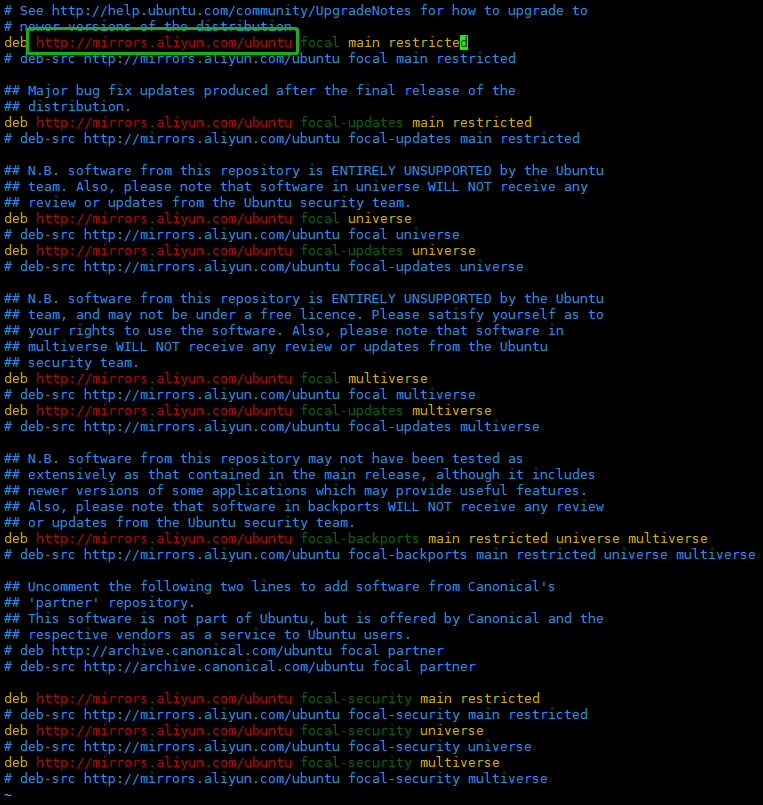

  - 说明：生产环境不要随意使用 `apt update` 和 `apt upgrade` 命令，因为生产环境下可能要求使用特定的软件版本，不要轻易的更新。

- 各节点配置主机名：

  ```shell
  root@ceph1:/home# vim /etc/hostname 
  root@ceph1:/home# cat /etc/hostname 
  ceph1
  ```

- 各节点配置 host 解析：

  ```shell
  root@ceph1:/home# vim /etc/hosts
  root@ceph1:/home# cat /etc/hosts
  127.0.0.1 localhost
  127.0.0.1 ceph1
  
  # The following lines are desirable for IPv6 capable hosts
  ::1     ip6-localhost ip6-loopback
  fe00::0 ip6-localnet
  ff00::0 ip6-mcastprefix
  ff02::1 ip6-allnodes
  ff02::2 ip6-allrouters
  
  192.168.1.91 ceph1
  192.168.1.92 ceph2
  192.168.1.93 ceph3
  192.168.1.94 ceph4
  ```


- 各节点网络信息：

  ```shell
  # 配置文件
  root@ceph1:/opt# cat /etc/netplan/00-installer-config.yaml 
  # This is the network config written by 'subiquity'
  network:
    ethernets:
      ens160:
        dhcp4: false
        addresses:
          - 192.168.1.91/24
        gateway4: 192.168.1.1
        nameservers:
          addresses: [114.114.114.114, 8.8.8.8]
    version: 2
  # 网络信息
  root@ceph1:/opt# ifconfig
  docker0: flags=4099<UP,BROADCAST,MULTICAST>  mtu 1500
          inet 172.17.0.1  netmask 255.255.0.0  broadcast 172.17.255.255
          ether 02:42:31:45:9c:e4  txqueuelen 0  (Ethernet)
          RX packets 0  bytes 0 (0.0 B)
          RX errors 0  dropped 0  overruns 0  frame 0
          TX packets 0  bytes 0 (0.0 B)
          TX errors 0  dropped 0 overruns 0  carrier 0  collisions 0
  
  ens160: flags=4163<UP,BROADCAST,RUNNING,MULTICAST>  mtu 1500
          inet 192.168.1.91  netmask 255.255.255.0  broadcast 192.168.1.255
          inet6 fe80::250:56ff:fe9e:7c0f  prefixlen 64  scopeid 0x20<link>
          ether 00:50:56:9e:7c:0f  txqueuelen 1000  (Ethernet)
          RX packets 1493933  bytes 708616888 (708.6 MB)
          RX errors 0  dropped 62  overruns 0  frame 0
          TX packets 215266  bytes 15560179 (15.5 MB)
          TX errors 0  dropped 0 overruns 0  carrier 0  collisions 0
  
  lo: flags=73<UP,LOOPBACK,RUNNING>  mtu 65536
          inet 127.0.0.1  netmask 255.0.0.0
          inet6 ::1  prefixlen 128  scopeid 0x10<host>
          loop  txqueuelen 1000  (Local Loopback)
          RX packets 400  bytes 38180 (38.1 KB)
          RX errors 0  dropped 0  overruns 0  frame 0
          TX packets 400  bytes 38180 (38.1 KB)
          TX errors 0  dropped 0 overruns 0  carrier 0  collisions 0
  ```

  ```shell
  # 配置文件
  root@ceph2:/opt# cat /etc/netplan/00-installer-config.yaml 
  # This is the network config written by 'subiquity'
  network:
    ethernets:
      ens160:
        dhcp4: false
        addresses:
          - 192.168.1.92/24
        gateway4: 192.168.1.1
        nameservers:
          addresses: [114.114.114.114, 8.8.8.8]
    version: 2
  # 网络信息
  root@ceph2:/opt# ifconfig 
  docker0: flags=4099<UP,BROADCAST,MULTICAST>  mtu 1500
          inet 172.17.0.1  netmask 255.255.0.0  broadcast 172.17.255.255
          ether 02:42:07:d8:d7:04  txqueuelen 0  (Ethernet)
          RX packets 0  bytes 0 (0.0 B)
          RX errors 0  dropped 0  overruns 0  frame 0
          TX packets 0  bytes 0 (0.0 B)
          TX errors 0  dropped 0 overruns 0  carrier 0  collisions 0
  
  ens160: flags=4163<UP,BROADCAST,RUNNING,MULTICAST>  mtu 1500
          inet 192.168.1.92  netmask 255.255.255.0  broadcast 192.168.1.255
          inet6 fe80::250:56ff:fe9e:e4e8  prefixlen 64  scopeid 0x20<link>
          ether 00:50:56:9e:e4:e8  txqueuelen 1000  (Ethernet)
          RX packets 1474736  bytes 708635562 (708.6 MB)
          RX errors 0  dropped 1  overruns 0  frame 0
          TX packets 219015  bytes 16146130 (16.1 MB)
          TX errors 0  dropped 0 overruns 0  carrier 0  collisions 0
  
  lo: flags=73<UP,LOOPBACK,RUNNING>  mtu 65536
          inet 127.0.0.1  netmask 255.0.0.0
          inet6 ::1  prefixlen 128  scopeid 0x10<host>
          loop  txqueuelen 1000  (Local Loopback)
          RX packets 588  bytes 56542 (56.5 KB)
          RX errors 0  dropped 0  overruns 0  frame 0
          TX packets 588  bytes 56542 (56.5 KB)
          TX errors 0  dropped 0 overruns 0  carrier 0  collisions 0
  ```

  ```shell
  # 配置文件
  root@ceph3:/opt# cat /etc/netplan/00-installer-config.yaml 
  # This is the network config written by 'subiquity'
  network:
    ethernets:
      ens160:
        dhcp4: false
        addresses:
          - 192.168.1.93/24
        gateway4: 192.168.1.1
        nameservers:
          addresses: [114.114.114.114, 8.8.8.8]
    version: 2
  # 网络信息
  root@ceph3:/opt# ifconfig
  docker0: flags=4099<UP,BROADCAST,MULTICAST>  mtu 1500
          inet 172.17.0.1  netmask 255.255.0.0  broadcast 172.17.255.255
          ether 02:42:e2:11:a5:b9  txqueuelen 0  (Ethernet)
          RX packets 0  bytes 0 (0.0 B)
          RX errors 0  dropped 0  overruns 0  frame 0
          TX packets 0  bytes 0 (0.0 B)
          TX errors 0  dropped 0 overruns 0  carrier 0  collisions 0
  
  ens160: flags=4163<UP,BROADCAST,RUNNING,MULTICAST>  mtu 1500
          inet 192.168.1.93  netmask 255.255.255.0  broadcast 192.168.1.255
          inet6 fe80::250:56ff:fe9e:7d03  prefixlen 64  scopeid 0x20<link>
          ether 00:50:56:9e:7d:03  txqueuelen 1000  (Ethernet)
          RX packets 1490677  bytes 706047066 (706.0 MB)
          RX errors 0  dropped 46  overruns 0  frame 0
          TX packets 208014  bytes 14700697 (14.7 MB)
          TX errors 0  dropped 0 overruns 0  carrier 0  collisions 0
  
  lo: flags=73<UP,LOOPBACK,RUNNING>  mtu 65536
          inet 127.0.0.1  netmask 255.0.0.0
          inet6 ::1  prefixlen 128  scopeid 0x10<host>
          loop  txqueuelen 1000  (Local Loopback)
          RX packets 620  bytes 60174 (60.1 KB)
          RX errors 0  dropped 0  overruns 0  frame 0
          TX packets 620  bytes 60174 (60.1 KB)
          TX errors 0  dropped 0 overruns 0  carrier 0  collisions 0
  ```

  ```shell
  # 配置文件
  root@ceph4:/opt# cat /etc/netplan/00-installer-config.yaml 
  # This is the network config written by 'subiquity'
  network:
    ethernets:
      ens160:
        dhcp4: false
        addresses:
          - 192.168.1.94/24
        gateway4: 192.168.1.1
        nameservers:
          addresses: [114.114.114.114, 8.8.8.8]
    version: 2
  # 网络信息
  root@ceph4:/opt# ifconfig
  docker0: flags=4099<UP,BROADCAST,MULTICAST>  mtu 1500
          inet 172.17.0.1  netmask 255.255.0.0  broadcast 172.17.255.255
          inet6 fe80::42:78ff:febe:2005  prefixlen 64  scopeid 0x20<link>
          ether 02:42:78:be:20:05  txqueuelen 0  (Ethernet)
          RX packets 0  bytes 0 (0.0 B)
          RX errors 0  dropped 0  overruns 0  frame 0
          TX packets 2  bytes 196 (196.0 B)
          TX errors 0  dropped 0 overruns 0  carrier 0  collisions 0
  
  ens160: flags=4163<UP,BROADCAST,RUNNING,MULTICAST>  mtu 1500
          inet 192.168.1.94  netmask 255.255.255.0  broadcast 192.168.1.255
          inet6 fe80::250:56ff:fe9e:7855  prefixlen 64  scopeid 0x20<link>
          ether 00:50:56:9e:78:55  txqueuelen 1000  (Ethernet)
          RX packets 1572297  bytes 814622359 (814.6 MB)
          RX errors 0  dropped 50  overruns 0  frame 0
          TX packets 250469  bytes 17903836 (17.9 MB)
          TX errors 0  dropped 0 overruns 0  carrier 0  collisions 0
  
  lo: flags=73<UP,LOOPBACK,RUNNING>  mtu 65536
          inet 127.0.0.1  netmask 255.0.0.0
          inet6 ::1  prefixlen 128  scopeid 0x10<host>
          loop  txqueuelen 1000  (Local Loopback)
          RX packets 826  bytes 84430 (84.4 KB)
          RX errors 0  dropped 0  overruns 0  frame 0
          TX packets 826  bytes 84430 (84.4 KB)
          TX errors 0  dropped 0 overruns 0  carrier 0  collisions 0
  ```
  
  - Ubuntu 20.04 修改 IP 地址的方法参考：https://blog.csdn.net/qq_38505969/article/details/110501609

### 关闭防火墙

- 各节点关闭防火墙：

  ```shell
  # 安装ufw
  root@ceph1:/opt# apt install -y ufw
  # 防火墙版本
  root@ceph1:/home# ufw version
  ufw 0.36
  Copyright 2008-2015 Canonical Ltd.
  # 开启防火墙
  root@ceph1:/home# ufw enable
  Command may disrupt existing ssh connections. Proceed with operation (y|n)? y
  Firewall is active and enabled on system startup
  # 查看防火墙状态
  root@ceph1:/home# ufw status
  Status: active
  # 关闭防火墙
  root@ceph1:/home# ufw disable
  Firewall stopped and disabled on system startup
  root@ceph1:/home# ufw status
  Status: inactive
  # 重启防火墙
  root@ceph1:/home# ufw reload
  ```

### SSH 免密登录

- 各节点执行如下命令：

  ```shell
  root@ceph1:/home# sed -i '/PermitRootLogin/d' /etc/ssh/sshd_config
  root@ceph1:/home# echo "PermitRootLogin yes" >> /etc/ssh/sshd_config
  root@ceph1:/home# service sshd reload
  root@ceph1:/home# ssh-keygen
  root@ceph1:/home# ssh-copy-id -o StrictHostKeyChecking=no root@ceph1
  root@ceph1:/home# ssh-copy-id -o StrictHostKeyChecking=no root@ceph2
  root@ceph1:/home# ssh-copy-id -o StrictHostKeyChecking=no root@ceph3
  root@ceph1:/home# ssh-copy-id -o StrictHostKeyChecking=no root@ceph4
  # 测试是否能免密登录其他节点
  root@ceph1:/home# ssh ceph1
  root@ceph1:/home# ssh ceph2
  root@ceph1:/home# ssh ceph3
  root@ceph1:/home# ssh ceph4
  ```

  - ceph2，ceph3 和 ceph4 参考 ceph1 配置。

### 服务器时间同步

- NTP 是通过网络来同步时间的一种 TCP/IP 协议。通常客户端向服务器请求当前的时间，并根据结果来设置其时钟。这个描述是挺简单的，实现这一功能却是极为复杂的：首先要有多层 NTP 服务器，第一层 NTP 服务器连接原子时钟，第二层、第三层服务器则担起负载均衡的责任，以处理因特网传来的所有请求。另外，客户端可能也超乎你想象的复杂：它必须排除通讯延迟，调整时间的同时不干扰其它在服务器中运行的进程。幸运的是，所有的这些复杂性都进行了封装，你是不可见也不需要见到的。
- 在 Ubuntu 中，可以使用 ntpdate 和 ntpd 来同步时间。而在最新的 Ubuntu 版本中，timedatectl 替代了老旧的 ntpdate。默认情况下，timedatectl 在系统启动的时候会立刻同步时间，并在稍后网络连接激活后通过 Socket 再次检查一次。

- 各节点查看时间：

  ```shell
  root@ceph1:/home# date
  Thu 30 Dec 2021 10:32:19 AM CST
  ```

- 各节点设置时间同步服务器：

  ```shell
  # 查看时间同步服务器状态
  root@ceph1:/opt# systemctl status systemd-timesyncd.service
  ● systemd-timesyncd.service - Network Time Synchronization
       Loaded: loaded (/lib/systemd/system/systemd-timesyncd.service; enabled; vendor preset: enabled)
       Active: active (running) since Thu 2021-12-30 11:02:44 CST; 36min ago
         Docs: man:systemd-timesyncd.service(8)
     Main PID: 719 (systemd-timesyn)
       Status: "Initial synchronization to time server 91.189.91.157:123 (ntp.ubuntu.com)."	# 默认ntp.ubuntu.com
        Tasks: 2 (limit: 19110)
       Memory: 1.7M
       CGroup: /system.slice/systemd-timesyncd.service
               └─719 /lib/systemd/systemd-timesyncd
  # 添加阿里云NTP服务器地址
  root@ceph1:/opt# vim /etc/systemd/timesyncd.conf
  root@ceph1:/opt# cat /etc/systemd/timesyncd.conf 
  #  This file is part of systemd.
  #
  #  systemd is free software; you can redistribute it and/or modify it
  #  under the terms of the GNU Lesser General Public License as published by
  #  the Free Software Foundation; either version 2.1 of the License, or
  #  (at your option) any later version.
  #
  # Entries in this file show the compile time defaults.
  # You can change settings by editing this file.
  # Defaults can be restored by simply deleting this file.
  #
  # See timesyncd.conf(5) for details.
  
  [Time]
  #NTP=
  #FallbackNTP=ntp.ubuntu.com
  #RootDistanceMaxSec=5
  #PollIntervalMinSec=32
  #PollIntervalMaxSec=2048
  NTP=ntp1.aliyun.com
  # 重启时间同步服务
  root@ceph1:/opt# systemctl restart systemd-timesyncd.service
  # 查询时间同步服务状态，确认服务是否正常启动，是否从指定的NTP服务器上进行校时
  root@ceph1:/opt# systemctl status systemd-timesyncd.service
  ● systemd-timesyncd.service - Network Time Synchronization
       Loaded: loaded (/lib/systemd/system/systemd-timesyncd.service; enabled; vendor preset: enabled)
       Active: active (running) since Thu 2021-12-30 11:50:14 CST; 14s ago
         Docs: man:systemd-timesyncd.service(8)
     Main PID: 3966 (systemd-timesyn)
       Status: "Initial synchronization to time server 120.25.115.20:123 (ntp1.aliyun.com)."	# 修改为阿里云服务器
        Tasks: 2 (limit: 19110)
       Memory: 1.4M
       CGroup: /system.slice/systemd-timesyncd.service
               └─3966 /lib/systemd/systemd-timesyncd
  
  Dec 30 11:50:14 ceph2 systemd[1]: Starting Network Time Synchronization...
  Dec 30 11:50:14 ceph2 systemd[1]: Started Network Time Synchronization.
  Dec 30 11:50:14 ceph2 systemd-timesyncd[3966]: Initial synchronization to time server 120.25.115.20:123 (ntp1.aliyun.com).
  ```

  - 系统默认同步的 NTP 服务器为 ntp.ubuntu.com。

  - 添加一个阿里云 NTP 服务器地址，如果需要添加多个 NTP 服务器地址，则中间用空格隔开：

    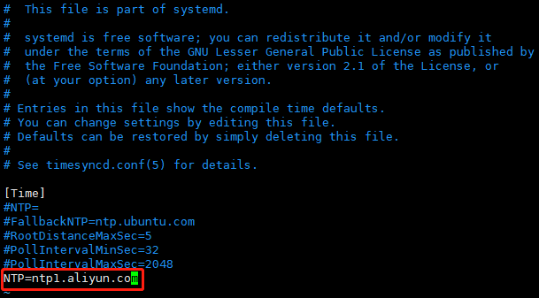

- 各节点设置时区：

  ```shell
  # 设置东八区
  root@ceph1:/home# timedatectl set-timezone Asia/Shanghai
  # 查看时区
  root@ceph1:/home# cat /etc/timezone 
  Asia/Shanghai
  root@ceph1:/home# timedatectl status | grep 'Time zone'
                  Time zone: Asia/Shanghai (CST, +0800)
  
  ```

- 各节点查看时钟是否与互联网同步：

  ```shell
  root@ceph1:/home# timedatectl 
                 Local time: Thu 2021-12-30 10:33:17 CST		# 本地时间
             Universal time: Thu 2021-12-30 02:33:17 UTC		# 协调世界时
                   RTC time: Thu 2021-12-30 02:33:17    		# 硬件时间
                  Time zone: Asia/Shanghai (CST, +0800) 		# 时区
  System clock synchronized: yes                       		# 如果和远程NTP服务器成功同步，则显示为yes 
                NTP service: active                     		# NTP时间同步是否开启，systemd-timesyncd服务活跃即开启了NTP时间同步
            RTC in local TZ: no								# no表示硬件时钟设置为协调世界时（UTC），yes表示硬件时钟设置为本地时间
  ```

  - timedatectl 命令会显示本地时间、世界时、时区、系统时钟是否与互联网服务器同步，以及 `systemd-timesyncd.service` 是处于活跃状态还是非活跃状态。

### 安装 Python3

- 各节点查看 Python3 版本，服务器已安装 Python3，此处省略安装步骤：

  ```shell
  root@ceph1:/opt# python3 --version
  Python 3.8.10
  ```


### 安装 Docker

- 各节点卸载旧版本：

  ```shell
  # 卸载旧版本
  root@ceph1:/opt# apt remove docker docker-engine docker.io containerd runc
  # 删除旧版本数据
  root@ceph1:/opt# rm -rf /var/lib/docker/
  root@ceph1:/opt# rm -rf /var/lib/containerd/
  ```

- 各节点安装需要的软件包：

  ```shell
  root@ceph1:/opt# apt install ca-certificates curl gnupg lsb-release
  ```

- 各节点添加 Docker 的官方 GPG key：

  ```shell
  root@ceph1:/opt# curl -fsSL https://download.docker.com/linux/ubuntu/gpg | sudo apt-key add -
  OK
  W: The key(s) in the keyring /etc/apt/trusted.gpg.d/ceph.release.gpg are ignored as the file has an unsupported filetype.
  ```

- 各节点添加 apt 的 Docker 源：

  ```shell
  root@ceph1:/opt# add-apt-repository "deb [arch=amd64] https://download.docker.com/linux/ubuntu $(lsb_release -cs) stable"
  Hit:1 http://mirrors.aliyun.com/ubuntu focal InRelease
  Hit:2 http://mirrors.aliyun.com/ubuntu focal-updates InRelease                                       
  Hit:3 http://mirrors.aliyun.com/ubuntu focal-backports InRelease                                                                                         
  Hit:4 http://mirrors.aliyun.com/ubuntu focal-security InRelease                                                                                          
  Get:5 https://download.docker.com/linux/ubuntu focal InRelease [57.7 kB]                                                  
  Get:6 https://download.docker.com/linux/ubuntu focal/stable amd64 Packages [13.5 kB] 
  Get:7 https://download.ceph.com/debian-octopus focal InRelease [8,571 B]
  Get:8 https://download.ceph.com/debian-octopus focal/main amd64 Packages [15.9 kB]
  Fetched 95.7 kB in 2s (50.4 kB/s)     
  Reading package lists... Done
  W: http://mirrors.aliyun.com/ubuntu/dists/focal/InRelease: The key(s) in the keyring /etc/apt/trusted.gpg.d/ceph.release.gpg are ignored as the file has an unsupported filetype.
  W: http://mirrors.aliyun.com/ubuntu/dists/focal-updates/InRelease: The key(s) in the keyring /etc/apt/trusted.gpg.d/ceph.release.gpg are ignored as the file has an unsupported filetype.
  W: http://mirrors.aliyun.com/ubuntu/dists/focal-backports/InRelease: The key(s) in the keyring /etc/apt/trusted.gpg.d/ceph.release.gpg are ignored as the file has an unsupported filetype.
  W: http://mirrors.aliyun.com/ubuntu/dists/focal-security/InRelease: The key(s) in the keyring /etc/apt/trusted.gpg.d/ceph.release.gpg are ignored as the file has an unsupported filetype.
  W: https://download.docker.com/linux/ubuntu/dists/focal/InRelease: The key(s) in the keyring /etc/apt/trusted.gpg.d/ceph.release.gpg are ignored as the file has an unsupported filetype.
  W: https://download.ceph.com/debian-octopus/dists/focal/InRelease: The key(s) in the keyring /etc/apt/trusted.gpg.d/ceph.release.gpg are ignored as the file has an unsupported filetype.
  ```

  - 如果提示 `bash: add-apt-repository: command not found`，执行下面命令安装：

    ```shell
    root@ceph1:/opt# apt install -y software-properties-common
    root@ceph1:/opt# apt update
    ```

- 各节点安装最新版本：

  ```shell
  root@ceph1:/opt# apt install docker-ce docker-ce-cli containerd.io
  ```

- Docker 安装完成后会自动启动：

  ```shell
  # 查看docker状态
  root@ceph1:/opt# systemctl status docker
  ● docker.service - Docker Application Container Engine
       Loaded: loaded (/lib/systemd/system/docker.service; enabled; vendor preset: enabled)
       Active: active (running) since Thu 2021-12-30 17:28:18 CST; 34s ago
  TriggeredBy: ● docker.socket
         Docs: https://docs.docker.com
     Main PID: 24185 (dockerd)
        Tasks: 11
       Memory: 29.1M
       CGroup: /system.slice/docker.service
               └─24185 /usr/bin/dockerd -H fd:// --containerd=/run/containerd/containerd.sock
  # 查看docker版本
  root@ceph1:/opt# docker --version
  Docker version 20.10.12, build e91ed57
  ```

- 各节点测试：

  ```shell
  root@ceph1:/opt# docker run hello-world
  Unable to find image 'hello-world:latest' locally
  latest: Pulling from library/hello-world
  2db29710123e: Pull complete 
  Digest: sha256:2498fce14358aa50ead0cc6c19990fc6ff866ce72aeb5546e1d59caac3d0d60f
  Status: Downloaded newer image for hello-world:latest
  
  Hello from Docker!
  This message shows that your installation appears to be working correctly.
  
  To generate this message, Docker took the following steps:
   1. The Docker client contacted the Docker daemon.
   2. The Docker daemon pulled the "hello-world" image from the Docker Hub.
      (amd64)
   3. The Docker daemon created a new container from that image which runs the
      executable that produces the output you are currently reading.
   4. The Docker daemon streamed that output to the Docker client, which sent it
      to your terminal.
  
  To try something more ambitious, you can run an Ubuntu container with:
   $ docker run -it ubuntu bash
  
  Share images, automate workflows, and more with a free Docker ID:
   https://hub.docker.com/
  
  For more examples and ideas, visit:
   https://docs.docker.com/get-started/
  
  root@ceph1:/opt# docker images
  REPOSITORY    TAG       IMAGE ID       CREATED        SIZE
  hello-world   latest    feb5d9fea6a5   3 months ago   13.3kB
  root@ceph1:/opt# docker ps -a
  CONTAINER ID   IMAGE         COMMAND    CREATED              STATUS                          PORTS     NAMES
  acf9377ed00d   hello-world   "/hello"   About a minute ago   Exited (0) About a minute ago             ecstatic_gould
  ```

- 参考：https://docs.docker.com/engine/install/ubuntu/

### 安装 Cephadm

- 各节点使用 apt 安装 Cephadm：

  ```shell
  # 安装
  root@ceph1:/opt# apt install -y cephadm
  Reading package lists... Done
  Building dependency tree       
  Reading state information... Done
  Recommended packages:
    podman | docker.io
  The following NEW packages will be installed:
    cephadm
  0 upgraded, 1 newly installed, 0 to remove and 0 not upgraded.
  Need to get 53.2 kB of archives.
  After this operation, 245 kB of additional disk space will be used.
  Get:1 https://download.ceph.com/debian-octopus focal/main amd64 cephadm amd64 15.2.15-1focal [53.2 kB]
  Fetched 53.2 kB in 2s (31.4 kB/s)  
  Selecting previously unselected package cephadm.
  (Reading database ... 115380 files and directories currently installed.)
  Preparing to unpack .../cephadm_15.2.15-1focal_amd64.deb ...
  Unpacking cephadm (15.2.15-1focal) ...
  Setting up cephadm (15.2.15-1focal) ...
  Adding system user cephadm....done
  Processing triggers for man-db (2.9.1-1) ...
  ```

- 各节点验证 Cephadm 安装成功：

  ```shell
  root@ceph1:/opt# which cephadm
  /usr/sbin/cephadm
  root@ceph1:/opt# cephadm version
  ceph version 15.2.15 (2dfb18841cfecc2f7eb7eb2afd65986ca4d95985) octopus (stable)
  ```

- 各节点安装 ceph-common 工具：

  ```shell
  # 添加源
  root@ceph1:/opt# cephadm add-repo --release octopus
  Installing repo GPG key from https://download.ceph.com/keys/release.asc...
  Installing repo file at /etc/apt/sources.list.d/ceph.list...
  # 安装
  root@ceph1:/opt# cephadm install ceph-common
  Installing packages ['ceph-common']...
  # 验证
  root@ceph1:/opt# ceph -v
  ceph version 15.2.15 (2dfb18841cfecc2f7eb7eb2afd65986ca4d95985) octopus (stable)
  ```

### 创建 Ceph 新集群

- 在 ceph1 上创建一个可以被任何访问 Ceph 集群的主机访问的网络，指定 mon-ip，并将生成的配置文件写进 `/etc/ceph` 目录里：

  ```shell
  root@ceph1:/opt# cephadm bootstrap --mon-ip 192.168.1.91
  Verifying podman|docker is present...
  Verifying lvm2 is present...
  Verifying time synchronization is in place...
  Unit systemd-timesyncd.service is enabled and running
  Repeating the final host check...
  podman|docker (/usr/bin/docker) is present
  systemctl is present
  lvcreate is present
  Unit systemd-timesyncd.service is enabled and running
  Host looks OK
  Cluster fsid: 79a6cb92-6f92-11ec-b1e0-6f6f27397286
  Verifying IP 192.168.1.91 port 3300 ...
  Verifying IP 192.168.1.91 port 6789 ...
  Mon IP 192.168.1.91 is in CIDR network 192.168.1.0/24
  Pulling container image quay.io/ceph/ceph:v15...
  Extracting ceph user uid/gid from container image...
  Creating initial keys...
  Creating initial monmap...
  Creating mon...
  Waiting for mon to start...
  Waiting for mon...
  mon is available
  Assimilating anything we can from ceph.conf...
  Generating new minimal ceph.conf...
  Restarting the monitor...
  Setting mon public_network...
  Creating mgr...
  Verifying port 9283 ...
  Wrote keyring to /etc/ceph/ceph.client.admin.keyring
  Wrote config to /etc/ceph/ceph.conf
  Waiting for mgr to start...
  Waiting for mgr...
  mgr not available, waiting (1/10)...
  mgr not available, waiting (2/10)...
  mgr not available, waiting (3/10)...
  mgr not available, waiting (4/10)...
  mgr is available
  Enabling cephadm module...
  Waiting for the mgr to restart...
  Waiting for Mgr epoch 5...
  Mgr epoch 5 is available
  Setting orchestrator backend to cephadm...
  Generating ssh key...
  Wrote public SSH key to to /etc/ceph/ceph.pub
  Adding key to root@localhost's authorized_keys...
  Adding host ceph1...
  Deploying mon service with default placement...
  Deploying mgr service with default placement...
  Deploying crash service with default placement...
  Enabling mgr prometheus module...
  Deploying prometheus service with default placement...
  Deploying grafana service with default placement...
  Deploying node-exporter service with default placement...
  Deploying alertmanager service with default placement...
  Enabling the dashboard module...
  Waiting for the mgr to restart...
  Waiting for Mgr epoch 13...
  Mgr epoch 13 is available
  Generating a dashboard self-signed certificate...
  Creating initial admin user...
  Fetching dashboard port number...
  Ceph Dashboard is now available at:
  
  	     URL: https://localhost:8443/
  	    User: admin
  	Password: vzmh8b8mp6
  
  You can access the Ceph CLI with:
  
  	sudo /usr/sbin/cephadm shell --fsid 79a6cb92-6f92-11ec-b1e0-6f6f27397286 -c /etc/ceph/ceph.conf -k /etc/ceph/ceph.client.admin.keyring
  
  Please consider enabling telemetry to help improve Ceph:
  
  	ceph telemetry on
  
  For more information see:
  
  	https://docs.ceph.com/docs/master/mgr/telemetry/
  
  Bootstrap complete.
  ```

  - 该命令执行如下操作：

    - 在本地主机上为新集群创建 monitor  和 manager daemon 守护程序。

    - 为 Ceph 集群生成一个新的公共 SSH 密钥，并将其添加到 root 用户的 `/root/.ssh/authorized_keys` 文件中。

      ```shell
      root@ceph1:/opt# cat /root/.ssh/authorized_keys 
      ssh-rsa AAAAB3NzaC1yc2EAAAADAQABAAABgQC9iDQVKo2J9hNGVjq6XegDCAlLRuweTxbHruBauegj+7i5lTwJx0inpRcnshbPJxqRNimH54lr8mDYzQ2kVuVgFqpftB9Q+Y5VnMnvZWnlzaJgEQ0BOj4RmydRHKztbhay9YNyQebUxmSC/EYPCBRloM86A4gGGEoU4uroV9d6QZZ8memabUQRLuATygXEWK0upU9B5bRtoyEsHg+R9Ypc12/rz9sssOOwABmFd+ushouvF7oIdXmKQ4ehOY8t86YZV4PmOnEmuF/tfTYu+oLRkLro13Q0AmmmtTTjOiI5baekeldxiHf26DlFFxkzpAx7obTl+JrsS9DAiAwc/W51q2J70hRuVfSpA+U+TO7bUip+O8fpMwY3xDv2CZch0i7VN+MF8v/uB89ecW1AGz7Fu4xhaauTqlDXgJ1pG9jw6UnJRXwZI4UdAGaG0/tPUWMqOJ+HSnt8kjFa/U7Jp1t6W6ryHZTZXt+1JeuV4clAL0f3ic1R9d4k1jpnH4QsObM= root@ceph1		# ceph1免密登录
      ssh-rsa AAAAB3NzaC1yc2EAAAADAQABAAABgQCnzZyF16dJR8DpOTzyBwd4YbVE60blx7TOjn3VwPhPkU4f2lcJ2uPmFApEwHOTHvFi6Mz9jnE6BymrAHAUIzXPU5D8fasoJ5tNOKODYEtaETsdimEN1hLiLFKET8JLU/EUoy7pgHllxDlCsfwZvFoJ2XUvX1ab5rCs5AB4c/pU3IG24zN/UBsl7pynIA8XLAWFSSg2KHPEAYwNMF/oBLt4+/z5xBGDYBtdLId1lB/UrYyj9RamJywuSMEZckUbEEo8AqZeGzXbXKFwHcy2dxUesCFT0C5B95c71HU6g/3zOu/hYjXLUU/NeX7ggsPwKDr19p18JNxX+iyjpfrupK1PxgALniuZXKaHpiC7geGoosb8P0SR1Cq0RJhs/PWwPFpPqTRI2svUWLskb5WG2xIYVE6uuRhJAdTirKSX/+l8Bw5iau8BEYZ4zCT8g/qMhb+tpYeM7lGh8usr0RtsK/U/Z48zu1HqYMKVvK5olmwFKgRe6Ss5JqJ7GqX3T37UYL0= root@ceph2		# ceph1免密登录
      ssh-rsa AAAAB3NzaC1yc2EAAAADAQABAAABgQCiBgLpJH5BcUdTG4tT/6ln++GnCoMIpKlV3rjlYoWAa5efn60d1JKqgTBMRusa79D9kIihGCWjxBio2o0QplrKyHtjLKNLLaNShVOCZESJATrSf2ZwGmj6pS2RT4Bg0xchByZlQXIBwEyeLQ0T4hC45JYoXDeiPEezp+pPYqTIxDoks/wbb4IqUtsdtoXI1m/3GT1KCl1FofWWoc5PaXSiFwg+YZ5QAW2y6i5oRZH2cTyPpcrCtlqPRa1h8V8+C/vN8EcEMMxofW0sS4XCrtqYUcZcoPjcbHofQlC6cTf5/IhSNBME7Re2bMSFvn68n5vdS0z6fITSjCZdkm8I9V4omXpbGoztbbK4J7TDPL2IZWw6bh/LP7L4YuaUFPWmkHAWrckVtNEciYpXBgE9cKWgxpq0/UWXRFmMUgYmejz126/mtSwGpXV+VhjlXlw/wFsIS6k8BYEYsrFZrdYNgQA+6L0DenEwPqcfFb3NEqRH66Urgen3NCibBzYtpI5PlR8= root@ceph3		# ceph3免密登录
      ssh-rsa AAAAB3NzaC1yc2EAAAADAQABAAABgQCzntkcguxOqBlvUxBX0S80BzQd36MGxg3TkDLJWq5D/gi6hcUpQOrFwMtXctQWv+8AK708fXssaj07SwF939rxQFBrU83M59ZdrILAFH3dSZNOh4YYj30weHOmsj/uBkH9rQOYoc2JApVDV76OSjTm8Uztez8cQ0r355rd0wwHmX1eVkL1mgCu7PAemD64a4J7fZUOl0eYdz1HyqjGNprYZItAeqldAFwMfi8wQZubyfzeQX2hM5rWehaP5OxhvlCrHUdGhwM3m82fyNWzJcfCexnIfoaJkyYcEXrcjtvWfUeUcoLmYd6jSa19jhr2AkkDSxyxZ43p/73d5tgzJFzX5etjBK33P/zDfIG1HIiD56Tn9jOXJ/Kud9JF+RLGmEaVsvqWwZJLJIN8bin/S+Viv9kVtytOWFpilea1LQGg2Sap2Y/8oQJbDCk24wCHGKbRFmFYOalqEuX9GwM3h0mRwt+UBVv7M3x/JsliyA7tKlN9V+oPH+3LxVpw+Wfq8rU= root@ceph4		# ceph4免密登录
      ssh-rsa AAAAB3NzaC1yc2EAAAADAQABAAABgQDGii1dKJdramvUhkqwyix/G39kAEw+CGt1NNdM78QmrumLlWqtToO6TwmfgMqu/2geBafkOs9fhLJB+qV/oQ8mpBaGgzXgBOthtCMyEWBtBB78wJJ+cgn2EkkQLsmJmMfwbp+dnMJMvqWKPKYZoyODyZvhnS4uofFfpBqMI9xLjpnNgVerQbyN1DIH+WkBnrhonirzr78DPlsU3zpEdB5wlVduIqaPNrnW4DUNje5quhFcTd7D40kQeAKZBm5Py94R93BqEUyhRUYaz5dHAF4Wh/dTcD/aA3aq7fiOcdxNjOBD9Z/bCG5B32Eb+4iehzk3O4JoTNnl3FtYMVz50MaPphWQh9yBTbrUY/pxupvvderhDNz7yAxmSzM6MKVPlVaSpSaQf2MKUqWRNzcJDaOw8/aQi6GuJe/Iljpbvse1NO3cTtZF0IRuTjham90DptKyHfDgms9+gmhiDg6uLzM8jLmY74He8W8FOtalXBhALCYFP2lX9IYx1HFSnt42UdE= ceph-79a6cb92-6f92-11ec-b1e0-6f6f27397286																						# 公共SSH密钥
      ```

    - 将与新群集进行通信所需的最小配置文件保存到 `/etc/ceph/ceph.conf`。

    - 向 `/etc/ceph/ceph.client.admin.keyring` 写入 `client.admin` 管理 secret key 的副本（特权！）。

    - 将 public key 的副本写入 `/etc/ceph/ceph.pub`。

- 查看当前配置文件：

    ```shell
    root@ceph1:/opt# ll /etc/ceph/
    total 24
    drwxr-xr-x   2 root root 4096 Jan  7 16:19 ./
    drwxr-xr-x 104 root root 4096 Jan  7 16:02 ../
    -rw-------   1 root root   63 Jan  7 16:19 ceph.client.admin.keyring
    -rw-r--r--   1 root root  175 Jan  7 16:19 ceph.conf
    -rw-r--r--   1 root root  595 Jan  7 16:19 ceph.pub
    -rw-r--r--   1 root root   92 Oct 20 22:31 rbdmap
    root@ceph1:/opt# cat /etc/ceph/ceph.conf 
    # minimal ceph.conf for 79a6cb92-6f92-11ec-b1e0-6f6f27397286
    [global]
    	fsid = 79a6cb92-6f92-11ec-b1e0-6f6f27397286
    	mon_host = [v2:192.168.1.91:3300/0,v1:192.168.1.91:6789/0]
    ```

- 查看当前拉取的镜像和启动的容器：

    ```shell
    root@ceph1:/opt# docker images
    REPOSITORY                         TAG       IMAGE ID       CREATED         SIZE
    quay.io/ceph/ceph                  v15       3437f7bed968   2 months ago    1.08GB
    hello-world                        latest    feb5d9fea6a5   3 months ago    13.3kB
    quay.io/ceph/ceph-grafana          6.7.4     557c83e11646   5 months ago    486MB
    quay.io/prometheus/prometheus      v2.18.1   de242295e225   20 months ago   140MB
    quay.io/prometheus/alertmanager    v0.20.0   0881eb8f169f   2 years ago     52.1MB
    quay.io/prometheus/node-exporter   v0.18.1   e5a616e4b9cf   2 years ago     22.9MB
    root@ceph1:/opt# docker ps -a
    CONTAINER ID   IMAGE                                      COMMAND                  CREATED          STATUS                   PORTS     NAMES
    1fdde1918435   quay.io/prometheus/alertmanager:v0.20.0    "/bin/alertmanager -…"   47 minutes ago   Up 47 minutes                      ceph-79a6cb92-6f92-11ec-b1e0-6f6f27397286-alertmanager.ceph1
    5fc44d4adaa8   quay.io/ceph/ceph-grafana:6.7.4            "/bin/sh -c 'grafana…"   47 minutes ago   Up 47 minutes                      ceph-79a6cb92-6f92-11ec-b1e0-6f6f27397286-grafana.ceph1
    85cac2612c10   quay.io/prometheus/prometheus:v2.18.1      "/bin/prometheus --c…"   47 minutes ago   Up 47 minutes                      ceph-79a6cb92-6f92-11ec-b1e0-6f6f27397286-prometheus.ceph1
    d1aa75b76a39   quay.io/prometheus/node-exporter:v0.18.1   "/bin/node_exporter …"   48 minutes ago   Up 48 minutes                      ceph-79a6cb92-6f92-11ec-b1e0-6f6f27397286-node-exporter.ceph1
    c20775682c08   quay.io/ceph/ceph:v15                      "/usr/bin/ceph-crash…"   48 minutes ago   Up 48 minutes                      ceph-79a6cb92-6f92-11ec-b1e0-6f6f27397286-crash.ceph1
    7c3cf4e445d1   quay.io/ceph/ceph:v15                      "/usr/bin/ceph-mgr -…"   54 minutes ago   Up 54 minutes                      ceph-79a6cb92-6f92-11ec-b1e0-6f6f27397286-mgr.ceph1.tlpgcb
    6410679d498a   quay.io/ceph/ceph:v15                      "/usr/bin/ceph-mon -…"   55 minutes ago   Up 54 minutes                      ceph-79a6cb92-6f92-11ec-b1e0-6f6f27397286-mon.ceph1
    acf9377ed00d   hello-world                                "/hello"                 6 hours ago      Exited (0) 6 hours ago             ecstatic_gould
    ```

    - alertmanager 组件：prometheus 告警组件。
    - grafana 组件：监控数据展示 dashboard。
    - prometheus 组件：prometheus 监控组件。
    - node_exporter 组件：prometheus 节点数据收集组件。
    - ceph-crash 组件：崩溃数据收集模块。
    - ceph-mgr 组件：Ceph 管理程序。
    - ceph-monitor 组件：Ceph 监视器。

- 查看所有组件运行状态：

    ```shell
    root@ceph1:/opt# ceph orch ps
    NAME                 HOST   STATUS        REFRESHED  AGE  VERSION  IMAGE NAME                                IMAGE ID      CONTAINER ID  
    alertmanager.ceph1   ceph1  running (5h)  8m ago     5h   0.20.0   quay.io/prometheus/alertmanager:v0.20.0   0881eb8f169f  1fdde1918435  
    crash.ceph1          ceph1  running (5h)  8m ago     5h   15.2.15  quay.io/ceph/ceph:v15                     3437f7bed968  c20775682c08  
    grafana.ceph1        ceph1  running (5h)  8m ago     5h   6.7.4    quay.io/ceph/ceph-grafana:6.7.4           557c83e11646  5fc44d4adaa8  
    mgr.ceph1.tlpgcb     ceph1  running (5h)  8m ago     5h   15.2.15  quay.io/ceph/ceph:v15                     3437f7bed968  7c3cf4e445d1  
    mon.ceph1            ceph1  running (5h)  8m ago     5h   15.2.15  quay.io/ceph/ceph:v15                     3437f7bed968  6410679d498a  
    node-exporter.ceph1  ceph1  running (5h)  8m ago     5h   0.18.1   quay.io/prometheus/node-exporter:v0.18.1  e5a616e4b9cf  d1aa75b76a39  
    prometheus.ceph1     ceph1  running (5h)  8m ago     5h   2.18.1   quay.io/prometheus/prometheus:v2.18.1     de242295e225  85cac2612c10
    ```
    
- 查看某个组件运行状态：
  
    ```shell
    root@ceph1:/opt# ceph orch ps --daemon-type mgr
    NAME              HOST   STATUS        REFRESHED  AGE  VERSION  IMAGE NAME             IMAGE ID      CONTAINER ID  
    mgr.ceph1.tlpgcb  ceph1  running (5h)  4m ago     5h   15.2.15  quay.io/ceph/ceph:v15  3437f7bed968  7c3cf4e445d1
    ```
    
- 查看容器状态：
  
    ```shell
    root@ceph1:/opt# cephadm ls
    [
        {
            "style": "cephadm:v1",
            "name": "crash.ceph1",
            "fsid": "79a6cb92-6f92-11ec-b1e0-6f6f27397286",
            "systemd_unit": "ceph-79a6cb92-6f92-11ec-b1e0-6f6f27397286@crash.ceph1",
            "enabled": true,
            "state": "running",
            "container_id": "c20775682c087aaf8d1dc25802386ac4fbaf40b3ab8a4ae7ef54843e26725d94",
            "container_image_name": "quay.io/ceph/ceph:v15",
            "container_image_id": "3437f7bed9688a799444b439e1947a6f00d1f9b1fc986e843aec7e3ac8acd12b",
            "version": "15.2.15",
            "started": "2022-01-07T08:25:11.762461Z",
            "created": "2022-01-07T08:25:11.702112Z",
            "deployed": "2022-01-07T08:25:11.318096Z",
            "configured": "2022-01-07T08:25:11.702112Z"
        },
        {
            "style": "cephadm:v1",
            "name": "grafana.ceph1",
            "fsid": "79a6cb92-6f92-11ec-b1e0-6f6f27397286",
            "systemd_unit": "ceph-79a6cb92-6f92-11ec-b1e0-6f6f27397286@grafana.ceph1",
            "enabled": true,
            "state": "running",
            "container_id": "5fc44d4adaa8365aa4a290d769fd08b25a2dee4c5235f4ef377aff0ced55ef2b",
            "container_image_name": "quay.io/ceph/ceph-grafana:6.7.4",
            "container_image_id": "557c83e11646f123a27b5e4b62ac6c45e7bb8b2e90d6044034d0db5b7019415c",
            "version": "6.7.4",
            "started": "2022-01-07T08:26:37.418809Z",
            "created": "2022-01-07T08:25:51.875753Z",
            "deployed": "2022-01-07T08:25:51.487738Z",
            "configured": "2022-01-07T08:26:37.229606Z"
        },
        {
            "style": "cephadm:v1",
            "name": "mgr.ceph1.tlpgcb",
            "fsid": "79a6cb92-6f92-11ec-b1e0-6f6f27397286",
            "systemd_unit": "ceph-79a6cb92-6f92-11ec-b1e0-6f6f27397286@mgr.ceph1.tlpgcb",
            "enabled": true,
            "state": "running",
            "container_id": "7c3cf4e445d1113caa67c7502ffd5265961ecba5430e909f34f853b1fc021f1e",
            "container_image_name": "quay.io/ceph/ceph:v15",
            "container_image_id": "3437f7bed9688a799444b439e1947a6f00d1f9b1fc986e843aec7e3ac8acd12b",
            "version": "15.2.15",
            "started": "2022-01-07T08:19:10.362590Z",
            "created": "2022-01-07T08:19:10.279314Z",
            "deployed": "2022-01-07T08:19:09.911299Z",
            "configured": "2022-01-07T08:26:37.749627Z"
        },
        {
            "style": "cephadm:v1",
            "name": "alertmanager.ceph1",
            "fsid": "79a6cb92-6f92-11ec-b1e0-6f6f27397286",
            "systemd_unit": "ceph-79a6cb92-6f92-11ec-b1e0-6f6f27397286@alertmanager.ceph1",
            "enabled": true,
            "state": "running",
            "container_id": "1fdde19184350e4c731b484bf10b3943e95f0ec27a306daa7ff547414e9e587e",
            "container_image_name": "quay.io/prometheus/alertmanager:v0.20.0",
            "container_image_id": "0881eb8f169f5556a292b4e2c01d683172b12830a62a9225a98a8e206bb734f0",
            "version": "0.20.0",
            "started": "2022-01-07T08:26:38.462159Z",
            "created": "2022-01-07T08:25:09.854037Z",
            "deployed": "2022-01-07T08:25:09.486022Z",
            "configured": "2022-01-07T08:26:38.297650Z"
        },
        {
            "style": "cephadm:v1",
            "name": "prometheus.ceph1",
            "fsid": "79a6cb92-6f92-11ec-b1e0-6f6f27397286",
            "systemd_unit": "ceph-79a6cb92-6f92-11ec-b1e0-6f6f27397286@prometheus.ceph1",
            "enabled": true,
            "state": "running",
            "container_id": "85cac2612c105ec9809a88fa97f99633b50b50ba12ee0a9b2beb95c608be73ff",
            "container_image_name": "quay.io/prometheus/prometheus:v2.18.1",
            "container_image_id": "de242295e2257c37c8cadfd962369228f8f10b2d48a44259b65fef44ad4f6490",
            "version": "2.18.1",
            "started": "2022-01-07T08:26:35.419299Z",
            "created": "2022-01-07T08:26:35.361530Z",
            "deployed": "2022-01-07T08:26:34.993515Z",
            "configured": "2022-01-07T08:26:35.361530Z"
        },
        {
            "style": "cephadm:v1",
            "name": "mon.ceph1",
            "fsid": "79a6cb92-6f92-11ec-b1e0-6f6f27397286",
            "systemd_unit": "ceph-79a6cb92-6f92-11ec-b1e0-6f6f27397286@mon.ceph1",
            "enabled": true,
            "state": "running",
            "container_id": "6410679d498a31428927c7a532548d39f5261c80f94c867849902a6bea12208b",
            "container_image_name": "quay.io/ceph/ceph:v15",
            "container_image_id": "3437f7bed9688a799444b439e1947a6f00d1f9b1fc986e843aec7e3ac8acd12b",
            "version": "15.2.15",
            "started": "2022-01-07T08:19:09.667576Z",
            "created": "2022-01-07T08:19:08.539242Z",
            "deployed": "2022-01-07T08:19:07.699208Z",
            "configured": "2022-01-07T08:26:38.785670Z"
        },
        {
            "style": "cephadm:v1",
            "name": "node-exporter.ceph1",
            "fsid": "79a6cb92-6f92-11ec-b1e0-6f6f27397286",
            "systemd_unit": "ceph-79a6cb92-6f92-11ec-b1e0-6f6f27397286@node-exporter.ceph1",
            "enabled": true,
            "state": "running",
            "container_id": "d1aa75b76a39554b9b5cc7b5e9c4cf9c4ca4d00b9401af79b3c8eda6009fc215",
            "container_image_name": "quay.io/prometheus/node-exporter:v0.18.1",
            "container_image_id": "e5a616e4b9cf68dfcad7782b78e118be4310022e874d52da85c55923fb615f87",
            "version": "0.18.1",
            "started": "2022-01-07T08:26:02.530410Z",
            "created": "2022-01-07T08:25:52.639785Z",
            "deployed": "2022-01-07T08:25:52.179766Z",
            "configured": "2022-01-07T08:25:52.639785Z"
        }
    ]
    ```
  
- 根据初始化完成的提示使用浏览器访问 dashboard：略。

### 启用 Ceph 命令

- 在 ceph1 上执行命令：

  ```shell
  root@ceph1:/opt# cephadm shell
  Inferring fsid 79a6cb92-6f92-11ec-b1e0-6f6f27397286
  Inferring config /var/lib/ceph/79a6cb92-6f92-11ec-b1e0-6f6f27397286/mon.ceph1/config
  Using recent ceph image quay.io/ceph/ceph@sha256:a2c23b6942f7fbc1e15d8cfacd6655a681fe0e44f288e4a158db22030b8d58e3
  root@ceph1:/# alias ceph='cephadm shell -- ceph'
  root@ceph1:/# exit
  exit
  ```

- 查看集群状态：

  ```shell
  root@ceph1:/opt# ceph -s
    cluster:
      id:     79a6cb92-6f92-11ec-b1e0-6f6f27397286
      health: HEALTH_WARN
              OSD count 0 < osd_pool_default_size 3
   
    services:
      mon: 1 daemons, quorum ceph1 (age 21h)
      mgr: ceph1.tlpgcb(active, since 21h)
      osd: 0 osds: 0 up, 0 in
   
    data:
      pools:   0 pools, 0 pgs
      objects: 0 objects, 0 B
      usage:   0 B used, 0 B / 0 B avail
      pgs:     
   
  root@ceph1:/opt# ceph status
    cluster:
      id:     79a6cb92-6f92-11ec-b1e0-6f6f27397286
      health: HEALTH_WARN
              OSD count 0 < osd_pool_default_size 3
   
    services:
      mon: 1 daemons, quorum ceph1 (age 21h)
      mgr: ceph1.tlpgcb(active, since 21h)
      osd: 0 osds: 0 up, 0 in
   
    data:
      pools:   0 pools, 0 pgs
      objects: 0 objects, 0 B
      usage:   0 B used, 0 B / 0 B avail
      pgs:     
  ```
### 添加新主机到集群中

- 第一步，在 ceph1 上执行命令，将集群的公共 SSH 密钥添加到新主机的根用户 authorized_keys 文件中：

  ```shell
  root@ceph1:/opt# ssh-copy-id -f -i /etc/ceph/ceph.pub root@ceph2
  /usr/bin/ssh-copy-id: INFO: Source of key(s) to be installed: "/etc/ceph/ceph.pub"
  
  Number of key(s) added: 1
  
  Now try logging into the machine, with:   "ssh 'root@ceph2'"
  and check to make sure that only the key(s) you wanted were added.
  
  root@ceph1:/opt# ll /etc/ceph/
  total 24
  drwxr-xr-x   2 root root 4096 Jan  7 16:19 ./
  drwxr-xr-x 104 root root 4096 Jan  7 16:02 ../
  -rw-------   1 root root   63 Jan  7 16:19 ceph.client.admin.keyring
  -rw-r--r--   1 root root  175 Jan  7 16:19 ceph.conf
  -rw-r--r--   1 root root  595 Jan  7 16:19 ceph.pub
  -rw-r--r--   1 root root   92 Oct 20 22:31 rbdmap
  root@ceph1:/opt# ssh-copy-id -f -i /etc/ceph/ceph.pub root@ceph3
  /usr/bin/ssh-copy-id: INFO: Source of key(s) to be installed: "/etc/ceph/ceph.pub"
  
  Number of key(s) added: 1
  
  Now try logging into the machine, with:   "ssh 'root@ceph3'"
  and check to make sure that only the key(s) you wanted were added.
  
  root@ceph1:/opt# ssh-copy-id -f -i /etc/ceph/ceph.pub root@ceph4
  /usr/bin/ssh-copy-id: INFO: Source of key(s) to be installed: "/etc/ceph/ceph.pub"
  
  Number of key(s) added: 1
  
  Now try logging into the machine, with:   "ssh 'root@ceph4'"
  and check to make sure that only the key(s) you wanted were added.
  root@ceph1:/opt# cat /root/.ssh/authorized_keys 
  ssh-rsa AAAAB3NzaC1yc2EAAAADAQABAAABgQC9iDQVKo2J9hNGVjq6XegDCAlLRuweTxbHruBauegj+7i5lTwJx0inpRcnshbPJxqRNimH54lr8mDYzQ2kVuVgFqpftB9Q+Y5VnMnvZWnlzaJgEQ0BOj4RmydRHKztbhay9YNyQebUxmSC/EYPCBRloM86A4gGGEoU4uroV9d6QZZ8memabUQRLuATygXEWK0upU9B5bRtoyEsHg+R9Ypc12/rz9sssOOwABmFd+ushouvF7oIdXmKQ4ehOY8t86YZV4PmOnEmuF/tfTYu+oLRkLro13Q0AmmmtTTjOiI5baekeldxiHf26DlFFxkzpAx7obTl+JrsS9DAiAwc/W51q2J70hRuVfSpA+U+TO7bUip+O8fpMwY3xDv2CZch0i7VN+MF8v/uB89ecW1AGz7Fu4xhaauTqlDXgJ1pG9jw6UnJRXwZI4UdAGaG0/tPUWMqOJ+HSnt8kjFa/U7Jp1t6W6ryHZTZXt+1JeuV4clAL0f3ic1R9d4k1jpnH4QsObM= root@ceph1
  ssh-rsa AAAAB3NzaC1yc2EAAAADAQABAAABgQCnzZyF16dJR8DpOTzyBwd4YbVE60blx7TOjn3VwPhPkU4f2lcJ2uPmFApEwHOTHvFi6Mz9jnE6BymrAHAUIzXPU5D8fasoJ5tNOKODYEtaETsdimEN1hLiLFKET8JLU/EUoy7pgHllxDlCsfwZvFoJ2XUvX1ab5rCs5AB4c/pU3IG24zN/UBsl7pynIA8XLAWFSSg2KHPEAYwNMF/oBLt4+/z5xBGDYBtdLId1lB/UrYyj9RamJywuSMEZckUbEEo8AqZeGzXbXKFwHcy2dxUesCFT0C5B95c71HU6g/3zOu/hYjXLUU/NeX7ggsPwKDr19p18JNxX+iyjpfrupK1PxgALniuZXKaHpiC7geGoosb8P0SR1Cq0RJhs/PWwPFpPqTRI2svUWLskb5WG2xIYVE6uuRhJAdTirKSX/+l8Bw5iau8BEYZ4zCT8g/qMhb+tpYeM7lGh8usr0RtsK/U/Z48zu1HqYMKVvK5olmwFKgRe6Ss5JqJ7GqX3T37UYL0= root@ceph2
  ssh-rsa AAAAB3NzaC1yc2EAAAADAQABAAABgQCiBgLpJH5BcUdTG4tT/6ln++GnCoMIpKlV3rjlYoWAa5efn60d1JKqgTBMRusa79D9kIihGCWjxBio2o0QplrKyHtjLKNLLaNShVOCZESJATrSf2ZwGmj6pS2RT4Bg0xchByZlQXIBwEyeLQ0T4hC45JYoXDeiPEezp+pPYqTIxDoks/wbb4IqUtsdtoXI1m/3GT1KCl1FofWWoc5PaXSiFwg+YZ5QAW2y6i5oRZH2cTyPpcrCtlqPRa1h8V8+C/vN8EcEMMxofW0sS4XCrtqYUcZcoPjcbHofQlC6cTf5/IhSNBME7Re2bMSFvn68n5vdS0z6fITSjCZdkm8I9V4omXpbGoztbbK4J7TDPL2IZWw6bh/LP7L4YuaUFPWmkHAWrckVtNEciYpXBgE9cKWgxpq0/UWXRFmMUgYmejz126/mtSwGpXV+VhjlXlw/wFsIS6k8BYEYsrFZrdYNgQA+6L0DenEwPqcfFb3NEqRH66Urgen3NCibBzYtpI5PlR8= root@ceph3
  ssh-rsa AAAAB3NzaC1yc2EAAAADAQABAAABgQCzntkcguxOqBlvUxBX0S80BzQd36MGxg3TkDLJWq5D/gi6hcUpQOrFwMtXctQWv+8AK708fXssaj07SwF939rxQFBrU83M59ZdrILAFH3dSZNOh4YYj30weHOmsj/uBkH9rQOYoc2JApVDV76OSjTm8Uztez8cQ0r355rd0wwHmX1eVkL1mgCu7PAemD64a4J7fZUOl0eYdz1HyqjGNprYZItAeqldAFwMfi8wQZubyfzeQX2hM5rWehaP5OxhvlCrHUdGhwM3m82fyNWzJcfCexnIfoaJkyYcEXrcjtvWfUeUcoLmYd6jSa19jhr2AkkDSxyxZ43p/73d5tgzJFzX5etjBK33P/zDfIG1HIiD56Tn9jOXJ/Kud9JF+RLGmEaVsvqWwZJLJIN8bin/S+Viv9kVtytOWFpilea1LQGg2Sap2Y/8oQJbDCk24wCHGKbRFmFYOalqEuX9GwM3h0mRwt+UBVv7M3x/JsliyA7tKlN9V+oPH+3LxVpw+Wfq8rU= root@ceph4
  ssh-rsa AAAAB3NzaC1yc2EAAAADAQABAAABgQDGii1dKJdramvUhkqwyix/G39kAEw+CGt1NNdM78QmrumLlWqtToO6TwmfgMqu/2geBafkOs9fhLJB+qV/oQ8mpBaGgzXgBOthtCMyEWBtBB78wJJ+cgn2EkkQLsmJmMfwbp+dnMJMvqWKPKYZoyODyZvhnS4uofFfpBqMI9xLjpnNgVerQbyN1DIH+WkBnrhonirzr78DPlsU3zpEdB5wlVduIqaPNrnW4DUNje5quhFcTd7D40kQeAKZBm5Py94R93BqEUyhRUYaz5dHAF4Wh/dTcD/aA3aq7fiOcdxNjOBD9Z/bCG5B32Eb+4iehzk3O4JoTNnl3FtYMVz50MaPphWQh9yBTbrUY/pxupvvderhDNz7yAxmSzM6MKVPlVaSpSaQf2MKUqWRNzcJDaOw8/aQi6GuJe/Iljpbvse1NO3cTtZF0IRuTjham90DptKyHfDgms9+gmhiDg6uLzM8jLmY74He8W8FOtalXBhALCYFP2lX9IYx1HFSnt42UdE= ceph-79a6cb92-6f92-11ec-b1e0-6f6f27397286		# 公共SSH密钥
  ```

- 在新结点上查看密钥是否添加成功：

  ```shell
  root@ceph2:/opt# cat /root/.ssh/authorized_keys 
  ssh-rsa AAAAB3NzaC1yc2EAAAADAQABAAABgQC9iDQVKo2J9hNGVjq6XegDCAlLRuweTxbHruBauegj+7i5lTwJx0inpRcnshbPJxqRNimH54lr8mDYzQ2kVuVgFqpftB9Q+Y5VnMnvZWnlzaJgEQ0BOj4RmydRHKztbhay9YNyQebUxmSC/EYPCBRloM86A4gGGEoU4uroV9d6QZZ8memabUQRLuATygXEWK0upU9B5bRtoyEsHg+R9Ypc12/rz9sssOOwABmFd+ushouvF7oIdXmKQ4ehOY8t86YZV4PmOnEmuF/tfTYu+oLRkLro13Q0AmmmtTTjOiI5baekeldxiHf26DlFFxkzpAx7obTl+JrsS9DAiAwc/W51q2J70hRuVfSpA+U+TO7bUip+O8fpMwY3xDv2CZch0i7VN+MF8v/uB89ecW1AGz7Fu4xhaauTqlDXgJ1pG9jw6UnJRXwZI4UdAGaG0/tPUWMqOJ+HSnt8kjFa/U7Jp1t6W6ryHZTZXt+1JeuV4clAL0f3ic1R9d4k1jpnH4QsObM= root@ceph1
  ssh-rsa AAAAB3NzaC1yc2EAAAADAQABAAABgQCnzZyF16dJR8DpOTzyBwd4YbVE60blx7TOjn3VwPhPkU4f2lcJ2uPmFApEwHOTHvFi6Mz9jnE6BymrAHAUIzXPU5D8fasoJ5tNOKODYEtaETsdimEN1hLiLFKET8JLU/EUoy7pgHllxDlCsfwZvFoJ2XUvX1ab5rCs5AB4c/pU3IG24zN/UBsl7pynIA8XLAWFSSg2KHPEAYwNMF/oBLt4+/z5xBGDYBtdLId1lB/UrYyj9RamJywuSMEZckUbEEo8AqZeGzXbXKFwHcy2dxUesCFT0C5B95c71HU6g/3zOu/hYjXLUU/NeX7ggsPwKDr19p18JNxX+iyjpfrupK1PxgALniuZXKaHpiC7geGoosb8P0SR1Cq0RJhs/PWwPFpPqTRI2svUWLskb5WG2xIYVE6uuRhJAdTirKSX/+l8Bw5iau8BEYZ4zCT8g/qMhb+tpYeM7lGh8usr0RtsK/U/Z48zu1HqYMKVvK5olmwFKgRe6Ss5JqJ7GqX3T37UYL0= root@ceph2
  ssh-rsa AAAAB3NzaC1yc2EAAAADAQABAAABgQCiBgLpJH5BcUdTG4tT/6ln++GnCoMIpKlV3rjlYoWAa5efn60d1JKqgTBMRusa79D9kIihGCWjxBio2o0QplrKyHtjLKNLLaNShVOCZESJATrSf2ZwGmj6pS2RT4Bg0xchByZlQXIBwEyeLQ0T4hC45JYoXDeiPEezp+pPYqTIxDoks/wbb4IqUtsdtoXI1m/3GT1KCl1FofWWoc5PaXSiFwg+YZ5QAW2y6i5oRZH2cTyPpcrCtlqPRa1h8V8+C/vN8EcEMMxofW0sS4XCrtqYUcZcoPjcbHofQlC6cTf5/IhSNBME7Re2bMSFvn68n5vdS0z6fITSjCZdkm8I9V4omXpbGoztbbK4J7TDPL2IZWw6bh/LP7L4YuaUFPWmkHAWrckVtNEciYpXBgE9cKWgxpq0/UWXRFmMUgYmejz126/mtSwGpXV+VhjlXlw/wFsIS6k8BYEYsrFZrdYNgQA+6L0DenEwPqcfFb3NEqRH66Urgen3NCibBzYtpI5PlR8= root@ceph3
  ssh-rsa AAAAB3NzaC1yc2EAAAADAQABAAABgQCzntkcguxOqBlvUxBX0S80BzQd36MGxg3TkDLJWq5D/gi6hcUpQOrFwMtXctQWv+8AK708fXssaj07SwF939rxQFBrU83M59ZdrILAFH3dSZNOh4YYj30weHOmsj/uBkH9rQOYoc2JApVDV76OSjTm8Uztez8cQ0r355rd0wwHmX1eVkL1mgCu7PAemD64a4J7fZUOl0eYdz1HyqjGNprYZItAeqldAFwMfi8wQZubyfzeQX2hM5rWehaP5OxhvlCrHUdGhwM3m82fyNWzJcfCexnIfoaJkyYcEXrcjtvWfUeUcoLmYd6jSa19jhr2AkkDSxyxZ43p/73d5tgzJFzX5etjBK33P/zDfIG1HIiD56Tn9jOXJ/Kud9JF+RLGmEaVsvqWwZJLJIN8bin/S+Viv9kVtytOWFpilea1LQGg2Sap2Y/8oQJbDCk24wCHGKbRFmFYOalqEuX9GwM3h0mRwt+UBVv7M3x/JsliyA7tKlN9V+oPH+3LxVpw+Wfq8rU= root@ceph4
  ssh-rsa AAAAB3NzaC1yc2EAAAADAQABAAABgQDGii1dKJdramvUhkqwyix/G39kAEw+CGt1NNdM78QmrumLlWqtToO6TwmfgMqu/2geBafkOs9fhLJB+qV/oQ8mpBaGgzXgBOthtCMyEWBtBB78wJJ+cgn2EkkQLsmJmMfwbp+dnMJMvqWKPKYZoyODyZvhnS4uofFfpBqMI9xLjpnNgVerQbyN1DIH+WkBnrhonirzr78DPlsU3zpEdB5wlVduIqaPNrnW4DUNje5quhFcTd7D40kQeAKZBm5Py94R93BqEUyhRUYaz5dHAF4Wh/dTcD/aA3aq7fiOcdxNjOBD9Z/bCG5B32Eb+4iehzk3O4JoTNnl3FtYMVz50MaPphWQh9yBTbrUY/pxupvvderhDNz7yAxmSzM6MKVPlVaSpSaQf2MKUqWRNzcJDaOw8/aQi6GuJe/Iljpbvse1NO3cTtZF0IRuTjham90DptKyHfDgms9+gmhiDg6uLzM8jLmY74He8W8FOtalXBhALCYFP2lX9IYx1HFSnt42UdE= ceph-79a6cb92-6f92-11ec-b1e0-6f6f27397286			# 公共SSH密钥
  ```

  ```shell
  root@ceph3:/opt# cat /root/.ssh/authorized_keys 
  ssh-rsa AAAAB3NzaC1yc2EAAAADAQABAAABgQC9iDQVKo2J9hNGVjq6XegDCAlLRuweTxbHruBauegj+7i5lTwJx0inpRcnshbPJxqRNimH54lr8mDYzQ2kVuVgFqpftB9Q+Y5VnMnvZWnlzaJgEQ0BOj4RmydRHKztbhay9YNyQebUxmSC/EYPCBRloM86A4gGGEoU4uroV9d6QZZ8memabUQRLuATygXEWK0upU9B5bRtoyEsHg+R9Ypc12/rz9sssOOwABmFd+ushouvF7oIdXmKQ4ehOY8t86YZV4PmOnEmuF/tfTYu+oLRkLro13Q0AmmmtTTjOiI5baekeldxiHf26DlFFxkzpAx7obTl+JrsS9DAiAwc/W51q2J70hRuVfSpA+U+TO7bUip+O8fpMwY3xDv2CZch0i7VN+MF8v/uB89ecW1AGz7Fu4xhaauTqlDXgJ1pG9jw6UnJRXwZI4UdAGaG0/tPUWMqOJ+HSnt8kjFa/U7Jp1t6W6ryHZTZXt+1JeuV4clAL0f3ic1R9d4k1jpnH4QsObM= root@ceph1
  ssh-rsa AAAAB3NzaC1yc2EAAAADAQABAAABgQCnzZyF16dJR8DpOTzyBwd4YbVE60blx7TOjn3VwPhPkU4f2lcJ2uPmFApEwHOTHvFi6Mz9jnE6BymrAHAUIzXPU5D8fasoJ5tNOKODYEtaETsdimEN1hLiLFKET8JLU/EUoy7pgHllxDlCsfwZvFoJ2XUvX1ab5rCs5AB4c/pU3IG24zN/UBsl7pynIA8XLAWFSSg2KHPEAYwNMF/oBLt4+/z5xBGDYBtdLId1lB/UrYyj9RamJywuSMEZckUbEEo8AqZeGzXbXKFwHcy2dxUesCFT0C5B95c71HU6g/3zOu/hYjXLUU/NeX7ggsPwKDr19p18JNxX+iyjpfrupK1PxgALniuZXKaHpiC7geGoosb8P0SR1Cq0RJhs/PWwPFpPqTRI2svUWLskb5WG2xIYVE6uuRhJAdTirKSX/+l8Bw5iau8BEYZ4zCT8g/qMhb+tpYeM7lGh8usr0RtsK/U/Z48zu1HqYMKVvK5olmwFKgRe6Ss5JqJ7GqX3T37UYL0= root@ceph2
  ssh-rsa AAAAB3NzaC1yc2EAAAADAQABAAABgQCiBgLpJH5BcUdTG4tT/6ln++GnCoMIpKlV3rjlYoWAa5efn60d1JKqgTBMRusa79D9kIihGCWjxBio2o0QplrKyHtjLKNLLaNShVOCZESJATrSf2ZwGmj6pS2RT4Bg0xchByZlQXIBwEyeLQ0T4hC45JYoXDeiPEezp+pPYqTIxDoks/wbb4IqUtsdtoXI1m/3GT1KCl1FofWWoc5PaXSiFwg+YZ5QAW2y6i5oRZH2cTyPpcrCtlqPRa1h8V8+C/vN8EcEMMxofW0sS4XCrtqYUcZcoPjcbHofQlC6cTf5/IhSNBME7Re2bMSFvn68n5vdS0z6fITSjCZdkm8I9V4omXpbGoztbbK4J7TDPL2IZWw6bh/LP7L4YuaUFPWmkHAWrckVtNEciYpXBgE9cKWgxpq0/UWXRFmMUgYmejz126/mtSwGpXV+VhjlXlw/wFsIS6k8BYEYsrFZrdYNgQA+6L0DenEwPqcfFb3NEqRH66Urgen3NCibBzYtpI5PlR8= root@ceph3
  ssh-rsa AAAAB3NzaC1yc2EAAAADAQABAAABgQCzntkcguxOqBlvUxBX0S80BzQd36MGxg3TkDLJWq5D/gi6hcUpQOrFwMtXctQWv+8AK708fXssaj07SwF939rxQFBrU83M59ZdrILAFH3dSZNOh4YYj30weHOmsj/uBkH9rQOYoc2JApVDV76OSjTm8Uztez8cQ0r355rd0wwHmX1eVkL1mgCu7PAemD64a4J7fZUOl0eYdz1HyqjGNprYZItAeqldAFwMfi8wQZubyfzeQX2hM5rWehaP5OxhvlCrHUdGhwM3m82fyNWzJcfCexnIfoaJkyYcEXrcjtvWfUeUcoLmYd6jSa19jhr2AkkDSxyxZ43p/73d5tgzJFzX5etjBK33P/zDfIG1HIiD56Tn9jOXJ/Kud9JF+RLGmEaVsvqWwZJLJIN8bin/S+Viv9kVtytOWFpilea1LQGg2Sap2Y/8oQJbDCk24wCHGKbRFmFYOalqEuX9GwM3h0mRwt+UBVv7M3x/JsliyA7tKlN9V+oPH+3LxVpw+Wfq8rU= root@ceph4
  ssh-rsa AAAAB3NzaC1yc2EAAAADAQABAAABgQDGii1dKJdramvUhkqwyix/G39kAEw+CGt1NNdM78QmrumLlWqtToO6TwmfgMqu/2geBafkOs9fhLJB+qV/oQ8mpBaGgzXgBOthtCMyEWBtBB78wJJ+cgn2EkkQLsmJmMfwbp+dnMJMvqWKPKYZoyODyZvhnS4uofFfpBqMI9xLjpnNgVerQbyN1DIH+WkBnrhonirzr78DPlsU3zpEdB5wlVduIqaPNrnW4DUNje5quhFcTd7D40kQeAKZBm5Py94R93BqEUyhRUYaz5dHAF4Wh/dTcD/aA3aq7fiOcdxNjOBD9Z/bCG5B32Eb+4iehzk3O4JoTNnl3FtYMVz50MaPphWQh9yBTbrUY/pxupvvderhDNz7yAxmSzM6MKVPlVaSpSaQf2MKUqWRNzcJDaOw8/aQi6GuJe/Iljpbvse1NO3cTtZF0IRuTjham90DptKyHfDgms9+gmhiDg6uLzM8jLmY74He8W8FOtalXBhALCYFP2lX9IYx1HFSnt42UdE= ceph-79a6cb92-6f92-11ec-b1e0-6f6f27397286			# 公共SSH密钥
  ```

  ```shell
  root@ceph4:/opt# cat /root/.ssh/authorized_keys 
  ssh-rsa AAAAB3NzaC1yc2EAAAADAQABAAABgQC9iDQVKo2J9hNGVjq6XegDCAlLRuweTxbHruBauegj+7i5lTwJx0inpRcnshbPJxqRNimH54lr8mDYzQ2kVuVgFqpftB9Q+Y5VnMnvZWnlzaJgEQ0BOj4RmydRHKztbhay9YNyQebUxmSC/EYPCBRloM86A4gGGEoU4uroV9d6QZZ8memabUQRLuATygXEWK0upU9B5bRtoyEsHg+R9Ypc12/rz9sssOOwABmFd+ushouvF7oIdXmKQ4ehOY8t86YZV4PmOnEmuF/tfTYu+oLRkLro13Q0AmmmtTTjOiI5baekeldxiHf26DlFFxkzpAx7obTl+JrsS9DAiAwc/W51q2J70hRuVfSpA+U+TO7bUip+O8fpMwY3xDv2CZch0i7VN+MF8v/uB89ecW1AGz7Fu4xhaauTqlDXgJ1pG9jw6UnJRXwZI4UdAGaG0/tPUWMqOJ+HSnt8kjFa/U7Jp1t6W6ryHZTZXt+1JeuV4clAL0f3ic1R9d4k1jpnH4QsObM= root@ceph1
  ssh-rsa AAAAB3NzaC1yc2EAAAADAQABAAABgQCnzZyF16dJR8DpOTzyBwd4YbVE60blx7TOjn3VwPhPkU4f2lcJ2uPmFApEwHOTHvFi6Mz9jnE6BymrAHAUIzXPU5D8fasoJ5tNOKODYEtaETsdimEN1hLiLFKET8JLU/EUoy7pgHllxDlCsfwZvFoJ2XUvX1ab5rCs5AB4c/pU3IG24zN/UBsl7pynIA8XLAWFSSg2KHPEAYwNMF/oBLt4+/z5xBGDYBtdLId1lB/UrYyj9RamJywuSMEZckUbEEo8AqZeGzXbXKFwHcy2dxUesCFT0C5B95c71HU6g/3zOu/hYjXLUU/NeX7ggsPwKDr19p18JNxX+iyjpfrupK1PxgALniuZXKaHpiC7geGoosb8P0SR1Cq0RJhs/PWwPFpPqTRI2svUWLskb5WG2xIYVE6uuRhJAdTirKSX/+l8Bw5iau8BEYZ4zCT8g/qMhb+tpYeM7lGh8usr0RtsK/U/Z48zu1HqYMKVvK5olmwFKgRe6Ss5JqJ7GqX3T37UYL0= root@ceph2
  ssh-rsa AAAAB3NzaC1yc2EAAAADAQABAAABgQCiBgLpJH5BcUdTG4tT/6ln++GnCoMIpKlV3rjlYoWAa5efn60d1JKqgTBMRusa79D9kIihGCWjxBio2o0QplrKyHtjLKNLLaNShVOCZESJATrSf2ZwGmj6pS2RT4Bg0xchByZlQXIBwEyeLQ0T4hC45JYoXDeiPEezp+pPYqTIxDoks/wbb4IqUtsdtoXI1m/3GT1KCl1FofWWoc5PaXSiFwg+YZ5QAW2y6i5oRZH2cTyPpcrCtlqPRa1h8V8+C/vN8EcEMMxofW0sS4XCrtqYUcZcoPjcbHofQlC6cTf5/IhSNBME7Re2bMSFvn68n5vdS0z6fITSjCZdkm8I9V4omXpbGoztbbK4J7TDPL2IZWw6bh/LP7L4YuaUFPWmkHAWrckVtNEciYpXBgE9cKWgxpq0/UWXRFmMUgYmejz126/mtSwGpXV+VhjlXlw/wFsIS6k8BYEYsrFZrdYNgQA+6L0DenEwPqcfFb3NEqRH66Urgen3NCibBzYtpI5PlR8= root@ceph3
  ssh-rsa AAAAB3NzaC1yc2EAAAADAQABAAABgQCzntkcguxOqBlvUxBX0S80BzQd36MGxg3TkDLJWq5D/gi6hcUpQOrFwMtXctQWv+8AK708fXssaj07SwF939rxQFBrU83M59ZdrILAFH3dSZNOh4YYj30weHOmsj/uBkH9rQOYoc2JApVDV76OSjTm8Uztez8cQ0r355rd0wwHmX1eVkL1mgCu7PAemD64a4J7fZUOl0eYdz1HyqjGNprYZItAeqldAFwMfi8wQZubyfzeQX2hM5rWehaP5OxhvlCrHUdGhwM3m82fyNWzJcfCexnIfoaJkyYcEXrcjtvWfUeUcoLmYd6jSa19jhr2AkkDSxyxZ43p/73d5tgzJFzX5etjBK33P/zDfIG1HIiD56Tn9jOXJ/Kud9JF+RLGmEaVsvqWwZJLJIN8bin/S+Viv9kVtytOWFpilea1LQGg2Sap2Y/8oQJbDCk24wCHGKbRFmFYOalqEuX9GwM3h0mRwt+UBVv7M3x/JsliyA7tKlN9V+oPH+3LxVpw+Wfq8rU= root@ceph4
  ssh-rsa AAAAB3NzaC1yc2EAAAADAQABAAABgQDGii1dKJdramvUhkqwyix/G39kAEw+CGt1NNdM78QmrumLlWqtToO6TwmfgMqu/2geBafkOs9fhLJB+qV/oQ8mpBaGgzXgBOthtCMyEWBtBB78wJJ+cgn2EkkQLsmJmMfwbp+dnMJMvqWKPKYZoyODyZvhnS4uofFfpBqMI9xLjpnNgVerQbyN1DIH+WkBnrhonirzr78DPlsU3zpEdB5wlVduIqaPNrnW4DUNje5quhFcTd7D40kQeAKZBm5Py94R93BqEUyhRUYaz5dHAF4Wh/dTcD/aA3aq7fiOcdxNjOBD9Z/bCG5B32Eb+4iehzk3O4JoTNnl3FtYMVz50MaPphWQh9yBTbrUY/pxupvvderhDNz7yAxmSzM6MKVPlVaSpSaQf2MKUqWRNzcJDaOw8/aQi6GuJe/Iljpbvse1NO3cTtZF0IRuTjham90DptKyHfDgms9+gmhiDg6uLzM8jLmY74He8W8FOtalXBhALCYFP2lX9IYx1HFSnt42UdE= ceph-79a6cb92-6f92-11ec-b1e0-6f6f27397286			# 公共SSH密钥
  ```

- 第二步，在 ceph1 上执行命令，告诉 Ceph，新节点是集群的一部分：

  ```shell
  root@ceph1:/opt# ceph orch host add ceph2
  Added host 'ceph2'
  root@ceph1:/opt# ceph orch host add ceph3
  Added host 'ceph3'
  root@ceph1:/opt# ceph orch host add ceph4
  Added host 'ceph4'
  ```

- 查看 Ceph 纳管的所有节点：

  ```shell
  root@ceph1:/opt# ceph orch host ls
  HOST   ADDR   LABELS  STATUS  
  ceph1  ceph1                  
  ceph2  ceph2                  
  ceph3  ceph3                  
  ceph4  ceph4
  ```

- 添加完成后 Ceph 会自动扩展 monitor 和 manager 到另外 3 个节点，在另外 3 个节点查看，自动运行了以下容器：

  ```shell
  root@ceph2:/opt# docker ps
  CONTAINER ID   IMAGE                                      COMMAND                  CREATED        STATUS        PORTS     NAMES
  9631037be5f4   quay.io/prometheus/node-exporter:v0.18.1   "/bin/node_exporter …"   13 hours ago   Up 13 hours             ceph-79a6cb92-6f92-11ec-b1e0-6f6f27397286-node-exporter.ceph2
  08b248e6e233   quay.io/ceph/ceph:v15                      "/usr/bin/ceph-mgr -…"   13 hours ago   Up 13 hours             ceph-79a6cb92-6f92-11ec-b1e0-6f6f27397286-mgr.ceph2.nxltpk
  9a57743caf61   quay.io/ceph/ceph:v15                      "/usr/bin/ceph-crash…"   13 hours ago   Up 13 hours             ceph-79a6cb92-6f92-11ec-b1e0-6f6f27397286-crash.ceph2
  ```

  ```shell
  root@ceph3:/opt# docker ps
  CONTAINER ID   IMAGE                                      COMMAND                  CREATED        STATUS        PORTS     NAMES
  f9ed0005d967   quay.io/prometheus/node-exporter:v0.18.1   "/bin/node_exporter …"   14 hours ago   Up 14 hours             ceph-79a6cb92-6f92-11ec-b1e0-6f6f27397286-node-exporter.ceph3
  57c0c9ba4221   quay.io/ceph/ceph:v15                      "/usr/bin/ceph-mon -…"   14 hours ago   Up 14 hours             ceph-79a6cb92-6f92-11ec-b1e0-6f6f27397286-mon.ceph3
  6ad0d2342d96   quay.io/ceph/ceph:v15                      "/usr/bin/ceph-crash…"   14 hours ago   Up 14 hours             ceph-79a6cb92-6f92-11ec-b1e0-6f6f27397286-crash.ceph3
  ```

  ```shell
  root@ceph4:/opt# docker ps
  CONTAINER ID   IMAGE                                      COMMAND                  CREATED        STATUS        PORTS     NAMES
  fedc448936a7   quay.io/prometheus/node-exporter:v0.18.1   "/bin/node_exporter …"   14 hours ago   Up 14 hours             ceph-79a6cb92-6f92-11ec-b1e0-6f6f27397286-node-exporter.ceph4
  028820a77622   quay.io/ceph/ceph:v15                      "/usr/bin/ceph-mon -…"   14 hours ago   Up 14 hours             ceph-79a6cb92-6f92-11ec-b1e0-6f6f27397286-mon.ceph4
  d2cee165f5de   quay.io/ceph/ceph:v15                      "/usr/bin/ceph-crash…"   14 hours ago   Up 14 hours             ceph-79a6cb92-6f92-11ec-b1e0-6f6f27397286-crash.ceph4
  ```

- 查看 Ceph 集群状态：

  ```shell
  root@ceph1:/opt# ceph -s
    cluster:
      id:     79a6cb92-6f92-11ec-b1e0-6f6f27397286
      health: HEALTH_WARN
              Reduced data availability: 1 pg inactive
              OSD count 0 < osd_pool_default_size 3
   
    services:
      mon: 3 daemons, quorum ceph1,ceph4,ceph3 (age 14h)
      mgr: ceph1.tlpgcb(active, since 2d), standbys: ceph2.nxltpk
      osd: 0 osds: 0 up, 0 in
   
    data:
      pools:   1 pools, 1 pgs
      objects: 0 objects, 0 B
      usage:   0 B used, 0 B / 0 B avail
      pgs:     100.000% pgs unknown
               1 unknown
  ```

## 本文参考

- https://docs.ceph.com/en/latest/install/#recommended-methods
- https://docs.ceph.com/en/latest/cephadm/install/
- https://www.kancloud.cn/willseecloud/ceph/1788314

## 声明

- 写作本文初衷是个人学习记录，鉴于本人学识有限，如有侵权或不当之处，请联系 [wdshfut@163.com](mailto:wdshfut@163.com)。
