## Docker 简介

### Docker 出现的背景

- 一款产品从开发到上线，从操作系统，到运行环境，再到应用配置。作为开发 + 运维之间的协作我们需要关心很多东西，这也是很多互联网公司都不得不面对的问题，特别是各种版本的迭代之后，不同版本环境的兼容，对运维人员都是考验。

- 环境配置如此麻烦，换一台机器，就要重来一次，费力费时。很多人想到，能不能从根本上解决问题，软件可以带环境安装？也就是说，安装的时候，把原始环境一模一样地复制过来。

- Docker 之所以发展如此迅速，也是因为它对此给出了一个标准化的解决方案。开发人员利用 Docker 可以消除协作编码时 "在我的机器上可正常工作" 的问题。

- 之前在服务器配置一个应用的运行环境，要安装各种软件。安装和配置这些东西有多麻烦就不说了，它还不能跨平台。假如我们是在 Windows 上安装的这些环境，到了 Linux 又得重新装。况且就算不跨操作系统，换另一台同样操作系统的服务器，要移植应用也是非常麻烦的。

- 传统上认为，软件编码开发/测试结束后，所产出的成果即是程序或是能够编译执行的二进制字节码等。而为了让这程序可以顺利执行，开发团队也得准备完整的部署文件，让运维团队得以部署应用程式，**开发需要清楚的告诉运维部署团队，用的全部配置文件 + 所有软件环境。不过，即便如此，仍然常常发生部署失败的状况。**Docker 镜像的设计**，使得 Docker 得以打破过去「程序即应用」的观念。透过镜像（images）将作业系统核心除外，运作应用程式所需要的系统环境，由下而上打包，达到应用程式跨平台间的无缝接轨运作。**

  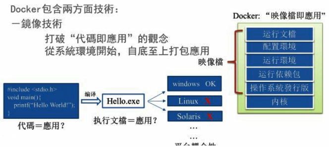

### Docker 的理念

- Docker 是基于 Go 语言实现的云开源项目。
- Docker 的主要目标是 "**Build, Ship and Run Any App, Anywhere**"，也就是通过对应用组件的封装、分发、部署、运行等生命期的管理，使用户的 APP (可以是一个 WEB 应用或数据库应用等等) 及其运行环境能够做到 "**一次封装，到处运行**"。
- Linux 容器技术的出现就解决了这样一个问题，而 Docker 就是在它的基础上发展过来的。将应用运行在 Docker 容器上面，而 Docker 容器在任何操作系统上都是一致的，这就实现了跨平台、跨服务器。**只需要一次配置好环境，换到别的机子上就可以一键部署好，大大简化了操作。**
- 总之，Docker 是一个解决了运行环境和配置问题的软件容器，是方便做持续集成并有助于整体发布的容器虚拟化技术。

## Docker 的基本组成

### 架构图

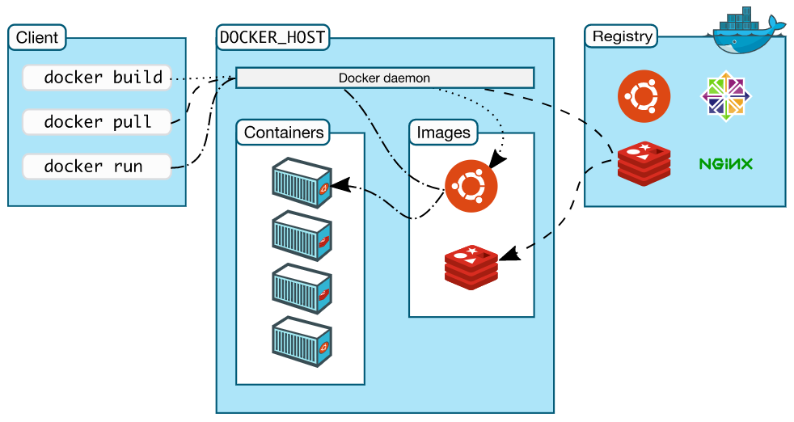

### 镜像（Image）

- Docker 镜像就是一个只读的模板。镜像可以用来创建 Docker 容器，一个镜像可以创建很多容器。

- 镜像与容器的关系类似于面向对象编程中的类与对象：

  | Docker | 面向对象 |
  | ------ | -------- |
  | 镜像   | 类       |
  | 容器   | 对象     |

### 容器（Container）

- Docker 利用容器独立运行一个或一组应用。**容器是用镜像创建的运行实例。**
- 容器可以被启动、开始、停止、删除。每个容器都是相互隔离的、保证安全的平台。
- **容器可以看做是一个简易版的 Linux 环境（包括 root 用户权限、进程空间、用户空间和网络空间等）和运行在其中的应用程序。**
- 容器的定义和镜像几乎一模一样，也是一堆层的统一视角， 唯一区别在于容器的最上面那一层是可读可写的。

### 仓库（Repository）

- 仓库是**集中存放镜像**文件的场所。
- 仓库和仓库注册服务器（Registry）是有区别的。仓库注册服务器上往往存放着多个仓库，每个仓库中又包含了多镜像，每个镜像有不同的标签（tag）。
- 仓库分为公开仓库（Public）和私有仓库（Private）两种形式。
- **最大的公开仓库是 Docker Hub**（https://hub.docker.com/），存放了数量庞大的镜像供用户下载。国内的公开仓库包括**阿里云**、网易云等。

### 总结

- Docker 本身是一个容器运行载体或称之为管理引擎。我们把应用程序和配置依赖打包好形成一个可交付的运行环境，这个打包好的运行环境就是 image 镜像文件。只有通过这个镜像文件才能生成 Docker 容器。image 文件可以看作是容器的模板。Docker 根据 image 文件生成容器的实例。同一个 image 文件，可以生成多个同时运行的容器实例。
- image 文件生成的容器实例，本身也是一个文件，称为镜像文件。
- 一个容器运行一种服务，当我们需要的时候，就可以通过 Docker 客户端创建一个对应的运行实例，也就是我们的容器。
- 至于仓储，就是放了一堆镜像的地方，我们可以把镜像发布到仓储中，需要的时候从仓储中拉下来就可以了。

### 底层原理

#### Docker 是怎样工作的

- Docker 是一个 Client-Server 结构的系统，Docker 守护进程运行在主机上，然后通过 Socket 连接从客户端访问，守护进程从客户端接受命令并管理运行在主机上的容器。**容器，是一个运行时环境，就是我们前面说到的集装箱。**

  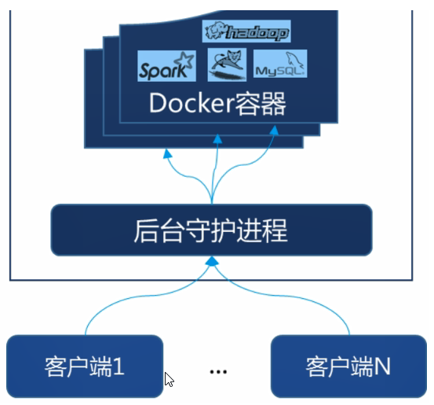

#### Docker 为什么比 VM 快

- Docker 有着比虚拟机更少的抽象层。由于 Docker 不需要 **Hypervisor** 实现硬件资源虚拟化，运行在 Docker 容器上的程序直接使用的都是实际物理机的硬件资源。因此在 CPU、内存利用率上，Docker 将会在效率上有明显优势。

- Docker 利用的是宿主机的内核，而不需要 **Guest OS**。因此，当新建一个容器时，Docker 不需要和虚拟机一样重新加载一个操作系统内核，因此可以避免引寻、加载操作系统内核这个比较费时费资源的过程，当新建一个虚拟机时，虚拟机软件需要加载 Guest OS，这个新建过程是分钟级别的。而 Docker 由于直接利用宿主机的操作系统，则省略了返个过程，因此新建一个 Docker 容器只需要几秒钟。

  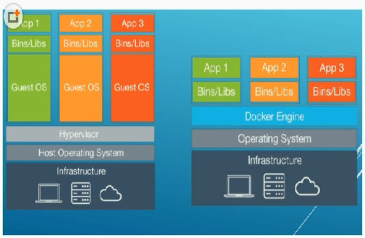

  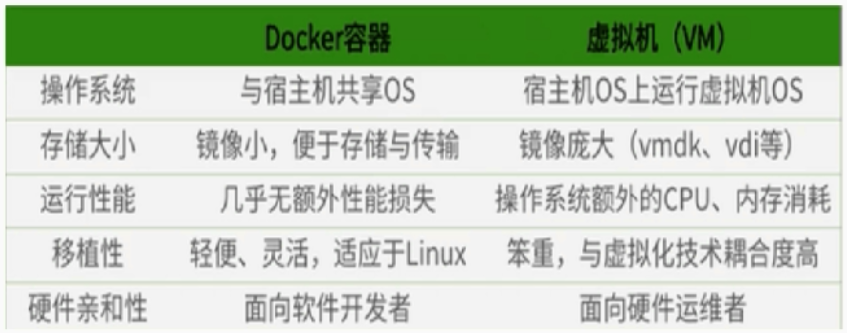

## Docker 安装

- Docker 官网：https://hub.docker.com/
- 不同版本 Linux 安装 Docker 汇总：https://hub.docker.com/search?q=&type=edition&offering=community&operating_system=linux

### WSL 安装 Docker

- WSL 默认不支持 Docker，需要破解：

  - 破解步骤：

    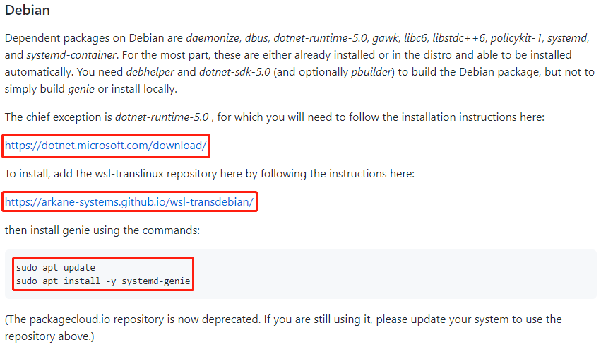

    > 参考：https://github.com/arkane-systems/genie

  - 以管理员身份打开 Windows PowerShell，输入命令 `wsl` 进入 WSL 控制台，并切换到 root 用户：

    ```powershell
    Windows PowerShell
    版权所有 (C) Microsoft Corporation。保留所有权利。
    
    尝试新的跨平台 PowerShell https://aka.ms/pscore6
    
    加载个人及系统配置文件用了 972 毫秒。
    (base) PS C:\Users\XiSun> wsl
    (base) xisun@DESKTOP-OM8IACS:/mnt/c/Users/XiSun$ su root
    Password:
    root@DESKTOP-OM8IACS:/mnt/c/Users/XiSun#
    ```

    - 如果忘记 root 用户密码，可以如下方式重置：

      ```powershell
      1.以管理员身份打开Windows PowerShell;
      2.输入命令: wsl.exe --user root;
      3.输入命令: passwd root, 修改root用户密码。
      ```

  - 安装 .NET：

    - 查看 Ubuntu 版本：

      - 方式一：

        ```powershell
        root@DESKTOP-OM8IACS:/mnt/c/Users/XiSun# cat /proc/version
        Linux version 5.10.60.1-microsoft-standard-WSL2 (oe-user@oe-host) (x86_64-msft-linux-gcc (GCC) 9.3.0, GNU ld (GNU Binutils) 2.34.0.20200220) #1 SMP Wed Aug 25 23:20:18 UTC 2021
        ```

      - 方式二：

        ```powershell
        root@DESKTOP-OM8IACS:/mnt/c/Users/XiSun# lsb_release -a
        No LSB modules are available.
        Distributor ID: Ubuntu
        Description:    Ubuntu 20.04.2 LTS
        Release:        20.04
        Codename:       focal
        ```

        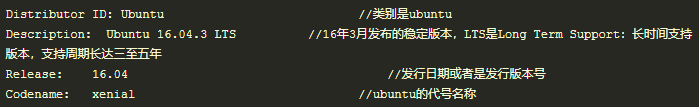

      - 查看内核版本号：

        ```powershell
        root@DESKTOP-OM8IACS:/mnt/c/Users/XiSun# uname -r
        5.10.60.1-microsoft-standard-WSL2
        ```

    - 安装对应版本的 .NET：

      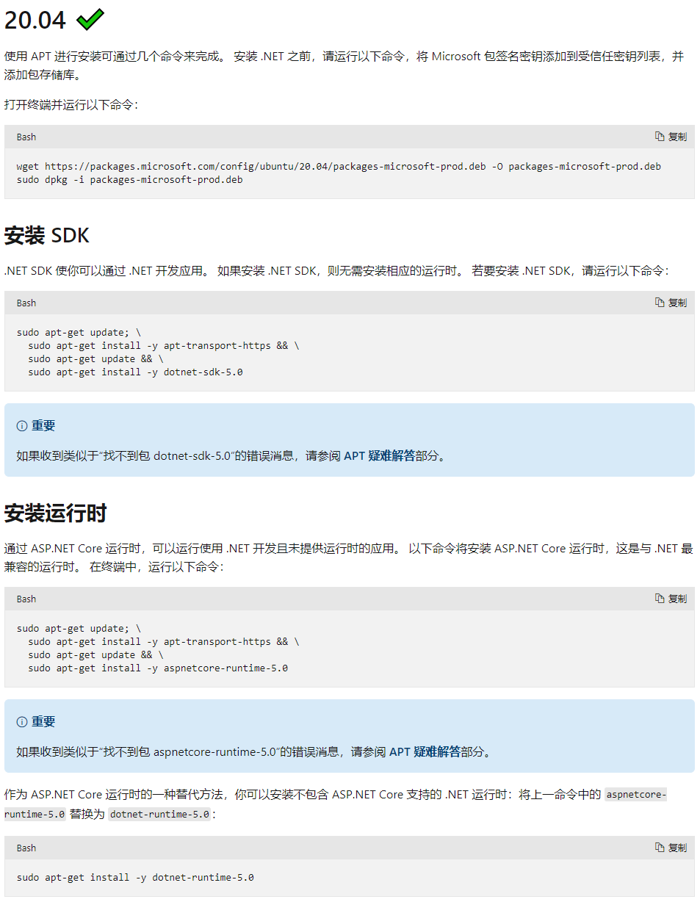

      > 参考：https://docs.microsoft.com/zh-cn/dotnet/core/install/linux-ubuntu

      - 将 Microsoft 包签名密钥添加到受信任密钥列表，并添加包存储库。

        ```powershell
        root@WIN-K11OM3VD9KL:/mnt/c/Windows/system32# wget https://packages.microsoft.com/config/ubuntu/20.04/packages-microsoft-prod.deb -O packages-microsoft-prod.deb
        sudo dpkg -i packages-microsoft-prod.deb
        ```

        ```powershell
        root@DESKTOP-OM8IACS:/mnt/c/Users/XiSun# wget https://packages.microsoft.com/config/ubuntu/20.04/packages-microsoft-prod.deb -O packages-microsoft-prod.deb
        o dpkg -i packages-microsoft-prod.deb--2021-06-08 21:15:31--  https://packages.microsoft.com/config/ubuntu/20.04/packages-microsoft-prod.deb
        Resolving packages.microsoft.com (packages.microsoft.com)... 65.52.183.205
        Connecting to packages.microsoft.com (packages.microsoft.com)|65.52.183.205|:443... connected.
        HTTP request sent, awaiting response... 200 OK
        Length: 3124 (3.1K) [application/octet-stream]
        Saving to: ‘packages-microsoft-prod.deb’
        
        packages-microsoft-prod.deb   100%[=================================================>]   3.05K  --.-KB/s    in 0s
        
        2021-06-08 21:15:32 (523 MB/s) - ‘packages-microsoft-prod.deb’ saved [3124/3124]
        
        root@DESKTOP-OM8IACS:/mnt/c/Users/XiSun# sudo dpkg -i packages-microsoft-prod.deb
        Selecting previously unselected package packages-microsoft-prod.
        (Reading database ... 47281 files and directories currently installed.)
        Preparing to unpack packages-microsoft-prod.deb ...
        Unpacking packages-microsoft-prod (1.0-ubuntu20.04.1) ...
        Setting up packages-microsoft-prod (1.0-ubuntu20.04.1) ...
        ```

      - 安装 SDK：

        ```powershell
        sudo apt-get update;
        sudo apt-get install -y apt-transport-https && sudo apt-get update && sudo apt-get install -y dotnet-sdk-5.0
        ```
        
        ```powershell
        root@DESKTOP-OM8IACS:/mnt/c/Users/XiSun# sudo apt-get update; \
        >   sudo apt-get install -y apt-transport-https && \
        >   sudo apt-get update && \
        >   sudo apt-get install -y dotnet-sdk-5.0
        Get:1 https://packages.microsoft.com/ubuntu/20.04/prod focal InRelease [10.5 kB]
        Get:2 https://packages.microsoft.com/ubuntu/20.04/prod focal/main amd64 Packages [74.9 kB]
        Hit:3 http://archive.ubuntu.com/ubuntu focal InRelease
        Get:4 http://security.ubuntu.com/ubuntu focal-security InRelease [114 kB]
        Get:5 http://archive.ubuntu.com/ubuntu focal-updates InRelease [114 kB]
        Get:6 http://security.ubuntu.com/ubuntu focal-security/main amd64 Packages [702 kB]
        Get:7 http://archive.ubuntu.com/ubuntu focal-backports InRelease [101 kB]
        Get:8 http://security.ubuntu.com/ubuntu focal-security/main Translation-en [141 kB]
        Get:9 http://archive.ubuntu.com/ubuntu focal-updates/main amd64 Packages [1026 kB]
        Get:10 http://security.ubuntu.com/ubuntu focal-security/main amd64 c-n-f Metadata [7780 B]
        Get:11 http://security.ubuntu.com/ubuntu focal-security/restricted amd64 Packages [247 kB]
        Get:12 http://security.ubuntu.com/ubuntu focal-security/restricted Translation-en [36.1 kB]
        Get:13 http://security.ubuntu.com/ubuntu focal-security/restricted amd64 c-n-f Metadata [456 B]
        Get:14 http://security.ubuntu.com/ubuntu focal-security/universe amd64 Packages [588 kB]
        Get:15 http://security.ubuntu.com/ubuntu focal-security/universe Translation-en [94.6 kB]
        Get:16 http://security.ubuntu.com/ubuntu focal-security/universe amd64 c-n-f Metadata [11.5 kB]
        Get:17 http://security.ubuntu.com/ubuntu focal-security/multiverse amd64 Packages [19.9 kB]
        Get:18 http://security.ubuntu.com/ubuntu focal-security/multiverse Translation-en [4316 B]
        Get:19 http://security.ubuntu.com/ubuntu focal-security/multiverse amd64 c-n-f Metadata [528 B]
        Get:20 http://archive.ubuntu.com/ubuntu focal-updates/main Translation-en [229 kB]
        Get:21 http://archive.ubuntu.com/ubuntu focal-updates/main amd64 c-n-f Metadata [13.5 kB]
        Get:22 http://archive.ubuntu.com/ubuntu focal-updates/restricted amd64 Packages [266 kB]
        Get:23 http://archive.ubuntu.com/ubuntu focal-updates/restricted Translation-en [38.9 kB]
        Get:24 http://archive.ubuntu.com/ubuntu focal-updates/restricted amd64 c-n-f Metadata [456 B]
        Get:25 http://archive.ubuntu.com/ubuntu focal-updates/universe amd64 Packages [781 kB]
        Get:26 http://archive.ubuntu.com/ubuntu focal-updates/universe Translation-en [170 kB]
        Get:27 http://archive.ubuntu.com/ubuntu focal-updates/universe amd64 c-n-f Metadata [17.6 kB]
        Get:28 http://archive.ubuntu.com/ubuntu focal-updates/multiverse amd64 Packages [23.6 kB]
        Get:29 http://archive.ubuntu.com/ubuntu focal-updates/multiverse Translation-en [6376 B]
        Get:30 http://archive.ubuntu.com/ubuntu focal-updates/multiverse amd64 c-n-f Metadata [648 B]
        Fetched 4840 kB in 4s (1125 kB/s)
        Reading package lists... Done
        Reading package lists... Done
        Building dependency tree
        Reading state information... Done
        The following NEW packages will be installed:
          apt-transport-https
        0 upgraded, 1 newly installed, 0 to remove and 101 not upgraded.
        Need to get 1704 B of archives.
        After this operation, 161 kB of additional disk space will be used.
        Get:1 http://archive.ubuntu.com/ubuntu focal-updates/universe amd64 apt-transport-https all 2.0.5 [1704 B]
        Fetched 1704 B in 0s (3469 B/s)
        Selecting previously unselected package apt-transport-https.
        (Reading database ... 47289 files and directories currently installed.)
        Preparing to unpack .../apt-transport-https_2.0.5_all.deb ...
        Unpacking apt-transport-https (2.0.5) ...
        Setting up apt-transport-https (2.0.5) ...
        Hit:1 https://packages.microsoft.com/ubuntu/20.04/prod focal InRelease
        Hit:2 http://security.ubuntu.com/ubuntu focal-security InRelease
        Hit:3 http://archive.ubuntu.com/ubuntu focal InRelease
        Hit:4 http://archive.ubuntu.com/ubuntu focal-updates InRelease
        Hit:5 http://archive.ubuntu.com/ubuntu focal-backports InRelease
        Reading package lists... Done
        Reading package lists... Done
        Building dependency tree
        Reading state information... Done
        The following additional packages will be installed:
          aspnetcore-runtime-5.0 aspnetcore-targeting-pack-5.0 dotnet-apphost-pack-5.0 dotnet-host dotnet-hostfxr-5.0
          dotnet-runtime-5.0 dotnet-runtime-deps-5.0 dotnet-targeting-pack-5.0 netstandard-targeting-pack-2.1
        The following NEW packages will be installed:
          aspnetcore-runtime-5.0 aspnetcore-targeting-pack-5.0 dotnet-apphost-pack-5.0 dotnet-host dotnet-hostfxr-5.0
          dotnet-runtime-5.0 dotnet-runtime-deps-5.0 dotnet-sdk-5.0 dotnet-targeting-pack-5.0 netstandard-targeting-pack-2.1
        0 upgraded, 10 newly installed, 0 to remove and 101 not upgraded.
        Need to get 95.1 MB of archives.
        After this operation, 396 MB of additional disk space will be used.
        Get:1 https://packages.microsoft.com/ubuntu/20.04/prod focal/main amd64 dotnet-runtime-deps-5.0 amd64 5.0.6-1 [2642 B]
        Get:2 https://packages.microsoft.com/ubuntu/20.04/prod focal/main amd64 dotnet-host amd64 5.0.6-1 [52.5 kB]
        Get:3 https://packages.microsoft.com/ubuntu/20.04/prod focal/main amd64 dotnet-hostfxr-5.0 amd64 5.0.6-1 [140 kB]
        Get:4 https://packages.microsoft.com/ubuntu/20.04/prod focal/main amd64 dotnet-runtime-5.0 amd64 5.0.6-1 [22.1 MB]
        Get:5 https://packages.microsoft.com/ubuntu/20.04/prod focal/main amd64 aspnetcore-runtime-5.0 amd64 5.0.6-1 [6086 kB]
        Get:6 https://packages.microsoft.com/ubuntu/20.04/prod focal/main amd64 dotnet-targeting-pack-5.0 amd64 5.0.0-1 [2086 kB]
        Get:7 https://packages.microsoft.com/ubuntu/20.04/prod focal/main amd64 aspnetcore-targeting-pack-5.0 amd64 5.0.0-1 [1316 kB]
        Get:8 https://packages.microsoft.com/ubuntu/20.04/prod focal/main amd64 dotnet-apphost-pack-5.0 amd64 5.0.6-1 [3412 kB]
        Get:9 https://packages.microsoft.com/ubuntu/20.04/prod focal/main amd64 netstandard-targeting-pack-2.1 amd64 2.1.0-1 [1476 kB]
        Get:10 https://packages.microsoft.com/ubuntu/20.04/prod focal/main amd64 dotnet-sdk-5.0 amd64 5.0.300-1 [58.4 MB]
        Fetched 95.1 MB in 1min 11s (1332 kB/s)
        Selecting previously unselected package dotnet-runtime-deps-5.0.
        (Reading database ... 47293 files and directories currently installed.)
        Preparing to unpack .../0-dotnet-runtime-deps-5.0_5.0.6-1_amd64.deb ...
        Unpacking dotnet-runtime-deps-5.0 (5.0.6-1) ...
        Selecting previously unselected package dotnet-host.
        Preparing to unpack .../1-dotnet-host_5.0.6-1_amd64.deb ...
        Unpacking dotnet-host (5.0.6-1) ...
        Selecting previously unselected package dotnet-hostfxr-5.0.
        Preparing to unpack .../2-dotnet-hostfxr-5.0_5.0.6-1_amd64.deb ...
        Unpacking dotnet-hostfxr-5.0 (5.0.6-1) ...
        Selecting previously unselected package dotnet-runtime-5.0.
        Preparing to unpack .../3-dotnet-runtime-5.0_5.0.6-1_amd64.deb ...
        Unpacking dotnet-runtime-5.0 (5.0.6-1) ...
        Selecting previously unselected package aspnetcore-runtime-5.0.
        Preparing to unpack .../4-aspnetcore-runtime-5.0_5.0.6-1_amd64.deb ...
        Unpacking aspnetcore-runtime-5.0 (5.0.6-1) ...
        Selecting previously unselected package dotnet-targeting-pack-5.0.
        Preparing to unpack .../5-dotnet-targeting-pack-5.0_5.0.0-1_amd64.deb ...
        Unpacking dotnet-targeting-pack-5.0 (5.0.0-1) ...
        Selecting previously unselected package aspnetcore-targeting-pack-5.0.
        Preparing to unpack .../6-aspnetcore-targeting-pack-5.0_5.0.0-1_amd64.deb ...
        Unpacking aspnetcore-targeting-pack-5.0 (5.0.0-1) ...
        Selecting previously unselected package dotnet-apphost-pack-5.0.
        Preparing to unpack .../7-dotnet-apphost-pack-5.0_5.0.6-1_amd64.deb ...
        Unpacking dotnet-apphost-pack-5.0 (5.0.6-1) ...
        Selecting previously unselected package netstandard-targeting-pack-2.1.
        Preparing to unpack .../8-netstandard-targeting-pack-2.1_2.1.0-1_amd64.deb ...
        Unpacking netstandard-targeting-pack-2.1 (2.1.0-1) ...
        Selecting previously unselected package dotnet-sdk-5.0.
        Preparing to unpack .../9-dotnet-sdk-5.0_5.0.300-1_amd64.deb ...
        Unpacking dotnet-sdk-5.0 (5.0.300-1) ...
        Setting up dotnet-host (5.0.6-1) ...
        Setting up dotnet-runtime-deps-5.0 (5.0.6-1) ...
        Setting up netstandard-targeting-pack-2.1 (2.1.0-1) ...
        Setting up dotnet-hostfxr-5.0 (5.0.6-1) ...
        Setting up dotnet-apphost-pack-5.0 (5.0.6-1) ...
        Setting up dotnet-targeting-pack-5.0 (5.0.0-1) ...
        Setting up aspnetcore-targeting-pack-5.0 (5.0.0-1) ...
        Setting up dotnet-runtime-5.0 (5.0.6-1) ...
        Setting up aspnetcore-runtime-5.0 (5.0.6-1) ...
        Setting up dotnet-sdk-5.0 (5.0.300-1) ...
        This software may collect information about you and your use of the software, and send that to Microsoft.
        Please visit http://aka.ms/dotnet-cli-eula for more information.
        Welcome to .NET!
        ---------------------
        Learn more about .NET: https://aka.ms/dotnet-docs
        Use 'dotnet --help' to see available commands or visit: https://aka.ms/dotnet-cli-docs
        
        Telemetry
        ---------
        The .NET tools collect usage data in order to help us improve your experience. It is collected by Microsoft and shared with the community. You can opt-out of telemetry by setting the DOTNET_CLI_TELEMETRY_OPTOUT environment variable to '1' or 'true' using your favorite shell.
        
        Read more about .NET CLI Tools telemetry: https://aka.ms/dotnet-cli-telemetry
        
        Configuring...
        --------------
        A command is running to populate your local package cache to improve restore speed and enable offline access. This command takes up to one minute to complete and only runs once.
        Processing triggers for man-db (2.9.1-1) ...
        ```
        
      - 安装运行时：

        ```powershell
        sudo apt-get update; \
          sudo apt-get install -y apt-transport-https && \
          sudo apt-get update && \
          sudo apt-get install -y aspnetcore-runtime-5.0
        ```
      
        >dotnet-sdk-5.0 安装成功后，会一起安装 aspnetcore-runtime-5.0。

      - 检查 .NET 版本：

        ```powershell
        root@DESKTOP-OM8IACS:/mnt/c/Users/XiSun# dotnet
        
        Usage: dotnet [options]
        Usage: dotnet [path-to-application]
        
        Options:
          -h|--help         Display help.
          --info            Display .NET information.
          --list-sdks       Display the installed SDKs.
          --list-runtimes   Display the installed runtimes.
        
        path-to-application:
          The path to an application .dll file to execute.
        root@DESKTOP-OM8IACS:/mnt/c/Users/XiSun# dotnet --list-sdks
        5.0.300 [/usr/share/dotnet/sdk]
        root@DESKTOP-OM8IACS:/mnt/c/Users/XiSun# dotnet --list-runtimes
        Microsoft.AspNetCore.App 5.0.6 [/home/xisun/.dotnet/shared/Microsoft.AspNetCore.App]
        Microsoft.NETCore.App 5.0.6 [/home/xisun/.dotnet/shared/Microsoft.NETCore.App]
        ```
    
  - 安装 wsl-translinux：

    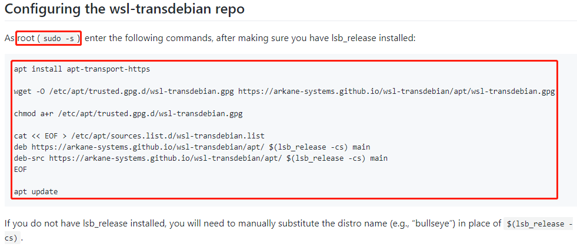

    > 参考：https://arkane-systems.github.io/wsl-transdebian/

    ```powershell
    apt install apt-transport-https
    
    wget -O /etc/apt/trusted.gpg.d/wsl-transdebian.gpg https://arkane-systems.github.io/wsl-transdebian/apt/wsl-transdebian.gpg
    
    chmod a+r /etc/apt/trusted.gpg.d/wsl-transdebian.gpg
    
    cat << EOF > /etc/apt/sources.list.d/wsl-transdebian.list
    > deb https://arkane-systems.github.io/wsl-transdebian/apt/ $(lsb_release -cs) main
    > deb-src https://arkane-systems.github.io/wsl-transdebian/apt/ $(lsb_release -cs) main
    > EOF
    
    apt update
    ```
  
    ```powershell
    root@DESKTOP-OM8IACS:/mnt/c/Users/XiSun# apt install apt-transport-https
    
    wget -O /etc/apt/trusted.gpg.d/wsl-transdebian.gpg https://arkane-systems.github.io/wsl-transdebian/apt/wsl-transdebian.gpg
    
    chmod a+r /etc/apt/trusted.gpg.d/wsl-transdebian.gpg
    
    cat << EOF > /etc/apt/sources.list.d/wsl-transdebian.list
    deb https://arkane-systems.github.io/wsl-transdebian/apt/ $(lsb_release -cs) main
    deb-src https://arkane-systems.github.io/wsl-transdebian/apt/ $(lsb_release -cs) main
    EOF
    
    Reading package lists... Done
    Building dependency tree
    Reading state information... Done
    apt-transport-https is already the newest version (2.0.5).
    0 upgraded, 0 newly installed, 0 to remove and 101 not upgraded.
    root@DESKTOP-OM8IACS:/mnt/c/Users/XiSun# wget -O /etc/apt/trusted.gpg.d/wsl-transdebian.gpg https://arkane-systems.github.io/wsl-transdebian/apt/wsl-transdebian.gpg
    --2021-06-08 21:23:47--  https://arkane-systems.github.io/wsl-transdebian/apt/wsl-transdebian.gpg
    Resolving arkane-systems.github.io (arkane-systems.github.io)... 185.199.109.153, 185.199.108.153, 185.199.110.153, ...
    Connecting to arkane-systems.github.io (arkane-systems.github.io)|185.199.109.153|:443... connected.
    HTTP request sent, awaiting response... 200 OK
    Length: 2280 (2.2K) [application/octet-stream]
    Saving to: ‘/etc/apt/trusted.gpg.d/wsl-transdebian.gpg’
    
    /etc/apt/trusted.gpg.d/wsl-tr 100%[=================================================>]   2.23K  --.-KB/s    in 0s
    
    2021-06-08 21:23:49 (36.1 MB/s) - ‘/etc/apt/trusted.gpg.d/wsl-transdebian.gpg’ saved [2280/2280]
    
    root@DESKTOP-OM8IACS:/mnt/c/Users/XiSun# chmod a+r /etc/apt/trusted.gpg.d/wsl-transdebian.gpg
    root@DESKTOP-OM8IACS:/mnt/c/Users/XiSun# cat << EOF > /etc/apt/sources.list.d/wsl-transdebian.list
    > deb https://arkane-systems.github.io/wsl-transdebian/apt/ $(lsb_release -cs) main
    > deb-src https://arkane-systems.github.io/wsl-transdebian/apt/ $(lsb_release -cs) main
    > EOF
    root@DESKTOP-OM8IACS:/mnt/c/Users/XiSun# apt update
    Hit:1 https://packages.microsoft.com/ubuntu/20.04/prod focal InRelease
    Hit:2 http://archive.ubuntu.com/ubuntu focal InRelease
    Hit:3 http://security.ubuntu.com/ubuntu focal-security InRelease
    Hit:4 http://archive.ubuntu.com/ubuntu focal-updates InRelease
    Get:5 https://arkane-systems.github.io/wsl-transdebian/apt focal InRelease [2495 B]
    Hit:6 http://archive.ubuntu.com/ubuntu focal-backports InRelease
    Get:7 https://arkane-systems.github.io/wsl-transdebian/apt focal/main Sources [1338 B]
    Get:8 https://arkane-systems.github.io/wsl-transdebian/apt focal/main amd64 Packages [1897 B]
    Fetched 5730 B in 2s (3130 B/s)
    Reading package lists... Done
    Building dependency tree
    Reading state information... Done
    101 packages can be upgraded. Run 'apt list --upgradable' to see them.
    ```
  
  - 安装 genie：

    ```powershell
    sudo apt update
    sudo apt install -y systemd-genie
    ```
  
    ```powershell
    root@DESKTOP-OM8IACS:/mnt/c/Users/XiSun# sudo apt update
    Hit:1 https://packages.microsoft.com/ubuntu/20.04/prod focal InRelease
    Hit:2 http://security.ubuntu.com/ubuntu focal-security InRelease
    Hit:3 http://archive.ubuntu.com/ubuntu focal InRelease
    Hit:4 http://archive.ubuntu.com/ubuntu focal-updates InRelease
    Hit:5 https://arkane-systems.github.io/wsl-transdebian/apt focal InRelease
    Hit:6 http://archive.ubuntu.com/ubuntu focal-backports InRelease
    Reading package lists... Done
    Building dependency tree
    Reading state information... Done
    101 packages can be upgraded. Run 'apt list --upgradable' to see them.
    root@DESKTOP-OM8IACS:/mnt/c/Users/XiSun# sudo apt install -y systemd-genie
    Reading package lists... Done
    Building dependency tree
    Reading state information... Done
    The following additional packages will be installed:
      daemonize libnss-mymachines libnss-systemd libpam-systemd libsystemd0 systemd systemd-container systemd-sysv
      systemd-timesyncd
    The following NEW packages will be installed:
      daemonize libnss-mymachines systemd-container systemd-genie
    The following packages will be upgraded:
      libnss-systemd libpam-systemd libsystemd0 systemd systemd-sysv systemd-timesyncd
    6 upgraded, 4 newly installed, 0 to remove and 95 not upgraded.
    Need to get 5359 kB of archives.
    After this operation, 3892 kB of additional disk space will be used.
    Get:1 http://archive.ubuntu.com/ubuntu focal-updates/main amd64 libnss-systemd amd64 245.4-4ubuntu3.6 [95.8 kB]
    Get:2 https://arkane-systems.github.io/wsl-transdebian/apt focal/main amd64 systemd-genie amd64 1.42 [504 kB]
    Get:3 http://archive.ubuntu.com/ubuntu focal-updates/main amd64 systemd-timesyncd amd64 245.4-4ubuntu3.6 [28.1 kB]
    Get:4 http://archive.ubuntu.com/ubuntu focal-updates/main amd64 systemd-sysv amd64 245.4-4ubuntu3.6 [10.3 kB]
    Get:5 http://archive.ubuntu.com/ubuntu focal-updates/main amd64 libpam-systemd amd64 245.4-4ubuntu3.6 [186 kB]
    Get:6 http://archive.ubuntu.com/ubuntu focal-updates/main amd64 systemd amd64 245.4-4ubuntu3.6 [3805 kB]
    Get:7 http://archive.ubuntu.com/ubuntu focal-updates/main amd64 libsystemd0 amd64 245.4-4ubuntu3.6 [269 kB]
    Get:8 http://archive.ubuntu.com/ubuntu focal/universe amd64 daemonize amd64 1.7.8-1 [11.9 kB]
    Get:9 http://archive.ubuntu.com/ubuntu focal-updates/main amd64 systemd-container amd64 245.4-4ubuntu3.6 [317 kB]
    Get:10 http://archive.ubuntu.com/ubuntu focal-updates/main amd64 libnss-mymachines amd64 245.4-4ubuntu3.6 [131 kB]
    Fetched 5359 kB in 5s (1137 kB/s)
    (Reading database ... 50558 files and directories currently installed.)
    Preparing to unpack .../0-libnss-systemd_245.4-4ubuntu3.6_amd64.deb ...
    Unpacking libnss-systemd:amd64 (245.4-4ubuntu3.6) over (245.4-4ubuntu3.4) ...
    Preparing to unpack .../1-systemd-timesyncd_245.4-4ubuntu3.6_amd64.deb ...
    Unpacking systemd-timesyncd (245.4-4ubuntu3.6) over (245.4-4ubuntu3.4) ...
    Preparing to unpack .../2-systemd-sysv_245.4-4ubuntu3.6_amd64.deb ...
    Unpacking systemd-sysv (245.4-4ubuntu3.6) over (245.4-4ubuntu3.4) ...
    Preparing to unpack .../3-libpam-systemd_245.4-4ubuntu3.6_amd64.deb ...
    Unpacking libpam-systemd:amd64 (245.4-4ubuntu3.6) over (245.4-4ubuntu3.4) ...
    Preparing to unpack .../4-systemd_245.4-4ubuntu3.6_amd64.deb ...
    Unpacking systemd (245.4-4ubuntu3.6) over (245.4-4ubuntu3.4) ...
    Preparing to unpack .../5-libsystemd0_245.4-4ubuntu3.6_amd64.deb ...
    Unpacking libsystemd0:amd64 (245.4-4ubuntu3.6) over (245.4-4ubuntu3.4) ...
    Setting up libsystemd0:amd64 (245.4-4ubuntu3.6) ...
    Selecting previously unselected package daemonize.
    (Reading database ... 50558 files and directories currently installed.)
    Preparing to unpack .../daemonize_1.7.8-1_amd64.deb ...
    Unpacking daemonize (1.7.8-1) ...
    Selecting previously unselected package systemd-container.
    Preparing to unpack .../systemd-container_245.4-4ubuntu3.6_amd64.deb ...
    Unpacking systemd-container (245.4-4ubuntu3.6) ...
    Selecting previously unselected package systemd-genie.
    Preparing to unpack .../systemd-genie_1.42_amd64.deb ...
    Unpacking systemd-genie (1.42) ...
    Selecting previously unselected package libnss-mymachines:amd64.
    Preparing to unpack .../libnss-mymachines_245.4-4ubuntu3.6_amd64.deb ...
    Unpacking libnss-mymachines:amd64 (245.4-4ubuntu3.6) ...
    Setting up daemonize (1.7.8-1) ...
    Setting up systemd (245.4-4ubuntu3.6) ...
    Initializing machine ID from random generator.
    Setting up systemd-timesyncd (245.4-4ubuntu3.6) ...
    Setting up systemd-container (245.4-4ubuntu3.6) ...
    Created symlink /etc/systemd/system/multi-user.target.wants/machines.target → /lib/systemd/system/machines.target.
    Setting up systemd-sysv (245.4-4ubuntu3.6) ...
    Setting up systemd-genie (1.42) ...
    Created symlink /etc/systemd/system/sockets.target.wants/wslg-xwayland.socket → /lib/systemd/system/wslg-xwayland.socket.
    Setting up libnss-systemd:amd64 (245.4-4ubuntu3.6) ...
    Setting up libnss-mymachines:amd64 (245.4-4ubuntu3.6) ...
    First installation detected...
    Checking NSS setup...
    Setting up libpam-systemd:amd64 (245.4-4ubuntu3.6) ...
    Processing triggers for libc-bin (2.31-0ubuntu9.2) ...
    Processing triggers for man-db (2.9.1-1) ...
    Processing triggers for dbus (1.12.16-2ubuntu2.1) ...
    ```
  
- 破解完成之后，即可在 WSL 中安装 Docker (利用脚本安装)：

  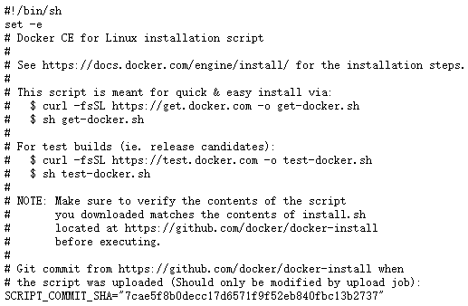

  ```powershell
  curl -fsSL https://get.docker.com -o get-docker.sh
  sh get-docker.sh
  ```

  ```powershell
  root@DESKTOP-OM8IACS:/mnt/c/Users/XiSun# curl -fsSL https://get.docker.com -o get-docker.sh
  root@DESKTOP-OM8IACS:/mnt/c/Users/XiSun# sh get-docker.sh
  # Executing docker install script, commit: 7cae5f8b0decc17d6571f9f52eb840fbc13b2737
  
  WSL DETECTED: We recommend using Docker Desktop for Windows.
  Please get Docker Desktop from https://www.docker.com/products/docker-desktop
  
  
  You may press Ctrl+C now to abort this script.
  + sleep 20
  + sh -c apt-get update -qq >/dev/null
  + sh -c DEBIAN_FRONTEND=noninteractive apt-get install -y -qq apt-transport-https ca-certificates curl >/dev/null
  + sh -c curl -fsSL "https://download.docker.com/linux/ubuntu/gpg" | apt-key add -qq - >/dev/null
  Warning: apt-key output should not be parsed (stdout is not a terminal)
  + sh -c echo "deb [arch=amd64] https://download.docker.com/linux/ubuntu focal stable" > /etc/apt/sources.list.d/docker.l
  ist
  + sh -c apt-get update -qq >/dev/null
  + [ -n  ]
  + sh -c apt-get install -y -qq --no-install-recommends docker-ce >/dev/null
  + [ -n 1 ]
  + sh -c DEBIAN_FRONTEND=noninteractive apt-get install -y -qq docker-ce-rootless-extras >/dev/null
  
  ================================================================================
  
  To run Docker as a non-privileged user, consider setting up the
  Docker daemon in rootless mode for your user:
  
      dockerd-rootless-setuptool.sh install
  
  Visit https://docs.docker.com/go/rootless/ to learn about rootless mode.
  
  
  To run the Docker daemon as a fully privileged service, but granting non-root
  users access, refer to https://docs.docker.com/go/daemon-access/
  
  WARNING: Access to the remote API on a privileged Docker daemon is equivalent
           to root access on the host. Refer to the 'Docker daemon attack surface'
           documentation for details: https://docs.docker.com/go/attack-surface/
  
  ================================================================================
  ```

  >参考：https://github.com/docker/docker-install

- Docker 安装成功后，启动 Docker 服务：

  ```powershell
  root@DESKTOP-OM8IACS:/mnt/c/Users/XiSun# service docker start
   * Starting Docker: docker                                                                               [ OK ]
  ```

  - Docker 服务如果没有启动，执行 Docker 的命令时，会提示：`Cannot connect to the Docker daemon at unix:///var/run/docker.sock. Is the docker daemon running?`。

    ```powershell
    root@DESKTOP-OM8IACS:/mnt/c/Users/XiSun# docker version
    Client: Docker Engine - Community
     Version:           20.10.6
     API version:       1.41
     Go version:        go1.13.15
     Git commit:        370c289
     Built:             Fri Apr  9 22:47:17 2021
     OS/Arch:           linux/amd64
     Context:           default
     Experimental:      true
    Cannot connect to the Docker daemon at unix:///var/run/docker.sock. Is the docker daemon running?
    ```

    - Docker 服务未启动，执行 `docker version` 命令。

  - Docker 服务启动后，如果不手动关闭，会一直运行，即使关闭 Windows PowerShell 也不会关闭。

  - 如果关闭电脑，需要重启 Docker 服务。

- 查看 Docker version：

  ```powershell
  root@DESKTOP-OM8IACS:/mnt/c/Users/XiSun# docker version
  Client: Docker Engine - Community
   Version:           20.10.6
   API version:       1.41
   Go version:        go1.13.15
   Git commit:        370c289
   Built:             Fri Apr  9 22:47:17 2021
   OS/Arch:           linux/amd64
   Context:           default
   Experimental:      true
  
  Server: Docker Engine - Community
   Engine:
    Version:          20.10.7
    API version:      1.41 (minimum version 1.12)
    Go version:       go1.13.15
    Git commit:       b0f5bc3
    Built:            Wed Jun  2 11:54:50 2021
    OS/Arch:          linux/amd64
    Experimental:     false
   containerd:
    Version:          1.4.6
    GitCommit:        d71fcd7d8303cbf684402823e425e9dd2e99285d
   runc:
    Version:          1.0.0-rc95
    GitCommit:        b9ee9c6314599f1b4a7f497e1f1f856fe433d3b7
   docker-init:
    Version:          0.19.0
    GitCommit:        de40ad0
  ```

  - Docker 服务已启动，执行 `docker version` 命令。

- 设置 Docker 镜像：

  ```powershell
  # 设置镜像
  root@DESKTOP-OM8IACS:/mnt/c/Users/XiSun# vim /etc/docker/daemon.json
  root@DESKTOP-OM8IACS:/mnt/c/Users/XiSun# cat /etc/docker/daemon.json
  {
      "registry-mirrors": ["http://hub-mirror.c.163.com"]
  }
  # 重启Docker服务
  root@DESKTOP-OM8IACS:/mnt/c/Users/XiSun# service docker restart
   * Stopping Docker: docker                                                                                       [ OK ]
   * Starting Docker: docker                                                                                       [ OK ]
  root@DESKTOP-OM8IACS:/mnt/c/Users/XiSun# service docker status
   * Docker is running
  ```
  
  - 此处使用的是网易镜像，阿里云镜像需要登陆阿里云，注册新账号获取专属镜像加速地址。
  
- 测试 Docker，运行 hello-world：

  ```powershell
  root@DESKTOP-OM8IACS:/mnt/c/Users/XiSun# docker run hello-world
  Unable to find image 'hello-world:latest' locally
  latest: Pulling from library/hello-world
  b8dfde127a29: Pull complete
  Digest: sha256:9f6ad537c5132bcce57f7a0a20e317228d382c3cd61edae14650eec68b2b345c
  Status: Downloaded newer image for hello-world:latest
  
  Hello from Docker!
  This message shows that your installation appears to be working correctly.
  
  To generate this message, Docker took the following steps:
   1. The Docker client contacted the Docker daemon.
   2. The Docker daemon pulled the "hello-world" image from the Docker Hub.
      (amd64)
   3. The Docker daemon created a new container from that image which runs the
      executable that produces the output you are currently reading.
   4. The Docker daemon streamed that output to the Docker client, which sent it
      to your terminal.
  
  To try something more ambitious, you can run an Ubuntu container with:
   $ docker run -it ubuntu bash
  
  Share images, automate workflows, and more with a free Docker ID:
   https://hub.docker.com/
  
  For more examples and ideas, visit:
   https://docs.docker.com/get-started/
  
  root@DESKTOP-OM8IACS:/mnt/c/Users/XiSun# docker images
  REPOSITORY    TAG       IMAGE ID       CREATED        SIZE
  hello-world   latest    d1165f221234   3 months ago   13.3kB
  ```

- 关闭 Docker 服务：

  ```powershell
  root@DESKTOP-OM8IACS:/mnt/c/Users/XiSun# service docker stop
   * Stopping Docker: docker                                                                               [ OK ]
  ```

  > 启动和关闭 Docker 服务时，必须使用 root 用户。

### Ubuntu 安装 Docker

- 参考：https://docs.docker.com/engine/install/ubuntu/

- 按照官网指示一步步执行，即可安装 Docker。主要涉及如下命令，各命令的含义参考官网：

  ```shell
  $ sudo apt-get remove docker docker-engine docker.io containerd runc
  
  $ sudo apt-get update
  
  $ sudo apt-get install apt-transport-https \
      ca-certificates \
      curl \
      gnupg \
      lsb-release
      
  $ curl -fsSL https://download.docker.com/linux/ubuntu/gpg | \
  	sudo gpg --dearmor -o /usr/share/keyrings/docker-archive-keyring.gpg
  
  $ echo \
    "deb [arch=amd64 signed-by=/usr/share/keyrings/docker-archive-keyring.gpg] https://download.docker.com/linux/ubuntu \
    $(lsb_release -cs) stable" | sudo tee /etc/apt/sources.list.d/docker.list > /dev/null
  
  $ sudo apt-get update
  
  $ sudo apt-get install docker-ce docker-ce-cli containerd.io
  
  ```
  
> 以上命令默认安装的为 Docker 最新版本，若需要安装特定版本，请参考官网。


## Docker 常用命令

### 帮助命令

```shell
$ docker version

$ docker info

$ docker --help
```

### 镜像命令

- **列出本机上的镜像**

  ```shell
  $ docker images [OPTIONS]
  ```

  - OPTIONS 说明：

    ```dockerfile
    -a 列出本地所有的镜像(含中间映射层)
    -q 只显示镜像ID
    --digests 显示镜像的摘要信息
    --no-trunc 显示完整的镜像信息
    ```

  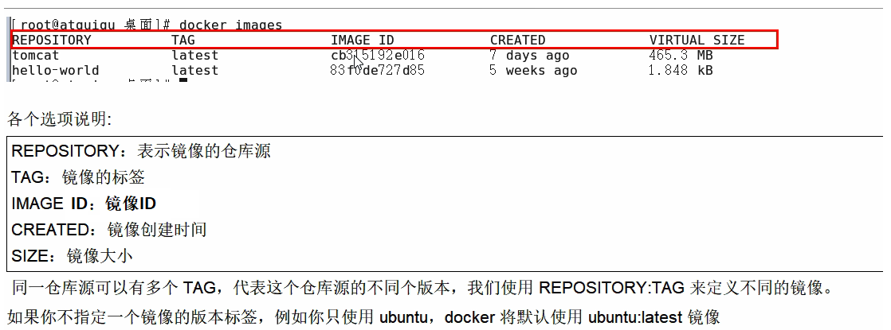

- **查询某个镜像**

  ```shell
  $ docker search [OPTIONS] 镜像名字
  ```

  - OPTIONS 说明：

    ```dockerfile
    --no-trunc 显示完整的镜像描述
    -s 列出收藏数不小于指定值的镜像
    --automated 只列出 automated build类型的镜像
    ```

  > 官方镜像仓库：https://hub.docker.com/

- **下载镜像**

  ```shell
  $ docker pull 镜像名字[:TAG]
  ```

  > 一般设置从阿里云镜像下载。
  >
  > `docker pull tomcat` 等价于 `docker pull tomcat:latest`，即默认下载最新版本。

- **删除镜像**

  - 删除单个镜像：

    ```shell
    $ docker rmi -f 镜像名[:TAG]
    ```

  - 删除多个镜像：

    ```shell
    $ docker rmi -f 镜像名1[:TAG] 镜像名2[:TAG] 镜像名3[:TAG] ...
    ```

  - 删除全部镜像：

    ```shell
    $ docker rmi -f $(docker images -qa)
    ```

### 容器命令

- 有镜像才能创建容器，这是根本前提。先下载一个 CentOS 镜像作为示例：

  ```shell
  $ docker pull centos
  ```

- **新建并启动容器**

  ```shell
  $ docker run [OPTIONS] IMAGENAME [COMMAND][ARG]
  ```

  - OPTIONS 说明：

    ```doc
    --name 为容器指定一个名称，若不指定，由系统随机分配
    -d 后台运行容器，并返回容器ID，即启动守护式容器
    -i 以交互模式运行容器，通常与-t同时使用
    -t 为容器重新分配一个伪输入终端，通常与-i同时使用
    -P 随机端口映射
    -p 指定端口映射，有以下四种格式：
    	ip:hostPort:containerPort
    	ip::containerPort
    	hostPort:containerPort
    	containerPort
    ```

  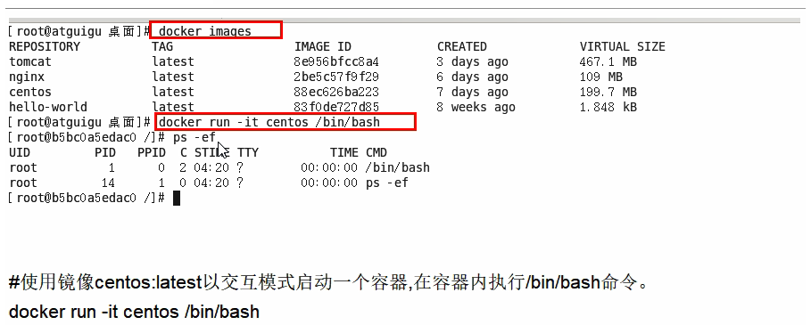

  > **此时启动的是一个交互式的容器。**

- **列出当前所有正在运行的容器**

  ```shell
  $ docker ps [OPTIONS]
  ```

  - OPTIONS 说明：

    ```doc
    -a 列出当前所有正在运行的容器+历史上运行过的
    -| 显示最近创建的容器
    -n 显示最近n个创建的容器
    -q 静默模式，只显示容器编号
    --no-trunc 不截断输出
    ```

- **退出容器**

  - 方式一，停止容器并退出：`exit`。
  - 方式二，不停止容器退出：`ctrl + P + Q`。

- **启动容器**

  ```shell
  $ docker start 容器ID或容器名
  ```

- **重启容器**

  ```shell
  $ docker restart 容器ID或容器名
  ```

- **停止容器**

  ```shell
  $ docker stop 容器ID或容器名
  ```

- **强制停止容器**

  ```shell
  $ docker kill 容器ID或容器名
  ```

- **删除已停止的容器**

  - 普通删除：

    ```shell
    $ docker rm 容器ID或容器名
    ```

  - 强制删除：

    ```shell
    $ docker rm -f 容器ID或容器名
    ```

    > -f 可以删除没有停止的容器。

  - 删除所有：

    ```shell
    $ docker rm -f $(docker ps -aq)
    ```

    ```shell
    $ docker ps -aq | xargs docker rm
    ```

- **启动守护式容器**

  ```shell
  $ docker run -d IMAGENAME
  ```

  - 例如，以后台模式启动一个 CentOS，`docker run -d centos`，然后 `docker ps -a` 进行查看，**会发现容器已经退出。**
  - **Docker 容器若要后台运行，就必须有一个前台进程。**

- **查看容器日志**

  - 启动一个一直运行的守护式容器：

    ```shell
    $ docker run -d centos /bin/sh -c "while true; do echo hello xisun; sleep 2; done"
    ```

  - 查看该容器的日志：

    ```shell
    $ docker logs [OPTIONS] 容器ID或容器名
    ```

    - OPTION 说明：

      ```doc
      -t 添加时间戳
      -f 跟随最新的日志打印
      --tail number 显示最后number条
      ```
  
- **查看容器内运行的进程**

  ```shell
  $ docker top 容器ID或容器名
  ```

- **查看容器内部的细节**

  ```shell
  $ docker inspect 容器ID或容器名
  ```

- **进入正在运行的容器并以命令行交互**

  - 方式一：

    ```shell
    $ docker attach 容器ID或容器名
    ```

    >**直接进入容器启动命令的终端，不会启动新的进程。**然后在该容器的终端内，执行相应的命令。

  - 方式二：

    ```shell
    $ docker exec -t 容器ID或容器名 ls -l /tmp
    ```

    > **在容器中打开新的终端，并且可以启动新的进程。**然后执行后续的命令，并将结果显示在当前窗口。

    ```shell
    $ docker exec -t 容器ID或容器名 /bin/bash
    ```

    >与方式一等效。

    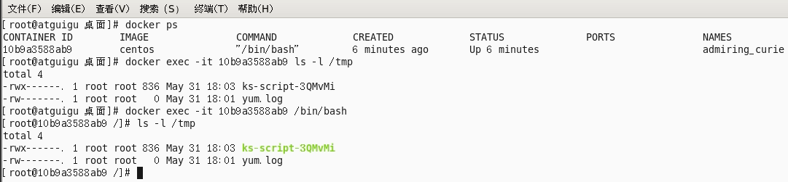

  > 针对执行 `ctrl + P + Q` 命令退出的容器。

- **从容器内拷贝文件到主机上**

  ```shell
  $ docker cp 容器ID或容器名:容器内路径 目的主机路径
  ```

  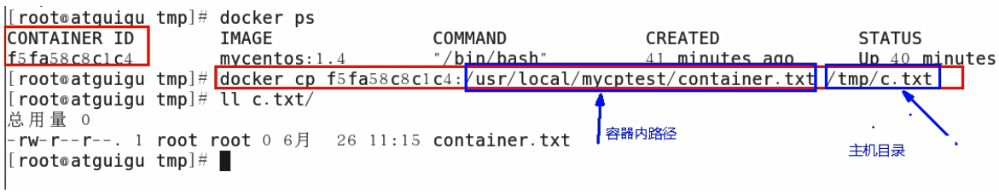

### 总结

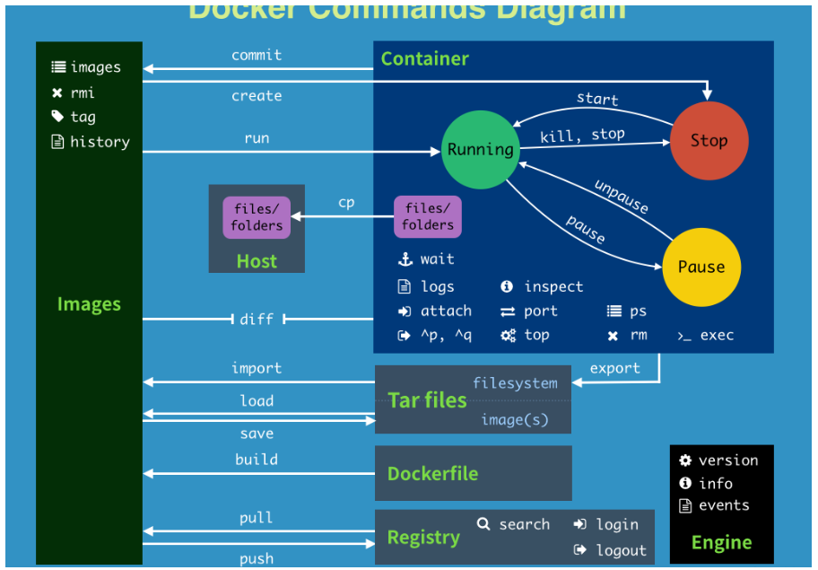


## Docker 镜像

- 镜像是一种轻量级、可执行的独立软件包，用来打包软件运行环境和基于运行环境开发的软件，它包含运行某个软件所需的有内容，包括代码、运行时、库、环境变量和配置文件。

### UnionFS（联合文件系统）

- UnionFS 是一种分层、轻量级并且高性能的文件系统，它支持**对文件系统的修改作为一次提交来一层层的叠加**，同时可以将不同目录挂载到同一个虚拟文件系统下（unite several directories into a single virtual file system）。
- **UnionFS 是 Docker 镜像的基础。**镜像可以通过分层来进行继承，基于基础镜像（没有父镜像），可以制作各种具体的应用镜像。
- 特性：一次同时加载多个文件系统，但从外面看起来，只能看到一个文件系统，联合加载会把各层文件系统叠加起来，这样最终的文件系统会包含所有底层的文件和目录。

### Docker 镜像加载原理

- Docker 的镜像实际上是由一层一层的文件系统组成，这种层级的文件系统即为 UnionFS。主要包含两个部分：

  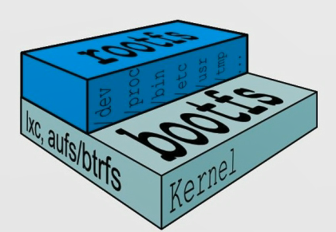

  - **bootfs（boot file system）：**主要包含 bootloader 和 kernel，bootloader 主要是引导加载 kernel，Linux 刚启动时会加载 bootfs 文件系统。bootfs 是 Docker 镜像的最底层，这一层与我们典型的 Linux/Unix 系统是一样的，包含 boot 加载器和内核。当 boot 加载完成之后整个内核就都在内存中了，此时内存的使用权由 bootfs 转交给内核，系统也会卸载 bootfs。
  - **rootfs（root file system）：**在 bootfs 之上。包含的就是典型 Linux 系统中的 `/dev`，`/proc`，`/bin`，`/etc` 等标准目录和文件。rootfs 就是各种不同的操作系统发行版，比如 Ubuntu，CentOS 等等。

- 对于一个精简的 OS，rootfs 可以很小，只需要包括最基本的命令、工具和程序库就可以了，因为底层直接用 Host（宿主机）的 kernel，自己只需要提供 rootfs 就行了。由此可见对于不同的 Linux 发行版，bootfs 基本是一致的，rootfs 会有差别，因此不同的发行版可以公用 bootfs。比如：平时我们安装的虚拟机的 CentOS 都是好几个 G 大小，而 Docker 里才要 200 M 左右。

  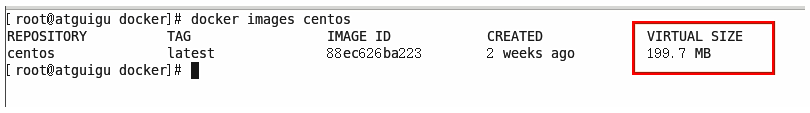

### Docker 镜像是分层的

- 在执行 pull 命令时，可以看出 docker 的镜像时一层一层的在下载：

  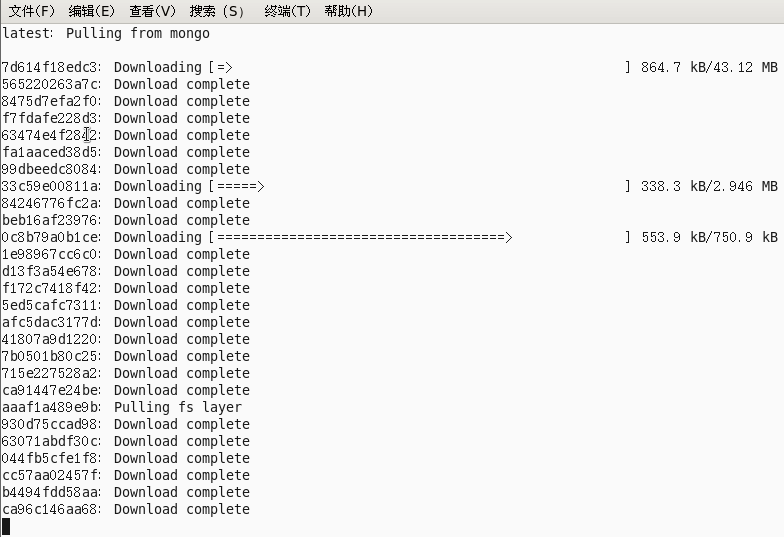

- 以 tomcat 为例，主要分为如下几个层次：

  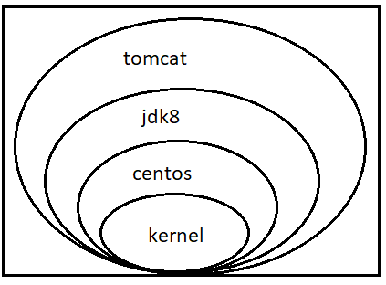

### Docker 镜像采用分层结构的原因

- 最大的一个好处就是：**共享资源。**
- 比如：有多个镜像都从相同的 base 镜像构建而来，那么宿主机只需在磁盘上保存一份 base 镜像，同时内存中也只需加载一份 base 镜像，就可以为所有容器服务了。进一步的，**镜像的每一层都可以被共享。**

### Docker 镜像的特点

- Docker 镜像都是只读的，当容器启动时，一个新的可写层被加载到**镜像的顶部**，这一层通常被称为**容器层**，容器层之下都叫**镜像层**。
  - Docker 镜像的最外层是可写的，之下的都是封装好不可写的。

### Docker 镜像 commit 操作

- docker commit 命令，可以提交容器副本使之成为一个新的镜像。

  ```shell
  $ docker commit -m="提交的描述信息" -a="作者" 容器ID 要创建的目标镜像名:[标签名]
  ```

- 案例演示：

  - 从 Hub 上下载 tomcat 镜像到本地，然后运行。

    ```shell
    $ docker pull tomcat
    ```

    ```shell
    $ docker run -it -p 8888:8080 tomcat
    ```
  
    ```doc
    -p 主机端口:容器端口，主机端口即为暴露的能访问docker的端口，容器端口即为docker内待访问特定容器的端口，如tomcat默认为8080
    -P 随机分配主机的端口
    -d 后台运行容器，并返回容器ID，即启动守护式容器
    -i 以交互模式运行容器，通常与-t同时使用
    -t 为容器重新分配一个伪输入终端，通常与-i同时使用
    ```

    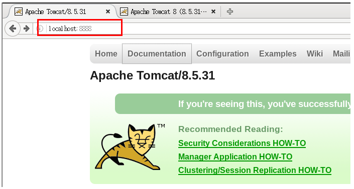

  - 故意删除上一步镜像生成的 tomcat 容器的文档，会发现再次进入 tomcat 主页时，点击 Documentation 会返回 404。

    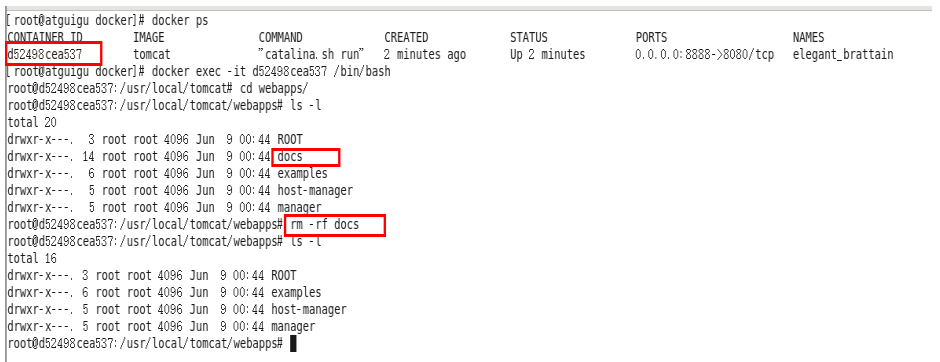

    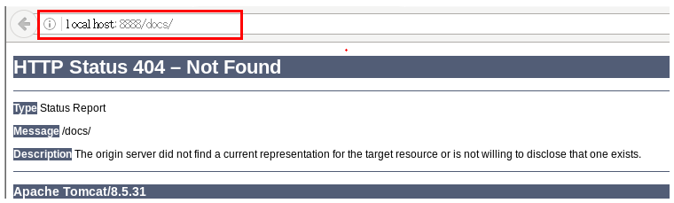

  - 也即当前的 tomcat 运行实例是一个没有文档内容的容器，现在，以此为模板 commit 一个没有 doc 文档的 tomcat 新镜像：atguigu/tomcat02:1.2。

    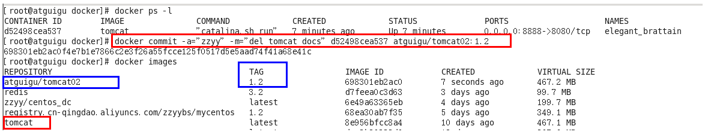

  - 启动新镜像并和原来的对比。
  
    - 启动 atuigu/tomcat02，没有doc

      ```shell
      $ docker run -it -p 7777:8080 atuigu/tomcat02:1.2
      ```
  
    - 启动原来 tomcat，有doc
  
      ```shell
      $ docker run -it -p 8888:8080 tomcat
      ```

## Docker 容器数据卷

- Docker 容器产生的数据，如果不通过 docker commit 生成一个新的镜像，使得数据做为镜像的一部分保存下来，那么当容器删除后，数据自然也就没有了。
- **在 Docker 中，使用卷来保存数据。**有点类似 Redis 里面的 rdb 和 aof 文件。
- 卷是目录或文件，存在于一个或多个容器中，由 Docker 挂载到容器，但不属于联合文件系统，因此能够绕过 UnionFS 提供一些用于持续存储或共享数据的特性。
- **卷的设计目的就是数据的持久化**，卷完全独立于容器的生存周期，因此 Docker 不会在容器删除时删除其挂载的数据卷。
- **卷的特点：**
  - **数据卷可在容器之间共享或重用数据。**
  - **数据卷中的更改可以直接生效。**
  - **数据卷中的更改不会包含在镜像的更新中。**
  - **数据卷的生命周期一直持续到没有容器使用它为止。**

### 容器内添加数据卷

- **直接命令添加**

  ```shell
  $ docker run -it -v /宿主机绝对路径目录:/容器内目录 镜像名
  ```

  - 案例演示：

    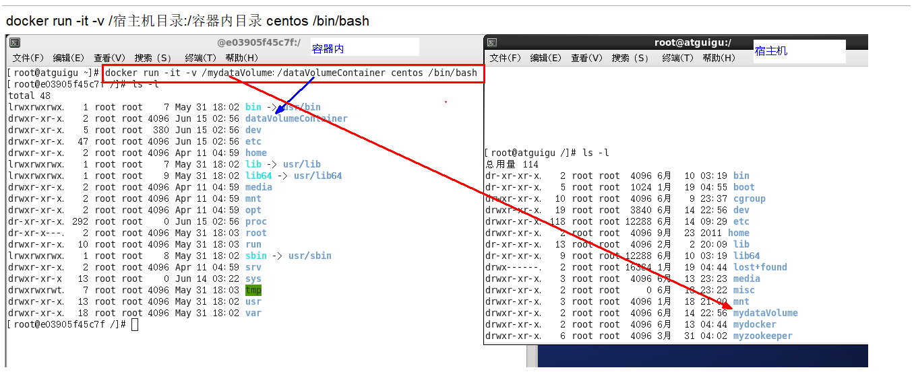

  - 查看数据卷是否挂载成功：

    ```shell
    $ docker inspect 容器ID
    ```

    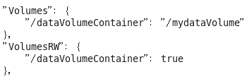

    > 此时，volume 权限是可读写的。可以在容器或主机内分别对卷进行数据的读写，读写的数据是共享的。

  - 容器运行时，容器和宿主机之间数据能够共享：

    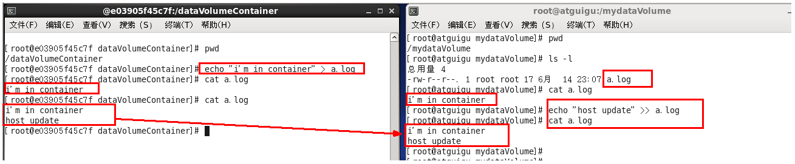

  - 容器停止退出后，主机修改后的数据也能同步：

    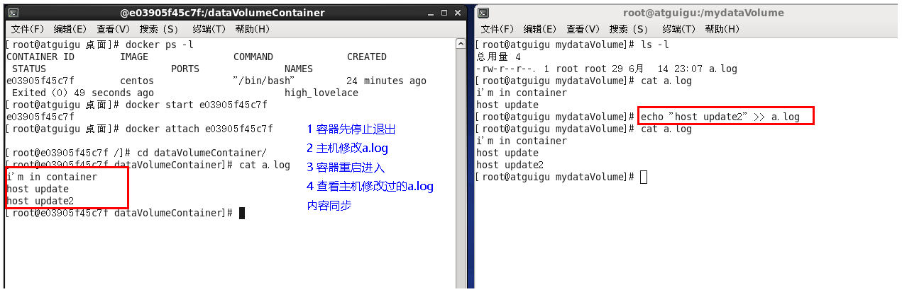

  - 带权限的命令：

    ```shell
    $ docker run -it -v /宿主机绝对路径目录:/容器内目录:ro 镜像名
    ```

    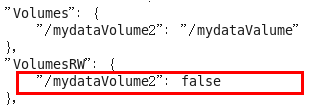

    >此时，volume 权限是不可写的。可以在主机对卷进行数据的读写，读写的数据是共享的。但是，在容器内，只可对卷进行数据的读，不可写。

- **Dockerfile 添加**

  - 在主机根目录下新建 mydocker 文件夹并进入：

    ```shell
    $ mkdir /mydocker
    $ cd /mydocker
    ```

  - 在 Dockerfile 中，使用 VOLUME 指令来给镜像添加一个或多个数据卷：

    ```dockerfile
    VOLUME ["/dataVolumeContainer","/dataVolumeContainer2","/dataVolumeContainer3"]
    ```

    - 出于可移植和分享的考虑，用 `-v 主机目录:容器目录` 这种方法不能直接在 Dockerfile 中实现。因为宿主机目录是依赖于特定宿主机的，不能保证在所有的宿主机上都存在这样的特定目录。

  - 构建 Dockerfile：

    ```shell
    $ vim Dockerfile2
    ```

    在 Dockerfile2 中添加如下内容：

    ```dockerfile
    # volume test
    FROM centos
    VOLUME ["/dataVolumeContainer1","/dataVolumeContainer2"]
    CMD echo "finished,--------success1"
    CMD /bin/bash
    ```

    > 大致等同于命令：`docker run -it -v /host1:/dataVolumeContainer1 -v /host2:/dataVolumeContainer2 centos /bin/bash`。

  - 执行 build 命令生成一个新镜像：

    ```shell
    $ docker builder -f /mydocker/Dockerfile2 -t zzyy/centos .
    ```

    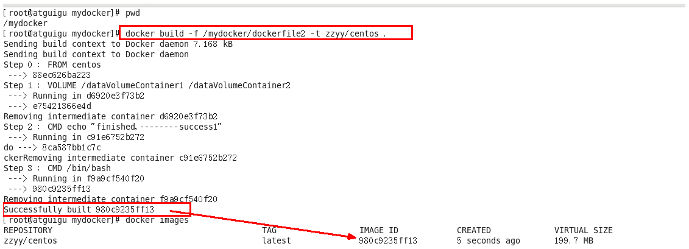

  - 执行 run 命令启动容器，并查看容器内创建的卷的目录所在：

    ```shell
    $ docker run -it zzyy/centos /bin/bash
    ```

    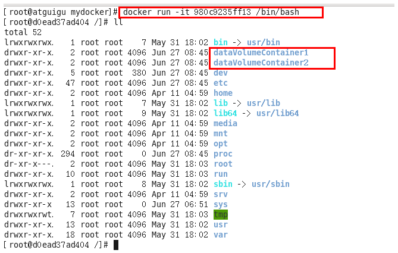

  - 执行 inspect 命令查看主机对应的目录：

    ```shell
    $ docker inspect 容器ID
    ```

    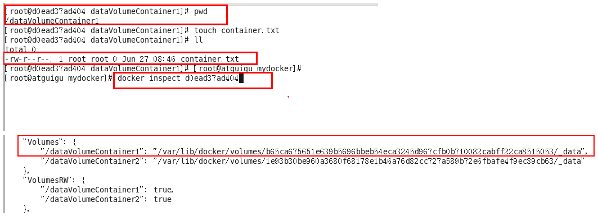

    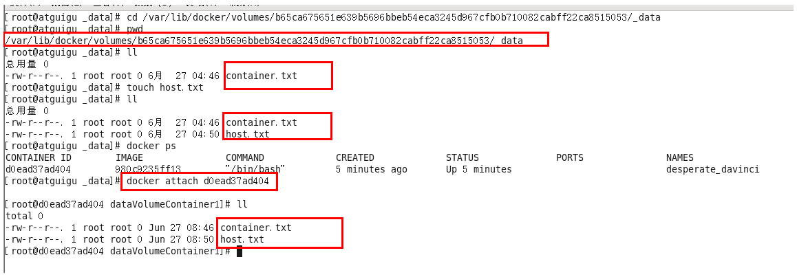

- 备注：

  - Docker 挂载主机目录 Docker 访问出现 `cannot open directory. Permission denied` 异常时，在挂载目录后多加一个 `--privileged=true` 参数即可。

### 数据卷容器

- 命名的容器挂载数据卷，其它容器通过挂载这个 (父容器) 实现数据共享，挂载数据卷的容器，称之为数据卷容器。

- 案例演示：

  - 先启动一个父容器 doc1，启动后在 dataVolumeContainer2 中新增内容 dc01_add.txt：

    ```shell
    $ docker run -it --name dc01 zzyy/centos
    ```

    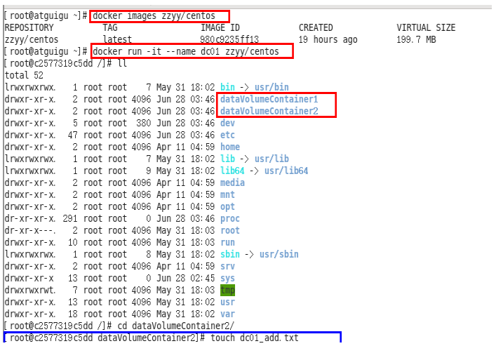

  - 启动子容器 dc02 和 dc03，继承 dc01，启动后分别在 dataVolumeContainer2 中新增内容 dc02_add.txt 和 dc03_add.txt：

    ```shell
    $ docker run -it --name dc02 --volume-from dco1 zzyy/centos
    ```

    ```shell
    $ docker run -it --name dc03 --volume-from dco1 zzyy/centos
    ```

    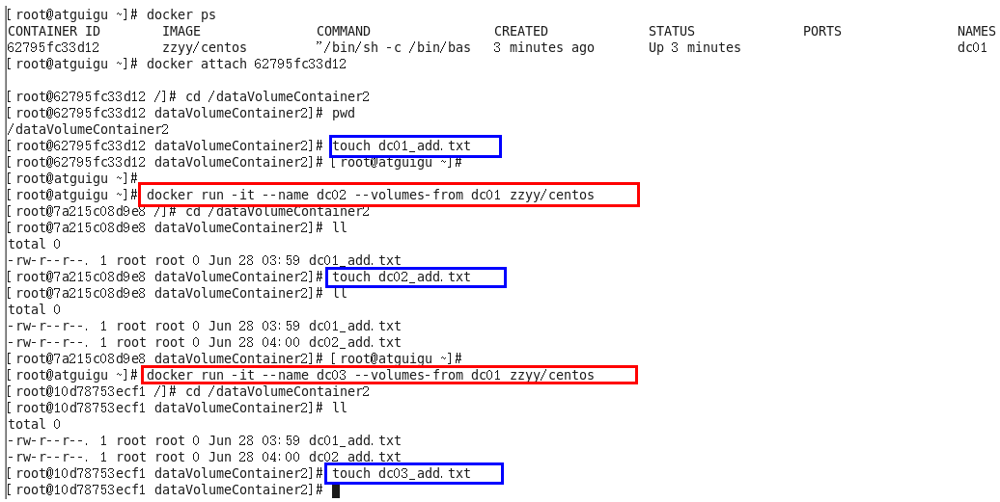

  - 重新进入 dc01 容器，可以看到 dc02 和 dc03 容器内添加的数据，在卷 dataVolumeContainer2  中都可以共享：

    ```shell
    $ docker ps
    ```

    ```shell
    $ docker attach dc01
    ```

    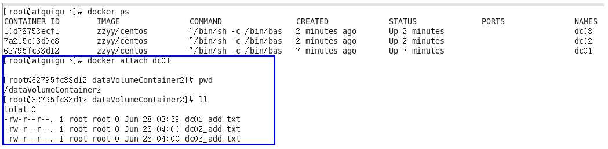

  - 删除 dc01，dc02 和 dc03 仍然能够共享数据：

    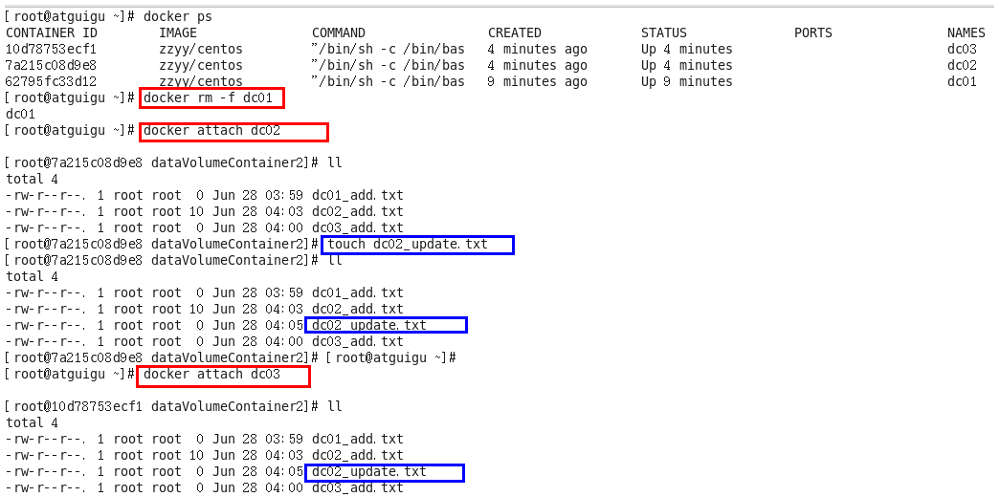

  - 删除 dc02 后，dc03 仍然能够共享数据：

    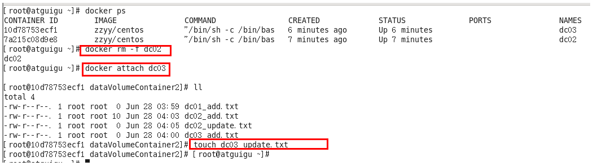

  - 新建 dc04 继承 dc03，然后删除 dc03，dc04 仍然能够共享数据：

    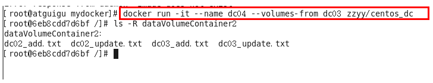

    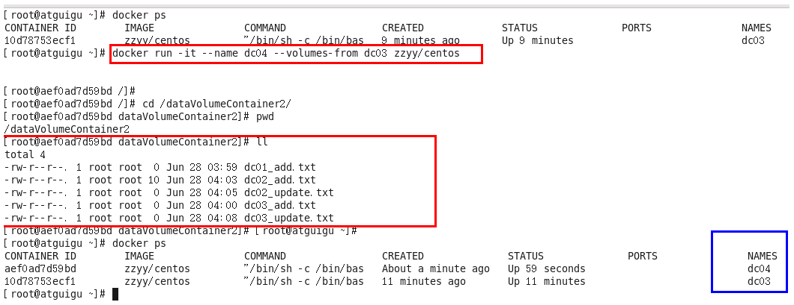

- **结论：容器之间配置信息的传递，数据卷的生命周期一直持续到没有容器使用它为止。**

## Dockerfile 解析

- **Dockerfile 是用来构建 Docker 镜像的构建文件，由一系列命令和参数构成的脚本。**

  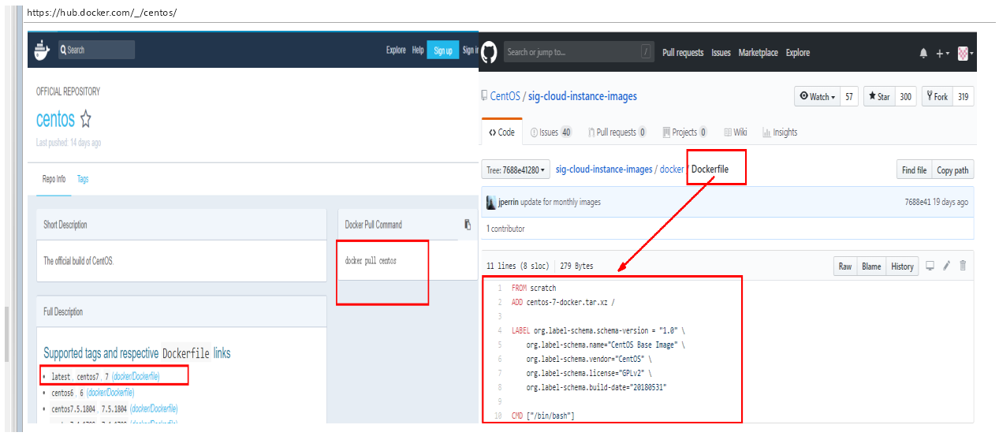

- Dockerfile 构建的三步骤：

  - 手动编写一个 Dockerfile 文件，必须要符合 Dockerfile 的规范；
  - docker build 命令执行编写好的 Dockerfile 文件，获得一个自定义的镜像；
  - doucker run 命令启动容器。

### Dockerfile 构建过程解析

- Dockerfile 内容基础知识：

  - 每条保留字指令都必须为大写字母，且后面要跟随至少一个参数。
  - 指令按照从上到下，顺序执行。
  - \# 表示注释。
  - 每条指令都会创建一个新的镜像层，并对镜像进行提交。

- Docker 执行 Dockerfile 的大致流程：

  - 第一步：Docker 从基础镜像运行一个容器；
  - 第二步：执行一条指令并对容器作出修改；
  - 第三步：执行类似 docker commit 的操作提交一个新的镜像层；
  - 第四步：docker 再基刚提交的镜像运行一个新容器；
  - 第五步：执行 Dockerfile 中的下一条指令，重复第二至第五步，直到所有指令都执行完成。

- Dockerfile、 Docker 镜像与 Docker 容器三者的关系：

  - 从应用软件的角度来看，Dockerfile、 Docker 镜像与 Docker 容器分别代表软件的三个不同阶段：

    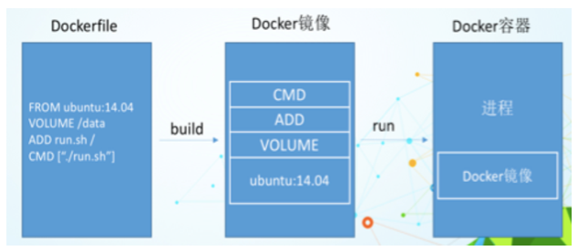

    - Dockerfile 是软件的原材料。
    - Docker 镜像是软件的交付品。
    - Docker 容器可以认为是软件的运行态。
    - Dockerfile 面向开发，Docker 镜像为交付标准，Docker 容器则涉及部署与运维，三者缺一不可，合力充当 Docker 体系的基石。

  - Dockerfile 定义了进程需要的一切东西。Dockerfile 涉及的内容包括执行代码或者是文件、环境变量、依赖包、运行时环境、动态链接库、操作系统的发行版、服务进程和内核进程 (当应用进程需要和系统服务和内核进程打交道，这时需要考虑如何设计 namespace 的权限控制) 等等。

  - 定义了 Dockerfile 文件后，docker build 命令产生一个 Docker 镜像。

  - 对于生成的 Docker 镜像，docker run 命令生成 Docker 容器，容器是直接提供服务的。

### Dockerfile 体系结构 (保留字指令)

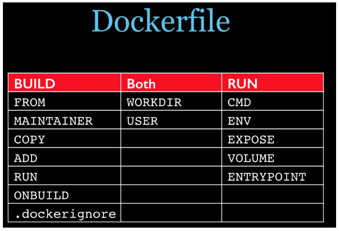

- **FROM**：基础镜像，即当前新镜像是基于哪个镜像的。

- **MAINTAINER**：镜像维护者的姓名和邮箱地址。

- **RUN**：容器构建时需要运行的命令。

- **EXPOSE**：当前容器对外暴露出的端口。

- **WORKDIR**：指定在创建容器后，终端默认进入的工作目录。如果不指定，则为根目录。

- **ENV**：用来在构建过程中设置环境变量。例如：`ENV MY_PATH /usr/mytest`，这个环境变量可以在后续的任何 RUN 指令中使用，如同在命令前制定了环境变量前缀；也可以在其他指令中直接使用这个环境变量，如 `WORKDIR $MY_PATH`。

- **ADD**：将宿主机目录下的文件拷贝进镜像，并且能够自动处理 URL 和解压 tar 压缩包。

- **COPY**：类似 ADD，拷贝文件和目录到镜像中 (只拷贝)。将从构建上下文目录中 <源路径> 的文件/目录复制到新的一层镜像内的 <目标路径> 指向的位置。

  - `COPY src dest`
  - `COPY ["src","dest"]`

- **VOLUME**：容器数据卷，用于数据保存和持久化工作。

- **CMD**：指定一个容器启动时要运行的命令。

  - CMD 指令的格式和 RUN 相似：
    - shell 格式：`CMD <命令>`
    - exec 格式：`CMD ["可执行文件", "参数1", "参数2"...]`
    - 参数列表格式：`CMD ["参数1", "参数2"...]`。在指定了 ENTRYPOINT 指令后，用 CMD 指定具体的参数。
  - Dockerfile 中可以有多个 CMD 指令，但只有最后一个生效。**CMD 指令会被 docker run 之后的参数替换。**

- **ENTRYPOINT**：指定一个容器启动时要运行的命令。

  - ENTRYPOINT 的目的和 CMD 一样，不同的是，**ENTRYPOINT 指令会被 docker run 之后的参数追加。**

- ONBUILD：当构建一个被继承的 Dockerfile 时运行命令，父镜像在被子镜像继承时，父镜像的 ONBUILD 指令触发，

  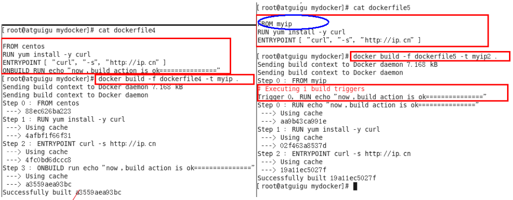

### 案例演示

#### Base 镜像

- Docker Hub 中 99% 的镜像都是通过在 base 镜像中，安装和配置需要的软件构建出来的。例如 centos 镜像：

  ```dockerfile
  FROM scratch
  ADD centos-8-x86_64.tar.xz /
  LABEL org.label-schema.schema-version="1.0"     org.label-schema.name="CentOS Base Image"     org.label-schema.vendor="CentOS"     org.label-schema.license="GPLv2"     org.label-schema.build-date="20201204"
  CMD ["/bin/bash"]
  ```

#### 自定义镜像 mycentos

- 编写 Dockerfile：

  - Docker Hub 默认的 centos 镜像：1

    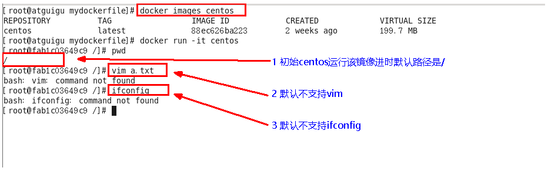

  - 需求：

    - 设置登陆后的默认路径；
    - 增加 vim 编辑器；
    - 增加查看网络配置 ifconfig 支持。

  - 在主机 /mydocker 或其他目录下编写 Dockerfile 文件：

    ```dockerfile
    FROM centos
    MAINTAINER ZZYY<zzyy167@126.com>
    
    ENV MYPATH /usr/local
    WORKDIR $MYPATH
    
    RUN yum -y install vim
    RUN yum -y install net-tools
    
    EXPOSE 80
    
    CMD echo $MYPATH
    CMD echo "success--------------ok"
    CMD /bin/bash
    ```

- 构建镜像：**`docker build -f Dockerfile路径 -t 新镜像名字:TAG .`**

  ```shell
  $ docker build -f /mydocker/Dockerfile -t mycentos:1.3 .
  ```

  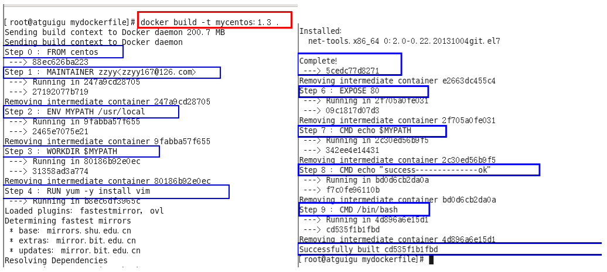

- 运行容器：**`docker run -it 新镜像名字:TAG `**

  ```shell
  $ docker run -it mycentos:1.3
  ```

  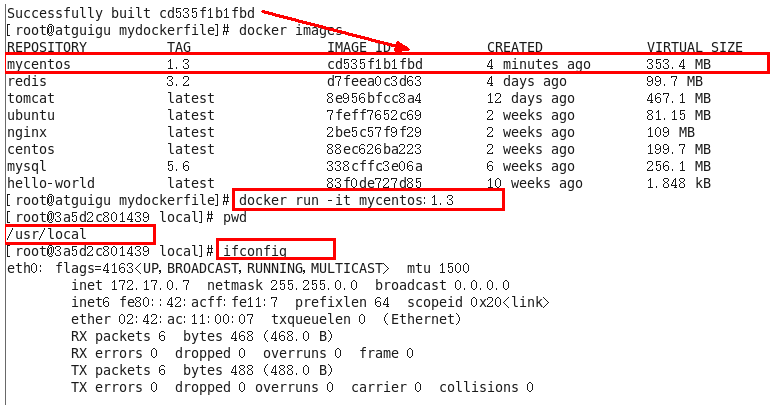

- 列出镜像的变更历史：

  ```shell
  $ docker history 镜像ID
  ```

  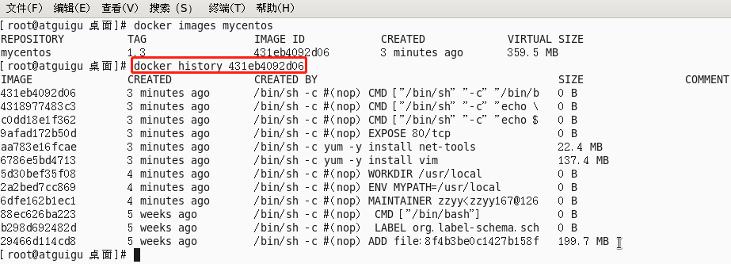

#### CMD/ENTRYPOINT 镜像案例

- CMD/ENTRYPOINT 都是指定一个容器启动时要运行的命令。

- **Dockerfile 中可以有多个 CMD 指令，但只有最后一个生效；另外，CMD 指令会被 docker run 命令之后的参数替换。**

  ```dockerfile
  FROM openjdk:16-jdk-buster
  
  ENV CATALINA_HOME /usr/local/tomcat
  ENV PATH $CATALINA_HOME/bin:$PATH
  RUN mkdir -p "$CATALINA_HOME"
  WORKDIR $CATALINA_HOME
  
  # let "Tomcat Native" live somewhere isolated
  ENV TOMCAT_NATIVE_LIBDIR $CATALINA_HOME/native-jni-lib
  ENV LD_LIBRARY_PATH ${LD_LIBRARY_PATH:+$LD_LIBRARY_PATH:}$TOMCAT_NATIVE_LIBDIR
  
  # see https://www.apache.org/dist/tomcat/tomcat-$TOMCAT_MAJOR/KEYS
  # see also "update.sh" (https://github.com/docker-library/tomcat/blob/master/update.sh)
  ENV GPG_KEYS A9C5DF4D22E99998D9875A5110C01C5A2F6059E7
  
  ENV TOMCAT_MAJOR 10
  ENV TOMCAT_VERSION 10.0.6
  ENV TOMCAT_SHA512 3d39b086b6fec86e354aa4837b1b55e6c16bfd5ec985a82a5dd71f928e3fab5370b2964a5a1098cfe05ca63d031f198773b18b1f8c7c6cdee6c90aa0644fb2f2
  
  RUN ...
  
  # verify Tomcat Native is working properly
  RUN ...
  
  EXPOSE 8080
  CMD ["catalina.sh", "run"]
  ```

  - 以 tomcat 的 Dockerfile 为例，可以看到，文件的最后一条指令为 CMD 指令。

  - 运行以下命令，tomcat 能够正常启动：

    ```shell
    $ docker run -it -p 7777:8080 tomcat
    ```

  - 运行以下命令，tomcat 不能正常启动：

    ```shell
    $ docker run -it -p 7777:8080 tomcat ls -l
    ```

    - 上面的 docker run 命令，末尾的 `ls -l` 参数会替换 Dockerfile 文件中的 `CMD ["catalina.sh", "run"]` 指令，因此，tomcat 不会启动，只会列出 `/usr/local/tomcat` 路径下的文件。

- 不同于 CMD 指令，**docker run 命令之后的参数，会传递给 ENTRYPOINT 指令，追加形成新的命令组合。**

  - curl 命令解释：

    - curl 命令可以用来执行下载、发送各种 HTTP 请求，指定 HTTP 头部等操作。
    - 如果系统没有 curl，可以使用 `yum install -y curl` 命令安装。
    - curl 命令的 URL 如果指向的是 HTML 文档，那么缺省只显示文件头部，即 HTML 文档的 header，要全部显示，则加参数 -i。

  - CMD 版查询 IP 信息的容器：

    ```dockerfile
    FROM centos
    RUN yum install -y curl
    CMD ["curl", "-s", "http://ip.cn"]
    ```

    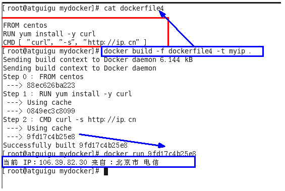

    - 上面的容器，已经指定了 CMD 指令，如果希望查询结果包含 header，命令 `docker run myip -i` 会不生效。-i 参数会替换掉 CMD 指令。

  - ENTRYPOINT 版查询 IP 信息的容器：

    ```dockerfile
    FROM centos
    RUN yum install -y curl
    ENTRYPOINT ["curl", "-s", "http://ip.cn"]
    ```

    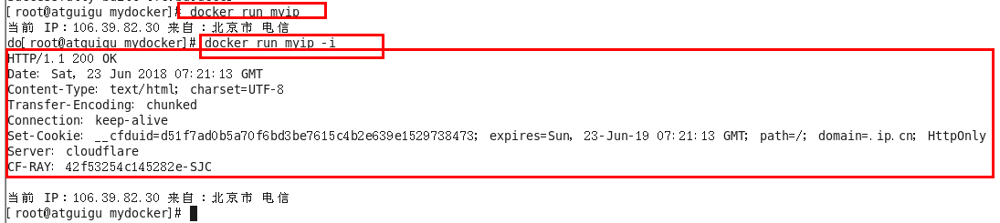

    - 上面的容器，使用的是 ENTRYPOINT 指令，如果希望查询结果包含 header，只需要使用命令 `docker run myip -i` 即可。-i 参数会追加到 ENTRYPOINT 指令后面。

#### 自定义镜像 tomcat

- 创建目录：

  ```shell
  $ mkdir -p /zzyy/mydockerfile/tomcat9
  ```

- 再上述目录创建 c.txt：

  ```shell
  $ cd /zzyy/mydockerfile/tomcat9
  
  $ touch c.txt
  ```

- 将 JDK 和 tomcat 的安装压缩包拷贝进上一步目录：

  ```shell
  $ cp /opt/jdk-8u171-linux-x64.tar.gz /zzyy/mydockerfile/tomcat9
  
  $ cp /opt/apache-tomcat-9.0.8.tar.gz /zzyy/mydockerfile/tomcat9
  ```

- 在 zzyyuse/mydockerfile/tomcat9 目录下新建 Dockerfile 文件：

  ```shell
  $ vim Dockerfie
  ```

  ```dockerfile
  FROM centos
  MAINTAINER zzyy<zzyybs@ 126.com>
  #把宿主机当前上下文的c.txt拷贝到容器/usr/local/路径下
  COPY c.txt /usr/local/cincontainer.txt
  #把java与tomcat添加到容器中
  ADD jdk-8u171-linux x64.tar.gz /usr/local/
  ADD apache-tomcat-9.0.8.tar.gz /usr/local/
  #安装vim编辑器
  RUN yum -y install vim
  #设置工作访问时候的WORKDIR路径，登录落脚点
  ENV MYPATH /usr/local
  WORKDIR $MYPATH
  #配置java与tomcat环境变量
  ENV JAVA_ HOME /usr/local/jdk1.8.0_171
  ENV CLASSPATH $JAVA_HOME/lib/dt.jar:$JAVA_HOME/lib/tools.jar
  ENV CATALINA_HOME /usr/local/apache-tomcat-9.0.8
  ENV CATALINA_BASE /usr/local/apache-tomcat-9.0.8
  ENV PATH $PATH:$JAVA_HOME/bin:$CATALINA_HOME/lib:$CATALINA_HOME/bin
  #容器运行时监听的端口
  EXPOSE 8080
  #启动时运行tomcat
  # ENTRYPOINT ["/usrl/local/apache-tomcat-9.0.8/bin/startup.sh" ]
  # CMD ["/usr/local/apache-tomcat-9.0.8/bin/catalina.sh","run"]
  CMD /usr/local/apache-tomcat-9.0.8/bin/startup.sh && tail -F /usr/local/apache-tomcat-9.0.8/in/logs/catalina.out
  ```

- 目录内容：

  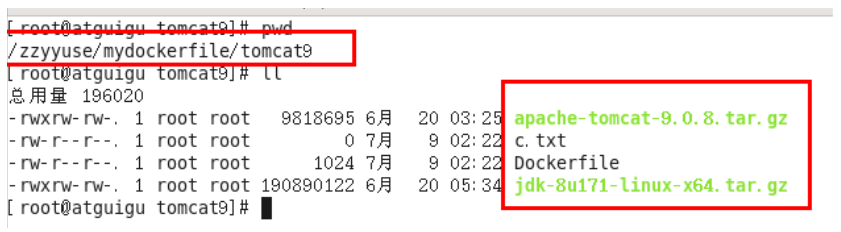

- 构建镜像：

  ```shell
  $ docker build -t zzyytomcat9
  ```

  > 不添加 -f 参数，默认构建当前路径下的 Dockerfile。

  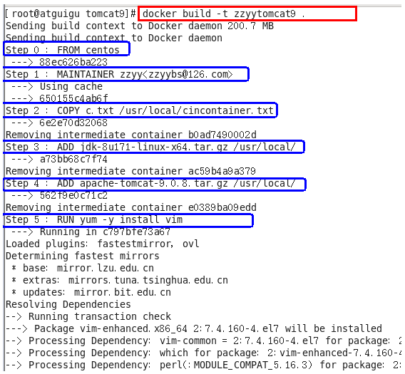

  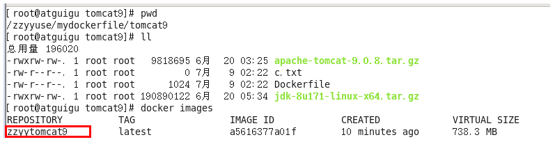

- 运行容器：

  ```shell
  $ docker run -d -p 9080:8080 -name myt9 -v /zzyyuse/mydockerfile/tomcat9/test:/usrlocal/apache-tomcat9.0.8/webapps/test -v /zzyyuse/mydockerfile/tomcat9/tomcat9logs/:/usrlocal/apache-tomcat-9.0.8/logs -privileged=true zzyytomcat9
  ```

  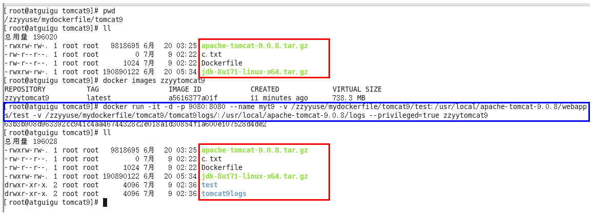

  - -v 参数设置两个数据卷，一个用于存放发布项目，一个用于存放日志记录。
  - `-privileged=true` 是 Docker 挂载主机目录 Docker 访问出现 `cannot open directory : Permission denied` 时的解决办法。

- 验证：

  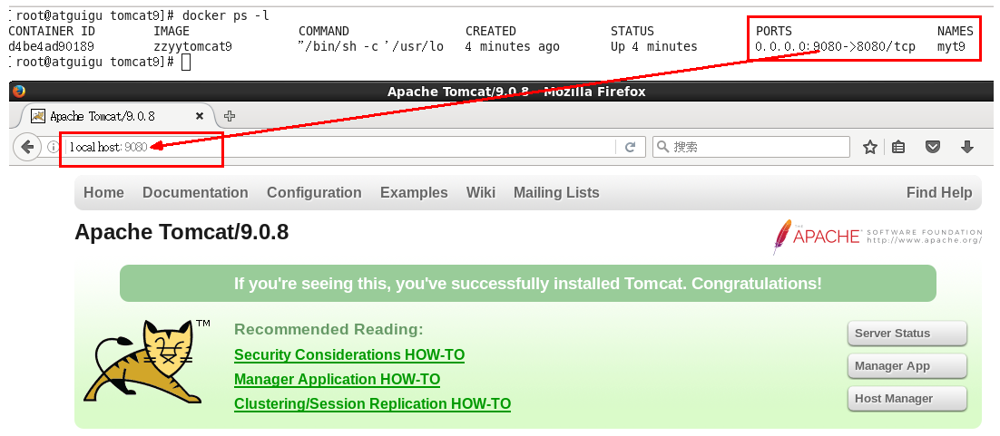

- 发布 web 服务 test：

  - 在主机数据卷对应的目录 `/zzyyuse/mydockerfile/tomcat9/test` 目录下，新建 WEB-INF 目录，并添加 web.xml 文件。然后编写一个 a.jsp 文件作为测试：

    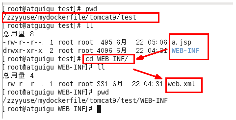

  - web.xml：

    ```xml
    <?xml version="1 .0" encoding="UTF-8"?>
    <web-app xmIns:xsi="http://www.w3.org/2001/XML Schema-instance"
    xmIns="http://java sun.com/xm/ns/javaee"
    xsi:schemaL ocation="http://java. sun.com/xml/ns/javaee htp:/:/java. sun.com/xml/ns/javaee/web-app_ 2_ _5.xsd"
    id="WebApp_ ID" version="2.5">
    
        <display-name>test</display-name>
    
    </web-app>
    ```

  - a.jsp：

    ```jsp
    <%@ page language="java" contentType="text/html; charset=UTF-8" pageEncoding="UTF-8"%>
    <!DOCTYPE html PUBLIC“//W3C//DTD HTML 4.01 Transitional//EN" http://www.w3.org/TR/html4/loose.dtd">
    <html>
        <head>
            <meta http-equiv="Content-Type" content="text/html; charset=UTF-8">
            <title>Insert title here </title>
        </head>
        <body>
        	---------------welcome---------------
            <br>
            <%="i am in docker tomcat self "%>
            <br>
            <% System.out.printIn("==========docker tomcat self");%>
        </body>
    </htmI>
    ```

  - docker restart 命令重新启动 tomcat，然后网页访问 `localhost:9080/test/a.jsp`，即可查看到 a.jsp 网页的内容。在主机目录下修改 a.jsp 的内容时，会同步到 tomcat 中。

  - 主机上查看日志：

    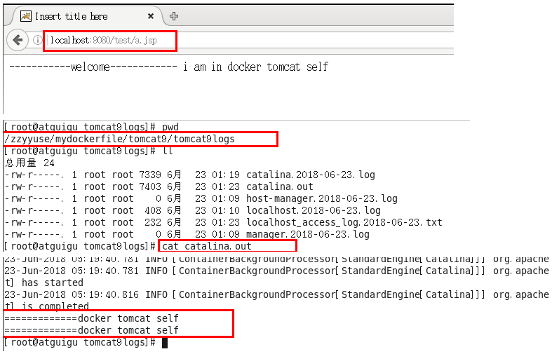

### 总结

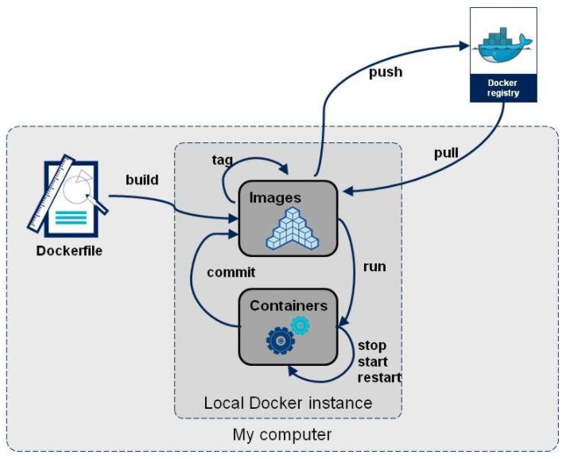

## Docker 常用安装

### 总体步骤

- 搜索镜像
- 拉取镜像
- 查看镜像
- 启动镜像
- 停止镜像
- 移除镜像

### 安装 mysql

- docker hub 上查找 mysql 镜像：

  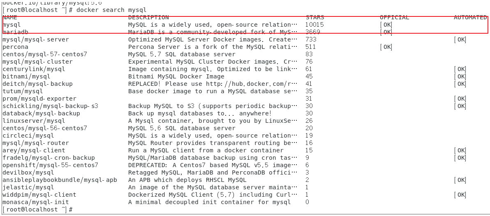

- 从 docker hub (阿里云加速器) 拉取 mysql 镜像到本地，标签为 5.6：

  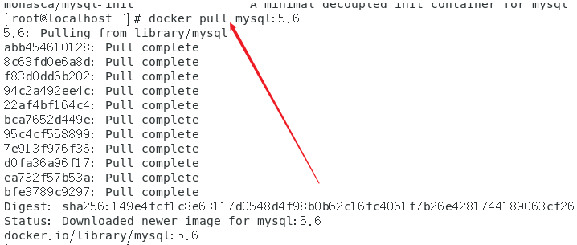

- 使用 mysql:5.6 镜像创建容器 (也叫运行镜像)：

  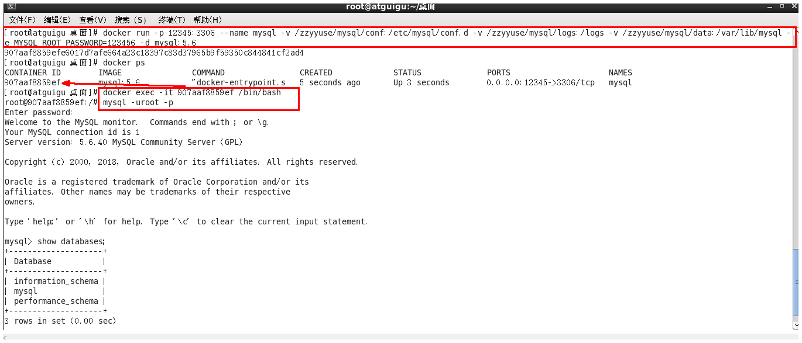

  - 命令说明：

    ```shell
    docker run -p 12345:3306 --name mysql 
    -v /zzyyuse/mysql/conf:/etc/mysql/conf.d 
    -v /zzyyuse/mysql/logs:/logs 
    -v /zzyyuse/mysql/data:/var/lib/mysql 
    -e MYSQL_ROOT_PASSWORD=123456 -d mysql:5.6
    ----------------------------------------------
    命令说明:
    -p 12345:3306: 将主机的12345端口映射到docker容器的3306端口
    -name mysql: 运行服务名字
    -v /zzyyuse/mysql/conf:/etc/mysql/conf.d: 将主机/zzyyuse/mysq|目录下的conf/my.cnf挂载到容器的/etc/mysql/conf.d
    -v /zzyyuse/mysql/logs:/logs: 将主机/zzyyuse/mysql目录下的logs目录挂载到容器的/logs
    -v /zzyyuse/mysql/data:/var/lib/mysql: 将主机/zzyyuse/mysql目录下的data目录挂载到容器的/var/lib/mysql
    -e MYSQL_ROOT_PASSWORD=123456: 初始化root用户的密码
    -d mysql:5.6: 后台程序运行mysql5.6 
    ----------------------------------------------
    docker exec -it mysql运行成功后的容器ID /bin/bash
    ----------------------------------------------
    ```

- 将 mysql 数据备份测试：

  ```shell
  $ docker exec mysql运行成功后的容器ID sh -c 'exec mysqldump --all-databases -uroot -p"123456"' >/zzyyuse/all-database.sql
  ```

  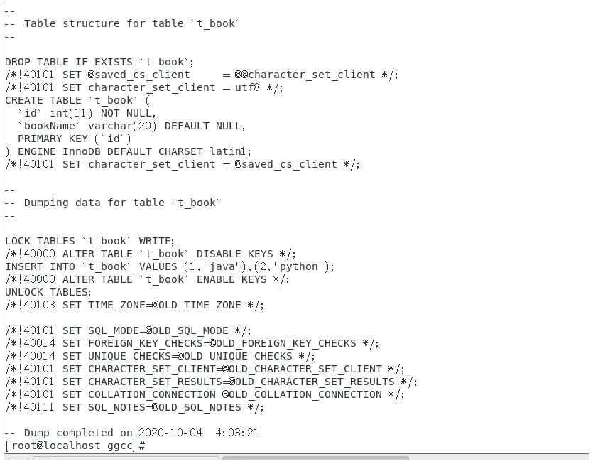

### 安装 redis

- 从 docker hub 上 (阿里云加速器) 拉取 redis 镜像到本地，标签为 3.2：

  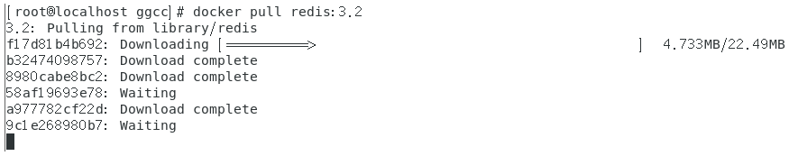

- 使用 redis:3.2 镜像创建容器 (也叫运行镜像)：

  ```shell
  $ docker run -p 6379:6379 -v /zzyyuse/myredis/conf/redis.conf:/usr/local/etc/redis/redis.conf -v /zzyyuse/myredis/data:/data -d redis:3.2 redis-server /usr/local/etc/redis/redis.conf --appendonly yes
  ```

  > 命令中的 redis.conf 是路径，不是文件。

- 在主机 `/zzyyuse/myredis/conf/redis.conf` 目录下新建 redis 配置文件 redis.conf，并添加如下内容：

  ```shell
  $ vim /zzyyuse/myredis/conf/redis.conf/redis.conf
  ```

  ```shell
  # Redis configuration file example.
  #
  # Note that in order to read the configuration file, Redis must be
  # started with the file path as first argument:
  #
  # ./redis-server /path/to/redis.conf
  
  # Note on units: when memory size is needed, it is possible to specify
  # it in the usual form of 1k 5GB 4M and so forth:
  #
  # 1k => 1000 bytes
  # 1kb => 1024 bytes
  # 1m => 1000000 bytes
  # 1mb => 1024*1024 bytes
  # 1g => 1000000000 bytes
  # 1gb => 1024*1024*1024 bytes
  #
  # units are case insensitive so 1GB 1Gb 1gB are all the same.
  
  ################################## INCLUDES ###################################
  
  # Include one or more other config files here.  This is useful if you
  # have a standard template that goes to all Redis servers but also need
  # to customize a few per-server settings.  Include files can include
  # other files, so use this wisely.
  #
  # Notice option "include" won't be rewritten by command "CONFIG REWRITE"
  # from admin or Redis Sentinel. Since Redis always uses the last processed
  # line as value of a configuration directive, you'd better put includes
  # at the beginning of this file to avoid overwriting config change at runtime.
  #
  # If instead you are interested in using includes to override configuration
  # options, it is better to use include as the last line.
  #
  # include /path/to/local.conf
  # include /path/to/other.conf
  
  ################################## MODULES #####################################
  
  # Load modules at startup. If the server is not able to load modules
  # it will abort. It is possible to use multiple loadmodule directives.
  #
  # loadmodule /path/to/my_module.so
  # loadmodule /path/to/other_module.so
  
  ################################## NETWORK #####################################
  
  # By default, if no "bind" configuration directive is specified, Redis listens
  # for connections from all the network interfaces available on the server.
  # It is possible to listen to just one or multiple selected interfaces using
  # the "bind" configuration directive, followed by one or more IP addresses.
  #
  # Examples:
  #
  # bind 192.168.1.100 10.0.0.1
  # bind 127.0.0.1 ::1
  #
  # ~~~ WARNING ~~~ If the computer running Redis is directly exposed to the
  # internet, binding to all the interfaces is dangerous and will expose the
  # instance to everybody on the internet. So by default we uncomment the
  # following bind directive, that will force Redis to listen only into
  # the IPv4 loopback interface address (this means Redis will be able to
  # accept connections only from clients running into the same computer it
  # is running).
  #
  # IF YOU ARE SURE YOU WANT YOUR INSTANCE TO LISTEN TO ALL THE INTERFACES
  # JUST COMMENT THE FOLLOWING LINE.
  # ~~~~~~~~~~~~~~~~~~~~~~~~~~~~~~~~~~~~~~~~~~~~~~~~~~~~~~~~~~~~~~~~~~~~~~~~
  #bind 127.0.0.1
  
  # Protected mode is a layer of security protection, in order to avoid that
  # Redis instances left open on the internet are accessed and exploited.
  #
  # When protected mode is on and if:
  #
  # 1) The server is not binding explicitly to a set of addresses using the
  #    "bind" directive.
  # 2) No password is configured.
  #
  # The server only accepts connections from clients connecting from the
  # IPv4 and IPv6 loopback addresses 127.0.0.1 and ::1, and from Unix domain
  # sockets.
  #
  # By default protected mode is enabled. You should disable it only if
  # you are sure you want clients from other hosts to connect to Redis
  # even if no authentication is configured, nor a specific set of interfaces
  # are explicitly listed using the "bind" directive.
  protected-mode yes
  
  # Accept connections on the specified port, default is 6379 (IANA #815344).
  # If port 0 is specified Redis will not listen on a TCP socket.
  port 6379
  
  # TCP listen() backlog.
  #
  # In high requests-per-second environments you need an high backlog in order
  # to avoid slow clients connections issues. Note that the Linux kernel
  # will silently truncate it to the value of /proc/sys/net/core/somaxconn so
  # make sure to raise both the value of somaxconn and tcp_max_syn_backlog
  # in order to get the desired effect.
  tcp-backlog 511
  
  # Unix socket.
  #
  # Specify the path for the Unix socket that will be used to listen for
  # incoming connections. There is no default, so Redis will not listen
  # on a unix socket when not specified.
  #
  # unixsocket /tmp/redis.sock
  # unixsocketperm 700
  
  # Close the connection after a client is idle for N seconds (0 to disable)
  timeout 0
  
  # TCP keepalive.
  #
  # If non-zero, use SO_KEEPALIVE to send TCP ACKs to clients in absence
  # of communication. This is useful for two reasons:
  #
  # 1) Detect dead peers.
  # 2) Take the connection alive from the point of view of network
  #    equipment in the middle.
  #
  # On Linux, the specified value (in seconds) is the period used to send ACKs.
  # Note that to close the connection the double of the time is needed.
  # On other kernels the period depends on the kernel configuration.
  #
  # A reasonable value for this option is 300 seconds, which is the new
  # Redis default starting with Redis 3.2.1.
  tcp-keepalive 300
  
  ################################# TLS/SSL #####################################
  
  # By default, TLS/SSL is disabled. To enable it, the "tls-port" configuration
  # directive can be used to define TLS-listening ports. To enable TLS on the
  # default port, use:
  #
  # port 0
  # tls-port 6379
  
  # Configure a X.509 certificate and private key to use for authenticating the
  # server to connected clients, masters or cluster peers.  These files should be
  # PEM formatted.
  #
  # tls-cert-file redis.crt 
  # tls-key-file redis.key
  
  # Configure a DH parameters file to enable Diffie-Hellman (DH) key exchange:
  #
  # tls-dh-params-file redis.dh
  
  # Configure a CA certificate(s) bundle or directory to authenticate TLS/SSL
  # clients and peers.  Redis requires an explicit configuration of at least one
  # of these, and will not implicitly use the system wide configuration.
  #
  # tls-ca-cert-file ca.crt
  # tls-ca-cert-dir /etc/ssl/certs
  
  # By default, clients (including replica servers) on a TLS port are required
  # to authenticate using valid client side certificates.
  #
  # If "no" is specified, client certificates are not required and not accepted.
  # If "optional" is specified, client certificates are accepted and must be
  # valid if provided, but are not required.
  #
  # tls-auth-clients no
  # tls-auth-clients optional
  
  # By default, a Redis replica does not attempt to establish a TLS connection
  # with its master.
  #
  # Use the following directive to enable TLS on replication links.
  #
  # tls-replication yes
  
  # By default, the Redis Cluster bus uses a plain TCP connection. To enable
  # TLS for the bus protocol, use the following directive:
  #
  # tls-cluster yes
  
  # Explicitly specify TLS versions to support. Allowed values are case insensitive
  # and include "TLSv1", "TLSv1.1", "TLSv1.2", "TLSv1.3" (OpenSSL >= 1.1.1) or
  # any combination. To enable only TLSv1.2 and TLSv1.3, use:
  #
  # tls-protocols "TLSv1.2 TLSv1.3"
  
  # Configure allowed ciphers.  See the ciphers(1ssl) manpage for more information
  # about the syntax of this string.
  #
  # Note: this configuration applies only to <= TLSv1.2.
  #
  # tls-ciphers DEFAULT:!MEDIUM
  
  # Configure allowed TLSv1.3 ciphersuites.  See the ciphers(1ssl) manpage for more
  # information about the syntax of this string, and specifically for TLSv1.3
  # ciphersuites.
  #
  # tls-ciphersuites TLS_CHACHA20_POLY1305_SHA256
  
  # When choosing a cipher, use the server's preference instead of the client
  # preference. By default, the server follows the client's preference.
  #
  # tls-prefer-server-ciphers yes
  
  # By default, TLS session caching is enabled to allow faster and less expensive
  # reconnections by clients that support it. Use the following directive to disable
  # caching.
  #
  # tls-session-caching no
  
  # Change the default number of TLS sessions cached. A zero value sets the cache
  # to unlimited size. The default size is 20480.
  #
  # tls-session-cache-size 5000
  
  # Change the default timeout of cached TLS sessions. The default timeout is 300
  # seconds.
  #
  # tls-session-cache-timeout 60
  
  ################################# GENERAL #####################################
  
  # By default Redis does not run as a daemon. Use 'yes' if you need it.
  # Note that Redis will write a pid file in /var/run/redis.pid when daemonized.
  daemonize no
  
  # If you run Redis from upstart or systemd, Redis can interact with your
  # supervision tree. Options:
  #   supervised no      - no supervision interaction
  #   supervised upstart - signal upstart by putting Redis into SIGSTOP mode
  #   supervised systemd - signal systemd by writing READY=1 to $NOTIFY_SOCKET
  #   supervised auto    - detect upstart or systemd method based on
  #                        UPSTART_JOB or NOTIFY_SOCKET environment variables
  # Note: these supervision methods only signal "process is ready."
  #       They do not enable continuous liveness pings back to your supervisor.
  supervised no
  
  # If a pid file is specified, Redis writes it where specified at startup
  # and removes it at exit.
  #
  # When the server runs non daemonized, no pid file is created if none is
  # specified in the configuration. When the server is daemonized, the pid file
  # is used even if not specified, defaulting to "/var/run/redis.pid".
  #
  # Creating a pid file is best effort: if Redis is not able to create it
  # nothing bad happens, the server will start and run normally.
  pidfile /var/run/redis_6379.pid
  
  # Specify the server verbosity level.
  # This can be one of:
  # debug (a lot of information, useful for development/testing)
  # verbose (many rarely useful info, but not a mess like the debug level)
  # notice (moderately verbose, what you want in production probably)
  # warning (only very important / critical messages are logged)
  loglevel notice
  
  # Specify the log file name. Also the empty string can be used to force
  # Redis to log on the standard output. Note that if you use standard
  # output for logging but daemonize, logs will be sent to /dev/null
  logfile ""
  
  # To enable logging to the system logger, just set 'syslog-enabled' to yes,
  # and optionally update the other syslog parameters to suit your needs.
  # syslog-enabled no
  
  # Specify the syslog identity.
  # syslog-ident redis
  
  # Specify the syslog facility. Must be USER or between LOCAL0-LOCAL7.
  # syslog-facility local0
  
  # Set the number of databases. The default database is DB 0, you can select
  # a different one on a per-connection basis using SELECT <dbid> where
  # dbid is a number between 0 and 'databases'-1
  databases 16
  
  # By default Redis shows an ASCII art logo only when started to log to the
  # standard output and if the standard output is a TTY. Basically this means
  # that normally a logo is displayed only in interactive sessions.
  #
  # However it is possible to force the pre-4.0 behavior and always show a
  # ASCII art logo in startup logs by setting the following option to yes.
  always-show-logo yes
  
  ################################ SNAPSHOTTING  ################################
  #
  # Save the DB on disk:
  #
  #   save <seconds> <changes>
  #
  #   Will save the DB if both the given number of seconds and the given
  #   number of write operations against the DB occurred.
  #
  #   In the example below the behaviour will be to save:
  #   after 900 sec (15 min) if at least 1 key changed
  #   after 300 sec (5 min) if at least 10 keys changed
  #   after 60 sec if at least 10000 keys changed
  #
  #   Note: you can disable saving completely by commenting out all "save" lines.
  #
  #   It is also possible to remove all the previously configured save
  #   points by adding a save directive with a single empty string argument
  #   like in the following example:
  #
  #   save ""
  
  save 900 1
  save 300 10
  save 60 10000
  
  # By default Redis will stop accepting writes if RDB snapshots are enabled
  # (at least one save point) and the latest background save failed.
  # This will make the user aware (in a hard way) that data is not persisting
  # on disk properly, otherwise chances are that no one will notice and some
  # disaster will happen.
  #
  # If the background saving process will start working again Redis will
  # automatically allow writes again.
  #
  # However if you have setup your proper monitoring of the Redis server
  # and persistence, you may want to disable this feature so that Redis will
  # continue to work as usual even if there are problems with disk,
  # permissions, and so forth.
  stop-writes-on-bgsave-error yes
  
  # Compress string objects using LZF when dump .rdb databases?
  # For default that's set to 'yes' as it's almost always a win.
  # If you want to save some CPU in the saving child set it to 'no' but
  # the dataset will likely be bigger if you have compressible values or keys.
  rdbcompression yes
  
  # Since version 5 of RDB a CRC64 checksum is placed at the end of the file.
  # This makes the format more resistant to corruption but there is a performance
  # hit to pay (around 10%) when saving and loading RDB files, so you can disable it
  # for maximum performances.
  #
  # RDB files created with checksum disabled have a checksum of zero that will
  # tell the loading code to skip the check.
  rdbchecksum yes
  
  # The filename where to dump the DB
  dbfilename dump.rdb
  
  # Remove RDB files used by replication in instances without persistence
  # enabled. By default this option is disabled, however there are environments
  # where for regulations or other security concerns, RDB files persisted on
  # disk by masters in order to feed replicas, or stored on disk by replicas
  # in order to load them for the initial synchronization, should be deleted
  # ASAP. Note that this option ONLY WORKS in instances that have both AOF
  # and RDB persistence disabled, otherwise is completely ignored.
  #
  # An alternative (and sometimes better) way to obtain the same effect is
  # to use diskless replication on both master and replicas instances. However
  # in the case of replicas, diskless is not always an option.
  rdb-del-sync-files no
  
  # The working directory.
  #
  # The DB will be written inside this directory, with the filename specified
  # above using the 'dbfilename' configuration directive.
  #
  # The Append Only File will also be created inside this directory.
  #
  # Note that you must specify a directory here, not a file name.
  dir ./
  
  ################################# REPLICATION #################################
  
  # Master-Replica replication. Use replicaof to make a Redis instance a copy of
  # another Redis server. A few things to understand ASAP about Redis replication.
  #
  #   +------------------+      +---------------+
  #   |      Master      | ---> |    Replica    |
  #   | (receive writes) |      |  (exact copy) |
  #   +------------------+      +---------------+
  #
  # 1) Redis replication is asynchronous, but you can configure a master to
  #    stop accepting writes if it appears to be not connected with at least
  #    a given number of replicas.
  # 2) Redis replicas are able to perform a partial resynchronization with the
  #    master if the replication link is lost for a relatively small amount of
  #    time. You may want to configure the replication backlog size (see the next
  #    sections of this file) with a sensible value depending on your needs.
  # 3) Replication is automatic and does not need user intervention. After a
  #    network partition replicas automatically try to reconnect to masters
  #    and resynchronize with them.
  #
  # replicaof <masterip> <masterport>
  
  # If the master is password protected (using the "requirepass" configuration
  # directive below) it is possible to tell the replica to authenticate before
  # starting the replication synchronization process, otherwise the master will
  # refuse the replica request.
  #
  # masterauth <master-password>
  #
  # However this is not enough if you are using Redis ACLs (for Redis version
  # 6 or greater), and the default user is not capable of running the PSYNC
  # command and/or other commands needed for replication. In this case it's
  # better to configure a special user to use with replication, and specify the
  # masteruser configuration as such:
  #
  # masteruser <username>
  #
  # When masteruser is specified, the replica will authenticate against its
  # master using the new AUTH form: AUTH <username> <password>.
  
  # When a replica loses its connection with the master, or when the replication
  # is still in progress, the replica can act in two different ways:
  #
  # 1) if replica-serve-stale-data is set to 'yes' (the default) the replica will
  #    still reply to client requests, possibly with out of date data, or the
  #    data set may just be empty if this is the first synchronization.
  #
  # 2) if replica-serve-stale-data is set to 'no' the replica will reply with
  #    an error "SYNC with master in progress" to all the kind of commands
  #    but to INFO, replicaOF, AUTH, PING, SHUTDOWN, REPLCONF, ROLE, CONFIG,
  #    SUBSCRIBE, UNSUBSCRIBE, PSUBSCRIBE, PUNSUBSCRIBE, PUBLISH, PUBSUB,
  #    COMMAND, POST, HOST: and LATENCY.
  #
  replica-serve-stale-data yes
  
  # You can configure a replica instance to accept writes or not. Writing against
  # a replica instance may be useful to store some ephemeral data (because data
  # written on a replica will be easily deleted after resync with the master) but
  # may also cause problems if clients are writing to it because of a
  # misconfiguration.
  #
  # Since Redis 2.6 by default replicas are read-only.
  #
  # Note: read only replicas are not designed to be exposed to untrusted clients
  # on the internet. It's just a protection layer against misuse of the instance.
  # Still a read only replica exports by default all the administrative commands
  # such as CONFIG, DEBUG, and so forth. To a limited extent you can improve
  # security of read only replicas using 'rename-command' to shadow all the
  # administrative / dangerous commands.
  replica-read-only yes
  
  # Replication SYNC strategy: disk or socket.
  #
  # New replicas and reconnecting replicas that are not able to continue the
  # replication process just receiving differences, need to do what is called a
  # "full synchronization". An RDB file is transmitted from the master to the
  # replicas.
  #
  # The transmission can happen in two different ways:
  #
  # 1) Disk-backed: The Redis master creates a new process that writes the RDB
  #                 file on disk. Later the file is transferred by the parent
  #                 process to the replicas incrementally.
  # 2) Diskless: The Redis master creates a new process that directly writes the
  #              RDB file to replica sockets, without touching the disk at all.
  #
  # With disk-backed replication, while the RDB file is generated, more replicas
  # can be queued and served with the RDB file as soon as the current child
  # producing the RDB file finishes its work. With diskless replication instead
  # once the transfer starts, new replicas arriving will be queued and a new
  # transfer will start when the current one terminates.
  #
  # When diskless replication is used, the master waits a configurable amount of
  # time (in seconds) before starting the transfer in the hope that multiple
  # replicas will arrive and the transfer can be parallelized.
  #
  # With slow disks and fast (large bandwidth) networks, diskless replication
  # works better.
  repl-diskless-sync no
  
  # When diskless replication is enabled, it is possible to configure the delay
  # the server waits in order to spawn the child that transfers the RDB via socket
  # to the replicas.
  #
  # This is important since once the transfer starts, it is not possible to serve
  # new replicas arriving, that will be queued for the next RDB transfer, so the
  # server waits a delay in order to let more replicas arrive.
  #
  # The delay is specified in seconds, and by default is 5 seconds. To disable
  # it entirely just set it to 0 seconds and the transfer will start ASAP.
  repl-diskless-sync-delay 5
  
  # -----------------------------------------------------------------------------
  # WARNING: RDB diskless load is experimental. Since in this setup the replica
  # does not immediately store an RDB on disk, it may cause data loss during
  # failovers. RDB diskless load + Redis modules not handling I/O reads may also
  # cause Redis to abort in case of I/O errors during the initial synchronization
  # stage with the master. Use only if your do what you are doing.
  # -----------------------------------------------------------------------------
  #
  # Replica can load the RDB it reads from the replication link directly from the
  # socket, or store the RDB to a file and read that file after it was completely
  # recived from the master.
  #
  # In many cases the disk is slower than the network, and storing and loading
  # the RDB file may increase replication time (and even increase the master's
  # Copy on Write memory and salve buffers).
  # However, parsing the RDB file directly from the socket may mean that we have
  # to flush the contents of the current database before the full rdb was
  # received. For this reason we have the following options:
  #
  # "disabled"    - Don't use diskless load (store the rdb file to the disk first)
  # "on-empty-db" - Use diskless load only when it is completely safe.
  # "swapdb"      - Keep a copy of the current db contents in RAM while parsing
  #                 the data directly from the socket. note that this requires
  #                 sufficient memory, if you don't have it, you risk an OOM kill.
  repl-diskless-load disabled
  
  # Replicas send PINGs to server in a predefined interval. It's possible to
  # change this interval with the repl_ping_replica_period option. The default
  # value is 10 seconds.
  #
  # repl-ping-replica-period 10
  
  # The following option sets the replication timeout for:
  #
  # 1) Bulk transfer I/O during SYNC, from the point of view of replica.
  # 2) Master timeout from the point of view of replicas (data, pings).
  # 3) Replica timeout from the point of view of masters (REPLCONF ACK pings).
  #
  # It is important to make sure that this value is greater than the value
  # specified for repl-ping-replica-period otherwise a timeout will be detected
  # every time there is low traffic between the master and the replica.
  #
  # repl-timeout 60
  
  # Disable TCP_NODELAY on the replica socket after SYNC?
  #
  # If you select "yes" Redis will use a smaller number of TCP packets and
  # less bandwidth to send data to replicas. But this can add a delay for
  # the data to appear on the replica side, up to 40 milliseconds with
  # Linux kernels using a default configuration.
  #
  # If you select "no" the delay for data to appear on the replica side will
  # be reduced but more bandwidth will be used for replication.
  #
  # By default we optimize for low latency, but in very high traffic conditions
  # or when the master and replicas are many hops away, turning this to "yes" may
  # be a good idea.
  repl-disable-tcp-nodelay no
  
  # Set the replication backlog size. The backlog is a buffer that accumulates
  # replica data when replicas are disconnected for some time, so that when a
  # replica wants to reconnect again, often a full resync is not needed, but a
  # partial resync is enough, just passing the portion of data the replica
  # missed while disconnected.
  #
  # The bigger the replication backlog, the longer the time the replica can be
  # disconnected and later be able to perform a partial resynchronization.
  #
  # The backlog is only allocated once there is at least a replica connected.
  #
  # repl-backlog-size 1mb
  
  # After a master has no longer connected replicas for some time, the backlog
  # will be freed. The following option configures the amount of seconds that
  # need to elapse, starting from the time the last replica disconnected, for
  # the backlog buffer to be freed.
  #
  # Note that replicas never free the backlog for timeout, since they may be
  # promoted to masters later, and should be able to correctly "partially
  # resynchronize" with the replicas: hence they should always accumulate backlog.
  #
  # A value of 0 means to never release the backlog.
  #
  # repl-backlog-ttl 3600
  
  # The replica priority is an integer number published by Redis in the INFO
  # output. It is used by Redis Sentinel in order to select a replica to promote
  # into a master if the master is no longer working correctly.
  #
  # A replica with a low priority number is considered better for promotion, so
  # for instance if there are three replicas with priority 10, 100, 25 Sentinel
  # will pick the one with priority 10, that is the lowest.
  #
  # However a special priority of 0 marks the replica as not able to perform the
  # role of master, so a replica with priority of 0 will never be selected by
  # Redis Sentinel for promotion.
  #
  # By default the priority is 100.
  replica-priority 100
  
  # It is possible for a master to stop accepting writes if there are less than
  # N replicas connected, having a lag less or equal than M seconds.
  #
  # The N replicas need to be in "online" state.
  #
  # The lag in seconds, that must be <= the specified value, is calculated from
  # the last ping received from the replica, that is usually sent every second.
  #
  # This option does not GUARANTEE that N replicas will accept the write, but
  # will limit the window of exposure for lost writes in case not enough replicas
  # are available, to the specified number of seconds.
  #
  # For example to require at least 3 replicas with a lag <= 10 seconds use:
  #
  # min-replicas-to-write 3
  # min-replicas-max-lag 10
  #
  # Setting one or the other to 0 disables the feature.
  #
  # By default min-replicas-to-write is set to 0 (feature disabled) and
  # min-replicas-max-lag is set to 10.
  
  # A Redis master is able to list the address and port of the attached
  # replicas in different ways. For example the "INFO replication" section
  # offers this information, which is used, among other tools, by
  # Redis Sentinel in order to discover replica instances.
  # Another place where this info is available is in the output of the
  # "ROLE" command of a master.
  #
  # The listed IP and address normally reported by a replica is obtained
  # in the following way:
  #
  #   IP: The address is auto detected by checking the peer address
  #   of the socket used by the replica to connect with the master.
  #
  #   Port: The port is communicated by the replica during the replication
  #   handshake, and is normally the port that the replica is using to
  #   listen for connections.
  #
  # However when port forwarding or Network Address Translation (NAT) is
  # used, the replica may be actually reachable via different IP and port
  # pairs. The following two options can be used by a replica in order to
  # report to its master a specific set of IP and port, so that both INFO
  # and ROLE will report those values.
  #
  # There is no need to use both the options if you need to override just
  # the port or the IP address.
  #
  # replica-announce-ip 5.5.5.5
  # replica-announce-port 1234
  
  ############################### KEYS TRACKING #################################
  
  # Redis implements server assisted support for client side caching of values.
  # This is implemented using an invalidation table that remembers, using
  # 16 millions of slots, what clients may have certain subsets of keys. In turn
  # this is used in order to send invalidation messages to clients. Please
  # to understand more about the feature check this page:
  #
  #   https://redis.io/topics/client-side-caching
  #
  # When tracking is enabled for a client, all the read only queries are assumed
  # to be cached: this will force Redis to store information in the invalidation
  # table. When keys are modified, such information is flushed away, and
  # invalidation messages are sent to the clients. However if the workload is
  # heavily dominated by reads, Redis could use more and more memory in order
  # to track the keys fetched by many clients.
  #
  # For this reason it is possible to configure a maximum fill value for the
  # invalidation table. By default it is set to 1M of keys, and once this limit
  # is reached, Redis will start to evict keys in the invalidation table
  # even if they were not modified, just to reclaim memory: this will in turn
  # force the clients to invalidate the cached values. Basically the table
  # maximum size is a trade off between the memory you want to spend server
  # side to track information about who cached what, and the ability of clients
  # to retain cached objects in memory.
  #
  # If you set the value to 0, it means there are no limits, and Redis will
  # retain as many keys as needed in the invalidation table.
  # In the "stats" INFO section, you can find information about the number of
  # keys in the invalidation table at every given moment.
  #
  # Note: when key tracking is used in broadcasting mode, no memory is used
  # in the server side so this setting is useless.
  #
  # tracking-table-max-keys 1000000
  
  ################################## SECURITY ###################################
  
  # Warning: since Redis is pretty fast an outside user can try up to
  # 1 million passwords per second against a modern box. This means that you
  # should use very strong passwords, otherwise they will be very easy to break.
  # Note that because the password is really a shared secret between the client
  # and the server, and should not be memorized by any human, the password
  # can be easily a long string from /dev/urandom or whatever, so by using a
  # long and unguessable password no brute force attack will be possible.
  
  # Redis ACL users are defined in the following format:
  #
  #   user <username> ... acl rules ...
  #
  # For example:
  #
  #   user worker +@list +@connection ~jobs:* on >ffa9203c493aa99
  #
  # The special username "default" is used for new connections. If this user
  # has the "nopass" rule, then new connections will be immediately authenticated
  # as the "default" user without the need of any password provided via the
  # AUTH command. Otherwise if the "default" user is not flagged with "nopass"
  # the connections will start in not authenticated state, and will require
  # AUTH (or the HELLO command AUTH option) in order to be authenticated and
  # start to work.
  #
  # The ACL rules that describe what an user can do are the following:
  #
  #  on           Enable the user: it is possible to authenticate as this user.
  #  off          Disable the user: it's no longer possible to authenticate
  #               with this user, however the already authenticated connections
  #               will still work.
  #  +<command>   Allow the execution of that command
  #  -<command>   Disallow the execution of that command
  #  +@<category> Allow the execution of all the commands in such category
  #               with valid categories are like @admin, @set, @sortedset, ...
  #               and so forth, see the full list in the server.c file where
  #               the Redis command table is described and defined.
  #               The special category @all means all the commands, but currently
  #               present in the server, and that will be loaded in the future
  #               via modules.
  #  +<command>|subcommand    Allow a specific subcommand of an otherwise
  #                           disabled command. Note that this form is not
  #                           allowed as negative like -DEBUG|SEGFAULT, but
  #                           only additive starting with "+".
  #  allcommands  Alias for +@all. Note that it implies the ability to execute
  #               all the future commands loaded via the modules system.
  #  nocommands   Alias for -@all.
  #  ~<pattern>   Add a pattern of keys that can be mentioned as part of
  #               commands. For instance ~* allows all the keys. The pattern
  #               is a glob-style pattern like the one of KEYS.
  #               It is possible to specify multiple patterns.
  #  allkeys      Alias for ~*
  #  resetkeys    Flush the list of allowed keys patterns.
  #  ><password>  Add this passowrd to the list of valid password for the user.
  #               For example >mypass will add "mypass" to the list.
  #               This directive clears the "nopass" flag (see later).
  #  <<password>  Remove this password from the list of valid passwords.
  #  nopass       All the set passwords of the user are removed, and the user
  #               is flagged as requiring no password: it means that every
  #               password will work against this user. If this directive is
  #               used for the default user, every new connection will be
  #               immediately authenticated with the default user without
  #               any explicit AUTH command required. Note that the "resetpass"
  #               directive will clear this condition.
  #  resetpass    Flush the list of allowed passwords. Moreover removes the
  #               "nopass" status. After "resetpass" the user has no associated
  #               passwords and there is no way to authenticate without adding
  #               some password (or setting it as "nopass" later).
  #  reset        Performs the following actions: resetpass, resetkeys, off,
  #               -@all. The user returns to the same state it has immediately
  #               after its creation.
  #
  # ACL rules can be specified in any order: for instance you can start with
  # passwords, then flags, or key patterns. However note that the additive
  # and subtractive rules will CHANGE MEANING depending on the ordering.
  # For instance see the following example:
  #
  #   user alice on +@all -DEBUG ~* >somepassword
  #
  # This will allow "alice" to use all the commands with the exception of the
  # DEBUG command, since +@all added all the commands to the set of the commands
  # alice can use, and later DEBUG was removed. However if we invert the order
  # of two ACL rules the result will be different:
  #
  #   user alice on -DEBUG +@all ~* >somepassword
  #
  # Now DEBUG was removed when alice had yet no commands in the set of allowed
  # commands, later all the commands are added, so the user will be able to
  # execute everything.
  #
  # Basically ACL rules are processed left-to-right.
  #
  # For more information about ACL configuration please refer to
  # the Redis web site at https://redis.io/topics/acl
  
  # ACL LOG
  #
  # The ACL Log tracks failed commands and authentication events associated
  # with ACLs. The ACL Log is useful to troubleshoot failed commands blocked 
  # by ACLs. The ACL Log is stored in memory. You can reclaim memory with 
  # ACL LOG RESET. Define the maximum entry length of the ACL Log below.
  acllog-max-len 128
  
  # Using an external ACL file
  #
  # Instead of configuring users here in this file, it is possible to use
  # a stand-alone file just listing users. The two methods cannot be mixed:
  # if you configure users here and at the same time you activate the exteranl
  # ACL file, the server will refuse to start.
  #
  # The format of the external ACL user file is exactly the same as the
  # format that is used inside redis.conf to describe users.
  #
  # aclfile /etc/redis/users.acl
  
  # IMPORTANT NOTE: starting with Redis 6 "requirepass" is just a compatiblity
  # layer on top of the new ACL system. The option effect will be just setting
  # the password for the default user. Clients will still authenticate using
  # AUTH <password> as usually, or more explicitly with AUTH default <password>
  # if they follow the new protocol: both will work.
  #
  # requirepass foobared
  
  # Command renaming (DEPRECATED).
  #
  # ------------------------------------------------------------------------
  # WARNING: avoid using this option if possible. Instead use ACLs to remove
  # commands from the default user, and put them only in some admin user you
  # create for administrative purposes.
  # ------------------------------------------------------------------------
  #
  # It is possible to change the name of dangerous commands in a shared
  # environment. For instance the CONFIG command may be renamed into something
  # hard to guess so that it will still be available for internal-use tools
  # but not available for general clients.
  #
  # Example:
  #
  # rename-command CONFIG b840fc02d524045429941cc15f59e41cb7be6c52
  #
  # It is also possible to completely kill a command by renaming it into
  # an empty string:
  #
  # rename-command CONFIG ""
  #
  # Please note that changing the name of commands that are logged into the
  # AOF file or transmitted to replicas may cause problems.
  
  ################################### CLIENTS ####################################
  
  # Set the max number of connected clients at the same time. By default
  # this limit is set to 10000 clients, however if the Redis server is not
  # able to configure the process file limit to allow for the specified limit
  # the max number of allowed clients is set to the current file limit
  # minus 32 (as Redis reserves a few file descriptors for internal uses).
  #
  # Once the limit is reached Redis will close all the new connections sending
  # an error 'max number of clients reached'.
  #
  # IMPORTANT: When Redis Cluster is used, the max number of connections is also
  # shared with the cluster bus: every node in the cluster will use two
  # connections, one incoming and another outgoing. It is important to size the
  # limit accordingly in case of very large clusters.
  #
  # maxclients 10000
  
  ############################## MEMORY MANAGEMENT ################################
  
  # Set a memory usage limit to the specified amount of bytes.
  # When the memory limit is reached Redis will try to remove keys
  # according to the eviction policy selected (see maxmemory-policy).
  #
  # If Redis can't remove keys according to the policy, or if the policy is
  # set to 'noeviction', Redis will start to reply with errors to commands
  # that would use more memory, like SET, LPUSH, and so on, and will continue
  # to reply to read-only commands like GET.
  #
  # This option is usually useful when using Redis as an LRU or LFU cache, or to
  # set a hard memory limit for an instance (using the 'noeviction' policy).
  #
  # WARNING: If you have replicas attached to an instance with maxmemory on,
  # the size of the output buffers needed to feed the replicas are subtracted
  # from the used memory count, so that network problems / resyncs will
  # not trigger a loop where keys are evicted, and in turn the output
  # buffer of replicas is full with DELs of keys evicted triggering the deletion
  # of more keys, and so forth until the database is completely emptied.
  #
  # In short... if you have replicas attached it is suggested that you set a lower
  # limit for maxmemory so that there is some free RAM on the system for replica
  # output buffers (but this is not needed if the policy is 'noeviction').
  #
  # maxmemory <bytes>
  
  # MAXMEMORY POLICY: how Redis will select what to remove when maxmemory
  # is reached. You can select one from the following behaviors:
  #
  # volatile-lru -> Evict using approximated LRU, only keys with an expire set.
  # allkeys-lru -> Evict any key using approximated LRU.
  # volatile-lfu -> Evict using approximated LFU, only keys with an expire set.
  # allkeys-lfu -> Evict any key using approximated LFU.
  # volatile-random -> Remove a random key having an expire set.
  # allkeys-random -> Remove a random key, any key.
  # volatile-ttl -> Remove the key with the nearest expire time (minor TTL)
  # noeviction -> Don't evict anything, just return an error on write operations.
  #
  # LRU means Least Recently Used
  # LFU means Least Frequently Used
  #
  # Both LRU, LFU and volatile-ttl are implemented using approximated
  # randomized algorithms.
  #
  # Note: with any of the above policies, Redis will return an error on write
  #       operations, when there are no suitable keys for eviction.
  #
  #       At the date of writing these commands are: set setnx setex append
  #       incr decr rpush lpush rpushx lpushx linsert lset rpoplpush sadd
  #       sinter sinterstore sunion sunionstore sdiff sdiffstore zadd zincrby
  #       zunionstore zinterstore hset hsetnx hmset hincrby incrby decrby
  #       getset mset msetnx exec sort
  #
  # The default is:
  #
  # maxmemory-policy noeviction
  
  # LRU, LFU and minimal TTL algorithms are not precise algorithms but approximated
  # algorithms (in order to save memory), so you can tune it for speed or
  # accuracy. For default Redis will check five keys and pick the one that was
  # used less recently, you can change the sample size using the following
  # configuration directive.
  #
  # The default of 5 produces good enough results. 10 Approximates very closely
  # true LRU but costs more CPU. 3 is faster but not very accurate.
  #
  # maxmemory-samples 5
  
  # Starting from Redis 5, by default a replica will ignore its maxmemory setting
  # (unless it is promoted to master after a failover or manually). It means
  # that the eviction of keys will be just handled by the master, sending the
  # DEL commands to the replica as keys evict in the master side.
  #
  # This behavior ensures that masters and replicas stay consistent, and is usually
  # what you want, however if your replica is writable, or you want the replica
  # to have a different memory setting, and you are sure all the writes performed
  # to the replica are idempotent, then you may change this default (but be sure
  # to understand what you are doing).
  #
  # Note that since the replica by default does not evict, it may end using more
  # memory than the one set via maxmemory (there are certain buffers that may
  # be larger on the replica, or data structures may sometimes take more memory
  # and so forth). So make sure you monitor your replicas and make sure they
  # have enough memory to never hit a real out-of-memory condition before the
  # master hits the configured maxmemory setting.
  #
  # replica-ignore-maxmemory yes
  
  # Redis reclaims expired keys in two ways: upon access when those keys are
  # found to be expired, and also in background, in what is called the
  # "active expire key". The key space is slowly and interactively scanned
  # looking for expired keys to reclaim, so that it is possible to free memory
  # of keys that are expired and will never be accessed again in a short time.
  #
  # The default effort of the expire cycle will try to avoid having more than
  # ten percent of expired keys still in memory, and will try to avoid consuming
  # more than 25% of total memory and to add latency to the system. However
  # it is possible to increase the expire "effort" that is normally set to
  # "1", to a greater value, up to the value "10". At its maximum value the
  # system will use more CPU, longer cycles (and technically may introduce
  # more latency), and will tollerate less already expired keys still present
  # in the system. It's a tradeoff betweeen memory, CPU and latecy.
  #
  # active-expire-effort 1
  
  ############################# LAZY FREEING ####################################
  
  # Redis has two primitives to delete keys. One is called DEL and is a blocking
  # deletion of the object. It means that the server stops processing new commands
  # in order to reclaim all the memory associated with an object in a synchronous
  # way. If the key deleted is associated with a small object, the time needed
  # in order to execute the DEL command is very small and comparable to most other
  # O(1) or O(log_N) commands in Redis. However if the key is associated with an
  # aggregated value containing millions of elements, the server can block for
  # a long time (even seconds) in order to complete the operation.
  #
  # For the above reasons Redis also offers non blocking deletion primitives
  # such as UNLINK (non blocking DEL) and the ASYNC option of FLUSHALL and
  # FLUSHDB commands, in order to reclaim memory in background. Those commands
  # are executed in constant time. Another thread will incrementally free the
  # object in the background as fast as possible.
  #
  # DEL, UNLINK and ASYNC option of FLUSHALL and FLUSHDB are user-controlled.
  # It's up to the design of the application to understand when it is a good
  # idea to use one or the other. However the Redis server sometimes has to
  # delete keys or flush the whole database as a side effect of other operations.
  # Specifically Redis deletes objects independently of a user call in the
  # following scenarios:
  #
  # 1) On eviction, because of the maxmemory and maxmemory policy configurations,
  #    in order to make room for new data, without going over the specified
  #    memory limit.
  # 2) Because of expire: when a key with an associated time to live (see the
  #    EXPIRE command) must be deleted from memory.
  # 3) Because of a side effect of a command that stores data on a key that may
  #    already exist. For example the RENAME command may delete the old key
  #    content when it is replaced with another one. Similarly SUNIONSTORE
  #    or SORT with STORE option may delete existing keys. The SET command
  #    itself removes any old content of the specified key in order to replace
  #    it with the specified string.
  # 4) During replication, when a replica performs a full resynchronization with
  #    its master, the content of the whole database is removed in order to
  #    load the RDB file just transferred.
  #
  # In all the above cases the default is to delete objects in a blocking way,
  # like if DEL was called. However you can configure each case specifically
  # in order to instead release memory in a non-blocking way like if UNLINK
  # was called, using the following configuration directives.
  
  lazyfree-lazy-eviction no
  lazyfree-lazy-expire no
  lazyfree-lazy-server-del no
  replica-lazy-flush no
  
  # It is also possible, for the case when to replace the user code DEL calls
  # with UNLINK calls is not easy, to modify the default behavior of the DEL
  # command to act exactly like UNLINK, using the following configuration
  # directive:
  
  lazyfree-lazy-user-del no
  
  ################################ THREADED I/O #################################
  
  # Redis is mostly single threaded, however there are certain threaded
  # operations such as UNLINK, slow I/O accesses and other things that are
  # performed on side threads.
  #
  # Now it is also possible to handle Redis clients socket reads and writes
  # in different I/O threads. Since especially writing is so slow, normally
  # Redis users use pipelining in order to speedup the Redis performances per
  # core, and spawn multiple instances in order to scale more. Using I/O
  # threads it is possible to easily speedup two times Redis without resorting
  # to pipelining nor sharding of the instance.
  #
  # By default threading is disabled, we suggest enabling it only in machines
  # that have at least 4 or more cores, leaving at least one spare core.
  # Using more than 8 threads is unlikely to help much. We also recommend using
  # threaded I/O only if you actually have performance problems, with Redis
  # instances being able to use a quite big percentage of CPU time, otherwise
  # there is no point in using this feature.
  #
  # So for instance if you have a four cores boxes, try to use 2 or 3 I/O
  # threads, if you have a 8 cores, try to use 6 threads. In order to
  # enable I/O threads use the following configuration directive:
  #
  # io-threads 4
  #
  # Setting io-threads to 1 will just use the main thread as usually.
  # When I/O threads are enabled, we only use threads for writes, that is
  # to thread the write(2) syscall and transfer the client buffers to the
  # socket. However it is also possible to enable threading of reads and
  # protocol parsing using the following configuration directive, by setting
  # it to yes:
  #
  # io-threads-do-reads no
  #
  # Usually threading reads doesn't help much.
  #
  # NOTE 1: This configuration directive cannot be changed at runtime via
  # CONFIG SET. Aso this feature currently does not work when SSL is
  # enabled.
  #
  # NOTE 2: If you want to test the Redis speedup using redis-benchmark, make
  # sure you also run the benchmark itself in threaded mode, using the
  # --threads option to match the number of Redis theads, otherwise you'll not
  # be able to notice the improvements.
  
  ############################ KERNEL OOM CONTROL ##############################
  
  # On Linux, it is possible to hint the kernel OOM killer on what processes
  # should be killed first when out of memory.
  #
  # Enabling this feature makes Redis actively control the oom_score_adj value
  # for all its processes, depending on their role. The default scores will
  # attempt to have background child processes killed before all others, and
  # replicas killed before masters.
  
  oom-score-adj no
  
  # When oom-score-adj is used, this directive controls the specific values used
  # for master, replica and background child processes. Values range -1000 to
  # 1000 (higher means more likely to be killed).
  #
  # Unprivileged processes (not root, and without CAP_SYS_RESOURCE capabilities)
  # can freely increase their value, but not decrease it below its initial
  # settings.
  #
  # Values are used relative to the initial value of oom_score_adj when the server
  # starts. Because typically the initial value is 0, they will often match the
  # absolute values.
  
  oom-score-adj-values 0 200 800
  
  ############################## APPEND ONLY MODE ###############################
  
  # By default Redis asynchronously dumps the dataset on disk. This mode is
  # good enough in many applications, but an issue with the Redis process or
  # a power outage may result into a few minutes of writes lost (depending on
  # the configured save points).
  #
  # The Append Only File is an alternative persistence mode that provides
  # much better durability. For instance using the default data fsync policy
  # (see later in the config file) Redis can lose just one second of writes in a
  # dramatic event like a server power outage, or a single write if something
  # wrong with the Redis process itself happens, but the operating system is
  # still running correctly.
  #
  # AOF and RDB persistence can be enabled at the same time without problems.
  # If the AOF is enabled on startup Redis will load the AOF, that is the file
  # with the better durability guarantees.
  #
  # Please check http://redis.io/topics/persistence for more information.
  
  appendonly no
  
  # The name of the append only file (default: "appendonly.aof")
  
  appendfilename "appendonly.aof"
  
  # The fsync() call tells the Operating System to actually write data on disk
  # instead of waiting for more data in the output buffer. Some OS will really flush
  # data on disk, some other OS will just try to do it ASAP.
  #
  # Redis supports three different modes:
  #
  # no: don't fsync, just let the OS flush the data when it wants. Faster.
  # always: fsync after every write to the append only log. Slow, Safest.
  # everysec: fsync only one time every second. Compromise.
  #
  # The default is "everysec", as that's usually the right compromise between
  # speed and data safety. It's up to you to understand if you can relax this to
  # "no" that will let the operating system flush the output buffer when
  # it wants, for better performances (but if you can live with the idea of
  # some data loss consider the default persistence mode that's snapshotting),
  # or on the contrary, use "always" that's very slow but a bit safer than
  # everysec.
  #
  # More details please check the following article:
  # http://antirez.com/post/redis-persistence-demystified.html
  #
  # If unsure, use "everysec".
  
  # appendfsync always
  appendfsync everysec
  # appendfsync no
  
  # When the AOF fsync policy is set to always or everysec, and a background
  # saving process (a background save or AOF log background rewriting) is
  # performing a lot of I/O against the disk, in some Linux configurations
  # Redis may block too long on the fsync() call. Note that there is no fix for
  # this currently, as even performing fsync in a different thread will block
  # our synchronous write(2) call.
  #
  # In order to mitigate this problem it's possible to use the following option
  # that will prevent fsync() from being called in the main process while a
  # BGSAVE or BGREWRITEAOF is in progress.
  #
  # This means that while another child is saving, the durability of Redis is
  # the same as "appendfsync none". In practical terms, this means that it is
  # possible to lose up to 30 seconds of log in the worst scenario (with the
  # default Linux settings).
  #
  # If you have latency problems turn this to "yes". Otherwise leave it as
  # "no" that is the safest pick from the point of view of durability.
  
  no-appendfsync-on-rewrite no
  
  # Automatic rewrite of the append only file.
  # Redis is able to automatically rewrite the log file implicitly calling
  # BGREWRITEAOF when the AOF log size grows by the specified percentage.
  #
  # This is how it works: Redis remembers the size of the AOF file after the
  # latest rewrite (if no rewrite has happened since the restart, the size of
  # the AOF at startup is used).
  #
  # This base size is compared to the current size. If the current size is
  # bigger than the specified percentage, the rewrite is triggered. Also
  # you need to specify a minimal size for the AOF file to be rewritten, this
  # is useful to avoid rewriting the AOF file even if the percentage increase
  # is reached but it is still pretty small.
  #
  # Specify a percentage of zero in order to disable the automatic AOF
  # rewrite feature.
  
  auto-aof-rewrite-percentage 100
  auto-aof-rewrite-min-size 64mb
  
  # An AOF file may be found to be truncated at the end during the Redis
  # startup process, when the AOF data gets loaded back into memory.
  # This may happen when the system where Redis is running
  # crashes, especially when an ext4 filesystem is mounted without the
  # data=ordered option (however this can't happen when Redis itself
  # crashes or aborts but the operating system still works correctly).
  #
  # Redis can either exit with an error when this happens, or load as much
  # data as possible (the default now) and start if the AOF file is found
  # to be truncated at the end. The following option controls this behavior.
  #
  # If aof-load-truncated is set to yes, a truncated AOF file is loaded and
  # the Redis server starts emitting a log to inform the user of the event.
  # Otherwise if the option is set to no, the server aborts with an error
  # and refuses to start. When the option is set to no, the user requires
  # to fix the AOF file using the "redis-check-aof" utility before to restart
  # the server.
  #
  # Note that if the AOF file will be found to be corrupted in the middle
  # the server will still exit with an error. This option only applies when
  # Redis will try to read more data from the AOF file but not enough bytes
  # will be found.
  aof-load-truncated yes
  
  # When rewriting the AOF file, Redis is able to use an RDB preamble in the
  # AOF file for faster rewrites and recoveries. When this option is turned
  # on the rewritten AOF file is composed of two different stanzas:
  #
  #   [RDB file][AOF tail]
  #
  # When loading Redis recognizes that the AOF file starts with the "REDIS"
  # string and loads the prefixed RDB file, and continues loading the AOF
  # tail.
  aof-use-rdb-preamble yes
  
  ################################ LUA SCRIPTING  ###############################
  
  # Max execution time of a Lua script in milliseconds.
  #
  # If the maximum execution time is reached Redis will log that a script is
  # still in execution after the maximum allowed time and will start to
  # reply to queries with an error.
  #
  # When a long running script exceeds the maximum execution time only the
  # SCRIPT KILL and SHUTDOWN NOSAVE commands are available. The first can be
  # used to stop a script that did not yet called write commands. The second
  # is the only way to shut down the server in the case a write command was
  # already issued by the script but the user doesn't want to wait for the natural
  # termination of the script.
  #
  # Set it to 0 or a negative value for unlimited execution without warnings.
  lua-time-limit 5000
  
  ################################ REDIS CLUSTER  ###############################
  
  # Normal Redis instances can't be part of a Redis Cluster; only nodes that are
  # started as cluster nodes can. In order to start a Redis instance as a
  # cluster node enable the cluster support uncommenting the following:
  #
  # cluster-enabled yes
  
  # Every cluster node has a cluster configuration file. This file is not
  # intended to be edited by hand. It is created and updated by Redis nodes.
  # Every Redis Cluster node requires a different cluster configuration file.
  # Make sure that instances running in the same system do not have
  # overlapping cluster configuration file names.
  #
  # cluster-config-file nodes-6379.conf
  
  # Cluster node timeout is the amount of milliseconds a node must be unreachable
  # for it to be considered in failure state.
  # Most other internal time limits are multiple of the node timeout.
  #
  # cluster-node-timeout 15000
  
  # A replica of a failing master will avoid to start a failover if its data
  # looks too old.
  #
  # There is no simple way for a replica to actually have an exact measure of
  # its "data age", so the following two checks are performed:
  #
  # 1) If there are multiple replicas able to failover, they exchange messages
  #    in order to try to give an advantage to the replica with the best
  #    replication offset (more data from the master processed).
  #    Replicas will try to get their rank by offset, and apply to the start
  #    of the failover a delay proportional to their rank.
  #
  # 2) Every single replica computes the time of the last interaction with
  #    its master. This can be the last ping or command received (if the master
  #    is still in the "connected" state), or the time that elapsed since the
  #    disconnection with the master (if the replication link is currently down).
  #    If the last interaction is too old, the replica will not try to failover
  #    at all.
  #
  # The point "2" can be tuned by user. Specifically a replica will not perform
  # the failover if, since the last interaction with the master, the time
  # elapsed is greater than:
  #
  #   (node-timeout * replica-validity-factor) + repl-ping-replica-period
  #
  # So for example if node-timeout is 30 seconds, and the replica-validity-factor
  # is 10, and assuming a default repl-ping-replica-period of 10 seconds, the
  # replica will not try to failover if it was not able to talk with the master
  # for longer than 310 seconds.
  #
  # A large replica-validity-factor may allow replicas with too old data to failover
  # a master, while a too small value may prevent the cluster from being able to
  # elect a replica at all.
  #
  # For maximum availability, it is possible to set the replica-validity-factor
  # to a value of 0, which means, that replicas will always try to failover the
  # master regardless of the last time they interacted with the master.
  # (However they'll always try to apply a delay proportional to their
  # offset rank).
  #
  # Zero is the only value able to guarantee that when all the partitions heal
  # the cluster will always be able to continue.
  #
  # cluster-replica-validity-factor 10
  
  # Cluster replicas are able to migrate to orphaned masters, that are masters
  # that are left without working replicas. This improves the cluster ability
  # to resist to failures as otherwise an orphaned master can't be failed over
  # in case of failure if it has no working replicas.
  #
  # Replicas migrate to orphaned masters only if there are still at least a
  # given number of other working replicas for their old master. This number
  # is the "migration barrier". A migration barrier of 1 means that a replica
  # will migrate only if there is at least 1 other working replica for its master
  # and so forth. It usually reflects the number of replicas you want for every
  # master in your cluster.
  #
  # Default is 1 (replicas migrate only if their masters remain with at least
  # one replica). To disable migration just set it to a very large value.
  # A value of 0 can be set but is useful only for debugging and dangerous
  # in production.
  #
  # cluster-migration-barrier 1
  
  # By default Redis Cluster nodes stop accepting queries if they detect there
  # is at least an hash slot uncovered (no available node is serving it).
  # This way if the cluster is partially down (for example a range of hash slots
  # are no longer covered) all the cluster becomes, eventually, unavailable.
  # It automatically returns available as soon as all the slots are covered again.
  #
  # However sometimes you want the subset of the cluster which is working,
  # to continue to accept queries for the part of the key space that is still
  # covered. In order to do so, just set the cluster-require-full-coverage
  # option to no.
  #
  # cluster-require-full-coverage yes
  
  # This option, when set to yes, prevents replicas from trying to failover its
  # master during master failures. However the master can still perform a
  # manual failover, if forced to do so.
  #
  # This is useful in different scenarios, especially in the case of multiple
  # data center operations, where we want one side to never be promoted if not
  # in the case of a total DC failure.
  #
  # cluster-replica-no-failover no
  
  # This option, when set to yes, allows nodes to serve read traffic while the
  # the cluster is in a down state, as long as it believes it owns the slots. 
  #
  # This is useful for two cases.  The first case is for when an application 
  # doesn't require consistency of data during node failures or network partitions.
  # One example of this is a cache, where as long as the node has the data it
  # should be able to serve it. 
  #
  # The second use case is for configurations that don't meet the recommended  
  # three shards but want to enable cluster mode and scale later. A 
  # master outage in a 1 or 2 shard configuration causes a read/write outage to the
  # entire cluster without this option set, with it set there is only a write outage.
  # Without a quorum of masters, slot ownership will not change automatically. 
  #
  # cluster-allow-reads-when-down no
  
  # In order to setup your cluster make sure to read the documentation
  # available at http://redis.io web site.
  
  ########################## CLUSTER DOCKER/NAT support  ########################
  
  # In certain deployments, Redis Cluster nodes address discovery fails, because
  # addresses are NAT-ted or because ports are forwarded (the typical case is
  # Docker and other containers).
  #
  # In order to make Redis Cluster working in such environments, a static
  # configuration where each node knows its public address is needed. The
  # following two options are used for this scope, and are:
  #
  # * cluster-announce-ip
  # * cluster-announce-port
  # * cluster-announce-bus-port
  #
  # Each instruct the node about its address, client port, and cluster message
  # bus port. The information is then published in the header of the bus packets
  # so that other nodes will be able to correctly map the address of the node
  # publishing the information.
  #
  # If the above options are not used, the normal Redis Cluster auto-detection
  # will be used instead.
  #
  # Note that when remapped, the bus port may not be at the fixed offset of
  # clients port + 10000, so you can specify any port and bus-port depending
  # on how they get remapped. If the bus-port is not set, a fixed offset of
  # 10000 will be used as usually.
  #
  # Example:
  #
  # cluster-announce-ip 10.1.1.5
  # cluster-announce-port 6379
  # cluster-announce-bus-port 6380
  
  ################################## SLOW LOG ###################################
  
  # The Redis Slow Log is a system to log queries that exceeded a specified
  # execution time. The execution time does not include the I/O operations
  # like talking with the client, sending the reply and so forth,
  # but just the time needed to actually execute the command (this is the only
  # stage of command execution where the thread is blocked and can not serve
  # other requests in the meantime).
  #
  # You can configure the slow log with two parameters: one tells Redis
  # what is the execution time, in microseconds, to exceed in order for the
  # command to get logged, and the other parameter is the length of the
  # slow log. When a new command is logged the oldest one is removed from the
  # queue of logged commands.
  
  # The following time is expressed in microseconds, so 1000000 is equivalent
  # to one second. Note that a negative number disables the slow log, while
  # a value of zero forces the logging of every command.
  slowlog-log-slower-than 10000
  
  # There is no limit to this length. Just be aware that it will consume memory.
  # You can reclaim memory used by the slow log with SLOWLOG RESET.
  slowlog-max-len 128
  
  ################################ LATENCY MONITOR ##############################
  
  # The Redis latency monitoring subsystem samples different operations
  # at runtime in order to collect data related to possible sources of
  # latency of a Redis instance.
  #
  # Via the LATENCY command this information is available to the user that can
  # print graphs and obtain reports.
  #
  # The system only logs operations that were performed in a time equal or
  # greater than the amount of milliseconds specified via the
  # latency-monitor-threshold configuration directive. When its value is set
  # to zero, the latency monitor is turned off.
  #
  # By default latency monitoring is disabled since it is mostly not needed
  # if you don't have latency issues, and collecting data has a performance
  # impact, that while very small, can be measured under big load. Latency
  # monitoring can easily be enabled at runtime using the command
  # "CONFIG SET latency-monitor-threshold <milliseconds>" if needed.
  latency-monitor-threshold 0
  
  ############################# EVENT NOTIFICATION ##############################
  
  # Redis can notify Pub/Sub clients about events happening in the key space.
  # This feature is documented at http://redis.io/topics/notifications
  #
  # For instance if keyspace events notification is enabled, and a client
  # performs a DEL operation on key "foo" stored in the Database 0, two
  # messages will be published via Pub/Sub:
  #
  # PUBLISH __keyspace@0__:foo del
  # PUBLISH __keyevent@0__:del foo
  #
  # It is possible to select the events that Redis will notify among a set
  # of classes. Every class is identified by a single character:
  #
  #  K     Keyspace events, published with __keyspace@<db>__ prefix.
  #  E     Keyevent events, published with __keyevent@<db>__ prefix.
  #  g     Generic commands (non-type specific) like DEL, EXPIRE, RENAME, ...
  #  $     String commands
  #  l     List commands
  #  s     Set commands
  #  h     Hash commands
  #  z     Sorted set commands
  #  x     Expired events (events generated every time a key expires)
  #  e     Evicted events (events generated when a key is evicted for maxmemory)
  #  t     Stream commands
  #  m     Key-miss events (Note: It is not included in the 'A' class)
  #  A     Alias for g$lshzxet, so that the "AKE" string means all the events
  #        (Except key-miss events which are excluded from 'A' due to their
  #         unique nature).
  #
  #  The "notify-keyspace-events" takes as argument a string that is composed
  #  of zero or multiple characters. The empty string means that notifications
  #  are disabled.
  #
  #  Example: to enable list and generic events, from the point of view of the
  #           event name, use:
  #
  #  notify-keyspace-events Elg
  #
  #  Example 2: to get the stream of the expired keys subscribing to channel
  #             name __keyevent@0__:expired use:
  #
  #  notify-keyspace-events Ex
  #
  #  By default all notifications are disabled because most users don't need
  #  this feature and the feature has some overhead. Note that if you don't
  #  specify at least one of K or E, no events will be delivered.
  notify-keyspace-events ""
  
  ############################### GOPHER SERVER #################################
  
  # Redis contains an implementation of the Gopher protocol, as specified in
  # the RFC 1436 (https://www.ietf.org/rfc/rfc1436.txt).
  #
  # The Gopher protocol was very popular in the late '90s. It is an alternative
  # to the web, and the implementation both server and client side is so simple
  # that the Redis server has just 100 lines of code in order to implement this
  # support.
  #
  # What do you do with Gopher nowadays? Well Gopher never *really* died, and
  # lately there is a movement in order for the Gopher more hierarchical content
  # composed of just plain text documents to be resurrected. Some want a simpler
  # internet, others believe that the mainstream internet became too much
  # controlled, and it's cool to create an alternative space for people that
  # want a bit of fresh air.
  #
  # Anyway for the 10nth birthday of the Redis, we gave it the Gopher protocol
  # as a gift.
  #
  # --- HOW IT WORKS? ---
  #
  # The Redis Gopher support uses the inline protocol of Redis, and specifically
  # two kind of inline requests that were anyway illegal: an empty request
  # or any request that starts with "/" (there are no Redis commands starting
  # with such a slash). Normal RESP2/RESP3 requests are completely out of the
  # path of the Gopher protocol implementation and are served as usually as well.
  #
  # If you open a connection to Redis when Gopher is enabled and send it
  # a string like "/foo", if there is a key named "/foo" it is served via the
  # Gopher protocol.
  #
  # In order to create a real Gopher "hole" (the name of a Gopher site in Gopher
  # talking), you likely need a script like the following:
  #
  #   https://github.com/antirez/gopher2redis
  #
  # --- SECURITY WARNING ---
  #
  # If you plan to put Redis on the internet in a publicly accessible address
  # to server Gopher pages MAKE SURE TO SET A PASSWORD to the instance.
  # Once a password is set:
  #
  #   1. The Gopher server (when enabled, not by default) will still serve
  #      content via Gopher.
  #   2. However other commands cannot be called before the client will
  #      authenticate.
  #
  # So use the 'requirepass' option to protect your instance.
  #
  # To enable Gopher support uncomment the following line and set
  # the option from no (the default) to yes.
  #
  # gopher-enabled no
  
  ############################### ADVANCED CONFIG ###############################
  
  # Hashes are encoded using a memory efficient data structure when they have a
  # small number of entries, and the biggest entry does not exceed a given
  # threshold. These thresholds can be configured using the following directives.
  hash-max-ziplist-entries 512
  hash-max-ziplist-value 64
  
  # Lists are also encoded in a special way to save a lot of space.
  # The number of entries allowed per internal list node can be specified
  # as a fixed maximum size or a maximum number of elements.
  # For a fixed maximum size, use -5 through -1, meaning:
  # -5: max size: 64 Kb  <-- not recommended for normal workloads
  # -4: max size: 32 Kb  <-- not recommended
  # -3: max size: 16 Kb  <-- probably not recommended
  # -2: max size: 8 Kb   <-- good
  # -1: max size: 4 Kb   <-- good
  # Positive numbers mean store up to _exactly_ that number of elements
  # per list node.
  # The highest performing option is usually -2 (8 Kb size) or -1 (4 Kb size),
  # but if your use case is unique, adjust the settings as necessary.
  list-max-ziplist-size -2
  
  # Lists may also be compressed.
  # Compress depth is the number of quicklist ziplist nodes from *each* side of
  # the list to *exclude* from compression.  The head and tail of the list
  # are always uncompressed for fast push/pop operations.  Settings are:
  # 0: disable all list compression
  # 1: depth 1 means "don't start compressing until after 1 node into the list,
  #    going from either the head or tail"
  #    So: [head]->node->node->...->node->[tail]
  #    [head], [tail] will always be uncompressed; inner nodes will compress.
  # 2: [head]->[next]->node->node->...->node->[prev]->[tail]
  #    2 here means: don't compress head or head->next or tail->prev or tail,
  #    but compress all nodes between them.
  # 3: [head]->[next]->[next]->node->node->...->node->[prev]->[prev]->[tail]
  # etc.
  list-compress-depth 0
  
  # Sets have a special encoding in just one case: when a set is composed
  # of just strings that happen to be integers in radix 10 in the range
  # of 64 bit signed integers.
  # The following configuration setting sets the limit in the size of the
  # set in order to use this special memory saving encoding.
  set-max-intset-entries 512
  
  # Similarly to hashes and lists, sorted sets are also specially encoded in
  # order to save a lot of space. This encoding is only used when the length and
  # elements of a sorted set are below the following limits:
  zset-max-ziplist-entries 128
  zset-max-ziplist-value 64
  
  # HyperLogLog sparse representation bytes limit. The limit includes the
  # 16 bytes header. When an HyperLogLog using the sparse representation crosses
  # this limit, it is converted into the dense representation.
  #
  # A value greater than 16000 is totally useless, since at that point the
  # dense representation is more memory efficient.
  #
  # The suggested value is ~ 3000 in order to have the benefits of
  # the space efficient encoding without slowing down too much PFADD,
  # which is O(N) with the sparse encoding. The value can be raised to
  # ~ 10000 when CPU is not a concern, but space is, and the data set is
  # composed of many HyperLogLogs with cardinality in the 0 - 15000 range.
  hll-sparse-max-bytes 3000
  
  # Streams macro node max size / items. The stream data structure is a radix
  # tree of big nodes that encode multiple items inside. Using this configuration
  # it is possible to configure how big a single node can be in bytes, and the
  # maximum number of items it may contain before switching to a new node when
  # appending new stream entries. If any of the following settings are set to
  # zero, the limit is ignored, so for instance it is possible to set just a
  # max entires limit by setting max-bytes to 0 and max-entries to the desired
  # value.
  stream-node-max-bytes 4096
  stream-node-max-entries 100
  
  # Active rehashing uses 1 millisecond every 100 milliseconds of CPU time in
  # order to help rehashing the main Redis hash table (the one mapping top-level
  # keys to values). The hash table implementation Redis uses (see dict.c)
  # performs a lazy rehashing: the more operation you run into a hash table
  # that is rehashing, the more rehashing "steps" are performed, so if the
  # server is idle the rehashing is never complete and some more memory is used
  # by the hash table.
  #
  # The default is to use this millisecond 10 times every second in order to
  # actively rehash the main dictionaries, freeing memory when possible.
  #
  # If unsure:
  # use "activerehashing no" if you have hard latency requirements and it is
  # not a good thing in your environment that Redis can reply from time to time
  # to queries with 2 milliseconds delay.
  #
  # use "activerehashing yes" if you don't have such hard requirements but
  # want to free memory asap when possible.
  activerehashing yes
  
  # The client output buffer limits can be used to force disconnection of clients
  # that are not reading data from the server fast enough for some reason (a
  # common reason is that a Pub/Sub client can't consume messages as fast as the
  # publisher can produce them).
  #
  # The limit can be set differently for the three different classes of clients:
  #
  # normal -> normal clients including MONITOR clients
  # replica  -> replica clients
  # pubsub -> clients subscribed to at least one pubsub channel or pattern
  #
  # The syntax of every client-output-buffer-limit directive is the following:
  #
  # client-output-buffer-limit <class> <hard limit> <soft limit> <soft seconds>
  #
  # A client is immediately disconnected once the hard limit is reached, or if
  # the soft limit is reached and remains reached for the specified number of
  # seconds (continuously).
  # So for instance if the hard limit is 32 megabytes and the soft limit is
  # 16 megabytes / 10 seconds, the client will get disconnected immediately
  # if the size of the output buffers reach 32 megabytes, but will also get
  # disconnected if the client reaches 16 megabytes and continuously overcomes
  # the limit for 10 seconds.
  #
  # By default normal clients are not limited because they don't receive data
  # without asking (in a push way), but just after a request, so only
  # asynchronous clients may create a scenario where data is requested faster
  # than it can read.
  #
  # Instead there is a default limit for pubsub and replica clients, since
  # subscribers and replicas receive data in a push fashion.
  #
  # Both the hard or the soft limit can be disabled by setting them to zero.
  client-output-buffer-limit normal 0 0 0
  client-output-buffer-limit replica 256mb 64mb 60
  client-output-buffer-limit pubsub 32mb 8mb 60
  
  # Client query buffers accumulate new commands. They are limited to a fixed
  # amount by default in order to avoid that a protocol desynchronization (for
  # instance due to a bug in the client) will lead to unbound memory usage in
  # the query buffer. However you can configure it here if you have very special
  # needs, such us huge multi/exec requests or alike.
  #
  # client-query-buffer-limit 1gb
  
  # In the Redis protocol, bulk requests, that are, elements representing single
  # strings, are normally limited ot 512 mb. However you can change this limit
  # here, but must be 1mb or greater
  #
  # proto-max-bulk-len 512mb
  
  # Redis calls an internal function to perform many background tasks, like
  # closing connections of clients in timeout, purging expired keys that are
  # never requested, and so forth.
  #
  # Not all tasks are performed with the same frequency, but Redis checks for
  # tasks to perform according to the specified "hz" value.
  #
  # By default "hz" is set to 10. Raising the value will use more CPU when
  # Redis is idle, but at the same time will make Redis more responsive when
  # there are many keys expiring at the same time, and timeouts may be
  # handled with more precision.
  #
  # The range is between 1 and 500, however a value over 100 is usually not
  # a good idea. Most users should use the default of 10 and raise this up to
  # 100 only in environments where very low latency is required.
  hz 10
  
  # Normally it is useful to have an HZ value which is proportional to the
  # number of clients connected. This is useful in order, for instance, to
  # avoid too many clients are processed for each background task invocation
  # in order to avoid latency spikes.
  #
  # Since the default HZ value by default is conservatively set to 10, Redis
  # offers, and enables by default, the ability to use an adaptive HZ value
  # which will temporary raise when there are many connected clients.
  #
  # When dynamic HZ is enabled, the actual configured HZ will be used
  # as a baseline, but multiples of the configured HZ value will be actually
  # used as needed once more clients are connected. In this way an idle
  # instance will use very little CPU time while a busy instance will be
  # more responsive.
  dynamic-hz yes
  
  # When a child rewrites the AOF file, if the following option is enabled
  # the file will be fsync-ed every 32 MB of data generated. This is useful
  # in order to commit the file to the disk more incrementally and avoid
  # big latency spikes.
  aof-rewrite-incremental-fsync yes
  
  # When redis saves RDB file, if the following option is enabled
  # the file will be fsync-ed every 32 MB of data generated. This is useful
  # in order to commit the file to the disk more incrementally and avoid
  # big latency spikes.
  rdb-save-incremental-fsync yes
  
  # Redis LFU eviction (see maxmemory setting) can be tuned. However it is a good
  # idea to start with the default settings and only change them after investigating
  # how to improve the performances and how the keys LFU change over time, which
  # is possible to inspect via the OBJECT FREQ command.
  #
  # There are two tunable parameters in the Redis LFU implementation: the
  # counter logarithm factor and the counter decay time. It is important to
  # understand what the two parameters mean before changing them.
  #
  # The LFU counter is just 8 bits per key, it's maximum value is 255, so Redis
  # uses a probabilistic increment with logarithmic behavior. Given the value
  # of the old counter, when a key is accessed, the counter is incremented in
  # this way:
  #
  # 1. A random number R between 0 and 1 is extracted.
  # 2. A probability P is calculated as 1/(old_value*lfu_log_factor+1).
  # 3. The counter is incremented only if R < P.
  #
  # The default lfu-log-factor is 10. This is a table of how the frequency
  # counter changes with a different number of accesses with different
  # logarithmic factors:
  #
  # +--------+------------+------------+------------+------------+------------+
  # | factor | 100 hits   | 1000 hits  | 100K hits  | 1M hits    | 10M hits   |
  # +--------+------------+------------+------------+------------+------------+
  # | 0      | 104        | 255        | 255        | 255        | 255        |
  # +--------+------------+------------+------------+------------+------------+
  # | 1      | 18         | 49         | 255        | 255        | 255        |
  # +--------+------------+------------+------------+------------+------------+
  # | 10     | 10         | 18         | 142        | 255        | 255        |
  # +--------+------------+------------+------------+------------+------------+
  # | 100    | 8          | 11         | 49         | 143        | 255        |
  # +--------+------------+------------+------------+------------+------------+
  #
  # NOTE: The above table was obtained by running the following commands:
  #
  #   redis-benchmark -n 1000000 incr foo
  #   redis-cli object freq foo
  #
  # NOTE 2: The counter initial value is 5 in order to give new objects a chance
  # to accumulate hits.
  #
  # The counter decay time is the time, in minutes, that must elapse in order
  # for the key counter to be divided by two (or decremented if it has a value
  # less <= 10).
  #
  # The default value for the lfu-decay-time is 1. A Special value of 0 means to
  # decay the counter every time it happens to be scanned.
  #
  # lfu-log-factor 10
  # lfu-decay-time 1
  
  ########################### ACTIVE DEFRAGMENTATION #######################
  #
  # What is active defragmentation?
  # -------------------------------
  #
  # Active (online) defragmentation allows a Redis server to compact the
  # spaces left between small allocations and deallocations of data in memory,
  # thus allowing to reclaim back memory.
  #
  # Fragmentation is a natural process that happens with every allocator (but
  # less so with Jemalloc, fortunately) and certain workloads. Normally a server
  # restart is needed in order to lower the fragmentation, or at least to flush
  # away all the data and create it again. However thanks to this feature
  # implemented by Oran Agra for Redis 4.0 this process can happen at runtime
  # in an "hot" way, while the server is running.
  #
  # Basically when the fragmentation is over a certain level (see the
  # configuration options below) Redis will start to create new copies of the
  # values in contiguous memory regions by exploiting certain specific Jemalloc
  # features (in order to understand if an allocation is causing fragmentation
  # and to allocate it in a better place), and at the same time, will release the
  # old copies of the data. This process, repeated incrementally for all the keys
  # will cause the fragmentation to drop back to normal values.
  #
  # Important things to understand:
  #
  # 1. This feature is disabled by default, and only works if you compiled Redis
  #    to use the copy of Jemalloc we ship with the source code of Redis.
  #    This is the default with Linux builds.
  #
  # 2. You never need to enable this feature if you don't have fragmentation
  #    issues.
  #
  # 3. Once you experience fragmentation, you can enable this feature when
  #    needed with the command "CONFIG SET activedefrag yes".
  #
  # The configuration parameters are able to fine tune the behavior of the
  # defragmentation process. If you are not sure about what they mean it is
  # a good idea to leave the defaults untouched.
  
  # Enabled active defragmentation
  # activedefrag no
  
  # Minimum amount of fragmentation waste to start active defrag
  # active-defrag-ignore-bytes 100mb
  
  # Minimum percentage of fragmentation to start active defrag
  # active-defrag-threshold-lower 10
  
  # Maximum percentage of fragmentation at which we use maximum effort
  # active-defrag-threshold-upper 100
  
  # Minimal effort for defrag in CPU percentage, to be used when the lower
  # threshold is reached
  # active-defrag-cycle-min 1
  
  # Maximal effort for defrag in CPU percentage, to be used when the upper
  # threshold is reached
  # active-defrag-cycle-max 25
  
  # Maximum number of set/hash/zset/list fields that will be processed from
  # the main dictionary scan
  # active-defrag-max-scan-fields 1000
  
  # Jemalloc background thread for purging will be enabled by default
  jemalloc-bg-thread yes
  
  # It is possible to pin different threads and processes of Redis to specific
  # CPUs in your system, in order to maximize the performances of the server.
  # This is useful both in order to pin different Redis threads in different
  # CPUs, but also in order to make sure that multiple Redis instances running
  # in the same host will be pinned to different CPUs.
  #
  # Normally you can do this using the "taskset" command, however it is also
  # possible to this via Redis configuration directly, both in Linux and FreeBSD.
  #
  # You can pin the server/IO threads, bio threads, aof rewrite child process, and
  # the bgsave child process. The syntax to specify the cpu list is the same as
  # the taskset command:
  #
  # Set redis server/io threads to cpu affinity 0,2,4,6:
  # server_cpulist 0-7:2
  #
  # Set bio threads to cpu affinity 1,3:
  # bio_cpulist 1,3
  #
  # Set aof rewrite child process to cpu affinity 8,9,10,11:
  # aof_rewrite_cpulist 8-11
  #
  # Set bgsave child process to cpu affinity 1,10,11
  # bgsave_cpulist 1,10-11
  ```

- 测试 redis-cli 连接：

  ```shell
  $ docker exec -it 运行的redis服务容器的ID redis-cli
  ```

  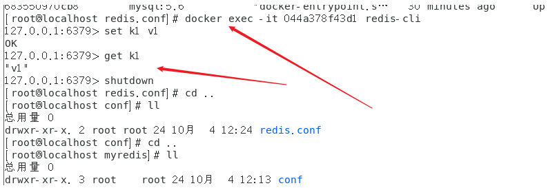

- 查看持久化文件生成：

  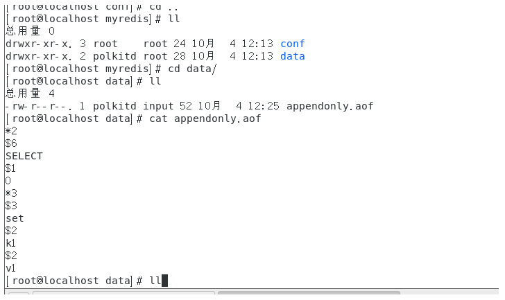

## 推送镜像到阿里云

### 本地镜像发布到阿里云的流程

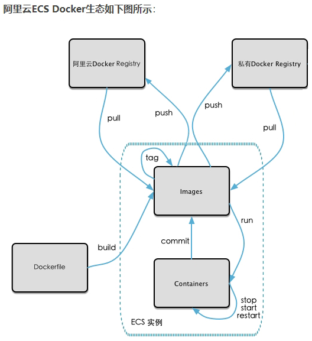

### 本地镜像推送到阿里云

- 本地镜像素材原型：

  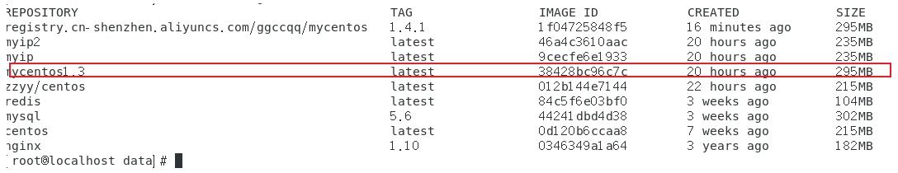

- 升级为 1.4 (按需)：

  ```shell
  $ docker commit [OPTIONS] 容器ID [REPOSITORY[:TAG]]
  ```

  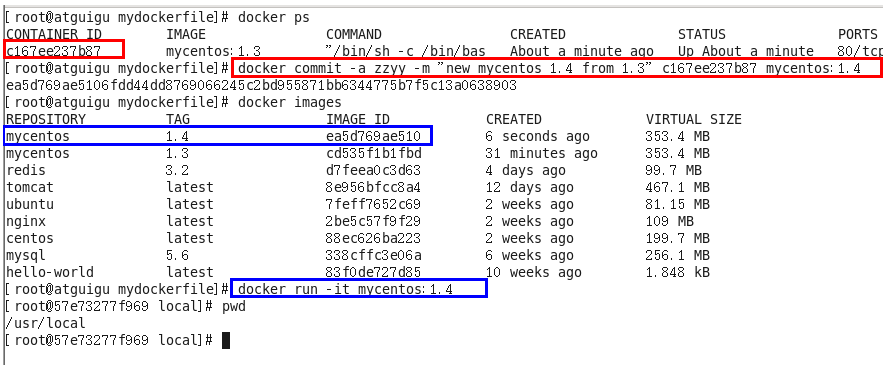

  > -a：提交镜像的作者；-m：提交时的文字说明。

- 阿里云开发者平台：

  https://promotion.aliyun.com/ntms/act/kubernetes.html

  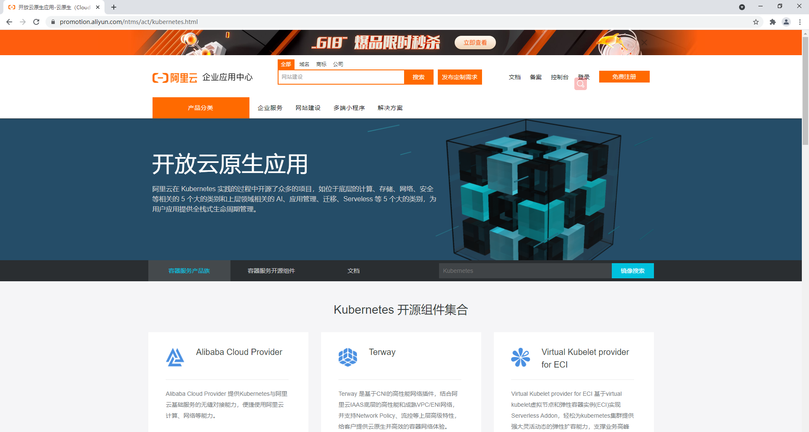

- 创建镜像仓库：

  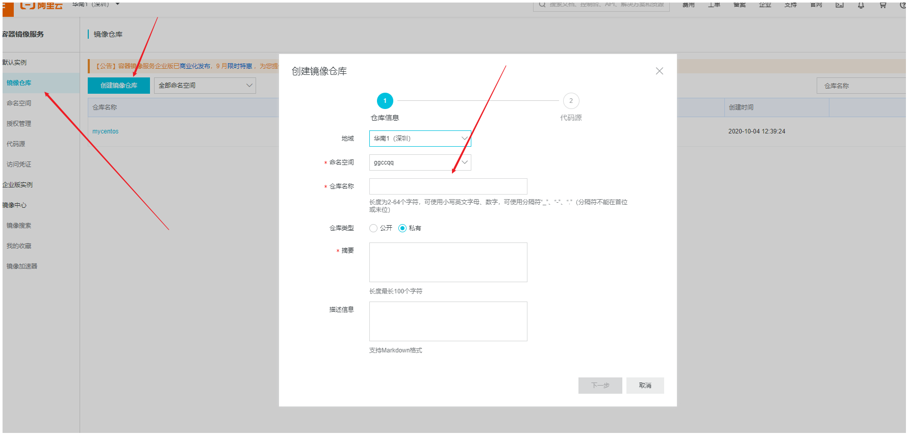

- 将镜像推送到阿里云：

  ```shell
  $ sudo docker login --username= registry.cn-shenzhen.aliyuncs.com
  $ sudo docker tag [ImageId] registry.cn-shenzhen.aliyuncs.com/[命名空间]/[仓库名称]:[镜像版本号]
  $ sudo docker push registry.cn-shenzhen.aliyuncs.com/[命名空间]/[仓库名称]:[镜像版本号]
  ```

  >ImageId 即为要推送的本地镜像。阿里云仓库中的镜像版本号可以与本地镜像 tag 保持一致，也可以不一致。

  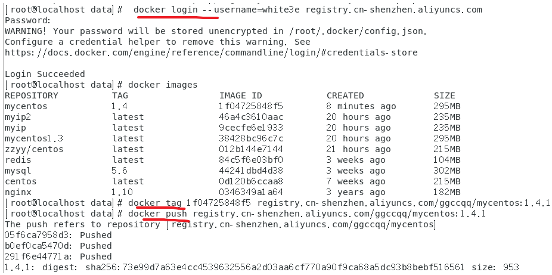

- 查看：

  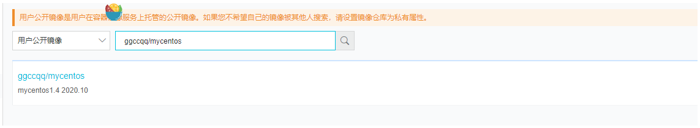

  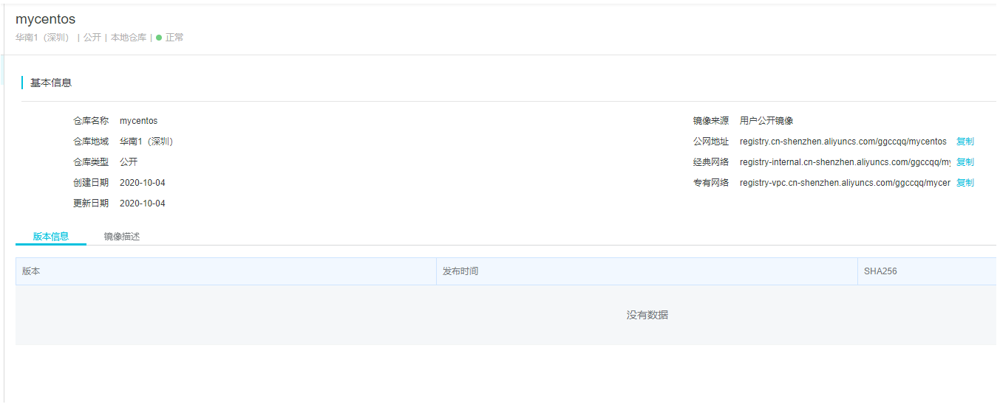

- 下载：

  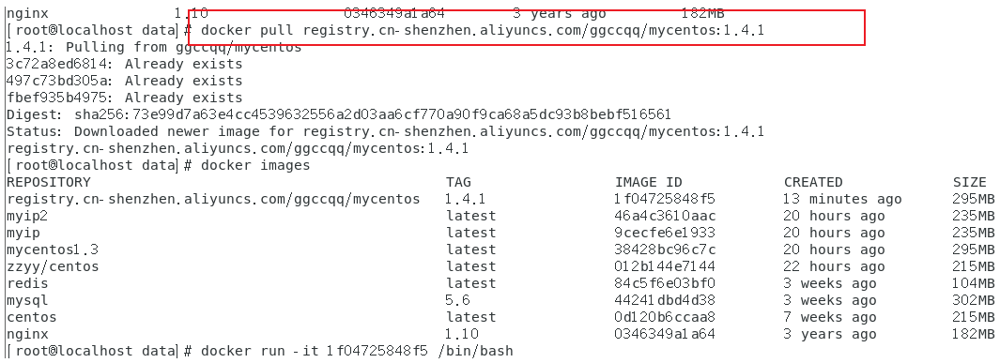

## 本文参考

- https://www.bilibili.com/video/BV1Ls411n7mx


- https://gitee.com/jack-GCQ/brain-map


## 声明

- 写作本文初衷是个人学习记录，鉴于本人学识有限，如有侵权或不当之处，请联系 [wdshfut@163.com](mailto:wdshfut@163.com)。
