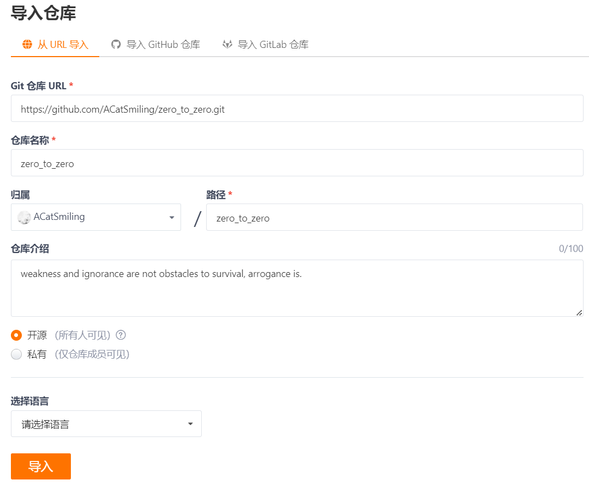
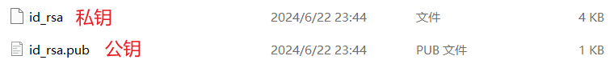
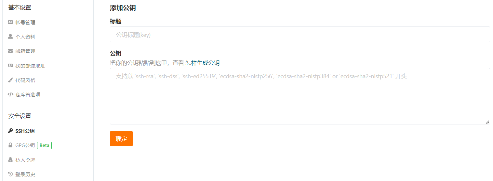
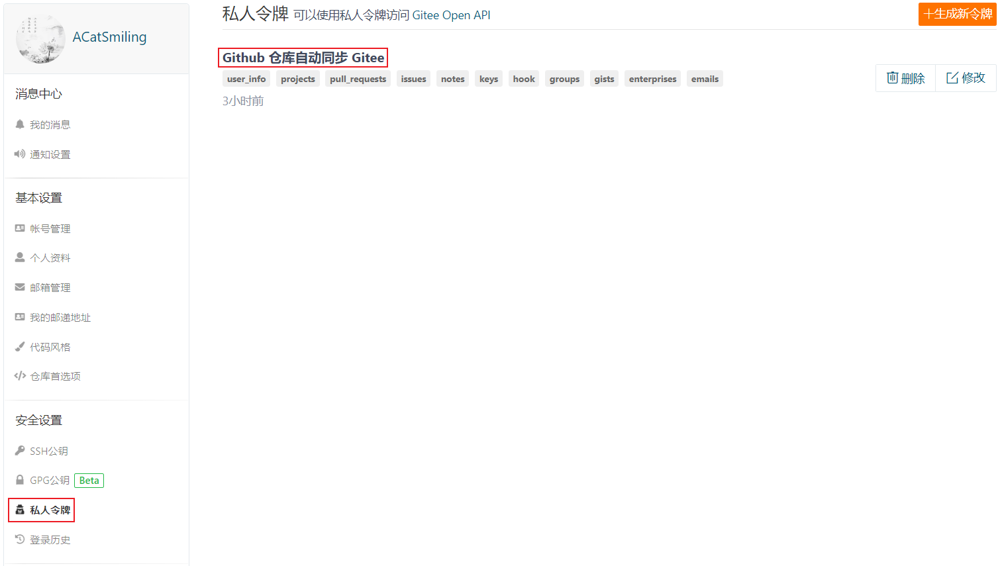
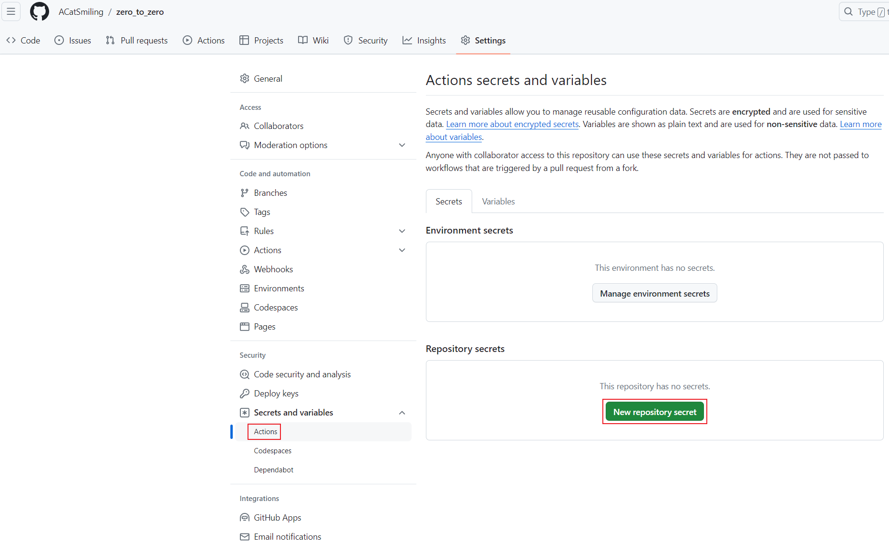
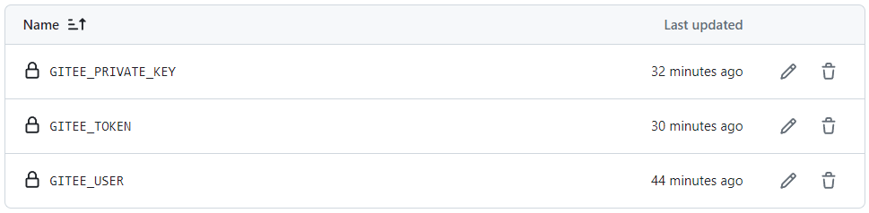
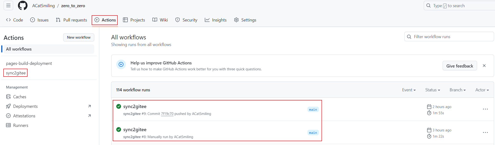

*date: 2022-01-04*


[TOC]

## Git 代码开发的一般流程

1. PM（项目主管/项目经理） 在 Github 创建任务，分配给开发人员；

2. 开发人员领取任务后，在本地使用`git clone <URL>`命令拉取代码库；

3. 开发人员创建开发分支，并进行开发；

4. 开发人员完成代码之后，提交到本地仓库；

5. 开发人员在 Github 界面上申请分支合并请求；

6. PM 在 Github 上查看代码提交和修改情况，确认无误后，将开发人员的分支合并到主分支（master/main）。

7. 开发人员在 Github 上 Mark done 确认开发完成，并关闭 issue。这一步在提交合并请求时，可以通过描述中填写“close #1”等字样，直接关闭 issue。

## Git 常用命令

clone 远程仓库代码到本地：

```shell
$ git clone <URL>
```

拉取远程仓库的代码到本地：`git pull <REMOTENAME> <BRANCHNAME>`。例如：

```shell
# 远程仓库: origin, 分支: master
$ git pull origin master
```

- 不建议使用`git pull`这种模糊的命令。

推送本地代码到远程仓库：`git push <REMOTENAME> <BRANCHNAME>`。例如：

```shell
# 添加待提交的代码到本地库, .表示添加全部, .也可以替换为指定的代码文件或文件夹
$ git add .

# 提交本地库代码, 并附加提交的信息
$ git commit -m "definition message"

# 推送代码到远程仓库: origin, 分支: master
$ git push origin master
```

- 不建议使用`git push`这种模糊的命令。

对于本地删除的文件，使用`git rm`命令，示例如下：

```shell
Administrator@WIN-K11OM3VD9KL MINGW64 /g/Git Projects/zero_to_zero (main)
$ git status
On branch main
Your branch is up to date with 'origin/main'.

Changes not staged for commit:
  (use "git add/rm <file>..." to update what will be committed)
  (use "git restore <file>..." to discard changes in working directory)
        deleted:    JavaBase/java-algorithm-sort.md
        deleted:    JavaBase/java-algorithm-sort/image-20210219163623534.png
        deleted:    JavaBase/java-algorithm-sort/image-20210219164721395.png
        deleted:    JavaBase/java-base.md

Administrator@WIN-K11OM3VD9KL MINGW64 /g/Git Projects/zero_to_zero (main)
$ git rm JavaBase/*
rm 'JavaBase/java-algorithm-sort.md'
rm 'JavaBase/java-algorithm-sort/image-20210219163623534.png'
rm 'JavaBase/java-algorithm-sort/image-20210219164721395.png'
rm 'JavaBase/java-base.md'

Administrator@WIN-K11OM3VD9KL MINGW64 /g/Git Projects/zero_to_zero (main)
$ git status
On branch main
Your branch is up to date with 'origin/main'.

Changes to be committed:
  (use "git restore --staged <file>..." to unstage)
        deleted:    JavaBase/java-algorithm-sort.md
        deleted:    JavaBase/java-algorithm-sort/image-20210219163623534.png
        deleted:    JavaBase/java-algorithm-sort/image-20210219164721395.png
        deleted:    JavaBase/java-base.md

Administrator@WIN-K11OM3VD9KL MINGW64 /g/Git Projects/zero_to_zero (main)
$ git commit -m "删除JavaBase，优化合并"
[main 5ed2508] 删除JavaBase，优化合并
 280 files changed, 22042 deletions(-)
 delete mode 100644 JavaBase/java-algorithm-sort.md
 delete mode 100644 JavaBase/java-algorithm-sort/image-20210219163623534.png
 delete mode 100644 JavaBase/java-algorithm-sort/image-20210219164721395.png
 delete mode 100644 JavaBase/java-base.md
 
Administrator@WIN-K11OM3VD9KL MINGW64 /g/Git Projects/zero_to_zero (main)
$ git push origin main
Enumerating objects: 3, done.
Counting objects: 100% (3/3), done.
Delta compression using up to 12 threads
Compressing objects: 100% (2/2), done.
Writing objects: 100% (2/2), 262 bytes | 262.00 KiB/s, done.
Total 2 (delta 1), reused 0 (delta 0), pack-reused 0
remote: Resolving deltas: 100% (1/1), completed with 1 local object.
To https://github.com/ACatSmiling/zero_to_zero.git
   be352f4..5ed2508  main -> main
```

对于已经 add，但未 commit 的操作，使用`git reset <file>`或`git reset`命令还原，示例如下：

```shell
# 还原所有add操作
Administrator@WIN-K11OM3VD9KL MINGW64 /e/projects/IDEAProjects/XiSun_Java_Projects (main)
$ git reset
```

## Git 提交代码到新分支

第一步：在新代码路径下右键选择打开 Git Bash，并初始化。

```shell
XiSun@DESKTOP-OM8IACS MINGW64 /d/JetBrainsWorkSpace/IDEAProjects/reaction-extractor-assistant
$ git init
Initialized empty Git repository in D:/JetBrainsWorkSpace/IDEAProjects/reaction-extractor-assistant/.git/
```

第二步：添加对应的远程仓库地址。

```shell
# 查看这个本地仓库当前的远程地址
$ git remote -v

# 删除远程地址origin
$ git remote rm origin

# 添加远程地址
$ git remote add origin <URL>
```

第三步：提交代码到本地仓库。

```shell
# add操作
$ git add .

# commit操作
$ git commit -m 'definition message'

# 查看状态
$ git status
```

第四步：本地创建新分支，并切换到该分支上（本地建立完分支，默认是在 master/main 分支上）。

```shell
# 创建develop分支
$ git branch develop

# 查看
$ git branch -a

# 切换到develop分支
$ git checkout develop
```

- git branch 创建新分支时，需要先 commit 本地代码，否则会报错`fatal: Not a valid object name: ‘master’.`。

第五步：提交代码到远程仓库。

```shell
$ git push origin develop
```

- 此处提交的含义是将 develop 这个分支提交到远程仓库上面。如果远程仓库没有这个分支，那么也会新建一个该分支。

- 另外，还有一种方法，可以提交 develop 分支到远程仓库指定的某个分支上。如下，是将 develop 分支提交到远程仓库的 master 上面：

  ```shell
  $ git push origin develop:master
  ```

## Git 拉取远程次分支代码到本地

```shell
# 本地分支
$ git branch
* master

# 远程分支
$ git branch -a
* master
  remotes/origin/HEAD -> origin/master
  remotes/origin/develop
  remotes/origin/master

# 拉取origin/develop到本地
$ git fetch origin develop
From xxx
 * branch            develop    -> FETCH_HEAD

# 本地切换到新分支
$ git checkout develop
Switched to a new branch 'develop'
branch 'develop' set up to track 'origin/develop'.

# 本地分支
$ git branch
* develop
  master
```

> ```bash
> $ git checkout origin/远程分支名
> ```

> 使用 IDEA 开发时，在拉取远程分支代码之前，使用`git fetch`命令，获取远程分支的最新改动，然后再更新远程分支到本地。
>
> 

## Git 修改 master 分支为 main 

因为一些原因，2020年10月1日后，Github 将所有新建的仓库的默认分支从`master`修改为`main`，这种情况下，为了避免麻烦，需要将旧仓库的 master 分支迁移到 main 分支上。

第一步：克隆原仓库到本地。

```shell
$ git clone <URL>
```

第二步：创建并切换到 main。

```shell
$ git checkout -b main
```

第三步：推送到 main。

```shell
$ git push origin main
```

第四步：修改默认分支为 main。


第五步：删除 master。

```shell
# 删除本地master
$ git branch -d master

# 删除远程master
$ git push origin :master
```

示例：

```shell
Administrator@WIN-K11OM3VD9KL MINGW64 /e/projects/IDEAProjects/XiSun_Java_Projects (main)
$ git branch -a
* main
  master
  remotes/origin/main
  remotes/origin/master

Administrator@WIN-K11OM3VD9KL MINGW64 /e/projects/IDEAProjects/XiSun_Java_Projects (main)
$ git branch -d master
Deleted branch master (was d638962).

Administrator@WIN-K11OM3VD9KL MINGW64 /e/projects/IDEAProjects/XiSun_Java_Projects (main)
$ git push origin :master
To https://github.com/ACatSmiling/XiSun_Java_Projects.git
 - [deleted]         master

Administrator@WIN-K11OM3VD9KL MINGW64 /e/projects/IDEAProjects/XiSun_Java_Projects (main)
$ git branch -a
* main
  remotes/origin/main

```


以上，后续修改时，直接推送到 main 分支即可。

## Git 忽略文件

在工程中，并不是所有文件都需要保存到版本库中的，例如 target 目录及目录下的文件就可以忽略。在`Git 工作区的根目录下创建一个特殊的 .gitignore 文件`，然后把要忽略的文件名填进去，Git 就会自动忽略这些文件或目录。

### 忽略规则优先级

在 .gitingore 文件中，每一行指定一个忽略规则，Git 检查忽略规则的时候有多个来源，它的优先级如下（由高到低）：

- 从命令行中读取可用的忽略规则；
- 当前目录定义的规则；
- 父级目录定义的规则，依次递推；
- $GIT_DIR/info/exclude 文件中定义的规则；
- core.excludesfile 中定义的全局规则。

### 忽略规则匹配语法

在 .gitignore 文件中，每一行的忽略规则的语法如下：

- `空格`不匹配任意文件，可作为分隔符，可用反斜杠转义。
- 开头的文件标识注释，可以使用反斜杠进行转义。
- `! 开头`的模式标识否定，该文件将会再次被包含，如果排除了该文件的父级目录，则使用 ! 也不会再次被包含。可以使用反斜杠进行转义。
- `/ 结束`的模式只匹配文件夹以及在该文件夹路径下的内容，但是不匹配该文件。
- `/ 开始`的模式匹配项目跟目录。
- 如果一个模式不包含斜杠，则它匹配相对于当前 .gitignore 文件路径的内容，如果该模式不在 .gitignore 文件中，则相对于项目根目录。
- `**`匹配多级目录，可在开始，中间，结束。
- `?`通用匹配单个字符。
- `*`通用匹配零个或多个字符。
- `[]`通用匹配单个字符列表。

### 常用匹配示例

- `bin/`：忽略当前路径下的 bin 文件夹，该文件夹下的所有内容都会被忽略，不忽略 bin 文件。
- `/bin`：忽略根目录下的 bin 文件。
- `/*.c`：忽略类似 cat.c 文件，不忽略 build/cat.c。
- `debug/*.obj`：忽略类似 debug/io.obj文件，不忽略 debug/common/io.obj 和 tools/debug/io.obj。
- `**/foo`：忽略 /foo、a/foo、a/b/foo 等。
- `a/**/b`：忽略 a/b、a/x/b、a/x/y/b 等。
- `!/bin/run.sh`：不忽略 bin 目录下的 run.sh文件。
- `*.log`：忽略所有 .log 文件。
- `config.php`：忽略当前路径的 config.php 文件。

### .gitignore 规则不生效

.gitignore 只能忽略那些原来没有被 track 的文件，如果某些文件已经被纳入了版本管理中，则修改 .gitignore 是无效的。解决方法就是先把本地缓存删除（改变成未track状态），然后再提交。

```shell
# 删除所有本地缓存
$ git rm -r --cached .
$ git add .
$ git commit -m 'update .gitignore'
```

```shell
# 帮助
$ git ls-files -h

# 查看本地缓存, git ls-files默认执行的命令
$ git ls-files -c

# 删除特定文件的本地缓存
$ git rm -r --cached .gitignore

# 删除特定文件的本地缓存
$ git rm -r --cached platform/src/main/resources/logback-spring.xml
```

## Github 配置

第一步：配置用户名和邮箱地址。

```shell
$ git config --global user.name "ACatSmiling"

$ git config --global user.email "xx123@qq.com"

$ git config --list
user.name=ACatSmiling
user.email=xx123@qq.com
```

第二步：删除 C:\Users\XiSun\\.ssh 文件夹下的 known_hosts。

第三步：在本地生成秘钥。

```shell
$ ssh-keygen -t rsa -C "xx123@qq.com"
Generating public/private rsa key pair.
Enter file in which to save the key (/c/Users/XiSun/.ssh/id_rsa):
Created directory '/c/Users/XiSun/.ssh'.
Enter passphrase (empty for no passphrase):
Enter same passphrase again:
Your identification has been saved in /c/Users/XiSun/.ssh/id_rsa
Your public key has been saved in /c/Users/XiSun/.ssh/id_rsa.pub
...
```

第四步：进入 C:\Users\XiSun\\.ssh 目录，打开 id_rsa.pub 文件，复制自己的公钥，然后登陆 Github，再依次点击 Settings ---> SSH and GPG keys ---> New SSH key，将公钥配置在自己的 Github 上。


> 此步骤可以省略，直接使用 HTTPS 连接下载。

第五步：验证。

```shell
$ ssh -T git@github.com
PTY allocation request failed on channel 0
Hi ACatSmiling! You've successfully authenticated, but GitHub does not provide shell access.
Connection to github.com closed.
```

> 第一次输入时，需要点击 yes。

## Gitee 自动同步 Github 仓库

第一步：在 Gitee 导入 Github 仓库。



第二步：生成 Gitee 公钥，部署公钥，并验证。（如果已有，则跳过）

```shell
# 生成公钥
$ ssh-keygen -t rsa -C "xx123@qq.com"
```





```shell
# 验证公钥
$ ssh -T git@gitee.com
```

第三步：生成 Gitee 私人令牌。



第四步：在要同步的 Github 仓库中，选择 "Setting" ---> "Secrets and variables" ---> "Actions" ---> "New repository secret"，分别创建`GITEE_USER`，`GITEE_PRIVATE_KEY`和`GITEE_TOKEN`。





- GITEE_USER：name 为 GITEE_USER，value 为个人的 Gitee user id，比如 ACatSmiling。
- GITEE_PRIVATE_KEY：name 为 GITEE_PRIVATE_KEY，value 为第二步生成的公钥。
- GITEE_TOKEN：name 为 GITEE_TOKEN，value 为第三步生成的私人令牌。

第五步：在 Github 对应仓库的根目录下，建立目录`.github/workflows` ，然后创建一个名为 sync2gitee.yml 的文件，填入以下内容，并提交到 Github 仓库。

```yaml
# 通过Github actions，在Github仓库的每一次commit后自动同步到Gitee上
name: sync2gitee
on:
  push:
    branches:
      # 需要同步的分支名
      - main
  # workflow_dispatch:
  # watch:
  #   types: started
  # repository_dispatch:
  #   types: manual_sync2gitee
jobs:
  repo-sync:
    env:
      dst_key: ${{ secrets.GITEE_PRIVATE_KEY }}
      dst_token: ${{ secrets.GITEE_TOKEN }}
      gitee_user: ${{ secrets.GITEE_USER }}
    runs-on: ubuntu-latest
    steps:
      - uses: actions/checkout@v2
        with:
          persist-credentials: false

      - name: sync github -> gitee
        uses: Yikun/hub-mirror-action@master
        if: env.dst_key && env.dst_token && env.gitee_user
        with:
          # 必选，需要同步的Github用户（源）
          src: 'github/${{ github.repository_owner }}'
          # 必选，需要同步到的Gitee用户（目的）
          dst: 'gitee/${{ secrets.GITEE_USER }}'
          # 必选，Gitee公钥对应的私钥，https://gitee.com/profile/sshkeys
          dst_key: ${{ secrets.GITEE_PRIVATE_KEY }}
          # 必选，Gitee对应的用于创建仓库的token，https://gitee.com/profile/personal_access_tokens
          dst_token:  ${{ secrets.GITEE_TOKEN }}
          # 如果是组织，指定组织即可，默认为用户user
          # account_type: org
          # 直接取当前项目的仓库名
          static_list: ${{ github.event.repository.name }}
          # 还有黑、白名单，静态名单机制，可以用于更新某些指定库
          # static_list: 'repo_name,repo_name2'
          # black_list: 'repo_name,repo_name2'
          # white_list: 'repo_name,repo_name2'
```

第六步：commit 并 push 到 Github 仓库，本次操作即可自动触发 Action，后续每次 push 到 main 分支的操作，都会自动触发 Action，并同步到 Gitee。



## 异常处理

Git 使用时，有时会出现以下错误：

```bash
error: RPC failed; curl 28 OpenSSL SSL_read: Connection was reset, errno 10054
```

使用如下设置：

```bash
$ git config --global http.sslVerify false
```

## 本文参考

https://blog.csdn.net/weixin_41287260/article/details/89743120

https://www.cnblogs.com/hyhy904/p/11097338.html

https://www.cxyzjd.com/article/qq_23518283/100578030

https://stackoverflow.com/questions/9008309/how-do-i-set-git-ssl-no-verify-for-specific-repos-only

https://gyx8899.gitbook.io/blog/share/syncgithubtogitee

## 声明

写作本文初衷是个人学习记录，鉴于本人学识有限，如有侵权或不当之处，请联系 [wdshfut@163.com](mailto:wdshfut@163.com)。
