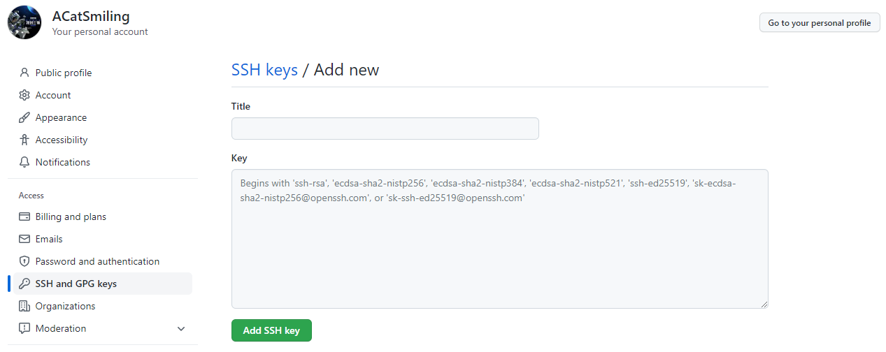
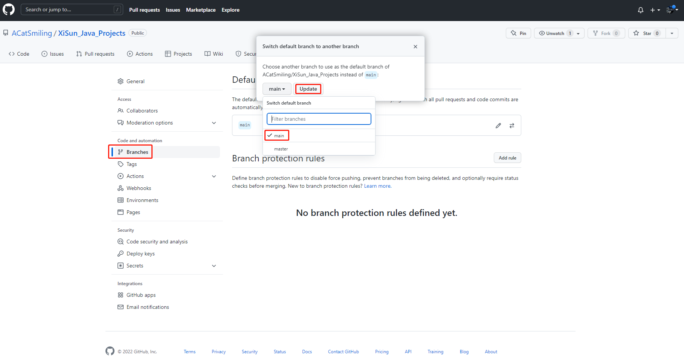
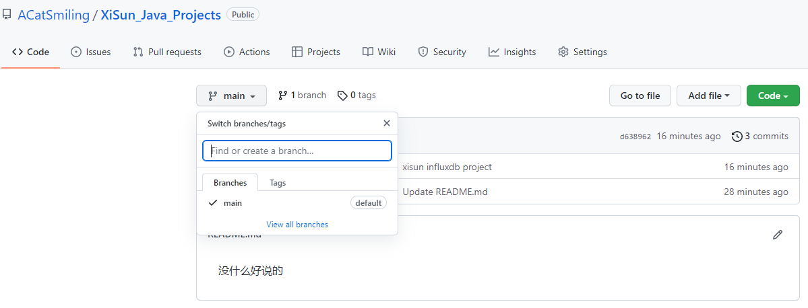

*date: 2022-01-04*

## Github 代码开发的一般流程

1. PM（项目主管/项目经理） 在 Github 创建任务，分配给开发人员；

2. 开发人员领取任务后，在本地使用`git clone <URL>`命令拉取代码库；

3. 开发人员创建开发分支，并进行开发；

4. 开发人员完成代码之后，提交到本地仓库；

5. 开发人员在 Github 界面上申请分支合并请求；

6. PM 在 Github 上查看代码提交和修改情况，确认无误后，将开发人员的分支合并到主分支（master/main）。

7. 开发人员在 Github 上 Mark done 确认开发完成，并关闭 issue。这一步在提交合并请求时，可以通过描述中填写“close #1”等字样，直接关闭 issue。

## Github 配置

第一步，配置用户名和邮箱地址：

```bash
$ git config --global user.name "ACatSmiling"

$ git config --global user.email "1172042509@qq.com"

$ git config --list
user.name=ACatSmiling
user.email=1172042509@qq.com
```

第二步，删除 C:\Users\XiSun\.ssh 文件夹下的 known_hosts。

第三步，在本地生成秘钥：

```bash
$ ssh-keygen -t rsa -C "1172042509@qq.com"
Generating public/private rsa key pair.
Enter file in which to save the key (/c/Users/XiSun/.ssh/id_rsa):
Created directory '/c/Users/XiSun/.ssh'.
Enter passphrase (empty for no passphrase):
Enter same passphrase again:
Your identification has been saved in /c/Users/XiSun/.ssh/id_rsa
Your public key has been saved in /c/Users/XiSun/.ssh/id_rsa.pub
...
```

第四步，进入 C:\Users\XiSun\.ssh 目录，打开 id_rsa.pub 文件，复制自己的公钥，再依次点击 Settings ---> SSH and GPG keys ---> New SSH key，将公钥配置在自己的 Github 上：



第五步，验证：

```bash
$ ssh git@github.com
PTY allocation request failed on channel 0
Hi ACatSmiling! You've successfully authenticated, but GitHub does not provide shell access.
Connection to github.com closed.
```

> 第一次输入时，需要点击 yes。

## Github 常用命令

clone 远程仓库代码到本地：

```bash
$ git clone <URL>
```

拉取远程仓库的代码到本地：`git pull <REMOTENAME> <BRANCHNAME>`。例如：

```bash
# 远程仓库：origin，分支：master
$ git pull origin master
```

- 不建议使用`git pull`这种模糊的命令。

推送本地代码到远程仓库：`git push <REMOTENAME> <BRANCHNAME>`。例如：

```bash
# 添加待提交的代码到本地库，.表示添加全部，.也可以替换为指定的代码文件或文件夹
$ git add .

# 提交本地库代码，并附加提交的信息
$ git commit -m "definition message"

# 推送代码到远程仓库：origin，分支：master
$ git push origin master
```

- 不建议使用`git push`这种模糊的命令。

对于本地删除的文件，使用`git rm`命令，示例如下：

```bash
Administrator@WIN-K11OM3VD9KL MINGW64 /g/Git Projects/zero_to_zero (main)
$ git status
On branch main
Your branch is up to date with 'origin/main'.

Changes not staged for commit:
  (use "git add/rm <file>..." to update what will be committed)
  (use "git restore <file>..." to discard changes in working directory)
        deleted:    JavaBase/java-algorithm-sort.md
        deleted:    JavaBase/java-algorithm-sort/image-20210219163623534.png
        deleted:    JavaBase/java-algorithm-sort/image-20210219164721395.png
        deleted:    JavaBase/java-base.md

Administrator@WIN-K11OM3VD9KL MINGW64 /g/Git Projects/zero_to_zero (main)
$ git rm JavaBase/*
rm 'JavaBase/java-algorithm-sort.md'
rm 'JavaBase/java-algorithm-sort/image-20210219163623534.png'
rm 'JavaBase/java-algorithm-sort/image-20210219164721395.png'
rm 'JavaBase/java-base.md'

Administrator@WIN-K11OM3VD9KL MINGW64 /g/Git Projects/zero_to_zero (main)
$ git status
On branch main
Your branch is up to date with 'origin/main'.

Changes to be committed:
  (use "git restore --staged <file>..." to unstage)
        deleted:    JavaBase/java-algorithm-sort.md
        deleted:    JavaBase/java-algorithm-sort/image-20210219163623534.png
        deleted:    JavaBase/java-algorithm-sort/image-20210219164721395.png
        deleted:    JavaBase/java-base.md

Administrator@WIN-K11OM3VD9KL MINGW64 /g/Git Projects/zero_to_zero (main)
$ git commit -m "删除JavaBase，优化合并"
[main 5ed2508] 删除JavaBase，优化合并
 280 files changed, 22042 deletions(-)
 delete mode 100644 JavaBase/java-algorithm-sort.md
 delete mode 100644 JavaBase/java-algorithm-sort/image-20210219163623534.png
 delete mode 100644 JavaBase/java-algorithm-sort/image-20210219164721395.png
 delete mode 100644 JavaBase/java-base.md
 
Administrator@WIN-K11OM3VD9KL MINGW64 /g/Git Projects/zero_to_zero (main)
$ git push origin main
Enumerating objects: 3, done.
Counting objects: 100% (3/3), done.
Delta compression using up to 12 threads
Compressing objects: 100% (2/2), done.
Writing objects: 100% (2/2), 262 bytes | 262.00 KiB/s, done.
Total 2 (delta 1), reused 0 (delta 0), pack-reused 0
remote: Resolving deltas: 100% (1/1), completed with 1 local object.
To https://github.com/ACatSmiling/zero_to_zero.git
   be352f4..5ed2508  main -> main
```

对于已经 add，但未 commit 的操作，使用`git reset <file>`或`git reset`命令还原，示例如下：

```bash
# 还原所有add操作
Administrator@WIN-K11OM3VD9KL MINGW64 /e/projects/IDEAProjects/XiSun_Java_Projects (main)
$ git reset
```

## Github 提交代码到新分支

第一步：在新代码路径下右键选择打开 Git Bash，并初始化。

```bash
XiSun@DESKTOP-OM8IACS MINGW64 /d/JetBrainsWorkSpace/IDEAProjects/reaction-extractor-assistant
$ git init
Initialized empty Git repository in D:/JetBrainsWorkSpace/IDEAProjects/reaction-extractor-assistant/.git/
```

第二步：添加对应的远程仓库地址。

```bash
# 查看这个本地仓库当前的远程地址
$ git remote -v

# 删除远程地址 origin
$ git remote rm origin

# 添加远程地址
$ git remote add origin <URL>
```

第三步：提交代码到本地仓库。

```bash
# add操作
$ git add .

# commit操作
$ git commit -m 'definition message'

# 查看状态
$ git status
```

第四步：本地创建新分支，并切换到该分支上（本地建立完分支，默认是在 master/main 分支上）。

```bash
# 创建develop分支
$ git branch develop

# 查看
$ git branch -a

# 切换到develop分支
$ git checkout develop
```

- git branch 创建新分支时，需要先 commit 本地代码，否则会报错`fatal: Not a valid object name: ‘master’.`。

第五步：提交代码到远程仓库。

```bash
$ git push origin develop
```

- 此处提交的含义是将 develop 这个分支提交到远程仓库上面。如果远程仓库没有这个分支，那么也会新建一个该分支。

- 另外，还有一种方法，可以提交 develop 分支到远程仓库指定的某个分支上。如下，是将 develop 分支提交到远程仓库的 master 上面：

  ```bash
  $ git push origin develop:master
  ```

## Github 修改 master 分支为 main 

因为一些原因，2020年10月1日后，Github 将所有新建的仓库的默认分支从`master`修改为`main`，这种情况下，为了避免麻烦，需要将旧仓库的 master 分支迁移到 main 分支上。

第一步：克隆原仓库到本地。

```bash
$ git clone <URL>
```

第二步：创建并切换到 main。

```bash
$ git checkout -b main
```

第三步：推送到 main。

```bash
$ git push origin main
```

第四步：修改默认分支为 main。



第五步：删除 master。

```bash
# 删除本地master
$ git branch -d master

# 删除远程master
$ git push origin :master
```

示例：

```bash
Administrator@WIN-K11OM3VD9KL MINGW64 /e/projects/IDEAProjects/XiSun_Java_Projects (main)
$ git branch -a
* main
  master
  remotes/origin/main
  remotes/origin/master

Administrator@WIN-K11OM3VD9KL MINGW64 /e/projects/IDEAProjects/XiSun_Java_Projects (main)
$ git branch -d master
Deleted branch master (was d638962).

Administrator@WIN-K11OM3VD9KL MINGW64 /e/projects/IDEAProjects/XiSun_Java_Projects (main)
$ git push origin :master
To https://github.com/ACatSmiling/XiSun_Java_Projects.git
 - [deleted]         master

Administrator@WIN-K11OM3VD9KL MINGW64 /e/projects/IDEAProjects/XiSun_Java_Projects (main)
$ git branch -a
* main
  remotes/origin/main

```



以上，后续修改时，直接推送到 main 分支即可。

## 本文参考

https://blog.csdn.net/weixin_41287260/article/details/89743120

https://www.cnblogs.com/hyhy904/p/11097338.html

https://www.cxyzjd.com/article/qq_23518283/100578030

## 声明

写作本文初衷是个人学习记录，鉴于本人学识有限，如有侵权或不当之处，请联系 [wdshfut@163.com](mailto:wdshfut@163.com)。
