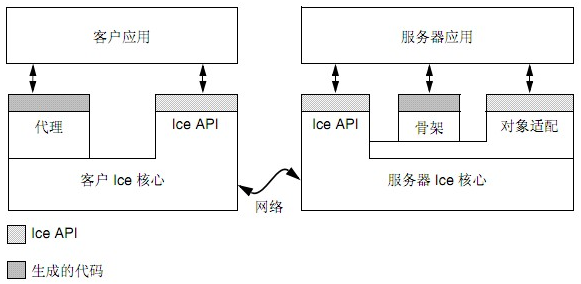
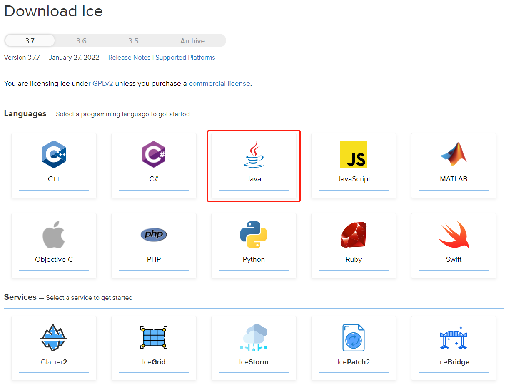
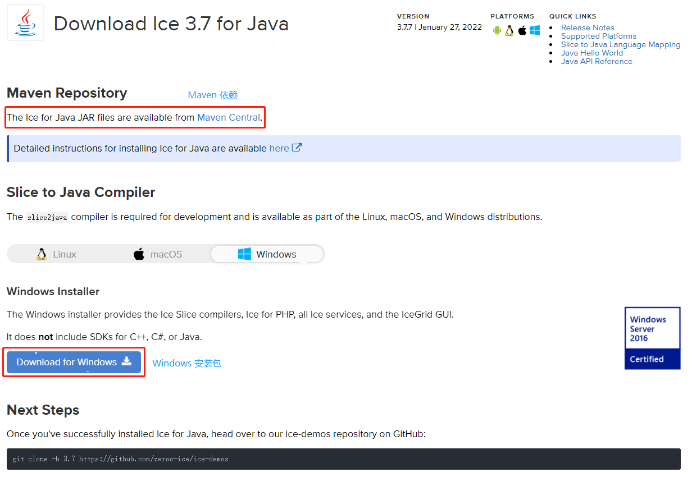
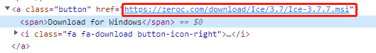
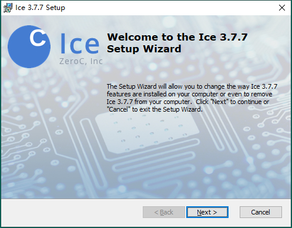
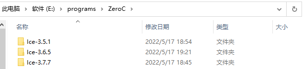
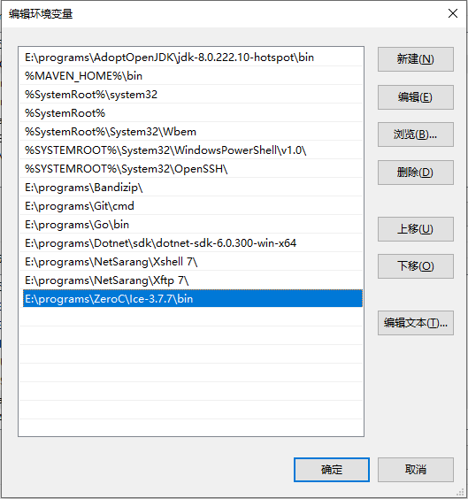
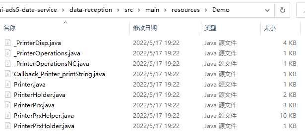
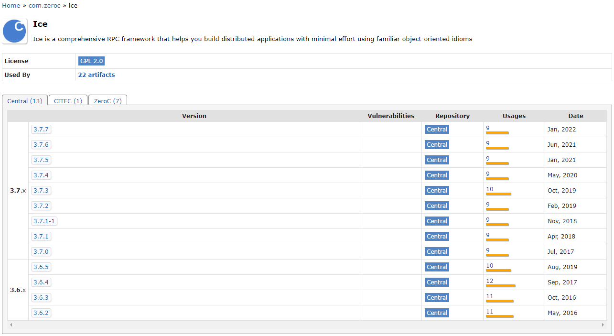

*date: 2022-05-18*

## 概述

Ice 是 ZEROC 的开源通信协议产品，它的全称是：The Internet Communications Engine，翻译为中文是互联网通信引擎，是一个面向对象的中间件，使我们能够以最小的代价构建分布式应用程序。Ice 使我们专注于应用逻辑的开发，它来处理所有底层的网络接口编程，这样我们就不用去考虑这样的细节：打开网络连接、网络数据传输的序列化与反序列化、连接失败的尝试次数等。

Ice 是一种面向对象的中间件平台，这意味着 Ice 为构建面向对象的`客户-服务器`应用提供了工具、API 和库支持。`要与 Ice 持有的对象进行通信，客户端必须持有这个对象的代理 (与 CORBA 的引用是相同的意思)，这里的代理指的是这个对象的实例，Ice 在运行时会定位到这个对象，然后寻找或激活它，再把 In 参数传给远程对象，再通过Out参数获取返回结果。`

这里提到的代理又分为直接代理和间接代理，直接代理其内部保存有某个对象的标识，以及它的服务器的运行地址；间接代理指的是其内部保存有某个对象的标识，以及对象适配器名（object adapter name），间接代理没有包含寻址信息，为了正确地定位服务器，客户端在运行时会使用代理内部的对象适配器名，将其传给某个定位器服务，比如 IcePack 服务，然后，定位器会把适配器名当作关键字，在含有服务器地址的表中进行查找，把当前的服务器地址返回给客户，客户端 run time 现在知道了怎样联系服务器，就会像平常一样分派（dispatch）客户请求。

Ice 可以保证在任何的网络环境或者操作系统下，成功的调用只有一次，它在运行时会尽力的定位到远程服务器，在连接失败的情况下会做尝试性重复性连接，确实连不上的情况会给用户以提示。

客户端在调用服务端的方法时，可以采取同步或异步的方式实现，同步调用就相当于调用自己本地的方法一样，其它行为会被阻塞；异步调用是非常有用的调用方式，如服务端需要准备的数据来自于其它异步接口，这个时候客户端就不需要等待，待服务端数据准备充份后，以消息的方式通知客户端，服务端就可以去干其它的事情了，而客户端也可以到服务端获取数据了。

`Ice 采用的网络协议有 TCP、UDP 以及 SSL 三种`，不同于 WebService，Ice 在调用模式上有好几种选择方案，并且每种方案正对不同的网络协议的特性做了相应的选择。

- `Oneway (单向调用)`：客户端只需将调用注册到本地传输缓冲区（Local Transport Buffers）后就立即返回，不会等待调用结果的返回，不对调用结果负责。
- `Twoway (双向调用)`：最通用的模式，同步方法调用模式，只能用 TCP 或 SSL 协议。
- `Datagram (数据报)`：类似于 Oneway 调用，不同的是 Datagram 调用只能采用 UDP 协议，而且只能调用无返回值和无输出参数的方法。
- `BatchOneway (批量单向调用)`：先将调用存在调用缓冲区里面，到达一定限额后自动批量发送所有请求（也可手动刷除缓冲区）。
- `BatchDatagram (批量数据报)`：与上类似。

- 不同的调用模式其实对应着不动的业务，对于大部分的有返回值的或需要实时响应的方法，我们可能都采用 Twoway 方式调用，对于一些无需返回值或者不依赖返回值的业务，我们可以用 Oneway 或者 BatchOneway 方式，例如消息通知；剩下的 Datagram 和 BatchDatagram 方式，一般用在无返回值且不做可靠性检查的业务上，例如日志。

Ice 的客户与服务器内部的逻辑结构图：



-  这个图示显示了使用 Ice 做为中间件平台，客户端及服务端的应用都是由应用代码及 Ice 的库代码混合组成的。
- 客户应用及服务器应用，分别对应的是客户端与服务端。
- 代理是根据 SLICE 定义的 ice 文件实现，它提供了一个向下调用的接口，提供了数据的序列化与反序化。
- Ice 的核心部份，提供了客户端与服务端的网络连接等核心通信功能，以及其它的网络通信功能的实现及可能的问题的处理，让我们在编写应用代码的时候不必要去关注这一块，而专注于应用功能的实现。

## 安装

官网：https://zeroc.com/

下载：https://zeroc.com/downloads/ice

Github：https://github.com/zeroc-ice/ice

文档：https://doc.zeroc.com/ice/latest/release-notes

要使用ICE，必须先安装ICE，此处以下载安装 3.7.7 版本为例：



> Archive 链接中，提供了更早的 Ice 版本。



- 下载安装包时，直接点击链接无效，可以查看网页源码，找到下载链接，复制之后粘贴到浏览器即可下载：

  

- 此处，给出以下几个版本的下载地址：

  - 3.7.7：https://zeroc.com/download/Ice/3.7/Ice-3.7.7.msi

  - 3.6.5：https://zeroc.com/download/Ice/3.6/Ice-3.6.5.msi

  - 3.5.1：https://zeroc.com/download/Ice/3.5/Ice-3.5.1-6.msi

  - 3.4.1：https://zeroc.com/download/Ice/3.4/Ice-3.4.1.msi

下载好后，点击安装：





安装之后，注意是否添加到 Path 路径：



> bin 目录下是 Ice 的可执行文件，如 slice2java.exe。

查看安装的版本号，如果出现版本号，说明安装成功：

```powershell
Windows PowerShell
版权所有 (C) Microsoft Corporation。保留所有权利。

尝试新的跨平台 PowerShell https://aka.ms/pscore6

PS C:\Users\Administrator> icegridnode --version
3.7.7
PS C:\Users\Administrator> slice2cpp --version
3.7.7
```

## 使用

### 准备工作

准备一个 ice 文件并命名为 Printer.ice，其内容为：

```ice
module Demo {
    interface Printer {
        void printString(string s);
    };
};
```

在文件所在目录下，打开命令行工具，执行命令`slice2java Printer.ice`，然后会生成一个 Demo 文件夹，里面有一些 .java 文件，这些文件需要拷贝到后面的客户端和服务端服务中：



> 此处使用的是 Ice 3.6.5 版本的 slice2java 命令，后续服务端和客户端，也是在 3.6.5 基础上实现，3.7.7版本未作尝试。

### Maven 添加依赖

```xml
<!-- https://mvnrepository.com/artifact/com.zeroc/ice -->
<dependency>
    <groupId>com.zeroc</groupId>
    <artifactId>ice</artifactId>
    <version>3.6.5</version>
</dependency>
```

注意：目前在 Maven 中只提供 3.6.2 以上版本 Ice 依赖，如果需要低于此版本的 Ice 依赖，需要自行查找 jar 包。



### 服务端

```java
/**
 * @author XiSun
 * @version 1.0
 * @date 2022/5/17 17:08
 * @description 处理接收到的数据
 */
public class Printer extends _PrinterDisp {
    @Override
    public void printString(String s, Ice.Current current) {
        System.out.println("接收到的数据：" + s);
    }
}
```

```java
/**
 * @author XiSun
 * @version 1.0
 * @date 2022/5/17 17:12
 * @description 数据接受服务
 */
public class Server {
    public static void main(String[] args) {
        // 初使化连接，args可以传一些初使化参数，如连接超时时间，初使化客户连接池的数量等
        Ice.Communicator ice = Ice.Util.initialize(args);
        Runtime.getRuntime().addShutdownHook(new Thread(ice::destroy));
        // 创建名为SimplePrinterAdapter的适配器，并要求适配器使用缺省的协议(TCP/IP侦听端口为10003的请求)
        Ice.ObjectAdapter adapter = ice.createObjectAdapterWithEndpoints("SimplePrinterAdapter", "default -p 10003");
        // 实例化一个PrinterI对象，为Printer接口创建一个服务对象
        Ice.Object object = new Printer();
        // 将服务单元增加到适配器中，并给服务对象指定名称为SimplePrinter，该名称用于唯一确定一个服务单元
        adapter.add(object, Ice.Util.stringToIdentity("SimplePrinter"));
        // 激活适配器，这样做的好处是可以等到所有资源就位后再触发
        adapter.activate();
        // 让服务在退出之前，一直持续对请求的监听
        ice.waitForShutdown();
    }
}
```

### 客户端

```java
/**
 * @author XiSun
 * @version 1.0
 * @date 2022/5/17 17:12
 * @description 数据发送服务
 */
public class Client {
    public static void main(String[] args) {
        // 初使化
        Ice.Communicator ice = Ice.Util.initialize(args);
        // 传入远程服务单元的名称、网络协议、IP及端口，获取Printer的远程代理，这里使用的stringToProxy方式
        Ice.ObjectPrx base = ice.stringToProxy("SimplePrinter:default -p 10003");
        // 通过checkedCast向下转换，获取Printer接口的远程，并同时检测根据传入的名称获取的服务单元是否Printer的代理接口，如果不是则返回null对象
        PrinterPrx printer = PrinterPrxHelper.checkedCast(base);
        if (printer == null) {
            throw new Error("Invalid proxy");
        }
        // 把Hello World传给服务端，让服务端打印出来，因为这个方法最终会在服务端上执行
        printer.printString("Hello World!");
        // 销毁客户端
        ice.destroy();
    }
}
```

## 本文参考

https://blog.csdn.net/fenglibing/article/details/6372444

## 声明

写作本文初衷是个人学习记录，鉴于本人学识有限，如有侵权或不当之处，请联系 [wdshfut@163.com](mailto:wdshfut@163.com)。